!!! abstract "Tóm tắt"

    Họ Polypodiaceae gồm khoảng 6 chi và 19 loài được một số cộng đồng tại các quốc gia như Mexico, ain, Turkey, Canada(Salish), Venezuela, Elsewhere, Paraguay, China, Colombia, India, Mexico(Mazatec), US, Panama, Egypt, Europe, Salvador sử dụng trong một số trường hợp MYMEMORY WARNING: YOU USED ALL AVAILABLE FREE TRANSLATIONS FOR TODAY. NEXT AVAILABLE IN  13 HOURS 44 MINUTES 43 SECONDS VISIT HTTPS://MYMEMORY.TRANSLATED.NET/DOC/USAGELIMITS.PHP TO TRANSLATE MORE.

!!! info "DrDuke"

    James A. Duke sinh năm 1929-2017 là một nhà thực vật học người Mỹ. Đây là một trong những tác giả hàng đầu trong lĩnh vực dược dân tộc học với cuốn *CRC Handbook of Medicinal Herbs* và chính là người xây dựng lên cơ sở dữ liệu về hợp chất tự nhiên và dược dân tộc học tại Bộ nông nghiệp Hoa Kỳ. Các thông tin được đăng tải tại website [Dr. Duke's Phytochemical and Ethnobotanical Databases](https://phytochem.nal.usda.gov/). 
    Trong suốt thập niên 1970, ông lãnh đạo the Plant Taxonomy Laboratory, Plant Genetics and Germplasm Institute of the Agricultural Research Service, U.S. Department of Agriculture.
    Trong tài liệu này, các thông tin về dược dân tộc của các dược liệu được trích dẫn từ tài liệu của James A. Ducke với sự trợ giúp của phần mềm dịch thuật từ tiếng Anh sang tiếng Việt.
   

# Chi Lemmaphyllum

??? note "Danh sách các dược liệu thuộc chi"
    
	 - *Lemmaphyllum carnosum*

---
## Lemmaphyllum carnosum
### Thông tin về thực vật

!!! info "Phân loại thực vật của *Lepisorus carnosus* từ GIBF:"
    - **Kingdom:** Plantae
    - **Phylum:** Tracheophyta
    - **Order:** Polypodiales
    - **Family:** Polypodiaceae
    - **Genus:** Lepisorus
    - **Species:** *Lepisorus carnosus*

 

| Label (VI)   | Label (EN)   | Scientific Name       | Descriptions (VI)   | Descriptions (EN)   | Also Known As (VI)   | Also Known As (EN)   |
|:-------------|:-------------|:----------------------|:--------------------|:--------------------|:---------------------|:---------------------|
| N/A          | N/A          | Lemmaphyllum carnosum | loài thực vật       | species of plant    | ['']                 | ['']                 |

#### Phân bố trên thế giới

**Từ CSDL GIBF** Sri Lanka, Hong Kong, Viet Nam, Japan, United States of America, Indonesia, Chinese Taipei, Nepal, China, Thailand, Philippines, Myanmar, Micronesia (Federated States of), India, unknown or invalid, France, Lao People’s Democratic Republic

#### Phân bố tại Việt Nam

**Từ CSDL GIBF**: Ha Giang, Kontum, Tuyen Quang, Hoa Binh, Kon Tum, Lam Dong (林同省), Ninh Binh, Ha Tinh

---
### Thành phần hóa học
        
- Theo cơ sở dữ liệu lotus: Từ loài *Lepisorus carnosus* đã phân lập và xác định được Chưa có hoạt chất nào được phân lập. hoạt chất thuộc về các nhóm Không có hoạt chất nào được phân lập. 

Không có hình ảnh nào được tạo ra

---

### Dược dân tộc học

Danh sách các quốc gia có sử dụng *Lepisorus carnosus* trong điều trị các bệnh. 

| Country   | Disease              | Bệnh                                                                                                                                                                                                |
|:----------|:---------------------|:----------------------------------------------------------------------------------------------------------------------------------------------------------------------------------------------------|
| Elsewhere | Astringent, Diuretic | MYMEMORY WARNING: YOU USED ALL AVAILABLE FREE TRANSLATIONS FOR TODAY. NEXT AVAILABLE IN  13 HOURS 44 MINUTES 39 SECONDS VISIT HTTPS://MYMEMORY.TRANSLATED.NET/DOC/USAGELIMITS.PHP TO TRANSLATE MORE |

---

# Chi Drynaria

??? note "Danh sách các dược liệu thuộc chi"
    
	 - *Drynaria fortunei*
	 - *Drynaria quercifolia*

---
## Drynaria fortunei
### Thông tin về thực vật

!!! info "Phân loại thực vật của *Drynaria roosii* từ GIBF:"
    - **Kingdom:** Plantae
    - **Phylum:** Tracheophyta
    - **Order:** Polypodiales
    - **Family:** Polypodiaceae
    - **Genus:** Drynaria
    - **Species:** *Drynaria roosii*

 

| Label (VI)   | Label (EN)   | Scientific Name   | Descriptions (VI)   | Descriptions (EN)   | Also Known As (VI)   | Also Known As (EN)   |
|:-------------|:-------------|:------------------|:--------------------|:--------------------|:---------------------|:---------------------|
| N/A          | N/A          | Drynaria fortunei |                     | species of fern     | ['']                 | ['']                 |

#### Phân bố trên thế giới

**Từ CSDL GIBF** nan, Viet Nam, United States of America, Chinese Taipei, China, Solomon Islands, Germany

#### Phân bố tại Việt Nam

**Từ CSDL GIBF**: Ninh Thuan

---
### Thành phần hóa học
        
- Theo cơ sở dữ liệu lotus: Từ loài *Drynaria roosii* đã phân lập và xác định được Chưa có hoạt chất nào được phân lập. hoạt chất thuộc về các nhóm Không có hoạt chất nào được phân lập. 

Không có hình ảnh nào được tạo ra

---

### Dược dân tộc học

Danh sách các quốc gia có sử dụng *Drynaria roosii* trong điều trị các bệnh. 

| Country   | Disease                | Bệnh                                                                                                                                                                                                |
|:----------|:-----------------------|:----------------------------------------------------------------------------------------------------------------------------------------------------------------------------------------------------|
| China     | Analgesic, Carminative | MYMEMORY WARNING: YOU USED ALL AVAILABLE FREE TRANSLATIONS FOR TODAY. NEXT AVAILABLE IN  13 HOURS 44 MINUTES 13 SECONDS VISIT HTTPS://MYMEMORY.TRANSLATED.NET/DOC/USAGELIMITS.PHP TO TRANSLATE MORE |

---

---
## Drynaria quercifolia
### Thông tin về thực vật

!!! info "Phân loại thực vật của *Drynaria quercifolia* từ GIBF:"
    - **Kingdom:** Plantae
    - **Phylum:** Tracheophyta
    - **Order:** Polypodiales
    - **Family:** Polypodiaceae
    - **Genus:** Drynaria
    - **Species:** *Drynaria quercifolia*

 

| Label (VI)   | Label (EN)   | Scientific Name      | Descriptions (VI)   | Descriptions (EN)   | Also Known As (VI)   | Also Known As (EN)   |
|:-------------|:-------------|:---------------------|:--------------------|:--------------------|:---------------------|:---------------------|
| N/A          | N/A          | Drynaria quercifolia | loài thực vật       | species of plant    | ['']                 | ['']                 |

#### Phân bố trên thế giới

**Từ CSDL GIBF** nan, Viet Nam, Bangladesh, Nepal, China, Thailand, Sri Lanka, United States of America, Indonesia, French Guiana, Lao People’s Democratic Republic, Belgium, Philippines, Malaysia, Brunei Darussalam, Singapore, Cambodia, Timor-Leste, Australia, Myanmar, India

#### Phân bố tại Việt Nam

**Từ CSDL GIBF**: Đồng Nai

---
### Thành phần hóa học
        
- Theo cơ sở dữ liệu lotus: Từ loài *Drynaria quercifolia* đã phân lập và xác định được Chưa có hoạt chất nào được phân lập. hoạt chất thuộc về các nhóm Không có hoạt chất nào được phân lập. 

Không có hình ảnh nào được tạo ra

---

### Dược dân tộc học

Danh sách các quốc gia có sử dụng *Drynaria quercifolia* trong điều trị các bệnh. 

| Country   | Disease         | Bệnh                                                                                                                                                                                                |
|:----------|:----------------|:----------------------------------------------------------------------------------------------------------------------------------------------------------------------------------------------------|
| Egypt     | Tonic           | MYMEMORY WARNING: YOU USED ALL AVAILABLE FREE TRANSLATIONS FOR TODAY. NEXT AVAILABLE IN  13 HOURS 43 MINUTES 41 SECONDS VISIT HTTPS://MYMEMORY.TRANSLATED.NET/DOC/USAGELIMITS.PHP TO TRANSLATE MORE |
| Elsewhere | Astringent, nan | MYMEMORY WARNING: YOU USED ALL AVAILABLE FREE TRANSLATIONS FOR TODAY. NEXT AVAILABLE IN  13 HOURS 43 MINUTES 37 SECONDS VISIT HTTPS://MYMEMORY.TRANSLATED.NET/DOC/USAGELIMITS.PHP TO TRANSLATE MORE |
| India     | Astringent      | MYMEMORY WARNING: YOU USED ALL AVAILABLE FREE TRANSLATIONS FOR TODAY. NEXT AVAILABLE IN  13 HOURS 43 MINUTES 34 SECONDS VISIT HTTPS://MYMEMORY.TRANSLATED.NET/DOC/USAGELIMITS.PHP TO TRANSLATE MORE |

---

# Chi Polypodium

??? note "Danh sách các dược liệu thuộc chi"
    
	 - *Polypodium angustifolium*
	 - *Polypodium attenuatum*
	 - *Polypodium aureum*
	 - *Polypodium barometz*
	 - *Polypodium filix-mas*
	 - *Polypodium fimbriatum*
	 - *Polypodium furfuraceum*
	 - *Polypodium glaucophyllum*
	 - *Polypodium lingua*
	 - *Polypodium maritimum*
	 - *Polypodium phyllitides*
	 - *Polypodium plebejum*
	 - *Polypodium virginianum*
	 - *Polypodium vulgare*

---
## Polypodium angustifolium
### Thông tin về thực vật

!!! info "Phân loại thực vật của *Campyloneurum angustifolium* từ GIBF:"
    - **Kingdom:** Plantae
    - **Phylum:** Tracheophyta
    - **Order:** Polypodiales
    - **Family:** Polypodiaceae
    - **Genus:** Campyloneurum
    - **Species:** *Campyloneurum angustifolium*

 

| Label (VI)   | Label (EN)   | Scientific Name          | Descriptions (VI)   | Descriptions (EN)        | Also Known As (VI)   | Also Known As (EN)   |
|:-------------|:-------------|:-------------------------|:--------------------|:-------------------------|:---------------------|:---------------------|
| N/A          | N/A          | Polypodium angustifolium |                     | species of Equisetopsida | ['']                 | ['']                 |

#### Phân bố trên thế giới

**Từ CSDL GIBF** nan, Brazil, Guatemala, Chile, Honduras, Ecuador, Puerto Rico, United States of America, Costa Rica, Dominican Republic, Colombia, Argentina, Mexico, El Salvador, Belgium, Panama, Nicaragua, Peru, Bolivia (Plurinational State of), Venezuela (Bolivarian Republic of)

#### Phân bố tại Việt Nam

**Từ CSDL GIBF**: Không có ghi nhận ở Việt Nam

---
### Thành phần hóa học
        
- Theo cơ sở dữ liệu lotus: Từ loài *Campyloneurum angustifolium* đã phân lập và xác định được Chưa có hoạt chất nào được phân lập. hoạt chất thuộc về các nhóm Không có hoạt chất nào được phân lập. 

Không có hình ảnh nào được tạo ra

---

### Dược dân tộc học

Danh sách các quốc gia có sử dụng *Campyloneurum angustifolium* trong điều trị các bệnh. 

| Country   | Disease                  | Bệnh                                                                                                                                                                                                |
|:----------|:-------------------------|:----------------------------------------------------------------------------------------------------------------------------------------------------------------------------------------------------|
| Egypt     | Expectorant, Diaphoretic | MYMEMORY WARNING: YOU USED ALL AVAILABLE FREE TRANSLATIONS FOR TODAY. NEXT AVAILABLE IN  13 HOURS 43 MINUTES 03 SECONDS VISIT HTTPS://MYMEMORY.TRANSLATED.NET/DOC/USAGELIMITS.PHP TO TRANSLATE MORE |
| Mexico    | Diaphoretic              | MYMEMORY WARNING: YOU USED ALL AVAILABLE FREE TRANSLATIONS FOR TODAY. NEXT AVAILABLE IN  13 HOURS 43 MINUTES 00 SECONDS VISIT HTTPS://MYMEMORY.TRANSLATED.NET/DOC/USAGELIMITS.PHP TO TRANSLATE MORE |

---

---
## Polypodium attenuatum
### Thông tin về thực vật

!!! info "Phân loại thực vật của *Polypodium attenuatum* từ GIBF:"
    - **Kingdom:** Plantae
    - **Phylum:** Tracheophyta
    - **Order:** Polypodiales
    - **Family:** Polypodiaceae
    - **Genus:** Polypodium
    - **Species:** *Polypodium attenuatum*

 

| Label (VI)   | Label (EN)   | Scientific Name       | Descriptions (VI)   | Descriptions (EN)   | Also Known As (VI)   | Also Known As (EN)   |
|:-------------|:-------------|:----------------------|:--------------------|:--------------------|:---------------------|:---------------------|
| N/A          | N/A          | Polypodium attenuatum | loài thực vật       | species of plant    | ['']                 | ['']                 |

#### Phân bố trên thế giới

**Từ CSDL GIBF** nan, Suriname, Australia, Panama, Bolivia (Plurinational State of)

#### Phân bố tại Việt Nam

**Từ CSDL GIBF**: Không có ghi nhận ở Việt Nam

---
### Thành phần hóa học
        
- Theo cơ sở dữ liệu lotus: Từ loài *Polypodium attenuatum* đã phân lập và xác định được Chưa có hoạt chất nào được phân lập. hoạt chất thuộc về các nhóm Không có hoạt chất nào được phân lập. 

Không có hình ảnh nào được tạo ra

---

### Dược dân tộc học

Danh sách các quốc gia có sử dụng *Polypodium attenuatum* trong điều trị các bệnh. 

| Country   | Disease               | Bệnh                                                                                                                                                                                                |
|:----------|:----------------------|:----------------------------------------------------------------------------------------------------------------------------------------------------------------------------------------------------|
| Venezuela | Diuretic, Refrigerant | MYMEMORY WARNING: YOU USED ALL AVAILABLE FREE TRANSLATIONS FOR TODAY. NEXT AVAILABLE IN  13 HOURS 42 MINUTES 30 SECONDS VISIT HTTPS://MYMEMORY.TRANSLATED.NET/DOC/USAGELIMITS.PHP TO TRANSLATE MORE |

---

---
## Polypodium aureum
### Thông tin về thực vật

!!! info "Phân loại thực vật của *N/A* từ GIBF:"
    - **Kingdom:** Plantae
    - **Phylum:** Tracheophyta
    - **Order:** Polypodiales
    - **Family:** Polypodiaceae
    - **Genus:** N/A
    - **Species:** *N/A*

 

| Label (VI)   | Label (EN)   | Scientific Name   | Descriptions (VI)   | Descriptions (EN)   | Also Known As (VI)   | Also Known As (EN)   |
|:-------------|:-------------|:------------------|:--------------------|:--------------------|:---------------------|:---------------------|
| N/A          | N/A          | Polypodium aureum | loài thực vật       | species of plant    | ['']                 | ['']                 |

#### Phân bố trên thế giới

**Từ CSDL GIBF** Brazil, Japan, Czechia, Sweden, Chile, New Zealand, Ecuador, Spain, United States of America, Russian Federation, Dominican Republic, Colombia, Mexico, United Kingdom of Great Britain and Northern Ireland, Chinese Taipei, Georgia, Luxembourg, Canada, Germany, Austria, Singapore, Portugal, Ukraine, South Africa, Australia, Italy, Peru, France, Ireland

#### Phân bố tại Việt Nam

**Từ CSDL GIBF**: Không có ghi nhận ở Việt Nam

---
### Thành phần hóa học
        
- Theo cơ sở dữ liệu lotus: Từ loài *N/A* đã phân lập và xác định được 10 hoạt chất thuộc về các nhóm Fatty Acyls, Prenol lipids, Steroids and steroid derivatives, Flavonoids. 

|    | chemicalTaxonomyClassyfireClass   |   smiles_count |
|---:|:----------------------------------|---------------:|
|  0 | Fatty Acyls                       |              4 |
|  1 | Flavonoids                        |              1 |
|  2 | Prenol lipids                     |              4 |
|  3 | Steroids and steroid derivatives  |              1 |

#### Nhóm Fatty Acyls
<figure markdown="span">
    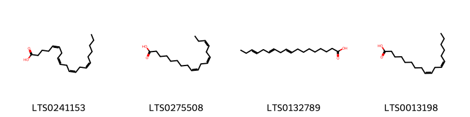{ width=100% }
    <figcaption>Hình ảnh cấu trúc hóa học của 4 hoạt chất thuộc nhóm Fatty Acyls gồm ['arachidonic acid (LTS0241153)', 'α-linolenic acid (LTS0275508)', 'α linolenic acid (LTS0132789)', 'linoleic (LTS0013198)'].</figcaption>
</figure>
#### Nhóm Flavonoids
<figure markdown="span">
    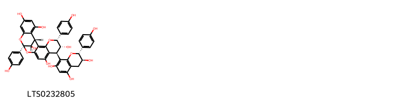{ width=100% }
    <figcaption>Hình ảnh cấu trúc hóa học của 1 hoạt chất thuộc nhóm Flavonoids gồm ['(1r,5r,6r,7s,13r,21s)-5,13-bis(4-hydroxyphenyl)-7-[(2r,3s)-3,5,7-trihydroxy-2-(4-hydroxyphenyl)-3,4-dihydro-2h-1-benzopyran-8-yl]-4,12,14-trioxapentacyclo[11.7.1.0²,¹¹.0³,⁸.0¹⁵,²⁰]henicosa-2,8,10,15,17,19-hexaene-6,9,17,19,21-pentol (LTS0232805)'].</figcaption>
</figure>
#### Nhóm Prenol lipids
<figure markdown="span">
    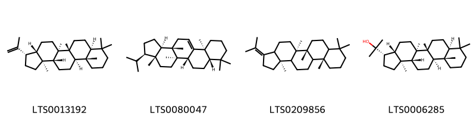{ width=100% }
    <figcaption>Hình ảnh cấu trúc hóa học của 4 hoạt chất thuộc nhóm Prenol lipids gồm ['diploptene (LTS0013192)', 'fernene (LTS0080047)', 'hop-21-ene (LTS0209856)', 'hopan-22-ol (LTS0006285)'].</figcaption>
</figure>
#### Nhóm Steroids and steroid derivatives
<figure markdown="span">
    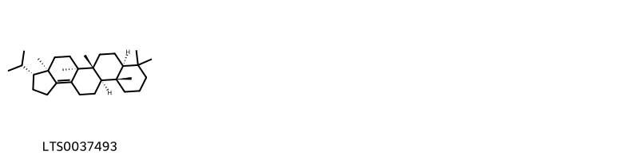{ width=100% }
    <figcaption>Hình ảnh cấu trúc hóa học của 1 hoạt chất thuộc nhóm Steroids and steroid derivatives gồm ['(3r,3ar,5as,5br,7as,11as,11br)-3-isopropyl-3a,5a,5b,8,8,11a-hexamethyl-1h,2h,3h,4h,5h,6h,7h,7ah,9h,10h,11h,11bh,12h,13h-cyclopenta[a]chrysene (LTS0037493)'].</figcaption>
</figure>

---

### Dược dân tộc học

Danh sách các quốc gia có sử dụng *N/A* trong điều trị các bệnh. 

| Country         | Disease   | Bệnh                                                                                                                                                                                                |
|:----------------|:----------|:----------------------------------------------------------------------------------------------------------------------------------------------------------------------------------------------------|
| Mexico          | Sudorific | MYMEMORY WARNING: YOU USED ALL AVAILABLE FREE TRANSLATIONS FOR TODAY. NEXT AVAILABLE IN  13 HOURS 42 MINUTES 02 SECONDS VISIT HTTPS://MYMEMORY.TRANSLATED.NET/DOC/USAGELIMITS.PHP TO TRANSLATE MORE |
| Mexico(Mazatec) | Sudorific | MYMEMORY WARNING: YOU USED ALL AVAILABLE FREE TRANSLATIONS FOR TODAY. NEXT AVAILABLE IN  13 HOURS 41 MINUTES 58 SECONDS VISIT HTTPS://MYMEMORY.TRANSLATED.NET/DOC/USAGELIMITS.PHP TO TRANSLATE MORE |
| Venezuela       | Purgative | MYMEMORY WARNING: YOU USED ALL AVAILABLE FREE TRANSLATIONS FOR TODAY. NEXT AVAILABLE IN  13 HOURS 41 MINUTES 54 SECONDS VISIT HTTPS://MYMEMORY.TRANSLATED.NET/DOC/USAGELIMITS.PHP TO TRANSLATE MORE |

---

---
## Polypodium barometz
### Thông tin về thực vật

!!! info "Phân loại thực vật của *Cibotium barometz* từ GIBF:"
    - **Kingdom:** Plantae
    - **Phylum:** Tracheophyta
    - **Order:** Cyatheales
    - **Family:** Cibotiaceae
    - **Genus:** Cibotium
    - **Species:** *Cibotium barometz*

 

| Label (VI)   | Label (EN)   | Scientific Name     | Descriptions (VI)   | Descriptions (EN)   | Also Known As (VI)   | Also Known As (EN)   |
|:-------------|:-------------|:--------------------|:--------------------|:--------------------|:---------------------|:---------------------|
| N/A          | N/A          | Polypodium barometz | loài thực vật       | species of plant    | ['']                 | ['']                 |

#### Phân bố trên thế giới

**Từ CSDL GIBF** Brazil, Japan, Czechia, Sweden, Chile, New Zealand, Ecuador, Spain, United States of America, Russian Federation, Dominican Republic, Colombia, Mexico, United Kingdom of Great Britain and Northern Ireland, Chinese Taipei, Georgia, Luxembourg, Canada, Germany, Austria, Singapore, Portugal, Ukraine, South Africa, Australia, Italy, Peru, France, Ireland

#### Phân bố tại Việt Nam

**Từ CSDL GIBF**: Không có ghi nhận ở Việt Nam

---
### Thành phần hóa học
        
- Theo cơ sở dữ liệu lotus: Từ loài *Cibotium barometz* đã phân lập và xác định được Chưa có hoạt chất nào được phân lập. hoạt chất thuộc về các nhóm Không có hoạt chất nào được phân lập. 

Không có hình ảnh nào được tạo ra

---

### Dược dân tộc học

Danh sách các quốc gia có sử dụng *Cibotium barometz* trong điều trị các bệnh. 

| Country   | Disease   | Bệnh                                                                                                                                                                                                |
|:----------|:----------|:----------------------------------------------------------------------------------------------------------------------------------------------------------------------------------------------------|
| China     | Tonic     | MYMEMORY WARNING: YOU USED ALL AVAILABLE FREE TRANSLATIONS FOR TODAY. NEXT AVAILABLE IN  13 HOURS 41 MINUTES 19 SECONDS VISIT HTTPS://MYMEMORY.TRANSLATED.NET/DOC/USAGELIMITS.PHP TO TRANSLATE MORE |
| Europe    | Hemostat  | MYMEMORY WARNING: YOU USED ALL AVAILABLE FREE TRANSLATIONS FOR TODAY. NEXT AVAILABLE IN  13 HOURS 41 MINUTES 16 SECONDS VISIT HTTPS://MYMEMORY.TRANSLATED.NET/DOC/USAGELIMITS.PHP TO TRANSLATE MORE |

---

---
## Polypodium filixmas
### Thông tin về thực vật

!!! info "Phân loại thực vật của *Dryopteris filix-mas* từ GIBF:"
    - **Kingdom:** Plantae
    - **Phylum:** Tracheophyta
    - **Order:** Polypodiales
    - **Family:** Dryopteridaceae
    - **Genus:** Dryopteris
    - **Species:** *Dryopteris filix-mas*

 

| Label (VI)   | Label (EN)   | Scientific Name     | Descriptions (VI)   | Descriptions (EN)   | Also Known As (VI)   | Also Known As (EN)   |
|:-------------|:-------------|:--------------------|:--------------------|:--------------------|:---------------------|:---------------------|
| N/A          | N/A          | Polypodium barometz | loài thực vật       | species of plant    | ['']                 | ['']                 |

#### Phân bố trên thế giới

**Từ CSDL GIBF** nan, Austria, France, Spain, Netherlands

#### Phân bố tại Việt Nam

**Từ CSDL GIBF**: Không có ghi nhận ở Việt Nam

---
### Thành phần hóa học
        
- Theo cơ sở dữ liệu lotus: Từ loài *Dryopteris filix-mas* đã phân lập và xác định được Chưa có hoạt chất nào được phân lập. hoạt chất thuộc về các nhóm Không có hoạt chất nào được phân lập. 

Không có hình ảnh nào được tạo ra

---

### Dược dân tộc học

Danh sách các quốc gia có sử dụng *Dryopteris filix-mas* trong điều trị các bệnh. 

| Country   | Disease                          | Bệnh                                                                                                                                                                                                |
|:----------|:---------------------------------|:----------------------------------------------------------------------------------------------------------------------------------------------------------------------------------------------------|
| Mexico    | Abortifacient, Poison, Taenifuge | MYMEMORY WARNING: YOU USED ALL AVAILABLE FREE TRANSLATIONS FOR TODAY. NEXT AVAILABLE IN  13 HOURS 40 MINUTES 54 SECONDS VISIT HTTPS://MYMEMORY.TRANSLATED.NET/DOC/USAGELIMITS.PHP TO TRANSLATE MORE |

---

---
## Polypodium fimbriatum
### Thông tin về thực vật

!!! info "Phân loại thực vật của *Pleopeltis fimbriata* từ GIBF:"
    - **Kingdom:** Plantae
    - **Phylum:** Tracheophyta
    - **Order:** Polypodiales
    - **Family:** Polypodiaceae
    - **Genus:** Pleopeltis
    - **Species:** *Pleopeltis fimbriata*

 

| Label (VI)   | Label (EN)   | Scientific Name       | Descriptions (VI)   | Descriptions (EN)   | Also Known As (VI)   | Also Known As (EN)   |
|:-------------|:-------------|:----------------------|:--------------------|:--------------------|:---------------------|:---------------------|
| N/A          | N/A          | Polypodium fimbriatum | loài thực vật       | species of plant    | ['']                 | ['']                 |

#### Phân bố trên thế giới

**Từ CSDL GIBF** nan, Colombia, United States of America, Ecuador

#### Phân bố tại Việt Nam

**Từ CSDL GIBF**: Không có ghi nhận ở Việt Nam

---
### Thành phần hóa học
        
- Theo cơ sở dữ liệu lotus: Từ loài *Pleopeltis fimbriata* đã phân lập và xác định được Chưa có hoạt chất nào được phân lập. hoạt chất thuộc về các nhóm Không có hoạt chất nào được phân lập. 

Không có hình ảnh nào được tạo ra

---

### Dược dân tộc học

Danh sách các quốc gia có sử dụng *Pleopeltis fimbriata* trong điều trị các bệnh. 

| Country   | Disease               | Bệnh                                                                                                                                                                                                |
|:----------|:----------------------|:----------------------------------------------------------------------------------------------------------------------------------------------------------------------------------------------------|
| Colombia  | Diuretic, Expectorant | MYMEMORY WARNING: YOU USED ALL AVAILABLE FREE TRANSLATIONS FOR TODAY. NEXT AVAILABLE IN  13 HOURS 40 MINUTES 27 SECONDS VISIT HTTPS://MYMEMORY.TRANSLATED.NET/DOC/USAGELIMITS.PHP TO TRANSLATE MORE |

---

---
## Polypodium furfuraceum
### Thông tin về thực vật

!!! info "Phân loại thực vật của *N/A* từ GIBF:"
    - **Kingdom:** Plantae
    - **Phylum:** Tracheophyta
    - **Order:** Polypodiales
    - **Family:** Polypodiaceae
    - **Genus:** N/A
    - **Species:** *N/A*

 

| Label (VI)   | Label (EN)   | Scientific Name        | Descriptions (VI)   | Descriptions (EN)   | Also Known As (VI)   | Also Known As (EN)   |
|:-------------|:-------------|:-----------------------|:--------------------|:--------------------|:---------------------|:---------------------|
| N/A          | N/A          | Polypodium furfuraceum | loài thực vật       | species of plant    | ['']                 | ['']                 |

#### Phân bố trên thế giới

**Từ CSDL GIBF** Brazil, Japan, Czechia, Sweden, Chile, New Zealand, Ecuador, Spain, United States of America, Russian Federation, Dominican Republic, Colombia, Mexico, United Kingdom of Great Britain and Northern Ireland, Chinese Taipei, Georgia, Luxembourg, Canada, Germany, Austria, Singapore, Portugal, Ukraine, South Africa, Australia, Italy, Peru, France, Ireland

#### Phân bố tại Việt Nam

**Từ CSDL GIBF**: Không có ghi nhận ở Việt Nam

---
### Thành phần hóa học
        
- Theo cơ sở dữ liệu lotus: Từ loài *N/A* đã phân lập và xác định được Chưa có hoạt chất nào được phân lập. hoạt chất thuộc về các nhóm Không có hoạt chất nào được phân lập. 

Không có hình ảnh nào được tạo ra

---

### Dược dân tộc học

Danh sách các quốc gia có sử dụng *N/A* trong điều trị các bệnh. 

| Country   | Disease   | Bệnh                                                                                                                                                                                                |
|:----------|:----------|:----------------------------------------------------------------------------------------------------------------------------------------------------------------------------------------------------|
| Salvador  | Analgesic | MYMEMORY WARNING: YOU USED ALL AVAILABLE FREE TRANSLATIONS FOR TODAY. NEXT AVAILABLE IN  13 HOURS 40 MINUTES 04 SECONDS VISIT HTTPS://MYMEMORY.TRANSLATED.NET/DOC/USAGELIMITS.PHP TO TRANSLATE MORE |

---

---
## Polypodium glaucophyllum
### Thông tin về thực vật

!!! info "Phân loại thực vật của *Polypodium glaucophyllum* từ GIBF:"
    - **Kingdom:** Plantae
    - **Phylum:** Tracheophyta
    - **Order:** Polypodiales
    - **Family:** Polypodiaceae
    - **Genus:** Polypodium
    - **Species:** *Polypodium glaucophyllum*

 

| Label (VI)   | Label (EN)   | Scientific Name        | Descriptions (VI)   | Descriptions (EN)   | Also Known As (VI)   | Also Known As (EN)   |
|:-------------|:-------------|:-----------------------|:--------------------|:--------------------|:---------------------|:---------------------|
| N/A          | N/A          | Polypodium furfuraceum | loài thực vật       | species of plant    | ['']                 | ['']                 |

#### Phân bố trên thế giới

**Từ CSDL GIBF** nan, Mexico, Brazil, United States of America, Guadeloupe, Belgium, Martinique, Costa Rica, United Kingdom of Great Britain and Northern Ireland, Colombia, Ecuador, Peru, unknown or invalid, Bolivia (Plurinational State of), Venezuela (Bolivarian Republic of)

#### Phân bố tại Việt Nam

**Từ CSDL GIBF**: Không có ghi nhận ở Việt Nam

---
### Thành phần hóa học
        
- Theo cơ sở dữ liệu lotus: Từ loài *Polypodium glaucophyllum* đã phân lập và xác định được Chưa có hoạt chất nào được phân lập. hoạt chất thuộc về các nhóm Không có hoạt chất nào được phân lập. 

Không có hình ảnh nào được tạo ra

---

### Dược dân tộc học

Danh sách các quốc gia có sử dụng *Polypodium glaucophyllum* trong điều trị các bệnh. 

| Country   | Disease   | Bệnh                                                                                                                                                                                                |
|:----------|:----------|:----------------------------------------------------------------------------------------------------------------------------------------------------------------------------------------------------|
| Venezuela | Sweetener | MYMEMORY WARNING: YOU USED ALL AVAILABLE FREE TRANSLATIONS FOR TODAY. NEXT AVAILABLE IN  13 HOURS 39 MINUTES 38 SECONDS VISIT HTTPS://MYMEMORY.TRANSLATED.NET/DOC/USAGELIMITS.PHP TO TRANSLATE MORE |

---

---
## Polypodium lingua
### Thông tin về thực vật

!!! info "Phân loại thực vật của *N/A* từ GIBF:"
    - **Kingdom:** Plantae
    - **Phylum:** Tracheophyta
    - **Order:** Polypodiales
    - **Family:** Polypodiaceae
    - **Genus:** N/A
    - **Species:** *N/A*

 

| Label (VI)   | Label (EN)   | Scientific Name        | Descriptions (VI)   | Descriptions (EN)   | Also Known As (VI)   | Also Known As (EN)   |
|:-------------|:-------------|:-----------------------|:--------------------|:--------------------|:---------------------|:---------------------|
| N/A          | N/A          | Polypodium furfuraceum | loài thực vật       | species of plant    | ['']                 | ['']                 |

#### Phân bố trên thế giới

**Từ CSDL GIBF** Brazil, Japan, Czechia, Sweden, Chile, New Zealand, Ecuador, Spain, United States of America, Russian Federation, Dominican Republic, Colombia, Mexico, United Kingdom of Great Britain and Northern Ireland, Chinese Taipei, Georgia, Luxembourg, Canada, Germany, Austria, Singapore, Portugal, Ukraine, South Africa, Australia, Italy, Peru, France, Ireland

#### Phân bố tại Việt Nam

**Từ CSDL GIBF**: Không có ghi nhận ở Việt Nam

---
### Thành phần hóa học
        
- Theo cơ sở dữ liệu lotus: Từ loài *N/A* đã phân lập và xác định được Chưa có hoạt chất nào được phân lập. hoạt chất thuộc về các nhóm Không có hoạt chất nào được phân lập. 

Không có hình ảnh nào được tạo ra

---

### Dược dân tộc học

Danh sách các quốc gia có sử dụng *N/A* trong điều trị các bệnh. 

| Country   | Disease                                     | Bệnh                                                                                                                                                                                                |
|:----------|:--------------------------------------------|:----------------------------------------------------------------------------------------------------------------------------------------------------------------------------------------------------|
| China     | Astringent, Diuretic, Diuretic, Refrigerant | MYMEMORY WARNING: YOU USED ALL AVAILABLE FREE TRANSLATIONS FOR TODAY. NEXT AVAILABLE IN  13 HOURS 39 MINUTES 14 SECONDS VISIT HTTPS://MYMEMORY.TRANSLATED.NET/DOC/USAGELIMITS.PHP TO TRANSLATE MORE |

---

---
## Polypodium maritimum
### Thông tin về thực vật

!!! info "Phân loại thực vật của *Serpocaulon maritimum* từ GIBF:"
    - **Kingdom:** Plantae
    - **Phylum:** Tracheophyta
    - **Order:** Polypodiales
    - **Family:** Polypodiaceae
    - **Genus:** Serpocaulon
    - **Species:** *Serpocaulon maritimum*

 

| Label (VI)   | Label (EN)   | Scientific Name      | Descriptions (VI)   | Descriptions (EN)   | Also Known As (VI)   | Also Known As (EN)   |
|:-------------|:-------------|:---------------------|:--------------------|:--------------------|:---------------------|:---------------------|
| N/A          | N/A          | Polypodium maritimum | loài thực vật       | species of plant    | ['']                 | ['']                 |

#### Phân bố trên thế giới

**Từ CSDL GIBF** nan, Nicaragua, Belgium, Costa Rica, Colombia, Ecuador, Peru, unknown or invalid, Panama

#### Phân bố tại Việt Nam

**Từ CSDL GIBF**: Không có ghi nhận ở Việt Nam

---
### Thành phần hóa học
        
- Theo cơ sở dữ liệu lotus: Từ loài *Serpocaulon maritimum* đã phân lập và xác định được Chưa có hoạt chất nào được phân lập. hoạt chất thuộc về các nhóm Không có hoạt chất nào được phân lập. 

Không có hình ảnh nào được tạo ra

---

### Dược dân tộc học

Danh sách các quốc gia có sử dụng *Serpocaulon maritimum* trong điều trị các bệnh. 

| Country   | Disease     | Bệnh                                                                                                                                                                                                |
|:----------|:------------|:----------------------------------------------------------------------------------------------------------------------------------------------------------------------------------------------------|
| Panama    | Diaphoretic | MYMEMORY WARNING: YOU USED ALL AVAILABLE FREE TRANSLATIONS FOR TODAY. NEXT AVAILABLE IN  13 HOURS 38 MINUTES 41 SECONDS VISIT HTTPS://MYMEMORY.TRANSLATED.NET/DOC/USAGELIMITS.PHP TO TRANSLATE MORE |

---

---
## Polypodium phyllitides
### Thông tin về thực vật

!!! info "Phân loại thực vật của *Polypodium phyllitidis* từ GIBF:"
    - **Kingdom:** Plantae
    - **Phylum:** Tracheophyta
    - **Order:** Polypodiales
    - **Family:** Polypodiaceae
    - **Genus:** Polypodium
    - **Species:** *Polypodium phyllitidis*

 

| Label (VI)   | Label (EN)   | Scientific Name      | Descriptions (VI)   | Descriptions (EN)   | Also Known As (VI)   | Also Known As (EN)   |
|:-------------|:-------------|:---------------------|:--------------------|:--------------------|:---------------------|:---------------------|
| N/A          | N/A          | Polypodium maritimum | loài thực vật       | species of plant    | ['']                 | ['']                 |

#### Phân bố trên thế giới

**Từ CSDL GIBF** nan, Brazil, Guatemala, Guadeloupe, Suriname, Ecuador, Puerto Rico, United States of America, Jamaica, Virgin Islands (U.S.), Costa Rica, Dominican Republic, Cuba, Argentina, French Guiana, Grenada, Mexico, Belgium, Panama, Martinique, Paraguay, Peru, Bolivia (Plurinational State of), Guyana, Venezuela (Bolivarian Republic of)

#### Phân bố tại Việt Nam

**Từ CSDL GIBF**: Không có ghi nhận ở Việt Nam

---
### Thành phần hóa học
        
- Theo cơ sở dữ liệu lotus: Từ loài *Polypodium phyllitidis* đã phân lập và xác định được Chưa có hoạt chất nào được phân lập. hoạt chất thuộc về các nhóm Không có hoạt chất nào được phân lập. 

Không có hình ảnh nào được tạo ra

---

### Dược dân tộc học

Danh sách các quốc gia có sử dụng *Polypodium phyllitidis* trong điều trị các bệnh. 

| Country   | Disease       | Bệnh                                                                                                                                                                                                |
|:----------|:--------------|:----------------------------------------------------------------------------------------------------------------------------------------------------------------------------------------------------|
| Paraguay  | Antifertility | MYMEMORY WARNING: YOU USED ALL AVAILABLE FREE TRANSLATIONS FOR TODAY. NEXT AVAILABLE IN  13 HOURS 38 MINUTES 15 SECONDS VISIT HTTPS://MYMEMORY.TRANSLATED.NET/DOC/USAGELIMITS.PHP TO TRANSLATE MORE |

---

---
## Polypodium plebejum
### Thông tin về thực vật

!!! info "Phân loại thực vật của *Pleopeltis plebeia* từ GIBF:"
    - **Kingdom:** Plantae
    - **Phylum:** Tracheophyta
    - **Order:** Polypodiales
    - **Family:** Polypodiaceae
    - **Genus:** Pleopeltis
    - **Species:** *Pleopeltis plebeia*

 

| Label (VI)   | Label (EN)   | Scientific Name     | Descriptions (VI)   | Descriptions (EN)   | Also Known As (VI)   | Also Known As (EN)   |
|:-------------|:-------------|:--------------------|:--------------------|:--------------------|:---------------------|:---------------------|
| N/A          | N/A          | Polypodium plebejum |                     | species of plant    | ['']                 | ['']                 |

#### Phân bố trên thế giới

**Từ CSDL GIBF** Nicaragua, Guatemala, Mexico, El Salvador, Costa Rica

#### Phân bố tại Việt Nam

**Từ CSDL GIBF**: Không có ghi nhận ở Việt Nam

---
### Thành phần hóa học
        
- Theo cơ sở dữ liệu lotus: Từ loài *Pleopeltis plebeia* đã phân lập và xác định được Chưa có hoạt chất nào được phân lập. hoạt chất thuộc về các nhóm Không có hoạt chất nào được phân lập. 

Không có hình ảnh nào được tạo ra

---

### Dược dân tộc học

Danh sách các quốc gia có sử dụng *Pleopeltis plebeia* trong điều trị các bệnh. 

| Country         | Disease                | Bệnh                                                                                                                                                                                                |
|:----------------|:-----------------------|:----------------------------------------------------------------------------------------------------------------------------------------------------------------------------------------------------|
| Mexico(Mazatec) | Purgative, Expectorant | MYMEMORY WARNING: YOU USED ALL AVAILABLE FREE TRANSLATIONS FOR TODAY. NEXT AVAILABLE IN  13 HOURS 37 MINUTES 52 SECONDS VISIT HTTPS://MYMEMORY.TRANSLATED.NET/DOC/USAGELIMITS.PHP TO TRANSLATE MORE |

---

---
## Polypodium virginianum
### Thông tin về thực vật

!!! info "Phân loại thực vật của *Polypodium virginianum* từ GIBF:"
    - **Kingdom:** Plantae
    - **Phylum:** Tracheophyta
    - **Order:** Polypodiales
    - **Family:** Polypodiaceae
    - **Genus:** Polypodium
    - **Species:** *Polypodium virginianum*

 

| Label (VI)   | Label (EN)   | Scientific Name        | Descriptions (VI)   | Descriptions (EN)   | Also Known As (VI)   | Also Known As (EN)   |
|:-------------|:-------------|:-----------------------|:--------------------|:--------------------|:---------------------|:---------------------|
| N/A          | N/A          | Polypodium virginianum |                     | species of plant    | ['']                 | ['']                 |

#### Phân bố trên thế giới

**Từ CSDL GIBF** nan, United States of America, Canada

#### Phân bố tại Việt Nam

**Từ CSDL GIBF**: Không có ghi nhận ở Việt Nam

---
### Thành phần hóa học
        
- Theo cơ sở dữ liệu lotus: Từ loài *Polypodium virginianum* đã phân lập và xác định được 95 hoạt chất thuộc về các nhóm Organic phosphoric acids and derivatives, Flavonoids, Cinnamic acids and derivatives, Steroids and steroid derivatives, Organooxygen compounds, Prenol lipids. 

|    | chemicalTaxonomyClassyfireClass          |   smiles_count |
|---:|:-----------------------------------------|---------------:|
|  0 | Cinnamic acids and derivatives           |              1 |
|  1 | Flavonoids                               |              5 |
|  2 | Organic phosphoric acids and derivatives |              1 |
|  3 | Organooxygen compounds                   |              1 |
|  4 | Prenol lipids                            |             37 |
|  5 | Steroids and steroid derivatives         |             49 |

#### Nhóm Cinnamic acids and derivatives
<figure markdown="span">
    { width=100% }
    <figcaption>Hình ảnh cấu trúc hóa học của 1 hoạt chất thuộc nhóm Cinnamic acids and derivatives gồm ['5-o-caffeoylshikimic acid (LTS0092117)'].</figcaption>
</figure>
#### Nhóm Flavonoids
<figure markdown="span">
    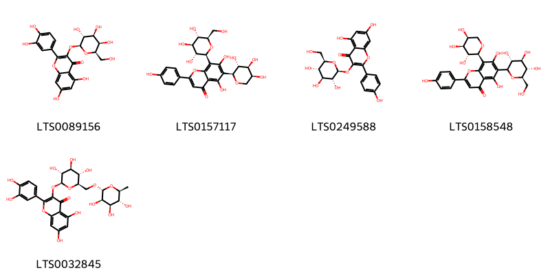{ width=100% }
    <figcaption>Hình ảnh cấu trúc hóa học của 5 hoạt chất thuộc nhóm Flavonoids gồm ['hyperoside (LTS0089156)', 'isoschaftoside (LTS0157117)', 'astragalin (LTS0249588)', '5,7-dihydroxy-2-(4-hydroxyphenyl)-6-[(3r,4r,5s,6r)-3,4,5-trihydroxy-6-(hydroxymethyl)oxan-2-yl]-8-[(2s,3r,4s,5s)-3,4,5-trihydroxyoxan-2-yl]chromen-4-one (LTS0158548)', '3-rutinosyl quercetin (LTS0032845)'].</figcaption>
</figure>
#### Nhóm Organic phosphoric acids and derivatives
<figure markdown="span">
    { width=100% }
    <figcaption>Hình ảnh cấu trúc hóa học của 1 hoạt chất thuộc nhóm Organic phosphoric acids and derivatives gồm ['o-phosphoethanolamine; bis(nonane) (LTS0249963)'].</figcaption>
</figure>
#### Nhóm Organooxygen compounds
<figure markdown="span">
    { width=100% }
    <figcaption>Hình ảnh cấu trúc hóa học của 1 hoạt chất thuộc nhóm Organooxygen compounds gồm ['chlorogenic acid (LTS0226495)'].</figcaption>
</figure>
#### Nhóm Prenol lipids
<figure markdown="span">
    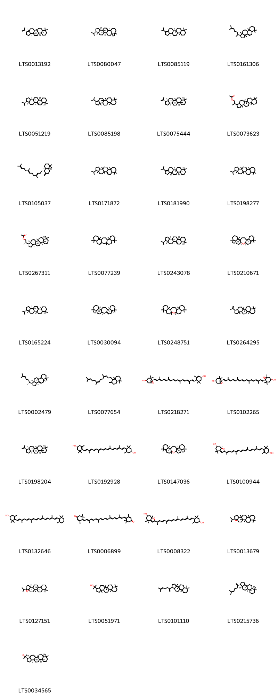{ width=100% }
    <figcaption>Hình ảnh cấu trúc hóa học của 37 hoạt chất thuộc nhóm Prenol lipids gồm ['diploptene (LTS0013192)', 'fernene (LTS0080047)', '(5ar,5br,11as,13br)-3-isopropyl-5a,5b,8,8,11a,13b-hexamethyl-1h,2h,4h,5h,6h,7h,7ah,9h,10h,11h,11bh,12h,13h,13ah-cyclopenta[a]chrysene (LTS0085119)', '3a,6,6,9a,11a-pentamethyl-1-(6-methylhept-5-en-2-yl)-1h,2h,3h,5h,5ah,7h,8h,9h,9bh,10h,11h-cyclopenta[a]phenanthrene (LTS0161306)', '(3r,3ar,5as,7as,11as,11br,13as,13br)-3-isopropyl-3a,5a,8,8,11a,13a-hexamethyl-1h,2h,3h,4h,5h,7h,7ah,9h,10h,11h,11bh,12h,13h,13bh-cyclopenta[a]chrysene (LTS0051219)', '3-isopropyl-5a,5b,8,8,11a,13b-hexamethyl-1h,2h,4h,5h,6h,7h,7ah,9h,10h,11h,11bh,12h,13h,13ah-cyclopenta[a]chrysene (LTS0085198)', '(3s,3ar,5ar,5br,7as,11as,11br,13as,13bs)-5a,5b,8,8,11a,13b-hexamethyl-3-(prop-1-en-2-yl)-hexadecahydrocyclopenta[a]chrysene (LTS0075444)', '2-{5a,5b,8,8,11a,13b-hexamethyl-hexadecahydrocyclopenta[a]chrysen-3-yl}propyl acetate (LTS0073623)', '(4as,5s,8as)-1,1,4a-trimethyl-6-methylidene-5-[(3e,7e)-4,8,12-trimethyltrideca-3,7,11-trien-1-yl]-hexahydro-2h-naphthalene (LTS0105037)', '3-isopropyl-3a,5a,8,8,11a,13a-hexamethyl-1h,2h,3h,4h,5h,7h,7ah,9h,10h,11h,11bh,12h,13h,13bh-cyclopenta[a]chrysene (LTS0171872)', '(5ar,5br,7as,11as,11bs,13as,13br)-3-isopropyl-5a,5b,8,8,11a,13b-hexamethyl-1h,2h,4h,5h,6h,7h,7ah,9h,10h,11h,11bh,12h,13h,13ah-cyclopenta[a]chrysene (LTS0181990)', '3-isopropyl-3a,5a,8,8,11a,13a-hexamethyl-1h,2h,3h,4h,5h,5bh,6h,7h,7ah,9h,10h,11h,13h,13bh-cyclopenta[a]chrysene (LTS0198277)', '(2s)-2-[(3s,3ar,5ar,5br,7as,11as,11br,13as,13bs)-5a,5b,8,8,11a,13b-hexamethyl-hexadecahydrocyclopenta[a]chrysen-3-yl]propyl acetate (LTS0267311)', '1,7,7,11,16,20,20-heptamethylpentacyclo[13.8.0.0³,¹².0⁶,¹¹.0¹⁶,²¹]tricos-3-ene (LTS0077239)', '(3r,3ar,5as,7ar,11as,11br,13as,13bs)-3-isopropyl-3a,5a,8,8,11a,13a-hexamethyl-1h,2h,3h,4h,5h,7h,7ah,9h,10h,11h,11bh,12h,13h,13bh-cyclopenta[a]chrysene (LTS0243078)', '(1r,3r,6s,11s,12r,15s,16s,21s)-1,3,7,7,11,16,20,20-octamethyl-2-oxapentacyclo[13.8.0.0³,¹².0⁶,¹¹.0¹⁶,²¹]tricosane (LTS0210671)', '(3r,3ar,5ar,5br,7ar,11as,13as,13br)-3-isopropyl-3a,5a,8,8,11a,13a-hexamethyl-1h,2h,3h,4h,5h,5bh,6h,7h,7ah,9h,10h,11h,13h,13bh-cyclopenta[a]chrysene (LTS0165224)', '(1s,6r,11s,12r,15s,16s,21s)-1,7,7,11,16,20,20-heptamethylpentacyclo[13.8.0.0³,¹².0⁶,¹¹.0¹⁶,²¹]tricos-3-ene (LTS0030094)', '1,3,7,7,11,16,20,20-octamethyl-2-oxapentacyclo[13.8.0.0³,¹².0⁶,¹¹.0¹⁶,²¹]tricosane (LTS0248751)', '5a,5b,8,8,11a,13b-hexamethyl-3-(prop-1-en-2-yl)-hexadecahydrocyclopenta[a]chrysene (LTS0264295)', '(1r,3as,5as,9as,9br,11as)-3a,6,6,9a,11a-pentamethyl-1-[(2r)-6-methylhept-5-en-2-yl]-1h,2h,3h,5h,5ah,7h,8h,9h,9bh,10h,11h-cyclopenta[a]phenanthrene (LTS0002479)', '1,1,4a-trimethyl-6-methylidene-5-(4,8,12-trimethyltrideca-3,7,11-trien-1-yl)-hexahydro-2h-naphthalene (LTS0077654)', 'taraxanthin (LTS0218271)', 'violaxanthin (LTS0102265)', '(3r,3ar,5ar,5br,7as,11as,11br,13as,13bs)-5a,5b,8,8,11a,13b-hexamethyl-3-(prop-1-en-2-yl)-hexadecahydrocyclopenta[a]chrysene (LTS0198204)', 'zeaxanthin (LTS0192928)', '(1r,3r,6r,11s,12r,15r,16s,21s)-1,3,7,7,11,16,20,20-octamethyl-2-oxapentacyclo[13.8.0.0³,¹².0⁶,¹¹.0¹⁶,²¹]tricosane (LTS0147036)', '(6s,7ar)-2-[(2e,4e,6e,8e,10e,12e,14e,16e)-17-[(4r)-4-hydroxy-2,6,6-trimethylcyclohex-1-en-1-yl]-6,11,15-trimethylheptadeca-2,4,6,8,10,12,14,16-octaen-2-yl]-4,4,7a-trimethyl-2,5,6,7-tetrahydro-1-benzofuran-6-ol (LTS0100944)', 'cryptoxanthin (LTS0132646)', 'rhodoxanthin (LTS0006899)', '2-[(2e,4e,6e,8e,10e,12e,14e,16e)-17-(4-hydroxy-2,6,6-trimethylcyclohex-1-en-1-yl)-6,11,15-trimethylheptadeca-2,4,6,8,10,12,14,16-octaen-2-yl]-4,4,7a-trimethyl-2,5,6,7-tetrahydro-1-benzofuran-6-ol (LTS0008322)', '7-isopropyl-1,2,11,15,19,19-hexamethyl-6-oxahexacyclo[12.8.0.0²,¹¹.0⁵,⁷.0⁵,¹⁰.0¹⁵,²⁰]docosane (LTS0013679)', '(1r,2s,5s,7s,10r,11r,14r,15s,20r)-7-isopropyl-1,2,11,15,19,19-hexamethyl-6-oxahexacyclo[12.8.0.0²,¹¹.0⁵,⁷.0⁵,¹⁰.0¹⁵,²⁰]docosane (LTS0127151)', '2-{5a,5b,8,8,11a,13b-hexamethyl-hexadecahydrocyclopenta[a]chrysen-3-yl}propan-2-ol (LTS0051971)', '3a,3b,6,6,9a-pentamethyl-1-(6-methylhepta-1,5-dien-2-yl)-dodecahydro-1h-cyclopenta[a]phenanthrene (LTS0101110)', 'dammara-20,24-diene (LTS0215736)', '2-[(3r,3as,5ar,5br,7ar,11as,11br,13as,13bs)-5a,5b,8,8,11a,13b-hexamethyl-hexadecahydrocyclopenta[a]chrysen-3-yl]propan-2-ol (LTS0034565)'].</figcaption>
</figure>
#### Nhóm Steroids and steroid derivatives
<figure markdown="span">
    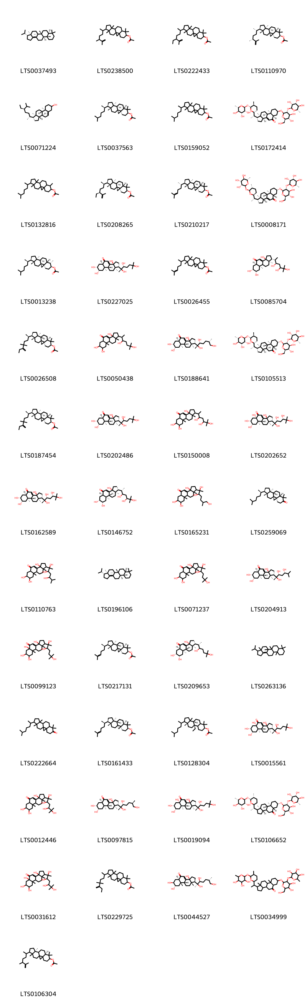{ width=100% }
    <figcaption>Hình ảnh cấu trúc hóa học của 49 hoạt chất thuộc nhóm Steroids and steroid derivatives gồm ['(3r,3ar,5as,5br,7as,11as,11br)-3-isopropyl-3a,5a,5b,8,8,11a-hexamethyl-1h,2h,3h,4h,5h,6h,7h,7ah,9h,10h,11h,11bh,12h,13h-cyclopenta[a]chrysene (LTS0037493)', '15-(5,6-dimethylhept-6-en-2-yl)-7,7,12,16-tetramethylpentacyclo[9.7.0.0¹,³.0³,⁸.0¹²,¹⁶]octadecan-6-yl acetate (LTS0238500)', '15-(5-ethyl-6-methylhept-6-en-2-yl)-7,7,12,16-tetramethylpentacyclo[9.7.0.0¹,³.0³,⁸.0¹²,¹⁶]octadecan-6-yl acetate (LTS0222433)', '(1s,3r,6s,8s,11r,12s,15r,16r)-15-[(2s,5r)-5,6-dimethylhept-6-en-2-yl]-7,7,12,16-tetramethylpentacyclo[9.7.0.0¹,³.0³,⁸.0¹²,¹⁶]octadecan-6-yl acetate (LTS0110970)', 'stigmast-5-en-3-ol (LTS0071224)', '(1s,3r,6s,8s,11r,12s,15r,16r)-7,7,12,16-tetramethyl-15-[(2r)-6-methylheptan-2-yl]pentacyclo[9.7.0.0¹,³.0³,⁸.0¹²,¹⁶]octadecan-6-yl acetate (LTS0037563)', '7,7,12,16-tetramethyl-15-(6-methylheptan-2-yl)pentacyclo[9.7.0.0¹,³.0³,⁸.0¹²,¹⁶]octadecan-6-yl acetate (LTS0159052)', '(1r,3as,5ar,7r,9ar,9bs,11ar)-7-{[(2r,3r,4s,5s,6r)-4,5-dihydroxy-6-(hydroxymethyl)-3-{[(2s,3r,4r,5r,6s)-3,4,5-trihydroxy-6-methyloxan-2-yl]oxy}oxan-2-yl]oxy}-9a,11a-dimethyl-1-[(1s)-1-[(2r,5s,6r)-5-methyl-6-{[(2s,3r,4r,5r,6s)-3,4,5-trihydroxy-6-methyloxan-2-yl]oxy}oxan-2-yl]ethyl]-1h,2h,3h,3ah,5ah,6h,7h,8h,9h,9bh,10h,11h-cyclopenta[a]phenanthren-5-one (LTS0172414)', '7,12,16-trimethyl-15-(6-methylheptan-2-yl)pentacyclo[9.7.0.0¹,³.0³,⁸.0¹²,¹⁶]octadecan-6-yl acetate (LTS0132816)', '(1s,3r,6s,8s,11r,12s,15r,16r)-15-[(2r,5s)-5-ethyl-6-methylhept-6-en-2-yl]-7,7,12,16-tetramethylpentacyclo[9.7.0.0¹,³.0³,⁸.0¹²,¹⁶]octadecan-6-yl acetate (LTS0208265)', '(1s,3r,6s,8s,11r,12s,15r,16r)-7,7,12,16-tetramethyl-15-[(2s)-6-methylhept-5-en-2-yl]pentacyclo[9.7.0.0¹,³.0³,⁸.0¹²,¹⁶]octadecan-6-yl acetate (LTS0210217)', '(1r,3ar,5as,7s,9ar,9br,11ar)-7-{[(2r,3r,4s,5s,6r)-4,5-dihydroxy-6-(hydroxymethyl)-3-{[(2s,3r,4r,5r,6s)-3,4,5-trihydroxy-6-methyloxan-2-yl]oxy}oxan-2-yl]oxy}-9a,11a-dimethyl-1-[(1s)-1-[(2s,5r,6s)-5-methyl-6-{[(2s,3r,4r,5r,6s)-3,4,5-trihydroxy-6-methyloxan-2-yl]oxy}oxan-2-yl]ethyl]-1h,2h,3h,3ah,5ah,6h,7h,8h,9h,9bh,10h,11h-cyclopenta[a]phenanthren-5-one (LTS0008171)', '(1s,3r,6s,7s,8r,11r,12s,15r,16r)-7,12,16-trimethyl-15-[(2r)-6-methylheptan-2-yl]pentacyclo[9.7.0.0¹,³.0³,⁸.0¹²,¹⁶]octadecan-6-yl acetate (LTS0013238)', '20-hydroxyecdysone (LTS0227025)', '7,7,12,16-tetramethyl-15-(6-methylhept-5-en-2-yl)pentacyclo[9.7.0.0¹,³.0³,⁸.0¹²,¹⁶]octadecan-6-yl acetate (LTS0026455)', '(1r,3as,5ar,7r,8s,9ar,11ar)-3a,7,8-trihydroxy-9a,11a-dimethyl-1-[(3r)-3,5,6-trihydroxy-6-methylheptan-2-yl]-1h,2h,3h,5ah,6h,7h,8h,9h,9bh,10h,11h-cyclopenta[a]phenanthren-5-one (LTS0085704)', '(1s,3r,6s,8r,11s,12s,15r,16r)-15-[(2r)-5,5-dimethyl-6-methylideneoctan-2-yl]-7,7,12,16-tetramethylpentacyclo[9.7.0.0¹,³.0³,⁸.0¹²,¹⁶]octadecan-6-yl acetate (LTS0026508)', '1-(3,6-dihydroxy-6-methylheptan-2-yl)-3a,7,8-trihydroxy-9a,11a-dimethyl-1h,2h,3h,5ah,6h,7h,8h,9h,9bh,10h,11h-cyclopenta[a]phenanthren-5-one (LTS0050438)', '(1s,3as,5ar,7r,8s,9ar,9br,11ar)-3a,7,8-trihydroxy-9a,11a-dimethyl-1-[(2r,3r,6s)-2,3,7-trihydroxy-6-methylheptan-2-yl]-1h,2h,3h,5ah,6h,7h,8h,9h,9bh,10h,11h-cyclopenta[a]phenanthren-5-one (LTS0188641)', '(1r,3as,3bs,5as,7s,9ar,9bs,11as)-7-{[(2r,3r,4s,5s,6r)-4,5-dihydroxy-6-(hydroxymethyl)-3-{[(2s,3r,4r,5r,6s)-3,4,5-trihydroxy-6-methyloxan-2-yl]oxy}oxan-2-yl]oxy}-9a,11a-dimethyl-1-[(1s)-1-[(2r,5s,6r)-5-methyl-6-{[(2s,3r,4r,5r,6s)-3,4,5-trihydroxy-6-methyloxan-2-yl]oxy}oxan-2-yl]ethyl]-tetradecahydrocyclopenta[a]phenanthren-5-one (LTS0105513)', '(1s,3r,6s,8s,11r,12s,15r,16r)-15-[(2r)-5,5-dimethyl-6-methylideneoctan-2-yl]-7,7,12,16-tetramethylpentacyclo[9.7.0.0¹,³.0³,⁸.0¹²,¹⁶]octadecan-6-yl acetate (LTS0187454)', '(1s,3as,5ar,7r,8s,9ar,9br,11ar)-3a,7,8-trihydroxy-9a,11a-dimethyl-1-[(2r,3s)-2,3,6-trihydroxy-6-methylheptan-2-yl]-1h,2h,3h,5ah,6h,7h,8h,9h,9bh,10h,11h-cyclopenta[a]phenanthren-5-one (LTS0202486)', '3a,7,8-trihydroxy-9a,11a-dimethyl-1-(3,5,6-trihydroxy-6-methylheptan-2-yl)-1h,2h,3h,5ah,6h,7h,8h,9h,9bh,10h,11h-cyclopenta[a]phenanthren-5-one (LTS0150008)', '(1s,3as,5as,7r,8s,9ar,9br,11ar)-3a,5a,7,8-tetrahydroxy-9a,11a-dimethyl-1-[(2r,3r,5s)-2,3,5,6-tetrahydroxy-6-methylheptan-2-yl]-1h,2h,3h,6h,7h,8h,9h,9bh,10h,11h-cyclopenta[a]phenanthren-5-one (LTS0202652)', '(1s,3as,5ar,7r,8s,9ar,9br,11ar)-3a,7,8-trihydroxy-9a,11a-dimethyl-1-[(2r,3r,5s)-2,3,5,6-tetrahydroxy-6-methylheptan-2-yl]-1h,2h,3h,5ah,6h,7h,8h,9h,9bh,10h,11h-cyclopenta[a]phenanthren-5-one (LTS0162589)', '(1r,3as,5ar,7r,8s,9ar,9br,11ar)-3a,7,8-trihydroxy-9a,11a-dimethyl-1-[(2s,3r,5s)-3,5,6-trihydroxy-6-methylheptan-2-yl]-1h,2h,3h,5ah,6h,7h,8h,9h,9bh,10h,11h-cyclopenta[a]phenanthren-5-one (LTS0146752)', '3a,7,8-trihydroxy-9a,11a-dimethyl-1-(2,3,7-trihydroxy-6-methylheptan-2-yl)-1h,2h,3h,5ah,6h,7h,8h,9h,9bh,10h,11h-cyclopenta[a]phenanthren-5-one (LTS0165231)', '(1s,3r,8s,11s,12s,15r,16r)-7,7,12,16-tetramethyl-15-[(2r)-6-methylheptan-2-yl]pentacyclo[9.7.0.0¹,³.0³,⁸.0¹²,¹⁶]octadecan-6-one (LTS0259069)', '3a,7,8-trihydroxy-9a,11a-dimethyl-1-(2,3,5-trihydroxy-6-methylheptan-2-yl)-1h,2h,3h,5ah,6h,7h,8h,9h,9bh,10h,11h-cyclopenta[a]phenanthren-5-one (LTS0110763)', '(3r,3ar,5as,5br,7ar,11as,11br)-3-isopropyl-3a,5a,5b,8,8,11a-hexamethyl-1h,2h,3h,4h,5h,6h,7h,7ah,9h,10h,11h,11bh,12h,13h-cyclopenta[a]chrysene (LTS0196106)', '3a,7,8-trihydroxy-9a,11a-dimethyl-1-(2,3,6-trihydroxy-6-methylheptan-2-yl)-1h,2h,3h,5ah,6h,7h,8h,9h,9bh,10h,11h-cyclopenta[a]phenanthren-5-one (LTS0071237)', 'pterosterone (LTS0204913)', '3a,5a,7,8-tetrahydroxy-9a,11a-dimethyl-1-(2,3,6-trihydroxy-6-methylheptan-2-yl)-1h,2h,3h,6h,7h,8h,9h,9bh,10h,11h-cyclopenta[a]phenanthren-5-one (LTS0099123)', '(1s,3r,6s,8r,11s,12s,15r,16r)-7,7,12,16-tetramethyl-15-[(2r)-6-methylhept-5-en-2-yl]pentacyclo[9.7.0.0¹,³.0³,⁸.0¹²,¹⁶]octadecan-6-yl acetate (LTS0217131)', 'ecdysone (LTS0209653)', '3-isopropyl-3a,5a,5b,8,8,11a-hexamethyl-1h,2h,3h,4h,5h,6h,7h,7ah,9h,10h,11h,11bh,12h,13h-cyclopenta[a]chrysene (LTS0263136)', '7,7,12,16-tetramethyl-15-(6-methylheptan-2-yl)pentacyclo[9.7.0.0¹,³.0³,⁸.0¹²,¹⁶]octadecan-6-one (LTS0222664)', '(1r,3r,6s,8r,11s,12s,15r,16r)-7,7,12,16-tetramethyl-15-[(2r)-6-methylhept-5-en-2-yl]pentacyclo[9.7.0.0¹,³.0³,⁸.0¹²,¹⁶]octadecan-6-yl acetate (LTS0161433)', '(3br,7s,9bs,11ar)-9b-ethyl-3a,6,6,11a-tetramethyl-1-(6-methylheptan-2-yl)-dodecahydro-1h-cyclopenta[a]phenanthren-7-yl acetate (LTS0128304)', '(1s,3as,5as,7r,8s,9ar,9br,11ar)-3a,5a,7,8-tetrahydroxy-9a,11a-dimethyl-1-[(2r,3s)-2,3,6-trihydroxy-6-methylheptan-2-yl]-1h,2h,3h,6h,7h,8h,9h,9bh,10h,11h-cyclopenta[a]phenanthren-5-one (LTS0015561)', '3a,7,8-trihydroxy-9a,11a-dimethyl-1-(2,3,5,6-tetrahydroxy-6-methylheptan-2-yl)-1h,2h,3h,5ah,6h,7h,8h,9h,9bh,10h,11h-cyclopenta[a]phenanthren-5-one (LTS0012446)', 'inokosterone (LTS0097815)', 'polypodine b (LTS0019094)', '(3as,5as,7s,9ar,9bs,11as)-7-{[(2r,3r,4s,5s,6r)-4,5-dihydroxy-6-(hydroxymethyl)-3-{[(2s,3r,4r,5r,6s)-3,4,5-trihydroxy-6-methyloxan-2-yl]oxy}oxan-2-yl]oxy}-9a,11a-dimethyl-1-[(1s)-1-[(5r,6r)-5-methyl-6-{[(2s,3r,4r,5r,6s)-3,4,5-trihydroxy-6-methyloxan-2-yl]oxy}oxan-2-yl]ethyl]-tetradecahydrocyclopenta[a]phenanthren-5-one (LTS0106652)', '3a,5a,7,8-tetrahydroxy-9a,11a-dimethyl-1-(2,3,5,6-tetrahydroxy-6-methylheptan-2-yl)-1h,2h,3h,6h,7h,8h,9h,9bh,10h,11h-cyclopenta[a]phenanthren-5-one (LTS0031612)', '15-(5,5-dimethyl-6-methylideneoctan-2-yl)-7,7,12,16-tetramethylpentacyclo[9.7.0.0¹,³.0³,⁸.0¹²,¹⁶]octadecan-6-yl acetate (LTS0229725)', '(1r,3as,5ar,7s,8s,9as,9br,11as)-3a,7,8-trihydroxy-9a,11a-dimethyl-1-[(2s,3s,6s)-2,3,7-trihydroxy-6-methylheptan-2-yl]-1h,2h,3h,5ah,6h,7h,8h,9h,9bh,10h,11h-cyclopenta[a]phenanthren-5-one (LTS0044527)', 'osladin (LTS0034999)', '(8r,12s)-15-(5,6-dimethylhept-6-en-2-yl)-7,7,12,16-tetramethylpentacyclo[9.7.0.0¹,³.0³,⁸.0¹²,¹⁶]octadecan-6-yl acetate (LTS0106304)'].</figcaption>
</figure>

---

### Dược dân tộc học

Danh sách các quốc gia có sử dụng *Polypodium virginianum* trong điều trị các bệnh. 

| Country   | Disease   | Bệnh                                                                                                                                                                                                |
|:----------|:----------|:----------------------------------------------------------------------------------------------------------------------------------------------------------------------------------------------------|
| US        | Purgative | MYMEMORY WARNING: YOU USED ALL AVAILABLE FREE TRANSLATIONS FOR TODAY. NEXT AVAILABLE IN  13 HOURS 37 MINUTES 25 SECONDS VISIT HTTPS://MYMEMORY.TRANSLATED.NET/DOC/USAGELIMITS.PHP TO TRANSLATE MORE |

---

---
## Polypodium vulgare
### Thông tin về thực vật

!!! info "Phân loại thực vật của *Polypodium vulgare* từ GIBF:"
    - **Kingdom:** Plantae
    - **Phylum:** Tracheophyta
    - **Order:** Polypodiales
    - **Family:** Polypodiaceae
    - **Genus:** Polypodium
    - **Species:** *Polypodium vulgare*

 

| Label (VI)   | Label (EN)   | Scientific Name    | Descriptions (VI)   | Descriptions (EN)   | Also Known As (VI)   | Also Known As (EN)   |
|:-------------|:-------------|:-------------------|:--------------------|:--------------------|:---------------------|:---------------------|
| N/A          | N/A          | Polypodium vulgare | loài thực vật       | species of plant    | ['']                 | ['Polypody fern']    |

#### Phân bố trên thế giới

**Từ CSDL GIBF** nan, Czechia, Sweden, Finland, New Zealand, Slovenia, Spain, Poland, Denmark, Netherlands, Romania, Russian Federation, Croatia, Lithuania, Norway, United Kingdom of Great Britain and Northern Ireland, Luxembourg, Germany, Austria, Hungary, Portugal, Latvia, Ukraine, Slovakia, Italy, Switzerland, France, Ireland

#### Phân bố tại Việt Nam

**Từ CSDL GIBF**: Không có ghi nhận ở Việt Nam

---
### Thành phần hóa học
        
- Theo cơ sở dữ liệu lotus: Từ loài *Polypodium vulgare* đã phân lập và xác định được 91 hoạt chất thuộc về các nhóm Organic phosphoric acids and derivatives, Flavonoids, Cinnamic acids and derivatives, Steroids and steroid derivatives, Organooxygen compounds, Prenol lipids. 

|    | chemicalTaxonomyClassyfireClass          |   smiles_count |
|---:|:-----------------------------------------|---------------:|
|  0 | Cinnamic acids and derivatives           |              1 |
|  1 | Flavonoids                               |              5 |
|  2 | Organic phosphoric acids and derivatives |              1 |
|  3 | Organooxygen compounds                   |              1 |
|  4 | Prenol lipids                            |             33 |
|  5 | Steroids and steroid derivatives         |             49 |

#### Nhóm Cinnamic acids and derivatives
<figure markdown="span">
    { width=100% }
    <figcaption>Hình ảnh cấu trúc hóa học của 1 hoạt chất thuộc nhóm Cinnamic acids and derivatives gồm ['5-o-caffeoylshikimic acid (LTS0092117)'].</figcaption>
</figure>
#### Nhóm Flavonoids
<figure markdown="span">
    { width=100% }
    <figcaption>Hình ảnh cấu trúc hóa học của 5 hoạt chất thuộc nhóm Flavonoids gồm ['hyperoside (LTS0089156)', 'isoschaftoside (LTS0157117)', 'astragalin (LTS0249588)', '5,7-dihydroxy-2-(4-hydroxyphenyl)-6-[(3r,4r,5s,6r)-3,4,5-trihydroxy-6-(hydroxymethyl)oxan-2-yl]-8-[(2s,3r,4s,5s)-3,4,5-trihydroxyoxan-2-yl]chromen-4-one (LTS0158548)', '3-rutinosyl quercetin (LTS0032845)'].</figcaption>
</figure>
#### Nhóm Organic phosphoric acids and derivatives
<figure markdown="span">
    { width=100% }
    <figcaption>Hình ảnh cấu trúc hóa học của 1 hoạt chất thuộc nhóm Organic phosphoric acids and derivatives gồm ['o-phosphoethanolamine; bis(nonane) (LTS0249963)'].</figcaption>
</figure>
#### Nhóm Organooxygen compounds
<figure markdown="span">
    { width=100% }
    <figcaption>Hình ảnh cấu trúc hóa học của 1 hoạt chất thuộc nhóm Organooxygen compounds gồm ['chlorogenic acid (LTS0226495)'].</figcaption>
</figure>
#### Nhóm Prenol lipids
<figure markdown="span">
    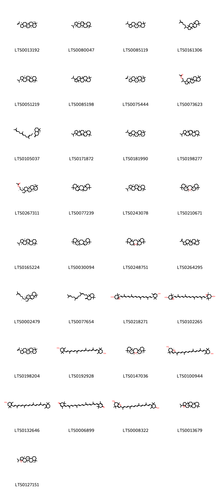{ width=100% }
    <figcaption>Hình ảnh cấu trúc hóa học của 33 hoạt chất thuộc nhóm Prenol lipids gồm ['diploptene (LTS0013192)', 'fernene (LTS0080047)', '(5ar,5br,11as,13br)-3-isopropyl-5a,5b,8,8,11a,13b-hexamethyl-1h,2h,4h,5h,6h,7h,7ah,9h,10h,11h,11bh,12h,13h,13ah-cyclopenta[a]chrysene (LTS0085119)', '3a,6,6,9a,11a-pentamethyl-1-(6-methylhept-5-en-2-yl)-1h,2h,3h,5h,5ah,7h,8h,9h,9bh,10h,11h-cyclopenta[a]phenanthrene (LTS0161306)', '(3r,3ar,5as,7as,11as,11br,13as,13br)-3-isopropyl-3a,5a,8,8,11a,13a-hexamethyl-1h,2h,3h,4h,5h,7h,7ah,9h,10h,11h,11bh,12h,13h,13bh-cyclopenta[a]chrysene (LTS0051219)', '3-isopropyl-5a,5b,8,8,11a,13b-hexamethyl-1h,2h,4h,5h,6h,7h,7ah,9h,10h,11h,11bh,12h,13h,13ah-cyclopenta[a]chrysene (LTS0085198)', '(3s,3ar,5ar,5br,7as,11as,11br,13as,13bs)-5a,5b,8,8,11a,13b-hexamethyl-3-(prop-1-en-2-yl)-hexadecahydrocyclopenta[a]chrysene (LTS0075444)', '2-{5a,5b,8,8,11a,13b-hexamethyl-hexadecahydrocyclopenta[a]chrysen-3-yl}propyl acetate (LTS0073623)', '(4as,5s,8as)-1,1,4a-trimethyl-6-methylidene-5-[(3e,7e)-4,8,12-trimethyltrideca-3,7,11-trien-1-yl]-hexahydro-2h-naphthalene (LTS0105037)', '3-isopropyl-3a,5a,8,8,11a,13a-hexamethyl-1h,2h,3h,4h,5h,7h,7ah,9h,10h,11h,11bh,12h,13h,13bh-cyclopenta[a]chrysene (LTS0171872)', '(5ar,5br,7as,11as,11bs,13as,13br)-3-isopropyl-5a,5b,8,8,11a,13b-hexamethyl-1h,2h,4h,5h,6h,7h,7ah,9h,10h,11h,11bh,12h,13h,13ah-cyclopenta[a]chrysene (LTS0181990)', '3-isopropyl-3a,5a,8,8,11a,13a-hexamethyl-1h,2h,3h,4h,5h,5bh,6h,7h,7ah,9h,10h,11h,13h,13bh-cyclopenta[a]chrysene (LTS0198277)', '(2s)-2-[(3s,3ar,5ar,5br,7as,11as,11br,13as,13bs)-5a,5b,8,8,11a,13b-hexamethyl-hexadecahydrocyclopenta[a]chrysen-3-yl]propyl acetate (LTS0267311)', '1,7,7,11,16,20,20-heptamethylpentacyclo[13.8.0.0³,¹².0⁶,¹¹.0¹⁶,²¹]tricos-3-ene (LTS0077239)', '(3r,3ar,5as,7ar,11as,11br,13as,13bs)-3-isopropyl-3a,5a,8,8,11a,13a-hexamethyl-1h,2h,3h,4h,5h,7h,7ah,9h,10h,11h,11bh,12h,13h,13bh-cyclopenta[a]chrysene (LTS0243078)', '(1r,3r,6s,11s,12r,15s,16s,21s)-1,3,7,7,11,16,20,20-octamethyl-2-oxapentacyclo[13.8.0.0³,¹².0⁶,¹¹.0¹⁶,²¹]tricosane (LTS0210671)', '(3r,3ar,5ar,5br,7ar,11as,13as,13br)-3-isopropyl-3a,5a,8,8,11a,13a-hexamethyl-1h,2h,3h,4h,5h,5bh,6h,7h,7ah,9h,10h,11h,13h,13bh-cyclopenta[a]chrysene (LTS0165224)', '(1s,6r,11s,12r,15s,16s,21s)-1,7,7,11,16,20,20-heptamethylpentacyclo[13.8.0.0³,¹².0⁶,¹¹.0¹⁶,²¹]tricos-3-ene (LTS0030094)', '1,3,7,7,11,16,20,20-octamethyl-2-oxapentacyclo[13.8.0.0³,¹².0⁶,¹¹.0¹⁶,²¹]tricosane (LTS0248751)', '5a,5b,8,8,11a,13b-hexamethyl-3-(prop-1-en-2-yl)-hexadecahydrocyclopenta[a]chrysene (LTS0264295)', '(1r,3as,5as,9as,9br,11as)-3a,6,6,9a,11a-pentamethyl-1-[(2r)-6-methylhept-5-en-2-yl]-1h,2h,3h,5h,5ah,7h,8h,9h,9bh,10h,11h-cyclopenta[a]phenanthrene (LTS0002479)', '1,1,4a-trimethyl-6-methylidene-5-(4,8,12-trimethyltrideca-3,7,11-trien-1-yl)-hexahydro-2h-naphthalene (LTS0077654)', 'taraxanthin (LTS0218271)', 'violaxanthin (LTS0102265)', '(3r,3ar,5ar,5br,7as,11as,11br,13as,13bs)-5a,5b,8,8,11a,13b-hexamethyl-3-(prop-1-en-2-yl)-hexadecahydrocyclopenta[a]chrysene (LTS0198204)', 'zeaxanthin (LTS0192928)', '(1r,3r,6r,11s,12r,15r,16s,21s)-1,3,7,7,11,16,20,20-octamethyl-2-oxapentacyclo[13.8.0.0³,¹².0⁶,¹¹.0¹⁶,²¹]tricosane (LTS0147036)', '(6s,7ar)-2-[(2e,4e,6e,8e,10e,12e,14e,16e)-17-[(4r)-4-hydroxy-2,6,6-trimethylcyclohex-1-en-1-yl]-6,11,15-trimethylheptadeca-2,4,6,8,10,12,14,16-octaen-2-yl]-4,4,7a-trimethyl-2,5,6,7-tetrahydro-1-benzofuran-6-ol (LTS0100944)', 'cryptoxanthin (LTS0132646)', 'rhodoxanthin (LTS0006899)', '2-[(2e,4e,6e,8e,10e,12e,14e,16e)-17-(4-hydroxy-2,6,6-trimethylcyclohex-1-en-1-yl)-6,11,15-trimethylheptadeca-2,4,6,8,10,12,14,16-octaen-2-yl]-4,4,7a-trimethyl-2,5,6,7-tetrahydro-1-benzofuran-6-ol (LTS0008322)', '7-isopropyl-1,2,11,15,19,19-hexamethyl-6-oxahexacyclo[12.8.0.0²,¹¹.0⁵,⁷.0⁵,¹⁰.0¹⁵,²⁰]docosane (LTS0013679)', '(1r,2s,5s,7s,10r,11r,14r,15s,20r)-7-isopropyl-1,2,11,15,19,19-hexamethyl-6-oxahexacyclo[12.8.0.0²,¹¹.0⁵,⁷.0⁵,¹⁰.0¹⁵,²⁰]docosane (LTS0127151)'].</figcaption>
</figure>
#### Nhóm Steroids and steroid derivatives
<figure markdown="span">
    { width=100% }
    <figcaption>Hình ảnh cấu trúc hóa học của 49 hoạt chất thuộc nhóm Steroids and steroid derivatives gồm ['(3r,3ar,5as,5br,7as,11as,11br)-3-isopropyl-3a,5a,5b,8,8,11a-hexamethyl-1h,2h,3h,4h,5h,6h,7h,7ah,9h,10h,11h,11bh,12h,13h-cyclopenta[a]chrysene (LTS0037493)', '15-(5,6-dimethylhept-6-en-2-yl)-7,7,12,16-tetramethylpentacyclo[9.7.0.0¹,³.0³,⁸.0¹²,¹⁶]octadecan-6-yl acetate (LTS0238500)', '15-(5-ethyl-6-methylhept-6-en-2-yl)-7,7,12,16-tetramethylpentacyclo[9.7.0.0¹,³.0³,⁸.0¹²,¹⁶]octadecan-6-yl acetate (LTS0222433)', '(1s,3r,6s,8s,11r,12s,15r,16r)-15-[(2s,5r)-5,6-dimethylhept-6-en-2-yl]-7,7,12,16-tetramethylpentacyclo[9.7.0.0¹,³.0³,⁸.0¹²,¹⁶]octadecan-6-yl acetate (LTS0110970)', 'stigmast-5-en-3-ol (LTS0071224)', '(1s,3r,6s,8s,11r,12s,15r,16r)-7,7,12,16-tetramethyl-15-[(2r)-6-methylheptan-2-yl]pentacyclo[9.7.0.0¹,³.0³,⁸.0¹²,¹⁶]octadecan-6-yl acetate (LTS0037563)', '7,7,12,16-tetramethyl-15-(6-methylheptan-2-yl)pentacyclo[9.7.0.0¹,³.0³,⁸.0¹²,¹⁶]octadecan-6-yl acetate (LTS0159052)', '(1r,3as,5ar,7r,9ar,9bs,11ar)-7-{[(2r,3r,4s,5s,6r)-4,5-dihydroxy-6-(hydroxymethyl)-3-{[(2s,3r,4r,5r,6s)-3,4,5-trihydroxy-6-methyloxan-2-yl]oxy}oxan-2-yl]oxy}-9a,11a-dimethyl-1-[(1s)-1-[(2r,5s,6r)-5-methyl-6-{[(2s,3r,4r,5r,6s)-3,4,5-trihydroxy-6-methyloxan-2-yl]oxy}oxan-2-yl]ethyl]-1h,2h,3h,3ah,5ah,6h,7h,8h,9h,9bh,10h,11h-cyclopenta[a]phenanthren-5-one (LTS0172414)', '7,12,16-trimethyl-15-(6-methylheptan-2-yl)pentacyclo[9.7.0.0¹,³.0³,⁸.0¹²,¹⁶]octadecan-6-yl acetate (LTS0132816)', '(1s,3r,6s,8s,11r,12s,15r,16r)-15-[(2r,5s)-5-ethyl-6-methylhept-6-en-2-yl]-7,7,12,16-tetramethylpentacyclo[9.7.0.0¹,³.0³,⁸.0¹²,¹⁶]octadecan-6-yl acetate (LTS0208265)', '(1s,3r,6s,8s,11r,12s,15r,16r)-7,7,12,16-tetramethyl-15-[(2s)-6-methylhept-5-en-2-yl]pentacyclo[9.7.0.0¹,³.0³,⁸.0¹²,¹⁶]octadecan-6-yl acetate (LTS0210217)', '(1r,3ar,5as,7s,9ar,9br,11ar)-7-{[(2r,3r,4s,5s,6r)-4,5-dihydroxy-6-(hydroxymethyl)-3-{[(2s,3r,4r,5r,6s)-3,4,5-trihydroxy-6-methyloxan-2-yl]oxy}oxan-2-yl]oxy}-9a,11a-dimethyl-1-[(1s)-1-[(2s,5r,6s)-5-methyl-6-{[(2s,3r,4r,5r,6s)-3,4,5-trihydroxy-6-methyloxan-2-yl]oxy}oxan-2-yl]ethyl]-1h,2h,3h,3ah,5ah,6h,7h,8h,9h,9bh,10h,11h-cyclopenta[a]phenanthren-5-one (LTS0008171)', '(1s,3r,6s,7s,8r,11r,12s,15r,16r)-7,12,16-trimethyl-15-[(2r)-6-methylheptan-2-yl]pentacyclo[9.7.0.0¹,³.0³,⁸.0¹²,¹⁶]octadecan-6-yl acetate (LTS0013238)', '20-hydroxyecdysone (LTS0227025)', '7,7,12,16-tetramethyl-15-(6-methylhept-5-en-2-yl)pentacyclo[9.7.0.0¹,³.0³,⁸.0¹²,¹⁶]octadecan-6-yl acetate (LTS0026455)', '(1r,3as,5ar,7r,8s,9ar,11ar)-3a,7,8-trihydroxy-9a,11a-dimethyl-1-[(3r)-3,5,6-trihydroxy-6-methylheptan-2-yl]-1h,2h,3h,5ah,6h,7h,8h,9h,9bh,10h,11h-cyclopenta[a]phenanthren-5-one (LTS0085704)', '(1s,3r,6s,8r,11s,12s,15r,16r)-15-[(2r)-5,5-dimethyl-6-methylideneoctan-2-yl]-7,7,12,16-tetramethylpentacyclo[9.7.0.0¹,³.0³,⁸.0¹²,¹⁶]octadecan-6-yl acetate (LTS0026508)', '1-(3,6-dihydroxy-6-methylheptan-2-yl)-3a,7,8-trihydroxy-9a,11a-dimethyl-1h,2h,3h,5ah,6h,7h,8h,9h,9bh,10h,11h-cyclopenta[a]phenanthren-5-one (LTS0050438)', '(1s,3as,5ar,7r,8s,9ar,9br,11ar)-3a,7,8-trihydroxy-9a,11a-dimethyl-1-[(2r,3r,6s)-2,3,7-trihydroxy-6-methylheptan-2-yl]-1h,2h,3h,5ah,6h,7h,8h,9h,9bh,10h,11h-cyclopenta[a]phenanthren-5-one (LTS0188641)', '(1r,3as,3bs,5as,7s,9ar,9bs,11as)-7-{[(2r,3r,4s,5s,6r)-4,5-dihydroxy-6-(hydroxymethyl)-3-{[(2s,3r,4r,5r,6s)-3,4,5-trihydroxy-6-methyloxan-2-yl]oxy}oxan-2-yl]oxy}-9a,11a-dimethyl-1-[(1s)-1-[(2r,5s,6r)-5-methyl-6-{[(2s,3r,4r,5r,6s)-3,4,5-trihydroxy-6-methyloxan-2-yl]oxy}oxan-2-yl]ethyl]-tetradecahydrocyclopenta[a]phenanthren-5-one (LTS0105513)', '(1s,3r,6s,8s,11r,12s,15r,16r)-15-[(2r)-5,5-dimethyl-6-methylideneoctan-2-yl]-7,7,12,16-tetramethylpentacyclo[9.7.0.0¹,³.0³,⁸.0¹²,¹⁶]octadecan-6-yl acetate (LTS0187454)', '(1s,3as,5ar,7r,8s,9ar,9br,11ar)-3a,7,8-trihydroxy-9a,11a-dimethyl-1-[(2r,3s)-2,3,6-trihydroxy-6-methylheptan-2-yl]-1h,2h,3h,5ah,6h,7h,8h,9h,9bh,10h,11h-cyclopenta[a]phenanthren-5-one (LTS0202486)', '3a,7,8-trihydroxy-9a,11a-dimethyl-1-(3,5,6-trihydroxy-6-methylheptan-2-yl)-1h,2h,3h,5ah,6h,7h,8h,9h,9bh,10h,11h-cyclopenta[a]phenanthren-5-one (LTS0150008)', '(1s,3as,5as,7r,8s,9ar,9br,11ar)-3a,5a,7,8-tetrahydroxy-9a,11a-dimethyl-1-[(2r,3r,5s)-2,3,5,6-tetrahydroxy-6-methylheptan-2-yl]-1h,2h,3h,6h,7h,8h,9h,9bh,10h,11h-cyclopenta[a]phenanthren-5-one (LTS0202652)', '(1s,3as,5ar,7r,8s,9ar,9br,11ar)-3a,7,8-trihydroxy-9a,11a-dimethyl-1-[(2r,3r,5s)-2,3,5,6-tetrahydroxy-6-methylheptan-2-yl]-1h,2h,3h,5ah,6h,7h,8h,9h,9bh,10h,11h-cyclopenta[a]phenanthren-5-one (LTS0162589)', '(1r,3as,5ar,7r,8s,9ar,9br,11ar)-3a,7,8-trihydroxy-9a,11a-dimethyl-1-[(2s,3r,5s)-3,5,6-trihydroxy-6-methylheptan-2-yl]-1h,2h,3h,5ah,6h,7h,8h,9h,9bh,10h,11h-cyclopenta[a]phenanthren-5-one (LTS0146752)', '3a,7,8-trihydroxy-9a,11a-dimethyl-1-(2,3,7-trihydroxy-6-methylheptan-2-yl)-1h,2h,3h,5ah,6h,7h,8h,9h,9bh,10h,11h-cyclopenta[a]phenanthren-5-one (LTS0165231)', '(1s,3r,8s,11s,12s,15r,16r)-7,7,12,16-tetramethyl-15-[(2r)-6-methylheptan-2-yl]pentacyclo[9.7.0.0¹,³.0³,⁸.0¹²,¹⁶]octadecan-6-one (LTS0259069)', '3a,7,8-trihydroxy-9a,11a-dimethyl-1-(2,3,5-trihydroxy-6-methylheptan-2-yl)-1h,2h,3h,5ah,6h,7h,8h,9h,9bh,10h,11h-cyclopenta[a]phenanthren-5-one (LTS0110763)', '(3r,3ar,5as,5br,7ar,11as,11br)-3-isopropyl-3a,5a,5b,8,8,11a-hexamethyl-1h,2h,3h,4h,5h,6h,7h,7ah,9h,10h,11h,11bh,12h,13h-cyclopenta[a]chrysene (LTS0196106)', '3a,7,8-trihydroxy-9a,11a-dimethyl-1-(2,3,6-trihydroxy-6-methylheptan-2-yl)-1h,2h,3h,5ah,6h,7h,8h,9h,9bh,10h,11h-cyclopenta[a]phenanthren-5-one (LTS0071237)', 'pterosterone (LTS0204913)', '3a,5a,7,8-tetrahydroxy-9a,11a-dimethyl-1-(2,3,6-trihydroxy-6-methylheptan-2-yl)-1h,2h,3h,6h,7h,8h,9h,9bh,10h,11h-cyclopenta[a]phenanthren-5-one (LTS0099123)', '(1s,3r,6s,8r,11s,12s,15r,16r)-7,7,12,16-tetramethyl-15-[(2r)-6-methylhept-5-en-2-yl]pentacyclo[9.7.0.0¹,³.0³,⁸.0¹²,¹⁶]octadecan-6-yl acetate (LTS0217131)', 'ecdysone (LTS0209653)', '3-isopropyl-3a,5a,5b,8,8,11a-hexamethyl-1h,2h,3h,4h,5h,6h,7h,7ah,9h,10h,11h,11bh,12h,13h-cyclopenta[a]chrysene (LTS0263136)', '7,7,12,16-tetramethyl-15-(6-methylheptan-2-yl)pentacyclo[9.7.0.0¹,³.0³,⁸.0¹²,¹⁶]octadecan-6-one (LTS0222664)', '(1r,3r,6s,8r,11s,12s,15r,16r)-7,7,12,16-tetramethyl-15-[(2r)-6-methylhept-5-en-2-yl]pentacyclo[9.7.0.0¹,³.0³,⁸.0¹²,¹⁶]octadecan-6-yl acetate (LTS0161433)', '(3br,7s,9bs,11ar)-9b-ethyl-3a,6,6,11a-tetramethyl-1-(6-methylheptan-2-yl)-dodecahydro-1h-cyclopenta[a]phenanthren-7-yl acetate (LTS0128304)', '(1s,3as,5as,7r,8s,9ar,9br,11ar)-3a,5a,7,8-tetrahydroxy-9a,11a-dimethyl-1-[(2r,3s)-2,3,6-trihydroxy-6-methylheptan-2-yl]-1h,2h,3h,6h,7h,8h,9h,9bh,10h,11h-cyclopenta[a]phenanthren-5-one (LTS0015561)', '3a,7,8-trihydroxy-9a,11a-dimethyl-1-(2,3,5,6-tetrahydroxy-6-methylheptan-2-yl)-1h,2h,3h,5ah,6h,7h,8h,9h,9bh,10h,11h-cyclopenta[a]phenanthren-5-one (LTS0012446)', 'inokosterone (LTS0097815)', 'polypodine b (LTS0019094)', '(3as,5as,7s,9ar,9bs,11as)-7-{[(2r,3r,4s,5s,6r)-4,5-dihydroxy-6-(hydroxymethyl)-3-{[(2s,3r,4r,5r,6s)-3,4,5-trihydroxy-6-methyloxan-2-yl]oxy}oxan-2-yl]oxy}-9a,11a-dimethyl-1-[(1s)-1-[(5r,6r)-5-methyl-6-{[(2s,3r,4r,5r,6s)-3,4,5-trihydroxy-6-methyloxan-2-yl]oxy}oxan-2-yl]ethyl]-tetradecahydrocyclopenta[a]phenanthren-5-one (LTS0106652)', '3a,5a,7,8-tetrahydroxy-9a,11a-dimethyl-1-(2,3,5,6-tetrahydroxy-6-methylheptan-2-yl)-1h,2h,3h,6h,7h,8h,9h,9bh,10h,11h-cyclopenta[a]phenanthren-5-one (LTS0031612)', '15-(5,5-dimethyl-6-methylideneoctan-2-yl)-7,7,12,16-tetramethylpentacyclo[9.7.0.0¹,³.0³,⁸.0¹²,¹⁶]octadecan-6-yl acetate (LTS0229725)', '(1r,3as,5ar,7s,8s,9as,9br,11as)-3a,7,8-trihydroxy-9a,11a-dimethyl-1-[(2s,3s,6s)-2,3,7-trihydroxy-6-methylheptan-2-yl]-1h,2h,3h,5ah,6h,7h,8h,9h,9bh,10h,11h-cyclopenta[a]phenanthren-5-one (LTS0044527)', 'osladin (LTS0034999)', '(8r,12s)-15-(5,6-dimethylhept-6-en-2-yl)-7,7,12,16-tetramethylpentacyclo[9.7.0.0¹,³.0³,⁸.0¹²,¹⁶]octadecan-6-yl acetate (LTS0106304)'].</figcaption>
</figure>

---

### Dược dân tộc học

Danh sách các quốc gia có sử dụng *Polypodium vulgare* trong điều trị các bệnh. 

| Country        | Disease                                       | Bệnh                                                                                                                                                                                                |
|:---------------|:----------------------------------------------|:----------------------------------------------------------------------------------------------------------------------------------------------------------------------------------------------------|
| Canada(Salish) | Sweetener                                     | MYMEMORY WARNING: YOU USED ALL AVAILABLE FREE TRANSLATIONS FOR TODAY. NEXT AVAILABLE IN  13 HOURS 36 MINUTES 48 SECONDS VISIT HTTPS://MYMEMORY.TRANSLATED.NET/DOC/USAGELIMITS.PHP TO TRANSLATE MORE |
| Turkey         | Aperient, Astringent, Cholagogue, Expectorant | MYMEMORY WARNING: YOU USED ALL AVAILABLE FREE TRANSLATIONS FOR TODAY. NEXT AVAILABLE IN  13 HOURS 36 MINUTES 45 SECONDS VISIT HTTPS://MYMEMORY.TRANSLATED.NET/DOC/USAGELIMITS.PHP TO TRANSLATE MORE |
| ain            | Purgative                                     | MYMEMORY WARNING: YOU USED ALL AVAILABLE FREE TRANSLATIONS FOR TODAY. NEXT AVAILABLE IN  13 HOURS 36 MINUTES 42 SECONDS VISIT HTTPS://MYMEMORY.TRANSLATED.NET/DOC/USAGELIMITS.PHP TO TRANSLATE MORE |

---

# Chi Pleopeltis

??? note "Danh sách các dược liệu thuộc chi"
    
	 - *Pleopeltis thunbergianus*

---
## Pleopeltis thunbergianus
### Thông tin về thực vật

!!! info "Phân loại thực vật của *Lepisorus thunbergianus* từ GIBF:"
    - **Kingdom:** Plantae
    - **Phylum:** Tracheophyta
    - **Order:** Polypodiales
    - **Family:** Polypodiaceae
    - **Genus:** Lepisorus
    - **Species:** *Lepisorus thunbergianus*

 

| Label (VI)   | Label (EN)   | Scientific Name          | Descriptions (VI)   | Descriptions (EN)        | Also Known As (VI)   | Also Known As (EN)   |
|:-------------|:-------------|:-------------------------|:--------------------|:-------------------------|:---------------------|:---------------------|
| N/A          | N/A          | Pleopeltis thunbergianus |                     | species of Equisetopsida | ['']                 | ['']                 |

#### Phân bố trên thế giới

**Từ CSDL GIBF** nan, Singapore, United States of America, Japan, Korea, Republic of, Nepal, Chinese Taipei, China, Russian Federation, India, unknown or invalid, French Polynesia, Canada

#### Phân bố tại Việt Nam

**Từ CSDL GIBF**: Không có ghi nhận ở Việt Nam

---
### Thành phần hóa học
        
- Theo cơ sở dữ liệu lotus: Từ loài *Lepisorus thunbergianus* đã phân lập và xác định được Chưa có hoạt chất nào được phân lập. hoạt chất thuộc về các nhóm Không có hoạt chất nào được phân lập. 

Không có hình ảnh nào được tạo ra

---

### Dược dân tộc học

Danh sách các quốc gia có sử dụng *Lepisorus thunbergianus* trong điều trị các bệnh. 

| Country   | Disease   | Bệnh                                                                                                                                                                                                |
|:----------|:----------|:----------------------------------------------------------------------------------------------------------------------------------------------------------------------------------------------------|
| China     | Diuretic  | MYMEMORY WARNING: YOU USED ALL AVAILABLE FREE TRANSLATIONS FOR TODAY. NEXT AVAILABLE IN  13 HOURS 35 MINUTES 57 SECONDS VISIT HTTPS://MYMEMORY.TRANSLATED.NET/DOC/USAGELIMITS.PHP TO TRANSLATE MORE |

---

# Chi Pyrrosia

??? note "Danh sách các dược liệu thuộc chi"
    
	 - *Pyrrosia lingua*

---
## Pyrrosia lingua
### Thông tin về thực vật

!!! info "Phân loại thực vật của *Pyrrosia lingua* từ GIBF:"
    - **Kingdom:** Plantae
    - **Phylum:** Tracheophyta
    - **Order:** Polypodiales
    - **Family:** Polypodiaceae
    - **Genus:** Pyrrosia
    - **Species:** *Pyrrosia lingua*

 

| Label (VI)   | Label (EN)   | Scientific Name   | Descriptions (VI)   | Descriptions (EN)   | Also Known As (VI)   | Also Known As (EN)   |
|:-------------|:-------------|:------------------|:--------------------|:--------------------|:---------------------|:---------------------|
| N/A          | N/A          | Pyrrosia lingua   | loài thực vật       | species of plant    | ['']                 | ['']                 |

#### Phân bố trên thế giới

**Từ CSDL GIBF** Korea, Republic of, Chinese Taipei, Japan, China

#### Phân bố tại Việt Nam

**Từ CSDL GIBF**: Không có ghi nhận ở Việt Nam

---
### Thành phần hóa học
        
- Theo cơ sở dữ liệu lotus: Từ loài *Pyrrosia lingua* đã phân lập và xác định được 34 hoạt chất thuộc về các nhóm Flavonoids, Steroids and steroid derivatives, Organooxygen compounds, Prenol lipids, Benzopyrans. 

|    | chemicalTaxonomyClassyfireClass   |   smiles_count |
|---:|:----------------------------------|---------------:|
|  0 | Benzopyrans                       |              1 |
|  1 | Flavonoids                        |              4 |
|  2 | Organooxygen compounds            |              2 |
|  3 | Prenol lipids                     |             24 |
|  4 | Steroids and steroid derivatives  |              3 |

#### Nhóm Benzopyrans
<figure markdown="span">
    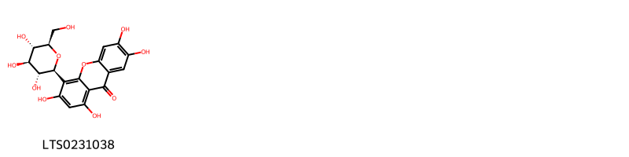{ width=100% }
    <figcaption>Hình ảnh cấu trúc hóa học của 1 hoạt chất thuộc nhóm Benzopyrans gồm ['isomangiferin (LTS0231038)'].</figcaption>
</figure>
#### Nhóm Flavonoids
<figure markdown="span">
    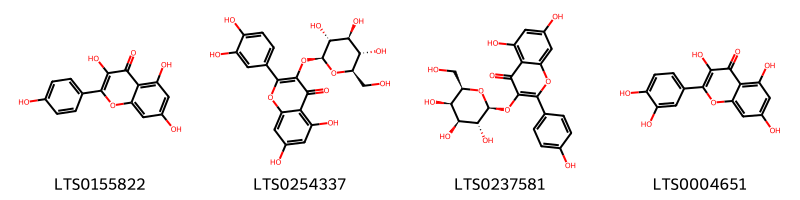{ width=100% }
    <figcaption>Hình ảnh cấu trúc hóa học của 4 hoạt chất thuộc nhóm Flavonoids gồm ['kaempherol (LTS0155822)', 'isoquercetin (LTS0254337)', 'trifolin (LTS0237581)', 'quercetin (LTS0004651)'].</figcaption>
</figure>
#### Nhóm Organooxygen compounds
<figure markdown="span">
    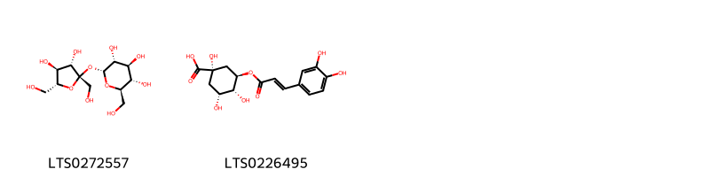{ width=100% }
    <figcaption>Hình ảnh cấu trúc hóa học của 2 hoạt chất thuộc nhóm Organooxygen compounds gồm ['sucrose (LTS0272557)', 'chlorogenic acid (LTS0226495)'].</figcaption>
</figure>
#### Nhóm Prenol lipids
<figure markdown="span">
    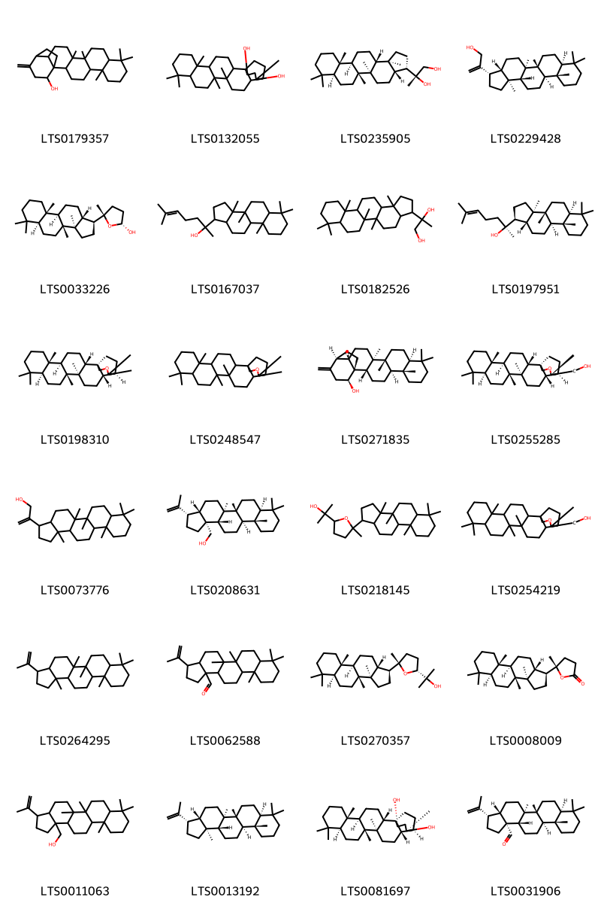{ width=100% }
    <figcaption>Hình ảnh cấu trúc hóa học của 24 hoạt chất thuộc nhóm Prenol lipids gồm ['6,10,10,14,15-pentamethyl-20-methylidenehexacyclo[17.3.2.0¹,¹⁸.0²,¹⁵.0⁵,¹⁴.0⁶,¹¹]tetracosan-22-ol (LTS0179357)', '6,10,10,14,15,20-hexamethylhexacyclo[17.3.2.0¹,¹⁸.0²,¹⁵.0⁵,¹⁴.0⁶,¹¹]tetracosane-20,22-diol (LTS0132055)', '(2r)-2-[(3s,3as,5ar,5br,7as,11as,11br,13ar,13bs)-5a,5b,8,8,11a,13b-hexamethyl-hexadecahydrocyclopenta[a]chrysen-3-yl]propane-1,2-diol (LTS0235905)', '2-[(3s,3as,5ar,5br,7as,11as,11br,13ar,13bs)-5a,5b,8,8,11a,13b-hexamethyl-hexadecahydrocyclopenta[a]chrysen-3-yl]prop-2-en-1-ol (LTS0229428)', '(2r,5s)-5-[(1s,3ar,3br,5as,9as,9br,11ar)-3a,3b,6,6,9a-pentamethyl-dodecahydro-1h-cyclopenta[a]phenanthren-1-yl]-5-methyloxolan-2-ol (LTS0033226)', '2-{3a,3b,6,6,9a-pentamethyl-dodecahydro-1h-cyclopenta[a]phenanthren-1-yl}-6-methylhept-5-en-2-ol (LTS0167037)', '2-{5a,5b,8,8,11a,13b-hexamethyl-hexadecahydrocyclopenta[a]chrysen-3-yl}propane-1,2-diol (LTS0182526)', '(2s)-2-[(1s,3ar,3br,5as,9as,9br,11ar)-3a,3b,6,6,9a-pentamethyl-dodecahydro-1h-cyclopenta[a]phenanthren-1-yl]-6-methylhept-5-en-2-ol (LTS0197951)', '(1r,2s,5r,6s,11s,14r,15r,18s,19s)-6,10,10,14,15,20,20-heptamethyl-21-oxahexacyclo[17.3.2.0¹,¹⁸.0²,¹⁵.0⁵,¹⁴.0⁶,¹¹]tetracosane (LTS0198310)', '6,10,10,14,15,20,20-heptamethyl-21-oxahexacyclo[17.3.2.0¹,¹⁸.0²,¹⁵.0⁵,¹⁴.0⁶,¹¹]tetracosane (LTS0248547)', '(1r,2s,5r,6s,11s,14r,15r,18s,19s,22s)-6,10,10,14,15-pentamethyl-20-methylidenehexacyclo[17.3.2.0¹,¹⁸.0²,¹⁵.0⁵,¹⁴.0⁶,¹¹]tetracosan-22-ol (LTS0271835)', '[(1r,2s,5r,6s,11s,14r,15r,18s,19s,20s)-6,10,10,14,15,20-hexamethyl-21-oxahexacyclo[17.3.2.0¹,¹⁸.0²,¹⁵.0⁵,¹⁴.0⁶,¹¹]tetracosan-20-yl]methanol (LTS0255285)', '2-{5a,5b,8,8,11a,13b-hexamethyl-hexadecahydrocyclopenta[a]chrysen-3-yl}prop-2-en-1-ol (LTS0073776)', '[(3s,3as,5ar,5br,7as,11as,11br,13as,13br)-5a,5b,8,8,11a-pentamethyl-3-(prop-1-en-2-yl)-hexadecahydrocyclopenta[a]chrysen-13b-yl]methanol (LTS0208631)', '2-(5-{3a,3b,6,6,9a-pentamethyl-dodecahydro-1h-cyclopenta[a]phenanthren-1-yl}-5-methyloxolan-2-yl)propan-2-ol (LTS0218145)', '{6,10,10,14,15,20-hexamethyl-21-oxahexacyclo[17.3.2.0¹,¹⁸.0²,¹⁵.0⁵,¹⁴.0⁶,¹¹]tetracosan-20-yl}methanol (LTS0254219)', '5a,5b,8,8,11a,13b-hexamethyl-3-(prop-1-en-2-yl)-hexadecahydrocyclopenta[a]chrysene (LTS0264295)', '5a,5b,8,8,11a-pentamethyl-3-(prop-1-en-2-yl)-hexadecahydrocyclopenta[a]chrysene-13b-carbaldehyde (LTS0062588)', '2-[(2r,5s)-5-[(1s,3ar,3br,5as,9as,9br,11ar)-3a,3b,6,6,9a-pentamethyl-dodecahydro-1h-cyclopenta[a]phenanthren-1-yl]-5-methyloxolan-2-yl]propan-2-ol (LTS0270357)', '(5s)-5-[(1s,3ar,3br,5as,9as,9br,11ar)-3a,3b,6,6,9a-pentamethyl-dodecahydro-1h-cyclopenta[a]phenanthren-1-yl]-5-methyloxolan-2-one (LTS0008009)', '[5a,5b,8,8,11a-pentamethyl-3-(prop-1-en-2-yl)-hexadecahydrocyclopenta[a]chrysen-13b-yl]methanol (LTS0011063)', 'diploptene (LTS0013192)', '(1r,2s,5r,6s,11s,14r,15r,18s,19s,20r,22s)-6,10,10,14,15,20-hexamethylhexacyclo[17.3.2.0¹,¹⁸.0²,¹⁵.0⁵,¹⁴.0⁶,¹¹]tetracosane-20,22-diol (LTS0081697)', '(3s,3as,5ar,5br,7as,11as,11br,13as,13br)-5a,5b,8,8,11a-pentamethyl-3-(prop-1-en-2-yl)-hexadecahydrocyclopenta[a]chrysene-13b-carbaldehyde (LTS0031906)'].</figcaption>
</figure>
#### Nhóm Steroids and steroid derivatives
<figure markdown="span">
    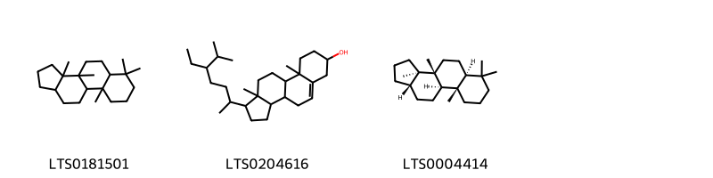{ width=100% }
    <figcaption>Hình ảnh cấu trúc hóa học của 3 hoạt chất thuộc nhóm Steroids and steroid derivatives gồm ['3a,3b,6,6,9a-pentamethyl-dodecahydro-1h-cyclopenta[a]phenanthrene (LTS0181501)', 'stigmast-5-en-3-ol, (3β)- (LTS0204616)', '(3ar,3br,5as,9as,9br,11as)-3a,3b,6,6,9a-pentamethyl-dodecahydro-1h-cyclopenta[a]phenanthrene (LTS0004414)'].</figcaption>
</figure>

---

### Dược dân tộc học

Danh sách các quốc gia có sử dụng *Pyrrosia lingua* trong điều trị các bệnh. 

| Country   | Disease            | Bệnh                                                                                                                                                                                                |
|:----------|:-------------------|:----------------------------------------------------------------------------------------------------------------------------------------------------------------------------------------------------|
| China     | Diuretic, Hemostat | MYMEMORY WARNING: YOU USED ALL AVAILABLE FREE TRANSLATIONS FOR TODAY. NEXT AVAILABLE IN  13 HOURS 35 MINUTES 24 SECONDS VISIT HTTPS://MYMEMORY.TRANSLATED.NET/DOC/USAGELIMITS.PHP TO TRANSLATE MORE |
| Elsewhere | Diuretic           | MYMEMORY WARNING: YOU USED ALL AVAILABLE FREE TRANSLATIONS FOR TODAY. NEXT AVAILABLE IN  13 HOURS 35 MINUTES 18 SECONDS VISIT HTTPS://MYMEMORY.TRANSLATED.NET/DOC/USAGELIMITS.PHP TO TRANSLATE MORE |

---

# Chi Drymoglossum

??? note "Danh sách các dược liệu thuộc chi"
    
	 - *Drymoglossum carnosum*
	 - *Drymoglossum heterophyllum*

---
## Drymoglossum carnosum
### Thông tin về thực vật

!!! info "Phân loại thực vật của *Lepisorus carnosus* từ GIBF:"
    - **Kingdom:** Plantae
    - **Phylum:** Tracheophyta
    - **Order:** Polypodiales
    - **Family:** Polypodiaceae
    - **Genus:** Lepisorus
    - **Species:** *Lepisorus carnosus*

 

| Label (VI)   | Label (EN)   | Scientific Name       | Descriptions (VI)   | Descriptions (EN)                          | Also Known As (VI)   | Also Known As (EN)   |
|:-------------|:-------------|:----------------------|:--------------------|:-------------------------------------------|:---------------------|:---------------------|
| N/A          | N/A          | Drymoglossum carnosum |                     | species of fern in the class Equisetopsida | ['']                 | ['']                 |

#### Phân bố trên thế giới

**Từ CSDL GIBF** nan, Japan, Philippines, Chinese Taipei, China, Italy, unknown or invalid

#### Phân bố tại Việt Nam

**Từ CSDL GIBF**: Không có ghi nhận ở Việt Nam

---
### Thành phần hóa học
        
- Theo cơ sở dữ liệu lotus: Từ loài *Lepisorus carnosus* đã phân lập và xác định được Chưa có hoạt chất nào được phân lập. hoạt chất thuộc về các nhóm Không có hoạt chất nào được phân lập. 

Không có hình ảnh nào được tạo ra

---

### Dược dân tộc học

Danh sách các quốc gia có sử dụng *Lepisorus carnosus* trong điều trị các bệnh. 

| Country   | Disease   | Bệnh                                                                                                                                                                                                |
|:----------|:----------|:----------------------------------------------------------------------------------------------------------------------------------------------------------------------------------------------------|
| China     | Poultice  | MYMEMORY WARNING: YOU USED ALL AVAILABLE FREE TRANSLATIONS FOR TODAY. NEXT AVAILABLE IN  13 HOURS 34 MINUTES 26 SECONDS VISIT HTTPS://MYMEMORY.TRANSLATED.NET/DOC/USAGELIMITS.PHP TO TRANSLATE MORE |

---

---
## Drymoglossum heterophyllum
### Thông tin về thực vật

!!! info "Phân loại thực vật của *N/A* từ GIBF:"
    - **Kingdom:** Plantae
    - **Phylum:** Tracheophyta
    - **Order:** Polypodiales
    - **Family:** Polypodiaceae
    - **Genus:** Pyrrosia
    - **Species:** *N/A*

 

| Label (VI)   | Label (EN)   | Scientific Name       | Descriptions (VI)   | Descriptions (EN)                          | Also Known As (VI)   | Also Known As (EN)   |
|:-------------|:-------------|:----------------------|:--------------------|:-------------------------------------------|:---------------------|:---------------------|
| N/A          | N/A          | Drymoglossum carnosum |                     | species of fern in the class Equisetopsida | ['']                 | ['']                 |

#### Phân bố trên thế giới

**Từ CSDL GIBF** Hong Kong, Singapore, Viet Nam, Japan, Macao, Indonesia, Chinese Taipei, Philippines, Malaysia, Australia, New Caledonia, New Zealand, China, Northern Mariana Islands, Thailand, Puerto Rico

#### Phân bố tại Việt Nam

**Từ CSDL GIBF**: Lâm Đồng

---
### Thành phần hóa học
        
- Theo cơ sở dữ liệu lotus: Từ loài *N/A* đã phân lập và xác định được Chưa có hoạt chất nào được phân lập. hoạt chất thuộc về các nhóm Không có hoạt chất nào được phân lập. 

Không có hình ảnh nào được tạo ra

---

### Dược dân tộc học

Danh sách các quốc gia có sử dụng *N/A* trong điều trị các bệnh. 

| Country   | Disease    | Bệnh                                                                                                                                                                                                |
|:----------|:-----------|:----------------------------------------------------------------------------------------------------------------------------------------------------------------------------------------------------|
| Elsewhere | Hemostatic | MYMEMORY WARNING: YOU USED ALL AVAILABLE FREE TRANSLATIONS FOR TODAY. NEXT AVAILABLE IN  13 HOURS 33 MINUTES 52 SECONDS VISIT HTTPS://MYMEMORY.TRANSLATED.NET/DOC/USAGELIMITS.PHP TO TRANSLATE MORE |

---

