!!! abstract "Tóm tắt"

    Họ Pontederiaceae gồm khoảng 2 chi và 3 loài được một số cộng đồng tại các quốc gia như India, Elsewhere, China sử dụng trong một số trường hợp MYMEMORY WARNING: YOU USED ALL AVAILABLE FREE TRANSLATIONS FOR TODAY. NEXT AVAILABLE IN  08 HOURS 29 MINUTES 12 SECONDS VISIT HTTPS://MYMEMORY.TRANSLATED.NET/DOC/USAGELIMITS.PHP TO TRANSLATE MORE.

!!! info "DrDuke"

    James A. Duke sinh năm 1929-2017 là một nhà thực vật học người Mỹ. Đây là một trong những tác giả hàng đầu trong lĩnh vực dược dân tộc học với cuốn *CRC Handbook of Medicinal Herbs* và chính là người xây dựng lên cơ sở dữ liệu về hợp chất tự nhiên và dược dân tộc học tại Bộ nông nghiệp Hoa Kỳ. Các thông tin được đăng tải tại website [Dr. Duke's Phytochemical and Ethnobotanical Databases](https://phytochem.nal.usda.gov/). 
    Trong suốt thập niên 1970, ông lãnh đạo the Plant Taxonomy Laboratory, Plant Genetics and Germplasm Institute of the Agricultural Research Service, U.S. Department of Agriculture.
    Trong tài liệu này, các thông tin về dược dân tộc của các dược liệu được trích dẫn từ tài liệu của James A. Ducke với sự trợ giúp của phần mềm dịch thuật từ tiếng Anh sang tiếng Việt.
   

# Chi Eichhornia

??? note "Danh sách các dược liệu thuộc chi"
    
	 - *Eichhornia crassipes*

---
## Eichhornia crassipes
### Thông tin về thực vật

!!! info "Phân loại thực vật của *Pontederia crassipes* từ GIBF:"
    - **Kingdom:** Plantae
    - **Phylum:** Tracheophyta
    - **Order:** Commelinales
    - **Family:** Pontederiaceae
    - **Genus:** Pontederia
    - **Species:** *Pontederia crassipes*

 

| Label (VI)   | Label (EN)   | Scientific Name      | Descriptions (VI)   | Descriptions (EN)   | Also Known As (VI)                                                                               | Also Known As (EN)   |
|:-------------|:-------------|:---------------------|:--------------------|:--------------------|:-------------------------------------------------------------------------------------------------|:---------------------|
| N/A          | N/A          | Eichhornia crassipes | loài thực vật       | species of plant    | ['Lục bình', 'Lộc bình', 'Eichhornia crassipes', 'Bèo Nhật Bản', 'Bèo lục bình', 'Bèo lộc bình'] | ['water hyacinth']   |

#### Phân bố trên thế giới

**Từ CSDL GIBF** Ghana, Sri Lanka, Guadeloupe, Belgium, Venezuela (Bolivarian Republic of), Ukraine, Netherlands, Korea, Republic of, Chinese Taipei, Spain, Portugal, United States of America, El Salvador, Uganda, Thailand, Brazil, Egypt, Cuba, Dominican Republic, Viet Nam, Ecuador, Aruba, Colombia, Costa Rica, India, Gambia

#### Phân bố tại Việt Nam

**Từ CSDL GIBF**: Không có ghi nhận ở Việt Nam

---
### Thành phần hóa học
        
- Theo cơ sở dữ liệu lotus: Từ loài *Pontederia crassipes* đã phân lập và xác định được 68 hoạt chất thuộc về các nhóm Naphthalenes, Flavonoids, Indoles and derivatives, Steroids and steroid derivatives, Cinnamic acids and derivatives, Diarylheptanoids, Organonitrogen compounds, Benzene and substituted derivatives, Fluorenes, Carboxylic acids and derivatives. 

|    | chemicalTaxonomyClassyfireClass     |   smiles_count |
|---:|:------------------------------------|---------------:|
|  0 |                                     |              5 |
|  1 | Benzene and substituted derivatives |              4 |
|  2 | Carboxylic acids and derivatives    |             19 |
|  3 | Cinnamic acids and derivatives      |              2 |
|  4 | Diarylheptanoids                    |              4 |
|  5 | Flavonoids                          |              2 |
|  6 | Fluorenes                           |              1 |
|  7 | Indoles and derivatives             |              2 |
|  8 | Naphthalenes                        |             19 |
|  9 | Organonitrogen compounds            |              4 |
| 10 | Steroids and steroid derivatives    |              6 |

#### Nhóm 
<figure markdown="span">
    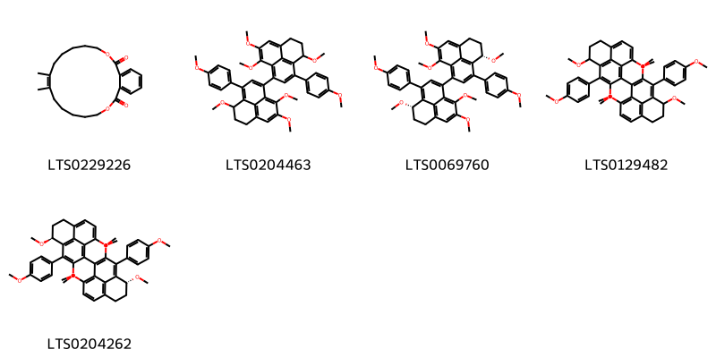{ width=100% }
    <figcaption>Hình ảnh cấu trúc hóa học của 5 hoạt chất thuộc nhóm  gồm ['(8z)-8,9-dimethyl-3,4,5,6,7,10,11,12,13,14-decahydro-2,15-benzodioxacyclooctadecine-1,16-dione (LTS0229226)', "4,4',8,8',9,9'-hexamethoxy-3,3'-bis(4-methoxyphenyl)-4h,4'h,5h,5'h,6h,6'h-1,1'-biphenalene (LTS0204463)", "(4s,4's)-4,4',8,8',9,9'-hexamethoxy-3,3'-bis(4-methoxyphenyl)-4h,4'h,5h,5'h,6h,6'h-1,1'-biphenalene (LTS0069760)", "2,2',4,4',9,9'-hexamethoxy-3,3'-bis(4-methoxyphenyl)-4h,4'h,5h,5'h,6h,6'h-1,1'-biphenalene (LTS0129482)", "(4r,4's)-2,2',4,4',9,9'-hexamethoxy-3,3'-bis(4-methoxyphenyl)-4h,4'h,5h,5'h,6h,6'h-1,1'-biphenalene (LTS0204262)"].</figcaption>
</figure>
#### Nhóm Benzene and substituted derivatives
<figure markdown="span">
    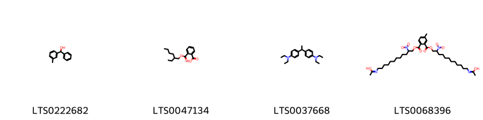{ width=100% }
    <figcaption>Hình ảnh cấu trúc hóa học của 4 hoạt chất thuộc nhóm Benzene and substituted derivatives gồm ['(3-methylphenyl)(phenyl)methanol (LTS0222682)', 'bar 1 (LTS0047134)', '4-{1-[4-(diethylamino)phenyl]ethyl}-n,n-diethylaniline (LTS0037668)', 'n-(12-{2-[({12-[(1-hydroxyethylidene)amino]-2-nitrododecyl}oxy)carbonyl]-5-methylbenzoyloxy}-11-nitrododecyl)ethanimidic acid (LTS0068396)'].</figcaption>
</figure>
#### Nhóm Carboxylic acids and derivatives
<figure markdown="span">
    { width=100% }
    <figcaption>Hình ảnh cấu trúc hóa học của 19 hoạt chất thuộc nhóm Carboxylic acids and derivatives gồm ['l-threonine (LTS0184056)', 'l-serine (LTS0106692)', 'l-alanine (LTS0042208)', 'l-lysine (LTS0068734)', 'd-methionine (LTS0108782)', 'l-aspartic acid (LTS0205466)', 'l-proline (LTS0090383)', 'd-phenylalanine (LTS0048920)', 'l-methionine (LTS0196746)', 'l-isoleucine (LTS0249538)', '(2s)-2-(phenylamino)propanoic acid (LTS0199539)', 'l-valine (LTS0231703)', 'd-aspartic acid (LTS0144001)', 'd-alanine (LTS0272178)', 'l-glutamic acid (LTS0037133)', 'l-arginine (LTS0064737)', 'l-tyrosine (LTS0029981)', 'l-leucine (LTS0113423)', 'l-histidine (LTS0094081)'].</figcaption>
</figure>
#### Nhóm Cinnamic acids and derivatives
<figure markdown="span">
    { width=100% }
    <figcaption>Hình ảnh cấu trúc hóa học của 2 hoạt chất thuộc nhóm Cinnamic acids and derivatives gồm ['methyl ferulate (LTS0047572)', 'methyl ferulate (LTS0265853)'].</figcaption>
</figure>
#### Nhóm Diarylheptanoids
<figure markdown="span">
    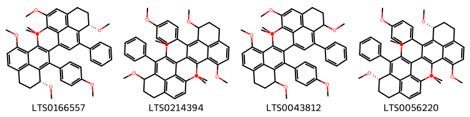{ width=100% }
    <figcaption>Hình ảnh cấu trúc hóa học của 4 hoạt chất thuộc nhóm Diarylheptanoids gồm ["(4s,4'r)-1',4,4',8,9,9'-hexamethoxy-3'-(4-methoxyphenyl)-3-phenyl-4h,4'h,5h,5'h,6h,6'h-1,2'-biphenalene (LTS0166557)", "1',2,4,4',9,9'-hexamethoxy-3'-(4-methoxyphenyl)-3-phenyl-4h,4'h,5h,5'h,6h,6'h-1,2'-biphenalene (LTS0214394)", "1',4,4',8,9,9'-hexamethoxy-3'-(4-methoxyphenyl)-3-phenyl-4h,4'h,5h,5'h,6h,6'h-1,2'-biphenalene (LTS0043812)", "(4s,4'r)-1',2,4,4',9,9'-hexamethoxy-3'-(4-methoxyphenyl)-3-phenyl-4h,4'h,5h,5'h,6h,6'h-1,2'-biphenalene (LTS0056220)"].</figcaption>
</figure>
#### Nhóm Flavonoids
<figure markdown="span">
    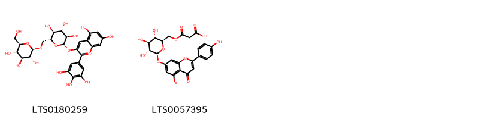{ width=100% }
    <figcaption>Hình ảnh cấu trúc hóa học của 2 hoạt chất thuộc nhóm Flavonoids gồm ['5,7-dihydroxy-3-{[(2s,3r,4s,5s,6r)-3,4,5-trihydroxy-6-({[(2r,3r,4s,5s,6r)-3,4,5-trihydroxy-6-(hydroxymethyl)oxan-2-yl]oxy}methyl)oxan-2-yl]oxy}-2-(3,4,5-trihydroxyphenyl)-1λ⁴-chromen-1-ylium (LTS0180259)', '3-oxo-3-{[(2r,3s,4s,5r,6s)-3,4,5-trihydroxy-6-{[5-hydroxy-2-(4-hydroxyphenyl)-4-oxochromen-7-yl]oxy}oxan-2-yl]methoxy}propanoic acid (LTS0057395)'].</figcaption>
</figure>
#### Nhóm Fluorenes
<figure markdown="span">
    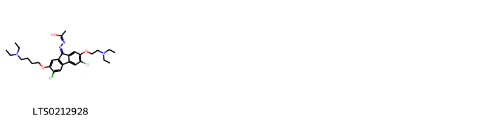{ width=100% }
    <figcaption>Hình ảnh cấu trúc hóa học của 1 hoạt chất thuộc nhóm Fluorenes gồm ['n-[(9z)-3,6-dichloro-2-[4-(diethylamino)butoxy]-7-[2-(diethylamino)ethoxy]fluoren-9-ylidene]ethanehydrazonic acid (LTS0212928)'].</figcaption>
</figure>
#### Nhóm Indoles and derivatives
<figure markdown="span">
    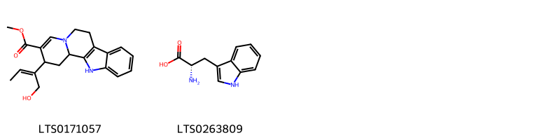{ width=100% }
    <figcaption>Hình ảnh cấu trúc hóa học của 2 hoạt chất thuộc nhóm Indoles and derivatives gồm ['methyl 2-[(2z)-1-hydroxybut-2-en-2-yl]-1h,2h,6h,7h,12h,12bh-indolo[2,3-a]quinolizine-3-carboxylate (LTS0171057)', 'l-tryptophan (LTS0263809)'].</figcaption>
</figure>
#### Nhóm Naphthalenes
<figure markdown="span">
    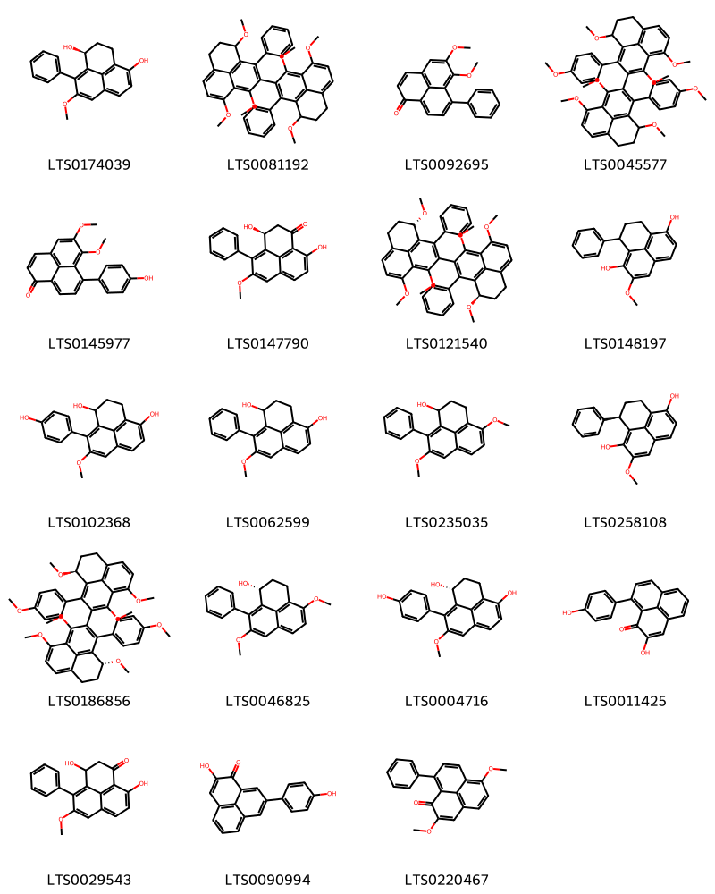{ width=100% }
    <figcaption>Hình ảnh cấu trúc hóa học của 19 hoạt chất thuộc nhóm Naphthalenes gồm ['(1s)-8-methoxy-9-phenyl-2,3-dihydro-1h-phenalene-1,4-diol (LTS0174039)', "1,1',4,4',9,9'-hexamethoxy-3,3'-diphenyl-4h,4'h,5h,5'h,6h,6'h-2,2'-biphenalene (LTS0081192)", '5,6-dimethoxy-7-phenylphenalen-1-one (LTS0092695)', "1,1',4,4',9,9'-hexamethoxy-3,3'-bis(4-methoxyphenyl)-4h,4'h,5h,5'h,6h,6'h-2,2'-biphenalene (LTS0045577)", '7-(4-hydroxyphenyl)-5,6-dimethoxyphenalen-1-one (LTS0145977)', '(3s)-3,9-dihydroxy-5-methoxy-4-phenyl-2,3-dihydrophenalen-1-one (LTS0147790)', "(4r,4's)-1,1',4,4',9,9'-hexamethoxy-3,3'-diphenyl-4h,4'h,5h,5'h,6h,6'h-2,2'-biphenalene (LTS0121540)", '2-methoxy-9-phenyl-8,9-dihydro-7h-phenalene-1,6-diol (LTS0148197)', '9-(4-hydroxyphenyl)-8-methoxy-2,3-dihydro-1h-phenalene-1,4-diol (LTS0102368)', '8-methoxy-9-phenyl-2,3-dihydro-1h-phenalene-1,4-diol (LTS0062599)', '4,8-dimethoxy-9-phenyl-2,3-dihydro-1h-phenalen-1-ol (LTS0235035)', '(9r)-2-methoxy-9-phenyl-8,9-dihydro-7h-phenalene-1,6-diol (LTS0258108)', "(4r,4's)-1,1',4,4',9,9'-hexamethoxy-3,3'-bis(4-methoxyphenyl)-4h,4'h,5h,5'h,6h,6'h-2,2'-biphenalene (LTS0186856)", '(1r)-4,8-dimethoxy-9-phenyl-2,3-dihydro-1h-phenalen-1-ol (LTS0046825)', '(1r)-9-(4-hydroxyphenyl)-8-methoxy-2,3-dihydro-1h-phenalene-1,4-diol (LTS0004716)', '2-hydroxy-9-(4-hydroxyphenyl)phenalen-1-one (LTS0011425)', '3,9-dihydroxy-5-methoxy-4-phenyl-2,3-dihydrophenalen-1-one (LTS0029543)', '2-hydroxy-8-(4-hydroxyphenyl)phenalen-1-one (LTS0090994)', '2,6-dimethoxy-9-phenylphenalen-1-one (LTS0220467)'].</figcaption>
</figure>
#### Nhóm Organonitrogen compounds
<figure markdown="span">
    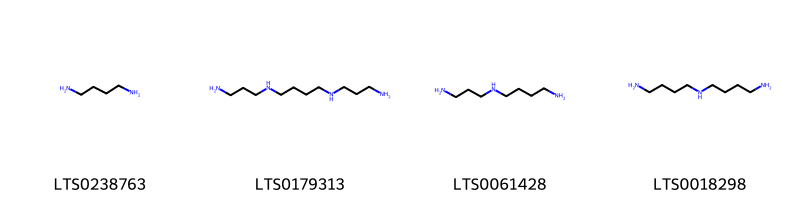{ width=100% }
    <figcaption>Hình ảnh cấu trúc hóa học của 4 hoạt chất thuộc nhóm Organonitrogen compounds gồm ['putrescine (LTS0238763)', 'spermine (LTS0179313)', 'spermidine (LTS0061428)', 'homospermidine (LTS0018298)'].</figcaption>
</figure>
#### Nhóm Steroids and steroid derivatives
<figure markdown="span">
    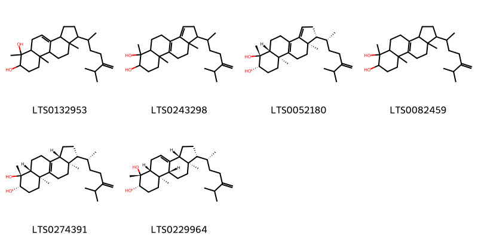{ width=100% }
    <figcaption>Hình ảnh cấu trúc hóa học của 6 hoạt chất thuộc nhóm Steroids and steroid derivatives gồm ['6,9a,11a-trimethyl-1-(6-methyl-5-methylideneheptan-2-yl)-1h,2h,3h,3ah,5h,5ah,7h,8h,9h,9bh,10h,11h-cyclopenta[a]phenanthrene-6,7-diol (LTS0132953)', '6,9a,11a-trimethyl-1-(6-methyl-5-methylideneheptan-2-yl)-1h,2h,4h,5h,5ah,7h,8h,9h,10h,11h-cyclopenta[a]phenanthrene-6,7-diol (LTS0243298)', '(1r,5ar,6r,7s,9as,11ar)-6,9a,11a-trimethyl-1-[(2r)-6-methyl-5-methylideneheptan-2-yl]-1h,2h,4h,5h,5ah,7h,8h,9h,10h,11h-cyclopenta[a]phenanthrene-6,7-diol (LTS0052180)', '6,9a,11a-trimethyl-1-(6-methyl-5-methylideneheptan-2-yl)-1h,2h,3h,3ah,4h,5h,5ah,7h,8h,9h,10h,11h-cyclopenta[a]phenanthrene-6,7-diol (LTS0082459)', '(1r,3ar,5ar,6r,7s,9as,11ar)-6,9a,11a-trimethyl-1-[(2r)-6-methyl-5-methylideneheptan-2-yl]-1h,2h,3h,3ah,4h,5h,5ah,7h,8h,9h,10h,11h-cyclopenta[a]phenanthrene-6,7-diol (LTS0274391)', '(1r,3ar,5ar,6r,7s,9ar,9br,11ar)-6,9a,11a-trimethyl-1-[(2r)-6-methyl-5-methylideneheptan-2-yl]-1h,2h,3h,3ah,5h,5ah,7h,8h,9h,9bh,10h,11h-cyclopenta[a]phenanthrene-6,7-diol (LTS0229964)'].</figcaption>
</figure>

---

### Dược dân tộc học

Danh sách các quốc gia có sử dụng *Pontederia crassipes* trong điều trị các bệnh. 

| Country   | Disease   | Bệnh                                                                                                                                                                                                |
|:----------|:----------|:----------------------------------------------------------------------------------------------------------------------------------------------------------------------------------------------------|
| Elsewhere | Tonic     | MYMEMORY WARNING: YOU USED ALL AVAILABLE FREE TRANSLATIONS FOR TODAY. NEXT AVAILABLE IN  08 HOURS 29 MINUTES 10 SECONDS VISIT HTTPS://MYMEMORY.TRANSLATED.NET/DOC/USAGELIMITS.PHP TO TRANSLATE MORE |

---

# Chi Monochoria

??? note "Danh sách các dược liệu thuộc chi"
    
	 - *Monochoria hastata*
	 - *Monochoria vaginalis*

---
## Monochoria hastata
### Thông tin về thực vật

!!! info "Phân loại thực vật của *Pontederia hastata* từ GIBF:"
    - **Kingdom:** Plantae
    - **Phylum:** Tracheophyta
    - **Order:** Commelinales
    - **Family:** Pontederiaceae
    - **Genus:** Pontederia
    - **Species:** *Pontederia hastata*

 

| Label (VI)   | Label (EN)   | Scientific Name    | Descriptions (VI)   | Descriptions (EN)   | Also Known As (VI)   | Also Known As (EN)   |
|:-------------|:-------------|:-------------------|:--------------------|:--------------------|:---------------------|:---------------------|
| N/A          | N/A          | Monochoria hastata | loài thực vật       | species of plant    | ['']                 | ['Arrow Leaf']       |

#### Phân bố trên thế giới

**Từ CSDL GIBF** nan, Sri Lanka, Australia, Lao People’s Democratic Republic, Cambodia, Myanmar, unknown or invalid, Chinese Taipei, Papua New Guinea, Bangladesh, United States of America, Fiji, Thailand, France, Singapore, Viet Nam, China, India, Indonesia, Philippines, Malaysia, Brunei Darussalam, Nepal

#### Phân bố tại Việt Nam

**Từ CSDL GIBF**: 广京山, Ninh Binh, Ninh Thuan

---
### Thành phần hóa học
        
- Theo cơ sở dữ liệu lotus: Từ loài *Pontederia hastata* đã phân lập và xác định được 6 hoạt chất thuộc về các nhóm Naphthalenes. 

|    | chemicalTaxonomyClassyfireClass   |   smiles_count |
|---:|:----------------------------------|---------------:|
|  0 | Naphthalenes                      |              4 |

#### Nhóm Naphthalenes
<figure markdown="span">
    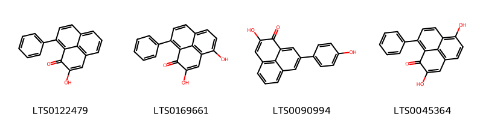{ width=100% }
    <figcaption>Hình ảnh cấu trúc hóa học của 4 hoạt chất thuộc nhóm Naphthalenes gồm ['2-hydroxy-9-phenylphenalen-1-one (LTS0122479)', '2,4-dihydroxy-9-phenylphenalen-1-one (LTS0169661)', '2-hydroxy-8-(4-hydroxyphenyl)phenalen-1-one (LTS0090994)', '2,6-dihydroxy-9-phenylphenalen-1-one (LTS0045364)'].</figcaption>
</figure>

---

### Dược dân tộc học

Danh sách các quốc gia có sử dụng *Pontederia hastata* trong điều trị các bệnh. 

| Country   | Disease            | Bệnh                                                                                                                                                                                                |
|:----------|:-------------------|:----------------------------------------------------------------------------------------------------------------------------------------------------------------------------------------------------|
| India     | Refrigerant, Tonic | MYMEMORY WARNING: YOU USED ALL AVAILABLE FREE TRANSLATIONS FOR TODAY. NEXT AVAILABLE IN  08 HOURS 28 MINUTES 49 SECONDS VISIT HTTPS://MYMEMORY.TRANSLATED.NET/DOC/USAGELIMITS.PHP TO TRANSLATE MORE |

---

---
## Monochoria vaginalis
### Thông tin về thực vật

!!! info "Phân loại thực vật của *Pontederia vaginalis* từ GIBF:"
    - **Kingdom:** Plantae
    - **Phylum:** Tracheophyta
    - **Order:** Commelinales
    - **Family:** Pontederiaceae
    - **Genus:** Pontederia
    - **Species:** *Pontederia vaginalis*

 

| Label (VI)   | Label (EN)   | Scientific Name      | Descriptions (VI)   | Descriptions (EN)   | Also Known As (VI)   | Also Known As (EN)   |
|:-------------|:-------------|:---------------------|:--------------------|:--------------------|:---------------------|:---------------------|
| N/A          | N/A          | Monochoria vaginalis | loài thực vật       | species of plant    | ['']                 | ['']                 |

#### Phân bố trên thế giới

**Từ CSDL GIBF** nan, Malaysia, Japan, Thailand, Lao People’s Democratic Republic, Korea, Republic of, Cambodia, Chinese Taipei, Myanmar, India, Indonesia, United States of America, Solomon Islands, Viet Nam, China, Nepal

#### Phân bố tại Việt Nam

**Từ CSDL GIBF**: Tay Ninh, Lam Dong

---
### Thành phần hóa học
        
- Theo cơ sở dữ liệu lotus: Từ loài *Pontederia vaginalis* đã phân lập và xác định được 37 hoạt chất thuộc về các nhóm Prenol lipids, Steroids and steroid derivatives, Sphingolipids, Benzofurans, Organooxygen compounds. 

|    | chemicalTaxonomyClassyfireClass   |   smiles_count |
|---:|:----------------------------------|---------------:|
|  0 | Benzofurans                       |              2 |
|  1 | Organooxygen compounds            |              2 |
|  2 | Prenol lipids                     |              6 |
|  3 | Sphingolipids                     |              5 |
|  4 | Steroids and steroid derivatives  |             22 |

#### Nhóm Benzofurans
<figure markdown="span">
    { width=100% }
    <figcaption>Hình ảnh cấu trúc hóa học của 2 hoạt chất thuộc nhóm Benzofurans gồm ['loliolide (LTS0254454)', 'loliolide (LTS0119422)'].</figcaption>
</figure>
#### Nhóm Organooxygen compounds
<figure markdown="span">
    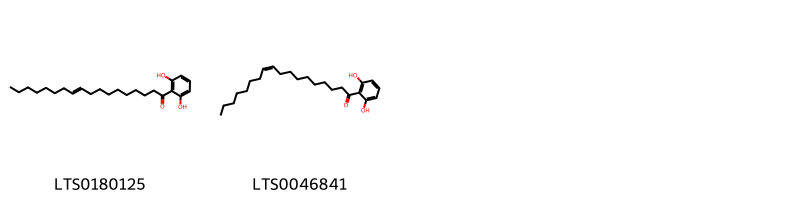{ width=100% }
    <figcaption>Hình ảnh cấu trúc hóa học của 2 hoạt chất thuộc nhóm Organooxygen compounds gồm ['1-(2,6-dihydroxyphenyl)octadec-10-en-1-one (LTS0180125)', '(10z)-1-(2,6-dihydroxyphenyl)octadec-10-en-1-one (LTS0046841)'].</figcaption>
</figure>
#### Nhóm Prenol lipids
<figure markdown="span">
    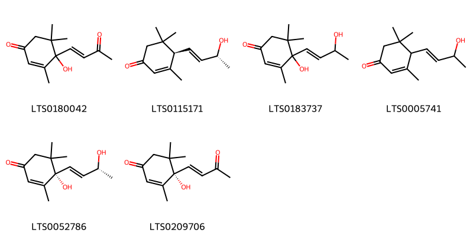{ width=100% }
    <figcaption>Hình ảnh cấu trúc hóa học của 6 hoạt chất thuộc nhóm Prenol lipids gồm ['4-hydroxy-3,5,5-trimethyl-4-(3-oxobut-1-en-1-yl)cyclohex-2-en-1-one (LTS0180042)', '(4r)-4-[(1e,3r)-3-hydroxybut-1-en-1-yl]-3,5,5-trimethylcyclohex-2-en-1-one (LTS0115171)', '4-hydroxy-4-(3-hydroxybut-1-en-1-yl)-3,5,5-trimethylcyclohex-2-en-1-one (LTS0183737)', '4-(3-hydroxybut-1-en-1-yl)-3,5,5-trimethylcyclohex-2-en-1-one (LTS0005741)', '(6s,9r)-vomifoliol (LTS0052786)', 'dehydrovomifoliol (LTS0209706)'].</figcaption>
</figure>
#### Nhóm Sphingolipids
<figure markdown="span">
    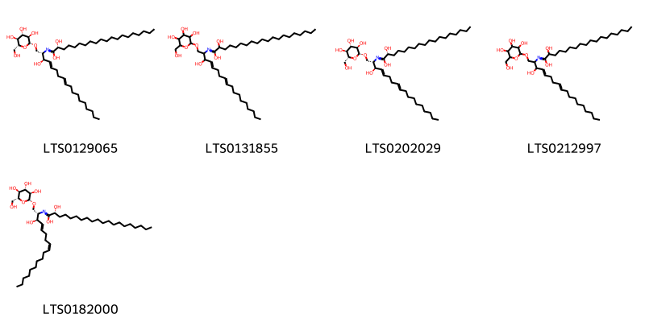{ width=100% }
    <figcaption>Hình ảnh cấu trúc hóa học của 5 hoạt chất thuộc nhóm Sphingolipids gồm ['(2r)-2-hydroxy-n-[(2s,3r,4e,8e)-3-hydroxy-1-{[(2r,3r,4s,5s,6r)-3,4,5-trihydroxy-6-(hydroxymethyl)oxan-2-yl]oxy}octadeca-4,8-dien-2-yl]icosanimidic acid (LTS0129065)', '2-hydroxy-n-(3-hydroxy-1-{[3,4,5-trihydroxy-6-(hydroxymethyl)oxan-2-yl]oxy}octadeca-4,8-dien-2-yl)icosanimidic acid (LTS0131855)', '(2r)-2-hydroxy-n-[(2s,3r,4e,8e)-3-hydroxy-1-{[(2r,3r,4s,5s,6r)-3,4,5-trihydroxy-6-(hydroxymethyl)oxan-2-yl]oxy}octadeca-4,8-dien-2-yl]octadecanimidic acid (LTS0202029)', '2-hydroxy-n-(3-hydroxy-1-{[3,4,5-trihydroxy-6-(hydroxymethyl)oxan-2-yl]oxy}octadeca-4,8-dien-2-yl)octadecanimidic acid (LTS0212997)', '(2r)-2-hydroxy-n-[(2s,3r,4e,8z)-3-hydroxy-1-{[(2r,3r,4s,5s,6r)-3,4,5-trihydroxy-6-(hydroxymethyl)oxan-2-yl]oxy}octadeca-4,8-dien-2-yl]icosanimidic acid (LTS0182000)'].</figcaption>
</figure>
#### Nhóm Steroids and steroid derivatives
<figure markdown="span">
    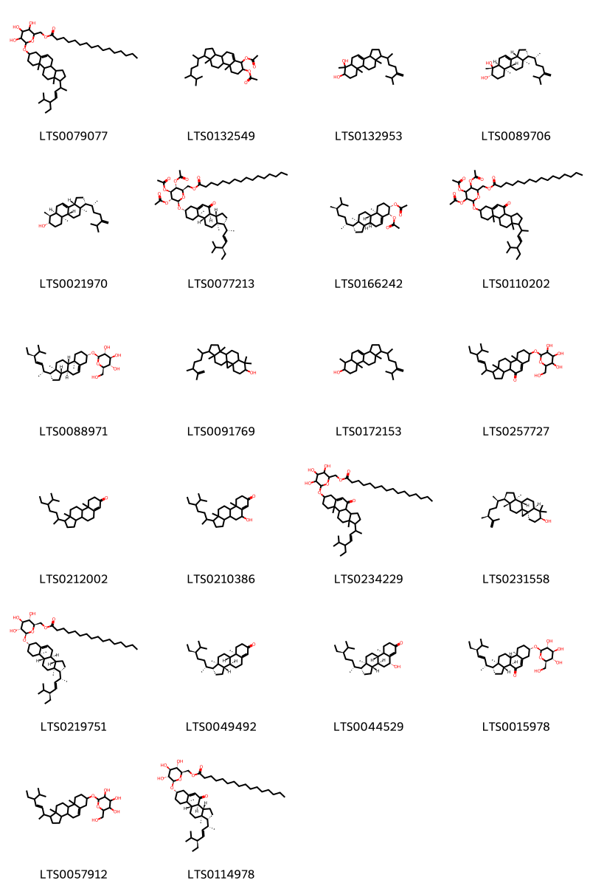{ width=100% }
    <figcaption>Hình ảnh cấu trúc hóa học của 22 hoạt chất thuộc nhóm Steroids and steroid derivatives gồm ['(6-{[1-(5-ethyl-6-methylhept-3-en-2-yl)-9a,11a-dimethyl-1h,2h,3h,3ah,3bh,4h,6h,7h,8h,9h,9bh,10h,11h-cyclopenta[a]phenanthren-7-yl]oxy}-3,4,5-trihydroxyoxan-2-yl)methyl hexadecanoate (LTS0079077)', '7-(acetyloxy)-1-(5,6-dimethylheptan-2-yl)-9a,11a-dimethyl-1h,2h,3h,3ah,3bh,4h,6h,7h,8h,9h,9bh,10h,11h-cyclopenta[a]phenanthren-6-yl acetate (LTS0132549)', '6,9a,11a-trimethyl-1-(6-methyl-5-methylideneheptan-2-yl)-1h,2h,3h,3ah,5h,5ah,7h,8h,9h,9bh,10h,11h-cyclopenta[a]phenanthrene-6,7-diol (LTS0132953)', '(1r,3ar,5as,6r,7s,9ar,9br,11ar)-6,9a,11a-trimethyl-1-[(2r)-6-methyl-5-methylideneheptan-2-yl]-1h,2h,3h,3ah,5h,5ah,7h,8h,9h,9bh,10h,11h-cyclopenta[a]phenanthrene-6,7-diol (LTS0089706)', '(1r,3ar,5ar,6s,7s,9as,9br,11ar)-6,9a,11a-trimethyl-1-[(2r)-6-methyl-5-methylideneheptan-2-yl]-1h,2h,3h,3ah,5h,5ah,6h,7h,8h,9h,9bh,10h,11h-cyclopenta[a]phenanthren-7-ol (LTS0021970)', '[(2r,3r,4s,5r,6r)-6-{[(1r,3as,3bs,7s,9ar,9bs,11ar)-1-[(2r,3e,5s)-5-ethyl-6-methylhept-3-en-2-yl]-9a,11a-dimethyl-4-oxo-1h,2h,3h,3ah,3bh,6h,7h,8h,9h,9bh,10h,11h-cyclopenta[a]phenanthren-7-yl]oxy}-3,4,5-tris(acetyloxy)oxan-2-yl]methyl hexadecanoate (LTS0077213)', '(1r,3as,3bs,6r,7s,9ar,9bs,11ar)-7-(acetyloxy)-1-[(2r,5r)-5,6-dimethylheptan-2-yl]-9a,11a-dimethyl-1h,2h,3h,3ah,3bh,4h,6h,7h,8h,9h,9bh,10h,11h-cyclopenta[a]phenanthren-6-yl acetate (LTS0166242)', '[3,4,5-tris(acetyloxy)-6-{[1-(5-ethyl-6-methylhept-3-en-2-yl)-9a,11a-dimethyl-4-oxo-1h,2h,3h,3ah,3bh,6h,7h,8h,9h,9bh,10h,11h-cyclopenta[a]phenanthren-7-yl]oxy}oxan-2-yl]methyl hexadecanoate (LTS0110202)', '(2r,3r,4s,5s,6r)-2-{[(1r,3as,3bs,7s,9ar,9bs,11ar)-1-[(2r,3e,5s)-5-ethyl-6-methylhept-3-en-2-yl]-9a,11a-dimethyl-1h,2h,3h,3ah,3bh,4h,6h,7h,8h,9h,9bh,10h,11h-cyclopenta[a]phenanthren-7-yl]oxy}-6-(hydroxymethyl)oxane-3,4,5-triol (LTS0088971)', '15-(5,6-dimethylhept-6-en-2-yl)-7,7,12,16-tetramethylpentacyclo[9.7.0.0¹,³.0³,⁸.0¹²,¹⁶]octadecan-6-ol (LTS0091769)', '6,9a,11a-trimethyl-1-(6-methyl-5-methylideneheptan-2-yl)-1h,2h,3h,3ah,5h,5ah,6h,7h,8h,9h,9bh,10h,11h-cyclopenta[a]phenanthren-7-ol (LTS0172153)', '1-(5-ethyl-6-methylhept-3-en-2-yl)-9a,11a-dimethyl-7-{[3,4,5-trihydroxy-6-(hydroxymethyl)oxan-2-yl]oxy}-1h,2h,3h,3ah,3bh,6h,7h,8h,9h,9bh,10h,11h-cyclopenta[a]phenanthren-4-one (LTS0257727)', '1-(5-ethyl-6-methylheptan-2-yl)-9a,11a-dimethyl-1h,2h,3h,3ah,3bh,4h,5h,8h,9h,9bh,10h,11h-cyclopenta[a]phenanthren-7-one (LTS0212002)', '1-(5-ethyl-6-methylheptan-2-yl)-5-hydroxy-9a,11a-dimethyl-1h,2h,3h,3ah,3bh,4h,5h,8h,9h,9bh,10h,11h-cyclopenta[a]phenanthren-7-one (LTS0210386)', '(6-{[1-(5-ethyl-6-methylhept-3-en-2-yl)-9a,11a-dimethyl-4-oxo-1h,2h,3h,3ah,3bh,6h,7h,8h,9h,9bh,10h,11h-cyclopenta[a]phenanthren-7-yl]oxy}-3,4,5-trihydroxyoxan-2-yl)methyl hexadecanoate (LTS0234229)', 'cyclolaudenol (LTS0231558)', '[(2r,3s,4s,5r,6r)-6-{[(1r,3as,3bs,7s,9ar,9bs,11ar)-1-[(2r,3e,5s)-5-ethyl-6-methylhept-3-en-2-yl]-9a,11a-dimethyl-1h,2h,3h,3ah,3bh,4h,6h,7h,8h,9h,9bh,10h,11h-cyclopenta[a]phenanthren-7-yl]oxy}-3,4,5-trihydroxyoxan-2-yl]methyl hexadecanoate (LTS0219751)', 'β-sitostenone (LTS0049492)', '(1r,3as,3bs,5r,9ar,9bs,11ar)-1-[(2r,5r)-5-ethyl-6-methylheptan-2-yl]-5-hydroxy-9a,11a-dimethyl-1h,2h,3h,3ah,3bh,4h,5h,8h,9h,9bh,10h,11h-cyclopenta[a]phenanthren-7-one (LTS0044529)', '(1r,3as,3bs,7s,9ar,9bs,11ar)-1-[(2r,3e,5s)-5-ethyl-6-methylhept-3-en-2-yl]-9a,11a-dimethyl-7-{[(2r,3r,4s,5s,6r)-3,4,5-trihydroxy-6-(hydroxymethyl)oxan-2-yl]oxy}-1h,2h,3h,3ah,3bh,6h,7h,8h,9h,9bh,10h,11h-cyclopenta[a]phenanthren-4-one (LTS0015978)', '2-{[1-(5-ethyl-6-methylhept-3-en-2-yl)-9a,11a-dimethyl-1h,2h,3h,3ah,3bh,4h,6h,7h,8h,9h,9bh,10h,11h-cyclopenta[a]phenanthren-7-yl]oxy}-6-(hydroxymethyl)oxane-3,4,5-triol (LTS0057912)', '[(2r,3s,4s,5r,6r)-6-{[(1r,3as,3bs,7s,9ar,9bs,11ar)-1-[(2r,3e,5s)-5-ethyl-6-methylhept-3-en-2-yl]-9a,11a-dimethyl-4-oxo-1h,2h,3h,3ah,3bh,6h,7h,8h,9h,9bh,10h,11h-cyclopenta[a]phenanthren-7-yl]oxy}-3,4,5-trihydroxyoxan-2-yl]methyl hexadecanoate (LTS0114978)'].</figcaption>
</figure>

---

### Dược dân tộc học

Danh sách các quốc gia có sử dụng *Pontederia vaginalis* trong điều trị các bệnh. 

| Country   | Disease     | Bệnh                                                                                                                                                                                                |
|:----------|:------------|:----------------------------------------------------------------------------------------------------------------------------------------------------------------------------------------------------|
| China     | Refrigerant | MYMEMORY WARNING: YOU USED ALL AVAILABLE FREE TRANSLATIONS FOR TODAY. NEXT AVAILABLE IN  08 HOURS 28 MINUTES 29 SECONDS VISIT HTTPS://MYMEMORY.TRANSLATED.NET/DOC/USAGELIMITS.PHP TO TRANSLATE MORE |

---

