!!! abstract "Tóm tắt"

    Họ Portulacaceae gồm khoảng 3 chi và 10 loài được một số cộng đồng tại các quốc gia như Turkey, Trinidad, Australia, US(Quileute), Haiti, Iraq, Sudan, Bahamas, Africa(Zulu), Tanganyika, Elsewhere, India, Java, Venezuela, Dominican Republic, China sử dụng trong một số trường hợp QUERY LENGTH LIMIT EXCEEDED. MAX ALLOWED QUERY : 500 CHARS.

!!! info "DrDuke"

    James A. Duke sinh năm 1929-2017 là một nhà thực vật học người Mỹ. Đây là một trong những tác giả hàng đầu trong lĩnh vực dược dân tộc học với cuốn *CRC Handbook of Medicinal Herbs* và chính là người xây dựng lên cơ sở dữ liệu về hợp chất tự nhiên và dược dân tộc học tại Bộ nông nghiệp Hoa Kỳ. Các thông tin được đăng tải tại website [Dr. Duke's Phytochemical and Ethnobotanical Databases](https://phytochem.nal.usda.gov/). 
    Trong suốt thập niên 1970, ông lãnh đạo the Plant Taxonomy Laboratory, Plant Genetics and Germplasm Institute of the Agricultural Research Service, U.S. Department of Agriculture.
    Trong tài liệu này, các thông tin về dược dân tộc của các dược liệu được trích dẫn từ tài liệu của James A. Ducke với sự trợ giúp của phần mềm dịch thuật từ tiếng Anh sang tiếng Việt.
   

# Chi Talinum

??? note "Danh sách các dược liệu thuộc chi"
    
	 - *Talinum cuneifolium*
	 - *Talinum paniculatum*
	 - *Talinum portulacifolium*
	 - *Talinum triangulare*

---
## Talinum cuneifolium
### Thông tin về thực vật

!!! info "Phân loại thực vật của *N/A* từ GIBF:"
    - **Kingdom:** Plantae
    - **Phylum:** Tracheophyta
    - **Order:** Caryophyllales
    - **Family:** Talinaceae
    - **Genus:** Talinum
    - **Species:** *N/A*

 

| Label (VI)   | Label (EN)   | Scientific Name     | Descriptions (VI)   | Descriptions (EN)   | Also Known As (VI)   | Also Known As (EN)   |
|:-------------|:-------------|:--------------------|:--------------------|:--------------------|:---------------------|:---------------------|
| N/A          | N/A          | Talinum cuneifolium |                     |                     | ['']                 | ['']                 |

#### Phân bố trên thế giới

**Từ CSDL GIBF** Virgin Islands (U.S.), Sri Lanka, Australia, Japan, Guadeloupe, Guatemala, Argentina, Benin, French Guiana, Panama, Puerto Rico, Réunion, Nigeria, Namibia, Chinese Taipei, Bolivia (Plurinational State of), Honduras, United States of America, Uruguay, South Africa, Hong Kong, Martinique, Brazil, Sint Maarten (Dutch part), Peru, Mexico, Dominican Republic, China, Ecuador, Haiti, Colombia, Montserrat, India, Indonesia, Antigua and Barbuda, Philippines

#### Phân bố tại Việt Nam

**Từ CSDL GIBF**: Không có ghi nhận ở Việt Nam

---
### Thành phần hóa học
        
- Theo cơ sở dữ liệu lotus: Từ loài *N/A* đã phân lập và xác định được Chưa có hoạt chất nào được phân lập. hoạt chất thuộc về các nhóm Không có hoạt chất nào được phân lập. 

Không có hình ảnh nào được tạo ra

---

### Dược dân tộc học

Danh sách các quốc gia có sử dụng *N/A* trong điều trị các bệnh. 

| Country    | Disease     | Bệnh           |
|:-----------|:------------|:---------------|
| Tanganyika | Aphrodisiac | Thuốc kích dục |

---

---
## Talinum paniculatum
### Thông tin về thực vật

!!! info "Phân loại thực vật của *Talinum paniculatum* từ GIBF:"
    - **Kingdom:** Plantae
    - **Phylum:** Tracheophyta
    - **Order:** Caryophyllales
    - **Family:** Talinaceae
    - **Genus:** Talinum
    - **Species:** *Talinum paniculatum*

 

| Label (VI)   | Label (EN)   | Scientific Name     | Descriptions (VI)   | Descriptions (EN)   | Also Known As (VI)   | Also Known As (EN)                                                                                          |
|:-------------|:-------------|:--------------------|:--------------------|:--------------------|:---------------------|:------------------------------------------------------------------------------------------------------------|
| N/A          | N/A          | Talinum paniculatum | loài thực vật       | species of plant    | ['']                 | ["pink baby's-breath", 'fame flower', 'fameflower', 'Jewels of Opar', 'Jewels-of-Opar', 'pink baby-breath'] |

#### Phân bố trên thế giới

**Từ CSDL GIBF** Australia, Japan, Guatemala, Argentina, Nicaragua, Tanzania, United Republic of, French Guiana, Puerto Rico, Réunion, Chinese Taipei, Spain, United States of America, Uruguay, South Africa, Hong Kong, Thailand, Brazil, Peru, Mexico, Dominican Republic, Singapore, China, Costa Rica, India, Indonesia, Philippines, Nepal

#### Phân bố tại Việt Nam

**Từ CSDL GIBF**: Không có ghi nhận ở Việt Nam

---
### Thành phần hóa học
        
- Theo cơ sở dữ liệu lotus: Từ loài *Talinum paniculatum* đã phân lập và xác định được 7 hoạt chất thuộc về các nhóm Protoberberine alkaloids and derivatives. 

|    | chemicalTaxonomyClassyfireClass          |   smiles_count |
|---:|:-----------------------------------------|---------------:|
|  0 | Protoberberine alkaloids and derivatives |              7 |

#### Nhóm Protoberberine alkaloids and derivatives
<figure markdown="span">
    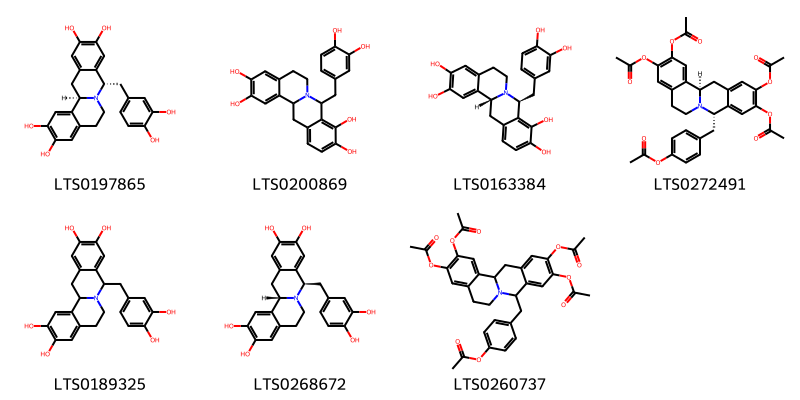{ width=100% }
    <figcaption>Hình ảnh cấu trúc hóa học của 7 hoạt chất thuộc nhóm Protoberberine alkaloids and derivatives gồm ['(5s,12br)-5-[(3,4-dihydroxyphenyl)methyl]-7,8,12b,13-tetrahydro-5h-6-azatetraphene-2,3,10,11-tetrol (LTS0197865)', '5-[(3,4-dihydroxyphenyl)methyl]-7,8,12b,13-tetrahydro-5h-6-azatetraphene-3,4,10,11-tetrol (LTS0200869)', '(5s,12br)-5-[(3,4-dihydroxyphenyl)methyl]-7,8,12b,13-tetrahydro-5h-6-azatetraphene-3,4,10,11-tetrol (LTS0163384)', '4-{[(5s,12br)-2,3,10,11-tetrakis(acetyloxy)-7,8,12b,13-tetrahydro-5h-6-azatetraphen-5-yl]methyl}phenyl acetate (LTS0272491)', '5-[(3,4-dihydroxyphenyl)methyl]-7,8,12b,13-tetrahydro-5h-6-azatetraphene-2,3,10,11-tetrol (LTS0189325)', '(5r,12bs)-5-[(3,4-dihydroxyphenyl)methyl]-7,8,12b,13-tetrahydro-5h-6-azatetraphene-2,3,10,11-tetrol (LTS0268672)', '4-{[2,3,10,11-tetrakis(acetyloxy)-7,8,12b,13-tetrahydro-5h-6-azatetraphen-5-yl]methyl}phenyl acetate (LTS0260737)'].</figcaption>
</figure>

---

### Dược dân tộc học

Danh sách các quốc gia có sử dụng *Talinum paniculatum* trong điều trị các bệnh. 

| Country   | Disease                          | Bệnh                                        |
|:----------|:---------------------------------|:--------------------------------------------|
| China     | Aphrodisiac                      | Thuốc kích dục                              |
| Haiti     | Diuretic, Emollient, Refrigerant | Thuốc lợi tiểu, Chất làm mềm, Chất làm lạnh |

---

---
## Talinum portulacifolium
### Thông tin về thực vật

!!! info "Phân loại thực vật của *Talinum portulacifolium* từ GIBF:"
    - **Kingdom:** Plantae
    - **Phylum:** Tracheophyta
    - **Order:** Caryophyllales
    - **Family:** Talinaceae
    - **Genus:** Talinum
    - **Species:** *Talinum portulacifolium*

 

| Label (VI)   | Label (EN)   | Scientific Name         | Descriptions (VI)   | Descriptions (EN)   | Also Known As (VI)   | Also Known As (EN)   |
|:-------------|:-------------|:------------------------|:--------------------|:--------------------|:---------------------|:---------------------|
| N/A          | N/A          | Talinum portulacifolium | loài thực vật       | species of plant    | ['']                 | ['']                 |

#### Phân bố trên thế giới

**Từ CSDL GIBF** nan, Central African Republic, Gabon, Angola, Somalia, Mozambique, Rwanda, Benin, South Sudan, Tanzania, United Republic of, Yemen, Togo, Malawi, Nigeria, Namibia, Sudan, United States of America, Congo, Democratic Republic of the, Saudi Arabia, South Africa, Uganda, Oman, Eritrea, Brazil, Côte d’Ivoire, Mexico, Eswatini, China, Madagascar, Botswana, Burundi, India, Kenya, Cameroon, Ethiopia

#### Phân bố tại Việt Nam

**Từ CSDL GIBF**: Không có ghi nhận ở Việt Nam

---
### Thành phần hóa học
        
- Theo cơ sở dữ liệu lotus: Từ loài *Talinum portulacifolium* đã phân lập và xác định được Chưa có hoạt chất nào được phân lập. hoạt chất thuộc về các nhóm Không có hoạt chất nào được phân lập. 

Không có hình ảnh nào được tạo ra

---

### Dược dân tộc học

Danh sách các quốc gia có sử dụng *Talinum portulacifolium* trong điều trị các bệnh. 

| Country   | Disease     | Bệnh           |
|:----------|:------------|:---------------|
| India     | Aphrodisiac | Thuốc kích dục |

---

---
## Talinum triangulare
### Thông tin về thực vật

!!! info "Phân loại thực vật của *Talinum fruticosum* từ GIBF:"
    - **Kingdom:** Plantae
    - **Phylum:** Tracheophyta
    - **Order:** Caryophyllales
    - **Family:** Talinaceae
    - **Genus:** Talinum
    - **Species:** *Talinum fruticosum*

 

| Label (VI)   | Label (EN)   | Scientific Name     | Descriptions (VI)   | Descriptions (EN)   | Also Known As (VI)   | Also Known As (EN)   |
|:-------------|:-------------|:--------------------|:--------------------|:--------------------|:---------------------|:---------------------|
| N/A          | N/A          | Talinum triangulare | loài thực vật       | species of plant    | ['']                 | ['']                 |

#### Phân bố trên thế giới

**Từ CSDL GIBF** Ghana, Australia, Japan, Gabon, Benin, Nicaragua, Norway, Venezuela (Bolivarian Republic of), Togo, Nigeria, Papua New Guinea, Jamaica, United States of America, Bonaire, Sint Eustatius and Saba, El Salvador, Suriname, Brazil, Mexico, Peru, Cabo Verde, Colombia, India

#### Phân bố tại Việt Nam

**Từ CSDL GIBF**: Không có ghi nhận ở Việt Nam

---
### Thành phần hóa học
        
- Theo cơ sở dữ liệu lotus: Từ loài *Talinum fruticosum* đã phân lập và xác định được Chưa có hoạt chất nào được phân lập. hoạt chất thuộc về các nhóm Không có hoạt chất nào được phân lập. 

Không có hình ảnh nào được tạo ra

---

### Dược dân tộc học

Danh sách các quốc gia có sử dụng *Talinum fruticosum* trong điều trị các bệnh. 

| Country   | Disease     | Bệnh          |
|:----------|:------------|:--------------|
| Elsewhere | Collyrium   | Collyrium     |
| Venezuela | Refrigerant | Chất làm lạnh |

---

# Chi Portulaca

??? note "Danh sách các dược liệu thuộc chi"
    
	 - *Portulaca grandiflora*
	 - *Portulaca oleracea*
	 - *Portulaca phaeoerma*
	 - *Portulaca pilosa*
	 - *Portulaca quadrifida*

---
## Portulaca grandiflora
### Thông tin về thực vật

!!! info "Phân loại thực vật của *Portulaca grandiflora* từ GIBF:"
    - **Kingdom:** Plantae
    - **Phylum:** Tracheophyta
    - **Order:** Caryophyllales
    - **Family:** Portulacaceae
    - **Genus:** Portulaca
    - **Species:** *Portulaca grandiflora*

 

| Label (VI)   | Label (EN)   | Scientific Name       | Descriptions (VI)   | Descriptions (EN)   | Also Known As (VI)        | Also Known As (EN)   |
|:-------------|:-------------|:----------------------|:--------------------|:--------------------|:--------------------------|:---------------------|
| N/A          | N/A          | Portulaca grandiflora | loài thực vật       | species of plant    | ['Portulaca grandiflora'] | ['']                 |

#### Phân bố trên thế giới

**Từ CSDL GIBF** Italy, Australia, Japan, Slovakia, Belgium, Georgia, Argentina, Mozambique, Benin, Tanzania, United Republic of, Panama, Canada, Malawi, Pakistan, Ukraine, Netherlands, Belarus, Kyrgyzstan, Chinese Taipei, Spain, Bolivia (Plurinational State of), Hungary, Honduras, Türkiye, Russian Federation, United States of America, Uruguay, Kazakhstan, Greece, South Africa, Czechia, Thailand, Romania, Germany, Brazil, Côte d’Ivoire, Armenia, Peru, Mexico, Austria, France, Viet Nam, Dominican Republic, China, United Kingdom of Great Britain and Northern Ireland, Ecuador, Colombia, Kenya, Costa Rica, Botswana, India, Indonesia, Philippines, Malaysia, Nepal

#### Phân bố tại Việt Nam

**Từ CSDL GIBF**: Ninh Bình, Hà Giang

---
### Thành phần hóa học
        
- Theo cơ sở dữ liệu lotus: Từ loài *Portulaca grandiflora* đã phân lập và xác định được 54 hoạt chất thuộc về các nhóm Fatty Acyls, Prenol lipids, Indoles and derivatives, Organooxygen compounds, Phenols, Carboxylic acids and derivatives, Betalains. 

|    | chemicalTaxonomyClassyfireClass   |   smiles_count |
|---:|:----------------------------------|---------------:|
|  0 | Betalains                         |              2 |
|  1 | Carboxylic acids and derivatives  |             22 |
|  2 | Fatty Acyls                       |              7 |
|  3 | Indoles and derivatives           |              2 |
|  4 | Organooxygen compounds            |              2 |
|  5 | Phenols                           |              3 |
|  6 | Prenol lipids                     |             13 |

#### Nhóm Betalains
<figure markdown="span">
    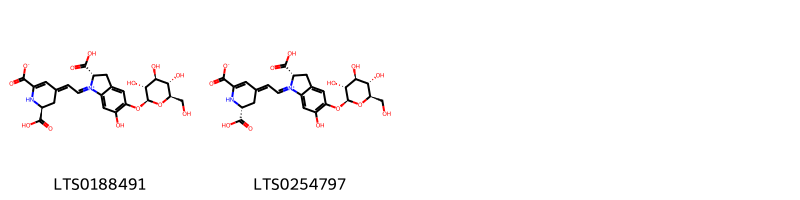{ width=100% }
    <figcaption>Hình ảnh cấu trúc hóa học của 2 hoạt chất thuộc nhóm Betalains gồm ['(2s)-2-carboxy-1-{2-[(2s)-2-carboxy-6-carboxylato-2,3-dihydro-1h-pyridin-4-ylidene]ethylidene}-6-hydroxy-5-{[(2s,3r,4s,5s,6r)-3,4,5-trihydroxy-6-(hydroxymethyl)oxan-2-yl]oxy}-2,3-dihydro-1h-1λ⁵-indol-1-ylium (LTS0188491)', '(2s)-2-carboxy-1-{2-[(2r)-2-carboxy-6-carboxylato-2,3-dihydro-1h-pyridin-4-ylidene]ethylidene}-6-hydroxy-5-{[(2s,3r,4s,5s,6r)-3,4,5-trihydroxy-6-(hydroxymethyl)oxan-2-yl]oxy}-2,3-dihydro-1h-1λ⁵-indol-1-ylium (LTS0254797)'].</figcaption>
</figure>
#### Nhóm Carboxylic acids and derivatives
<figure markdown="span">
    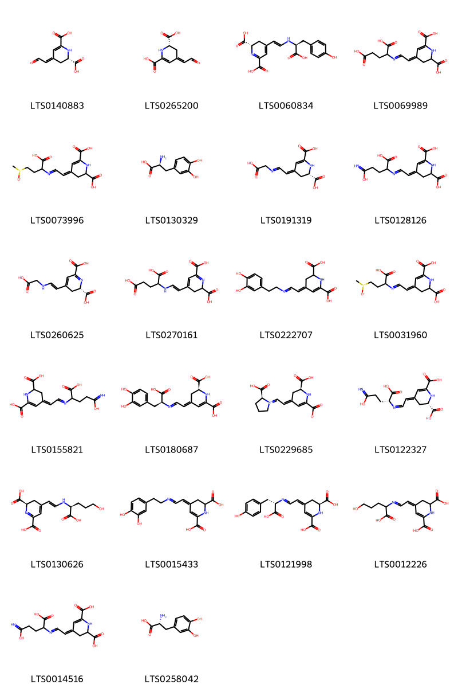{ width=100% }
    <figcaption>Hình ảnh cấu trúc hóa học của 22 hoạt chất thuộc nhóm Carboxylic acids and derivatives gồm ['(2s,4z)-4-(2-oxoethylidene)-2,3-dihydro-1h-pyridine-2,6-dicarboxylic acid (LTS0140883)', 'betalamic acid (LTS0265200)', '(2s)-4-[(1e)-2-{[(1s)-1-carboxy-2-(4-hydroxyphenyl)ethyl]amino}ethenyl]-2,3-dihydropyridine-2,6-dicarboxylic acid (LTS0060834)', '(4z)-4-{2-[(1,3-dicarboxypropyl)imino]ethylidene}-2,3-dihydro-1h-pyridine-2,6-dicarboxylic acid (LTS0069989)', '(4z)-4-{2-[(1-carboxy-3-methanesulfinylpropyl)imino]ethylidene}-2,3-dihydro-1h-pyridine-2,6-dicarboxylic acid (LTS0073996)', 'levodopa (LTS0130329)', '(2s,4z)-4-{2-[(carboxymethyl)imino]ethylidene}-2,3-dihydro-1h-pyridine-2,6-dicarboxylic acid (LTS0191319)', '(4z)-4-(2-{[1-carboxy-3-(c-hydroxycarbonimidoyl)propyl]imino}ethylidene)-2,3-dihydro-1h-pyridine-2,6-dicarboxylic acid (LTS0128126)', '(2s)-4-[(1e)-2-[(carboxymethyl)amino]ethenyl]-2,3-dihydropyridine-2,6-dicarboxylic acid (LTS0260625)', '4-[(1e)-2-[(1,3-dicarboxypropyl)amino]ethenyl]-2,3-dihydropyridine-2,6-dicarboxylic acid (LTS0270161)', '4-(2-{[2-(3,4-dihydroxyphenyl)ethyl]imino}ethylidene)-2,3-dihydro-1h-pyridine-2,6-dicarboxylic acid (LTS0222707)', '4-{2-[(1-carboxy-3-methanesulfinylpropyl)imino]ethylidene}-2,3-dihydro-1h-pyridine-2,6-dicarboxylic acid (LTS0031960)', '(4e)-4-(2-{[1-carboxy-3-(c-hydroxycarbonimidoyl)propyl]imino}ethylidene)-2,3-dihydro-1h-pyridine-2,6-dicarboxylic acid (LTS0155821)', '(2s,4e)-4-(2-{[(1s)-1-carboxy-2-(3,4-dihydroxyphenyl)ethyl]imino}ethylidene)-2,3-dihydro-1h-pyridine-2,6-dicarboxylic acid (LTS0180687)', '(2s)-2-carboxy-1-{2-[(2s)-2-carboxy-6-carboxylato-2,3-dihydro-1h-pyridin-4-ylidene]ethylidene}-1λ⁵-pyrrolidin-1-ylium (LTS0229685)', '(2s,4e)-4-[(2z)-2-{[(1r)-1-carboxy-3-(c-hydroxycarbonimidoyl)propyl]imino}ethylidene]-2,3-dihydro-1h-pyridine-2,6-dicarboxylic acid (LTS0122327)', '(2r)-4-[(1e)-2-{[(1s)-1-carboxy-4-hydroxybutyl]amino}ethenyl]-2,3-dihydropyridine-2,6-dicarboxylic acid (LTS0130626)', '(4z)-4-(2-{[2-(3,4-dihydroxyphenyl)ethyl]imino}ethylidene)-2,3-dihydro-1h-pyridine-2,6-dicarboxylic acid (LTS0015433)', '(2s,4z)-4-(2-{[(1s)-1-carboxy-2-(4-hydroxyphenyl)ethyl]imino}ethylidene)-2,3-dihydro-1h-pyridine-2,6-dicarboxylic acid (LTS0121998)', '(4z)-4-{2-[(1-carboxy-4-hydroxybutyl)imino]ethylidene}-2,3-dihydro-1h-pyridine-2,6-dicarboxylic acid (LTS0012226)', '4-(2-{[1-carboxy-3-(c-hydroxycarbonimidoyl)propyl]imino}ethylidene)-2,3-dihydro-1h-pyridine-2,6-dicarboxylic acid (LTS0014516)', 'dihydroxyphenylalanine (LTS0258042)'].</figcaption>
</figure>
#### Nhóm Fatty Acyls
<figure markdown="span">
    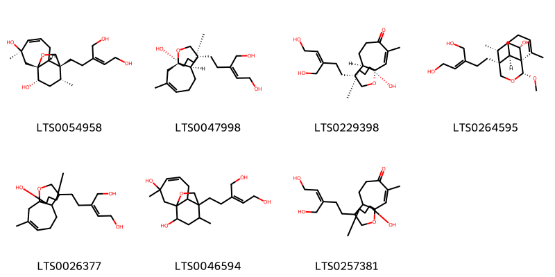{ width=100% }
    <figcaption>Hình ảnh cấu trúc hóa học của 7 hoạt chất thuộc nhóm Fatty Acyls gồm ['(1r,3r,7r,8r,9r,11s)-8-[(3z)-5-hydroxy-3-(hydroxymethyl)pent-3-en-1-yl]-3,9-dimethyl-12-oxatricyclo[6.3.2.0¹,⁷]tridec-4-ene-3,11-diol (LTS0054958)', '(2z)-2-{2-[(1r,7r,8r,9r,11s)-11-hydroxy-3,9-dimethyl-12-oxatricyclo[6.3.2.0¹,⁷]tridec-3-en-8-yl]ethyl}but-2-ene-1,4-diol (LTS0047998)', '(1r,7r,8r,9r,11s)-11-hydroxy-8-[(3z)-5-hydroxy-3-(hydroxymethyl)pent-3-en-1-yl]-3,9-dimethyl-12-oxatricyclo[6.3.2.0¹,⁷]tridec-2-en-4-one (LTS0229398)', '(2z)-2-{2-[(1r,6r,7s,10r,11s,13r)-11-hydroxy-10-methoxy-2,13-dimethyl-9-oxatricyclo[5.3.3.0¹,⁶]tridec-2-en-7-yl]ethyl}but-2-ene-1,4-diol (LTS0264595)', '2-(2-{11-hydroxy-3,9-dimethyl-12-oxatricyclo[6.3.2.0¹,⁷]tridec-3-en-8-yl}ethyl)but-2-ene-1,4-diol (LTS0026377)', '8-[5-hydroxy-3-(hydroxymethyl)pent-3-en-1-yl]-3,9-dimethyl-12-oxatricyclo[6.3.2.0¹,⁷]tridec-4-ene-3,11-diol (LTS0046594)', '11-hydroxy-8-[5-hydroxy-3-(hydroxymethyl)pent-3-en-1-yl]-3,9-dimethyl-12-oxatricyclo[6.3.2.0¹,⁷]tridec-2-en-4-one (LTS0257381)'].</figcaption>
</figure>
#### Nhóm Indoles and derivatives
<figure markdown="span">
    { width=100% }
    <figcaption>Hình ảnh cấu trúc hóa học của 2 hoạt chất thuộc nhóm Indoles and derivatives gồm ['(2s)-4-[(1e)-2-[(2r)-2-carboxy-5,6-dihydroxy-2,3-dihydroindol-1-yl]ethenyl]-2,3-dihydropyridine-2,6-dicarboxylic acid (LTS0237541)', 'betanidin (LTS0217631)'].</figcaption>
</figure>
#### Nhóm Organooxygen compounds
<figure markdown="span">
    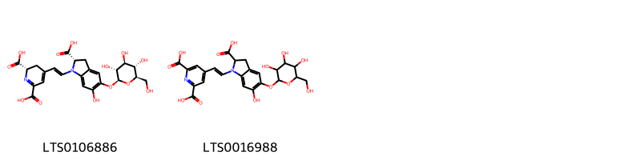{ width=100% }
    <figcaption>Hình ảnh cấu trúc hóa học của 2 hoạt chất thuộc nhóm Organooxygen compounds gồm ['betanin (LTS0106886)', '4-[(1e)-2-(2-carboxy-6-hydroxy-5-{[3,4,5-trihydroxy-6-(hydroxymethyl)oxan-2-yl]oxy}-2,3-dihydroindol-1-yl)ethenyl]pyridine-2,6-dicarboxylic acid (LTS0016988)'].</figcaption>
</figure>
#### Nhóm Phenols
<figure markdown="span">
    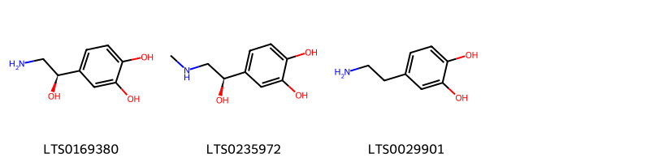{ width=100% }
    <figcaption>Hình ảnh cấu trúc hóa học của 3 hoạt chất thuộc nhóm Phenols gồm ['norepinephrine (LTS0169380)', 'epinephrine (LTS0235972)', 'dopamine (LTS0029901)'].</figcaption>
</figure>
#### Nhóm Prenol lipids
<figure markdown="span">
    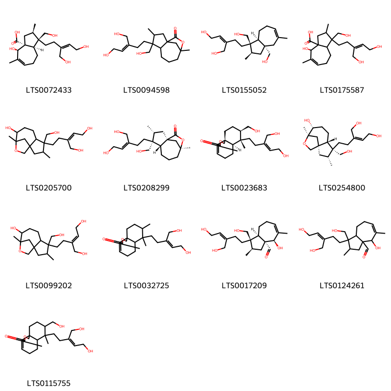{ width=100% }
    <figcaption>Hình ảnh cấu trúc hóa học của 13 hoạt chất thuộc nhóm Prenol lipids gồm ['(1r,2r,3ar,4r,8ar)-4-hydroxy-1-[(3z)-5-hydroxy-3-(hydroxymethyl)pent-3-en-1-yl]-1-(hydroxymethyl)-2,5-dimethyl-2,3,4,7,8,8a-hexahydroazulene-3a-carboxylic acid (LTS0072433)', '4-[5-hydroxy-3-(hydroxymethyl)pent-3-en-1-yl]-4-(hydroxymethyl)-3,9-dimethyl-10-oxatricyclo[7.2.1.0¹,⁵]dodecan-11-one (LTS0094598)', '(2z)-2-{2-[(1r,2r,3as,8as)-1,3a-bis(hydroxymethyl)-2,5-dimethyl-2,3,4,7,8,8a-hexahydroazulen-1-yl]ethyl}but-2-ene-1,4-diol (LTS0155052)', '4-hydroxy-1-[5-hydroxy-3-(hydroxymethyl)pent-3-en-1-yl]-1-(hydroxymethyl)-2,5-dimethyl-2,3,4,7,8,8a-hexahydroazulene-3a-carboxylic acid (LTS0175587)', '2-{2-[8-hydroxy-4-(hydroxymethyl)-3,9-dimethyl-10-oxatricyclo[7.2.1.0¹,⁵]dodecan-4-yl]ethyl}but-2-ene-1,4-diol (LTS0205700)', '(1s,3r,4r,5r,9s)-4-[(3z)-5-hydroxy-3-(hydroxymethyl)pent-3-en-1-yl]-4-(hydroxymethyl)-3,9-dimethyl-10-oxatricyclo[7.2.1.0¹,⁵]dodecan-11-one (LTS0208299)', '(6ar,7r,8r,10as)-7-[(3z)-5-hydroxy-3-(hydroxymethyl)pent-3-en-1-yl]-8-(hydroxymethyl)-7-methyl-1h,5h,6h,6ah,8h,9h,10h-naphtho[4,4a-c]furan-3-one (LTS0023683)', '(2z)-2-{2-[(1s,3r,4r,5s,8r,9r)-8-hydroxy-4-(hydroxymethyl)-3,9-dimethyl-10-oxatricyclo[7.2.1.0¹,⁵]dodecan-4-yl]ethyl}but-2-ene-1,4-diol (LTS0254800)', '(2e)-2-{2-[8-hydroxy-4-(hydroxymethyl)-3,9-dimethyl-10-oxatricyclo[7.2.1.0¹,⁵]dodecan-4-yl]ethyl}but-2-ene-1,4-diol (LTS0099202)', '7-[(3z)-5-hydroxy-3-(hydroxymethyl)pent-3-en-1-yl]-7,8-dimethyl-1h,5h,6h,6ah,8h,9h,10h-naphtho[4,4a-c]furan-3-one (LTS0032725)', '(1r,2r,3ar,4r,8ar)-4-hydroxy-1-[(3z)-5-hydroxy-3-(hydroxymethyl)pent-3-en-1-yl]-1-(hydroxymethyl)-2,5-dimethyl-2,3,4,7,8,8a-hexahydroazulene-3a-carbaldehyde (LTS0017209)', '4-hydroxy-1-[5-hydroxy-3-(hydroxymethyl)pent-3-en-1-yl]-1-(hydroxymethyl)-2,5-dimethyl-2,3,4,7,8,8a-hexahydroazulene-3a-carbaldehyde (LTS0124261)', '7-[5-hydroxy-3-(hydroxymethyl)pent-3-en-1-yl]-8-(hydroxymethyl)-7-methyl-1h,5h,6h,6ah,8h,9h,10h-naphtho[4,4a-c]furan-3-one (LTS0115755)'].</figcaption>
</figure>

---

### Dược dân tộc học

Danh sách các quốc gia có sử dụng *Portulaca grandiflora* trong điều trị các bệnh. 

| Country   |   Disease | Bệnh   |
|:----------|----------:|:-------|
| Elsewhere |       nan | Ở đây  |

---

---
## Portulaca oleracea
### Thông tin về thực vật

!!! info "Phân loại thực vật của *Portulaca oleracea* từ GIBF:"
    - **Kingdom:** Plantae
    - **Phylum:** Tracheophyta
    - **Order:** Caryophyllales
    - **Family:** Portulacaceae
    - **Genus:** Portulaca
    - **Species:** *Portulaca oleracea*

 

| Label (VI)   | Label (EN)   | Scientific Name    | Descriptions (VI)   | Descriptions (EN)          | Also Known As (VI)     | Also Known As (EN)                           |
|:-------------|:-------------|:-------------------|:--------------------|:---------------------------|:-----------------------|:---------------------------------------------|
| N/A          | N/A          | Portulaca oleracea | thực vật có hoa     | species of flowering plant | ['Portulaca oleracea'] | ['Moss Rose', 'Common purslane', 'Pig Weed'] |

#### Phân bố trên thế giới

**Từ CSDL GIBF** nan, United Arab Emirates, Australia, Argentina, Benin, Tanzania, United Republic of, Panama, Malawi, Puerto Rico, Namibia, Chinese Taipei, Spain, Portugal, Algeria, United States of America, Chile, Uruguay, Zimbabwe, South Africa, Hong Kong, Thailand, Martinique, Brazil, Mexico, Peru, France, Ecuador, Colombia, Kenya, Botswana, Antigua and Barbuda, Kuwait, New Zealand, Ethiopia

#### Phân bố tại Việt Nam

**Từ CSDL GIBF**: Không có ghi nhận ở Việt Nam

---
### Thành phần hóa học
        
- Theo cơ sở dữ liệu lotus: Từ loài *Portulaca oleracea* đã phân lập và xác định được 124 hoạt chất thuộc về các nhóm Hydroxy acids and derivatives, Phenols, Carboxylic acids and derivatives, Fatty Acyls, Indoles and derivatives, Cinnamic acids and derivatives, Glycerophospholipids, Heteroaromatic compounds, Saturated hydrocarbons, Betalains, Prenol lipids, Organic phosphoric acids and derivatives, Benzene and substituted derivatives, Purine nucleosides, Dihydrofurans, Organooxygen compounds, Flavonoids, Steroids and steroid derivatives, Isoflavonoids, Unsaturated hydrocarbons, Coumarins and derivatives, Tetrahydroisoquinolines. 

|    | chemicalTaxonomyClassyfireClass          |   smiles_count |
|---:|:-----------------------------------------|---------------:|
|  0 | Benzene and substituted derivatives      |              2 |
|  1 | Betalains                                |              1 |
|  2 | Carboxylic acids and derivatives         |             15 |
|  3 | Cinnamic acids and derivatives           |              7 |
|  4 | Coumarins and derivatives                |              2 |
|  5 | Dihydrofurans                            |              1 |
|  6 | Fatty Acyls                              |             21 |
|  7 | Flavonoids                               |              9 |
|  8 | Glycerophospholipids                     |              2 |
|  9 | Heteroaromatic compounds                 |              1 |
| 10 | Hydroxy acids and derivatives            |              1 |
| 11 | Indoles and derivatives                  |              2 |
| 12 | Isoflavonoids                            |              2 |
| 13 | Organic phosphoric acids and derivatives |              1 |
| 14 | Organooxygen compounds                   |             19 |
| 15 | Phenols                                  |              3 |
| 16 | Prenol lipids                            |             15 |
| 17 | Purine nucleosides                       |              2 |
| 18 | Saturated hydrocarbons                   |              2 |
| 19 | Steroids and steroid derivatives         |              7 |
| 20 | Tetrahydroisoquinolines                  |              2 |
| 21 | Unsaturated hydrocarbons                 |              2 |

#### Nhóm Benzene and substituted derivatives
<figure markdown="span">
    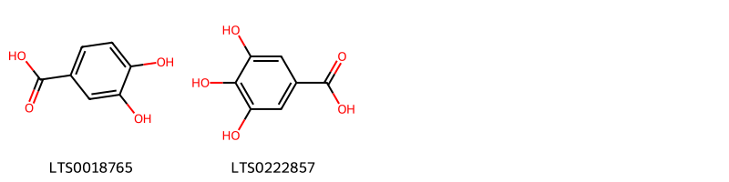{ width=100% }
    <figcaption>Hình ảnh cấu trúc hóa học của 2 hoạt chất thuộc nhóm Benzene and substituted derivatives gồm ['3,4-dihydroxybenzoic acid (LTS0018765)', 'galop (LTS0222857)'].</figcaption>
</figure>
#### Nhóm Betalains
<figure markdown="span">
    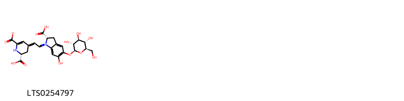{ width=100% }
    <figcaption>Hình ảnh cấu trúc hóa học của 1 hoạt chất thuộc nhóm Betalains gồm ['(2s)-2-carboxy-1-{2-[(2r)-2-carboxy-6-carboxylato-2,3-dihydro-1h-pyridin-4-ylidene]ethylidene}-6-hydroxy-5-{[(2s,3r,4s,5s,6r)-3,4,5-trihydroxy-6-(hydroxymethyl)oxan-2-yl]oxy}-2,3-dihydro-1h-1λ⁵-indol-1-ylium (LTS0254797)'].</figcaption>
</figure>
#### Nhóm Carboxylic acids and derivatives
<figure markdown="span">
    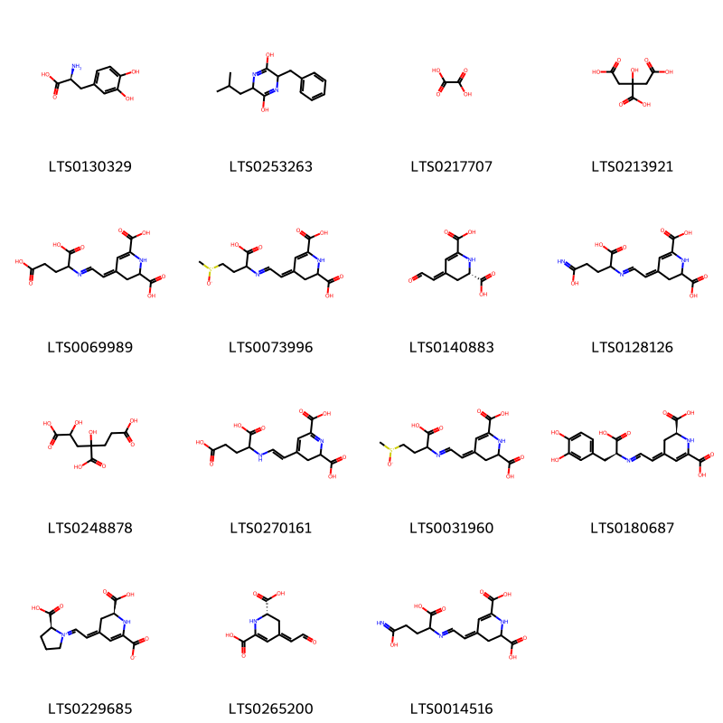{ width=100% }
    <figcaption>Hình ảnh cấu trúc hóa học của 15 hoạt chất thuộc nhóm Carboxylic acids and derivatives gồm ['levodopa (LTS0130329)', '3-benzyl-6-(2-methylpropyl)-3,6-dihydropyrazine-2,5-diol (LTS0253263)', 'oxalic acid (LTS0217707)', 'citric acid (LTS0213921)', '(4z)-4-{2-[(1,3-dicarboxypropyl)imino]ethylidene}-2,3-dihydro-1h-pyridine-2,6-dicarboxylic acid (LTS0069989)', '(4z)-4-{2-[(1-carboxy-3-methanesulfinylpropyl)imino]ethylidene}-2,3-dihydro-1h-pyridine-2,6-dicarboxylic acid (LTS0073996)', '(2s,4z)-4-(2-oxoethylidene)-2,3-dihydro-1h-pyridine-2,6-dicarboxylic acid (LTS0140883)', '(4z)-4-(2-{[1-carboxy-3-(c-hydroxycarbonimidoyl)propyl]imino}ethylidene)-2,3-dihydro-1h-pyridine-2,6-dicarboxylic acid (LTS0128126)', '1,3-dihydroxypentane-1,3,5-tricarboxylic acid (LTS0248878)', '4-[(1e)-2-[(1,3-dicarboxypropyl)amino]ethenyl]-2,3-dihydropyridine-2,6-dicarboxylic acid (LTS0270161)', '4-{2-[(1-carboxy-3-methanesulfinylpropyl)imino]ethylidene}-2,3-dihydro-1h-pyridine-2,6-dicarboxylic acid (LTS0031960)', '(2s,4e)-4-(2-{[(1s)-1-carboxy-2-(3,4-dihydroxyphenyl)ethyl]imino}ethylidene)-2,3-dihydro-1h-pyridine-2,6-dicarboxylic acid (LTS0180687)', '(2s)-2-carboxy-1-{2-[(2s)-2-carboxy-6-carboxylato-2,3-dihydro-1h-pyridin-4-ylidene]ethylidene}-1λ⁵-pyrrolidin-1-ylium (LTS0229685)', 'betalamic acid (LTS0265200)', '4-(2-{[1-carboxy-3-(c-hydroxycarbonimidoyl)propyl]imino}ethylidene)-2,3-dihydro-1h-pyridine-2,6-dicarboxylic acid (LTS0014516)'].</figcaption>
</figure>
#### Nhóm Cinnamic acids and derivatives
<figure markdown="span">
    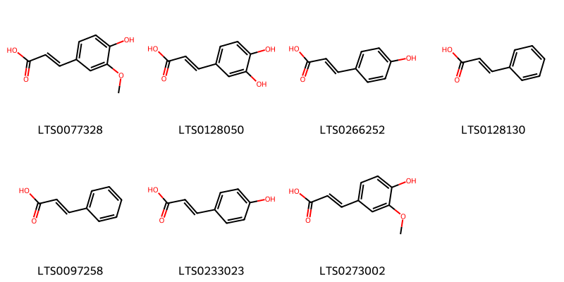{ width=100% }
    <figcaption>Hình ảnh cấu trúc hóa học của 7 hoạt chất thuộc nhóm Cinnamic acids and derivatives gồm ['ferulic acid (LTS0077328)', '3,4-dihydroxycinnamic acid (LTS0128050)', 'para-coumaric acid (LTS0266252)', 'cinnamic acid (LTS0128130)', 'phenylacrylic acid (LTS0097258)', 'hydroxycinnamic acid (LTS0233023)', 'ferulic acid (LTS0273002)'].</figcaption>
</figure>
#### Nhóm Coumarins and derivatives
<figure markdown="span">
    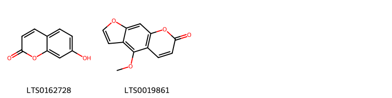{ width=100% }
    <figcaption>Hình ảnh cấu trúc hóa học của 2 hoạt chất thuộc nhóm Coumarins and derivatives gồm ['umbelliferone (LTS0162728)', 'bergapten (LTS0019861)'].</figcaption>
</figure>
#### Nhóm Dihydrofurans
<figure markdown="span">
    { width=100% }
    <figcaption>Hình ảnh cấu trúc hóa học của 1 hoạt chất thuộc nhóm Dihydrofurans gồm ['vitamin c (LTS0022555)'].</figcaption>
</figure>
#### Nhóm Fatty Acyls
<figure markdown="span">
    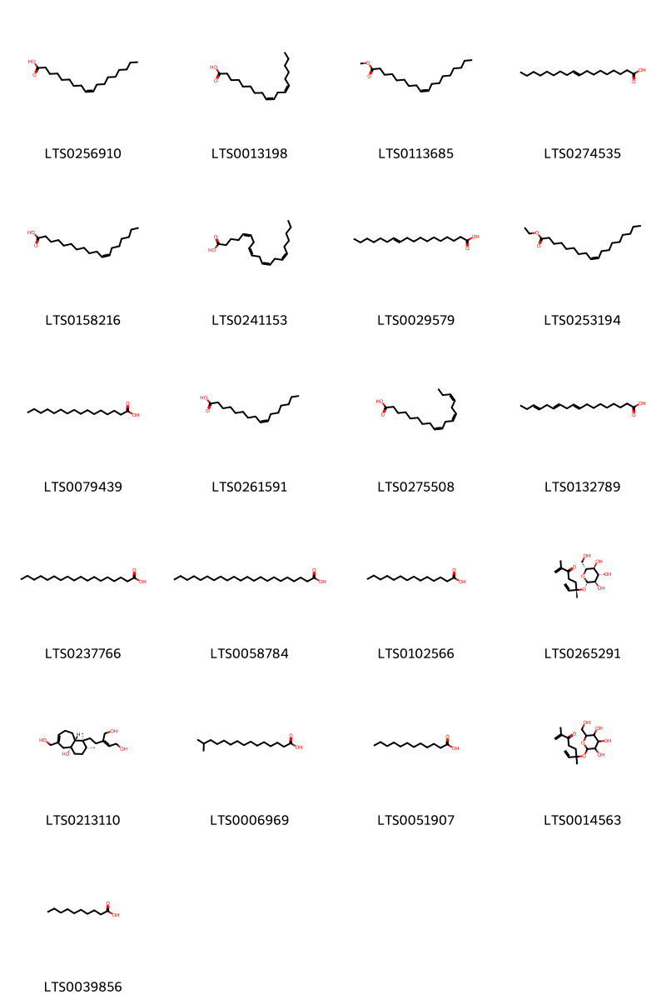{ width=100% }
    <figcaption>Hình ảnh cấu trúc hóa học của 21 hoạt chất thuộc nhóm Fatty Acyls gồm ['oleic acid (LTS0256910)', 'linoleic (LTS0013198)', 'methyl oleate (LTS0113685)', '(+-)-propylene glycol (LTS0274535)', 'cis-vaccenic acid (LTS0158216)', 'arachidonic acid (LTS0241153)', 'trans-vaccenic acid (LTS0029579)', 'ethyl oleate (LTS0253194)', 'palmitic acid (LTS0079439)', 'palmitoleic acid (LTS0261591)', 'α-linolenic acid (LTS0275508)', 'α linolenic acid (LTS0132789)', 'stearic acid (LTS0237766)', 'behenic acid (LTS0058784)', 'myristic acid (LTS0102566)', '(6s)-2,6-dimethyl-6-{[(2s,3r,4s,5s,6r)-3,4,5-trihydroxy-6-(hydroxymethyl)oxan-2-yl]oxy}octa-1,7-dien-3-one (LTS0265291)', '(2z)-2-{2-[(1s,2r,4ar,9ar)-4a-hydroxy-6-(hydroxymethyl)-1,2-dimethyl-3,4,5,8,9,9a-hexahydro-2h-benzo[7]annulen-1-yl]ethyl}but-2-ene-1,4-diol (LTS0213110)', 'isopalmitic acid (LTS0006969)', 'lauric acid (LTS0051907)', '2,6-dimethyl-6-{[3,4,5-trihydroxy-6-(hydroxymethyl)oxan-2-yl]oxy}octa-1,7-dien-3-one (LTS0014563)', 'capric acid (LTS0039856)'].</figcaption>
</figure>
#### Nhóm Flavonoids
<figure markdown="span">
    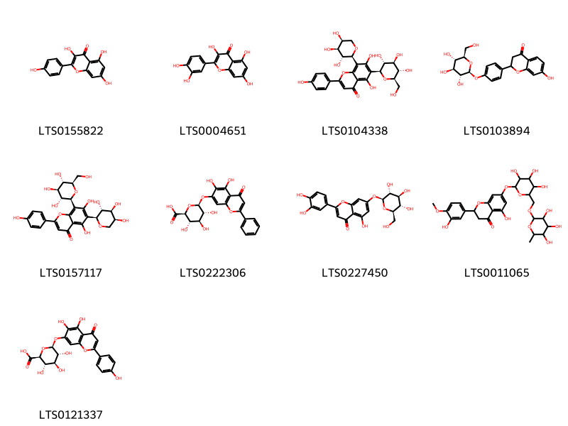{ width=100% }
    <figcaption>Hình ảnh cấu trúc hóa học của 9 hoạt chất thuộc nhóm Flavonoids gồm ['kaempherol (LTS0155822)', 'quercetin (LTS0004651)', 'schaftoside (LTS0104338)', 'liquiritin (LTS0103894)', 'isoschaftoside (LTS0157117)', 'baicalin (LTS0222306)', 'luteolin 7-o-glucoside (LTS0227450)', 'hesperidin (LTS0011065)', 'scutellarin (LTS0121337)'].</figcaption>
</figure>
#### Nhóm Glycerophospholipids
<figure markdown="span">
    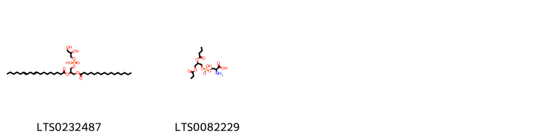{ width=100% }
    <figcaption>Hình ảnh cấu trúc hóa học của 2 hoạt chất thuộc nhóm Glycerophospholipids gồm ['2,3-dihydroxypropoxy(3-(hexadecanoyloxy)-2-[(9e,12e)-octadeca-9,12-dienoyloxy]propoxy)phosphinic acid (LTS0232487)', '2-amino-3-{[2-(butanoyloxy)-3-(propanoyloxy)propoxy(hydroxy)phosphoryl]oxy}propanoic acid (LTS0082229)'].</figcaption>
</figure>
#### Nhóm Heteroaromatic compounds
<figure markdown="span">
    { width=100% }
    <figcaption>Hình ảnh cấu trúc hóa học của 1 hoạt chất thuộc nhóm Heteroaromatic compounds gồm ['amylfuran (LTS0044471)'].</figcaption>
</figure>
#### Nhóm Hydroxy acids and derivatives
<figure markdown="span">
    { width=100% }
    <figcaption>Hình ảnh cấu trúc hóa học của 1 hoạt chất thuộc nhóm Hydroxy acids and derivatives gồm ['malic acid (LTS0216520)'].</figcaption>
</figure>
#### Nhóm Indoles and derivatives
<figure markdown="span">
    { width=100% }
    <figcaption>Hình ảnh cấu trúc hóa học của 2 hoạt chất thuộc nhóm Indoles and derivatives gồm ['(2s)-4-[(1e)-2-[(2r)-2-carboxy-5,6-dihydroxy-2,3-dihydroindol-1-yl]ethenyl]-2,3-dihydropyridine-2,6-dicarboxylic acid (LTS0237541)', 'betanidin (LTS0217631)'].</figcaption>
</figure>
#### Nhóm Isoflavonoids
<figure markdown="span">
    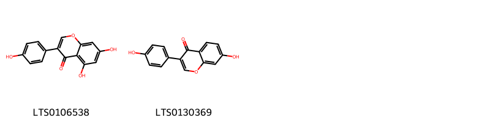{ width=100% }
    <figcaption>Hình ảnh cấu trúc hóa học của 2 hoạt chất thuộc nhóm Isoflavonoids gồm ['genistein (LTS0106538)', 'daidzein (LTS0130369)'].</figcaption>
</figure>
#### Nhóm Organic phosphoric acids and derivatives
<figure markdown="span">
    { width=100% }
    <figcaption>Hình ảnh cấu trúc hóa học của 1 hoạt chất thuộc nhóm Organic phosphoric acids and derivatives gồm ['o-phosphoethanolamine; bis(nonane) (LTS0249963)'].</figcaption>
</figure>
#### Nhóm Organooxygen compounds
<figure markdown="span">
    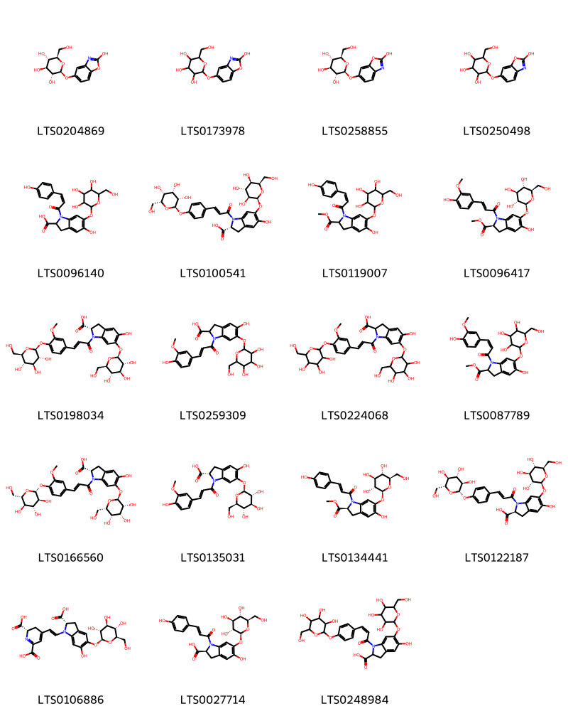{ width=100% }
    <figcaption>Hình ảnh cấu trúc hóa học của 19 hoạt chất thuộc nhóm Organooxygen compounds gồm ['(2s,3r,4s,5s,6r)-2-[(2-hydroxy-1,3-benzoxazol-5-yl)oxy]-6-(hydroxymethyl)oxane-3,4,5-triol (LTS0204869)', '2-[(2-hydroxy-1,3-benzoxazol-5-yl)oxy]-6-(hydroxymethyl)oxane-3,4,5-triol (LTS0173978)', '(2s,3r,4s,5s,6r)-2-[(2-hydroxy-1,3-benzoxazol-6-yl)oxy]-6-(hydroxymethyl)oxane-3,4,5-triol (LTS0258855)', '2-[(2-hydroxy-1,3-benzoxazol-6-yl)oxy]-6-(hydroxymethyl)oxane-3,4,5-triol (LTS0250498)', '5-hydroxy-1-[3-(4-hydroxyphenyl)prop-2-enoyl]-6-{[3,4,5-trihydroxy-6-(hydroxymethyl)oxan-2-yl]oxy}-2,3-dihydroindole-2-carboxylic acid (LTS0096140)', '(2r)-5-hydroxy-6-{[(2s,3s,4r,5r,6r)-3,4,5-trihydroxy-6-(hydroxymethyl)oxan-2-yl]oxy}-1-[(2e)-3-(4-{[(2r,3s,4s,5r,6r)-3,4,5-trihydroxy-6-(hydroxymethyl)oxan-2-yl]oxy}phenyl)prop-2-enoyl]-2,3-dihydroindole-2-carboxylic acid (LTS0100541)', 'methyl 5-hydroxy-1-[3-(4-hydroxyphenyl)prop-2-enoyl]-6-{[3,4,5-trihydroxy-6-(hydroxymethyl)oxan-2-yl]oxy}-2,3-dihydroindole-2-carboxylate (LTS0119007)', 'methyl (2s)-5-hydroxy-1-[(2e)-3-(4-hydroxy-3-methoxyphenyl)prop-2-enoyl]-6-{[(2s,3r,4s,5s,6r)-3,4,5-trihydroxy-6-(hydroxymethyl)oxan-2-yl]oxy}-2,3-dihydroindole-2-carboxylate (LTS0096417)', '(2s)-5-hydroxy-1-[(2e)-3-(3-methoxy-4-{[(2s,3r,4s,5s,6r)-3,4,5-trihydroxy-6-(hydroxymethyl)oxan-2-yl]oxy}phenyl)prop-2-enoyl]-6-{[(2s,3r,4s,5s,6r)-3,4,5-trihydroxy-6-(hydroxymethyl)oxan-2-yl]oxy}-2,3-dihydroindole-2-carboxylic acid (LTS0198034)', '5-hydroxy-1-[3-(4-hydroxy-3-methoxyphenyl)prop-2-enoyl]-6-{[3,4,5-trihydroxy-6-(hydroxymethyl)oxan-2-yl]oxy}-2,3-dihydroindole-2-carboxylic acid (LTS0259309)', '5-hydroxy-1-[3-(3-methoxy-4-{[3,4,5-trihydroxy-6-(hydroxymethyl)oxan-2-yl]oxy}phenyl)prop-2-enoyl]-6-{[3,4,5-trihydroxy-6-(hydroxymethyl)oxan-2-yl]oxy}-2,3-dihydroindole-2-carboxylic acid (LTS0224068)', 'methyl 5-hydroxy-1-[3-(4-hydroxy-3-methoxyphenyl)prop-2-enoyl]-6-{[3,4,5-trihydroxy-6-(hydroxymethyl)oxan-2-yl]oxy}-2,3-dihydroindole-2-carboxylate (LTS0087789)', '(2s)-5-hydroxy-1-[(2e)-3-(3-methoxy-4-{[(2r,3s,4r,5r,6s)-3,4,5-trihydroxy-6-(hydroxymethyl)oxan-2-yl]oxy}phenyl)prop-2-enoyl]-6-{[(2s,3r,4r,5s,6s)-3,4,5-trihydroxy-6-(hydroxymethyl)oxan-2-yl]oxy}-2,3-dihydroindole-2-carboxylic acid (LTS0166560)', '(2s)-5-hydroxy-1-[(2e)-3-(4-hydroxy-3-methoxyphenyl)prop-2-enoyl]-6-{[(2s,3r,4s,5s,6r)-3,4,5-trihydroxy-6-(hydroxymethyl)oxan-2-yl]oxy}-2,3-dihydroindole-2-carboxylic acid (LTS0135031)', 'methyl (2s)-5-hydroxy-1-[(2e)-3-(4-hydroxyphenyl)prop-2-enoyl]-6-{[(2s,3r,4s,5s,6r)-3,4,5-trihydroxy-6-(hydroxymethyl)oxan-2-yl]oxy}-2,3-dihydroindole-2-carboxylate (LTS0134441)', '(2s)-5-hydroxy-6-{[(2s,3r,4s,5s,6r)-3,4,5-trihydroxy-6-(hydroxymethyl)oxan-2-yl]oxy}-1-[(2e)-3-(4-{[(2s,3r,4s,5s,6r)-3,4,5-trihydroxy-6-(hydroxymethyl)oxan-2-yl]oxy}phenyl)prop-2-enoyl]-2,3-dihydroindole-2-carboxylic acid (LTS0122187)', 'betanin (LTS0106886)', '(2s)-5-hydroxy-1-[(2e)-3-(4-hydroxyphenyl)prop-2-enoyl]-6-{[(2s,3r,4s,5s,6r)-3,4,5-trihydroxy-6-(hydroxymethyl)oxan-2-yl]oxy}-2,3-dihydroindole-2-carboxylic acid (LTS0027714)', '5-hydroxy-6-{[3,4,5-trihydroxy-6-(hydroxymethyl)oxan-2-yl]oxy}-1-[3-(4-{[3,4,5-trihydroxy-6-(hydroxymethyl)oxan-2-yl]oxy}phenyl)prop-2-enoyl]-2,3-dihydroindole-2-carboxylic acid (LTS0248984)'].</figcaption>
</figure>
#### Nhóm Phenols
<figure markdown="span">
    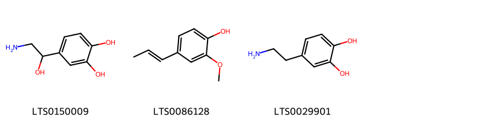{ width=100% }
    <figcaption>Hình ảnh cấu trúc hóa học của 3 hoạt chất thuộc nhóm Phenols gồm ['noradrenaline (LTS0150009)', '2-methoxy-4-propenylphenol (LTS0086128)', 'dopamine (LTS0029901)'].</figcaption>
</figure>
#### Nhóm Prenol lipids
<figure markdown="span">
    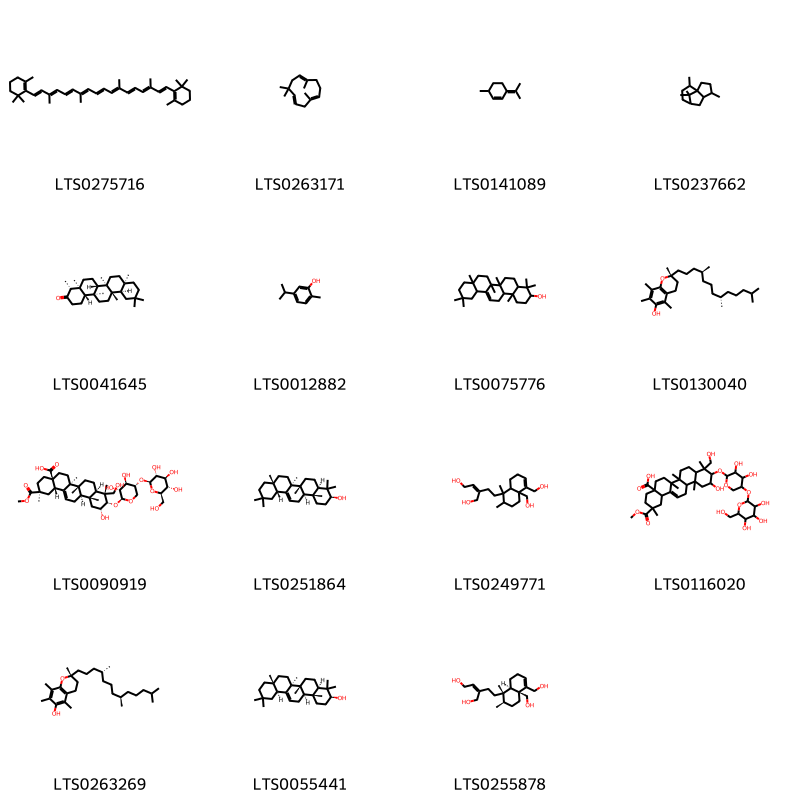{ width=100% }
    <figcaption>Hình ảnh cấu trúc hóa học của 15 hoạt chất thuộc nhóm Prenol lipids gồm ['β-carotene (LTS0275716)', 'humulene (LTS0263171)', 'isoterpinolene (LTS0141089)', '4,10,11,11-tetramethyltricyclo[5.3.1.0¹,⁵]undecane (LTS0237662)', '(-)-friedelin (LTS0041645)', 'carvacrol (LTS0012882)', 'β-amyrin (LTS0075776)', '(2r)-2,5,7,8-tetramethyl-2-[(4s,8s)-4,8,12-trimethyltridecyl]-3,4-dihydro-1-benzopyran-6-ol (LTS0130040)', '(2s,4ar,6as,6br,8ar,9r,10s,11r,12ar,12br,14bs)-10-{[(2s,3r,4r,5r)-3,4-dihydroxy-5-{[(2s,3r,4s,5s,6r)-3,4,5-trihydroxy-6-(hydroxymethyl)oxan-2-yl]oxy}oxan-2-yl]oxy}-11-hydroxy-9-(hydroxymethyl)-2-(methoxycarbonyl)-2,6a,6b,9,12a-pentamethyl-1,3,4,5,6,7,8,8a,10,11,12,12b,13,14b-tetradecahydropicene-4a-carboxylic acid (LTS0090919)', 'β-amyrin (LTS0251864)', '(2z)-2-{2-[4a,5-bis(hydroxymethyl)-1,2-dimethyl-2,3,4,7,8,8a-hexahydronaphthalen-1-yl]ethyl}but-2-ene-1,4-diol (LTS0249771)', '10-[(3,4-dihydroxy-5-{[3,4,5-trihydroxy-6-(hydroxymethyl)oxan-2-yl]oxy}oxan-2-yl)oxy]-11-hydroxy-9-(hydroxymethyl)-2-(methoxycarbonyl)-2,6a,6b,9,12a-pentamethyl-1,3,4,5,6,7,8,8a,10,11,12,12b,13,14b-tetradecahydropicene-4a-carboxylic acid (LTS0116020)', 'vitamin e (LTS0263269)', '(3s,4ar,6ar,6bs,8ar,12as,14ar,14br)-4,4,6a,6b,8a,11,11,14b-octamethyl-1,2,3,4a,5,6,7,8,9,10,12,12a,14,14a-tetradecahydropicen-3-ol (LTS0055441)', '(2z)-2-{2-[(1s,2r,4as,8ar)-4a,5-bis(hydroxymethyl)-1,2-dimethyl-2,3,4,7,8,8a-hexahydronaphthalen-1-yl]ethyl}but-2-ene-1,4-diol (LTS0255878)'].</figcaption>
</figure>
#### Nhóm Purine nucleosides
<figure markdown="span">
    { width=100% }
    <figcaption>Hình ảnh cấu trúc hóa học của 2 hoạt chất thuộc nhóm Purine nucleosides gồm ['adenosine (LTS0052576)', 'adenosine (LTS0014061)'].</figcaption>
</figure>
#### Nhóm Saturated hydrocarbons
<figure markdown="span">
    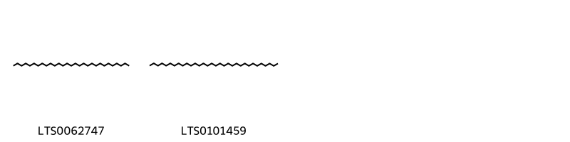{ width=100% }
    <figcaption>Hình ảnh cấu trúc hóa học của 2 hoạt chất thuộc nhóm Saturated hydrocarbons gồm ['nonacosane (LTS0062747)', 'dotriacontane (LTS0101459)'].</figcaption>
</figure>
#### Nhóm Steroids and steroid derivatives
<figure markdown="span">
    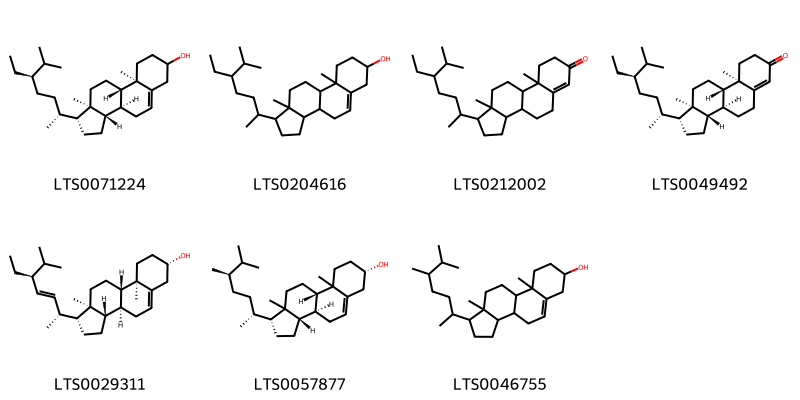{ width=100% }
    <figcaption>Hình ảnh cấu trúc hóa học của 7 hoạt chất thuộc nhóm Steroids and steroid derivatives gồm ['stigmast-5-en-3-ol (LTS0071224)', 'stigmast-5-en-3-ol, (3β)- (LTS0204616)', '1-(5-ethyl-6-methylheptan-2-yl)-9a,11a-dimethyl-1h,2h,3h,3ah,3bh,4h,5h,8h,9h,9bh,10h,11h-cyclopenta[a]phenanthren-7-one (LTS0212002)', 'β-sitostenone (LTS0049492)', 'phytosterol (LTS0029311)', '(1r,3as,3bs,7s,9bs)-1-[(2r,5r)-5,6-dimethylheptan-2-yl]-9a,11a-dimethyl-1h,2h,3h,3ah,3bh,4h,6h,7h,8h,9h,9bh,10h,11h-cyclopenta[a]phenanthren-7-ol (LTS0057877)', 'campesterol (LTS0046755)'].</figcaption>
</figure>
#### Nhóm Tetrahydroisoquinolines
<figure markdown="span">
    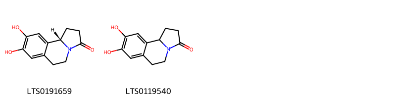{ width=100% }
    <figcaption>Hình ảnh cấu trúc hóa học của 2 hoạt chất thuộc nhóm Tetrahydroisoquinolines gồm ['(10bs)-8,9-dihydroxy-1h,2h,5h,6h,10bh-pyrrolo[2,1-a]isoquinolin-3-one (LTS0191659)', '8,9-dihydroxy-1h,2h,5h,6h,10bh-pyrrolo[2,1-a]isoquinolin-3-one (LTS0119540)'].</figcaption>
</figure>
#### Nhóm Unsaturated hydrocarbons
<figure markdown="span">
    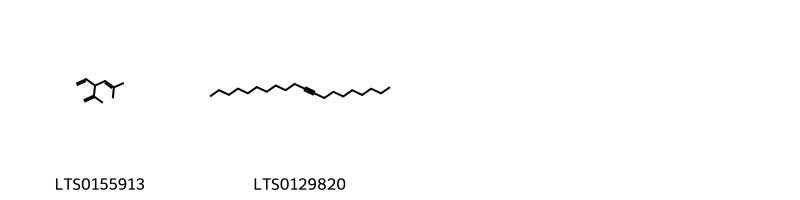{ width=100% }
    <figcaption>Hình ảnh cấu trúc hóa học của 2 hoạt chất thuộc nhóm Unsaturated hydrocarbons gồm ['santolina triene (LTS0155913)', 'icos-9-yne (LTS0129820)'].</figcaption>
</figure>

---

### Dược dân tộc học

Danh sách các quốc gia có sử dụng *Portulaca oleracea* trong điều trị các bệnh. 

| Country            | Disease                                                                                                                           | Bệnh                                                                                                                                                               |
|:-------------------|:----------------------------------------------------------------------------------------------------------------------------------|:-------------------------------------------------------------------------------------------------------------------------------------------------------------------|
| Australia          | Poison                                                                                                                            | Chất độc                                                                                                                                                           |
| China              | Alexiteric, Antiphlogistic, nan, Emollient, Refrigerant, Vermifuge, Poultice, Tonic, Diuretic                                     | Alexiteric, Antiphlogistic, nan, Chất làm mềm, Chất làm lạnh, Vermifuge, Thuốc đắp, Thuốc bổ, Thuốc lợi tiểu                                                       |
| Dominican Republic | Vermifuge, Emollient                                                                                                              | Vermifuge, Chất làm mềm                                                                                                                                            |
| Elsewhere          | Antidote, Astringent, Diuretic, Fungicide, Poison, Aperient, nan, Diuretic, Refrigerant, Vermifuge, Vulnerary, nan, Sedative, nan | Thuốc giải độc, Chất làm se, Thuốc lợi tiểu, Thuốc diệt nấm, Chất độc, Aperient, nan, Thuốc lợi tiểu, Chất làm lạnh, Vermifuge, Vulnerary, nan, Thuốc an thần, nan |
| Haiti              | Cardiotonic, Refrigerant, Soporific, Diuretic, Hemostat                                                                           | Cardiotonic, Refrigerant, Soporific, lợi tiểu, cầm máu                                                                                                             |
| India              | Diuretic, Refrigerant, Vulnerary, Astringent                                                                                      | Thuốc lợi tiểu, chất làm lạnh, dễ bị tổn thương, chất làm se                                                                                                       |
| Iraq               | Vermifuge                                                                                                                         | Thuốc diệt sán                                                                                                                                                     |
| Java               | Vermifuge, Aperient                                                                                                               | Vermifuge, Aperient                                                                                                                                                |
| Sudan              | Astringent, Diuretic, Demulcent                                                                                                   | Chất làm se, lợi tiểu, làm dịu                                                                                                                                     |
| Trinidad           | Vermifuge, Vermifuge                                                                                                              | Vermifuge, Vermifuge                                                                                                                                               |
| Turkey             | Diuretic, Emollient, Refrigerant, Sedative                                                                                        | Thuốc lợi tiểu, Chất làm mềm, Chất làm lạnh, Thuốc an thần                                                                                                         |
| Venezuela          | Vermifuge                                                                                                                         | Thuốc diệt sán                                                                                                                                                     |

---

---
## Portulaca phaeoerma
### Thông tin về thực vật

!!! info "Phân loại thực vật của *Portulaca rubricaulis* từ GIBF:"
    - **Kingdom:** Plantae
    - **Phylum:** Tracheophyta
    - **Order:** Caryophyllales
    - **Family:** Portulacaceae
    - **Genus:** Portulaca
    - **Species:** *Portulaca rubricaulis*

 

| Label (VI)   | Label (EN)   | Scientific Name    | Descriptions (VI)   | Descriptions (EN)          | Also Known As (VI)     | Also Known As (EN)                           |
|:-------------|:-------------|:-------------------|:--------------------|:---------------------------|:-----------------------|:---------------------------------------------|
| N/A          | N/A          | Portulaca oleracea | thực vật có hoa     | species of flowering plant | ['Portulaca oleracea'] | ['Moss Rose', 'Common purslane', 'Pig Weed'] |

#### Phân bố trên thế giới

**Từ CSDL GIBF** nan, Puerto Rico, Bahamas, Jamaica, Cuba, United States of America, Dominican Republic

#### Phân bố tại Việt Nam

**Từ CSDL GIBF**: Không có ghi nhận ở Việt Nam

---
### Thành phần hóa học
        
- Theo cơ sở dữ liệu lotus: Từ loài *Portulaca rubricaulis* đã phân lập và xác định được Chưa có hoạt chất nào được phân lập. hoạt chất thuộc về các nhóm Không có hoạt chất nào được phân lập. 

Không có hình ảnh nào được tạo ra

---

### Dược dân tộc học

Danh sách các quốc gia có sử dụng *Portulaca rubricaulis* trong điều trị các bệnh. 

| Country   | Disease   | Bệnh         |
|:----------|:----------|:-------------|
| Bahamas   | Laxative  | Nhuận trường |

---

---
## Portulaca pilosa
### Thông tin về thực vật

!!! info "Phân loại thực vật của *Portulaca pilosa* từ GIBF:"
    - **Kingdom:** Plantae
    - **Phylum:** Tracheophyta
    - **Order:** Caryophyllales
    - **Family:** Portulacaceae
    - **Genus:** Portulaca
    - **Species:** *Portulaca pilosa*

 

| Label (VI)   | Label (EN)   | Scientific Name   | Descriptions (VI)   | Descriptions (EN)   | Also Known As (VI)   | Also Known As (EN)   |
|:-------------|:-------------|:------------------|:--------------------|:--------------------|:---------------------|:---------------------|
| N/A          | N/A          | Portulaca pilosa  | loài thực vật       | species of plant    | ['']                 | ['']                 |

#### Phân bố trên thế giới

**Từ CSDL GIBF** nan, Hong Kong, Australia, Thailand, Colombia, Chinese Taipei, Brazil, Argentina, India, United States of America, Samoa, Mexico, French Guiana

#### Phân bố tại Việt Nam

**Từ CSDL GIBF**: Không có ghi nhận ở Việt Nam

---
### Thành phần hóa học
        
- Theo cơ sở dữ liệu lotus: Từ loài *Portulaca pilosa* đã phân lập và xác định được 34 hoạt chất thuộc về các nhóm Fatty Acyls, Flavonoids, Prenol lipids, Indoles and derivatives, Organooxygen compounds, Carboxylic acids and derivatives, Betalains. 

|    | chemicalTaxonomyClassyfireClass   |   smiles_count |
|---:|:----------------------------------|---------------:|
|  0 | Betalains                         |              1 |
|  1 | Carboxylic acids and derivatives  |             10 |
|  2 | Fatty Acyls                       |              9 |
|  3 | Flavonoids                        |              3 |
|  4 | Indoles and derivatives           |              2 |
|  5 | Organooxygen compounds            |              1 |
|  6 | Prenol lipids                     |              6 |

#### Nhóm Betalains
<figure markdown="span">
    { width=100% }
    <figcaption>Hình ảnh cấu trúc hóa học của 1 hoạt chất thuộc nhóm Betalains gồm ['(2s)-2-carboxy-1-{2-[(2r)-2-carboxy-6-carboxylato-2,3-dihydro-1h-pyridin-4-ylidene]ethylidene}-6-hydroxy-5-{[(2s,3r,4s,5s,6r)-3,4,5-trihydroxy-6-(hydroxymethyl)oxan-2-yl]oxy}-2,3-dihydro-1h-1λ⁵-indol-1-ylium (LTS0254797)'].</figcaption>
</figure>
#### Nhóm Carboxylic acids and derivatives
<figure markdown="span">
    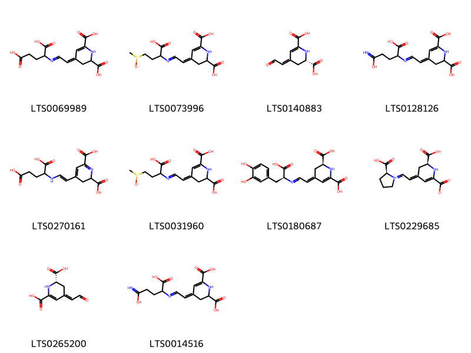{ width=100% }
    <figcaption>Hình ảnh cấu trúc hóa học của 10 hoạt chất thuộc nhóm Carboxylic acids and derivatives gồm ['(4z)-4-{2-[(1,3-dicarboxypropyl)imino]ethylidene}-2,3-dihydro-1h-pyridine-2,6-dicarboxylic acid (LTS0069989)', '(4z)-4-{2-[(1-carboxy-3-methanesulfinylpropyl)imino]ethylidene}-2,3-dihydro-1h-pyridine-2,6-dicarboxylic acid (LTS0073996)', '(2s,4z)-4-(2-oxoethylidene)-2,3-dihydro-1h-pyridine-2,6-dicarboxylic acid (LTS0140883)', '(4z)-4-(2-{[1-carboxy-3-(c-hydroxycarbonimidoyl)propyl]imino}ethylidene)-2,3-dihydro-1h-pyridine-2,6-dicarboxylic acid (LTS0128126)', '4-[(1e)-2-[(1,3-dicarboxypropyl)amino]ethenyl]-2,3-dihydropyridine-2,6-dicarboxylic acid (LTS0270161)', '4-{2-[(1-carboxy-3-methanesulfinylpropyl)imino]ethylidene}-2,3-dihydro-1h-pyridine-2,6-dicarboxylic acid (LTS0031960)', '(2s,4e)-4-(2-{[(1s)-1-carboxy-2-(3,4-dihydroxyphenyl)ethyl]imino}ethylidene)-2,3-dihydro-1h-pyridine-2,6-dicarboxylic acid (LTS0180687)', '(2s)-2-carboxy-1-{2-[(2s)-2-carboxy-6-carboxylato-2,3-dihydro-1h-pyridin-4-ylidene]ethylidene}-1λ⁵-pyrrolidin-1-ylium (LTS0229685)', 'betalamic acid (LTS0265200)', '4-(2-{[1-carboxy-3-(c-hydroxycarbonimidoyl)propyl]imino}ethylidene)-2,3-dihydro-1h-pyridine-2,6-dicarboxylic acid (LTS0014516)'].</figcaption>
</figure>
#### Nhóm Fatty Acyls
<figure markdown="span">
    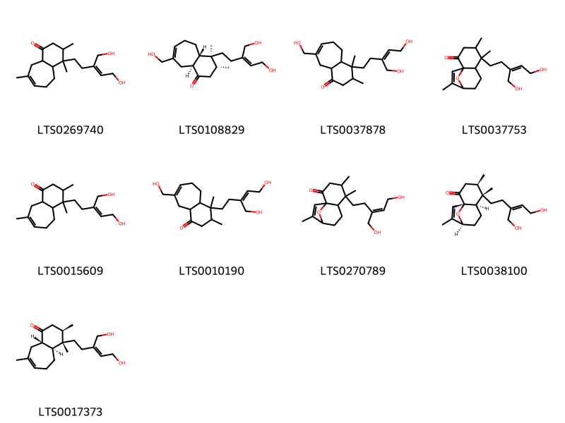{ width=100% }
    <figcaption>Hình ảnh cấu trúc hóa học của 9 hoạt chất thuộc nhóm Fatty Acyls gồm ['4-[5-hydroxy-3-(hydroxymethyl)pent-3-en-1-yl]-3,4,8-trimethyl-3,4a,5,6,9,9a-hexahydro-2h-benzo[7]annulen-1-one (LTS0269740)', '(3r,4s,4as,9as)-4-[(3z)-5-hydroxy-3-(hydroxymethyl)pent-3-en-1-yl]-8-(hydroxymethyl)-3,4-dimethyl-3,4a,5,6,9,9a-hexahydro-2h-benzo[7]annulen-1-one (LTS0108829)', '4-[(3z)-5-hydroxy-3-(hydroxymethyl)pent-3-en-1-yl]-8-(hydroxymethyl)-3,4-dimethyl-3,4a,5,6,9,9a-hexahydro-2h-benzo[7]annulen-1-one (LTS0037878)', '5-[5-hydroxy-3-(hydroxymethyl)pent-3-en-1-yl]-4,5,10-trimethyl-12-oxatricyclo[7.2.1.0¹,⁶]dodec-10-en-2-one (LTS0037753)', '4-[(3z)-5-hydroxy-3-(hydroxymethyl)pent-3-en-1-yl]-3,4,8-trimethyl-3,4a,5,6,9,9a-hexahydro-2h-benzo[7]annulen-1-one (LTS0015609)', '4-[5-hydroxy-3-(hydroxymethyl)pent-3-en-1-yl]-8-(hydroxymethyl)-3,4-dimethyl-3,4a,5,6,9,9a-hexahydro-2h-benzo[7]annulen-1-one (LTS0010190)', '5-[(3e)-5-hydroxy-3-(hydroxymethyl)pent-3-en-1-yl]-4,5,10-trimethyl-12-oxatricyclo[7.2.1.0¹,⁶]dodec-10-en-2-one (LTS0270789)', '(1s,4r,5s,6r,9s)-5-[(3z)-5-hydroxy-3-(hydroxymethyl)pent-3-en-1-yl]-4,5,10-trimethyl-12-oxatricyclo[7.2.1.0¹,⁶]dodec-10-en-2-one (LTS0038100)', '(3r,4s,4as,9as)-4-[(3z)-5-hydroxy-3-(hydroxymethyl)pent-3-en-1-yl]-3,4,8-trimethyl-3,4a,5,6,9,9a-hexahydro-2h-benzo[7]annulen-1-one (LTS0017373)'].</figcaption>
</figure>
#### Nhóm Flavonoids
<figure markdown="span">
    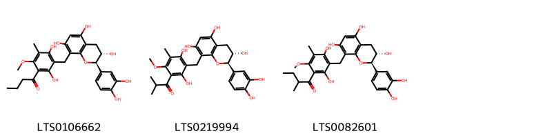{ width=100% }
    <figcaption>Hình ảnh cấu trúc hóa học của 3 hoạt chất thuộc nhóm Flavonoids gồm ['pilosanol c (LTS0106662)', 'pilosanol b (LTS0219994)', 'pilosanol a (LTS0082601)'].</figcaption>
</figure>
#### Nhóm Indoles and derivatives
<figure markdown="span">
    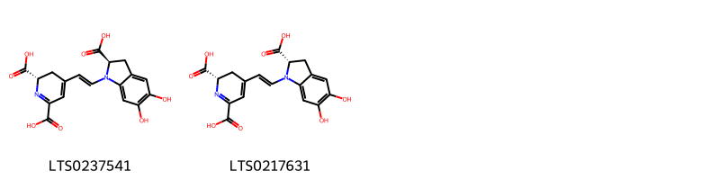{ width=100% }
    <figcaption>Hình ảnh cấu trúc hóa học của 2 hoạt chất thuộc nhóm Indoles and derivatives gồm ['(2s)-4-[(1e)-2-[(2r)-2-carboxy-5,6-dihydroxy-2,3-dihydroindol-1-yl]ethenyl]-2,3-dihydropyridine-2,6-dicarboxylic acid (LTS0237541)', 'betanidin (LTS0217631)'].</figcaption>
</figure>
#### Nhóm Organooxygen compounds
<figure markdown="span">
    { width=100% }
    <figcaption>Hình ảnh cấu trúc hóa học của 1 hoạt chất thuộc nhóm Organooxygen compounds gồm ['betanin (LTS0106886)'].</figcaption>
</figure>
#### Nhóm Prenol lipids
<figure markdown="span">
    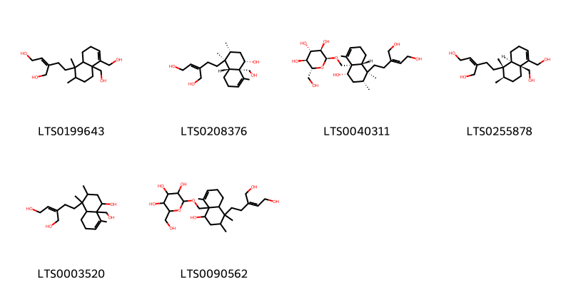{ width=100% }
    <figcaption>Hình ảnh cấu trúc hóa học của 6 hoạt chất thuộc nhóm Prenol lipids gồm ['2-{2-[4a,5-bis(hydroxymethyl)-1,2-dimethyl-2,3,4,7,8,8a-hexahydronaphthalen-1-yl]ethyl}but-2-ene-1,4-diol (LTS0199643)', '(2z)-2-{2-[(1s,2r,4s,4ar,8ar)-4-hydroxy-4a-(hydroxymethyl)-1,2,5-trimethyl-2,3,4,7,8,8a-hexahydronaphthalen-1-yl]ethyl}but-2-ene-1,4-diol (LTS0208376)', '(2s,3r,4s,5s,6r)-2-{[(1s,2r,4s,4ar,8ar)-4-hydroxy-1-[(3z)-5-hydroxy-3-(hydroxymethyl)pent-3-en-1-yl]-1,2,5-trimethyl-2,3,4,7,8,8a-hexahydronaphthalen-4a-yl]methoxy}-6-(hydroxymethyl)oxane-3,4,5-triol (LTS0040311)', '(2z)-2-{2-[(1s,2r,4as,8ar)-4a,5-bis(hydroxymethyl)-1,2-dimethyl-2,3,4,7,8,8a-hexahydronaphthalen-1-yl]ethyl}but-2-ene-1,4-diol (LTS0255878)', '2-{2-[4-hydroxy-4a-(hydroxymethyl)-1,2,5-trimethyl-2,3,4,7,8,8a-hexahydronaphthalen-1-yl]ethyl}but-2-ene-1,4-diol (LTS0003520)', '2-({4-hydroxy-1-[5-hydroxy-3-(hydroxymethyl)pent-3-en-1-yl]-1,2,5-trimethyl-2,3,4,7,8,8a-hexahydronaphthalen-4a-yl}methoxy)-6-(hydroxymethyl)oxane-3,4,5-triol (LTS0090562)'].</figcaption>
</figure>

---

### Dược dân tộc học

Danh sách các quốc gia có sử dụng *Portulaca pilosa* trong điều trị các bệnh. 

| Country            | Disease                        | Bệnh                                |
|:-------------------|:-------------------------------|:------------------------------------|
| Dominican Republic | Diuretic, Vermifuge            | Thuốc lợi tiểu, thuốc diệt giun sán |
| Elsewhere          | Antiseptic, Aperient, Diuretic | Khử trùng, Aperient, lợi tiểu       |
| Trinidad           | Vermifuge, Vermifuge           | Vermifuge, Vermifuge                |

---

---
## Portulaca quadrifida
### Thông tin về thực vật

!!! info "Phân loại thực vật của *Portulaca quadrifida* từ GIBF:"
    - **Kingdom:** Plantae
    - **Phylum:** Tracheophyta
    - **Order:** Caryophyllales
    - **Family:** Portulacaceae
    - **Genus:** Portulaca
    - **Species:** *Portulaca quadrifida*

 

| Label (VI)   | Label (EN)   | Scientific Name      | Descriptions (VI)   | Descriptions (EN)   | Also Known As (VI)   | Also Known As (EN)   |
|:-------------|:-------------|:---------------------|:--------------------|:--------------------|:---------------------|:---------------------|
| N/A          | N/A          | Portulaca quadrifida | loài thực vật       | species of plant    | ['']                 | ['Chickenweed']      |

#### Phân bố trên thế giới

**Từ CSDL GIBF** Virgin Islands (U.S.), United Arab Emirates, nan, Sri Lanka, Mozambique, Benin, Yemen, Togo, Puerto Rico, Chinese Taipei, Bangladesh, Congo, Democratic Republic of the, Zimbabwe, Saudi Arabia, Saint Martin (French part), South Africa, Thailand, Oman, Cuba, Mayotte, Viet Nam, Eswatini, Saint Kitts and Nevis, Comoros, Madagascar, Botswana, India, Indonesia, Anguilla, Kenya

#### Phân bố tại Việt Nam

**Từ CSDL GIBF**: Không có ghi nhận ở Việt Nam

---
### Thành phần hóa học
        
- Theo cơ sở dữ liệu lotus: Từ loài *Portulaca quadrifida* đã phân lập và xác định được Chưa có hoạt chất nào được phân lập. hoạt chất thuộc về các nhóm Không có hoạt chất nào được phân lập. 

Không có hình ảnh nào được tạo ra

---

### Dược dân tộc học

Danh sách các quốc gia có sử dụng *Portulaca quadrifida* trong điều trị các bệnh. 

| Country      | Disease   | Bệnh           |
|:-------------|:----------|:---------------|
| Africa(Zulu) | Emetic    | Phôi           |
| Java         | Diuretic  | Thuốc lợi tiêu |

---

# Chi Claytonia

??? note "Danh sách các dược liệu thuộc chi"
    
	 - *Claytonia sibirica*

---
## Claytonia sibirica
### Thông tin về thực vật

!!! info "Phân loại thực vật của *Claytonia sibirica* từ GIBF:"
    - **Kingdom:** Plantae
    - **Phylum:** Tracheophyta
    - **Order:** Caryophyllales
    - **Family:** Montiaceae
    - **Genus:** Claytonia
    - **Species:** *Claytonia sibirica*

 

| Label (VI)   | Label (EN)   | Scientific Name    | Descriptions (VI)   | Descriptions (EN)   | Also Known As (VI)   | Also Known As (EN)                                                     |
|:-------------|:-------------|:-------------------|:--------------------|:--------------------|:---------------------|:-----------------------------------------------------------------------|
| N/A          | N/A          | Claytonia sibirica | loài thực vật       | species of plant    | ['']                 | ['pink purslane', 'Siberian springbeauty', "Siberian miner's lettuce"] |

#### Phân bố trên thế giới

**Từ CSDL GIBF** Netherlands, Belgium, New Zealand, United States of America, Sweden, United Kingdom of Great Britain and Northern Ireland, Canada

#### Phân bố tại Việt Nam

**Từ CSDL GIBF**: Không có ghi nhận ở Việt Nam

---
### Thành phần hóa học
        
- Theo cơ sở dữ liệu lotus: Từ loài *Claytonia sibirica* đã phân lập và xác định được Chưa có hoạt chất nào được phân lập. hoạt chất thuộc về các nhóm Không có hoạt chất nào được phân lập. 

Không có hình ảnh nào được tạo ra

---

### Dược dân tộc học

Danh sách các quốc gia có sử dụng *Claytonia sibirica* trong điều trị các bệnh. 

| Country      | Disease   | Bệnh           |
|:-------------|:----------|:---------------|
| US(Quileute) | Diuretic  | Thuốc lợi tiêu |

---

