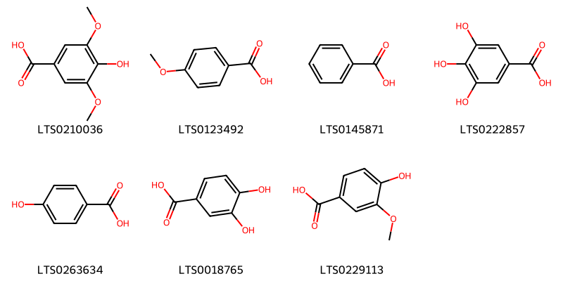
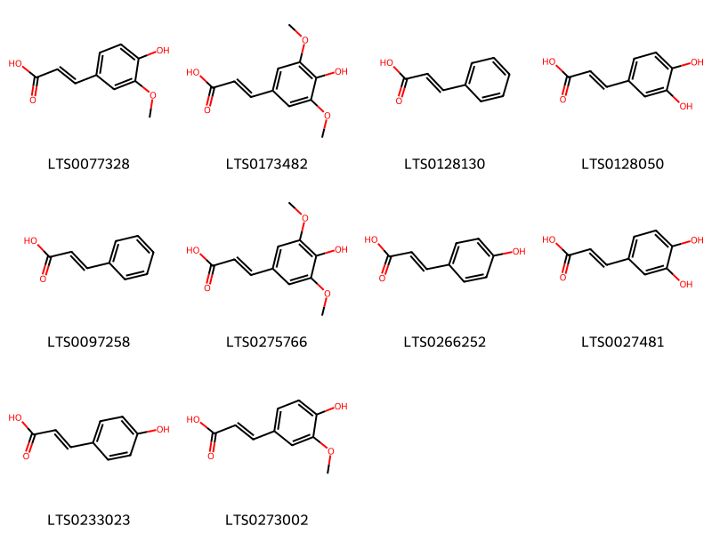
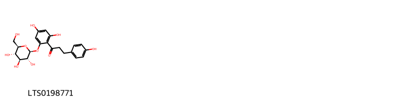
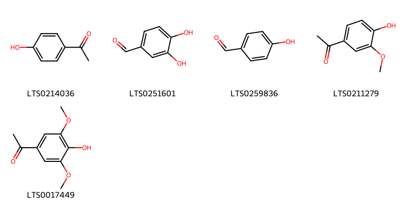
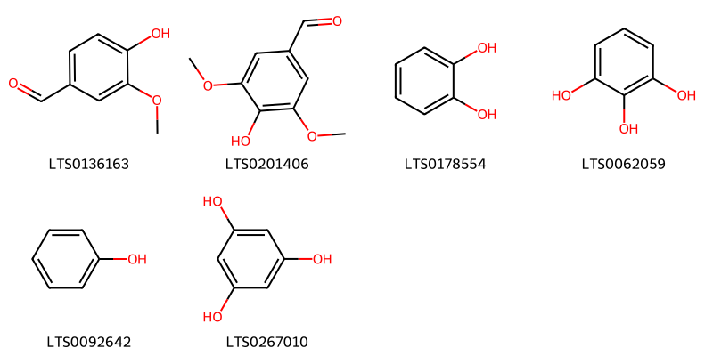
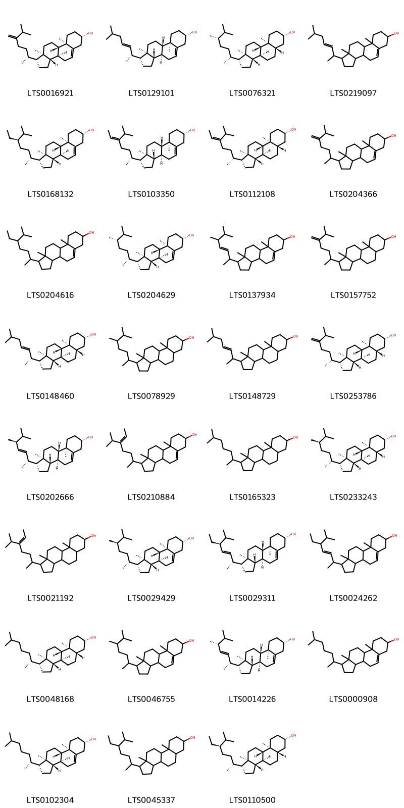

!!! abstract "Tóm tắt"

    Họ Posidoniaceae gồm khoảng 1 chi và 1 loài được một số cộng đồng tại các quốc gia như ain sử dụng trong một số trường hợp MYMEMORY WARNING: YOU USED ALL AVAILABLE FREE TRANSLATIONS FOR TODAY. NEXT AVAILABLE IN  08 HOURS 18 MINUTES 14 SECONDS VISIT HTTPS://MYMEMORY.TRANSLATED.NET/DOC/USAGELIMITS.PHP TO TRANSLATE MORE.

!!! info "DrDuke"

    James A. Duke sinh năm 1929-2017 là một nhà thực vật học người Mỹ. Đây là một trong những tác giả hàng đầu trong lĩnh vực dược dân tộc học với cuốn *CRC Handbook of Medicinal Herbs* và chính là người xây dựng lên cơ sở dữ liệu về hợp chất tự nhiên và dược dân tộc học tại Bộ nông nghiệp Hoa Kỳ. Các thông tin được đăng tải tại website [Dr. Duke's Phytochemical and Ethnobotanical Databases](https://phytochem.nal.usda.gov/). 
    Trong suốt thập niên 1970, ông lãnh đạo the Plant Taxonomy Laboratory, Plant Genetics and Germplasm Institute of the Agricultural Research Service, U.S. Department of Agriculture.
    Trong tài liệu này, các thông tin về dược dân tộc của các dược liệu được trích dẫn từ tài liệu của James A. Ducke với sự trợ giúp của phần mềm dịch thuật từ tiếng Anh sang tiếng Việt.
   

# Chi Posidonia

??? note "Danh sách các dược liệu thuộc chi"
    
	 - *Posidonia oceanica*

---
## Posidonia oceanica
### Thông tin về thực vật

!!! info "Phân loại thực vật của *Posidonia oceanica* từ GIBF:"
    - **Kingdom:** Plantae
    - **Phylum:** Tracheophyta
    - **Order:** Alismatales
    - **Family:** Posidoniaceae
    - **Genus:** Posidonia
    - **Species:** *Posidonia oceanica*

 

| Label (VI)   | Label (EN)   | Scientific Name        | Descriptions (VI)   | Descriptions (EN)   | Also Known As (VI)   | Also Known As (EN)   |
|:-------------|:-------------|:-----------------------|:--------------------|:--------------------|:---------------------|:---------------------|
| N/A          | N/A          | Trichodesma zeylanicum | loài thực vật       | species of plant    | ['']                 | ['']                 |

#### Phân bố trên thế giới

**Từ CSDL GIBF** Montenegro, Algeria, Malta, Greece, Albania, Italy, Croatia, Türkiye, Cyprus, France, Spain

#### Phân bố tại Việt Nam

**Từ CSDL GIBF**: Không có ghi nhận ở Việt Nam

---
### Thành phần hóa học
        
- Theo cơ sở dữ liệu lotus: Từ loài *Posidonia oceanica* đã phân lập và xác định được 60 hoạt chất thuộc về các nhóm Benzene and substituted derivatives, Flavonoids, Cinnamic acids and derivatives, Steroids and steroid derivatives, Phenols, Organooxygen compounds. 

|    | chemicalTaxonomyClassyfireClass     |   smiles_count |
|---:|:------------------------------------|---------------:|
|  0 | Benzene and substituted derivatives |              7 |
|  1 | Cinnamic acids and derivatives      |             10 |
|  2 | Flavonoids                          |              1 |
|  3 | Organooxygen compounds              |              5 |
|  4 | Phenols                             |              6 |
|  5 | Steroids and steroid derivatives    |             31 |

#### Nhóm Benzene and substituted derivatives
<figure markdown="span">
    { width=100% }
    <figcaption>Hình ảnh cấu trúc hóa học của 7 hoạt chất thuộc nhóm Benzene and substituted derivatives gồm ['syringic acid (LTS0210036)', 'p-anisic acid (LTS0123492)', 'benzoic acid (LTS0145871)', 'galop (LTS0222857)', 'p-hydroxybenzoic acid (LTS0263634)', '3,4-dihydroxybenzoic acid (LTS0018765)', 'vanillic acid (LTS0229113)'].</figcaption>
</figure>
#### Nhóm Cinnamic acids and derivatives
<figure markdown="span">
    { width=100% }
    <figcaption>Hình ảnh cấu trúc hóa học của 10 hoạt chất thuộc nhóm Cinnamic acids and derivatives gồm ['ferulic acid (LTS0077328)', 'sinapinate (LTS0173482)', 'cinnamic acid (LTS0128130)', '3,4-dihydroxycinnamic acid (LTS0128050)', 'phenylacrylic acid (LTS0097258)', 'sinapoyl alcohol (LTS0275766)', 'para-coumaric acid (LTS0266252)', 'caffeic acid (LTS0027481)', 'hydroxycinnamic acid (LTS0233023)', 'ferulic acid (LTS0273002)'].</figcaption>
</figure>
#### Nhóm Flavonoids
<figure markdown="span">
    { width=100% }
    <figcaption>Hình ảnh cấu trúc hóa học của 1 hoạt chất thuộc nhóm Flavonoids gồm ['phlorizin (LTS0198771)'].</figcaption>
</figure>
#### Nhóm Organooxygen compounds
<figure markdown="span">
    { width=100% }
    <figcaption>Hình ảnh cấu trúc hóa học của 5 hoạt chất thuộc nhóm Organooxygen compounds gồm ['hydroxyacetophenone (LTS0214036)', '3,4-dihydroxybenzaldehyde (LTS0251601)', 'p-hydroxybenzaldehyde (LTS0259836)', 'apocynin (LTS0211279)', 'acetosyringone (LTS0017449)'].</figcaption>
</figure>
#### Nhóm Phenols
<figure markdown="span">
    { width=100% }
    <figcaption>Hình ảnh cấu trúc hóa học của 6 hoạt chất thuộc nhóm Phenols gồm ['vanillin (LTS0136163)', 'syringaldehyde (LTS0201406)', 'catechol (LTS0178554)', 'pyrogallol (LTS0062059)', 'phenol (LTS0092642)', 'phloroglucinol (LTS0267010)'].</figcaption>
</figure>
#### Nhóm Steroids and steroid derivatives
<figure markdown="span">
    { width=100% }
    <figcaption>Hình ảnh cấu trúc hóa học của 31 hoạt chất thuộc nhóm Steroids and steroid derivatives gồm ['24-methylenecholesterol (LTS0016921)', '(1r,3as,3bs,7s,9ar,9bs,11ar)-9a,11a-dimethyl-1-[(2r,3e)-6-methylhept-3-en-2-yl]-1h,2h,3h,3ah,3bh,4h,6h,7h,8h,9h,9bh,10h,11h-cyclopenta[a]phenanthren-7-ol (LTS0129101)', 'ergostanol (LTS0076321)', '9a,11a-dimethyl-1-(6-methylhept-3-en-2-yl)-1h,2h,3h,3ah,3bh,4h,6h,7h,8h,9h,9bh,10h,11h-cyclopenta[a]phenanthren-7-ol (LTS0219097)', 'sitosterol (LTS0168132)', 'avenasterol (LTS0103350)', '(1r,3as,3br,5as,7s,9as,9bs,11ar)-1-[(2r,5z)-5-isopropylhept-5-en-2-yl]-9a,11a-dimethyl-tetradecahydro-1h-cyclopenta[a]phenanthren-7-ol (LTS0112108)', '9a,11a-dimethyl-1-(6-methyl-5-methylideneheptan-2-yl)-1h,2h,3h,3ah,3bh,4h,6h,7h,8h,9h,9bh,10h,11h-cyclopenta[a]phenanthren-7-ol (LTS0204366)', 'stigmast-5-en-3-ol, (3β)- (LTS0204616)', '22,23-dihydrobrassicasterol (LTS0204629)', '1-(5,6-dimethylhept-3-en-2-yl)-9a,11a-dimethyl-1h,2h,3h,3ah,3bh,4h,6h,7h,8h,9h,9bh,10h,11h-cyclopenta[a]phenanthren-7-ol (LTS0137934)', '9a,11a-dimethyl-1-(6-methyl-5-methylideneheptan-2-yl)-tetradecahydro-1h-cyclopenta[a]phenanthren-7-ol (LTS0157752)', '(1r,3as,3br,5as,7s,9as,9bs,11ar)-9a,11a-dimethyl-1-[(2r,3e)-6-methylhept-3-en-2-yl]-tetradecahydro-1h-cyclopenta[a]phenanthren-7-ol (LTS0148460)', '1-(5,6-dimethylheptan-2-yl)-9a,11a-dimethyl-tetradecahydro-1h-cyclopenta[a]phenanthren-7-ol (LTS0078929)', '9a,11a-dimethyl-1-(6-methylhept-3-en-2-yl)-tetradecahydro-1h-cyclopenta[a]phenanthren-7-ol (LTS0148729)', '(1r,3as,3br,5as,7s,9as,9bs,11ar)-9a,11a-dimethyl-1-[(2r)-6-methyl-5-methylideneheptan-2-yl]-tetradecahydro-1h-cyclopenta[a]phenanthren-7-ol (LTS0253786)', '(1r,3as,3bs,7s,9ar,9bs,11ar)-1-[(2r,3e,5s)-5,6-dimethylhept-3-en-2-yl]-9a,11a-dimethyl-1h,2h,3h,3ah,3bh,4h,6h,7h,8h,9h,9bh,10h,11h-cyclopenta[a]phenanthren-7-ol (LTS0202666)', '1-(5-isopropylhept-5-en-2-yl)-9a,11a-dimethyl-1h,2h,3h,3ah,3bh,4h,6h,7h,8h,9h,9bh,10h,11h-cyclopenta[a]phenanthren-7-ol (LTS0210884)', 'coprostanol (LTS0165323)', 'campestanol (LTS0233243)', '1-(5-isopropylhept-5-en-2-yl)-9a,11a-dimethyl-tetradecahydro-1h-cyclopenta[a]phenanthren-7-ol (LTS0021192)', 'campesterol (LTS0029429)', 'phytosterol (LTS0029311)', 'stigmasterol (LTS0024262)', 'dihydrocholesterol (LTS0048168)', 'campesterol (LTS0046755)', 'brassicasterol (LTS0014226)', 'epicholestrol (LTS0000908)', 'cholesterol (LTS0102304)', '24-ethyl coprostanol (LTS0045337)', 'stigmastanol (LTS0110500)'].</figcaption>
</figure>

---

### Dược dân tộc học

Danh sách các quốc gia có sử dụng *Posidonia oceanica* trong điều trị các bệnh. 

| Country   | Disease   | Bệnh                                                                                                                                                                                                |
|:----------|:----------|:----------------------------------------------------------------------------------------------------------------------------------------------------------------------------------------------------|
| ain       | Apertif   | MYMEMORY WARNING: YOU USED ALL AVAILABLE FREE TRANSLATIONS FOR TODAY. NEXT AVAILABLE IN  08 HOURS 18 MINUTES 12 SECONDS VISIT HTTPS://MYMEMORY.TRANSLATED.NET/DOC/USAGELIMITS.PHP TO TRANSLATE MORE |

---

