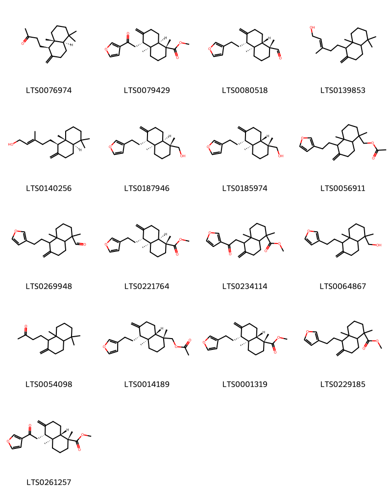
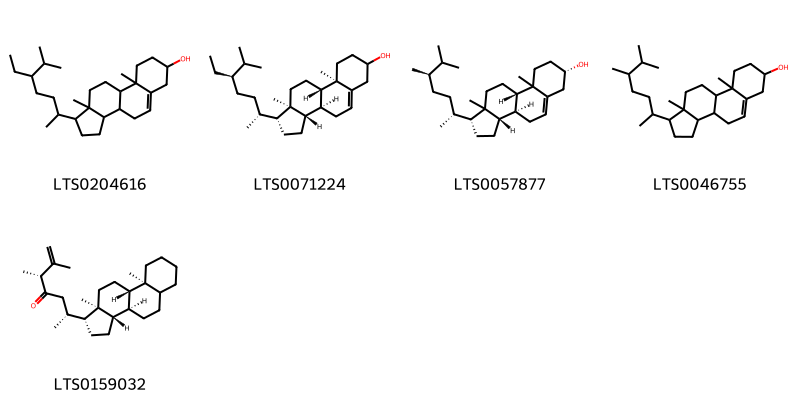
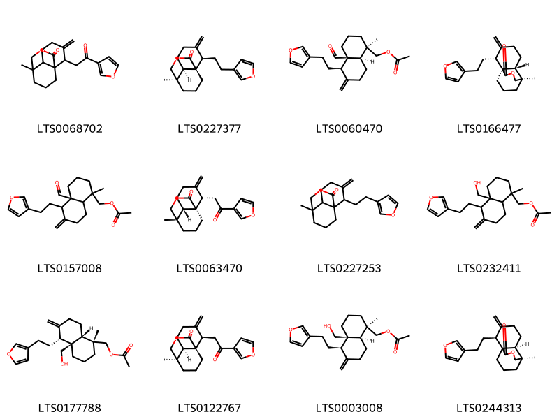

!!! abstract "Tóm tắt"

    Họ Potamogetonaceae gồm khoảng 2 chi và 2 loài được một số cộng đồng tại các quốc gia như Elsewhere, Egypt sử dụng trong một số trường hợp MYMEMORY WARNING: YOU USED ALL AVAILABLE FREE TRANSLATIONS FOR TODAY. NEXT AVAILABLE IN  08 HOURS 17 MINUTES 58 SECONDS VISIT HTTPS://MYMEMORY.TRANSLATED.NET/DOC/USAGELIMITS.PHP TO TRANSLATE MORE.

!!! info "DrDuke"

    James A. Duke sinh năm 1929-2017 là một nhà thực vật học người Mỹ. Đây là một trong những tác giả hàng đầu trong lĩnh vực dược dân tộc học với cuốn *CRC Handbook of Medicinal Herbs* và chính là người xây dựng lên cơ sở dữ liệu về hợp chất tự nhiên và dược dân tộc học tại Bộ nông nghiệp Hoa Kỳ. Các thông tin được đăng tải tại website [Dr. Duke's Phytochemical and Ethnobotanical Databases](https://phytochem.nal.usda.gov/). 
    Trong suốt thập niên 1970, ông lãnh đạo the Plant Taxonomy Laboratory, Plant Genetics and Germplasm Institute of the Agricultural Research Service, U.S. Department of Agriculture.
    Trong tài liệu này, các thông tin về dược dân tộc của các dược liệu được trích dẫn từ tài liệu của James A. Ducke với sự trợ giúp của phần mềm dịch thuật từ tiếng Anh sang tiếng Việt.
   

# Chi Ruppia

??? note "Danh sách các dược liệu thuộc chi"
    
	 - *Ruppia maritima*

---
## Ruppia maritima
### Thông tin về thực vật

!!! info "Phân loại thực vật của *Ruppia maritima* từ GIBF:"
    - **Kingdom:** Plantae
    - **Phylum:** Tracheophyta
    - **Order:** Alismatales
    - **Family:** Ruppiaceae
    - **Genus:** Ruppia
    - **Species:** *Ruppia maritima*

 

| Label (VI)   | Label (EN)   | Scientific Name   | Descriptions (VI)   | Descriptions (EN)   | Also Known As (VI)   | Also Known As (EN)                                                       |
|:-------------|:-------------|:------------------|:--------------------|:--------------------|:---------------------|:-------------------------------------------------------------------------|
| N/A          | N/A          | Ruppia maritima   |                     | species of plant    | ['']                 | ['beaked tasselweed', 'ditch grass', 'tassel pondweed', 'widgeon grass'] |

#### Phân bố trên thế giới

**Từ CSDL GIBF** Georgia, Denmark, Spain, Germany, Azerbaijan, Dominican Republic, Sweden, Montenegro, Canada, Finland, Netherlands, Malta, Brazil, Mexico, China, Norway, Hong Kong, Chinese Taipei, United Kingdom of Great Britain and Northern Ireland, Portugal, Russian Federation, United States of America, Israel, Croatia, Ukraine

#### Phân bố tại Việt Nam

**Từ CSDL GIBF**: Không có ghi nhận ở Việt Nam

---
### Thành phần hóa học
        
- Theo cơ sở dữ liệu lotus: Từ loài *Ruppia maritima* đã phân lập và xác định được 22 hoạt chất thuộc về các nhóm Prenol lipids, Steroids and steroid derivatives. 

|    | chemicalTaxonomyClassyfireClass   |   smiles_count |
|---:|:----------------------------------|---------------:|
|  0 | Prenol lipids                     |             17 |
|  1 | Steroids and steroid derivatives  |              5 |

#### Nhóm Prenol lipids
<figure markdown="span">
    { width=100% }
    <figcaption>Hình ảnh cấu trúc hóa học của 17 hoạt chất thuộc nhóm Prenol lipids gồm ['4-[(1r,4ar,8ar)-5,5,8a-trimethyl-2-methylidene-hexahydro-1h-naphthalen-1-yl]butan-2-one (LTS0076974)', 'methyl (1r,4as,5r,8ar)-5-[2-(furan-3-yl)-2-oxoethyl]-1,4a-dimethyl-6-methylidene-hexahydro-2h-naphthalene-1-carboxylate (LTS0079429)', '(1r,4as,5r,8as)-5-[2-(furan-3-yl)ethyl]-1,4a-dimethyl-6-methylidene-hexahydro-2h-naphthalene-1-carbaldehyde (LTS0080518)', '5-(5,5,8a-trimethyl-2-methylidene-hexahydro-1h-naphthalen-1-yl)-3-methylpent-2-en-1-ol (LTS0139853)', '(-)-ent-copalol (LTS0140256)', '[(1r,4as,5r,8ar)-5-[2-(furan-3-yl)ethyl]-1,4a-dimethyl-6-methylidene-hexahydro-2h-naphthalen-1-yl]methanol (LTS0187946)', '[(1r,4as,5r,8as)-5-[2-(furan-3-yl)ethyl]-1,4a-dimethyl-6-methylidene-hexahydro-2h-naphthalen-1-yl]methanol (LTS0185974)', '{5-[2-(furan-3-yl)ethyl]-1,4a-dimethyl-6-methylidene-hexahydro-2h-naphthalen-1-yl}methyl acetate (LTS0056911)', '5-[2-(furan-3-yl)ethyl]-1,4a-dimethyl-6-methylidene-hexahydro-2h-naphthalene-1-carbaldehyde (LTS0269948)', 'methyl (1r,4as,5r,8ar)-5-[2-(furan-3-yl)ethyl]-1,4a-dimethyl-6-methylidene-hexahydro-2h-naphthalene-1-carboxylate (LTS0221764)', 'methyl 5-[2-(furan-3-yl)-2-oxoethyl]-1,4a-dimethyl-6-methylidene-hexahydro-2h-naphthalene-1-carboxylate (LTS0234114)', '{5-[2-(furan-3-yl)ethyl]-1,4a-dimethyl-6-methylidene-hexahydro-2h-naphthalen-1-yl}methanol (LTS0064867)', '4-(5,5,8a-trimethyl-2-methylidene-hexahydro-1h-naphthalen-1-yl)butan-2-one (LTS0054098)', '[(1r,4as,5r,8as)-5-[2-(furan-3-yl)ethyl]-1,4a-dimethyl-6-methylidene-hexahydro-2h-naphthalen-1-yl]methyl acetate (LTS0014189)', 'methyl (1r,4as,5r,8as)-5-[2-(furan-3-yl)ethyl]-1,4a-dimethyl-6-methylidene-hexahydro-2h-naphthalene-1-carboxylate (LTS0001319)', 'methyl 5-[2-(furan-3-yl)ethyl]-1,4a-dimethyl-6-methylidene-hexahydro-2h-naphthalene-1-carboxylate (LTS0229185)', 'methyl (1r,4as,5r,8as)-5-[2-(furan-3-yl)-2-oxoethyl]-1,4a-dimethyl-6-methylidene-hexahydro-2h-naphthalene-1-carboxylate (LTS0261257)'].</figcaption>
</figure>
#### Nhóm Steroids and steroid derivatives
<figure markdown="span">
    { width=100% }
    <figcaption>Hình ảnh cấu trúc hóa học của 5 hoạt chất thuộc nhóm Steroids and steroid derivatives gồm ['stigmast-5-en-3-ol, (3β)- (LTS0204616)', 'stigmast-5-en-3-ol (LTS0071224)', '(1r,3as,3bs,7s,9bs)-1-[(2r,5r)-5,6-dimethylheptan-2-yl]-9a,11a-dimethyl-1h,2h,3h,3ah,3bh,4h,6h,7h,8h,9h,9bh,10h,11h-cyclopenta[a]phenanthren-7-ol (LTS0057877)', 'campesterol (LTS0046755)', '(3r,6r)-6-[(1r,3as,3br,9as,9bs,11ar)-9a,11a-dimethyl-tetradecahydro-1h-cyclopenta[a]phenanthren-1-yl]-2,3-dimethylhept-1-en-4-one (LTS0159032)'].</figcaption>
</figure>

---

### Dược dân tộc học

Danh sách các quốc gia có sử dụng *Ruppia maritima* trong điều trị các bệnh. 

| Country   | Disease   | Bệnh                                                                                                                                                                                                |
|:----------|:----------|:----------------------------------------------------------------------------------------------------------------------------------------------------------------------------------------------------|
| Elsewhere | Vulnerary | MYMEMORY WARNING: YOU USED ALL AVAILABLE FREE TRANSLATIONS FOR TODAY. NEXT AVAILABLE IN  08 HOURS 17 MINUTES 55 SECONDS VISIT HTTPS://MYMEMORY.TRANSLATED.NET/DOC/USAGELIMITS.PHP TO TRANSLATE MORE |

---

# Chi Potamogeton

??? note "Danh sách các dược liệu thuộc chi"
    
	 - *Potamogeton nodosus*

---
## Potamogeton nodosus
### Thông tin về thực vật

!!! info "Phân loại thực vật của *Potamogeton nodosus* từ GIBF:"
    - **Kingdom:** Plantae
    - **Phylum:** Tracheophyta
    - **Order:** Alismatales
    - **Family:** Potamogetonaceae
    - **Genus:** Potamogeton
    - **Species:** *Potamogeton nodosus*

 

| Label (VI)   | Label (EN)   | Scientific Name     | Descriptions (VI)   | Descriptions (EN)   | Also Known As (VI)   | Also Known As (EN)   |
|:-------------|:-------------|:--------------------|:--------------------|:--------------------|:---------------------|:---------------------|
| N/A          | N/A          | Potamogeton nodosus | loài thực vật       | species of plant    | ['']                 | ['Loddon pondweed']  |

#### Phân bố trên thế giới

**Từ CSDL GIBF** Spain, Germany, Austria, Rwanda, Albania, Serbia, Uzbekistan, Poland, Montenegro, Canada, Slovakia, Netherlands, Hungary, Mexico, Switzerland, Portugal, South Africa, Morocco, France, Czechia, Russian Federation, United States of America, Italy, Israel, Algeria, Greece, Croatia, Ukraine

#### Phân bố tại Việt Nam

**Từ CSDL GIBF**: Không có ghi nhận ở Việt Nam

---
### Thành phần hóa học
        
- Theo cơ sở dữ liệu lotus: Từ loài *Potamogeton nodosus* đã phân lập và xác định được 15 hoạt chất thuộc về các nhóm Steroids and steroid derivatives, Prenol lipids. 

|    | chemicalTaxonomyClassyfireClass   |   smiles_count |
|---:|:----------------------------------|---------------:|
|  0 | Prenol lipids                     |             12 |
|  1 | Steroids and steroid derivatives  |              2 |

#### Nhóm Prenol lipids
<figure markdown="span">
    { width=100% }
    <figcaption>Hình ảnh cấu trúc hóa học của 12 hoạt chất thuộc nhóm Prenol lipids gồm ['2-[2-(furan-3-yl)-2-oxoethyl]-7-methyl-3-methylidene-9-oxatricyclo[5.3.3.0¹,⁶]tridecan-10-one (LTS0068702)', '(1r,2r,6r,7r)-2-[2-(furan-3-yl)ethyl]-7-methyl-3-methylidene-9-oxatricyclo[5.3.3.0¹,⁶]tridecan-10-one (LTS0227377)', '[(1r,4ar,5r,8ar)-4a-formyl-5-[2-(furan-3-yl)ethyl]-1-methyl-6-methylidene-hexahydro-2h-naphthalen-1-yl]methyl acetate (LTS0060470)', '(1s,2r,6r,7r)-2-[2-(furan-3-yl)ethyl]-7-methyl-3-methylidene-9-oxatricyclo[5.3.3.0¹,⁶]tridecan-10-one (LTS0166477)', '{4a-formyl-5-[2-(furan-3-yl)ethyl]-1-methyl-6-methylidene-hexahydro-2h-naphthalen-1-yl}methyl acetate (LTS0157008)', '(1s,2s,6s,7s)-2-[2-(furan-3-yl)-2-oxoethyl]-7-methyl-3-methylidene-9-oxatricyclo[5.3.3.0¹,⁶]tridecan-10-one (LTS0063470)', '2-[2-(furan-3-yl)ethyl]-7-methyl-3-methylidene-9-oxatricyclo[5.3.3.0¹,⁶]tridecan-10-one (LTS0227253)', '{5-[2-(furan-3-yl)ethyl]-4a-(hydroxymethyl)-1-methyl-6-methylidene-hexahydro-2h-naphthalen-1-yl}methyl acetate (LTS0232411)', '[(1r,4as,5r,8ar)-5-[2-(furan-3-yl)ethyl]-4a-(hydroxymethyl)-1-methyl-6-methylidene-hexahydro-2h-naphthalen-1-yl]methyl acetate (LTS0177788)', '(1r,2r,6r,7r)-2-[2-(furan-3-yl)-2-oxoethyl]-7-methyl-3-methylidene-9-oxatricyclo[5.3.3.0¹,⁶]tridecan-10-one (LTS0122767)', '[(1r,4ar,5r,8ar)-5-[2-(furan-3-yl)ethyl]-4a-(hydroxymethyl)-1-methyl-6-methylidene-hexahydro-2h-naphthalen-1-yl]methyl acetate (LTS0003008)', '(2s,6s,7r)-2-[2-(furan-3-yl)ethyl]-7-methyl-3-methylidene-9-oxatricyclo[5.3.3.0¹,⁶]tridecan-10-one (LTS0244313)'].</figcaption>
</figure>
#### Nhóm Steroids and steroid derivatives
<figure markdown="span">
    { width=100% }
    <figcaption>Hình ảnh cấu trúc hóa học của 2 hoạt chất thuộc nhóm Steroids and steroid derivatives gồm ['phytosterol (LTS0029311)', 'stigmasterol (LTS0024262)'].</figcaption>
</figure>

---

### Dược dân tộc học

Danh sách các quốc gia có sử dụng *Potamogeton nodosus* trong điều trị các bệnh. 

| Country   | Disease                           | Bệnh                                                                                                                                                                                                |
|:----------|:----------------------------------|:----------------------------------------------------------------------------------------------------------------------------------------------------------------------------------------------------|
| Egypt     | Astringent, Hemostat, Refrigerant | MYMEMORY WARNING: YOU USED ALL AVAILABLE FREE TRANSLATIONS FOR TODAY. NEXT AVAILABLE IN  08 HOURS 17 MINUTES 29 SECONDS VISIT HTTPS://MYMEMORY.TRANSLATED.NET/DOC/USAGELIMITS.PHP TO TRANSLATE MORE |

---

