!!! abstract "Tóm tắt"

    Họ Primulaceae gồm khoảng 6 chi và 18 loài được một số cộng đồng tại các quốc gia như Turkey, UK, US, Dutch, Canada(Kwakiutl), China, Italian, anish, Europe, Iraq, English, US(Amerindian), German, India, Elsewhere, ain sử dụng trong một số trường hợp QUERY LENGTH LIMIT EXCEEDED. MAX ALLOWED QUERY : 500 CHARS.

!!! info "DrDuke"

    James A. Duke sinh năm 1929-2017 là một nhà thực vật học người Mỹ. Đây là một trong những tác giả hàng đầu trong lĩnh vực dược dân tộc học với cuốn *CRC Handbook of Medicinal Herbs* và chính là người xây dựng lên cơ sở dữ liệu về hợp chất tự nhiên và dược dân tộc học tại Bộ nông nghiệp Hoa Kỳ. Các thông tin được đăng tải tại website [Dr. Duke's Phytochemical and Ethnobotanical Databases](https://phytochem.nal.usda.gov/). 
    Trong suốt thập niên 1970, ông lãnh đạo the Plant Taxonomy Laboratory, Plant Genetics and Germplasm Institute of the Agricultural Research Service, U.S. Department of Agriculture.
    Trong tài liệu này, các thông tin về dược dân tộc của các dược liệu được trích dẫn từ tài liệu của James A. Ducke với sự trợ giúp của phần mềm dịch thuật từ tiếng Anh sang tiếng Việt.
   

# Chi Samolus

??? note "Danh sách các dược liệu thuộc chi"
    
	 - *Samolus valerandi*

---
## Samolus valerandi
### Thông tin về thực vật

!!! info "Phân loại thực vật của *Samolus valerandi* từ GIBF:"
    - **Kingdom:** Plantae
    - **Phylum:** Tracheophyta
    - **Order:** Ericales
    - **Family:** Primulaceae
    - **Genus:** Samolus
    - **Species:** *Samolus valerandi*

 

| Label (VI)   | Label (EN)   | Scientific Name   | Descriptions (VI)   | Descriptions (EN)   | Also Known As (VI)   | Also Known As (EN)   |
|:-------------|:-------------|:------------------|:--------------------|:--------------------|:---------------------|:---------------------|
| N/A          | N/A          | Samolus valerandi | loài thực vật       | species of plant    | ['']                 | ['brookweed']        |

#### Phân bố trên thế giới

**Từ CSDL GIBF** Italy, Belgium, Argentina, Denmark, Netherlands, Cyprus, Chinese Taipei, Spain, Azerbaijan, Hungary, Portugal, Algeria, Russian Federation, United States of America, Sweden, Uruguay, Slovenia, Croatia, Greece, South Africa, Germany, Switzerland, Austria, France, United Kingdom of Great Britain and Northern Ireland, Cabo Verde, Ireland

#### Phân bố tại Việt Nam

**Từ CSDL GIBF**: Không có ghi nhận ở Việt Nam

---
### Thành phần hóa học
        
- Theo cơ sở dữ liệu lotus: Từ loài *Samolus valerandi* đã phân lập và xác định được Chưa có hoạt chất nào được phân lập. hoạt chất thuộc về các nhóm Không có hoạt chất nào được phân lập. 

Không có hình ảnh nào được tạo ra

---

### Dược dân tộc học

Danh sách các quốc gia có sử dụng *Samolus valerandi* trong điều trị các bệnh. 

| Country   | Disease   | Bệnh                                                                                                                                                                                                |
|:----------|:----------|:----------------------------------------------------------------------------------------------------------------------------------------------------------------------------------------------------|
| ain       | Vulnerary | MYMEMORY WARNING: YOU USED ALL AVAILABLE FREE TRANSLATIONS FOR TODAY. NEXT AVAILABLE IN  02 HOURS 10 MINUTES 11 SECONDS VISIT HTTPS://MYMEMORY.TRANSLATED.NET/DOC/USAGELIMITS.PHP TO TRANSLATE MORE |

---

# Chi Lysimachia

??? note "Danh sách các dược liệu thuộc chi"
    
	 - *Lysimachia christinae*
	 - *Lysimachia nemorum*
	 - *Lysimachia nummularia*
	 - *Lysimachia paridiformis*
	 - *Lysimachia quadrifolia*
	 - *Lysimachia vulgaris*

---
## Lysimachia christinae
### Thông tin về thực vật

!!! info "Phân loại thực vật của *Lysimachia christinae* từ GIBF:"
    - **Kingdom:** Plantae
    - **Phylum:** Tracheophyta
    - **Order:** Ericales
    - **Family:** Primulaceae
    - **Genus:** Lysimachia
    - **Species:** *Lysimachia christinae*

 

| Label (VI)   | Label (EN)   | Scientific Name       | Descriptions (VI)   | Descriptions (EN)   | Also Known As (VI)   | Also Known As (EN)   |
|:-------------|:-------------|:----------------------|:--------------------|:--------------------|:---------------------|:---------------------|
| N/A          | N/A          | Lysimachia christinae | loài thực vật       | species of plant    | ['']                 | ['']                 |

#### Phân bố trên thế giới

**Từ CSDL GIBF** nan, Japan, Korea, Republic of, Chinese Taipei, United States of America, China

#### Phân bố tại Việt Nam

**Từ CSDL GIBF**: Không có ghi nhận ở Việt Nam

---
### Thành phần hóa học
        
- Theo cơ sở dữ liệu lotus: Từ loài *Lysimachia christinae* đã phân lập và xác định được 5 hoạt chất thuộc về các nhóm Flavonoids. 

|    | chemicalTaxonomyClassyfireClass   |   smiles_count |
|---:|:----------------------------------|---------------:|
|  0 | Flavonoids                        |              4 |

#### Nhóm Flavonoids
<figure markdown="span">
    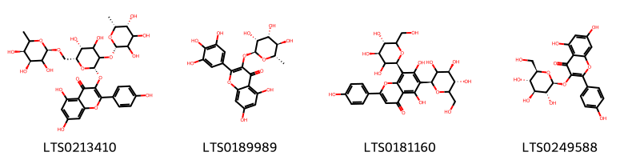{ width=100% }
    <figcaption>Hình ảnh cấu trúc hóa học của 4 hoạt chất thuộc nhóm Flavonoids gồm ['3-{[(2s,5r,6r)-4,5-dihydroxy-3-{[(2s,5r,6r)-3,4,5-trihydroxy-6-methyloxan-2-yl]oxy}-6-({[(2r,4s,5r)-3,4,5-trihydroxy-6-methyloxan-2-yl]oxy}methyl)oxan-2-yl]oxy}-5,7-dihydroxy-2-(4-hydroxyphenyl)chromen-4-one (LTS0213410)', 'myricitrin (LTS0189989)', 'vicenin 2 (LTS0181160)', 'astragalin (LTS0249588)'].</figcaption>
</figure>

---

### Dược dân tộc học

Danh sách các quốc gia có sử dụng *Lysimachia christinae* trong điều trị các bệnh. 

| Country   | Disease                                       | Bệnh                                                                                                                                                                                                |
|:----------|:----------------------------------------------|:----------------------------------------------------------------------------------------------------------------------------------------------------------------------------------------------------|
| China     | Alexiteric, Detoxicant, Diuretic, Refrigerant | MYMEMORY WARNING: YOU USED ALL AVAILABLE FREE TRANSLATIONS FOR TODAY. NEXT AVAILABLE IN  02 HOURS 09 MINUTES 49 SECONDS VISIT HTTPS://MYMEMORY.TRANSLATED.NET/DOC/USAGELIMITS.PHP TO TRANSLATE MORE |

---

---
## Lysimachia nemorum
### Thông tin về thực vật

!!! info "Phân loại thực vật của *Lysimachia nemorum* từ GIBF:"
    - **Kingdom:** Plantae
    - **Phylum:** Tracheophyta
    - **Order:** Ericales
    - **Family:** Primulaceae
    - **Genus:** Lysimachia
    - **Species:** *Lysimachia nemorum*

 

| Label (VI)   | Label (EN)   | Scientific Name    | Descriptions (VI)   | Descriptions (EN)   | Also Known As (VI)   | Also Known As (EN)   |
|:-------------|:-------------|:-------------------|:--------------------|:--------------------|:---------------------|:---------------------|
| N/A          | N/A          | Lysimachia nemorum | loài thực vật       | species of plant    | ['']                 | ['yellow pimpernel'] |

#### Phân bố trên thế giới

**Từ CSDL GIBF** nan, Ukraine, Netherlands, Czechia, Germany, Belgium, Spain, Poland, Ireland, Switzerland, Austria, France, United Kingdom of Great Britain and Northern Ireland

#### Phân bố tại Việt Nam

**Từ CSDL GIBF**: Không có ghi nhận ở Việt Nam

---
### Thành phần hóa học
        
- Theo cơ sở dữ liệu lotus: Từ loài *Lysimachia nemorum* đã phân lập và xác định được Chưa có hoạt chất nào được phân lập. hoạt chất thuộc về các nhóm Không có hoạt chất nào được phân lập. 

Không có hình ảnh nào được tạo ra

---

### Dược dân tộc học

Danh sách các quốc gia có sử dụng *Lysimachia nemorum* trong điều trị các bệnh. 

| Country   | Disease               | Bệnh                                                                                                                                                                                                |
|:----------|:----------------------|:----------------------------------------------------------------------------------------------------------------------------------------------------------------------------------------------------|
| Europe    | Astringent, Vulnerary | MYMEMORY WARNING: YOU USED ALL AVAILABLE FREE TRANSLATIONS FOR TODAY. NEXT AVAILABLE IN  02 HOURS 09 MINUTES 24 SECONDS VISIT HTTPS://MYMEMORY.TRANSLATED.NET/DOC/USAGELIMITS.PHP TO TRANSLATE MORE |

---

---
## Lysimachia nummularia
### Thông tin về thực vật

!!! info "Phân loại thực vật của *Lysimachia nummularia* từ GIBF:"
    - **Kingdom:** Plantae
    - **Phylum:** Tracheophyta
    - **Order:** Ericales
    - **Family:** Primulaceae
    - **Genus:** Lysimachia
    - **Species:** *Lysimachia nummularia*

 

| Label (VI)   | Label (EN)   | Scientific Name       | Descriptions (VI)   | Descriptions (EN)   | Also Known As (VI)   | Also Known As (EN)                                                 |
|:-------------|:-------------|:----------------------|:--------------------|:--------------------|:---------------------|:-------------------------------------------------------------------|
| N/A          | N/A          | Lysimachia nummularia | loài thực vật       | species of plant    | ['']                 | ['moneywort', 'creeping jenny', 'herb twopence', 'twopenny grass'] |

#### Phân bố trên thế giới

**Từ CSDL GIBF** Italy, Australia, Belgium, Norway, Canada, Ukraine, Denmark, Netherlands, Lithuania, Belarus, Hungary, Russian Federation, United States of America, Sweden, Czechia, Germany, Switzerland, Austria, France, United Kingdom of Great Britain and Northern Ireland, Poland

#### Phân bố tại Việt Nam

**Từ CSDL GIBF**: Không có ghi nhận ở Việt Nam

---
### Thành phần hóa học
        
- Theo cơ sở dữ liệu lotus: Từ loài *Lysimachia nummularia* đã phân lập và xác định được 15 hoạt chất thuộc về các nhóm Flavonoids. 

|    | chemicalTaxonomyClassyfireClass   |   smiles_count |
|---:|:----------------------------------|---------------:|
|  0 | Flavonoids                        |             15 |

#### Nhóm Flavonoids
<figure markdown="span">
    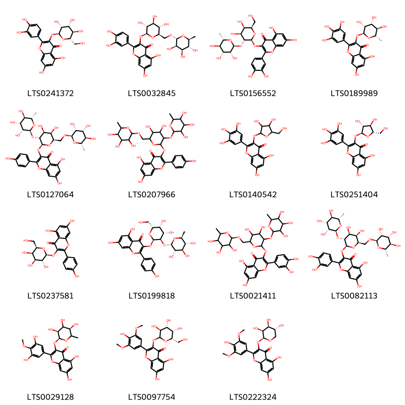{ width=100% }
    <figcaption>Hình ảnh cấu trúc hóa học của 15 hoạt chất thuộc nhóm Flavonoids gồm ['2-(3,4-dihydroxyphenyl)-5,7-dihydroxy-3-{[(2s,3r,4r,5r,6s)-3,4,5-trihydroxy-6-(hydroxymethyl)oxan-2-yl]oxy}chromen-4-one (LTS0241372)', '3-rutinosyl quercetin (LTS0032845)', '3-{[(2s,3r,4s,5r,6r)-4,5-dihydroxy-6-(hydroxymethyl)-3-{[(2s,3r,4r,5r,6s)-3,4,5-trihydroxy-6-methyloxan-2-yl]oxy}oxan-2-yl]oxy}-2-(3,4-dihydroxyphenyl)-5,7-dihydroxychromen-4-one (LTS0156552)', 'myricitrin (LTS0189989)', '3-{[(2s,3r,4s,5r,6r)-4,5-dihydroxy-3-{[(2s,3r,4r,5r,6s)-3,4,5-trihydroxy-6-methyloxan-2-yl]oxy}-6-({[(2r,3r,4r,5r,6s)-3,4,5-trihydroxy-6-methyloxan-2-yl]oxy}methyl)oxan-2-yl]oxy}-5,7-dihydroxy-2-(4-hydroxyphenyl)chromen-4-one (LTS0127064)', '3-({4,5-dihydroxy-3-[(3,4,5-trihydroxy-6-methyloxan-2-yl)oxy]-6-{[(3,4,5-trihydroxy-6-methyloxan-2-yl)oxy]methyl}oxan-2-yl}oxy)-5,7-dihydroxy-2-(4-hydroxyphenyl)chromen-4-one (LTS0207966)', '3-{[3,4-dihydroxy-5-(hydroxymethyl)oxolan-2-yl]oxy}-5,7-dihydroxy-2-(3,4,5-trihydroxyphenyl)chromen-4-one (LTS0140542)', '3-{[(2s,3r,4r,5s)-3,4-dihydroxy-5-(hydroxymethyl)oxolan-2-yl]oxy}-5,7-dihydroxy-2-(3,4,5-trihydroxyphenyl)chromen-4-one (LTS0251404)', 'trifolin (LTS0237581)', '3-{[(2r,3r,4s,5r,6r)-4,5-dihydroxy-6-(hydroxymethyl)-3-{[(2s,3s,4r,5r,6s)-3,4,5-trihydroxy-6-methyloxan-2-yl]oxy}oxan-2-yl]oxy}-5,7-dihydroxy-2-(4-hydroxyphenyl)chromen-4-one (LTS0199818)', '3-({4,5-dihydroxy-3-[(3,4,5-trihydroxy-6-methyloxan-2-yl)oxy]-6-{[(3,4,5-trihydroxy-6-methyloxan-2-yl)oxy]methyl}oxan-2-yl}oxy)-2-(3,4-dihydroxyphenyl)-5,7-dihydroxychromen-4-one (LTS0021411)', '3-{[(2s,3r,4s,5r,6r)-4,5-dihydroxy-3-{[(2s,3r,4r,5r,6s)-3,4,5-trihydroxy-6-methyloxan-2-yl]oxy}-6-({[(2r,3r,4r,5r,6s)-3,4,5-trihydroxy-6-methyloxan-2-yl]oxy}methyl)oxan-2-yl]oxy}-2-(3,4-dihydroxyphenyl)-5,7-dihydroxychromen-4-one (LTS0082113)', 'mearnsitrin (LTS0029128)', '5,7-dihydroxy-2-(4-hydroxy-3,5-dimethoxyphenyl)-3-{[(3s,4r,5s,6s)-3,4,5-trihydroxy-6-(hydroxymethyl)oxan-2-yl]oxy}chromen-4-one (LTS0097754)', '5,7-dihydroxy-2-(4-hydroxy-3,5-dimethoxyphenyl)-3-{[(2s,3s,4s,5r)-3,4,5-trihydroxyoxan-2-yl]oxy}chromen-4-one (LTS0222324)'].</figcaption>
</figure>

---

### Dược dân tộc học

Danh sách các quốc gia có sử dụng *Lysimachia nummularia* trong điều trị các bệnh. 

| Country   | Disease                                 | Bệnh                                                                                                                                                                                                |
|:----------|:----------------------------------------|:----------------------------------------------------------------------------------------------------------------------------------------------------------------------------------------------------|
| Dutch     | nan                                     | MYMEMORY WARNING: YOU USED ALL AVAILABLE FREE TRANSLATIONS FOR TODAY. NEXT AVAILABLE IN  02 HOURS 09 MINUTES 01 SECONDS VISIT HTTPS://MYMEMORY.TRANSLATED.NET/DOC/USAGELIMITS.PHP TO TRANSLATE MORE |
| English   | Astringent                              | MYMEMORY WARNING: YOU USED ALL AVAILABLE FREE TRANSLATIONS FOR TODAY. NEXT AVAILABLE IN  02 HOURS 08 MINUTES 59 SECONDS VISIT HTTPS://MYMEMORY.TRANSLATED.NET/DOC/USAGELIMITS.PHP TO TRANSLATE MORE |
| Italian   | Expectorant                             | MYMEMORY WARNING: YOU USED ALL AVAILABLE FREE TRANSLATIONS FOR TODAY. NEXT AVAILABLE IN  02 HOURS 08 MINUTES 56 SECONDS VISIT HTTPS://MYMEMORY.TRANSLATED.NET/DOC/USAGELIMITS.PHP TO TRANSLATE MORE |
| Turkey    | nan, Expectorant, Vulnerary, Astringent | MYMEMORY WARNING: YOU USED ALL AVAILABLE FREE TRANSLATIONS FOR TODAY. NEXT AVAILABLE IN  02 HOURS 08 MINUTES 54 SECONDS VISIT HTTPS://MYMEMORY.TRANSLATED.NET/DOC/USAGELIMITS.PHP TO TRANSLATE MORE |
| anish     | Vulnerary                               | MYMEMORY WARNING: YOU USED ALL AVAILABLE FREE TRANSLATIONS FOR TODAY. NEXT AVAILABLE IN  02 HOURS 08 MINUTES 52 SECONDS VISIT HTTPS://MYMEMORY.TRANSLATED.NET/DOC/USAGELIMITS.PHP TO TRANSLATE MORE |

---

---
## Lysimachia paridiformis
### Thông tin về thực vật

!!! info "Phân loại thực vật của *Lysimachia paridiformis* từ GIBF:"
    - **Kingdom:** Plantae
    - **Phylum:** Tracheophyta
    - **Order:** Ericales
    - **Family:** Primulaceae
    - **Genus:** Lysimachia
    - **Species:** *Lysimachia paridiformis*

 

| Label (VI)   | Label (EN)   | Scientific Name         | Descriptions (VI)   | Descriptions (EN)   | Also Known As (VI)   | Also Known As (EN)   |
|:-------------|:-------------|:------------------------|:--------------------|:--------------------|:---------------------|:---------------------|
| N/A          | N/A          | Lysimachia paridiformis | loài thực vật       | species of plant    | ['']                 | ['']                 |

#### Phân bố trên thế giới

**Từ CSDL GIBF** nan, unknown or invalid, China, United States of America

#### Phân bố tại Việt Nam

**Từ CSDL GIBF**: Không có ghi nhận ở Việt Nam

---
### Thành phần hóa học
        
- Theo cơ sở dữ liệu lotus: Từ loài *Lysimachia paridiformis* đã phân lập và xác định được Chưa có hoạt chất nào được phân lập. hoạt chất thuộc về các nhóm Không có hoạt chất nào được phân lập. 

Không có hình ảnh nào được tạo ra

---

### Dược dân tộc học

Danh sách các quốc gia có sử dụng *Lysimachia paridiformis* trong điều trị các bệnh. 

| Country   | Disease                  | Bệnh                                                                                                                                                                                                |
|:----------|:-------------------------|:----------------------------------------------------------------------------------------------------------------------------------------------------------------------------------------------------|
| China     | Carminative, Expectorant | MYMEMORY WARNING: YOU USED ALL AVAILABLE FREE TRANSLATIONS FOR TODAY. NEXT AVAILABLE IN  02 HOURS 08 MINUTES 15 SECONDS VISIT HTTPS://MYMEMORY.TRANSLATED.NET/DOC/USAGELIMITS.PHP TO TRANSLATE MORE |

---

---
## Lysimachia quadrifolia
### Thông tin về thực vật

!!! info "Phân loại thực vật của *Lysimachia quadrifolia* từ GIBF:"
    - **Kingdom:** Plantae
    - **Phylum:** Tracheophyta
    - **Order:** Ericales
    - **Family:** Primulaceae
    - **Genus:** Lysimachia
    - **Species:** *Lysimachia quadrifolia*

 

| Label (VI)   | Label (EN)   | Scientific Name        | Descriptions (VI)   | Descriptions (EN)   | Also Known As (VI)   | Also Known As (EN)   |
|:-------------|:-------------|:-----------------------|:--------------------|:--------------------|:---------------------|:---------------------|
| N/A          | N/A          | Lysimachia quadrifolia |                     | species of plant    | ['']                 | ['']                 |

#### Phân bố trên thế giới

**Từ CSDL GIBF** United States of America, Canada

#### Phân bố tại Việt Nam

**Từ CSDL GIBF**: Không có ghi nhận ở Việt Nam

---
### Thành phần hóa học
        
- Theo cơ sở dữ liệu lotus: Từ loài *Lysimachia quadrifolia* đã phân lập và xác định được Chưa có hoạt chất nào được phân lập. hoạt chất thuộc về các nhóm Không có hoạt chất nào được phân lập. 

Không có hình ảnh nào được tạo ra

---

### Dược dân tộc học

Danh sách các quốc gia có sử dụng *Lysimachia quadrifolia* trong điều trị các bệnh. 

| Country        | Disease               | Bệnh                                                                                                                                                                                                |
|:---------------|:----------------------|:----------------------------------------------------------------------------------------------------------------------------------------------------------------------------------------------------|
| US(Amerindian) | Astringent, Stomachic | MYMEMORY WARNING: YOU USED ALL AVAILABLE FREE TRANSLATIONS FOR TODAY. NEXT AVAILABLE IN  02 HOURS 07 MINUTES 56 SECONDS VISIT HTTPS://MYMEMORY.TRANSLATED.NET/DOC/USAGELIMITS.PHP TO TRANSLATE MORE |

---

---
## Lysimachia vulgaris
### Thông tin về thực vật

!!! info "Phân loại thực vật của *Lysimachia vulgaris* từ GIBF:"
    - **Kingdom:** Plantae
    - **Phylum:** Tracheophyta
    - **Order:** Ericales
    - **Family:** Primulaceae
    - **Genus:** Lysimachia
    - **Species:** *Lysimachia vulgaris*

 

| Label (VI)   | Label (EN)   | Scientific Name     | Descriptions (VI)   | Descriptions (EN)   | Also Known As (VI)   | Also Known As (EN)     |
|:-------------|:-------------|:--------------------|:--------------------|:--------------------|:---------------------|:-----------------------|
| N/A          | N/A          | Lysimachia vulgaris | loài thực vật       | species of plant    | ['']                 | ['Yellow Loosestrife'] |

#### Phân bố trên thế giới

**Từ CSDL GIBF** Denmark, Netherlands, Czechia, Germany, Belgium, United Kingdom of Great Britain and Northern Ireland, Luxembourg, Poland, Switzerland, Russian Federation, United States of America, Sweden, Finland, France, New Zealand, Austria

#### Phân bố tại Việt Nam

**Từ CSDL GIBF**: Không có ghi nhận ở Việt Nam

---
### Thành phần hóa học
        
- Theo cơ sở dữ liệu lotus: Từ loài *Lysimachia vulgaris* đã phân lập và xác định được 14 hoạt chất thuộc về các nhóm Flavonoids, Prenol lipids. 

|    | chemicalTaxonomyClassyfireClass   |   smiles_count |
|---:|:----------------------------------|---------------:|
|  0 | Flavonoids                        |             13 |
|  1 | Prenol lipids                     |              1 |

#### Nhóm Flavonoids
<figure markdown="span">
    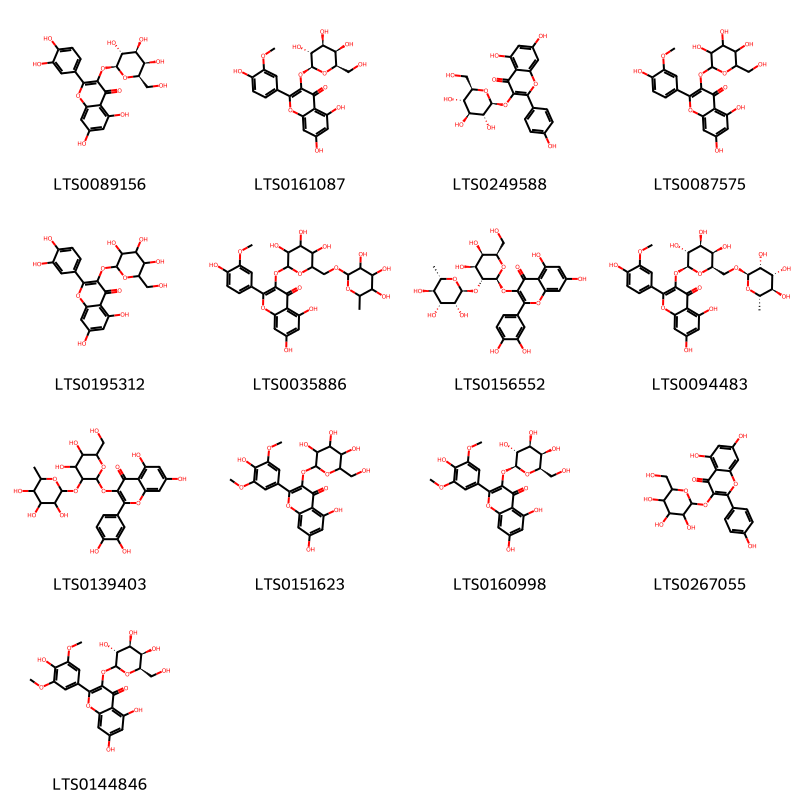{ width=100% }
    <figcaption>Hình ảnh cấu trúc hóa học của 13 hoạt chất thuộc nhóm Flavonoids gồm ['hyperoside (LTS0089156)', 'cacticin (LTS0161087)', 'astragalin (LTS0249588)', 'isorhamnetin 3-galactoside (LTS0087575)', '2-(3,4-dihydroxyphenyl)-5,7-dihydroxy-3-{[3,4,5-trihydroxy-6-(hydroxymethyl)oxan-2-yl]oxy}chromen-4-one (LTS0195312)', '5,7-dihydroxy-2-(4-hydroxy-3-methoxyphenyl)-3-[(3,4,5-trihydroxy-6-{[(3,4,5-trihydroxy-6-methyloxan-2-yl)oxy]methyl}oxan-2-yl)oxy]chromen-4-one (LTS0035886)', '3-{[(2s,3r,4s,5r,6r)-4,5-dihydroxy-6-(hydroxymethyl)-3-{[(2s,3r,4r,5r,6s)-3,4,5-trihydroxy-6-methyloxan-2-yl]oxy}oxan-2-yl]oxy}-2-(3,4-dihydroxyphenyl)-5,7-dihydroxychromen-4-one (LTS0156552)', '5,7-dihydroxy-2-(4-hydroxy-3-methoxyphenyl)-3-{[(2s,3r,4s,5r,6r)-3,4,5-trihydroxy-6-({[(2r,3r,4r,5r,6s)-3,4,5-trihydroxy-6-methyloxan-2-yl]oxy}methyl)oxan-2-yl]oxy}chromen-4-one (LTS0094483)', '3-{[4,5-dihydroxy-6-(hydroxymethyl)-3-[(3,4,5-trihydroxy-6-methyloxan-2-yl)oxy]oxan-2-yl]oxy}-2-(3,4-dihydroxyphenyl)-5,7-dihydroxychromen-4-one (LTS0139403)', '5,7-dihydroxy-2-(4-hydroxy-3,5-dimethoxyphenyl)-3-{[3,4,5-trihydroxy-6-(hydroxymethyl)oxan-2-yl]oxy}chromen-4-one (LTS0151623)', '5,7-dihydroxy-2-(4-hydroxy-3,5-dimethoxyphenyl)-3-{[(2s,3r,4s,5r,6r)-3,4,5-trihydroxy-6-(hydroxymethyl)oxan-2-yl]oxy}chromen-4-one (LTS0160998)', 'trifolin (LTS0267055)', '5,7-dihydroxy-2-(4-hydroxy-3,5-dimethoxyphenyl)-3-{[(3r,4s,5r,6r)-3,4,5-trihydroxy-6-(hydroxymethyl)oxan-2-yl]oxy}chromen-4-one (LTS0144846)'].</figcaption>
</figure>
#### Nhóm Prenol lipids
<figure markdown="span">
    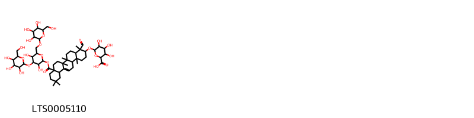{ width=100% }
    <figcaption>Hình ảnh cấu trúc hóa học của 1 hoạt chất thuộc nhóm Prenol lipids gồm ['6-[(8a-{[(3,5-dihydroxy-4-{[3,4,5-trihydroxy-6-(hydroxymethyl)oxan-2-yl]oxy}-6-({[3,4,5-trihydroxy-6-(hydroxymethyl)oxan-2-yl]oxy}methyl)oxan-2-yl)oxy]carbonyl}-4-formyl-4,6a,6b,11,11,14b-hexamethyl-1,2,3,4a,5,6,7,8,9,10,12,12a,14,14a-tetradecahydropicen-3-yl)oxy]-3,4,5-trihydroxyoxane-2-carboxylic acid (LTS0005110)'].</figcaption>
</figure>

---

### Dược dân tộc học

Danh sách các quốc gia có sử dụng *Lysimachia vulgaris* trong điều trị các bệnh. 

| Country   | Disease               | Bệnh                                                                                                                                                                                                |
|:----------|:----------------------|:----------------------------------------------------------------------------------------------------------------------------------------------------------------------------------------------------|
| Dutch     | Astringent            | MYMEMORY WARNING: YOU USED ALL AVAILABLE FREE TRANSLATIONS FOR TODAY. NEXT AVAILABLE IN  02 HOURS 07 MINUTES 36 SECONDS VISIT HTTPS://MYMEMORY.TRANSLATED.NET/DOC/USAGELIMITS.PHP TO TRANSLATE MORE |
| English   | Hemostat              | MYMEMORY WARNING: YOU USED ALL AVAILABLE FREE TRANSLATIONS FOR TODAY. NEXT AVAILABLE IN  02 HOURS 07 MINUTES 34 SECONDS VISIT HTTPS://MYMEMORY.TRANSLATED.NET/DOC/USAGELIMITS.PHP TO TRANSLATE MORE |
| Europe    | Expectorant, Hemostat | MYMEMORY WARNING: YOU USED ALL AVAILABLE FREE TRANSLATIONS FOR TODAY. NEXT AVAILABLE IN  02 HOURS 07 MINUTES 32 SECONDS VISIT HTTPS://MYMEMORY.TRANSLATED.NET/DOC/USAGELIMITS.PHP TO TRANSLATE MORE |
| German    | Expectorant           | MYMEMORY WARNING: YOU USED ALL AVAILABLE FREE TRANSLATIONS FOR TODAY. NEXT AVAILABLE IN  02 HOURS 07 MINUTES 29 SECONDS VISIT HTTPS://MYMEMORY.TRANSLATED.NET/DOC/USAGELIMITS.PHP TO TRANSLATE MORE |
| ain       | Hemostat              | MYMEMORY WARNING: YOU USED ALL AVAILABLE FREE TRANSLATIONS FOR TODAY. NEXT AVAILABLE IN  02 HOURS 07 MINUTES 27 SECONDS VISIT HTTPS://MYMEMORY.TRANSLATED.NET/DOC/USAGELIMITS.PHP TO TRANSLATE MORE |
| anish     | Vulnerary             | MYMEMORY WARNING: YOU USED ALL AVAILABLE FREE TRANSLATIONS FOR TODAY. NEXT AVAILABLE IN  02 HOURS 07 MINUTES 25 SECONDS VISIT HTTPS://MYMEMORY.TRANSLATED.NET/DOC/USAGELIMITS.PHP TO TRANSLATE MORE |

---

# Chi Cyclamen

??? note "Danh sách các dược liệu thuộc chi"
    
	 - *Cyclamen balearicum*
	 - *Cyclamen europaeum*
	 - *Cyclamen persicum*

---
## Cyclamen balearicum
### Thông tin về thực vật

!!! info "Phân loại thực vật của *Cyclamen balearicum* từ GIBF:"
    - **Kingdom:** Plantae
    - **Phylum:** Tracheophyta
    - **Order:** Ericales
    - **Family:** Primulaceae
    - **Genus:** Cyclamen
    - **Species:** *Cyclamen balearicum*

 

| Label (VI)   | Label (EN)   | Scientific Name     | Descriptions (VI)   | Descriptions (EN)   | Also Known As (VI)   | Also Known As (EN)   |
|:-------------|:-------------|:--------------------|:--------------------|:--------------------|:---------------------|:---------------------|
| N/A          | N/A          | Cyclamen balearicum | loài thực vật       | species of plant    | ['']                 | ['']                 |

#### Phân bố trên thế giới

**Từ CSDL GIBF** France, nan, Spain

#### Phân bố tại Việt Nam

**Từ CSDL GIBF**: Không có ghi nhận ở Việt Nam

---
### Thành phần hóa học
        
- Theo cơ sở dữ liệu lotus: Từ loài *Cyclamen balearicum* đã phân lập và xác định được 15 hoạt chất thuộc về các nhóm Prenol lipids. 

|    | chemicalTaxonomyClassyfireClass   |   smiles_count |
|---:|:----------------------------------|---------------:|
|  0 | Prenol lipids                     |             15 |

#### Nhóm Prenol lipids
<figure markdown="span">
    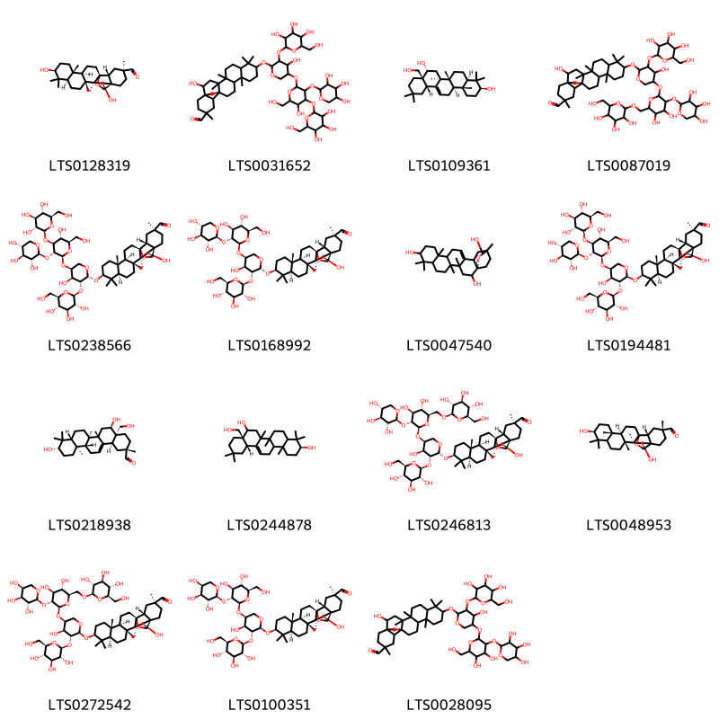{ width=100% }
    <figcaption>Hình ảnh cấu trúc hóa học của 15 hoạt chất thuộc nhóm Prenol lipids gồm ['(1s,2r,4s,5r,8r,10s,13r,14r,17s,18r,20s)-2,10-dihydroxy-4,5,9,9,13,20-hexamethyl-24-oxahexacyclo[15.5.2.0¹,¹⁸.0⁴,¹⁷.0⁵,¹⁴.0⁸,¹³]tetracosane-20-carbaldehyde (LTS0128319)', '2-hydroxy-10-[(4-hydroxy-5-{[5-hydroxy-6-(hydroxymethyl)-4-{[3,4,5-trihydroxy-6-(hydroxymethyl)oxan-2-yl]oxy}-3-[(3,4,5-trihydroxyoxan-2-yl)oxy]oxan-2-yl]oxy}-3-{[3,4,5-trihydroxy-6-(hydroxymethyl)oxan-2-yl]oxy}oxan-2-yl)oxy]-4,5,9,9,13,20-hexamethyl-24-oxahexacyclo[15.5.2.0¹,¹⁸.0⁴,¹⁷.0⁵,¹⁴.0⁸,¹³]tetracosane-20-carbaldehyde (LTS0031652)', 'primulagenin a (LTS0109361)', '10-[(5-{[4,5-dihydroxy-6-({[3,4,5-trihydroxy-6-(hydroxymethyl)oxan-2-yl]oxy}methyl)-3-[(3,4,5-trihydroxyoxan-2-yl)oxy]oxan-2-yl]oxy}-4-hydroxy-3-{[3,4,5-trihydroxy-6-(hydroxymethyl)oxan-2-yl]oxy}oxan-2-yl)oxy]-2-hydroxy-4,5,9,9,13,20-hexamethyl-24-oxahexacyclo[15.5.2.0¹,¹⁸.0⁴,¹⁷.0⁵,¹⁴.0⁸,¹³]tetracosane-20-carbaldehyde (LTS0087019)', '(1s,2r,4s,5r,8r,10s,13r,14r,17s,18r,20s)-2-hydroxy-10-{[(2r,3r,4s,5s)-4-hydroxy-5-{[(2s,3r,4s,5r,6r)-5-hydroxy-6-(hydroxymethyl)-4-{[(2s,3r,4s,5s,6r)-3,4,5-trihydroxy-6-(hydroxymethyl)oxan-2-yl]oxy}-3-{[(2s,3r,4s,5r)-3,4,5-trihydroxyoxan-2-yl]oxy}oxan-2-yl]oxy}-3-{[(2s,3r,4s,5s,6r)-3,4,5-trihydroxy-6-(hydroxymethyl)oxan-2-yl]oxy}oxan-2-yl]oxy}-4,5,9,9,13,20-hexamethyl-24-oxahexacyclo[15.5.2.0¹,¹⁸.0⁴,¹⁷.0⁵,¹⁴.0⁸,¹³]tetracosane-20-carbaldehyde (LTS0238566)', '(1s,2r,4s,5r,8r,10s,13r,14r,17s,18r,20s)-10-{[(2r,3r,4s,5s)-5-{[(2s,3r,4s,5s,6r)-4,5-dihydroxy-6-(hydroxymethyl)-3-{[(2s,3r,4s,5r)-3,4,5-trihydroxyoxan-2-yl]oxy}oxan-2-yl]oxy}-4-hydroxy-3-{[(2s,3r,4s,5s,6r)-3,4,5-trihydroxy-6-(hydroxymethyl)oxan-2-yl]oxy}oxan-2-yl]oxy}-2-hydroxy-4,5,9,9,13,20-hexamethyl-24-oxahexacyclo[15.5.2.0¹,¹⁸.0⁴,¹⁷.0⁵,¹⁴.0⁸,¹³]tetracosane-20-carbaldehyde (LTS0168992)', '4,5,9,9,13,20-hexamethyl-22-oxahexacyclo[18.3.2.0¹,¹⁸.0⁴,¹⁷.0⁵,¹⁴.0⁸,¹³]pentacos-16-ene-2,10,21-triol (LTS0047540)', 'cyclamin (LTS0194481)', '(2s,4as,5r,6as,6br,8ar,10s,12ar,12br,14bs)-5,10-dihydroxy-4a-(hydroxymethyl)-2,6a,6b,9,9,12a-hexamethyl-1,3,4,5,6,7,8,8a,10,11,12,12b,13,14b-tetradecahydropicene-2-carbaldehyde (LTS0218938)', '(3s,8as,12as)-8a-(hydroxymethyl)-4,4,6a,6b,11,11,14b-heptamethyl-1,2,3,4a,5,6,7,8,9,10,12,12a,14,14a-tetradecahydropicene-3,8-diol (LTS0244878)', '(1s,2r,4s,5r,8r,10s,13r,14r,17s,18r,20s)-10-{[(2r,3r,4s,5s)-5-{[(2s,3r,4s,5s,6r)-4,5-dihydroxy-6-({[(2r,3r,4s,5s,6r)-3,4,5-trihydroxy-6-(hydroxymethyl)oxan-2-yl]oxy}methyl)-3-{[(2s,3r,4s,5r)-3,4,5-trihydroxyoxan-2-yl]oxy}oxan-2-yl]oxy}-4-hydroxy-3-{[(2s,3r,4s,5s,6r)-3,4,5-trihydroxy-6-(hydroxymethyl)oxan-2-yl]oxy}oxan-2-yl]oxy}-2-hydroxy-4,5,9,9,13,20-hexamethyl-24-oxahexacyclo[15.5.2.0¹,¹⁸.0⁴,¹⁷.0⁵,¹⁴.0⁸,¹³]tetracosane-20-carbaldehyde (LTS0246813)', '(2r,4s,5r,10s,13r,14r,18r,20r)-2,10-dihydroxy-4,5,9,9,13,20-hexamethyl-24-oxahexacyclo[15.5.2.0¹,¹⁸.0⁴,¹⁷.0⁵,¹⁴.0⁸,¹³]tetracosane-20-carbaldehyde (LTS0048953)', '(1s,2r,4s,5r,8r,10s,13r,14r,17s,18r,20s)-10-{[(2s,3r,4s,5s)-5-{[(2s,3r,4s,5s,6r)-4,5-dihydroxy-6-({[(2r,3r,4s,5s,6r)-3,4,5-trihydroxy-6-(hydroxymethyl)oxan-2-yl]oxy}methyl)-3-{[(2s,3r,4s,5s)-3,4,5-trihydroxyoxan-2-yl]oxy}oxan-2-yl]oxy}-4-hydroxy-3-{[(2s,3r,4s,5s,6r)-3,4,5-trihydroxy-6-(hydroxymethyl)oxan-2-yl]oxy}oxan-2-yl]oxy}-2-hydroxy-4,5,9,9,13,20-hexamethyl-24-oxahexacyclo[15.5.2.0¹,¹⁸.0⁴,¹⁷.0⁵,¹⁴.0⁸,¹³]tetracosane-20-carbaldehyde (LTS0272542)', '(1s,2r,4s,5r,8r,10s,13r,14r,17s,18r,20s)-10-{[(2s,3r,4s,5s)-5-{[(2s,3r,4s,5s,6r)-4,5-dihydroxy-6-(hydroxymethyl)-3-{[(2s,3r,4s,5s)-3,4,5-trihydroxyoxan-2-yl]oxy}oxan-2-yl]oxy}-4-hydroxy-3-{[(2s,3r,4s,5s,6r)-3,4,5-trihydroxy-6-(hydroxymethyl)oxan-2-yl]oxy}oxan-2-yl]oxy}-2-hydroxy-4,5,9,9,13,20-hexamethyl-24-oxahexacyclo[15.5.2.0¹,¹⁸.0⁴,¹⁷.0⁵,¹⁴.0⁸,¹³]tetracosane-20-carbaldehyde (LTS0100351)', '10-[(5-{[4,5-dihydroxy-6-(hydroxymethyl)-3-[(3,4,5-trihydroxyoxan-2-yl)oxy]oxan-2-yl]oxy}-4-hydroxy-3-{[3,4,5-trihydroxy-6-(hydroxymethyl)oxan-2-yl]oxy}oxan-2-yl)oxy]-2-hydroxy-4,5,9,9,13,20-hexamethyl-24-oxahexacyclo[15.5.2.0¹,¹⁸.0⁴,¹⁷.0⁵,¹⁴.0⁸,¹³]tetracosane-20-carbaldehyde (LTS0028095)'].</figcaption>
</figure>

---

### Dược dân tộc học

Danh sách các quốc gia có sử dụng *Cyclamen balearicum* trong điều trị các bệnh. 

| Country   | Disease   | Bệnh                                                                                                                                                                                                |
|:----------|:----------|:----------------------------------------------------------------------------------------------------------------------------------------------------------------------------------------------------|
| ain       | Emetic    | MYMEMORY WARNING: YOU USED ALL AVAILABLE FREE TRANSLATIONS FOR TODAY. NEXT AVAILABLE IN  02 HOURS 06 MINUTES 55 SECONDS VISIT HTTPS://MYMEMORY.TRANSLATED.NET/DOC/USAGELIMITS.PHP TO TRANSLATE MORE |

---

---
## Cyclamen europaeum
### Thông tin về thực vật

!!! info "Phân loại thực vật của *Cyclamen europaeum* từ GIBF:"
    - **Kingdom:** Plantae
    - **Phylum:** Tracheophyta
    - **Order:** Ericales
    - **Family:** Primulaceae
    - **Genus:** Cyclamen
    - **Species:** *Cyclamen europaeum*

 

| Label (VI)   | Label (EN)   | Scientific Name    | Descriptions (VI)   | Descriptions (EN)   | Also Known As (VI)   | Also Known As (EN)   |
|:-------------|:-------------|:-------------------|:--------------------|:--------------------|:---------------------|:---------------------|
| N/A          | N/A          | Cyclamen europaeum |                     | species of plant    | ['']                 | ['']                 |

#### Phân bố trên thế giới

**Từ CSDL GIBF** nan, Italy, Germany, Spain, Egypt, Hungary, Switzerland, United States of America, Austria, France

#### Phân bố tại Việt Nam

**Từ CSDL GIBF**: Không có ghi nhận ở Việt Nam

---
### Thành phần hóa học
        
- Theo cơ sở dữ liệu lotus: Từ loài *Cyclamen europaeum* đã phân lập và xác định được 2 hoạt chất thuộc về các nhóm Prenol lipids. 

|    | chemicalTaxonomyClassyfireClass   |   smiles_count |
|---:|:----------------------------------|---------------:|
|  0 | Prenol lipids                     |              2 |

#### Nhóm Prenol lipids
<figure markdown="span">
    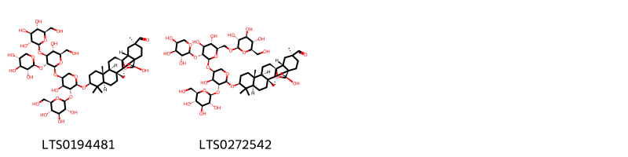{ width=100% }
    <figcaption>Hình ảnh cấu trúc hóa học của 2 hoạt chất thuộc nhóm Prenol lipids gồm ['cyclamin (LTS0194481)', '(1s,2r,4s,5r,8r,10s,13r,14r,17s,18r,20s)-10-{[(2s,3r,4s,5s)-5-{[(2s,3r,4s,5s,6r)-4,5-dihydroxy-6-({[(2r,3r,4s,5s,6r)-3,4,5-trihydroxy-6-(hydroxymethyl)oxan-2-yl]oxy}methyl)-3-{[(2s,3r,4s,5s)-3,4,5-trihydroxyoxan-2-yl]oxy}oxan-2-yl]oxy}-4-hydroxy-3-{[(2s,3r,4s,5s,6r)-3,4,5-trihydroxy-6-(hydroxymethyl)oxan-2-yl]oxy}oxan-2-yl]oxy}-2-hydroxy-4,5,9,9,13,20-hexamethyl-24-oxahexacyclo[15.5.2.0¹,¹⁸.0⁴,¹⁷.0⁵,¹⁴.0⁸,¹³]tetracosane-20-carbaldehyde (LTS0272542)'].</figcaption>
</figure>

---

### Dược dân tộc học

Danh sách các quốc gia có sử dụng *Cyclamen europaeum* trong điều trị các bệnh. 

| Country   | Disease                                                 | Bệnh                                                                                                                                                                                                |
|:----------|:--------------------------------------------------------|:----------------------------------------------------------------------------------------------------------------------------------------------------------------------------------------------------|
| Elsewhere | Emmenagogue, Cathartic, Purgative                       | MYMEMORY WARNING: YOU USED ALL AVAILABLE FREE TRANSLATIONS FOR TODAY. NEXT AVAILABLE IN  02 HOURS 06 MINUTES 32 SECONDS VISIT HTTPS://MYMEMORY.TRANSLATED.NET/DOC/USAGELIMITS.PHP TO TRANSLATE MORE |
| Turkey    | Aphrodisiac, Laxative, Poison, Stimulant, Tonic, Emetic | MYMEMORY WARNING: YOU USED ALL AVAILABLE FREE TRANSLATIONS FOR TODAY. NEXT AVAILABLE IN  02 HOURS 06 MINUTES 30 SECONDS VISIT HTTPS://MYMEMORY.TRANSLATED.NET/DOC/USAGELIMITS.PHP TO TRANSLATE MORE |

---

---
## Cyclamen persicum
### Thông tin về thực vật

!!! info "Phân loại thực vật của *Cyclamen persicum* từ GIBF:"
    - **Kingdom:** Plantae
    - **Phylum:** Tracheophyta
    - **Order:** Ericales
    - **Family:** Primulaceae
    - **Genus:** Cyclamen
    - **Species:** *Cyclamen persicum*

 

| Label (VI)   | Label (EN)   | Scientific Name   | Descriptions (VI)   | Descriptions (EN)   | Also Known As (VI)   | Also Known As (EN)   |
|:-------------|:-------------|:------------------|:--------------------|:--------------------|:---------------------|:---------------------|
| N/A          | N/A          | Cyclamen persicum | loài thực vật       | species of plant    | ['']                 | ['']                 |

#### Phân bố trên thế giới

**Từ CSDL GIBF** nan, Israel, Netherlands, Syrian Arab Republic, Italy, Cyprus, Germany, New Zealand, Spain, Palestine, State of, Jordan, United States of America, Lebanon, France, Greece, United Kingdom of Great Britain and Northern Ireland

#### Phân bố tại Việt Nam

**Từ CSDL GIBF**: Không có ghi nhận ở Việt Nam

---
### Thành phần hóa học
        
- Theo cơ sở dữ liệu lotus: Từ loài *Cyclamen persicum* đã phân lập và xác định được 39 hoạt chất thuộc về các nhóm Flavonoids, Prenol lipids, Tannins. 

|    | chemicalTaxonomyClassyfireClass   |   smiles_count |
|---:|:----------------------------------|---------------:|
|  0 | Flavonoids                        |             20 |
|  1 | Prenol lipids                     |             17 |
|  2 | Tannins                           |              2 |

#### Nhóm Flavonoids
<figure markdown="span">
    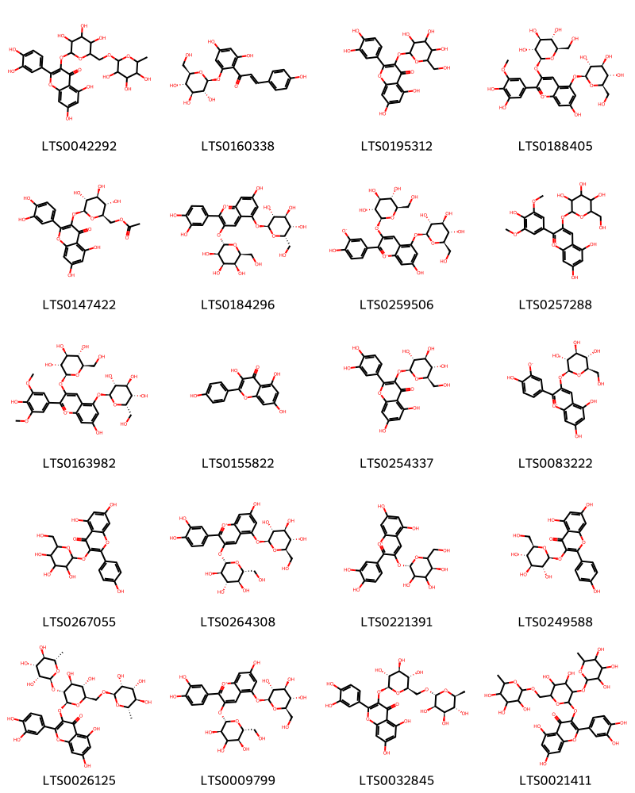{ width=100% }
    <figcaption>Hình ảnh cấu trúc hóa học của 20 hoạt chất thuộc nhóm Flavonoids gồm ['rutin (LTS0042292)', 'phlorizin chalcone (LTS0160338)', '2-(3,4-dihydroxyphenyl)-5,7-dihydroxy-3-{[3,4,5-trihydroxy-6-(hydroxymethyl)oxan-2-yl]oxy}chromen-4-one (LTS0195312)', '2-(3,4-dihydroxy-5-methoxyphenyl)-7-hydroxy-3,5-bis({[(2s,3r,4s,5s,6r)-3,4,5-trihydroxy-6-(hydroxymethyl)oxan-2-yl]oxy})-1λ⁴-chromen-1-ylium (LTS0188405)', '[(2r,3s,4s,5r,6s)-6-{[2-(3,4-dihydroxyphenyl)-5,7-dihydroxy-4-oxochromen-3-yl]oxy}-3,4,5-trihydroxyoxan-2-yl]methyl acetate (LTS0147422)', '2-(3,4-dihydroxyphenyl)-7-hydroxy-3-{[(2s,3r,4r,5s,6s)-3,4,5-trihydroxy-6-(hydroxymethyl)oxan-2-yl]oxy}-5-{[(2s,3r,4s,5s,6s)-3,4,5-trihydroxy-6-(hydroxymethyl)oxan-2-yl]oxy}-1λ⁴-chromen-1-ylium (LTS0184296)', 'cyanin betaine (LTS0259506)', 'oenin (LTS0257288)', '7-hydroxy-2-(4-hydroxy-3,5-dimethoxyphenyl)-3-{[(2s,3r,4s,5s,6r)-3,4,5-trihydroxy-6-(hydroxymethyl)oxan-2-yl]oxy}-5-{[(2s,3r,4s,5s,6s)-3,4,5-trihydroxy-6-(hydroxymethyl)oxan-2-yl]oxy}-1λ⁴-chromen-1-ylium (LTS0163982)', 'kaempherol (LTS0155822)', 'isoquercetin (LTS0254337)', '5,7-dihydroxy-2-(4-hydroxy-3-oxidophenyl)-3-{[(2s,3r,4s,5s,6r)-3,4,5-trihydroxy-6-(hydroxymethyl)oxan-2-yl]oxy}-1λ⁴-chromen-1-ylium (LTS0083222)', 'trifolin (LTS0267055)', 'cyanin (LTS0264308)', 'chrysanthemin (LTS0221391)', 'astragalin (LTS0249588)', '3-{[(2s,3r,4s,5s,6r)-4,5-dihydroxy-3-{[(2s,3r,4r,5r,6s)-3,4,5-trihydroxy-6-methyloxan-2-yl]oxy}-6-({[(2r,3r,4r,5r,6s)-3,4,5-trihydroxy-6-methyloxan-2-yl]oxy}methyl)oxan-2-yl]oxy}-2-(3,4-dihydroxyphenyl)-5,7-dihydroxychromen-4-one (LTS0026125)', '2-(3,4-dihydroxyphenyl)-7-hydroxy-5-{[(2s,3r,4s,5s,6r)-3,4,5-trihydroxy-6-(hydroxymethyl)oxan-2-yl]oxy}-3-{[(2s,3r,5s,6r)-3,4,5-trihydroxy-6-(hydroxymethyl)oxan-2-yl]oxy}-1λ⁴-chromen-1-ylium (LTS0009799)', '3-rutinosyl quercetin (LTS0032845)', '3-({4,5-dihydroxy-3-[(3,4,5-trihydroxy-6-methyloxan-2-yl)oxy]-6-{[(3,4,5-trihydroxy-6-methyloxan-2-yl)oxy]methyl}oxan-2-yl}oxy)-2-(3,4-dihydroxyphenyl)-5,7-dihydroxychromen-4-one (LTS0021411)'].</figcaption>
</figure>
#### Nhóm Prenol lipids
<figure markdown="span">
    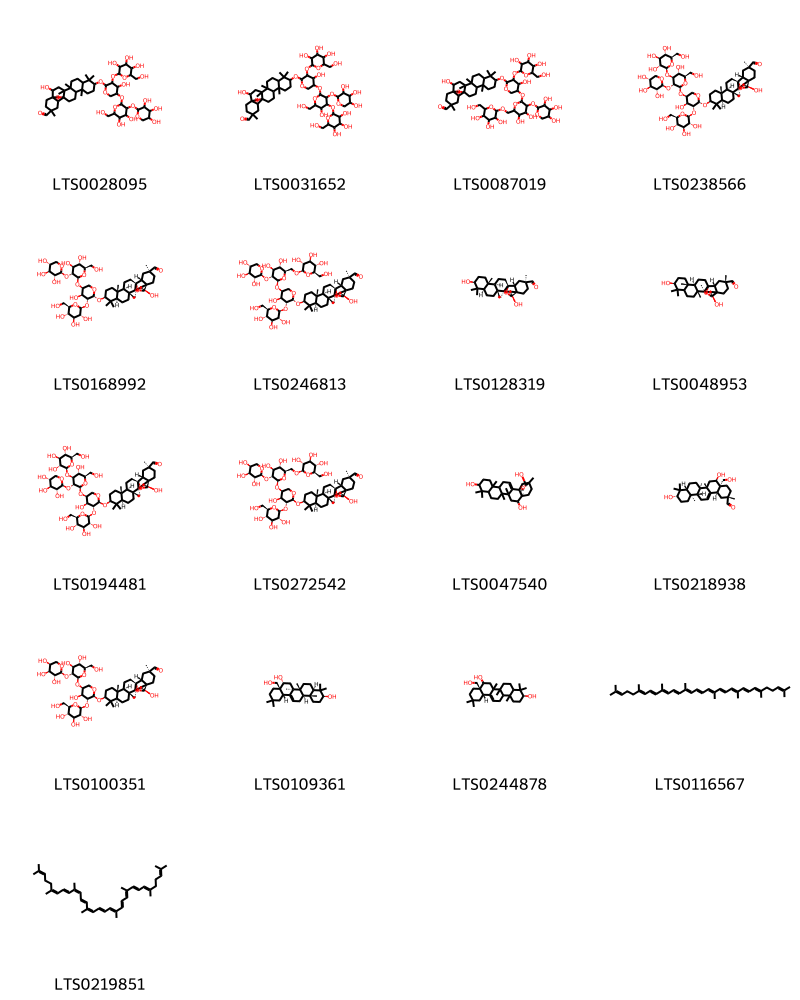{ width=100% }
    <figcaption>Hình ảnh cấu trúc hóa học của 17 hoạt chất thuộc nhóm Prenol lipids gồm ['10-[(5-{[4,5-dihydroxy-6-(hydroxymethyl)-3-[(3,4,5-trihydroxyoxan-2-yl)oxy]oxan-2-yl]oxy}-4-hydroxy-3-{[3,4,5-trihydroxy-6-(hydroxymethyl)oxan-2-yl]oxy}oxan-2-yl)oxy]-2-hydroxy-4,5,9,9,13,20-hexamethyl-24-oxahexacyclo[15.5.2.0¹,¹⁸.0⁴,¹⁷.0⁵,¹⁴.0⁸,¹³]tetracosane-20-carbaldehyde (LTS0028095)', '2-hydroxy-10-[(4-hydroxy-5-{[5-hydroxy-6-(hydroxymethyl)-4-{[3,4,5-trihydroxy-6-(hydroxymethyl)oxan-2-yl]oxy}-3-[(3,4,5-trihydroxyoxan-2-yl)oxy]oxan-2-yl]oxy}-3-{[3,4,5-trihydroxy-6-(hydroxymethyl)oxan-2-yl]oxy}oxan-2-yl)oxy]-4,5,9,9,13,20-hexamethyl-24-oxahexacyclo[15.5.2.0¹,¹⁸.0⁴,¹⁷.0⁵,¹⁴.0⁸,¹³]tetracosane-20-carbaldehyde (LTS0031652)', '10-[(5-{[4,5-dihydroxy-6-({[3,4,5-trihydroxy-6-(hydroxymethyl)oxan-2-yl]oxy}methyl)-3-[(3,4,5-trihydroxyoxan-2-yl)oxy]oxan-2-yl]oxy}-4-hydroxy-3-{[3,4,5-trihydroxy-6-(hydroxymethyl)oxan-2-yl]oxy}oxan-2-yl)oxy]-2-hydroxy-4,5,9,9,13,20-hexamethyl-24-oxahexacyclo[15.5.2.0¹,¹⁸.0⁴,¹⁷.0⁵,¹⁴.0⁸,¹³]tetracosane-20-carbaldehyde (LTS0087019)', '(1s,2r,4s,5r,8r,10s,13r,14r,17s,18r,20s)-2-hydroxy-10-{[(2r,3r,4s,5s)-4-hydroxy-5-{[(2s,3r,4s,5r,6r)-5-hydroxy-6-(hydroxymethyl)-4-{[(2s,3r,4s,5s,6r)-3,4,5-trihydroxy-6-(hydroxymethyl)oxan-2-yl]oxy}-3-{[(2s,3r,4s,5r)-3,4,5-trihydroxyoxan-2-yl]oxy}oxan-2-yl]oxy}-3-{[(2s,3r,4s,5s,6r)-3,4,5-trihydroxy-6-(hydroxymethyl)oxan-2-yl]oxy}oxan-2-yl]oxy}-4,5,9,9,13,20-hexamethyl-24-oxahexacyclo[15.5.2.0¹,¹⁸.0⁴,¹⁷.0⁵,¹⁴.0⁸,¹³]tetracosane-20-carbaldehyde (LTS0238566)', '(1s,2r,4s,5r,8r,10s,13r,14r,17s,18r,20s)-10-{[(2r,3r,4s,5s)-5-{[(2s,3r,4s,5s,6r)-4,5-dihydroxy-6-(hydroxymethyl)-3-{[(2s,3r,4s,5r)-3,4,5-trihydroxyoxan-2-yl]oxy}oxan-2-yl]oxy}-4-hydroxy-3-{[(2s,3r,4s,5s,6r)-3,4,5-trihydroxy-6-(hydroxymethyl)oxan-2-yl]oxy}oxan-2-yl]oxy}-2-hydroxy-4,5,9,9,13,20-hexamethyl-24-oxahexacyclo[15.5.2.0¹,¹⁸.0⁴,¹⁷.0⁵,¹⁴.0⁸,¹³]tetracosane-20-carbaldehyde (LTS0168992)', '(1s,2r,4s,5r,8r,10s,13r,14r,17s,18r,20s)-10-{[(2r,3r,4s,5s)-5-{[(2s,3r,4s,5s,6r)-4,5-dihydroxy-6-({[(2r,3r,4s,5s,6r)-3,4,5-trihydroxy-6-(hydroxymethyl)oxan-2-yl]oxy}methyl)-3-{[(2s,3r,4s,5r)-3,4,5-trihydroxyoxan-2-yl]oxy}oxan-2-yl]oxy}-4-hydroxy-3-{[(2s,3r,4s,5s,6r)-3,4,5-trihydroxy-6-(hydroxymethyl)oxan-2-yl]oxy}oxan-2-yl]oxy}-2-hydroxy-4,5,9,9,13,20-hexamethyl-24-oxahexacyclo[15.5.2.0¹,¹⁸.0⁴,¹⁷.0⁵,¹⁴.0⁸,¹³]tetracosane-20-carbaldehyde (LTS0246813)', '(1s,2r,4s,5r,8r,10s,13r,14r,17s,18r,20s)-2,10-dihydroxy-4,5,9,9,13,20-hexamethyl-24-oxahexacyclo[15.5.2.0¹,¹⁸.0⁴,¹⁷.0⁵,¹⁴.0⁸,¹³]tetracosane-20-carbaldehyde (LTS0128319)', '(2r,4s,5r,10s,13r,14r,18r,20r)-2,10-dihydroxy-4,5,9,9,13,20-hexamethyl-24-oxahexacyclo[15.5.2.0¹,¹⁸.0⁴,¹⁷.0⁵,¹⁴.0⁸,¹³]tetracosane-20-carbaldehyde (LTS0048953)', 'cyclamin (LTS0194481)', '(1s,2r,4s,5r,8r,10s,13r,14r,17s,18r,20s)-10-{[(2s,3r,4s,5s)-5-{[(2s,3r,4s,5s,6r)-4,5-dihydroxy-6-({[(2r,3r,4s,5s,6r)-3,4,5-trihydroxy-6-(hydroxymethyl)oxan-2-yl]oxy}methyl)-3-{[(2s,3r,4s,5s)-3,4,5-trihydroxyoxan-2-yl]oxy}oxan-2-yl]oxy}-4-hydroxy-3-{[(2s,3r,4s,5s,6r)-3,4,5-trihydroxy-6-(hydroxymethyl)oxan-2-yl]oxy}oxan-2-yl]oxy}-2-hydroxy-4,5,9,9,13,20-hexamethyl-24-oxahexacyclo[15.5.2.0¹,¹⁸.0⁴,¹⁷.0⁵,¹⁴.0⁸,¹³]tetracosane-20-carbaldehyde (LTS0272542)', '4,5,9,9,13,20-hexamethyl-22-oxahexacyclo[18.3.2.0¹,¹⁸.0⁴,¹⁷.0⁵,¹⁴.0⁸,¹³]pentacos-16-ene-2,10,21-triol (LTS0047540)', '(2s,4as,5r,6as,6br,8ar,10s,12ar,12br,14bs)-5,10-dihydroxy-4a-(hydroxymethyl)-2,6a,6b,9,9,12a-hexamethyl-1,3,4,5,6,7,8,8a,10,11,12,12b,13,14b-tetradecahydropicene-2-carbaldehyde (LTS0218938)', '(1s,2r,4s,5r,8r,10s,13r,14r,17s,18r,20s)-10-{[(2s,3r,4s,5s)-5-{[(2s,3r,4s,5s,6r)-4,5-dihydroxy-6-(hydroxymethyl)-3-{[(2s,3r,4s,5s)-3,4,5-trihydroxyoxan-2-yl]oxy}oxan-2-yl]oxy}-4-hydroxy-3-{[(2s,3r,4s,5s,6r)-3,4,5-trihydroxy-6-(hydroxymethyl)oxan-2-yl]oxy}oxan-2-yl]oxy}-2-hydroxy-4,5,9,9,13,20-hexamethyl-24-oxahexacyclo[15.5.2.0¹,¹⁸.0⁴,¹⁷.0⁵,¹⁴.0⁸,¹³]tetracosane-20-carbaldehyde (LTS0100351)', 'primulagenin a (LTS0109361)', '(3s,8as,12as)-8a-(hydroxymethyl)-4,4,6a,6b,11,11,14b-heptamethyl-1,2,3,4a,5,6,7,8,9,10,12,12a,14,14a-tetradecahydropicene-3,8-diol (LTS0244878)', 'lycopene (LTS0116567)', '2,6,10,14,19,23,27,31-octamethyldotriaconta-2,6,8,10,12,14,16,18,20,22,24,26,30-tridecaene (LTS0219851)'].</figcaption>
</figure>
#### Nhóm Tannins
<figure markdown="span">
    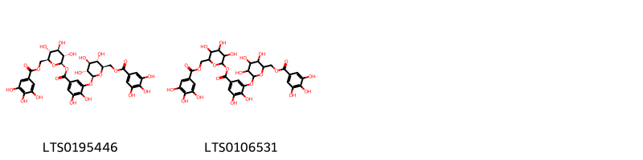{ width=100% }
    <figcaption>Hình ảnh cấu trúc hóa học của 2 hoạt chất thuộc nhóm Tannins gồm ['(2r,3s,4r,5r,6s)-3,4,5-trihydroxy-6-[(3,4,5-trihydroxybenzoyloxy)methyl]oxan-2-yl 3,4-dihydroxy-5-{[(2s,3r,4s,5s,6r)-3,4,5-trihydroxy-6-[(3,4,5-trihydroxybenzoyloxy)methyl]oxan-2-yl]oxy}benzoate (LTS0195446)', '3,4,5-trihydroxy-6-[(3,4,5-trihydroxybenzoyloxy)methyl]oxan-2-yl 3,4-dihydroxy-5-({3,4,5-trihydroxy-6-[(3,4,5-trihydroxybenzoyloxy)methyl]oxan-2-yl}oxy)benzoate (LTS0106531)'].</figcaption>
</figure>

---

### Dược dân tộc học

Danh sách các quốc gia có sử dụng *Cyclamen persicum* trong điều trị các bệnh. 

| Country   | Disease   | Bệnh                                                                                                                                                                                                |
|:----------|:----------|:----------------------------------------------------------------------------------------------------------------------------------------------------------------------------------------------------|
| Elsewhere | Piscicide | MYMEMORY WARNING: YOU USED ALL AVAILABLE FREE TRANSLATIONS FOR TODAY. NEXT AVAILABLE IN  02 HOURS 06 MINUTES 13 SECONDS VISIT HTTPS://MYMEMORY.TRANSLATED.NET/DOC/USAGELIMITS.PHP TO TRANSLATE MORE |
| India     | Piscicide | MYMEMORY WARNING: YOU USED ALL AVAILABLE FREE TRANSLATIONS FOR TODAY. NEXT AVAILABLE IN  02 HOURS 06 MINUTES 10 SECONDS VISIT HTTPS://MYMEMORY.TRANSLATED.NET/DOC/USAGELIMITS.PHP TO TRANSLATE MORE |

---

# Chi Primula

??? note "Danh sách các dược liệu thuộc chi"
    
	 - *Primula obconica*
	 - *Primula officinalis*
	 - *Primula reticulata*
	 - *Primula sieboldii*
	 - *Primula veris*
	 - *Primula vulgaris*

---
## Primula obconica
### Thông tin về thực vật

!!! info "Phân loại thực vật của *Primula obconica* từ GIBF:"
    - **Kingdom:** Plantae
    - **Phylum:** Tracheophyta
    - **Order:** Ericales
    - **Family:** Primulaceae
    - **Genus:** Primula
    - **Species:** *Primula obconica*

 

| Label (VI)   | Label (EN)   | Scientific Name   | Descriptions (VI)   | Descriptions (EN)   | Also Known As (VI)   | Also Known As (EN)   |
|:-------------|:-------------|:------------------|:--------------------|:--------------------|:---------------------|:---------------------|
| N/A          | N/A          | Primula obconica  | loài thực vật       | species of plant    | ['']                 | ['']                 |

#### Phân bố trên thế giới

**Từ CSDL GIBF** nan, Australia, Belgium, Colombia, Brazil, Spain, New Zealand, Portugal, United States of America, Finland, Mexico, China, Nepal

#### Phân bố tại Việt Nam

**Từ CSDL GIBF**: Không có ghi nhận ở Việt Nam

---
### Thành phần hóa học
        
- Theo cơ sở dữ liệu lotus: Từ loài *Primula obconica* đã phân lập và xác định được 6 hoạt chất thuộc về các nhóm Organooxygen compounds, Phenols, Phenol esters. 

|    | chemicalTaxonomyClassyfireClass   |   smiles_count |
|---:|:----------------------------------|---------------:|
|  0 | Organooxygen compounds            |              1 |
|  1 | Phenol esters                     |              1 |
|  2 | Phenols                           |              4 |

#### Nhóm Organooxygen compounds
<figure markdown="span">
    { width=100% }
    <figcaption>Hình ảnh cấu trúc hóa học của 1 hoạt chất thuộc nhóm Organooxygen compounds gồm ['primin (LTS0035408)'].</figcaption>
</figure>
#### Nhóm Phenol esters
<figure markdown="span">
    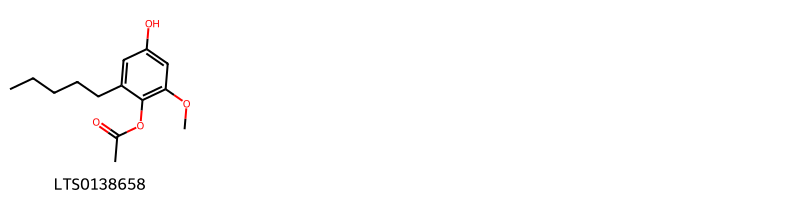{ width=100% }
    <figcaption>Hình ảnh cấu trúc hóa học của 1 hoạt chất thuộc nhóm Phenol esters gồm ['4-hydroxy-2-methoxy-6-pentylphenyl acetate (LTS0138658)'].</figcaption>
</figure>
#### Nhóm Phenols
<figure markdown="span">
    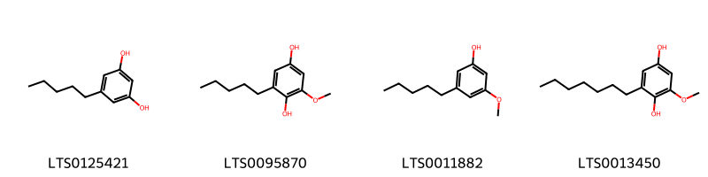{ width=100% }
    <figcaption>Hình ảnh cấu trúc hóa học của 4 hoạt chất thuộc nhóm Phenols gồm ['olivetol (LTS0125421)', '2-methoxy-6-pentylbenzene-1,4-diol (LTS0095870)', '3-methoxy-5-pentylphenol (LTS0011882)', '2-heptyl-6-methoxybenzene-1,4-diol (LTS0013450)'].</figcaption>
</figure>

---

### Dược dân tộc học

Danh sách các quốc gia có sử dụng *Primula obconica* trong điều trị các bệnh. 

| Country   | Disease    | Bệnh                                                                                                                                                                                                |
|:----------|:-----------|:----------------------------------------------------------------------------------------------------------------------------------------------------------------------------------------------------|
| Elsewhere | Allergenic | MYMEMORY WARNING: YOU USED ALL AVAILABLE FREE TRANSLATIONS FOR TODAY. NEXT AVAILABLE IN  02 HOURS 05 MINUTES 27 SECONDS VISIT HTTPS://MYMEMORY.TRANSLATED.NET/DOC/USAGELIMITS.PHP TO TRANSLATE MORE |

---

---
## Primula officinalis
### Thông tin về thực vật

!!! info "Phân loại thực vật của *Primula officinalis* từ GIBF:"
    - **Kingdom:** Plantae
    - **Phylum:** Tracheophyta
    - **Order:** Ericales
    - **Family:** Primulaceae
    - **Genus:** Primula
    - **Species:** *Primula officinalis*

 

| Label (VI)   | Label (EN)   | Scientific Name     | Descriptions (VI)   | Descriptions (EN)   | Also Known As (VI)   | Also Known As (EN)   |
|:-------------|:-------------|:--------------------|:--------------------|:--------------------|:---------------------|:---------------------|
| N/A          | N/A          | Primula officinalis | loài thực vật       | species of plant    | ['']                 | ['']                 |

#### Phân bố trên thế giới

**Từ CSDL GIBF** nan, Italy, Bulgaria, Moldova, Republic of, Belgium, Slovakia, unknown or invalid, Ukraine, Lithuania, Belarus, Spain, Russian Federation, United States of America, Sweden, Finland, Czechia, Germany, Romania, Brazil, Switzerland, Armenia, Austria, France, United Kingdom of Great Britain and Northern Ireland, Poland

#### Phân bố tại Việt Nam

**Từ CSDL GIBF**: Không có ghi nhận ở Việt Nam

---
### Thành phần hóa học
        
- Theo cơ sở dữ liệu lotus: Từ loài *Primula officinalis* đã phân lập và xác định được 21 hoạt chất thuộc về các nhóm Flavonoids, Organooxygen compounds, Prenol lipids. 

|    | chemicalTaxonomyClassyfireClass   |   smiles_count |
|---:|:----------------------------------|---------------:|
|  0 | Flavonoids                        |              5 |
|  1 | Organooxygen compounds            |             15 |
|  2 | Prenol lipids                     |              1 |

#### Nhóm Flavonoids
<figure markdown="span">
    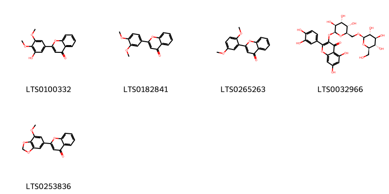{ width=100% }
    <figcaption>Hình ảnh cấu trúc hóa học của 5 hoạt chất thuộc nhóm Flavonoids gồm ['2-(3-hydroxy-4,5-dimethoxyphenyl)chromen-4-one (LTS0100332)', '2-(3,4-dimethoxyphenyl)chromen-4-one (LTS0182841)', '2-(2,5-dimethoxyphenyl)chromen-4-one (LTS0265263)', '2-(3,4-dihydroxyphenyl)-5,7-dihydroxy-3-{[(2s,3s,4r,5s,6r)-3,4,5-trihydroxy-6-({[(2r,3r,4s,5s,6r)-3,4,5-trihydroxy-6-(hydroxymethyl)oxan-2-yl]oxy}methyl)oxan-2-yl]oxy}chromen-4-one (LTS0032966)', '2-(7-methoxy-2h-1,3-benzodioxol-5-yl)chromen-4-one (LTS0253836)'].</figcaption>
</figure>
#### Nhóm Organooxygen compounds
<figure markdown="span">
    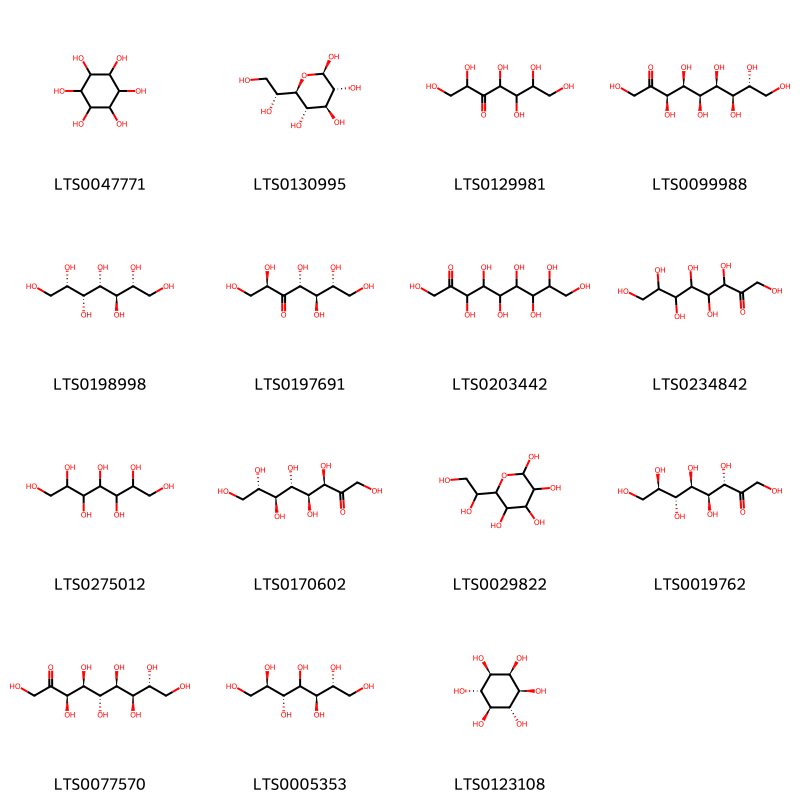{ width=100% }
    <figcaption>Hình ảnh cấu trúc hóa học của 15 hoạt chất thuộc nhóm Organooxygen compounds gồm ['(-)-inositol (LTS0047771)', '(2r,3r,4s,5s,6r)-6-[(1r)-1,2-dihydroxyethyl]oxane-2,3,4,5-tetrol (LTS0130995)', '1,2,4,5,6,7-hexahydroxyheptan-3-one (LTS0129981)', '(3r,4s,5r,6s,7r,8r)-1,3,4,5,6,7,8,9-octahydroxynonan-2-one (LTS0099988)', '(2r,3r,4s,5r,6s)-heptane-1,2,3,4,5,6,7-heptol (LTS0198998)', '(2r,4r,5r,6r)-1,2,4,5,6,7-hexahydroxyheptan-3-one (LTS0197691)', '1,3,4,5,6,7,8,9-octahydroxynonan-2-one (LTS0203442)', '1,3,4,5,6,7,8-heptahydroxyoctan-2-one (LTS0234842)', 'perseitol (LTS0275012)', '(3r,4s,5s,6s,7s)-1,3,4,5,6,7,8-heptahydroxyoctan-2-one (LTS0170602)', '6-(1,2-dihydroxyethyl)oxane-2,3,4,5-tetrol (LTS0029822)', 'd-glycero-d-manno-octulose (LTS0019762)', '(3r,4s,5s,6s,7r,8r)-1,3,4,5,6,7,8,9-octahydroxynonan-2-one (LTS0077570)', 'volemitol (LTS0005353)', '(1r,2r,3s,4r,5s,6s)-cyclohexane-1,2,3,4,5,6-hexol (LTS0123108)'].</figcaption>
</figure>
#### Nhóm Prenol lipids
<figure markdown="span">
    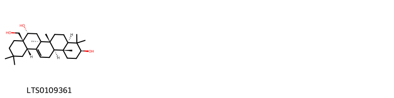{ width=100% }
    <figcaption>Hình ảnh cấu trúc hóa học của 1 hoạt chất thuộc nhóm Prenol lipids gồm ['primulagenin a (LTS0109361)'].</figcaption>
</figure>

---

### Dược dân tộc học

Danh sách các quốc gia có sử dụng *Primula officinalis* trong điều trị các bệnh. 

| Country   | Disease     | Bệnh                                                                                                                                                                                                |
|:----------|:------------|:----------------------------------------------------------------------------------------------------------------------------------------------------------------------------------------------------|
| Elsewhere | Expectorant | MYMEMORY WARNING: YOU USED ALL AVAILABLE FREE TRANSLATIONS FOR TODAY. NEXT AVAILABLE IN  02 HOURS 05 MINUTES 06 SECONDS VISIT HTTPS://MYMEMORY.TRANSLATED.NET/DOC/USAGELIMITS.PHP TO TRANSLATE MORE |

---

---
## Primula reticulata
### Thông tin về thực vật

!!! info "Phân loại thực vật của *Primula reticulata* từ GIBF:"
    - **Kingdom:** Plantae
    - **Phylum:** Tracheophyta
    - **Order:** Ericales
    - **Family:** Primulaceae
    - **Genus:** Primula
    - **Species:** *Primula reticulata*

 

| Label (VI)   | Label (EN)   | Scientific Name    | Descriptions (VI)   | Descriptions (EN)   | Also Known As (VI)   | Also Known As (EN)   |
|:-------------|:-------------|:-------------------|:--------------------|:--------------------|:---------------------|:---------------------|
| N/A          | N/A          | Primula reticulata | loài thực vật       | species of plant    | ['']                 | ['']                 |

#### Phân bố trên thế giới

**Từ CSDL GIBF** nan, Japan, Bhutan, India, unknown or invalid, China, Canada, Nepal

#### Phân bố tại Việt Nam

**Từ CSDL GIBF**: Không có ghi nhận ở Việt Nam

---
### Thành phần hóa học
        
- Theo cơ sở dữ liệu lotus: Từ loài *Primula reticulata* đã phân lập và xác định được Chưa có hoạt chất nào được phân lập. hoạt chất thuộc về các nhóm Không có hoạt chất nào được phân lập. 

Không có hình ảnh nào được tạo ra

---

### Dược dân tộc học

Danh sách các quốc gia có sử dụng *Primula reticulata* trong điều trị các bệnh. 

| Country   | Disease   | Bệnh                                                                                                                                                                                                |
|:----------|:----------|:----------------------------------------------------------------------------------------------------------------------------------------------------------------------------------------------------|
| Elsewhere | Poison    | MYMEMORY WARNING: YOU USED ALL AVAILABLE FREE TRANSLATIONS FOR TODAY. NEXT AVAILABLE IN  02 HOURS 04 MINUTES 43 SECONDS VISIT HTTPS://MYMEMORY.TRANSLATED.NET/DOC/USAGELIMITS.PHP TO TRANSLATE MORE |

---

---
## Primula sieboldii
### Thông tin về thực vật

!!! info "Phân loại thực vật của *Primula sieboldii* từ GIBF:"
    - **Kingdom:** Plantae
    - **Phylum:** Tracheophyta
    - **Order:** Ericales
    - **Family:** Primulaceae
    - **Genus:** Primula
    - **Species:** *Primula sieboldii*

 

| Label (VI)   | Label (EN)   | Scientific Name   | Descriptions (VI)   | Descriptions (EN)   | Also Known As (VI)   | Also Known As (EN)   |
|:-------------|:-------------|:------------------|:--------------------|:--------------------|:---------------------|:---------------------|
| N/A          | N/A          | Primula sieboldii | loài thực vật       | species of plant    | ['']                 | ['']                 |

#### Phân bố trên thế giới

**Từ CSDL GIBF** nan, Japan, Germany, Korea, Republic of, Estonia, Russian Federation, Poland, Norway, China

#### Phân bố tại Việt Nam

**Từ CSDL GIBF**: Không có ghi nhận ở Việt Nam

---
### Thành phần hóa học
        
- Theo cơ sở dữ liệu lotus: Từ loài *Primula sieboldii* đã phân lập và xác định được 1 hoạt chất thuộc về các nhóm Prenol lipids. 

|    | chemicalTaxonomyClassyfireClass   |   smiles_count |
|---:|:----------------------------------|---------------:|
|  0 | Prenol lipids                     |              1 |

#### Nhóm Prenol lipids
<figure markdown="span">
    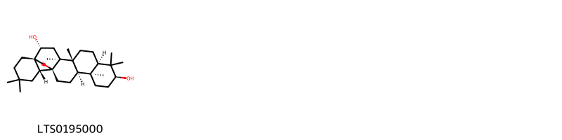{ width=100% }
    <figcaption>Hình ảnh cấu trúc hóa học của 1 hoạt chất thuộc nhóm Prenol lipids gồm ['(1s,2r,4s,5r,8r,10s,13s,14r,17s,18r)-4,5,9,9,13,20,20-heptamethyl-24-oxahexacyclo[15.5.2.0¹,¹⁸.0⁴,¹⁷.0⁵,¹⁴.0⁸,¹³]tetracosane-2,10-diol (LTS0195000)'].</figcaption>
</figure>

---

### Dược dân tộc học

Danh sách các quốc gia có sử dụng *Primula sieboldii* trong điều trị các bệnh. 

| Country   | Disease     | Bệnh                                                                                                                                                                                                |
|:----------|:------------|:----------------------------------------------------------------------------------------------------------------------------------------------------------------------------------------------------|
| Elsewhere | Expectorant | MYMEMORY WARNING: YOU USED ALL AVAILABLE FREE TRANSLATIONS FOR TODAY. NEXT AVAILABLE IN  02 HOURS 04 MINUTES 26 SECONDS VISIT HTTPS://MYMEMORY.TRANSLATED.NET/DOC/USAGELIMITS.PHP TO TRANSLATE MORE |

---

---
## Primula veris
### Thông tin về thực vật

!!! info "Phân loại thực vật của *Primula veris* từ GIBF:"
    - **Kingdom:** Plantae
    - **Phylum:** Tracheophyta
    - **Order:** Ericales
    - **Family:** Primulaceae
    - **Genus:** Primula
    - **Species:** *Primula veris*

 

| Label (VI)   | Label (EN)   | Scientific Name   | Descriptions (VI)   | Descriptions (EN)   | Also Known As (VI)   | Also Known As (EN)                                                                                                                                        |
|:-------------|:-------------|:------------------|:--------------------|:--------------------|:---------------------|:----------------------------------------------------------------------------------------------------------------------------------------------------------|
| N/A          | N/A          | Primula veris     | loài thực vật       | species of plant    | ['']                 | ['Primula officinalis', 'Cowslip', 'buckles', 'Common cowslip', 'Cowslip primrose', 'crewel', 'herb Peter', 'paigle', 'palsywort', 'peggle', 'plumrocks'] |

#### Phân bố trên thế giới

**Từ CSDL GIBF** Italy, Belgium, Slovakia, Georgia, Ukraine, Denmark, Netherlands, Luxembourg, Spain, Hungary, Russian Federation, Sweden, Czechia, Germany, Switzerland, Armenia, Austria, France, United Kingdom of Great Britain and Northern Ireland, Ireland, Poland

#### Phân bố tại Việt Nam

**Từ CSDL GIBF**: Không có ghi nhận ở Việt Nam

---
### Thành phần hóa học
        
- Theo cơ sở dữ liệu lotus: Từ loài *Primula veris* đã phân lập và xác định được 50 hoạt chất thuộc về các nhóm Flavonoids, Prenol lipids, Benzene and substituted derivatives, Organooxygen compounds. 

|    | chemicalTaxonomyClassyfireClass     |   smiles_count |
|---:|:------------------------------------|---------------:|
|  0 |                                     |              1 |
|  1 | Benzene and substituted derivatives |              1 |
|  2 | Flavonoids                          |             13 |
|  3 | Organooxygen compounds              |             28 |
|  4 | Prenol lipids                       |              7 |

#### Nhóm 
<figure markdown="span">
    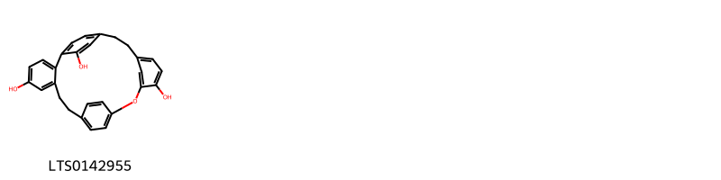{ width=100% }
    <figcaption>Hình ảnh cấu trúc hóa học của 1 hoạt chất thuộc nhóm  gồm ['riccardin c (LTS0142955)'].</figcaption>
</figure>
#### Nhóm Benzene and substituted derivatives
<figure markdown="span">
    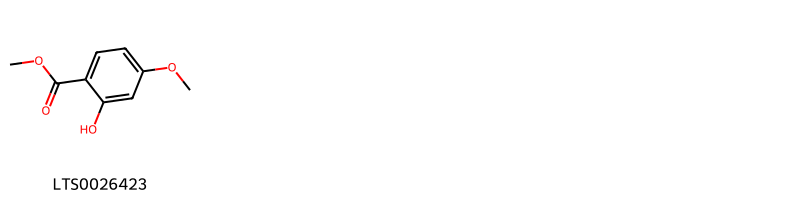{ width=100% }
    <figcaption>Hình ảnh cấu trúc hóa học của 1 hoạt chất thuộc nhóm Benzene and substituted derivatives gồm ['methyl 2-hydroxy-4-methoxybenzoate (LTS0026423)'].</figcaption>
</figure>
#### Nhóm Flavonoids
<figure markdown="span">
    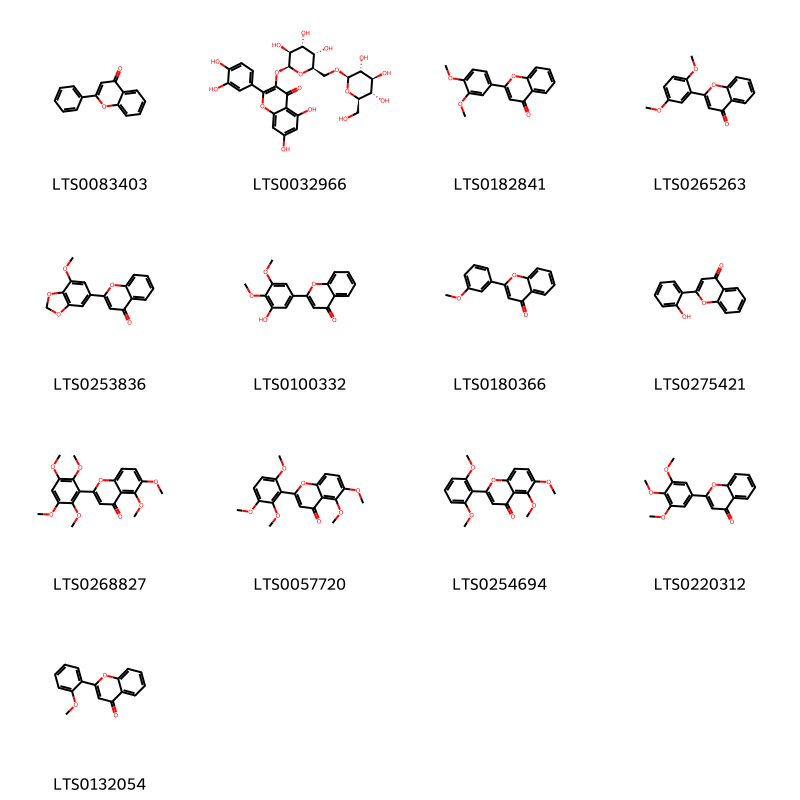{ width=100% }
    <figcaption>Hình ảnh cấu trúc hóa học của 13 hoạt chất thuộc nhóm Flavonoids gồm ['flavone (LTS0083403)', '2-(3,4-dihydroxyphenyl)-5,7-dihydroxy-3-{[(2s,3s,4r,5s,6r)-3,4,5-trihydroxy-6-({[(2r,3r,4s,5s,6r)-3,4,5-trihydroxy-6-(hydroxymethyl)oxan-2-yl]oxy}methyl)oxan-2-yl]oxy}chromen-4-one (LTS0032966)', '2-(3,4-dimethoxyphenyl)chromen-4-one (LTS0182841)', '2-(2,5-dimethoxyphenyl)chromen-4-one (LTS0265263)', '2-(7-methoxy-2h-1,3-benzodioxol-5-yl)chromen-4-one (LTS0253836)', '2-(3-hydroxy-4,5-dimethoxyphenyl)chromen-4-one (LTS0100332)', '2-(3-methoxyphenyl)chromen-4-one (LTS0180366)', '2-(2-hydroxyphenyl)chromen-4-one (LTS0275421)', '5,6-dimethoxy-2-(2,3,5,6-tetramethoxyphenyl)chromen-4-one (LTS0268827)', '5,6-dimethoxy-2-(2,3,6-trimethoxyphenyl)chromen-4-one (LTS0057720)', 'zapotin (LTS0254694)', '2-(3,4,5-trimethoxyphenyl)chromen-4-one (LTS0220312)', '2-(2-methoxyphenyl)chromen-4-one (LTS0132054)'].</figcaption>
</figure>
#### Nhóm Organooxygen compounds
<figure markdown="span">
    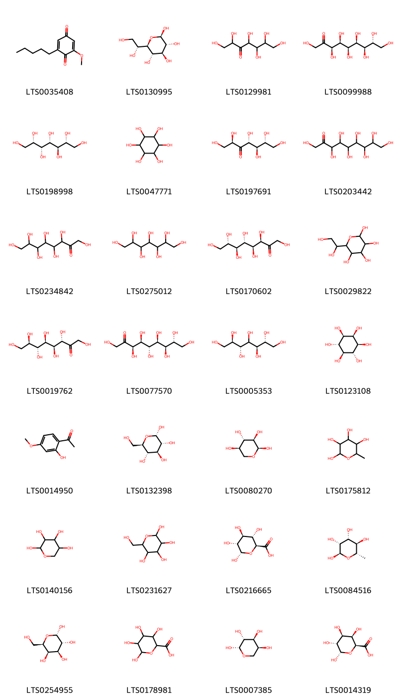{ width=100% }
    <figcaption>Hình ảnh cấu trúc hóa học của 28 hoạt chất thuộc nhóm Organooxygen compounds gồm ['primin (LTS0035408)', '(2r,3r,4s,5s,6r)-6-[(1r)-1,2-dihydroxyethyl]oxane-2,3,4,5-tetrol (LTS0130995)', '1,2,4,5,6,7-hexahydroxyheptan-3-one (LTS0129981)', '(3r,4s,5r,6s,7r,8r)-1,3,4,5,6,7,8,9-octahydroxynonan-2-one (LTS0099988)', '(2r,3r,4s,5r,6s)-heptane-1,2,3,4,5,6,7-heptol (LTS0198998)', '(-)-inositol (LTS0047771)', '(2r,4r,5r,6r)-1,2,4,5,6,7-hexahydroxyheptan-3-one (LTS0197691)', '1,3,4,5,6,7,8,9-octahydroxynonan-2-one (LTS0203442)', '1,3,4,5,6,7,8-heptahydroxyoctan-2-one (LTS0234842)', 'perseitol (LTS0275012)', '(3r,4s,5s,6s,7s)-1,3,4,5,6,7,8-heptahydroxyoctan-2-one (LTS0170602)', '6-(1,2-dihydroxyethyl)oxane-2,3,4,5-tetrol (LTS0029822)', 'd-glycero-d-manno-octulose (LTS0019762)', '(3r,4s,5s,6s,7r,8r)-1,3,4,5,6,7,8,9-octahydroxynonan-2-one (LTS0077570)', 'volemitol (LTS0005353)', '(1r,2r,3s,4r,5s,6s)-cyclohexane-1,2,3,4,5,6-hexol (LTS0123108)', 'paeonol (LTS0014950)', 'α-glucose (LTS0132398)', 'α-d-xylopyranose (LTS0080270)', '6-methyloxane-2,3,4,5-tetrol (LTS0175812)', 'xylose (LTS0140156)', 'd-galactose (LTS0231627)', 'glucuronic acid (LTS0216665)', 'α-l-rhamnopyranose (LTS0084516)', 'galactose (LTS0254955)', 'galacturonic acid (LTS0178981)', 'β-l-arabinose (LTS0007385)', 'galacturonic acid, d- (LTS0014319)'].</figcaption>
</figure>
#### Nhóm Prenol lipids
<figure markdown="span">
    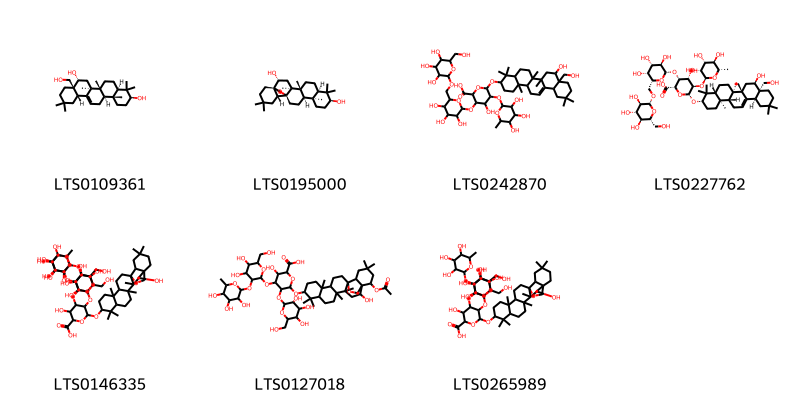{ width=100% }
    <figcaption>Hình ảnh cấu trúc hóa học của 7 hoạt chất thuộc nhóm Prenol lipids gồm ['primulagenin a (LTS0109361)', '(1s,2r,4s,5r,8r,10s,13s,14r,17s,18r)-4,5,9,9,13,20,20-heptamethyl-24-oxahexacyclo[15.5.2.0¹,¹⁸.0⁴,¹⁷.0⁵,¹⁴.0⁸,¹³]tetracosane-2,10-diol (LTS0195000)', '4-hydroxy-6-{[8-hydroxy-8a-(hydroxymethyl)-4,4,6a,6b,11,11,14b-heptamethyl-1,2,3,4a,5,6,7,8,9,10,12,12a,14,14a-tetradecahydropicen-3-yl]oxy}-3-{[3,4,5-trihydroxy-6-({[3,4,5-trihydroxy-6-(hydroxymethyl)oxan-2-yl]oxy}methyl)oxan-2-yl]oxy}-5-[(3,4,5-trihydroxy-6-methyloxan-2-yl)oxy]oxane-2-carboxylic acid (LTS0242870)', 'primulic acid (LTS0227762)', '4-{[4,5-dihydroxy-6-(hydroxymethyl)-3-[(3,4,5-trihydroxy-6-methyloxan-2-yl)oxy]oxan-2-yl]oxy}-5-{[3,4-dihydroxy-6-(hydroxymethyl)-5-[(3,4,5-trihydroxyoxan-2-yl)oxy]oxan-2-yl]oxy}-3-hydroxy-6-({2-hydroxy-4,5,9,9,13,20,20-heptamethyl-24-oxahexacyclo[15.5.2.0¹,¹⁸.0⁴,¹⁷.0⁵,¹⁴.0⁸,¹³]tetracosan-10-yl}oxy)oxane-2-carboxylic acid (LTS0146335)', '6-{[22-(acetyloxy)-2-hydroxy-4,5,9,9,13,20,20-heptamethyl-24-oxahexacyclo[15.5.2.0¹,¹⁸.0⁴,¹⁷.0⁵,¹⁴.0⁸,¹³]tetracosan-10-yl]oxy}-4-{[4,5-dihydroxy-6-(hydroxymethyl)-3-[(3,4,5-trihydroxy-6-methyloxan-2-yl)oxy]oxan-2-yl]oxy}-3-hydroxy-5-{[3,4,5-trihydroxy-6-(hydroxymethyl)oxan-2-yl]oxy}oxane-2-carboxylic acid (LTS0127018)', '4-{[4,5-dihydroxy-6-(hydroxymethyl)-3-[(3,4,5-trihydroxy-6-methyloxan-2-yl)oxy]oxan-2-yl]oxy}-3-hydroxy-6-({2-hydroxy-4,5,9,9,13,20,20-heptamethyl-24-oxahexacyclo[15.5.2.0¹,¹⁸.0⁴,¹⁷.0⁵,¹⁴.0⁸,¹³]tetracosan-10-yl}oxy)-5-{[3,4,5-trihydroxy-6-(hydroxymethyl)oxan-2-yl]oxy}oxane-2-carboxylic acid (LTS0265989)'].</figcaption>
</figure>

---

### Dược dân tộc học

Danh sách các quốc gia có sử dụng *Primula veris* trong điều trị các bệnh. 

| Country   | Disease                                             | Bệnh                                                                                                                                                                                                |
|:----------|:----------------------------------------------------|:----------------------------------------------------------------------------------------------------------------------------------------------------------------------------------------------------|
| Europe    | Sudorific                                           | MYMEMORY WARNING: YOU USED ALL AVAILABLE FREE TRANSLATIONS FOR TODAY. NEXT AVAILABLE IN  02 HOURS 04 MINUTES 08 SECONDS VISIT HTTPS://MYMEMORY.TRANSLATED.NET/DOC/USAGELIMITS.PHP TO TRANSLATE MORE |
| Turkey    | Nervine, Sedative, Diuretic, Expectorant, Sudorific | MYMEMORY WARNING: YOU USED ALL AVAILABLE FREE TRANSLATIONS FOR TODAY. NEXT AVAILABLE IN  02 HOURS 04 MINUTES 06 SECONDS VISIT HTTPS://MYMEMORY.TRANSLATED.NET/DOC/USAGELIMITS.PHP TO TRANSLATE MORE |

---

---
## Primula vulgaris
### Thông tin về thực vật

!!! info "Phân loại thực vật của *Primula vulgaris* từ GIBF:"
    - **Kingdom:** Plantae
    - **Phylum:** Tracheophyta
    - **Order:** Ericales
    - **Family:** Primulaceae
    - **Genus:** Primula
    - **Species:** *Primula vulgaris*

 

| Label (VI)   | Label (EN)   | Scientific Name   | Descriptions (VI)   | Descriptions (EN)   | Also Known As (VI)   | Also Known As (EN)              |
|:-------------|:-------------|:------------------|:--------------------|:--------------------|:---------------------|:--------------------------------|
| N/A          | N/A          | Primula vulgaris  | loài thực vật       | species of plant    | ['']                 | ['Primrose', 'Common Primrose'] |

#### Phân bố trên thế giới

**Từ CSDL GIBF** Italy, Belgium, Georgia, Norway, Ukraine, Netherlands, Luxembourg, Spain, Hungary, Portugal, Russian Federation, Slovenia, Czechia, Germany, Switzerland, Austria, France, United Kingdom of Great Britain and Northern Ireland, Ireland, Serbia

#### Phân bố tại Việt Nam

**Từ CSDL GIBF**: Không có ghi nhận ở Việt Nam

---
### Thành phần hóa học
        
- Theo cơ sở dữ liệu lotus: Từ loài *Primula vulgaris* đã phân lập và xác định được 5 hoạt chất thuộc về các nhóm Cinnamic acids and derivatives, Organooxygen compounds, Benzene and substituted derivatives. 

|    | chemicalTaxonomyClassyfireClass     |   smiles_count |
|---:|:------------------------------------|---------------:|
|  0 | Benzene and substituted derivatives |              2 |
|  1 | Cinnamic acids and derivatives      |              2 |
|  2 | Organooxygen compounds              |              1 |

#### Nhóm Benzene and substituted derivatives
<figure markdown="span">
    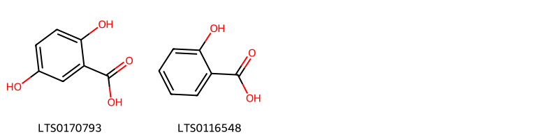{ width=100% }
    <figcaption>Hình ảnh cấu trúc hóa học của 2 hoạt chất thuộc nhóm Benzene and substituted derivatives gồm ['2,5-dihydroxybenzoic acid (LTS0170793)', 'salicyclic acid (LTS0116548)'].</figcaption>
</figure>
#### Nhóm Cinnamic acids and derivatives
<figure markdown="span">
    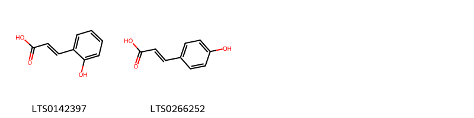{ width=100% }
    <figcaption>Hình ảnh cấu trúc hóa học của 2 hoạt chất thuộc nhóm Cinnamic acids and derivatives gồm ['trans-2-hydroxycinnamic acid (LTS0142397)', 'para-coumaric acid (LTS0266252)'].</figcaption>
</figure>
#### Nhóm Organooxygen compounds
<figure markdown="span">
    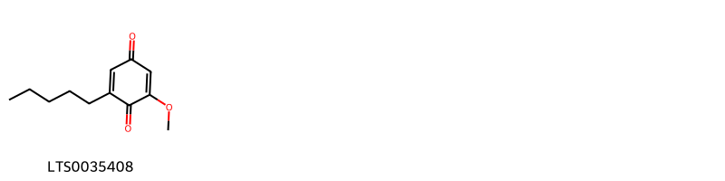{ width=100% }
    <figcaption>Hình ảnh cấu trúc hóa học của 1 hoạt chất thuộc nhóm Organooxygen compounds gồm ['primin (LTS0035408)'].</figcaption>
</figure>

---

### Dược dân tộc học

Danh sách các quốc gia có sử dụng *Primula vulgaris* trong điều trị các bệnh. 

| Country   | Disease   | Bệnh                                                                                                                                                                                                |
|:----------|:----------|:----------------------------------------------------------------------------------------------------------------------------------------------------------------------------------------------------|
| Elsewhere | Emetic    | MYMEMORY WARNING: YOU USED ALL AVAILABLE FREE TRANSLATIONS FOR TODAY. NEXT AVAILABLE IN  02 HOURS 03 MINUTES 23 SECONDS VISIT HTTPS://MYMEMORY.TRANSLATED.NET/DOC/USAGELIMITS.PHP TO TRANSLATE MORE |
| Turkey    | Emetic    | MYMEMORY WARNING: YOU USED ALL AVAILABLE FREE TRANSLATIONS FOR TODAY. NEXT AVAILABLE IN  02 HOURS 03 MINUTES 21 SECONDS VISIT HTTPS://MYMEMORY.TRANSLATED.NET/DOC/USAGELIMITS.PHP TO TRANSLATE MORE |

---

# Chi Glaux

??? note "Danh sách các dược liệu thuộc chi"
    
	 - *Glaux maritima*

---
## Glaux maritima
### Thông tin về thực vật

!!! info "Phân loại thực vật của *Lysimachia maritima* từ GIBF:"
    - **Kingdom:** Plantae
    - **Phylum:** Tracheophyta
    - **Order:** Ericales
    - **Family:** Primulaceae
    - **Genus:** Lysimachia
    - **Species:** *Lysimachia maritima*

 

| Label (VI)   | Label (EN)   | Scientific Name   | Descriptions (VI)   | Descriptions (EN)   | Also Known As (VI)   | Also Known As (EN)   |
|:-------------|:-------------|:------------------|:--------------------|:--------------------|:---------------------|:---------------------|
| N/A          | N/A          | Glaux maritima    | loài thực vật       | species of plant    | ['']                 | ['']                 |

#### Phân bố trên thế giới

**Từ CSDL GIBF** Denmark, Netherlands, Germany, Ireland, France, United Kingdom of Great Britain and Northern Ireland

#### Phân bố tại Việt Nam

**Từ CSDL GIBF**: Không có ghi nhận ở Việt Nam

---
### Thành phần hóa học
        
- Theo cơ sở dữ liệu lotus: Từ loài *Lysimachia maritima* đã phân lập và xác định được Chưa có hoạt chất nào được phân lập. hoạt chất thuộc về các nhóm Không có hoạt chất nào được phân lập. 

Không có hình ảnh nào được tạo ra

---

### Dược dân tộc học

Danh sách các quốc gia có sử dụng *Lysimachia maritima* trong điều trị các bệnh. 

| Country          | Disease             | Bệnh                                                                                                                                                                                                |
|:-----------------|:--------------------|:----------------------------------------------------------------------------------------------------------------------------------------------------------------------------------------------------|
| Canada(Kwakiutl) | Soporific, Sedative | MYMEMORY WARNING: YOU USED ALL AVAILABLE FREE TRANSLATIONS FOR TODAY. NEXT AVAILABLE IN  02 HOURS 02 MINUTES 52 SECONDS VISIT HTTPS://MYMEMORY.TRANSLATED.NET/DOC/USAGELIMITS.PHP TO TRANSLATE MORE |

---

# Chi Anagallis

??? note "Danh sách các dược liệu thuộc chi"
    
	 - *Anagallis arvensis*
	 - *Anagallis coerulea*

---
## Anagallis arvensis
### Thông tin về thực vật

!!! info "Phân loại thực vật của *Lysimachia arvensis* từ GIBF:"
    - **Kingdom:** Plantae
    - **Phylum:** Tracheophyta
    - **Order:** Ericales
    - **Family:** Primulaceae
    - **Genus:** Lysimachia
    - **Species:** *Lysimachia arvensis*

 

| Label (VI)   | Label (EN)   | Scientific Name    | Descriptions (VI)   | Descriptions (EN)   | Also Known As (VI)   | Also Known As (EN)    |
|:-------------|:-------------|:-------------------|:--------------------|:--------------------|:---------------------|:----------------------|
| N/A          | N/A          | Anagallis arvensis | loài thực vật       | species of plant    | ['']                 | ['scarlet pimpernel'] |

#### Phân bố trên thế giới

**Từ CSDL GIBF** Italy, Netherlands, Cyprus, Malta, Spain, Portugal, Albania, United States of America, Slovenia, Croatia, Greece, Germany, Switzerland, Austria, France, United Kingdom of Great Britain and Northern Ireland, Jersey, Ireland, Guernsey, New Zealand

#### Phân bố tại Việt Nam

**Từ CSDL GIBF**: Không có ghi nhận ở Việt Nam

---
### Thành phần hóa học
        
- Theo cơ sở dữ liệu lotus: Từ loài *Lysimachia arvensis* đã phân lập và xác định được 79 hoạt chất thuộc về các nhóm Fatty Acyls, Flavonoids, Prenol lipids, Steroids and steroid derivatives, Saturated hydrocarbons, Organooxygen compounds. 

|    | chemicalTaxonomyClassyfireClass   |   smiles_count |
|---:|:----------------------------------|---------------:|
|  0 | Fatty Acyls                       |              4 |
|  1 | Flavonoids                        |             10 |
|  2 | Organooxygen compounds            |              3 |
|  3 | Prenol lipids                     |             43 |
|  4 | Saturated hydrocarbons            |              1 |
|  5 | Steroids and steroid derivatives  |             18 |

#### Nhóm Fatty Acyls
<figure markdown="span">
    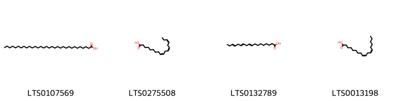{ width=100% }
    <figcaption>Hình ảnh cấu trúc hóa học của 4 hoạt chất thuộc nhóm Fatty Acyls gồm ['lacceroic acid (LTS0107569)', 'α-linolenic acid (LTS0275508)', 'α linolenic acid (LTS0132789)', 'linoleic (LTS0013198)'].</figcaption>
</figure>
#### Nhóm Flavonoids
<figure markdown="span">
    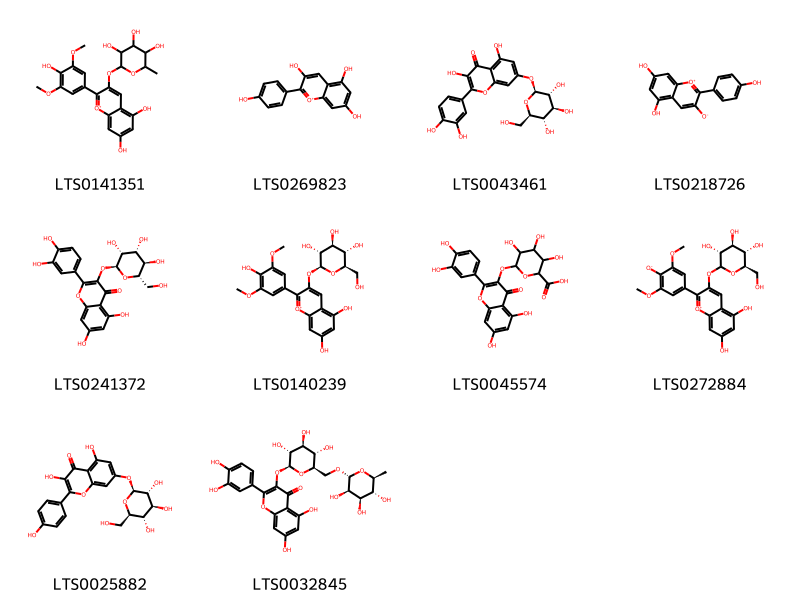{ width=100% }
    <figcaption>Hình ảnh cấu trúc hóa học của 10 hoạt chất thuộc nhóm Flavonoids gồm ['5,7-dihydroxy-2-(4-hydroxy-3,5-dimethoxyphenyl)-3-[(3,4,5-trihydroxy-6-methyloxan-2-yl)oxy]-1λ⁴-chromen-1-ylium (LTS0141351)', 'pelargonidin (LTS0269823)', 'quercimeritrin (LTS0043461)', '5,7-dihydroxy-2-(4-hydroxyphenyl)-1λ⁴-chromen-1-ylium-3-olate (LTS0218726)', '2-(3,4-dihydroxyphenyl)-5,7-dihydroxy-3-{[(2s,3r,4r,5r,6s)-3,4,5-trihydroxy-6-(hydroxymethyl)oxan-2-yl]oxy}chromen-4-one (LTS0241372)', 'malvidin-3-glucoside (LTS0140239)', 'miquelianin (LTS0045574)', '2-(3,5-dimethoxy-4-oxidophenyl)-5,7-dihydroxy-3-{[(3r,4s,5s,6r)-3,4,5-trihydroxy-6-(hydroxymethyl)oxan-2-yl]oxy}-1λ⁴-chromen-1-ylium (LTS0272884)', 'kaempferol 7-o-glucoside (LTS0025882)', '3-rutinosyl quercetin (LTS0032845)'].</figcaption>
</figure>
#### Nhóm Organooxygen compounds
<figure markdown="span">
    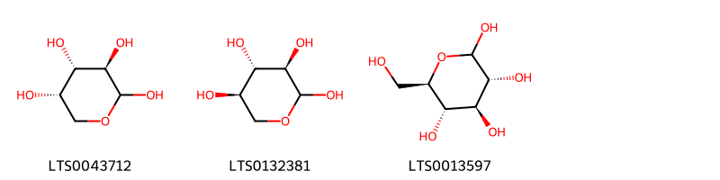{ width=100% }
    <figcaption>Hình ảnh cấu trúc hóa học của 3 hoạt chất thuộc nhóm Organooxygen compounds gồm ['l-arabinopyranose (LTS0043712)', 'd-xylose (LTS0132381)', 'glucose (LTS0013597)'].</figcaption>
</figure>
#### Nhóm Prenol lipids
<figure markdown="span">
    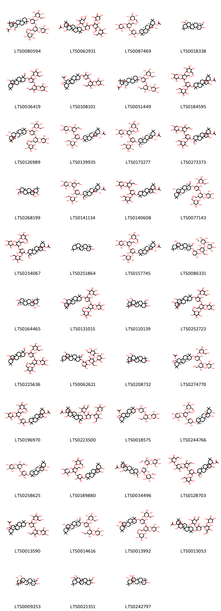{ width=100% }
    <figcaption>Hình ảnh cấu trúc hóa học của 43 hoạt chất thuộc nhóm Prenol lipids gồm ['(1r,2r,4s,5r,8r,10s,13r,14r,17s,18r,22s,23s)-2,23-dihydroxy-10-{[(2s,3r,4s,5s)-4-hydroxy-5-{[(2r,3r,4s,5s,6r)-4-hydroxy-6-(hydroxymethyl)-5-{[(2s,3r,4s,5s,6r)-3,4,5-trihydroxy-6-(hydroxymethyl)oxan-2-yl]oxy}-3-{[(2s,3r,4s,5r)-3,4,5-trihydroxyoxan-2-yl]oxy}oxan-2-yl]oxy}-3-{[(2s,3r,4s,5s,6r)-3,4,5-trihydroxy-6-(hydroxymethyl)oxan-2-yl]oxy}oxan-2-yl]oxy}-4,5,9,9,13,20,20-heptamethyl-24-oxahexacyclo[15.5.2.0¹,¹⁸.0⁴,¹⁷.0⁵,¹⁴.0⁸,¹³]tetracosan-22-yl acetate (LTS0080594)', '2,23-dihydroxy-10-[(4-hydroxy-5-{[4-hydroxy-6-(hydroxymethyl)-5-{[3,4,5-trihydroxy-6-(hydroxymethyl)oxan-2-yl]oxy}-3-[(3,4,5-trihydroxyoxan-2-yl)oxy]oxan-2-yl]oxy}-3-{[3,4,5-trihydroxy-6-(hydroxymethyl)oxan-2-yl]oxy}oxan-2-yl)oxy]-4,5,9,9,13,20,20-heptamethyl-24-oxahexacyclo[15.5.2.0¹,¹⁸.0⁴,¹⁷.0⁵,¹⁴.0⁸,¹³]tetracosan-22-yl acetate (LTS0062931)', '(1r,2r,4s,5r,8r,10s,13r,14r,17s,18r,22s)-10-{[(2s,3r,4r,5s)-3,4-dihydroxy-5-{[(2r,3r,4s,5s,6r)-4-hydroxy-6-(hydroxymethyl)-5-{[(2s,3r,4s,5s,6r)-3,4,5-trihydroxy-6-(hydroxymethyl)oxan-2-yl]oxy}-3-{[(2s,3r,4s,5r)-3,4,5-trihydroxyoxan-2-yl]oxy}oxan-2-yl]oxy}oxan-2-yl]oxy}-2-hydroxy-4,5,9,9,13,20,20-heptamethyl-24-oxahexacyclo[15.5.2.0¹,¹⁸.0⁴,¹⁷.0⁵,¹⁴.0⁸,¹³]tetracosan-22-yl acetate (LTS0087469)', '(3s,4r,4ar,6ar,6bs,8r,8as,12as,14ar,14br)-4,8a-bis(hydroxymethyl)-4,6a,6b,11,11,14b-hexamethyl-1,2,3,4a,5,6,7,8,9,10,12,12a,14,14a-tetradecahydropicene-3,8-diol (LTS0018338)', '2-[(5-{[4,5-dihydroxy-6-(hydroxymethyl)-3-[(3,4,5-trihydroxyoxan-2-yl)oxy]oxan-2-yl]oxy}-4-hydroxy-2-{[2-hydroxy-9-(hydroxymethyl)-4,5,9,13,20,20-hexamethyl-24-oxahexacyclo[15.5.2.0¹,¹⁸.0⁴,¹⁷.0⁵,¹⁴.0⁸,¹³]tetracosan-10-yl]oxy}oxan-3-yl)oxy]-6-(hydroxymethyl)oxane-3,4,5-triol (LTS0036419)', '10-[(5-{[4,5-dihydroxy-6-(hydroxymethyl)-3-[(3,4,5-trihydroxyoxan-2-yl)oxy]oxan-2-yl]oxy}-3,4-dihydroxyoxan-2-yl)oxy]-4-hydroxy-4a-(hydroxymethyl)-2,2,6a,6b,9,9,12a-heptamethyl-1,3,4,5,6,7,8,8a,10,11,12,12b,13,14b-tetradecahydropicen-5-yl acetate (LTS0108101)', '(1r,2r,4s,5r,8r,10s,13r,14r,17s,18r,22s,23s)-10-{[(2s,3r,4s,5s)-5-{[(2s,3r,4s,5s,6r)-4,5-dihydroxy-6-(hydroxymethyl)-3-{[(2s,3r,4s,5r)-3,4,5-trihydroxyoxan-2-yl]oxy}oxan-2-yl]oxy}-4-hydroxy-3-{[(2s,3r,4s,5s,6r)-3,4,5-trihydroxy-6-(hydroxymethyl)oxan-2-yl]oxy}oxan-2-yl]oxy}-2,23-dihydroxy-4,5,9,9,13,20,20-heptamethyl-24-oxahexacyclo[15.5.2.0¹,¹⁸.0⁴,¹⁷.0⁵,¹⁴.0⁸,¹³]tetracosan-22-yl acetate (LTS0051449)', '2-hydroxy-10-[(4-hydroxy-5-{[4-hydroxy-6-(hydroxymethyl)-5-{[3,4,5-trihydroxy-6-(hydroxymethyl)oxan-2-yl]oxy}-3-[(3,4,5-trihydroxyoxan-2-yl)oxy]oxan-2-yl]oxy}-3-{[3,4,5-trihydroxy-6-(hydroxymethyl)oxan-2-yl]oxy}oxan-2-yl)oxy]-4,5,9,9,13,20,20-heptamethyl-24-oxahexacyclo[15.5.2.0¹,¹⁸.0⁴,¹⁷.0⁵,¹⁴.0⁸,¹³]tetracosan-22-yl acetate (LTS0184595)', '(2s,3r,4s,5s,6r)-2-{[(2r,3s,4s,5r,6r)-6-{[(3s,4s,5r,6s)-6-{[(1s,2r,4s,5r,8r,10s,13r,14r,17s,18r,22s,23s)-2,22-dihydroxy-23-methoxy-4,5,9,9,13,20,20-heptamethyl-24-oxahexacyclo[15.5.2.0¹,¹⁸.0⁴,¹⁷.0⁵,¹⁴.0⁸,¹³]tetracosan-10-yl]oxy}-4-hydroxy-5-{[(2s,3r,4s,5s,6r)-3,4,5-trihydroxy-6-(hydroxymethyl)oxan-2-yl]oxy}oxan-3-yl]oxy}-4-hydroxy-2-(hydroxymethyl)-5-{[(2s,3r,4s,5r)-3,4,5-trihydroxyoxan-2-yl]oxy}oxan-3-yl]oxy}-6-(hydroxymethyl)oxane-3,4,5-triol (LTS0126989)', '(1r,2r,4s,5r,8r,10s,13r,14r,17s,18r,22s)-10-{[(2s,3r,4s,5s)-5-{[(2s,3r,4s,5s,6r)-4,5-dihydroxy-6-(hydroxymethyl)-3-{[(2s,3r,4s,5r)-3,4,5-trihydroxyoxan-2-yl]oxy}oxan-2-yl]oxy}-4-hydroxy-3-{[(2s,3r,4s,5s,6r)-3,4,5-trihydroxy-6-(hydroxymethyl)oxan-2-yl]oxy}oxan-2-yl]oxy}-2-hydroxy-4,5,9,9,13,20,20-heptamethyl-24-oxahexacyclo[15.5.2.0¹,¹⁸.0⁴,¹⁷.0⁵,¹⁴.0⁸,¹³]tetracosan-22-yl acetate (LTS0139935)', '(1r,2r,4s,5r,8r,9r,10s,13r,14r,17s,18s,22s)-2-hydroxy-10-{[(2s,3r,4s,5s)-4-hydroxy-5-{[(2r,3r,4s,5s,6r)-4-hydroxy-6-(hydroxymethyl)-5-{[(2s,3r,4s,5s,6r)-3,4,5-trihydroxy-6-(hydroxymethyl)oxan-2-yl]oxy}-3-{[(2s,3r,4s,5r)-3,4,5-trihydroxyoxan-2-yl]oxy}oxan-2-yl]oxy}-3-{[(2s,3r,4s,5s,6r)-3,4,5-trihydroxy-6-(hydroxymethyl)oxan-2-yl]oxy}oxan-2-yl]oxy}-9-(hydroxymethyl)-4,5,9,13,20,20-hexamethyl-24-oxahexacyclo[15.5.2.0¹,¹⁸.0⁴,¹⁷.0⁵,¹⁴.0⁸,¹³]tetracosan-22-yl acetate (LTS0173277)', '10-[(5-{[4,5-dihydroxy-6-(hydroxymethyl)-3-[(3,4,5-trihydroxyoxan-2-yl)oxy]oxan-2-yl]oxy}-4-hydroxy-3-{[3,4,5-trihydroxy-6-(hydroxymethyl)oxan-2-yl]oxy}oxan-2-yl)oxy]-2-hydroxy-9-(hydroxymethyl)-4,5,9,13,20,20-hexamethyl-24-oxahexacyclo[15.5.2.0¹,¹⁸.0⁴,¹⁷.0⁵,¹⁴.0⁸,¹³]tetracosan-22-yl acetate (LTS0273373)', '9-(hydroxymethyl)-4,5,9,13,20,20-hexamethyl-24-oxahexacyclo[15.5.2.0¹,¹⁸.0⁴,¹⁷.0⁵,¹⁴.0⁸,¹³]tetracosane-2,10,22-triol (LTS0268199)', '(1r,2r,4s,5r,8r,9r,10s,13r,14r,17s,18s,22s)-10-{[(2s,3r,4s,5s)-5-{[(2s,3r,4s,5s,6r)-4,5-dihydroxy-6-(hydroxymethyl)-3-{[(2s,3r,4s,5r)-3,4,5-trihydroxyoxan-2-yl]oxy}oxan-2-yl]oxy}-4-hydroxy-3-{[(2s,3r,4s,5s,6r)-3,4,5-trihydroxy-6-(hydroxymethyl)oxan-2-yl]oxy}oxan-2-yl]oxy}-2-hydroxy-9-(hydroxymethyl)-4,5,9,13,20,20-hexamethyl-24-oxahexacyclo[15.5.2.0¹,¹⁸.0⁴,¹⁷.0⁵,¹⁴.0⁸,¹³]tetracosan-22-yl acetate (LTS0141134)', '10-[(5-{[4,5-dihydroxy-6-(hydroxymethyl)-3-[(3,4,5-trihydroxyoxan-2-yl)oxy]oxan-2-yl]oxy}-4-hydroxy-3-{[3,4,5-trihydroxy-6-(hydroxymethyl)oxan-2-yl]oxy}oxan-2-yl)oxy]-2-hydroxy-4,5,9,9,13,20,20-heptamethyl-24-oxahexacyclo[15.5.2.0¹,¹⁸.0⁴,¹⁷.0⁵,¹⁴.0⁸,¹³]tetracosan-22-yl acetate (LTS0140608)', '(2s,3r,4s,5s,6r)-2-{[(2r,3s,4s,5r,6r)-4-hydroxy-6-{[(3s,4s,5r,6s)-4-hydroxy-6-{[(1s,2r,4s,5r,8r,9r,10s,13r,14r,17s,18r)-2-hydroxy-9-(hydroxymethyl)-4,5,9,13,20,20-hexamethyl-24-oxahexacyclo[15.5.2.0¹,¹⁸.0⁴,¹⁷.0⁵,¹⁴.0⁸,¹³]tetracosan-10-yl]oxy}-5-{[(2s,3r,4s,5s,6r)-3,4,5-trihydroxy-6-(hydroxymethyl)oxan-2-yl]oxy}oxan-3-yl]oxy}-2-(hydroxymethyl)-5-{[(2s,3r,4s,5r)-3,4,5-trihydroxyoxan-2-yl]oxy}oxan-3-yl]oxy}-6-(hydroxymethyl)oxane-3,4,5-triol (LTS0077143)', '2-hydroxy-10-[(4-hydroxy-5-{[4-hydroxy-6-(hydroxymethyl)-5-{[3,4,5-trihydroxy-6-(hydroxymethyl)oxan-2-yl]oxy}-3-[(3,4,5-trihydroxyoxan-2-yl)oxy]oxan-2-yl]oxy}-3-{[3,4,5-trihydroxy-6-(hydroxymethyl)oxan-2-yl]oxy}oxan-2-yl)oxy]-9-(hydroxymethyl)-4,5,9,13,20,20-hexamethyl-24-oxahexacyclo[15.5.2.0¹,¹⁸.0⁴,¹⁷.0⁵,¹⁴.0⁸,¹³]tetracosan-22-yl acetate (LTS0234067)', 'β-amyrin (LTS0251864)', '(1r,2r,4s,5r,8r,10s,13r,14r,17s,18r,22s)-2-hydroxy-10-{[(2s,3r,4s,5s)-4-hydroxy-5-{[(2r,3r,4s,5s,6r)-4-hydroxy-6-(hydroxymethyl)-5-{[(2s,3r,4s,5s,6r)-3,4,5-trihydroxy-6-(hydroxymethyl)oxan-2-yl]oxy}-3-{[(2s,3r,4s,5r)-3,4,5-trihydroxyoxan-2-yl]oxy}oxan-2-yl]oxy}-3-{[(2s,3r,4s,5s,6r)-3,4,5-trihydroxy-6-(hydroxymethyl)oxan-2-yl]oxy}oxan-2-yl]oxy}-4,5,9,9,13,20,20-heptamethyl-24-oxahexacyclo[15.5.2.0¹,¹⁸.0⁴,¹⁷.0⁵,¹⁴.0⁸,¹³]tetracosan-22-yl acetate (LTS0157745)', '(2s,3r,4s,5s,6r)-2-{[(2s,3r,4r,5r,6r)-2-{[(2s,3r,4s,5r)-4,5-dihydroxy-2-{[(1s,2r,4s,5r,8r,9r,10s,13r,14r,17s,18r)-2-hydroxy-9-(hydroxymethyl)-4,5,9,13,20,20-hexamethyl-24-oxahexacyclo[15.5.2.0¹,¹⁸.0⁴,¹⁷.0⁵,¹⁴.0⁸,¹³]tetracosan-10-yl]oxy}oxan-3-yl]oxy}-3-hydroxy-6-(hydroxymethyl)-5-{[(2s,3s,4r,5r)-3,4,5-trihydroxyoxan-2-yl]oxy}oxan-4-yl]oxy}-6-(hydroxymethyl)oxane-3,4,5-triol (LTS0086331)', '(1s,2r,4s,5r,8r,9r,10s,13r,14r,17s,18r,22s)-9-(hydroxymethyl)-4,5,9,13,20,20-hexamethyl-24-oxahexacyclo[15.5.2.0¹,¹⁸.0⁴,¹⁷.0⁵,¹⁴.0⁸,¹³]tetracosane-2,10,22-triol (LTS0164465)', '10-[(4-hydroxy-5-{[4-hydroxy-6-(hydroxymethyl)-5-{[3,4,5-trihydroxy-6-(hydroxymethyl)oxan-2-yl]oxy}-3-[(3,4,5-trihydroxyoxan-2-yl)oxy]oxan-2-yl]oxy}-3-{[3,4,5-trihydroxy-6-(hydroxymethyl)oxan-2-yl]oxy}oxan-2-yl)oxy]-4,5,9,9,13,20,20-heptamethyl-24-oxahexacyclo[15.5.2.0¹,¹⁸.0⁴,¹⁷.0⁵,¹⁴.0⁸,¹³]tetracosane-2,22,23-triol (LTS0131015)', '9-(hydroxymethyl)-4,5,9,13,20,20-hexamethyl-24-oxahexacyclo[15.5.2.0¹,¹⁸.0⁴,¹⁷.0⁵,¹⁴.0⁸,¹³]tetracosane-2,10,22,23-tetrol (LTS0110139)', '2-[(6-{[6-({2,22-dihydroxy-23-methoxy-4,5,9,9,13,20,20-heptamethyl-24-oxahexacyclo[15.5.2.0¹,¹⁸.0⁴,¹⁷.0⁵,¹⁴.0⁸,¹³]tetracosan-10-yl}oxy)-4-hydroxy-5-{[3,4,5-trihydroxy-6-(hydroxymethyl)oxan-2-yl]oxy}oxan-3-yl]oxy}-4-hydroxy-2-(hydroxymethyl)-5-[(3,4,5-trihydroxyoxan-2-yl)oxy]oxan-3-yl)oxy]-6-(hydroxymethyl)oxane-3,4,5-triol (LTS0252723)', '2-({4-hydroxy-6-[(4-hydroxy-6-{[2-hydroxy-9-(hydroxymethyl)-4,5,9,13,20,20-hexamethyl-24-oxahexacyclo[15.5.2.0¹,¹⁸.0⁴,¹⁷.0⁵,¹⁴.0⁸,¹³]tetracosan-10-yl]oxy}-5-{[3,4,5-trihydroxy-6-(hydroxymethyl)oxan-2-yl]oxy}oxan-3-yl)oxy]-2-(hydroxymethyl)-5-[(3,4,5-trihydroxyoxan-2-yl)oxy]oxan-3-yl}oxy)-6-(hydroxymethyl)oxane-3,4,5-triol (LTS0225636)', '2-({2-[(4,5-dihydroxy-2-{[2-hydroxy-9-(hydroxymethyl)-4,5,9,13,20,20-hexamethyl-24-oxahexacyclo[15.5.2.0¹,¹⁸.0⁴,¹⁷.0⁵,¹⁴.0⁸,¹³]tetracosan-10-yl]oxy}oxan-3-yl)oxy]-3-hydroxy-6-(hydroxymethyl)-5-[(3,4,5-trihydroxyoxan-2-yl)oxy]oxan-4-yl}oxy)-6-(hydroxymethyl)oxane-3,4,5-triol (LTS0062621)', '4,5,9,9,13,20,20-heptamethyl-24-oxahexacyclo[15.5.2.0¹,¹⁸.0⁴,¹⁷.0⁵,¹⁴.0⁸,¹³]tetracosane-2,10,22,23-tetrol (LTS0208732)', '(4s,4as,5r,6as,6br,8ar,10s,12ar,12br,14bs)-10-{[(2s,3r,4s,5s)-5-{[(2s,3r,4s,5s,6r)-4,5-dihydroxy-6-(hydroxymethyl)-3-{[(2s,3r,4s,5r)-3,4,5-trihydroxyoxan-2-yl]oxy}oxan-2-yl]oxy}-4-hydroxy-3-{[(2s,3r,4s,5s,6r)-3,4,5-trihydroxy-6-(hydroxymethyl)oxan-2-yl]oxy}oxan-2-yl]oxy}-4-hydroxy-4a-(hydroxymethyl)-2,2,6a,6b,9,9,12a-heptamethyl-1,3,4,5,6,7,8,8a,10,11,12,12b,13,14b-tetradecahydropicen-5-yl acetate (LTS0274770)', '10-[(3,4-dihydroxy-5-{[4-hydroxy-6-(hydroxymethyl)-5-{[3,4,5-trihydroxy-6-(hydroxymethyl)oxan-2-yl]oxy}-3-[(3,4,5-trihydroxyoxan-2-yl)oxy]oxan-2-yl]oxy}oxan-2-yl)oxy]-2-hydroxy-4,5,9,9,13,20,20-heptamethyl-24-oxahexacyclo[15.5.2.0¹,¹⁸.0⁴,¹⁷.0⁵,¹⁴.0⁸,¹³]tetracosan-22-yl acetate (LTS0196970)', '10-[(5-{[4,5-dihydroxy-6-(hydroxymethyl)-3-[(3,4,5-trihydroxyoxan-2-yl)oxy]oxan-2-yl]oxy}-4-hydroxy-3-{[3,4,5-trihydroxy-6-(hydroxymethyl)oxan-2-yl]oxy}oxan-2-yl)oxy]-2,23-dihydroxy-9-(hydroxymethyl)-4,5,9,13,20,20-hexamethyl-24-oxahexacyclo[15.5.2.0¹,¹⁸.0⁴,¹⁷.0⁵,¹⁴.0⁸,¹³]tetracosan-22-yl acetate (LTS0223500)', '(4s,4as,5r,6as,6br,8ar,10s,12ar,12br,14bs)-10-{[(2s,3r,4r,5s)-5-{[(2s,3r,4s,5s,6r)-4,5-dihydroxy-6-(hydroxymethyl)-3-{[(2s,3r,4s,5r)-3,4,5-trihydroxyoxan-2-yl]oxy}oxan-2-yl]oxy}-3,4-dihydroxyoxan-2-yl]oxy}-4-hydroxy-4a-(hydroxymethyl)-2,2,6a,6b,9,9,12a-heptamethyl-1,3,4,5,6,7,8,8a,10,11,12,12b,13,14b-tetradecahydropicen-5-yl acetate (LTS0018575)', '(2s,3r,4s,5s,6r)-2-{[(2r,3s,4s,5r,6r)-6-{[(3s,4r,5r,6s)-6-{[(1s,2r,4s,5r,8r,10s,13r,14r,17s,18s,22s)-2,22-dihydroxy-4,5,9,9,13,20,20-heptamethyl-24-oxahexacyclo[15.5.2.0¹,¹⁸.0⁴,¹⁷.0⁵,¹⁴.0⁸,¹³]tetracosan-10-yl]oxy}-4,5-dihydroxyoxan-3-yl]oxy}-4-hydroxy-2-(hydroxymethyl)-5-{[(2s,3r,4s,5r)-3,4,5-trihydroxyoxan-2-yl]oxy}oxan-3-yl]oxy}-6-(hydroxymethyl)oxane-3,4,5-triol (LTS0244766)', '(2s,3r,4s,5r)-2-{[(2s,3r,4s,5s,6r)-2-{[(3s,4r,5r,6s)-6-{[(1s,2r,4s,5r,8r,10s,13r,14r,17s,18r,22s)-2,22-dihydroxy-4,5,9,9,13,20,20-heptamethyl-24-oxahexacyclo[15.5.2.0¹,¹⁸.0⁴,¹⁷.0⁵,¹⁴.0⁸,¹³]tetracosan-10-yl]oxy}-4,5-dihydroxyoxan-3-yl]oxy}-4,5-dihydroxy-6-(hydroxymethyl)oxan-3-yl]oxy}oxane-3,4,5-triol (LTS0258625)', '2-[(6-{[6-({2,22-dihydroxy-4,5,9,9,13,20,20-heptamethyl-24-oxahexacyclo[15.5.2.0¹,¹⁸.0⁴,¹⁷.0⁵,¹⁴.0⁸,¹³]tetracosan-10-yl}oxy)-4,5-dihydroxyoxan-3-yl]oxy}-4-hydroxy-2-(hydroxymethyl)-5-[(3,4,5-trihydroxyoxan-2-yl)oxy]oxan-3-yl)oxy]-6-(hydroxymethyl)oxane-3,4,5-triol (LTS0189880)', '(1r,2r,4s,5r,8r,9r,10s,13r,14r,17s,18r,22s,23s)-10-{[(2s,3r,4s,5s)-5-{[(2s,3r,4s,5s,6r)-4,5-dihydroxy-6-(hydroxymethyl)-3-{[(2s,3r,4s,5r)-3,4,5-trihydroxyoxan-2-yl]oxy}oxan-2-yl]oxy}-4-hydroxy-3-{[(2s,3r,4s,5s,6r)-3,4,5-trihydroxy-6-(hydroxymethyl)oxan-2-yl]oxy}oxan-2-yl]oxy}-2,23-dihydroxy-9-(hydroxymethyl)-4,5,9,13,20,20-hexamethyl-24-oxahexacyclo[15.5.2.0¹,¹⁸.0⁴,¹⁷.0⁵,¹⁴.0⁸,¹³]tetracosan-22-yl acetate (LTS0034496)', '10-{[5-({3-[(3,4-dihydroxy-5-{[3,4,5-trihydroxy-6-(hydroxymethyl)oxan-2-yl]oxy}oxan-2-yl)oxy]-4,5-dihydroxy-6-(hydroxymethyl)oxan-2-yl}oxy)-4-hydroxy-3-{[3,4,5-trihydroxy-6-(hydroxymethyl)oxan-2-yl]oxy}oxan-2-yl]oxy}-2-hydroxy-9-(hydroxymethyl)-4,5,9,13,20,20-hexamethyl-24-oxahexacyclo[15.5.2.0¹,¹⁸.0⁴,¹⁷.0⁵,¹⁴.0⁸,¹³]tetracosan-22-yl acetate (LTS0128703)', '10-[(5-{[4,5-dihydroxy-6-(hydroxymethyl)-3-[(3,4,5-trihydroxyoxan-2-yl)oxy]oxan-2-yl]oxy}-4-hydroxy-3-{[3,4,5-trihydroxy-6-(hydroxymethyl)oxan-2-yl]oxy}oxan-2-yl)oxy]-4-hydroxy-4a-(hydroxymethyl)-2,2,6a,6b,9,9,12a-heptamethyl-1,3,4,5,6,7,8,8a,10,11,12,12b,13,14b-tetradecahydropicen-5-yl acetate (LTS0013590)', '(2s,3r,4s,5s,6r)-2-{[(2s,3r,4s,5s)-5-{[(2s,3r,4s,5s,6r)-4,5-dihydroxy-6-(hydroxymethyl)-3-{[(2s,3r,4s,5r)-3,4,5-trihydroxyoxan-2-yl]oxy}oxan-2-yl]oxy}-4-hydroxy-2-{[(1s,2r,4s,5r,8r,9r,10s,13r,14r,17s,18r)-2-hydroxy-9-(hydroxymethyl)-4,5,9,13,20,20-hexamethyl-24-oxahexacyclo[15.5.2.0¹,¹⁸.0⁴,¹⁷.0⁵,¹⁴.0⁸,¹³]tetracosan-10-yl]oxy}oxan-3-yl]oxy}-6-(hydroxymethyl)oxane-3,4,5-triol (LTS0014616)', '(1s,2r,4s,5r,8r,10s,13r,14r,17s,18r,22s,23s)-10-{[(2s,3r,4s,5s)-4-hydroxy-5-{[(2r,3r,4s,5s,6r)-4-hydroxy-6-(hydroxymethyl)-5-{[(2s,3r,4s,5s,6r)-3,4,5-trihydroxy-6-(hydroxymethyl)oxan-2-yl]oxy}-3-{[(2s,3r,4s,5r)-3,4,5-trihydroxyoxan-2-yl]oxy}oxan-2-yl]oxy}-3-{[(2s,3r,4s,5s,6r)-3,4,5-trihydroxy-6-(hydroxymethyl)oxan-2-yl]oxy}oxan-2-yl]oxy}-4,5,9,9,13,20,20-heptamethyl-24-oxahexacyclo[15.5.2.0¹,¹⁸.0⁴,¹⁷.0⁵,¹⁴.0⁸,¹³]tetracosane-2,22,23-triol (LTS0013992)', '10-[(5-{[4,5-dihydroxy-6-(hydroxymethyl)-3-[(3,4,5-trihydroxyoxan-2-yl)oxy]oxan-2-yl]oxy}-4-hydroxy-3-{[3,4,5-trihydroxy-6-(hydroxymethyl)oxan-2-yl]oxy}oxan-2-yl)oxy]-2,23-dihydroxy-4,5,9,9,13,20,20-heptamethyl-24-oxahexacyclo[15.5.2.0¹,¹⁸.0⁴,¹⁷.0⁵,¹⁴.0⁸,¹³]tetracosan-22-yl acetate (LTS0013053)', '(1s,2r,4s,5r,8r,9r,10s,13r,14r,17s,18r,22s,23r)-9-(hydroxymethyl)-4,5,9,13,20,20-hexamethyl-24-oxahexacyclo[15.5.2.0¹,¹⁸.0⁴,¹⁷.0⁵,¹⁴.0⁸,¹³]tetracosane-2,10,22,23-tetrol (LTS0009253)', '4,8a-bis(hydroxymethyl)-4,6a,6b,11,11,14b-hexamethyl-1,2,3,4a,5,6,7,8,9,10,12,12a,14,14a-tetradecahydropicene-3,8-diol (LTS0021351)', '(1s,2r,4s,5r,8r,10s,13r,14r,17s,18r,22s,23s)-4,5,9,9,13,20,20-heptamethyl-24-oxahexacyclo[15.5.2.0¹,¹⁸.0⁴,¹⁷.0⁵,¹⁴.0⁸,¹³]tetracosane-2,10,22,23-tetrol (LTS0242797)'].</figcaption>
</figure>
#### Nhóm Saturated hydrocarbons
<figure markdown="span">
    { width=100% }
    <figcaption>Hình ảnh cấu trúc hóa học của 1 hoạt chất thuộc nhóm Saturated hydrocarbons gồm ['hexacosane (LTS0079361)'].</figcaption>
</figure>
#### Nhóm Steroids and steroid derivatives
<figure markdown="span">
    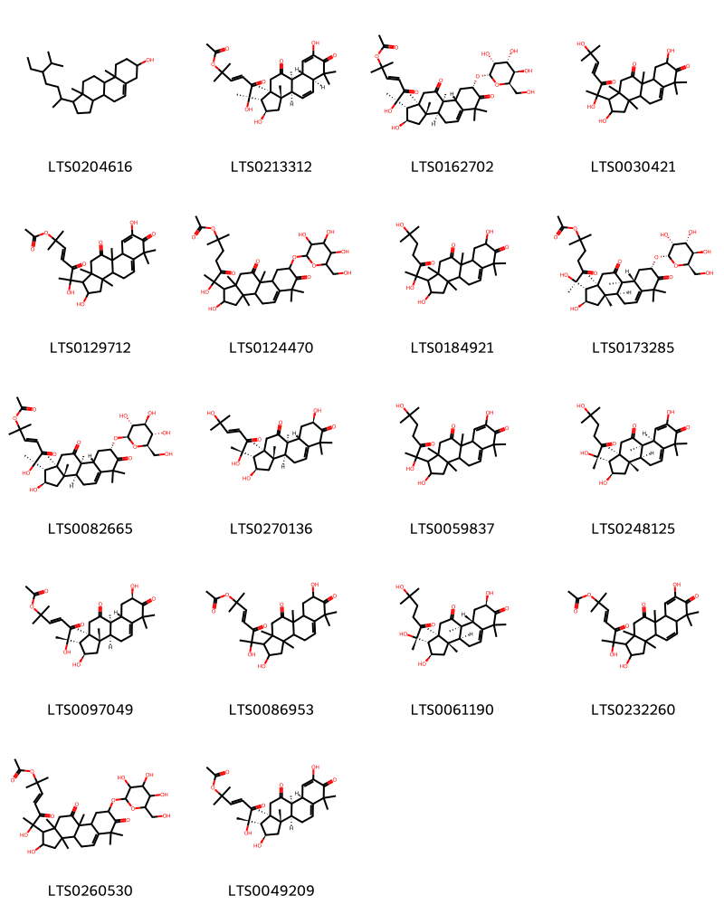{ width=100% }
    <figcaption>Hình ảnh cấu trúc hóa học của 18 hoạt chất thuộc nhóm Steroids and steroid derivatives gồm ['stigmast-5-en-3-ol, (3β)- (LTS0204616)', '(3e,6r)-6-[(1r,2r,3as,3bs,5as,9as,9bs,11ar)-2,8-dihydroxy-3a,6,6,9b,11a-pentamethyl-7,10-dioxo-1h,2h,3h,3bh,5ah,9ah,11h-cyclopenta[a]phenanthren-1-yl]-6-hydroxy-2-methyl-5-oxohept-3-en-2-yl acetate (LTS0213312)', '(3e,6r)-6-[(1r,2r,3as,3bs,8s,9ar,9br,11ar)-2-hydroxy-3a,6,6,9b,11a-pentamethyl-7,10-dioxo-8-{[(2r,3r,4r,5r,6r)-3,4,5-trihydroxy-6-(hydroxymethyl)oxan-2-yl]oxy}-1h,2h,3h,3bh,4h,8h,9h,9ah,11h-cyclopenta[a]phenanthren-1-yl]-6-hydroxy-2-methyl-5-oxohept-3-en-2-yl acetate (LTS0162702)', '1-(2,6-dihydroxy-6-methyl-3-oxohept-4-en-2-yl)-2,8-dihydroxy-3a,6,6,9b,11a-pentamethyl-1h,2h,3h,3bh,4h,8h,9h,9ah,11h-cyclopenta[a]phenanthrene-7,10-dione (LTS0030421)', '6-{2,8-dihydroxy-3a,6,6,9b,11a-pentamethyl-7,10-dioxo-1h,2h,3h,3bh,4h,9ah,11h-cyclopenta[a]phenanthren-1-yl}-6-hydroxy-2-methyl-5-oxohept-3-en-2-yl acetate (LTS0129712)', '6-hydroxy-6-(2-hydroxy-3a,6,6,9b,11a-pentamethyl-7,10-dioxo-8-{[3,4,5-trihydroxy-6-(hydroxymethyl)oxan-2-yl]oxy}-1h,2h,3h,3bh,4h,8h,9h,9ah,11h-cyclopenta[a]phenanthren-1-yl)-2-methyl-5-oxoheptan-2-yl acetate (LTS0124470)', '1-(2,6-dihydroxy-6-methyl-3-oxoheptan-2-yl)-2,8-dihydroxy-3a,6,6,9b,11a-pentamethyl-1h,2h,3h,3bh,4h,8h,9h,9ah,11h-cyclopenta[a]phenanthrene-7,10-dione (LTS0184921)', '(6r)-6-[(1r,2r,3as,3bs,8s,9ar,9br,11ar)-2-hydroxy-3a,6,6,9b,11a-pentamethyl-7,10-dioxo-8-{[(2r,3r,4r,5r,6r)-3,4,5-trihydroxy-6-(hydroxymethyl)oxan-2-yl]oxy}-1h,2h,3h,3bh,4h,8h,9h,9ah,11h-cyclopenta[a]phenanthren-1-yl]-6-hydroxy-2-methyl-5-oxoheptan-2-yl acetate (LTS0173285)', '(3e,6r)-6-[(1r,2r,3as,3bs,8s,9ar,9br,11ar)-2-hydroxy-3a,6,6,9b,11a-pentamethyl-7,10-dioxo-8-{[(2s,3r,4s,5s,6r)-3,4,5-trihydroxy-6-(hydroxymethyl)oxan-2-yl]oxy}-1h,2h,3h,3bh,4h,8h,9h,9ah,11h-cyclopenta[a]phenanthren-1-yl]-6-hydroxy-2-methyl-5-oxohept-3-en-2-yl acetate (LTS0082665)', '(1r,2r,3as,3bs,8r,9ar,9br,11ar)-1-[(2s,4e)-2,6-dihydroxy-6-methyl-3-oxohept-4-en-2-yl]-2,8-dihydroxy-3a,6,6,9b,11a-pentamethyl-1h,2h,3h,3bh,4h,8h,9h,9ah,11h-cyclopenta[a]phenanthrene-7,10-dione (LTS0270136)', '1-(2,6-dihydroxy-6-methyl-3-oxoheptan-2-yl)-2,8-dihydroxy-3a,6,6,9b,11a-pentamethyl-1h,2h,3h,3bh,4h,9ah,11h-cyclopenta[a]phenanthrene-7,10-dione (LTS0059837)', '(1r,2r,3as,3bs,9as,9br,11ar)-1-[(2s)-2,6-dihydroxy-6-methyl-3-oxoheptan-2-yl]-2,8-dihydroxy-3a,6,6,9b,11a-pentamethyl-1h,2h,3h,3bh,4h,9ah,11h-cyclopenta[a]phenanthrene-7,10-dione (LTS0248125)', '(3e,6s)-6-[(1r,2r,3as,3bs,8r,9ar,9br,11ar)-2,8-dihydroxy-3a,6,6,9b,11a-pentamethyl-7,10-dioxo-1h,2h,3h,3bh,4h,8h,9h,9ah,11h-cyclopenta[a]phenanthren-1-yl]-6-hydroxy-2-methyl-5-oxohept-3-en-2-yl acetate (LTS0097049)', '6-{2,8-dihydroxy-3a,6,6,9b,11a-pentamethyl-7,10-dioxo-1h,2h,3h,3bh,4h,8h,9h,9ah,11h-cyclopenta[a]phenanthren-1-yl}-6-hydroxy-2-methyl-5-oxohept-3-en-2-yl acetate (LTS0086953)', '(1r,2r,3as,3bs,8r,9ar,9br,11ar)-1-[(2s)-2,6-dihydroxy-6-methyl-3-oxoheptan-2-yl]-2,8-dihydroxy-3a,6,6,9b,11a-pentamethyl-1h,2h,3h,3bh,4h,8h,9h,9ah,11h-cyclopenta[a]phenanthrene-7,10-dione (LTS0061190)', '6-{2,8-dihydroxy-3a,6,6,9b,11a-pentamethyl-7,10-dioxo-1h,2h,3h,3bh,5ah,9ah,11h-cyclopenta[a]phenanthren-1-yl}-6-hydroxy-2-methyl-5-oxohept-3-en-2-yl acetate (LTS0232260)', '6-hydroxy-6-(2-hydroxy-3a,6,6,9b,11a-pentamethyl-7,10-dioxo-8-{[3,4,5-trihydroxy-6-(hydroxymethyl)oxan-2-yl]oxy}-1h,2h,3h,3bh,4h,8h,9h,9ah,11h-cyclopenta[a]phenanthren-1-yl)-2-methyl-5-oxohept-3-en-2-yl acetate (LTS0260530)', '(3e,6s)-6-[(1r,2r,3as,3bs,9as,9br,11ar)-2,8-dihydroxy-3a,6,6,9b,11a-pentamethyl-7,10-dioxo-1h,2h,3h,3bh,4h,9ah,11h-cyclopenta[a]phenanthren-1-yl]-6-hydroxy-2-methyl-5-oxohept-3-en-2-yl acetate (LTS0049209)'].</figcaption>
</figure>

---

### Dược dân tộc học

Danh sách các quốc gia có sử dụng *Lysimachia arvensis* trong điều trị các bệnh. 

| Country   | Disease                                               | Bệnh                                                                                                                                                                                                |
|:----------|:------------------------------------------------------|:----------------------------------------------------------------------------------------------------------------------------------------------------------------------------------------------------|
| Elsewhere | Diaphoretic, Diuretic, Diuretic, Piscicide            | MYMEMORY WARNING: YOU USED ALL AVAILABLE FREE TRANSLATIONS FOR TODAY. NEXT AVAILABLE IN  02 HOURS 02 MINUTES 34 SECONDS VISIT HTTPS://MYMEMORY.TRANSLATED.NET/DOC/USAGELIMITS.PHP TO TRANSLATE MORE |
| India     | Fungicide, Insecticide, Nematicide, Piscicide, Poison | MYMEMORY WARNING: YOU USED ALL AVAILABLE FREE TRANSLATIONS FOR TODAY. NEXT AVAILABLE IN  02 HOURS 02 MINUTES 31 SECONDS VISIT HTTPS://MYMEMORY.TRANSLATED.NET/DOC/USAGELIMITS.PHP TO TRANSLATE MORE |
| Iraq      | Canicide, Piscicide, Poison, Hirudicide               | MYMEMORY WARNING: YOU USED ALL AVAILABLE FREE TRANSLATIONS FOR TODAY. NEXT AVAILABLE IN  02 HOURS 02 MINUTES 29 SECONDS VISIT HTTPS://MYMEMORY.TRANSLATED.NET/DOC/USAGELIMITS.PHP TO TRANSLATE MORE |
| Turkey    | Diuretic, Expectorant, Nervine, Poison, Sudorific     | MYMEMORY WARNING: YOU USED ALL AVAILABLE FREE TRANSLATIONS FOR TODAY. NEXT AVAILABLE IN  02 HOURS 02 MINUTES 27 SECONDS VISIT HTTPS://MYMEMORY.TRANSLATED.NET/DOC/USAGELIMITS.PHP TO TRANSLATE MORE |
| UK        | Antidote                                              | MYMEMORY WARNING: YOU USED ALL AVAILABLE FREE TRANSLATIONS FOR TODAY. NEXT AVAILABLE IN  02 HOURS 02 MINUTES 25 SECONDS VISIT HTTPS://MYMEMORY.TRANSLATED.NET/DOC/USAGELIMITS.PHP TO TRANSLATE MORE |
| US        | Poison                                                | MYMEMORY WARNING: YOU USED ALL AVAILABLE FREE TRANSLATIONS FOR TODAY. NEXT AVAILABLE IN  02 HOURS 02 MINUTES 23 SECONDS VISIT HTTPS://MYMEMORY.TRANSLATED.NET/DOC/USAGELIMITS.PHP TO TRANSLATE MORE |
| ain       | Expectorant                                           | MYMEMORY WARNING: YOU USED ALL AVAILABLE FREE TRANSLATIONS FOR TODAY. NEXT AVAILABLE IN  02 HOURS 02 MINUTES 21 SECONDS VISIT HTTPS://MYMEMORY.TRANSLATED.NET/DOC/USAGELIMITS.PHP TO TRANSLATE MORE |

---

---
## Anagallis coerulea
### Thông tin về thực vật

!!! info "Phân loại thực vật của *Lysimachia loeflingii* từ GIBF:"
    - **Kingdom:** Plantae
    - **Phylum:** Tracheophyta
    - **Order:** Ericales
    - **Family:** Primulaceae
    - **Genus:** Lysimachia
    - **Species:** *Lysimachia loeflingii*

 

| Label (VI)   | Label (EN)   | Scientific Name    | Descriptions (VI)   | Descriptions (EN)   | Also Known As (VI)   | Also Known As (EN)    |
|:-------------|:-------------|:-------------------|:--------------------|:--------------------|:---------------------|:----------------------|
| N/A          | N/A          | Anagallis arvensis | loài thực vật       | species of plant    | ['']                 | ['scarlet pimpernel'] |

#### Phân bố trên thế giới

**Từ CSDL GIBF** nan, Bulgaria, Italy, Georgia, Argentina, unknown or invalid, Venezuela (Bolivarian Republic of), Netherlands, Spain, Azerbaijan, Hungary, Algeria, Russian Federation, Sweden, Chile, Croatia, Germany, Brazil, Switzerland, Peru, Austria, France, China, Syrian Arab Republic, Iraq, Colombia, Poland

#### Phân bố tại Việt Nam

**Từ CSDL GIBF**: Không có ghi nhận ở Việt Nam

---
### Thành phần hóa học
        
- Theo cơ sở dữ liệu lotus: Từ loài *Lysimachia loeflingii* đã phân lập và xác định được Chưa có hoạt chất nào được phân lập. hoạt chất thuộc về các nhóm Không có hoạt chất nào được phân lập. 

Không có hình ảnh nào được tạo ra

---

### Dược dân tộc học

Danh sách các quốc gia có sử dụng *Lysimachia loeflingii* trong điều trị các bệnh. 

| Country   | Disease   | Bệnh                                                                                                                                                                                                |
|:----------|:----------|:----------------------------------------------------------------------------------------------------------------------------------------------------------------------------------------------------|
| Turkey    | Diuretic  | MYMEMORY WARNING: YOU USED ALL AVAILABLE FREE TRANSLATIONS FOR TODAY. NEXT AVAILABLE IN  02 HOURS 01 MINUTES 45 SECONDS VISIT HTTPS://MYMEMORY.TRANSLATED.NET/DOC/USAGELIMITS.PHP TO TRANSLATE MORE |

---

