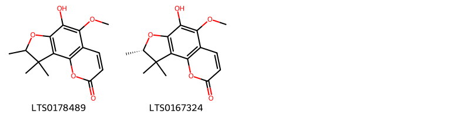

!!! abstract "Tóm tắt"

    Họ Ptaeroxylaceae gồm khoảng 1 chi và 1 loài được một số cộng đồng tại các quốc gia như South Africa sử dụng trong một số trường hợp (thuộc) xương ức.

!!! info "DrDuke"

    James A. Duke sinh năm 1929-2017 là một nhà thực vật học người Mỹ. Đây là một trong những tác giả hàng đầu trong lĩnh vực dược dân tộc học với cuốn *CRC Handbook of Medicinal Herbs* và chính là người xây dựng lên cơ sở dữ liệu về hợp chất tự nhiên và dược dân tộc học tại Bộ nông nghiệp Hoa Kỳ. Các thông tin được đăng tải tại website [Dr. Duke's Phytochemical and Ethnobotanical Databases](https://phytochem.nal.usda.gov/). 
    Trong suốt thập niên 1970, ông lãnh đạo the Plant Taxonomy Laboratory, Plant Genetics and Germplasm Institute of the Agricultural Research Service, U.S. Department of Agriculture.
    Trong tài liệu này, các thông tin về dược dân tộc của các dược liệu được trích dẫn từ tài liệu của James A. Ducke với sự trợ giúp của phần mềm dịch thuật từ tiếng Anh sang tiếng Việt.
   

# Chi Ptaeroxylon

??? note "Danh sách các dược liệu thuộc chi"
    
	 - *Ptaeroxylon obliquum*

---
## Ptaeroxylon obliquum
### Thông tin về thực vật

!!! info "Phân loại thực vật của *Ptaeroxylon obliquum* từ GIBF:"
    - **Kingdom:** Plantae
    - **Phylum:** Tracheophyta
    - **Order:** Sapindales
    - **Family:** Rutaceae
    - **Genus:** Ptaeroxylon
    - **Species:** *Ptaeroxylon obliquum*

 

| Label (VI)   | Label (EN)   | Scientific Name      | Descriptions (VI)   | Descriptions (EN)             | Also Known As (VI)   | Also Known As (EN)   |
|:-------------|:-------------|:---------------------|:--------------------|:------------------------------|:---------------------|:---------------------|
| N/A          | N/A          | Ptaeroxylon obliquum | loài thực vật       | species of plant, Sneeze-wood | ['']                 | ['']                 |

#### Phân bố trên thế giới

**Từ CSDL GIBF** Eswatini, Mozambique, South Africa

#### Phân bố tại Việt Nam

**Từ CSDL GIBF**: Không có ghi nhận ở Việt Nam

---
### Thành phần hóa học
        
- Theo cơ sở dữ liệu lotus: Từ loài *Ptaeroxylon obliquum* đã phân lập và xác định được 2 hoạt chất thuộc về các nhóm Coumarins and derivatives. 

|    | chemicalTaxonomyClassyfireClass   |   smiles_count |
|---:|:----------------------------------|---------------:|
|  0 | Coumarins and derivatives         |              2 |

#### Nhóm Coumarins and derivatives
<figure markdown="span">
    { width=100% }
    <figcaption>Hình ảnh cấu trúc hóa học của 2 hoạt chất thuộc nhóm Coumarins and derivatives gồm ['6-hydroxy-5-methoxy-8,9,9-trimethyl-8h-furo[2,3-h]chromen-2-one (LTS0178489)', '(8s)-6-hydroxy-5-methoxy-8,9,9-trimethyl-8h-furo[2,3-h]chromen-2-one (LTS0167324)'].</figcaption>
</figure>

---

### Dược dân tộc học

Danh sách các quốc gia có sử dụng *Ptaeroxylon obliquum* trong điều trị các bệnh. 

| Country      | Disease      | Bệnh             |
|:-------------|:-------------|:-----------------|
| South Africa | Sternutatory | (thuộc) xương ức |

---

