!!! abstract "Tóm tắt"

    Họ Pteridaceae gồm khoảng 9 chi và 17 loài được một số cộng đồng tại các quốc gia như Iraq, Egypt, India, Elsewhere, US, Venezuela, Mexico, Malaya, Paraguay, China sử dụng trong một số trường hợp QUERY LENGTH LIMIT EXCEEDED. MAX ALLOWED QUERY : 500 CHARS.

!!! info "DrDuke"

    James A. Duke sinh năm 1929-2017 là một nhà thực vật học người Mỹ. Đây là một trong những tác giả hàng đầu trong lĩnh vực dược dân tộc học với cuốn *CRC Handbook of Medicinal Herbs* và chính là người xây dựng lên cơ sở dữ liệu về hợp chất tự nhiên và dược dân tộc học tại Bộ nông nghiệp Hoa Kỳ. Các thông tin được đăng tải tại website [Dr. Duke's Phytochemical and Ethnobotanical Databases](https://phytochem.nal.usda.gov/). 
    Trong suốt thập niên 1970, ông lãnh đạo the Plant Taxonomy Laboratory, Plant Genetics and Germplasm Institute of the Agricultural Research Service, U.S. Department of Agriculture.
    Trong tài liệu này, các thông tin về dược dân tộc của các dược liệu được trích dẫn từ tài liệu của James A. Ducke với sự trợ giúp của phần mềm dịch thuật từ tiếng Anh sang tiếng Việt.
   

# Chi Pityrogramma

??? note "Danh sách các dược liệu thuộc chi"
    
	 - *Pityrogramma calomelanos*

---
## Pityrogramma calomelanos
### Thông tin về thực vật

!!! info "Phân loại thực vật của *Pityrogramma calomelanos* từ GIBF:"
    - **Kingdom:** Plantae
    - **Phylum:** Tracheophyta
    - **Order:** Polypodiales
    - **Family:** Pteridaceae
    - **Genus:** Pityrogramma
    - **Species:** *Pityrogramma calomelanos*

 

| Label (VI)   | Label (EN)   | Scientific Name          | Descriptions (VI)   | Descriptions (EN)   | Also Known As (VI)   | Also Known As (EN)   |
|:-------------|:-------------|:-------------------------|:--------------------|:--------------------|:---------------------|:---------------------|
| N/A          | N/A          | Pityrogramma calomelanos | loài thực vật       | species of plant    | ['']                 | ['']                 |

#### Phân bố trên thế giới

**Từ CSDL GIBF** Virgin Islands (U.S.), Sri Lanka, Ghana, Australia, Guadeloupe, Gabon, Cambodia, French Guiana, Panama, Puerto Rico, Réunion, Chinese Taipei, Bolivia (Plurinational State of), Honduras, Jamaica, United States of America, Timor-Leste, El Salvador, Belize, Hong Kong, Suriname, Sao Tome and Principe, Thailand, Martinique, Brazil, Mexico, Dominican Republic, Dominica, Singapore, Viet Nam, Ecuador, Saint Kitts and Nevis, Colombia, Montserrat, Costa Rica, Vanuatu, India, Indonesia, Philippines, Malaysia

#### Phân bố tại Việt Nam

**Từ CSDL GIBF**: Bình Định, Đắk Lắk, Gia Lai, Đăk Nông

---
### Thành phần hóa học
        
- Theo cơ sở dữ liệu lotus: Từ loài *Pityrogramma calomelanos* đã phân lập và xác định được 39 hoạt chất thuộc về các nhóm Flavonoids, Linear 1,3-diarylpropanoids, Diarylheptanoids, Indanes, Benzopyrans. 

|    | chemicalTaxonomyClassyfireClass   |   smiles_count |
|---:|:----------------------------------|---------------:|
|  0 | Benzopyrans                       |              1 |
|  1 | Diarylheptanoids                  |             14 |
|  2 | Flavonoids                        |             19 |
|  3 | Indanes                           |              1 |
|  4 | Linear 1,3-diarylpropanoids       |              4 |

#### Nhóm Benzopyrans
<figure markdown="span">
    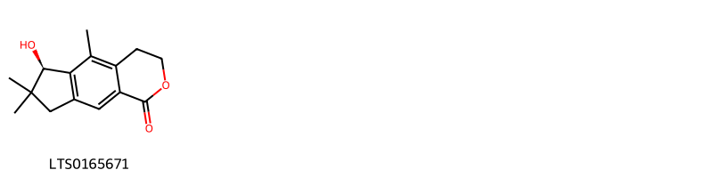{ width=100% }
    <figcaption>Hình ảnh cấu trúc hóa học của 1 hoạt chất thuộc nhóm Benzopyrans gồm ['(6r)-6-hydroxy-5,7,7-trimethyl-3h,4h,6h,8h-indeno[5,6-c]pyran-1-one (LTS0165671)'].</figcaption>
</figure>
#### Nhóm Diarylheptanoids
<figure markdown="span">
    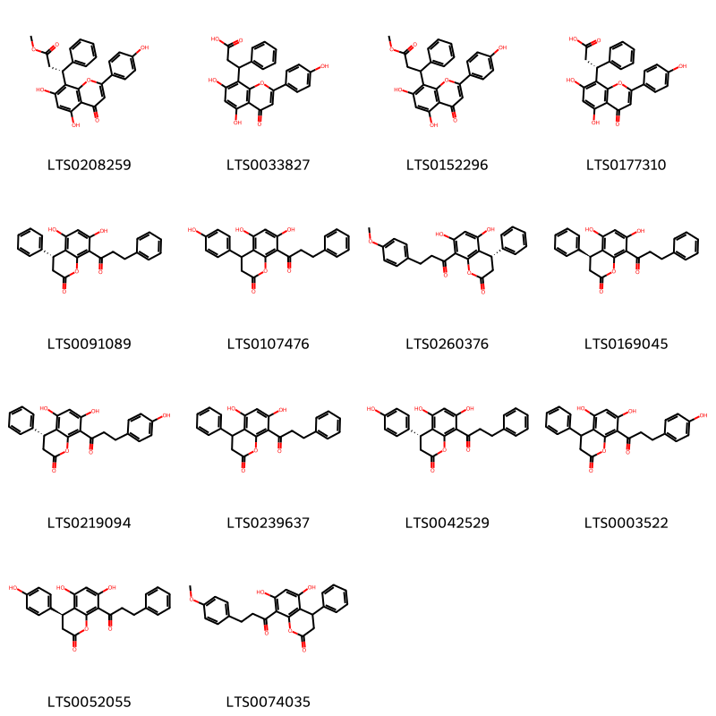{ width=100% }
    <figcaption>Hình ảnh cấu trúc hóa học của 14 hoạt chất thuộc nhóm Diarylheptanoids gồm ['methyl (3r)-3-[5,7-dihydroxy-2-(4-hydroxyphenyl)-4-oxochromen-8-yl]-3-phenylpropanoate (LTS0208259)', '3-[5,7-dihydroxy-2-(4-hydroxyphenyl)-4-oxochromen-8-yl]-3-phenylpropanoic acid (LTS0033827)', 'methyl 3-[5,7-dihydroxy-2-(4-hydroxyphenyl)-4-oxochromen-8-yl]-3-phenylpropanoate (LTS0152296)', '(3r)-3-[5,7-dihydroxy-2-(4-hydroxyphenyl)-4-oxochromen-8-yl]-3-phenylpropanoic acid (LTS0177310)', '(4r)-5,7-dihydroxy-4-phenyl-8-(3-phenylpropanoyl)-3,4-dihydro-1-benzopyran-2-one (LTS0091089)', 'calomelanol c (LTS0107476)', '(4s)-5,7-dihydroxy-8-[3-(4-methoxyphenyl)propanoyl]-4-phenyl-3,4-dihydro-1-benzopyran-2-one (LTS0260376)', '(4s)-5,7-dihydroxy-4-phenyl-8-(3-phenylpropanoyl)-3,4-dihydro-1-benzopyran-2-one (LTS0169045)', '(4r)-5,7-dihydroxy-8-[3-(4-hydroxyphenyl)propanoyl]-4-phenyl-3,4-dihydro-1-benzopyran-2-one (LTS0219094)', 'calomelanol d-1 (LTS0239637)', '(4r)-5,7-dihydroxy-4-(4-hydroxyphenyl)-8-(3-phenylpropanoyl)-3,4-dihydro-1-benzopyran-2-one (LTS0042529)', 'calomelanol b (LTS0003522)', '(4s)-5,7-dihydroxy-4-(4-hydroxyphenyl)-8-(3-phenylpropanoyl)-3,4-dihydro-1-benzopyran-2-one (LTS0052055)', 'calomelanol a (LTS0074035)'].</figcaption>
</figure>
#### Nhóm Flavonoids
<figure markdown="span">
    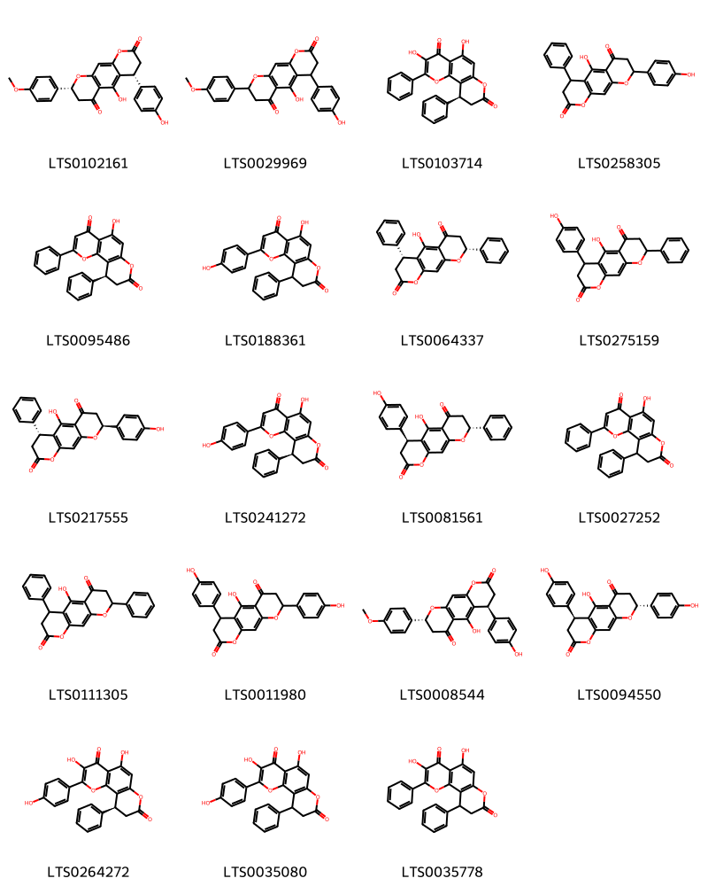{ width=100% }
    <figcaption>Hình ảnh cấu trúc hóa học của 19 hoạt chất thuộc nhóm Flavonoids gồm ['(7r,13r)-9-hydroxy-7-(4-hydroxyphenyl)-13-(4-methoxyphenyl)-4,14-dioxatricyclo[8.4.0.0³,⁸]tetradeca-1(10),2,8-triene-5,11-dione (LTS0102161)', 'calomelanol g (LTS0029969)', '(10s)-3,5-dihydroxy-2,10-diphenyl-9h,10h-pyrano[2,3-h]chromene-4,8-dione (LTS0103714)', 'calomelanol h (LTS0258305)', '(10s)-5-hydroxy-2,10-diphenyl-9h,10h-pyrano[2,3-h]chromene-4,8-dione (LTS0095486)', '5-hydroxy-2-(4-hydroxyphenyl)-10-phenyl-9h,10h-pyrano[2,3-h]chromene-4,8-dione (LTS0188361)', '(7r,13r)-9-hydroxy-7,13-diphenyl-4,14-dioxatricyclo[8.4.0.0³,⁸]tetradeca-1,3(8),9-triene-5,11-dione (LTS0064337)', '9-hydroxy-7-(4-hydroxyphenyl)-13-phenyl-4,14-dioxatricyclo[8.4.0.0³,⁸]tetradeca-1,3(8),9-triene-5,11-dione (LTS0275159)', '(7r,13s)-9-hydroxy-13-(4-hydroxyphenyl)-7-phenyl-4,14-dioxatricyclo[8.4.0.0³,⁸]tetradeca-1,3(8),9-triene-5,11-dione (LTS0217555)', '(10s)-5-hydroxy-2-(4-hydroxyphenyl)-10-phenyl-9h,10h-pyrano[2,3-h]chromene-4,8-dione (LTS0241272)', '(7s,13r)-9-hydroxy-7-(4-hydroxyphenyl)-13-phenyl-4,14-dioxatricyclo[8.4.0.0³,⁸]tetradeca-1,3(8),9-triene-5,11-dione (LTS0081561)', '5-hydroxy-2,10-diphenyl-9h,10h-pyrano[2,3-h]chromene-4,8-dione (LTS0027252)', '9-hydroxy-7,13-diphenyl-4,14-dioxatricyclo[8.4.0.0³,⁸]tetradeca-1,3(8),9-triene-5,11-dione (LTS0111305)', '9-hydroxy-7,13-bis(4-hydroxyphenyl)-4,14-dioxatricyclo[8.4.0.0³,⁸]tetradeca-1,3(8),9-triene-5,11-dione (LTS0011980)', '(7s,13r)-9-hydroxy-7-(4-hydroxyphenyl)-13-(4-methoxyphenyl)-4,14-dioxatricyclo[8.4.0.0³,⁸]tetradeca-1(10),2,8-triene-5,11-dione (LTS0008544)', '(7s,13r)-9-hydroxy-7,13-bis(4-hydroxyphenyl)-4,14-dioxatricyclo[8.4.0.0³,⁸]tetradeca-1,3(8),9-triene-5,11-dione (LTS0094550)', '(10s)-3,5-dihydroxy-2-(4-hydroxyphenyl)-10-phenyl-9h,10h-pyrano[2,3-h]chromene-4,8-dione (LTS0264272)', 'calomelanol d (LTS0035080)', '3,5-dihydroxy-2,10-diphenyl-9h,10h-pyrano[2,3-h]chromene-4,8-dione (LTS0035778)'].</figcaption>
</figure>
#### Nhóm Indanes
<figure markdown="span">
    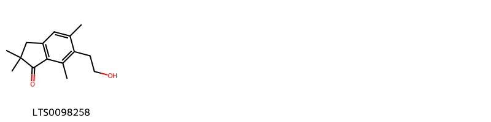{ width=100% }
    <figcaption>Hình ảnh cấu trúc hóa học của 1 hoạt chất thuộc nhóm Indanes gồm ['6-(2-hydroxyethyl)-2,2,5,7-tetramethyl-3h-inden-1-one (LTS0098258)'].</figcaption>
</figure>
#### Nhóm Linear 1_3-diarylpropanoids
<figure markdown="span">
    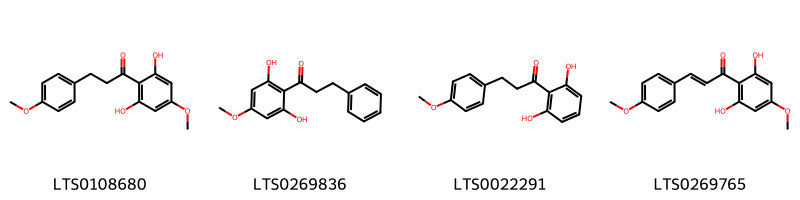{ width=100% }
    <figcaption>Hình ảnh cấu trúc hóa học của Không tìm thấy chú thích hoạt chất thuộc nhóm Linear 1_3-diarylpropanoids gồm Không tìm thấy chú thích.</figcaption>
</figure>

---

### Dược dân tộc học

Danh sách các quốc gia có sử dụng *Pityrogramma calomelanos* trong điều trị các bệnh. 

| Country   | Disease    | Bệnh      |
|:----------|:-----------|:----------|
| Elsewhere | Hemostatic | Sự ầm máu |

---

# Chi Adiantum

??? note "Danh sách các dược liệu thuộc chi"
    
	 - *Adiantum capillus-veneris*
	 - *Adiantum caudatum*
	 - *Adiantum concinnum*
	 - *Adiantum monochlamys*
	 - *Adiantum pedatum*
	 - *Adiantum tenerum*
	 - *Adiantum venustum*

---
## Adiantum capillusveneris
### Thông tin về thực vật

!!! info "Phân loại thực vật của *Adiantum capillus-veneris* từ GIBF:"
    - **Kingdom:** Plantae
    - **Phylum:** Tracheophyta
    - **Order:** Polypodiales
    - **Family:** Pteridaceae
    - **Genus:** Adiantum
    - **Species:** *Adiantum capillus-veneris*

 

| Label (VI)   | Label (EN)   | Scientific Name          | Descriptions (VI)   | Descriptions (EN)   | Also Known As (VI)   | Also Known As (EN)   |
|:-------------|:-------------|:-------------------------|:--------------------|:--------------------|:---------------------|:---------------------|
| N/A          | N/A          | Pityrogramma calomelanos | loài thực vật       | species of plant    | ['']                 | ['']                 |

#### Phân bố trên thế giới

**Từ CSDL GIBF** nan, Italy, Australia, Japan, Georgia, Argentina, Jordan, Yemen, Israel, Puerto Rico, Cyprus, Chad, Chinese Taipei, Spain, Malta, Portugal, Albania, Russian Federation, Morocco, United States of America, Algeria, Croatia, Greece, South Africa, Hong Kong, Thailand, Switzerland, Mexico, France, China, United Kingdom of Great Britain and Northern Ireland, Cabo Verde, Colombia, Macao, India, New Zealand

#### Phân bố tại Việt Nam

**Từ CSDL GIBF**: Không có ghi nhận ở Việt Nam

---
### Thành phần hóa học
        
- Theo cơ sở dữ liệu lotus: Từ loài *Adiantum capillus-veneris* đã phân lập và xác định được Chưa có hoạt chất nào được phân lập. hoạt chất thuộc về các nhóm Không có hoạt chất nào được phân lập. 

Không có hình ảnh nào được tạo ra

---

### Dược dân tộc học

Danh sách các quốc gia có sử dụng *Adiantum capillus-veneris* trong điều trị các bệnh. 

| Country   | Disease                                                                                           | Bệnh                                                                                                   |
|:----------|:--------------------------------------------------------------------------------------------------|:-------------------------------------------------------------------------------------------------------|
| Egypt     | Diaphoretic, Diuretic                                                                             | Thuốc lợi tiểu, lợi tiểu                                                                               |
| India     | Demulcent, Expectorant, Tonic                                                                     | Demulcent, long đờm, thuốc bổ                                                                          |
| Iraq      | Astringent, Diuretic, Emmenagogue, Emollient, Expectorant, Stimulant, Sudorific, Tonic            | Chất làm se, lợi tiểu, chất gây nôn, chất làm mềm, chất đờm, chất kích thích, gây ngạt, thuốc bổ       |
| Mexico    | Laxative                                                                                          | Nhuận trường                                                                                           |
| US        | Astringent, Demulcent, Diuretic, Emmenagogue, Emollient, Expectorant, Sudorific, Tonic, Stimulant | Chất làm se, Demulcent, lợi tiểu, chất làm mềm, chất làm mềm, đờm, gây ngạt, thuốc bổ, chất kích thích |

---

---
## Adiantum caudatum
### Thông tin về thực vật

!!! info "Phân loại thực vật của *Adiantum caudatum* từ GIBF:"
    - **Kingdom:** Plantae
    - **Phylum:** Tracheophyta
    - **Order:** Polypodiales
    - **Family:** Pteridaceae
    - **Genus:** Adiantum
    - **Species:** *Adiantum caudatum*

 

| Label (VI)   | Label (EN)   | Scientific Name   | Descriptions (VI)   | Descriptions (EN)   | Also Known As (VI)   | Also Known As (EN)   |
|:-------------|:-------------|:------------------|:--------------------|:--------------------|:---------------------|:---------------------|
| N/A          | N/A          | Adiantum caudatum | loài thực vật       | species of plant    | ['']                 | ['']                 |

#### Phân bố trên thế giới

**Từ CSDL GIBF** Pakistan, Malaysia, Hong Kong, Thailand, Chinese Taipei, Macao, India, Indonesia, Timor-Leste, Viet Nam, China

#### Phân bố tại Việt Nam

**Từ CSDL GIBF**: Hải Phòng, Quảng Ninh, Ninh Bình

---
### Thành phần hóa học
        
- Theo cơ sở dữ liệu lotus: Từ loài *Adiantum caudatum* đã phân lập và xác định được 35 hoạt chất thuộc về các nhóm Naphthopyrans, Prenol lipids, Steroids and steroid derivatives. 

|    | chemicalTaxonomyClassyfireClass   |   smiles_count |
|---:|:----------------------------------|---------------:|
|  0 | Naphthopyrans                     |              1 |
|  1 | Prenol lipids                     |             27 |
|  2 | Steroids and steroid derivatives  |              6 |

#### Nhóm Naphthopyrans
<figure markdown="span">
    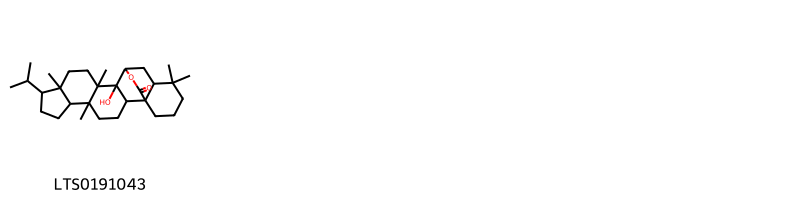{ width=100% }
    <figcaption>Hình ảnh cấu trúc hóa học của 1 hoạt chất thuộc nhóm Naphthopyrans gồm ['14-hydroxy-9-isopropyl-5,10,13,18,18-pentamethyl-23-oxahexacyclo[13.6.2.0¹,¹⁷.0²,¹⁴.0⁵,¹³.0⁶,¹⁰]tricosan-22-one (LTS0191043)'].</figcaption>
</figure>
#### Nhóm Prenol lipids
<figure markdown="span">
    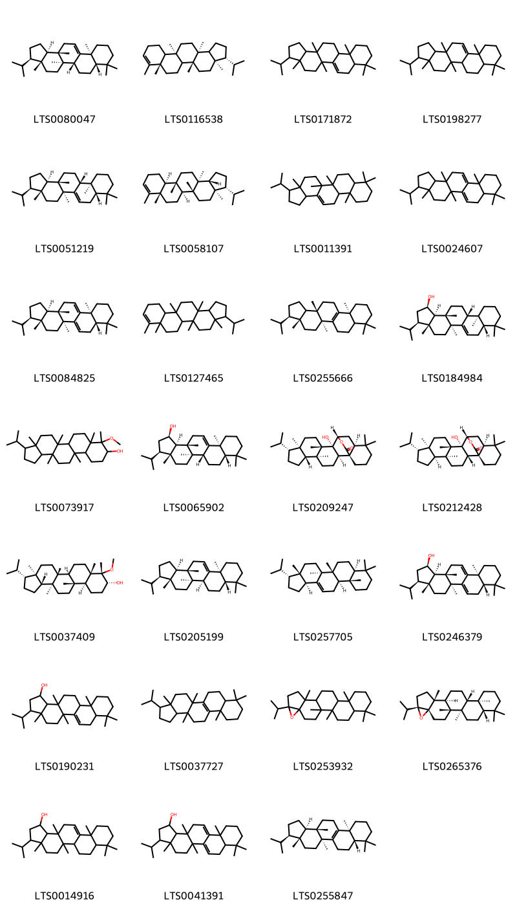{ width=100% }
    <figcaption>Hình ảnh cấu trúc hóa học của 27 hoạt chất thuộc nhóm Prenol lipids gồm ['fernene (LTS0080047)', '(3r,3ar,5ar,7as,11br,13as)-3-isopropyl-3a,5a,7a,8,11b,13a-hexamethyl-1h,2h,3h,4h,5h,5bh,6h,7h,10h,11h,11ah,12h,13h,13bh-cyclopenta[a]chrysene (LTS0116538)', '3-isopropyl-3a,5a,8,8,11a,13a-hexamethyl-1h,2h,3h,4h,5h,7h,7ah,9h,10h,11h,11bh,12h,13h,13bh-cyclopenta[a]chrysene (LTS0171872)', '3-isopropyl-3a,5a,8,8,11a,13a-hexamethyl-1h,2h,3h,4h,5h,5bh,6h,7h,7ah,9h,10h,11h,13h,13bh-cyclopenta[a]chrysene (LTS0198277)', '(3r,3ar,5as,7as,11as,11br,13as,13br)-3-isopropyl-3a,5a,8,8,11a,13a-hexamethyl-1h,2h,3h,4h,5h,7h,7ah,9h,10h,11h,11bh,12h,13h,13bh-cyclopenta[a]chrysene (LTS0051219)', '(3r,3ar,5ar,5bs,7as,11as,11bs,13as,13br)-3-isopropyl-3a,5a,7a,8,11b,13a-hexamethyl-1h,2h,3h,4h,5h,5bh,6h,7h,10h,11h,11ah,12h,13h,13bh-cyclopenta[a]chrysene (LTS0058107)', '3-isopropyl-3a,5a,5b,8,8,11a-hexamethyl-1h,2h,3h,4h,5h,6h,7h,7ah,9h,10h,11h,11bh,12h,13bh-cyclopenta[a]chrysene (LTS0011391)', '3-isopropyl-3a,5a,8,8,11a,13a-hexamethyl-1h,2h,3h,4h,5h,7h,7ah,9h,10h,11h,13h,13bh-cyclopenta[a]chrysene (LTS0024607)', '(3r,3ar,5as,7as,11as,13as,13br)-3-isopropyl-3a,5a,8,8,11a,13a-hexamethyl-1h,2h,3h,4h,5h,7h,7ah,9h,10h,11h,13h,13bh-cyclopenta[a]chrysene (LTS0084825)', '3-isopropyl-3a,5a,7a,8,11b,13a-hexamethyl-1h,2h,3h,4h,5h,5bh,6h,7h,10h,11h,11ah,12h,13h,13bh-cyclopenta[a]chrysene (LTS0127465)', '(3r,3ar,5as,11as,13as)-3-isopropyl-3a,5a,8,8,11a,13a-hexamethyl-1h,2h,3h,4h,5h,6h,7h,7ah,9h,10h,11h,12h,13h,13bh-cyclopenta[a]chrysene (LTS0255666)', '(1r,3r,3ar,5as,7as,11as,11br,13as,13br)-3-isopropyl-3a,5a,8,8,11a,13a-hexamethyl-1h,2h,3h,4h,5h,7h,7ah,9h,10h,11h,11bh,12h,13h,13bh-cyclopenta[a]chrysen-1-ol (LTS0184984)', '3-isopropyl-8-methoxy-3a,5a,7a,8,11b,13a-hexamethyl-tetradecahydro-1h-cyclopenta[a]chrysen-9-ol (LTS0073917)', '(1r,3r,3ar,5ar,5br,7as,11as,13as,13br)-3-isopropyl-3a,5a,8,8,11a,13a-hexamethyl-1h,2h,3h,4h,5h,5bh,6h,7h,7ah,9h,10h,11h,13h,13bh-cyclopenta[a]chrysen-1-ol (LTS0065902)', '(1r,2r,5s,6r,9r,10r,13s,14r,15s,17s)-14-hydroxy-9-isopropyl-5,10,13,18,18-pentamethyl-23-oxahexacyclo[13.6.2.0¹,¹⁷.0²,¹⁴.0⁵,¹³.0⁶,¹⁰]tricosan-22-one (LTS0209247)', '(1r,2s,5s,6s,9r,10r,13s,14r,15s,17s)-14-hydroxy-9-isopropyl-5,10,13,18,18-pentamethyl-23-oxahexacyclo[13.6.2.0¹,¹⁷.0²,¹⁴.0⁵,¹³.0⁶,¹⁰]tricosan-22-one (LTS0212428)', '(3r,3ar,5ar,5bs,7as,8s,9r,11as,11br,13as,13br)-3-isopropyl-8-methoxy-3a,5a,7a,8,11b,13a-hexamethyl-tetradecahydro-1h-cyclopenta[a]chrysen-9-ol (LTS0037409)', '(3r,3ar,5ar,5bs,7as,11as,13as,13br)-3-isopropyl-3a,5a,8,8,11a,13a-hexamethyl-1h,2h,3h,4h,5h,5bh,6h,7h,7ah,9h,10h,11h,13h,13bh-cyclopenta[a]chrysene (LTS0205199)', '(3r,3as,5as,5br,7as,11as,11br,13bs)-3-isopropyl-3a,5a,5b,8,8,11a-hexamethyl-1h,2h,3h,4h,5h,6h,7h,7ah,9h,10h,11h,11bh,12h,13bh-cyclopenta[a]chrysene (LTS0257705)', '(1r,3r,3ar,5as,7as,11as,13as,13br)-3-isopropyl-3a,5a,8,8,11a,13a-hexamethyl-1h,2h,3h,4h,5h,7h,7ah,9h,10h,11h,13h,13bh-cyclopenta[a]chrysen-1-ol (LTS0246379)', '3-isopropyl-3a,5a,8,8,11a,13a-hexamethyl-1h,2h,3h,4h,5h,7h,7ah,9h,10h,11h,11bh,12h,13h,13bh-cyclopenta[a]chrysen-1-ol (LTS0190231)', '3-isopropyl-3a,5a,8,8,11a,13a-hexamethyl-1h,2h,3h,4h,5h,6h,7h,7ah,9h,10h,11h,12h,13h,13bh-cyclopenta[a]chrysene (LTS0037727)', '7-isopropyl-1,2,10,15,19,19-hexamethyl-6-oxahexacyclo[12.8.0.0²,¹¹.0⁵,⁷.0⁵,¹⁰.0¹⁵,²⁰]docosane (LTS0253932)', '(1r,2r,5s,7s,10r,11s,14r,15s,20s)-7-isopropyl-1,2,10,15,19,19-hexamethyl-6-oxahexacyclo[12.8.0.0²,¹¹.0⁵,⁷.0⁵,¹⁰.0¹⁵,²⁰]docosane (LTS0265376)', '3-isopropyl-3a,5a,8,8,11a,13a-hexamethyl-1h,2h,3h,4h,5h,5bh,6h,7h,7ah,9h,10h,11h,13h,13bh-cyclopenta[a]chrysen-1-ol (LTS0014916)', '3-isopropyl-3a,5a,8,8,11a,13a-hexamethyl-1h,2h,3h,4h,5h,7h,7ah,9h,10h,11h,13h,13bh-cyclopenta[a]chrysen-1-ol (LTS0041391)', '(3r,3ar,5as,7as,11as,13as,13br)-3-isopropyl-3a,5a,8,8,11a,13a-hexamethyl-1h,2h,3h,4h,5h,6h,7h,7ah,9h,10h,11h,12h,13h,13bh-cyclopenta[a]chrysene (LTS0255847)'].</figcaption>
</figure>
#### Nhóm Steroids and steroid derivatives
<figure markdown="span">
    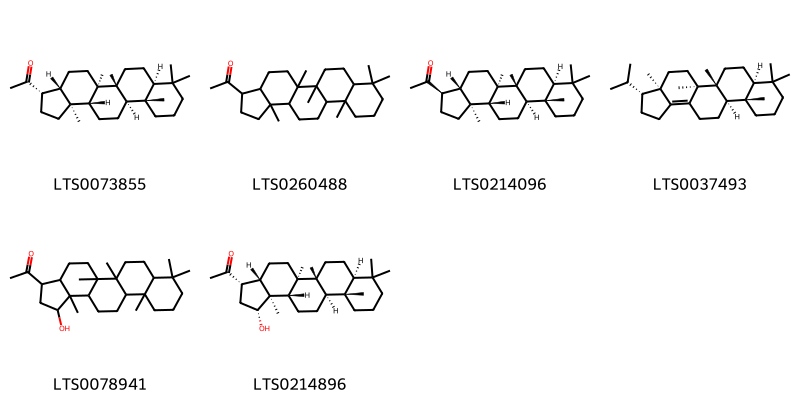{ width=100% }
    <figcaption>Hình ảnh cấu trúc hóa học của 6 hoạt chất thuộc nhóm Steroids and steroid derivatives gồm ['1-[(3s,3as,5ar,5br,7as,11as,11br,13ar,13bs)-5a,5b,8,8,11a,13b-hexamethyl-hexadecahydrocyclopenta[a]chrysen-3-yl]ethanone (LTS0073855)', '1-{5a,5b,8,8,11a,13b-hexamethyl-hexadecahydrocyclopenta[a]chrysen-3-yl}ethanone (LTS0260488)', '1-[(3r,3as,5ar,5br,7as,11as,11br,13ar,13bs)-5a,5b,8,8,11a,13b-hexamethyl-hexadecahydrocyclopenta[a]chrysen-3-yl]ethanone (LTS0214096)', '(3r,3ar,5as,5br,7as,11as,11br)-3-isopropyl-3a,5a,5b,8,8,11a-hexamethyl-1h,2h,3h,4h,5h,6h,7h,7ah,9h,10h,11h,11bh,12h,13h-cyclopenta[a]chrysene (LTS0037493)', '1-{1-hydroxy-5a,5b,8,8,11a,13b-hexamethyl-hexadecahydrocyclopenta[a]chrysen-3-yl}ethanone (LTS0078941)', '1-[(1r,3s,3as,5ar,5br,7as,11as,11br,13as,13bs)-1-hydroxy-5a,5b,8,8,11a,13b-hexamethyl-hexadecahydrocyclopenta[a]chrysen-3-yl]ethanone (LTS0214896)'].</figcaption>
</figure>

---

### Dược dân tộc học

Danh sách các quốc gia có sử dụng *Adiantum caudatum* trong điều trị các bệnh. 

| Country   | Disease                       | Bệnh                          |
|:----------|:------------------------------|:------------------------------|
| India     | Demulcent, Expectorant, Tonic | Demulcent, long đờm, thuốc bổ |

---

---
## Adiantum concinnum
### Thông tin về thực vật

!!! info "Phân loại thực vật của *Adiantum concinnum* từ GIBF:"
    - **Kingdom:** Plantae
    - **Phylum:** Tracheophyta
    - **Order:** Polypodiales
    - **Family:** Pteridaceae
    - **Genus:** Adiantum
    - **Species:** *Adiantum concinnum*

 

| Label (VI)   | Label (EN)   | Scientific Name    | Descriptions (VI)   | Descriptions (EN)   | Also Known As (VI)   | Also Known As (EN)   |
|:-------------|:-------------|:-------------------|:--------------------|:--------------------|:---------------------|:---------------------|
| N/A          | N/A          | Adiantum concinnum | loài thực vật       | species of plant    | ['']                 | ['']                 |

#### Phân bố trên thế giới

**Từ CSDL GIBF** nan, Belize, Ecuador, Nicaragua, Colombia, Guatemala, Argentina, Costa Rica, Honduras, India, Indonesia, Jamaica, United States of America, Mexico, El Salvador, Venezuela (Bolivarian Republic of), Panama

#### Phân bố tại Việt Nam

**Từ CSDL GIBF**: Không có ghi nhận ở Việt Nam

---
### Thành phần hóa học
        
- Theo cơ sở dữ liệu lotus: Từ loài *Adiantum concinnum* đã phân lập và xác định được Chưa có hoạt chất nào được phân lập. hoạt chất thuộc về các nhóm Không có hoạt chất nào được phân lập. 

Không có hình ảnh nào được tạo ra

---

### Dược dân tộc học

Danh sách các quốc gia có sử dụng *Adiantum concinnum* trong điều trị các bệnh. 

| Country   | Disease     | Bệnh        |
|:----------|:------------|:------------|
| Venezuela | Emmenagogue | Emmenagogue |

---

---
## Adiantum monochlamys
### Thông tin về thực vật

!!! info "Phân loại thực vật của *Adiantum monochlamys* từ GIBF:"
    - **Kingdom:** Plantae
    - **Phylum:** Tracheophyta
    - **Order:** Polypodiales
    - **Family:** Pteridaceae
    - **Genus:** Adiantum
    - **Species:** *Adiantum monochlamys*

 

| Label (VI)   | Label (EN)   | Scientific Name      | Descriptions (VI)   | Descriptions (EN)   | Also Known As (VI)   | Also Known As (EN)   |
|:-------------|:-------------|:---------------------|:--------------------|:--------------------|:---------------------|:---------------------|
| N/A          | N/A          | Adiantum monochlamys | loài thực vật       | species of plant    | ['']                 | ['']                 |

#### Phân bố trên thế giới

**Từ CSDL GIBF** nan, Japan, Korea, Republic of, Chinese Taipei, unknown or invalid

#### Phân bố tại Việt Nam

**Từ CSDL GIBF**: Không có ghi nhận ở Việt Nam

---
### Thành phần hóa học
        
- Theo cơ sở dữ liệu lotus: Từ loài *Adiantum monochlamys* đã phân lập và xác định được 12 hoạt chất thuộc về các nhóm Prenol lipids, Steroids and steroid derivatives, Organooxygen compounds. 

|    | chemicalTaxonomyClassyfireClass   |   smiles_count |
|---:|:----------------------------------|---------------:|
|  0 | Organooxygen compounds            |              5 |
|  1 | Prenol lipids                     |              4 |
|  2 | Steroids and steroid derivatives  |              3 |

#### Nhóm Organooxygen compounds
<figure markdown="span">
    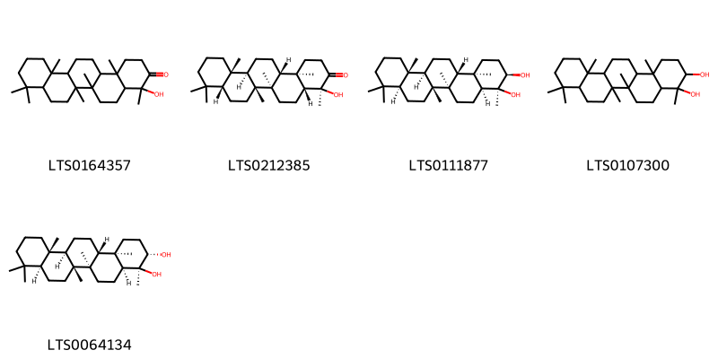{ width=100% }
    <figcaption>Hình ảnh cấu trúc hóa học của 5 hoạt chất thuộc nhóm Organooxygen compounds gồm ['4-hydroxy-4,6a,6b,9,9,12a,14b-heptamethyl-tetradecahydro-1h-picen-3-one (LTS0164357)', '(4s,4ar,6ar,6br,8ar,12as,12br,14ar,14br)-4-hydroxy-4,6a,6b,9,9,12a,14b-heptamethyl-tetradecahydro-1h-picen-3-one (LTS0212385)', '(3r,4s,4as,6ar,6br,8as,12as,12br,14ar,14br)-4,6a,6b,9,9,12a,14b-heptamethyl-hexadecahydropicene-3,4-diol (LTS0111877)', '4,6a,6b,9,9,12a,14b-heptamethyl-hexadecahydropicene-3,4-diol (LTS0107300)', '(3s,4s,4as,6ar,6br,8as,12as,12br,14ar,14br)-4,6a,6b,9,9,12a,14b-heptamethyl-hexadecahydropicene-3,4-diol (LTS0064134)'].</figcaption>
</figure>
#### Nhóm Prenol lipids
<figure markdown="span">
    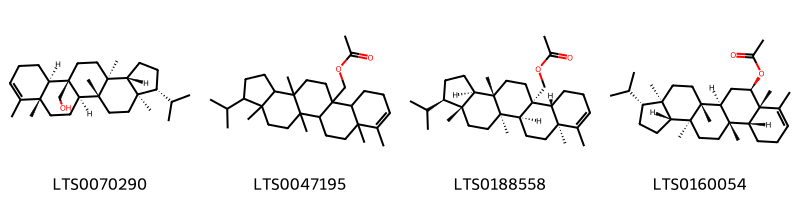{ width=100% }
    <figcaption>Hình ảnh cấu trúc hóa học của 4 hoạt chất thuộc nhóm Prenol lipids gồm ['[(3r,3ar,5ar,5br,7as,11ar,11br,13as,13br)-3-isopropyl-3a,5a,7a,8,13a-pentamethyl-1h,2h,3h,4h,5h,5bh,6h,7h,10h,11h,11ah,12h,13h,13bh-cyclopenta[a]chrysen-11b-yl]methanol (LTS0070290)', '{3-isopropyl-3a,5a,7a,8,13a-pentamethyl-1h,2h,3h,4h,5h,5bh,6h,7h,10h,11h,11ah,12h,13h,13bh-cyclopenta[a]chrysen-11b-yl}methyl acetate (LTS0047195)', '[(3r,3ar,5ar,5bs,7as,11ar,11br,13as,13br)-3-isopropyl-3a,5a,7a,8,13a-pentamethyl-1h,2h,3h,4h,5h,5bh,6h,7h,10h,11h,11ah,12h,13h,13bh-cyclopenta[a]chrysen-11b-yl]methyl acetate (LTS0188558)', '(3r,3ar,5ar,5bs,7r,7as,11ar,11br,13as,13br)-3-isopropyl-3a,5a,7a,8,11b,13a-hexamethyl-1h,2h,3h,4h,5h,5bh,6h,7h,10h,11h,11ah,12h,13h,13bh-cyclopenta[a]chrysen-7-yl acetate (LTS0160054)'].</figcaption>
</figure>
#### Nhóm Steroids and steroid derivatives
<figure markdown="span">
    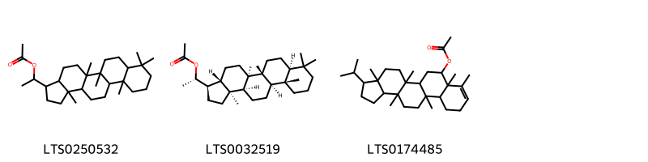{ width=100% }
    <figcaption>Hình ảnh cấu trúc hóa học của 3 hoạt chất thuộc nhóm Steroids and steroid derivatives gồm ['1-{5a,5b,8,8,11a,13b-hexamethyl-hexadecahydrocyclopenta[a]chrysen-3-yl}ethyl acetate (LTS0250532)', '(1s)-1-[(3r,3as,5ar,5br,7as,11as,11br,13as,13bs)-5a,5b,8,8,11a,13b-hexamethyl-hexadecahydrocyclopenta[a]chrysen-3-yl]ethyl acetate (LTS0032519)', '3-isopropyl-3a,5a,7a,8,11b,13a-hexamethyl-1h,2h,3h,4h,5h,5bh,6h,7h,10h,11h,11ah,12h,13h,13bh-cyclopenta[a]chrysen-7-yl acetate (LTS0174485)'].</figcaption>
</figure>

---

### Dược dân tộc học

Danh sách các quốc gia có sử dụng *Adiantum monochlamys* trong điều trị các bệnh. 

| Country   | Disease                           | Bệnh                                              |
|:----------|:----------------------------------|:--------------------------------------------------|
| China     | Parasiticide, Poison, Refrigerant | Thuốc diệt ký sinh trùng, chất độc, chất làm lạnh |

---

---
## Adiantum pedatum
### Thông tin về thực vật

!!! info "Phân loại thực vật của *Adiantum pedatum* từ GIBF:"
    - **Kingdom:** Plantae
    - **Phylum:** Tracheophyta
    - **Order:** Polypodiales
    - **Family:** Pteridaceae
    - **Genus:** Adiantum
    - **Species:** *Adiantum pedatum*

 

| Label (VI)   | Label (EN)   | Scientific Name   | Descriptions (VI)   | Descriptions (EN)   | Also Known As (VI)   | Also Known As (EN)   |
|:-------------|:-------------|:------------------|:--------------------|:--------------------|:---------------------|:---------------------|
| N/A          | N/A          | Adiantum pedatum  | loài thực vật       | species of plant    | ['']                 | ['']                 |

#### Phân bố trên thế giới

**Từ CSDL GIBF** nan, United States of America, Canada

#### Phân bố tại Việt Nam

**Từ CSDL GIBF**: Không có ghi nhận ở Việt Nam

---
### Thành phần hóa học
        
- Theo cơ sở dữ liệu lotus: Từ loài *Adiantum pedatum* đã phân lập và xác định được 42 hoạt chất thuộc về các nhóm Prenol lipids, Steroids and steroid derivatives, Organooxygen compounds, Naphthopyrans. 

|    | chemicalTaxonomyClassyfireClass   |   smiles_count |
|---:|:----------------------------------|---------------:|
|  0 | Naphthopyrans                     |              2 |
|  1 | Organooxygen compounds            |              3 |
|  2 | Prenol lipids                     |             23 |
|  3 | Steroids and steroid derivatives  |             12 |

#### Nhóm Naphthopyrans
<figure markdown="span">
    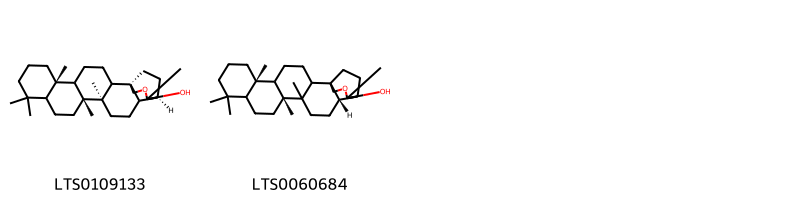{ width=100% }
    <figcaption>Hình ảnh cấu trúc hóa học của 2 hoạt chất thuộc nhóm Naphthopyrans gồm ['(1r,6s,14r,15r,19s)-6,10,10,14,15,20-hexamethyl-21-oxahexacyclo[17.3.2.0¹,¹⁸.0²,¹⁵.0⁵,¹⁴.0⁶,¹¹]tetracosan-20-ol (LTS0109133)', '(6s,14r,18s)-6,10,10,14,15,20-hexamethyl-21-oxahexacyclo[17.3.2.0¹,¹⁸.0²,¹⁵.0⁵,¹⁴.0⁶,¹¹]tetracosan-20-ol (LTS0060684)'].</figcaption>
</figure>
#### Nhóm Organooxygen compounds
<figure markdown="span">
    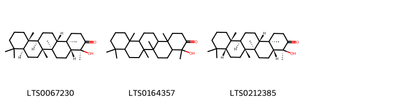{ width=100% }
    <figcaption>Hình ảnh cấu trúc hóa học của 3 hoạt chất thuộc nhóm Organooxygen compounds gồm ['(4s,4ar,6ar,6br,8as,12as,12br,14ar,14br)-4-hydroxy-4,6a,6b,9,9,12a,14b-heptamethyl-tetradecahydro-1h-picen-3-one (LTS0067230)', '4-hydroxy-4,6a,6b,9,9,12a,14b-heptamethyl-tetradecahydro-1h-picen-3-one (LTS0164357)', '(4s,4ar,6ar,6br,8ar,12as,12br,14ar,14br)-4-hydroxy-4,6a,6b,9,9,12a,14b-heptamethyl-tetradecahydro-1h-picen-3-one (LTS0212385)'].</figcaption>
</figure>
#### Nhóm Prenol lipids
<figure markdown="span">
    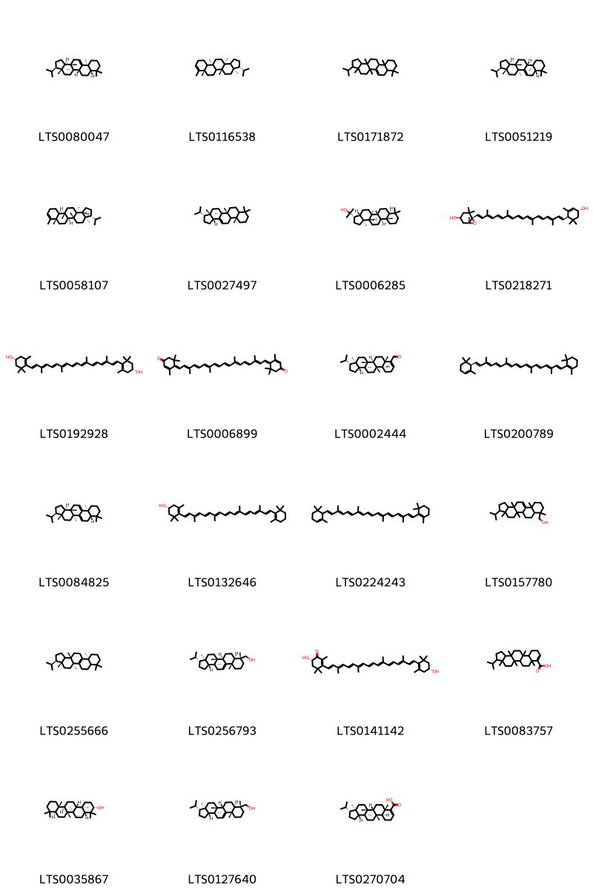{ width=100% }
    <figcaption>Hình ảnh cấu trúc hóa học của 23 hoạt chất thuộc nhóm Prenol lipids gồm ['fernene (LTS0080047)', '(3r,3ar,5ar,7as,11br,13as)-3-isopropyl-3a,5a,7a,8,11b,13a-hexamethyl-1h,2h,3h,4h,5h,5bh,6h,7h,10h,11h,11ah,12h,13h,13bh-cyclopenta[a]chrysene (LTS0116538)', '3-isopropyl-3a,5a,8,8,11a,13a-hexamethyl-1h,2h,3h,4h,5h,7h,7ah,9h,10h,11h,11bh,12h,13h,13bh-cyclopenta[a]chrysene (LTS0171872)', '(3r,3ar,5as,7as,11as,11br,13as,13br)-3-isopropyl-3a,5a,8,8,11a,13a-hexamethyl-1h,2h,3h,4h,5h,7h,7ah,9h,10h,11h,11bh,12h,13h,13bh-cyclopenta[a]chrysene (LTS0051219)', '(3r,3ar,5ar,5bs,7as,11as,11bs,13as,13br)-3-isopropyl-3a,5a,7a,8,11b,13a-hexamethyl-1h,2h,3h,4h,5h,5bh,6h,7h,10h,11h,11ah,12h,13h,13bh-cyclopenta[a]chrysene (LTS0058107)', '(3r,3as,5as,5br,11as,13br)-3-isopropyl-3a,5a,5b,8,8,11a-hexamethyl-1h,2h,3h,4h,5h,6h,7h,7ah,9h,10h,11h,11bh,12h,13bh-cyclopenta[a]chrysene (LTS0027497)', 'hopan-22-ol (LTS0006285)', 'taraxanthin (LTS0218271)', 'zeaxanthin (LTS0192928)', 'rhodoxanthin (LTS0006899)', '(3r,3ar,5ar,5bs,7as,11as,11br,13as,13br)-3-isopropyl-3a,5a,7a,11b,13a-pentamethyl-1h,2h,3h,4h,5h,5bh,6h,7h,10h,11h,11ah,12h,13h,13bh-cyclopenta[a]chrysene-8-carbaldehyde (LTS0002444)', '(+)-α-carotene (LTS0200789)', '(3r,3ar,5as,7as,11as,13as,13br)-3-isopropyl-3a,5a,8,8,11a,13a-hexamethyl-1h,2h,3h,4h,5h,7h,7ah,9h,10h,11h,13h,13bh-cyclopenta[a]chrysene (LTS0084825)', 'cryptoxanthin (LTS0132646)', 'α-carotene (LTS0224243)', '{3-isopropyl-3a,5a,8,11a,13a-pentamethyl-1h,2h,3h,4h,5h,5bh,6h,7h,7ah,9h,10h,11h,13h,13bh-cyclopenta[a]chrysen-8-yl}methanol (LTS0157780)', '(3r,3ar,5as,11as,13as)-3-isopropyl-3a,5a,8,8,11a,13a-hexamethyl-1h,2h,3h,4h,5h,6h,7h,7ah,9h,10h,11h,12h,13h,13bh-cyclopenta[a]chrysene (LTS0255666)', '[(3r,3ar,5ar,5br,7ar,8r,11as,13as,13br)-3-isopropyl-3a,5a,8,11a,13a-pentamethyl-1h,2h,3h,4h,5h,5bh,6h,7h,7ah,9h,10h,11h,13h,13bh-cyclopenta[a]chrysen-8-yl]methanol (LTS0256793)', 'doradexanthin (LTS0141142)', '3-isopropyl-3a,5a,7a,11b,13a-pentamethyl-1h,2h,3h,4h,5h,5bh,6h,7h,10h,11h,11ah,12h,13h,13bh-cyclopenta[a]chrysene-8-carboxylic acid (LTS0083757)', 'tetrahymanol (LTS0035867)', '[(3r,3ar,5ar,5bs,7ar,8r,11as,13as,13br)-3-isopropyl-3a,5a,8,11a,13a-pentamethyl-1h,2h,3h,4h,5h,5bh,6h,7h,7ah,9h,10h,11h,13h,13bh-cyclopenta[a]chrysen-8-yl]methanol (LTS0127640)', '(3r,3ar,5ar,5br,7as,11as,11br,13as,13br)-3-isopropyl-3a,5a,7a,11b,13a-pentamethyl-1h,2h,3h,4h,5h,5bh,6h,7h,10h,11h,11ah,12h,13h,13bh-cyclopenta[a]chrysene-8-carboxylic acid (LTS0270704)'].</figcaption>
</figure>
#### Nhóm Steroids and steroid derivatives
<figure markdown="span">
    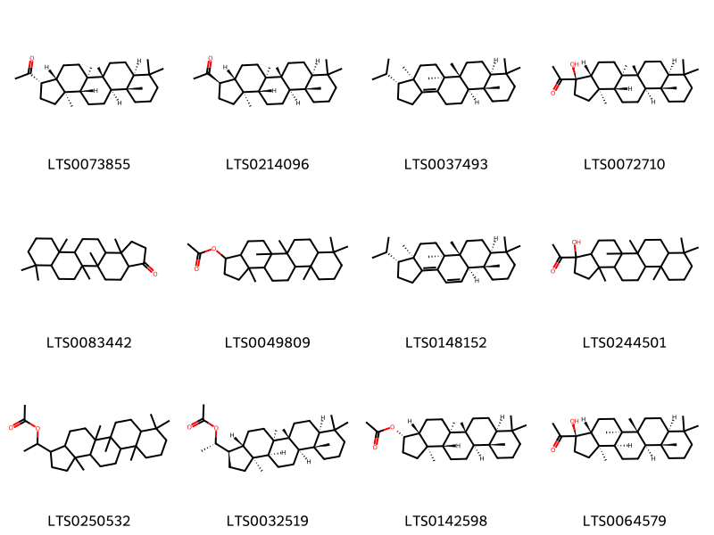{ width=100% }
    <figcaption>Hình ảnh cấu trúc hóa học của 12 hoạt chất thuộc nhóm Steroids and steroid derivatives gồm ['1-[(3s,3as,5ar,5br,7as,11as,11br,13ar,13bs)-5a,5b,8,8,11a,13b-hexamethyl-hexadecahydrocyclopenta[a]chrysen-3-yl]ethanone (LTS0073855)', '1-[(3r,3as,5ar,5br,7as,11as,11br,13ar,13bs)-5a,5b,8,8,11a,13b-hexamethyl-hexadecahydrocyclopenta[a]chrysen-3-yl]ethanone (LTS0214096)', '(3r,3ar,5as,5br,7as,11as,11br)-3-isopropyl-3a,5a,5b,8,8,11a-hexamethyl-1h,2h,3h,4h,5h,6h,7h,7ah,9h,10h,11h,11bh,12h,13h-cyclopenta[a]chrysene (LTS0037493)', '1-[(3r,3ar,5ar,5br,7as,11as,11br,13ar,13br)-3-hydroxy-5a,5b,8,8,11a,13b-hexamethyl-tetradecahydro-1h-cyclopenta[a]chrysen-3-yl]ethanone (LTS0072710)', '5a,5b,8,8,11a,13b-hexamethyl-tetradecahydro-1h-cyclopenta[a]chrysen-3-one (LTS0083442)', '5a,5b,8,8,11a,13b-hexamethyl-hexadecahydrocyclopenta[a]chrysen-3-yl acetate (LTS0049809)', '(3r,3ar,5as,5br,7as,11as,11br)-3-isopropyl-3a,5a,5b,8,8,11a-hexamethyl-1h,2h,3h,4h,5h,6h,7h,7ah,9h,10h,11h,11bh-cyclopenta[a]chrysene (LTS0148152)', '1-{3-hydroxy-5a,5b,8,8,11a,13b-hexamethyl-tetradecahydro-1h-cyclopenta[a]chrysen-3-yl}ethanone (LTS0244501)', '1-{5a,5b,8,8,11a,13b-hexamethyl-hexadecahydrocyclopenta[a]chrysen-3-yl}ethyl acetate (LTS0250532)', '(1s)-1-[(3r,3as,5ar,5br,7as,11as,11br,13as,13bs)-5a,5b,8,8,11a,13b-hexamethyl-hexadecahydrocyclopenta[a]chrysen-3-yl]ethyl acetate (LTS0032519)', '(3s,3ar,5ar,5br,7as,11as,11br,13ar,13br)-5a,5b,8,8,11a,13b-hexamethyl-hexadecahydrocyclopenta[a]chrysen-3-yl acetate (LTS0142598)', '1-[(3r,3ar,5ar,5br,7as,11as,11br,13as,13br)-3-hydroxy-5a,5b,8,8,11a,13b-hexamethyl-tetradecahydro-1h-cyclopenta[a]chrysen-3-yl]ethanone (LTS0064579)'].</figcaption>
</figure>

---

### Dược dân tộc học

Danh sách các quốc gia có sử dụng *Adiantum pedatum* trong điều trị các bệnh. 

| Country   | Disease                           | Bệnh                                    |
|:----------|:----------------------------------|:----------------------------------------|
| Elsewhere | Demulcent, Expectorant, Tonic     | Demulcent, long đờm, thuốc bổ           |
| US        | Emollient, Expectorant, Stimulant | Chất làm mềm, chất đờm, chất kích thích |

---

---
## Adiantum tenerum
### Thông tin về thực vật

!!! info "Phân loại thực vật của *Adiantum tenerum* từ GIBF:"
    - **Kingdom:** Plantae
    - **Phylum:** Tracheophyta
    - **Order:** Polypodiales
    - **Family:** Pteridaceae
    - **Genus:** Adiantum
    - **Species:** *Adiantum tenerum*

 

| Label (VI)   | Label (EN)   | Scientific Name   | Descriptions (VI)   | Descriptions (EN)   | Also Known As (VI)   | Also Known As (EN)   |
|:-------------|:-------------|:------------------|:--------------------|:--------------------|:---------------------|:---------------------|
| N/A          | N/A          | Adiantum tenerum  | loài thực vật       | species of plant    | ['']                 | ['']                 |

#### Phân bố trên thế giới

**Từ CSDL GIBF** nan, Micronesia (Federated States of), Guadeloupe, Guatemala, Saint Lucia, Venezuela (Bolivarian Republic of), Panama, Puerto Rico, Chinese Taipei, Honduras, Jamaica, United States of America, Bonaire, Sint Eustatius and Saba, Belize, Fiji, Brazil, Bahamas, Cuba, Dominican Republic, Mexico, Singapore, Haiti, Montserrat, Costa Rica, Vanuatu, Indonesia, Philippines

#### Phân bố tại Việt Nam

**Từ CSDL GIBF**: Không có ghi nhận ở Việt Nam

---
### Thành phần hóa học
        
- Theo cơ sở dữ liệu lotus: Từ loài *Adiantum tenerum* đã phân lập và xác định được Chưa có hoạt chất nào được phân lập. hoạt chất thuộc về các nhóm Không có hoạt chất nào được phân lập. 

Không có hình ảnh nào được tạo ra

---

### Dược dân tộc học

Danh sách các quốc gia có sử dụng *Adiantum tenerum* trong điều trị các bệnh. 

| Country   | Disease     | Bệnh        |
|:----------|:------------|:------------|
| Mexico    | Emmenagogue | Emmenagogue |

---

---
## Adiantum venustum
### Thông tin về thực vật

!!! info "Phân loại thực vật của *Adiantum venustum* từ GIBF:"
    - **Kingdom:** Plantae
    - **Phylum:** Tracheophyta
    - **Order:** Polypodiales
    - **Family:** Pteridaceae
    - **Genus:** Adiantum
    - **Species:** *Adiantum venustum*

 

| Label (VI)   | Label (EN)   | Scientific Name   | Descriptions (VI)   | Descriptions (EN)   | Also Known As (VI)   | Also Known As (EN)                                                            |
|:-------------|:-------------|:------------------|:--------------------|:--------------------|:---------------------|:------------------------------------------------------------------------------|
| N/A          | N/A          | Adiantum venustum | loài thực vật       | species of plant    | ['']                 | ['Himalayan maidenhair fern', 'evergreen maidenhair', 'Himalayan maidenhair'] |

#### Phân bố trên thế giới

**Từ CSDL GIBF** nan, Pakistan, Netherlands, French Guiana, Germany, Belgium, Korea, Republic of, India, Switzerland, unknown or invalid, United States of America, Sweden, China, France, United Kingdom of Great Britain and Northern Ireland, Canada, Nepal

#### Phân bố tại Việt Nam

**Từ CSDL GIBF**: Không có ghi nhận ở Việt Nam

---
### Thành phần hóa học
        
- Theo cơ sở dữ liệu lotus: Từ loài *Adiantum venustum* đã phân lập và xác định được 23 hoạt chất thuộc về các nhóm Prenol lipids, Steroids and steroid derivatives. 

|    | chemicalTaxonomyClassyfireClass   |   smiles_count |
|---:|:----------------------------------|---------------:|
|  0 | Prenol lipids                     |             19 |
|  1 | Steroids and steroid derivatives  |              4 |

#### Nhóm Prenol lipids
<figure markdown="span">
    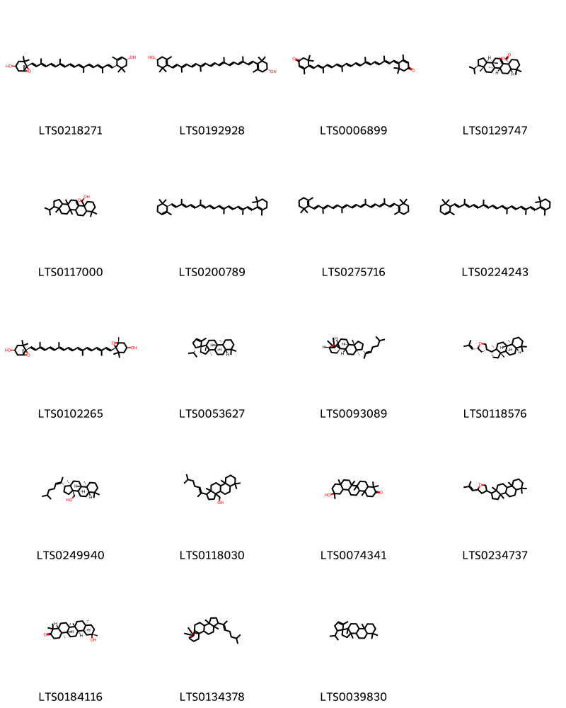{ width=100% }
    <figcaption>Hình ảnh cấu trúc hóa học của 19 hoạt chất thuộc nhóm Prenol lipids gồm ['taraxanthin (LTS0218271)', 'zeaxanthin (LTS0192928)', 'rhodoxanthin (LTS0006899)', '(3r,3ar,5ar,5br,7as,11ar,13as,13br)-3-isopropyl-3a,5a,8,8,13a-pentamethyl-1h,2h,3h,4h,5h,5bh,6h,7h,7ah,9h,10h,11h,13h,13bh-cyclopenta[a]chrysene-11a-carboxylic acid (LTS0129747)', '3-isopropyl-3a,5a,8,8,13a-pentamethyl-1h,2h,3h,4h,5h,5bh,6h,7h,7ah,9h,10h,11h,13h,13bh-cyclopenta[a]chrysene-11a-carboxylic acid (LTS0117000)', '(+)-α-carotene (LTS0200789)', 'β-carotene (LTS0275716)', 'α-carotene (LTS0224243)', 'violaxanthin (LTS0102265)', "(1r,3ar,3br,5's,5as,9ar,9bs,11ar)-5'-isopropyl-2',3a,6,6,9a,11a-hexamethyl-2,3,3b,4,5,5a,7,8,9,9b,10,11-dodecahydrospiro[cyclopenta[a]phenanthrene-1,1'-cyclopentan]-2'-ene (LTS0053627)", '(1s,2s,5r,6r,9s,10r,13r,15s)-5,9,14,14-tetramethyl-6-[(2z)-6-methylhept-2-en-2-yl]-16-oxapentacyclo[13.2.2.0¹,¹³.0²,¹⁰.0⁵,⁹]nonadecane (LTS0093089)', '(2r,4s)-4-[(1r,3as,3br,5as,9ar,9bs,11ar)-3a,6,6,9a,11a-pentamethyl-dodecahydro-1h-cyclopenta[a]phenanthren-1-yl]-2-(2-methylprop-1-en-1-yl)oxolane (LTS0118576)', '[(1r,3ar,3br,5as,9ar,9bs,11ar)-6,6,9a,11a-tetramethyl-1-[(2z)-6-methylhept-2-en-2-yl]-dodecahydro-1h-cyclopenta[a]phenanthren-3a-yl]methanol (LTS0249940)', '[6,6,9a,11a-tetramethyl-1-(6-methylhept-2-en-2-yl)-dodecahydro-1h-cyclopenta[a]phenanthren-3a-yl]methanol (LTS0118030)', '11-hydroxy-4,4,6a,6b,8a,11,14b-heptamethyl-tetradecahydro-1h-picen-3-one (LTS0074341)', '4-{3a,6,6,9a,11a-pentamethyl-dodecahydro-1h-cyclopenta[a]phenanthren-1-yl}-2-(2-methylprop-1-en-1-yl)oxolane (LTS0234737)', '(4ar,6ar,6br,8as,11s,12as,12br,14ar,14br)-11-hydroxy-4,4,6a,6b,8a,11,14b-heptamethyl-tetradecahydro-1h-picen-3-one (LTS0184116)', '5,9,14,14-tetramethyl-6-(6-methylhept-2-en-2-yl)-16-oxapentacyclo[13.2.2.0¹,¹³.0²,¹⁰.0⁵,⁹]nonadecane (LTS0134378)', "5'-isopropyl-2',3a,6,6,9a,11a-hexamethyl-2,3,3b,4,5,5a,7,8,9,9b,10,11-dodecahydrospiro[cyclopenta[a]phenanthrene-1,1'-cyclopentan]-2'-ene (LTS0039830)"].</figcaption>
</figure>
#### Nhóm Steroids and steroid derivatives
<figure markdown="span">
    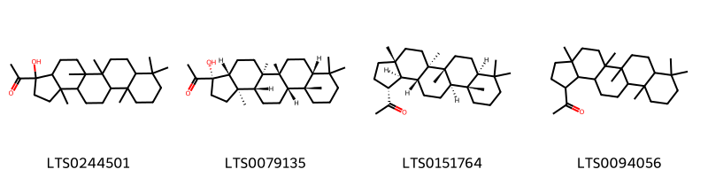{ width=100% }
    <figcaption>Hình ảnh cấu trúc hóa học của 4 hoạt chất thuộc nhóm Steroids and steroid derivatives gồm ['1-{3-hydroxy-5a,5b,8,8,11a,13b-hexamethyl-tetradecahydro-1h-cyclopenta[a]chrysen-3-yl}ethanone (LTS0244501)', '1-[(3s,3ar,5ar,5br,7ar,11as,11bs,13ar,13br)-3-hydroxy-5a,5b,8,8,11a,13b-hexamethyl-tetradecahydro-1h-cyclopenta[a]chrysen-3-yl]ethanone (LTS0079135)', '1-[(1r,3ar,5ar,5br,7as,11as,11br,13ar,13bs)-3a,5a,5b,8,8,11a-hexamethyl-hexadecahydrocyclopenta[a]chrysen-1-yl]ethanone (LTS0151764)', '1-{3a,5a,5b,8,8,11a-hexamethyl-hexadecahydrocyclopenta[a]chrysen-1-yl}ethanone (LTS0094056)'].</figcaption>
</figure>

---

### Dược dân tộc học

Danh sách các quốc gia có sử dụng *Adiantum venustum* trong điều trị các bệnh. 

| Country   | Disease                       | Bệnh                          |
|:----------|:------------------------------|:------------------------------|
| India     | Demulcent, Expectorant, Tonic | Demulcent, long đờm, thuốc bổ |

---

# Chi Cheilanthes

??? note "Danh sách các dược liệu thuộc chi"
    
	 - *Cheilanthes myriophylla*

---
## Cheilanthes myriophylla
### Thông tin về thực vật

!!! info "Phân loại thực vật của *Myriopteris myriophylla* từ GIBF:"
    - **Kingdom:** Plantae
    - **Phylum:** Tracheophyta
    - **Order:** Polypodiales
    - **Family:** Pteridaceae
    - **Genus:** Myriopteris
    - **Species:** *Myriopteris myriophylla*

 

| Label (VI)   | Label (EN)   | Scientific Name         | Descriptions (VI)   | Descriptions (EN)   | Also Known As (VI)   | Also Known As (EN)   |
|:-------------|:-------------|:------------------------|:--------------------|:--------------------|:---------------------|:---------------------|
| N/A          | N/A          | Cheilanthes myriophylla | loài thực vật       | species of plant    | ['']                 | ['']                 |

#### Phân bố trên thế giới

**Từ CSDL GIBF** Ecuador, Belgium, Colombia, Guatemala, Argentina, Bolivia (Plurinational State of), Honduras, United States of America, Peru, Mexico, Chile, France

#### Phân bố tại Việt Nam

**Từ CSDL GIBF**: Không có ghi nhận ở Việt Nam

---
### Thành phần hóa học
        
- Theo cơ sở dữ liệu lotus: Từ loài *Myriopteris myriophylla* đã phân lập và xác định được Chưa có hoạt chất nào được phân lập. hoạt chất thuộc về các nhóm Không có hoạt chất nào được phân lập. 

Không có hình ảnh nào được tạo ra

---

### Dược dân tộc học

Danh sách các quốc gia có sử dụng *Myriopteris myriophylla* trong điều trị các bệnh. 

| Country   | Disease             | Bệnh                            |
|:----------|:--------------------|:--------------------------------|
| Venezuela | Diuretic, Sudorific | Thuốc lợi tiểu, gây ngạt mồ hôi |

---

# Chi Ceratopteris

??? note "Danh sách các dược liệu thuộc chi"
    
	 - *Ceratopteris thalictroides*

---
## Ceratopteris thalictroides
### Thông tin về thực vật

!!! info "Phân loại thực vật của *Ceratopteris thalictroides* từ GIBF:"
    - **Kingdom:** Plantae
    - **Phylum:** Tracheophyta
    - **Order:** Polypodiales
    - **Family:** Pteridaceae
    - **Genus:** Ceratopteris
    - **Species:** *Ceratopteris thalictroides*

 

| Label (VI)   | Label (EN)   | Scientific Name            | Descriptions (VI)   | Descriptions (EN)   | Also Known As (VI)   | Also Known As (EN)                                                                    |
|:-------------|:-------------|:---------------------------|:--------------------|:--------------------|:---------------------|:--------------------------------------------------------------------------------------|
| N/A          | N/A          | Ceratopteris thalictroides | loài thực vật       | species of plant    | ['']                 | ['Water fern', 'Indian fern', 'Oriental waterfern', 'Water Hornfern', 'Water sprite'] |

#### Phân bố trên thế giới

**Từ CSDL GIBF** Australia, Japan, Myanmar, French Guiana, Panama, Puerto Rico, Senegal, Nigeria, Chinese Taipei, Honduras, Bangladesh, United States of America, Trinidad and Tobago, Hong Kong, Suriname, Thailand, Brazil, Mexico, Singapore, Viet Nam, China, Seychelles, Macao, India, Indonesia, Gambia, Philippines, Malaysia

#### Phân bố tại Việt Nam

**Từ CSDL GIBF**: Đồng Nai

---
### Thành phần hóa học
        
- Theo cơ sở dữ liệu lotus: Từ loài *Ceratopteris thalictroides* đã phân lập và xác định được Chưa có hoạt chất nào được phân lập. hoạt chất thuộc về các nhóm Không có hoạt chất nào được phân lập. 

Không có hình ảnh nào được tạo ra

---

### Dược dân tộc học

Danh sách các quốc gia có sử dụng *Ceratopteris thalictroides* trong điều trị các bệnh. 

| Country   | Disease                  | Bệnh                           |
|:----------|:-------------------------|:-------------------------------|
| China     | Styptic, Laxative, Tonic | Styptic, nhuận tràng, thuốc bổ |
| Iraq      | Poultice                 | thuốc đắp, đắp thuốc cao       |

---

# Chi Pteris

??? note "Danh sách các dược liệu thuộc chi"
    
	 - *Pteris ensiformis*
	 - *Pteris multifida*

---
## Pteris ensiformis
### Thông tin về thực vật

!!! info "Phân loại thực vật của *Pteris ensiformis* từ GIBF:"
    - **Kingdom:** Plantae
    - **Phylum:** Tracheophyta
    - **Order:** Polypodiales
    - **Family:** Pteridaceae
    - **Genus:** Pteris
    - **Species:** *Pteris ensiformis*

 

| Label (VI)   | Label (EN)   | Scientific Name   | Descriptions (VI)   | Descriptions (EN)   | Also Known As (VI)   | Also Known As (EN)   |
|:-------------|:-------------|:------------------|:--------------------|:--------------------|:---------------------|:---------------------|
| N/A          | N/A          | Pteris ensiformis | loài thực vật       | species of plant    | ['']                 | ['']                 |

#### Phân bố trên thế giới

**Từ CSDL GIBF** Puerto Rico, Hong Kong, Australia, Japan, Thailand, Brazil, Chinese Taipei, Macao, Indonesia, Philippines, Singapore, Viet Nam, French Guiana

#### Phân bố tại Việt Nam

**Từ CSDL GIBF**: Đà Nẵng

---
### Thành phần hóa học
        
- Theo cơ sở dữ liệu lotus: Từ loài *Pteris ensiformis* đã phân lập và xác định được 23 hoạt chất thuộc về các nhóm Steroids and steroid derivatives, Cinnamic acids and derivatives, Benzene and substituted derivatives, Indanes, Dihydrofurans, Organooxygen compounds. 

|    | chemicalTaxonomyClassyfireClass     |   smiles_count |
|---:|:------------------------------------|---------------:|
|  0 | Benzene and substituted derivatives |              1 |
|  1 | Cinnamic acids and derivatives      |              2 |
|  2 | Dihydrofurans                       |              2 |
|  3 | Indanes                             |              2 |
|  4 | Organooxygen compounds              |             10 |
|  5 | Steroids and steroid derivatives    |              6 |

#### Nhóm Benzene and substituted derivatives
<figure markdown="span">
    { width=100% }
    <figcaption>Hình ảnh cấu trúc hóa học của 1 hoạt chất thuộc nhóm Benzene and substituted derivatives gồm ['benzoic acid (LTS0145871)'].</figcaption>
</figure>
#### Nhóm Cinnamic acids and derivatives
<figure markdown="span">
    { width=100% }
    <figcaption>Hình ảnh cấu trúc hóa học của 2 hoạt chất thuộc nhóm Cinnamic acids and derivatives gồm ['para-coumaric acid (LTS0266252)', 'hydroxycinnamic acid (LTS0233023)'].</figcaption>
</figure>
#### Nhóm Dihydrofurans
<figure markdown="span">
    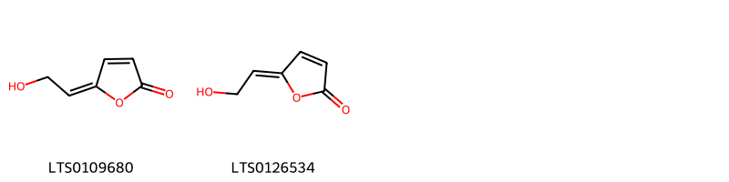{ width=100% }
    <figcaption>Hình ảnh cấu trúc hóa học của 2 hoạt chất thuộc nhóm Dihydrofurans gồm ['5-(2-hydroxyethylidene)furan-2-one (LTS0109680)', '(5z)-5-(2-hydroxyethylidene)furan-2-one (LTS0126534)'].</figcaption>
</figure>
#### Nhóm Indanes
<figure markdown="span">
    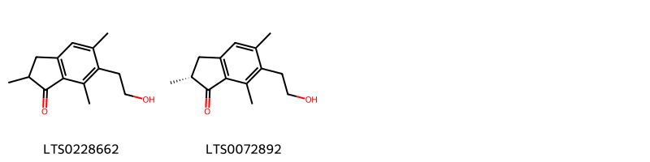{ width=100% }
    <figcaption>Hình ảnh cấu trúc hóa học của 2 hoạt chất thuộc nhóm Indanes gồm ['6-(2-hydroxyethyl)-2,5,7-trimethyl-2,3-dihydroinden-1-one (LTS0228662)', '(2r)-6-(2-hydroxyethyl)-2,5,7-trimethyl-2,3-dihydroinden-1-one (LTS0072892)'].</figcaption>
</figure>
#### Nhóm Organooxygen compounds
<figure markdown="span">
    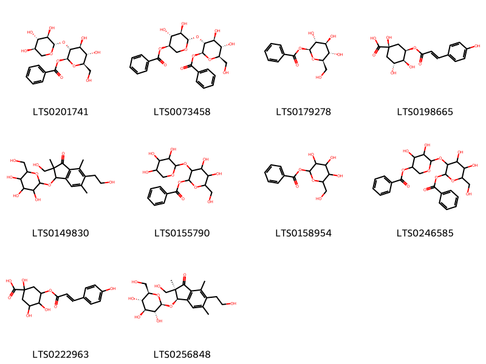{ width=100% }
    <figcaption>Hình ảnh cấu trúc hóa học của 10 hoạt chất thuộc nhóm Organooxygen compounds gồm ['(2s,3r,4s,5s,6r)-4,5-dihydroxy-6-(hydroxymethyl)-3-{[(2s,3r,4s,5r)-3,4,5-trihydroxyoxan-2-yl]oxy}oxan-2-yl benzoate (LTS0201741)', '(3r,4r,5r,6s)-6-{[(2s,3r,4s,5s,6r)-2-(benzoyloxy)-4,5-dihydroxy-6-(hydroxymethyl)oxan-3-yl]oxy}-4,5-dihydroxyoxan-3-yl benzoate (LTS0073458)', 'benzoyl-β-d-glucoside (LTS0179278)', '(1r,3r,4s,5r)-1,3,4-trihydroxy-5-{[(2e)-3-(4-hydroxyphenyl)prop-2-enoyl]oxy}cyclohexane-1-carboxylic acid (LTS0198665)', '6-(2-hydroxyethyl)-2-(hydroxymethyl)-2,5,7-trimethyl-3-{[3,4,5-trihydroxy-6-(hydroxymethyl)oxan-2-yl]oxy}-3h-inden-1-one (LTS0149830)', '4,5-dihydroxy-6-(hydroxymethyl)-3-[(3,4,5-trihydroxyoxan-2-yl)oxy]oxan-2-yl benzoate (LTS0155790)', 'benzoyl-β-d-glucoside (LTS0158954)', '3-{[5-(benzoyloxy)-3,4-dihydroxyoxan-2-yl]oxy}-4,5-dihydroxy-6-(hydroxymethyl)oxan-2-yl benzoate (LTS0246585)', '1,3,4-trihydroxy-5-{[3-(4-hydroxyphenyl)prop-2-enoyl]oxy}cyclohexane-1-carboxylic acid (LTS0222963)', '(2r,3r)-6-(2-hydroxyethyl)-2-(hydroxymethyl)-2,5,7-trimethyl-3-{[(2r,3r,4s,5s,6r)-3,4,5-trihydroxy-6-(hydroxymethyl)oxan-2-yl]oxy}-3h-inden-1-one (LTS0256848)'].</figcaption>
</figure>
#### Nhóm Steroids and steroid derivatives
<figure markdown="span">
    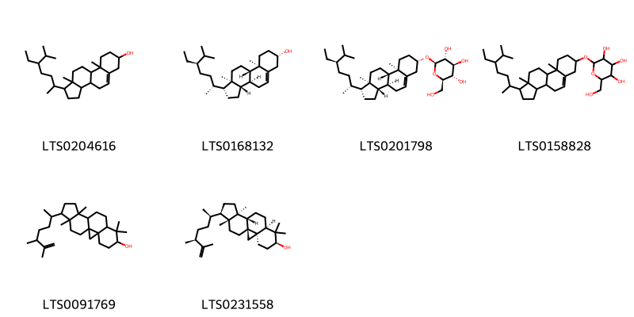{ width=100% }
    <figcaption>Hình ảnh cấu trúc hóa học của 6 hoạt chất thuộc nhóm Steroids and steroid derivatives gồm ['stigmast-5-en-3-ol, (3β)- (LTS0204616)', 'sitosterol (LTS0168132)', 'sitogluside (LTS0201798)', '2-{[1-(5-ethyl-6-methylheptan-2-yl)-9a,11a-dimethyl-1h,2h,3h,3ah,3bh,4h,6h,7h,8h,9h,9bh,10h,11h-cyclopenta[a]phenanthren-7-yl]oxy}-6-(hydroxymethyl)oxane-3,4,5-triol (LTS0158828)', '15-(5,6-dimethylhept-6-en-2-yl)-7,7,12,16-tetramethylpentacyclo[9.7.0.0¹,³.0³,⁸.0¹²,¹⁶]octadecan-6-ol (LTS0091769)', 'cyclolaudenol (LTS0231558)'].</figcaption>
</figure>

---

### Dược dân tộc học

Danh sách các quốc gia có sử dụng *Pteris ensiformis* trong điều trị các bệnh. 

| Country   | Disease    | Bệnh      |
|:----------|:-----------|:----------|
| Elsewhere | Astringent | Lam se da |
| Malaya    | Astringent | Lam se da |

---

---
## Pteris multifida
### Thông tin về thực vật

!!! info "Phân loại thực vật của *Pteris multifida* từ GIBF:"
    - **Kingdom:** Plantae
    - **Phylum:** Tracheophyta
    - **Order:** Polypodiales
    - **Family:** Pteridaceae
    - **Genus:** Pteris
    - **Species:** *Pteris multifida*

 

| Label (VI)   | Label (EN)   | Scientific Name   | Descriptions (VI)   | Descriptions (EN)   | Also Known As (VI)   | Also Known As (EN)   |
|:-------------|:-------------|:------------------|:--------------------|:--------------------|:---------------------|:---------------------|
| N/A          | N/A          | Pteris multifida  |                     | species of plant    | ['']                 | ['']                 |

#### Phân bố trên thế giới

**Từ CSDL GIBF** Italy, Hong Kong, Japan, Thailand, Belgium, Korea, Republic of, Chinese Taipei, New Zealand, Macao, United States of America, Singapore, Viet Nam, China

#### Phân bố tại Việt Nam

**Từ CSDL GIBF**: Thừa Thiên - Huế

---
### Thành phần hóa học
        
- Theo cơ sở dữ liệu lotus: Từ loài *Pteris multifida* đã phân lập và xác định được 61 hoạt chất thuộc về các nhóm Benzodioxanes, Flavonoids, Prenol lipids, Steroids and steroid derivatives, Isoflavonoids, Cinnamic acids and derivatives, Indenes and isoindenes, Indanes, Organooxygen compounds, Carboxylic acids and derivatives. 

|    | chemicalTaxonomyClassyfireClass   |   smiles_count |
|---:|:----------------------------------|---------------:|
|  0 | Benzodioxanes                     |              1 |
|  1 | Carboxylic acids and derivatives  |              2 |
|  2 | Cinnamic acids and derivatives    |              4 |
|  3 | Flavonoids                        |              5 |
|  4 | Indanes                           |             12 |
|  5 | Indenes and isoindenes            |              1 |
|  6 | Isoflavonoids                     |              2 |
|  7 | Organooxygen compounds            |             12 |
|  8 | Prenol lipids                     |             17 |
|  9 | Steroids and steroid derivatives  |              5 |

#### Nhóm Benzodioxanes
<figure markdown="span">
    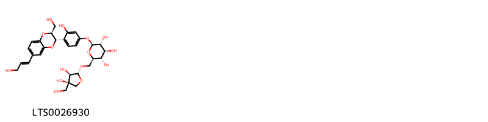{ width=100% }
    <figcaption>Hình ảnh cấu trúc hóa học của 1 hoạt chất thuộc nhóm Benzodioxanes gồm ['(2r,3s,4s,5r,6s)-2-({[(2r,3r,4r)-3,4-dihydroxy-4-(hydroxymethyl)oxolan-2-yl]oxy}methyl)-6-{3-hydroxy-4-[(2s,3s)-3-(hydroxymethyl)-7-[(1e)-3-hydroxyprop-1-en-1-yl]-2,3-dihydro-1,4-benzodioxin-2-yl]phenoxy}oxane-3,4,5-triol (LTS0026930)'].</figcaption>
</figure>
#### Nhóm Carboxylic acids and derivatives
<figure markdown="span">
    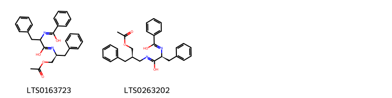{ width=100% }
    <figcaption>Hình ảnh cấu trúc hóa học của 2 hoạt chất thuộc nhóm Carboxylic acids and derivatives gồm ['n-[(2s)-1-(acetyloxy)-3-phenylpropan-2-yl]-2-{[hydroxy(phenyl)methylidene]amino}-3-phenylpropanimidic acid (LTS0163723)', '(2s)-n-[(2r)-3-(acetyloxy)-2-benzylpropyl]-2-{[hydroxy(phenyl)methylidene]amino}-3-phenylpropanimidic acid (LTS0263202)'].</figcaption>
</figure>
#### Nhóm Cinnamic acids and derivatives
<figure markdown="span">
    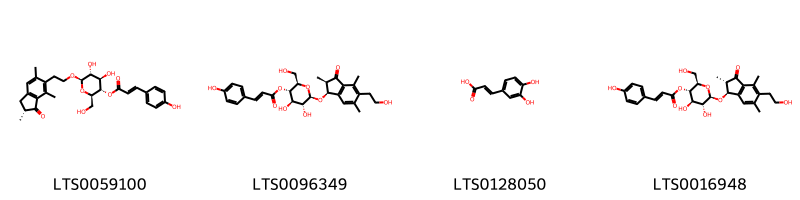{ width=100% }
    <figcaption>Hình ảnh cấu trúc hóa học của 4 hoạt chất thuộc nhóm Cinnamic acids and derivatives gồm ['(2r,3s,4r,5r,6r)-4,5-dihydroxy-2-(hydroxymethyl)-6-{2-[(2r)-2,4,6-trimethyl-3-oxo-1,2-dihydroinden-5-yl]ethoxy}oxan-3-yl (2e)-3-(4-hydroxyphenyl)prop-2-enoate (LTS0059100)', '(2r,3s,4r,5r,6r)-4,5-dihydroxy-6-{[(1s,2r)-5-(2-hydroxyethyl)-2,4,6-trimethyl-3-oxo-1,2-dihydroinden-1-yl]oxy}-2-(hydroxymethyl)oxan-3-yl (2e)-3-(4-hydroxyphenyl)prop-2-enoate (LTS0096349)', '3,4-dihydroxycinnamic acid (LTS0128050)', '(2r,3s,4r,5r,6r)-4,5-dihydroxy-6-{[(1s,2s)-5-(2-hydroxyethyl)-2,4,6-trimethyl-3-oxo-1,2-dihydroinden-1-yl]oxy}-2-(hydroxymethyl)oxan-3-yl (2e)-3-(4-hydroxyphenyl)prop-2-enoate (LTS0016948)'].</figcaption>
</figure>
#### Nhóm Flavonoids
<figure markdown="span">
    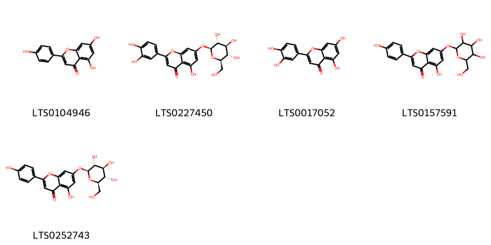{ width=100% }
    <figcaption>Hình ảnh cấu trúc hóa học của 5 hoạt chất thuộc nhóm Flavonoids gồm ['chamomile (LTS0104946)', 'luteolin 7-o-glucoside (LTS0227450)', 'luteolin (LTS0017052)', 'apigetrin (LTS0157591)', 'apigenin 7-o-β-glucoside (LTS0252743)'].</figcaption>
</figure>
#### Nhóm Indanes
<figure markdown="span">
    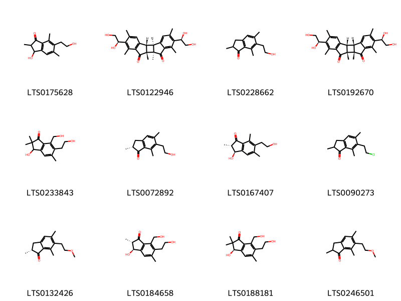{ width=100% }
    <figcaption>Hình ảnh cấu trúc hóa học của 12 hoạt chất thuộc nhóm Indanes gồm ['3-hydroxy-6-(2-hydroxyethyl)-2,5,7-trimethyl-2,3-dihydroinden-1-one (LTS0175628)', '(1s,2s,10r,11r)-6,15-bis[(1r)-1,2-dihydroxyethyl]-5,7,10,11,14,16-hexamethylpentacyclo[9.7.0.0²,¹⁰.0³,⁸.0¹³,¹⁸]octadeca-3,5,7,13(18),14,16-hexaene-9,12-dione (LTS0122946)', '6-(2-hydroxyethyl)-2,5,7-trimethyl-2,3-dihydroinden-1-one (LTS0228662)', '(1s,2r,10s,11r)-6,15-bis[(1r)-1,2-dihydroxyethyl]-5,7,10,11,14,16-hexamethylpentacyclo[9.7.0.0²,¹⁰.0³,⁸.0¹³,¹⁸]octadeca-3,5,7,13(18),14,16-hexaene-9,12-dione (LTS0192670)', '3-hydroxy-6-(2-hydroxyethyl)-7-(hydroxymethyl)-2,2,5-trimethyl-3h-inden-1-one (LTS0233843)', '(2r)-6-(2-hydroxyethyl)-2,5,7-trimethyl-2,3-dihydroinden-1-one (LTS0072892)', '(2s,3s)-pterosin c (LTS0167407)', '6-(2-chloroethyl)-2,5,7-trimethyl-2,3-dihydroinden-1-one (LTS0090273)', '(2r)-6-(2-methoxyethyl)-2,5,7-trimethyl-2,3-dihydroinden-1-one (LTS0132426)', '(2s,3s)-3-hydroxy-6-(2-hydroxyethyl)-7-(hydroxymethyl)-2,5-dimethyl-2,3-dihydroinden-1-one (LTS0184658)', '(3r)-3-hydroxy-6-(2-hydroxyethyl)-7-(hydroxymethyl)-2,2,5-trimethyl-3h-inden-1-one (LTS0188181)', '6-(2-methoxyethyl)-2,5,7-trimethyl-2,3-dihydroinden-1-one (LTS0246501)'].</figcaption>
</figure>
#### Nhóm Indenes and isoindenes
<figure markdown="span">
    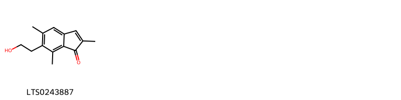{ width=100% }
    <figcaption>Hình ảnh cấu trúc hóa học của 1 hoạt chất thuộc nhóm Indenes and isoindenes gồm ['6-(2-hydroxyethyl)-2,5,7-trimethylinden-1-one (LTS0243887)'].</figcaption>
</figure>
#### Nhóm Isoflavonoids
<figure markdown="span">
    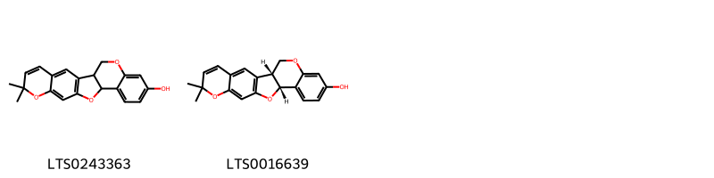{ width=100% }
    <figcaption>Hình ảnh cấu trúc hóa học của 2 hoạt chất thuộc nhóm Isoflavonoids gồm ['isoneorautenol (LTS0243363)', '(1r,13r)-7,7-dimethyl-8,12,20-trioxapentacyclo[11.8.0.0²,¹¹.0⁴,⁹.0¹⁴,¹⁹]henicosa-2(11),3,5,9,14,16,18-heptaen-17-ol (LTS0016639)'].</figcaption>
</figure>
#### Nhóm Organooxygen compounds
<figure markdown="span">
    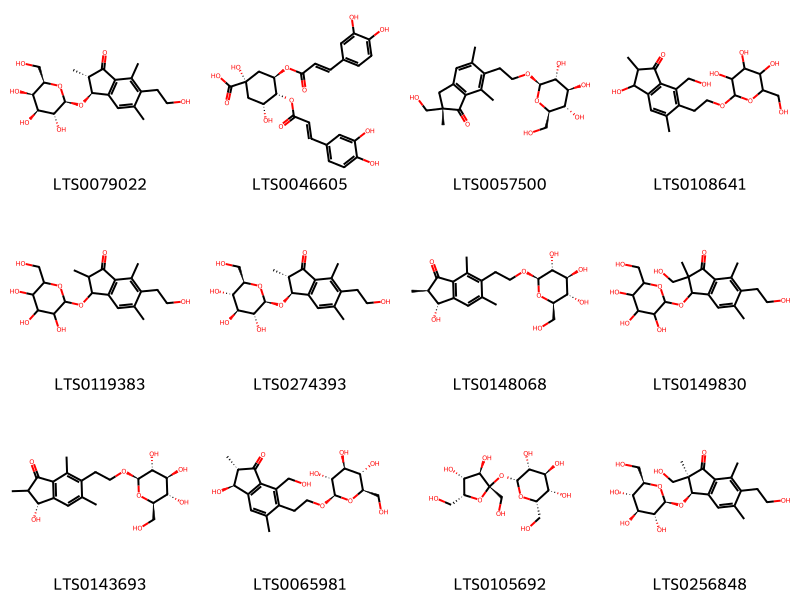{ width=100% }
    <figcaption>Hình ảnh cấu trúc hóa học của 12 hoạt chất thuộc nhóm Organooxygen compounds gồm ['(2s,3s)-6-(2-hydroxyethyl)-2,5,7-trimethyl-3-{[(2r,3r,4s,5r,6r)-3,4,5-trihydroxy-6-(hydroxymethyl)oxan-2-yl]oxy}-2,3-dihydroinden-1-one (LTS0079022)', '4,5-dicaffeoylquinic acid (LTS0046605)', '(2s)-2-(hydroxymethyl)-2,5,7-trimethyl-6-(2-{[(2r,3r,4s,5s,6r)-3,4,5-trihydroxy-6-(hydroxymethyl)oxan-2-yl]oxy}ethyl)-3h-inden-1-one (LTS0057500)', '3-hydroxy-7-(hydroxymethyl)-2,5-dimethyl-6-(2-{[3,4,5-trihydroxy-6-(hydroxymethyl)oxan-2-yl]oxy}ethyl)-2,3-dihydroinden-1-one (LTS0108641)', '6-(2-hydroxyethyl)-2,5,7-trimethyl-3-{[3,4,5-trihydroxy-6-(hydroxymethyl)oxan-2-yl]oxy}-2,3-dihydroinden-1-one (LTS0119383)', '(2s,3s)-6-(2-hydroxyethyl)-2,5,7-trimethyl-3-{[(2r,3r,4s,5s,6r)-3,4,5-trihydroxy-6-(hydroxymethyl)oxan-2-yl]oxy}-2,3-dihydroinden-1-one (LTS0274393)', '(2r,3r)-3-hydroxy-2,5,7-trimethyl-6-(2-{[(2r,3r,4s,5s,6r)-3,4,5-trihydroxy-6-(hydroxymethyl)oxan-2-yl]oxy}ethyl)-2,3-dihydroinden-1-one (LTS0148068)', '6-(2-hydroxyethyl)-2-(hydroxymethyl)-2,5,7-trimethyl-3-{[3,4,5-trihydroxy-6-(hydroxymethyl)oxan-2-yl]oxy}-3h-inden-1-one (LTS0149830)', '(3r)-3-hydroxy-2,5,7-trimethyl-6-(2-{[(2r,3r,4s,5s,6r)-3,4,5-trihydroxy-6-(hydroxymethyl)oxan-2-yl]oxy}ethyl)-2,3-dihydroinden-1-one (LTS0143693)', '(2s,3s)-3-hydroxy-7-(hydroxymethyl)-2,5-dimethyl-6-(2-{[(2r,3r,4s,5s,6r)-3,4,5-trihydroxy-6-(hydroxymethyl)oxan-2-yl]oxy}ethyl)-2,3-dihydroinden-1-one (LTS0065981)', '(2r,3r,4s,5s,6s)-2-{[(2s,3r,4r,5r)-3,4-dihydroxy-2,5-bis(hydroxymethyl)oxolan-2-yl]oxy}-6-(hydroxymethyl)oxane-3,4,5-triol (LTS0105692)', '(2r,3r)-6-(2-hydroxyethyl)-2-(hydroxymethyl)-2,5,7-trimethyl-3-{[(2r,3r,4s,5s,6r)-3,4,5-trihydroxy-6-(hydroxymethyl)oxan-2-yl]oxy}-3h-inden-1-one (LTS0256848)'].</figcaption>
</figure>
#### Nhóm Prenol lipids
<figure markdown="span">
    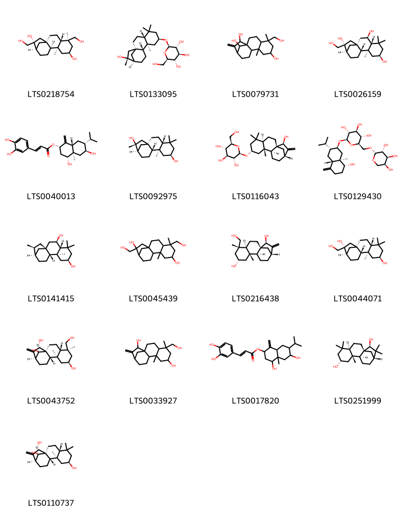{ width=100% }
    <figcaption>Hình ảnh cấu trúc hóa học của 17 hoạt chất thuộc nhóm Prenol lipids gồm ['(1s,4s,5s,7s,9s,10s,13r,14r)-5,14-bis(hydroxymethyl)-5,9-dimethyltetracyclo[11.2.1.0¹,¹⁰.0⁴,⁹]hexadecane-7,14-diol (LTS0218754)', '(2r,3r,4s,5s,6r)-2-{[(1s,4r,7r,9r,10r,13r,14r)-14-hydroxy-5,5,9,14-tetramethyltetracyclo[11.2.1.0¹,¹⁰.0⁴,⁹]hexadecan-7-yl]oxy}-6-(hydroxymethyl)oxane-3,4,5-triol (LTS0133095)', '5-(hydroxymethyl)-5,9-dimethyl-14-methylidenetetracyclo[11.2.1.0¹,¹⁰.0⁴,⁹]hexadecane-7,15,16-triol (LTS0079731)', '(1r,3r,4r,7r,9s,10r,13r,14r)-14-(hydroxymethyl)-5,5,9-trimethyltetracyclo[11.2.1.0¹,¹⁰.0⁴,⁹]hexadecane-3,7,14-triol (LTS0026159)', '(2s,4r,4ar,6s,7r,8as)-4,6-dihydroxy-7-isopropyl-4a-methyl-1-methylidene-octahydronaphthalen-2-yl (2e)-3-(3,4-dihydroxyphenyl)prop-2-enoate (LTS0040013)', '(1s,4r,7r,9r,10r,13r,14r)-5,5,9,14-tetramethyltetracyclo[11.2.1.0¹,¹⁰.0⁴,⁹]hexadecane-7,14-diol (LTS0092975)', '(2r,3r,4s,5s,6r)-2-{[(1r,4r,7r,9r,10s,13r,15s)-15-hydroxy-5,5,9-trimethyl-14-methylidenetetracyclo[11.2.1.0¹,¹⁰.0⁴,⁹]hexadecan-7-yl]oxy}-6-(hydroxymethyl)oxane-3,4,5-triol (LTS0116043)', '(2r,3r,4s,5s,6r)-2-{[(2s,3r,4as,8r,8ar)-8-hydroxy-3-isopropyl-8a-methyl-5-methylidene-octahydronaphthalen-2-yl]oxy}-6-({[(2r,3r,4s,5s)-3,4,5-trihydroxyoxan-2-yl]oxy}methyl)oxane-3,4,5-triol (LTS0129430)', '(1r,3r,4r,7r,9s,10r,13r,14s)-5,5,9,14-tetramethyltetracyclo[11.2.1.0¹,¹⁰.0⁴,⁹]hexadecane-3,7-diol (LTS0141415)', '5,14-bis(hydroxymethyl)-5,9-dimethyltetracyclo[11.2.1.0¹,¹⁰.0⁴,⁹]hexadecane-7,14-diol (LTS0045439)', '(1r,4s,5s,7s,9r,10s,13r,15s)-5-(hydroxymethyl)-5,9-dimethyl-14-methylidenetetracyclo[11.2.1.0¹,¹⁰.0⁴,⁹]hexadecane-7,15-diol (LTS0216438)', '(1s,4r,7r,9r,10r,13r,14r)-14-(hydroxymethyl)-5,5,9-trimethyltetracyclo[11.2.1.0¹,¹⁰.0⁴,⁹]hexadecane-7,14-diol (LTS0044071)', '(1s,4s,5s,7s,9r,10s,13s,15s,16r)-5-(hydroxymethyl)-5,9-dimethyl-14-methylidenetetracyclo[11.2.1.0¹,¹⁰.0⁴,⁹]hexadecane-7,15,16-triol (LTS0043752)', '5-(hydroxymethyl)-5,9-dimethyl-14-methylidenetetracyclo[11.2.1.0¹,¹⁰.0⁴,⁹]hexadecane-7,15-diol (LTS0033927)', '4,6-dihydroxy-7-isopropyl-4a-methyl-1-methylidene-octahydronaphthalen-2-yl 3-(3,4-dihydroxyphenyl)prop-2-enoate (LTS0017820)', '(1r,4r,7r,9r,10s,13r,15s)-5,5,9,14,14-pentamethyltetracyclo[11.2.1.0¹,¹⁰.0⁴,⁹]hexadecane-7,15-diol (LTS0251999)', '(1s,4r,7r,9r,10s,13s,15s,16r)-5,5,9-trimethyl-14-methylidenetetracyclo[11.2.1.0¹,¹⁰.0⁴,⁹]hexadecane-7,15,16-triol (LTS0110737)'].</figcaption>
</figure>
#### Nhóm Steroids and steroid derivatives
<figure markdown="span">
    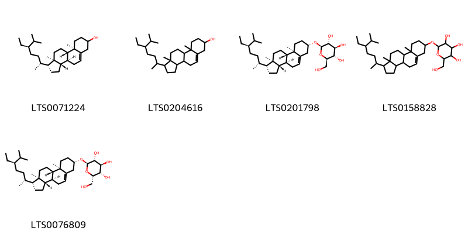{ width=100% }
    <figcaption>Hình ảnh cấu trúc hóa học của 5 hoạt chất thuộc nhóm Steroids and steroid derivatives gồm ['stigmast-5-en-3-ol (LTS0071224)', 'stigmast-5-en-3-ol, (3β)- (LTS0204616)', 'sitogluside (LTS0201798)', '2-{[1-(5-ethyl-6-methylheptan-2-yl)-9a,11a-dimethyl-1h,2h,3h,3ah,3bh,4h,6h,7h,8h,9h,9bh,10h,11h-cyclopenta[a]phenanthren-7-yl]oxy}-6-(hydroxymethyl)oxane-3,4,5-triol (LTS0158828)', '(2r,3r,4s,5s,6s)-2-{[(1r,3as,3bs,7s,9ar,9bs,11ar)-1-[(2r,5r)-5-ethyl-6-methylheptan-2-yl]-9a,11a-dimethyl-1h,2h,3h,3ah,3bh,4h,6h,7h,8h,9h,9bh,10h,11h-cyclopenta[a]phenanthren-7-yl]oxy}-6-(hydroxymethyl)oxane-3,4,5-triol (LTS0076809)'].</figcaption>
</figure>

---

### Dược dân tộc học

Danh sách các quốc gia có sử dụng *Pteris multifida* trong điều trị các bệnh. 

| Country   | Disease                                                 | Bệnh                                                    |
|:----------|:--------------------------------------------------------|:--------------------------------------------------------|
| China     | Hemostat, Vermifuge, Vermifuge, Refrigerant, Alexiteric | Hemostat, Vermifuge, Vermifuge, Refrigerant, Alexiteric |

---

# Chi Actiniopteris

??? note "Danh sách các dược liệu thuộc chi"
    
	 - *Actiniopteris australis*
	 - *Actiniopteris dichotoma*

---
## Actiniopteris australis
### Thông tin về thực vật

!!! info "Phân loại thực vật của *Actiniopteris australis* từ GIBF:"
    - **Kingdom:** Plantae
    - **Phylum:** Tracheophyta
    - **Order:** Polypodiales
    - **Family:** Pteridaceae
    - **Genus:** Actiniopteris
    - **Species:** *Actiniopteris australis*

 

| Label (VI)   | Label (EN)   | Scientific Name         | Descriptions (VI)   | Descriptions (EN)   | Also Known As (VI)   | Also Known As (EN)   |
|:-------------|:-------------|:------------------------|:--------------------|:--------------------|:---------------------|:---------------------|
| N/A          | N/A          | Actiniopteris australis | loài thực vật       | species of plant    | ['']                 | ['eyelash fern']     |

#### Phân bố trên thế giới

**Từ CSDL GIBF** nan, Sri Lanka, Australia, Mauritius, Mozambique, unknown or invalid, Tanzania, United Republic of, Togo, Malawi, Pakistan, Zambia, Réunion, Nigeria, Namibia, United States of America, Congo, Democratic Republic of the, Zimbabwe, Saudi Arabia, South Africa, Uganda, Egypt, France, Madagascar, Seychelles, Cabo Verde, Botswana, India, Kenya, Cameroon, Ethiopia

#### Phân bố tại Việt Nam

**Từ CSDL GIBF**: Không có ghi nhận ở Việt Nam

---
### Thành phần hóa học
        
- Theo cơ sở dữ liệu lotus: Từ loài *Actiniopteris australis* đã phân lập và xác định được 6 hoạt chất thuộc về các nhóm Fatty Acyls, Saturated hydrocarbons, Steroids and steroid derivatives, Organooxygen compounds. 

|    | chemicalTaxonomyClassyfireClass   |   smiles_count |
|---:|:----------------------------------|---------------:|
|  0 | Fatty Acyls                       |              1 |
|  1 | Organooxygen compounds            |              2 |
|  2 | Saturated hydrocarbons            |              1 |
|  3 | Steroids and steroid derivatives  |              2 |

#### Nhóm Fatty Acyls
<figure markdown="span">
    { width=100% }
    <figcaption>Hình ảnh cấu trúc hóa học của 1 hoạt chất thuộc nhóm Fatty Acyls gồm ['n-hentriacontanol (LTS0212771)'].</figcaption>
</figure>
#### Nhóm Organooxygen compounds
<figure markdown="span">
    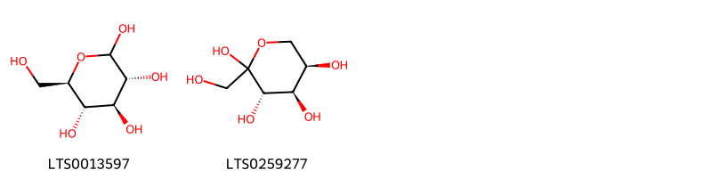{ width=100% }
    <figcaption>Hình ảnh cấu trúc hóa học của 2 hoạt chất thuộc nhóm Organooxygen compounds gồm ['glucose (LTS0013597)', 'd-fructopyranose (LTS0259277)'].</figcaption>
</figure>
#### Nhóm Saturated hydrocarbons
<figure markdown="span">
    { width=100% }
    <figcaption>Hình ảnh cấu trúc hóa học của 1 hoạt chất thuộc nhóm Saturated hydrocarbons gồm ['hentriacontane (LTS0046415)'].</figcaption>
</figure>
#### Nhóm Steroids and steroid derivatives
<figure markdown="span">
    { width=100% }
    <figcaption>Hình ảnh cấu trúc hóa học của 2 hoạt chất thuộc nhóm Steroids and steroid derivatives gồm ['stigmast-5-en-3-ol, (3β)- (LTS0204616)', 'sitogluside (LTS0201798)'].</figcaption>
</figure>

---

### Dược dân tộc học

Danh sách các quốc gia có sử dụng *Actiniopteris australis* trong điều trị các bệnh. 

| Country   | Disease            | Bệnh               |
|:----------|:-------------------|:-------------------|
| Egypt     | Styptic, Vermifuge | Styptic, Vermifuge |

---

---
## Actiniopteris dichotoma
### Thông tin về thực vật

!!! info "Phân loại thực vật của *Actiniopteris dichotoma* từ GIBF:"
    - **Kingdom:** Plantae
    - **Phylum:** Tracheophyta
    - **Order:** Polypodiales
    - **Family:** Pteridaceae
    - **Genus:** Actiniopteris
    - **Species:** *Actiniopteris dichotoma*

 

| Label (VI)   | Label (EN)   | Scientific Name         | Descriptions (VI)   | Descriptions (EN)   | Also Known As (VI)   | Also Known As (EN)   |
|:-------------|:-------------|:------------------------|:--------------------|:--------------------|:---------------------|:---------------------|
| N/A          | N/A          | Actiniopteris dichotoma | loài thực vật       | species of plant    | ['']                 | ['']                 |

#### Phân bố trên thế giới

**Từ CSDL GIBF** nan, Sri Lanka, Australia, Mauritius, Mozambique, unknown or invalid, Tanzania, United Republic of, Togo, Malawi, Pakistan, Zambia, Réunion, Nigeria, Namibia, United States of America, Congo, Democratic Republic of the, Zimbabwe, Saudi Arabia, South Africa, Uganda, Egypt, France, Madagascar, Seychelles, Cabo Verde, Botswana, India, Kenya, Cameroon, Ethiopia

#### Phân bố tại Việt Nam

**Từ CSDL GIBF**: Không có ghi nhận ở Việt Nam

---
### Thành phần hóa học
        
- Theo cơ sở dữ liệu lotus: Từ loài *Actiniopteris dichotoma* đã phân lập và xác định được Chưa có hoạt chất nào được phân lập. hoạt chất thuộc về các nhóm Không có hoạt chất nào được phân lập. 

Không có hình ảnh nào được tạo ra

---

### Dược dân tộc học

Danh sách các quốc gia có sử dụng *Actiniopteris dichotoma* trong điều trị các bệnh. 

| Country   | Disease            | Bệnh               |
|:----------|:-------------------|:-------------------|
| India     | Styptic, Vermifuge | Styptic, Vermifuge |

---

# Chi Coniogramme

??? note "Danh sách các dược liệu thuộc chi"
    
	 - *Coniogramme japonica*

---
## Coniogramme japonica
### Thông tin về thực vật

!!! info "Phân loại thực vật của *Coniogramme japonica* từ GIBF:"
    - **Kingdom:** Plantae
    - **Phylum:** Tracheophyta
    - **Order:** Polypodiales
    - **Family:** Pteridaceae
    - **Genus:** Coniogramme
    - **Species:** *Coniogramme japonica*

 

| Label (VI)   | Label (EN)   | Scientific Name      | Descriptions (VI)   | Descriptions (EN)   | Also Known As (VI)   | Also Known As (EN)   |
|:-------------|:-------------|:---------------------|:--------------------|:--------------------|:---------------------|:---------------------|
| N/A          | N/A          | Coniogramme japonica | loài thực vật       | species of plant    | ['']                 | ['bamboo fern']      |

#### Phân bố trên thế giới

**Từ CSDL GIBF** Japan, Belgium, Korea, Republic of, Chinese Taipei, United States of America, China

#### Phân bố tại Việt Nam

**Từ CSDL GIBF**: Không có ghi nhận ở Việt Nam

---
### Thành phần hóa học
        
- Theo cơ sở dữ liệu lotus: Từ loài *Coniogramme japonica* đã phân lập và xác định được 15 hoạt chất thuộc về các nhóm Prenol lipids, Steroids and steroid derivatives, Benzene and substituted derivatives. 

|    | chemicalTaxonomyClassyfireClass     |   smiles_count |
|---:|:------------------------------------|---------------:|
|  0 | Benzene and substituted derivatives |              1 |
|  1 | Prenol lipids                       |              8 |
|  2 | Steroids and steroid derivatives    |              5 |

#### Nhóm Benzene and substituted derivatives
<figure markdown="span">
    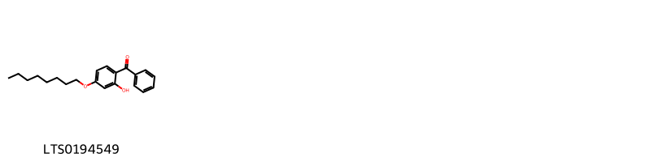{ width=100% }
    <figcaption>Hình ảnh cấu trúc hóa học của 1 hoạt chất thuộc nhóm Benzene and substituted derivatives gồm ['benzophenone 12 (LTS0194549)'].</figcaption>
</figure>
#### Nhóm Prenol lipids
<figure markdown="span">
    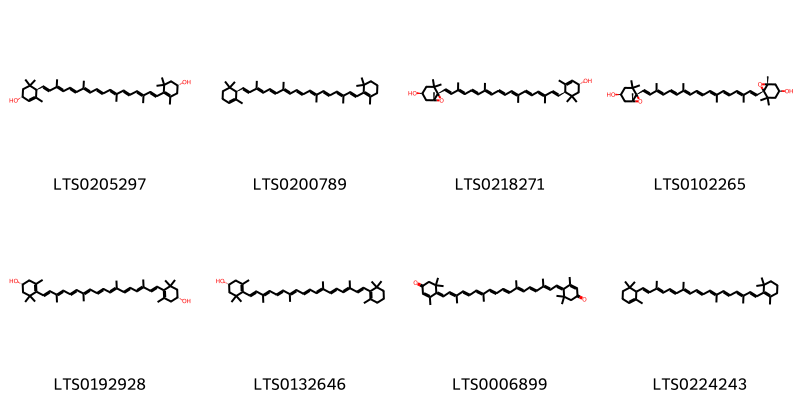{ width=100% }
    <figcaption>Hình ảnh cấu trúc hóa học của 8 hoạt chất thuộc nhóm Prenol lipids gồm ['carotenoid (LTS0205297)', '(+)-α-carotene (LTS0200789)', 'taraxanthin (LTS0218271)', 'violaxanthin (LTS0102265)', 'zeaxanthin (LTS0192928)', 'cryptoxanthin (LTS0132646)', 'rhodoxanthin (LTS0006899)', 'α-carotene (LTS0224243)'].</figcaption>
</figure>
#### Nhóm Steroids and steroid derivatives
<figure markdown="span">
    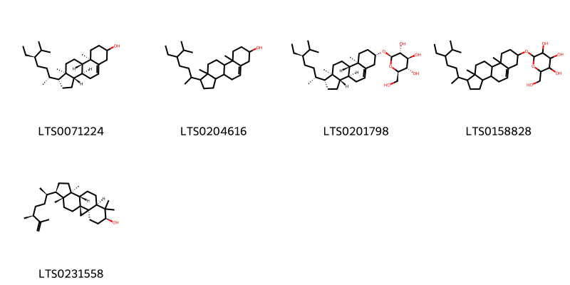{ width=100% }
    <figcaption>Hình ảnh cấu trúc hóa học của 5 hoạt chất thuộc nhóm Steroids and steroid derivatives gồm ['stigmast-5-en-3-ol (LTS0071224)', 'stigmast-5-en-3-ol, (3β)- (LTS0204616)', 'sitogluside (LTS0201798)', '2-{[1-(5-ethyl-6-methylheptan-2-yl)-9a,11a-dimethyl-1h,2h,3h,3ah,3bh,4h,6h,7h,8h,9h,9bh,10h,11h-cyclopenta[a]phenanthren-7-yl]oxy}-6-(hydroxymethyl)oxane-3,4,5-triol (LTS0158828)', 'cyclolaudenol (LTS0231558)'].</figcaption>
</figure>

---

### Dược dân tộc học

Danh sách các quốc gia có sử dụng *Coniogramme japonica* trong điều trị các bệnh. 

| Country   | Disease                  | Bệnh                       |
|:----------|:-------------------------|:---------------------------|
| China     | Carminative, Refrigerant | Làm sáng da, Chất làm lạnh |

---

# Chi Acrostichum

??? note "Danh sách các dược liệu thuộc chi"
    
	 - *Acrostichum aureum*

---
## Acrostichum aureum
### Thông tin về thực vật

!!! info "Phân loại thực vật của *Acrostichum aureum* từ GIBF:"
    - **Kingdom:** Plantae
    - **Phylum:** Tracheophyta
    - **Order:** Polypodiales
    - **Family:** Pteridaceae
    - **Genus:** Acrostichum
    - **Species:** *Acrostichum aureum*

 

| Label (VI)   | Label (EN)   | Scientific Name    | Descriptions (VI)   | Descriptions (EN)   | Also Known As (VI)   | Also Known As (EN)      |
|:-------------|:-------------|:-------------------|:--------------------|:--------------------|:---------------------|:------------------------|
| N/A          | N/A          | Acrostichum aureum |                     | species of plant    | ['']                 | ['Golden leather fern'] |

#### Phân bố trên thế giới

**Từ CSDL GIBF** nan, Australia, Guadeloupe, Cambodia, Mozambique, Benin, Sierra Leone, Tanzania, United Republic of, French Guiana, Puerto Rico, Chinese Taipei, Honduras, Jamaica, Bangladesh, United States of America, Liberia, Zimbabwe, Belize, South Africa, Hong Kong, Thailand, Brazil, New Caledonia, Cuba, Mexico, Singapore, Viet Nam, China, Madagascar, Colombia, Macao, Costa Rica, Vanuatu, India, Indonesia, Cayman Islands, Samoa, Malaysia, Northern Mariana Islands

#### Phân bố tại Việt Nam

**Từ CSDL GIBF**: Đồng Tháp, An Giang, Hồ Chí Minh city, Tiền Giang, Cần Thơ

---
### Thành phần hóa học
        
- Theo cơ sở dữ liệu lotus: Từ loài *Acrostichum aureum* đã phân lập và xác định được 5 hoạt chất thuộc về các nhóm Indanes. 

|    | chemicalTaxonomyClassyfireClass   |   smiles_count |
|---:|:----------------------------------|---------------:|
|  0 | Indanes                           |              5 |

#### Nhóm Indanes
<figure markdown="span">
    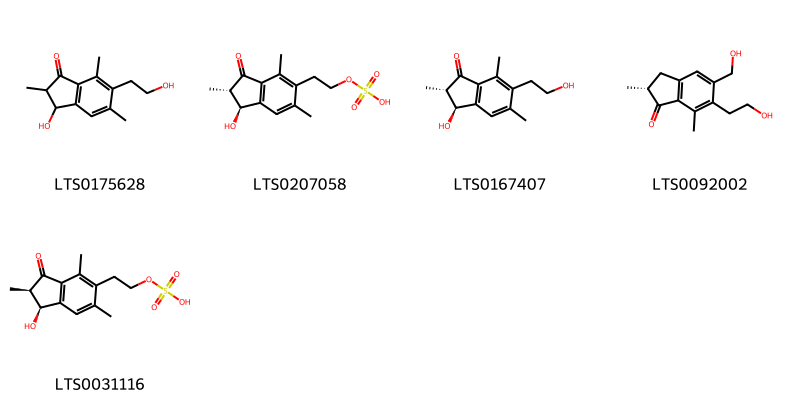{ width=100% }
    <figcaption>Hình ảnh cấu trúc hóa học của 5 hoạt chất thuộc nhóm Indanes gồm ['3-hydroxy-6-(2-hydroxyethyl)-2,5,7-trimethyl-2,3-dihydroinden-1-one (LTS0175628)', '(2s,3s)-sulfated pterosin c (LTS0207058)', '(2s,3s)-pterosin c (LTS0167407)', '(2r)-pterosin p (LTS0092002)', '2-[(1s,2r)-1-hydroxy-2,4,6-trimethyl-3-oxo-1,2-dihydroinden-5-yl]ethoxysulfonic acid (LTS0031116)'].</figcaption>
</figure>

---

### Dược dân tộc học

Danh sách các quốc gia có sử dụng *Acrostichum aureum* trong điều trị các bệnh. 

| Country   | Disease              | Bệnh                           |
|:----------|:---------------------|:-------------------------------|
| Elsewhere | Emollient, Vulnerary | Chất làm mềm, dễ bị tổn thương |

---

# Chi Pellaea

??? note "Danh sách các dược liệu thuộc chi"
    
	 - *Pellaea flavens*

---
## Pellaea flavens
### Thông tin về thực vật

!!! info "Phân loại thực vật của *Argyrochosma flava* từ GIBF:"
    - **Kingdom:** Plantae
    - **Phylum:** Tracheophyta
    - **Order:** Polypodiales
    - **Family:** Pteridaceae
    - **Genus:** Argyrochosma
    - **Species:** *Argyrochosma flava*

 

| Label (VI)   | Label (EN)   | Scientific Name    | Descriptions (VI)   | Descriptions (EN)   | Also Known As (VI)   | Also Known As (EN)      |
|:-------------|:-------------|:-------------------|:--------------------|:--------------------|:---------------------|:------------------------|
| N/A          | N/A          | Acrostichum aureum |                     | species of plant    | ['']                 | ['Golden leather fern'] |

#### Phân bố trên thế giới

**Từ CSDL GIBF** nan, Australia, Guadeloupe, Cambodia, Mozambique, Benin, Sierra Leone, Tanzania, United Republic of, French Guiana, Puerto Rico, Chinese Taipei, Honduras, Jamaica, Bangladesh, United States of America, Liberia, Zimbabwe, Belize, South Africa, Hong Kong, Thailand, Brazil, New Caledonia, Cuba, Mexico, Singapore, Viet Nam, China, Madagascar, Colombia, Macao, Costa Rica, Vanuatu, India, Indonesia, Cayman Islands, Samoa, Malaysia, Northern Mariana Islands

#### Phân bố tại Việt Nam

**Từ CSDL GIBF**: Đồng Tháp, An Giang, Hồ Chí Minh city, Tiền Giang, Cần Thơ

---
### Thành phần hóa học
        
- Theo cơ sở dữ liệu lotus: Từ loài *Argyrochosma flava* đã phân lập và xác định được Chưa có hoạt chất nào được phân lập. hoạt chất thuộc về các nhóm Không có hoạt chất nào được phân lập. 

Không có hình ảnh nào được tạo ra

---

### Dược dân tộc học

Danh sách các quốc gia có sử dụng *Argyrochosma flava* trong điều trị các bệnh. 

| Country   | Disease       | Bệnh          |
|:----------|:--------------|:--------------|
| Paraguay  | Antifertility | Chống lão hóa |

---

