!!! abstract "Tóm tắt"

    Họ Punicaceae gồm khoảng 1 chi và 1 loài được một số cộng đồng tại các quốc gia như Haiti, ain, Elsewhere, Kurdistan, Egypt, US, Venezuela, Mexico, China, Iraq, Turkey, Europe sử dụng trong một số trường hợp MYMEMORY WARNING: YOU USED ALL AVAILABLE FREE TRANSLATIONS FOR TODAY. NEXT AVAILABLE IN  15 HOURS 46 MINUTES 12 SECONDS VISIT HTTPS://MYMEMORY.TRANSLATED.NET/DOC/USAGELIMITS.PHP TO TRANSLATE MORE.

!!! info "DrDuke"

    James A. Duke sinh năm 1929-2017 là một nhà thực vật học người Mỹ. Đây là một trong những tác giả hàng đầu trong lĩnh vực dược dân tộc học với cuốn *CRC Handbook of Medicinal Herbs* và chính là người xây dựng lên cơ sở dữ liệu về hợp chất tự nhiên và dược dân tộc học tại Bộ nông nghiệp Hoa Kỳ. Các thông tin được đăng tải tại website [Dr. Duke's Phytochemical and Ethnobotanical Databases](https://phytochem.nal.usda.gov/). 
    Trong suốt thập niên 1970, ông lãnh đạo the Plant Taxonomy Laboratory, Plant Genetics and Germplasm Institute of the Agricultural Research Service, U.S. Department of Agriculture.
    Trong tài liệu này, các thông tin về dược dân tộc của các dược liệu được trích dẫn từ tài liệu của James A. Ducke với sự trợ giúp của phần mềm dịch thuật từ tiếng Anh sang tiếng Việt.
   

# Chi Punica

??? note "Danh sách các dược liệu thuộc chi"
    
	 - *Punica granatum*

---
## Punica granatum
### Thông tin về thực vật

!!! info "Phân loại thực vật của *Punica granatum* từ GIBF:"
    - **Kingdom:** Plantae
    - **Phylum:** Tracheophyta
    - **Order:** Myrtales
    - **Family:** Lythraceae
    - **Genus:** Punica
    - **Species:** *Punica granatum*

 

| Label (VI)   | Label (EN)   | Scientific Name   | Descriptions (VI)   | Descriptions (EN)             | Also Known As (VI)             | Also Known As (EN)                      |
|:-------------|:-------------|:------------------|:--------------------|:------------------------------|:-------------------------------|:----------------------------------------|
| N/A          | N/A          | Punica granatum   | cây                 | fruit-bearing deciduous shrub | ['Punica granatum', 'cây lựu'] | ['pomegranate tree', 'Punica granatum'] |

#### Phân bố trên thế giới

**Từ CSDL GIBF** Georgia, Bosnia and Herzegovina, Thailand, El Salvador, Spain, Northern Mariana Islands, Chile, Kenya, United Arab Emirates, Australia, Jamaica, Albania, Indonesia, Guatemala, Colombia, Pakistan, Palestine, State of, Puerto Rico, India, Montenegro, Bahamas, Virgin Islands (U.S.), Cambodia, Barbados, Türkiye, Malta, Brazil, Mexico, China, Nepal, Benin, Curaçao, Hong Kong, Switzerland, Argentina, South Africa, Portugal, Morocco, France, New Zealand, Cyprus, Costa Rica, Russian Federation, Ecuador, United States of America, Italy, Algeria, Greece, Croatia

#### Phân bố tại Việt Nam

**Từ CSDL GIBF**: Không có ghi nhận ở Việt Nam

---
### Thành phần hóa học
        
- Theo cơ sở dữ liệu lotus: Từ loài *Punica granatum* đã phân lập và xác định được 259 hoạt chất thuộc về các nhóm Furanoid lignans, Dibenzylbutane lignans, Carboxylic acids and derivatives, Linear 1,3-diarylpropanoids, Lignan lactones, Hydroxy acids and derivatives, Pyridines and derivatives, Tannins, Piperidines, Isocoumarins and derivatives, Cinnamic acids and derivatives, Organooxygen compounds, Coumarins and derivatives, Fatty Acyls, Isoflavonoids, Flavonoids, Prenol lipids, Glycerolipids, Steroids and steroid derivatives, Benzene and substituted derivatives. 

|    | chemicalTaxonomyClassyfireClass     |   smiles_count |
|---:|:------------------------------------|---------------:|
|  0 | Benzene and substituted derivatives |              4 |
|  1 | Carboxylic acids and derivatives    |              3 |
|  2 | Cinnamic acids and derivatives      |              8 |
|  3 | Coumarins and derivatives           |              3 |
|  4 | Dibenzylbutane lignans              |              3 |
|  5 | Fatty Acyls                         |             19 |
|  6 | Flavonoids                          |             55 |
|  7 | Furanoid lignans                    |              1 |
|  8 | Glycerolipids                       |              6 |
|  9 | Hydroxy acids and derivatives       |              1 |
| 10 | Isocoumarins and derivatives        |              5 |
| 11 | Isoflavonoids                       |              5 |
| 12 | Lignan lactones                     |              1 |
| 13 | Linear 1,3-diarylpropanoids         |              1 |
| 14 | Organooxygen compounds              |             11 |
| 15 | Piperidines                         |              8 |
| 16 | Prenol lipids                       |             15 |
| 17 | Pyridines and derivatives           |              2 |
| 18 | Steroids and steroid derivatives    |              9 |
| 19 | Tannins                             |             98 |

#### Nhóm Benzene and substituted derivatives
<figure markdown="span">
    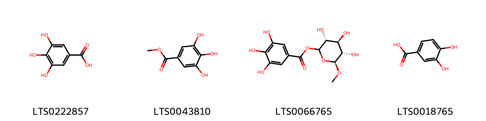{ width=100% }
    <figcaption>Hình ảnh cấu trúc hóa học của 4 hoạt chất thuộc nhóm Benzene and substituted derivatives gồm ['galop (LTS0222857)', 'methyl gallate (LTS0043810)', '(3r,4s,5s,6s)-3,4,5-trihydroxy-6-methoxyoxan-2-yl 3,4,5-trihydroxybenzoate (LTS0066765)', '3,4-dihydroxybenzoic acid (LTS0018765)'].</figcaption>
</figure>
#### Nhóm Carboxylic acids and derivatives
<figure markdown="span">
    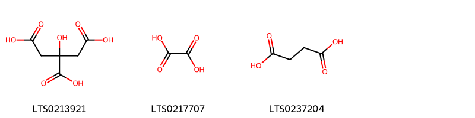{ width=100% }
    <figcaption>Hình ảnh cấu trúc hóa học của 3 hoạt chất thuộc nhóm Carboxylic acids and derivatives gồm ['citric acid (LTS0213921)', 'oxalic acid (LTS0217707)', 'succinic acid (LTS0237204)'].</figcaption>
</figure>
#### Nhóm Cinnamic acids and derivatives
<figure markdown="span">
    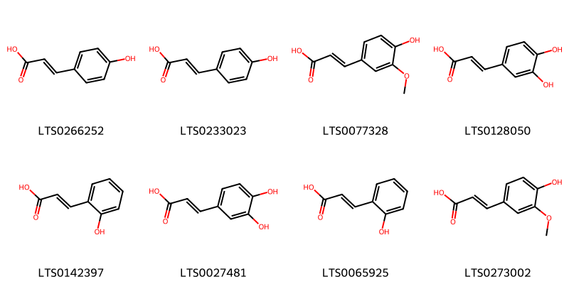{ width=100% }
    <figcaption>Hình ảnh cấu trúc hóa học của 8 hoạt chất thuộc nhóm Cinnamic acids and derivatives gồm ['para-coumaric acid (LTS0266252)', 'hydroxycinnamic acid (LTS0233023)', 'ferulic acid (LTS0077328)', '3,4-dihydroxycinnamic acid (LTS0128050)', 'trans-2-hydroxycinnamic acid (LTS0142397)', 'caffeic acid (LTS0027481)', 'o-coumaric acid (LTS0065925)', 'ferulic acid (LTS0273002)'].</figcaption>
</figure>
#### Nhóm Coumarins and derivatives
<figure markdown="span">
    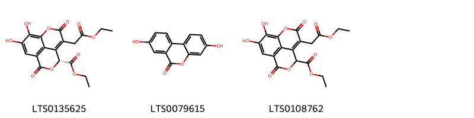{ width=100% }
    <figcaption>Hình ảnh cấu trúc hóa học của 3 hoạt chất thuộc nhóm Coumarins and derivatives gồm ['ethyl (6r)-4-(2-ethoxy-2-oxoethyl)-11,12-dihydroxy-3,8-dioxo-2,7-dioxatricyclo[7.3.1.0⁵,¹³]trideca-1(12),4,9(13),10-tetraene-6-carboxylate (LTS0135625)', 'urolithin a (LTS0079615)', 'ethyl 4-(2-ethoxy-2-oxoethyl)-11,12-dihydroxy-3,8-dioxo-2,7-dioxatricyclo[7.3.1.0⁵,¹³]trideca-1(12),4,9(13),10-tetraene-6-carboxylate (LTS0108762)'].</figcaption>
</figure>
#### Nhóm Dibenzylbutane lignans
<figure markdown="span">
    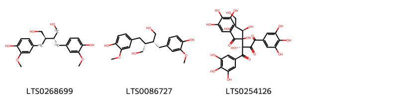{ width=100% }
    <figcaption>Hình ảnh cấu trúc hóa học của 3 hoạt chất thuộc nhóm Dibenzylbutane lignans gồm ['(2s,3r)-2,3-bis[(4-hydroxy-3-methoxyphenyl)(¹³c)methyl](1-¹³c)butane-1,4-diol (LTS0268699)', 'secoisolariciresinol (LTS0086727)', '(3s,4s)-3,4-dihydroxy-3-(3,4,5-trihydroxybenzoyl)-1,5-bis(3,4,5-trihydroxyphenyl)-4-[(1r,2r)-1,2,3-trihydroxypropyl]pentane-1,2,5-trione (LTS0254126)'].</figcaption>
</figure>
#### Nhóm Fatty Acyls
<figure markdown="span">
    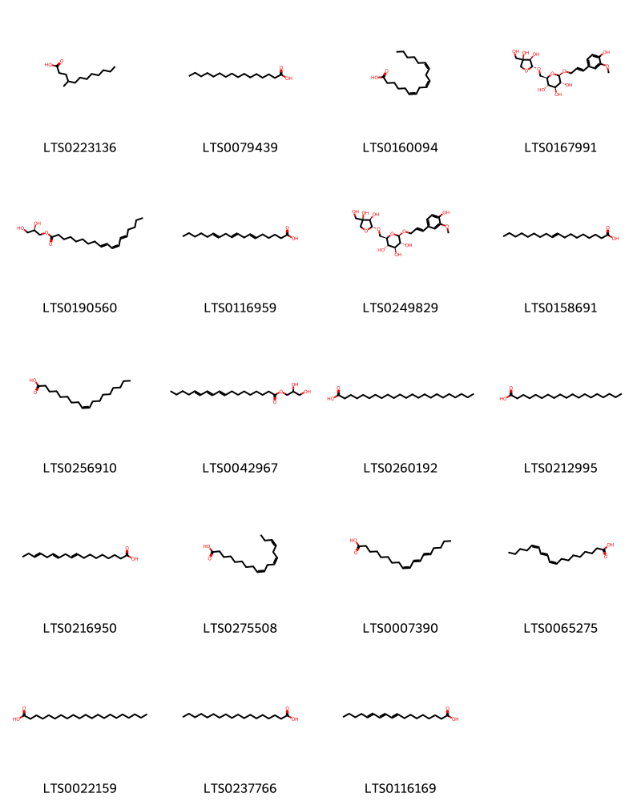{ width=100% }
    <figcaption>Hình ảnh cấu trúc hóa học của 19 hoạt chất thuộc nhóm Fatty Acyls gồm ['4-methyl lauric acid (LTS0223136)', 'palmitic acid (LTS0079439)', 'gamma-linolenic acid (LTS0160094)', '(2r,3s,4s,5r,6r)-2-({[(2r,3r,4r)-3,4-dihydroxy-4-(hydroxymethyl)oxolan-2-yl]oxy}methyl)-6-{[3-(4-hydroxy-3-methoxyphenyl)prop-2-en-1-yl]oxy}oxane-3,4,5-triol (LTS0167991)', '(2r)-2,3-dihydroxypropyl (9e,11z,13e)-octadeca-9,11,13-trienoate (LTS0190560)', '6,9,12-octadecatrienoic acid (LTS0116959)', '(2r,3s,4s,5r,6r)-2-({[(2r,3r,4r)-3,4-dihydroxy-4-(hydroxymethyl)oxolan-2-yl]oxy}methyl)-6-{[(2e)-3-(4-hydroxy-3-methoxyphenyl)prop-2-en-1-yl]oxy}oxane-3,4,5-triol (LTS0249829)', '9 octadecenoic acid (LTS0158691)', 'oleic acid (LTS0256910)', '2,3-dihydroxypropyl (9e)-octadeca-9,11,13-trienoate (LTS0042967)', 'tricosanoic acid (LTS0260192)', 'nonadecanoic acid (LTS0212995)', 'octadeca-9,12,15-trienoic acid (LTS0216950)', 'α-linolenic acid (LTS0275508)', 'elaeostearic acid (LTS0007390)', 'punicic acid (LTS0065275)', 'heneicosanoic acid (LTS0022159)', 'stearic acid (LTS0237766)', 'eleostearic acid (LTS0116169)'].</figcaption>
</figure>
#### Nhóm Flavonoids
<figure markdown="span">
    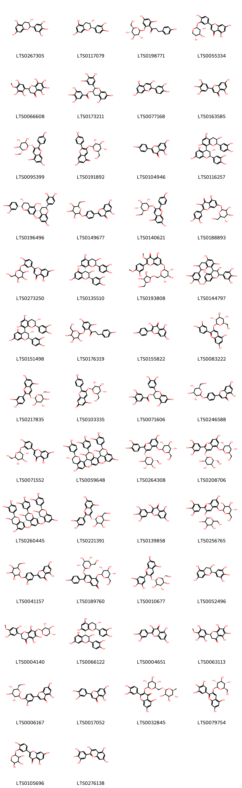{ width=100% }
    <figcaption>Hình ảnh cấu trúc hóa học của 55 hoạt chất thuộc nhóm Flavonoids gồm ['gallocatechol (LTS0267305)', '(+)-catechol (LTS0117079)', 'phlorizin (LTS0198771)', '5,7-dihydroxy-2-(4-hydroxy-3-{[(2s,3r,4s,5r)-3,4,5-trihydroxyoxan-2-yl]oxy}phenyl)chromen-4-one (LTS0055334)', '5,6,7,8-tetrahydroxy-2-(2,3,5-trihydroxy-4-methoxyphenyl)-2,3-dihydro-1-benzopyran-4-one (LTS0066608)', '(-)-epigallocatechin gallate (LTS0173211)', 'cyanidin (LTS0077168)', 'tricetin (LTS0163585)', 'pelargonidin 3-glucoside (LTS0095399)', '7-hydroxy-2-(4-hydroxyphenyl)-3-{[(2s,3r,4s,5s,6r)-3,4,5-trihydroxy-6-(hydroxymethyl)oxan-2-yl]oxy}chromen-5-one (LTS0191892)', 'chamomile (LTS0104946)', '(2r,3s,4s)-2-(3,4-dihydroxyphenyl)-4-[(2r,3r)-2-(3,4-dihydroxyphenyl)-3,5,7-trihydroxy-3,4-dihydro-2h-1-benzopyran-8-yl]-3,4-dihydro-2h-1-benzopyran-3,5,7-triol (LTS0116257)', '(2r,3s,4s)-2-(3,4-dihydroxyphenyl)-4-[(2r,3r)-2-(3,4-dihydroxyphenyl)-3,5,7-trihydroxy-3,4-dihydro-2h-1-benzopyran-6-yl]-3,4-dihydro-2h-1-benzopyran-3,5,7-triol (LTS0196496)', '5,7-dihydroxy-2-(4-{[3,4,5-trihydroxy-6-(hydroxymethyl)oxan-2-yl]oxy}phenyl)chromen-4-one (LTS0149677)', '5,7-dihydroxy-2-(4-hydroxyphenyl)-3-{[(2r,3s,4r,5r,6s)-3,4,5-trihydroxy-6-(hydroxymethyl)oxan-2-yl]oxy}-1λ⁴-chromen-1-ylium (LTS0140621)', 'quercimeritrin (LTS0188893)', '5,7-dihydroxy-2-(4-hydroxy-3-{[3,4,5-trihydroxy-6-(hydroxymethyl)oxan-2-yl]oxy}phenyl)chromen-4-one (LTS0273250)', '(2r,3r,4r)-2-(3,4-dihydroxyphenyl)-4-[(2r,3r)-2-(3,4-dihydroxyphenyl)-3,5,7-trihydroxy-3,4-dihydro-2h-1-benzopyran-8-yl]-3,4-dihydro-2h-1-benzopyran-3,5,7-triol (LTS0135510)', '7-{[(2s,3r,4s,5s,6r)-6-({[(2s,3r,4s,5s)-3,4-dihydroxy-5-(hydroxymethyl)oxolan-2-yl]oxy}methyl)-3,4,5-trihydroxyoxan-2-yl]oxy}-5-hydroxy-2-(3-hydroxy-4-methoxyphenyl)-3-methoxychromen-4-one (LTS0193808)', '4-[3,5,7-trihydroxy-2-(3,4,5-trihydroxyphenyl)-3,4-dihydro-2h-1-benzopyran-8-yl]-2-(3,4,5-trihydroxyphenyl)-3,4-dihydro-2h-1-benzopyran-3,5,7-triol (LTS0144797)', '(2r,3s,4s)-2-(3,4-dihydroxyphenyl)-4-[(2r,3s)-2-(3,4-dihydroxyphenyl)-3,5,7-trihydroxy-3,4-dihydro-2h-1-benzopyran-8-yl]-3,4-dihydro-2h-1-benzopyran-3,5,7-triol (LTS0151498)', 'phloridzin (LTS0176319)', 'kaempherol (LTS0155822)', '5,7-dihydroxy-2-(4-hydroxy-3-oxidophenyl)-3-{[(2s,3r,4s,5s,6r)-3,4,5-trihydroxy-6-(hydroxymethyl)oxan-2-yl]oxy}-1λ⁴-chromen-1-ylium (LTS0083222)', 'cyanidin 3-glucoside (LTS0217835)', '5-hydroxy-2-(4-hydroxyphenyl)-3-{[(2s,3r,4s,5s,6r)-3,4,5-trihydroxy-6-(hydroxymethyl)oxan-2-yl]oxy}chromen-7-one (LTS0103335)', 'epicatechin gallate (LTS0071606)', '5,7-dihydroxy-2-(4-{[(2s,3r,4s,5s,6r)-3,4,5-trihydroxy-6-(hydroxymethyl)oxan-2-yl]oxy}phenyl)chromen-4-one (LTS0246588)', "luteolin 3'-glucoside (LTS0071552)", '(2r,3r)-2-(3,4-dihydroxyphenyl)-8-[(2r,3r)-2-(3,4-dihydroxyphenyl)-3,5,7-trihydroxy-3,4-dihydro-2h-1-benzopyran-4-yl]-4-[(2r,3s)-2-(3,4-dihydroxyphenyl)-3,5,7-trihydroxy-3,4-dihydro-2h-1-benzopyran-8-yl]-3,4-dihydro-2h-1-benzopyran-3,5,7-triol (LTS0059648)', 'cyanin (LTS0264308)', 'delphin (LTS0208706)', 'procyanidin c1 (LTS0260445)', 'chrysanthemin (LTS0221391)', 'myricetin (LTS0139858)', 'delphin (LTS0256765)', '5,7-dihydroxy-2-(3-hydroxy-4-{[3,4,5-trihydroxy-6-(hydroxymethyl)oxan-2-yl]oxy}phenyl)chromen-4-one (LTS0041157)', '2-(4-hydroxyphenyl)-3,5-bis({[(2s,3r,4s,5s,6r)-3,4,5-trihydroxy-6-(hydroxymethyl)oxan-2-yl]oxy})chromen-7-one (LTS0189760)', 'delphinidin 3-glucoside (LTS0010677)', 'epigallocatechin (LTS0052496)', '(2s)-2-(2,5-dihydroxy-4-methoxyphenyl)-5,6,8-trihydroxy-7-{[(2s,3r,4s,5r)-3,4,5-trihydroxyoxan-2-yl]oxy}-2,3-dihydro-1-benzopyran-4-one (LTS0004140)', '(2r,3r,4r)-2-(3,4-dihydroxyphenyl)-4-[(2r,3s)-2-(3,4-dihydroxyphenyl)-3,5,7-trihydroxy-3,4-dihydro-2h-1-benzopyran-8-yl]-3,4-dihydro-2h-1-benzopyran-3,5,7-triol (LTS0066122)', 'quercetin (LTS0004651)', '(2s)-5,6,7,8-tetrahydroxy-2-(2,3,5-trihydroxy-4-methoxyphenyl)-2,3-dihydro-1-benzopyran-4-one (LTS0063113)', '5,7-dihydroxy-2-(3-hydroxy-4-{[(2s,3r,4s,5s,6r)-3,4,5-trihydroxy-6-(hydroxymethyl)oxan-2-yl]oxy}phenyl)chromen-4-one (LTS0006167)', 'luteolin (LTS0017052)', '3-rutinosyl quercetin (LTS0032845)', '2-(3,5-dihydroxy-4-oxidophenyl)-5,7-dihydroxy-3-{[(2s,3r,4s,5s,6r)-3,4,5-trihydroxy-6-(hydroxymethyl)oxan-2-yl]oxy}-1λ⁴-chromen-1-ylium (LTS0079754)', '5,7-dihydroxy-2-{4-hydroxy-3-[(3,4,5-trihydroxyoxan-2-yl)oxy]phenyl}chromen-4-one (LTS0105696)', '2-(3,5-dihydroxy-4-oxidophenyl)-3,5,7-trihydroxy-1λ⁴-chromen-1-ylium (LTS0276138)', '(2r,3s,4r)-2-(3,4-dihydroxyphenyl)-4-[(2r,3r)-2-(3,4-dihydroxyphenyl)-3,5,7-trihydroxy-3,4-dihydro-2h-1-benzopyran-6-yl]-3,4-dihydro-2h-1-benzopyran-3,5,7-triol (LTS0076760)', 'quercimeritrin (LTS0208490)', 'delphinidin (LTS0036798)', 'ent-epicatechin (LTS0265245)', '2-(2,5-dihydroxy-4-methoxyphenyl)-5,6,8-trihydroxy-7-[(3,4,5-trihydroxyoxan-2-yl)oxy]-2,3-dihydro-1-benzopyran-4-one (LTS0042410)'].</figcaption>
</figure>
#### Nhóm Furanoid lignans
<figure markdown="span">
    { width=100% }
    <figcaption>Hình ảnh cấu trúc hóa học của 1 hoạt chất thuộc nhóm Furanoid lignans gồm ['matairesinol (LTS0193475)'].</figcaption>
</figure>
#### Nhóm Glycerolipids
<figure markdown="span">
    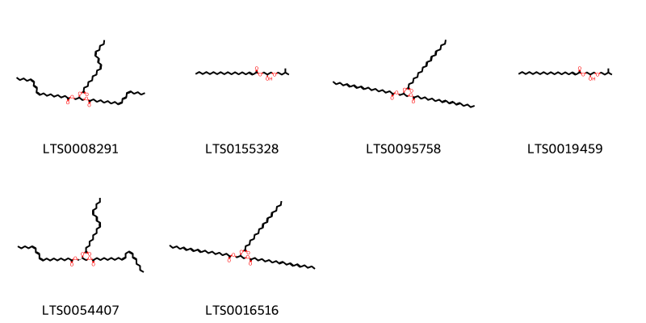{ width=100% }
    <figcaption>Hình ảnh cấu trúc hóa học của 6 hoạt chất thuộc nhóm Glycerolipids gồm ['1,3-bis[(9z,11e,13z)-octadeca-9,11,13-trienoyloxy]propan-2-yl (9z,11e,13z)-octadeca-9,11,13-trienoate (LTS0008291)', '(2r)-2-hydroxy-3-(3-methylbutoxy)propyl (2e)-octadec-2-enoate (LTS0155328)', '1,3-bis[(11e)-octadeca-9,11,13-trienoyloxy]propan-2-yl (11e)-octadeca-9,11,13-trienoate (LTS0095758)', '(2r)-2-hydroxy-3-(3-methylbutoxy)propyl octadec-2-enoate (LTS0019459)', '(2r)-2,3-bis[(9z,11e,13z)-octadeca-9,11,13-trienoyloxy]propyl (9z,12z,14e)-nonadeca-9,12,14-trienoate (LTS0054407)', '2,3-bis[(11e)-octadeca-9,11,13-trienoyloxy]propyl (14e)-nonadeca-9,12,14-trienoate (LTS0016516)'].</figcaption>
</figure>
#### Nhóm Hydroxy acids and derivatives
<figure markdown="span">
    { width=100% }
    <figcaption>Hình ảnh cấu trúc hóa học của 1 hoạt chất thuộc nhóm Hydroxy acids and derivatives gồm ['(-)-malic acid (LTS0128885)'].</figcaption>
</figure>
#### Nhóm Isocoumarins and derivatives
<figure markdown="span">
    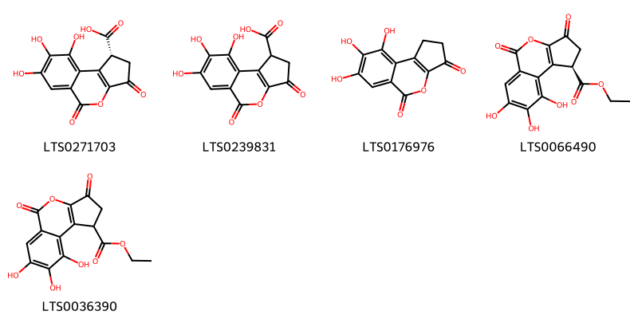{ width=100% }
    <figcaption>Hình ảnh cấu trúc hóa học của 5 hoạt chất thuộc nhóm Isocoumarins and derivatives gồm ['(1r)-7,8,9-trihydroxy-3,5-dioxo-1h,2h-cyclopenta[c]isochromene-1-carboxylic acid (LTS0271703)', '7,8,9-trihydroxy-3,5-dioxo-1h,2h-cyclopenta[c]isochromene-1-carboxylic acid (LTS0239831)', '7,8,9-trihydroxy-1h,2h-cyclopenta[c]isochromene-3,5-dione (LTS0176976)', 'ethyl (1r)-7,8,9-trihydroxy-3,5-dioxo-1h,2h-cyclopenta[c]isochromene-1-carboxylate (LTS0066490)', 'ethyl 7,8,9-trihydroxy-3,5-dioxo-1h,2h-cyclopenta[c]isochromene-1-carboxylate (LTS0036390)'].</figcaption>
</figure>
#### Nhóm Isoflavonoids
<figure markdown="span">
    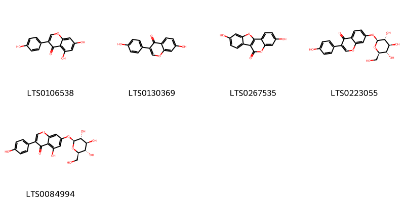{ width=100% }
    <figcaption>Hình ảnh cấu trúc hóa học của 5 hoạt chất thuộc nhóm Isoflavonoids gồm ['genistein (LTS0106538)', 'daidzein (LTS0130369)', 'coumestrol (LTS0267535)', 'daidzin (LTS0223055)', 'genistin (LTS0084994)'].</figcaption>
</figure>
#### Nhóm Lignan lactones
<figure markdown="span">
    { width=100% }
    <figcaption>Hình ảnh cấu trúc hóa học của 1 hoạt chất thuộc nhóm Lignan lactones gồm ['(3as,4r,9ar)-6-hydroxy-4-(4-hydroxy-3-methoxyphenyl)-7-methoxy-3h,3ah,4h,9h,9ah-naphtho[2,3-c]furan-1-one (LTS0229877)'].</figcaption>
</figure>
#### Nhóm Linear 1_3-diarylpropanoids
<figure markdown="span">
    { width=100% }
    <figcaption>Hình ảnh cấu trúc hóa học của Không tìm thấy chú thích hoạt chất thuộc nhóm Linear 1_3-diarylpropanoids gồm Không tìm thấy chú thích.</figcaption>
</figure>
#### Nhóm Organooxygen compounds
<figure markdown="span">
    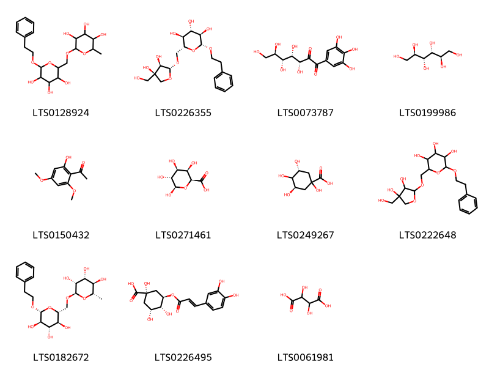{ width=100% }
    <figcaption>Hình ảnh cấu trúc hóa học của 11 hoạt chất thuộc nhóm Organooxygen compounds gồm ['2-methyl-6-{[3,4,5-trihydroxy-6-(2-phenylethoxy)oxan-2-yl]methoxy}oxane-3,4,5-triol (LTS0128924)', '(2r,3s,4s,5r,6r)-2-({[(2r,3r,4r)-3,4-dihydroxy-4-(hydroxymethyl)oxolan-2-yl]oxy}methyl)-6-(2-phenylethoxy)oxane-3,4,5-triol (LTS0226355)', '(3r,4s,5r,6r)-3,4,5,6,7-pentahydroxy-1-(3,4,5-trihydroxyphenyl)heptane-1,2-dione (LTS0073787)', 'mannitol (LTS0199986)', 'xanthoxylin (LTS0150432)', 'β-d-galactopyranuronic acid (LTS0271461)', '(3r,5r)-1,3,4,5-tetrahydroxycyclohexane-1-carboxylic acid (LTS0249267)', '2-({[3,4-dihydroxy-4-(hydroxymethyl)oxolan-2-yl]oxy}methyl)-6-(2-phenylethoxy)oxane-3,4,5-triol (LTS0222648)', '(2s,3r,4r,5r,6r)-2-methyl-6-{[(2r,3s,4s,5r,6r)-3,4,5-trihydroxy-6-(2-phenylethoxy)oxan-2-yl]methoxy}oxane-3,4,5-triol (LTS0182672)', 'chlorogenic acid (LTS0226495)', '(.+-.)-tartaric acid (LTS0061981)'].</figcaption>
</figure>
#### Nhóm Piperidines
<figure markdown="span">
    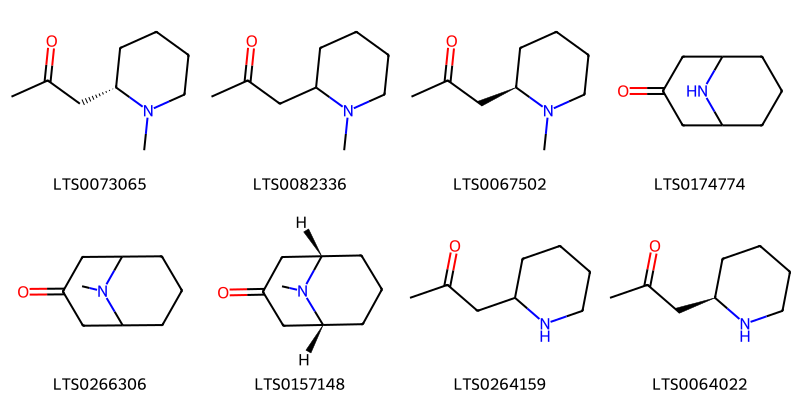{ width=100% }
    <figcaption>Hình ảnh cấu trúc hóa học của 8 hoạt chất thuộc nhóm Piperidines gồm ['1-[(2s)-1-methylpiperidin-2-yl]propan-2-one (LTS0073065)', 'n-methylisopelletierine (LTS0082336)', 'n-methylpelletierine (LTS0067502)', '9-azabicyclo[3.3.1]nonan-3-one (LTS0174774)', 'pseudopelletierine (LTS0266306)', '(1r,5s)-9-methyl-9-azabicyclo[3.3.1]nonan-3-one (LTS0157148)', 'pelletierine (LTS0264159)', '(r)-1-(2-piperidyl)acetone (LTS0064022)'].</figcaption>
</figure>
#### Nhóm Prenol lipids
<figure markdown="span">
    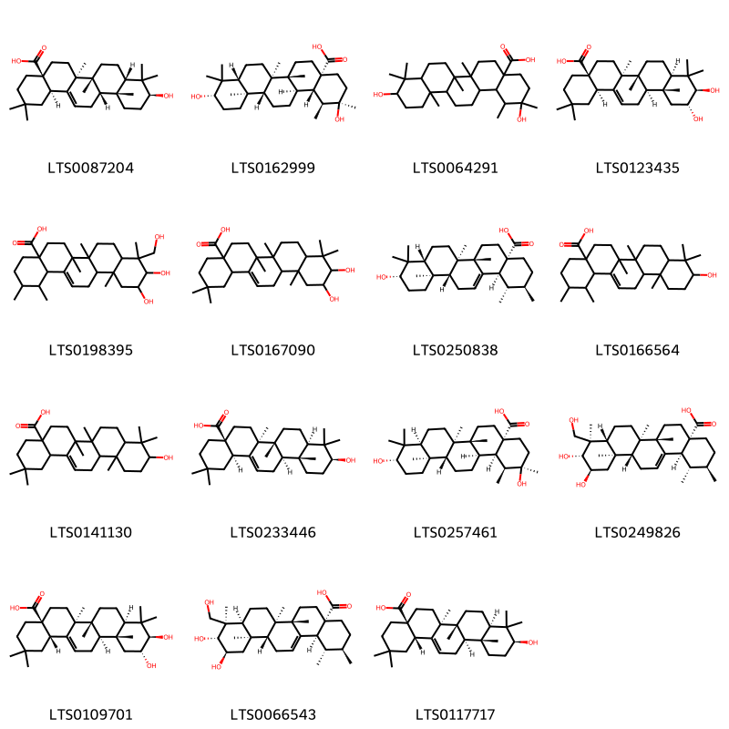{ width=100% }
    <figcaption>Hình ảnh cấu trúc hóa học của 15 hoạt chất thuộc nhóm Prenol lipids gồm ['(4as,6as,6br,8as,10s,12ar,12bs,14br)-10-hydroxy-2,2,6a,6b,9,9,12a-heptamethyl-1,3,4,5,6,7,8,8a,10,11,12,12b,13,14b-tetradecahydropicene-4a-carboxylic acid (LTS0087204)', '(1s,2r,4ar,6ar,6br,8ar,10s,12ar,12br,14ar,14bs)-2,10-dihydroxy-1,2,6a,6b,9,9,12a-heptamethyl-hexadecahydropicene-4a-carboxylic acid (LTS0162999)', '2,10-dihydroxy-1,2,6a,6b,9,9,12a-heptamethyl-hexadecahydropicene-4a-carboxylic acid (LTS0064291)', '(4as,6as,6br,8ar,10r,11r,12ar,12br,14br)-10,11-dihydroxy-2,2,6a,6b,9,9,12a-heptamethyl-1,3,4,5,6,7,8,8a,10,11,12,12b,13,14b-tetradecahydropicene-4a-carboxylic acid (LTS0123435)', 'asiatic acid (LTS0198395)', '10,11-dihydroxy-2,2,6a,6b,9,9,12a-heptamethyl-1,3,4,5,6,7,8,8a,10,11,12,12b,13,14b-tetradecahydropicene-4a-carboxylic acid (LTS0167090)', 'ursolic acid (LTS0250838)', '10-hydroxy-1,2,6a,6b,9,9,12a-heptamethyl-2,3,4,5,6,7,8,8a,10,11,12,12b,13,14b-tetradecahydro-1h-picene-4a-carboxylic acid (LTS0166564)', 'oleanolic acid (LTS0141130)', '(4as,6as,6br,8ar,10s,12ar,12br,14br)-10-hydroxy-2,2,6a,6b,9,9,12a-heptamethyl-1,3,4,5,6,7,8,8a,10,11,12,12b,13,14b-tetradecahydropicene-4a-carboxylic acid (LTS0233446)', '(1s,2r,4ar,6ar,6br,8as,10s,12ar,12br,14ar,14br)-2,10-dihydroxy-1,2,6a,6b,9,9,12a-heptamethyl-hexadecahydropicene-4a-carboxylic acid (LTS0257461)', 'asiatic acid (LTS0249826)', 'maslinic acid (LTS0109701)', '(1s,2r,4as,6as,6br,8as,9r,10r,11r,12ar,12br,14bs)-10,11-dihydroxy-9-(hydroxymethyl)-1,2,6a,6b,9,12a-hexamethyl-2,3,4,5,6,7,8,8a,10,11,12,12b,13,14b-tetradecahydro-1h-picene-4a-carboxylic acid (LTS0066543)', 'oleanolic acid (LTS0117717)'].</figcaption>
</figure>
#### Nhóm Pyridines and derivatives
<figure markdown="span">
    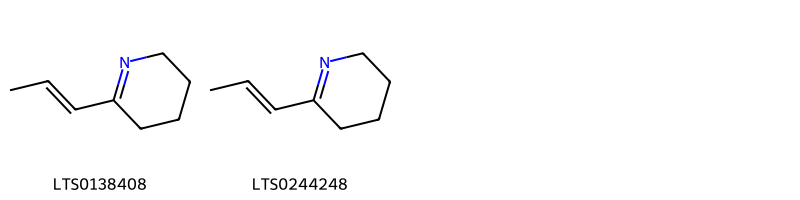{ width=100% }
    <figcaption>Hình ảnh cấu trúc hóa học của 2 hoạt chất thuộc nhóm Pyridines and derivatives gồm ['2-[(1e)-prop-1-en-1-yl]-3,4,5,6-tetrahydropyridine (LTS0138408)', '2-(prop-1-en-1-yl)-3,4,5,6-tetrahydropyridine (LTS0244248)'].</figcaption>
</figure>
#### Nhóm Steroids and steroid derivatives
<figure markdown="span">
    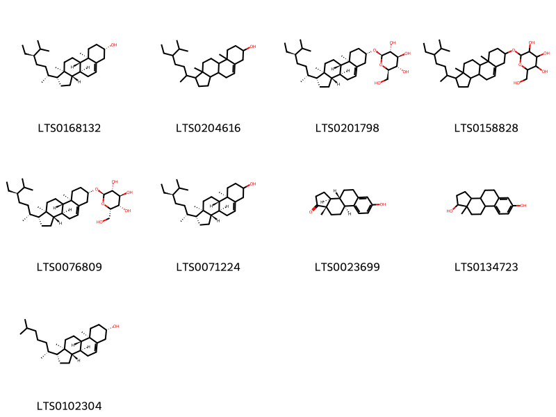{ width=100% }
    <figcaption>Hình ảnh cấu trúc hóa học của 9 hoạt chất thuộc nhóm Steroids and steroid derivatives gồm ['sitosterol (LTS0168132)', 'stigmast-5-en-3-ol, (3β)- (LTS0204616)', 'sitogluside (LTS0201798)', '2-{[1-(5-ethyl-6-methylheptan-2-yl)-9a,11a-dimethyl-1h,2h,3h,3ah,3bh,4h,6h,7h,8h,9h,9bh,10h,11h-cyclopenta[a]phenanthren-7-yl]oxy}-6-(hydroxymethyl)oxane-3,4,5-triol (LTS0158828)', '(2r,3r,4s,5s,6s)-2-{[(1r,3as,3bs,7s,9ar,9bs,11ar)-1-[(2r,5r)-5-ethyl-6-methylheptan-2-yl]-9a,11a-dimethyl-1h,2h,3h,3ah,3bh,4h,6h,7h,8h,9h,9bh,10h,11h-cyclopenta[a]phenanthren-7-yl]oxy}-6-(hydroxymethyl)oxane-3,4,5-triol (LTS0076809)', 'stigmast-5-en-3-ol (LTS0071224)', 'estrone (LTS0023699)', 'estradiol (LTS0134723)', 'cholesterol (LTS0102304)'].</figcaption>
</figure>
#### Nhóm Tannins
<figure markdown="span">
    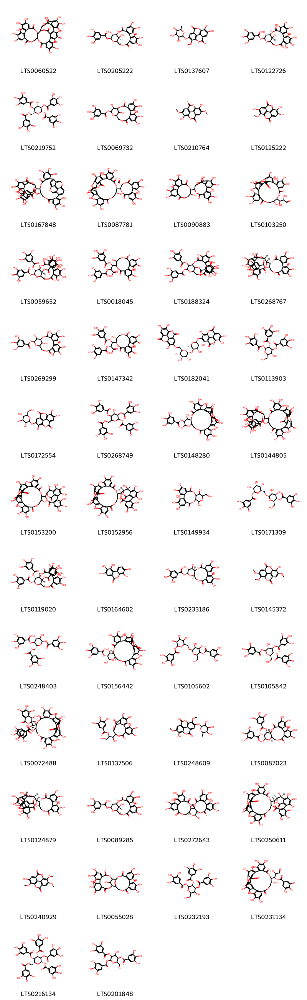{ width=100% }
    <figcaption>Hình ảnh cấu trúc hóa học của 98 hoạt chất thuộc nhóm Tannins gồm ['7,8,9,12,13,14,25,26,27,30,31,32,35,36,37,46-hexadecahydroxy-3,18,21,41,43-pentaoxanonacyclo[27.13.3.1³⁸,⁴².0²,²⁰.0⁵,¹⁰.0¹¹,¹⁶.0²³,²⁸.0³³,⁴⁵.0³⁴,³⁹]hexatetraconta-5,7,9,11(16),12,14,23,25,27,29,31,33(45),34(39),35,37-pentadecaene-4,17,22,40,44-pentone (LTS0060522)', '(1s,19r,21s,22r,23s)-6,7,8,11,12,13,22,23-octahydroxy-3,16-dioxo-2,17,20-trioxatetracyclo[17.3.1.0⁴,⁹.0¹⁰,¹⁵]tricosa-4(9),5,7,10,12,14-hexaen-21-yl 3,4,5-trihydroxybenzoate (LTS0205222)', '6,7-dihydroxy-14-methoxy-13-[(3,4,5-trihydroxy-6-methyloxan-2-yl)oxy]-2,9-dioxatetracyclo[6.6.2.0⁴,¹⁶.0¹¹,¹⁵]hexadeca-1(15),4,6,8(16),11,13-hexaene-3,10-dione (LTS0137607)', '(1s,19r,21s,22r,23r)-5,6,7,8,11,12,13,14,22,23-decahydroxy-3,16-dioxo-2,17,20-trioxatetracyclo[17.3.1.0⁴,⁹.0¹⁰,¹⁵]tricosa-4,6,8,10,12,14-hexaen-21-yl 3,4,5-trihydroxybenzoate (LTS0122726)', '(2s,3r,4s,5s,6r)-4-hydroxy-3,5-bis(3,4,5-trihydroxybenzoyloxy)-6-[(3,4,5-trihydroxybenzoyloxy)methyl]oxan-2-yl 3,4,5-trihydroxybenzoate (LTS0219752)', '6,7,8,11,12,13,22,23-octahydroxy-3,16-dioxo-2,17,20-trioxatetracyclo[17.3.1.0⁴,⁹.0¹⁰,¹⁵]tricosa-4(9),5,7,10,12,14-hexaen-21-yl 3,4,5-trihydroxybenzoate (LTS0069732)', '7,14-dihydroxy-6,13-dimethoxy-2,9-dioxatetracyclo[6.6.2.0⁴,¹⁶.0¹¹,¹⁵]hexadeca-1(15),4(16),5,7,11,13-hexaene-3,10-dione (LTS0210764)', '6,7,13-trihydroxy-14-methoxy-2,9-dioxatetracyclo[6.6.2.0⁴,¹⁶.0¹¹,¹⁵]hexadeca-1(15),4,6,8(16),11,13-hexaene-3,10-dione (LTS0125222)', '12-{2,3,4,7,8,9,19-heptahydroxy-12,17-dioxo-13,16-dioxatetracyclo[13.3.1.0⁵,¹⁸.0⁶,¹¹]nonadeca-1(18),2,4,6,8,10-hexaen-14-yl}-3,4,5,17,18,19-hexahydroxy-8,14-dioxo-9,13,25,32-tetraoxaheptacyclo[25.8.0.0²,⁷.0¹⁵,²⁰.0²¹,³⁰.0²⁴,²⁹.0²⁸,³³]pentatriaconta-1(35),2,4,6,15(20),16,18,21,23,26,28,30,33-tridecaen-11-yl 3,4,5-trihydroxybenzoate (LTS0167848)', '(10r,11s)-3,4,5,16,17,18-hexahydroxy-8,13-dioxo-11-[(10s,11s)-3,4,5,11,17,18,19,22,23,34,35-undecahydroxy-8,14,26,31-tetraoxo-9,13,25,32-tetraoxaheptacyclo[25.8.0.0²,⁷.0¹⁵,²⁰.0²¹,³⁰.0²⁴,²⁹.0²⁸,³³]pentatriaconta-1(35),2,4,6,15(20),16,18,21,23,27,29,33-dodecaen-10-yl]-9,12-dioxatricyclo[12.4.0.0²,⁷]octadeca-1(14),2,4,6,15,17-hexaene-10-carbaldehyde (LTS0087781)', '14-{3,4,5,11,17,18,19-heptahydroxy-8,14-dioxo-9,13-dioxatricyclo[13.4.0.0²,⁷]nonadeca-1(15),2,4,6,16,18-hexaen-10-yl}-2,3,4,7,8,9,19-heptahydroxy-13,16-dioxatetracyclo[13.3.1.0⁵,¹⁸.0⁶,¹¹]nonadeca-1(18),2,4,6,8,10-hexaene-12,17-dione (LTS0090883)', '(2r,3r)-2,3-dihydroxy-3-[(10r,11s)-3,4,5,11,17,18,19,22,23,34,35-undecahydroxy-8,14,26,31-tetraoxo-9,13,25,32-tetraoxaheptacyclo[25.8.0.0²,⁷.0¹⁵,²⁰.0²¹,³⁰.0²⁴,²⁹.0²⁸,³³]pentatriaconta-1(35),2,4,6,15(20),16,18,21,23,27,29,33-dodecaen-10-yl]propanal (LTS0103250)', '(1s,19r,21s,22r,23r)-5,6,7,8,11,12,13,14-octahydroxy-3,16-dioxo-21,23-bis(3,4,5-trihydroxybenzoyloxy)-2,17,20-trioxatetracyclo[17.3.1.0⁴,⁹.0¹⁰,¹⁵]tricosa-4,6,8,10,12,14-hexaen-22-yl 3,4,5-trihydroxybenzoate (LTS0059652)', '3-{3,4,5,11,17,18,19-heptahydroxy-8,14-dioxo-9,13-dioxatricyclo[13.4.0.0²,⁷]nonadeca-1(15),2,4,6,16,18-hexaen-10-yl}-2,3-bis(3,4,5-trihydroxybenzoyloxy)propanoic acid (LTS0018045)', '5,6,7,8,11,12,13,14-octahydroxy-3,16-dioxo-21,22-bis(3,4,5-trihydroxybenzoyloxy)-2,17,20-trioxatetracyclo[17.3.1.0⁴,⁹.0¹⁰,¹⁵]tricosa-4,6,8,10,12,14-hexaen-23-yl 3,4,5-trihydroxybenzoate (LTS0188324)', '(11s,12r)-12-[(14r,15s,19s)-2,3,4,7,8,9,19-heptahydroxy-12,17-dioxo-13,16-dioxatetracyclo[13.3.1.0⁵,¹⁸.0⁶,¹¹]nonadeca-1(18),2,4,6,8,10-hexaen-14-yl]-3,4,5,17,18,19-hexahydroxy-8,14-dioxo-9,13-dioxatricyclo[13.4.0.0²,⁷]nonadeca-1(15),2,4,6,16,18-hexaen-11-yl 3,4,5-trihydroxybenzoate (LTS0268767)', '5,6,7,8,11,12,13,14,22,23-decahydroxy-3,16-dioxo-2,17,20-trioxatetracyclo[17.3.1.0⁴,⁹.0¹⁰,¹⁵]tricosa-4,6,8,10,12,14-hexaen-21-yl 3,4,5-trihydroxybenzoate (LTS0269299)', '(2r,3s)-3-[(10r,11r)-3,4,5,11,17,18,19-heptahydroxy-8,14-dioxo-9,13-dioxatricyclo[13.4.0.0²,⁷]nonadeca-1(15),2,4,6,16,18-hexaen-10-yl]-2,3-bis(3,4,5-trihydroxybenzoyloxy)propanoic acid (LTS0147342)', '6-{[(2s,3r,4s,5r,6s)-3,4-dihydroxy-6-methyl-5-{[(2s,3r,4s,5s,6r)-3,4,5-trihydroxy-6-[({7,13,14-trihydroxy-3,10-dioxo-2,9-dioxatetracyclo[6.6.2.0⁴,¹⁶.0¹¹,¹⁵]hexadeca-1(15),4(16),5,7,11,13-hexaen-6-yl}oxy)methyl]oxan-2-yl]oxy}oxan-2-yl]oxy}-7,13,14-trihydroxy-2,9-dioxatetracyclo[6.6.2.0⁴,¹⁶.0¹¹,¹⁵]hexadeca-1(15),4(16),5,7,11,13-hexaene-3,10-dione (LTS0182041)', '(2r,3r,4s,5r,6s)-3-hydroxy-2-(hydroxymethyl)-5,6-bis(3,4,5-trihydroxybenzoyloxy)oxan-4-yl 3,4,5-trihydroxybenzoate (LTS0113903)', '6,7,14-trihydroxy-13-{[(2s,3r,4s,5s,6r)-3,4,5-trihydroxy-6-(hydroxymethyl)oxan-2-yl]oxy}-2,9-dioxatetracyclo[6.6.2.0⁴,¹⁶.0¹¹,¹⁵]hexadeca-1(15),4,6,8(16),11,13-hexaene-3,10-dione (LTS0172554)', '4-hydroxy-3,5-bis(3,4,5-trihydroxybenzoyloxy)-6-[(3,4,5-trihydroxybenzoyloxy)methyl]oxan-2-yl 3,4,5-trihydroxybenzoate (LTS0268749)', '3,4,5,11,13,21,22,23,26,27,38,39-dodecahydroxy-8,18,30,35-tetraoxo-9,14,17,29,36-pentaoxaoctacyclo[29.8.0.0²,⁷.0¹⁰,¹⁵.0¹⁹,²⁴.0²⁵,³⁴.0²⁸,³³.0³²,³⁷]nonatriaconta-1(39),2(7),3,5,19,21,23,25,27,31,33,37-dodecaen-12-yl 3,4,5-trihydroxybenzoate (LTS0148280)', '10-{2,3,4,7,8,9,19-heptahydroxy-12,17-dioxo-13,16-dioxatetracyclo[13.3.1.0⁵,¹⁸.0⁶,¹¹]nonadeca-1(18),2,4,6,8,10-hexaen-14-yl}-3,4,5,16,17,18,21,22,33,34-decahydroxy-8,13,25,30-tetraoxo-9,24,31-trioxaheptacyclo[24.8.0.0²,⁷.0¹⁴,¹⁹.0²⁰,²⁹.0²³,²⁸.0²⁷,³²]tetratriaconta-1(34),2(7),3,5,14,16,18,20,22,26,28,32-dodecaen-11-yl 3,4,5-trihydroxybenzoate (LTS0144805)', '10-{2,3,4,7,8,9,19-heptahydroxy-12,17-dioxo-13,16-dioxatetracyclo[13.3.1.0⁵,¹⁸.0⁶,¹¹]nonadeca-1,3,5(18),6(11),7,9-hexaen-14-yl}-3,4,5,11,17,18,19,22,23,34,35-undecahydroxy-9,13,25,32-tetraoxaheptacyclo[25.8.0.0²,⁷.0¹⁵,²⁰.0²¹,³⁰.0²⁴,²⁹.0²⁸,³³]pentatriaconta-1(35),2,4,6,15(20),16,18,21,23,27,29,33-dodecaene-8,14,26,31-tetrone (LTS0153200)', '(10r,11r)-10-[(14r,15s,19r)-2,3,4,7,8,9,19-heptahydroxy-12,17-dioxo-13,16-dioxatetracyclo[13.3.1.0⁵,¹⁸.0⁶,¹¹]nonadeca-1,3,5(18),6(11),7,9-hexaen-14-yl]-3,4,5,11,17,18,19,22,23,34,35-undecahydroxy-9,13,25,32-tetraoxaheptacyclo[25.8.0.0²,⁷.0¹⁵,²⁰.0²¹,³⁰.0²⁴,²⁹.0²⁸,³³]pentatriaconta-1(35),2,4,6,15(20),16,18,21,23,27,29,33-dodecaene-8,14,26,31-tetrone (LTS0152956)', '3,4,5,11,14,20,21,22-octahydroxy-13-(hydroxymethyl)-9,12,16-trioxatetracyclo[16.4.0.0²,⁷.0¹⁰,¹⁵]docosa-1(22),2(7),3,5,18,20-hexaene-8,17-dione (LTS0149934)', '(2r,3s,4r,5r,6r)-4,5-dihydroxy-2-(hydroxymethyl)-6-{[(2r,3s,4s,5r,6s)-3,4,5-trihydroxy-6-(3,4,5-trihydroxybenzoyloxy)oxan-2-yl]methoxy}oxan-3-yl 3,4,5-trihydroxybenzoate (LTS0171309)', '(1s,19r,21s,22r,23r)-6,7,8,11,12,13-hexahydroxy-3,16-dioxo-21,23-bis(3,4,5-trihydroxybenzoyloxy)-2,17,20-trioxatetracyclo[17.3.1.0⁴,⁹.0¹⁰,¹⁵]tricosa-4(9),5,7,10,12,14-hexaen-22-yl 3,4,5-trihydroxybenzoate (LTS0119020)', '3,4,8,9,10-pentahydroxybenzo[c]chromen-6-one (LTS0164602)', '(10s,11r,12r,13s,15r)-3,4,5,11,12,21,22,23-octahydroxy-8,18-dioxo-9,14,17-trioxatetracyclo[17.4.0.0²,⁷.0¹⁰,¹⁵]tricosa-1(23),2(7),3,5,19,21-hexaen-13-yl 3,4,5-trihydroxybenzoate (LTS0233186)', '7-hydroxy-6,13,14-trimethoxy-2,9-dioxatetracyclo[6.6.2.0⁴,¹⁶.0¹¹,¹⁵]hexadeca-1(15),4(16),5,7,11,13-hexaene-3,10-dione (LTS0145372)', '(2s,3r,4r,5s,6r)-3,4-dihydroxy-5-(3,4,5-trihydroxybenzoyloxy)-6-[(3,4,5-trihydroxybenzoyloxy)methyl]oxan-2-yl 3,4,5-trihydroxybenzoate (LTS0248403)', '(10s,11s,12r,13s,15r)-3,4,5,11,13,21,22,23,26,27,38,39-dodecahydroxy-8,18,30,35-tetraoxo-9,14,17,29,36-pentaoxaoctacyclo[29.8.0.0²,⁷.0¹⁰,¹⁵.0¹⁹,²⁴.0²⁵,³⁴.0²⁸,³³.0³²,³⁷]nonatriaconta-1(39),2(7),3,5,19,21,23,25,27,31,33,37-dodecaen-12-yl 3,4,5-trihydroxybenzoate (LTS0156442)', '4,5-dihydroxy-2-(hydroxymethyl)-6-{[3,4,5-trihydroxy-6-(3,4,5-trihydroxybenzoyloxy)oxan-2-yl]methoxy}oxan-3-yl 3,4,5-trihydroxybenzoate (LTS0105602)', '(2r,3r,4r,5r,6s)-5-hydroxy-2-(hydroxymethyl)-4,6-bis(3,4,5-trihydroxybenzoyloxy)oxan-3-yl 3,4,5-trihydroxybenzoate (LTS0105842)', '(11s,12r)-3,4,5,17,18,19,22,23,34,35-decahydroxy-11,12-dimethyl-8,14,26,31-tetraoxo-12-[(1s)-1-[(3r,4r)-4,5,6,7-tetrahydroxy-3-methyl-1-oxo-4h-2-benzopyran-3-yl]-1-(3,4,5-trihydroxybenzoyloxy)ethyl]-9,13,25,32-tetraoxaheptacyclo[25.8.0.0²,⁷.0¹⁵,²⁰.0²¹,³⁰.0²⁴,²⁹.0²⁸,³³]pentatriaconta-1(35),2,4,6,15(20),16,18,21,23,27,29,33-dodecaen-11-yl 3,4,5-trihydroxybenzoate (LTS0072488)', '1-{2,3,4,7,8,9,19-heptahydroxy-12,17-dioxo-13,16-dioxatetracyclo[13.3.1.0⁵,¹⁸.0⁶,¹¹]nonadeca-1(18),2,4,6,8,10-hexaen-14-yl}-1,3-dihydroxypropan-2-yl 3,4,5-trihydroxybenzoate (LTS0137506)', '7-hydroxy-6,14-dimethoxy-13-[(3,4,5-trihydroxy-6-methyloxan-2-yl)oxy]-2,9-dioxatetracyclo[6.6.2.0⁴,¹⁶.0¹¹,¹⁵]hexadeca-1(15),4(16),5,7,11,13-hexaene-3,10-dione (LTS0248609)', '(10r,11s,12r,15r)-3,4,5,13,21,22,23-heptahydroxy-8,18-dioxo-11-(3,4,5-trihydroxybenzoyloxy)-9,14,17-trioxatetracyclo[17.4.0.0²,⁷.0¹⁰,¹⁵]tricosa-1(23),2(7),3,5,19,21-hexaen-12-yl 3,4,5-trihydroxybenzoate (LTS0087023)', '(11r,12r)-12-[(14r,15s,19s)-2,3,4,7,8,9,19-heptahydroxy-12,17-dioxo-13,16-dioxatetracyclo[13.3.1.0⁵,¹⁸.0⁶,¹¹]nonadeca-1(18),2,4,6,8,10-hexaen-14-yl]-3,4,5,17,18,19-hexahydroxy-8,14-dioxo-9,13-dioxatricyclo[13.4.0.0²,⁷]nonadeca-1(15),2,4,6,16,18-hexaen-11-yl 3,4,5-trihydroxybenzoate (LTS0124879)', '(1s,19r,21s,22r,23r)-6,7,8,11,12,13,22,23-octahydroxy-3,16-dioxo-2,17,20-trioxatetracyclo[17.3.1.0⁴,⁹.0¹⁰,¹⁵]tricosa-4(9),5,7,10,12,14-hexaen-21-yl 3,4,5-trihydroxybenzoate (LTS0089285)', '(1r,2s,19r,20s,22r)-7,8,9,12,13,14,20,28,29,30,33,34,35-tridecahydroxy-3,18,21,24,39-pentaoxaheptacyclo[20.17.0.0²,¹⁹.0⁵,¹⁰.0¹¹,¹⁶.0²⁶,³¹.0³²,³⁷]nonatriaconta-5(10),6,8,11,13,15,26(31),27,29,32,34,36-dodecaene-4,17,25,38-tetrone (LTS0272643)', '(10r,11s)-10-[(14s,15r,19s)-2,3,4,7,8,9,19-heptahydroxy-12,17-dioxo-13,16-dioxatetracyclo[13.3.1.0⁵,¹⁸.0⁶,¹¹]nonadeca-1,3,5(18),6(11),7,9-hexaen-14-yl]-3,4,5,11,17,18,19,22,23,34,35-undecahydroxy-9,13,25,32-tetraoxaheptacyclo[25.8.0.0²,⁷.0¹⁵,²⁰.0²¹,³⁰.0²⁴,²⁹.0²⁸,³³]pentatriaconta-1(35),2,4,6,15(20),16,18,21,23,27,29,33-dodecaene-8,14,26,31-tetrone (LTS0250611)', '13-hydroxy-6,7,14-trimethoxy-2,9-dioxatetracyclo[6.6.2.0⁴,¹⁶.0¹¹,¹⁵]hexadeca-1(15),4(16),5,7,11,13-hexaene-3,10-dione (LTS0240929)', '8,9,9,13,14,25,26,27,30,31,32,39-dodecahydroxy-3,18,21,36,38,40-hexaoxaoctacyclo[18.17.1.1²,¹⁹.1⁸,¹².0⁵,¹⁰.0¹¹,¹⁶.0²³,²⁸.0²⁹,³⁴]tetraconta-5,11,13,15,23(28),24,26,29,31,33-decaene-4,7,17,22,35-pentone (LTS0055028)', '3-hydroxy-2-(hydroxymethyl)-5,6-bis(3,4,5-trihydroxybenzoyloxy)oxan-4-yl 3,4,5-trihydroxybenzoate (LTS0232193)', '(1r,2r)-2-hydroxy-3-oxo-1-[(10r,11r)-3,4,5,11,17,18,19,22,23,34,35-undecahydroxy-8,14,26,31-tetraoxo-9,13,25,32-tetraoxaheptacyclo[25.8.0.0²,⁷.0¹⁵,²⁰.0²¹,³⁰.0²⁴,²⁹.0²⁸,³³]pentatriaconta-1(35),2,4,6,15(20),16,18,21,23,27,29,33-dodecaen-10-yl]propyl 3,4,5-trihydroxybenzoate (LTS0231134)', '(2s,3r,4s,5r,6r)-3,4,5-tris(3,4,5-trihydroxybenzoyloxy)-6-[(3,4,5-trihydroxybenzoyloxy)methyl]oxan-2-yl 3,4,5-trihydroxybenzoate (LTS0216134)', '4-hydroxy-2-(hydroxymethyl)-5,6-bis(3,4,5-trihydroxybenzoyloxy)oxan-3-yl 3,4,5-trihydroxybenzoate (LTS0201848)', '1,16,17,18,21,22,23,34,35,39,39-undecahydroxy-2,5,13,26,31-pentaoxo-6,9,12,27,30,40-hexaoxaoctacyclo[34.3.1.0⁴,³⁸.0⁷,²⁸.0¹⁰,²⁹.0¹⁴,¹⁹.0²⁰,²⁵.0³²,³⁷]tetraconta-3,14,16,18,20(25),21,23,32,34,36-decaen-8-yl 3,4,5-trihydroxybenzoate (LTS0213864)', '7,8,9,12,13,14,20,28,29,30,33,34,35-tridecahydroxy-3,18,21,24,39-pentaoxaheptacyclo[20.17.0.0²,¹⁹.0⁵,¹⁰.0¹¹,¹⁶.0²⁶,³¹.0³²,³⁷]nonatriaconta-5(10),6,8,11,13,15,26(31),27,29,32,34,36-dodecaene-4,17,25,38-tetrone (LTS0221409)', '(1r,19s,21r,22r,23s)-6,7,8,11,12,13-hexahydroxy-3,16-dioxo-21,23-bis(3,4,5-trihydroxybenzoyloxy)-2,17,20-trioxatetracyclo[17.3.1.0⁴,⁹.0¹⁰,¹⁵]tricosa-4(9),5,7,10,12,14-hexaen-22-yl 3,4,5-trihydroxybenzoate (LTS0236719)', '(1r,2s,8r,10r,19r,20s,39s)-8,9,9,13,14,25,26,27,30,31,32,39-dodecahydroxy-3,18,21,36,38,40-hexaoxaoctacyclo[18.17.1.1²,¹⁹.1⁸,¹².0⁵,¹⁰.0¹¹,¹⁶.0²³,²⁸.0²⁹,³⁴]tetraconta-5,11,13,15,23,25,27,29(34),30,32-decaene-4,7,17,22,35-pentone (LTS0232457)', 'punicacortein b (LTS0024601)', '7-hydroxy-6,14-dimethoxy-13-{[(2s,3r,4r,5r,6s)-3,4,5-trihydroxy-6-methyloxan-2-yl]oxy}-2,9-dioxatetracyclo[6.6.2.0⁴,¹⁶.0¹¹,¹⁵]hexadeca-1(15),4(16),5,7,11,13-hexaene-3,10-dione (LTS0044400)', 'gallagic acid (LTS0205370)', '3,4,5-tris(3,4,5-trihydroxybenzoyloxy)-6-[(3,4,5-trihydroxybenzoyloxy)methyl]oxan-2-yl 3,4,5-trihydroxybenzoate (LTS0226232)', '(10r,11r)-10-[(14r,15r,19r)-2,3,4,7,8,9,19-heptahydroxy-12,17-dioxo-13,16-dioxatetracyclo[13.3.1.0⁵,¹⁸.0⁶,¹¹]nonadeca-1(18),2,4,6,8,10-hexaen-14-yl]-3,4,5,16,17,18,21,22,33,34-decahydroxy-8,13,25,30-tetraoxo-9,24,31-trioxaheptacyclo[24.8.0.0²,⁷.0¹⁴,¹⁹.0²⁰,²⁹.0²³,²⁸.0²⁷,³²]tetratriaconta-1(34),2(7),3,5,14,16,18,20,22,26,28,32-dodecaen-11-yl 3,4,5-trihydroxybenzoate (LTS0225384)', '(10s,11s,12r,13r,15r)-3,4,5,11,13,21,22,23,26,27,38,39-dodecahydroxy-8,18,30,35-tetraoxo-9,14,17,29,36-pentaoxaoctacyclo[29.8.0.0²,⁷.0¹⁰,¹⁵.0¹⁹,²⁴.0²⁵,³⁴.0²⁸,³³.0³²,³⁷]nonatriaconta-1(39),2,4,6,19(24),20,22,25,27,31,33,37-dodecaen-12-yl 3,4,5-trihydroxybenzoate (LTS0170216)', '12-{2,3,4,7,8,9,19-heptahydroxy-12,17-dioxo-13,16-dioxatetracyclo[13.3.1.0⁵,¹⁸.0⁶,¹¹]nonadeca-1(18),2,4,6,8,10-hexaen-14-yl}-3,4,5,17,18,19-hexahydroxy-8,14-dioxo-9,13-dioxatricyclo[13.4.0.0²,⁷]nonadeca-1(15),2,4,6,16,18-hexaen-11-yl 3,4,5-trihydroxybenzoate (LTS0215098)', '3,4-dihydroxy-5-(3,4,5-trihydroxybenzoyloxy)-6-[(3,4,5-trihydroxybenzoyloxy)methyl]oxan-2-yl 3,4,5-trihydroxybenzoate (LTS0180700)', '6,7-dihydroxy-14-methoxy-13-{[(2s,3r,4r,5r,6s)-3,4,5-trihydroxy-6-methyloxan-2-yl]oxy}-2,9-dioxatetracyclo[6.6.2.0⁴,¹⁶.0¹¹,¹⁵]hexadeca-1(15),4,6,8(16),11,13-hexaene-3,10-dione (LTS0062273)', '(1r,2s)-1-[(14s,15r,19r)-2,3,4,7,8,9,19-heptahydroxy-12,17-dioxo-13,16-dioxatetracyclo[13.3.1.0⁵,¹⁸.0⁶,¹¹]nonadeca-1(18),2,4,6,8,10-hexaen-14-yl]-1,3-dihydroxypropan-2-yl 3,4,5-trihydroxybenzoate (LTS0244198)', '4,5-dihydroxy-3-(3,4,5-trihydroxybenzoyloxy)-6-[(3,4,5-trihydroxybenzoyloxy)methyl]oxan-2-yl 3,4,5-trihydroxybenzoate (LTS0063924)', '3,4,5,11,21,22,23-heptahydroxy-8,18-dioxo-13-(3,4,5-trihydroxybenzoyloxy)-9,14,17-trioxatetracyclo[17.4.0.0²,⁷.0¹⁰,¹⁵]tricosa-1(23),2(7),3,5,19,21-hexaen-12-yl 3,4,5-trihydroxybenzoate (LTS0257254)', '(10r,11s,12r,13s,15s)-3,4,5,11,21,22,23-heptahydroxy-8,18-dioxo-13-(3,4,5-trihydroxybenzoyloxy)-9,14,17-trioxatetracyclo[17.4.0.0²,⁷.0¹⁰,¹⁵]tricosa-1(23),2(7),3,5,19,21-hexaen-12-yl 3,4,5-trihydroxybenzoate (LTS0250019)', '6,7,8,11,12,13,25,26,30,30,31,37-dodecahydroxy-17,21,36,38,39-pentaoxaoctacyclo[18.16.1.1²,¹⁹.1²⁷,³¹.0⁴,⁹.0¹⁰,¹⁵.0²³,²⁸.0²⁹,³⁴]nonatriaconta-4(9),5,7,10,12,14,23,25,27,33-decaene-3,16,22,32,35-pentone (LTS0187123)', '6-{[3,4-dihydroxy-6-methyl-5-({3,4,5-trihydroxy-6-[({7,13,14-trihydroxy-3,10-dioxo-2,9-dioxatetracyclo[6.6.2.0⁴,¹⁶.0¹¹,¹⁵]hexadeca-1(15),4(16),5,7,11,13-hexaen-6-yl}oxy)methyl]oxan-2-yl}oxy)oxan-2-yl]oxy}-7,13,14-trihydroxy-2,9-dioxatetracyclo[6.6.2.0⁴,¹⁶.0¹¹,¹⁵]hexadeca-1(15),4(16),5,7,11,13-hexaene-3,10-dione (LTS0135338)', '6,7,8,11,12,13-hexahydroxy-3,16-dioxo-21,22-bis(3,4,5-trihydroxybenzoyloxy)-2,17,20-trioxatetracyclo[17.3.1.0⁴,⁹.0¹⁰,¹⁵]tricosa-4(9),5,7,10,12,14-hexaen-23-yl 3,4,5-trihydroxybenzoate (LTS0057243)', '6,13-dihydroxy-7,14-dimethoxy-2,9-dioxatetracyclo[6.6.2.0⁴,¹⁶.0¹¹,¹⁵]hexadeca-1(15),4,6,8(16),11,13-hexaene-3,10-dione (LTS0112607)', '(15r)-3,4,5,11,12,13,21,22,23,26,27,38,39-tridecahydroxy-9,14,17,29,36-pentaoxaoctacyclo[29.8.0.0²,⁷.0¹⁰,¹⁵.0¹⁹,²⁴.0²⁵,³⁴.0²⁸,³³.0³²,³⁷]nonatriaconta-1(39),2,4,6,19(24),20,22,25,27,31,33,37-dodecaene-8,18,30,35-tetrone (LTS0061889)', '6,7,8,11,12,13,22-heptahydroxy-3,16-dioxo-21-(3,4,5-trihydroxybenzoyloxy)-2,17,20-trioxatetracyclo[17.3.1.0⁴,⁹.0¹⁰,¹⁵]tricosa-4(9),5,7,10,12,14-hexaen-23-yl 3,4,5-trihydroxybenzoate (LTS0044332)', '6-{[(2r,3s,4s,5r,6s)-3,4-dihydroxy-6-methyl-5-{[(2s,3r,4s,5s,6r)-3,4,5-trihydroxy-6-[({7,13,14-trihydroxy-3,10-dioxo-2,9-dioxatetracyclo[6.6.2.0⁴,¹⁶.0¹¹,¹⁵]hexadeca-1(15),4(16),5,7,11,13-hexaen-6-yl}oxy)methyl]oxan-2-yl]oxy}oxan-2-yl]oxy}-7,13,14-trihydroxy-2,9-dioxatetracyclo[6.6.2.0⁴,¹⁶.0¹¹,¹⁵]hexadeca-1(15),4(16),5,7,11,13-hexaene-3,10-dione (LTS0002490)', '(10r,11r)-10-[(14r,15s,19s)-2,3,4,7,8,9,19-heptahydroxy-12,17-dioxo-13,16-dioxatetracyclo[13.3.1.0⁵,¹⁸.0⁶,¹¹]nonadeca-1,3,5(18),6(11),7,9-hexaen-14-yl]-3,4,5,11,17,18,19,22,23,34,35-undecahydroxy-9,13,25,32-tetraoxaheptacyclo[25.8.0.0²,⁷.0¹⁵,²⁰.0²¹,³⁰.0²⁴,²⁹.0²⁸,³³]pentatriaconta-1(35),2,4,6,15(20),16,18,21,23,27,29,33-dodecaene-8,14,26,31-tetrone (LTS0054504)', '6,7,8,11,12,23,24,27,28,29,37,43,44,45,48,49,50-heptadecahydroxy-2,14,21,33,36,39,54-heptaoxaundecacyclo[33.20.0.0⁴,⁹.0¹⁰,¹⁹.0¹³,¹⁸.0¹⁶,²⁵.0¹⁷,²².0²⁶,³¹.0³⁸,⁵⁵.0⁴¹,⁴⁶.0⁴⁷,⁵²]pentapentaconta-4(9),5,7,10,12,16,18,22,24,26,28,30,41(46),42,44,47,49,51-octadecaene-3,15,20,32,40,53-hexone (LTS0123104)', '(1r,2s,19r,22r)-7,8,9,12,13,14,20,28,29,30,33,34,35-tridecahydroxy-3,18,21,24,39-pentaoxaheptacyclo[20.17.0.0²,¹⁹.0⁵,¹⁰.0¹¹,¹⁶.0²⁶,³¹.0³²,³⁷]nonatriaconta-5(10),6,8,11,13,15,26(31),27,29,32,34,36-dodecaene-4,17,25,38-tetrone (LTS0137167)', '(10s,11r,12r,13r,15r)-3,4,5,11,12,13,21,22,23,26,27,38,39-tridecahydroxy-9,14,17,29,36-pentaoxaoctacyclo[29.8.0.0²,⁷.0¹⁰,¹⁵.0¹⁹,²⁴.0²⁵,³⁴.0²⁸,³³.0³²,³⁷]nonatriaconta-1(39),2,4,6,19(24),20,22,25,27,31,33,37-dodecaene-8,18,30,35-tetrone (LTS0009262)', '3,4,5,17,18,19,22,23,34,35-decahydroxy-11,12-dimethyl-8,14,26,31-tetraoxo-12-[1-(4,5,6,7-tetrahydroxy-3-methyl-1-oxo-4h-2-benzopyran-3-yl)-1-(3,4,5-trihydroxybenzoyloxy)ethyl]-9,13,25,32-tetraoxaheptacyclo[25.8.0.0²,⁷.0¹⁵,²⁰.0²¹,³⁰.0²⁴,²⁹.0²⁸,³³]pentatriaconta-1(35),2,4,6,15(20),16,18,21,23,27,29,33-dodecaen-11-yl 3,4,5-trihydroxybenzoate (LTS0006474)', '(10r,11r)-10-[(14s,15s,19r)-2,3,4,7,8,9,19-heptahydroxy-12,17-dioxo-13,16-dioxatetracyclo[13.3.1.0⁵,¹⁸.0⁶,¹¹]nonadeca-1,3,5(18),6(11),7,9-hexaen-14-yl]-3,4,5,11,16,17,18,21,22,33,34-undecahydroxy-9,24,31-trioxaheptacyclo[24.8.0.0²,⁷.0¹⁴,¹⁹.0²⁰,²⁹.0²³,²⁸.0²⁷,³²]tetratriaconta-1(34),2,4,6,14(19),15,17,20,22,26,28,32-dodecaene-8,13,25,30-tetrone (LTS0010541)', '(1r,35r,37r,38r,55s)-6,7,8,11,12,23,24,27,28,29,37,43,44,45,48,49,50-heptadecahydroxy-2,14,21,33,36,39,54-heptaoxaundecacyclo[33.20.0.0⁴,⁹.0¹⁰,¹⁹.0¹³,¹⁸.0¹⁶,²⁵.0¹⁷,²².0²⁶,³¹.0³⁸,⁵⁵.0⁴¹,⁴⁶.0⁴⁷,⁵²]pentapentaconta-4(9),5,7,10,12,16,18,22,24,26,28,30,41,43,45,47(52),48,50-octadecaene-3,15,20,32,40,53-hexone (LTS0013610)', '3,4,5,11,12,13,21,22,23,26,27,38,39-tridecahydroxy-9,14,17,29,36-pentaoxaoctacyclo[29.8.0.0²,⁷.0¹⁰,¹⁵.0¹⁹,²⁴.0²⁵,³⁴.0²⁸,³³.0³²,³⁷]nonatriaconta-1(39),2,4,6,19(24),20,22,25,27,31,33,37-dodecaene-8,18,30,35-tetrone (LTS0001619)', '3,4,5,11,12,21,22,23-octahydroxy-8,18-dioxo-9,14,17-trioxatetracyclo[17.4.0.0²,⁷.0¹⁰,¹⁵]tricosa-1(23),2(7),3,5,19,21-hexaen-13-yl 3,4,5-trihydroxybenzoate (LTS0016187)', '(1r,2r)-1-[(15s,19s)-2,3,4,7,8,9,19-heptahydroxy-12,17-dioxo-13,16-dioxatetracyclo[13.3.1.0⁵,¹⁸.0⁶,¹¹]nonadeca-1(18),2,4,6,8,10-hexaen-14-yl]-1,3-dihydroxypropan-2-yl 3,4,5-trihydroxybenzoate (LTS0101517)', '(1r,35r,38r,55s)-6,7,8,11,12,23,24,27,28,29,37,43,44,45,48,49,50-heptadecahydroxy-2,14,21,33,36,39,54-heptaoxaundecacyclo[33.20.0.0⁴,⁹.0¹⁰,¹⁹.0¹³,¹⁸.0¹⁶,²⁵.0¹⁷,²².0²⁶,³¹.0³⁸,⁵⁵.0⁴¹,⁴⁶.0⁴⁷,⁵²]pentapentaconta-4(9),5,7,10,12,16,18,22,24,26,28,30,41,43,45,47(52),48,50-octadecaene-3,15,20,32,40,53-hexone (LTS0235435)', '10-{2,3,4,7,8,9,19-heptahydroxy-12,17-dioxo-13,16-dioxatetracyclo[13.3.1.0⁵,¹⁸.0⁶,¹¹]nonadeca-1,3,5(18),6(11),7,9-hexaen-14-yl}-3,4,5,11,16,17,18,21,22,33,34-undecahydroxy-9,24,31-trioxaheptacyclo[24.8.0.0²,⁷.0¹⁴,¹⁹.0²⁰,²⁹.0²³,²⁸.0²⁷,³²]tetratriaconta-1(34),2,4,6,14(19),15,17,20,22,26,28,32-dodecaene-8,13,25,30-tetrone (LTS0224697)', '(10r,11r,13r,14r,15s)-3,4,5,11,14,20,21,22-octahydroxy-13-(hydroxymethyl)-9,12,16-trioxatetracyclo[16.4.0.0²,⁷.0¹⁰,¹⁵]docosa-1(18),2,4,6,19,21-hexaene-8,17-dione (LTS0033259)', '(11r,12s)-12-[(14s,15r,19s)-2,3,4,7,8,9,19-heptahydroxy-12,17-dioxo-13,16-dioxatetracyclo[13.3.1.0⁵,¹⁸.0⁶,¹¹]nonadeca-1(18),2,4,6,8,10-hexaen-14-yl]-3,4,5,17,18,19,22,23,34,35-decahydroxy-8,14,26,31-tetraoxo-9,13,25,32-tetraoxaheptacyclo[25.8.0.0²,⁷.0¹⁵,²⁰.0²¹,³⁰.0²⁴,²⁹.0²⁸,³³]pentatriaconta-1(35),2,4,6,15(20),16,18,21,23,27,29,33-dodecaen-11-yl 3,4,5-trihydroxybenzoate (LTS0033814)', 'ellagic acid (LTS0037297)', '(14r,15s,19r)-14-[(10r,11r)-3,4,5,11,17,18,19-heptahydroxy-8,14-dioxo-9,13-dioxatricyclo[13.4.0.0²,⁷]nonadeca-1(15),2,4,6,16,18-hexaen-10-yl]-2,3,4,7,8,9,19-heptahydroxy-13,16-dioxatetracyclo[13.3.1.0⁵,¹⁸.0⁶,¹¹]nonadeca-1(18),2,4,6,8,10-hexaene-12,17-dione (LTS0041901)', '5-hydroxy-2-(hydroxymethyl)-4,6-bis(3,4,5-trihydroxybenzoyloxy)oxan-3-yl 3,4,5-trihydroxybenzoate (LTS0049162)', '(2s,3r,4s,5s,6r)-4,5-dihydroxy-3-(3,4,5-trihydroxybenzoyloxy)-6-[(3,4,5-trihydroxybenzoyloxy)methyl]oxan-2-yl 3,4,5-trihydroxybenzoate (LTS0243221)', '[(10r,11r,13r,14r,15s)-3,4,5,11,14,20,21,22-octahydroxy-8,17-dioxo-9,12,16-trioxatetracyclo[16.4.0.0²,⁷.0¹⁰,¹⁵]docosa-1(18),2,4,6,19,21-hexaen-13-yl]methyl 3,4,5-trihydroxybenzoate (LTS0036285)', '(14r,15s,19s)-14-[(10r,11r)-3,4,5,11,17,18,19-heptahydroxy-8,14-dioxo-9,13-dioxatricyclo[13.4.0.0²,⁷]nonadeca-1(15),2,4,6,16,18-hexaen-10-yl]-2,3,4,7,8,9,19-heptahydroxy-13,16-dioxatetracyclo[13.3.1.0⁵,¹⁸.0⁶,¹¹]nonadeca-1(18),2,4,6,8,10-hexaene-12,17-dione (LTS0042847)', '(11r,12r)-12-[(15s,19s)-2,3,4,7,8,9,19-heptahydroxy-12,17-dioxo-13,16-dioxatetracyclo[13.3.1.0⁵,¹⁸.0⁶,¹¹]nonadeca-1(18),2,4,6,8,10-hexaen-14-yl]-3,4,5,17,18,19-hexahydroxy-8,14-dioxo-9,13-dioxatricyclo[13.4.0.0²,⁷]nonadeca-1(15),2,4,6,16,18-hexaen-11-yl 3,4,5-trihydroxybenzoate (LTS0107688)', '{3,4,5,11,14,20,21,22-octahydroxy-8,17-dioxo-9,12,16-trioxatetracyclo[16.4.0.0²,⁷.0¹⁰,¹⁵]docosa-1(18),2,4,6,19,21-hexaen-13-yl}methyl 3,4,5-trihydroxybenzoate (LTS0038542)', '(1r,19r,21s,22r,23r)-6,7,8,11,12,13,22-heptahydroxy-3,16-dioxo-21-(3,4,5-trihydroxybenzoyloxy)-2,17,20-trioxatetracyclo[17.3.1.0⁴,⁹.0¹⁰,¹⁵]tricosa-4(9),5,7,10,12,14-hexaen-23-yl 3,4,5-trihydroxybenzoate (LTS0129279)', '(2s,3r,4s,5s,6r)-4-hydroxy-6-(hydroxymethyl)-2,5-bis(3,4,5-trihydroxybenzoyloxy)oxan-3-yl 3,4,5-trihydroxybenzoate (LTS0261122)'].</figcaption>
</figure>

---

### Dược dân tộc học

Danh sách các quốc gia có sử dụng *Punica granatum* trong điều trị các bệnh. 

| Country   | Disease                                                                                                           | Bệnh                                                                                                                                                                                                |
|:----------|:------------------------------------------------------------------------------------------------------------------|:----------------------------------------------------------------------------------------------------------------------------------------------------------------------------------------------------|
| China     | Refrigerant, Styptic, Vermifuge, Astringent                                                                       | MYMEMORY WARNING: YOU USED ALL AVAILABLE FREE TRANSLATIONS FOR TODAY. NEXT AVAILABLE IN  15 HOURS 46 MINUTES 09 SECONDS VISIT HTTPS://MYMEMORY.TRANSLATED.NET/DOC/USAGELIMITS.PHP TO TRANSLATE MORE |
| Egypt     | Vermifuge                                                                                                         | MYMEMORY WARNING: YOU USED ALL AVAILABLE FREE TRANSLATIONS FOR TODAY. NEXT AVAILABLE IN  15 HOURS 46 MINUTES 06 SECONDS VISIT HTTPS://MYMEMORY.TRANSLATED.NET/DOC/USAGELIMITS.PHP TO TRANSLATE MORE |
| Elsewhere | nan, Refrigerant, Refrigerant, Stomachic, Styptic, Taenifuge, Taenifuge, Vermifuge, Cardiac, Stomachic, Vermifuge | MYMEMORY WARNING: YOU USED ALL AVAILABLE FREE TRANSLATIONS FOR TODAY. NEXT AVAILABLE IN  15 HOURS 46 MINUTES 03 SECONDS VISIT HTTPS://MYMEMORY.TRANSLATED.NET/DOC/USAGELIMITS.PHP TO TRANSLATE MORE |
| Europe    | Vermifuge, Taenifuge                                                                                              | MYMEMORY WARNING: YOU USED ALL AVAILABLE FREE TRANSLATIONS FOR TODAY. NEXT AVAILABLE IN  15 HOURS 46 MINUTES 01 SECONDS VISIT HTTPS://MYMEMORY.TRANSLATED.NET/DOC/USAGELIMITS.PHP TO TRANSLATE MORE |
| Haiti     | Cardiotonic, Refrigerant, Stimulant, Taenifuge                                                                    | MYMEMORY WARNING: YOU USED ALL AVAILABLE FREE TRANSLATIONS FOR TODAY. NEXT AVAILABLE IN  15 HOURS 45 MINUTES 58 SECONDS VISIT HTTPS://MYMEMORY.TRANSLATED.NET/DOC/USAGELIMITS.PHP TO TRANSLATE MORE |
| Iraq      | Stomachic                                                                                                         | MYMEMORY WARNING: YOU USED ALL AVAILABLE FREE TRANSLATIONS FOR TODAY. NEXT AVAILABLE IN  15 HOURS 45 MINUTES 55 SECONDS VISIT HTTPS://MYMEMORY.TRANSLATED.NET/DOC/USAGELIMITS.PHP TO TRANSLATE MORE |
| Kurdistan | Taenifuge                                                                                                         | MYMEMORY WARNING: YOU USED ALL AVAILABLE FREE TRANSLATIONS FOR TODAY. NEXT AVAILABLE IN  15 HOURS 45 MINUTES 52 SECONDS VISIT HTTPS://MYMEMORY.TRANSLATED.NET/DOC/USAGELIMITS.PHP TO TRANSLATE MORE |
| Mexico    | Taenifuge, Taenifuge, Vermifuge                                                                                   | MYMEMORY WARNING: YOU USED ALL AVAILABLE FREE TRANSLATIONS FOR TODAY. NEXT AVAILABLE IN  15 HOURS 45 MINUTES 48 SECONDS VISIT HTTPS://MYMEMORY.TRANSLATED.NET/DOC/USAGELIMITS.PHP TO TRANSLATE MORE |
| Turkey    | Astringent, Taenicide, Refrigerant, Vermifuge, Refrigerant                                                        | MYMEMORY WARNING: YOU USED ALL AVAILABLE FREE TRANSLATIONS FOR TODAY. NEXT AVAILABLE IN  15 HOURS 45 MINUTES 46 SECONDS VISIT HTTPS://MYMEMORY.TRANSLATED.NET/DOC/USAGELIMITS.PHP TO TRANSLATE MORE |
| US        | Poison                                                                                                            | MYMEMORY WARNING: YOU USED ALL AVAILABLE FREE TRANSLATIONS FOR TODAY. NEXT AVAILABLE IN  15 HOURS 45 MINUTES 43 SECONDS VISIT HTTPS://MYMEMORY.TRANSLATED.NET/DOC/USAGELIMITS.PHP TO TRANSLATE MORE |
| Venezuela | Astringent                                                                                                        | MYMEMORY WARNING: YOU USED ALL AVAILABLE FREE TRANSLATIONS FOR TODAY. NEXT AVAILABLE IN  15 HOURS 45 MINUTES 40 SECONDS VISIT HTTPS://MYMEMORY.TRANSLATED.NET/DOC/USAGELIMITS.PHP TO TRANSLATE MORE |
| ain       | Vermifuge                                                                                                         | MYMEMORY WARNING: YOU USED ALL AVAILABLE FREE TRANSLATIONS FOR TODAY. NEXT AVAILABLE IN  15 HOURS 45 MINUTES 37 SECONDS VISIT HTTPS://MYMEMORY.TRANSLATED.NET/DOC/USAGELIMITS.PHP TO TRANSLATE MORE |

---

