!!! abstract "Tóm tắt"

    Họ Ranunculaceae gồm khoảng 19 chi và 105 loài được một số cộng đồng tại các quốc gia như US(Blackfoot), US(Flathead), French, Chinese, English, USSR, Europe, India(Hindu), Guatemala, ain, Haiti, Dominican Republic, German, Portuguese, India, US, US(Appalachia), Italian, Turkey, Iraq, Dutch, Kashmir, Japan, UK, Japan*, Arabic, Mexico, China, Danish, Mexico(Kickapoo), anish, Nepal, Iran, Elsewhere, Argentina, Sanscrit, US(Amerindian), Lesotho sử dụng trong một số trường hợp QUERY LENGTH LIMIT EXCEEDED. MAX ALLOWED QUERY : 500 CHARS QUERY LENGTH LIMIT EXCEEDED. MAX ALLOWED QUERY : 500 CHARS QUERY LENGTH LIMIT EXCEEDED. MAX ALLOWED QUERY : 500 CHARS MYMEMORY WARNING: YOU USED ALL AVAILABLE FREE TRANSLATIONS FOR TODAY. NEXT AVAILABLE IN  09 HOURS 06 MINUTES 58 SECONDS VISIT HTTPS://MYMEMORY.TRANSLATED.NET/DOC/USAGELIMITS.PHP TO TRANSLATE MORE.

!!! info "DrDuke"

    James A. Duke sinh năm 1929-2017 là một nhà thực vật học người Mỹ. Đây là một trong những tác giả hàng đầu trong lĩnh vực dược dân tộc học với cuốn *CRC Handbook of Medicinal Herbs* và chính là người xây dựng lên cơ sở dữ liệu về hợp chất tự nhiên và dược dân tộc học tại Bộ nông nghiệp Hoa Kỳ. Các thông tin được đăng tải tại website [Dr. Duke's Phytochemical and Ethnobotanical Databases](https://phytochem.nal.usda.gov/). 
    Trong suốt thập niên 1970, ông lãnh đạo the Plant Taxonomy Laboratory, Plant Genetics and Germplasm Institute of the Agricultural Research Service, U.S. Department of Agriculture.
    Trong tài liệu này, các thông tin về dược dân tộc của các dược liệu được trích dẫn từ tài liệu của James A. Ducke với sự trợ giúp của phần mềm dịch thuật từ tiếng Anh sang tiếng Việt.
   

# Chi Semiaquilegia

??? note "Danh sách các dược liệu thuộc chi"
    
	 - *Semiaquilegia adoxoides*

---
## Semiaquilegia adoxoides
### Thông tin về thực vật

!!! info "Phân loại thực vật của *Semiaquilegia adoxoides* từ GIBF:"
    - **Kingdom:** Plantae
    - **Phylum:** Tracheophyta
    - **Order:** Ranunculales
    - **Family:** Ranunculaceae
    - **Genus:** Semiaquilegia
    - **Species:** *Semiaquilegia adoxoides*

 

| Label (VI)   | Label (EN)   | Scientific Name         | Descriptions (VI)   | Descriptions (EN)   | Also Known As (VI)   | Also Known As (EN)              |
|:-------------|:-------------|:------------------------|:--------------------|:--------------------|:---------------------|:--------------------------------|
| N/A          | N/A          | Semiaquilegia adoxoides | loài thực vật       | species of plant    | ['']                 | ['muskroot-like semiaquilegia'] |

#### Phân bố trên thế giới

**Từ CSDL GIBF** Korea, Republic of, Japan, China

#### Phân bố tại Việt Nam

**Từ CSDL GIBF**: Không có ghi nhận ở Việt Nam

---
### Thành phần hóa học
        
- Theo cơ sở dữ liệu lotus: Từ loài *Semiaquilegia adoxoides* đã phân lập và xác định được 12 hoạt chất thuộc về các nhóm Organooxygen compounds, Aporphines, Benzofurans, Prenol lipids, Steroids and steroid derivatives. 

|    | chemicalTaxonomyClassyfireClass   |   smiles_count |
|---:|:----------------------------------|---------------:|
|  0 | Aporphines                        |              1 |
|  1 | Benzofurans                       |              2 |
|  2 | Organooxygen compounds            |              2 |
|  3 | Prenol lipids                     |              4 |
|  4 | Steroids and steroid derivatives  |              3 |

#### Nhóm Aporphines
<figure markdown="span">
    { width=100% }
    <figcaption>Hình ảnh cấu trúc hóa học của 1 hoạt chất thuộc nhóm Aporphines gồm ['magnoflorine (LTS0120825)'].</figcaption>
</figure>
#### Nhóm Benzofurans
<figure markdown="span">
    { width=100% }
    <figcaption>Hình ảnh cấu trúc hóa học của 2 hoạt chất thuộc nhóm Benzofurans gồm ['6,7-dihydroxy-7,7a-dihydro-6h-1-benzofuran-2-one (LTS0274693)', '(6r,7s,7as)-6,7-dihydroxy-7,7a-dihydro-6h-1-benzofuran-2-one (LTS0010819)'].</figcaption>
</figure>
#### Nhóm Organooxygen compounds
<figure markdown="span">
    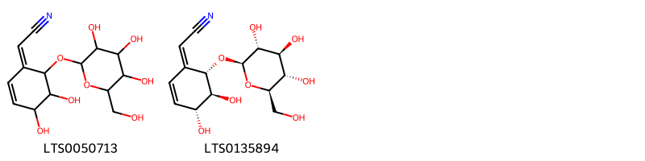{ width=100% }
    <figcaption>Hình ảnh cấu trúc hóa học của 2 hoạt chất thuộc nhóm Organooxygen compounds gồm ['2-[(1z)-4,5-dihydroxy-6-{[3,4,5-trihydroxy-6-(hydroxymethyl)oxan-2-yl]oxy}cyclohex-2-en-1-ylidene]acetonitrile (LTS0050713)', 'lithospermoside (LTS0135894)'].</figcaption>
</figure>
#### Nhóm Prenol lipids
<figure markdown="span">
    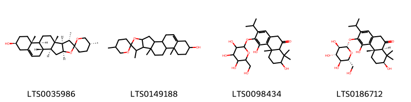{ width=100% }
    <figcaption>Hình ảnh cấu trúc hóa học của 4 hoạt chất thuộc nhóm Prenol lipids gồm ['diosgenin (LTS0035986)', 'diosgenin (LTS0149188)', '4,7-dihydroxy-2-isopropyl-4b,8,8-trimethyl-3-{[3,4,5-trihydroxy-6-(hydroxymethyl)oxan-2-yl]oxy}-6,7,8a,10-tetrahydro-5h-phenanthren-9-one (LTS0098434)', '(4bs,7s,8ar)-4,7-dihydroxy-2-isopropyl-4b,8,8-trimethyl-3-{[(2s,3r,4s,5s,6r)-3,4,5-trihydroxy-6-(hydroxymethyl)oxan-2-yl]oxy}-6,7,8a,10-tetrahydro-5h-phenanthren-9-one (LTS0186712)'].</figcaption>
</figure>
#### Nhóm Steroids and steroid derivatives
<figure markdown="span">
    { width=100% }
    <figcaption>Hình ảnh cấu trúc hóa học của 3 hoạt chất thuộc nhóm Steroids and steroid derivatives gồm ['stigmast-5-en-3-ol (LTS0071224)', 'sitosterol (LTS0168132)', 'stigmast-5-en-3-ol, (3β)- (LTS0204616)'].</figcaption>
</figure>

---

### Dược dân tộc học

Danh sách các quốc gia có sử dụng *Semiaquilegia adoxoides* trong điều trị các bệnh. 

| Country   | Disease                                  | Bệnh                                                                                                                                                                                                |
|:----------|:-----------------------------------------|:----------------------------------------------------------------------------------------------------------------------------------------------------------------------------------------------------|
| China     | Alexiteric, Antidote, Diuretic, Diuretic | MYMEMORY WARNING: YOU USED ALL AVAILABLE FREE TRANSLATIONS FOR TODAY. NEXT AVAILABLE IN  09 HOURS 06 MINUTES 55 SECONDS VISIT HTTPS://MYMEMORY.TRANSLATED.NET/DOC/USAGELIMITS.PHP TO TRANSLATE MORE |

---

# Chi Aquilegia

??? note "Danh sách các dược liệu thuộc chi"
    
	 - *Aquilegia flabellata*
	 - *Aquilegia formosa*
	 - *Aquilegia vulgaria*
	 - *Aquilegia vulgaris*

---
## Aquilegia flabellata
### Thông tin về thực vật

!!! info "Phân loại thực vật của *Aquilegia flabellata* từ GIBF:"
    - **Kingdom:** Plantae
    - **Phylum:** Tracheophyta
    - **Order:** Ranunculales
    - **Family:** Ranunculaceae
    - **Genus:** Aquilegia
    - **Species:** *Aquilegia flabellata*

 

| Label (VI)   | Label (EN)   | Scientific Name      | Descriptions (VI)   | Descriptions (EN)   | Also Known As (VI)   | Also Known As (EN)   |
|:-------------|:-------------|:---------------------|:--------------------|:--------------------|:---------------------|:---------------------|
| N/A          | N/A          | Aquilegia flabellata | loài thực vật       | species of plant    | ['']                 | ['']                 |

#### Phân bố trên thế giới

**Từ CSDL GIBF** nan, Colombia, Japan, Korea (Democratic People’s Republic of), Czechia, Mongolia, Germany, Russian Federation, Canada, United States of America, Finland, China, Austria, Norway, Belgium, Korea, Republic of

#### Phân bố tại Việt Nam

**Từ CSDL GIBF**: Không có ghi nhận ở Việt Nam

---
### Thành phần hóa học
        
- Theo cơ sở dữ liệu lotus: Từ loài *Aquilegia flabellata* đã phân lập và xác định được 7 hoạt chất thuộc về các nhóm Steroids and steroid derivatives. 

|    | chemicalTaxonomyClassyfireClass   |   smiles_count |
|---:|:----------------------------------|---------------:|
|  0 | Steroids and steroid derivatives  |              7 |

#### Nhóm Steroids and steroid derivatives
<figure markdown="span">
    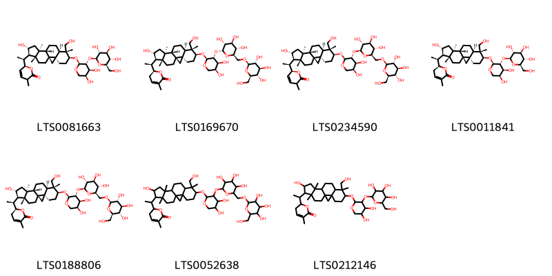{ width=100% }
    <figcaption>Hình ảnh cấu trúc hóa học của 7 hoạt chất thuộc nhóm Steroids and steroid derivatives gồm ['(6s)-6-[(1s)-1-[(1s,3r,6s,7r,8r,11s,12s,14r,15r,16r)-6-{[(2s,3r,4s,5s)-4,5-dihydroxy-3-{[(2s,3r,4s,5s,6r)-3,4,5-trihydroxy-6-(hydroxymethyl)oxan-2-yl]oxy}oxan-2-yl]oxy}-14-hydroxy-7-(hydroxymethyl)-7,12,16-trimethylpentacyclo[9.7.0.0¹,³.0³,⁸.0¹²,¹⁶]octadecan-15-yl]ethyl]-3-methyl-3,6-dihydropyran-2-one (LTS0081663)', '(6s)-6-[(1s)-1-[(1s,3r,6s,7r,8r,11s,12s,14r,15r,16r)-6-{[(2s,3r,4s,5s)-4,5-dihydroxy-3-{[(2r,3r,4s,5s,6r)-3,4,5-trihydroxy-6-({[(2r,3r,4s,5s,6r)-3,4,5-trihydroxy-6-(hydroxymethyl)oxan-2-yl]oxy}methyl)oxan-2-yl]oxy}oxan-2-yl]oxy}-14-hydroxy-7-(hydroxymethyl)-7,12,16-trimethylpentacyclo[9.7.0.0¹,³.0³,⁸.0¹²,¹⁶]octadecan-15-yl]ethyl]-3-methyl-5,6-dihydropyran-2-one (LTS0169670)', '(6s)-6-[(1s)-1-[(1s,3r,6s,7r,8r,11s,12s,14r,15r,16r)-6-{[(2s,3r,4s,5s)-4,5-dihydroxy-3-{[(2s,3r,4s,5s,6r)-3,4,5-trihydroxy-6-({[(2r,3r,4s,5s,6r)-3,4,5-trihydroxy-6-(hydroxymethyl)oxan-2-yl]oxy}methyl)oxan-2-yl]oxy}oxan-2-yl]oxy}-14-hydroxy-7-(hydroxymethyl)-7,12,16-trimethylpentacyclo[9.7.0.0¹,³.0³,⁸.0¹²,¹⁶]octadecan-15-yl]ethyl]-3-methyl-3,6-dihydropyran-2-one (LTS0234590)', '(6s)-6-[(1s)-1-[(1s,3r,6s,7r,8r,11s,12s,14r,15r,16r)-6-{[(2s,3r,4s,5s)-4,5-dihydroxy-3-{[(2s,3r,4s,5s,6r)-3,4,5-trihydroxy-6-(hydroxymethyl)oxan-2-yl]oxy}oxan-2-yl]oxy}-14-hydroxy-7-(hydroxymethyl)-7,12,16-trimethylpentacyclo[9.7.0.0¹,³.0³,⁸.0¹²,¹⁶]octadecan-15-yl]ethyl]-3-methyl-5,6-dihydropyran-2-one (LTS0011841)', '(6s)-6-[(1s)-1-[(1s,3r,6s,7r,8r,11s,12s,14r,15r,16r)-6-{[(2s,3r,4s,5s)-4,5-dihydroxy-3-{[(2s,3r,4s,5s,6r)-3,4,5-trihydroxy-6-({[(2r,3r,4s,5s,6r)-3,4,5-trihydroxy-6-(hydroxymethyl)oxan-2-yl]oxy}methyl)oxan-2-yl]oxy}oxan-2-yl]oxy}-14-hydroxy-7-(hydroxymethyl)-7,12,16-trimethylpentacyclo[9.7.0.0¹,³.0³,⁸.0¹²,¹⁶]octadecan-15-yl]ethyl]-3-methyl-5,6-dihydropyran-2-one (LTS0188806)', '6-(1-{6-[(4,5-dihydroxy-3-{[3,4,5-trihydroxy-6-({[3,4,5-trihydroxy-6-(hydroxymethyl)oxan-2-yl]oxy}methyl)oxan-2-yl]oxy}oxan-2-yl)oxy]-14-hydroxy-7-(hydroxymethyl)-7,12,16-trimethylpentacyclo[9.7.0.0¹,³.0³,⁸.0¹²,¹⁶]octadecan-15-yl}ethyl)-3-methyl-5,6-dihydropyran-2-one (LTS0052638)', '6-(1-{6-[(4,5-dihydroxy-3-{[3,4,5-trihydroxy-6-(hydroxymethyl)oxan-2-yl]oxy}oxan-2-yl)oxy]-14-hydroxy-7-(hydroxymethyl)-7,12,16-trimethylpentacyclo[9.7.0.0¹,³.0³,⁸.0¹²,¹⁶]octadecan-15-yl}ethyl)-3-methyl-5,6-dihydropyran-2-one (LTS0212146)'].</figcaption>
</figure>

---

### Dược dân tộc học

Danh sách các quốc gia có sử dụng *Aquilegia flabellata* trong điều trị các bệnh. 

| Country   | Disease     | Bệnh                                                                                                                                                                                                |
|:----------|:------------|:----------------------------------------------------------------------------------------------------------------------------------------------------------------------------------------------------|
| Elsewhere | Emmenagogue | MYMEMORY WARNING: YOU USED ALL AVAILABLE FREE TRANSLATIONS FOR TODAY. NEXT AVAILABLE IN  09 HOURS 06 MINUTES 32 SECONDS VISIT HTTPS://MYMEMORY.TRANSLATED.NET/DOC/USAGELIMITS.PHP TO TRANSLATE MORE |

---

---
## Aquilegia formosa
### Thông tin về thực vật

!!! info "Phân loại thực vật của *Aquilegia formosa* từ GIBF:"
    - **Kingdom:** Plantae
    - **Phylum:** Tracheophyta
    - **Order:** Ranunculales
    - **Family:** Ranunculaceae
    - **Genus:** Aquilegia
    - **Species:** *Aquilegia formosa*

 

| Label (VI)   | Label (EN)   | Scientific Name   | Descriptions (VI)   | Descriptions (EN)   | Also Known As (VI)   | Also Known As (EN)   |
|:-------------|:-------------|:------------------|:--------------------|:--------------------|:---------------------|:---------------------|
| N/A          | N/A          | Aquilegia formosa | loài thực vật       | species of plant    | ['']                 | ['']                 |

#### Phân bố trên thế giới

**Từ CSDL GIBF** Canada, United States of America

#### Phân bố tại Việt Nam

**Từ CSDL GIBF**: Không có ghi nhận ở Việt Nam

---
### Thành phần hóa học
        
- Theo cơ sở dữ liệu lotus: Từ loài *Aquilegia formosa* đã phân lập và xác định được 3 hoạt chất thuộc về các nhóm Organooxygen compounds, Aporphines, Protoberberine alkaloids and derivatives. 

|    | chemicalTaxonomyClassyfireClass          |   smiles_count |
|---:|:-----------------------------------------|---------------:|
|  0 | Aporphines                               |              1 |
|  1 | Organooxygen compounds                   |              1 |
|  2 | Protoberberine alkaloids and derivatives |              1 |

#### Nhóm Aporphines
<figure markdown="span">
    { width=100% }
    <figcaption>Hình ảnh cấu trúc hóa học của 1 hoạt chất thuộc nhóm Aporphines gồm ['magnoflorine (LTS0120825)'].</figcaption>
</figure>
#### Nhóm Organooxygen compounds
<figure markdown="span">
    { width=100% }
    <figcaption>Hình ảnh cấu trúc hóa học của 1 hoạt chất thuộc nhóm Organooxygen compounds gồm ['ranunculin (LTS0141949)'].</figcaption>
</figure>
#### Nhóm Protoberberine alkaloids and derivatives
<figure markdown="span">
    { width=100% }
    <figcaption>Hình ảnh cấu trúc hóa học của 1 hoạt chất thuộc nhóm Protoberberine alkaloids and derivatives gồm ['berberine (LTS0101484)'].</figcaption>
</figure>

---

### Dược dân tộc học

Danh sách các quốc gia có sử dụng *Aquilegia formosa* trong điều trị các bệnh. 

| Country        | Disease      | Bệnh                                                                                                                                                                                                |
|:---------------|:-------------|:----------------------------------------------------------------------------------------------------------------------------------------------------------------------------------------------------|
| US(Amerindian) | Pediculicide | MYMEMORY WARNING: YOU USED ALL AVAILABLE FREE TRANSLATIONS FOR TODAY. NEXT AVAILABLE IN  09 HOURS 06 MINUTES 13 SECONDS VISIT HTTPS://MYMEMORY.TRANSLATED.NET/DOC/USAGELIMITS.PHP TO TRANSLATE MORE |

---

---
## Aquilegia vulgaria
### Thông tin về thực vật

!!! info "Phân loại thực vật của *Aquilegia vulgaris* từ GIBF:"
    - **Kingdom:** Plantae
    - **Phylum:** Tracheophyta
    - **Order:** Ranunculales
    - **Family:** Ranunculaceae
    - **Genus:** Aquilegia
    - **Species:** *Aquilegia vulgaris*

 

| Label (VI)   | Label (EN)   | Scientific Name   | Descriptions (VI)   | Descriptions (EN)   | Also Known As (VI)   | Also Known As (EN)   |
|:-------------|:-------------|:------------------|:--------------------|:--------------------|:---------------------|:---------------------|
| N/A          | N/A          | Aquilegia formosa | loài thực vật       | species of plant    | ['']                 | ['']                 |

#### Phân bố trên thế giới

**Từ CSDL GIBF** Denmark, Spain, Germany, Austria, Australia, Sweden, Poland, Canada, Belgium, Slovakia, Netherlands, Belarus, Ireland, Norway, Switzerland, United Kingdom of Great Britain and Northern Ireland, Portugal, France, New Zealand, Russian Federation, United States of America, Italy, Ukraine

#### Phân bố tại Việt Nam

**Từ CSDL GIBF**: Không có ghi nhận ở Việt Nam

---
### Thành phần hóa học
        
- Theo cơ sở dữ liệu lotus: Từ loài *Aquilegia vulgaris* đã phân lập và xác định được Chưa có hoạt chất nào được phân lập. hoạt chất thuộc về các nhóm Không có hoạt chất nào được phân lập. 

Không có hình ảnh nào được tạo ra

---

### Dược dân tộc học

Danh sách các quốc gia có sử dụng *Aquilegia vulgaris* trong điều trị các bệnh. 

| Country   | Disease   | Bệnh                                                                                                                                                                                                |
|:----------|:----------|:----------------------------------------------------------------------------------------------------------------------------------------------------------------------------------------------------|
| ain       | Poison    | MYMEMORY WARNING: YOU USED ALL AVAILABLE FREE TRANSLATIONS FOR TODAY. NEXT AVAILABLE IN  09 HOURS 05 MINUTES 52 SECONDS VISIT HTTPS://MYMEMORY.TRANSLATED.NET/DOC/USAGELIMITS.PHP TO TRANSLATE MORE |

---

---
## Aquilegia vulgaris
### Thông tin về thực vật

!!! info "Phân loại thực vật của *Aquilegia vulgaris* từ GIBF:"
    - **Kingdom:** Plantae
    - **Phylum:** Tracheophyta
    - **Order:** Ranunculales
    - **Family:** Ranunculaceae
    - **Genus:** Aquilegia
    - **Species:** *Aquilegia vulgaris*

 

| Label (VI)   | Label (EN)   | Scientific Name    | Descriptions (VI)   | Descriptions (EN)   | Also Known As (VI)   | Also Known As (EN)     |
|:-------------|:-------------|:-------------------|:--------------------|:--------------------|:---------------------|:-----------------------|
| N/A          | N/A          | Aquilegia vulgaris | loài thực vật       | species of plant    | ['']                 | ['Aquilegia vulgaris'] |

#### Phân bố trên thế giới

**Từ CSDL GIBF** Denmark, Spain, Germany, Austria, Australia, Sweden, Poland, Canada, Belgium, Slovakia, Netherlands, Belarus, Ireland, Norway, Switzerland, United Kingdom of Great Britain and Northern Ireland, Portugal, France, New Zealand, Russian Federation, United States of America, Italy, Ukraine

#### Phân bố tại Việt Nam

**Từ CSDL GIBF**: Không có ghi nhận ở Việt Nam

---
### Thành phần hóa học
        
- Theo cơ sở dữ liệu lotus: Từ loài *Aquilegia vulgaris* đã phân lập và xác định được 64 hoạt chất thuộc về các nhóm Organooxygen compounds, Aporphines, Flavonoids, Prenol lipids, Protoberberine alkaloids and derivatives, Dihydrofurans, Cinnamic acids and derivatives, Steroids and steroid derivatives, Benzene and substituted derivatives. 

|    | chemicalTaxonomyClassyfireClass          |   smiles_count |
|---:|:-----------------------------------------|---------------:|
|  0 | Aporphines                               |              2 |
|  1 | Benzene and substituted derivatives      |              3 |
|  2 | Cinnamic acids and derivatives           |              4 |
|  3 | Dihydrofurans                            |              1 |
|  4 | Flavonoids                               |             13 |
|  5 | Organooxygen compounds                   |              1 |
|  6 | Prenol lipids                            |              6 |
|  7 | Protoberberine alkaloids and derivatives |              1 |
|  8 | Steroids and steroid derivatives         |              4 |

#### Nhóm Aporphines
<figure markdown="span">
    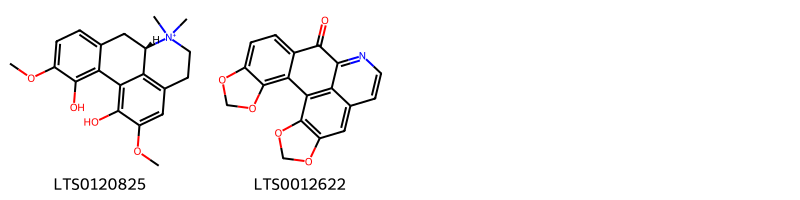{ width=100% }
    <figcaption>Hình ảnh cấu trúc hóa học của 2 hoạt chất thuộc nhóm Aporphines gồm ['magnoflorine (LTS0120825)', 'hernandonine (LTS0012622)'].</figcaption>
</figure>
#### Nhóm Benzene and substituted derivatives
<figure markdown="span">
    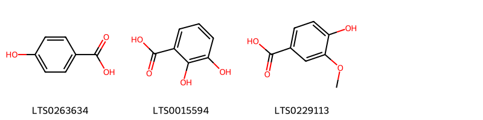{ width=100% }
    <figcaption>Hình ảnh cấu trúc hóa học của 3 hoạt chất thuộc nhóm Benzene and substituted derivatives gồm ['p-hydroxybenzoic acid (LTS0263634)', '2,3-dihydroxy-benzoic acid (LTS0015594)', 'vanillic acid (LTS0229113)'].</figcaption>
</figure>
#### Nhóm Cinnamic acids and derivatives
<figure markdown="span">
    { width=100% }
    <figcaption>Hình ảnh cấu trúc hóa học của 4 hoạt chất thuộc nhóm Cinnamic acids and derivatives gồm ['ferulic acid (LTS0077328)', 'sinapinate (LTS0173482)', '3,4-dihydroxycinnamic acid (LTS0128050)', 'para-coumaric acid (LTS0266252)'].</figcaption>
</figure>
#### Nhóm Dihydrofurans
<figure markdown="span">
    { width=100% }
    <figcaption>Hình ảnh cấu trúc hóa học của 1 hoạt chất thuộc nhóm Dihydrofurans gồm ['protoanemonin (LTS0133358)'].</figcaption>
</figure>
#### Nhóm Flavonoids
<figure markdown="span">
    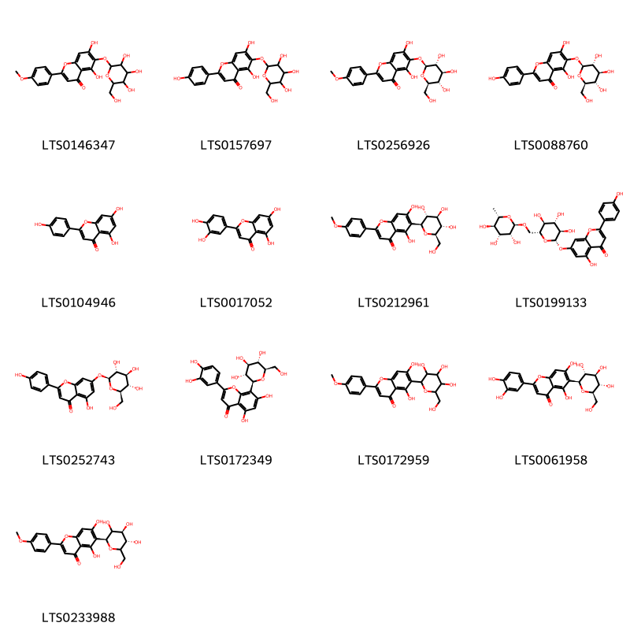{ width=100% }
    <figcaption>Hình ảnh cấu trúc hóa học của 13 hoạt chất thuộc nhóm Flavonoids gồm ['5,7-dihydroxy-2-(4-methoxyphenyl)-6-{[3,4,5-trihydroxy-6-(hydroxymethyl)oxan-2-yl]oxy}chromen-4-one (LTS0146347)', '5,7-dihydroxy-2-(4-hydroxyphenyl)-6-{[3,4,5-trihydroxy-6-(hydroxymethyl)oxan-2-yl]oxy}chromen-4-one (LTS0157697)', '5,7-dihydroxy-2-(4-methoxyphenyl)-6-{[(2s,3r,4s,5s,6r)-3,4,5-trihydroxy-6-(hydroxymethyl)oxan-2-yl]oxy}chromen-4-one (LTS0256926)', '5,7-dihydroxy-2-(4-hydroxyphenyl)-6-{[(2s,3r,4s,5s,6r)-3,4,5-trihydroxy-6-(hydroxymethyl)oxan-2-yl]oxy}chromen-4-one (LTS0088760)', 'chamomile (LTS0104946)', 'luteolin (LTS0017052)', '5,7-dihydroxy-2-(4-methoxyphenyl)-6-[(2s,3r,4r,5s,6r)-3,4,5-trihydroxy-6-(hydroxymethyl)oxan-2-yl]chromen-4-one (LTS0212961)', 'isorhoifolin (LTS0199133)', 'apigenin 7-o-β-glucoside (LTS0252743)', 'orientin (LTS0172349)', '5,7-dihydroxy-2-(4-methoxyphenyl)-6-[3,4,5-trihydroxy-6-(hydroxymethyl)oxan-2-yl]chromen-4-one (LTS0172959)', 'isoorientin (LTS0061958)', 'isocytisoside (LTS0233988)'].</figcaption>
</figure>
#### Nhóm Organooxygen compounds
<figure markdown="span">
    { width=100% }
    <figcaption>Hình ảnh cấu trúc hóa học của 1 hoạt chất thuộc nhóm Organooxygen compounds gồm ['chlorogenic acid (LTS0226495)'].</figcaption>
</figure>
#### Nhóm Prenol lipids
<figure markdown="span">
    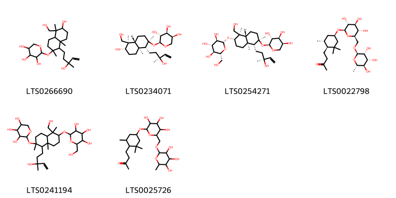{ width=100% }
    <figcaption>Hình ảnh cấu trúc hóa học của 6 hoạt chất thuộc nhóm Prenol lipids gồm ['2-{[6-hydroxy-1-(3-hydroxy-3-methylpent-4-en-1-yl)-5-(hydroxymethyl)-2,5,8a-trimethyl-hexahydro-1h-naphthalen-2-yl]oxy}oxane-3,4,5-triol (LTS0266690)', '(2s,3r,4s,5s)-2-{[(1r,2r,4ar,5r,6s,8as)-6-hydroxy-1-[(3s)-3-hydroxy-3-methylpent-4-en-1-yl]-5-(hydroxymethyl)-2,5,8a-trimethyl-hexahydro-1h-naphthalen-2-yl]oxy}oxane-3,4,5-triol (LTS0234071)', '(2r,3r,4s,5s,6r)-2-{[(1r,2s,4as,5r,6r,8ar)-5-[(3s)-3-hydroxy-3-methylpent-4-en-1-yl]-1-(hydroxymethyl)-1,4a,6-trimethyl-6-{[(2s,3r,4s,5s)-3,4,5-trihydroxyoxan-2-yl]oxy}-hexahydro-2h-naphthalen-2-yl]oxy}-6-(hydroxymethyl)oxane-3,4,5-triol (LTS0254271)', '4-[(1s,4r,6r)-2,2,6-trimethyl-4-{[(2r,3r,4s,5s,6r)-3,4,5-trihydroxy-6-({[(2r,3r,4r,5r,6s)-3,4,5-trihydroxy-6-methyloxan-2-yl]oxy}methyl)oxan-2-yl]oxy}cyclohexyl]butan-2-one (LTS0022798)', '2-{[5-(3-hydroxy-3-methylpent-4-en-1-yl)-1-(hydroxymethyl)-1,4a,6-trimethyl-6-[(3,4,5-trihydroxyoxan-2-yl)oxy]-hexahydro-2h-naphthalen-2-yl]oxy}-6-(hydroxymethyl)oxane-3,4,5-triol (LTS0241194)', '4-{2,2,6-trimethyl-4-[(3,4,5-trihydroxy-6-{[(3,4,5-trihydroxy-6-methyloxan-2-yl)oxy]methyl}oxan-2-yl)oxy]cyclohexyl}butan-2-one (LTS0025726)'].</figcaption>
</figure>
#### Nhóm Protoberberine alkaloids and derivatives
<figure markdown="span">
    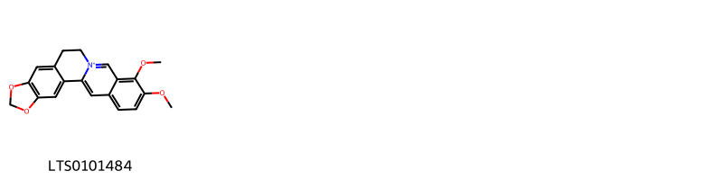{ width=100% }
    <figcaption>Hình ảnh cấu trúc hóa học của 1 hoạt chất thuộc nhóm Protoberberine alkaloids and derivatives gồm ['berberine (LTS0101484)'].</figcaption>
</figure>
#### Nhóm Steroids and steroid derivatives
<figure markdown="span">
    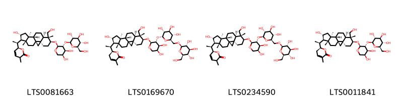{ width=100% }
    <figcaption>Hình ảnh cấu trúc hóa học của 4 hoạt chất thuộc nhóm Steroids and steroid derivatives gồm ['(6s)-6-[(1s)-1-[(1s,3r,6s,7r,8r,11s,12s,14r,15r,16r)-6-{[(2s,3r,4s,5s)-4,5-dihydroxy-3-{[(2s,3r,4s,5s,6r)-3,4,5-trihydroxy-6-(hydroxymethyl)oxan-2-yl]oxy}oxan-2-yl]oxy}-14-hydroxy-7-(hydroxymethyl)-7,12,16-trimethylpentacyclo[9.7.0.0¹,³.0³,⁸.0¹²,¹⁶]octadecan-15-yl]ethyl]-3-methyl-3,6-dihydropyran-2-one (LTS0081663)', '(6s)-6-[(1s)-1-[(1s,3r,6s,7r,8r,11s,12s,14r,15r,16r)-6-{[(2s,3r,4s,5s)-4,5-dihydroxy-3-{[(2r,3r,4s,5s,6r)-3,4,5-trihydroxy-6-({[(2r,3r,4s,5s,6r)-3,4,5-trihydroxy-6-(hydroxymethyl)oxan-2-yl]oxy}methyl)oxan-2-yl]oxy}oxan-2-yl]oxy}-14-hydroxy-7-(hydroxymethyl)-7,12,16-trimethylpentacyclo[9.7.0.0¹,³.0³,⁸.0¹²,¹⁶]octadecan-15-yl]ethyl]-3-methyl-5,6-dihydropyran-2-one (LTS0169670)', '(6s)-6-[(1s)-1-[(1s,3r,6s,7r,8r,11s,12s,14r,15r,16r)-6-{[(2s,3r,4s,5s)-4,5-dihydroxy-3-{[(2s,3r,4s,5s,6r)-3,4,5-trihydroxy-6-({[(2r,3r,4s,5s,6r)-3,4,5-trihydroxy-6-(hydroxymethyl)oxan-2-yl]oxy}methyl)oxan-2-yl]oxy}oxan-2-yl]oxy}-14-hydroxy-7-(hydroxymethyl)-7,12,16-trimethylpentacyclo[9.7.0.0¹,³.0³,⁸.0¹²,¹⁶]octadecan-15-yl]ethyl]-3-methyl-3,6-dihydropyran-2-one (LTS0234590)', '(6s)-6-[(1s)-1-[(1s,3r,6s,7r,8r,11s,12s,14r,15r,16r)-6-{[(2s,3r,4s,5s)-4,5-dihydroxy-3-{[(2s,3r,4s,5s,6r)-3,4,5-trihydroxy-6-(hydroxymethyl)oxan-2-yl]oxy}oxan-2-yl]oxy}-14-hydroxy-7-(hydroxymethyl)-7,12,16-trimethylpentacyclo[9.7.0.0¹,³.0³,⁸.0¹²,¹⁶]octadecan-15-yl]ethyl]-3-methyl-5,6-dihydropyran-2-one (LTS0011841)'].</figcaption>
</figure>

---

### Dược dân tộc học

Danh sách các quốc gia có sử dụng *Aquilegia vulgaris* trong điều trị các bệnh. 

| Country   | Disease                                           | Bệnh                                                                                                                                                                                                |
|:----------|:--------------------------------------------------|:----------------------------------------------------------------------------------------------------------------------------------------------------------------------------------------------------|
| Elsewhere | Diaphoretic, Diuretic, Emmenagogue                | MYMEMORY WARNING: YOU USED ALL AVAILABLE FREE TRANSLATIONS FOR TODAY. NEXT AVAILABLE IN  09 HOURS 05 MINUTES 34 SECONDS VISIT HTTPS://MYMEMORY.TRANSLATED.NET/DOC/USAGELIMITS.PHP TO TRANSLATE MORE |
| Turkey    | Astringent, Diuretic, Narcotic, Sudorific, Poison | MYMEMORY WARNING: YOU USED ALL AVAILABLE FREE TRANSLATIONS FOR TODAY. NEXT AVAILABLE IN  09 HOURS 05 MINUTES 32 SECONDS VISIT HTTPS://MYMEMORY.TRANSLATED.NET/DOC/USAGELIMITS.PHP TO TRANSLATE MORE |
| US        | Poison                                            | MYMEMORY WARNING: YOU USED ALL AVAILABLE FREE TRANSLATIONS FOR TODAY. NEXT AVAILABLE IN  09 HOURS 05 MINUTES 30 SECONDS VISIT HTTPS://MYMEMORY.TRANSLATED.NET/DOC/USAGELIMITS.PHP TO TRANSLATE MORE |

---

# Chi Caltha

??? note "Danh sách các dược liệu thuộc chi"
    
	 - *Caltha palustris*

---
## Caltha palustris
### Thông tin về thực vật

!!! info "Phân loại thực vật của *Caltha palustris* từ GIBF:"
    - **Kingdom:** Plantae
    - **Phylum:** Tracheophyta
    - **Order:** Ranunculales
    - **Family:** Ranunculaceae
    - **Genus:** Caltha
    - **Species:** *Caltha palustris*

 

| Label (VI)   | Label (EN)   | Scientific Name   | Descriptions (VI)   | Descriptions (EN)   | Also Known As (VI)   | Also Known As (EN)                                   |
|:-------------|:-------------|:------------------|:--------------------|:--------------------|:---------------------|:-----------------------------------------------------|
| N/A          | N/A          | Caltha palustris  | loài thực vật       | species of plant    | ['']                 | ['Kingcup', 'Cowslip', 'Marsh marigold', 'Cowflock'] |

#### Phân bố trên thế giới

**Từ CSDL GIBF** Switzerland, Denmark, United Kingdom of Great Britain and Northern Ireland, France, Spain, Poland, Hungary, Germany, Finland, United States of America, Italy, Ireland, Austria, Netherlands, Ukraine

#### Phân bố tại Việt Nam

**Từ CSDL GIBF**: Không có ghi nhận ở Việt Nam

---
### Thành phần hóa học
        
- Theo cơ sở dữ liệu lotus: Từ loài *Caltha palustris* đã phân lập và xác định được 49 hoạt chất thuộc về các nhóm Organooxygen compounds, Aporphines, Protopine alkaloids, Prenol lipids, Dihydrofurans. 

|    | chemicalTaxonomyClassyfireClass   |   smiles_count |
|---:|:----------------------------------|---------------:|
|  0 | Aporphines                        |              3 |
|  1 | Dihydrofurans                     |              1 |
|  2 | Organooxygen compounds            |              1 |
|  3 | Prenol lipids                     |             33 |
|  4 | Protopine alkaloids               |              2 |

#### Nhóm Aporphines
<figure markdown="span">
    { width=100% }
    <figcaption>Hình ảnh cấu trúc hóa học của 3 hoạt chất thuộc nhóm Aporphines gồm ['magnoflorine (LTS0120825)', '4,15-dimethoxy-10-methyl-10-azatetracyclo[7.7.1.0²,⁷.0¹³,¹⁷]heptadeca-1(16),2,4,6,13(17),14-hexaene-3,16-diol (LTS0095715)', '(9s)-4,15-dimethoxy-10-methyl-10-azatetracyclo[7.7.1.0²,⁷.0¹³,¹⁷]heptadeca-1(16),2,4,6,13(17),14-hexaene-3,16-diol (LTS0022981)'].</figcaption>
</figure>
#### Nhóm Dihydrofurans
<figure markdown="span">
    { width=100% }
    <figcaption>Hình ảnh cấu trúc hóa học của 1 hoạt chất thuộc nhóm Dihydrofurans gồm ['protoanemonin (LTS0133358)'].</figcaption>
</figure>
#### Nhóm Organooxygen compounds
<figure markdown="span">
    { width=100% }
    <figcaption>Hình ảnh cấu trúc hóa học của 1 hoạt chất thuộc nhóm Organooxygen compounds gồm ['ranunculin (LTS0141949)'].</figcaption>
</figure>
#### Nhóm Prenol lipids
<figure markdown="span">
    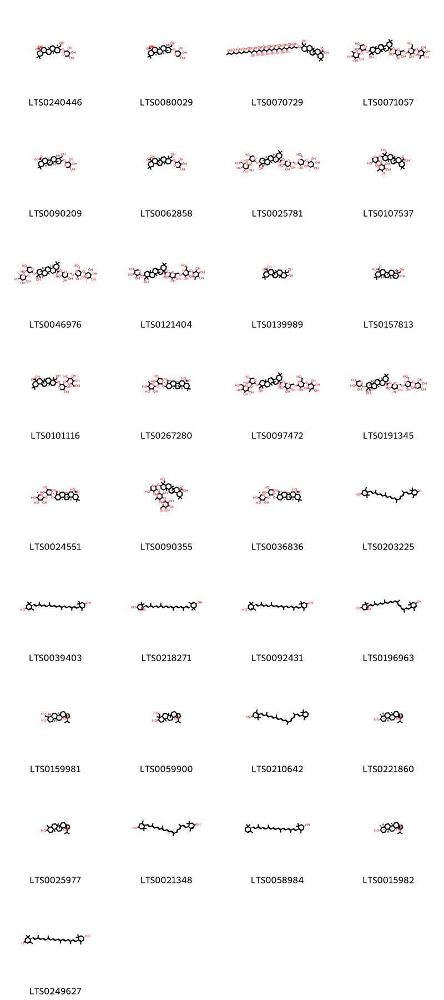{ width=100% }
    <figcaption>Hình ảnh cấu trúc hóa học của 33 hoạt chất thuộc nhóm Prenol lipids gồm ['(4ar,5r,6as,6br,9r,10s,12ar)-5-hydroxy-9-(hydroxymethyl)-2,2,6a,6b,9,12a-hexamethyl-10-{[(2s,3r,4s,5s)-3,4,5-trihydroxyoxan-2-yl]oxy}-1,3,4,5,6,7,8,8a,10,11,12,12b,13,14b-tetradecahydropicene-4a-carboxylic acid (LTS0240446)', '(4ar,5r,6as,6br,8ar,9r,10s,12ar,12br,14bs)-5-hydroxy-9-(hydroxymethyl)-2,2,6a,6b,9,12a-hexamethyl-10-{[(2s,3r,4s,5s)-3,4,5-trihydroxyoxan-2-yl]oxy}-1,3,4,5,6,7,8,8a,10,11,12,12b,13,14b-tetradecahydropicene-4a-carboxylic acid (LTS0080029)', '10-[(2,4,5,6,7,8,9,10,11,12,13,14,15,16,17,18,19,20,22,24,26,28-docosahydroxynonacosyl)oxy]-9-(hydroxymethyl)-2,2,6a,6b,9,12a-hexamethyl-1,3,4,5,6,7,8,8a,10,11,12,12b,13,14b-tetradecahydropicene-4a-carboxylic acid (LTS0070729)', '6-({[3,4-dihydroxy-6-(hydroxymethyl)-5-[(3,4,5-trihydroxy-6-methyloxan-2-yl)oxy]oxan-2-yl]oxy}methyl)-3,4,5-trihydroxyoxan-2-yl 10-({4,5-dihydroxy-3-[(3,4,5-trihydroxy-6-methyloxan-2-yl)oxy]oxan-2-yl}oxy)-9-(hydroxymethyl)-2,2,6a,6b,9,12a-hexamethyl-1,3,4,5,6,7,8,8a,10,11,12,12b,13,14b-tetradecahydropicene-4a-carboxylate (LTS0071057)', 'hederagenin 3-o-arabinoside (LTS0090209)', '9-(hydroxymethyl)-2,2,6a,6b,9,12a-hexamethyl-10-[(3,4,5-trihydroxyoxan-2-yl)oxy]-1,3,4,5,6,7,8,8a,10,11,12,12b,13,14b-tetradecahydropicene-4a-carboxylic acid (LTS0062858)', 'cauloside g (LTS0025781)', '10-({4,5-dihydroxy-3-[(3,4,5-trihydroxy-6-methyloxan-2-yl)oxy]oxan-2-yl}oxy)-9-(hydroxymethyl)-2,2,6a,6b,9,12a-hexamethyl-1,3,4,5,6,7,8,8a,10,11,12,12b,13,14b-tetradecahydropicene-4a-carboxylic acid (LTS0107537)', 'kalopanaxsaponin b (LTS0046976)', '6-({[3,4-dihydroxy-6-(hydroxymethyl)-5-[(3,4,5-trihydroxy-6-methyloxan-2-yl)oxy]oxan-2-yl]oxy}methyl)-3,4,5-trihydroxyoxan-2-yl 9-(hydroxymethyl)-2,2,6a,6b,9,12a-hexamethyl-10-[(3,4,5-trihydroxyoxan-2-yl)oxy]-1,3,4,5,6,7,8,8a,10,11,12,12b,13,14b-tetradecahydropicene-4a-carboxylate (LTS0121404)', '10-hydroxy-9-(hydroxymethyl)-2,2,6a,6b,9,12a-hexamethyl-1,3,4,5,6,7,8,8a,10,11,12,12b,13,14b-tetradecahydropicene-4a-carboxylic acid (LTS0139989)', 'hederagenin (LTS0157813)', '10-[(4,5-dihydroxy-3-{[3,4,5-trihydroxy-6-(hydroxymethyl)oxan-2-yl]oxy}oxan-2-yl)oxy]-9-(hydroxymethyl)-2,2,6a,6b,9,12a-hexamethyl-1,3,4,5,6,7,8,8a,10,11,12,12b,13,14b-tetradecahydropicene-4a-carboxylic acid (LTS0101116)', '(4as,6as,6br,8as,9r,12ar,12br,14br)-10-({4,5-dihydroxy-3-[(3,4,5-trihydroxy-6-methyloxan-2-yl)oxy]oxan-2-yl}oxy)-9-(hydroxymethyl)-2,2,6a,6b,9,12a-hexamethyl-1,3,4,5,6,7,8,8a,10,11,12,12b,13,14b-tetradecahydropicene-4a-carboxylic acid (LTS0267280)', '6-({[3,4-dihydroxy-6-(hydroxymethyl)-5-[(3,4,5-trihydroxy-6-methyloxan-2-yl)oxy]oxan-2-yl]oxy}methyl)-3,4,5-trihydroxyoxan-2-yl 10-[(4,5-dihydroxy-3-{[3,4,5-trihydroxy-6-(hydroxymethyl)oxan-2-yl]oxy}oxan-2-yl)oxy]-9-(hydroxymethyl)-2,2,6a,6b,9,12a-hexamethyl-1,3,4,5,6,7,8,8a,10,11,12,12b,13,14b-tetradecahydropicene-4a-carboxylate (LTS0097472)', 'cauloside d (LTS0191345)', 'α-hederin (LTS0024551)', '10-({3-[(3,5-dihydroxy-6-methyl-4-{[3,4,5-trihydroxy-6-(hydroxymethyl)oxan-2-yl]oxy}oxan-2-yl)oxy]-4,5-dihydroxyoxan-2-yl}oxy)-9-(hydroxymethyl)-2,2,6a,6b,9,12a-hexamethyl-1,3,4,5,6,7,8,8a,10,11,12,12b,13,14b-tetradecahydropicene-4a-carboxylic acid (LTS0090355)', '(4as,6as,6br,8ar,9r,10s,12ar,12br,14bs)-10-{[(2r,3s,4r,5r)-4,5-dihydroxy-3-{[(2s,3r,4s,5r,6s)-3,4,5-trihydroxy-6-methyloxan-2-yl]oxy}oxan-2-yl]oxy}-9-(hydroxymethyl)-2,2,6a,6b,9,12a-hexamethyl-1,3,4,5,6,7,8,8a,10,11,12,12b,13,14b-tetradecahydropicene-4a-carboxylic acid (LTS0036836)', '4-[(9e,11e,13e,15e,17e)-18-(4-hydroxy-2,6,6-trimethylcyclohex-1-en-1-yl)-3,7,12,16-tetramethyloctadeca-1,3,5,7,9,11,13,15,17-nonaen-1-yl]-3,5,5-trimethylcyclohex-2-en-1-one (LTS0203225)', '(1s,4r)-4-[(1e,3e,5e,7e,9e,11e,13e,15e,17e)-18-[(4r)-4-hydroxy-2,6,6-trimethylcyclohex-1-en-1-yl]-3,7,12,16-tetramethyloctadeca-1,3,5,7,9,11,13,15,17-nonaen-1-yl]-3,5,5-trimethylcyclohex-2-en-1-ol (LTS0039403)', 'taraxanthin (LTS0218271)', '(1r,4r)-4-[(1e,3e,5e,7e,9e,11e,13e,15e,17e)-18-[(4s)-4-hydroxy-2,6,6-trimethylcyclohex-1-en-1-yl]-3,7,12,16-tetramethyloctadeca-1,3,5,7,9,11,13,15,17-nonaen-1-yl]-3,5,5-trimethylcyclohex-2-en-1-ol (LTS0092431)', '6-[(1e,3e,5e,7e,9e)-18-(4-hydroxy-2,6,6-trimethylcyclohex-2-en-1-yl)-3,7,12,16-tetramethyloctadeca-1,3,5,7,9,11,13,15,17-nonaen-1-yl]-1,5,5-trimethyl-7-oxabicyclo[4.1.0]heptan-3-ol (LTS0196963)', '(1s,4s,5r,8r,9r,10s,13r,14r,17s,18s,19s)-10-hydroxy-9-(hydroxymethyl)-19-isopropyl-4,5,9,13-tetramethyl-23-oxahexacyclo[15.4.2.0¹,¹⁸.0⁴,¹⁷.0⁵,¹⁴.0⁸,¹³]tricosan-22-one (LTS0159981)', '10-hydroxy-9-(hydroxymethyl)-19-isopropyl-4,5,9,13-tetramethyl-23-oxahexacyclo[15.4.2.0¹,¹⁸.0⁴,¹⁷.0⁵,¹⁴.0⁸,¹³]tricosan-22-one (LTS0059900)', '3,5,5-trimethyl-4-[(1e,3e,5e,7e,9e)-3,7,12,16-tetramethyl-18-(2,6,6-trimethylcyclohex-2-en-1-yl)octadeca-1,3,5,7,9,11,13,15,17-nonaen-1-yl]cyclohex-3-en-1-ol (LTS0210642)', '(1s,4s,5r,8s,9s,10r,13s,14r,17s,18s,19s)-10-hydroxy-19-isopropyl-4,5,9,13-tetramethyl-23-oxahexacyclo[15.4.2.0¹,¹⁸.0⁴,¹⁷.0⁵,¹⁴.0⁸,¹³]tricosan-22-one (LTS0221860)', '10-hydroxy-19-isopropyl-4,5,9,13-tetramethyl-23-oxahexacyclo[15.4.2.0¹,¹⁸.0⁴,¹⁷.0⁵,¹⁴.0⁸,¹³]tricosan-22-one (LTS0025977)', '4-[(9e,11e,13e,15e,17e)-18-(4-hydroxy-2,6,6-trimethylcyclohex-1-en-1-yl)-3,7,12,16-tetramethyloctadeca-1,3,5,7,9,11,13,15,17-nonaen-1-yl]-3,5,5-trimethylcyclohex-2-en-1-ol (LTS0021348)', 'zeinoxanthin (LTS0058984)', '(1s,4s,5r,8s,9s,10s,13s,14r,17s,18s,19s)-10-hydroxy-19-isopropyl-4,5,9,13-tetramethyl-23-oxahexacyclo[15.4.2.0¹,¹⁸.0⁴,¹⁷.0⁵,¹⁴.0⁸,¹³]tricosan-22-one (LTS0015982)', '(4r)-4-[(1e,3e,5e,7e,9e,11e,13e,15e,17e)-18-[(4r)-4-hydroxy-2,6,6-trimethylcyclohex-1-en-1-yl]-3,7,12,16-tetramethyloctadeca-1,3,5,7,9,11,13,15,17-nonaen-1-yl]-3,5,5-trimethylcyclohex-2-en-1-one (LTS0249627)'].</figcaption>
</figure>
#### Nhóm Protopine alkaloids
<figure markdown="span">
    { width=100% }
    <figcaption>Hình ảnh cấu trúc hóa học của 2 hoạt chất thuộc nhóm Protopine alkaloids gồm ['β-allocryptopine (LTS0174113)', 'protopine (LTS0080245)'].</figcaption>
</figure>

---

### Dược dân tộc học

Danh sách các quốc gia có sử dụng *Caltha palustris* trong điều trị các bệnh. 

| Country   | Disease   | Bệnh                                                                                                                                                                                                |
|:----------|:----------|:----------------------------------------------------------------------------------------------------------------------------------------------------------------------------------------------------|
| Elsewhere | Poison    | MYMEMORY WARNING: YOU USED ALL AVAILABLE FREE TRANSLATIONS FOR TODAY. NEXT AVAILABLE IN  09 HOURS 05 MINUTES 04 SECONDS VISIT HTTPS://MYMEMORY.TRANSLATED.NET/DOC/USAGELIMITS.PHP TO TRANSLATE MORE |
| Turkey    | Poison    | MYMEMORY WARNING: YOU USED ALL AVAILABLE FREE TRANSLATIONS FOR TODAY. NEXT AVAILABLE IN  09 HOURS 05 MINUTES 02 SECONDS VISIT HTTPS://MYMEMORY.TRANSLATED.NET/DOC/USAGELIMITS.PHP TO TRANSLATE MORE |
| US        | Poison    | MYMEMORY WARNING: YOU USED ALL AVAILABLE FREE TRANSLATIONS FOR TODAY. NEXT AVAILABLE IN  09 HOURS 04 MINUTES 59 SECONDS VISIT HTTPS://MYMEMORY.TRANSLATED.NET/DOC/USAGELIMITS.PHP TO TRANSLATE MORE |

---

# Chi Aconitum

??? note "Danh sách các dược liệu thuộc chi"
    
	 - *Aconitum anthora*
	 - *Aconitum balfourii*
	 - *Aconitum carmichaeli*
	 - *Aconitum chinensis*
	 - *Aconitum columbianum*
	 - *Aconitum deinorhizum*
	 - *Aconitum ferox*
	 - *Aconitum heterophyllum*
	 - *Aconitum icatum*
	 - *Aconitum japonicum*
	 - *Aconitum laciniatum*
	 - *Aconitum lycoctonum*
	 - *Aconitum napellus*
	 - *Aconitum reclinatum*
	 - *Aconitum septentrionale*
	 - *Aconitum transsectum*
	 - *Aconitum uncinatum*
	 - *Aconitum violaceum*
	 - *Aconitum volubile*
	 - *Aconitum vulparia*

---
## Aconitum anthora
### Thông tin về thực vật

!!! info "Phân loại thực vật của *Aconitum anthora* từ GIBF:"
    - **Kingdom:** Plantae
    - **Phylum:** Tracheophyta
    - **Order:** Ranunculales
    - **Family:** Ranunculaceae
    - **Genus:** Aconitum
    - **Species:** *Aconitum anthora*

 

| Label (VI)   | Label (EN)   | Scientific Name   | Descriptions (VI)   | Descriptions (EN)   | Also Known As (VI)   | Also Known As (EN)   |
|:-------------|:-------------|:------------------|:--------------------|:--------------------|:---------------------|:---------------------|
| N/A          | N/A          | Aconitum anthora  | loài thực vật       | species of plant    | ['']                 | ['']                 |

#### Phân bố trên thế giới

**Từ CSDL GIBF** Georgia, Switzerland, Bosnia and Herzegovina, France, Spain, Armenia, Czechia, Hungary, Romania, Andorra, Russian Federation, Azerbaijan, Kazakhstan, Italy, Austria, Croatia, Slovakia, Ukraine

#### Phân bố tại Việt Nam

**Từ CSDL GIBF**: Không có ghi nhận ở Việt Nam

---
### Thành phần hóa học
        
- Theo cơ sở dữ liệu lotus: Từ loài *Aconitum anthora* đã phân lập và xác định được 11 hoạt chất thuộc về các nhóm Flavonoids, Prenol lipids. 

|    | chemicalTaxonomyClassyfireClass   |   smiles_count |
|---:|:----------------------------------|---------------:|
|  0 | Flavonoids                        |              8 |
|  1 | Prenol lipids                     |              3 |

#### Nhóm Flavonoids
<figure markdown="span">
    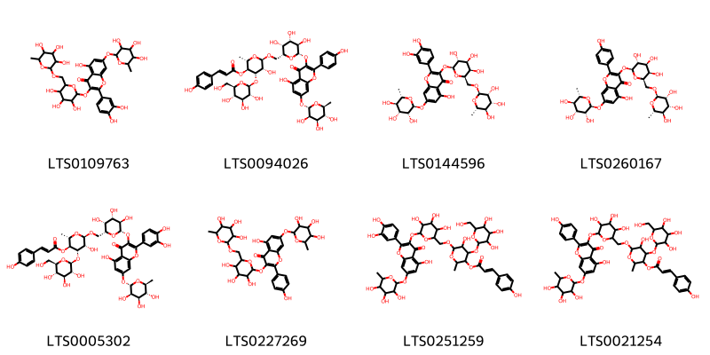{ width=100% }
    <figcaption>Hình ảnh cấu trúc hóa học của 8 hoạt chất thuộc nhóm Flavonoids gồm ['2-(3,4-dihydroxyphenyl)-5-hydroxy-7-[(3,4,5-trihydroxy-6-methyloxan-2-yl)oxy]-3-[(3,4,5-trihydroxy-6-{[(3,4,5-trihydroxy-6-methyloxan-2-yl)oxy]methyl}oxan-2-yl)oxy]chromen-4-one (LTS0109763)', '(2s,3s,4s,5r,6r)-5-hydroxy-2-methyl-4-{[(2s,3r,4s,5s,6r)-3,4,5-trihydroxy-6-(hydroxymethyl)oxan-2-yl]oxy}-6-{[(2r,3r,4s,5r,6s)-3,4,5-trihydroxy-6-{[5-hydroxy-2-(4-hydroxyphenyl)-4-oxo-7-{[(2s,3r,4r,5r,6s)-3,4,5-trihydroxy-6-methyloxan-2-yl]oxy}chromen-3-yl]oxy}oxan-2-yl]methoxy}oxan-3-yl (2e)-3-(4-hydroxyphenyl)prop-2-enoate (LTS0094026)', '2-(3,4-dihydroxyphenyl)-5-hydroxy-3-{[(2s,3r,4s,5r,6r)-3,4,5-trihydroxy-6-({[(2r,3r,4r,5r,6s)-3,4,5-trihydroxy-6-methyloxan-2-yl]oxy}methyl)oxan-2-yl]oxy}-7-{[(2s,3r,4r,5r,6s)-3,4,5-trihydroxy-6-methyloxan-2-yl]oxy}chromen-4-one (LTS0144596)', 'robinin (LTS0260167)', '(2s,3s,4s,5r,6r)-6-{[(2r,3r,4s,5r,6s)-6-{[2-(3,4-dihydroxyphenyl)-5-hydroxy-4-oxo-7-{[(2s,3r,4r,5r,6s)-3,4,5-trihydroxy-6-methyloxan-2-yl]oxy}chromen-3-yl]oxy}-3,4,5-trihydroxyoxan-2-yl]methoxy}-5-hydroxy-2-methyl-4-{[(2s,3r,4s,5s,6r)-3,4,5-trihydroxy-6-(hydroxymethyl)oxan-2-yl]oxy}oxan-3-yl (2e)-3-(4-hydroxyphenyl)prop-2-enoate (LTS0005302)', 'robinin (LTS0227269)', '6-[(6-{[2-(3,4-dihydroxyphenyl)-5-hydroxy-4-oxo-7-[(3,4,5-trihydroxy-6-methyloxan-2-yl)oxy]chromen-3-yl]oxy}-3,4,5-trihydroxyoxan-2-yl)methoxy]-5-hydroxy-2-methyl-4-{[3,4,5-trihydroxy-6-(hydroxymethyl)oxan-2-yl]oxy}oxan-3-yl 3-(4-hydroxyphenyl)prop-2-enoate (LTS0251259)', '5-hydroxy-2-methyl-4-{[3,4,5-trihydroxy-6-(hydroxymethyl)oxan-2-yl]oxy}-6-[(3,4,5-trihydroxy-6-{[5-hydroxy-2-(4-hydroxyphenyl)-4-oxo-7-[(3,4,5-trihydroxy-6-methyloxan-2-yl)oxy]chromen-3-yl]oxy}oxan-2-yl)methoxy]oxan-3-yl 3-(4-hydroxyphenyl)prop-2-enoate (LTS0021254)'].</figcaption>
</figure>
#### Nhóm Prenol lipids
<figure markdown="span">
    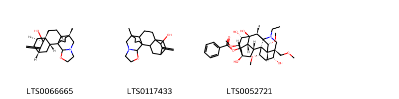{ width=100% }
    <figcaption>Hình ảnh cấu trúc hóa học của 3 hoạt chất thuộc nhóm Prenol lipids gồm ['atisine (LTS0066665)', '11-methyl-5-methylidene-16-oxa-13-azahexacyclo[9.6.3.2⁴,⁷.0¹,¹⁰.0²,⁷.0¹³,¹⁷]docosan-6-ol (LTS0117433)', '(1s,2r,3r,4r,5r,6s,7s,8r,9r,13r,14r,16s,17s,18r)-11-ethyl-5,7,8,14-tetrahydroxy-6,16,18-trimethoxy-13-(methoxymethyl)-11-azahexacyclo[7.7.2.1²,⁵.0¹,¹⁰.0³,⁸.0¹³,¹⁷]nonadecan-4-yl benzoate (LTS0052721)'].</figcaption>
</figure>

---

### Dược dân tộc học

Danh sách các quốc gia có sử dụng *Aconitum anthora* trong điều trị các bệnh. 

| Country   | Disease   | Bệnh                                                                                                                                                                                                |
|:----------|:----------|:----------------------------------------------------------------------------------------------------------------------------------------------------------------------------------------------------|
| English   | Sudorific | MYMEMORY WARNING: YOU USED ALL AVAILABLE FREE TRANSLATIONS FOR TODAY. NEXT AVAILABLE IN  09 HOURS 04 MINUTES 35 SECONDS VISIT HTTPS://MYMEMORY.TRANSLATED.NET/DOC/USAGELIMITS.PHP TO TRANSLATE MORE |
| German    | Poison    | MYMEMORY WARNING: YOU USED ALL AVAILABLE FREE TRANSLATIONS FOR TODAY. NEXT AVAILABLE IN  09 HOURS 04 MINUTES 33 SECONDS VISIT HTTPS://MYMEMORY.TRANSLATED.NET/DOC/USAGELIMITS.PHP TO TRANSLATE MORE |
| Italian   | Diuretic  | MYMEMORY WARNING: YOU USED ALL AVAILABLE FREE TRANSLATIONS FOR TODAY. NEXT AVAILABLE IN  09 HOURS 04 MINUTES 30 SECONDS VISIT HTTPS://MYMEMORY.TRANSLATED.NET/DOC/USAGELIMITS.PHP TO TRANSLATE MORE |
| Turkey    | Vermifuge | MYMEMORY WARNING: YOU USED ALL AVAILABLE FREE TRANSLATIONS FOR TODAY. NEXT AVAILABLE IN  09 HOURS 04 MINUTES 28 SECONDS VISIT HTTPS://MYMEMORY.TRANSLATED.NET/DOC/USAGELIMITS.PHP TO TRANSLATE MORE |

---

---
## Aconitum balfourii
### Thông tin về thực vật

!!! info "Phân loại thực vật của *Aconitum balfourii* từ GIBF:"
    - **Kingdom:** Plantae
    - **Phylum:** Tracheophyta
    - **Order:** Ranunculales
    - **Family:** Ranunculaceae
    - **Genus:** Aconitum
    - **Species:** *Aconitum balfourii*

 

| Label (VI)   | Label (EN)   | Scientific Name    | Descriptions (VI)   | Descriptions (EN)   | Also Known As (VI)   | Also Known As (EN)   |
|:-------------|:-------------|:-------------------|:--------------------|:--------------------|:---------------------|:---------------------|
| N/A          | N/A          | Aconitum balfourii | loài thực vật       | species of plant    | ['']                 | ['']                 |

#### Phân bố trên thế giới

**Từ CSDL GIBF** Nepal, India, China

#### Phân bố tại Việt Nam

**Từ CSDL GIBF**: Không có ghi nhận ở Việt Nam

---
### Thành phần hóa học
        
- Theo cơ sở dữ liệu lotus: Từ loài *Aconitum balfourii* đã phân lập và xác định được 45 hoạt chất thuộc về các nhóm Prenol lipids. 

|    | chemicalTaxonomyClassyfireClass   |   smiles_count |
|---:|:----------------------------------|---------------:|
|  0 | Prenol lipids                     |             45 |

#### Nhóm Prenol lipids
<figure markdown="span">
    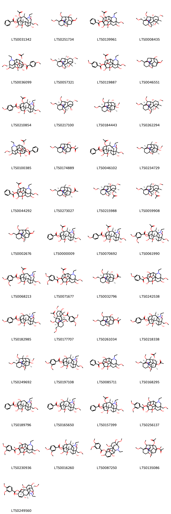{ width=100% }
    <figcaption>Hình ảnh cấu trúc hóa học của 45 hoạt chất thuộc nhóm Prenol lipids gồm ['aconitine (LTS0031342)', '11-ethyl-6,18-dimethoxy-13-(methoxymethyl)-11-azahexacyclo[7.7.2.1²,⁵.0¹,¹⁰.0³,⁸.0¹³,¹⁷]nonadecane-4,8,16-triol (LTS0251734)', '8-(acetyloxy)-11-ethyl-5,7,14-trihydroxy-6,16,18-trimethoxy-13-(methoxymethyl)-11-azahexacyclo[7.7.2.1²,⁵.0¹,¹⁰.0³,⁸.0¹³,¹⁷]nonadecan-4-yl benzoate (LTS0139961)', '(2r,3r,4s,5s,6s,8r,13s,16s,17r,18r)-11-ethyl-6,18-dimethoxy-13-(methoxymethyl)-11-azahexacyclo[7.7.2.1²,⁵.0¹,¹⁰.0³,⁸.0¹³,¹⁷]nonadecane-4,8,16-triol (LTS0008435)', '(2r,3r,5s,6s,8r,13r,17s)-8-(acetyloxy)-11-ethyl-5,14-dihydroxy-6,16,18-trimethoxy-13-(methoxymethyl)-11-azahexacyclo[7.7.2.1²,⁵.0¹,¹⁰.0³,⁸.0¹³,¹⁷]nonadecan-4-yl 4-methoxybenzoate (LTS0036099)', '(1s,2r,3r,4s,5r,6s,8s,9r,13s,16s,17r)-11-ethyl-6-methoxy-13-(methoxymethyl)-11-azahexacyclo[7.7.2.1²,⁵.0¹,¹⁰.0³,⁸.0¹³,¹⁷]nonadecane-4,8,16-triol (LTS0057321)', '8-(acetyloxy)-11-ethyl-5,14-dihydroxy-6,16,18-trimethoxy-13-(methoxymethyl)-11-azahexacyclo[7.7.2.1²,⁵.0¹,¹⁰.0³,⁸.0¹³,¹⁷]nonadecan-4-yl 4-methoxybenzoate (LTS0119887)', '11-ethyl-6-methoxy-13-(methoxymethyl)-11-azahexacyclo[7.7.2.1²,⁵.0¹,¹⁰.0³,⁸.0¹³,¹⁷]nonadecane-4,8,16-triol (LTS0046551)', '(1s,2r,3r,4r,5r,6s,8r,9r,10r,13r,14r,16s,17s,18r)-8-(acetyloxy)-11-ethyl-5,14-dihydroxy-6,16,18-trimethoxy-13-(methoxymethyl)-11-azahexacyclo[7.7.2.1²,⁵.0¹,¹⁰.0³,⁸.0¹³,¹⁷]nonadecan-4-yl 4-methoxybenzoate (LTS0210854)', '(2r,3r,6s,8r,13s,17r)-11-ethyl-6,16,18-trimethoxy-13-(methoxymethyl)-11-azahexacyclo[7.7.2.1²,⁵.0¹,¹⁰.0³,⁸.0¹³,¹⁷]nonadecane-4,8-diol (LTS0217100)', '(1s,2r,3r,4s,5s,6s,8r,9r,10r,13s,16s,17r,18r)-11-ethyl-6,18-dimethoxy-13-(methoxymethyl)-11-azahexacyclo[7.7.2.1²,⁵.0¹,¹⁰.0³,⁸.0¹³,¹⁷]nonadecane-4,8,16-triol (LTS0184443)', '(2r,3r,4s,5s,6s,8r,13s,16s,17r,18r)-11-ethyl-6,16,18-trimethoxy-13-(methoxymethyl)-11-azahexacyclo[7.7.2.1²,⁵.0¹,¹⁰.0³,⁸.0¹³,¹⁷]nonadecane-4,8-diol (LTS0262294)', '(2s,3s,5s,8r,13r,17r)-8-(acetyloxy)-11-ethyl-5,14-dihydroxy-6,16,18-trimethoxy-13-(methoxymethyl)-11-azahexacyclo[7.7.2.1²,⁵.0¹,¹⁰.0³,⁸.0¹³,¹⁷]nonadecan-4-yl benzoate (LTS0100385)', '11-ethyl-8,16-dihydroxy-6-methoxy-13-(methoxymethyl)-11-azahexacyclo[7.7.2.1²,⁵.0¹,¹⁰.0³,⁸.0¹³,¹⁷]nonadecan-4-yl acetate (LTS0174889)', 'indaconitine (LTS0046102)', '(1s,2r,3r,4s,5s,6s,8s,9s,10r,13s,16s,17r)-11-ethyl-6-methoxy-13-(methoxymethyl)-11-azahexacyclo[7.7.2.1²,⁵.0¹,¹⁰.0³,⁸.0¹³,¹⁷]nonadecane-4,8,16-triol (LTS0234729)', '8-(acetyloxy)-11-ethyl-5,14-dihydroxy-6,16,18-trimethoxy-13-(methoxymethyl)-11-azahexacyclo[7.7.2.1²,⁵.0¹,¹⁰.0³,⁸.0¹³,¹⁷]nonadecan-4-yl benzoate (LTS0044292)', '(1s,2r,3r,4s,5r,6s,8s,9s,10r,13s,16s,17r)-11-ethyl-8,16-dihydroxy-6-methoxy-13-(methoxymethyl)-11-azahexacyclo[7.7.2.1²,⁵.0¹,¹⁰.0³,⁸.0¹³,¹⁷]nonadecan-4-yl acetate (LTS0273027)', '(1s,2r,3r,4s,5s,6s,8r,9r,10s,13r,16s,17r)-11-ethyl-8,16-dihydroxy-6-methoxy-13-(methoxymethyl)-11-azahexacyclo[7.7.2.1²,⁵.0¹,¹⁰.0³,⁸.0¹³,¹⁷]nonadecan-4-yl acetate (LTS0215988)', 'condelphine (LTS0059908)', '11-ethyl-6,16,18-trimethoxy-13-(methoxymethyl)-11-azahexacyclo[7.7.2.1²,⁵.0¹,¹⁰.0³,⁸.0¹³,¹⁷]nonadecane-4,8-diol (LTS0002676)', '(1s,2r,3r,4r,5s,6s,8r,9r,10r,13r,14r,16s,17s,18r)-8-(acetyloxy)-11-ethyl-5,14-dihydroxy-6,16,18-trimethoxy-13-(methoxymethyl)-11-azahexacyclo[7.7.2.1²,⁵.0¹,¹⁰.0³,⁸.0¹³,¹⁷]nonadecan-4-yl benzoate (LTS0000009)', '(1s,2r,3r,4r,5s,6s,8r,9r,10r,13r,14r,16s,17s,18r)-8-(acetyloxy)-11-ethyl-5,14-dihydroxy-6,16,18-trimethoxy-13-(methoxymethyl)-11-azahexacyclo[7.7.2.1²,⁵.0¹,¹⁰.0³,⁸.0¹³,¹⁷]nonadecan-4-yl 4-methoxybenzoate (LTS0070692)', 'pseudoaconitine (LTS0061990)', '(1s,2r,3r,4r,5s,6s,8r,13r,14r,16s,17s,18r)-8-(acetyloxy)-11-ethyl-5,14-dihydroxy-6,16,18-trimethoxy-13-(methoxymethyl)-11-azahexacyclo[7.7.2.1²,⁵.0¹,¹⁰.0³,⁸.0¹³,¹⁷]nonadecan-4-yl 3,4-dimethoxybenzoate (LTS0068213)', '8-(acetyloxy)-11-ethyl-5,14-dihydroxy-6,16,18-trimethoxy-13-(methoxymethyl)-11-azahexacyclo[7.7.2.1²,⁵.0¹,¹⁰.0³,⁸.0¹³,¹⁷]nonadecan-4-yl 3,4-dimethoxybenzoate (LTS0071677)', '(1s,2r,3r,4s,5r,6s,8r,9r,10r,13s,16s,17r,18r)-11-ethyl-8,16-dihydroxy-6,18-dimethoxy-13-(methoxymethyl)-11-azahexacyclo[7.7.2.1²,⁵.0¹,¹⁰.0³,⁸.0¹³,¹⁷]nonadecan-4-yl acetate (LTS0032796)', '11-ethyl-5,8,14-trihydroxy-6,16,18-trimethoxy-13-(methoxymethyl)-11-azahexacyclo[7.7.2.1²,⁵.0¹,¹⁰.0³,⁸.0¹³,¹⁷]nonadecan-4-yl 4-methoxybenzoate (LTS0242538)', '(1s,2r,3r,4r,5s,6s,8r,10r,13r,14r,16s,17s)-11-ethyl-5,8,14-trihydroxy-6,16,18-trimethoxy-13-(methoxymethyl)-11-azahexacyclo[7.7.2.1²,⁵.0¹,¹⁰.0³,⁸.0¹³,¹⁷]nonadecan-4-yl 4-methoxybenzoate (LTS0182985)', 'bikhaconitine (LTS0177707)', '11-ethyl-8,16-dihydroxy-6,18-dimethoxy-13-(methoxymethyl)-11-azahexacyclo[7.7.2.1²,⁵.0¹,¹⁰.0³,⁸.0¹³,¹⁷]nonadecan-4-yl acetate (LTS0261034)', '(1s,2r,3r,4r,5s,6s,8r,9r,10r,13r,14r,16s,17s,18r)-11-ethyl-5,8,14-trihydroxy-6,16,18-trimethoxy-13-(methoxymethyl)-11-azahexacyclo[7.7.2.1²,⁵.0¹,¹⁰.0³,⁸.0¹³,¹⁷]nonadecan-4-yl 4-methoxybenzoate (LTS0218338)', '(1s,2r,3r,4s,5s,6s,8r,9r,10r,13s,16s,17r,18r)-11-ethyl-6,16,18-trimethoxy-13-(methoxymethyl)-11-azahexacyclo[7.7.2.1²,⁵.0¹,¹⁰.0³,⁸.0¹³,¹⁷]nonadecane-4,8-diol (LTS0249692)', '(1s,2r,3r,4r,5s,6s,8r,9r,10r,13r,14r,16s,17s,18r)-11-ethyl-5,8,14-trihydroxy-6,16,18-trimethoxy-13-(methoxymethyl)-11-azahexacyclo[7.7.2.1²,⁵.0¹,¹⁰.0³,⁸.0¹³,¹⁷]nonadecan-4-yl 3,4-dimethoxybenzoate (LTS0197108)', '11-ethyl-5,8,14-trihydroxy-6,16,18-trimethoxy-13-(methoxymethyl)-11-azahexacyclo[7.7.2.1²,⁵.0¹,¹⁰.0³,⁸.0¹³,¹⁷]nonadecan-4-yl benzoate (LTS0085711)', '(1s,2r,3r,4s,5r,6s,8r,9r,10r,13s,16s,17r,18r)-4-(acetyloxy)-11-ethyl-6,16,18-trimethoxy-13-(methoxymethyl)-11-azahexacyclo[7.7.2.1²,⁵.0¹,¹⁰.0³,⁸.0¹³,¹⁷]nonadecan-8-yl acetate (LTS0168295)', '(2r,3r,4r,5s,6s,8r,13r,14r,16s,17s,18r)-11-ethyl-5,8,14-trihydroxy-6,16,18-trimethoxy-13-(methoxymethyl)-11-azahexacyclo[7.7.2.1²,⁵.0¹,¹⁰.0³,⁸.0¹³,¹⁷]nonadecan-4-yl benzoate (LTS0189796)', '(1s,2r,3r,4r,5s,6s,8r,9r,10r,13r,14r,16s,17s,18r)-11-ethyl-5,8,14-trihydroxy-6,16,18-trimethoxy-13-(methoxymethyl)-11-azahexacyclo[7.7.2.1²,⁵.0¹,¹⁰.0³,⁸.0¹³,¹⁷]nonadecan-4-yl benzoate (LTS0165650)', '(1s,2r,3r,4r,5r,6s,8r,9r,10r,13r,14r,16s,17s,18r)-8-(acetyloxy)-11-ethyl-5,14-dihydroxy-6,16,18-trimethoxy-13-(methoxymethyl)-11-azahexacyclo[7.7.2.1²,⁵.0¹,¹⁰.0³,⁸.0¹³,¹⁷]nonadecan-4-yl benzoate (LTS0157399)', '11-ethyl-5,14-dihydroxy-6,8,16,18-tetramethoxy-13-(methoxymethyl)-11-azahexacyclo[7.7.2.1²,⁵.0¹,¹⁰.0³,⁸.0¹³,¹⁷]nonadecan-4-yl 3,4-dimethoxybenzoate (LTS0256137)', '11-ethyl-5,8,14-trihydroxy-6,16,18-trimethoxy-13-(methoxymethyl)-11-azahexacyclo[7.7.2.1²,⁵.0¹,¹⁰.0³,⁸.0¹³,¹⁷]nonadecan-4-yl 3,4-dimethoxybenzoate (LTS0230936)', '(1s,2r,3r,4r,5s,6s,8r,9r,10r,13r,14r,16s,17s,18r)-11-ethyl-5,14-dihydroxy-6,8,16,18-tetramethoxy-13-(methoxymethyl)-11-azahexacyclo[7.7.2.1²,⁵.0¹,¹⁰.0³,⁸.0¹³,¹⁷]nonadecan-4-yl 3,4-dimethoxybenzoate (LTS0016260)', '11-ethyl-5,8,14-trihydroxy-16,18-dimethoxy-13-(methoxymethyl)-11-azahexacyclo[7.7.2.1²,⁵.0¹,¹⁰.0³,⁸.0¹³,¹⁷]nonadec-6-en-4-yl 3,4-dimethoxybenzoate (LTS0087250)', '4-(acetyloxy)-11-ethyl-6,16,18-trimethoxy-13-(methoxymethyl)-11-azahexacyclo[7.7.2.1²,⁵.0¹,¹⁰.0³,⁸.0¹³,¹⁷]nonadecan-8-yl acetate (LTS0135086)', '(1s,2r,3r,4r,5s,8r,9r,10r,13r,14r,16s,17s,18r)-11-ethyl-5,8,14-trihydroxy-16,18-dimethoxy-13-(methoxymethyl)-11-azahexacyclo[7.7.2.1²,⁵.0¹,¹⁰.0³,⁸.0¹³,¹⁷]nonadec-6-en-4-yl 3,4-dimethoxybenzoate (LTS0249560)'].</figcaption>
</figure>

---

### Dược dân tộc học

Danh sách các quốc gia có sử dụng *Aconitum balfourii* trong điều trị các bệnh. 

| Country   | Disease   | Bệnh                                                                                                                                                                                                |
|:----------|:----------|:----------------------------------------------------------------------------------------------------------------------------------------------------------------------------------------------------|
| Elsewhere | Poison    | MYMEMORY WARNING: YOU USED ALL AVAILABLE FREE TRANSLATIONS FOR TODAY. NEXT AVAILABLE IN  09 HOURS 04 MINUTES 04 SECONDS VISIT HTTPS://MYMEMORY.TRANSLATED.NET/DOC/USAGELIMITS.PHP TO TRANSLATE MORE |

---

---
## Aconitum carmichaeli
### Thông tin về thực vật

!!! info "Phân loại thực vật của *Aconitum carmichaelii* từ GIBF:"
    - **Kingdom:** Plantae
    - **Phylum:** Tracheophyta
    - **Order:** Ranunculales
    - **Family:** Ranunculaceae
    - **Genus:** Aconitum
    - **Species:** *Aconitum carmichaelii*

 

| Label (VI)   | Label (EN)   | Scientific Name      | Descriptions (VI)   | Descriptions (EN)   | Also Known As (VI)   | Also Known As (EN)   |
|:-------------|:-------------|:---------------------|:--------------------|:--------------------|:---------------------|:---------------------|
| N/A          | N/A          | Aconitum carmichaeli | loài thực vật       | species of plant    | ['']                 | ['']                 |

#### Phân bố trên thế giới

**Từ CSDL GIBF** Viet Nam, nan, unknown or invalid, United Kingdom of Great Britain and Northern Ireland, Japan, France, Germany, United States of America, Austria, China, Netherlands, Chinese Taipei

#### Phân bố tại Việt Nam

**Từ CSDL GIBF**: Không có ghi nhận ở Việt Nam

---
### Thành phần hóa học
        
- Theo cơ sở dữ liệu lotus: Từ loài *Aconitum carmichaelii* đã phân lập và xác định được 63 hoạt chất thuộc về các nhóm Flavonoids, Prenol lipids, Cinnamic acids and derivatives, Benzene and substituted derivatives. 

|    | chemicalTaxonomyClassyfireClass     |   smiles_count |
|---:|:------------------------------------|---------------:|
|  0 | Benzene and substituted derivatives |              1 |
|  1 | Cinnamic acids and derivatives      |              1 |
|  2 | Flavonoids                          |              3 |
|  3 | Prenol lipids                       |             54 |

#### Nhóm Benzene and substituted derivatives
<figure markdown="span">
    { width=100% }
    <figcaption>Hình ảnh cấu trúc hóa học của 1 hoạt chất thuộc nhóm Benzene and substituted derivatives gồm ['honokiol (LTS0033178)'].</figcaption>
</figure>
#### Nhóm Cinnamic acids and derivatives
<figure markdown="span">
    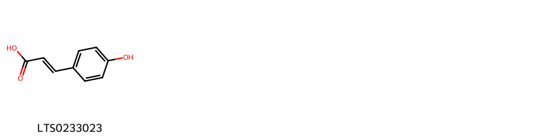{ width=100% }
    <figcaption>Hình ảnh cấu trúc hóa học của 1 hoạt chất thuộc nhóm Cinnamic acids and derivatives gồm ['hydroxycinnamic acid (LTS0233023)'].</figcaption>
</figure>
#### Nhóm Flavonoids
<figure markdown="span">
    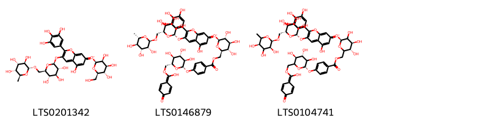{ width=100% }
    <figcaption>Hình ảnh cấu trúc hóa học của 3 hoạt chất thuộc nhóm Flavonoids gồm ['(5-hydroxy-3-{[(2s,3r,4s,5s,6r)-3,4,5-trihydroxy-6-({[(2r,3r,4s,5r,6s)-3,4,5-trihydroxy-6-methyloxan-2-yl]oxy}methyl)oxan-2-yl]oxy}-2-(3,4,5-trihydroxyphenyl)chromen-7-ylidene)[(2s,3s,4s,5s,6r)-3,4,5-trihydroxy-6-(hydroxymethyl)oxan-2-yl]oxidanium (LTS0201342)', '(5-hydroxy-3-{[(2s,3r,4s,5s,6r)-3,4,5-trihydroxy-6-({[(2r,3r,4r,5r,6s)-3,4,5-trihydroxy-6-methyloxan-2-yl]oxy}methyl)oxan-2-yl]oxy}-2-(3,4,5-trihydroxyphenyl)chromen-7-ylidene)[(2s,3r,4s,5s,6r)-3,4,5-trihydroxy-6-[(4-{[(2s,3r,4s,5s,6r)-3,4,5-trihydroxy-6-{[hydroxy(4-oxocyclohexa-2,5-dien-1-ylidene)methoxy]methyl}oxan-2-yl]oxy}benzoyloxy)methyl]oxan-2-yl]oxidanium (LTS0146879)', '(5-hydroxy-3-{[(2s,5s,6r)-3,4,5-trihydroxy-6-({[(2r,3s,5r)-3,4,5-trihydroxy-6-methyloxan-2-yl]oxy}methyl)oxan-2-yl]oxy}-2-(3,4,5-trihydroxyphenyl)chromen-7-ylidene)[(2s,4s,5s)-3,4,5-trihydroxy-6-[(4-{[(2s,4s,5s)-3,4,5-trihydroxy-6-{[hydroxy(4-oxocyclohexa-2,5-dien-1-ylidene)methoxy]methyl}oxan-2-yl]oxy}benzoyloxy)methyl]oxan-2-yl]oxidanium (LTS0104741)'].</figcaption>
</figure>
#### Nhóm Prenol lipids
<figure markdown="span">
    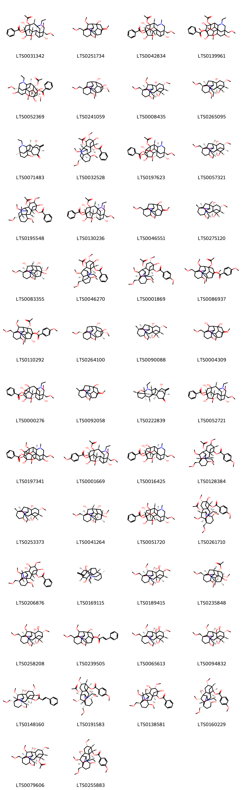{ width=100% }
    <figcaption>Hình ảnh cấu trúc hóa học của 54 hoạt chất thuộc nhóm Prenol lipids gồm ['aconitine (LTS0031342)', '11-ethyl-6,18-dimethoxy-13-(methoxymethyl)-11-azahexacyclo[7.7.2.1²,⁵.0¹,¹⁰.0³,⁸.0¹³,¹⁷]nonadecane-4,8,16-triol (LTS0251734)', 'mesaconitine (LTS0042834)', '8-(acetyloxy)-11-ethyl-5,7,14-trihydroxy-6,16,18-trimethoxy-13-(methoxymethyl)-11-azahexacyclo[7.7.2.1²,⁵.0¹,¹⁰.0³,⁸.0¹³,¹⁷]nonadecan-4-yl benzoate (LTS0139961)', '(1s,2r,3r,4r,5s,6s,7s,8r,9r,13r,16s,17s,18r)-8-(acetyloxy)-11-ethyl-5,7,14-trihydroxy-6,16,18-trimethoxy-13-(methoxymethyl)-11-azahexacyclo[7.7.2.1²,⁵.0¹,¹⁰.0³,⁸.0¹³,¹⁷]nonadecan-4-yl benzoate (LTS0052369)', '(6s,8s,13s)-11-ethyl-6,16-dimethoxy-13-(methoxymethyl)-11-azahexacyclo[7.7.2.1²,⁵.0¹,¹⁰.0³,⁸.0¹³,¹⁷]nonadecane-4,8-diol (LTS0241059)', '(2r,3r,4s,5s,6s,8r,13s,16s,17r,18r)-11-ethyl-6,18-dimethoxy-13-(methoxymethyl)-11-azahexacyclo[7.7.2.1²,⁵.0¹,¹⁰.0³,⁸.0¹³,¹⁷]nonadecane-4,8,16-triol (LTS0008435)', '(2r,3r,4s,5s,6s,8s,13s,16s,17r)-11-ethyl-6,16-dimethoxy-13-(methoxymethyl)-11-azahexacyclo[7.7.2.1²,⁵.0¹,¹⁰.0³,⁸.0¹³,¹⁷]nonadecane-4,8-diol (LTS0265095)', '(1r,5s,7r,8r,9r,13r)-11-ethyl-7,16-dihydroxy-13-methyl-6-methylidene-11-azahexacyclo[7.7.2.1⁵,⁸.0¹,¹⁰.0²,⁸.0¹³,¹⁷]nonadecan-4-one (LTS0071483)', 'hypaconitine (LTS0032528)', '(1s,5r,6s,7s,8r,9r,10r,13r,14r,16s)-8-(acetyloxy)-5,7,14-trihydroxy-6,16,18-trimethoxy-13-(methoxymethyl)-11-methyl-11-azahexacyclo[7.7.2.1²,⁵.0¹,¹⁰.0³,⁸.0¹³,¹⁷]nonadecan-4-yl benzoate (LTS0197623)', '(1s,2r,3r,4s,5r,6s,8s,9r,13s,16s,17r)-11-ethyl-6-methoxy-13-(methoxymethyl)-11-azahexacyclo[7.7.2.1²,⁵.0¹,¹⁰.0³,⁸.0¹³,¹⁷]nonadecane-4,8,16-triol (LTS0057321)', '(2s,3s,5r,8r,13s,17s)-8-(acetyloxy)-5,7-dihydroxy-6,16,18-trimethoxy-13-(methoxymethyl)-11-methyl-11-azahexacyclo[7.7.2.1²,⁵.0¹,¹⁰.0³,⁸.0¹³,¹⁷]nonadecan-4-yl benzoate (LTS0195548)', '(1s,2r,3r,4r,5r,6s,7s,8r,9r,10r,13r,14r,16s,17s,18r)-8-(acetyloxy)-11-ethyl-5,7,14-trihydroxy-6,16,18-trimethoxy-13-(methoxymethyl)-11-azahexacyclo[7.7.2.1²,⁵.0¹,¹⁰.0³,⁸.0¹³,¹⁷]nonadecan-4-yl benzoate (LTS0130236)', '11-ethyl-6-methoxy-13-(methoxymethyl)-11-azahexacyclo[7.7.2.1²,⁵.0¹,¹⁰.0³,⁸.0¹³,¹⁷]nonadecane-4,8,16-triol (LTS0046551)', 'karakoline (LTS0275120)', '(1s,2r,3r,4s,5s,6s,8r,9r,10r,13s,16s,17r,18s)-11-ethyl-6-methoxy-13-(methoxymethyl)-11-azahexacyclo[7.7.2.1²,⁵.0¹,¹⁰.0³,⁸.0¹³,¹⁷]nonadecane-4,8,16,18-tetrol (LTS0083355)', '(2r,3r,4r,5r,6s,7s,8r,13s,16s,17r,18r)-8-(acetyloxy)-11-ethyl-5,7-dihydroxy-6,16,18-trimethoxy-13-(methoxymethyl)-11-azahexacyclo[7.7.2.1²,⁵.0¹,¹⁰.0³,⁸.0¹³,¹⁷]nonadecan-4-yl benzoate (LTS0046270)', '(2r,3r,5s,6s,8r,13s,17r)-8-(acetyloxy)-11-ethyl-5-hydroxy-6,16,18-trimethoxy-13-(methoxymethyl)-11-azahexacyclo[7.7.2.1²,⁵.0¹,¹⁰.0³,⁸.0¹³,¹⁷]nonadecan-4-yl 4-methoxybenzoate (LTS0001869)', '8-(acetyloxy)-11-ethyl-6,16,18-trimethoxy-13-(methoxymethyl)-11-azahexacyclo[7.7.2.1²,⁵.0¹,¹⁰.0³,⁸.0¹³,¹⁷]nonadecan-4-yl 4-methoxybenzoate (LTS0086937)', '(1s,5s,8r,10r,13s)-8-(acetyloxy)-11-ethyl-5-hydroxy-6,16,18-trimethoxy-13-(methoxymethyl)-11-azahexacyclo[7.7.2.1²,⁵.0¹,¹⁰.0³,⁸.0¹³,¹⁷]nonadecan-4-yl 4-methoxybenzoate (LTS0110292)', '(1s,5s,6s,8s,13r,16s)-11-ethyl-6-methoxy-13-(methoxymethyl)-11-azahexacyclo[7.7.2.1²,⁵.0¹,¹⁰.0³,⁸.0¹³,¹⁷]nonadecane-4,8,16-triol (LTS0264100)', '(1s,2r,3r,4s,5s,6s,8s,13r,16s,17r)-11-ethyl-6-methoxy-13-methyl-11-azahexacyclo[7.7.2.1²,⁵.0¹,¹⁰.0³,⁸.0¹³,¹⁷]nonadecane-4,8,16-triol (LTS0090088)', '11-ethyl-6-methoxy-13-(methoxymethyl)-11-azahexacyclo[7.7.2.1²,⁵.0¹,¹⁰.0³,⁸.0¹³,¹⁷]nonadecane-4,8,16,18-tetrol (LTS0004309)', '(2r,3r,5r,6s,7s,8r,13r,14r,16s,17s,18r)-11-ethyl-5,7,8,14-tetrahydroxy-6,16,18-trimethoxy-13-(methoxymethyl)-11-azahexacyclo[7.7.2.1²,⁵.0¹,¹⁰.0³,⁸.0¹³,¹⁷]nonadecan-4-yl benzoate (LTS0000276)', '11-ethyl-6-methoxy-13-methyl-11-azahexacyclo[7.7.2.1²,⁵.0¹,¹⁰.0³,⁸.0¹³,¹⁷]nonadecane-4,8,16-triol (LTS0092058)', '(1r,4s,5r,8s,10s,12r,13s,14r,17s,19r)-11-ethyl-19-hydroxy-5-methyl-18-methylidene-9-oxa-11-azaheptacyclo[15.2.1.0¹,¹⁴.0²,¹².0⁴,¹³.0⁵,¹⁰.0⁸,¹³]icosan-16-one (LTS0222839)', '(1s,2r,3r,4r,5r,6s,7s,8r,9r,13r,14r,16s,17s,18r)-11-ethyl-5,7,8,14-tetrahydroxy-6,16,18-trimethoxy-13-(methoxymethyl)-11-azahexacyclo[7.7.2.1²,⁵.0¹,¹⁰.0³,⁸.0¹³,¹⁷]nonadecan-4-yl benzoate (LTS0052721)', '(2r,3r,5r,6s,8r,10r,17s)-5,7,14-trihydroxy-6,8,16,18-tetramethoxy-13-(methoxymethyl)-11-methyl-11-azahexacyclo[7.7.2.1²,⁵.0¹,¹⁰.0³,⁸.0¹³,¹⁷]nonadecan-4-yl benzoate (LTS0197341)', 'jesaconitine (LTS0001669)', '(1s,3r,4r,6s,7s,8r,10r,13r,14r,16s,17s,18r)-5,7,8,14-tetrahydroxy-6,16,18-trimethoxy-13-(methoxymethyl)-11-methyl-11-azahexacyclo[7.7.2.1²,⁵.0¹,¹⁰.0³,⁸.0¹³,¹⁷]nonadecan-4-yl benzoate (LTS0016425)', '(2s,3s,5r,8r,13s,17s)-8-(acetyloxy)-11-ethyl-6,16,18-trimethoxy-13-(methoxymethyl)-11-azahexacyclo[7.7.2.1²,⁵.0¹,¹⁰.0³,⁸.0¹³,¹⁷]nonadecan-4-yl 4-methoxybenzoate (LTS0128384)', '(2r,3r,4s,5s,6s,8s,13r,16s,17r)-11-ethyl-6-methoxy-13-methyl-11-azahexacyclo[7.7.2.1²,⁵.0¹,¹⁰.0³,⁸.0¹³,¹⁷]nonadecane-4,8,16-triol (LTS0253373)', '(1s,2r,3r,4r,5s,6s,8r,9r,10r,13s,16r,17r,18s)-11-ethyl-6-methoxy-13-(methoxymethyl)-11-azahexacyclo[7.7.2.1²,⁵.0¹,¹⁰.0³,⁸.0¹³,¹⁷]nonadecane-4,8,16,18-tetrol (LTS0041264)', '(1s,2r,3r,4r,5r,6s,7s,8r,9r,10r,13r,14r,16s,17s,18r)-5,7,14-trihydroxy-6,8,16,18-tetramethoxy-13-(methoxymethyl)-11-methyl-11-azahexacyclo[7.7.2.1²,⁵.0¹,¹⁰.0³,⁸.0¹³,¹⁷]nonadecan-4-yl benzoate (LTS0051720)', '(1s,2r,3r,4r,5s,6s,8r,9r,13s,16s,17r,18r)-8-(acetyloxy)-11-ethyl-5-hydroxy-6,16,18-trimethoxy-13-(methoxymethyl)-11-azahexacyclo[7.7.2.1²,⁵.0¹,¹⁰.0³,⁸.0¹³,¹⁷]nonadecan-4-yl 4-methoxybenzoate (LTS0261710)', '(2s,3s,5r,8r,13s,17s)-5,7,8-trihydroxy-6,16,18-trimethoxy-13-(methoxymethyl)-11-methyl-11-azahexacyclo[7.7.2.1²,⁵.0¹,¹⁰.0³,⁸.0¹³,¹⁷]nonadecan-4-yl benzoate (LTS0206876)', 'denudatine (LTS0169115)', '(1s,2r,3s,4r,5s,6s,7s,8r,9s,13s,16r,17r,18s)-11-ethyl-6,18-dimethoxy-13-(methoxymethyl)-11-azahexacyclo[7.7.2.1²,⁵.0¹,¹⁰.0³,⁸.0¹³,¹⁷]nonadecane-4,7,8,16-tetrol (LTS0189415)', '(1s,2r,3r,4s,5s,6s,8s,9s,10r,13s,16s,17r)-11-ethyl-4-hydroxy-6,16-dimethoxy-13-(methoxymethyl)-11-azahexacyclo[7.7.2.1²,⁵.0¹,¹⁰.0³,⁸.0¹³,¹⁷]nonadecan-8-yl acetate (LTS0235848)', '(2r,3r,4s,6r,7s,8r,13s,16s,17r,18r)-11-ethyl-6,18-dimethoxy-13-(methoxymethyl)-11-azahexacyclo[7.7.2.1²,⁵.0¹,¹⁰.0³,⁸.0¹³,¹⁷]nonadecane-4,7,8,16-tetrol (LTS0258208)', '11-ethyl-8,16-dihydroxy-6,18-dimethoxy-13-(methoxymethyl)-11-azahexacyclo[7.7.2.1²,⁵.0¹,¹⁰.0³,⁸.0¹³,¹⁷]nonadecan-4-yl 3-phenylprop-2-enoate (LTS0239505)', '(1r,2r,3r,4s,5s,6r,7s,8s,9s,10s,13s,16s,17r,18s)-11-ethyl-6,18-dimethoxy-13-(methoxymethyl)-11-azahexacyclo[7.7.2.1²,⁵.0¹,¹⁰.0³,⁸.0¹³,¹⁷]nonadecane-4,7,8,16-tetrol (LTS0065613)', '(1r,2r,3r,4s,5s,6r,7s,8s,9s,10s,13s,16s,18s)-11-ethyl-6,18-dimethoxy-13-(methoxymethyl)-11-azahexacyclo[7.7.2.1²,⁵.0¹,¹⁰.0³,⁸.0¹³,¹⁷]nonadecane-4,7,8,16-tetrol (LTS0094832)', '(1r,2r,3r,4r,5r,6s,8r,9s,10s,13r,16r,17s,18s)-11-ethyl-8,16-dihydroxy-6,18-dimethoxy-13-(methoxymethyl)-11-azahexacyclo[7.7.2.1²,⁵.0¹,¹⁰.0³,⁸.0¹³,¹⁷]nonadecan-4-yl (2e)-3-phenylprop-2-enoate (LTS0148160)', '(1r,2r,3r,4r,5r,6s,8r,9s,10s,13r,16r,17s,18s)-8-(acetyloxy)-11-ethyl-6,16,18-trimethoxy-13-(methoxymethyl)-11-azahexacyclo[7.7.2.1²,⁵.0¹,¹⁰.0³,⁸.0¹³,¹⁷]nonadecan-4-yl 4-methoxybenzoate (LTS0191583)', '(1s,2r,3r,6s,7s,8r,9r,13s,16s,18r)-5,7,8-trihydroxy-6,16,18-trimethoxy-13-(methoxymethyl)-11-methyl-11-azahexacyclo[7.7.2.1²,⁵.0¹,¹⁰.0³,⁸.0¹³,¹⁷]nonadecan-4-yl benzoate (LTS0138581)', '(1r,2r,3r,4r,5r,6s,8r,9s,10s,13r,16s,17s,18s)-11-ethyl-8,16-dihydroxy-6,18-dimethoxy-13-(methoxymethyl)-11-azahexacyclo[7.7.2.1²,⁵.0¹,¹⁰.0³,⁸.0¹³,¹⁷]nonadecan-4-yl 4-methoxybenzoate (LTS0160229)', '(1s,2r,3r,4s,5r,6s,8r,9s,13s,16s,17r,18r)-11-ethyl-8,16-dihydroxy-6,18-dimethoxy-13-(methoxymethyl)-11-azahexacyclo[7.7.2.1²,⁵.0¹,¹⁰.0³,⁸.0¹³,¹⁷]nonadecan-4-yl acetate (LTS0079606)', '(1s,2r,3r,4s,5r,6s,8r,9s,13s,16s,17r,18r)-11-ethyl-8,16-dihydroxy-6,18-dimethoxy-13-(methoxymethyl)-11-azahexacyclo[7.7.2.1²,⁵.0¹,¹⁰.0³,⁸.0¹³,¹⁷]nonadecan-4-yl 4-methoxybenzoate (LTS0255883)', '(1s,2s,3r,4s,5r,6r,7s,8r,9r,10r,13r,14r,16s,17r,18r)-11-ethyl-5,7,8,14-tetrahydroxy-6,16,18-trimethoxy-13-(methoxymethyl)-11-azahexacyclo[7.7.2.1²,⁵.0¹,¹⁰.0³,⁸.0¹³,¹⁷]nonadecan-4-yl benzoate (LTS0262554)', '(1s,3r,4s,5r,8s,9r,10r,11r,14r,16s,17s,18s,19s)-4,9-bis(acetyloxy)-10,19-dihydroxy-5-methyl-12-methylidene-7-azaheptacyclo[9.6.2.0¹,⁸.0⁵,¹⁷.0⁷,¹⁶.0⁹,¹⁴.0¹⁴,¹⁸]nonadecan-3-yl (2r)-2-methylbutanoate (LTS0112781)', '(1r,2r,3r,4s,5s,6s,8r,9s,10s,13r,16s,17s,18s)-8-(acetyloxy)-11-ethyl-5-hydroxy-6,16,18-trimethoxy-13-(methoxymethyl)-11-azahexacyclo[7.7.2.1²,⁵.0¹,¹⁰.0³,⁸.0¹³,¹⁷]nonadecan-4-yl 4-methoxybenzoate (LTS0006923)', '8-(acetyloxy)-11-ethyl-5-hydroxy-6,16,18-trimethoxy-13-(methoxymethyl)-11-azahexacyclo[7.7.2.1²,⁵.0¹,¹⁰.0³,⁸.0¹³,¹⁷]nonadecan-4-yl 4-methoxybenzoate (LTS0093546)'].</figcaption>
</figure>

---

### Dược dân tộc học

Danh sách các quốc gia có sử dụng *Aconitum carmichaelii* trong điều trị các bệnh. 

| Country   | Disease          | Bệnh                                                                                                                                                                                                |
|:----------|:-----------------|:----------------------------------------------------------------------------------------------------------------------------------------------------------------------------------------------------|
| China     | Aperient, Poison | MYMEMORY WARNING: YOU USED ALL AVAILABLE FREE TRANSLATIONS FOR TODAY. NEXT AVAILABLE IN  09 HOURS 03 MINUTES 45 SECONDS VISIT HTTPS://MYMEMORY.TRANSLATED.NET/DOC/USAGELIMITS.PHP TO TRANSLATE MORE |
| Chinese   | Diuretic         | MYMEMORY WARNING: YOU USED ALL AVAILABLE FREE TRANSLATIONS FOR TODAY. NEXT AVAILABLE IN  09 HOURS 03 MINUTES 42 SECONDS VISIT HTTPS://MYMEMORY.TRANSLATED.NET/DOC/USAGELIMITS.PHP TO TRANSLATE MORE |

---

---
## Aconitum chinensis
### Thông tin về thực vật

!!! info "Phân loại thực vật của *Aconitum fischeri* từ GIBF:"
    - **Kingdom:** Plantae
    - **Phylum:** Tracheophyta
    - **Order:** Ranunculales
    - **Family:** Ranunculaceae
    - **Genus:** Aconitum
    - **Species:** *Aconitum fischeri*

 

| Label (VI)   | Label (EN)   | Scientific Name      | Descriptions (VI)   | Descriptions (EN)   | Also Known As (VI)   | Also Known As (EN)   |
|:-------------|:-------------|:---------------------|:--------------------|:--------------------|:---------------------|:---------------------|
| N/A          | N/A          | Aconitum carmichaeli | loài thực vật       | species of plant    | ['']                 | ['']                 |

#### Phân bố trên thế giới

**Từ CSDL GIBF** nan, Japan, China, Chinese Taipei

#### Phân bố tại Việt Nam

**Từ CSDL GIBF**: Không có ghi nhận ở Việt Nam

---
### Thành phần hóa học
        
- Theo cơ sở dữ liệu lotus: Từ loài *Aconitum fischeri* đã phân lập và xác định được Chưa có hoạt chất nào được phân lập. hoạt chất thuộc về các nhóm Không có hoạt chất nào được phân lập. 

Không có hình ảnh nào được tạo ra

---

### Dược dân tộc học

Danh sách các quốc gia có sử dụng *Aconitum fischeri* trong điều trị các bệnh. 

| Country   | Disease   | Bệnh                                                                                                                                                                                                |
|:----------|:----------|:----------------------------------------------------------------------------------------------------------------------------------------------------------------------------------------------------|
| China     | Poison    | MYMEMORY WARNING: YOU USED ALL AVAILABLE FREE TRANSLATIONS FOR TODAY. NEXT AVAILABLE IN  09 HOURS 03 MINUTES 18 SECONDS VISIT HTTPS://MYMEMORY.TRANSLATED.NET/DOC/USAGELIMITS.PHP TO TRANSLATE MORE |

---

---
## Aconitum columbianum
### Thông tin về thực vật

!!! info "Phân loại thực vật của *Aconitum columbianum* từ GIBF:"
    - **Kingdom:** Plantae
    - **Phylum:** Tracheophyta
    - **Order:** Ranunculales
    - **Family:** Ranunculaceae
    - **Genus:** Aconitum
    - **Species:** *Aconitum columbianum*

 

| Label (VI)   | Label (EN)   | Scientific Name      | Descriptions (VI)   | Descriptions (EN)   | Also Known As (VI)   | Also Known As (EN)   |
|:-------------|:-------------|:---------------------|:--------------------|:--------------------|:---------------------|:---------------------|
| N/A          | N/A          | Aconitum columbianum | loài thực vật       | species of plant    | ['']                 | ['']                 |

#### Phân bố trên thế giới

**Từ CSDL GIBF** Canada, United States of America

#### Phân bố tại Việt Nam

**Từ CSDL GIBF**: Không có ghi nhận ở Việt Nam

---
### Thành phần hóa học
        
- Theo cơ sở dữ liệu lotus: Từ loài *Aconitum columbianum* đã phân lập và xác định được 26 hoạt chất thuộc về các nhóm Prenol lipids. 

|    | chemicalTaxonomyClassyfireClass   |   smiles_count |
|---:|:----------------------------------|---------------:|
|  0 | Prenol lipids                     |             26 |

#### Nhóm Prenol lipids
<figure markdown="span">
    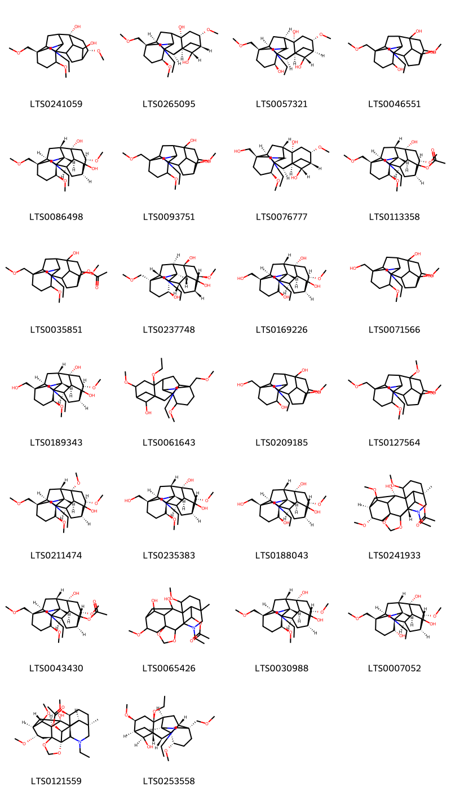{ width=100% }
    <figcaption>Hình ảnh cấu trúc hóa học của 26 hoạt chất thuộc nhóm Prenol lipids gồm ['(6s,8s,13s)-11-ethyl-6,16-dimethoxy-13-(methoxymethyl)-11-azahexacyclo[7.7.2.1²,⁵.0¹,¹⁰.0³,⁸.0¹³,¹⁷]nonadecane-4,8-diol (LTS0241059)', '(2r,3r,4s,5s,6s,8s,13s,16s,17r)-11-ethyl-6,16-dimethoxy-13-(methoxymethyl)-11-azahexacyclo[7.7.2.1²,⁵.0¹,¹⁰.0³,⁸.0¹³,¹⁷]nonadecane-4,8-diol (LTS0265095)', '(1s,2r,3r,4s,5r,6s,8s,9r,13s,16s,17r)-11-ethyl-6-methoxy-13-(methoxymethyl)-11-azahexacyclo[7.7.2.1²,⁵.0¹,¹⁰.0³,⁸.0¹³,¹⁷]nonadecane-4,8,16-triol (LTS0057321)', '11-ethyl-6-methoxy-13-(methoxymethyl)-11-azahexacyclo[7.7.2.1²,⁵.0¹,¹⁰.0³,⁸.0¹³,¹⁷]nonadecane-4,8,16-triol (LTS0046551)', '(1s,2r,3r,4s,5s,6s,8s,9s,10r,13s,16s,17r)-11-ethyl-6,16-dimethoxy-13-(methoxymethyl)-11-azahexacyclo[7.7.2.1²,⁵.0¹,¹⁰.0³,⁸.0¹³,¹⁷]nonadecane-4,8-diol (LTS0086498)', '11-ethyl-6,16-dimethoxy-13-(methoxymethyl)-11-azahexacyclo[7.7.2.1²,⁵.0¹,¹⁰.0³,⁸.0¹³,¹⁷]nonadecane-4,8-diol (LTS0093751)', 'cammaconine (LTS0076777)', '(1s,2r,3r,4s,5r,6s,8s,9s,10r,13s,16s,17r)-11-ethyl-8-hydroxy-6,16-dimethoxy-13-(methoxymethyl)-11-azahexacyclo[7.7.2.1²,⁵.0¹,¹⁰.0³,⁸.0¹³,¹⁷]nonadecan-4-yl acetate (LTS0113358)', '11-ethyl-8-hydroxy-6,16-dimethoxy-13-(methoxymethyl)-11-azahexacyclo[7.7.2.1²,⁵.0¹,¹⁰.0³,⁸.0¹³,¹⁷]nonadecan-4-yl acetate (LTS0035851)', '(1r,2s,3s,4r,5r,6r,8r,9r,10s,13r,16s,17s)-11-ethyl-6-methoxy-13-(methoxymethyl)-11-azahexacyclo[7.7.2.1²,⁵.0¹,¹⁰.0³,⁸.0¹³,¹⁷]nonadecane-4,8,16-triol (LTS0237748)', '(1s,2r,3r,4s,5s,6s,8s,9s,10r,13s,16s,17r)-11-ethyl-13-(hydroxymethyl)-6-methoxy-11-azahexacyclo[7.7.2.1²,⁵.0¹,¹⁰.0³,⁸.0¹³,¹⁷]nonadecane-4,8,16-triol (LTS0169226)', '11-ethyl-13-(hydroxymethyl)-6,16-dimethoxy-11-azahexacyclo[7.7.2.1²,⁵.0¹,¹⁰.0³,⁸.0¹³,¹⁷]nonadecane-4,8-diol (LTS0071566)', '(1s,2r,3r,4s,5s,6s,8s,9s,10r,13s,16s,17r)-11-ethyl-13-(hydroxymethyl)-6,16-dimethoxy-11-azahexacyclo[7.7.2.1²,⁵.0¹,¹⁰.0³,⁸.0¹³,¹⁷]nonadecane-4,8-diol (LTS0189343)', '8-ethoxy-11-ethyl-6,16-dimethoxy-13-(methoxymethyl)-11-azahexacyclo[7.7.2.1²,⁵.0¹,¹⁰.0³,⁸.0¹³,¹⁷]nonadecan-4-ol (LTS0061643)', '11-ethyl-13-(hydroxymethyl)-6-methoxy-11-azahexacyclo[7.7.2.1²,⁵.0¹,¹⁰.0³,⁸.0¹³,¹⁷]nonadecane-4,8,16-triol (LTS0209185)', '11-ethyl-6,8,16-trimethoxy-13-(methoxymethyl)-11-azahexacyclo[7.7.2.1²,⁵.0¹,¹⁰.0³,⁸.0¹³,¹⁷]nonadecan-4-ol (LTS0127564)', '(1s,2r,3r,4s,5s,6s,8s,9s,10r,13s,16s,17r)-11-ethyl-6,8,16-trimethoxy-13-(methoxymethyl)-11-azahexacyclo[7.7.2.1²,⁵.0¹,¹⁰.0³,⁸.0¹³,¹⁷]nonadecan-4-ol (LTS0211474)', '(1s,2r,3r,4r,5s,6s,8s,9s,10r,13s,16s,17r)-11-ethyl-13-(hydroxymethyl)-6,16-dimethoxy-11-azahexacyclo[7.7.2.1²,⁵.0¹,¹⁰.0³,⁸.0¹³,¹⁷]nonadecane-4,8-diol (LTS0235383)', '(1s,2r,3r,4r,5s,6s,8s,9s,10r,13s,16s,17r)-11-ethyl-13-(hydroxymethyl)-6-methoxy-11-azahexacyclo[7.7.2.1²,⁵.0¹,¹⁰.0³,⁸.0¹³,¹⁷]nonadecane-4,8,16-triol (LTS0188043)', '(2s,5r,6s,8r,13s,16r)-14-ethyl-2-hydroxy-4,6,19-trimethoxy-16-methyl-9,11-dioxa-14-azaheptacyclo[10.7.2.1²,⁵.0¹,¹³.0³,⁸.0⁸,¹².0¹⁶,²⁰]docosan-21-yl acetate (LTS0241933)', '(1s,2r,3r,4r,5r,6s,8s,9s,10r,13s,16s,17r)-11-ethyl-8-hydroxy-6,16-dimethoxy-13-(methoxymethyl)-11-azahexacyclo[7.7.2.1²,⁵.0¹,¹⁰.0³,⁸.0¹³,¹⁷]nonadecan-4-yl acetate (LTS0043430)', '14-ethyl-2,4-dihydroxy-6,19-dimethoxy-16-methyl-9,11-dioxa-14-azaheptacyclo[10.7.2.1²,⁵.0¹,¹³.0³,⁸.0⁸,¹².0¹⁶,²⁰]docosan-21-yl acetate (LTS0065426)', '(1s,2r,3r,4r,5s,6s,8s,9s,10r,13s,16s,17r)-11-ethyl-6,16-dimethoxy-13-(methoxymethyl)-11-azahexacyclo[7.7.2.1²,⁵.0¹,¹⁰.0³,⁸.0¹³,¹⁷]nonadecane-4,8-diol (LTS0030988)', '(1s,2r,3r,4r,5s,6s,8s,9s,10r,13s,16r,17r)-11-ethyl-6-methoxy-13-(methoxymethyl)-11-azahexacyclo[7.7.2.1²,⁵.0¹,¹⁰.0³,⁸.0¹³,¹⁷]nonadecane-4,8,16-triol (LTS0007052)', 'deltaline (LTS0121559)', '(1s,2r,3r,4s,5s,6s,8s,9s,10r,13s,16s,17r)-8-ethoxy-11-ethyl-6,16-dimethoxy-13-(methoxymethyl)-11-azahexacyclo[7.7.2.1²,⁵.0¹,¹⁰.0³,⁸.0¹³,¹⁷]nonadecan-4-ol (LTS0253558)'].</figcaption>
</figure>

---

### Dược dân tộc học

Danh sách các quốc gia có sử dụng *Aconitum columbianum* trong điều trị các bệnh. 

| Country   | Disease   | Bệnh                                                                                                                                                                                                |
|:----------|:----------|:----------------------------------------------------------------------------------------------------------------------------------------------------------------------------------------------------|
| US        | Poison    | MYMEMORY WARNING: YOU USED ALL AVAILABLE FREE TRANSLATIONS FOR TODAY. NEXT AVAILABLE IN  09 HOURS 03 MINUTES 01 SECONDS VISIT HTTPS://MYMEMORY.TRANSLATED.NET/DOC/USAGELIMITS.PHP TO TRANSLATE MORE |

---

---
## Aconitum deinorhizum
### Thông tin về thực vật

!!! info "Phân loại thực vật của *Aconitum deinorrhizum* từ GIBF:"
    - **Kingdom:** Plantae
    - **Phylum:** Tracheophyta
    - **Order:** Ranunculales
    - **Family:** Ranunculaceae
    - **Genus:** Aconitum
    - **Species:** *Aconitum deinorrhizum*

 

| Label (VI)   | Label (EN)   | Scientific Name      | Descriptions (VI)   | Descriptions (EN)   | Also Known As (VI)   | Also Known As (EN)   |
|:-------------|:-------------|:---------------------|:--------------------|:--------------------|:---------------------|:---------------------|
| N/A          | N/A          | Aconitum columbianum | loài thực vật       | species of plant    | ['']                 | ['']                 |

#### Phân bố trên thế giới

**Từ CSDL GIBF** Canada, United States of America

#### Phân bố tại Việt Nam

**Từ CSDL GIBF**: Không có ghi nhận ở Việt Nam

---
### Thành phần hóa học
        
- Theo cơ sở dữ liệu lotus: Từ loài *Aconitum deinorrhizum* đã phân lập và xác định được Chưa có hoạt chất nào được phân lập. hoạt chất thuộc về các nhóm Không có hoạt chất nào được phân lập. 

Không có hình ảnh nào được tạo ra

---

### Dược dân tộc học

Danh sách các quốc gia có sử dụng *Aconitum deinorrhizum* trong điều trị các bệnh. 

| Country   | Disease        | Bệnh                                                                                                                                                                                                |
|:----------|:---------------|:----------------------------------------------------------------------------------------------------------------------------------------------------------------------------------------------------|
| Arabic    | Diuretic       | MYMEMORY WARNING: YOU USED ALL AVAILABLE FREE TRANSLATIONS FOR TODAY. NEXT AVAILABLE IN  09 HOURS 02 MINUTES 36 SECONDS VISIT HTTPS://MYMEMORY.TRANSLATED.NET/DOC/USAGELIMITS.PHP TO TRANSLATE MORE |
| Dutch     | Poison         | MYMEMORY WARNING: YOU USED ALL AVAILABLE FREE TRANSLATIONS FOR TODAY. NEXT AVAILABLE IN  09 HOURS 02 MINUTES 34 SECONDS VISIT HTTPS://MYMEMORY.TRANSLATED.NET/DOC/USAGELIMITS.PHP TO TRANSLATE MORE |
| German    | Sedative       | MYMEMORY WARNING: YOU USED ALL AVAILABLE FREE TRANSLATIONS FOR TODAY. NEXT AVAILABLE IN  09 HOURS 02 MINUTES 31 SECONDS VISIT HTTPS://MYMEMORY.TRANSLATED.NET/DOC/USAGELIMITS.PHP TO TRANSLATE MORE |
| Iran      | Sudorific      | MYMEMORY WARNING: YOU USED ALL AVAILABLE FREE TRANSLATIONS FOR TODAY. NEXT AVAILABLE IN  09 HOURS 02 MINUTES 29 SECONDS VISIT HTTPS://MYMEMORY.TRANSLATED.NET/DOC/USAGELIMITS.PHP TO TRANSLATE MORE |
| Sanscrit  | Antiphlogistic | MYMEMORY WARNING: YOU USED ALL AVAILABLE FREE TRANSLATIONS FOR TODAY. NEXT AVAILABLE IN  09 HOURS 02 MINUTES 26 SECONDS VISIT HTTPS://MYMEMORY.TRANSLATED.NET/DOC/USAGELIMITS.PHP TO TRANSLATE MORE |
| US        | Narcotic       | MYMEMORY WARNING: YOU USED ALL AVAILABLE FREE TRANSLATIONS FOR TODAY. NEXT AVAILABLE IN  09 HOURS 02 MINUTES 24 SECONDS VISIT HTTPS://MYMEMORY.TRANSLATED.NET/DOC/USAGELIMITS.PHP TO TRANSLATE MORE |

---

---
## Aconitum ferox
### Thông tin về thực vật

!!! info "Phân loại thực vật của *Aconitum ferox* từ GIBF:"
    - **Kingdom:** Plantae
    - **Phylum:** Tracheophyta
    - **Order:** Ranunculales
    - **Family:** Ranunculaceae
    - **Genus:** Aconitum
    - **Species:** *Aconitum ferox*

 

| Label (VI)   | Label (EN)   | Scientific Name   | Descriptions (VI)   | Descriptions (EN)   | Also Known As (VI)   | Also Known As (EN)                                        |
|:-------------|:-------------|:------------------|:--------------------|:--------------------|:---------------------|:----------------------------------------------------------|
| N/A          | N/A          | Aconitum ferox    | loài thực vật       | species of plant    | ['']                 | ['Himalayan monkshood', 'Indian aconite', 'blue aconite'] |

#### Phân bố trên thế giới

**Từ CSDL GIBF** nan, unknown or invalid, Bhutan, India, China, Nepal

#### Phân bố tại Việt Nam

**Từ CSDL GIBF**: Không có ghi nhận ở Việt Nam

---
### Thành phần hóa học
        
- Theo cơ sở dữ liệu lotus: Từ loài *Aconitum ferox* đã phân lập và xác định được 38 hoạt chất thuộc về các nhóm Quinolines and derivatives, Prenol lipids. 

|    | chemicalTaxonomyClassyfireClass   |   smiles_count |
|---:|:----------------------------------|---------------:|
|  0 | Prenol lipids                     |             37 |
|  1 | Quinolines and derivatives        |              1 |

#### Nhóm Prenol lipids
<figure markdown="span">
    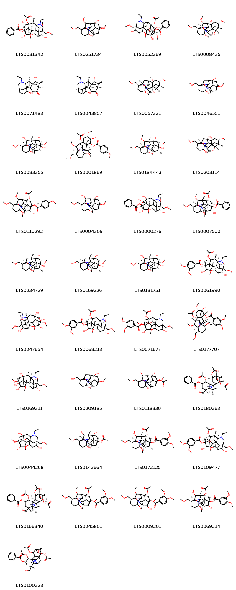{ width=100% }
    <figcaption>Hình ảnh cấu trúc hóa học của 37 hoạt chất thuộc nhóm Prenol lipids gồm ['aconitine (LTS0031342)', '11-ethyl-6,18-dimethoxy-13-(methoxymethyl)-11-azahexacyclo[7.7.2.1²,⁵.0¹,¹⁰.0³,⁸.0¹³,¹⁷]nonadecane-4,8,16-triol (LTS0251734)', '(1s,2r,3r,4r,5s,6s,7s,8r,9r,13r,16s,17s,18r)-8-(acetyloxy)-11-ethyl-5,7,14-trihydroxy-6,16,18-trimethoxy-13-(methoxymethyl)-11-azahexacyclo[7.7.2.1²,⁵.0¹,¹⁰.0³,⁸.0¹³,¹⁷]nonadecan-4-yl benzoate (LTS0052369)', '(2r,3r,4s,5s,6s,8r,13s,16s,17r,18r)-11-ethyl-6,18-dimethoxy-13-(methoxymethyl)-11-azahexacyclo[7.7.2.1²,⁵.0¹,¹⁰.0³,⁸.0¹³,¹⁷]nonadecane-4,8,16-triol (LTS0008435)', '(1r,5s,7r,8r,9r,13r)-11-ethyl-7,16-dihydroxy-13-methyl-6-methylidene-11-azahexacyclo[7.7.2.1⁵,⁸.0¹,¹⁰.0²,⁸.0¹³,¹⁷]nonadecan-4-one (LTS0071483)', '(1r,2r,5r,7r,8r,9r,13r,16s,17r)-11-ethyl-7,16-dihydroxy-13-methyl-6-methylidene-11-azahexacyclo[7.7.2.1⁵,⁸.0¹,¹⁰.0²,⁸.0¹³,¹⁷]nonadecan-4-one (LTS0043857)', '(1s,2r,3r,4s,5r,6s,8s,9r,13s,16s,17r)-11-ethyl-6-methoxy-13-(methoxymethyl)-11-azahexacyclo[7.7.2.1²,⁵.0¹,¹⁰.0³,⁸.0¹³,¹⁷]nonadecane-4,8,16-triol (LTS0057321)', '11-ethyl-6-methoxy-13-(methoxymethyl)-11-azahexacyclo[7.7.2.1²,⁵.0¹,¹⁰.0³,⁸.0¹³,¹⁷]nonadecane-4,8,16-triol (LTS0046551)', '(1s,2r,3r,4s,5s,6s,8r,9r,10r,13s,16s,17r,18s)-11-ethyl-6-methoxy-13-(methoxymethyl)-11-azahexacyclo[7.7.2.1²,⁵.0¹,¹⁰.0³,⁸.0¹³,¹⁷]nonadecane-4,8,16,18-tetrol (LTS0083355)', '(2r,3r,5s,6s,8r,13s,17r)-8-(acetyloxy)-11-ethyl-5-hydroxy-6,16,18-trimethoxy-13-(methoxymethyl)-11-azahexacyclo[7.7.2.1²,⁵.0¹,¹⁰.0³,⁸.0¹³,¹⁷]nonadecan-4-yl 4-methoxybenzoate (LTS0001869)', '(1s,2r,3r,4s,5s,6s,8r,9r,10r,13s,16s,17r,18r)-11-ethyl-6,18-dimethoxy-13-(methoxymethyl)-11-azahexacyclo[7.7.2.1²,⁵.0¹,¹⁰.0³,⁸.0¹³,¹⁷]nonadecane-4,8,16-triol (LTS0184443)', '(1s,2r,3r,4s,5s,6s,8r,9r,10s,13s,16s,17r)-11-ethyl-6-methoxy-13-(methoxymethyl)-11-azahexacyclo[7.7.2.1²,⁵.0¹,¹⁰.0³,⁸.0¹³,¹⁷]nonadecane-4,8,9,16-tetrol (LTS0203114)', '(1s,5s,8r,10r,13s)-8-(acetyloxy)-11-ethyl-5-hydroxy-6,16,18-trimethoxy-13-(methoxymethyl)-11-azahexacyclo[7.7.2.1²,⁵.0¹,¹⁰.0³,⁸.0¹³,¹⁷]nonadecan-4-yl 4-methoxybenzoate (LTS0110292)', '11-ethyl-6-methoxy-13-(methoxymethyl)-11-azahexacyclo[7.7.2.1²,⁵.0¹,¹⁰.0³,⁸.0¹³,¹⁷]nonadecane-4,8,16,18-tetrol (LTS0004309)', '(2r,3r,5r,6s,7s,8r,13r,14r,16s,17s,18r)-11-ethyl-5,7,8,14-tetrahydroxy-6,16,18-trimethoxy-13-(methoxymethyl)-11-azahexacyclo[7.7.2.1²,⁵.0¹,¹⁰.0³,⁸.0¹³,¹⁷]nonadecan-4-yl benzoate (LTS0000276)', '(1s,2r,3r,4r,5s,6s,8r,9r,10r,13s,16s,17r,18r)-8-(acetyloxy)-11-ethyl-5-hydroxy-6,16,18-trimethoxy-13-(methoxymethyl)-11-azahexacyclo[7.7.2.1²,⁵.0¹,¹⁰.0³,⁸.0¹³,¹⁷]nonadecan-4-yl benzoate (LTS0007500)', '(1s,2r,3r,4s,5s,6s,8s,9s,10r,13s,16s,17r)-11-ethyl-6-methoxy-13-(methoxymethyl)-11-azahexacyclo[7.7.2.1²,⁵.0¹,¹⁰.0³,⁸.0¹³,¹⁷]nonadecane-4,8,16-triol (LTS0234729)', '(1s,2r,3r,4s,5s,6s,8s,9s,10r,13s,16s,17r)-11-ethyl-13-(hydroxymethyl)-6-methoxy-11-azahexacyclo[7.7.2.1²,⁵.0¹,¹⁰.0³,⁸.0¹³,¹⁷]nonadecane-4,8,16-triol (LTS0169226)', '(1s,2r,3r,4s,5s,6s,8r,9r,10r,13s,16s,17r,18r)-11-ethyl-6-methoxy-13-(methoxymethyl)-11-azahexacyclo[7.7.2.1²,⁵.0¹,¹⁰.0³,⁸.0¹³,¹⁷]nonadecane-4,8,16,18-tetrol (LTS0181751)', 'pseudoaconitine (LTS0061990)', '(2r,3r,5r,6s,8r,10r,17s)-11-ethyl-6,16,18-trimethoxy-13-(methoxymethyl)-11-azahexacyclo[7.7.2.1²,⁵.0¹,¹⁰.0³,⁸.0¹³,¹⁷]nonadecane-4,5,8,14-tetrol (LTS0247654)', '(1s,2r,3r,4r,5s,6s,8r,13r,14r,16s,17s,18r)-8-(acetyloxy)-11-ethyl-5,14-dihydroxy-6,16,18-trimethoxy-13-(methoxymethyl)-11-azahexacyclo[7.7.2.1²,⁵.0¹,¹⁰.0³,⁸.0¹³,¹⁷]nonadecan-4-yl 3,4-dimethoxybenzoate (LTS0068213)', '8-(acetyloxy)-11-ethyl-5,14-dihydroxy-6,16,18-trimethoxy-13-(methoxymethyl)-11-azahexacyclo[7.7.2.1²,⁵.0¹,¹⁰.0³,⁸.0¹³,¹⁷]nonadecan-4-yl 3,4-dimethoxybenzoate (LTS0071677)', 'bikhaconitine (LTS0177707)', '(1s,2r,3r,4r,5r,6s,8r,9r,10r,13r,14r,16s,17s,18r)-11-ethyl-6,16,18-trimethoxy-13-(methoxymethyl)-11-azahexacyclo[7.7.2.1²,⁵.0¹,¹⁰.0³,⁸.0¹³,¹⁷]nonadecane-4,5,8,14-tetrol (LTS0169311)', '11-ethyl-13-(hydroxymethyl)-6-methoxy-11-azahexacyclo[7.7.2.1²,⁵.0¹,¹⁰.0³,⁸.0¹³,¹⁷]nonadecane-4,8,16-triol (LTS0209185)', '11-ethyl-8,16,18-trihydroxy-6-methoxy-13-(methoxymethyl)-11-azahexacyclo[7.7.2.1²,⁵.0¹,¹⁰.0³,⁸.0¹³,¹⁷]nonadecan-4-yl acetate (LTS0118330)', '(1s,3s,4r,5r,7s,8r,9r,11r,14s,16s,18r)-4,16,18-tris(acetyloxy)-7-formyl-7,10-dimethyl-15-methylidene-13-oxo-10-azahexacyclo[7.7.1.1²,¹⁴.0¹,¹².0³,⁸.0³,¹¹]octadecan-5-yl benzoate (LTS0180263)', '11-ethyl-6,16,18-trimethoxy-13-(methoxymethyl)-11-azahexacyclo[7.7.2.1²,⁵.0¹,¹⁰.0³,⁸.0¹³,¹⁷]nonadecane-4,5,8,14-tetrol (LTS0044268)', '(1s,2r,3r,4s,5r,6s,8r,9r,10r,13s,16s,17r,18r)-11-ethyl-8,16,18-trihydroxy-6-methoxy-13-(methoxymethyl)-11-azahexacyclo[7.7.2.1²,⁵.0¹,¹⁰.0³,⁸.0¹³,¹⁷]nonadecan-4-yl acetate (LTS0143664)', '(1s,2r,3r,4s,5r,6s,8r,9r,10r,13s,16s,17r,18r)-8-(acetyloxy)-11-ethyl-6,16,18-trimethoxy-13-(methoxymethyl)-11-azahexacyclo[7.7.2.1²,⁵.0¹,¹⁰.0³,⁸.0¹³,¹⁷]nonadecan-4-yl 3,4-dimethoxybenzoate (LTS0172125)', '(1s,2s,3s,4r,5r,6r,8s,9r,10r,13r,14s,16r,17s,18s)-8-(acetyloxy)-11-ethyl-5,14-dihydroxy-6,16,18-trimethoxy-13-(methoxymethyl)-11-azahexacyclo[7.7.2.1²,⁵.0¹,¹⁰.0³,⁸.0¹³,¹⁷]nonadecan-4-yl 3,4-dimethoxybenzoate (LTS0109477)', '(1s,2r,3r,4s,5s,7r,8s,9s,11r,12s,14r,16r,18s)-4,16,18-tris(acetyloxy)-7-formyl-7,10-dimethyl-15-methylidene-13-oxo-10-azahexacyclo[7.7.1.1²,¹⁴.0¹,¹².0³,⁸.0³,¹¹]octadecan-5-yl benzoate (LTS0166340)', '8-(acetyloxy)-11-ethyl-6,16,18-trimethoxy-13-(methoxymethyl)-11-azahexacyclo[7.7.2.1²,⁵.0¹,¹⁰.0³,⁸.0¹³,¹⁷]nonadecan-4-yl 3,4-dimethoxybenzoate (LTS0245801)', '8-(acetyloxy)-11-ethyl-5-hydroxy-6,16,18-trimethoxy-13-(methoxymethyl)-11-azahexacyclo[7.7.2.1²,⁵.0¹,¹⁰.0³,⁸.0¹³,¹⁷]nonadecan-4-yl 3,4-dimethoxybenzoate (LTS0009201)', '(1s,2s,3s,4r,5r,6s,8s,9r,10r,13s,16s,17r,18r)-8-(acetyloxy)-11-ethyl-5-hydroxy-6,16,18-trimethoxy-13-(methoxymethyl)-11-azahexacyclo[7.7.2.1²,⁵.0¹,¹⁰.0³,⁸.0¹³,¹⁷]nonadecan-4-yl 3,4-dimethoxybenzoate (LTS0069214)', '4,16,18-tris(acetyloxy)-7-formyl-7,10-dimethyl-15-methylidene-13-oxo-10-azahexacyclo[7.7.1.1²,¹⁴.0¹,¹².0³,⁸.0³,¹¹]octadecan-5-yl benzoate (LTS0100228)'].</figcaption>
</figure>
#### Nhóm Quinolines and derivatives
<figure markdown="span">
    { width=100% }
    <figcaption>Hình ảnh cấu trúc hóa học của 1 hoạt chất thuộc nhóm Quinolines and derivatives gồm ['α-hydroxyquinoline (LTS0227000)'].</figcaption>
</figure>

---

### Dược dân tộc học

Danh sách các quốc gia có sử dụng *Aconitum ferox* trong điều trị các bệnh. 

| Country   | Disease   | Bệnh                                                                                                                                                                                                |
|:----------|:----------|:----------------------------------------------------------------------------------------------------------------------------------------------------------------------------------------------------|
| China     | Sedative  | MYMEMORY WARNING: YOU USED ALL AVAILABLE FREE TRANSLATIONS FOR TODAY. NEXT AVAILABLE IN  09 HOURS 02 MINUTES 06 SECONDS VISIT HTTPS://MYMEMORY.TRANSLATED.NET/DOC/USAGELIMITS.PHP TO TRANSLATE MORE |
| Elsewhere | Poison    | MYMEMORY WARNING: YOU USED ALL AVAILABLE FREE TRANSLATIONS FOR TODAY. NEXT AVAILABLE IN  09 HOURS 02 MINUTES 04 SECONDS VISIT HTTPS://MYMEMORY.TRANSLATED.NET/DOC/USAGELIMITS.PHP TO TRANSLATE MORE |

---

---
## Aconitum heterophyllum
### Thông tin về thực vật

!!! info "Phân loại thực vật của *Aconitum heterophyllum* từ GIBF:"
    - **Kingdom:** Plantae
    - **Phylum:** Tracheophyta
    - **Order:** Ranunculales
    - **Family:** Ranunculaceae
    - **Genus:** Aconitum
    - **Species:** *Aconitum heterophyllum*

 

| Label (VI)   | Label (EN)   | Scientific Name        | Descriptions (VI)   | Descriptions (EN)   | Also Known As (VI)   | Also Known As (EN)                                     |
|:-------------|:-------------|:-----------------------|:--------------------|:--------------------|:---------------------|:-------------------------------------------------------|
| N/A          | N/A          | Aconitum heterophyllum |                     | species of plant    | ['']                 | ['Himalayan monkshood', 'Indian atees', "Monk's hood"] |

#### Phân bố trên thế giới

**Từ CSDL GIBF** nan, unknown or invalid, Pakistan, United Kingdom of Great Britain and Northern Ireland, Bhutan, India, Canada, China, Nepal

#### Phân bố tại Việt Nam

**Từ CSDL GIBF**: Không có ghi nhận ở Việt Nam

---
### Thành phần hóa học
        
- Theo cơ sở dữ liệu lotus: Từ loài *Aconitum heterophyllum* đã phân lập và xác định được 30 hoạt chất thuộc về các nhóm Prenol lipids, Quinolidines. 

|    | chemicalTaxonomyClassyfireClass   |   smiles_count |
|---:|:----------------------------------|---------------:|
|  0 | Prenol lipids                     |             22 |
|  1 | Quinolidines                      |              8 |

#### Nhóm Prenol lipids
<figure markdown="span">
    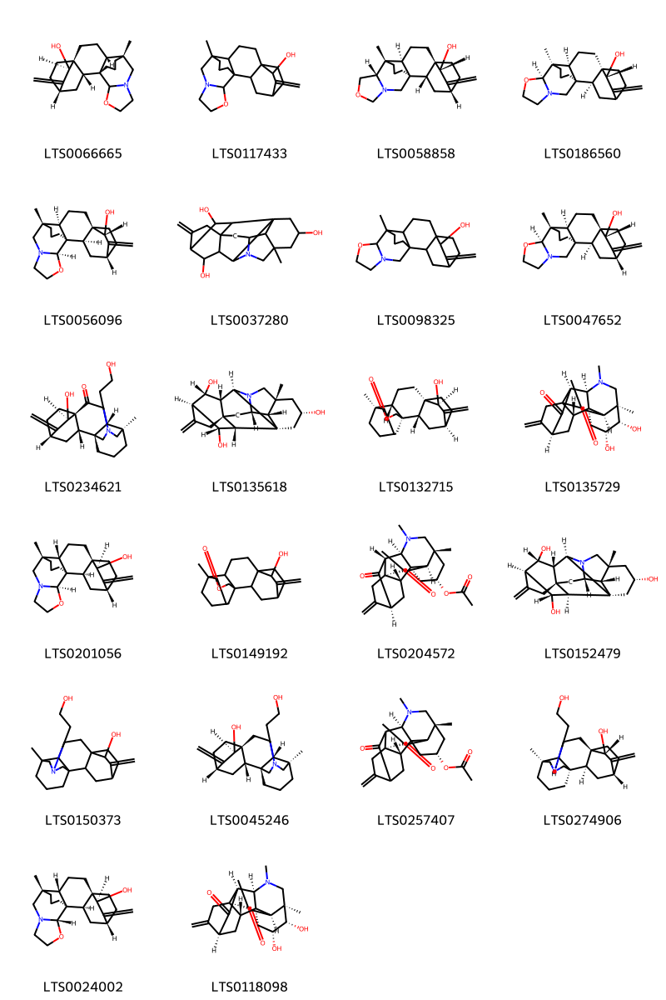{ width=100% }
    <figcaption>Hình ảnh cấu trúc hóa học của 22 hoạt chất thuộc nhóm Prenol lipids gồm ['atisine (LTS0066665)', '11-methyl-5-methylidene-16-oxa-13-azahexacyclo[9.6.3.2⁴,⁷.0¹,¹⁰.0²,⁷.0¹³,¹⁷]docosan-6-ol (LTS0117433)', '(1s,2r,4r,6r,7r,10s,11s,12s)-11-methyl-5-methylidene-14-oxa-16-azahexacyclo[9.6.3.2⁴,⁷.0¹,¹⁰.0²,⁷.0¹²,¹⁶]docosan-6-ol (LTS0058858)', '(1r,2s,6r,7s,10s,11r,12s)-11-methyl-5-methylidene-13-oxa-16-azahexacyclo[9.6.3.2⁴,⁷.0¹,¹⁰.0²,⁷.0¹²,¹⁶]docosan-6-ol (LTS0186560)', '(1s,2r,4r,6r,7r,10r,11s,17r)-11-methyl-5-methylidene-16-oxa-13-azahexacyclo[9.6.3.2⁴,⁷.0¹,¹⁰.0²,⁷.0¹³,¹⁷]docosan-6-ol (LTS0056096)', '5-methyl-12-methylidene-7-azaheptacyclo[9.6.2.0¹,⁸.0⁵,¹⁷.0⁷,¹⁶.0⁹,¹⁴.0¹⁴,¹⁸]nonadecane-3,10,19-triol (LTS0037280)', '11-methyl-5-methylidene-13-oxa-16-azahexacyclo[9.6.3.2⁴,⁷.0¹,¹⁰.0²,⁷.0¹²,¹⁶]docosan-6-ol (LTS0098325)', '(1r,2s,4r,6r,7r,10s,11s,12s)-11-methyl-5-methylidene-13-oxa-16-azahexacyclo[9.6.3.2⁴,⁷.0¹,¹⁰.0²,⁷.0¹²,¹⁶]docosan-6-ol (LTS0047652)', '(1s,2s,4s,6r,7s,10r,11r)-6-hydroxy-13-(2-hydroxyethyl)-11-methyl-5-methylidene-13-azapentacyclo[9.3.3.2⁴,⁷.0¹,¹⁰.0²,⁷]nonadecan-8-one (LTS0234621)', '(1s,3s,5r,8r,9s,10r,11r,14r,16s,17r,18r,19s)-5-methyl-12-methylidene-7-azaheptacyclo[9.6.2.0¹,⁸.0⁵,¹⁷.0⁷,¹⁶.0⁹,¹⁴.0¹⁴,¹⁸]nonadecane-3,10,19-triol (LTS0135618)', '(1r,2r,4s,6s,7s,10r,11s)-6-hydroxy-11-methyl-5-methylidene-13-oxapentacyclo[9.3.3.2⁴,⁷.0¹,¹⁰.0²,⁷]nonadecan-12-one (LTS0132715)', '(1r,3r,4s,5s,8r,9s,11s,17s,18r)-3,4-dihydroxy-5,7-dimethyl-12-methylidene-7-azahexacyclo[9.6.2.0¹,⁸.0⁵,¹⁷.0⁹,¹⁴.0¹⁴,¹⁸]nonadecane-10,16-dione (LTS0135729)', '(1s,2r,4r,6s,7r,10s,11s,17r)-11-methyl-5-methylidene-16-oxa-13-azahexacyclo[9.6.3.2⁴,⁷.0¹,¹⁰.0²,⁷.0¹³,¹⁷]docosan-6-ol (LTS0201056)', '6-hydroxy-11-methyl-5-methylidene-13-oxapentacyclo[9.3.3.2⁴,⁷.0¹,¹⁰.0²,⁷]nonadecan-12-one (LTS0149192)', '(1r,3s,5r,8r,9s,11s,14s,17r,18r)-5,7-dimethyl-12-methylidene-10,16-dioxo-7-azahexacyclo[9.6.2.0¹,⁸.0⁵,¹⁷.0⁹,¹⁴.0¹⁴,¹⁸]nonadecan-3-yl acetate (LTS0204572)', '(1s,3s,5r,8r,9s,10r,11r,14r,16s,17r,18s,19s)-5-methyl-12-methylidene-7-azaheptacyclo[9.6.2.0¹,⁸.0⁵,¹⁷.0⁷,¹⁶.0⁹,¹⁴.0¹⁴,¹⁸]nonadecane-3,10,19-triol (LTS0152479)', '13-(2-hydroxyethyl)-11-methyl-5-methylidene-13-azapentacyclo[9.3.3.2⁴,⁷.0¹,¹⁰.0²,⁷]nonadecan-6-ol (LTS0150373)', '(1s,2s,4s,6r,7s,10r,11r)-13-(2-hydroxyethyl)-11-methyl-5-methylidene-13-azapentacyclo[9.3.3.2⁴,⁷.0¹,¹⁰.0²,⁷]nonadecan-6-ol (LTS0045246)', '(3s,5r,8r,14s,18r)-5,7-dimethyl-12-methylidene-10,16-dioxo-7-azahexacyclo[9.6.2.0¹,⁸.0⁵,¹⁷.0⁹,¹⁴.0¹⁴,¹⁸]nonadecan-3-yl acetate (LTS0257407)', '(1s,2s,4r,6r,7r,10r,11s)-13-(2-hydroxyethyl)-11-methyl-5-methylidene-13-azapentacyclo[9.3.3.2⁴,⁷.0¹,¹⁰.0²,⁷]nonadecan-6-ol (LTS0274906)', '(1s,2r,4r,6s,7r,10s,11s,17s)-11-methyl-5-methylidene-16-oxa-13-azahexacyclo[9.6.3.2⁴,⁷.0¹,¹⁰.0²,⁷.0¹³,¹⁷]docosan-6-ol (LTS0024002)', '(1r,3r,4s,5s,8r,9s,11s,14s,17s,18r)-3,4-dihydroxy-5,7-dimethyl-12-methylidene-7-azahexacyclo[9.6.2.0¹,⁸.0⁵,¹⁷.0⁹,¹⁴.0¹⁴,¹⁸]nonadecane-10,16-dione (LTS0118098)'].</figcaption>
</figure>
#### Nhóm Quinolidines
<figure markdown="span">
    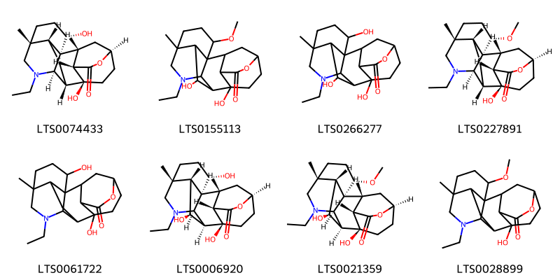{ width=100% }
    <figcaption>Hình ảnh cấu trúc hóa học của 8 hoạt chất thuộc nhóm Quinolidines gồm ['(1s,2r,3s,6r,9s,10s,11r,14r,17s,18r)-12-ethyl-9,17-dihydroxy-14-methyl-5-oxa-12-azahexacyclo[8.7.2.1²,⁶.0¹,¹¹.0³,⁹.0¹⁴,¹⁸]icosan-4-one (LTS0074433)', '12-ethyl-9,19-dihydroxy-17-methoxy-14-methyl-5-oxa-12-azahexacyclo[8.7.2.1²,⁶.0¹,¹¹.0³,⁹.0¹⁴,¹⁸]icosan-4-one (LTS0155113)', '12-ethyl-9,17,19-trihydroxy-14-methyl-5-oxa-12-azahexacyclo[8.7.2.1²,⁶.0¹,¹¹.0³,⁹.0¹⁴,¹⁸]icosan-4-one (LTS0266277)', '(1s,2r,3s,6r,9s,10s,11r,14r,17s,18r)-12-ethyl-9-hydroxy-17-methoxy-14-methyl-5-oxa-12-azahexacyclo[8.7.2.1²,⁶.0¹,¹¹.0³,⁹.0¹⁴,¹⁸]icosan-4-one (LTS0227891)', '12-ethyl-9,17-dihydroxy-14-methyl-5-oxa-12-azahexacyclo[8.7.2.1²,⁶.0¹,¹¹.0³,⁹.0¹⁴,¹⁸]icosan-4-one (LTS0061722)', '(1s,2r,3s,6r,9s,10r,11r,14r,17s,18r,19s)-12-ethyl-9,17,19-trihydroxy-14-methyl-5-oxa-12-azahexacyclo[8.7.2.1²,⁶.0¹,¹¹.0³,⁹.0¹⁴,¹⁸]icosan-4-one (LTS0006920)', '(1s,2r,3s,6r,9s,10r,11r,14r,17s,18r,19s)-12-ethyl-9,19-dihydroxy-17-methoxy-14-methyl-5-oxa-12-azahexacyclo[8.7.2.1²,⁶.0¹,¹¹.0³,⁹.0¹⁴,¹⁸]icosan-4-one (LTS0021359)', '12-ethyl-9-hydroxy-17-methoxy-14-methyl-5-oxa-12-azahexacyclo[8.7.2.1²,⁶.0¹,¹¹.0³,⁹.0¹⁴,¹⁸]icosan-4-one (LTS0028899)'].</figcaption>
</figure>

---

### Dược dân tộc học

Danh sách các quốc gia có sử dụng *Aconitum heterophyllum* trong điều trị các bệnh. 

| Country   | Disease            | Bệnh                                                                                                                                                                                                |
|:----------|:-------------------|:----------------------------------------------------------------------------------------------------------------------------------------------------------------------------------------------------|
| Elsewhere | Tonic              | MYMEMORY WARNING: YOU USED ALL AVAILABLE FREE TRANSLATIONS FOR TODAY. NEXT AVAILABLE IN  09 HOURS 01 MINUTES 43 SECONDS VISIT HTTPS://MYMEMORY.TRANSLATED.NET/DOC/USAGELIMITS.PHP TO TRANSLATE MORE |
| India     | Astringent, Poison | MYMEMORY WARNING: YOU USED ALL AVAILABLE FREE TRANSLATIONS FOR TODAY. NEXT AVAILABLE IN  09 HOURS 01 MINUTES 41 SECONDS VISIT HTTPS://MYMEMORY.TRANSLATED.NET/DOC/USAGELIMITS.PHP TO TRANSLATE MORE |
| Sanscrit  | Aphrodisiac        | MYMEMORY WARNING: YOU USED ALL AVAILABLE FREE TRANSLATIONS FOR TODAY. NEXT AVAILABLE IN  09 HOURS 01 MINUTES 38 SECONDS VISIT HTTPS://MYMEMORY.TRANSLATED.NET/DOC/USAGELIMITS.PHP TO TRANSLATE MORE |
| US        | Tonic              | MYMEMORY WARNING: YOU USED ALL AVAILABLE FREE TRANSLATIONS FOR TODAY. NEXT AVAILABLE IN  09 HOURS 01 MINUTES 36 SECONDS VISIT HTTPS://MYMEMORY.TRANSLATED.NET/DOC/USAGELIMITS.PHP TO TRANSLATE MORE |

---

---
## Aconitum icatum
### Thông tin về thực vật

!!! info "Phân loại thực vật của *N/A* từ GIBF:"
    - **Kingdom:** Plantae
    - **Phylum:** Tracheophyta
    - **Order:** Ranunculales
    - **Family:** Ranunculaceae
    - **Genus:** Aconitum
    - **Species:** *N/A*

 

| Label (VI)   | Label (EN)   | Scientific Name        | Descriptions (VI)   | Descriptions (EN)   | Also Known As (VI)   | Also Known As (EN)                                     |
|:-------------|:-------------|:-----------------------|:--------------------|:--------------------|:---------------------|:-------------------------------------------------------|
| N/A          | N/A          | Aconitum heterophyllum |                     | species of plant    | ['']                 | ['Himalayan monkshood', 'Indian atees', "Monk's hood"] |

#### Phân bố trên thế giới

**Từ CSDL GIBF** Spain, Germany, Austria, Korea, Republic of, Sweden, Kazakhstan, Belgium, Slovakia, Netherlands, Slovenia, Hungary, Norway, Chinese Taipei, Switzerland, United Kingdom of Great Britain and Northern Ireland, France, Czechia, Russian Federation, United States of America, Italy, Ukraine

#### Phân bố tại Việt Nam

**Từ CSDL GIBF**: Không có ghi nhận ở Việt Nam

---
### Thành phần hóa học
        
- Theo cơ sở dữ liệu lotus: Từ loài *N/A* đã phân lập và xác định được Chưa có hoạt chất nào được phân lập. hoạt chất thuộc về các nhóm Không có hoạt chất nào được phân lập. 

Không có hình ảnh nào được tạo ra

---

### Dược dân tộc học

Danh sách các quốc gia có sử dụng *N/A* trong điều trị các bệnh. 

| Country   | Disease   | Bệnh                                                                                                                                                                                                |
|:----------|:----------|:----------------------------------------------------------------------------------------------------------------------------------------------------------------------------------------------------|
| Elsewhere | Poison    | MYMEMORY WARNING: YOU USED ALL AVAILABLE FREE TRANSLATIONS FOR TODAY. NEXT AVAILABLE IN  09 HOURS 01 MINUTES 13 SECONDS VISIT HTTPS://MYMEMORY.TRANSLATED.NET/DOC/USAGELIMITS.PHP TO TRANSLATE MORE |

---

---
## Aconitum japonicum
### Thông tin về thực vật

!!! info "Phân loại thực vật của *Aconitum japonicum* từ GIBF:"
    - **Kingdom:** Plantae
    - **Phylum:** Tracheophyta
    - **Order:** Ranunculales
    - **Family:** Ranunculaceae
    - **Genus:** Aconitum
    - **Species:** *Aconitum japonicum*

 

| Label (VI)   | Label (EN)   | Scientific Name    | Descriptions (VI)   | Descriptions (EN)   | Also Known As (VI)   | Also Known As (EN)   |
|:-------------|:-------------|:-------------------|:--------------------|:--------------------|:---------------------|:---------------------|
| N/A          | N/A          | Aconitum japonicum | loài thực vật       | species of plant    | ['']                 | ['']                 |

#### Phân bố trên thế giới

**Từ CSDL GIBF** nan, Korea, Republic of, Japan

#### Phân bố tại Việt Nam

**Từ CSDL GIBF**: Không có ghi nhận ở Việt Nam

---
### Thành phần hóa học
        
- Theo cơ sở dữ liệu lotus: Từ loài *Aconitum japonicum* đã phân lập và xác định được 111 hoạt chất thuộc về các nhóm Organooxygen compounds, Flavonoids, Isoquinolines and derivatives, Prenol lipids, Carboxylic acids and derivatives, Fatty Acyls, Steroids and steroid derivatives, Benzene and substituted derivatives. 

|    | chemicalTaxonomyClassyfireClass     |   smiles_count |
|---:|:------------------------------------|---------------:|
|  0 |                                     |              1 |
|  1 | Benzene and substituted derivatives |              5 |
|  2 | Carboxylic acids and derivatives    |              3 |
|  3 | Fatty Acyls                         |              5 |
|  4 | Flavonoids                          |              1 |
|  5 | Isoquinolines and derivatives       |              2 |
|  6 | Organooxygen compounds              |              2 |
|  7 | Prenol lipids                       |             79 |
|  8 | Steroids and steroid derivatives    |              2 |

#### Nhóm 
<figure markdown="span">
    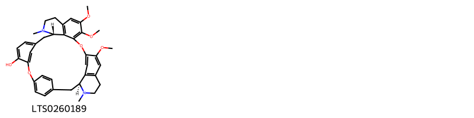{ width=100% }
    <figcaption>Hình ảnh cấu trúc hóa học của 1 hoạt chất thuộc nhóm  gồm ['(1s,14s)-20,21,25-trimethoxy-15,30-dimethyl-7,23-dioxa-15,30-diazaheptacyclo[22.6.2.2³,⁶.1⁸,¹².1¹⁴,¹⁸.0²⁷,³¹.0²²,³³]hexatriaconta-3,5,8(34),9,11,18(33),19,21,24(32),25,27(31),35-dodecaen-9-ol (LTS0260189)'].</figcaption>
</figure>
#### Nhóm Benzene and substituted derivatives
<figure markdown="span">
    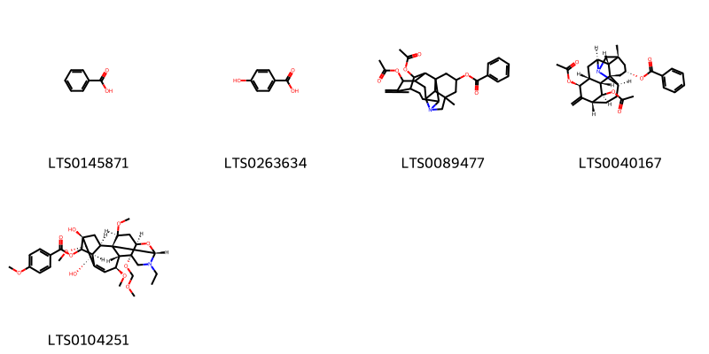{ width=100% }
    <figcaption>Hình ảnh cấu trúc hóa học của 5 hoạt chất thuộc nhóm Benzene and substituted derivatives gồm ['benzoic acid (LTS0145871)', 'p-hydroxybenzoic acid (LTS0263634)', '13,19-bis(acetyloxy)-5-methyl-12-methylidene-7-azahexacyclo[9.6.2.0¹,⁸.0⁵,¹⁷.0⁷,¹⁶.0¹⁴,¹⁸]nonadecan-3-yl benzoate (LTS0089477)', '(1s,3s,5r,8r,11r,13s,14r,16s,17r,18r,19s)-13,19-bis(acetyloxy)-5-methyl-12-methylidene-7-azahexacyclo[9.6.2.0¹,⁸.0⁵,¹⁷.0⁷,¹⁶.0¹⁴,¹⁸]nonadecan-3-yl benzoate (LTS0040167)', '(1r,2s,3s,5r,7s,10s,11s,12s,15r,16s,17r,19s)-8-ethyl-15,17-dihydroxy-3,12,16-trimethoxy-10-(methoxymethoxy)-6-oxa-8-azahexacyclo[15.2.1.0²,⁷.0²,¹¹.0⁵,¹⁰.0¹⁴,¹⁹]icos-13-en-18-yl 4-methoxybenzoate (LTS0104251)'].</figcaption>
</figure>
#### Nhóm Carboxylic acids and derivatives
<figure markdown="span">
    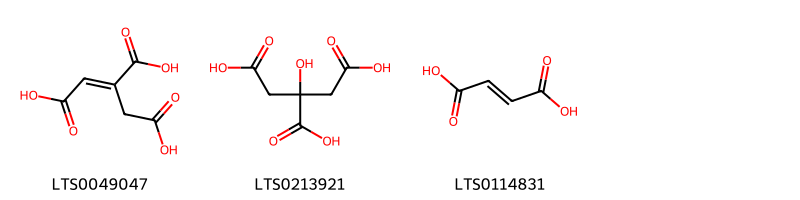{ width=100% }
    <figcaption>Hình ảnh cấu trúc hóa học của 3 hoạt chất thuộc nhóm Carboxylic acids and derivatives gồm ['trans-aconitic acid (LTS0049047)', 'citric acid (LTS0213921)', 'fumaric acid (LTS0114831)'].</figcaption>
</figure>
#### Nhóm Fatty Acyls
<figure markdown="span">
    { width=100% }
    <figcaption>Hình ảnh cấu trúc hóa học của 5 hoạt chất thuộc nhóm Fatty Acyls gồm ['palmitic acid (LTS0079439)', 'oleic acid (LTS0256910)', 'myristic acid (LTS0102566)', 'linoleic (LTS0013198)', 'stearic acid (LTS0237766)'].</figcaption>
</figure>
#### Nhóm Flavonoids
<figure markdown="span">
    { width=100% }
    <figcaption>Hình ảnh cấu trúc hóa học của 1 hoạt chất thuộc nhóm Flavonoids gồm ['pendulin (LTS0246312)'].</figcaption>
</figure>
#### Nhóm Isoquinolines and derivatives
<figure markdown="span">
    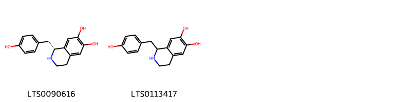{ width=100% }
    <figcaption>Hình ảnh cấu trúc hóa học của 2 hoạt chất thuộc nhóm Isoquinolines and derivatives gồm ['(+)-demethylcoclaurine (LTS0090616)', 'higenamine (LTS0113417)'].</figcaption>
</figure>
#### Nhóm Organooxygen compounds
<figure markdown="span">
    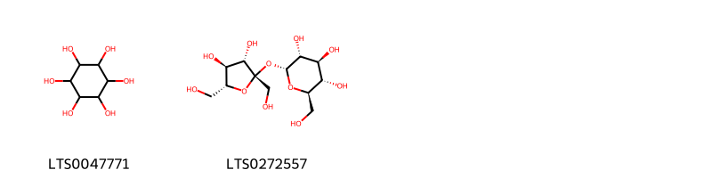{ width=100% }
    <figcaption>Hình ảnh cấu trúc hóa học của 2 hoạt chất thuộc nhóm Organooxygen compounds gồm ['(-)-inositol (LTS0047771)', 'sucrose (LTS0272557)'].</figcaption>
</figure>
#### Nhóm Prenol lipids
<figure markdown="span">
    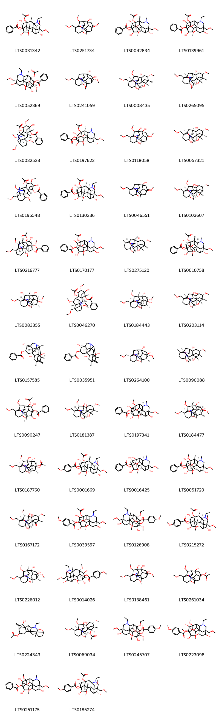{ width=100% }
    <figcaption>Hình ảnh cấu trúc hóa học của 79 hoạt chất thuộc nhóm Prenol lipids gồm ['aconitine (LTS0031342)', '11-ethyl-6,18-dimethoxy-13-(methoxymethyl)-11-azahexacyclo[7.7.2.1²,⁵.0¹,¹⁰.0³,⁸.0¹³,¹⁷]nonadecane-4,8,16-triol (LTS0251734)', 'mesaconitine (LTS0042834)', '8-(acetyloxy)-11-ethyl-5,7,14-trihydroxy-6,16,18-trimethoxy-13-(methoxymethyl)-11-azahexacyclo[7.7.2.1²,⁵.0¹,¹⁰.0³,⁸.0¹³,¹⁷]nonadecan-4-yl benzoate (LTS0139961)', '(1s,2r,3r,4r,5s,6s,7s,8r,9r,13r,16s,17s,18r)-8-(acetyloxy)-11-ethyl-5,7,14-trihydroxy-6,16,18-trimethoxy-13-(methoxymethyl)-11-azahexacyclo[7.7.2.1²,⁵.0¹,¹⁰.0³,⁸.0¹³,¹⁷]nonadecan-4-yl benzoate (LTS0052369)', '(6s,8s,13s)-11-ethyl-6,16-dimethoxy-13-(methoxymethyl)-11-azahexacyclo[7.7.2.1²,⁵.0¹,¹⁰.0³,⁸.0¹³,¹⁷]nonadecane-4,8-diol (LTS0241059)', '(2r,3r,4s,5s,6s,8r,13s,16s,17r,18r)-11-ethyl-6,18-dimethoxy-13-(methoxymethyl)-11-azahexacyclo[7.7.2.1²,⁵.0¹,¹⁰.0³,⁸.0¹³,¹⁷]nonadecane-4,8,16-triol (LTS0008435)', '(2r,3r,4s,5s,6s,8s,13s,16s,17r)-11-ethyl-6,16-dimethoxy-13-(methoxymethyl)-11-azahexacyclo[7.7.2.1²,⁵.0¹,¹⁰.0³,⁸.0¹³,¹⁷]nonadecane-4,8-diol (LTS0265095)', 'hypaconitine (LTS0032528)', '(1s,5r,6s,7s,8r,9r,10r,13r,14r,16s)-8-(acetyloxy)-5,7,14-trihydroxy-6,16,18-trimethoxy-13-(methoxymethyl)-11-methyl-11-azahexacyclo[7.7.2.1²,⁵.0¹,¹⁰.0³,⁸.0¹³,¹⁷]nonadecan-4-yl benzoate (LTS0197623)', '11-ethyl-6,18-dimethoxy-13-(methoxymethyl)-11-azahexacyclo[7.7.2.1²,⁵.0¹,¹⁰.0³,⁸.0¹³,¹⁷]nonadecane-4,8,9,16-tetrol (LTS0118058)', '(1s,2r,3r,4s,5r,6s,8s,9r,13s,16s,17r)-11-ethyl-6-methoxy-13-(methoxymethyl)-11-azahexacyclo[7.7.2.1²,⁵.0¹,¹⁰.0³,⁸.0¹³,¹⁷]nonadecane-4,8,16-triol (LTS0057321)', '(2s,3s,5r,8r,13s,17s)-8-(acetyloxy)-5,7-dihydroxy-6,16,18-trimethoxy-13-(methoxymethyl)-11-methyl-11-azahexacyclo[7.7.2.1²,⁵.0¹,¹⁰.0³,⁸.0¹³,¹⁷]nonadecan-4-yl benzoate (LTS0195548)', '(1s,2r,3r,4r,5r,6s,7s,8r,9r,10r,13r,14r,16s,17s,18r)-8-(acetyloxy)-11-ethyl-5,7,14-trihydroxy-6,16,18-trimethoxy-13-(methoxymethyl)-11-azahexacyclo[7.7.2.1²,⁵.0¹,¹⁰.0³,⁸.0¹³,¹⁷]nonadecan-4-yl benzoate (LTS0130236)', '11-ethyl-6-methoxy-13-(methoxymethyl)-11-azahexacyclo[7.7.2.1²,⁵.0¹,¹⁰.0³,⁸.0¹³,¹⁷]nonadecane-4,8,16-triol (LTS0046551)', '(1s,2r,3r,4s,6s,8r,9s,10s,13s,16s,17r,18s)-11-ethyl-6,18-dimethoxy-13-(methoxymethyl)-11-azahexacyclo[7.7.2.1²,⁵.0¹,¹⁰.0³,⁸.0¹³,¹⁷]nonadecane-4,8,9,16-tetrol (LTS0103607)', '(1s,2r,3r,4r,5r,6s,7s,8s,9r,10r,13s,16s,17r,18s)-8-(acetyloxy)-5,7-dihydroxy-6,16,18-trimethoxy-13-(methoxymethyl)-11-methyl-11-azahexacyclo[7.7.2.1²,⁵.0¹,¹⁰.0³,⁸.0¹³,¹⁷]nonadecan-4-yl benzoate (LTS0216777)', '8-(acetyloxy)-5,7,14-trihydroxy-6,16,18-trimethoxy-13-(methoxymethyl)-11-methyl-11-azahexacyclo[7.7.2.1²,⁵.0¹,¹⁰.0³,⁸.0¹³,¹⁷]nonadecan-4-yl benzoate (LTS0170177)', 'karakoline (LTS0275120)', '(1s,2r,3r,4r,5r,6s,7s,8r,9r,10r,13r,14r,16s,17s,18r)-8-(acetyloxy)-5,7,14-trihydroxy-6,16,18-trimethoxy-13-(methoxymethyl)-11-methyl-11-azahexacyclo[7.7.2.1²,⁵.0¹,¹⁰.0³,⁸.0¹³,¹⁷]nonadecan-4-yl benzoate (LTS0010758)', '(1s,2r,3r,4s,5s,6s,8r,9r,10r,13s,16s,17r,18s)-11-ethyl-6-methoxy-13-(methoxymethyl)-11-azahexacyclo[7.7.2.1²,⁵.0¹,¹⁰.0³,⁸.0¹³,¹⁷]nonadecane-4,8,16,18-tetrol (LTS0083355)', '(2r,3r,4r,5r,6s,7s,8r,13s,16s,17r,18r)-8-(acetyloxy)-11-ethyl-5,7-dihydroxy-6,16,18-trimethoxy-13-(methoxymethyl)-11-azahexacyclo[7.7.2.1²,⁵.0¹,¹⁰.0³,⁸.0¹³,¹⁷]nonadecan-4-yl benzoate (LTS0046270)', '(1s,2r,3r,4s,5s,6s,8r,9r,10r,13s,16s,17r,18r)-11-ethyl-6,18-dimethoxy-13-(methoxymethyl)-11-azahexacyclo[7.7.2.1²,⁵.0¹,¹⁰.0³,⁸.0¹³,¹⁷]nonadecane-4,8,16-triol (LTS0184443)', '(1s,2r,3r,4s,5s,6s,8r,9r,10s,13s,16s,17r)-11-ethyl-6-methoxy-13-(methoxymethyl)-11-azahexacyclo[7.7.2.1²,⁵.0¹,¹⁰.0³,⁸.0¹³,¹⁷]nonadecane-4,8,9,16-tetrol (LTS0203114)', '(1r,3r,4r,5s,8r,9s,11s,13r,14s,16s,17r,18r)-4,13,18-trihydroxy-5-methyl-12-methylidene-7-azaheptacyclo[9.6.2.0¹,⁸.0⁵,¹⁷.0⁷,¹⁶.0⁹,¹⁴.0¹⁴,¹⁸]nonadecan-3-yl benzoate (LTS0157585)', '(3r,4r,5r,11s,13r,16r,17r,18r)-4,13,18-trihydroxy-5-methyl-12-methylidene-7-azaheptacyclo[9.6.2.0¹,⁸.0⁵,¹⁷.0⁷,¹⁶.0⁹,¹⁴.0¹⁴,¹⁸]nonadecan-3-yl benzoate (LTS0035951)', '(1s,5s,6s,8s,13r,16s)-11-ethyl-6-methoxy-13-(methoxymethyl)-11-azahexacyclo[7.7.2.1²,⁵.0¹,¹⁰.0³,⁸.0¹³,¹⁷]nonadecane-4,8,16-triol (LTS0264100)', '(1s,2r,3r,4s,5s,6s,8s,13r,16s,17r)-11-ethyl-6-methoxy-13-methyl-11-azahexacyclo[7.7.2.1²,⁵.0¹,¹⁰.0³,⁸.0¹³,¹⁷]nonadecane-4,8,16-triol (LTS0090088)', '8-(acetyloxy)-11-ethyl-5,7-dihydroxy-6,16,18-trimethoxy-13-(methoxymethyl)-11-azahexacyclo[7.7.2.1²,⁵.0¹,¹⁰.0³,⁸.0¹³,¹⁷]nonadecan-4-yl benzoate (LTS0090247)', '(1s,2r,3r,4s,5s,6s,8r,9s,10s,13s,16s,17r,18s)-11-ethyl-6,18-dimethoxy-13-(methoxymethyl)-11-azahexacyclo[7.7.2.1²,⁵.0¹,¹⁰.0³,⁸.0¹³,¹⁷]nonadecane-4,8,9,16-tetrol (LTS0181387)', '(2r,3r,5r,6s,8r,10r,17s)-5,7,14-trihydroxy-6,8,16,18-tetramethoxy-13-(methoxymethyl)-11-methyl-11-azahexacyclo[7.7.2.1²,⁵.0¹,¹⁰.0³,⁸.0¹³,¹⁷]nonadecan-4-yl benzoate (LTS0197341)', '(1s,2s,3s,4s,5r,6r,8s,9r,10r,13s,16s,17r,18r)-11-ethyl-6,18-dimethoxy-13-(methoxymethyl)-11-azahexacyclo[7.7.2.1²,⁵.0¹,¹⁰.0³,⁸.0¹³,¹⁷]nonadecane-4,8,16-triol (LTS0184477)', '(1s,2r,3r,4s,5r,6s,8r,9s,10r,13s,16s,17r,18s)-11-ethyl-8,9,16-trihydroxy-6,18-dimethoxy-13-(methoxymethyl)-11-azahexacyclo[7.7.2.1²,⁵.0¹,¹⁰.0³,⁸.0¹³,¹⁷]nonadecan-4-yl acetate (LTS0187760)', 'jesaconitine (LTS0001669)', '(1s,3r,4r,6s,7s,8r,10r,13r,14r,16s,17s,18r)-5,7,8,14-tetrahydroxy-6,16,18-trimethoxy-13-(methoxymethyl)-11-methyl-11-azahexacyclo[7.7.2.1²,⁵.0¹,¹⁰.0³,⁸.0¹³,¹⁷]nonadecan-4-yl benzoate (LTS0016425)', '(1s,2r,3r,4r,5r,6s,7s,8r,9r,10r,13r,14r,16s,17s,18r)-5,7,14-trihydroxy-6,8,16,18-tetramethoxy-13-(methoxymethyl)-11-methyl-11-azahexacyclo[7.7.2.1²,⁵.0¹,¹⁰.0³,⁸.0¹³,¹⁷]nonadecan-4-yl benzoate (LTS0051720)', '(1s,2r,3s,5r,6s,8r,10s,13s,16s,17r,18s)-11-ethyl-8,9,16-trihydroxy-6,18-dimethoxy-13-(methoxymethyl)-11-azahexacyclo[7.7.2.1²,⁵.0¹,¹⁰.0³,⁸.0¹³,¹⁷]nonadecan-4-one (LTS0167172)', '8-(acetyloxy)-11-ethyl-5,7,14-trihydroxy-6,16,18-trimethoxy-13-(methoxymethyl)-11-azahexacyclo[7.7.2.1²,⁵.0¹,¹⁰.0³,⁸.0¹³,¹⁷]nonadecan-4-yl 4-methoxybenzoate (LTS0039597)', '(2r,3r,5r,6s,8r,10r,17s)-8-ethoxy-11-ethyl-5,7,14-trihydroxy-6,16,18-trimethoxy-13-(methoxymethyl)-11-azahexacyclo[7.7.2.1²,⁵.0¹,¹⁰.0³,⁸.0¹³,¹⁷]nonadecan-4-yl 4-methoxybenzoate (LTS0126908)', '(1s,2r,3r,4r,5r,6s,7s,8r,9r,10r,13r,14r,16s,17s,18r)-8-(acetyloxy)-11-ethyl-5,7,14-trihydroxy-6,16,18-trimethoxy-13-(methoxymethyl)-11-azahexacyclo[7.7.2.1²,⁵.0¹,¹⁰.0³,⁸.0¹³,¹⁷]nonadecan-4-yl 4-methoxybenzoate (LTS0215272)', '(1s,5s,6s,8r,9r,13s,16s)-11-ethyl-6,18-dimethoxy-13-(methoxymethyl)-11-azahexacyclo[7.7.2.1²,⁵.0¹,¹⁰.0³,⁸.0¹³,¹⁷]nonadecane-4,8,16-triol (LTS0226012)', '(2r,5r,6s,8r,10r,17s)-11-ethyl-5,7,14-trihydroxy-6,8,16,18-tetramethoxy-13-(methoxymethyl)-11-azahexacyclo[7.7.2.1²,⁵.0¹,¹⁰.0³,⁸.0¹³,¹⁷]nonadecan-4-yl 4-methoxybenzoate (LTS0014026)', '11-ethyl-8,9-dihydroxy-6,16,18-trimethoxy-13-(methoxymethyl)-11-azahexacyclo[7.7.2.1²,⁵.0¹,¹⁰.0³,⁸.0¹³,¹⁷]nonadecan-4-one (LTS0138461)', '11-ethyl-8,16-dihydroxy-6,18-dimethoxy-13-(methoxymethyl)-11-azahexacyclo[7.7.2.1²,⁵.0¹,¹⁰.0³,⁸.0¹³,¹⁷]nonadecan-4-yl acetate (LTS0261034)', '11-ethyl-19-hydroxy-5-methyl-18-methylidene-9-oxa-11-azaheptacyclo[15.2.1.0¹,¹⁴.0²,¹².0⁴,¹³.0⁵,¹⁰.0⁸,¹³]icosan-16-yl acetate (LTS0224343)', '(1s,2r,3r,4r,5r,6s,8r,9s,10s,13s,16r,17r,18r)-11-ethyl-8,9,16-trihydroxy-6,18-dimethoxy-13-(methoxymethyl)-11-azahexacyclo[7.7.2.1²,⁵.0¹,¹⁰.0³,⁸.0¹³,¹⁷]nonadecan-4-yl acetate (LTS0069034)', '8-ethoxy-11-ethyl-5,7,14-trihydroxy-6,16,18-trimethoxy-13-(methoxymethyl)-11-azahexacyclo[7.7.2.1²,⁵.0¹,¹⁰.0³,⁸.0¹³,¹⁷]nonadecan-4-yl 4-methoxybenzoate (LTS0245707)', '11-ethyl-5,7,14-trihydroxy-6,8,16,18-tetramethoxy-13-(methoxymethyl)-11-azahexacyclo[7.7.2.1²,⁵.0¹,¹⁰.0³,⁸.0¹³,¹⁷]nonadecan-4-yl 4-methoxybenzoate (LTS0223098)', '5,7,14-trihydroxy-6,8,16,18-tetramethoxy-13-(methoxymethyl)-11-methyl-11-azahexacyclo[7.7.2.1²,⁵.0¹,¹⁰.0³,⁸.0¹³,¹⁷]nonadecan-4-yl benzoate (LTS0251175)', '(1s,2r,3r,4r,5r,6s,7s,8r,13r,14r,16s,17s,18r)-8-(acetyloxy)-11-ethyl-5,7,14-trihydroxy-6,16,18-trimethoxy-13-(methoxymethyl)-11-azahexacyclo[7.7.2.1²,⁵.0¹,¹⁰.0³,⁸.0¹³,¹⁷]nonadecan-4-yl 4-methoxybenzoate (LTS0185274)', '(1s,2r,3r,4r,5r,6s,7s,8r,9r,10r,13r,14r,16s,17s,18r)-11-ethyl-5,7,14-trihydroxy-6,8,16,18-tetramethoxy-13-(methoxymethyl)-11-azahexacyclo[7.7.2.1²,⁵.0¹,¹⁰.0³,⁸.0¹³,¹⁷]nonadecan-4-yl 4-methoxybenzoate (LTS0122176)', '13,18-dihydroxy-5-methyl-12-methylidene-7-azaheptacyclo[9.6.2.0¹,⁸.0⁵,¹⁷.0⁷,¹⁶.0⁹,¹⁴.0¹⁴,¹⁸]nonadecan-3-yl benzoate (LTS0236917)', '(1s,2r,3r,4r,5r,6s,7s,8r,9r,10r,13r,14r,16s,17s,18r)-8-ethoxy-11-ethyl-5,7,14-trihydroxy-6,16,18-trimethoxy-13-(methoxymethyl)-11-azahexacyclo[7.7.2.1²,⁵.0¹,¹⁰.0³,⁸.0¹³,¹⁷]nonadecan-4-yl 4-methoxybenzoate (LTS0034764)', '(1r,2r,4s,5r,8s,10r,12r,13s,14r,16s,17r,19r)-11-ethyl-19-hydroxy-5-methyl-18-methylidene-9-oxa-11-azaheptacyclo[15.2.1.0¹,¹⁴.0²,¹².0⁴,¹³.0⁵,¹⁰.0⁸,¹³]icosan-16-yl acetate (LTS0118889)', '(1s,2r,3r,4s,5r,6s,8r,9r,13s,16s,17r,18r)-4-(acetyloxy)-11-ethyl-6,16,18-trimethoxy-13-(methoxymethyl)-11-azahexacyclo[7.7.2.1²,⁵.0¹,¹⁰.0³,⁸.0¹³,¹⁷]nonadecan-8-yl benzoate (LTS0133922)', '(1r,3r,4r,5r,8r,9s,11s,13r,14s,16s,17r,18r)-5-methyl-12-methylidene-7-azaheptacyclo[9.6.2.0¹,⁸.0⁵,¹⁷.0⁷,¹⁶.0⁹,¹⁴.0¹⁴,¹⁸]nonadecane-3,4,13,18-tetrol (LTS0133771)', '(1s,2r,3s,5r,6s,8r,9s,10s,13s,16s,17r,18s)-11-ethyl-8,9,16-trihydroxy-6,18-dimethoxy-13-(methoxymethyl)-11-azahexacyclo[7.7.2.1²,⁵.0¹,¹⁰.0³,⁸.0¹³,¹⁷]nonadec-14-en-4-one (LTS0068934)', '(1s,3r,5r,8r,9s,11r,13r,14r,16s,17r,18s,19s)-19-(acetyloxy)-13-hydroxy-5-methyl-12-methylidene-7-azaheptacyclo[9.6.2.0¹,⁸.0⁵,¹⁷.0⁷,¹⁶.0⁹,¹⁴.0¹⁴,¹⁸]nonadecan-3-yl benzoate (LTS0084009)', '(1s,2r,3r,4s,5s,6s,8r,9r,10r,13s,16s,17r,18s)-11-ethyl-6,18-dimethoxy-13-(methoxymethyl)-11-azahexacyclo[7.7.2.1²,⁵.0¹,¹⁰.0³,⁸.0¹³,¹⁷]nonadecane-4,8,16-triol (LTS0069181)', '(1s,2r,3r,4s,5r,6s,8r,9r,10r,13s,16s,17r,18s)-11-ethyl-8,16-dihydroxy-6,18-dimethoxy-13-(methoxymethyl)-11-azahexacyclo[7.7.2.1²,⁵.0¹,¹⁰.0³,⁸.0¹³,¹⁷]nonadecan-4-yl acetate (LTS0034742)', '11-ethyl-13-(hydroxymethyl)-6,18-dimethoxy-11-azahexacyclo[7.7.2.1²,⁵.0¹,¹⁰.0³,⁸.0¹³,¹⁷]nonadecane-4,8,9,16-tetrol (LTS0188869)', '13,19-dihydroxy-5-methyl-12-methylidene-7-azaheptacyclo[9.6.2.0¹,⁸.0⁵,¹⁷.0⁷,¹⁶.0⁹,¹⁴.0¹⁴,¹⁸]nonadecan-3-yl benzoate (LTS0106296)', '11-ethyl-8,9,16-trihydroxy-6,18-dimethoxy-13-(methoxymethyl)-11-azahexacyclo[7.7.2.1²,⁵.0¹,¹⁰.0³,⁸.0¹³,¹⁷]nonadecan-4-one (LTS0118114)', '11-ethyl-8,9,16-trihydroxy-6,18-dimethoxy-13-(methoxymethyl)-11-azahexacyclo[7.7.2.1²,⁵.0¹,¹⁰.0³,⁸.0¹³,¹⁷]nonadec-14-en-4-one (LTS0275270)', '(1r,2r,4s,5r,8s,11r,13r,14r,15s,17s,18r,20r)-12-ethyl-20-hydroxy-5-methyl-19-methylidene-10-oxa-12-azaheptacyclo[16.2.1.0¹,¹⁵.0²,¹³.0⁴,¹⁴.0⁵,¹¹.0⁸,¹⁴]henicosan-17-yl acetate (LTS0147912)', '(1s,2r,3r,4s,5s,6s,8r,9s,10s,13s,16s,17r,18s)-11-ethyl-6,18-dimethoxy-13-(methoxymethyl)-11-azahexacyclo[7.7.2.1²,⁵.0¹,¹⁰.0³,⁸.0¹³,¹⁷]nonadec-14-ene-4,8,9,16-tetrol (LTS0201371)', '(1s,2r,3r,4s,5s,6s,8r,9s,10s,13s,16s,17r,18s)-11-ethyl-13-(hydroxymethyl)-6,18-dimethoxy-11-azahexacyclo[7.7.2.1²,⁵.0¹,¹⁰.0³,⁸.0¹³,¹⁷]nonadecane-4,8,9,16-tetrol (LTS0092788)', '(1s,2r,3r,4s,5r,6s,8r,9r,10r,13s,16s,17r,18r)-4-(acetyloxy)-11-ethyl-6,16,18-trimethoxy-13-(methoxymethyl)-11-azahexacyclo[7.7.2.1²,⁵.0¹,¹⁰.0³,⁸.0¹³,¹⁷]nonadecan-8-yl 4-methoxybenzoate (LTS0072820)', '19-(acetyloxy)-13-hydroxy-5-methyl-12-methylidene-7-azaheptacyclo[9.6.2.0¹,⁸.0⁵,¹⁷.0⁷,¹⁶.0⁹,¹⁴.0¹⁴,¹⁸]nonadecan-3-yl benzoate (LTS0123084)', '5-methyl-12-methylidene-7-azaheptacyclo[9.6.2.0¹,⁸.0⁵,¹⁷.0⁷,¹⁶.0⁹,¹⁴.0¹⁴,¹⁸]nonadecane-3,4,13,18-tetrol (LTS0072306)', '4-(acetyloxy)-11-ethyl-6,16,18-trimethoxy-13-(methoxymethyl)-11-azahexacyclo[7.7.2.1²,⁵.0¹,¹⁰.0³,⁸.0¹³,¹⁷]nonadecan-8-yl 4-methoxybenzoate (LTS0092929)', '11-ethyl-6,18-dimethoxy-13-(methoxymethyl)-11-azahexacyclo[7.7.2.1²,⁵.0¹,¹⁰.0³,⁸.0¹³,¹⁷]nonadec-14-ene-4,8,9,16-tetrol (LTS0231990)', '(1s,2r,3r,4r,5s,6s,8r,9s,10s,13s,16s,17r,18r)-11-ethyl-13-(hydroxymethyl)-6,18-dimethoxy-11-azahexacyclo[7.7.2.1²,⁵.0¹,¹⁰.0³,⁸.0¹³,¹⁷]nonadecane-4,8,9,16-tetrol (LTS0157571)', '4-(acetyloxy)-11-ethyl-6,16,18-trimethoxy-13-(methoxymethyl)-11-azahexacyclo[7.7.2.1²,⁵.0¹,¹⁰.0³,⁸.0¹³,¹⁷]nonadecan-8-yl benzoate (LTS0051351)', '(1s,3s,5r,8r,9s,11r,13r,14r,16s,17r,18s,19s)-13,19-dihydroxy-5-methyl-12-methylidene-7-azaheptacyclo[9.6.2.0¹,⁸.0⁵,¹⁷.0⁷,¹⁶.0⁹,¹⁴.0¹⁴,¹⁸]nonadecan-3-yl benzoate (LTS0009318)', '(1s,2r,3r,4s,5r,6s,8r,9r,10r,13s,16s,17r,18r)-4-(acetyloxy)-11-ethyl-6,16,18-trimethoxy-13-(methoxymethyl)-11-azahexacyclo[7.7.2.1²,⁵.0¹,¹⁰.0³,⁸.0¹³,¹⁷]nonadecan-8-yl benzoate (LTS0031357)', '(1s,2r,3s,5r,6s,8r,9s,10s,13s,16s,17r,18s)-11-ethyl-8,9,16-trihydroxy-6,18-dimethoxy-13-(methoxymethyl)-11-azahexacyclo[7.7.2.1²,⁵.0¹,¹⁰.0³,⁸.0¹³,¹⁷]nonadecan-4-one (LTS0025275)', '12-ethyl-20-hydroxy-5-methyl-19-methylidene-10-oxa-12-azaheptacyclo[16.2.1.0¹,¹⁵.0²,¹³.0⁴,¹⁴.0⁵,¹¹.0⁸,¹⁴]henicosan-17-yl acetate (LTS0113184)', '(1r,3r,4s,5r,8r,9s,11s,13r,14s,16s,17r,18r)-5-methyl-12-methylidene-7-azaheptacyclo[9.6.2.0¹,⁸.0⁵,¹⁷.0⁷,¹⁶.0⁹,¹⁴.0¹⁴,¹⁸]nonadecane-3,4,13,18-tetrol (LTS0114498)'].</figcaption>
</figure>
#### Nhóm Steroids and steroid derivatives
<figure markdown="span">
    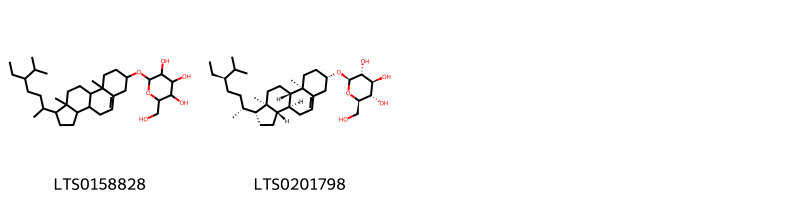{ width=100% }
    <figcaption>Hình ảnh cấu trúc hóa học của 2 hoạt chất thuộc nhóm Steroids and steroid derivatives gồm ['2-{[1-(5-ethyl-6-methylheptan-2-yl)-9a,11a-dimethyl-1h,2h,3h,3ah,3bh,4h,6h,7h,8h,9h,9bh,10h,11h-cyclopenta[a]phenanthren-7-yl]oxy}-6-(hydroxymethyl)oxane-3,4,5-triol (LTS0158828)', 'sitogluside (LTS0201798)'].</figcaption>
</figure>

---

### Dược dân tộc học

Danh sách các quốc gia có sử dụng *Aconitum japonicum* trong điều trị các bệnh. 

| Country   | Disease   | Bệnh                                                                                                                                                                                                |
|:----------|:----------|:----------------------------------------------------------------------------------------------------------------------------------------------------------------------------------------------------|
| Japan     | Poison    | MYMEMORY WARNING: YOU USED ALL AVAILABLE FREE TRANSLATIONS FOR TODAY. NEXT AVAILABLE IN  09 HOURS 00 MINUTES 51 SECONDS VISIT HTTPS://MYMEMORY.TRANSLATED.NET/DOC/USAGELIMITS.PHP TO TRANSLATE MORE |

---

---
## Aconitum laciniatum
### Thông tin về thực vật

!!! info "Phân loại thực vật của *Aconitum laciniatum* từ GIBF:"
    - **Kingdom:** Plantae
    - **Phylum:** Tracheophyta
    - **Order:** Ranunculales
    - **Family:** Ranunculaceae
    - **Genus:** Aconitum
    - **Species:** *Aconitum laciniatum*

 

| Label (VI)   | Label (EN)   | Scientific Name     | Descriptions (VI)   | Descriptions (EN)   | Also Known As (VI)   | Also Known As (EN)   |
|:-------------|:-------------|:--------------------|:--------------------|:--------------------|:---------------------|:---------------------|
| N/A          | N/A          | Aconitum laciniatum | loài thực vật       | species of plant    | ['']                 | ['']                 |

#### Phân bố trên thế giới

**Từ CSDL GIBF** nan, Nepal, Bhutan, India

#### Phân bố tại Việt Nam

**Từ CSDL GIBF**: Không có ghi nhận ở Việt Nam

---
### Thành phần hóa học
        
- Theo cơ sở dữ liệu lotus: Từ loài *Aconitum laciniatum* đã phân lập và xác định được Chưa có hoạt chất nào được phân lập. hoạt chất thuộc về các nhóm Không có hoạt chất nào được phân lập. 

Không có hình ảnh nào được tạo ra

---

### Dược dân tộc học

Danh sách các quốc gia có sử dụng *Aconitum laciniatum* trong điều trị các bệnh. 

| Country   | Disease   | Bệnh                                                                                                                                                                                                |
|:----------|:----------|:----------------------------------------------------------------------------------------------------------------------------------------------------------------------------------------------------|
| Elsewhere | Poison    | MYMEMORY WARNING: YOU USED ALL AVAILABLE FREE TRANSLATIONS FOR TODAY. NEXT AVAILABLE IN  09 HOURS 00 MINUTES 25 SECONDS VISIT HTTPS://MYMEMORY.TRANSLATED.NET/DOC/USAGELIMITS.PHP TO TRANSLATE MORE |

---

---
## Aconitum lycoctonum
### Thông tin về thực vật

!!! info "Phân loại thực vật của *Aconitum lycoctonum* từ GIBF:"
    - **Kingdom:** Plantae
    - **Phylum:** Tracheophyta
    - **Order:** Ranunculales
    - **Family:** Ranunculaceae
    - **Genus:** Aconitum
    - **Species:** *Aconitum lycoctonum*

 

| Label (VI)   | Label (EN)   | Scientific Name     | Descriptions (VI)   | Descriptions (EN)   | Also Known As (VI)   | Also Known As (EN)   |
|:-------------|:-------------|:--------------------|:--------------------|:--------------------|:---------------------|:---------------------|
| N/A          | N/A          | Aconitum lycoctonum | loài thực vật       | species of plant    | ['']                 | ['']                 |

#### Phân bố trên thế giới

**Từ CSDL GIBF** Switzerland, Slovenia, Slovakia, Croatia, Spain, Czechia, France, Hungary, Romania, Germany, Italy, Austria, Belgium, Netherlands

#### Phân bố tại Việt Nam

**Từ CSDL GIBF**: Không có ghi nhận ở Việt Nam

---
### Thành phần hóa học
        
- Theo cơ sở dữ liệu lotus: Từ loài *Aconitum lycoctonum* đã phân lập và xác định được 88 hoạt chất thuộc về các nhóm Aporphines, Flavonoids, Prenol lipids, Steroids and steroid derivatives, Benzene and substituted derivatives. 

|    | chemicalTaxonomyClassyfireClass     |   smiles_count |
|---:|:------------------------------------|---------------:|
|  0 | Aporphines                          |              3 |
|  1 | Benzene and substituted derivatives |              1 |
|  2 | Flavonoids                          |             11 |
|  3 | Prenol lipids                       |             62 |
|  4 | Steroids and steroid derivatives    |              3 |

#### Nhóm Aporphines
<figure markdown="span">
    { width=100% }
    <figcaption>Hình ảnh cấu trúc hóa học của 3 hoạt chất thuộc nhóm Aporphines gồm ['magnoflorine (LTS0120825)', '4,15-dimethoxy-10-methyl-10-azatetracyclo[7.7.1.0²,⁷.0¹³,¹⁷]heptadeca-1(16),2,4,6,13(17),14-hexaene-3,16-diol (LTS0095715)', '(9s)-4,15-dimethoxy-10-methyl-10-azatetracyclo[7.7.1.0²,⁷.0¹³,¹⁷]heptadeca-1(16),2,4,6,13(17),14-hexaene-3,16-diol (LTS0022981)'].</figcaption>
</figure>
#### Nhóm Benzene and substituted derivatives
<figure markdown="span">
    { width=100% }
    <figcaption>Hình ảnh cấu trúc hóa học của 1 hoạt chất thuộc nhóm Benzene and substituted derivatives gồm ['{3-ethyl-8,12,14,17-tetramethoxy-16-oxo-3-azahexacyclo[7.6.3.1¹⁰,¹³.0¹,¹¹.0²,⁹.0⁵,¹⁸]nonadecan-5-yl}methyl 2-aminobenzoate (LTS0077859)'].</figcaption>
</figure>
#### Nhóm Flavonoids
<figure markdown="span">
    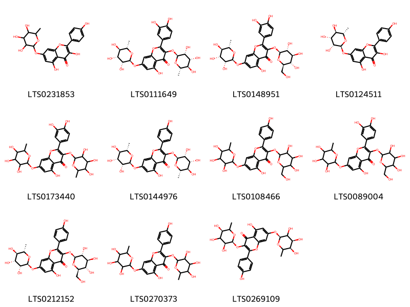{ width=100% }
    <figcaption>Hình ảnh cấu trúc hóa học của 11 hoạt chất thuộc nhóm Flavonoids gồm ['3,5-dihydroxy-2-(4-hydroxyphenyl)-7-[(3,4,5-trihydroxy-6-methyloxan-2-yl)oxy]chromen-4-one (LTS0231853)', '2-(3,4-dihydroxyphenyl)-5-hydroxy-3,7-bis({[(2s,3r,4r,5r,6s)-3,4,5-trihydroxy-6-methyloxan-2-yl]oxy})chromen-4-one (LTS0111649)', 'petiolaroside (LTS0148951)', 'kaempferol-7-rhamnoside (LTS0124511)', '2-(3,4-dihydroxyphenyl)-5-hydroxy-3,7-bis[(3,4,5-trihydroxy-6-methyloxan-2-yl)oxy]chromen-4-one (LTS0173440)', 'lespedin (LTS0144976)', '5-hydroxy-2-(4-hydroxyphenyl)-3-{[3,4,5-trihydroxy-6-(hydroxymethyl)oxan-2-yl]oxy}-7-[(3,4,5-trihydroxy-6-methyloxan-2-yl)oxy]chromen-4-one (LTS0108466)', '2-(3,4-dihydroxyphenyl)-5-hydroxy-3-{[3,4,5-trihydroxy-6-(hydroxymethyl)oxan-2-yl]oxy}-7-[(3,4,5-trihydroxy-6-methyloxan-2-yl)oxy]chromen-4-one (LTS0089004)', '5-hydroxy-2-(4-hydroxyphenyl)-3-{[(2s,3r,4s,5s,6r)-3,4,5-trihydroxy-6-(hydroxymethyl)oxan-2-yl]oxy}-7-{[(2s,3r,4r,5r,6s)-3,4,5-trihydroxy-6-methyloxan-2-yl]oxy}chromen-4-one (LTS0212152)', 'kaempferitrin (LTS0270373)', 'kaempferitrin (LTS0269109)'].</figcaption>
</figure>
#### Nhóm Prenol lipids
<figure markdown="span">
    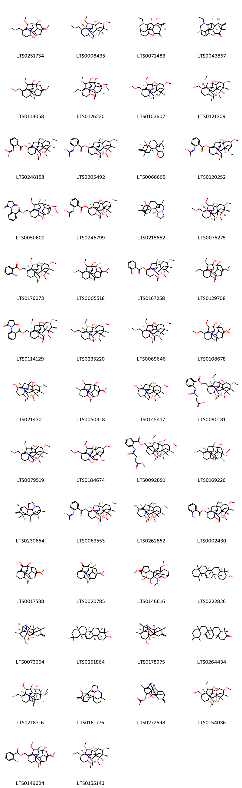{ width=100% }
    <figcaption>Hình ảnh cấu trúc hóa học của 62 hoạt chất thuộc nhóm Prenol lipids gồm ['11-ethyl-6,18-dimethoxy-13-(methoxymethyl)-11-azahexacyclo[7.7.2.1²,⁵.0¹,¹⁰.0³,⁸.0¹³,¹⁷]nonadecane-4,8,16-triol (LTS0251734)', '(2r,3r,4s,5s,6s,8r,13s,16s,17r,18r)-11-ethyl-6,18-dimethoxy-13-(methoxymethyl)-11-azahexacyclo[7.7.2.1²,⁵.0¹,¹⁰.0³,⁸.0¹³,¹⁷]nonadecane-4,8,16-triol (LTS0008435)', '(1r,5s,7r,8r,9r,13r)-11-ethyl-7,16-dihydroxy-13-methyl-6-methylidene-11-azahexacyclo[7.7.2.1⁵,⁸.0¹,¹⁰.0²,⁸.0¹³,¹⁷]nonadecan-4-one (LTS0071483)', '(1r,2r,5r,7r,8r,9r,13r,16s,17r)-11-ethyl-7,16-dihydroxy-13-methyl-6-methylidene-11-azahexacyclo[7.7.2.1⁵,⁸.0¹,¹⁰.0²,⁸.0¹³,¹⁷]nonadecan-4-one (LTS0043857)', '11-ethyl-6,18-dimethoxy-13-(methoxymethyl)-11-azahexacyclo[7.7.2.1²,⁵.0¹,¹⁰.0³,⁸.0¹³,¹⁷]nonadecane-4,8,9,16-tetrol (LTS0118058)', '(1s,5r,6s,8r,9s,13s,16s)-11-ethyl-13-(hydroxymethyl)-4,6,16,18-tetramethoxy-11-azahexacyclo[7.7.2.1²,⁵.0¹,¹⁰.0³,⁸.0¹³,¹⁷]nonadecane-8,9-diol (LTS0126220)', '(1s,2r,3r,4s,6s,8r,9s,10s,13s,16s,17r,18s)-11-ethyl-6,18-dimethoxy-13-(methoxymethyl)-11-azahexacyclo[7.7.2.1²,⁵.0¹,¹⁰.0³,⁸.0¹³,¹⁷]nonadecane-4,8,9,16-tetrol (LTS0103607)', 'lycoctonine (LTS0121309)', 'n-[2-({[(1s,2s,3s,4s,5s,6s,8s,9s,10s,13r,16s,17s)-11-ethyl-3,8-dihydroxy-4,6,16-trimethoxy-11-azahexacyclo[7.7.2.1²,⁵.0¹,¹⁰.0³,⁸.0¹³,¹⁷]nonadecan-13-yl]oxy}carbonyl)phenyl]ethanimidic acid (LTS0248158)', 'n-[2-({[(1s,2s,3s,4s,5r,6s,8s,9s,13s,16s,17s)-11-ethyl-3,8-dihydroxy-4,6,16-trimethoxy-11-azahexacyclo[7.7.2.1²,⁵.0¹,¹⁰.0³,⁸.0¹³,¹⁷]nonadecan-13-yl]oxy}carbonyl)phenyl]ethanimidic acid (LTS0205492)', 'atisine (LTS0066665)', 'n-{2-[({11-ethyl-3,8,9-trihydroxy-4,6,16-trimethoxy-11-azahexacyclo[7.7.2.1²,⁵.0¹,¹⁰.0³,⁸.0¹³,¹⁷]nonadecan-13-yl}oxy)carbonyl]phenyl}ethanimidic acid (LTS0120252)', '[(1s,5r,6s,8r,9s,13s,16s)-11-ethyl-8,9-dihydroxy-4,6,16,18-tetramethoxy-11-azahexacyclo[7.7.2.1²,⁵.0¹,¹⁰.0³,⁸.0¹³,¹⁷]nonadecan-13-yl]methyl 2-(2,5-dioxopyrrolidin-1-yl)benzoate (LTS0050602)', 'n-[2-({[(1s,2s,3s,4s,6s,8s,9r,10s,13s,16s,17s)-11-ethyl-3,8,9-trihydroxy-4,6,16-trimethoxy-11-azahexacyclo[7.7.2.1²,⁵.0¹,¹⁰.0³,⁸.0¹³,¹⁷]nonadecan-13-yl]oxy}carbonyl)phenyl]ethanimidic acid (LTS0246799)', '(1s,2r,4s,6s,7s,10r,11r,17s)-11-methyl-5-methylidene-16-oxa-13-azahexacyclo[9.6.3.2⁴,⁷.0¹,¹⁰.0²,⁷.0¹³,¹⁷]docosan-6-ol (LTS0218662)', '(1s,2r,3s,4r,5r,6r,8r,9s,13s,16r,17r,18r)-11-ethyl-4,6,18-trimethoxy-13-(methoxymethyl)-11-azahexacyclo[7.7.2.1²,⁵.0¹,¹⁰.0³,⁸.0¹³,¹⁷]nonadecane-8,9,16-triol (LTS0076275)', 'anthranoyllycoctonine (LTS0176073)', 'gigactonine (LTS0005518)', '(1s,3s,4s,5r,6s,8s,9s,13s,16s)-11-ethyl-3,8-dihydroxy-4,6,16-trimethoxy-11-azahexacyclo[7.7.2.1²,⁵.0¹,¹⁰.0³,⁸.0¹³,¹⁷]nonadecan-13-yl 2-aminobenzoate (LTS0167258)', '11-ethyl-13-(hydroxymethyl)-4,6,16,18-tetramethoxy-11-azahexacyclo[7.7.2.1²,⁵.0¹,¹⁰.0³,⁸.0¹³,¹⁷]nonadecane-8,9-diol (LTS0129708)', 'lycaconitine (LTS0114129)', '(1s,2r,3r,4s,5r,6s,8r,9s,10s,13s,16s,17r,18s)-11-ethyl-4,6,18-trimethoxy-13-(methoxymethyl)-11-azahexacyclo[7.7.2.1²,⁵.0¹,¹⁰.0³,⁸.0¹³,¹⁷]nonadecane-8,9,16-triol (LTS0235220)', '(1s,2r,3r,4s,5r,6s,8r,9s,10s,13s,16s,17r,18s)-11-ethyl-4,6,16,18-tetramethoxy-13-(methoxymethyl)-11-azahexacyclo[7.7.2.1²,⁵.0¹,¹⁰.0³,⁸.0¹³,¹⁷]nonadecane-8,9-diol (LTS0069646)', '11-ethyl-4,6,18-trimethoxy-13-(methoxymethyl)-11-azahexacyclo[7.7.2.1²,⁵.0¹,¹⁰.0³,⁸.0¹³,¹⁷]nonadecane-8,9,16-triol (LTS0108678)', '(1r,2s,3s,4s,5r,6s,8s,9s,10r,13s,16s,17s)-11-ethyl-4,6,16-trimethoxy-11-azahexacyclo[7.7.2.1²,⁵.0¹,¹⁰.0³,⁸.0¹³,¹⁷]nonadecane-3,8,13-triol (LTS0214301)', '11-ethyl-4,6,16-trimethoxy-11-azahexacyclo[7.7.2.1²,⁵.0¹,¹⁰.0³,⁸.0¹³,¹⁷]nonadecane-8,13,18-triol (LTS0050418)', '(1r,2s,3s,4s,5r,6s,8s,9s,10r,13s,16s,17s)-11-ethyl-4,6-dimethoxy-11-azahexacyclo[7.7.2.1²,⁵.0¹,¹⁰.0³,⁸.0¹³,¹⁷]nonadecane-3,8,13,16-tetrol (LTS0145417)', '3-{[2-({[(1s,2r,3r,4s,5r,6s,8r,9s,10s,13s,16s,17r,18s)-11-ethyl-8,9-dihydroxy-4,6,16,18-tetramethoxy-11-azahexacyclo[7.7.2.1²,⁵.0¹,¹⁰.0³,⁸.0¹³,¹⁷]nonadecan-13-yl]methoxy}carbonyl)phenyl]-c-hydroxycarbonimidoyl}propanoic acid (LTS0090181)', '(1r,2s,3s,4s,5r,6s,8r,9s,10s,13s,16s,17r,18s)-11-ethyl-4,6,18-trimethoxy-13-(methoxymethyl)-11-azahexacyclo[7.7.2.1²,⁵.0¹,¹⁰.0³,⁸.0¹³,¹⁷]nonadecane-2,8,9,16-tetrol (LTS0079519)', '11-ethyl-4,6,18-trimethoxy-13-(methoxymethyl)-11-azahexacyclo[7.7.2.1²,⁵.0¹,¹⁰.0³,⁸.0¹³,¹⁷]nonadecane-2,8,9,16-tetrol (LTS0184674)', 'n-[2-({[(1s,2r,3r,4s,5r,6s,8r,9s,13s,16s,17r,18s)-11-ethyl-9-hydroxy-4,6,8,16,18-pentamethoxy-11-azahexacyclo[7.7.2.1²,⁵.0¹,¹⁰.0³,⁸.0¹³,¹⁷]nonadecan-13-yl]methoxy}carbonyl)phenyl]-4-methoxy-4-oxobutanimidic acid (LTS0092891)', '(1s,2r,3r,4s,5s,6s,8s,9s,10r,13s,16s,17r)-11-ethyl-13-(hydroxymethyl)-6-methoxy-11-azahexacyclo[7.7.2.1²,⁵.0¹,¹⁰.0³,⁸.0¹³,¹⁷]nonadecane-4,8,16-triol (LTS0169226)', '(1s,5s,11s,12s,14r,16r,18s,20r,21r)-5-methyl-15-methylidene-10-oxa-7-azaheptacyclo[12.6.2.0¹,¹¹.0⁵,²⁰.0⁷,¹¹.0¹²,¹⁷.0¹⁷,²¹]docosane-16,18-diol (LTS0230654)', 'n-[2-({[(1r,2r,3s,4s,5r,6s,8s,9s,10r,13s,16s,17s)-11-ethyl-2,3,8-trihydroxy-4,6,16-trimethoxy-11-azahexacyclo[7.7.2.1²,⁵.0¹,¹⁰.0³,⁸.0¹³,¹⁷]nonadecan-13-yl]oxy}carbonyl)phenyl]ethanimidic acid (LTS0063553)', '(1r,2r,3s,4s,5r,6s,8s,9s,10r,13s,16s,17s)-11-ethyl-4,6,16-trimethoxy-11-azahexacyclo[7.7.2.1²,⁵.0¹,¹⁰.0³,⁸.0¹³,¹⁷]nonadecane-2,3,8,13-tetrol (LTS0262852)', '(1r,2r,3s,4s,5r,6s,8s,9s,10r,13s,16s,17s)-11-ethyl-2,3,8-trihydroxy-4,6,16-trimethoxy-11-azahexacyclo[7.7.2.1²,⁵.0¹,¹⁰.0³,⁸.0¹³,¹⁷]nonadecan-13-yl 2-aminobenzoate (LTS0002430)', '11-ethyl-9-hydroxy-4,6,16-trimethoxy-11-azahexacyclo[7.7.2.1²,⁵.0¹,¹⁰.0³,⁸.0¹³,¹⁷]nonadecan-18-one (LTS0017588)', '11-ethyl-8,9-dihydroxy-4,6,16-trimethoxy-11-azahexacyclo[7.7.2.1²,⁵.0¹,¹⁰.0³,⁸.0¹³,¹⁷]nonadecan-18-one (LTS0020785)', '4-ethyl-12,16-dimethoxy-10-(methoxymethyl)-6-oxa-4-azaheptacyclo[15.2.1.0²,⁷.0²,¹¹.0³,¹³.0⁵,¹⁰.0¹⁴,¹⁹]icosane-13,14,18-triol (LTS0146616)', 'amyrin (LTS0222826)', '(1r,2s,3s,5s,6r,8r,9s,11s,14s,16s,17s,18s)-5-methyl-12-methylidene-7-azaheptacyclo[9.6.2.0¹,⁸.0⁵,¹⁷.0⁷,¹⁶.0⁹,¹⁴.0¹⁴,¹⁸]nonadecane-2,3,6,18-tetrol (LTS0073664)', 'β-amyrin (LTS0251864)', '(2s,3s,5r,6r,9s,11s,16r,17s,18s)-5-methyl-12-methylidene-7-azaheptacyclo[9.6.2.0¹,⁸.0⁵,¹⁷.0⁷,¹⁶.0⁹,¹⁴.0¹⁴,¹⁸]nonadecane-2,3,6,18-tetrol (LTS0178975)', '4,4,6a,6b,8a,11,12,14b-octamethyl-1,2,4a,5,6,7,8,9,10,11,12,12a,14,14a-tetradecahydropicen-3-one (LTS0264434)', '(1s,2r,3r,4s,5r,6s,8r,9r,10r,13s,16s,17r,18r)-11-ethyl-13-(hydroxymethyl)-4,6,16,18-tetramethoxy-11-azahexacyclo[7.7.2.1²,⁵.0¹,¹⁰.0³,⁸.0¹³,¹⁷]nonadecan-8-ol (LTS0218716)', '5-methyl-15-methylidene-10-oxa-7-azaheptacyclo[12.6.2.0¹,¹¹.0⁵,²⁰.0⁷,¹¹.0¹²,¹⁷.0¹⁷,²¹]docosane-16,18-diol (LTS0161776)', '2,6,18-trihydroxy-5-methyl-12-methylidene-7-azaheptacyclo[9.6.2.0¹,⁸.0⁵,¹⁷.0⁷,¹⁶.0⁹,¹⁴.0¹⁴,¹⁸]nonadecan-3-yl acetate (LTS0272698)', '(1s,2r,3r,4s,5s,6s,8r,9r,10s,13s,16s,17r,18s)-11-ethyl-13-(hydroxymethyl)-6,16,18-trimethoxy-11-azahexacyclo[7.7.2.1²,⁵.0¹,¹⁰.0³,⁸.0¹³,¹⁷]nonadecane-4,8,9-triol (LTS0154036)', '{11-ethyl-8,9-dihydroxy-4,6,16,18-tetramethoxy-11-azahexacyclo[7.7.2.1²,⁵.0¹,¹⁰.0³,⁸.0¹³,¹⁷]nonadecan-13-yl}methyl 2-aminobenzoate (LTS0149624)', 'lycoctonine (LTS0155143)', '11-ethyl-13-(hydroxymethyl)-6,16,18-trimethoxy-11-azahexacyclo[7.7.2.1²,⁵.0¹,¹⁰.0³,⁸.0¹³,¹⁷]nonadecane-4,8,9-triol (LTS0234506)', '(1s,2r,3r,4s,5s,6s,8r,9r,10s,13s,16s,17r,18s)-11-ethyl-6,18-dimethoxy-13-(methoxymethyl)-11-azahexacyclo[7.7.2.1²,⁵.0¹,¹⁰.0³,⁸.0¹³,¹⁷]nonadecane-4,8,9,16-tetrol (LTS0026696)', '11-ethyl-8,9-dihydroxy-4,6,16-trimethoxy-13-(methoxymethyl)-11-azahexacyclo[7.7.2.1²,⁵.0¹,¹⁰.0³,⁸.0¹³,¹⁷]nonadecan-18-yl acetate (LTS0230686)', '(1s,2r,3r,4s,5r,6s,8r,9r,10s,13s,16s,17r,18s)-11-ethyl-13-(hydroxymethyl)-4,6,18-trimethoxy-11-azahexacyclo[7.7.2.1²,⁵.0¹,¹⁰.0³,⁸.0¹³,¹⁷]nonadecane-8,9,16-triol (LTS0080599)', '(1s,2r,3r,4s,5r,6s,8r,9s,10s,13s,16r,17r,18s)-11-ethyl-13-(hydroxymethyl)-4,6,16,18-tetramethoxy-11-azahexacyclo[7.7.2.1²,⁵.0¹,¹⁰.0³,⁸.0¹³,¹⁷]nonadecane-8,9-diol (LTS0069524)', '11-ethyl-4,6-dimethoxy-13-(methoxymethyl)-11-azahexacyclo[7.7.2.1²,⁵.0¹,¹⁰.0³,⁸.0¹³,¹⁷]nonadecane-8,9,16,18-tetrol (LTS0118070)', '(1s,2r,3r,4s,5r,6s,8r,9r,10s,13s,16s,17r,18s)-11-ethyl-8,9-dihydroxy-4,6,16-trimethoxy-13-(methoxymethyl)-11-azahexacyclo[7.7.2.1²,⁵.0¹,¹⁰.0³,⁸.0¹³,¹⁷]nonadecan-18-yl acetate (LTS0138008)', '(1r,2s,3s,4s,5s,6s,8s,9r,10r,13r,16s,17s,18r)-11-ethyl-8,9-dihydroxy-4,6,16-trimethoxy-13-(methoxymethyl)-11-azahexacyclo[7.7.2.1²,⁵.0¹,¹⁰.0³,⁸.0¹³,¹⁷]nonadecan-18-yl acetate (LTS0059978)', '(1s,2r,3r,4s,5r,6s,8r,9r,10s,13s,16s,17r,18s)-11-ethyl-8,9,16-trihydroxy-4,6-dimethoxy-13-(methoxymethyl)-11-azahexacyclo[7.7.2.1²,⁵.0¹,¹⁰.0³,⁸.0¹³,¹⁷]nonadecan-18-yl acetate (LTS0058707)', '(1r,2r,3r,4r,5r,6s,8r,9r,10r,13r,16s,17s,18s)-11-ethyl-8,9,16-trihydroxy-4,6-dimethoxy-13-(methoxymethyl)-11-azahexacyclo[7.7.2.1²,⁵.0¹,¹⁰.0³,⁸.0¹³,¹⁷]nonadecan-18-yl acetate (LTS0013254)', '(1s,2r,3r,4s,5r,6s,8r,9r,10s,13s,16s,17r,18s)-11-ethyl-4,6-dimethoxy-13-(methoxymethyl)-11-azahexacyclo[7.7.2.1²,⁵.0¹,¹⁰.0³,⁸.0¹³,¹⁷]nonadecane-8,9,16,18-tetrol (LTS0265506)', '11-ethyl-8,9,16-trihydroxy-4,6-dimethoxy-13-(methoxymethyl)-11-azahexacyclo[7.7.2.1²,⁵.0¹,¹⁰.0³,⁸.0¹³,¹⁷]nonadecan-18-yl acetate (LTS0251748)'].</figcaption>
</figure>
#### Nhóm Steroids and steroid derivatives
<figure markdown="span">
    { width=100% }
    <figcaption>Hình ảnh cấu trúc hóa học của 3 hoạt chất thuộc nhóm Steroids and steroid derivatives gồm ['stigmast-5-en-3-ol, (3β)- (LTS0204616)', 'phytosterol (LTS0029311)', '(1r,3as,3bs,7s,9bs)-1-[(2r,5r)-5,6-dimethylheptan-2-yl]-9a,11a-dimethyl-1h,2h,3h,3ah,3bh,4h,6h,7h,8h,9h,9bh,10h,11h-cyclopenta[a]phenanthren-7-ol (LTS0057877)'].</figcaption>
</figure>

---

### Dược dân tộc học

Danh sách các quốc gia có sử dụng *Aconitum lycoctonum* trong điều trị các bệnh. 

| Country   | Disease   | Bệnh                                                                                                                                                                                                |
|:----------|:----------|:----------------------------------------------------------------------------------------------------------------------------------------------------------------------------------------------------|
| Dutch     | Sudorific | MYMEMORY WARNING: YOU USED ALL AVAILABLE FREE TRANSLATIONS FOR TODAY. NEXT AVAILABLE IN  09 HOURS 00 MINUTES 08 SECONDS VISIT HTTPS://MYMEMORY.TRANSLATED.NET/DOC/USAGELIMITS.PHP TO TRANSLATE MORE |
| English   | Diuretic  | MYMEMORY WARNING: YOU USED ALL AVAILABLE FREE TRANSLATIONS FOR TODAY. NEXT AVAILABLE IN  09 HOURS 00 MINUTES 06 SECONDS VISIT HTTPS://MYMEMORY.TRANSLATED.NET/DOC/USAGELIMITS.PHP TO TRANSLATE MORE |
| French    | Sedative  | MYMEMORY WARNING: YOU USED ALL AVAILABLE FREE TRANSLATIONS FOR TODAY. NEXT AVAILABLE IN  09 HOURS 00 MINUTES 03 SECONDS VISIT HTTPS://MYMEMORY.TRANSLATED.NET/DOC/USAGELIMITS.PHP TO TRANSLATE MORE |
| German    | Analgesic | MYMEMORY WARNING: YOU USED ALL AVAILABLE FREE TRANSLATIONS FOR TODAY. NEXT AVAILABLE IN  09 HOURS 00 MINUTES 01 SECONDS VISIT HTTPS://MYMEMORY.TRANSLATED.NET/DOC/USAGELIMITS.PHP TO TRANSLATE MORE |
| Turkey    | Poison    | MYMEMORY WARNING: YOU USED ALL AVAILABLE FREE TRANSLATIONS FOR TODAY. NEXT AVAILABLE IN  08 HOURS 59 MINUTES 59 SECONDS VISIT HTTPS://MYMEMORY.TRANSLATED.NET/DOC/USAGELIMITS.PHP TO TRANSLATE MORE |
| anish     | Narcotic  | MYMEMORY WARNING: YOU USED ALL AVAILABLE FREE TRANSLATIONS FOR TODAY. NEXT AVAILABLE IN  08 HOURS 59 MINUTES 56 SECONDS VISIT HTTPS://MYMEMORY.TRANSLATED.NET/DOC/USAGELIMITS.PHP TO TRANSLATE MORE |

---

---
## Aconitum napellus
### Thông tin về thực vật

!!! info "Phân loại thực vật của *Aconitum napellus* từ GIBF:"
    - **Kingdom:** Plantae
    - **Phylum:** Tracheophyta
    - **Order:** Ranunculales
    - **Family:** Ranunculaceae
    - **Genus:** Aconitum
    - **Species:** *Aconitum napellus*

 

| Label (VI)   | Label (EN)   | Scientific Name   | Descriptions (VI)   | Descriptions (EN)   | Also Known As (VI)   | Also Known As (EN)                                   |
|:-------------|:-------------|:------------------|:--------------------|:--------------------|:---------------------|:-----------------------------------------------------|
| N/A          | N/A          | Aconitum napellus | loài thực vật       | species of plant    | ['']                 | ["wolf's bane", 'Mapello', 'aconite', "Monk's-hood"] |

#### Phân bố trên thế giới

**Từ CSDL GIBF** Liechtenstein, Denmark, Spain, Germany, Austria, Sweden, Andorra, Canada, Belgium, Netherlands, Slovenia, Norway, Switzerland, United Kingdom of Great Britain and Northern Ireland, France, Czechia, Romania, Russian Federation, Italy

#### Phân bố tại Việt Nam

**Từ CSDL GIBF**: Không có ghi nhận ở Việt Nam

---
### Thành phần hóa học
        
- Theo cơ sở dữ liệu lotus: Từ loài *Aconitum napellus* đã phân lập và xác định được 111 hoạt chất thuộc về các nhóm Organooxygen compounds, Flavonoids, Prenol lipids, Benzene and substituted derivatives. 

|    | chemicalTaxonomyClassyfireClass     |   smiles_count |
|---:|:------------------------------------|---------------:|
|  0 | Benzene and substituted derivatives |              2 |
|  1 | Flavonoids                          |             21 |
|  2 | Organooxygen compounds              |              2 |
|  3 | Prenol lipids                       |             81 |

#### Nhóm Benzene and substituted derivatives
<figure markdown="span">
    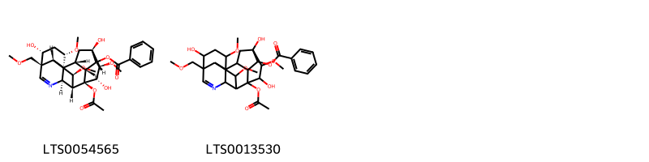{ width=100% }
    <figcaption>Hình ảnh cấu trúc hóa học của 2 hoạt chất thuộc nhóm Benzene and substituted derivatives gồm ['(1s,2r,3r,4r,5r,6s,7s,8r,9r,10r,13r,14r,16s,17s,18r)-8-(acetyloxy)-5,7,14-trihydroxy-6,16,18-trimethoxy-13-(methoxymethyl)-11-azahexacyclo[7.7.2.1²,⁵.0¹,¹⁰.0³,⁸.0¹³,¹⁷]nonadec-11-en-4-yl benzoate (LTS0054565)', '8-(acetyloxy)-5,7,14-trihydroxy-6,16,18-trimethoxy-13-(methoxymethyl)-11-azahexacyclo[7.7.2.1²,⁵.0¹,¹⁰.0³,⁸.0¹³,¹⁷]nonadec-11-en-4-yl benzoate (LTS0013530)'].</figcaption>
</figure>
#### Nhóm Flavonoids
<figure markdown="span">
    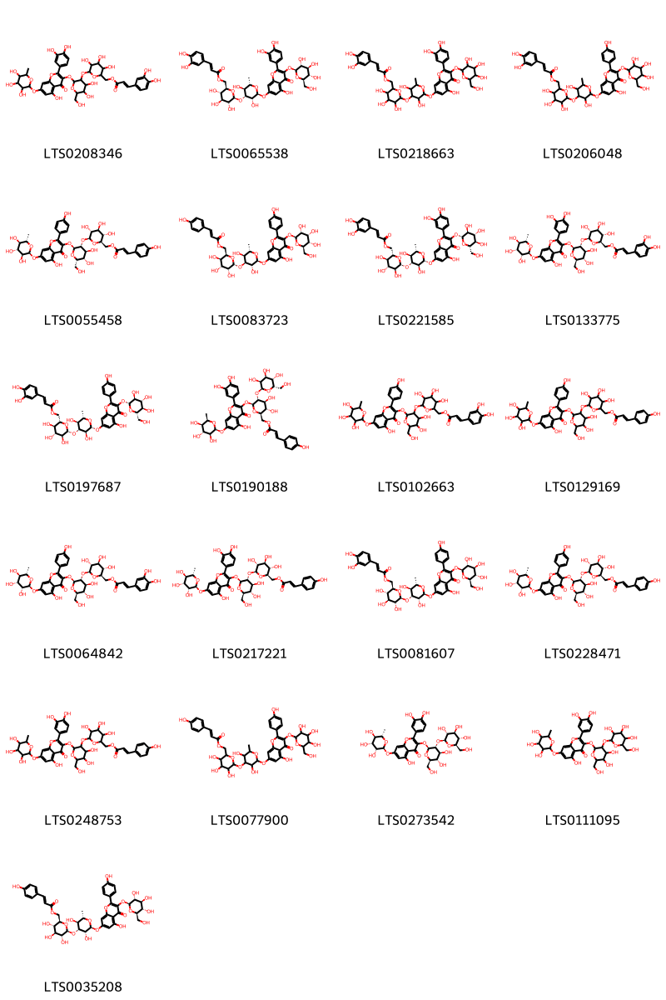{ width=100% }
    <figcaption>Hình ảnh cấu trúc hóa học của 21 hoạt chất thuộc nhóm Flavonoids gồm ['{6-[(2-{[2-(3,4-dihydroxyphenyl)-5-hydroxy-4-oxo-7-[(3,4,5-trihydroxy-6-methyloxan-2-yl)oxy]chromen-3-yl]oxy}-4,5-dihydroxy-6-(hydroxymethyl)oxan-3-yl)oxy]-3,4,5-trihydroxyoxan-2-yl}methyl 3-(3,4-dihydroxyphenyl)prop-2-enoate (LTS0208346)', '[(2r,3s,4s,5r,6s)-6-{[(2s,3r,4r,5s,6s)-2-{[2-(3,4-dihydroxyphenyl)-5-hydroxy-4-oxo-3-{[(2s,3r,4s,5s,6r)-3,4,5-trihydroxy-6-(hydroxymethyl)oxan-2-yl]oxy}chromen-7-yl]oxy}-3,5-dihydroxy-6-methyloxan-4-yl]oxy}-3,4,5-trihydroxyoxan-2-yl]methyl (2e)-3-(3,4-dihydroxyphenyl)prop-2-enoate (LTS0065538)', '{6-[(2-{[2-(3,4-dihydroxyphenyl)-5-hydroxy-4-oxo-3-{[3,4,5-trihydroxy-6-(hydroxymethyl)oxan-2-yl]oxy}chromen-7-yl]oxy}-3,5-dihydroxy-6-methyloxan-4-yl)oxy]-3,4,5-trihydroxyoxan-2-yl}methyl 3-(3,4-dihydroxyphenyl)prop-2-enoate (LTS0218663)', '{6-[(3,5-dihydroxy-2-{[5-hydroxy-2-(4-hydroxyphenyl)-4-oxo-3-{[3,4,5-trihydroxy-6-(hydroxymethyl)oxan-2-yl]oxy}chromen-7-yl]oxy}-6-methyloxan-4-yl)oxy]-3,4,5-trihydroxyoxan-2-yl}methyl 3-(3,4-dihydroxyphenyl)prop-2-enoate (LTS0206048)', '[(2r,3s,4s,5r,6s)-6-{[(2s,3r,4s,5s,6s)-4,5-dihydroxy-2-{[5-hydroxy-2-(4-hydroxyphenyl)-4-oxo-7-{[(2s,3s,4r,5r,6s)-3,4,5-trihydroxy-6-methyloxan-2-yl]oxy}chromen-3-yl]oxy}-6-(hydroxymethyl)oxan-3-yl]oxy}-3,4,5-trihydroxyoxan-2-yl]methyl (2e)-3-(4-hydroxyphenyl)prop-2-enoate (LTS0055458)', '[(2r,3r,4r,5r,6r)-6-{[(2s,3r,4s,5s,6s)-3,5-dihydroxy-2-{[5-hydroxy-2-(4-hydroxyphenyl)-4-oxo-3-{[(2s,3r,4r,5s,6r)-3,4,5-trihydroxy-6-(hydroxymethyl)oxan-2-yl]oxy}chromen-7-yl]oxy}-6-methyloxan-4-yl]oxy}-3,4,5-trihydroxyoxan-2-yl]methyl (2e)-3-(4-hydroxyphenyl)prop-2-enoate (LTS0083723)', '[(2s,3r,4r,5s,6r)-6-{[(2r,3s,4r,5s,6s)-2-{[2-(3,4-dihydroxyphenyl)-5-hydroxy-4-oxo-3-{[(2r,3s,4r,5r,6s)-3,4,5-trihydroxy-6-(hydroxymethyl)oxan-2-yl]oxy}chromen-7-yl]oxy}-3,5-dihydroxy-6-methyloxan-4-yl]oxy}-3,4,5-trihydroxyoxan-2-yl]methyl (2e)-3-(3,4-dihydroxyphenyl)prop-2-enoate (LTS0221585)', '[(2r,3s,4s,5r,6s)-6-{[(2s,3r,4s,5s,6r)-2-{[2-(3,4-dihydroxyphenyl)-5-hydroxy-4-oxo-7-{[(2s,3r,4r,5r,6s)-3,4,5-trihydroxy-6-methyloxan-2-yl]oxy}chromen-3-yl]oxy}-4,5-dihydroxy-6-(hydroxymethyl)oxan-3-yl]oxy}-3,4,5-trihydroxyoxan-2-yl]methyl (2e)-3-(3,4-dihydroxyphenyl)prop-2-enoate (LTS0133775)', '[(2s,3r,4r,5s,6r)-6-{[(2r,3s,4r,5s,6s)-3,5-dihydroxy-2-{[5-hydroxy-2-(4-hydroxyphenyl)-4-oxo-3-{[(2r,3s,4r,5r,6s)-3,4,5-trihydroxy-6-(hydroxymethyl)oxan-2-yl]oxy}chromen-7-yl]oxy}-6-methyloxan-4-yl]oxy}-3,4,5-trihydroxyoxan-2-yl]methyl (2e)-3-(3,4-dihydroxyphenyl)prop-2-enoate (LTS0197687)', '[(2r,3s,4s,5r,6s)-6-{[2-(3,4-dihydroxyphenyl)-5-hydroxy-4-oxo-7-{[(2s,3s,4r,5r,6r)-3,4,5-trihydroxy-6-methyloxan-2-yl]oxy}chromen-3-yl]oxy}-3,4-dihydroxy-5-{[(2s,3s,4s,5s,6s)-3,4,5-trihydroxy-6-(hydroxymethyl)oxan-2-yl]oxy}oxan-2-yl]methyl (2e)-3-(4-hydroxyphenyl)prop-2-enoate (LTS0190188)', '{6-[(4,5-dihydroxy-2-{[5-hydroxy-2-(4-hydroxyphenyl)-4-oxo-7-[(3,4,5-trihydroxy-6-methyloxan-2-yl)oxy]chromen-3-yl]oxy}-6-(hydroxymethyl)oxan-3-yl)oxy]-3,4,5-trihydroxyoxan-2-yl}methyl 3-(3,4-dihydroxyphenyl)prop-2-enoate (LTS0102663)', '{6-[(4,5-dihydroxy-2-{[5-hydroxy-2-(4-hydroxyphenyl)-4-oxo-7-[(3,4,5-trihydroxy-6-methyloxan-2-yl)oxy]chromen-3-yl]oxy}-6-(hydroxymethyl)oxan-3-yl)oxy]-3,4,5-trihydroxyoxan-2-yl}methyl 3-(4-hydroxyphenyl)prop-2-enoate (LTS0129169)', '[(2r,3s,4s,5r,6s)-6-{[(2s,3r,4s,5s,6r)-4,5-dihydroxy-2-{[5-hydroxy-2-(4-hydroxyphenyl)-4-oxo-7-{[(2s,3r,4r,5r,6s)-3,4,5-trihydroxy-6-methyloxan-2-yl]oxy}chromen-3-yl]oxy}-6-(hydroxymethyl)oxan-3-yl]oxy}-3,4,5-trihydroxyoxan-2-yl]methyl (2e)-3-(3,4-dihydroxyphenyl)prop-2-enoate (LTS0064842)', '[(2r,3s,4s,5r,6s)-6-{[(2s,3r,4s,5s,6r)-2-{[2-(3,4-dihydroxyphenyl)-5-hydroxy-4-oxo-7-{[(2s,3r,4r,5r,6s)-3,4,5-trihydroxy-6-methyloxan-2-yl]oxy}chromen-3-yl]oxy}-4,5-dihydroxy-6-(hydroxymethyl)oxan-3-yl]oxy}-3,4,5-trihydroxyoxan-2-yl]methyl (2e)-3-(4-hydroxyphenyl)prop-2-enoate (LTS0217221)', '[(2r,3s,4s,5r,6s)-6-{[(2s,3r,4r,5s,6s)-3,5-dihydroxy-2-{[5-hydroxy-2-(4-hydroxyphenyl)-4-oxo-3-{[(2s,3r,4s,5s,6r)-3,4,5-trihydroxy-6-(hydroxymethyl)oxan-2-yl]oxy}chromen-7-yl]oxy}-6-methyloxan-4-yl]oxy}-3,4,5-trihydroxyoxan-2-yl]methyl (2e)-3-(3,4-dihydroxyphenyl)prop-2-enoate (LTS0081607)', '[(2r,3s,4s,5r,6s)-6-{[(2s,3r,4s,5s,6r)-4,5-dihydroxy-2-{[5-hydroxy-2-(4-hydroxyphenyl)-4-oxo-7-{[(2s,3r,4r,5r,6s)-3,4,5-trihydroxy-6-methyloxan-2-yl]oxy}chromen-3-yl]oxy}-6-(hydroxymethyl)oxan-3-yl]oxy}-3,4,5-trihydroxyoxan-2-yl]methyl (2e)-3-(4-hydroxyphenyl)prop-2-enoate (LTS0228471)', '{6-[(2-{[2-(3,4-dihydroxyphenyl)-5-hydroxy-4-oxo-7-[(3,4,5-trihydroxy-6-methyloxan-2-yl)oxy]chromen-3-yl]oxy}-4,5-dihydroxy-6-(hydroxymethyl)oxan-3-yl)oxy]-3,4,5-trihydroxyoxan-2-yl}methyl 3-(4-hydroxyphenyl)prop-2-enoate (LTS0248753)', '{6-[(3,5-dihydroxy-2-{[5-hydroxy-2-(4-hydroxyphenyl)-4-oxo-3-{[3,4,5-trihydroxy-6-(hydroxymethyl)oxan-2-yl]oxy}chromen-7-yl]oxy}-6-methyloxan-4-yl)oxy]-3,4,5-trihydroxyoxan-2-yl}methyl 3-(4-hydroxyphenyl)prop-2-enoate (LTS0077900)', '3-{[(2s,3r,4s,5s,6r)-4,5-dihydroxy-6-(hydroxymethyl)-3-{[(2s,3r,4s,5s,6r)-3,4,5-trihydroxy-6-(hydroxymethyl)oxan-2-yl]oxy}oxan-2-yl]oxy}-2-(3,4-dihydroxyphenyl)-5-hydroxy-7-{[(2s,3r,4r,5r,6s)-3,4,5-trihydroxy-6-methyloxan-2-yl]oxy}chromen-4-one (LTS0273542)', '3-{[4,5-dihydroxy-6-(hydroxymethyl)-3-{[3,4,5-trihydroxy-6-(hydroxymethyl)oxan-2-yl]oxy}oxan-2-yl]oxy}-2-(3,4-dihydroxyphenyl)-5-hydroxy-7-[(3,4,5-trihydroxy-6-methyloxan-2-yl)oxy]chromen-4-one (LTS0111095)', '[(2r,3s,4s,5r,6s)-6-{[(2s,3r,4r,5s,6s)-3,5-dihydroxy-2-{[5-hydroxy-2-(4-hydroxyphenyl)-4-oxo-3-{[(2s,3r,4s,5s,6r)-3,4,5-trihydroxy-6-(hydroxymethyl)oxan-2-yl]oxy}chromen-7-yl]oxy}-6-methyloxan-4-yl]oxy}-3,4,5-trihydroxyoxan-2-yl]methyl (2e)-3-(4-hydroxyphenyl)prop-2-enoate (LTS0035208)'].</figcaption>
</figure>
#### Nhóm Organooxygen compounds
<figure markdown="span">
    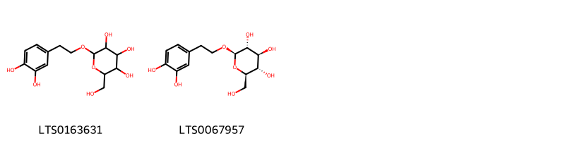{ width=100% }
    <figcaption>Hình ảnh cấu trúc hóa học của 2 hoạt chất thuộc nhóm Organooxygen compounds gồm ['2-[2-(3,4-dihydroxyphenyl)ethoxy]-6-(hydroxymethyl)oxane-3,4,5-triol (LTS0163631)', '(2r,3r,4s,5s,6r)-2-[2-(3,4-dihydroxyphenyl)ethoxy]-6-(hydroxymethyl)oxane-3,4,5-triol (LTS0067957)'].</figcaption>
</figure>
#### Nhóm Prenol lipids
<figure markdown="span">
    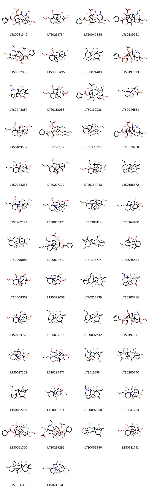{ width=100% }
    <figcaption>Hình ảnh cấu trúc hóa học của 81 hoạt chất thuộc nhóm Prenol lipids gồm ['aconitine (LTS0031342)', '11-ethyl-6,18-dimethoxy-13-(methoxymethyl)-11-azahexacyclo[7.7.2.1²,⁵.0¹,¹⁰.0³,⁸.0¹³,¹⁷]nonadecane-4,8,16-triol (LTS0251734)', 'mesaconitine (LTS0042834)', '8-(acetyloxy)-11-ethyl-5,7,14-trihydroxy-6,16,18-trimethoxy-13-(methoxymethyl)-11-azahexacyclo[7.7.2.1²,⁵.0¹,¹⁰.0³,⁸.0¹³,¹⁷]nonadecan-4-yl benzoate (LTS0139961)', '(1s,2r,3r,4r,5s,6s,7s,8r,9r,13r,16s,17s,18r)-8-(acetyloxy)-11-ethyl-5,7,14-trihydroxy-6,16,18-trimethoxy-13-(methoxymethyl)-11-azahexacyclo[7.7.2.1²,⁵.0¹,¹⁰.0³,⁸.0¹³,¹⁷]nonadecan-4-yl benzoate (LTS0052369)', '(2r,3r,4s,5s,6s,8r,13s,16s,17r,18r)-11-ethyl-6,18-dimethoxy-13-(methoxymethyl)-11-azahexacyclo[7.7.2.1²,⁵.0¹,¹⁰.0³,⁸.0¹³,¹⁷]nonadecane-4,8,16-triol (LTS0008435)', '(1r,5s,7r,8r,9r,13r)-11-ethyl-7,16-dihydroxy-13-methyl-6-methylidene-11-azahexacyclo[7.7.2.1⁵,⁸.0¹,¹⁰.0²,⁸.0¹³,¹⁷]nonadecan-4-one (LTS0071483)', '(1s,5r,6s,7s,8r,9r,10r,13r,14r,16s)-8-(acetyloxy)-5,7,14-trihydroxy-6,16,18-trimethoxy-13-(methoxymethyl)-11-methyl-11-azahexacyclo[7.7.2.1²,⁵.0¹,¹⁰.0³,⁸.0¹³,¹⁷]nonadecan-4-yl benzoate (LTS0197623)', '(1r,2r,5r,7r,8r,9r,13r,16s,17r)-11-ethyl-7,16-dihydroxy-13-methyl-6-methylidene-11-azahexacyclo[7.7.2.1⁵,⁸.0¹,¹⁰.0²,⁸.0¹³,¹⁷]nonadecan-4-one (LTS0043857)', '11-ethyl-6,18-dimethoxy-13-(methoxymethyl)-11-azahexacyclo[7.7.2.1²,⁵.0¹,¹⁰.0³,⁸.0¹³,¹⁷]nonadecane-4,8,9,16-tetrol (LTS0118058)', '(1s,2r,3r,4r,5r,6s,7s,8r,9r,10r,13r,14r,16s,17s,18r)-8-(acetyloxy)-11-ethyl-5,7,14-trihydroxy-6,16,18-trimethoxy-13-(methoxymethyl)-11-azahexacyclo[7.7.2.1²,⁵.0¹,¹⁰.0³,⁸.0¹³,¹⁷]nonadecan-4-yl benzoate (LTS0130236)', '11-ethyl-6-methoxy-13-(methoxymethyl)-11-azahexacyclo[7.7.2.1²,⁵.0¹,¹⁰.0³,⁸.0¹³,¹⁷]nonadecane-4,8,16-triol (LTS0046551)', '(1s,2r,3r,4s,6s,8r,9s,10s,13s,16s,17r,18s)-11-ethyl-6,18-dimethoxy-13-(methoxymethyl)-11-azahexacyclo[7.7.2.1²,⁵.0¹,¹⁰.0³,⁸.0¹³,¹⁷]nonadecane-4,8,9,16-tetrol (LTS0103607)', '8-(acetyloxy)-5,7,14-trihydroxy-6,16,18-trimethoxy-13-(methoxymethyl)-11-methyl-11-azahexacyclo[7.7.2.1²,⁵.0¹,¹⁰.0³,⁸.0¹³,¹⁷]nonadecan-4-yl benzoate (LTS0170177)', 'karakoline (LTS0275120)', '(1s,2r,3r,4r,5r,6s,7s,8r,9r,10r,13r,14r,16s,17s,18r)-8-(acetyloxy)-5,7,14-trihydroxy-6,16,18-trimethoxy-13-(methoxymethyl)-11-methyl-11-azahexacyclo[7.7.2.1²,⁵.0¹,¹⁰.0³,⁸.0¹³,¹⁷]nonadecan-4-yl benzoate (LTS0010758)', '(1s,2r,3r,4s,5s,6s,8r,9r,10r,13s,16s,17r,18s)-11-ethyl-6-methoxy-13-(methoxymethyl)-11-azahexacyclo[7.7.2.1²,⁵.0¹,¹⁰.0³,⁸.0¹³,¹⁷]nonadecane-4,8,16,18-tetrol (LTS0083355)', '(2r,3r,6s,8r,13s,17r)-11-ethyl-6,16,18-trimethoxy-13-(methoxymethyl)-11-azahexacyclo[7.7.2.1²,⁵.0¹,¹⁰.0³,⁸.0¹³,¹⁷]nonadecane-4,8-diol (LTS0217100)', '(1s,2r,3r,4s,5s,6s,8r,9r,10r,13s,16s,17r,18r)-11-ethyl-6,18-dimethoxy-13-(methoxymethyl)-11-azahexacyclo[7.7.2.1²,⁵.0¹,¹⁰.0³,⁸.0¹³,¹⁷]nonadecane-4,8,16-triol (LTS0184443)', '(2r,4r,5r,7r,8r,13r,16s,17r)-11-ethyl-13-methyl-6-methylidene-11-azahexacyclo[7.7.2.1⁵,⁸.0¹,¹⁰.0²,⁸.0¹³,¹⁷]nonadecane-4,7,16-triol (LTS0185572)', '(2r,3r,4s,5s,6s,8r,13s,16s,17r,18r)-11-ethyl-6,16,18-trimethoxy-13-(methoxymethyl)-11-azahexacyclo[7.7.2.1²,⁵.0¹,¹⁰.0³,⁸.0¹³,¹⁷]nonadecane-4,8-diol (LTS0262294)', '(1s,2r,3s,4r,5r,6r,8r,9s,13s,16r,17r,18r)-11-ethyl-4,6,18-trimethoxy-13-(methoxymethyl)-11-azahexacyclo[7.7.2.1²,⁵.0¹,¹⁰.0³,⁸.0¹³,¹⁷]nonadecane-8,9,16-triol (LTS0076275)', '(1s,2r,3r,4s,5s,6s,8r,9r,10s,13s,16s,17r)-11-ethyl-6-methoxy-13-(methoxymethyl)-11-azahexacyclo[7.7.2.1²,⁵.0¹,¹⁰.0³,⁸.0¹³,¹⁷]nonadecane-4,8,9,16-tetrol (LTS0203114)', '(1s,5s,6s,8s,13r,16s)-11-ethyl-6-methoxy-13-(methoxymethyl)-11-azahexacyclo[7.7.2.1²,⁵.0¹,¹⁰.0³,⁸.0¹³,¹⁷]nonadecane-4,8,16-triol (LTS0264100)', '(1s,2r,3r,4s,5s,6s,8s,13r,16s,17r)-11-ethyl-6-methoxy-13-methyl-11-azahexacyclo[7.7.2.1²,⁵.0¹,¹⁰.0³,⁸.0¹³,¹⁷]nonadecane-4,8,16-triol (LTS0090088)', '(1s,2r,3r,4r,5r,6s,7s,8r,10r,13s,16s,17r,18r)-8-(acetyloxy)-11-ethyl-5,7-dihydroxy-6,16,18-trimethoxy-13-(methoxymethyl)-11-azahexacyclo[7.7.2.1²,⁵.0¹,¹⁰.0³,⁸.0¹³,¹⁷]nonadecan-4-yl benzoate (LTS0078713)', '11-ethyl-5-methyl-18-methylidene-9-oxa-11-azaheptacyclo[15.2.1.0¹,¹⁴.0²,¹².0⁴,¹³.0⁵,¹⁰.0⁸,¹³]icosane-16,19-diol (LTS0275774)', '11-ethyl-6,16-dimethoxy-11-azahexacyclo[7.7.2.1²,⁵.0¹,¹⁰.0³,⁸.0¹³,¹⁷]nonadecane-4,8-diol (LTS0045466)', '11-ethyl-6-methoxy-13-(methoxymethyl)-11-azahexacyclo[7.7.2.1²,⁵.0¹,¹⁰.0³,⁸.0¹³,¹⁷]nonadecane-4,8,16,18-tetrol (LTS0004309)', '11-ethyl-6-methoxy-13-methyl-11-azahexacyclo[7.7.2.1²,⁵.0¹,¹⁰.0³,⁸.0¹³,¹⁷]nonadecane-4,8,16-triol (LTS0092058)', '(1r,4s,5r,8s,10s,12r,13s,14r,17s,19r)-11-ethyl-19-hydroxy-5-methyl-18-methylidene-9-oxa-11-azaheptacyclo[15.2.1.0¹,¹⁴.0²,¹².0⁴,¹³.0⁵,¹⁰.0⁸,¹³]icosan-16-one (LTS0222839)', '(1r,2r,5r,7r,8s,9r,10r,13r,16s,17r)-11-ethyl-7,16-dihydroxy-13-methyl-6-methylidene-11-azahexacyclo[7.7.2.1⁵,⁸.0¹,¹⁰.0²,⁸.0¹³,¹⁷]nonadecan-4-one (LTS0203836)', '(1s,2r,3r,4s,5s,6s,8s,9s,10r,13s,16s,17r)-11-ethyl-6-methoxy-13-(methoxymethyl)-11-azahexacyclo[7.7.2.1²,⁵.0¹,¹⁰.0³,⁸.0¹³,¹⁷]nonadecane-4,8,16-triol (LTS0234729)', '(1r,2r,7r,8s,9r,10r,13r,16s,17r)-11-ethyl-7,16-dihydroxy-13-methyl-6-methylidene-11-azahexacyclo[7.7.2.1⁵,⁸.0¹,¹⁰.0²,⁸.0¹³,¹⁷]nonadecan-4-one (LTS0077135)', '11-ethyl-13-methyl-6-methylidene-11-azahexacyclo[7.7.2.1⁵,⁸.0¹,¹⁰.0²,⁸.0¹³,¹⁷]nonadecane-4,7,16-triol (LTS0042412)', '(2r,3r,5r,6s,8r,10r,17s)-5,7,14-trihydroxy-6,8,16,18-tetramethoxy-13-(methoxymethyl)-11-methyl-11-azahexacyclo[7.7.2.1²,⁵.0¹,¹⁰.0³,⁸.0¹³,¹⁷]nonadecan-4-yl benzoate (LTS0197341)', '(1s,2r,3r,4s,5s,6s,8s,9s,10r,13r,16s,17r)-11-ethyl-6-methoxy-13-methyl-11-azahexacyclo[7.7.2.1²,⁵.0¹,¹⁰.0³,⁸.0¹³,¹⁷]nonadecane-4,8,16-triol (LTS0017268)', '(1s,2s,3s,4s,5r,6r,8s,9r,10r,13s,16s,17r,18r)-11-ethyl-6,18-dimethoxy-13-(methoxymethyl)-11-azahexacyclo[7.7.2.1²,⁵.0¹,¹⁰.0³,⁸.0¹³,¹⁷]nonadecane-4,8,16-triol (LTS0184477)', '(1r,2r,4r,5r,7r,8r,9r,10r,13r,16s,17r)-11-ethyl-13-methyl-6-methylidene-11-azahexacyclo[7.7.2.1⁵,⁸.0¹,¹⁰.0²,⁸.0¹³,¹⁷]nonadecane-4,7,16-triol (LTS0116584)', '(1r,2s,4r,5s,8r,10s,12s,13r,14r,17r,19s)-11-ethyl-19-hydroxy-5-methyl-18-methylidene-9-oxa-11-azaheptacyclo[15.2.1.0¹,¹⁴.0²,¹².0⁴,¹³.0⁵,¹⁰.0⁸,¹³]icosan-16-one (LTS0205740)', '11-ethyl-7,16-dihydroxy-13-methyl-6-methylidene-11-azahexacyclo[7.7.2.1⁵,⁸.0¹,¹⁰.0²,⁸.0¹³,¹⁷]nonadecan-4-one (LTS0182259)', '(5s,6s,8s,10r,13r)-11-ethyl-6,16-dimethoxy-11-azahexacyclo[7.7.2.1²,⁵.0¹,¹⁰.0³,⁸.0¹³,¹⁷]nonadecane-4,8-diol (LTS0098714)', '(1r,2r,7r,9r,10r,13r,16s,17r)-11-ethyl-7,16-dihydroxy-13-methyl-6-methylidene-4-oxo-11-azahexacyclo[7.7.2.1⁵,⁸.0¹,¹⁰.0²,⁸.0¹³,¹⁷]nonadecan-11-ium-11-olate (LTS0092350)', '(1s,2r,3r,4r,5s,6s,8r,9r,10r,13s,16r,17r,18s)-11-ethyl-6-methoxy-13-(methoxymethyl)-11-azahexacyclo[7.7.2.1²,⁵.0¹,¹⁰.0³,⁸.0¹³,¹⁷]nonadecane-4,8,16,18-tetrol (LTS0041264)', '(1s,2r,3r,4r,5r,6s,7s,8r,9r,10r,13r,14r,16s,17s,18r)-5,7,14-trihydroxy-6,8,16,18-tetramethoxy-13-(methoxymethyl)-11-methyl-11-azahexacyclo[7.7.2.1²,⁵.0¹,¹⁰.0³,⁸.0¹³,¹⁷]nonadecan-4-yl benzoate (LTS0051720)', '(2r,3r,4r,5r,6s,8r,10s,17s,18r)-8,14-bis(acetyloxy)-11-ethyl-5,7-dihydroxy-6,16,18-trimethoxy-13-(methoxymethyl)-11-azahexacyclo[7.7.2.1²,⁵.0¹,¹⁰.0³,⁸.0¹³,¹⁷]nonadecan-4-yl benzoate (LTS0219295)', '(5r,19r)-11-ethyl-19-hydroxy-5-methyl-18-methylidene-9-oxa-11-azaheptacyclo[15.2.1.0¹,¹⁴.0²,¹².0⁴,¹³.0⁵,¹⁰.0⁸,¹³]icosan-16-one (LTS0056956)', '(1s,2r,3r,4s,5s,6s,8r,9r,10r,13s,16s,17r,18r)-11-ethyl-6-methoxy-13-(methoxymethyl)-11-azahexacyclo[7.7.2.1²,⁵.0¹,¹⁰.0³,⁸.0¹³,¹⁷]nonadecane-4,8,16,18-tetrol (LTS0181751)', '(1r,2r,4s,5r,8s,10r,12s,13s,14r,16r,17r,19r)-11-ethyl-5-methyl-18-methylidene-9-oxa-11-azaheptacyclo[15.2.1.0¹,¹⁴.0²,¹².0⁴,¹³.0⁵,¹⁰.0⁸,¹³]icosane-16,19-diol (LTS0066330)', '(1s,5s,6s,8s,9s,13s,16s)-11-ethyl-6-methoxy-13-(methoxymethyl)-11-azahexacyclo[7.7.2.1²,⁵.0¹,¹⁰.0³,⁸.0¹³,¹⁷]nonadecane-4,8,16-triol (LTS0240241)', '11-ethyl-16-hydroxy-5-methyl-18-methylidene-9-oxa-11-azaheptacyclo[15.2.1.0¹,¹⁴.0²,¹².0⁴,¹³.0⁵,¹⁰.0⁸,¹³]icosan-19-yl acetate (LTS0070659)', '(1s,2r,3r,4s,5r,6s,8r,9r,10r,13s,16s,17r,18r)-11-ethyl-8,16-dihydroxy-6,18-dimethoxy-13-(methoxymethyl)-11-azahexacyclo[7.7.2.1²,⁵.0¹,¹⁰.0³,⁸.0¹³,¹⁷]nonadecan-4-yl acetate (LTS0032796)', '(1s,2r,4r,5r,7r,8s,9r,10r,13s,16s,17r)-11-ethyl-13-methyl-6-methylidene-11-azahexacyclo[7.7.2.1⁵,⁸.0¹,¹⁰.0²,⁸.0¹³,¹⁷]nonadecane-4,7,16-triol (LTS0085386)', '(1s,2r,4r,7r,8s,9r,13s,16s,17r)-11-ethyl-13-methyl-6-methylidene-11-azahexacyclo[7.7.2.1⁵,⁸.0¹,¹⁰.0²,⁸.0¹³,¹⁷]nonadecane-4,7,16-triol (LTS0167562)', '(1r,2s,3s,4s,5r,6s,8r,9r,10s,13r,16r,17s)-11-ethyl-6-methoxy-13-(methoxymethyl)-11-azahexacyclo[7.7.2.1²,⁵.0¹,¹⁰.0³,⁸.0¹³,¹⁷]nonadecane-4,8,16-triol (LTS0058888)', '(1r,2r,4s,5r,8s,10r,12r,13s,14r,16r,17r,19r)-11-ethyl-5-methyl-18-methylidene-9-oxa-11-azaheptacyclo[15.2.1.0¹,¹⁴.0²,¹².0⁴,¹³.0⁵,¹⁰.0⁸,¹³]icosane-16,19-diol (LTS0196751)', '11-ethyl-19-hydroxy-5-methyl-18-methylidene-9-oxa-11-azaheptacyclo[15.2.1.0¹,¹⁴.0²,¹².0⁴,¹³.0⁵,¹⁰.0⁸,¹³]icosan-16-yl acetate (LTS0224343)', '(2r,3r,4s,6r,7s,8r,13s,16s,17r,18r)-11-ethyl-6,18-dimethoxy-13-(methoxymethyl)-11-azahexacyclo[7.7.2.1²,⁵.0¹,¹⁰.0³,⁸.0¹³,¹⁷]nonadecane-4,7,8,16-tetrol (LTS0258208)', '(1r,2r,4s,5r,8s,10r,12s,13s,14r,16r,17r,19r)-11-ethyl-16-hydroxy-5-methyl-18-methylidene-9-oxa-11-azaheptacyclo[15.2.1.0¹,¹⁴.0²,¹².0⁴,¹³.0⁵,¹⁰.0⁸,¹³]icosan-19-yl acetate (LTS0020010)', '(1s,2s,3s,4s,5r,6r,8s,9r,10s,13s,16r,17r)-11-ethyl-6-methoxy-13-(methoxymethyl)-11-azahexacyclo[7.7.2.1²,⁵.0¹,¹⁰.0³,⁸.0¹³,¹⁷]nonadecane-4,8,9,16-tetrol (LTS0117213)', '(1r,2r,5r,7r,8r,9r,10r,13r,16s,17r)-11-ethyl-7,16-dihydroxy-13-methyl-6-methylidene-11-azahexacyclo[7.7.2.1⁵,⁸.0¹,¹⁰.0²,⁸.0¹³,¹⁷]nonadecan-4-one (LTS0028840)', '(1s,2r,3r,4s,5r,6s,8r,9r,10s,13s,16s,17r)-11-ethyl-8,9,16-trihydroxy-6-methoxy-13-(methoxymethyl)-11-azahexacyclo[7.7.2.1²,⁵.0¹,¹⁰.0³,⁸.0¹³,¹⁷]nonadecan-4-yl acetate (LTS0125242)', '(2r,4s,5r,8s,10r,12r,13s,14r,16r,17r,19r)-11-ethyl-5-methyl-18-methylidene-9-oxa-11-azaheptacyclo[15.2.1.0¹,¹⁴.0²,¹².0⁴,¹³.0⁵,¹⁰.0⁸,¹³]icosane-16,19-diol (LTS0127226)', '(1s,2r,3r,4s,5r,6s,8r,9r,10r,13s,16s,17r,18r)-8-(acetyloxy)-11-ethyl-16-hydroxy-6,18-dimethoxy-13-(methoxymethyl)-11-azahexacyclo[7.7.2.1²,⁵.0¹,¹⁰.0³,⁸.0¹³,¹⁷]nonadecan-4-yl benzoate (LTS0037561)', '11-ethyl-19-hydroxy-5-methyl-18-methylidene-9-oxa-11-azaheptacyclo[15.2.1.0¹,¹⁴.0²,¹².0⁴,¹³.0⁵,¹⁰.0⁸,¹³]icosan-16-one (LTS0114863)', '(1s,2s,4s,5s,8r,10s,12s,13r,14r,16r,17r,19r)-11-ethyl-19-hydroxy-5-methyl-18-methylidene-9-oxa-11-azaheptacyclo[15.2.1.0¹,¹⁴.0²,¹².0⁴,¹³.0⁵,¹⁰.0⁸,¹³]icosan-16-yl acetate (LTS0143817)', '(1r,2s,4r,5r,7r,8r,9r,10r,13r,16s,17r)-11-ethyl-13-methyl-6-methylidene-11-azahexacyclo[7.7.2.1⁵,⁸.0¹,¹⁰.0²,⁸.0¹³,¹⁷]nonadecane-4,7,16-triol (LTS0160297)', '(1r,2r,4s,5r,8s,10r,12r,13s,14r,16r,17r,19r)-11-ethyl-19-hydroxy-5-methyl-18-methylidene-9-oxa-11-azaheptacyclo[15.2.1.0¹,¹⁴.0²,¹².0⁴,¹³.0⁵,¹⁰.0⁸,¹³]icosan-16-yl acetate (LTS0190387)', '(1s,2r,4s,5r,8s,10r,12r,13s,14r,16r,17r,19r)-11-ethyl-5-methyl-18-methylidene-9-oxa-11-azaheptacyclo[15.2.1.0¹,¹⁴.0²,¹².0⁴,¹³.0⁵,¹⁰.0⁸,¹³]icosane-16,19-diol (LTS0147907)', '(1s,2r,3r,4s,5s,6s,8r,9r,10s,13r,16s,17r)-11-ethyl-6-methoxy-13-methyl-11-azahexacyclo[7.7.2.1²,⁵.0¹,¹⁰.0³,⁸.0¹³,¹⁷]nonadecane-4,8,9,16-tetrol (LTS0164178)', '(1r,2r,4s,5r,8s,10r,12r,13s,14r,17r,19r)-11-ethyl-19-hydroxy-5-methyl-18-methylidene-9-oxa-11-azaheptacyclo[15.2.1.0¹,¹⁴.0²,¹².0⁴,¹³.0⁵,¹⁰.0⁸,¹³]icosan-16-one (LTS0237841)', '(2s,5s,8r,10s,12s,13r,14r,16r,17r,19r)-11-ethyl-19-hydroxy-5-methyl-18-methylidene-9-oxa-11-azaheptacyclo[15.2.1.0¹,¹⁴.0²,¹².0⁴,¹³.0⁵,¹⁰.0⁸,¹³]icosan-16-yl acetate (LTS0244413)', '(1s,5r,8r,9s,10r,11s,13r,14s,16s,17r,18s,19s)-13-(acetyloxy)-10-hydroxy-5-methyl-12-methylidene-3-oxo-7-azaheptacyclo[9.6.2.0¹,⁸.0⁵,¹⁷.0⁷,¹⁶.0⁹,¹⁴.0¹⁴,¹⁸]nonadecan-19-yl benzoate (LTS0275123)', '(1s,2r,3r,4s,5s,6r,8r,9r,10s,13r,16s,17r)-11-ethyl-6-methoxy-13-methyl-11-azahexacyclo[7.7.2.1²,⁵.0¹,¹⁰.0³,⁸.0¹³,¹⁷]nonadecane-4,8,9,16-tetrol (LTS0038577)', '8-(acetyloxy)-11-ethyl-16-hydroxy-6,18-dimethoxy-13-(methoxymethyl)-11-azahexacyclo[7.7.2.1²,⁵.0¹,¹⁰.0³,⁸.0¹³,¹⁷]nonadecan-4-yl benzoate (LTS0221396)', '11-ethyl-6-methoxy-13-methyl-11-azahexacyclo[7.7.2.1²,⁵.0¹,¹⁰.0³,⁸.0¹³,¹⁷]nonadecane-4,8,9,16-tetrol (LTS0085295)', '(1s,5r,8r,9s,10r,11s,13r,14s,16s,17r,18s,19s)-10,13-dihydroxy-5-methyl-12-methylidene-3-oxo-7-azaheptacyclo[9.6.2.0¹,⁸.0⁵,¹⁷.0⁷,¹⁶.0⁹,¹⁴.0¹⁴,¹⁸]nonadecan-19-yl benzoate (LTS0004928)', '11-ethyl-6-methoxy-13-(methoxymethyl)-11-azahexacyclo[7.7.2.1²,⁵.0¹,¹⁰.0³,⁸.0¹³,¹⁷]nonadecane-4,8,9,16-tetrol (LTS0003199)', '(2r,3r,4r,5r,6s,8r,10r,17s,18r)-8,14-bis(acetyloxy)-11-ethyl-5,7-dihydroxy-6,16,18-trimethoxy-13-(methoxymethyl)-11-azahexacyclo[7.7.2.1²,⁵.0¹,¹⁰.0³,⁸.0¹³,¹⁷]nonadecan-4-yl benzoate (LTS0088561)', '11-ethyl-8,9,16-trihydroxy-6-methoxy-13-(methoxymethyl)-11-azahexacyclo[7.7.2.1²,⁵.0¹,¹⁰.0³,⁸.0¹³,¹⁷]nonadecan-4-yl acetate (LTS0249055)', '(4r,5r,6s,7s,8r,18s)-8-(acetyloxy)-5,7,14-trihydroxy-6,16,18-trimethoxy-13-(methoxymethyl)-11-azahexacyclo[7.7.2.1²,⁵.0¹,¹⁰.0³,⁸.0¹³,¹⁷]nonadecan-4-yl benzoate (LTS0027364)'].</figcaption>
</figure>

---

### Dược dân tộc học

Danh sách các quốc gia có sử dụng *Aconitum napellus* trong điều trị các bệnh. 

| Country   | Disease    | Bệnh                                                                                                                                                                                                |
|:----------|:-----------|:----------------------------------------------------------------------------------------------------------------------------------------------------------------------------------------------------|
| China     | Anesthetic | MYMEMORY WARNING: YOU USED ALL AVAILABLE FREE TRANSLATIONS FOR TODAY. NEXT AVAILABLE IN  08 HOURS 59 MINUTES 25 SECONDS VISIT HTTPS://MYMEMORY.TRANSLATED.NET/DOC/USAGELIMITS.PHP TO TRANSLATE MORE |
| Danish    | Analgesic  | MYMEMORY WARNING: YOU USED ALL AVAILABLE FREE TRANSLATIONS FOR TODAY. NEXT AVAILABLE IN  08 HOURS 59 MINUTES 23 SECONDS VISIT HTTPS://MYMEMORY.TRANSLATED.NET/DOC/USAGELIMITS.PHP TO TRANSLATE MORE |
| Elsewhere | Poison     | MYMEMORY WARNING: YOU USED ALL AVAILABLE FREE TRANSLATIONS FOR TODAY. NEXT AVAILABLE IN  08 HOURS 59 MINUTES 20 SECONDS VISIT HTTPS://MYMEMORY.TRANSLATED.NET/DOC/USAGELIMITS.PHP TO TRANSLATE MORE |
| English   | Sudorific  | MYMEMORY WARNING: YOU USED ALL AVAILABLE FREE TRANSLATIONS FOR TODAY. NEXT AVAILABLE IN  08 HOURS 59 MINUTES 18 SECONDS VISIT HTTPS://MYMEMORY.TRANSLATED.NET/DOC/USAGELIMITS.PHP TO TRANSLATE MORE |
| German    | Sedative   | MYMEMORY WARNING: YOU USED ALL AVAILABLE FREE TRANSLATIONS FOR TODAY. NEXT AVAILABLE IN  08 HOURS 59 MINUTES 15 SECONDS VISIT HTTPS://MYMEMORY.TRANSLATED.NET/DOC/USAGELIMITS.PHP TO TRANSLATE MORE |
| Italian   | Narcotic   | MYMEMORY WARNING: YOU USED ALL AVAILABLE FREE TRANSLATIONS FOR TODAY. NEXT AVAILABLE IN  08 HOURS 59 MINUTES 13 SECONDS VISIT HTTPS://MYMEMORY.TRANSLATED.NET/DOC/USAGELIMITS.PHP TO TRANSLATE MORE |
| Turkey    | Diuretic   | MYMEMORY WARNING: YOU USED ALL AVAILABLE FREE TRANSLATIONS FOR TODAY. NEXT AVAILABLE IN  08 HOURS 59 MINUTES 10 SECONDS VISIT HTTPS://MYMEMORY.TRANSLATED.NET/DOC/USAGELIMITS.PHP TO TRANSLATE MORE |
| UK        | Poison     | MYMEMORY WARNING: YOU USED ALL AVAILABLE FREE TRANSLATIONS FOR TODAY. NEXT AVAILABLE IN  08 HOURS 59 MINUTES 07 SECONDS VISIT HTTPS://MYMEMORY.TRANSLATED.NET/DOC/USAGELIMITS.PHP TO TRANSLATE MORE |
| US        | Poison     | MYMEMORY WARNING: YOU USED ALL AVAILABLE FREE TRANSLATIONS FOR TODAY. NEXT AVAILABLE IN  08 HOURS 59 MINUTES 04 SECONDS VISIT HTTPS://MYMEMORY.TRANSLATED.NET/DOC/USAGELIMITS.PHP TO TRANSLATE MORE |
| ain       | Poison     | MYMEMORY WARNING: YOU USED ALL AVAILABLE FREE TRANSLATIONS FOR TODAY. NEXT AVAILABLE IN  08 HOURS 59 MINUTES 02 SECONDS VISIT HTTPS://MYMEMORY.TRANSLATED.NET/DOC/USAGELIMITS.PHP TO TRANSLATE MORE |
| anish     | Poison     | MYMEMORY WARNING: YOU USED ALL AVAILABLE FREE TRANSLATIONS FOR TODAY. NEXT AVAILABLE IN  08 HOURS 58 MINUTES 59 SECONDS VISIT HTTPS://MYMEMORY.TRANSLATED.NET/DOC/USAGELIMITS.PHP TO TRANSLATE MORE |

---

---
## Aconitum reclinatum
### Thông tin về thực vật

!!! info "Phân loại thực vật của *Aconitum reclinatum* từ GIBF:"
    - **Kingdom:** Plantae
    - **Phylum:** Tracheophyta
    - **Order:** Ranunculales
    - **Family:** Ranunculaceae
    - **Genus:** Aconitum
    - **Species:** *Aconitum reclinatum*

 

| Label (VI)   | Label (EN)   | Scientific Name     | Descriptions (VI)   | Descriptions (EN)   | Also Known As (VI)   | Also Known As (EN)           |
|:-------------|:-------------|:--------------------|:--------------------|:--------------------|:---------------------|:-----------------------------|
| N/A          | N/A          | Aconitum reclinatum | loài thực vật       | species of plant    | ['']                 | ['trailing white monkshood'] |

#### Phân bố trên thế giới

**Từ CSDL GIBF** nan, United States of America

#### Phân bố tại Việt Nam

**Từ CSDL GIBF**: Không có ghi nhận ở Việt Nam

---
### Thành phần hóa học
        
- Theo cơ sở dữ liệu lotus: Từ loài *Aconitum reclinatum* đã phân lập và xác định được Chưa có hoạt chất nào được phân lập. hoạt chất thuộc về các nhóm Không có hoạt chất nào được phân lập. 

Không có hình ảnh nào được tạo ra

---

### Dược dân tộc học

Danh sách các quốc gia có sử dụng *Aconitum reclinatum* trong điều trị các bệnh. 

| Country   | Disease   | Bệnh                                                                                                                                                                                                |
|:----------|:----------|:----------------------------------------------------------------------------------------------------------------------------------------------------------------------------------------------------|
| US        | Poison    | MYMEMORY WARNING: YOU USED ALL AVAILABLE FREE TRANSLATIONS FOR TODAY. NEXT AVAILABLE IN  08 HOURS 58 MINUTES 34 SECONDS VISIT HTTPS://MYMEMORY.TRANSLATED.NET/DOC/USAGELIMITS.PHP TO TRANSLATE MORE |

---

---
## Aconitum septentrionale
### Thông tin về thực vật

!!! info "Phân loại thực vật của *Aconitum septentrionale* từ GIBF:"
    - **Kingdom:** Plantae
    - **Phylum:** Tracheophyta
    - **Order:** Ranunculales
    - **Family:** Ranunculaceae
    - **Genus:** Aconitum
    - **Species:** *Aconitum septentrionale*

 

| Label (VI)   | Label (EN)   | Scientific Name         | Descriptions (VI)   | Descriptions (EN)   | Also Known As (VI)   | Also Known As (EN)   |
|:-------------|:-------------|:------------------------|:--------------------|:--------------------|:---------------------|:---------------------|
| N/A          | N/A          | Aconitum septentrionale | loài thực vật       | species of plant    | ['']                 | ['']                 |

#### Phân bố trên thế giới

**Từ CSDL GIBF** Mongolia, Russian Federation, Norway, Sweden

#### Phân bố tại Việt Nam

**Từ CSDL GIBF**: Không có ghi nhận ở Việt Nam

---
### Thành phần hóa học
        
- Theo cơ sở dữ liệu lotus: Từ loài *Aconitum septentrionale* đã phân lập và xác định được 41 hoạt chất thuộc về các nhóm Steroids and steroid derivatives, Prenol lipids, Benzene and substituted derivatives. 

|    | chemicalTaxonomyClassyfireClass     |   smiles_count |
|---:|:------------------------------------|---------------:|
|  0 | Benzene and substituted derivatives |              1 |
|  1 | Prenol lipids                       |             36 |
|  2 | Steroids and steroid derivatives    |              3 |

#### Nhóm Benzene and substituted derivatives
<figure markdown="span">
    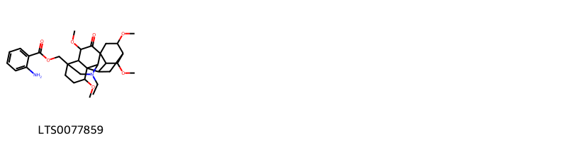{ width=100% }
    <figcaption>Hình ảnh cấu trúc hóa học của 1 hoạt chất thuộc nhóm Benzene and substituted derivatives gồm ['{3-ethyl-8,12,14,17-tetramethoxy-16-oxo-3-azahexacyclo[7.6.3.1¹⁰,¹³.0¹,¹¹.0²,⁹.0⁵,¹⁸]nonadecan-5-yl}methyl 2-aminobenzoate (LTS0077859)'].</figcaption>
</figure>
#### Nhóm Prenol lipids
<figure markdown="span">
    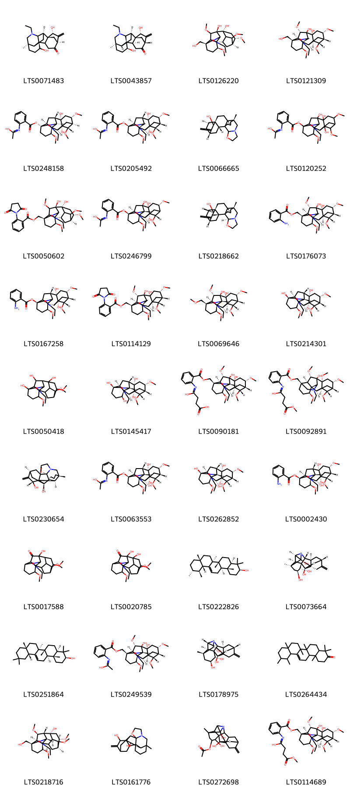{ width=100% }
    <figcaption>Hình ảnh cấu trúc hóa học của 36 hoạt chất thuộc nhóm Prenol lipids gồm ['(1r,5s,7r,8r,9r,13r)-11-ethyl-7,16-dihydroxy-13-methyl-6-methylidene-11-azahexacyclo[7.7.2.1⁵,⁸.0¹,¹⁰.0²,⁸.0¹³,¹⁷]nonadecan-4-one (LTS0071483)', '(1r,2r,5r,7r,8r,9r,13r,16s,17r)-11-ethyl-7,16-dihydroxy-13-methyl-6-methylidene-11-azahexacyclo[7.7.2.1⁵,⁸.0¹,¹⁰.0²,⁸.0¹³,¹⁷]nonadecan-4-one (LTS0043857)', '(1s,5r,6s,8r,9s,13s,16s)-11-ethyl-13-(hydroxymethyl)-4,6,16,18-tetramethoxy-11-azahexacyclo[7.7.2.1²,⁵.0¹,¹⁰.0³,⁸.0¹³,¹⁷]nonadecane-8,9-diol (LTS0126220)', 'lycoctonine (LTS0121309)', 'n-[2-({[(1s,2s,3s,4s,5s,6s,8s,9s,10s,13r,16s,17s)-11-ethyl-3,8-dihydroxy-4,6,16-trimethoxy-11-azahexacyclo[7.7.2.1²,⁵.0¹,¹⁰.0³,⁸.0¹³,¹⁷]nonadecan-13-yl]oxy}carbonyl)phenyl]ethanimidic acid (LTS0248158)', 'n-[2-({[(1s,2s,3s,4s,5r,6s,8s,9s,13s,16s,17s)-11-ethyl-3,8-dihydroxy-4,6,16-trimethoxy-11-azahexacyclo[7.7.2.1²,⁵.0¹,¹⁰.0³,⁸.0¹³,¹⁷]nonadecan-13-yl]oxy}carbonyl)phenyl]ethanimidic acid (LTS0205492)', 'atisine (LTS0066665)', 'n-{2-[({11-ethyl-3,8,9-trihydroxy-4,6,16-trimethoxy-11-azahexacyclo[7.7.2.1²,⁵.0¹,¹⁰.0³,⁸.0¹³,¹⁷]nonadecan-13-yl}oxy)carbonyl]phenyl}ethanimidic acid (LTS0120252)', '[(1s,5r,6s,8r,9s,13s,16s)-11-ethyl-8,9-dihydroxy-4,6,16,18-tetramethoxy-11-azahexacyclo[7.7.2.1²,⁵.0¹,¹⁰.0³,⁸.0¹³,¹⁷]nonadecan-13-yl]methyl 2-(2,5-dioxopyrrolidin-1-yl)benzoate (LTS0050602)', 'n-[2-({[(1s,2s,3s,4s,6s,8s,9r,10s,13s,16s,17s)-11-ethyl-3,8,9-trihydroxy-4,6,16-trimethoxy-11-azahexacyclo[7.7.2.1²,⁵.0¹,¹⁰.0³,⁸.0¹³,¹⁷]nonadecan-13-yl]oxy}carbonyl)phenyl]ethanimidic acid (LTS0246799)', '(1s,2r,4s,6s,7s,10r,11r,17s)-11-methyl-5-methylidene-16-oxa-13-azahexacyclo[9.6.3.2⁴,⁷.0¹,¹⁰.0²,⁷.0¹³,¹⁷]docosan-6-ol (LTS0218662)', 'anthranoyllycoctonine (LTS0176073)', '(1s,3s,4s,5r,6s,8s,9s,13s,16s)-11-ethyl-3,8-dihydroxy-4,6,16-trimethoxy-11-azahexacyclo[7.7.2.1²,⁵.0¹,¹⁰.0³,⁸.0¹³,¹⁷]nonadecan-13-yl 2-aminobenzoate (LTS0167258)', 'lycaconitine (LTS0114129)', '(1s,2r,3r,4s,5r,6s,8r,9s,10s,13s,16s,17r,18s)-11-ethyl-4,6,16,18-tetramethoxy-13-(methoxymethyl)-11-azahexacyclo[7.7.2.1²,⁵.0¹,¹⁰.0³,⁸.0¹³,¹⁷]nonadecane-8,9-diol (LTS0069646)', '(1r,2s,3s,4s,5r,6s,8s,9s,10r,13s,16s,17s)-11-ethyl-4,6,16-trimethoxy-11-azahexacyclo[7.7.2.1²,⁵.0¹,¹⁰.0³,⁸.0¹³,¹⁷]nonadecane-3,8,13-triol (LTS0214301)', '11-ethyl-4,6,16-trimethoxy-11-azahexacyclo[7.7.2.1²,⁵.0¹,¹⁰.0³,⁸.0¹³,¹⁷]nonadecane-8,13,18-triol (LTS0050418)', '(1r,2s,3s,4s,5r,6s,8s,9s,10r,13s,16s,17s)-11-ethyl-4,6-dimethoxy-11-azahexacyclo[7.7.2.1²,⁵.0¹,¹⁰.0³,⁸.0¹³,¹⁷]nonadecane-3,8,13,16-tetrol (LTS0145417)', '3-{[2-({[(1s,2r,3r,4s,5r,6s,8r,9s,10s,13s,16s,17r,18s)-11-ethyl-8,9-dihydroxy-4,6,16,18-tetramethoxy-11-azahexacyclo[7.7.2.1²,⁵.0¹,¹⁰.0³,⁸.0¹³,¹⁷]nonadecan-13-yl]methoxy}carbonyl)phenyl]-c-hydroxycarbonimidoyl}propanoic acid (LTS0090181)', 'n-[2-({[(1s,2r,3r,4s,5r,6s,8r,9s,13s,16s,17r,18s)-11-ethyl-9-hydroxy-4,6,8,16,18-pentamethoxy-11-azahexacyclo[7.7.2.1²,⁵.0¹,¹⁰.0³,⁸.0¹³,¹⁷]nonadecan-13-yl]methoxy}carbonyl)phenyl]-4-methoxy-4-oxobutanimidic acid (LTS0092891)', '(1s,5s,11s,12s,14r,16r,18s,20r,21r)-5-methyl-15-methylidene-10-oxa-7-azaheptacyclo[12.6.2.0¹,¹¹.0⁵,²⁰.0⁷,¹¹.0¹²,¹⁷.0¹⁷,²¹]docosane-16,18-diol (LTS0230654)', 'n-[2-({[(1r,2r,3s,4s,5r,6s,8s,9s,10r,13s,16s,17s)-11-ethyl-2,3,8-trihydroxy-4,6,16-trimethoxy-11-azahexacyclo[7.7.2.1²,⁵.0¹,¹⁰.0³,⁸.0¹³,¹⁷]nonadecan-13-yl]oxy}carbonyl)phenyl]ethanimidic acid (LTS0063553)', '(1r,2r,3s,4s,5r,6s,8s,9s,10r,13s,16s,17s)-11-ethyl-4,6,16-trimethoxy-11-azahexacyclo[7.7.2.1²,⁵.0¹,¹⁰.0³,⁸.0¹³,¹⁷]nonadecane-2,3,8,13-tetrol (LTS0262852)', '(1r,2r,3s,4s,5r,6s,8s,9s,10r,13s,16s,17s)-11-ethyl-2,3,8-trihydroxy-4,6,16-trimethoxy-11-azahexacyclo[7.7.2.1²,⁵.0¹,¹⁰.0³,⁸.0¹³,¹⁷]nonadecan-13-yl 2-aminobenzoate (LTS0002430)', '11-ethyl-9-hydroxy-4,6,16-trimethoxy-11-azahexacyclo[7.7.2.1²,⁵.0¹,¹⁰.0³,⁸.0¹³,¹⁷]nonadecan-18-one (LTS0017588)', '11-ethyl-8,9-dihydroxy-4,6,16-trimethoxy-11-azahexacyclo[7.7.2.1²,⁵.0¹,¹⁰.0³,⁸.0¹³,¹⁷]nonadecan-18-one (LTS0020785)', 'amyrin (LTS0222826)', '(1r,2s,3s,5s,6r,8r,9s,11s,14s,16s,17s,18s)-5-methyl-12-methylidene-7-azaheptacyclo[9.6.2.0¹,⁸.0⁵,¹⁷.0⁷,¹⁶.0⁹,¹⁴.0¹⁴,¹⁸]nonadecane-2,3,6,18-tetrol (LTS0073664)', 'β-amyrin (LTS0251864)', 'n-[2-({[(1s,2r,3r,4s,5r,6s,8r,9s,10s,13s,16s,17r,18s)-11-ethyl-8,9-dihydroxy-4,6,16,18-tetramethoxy-11-azahexacyclo[7.7.2.1²,⁵.0¹,¹⁰.0³,⁸.0¹³,¹⁷]nonadecan-13-yl]methoxy}carbonyl)phenyl]ethanimidic acid (LTS0249539)', '(2s,3s,5r,6r,9s,11s,16r,17s,18s)-5-methyl-12-methylidene-7-azaheptacyclo[9.6.2.0¹,⁸.0⁵,¹⁷.0⁷,¹⁶.0⁹,¹⁴.0¹⁴,¹⁸]nonadecane-2,3,6,18-tetrol (LTS0178975)', '4,4,6a,6b,8a,11,12,14b-octamethyl-1,2,4a,5,6,7,8,9,10,11,12,12a,14,14a-tetradecahydropicen-3-one (LTS0264434)', '(1s,2r,3r,4s,5r,6s,8r,9r,10r,13s,16s,17r,18r)-11-ethyl-13-(hydroxymethyl)-4,6,16,18-tetramethoxy-11-azahexacyclo[7.7.2.1²,⁵.0¹,¹⁰.0³,⁸.0¹³,¹⁷]nonadecan-8-ol (LTS0218716)', '5-methyl-15-methylidene-10-oxa-7-azaheptacyclo[12.6.2.0¹,¹¹.0⁵,²⁰.0⁷,¹¹.0¹²,¹⁷.0¹⁷,²¹]docosane-16,18-diol (LTS0161776)', '2,6,18-trihydroxy-5-methyl-12-methylidene-7-azaheptacyclo[9.6.2.0¹,⁸.0⁵,¹⁷.0⁷,¹⁶.0⁹,¹⁴.0¹⁴,¹⁸]nonadecan-3-yl acetate (LTS0272698)', 'n-[2-({[(1s,2r,3r,4s,5r,6s,8r,9s,10s,13s,16s,17r,18s)-11-ethyl-8,9-dihydroxy-4,6,16,18-tetramethoxy-11-azahexacyclo[7.7.2.1²,⁵.0¹,¹⁰.0³,⁸.0¹³,¹⁷]nonadecan-13-yl]methoxy}carbonyl)phenyl]-4-methoxy-4-oxobutanimidic acid (LTS0114689)'].</figcaption>
</figure>
#### Nhóm Steroids and steroid derivatives
<figure markdown="span">
    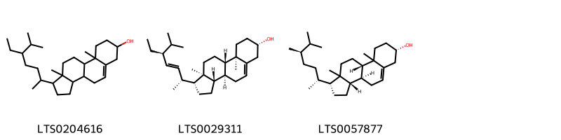{ width=100% }
    <figcaption>Hình ảnh cấu trúc hóa học của 3 hoạt chất thuộc nhóm Steroids and steroid derivatives gồm ['stigmast-5-en-3-ol, (3β)- (LTS0204616)', 'phytosterol (LTS0029311)', '(1r,3as,3bs,7s,9bs)-1-[(2r,5r)-5,6-dimethylheptan-2-yl]-9a,11a-dimethyl-1h,2h,3h,3ah,3bh,4h,6h,7h,8h,9h,9bh,10h,11h-cyclopenta[a]phenanthren-7-ol (LTS0057877)'].</figcaption>
</figure>

---

### Dược dân tộc học

Danh sách các quốc gia có sử dụng *Aconitum septentrionale* trong điều trị các bệnh. 

| Country   | Disease     | Bệnh                                                                                                                                                                                                |
|:----------|:------------|:----------------------------------------------------------------------------------------------------------------------------------------------------------------------------------------------------|
| China     | Insecticide | MYMEMORY WARNING: YOU USED ALL AVAILABLE FREE TRANSLATIONS FOR TODAY. NEXT AVAILABLE IN  08 HOURS 58 MINUTES 12 SECONDS VISIT HTTPS://MYMEMORY.TRANSLATED.NET/DOC/USAGELIMITS.PHP TO TRANSLATE MORE |

---

---
## Aconitum transsectum
### Thông tin về thực vật

!!! info "Phân loại thực vật của *Aconitum transsectum* từ GIBF:"
    - **Kingdom:** Plantae
    - **Phylum:** Tracheophyta
    - **Order:** Ranunculales
    - **Family:** Ranunculaceae
    - **Genus:** Aconitum
    - **Species:** *Aconitum transsectum*

 

| Label (VI)   | Label (EN)   | Scientific Name      | Descriptions (VI)   | Descriptions (EN)   | Also Known As (VI)   | Also Known As (EN)   |
|:-------------|:-------------|:---------------------|:--------------------|:--------------------|:---------------------|:---------------------|
| N/A          | N/A          | Aconitum transsectum | loài thực vật       | species of plant    | ['']                 | ['']                 |

#### Phân bố trên thế giới

**Từ CSDL GIBF** nan, China

#### Phân bố tại Việt Nam

**Từ CSDL GIBF**: Không có ghi nhận ở Việt Nam

---
### Thành phần hóa học
        
- Theo cơ sở dữ liệu lotus: Từ loài *Aconitum transsectum* đã phân lập và xác định được 35 hoạt chất thuộc về các nhóm Prenol lipids, Azepines. 

|    | chemicalTaxonomyClassyfireClass   |   smiles_count |
|---:|:----------------------------------|---------------:|
|  0 | Azepines                          |              2 |
|  1 | Prenol lipids                     |             33 |

#### Nhóm Azepines
<figure markdown="span">
    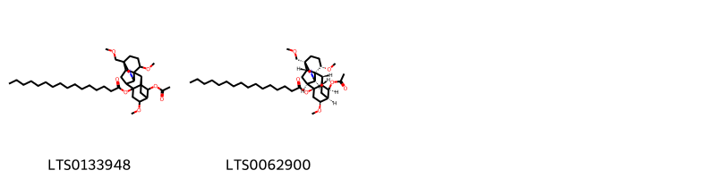{ width=100% }
    <figcaption>Hình ảnh cấu trúc hóa học của 2 hoạt chất thuộc nhóm Azepines gồm ['4-(acetyloxy)-6,16-dimethoxy-13-(methoxymethyl)-11-azahexacyclo[7.7.2.1²,⁵.0¹,¹⁰.0³,⁸.0¹³,¹⁷]nonadec-11-en-8-yl hexadecanoate (LTS0133948)', '(1s,2r,3r,4s,5r,6s,8s,9s,10r,13s,16s,17r)-4-(acetyloxy)-6,16-dimethoxy-13-(methoxymethyl)-11-azahexacyclo[7.7.2.1²,⁵.0¹,¹⁰.0³,⁸.0¹³,¹⁷]nonadec-11-en-8-yl hexadecanoate (LTS0062900)'].</figcaption>
</figure>
#### Nhóm Prenol lipids
<figure markdown="span">
    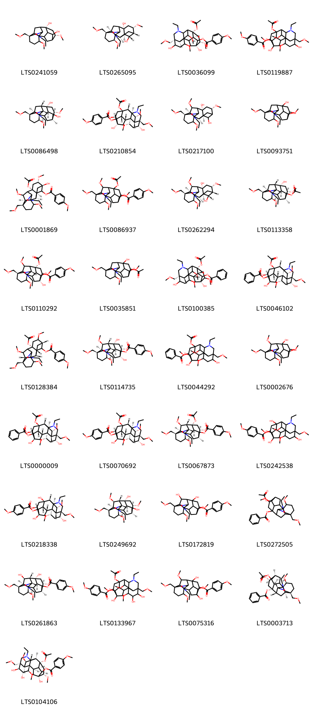{ width=100% }
    <figcaption>Hình ảnh cấu trúc hóa học của 33 hoạt chất thuộc nhóm Prenol lipids gồm ['(6s,8s,13s)-11-ethyl-6,16-dimethoxy-13-(methoxymethyl)-11-azahexacyclo[7.7.2.1²,⁵.0¹,¹⁰.0³,⁸.0¹³,¹⁷]nonadecane-4,8-diol (LTS0241059)', '(2r,3r,4s,5s,6s,8s,13s,16s,17r)-11-ethyl-6,16-dimethoxy-13-(methoxymethyl)-11-azahexacyclo[7.7.2.1²,⁵.0¹,¹⁰.0³,⁸.0¹³,¹⁷]nonadecane-4,8-diol (LTS0265095)', '(2r,3r,5s,6s,8r,13r,17s)-8-(acetyloxy)-11-ethyl-5,14-dihydroxy-6,16,18-trimethoxy-13-(methoxymethyl)-11-azahexacyclo[7.7.2.1²,⁵.0¹,¹⁰.0³,⁸.0¹³,¹⁷]nonadecan-4-yl 4-methoxybenzoate (LTS0036099)', '8-(acetyloxy)-11-ethyl-5,14-dihydroxy-6,16,18-trimethoxy-13-(methoxymethyl)-11-azahexacyclo[7.7.2.1²,⁵.0¹,¹⁰.0³,⁸.0¹³,¹⁷]nonadecan-4-yl 4-methoxybenzoate (LTS0119887)', '(1s,2r,3r,4s,5s,6s,8s,9s,10r,13s,16s,17r)-11-ethyl-6,16-dimethoxy-13-(methoxymethyl)-11-azahexacyclo[7.7.2.1²,⁵.0¹,¹⁰.0³,⁸.0¹³,¹⁷]nonadecane-4,8-diol (LTS0086498)', '(1s,2r,3r,4r,5r,6s,8r,9r,10r,13r,14r,16s,17s,18r)-8-(acetyloxy)-11-ethyl-5,14-dihydroxy-6,16,18-trimethoxy-13-(methoxymethyl)-11-azahexacyclo[7.7.2.1²,⁵.0¹,¹⁰.0³,⁸.0¹³,¹⁷]nonadecan-4-yl 4-methoxybenzoate (LTS0210854)', '(2r,3r,6s,8r,13s,17r)-11-ethyl-6,16,18-trimethoxy-13-(methoxymethyl)-11-azahexacyclo[7.7.2.1²,⁵.0¹,¹⁰.0³,⁸.0¹³,¹⁷]nonadecane-4,8-diol (LTS0217100)', '11-ethyl-6,16-dimethoxy-13-(methoxymethyl)-11-azahexacyclo[7.7.2.1²,⁵.0¹,¹⁰.0³,⁸.0¹³,¹⁷]nonadecane-4,8-diol (LTS0093751)', '(2r,3r,5s,6s,8r,13s,17r)-8-(acetyloxy)-11-ethyl-5-hydroxy-6,16,18-trimethoxy-13-(methoxymethyl)-11-azahexacyclo[7.7.2.1²,⁵.0¹,¹⁰.0³,⁸.0¹³,¹⁷]nonadecan-4-yl 4-methoxybenzoate (LTS0001869)', '8-(acetyloxy)-11-ethyl-6,16,18-trimethoxy-13-(methoxymethyl)-11-azahexacyclo[7.7.2.1²,⁵.0¹,¹⁰.0³,⁸.0¹³,¹⁷]nonadecan-4-yl 4-methoxybenzoate (LTS0086937)', '(2r,3r,4s,5s,6s,8r,13s,16s,17r,18r)-11-ethyl-6,16,18-trimethoxy-13-(methoxymethyl)-11-azahexacyclo[7.7.2.1²,⁵.0¹,¹⁰.0³,⁸.0¹³,¹⁷]nonadecane-4,8-diol (LTS0262294)', '(1s,2r,3r,4s,5r,6s,8s,9s,10r,13s,16s,17r)-11-ethyl-8-hydroxy-6,16-dimethoxy-13-(methoxymethyl)-11-azahexacyclo[7.7.2.1²,⁵.0¹,¹⁰.0³,⁸.0¹³,¹⁷]nonadecan-4-yl acetate (LTS0113358)', '(1s,5s,8r,10r,13s)-8-(acetyloxy)-11-ethyl-5-hydroxy-6,16,18-trimethoxy-13-(methoxymethyl)-11-azahexacyclo[7.7.2.1²,⁵.0¹,¹⁰.0³,⁸.0¹³,¹⁷]nonadecan-4-yl 4-methoxybenzoate (LTS0110292)', '11-ethyl-8-hydroxy-6,16-dimethoxy-13-(methoxymethyl)-11-azahexacyclo[7.7.2.1²,⁵.0¹,¹⁰.0³,⁸.0¹³,¹⁷]nonadecan-4-yl acetate (LTS0035851)', '(2s,3s,5s,8r,13r,17r)-8-(acetyloxy)-11-ethyl-5,14-dihydroxy-6,16,18-trimethoxy-13-(methoxymethyl)-11-azahexacyclo[7.7.2.1²,⁵.0¹,¹⁰.0³,⁸.0¹³,¹⁷]nonadecan-4-yl benzoate (LTS0100385)', 'indaconitine (LTS0046102)', '(2s,3s,5r,8r,13s,17s)-8-(acetyloxy)-11-ethyl-6,16,18-trimethoxy-13-(methoxymethyl)-11-azahexacyclo[7.7.2.1²,⁵.0¹,¹⁰.0³,⁸.0¹³,¹⁷]nonadecan-4-yl 4-methoxybenzoate (LTS0128384)', '(1s,2r,3r,4r,5s,6s,8r,9r,10r,13s,16s,17r,18r)-11-ethyl-5,8-dihydroxy-6,16,18-trimethoxy-13-(methoxymethyl)-11-azahexacyclo[7.7.2.1²,⁵.0¹,¹⁰.0³,⁸.0¹³,¹⁷]nonadecan-4-yl 4-methoxybenzoate (LTS0114735)', '8-(acetyloxy)-11-ethyl-5,14-dihydroxy-6,16,18-trimethoxy-13-(methoxymethyl)-11-azahexacyclo[7.7.2.1²,⁵.0¹,¹⁰.0³,⁸.0¹³,¹⁷]nonadecan-4-yl benzoate (LTS0044292)', '11-ethyl-6,16,18-trimethoxy-13-(methoxymethyl)-11-azahexacyclo[7.7.2.1²,⁵.0¹,¹⁰.0³,⁸.0¹³,¹⁷]nonadecane-4,8-diol (LTS0002676)', '(1s,2r,3r,4r,5s,6s,8r,9r,10r,13r,14r,16s,17s,18r)-8-(acetyloxy)-11-ethyl-5,14-dihydroxy-6,16,18-trimethoxy-13-(methoxymethyl)-11-azahexacyclo[7.7.2.1²,⁵.0¹,¹⁰.0³,⁸.0¹³,¹⁷]nonadecan-4-yl benzoate (LTS0000009)', '(1s,2r,3r,4r,5s,6s,8r,9r,10r,13r,14r,16s,17s,18r)-8-(acetyloxy)-11-ethyl-5,14-dihydroxy-6,16,18-trimethoxy-13-(methoxymethyl)-11-azahexacyclo[7.7.2.1²,⁵.0¹,¹⁰.0³,⁸.0¹³,¹⁷]nonadecan-4-yl 4-methoxybenzoate (LTS0070692)', '(1s,2r,3r,4s,5r,6s,8r,9r,10r,13s,16s,17r,18r)-8-(acetyloxy)-11-ethyl-6,16,18-trimethoxy-13-(methoxymethyl)-11-azahexacyclo[7.7.2.1²,⁵.0¹,¹⁰.0³,⁸.0¹³,¹⁷]nonadecan-4-yl 4-methoxybenzoate (LTS0067873)', '11-ethyl-5,8,14-trihydroxy-6,16,18-trimethoxy-13-(methoxymethyl)-11-azahexacyclo[7.7.2.1²,⁵.0¹,¹⁰.0³,⁸.0¹³,¹⁷]nonadecan-4-yl 4-methoxybenzoate (LTS0242538)', '(1s,2r,3r,4r,5s,6s,8r,9r,10r,13r,14r,16s,17s,18r)-11-ethyl-5,8,14-trihydroxy-6,16,18-trimethoxy-13-(methoxymethyl)-11-azahexacyclo[7.7.2.1²,⁵.0¹,¹⁰.0³,⁸.0¹³,¹⁷]nonadecan-4-yl 4-methoxybenzoate (LTS0218338)', '(1s,2r,3r,4s,5s,6s,8r,9r,10r,13s,16s,17r,18r)-11-ethyl-6,16,18-trimethoxy-13-(methoxymethyl)-11-azahexacyclo[7.7.2.1²,⁵.0¹,¹⁰.0³,⁸.0¹³,¹⁷]nonadecane-4,8-diol (LTS0249692)', '11-ethyl-8,18-dihydroxy-6,16-dimethoxy-13-(methoxymethyl)-11-azahexacyclo[7.7.2.1²,⁵.0¹,¹⁰.0³,⁸.0¹³,¹⁷]nonadecan-4-yl 4-methoxybenzoate (LTS0172819)', '4-(acetyloxy)-11-ethyl-6,16-dimethoxy-13-(methoxymethyl)-11-azahexacyclo[7.7.2.1²,⁵.0¹,¹⁰.0³,⁸.0¹³,¹⁷]nonadecan-8-yl benzoate (LTS0272505)', '(1s,2r,3r,4s,5r,6s,8r,9r,10r,13s,16s,17r,18r)-11-ethyl-8,18-dihydroxy-6,16-dimethoxy-13-(methoxymethyl)-11-azahexacyclo[7.7.2.1²,⁵.0¹,¹⁰.0³,⁸.0¹³,¹⁷]nonadecan-4-yl 4-methoxybenzoate (LTS0261863)', '8-(acetyloxy)-11-ethyl-5,14,15-trihydroxy-6,16,18-trimethoxy-13-(methoxymethyl)-11-azahexacyclo[7.7.2.1²,⁵.0¹,¹⁰.0³,⁸.0¹³,¹⁷]nonadecan-4-yl 4-methoxybenzoate (LTS0133967)', '11-ethyl-5,8-dihydroxy-6,16,18-trimethoxy-13-(methoxymethyl)-11-azahexacyclo[7.7.2.1²,⁵.0¹,¹⁰.0³,⁸.0¹³,¹⁷]nonadecan-4-yl 4-methoxybenzoate (LTS0075316)', '(1s,2r,3r,4s,5r,6s,8s,9s,10r,13s,16s,17r)-4-(acetyloxy)-11-ethyl-6,16-dimethoxy-13-(methoxymethyl)-11-azahexacyclo[7.7.2.1²,⁵.0¹,¹⁰.0³,⁸.0¹³,¹⁷]nonadecan-8-yl benzoate (LTS0003713)', '(1s,2r,3r,4r,5s,6s,8r,9r,10r,13r,14s,15r,16r,17s,18r)-8-(acetyloxy)-11-ethyl-5,14,15-trihydroxy-6,16,18-trimethoxy-13-(methoxymethyl)-11-azahexacyclo[7.7.2.1²,⁵.0¹,¹⁰.0³,⁸.0¹³,¹⁷]nonadecan-4-yl 4-methoxybenzoate (LTS0104106)'].</figcaption>
</figure>

---

### Dược dân tộc học

Danh sách các quốc gia có sử dụng *Aconitum transsectum* trong điều trị các bệnh. 

| Country   | Disease   | Bệnh                                                                                                                                                                                                |
|:----------|:----------|:----------------------------------------------------------------------------------------------------------------------------------------------------------------------------------------------------|
| China     | Poison    | MYMEMORY WARNING: YOU USED ALL AVAILABLE FREE TRANSLATIONS FOR TODAY. NEXT AVAILABLE IN  08 HOURS 57 MINUTES 29 SECONDS VISIT HTTPS://MYMEMORY.TRANSLATED.NET/DOC/USAGELIMITS.PHP TO TRANSLATE MORE |

---

---
## Aconitum uncinatum
### Thông tin về thực vật

!!! info "Phân loại thực vật của *Aconitum uncinatum* từ GIBF:"
    - **Kingdom:** Plantae
    - **Phylum:** Tracheophyta
    - **Order:** Ranunculales
    - **Family:** Ranunculaceae
    - **Genus:** Aconitum
    - **Species:** *Aconitum uncinatum*

 

| Label (VI)   | Label (EN)   | Scientific Name    | Descriptions (VI)   | Descriptions (EN)   | Also Known As (VI)   | Also Known As (EN)          |
|:-------------|:-------------|:-------------------|:--------------------|:--------------------|:---------------------|:----------------------------|
| N/A          | N/A          | Aconitum uncinatum | loài thực vật       | species of plant    | ['']                 | ['southern blue monkshood'] |

#### Phân bố trên thế giới

**Từ CSDL GIBF** nan, United States of America

#### Phân bố tại Việt Nam

**Từ CSDL GIBF**: Không có ghi nhận ở Việt Nam

---
### Thành phần hóa học
        
- Theo cơ sở dữ liệu lotus: Từ loài *Aconitum uncinatum* đã phân lập và xác định được Chưa có hoạt chất nào được phân lập. hoạt chất thuộc về các nhóm Không có hoạt chất nào được phân lập. 

Không có hình ảnh nào được tạo ra

---

### Dược dân tộc học

Danh sách các quốc gia có sử dụng *Aconitum uncinatum* trong điều trị các bệnh. 

| Country   | Disease   | Bệnh                                                                                                                                                                                                |
|:----------|:----------|:----------------------------------------------------------------------------------------------------------------------------------------------------------------------------------------------------|
| Japan     | Poison    | MYMEMORY WARNING: YOU USED ALL AVAILABLE FREE TRANSLATIONS FOR TODAY. NEXT AVAILABLE IN  08 HOURS 57 MINUTES 07 SECONDS VISIT HTTPS://MYMEMORY.TRANSLATED.NET/DOC/USAGELIMITS.PHP TO TRANSLATE MORE |
| US        | Poison    | MYMEMORY WARNING: YOU USED ALL AVAILABLE FREE TRANSLATIONS FOR TODAY. NEXT AVAILABLE IN  08 HOURS 57 MINUTES 05 SECONDS VISIT HTTPS://MYMEMORY.TRANSLATED.NET/DOC/USAGELIMITS.PHP TO TRANSLATE MORE |

---

---
## Aconitum violaceum
### Thông tin về thực vật

!!! info "Phân loại thực vật của *Aconitum violaceum* từ GIBF:"
    - **Kingdom:** Plantae
    - **Phylum:** Tracheophyta
    - **Order:** Ranunculales
    - **Family:** Ranunculaceae
    - **Genus:** Aconitum
    - **Species:** *Aconitum violaceum*

 

| Label (VI)   | Label (EN)   | Scientific Name    | Descriptions (VI)   | Descriptions (EN)   | Also Known As (VI)   | Also Known As (EN)   |
|:-------------|:-------------|:-------------------|:--------------------|:--------------------|:---------------------|:---------------------|
| N/A          | N/A          | Aconitum violaceum |                     | species of plant    | ['']                 | ['']                 |

#### Phân bố trên thế giới

**Từ CSDL GIBF** nan, Switzerland, unknown or invalid, Pakistan, France, India, Russian Federation, Italy, China, Austria, Nepal

#### Phân bố tại Việt Nam

**Từ CSDL GIBF**: Không có ghi nhận ở Việt Nam

---
### Thành phần hóa học
        
- Theo cơ sở dữ liệu lotus: Từ loài *Aconitum violaceum* đã phân lập và xác định được 2 hoạt chất thuộc về các nhóm Prenol lipids. 

|    | chemicalTaxonomyClassyfireClass   |   smiles_count |
|---:|:----------------------------------|---------------:|
|  0 | Prenol lipids                     |              2 |

#### Nhóm Prenol lipids
<figure markdown="span">
    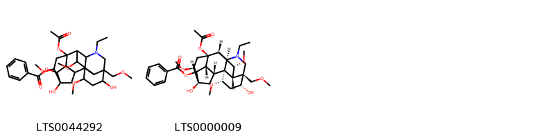{ width=100% }
    <figcaption>Hình ảnh cấu trúc hóa học của 2 hoạt chất thuộc nhóm Prenol lipids gồm ['8-(acetyloxy)-11-ethyl-5,14-dihydroxy-6,16,18-trimethoxy-13-(methoxymethyl)-11-azahexacyclo[7.7.2.1²,⁵.0¹,¹⁰.0³,⁸.0¹³,¹⁷]nonadecan-4-yl benzoate (LTS0044292)', '(1s,2r,3r,4r,5s,6s,8r,9r,10r,13r,14r,16s,17s,18r)-8-(acetyloxy)-11-ethyl-5,14-dihydroxy-6,16,18-trimethoxy-13-(methoxymethyl)-11-azahexacyclo[7.7.2.1²,⁵.0¹,¹⁰.0³,⁸.0¹³,¹⁷]nonadecan-4-yl benzoate (LTS0000009)'].</figcaption>
</figure>

---

### Dược dân tộc học

Danh sách các quốc gia có sử dụng *Aconitum violaceum* trong điều trị các bệnh. 

| Country   | Disease   | Bệnh                                                                                                                                                                                                |
|:----------|:----------|:----------------------------------------------------------------------------------------------------------------------------------------------------------------------------------------------------|
| India     | Tonic     | MYMEMORY WARNING: YOU USED ALL AVAILABLE FREE TRANSLATIONS FOR TODAY. NEXT AVAILABLE IN  08 HOURS 56 MINUTES 43 SECONDS VISIT HTTPS://MYMEMORY.TRANSLATED.NET/DOC/USAGELIMITS.PHP TO TRANSLATE MORE |

---

---
## Aconitum volubile
### Thông tin về thực vật

!!! info "Phân loại thực vật của *Aconitum volubile* từ GIBF:"
    - **Kingdom:** Plantae
    - **Phylum:** Tracheophyta
    - **Order:** Ranunculales
    - **Family:** Ranunculaceae
    - **Genus:** Aconitum
    - **Species:** *Aconitum volubile*

 

| Label (VI)   | Label (EN)   | Scientific Name   | Descriptions (VI)   | Descriptions (EN)   | Also Known As (VI)   | Also Known As (EN)    |
|:-------------|:-------------|:------------------|:--------------------|:--------------------|:---------------------|:----------------------|
| N/A          | N/A          | Aconitum volubile | loài thực vật       | species of plant    | ['']                 | ['twining monkshood'] |

#### Phân bố trên thế giới

**Từ CSDL GIBF** Russian Federation, Mongolia, Kazakhstan

#### Phân bố tại Việt Nam

**Từ CSDL GIBF**: Không có ghi nhận ở Việt Nam

---
### Thành phần hóa học
        
- Theo cơ sở dữ liệu lotus: Từ loài *Aconitum volubile* đã phân lập và xác định được 9 hoạt chất thuộc về các nhóm Prenol lipids. 

|    | chemicalTaxonomyClassyfireClass   |   smiles_count |
|---:|:----------------------------------|---------------:|
|  0 | Prenol lipids                     |              9 |

#### Nhóm Prenol lipids
<figure markdown="span">
    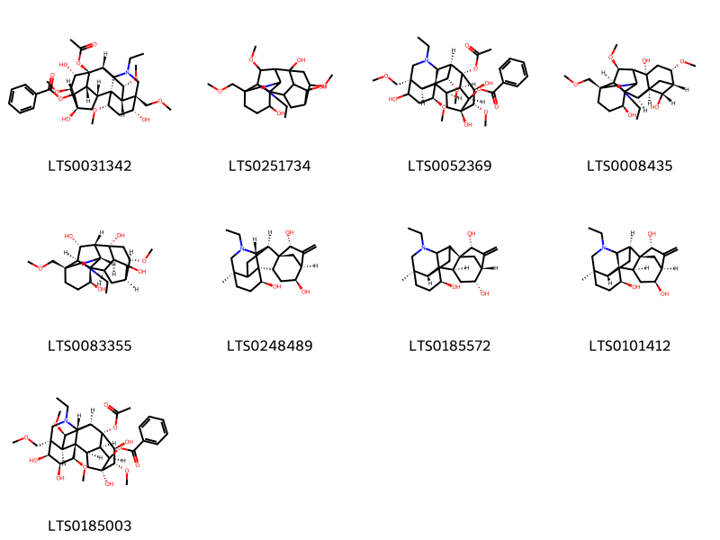{ width=100% }
    <figcaption>Hình ảnh cấu trúc hóa học của 9 hoạt chất thuộc nhóm Prenol lipids gồm ['aconitine (LTS0031342)', '11-ethyl-6,18-dimethoxy-13-(methoxymethyl)-11-azahexacyclo[7.7.2.1²,⁵.0¹,¹⁰.0³,⁸.0¹³,¹⁷]nonadecane-4,8,16-triol (LTS0251734)', '(1s,2r,3r,4r,5s,6s,7s,8r,9r,13r,16s,17s,18r)-8-(acetyloxy)-11-ethyl-5,7,14-trihydroxy-6,16,18-trimethoxy-13-(methoxymethyl)-11-azahexacyclo[7.7.2.1²,⁵.0¹,¹⁰.0³,⁸.0¹³,¹⁷]nonadecan-4-yl benzoate (LTS0052369)', '(2r,3r,4s,5s,6s,8r,13s,16s,17r,18r)-11-ethyl-6,18-dimethoxy-13-(methoxymethyl)-11-azahexacyclo[7.7.2.1²,⁵.0¹,¹⁰.0³,⁸.0¹³,¹⁷]nonadecane-4,8,16-triol (LTS0008435)', '(1s,2r,3r,4s,5s,6s,8r,9r,10r,13s,16s,17r,18s)-11-ethyl-6-methoxy-13-(methoxymethyl)-11-azahexacyclo[7.7.2.1²,⁵.0¹,¹⁰.0³,⁸.0¹³,¹⁷]nonadecane-4,8,16,18-tetrol (LTS0083355)', '(1r,4s,5s,7r,8r,9r,10r,13r,16s)-11-ethyl-13-methyl-6-methylidene-11-azahexacyclo[7.7.2.1⁵,⁸.0¹,¹⁰.0²,⁸.0¹³,¹⁷]nonadecane-4,7,16-triol (LTS0248489)', '(2r,4r,5r,7r,8r,13r,16s,17r)-11-ethyl-13-methyl-6-methylidene-11-azahexacyclo[7.7.2.1⁵,⁸.0¹,¹⁰.0²,⁸.0¹³,¹⁷]nonadecane-4,7,16-triol (LTS0185572)', '(1r,2r,4s,5s,7r,8r,9r,13r,16s,17r)-11-ethyl-13-methyl-6-methylidene-11-azahexacyclo[7.7.2.1⁵,⁸.0¹,¹⁰.0²,⁸.0¹³,¹⁷]nonadecane-4,7,16-triol (LTS0101412)', '(1s,2r,3r,4r,5r,6s,7s,8r,9r,10r,13r,14s,15s,16r,17s,18r)-8-(acetyloxy)-11-ethyl-5,7,14,15-tetrahydroxy-6,16,18-trimethoxy-13-(methoxymethyl)-11-azahexacyclo[7.7.2.1²,⁵.0¹,¹⁰.0³,⁸.0¹³,¹⁷]nonadecan-4-yl benzoate (LTS0185003)'].</figcaption>
</figure>

---

### Dược dân tộc học

Danh sách các quốc gia có sử dụng *Aconitum volubile* trong điều trị các bệnh. 

| Country   | Disease   | Bệnh                                                                                                                                                                                                |
|:----------|:----------|:----------------------------------------------------------------------------------------------------------------------------------------------------------------------------------------------------|
| China     | Poison    | MYMEMORY WARNING: YOU USED ALL AVAILABLE FREE TRANSLATIONS FOR TODAY. NEXT AVAILABLE IN  08 HOURS 56 MINUTES 20 SECONDS VISIT HTTPS://MYMEMORY.TRANSLATED.NET/DOC/USAGELIMITS.PHP TO TRANSLATE MORE |

---

---
## Aconitum vulparia
### Thông tin về thực vật

!!! info "Phân loại thực vật của *Aconitum lycoctonum* từ GIBF:"
    - **Kingdom:** Plantae
    - **Phylum:** Tracheophyta
    - **Order:** Ranunculales
    - **Family:** Ranunculaceae
    - **Genus:** Aconitum
    - **Species:** *Aconitum lycoctonum*

 

| Label (VI)   | Label (EN)   | Scientific Name   | Descriptions (VI)   | Descriptions (EN)   | Also Known As (VI)   | Also Known As (EN)   |
|:-------------|:-------------|:------------------|:--------------------|:--------------------|:---------------------|:---------------------|
| N/A          | N/A          | Aconitum vulparia | loài thực vật       | species of plant    | ['']                 | ['']                 |

#### Phân bố trên thế giới

**Từ CSDL GIBF** Switzerland, Slovenia, nan, United Kingdom of Great Britain and Northern Ireland, Luxembourg, France, Spain, Armenia, Hungary, Germany, Andorra, Montenegro, Italy, Austria, Croatia, Slovakia

#### Phân bố tại Việt Nam

**Từ CSDL GIBF**: Không có ghi nhận ở Việt Nam

---
### Thành phần hóa học
        
- Theo cơ sở dữ liệu lotus: Từ loài *Aconitum lycoctonum* đã phân lập và xác định được Chưa có hoạt chất nào được phân lập. hoạt chất thuộc về các nhóm Không có hoạt chất nào được phân lập. 

Không có hình ảnh nào được tạo ra

---

### Dược dân tộc học

Danh sách các quốc gia có sử dụng *Aconitum lycoctonum* trong điều trị các bệnh. 

| Country   | Disease   | Bệnh                                                                                                                                                                                                |
|:----------|:----------|:----------------------------------------------------------------------------------------------------------------------------------------------------------------------------------------------------|
| China     | Poison    | MYMEMORY WARNING: YOU USED ALL AVAILABLE FREE TRANSLATIONS FOR TODAY. NEXT AVAILABLE IN  08 HOURS 55 MINUTES 55 SECONDS VISIT HTTPS://MYMEMORY.TRANSLATED.NET/DOC/USAGELIMITS.PHP TO TRANSLATE MORE |

---

# Chi Actaea

??? note "Danh sách các dược liệu thuộc chi"
    
	 - *Actaea arguta*
	 - *Actaea icata*
	 - *Actaea pachypoda*
	 - *Actaea racemosa*
	 - *Actaea rubra*

---
## Actaea arguta
### Thông tin về thực vật

!!! info "Phân loại thực vật của *Actaea arguta* từ GIBF:"
    - **Kingdom:** Plantae
    - **Phylum:** Tracheophyta
    - **Order:** Ranunculales
    - **Family:** Ranunculaceae
    - **Genus:** Actaea
    - **Species:** *Actaea arguta*

 

| Label (VI)   | Label (EN)   | Scientific Name   | Descriptions (VI)   | Descriptions (EN)   | Also Known As (VI)   | Also Known As (EN)   |
|:-------------|:-------------|:------------------|:--------------------|:--------------------|:---------------------|:---------------------|
| N/A          | N/A          | Aconitum vulparia | loài thực vật       | species of plant    | ['']                 | ['']                 |

#### Phân bố trên thế giới

**Từ CSDL GIBF** nan, Canada, United States of America

#### Phân bố tại Việt Nam

**Từ CSDL GIBF**: Không có ghi nhận ở Việt Nam

---
### Thành phần hóa học
        
- Theo cơ sở dữ liệu lotus: Từ loài *Actaea arguta* đã phân lập và xác định được Chưa có hoạt chất nào được phân lập. hoạt chất thuộc về các nhóm Không có hoạt chất nào được phân lập. 

Không có hình ảnh nào được tạo ra

---

### Dược dân tộc học

Danh sách các quốc gia có sử dụng *Actaea arguta* trong điều trị các bệnh. 

| Country   | Disease          | Bệnh                                                                                                                                                                                                |
|:----------|:-----------------|:----------------------------------------------------------------------------------------------------------------------------------------------------------------------------------------------------|
| US        | Poison, Laxative | MYMEMORY WARNING: YOU USED ALL AVAILABLE FREE TRANSLATIONS FOR TODAY. NEXT AVAILABLE IN  08 HOURS 55 MINUTES 34 SECONDS VISIT HTTPS://MYMEMORY.TRANSLATED.NET/DOC/USAGELIMITS.PHP TO TRANSLATE MORE |

---

---
## Actaea icata
### Thông tin về thực vật

!!! info "Phân loại thực vật của *N/A* từ GIBF:"
    - **Kingdom:** N/A
    - **Phylum:** N/A
    - **Order:** N/A
    - **Family:** N/A
    - **Genus:** N/A
    - **Species:** *N/A*

 

| Label (VI)   | Label (EN)   | Scientific Name   | Descriptions (VI)   | Descriptions (EN)   | Also Known As (VI)   | Also Known As (EN)   |
|:-------------|:-------------|:------------------|:--------------------|:--------------------|:---------------------|:---------------------|
| N/A          | N/A          | Aconitum vulparia | loài thực vật       | species of plant    | ['']                 | ['']                 |

#### Phân bố trên thế giới

**Từ CSDL GIBF** Không có kết quả phù hợp

#### Phân bố tại Việt Nam

**Từ CSDL GIBF**: Không có ghi nhận ở Việt Nam

---
### Thành phần hóa học
        
- Theo cơ sở dữ liệu lotus: Từ loài *N/A* đã phân lập và xác định được Chưa có hoạt chất nào được phân lập. hoạt chất thuộc về các nhóm Không có hoạt chất nào được phân lập. 

Không có hình ảnh nào được tạo ra

---

### Dược dân tộc học

Danh sách các quốc gia có sử dụng *N/A* trong điều trị các bệnh. 

| Country   | Disease     | Bệnh                                                                                                                                                                                                |
|:----------|:------------|:----------------------------------------------------------------------------------------------------------------------------------------------------------------------------------------------------|
| China     | Antidote    | MYMEMORY WARNING: YOU USED ALL AVAILABLE FREE TRANSLATIONS FOR TODAY. NEXT AVAILABLE IN  08 HOURS 55 MINUTES 17 SECONDS VISIT HTTPS://MYMEMORY.TRANSLATED.NET/DOC/USAGELIMITS.PHP TO TRANSLATE MORE |
| Europe    | Poison      | MYMEMORY WARNING: YOU USED ALL AVAILABLE FREE TRANSLATIONS FOR TODAY. NEXT AVAILABLE IN  08 HOURS 55 MINUTES 15 SECONDS VISIT HTTPS://MYMEMORY.TRANSLATED.NET/DOC/USAGELIMITS.PHP TO TRANSLATE MORE |
| French    | Poison      | MYMEMORY WARNING: YOU USED ALL AVAILABLE FREE TRANSLATIONS FOR TODAY. NEXT AVAILABLE IN  08 HOURS 55 MINUTES 12 SECONDS VISIT HTTPS://MYMEMORY.TRANSLATED.NET/DOC/USAGELIMITS.PHP TO TRANSLATE MORE |
| India     | Sedative    | MYMEMORY WARNING: YOU USED ALL AVAILABLE FREE TRANSLATIONS FOR TODAY. NEXT AVAILABLE IN  08 HOURS 55 MINUTES 10 SECONDS VISIT HTTPS://MYMEMORY.TRANSLATED.NET/DOC/USAGELIMITS.PHP TO TRANSLATE MORE |
| Italian   | Nervine     | MYMEMORY WARNING: YOU USED ALL AVAILABLE FREE TRANSLATIONS FOR TODAY. NEXT AVAILABLE IN  08 HOURS 55 MINUTES 07 SECONDS VISIT HTTPS://MYMEMORY.TRANSLATED.NET/DOC/USAGELIMITS.PHP TO TRANSLATE MORE |
| ain       | Cardiotonic | MYMEMORY WARNING: YOU USED ALL AVAILABLE FREE TRANSLATIONS FOR TODAY. NEXT AVAILABLE IN  08 HOURS 55 MINUTES 04 SECONDS VISIT HTTPS://MYMEMORY.TRANSLATED.NET/DOC/USAGELIMITS.PHP TO TRANSLATE MORE |
| anish     | Sedative    | MYMEMORY WARNING: YOU USED ALL AVAILABLE FREE TRANSLATIONS FOR TODAY. NEXT AVAILABLE IN  08 HOURS 55 MINUTES 02 SECONDS VISIT HTTPS://MYMEMORY.TRANSLATED.NET/DOC/USAGELIMITS.PHP TO TRANSLATE MORE |

---

---
## Actaea pachypoda
### Thông tin về thực vật

!!! info "Phân loại thực vật của *Actaea pachypoda* từ GIBF:"
    - **Kingdom:** Plantae
    - **Phylum:** Tracheophyta
    - **Order:** Ranunculales
    - **Family:** Ranunculaceae
    - **Genus:** Actaea
    - **Species:** *Actaea pachypoda*

 

| Label (VI)   | Label (EN)   | Scientific Name   | Descriptions (VI)   | Descriptions (EN)   | Also Known As (VI)   | Also Known As (EN)                               |
|:-------------|:-------------|:------------------|:--------------------|:--------------------|:---------------------|:-------------------------------------------------|
| N/A          | N/A          | Actaea pachypoda  | loài thực vật       | species of plant    | ['']                 | ["doll's eye", "doll's-eyes", 'white baneberry'] |

#### Phân bố trên thế giới

**Từ CSDL GIBF** Canada, United States of America

#### Phân bố tại Việt Nam

**Từ CSDL GIBF**: Không có ghi nhận ở Việt Nam

---
### Thành phần hóa học
        
- Theo cơ sở dữ liệu lotus: Từ loài *Actaea pachypoda* đã phân lập và xác định được 18 hoạt chất thuộc về các nhóm Steroids and steroid derivatives. 

|    | chemicalTaxonomyClassyfireClass   |   smiles_count |
|---:|:----------------------------------|---------------:|
|  0 | Steroids and steroid derivatives  |             18 |

#### Nhóm Steroids and steroid derivatives
<figure markdown="span">
    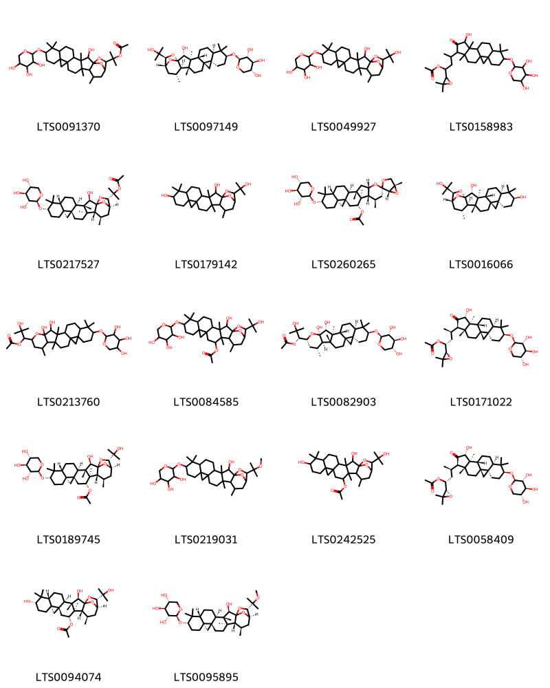{ width=100% }
    <figcaption>Hình ảnh cấu trúc hóa học của 18 hoạt chất thuộc nhóm Steroids and steroid derivatives gồm ['2-{2-hydroxy-3,8,8,17,19-pentamethyl-9-[(3,4,5-trihydroxyoxan-2-yl)oxy]-23,24-dioxaheptacyclo[19.2.1.0¹,¹⁸.0³,¹⁷.0⁴,¹⁴.0⁷,¹².0¹²,¹⁴]tetracosan-22-yl}propan-2-yl acetate (LTS0091370)', 'cimigenol xyloside (LTS0097149)', '2-{[2-hydroxy-22-(2-hydroxypropan-2-yl)-3,8,8,17,19-pentamethyl-23,24-dioxaheptacyclo[19.2.1.0¹,¹⁸.0³,¹⁷.0⁴,¹⁴.0⁷,¹².0¹²,¹⁴]tetracosan-9-yl]oxy}oxane-3,4,5-triol (LTS0049927)', '1-(3,3-dimethyloxiran-2-yl)-3-{13-hydroxy-7,7,12,16-tetramethyl-14-oxo-6-[(3,4,5-trihydroxyoxan-2-yl)oxy]pentacyclo[9.7.0.0¹,³.0³,⁸.0¹²,¹⁶]octadecan-15-yl}butyl acetate (LTS0158983)', '25-o-acetylcimigenol xyloside (LTS0217527)', '22-(2-hydroxypropan-2-yl)-3,8,8,17,19-pentamethyl-23,24-dioxaheptacyclo[19.2.1.0¹,¹⁸.0³,¹⁷.0⁴,¹⁴.0⁷,¹².0¹²,¹⁴]tetracosane-2,9-diol (LTS0179142)', "(1s,1'r,2r,3'r,4'r,5s,5'r,6'r,10's,12's,13's,16'r,18's,21'r)-4',5,6',12',17',17'-hexamethyl-18'-{[(2s,3r,4s,5r)-3,4,5-trihydroxyoxan-2-yl]oxy}-3,6,9'-trioxaspiro[bicyclo[3.1.0]hexane-2,8'-hexacyclo[11.9.0.0¹,²¹.0⁴,¹².0⁵,¹⁰.0¹⁶,²¹]docosan]-3'-yl acetate (LTS0260265)", 'cimigenol (LTS0016066)', '1-{10,11-dihydroxy-4,6,12,17,17-pentamethyl-18-[(3,4,5-trihydroxyoxan-2-yl)oxy]-9-oxahexacyclo[11.9.0.0¹,²¹.0⁴,¹².0⁵,¹⁰.0¹⁶,²¹]docosan-8-yl}-2-hydroxy-2-methylpropyl acetate (LTS0213760)', '2-hydroxy-22-(2-hydroxypropan-2-yl)-3,8,8,17,19-pentamethyl-9-[(3,4,5-trihydroxyoxan-2-yl)oxy]-23,24-dioxaheptacyclo[19.2.1.0¹,¹⁸.0³,¹⁷.0⁴,¹⁴.0⁷,¹².0¹²,¹⁴]tetracosan-16-yl acetate (LTS0084585)', '(1s)-1-[(1s,4r,5r,6r,8r,10r,11r,12s,13r,16r,18s,21r)-10,11-dihydroxy-4,6,12,17,17-pentamethyl-18-{[(2s,3r,4s,5r)-3,4,5-trihydroxyoxan-2-yl]oxy}-9-oxahexacyclo[11.9.0.0¹,²¹.0⁴,¹².0⁵,¹⁰.0¹⁶,²¹]docosan-8-yl]-2-hydroxy-2-methylpropyl acetate (LTS0082903)', '(1r,3r)-1-[(2r)-3,3-dimethyloxiran-2-yl]-3-[(1s,3r,6s,8r,11r,12s,13r,15r,16r)-13-hydroxy-7,7,12,16-tetramethyl-14-oxo-6-{[(2s,3r,4s,5r)-3,4,5-trihydroxyoxan-2-yl]oxy}pentacyclo[9.7.0.0¹,³.0³,⁸.0¹²,¹⁶]octadecan-15-yl]butyl acetate (LTS0171022)', '(1s,2r,3s,4r,7r,9s,12r,14r,16r,17r,18r,19r,21r,22s)-2-hydroxy-22-(2-hydroxypropan-2-yl)-3,8,8,17,19-pentamethyl-9-{[(2s,3r,4s,5r)-3,4,5-trihydroxyoxan-2-yl]oxy}-23,24-dioxaheptacyclo[19.2.1.0¹,¹⁸.0³,¹⁷.0⁴,¹⁴.0⁷,¹².0¹²,¹⁴]tetracosan-16-yl acetate (LTS0189745)', '2-{[2-hydroxy-22-(2-methoxypropan-2-yl)-3,8,8,17,19-pentamethyl-23,24-dioxaheptacyclo[19.2.1.0¹,¹⁸.0³,¹⁷.0⁴,¹⁴.0⁷,¹².0¹²,¹⁴]tetracosan-9-yl]oxy}oxane-3,4,5-triol (LTS0219031)', '2,9-dihydroxy-22-(2-hydroxypropan-2-yl)-3,8,8,17,19-pentamethyl-23,24-dioxaheptacyclo[19.2.1.0¹,¹⁸.0³,¹⁷.0⁴,¹⁴.0⁷,¹².0¹²,¹⁴]tetracosan-16-yl acetate (LTS0242525)', '(1r,3r)-1-[(2s)-3,3-dimethyloxiran-2-yl]-3-[(1s,3r,6s,8r,11r,12s,13r,15r,16r)-13-hydroxy-7,7,12,16-tetramethyl-14-oxo-6-{[(2s,3r,4s,5r)-3,4,5-trihydroxyoxan-2-yl]oxy}pentacyclo[9.7.0.0¹,³.0³,⁸.0¹²,¹⁶]octadecan-15-yl]butyl acetate (LTS0058409)', '(1s,2r,3s,4r,7r,9s,12r,14r,16r,17r,18r,19r,21r,22s)-2,9-dihydroxy-22-(2-hydroxypropan-2-yl)-3,8,8,17,19-pentamethyl-23,24-dioxaheptacyclo[19.2.1.0¹,¹⁸.0³,¹⁷.0⁴,¹⁴.0⁷,¹².0¹²,¹⁴]tetracosan-16-yl acetate (LTS0094074)', '(2s,3r,4s,5r)-2-{[(1s,2r,3s,4r,7r,9s,12r,14s,17r,18r,19r,21r,22s)-2-hydroxy-22-(2-methoxypropan-2-yl)-3,8,8,17,19-pentamethyl-23,24-dioxaheptacyclo[19.2.1.0¹,¹⁸.0³,¹⁷.0⁴,¹⁴.0⁷,¹².0¹²,¹⁴]tetracosan-9-yl]oxy}oxane-3,4,5-triol (LTS0095895)'].</figcaption>
</figure>

---

### Dược dân tộc học

Danh sách các quốc gia có sử dụng *Actaea pachypoda* trong điều trị các bệnh. 

| Country   | Disease   | Bệnh                                                                                                                                                                                                |
|:----------|:----------|:----------------------------------------------------------------------------------------------------------------------------------------------------------------------------------------------------|
| US        | Poison    | MYMEMORY WARNING: YOU USED ALL AVAILABLE FREE TRANSLATIONS FOR TODAY. NEXT AVAILABLE IN  08 HOURS 54 MINUTES 51 SECONDS VISIT HTTPS://MYMEMORY.TRANSLATED.NET/DOC/USAGELIMITS.PHP TO TRANSLATE MORE |

---

---
## Actaea racemosa
### Thông tin về thực vật

!!! info "Phân loại thực vật của *Actaea racemosa* từ GIBF:"
    - **Kingdom:** Plantae
    - **Phylum:** Tracheophyta
    - **Order:** Ranunculales
    - **Family:** Ranunculaceae
    - **Genus:** Actaea
    - **Species:** *Actaea racemosa*

 

| Label (VI)   | Label (EN)   | Scientific Name   | Descriptions (VI)   | Descriptions (EN)   | Also Known As (VI)   | Also Known As (EN)                        |
|:-------------|:-------------|:------------------|:--------------------|:--------------------|:---------------------|:------------------------------------------|
| N/A          | N/A          | Actaea racemosa   | loài thực vật       | species of plant    | ['']                 | ['Cimicifuga racemosa (L.) Nutt. (1818)'] |

#### Phân bố trên thế giới

**Từ CSDL GIBF** Canada, United States of America

#### Phân bố tại Việt Nam

**Từ CSDL GIBF**: Không có ghi nhận ở Việt Nam

---
### Thành phần hóa học
        
- Theo cơ sở dữ liệu lotus: Từ loài *Actaea racemosa* đã phân lập và xác định được 183 hoạt chất thuộc về các nhóm Organooxygen compounds, Benzopyrans, Furanoid lignans, Diazines, Flavonoids, Benzene and substituted derivatives, Glycerolipids, Pyrrolidines, Fatty Acyls, Prenol lipids, Isoflavonoids, Cinnamic acids and derivatives, Phenylpropanoic acids, Steroids and steroid derivatives, Tetrahydroisoquinolines. 

|    | chemicalTaxonomyClassyfireClass     |   smiles_count |
|---:|:------------------------------------|---------------:|
|  0 | Benzene and substituted derivatives |              1 |
|  1 | Benzopyrans                         |              1 |
|  2 | Cinnamic acids and derivatives      |             43 |
|  3 | Diazines                            |              2 |
|  4 | Fatty Acyls                         |              2 |
|  5 | Flavonoids                          |              1 |
|  6 | Furanoid lignans                    |              4 |
|  7 | Glycerolipids                       |              1 |
|  8 | Isoflavonoids                       |              1 |
|  9 | Organooxygen compounds              |              8 |
| 10 | Phenylpropanoic acids               |              2 |
| 11 | Prenol lipids                       |              2 |
| 12 | Pyrrolidines                        |              3 |
| 13 | Steroids and steroid derivatives    |            109 |
| 14 | Tetrahydroisoquinolines             |              3 |

#### Nhóm Benzene and substituted derivatives
<figure markdown="span">
    { width=100% }
    <figcaption>Hình ảnh cấu trúc hóa học của 1 hoạt chất thuộc nhóm Benzene and substituted derivatives gồm ['3,4-dihydroxybenzoic acid (LTS0018765)'].</figcaption>
</figure>
#### Nhóm Benzopyrans
<figure markdown="span">
    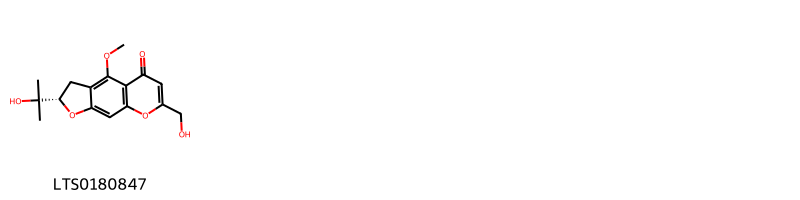{ width=100% }
    <figcaption>Hình ảnh cấu trúc hóa học của 1 hoạt chất thuộc nhóm Benzopyrans gồm ['cimifugin (LTS0180847)'].</figcaption>
</figure>
#### Nhóm Cinnamic acids and derivatives
<figure markdown="span">
    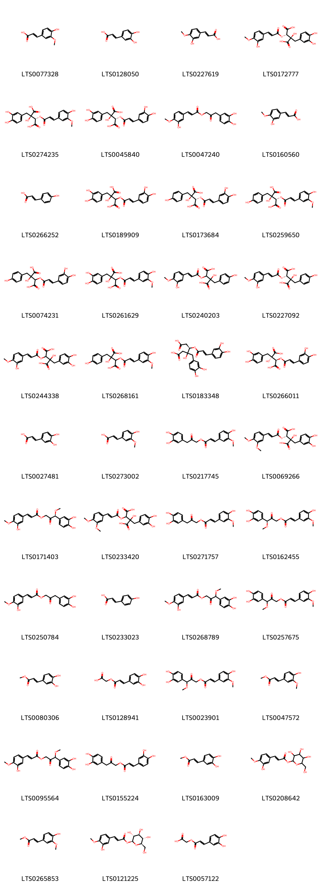{ width=100% }
    <figcaption>Hình ảnh cấu trúc hóa học của 43 hoạt chất thuộc nhóm Cinnamic acids and derivatives gồm ['ferulic acid (LTS0077328)', '3,4-dihydroxycinnamic acid (LTS0128050)', 'isoferulic acid (LTS0227619)', 'cimicifugic acid b (LTS0172777)', 'cimicifugic acid a (LTS0274235)', 'fukinolic acid (LTS0045840)', 'cimiracemate a (LTS0047240)', 'isoferulic acid (LTS0160560)', 'para-coumaric acid (LTS0266252)', '2-[(3,4-dihydroxyphenyl)methyl]-3-{[3-(3,4-dihydroxyphenyl)prop-2-enoyl]oxy}-2-hydroxybutanedioic acid (LTS0189909)', 'cimicifugic acid d (LTS0173684)', 'cimicifugic acid e (LTS0259650)', '3-{[3-(3,4-dihydroxyphenyl)prop-2-enoyl]oxy}-2-hydroxy-2-[(4-hydroxyphenyl)methyl]butanedioic acid (LTS0074231)', '2-[(3,4-dihydroxyphenyl)methyl]-2-hydroxy-3-{[3-(4-hydroxy-3-methoxyphenyl)prop-2-enoyl]oxy}butanedioic acid (LTS0261629)', '2-hydroxy-3-{[3-(3-hydroxy-4-methoxyphenyl)prop-2-enoyl]oxy}-2-[(4-hydroxyphenyl)methyl]butanedioic acid (LTS0240203)', 'cimicifugic acid f (LTS0227092)', '2-[(3,4-dihydroxyphenyl)methyl]-2-hydroxy-3-{[3-(3-hydroxy-4-methoxyphenyl)prop-2-enoyl]oxy}butanedioic acid (LTS0244338)', '2-hydroxy-3-{[3-(4-hydroxy-3-methoxyphenyl)prop-2-enoyl]oxy}-2-[(4-hydroxyphenyl)methyl]butanedioic acid (LTS0268161)', '(4r)-3-[(3,4-dihydroxyphenyl)methyl]-4-{[(2e)-3-(3,4-dihydroxyphenyl)prop-2-enoyl]oxy}-3-hydroxyhexanedioic acid (LTS0183348)', '(2s,3r)-2-[(3,4-dihydroxyphenyl)methyl]-3-{[(2e)-3-(3,4-dihydroxyphenyl)prop-2-enoyl]oxy}-2-hydroxybutanedioic acid (LTS0266011)', 'caffeic acid (LTS0027481)', 'ferulic acid (LTS0273002)', '3-(3,4-dihydroxyphenyl)-2-oxopropyl 3-(4-hydroxy-3-methoxyphenyl)prop-2-enoate (LTS0217745)', '(2r,3s)-2-[(3,4-dihydroxyphenyl)methyl]-3-{[(2e)-3-(3,4-dimethoxyphenyl)prop-2-enoyl]oxy}-2-hydroxybutanedioic acid (LTS0069266)', '(3s)-3-(3,4-dihydroxyphenyl)-3-methoxy-2-oxopropyl (2e)-3-(3-hydroxy-4-methoxyphenyl)prop-2-enoate (LTS0171403)', '2-[(3,4-dihydroxyphenyl)methyl]-3-{[3-(3,4-dimethoxyphenyl)prop-2-enoyl]oxy}-2-hydroxybutanedioic acid (LTS0233420)', 'cimiracemate b (LTS0271757)', '(3s)-3-(3,4-dihydroxyphenyl)-3-methoxy-2-oxopropyl (2e)-3-(4-hydroxy-3-methoxyphenyl)prop-2-enoate (LTS0162455)', '3-(3,4-dihydroxyphenyl)-2-oxopropyl 3-(3-hydroxy-4-methoxyphenyl)prop-2-enoate (LTS0250784)', 'hydroxycinnamic acid (LTS0233023)', '3-(3,4-dihydroxyphenyl)-3-methoxy-2-oxopropyl 3-(3-hydroxy-4-methoxyphenyl)prop-2-enoate (LTS0268789)', '3-(3,4-dihydroxyphenyl)-3-methoxy-2-oxopropyl 3-(4-hydroxy-3-methoxyphenyl)prop-2-enoate (LTS0257675)', 'methyl 3-(3,4-dihydroxyphenyl)prop-2-enoate (LTS0080306)', 'caffeoylglycolic acid (LTS0128941)', 'cimiracemate d (LTS0023901)', 'methyl ferulate (LTS0047572)', 'cimiracemate c (LTS0095564)', '3-(3,4-dihydroxyphenyl)-2-oxopropyl 3-(3,4-dihydroxyphenyl)prop-2-enoate (LTS0155224)', 'methyl caffeate (LTS0163009)', '3,4,5-trihydroxy-6-(hydroxymethyl)oxan-2-yl 3-(3-hydroxy-4-methoxyphenyl)prop-2-enoate (LTS0208642)', 'methyl ferulate (LTS0265853)', '(2s,3r,4s,5s,6r)-3,4,5-trihydroxy-6-(hydroxymethyl)oxan-2-yl (2e)-3-(3-hydroxy-4-methoxyphenyl)prop-2-enoate (LTS0121225)', '{[3-(3,4-dihydroxyphenyl)prop-2-enoyl]oxy}acetic acid (LTS0057122)'].</figcaption>
</figure>
#### Nhóm Diazines
<figure markdown="span">
    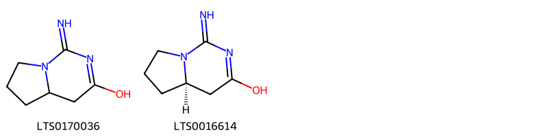{ width=100% }
    <figcaption>Hình ảnh cấu trúc hóa học của 2 hoạt chất thuộc nhóm Diazines gồm ['1-imino-4h,4ah,5h,6h,7h-pyrrolo[1,2-c]pyrimidin-3-ol (LTS0170036)', '(4ar)-1-imino-4h,4ah,5h,6h,7h-pyrrolo[1,2-c]pyrimidin-3-ol (LTS0016614)'].</figcaption>
</figure>
#### Nhóm Fatty Acyls
<figure markdown="span">
    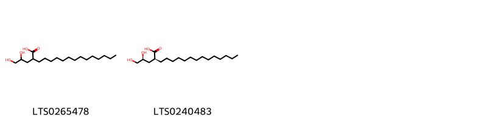{ width=100% }
    <figcaption>Hình ảnh cấu trúc hóa học của 2 hoạt chất thuộc nhóm Fatty Acyls gồm ['2-(2,3-dihydroxypropyl)hexadecanoic acid (LTS0265478)', '(2s)-2-[(2s)-2,3-dihydroxypropyl]hexadecanoic acid (LTS0240483)'].</figcaption>
</figure>
#### Nhóm Flavonoids
<figure markdown="span">
    { width=100% }
    <figcaption>Hình ảnh cấu trúc hóa học của 1 hoạt chất thuộc nhóm Flavonoids gồm ['kaempherol (LTS0155822)'].</figcaption>
</figure>
#### Nhóm Furanoid lignans
<figure markdown="span">
    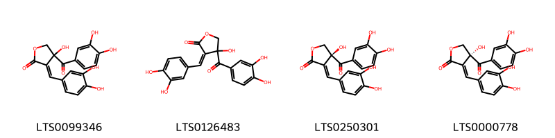{ width=100% }
    <figcaption>Hình ảnh cấu trúc hóa học của 4 hoạt chất thuộc nhóm Furanoid lignans gồm ['actaealactone (LTS0099346)', '4-(3,4-dihydroxybenzoyl)-3-[(3,4-dihydroxyphenyl)methylidene]-4-hydroxyoxolan-2-one (LTS0126483)', '(3e,4s)-4-(3,4-dihydroxybenzoyl)-3-[(3,4-dihydroxyphenyl)methylidene]-4-hydroxyoxolan-2-one (LTS0250301)', '(3e,4r)-4-(3,4-dihydroxybenzoyl)-3-[(3,4-dihydroxyphenyl)methylidene]-4-hydroxyoxolan-2-one (LTS0000778)'].</figcaption>
</figure>
#### Nhóm Glycerolipids
<figure markdown="span">
    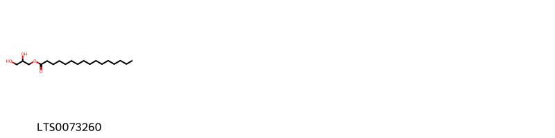{ width=100% }
    <figcaption>Hình ảnh cấu trúc hóa học của 1 hoạt chất thuộc nhóm Glycerolipids gồm ['glyceryl palmitate (LTS0073260)'].</figcaption>
</figure>
#### Nhóm Isoflavonoids
<figure markdown="span">
    { width=100% }
    <figcaption>Hình ảnh cấu trúc hóa học của 1 hoạt chất thuộc nhóm Isoflavonoids gồm ['formononetin (LTS0082756)'].</figcaption>
</figure>
#### Nhóm Organooxygen compounds
<figure markdown="span">
    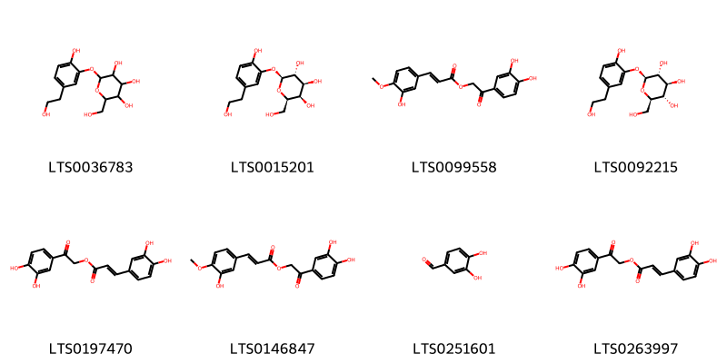{ width=100% }
    <figcaption>Hình ảnh cấu trúc hóa học của 8 hoạt chất thuộc nhóm Organooxygen compounds gồm ['2-[2-hydroxy-5-(2-hydroxyethyl)phenoxy]-6-(hydroxymethyl)oxane-3,4,5-triol (LTS0036783)', '(2s,3r,4s,5r,6r)-2-[2-hydroxy-5-(2-hydroxyethyl)phenoxy]-6-(hydroxymethyl)oxane-3,4,5-triol (LTS0015201)', '2-(3,4-dihydroxyphenyl)-2-oxoethyl 3-(3-hydroxy-4-methoxyphenyl)prop-2-enoate (LTS0099558)', '3-hydroxytyrosol 3-o-glucoside (LTS0092215)', '2-(3,4-dihydroxyphenyl)-2-oxoethyl 3-(3,4-dihydroxyphenyl)prop-2-enoate (LTS0197470)', 'cimiciphenone (LTS0146847)', '3,4-dihydroxybenzaldehyde (LTS0251601)', 'petasiphenone (LTS0263997)'].</figcaption>
</figure>
#### Nhóm Phenylpropanoic acids
<figure markdown="span">
    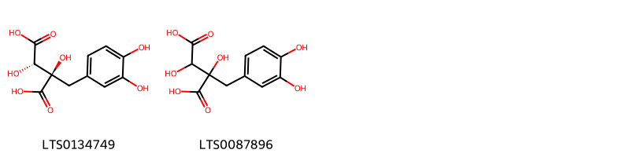{ width=100% }
    <figcaption>Hình ảnh cấu trúc hóa học của 2 hoạt chất thuộc nhóm Phenylpropanoic acids gồm ['fukiic acid (LTS0134749)', '2-[(3,4-dihydroxyphenyl)methyl]-2,3-dihydroxybutanedioic acid (LTS0087896)'].</figcaption>
</figure>
#### Nhóm Prenol lipids
<figure markdown="span">
    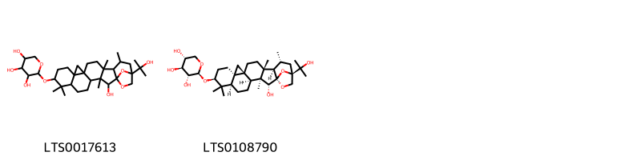{ width=100% }
    <figcaption>Hình ảnh cấu trúc hóa học của 2 hoạt chất thuộc nhóm Prenol lipids gồm ['2-{[2-hydroxy-21-(2-hydroxypropan-2-yl)-3,8,8,17,19-pentamethyl-23,24-dioxaheptacyclo[19.2.1.0¹,¹⁸.0³,¹⁷.0⁴,¹⁴.0⁷,¹².0¹²,¹⁴]tetracosan-9-yl]oxy}oxane-3,4,5-triol (LTS0017613)', '(2s,3r,4s,5r)-2-{[(1r,2r,3s,4s,7r,9s,12r,14s,17r,18r,19r,21r)-2-hydroxy-21-(2-hydroxypropan-2-yl)-3,8,8,17,19-pentamethyl-23,24-dioxaheptacyclo[19.2.1.0¹,¹⁸.0³,¹⁷.0⁴,¹⁴.0⁷,¹².0¹²,¹⁴]tetracosan-9-yl]oxy}oxane-3,4,5-triol (LTS0108790)'].</figcaption>
</figure>
#### Nhóm Pyrrolidines
<figure markdown="span">
    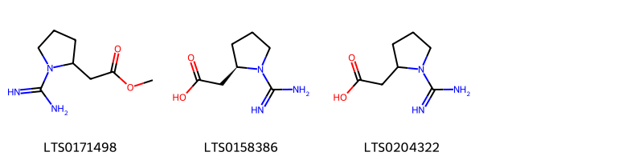{ width=100% }
    <figcaption>Hình ảnh cấu trúc hóa học của 3 hoạt chất thuộc nhóm Pyrrolidines gồm ['methyl 2-(1-carbamimidoylpyrrolidin-2-yl)acetate (LTS0171498)', '[(2r)-1-carbamimidoylpyrrolidin-2-yl]acetic acid (LTS0158386)', '(1-carbamimidoylpyrrolidin-2-yl)acetic acid (LTS0204322)'].</figcaption>
</figure>
#### Nhóm Steroids and steroid derivatives
<figure markdown="span">
    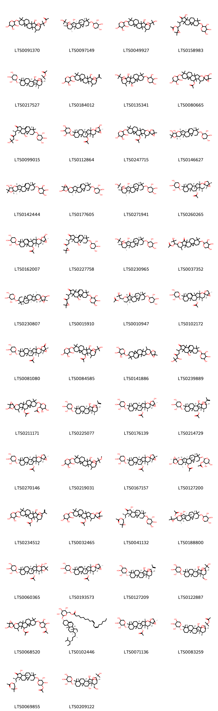{ width=100% }
    <figcaption>Hình ảnh cấu trúc hóa học của 109 hoạt chất thuộc nhóm Steroids and steroid derivatives gồm ['2-{2-hydroxy-3,8,8,17,19-pentamethyl-9-[(3,4,5-trihydroxyoxan-2-yl)oxy]-23,24-dioxaheptacyclo[19.2.1.0¹,¹⁸.0³,¹⁷.0⁴,¹⁴.0⁷,¹².0¹²,¹⁴]tetracosan-22-yl}propan-2-yl acetate (LTS0091370)', 'cimigenol xyloside (LTS0097149)', '2-{[2-hydroxy-22-(2-hydroxypropan-2-yl)-3,8,8,17,19-pentamethyl-23,24-dioxaheptacyclo[19.2.1.0¹,¹⁸.0³,¹⁷.0⁴,¹⁴.0⁷,¹².0¹²,¹⁴]tetracosan-9-yl]oxy}oxane-3,4,5-triol (LTS0049927)', '1-(3,3-dimethyloxiran-2-yl)-3-{13-hydroxy-7,7,12,16-tetramethyl-14-oxo-6-[(3,4,5-trihydroxyoxan-2-yl)oxy]pentacyclo[9.7.0.0¹,³.0³,⁸.0¹²,¹⁶]octadecan-15-yl}butyl acetate (LTS0158983)', '25-o-acetylcimigenol xyloside (LTS0217527)', '2-{[2-hydroxy-3,8,8,17,19-pentamethyl-22-(prop-1-en-2-yl)-23,24-dioxaheptacyclo[19.2.1.0¹,¹⁸.0³,¹⁷.0⁴,¹⁴.0⁷,¹².0¹²,¹⁴]tetracosan-9-yl]oxy}oxane-3,4,5-triol (LTS0184012)', '2-{[2,16-dihydroxy-22-(2-hydroxypropan-2-yl)-3,8,8,17,19-pentamethyl-23,24-dioxaheptacyclo[19.2.1.0¹,¹⁸.0³,¹⁷.0⁴,¹⁴.0⁷,¹².0¹²,¹⁴]tetracosan-9-yl]oxy}oxane-3,4,5-triol (LTS0135341)', "4-hydroxy-4',5,6',12',17',17'-hexamethyl-18'-[(3,4,5-trihydroxyoxan-2-yl)oxy]-3,6,9'-trioxaspiro[bicyclo[3.1.0]hexane-2,8'-hexacyclo[11.9.0.0¹,²¹.0⁴,¹².0⁵,¹⁰.0¹⁶,²¹]docosan]-3'-yl acetate (LTS0080665)", 'cimicifugoside h-2 (LTS0099015)', "(1'r,2r,4'r,5s,5'r,10's,12's,13's,16'r,21'r)-4-hydroxy-4',5,6',12',17',17'-hexamethyl-18'-{[(2s)-3,4,5-trihydroxyoxan-2-yl]oxy}-3,6,9'-trioxaspiro[bicyclo[3.1.0]hexane-2,8'-hexacyclo[11.9.0.0¹,²¹.0⁴,¹².0⁵,¹⁰.0¹⁶,²¹]docosan]-3'-yl acetate (LTS0112864)", "4',5,6',12',17',17'-hexamethyl-18'-[(3,4,5-trihydroxyoxan-2-yl)oxy]-3,6,9'-trioxaspiro[bicyclo[3.1.0]hexane-2,8'-hexacyclo[11.9.0.0¹,²¹.0⁴,¹².0⁵,¹⁰.0¹⁶,²¹]docosan]-3'-yl acetate (LTS0247715)", 'cimiaceroside a (LTS0146627)', '2-{[(1r,5r,7s,10r,12r,15r,16r,17s,18r,21r,22r,24s)-21,22-dihydroxy-1,6,6,15,17,20,20-heptamethyl-19,23-dioxaheptacyclo[13.10.0.0²,¹².0⁵,¹⁰.0¹⁰,¹².0¹⁶,²⁴.0¹⁸,²²]pentacos-2-en-7-yl]oxy}oxane-3,4,5-triol (LTS0142444)', "(2s,3r,4s,5r)-2-[(1'r,4'r,6'r,12'r,16'r,21'r)-4',5,6',12',17',17'-hexamethyl-3,6,9'-trioxaspiro[bicyclo[3.1.0]hexane-2,8'-hexacyclo[11.9.0.0¹,²¹.0⁴,¹².0⁵,¹⁰.0¹⁶,²¹]docosan]-13'-en-4-oloxy]oxane-3,4,5-triol (LTS0177605)", '(2s,3r,4s,5s)-2-{[(1s,2r,3s,4r,7r,9s,12r,14s,17r,18r,19r,21r,22r)-2-hydroxy-22-(2-hydroxypropan-2-yl)-3,8,8,17,19-pentamethyl-23,24-dioxaheptacyclo[19.2.1.0¹,¹⁸.0³,¹⁷.0⁴,¹⁴.0⁷,¹².0¹²,¹⁴]tetracosan-9-yl]oxy}oxane-3,4,5-triol (LTS0271941)', "(1s,1'r,2r,3'r,4'r,5s,5'r,6'r,10's,12's,13's,16'r,18's,21'r)-4',5,6',12',17',17'-hexamethyl-18'-{[(2s,3r,4s,5r)-3,4,5-trihydroxyoxan-2-yl]oxy}-3,6,9'-trioxaspiro[bicyclo[3.1.0]hexane-2,8'-hexacyclo[11.9.0.0¹,²¹.0⁴,¹².0⁵,¹⁰.0¹⁶,²¹]docosan]-3'-yl acetate (LTS0260265)", "(1r,2r,3's,4'r,5s,5'r,6'r,10's,12's,16'r,18'r,21'r)-4-hydroxy-4',5,6',12',17',17'-hexamethyl-18'-{[(2s,3r,4s,5r)-3,4,5-trihydroxyoxan-2-yl]oxy}-3,6,9'-trioxaspiro[bicyclo[3.1.0]hexane-2,8'-hexacyclo[11.9.0.0¹,²¹.0⁴,¹².0⁵,¹⁰.0¹⁶,²¹]docosan]-13'-en-3'-yl acetate (LTS0162007)", 'cimicifugoside h1 (LTS0227758)', 'cimiracemoside c (LTS0230965)', '2-hydroxy-2-methyl-1-{4,6,12,17,17-pentamethyl-11-oxo-18-[(3,4,5-trihydroxyoxan-2-yl)oxy]-9-oxahexacyclo[11.9.0.0¹,²¹.0⁴,¹².0⁵,¹⁰.0¹⁶,²¹]docosan-8-yl}propyl acetate (LTS0037352)', "(2s,3r,4s,5r)-2-[(1s,1's,4'r,5r,5'r,6'r,10's,12's,13's,16'r,21'r)-4',5,6',12',17',17'-hexamethyl-3,6,9'-trioxaspiro[bicyclo[3.1.0]hexane-2,8'-hexacyclo[11.9.0.0¹,²¹.0⁴,¹².0⁵,¹⁰.0¹⁶,²¹]docosan]-4-oloxy]oxane-3,4,5-triol (LTS0230807)", '15-[4-(3,3-dimethyloxiran-2-yl)-4-oxobutan-2-yl]-18-hydroxy-7,7,12,16-tetramethyl-6-[(3,4,5-trihydroxyoxan-2-yl)oxy]pentacyclo[9.7.0.0¹,³.0³,⁸.0¹²,¹⁶]octadec-10-en-14-one (LTS0015910)', '(1s)-2-hydroxy-2-methyl-1-[(1s,4r,5r,6r,8r,10r,12s,13r,16r,18s,21r)-4,6,12,17,17-pentamethyl-11-oxo-18-{[(2s,3r,4s,5r)-3,4,5-trihydroxyoxan-2-yl]oxy}-9-oxahexacyclo[11.9.0.0¹,²¹.0⁴,¹².0⁵,¹⁰.0¹⁶,²¹]docosan-8-yl]propyl acetate (LTS0010947)', '26-deoxycimicifugoside (LTS0102172)', 'cimiracemoside p (LTS0081080)', '2-hydroxy-22-(2-hydroxypropan-2-yl)-3,8,8,17,19-pentamethyl-9-[(3,4,5-trihydroxyoxan-2-yl)oxy]-23,24-dioxaheptacyclo[19.2.1.0¹,¹⁸.0³,¹⁷.0⁴,¹⁴.0⁷,¹².0¹²,¹⁴]tetracosan-16-yl acetate (LTS0084585)', "2-{4',5,6',12',17',17'-hexamethyl-3,6,9'-trioxaspiro[bicyclo[3.1.0]hexane-2,8'-hexacyclo[11.9.0.0¹,²¹.0⁴,¹².0⁵,¹⁰.0¹⁶,²¹]docosan]-13'-eneoxy}oxane-3,4,5-triol (LTS0141886)", '15-(5,6-dihydroxy-6-methyl-4-oxoheptan-2-yl)-18-hydroxy-7,7,12,16-tetramethyl-6-[(3,4,5-trihydroxyoxan-2-yl)oxy]pentacyclo[9.7.0.0¹,³.0³,⁸.0¹²,¹⁶]octadec-10-en-14-one (LTS0239889)', "18'-{[3-(acetyloxy)-4,5-dihydroxyoxan-2-yl]oxy}-4-hydroxy-4',5,6',12',17',17'-hexamethyl-3,6,9'-trioxaspiro[bicyclo[3.1.0]hexane-2,8'-hexacyclo[11.9.0.0¹,²¹.0⁴,¹².0⁵,¹⁰.0¹⁶,²¹]docosan]-3'-yl acetate (LTS0211171)", '(2s,3r,4s,5r)-2-{[(1s,2r,3s,4r,7r,9s,12r,14s,17r,18r,19r,21r,22r)-2-hydroxy-3,8,8,17,19-pentamethyl-22-(prop-1-en-2-yl)-23,24-dioxaheptacyclo[19.2.1.0¹,¹⁸.0³,¹⁷.0⁴,¹⁴.0⁷,¹².0¹²,¹⁴]tetracosan-9-yl]oxy}oxane-3,4,5-triol (LTS0225077)', 'actein (LTS0176139)', 'cimiracemoside k (LTS0214729)', '26-deoxyactein (LTS0270146)', '2-{[2-hydroxy-22-(2-methoxypropan-2-yl)-3,8,8,17,19-pentamethyl-23,24-dioxaheptacyclo[19.2.1.0¹,¹⁸.0³,¹⁷.0⁴,¹⁴.0⁷,¹².0¹²,¹⁴]tetracosan-9-yl]oxy}oxane-3,4,5-triol (LTS0219031)', "(1s,1'r,2s,3'r,4'r,5s,5'r,6'r,10's,12's,13's,16'r,18's,21'r)-4',5,6',12',17',17'-hexamethyl-18'-{[(2s,3r,4s,5r)-3,4,5-trihydroxyoxan-2-yl]oxy}-3,6,9'-trioxaspiro[bicyclo[3.1.0]hexane-2,8'-hexacyclo[11.9.0.0¹,²¹.0⁴,¹².0⁵,¹⁰.0¹⁶,²¹]docosan]-3'-yl acetate (LTS0167157)", "2'-o-acetylactein (LTS0127200)", '2-hydroxy-3,8,8,17,19-pentamethyl-22-(prop-1-en-2-yl)-9-[(3,4,5-trihydroxyoxan-2-yl)oxy]-23,24-dioxaheptacyclo[19.2.1.0¹,¹⁸.0³,¹⁷.0⁴,¹⁴.0⁷,¹².0¹²,¹⁴]tetracosan-16-yl acetate (LTS0234512)', "4',5,6',12',17',17'-hexamethyl-4-oxo-18'-[(3,4,5-trihydroxyoxan-2-yl)oxy]-3,6,9'-trioxaspiro[bicyclo[3.1.0]hexane-2,8'-hexacyclo[11.9.0.0¹,²¹.0⁴,¹².0⁵,¹⁰.0¹⁶,²¹]docosan]-3'-yl acetate (LTS0032465)", '(1r,3r)-1-[(2s)-3,3-dimethyloxiran-2-yl]-3-[(1s,3r,6s,8r,11r,12s,13r,15r,16r)-13-hydroxy-7,7,12,16-tetramethyl-14-oxo-6-{[(2s,3r,4s,5s)-3,4,5-trihydroxyoxan-2-yl]oxy}pentacyclo[9.7.0.0¹,³.0³,⁸.0¹²,¹⁶]octadecan-15-yl]butyl acetate (LTS0041132)', '(1s,4r,5r,6r,8r,10s,11r,12s,13r,16r,18s,21r)-8-[(2s)-3,3-dimethyloxiran-2-yl]-10,11-dihydroxy-4,6,12,17,17-pentamethyl-18-{[(2s,3r,4s,5r)-3,4,5-trihydroxyoxan-2-yl]oxy}-9-oxahexacyclo[11.9.0.0¹,²¹.0⁴,¹².0⁵,¹⁰.0¹⁶,²¹]docosan-8-yl acetate (LTS0188800)', '(1s,2s,5r,7s,10r,12r,14r,15r,16r,17s,18r,21r,22r,24s)-21,22-dihydroxy-1,6,6,15,17,20,20-heptamethyl-7-{[(2s,3r,4s,5s)-3,4,5-trihydroxyoxan-2-yl]oxy}-19,23-dioxaheptacyclo[13.10.0.0²,¹².0⁵,¹⁰.0¹⁰,¹².0¹⁶,²⁴.0¹⁸,²²]pentacosan-14-yl acetate (LTS0060365)', "(1r,1'r,2s,3'r,4'r,5r,5'r,6'r,10's,12's,13's,16'r,18's,21'r)-4',5,6',12',17',17'-hexamethyl-18'-{[(2s,3r,4s,5r)-3,4,5-trihydroxyoxan-2-yl]oxy}-3,6,9'-trioxaspiro[bicyclo[3.1.0]hexane-2,8'-hexacyclo[11.9.0.0¹,²¹.0⁴,¹².0⁵,¹⁰.0¹⁶,²¹]docosan]-14'-en-3'-yl acetate (LTS0193573)", '(2r,3r,4s,5s)-2-{[(1s,2r,3s,4r,7r,9s,12r,14s,17r,18r,19r,21r,22r)-2-hydroxy-3,8,8,17,19-pentamethyl-22-(prop-1-en-2-yl)-23,24-dioxaheptacyclo[19.2.1.0¹,¹⁸.0³,¹⁷.0⁴,¹⁴.0⁷,¹².0¹²,¹⁴]tetracosan-9-yl]oxy}oxane-3,4,5-triol (LTS0127209)', '(2s,3r,4s,5s)-2-{[(1s,2r,3s,4r,7r,9s,12r,14s,17r,18r,19r,21r,22r)-2-hydroxy-19-(hydroxymethyl)-22-(2-hydroxypropan-2-yl)-3,8,8,17-tetramethyl-23,24-dioxaheptacyclo[19.2.1.0¹,¹⁸.0³,¹⁷.0⁴,¹⁴.0⁷,¹².0¹²,¹⁴]tetracosan-9-yl]oxy}oxane-3,4,5-triol (LTS0122887)', "18'-{[5-(acetyloxy)-3,4-dihydroxyoxan-2-yl]oxy}-4-hydroxy-4',5,6',12',17',17'-hexamethyl-3,6,9'-trioxaspiro[bicyclo[3.1.0]hexane-2,8'-hexacyclo[11.9.0.0¹,²¹.0⁴,¹².0⁵,¹⁰.0¹⁶,²¹]docosan]-3'-yl acetate (LTS0068520)", '[(2r,3s,4s,5r,6r)-6-{[(1r,3as,3bs,7s,9ar,9bs,11ar)-1-[(2r,5r)-5-ethyl-6-methylheptan-2-yl]-9a,11a-dimethyl-1h,2h,3h,3ah,3bh,4h,6h,7h,8h,9h,9bh,10h,11h-cyclopenta[a]phenanthren-7-yl]oxy}-3,4,5-trihydroxyoxan-2-yl]methyl (9z,12z)-octadeca-9,12-dienoate (LTS0102446)', "(1r,1'r,2s,3'r,4'r,5r,5'r,6'r,10's,12's,13's,16'r,18's,21'r)-4',5,6',12',17',17'-hexamethyl-18'-{[(2s,3r,4s,5s)-3,4,5-trihydroxyoxan-2-yl]oxy}-3,6,9'-trioxaspiro[bicyclo[3.1.0]hexane-2,8'-hexacyclo[11.9.0.0¹,²¹.0⁴,¹².0⁵,¹⁰.0¹⁶,²¹]docosan]-3'-yl acetate (LTS0071136)", '2-[(1s,2r,3s,4r,7r,9s,12r,14s,17r,18r,19r,21r,22s)-2-hydroxy-3,8,8,17,19-pentamethyl-9-{[(2r,3r,4s,5s)-3,4,5-trihydroxyoxan-2-yl]oxy}-23,24-dioxaheptacyclo[19.2.1.0¹,¹⁸.0³,¹⁷.0⁴,¹⁴.0⁷,¹².0¹²,¹⁴]tetracosan-22-yl]propan-2-yl acetate (LTS0083259)', 'cimiracemoside l (LTS0069855)', '(2s,3r,4s,5s)-2-{[(1s,2r,3s,4r,7r,9s,12r,14r,16r,17r,18r,19r,21r,22s)-2,16-dihydroxy-19-(hydroxymethyl)-22-(2-hydroxypropan-2-yl)-3,8,8,17-tetramethyl-23,24-dioxaheptacyclo[19.2.1.0¹,¹⁸.0³,¹⁷.0⁴,¹⁴.0⁷,¹².0¹²,¹⁴]tetracosan-9-yl]oxy}oxane-3,4,5-triol (LTS0209122)', '(2s,3r,4s,5r)-2-{[(1r,3s,4s,7r,9s,12r,14s,17r,18r,19r,21r,22s)-22-(2-methoxypropan-2-yl)-3,8,8,17,19-pentamethyl-23,24-dioxaheptacyclo[19.2.1.0¹,¹⁸.0³,¹⁷.0⁴,¹⁴.0⁷,¹².0¹²,¹⁴]tetracosan-9-yl]oxy}oxane-3,4,5-triol (LTS0071106)', "(2s,3r,4s,5s)-2-[(1s,1'r,2s,4'r,5s,5'r,6'r,10's,12'r,16'r,18's,21'r)-4',5,6',12',17',17'-hexamethyl-3,6,9'-trioxaspiro[bicyclo[3.1.0]hexane-2,8'-hexacyclo[11.9.0.0¹,²¹.0⁴,¹².0⁵,¹⁰.0¹⁶,²¹]docosan]-13'-eneoxy]oxane-3,4,5-triol (LTS0109170)", "(2s,3r,4s,5r)-2-[(1s,1's,4'r,5s,5'r,6'r,10's,12's,13's,16'r,21'r)-4',5,6',12',17',17'-hexamethyl-3,6,9'-trioxaspiro[bicyclo[3.1.0]hexane-2,8'-hexacyclo[11.9.0.0¹,²¹.0⁴,¹².0⁵,¹⁰.0¹⁶,²¹]docosane]oxy]oxane-3,4,5-triol (LTS0040183)", 'cimiracemoside m (LTS0088405)', '(2s,3r,4s,5r)-2-{[(1r,9s,12r,14s,17r,22s)-2-hydroxy-22-(2-hydroxypropan-2-yl)-3,8,8,17-tetramethyl-23,24-dioxaheptacyclo[19.2.1.0¹,¹⁸.0³,¹⁷.0⁴,¹⁴.0⁷,¹².0¹²,¹⁴]tetracosan-9-yl]oxy}oxane-3,4,5-triol (LTS0116735)', 'cimiracemoside h (LTS0128205)', "4',5,6',12',17',17'-hexamethyl-18'-[(3,4,5-trihydroxyoxan-2-yl)oxy]-3,6,9'-trioxaspiro[bicyclo[3.1.0]hexane-2,8'-hexacyclo[11.9.0.0¹,²¹.0⁴,¹².0⁵,¹⁰.0¹⁶,²¹]docosan]-14'-en-3'-yl acetate (LTS0151583)", '(2r,3s,4r,7r,9s,12r,14r,16r,17r,18r,19r,21r,22s)-2-hydroxy-3,8,8,17,19-pentamethyl-22-(prop-1-en-2-yl)-9-{[(2s,3r,4s,5r)-3,4,5-trihydroxyoxan-2-yl]oxy}-23,24-dioxaheptacyclo[19.2.1.0¹,¹⁸.0³,¹⁷.0⁴,¹⁴.0⁷,¹².0¹²,¹⁴]tetracosan-16-yl acetate (LTS0247396)', "(1r,1'r,2r,3'r,4s,4'r,5s,5'r,6'r,10's,12's,13's,16'r,18's,21'r)-4-hydroxy-4',5,6',12',17',17'-hexamethyl-18'-[(3,4,5-trihydroxyoxan-2-yl)oxy]-3,6,9'-trioxaspiro[bicyclo[3.1.0]hexane-2,8'-hexacyclo[11.9.0.0¹,²¹.0⁴,¹².0⁵,¹⁰.0¹⁶,²¹]docosan]-3'-yl acetate (LTS0135799)", 'cimiracemoside o (LTS0144014)', "(1s,3r,3's,4r,5r,6s,7r,8s,10s,12s,16r,18s,21r)-7-hydroxy-3'-(2-hydroxypropan-2-yl)-4,6,12,17,17-pentamethyl-18-{[(2s,3r,4s,5r)-3,4,5-trihydroxyoxan-2-yl]oxy}-9-oxaspiro[hexacyclo[11.9.0.0¹,²¹.0⁴,¹².0⁵,¹⁰.0¹⁶,²¹]docosane-8,2'-oxiran]-13-en-3-yl acetate (LTS0176584)", 'neocimicigenoside b (LTS0197214)', '(2s,3r,4s,5r)-2-{[(1r,2r,3s,4r,7r,9s,12r,14s,17r,18r,19r,22s)-2-hydroxy-22-(2-hydroxypropan-2-yl)-3,8,8,17,19-pentamethyl-23,24-dioxaheptacyclo[19.2.1.0¹,¹⁸.0³,¹⁷.0⁴,¹⁴.0⁷,¹².0¹²,¹⁴]tetracosan-9-yl]oxy}oxane-3,4,5-triol (LTS0166194)', "(1r,1's,2r,3'r,4s,4'r,5s,5'r,6'r,10's,12's,16'r,18's,21'r)-4-hydroxy-4',5,6',12',17',17'-hexamethyl-18'-{[(2s,3r,4s,5r)-3,4,5-trihydroxyoxan-2-yl]oxy}-3,6,9'-trioxaspiro[bicyclo[3.1.0]hexane-2,8'-hexacyclo[11.9.0.0¹,²¹.0⁴,¹².0⁵,¹⁰.0¹⁶,²¹]docosan]-13'-en-3'-yl acetate (LTS0146189)", 'cimiracemoside i (LTS0129681)', "(1r,1'r,2r,3'r,4'r,5s,5'r,6'r,10's,12's,13's,16'r,18's,21'r)-4',5,6',12',17',17'-hexamethyl-4-oxo-18'-{[(2s,3r,4s,5r)-3,4,5-trihydroxyoxan-2-yl]oxy}-3,6,9'-trioxaspiro[bicyclo[3.1.0]hexane-2,8'-hexacyclo[11.9.0.0¹,²¹.0⁴,¹².0⁵,¹⁰.0¹⁶,²¹]docosan]-3'-yl acetate (LTS0146460)", 'cimiracemoside g (LTS0161597)', '8-(3,3-dimethyloxiran-2-yl)-10,11-dihydroxy-4,6,12,17,17-pentamethyl-18-[(3,4,5-trihydroxyoxan-2-yl)oxy]-9-oxahexacyclo[11.9.0.0¹,²¹.0⁴,¹².0⁵,¹⁰.0¹⁶,²¹]docosan-8-yl acetate (LTS0155067)', 'cimiracemoside e (LTS0101769)', '21,22-dihydroxy-1,6,6,15,17,20,20-heptamethyl-7-[(3,4,5-trihydroxyoxan-2-yl)oxy]-19,23-dioxaheptacyclo[13.10.0.0²,¹².0⁵,¹⁰.0¹⁰,¹².0¹⁶,²⁴.0¹⁸,²²]pentacosan-14-yl acetate (LTS0237234)', '2-{[2-hydroxy-19-(hydroxymethyl)-22-(2-hydroxypropan-2-yl)-3,8,8,17-tetramethyl-23,24-dioxaheptacyclo[19.2.1.0¹,¹⁸.0³,¹⁷.0⁴,¹⁴.0⁷,¹².0¹²,¹⁴]tetracosan-9-yl]oxy}oxane-3,4,5-triol (LTS0226607)', "(1s,1'r,2r,3'r,4s,4'r,5r,5'r,6'r,10's,12's,13's,16'r,18's,21'r)-18'-{[(2s,3r,4r,5r)-5-(acetyloxy)-3,4-dihydroxyoxan-2-yl]oxy}-4-hydroxy-4',5,6',12',17',17'-hexamethyl-3,6,9'-trioxaspiro[bicyclo[3.1.0]hexane-2,8'-hexacyclo[11.9.0.0¹,²¹.0⁴,¹².0⁵,¹⁰.0¹⁶,²¹]docosan]-3'-yl acetate (LTS0164929)", '8-(3,3-dimethyloxiran-2-yl)-10,11,18-trihydroxy-4,6,12,17,17-pentamethyl-9-oxahexacyclo[11.9.0.0¹,²¹.0⁴,¹².0⁵,¹⁰.0¹⁶,²¹]docosan-8-yl acetate (LTS0179517)', '(1s,4r,5r,6r,8r,10s,11r,12s,13r,16r,18s,21r)-8-[(2s)-3,3-dimethyloxiran-2-yl]-10,11,18-trihydroxy-4,6,12,17,17-pentamethyl-9-oxahexacyclo[11.9.0.0¹,²¹.0⁴,¹².0⁵,¹⁰.0¹⁶,²¹]docosan-8-yl acetate (LTS0182049)', 'neocimicigenoside a (LTS0186853)', '(1s,2r,3s,4r,7r,9s,12r,14r,16r,17r,18r,19r,21r,22s)-2-hydroxy-3,8,8,17,19-pentamethyl-22-(prop-1-en-2-yl)-9-{[(2r,3r,4s,5s)-3,4,5-trihydroxyoxan-2-yl]oxy}-23,24-dioxaheptacyclo[19.2.1.0¹,¹⁸.0³,¹⁷.0⁴,¹⁴.0⁷,¹².0¹²,¹⁴]tetracosan-16-yl acetate (LTS0046155)', '23-epi-26-deoxyactein (LTS0052667)', '(1r,2r,3s,4r,7r,9s,12r,14r,16r,17r,18r,19r,22s)-2-hydroxy-22-(2-hydroxypropan-2-yl)-3,8,8,17,19-pentamethyl-9-{[(2s,3r,4s,5s)-3,4,5-trihydroxyoxan-2-yl]oxy}-23,24-dioxaheptacyclo[19.2.1.0¹,¹⁸.0³,¹⁷.0⁴,¹⁴.0⁷,¹².0¹²,¹⁴]tetracosan-16-yl acetate (LTS0219940)', '3-(6-{[5-(acetyloxy)-3,4-dihydroxyoxan-2-yl]oxy}-13-hydroxy-7,7,12,16-tetramethyl-14-oxopentacyclo[9.7.0.0¹,³.0³,⁸.0¹²,¹⁶]octadecan-15-yl)-1-(3,3-dimethyloxiran-2-yl)butyl acetate (LTS0211201)', '(2s,3r,4s,5s)-2-{[(1s,2r,3s,4r,7r,9s,12r,14r,16r,17r,18r,19r,21r,22s)-2,16-dihydroxy-22-(2-hydroxypropan-2-yl)-3,8,8,17,19-pentamethyl-23,24-dioxaheptacyclo[19.2.1.0¹,¹⁸.0³,¹⁷.0⁴,¹⁴.0⁷,¹².0¹²,¹⁴]tetracosan-9-yl]oxy}oxane-3,4,5-triol (LTS0212126)', "(1s,1'r,2s,3'r,4'r,5s,5'r,6'r,10's,12's,13's,16'r,18's,21'r)-4',5,6',12',17',17'-hexamethyl-18'-{[(2r,3r,4s,5s)-3,4,5-trihydroxyoxan-2-yl]oxy}-3,6,9'-trioxaspiro[bicyclo[3.1.0]hexane-2,8'-hexacyclo[11.9.0.0¹,²¹.0⁴,¹².0⁵,¹⁰.0¹⁶,²¹]docosan]-3'-yl acetate (LTS0261478)", '(2s,3r,4s,5r)-2-{[(1r,2r,3s,4r,7r,9s,12r,14s,17r,18r,19r,21r,22s)-2-hydroxy-22-(2-hydroxypropan-2-yl)-3,8,8,17,19-pentamethyl-23,24-dioxaheptacyclo[19.2.1.0¹,¹⁸.0³,¹⁷.0⁴,¹⁴.0⁷,¹².0¹²,¹⁴]tetracosan-9-yl]oxy}oxane-3,4,5-triol (LTS0226412)', "(1s,3r,3's,4r,5r,6s,7r,8r,10s,12s,16r,18s,21r)-7-hydroxy-3'-(2-hydroxypropan-2-yl)-4,6,12,17,17-pentamethyl-18-{[(2s,3r,4s,5r)-3,4,5-trihydroxyoxan-2-yl]oxy}-9-oxaspiro[hexacyclo[11.9.0.0¹,²¹.0⁴,¹².0⁵,¹⁰.0¹⁶,²¹]docosane-8,2'-oxiran]-13-en-3-yl acetate (LTS0219063)", '(2r,3r,4s,5s)-2-{[(1s,2r,3s,4r,7r,9s,12r,14s,17r,18r,19r,21r,22s)-2-hydroxy-22-(2-hydroxypropan-2-yl)-3,8,8,17,19-pentamethyl-23,24-dioxaheptacyclo[19.2.1.0¹,¹⁸.0³,¹⁷.0⁴,¹⁴.0⁷,¹².0¹²,¹⁴]tetracosan-9-yl]oxy}oxane-3,4,5-triol (LTS0029544)', 'cimiracemoside a (LTS0039959)', '(1r,2r,3s,4r,7r,9s,12r,14r,16r,17r,18r,19r,21r,22s)-2-hydroxy-22-(2-hydroxypropan-2-yl)-3,8,8,17,19-pentamethyl-9-{[(2s,3r,4s,5s)-3,4,5-trihydroxyoxan-2-yl]oxy}-23,24-dioxaheptacyclo[19.2.1.0¹,¹⁸.0³,¹⁷.0⁴,¹⁴.0⁷,¹².0¹²,¹⁴]tetracosan-16-yl acetate (LTS0240375)', '[(2r,3s,4s,5r,6r)-6-{[(1r,3as,3bs,7s,9ar,9bs,11ar)-1-[(2r,5r)-5-ethyl-6-methylheptan-2-yl]-9a,11a-dimethyl-1h,2h,3h,3ah,3bh,4h,6h,7h,8h,9h,9bh,10h,11h-cyclopenta[a]phenanthren-7-yl]oxy}-3,4,5-trihydroxyoxan-2-yl]methyl (9e,12e)-octadeca-9,12-dienoate (LTS0255098)', '2-{[2,16-dihydroxy-19-(hydroxymethyl)-22-(2-hydroxypropan-2-yl)-3,8,8,17-tetramethyl-23,24-dioxaheptacyclo[19.2.1.0¹,¹⁸.0³,¹⁷.0⁴,¹⁴.0⁷,¹².0¹²,¹⁴]tetracosan-9-yl]oxy}oxane-3,4,5-triol (LTS0230231)', '2-{2,16-dihydroxy-3,8,8,17,19-pentamethyl-9-[(3,4,5-trihydroxyoxan-2-yl)oxy]-23,24-dioxaheptacyclo[19.2.1.0¹,¹⁸.0³,¹⁷.0⁴,¹⁴.0⁷,¹².0¹²,¹⁴]tetracosan-22-yl}propan-2-yl acetate (LTS0244207)', '(1s,2r,3s,4r,7r,9s,12r,14r,16r,17r,18r,19r,21r,22r)-2-hydroxy-22-(2-hydroxypropan-2-yl)-3,8,8,17,19-pentamethyl-9-{[(2s,3r,4s,5s)-3,4,5-trihydroxyoxan-2-yl]oxy}-23,24-dioxaheptacyclo[19.2.1.0¹,¹⁸.0³,¹⁷.0⁴,¹⁴.0⁷,¹².0¹²,¹⁴]tetracosan-16-yl acetate (LTS0246938)', '2-[(1s,2r,3s,4r,7r,9s,12r,14r,16r,17r,18r,19r,21r,22s)-2,16-dihydroxy-3,8,8,17,19-pentamethyl-9-{[(2s,3r,4s,5s)-3,4,5-trihydroxyoxan-2-yl]oxy}-23,24-dioxaheptacyclo[19.2.1.0¹,¹⁸.0³,¹⁷.0⁴,¹⁴.0⁷,¹².0¹²,¹⁴]tetracosan-22-yl]propan-2-yl acetate (LTS0242305)', '26r-actein (LTS0243488)', '(1r,3r)-3-[(1s,3r,6s,8r,11r,12s,13r,15r,16r)-6-{[(2r,3r,4r,5s)-5-(acetyloxy)-3,4-dihydroxyoxan-2-yl]oxy}-13-hydroxy-7,7,12,16-tetramethyl-14-oxopentacyclo[9.7.0.0¹,³.0³,⁸.0¹²,¹⁶]octadecan-15-yl]-1-[(2s)-3,3-dimethyloxiran-2-yl]butyl acetate (LTS0243374)', "7-hydroxy-3'-(2-hydroxypropan-2-yl)-4,6,12,17,17-pentamethyl-18-[(3,4,5-trihydroxyoxan-2-yl)oxy]-9-oxaspiro[hexacyclo[11.9.0.0¹,²¹.0⁴,¹².0⁵,¹⁰.0¹⁶,²¹]docosane-8,2'-oxiran]-13-en-3-yl acetate (LTS0045431)", '(2s,3r,4s,5r)-2-{[(1s,2r,3s,4r,7r,9s,12r,14s,17r,18r,19r,21r,22s)-22-(2-chloropropan-2-yl)-2-hydroxy-3,8,8,17,19-pentamethyl-23,24-dioxaheptacyclo[19.2.1.0¹,¹⁸.0³,¹⁷.0⁴,¹⁴.0⁷,¹².0¹²,¹⁴]tetracosan-9-yl]oxy}oxane-3,4,5-triol (LTS0248224)', '21,22-dihydroxy-1,6,6,15,17,20,20-heptamethyl-7-[(3,4,5-trihydroxyoxan-2-yl)oxy]-19,23-dioxaheptacyclo[13.10.0.0²,¹².0⁵,¹⁰.0¹⁰,¹².0¹⁶,²⁴.0¹⁸,²²]pentacos-2-en-14-yl acetate (LTS0054282)', '(1s,4r,5r,6r,8r,10s,11r,12s,13r,16r,18s,21r)-8-[(2s)-3,3-dimethyloxiran-2-yl]-10,11-dihydroxy-4,6,12,17,17-pentamethyl-18-{[(2r,3r,4s,5s)-3,4,5-trihydroxyoxan-2-yl]oxy}-9-oxahexacyclo[11.9.0.0¹,²¹.0⁴,¹².0⁵,¹⁰.0¹⁶,²¹]docosan-8-yl acetate (LTS0109950)', '2-{[22-(2-methoxypropan-2-yl)-3,8,8,17,19-pentamethyl-23,24-dioxaheptacyclo[19.2.1.0¹,¹⁸.0³,¹⁷.0⁴,¹⁴.0⁷,¹².0¹²,¹⁴]tetracosan-9-yl]oxy}oxane-3,4,5-triol (LTS0272144)', 'cimiracemoside b (c36) (LTS0005385)', '(1r,2r,3s,4r,7r,9s,12r,14r,16r,17r,18r,19r,21r,22s)-2-hydroxy-3,8,8,17,19-pentamethyl-22-(prop-1-en-2-yl)-9-{[(2s,3r,4s,5r)-3,4,5-trihydroxyoxan-2-yl]oxy}-23,24-dioxaheptacyclo[19.2.1.0¹,¹⁸.0³,¹⁷.0⁴,¹⁴.0⁷,¹².0¹²,¹⁴]tetracosan-16-yl acetate (LTS0003256)', 'cimiracemoside n (LTS0011493)', '2-{[(1s,3s,4r,7r,12r,14s,17r,18s,21s)-2-hydroxy-22-(2-hydroxypropan-2-yl)-3,8,8,17,19-pentamethyl-23,24-dioxaheptacyclo[19.2.1.0¹,¹⁸.0³,¹⁷.0⁴,¹⁴.0⁷,¹².0¹²,¹⁴]tetracosan-9-yl]oxy}oxane-3,4,5-triol (LTS0002214)', 'cimiracemoside j (LTS0003550)', "(1s,1'r,2r,3'r,4s,4'r,5r,5'r,6'r,10's,12's,13's,16'r,18's,21'r)-4-hydroxy-4',5,6',12',17',17'-hexamethyl-18'-{[(2s,3r,4s,5s)-3,4,5-trihydroxyoxan-2-yl]oxy}-3,6,9'-trioxaspiro[bicyclo[3.1.0]hexane-2,8'-hexacyclo[11.9.0.0¹,²¹.0⁴,¹².0⁵,¹⁰.0¹⁶,²¹]docosan]-3'-yl acetate (LTS0248218)", "4-hydroxy-4',5,6',12',17',17'-hexamethyl-18'-[(3,4,5-trihydroxyoxan-2-yl)oxy]-3,6,9'-trioxaspiro[bicyclo[3.1.0]hexane-2,8'-hexacyclo[11.9.0.0¹,²¹.0⁴,¹².0⁵,¹⁰.0¹⁶,²¹]docosan]-13'-en-3'-yl acetate (LTS0021332)", '(6-{[1-(5-ethyl-6-methylheptan-2-yl)-9a,11a-dimethyl-1h,2h,3h,3ah,3bh,4h,6h,7h,8h,9h,9bh,10h,11h-cyclopenta[a]phenanthren-7-yl]oxy}-3,4,5-trihydroxyoxan-2-yl)methyl octadeca-9,12-dienoate (LTS0033895)', "(1r,1'r,2r,3'r,4s,4'r,5s,5'r,6'r,10's,12's,13's,16'r,18's,21'r)-18'-{[(2s,3r,4r,5r)-5-(acetyloxy)-3,4-dihydroxyoxan-2-yl]oxy}-4-hydroxy-4',5,6',12',17',17'-hexamethyl-3,6,9'-trioxaspiro[bicyclo[3.1.0]hexane-2,8'-hexacyclo[11.9.0.0¹,²¹.0⁴,¹².0⁵,¹⁰.0¹⁶,²¹]docosan]-3'-yl acetate (LTS0019154)", '2-{[22-(2-chloropropan-2-yl)-2-hydroxy-3,8,8,17,19-pentamethyl-23,24-dioxaheptacyclo[19.2.1.0¹,¹⁸.0³,¹⁷.0⁴,¹⁴.0⁷,¹².0¹²,¹⁴]tetracosan-9-yl]oxy}oxane-3,4,5-triol (LTS0040130)', '(2s,3r,4s,5r)-2-{[(1s,2r,3s,4r,7r,9s,12r,14s,17r,18r,19r,21r,22r)-2-hydroxy-19-(hydroxymethyl)-22-(2-hydroxypropan-2-yl)-3,8,8,17-tetramethyl-23,24-dioxaheptacyclo[19.2.1.0¹,¹⁸.0³,¹⁷.0⁴,¹⁴.0⁷,¹².0¹²,¹⁴]tetracosan-9-yl]oxy}oxane-3,4,5-triol (LTS0113225)'].</figcaption>
</figure>
#### Nhóm Tetrahydroisoquinolines
<figure markdown="span">
    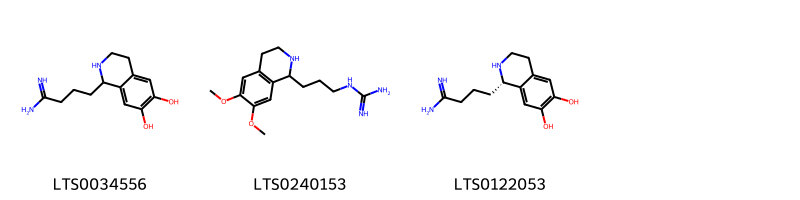{ width=100% }
    <figcaption>Hình ảnh cấu trúc hóa học của 3 hoạt chất thuộc nhóm Tetrahydroisoquinolines gồm ['4-(6,7-dihydroxy-1,2,3,4-tetrahydroisoquinolin-1-yl)butanimidamide (LTS0034556)', 'n-[3-(6,7-dimethoxy-1,2,3,4-tetrahydroisoquinolin-1-yl)propyl]guanidine (LTS0240153)', '4-[(1s)-6,7-dihydroxy-1,2,3,4-tetrahydroisoquinolin-1-yl]butanimidamide (LTS0122053)'].</figcaption>
</figure>

---

### Dược dân tộc học

Danh sách các quốc gia có sử dụng *Actaea racemosa* trong điều trị các bệnh. 

| Country   | Disease                              | Bệnh                                                                                                                                                                                                |
|:----------|:-------------------------------------|:----------------------------------------------------------------------------------------------------------------------------------------------------------------------------------------------------|
| English   | Astringent, Emmenagogue, Expectorant | MYMEMORY WARNING: YOU USED ALL AVAILABLE FREE TRANSLATIONS FOR TODAY. NEXT AVAILABLE IN  08 HOURS 54 MINUTES 27 SECONDS VISIT HTTPS://MYMEMORY.TRANSLATED.NET/DOC/USAGELIMITS.PHP TO TRANSLATE MORE |
| French    | Diuretic, Nervine                    | MYMEMORY WARNING: YOU USED ALL AVAILABLE FREE TRANSLATIONS FOR TODAY. NEXT AVAILABLE IN  08 HOURS 54 MINUTES 24 SECONDS VISIT HTTPS://MYMEMORY.TRANSLATED.NET/DOC/USAGELIMITS.PHP TO TRANSLATE MORE |
| German    | Aphrodisiac                          | MYMEMORY WARNING: YOU USED ALL AVAILABLE FREE TRANSLATIONS FOR TODAY. NEXT AVAILABLE IN  08 HOURS 54 MINUTES 19 SECONDS VISIT HTTPS://MYMEMORY.TRANSLATED.NET/DOC/USAGELIMITS.PHP TO TRANSLATE MORE |
| Turkey    | Stomachic                            | MYMEMORY WARNING: YOU USED ALL AVAILABLE FREE TRANSLATIONS FOR TODAY. NEXT AVAILABLE IN  08 HOURS 54 MINUTES 17 SECONDS VISIT HTTPS://MYMEMORY.TRANSLATED.NET/DOC/USAGELIMITS.PHP TO TRANSLATE MORE |
| US        | Sedative                             | MYMEMORY WARNING: YOU USED ALL AVAILABLE FREE TRANSLATIONS FOR TODAY. NEXT AVAILABLE IN  08 HOURS 54 MINUTES 14 SECONDS VISIT HTTPS://MYMEMORY.TRANSLATED.NET/DOC/USAGELIMITS.PHP TO TRANSLATE MORE |
| anish     | Sudorific                            | MYMEMORY WARNING: YOU USED ALL AVAILABLE FREE TRANSLATIONS FOR TODAY. NEXT AVAILABLE IN  08 HOURS 54 MINUTES 11 SECONDS VISIT HTTPS://MYMEMORY.TRANSLATED.NET/DOC/USAGELIMITS.PHP TO TRANSLATE MORE |

---

---
## Actaea rubra
### Thông tin về thực vật

!!! info "Phân loại thực vật của *Actaea rubra* từ GIBF:"
    - **Kingdom:** Plantae
    - **Phylum:** Tracheophyta
    - **Order:** Ranunculales
    - **Family:** Ranunculaceae
    - **Genus:** Actaea
    - **Species:** *Actaea rubra*

 

| Label (VI)   | Label (EN)   | Scientific Name   | Descriptions (VI)   | Descriptions (EN)   | Also Known As (VI)   | Also Known As (EN)                                      |
|:-------------|:-------------|:------------------|:--------------------|:--------------------|:---------------------|:--------------------------------------------------------|
| N/A          | N/A          | Actaea rubra      | loài thực vật       | species of plant    | ['']                 | ['baneberry', 'red baneberry', 'western red baneberry'] |

#### Phân bố trên thế giới

**Từ CSDL GIBF** Canada, United States of America, Mexico

#### Phân bố tại Việt Nam

**Từ CSDL GIBF**: Không có ghi nhận ở Việt Nam

---
### Thành phần hóa học
        
- Theo cơ sở dữ liệu lotus: Từ loài *Actaea rubra* đã phân lập và xác định được 3 hoạt chất thuộc về các nhóm Organooxygen compounds, Steroids and steroid derivatives. 

|    | chemicalTaxonomyClassyfireClass   |   smiles_count |
|---:|:----------------------------------|---------------:|
|  0 | Organooxygen compounds            |              1 |
|  1 | Steroids and steroid derivatives  |              2 |

#### Nhóm Organooxygen compounds
<figure markdown="span">
    { width=100% }
    <figcaption>Hình ảnh cấu trúc hóa học của 1 hoạt chất thuộc nhóm Organooxygen compounds gồm ['ranunculin (LTS0141949)'].</figcaption>
</figure>
#### Nhóm Steroids and steroid derivatives
<figure markdown="span">
    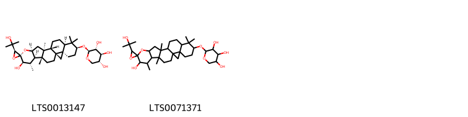{ width=100% }
    <figcaption>Hình ảnh cấu trúc hóa học của 2 hoạt chất thuộc nhóm Steroids and steroid derivatives gồm ["(2s,3r,4s,5r)-2-[(1s,3's,4r,5r,6s,7r,8r,10s,12s,13s,16r,18s,21r)-3'-(2-hydroxypropan-2-yl)-4,6,12,17,17-pentamethyl-9-oxaspiro[hexacyclo[11.9.0.0¹,²¹.0⁴,¹².0⁵,¹⁰.0¹⁶,²¹]docosane-8,2'-oxiran]-7-oloxy]oxane-3,4,5-triol (LTS0013147)", "2-[3'-(2-hydroxypropan-2-yl)-4,6,12,17,17-pentamethyl-9-oxaspiro[hexacyclo[11.9.0.0¹,²¹.0⁴,¹².0⁵,¹⁰.0¹⁶,²¹]docosane-8,2'-oxiran]-7-oloxy]oxane-3,4,5-triol (LTS0071371)"].</figcaption>
</figure>

---

### Dược dân tộc học

Danh sách các quốc gia có sử dụng *Actaea rubra* trong điều trị các bệnh. 

| Country   | Disease   | Bệnh                                                                                                                                                                                                |
|:----------|:----------|:----------------------------------------------------------------------------------------------------------------------------------------------------------------------------------------------------|
| US        | Poison    | MYMEMORY WARNING: YOU USED ALL AVAILABLE FREE TRANSLATIONS FOR TODAY. NEXT AVAILABLE IN  08 HOURS 53 MINUTES 32 SECONDS VISIT HTTPS://MYMEMORY.TRANSLATED.NET/DOC/USAGELIMITS.PHP TO TRANSLATE MORE |

---

# Chi Anemone

??? note "Danh sách các dược liệu thuộc chi"
    
	 - *Anemone cernua*
	 - *Anemone hepatica*
	 - *Anemone nemorosa*
	 - *Anemone obtusiloba*
	 - *Anemone patens*
	 - *Anemone pratensis*
	 - *Anemone pulsatilla*
	 - *Anemone vitifolia*

---
## Anemone cernua
### Thông tin về thực vật

!!! info "Phân loại thực vật của *Pulsatilla cernua* từ GIBF:"
    - **Kingdom:** Plantae
    - **Phylum:** Tracheophyta
    - **Order:** Ranunculales
    - **Family:** Ranunculaceae
    - **Genus:** Pulsatilla
    - **Species:** *Pulsatilla cernua*

 

| Label (VI)   | Label (EN)   | Scientific Name   | Descriptions (VI)   | Descriptions (EN)   | Also Known As (VI)   | Also Known As (EN)   |
|:-------------|:-------------|:------------------|:--------------------|:--------------------|:---------------------|:---------------------|
| N/A          | N/A          | Anemone cernua    | loài thực vật       | species of plant    | ['']                 | ['']                 |

#### Phân bố trên thế giới

**Từ CSDL GIBF** nan, Viet Nam, Japan, Korea (Democratic People’s Republic of), Russian Federation, United States of America, China, Chinese Taipei

#### Phân bố tại Việt Nam

**Từ CSDL GIBF**: Cochin-China

---
### Thành phần hóa học
        
- Theo cơ sở dữ liệu lotus: Từ loài *Pulsatilla cernua* đã phân lập và xác định được 89 hoạt chất thuộc về các nhóm Vinylogous esters, Furanoid lignans, 2-arylbenzofuran flavonoids, Prenol lipids, Carboxylic acids and derivatives, Lignan glycosides, Cinnamic acids and derivatives, Lignan lactones, Phenylpropanoic acids, Steroids and steroid derivatives. 

|    | chemicalTaxonomyClassyfireClass   |   smiles_count |
|---:|:----------------------------------|---------------:|
|  0 | 2-arylbenzofuran flavonoids       |              3 |
|  1 | Carboxylic acids and derivatives  |              1 |
|  2 | Cinnamic acids and derivatives    |              6 |
|  3 | Furanoid lignans                  |              4 |
|  4 | Lignan glycosides                 |              1 |
|  5 | Lignan lactones                   |              2 |
|  6 | Phenylpropanoic acids             |              1 |
|  7 | Prenol lipids                     |             69 |
|  8 | Steroids and steroid derivatives  |              1 |
|  9 | Vinylogous esters                 |              1 |

#### Nhóm 2-arylbenzofuran flavonoids
<figure markdown="span">
    { width=100% }
    <figcaption>Hình ảnh cấu trúc hóa học của 3 hoạt chất thuộc nhóm 2-arylbenzofuran flavonoids gồm ['(2r,3r,4s,5s,6r)-2-{[(2s,3s)-2-(4-hydroxy-3-methoxyphenyl)-5-(3-hydroxypropyl)-7-methoxy-2,3-dihydro-1-benzofuran-3-yl]methoxy}-6-(hydroxymethyl)oxane-3,4,5-triol (LTS0165767)', '(2r,3r,4s,5s,6r)-2-{3-[(2s,3s)-2-(4-hydroxy-3-methoxyphenyl)-3-(hydroxymethyl)-7-methoxy-2,3-dihydro-1-benzofuran-5-yl]propoxy}-6-(hydroxymethyl)oxane-3,4,5-triol (LTS0098457)', '4-[(2s,3s)-3-(hydroxymethyl)-5-(3-hydroxypropyl)-7-methoxy-2,3-dihydro-1-benzofuran-2-yl]-2-methoxyphenol (LTS0067745)'].</figcaption>
</figure>
#### Nhóm Carboxylic acids and derivatives
<figure markdown="span">
    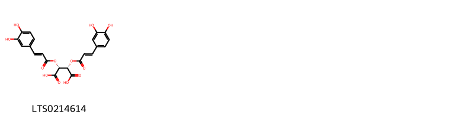{ width=100% }
    <figcaption>Hình ảnh cấu trúc hóa học của 1 hoạt chất thuộc nhóm Carboxylic acids and derivatives gồm ['(2r,3s)-2,3-bis({[(2e)-3-(3,4-dihydroxyphenyl)prop-2-enoyl]oxy})butanedioic acid (LTS0214614)'].</figcaption>
</figure>
#### Nhóm Cinnamic acids and derivatives
<figure markdown="span">
    { width=100% }
    <figcaption>Hình ảnh cấu trúc hóa học của 6 hoạt chất thuộc nhóm Cinnamic acids and derivatives gồm ['ferulic acid (LTS0077328)', '(2s,3r,4s,5s,6r)-2-{[(2s,3r,4s,5r,6s)-2-{[5,7-dihydroxy-2-(4-oxocyclohexa-2,5-dien-1-ylidene)chromen-3-yl]oxy}-4,5-dihydroxy-6-(hydroxymethyl)oxan-3-yl]oxy}-4,5-dihydroxy-6-(hydroxymethyl)oxan-3-yl 3-(3,4-dihydroxyphenyl)prop-2-enoate (LTS0027376)', '(s)-rosmarinic acid (LTS0124509)', '3,4-dihydroxycinnamic acid (LTS0128050)', 'caffeic acid (LTS0027481)', 'ferulic acid (LTS0273002)'].</figcaption>
</figure>
#### Nhóm Furanoid lignans
<figure markdown="span">
    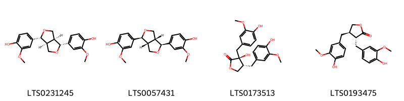{ width=100% }
    <figcaption>Hình ảnh cấu trúc hóa học của 4 hoạt chất thuộc nhóm Furanoid lignans gồm ['(-)-pinoresinol (LTS0231245)', 'pinoresinol (LTS0057431)', '(3s,4r)-3-hydroxy-3,4-bis[(4-hydroxy-3-methoxyphenyl)methyl]oxolan-2-one (LTS0173513)', 'matairesinol (LTS0193475)'].</figcaption>
</figure>
#### Nhóm Lignan glycosides
<figure markdown="span">
    { width=100% }
    <figcaption>Hình ảnh cấu trúc hóa học của 1 hoạt chất thuộc nhóm Lignan glycosides gồm ['(3s,4r)-3,4-bis[(4-hydroxy-3-methoxyphenyl)methyl]-3-{[(2s,3r,4s,5s,6r)-3,4,5-trihydroxy-6-(hydroxymethyl)oxan-2-yl]oxy}oxolan-2-one (LTS0089957)'].</figcaption>
</figure>
#### Nhóm Lignan lactones
<figure markdown="span">
    { width=100% }
    <figcaption>Hình ảnh cấu trúc hóa học của 2 hoạt chất thuộc nhóm Lignan lactones gồm ['10-(3,4,5-trimethoxyphenyl)-4,6,13-trioxatetracyclo[7.7.0.0³,⁷.0¹¹,¹⁵]hexadeca-1,3(7),8-trien-12-one (LTS0255618)', '(-)-deoxypodophyllotoxin (LTS0013249)'].</figcaption>
</figure>
#### Nhóm Phenylpropanoic acids
<figure markdown="span">
    { width=100% }
    <figcaption>Hình ảnh cấu trúc hóa học của 1 hoạt chất thuộc nhóm Phenylpropanoic acids gồm ['(2s)-3-(4-hydroxyphenyl)-2-methoxypropanoic acid (LTS0142671)'].</figcaption>
</figure>
#### Nhóm Prenol lipids
<figure markdown="span">
    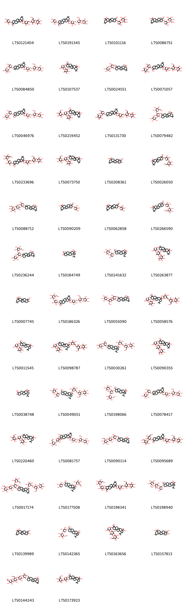{ width=100% }
    <figcaption>Hình ảnh cấu trúc hóa học của 69 hoạt chất thuộc nhóm Prenol lipids gồm ['6-({[3,4-dihydroxy-6-(hydroxymethyl)-5-[(3,4,5-trihydroxy-6-methyloxan-2-yl)oxy]oxan-2-yl]oxy}methyl)-3,4,5-trihydroxyoxan-2-yl 9-(hydroxymethyl)-2,2,6a,6b,9,12a-hexamethyl-10-[(3,4,5-trihydroxyoxan-2-yl)oxy]-1,3,4,5,6,7,8,8a,10,11,12,12b,13,14b-tetradecahydropicene-4a-carboxylate (LTS0121404)', 'cauloside d (LTS0191345)', '10-[(4,5-dihydroxy-3-{[3,4,5-trihydroxy-6-(hydroxymethyl)oxan-2-yl]oxy}oxan-2-yl)oxy]-9-(hydroxymethyl)-2,2,6a,6b,9,12a-hexamethyl-1,3,4,5,6,7,8,8a,10,11,12,12b,13,14b-tetradecahydropicene-4a-carboxylic acid (LTS0101116)', 'cauloside c (LTS0086751)', '(2s,3r,4s,5s,6r)-6-({[(2r,3r,4r,5s,6r)-3,4-dihydroxy-6-(hydroxymethyl)-5-{[(2s,3r,4r,5r,6s)-3,4,5-trihydroxy-6-methyloxan-2-yl]oxy}oxan-2-yl]oxy}methyl)-3,4,5-trihydroxyoxan-2-yl (4as,6as,6br,8ar,10s,12ar,12br,14bs)-10-{[(2s,3r,4s,5s)-4,5-dihydroxy-3-{[(2s,3r,4r,5r,6s)-3,4,5-trihydroxy-6-methyloxan-2-yl]oxy}oxan-2-yl]oxy}-2,2,6a,6b,9,9,12a-heptamethyl-1,3,4,5,6,7,8,8a,10,11,12,12b,13,14b-tetradecahydropicene-4a-carboxylate (LTS0084850)', '10-({4,5-dihydroxy-3-[(3,4,5-trihydroxy-6-methyloxan-2-yl)oxy]oxan-2-yl}oxy)-9-(hydroxymethyl)-2,2,6a,6b,9,12a-hexamethyl-1,3,4,5,6,7,8,8a,10,11,12,12b,13,14b-tetradecahydropicene-4a-carboxylic acid (LTS0107537)', 'α-hederin (LTS0024551)', '6-({[3,4-dihydroxy-6-(hydroxymethyl)-5-[(3,4,5-trihydroxy-6-methyloxan-2-yl)oxy]oxan-2-yl]oxy}methyl)-3,4,5-trihydroxyoxan-2-yl 10-({4,5-dihydroxy-3-[(3,4,5-trihydroxy-6-methyloxan-2-yl)oxy]oxan-2-yl}oxy)-9-(hydroxymethyl)-2,2,6a,6b,9,12a-hexamethyl-1,3,4,5,6,7,8,8a,10,11,12,12b,13,14b-tetradecahydropicene-4a-carboxylate (LTS0071057)', 'kalopanaxsaponin b (LTS0046976)', '10-[(4-hydroxy-5-{[3,4,5-trihydroxy-6-(hydroxymethyl)oxan-2-yl]oxy}-3-[(3,4,5-trihydroxy-6-methyloxan-2-yl)oxy]oxan-2-yl)oxy]-9-(hydroxymethyl)-2,2,6a,6b,9,12a-hexamethyl-1,3,4,5,6,7,8,8a,10,11,12,12b,13,14b-tetradecahydropicene-4a-carboxylic acid (LTS0219452)', '6-({[3,4-dihydroxy-6-(hydroxymethyl)-5-[(3,4,5-trihydroxy-6-methyloxan-2-yl)oxy]oxan-2-yl]oxy}methyl)-3,4,5-trihydroxyoxan-2-yl 10-({4,5-dihydroxy-3-[(3,4,5-trihydroxy-6-methyloxan-2-yl)oxy]oxan-2-yl}oxy)-2,2,6a,6b,9,9,12a-heptamethyl-1,3,4,5,6,7,8,8a,10,11,12,12b,13,14b-tetradecahydropicene-4a-carboxylate (LTS0131730)', 'pulsatilla saponin d (LTS0079482)', '6-({[3,4-dihydroxy-6-(hydroxymethyl)-5-[(3,4,5-trihydroxy-6-methyloxan-2-yl)oxy]oxan-2-yl]oxy}methyl)-3,4,5-trihydroxyoxan-2-yl 10-[(3,4-dihydroxy-5-{[3,4,5-trihydroxy-6-(hydroxymethyl)oxan-2-yl]oxy}oxan-2-yl)oxy]-9-(hydroxymethyl)-2,2,6a,6b,9,12a-hexamethyl-1,3,4,5,6,7,8,8a,10,11,12,12b,13,14b-tetradecahydropicene-4a-carboxylate (LTS0233696)', 'hederacolchiside (LTS0073750)', '(4as,6as,6br,8ar,9r,12ar,12br,14bs)-9-(hydroxymethyl)-2,2,6a,6b,9,12a-hexamethyl-10-oxo-3,4,5,6,7,8,8a,11,12,12b,13,14b-dodecahydro-1h-picene-4a-carboxylic acid (LTS0208361)', '10-[(3,4-dihydroxy-5-{[3,4,5-trihydroxy-6-(hydroxymethyl)oxan-2-yl]oxy}oxan-2-yl)oxy]-9-(hydroxymethyl)-2,2,6a,6b,9,12a-hexamethyl-1,3,4,5,6,7,8,8a,10,11,12,12b,13,14b-tetradecahydropicene-4a-carboxylic acid (LTS0026050)', '(4as,6as,6br,8ar,10s,12ar,12br,14bs)-10-{[(2s,3r,4s,5s)-3-{[(2s,3r,4r,5s,6s)-3,5-dihydroxy-6-methyl-4-{[(2s,3r,4s,5s,6r)-3,4,5-trihydroxy-6-(hydroxymethyl)oxan-2-yl]oxy}oxan-2-yl]oxy}-4,5-dihydroxyoxan-2-yl]oxy}-2,2,6a,6b,9,9,12a-heptamethyl-1,3,4,5,6,7,8,8a,10,11,12,12b,13,14b-tetradecahydropicene-4a-carboxylic acid (LTS0088712)', 'hederagenin 3-o-arabinoside (LTS0090209)', '9-(hydroxymethyl)-2,2,6a,6b,9,12a-hexamethyl-10-[(3,4,5-trihydroxyoxan-2-yl)oxy]-1,3,4,5,6,7,8,8a,10,11,12,12b,13,14b-tetradecahydropicene-4a-carboxylic acid (LTS0062858)', '(4as,6as,6br,8ar,9r,10s,12ar,12br,14bs)-10-{[(2s,3r,4r,5s)-3,4-dihydroxy-5-{[(2s,3r,4s,5s,6r)-3,4,5-trihydroxy-6-(hydroxymethyl)oxan-2-yl]oxy}oxan-2-yl]oxy}-9-(hydroxymethyl)-2,2,6a,6b,9,12a-hexamethyl-1,3,4,5,6,7,8,8a,10,11,12,12b,13,14b-tetradecahydropicene-4a-carboxylic acid (LTS0266590)', '(4as,6as,6br,8ar,10s,12ar,12br,14bs)-10-{[(2s,3r,4s,5s)-4-hydroxy-5-{[(2s,3r,4s,5s,6r)-3,4,5-trihydroxy-6-(hydroxymethyl)oxan-2-yl]oxy}-3-{[(2s,3r,4r,5r,6s)-3,4,5-trihydroxy-6-methyloxan-2-yl]oxy}oxan-2-yl]oxy}-2,2,6a,6b,9,9,12a-heptamethyl-1,3,4,5,6,7,8,8a,10,11,12,12b,13,14b-tetradecahydropicene-4a-carboxylic acid (LTS0236244)', '(1r,3as,5ar,5br,7ar,8r,11ar,11br,13ar,13br)-8-(hydroxymethyl)-5a,5b,8,11a-tetramethyl-9-oxo-1-(prop-1-en-2-yl)-tetradecahydro-1h-cyclopenta[a]chrysene-3a-carboxylic acid (LTS0184749)', '(1r,3as,5ar,5br,7ar,8r,9s,11ar,11br,13ar,13br)-9-{[(2s,3r,4s,5s)-4,5-dihydroxy-3-{[(2s,3r,4r,5r,6s)-3,4,5-trihydroxy-6-methyloxan-2-yl]oxy}oxan-2-yl]oxy}-8-(hydroxymethyl)-5a,5b,8,11a-tetramethyl-1-(prop-1-en-2-yl)-hexadecahydrocyclopenta[a]chrysene-3a-carboxylic acid (LTS0241632)', '10-({3-[(3,5-dihydroxy-6-methyl-4-{[3,4,5-trihydroxy-6-(hydroxymethyl)oxan-2-yl]oxy}oxan-2-yl)oxy]-4,5-dihydroxyoxan-2-yl}oxy)-2,2,6a,6b,9,9,12a-heptamethyl-1,3,4,5,6,7,8,8a,10,11,12,12b,13,14b-tetradecahydropicene-4a-carboxylic acid (LTS0263877)', '9-(hydroxymethyl)-2,2,6a,6b,9,12a-hexamethyl-10-oxo-3,4,5,6,7,8,8a,11,12,12b,13,14b-dodecahydro-1h-picene-4a-carboxylic acid (LTS0007745)', '(2s,3r,4s,5s,6r)-6-({[(2r,3r,4r,5s,6r)-3,4-dihydroxy-6-(hydroxymethyl)-5-{[(2s,3r,4r,5r,6s)-3,4,5-trihydroxy-6-methyloxan-2-yl]oxy}oxan-2-yl]oxy}methyl)-3,4,5-trihydroxyoxan-2-yl (4as,6as,6br,8ar,9r,10s,12ar,12br,14bs)-10-{[(2s,3r,4r,5s)-3,4-dihydroxy-5-{[(2s,3r,4s,5s,6r)-3,4,5-trihydroxy-6-(hydroxymethyl)oxan-2-yl]oxy}oxan-2-yl]oxy}-9-(hydroxymethyl)-2,2,6a,6b,9,12a-hexamethyl-1,3,4,5,6,7,8,8a,10,11,12,12b,13,14b-tetradecahydropicene-4a-carboxylate (LTS0186326)', '(4as,6as,6br,8ar,9r,10s,12ar,12br,14bs)-10-{[(2s,4s,5s)-3-{[(3r,4r,5s,6r)-3,4-dihydroxy-6-(hydroxymethyl)-5-{[(2s,3r,4r,5r,6s)-3,4,5-trihydroxy-6-methyloxan-2-yl]oxy}oxan-2-yl]oxy}-4,5-dihydroxyoxan-2-yl]oxy}-9-(hydroxymethyl)-2,2,6a,6b,9,12a-hexamethyl-1,3,4,5,6,7,8,8a,10,11,12,12b,13,14b-tetradecahydropicene-4a-carboxylic acid (LTS0055090)', '6-({[3,4-dihydroxy-6-(hydroxymethyl)-5-[(3,4,5-trihydroxy-6-methyloxan-2-yl)oxy]oxan-2-yl]oxy}methyl)-3,4,5-trihydroxyoxan-2-yl 9-({4,5-dihydroxy-3-[(3,4,5-trihydroxy-6-methyloxan-2-yl)oxy]oxan-2-yl}oxy)-8-(hydroxymethyl)-5a,5b,8,11a-tetramethyl-1-(prop-1-en-2-yl)-hexadecahydrocyclopenta[a]chrysene-3a-carboxylate (LTS0058576)', '9-({4,5-dihydroxy-3-[(3,4,5-trihydroxy-6-methyloxan-2-yl)oxy]oxan-2-yl}oxy)-8-(hydroxymethyl)-5a,5b,8,11a-tetramethyl-1-(prop-1-en-2-yl)-hexadecahydrocyclopenta[a]chrysene-3a-carboxylic acid (LTS0011545)', '6-({[3,4-dihydroxy-6-(hydroxymethyl)-5-[(3,4,5-trihydroxy-6-methyloxan-2-yl)oxy]oxan-2-yl]oxy}methyl)-3,4,5-trihydroxyoxan-2-yl 9-({4,5-dihydroxy-3-[(3,4,5-trihydroxy-6-methyloxan-2-yl)oxy]oxan-2-yl}oxy)-5a,5b,8,8,11a-pentamethyl-1-(prop-1-en-2-yl)-hexadecahydrocyclopenta[a]chrysene-3a-carboxylate (LTS0098787)', '(2s,3r,4s,5s,6r)-6-({[(2r,3r,4r,5s,6r)-3,4-dihydroxy-6-(hydroxymethyl)-5-{[(2s,3r,4r,5r,6s)-3,4,5-trihydroxy-6-methyloxan-2-yl]oxy}oxan-2-yl]oxy}methyl)-3,4,5-trihydroxyoxan-2-yl (1r,3as,5ar,5br,7ar,9s,11ar,11br,13ar,13br)-9-{[(2s,3r,4s,5s)-4,5-dihydroxy-3-{[(2s,3r,4r,5r,6s)-3,4,5-trihydroxy-6-methyloxan-2-yl]oxy}oxan-2-yl]oxy}-5a,5b,8,8,11a-pentamethyl-1-(prop-1-en-2-yl)-hexadecahydrocyclopenta[a]chrysene-3a-carboxylate (LTS0030261)', '10-({3-[(3,5-dihydroxy-6-methyl-4-{[3,4,5-trihydroxy-6-(hydroxymethyl)oxan-2-yl]oxy}oxan-2-yl)oxy]-4,5-dihydroxyoxan-2-yl}oxy)-9-(hydroxymethyl)-2,2,6a,6b,9,12a-hexamethyl-1,3,4,5,6,7,8,8a,10,11,12,12b,13,14b-tetradecahydropicene-4a-carboxylic acid (LTS0090355)', '(3as,5br,8r,11ar,13ar)-8-(hydroxymethyl)-5a,5b,8,11a-tetramethyl-9-oxo-1-(prop-1-en-2-yl)-tetradecahydro-1h-cyclopenta[a]chrysene-3a-carboxylic acid (LTS0038748)', '(2s,3r,4s,5s,6r)-6-({[(2r,3r,4r,5s,6r)-3,4-dihydroxy-6-(hydroxymethyl)-5-{[(2s,3r,4r,5r,6s)-3,4,5-trihydroxy-6-methyloxan-2-yl]oxy}oxan-2-yl]oxy}methyl)-3,4,5-trihydroxyoxan-2-yl (1r,3as,5ar,5br,7ar,8r,9s,11ar,11br,13ar,13br)-9-{[(2s,3r,4s,5s)-4,5-dihydroxy-3-{[(2s,3r,4r,5r,6s)-3,4,5-trihydroxy-6-methyloxan-2-yl]oxy}oxan-2-yl]oxy}-8-(hydroxymethyl)-5a,5b,8,11a-tetramethyl-1-(prop-1-en-2-yl)-hexadecahydrocyclopenta[a]chrysene-3a-carboxylate (LTS0049051)', '(1r,3as,5ar,5br,7ar,8r,9s,11ar,11br,13ar,13br)-9-{[(2s,3r,4s,5s)-4-hydroxy-5-{[(2s,3r,4s,5s,6r)-3,4,5-trihydroxy-6-(hydroxymethyl)oxan-2-yl]oxy}-3-{[(2s,3r,4r,5r,6s)-3,4,5-trihydroxy-6-methyloxan-2-yl]oxy}oxan-2-yl]oxy}-8-(hydroxymethyl)-5a,5b,8,11a-tetramethyl-1-(prop-1-en-2-yl)-hexadecahydrocyclopenta[a]chrysene-3a-carboxylic acid (LTS0198066)', '(2s,3r,4s,5s,6r)-6-({[(2r,3r,4r,5s,6r)-3,4-dihydroxy-6-(hydroxymethyl)-5-{[(2s,3r,4r,5r,6s)-3,4,5-trihydroxy-6-methyloxan-2-yl]oxy}oxan-2-yl]oxy}methyl)-3,4,5-trihydroxyoxan-2-yl (4as,6as,6br,8ar,10s,12ar,12br,14br)-10-{[(2s,3r,4s,5s)-4,5-dihydroxy-3-{[(2s,3r,4r,5r,6s)-3,4,5-trihydroxy-6-methyloxan-2-yl]oxy}oxan-2-yl]oxy}-2,2,6a,6b,9,9,12a-heptamethyl-1,3,4,5,6,7,8,8a,10,11,12,12b,13,14b-tetradecahydropicene-4a-carboxylate (LTS0078417)', '9-[(4-hydroxy-5-{[3,4,5-trihydroxy-6-(hydroxymethyl)oxan-2-yl]oxy}-3-[(3,4,5-trihydroxy-6-methyloxan-2-yl)oxy]oxan-2-yl)oxy]-5a,5b,8,8,11a-pentamethyl-1-(prop-1-en-2-yl)-hexadecahydrocyclopenta[a]chrysene-3a-carboxylic acid (LTS0220460)', '(2s,3r,4s,5s,6r)-6-({[(2r,3r,4r,5s,6r)-3,4-dihydroxy-6-(hydroxymethyl)-5-{[(2s,3r,4r,5r,6s)-3,4,5-trihydroxy-6-methyloxan-2-yl]oxy}oxan-2-yl]oxy}methyl)-3,4,5-trihydroxyoxan-2-yl (4as,6as,6br,8ar,9r,10r,11r,12ar,12br,14bs)-10-{[(2s,3r,4r,5s)-3,4-dihydroxy-5-{[(2s,3r,4s,5s,6r)-3,4,5-trihydroxy-6-(hydroxymethyl)oxan-2-yl]oxy}oxan-2-yl]oxy}-11-hydroxy-9-(hydroxymethyl)-2,2,6a,6b,9,12a-hexamethyl-1,3,4,5,6,7,8,8a,10,11,12,12b,13,14b-tetradecahydropicene-4a-carboxylate (LTS0081757)', '(4as,6as,6br,8ar,9r,10s,12ar,12br,14br)-10-{[(2s,3r,4s,5s)-3-{[(2s,3r,4r,5s,6s)-3,5-dihydroxy-6-methyl-4-{[(2s,3r,4s,5s,6r)-3,4,5-trihydroxy-6-(hydroxymethyl)oxan-2-yl]oxy}oxan-2-yl]oxy}-4,5-dihydroxyoxan-2-yl]oxy}-9-(hydroxymethyl)-2,2,6a,6b,9,12a-hexamethyl-1,3,4,5,6,7,8,8a,10,11,12,12b,13,14b-tetradecahydropicene-4a-carboxylic acid (LTS0090114)', '6-({[3,4-dihydroxy-6-(hydroxymethyl)-5-[(3,4,5-trihydroxy-6-methyloxan-2-yl)oxy]oxan-2-yl]oxy}methyl)-3,4,5-trihydroxyoxan-2-yl 10-{[4,5-dihydroxy-6-(hydroxymethyl)-3-{[3,4,5-trihydroxy-6-(hydroxymethyl)oxan-2-yl]oxy}oxan-2-yl]oxy}-9-(hydroxymethyl)-2,2,6a,6b,9,12a-hexamethyl-1,3,4,5,6,7,8,8a,10,11,12,12b,13,14b-tetradecahydropicene-4a-carboxylate (LTS0095689)', '(2s,3r,4s,5s,6r)-6-({[(2r,3r,4r,5s,6r)-3,4-dihydroxy-6-(hydroxymethyl)-5-{[(2s,3r,4r,5r,6s)-3,4,5-trihydroxy-6-methyloxan-2-yl]oxy}oxan-2-yl]oxy}methyl)-3,4,5-trihydroxyoxan-2-yl (4as,6as,6br,8ar,9r,10r,12ar,12br,14bs)-10-{[(2s,3r,4s,5s)-3-{[(2s,3r,4r,5s,6s)-3,5-dihydroxy-6-methyl-4-{[(2s,3r,4s,5s,6r)-3,4,5-trihydroxy-6-(hydroxymethyl)oxan-2-yl]oxy}oxan-2-yl]oxy}-4-hydroxy-5-{[(2s,3r,4s,5s,6r)-3,4,5-trihydroxy-6-(hydroxymethyl)oxan-2-yl]oxy}oxan-2-yl]oxy}-9-(hydroxymethyl)-2,2,6a,6b,9,12a-hexamethyl-1,3,4,5,6,7,8,8a,10,11,12,12b,13,14b-tetradecahydropicene-4a-carboxylate (LTS0017174)', '(2s,3r,4s,5s,6r)-3,4,5-trihydroxy-6-(hydroxymethyl)oxan-2-yl (1r,3as,5ar,5br,7ar,8r,9s,11ar,11br,13ar,13br)-8-(hydroxymethyl)-5a,5b,8,11a-tetramethyl-1-(prop-1-en-2-yl)-9-{[(2s,3r,4s,5s)-3,4,5-trihydroxyoxan-2-yl]oxy}-hexadecahydrocyclopenta[a]chrysene-3a-carboxylate (LTS0177508)', '6-({[3,4-dihydroxy-6-(hydroxymethyl)-5-[(3,4,5-trihydroxy-6-methyloxan-2-yl)oxy]oxan-2-yl]oxy}methyl)-3,4,5-trihydroxyoxan-2-yl 10-[(3,4-dihydroxy-5-{[3,4,5-trihydroxy-6-(hydroxymethyl)oxan-2-yl]oxy}oxan-2-yl)oxy]-11-hydroxy-9-(hydroxymethyl)-2,2,6a,6b,9,12a-hexamethyl-1,3,4,5,6,7,8,8a,10,11,12,12b,13,14b-tetradecahydropicene-4a-carboxylate (LTS0198341)', '(1r,3as,5ar,5br,7ar,8r,9s,11ar,11br,13ar,13br)-9-{[(2s,3r,4s,5s)-3-{[(2s,3r,4r,5s,6s)-3,5-dihydroxy-6-methyl-4-{[(2s,3r,4s,5s,6r)-3,4,5-trihydroxy-6-(hydroxymethyl)oxan-2-yl]oxy}oxan-2-yl]oxy}-4,5-dihydroxyoxan-2-yl]oxy}-8-(hydroxymethyl)-5a,5b,8,11a-tetramethyl-1-(prop-1-en-2-yl)-hexadecahydrocyclopenta[a]chrysene-3a-carboxylic acid (LTS0198940)', '10-hydroxy-9-(hydroxymethyl)-2,2,6a,6b,9,12a-hexamethyl-1,3,4,5,6,7,8,8a,10,11,12,12b,13,14b-tetradecahydropicene-4a-carboxylic acid (LTS0139989)', '(1r,3as,5ar,5br,7ar,8r,9s,11ar,11br,13ar,13br)-9-{[(2s,3r,4r,5s)-3,4-dihydroxy-5-{[(2s,3r,4s,5s,6r)-3,4,5-trihydroxy-6-(hydroxymethyl)oxan-2-yl]oxy}oxan-2-yl]oxy}-8-(hydroxymethyl)-5a,5b,8,11a-tetramethyl-1-(prop-1-en-2-yl)-hexadecahydrocyclopenta[a]chrysene-3a-carboxylic acid (LTS0142365)', '9-({3-[(3,5-dihydroxy-6-methyl-4-{[3,4,5-trihydroxy-6-(hydroxymethyl)oxan-2-yl]oxy}oxan-2-yl)oxy]-4,5-dihydroxyoxan-2-yl}oxy)-8-(hydroxymethyl)-5a,5b,8,11a-tetramethyl-1-(prop-1-en-2-yl)-hexadecahydrocyclopenta[a]chrysene-3a-carboxylic acid (LTS0163656)', 'hederagenin (LTS0157813)', '(4as,6as,6br,8ar,9r,10s,12ar,12br,14br)-10-{[(2s,3r,4s,5s)-3-{[(2s,3r,4r,5s,6s)-4-{[(2s,3r,4r,5s,6r)-3,4-dihydroxy-6-(hydroxymethyl)-5-{[(2s,3r,4s,5s,6r)-3,4,5-trihydroxy-6-(hydroxymethyl)oxan-2-yl]oxy}oxan-2-yl]oxy}-3,5-dihydroxy-6-methyloxan-2-yl]oxy}-4,5-dihydroxyoxan-2-yl]oxy}-9-(hydroxymethyl)-2,2,6a,6b,9,12a-hexamethyl-1,3,4,5,6,7,8,8a,10,11,12,12b,13,14b-tetradecahydropicene-4a-carboxylic acid (LTS0144243)', '9-[(3,4-dihydroxy-5-{[3,4,5-trihydroxy-6-(hydroxymethyl)oxan-2-yl]oxy}oxan-2-yl)oxy]-8-(hydroxymethyl)-5a,5b,8,11a-tetramethyl-1-(prop-1-en-2-yl)-hexadecahydrocyclopenta[a]chrysene-3a-carboxylic acid (LTS0173923)', 'dipsacoside b (LTS0161777)', '(2s,3r,4s,5s,6r)-3,4,5-trihydroxy-6-({[(2r,3r,4s,5s,6r)-3,4,5-trihydroxy-6-(hydroxymethyl)oxan-2-yl]oxy}methyl)oxan-2-yl (1r,3as,5ar,5br,7ar,9s,11ar,11br,13ar,13br)-9-{[(2s,3r,4s,5s)-4,5-dihydroxy-3-{[(2s,3r,4r,5r,6s)-3,4,5-trihydroxy-6-methyloxan-2-yl]oxy}oxan-2-yl]oxy}-5a,5b,8,8,11a-pentamethyl-1-(prop-1-en-2-yl)-hexadecahydrocyclopenta[a]chrysene-3a-carboxylate (LTS0210992)', '(2s,3r,4s,5s,6r)-6-({[(2r,3r,4r,5s,6r)-3,4-dihydroxy-6-(hydroxymethyl)-5-{[(2s,3r,4r,5r,6s)-3,4,5-trihydroxy-6-methyloxan-2-yl]oxy}oxan-2-yl]oxy}methyl)-3,4,5-trihydroxyoxan-2-yl (4as,6as,6br,8ar,10s,12ar,12br,14bs)-10-{[(2s,3r,4s,5s)-3-{[(2s,3r,4r,5s,6s)-3,5-dihydroxy-6-methyl-4-{[(2s,3r,4s,5s,6r)-3,4,5-trihydroxy-6-(hydroxymethyl)oxan-2-yl]oxy}oxan-2-yl]oxy}-4-hydroxy-5-{[(2s,3r,4s,5s,6r)-3,4,5-trihydroxy-6-(hydroxymethyl)oxan-2-yl]oxy}oxan-2-yl]oxy}-2,2,6a,6b,9,9,12a-heptamethyl-1,3,4,5,6,7,8,8a,10,11,12,12b,13,14b-tetradecahydropicene-4a-carboxylate (LTS0208319)', '10-({3-[(4-{[3,4-dihydroxy-6-(hydroxymethyl)-5-{[3,4,5-trihydroxy-6-(hydroxymethyl)oxan-2-yl]oxy}oxan-2-yl]oxy}-3,5-dihydroxy-6-methyloxan-2-yl)oxy]-4,5-dihydroxyoxan-2-yl}oxy)-9-(hydroxymethyl)-2,2,6a,6b,9,12a-hexamethyl-1,3,4,5,6,7,8,8a,10,11,12,12b,13,14b-tetradecahydropicene-4a-carboxylic acid (LTS0073214)', '(1r,3as,5ar,5br,7ar,9s,11ar,11br,13ar,13br)-9-{[(2s,3r,4s,5s)-4-hydroxy-5-{[(2s,3r,4s,5s,6r)-3,4,5-trihydroxy-6-(hydroxymethyl)oxan-2-yl]oxy}-3-{[(2s,3r,4r,5r,6s)-3,4,5-trihydroxy-6-methyloxan-2-yl]oxy}oxan-2-yl]oxy}-5a,5b,8,8,11a-pentamethyl-1-(prop-1-en-2-yl)-hexadecahydrocyclopenta[a]chrysene-3a-carboxylic acid (LTS0270455)', '(1r,3as,5ar,5br,7ar,9s,11ar,11br,13ar,13br)-9-{[(2s,3r,4s,5s)-3-{[(2s,3r,4r,5s,6s)-3,5-dihydroxy-6-methyl-4-{[(2s,3r,4s,5s,6r)-3,4,5-trihydroxy-6-(hydroxymethyl)oxan-2-yl]oxy}oxan-2-yl]oxy}-4,5-dihydroxyoxan-2-yl]oxy}-5a,5b,8,8,11a-pentamethyl-1-(prop-1-en-2-yl)-hexadecahydrocyclopenta[a]chrysene-3a-carboxylic acid (LTS0093748)', '3,4,5-trihydroxy-6-(hydroxymethyl)oxan-2-yl 9-({4,5-dihydroxy-3-[(3,4,5-trihydroxy-6-methyloxan-2-yl)oxy]oxan-2-yl}oxy)-8-(hydroxymethyl)-5a,5b,8,11a-tetramethyl-1-(prop-1-en-2-yl)-hexadecahydrocyclopenta[a]chrysene-3a-carboxylate (LTS0237159)', '3,4,5-trihydroxy-6-(hydroxymethyl)oxan-2-yl 8-(hydroxymethyl)-5a,5b,8,11a-tetramethyl-1-(prop-1-en-2-yl)-9-[(3,4,5-trihydroxyoxan-2-yl)oxy]-hexadecahydrocyclopenta[a]chrysene-3a-carboxylate (LTS0267078)', '(2s,3r,4s,5s,6r)-6-({[(2r,3r,4r,5s,6r)-3,4-dihydroxy-6-(hydroxymethyl)-5-{[(2s,3r,4r,5r,6s)-3,4,5-trihydroxy-6-methyloxan-2-yl]oxy}oxan-2-yl]oxy}methyl)-3,4,5-trihydroxyoxan-2-yl (4as,6as,6br,8ar,9r,10s,12ar,12br,14bs)-10-{[(2s,3r,4s,5s)-3-{[(2s,3r,4r,5s,6s)-3,5-dihydroxy-6-methyl-4-{[(2s,3r,4s,5s,6r)-3,4,5-trihydroxy-6-(hydroxymethyl)oxan-2-yl]oxy}oxan-2-yl]oxy}-4-hydroxy-5-{[(2s,3r,4s,5s,6r)-3,4,5-trihydroxy-6-(hydroxymethyl)oxan-2-yl]oxy}oxan-2-yl]oxy}-9-(hydroxymethyl)-2,2,6a,6b,9,12a-hexamethyl-1,3,4,5,6,7,8,8a,10,11,12,12b,13,14b-tetradecahydropicene-4a-carboxylate (LTS0218538)', '9-({3-[(3,5-dihydroxy-6-methyl-4-{[3,4,5-trihydroxy-6-(hydroxymethyl)oxan-2-yl]oxy}oxan-2-yl)oxy]-4,5-dihydroxyoxan-2-yl}oxy)-5a,5b,8,8,11a-pentamethyl-1-(prop-1-en-2-yl)-hexadecahydrocyclopenta[a]chrysene-3a-carboxylic acid (LTS0219495)', '(4as,6as,6br,8ar,9r,10s,12ar,12br,14br)-10-{[(2s,3r,4s,5s)-4-hydroxy-5-{[(2s,3r,4s,5s,6r)-3,4,5-trihydroxy-6-(hydroxymethyl)oxan-2-yl]oxy}-3-{[(2s,3r,4r,5r,6s)-3,4,5-trihydroxy-6-methyloxan-2-yl]oxy}oxan-2-yl]oxy}-9-(hydroxymethyl)-2,2,6a,6b,9,12a-hexamethyl-1,3,4,5,6,7,8,8a,10,11,12,12b,13,14b-tetradecahydropicene-4a-carboxylic acid (LTS0158281)', '(2s,3r,4s,5s,6r)-6-({[(2r,3r,4r,5s,6r)-3,4-dihydroxy-6-(hydroxymethyl)-5-{[(2s,3r,4r,5r,6s)-3,4,5-trihydroxy-6-methyloxan-2-yl]oxy}oxan-2-yl]oxy}methyl)-3,4,5-trihydroxyoxan-2-yl (1r,3as,5ar,5br,7ar,8r,9s,11ar,11br,13ar,13bs)-9-{[(2s,3r,4s,5s)-4,5-dihydroxy-3-{[(2s,3r,4r,5r,6s)-3,4,5-trihydroxy-6-methyloxan-2-yl]oxy}oxan-2-yl]oxy}-8-(hydroxymethyl)-5a,5b,8,11a-tetramethyl-1-(prop-1-en-2-yl)-hexadecahydrocyclopenta[a]chrysene-3a-carboxylate (LTS0003824)', '9-[(4-hydroxy-5-{[3,4,5-trihydroxy-6-(hydroxymethyl)oxan-2-yl]oxy}-3-[(3,4,5-trihydroxy-6-methyloxan-2-yl)oxy]oxan-2-yl)oxy]-8-(hydroxymethyl)-5a,5b,8,11a-tetramethyl-1-(prop-1-en-2-yl)-hexadecahydrocyclopenta[a]chrysene-3a-carboxylic acid (LTS0234074)', '(4as,6as,6br,8ar,9r,10s,12ar,12br,14br)-10-{[(2s,3r,4s,5s)-4,5-dihydroxy-3-{[(2s,3r,4r,5r,6s)-3,4,5-trihydroxy-6-methyloxan-2-yl]oxy}oxan-2-yl]oxy}-9-(hydroxymethyl)-2,2,6a,6b,9,12a-hexamethyl-1,3,4,5,6,7,8,8a,10,11,12,12b,13,14b-tetradecahydropicene-4a-carboxylic acid (LTS0023122)', '(2s,3r,4s,5s,6r)-3,4,5-trihydroxy-6-(hydroxymethyl)oxan-2-yl (1r,3as,5ar,5br,7ar,8r,9s,11ar,11br,13ar,13br)-9-{[(2s,3r,4s,5s)-4,5-dihydroxy-3-{[(2s,3r,4r,5r,6s)-3,4,5-trihydroxy-6-methyloxan-2-yl]oxy}oxan-2-yl]oxy}-8-(hydroxymethyl)-5a,5b,8,11a-tetramethyl-1-(prop-1-en-2-yl)-hexadecahydrocyclopenta[a]chrysene-3a-carboxylate (LTS0031275)', '(4as,6as,6br,8ar,9r,10s,12ar,12br,14br)-10-{[(2s,3r,4r,5s)-3,4-dihydroxy-5-{[(2s,3r,4s,5s,6r)-3,4,5-trihydroxy-6-(hydroxymethyl)oxan-2-yl]oxy}oxan-2-yl]oxy}-9-(hydroxymethyl)-2,2,6a,6b,9,12a-hexamethyl-1,3,4,5,6,7,8,8a,10,11,12,12b,13,14b-tetradecahydropicene-4a-carboxylic acid (LTS0034352)', '(2s,3r,4s,5s,6r)-6-({[(2r,3r,4r,5s,6r)-3,4-dihydroxy-6-(hydroxymethyl)-5-{[(2s,3r,4r,5r,6s)-3,4,5-trihydroxy-6-methyloxan-2-yl]oxy}oxan-2-yl]oxy}methyl)-3,4,5-trihydroxyoxan-2-yl (4as,6as,6br,8ar,9r,10s,12ar,12br,14bs)-10-{[(2r,3r,4s,5s,6r)-4,5-dihydroxy-6-(hydroxymethyl)-3-{[(2s,3r,4s,5s,6r)-3,4,5-trihydroxy-6-(hydroxymethyl)oxan-2-yl]oxy}oxan-2-yl]oxy}-9-(hydroxymethyl)-2,2,6a,6b,9,12a-hexamethyl-1,3,4,5,6,7,8,8a,10,11,12,12b,13,14b-tetradecahydropicene-4a-carboxylate (LTS0014592)', '3,4,5-trihydroxy-6-({[3,4,5-trihydroxy-6-(hydroxymethyl)oxan-2-yl]oxy}methyl)oxan-2-yl 9-({4,5-dihydroxy-3-[(3,4,5-trihydroxy-6-methyloxan-2-yl)oxy]oxan-2-yl}oxy)-5a,5b,8,8,11a-pentamethyl-1-(prop-1-en-2-yl)-hexadecahydrocyclopenta[a]chrysene-3a-carboxylate (LTS0032425)', '(4as,6as,6br,8ar,9r,10s,12ar,12br,14bs)-10-{[(2r,3s,4r,5r)-4,5-dihydroxy-3-{[(2s,3r,4s,5r,6s)-3,4,5-trihydroxy-6-methyloxan-2-yl]oxy}oxan-2-yl]oxy}-9-(hydroxymethyl)-2,2,6a,6b,9,12a-hexamethyl-1,3,4,5,6,7,8,8a,10,11,12,12b,13,14b-tetradecahydropicene-4a-carboxylic acid (LTS0036836)'].</figcaption>
</figure>
#### Nhóm Steroids and steroid derivatives
<figure markdown="span">
    { width=100% }
    <figcaption>Hình ảnh cấu trúc hóa học của 1 hoạt chất thuộc nhóm Steroids and steroid derivatives gồm ['sitogluside (LTS0201798)'].</figcaption>
</figure>
#### Nhóm Vinylogous esters
<figure markdown="span">
    { width=100% }
    <figcaption>Hình ảnh cấu trúc hóa học của 1 hoạt chất thuộc nhóm Vinylogous esters gồm ['2,3-dimethoxy-7-methyl-5h-benzo[7]annulene-1,4-dione (LTS0250810)'].</figcaption>
</figure>

---

### Dược dân tộc học

Danh sách các quốc gia có sử dụng *Pulsatilla cernua* trong điều trị các bệnh. 

| Country   | Disease   | Bệnh                                                                                                                                                                                                |
|:----------|:----------|:----------------------------------------------------------------------------------------------------------------------------------------------------------------------------------------------------|
| China     | Antidote  | MYMEMORY WARNING: YOU USED ALL AVAILABLE FREE TRANSLATIONS FOR TODAY. NEXT AVAILABLE IN  08 HOURS 53 MINUTES 07 SECONDS VISIT HTTPS://MYMEMORY.TRANSLATED.NET/DOC/USAGELIMITS.PHP TO TRANSLATE MORE |

---

---
## Anemone hepatica
### Thông tin về thực vật

!!! info "Phân loại thực vật của *Hepatica nobilis* từ GIBF:"
    - **Kingdom:** Plantae
    - **Phylum:** Tracheophyta
    - **Order:** Ranunculales
    - **Family:** Ranunculaceae
    - **Genus:** Hepatica
    - **Species:** *Hepatica nobilis*

 

| Label (VI)   | Label (EN)   | Scientific Name   | Descriptions (VI)   | Descriptions (EN)   | Also Known As (VI)   | Also Known As (EN)   |
|:-------------|:-------------|:------------------|:--------------------|:--------------------|:---------------------|:---------------------|
| N/A          | N/A          | Anemone hepatica  | loài thực vật       | species of plant    | ['']                 | ['']                 |

#### Phân bố trên thế giới

**Từ CSDL GIBF** Switzerland, France, Spain, Germany, Estonia, Austria

#### Phân bố tại Việt Nam

**Từ CSDL GIBF**: Không có ghi nhận ở Việt Nam

---
### Thành phần hóa học
        
- Theo cơ sở dữ liệu lotus: Từ loài *Hepatica nobilis* đã phân lập và xác định được Chưa có hoạt chất nào được phân lập. hoạt chất thuộc về các nhóm Không có hoạt chất nào được phân lập. 

Không có hình ảnh nào được tạo ra

---

### Dược dân tộc học

Danh sách các quốc gia có sử dụng *Hepatica nobilis* trong điều trị các bệnh. 

| Country   | Disease            | Bệnh                                                                                                                                                                                                |
|:----------|:-------------------|:----------------------------------------------------------------------------------------------------------------------------------------------------------------------------------------------------|
| Danish    | Demulcent          | MYMEMORY WARNING: YOU USED ALL AVAILABLE FREE TRANSLATIONS FOR TODAY. NEXT AVAILABLE IN  08 HOURS 52 MINUTES 40 SECONDS VISIT HTTPS://MYMEMORY.TRANSLATED.NET/DOC/USAGELIMITS.PHP TO TRANSLATE MORE |
| Elsewhere | Tonic              | MYMEMORY WARNING: YOU USED ALL AVAILABLE FREE TRANSLATIONS FOR TODAY. NEXT AVAILABLE IN  08 HOURS 52 MINUTES 38 SECONDS VISIT HTTPS://MYMEMORY.TRANSLATED.NET/DOC/USAGELIMITS.PHP TO TRANSLATE MORE |
| German    | Astringent         | MYMEMORY WARNING: YOU USED ALL AVAILABLE FREE TRANSLATIONS FOR TODAY. NEXT AVAILABLE IN  08 HOURS 52 MINUTES 35 SECONDS VISIT HTTPS://MYMEMORY.TRANSLATED.NET/DOC/USAGELIMITS.PHP TO TRANSLATE MORE |
| Italian   | Diuretic           | MYMEMORY WARNING: YOU USED ALL AVAILABLE FREE TRANSLATIONS FOR TODAY. NEXT AVAILABLE IN  08 HOURS 52 MINUTES 32 SECONDS VISIT HTTPS://MYMEMORY.TRANSLATED.NET/DOC/USAGELIMITS.PHP TO TRANSLATE MORE |
| US        | Tonic              | MYMEMORY WARNING: YOU USED ALL AVAILABLE FREE TRANSLATIONS FOR TODAY. NEXT AVAILABLE IN  08 HOURS 52 MINUTES 30 SECONDS VISIT HTTPS://MYMEMORY.TRANSLATED.NET/DOC/USAGELIMITS.PHP TO TRANSLATE MORE |
| anish     | Nervine, Vulnerary | MYMEMORY WARNING: YOU USED ALL AVAILABLE FREE TRANSLATIONS FOR TODAY. NEXT AVAILABLE IN  08 HOURS 52 MINUTES 27 SECONDS VISIT HTTPS://MYMEMORY.TRANSLATED.NET/DOC/USAGELIMITS.PHP TO TRANSLATE MORE |

---

---
## Anemone nemorosa
### Thông tin về thực vật

!!! info "Phân loại thực vật của *Anemone nemorosa* từ GIBF:"
    - **Kingdom:** Plantae
    - **Phylum:** Tracheophyta
    - **Order:** Ranunculales
    - **Family:** Ranunculaceae
    - **Genus:** Anemone
    - **Species:** *Anemone nemorosa*

 

| Label (VI)   | Label (EN)   | Scientific Name   | Descriptions (VI)   | Descriptions (EN)   | Also Known As (VI)   | Also Known As (EN)                                         |
|:-------------|:-------------|:------------------|:--------------------|:--------------------|:---------------------|:-----------------------------------------------------------|
| N/A          | N/A          | Anemone nemorosa  | loài thực vật       | species of plant    | ['']                 | ['wood anemone', 'smell fox', 'thimbleweed', 'windflower'] |

#### Phân bố trên thế giới

**Từ CSDL GIBF** Switzerland, Belgium, Denmark, United Kingdom of Great Britain and Northern Ireland, France, Spain, Czechia, Poland, Hungary, Germany, Italy, Ireland, Austria, Croatia, Netherlands, Ukraine

#### Phân bố tại Việt Nam

**Từ CSDL GIBF**: Không có ghi nhận ở Việt Nam

---
### Thành phần hóa học
        
- Theo cơ sở dữ liệu lotus: Từ loài *Anemone nemorosa* đã phân lập và xác định được 4 hoạt chất thuộc về các nhóm Flavonoids, Dihydrofurans, Fatty Acyls. 

|    | chemicalTaxonomyClassyfireClass   |   smiles_count |
|---:|:----------------------------------|---------------:|
|  0 | Dihydrofurans                     |              1 |
|  1 | Fatty Acyls                       |              1 |
|  2 | Flavonoids                        |              2 |

#### Nhóm Dihydrofurans
<figure markdown="span">
    { width=100% }
    <figcaption>Hình ảnh cấu trúc hóa học của 1 hoạt chất thuộc nhóm Dihydrofurans gồm ['protoanemonin (LTS0133358)'].</figcaption>
</figure>
#### Nhóm Fatty Acyls
<figure markdown="span">
    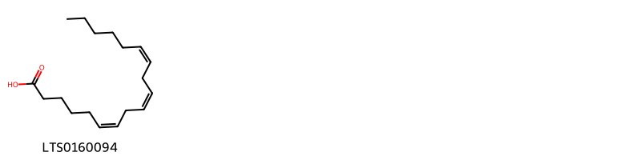{ width=100% }
    <figcaption>Hình ảnh cấu trúc hóa học của 1 hoạt chất thuộc nhóm Fatty Acyls gồm ['gamma-linolenic acid (LTS0160094)'].</figcaption>
</figure>
#### Nhóm Flavonoids
<figure markdown="span">
    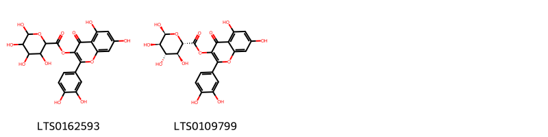{ width=100% }
    <figcaption>Hình ảnh cấu trúc hóa học của 2 hoạt chất thuộc nhóm Flavonoids gồm ['2-(3,4-dihydroxyphenyl)-5,7-dihydroxy-4-oxochromen-3-yl 3,4,5,6-tetrahydroxyoxane-2-carboxylate (LTS0162593)', '2-(3,4-dihydroxyphenyl)-5,7-dihydroxy-4-oxochromen-3-yl (2s,3s,4s,5r,6s)-3,4,5,6-tetrahydroxyoxane-2-carboxylate (LTS0109799)'].</figcaption>
</figure>

---

### Dược dân tộc học

Danh sách các quốc gia có sử dụng *Anemone nemorosa* trong điều trị các bệnh. 

| Country   | Disease                | Bệnh                                                                                                                                                                                                |
|:----------|:-----------------------|:----------------------------------------------------------------------------------------------------------------------------------------------------------------------------------------------------|
| Elsewhere | Vesicant               | MYMEMORY WARNING: YOU USED ALL AVAILABLE FREE TRANSLATIONS FOR TODAY. NEXT AVAILABLE IN  08 HOURS 52 MINUTES 06 SECONDS VISIT HTTPS://MYMEMORY.TRANSLATED.NET/DOC/USAGELIMITS.PHP TO TRANSLATE MORE |
| Turkey    | Nervine, Poison, Tonic | MYMEMORY WARNING: YOU USED ALL AVAILABLE FREE TRANSLATIONS FOR TODAY. NEXT AVAILABLE IN  08 HOURS 52 MINUTES 03 SECONDS VISIT HTTPS://MYMEMORY.TRANSLATED.NET/DOC/USAGELIMITS.PHP TO TRANSLATE MORE |
| ain       | Antidote               | MYMEMORY WARNING: YOU USED ALL AVAILABLE FREE TRANSLATIONS FOR TODAY. NEXT AVAILABLE IN  08 HOURS 52 MINUTES 01 SECONDS VISIT HTTPS://MYMEMORY.TRANSLATED.NET/DOC/USAGELIMITS.PHP TO TRANSLATE MORE |

---

---
## Anemone obtusiloba
### Thông tin về thực vật

!!! info "Phân loại thực vật của *N/A* từ GIBF:"
    - **Kingdom:** Plantae
    - **Phylum:** Tracheophyta
    - **Order:** Ranunculales
    - **Family:** Ranunculaceae
    - **Genus:** Anemonastrum
    - **Species:** *N/A*

 

| Label (VI)   | Label (EN)   | Scientific Name    | Descriptions (VI)   | Descriptions (EN)   | Also Known As (VI)   | Also Known As (EN)                                   |
|:-------------|:-------------|:-------------------|:--------------------|:--------------------|:---------------------|:-----------------------------------------------------|
| N/A          | N/A          | Anemone obtusiloba | loài thực vật       | species of plant    | ['']                 | ['Anemonidium obtusilobum', 'Himalayan Thimbleweed'] |

#### Phân bố trên thế giới

**Từ CSDL GIBF** Switzerland, nan, Japan, Spain, Poland, Canada, Russian Federation, United States of America, Italy, China, Austria, Ukraine

#### Phân bố tại Việt Nam

**Từ CSDL GIBF**: Không có ghi nhận ở Việt Nam

---
### Thành phần hóa học
        
- Theo cơ sở dữ liệu lotus: Từ loài *N/A* đã phân lập và xác định được 2 hoạt chất thuộc về các nhóm Prenol lipids. 

|    | chemicalTaxonomyClassyfireClass   |   smiles_count |
|---:|:----------------------------------|---------------:|
|  0 | Prenol lipids                     |              2 |

#### Nhóm Prenol lipids
<figure markdown="span">
    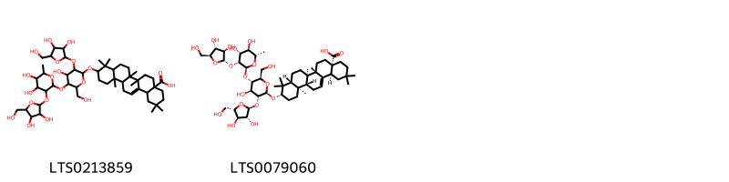{ width=100% }
    <figcaption>Hình ảnh cấu trúc hóa học của 2 hoạt chất thuộc nhóm Prenol lipids gồm ['10-[(3-{[3,4-dihydroxy-5-(hydroxymethyl)oxolan-2-yl]oxy}-5-[(3-{[3,4-dihydroxy-5-(hydroxymethyl)oxolan-2-yl]oxy}-4,5-dihydroxy-6-methyloxan-2-yl)oxy]-4-hydroxy-6-(hydroxymethyl)oxan-2-yl)oxy]-2,2,6a,6b,9,9,12a-heptamethyl-1,3,4,5,6,7,8,8a,10,11,12,12b,13,14b-tetradecahydropicene-4a-carboxylic acid (LTS0213859)', '(4as,6as,6br,8ar,10s,12ar,12br,14bs)-10-{[(2r,3r,4s,5s,6r)-3-{[(2s,3r,4r,5s)-3,4-dihydroxy-5-(hydroxymethyl)oxolan-2-yl]oxy}-5-{[(2s,3r,4r,5r,6s)-3-{[(2s,3r,4r,5s)-3,4-dihydroxy-5-(hydroxymethyl)oxolan-2-yl]oxy}-4,5-dihydroxy-6-methyloxan-2-yl]oxy}-4-hydroxy-6-(hydroxymethyl)oxan-2-yl]oxy}-2,2,6a,6b,9,9,12a-heptamethyl-1,3,4,5,6,7,8,8a,10,11,12,12b,13,14b-tetradecahydropicene-4a-carboxylic acid (LTS0079060)'].</figcaption>
</figure>

---

### Dược dân tộc học

Danh sách các quốc gia có sử dụng *N/A* trong điều trị các bệnh. 

| Country   | Disease   | Bệnh                                                                                                                                                                                                |
|:----------|:----------|:----------------------------------------------------------------------------------------------------------------------------------------------------------------------------------------------------|
| Kashmir   | Vesicant  | MYMEMORY WARNING: YOU USED ALL AVAILABLE FREE TRANSLATIONS FOR TODAY. NEXT AVAILABLE IN  08 HOURS 51 MINUTES 37 SECONDS VISIT HTTPS://MYMEMORY.TRANSLATED.NET/DOC/USAGELIMITS.PHP TO TRANSLATE MORE |

---

---
## Anemone patens
### Thông tin về thực vật

!!! info "Phân loại thực vật của *N/A* từ GIBF:"
    - **Kingdom:** Plantae
    - **Phylum:** Tracheophyta
    - **Order:** Ranunculales
    - **Family:** Ranunculaceae
    - **Genus:** Pulsatilla
    - **Species:** *N/A*

 

| Label (VI)   | Label (EN)   | Scientific Name   | Descriptions (VI)   | Descriptions (EN)   | Also Known As (VI)   | Also Known As (EN)               |
|:-------------|:-------------|:------------------|:--------------------|:--------------------|:---------------------|:---------------------------------|
| N/A          | N/A          | Anemone patens    | loài thực vật       | species of plant    | ['']                 | ['Pulsatilla patens (L.) Mill.'] |

#### Phân bố trên thế giới

**Từ CSDL GIBF** Switzerland, Serbia, Sweden, France, Czechia, Hungary, Romania, Germany, United States of America, Italy, Austria, Ukraine

#### Phân bố tại Việt Nam

**Từ CSDL GIBF**: Không có ghi nhận ở Việt Nam

---
### Thành phần hóa học
        
- Theo cơ sở dữ liệu lotus: Từ loài *N/A* đã phân lập và xác định được 15 hoạt chất thuộc về các nhóm Prenol lipids, Steroids and steroid derivatives. 

|    | chemicalTaxonomyClassyfireClass   |   smiles_count |
|---:|:----------------------------------|---------------:|
|  0 | Prenol lipids                     |             13 |
|  1 | Steroids and steroid derivatives  |              1 |

#### Nhóm Prenol lipids
<figure markdown="span">
    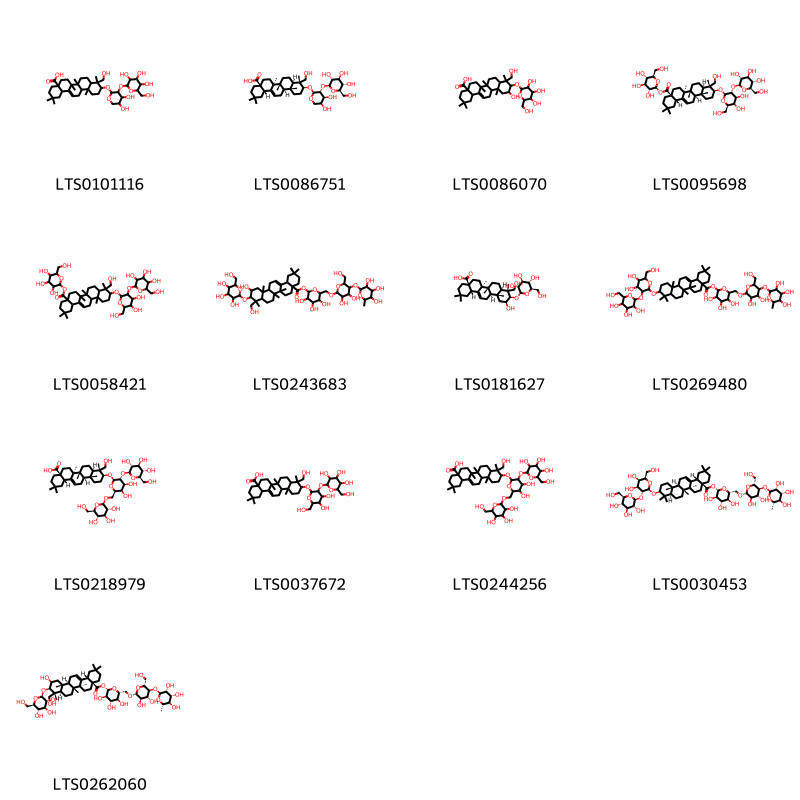{ width=100% }
    <figcaption>Hình ảnh cấu trúc hóa học của 13 hoạt chất thuộc nhóm Prenol lipids gồm ['10-[(4,5-dihydroxy-3-{[3,4,5-trihydroxy-6-(hydroxymethyl)oxan-2-yl]oxy}oxan-2-yl)oxy]-9-(hydroxymethyl)-2,2,6a,6b,9,12a-hexamethyl-1,3,4,5,6,7,8,8a,10,11,12,12b,13,14b-tetradecahydropicene-4a-carboxylic acid (LTS0101116)', 'cauloside c (LTS0086751)', '11-hydroxy-9-(hydroxymethyl)-2,2,6a,6b,9,12a-hexamethyl-10-{[3,4,5-trihydroxy-6-(hydroxymethyl)oxan-2-yl]oxy}-1,3,4,5,6,7,8,8a,10,11,12,12b,13,14b-tetradecahydropicene-4a-carboxylic acid (LTS0086070)', '(2s,3r,4s,5s,6r)-3,4,5-trihydroxy-6-(hydroxymethyl)oxan-2-yl (4as,6as,6br,8ar,9r,10s,12ar,12br,14bs)-10-{[(2r,3r,4s,5r,6r)-4,5-dihydroxy-6-(hydroxymethyl)-3-{[(2s,3r,4s,5s,6r)-3,4,5-trihydroxy-6-(hydroxymethyl)oxan-2-yl]oxy}oxan-2-yl]oxy}-9-(hydroxymethyl)-2,2,6a,6b,9,12a-hexamethyl-1,3,4,5,6,7,8,8a,10,11,12,12b,13,14b-tetradecahydropicene-4a-carboxylate (LTS0095698)', '3,4,5-trihydroxy-6-(hydroxymethyl)oxan-2-yl 10-{[4,5-dihydroxy-6-(hydroxymethyl)-3-{[3,4,5-trihydroxy-6-(hydroxymethyl)oxan-2-yl]oxy}oxan-2-yl]oxy}-9-(hydroxymethyl)-2,2,6a,6b,9,12a-hexamethyl-1,3,4,5,6,7,8,8a,10,11,12,12b,13,14b-tetradecahydropicene-4a-carboxylate (LTS0058421)', '6-({[3,4-dihydroxy-6-(hydroxymethyl)-5-[(3,4,5-trihydroxy-6-methyloxan-2-yl)oxy]oxan-2-yl]oxy}methyl)-3,4,5-trihydroxyoxan-2-yl 11-hydroxy-9-(hydroxymethyl)-2,2,6a,6b,9,12a-hexamethyl-10-{[3,4,5-trihydroxy-6-(hydroxymethyl)oxan-2-yl]oxy}-1,3,4,5,6,7,8,8a,10,11,12,12b,13,14b-tetradecahydropicene-4a-carboxylate (LTS0243683)', '(4as,6as,6br,8ar,9r,10r,11s,12ar,12br,14bs)-11-hydroxy-9-(hydroxymethyl)-2,2,6a,6b,9,12a-hexamethyl-10-{[(2r,3r,4s,5s,6r)-3,4,5-trihydroxy-6-(hydroxymethyl)oxan-2-yl]oxy}-1,3,4,5,6,7,8,8a,10,11,12,12b,13,14b-tetradecahydropicene-4a-carboxylic acid (LTS0181627)', '6-({[3,4-dihydroxy-6-(hydroxymethyl)-5-[(3,4,5-trihydroxy-6-methyloxan-2-yl)oxy]oxan-2-yl]oxy}methyl)-3,4,5-trihydroxyoxan-2-yl 10-{[4,5-dihydroxy-6-(hydroxymethyl)-3-{[3,4,5-trihydroxy-6-(hydroxymethyl)oxan-2-yl]oxy}oxan-2-yl]oxy}-2,2,6a,6b,9,9,12a-heptamethyl-1,3,4,5,6,7,8,8a,10,11,12,12b,13,14b-tetradecahydropicene-4a-carboxylate (LTS0269480)', '(4as,6as,6br,8ar,9r,10s,12ar,12br,14bs)-10-{[(2r,3r,4s,5r,6r)-4,5-dihydroxy-3-{[(2s,3r,4s,5s,6r)-3,4,5-trihydroxy-6-(hydroxymethyl)oxan-2-yl]oxy}-6-({[(2r,3r,4s,5s,6r)-3,4,5-trihydroxy-6-(hydroxymethyl)oxan-2-yl]oxy}methyl)oxan-2-yl]oxy}-9-(hydroxymethyl)-2,2,6a,6b,9,12a-hexamethyl-1,3,4,5,6,7,8,8a,10,11,12,12b,13,14b-tetradecahydropicene-4a-carboxylic acid (LTS0218979)', '10-{[4,5-dihydroxy-6-(hydroxymethyl)-3-{[3,4,5-trihydroxy-6-(hydroxymethyl)oxan-2-yl]oxy}oxan-2-yl]oxy}-9-(hydroxymethyl)-2,2,6a,6b,9,12a-hexamethyl-1,3,4,5,6,7,8,8a,10,11,12,12b,13,14b-tetradecahydropicene-4a-carboxylic acid (LTS0037672)', '10-[(4,5-dihydroxy-3-{[3,4,5-trihydroxy-6-(hydroxymethyl)oxan-2-yl]oxy}-6-({[3,4,5-trihydroxy-6-(hydroxymethyl)oxan-2-yl]oxy}methyl)oxan-2-yl)oxy]-9-(hydroxymethyl)-2,2,6a,6b,9,12a-hexamethyl-1,3,4,5,6,7,8,8a,10,11,12,12b,13,14b-tetradecahydropicene-4a-carboxylic acid (LTS0244256)', '(2s,3r,4s,5s,6r)-6-({[(2r,3r,4r,5s,6r)-3,4-dihydroxy-6-(hydroxymethyl)-5-{[(2s,3r,4r,5r,6s)-3,4,5-trihydroxy-6-methyloxan-2-yl]oxy}oxan-2-yl]oxy}methyl)-3,4,5-trihydroxyoxan-2-yl (4as,6as,6br,8ar,10s,12ar,12br,14bs)-10-{[(2r,3r,4s,5r,6r)-4,5-dihydroxy-6-(hydroxymethyl)-3-{[(2s,3r,4s,5s,6r)-3,4,5-trihydroxy-6-(hydroxymethyl)oxan-2-yl]oxy}oxan-2-yl]oxy}-2,2,6a,6b,9,9,12a-heptamethyl-1,3,4,5,6,7,8,8a,10,11,12,12b,13,14b-tetradecahydropicene-4a-carboxylate (LTS0030453)', '(2s,3r,4s,5s,6r)-6-({[(2r,3r,4r,5s,6r)-3,4-dihydroxy-6-(hydroxymethyl)-5-{[(2s,3r,4r,5r,6s)-3,4,5-trihydroxy-6-methyloxan-2-yl]oxy}oxan-2-yl]oxy}methyl)-3,4,5-trihydroxyoxan-2-yl (4as,6as,6br,8ar,9r,10r,11s,12ar,12br,14bs)-11-hydroxy-9-(hydroxymethyl)-2,2,6a,6b,9,12a-hexamethyl-10-{[(2r,3r,4s,5s,6r)-3,4,5-trihydroxy-6-(hydroxymethyl)oxan-2-yl]oxy}-1,3,4,5,6,7,8,8a,10,11,12,12b,13,14b-tetradecahydropicene-4a-carboxylate (LTS0262060)'].</figcaption>
</figure>
#### Nhóm Steroids and steroid derivatives
<figure markdown="span">
    { width=100% }
    <figcaption>Hình ảnh cấu trúc hóa học của 1 hoạt chất thuộc nhóm Steroids and steroid derivatives gồm ['20-hydroxyecdysone (LTS0227025)'].</figcaption>
</figure>

---

### Dược dân tộc học

Danh sách các quốc gia có sử dụng *N/A* trong điều trị các bệnh. 

| Country       | Disease                            | Bệnh                                                                                                                                                                                                |
|:--------------|:-----------------------------------|:----------------------------------------------------------------------------------------------------------------------------------------------------------------------------------------------------|
| Elsewhere     | Diuretic, Emmenagogue, Expectorant | MYMEMORY WARNING: YOU USED ALL AVAILABLE FREE TRANSLATIONS FOR TODAY. NEXT AVAILABLE IN  08 HOURS 51 MINUTES 14 SECONDS VISIT HTTPS://MYMEMORY.TRANSLATED.NET/DOC/USAGELIMITS.PHP TO TRANSLATE MORE |
| US(Blackfoot) | Counterirritant                    | MYMEMORY WARNING: YOU USED ALL AVAILABLE FREE TRANSLATIONS FOR TODAY. NEXT AVAILABLE IN  08 HOURS 51 MINUTES 12 SECONDS VISIT HTTPS://MYMEMORY.TRANSLATED.NET/DOC/USAGELIMITS.PHP TO TRANSLATE MORE |

---

---
## Anemone pratensis
### Thông tin về thực vật

!!! info "Phân loại thực vật của *N/A* từ GIBF:"
    - **Kingdom:** Plantae
    - **Phylum:** Tracheophyta
    - **Order:** Ranunculales
    - **Family:** Ranunculaceae
    - **Genus:** N/A
    - **Species:** *N/A*

 

| Label (VI)   | Label (EN)   | Scientific Name   | Descriptions (VI)   | Descriptions (EN)   | Also Known As (VI)   | Also Known As (EN)   |
|:-------------|:-------------|:------------------|:--------------------|:--------------------|:---------------------|:---------------------|
| N/A          | N/A          | Anemone pratensis |                     | species of plant    | ['']                 | ['']                 |

#### Phân bố trên thế giới

**Từ CSDL GIBF** nan, Denmark, Spain, Germany, Chile, Austria, Australia, Palestine, State of, Canada, Iraq, Belgium, Netherlands, Malta, Türkiye, Hungary, Mexico, Ireland, Chinese Taipei, United Kingdom of Great Britain and Northern Ireland, Argentina, South Africa, Jordan, France, New Zealand, Romania, Russian Federation, United States of America, Italy, Greece, Ukraine

#### Phân bố tại Việt Nam

**Từ CSDL GIBF**: Không có ghi nhận ở Việt Nam

---
### Thành phần hóa học
        
- Theo cơ sở dữ liệu lotus: Từ loài *N/A* đã phân lập và xác định được 2 hoạt chất thuộc về các nhóm Steroids and steroid derivatives, Dihydrofurans. 

|    | chemicalTaxonomyClassyfireClass   |   smiles_count |
|---:|:----------------------------------|---------------:|
|  0 | Dihydrofurans                     |              1 |
|  1 | Steroids and steroid derivatives  |              1 |

#### Nhóm Dihydrofurans
<figure markdown="span">
    { width=100% }
    <figcaption>Hình ảnh cấu trúc hóa học của 1 hoạt chất thuộc nhóm Dihydrofurans gồm ['protoanemonin (LTS0133358)'].</figcaption>
</figure>
#### Nhóm Steroids and steroid derivatives
<figure markdown="span">
    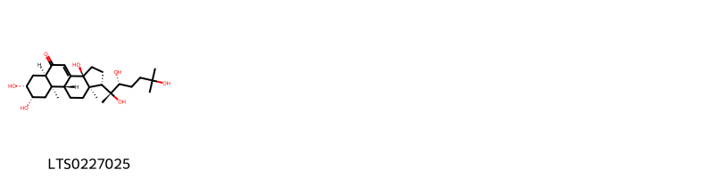{ width=100% }
    <figcaption>Hình ảnh cấu trúc hóa học của 1 hoạt chất thuộc nhóm Steroids and steroid derivatives gồm ['20-hydroxyecdysone (LTS0227025)'].</figcaption>
</figure>

---

### Dược dân tộc học

Danh sách các quốc gia có sử dụng *N/A* trong điều trị các bệnh. 

| Country   | Disease                                                                                               | Bệnh                                                                                                                                                                                                |
|:----------|:------------------------------------------------------------------------------------------------------|:----------------------------------------------------------------------------------------------------------------------------------------------------------------------------------------------------|
| Elsewhere | Emmenagogue, Expectorant, Diuretic                                                                    | MYMEMORY WARNING: YOU USED ALL AVAILABLE FREE TRANSLATIONS FOR TODAY. NEXT AVAILABLE IN  08 HOURS 50 MINUTES 47 SECONDS VISIT HTTPS://MYMEMORY.TRANSLATED.NET/DOC/USAGELIMITS.PHP TO TRANSLATE MORE |
| Turkey    | Diuretic, Emmenagogue, Expectorant, Poison, Sedative, Tonic, Nervine, Stimulant, Mydriatic, Sudorific | MYMEMORY WARNING: YOU USED ALL AVAILABLE FREE TRANSLATIONS FOR TODAY. NEXT AVAILABLE IN  08 HOURS 50 MINUTES 45 SECONDS VISIT HTTPS://MYMEMORY.TRANSLATED.NET/DOC/USAGELIMITS.PHP TO TRANSLATE MORE |

---

---
## Anemone pulsatilla
### Thông tin về thực vật

!!! info "Phân loại thực vật của *N/A* từ GIBF:"
    - **Kingdom:** Plantae
    - **Phylum:** Tracheophyta
    - **Order:** Ranunculales
    - **Family:** Ranunculaceae
    - **Genus:** Pulsatilla
    - **Species:** *N/A*

 

| Label (VI)   | Label (EN)   | Scientific Name    | Descriptions (VI)   | Descriptions (EN)   | Also Known As (VI)   | Also Known As (EN)   |
|:-------------|:-------------|:-------------------|:--------------------|:--------------------|:---------------------|:---------------------|
| N/A          | N/A          | Anemone pulsatilla | loài thực vật       | species of plant    | ['']                 | ['']                 |

#### Phân bố trên thế giới

**Từ CSDL GIBF** Switzerland, Serbia, Sweden, France, Czechia, Hungary, Romania, Germany, United States of America, Italy, Austria, Ukraine

#### Phân bố tại Việt Nam

**Từ CSDL GIBF**: Không có ghi nhận ở Việt Nam

---
### Thành phần hóa học
        
- Theo cơ sở dữ liệu lotus: Từ loài *N/A* đã phân lập và xác định được 1 hoạt chất thuộc về các nhóm Steroids and steroid derivatives. 

|    | chemicalTaxonomyClassyfireClass   |   smiles_count |
|---:|:----------------------------------|---------------:|
|  0 | Steroids and steroid derivatives  |              1 |

#### Nhóm Steroids and steroid derivatives
<figure markdown="span">
    { width=100% }
    <figcaption>Hình ảnh cấu trúc hóa học của 1 hoạt chất thuộc nhóm Steroids and steroid derivatives gồm ['20-hydroxyecdysone (LTS0227025)'].</figcaption>
</figure>

---

### Dược dân tộc học

Danh sách các quốc gia có sử dụng *N/A* trong điều trị các bệnh. 

| Country   | Disease                            | Bệnh                                                                                                                                                                                                |
|:----------|:-----------------------------------|:----------------------------------------------------------------------------------------------------------------------------------------------------------------------------------------------------|
| Elsewhere | Diuretic, Emmenagogue, Expectorant | MYMEMORY WARNING: YOU USED ALL AVAILABLE FREE TRANSLATIONS FOR TODAY. NEXT AVAILABLE IN  08 HOURS 50 MINUTES 20 SECONDS VISIT HTTPS://MYMEMORY.TRANSLATED.NET/DOC/USAGELIMITS.PHP TO TRANSLATE MORE |
| ain       | Antidote                           | MYMEMORY WARNING: YOU USED ALL AVAILABLE FREE TRANSLATIONS FOR TODAY. NEXT AVAILABLE IN  08 HOURS 50 MINUTES 18 SECONDS VISIT HTTPS://MYMEMORY.TRANSLATED.NET/DOC/USAGELIMITS.PHP TO TRANSLATE MORE |

---

---
## Anemone vitifolia
### Thông tin về thực vật

!!! info "Phân loại thực vật của *Eriocapitella vitifolia* từ GIBF:"
    - **Kingdom:** Plantae
    - **Phylum:** Tracheophyta
    - **Order:** Ranunculales
    - **Family:** Ranunculaceae
    - **Genus:** Eriocapitella
    - **Species:** *Eriocapitella vitifolia*

 

| Label (VI)   | Label (EN)   | Scientific Name   | Descriptions (VI)   | Descriptions (EN)   | Also Known As (VI)   | Also Known As (EN)                                                         |
|:-------------|:-------------|:------------------|:--------------------|:--------------------|:---------------------|:---------------------------------------------------------------------------|
| N/A          | N/A          | Anemone vitifolia | loài thực vật       | species of plant    | ['']                 | ['Eriocapitella vitifolia', 'Grape Leaf Anemone', 'Grape Leaf Windflower'] |

#### Phân bố trên thế giới

**Từ CSDL GIBF** nan, Viet Nam, unknown or invalid, Pakistan, Bhutan, Japan, Philippines, India, Germany, United States of America, China, Nepal, Belgium, Chinese Taipei

#### Phân bố tại Việt Nam

**Từ CSDL GIBF**: Không có ghi nhận ở Việt Nam

---
### Thành phần hóa học
        
- Theo cơ sở dữ liệu lotus: Từ loài *Eriocapitella vitifolia* đã phân lập và xác định được Chưa có hoạt chất nào được phân lập. hoạt chất thuộc về các nhóm Không có hoạt chất nào được phân lập. 

Không có hình ảnh nào được tạo ra

---

### Dược dân tộc học

Danh sách các quốc gia có sử dụng *Eriocapitella vitifolia* trong điều trị các bệnh. 

| Country   | Disease                        | Bệnh                                                                                                                                                                                                |
|:----------|:-------------------------------|:----------------------------------------------------------------------------------------------------------------------------------------------------------------------------------------------------|
| China     | Insecticide, Vermifuge, Poison | MYMEMORY WARNING: YOU USED ALL AVAILABLE FREE TRANSLATIONS FOR TODAY. NEXT AVAILABLE IN  08 HOURS 49 MINUTES 54 SECONDS VISIT HTTPS://MYMEMORY.TRANSLATED.NET/DOC/USAGELIMITS.PHP TO TRANSLATE MORE |

---

# Chi Clematis

??? note "Danh sách các dược liệu thuộc chi"
    
	 - *Clematis alpina*
	 - *Clematis biondiana*
	 - *Clematis brachiata*
	 - *Clematis chinensis*
	 - *Clematis dioica*
	 - *Clematis drummondi*
	 - *Clematis flammula*
	 - *Clematis florida*
	 - *Clematis gouriana*
	 - *Clematis graveolens*
	 - *Clematis grossa*
	 - *Clematis ligusticifolia*
	 - *Clematis minor*
	 - *Clematis patens*
	 - *Clematis terniflora*
	 - *Clematis vitalba*

---
## Clematis alpina
### Thông tin về thực vật

!!! info "Phân loại thực vật của *Clematis alpina* từ GIBF:"
    - **Kingdom:** Plantae
    - **Phylum:** Tracheophyta
    - **Order:** Ranunculales
    - **Family:** Ranunculaceae
    - **Genus:** Clematis
    - **Species:** *Clematis alpina*

 

| Label (VI)   | Label (EN)   | Scientific Name   | Descriptions (VI)   | Descriptions (EN)   | Also Known As (VI)   | Also Known As (EN)   |
|:-------------|:-------------|:------------------|:--------------------|:--------------------|:---------------------|:---------------------|
| N/A          | N/A          | Clematis alpina   | loài thực vật       | species of plant    | ['']                 | ['']                 |

#### Phân bố trên thế giới

**Từ CSDL GIBF** nan, Slovenia, United Kingdom of Great Britain and Northern Ireland, Sweden, France, Poland, Romania, Germany, Canada, Italy, Austria, Norway, Croatia, Slovakia, Ukraine

#### Phân bố tại Việt Nam

**Từ CSDL GIBF**: Không có ghi nhận ở Việt Nam

---
### Thành phần hóa học
        
- Theo cơ sở dữ liệu lotus: Từ loài *Clematis alpina* đã phân lập và xác định được Chưa có hoạt chất nào được phân lập. hoạt chất thuộc về các nhóm Không có hoạt chất nào được phân lập. 

Không có hình ảnh nào được tạo ra

---

### Dược dân tộc học

Danh sách các quốc gia có sử dụng *Clematis alpina* trong điều trị các bệnh. 

| Country   | Disease   | Bệnh                                                                                                                                                                                                |
|:----------|:----------|:----------------------------------------------------------------------------------------------------------------------------------------------------------------------------------------------------|
| Japan     | Poison    | MYMEMORY WARNING: YOU USED ALL AVAILABLE FREE TRANSLATIONS FOR TODAY. NEXT AVAILABLE IN  08 HOURS 49 MINUTES 32 SECONDS VISIT HTTPS://MYMEMORY.TRANSLATED.NET/DOC/USAGELIMITS.PHP TO TRANSLATE MORE |

---

---
## Clematis biondiana
### Thông tin về thực vật

!!! info "Phân loại thực vật của *Clematis armandii* từ GIBF:"
    - **Kingdom:** Plantae
    - **Phylum:** Tracheophyta
    - **Order:** Ranunculales
    - **Family:** Ranunculaceae
    - **Genus:** Clematis
    - **Species:** *Clematis armandii*

 

| Label (VI)   | Label (EN)   | Scientific Name    | Descriptions (VI)   | Descriptions (EN)   | Also Known As (VI)   | Also Known As (EN)   |
|:-------------|:-------------|:-------------------|:--------------------|:--------------------|:---------------------|:---------------------|
| N/A          | N/A          | Clematis biondiana |                     |                     | ['']                 | ['']                 |

#### Phân bố trên thế giới

**Từ CSDL GIBF** China

#### Phân bố tại Việt Nam

**Từ CSDL GIBF**: Không có ghi nhận ở Việt Nam

---
### Thành phần hóa học
        
- Theo cơ sở dữ liệu lotus: Từ loài *Clematis armandii* đã phân lập và xác định được Chưa có hoạt chất nào được phân lập. hoạt chất thuộc về các nhóm Không có hoạt chất nào được phân lập. 

Không có hình ảnh nào được tạo ra

---

### Dược dân tộc học

Danh sách các quốc gia có sử dụng *Clematis armandii* trong điều trị các bệnh. 

| Country   | Disease   | Bệnh                                                                                                                                                                                                |
|:----------|:----------|:----------------------------------------------------------------------------------------------------------------------------------------------------------------------------------------------------|
| Chinese   | Diuretic  | MYMEMORY WARNING: YOU USED ALL AVAILABLE FREE TRANSLATIONS FOR TODAY. NEXT AVAILABLE IN  08 HOURS 49 MINUTES 11 SECONDS VISIT HTTPS://MYMEMORY.TRANSLATED.NET/DOC/USAGELIMITS.PHP TO TRANSLATE MORE |

---

---
## Clematis brachiata
### Thông tin về thực vật

!!! info "Phân loại thực vật của *Clematis brachiata* từ GIBF:"
    - **Kingdom:** Plantae
    - **Phylum:** Tracheophyta
    - **Order:** Ranunculales
    - **Family:** Ranunculaceae
    - **Genus:** Clematis
    - **Species:** *Clematis brachiata*

 

| Label (VI)   | Label (EN)   | Scientific Name    | Descriptions (VI)   | Descriptions (EN)   | Also Known As (VI)   | Also Known As (EN)   |
|:-------------|:-------------|:-------------------|:--------------------|:--------------------|:---------------------|:---------------------|
| N/A          | N/A          | Clematis brachiata | loài thực vật       | species of plant    | ['']                 | ['']                 |

#### Phân bố trên thế giới

**Từ CSDL GIBF** Malawi, United Kingdom of Great Britain and Northern Ireland, South Africa, Namibia, Eswatini, Zimbabwe

#### Phân bố tại Việt Nam

**Từ CSDL GIBF**: Không có ghi nhận ở Việt Nam

---
### Thành phần hóa học
        
- Theo cơ sở dữ liệu lotus: Từ loài *Clematis brachiata* đã phân lập và xác định được Chưa có hoạt chất nào được phân lập. hoạt chất thuộc về các nhóm Không có hoạt chất nào được phân lập. 

Không có hình ảnh nào được tạo ra

---

### Dược dân tộc học

Danh sách các quốc gia có sử dụng *Clematis brachiata* trong điều trị các bệnh. 

| Country   | Disease   | Bệnh                                                                                                                                                                                                |
|:----------|:----------|:----------------------------------------------------------------------------------------------------------------------------------------------------------------------------------------------------|
| Lesotho   | Vermifuge | MYMEMORY WARNING: YOU USED ALL AVAILABLE FREE TRANSLATIONS FOR TODAY. NEXT AVAILABLE IN  08 HOURS 48 MINUTES 56 SECONDS VISIT HTTPS://MYMEMORY.TRANSLATED.NET/DOC/USAGELIMITS.PHP TO TRANSLATE MORE |

---

---
## Clematis chinensis
### Thông tin về thực vật

!!! info "Phân loại thực vật của *Clematis chinensis* từ GIBF:"
    - **Kingdom:** Plantae
    - **Phylum:** Tracheophyta
    - **Order:** Ranunculales
    - **Family:** Ranunculaceae
    - **Genus:** Clematis
    - **Species:** *Clematis chinensis*

 

| Label (VI)   | Label (EN)   | Scientific Name    | Descriptions (VI)   | Descriptions (EN)   | Also Known As (VI)   | Also Known As (EN)   |
|:-------------|:-------------|:-------------------|:--------------------|:--------------------|:---------------------|:---------------------|
| N/A          | N/A          | Clematis chinensis | loài thực vật       | species of plant    | ['']                 | ['']                 |

#### Phân bố trên thế giới

**Từ CSDL GIBF** nan, Viet Nam, Chinese Taipei, Japan, Russian Federation, China, Hong Kong

#### Phân bố tại Việt Nam

**Từ CSDL GIBF**: Hoa Binh

---
### Thành phần hóa học
        
- Theo cơ sở dữ liệu lotus: Từ loài *Clematis chinensis* đã phân lập và xác định được 103 hoạt chất thuộc về các nhóm Furanoid lignans, Coumarins and derivatives, Prenol lipids, Phenols, Dihydrofurans. 

|    | chemicalTaxonomyClassyfireClass   |   smiles_count |
|---:|:----------------------------------|---------------:|
|  0 | Coumarins and derivatives         |              1 |
|  1 | Dihydrofurans                     |              2 |
|  2 | Furanoid lignans                  |              1 |
|  3 | Phenols                           |              1 |
|  4 | Prenol lipids                     |             97 |

#### Nhóm Coumarins and derivatives
<figure markdown="span">
    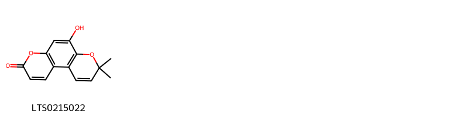{ width=100% }
    <figcaption>Hình ảnh cấu trúc hóa học của 1 hoạt chất thuộc nhóm Coumarins and derivatives gồm ['6-hydroxy-8,8-dimethylpyrano[3,2-f]chromen-3-one (LTS0215022)'].</figcaption>
</figure>
#### Nhóm Dihydrofurans
<figure markdown="span">
    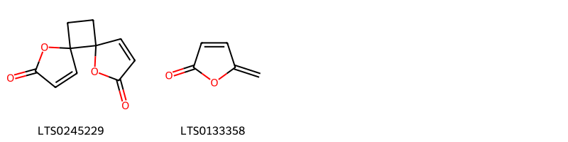{ width=100% }
    <figcaption>Hình ảnh cấu trúc hóa học của 2 hoạt chất thuộc nhóm Dihydrofurans gồm ['anemonin (LTS0245229)', 'protoanemonin (LTS0133358)'].</figcaption>
</figure>
#### Nhóm Furanoid lignans
<figure markdown="span">
    { width=100% }
    <figcaption>Hình ảnh cấu trúc hóa học của 1 hoạt chất thuộc nhóm Furanoid lignans gồm ['(+)-syringaresinol (LTS0158868)'].</figcaption>
</figure>
#### Nhóm Phenols
<figure markdown="span">
    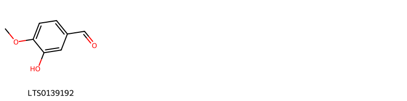{ width=100% }
    <figcaption>Hình ảnh cấu trúc hóa học của 1 hoạt chất thuộc nhóm Phenols gồm ['isovanillin (LTS0139192)'].</figcaption>
</figure>
#### Nhóm Prenol lipids
<figure markdown="span">
    { width=100% }
    <figcaption>Hình ảnh cấu trúc hóa học của 97 hoạt chất thuộc nhóm Prenol lipids gồm ['oleanolic acid (LTS0117717)', 'oleanolic acid (LTS0141130)', '10-({4,5-dihydroxy-3-[(3,4,5-trihydroxy-6-methyloxan-2-yl)oxy]oxan-2-yl}oxy)-2,2,6a,6b,9,9,12a-heptamethyl-1,3,4,5,6,7,8,8a,10,11,12,12b,13,14b-tetradecahydropicene-4a-carboxylic acid (LTS0227242)', '10-({4,5-dihydroxy-3-[(3,4,5-trihydroxy-6-methyloxan-2-yl)oxy]oxan-2-yl}oxy)-9-(hydroxymethyl)-2,2,6a,6b,9,12a-hexamethyl-1,3,4,5,6,7,8,8a,10,11,12,12b,13,14b-tetradecahydropicene-4a-carboxylic acid (LTS0107537)', 'hederagenin (LTS0157813)', '6-({[3,4-dihydroxy-6-(hydroxymethyl)-5-[(3,4,5-trihydroxy-6-methyloxan-2-yl)oxy]oxan-2-yl]oxy}methyl)-3,4,5-trihydroxyoxan-2-yl 10-({4,5-dihydroxy-3-[(3,4,5-trihydroxy-6-methyloxan-2-yl)oxy]oxan-2-yl}oxy)-9-(hydroxymethyl)-2,2,6a,6b,9,12a-hexamethyl-1,3,4,5,6,7,8,8a,10,11,12,12b,13,14b-tetradecahydropicene-4a-carboxylate (LTS0071057)', 'kalopanaxsaponin b (LTS0046976)', '6-({[3,4-dihydroxy-6-(hydroxymethyl)-5-[(3,4,5-trihydroxy-6-methyloxan-2-yl)oxy]oxan-2-yl]oxy}methyl)-3,4,5-trihydroxyoxan-2-yl 10-{[3-({3,5-dihydroxy-6-methyl-4-[(3,4,5-trihydroxyoxan-2-yl)oxy]oxan-2-yl}oxy)-4,5-dihydroxyoxan-2-yl]oxy}-2,2,6a,6b,9,9,12a-heptamethyl-1,3,4,5,6,7,8,8a,10,11,12,12b,13,14b-tetradecahydropicene-4a-carboxylate (LTS0129801)', '(2s,3r,4s,5s,6r)-6-({[(2r,3r,4r,5s,6r)-3,4-dihydroxy-6-(hydroxymethyl)-5-{[(2s,3r,4r,5r,6s)-3,4,5-trihydroxy-6-methyloxan-2-yl]oxy}oxan-2-yl]oxy}methyl)-3,4,5-trihydroxyoxan-2-yl (4as,6as,6br,8ar,9r,10s,12ar,12br,14bs)-10-hydroxy-9-(hydroxymethyl)-2,2,6a,6b,9,12a-hexamethyl-1,3,4,5,6,7,8,8a,10,11,12,12b,13,14b-tetradecahydropicene-4a-carboxylate (LTS0199325)', '(4as,6as,6br,8as,10s,12ar,12bs,14br)-10-{[(2r,3s,4r,5r)-4,5-dihydroxy-3-{[(2r,3s,4s,5s,6r)-3,4,5-trihydroxy-6-methyloxan-2-yl]oxy}oxan-2-yl]oxy}-2,2,6a,6b,9,9,12a-heptamethyl-1,3,4,5,6,7,8,8a,10,11,12,12b,13,14b-tetradecahydropicene-4a-carboxylic acid (LTS0218071)', '(4as,6as,6br,8ar,10s,12ar,12br,14br)-10-{[(2s,3r,4s,5s)-4,5-dihydroxy-3-{[(2s,3r,4s,5r)-3,4,5-trihydroxyoxan-2-yl]oxy}oxan-2-yl]oxy}-2,2,6a,6b,9,9,12a-heptamethyl-1,3,4,5,6,7,8,8a,10,11,12,12b,13,14b-tetradecahydropicene-4a-carboxylic acid (LTS0214382)', '6-({[3,4-dihydroxy-6-(hydroxymethyl)-5-[(3,4,5-trihydroxy-6-methyloxan-2-yl)oxy]oxan-2-yl]oxy}methyl)-3,4,5-trihydroxyoxan-2-yl 10-{[3-({3,5-dihydroxy-6-methyl-4-[(3,4,5-trihydroxyoxan-2-yl)oxy]oxan-2-yl}oxy)-4,5-dihydroxyoxan-2-yl]oxy}-9-(hydroxymethyl)-2,2,6a,6b,9,12a-hexamethyl-1,3,4,5,6,7,8,8a,10,11,12,12b,13,14b-tetradecahydropicene-4a-carboxylate (LTS0207545)', '(2s,3r,4s,5s,6r)-6-({[(2r,3r,4r,5s,6r)-3,4-dihydroxy-6-(hydroxymethyl)-5-{[(2s,3r,4r,5r,6s)-3,4,5-trihydroxy-6-methyloxan-2-yl]oxy}oxan-2-yl]oxy}methyl)-3,4,5-trihydroxyoxan-2-yl (4as,6as,6br,8ar,9r,10s,12ar,12br,14bs)-10-{[(2s,3r,4s,5s)-3-{[(2s,3r,4r,5s,6s)-3,5-dihydroxy-6-methyl-4-{[(2s,3r,4r,5r)-3,4,5-trihydroxyoxan-2-yl]oxy}oxan-2-yl]oxy}-4,5-dihydroxyoxan-2-yl]oxy}-9-(hydroxymethyl)-2,2,6a,6b,9,12a-hexamethyl-1,3,4,5,6,7,8,8a,10,11,12,12b,13,14b-tetradecahydropicene-4a-carboxylate (LTS0072019)', '(2s,3r,4s,5s,6r)-6-({[(2r,3r,4r,5s,6r)-3,4-dihydroxy-6-(hydroxymethyl)-5-{[(2s,3r,4r,5r,6s)-3,4,5-trihydroxy-6-methyloxan-2-yl]oxy}oxan-2-yl]oxy}methyl)-3,4,5-trihydroxyoxan-2-yl (4as,6as,6br,8ar,10s,12ar,12br,14bs)-10-{[(2s,3r,4s,5s)-3-{[(2s,3r,4r,5s,6s)-4-{[(2s,3r,4s,5r)-5-{[(2r,3r,4r,5s,6r)-3,4-dihydroxy-6-(hydroxymethyl)-5-{[(2s,3r,4s,5s,6r)-3,4,5-trihydroxy-6-(hydroxymethyl)oxan-2-yl]oxy}oxan-2-yl]oxy}-3,4-dihydroxyoxan-2-yl]oxy}-3,5-dihydroxy-6-methyloxan-2-yl]oxy}-4,5-dihydroxyoxan-2-yl]oxy}-2,2,6a,6b,9,9,12a-heptamethyl-1,3,4,5,6,7,8,8a,10,11,12,12b,13,14b-tetradecahydropicene-4a-carboxylate (LTS0223369)', '(2s,3r,4s,5s,6r)-6-({[(2r,3r,4r,5s,6r)-3,4-dihydroxy-6-(hydroxymethyl)-5-{[(2s,3r,4r,5r,6s)-3,4,5-trihydroxy-6-methyloxan-2-yl]oxy}oxan-2-yl]oxy}methyl)-3,4,5-trihydroxyoxan-2-yl (4as,6as,6br,8ar,10s,12ar,12br,14bs)-10-{[(2s,3r,4s,5s)-4,5-dihydroxy-3-{[(2s,3r,4r,5r,6s)-3,4,5-trihydroxy-6-methyloxan-2-yl]oxy}oxan-2-yl]oxy}-2,2,6a,6b,9,9,12a-heptamethyl-1,3,4,5,6,7,8,8a,10,11,12,12b,13,14b-tetradecahydropicene-4a-carboxylate (LTS0084850)', '10-({4,5-dihydroxy-3-[(3,4,5-trihydroxyoxan-2-yl)oxy]oxan-2-yl}oxy)-2,2,6a,6b,9,9,12a-heptamethyl-1,3,4,5,6,7,8,8a,10,11,12,12b,13,14b-tetradecahydropicene-4a-carboxylic acid (LTS0215273)', '(4as,6as,6br,8ar,9r,10s,12ar,12br,14bs)-10-{[(2s,3r,4s,5s)-3-{[(2s,3r,4r,5s,6s)-4-{[(2s,3r,4s,5r)-3,4-dihydroxy-5-{[(2s,3r,4s,5s,6r)-3,4,5-trihydroxy-6-(hydroxymethyl)oxan-2-yl]oxy}oxan-2-yl]oxy}-3,5-dihydroxy-6-methyloxan-2-yl]oxy}-4,5-dihydroxyoxan-2-yl]oxy}-9-(hydroxymethyl)-2,2,6a,6b,9,12a-hexamethyl-1,3,4,5,6,7,8,8a,10,11,12,12b,13,14b-tetradecahydropicene-4a-carboxylic acid (LTS0057091)', '(4as,6as,6br,8ar,9r,10s,12ar,12br,14bs)-10-hydroxy-2,2,6a,6b,9,12a-hexamethyl-9-({[(2r,3r,4s,5s)-3,4,5-trihydroxyoxan-2-yl]oxy}methyl)-1,3,4,5,6,7,8,8a,10,11,12,12b,13,14b-tetradecahydropicene-4a-carboxylic acid (LTS0073831)', '(4as,6as,6br,8ar,9s,10s,12ar,12br,14br)-10-{[(2r,3s,4r,5r)-3-{[(2r,3s,4r,5r,6r)-3,4-dihydroxy-6-methyl-5-{[(2r,3s,4s,5s)-3,4,5-trihydroxyoxan-2-yl]oxy}oxan-2-yl]oxy}-4,5-dihydroxyoxan-2-yl]oxy}-9-(hydroxymethyl)-2,2,6a,6b,9,12a-hexamethyl-1,3,4,5,6,7,8,8a,10,11,12,12b,13,14b-tetradecahydropicene-4a-carboxylic acid (LTS0080404)', '(4as,6as,6br,8ar,10s,12ar,12br,14bs)-10-{[(2s,3r,4s,5s)-3-{[(2s,3r,4r,5s,6s)-3,5-dihydroxy-6-methyl-4-{[(2s,3r,4r,5r)-3,4,5-trihydroxyoxan-2-yl]oxy}oxan-2-yl]oxy}-4,5-dihydroxyoxan-2-yl]oxy}-2,2,6a,6b,9,9,12a-heptamethyl-1,3,4,5,6,7,8,8a,10,11,12,12b,13,14b-tetradecahydropicene-4a-carboxylic acid (LTS0219026)', '(2s,3r,4s,5s,6r)-6-({[(2r,3r,4r,5s,6r)-3,4-dihydroxy-6-(hydroxymethyl)-5-{[(2s,3r,4r,5r,6s)-3,4,5-trihydroxy-6-methyloxan-2-yl]oxy}oxan-2-yl]oxy}methyl)-3,4,5-trihydroxyoxan-2-yl (4as,6as,6br,8ar,10s,12ar,12br,14bs)-10-{[(2s,3r,4s,5r)-3-{[(2s,3r,4r,5s,6s)-4-{[(2s,3r,4s,5r)-5-{[(2r,3r,4r,5s,6r)-3,4-dihydroxy-6-(hydroxymethyl)-5-{[(2s,3r,4s,5s,6r)-3,4,5-trihydroxy-6-({[(2e)-3-(3-hydroxy-4-methoxyphenyl)prop-2-enoyl]oxy}methyl)oxan-2-yl]oxy}oxan-2-yl]oxy}-3,4-dihydroxyoxan-2-yl]oxy}-3,5-dihydroxy-6-methyloxan-2-yl]oxy}-4,5-dihydroxyoxan-2-yl]oxy}-2,2,6a,6b,9,9,12a-heptamethyl-1,3,4,5,6,7,8,8a,10,11,12,12b,13,14b-tetradecahydropicene-4a-carboxylate (LTS0073435)', '(2s,3r,4s,5s,6r)-3,4,5-trihydroxy-6-(hydroxymethyl)oxan-2-yl (4as,6as,6br,8ar,10s,12ar,12br,14bs)-10-{[(2s,3r,4s,5s)-3-{[(2s,3r,4r,5s,6s)-3,5-dihydroxy-6-methyl-4-{[(2s,3r,4r,5r)-3,4,5-trihydroxyoxan-2-yl]oxy}oxan-2-yl]oxy}-4,5-dihydroxyoxan-2-yl]oxy}-2,2,6a,6b,9,9,12a-heptamethyl-1,3,4,5,6,7,8,8a,10,11,12,12b,13,14b-tetradecahydropicene-4a-carboxylate (LTS0170212)', '(4as,6as,6br,8ar,9r,10s,12ar,12br,14bs)-10-hydroxy-2,2,6a,6b,9,12a-hexamethyl-9-({[(2r,3r,4s,5s,6r)-3,4,5-trihydroxy-6-(hydroxymethyl)oxan-2-yl]oxy}methyl)-1,3,4,5,6,7,8,8a,10,11,12,12b,13,14b-tetradecahydropicene-4a-carboxylic acid (LTS0076621)', '(2s,3r,4s,5s,6r)-6-({[(2r,3r,4r,5s,6r)-3,4-dihydroxy-6-(hydroxymethyl)-5-{[(2s,3r,4r,5r,6s)-3,4,5-trihydroxy-6-methyloxan-2-yl]oxy}oxan-2-yl]oxy}methyl)-3,4,5-trihydroxyoxan-2-yl (4as,6as,6br,8ar,10s,12ar,12br,14bs)-10-{[(2s,3r,4s,5s)-4,5-dihydroxy-3-{[(2s,3r,4r,5r,6s)-3,4,5-trihydroxy-6-methyloxan-2-yl]oxy}oxan-2-yl]oxy}-9-(hydroxymethyl)-2,2,6a,6b,9,12a-hexamethyl-1,3,4,5,6,7,8,8a,10,11,12,12b,13,14b-tetradecahydropicene-4a-carboxylate (LTS0035123)', '9-(hydroxymethyl)-2,2,6a,6b,9,12a-hexamethyl-10-[(3,4,5-trihydroxyoxan-2-yl)oxy]-1,3,4,5,6,7,8,8a,10,11,12,12b,13,14b-tetradecahydropicene-4a-carboxylic acid (LTS0062858)', '(4as,6as,6br,8ar,10s,12ar,12br,14br)-10-{[(2s,3r,4s,5s)-3-{[(2s,3r,4r,5s,6s)-4-{[(2s,3r,4s,5r)-5-{[(2r,3r,4r,5s,6r)-3,4-dihydroxy-6-(hydroxymethyl)-5-{[(2s,3r,4s,5s,6r)-3,4,5-trihydroxy-6-(hydroxymethyl)oxan-2-yl]oxy}oxan-2-yl]oxy}-3,4-dihydroxyoxan-2-yl]oxy}-3,5-dihydroxy-6-methyloxan-2-yl]oxy}-4,5-dihydroxyoxan-2-yl]oxy}-2,2,6a,6b,9,9,12a-heptamethyl-1,3,4,5,6,7,8,8a,10,11,12,12b,13,14b-tetradecahydropicene-4a-carboxylic acid (LTS0074364)', '(2s,3s,4r,5r,6s)-6-({[(2r,3r,4s,5r,6s)-3,4-dihydroxy-6-(hydroxymethyl)-5-{[(2r,3r,4r,5r,6s)-3,4,5-trihydroxy-6-methyloxan-2-yl]oxy}oxan-2-yl]oxy}methyl)-3,4,5-trihydroxyoxan-2-yl (4ar,6ar,6br,8ar,9r,10s,12ar,12bs,14br)-10-{[(2r,3s,4s,5s)-3-{[(2s,3r,4r,5s,6s)-3,5-dihydroxy-6-methyl-4-{[(2r,3s,4r,5s)-3,4,5-trihydroxyoxan-2-yl]oxy}oxan-2-yl]oxy}-4,5-dihydroxyoxan-2-yl]oxy}-9-(hydroxymethyl)-2,2,6a,6b,9,12a-hexamethyl-1,3,4,5,6,7,8,8a,10,11,12,12b,13,14b-tetradecahydropicene-4a-carboxylate (LTS0055291)', '10-{[3-({3,5-dihydroxy-6-methyl-4-[(3,4,5-trihydroxyoxan-2-yl)oxy]oxan-2-yl}oxy)-4,5-dihydroxyoxan-2-yl]oxy}-9-(hydroxymethyl)-2,2,6a,6b,9,12a-hexamethyl-1,3,4,5,6,7,8,8a,10,11,12,12b,13,14b-tetradecahydropicene-4a-carboxylic acid (LTS0048130)', '(2s,3r,4s,5s,6r)-6-({[(2r,3r,4r,5s,6r)-3,4-dihydroxy-6-(hydroxymethyl)-5-{[(2s,3r,4r,5r,6s)-3,4,5-trihydroxy-6-methyloxan-2-yl]oxy}oxan-2-yl]oxy}methyl)-3,4,5-trihydroxyoxan-2-yl (4as,6as,6br,8ar,9r,10s,12ar,12br,14bs)-10-{[(2s,3r,4s,5r)-3-{[(2s,3r,4r,5s,6s)-4-{[(2s,3r,4s,5r)-5-{[(2r,3r,4r,5s,6r)-3,4-dihydroxy-5-{[(2s,3r,4s,5r,6r)-5-hydroxy-3-{[(2e)-3-(3-hydroxy-4-methoxyphenyl)prop-2-enoyl]oxy}-6-(hydroxymethyl)-4-{[(2s,3r,4s,5s,6r)-3,4,5-trihydroxy-6-(hydroxymethyl)oxan-2-yl]oxy}oxan-2-yl]oxy}-6-(hydroxymethyl)oxan-2-yl]oxy}-3,4-dihydroxyoxan-2-yl]oxy}-3,5-dihydroxy-6-methyloxan-2-yl]oxy}-4,5-dihydroxyoxan-2-yl]oxy}-9-(hydroxymethyl)-2,2,6a,6b,9,12a-hexamethyl-1,3,4,5,6,7,8,8a,10,11,12,12b,13,14b-tetradecahydropicene-4a-carboxylate (LTS0103917)', '10-hydroxy-2,2,6a,6b,9,12a-hexamethyl-9-{[(3,4,5-trihydroxyoxan-2-yl)oxy]methyl}-1,3,4,5,6,7,8,8a,10,11,12,12b,13,14b-tetradecahydropicene-4a-carboxylic acid (LTS0183168)', '(4ar,6as,6br,8as,9r,10r,12ar,12br,14br)-10-{[(2r,3s,4r,5r)-3-{[(2r,3s,4s,5r,6r)-4-{[(2r,3s,4r,5s)-3,4-dihydroxy-5-{[(2r,3s,4r,5r,6s)-3,4,5-trihydroxy-6-(hydroxymethyl)oxan-2-yl]oxy}oxan-2-yl]oxy}-3,5-dihydroxy-6-methyloxan-2-yl]oxy}-4,5-dihydroxyoxan-2-yl]oxy}-9-methoxy-2,2,6a,6b,9,12a-hexamethyl-1,3,4,5,6,7,8,8a,10,11,12,12b,13,14b-tetradecahydropicene-4a-carboxylic acid (LTS0254867)', '6-({[3,4-dihydroxy-6-(hydroxymethyl)-5-[(3,4,5-trihydroxy-6-methyloxan-2-yl)oxy]oxan-2-yl]oxy}methyl)-3,4,5-trihydroxyoxan-2-yl 2,2,6a,6b,9,9,12a-heptamethyl-10-[(3,4,5-trihydroxyoxan-2-yl)oxy]-1,3,4,5,6,7,8,8a,10,11,12,12b,13,14b-tetradecahydropicene-4a-carboxylate (LTS0206575)', '(4as,6as,6br,8ar,9s,10s,12ar,12br,14bs)-10-{[(2s,3r,4s,5s)-4,5-dihydroxy-3-{[(2s,3r,4r,5r,6s)-3,4,5-trihydroxy-6-methyloxan-2-yl]oxy}oxan-2-yl]oxy}-9-(hydroxymethyl)-2,2,6a,6b,9,12a-hexamethyl-1,3,4,5,6,7,8,8a,10,11,12,12b,13,14b-tetradecahydropicene-4a-carboxylic acid (LTS0191750)', '6-({[3,4-dihydroxy-6-(hydroxymethyl)-5-[(3,4,5-trihydroxy-6-methyloxan-2-yl)oxy]oxan-2-yl]oxy}methyl)-3,4,5-trihydroxyoxan-2-yl 9-(hydroxymethyl)-2,2,6a,6b,9,12a-hexamethyl-10-[(3,4,5-trihydroxyoxan-2-yl)oxy]-1,3,4,5,6,7,8,8a,10,11,12,12b,13,14b-tetradecahydropicene-4a-carboxylate (LTS0121404)', '(2s,3r,4s,5s,6r)-6-({[(2r,3r,4r,5s,6r)-3,4-dihydroxy-6-(hydroxymethyl)-5-{[(2s,3r,4r,5r,6s)-3,4,5-trihydroxy-6-methyloxan-2-yl]oxy}oxan-2-yl]oxy}methyl)-3,4,5-trihydroxyoxan-2-yl (4as,6as,6br,8ar,9r,10s,12ar,12br,14bs)-10-{[(2s,3r,4s,5s)-3-{[(2s,3r,4r,5s,6s)-4-{[(2s,3r,4s,5r)-3,4-dihydroxy-5-{[(2s,3r,4s,5s,6r)-3,4,5-trihydroxy-6-(hydroxymethyl)oxan-2-yl]oxy}oxan-2-yl]oxy}-3,5-dihydroxy-6-methyloxan-2-yl]oxy}-4,5-dihydroxyoxan-2-yl]oxy}-9-(hydroxymethyl)-2,2,6a,6b,9,12a-hexamethyl-1,3,4,5,6,7,8,8a,10,11,12,12b,13,14b-tetradecahydropicene-4a-carboxylate (LTS0144376)', '(2s,3r,4s,5s,6r)-6-({[(2r,3r,4r,5s,6r)-3,4-dihydroxy-6-(hydroxymethyl)-5-{[(2s,3r,4r,5r,6s)-3,4,5-trihydroxy-6-methyloxan-2-yl]oxy}oxan-2-yl]oxy}methyl)-3,4,5-trihydroxyoxan-2-yl (4as,6as,6br,8ar,10s,12ar,12br,14bs)-10-{[(2s,3r,4s,5s)-3-{[(2s,3r,4r,5s,6s)-4-{[(2s,3r,4s,5r)-3,4-dihydroxy-5-{[(2s,3r,4s,5s,6r)-3,4,5-trihydroxy-6-(hydroxymethyl)oxan-2-yl]oxy}oxan-2-yl]oxy}-3,5-dihydroxy-6-methyloxan-2-yl]oxy}-4,5-dihydroxyoxan-2-yl]oxy}-2,2,6a,6b,9,9,12a-heptamethyl-1,3,4,5,6,7,8,8a,10,11,12,12b,13,14b-tetradecahydropicene-4a-carboxylate (LTS0148317)', '(2s,3r,4s,5s,6r)-6-({[(2r,3r,4r,5s,6r)-3,4-dihydroxy-6-(hydroxymethyl)-5-{[(2s,3r,4r,5r,6s)-3,4,5-trihydroxy-6-methyloxan-2-yl]oxy}oxan-2-yl]oxy}methyl)-3,4,5-trihydroxyoxan-2-yl (3r,4ar,6as,6br,8ar,10s,12ar,12br,14bs)-10-{[(2s,3r,4s,5s)-3-{[(2s,3r,4r,5s,6s)-3,5-dihydroxy-6-methyl-4-{[(2s,3r,4r,5r)-3,4,5-trihydroxyoxan-2-yl]oxy}oxan-2-yl]oxy}-4,5-dihydroxyoxan-2-yl]oxy}-3-hydroxy-2,2,6a,6b,9,9,12a-heptamethyl-1,3,4,5,6,7,8,8a,10,11,12,12b,13,14b-tetradecahydropicene-4a-carboxylate (LTS0147650)', '10-hydroxy-9-(hydroxymethyl)-2,2,6a,6b,9,12a-hexamethyl-1,3,4,5,6,7,8,8a,10,11,12,12b,13,14b-tetradecahydropicene-4a-carboxylic acid (LTS0139989)', '(4ar,6as,6br,8ar,10r,12ar,12br,14br)-10-{[(2s,3r,4s,5s)-3-{[(2s,3r,4r,5s,6s)-4-{[(2s,3r,4r,5r)-3,4-dihydroxy-5-{[(2s,3r,4s,5s,6r)-3,4,5-trihydroxy-6-(hydroxymethyl)oxan-2-yl]oxy}oxan-2-yl]oxy}-3,5-dihydroxy-6-methyloxan-2-yl]oxy}-4,5-dihydroxyoxan-2-yl]oxy}-2,2,6a,6b,9,9,12a-heptamethyl-1,3,4,5,6,7,8,8a,10,11,12,12b,13,14b-tetradecahydropicene-4a-carboxylic acid (LTS0195767)', '(2s,3r,4s,5s,6r)-6-({[(2r,3r,4r,5s,6r)-3,4-dihydroxy-6-(hydroxymethyl)-5-{[(2s,3r,4r,5r,6s)-3,4,5-trihydroxy-6-methyloxan-2-yl]oxy}oxan-2-yl]oxy}methyl)-3,4,5-trihydroxyoxan-2-yl (4as,6as,6br,8ar,10s,12ar,12br,14bs)-10-{[(2s,3r,4s,5s)-3-{[(2s,3r,4r,5s,6s)-4-{[(2s,3r,4s,5r)-5-{[(2r,3r,4r,5s,6r)-5-{[(2s,3r,4s,5s,6r)-4,5-dihydroxy-3-{[(2e)-3-(3-hydroxy-4-methoxyphenyl)prop-2-enoyl]oxy}-6-(hydroxymethyl)oxan-2-yl]oxy}-3,4-dihydroxy-6-(hydroxymethyl)oxan-2-yl]oxy}-3,4-dihydroxyoxan-2-yl]oxy}-3,5-dihydroxy-6-methyloxan-2-yl]oxy}-4,5-dihydroxyoxan-2-yl]oxy}-2,2,6a,6b,9,9,12a-heptamethyl-1,3,4,5,6,7,8,8a,10,11,12,12b,13,14b-tetradecahydropicene-4a-carboxylate (LTS0128852)', '(4as,6as,6br,8ar,9r,10s,12ar,12br,14bs)-10-{[(2s,3r,4s,5s)-3-{[(2s,3r,4r,5s,6s)-3,5-dihydroxy-6-methyl-4-{[(2s,3r,4r,5r)-3,4,5-trihydroxyoxan-2-yl]oxy}oxan-2-yl]oxy}-4,5-dihydroxyoxan-2-yl]oxy}-9-(hydroxymethyl)-2,2,6a,6b,9,12a-hexamethyl-1,3,4,5,6,7,8,8a,10,11,12,12b,13,14b-tetradecahydropicene-4a-carboxylic acid (LTS0139356)', '(4as,6as,6br,8as,9s,10r,12ar,12bs,14br)-10-{[(2r,3s,4r,5r)-3-{[(2r,3s,4s,5r,6r)-4-{[(2r,3s,4r,5s)-3,4-dihydroxy-5-{[(2r,3s,4r,5r,6s)-3,4,5-trihydroxy-6-(hydroxymethyl)oxan-2-yl]oxy}oxan-2-yl]oxy}-3,5-dihydroxy-6-methyloxan-2-yl]oxy}-4,5-dihydroxyoxan-2-yl]oxy}-2,2,6a,6b,9,12a-hexamethyl-3,4,5,6,7,8,8a,9,10,11,12,12b,13,14b-tetradecahydro-1h-picene-4a-carboxylic acid (LTS0140204)', '(2r,3s,4r,5r,6s)-6-({[(2s,3s,4s,5r,6s)-3,4-dihydroxy-6-(hydroxymethyl)-5-{[(2r,3s,4r,5r,6s)-3,4,5-trihydroxy-6-methyloxan-2-yl]oxy}oxan-2-yl]oxy}methyl)-3,4,5-trihydroxyoxan-2-yl (4ar,6as,6br,8as,10s,12as,12bs,14bs)-10-{[(2r,3s,4r,5s)-3-{[(2r,3s,4r,5s,6s)-3,5-dihydroxy-6-methyl-4-{[(2r,3s,4r,5s)-3,4,5-trihydroxyoxan-2-yl]oxy}oxan-2-yl]oxy}-4,5-dihydroxyoxan-2-yl]oxy}-2,2,6a,6b,9,9,12a-heptamethyl-1,3,4,5,6,7,8,8a,10,11,12,12b,13,14b-tetradecahydropicene-4a-carboxylate (LTS0195498)', '(4as,6as,6br,8ar,10s,12ar,12br,14br)-10-{[(2s,3r,4s,5s)-3-{[(2s,3r,4r,5s,6s)-3,5-dihydroxy-6-methyl-4-{[(2s,3r,4r,5r)-3,4,5-trihydroxyoxan-2-yl]oxy}oxan-2-yl]oxy}-4,5-dihydroxyoxan-2-yl]oxy}-2,2,6a,6b,9,9,12a-heptamethyl-1,3,4,5,6,7,8,8a,10,11,12,12b,13,14b-tetradecahydropicene-4a-carboxylic acid (LTS0079636)', '(2s,3r,4s,5s,6r)-6-({[(2r,3r,4r,5s,6r)-3,4-dihydroxy-6-(hydroxymethyl)-5-{[(2s,3r,4r,5r,6s)-3,4,5-trihydroxy-6-methyloxan-2-yl]oxy}oxan-2-yl]oxy}methyl)-3,4,5-trihydroxyoxan-2-yl (4as,6as,6br,8ar,10s,12ar,12br,14bs)-2,2,6a,6b,9,9,12a-heptamethyl-10-{[(2s,3r,4s,5s)-3,4,5-trihydroxyoxan-2-yl]oxy}-1,3,4,5,6,7,8,8a,10,11,12,12b,13,14b-tetradecahydropicene-4a-carboxylate (LTS0146945)', '(4as,6as,6br,8as,10s,12ar,12br,14bs)-10-{[(2s,3r,4s,5s)-3-{[(2s,3r,4r,5s,6s)-3,5-dihydroxy-6-methyl-4-{[(2s,3r,4s,5r)-3,4,5-trihydroxyoxan-2-yl]oxy}oxan-2-yl]oxy}-4,5-dihydroxyoxan-2-yl]oxy}-2,2,6a,6b,9,9,12a-heptamethyl-1,3,4,5,6,7,8,8a,10,11,12,12b,13,14b-tetradecahydropicene-4a-carboxylic acid (LTS0148765)', '(4ar,6as,6br,8ar,9r,10r,12ar,12br,14br)-10-{[(2s,3r,4s,5s)-3-{[(2s,3r,4r,5s,6s)-4-{[(2s,3r,4r,5r)-5-{[(2r,3r,4r,5s,6r)-3,4-dihydroxy-6-(hydroxymethyl)-5-{[(2s,3r,4s,5s,6r)-3,4,5-trihydroxy-6-(hydroxymethyl)oxan-2-yl]oxy}oxan-2-yl]oxy}-3,4-dihydroxyoxan-2-yl]oxy}-3,5-dihydroxy-6-methyloxan-2-yl]oxy}-4,5-dihydroxyoxan-2-yl]oxy}-9-(hydroxymethyl)-2,2,6a,6b,9,12a-hexamethyl-1,3,4,5,6,7,8,8a,10,11,12,12b,13,14b-tetradecahydropicene-4a-carboxylic acid (LTS0232444)', '(4as,6as,6br,8ar,10s,12ar,12br,14bs)-10-{[(2s,3r,4s,5s)-3-{[(2s,3r,4r,5s,6s)-4-{[(2s,3r,4s,5r)-3,4-dihydroxy-5-{[(2s,3r,4s,5s,6r)-3,4,5-trihydroxy-6-(hydroxymethyl)oxan-2-yl]oxy}oxan-2-yl]oxy}-3,5-dihydroxy-6-methyloxan-2-yl]oxy}-4,5-dihydroxyoxan-2-yl]oxy}-2,2,6a,6b,9,9,12a-heptamethyl-1,3,4,5,6,7,8,8a,10,11,12,12b,13,14b-tetradecahydropicene-4a-carboxylic acid (LTS0157572)', '(4as,6as,6br,8ar,9r,10s,12ar,12br,14br)-10-{[(2s,3r,4s,5s)-3-{[(2s,3r,4r,5s,6s)-3,5-dihydroxy-6-methyl-4-{[(2s,3r,4r,5r)-3,4,5-trihydroxyoxan-2-yl]oxy}oxan-2-yl]oxy}-4,5-dihydroxyoxan-2-yl]oxy}-9-(hydroxymethyl)-2,2,6a,6b,9,12a-hexamethyl-1,3,4,5,6,7,8,8a,10,11,12,12b,13,14b-tetradecahydropicene-4a-carboxylic acid (LTS0156747)', '(2r,3r,4s,5r,6s)-3,4,5-trihydroxy-6-(hydroxymethyl)oxan-2-yl (4as,6ar,6bs,8as,10r,12ar,12bs,14bs)-10-{[(2r,3s,4s,5r)-3-{[(2r,3s,4s,5s,6r)-4-{[(2s,3s,4r,5s)-3,4-dihydroxy-5-{[(2r,3r,4r,5r,6r)-3,4,5-trihydroxy-6-(hydroxymethyl)oxan-2-yl]oxy}oxan-2-yl]oxy}-3,5-dihydroxy-6-methyloxan-2-yl]oxy}-4,5-dihydroxyoxan-2-yl]oxy}-2,2,6a,6b,9,9,12a-heptamethyl-1,3,4,5,6,7,8,8a,10,11,12,12b,13,14b-tetradecahydropicene-4a-carboxylate (LTS0226047)', '10-{[3-({4-[(3,4-dihydroxy-5-{[3,4,5-trihydroxy-6-(hydroxymethyl)oxan-2-yl]oxy}oxan-2-yl)oxy]-3,5-dihydroxy-6-methyloxan-2-yl}oxy)-4,5-dihydroxyoxan-2-yl]oxy}-2,2,6a,6b,9,12a-hexamethyl-3,4,5,6,7,8,8a,9,10,11,12,12b,13,14b-tetradecahydro-1h-picene-4a-carboxylic acid (LTS0133877)', '10-{[3-({4-[(3,4-dihydroxy-5-{[3,4,5-trihydroxy-6-(hydroxymethyl)oxan-2-yl]oxy}oxan-2-yl)oxy]-3,5-dihydroxy-6-methyloxan-2-yl}oxy)-4,5-dihydroxyoxan-2-yl]oxy}-9-methoxy-2,2,6a,6b,9,12a-hexamethyl-1,3,4,5,6,7,8,8a,10,11,12,12b,13,14b-tetradecahydropicene-4a-carboxylic acid (LTS0178942)', '6-({[3,4-dihydroxy-6-(hydroxymethyl)-5-[(3,4,5-trihydroxy-6-methyloxan-2-yl)oxy]oxan-2-yl]oxy}methyl)-3,4,5-trihydroxyoxan-2-yl 10-hydroxy-2,2,6a,6b,9,9,12a-heptamethyl-1,3,4,5,6,7,8,8a,10,11,12,12b,13,14b-tetradecahydropicene-4a-carboxylate (LTS0255827)', '10-hydroxy-2,2,6a,6b,9,12a-hexamethyl-9-({[3,4,5-trihydroxy-6-(hydroxymethyl)oxan-2-yl]oxy}methyl)-1,3,4,5,6,7,8,8a,10,11,12,12b,13,14b-tetradecahydropicene-4a-carboxylic acid (LTS0078900)', '10-{[3-({4-[(3,4-dihydroxy-5-{[3,4,5-trihydroxy-6-(hydroxymethyl)oxan-2-yl]oxy}oxan-2-yl)oxy]-3,5-dihydroxy-6-methyloxan-2-yl}oxy)-4,5-dihydroxyoxan-2-yl]oxy}-9-(hydroxymethyl)-2,2,6a,6b,9,12a-hexamethyl-1,3,4,5,6,7,8,8a,10,11,12,12b,13,14b-tetradecahydropicene-4a-carboxylic acid (LTS0199360)', '(4as,6as,6br,8ar,9r,10s,12ar,12br,14br)-10-{[(2s,3r,4s,5s)-3-{[(2s,3r,4r,5s,6s)-4-{[(2s,3r,4s,5r)-3,4-dihydroxy-5-{[(2s,3r,4s,5s,6r)-3,4,5-trihydroxy-6-(hydroxymethyl)oxan-2-yl]oxy}oxan-2-yl]oxy}-3,5-dihydroxy-6-methyloxan-2-yl]oxy}-4,5-dihydroxyoxan-2-yl]oxy}-9-(hydroxymethyl)-2,2,6a,6b,9,12a-hexamethyl-1,3,4,5,6,7,8,8a,10,11,12,12b,13,14b-tetradecahydropicene-4a-carboxylic acid (LTS0204700)', '6-({[3,4-dihydroxy-6-(hydroxymethyl)-5-[(3,4,5-trihydroxy-6-methyloxan-2-yl)oxy]oxan-2-yl]oxy}methyl)-3,4,5-trihydroxyoxan-2-yl 10-{[3-({3,5-dihydroxy-6-methyl-4-[(3,4,5-trihydroxyoxan-2-yl)oxy]oxan-2-yl}oxy)-4,5-dihydroxyoxan-2-yl]oxy}-3-hydroxy-2,2,6a,6b,9,9,12a-heptamethyl-1,3,4,5,6,7,8,8a,10,11,12,12b,13,14b-tetradecahydropicene-4a-carboxylate (LTS0095337)', '(2s,3r,4s,5s,6r)-6-({[(2r,3r,4r,5s,6r)-3,4-dihydroxy-6-(hydroxymethyl)-5-{[(2s,3r,4r,5r,6s)-3,4,5-trihydroxy-6-methyloxan-2-yl]oxy}oxan-2-yl]oxy}methyl)-3,4,5-trihydroxyoxan-2-yl (4as,6as,6br,8ar,10s,12ar,12br,14bs)-10-{[(2s,3r,4s,5s)-3-{[(2s,3r,4r,5s,6s)-4-{[(2s,3r,4s,5r)-5-{[(2r,3r,4r,5s,6r)-3,4-dihydroxy-5-{[(2s,3r,4s,5r,6r)-5-hydroxy-3-{[(2e)-3-(3-hydroxy-4-methoxyphenyl)prop-2-enoyl]oxy}-6-(hydroxymethyl)-4-{[(2s,3r,4s,5s,6r)-3,4,5-trihydroxy-6-({[(2r,3r,4r,5r,6s)-3,4,5-trihydroxy-6-methyloxan-2-yl]oxy}methyl)oxan-2-yl]oxy}oxan-2-yl]oxy}-6-(hydroxymethyl)oxan-2-yl]oxy}-3,4-dihydroxyoxan-2-yl]oxy}-3,5-dihydroxy-6-methyloxan-2-yl]oxy}-4,5-dihydroxyoxan-2-yl]oxy}-2,2,6a,6b,9,9,12a-heptamethyl-1,3,4,5,6,7,8,8a,10,11,12,12b,13,14b-tetradecahydropicene-4a-carboxylate (LTS0218963)', '(2s,3r,4s,5s,6r)-6-({[(2r,3r,4r,5s,6r)-3,4-dihydroxy-6-(hydroxymethyl)-5-{[(2s,3r,4r,5r,6s)-3,4,5-trihydroxy-6-methyloxan-2-yl]oxy}oxan-2-yl]oxy}methyl)-3,4,5-trihydroxyoxan-2-yl (4as,6br,9r,10s,12ar)-9-(hydroxymethyl)-2,2,6a,6b,9,12a-hexamethyl-10-{[(2s,3r,4s,5s)-3,4,5-trihydroxyoxan-2-yl]oxy}-1,3,4,5,6,7,8,8a,10,11,12,12b,13,14b-tetradecahydropicene-4a-carboxylate (LTS0075177)', '10-{[3-({4-[(3,4-dihydroxy-5-{[3,4,5-trihydroxy-6-(hydroxymethyl)oxan-2-yl]oxy}oxan-2-yl)oxy]-3,5-dihydroxy-6-methyloxan-2-yl}oxy)-4,5-dihydroxyoxan-2-yl]oxy}-2,2,6a,6b,9,9,12a-heptamethyl-1,3,4,5,6,7,8,8a,10,11,12,12b,13,14b-tetradecahydropicene-4a-carboxylic acid (LTS0214494)', '(4as,6as,6br,8ar,9r,10s,12ar,12br,14br)-9-(hydroxymethyl)-2,2,6a,6b,9,12a-hexamethyl-10-{[(2s,3r,4s,5s)-3,4,5-trihydroxyoxan-2-yl]oxy}-1,3,4,5,6,7,8,8a,10,11,12,12b,13,14b-tetradecahydropicene-4a-carboxylic acid (LTS0085677)', '(4as,6as,6br,8as,10s,12ar,12br,14bs)-10-{[(2s,3r,4s,5s)-3-{[(2s,3r,4r,5s,6s)-3,5-dihydroxy-6-methyl-4-{[(2s,3r,4r,5r)-3,4,5-trihydroxyoxan-2-yl]oxy}oxan-2-yl]oxy}-4,5-dihydroxyoxan-2-yl]oxy}-2,2,6a,6b,9,9,12a-heptamethyl-1,3,4,5,6,7,8,8a,10,11,12,12b,13,14b-tetradecahydropicene-4a-carboxylic acid (LTS0080269)', '(2s,3r,4s,5s,6r)-6-({[(2r,3r,4r,5s,6r)-3,4-dihydroxy-6-(hydroxymethyl)-5-{[(2s,3r,4r,5r,6s)-3,4,5-trihydroxy-6-methyloxan-2-yl]oxy}oxan-2-yl]oxy}methyl)-3,4,5-trihydroxyoxan-2-yl (4as,6as,6br,8ar,10s,12ar,12br,14bs)-10-{[(2s,3r,4s,5s)-3-{[(2s,3r,4r,5s,6s)-4-{[(2s,3r,4s,5r)-5-{[(2r,3r,4r,5s,6r)-5-{[(2s,3r,4s,5r,6r)-3,5-dihydroxy-4-{[(2e)-3-(3-hydroxy-4-methoxyphenyl)prop-2-enoyl]oxy}-6-(hydroxymethyl)oxan-2-yl]oxy}-3,4-dihydroxy-6-(hydroxymethyl)oxan-2-yl]oxy}-3,4-dihydroxyoxan-2-yl]oxy}-3,5-dihydroxy-6-methyloxan-2-yl]oxy}-4,5-dihydroxyoxan-2-yl]oxy}-2,2,6a,6b,9,9,12a-heptamethyl-1,3,4,5,6,7,8,8a,10,11,12,12b,13,14b-tetradecahydropicene-4a-carboxylate (LTS0222821)', '(2s,3r,4s,5s,6r)-6-({[(2r,3r,4r,5s,6r)-3,4-dihydroxy-6-(hydroxymethyl)-5-{[(2s,3r,4r,5r,6s)-3,4,5-trihydroxy-6-methyloxan-2-yl]oxy}oxan-2-yl]oxy}methyl)-3,4,5-trihydroxyoxan-2-yl (4as,6as,6br,8ar,10s,12ar,12br,14bs)-10-{[(2s,3r,4s,5s)-3-{[(2s,3r,4r,5s,6s)-3,5-dihydroxy-6-methyl-4-{[(2s,3r,4r,5r)-3,4,5-trihydroxyoxan-2-yl]oxy}oxan-2-yl]oxy}-4,5-dihydroxyoxan-2-yl]oxy}-2,2,6a,6b,9,9,12a-heptamethyl-1,3,4,5,6,7,8,8a,10,11,12,12b,13,14b-tetradecahydropicene-4a-carboxylate (LTS0236563)', '10-{[3-({4-[(5-{[3,4-dihydroxy-6-(hydroxymethyl)-5-{[3,4,5-trihydroxy-6-(hydroxymethyl)oxan-2-yl]oxy}oxan-2-yl]oxy}-3,4-dihydroxyoxan-2-yl)oxy]-3,5-dihydroxy-6-methyloxan-2-yl}oxy)-4,5-dihydroxyoxan-2-yl]oxy}-2,2,6a,6b,9,9,12a-heptamethyl-1,3,4,5,6,7,8,8a,10,11,12,12b,13,14b-tetradecahydropicene-4a-carboxylic acid (LTS0165448)', '(4as,6as,6br,8ar,9r,10s,12ar,12br,14br)-10-{[(2s,3r,4s,5s)-3-{[(2s,3r,4r,5s,6s)-4-{[(2s,3r,4s,5r)-5-{[(2r,3r,4r,5s,6r)-3,4-dihydroxy-6-(hydroxymethyl)-5-{[(2s,3r,4s,5s,6r)-3,4,5-trihydroxy-6-(hydroxymethyl)oxan-2-yl]oxy}oxan-2-yl]oxy}-3,4-dihydroxyoxan-2-yl]oxy}-3,5-dihydroxy-6-methyloxan-2-yl]oxy}-4,5-dihydroxyoxan-2-yl]oxy}-9-(hydroxymethyl)-2,2,6a,6b,9,12a-hexamethyl-1,3,4,5,6,7,8,8a,10,11,12,12b,13,14b-tetradecahydropicene-4a-carboxylic acid (LTS0066566)', '(2s,3r,4s,5s,6r)-6-({[(2r,3r,4r,5s,6r)-3,4-dihydroxy-6-(hydroxymethyl)-5-{[(2s,3r,4r,5r,6s)-3,4,5-trihydroxy-6-methyloxan-2-yl]oxy}oxan-2-yl]oxy}methyl)-3,4,5-trihydroxyoxan-2-yl (4as,6as,6br,8ar,9r,10s,12ar,12br,14bs)-10-{[(2s,3r,4s,5r)-3-{[(2s,3r,4r,5s,6s)-4-{[(2s,3r,4s,5r)-5-{[(2r,3r,4r,5s,6r)-3,4-dihydroxy-6-(hydroxymethyl)-5-{[(2s,3r,4s,5s,6r)-3,4,5-trihydroxy-6-({[(2e)-3-(3-hydroxy-4-methoxyphenyl)prop-2-enoyl]oxy}methyl)oxan-2-yl]oxy}oxan-2-yl]oxy}-3,4-dihydroxyoxan-2-yl]oxy}-3,5-dihydroxy-6-methyloxan-2-yl]oxy}-4,5-dihydroxyoxan-2-yl]oxy}-9-(hydroxymethyl)-2,2,6a,6b,9,12a-hexamethyl-1,3,4,5,6,7,8,8a,10,11,12,12b,13,14b-tetradecahydropicene-4a-carboxylate (LTS0179985)', '(2s,3r,4s,5s,6r)-6-({[(2r,3r,4r,5s,6r)-3,4-dihydroxy-6-(hydroxymethyl)-5-{[(2s,3r,4r,5r,6s)-3,4,5-trihydroxy-6-methyloxan-2-yl]oxy}oxan-2-yl]oxy}methyl)-3,4,5-trihydroxyoxan-2-yl (4as,6as,6br,8ar,9r,10s,12ar,12br,14bs)-10-{[(2s,3r,4s,5r)-3-{[(2s,3r,4r,5s,6s)-4-{[(2s,3r,4s,5r)-5-{[(2r,3r,4r,5s,6r)-5-{[(2s,3r,4s,5r,6r)-4-{[(2s,3r,4s,5s,6r)-6-({[(2r,3r,4r,5r,6s)-4,5-dihydroxy-6-methyl-3-{[(2s,3r,4s,5s,6r)-3,4,5-trihydroxy-6-(hydroxymethyl)oxan-2-yl]oxy}oxan-2-yl]oxy}methyl)-3,4,5-trihydroxyoxan-2-yl]oxy}-5-hydroxy-3-{[(2e)-3-(3-hydroxy-4-methoxyphenyl)prop-2-enoyl]oxy}-6-(hydroxymethyl)oxan-2-yl]oxy}-3,4-dihydroxy-6-(hydroxymethyl)oxan-2-yl]oxy}-3,4-dihydroxyoxan-2-yl]oxy}-3,5-dihydroxy-6-methyloxan-2-yl]oxy}-4,5-dihydroxyoxan-2-yl]oxy}-9-(hydroxymethyl)-2,2,6a,6b,9,12a-hexamethyl-1,3,4,5,6,7,8,8a,10,11,12,12b,13,14b-tetradecahydropicene-4a-carboxylate (LTS0067121)', '(2s,3r,4s,5s,6r)-6-({[(2r,3r,4r,5s,6r)-3,4-dihydroxy-6-(hydroxymethyl)-5-{[(2s,3r,4r,5r,6s)-3,4,5-trihydroxy-6-methyloxan-2-yl]oxy}oxan-2-yl]oxy}methyl)-3,4,5-trihydroxyoxan-2-yl (4as,6as,6br,8ar,9r,10s,12ar,12br,14bs)-10-{[(2s,3r,4s,5r)-3-{[(2s,3r,4r,5s,6s)-4-{[(2s,3r,4s,5r)-5-{[(2r,3r,4r,5s,6r)-5-{[(2s,3r,4s,5r,6r)-4-{[(2s,3r,4r,5s,6r)-3,4-dihydroxy-5-{[(2s,3r,4s,5s,6r)-3,4,5-trihydroxy-6-(hydroxymethyl)oxan-2-yl]oxy}-6-({[(2r,3r,4r,5r,6s)-3,4,5-trihydroxy-6-methyloxan-2-yl]oxy}methyl)oxan-2-yl]oxy}-5-hydroxy-3-{[(2e)-3-(3-hydroxy-4-methoxyphenyl)prop-2-enoyl]oxy}-6-(hydroxymethyl)oxan-2-yl]oxy}-3,4-dihydroxy-6-(hydroxymethyl)oxan-2-yl]oxy}-3,4-dihydroxyoxan-2-yl]oxy}-3,5-dihydroxy-6-methyloxan-2-yl]oxy}-4,5-dihydroxyoxan-2-yl]oxy}-9-(hydroxymethyl)-2,2,6a,6b,9,12a-hexamethyl-1,3,4,5,6,7,8,8a,10,11,12,12b,13,14b-tetradecahydropicene-4a-carboxylate (LTS0164536)', '(4ar,6ar,6br,8as,10r,12as,12bs,14bs)-10-{[(2r,3r,4r,5s)-3-{[(2r,3r,4s,5s,6r)-3,5-dihydroxy-6-methyl-4-{[(2r,3r,4s,5s)-3,4,5-trihydroxyoxan-2-yl]oxy}oxan-2-yl]oxy}-4,5-dihydroxyoxan-2-yl]oxy}-2,2,6a,6b,9,9,12a-heptamethyl-1,3,4,5,6,7,8,8a,10,11,12,12b,13,14b-tetradecahydropicene-4a-carboxylic acid (LTS0199869)', '10-{[3-({4-[(5-{[3,5-dihydroxy-6-(hydroxymethyl)-4-{[3,4,5-trihydroxy-6-(hydroxymethyl)oxan-2-yl]oxy}oxan-2-yl]oxy}-3,4-dihydroxyoxan-2-yl)oxy]-3,5-dihydroxy-6-methyloxan-2-yl}oxy)-4,5-dihydroxyoxan-2-yl]oxy}-9-(hydroxymethyl)-2,2,6a,6b,9,12a-hexamethyl-1,3,4,5,6,7,8,8a,10,11,12,12b,13,14b-tetradecahydropicene-4a-carboxylic acid (LTS0184246)', '(4as,6as,6br,8ar,10s,12ar,12br,14br)-10-{[(2s,3r,4s,5s)-4,5-dihydroxy-3-{[(2s,3r,4r,5r,6s)-3,4,5-trihydroxy-6-methyloxan-2-yl]oxy}oxan-2-yl]oxy}-2,2,6a,6b,9,9,12a-heptamethyl-1,3,4,5,6,7,8,8a,10,11,12,12b,13,14b-tetradecahydropicene-4a-carboxylic acid (LTS0178994)', '(4as,6as,6br,8ar,9s,10s,12ar,12br,14bs)-9-(hydroxymethyl)-2,2,6a,6b,9,12a-hexamethyl-10-{[(2s,3r,4s,5s)-3,4,5-trihydroxyoxan-2-yl]oxy}-1,3,4,5,6,7,8,8a,10,11,12,12b,13,14b-tetradecahydropicene-4a-carboxylic acid (LTS0162903)', 'cauloside d (LTS0191345)', '(4as,6as,6br,8ar,9r,10s,12ar,12br,14br)-10-{[(2s,3r,4s,5s)-4,5-dihydroxy-3-{[(2s,3r,4r,5r,6s)-3,4,5-trihydroxy-6-methyloxan-2-yl]oxy}oxan-2-yl]oxy}-9-(hydroxymethyl)-2,2,6a,6b,9,12a-hexamethyl-1,3,4,5,6,7,8,8a,10,11,12,12b,13,14b-tetradecahydropicene-4a-carboxylic acid (LTS0023122)', '(2s,3r,4s,5s,6r)-6-({[(2r,3r,4r,5s,6r)-3,4-dihydroxy-6-(hydroxymethyl)-5-{[(2s,3r,4r,5r,6s)-3,4,5-trihydroxy-6-methyloxan-2-yl]oxy}oxan-2-yl]oxy}methyl)-3,4,5-trihydroxyoxan-2-yl (4as,6as,6br,8ar,10r,12ar,12br,14bs)-10-hydroxy-2,2,6a,6b,9,9,12a-heptamethyl-1,3,4,5,6,7,8,8a,10,11,12,12b,13,14b-tetradecahydropicene-4a-carboxylate (LTS0048621)', '10-{[3-({3,4-dihydroxy-6-methyl-5-[(3,4,5-trihydroxyoxan-2-yl)oxy]oxan-2-yl}oxy)-4,5-dihydroxyoxan-2-yl]oxy}-9-(hydroxymethyl)-2,2,6a,6b,9,12a-hexamethyl-1,3,4,5,6,7,8,8a,10,11,12,12b,13,14b-tetradecahydropicene-4a-carboxylic acid (LTS0122457)', '(4as,6as,6br,8ar,9r,10s,12ar,12br,14bs)-10-{[(2s,3r,4s,5s)-3-{[(2s,3r,4r,5s,6s)-4-{[(2s,3r,4s,5r)-5-{[(2s,3r,4s,5r,6r)-3,5-dihydroxy-6-(hydroxymethyl)-4-{[(2s,3r,4s,5s,6r)-3,4,5-trihydroxy-6-(hydroxymethyl)oxan-2-yl]oxy}oxan-2-yl]oxy}-3,4-dihydroxyoxan-2-yl]oxy}-3,5-dihydroxy-6-methyloxan-2-yl]oxy}-4,5-dihydroxyoxan-2-yl]oxy}-9-(hydroxymethyl)-2,2,6a,6b,9,12a-hexamethyl-1,3,4,5,6,7,8,8a,10,11,12,12b,13,14b-tetradecahydropicene-4a-carboxylic acid (LTS0135420)', '6-({[3,4-dihydroxy-6-(hydroxymethyl)-5-[(3,4,5-trihydroxy-6-methyloxan-2-yl)oxy]oxan-2-yl]oxy}methyl)-3,4,5-trihydroxyoxan-2-yl 10-({4,5-dihydroxy-3-[(3,4,5-trihydroxy-6-methyloxan-2-yl)oxy]oxan-2-yl}oxy)-2,2,6a,6b,9,9,12a-heptamethyl-1,3,4,5,6,7,8,8a,10,11,12,12b,13,14b-tetradecahydropicene-4a-carboxylate (LTS0131730)', '(4ar,6as,6br,8ar,9r,10r,12ar,12br,14br)-10-{[(2s,3r,4s,5s)-3-{[(2s,3r,4r,5s,6s)-4-{[(2s,3r,4r,5r)-3,4-dihydroxy-5-{[(2s,3r,4s,5s,6r)-3,4,5-trihydroxy-6-(hydroxymethyl)oxan-2-yl]oxy}oxan-2-yl]oxy}-3,5-dihydroxy-6-methyloxan-2-yl]oxy}-4,5-dihydroxyoxan-2-yl]oxy}-9-(hydroxymethyl)-2,2,6a,6b,9,12a-hexamethyl-1,3,4,5,6,7,8,8a,10,11,12,12b,13,14b-tetradecahydropicene-4a-carboxylic acid (LTS0062935)', '(2s,3r,4s,5s,6r)-6-({[(2r,3r,4r,5s,6r)-3,4-dihydroxy-6-(hydroxymethyl)-5-{[(2s,3r,4r,5r,6s)-3,4,5-trihydroxy-6-methyloxan-2-yl]oxy}oxan-2-yl]oxy}methyl)-3,4,5-trihydroxyoxan-2-yl (4as,6as,6br,8ar,9r,10s,12ar,12br,14bs)-10-{[(2s,3r,4s,5r)-3-{[(2s,3r,4r,5s,6s)-4-{[(2s,3r,4s,5r)-5-{[(2r,3r,4r,5s,6r)-5-{[(2s,3r,4s,5r,6r)-3,5-dihydroxy-4-{[(2e)-3-(3-hydroxy-4-methoxyphenyl)prop-2-enoyl]oxy}-6-(hydroxymethyl)oxan-2-yl]oxy}-3,4-dihydroxy-6-(hydroxymethyl)oxan-2-yl]oxy}-3,4-dihydroxyoxan-2-yl]oxy}-3,5-dihydroxy-6-methyloxan-2-yl]oxy}-4,5-dihydroxyoxan-2-yl]oxy}-9-(hydroxymethyl)-2,2,6a,6b,9,12a-hexamethyl-1,3,4,5,6,7,8,8a,10,11,12,12b,13,14b-tetradecahydropicene-4a-carboxylate (LTS0066653)', '(4ar,6ar,6br,8as,10s,12as,12bs,14bs)-10-{[(2r,3r,4s,5s)-3-{[(2r,3s,4s,5r,6r)-4-{[(2s,3r,4r,5s)-5-{[(2s,3r,4r,5r,6s)-3,4-dihydroxy-6-(hydroxymethyl)-5-{[(2s,3r,4r,5s,6s)-3,4,5-trihydroxy-6-({[(2s,3r,4s,5r,6r)-3,4,5-trihydroxy-6-methyloxan-2-yl]oxy}methyl)oxan-2-yl]oxy}oxan-2-yl]oxy}-3,4-dihydroxyoxan-2-yl]oxy}-3,5-dihydroxy-6-methyloxan-2-yl]oxy}-4,5-dihydroxyoxan-2-yl]oxy}-2,2,6a,6b,9,9,12a-heptamethyl-1,3,4,5,6,7,8,8a,10,11,12,12b,13,14b-tetradecahydropicene-4a-carboxylic acid (LTS0272035)', '10-{[3-({3,5-dihydroxy-6-methyl-4-[(3,4,5-trihydroxyoxan-2-yl)oxy]oxan-2-yl}oxy)-4,5-dihydroxyoxan-2-yl]oxy}-2,2,6a,6b,9,9,12a-heptamethyl-1,3,4,5,6,7,8,8a,10,11,12,12b,13,14b-tetradecahydropicene-4a-carboxylic acid (LTS0132737)', '(2s,3r,4s,5s,6r)-6-({[(2r,3r,4r,5s,6r)-3,4-dihydroxy-6-(hydroxymethyl)-5-{[(2s,3r,4r,5r,6s)-3,4,5-trihydroxy-6-methyloxan-2-yl]oxy}oxan-2-yl]oxy}methyl)-3,4,5-trihydroxyoxan-2-yl (4as,6as,6br,8ar,9r,10s,12ar,12br,14bs)-10-{[(2s,3r,4s,5s)-3-{[(2s,3r,4r,5s,6s)-4-{[(2s,3r,4s,5r)-5-{[(2r,3r,4r,5s,6r)-3,4-dihydroxy-5-{[(2s,3r,4s,5r,6r)-5-hydroxy-3-{[(2e)-3-(3-hydroxy-4-methoxyphenyl)prop-2-enoyl]oxy}-6-(hydroxymethyl)-4-{[(2s,3r,4s,5s,6r)-3,4,5-trihydroxy-6-({[(2r,3r,4r,5r,6s)-3,4,5-trihydroxy-6-methyloxan-2-yl]oxy}methyl)oxan-2-yl]oxy}oxan-2-yl]oxy}-6-(hydroxymethyl)oxan-2-yl]oxy}-3,4-dihydroxyoxan-2-yl]oxy}-3,5-dihydroxy-6-methyloxan-2-yl]oxy}-4,5-dihydroxyoxan-2-yl]oxy}-9-(hydroxymethyl)-2,2,6a,6b,9,12a-hexamethyl-1,3,4,5,6,7,8,8a,10,11,12,12b,13,14b-tetradecahydropicene-4a-carboxylate (LTS0004237)', '(2s,3r,4s,5s,6r)-6-({[(2r,3r,4r,5s,6r)-3,4-dihydroxy-6-(hydroxymethyl)-5-{[(2s,3r,4r,5r,6s)-3,4,5-trihydroxy-6-methyloxan-2-yl]oxy}oxan-2-yl]oxy}methyl)-3,4,5-trihydroxyoxan-2-yl (4as,6as,6br,8ar,10s,12ar,12br,14bs)-10-{[(2s,3r,4s,5s)-3-{[(2s,3r,4r,5s,6s)-4-{[(2s,3r,4s,5r)-5-{[(2r,3r,4r,5s,6r)-5-{[(2s,3r,4s,5r,6r)-4-{[(2s,3r,4s,5s,6r)-6-({[(2r,3r,4r,5r,6s)-4,5-dihydroxy-6-methyl-3-{[(2s,3r,4s,5s,6r)-3,4,5-trihydroxy-6-(hydroxymethyl)oxan-2-yl]oxy}oxan-2-yl]oxy}methyl)-3,4,5-trihydroxyoxan-2-yl]oxy}-5-hydroxy-3-{[(2e)-3-(3-hydroxy-4-methoxyphenyl)prop-2-enoyl]oxy}-6-(hydroxymethyl)oxan-2-yl]oxy}-3,4-dihydroxy-6-(hydroxymethyl)oxan-2-yl]oxy}-3,4-dihydroxyoxan-2-yl]oxy}-3,5-dihydroxy-6-methyloxan-2-yl]oxy}-4,5-dihydroxyoxan-2-yl]oxy}-2,2,6a,6b,9,9,12a-heptamethyl-1,3,4,5,6,7,8,8a,10,11,12,12b,13,14b-tetradecahydropicene-4a-carboxylate (LTS0022294)', '3,4,5-trihydroxy-6-(hydroxymethyl)oxan-2-yl 10-{[3-({3,5-dihydroxy-6-methyl-4-[(3,4,5-trihydroxyoxan-2-yl)oxy]oxan-2-yl}oxy)-4,5-dihydroxyoxan-2-yl]oxy}-2,2,6a,6b,9,9,12a-heptamethyl-1,3,4,5,6,7,8,8a,10,11,12,12b,13,14b-tetradecahydropicene-4a-carboxylate (LTS0102971)', '10-{[3-({4-[(5-{[3,4-dihydroxy-6-(hydroxymethyl)-5-[(3,4,5-trihydroxy-6-{[(3,4,5-trihydroxy-6-methyloxan-2-yl)oxy]methyl}oxan-2-yl)oxy]oxan-2-yl]oxy}-3,4-dihydroxyoxan-2-yl)oxy]-3,5-dihydroxy-6-methyloxan-2-yl}oxy)-4,5-dihydroxyoxan-2-yl]oxy}-2,2,6a,6b,9,9,12a-heptamethyl-1,3,4,5,6,7,8,8a,10,11,12,12b,13,14b-tetradecahydropicene-4a-carboxylic acid (LTS0228190)', '(2s,3r,4s,5s,6r)-3,4,5-trihydroxy-6-(hydroxymethyl)oxan-2-yl (4as,6as,6br,8ar,10s,12ar,12br,14bs)-10-{[(2s,3r,4s,5s)-3-{[(2s,3r,4r,5s,6s)-4-{[(2s,3r,4s,5r)-3,4-dihydroxy-5-{[(2s,3r,4s,5s,6r)-3,4,5-trihydroxy-6-(hydroxymethyl)oxan-2-yl]oxy}oxan-2-yl]oxy}-3,5-dihydroxy-6-methyloxan-2-yl]oxy}-4,5-dihydroxyoxan-2-yl]oxy}-2,2,6a,6b,9,9,12a-heptamethyl-1,3,4,5,6,7,8,8a,10,11,12,12b,13,14b-tetradecahydropicene-4a-carboxylate (LTS0017623)', '6-({[3,4-dihydroxy-6-(hydroxymethyl)-5-[(3,4,5-trihydroxy-6-methyloxan-2-yl)oxy]oxan-2-yl]oxy}methyl)-3,4,5-trihydroxyoxan-2-yl 10-hydroxy-9-(hydroxymethyl)-2,2,6a,6b,9,12a-hexamethyl-1,3,4,5,6,7,8,8a,10,11,12,12b,13,14b-tetradecahydropicene-4a-carboxylate (LTS0000715)', '(4as,6as,6br,8ar,9r,10s,12ar,12br,14br)-10-{[(2s,3r,4s,5s)-3-{[(2s,3r,4r,5s,6s)-3,5-dihydroxy-6-methyl-4-{[(2s,3r,4s,5r)-3,4,5-trihydroxyoxan-2-yl]oxy}oxan-2-yl]oxy}-4,5-dihydroxyoxan-2-yl]oxy}-9-(hydroxymethyl)-2,2,6a,6b,9,12a-hexamethyl-1,3,4,5,6,7,8,8a,10,11,12,12b,13,14b-tetradecahydropicene-4a-carboxylic acid (LTS0272078)', '(4as,6as,6br,8ar,10s,12ar,12br,14br)-10-{[(2s,3r,4s,5s)-3-{[(2s,3r,4r,5s,6s)-4-{[(2s,3r,4s,5r)-3,4-dihydroxy-5-{[(2s,3r,4s,5s,6r)-3,4,5-trihydroxy-6-(hydroxymethyl)oxan-2-yl]oxy}oxan-2-yl]oxy}-3,5-dihydroxy-6-methyloxan-2-yl]oxy}-4,5-dihydroxyoxan-2-yl]oxy}-2,2,6a,6b,9,9,12a-heptamethyl-1,3,4,5,6,7,8,8a,10,11,12,12b,13,14b-tetradecahydropicene-4a-carboxylic acid (LTS0029830)', '10-{[3-({4-[(5-{[3,4-dihydroxy-6-(hydroxymethyl)-5-{[3,4,5-trihydroxy-6-(hydroxymethyl)oxan-2-yl]oxy}oxan-2-yl]oxy}-3,4-dihydroxyoxan-2-yl)oxy]-3,5-dihydroxy-6-methyloxan-2-yl}oxy)-4,5-dihydroxyoxan-2-yl]oxy}-9-(hydroxymethyl)-2,2,6a,6b,9,12a-hexamethyl-1,3,4,5,6,7,8,8a,10,11,12,12b,13,14b-tetradecahydropicene-4a-carboxylic acid (LTS0257394)', '3,4,5-trihydroxy-6-(hydroxymethyl)oxan-2-yl 10-{[3-({4-[(3,4-dihydroxy-5-{[3,4,5-trihydroxy-6-(hydroxymethyl)oxan-2-yl]oxy}oxan-2-yl)oxy]-3,5-dihydroxy-6-methyloxan-2-yl}oxy)-4,5-dihydroxyoxan-2-yl]oxy}-2,2,6a,6b,9,9,12a-heptamethyl-1,3,4,5,6,7,8,8a,10,11,12,12b,13,14b-tetradecahydropicene-4a-carboxylate (LTS0257591)', '(2s,3r,4s,5s,6r)-6-({[(2r,3r,4r,5s,6r)-3,4-dihydroxy-6-(hydroxymethyl)-5-{[(2s,3r,4r,5r,6s)-3,4,5-trihydroxy-6-methyloxan-2-yl]oxy}oxan-2-yl]oxy}methyl)-3,4,5-trihydroxyoxan-2-yl (4as,6as,6br,8ar,10s,12ar,12br,14bs)-10-hydroxy-2,2,6a,6b,9,9,12a-heptamethyl-1,3,4,5,6,7,8,8a,10,11,12,12b,13,14b-tetradecahydropicene-4a-carboxylate (LTS0120921)', '(4as,6as,6br,8ar,10s,12ar,12br,14bs)-10-{[(2s,3r,4s,5s)-3-{[(2s,3r,4r,5s,6s)-4-{[(2s,3r,4s,5r)-5-{[(2r,3r,4r,5s,6r)-3,4-dihydroxy-6-(hydroxymethyl)-5-{[(2s,3r,4s,5s,6r)-3,4,5-trihydroxy-6-({[(2r,3r,4r,5r,6s)-3,4,5-trihydroxy-6-methyloxan-2-yl]oxy}methyl)oxan-2-yl]oxy}oxan-2-yl]oxy}-3,4-dihydroxyoxan-2-yl]oxy}-3,5-dihydroxy-6-methyloxan-2-yl]oxy}-4,5-dihydroxyoxan-2-yl]oxy}-2,2,6a,6b,9,9,12a-heptamethyl-1,3,4,5,6,7,8,8a,10,11,12,12b,13,14b-tetradecahydropicene-4a-carboxylic acid (LTS0120276)', '(2s,3r,4s,5s,6r)-6-({[(2r,3r,4r,5s,6r)-3,4-dihydroxy-6-(hydroxymethyl)-5-{[(2s,3r,4r,5r,6s)-3,4,5-trihydroxy-6-methyloxan-2-yl]oxy}oxan-2-yl]oxy}methyl)-3,4,5-trihydroxyoxan-2-yl (4as,6as,6br,8ar,9r,10s,12ar,12br,14bs)-10-{[(2s,3r,4s,5s)-3-{[(2s,3r,4r,5s,6s)-4-{[(2s,3r,4s,5r)-5-{[(2r,3r,4r,5s,6r)-3,4-dihydroxy-6-(hydroxymethyl)-5-{[(2s,3r,4s,5s,6r)-3,4,5-trihydroxy-6-(hydroxymethyl)oxan-2-yl]oxy}oxan-2-yl]oxy}-3,4-dihydroxyoxan-2-yl]oxy}-3,5-dihydroxy-6-methyloxan-2-yl]oxy}-4,5-dihydroxyoxan-2-yl]oxy}-9-(hydroxymethyl)-2,2,6a,6b,9,12a-hexamethyl-1,3,4,5,6,7,8,8a,10,11,12,12b,13,14b-tetradecahydropicene-4a-carboxylate (LTS0263918)', '(4ar,6as,6br,8ar,10s,12ar,12br,14br)-10-{[(2s,3r,4s,5s)-3-{[(2s,3r,4r,5s,6s)-4-{[(2s,3r,4r,5r)-5-{[(2r,3r,4r,5s,6r)-3,4-dihydroxy-6-(hydroxymethyl)-5-{[(2s,3r,4s,5s,6s)-3,4,5-trihydroxy-6-(hydroxymethyl)oxan-2-yl]oxy}oxan-2-yl]oxy}-3,4-dihydroxyoxan-2-yl]oxy}-3,5-dihydroxy-6-methyloxan-2-yl]oxy}-4,5-dihydroxyoxan-2-yl]oxy}-2,2,6a,6b,9,9,12a-heptamethyl-1,3,4,5,6,7,8,8a,10,11,12,12b,13,14b-tetradecahydropicene-4a-carboxylic acid (LTS0112553)'].</figcaption>
</figure>

---

### Dược dân tộc học

Danh sách các quốc gia có sử dụng *Clematis chinensis* trong điều trị các bệnh. 

| Country   | Disease                          | Bệnh                                                                                                                                                                                                |
|:----------|:---------------------------------|:----------------------------------------------------------------------------------------------------------------------------------------------------------------------------------------------------|
| China     | Carminative, Diuretic, Analgesic | MYMEMORY WARNING: YOU USED ALL AVAILABLE FREE TRANSLATIONS FOR TODAY. NEXT AVAILABLE IN  08 HOURS 48 MINUTES 33 SECONDS VISIT HTTPS://MYMEMORY.TRANSLATED.NET/DOC/USAGELIMITS.PHP TO TRANSLATE MORE |

---

---
## Clematis dioica
### Thông tin về thực vật

!!! info "Phân loại thực vật của *Clematis dioica* từ GIBF:"
    - **Kingdom:** Plantae
    - **Phylum:** Tracheophyta
    - **Order:** Ranunculales
    - **Family:** Ranunculaceae
    - **Genus:** Clematis
    - **Species:** *Clematis dioica*

 

| Label (VI)   | Label (EN)   | Scientific Name   | Descriptions (VI)   | Descriptions (EN)   | Also Known As (VI)   | Also Known As (EN)   |
|:-------------|:-------------|:------------------|:--------------------|:--------------------|:---------------------|:---------------------|
| N/A          | N/A          | Clematis dioica   | loài thực vật       | species of plant    | ['']                 | ['']                 |

#### Phân bố trên thế giới

**Từ CSDL GIBF** Honduras, Argentina, Dominican Republic, Brazil, Costa Rica, Cuba, Mexico, Jamaica

#### Phân bố tại Việt Nam

**Từ CSDL GIBF**: Không có ghi nhận ở Việt Nam

---
### Thành phần hóa học
        
- Theo cơ sở dữ liệu lotus: Từ loài *Clematis dioica* đã phân lập và xác định được Chưa có hoạt chất nào được phân lập. hoạt chất thuộc về các nhóm Không có hoạt chất nào được phân lập. 

Không có hình ảnh nào được tạo ra

---

### Dược dân tộc học

Danh sách các quốc gia có sử dụng *Clematis dioica* trong điều trị các bệnh. 

| Country            | Disease                                                                                                     | Bệnh                                                                                                                                                                                                |
|:-------------------|:------------------------------------------------------------------------------------------------------------|:----------------------------------------------------------------------------------------------------------------------------------------------------------------------------------------------------|
| Dominican Republic | Diuretic                                                                                                    | MYMEMORY WARNING: YOU USED ALL AVAILABLE FREE TRANSLATIONS FOR TODAY. NEXT AVAILABLE IN  08 HOURS 48 MINUTES 04 SECONDS VISIT HTTPS://MYMEMORY.TRANSLATED.NET/DOC/USAGELIMITS.PHP TO TRANSLATE MORE |
| Elsewhere          | Rubefacient, Vesicant, Purgative                                                                            | MYMEMORY WARNING: YOU USED ALL AVAILABLE FREE TRANSLATIONS FOR TODAY. NEXT AVAILABLE IN  08 HOURS 48 MINUTES 01 SECONDS VISIT HTTPS://MYMEMORY.TRANSLATED.NET/DOC/USAGELIMITS.PHP TO TRANSLATE MORE |
| Guatemala          | Vesicant                                                                                                    | MYMEMORY WARNING: YOU USED ALL AVAILABLE FREE TRANSLATIONS FOR TODAY. NEXT AVAILABLE IN  08 HOURS 47 MINUTES 58 SECONDS VISIT HTTPS://MYMEMORY.TRANSLATED.NET/DOC/USAGELIMITS.PHP TO TRANSLATE MORE |
| Haiti              | Diuretic                                                                                                    | MYMEMORY WARNING: YOU USED ALL AVAILABLE FREE TRANSLATIONS FOR TODAY. NEXT AVAILABLE IN  08 HOURS 47 MINUTES 56 SECONDS VISIT HTTPS://MYMEMORY.TRANSLATED.NET/DOC/USAGELIMITS.PHP TO TRANSLATE MORE |
| Mexico             | Carminative, Diuretic, Diuretic, Expectorant, Poison, Purgative, Rubefacient, Vesicant, Vesicant, Vermifuge | MYMEMORY WARNING: YOU USED ALL AVAILABLE FREE TRANSLATIONS FOR TODAY. NEXT AVAILABLE IN  08 HOURS 47 MINUTES 53 SECONDS VISIT HTTPS://MYMEMORY.TRANSLATED.NET/DOC/USAGELIMITS.PHP TO TRANSLATE MORE |

---

---
## Clematis drummondi
### Thông tin về thực vật

!!! info "Phân loại thực vật của *Clematis drummondii* từ GIBF:"
    - **Kingdom:** Plantae
    - **Phylum:** Tracheophyta
    - **Order:** Ranunculales
    - **Family:** Ranunculaceae
    - **Genus:** Clematis
    - **Species:** *Clematis drummondii*

 

| Label (VI)   | Label (EN)   | Scientific Name   | Descriptions (VI)   | Descriptions (EN)   | Also Known As (VI)   | Also Known As (EN)   |
|:-------------|:-------------|:------------------|:--------------------|:--------------------|:---------------------|:---------------------|
| N/A          | N/A          | Clematis dioica   | loài thực vật       | species of plant    | ['']                 | ['']                 |

#### Phân bố trên thế giới

**Từ CSDL GIBF** United States of America, Mexico

#### Phân bố tại Việt Nam

**Từ CSDL GIBF**: Không có ghi nhận ở Việt Nam

---
### Thành phần hóa học
        
- Theo cơ sở dữ liệu lotus: Từ loài *Clematis drummondii* đã phân lập và xác định được 4 hoạt chất thuộc về các nhóm Steroids and steroid derivatives, Saturated hydrocarbons. 

|    | chemicalTaxonomyClassyfireClass   |   smiles_count |
|---:|:----------------------------------|---------------:|
|  0 | Saturated hydrocarbons            |              2 |
|  1 | Steroids and steroid derivatives  |              2 |

#### Nhóm Saturated hydrocarbons
<figure markdown="span">
    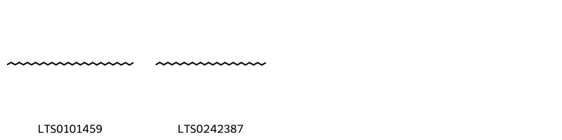{ width=100% }
    <figcaption>Hình ảnh cấu trúc hóa học của 2 hoạt chất thuộc nhóm Saturated hydrocarbons gồm ['dotriacontane (LTS0101459)', 'octacosane (LTS0242387)'].</figcaption>
</figure>
#### Nhóm Steroids and steroid derivatives
<figure markdown="span">
    { width=100% }
    <figcaption>Hình ảnh cấu trúc hóa học của 2 hoạt chất thuộc nhóm Steroids and steroid derivatives gồm ['phytosterol (LTS0029311)', 'stigmasterol (LTS0024262)'].</figcaption>
</figure>

---

### Dược dân tộc học

Danh sách các quốc gia có sử dụng *Clematis drummondii* trong điều trị các bệnh. 

| Country          | Disease   | Bệnh                                                                                                                                                                                                |
|:-----------------|:----------|:----------------------------------------------------------------------------------------------------------------------------------------------------------------------------------------------------|
| Mexico(Kickapoo) | Hemostat  | MYMEMORY WARNING: YOU USED ALL AVAILABLE FREE TRANSLATIONS FOR TODAY. NEXT AVAILABLE IN  08 HOURS 47 MINUTES 30 SECONDS VISIT HTTPS://MYMEMORY.TRANSLATED.NET/DOC/USAGELIMITS.PHP TO TRANSLATE MORE |

---

---
## Clematis flammula
### Thông tin về thực vật

!!! info "Phân loại thực vật của *Clematis flammula* từ GIBF:"
    - **Kingdom:** Plantae
    - **Phylum:** Tracheophyta
    - **Order:** Ranunculales
    - **Family:** Ranunculaceae
    - **Genus:** Clematis
    - **Species:** *Clematis flammula*

 

| Label (VI)   | Label (EN)   | Scientific Name   | Descriptions (VI)   | Descriptions (EN)   | Also Known As (VI)   | Also Known As (EN)   |
|:-------------|:-------------|:------------------|:--------------------|:--------------------|:---------------------|:---------------------|
| N/A          | N/A          | Clematis flammula | loài thực vật       | species of plant    | ['']                 | ['']                 |

#### Phân bố trên thế giới

**Từ CSDL GIBF** Portugal, Morocco, France, Spain, Lebanon, Montenegro, Italy, Algeria, Israel, Greece, Croatia, Ukraine, Albania

#### Phân bố tại Việt Nam

**Từ CSDL GIBF**: Không có ghi nhận ở Việt Nam

---
### Thành phần hóa học
        
- Theo cơ sở dữ liệu lotus: Từ loài *Clematis flammula* đã phân lập và xác định được 1 hoạt chất thuộc về các nhóm Dihydrofurans. 

|    | chemicalTaxonomyClassyfireClass   |   smiles_count |
|---:|:----------------------------------|---------------:|
|  0 | Dihydrofurans                     |              1 |

#### Nhóm Dihydrofurans
<figure markdown="span">
    { width=100% }
    <figcaption>Hình ảnh cấu trúc hóa học của 1 hoạt chất thuộc nhóm Dihydrofurans gồm ['protoanemonin (LTS0133358)'].</figcaption>
</figure>

---

### Dược dân tộc học

Danh sách các quốc gia có sử dụng *Clematis flammula* trong điều trị các bệnh. 

| Country   | Disease     | Bệnh                                                                                                                                                                                                |
|:----------|:------------|:----------------------------------------------------------------------------------------------------------------------------------------------------------------------------------------------------|
| ain       | Rubefacient | MYMEMORY WARNING: YOU USED ALL AVAILABLE FREE TRANSLATIONS FOR TODAY. NEXT AVAILABLE IN  08 HOURS 47 MINUTES 03 SECONDS VISIT HTTPS://MYMEMORY.TRANSLATED.NET/DOC/USAGELIMITS.PHP TO TRANSLATE MORE |

---

---
## Clematis florida
### Thông tin về thực vật

!!! info "Phân loại thực vật của *Clematis florida* từ GIBF:"
    - **Kingdom:** Plantae
    - **Phylum:** Tracheophyta
    - **Order:** Ranunculales
    - **Family:** Ranunculaceae
    - **Genus:** Clematis
    - **Species:** *Clematis florida*

 

| Label (VI)   | Label (EN)   | Scientific Name   | Descriptions (VI)   | Descriptions (EN)   | Also Known As (VI)   | Also Known As (EN)   |
|:-------------|:-------------|:------------------|:--------------------|:--------------------|:---------------------|:---------------------|
| N/A          | N/A          | Clematis florida  | loài thực vật       | species of plant    | ['']                 | ['']                 |

#### Phân bố trên thế giới

**Từ CSDL GIBF** Viet Nam, nan, unknown or invalid, Argentina, Colombia, Japan, Chinese Taipei, Brazil, Canada, Chile, United States of America, Ecuador, China, Netherlands, Korea, Republic of, Guatemala

#### Phân bố tại Việt Nam

**Từ CSDL GIBF**: Lai Chau

---
### Thành phần hóa học
        
- Theo cơ sở dữ liệu lotus: Từ loài *Clematis florida* đã phân lập và xác định được Chưa có hoạt chất nào được phân lập. hoạt chất thuộc về các nhóm Không có hoạt chất nào được phân lập. 

Không có hình ảnh nào được tạo ra

---

### Dược dân tộc học

Danh sách các quốc gia có sử dụng *Clematis florida* trong điều trị các bệnh. 

| Country   | Disease   | Bệnh                                                                                                                                                                                                |
|:----------|:----------|:----------------------------------------------------------------------------------------------------------------------------------------------------------------------------------------------------|
| Elsewhere | Diuretic  | MYMEMORY WARNING: YOU USED ALL AVAILABLE FREE TRANSLATIONS FOR TODAY. NEXT AVAILABLE IN  08 HOURS 46 MINUTES 40 SECONDS VISIT HTTPS://MYMEMORY.TRANSLATED.NET/DOC/USAGELIMITS.PHP TO TRANSLATE MORE |

---

---
## Clematis gouriana
### Thông tin về thực vật

!!! info "Phân loại thực vật của *Clematis gouriana* từ GIBF:"
    - **Kingdom:** Plantae
    - **Phylum:** Tracheophyta
    - **Order:** Ranunculales
    - **Family:** Ranunculaceae
    - **Genus:** Clematis
    - **Species:** *Clematis gouriana*

 

| Label (VI)   | Label (EN)   | Scientific Name   | Descriptions (VI)   | Descriptions (EN)   | Also Known As (VI)   | Also Known As (EN)   |
|:-------------|:-------------|:------------------|:--------------------|:--------------------|:---------------------|:---------------------|
| N/A          | N/A          | Clematis gouriana | loài thực vật       | species of plant    | ['']                 | ['']                 |

#### Phân bố trên thế giới

**Từ CSDL GIBF** nan, unknown or invalid, Thailand, Japan, Philippines, India, Papua New Guinea, Indonesia, Lao People’s Democratic Republic, Canada, China, Nepal, Chinese Taipei

#### Phân bố tại Việt Nam

**Từ CSDL GIBF**: Không có ghi nhận ở Việt Nam

---
### Thành phần hóa học
        
- Theo cơ sở dữ liệu lotus: Từ loài *Clematis gouriana* đã phân lập và xác định được Chưa có hoạt chất nào được phân lập. hoạt chất thuộc về các nhóm Không có hoạt chất nào được phân lập. 

Không có hình ảnh nào được tạo ra

---

### Dược dân tộc học

Danh sách các quốc gia có sử dụng *Clematis gouriana* trong điều trị các bệnh. 

| Country   | Disease   | Bệnh                                                                                                                                                                                                |
|:----------|:----------|:----------------------------------------------------------------------------------------------------------------------------------------------------------------------------------------------------|
| Elsewhere | Vesicant  | MYMEMORY WARNING: YOU USED ALL AVAILABLE FREE TRANSLATIONS FOR TODAY. NEXT AVAILABLE IN  08 HOURS 46 MINUTES 18 SECONDS VISIT HTTPS://MYMEMORY.TRANSLATED.NET/DOC/USAGELIMITS.PHP TO TRANSLATE MORE |

---

---
## Clematis graveolens
### Thông tin về thực vật

!!! info "Phân loại thực vật của *Clematis graveolens* từ GIBF:"
    - **Kingdom:** Plantae
    - **Phylum:** Tracheophyta
    - **Order:** Ranunculales
    - **Family:** Ranunculaceae
    - **Genus:** Clematis
    - **Species:** *Clematis graveolens*

 

| Label (VI)   | Label (EN)   | Scientific Name     | Descriptions (VI)   | Descriptions (EN)   | Also Known As (VI)   | Also Known As (EN)   |
|:-------------|:-------------|:--------------------|:--------------------|:--------------------|:---------------------|:---------------------|
| N/A          | N/A          | Clematis graveolens | loài thực vật       | species of plant    | ['']                 | ['']                 |

#### Phân bố trên thế giới

**Từ CSDL GIBF** nan, unknown or invalid, Pakistan, Denmark, Japan, United Kingdom of Great Britain and Northern Ireland, New Zealand, India, Afghanistan, Canada, United States of America, China, Nepal, Belgium, Netherlands

#### Phân bố tại Việt Nam

**Từ CSDL GIBF**: Không có ghi nhận ở Việt Nam

---
### Thành phần hóa học
        
- Theo cơ sở dữ liệu lotus: Từ loài *Clematis graveolens* đã phân lập và xác định được Chưa có hoạt chất nào được phân lập. hoạt chất thuộc về các nhóm Không có hoạt chất nào được phân lập. 

Không có hình ảnh nào được tạo ra

---

### Dược dân tộc học

Danh sách các quốc gia có sử dụng *Clematis graveolens* trong điều trị các bệnh. 

| Country   | Disease     | Bệnh                                                                                                                                                                                                |
|:----------|:------------|:----------------------------------------------------------------------------------------------------------------------------------------------------------------------------------------------------|
| China     | Refrigerant | MYMEMORY WARNING: YOU USED ALL AVAILABLE FREE TRANSLATIONS FOR TODAY. NEXT AVAILABLE IN  08 HOURS 45 MINUTES 57 SECONDS VISIT HTTPS://MYMEMORY.TRANSLATED.NET/DOC/USAGELIMITS.PHP TO TRANSLATE MORE |

---

---
## Clematis grossa
### Thông tin về thực vật

!!! info "Phân loại thực vật của *Clematis grossa* từ GIBF:"
    - **Kingdom:** Plantae
    - **Phylum:** Tracheophyta
    - **Order:** Ranunculales
    - **Family:** Ranunculaceae
    - **Genus:** Clematis
    - **Species:** *Clematis grossa*

 

| Label (VI)   | Label (EN)   | Scientific Name   | Descriptions (VI)   | Descriptions (EN)   | Also Known As (VI)   | Also Known As (EN)   |
|:-------------|:-------------|:------------------|:--------------------|:--------------------|:---------------------|:---------------------|
| N/A          | N/A          | Clematis grossa   | loài thực vật       | species of plant    | ['']                 | ['']                 |

#### Phân bố trên thế giới

**Từ CSDL GIBF** Honduras, El Salvador, Nicaragua, Costa Rica, Mexico, Guatemala

#### Phân bố tại Việt Nam

**Từ CSDL GIBF**: Không có ghi nhận ở Việt Nam

---
### Thành phần hóa học
        
- Theo cơ sở dữ liệu lotus: Từ loài *Clematis grossa* đã phân lập và xác định được Chưa có hoạt chất nào được phân lập. hoạt chất thuộc về các nhóm Không có hoạt chất nào được phân lập. 

Không có hình ảnh nào được tạo ra

---

### Dược dân tộc học

Danh sách các quốc gia có sử dụng *Clematis grossa* trong điều trị các bệnh. 

| Country   | Disease   | Bệnh                                                                                                                                                                                                |
|:----------|:----------|:----------------------------------------------------------------------------------------------------------------------------------------------------------------------------------------------------|
| Guatemala | Vesicant  | MYMEMORY WARNING: YOU USED ALL AVAILABLE FREE TRANSLATIONS FOR TODAY. NEXT AVAILABLE IN  08 HOURS 45 MINUTES 38 SECONDS VISIT HTTPS://MYMEMORY.TRANSLATED.NET/DOC/USAGELIMITS.PHP TO TRANSLATE MORE |

---

---
## Clematis ligusticifolia
### Thông tin về thực vật

!!! info "Phân loại thực vật của *Clematis ligusticifolia* từ GIBF:"
    - **Kingdom:** Plantae
    - **Phylum:** Tracheophyta
    - **Order:** Ranunculales
    - **Family:** Ranunculaceae
    - **Genus:** Clematis
    - **Species:** *Clematis ligusticifolia*

 

| Label (VI)   | Label (EN)   | Scientific Name         | Descriptions (VI)   | Descriptions (EN)   | Also Known As (VI)   | Also Known As (EN)   |
|:-------------|:-------------|:------------------------|:--------------------|:--------------------|:---------------------|:---------------------|
| N/A          | N/A          | Clematis ligusticifolia | loài thực vật       | species of plant    | ['']                 | ['']                 |

#### Phân bố trên thế giới

**Từ CSDL GIBF** Canada, United States of America

#### Phân bố tại Việt Nam

**Từ CSDL GIBF**: Không có ghi nhận ở Việt Nam

---
### Thành phần hóa học
        
- Theo cơ sở dữ liệu lotus: Từ loài *Clematis ligusticifolia* đã phân lập và xác định được 1 hoạt chất thuộc về các nhóm Organooxygen compounds. 

|    | chemicalTaxonomyClassyfireClass   |   smiles_count |
|---:|:----------------------------------|---------------:|
|  0 | Organooxygen compounds            |              1 |

#### Nhóm Organooxygen compounds
<figure markdown="span">
    { width=100% }
    <figcaption>Hình ảnh cấu trúc hóa học của 1 hoạt chất thuộc nhóm Organooxygen compounds gồm ['ranunculin (LTS0141949)'].</figcaption>
</figure>

---

### Dược dân tộc học

Danh sách các quốc gia có sử dụng *Clematis ligusticifolia* trong điều trị các bệnh. 

| Country      | Disease   | Bệnh                                                                                                                                                                                                |
|:-------------|:----------|:----------------------------------------------------------------------------------------------------------------------------------------------------------------------------------------------------|
| US(Flathead) | Collyrium | MYMEMORY WARNING: YOU USED ALL AVAILABLE FREE TRANSLATIONS FOR TODAY. NEXT AVAILABLE IN  08 HOURS 45 MINUTES 17 SECONDS VISIT HTTPS://MYMEMORY.TRANSLATED.NET/DOC/USAGELIMITS.PHP TO TRANSLATE MORE |

---

---
## Clematis minor
### Thông tin về thực vật

!!! info "Phân loại thực vật của *Clematis chinensis* từ GIBF:"
    - **Kingdom:** Plantae
    - **Phylum:** Tracheophyta
    - **Order:** Ranunculales
    - **Family:** Ranunculaceae
    - **Genus:** Clematis
    - **Species:** *Clematis chinensis*

 

| Label (VI)   | Label (EN)   | Scientific Name   | Descriptions (VI)   | Descriptions (EN)   | Also Known As (VI)   | Also Known As (EN)   |
|:-------------|:-------------|:------------------|:--------------------|:--------------------|:---------------------|:---------------------|
| N/A          | N/A          | Clematis minor    |                     |                     | ['']                 | ['']                 |

#### Phân bố trên thế giới

**Từ CSDL GIBF** Canada, United States of America

#### Phân bố tại Việt Nam

**Từ CSDL GIBF**: Không có ghi nhận ở Việt Nam

---
### Thành phần hóa học
        
- Theo cơ sở dữ liệu lotus: Từ loài *Clematis chinensis* đã phân lập và xác định được Chưa có hoạt chất nào được phân lập. hoạt chất thuộc về các nhóm Không có hoạt chất nào được phân lập. 

Không có hình ảnh nào được tạo ra

---

### Dược dân tộc học

Danh sách các quốc gia có sử dụng *Clematis chinensis* trong điều trị các bệnh. 

| Country   | Disease            | Bệnh                                                                                                                                                                                                |
|:----------|:-------------------|:----------------------------------------------------------------------------------------------------------------------------------------------------------------------------------------------------|
| China     | Diuretic, Laxative | MYMEMORY WARNING: YOU USED ALL AVAILABLE FREE TRANSLATIONS FOR TODAY. NEXT AVAILABLE IN  08 HOURS 44 MINUTES 52 SECONDS VISIT HTTPS://MYMEMORY.TRANSLATED.NET/DOC/USAGELIMITS.PHP TO TRANSLATE MORE |

---

---
## Clematis patens
### Thông tin về thực vật

!!! info "Phân loại thực vật của *Clematis patens* từ GIBF:"
    - **Kingdom:** Plantae
    - **Phylum:** Tracheophyta
    - **Order:** Ranunculales
    - **Family:** Ranunculaceae
    - **Genus:** Clematis
    - **Species:** *Clematis patens*

 

| Label (VI)   | Label (EN)   | Scientific Name   | Descriptions (VI)   | Descriptions (EN)   | Also Known As (VI)   | Also Known As (EN)   |
|:-------------|:-------------|:------------------|:--------------------|:--------------------|:---------------------|:---------------------|
| N/A          | N/A          | Clematis patens   | loài thực vật       | species of plant    | ['']                 | ['']                 |

#### Phân bố trên thế giới

**Từ CSDL GIBF** nan, Japan, Czechia, New Zealand, Canada, China, Belgium, Korea, Republic of

#### Phân bố tại Việt Nam

**Từ CSDL GIBF**: Không có ghi nhận ở Việt Nam

---
### Thành phần hóa học
        
- Theo cơ sở dữ liệu lotus: Từ loài *Clematis patens* đã phân lập và xác định được Chưa có hoạt chất nào được phân lập. hoạt chất thuộc về các nhóm Không có hoạt chất nào được phân lập. 

Không có hình ảnh nào được tạo ra

---

### Dược dân tộc học

Danh sách các quốc gia có sử dụng *Clematis patens* trong điều trị các bệnh. 

| Country   | Disease   | Bệnh                                                                                                                                                                                                |
|:----------|:----------|:----------------------------------------------------------------------------------------------------------------------------------------------------------------------------------------------------|
| Elsewhere | Diuretic  | MYMEMORY WARNING: YOU USED ALL AVAILABLE FREE TRANSLATIONS FOR TODAY. NEXT AVAILABLE IN  08 HOURS 44 MINUTES 37 SECONDS VISIT HTTPS://MYMEMORY.TRANSLATED.NET/DOC/USAGELIMITS.PHP TO TRANSLATE MORE |

---

---
## Clematis terniflora
### Thông tin về thực vật

!!! info "Phân loại thực vật của *Clematis terniflora* từ GIBF:"
    - **Kingdom:** Plantae
    - **Phylum:** Tracheophyta
    - **Order:** Ranunculales
    - **Family:** Ranunculaceae
    - **Genus:** Clematis
    - **Species:** *Clematis terniflora*

 

| Label (VI)   | Label (EN)   | Scientific Name     | Descriptions (VI)   | Descriptions (EN)   | Also Known As (VI)   | Also Known As (EN)   |
|:-------------|:-------------|:--------------------|:--------------------|:--------------------|:---------------------|:---------------------|
| N/A          | N/A          | Clematis terniflora |                     | species of plant    | ['']                 | ['']                 |

#### Phân bố trên thế giới

**Từ CSDL GIBF** Japan, Estonia, Russian Federation, United States of America, China, Korea, Republic of, Chinese Taipei

#### Phân bố tại Việt Nam

**Từ CSDL GIBF**: Không có ghi nhận ở Việt Nam

---
### Thành phần hóa học
        
- Theo cơ sở dữ liệu lotus: Từ loài *Clematis terniflora* đã phân lập và xác định được 42 hoạt chất thuộc về các nhóm Organooxygen compounds, Flavonoids, Lactones, Tannins, Prenol lipids, Phenols, Cinnamic acids and derivatives, Benzene and substituted derivatives. 

|    | chemicalTaxonomyClassyfireClass     |   smiles_count |
|---:|:------------------------------------|---------------:|
|  0 | Benzene and substituted derivatives |              1 |
|  1 | Cinnamic acids and derivatives      |              2 |
|  2 | Flavonoids                          |              8 |
|  3 | Lactones                            |              2 |
|  4 | Organooxygen compounds              |              1 |
|  5 | Phenols                             |              1 |
|  6 | Prenol lipids                       |             14 |
|  7 | Tannins                             |              1 |

#### Nhóm Benzene and substituted derivatives
<figure markdown="span">
    { width=100% }
    <figcaption>Hình ảnh cấu trúc hóa học của 1 hoạt chất thuộc nhóm Benzene and substituted derivatives gồm ['vanillic acid (LTS0229113)'].</figcaption>
</figure>
#### Nhóm Cinnamic acids and derivatives
<figure markdown="span">
    { width=100% }
    <figcaption>Hình ảnh cấu trúc hóa học của 2 hoạt chất thuộc nhóm Cinnamic acids and derivatives gồm ['ferulic acid (LTS0077328)', 'ferulic acid (LTS0273002)'].</figcaption>
</figure>
#### Nhóm Flavonoids
<figure markdown="span">
    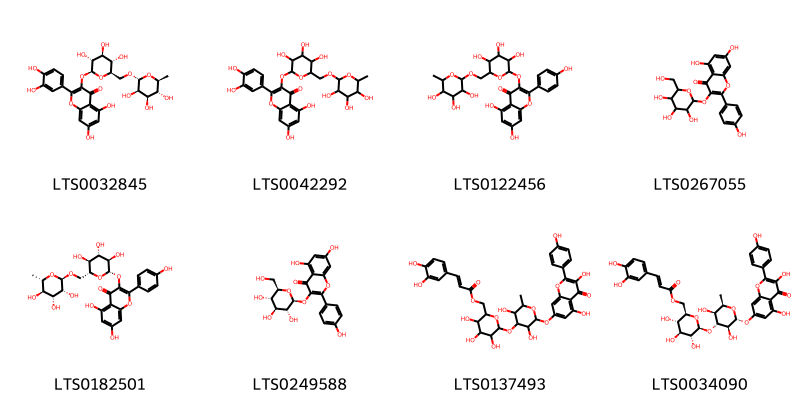{ width=100% }
    <figcaption>Hình ảnh cấu trúc hóa học của 8 hoạt chất thuộc nhóm Flavonoids gồm ['3-rutinosyl quercetin (LTS0032845)', 'rutin (LTS0042292)', '5,7-dihydroxy-2-(4-hydroxyphenyl)-3-[(3,4,5-trihydroxy-6-{[(3,4,5-trihydroxy-6-methyloxan-2-yl)oxy]methyl}oxan-2-yl)oxy]chromen-4-one (LTS0122456)', 'trifolin (LTS0267055)', 'nictoflorin (LTS0182501)', 'astragalin (LTS0249588)', '{6-[(2-{[3,5-dihydroxy-2-(4-hydroxyphenyl)-4-oxochromen-7-yl]oxy}-3,5-dihydroxy-6-methyloxan-4-yl)oxy]-3,4,5-trihydroxyoxan-2-yl}methyl 3-(3,4-dihydroxyphenyl)prop-2-enoate (LTS0137493)', '[(2r,3s,4s,5r,6s)-6-{[(2r,3s,4r,5s,6r)-2-{[3,5-dihydroxy-2-(4-hydroxyphenyl)-4-oxochromen-7-yl]oxy}-3,5-dihydroxy-6-methyloxan-4-yl]oxy}-3,4,5-trihydroxyoxan-2-yl]methyl (2e)-3-(3,4-dihydroxyphenyl)prop-2-enoate (LTS0034090)'].</figcaption>
</figure>
#### Nhóm Lactones
<figure markdown="span">
    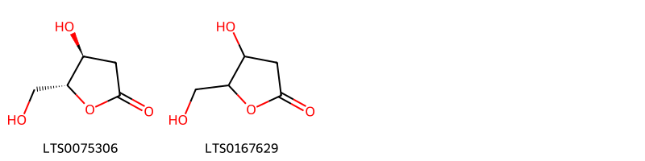{ width=100% }
    <figcaption>Hình ảnh cấu trúc hóa học của 2 hoạt chất thuộc nhóm Lactones gồm ['deoxyribonolactone (LTS0075306)', '4-hydroxy-5-(hydroxymethyl)oxolan-2-one (LTS0167629)'].</figcaption>
</figure>
#### Nhóm Organooxygen compounds
<figure markdown="span">
    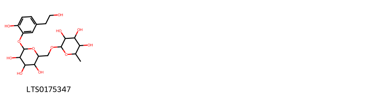{ width=100% }
    <figcaption>Hình ảnh cấu trúc hóa học của 1 hoạt chất thuộc nhóm Organooxygen compounds gồm ['2-methyl-6-({3,4,5-trihydroxy-6-[2-hydroxy-5-(2-hydroxyethyl)phenoxy]oxan-2-yl}methoxy)oxane-3,4,5-triol (LTS0175347)'].</figcaption>
</figure>
#### Nhóm Phenols
<figure markdown="span">
    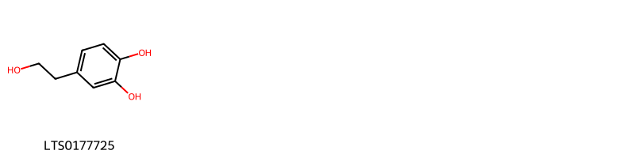{ width=100% }
    <figcaption>Hình ảnh cấu trúc hóa học của 1 hoạt chất thuộc nhóm Phenols gồm ['hydroxytyrosol (LTS0177725)'].</figcaption>
</figure>
#### Nhóm Prenol lipids
<figure markdown="span">
    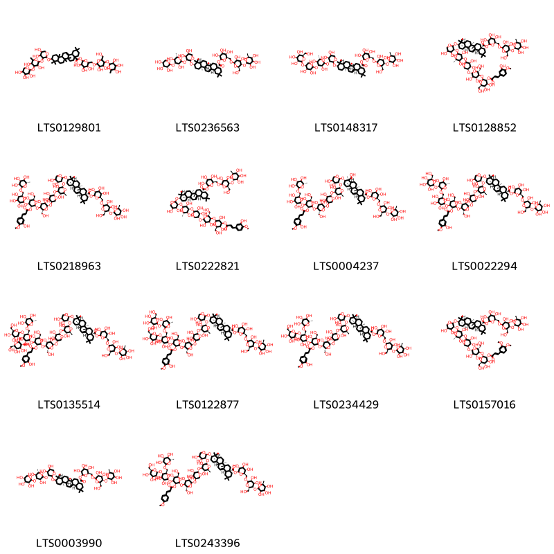{ width=100% }
    <figcaption>Hình ảnh cấu trúc hóa học của 14 hoạt chất thuộc nhóm Prenol lipids gồm ['6-({[3,4-dihydroxy-6-(hydroxymethyl)-5-[(3,4,5-trihydroxy-6-methyloxan-2-yl)oxy]oxan-2-yl]oxy}methyl)-3,4,5-trihydroxyoxan-2-yl 10-{[3-({3,5-dihydroxy-6-methyl-4-[(3,4,5-trihydroxyoxan-2-yl)oxy]oxan-2-yl}oxy)-4,5-dihydroxyoxan-2-yl]oxy}-2,2,6a,6b,9,9,12a-heptamethyl-1,3,4,5,6,7,8,8a,10,11,12,12b,13,14b-tetradecahydropicene-4a-carboxylate (LTS0129801)', '(2s,3r,4s,5s,6r)-6-({[(2r,3r,4r,5s,6r)-3,4-dihydroxy-6-(hydroxymethyl)-5-{[(2s,3r,4r,5r,6s)-3,4,5-trihydroxy-6-methyloxan-2-yl]oxy}oxan-2-yl]oxy}methyl)-3,4,5-trihydroxyoxan-2-yl (4as,6as,6br,8ar,10s,12ar,12br,14bs)-10-{[(2s,3r,4s,5s)-3-{[(2s,3r,4r,5s,6s)-3,5-dihydroxy-6-methyl-4-{[(2s,3r,4r,5r)-3,4,5-trihydroxyoxan-2-yl]oxy}oxan-2-yl]oxy}-4,5-dihydroxyoxan-2-yl]oxy}-2,2,6a,6b,9,9,12a-heptamethyl-1,3,4,5,6,7,8,8a,10,11,12,12b,13,14b-tetradecahydropicene-4a-carboxylate (LTS0236563)', '(2s,3r,4s,5s,6r)-6-({[(2r,3r,4r,5s,6r)-3,4-dihydroxy-6-(hydroxymethyl)-5-{[(2s,3r,4r,5r,6s)-3,4,5-trihydroxy-6-methyloxan-2-yl]oxy}oxan-2-yl]oxy}methyl)-3,4,5-trihydroxyoxan-2-yl (4as,6as,6br,8ar,10s,12ar,12br,14bs)-10-{[(2s,3r,4s,5s)-3-{[(2s,3r,4r,5s,6s)-4-{[(2s,3r,4s,5r)-3,4-dihydroxy-5-{[(2s,3r,4s,5s,6r)-3,4,5-trihydroxy-6-(hydroxymethyl)oxan-2-yl]oxy}oxan-2-yl]oxy}-3,5-dihydroxy-6-methyloxan-2-yl]oxy}-4,5-dihydroxyoxan-2-yl]oxy}-2,2,6a,6b,9,9,12a-heptamethyl-1,3,4,5,6,7,8,8a,10,11,12,12b,13,14b-tetradecahydropicene-4a-carboxylate (LTS0148317)', '(2s,3r,4s,5s,6r)-6-({[(2r,3r,4r,5s,6r)-3,4-dihydroxy-6-(hydroxymethyl)-5-{[(2s,3r,4r,5r,6s)-3,4,5-trihydroxy-6-methyloxan-2-yl]oxy}oxan-2-yl]oxy}methyl)-3,4,5-trihydroxyoxan-2-yl (4as,6as,6br,8ar,10s,12ar,12br,14bs)-10-{[(2s,3r,4s,5s)-3-{[(2s,3r,4r,5s,6s)-4-{[(2s,3r,4s,5r)-5-{[(2r,3r,4r,5s,6r)-5-{[(2s,3r,4s,5s,6r)-4,5-dihydroxy-3-{[(2e)-3-(3-hydroxy-4-methoxyphenyl)prop-2-enoyl]oxy}-6-(hydroxymethyl)oxan-2-yl]oxy}-3,4-dihydroxy-6-(hydroxymethyl)oxan-2-yl]oxy}-3,4-dihydroxyoxan-2-yl]oxy}-3,5-dihydroxy-6-methyloxan-2-yl]oxy}-4,5-dihydroxyoxan-2-yl]oxy}-2,2,6a,6b,9,9,12a-heptamethyl-1,3,4,5,6,7,8,8a,10,11,12,12b,13,14b-tetradecahydropicene-4a-carboxylate (LTS0128852)', '(2s,3r,4s,5s,6r)-6-({[(2r,3r,4r,5s,6r)-3,4-dihydroxy-6-(hydroxymethyl)-5-{[(2s,3r,4r,5r,6s)-3,4,5-trihydroxy-6-methyloxan-2-yl]oxy}oxan-2-yl]oxy}methyl)-3,4,5-trihydroxyoxan-2-yl (4as,6as,6br,8ar,10s,12ar,12br,14bs)-10-{[(2s,3r,4s,5s)-3-{[(2s,3r,4r,5s,6s)-4-{[(2s,3r,4s,5r)-5-{[(2r,3r,4r,5s,6r)-3,4-dihydroxy-5-{[(2s,3r,4s,5r,6r)-5-hydroxy-3-{[(2e)-3-(3-hydroxy-4-methoxyphenyl)prop-2-enoyl]oxy}-6-(hydroxymethyl)-4-{[(2s,3r,4s,5s,6r)-3,4,5-trihydroxy-6-({[(2r,3r,4r,5r,6s)-3,4,5-trihydroxy-6-methyloxan-2-yl]oxy}methyl)oxan-2-yl]oxy}oxan-2-yl]oxy}-6-(hydroxymethyl)oxan-2-yl]oxy}-3,4-dihydroxyoxan-2-yl]oxy}-3,5-dihydroxy-6-methyloxan-2-yl]oxy}-4,5-dihydroxyoxan-2-yl]oxy}-2,2,6a,6b,9,9,12a-heptamethyl-1,3,4,5,6,7,8,8a,10,11,12,12b,13,14b-tetradecahydropicene-4a-carboxylate (LTS0218963)', '(2s,3r,4s,5s,6r)-6-({[(2r,3r,4r,5s,6r)-3,4-dihydroxy-6-(hydroxymethyl)-5-{[(2s,3r,4r,5r,6s)-3,4,5-trihydroxy-6-methyloxan-2-yl]oxy}oxan-2-yl]oxy}methyl)-3,4,5-trihydroxyoxan-2-yl (4as,6as,6br,8ar,10s,12ar,12br,14bs)-10-{[(2s,3r,4s,5s)-3-{[(2s,3r,4r,5s,6s)-4-{[(2s,3r,4s,5r)-5-{[(2r,3r,4r,5s,6r)-5-{[(2s,3r,4s,5r,6r)-3,5-dihydroxy-4-{[(2e)-3-(3-hydroxy-4-methoxyphenyl)prop-2-enoyl]oxy}-6-(hydroxymethyl)oxan-2-yl]oxy}-3,4-dihydroxy-6-(hydroxymethyl)oxan-2-yl]oxy}-3,4-dihydroxyoxan-2-yl]oxy}-3,5-dihydroxy-6-methyloxan-2-yl]oxy}-4,5-dihydroxyoxan-2-yl]oxy}-2,2,6a,6b,9,9,12a-heptamethyl-1,3,4,5,6,7,8,8a,10,11,12,12b,13,14b-tetradecahydropicene-4a-carboxylate (LTS0222821)', '(2s,3r,4s,5s,6r)-6-({[(2r,3r,4r,5s,6r)-3,4-dihydroxy-6-(hydroxymethyl)-5-{[(2s,3r,4r,5r,6s)-3,4,5-trihydroxy-6-methyloxan-2-yl]oxy}oxan-2-yl]oxy}methyl)-3,4,5-trihydroxyoxan-2-yl (4as,6as,6br,8ar,9r,10s,12ar,12br,14bs)-10-{[(2s,3r,4s,5s)-3-{[(2s,3r,4r,5s,6s)-4-{[(2s,3r,4s,5r)-5-{[(2r,3r,4r,5s,6r)-3,4-dihydroxy-5-{[(2s,3r,4s,5r,6r)-5-hydroxy-3-{[(2e)-3-(3-hydroxy-4-methoxyphenyl)prop-2-enoyl]oxy}-6-(hydroxymethyl)-4-{[(2s,3r,4s,5s,6r)-3,4,5-trihydroxy-6-({[(2r,3r,4r,5r,6s)-3,4,5-trihydroxy-6-methyloxan-2-yl]oxy}methyl)oxan-2-yl]oxy}oxan-2-yl]oxy}-6-(hydroxymethyl)oxan-2-yl]oxy}-3,4-dihydroxyoxan-2-yl]oxy}-3,5-dihydroxy-6-methyloxan-2-yl]oxy}-4,5-dihydroxyoxan-2-yl]oxy}-9-(hydroxymethyl)-2,2,6a,6b,9,12a-hexamethyl-1,3,4,5,6,7,8,8a,10,11,12,12b,13,14b-tetradecahydropicene-4a-carboxylate (LTS0004237)', '(2s,3r,4s,5s,6r)-6-({[(2r,3r,4r,5s,6r)-3,4-dihydroxy-6-(hydroxymethyl)-5-{[(2s,3r,4r,5r,6s)-3,4,5-trihydroxy-6-methyloxan-2-yl]oxy}oxan-2-yl]oxy}methyl)-3,4,5-trihydroxyoxan-2-yl (4as,6as,6br,8ar,10s,12ar,12br,14bs)-10-{[(2s,3r,4s,5s)-3-{[(2s,3r,4r,5s,6s)-4-{[(2s,3r,4s,5r)-5-{[(2r,3r,4r,5s,6r)-5-{[(2s,3r,4s,5r,6r)-4-{[(2s,3r,4s,5s,6r)-6-({[(2r,3r,4r,5r,6s)-4,5-dihydroxy-6-methyl-3-{[(2s,3r,4s,5s,6r)-3,4,5-trihydroxy-6-(hydroxymethyl)oxan-2-yl]oxy}oxan-2-yl]oxy}methyl)-3,4,5-trihydroxyoxan-2-yl]oxy}-5-hydroxy-3-{[(2e)-3-(3-hydroxy-4-methoxyphenyl)prop-2-enoyl]oxy}-6-(hydroxymethyl)oxan-2-yl]oxy}-3,4-dihydroxy-6-(hydroxymethyl)oxan-2-yl]oxy}-3,4-dihydroxyoxan-2-yl]oxy}-3,5-dihydroxy-6-methyloxan-2-yl]oxy}-4,5-dihydroxyoxan-2-yl]oxy}-2,2,6a,6b,9,9,12a-heptamethyl-1,3,4,5,6,7,8,8a,10,11,12,12b,13,14b-tetradecahydropicene-4a-carboxylate (LTS0022294)', '(2s,3r,4s,5s,6r)-6-({[(2r,3r,4r,5s,6r)-3,4-dihydroxy-6-(hydroxymethyl)-5-{[(2s,3r,4r,5r,6s)-3,4,5-trihydroxy-6-methyloxan-2-yl]oxy}oxan-2-yl]oxy}methyl)-3,4,5-trihydroxyoxan-2-yl (4as,6as,6br,8ar,10s,12ar,12br,14bs)-10-{[(2s,3r,4s,5s)-3-{[(2s,3r,4r,5s,6s)-4-{[(2s,3r,4s,5r)-5-{[(2r,3r,4r,5s,6r)-5-{[(2s,3r,4s,5r,6r)-4-{[(2s,3r,4r,5s,6r)-5-{[(2s,3r,4s,5s,6r)-4,5-dihydroxy-6-(hydroxymethyl)-3-{[(2s,3r,4s,5s,6r)-3,4,5-trihydroxy-6-(hydroxymethyl)oxan-2-yl]oxy}oxan-2-yl]oxy}-3,4-dihydroxy-6-({[(2r,3r,4r,5r,6s)-3,4,5-trihydroxy-6-methyloxan-2-yl]oxy}methyl)oxan-2-yl]oxy}-5-hydroxy-3-{[(2e)-3-(3-hydroxy-4-methoxyphenyl)prop-2-enoyl]oxy}-6-(hydroxymethyl)oxan-2-yl]oxy}-3,4-dihydroxy-6-(hydroxymethyl)oxan-2-yl]oxy}-3,4-dihydroxyoxan-2-yl]oxy}-3,5-dihydroxy-6-methyloxan-2-yl]oxy}-4,5-dihydroxyoxan-2-yl]oxy}-2,2,6a,6b,9,9,12a-heptamethyl-1,3,4,5,6,7,8,8a,10,11,12,12b,13,14b-tetradecahydropicene-4a-carboxylate (LTS0135514)', '(2s,3r,4s,5s,6r)-6-({[(2r,3r,4r,5s,6r)-3,4-dihydroxy-6-(hydroxymethyl)-5-{[(2s,3r,4r,5r,6s)-3,4,5-trihydroxy-6-methyloxan-2-yl]oxy}oxan-2-yl]oxy}methyl)-3,4,5-trihydroxyoxan-2-yl (4as,6as,6br,8ar,10s,12ar,12br,14bs)-10-{[(2s,3r,4s,5s)-3-{[(2s,3r,4r,5s,6s)-4-{[(2s,3r,4s,5r)-5-{[(2r,3r,4r,5s,6r)-5-{[(2s,3r,4s,5r,6r)-4-{[(2s,3r,4r,5s,6r)-6-({[(2r,3r,4r,5r,6s)-4,5-dihydroxy-6-methyl-3-{[(2s,3r,4s,5s,6r)-3,4,5-trihydroxy-6-(hydroxymethyl)oxan-2-yl]oxy}oxan-2-yl]oxy}methyl)-3,4-dihydroxy-5-{[(2s,3r,4s,5s,6r)-3,4,5-trihydroxy-6-(hydroxymethyl)oxan-2-yl]oxy}oxan-2-yl]oxy}-5-hydroxy-3-{[(2e)-3-(3-hydroxy-4-methoxyphenyl)prop-2-enoyl]oxy}-6-(hydroxymethyl)oxan-2-yl]oxy}-3,4-dihydroxy-6-(hydroxymethyl)oxan-2-yl]oxy}-3,4-dihydroxyoxan-2-yl]oxy}-3,5-dihydroxy-6-methyloxan-2-yl]oxy}-4,5-dihydroxyoxan-2-yl]oxy}-2,2,6a,6b,9,9,12a-heptamethyl-1,3,4,5,6,7,8,8a,10,11,12,12b,13,14b-tetradecahydropicene-4a-carboxylate (LTS0122877)', '(2s,3r,4s,5s,6r)-6-({[(2r,3r,4r,5s,6r)-3,4-dihydroxy-6-(hydroxymethyl)-5-{[(2s,3r,4r,5r,6s)-3,4,5-trihydroxy-6-methyloxan-2-yl]oxy}oxan-2-yl]oxy}methyl)-3,4,5-trihydroxyoxan-2-yl (4as,6as,6br,8ar,10s,12ar,12br,14bs)-10-{[(2s,3r,4s,5s)-3-{[(2s,3r,4r,5s,6s)-4-{[(2s,3r,4s,5r)-5-{[(2r,3r,4r,5s,6r)-5-{[(2s,3r,4s,5r,6r)-4-{[(2s,3r,4r,5s,6r)-3,4-dihydroxy-5-{[(2s,3r,4s,5s,6r)-3,4,5-trihydroxy-6-(hydroxymethyl)oxan-2-yl]oxy}-6-({[(2r,3r,4r,5r,6s)-3,4,5-trihydroxy-6-methyloxan-2-yl]oxy}methyl)oxan-2-yl]oxy}-5-hydroxy-3-{[(2e)-3-(3-hydroxy-4-methoxyphenyl)prop-2-enoyl]oxy}-6-(hydroxymethyl)oxan-2-yl]oxy}-3,4-dihydroxy-6-(hydroxymethyl)oxan-2-yl]oxy}-3,4-dihydroxyoxan-2-yl]oxy}-3,5-dihydroxy-6-methyloxan-2-yl]oxy}-4,5-dihydroxyoxan-2-yl]oxy}-2,2,6a,6b,9,9,12a-heptamethyl-1,3,4,5,6,7,8,8a,10,11,12,12b,13,14b-tetradecahydropicene-4a-carboxylate (LTS0234429)', '(2s,3r,4s,5s,6r)-6-({[(2r,3r,4r,5s,6r)-3,4-dihydroxy-6-(hydroxymethyl)-5-{[(2s,3r,4r,5r,6s)-3,4,5-trihydroxy-6-methyloxan-2-yl]oxy}oxan-2-yl]oxy}methyl)-3,4,5-trihydroxyoxan-2-yl (4as,6as,6br,8ar,10s,12ar,12br,14bs)-10-{[(2s,3r,4s,5s)-3-{[(2s,3r,4r,5s,6s)-4-{[(2s,3r,4s,5r)-5-{[(2r,3r,4r,5s,6r)-5-{[(2s,3r,4s,5s,6r)-3-{[(2e)-3-(3,4-dimethoxyphenyl)prop-2-enoyl]oxy}-4,5-dihydroxy-6-(hydroxymethyl)oxan-2-yl]oxy}-3,4-dihydroxy-6-(hydroxymethyl)oxan-2-yl]oxy}-3,4-dihydroxyoxan-2-yl]oxy}-3,5-dihydroxy-6-methyloxan-2-yl]oxy}-4,5-dihydroxyoxan-2-yl]oxy}-2,2,6a,6b,9,9,12a-heptamethyl-1,3,4,5,6,7,8,8a,10,11,12,12b,13,14b-tetradecahydropicene-4a-carboxylate (LTS0157016)', '(2s,3r,4s,5s,6r)-6-({[(2r,3r,4r,5s,6r)-3,4-dihydroxy-6-(hydroxymethyl)-5-{[(2s,3r,4r,5r,6s)-3,4,5-trihydroxy-6-methyloxan-2-yl]oxy}oxan-2-yl]oxy}methyl)-3,4,5-trihydroxyoxan-2-yl (4as,6as,6br,8ar,10r,12ar,12br,14bs)-10-{[(2s,3r,4s,5s)-3-{[(2s,3r,4r,5s,6s)-3,5-dihydroxy-6-methyl-4-{[(2s,3r,4r,5r)-3,4,5-trihydroxyoxan-2-yl]oxy}oxan-2-yl]oxy}-4,5-dihydroxyoxan-2-yl]oxy}-2,2,6a,6b,9,9,12a-heptamethyl-1,3,4,5,6,7,8,8a,10,11,12,12b,13,14b-tetradecahydropicene-4a-carboxylate (LTS0003990)', '(2s,3r,4s,5s,6r)-6-({[(2r,3r,4r,5s,6r)-3,4-dihydroxy-6-(hydroxymethyl)-5-{[(2s,3r,4r,5r,6s)-3,4,5-trihydroxy-6-methyloxan-2-yl]oxy}oxan-2-yl]oxy}methyl)-3,4,5-trihydroxyoxan-2-yl (4as,6as,6br,8ar,10s,12ar,12br,14bs)-10-{[(2s,3r,4s,5s)-3-{[(2s,3r,4r,5s,6s)-4-{[(2s,3r,4s,5r)-5-{[(2r,3r,4r,5s,6r)-5-{[(2s,3r,4s,5r,6r)-4-{[(2s,3r,4r,5s,6r)-3,4-dihydroxy-5-{[(2s,3r,4s,5s,6r)-3,4,5-trihydroxy-6-(hydroxymethyl)oxan-2-yl]oxy}-6-({[(2r,3r,4r,5r,6s)-3,4,5-trihydroxy-6-methyloxan-2-yl]oxy}methyl)oxan-2-yl]oxy}-5-hydroxy-6-(hydroxymethyl)-3-{[(2e)-3-(4-methoxyphenyl)prop-2-enoyl]oxy}oxan-2-yl]oxy}-3,4-dihydroxy-6-(hydroxymethyl)oxan-2-yl]oxy}-3,4-dihydroxyoxan-2-yl]oxy}-3,5-dihydroxy-6-methyloxan-2-yl]oxy}-4,5-dihydroxyoxan-2-yl]oxy}-2,2,6a,6b,9,9,12a-heptamethyl-1,3,4,5,6,7,8,8a,10,11,12,12b,13,14b-tetradecahydropicene-4a-carboxylate (LTS0243396)'].</figcaption>
</figure>
#### Nhóm Tannins
<figure markdown="span">
    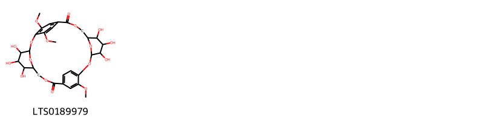{ width=100% }
    <figcaption>Hình ảnh cấu trúc hóa học của 1 hoạt chất thuộc nhóm Tannins gồm ['4,5,6,17,18,19-hexahydroxy-13,27,30-trimethoxy-2,9,15,22,29,32-hexaoxapentacyclo[22.2.2.2¹¹,¹⁴.1³,⁷.1¹⁶,²⁰]dotriaconta-1(26),11,13,24,27,30-hexaene-10,23-dione (LTS0189979)'].</figcaption>
</figure>

---

### Dược dân tộc học

Danh sách các quốc gia có sử dụng *Clematis terniflora* trong điều trị các bệnh. 

| Country   | Disease   | Bệnh                                                                                                                                                                                                |
|:----------|:----------|:----------------------------------------------------------------------------------------------------------------------------------------------------------------------------------------------------|
| Elsewhere | Diuretic  | MYMEMORY WARNING: YOU USED ALL AVAILABLE FREE TRANSLATIONS FOR TODAY. NEXT AVAILABLE IN  08 HOURS 44 MINUTES 15 SECONDS VISIT HTTPS://MYMEMORY.TRANSLATED.NET/DOC/USAGELIMITS.PHP TO TRANSLATE MORE |

---

---
## Clematis vitalba
### Thông tin về thực vật

!!! info "Phân loại thực vật của *Clematis vitalba* từ GIBF:"
    - **Kingdom:** Plantae
    - **Phylum:** Tracheophyta
    - **Order:** Ranunculales
    - **Family:** Ranunculaceae
    - **Genus:** Clematis
    - **Species:** *Clematis vitalba*

 

| Label (VI)   | Label (EN)   | Scientific Name   | Descriptions (VI)   | Descriptions (EN)   | Also Known As (VI)   | Also Known As (EN)   |
|:-------------|:-------------|:------------------|:--------------------|:--------------------|:---------------------|:---------------------|
| N/A          | N/A          | Clematis vitalba  |                     | species of plant    | ['']                 | ["Traveller's-joy"]  |

#### Phân bố trên thế giới

**Từ CSDL GIBF** Georgia, Denmark, Spain, Germany, Austria, Australia, Poland, Canada, Belgium, Slovakia, Netherlands, Türkiye, Slovenia, Hungary, Ireland, Switzerland, United Kingdom of Great Britain and Northern Ireland, Portugal, France, Czechia, New Zealand, Romania, Russian Federation, United States of America, Italy, Ukraine

#### Phân bố tại Việt Nam

**Từ CSDL GIBF**: Không có ghi nhận ở Việt Nam

---
### Thành phần hóa học
        
- Theo cơ sở dữ liệu lotus: Từ loài *Clematis vitalba* đã phân lập và xác định được 32 hoạt chất thuộc về các nhóm Organooxygen compounds, Aporphines, Saturated hydrocarbons, Prenol lipids, Fatty Acyls, Dihydrofurans, Cinnamic acids and derivatives, Steroids and steroid derivatives. 

|    | chemicalTaxonomyClassyfireClass   |   smiles_count |
|---:|:----------------------------------|---------------:|
|  0 | Aporphines                        |              1 |
|  1 | Cinnamic acids and derivatives    |              2 |
|  2 | Dihydrofurans                     |              1 |
|  3 | Fatty Acyls                       |              4 |
|  4 | Organooxygen compounds            |              1 |
|  5 | Prenol lipids                     |             14 |
|  6 | Saturated hydrocarbons            |              3 |
|  7 | Steroids and steroid derivatives  |              6 |

#### Nhóm Aporphines
<figure markdown="span">
    { width=100% }
    <figcaption>Hình ảnh cấu trúc hóa học của 1 hoạt chất thuộc nhóm Aporphines gồm ['magnoflorine (LTS0120825)'].</figcaption>
</figure>
#### Nhóm Cinnamic acids and derivatives
<figure markdown="span">
    { width=100% }
    <figcaption>Hình ảnh cấu trúc hóa học của 2 hoạt chất thuộc nhóm Cinnamic acids and derivatives gồm ['3,4-dihydroxycinnamic acid (LTS0128050)', 'caffeic acid (LTS0027481)'].</figcaption>
</figure>
#### Nhóm Dihydrofurans
<figure markdown="span">
    { width=100% }
    <figcaption>Hình ảnh cấu trúc hóa học của 1 hoạt chất thuộc nhóm Dihydrofurans gồm ['protoanemonin (LTS0133358)'].</figcaption>
</figure>
#### Nhóm Fatty Acyls
<figure markdown="span">
    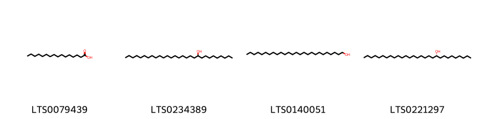{ width=100% }
    <figcaption>Hình ảnh cấu trúc hóa học của 4 hoạt chất thuộc nhóm Fatty Acyls gồm ['palmitic acid (LTS0079439)', 'nonacosan-10-ol (LTS0234389)', 'ceryl alcohol (LTS0140051)', '(r)-nonacosan-10-ol (LTS0221297)'].</figcaption>
</figure>
#### Nhóm Organooxygen compounds
<figure markdown="span">
    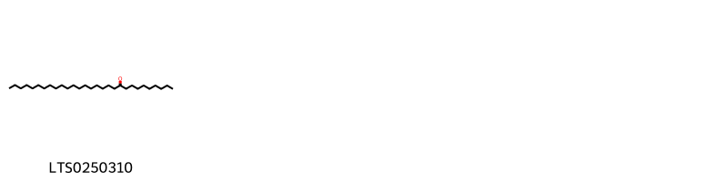{ width=100% }
    <figcaption>Hình ảnh cấu trúc hóa học của 1 hoạt chất thuộc nhóm Organooxygen compounds gồm ['ginnone (LTS0250310)'].</figcaption>
</figure>
#### Nhóm Prenol lipids
<figure markdown="span">
    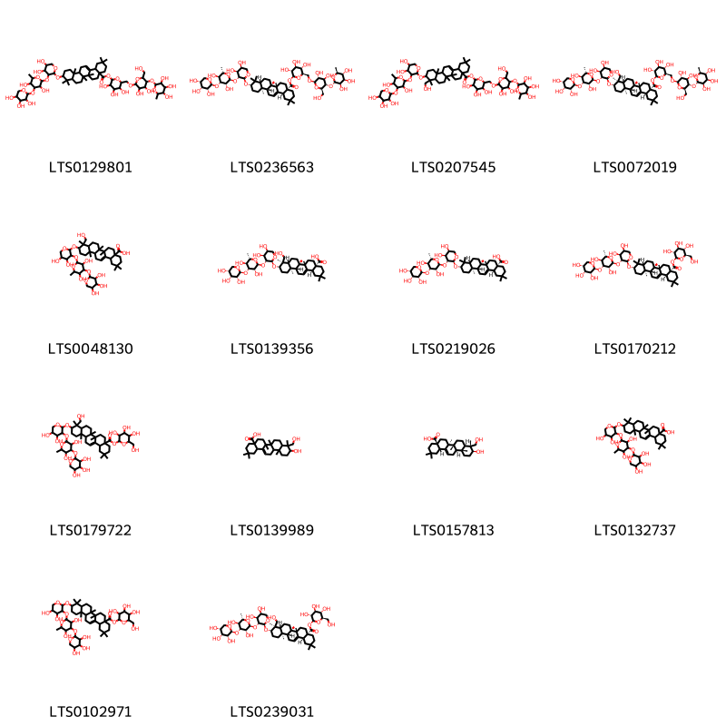{ width=100% }
    <figcaption>Hình ảnh cấu trúc hóa học của 14 hoạt chất thuộc nhóm Prenol lipids gồm ['6-({[3,4-dihydroxy-6-(hydroxymethyl)-5-[(3,4,5-trihydroxy-6-methyloxan-2-yl)oxy]oxan-2-yl]oxy}methyl)-3,4,5-trihydroxyoxan-2-yl 10-{[3-({3,5-dihydroxy-6-methyl-4-[(3,4,5-trihydroxyoxan-2-yl)oxy]oxan-2-yl}oxy)-4,5-dihydroxyoxan-2-yl]oxy}-2,2,6a,6b,9,9,12a-heptamethyl-1,3,4,5,6,7,8,8a,10,11,12,12b,13,14b-tetradecahydropicene-4a-carboxylate (LTS0129801)', '(2s,3r,4s,5s,6r)-6-({[(2r,3r,4r,5s,6r)-3,4-dihydroxy-6-(hydroxymethyl)-5-{[(2s,3r,4r,5r,6s)-3,4,5-trihydroxy-6-methyloxan-2-yl]oxy}oxan-2-yl]oxy}methyl)-3,4,5-trihydroxyoxan-2-yl (4as,6as,6br,8ar,10s,12ar,12br,14bs)-10-{[(2s,3r,4s,5s)-3-{[(2s,3r,4r,5s,6s)-3,5-dihydroxy-6-methyl-4-{[(2s,3r,4r,5r)-3,4,5-trihydroxyoxan-2-yl]oxy}oxan-2-yl]oxy}-4,5-dihydroxyoxan-2-yl]oxy}-2,2,6a,6b,9,9,12a-heptamethyl-1,3,4,5,6,7,8,8a,10,11,12,12b,13,14b-tetradecahydropicene-4a-carboxylate (LTS0236563)', '6-({[3,4-dihydroxy-6-(hydroxymethyl)-5-[(3,4,5-trihydroxy-6-methyloxan-2-yl)oxy]oxan-2-yl]oxy}methyl)-3,4,5-trihydroxyoxan-2-yl 10-{[3-({3,5-dihydroxy-6-methyl-4-[(3,4,5-trihydroxyoxan-2-yl)oxy]oxan-2-yl}oxy)-4,5-dihydroxyoxan-2-yl]oxy}-9-(hydroxymethyl)-2,2,6a,6b,9,12a-hexamethyl-1,3,4,5,6,7,8,8a,10,11,12,12b,13,14b-tetradecahydropicene-4a-carboxylate (LTS0207545)', '(2s,3r,4s,5s,6r)-6-({[(2r,3r,4r,5s,6r)-3,4-dihydroxy-6-(hydroxymethyl)-5-{[(2s,3r,4r,5r,6s)-3,4,5-trihydroxy-6-methyloxan-2-yl]oxy}oxan-2-yl]oxy}methyl)-3,4,5-trihydroxyoxan-2-yl (4as,6as,6br,8ar,9r,10s,12ar,12br,14bs)-10-{[(2s,3r,4s,5s)-3-{[(2s,3r,4r,5s,6s)-3,5-dihydroxy-6-methyl-4-{[(2s,3r,4r,5r)-3,4,5-trihydroxyoxan-2-yl]oxy}oxan-2-yl]oxy}-4,5-dihydroxyoxan-2-yl]oxy}-9-(hydroxymethyl)-2,2,6a,6b,9,12a-hexamethyl-1,3,4,5,6,7,8,8a,10,11,12,12b,13,14b-tetradecahydropicene-4a-carboxylate (LTS0072019)', '10-{[3-({3,5-dihydroxy-6-methyl-4-[(3,4,5-trihydroxyoxan-2-yl)oxy]oxan-2-yl}oxy)-4,5-dihydroxyoxan-2-yl]oxy}-9-(hydroxymethyl)-2,2,6a,6b,9,12a-hexamethyl-1,3,4,5,6,7,8,8a,10,11,12,12b,13,14b-tetradecahydropicene-4a-carboxylic acid (LTS0048130)', '(4as,6as,6br,8ar,9r,10s,12ar,12br,14bs)-10-{[(2s,3r,4s,5s)-3-{[(2s,3r,4r,5s,6s)-3,5-dihydroxy-6-methyl-4-{[(2s,3r,4r,5r)-3,4,5-trihydroxyoxan-2-yl]oxy}oxan-2-yl]oxy}-4,5-dihydroxyoxan-2-yl]oxy}-9-(hydroxymethyl)-2,2,6a,6b,9,12a-hexamethyl-1,3,4,5,6,7,8,8a,10,11,12,12b,13,14b-tetradecahydropicene-4a-carboxylic acid (LTS0139356)', '(4as,6as,6br,8ar,10s,12ar,12br,14bs)-10-{[(2s,3r,4s,5s)-3-{[(2s,3r,4r,5s,6s)-3,5-dihydroxy-6-methyl-4-{[(2s,3r,4r,5r)-3,4,5-trihydroxyoxan-2-yl]oxy}oxan-2-yl]oxy}-4,5-dihydroxyoxan-2-yl]oxy}-2,2,6a,6b,9,9,12a-heptamethyl-1,3,4,5,6,7,8,8a,10,11,12,12b,13,14b-tetradecahydropicene-4a-carboxylic acid (LTS0219026)', '(2s,3r,4s,5s,6r)-3,4,5-trihydroxy-6-(hydroxymethyl)oxan-2-yl (4as,6as,6br,8ar,10s,12ar,12br,14bs)-10-{[(2s,3r,4s,5s)-3-{[(2s,3r,4r,5s,6s)-3,5-dihydroxy-6-methyl-4-{[(2s,3r,4r,5r)-3,4,5-trihydroxyoxan-2-yl]oxy}oxan-2-yl]oxy}-4,5-dihydroxyoxan-2-yl]oxy}-2,2,6a,6b,9,9,12a-heptamethyl-1,3,4,5,6,7,8,8a,10,11,12,12b,13,14b-tetradecahydropicene-4a-carboxylate (LTS0170212)', '3,4,5-trihydroxy-6-(hydroxymethyl)oxan-2-yl 10-{[3-({3,5-dihydroxy-6-methyl-4-[(3,4,5-trihydroxyoxan-2-yl)oxy]oxan-2-yl}oxy)-4,5-dihydroxyoxan-2-yl]oxy}-9-(hydroxymethyl)-2,2,6a,6b,9,12a-hexamethyl-1,3,4,5,6,7,8,8a,10,11,12,12b,13,14b-tetradecahydropicene-4a-carboxylate (LTS0179722)', '10-hydroxy-9-(hydroxymethyl)-2,2,6a,6b,9,12a-hexamethyl-1,3,4,5,6,7,8,8a,10,11,12,12b,13,14b-tetradecahydropicene-4a-carboxylic acid (LTS0139989)', 'hederagenin (LTS0157813)', '10-{[3-({3,5-dihydroxy-6-methyl-4-[(3,4,5-trihydroxyoxan-2-yl)oxy]oxan-2-yl}oxy)-4,5-dihydroxyoxan-2-yl]oxy}-2,2,6a,6b,9,9,12a-heptamethyl-1,3,4,5,6,7,8,8a,10,11,12,12b,13,14b-tetradecahydropicene-4a-carboxylic acid (LTS0132737)', '3,4,5-trihydroxy-6-(hydroxymethyl)oxan-2-yl 10-{[3-({3,5-dihydroxy-6-methyl-4-[(3,4,5-trihydroxyoxan-2-yl)oxy]oxan-2-yl}oxy)-4,5-dihydroxyoxan-2-yl]oxy}-2,2,6a,6b,9,9,12a-heptamethyl-1,3,4,5,6,7,8,8a,10,11,12,12b,13,14b-tetradecahydropicene-4a-carboxylate (LTS0102971)', '(2s,3r,4s,5s,6r)-3,4,5-trihydroxy-6-(hydroxymethyl)oxan-2-yl (4as,6as,6br,8ar,9r,10s,12ar,12br,14bs)-10-{[(2s,3r,4s,5s)-3-{[(2s,3r,4r,5s,6s)-3,5-dihydroxy-6-methyl-4-{[(2s,3r,4r,5r)-3,4,5-trihydroxyoxan-2-yl]oxy}oxan-2-yl]oxy}-4,5-dihydroxyoxan-2-yl]oxy}-9-(hydroxymethyl)-2,2,6a,6b,9,12a-hexamethyl-1,3,4,5,6,7,8,8a,10,11,12,12b,13,14b-tetradecahydropicene-4a-carboxylate (LTS0239031)'].</figcaption>
</figure>
#### Nhóm Saturated hydrocarbons
<figure markdown="span">
    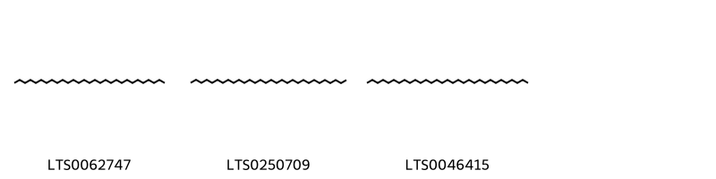{ width=100% }
    <figcaption>Hình ảnh cấu trúc hóa học của 3 hoạt chất thuộc nhóm Saturated hydrocarbons gồm ['nonacosane (LTS0062747)', 'triacontane (LTS0250709)', 'hentriacontane (LTS0046415)'].</figcaption>
</figure>
#### Nhóm Steroids and steroid derivatives
<figure markdown="span">
    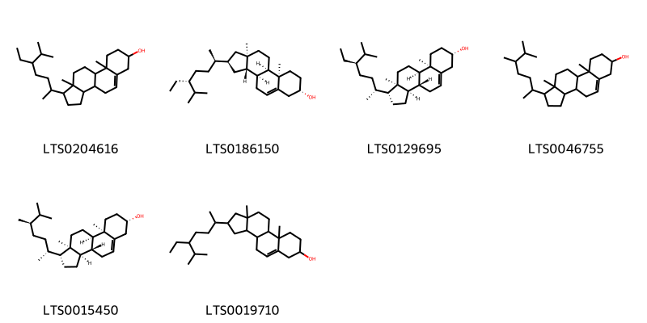{ width=100% }
    <figcaption>Hình ảnh cấu trúc hóa học của 6 hoạt chất thuộc nhóm Steroids and steroid derivatives gồm ['stigmast-5-en-3-ol, (3β)- (LTS0204616)', '(2r,3as,3bs,7s,9ar,9br,11ar)-2-[(2r,5r)-5-ethyl-6-methylheptan-2-yl]-9a,11a-dimethyl-1h,2h,3h,3ah,3bh,4h,6h,7h,8h,9h,9bh,10h,11h-cyclopenta[a]phenanthren-7-ol (LTS0186150)', '(1r,3ar,3br,7s,9ar,9br,11ar)-1-[(2r,5r)-5-ethyl-6-methylheptan-2-yl]-9a,11a-dimethyl-1h,2h,3h,3ah,3bh,4h,6h,7h,8h,9h,9bh,10h,11h-cyclopenta[a]phenanthren-7-ol (LTS0129695)', 'campesterol (LTS0046755)', '(1r,3ar,3br,7s,9ar,9br,11ar)-1-[(2r,5r)-5,6-dimethylheptan-2-yl]-9a,11a-dimethyl-1h,2h,3h,3ah,3bh,4h,6h,7h,8h,9h,9bh,10h,11h-cyclopenta[a]phenanthren-7-ol (LTS0015450)', '2-(5-ethyl-6-methylheptan-2-yl)-9a,11a-dimethyl-1h,2h,3h,3ah,3bh,4h,6h,7h,8h,9h,9bh,10h,11h-cyclopenta[a]phenanthren-7-ol (LTS0019710)'].</figcaption>
</figure>

---

### Dược dân tộc học

Danh sách các quốc gia có sử dụng *Clematis vitalba* trong điều trị các bệnh. 

| Country   | Disease                                                       | Bệnh                                                                                                                                                                                                |
|:----------|:--------------------------------------------------------------|:----------------------------------------------------------------------------------------------------------------------------------------------------------------------------------------------------|
| Elsewhere | Diuretic                                                      | MYMEMORY WARNING: YOU USED ALL AVAILABLE FREE TRANSLATIONS FOR TODAY. NEXT AVAILABLE IN  08 HOURS 43 MINUTES 45 SECONDS VISIT HTTPS://MYMEMORY.TRANSLATED.NET/DOC/USAGELIMITS.PHP TO TRANSLATE MORE |
| Turkey    | Poison, Purgative, Rubefacient, Sudorific, Vesicant, Diuretic | MYMEMORY WARNING: YOU USED ALL AVAILABLE FREE TRANSLATIONS FOR TODAY. NEXT AVAILABLE IN  08 HOURS 43 MINUTES 42 SECONDS VISIT HTTPS://MYMEMORY.TRANSLATED.NET/DOC/USAGELIMITS.PHP TO TRANSLATE MORE |
| ain       | Vesicant                                                      | MYMEMORY WARNING: YOU USED ALL AVAILABLE FREE TRANSLATIONS FOR TODAY. NEXT AVAILABLE IN  08 HOURS 43 MINUTES 40 SECONDS VISIT HTTPS://MYMEMORY.TRANSLATED.NET/DOC/USAGELIMITS.PHP TO TRANSLATE MORE |

---

# Chi Delphinium

??? note "Danh sách các dược liệu thuộc chi"
    
	 - *Delphinium ajacis*
	 - *Delphinium brunonianum*
	 - *Delphinium cashmirianum*
	 - *Delphinium consolida*
	 - *Delphinium denudatum*
	 - *Delphinium elatum*
	 - *Delphinium staphisagria*
	 - *Delphinium zalil*

---
## Delphinium ajacis
### Thông tin về thực vật

!!! info "Phân loại thực vật của *Delphinium ajacis* từ GIBF:"
    - **Kingdom:** Plantae
    - **Phylum:** Tracheophyta
    - **Order:** Ranunculales
    - **Family:** Ranunculaceae
    - **Genus:** Delphinium
    - **Species:** *Delphinium ajacis*

 

| Label (VI)   | Label (EN)   | Scientific Name   | Descriptions (VI)   | Descriptions (EN)   | Also Known As (VI)   | Also Known As (EN)   |
|:-------------|:-------------|:------------------|:--------------------|:--------------------|:---------------------|:---------------------|
| N/A          | N/A          | Delphinium ajacis | loài thực vật       | species of plant    | ['']                 | ['']                 |

#### Phân bố trên thế giới

**Từ CSDL GIBF** Georgia, Spain, Germany, Austria, Sweden, Poland, India, Kazakhstan, Canada, Belgium, Netherlands, Türkiye, Hungary, Bulgaria, Switzerland, Iran (Islamic Republic of), United Kingdom of Great Britain and Northern Ireland, Morocco, France, Latvia, Czechia, Romania, Russian Federation, United States of America, Italy, Ukraine

#### Phân bố tại Việt Nam

**Từ CSDL GIBF**: Không có ghi nhận ở Việt Nam

---
### Thành phần hóa học
        
- Theo cơ sở dữ liệu lotus: Từ loài *Delphinium ajacis* đã phân lập và xác định được 39 hoạt chất thuộc về các nhóm Prenol lipids, Benzene and substituted derivatives. 

|    | chemicalTaxonomyClassyfireClass     |   smiles_count |
|---:|:------------------------------------|---------------:|
|  0 | Benzene and substituted derivatives |              1 |
|  1 | Prenol lipids                       |             37 |

#### Nhóm Benzene and substituted derivatives
<figure markdown="span">
    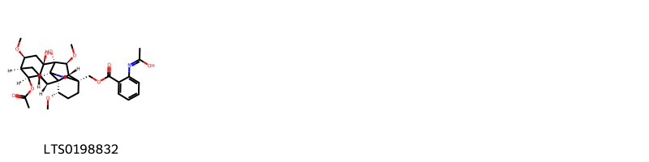{ width=100% }
    <figcaption>Hình ảnh cấu trúc hóa học của 1 hoạt chất thuộc nhóm Benzene and substituted derivatives gồm ['n-[2-({[(1s,2r,3r,4s,5r,6s,8r,9s,10s,13s,16s,17r,18s)-4-(acetyloxy)-8,9-dihydroxy-6,16,18-trimethoxy-11-azahexacyclo[7.7.2.1²,⁵.0¹,¹⁰.0³,⁸.0¹³,¹⁷]nonadec-11-en-13-yl]methoxy}carbonyl)phenyl]ethanimidic acid (LTS0198832)'].</figcaption>
</figure>
#### Nhóm Prenol lipids
<figure markdown="span">
    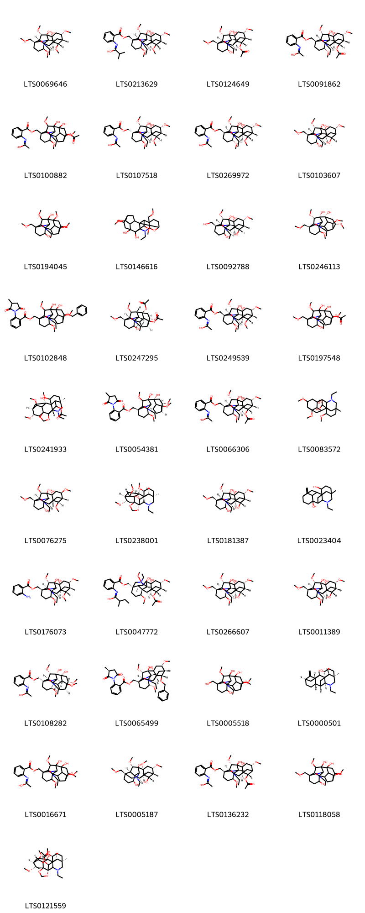{ width=100% }
    <figcaption>Hình ảnh cấu trúc hóa học của 37 hoạt chất thuộc nhóm Prenol lipids gồm ['(1s,2r,3r,4s,5r,6s,8r,9s,10s,13s,16s,17r,18s)-11-ethyl-4,6,16,18-tetramethoxy-13-(methoxymethyl)-11-azahexacyclo[7.7.2.1²,⁵.0¹,¹⁰.0³,⁸.0¹³,¹⁷]nonadecane-8,9-diol (LTS0069646)', 'n-[2-({[(1s,2r,3r,4s,5r,6s,8r,9s,10s,13s,16s,17r,18s)-11-ethyl-8,9-dihydroxy-4,6,16,18-tetramethoxy-11-azahexacyclo[7.7.2.1²,⁵.0¹,¹⁰.0³,⁸.0¹³,¹⁷]nonadecan-13-yl]methoxy}carbonyl)phenyl]-2-methylpropanimidic acid (LTS0213629)', '(1s,2r,3r,4s,5r,6s,8r,9s,10s,13s,16s,17r,18s)-11-ethyl-8,9,16-trihydroxy-6,18-dimethoxy-13-(methoxymethyl)-11-azahexacyclo[7.7.2.1²,⁵.0¹,¹⁰.0³,⁸.0¹³,¹⁷]nonadecan-4-yl acetate (LTS0124649)', 'n-[2-({[(1s,2r,3r,4s,5r,6s,8r,9s,10s,13s,16r,17r,18s)-4-(acetyloxy)-11-ethyl-8,9-dihydroxy-6,16,18-trimethoxy-11-azahexacyclo[7.7.2.1²,⁵.0¹,¹⁰.0³,⁸.0¹³,¹⁷]nonadecan-13-yl]methoxy}carbonyl)phenyl]ethanimidic acid (LTS0091862)', 'n-[2-({[4-(acetyloxy)-11-ethyl-8,9-dihydroxy-6,16,18-trimethoxy-11-azahexacyclo[7.7.2.1²,⁵.0¹,¹⁰.0³,⁸.0¹³,¹⁷]nonadecan-13-yl]methoxy}carbonyl)phenyl]ethanimidic acid (LTS0100882)', 'n-[2-({[(1r,2r,3r,4s,5r,6s,8r,9r,10r,13r,16s,18s)-11-ethyl-8,9-dihydroxy-4,6,16,18-tetramethoxy-11-azahexacyclo[7.7.2.1²,⁵.0¹,¹⁰.0³,⁸.0¹³,¹⁷]nonadecan-13-yl]methoxy}carbonyl)phenyl]ethanimidic acid (LTS0107518)', 'n-[2-({[(1s,2r,3r,4s,5r,6s,8r,9s,10s,13s,16r,17r,18s)-11-ethyl-8,9-dihydroxy-4,6,16,18-tetramethoxy-11-azahexacyclo[7.7.2.1²,⁵.0¹,¹⁰.0³,⁸.0¹³,¹⁷]nonadecan-13-yl]methoxy}carbonyl)phenyl]ethanimidic acid (LTS0269972)', '(1s,2r,3r,4s,6s,8r,9s,10s,13s,16s,17r,18s)-11-ethyl-6,18-dimethoxy-13-(methoxymethyl)-11-azahexacyclo[7.7.2.1²,⁵.0¹,¹⁰.0³,⁸.0¹³,¹⁷]nonadecane-4,8,9,16-tetrol (LTS0103607)', '11-ethyl-6,8,18-trimethoxy-13-(methoxymethyl)-11-azahexacyclo[7.7.2.1²,⁵.0¹,¹⁰.0³,⁸.0¹³,¹⁷]nonadecane-4,9,16-triol (LTS0194045)', '4-ethyl-12,16-dimethoxy-10-(methoxymethyl)-6-oxa-4-azaheptacyclo[15.2.1.0²,⁷.0²,¹¹.0³,¹³.0⁵,¹⁰.0¹⁴,¹⁹]icosane-13,14,18-triol (LTS0146616)', '(1s,2r,3r,4s,5s,6s,8r,9s,10s,13s,16s,17r,18s)-11-ethyl-13-(hydroxymethyl)-6,18-dimethoxy-11-azahexacyclo[7.7.2.1²,⁵.0¹,¹⁰.0³,⁸.0¹³,¹⁷]nonadecane-4,8,9,16-tetrol (LTS0092788)', '(6s,8r,9r,13s,18s)-11-ethyl-4,6,16,18-tetramethoxy-13-(methoxymethyl)-11-azahexacyclo[7.7.2.1²,⁵.0¹,¹⁰.0³,⁸.0¹³,¹⁷]nonadecane-8,9-diol (LTS0246113)', '[4-(benzyloxy)-11-ethyl-8,9-dihydroxy-6,16,18-trimethoxy-11-azahexacyclo[7.7.2.1²,⁵.0¹,¹⁰.0³,⁸.0¹³,¹⁷]nonadecan-13-yl]methyl 2-(3-methyl-2,5-dioxopyrrolidin-1-yl)benzoate (LTS0102848)', '(1s,2r,3r,4s,5r,6s,8r,9r,10r,13s,16s,17r,18r)-4-(acetyloxy)-11-ethyl-16-hydroxy-6,18-dimethoxy-13-(methoxymethyl)-11-azahexacyclo[7.7.2.1²,⁵.0¹,¹⁰.0³,⁸.0¹³,¹⁷]nonadecan-8-yl acetate (LTS0247295)', 'n-[2-({[(1s,2r,3r,4s,5r,6s,8r,9s,10s,13s,16s,17r,18s)-11-ethyl-8,9-dihydroxy-4,6,16,18-tetramethoxy-11-azahexacyclo[7.7.2.1²,⁵.0¹,¹⁰.0³,⁸.0¹³,¹⁷]nonadecan-13-yl]methoxy}carbonyl)phenyl]ethanimidic acid (LTS0249539)', '11-ethyl-8,9,16-trihydroxy-6,18-dimethoxy-13-(methoxymethyl)-11-azahexacyclo[7.7.2.1²,⁵.0¹,¹⁰.0³,⁸.0¹³,¹⁷]nonadecan-4-yl acetate (LTS0197548)', '(2s,5r,6s,8r,13s,16r)-14-ethyl-2-hydroxy-4,6,19-trimethoxy-16-methyl-9,11-dioxa-14-azaheptacyclo[10.7.2.1²,⁵.0¹,¹³.0³,⁸.0⁸,¹².0¹⁶,²⁰]docosan-21-yl acetate (LTS0241933)', '[(1s,4s,5r,6s,8r,9s,13s,16s)-11-ethyl-8,9-dihydroxy-4,6,16,18-tetramethoxy-11-azahexacyclo[7.7.2.1²,⁵.0¹,¹⁰.0³,⁸.0¹³,¹⁷]nonadecan-13-yl]methyl 2-(3-methyl-2,5-dioxopyrrolidin-1-yl)benzoate (LTS0054381)', 'n-[2-({[(1s,2r,3r,4s,5r,6s,8r,9s,10s,13s,16s,17r,18s)-4-(acetyloxy)-11-ethyl-8,9-dihydroxy-6,16,18-trimethoxy-11-azahexacyclo[7.7.2.1²,⁵.0¹,¹⁰.0³,⁸.0¹³,¹⁷]nonadecan-13-yl]methoxy}carbonyl)phenyl]ethanimidic acid (LTS0066306)', '14-ethyl-4,6,19-trimethoxy-16-methyl-9,11-dioxa-14-azaheptacyclo[10.7.2.1²,⁵.0¹,¹³.0³,⁸.0⁸,¹².0¹⁶,²⁰]docosan-21-ol (LTS0083572)', '(1s,2r,3s,4r,5r,6r,8r,9s,13s,16r,17r,18r)-11-ethyl-4,6,18-trimethoxy-13-(methoxymethyl)-11-azahexacyclo[7.7.2.1²,⁵.0¹,¹⁰.0³,⁸.0¹³,¹⁷]nonadecane-8,9,16-triol (LTS0076275)', '(1s,2r,3r,4s,5r,6s,8r,12s,16r,19s,20r,21s)-14-ethyl-4,6,19-trimethoxy-16-methyl-9,11-dioxa-14-azaheptacyclo[10.7.2.1²,⁵.0¹,¹³.0³,⁸.0⁸,¹².0¹⁶,²⁰]docosan-21-ol (LTS0238001)', '(1s,2r,3r,4s,5s,6s,8r,9s,10s,13s,16s,17r,18s)-11-ethyl-6,18-dimethoxy-13-(methoxymethyl)-11-azahexacyclo[7.7.2.1²,⁵.0¹,¹⁰.0³,⁸.0¹³,¹⁷]nonadecane-4,8,9,16-tetrol (LTS0181387)', '11-ethyl-13-methyl-4-methylidene-11-azahexacyclo[7.7.2.1²,⁵.0¹,¹⁰.0³,⁸.0¹³,¹⁷]nonadecane-8,16-diol (LTS0023404)', 'anthranoyllycoctonine (LTS0176073)', 'n-[2-({[(1s,2r,3r,4s,5r,6s,8r,9s,10s,13s,16s,17r,18s)-4-(acetyloxy)-11-ethyl-8,9-dihydroxy-6,16,18-trimethoxy-11-azahexacyclo[7.7.2.1²,⁵.0¹,¹⁰.0³,⁸.0¹³,¹⁷]nonadecan-13-yl]methoxy}carbonyl)phenyl]-2-methylbutanimidic acid (LTS0047772)', '(1s,2r,3r,4s,5s,6s,8r,9s,10s,13s,16s,17r,18s)-11-ethyl-6,16,18-trimethoxy-13-(methoxymethyl)-11-azahexacyclo[7.7.2.1²,⁵.0¹,¹⁰.0³,⁸.0¹³,¹⁷]nonadecane-4,8,9-triol (LTS0266607)', 'browniine (LTS0011389)', 'n-[2-({[(1r,2r,3r,4s,5r,6s,8r,9r,10r,13r,16s,17r,18s)-11-ethyl-8,9-dihydroxy-4,6,16,18-tetramethoxy-11-azahexacyclo[7.7.2.1²,⁵.0¹,¹⁰.0³,⁸.0¹³,¹⁷]nonadecan-13-yl]methoxy}carbonyl)phenyl]ethanimidic acid (LTS0108282)', '[(1s,2r,3r,4s,5r,6s,8r,9s,10s,13s,16r,17r,18s)-4-(benzyloxy)-11-ethyl-8,9-dihydroxy-6,16,18-trimethoxy-11-azahexacyclo[7.7.2.1²,⁵.0¹,¹⁰.0³,⁸.0¹³,¹⁷]nonadecan-13-yl]methyl 2-[(3s)-3-methyl-2,5-dioxopyrrolidin-1-yl]benzoate (LTS0065499)', 'gigactonine (LTS0005518)', '(1r,2s,3s,5r,8r,9s,10s,13r,16r,17s)-11-ethyl-13-methyl-4-methylidene-11-azahexacyclo[7.7.2.1²,⁵.0¹,¹⁰.0³,⁸.0¹³,¹⁷]nonadecan-16-ol (LTS0000501)', 'n-{2-[({11-ethyl-8,9-dihydroxy-4,6,16,18-tetramethoxy-11-azahexacyclo[7.7.2.1²,⁵.0¹,¹⁰.0³,⁸.0¹³,¹⁷]nonadecan-13-yl}methoxy)carbonyl]phenyl}ethanimidic acid (LTS0016671)', '(1s,2r,3r,4s,5s,6s,8r,10s,13s,16s,17r,18s)-11-ethyl-6,8,18-trimethoxy-13-(methoxymethyl)-11-azahexacyclo[7.7.2.1²,⁵.0¹,¹⁰.0³,⁸.0¹³,¹⁷]nonadecane-4,9,16-triol (LTS0005187)', 'n-[2-({[(1s,2r,3r,4s,6s,8r,9s,10s,13s,16s,17r,18s)-4-(acetyloxy)-11-ethyl-8,9-dihydroxy-6,16,18-trimethoxy-11-azahexacyclo[7.7.2.1²,⁵.0¹,¹⁰.0³,⁸.0¹³,¹⁷]nonadecan-13-yl]methoxy}carbonyl)phenyl]ethanimidic acid (LTS0136232)', '11-ethyl-6,18-dimethoxy-13-(methoxymethyl)-11-azahexacyclo[7.7.2.1²,⁵.0¹,¹⁰.0³,⁸.0¹³,¹⁷]nonadecane-4,8,9,16-tetrol (LTS0118058)', 'deltaline (LTS0121559)'].</figcaption>
</figure>

---

### Dược dân tộc học

Danh sách các quốc gia có sử dụng *Delphinium ajacis* trong điều trị các bệnh. 

| Country   | Disease                            | Bệnh                                                                                                                                                                                                |
|:----------|:-----------------------------------|:----------------------------------------------------------------------------------------------------------------------------------------------------------------------------------------------------|
| Elsewhere | Parasiticide, Pediculicide, Poison | MYMEMORY WARNING: YOU USED ALL AVAILABLE FREE TRANSLATIONS FOR TODAY. NEXT AVAILABLE IN  08 HOURS 43 MINUTES 08 SECONDS VISIT HTTPS://MYMEMORY.TRANSLATED.NET/DOC/USAGELIMITS.PHP TO TRANSLATE MORE |
| Guatemala | Pediculicide                       | MYMEMORY WARNING: YOU USED ALL AVAILABLE FREE TRANSLATIONS FOR TODAY. NEXT AVAILABLE IN  08 HOURS 43 MINUTES 05 SECONDS VISIT HTTPS://MYMEMORY.TRANSLATED.NET/DOC/USAGELIMITS.PHP TO TRANSLATE MORE |
| Iraq      | Insecticide, Pediculicide          | MYMEMORY WARNING: YOU USED ALL AVAILABLE FREE TRANSLATIONS FOR TODAY. NEXT AVAILABLE IN  08 HOURS 43 MINUTES 02 SECONDS VISIT HTTPS://MYMEMORY.TRANSLATED.NET/DOC/USAGELIMITS.PHP TO TRANSLATE MORE |
| US        | Poison                             | MYMEMORY WARNING: YOU USED ALL AVAILABLE FREE TRANSLATIONS FOR TODAY. NEXT AVAILABLE IN  08 HOURS 43 MINUTES 00 SECONDS VISIT HTTPS://MYMEMORY.TRANSLATED.NET/DOC/USAGELIMITS.PHP TO TRANSLATE MORE |

---

---
## Delphinium brunonianum
### Thông tin về thực vật

!!! info "Phân loại thực vật của *Delphinium brunonianum* từ GIBF:"
    - **Kingdom:** Plantae
    - **Phylum:** Tracheophyta
    - **Order:** Ranunculales
    - **Family:** Ranunculaceae
    - **Genus:** Delphinium
    - **Species:** *Delphinium brunonianum*

 

| Label (VI)   | Label (EN)   | Scientific Name        | Descriptions (VI)   | Descriptions (EN)   | Also Known As (VI)   | Also Known As (EN)   |
|:-------------|:-------------|:-----------------------|:--------------------|:--------------------|:---------------------|:---------------------|
| N/A          | N/A          | Delphinium brunonianum | loài thực vật       | species of plant    | ['']                 | ['Musk Larkspur']    |

#### Phân bố trên thế giới

**Từ CSDL GIBF** nan, unknown or invalid, Pakistan, Bhutan, Uzbekistan, Poland, India, Afghanistan, Russian Federation, China, Nepal, Tajikistan

#### Phân bố tại Việt Nam

**Từ CSDL GIBF**: Không có ghi nhận ở Việt Nam

---
### Thành phần hóa học
        
- Theo cơ sở dữ liệu lotus: Từ loài *Delphinium brunonianum* đã phân lập và xác định được 22 hoạt chất thuộc về các nhóm Prenol lipids. 

|    | chemicalTaxonomyClassyfireClass   |   smiles_count |
|---:|:----------------------------------|---------------:|
|  0 | Prenol lipids                     |             22 |

#### Nhóm Prenol lipids
<figure markdown="span">
    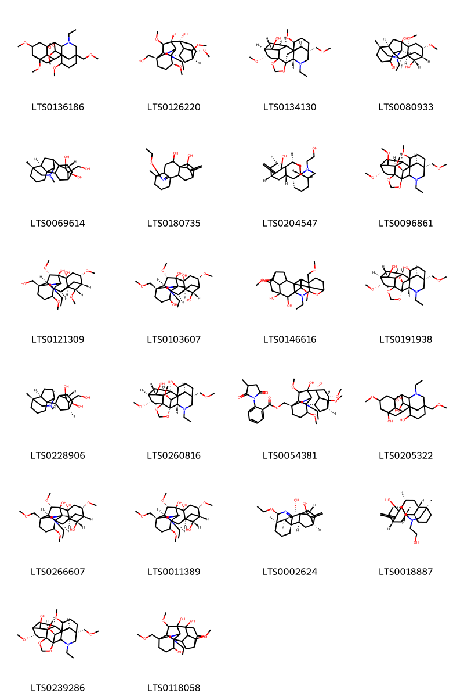{ width=100% }
    <figcaption>Hình ảnh cấu trúc hóa học của 22 hoạt chất thuộc nhóm Prenol lipids gồm ['14-ethyl-4,6,19,21-tetramethoxy-16-(methoxymethyl)-9,11-dioxa-14-azaheptacyclo[10.7.2.1²,⁵.0¹,¹³.0³,⁸.0⁸,¹².0¹⁶,²⁰]docosane (LTS0136186)', '(1s,5r,6s,8r,9s,13s,16s)-11-ethyl-13-(hydroxymethyl)-4,6,16,18-tetramethoxy-11-azahexacyclo[7.7.2.1²,⁵.0¹,¹⁰.0³,⁸.0¹³,¹⁷]nonadecane-8,9-diol (LTS0126220)', '(1s,2r,3r,4s,5s,6s,8r,12r,13s,16s,19s,20r)-14-ethyl-6,19-dimethoxy-16-(methoxymethyl)-9,11-dioxa-14-azaheptacyclo[10.7.2.1²,⁵.0¹,¹³.0³,⁸.0⁸,¹².0¹⁶,²⁰]docosan-4-ol (LTS0134130)', '(1s,2r,3r,4s,5s,6s,8r,9r,10s,13r,16s,17r)-11-ethyl-6,8-dimethoxy-13-methyl-11-azahexacyclo[7.7.2.1²,⁵.0¹,¹⁰.0³,⁸.0¹³,¹⁷]nonadecane-4,9,16-triol (LTS0080933)', '(5r,11s,12r,16r)-12-(hydroxymethyl)-5,7-dimethyl-7-azahexacyclo[7.6.2.2¹⁰,¹³.0¹,⁸.0⁵,¹⁶.0¹⁰,¹⁵]nonadecane-11,12-diol (LTS0069614)', '12-ethoxy-11-methyl-5-methylidene-13-azapentacyclo[9.3.3.2⁴,⁷.0¹,¹⁰.0²,⁷]nonadec-13-ene-6,8-diol (LTS0180735)', 'ajaconine (LTS0204547)', '(2r,3r,6s,8r,12r,16s,20r,21s)-14-ethyl-4,6,19,21-tetramethoxy-16-(methoxymethyl)-9,11-dioxa-14-azaheptacyclo[10.7.2.1²,⁵.0¹,¹³.0³,⁸.0⁸,¹².0¹⁶,²⁰]docosane (LTS0096861)', 'lycoctonine (LTS0121309)', '(1s,2r,3r,4s,6s,8r,9s,10s,13s,16s,17r,18s)-11-ethyl-6,18-dimethoxy-13-(methoxymethyl)-11-azahexacyclo[7.7.2.1²,⁵.0¹,¹⁰.0³,⁸.0¹³,¹⁷]nonadecane-4,8,9,16-tetrol (LTS0103607)', '4-ethyl-12,16-dimethoxy-10-(methoxymethyl)-6-oxa-4-azaheptacyclo[15.2.1.0²,⁷.0²,¹¹.0³,¹³.0⁵,¹⁰.0¹⁴,¹⁹]icosane-13,14,18-triol (LTS0146616)', '(1s,2r,3r,4s,5s,6s,8r,12s,13s,16s,19s,20r,21s)-14-ethyl-6-methoxy-16-(methoxymethyl)-9,11-dioxa-14-azaheptacyclo[10.7.2.1²,⁵.0¹,¹³.0³,⁸.0⁸,¹².0¹⁶,²⁰]docosane-4,19,21-triol (LTS0191938)', '(1s,5r,10r,11s,12r,13s,15s,16r)-12-(hydroxymethyl)-5,7-dimethyl-7-azahexacyclo[7.6.2.2¹⁰,¹³.0¹,⁸.0⁵,¹⁶.0¹⁰,¹⁵]nonadecane-11,12-diol (LTS0228906)', '(1s,2r,3r,4s,5s,6s,8r,12s,13s,16s,19s,20r,21s)-14-ethyl-6,21-dimethoxy-16-(methoxymethyl)-9,11-dioxa-14-azaheptacyclo[10.7.2.1²,⁵.0¹,¹³.0³,⁸.0⁸,¹².0¹⁶,²⁰]docosane-4,19-diol (LTS0260816)', '[(1s,4s,5r,6s,8r,9s,13s,16s)-11-ethyl-8,9-dihydroxy-4,6,16,18-tetramethoxy-11-azahexacyclo[7.7.2.1²,⁵.0¹,¹⁰.0³,⁸.0¹³,¹⁷]nonadecan-13-yl]methyl 2-(3-methyl-2,5-dioxopyrrolidin-1-yl)benzoate (LTS0054381)', '14-ethyl-6-methoxy-16-(methoxymethyl)-9,11-dioxa-14-azaheptacyclo[10.7.2.1²,⁵.0¹,¹³.0³,⁸.0⁸,¹².0¹⁶,²⁰]docosane-4,19,21-triol (LTS0205322)', '(1s,2r,3r,4s,5s,6s,8r,9s,10s,13s,16s,17r,18s)-11-ethyl-6,16,18-trimethoxy-13-(methoxymethyl)-11-azahexacyclo[7.7.2.1²,⁵.0¹,¹⁰.0³,⁸.0¹³,¹⁷]nonadecane-4,8,9-triol (LTS0266607)', 'browniine (LTS0011389)', '(1r,2s,4s,6r,7r,8r,10s,11r,12r)-12-ethoxy-11-methyl-5-methylidene-13-azapentacyclo[9.3.3.2⁴,⁷.0¹,¹⁰.0²,⁷]nonadec-13-ene-6,8-diol (LTS0002624)', '(1s,5r,8r,10r,11s,14s,16r,17r)-7-(2-hydroxyethyl)-5-methyl-13-methylidene-9-oxa-7-azahexacyclo[8.6.2.2¹¹,¹⁴.0¹,⁸.0⁵,¹⁷.0¹¹,¹⁶]icosan-12-ol (LTS0018887)', '(2r,3r,6s,8r,12r,16s,20r,21s)-14-ethyl-6,19,21-trimethoxy-16-(methoxymethyl)-9,11-dioxa-14-azaheptacyclo[10.7.2.1²,⁵.0¹,¹³.0³,⁸.0⁸,¹².0¹⁶,²⁰]docosan-4-ol (LTS0239286)', '11-ethyl-6,18-dimethoxy-13-(methoxymethyl)-11-azahexacyclo[7.7.2.1²,⁵.0¹,¹⁰.0³,⁸.0¹³,¹⁷]nonadecane-4,8,9,16-tetrol (LTS0118058)'].</figcaption>
</figure>

---

### Dược dân tộc học

Danh sách các quốc gia có sử dụng *Delphinium brunonianum* trong điều trị các bệnh. 

| Country   | Disease          | Bệnh                                                                                                                                                                                                |
|:----------|:-----------------|:----------------------------------------------------------------------------------------------------------------------------------------------------------------------------------------------------|
| Iraq      | Cardiodepressant | MYMEMORY WARNING: YOU USED ALL AVAILABLE FREE TRANSLATIONS FOR TODAY. NEXT AVAILABLE IN  08 HOURS 42 MINUTES 33 SECONDS VISIT HTTPS://MYMEMORY.TRANSLATED.NET/DOC/USAGELIMITS.PHP TO TRANSLATE MORE |

---

---
## Delphinium cashmirianum
### Thông tin về thực vật

!!! info "Phân loại thực vật của *Delphinium cashmerianum* từ GIBF:"
    - **Kingdom:** Plantae
    - **Phylum:** Tracheophyta
    - **Order:** Ranunculales
    - **Family:** Ranunculaceae
    - **Genus:** Delphinium
    - **Species:** *Delphinium cashmerianum*

 

| Label (VI)   | Label (EN)   | Scientific Name        | Descriptions (VI)   | Descriptions (EN)   | Also Known As (VI)   | Also Known As (EN)   |
|:-------------|:-------------|:-----------------------|:--------------------|:--------------------|:---------------------|:---------------------|
| N/A          | N/A          | Delphinium brunonianum | loài thực vật       | species of plant    | ['']                 | ['Musk Larkspur']    |

#### Phân bố trên thế giới

**Từ CSDL GIBF** nan, unknown or invalid, Pakistan, Portugal, Sweden, Afghanistan, India, Canada, Finland, United States of America, China, Nepal, Korea, Republic of

#### Phân bố tại Việt Nam

**Từ CSDL GIBF**: Không có ghi nhận ở Việt Nam

---
### Thành phần hóa học
        
- Theo cơ sở dữ liệu lotus: Từ loài *Delphinium cashmerianum* đã phân lập và xác định được Chưa có hoạt chất nào được phân lập. hoạt chất thuộc về các nhóm Không có hoạt chất nào được phân lập. 

Không có hình ảnh nào được tạo ra

---

### Dược dân tộc học

Danh sách các quốc gia có sử dụng *Delphinium cashmerianum* trong điều trị các bệnh. 

| Country   | Disease        | Bệnh                                                                                                                                                                                                |
|:----------|:---------------|:----------------------------------------------------------------------------------------------------------------------------------------------------------------------------------------------------|
| Nepal     | Poison, Poison | MYMEMORY WARNING: YOU USED ALL AVAILABLE FREE TRANSLATIONS FOR TODAY. NEXT AVAILABLE IN  08 HOURS 42 MINUTES 09 SECONDS VISIT HTTPS://MYMEMORY.TRANSLATED.NET/DOC/USAGELIMITS.PHP TO TRANSLATE MORE |

---

---
## Delphinium consolida
### Thông tin về thực vật

!!! info "Phân loại thực vật của *Delphinium consolida* từ GIBF:"
    - **Kingdom:** Plantae
    - **Phylum:** Tracheophyta
    - **Order:** Ranunculales
    - **Family:** Ranunculaceae
    - **Genus:** Delphinium
    - **Species:** *Delphinium consolida*

 

| Label (VI)   | Label (EN)   | Scientific Name      | Descriptions (VI)   | Descriptions (EN)   | Also Known As (VI)   | Also Known As (EN)   |
|:-------------|:-------------|:---------------------|:--------------------|:--------------------|:---------------------|:---------------------|
| N/A          | N/A          | Delphinium consolida | loài thực vật       | species of plant    | ['']                 | ['']                 |

#### Phân bố trên thế giới

**Từ CSDL GIBF** Switzerland, Georgia, Belarus, Serbia, Sweden, Slovakia, Czechia, Poland, Hungary, Romania, Germany, Montenegro, Russian Federation, Austria, Croatia, Netherlands, Ukraine

#### Phân bố tại Việt Nam

**Từ CSDL GIBF**: Không có ghi nhận ở Việt Nam

---
### Thành phần hóa học
        
- Theo cơ sở dữ liệu lotus: Từ loài *Delphinium consolida* đã phân lập và xác định được 21 hoạt chất thuộc về các nhóm Flavonoids, Prenol lipids, Fatty Acyls. 

|    | chemicalTaxonomyClassyfireClass   |   smiles_count |
|---:|:----------------------------------|---------------:|
|  0 | Fatty Acyls                       |              9 |
|  1 | Flavonoids                        |              1 |
|  2 | Prenol lipids                     |             11 |

#### Nhóm Fatty Acyls
<figure markdown="span">
    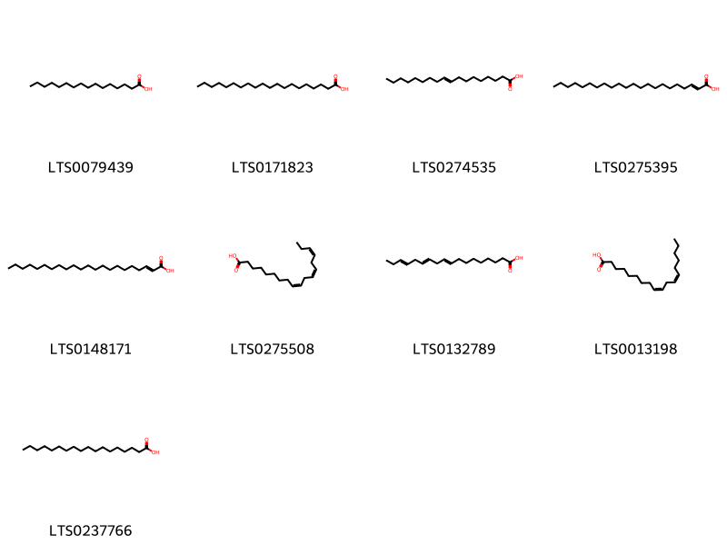{ width=100% }
    <figcaption>Hình ảnh cấu trúc hóa học của 9 hoạt chất thuộc nhóm Fatty Acyls gồm ['palmitic acid (LTS0079439)', 'arachidic acid (LTS0171823)', '(+-)-propylene glycol (LTS0274535)', '(2e)-docos-2-enoic acid (LTS0275395)', 'docos-2-enoic acid (LTS0148171)', 'α-linolenic acid (LTS0275508)', 'α linolenic acid (LTS0132789)', 'linoleic (LTS0013198)', 'stearic acid (LTS0237766)'].</figcaption>
</figure>
#### Nhóm Flavonoids
<figure markdown="span">
    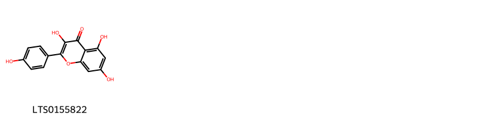{ width=100% }
    <figcaption>Hình ảnh cấu trúc hóa học của 1 hoạt chất thuộc nhóm Flavonoids gồm ['kaempherol (LTS0155822)'].</figcaption>
</figure>
#### Nhóm Prenol lipids
<figure markdown="span">
    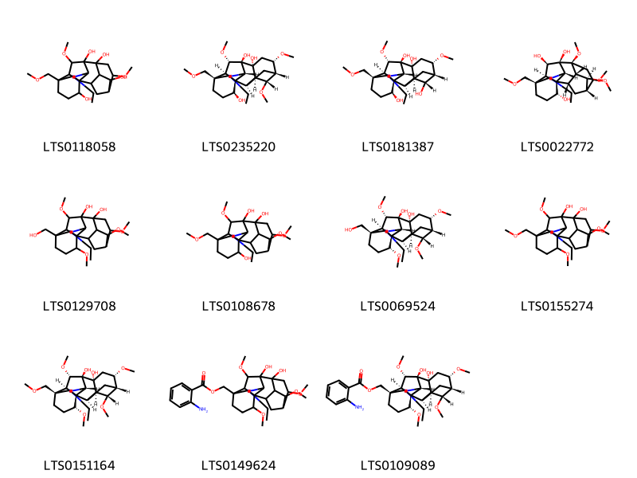{ width=100% }
    <figcaption>Hình ảnh cấu trúc hóa học của 11 hoạt chất thuộc nhóm Prenol lipids gồm ['11-ethyl-6,18-dimethoxy-13-(methoxymethyl)-11-azahexacyclo[7.7.2.1²,⁵.0¹,¹⁰.0³,⁸.0¹³,¹⁷]nonadecane-4,8,9,16-tetrol (LTS0118058)', '(1s,2r,3r,4s,5r,6s,8r,9s,10s,13s,16s,17r,18s)-11-ethyl-4,6,18-trimethoxy-13-(methoxymethyl)-11-azahexacyclo[7.7.2.1²,⁵.0¹,¹⁰.0³,⁸.0¹³,¹⁷]nonadecane-8,9,16-triol (LTS0235220)', '(1s,2r,3r,4s,5s,6s,8r,9s,10s,13s,16s,17r,18s)-11-ethyl-6,18-dimethoxy-13-(methoxymethyl)-11-azahexacyclo[7.7.2.1²,⁵.0¹,¹⁰.0³,⁸.0¹³,¹⁷]nonadecane-4,8,9,16-tetrol (LTS0181387)', '(1s,2s,3s,4s,5s,6r,8s,9s,10s,13s,16r,17r,18r)-11-ethyl-4,6,8-trimethoxy-13-(methoxymethyl)-11-azahexacyclo[7.7.2.1²,⁵.0¹,¹⁰.0³,⁸.0¹³,¹⁷]nonadecane-9,16,18-triol (LTS0022772)', '11-ethyl-13-(hydroxymethyl)-4,6,16,18-tetramethoxy-11-azahexacyclo[7.7.2.1²,⁵.0¹,¹⁰.0³,⁸.0¹³,¹⁷]nonadecane-8,9-diol (LTS0129708)', '11-ethyl-4,6,18-trimethoxy-13-(methoxymethyl)-11-azahexacyclo[7.7.2.1²,⁵.0¹,¹⁰.0³,⁸.0¹³,¹⁷]nonadecane-8,9,16-triol (LTS0108678)', '(1s,2r,3r,4s,5r,6s,8r,9s,10s,13s,16r,17r,18s)-11-ethyl-13-(hydroxymethyl)-4,6,16,18-tetramethoxy-11-azahexacyclo[7.7.2.1²,⁵.0¹,¹⁰.0³,⁸.0¹³,¹⁷]nonadecane-8,9-diol (LTS0069524)', '11-ethyl-4,6,16,18-tetramethoxy-13-(methoxymethyl)-11-azahexacyclo[7.7.2.1²,⁵.0¹,¹⁰.0³,⁸.0¹³,¹⁷]nonadecane-8,9-diol (LTS0155274)', '(1s,2r,3r,4s,5r,6s,8r,9s,10s,13s,16r,17r,18s)-11-ethyl-4,6,16,18-tetramethoxy-13-(methoxymethyl)-11-azahexacyclo[7.7.2.1²,⁵.0¹,¹⁰.0³,⁸.0¹³,¹⁷]nonadecane-8,9-diol (LTS0151164)', '{11-ethyl-8,9-dihydroxy-4,6,16,18-tetramethoxy-11-azahexacyclo[7.7.2.1²,⁵.0¹,¹⁰.0³,⁸.0¹³,¹⁷]nonadecan-13-yl}methyl 2-aminobenzoate (LTS0149624)', '[(1s,2r,3r,4s,5r,6s,8r,9s,10s,13s,16r,17r,18s)-11-ethyl-8,9-dihydroxy-4,6,16,18-tetramethoxy-11-azahexacyclo[7.7.2.1²,⁵.0¹,¹⁰.0³,⁸.0¹³,¹⁷]nonadecan-13-yl]methyl 2-aminobenzoate (LTS0109089)'].</figcaption>
</figure>

---

### Dược dân tộc học

Danh sách các quốc gia có sử dụng *Delphinium consolida* trong điều trị các bệnh. 

| Country   | Disease                                                                                | Bệnh                                                                                                                                                                                                |
|:----------|:---------------------------------------------------------------------------------------|:----------------------------------------------------------------------------------------------------------------------------------------------------------------------------------------------------|
| Elsewhere | Insecticide, Parasiticide, Pediculicide                                                | MYMEMORY WARNING: YOU USED ALL AVAILABLE FREE TRANSLATIONS FOR TODAY. NEXT AVAILABLE IN  08 HOURS 41 MINUTES 49 SECONDS VISIT HTTPS://MYMEMORY.TRANSLATED.NET/DOC/USAGELIMITS.PHP TO TRANSLATE MORE |
| India     | Insecticide                                                                            | MYMEMORY WARNING: YOU USED ALL AVAILABLE FREE TRANSLATIONS FOR TODAY. NEXT AVAILABLE IN  08 HOURS 41 MINUTES 47 SECONDS VISIT HTTPS://MYMEMORY.TRANSLATED.NET/DOC/USAGELIMITS.PHP TO TRANSLATE MORE |
| Turkey    | Diuretic, Insecticide, Narcotic, Poison, Vermifuge, Astringent, Hemostat, Parasiticide | MYMEMORY WARNING: YOU USED ALL AVAILABLE FREE TRANSLATIONS FOR TODAY. NEXT AVAILABLE IN  08 HOURS 41 MINUTES 44 SECONDS VISIT HTTPS://MYMEMORY.TRANSLATED.NET/DOC/USAGELIMITS.PHP TO TRANSLATE MORE |

---

---
## Delphinium denudatum
### Thông tin về thực vật

!!! info "Phân loại thực vật của *Delphinium denudatum* từ GIBF:"
    - **Kingdom:** Plantae
    - **Phylum:** Tracheophyta
    - **Order:** Ranunculales
    - **Family:** Ranunculaceae
    - **Genus:** Delphinium
    - **Species:** *Delphinium denudatum*

 

| Label (VI)   | Label (EN)   | Scientific Name      | Descriptions (VI)   | Descriptions (EN)   | Also Known As (VI)   | Also Known As (EN)   |
|:-------------|:-------------|:---------------------|:--------------------|:--------------------|:---------------------|:---------------------|
| N/A          | N/A          | Delphinium denudatum | loài thực vật       | species of plant    | ['']                 | ['Jadwar']           |

#### Phân bố trên thế giới

**Từ CSDL GIBF** nan, Pakistan, India, Afghanistan, United States of America, Nepal

#### Phân bố tại Việt Nam

**Từ CSDL GIBF**: Không có ghi nhận ở Việt Nam

---
### Thành phần hóa học
        
- Theo cơ sở dữ liệu lotus: Từ loài *Delphinium denudatum* đã phân lập và xác định được 18 hoạt chất thuộc về các nhóm Amaryllidaceae alkaloids, Prenol lipids, Quinolidines. 

|    | chemicalTaxonomyClassyfireClass   |   smiles_count |
|---:|:----------------------------------|---------------:|
|  0 | Amaryllidaceae alkaloids          |              1 |
|  1 | Prenol lipids                     |             15 |
|  2 | Quinolidines                      |              2 |

#### Nhóm Amaryllidaceae alkaloids
<figure markdown="span">
    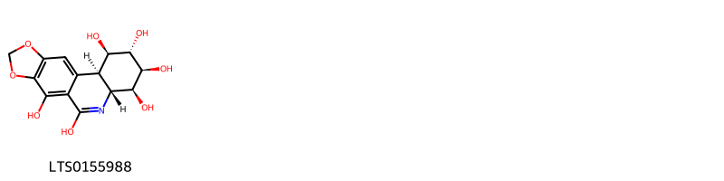{ width=100% }
    <figcaption>Hình ảnh cấu trúc hóa học của 1 hoạt chất thuộc nhóm Amaryllidaceae alkaloids gồm ['pancratistatin (LTS0155988)'].</figcaption>
</figure>
#### Nhóm Prenol lipids
<figure markdown="span">
    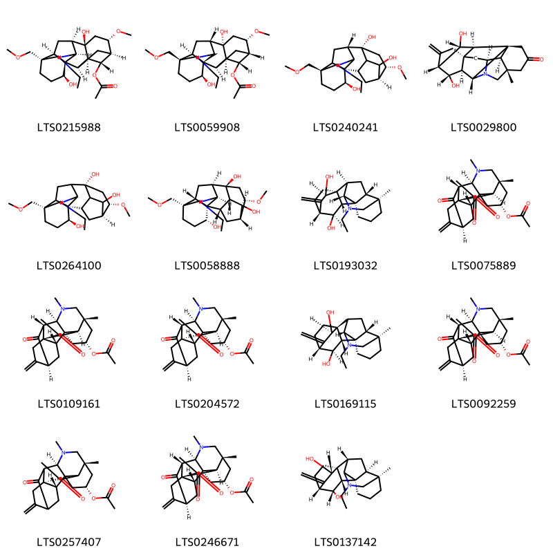{ width=100% }
    <figcaption>Hình ảnh cấu trúc hóa học của 15 hoạt chất thuộc nhóm Prenol lipids gồm ['(1s,2r,3r,4s,5s,6s,8r,9r,10s,13r,16s,17r)-11-ethyl-8,16-dihydroxy-6-methoxy-13-(methoxymethyl)-11-azahexacyclo[7.7.2.1²,⁵.0¹,¹⁰.0³,⁸.0¹³,¹⁷]nonadecan-4-yl acetate (LTS0215988)', 'condelphine (LTS0059908)', '(1s,5s,6s,8s,9s,13s,16s)-11-ethyl-6-methoxy-13-(methoxymethyl)-11-azahexacyclo[7.7.2.1²,⁵.0¹,¹⁰.0³,⁸.0¹³,¹⁷]nonadecane-4,8,16-triol (LTS0240241)', '(1s,5s,8r,9s,10s,11r,14r,16s,17r,18r,19r)-10,19-dihydroxy-5-methyl-12-methylidene-7-azaheptacyclo[9.6.2.0¹,⁸.0⁵,¹⁷.0⁷,¹⁶.0⁹,¹⁴.0¹⁴,¹⁸]nonadecan-3-one (LTS0029800)', '(1s,5s,6s,8s,13r,16s)-11-ethyl-6-methoxy-13-(methoxymethyl)-11-azahexacyclo[7.7.2.1²,⁵.0¹,¹⁰.0³,⁸.0¹³,¹⁷]nonadecane-4,8,16-triol (LTS0264100)', '(1r,2s,3s,4s,5r,6s,8r,9r,10s,13r,16r,17s)-11-ethyl-6-methoxy-13-(methoxymethyl)-11-azahexacyclo[7.7.2.1²,⁵.0¹,¹⁰.0³,⁸.0¹³,¹⁷]nonadecane-4,8,16-triol (LTS0058888)', '(1s,5r,8r,9r,10s,11r,13r,14s,15s,16r)-7-ethyl-5-methyl-12-methylidene-7-azahexacyclo[7.6.2.2¹⁰,¹³.0¹,⁸.0⁵,¹⁶.0¹⁰,¹⁵]nonadecane-11,14-diol (LTS0193032)', '(3s,5r,8r,9s,11s,14r,17r,18s)-5,7-dimethyl-12-methylidene-10,15,16-trioxo-7-azahexacyclo[9.6.2.0¹,⁸.0⁵,¹⁷.0⁹,¹⁴.0¹⁴,¹⁸]nonadecan-3-yl acetate (LTS0075889)', 'panicudine (LTS0109161)', '(1r,3s,5r,8r,9s,11s,14s,17r,18r)-5,7-dimethyl-12-methylidene-10,16-dioxo-7-azahexacyclo[9.6.2.0¹,⁸.0⁵,¹⁷.0⁹,¹⁴.0¹⁴,¹⁸]nonadecan-3-yl acetate (LTS0204572)', 'denudatine (LTS0169115)', '(1s,3s,5r,8r,9s,11s,14r,17r,18s)-5,7-dimethyl-12-methylidene-10,15,16-trioxo-7-azahexacyclo[9.6.2.0¹,⁸.0⁵,¹⁷.0⁹,¹⁴.0¹⁴,¹⁸]nonadecan-3-yl acetate (LTS0092259)', '(3s,5r,8r,14s,18r)-5,7-dimethyl-12-methylidene-10,16-dioxo-7-azahexacyclo[9.6.2.0¹,⁸.0⁵,¹⁷.0⁹,¹⁴.0¹⁴,¹⁸]nonadecan-3-yl acetate (LTS0257407)', 'vilmorrianone (LTS0246671)', '(1s,5r,9s,10s,11s,13r,14r,15s,16s)-7-ethyl-5-methyl-12-methylidene-7-azahexacyclo[7.6.2.2¹⁰,¹³.0¹,⁸.0⁵,¹⁶.0¹⁰,¹⁵]nonadecane-11,14-diol (LTS0137142)'].</figcaption>
</figure>
#### Nhóm Quinolidines
<figure markdown="span">
    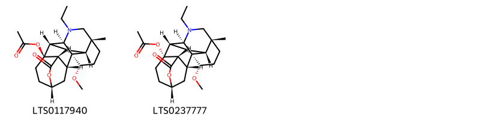{ width=100% }
    <figcaption>Hình ảnh cấu trúc hóa học của 2 hoạt chất thuộc nhóm Quinolidines gồm ['(1s,2r,3s,6s,9s,10s,11r,14r,17s,18r)-12-ethyl-17-methoxy-14-methyl-4-oxo-5-oxa-12-azahexacyclo[8.7.2.1²,⁶.0¹,¹¹.0³,⁹.0¹⁴,¹⁸]icosan-9-yl acetate (LTS0117940)', '(1s,2r,3s,6s,9r,10s,11r,14r,17s,18r)-12-ethyl-17-methoxy-14-methyl-4-oxo-5-oxa-12-azahexacyclo[8.7.2.1²,⁶.0¹,¹¹.0³,⁹.0¹⁴,¹⁸]icosan-9-yl acetate (LTS0237777)'].</figcaption>
</figure>

---

### Dược dân tộc học

Danh sách các quốc gia có sử dụng *Delphinium denudatum* trong điều trị các bệnh. 

| Country   | Disease          | Bệnh                                                                                                                                                                                                |
|:----------|:-----------------|:----------------------------------------------------------------------------------------------------------------------------------------------------------------------------------------------------|
| India     | Stimulant, Tonic | MYMEMORY WARNING: YOU USED ALL AVAILABLE FREE TRANSLATIONS FOR TODAY. NEXT AVAILABLE IN  08 HOURS 41 MINUTES 13 SECONDS VISIT HTTPS://MYMEMORY.TRANSLATED.NET/DOC/USAGELIMITS.PHP TO TRANSLATE MORE |

---

---
## Delphinium elatum
### Thông tin về thực vật

!!! info "Phân loại thực vật của *Delphinium elatum* từ GIBF:"
    - **Kingdom:** Plantae
    - **Phylum:** Tracheophyta
    - **Order:** Ranunculales
    - **Family:** Ranunculaceae
    - **Genus:** Delphinium
    - **Species:** *Delphinium elatum*

 

| Label (VI)   | Label (EN)   | Scientific Name   | Descriptions (VI)   | Descriptions (EN)   | Also Known As (VI)   | Also Known As (EN)   |
|:-------------|:-------------|:------------------|:--------------------|:--------------------|:---------------------|:---------------------|
| N/A          | N/A          | Delphinium elatum | loài thực vật       | species of plant    | ['']                 | ['']                 |

#### Phân bố trên thế giới

**Từ CSDL GIBF** Switzerland, Liechtenstein, Sweden, France, Czechia, Mongolia, Poland, Romania, Germany, Estonia, Russian Federation, Kazakhstan, United States of America, Finland, Austria, Norway, Slovakia

#### Phân bố tại Việt Nam

**Từ CSDL GIBF**: Không có ghi nhận ở Việt Nam

---
### Thành phần hóa học
        
- Theo cơ sở dữ liệu lotus: Từ loài *Delphinium elatum* đã phân lập và xác định được 90 hoạt chất thuộc về các nhóm Prenol lipids, Benzene and substituted derivatives. 

|    | chemicalTaxonomyClassyfireClass     |   smiles_count |
|---:|:------------------------------------|---------------:|
|  0 | Benzene and substituted derivatives |              7 |
|  1 | Prenol lipids                       |             79 |

#### Nhóm Benzene and substituted derivatives
<figure markdown="span">
    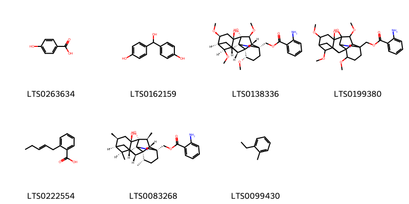{ width=100% }
    <figcaption>Hình ảnh cấu trúc hóa học của 7 hoạt chất thuộc nhóm Benzene and substituted derivatives gồm ['p-hydroxybenzoic acid (LTS0263634)', 'bis(4-hydroxyphenyl)methanol (LTS0162159)', '[(1s,2r,3r,4s,5r,6s,8r,9s,10s,13s,16s,17r,18s)-8,9-dihydroxy-4,6,16,18-tetramethoxy-11-azahexacyclo[7.7.2.1²,⁵.0¹,¹⁰.0³,⁸.0¹³,¹⁷]nonadec-11-en-13-yl]methyl 2-aminobenzoate (LTS0138336)', '{8,9-dihydroxy-4,6,16,18-tetramethoxy-11-azahexacyclo[7.7.2.1²,⁵.0¹,¹⁰.0³,⁸.0¹³,¹⁷]nonadec-11-en-13-yl}methyl 2-aminobenzoate (LTS0199380)', '2-(pent-2-en-1-yl)benzoic acid (LTS0222554)', '[(1r,2r,3s,4s,5r,6s,8r,9r,10s,13s,16s,17s,18s)-8,9-dihydroxy-4,6,16,18-tetramethyl-11-azahexacyclo[7.7.2.1²,⁵.0¹,¹⁰.0³,⁸.0¹³,¹⁷]nonadec-11-en-13-yl]methyl 2-aminobenzoate (LTS0083268)', 'o-ethyltoluene (LTS0099430)'].</figcaption>
</figure>
#### Nhóm Prenol lipids
<figure markdown="span">
    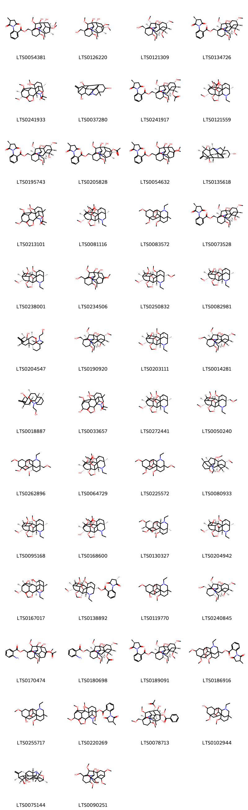{ width=100% }
    <figcaption>Hình ảnh cấu trúc hóa học của 79 hoạt chất thuộc nhóm Prenol lipids gồm ['[(1s,4s,5r,6s,8r,9s,13s,16s)-11-ethyl-8,9-dihydroxy-4,6,16,18-tetramethoxy-11-azahexacyclo[7.7.2.1²,⁵.0¹,¹⁰.0³,⁸.0¹³,¹⁷]nonadecan-13-yl]methyl 2-(3-methyl-2,5-dioxopyrrolidin-1-yl)benzoate (LTS0054381)', '(1s,5r,6s,8r,9s,13s,16s)-11-ethyl-13-(hydroxymethyl)-4,6,16,18-tetramethoxy-11-azahexacyclo[7.7.2.1²,⁵.0¹,¹⁰.0³,⁸.0¹³,¹⁷]nonadecane-8,9-diol (LTS0126220)', 'lycoctonine (LTS0121309)', '[(1s,2r,3r,4s,5r,6s,8r,9s,10s,13s,16s,17r,18s)-11-ethyl-8,9-dihydroxy-4,6,16,18-tetramethoxy-11-azahexacyclo[7.7.2.1²,⁵.0¹,¹⁰.0³,⁸.0¹³,¹⁷]nonadecan-13-yl]methyl 2-[(3s)-3-methyl-2,5-dioxopyrrolidin-1-yl]benzoate (LTS0134726)', '(2s,5r,6s,8r,13s,16r)-14-ethyl-2-hydroxy-4,6,19-trimethoxy-16-methyl-9,11-dioxa-14-azaheptacyclo[10.7.2.1²,⁵.0¹,¹³.0³,⁸.0⁸,¹².0¹⁶,²⁰]docosan-21-yl acetate (LTS0241933)', '5-methyl-12-methylidene-7-azaheptacyclo[9.6.2.0¹,⁸.0⁵,¹⁷.0⁷,¹⁶.0⁹,¹⁴.0¹⁴,¹⁸]nonadecane-3,10,19-triol (LTS0037280)', 'nudicauline (LTS0241917)', 'deltaline (LTS0121559)', '14-deacetylnudicauline (LTS0195743)', '[(5r,6s,8r,9s,13s)-4-(acetyloxy)-11-ethyl-8,9-dihydroxy-6,16,18-trimethoxy-11-azahexacyclo[7.7.2.1²,⁵.0¹,¹⁰.0³,⁸.0¹³,¹⁷]nonadecan-13-yl]methyl 2-(3-methyl-2,5-dioxopyrrolidin-1-yl)benzoate (LTS0205828)', 'methyllycaconitine (LTS0054632)', '(1s,3s,5r,8r,9s,10r,11r,14r,16s,17r,18r,19s)-5-methyl-12-methylidene-7-azaheptacyclo[9.6.2.0¹,⁸.0⁵,¹⁷.0⁷,¹⁶.0⁹,¹⁴.0¹⁴,¹⁸]nonadecane-3,10,19-triol (LTS0135618)', '14-ethyl-2-hydroxy-4,6,19-trimethoxy-16-methyl-9,11-dioxa-14-azaheptacyclo[10.7.2.1²,⁵.0¹,¹³.0³,⁸.0⁸,¹².0¹⁶,²⁰]docosan-21-yl acetate (LTS0213101)', '(1r,2s,3s,4s,5r,6s,8r,12s,13s,16r,19s,20r,21s)-14-ethyl-2-hydroxy-4,6,19-trimethoxy-16-methyl-9,11-dioxa-14-azaheptacyclo[10.7.2.1²,⁵.0¹,¹³.0³,⁸.0⁸,¹².0¹⁶,²⁰]docosan-21-yl acetate (LTS0081116)', '14-ethyl-4,6,19-trimethoxy-16-methyl-9,11-dioxa-14-azaheptacyclo[10.7.2.1²,⁵.0¹,¹³.0³,⁸.0⁸,¹².0¹⁶,²⁰]docosan-21-ol (LTS0083572)', '[(1s,2r,3r,4s,5s,6s,8r,9s,10s,13s,16s,17r,18s)-11-ethyl-4,8,9-trihydroxy-6,16,18-trimethoxy-11-azahexacyclo[7.7.2.1²,⁵.0¹,¹⁰.0³,⁸.0¹³,¹⁷]nonadecan-13-yl]methyl 2-[(3s)-3-methyl-2,5-dioxopyrrolidin-1-yl]benzoate (LTS0073528)', '(1s,2r,3r,4s,5r,6s,8r,12s,16r,19s,20r,21s)-14-ethyl-4,6,19-trimethoxy-16-methyl-9,11-dioxa-14-azaheptacyclo[10.7.2.1²,⁵.0¹,¹³.0³,⁸.0⁸,¹².0¹⁶,²⁰]docosan-21-ol (LTS0238001)', '11-ethyl-13-(hydroxymethyl)-6,16,18-trimethoxy-11-azahexacyclo[7.7.2.1²,⁵.0¹,¹⁰.0³,⁸.0¹³,¹⁷]nonadecane-4,8,9-triol (LTS0234506)', '(1s,2r,3r,4s,5r,6s,8r,12s,13s,16s,19s,20r,21s)-14-ethyl-4,6,19-trimethoxy-16-(methoxymethyl)-9,11-dioxa-14-azaheptacyclo[10.7.2.1²,⁵.0¹,¹³.0³,⁸.0⁸,¹².0¹⁶,²⁰]docosan-21-ol (LTS0250832)', '(1s,2r,3r,4s,5s,6s,8r,12s,13s,16r,19s,20r,21s)-14-ethyl-6-methoxy-16-methyl-9,11-dioxa-14-azaheptacyclo[10.7.2.1²,⁵.0¹,¹³.0³,⁸.0⁸,¹².0¹⁶,²⁰]docosane-4,19,21-triol (LTS0082981)', 'ajaconine (LTS0204547)', '(1s,2r,3r,4s,5s,6s,8r,9s,10s,13s,16s,17r,18s)-11-ethyl-13-(hydroxymethyl)-6,16,18-trimethoxy-11-azahexacyclo[7.7.2.1²,⁵.0¹,¹⁰.0³,⁸.0¹³,¹⁷]nonadecane-4,8,9-triol (LTS0190920)', '(1s,2r,3r,4s,5s,6s,8r,12s,13s,16r,19s,20r,21s)-14-ethyl-6,19-dimethoxy-16-methyl-9,11-dioxa-14-azaheptacyclo[10.7.2.1²,⁵.0¹,¹³.0³,⁸.0⁸,¹².0¹⁶,²⁰]docosane-4,21-diol (LTS0203111)', '(1s,2r,3r,4s,5s,6s,8r,10s,13s,16s,17r,18s)-11-ethyl-13-(hydroxymethyl)-6,16,18-trimethoxy-11-azahexacyclo[7.7.2.1²,⁵.0¹,¹⁰.0³,⁸.0¹³,¹⁷]nonadecane-4,8,9-triol (LTS0014281)', '(1s,5r,8r,10r,11s,14s,16r,17r)-7-(2-hydroxyethyl)-5-methyl-13-methylidene-9-oxa-7-azahexacyclo[8.6.2.2¹¹,¹⁴.0¹,⁸.0⁵,¹⁷.0¹¹,¹⁶]icosan-12-ol (LTS0018887)', '14-ethyl-2,6-dihydroxy-4,19-dimethoxy-16-methyl-9,11-dioxa-14-azaheptacyclo[10.7.2.1²,⁵.0¹,¹³.0³,⁸.0⁸,¹².0¹⁶,²⁰]docosan-21-yl acetate (LTS0033657)', '(1r,2s,3s,4s,5r,6s,8r,12s,13s,16r,19s,20r,21s)-14-ethyl-4,6,19-trimethoxy-16-methyl-9,11-dioxa-14-azaheptacyclo[10.7.2.1²,⁵.0¹,¹³.0³,⁸.0⁸,¹².0¹⁶,²⁰]docosane-2,21-diol (LTS0272441)', 'delcorine (LTS0050240)', '(1s,4s,6s,8r,12s,16s,19s,21s)-14-ethyl-4,6,19-trimethoxy-16-(methoxymethyl)-9,11-dioxa-14-azaheptacyclo[10.7.2.1²,⁵.0¹,¹³.0³,⁸.0⁸,¹².0¹⁶,²⁰]docosan-21-ol (LTS0262896)', '(1r,2s,3s,4s,5r,6s,8r,12s,13s,16r,19s,20r,21s)-14-ethyl-2,6-dihydroxy-4,19-dimethoxy-16-methyl-9,11-dioxa-14-azaheptacyclo[10.7.2.1²,⁵.0¹,¹³.0³,⁸.0⁸,¹².0¹⁶,²⁰]docosan-21-yl acetate (LTS0064729)', '14-ethyl-4,6,19-trimethoxy-16-(methoxymethyl)-9,11-dioxa-14-azaheptacyclo[10.7.2.1²,⁵.0¹,¹³.0³,⁸.0⁸,¹².0¹⁶,²⁰]docosan-21-ol (LTS0225572)', '(1s,2r,3r,4s,5s,6s,8r,9r,10s,13r,16s,17r)-11-ethyl-6,8-dimethoxy-13-methyl-11-azahexacyclo[7.7.2.1²,⁵.0¹,¹⁰.0³,⁸.0¹³,¹⁷]nonadecane-4,9,16-triol (LTS0080933)', '(1s,2r,3r,4s,5r,6s,8r,12s,13s,16r,19s,20r,21s)-14-ethyl-4,6,19-trimethoxy-16-methyl-9,11-dioxa-14-azaheptacyclo[10.7.2.1²,⁵.0¹,¹³.0³,⁸.0⁸,¹².0¹⁶,²⁰]docosan-21-ol (LTS0095168)', '(1r,2s,3s,4s,5r,6s,8r,12s,16r,19s,20r,21s)-14-ethyl-2,6-dihydroxy-4,19-dimethoxy-16-methyl-9,11-dioxa-14-azaheptacyclo[10.7.2.1²,⁵.0¹,¹³.0³,⁸.0⁸,¹².0¹⁶,²⁰]docosan-21-yl acetate (LTS0168600)', '(1r,2s,3s,4r,5s,6s,8s,12r,13r,16s,19r,20s,21s)-14-ethyl-4,6,19-trimethoxy-16-methyl-9,11-dioxa-14-azaheptacyclo[10.7.2.1²,⁵.0¹,¹³.0³,⁸.0⁸,¹².0¹⁶,²⁰]docosan-21-ol (LTS0130327)', '(1s,2r,3r,4s,5s,6s,8r,12r,13s,16r,19s,20r)-14-ethyl-4-hydroxy-6,19-dimethoxy-16-methyl-9,11-dioxa-14-azaheptacyclo[10.7.2.1²,⁵.0¹,¹³.0³,⁸.0⁸,¹².0¹⁶,²⁰]docosan-21-one (LTS0204942)', '(1r,2r,3r,4r,5s,6s,8r,12r,13r,16s,19s,20s,21s)-14-ethyl-6-methoxy-16-methyl-9,11-dioxa-14-azaheptacyclo[10.7.2.1²,⁵.0¹,¹³.0³,⁸.0⁸,¹².0¹⁶,²⁰]docosane-4,19,21-triol (LTS0167017)', '[(1s,2r,3r,4s,5r,6s,8r,12s,13s,16s,19s,20r,21s)-14-ethyl-4,6,19,21-tetramethoxy-9,11-dioxa-14-azaheptacyclo[10.7.2.1²,⁵.0¹,¹³.0³,⁸.0⁸,¹².0¹⁶,²⁰]docosan-16-yl]methyl 2-[(3s)-3-methyl-2,5-dioxopyrrolidin-1-yl]benzoate (LTS0138892)', '14-ethyl-6,19,21-trimethoxy-16-methyl-9,11-dioxa-14-azaheptacyclo[10.7.2.1²,⁵.0¹,¹³.0³,⁸.0⁸,¹².0¹⁶,²⁰]docosan-4-ol (LTS0119770)', '(1r,2r,3r,4r,5s,6s,8r,9r,10r,13r,16r,17s,18s)-11-ethyl-13-(hydroxymethyl)-6,16,18-trimethoxy-11-azahexacyclo[7.7.2.1²,⁵.0¹,¹⁰.0³,⁸.0¹³,¹⁷]nonadecane-4,8,9-triol (LTS0240845)', '[4-(acetyloxy)-11-ethyl-8,9-dihydroxy-6,16,18-trimethoxy-11-azahexacyclo[7.7.2.1²,⁵.0¹,¹⁰.0³,⁸.0¹³,¹⁷]nonadecan-13-yl]methyl 2-aminobenzoate (LTS0170474)', '[(1s,2r,3r,4s,5r,6s,8r,9s,10s,13s,16s,17r,18s)-4-(acetyloxy)-11-ethyl-8,9-dihydroxy-6,16,18-trimethoxy-11-azahexacyclo[7.7.2.1²,⁵.0¹,¹⁰.0³,⁸.0¹³,¹⁷]nonadecan-13-yl]methyl 2-aminobenzoate (LTS0180698)', '[(1s,2r,3r,4s,5r,6s,8r,9s,10s,13s,16r,17r,18s)-11-ethyl-8,9-dihydroxy-4,6,16,18-tetramethoxy-11-azahexacyclo[7.7.2.1²,⁵.0¹,¹⁰.0³,⁸.0¹³,¹⁷]nonadecan-13-yl]methyl 2-[(3s)-3-methyl-2,5-dioxopyrrolidin-1-yl]benzoate (LTS0189091)', '{14-ethyl-4,6,19,21-tetramethoxy-9,11-dioxa-14-azaheptacyclo[10.7.2.1²,⁵.0¹,¹³.0³,⁸.0⁸,¹².0¹⁶,²⁰]docosan-16-yl}methyl 2-(3-methyl-2,5-dioxopyrrolidin-1-yl)benzoate (LTS0186916)', '14-ethyl-6,19-dimethoxy-16-methyl-9,11-dioxa-14-azaheptacyclo[10.7.2.1²,⁵.0¹,¹³.0³,⁸.0⁸,¹².0¹⁶,²⁰]docosane-4,21-diol (LTS0255717)', '14-ethyl-2-hydroxy-4,6,19,21-tetramethoxy-9,11-dioxa-14-azaheptacyclo[10.7.2.1²,⁵.0¹,¹³.0³,⁸.0⁸,¹².0¹⁶,²⁰]docosan-16-yl 2-(3-methyl-2,5-dioxopyrrolidin-1-yl)benzoate (LTS0220269)', '(1s,2r,3r,4r,5r,6s,7s,8r,10r,13s,16s,17r,18r)-8-(acetyloxy)-11-ethyl-5,7-dihydroxy-6,16,18-trimethoxy-13-(methoxymethyl)-11-azahexacyclo[7.7.2.1²,⁵.0¹,¹⁰.0³,⁸.0¹³,¹⁷]nonadecan-4-yl benzoate (LTS0078713)', '14-ethyl-4,19-dimethoxy-16-methyl-9,11-dioxa-14-azaheptacyclo[10.7.2.1²,⁵.0¹,¹³.0³,⁸.0⁸,¹².0¹⁶,²⁰]docosane-6,21-diol (LTS0102944)', '(1r,2r,3s,5r,7r,8r,9s,10s,12r,13s,14r,15r,19s)-8-methyl-16-methylidene-6-oxa-11-azaoctacyclo[8.7.1.1²,¹⁵.1⁵,⁸.0¹,¹³.0³,⁹.0³,¹².0⁷,¹¹]icosane-14,19-diol (LTS0075144)', '11-ethyl-13-(hydroxymethyl)-4,6,16,18-tetramethoxy-11-azahexacyclo[7.7.2.1²,⁵.0¹,¹⁰.0³,⁸.0¹³,¹⁷]nonadecane-2,8,9-triol (LTS0090251)', '[(1s,2r,3r,4s,5r,6s,8r,9s,10s,13r,16s,17s,18s)-8,9,12-trihydroxy-4,6,16,18-tetramethoxy-11-azahexacyclo[7.7.2.1²,⁵.0¹,¹⁰.0³,⁸.0¹³,¹⁷]nonadec-11-en-13-yl]methyl 2-aminobenzoate (LTS0199530)', '8-methyl-16-methylidene-6-oxa-11-azaoctacyclo[8.7.1.1²,¹⁵.1⁵,⁸.0¹,¹³.0³,⁹.0³,¹².0⁷,¹¹]icosane-14,19-diol (LTS0263810)', '(1s,5r,8r,10r,11s,12r,14s,16r,17r)-7-(2-hydroxyethyl)-5-methyl-13-methylidene-9-oxa-7-azahexacyclo[8.6.2.2¹¹,¹⁴.0¹,⁸.0⁵,¹⁷.0¹¹,¹⁶]icosan-12-ol (LTS0200491)', '14-ethyl-4,6-dimethoxy-16-methyl-9,11-dioxa-14-azaheptacyclo[10.7.2.1²,⁵.0¹,¹³.0³,⁸.0⁸,¹².0¹⁶,²⁰]docosane-19,21-diol (LTS0127317)', '[(1s,2r,3r,4s,5r,6s,8r,9r,10s,13s,16s,17r,18s)-11-ethyl-8,9-dihydroxy-6,16,18-trimethoxy-4-{[(2s)-2-methylbutanoyl]oxy}-11-azahexacyclo[7.7.2.1²,⁵.0¹,¹⁰.0³,⁸.0¹³,¹⁷]nonadecan-13-yl]methyl 2-[(3s)-3-methyl-2,5-dioxopyrrolidin-1-yl]benzoate (LTS0144899)', '11-ethyl-2,8,9-trihydroxy-4,6,16,18-tetramethoxy-11-azahexacyclo[7.7.2.1²,⁵.0¹,¹⁰.0³,⁸.0¹³,¹⁷]nonadecan-13-yl 2-(3-methyl-2,5-dioxopyrrolidin-1-yl)benzoate (LTS0143830)', '(1s,2r,3r,4s,5s,6s,8r,9r,10s,13s,16s,17r,18s)-11-ethyl-13-(hydroxymethyl)-6,16,18-trimethoxy-11-azahexacyclo[7.7.2.1²,⁵.0¹,¹⁰.0³,⁸.0¹³,¹⁷]nonadecane-4,8,9-triol (LTS0154036)', 'elatine (LTS0196665)', '(1r,2s,3s,4s,5r,6s,8r,12s,13s,16s,19s,20r,21s)-14-ethyl-2-hydroxy-4,6,19,21-tetramethoxy-9,11-dioxa-14-azaheptacyclo[10.7.2.1²,⁵.0¹,¹³.0³,⁸.0⁸,¹².0¹⁶,²⁰]docosan-16-yl 2-[(3s)-3-methyl-2,5-dioxopyrrolidin-1-yl]benzoate (LTS0273886)', '11-ethyl-2,4,8,9-tetrahydroxy-6,16,18-trimethoxy-11-azahexacyclo[7.7.2.1²,⁵.0¹,¹⁰.0³,⁸.0¹³,¹⁷]nonadecan-13-yl 2-(3-methyl-2,5-dioxopyrrolidin-1-yl)benzoate (LTS0161976)', '(1s,2r,3r,4s,5s,6s,8r,12s,16r,19s,20r,21s)-14-ethyl-6,19-dimethoxy-16-methyl-9,11-dioxa-14-azaheptacyclo[10.7.2.1²,⁵.0¹,¹³.0³,⁸.0⁸,¹².0¹⁶,²⁰]docosane-4,21-diol (LTS0100072)', '{11-ethyl-8,9-dihydroxy-6,16,18-trimethoxy-4-[(2-methylbutanoyl)oxy]-11-azahexacyclo[7.7.2.1²,⁵.0¹,¹⁰.0³,⁸.0¹³,¹⁷]nonadecan-13-yl}methyl 2-(3-methyl-2,5-dioxopyrrolidin-1-yl)benzoate (LTS0182437)', '{11-ethyl-8,9-dihydroxy-4,6,16,18-tetramethoxy-12-oxo-11-azahexacyclo[7.7.2.1²,⁵.0¹,¹⁰.0³,⁸.0¹³,¹⁷]nonadecan-13-yl}methyl 2-aminobenzoate (LTS0194752)', '[(1s,2r,3r,4s,5r,6s,8r,9s,10s,13s,16s,17r,18s)-11-ethyl-8,9-dihydroxy-6,16,18-trimethoxy-4-{[(2s)-2-methylbutanoyl]oxy}-11-azahexacyclo[7.7.2.1²,⁵.0¹,¹⁰.0³,⁸.0¹³,¹⁷]nonadecan-13-yl]methyl 2-(3-methyl-2,5-dioxopyrrolidin-1-yl)benzoate (LTS0259860)', '[(1s,2r,3r,4s,5r,6s,8r,9s,10s,13r,16s,17s,18s)-11-ethyl-8,9-dihydroxy-4,6,16,18-tetramethoxy-12-oxo-11-azahexacyclo[7.7.2.1²,⁵.0¹,¹⁰.0³,⁸.0¹³,¹⁷]nonadecan-13-yl]methyl 2-aminobenzoate (LTS0223948)', '(1r,2s,3s,4s,5r,6s,8r,9s,10s,13s,16s,17r,18s)-11-ethyl-13-(hydroxymethyl)-4,6,16,18-tetramethoxy-11-azahexacyclo[7.7.2.1²,⁵.0¹,¹⁰.0³,⁸.0¹³,¹⁷]nonadecane-2,8,9-triol (LTS0024940)', '14-ethyl-4-hydroxy-6,19-dimethoxy-16-methyl-9,11-dioxa-14-azaheptacyclo[10.7.2.1²,⁵.0¹,¹³.0³,⁸.0⁸,¹².0¹⁶,²⁰]docosan-21-one (LTS0239106)', '(1s,2r,3r,4s,5r,6s,8r,12s,13s,16r,19s,20r)-14-ethyl-4,6,19-trimethoxy-16-methyl-9,11-dioxa-14-azaheptacyclo[10.7.2.1²,⁵.0¹,¹³.0³,⁸.0⁸,¹².0¹⁶,²⁰]docosan-21-one (LTS0227931)', '(1r,2s,3s,4s,5r,6s,8r,9s,10s,13s,16s,17r,18s)-4-(acetyloxy)-11-ethyl-2,8,9-trihydroxy-6,16,18-trimethoxy-11-azahexacyclo[7.7.2.1²,⁵.0¹,¹⁰.0³,⁸.0¹³,¹⁷]nonadecan-13-yl 2-[(3s)-3-methyl-2,5-dioxopyrrolidin-1-yl]benzoate (LTS0174067)', '(1r,2s,3s,4s,5r,6s,8r,9s,10s,13s,16s,17r,18s)-11-ethyl-2,8,9-trihydroxy-4,6,16,18-tetramethoxy-11-azahexacyclo[7.7.2.1²,⁵.0¹,¹⁰.0³,⁸.0¹³,¹⁷]nonadecan-13-yl 2-[(3r)-3-methyl-2,5-dioxopyrrolidin-1-yl]benzoate (LTS0187303)', '(1s,2r,3r,4s,5r,6s,8r,12s,13s,16r,19s,20r,21s)-14-ethyl-4,6-dimethoxy-16-methyl-9,11-dioxa-14-azaheptacyclo[10.7.2.1²,⁵.0¹,¹³.0³,⁸.0⁸,¹².0¹⁶,²⁰]docosane-19,21-diol (LTS0052086)', '4-(acetyloxy)-11-ethyl-2,8,9-trihydroxy-6,16,18-trimethoxy-11-azahexacyclo[7.7.2.1²,⁵.0¹,¹⁰.0³,⁸.0¹³,¹⁷]nonadecan-13-yl 2-(3-methyl-2,5-dioxopyrrolidin-1-yl)benzoate (LTS0003095)', '(1r,2s,3s,4s,5r,6s,8s,9s,10r,13s,16s,17s)-11-ethyl-6,8-dimethoxy-13-methyl-11-azahexacyclo[7.7.2.1²,⁵.0¹,¹⁰.0³,⁸.0¹³,¹⁷]nonadecane-4,9,16-triol (LTS0274022)', '(1r,2s,3s,4s,5r,6r,8s,12r,13r,16s,19r,20s,21s)-14-ethyl-6,19-dimethoxy-16-methyl-9,11-dioxa-14-azaheptacyclo[10.7.2.1²,⁵.0¹,¹³.0³,⁸.0⁸,¹².0¹⁶,²⁰]docosane-4,21-diol (LTS0012254)', '(1s,2r,3r,4s,5s,6s,8r,12s,13s,16r,19s,20r,21s)-14-ethyl-6,19,21-trimethoxy-16-methyl-9,11-dioxa-14-azaheptacyclo[10.7.2.1²,⁵.0¹,¹³.0³,⁸.0⁸,¹².0¹⁶,²⁰]docosan-4-ol (LTS0021230)', '(1s,2r,3r,4s,5r,6s,8r,12s,13s,16r,19s,20r,21s)-14-ethyl-4,19-dimethoxy-16-methyl-9,11-dioxa-14-azaheptacyclo[10.7.2.1²,⁵.0¹,¹³.0³,⁸.0⁸,¹².0¹⁶,²⁰]docosane-6,21-diol (LTS0022087)', '{8,9,12-trihydroxy-4,6,16,18-tetramethoxy-11-azahexacyclo[7.7.2.1²,⁵.0¹,¹⁰.0³,⁸.0¹³,¹⁷]nonadec-11-en-13-yl}methyl 2-aminobenzoate (LTS0044613)', '(1r,2s,3s,4s,5s,6s,8r,9s,10s,13s,16s,17r,18s)-11-ethyl-2,4,8,9-tetrahydroxy-6,16,18-trimethoxy-11-azahexacyclo[7.7.2.1²,⁵.0¹,¹⁰.0³,⁸.0¹³,¹⁷]nonadecan-13-yl 2-[(3r)-3-methyl-2,5-dioxopyrrolidin-1-yl]benzoate (LTS0114745)', '[(1s,2r,3r,4s,5r,6s,8r,12s,13s,16s,19s,20r,21s)-14-ethyl-4,6,19,21-tetramethoxy-9,11-dioxa-14-azaheptacyclo[10.7.2.1²,⁵.0¹,¹³.0³,⁸.0⁸,¹².0¹⁶,²⁰]docosan-16-yl]methanol (LTS0041841)'].</figcaption>
</figure>

---

### Dược dân tộc học

Danh sách các quốc gia có sử dụng *Delphinium elatum* trong điều trị các bệnh. 

| Country   | Disease                               | Bệnh                                                                                                                                                                                                |
|:----------|:--------------------------------------|:----------------------------------------------------------------------------------------------------------------------------------------------------------------------------------------------------|
| Elsewhere | Aperient, Emetic, Vermifuge, Diuretic | MYMEMORY WARNING: YOU USED ALL AVAILABLE FREE TRANSLATIONS FOR TODAY. NEXT AVAILABLE IN  08 HOURS 40 MINUTES 53 SECONDS VISIT HTTPS://MYMEMORY.TRANSLATED.NET/DOC/USAGELIMITS.PHP TO TRANSLATE MORE |
| Europe    | Insecticide                           | MYMEMORY WARNING: YOU USED ALL AVAILABLE FREE TRANSLATIONS FOR TODAY. NEXT AVAILABLE IN  08 HOURS 40 MINUTES 51 SECONDS VISIT HTTPS://MYMEMORY.TRANSLATED.NET/DOC/USAGELIMITS.PHP TO TRANSLATE MORE |

---

---
## Delphinium staphisagria
### Thông tin về thực vật

!!! info "Phân loại thực vật của *Staphisagria macrosperma* từ GIBF:"
    - **Kingdom:** Plantae
    - **Phylum:** Tracheophyta
    - **Order:** Ranunculales
    - **Family:** Ranunculaceae
    - **Genus:** Staphisagria
    - **Species:** *Staphisagria macrosperma*

 

| Label (VI)   | Label (EN)   | Scientific Name         | Descriptions (VI)   | Descriptions (EN)   | Also Known As (VI)   | Also Known As (EN)   |
|:-------------|:-------------|:------------------------|:--------------------|:--------------------|:---------------------|:---------------------|
| N/A          | N/A          | Delphinium staphisagria | loài thực vật       | species of plant    | ['']                 | ['']                 |

#### Phân bố trên thế giới

**Từ CSDL GIBF** Switzerland, Türkiye, Portugal, Morocco, France, Spain, New Zealand, Hungary, Greece, Croatia, Netherlands, Albania

#### Phân bố tại Việt Nam

**Từ CSDL GIBF**: Không có ghi nhận ở Việt Nam

---
### Thành phần hóa học
        
- Theo cơ sở dữ liệu lotus: Từ loài *Staphisagria macrosperma* đã phân lập và xác định được 105 hoạt chất thuộc về các nhóm Organooxygen compounds, Flavonoids, Prenol lipids, Fatty Acyls, Steroids and steroid derivatives, Benzene and substituted derivatives. 

|    | chemicalTaxonomyClassyfireClass     |   smiles_count |
|---:|:------------------------------------|---------------:|
|  0 | Benzene and substituted derivatives |              2 |
|  1 | Fatty Acyls                         |             25 |
|  2 | Flavonoids                          |              7 |
|  3 | Organooxygen compounds              |              4 |
|  4 | Prenol lipids                       |             57 |
|  5 | Steroids and steroid derivatives    |              9 |

#### Nhóm Benzene and substituted derivatives
<figure markdown="span">
    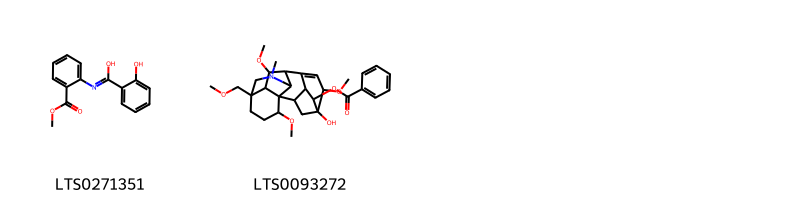{ width=100% }
    <figcaption>Hình ảnh cấu trúc hóa học của 2 hoạt chất thuộc nhóm Benzene and substituted derivatives gồm ['2-hydroxy-n-[2-(methoxycarbonyl)phenyl]benzenecarboximidic acid (LTS0271351)', '5-hydroxy-6,16,18-trimethoxy-13-(methoxymethyl)-11-methyl-11-azahexacyclo[7.7.2.1²,⁵.0¹,¹⁰.0³,⁸.0¹³,¹⁷]nonadec-7-en-4-yl benzoate (LTS0093272)'].</figcaption>
</figure>
#### Nhóm Fatty Acyls
<figure markdown="span">
    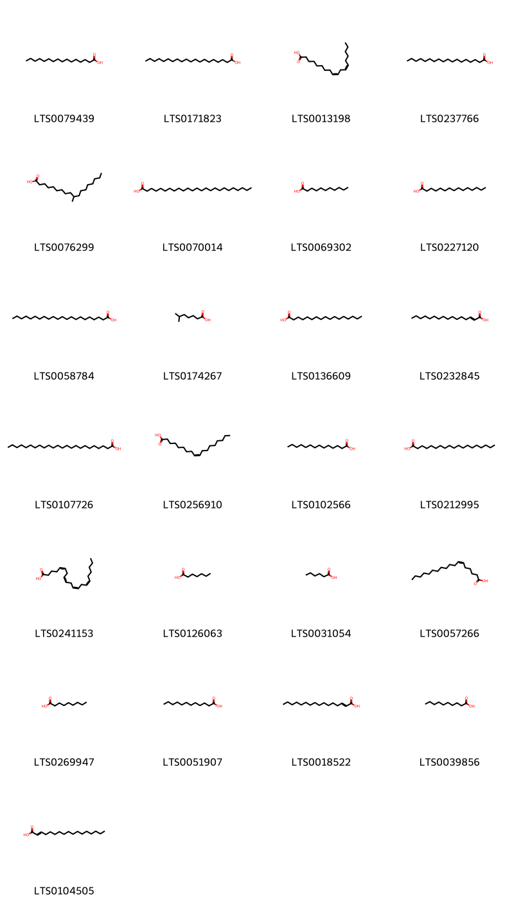{ width=100% }
    <figcaption>Hình ảnh cấu trúc hóa học của 25 hoạt chất thuộc nhóm Fatty Acyls gồm ['palmitic acid (LTS0079439)', 'arachidic acid (LTS0171823)', 'linoleic (LTS0013198)', 'stearic acid (LTS0237766)', 'tuberculostearic acid (LTS0076299)', 'pentacosanoic acid (LTS0070014)', 'undecanoic acid (LTS0069302)', 'pentadecanoic acid (LTS0227120)', 'behenic acid (LTS0058784)', 'cekanoic c8 acid (LTS0174267)', 'heptadecanoic acid (LTS0136609)', 'hexadecenoic acid (LTS0232845)', 'lignoceric acid (LTS0107726)', 'oleic acid (LTS0256910)', 'myristic acid (LTS0102566)', 'nonadecanoic acid (LTS0212995)', 'arachidonic acid (LTS0241153)', 'heptanoic acid (LTS0126063)', 'hexanoic acid (LTS0031054)', 'petroselinic acid (LTS0057266)', 'nonanoic acid (LTS0269947)', 'lauric acid (LTS0051907)', 't-2-hexadecenoic acid (LTS0018522)', 'capric acid (LTS0039856)', 'heptadec-2-enoic acid (LTS0104505)'].</figcaption>
</figure>
#### Nhóm Flavonoids
<figure markdown="span">
    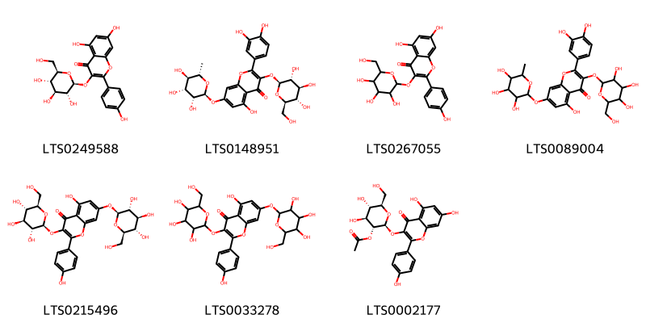{ width=100% }
    <figcaption>Hình ảnh cấu trúc hóa học của 7 hoạt chất thuộc nhóm Flavonoids gồm ['astragalin (LTS0249588)', 'petiolaroside (LTS0148951)', 'trifolin (LTS0267055)', '2-(3,4-dihydroxyphenyl)-5-hydroxy-3-{[3,4,5-trihydroxy-6-(hydroxymethyl)oxan-2-yl]oxy}-7-[(3,4,5-trihydroxy-6-methyloxan-2-yl)oxy]chromen-4-one (LTS0089004)', '5-hydroxy-2-(4-hydroxyphenyl)-3,7-bis({[(2s,3r,4s,5s,6r)-3,4,5-trihydroxy-6-(hydroxymethyl)oxan-2-yl]oxy})chromen-4-one (LTS0215496)', '5-hydroxy-2-(4-hydroxyphenyl)-3,7-bis({[3,4,5-trihydroxy-6-(hydroxymethyl)oxan-2-yl]oxy})chromen-4-one (LTS0033278)', "2''-acetylastragalin (LTS0002177)"].</figcaption>
</figure>
#### Nhóm Organooxygen compounds
<figure markdown="span">
    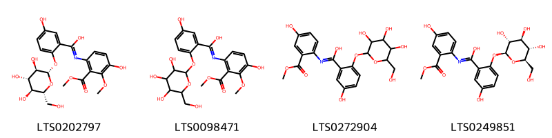{ width=100% }
    <figcaption>Hình ảnh cấu trúc hóa học của 4 hoạt chất thuộc nhóm Organooxygen compounds gồm ['5-hydroxy-n-[4-hydroxy-3-methoxy-2-(methoxycarbonyl)phenyl]-2-{[(2s,3r,4s,5s,6r)-3,4,5-trihydroxy-6-(hydroxymethyl)oxan-2-yl]oxy}benzenecarboximidic acid (LTS0202797)', '5-hydroxy-n-[4-hydroxy-3-methoxy-2-(methoxycarbonyl)phenyl]-2-{[3,4,5-trihydroxy-6-(hydroxymethyl)oxan-2-yl]oxy}benzenecarboximidic acid (LTS0098471)', '5-hydroxy-n-[4-hydroxy-2-(methoxycarbonyl)phenyl]-2-{[3,4,5-trihydroxy-6-(hydroxymethyl)oxan-2-yl]oxy}benzenecarboximidic acid (LTS0272904)', '5-hydroxy-n-[4-hydroxy-2-(methoxycarbonyl)phenyl]-2-{[(2s,3r,4s,5s,6r)-3,4,5-trihydroxy-6-(hydroxymethyl)oxan-2-yl]oxy}benzenecarboximidic acid (LTS0249851)'].</figcaption>
</figure>
#### Nhóm Prenol lipids
<figure markdown="span">
    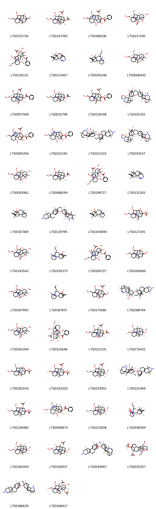{ width=100% }
    <figcaption>Hình ảnh cấu trúc hóa học của 57 hoạt chất thuộc nhóm Prenol lipids gồm ['11-ethyl-6,18-dimethoxy-13-(methoxymethyl)-11-azahexacyclo[7.7.2.1²,⁵.0¹,¹⁰.0³,⁸.0¹³,¹⁷]nonadecane-4,8,16-triol (LTS0251734)', '(1s,2r,3r,4s,5r,6s,8r,9r,10r,13s,16s,17r,18r)-4-(acetyloxy)-11-ethyl-16-hydroxy-6,18-dimethoxy-13-(methoxymethyl)-11-azahexacyclo[7.7.2.1²,⁵.0¹,¹⁰.0³,⁸.0¹³,¹⁷]nonadecan-8-yl acetate (LTS0247295)', 'delphinine (LTS0188536)', '(2r,3r,6s,8r,13s,17r)-11-ethyl-6,16,18-trimethoxy-13-(methoxymethyl)-11-azahexacyclo[7.7.2.1²,⁵.0¹,¹⁰.0³,⁸.0¹³,¹⁷]nonadecane-4,8-diol (LTS0217100)', '(1s,2r,3r,4r,5s,6s,8r,13s,16s,17r,18r)-8-(acetyloxy)-5-hydroxy-6,16,18-trimethoxy-13-(methoxymethyl)-11-methyl-11-azahexacyclo[7.7.2.1²,⁵.0¹,¹⁰.0³,⁸.0¹³,¹⁷]nonadecan-4-yl benzoate (LTS0130131)', '(1s,2s,4s,6r,7s,10r,11r)-11-methyl-5-methylidene-13-azapentacyclo[9.3.3.2⁴,⁷.0¹,¹⁰.0²,⁷]nonadec-13-en-6-ol (LTS0213407)', '(1s,2s,4s,6r,7s,10r,11r)-13-(2-hydroxyethyl)-11-methyl-5-methylidene-13-azapentacyclo[9.3.3.2⁴,⁷.0¹,¹⁰.0²,⁷]nonadecan-6-ol (LTS0045246)', '(2r,3r,4s,5s,6s,8r,13s,16s,17r,18r)-11-ethyl-6,18-dimethoxy-13-(methoxymethyl)-11-azahexacyclo[7.7.2.1²,⁵.0¹,¹⁰.0³,⁸.0¹³,¹⁷]nonadecane-4,8,16-triol (LTS0008435)', '(1s,2r,3r,4r,5s,6s,8r,9r,10r,13s,16s,17r,18r)-8-(acetyloxy)-11-ethyl-5-hydroxy-6,16,18-trimethoxy-13-(methoxymethyl)-11-azahexacyclo[7.7.2.1²,⁵.0¹,¹⁰.0³,⁸.0¹³,¹⁷]nonadecan-4-yl benzoate (LTS0007500)', '(1s,2r,3r,4s,5r,6s,8r,9r,10r,13s,16s,17r,18r)-11-ethyl-8,16-dihydroxy-6,18-dimethoxy-13-(methoxymethyl)-11-azahexacyclo[7.7.2.1²,⁵.0¹,¹⁰.0³,⁸.0¹³,¹⁷]nonadecan-4-yl acetate (LTS0032796)', '8-(acetyloxy)-11-ethyl-5-hydroxy-6,16,18-trimethoxy-13-(methoxymethyl)-11-azahexacyclo[7.7.2.1²,⁵.0¹,¹⁰.0³,⁸.0¹³,¹⁷]nonadecan-4-yl benzoate (LTS0134148)', "(1r,1's,4'r,5r,5's,6's,8r,9s,11s,11'r,12s,12'r,14r,15'r,16'r,17r,18r,22's)-5,7,16'-trimethyl-10',21'-dioxa-7,18'-diazaspiro[hexacyclo[9.6.2.0¹,⁸.0⁵,¹⁷.0⁹,¹⁴.0¹⁴,¹⁸]nonadecane-12,9'-octacyclo[14.6.3.1⁵,¹².0¹,¹⁵.0²,¹².0⁴,⁶.0⁶,¹¹.0¹⁸,²²]hexacosan]-2'-ene (LTS0191325)", '8-(acetyloxy)-5-hydroxy-13-(hydroxymethyl)-6,16,18-trimethoxy-11-methyl-11-azahexacyclo[7.7.2.1²,⁵.0¹,¹⁰.0³,⁸.0¹³,¹⁷]nonadecan-4-yl benzoate (LTS0085294)', '5,8-dihydroxy-6,16,18-trimethoxy-13-(methoxymethyl)-11-methyl-11-azahexacyclo[7.7.2.1²,⁵.0¹,¹⁰.0³,⁸.0¹³,¹⁷]nonadecan-4-yl benzoate (LTS0231192)', "(1s,1's,5r,5's,8's,9r,9'r,10's,11's,14s,14'r,15r,16r,17's,18's,19s,21r)-10'-methoxy-5,5',7,7'-tetramethyl-20-oxa-7,7'-diazaspiro[heptacyclo[13.6.1.1⁵,⁹.0¹,¹².0⁴,¹¹.0¹⁴,¹⁶.0¹⁶,²¹]tricosane-19,12'-hexacyclo[9.6.2.0¹,⁸.0⁵,¹⁷.0⁹,¹⁴.0¹⁴,¹⁸]nonadecane]-4(11),12-diene (LTS0211533)", "(1r,1's,4'r,5r,5's,6's,8r,9s,11'r,12s,12'r,15'r,16'r,17r,18r,22's)-5,7,16'-trimethyl-10',21'-dioxa-7,18'-diazaspiro[hexacyclo[9.6.2.0¹,⁸.0⁵,¹⁷.0⁹,¹⁴.0¹⁴,¹⁸]nonadecane-12,9'-octacyclo[14.6.3.1⁵,¹².0¹,¹⁵.0²,¹².0⁴,⁶.0⁶,¹¹.0¹⁸,²²]hexacosan]-2'-ene (LTS0193157)", '(1s,2r,3r,4s,5s,6s,8r,9r,13s,16s,17r,18r)-11-ethyl-6,18-dimethoxy-13-(methoxymethyl)-11-azahexacyclo[7.7.2.1²,⁵.0¹,¹⁰.0³,⁸.0¹³,¹⁷]nonadecane-4,8,16-triol (LTS0092961)', '(1s,2r,3r,4s,5r,6s,8r,9r,10r,13s,16r,17r,18r)-11-ethyl-8,16-dihydroxy-6,18-dimethoxy-13-(methoxymethyl)-11-azahexacyclo[7.7.2.1²,⁵.0¹,¹⁰.0³,⁸.0¹³,¹⁷]nonadecan-4-yl acetate (LTS0088194)', 'delphinine (LTS0199717)', '(1s,2s,4s,6s,7s,10r,11r)-11-methyl-5-methylidene-13-azapentacyclo[9.3.3.2⁴,⁷.0¹,¹⁰.0²,⁷]nonadec-13-en-6-ol (LTS0131205)', '(1s,2s,4s,6s,7s,10s,11r)-11-methyl-5-methylidene-13-azapentacyclo[9.3.3.2⁴,⁷.0¹,¹⁰.0²,⁷]nonadec-12-en-6-ol (LTS0167369)', "(1s,1'r,5s,5'r,8'r,9s,9'r,11's,14s,14'r,15r,16r,17's,18's,19r,21r)-5,5',7,7'-tetramethyl-20-oxa-7,7'-diazaspiro[heptacyclo[13.6.1.1⁵,⁹.0¹,¹².0⁴,¹¹.0¹⁴,¹⁶.0¹⁶,²¹]tricosane-19,12'-hexacyclo[9.6.2.0¹,⁸.0⁵,¹⁷.0⁹,¹⁴.0¹⁴,¹⁸]nonadecane]-4(11),12-dien-6'-one (LTS0129795)", '(1s,2s,4s,6r,7s,10s,11r)-11-methyl-5-methylidene-13-azapentacyclo[9.3.3.2⁴,⁷.0¹,¹⁰.0²,⁷]nonadec-12-en-6-ol (LTS0204690)', '11-ethyl-8-hydroxy-6,16,18-trimethoxy-13-(methoxymethyl)-11-azahexacyclo[7.7.2.1²,⁵.0¹,¹⁰.0³,⁸.0¹³,¹⁷]nonadecan-4-yl acetate (LTS0127241)', '(1s,2r,3r,4s,5s,6s,8r,9r,13s,16s,17r,18r)-11-ethyl-6,16,18-trimethoxy-13-(methoxymethyl)-11-azahexacyclo[7.7.2.1²,⁵.0¹,¹⁰.0³,⁸.0¹³,¹⁷]nonadecane-4,8-diol (LTS0143542)', '13-(2-hydroxyethyl)-11-methyl-5-methylidene-13-azapentacyclo[9.3.3.2⁴,⁷.0¹,¹⁰.0²,⁷]nonadecan-6-ol (LTS0150373)', '(2r,3r,6s,8r,9r,10s,13s,17r)-8-(acetyloxy)-11-formyl-5-hydroxy-6,16,18-trimethoxy-13-(methoxymethyl)-11-azahexacyclo[7.7.2.1²,⁵.0¹,¹⁰.0³,⁸.0¹³,¹⁷]nonadecan-4-yl benzoate (LTS0169727)', '11-ethyl-13-(hydroxymethyl)-6,18-dimethoxy-11-azahexacyclo[7.7.2.1²,⁵.0¹,¹⁰.0³,⁸.0¹³,¹⁷]nonadecane-4,8,16-triol (LTS0100060)', '(2r,3r,4s,5s,6s,8r,13s,17r)-11-ethyl-13-(hydroxymethyl)-6,18-dimethoxy-11-azahexacyclo[7.7.2.1²,⁵.0¹,¹⁰.0³,⁸.0¹³,¹⁷]nonadecane-4,8,16-triol (LTS0187993)', '2-{6-hydroxy-11-methyl-5-methylidene-13-azapentacyclo[9.3.3.2⁴,⁷.0¹,¹⁰.0²,⁷]nonadecan-13-yl}acetaldehyde (LTS0187657)', '11-ethyl-4,16-dihydroxy-6,18-dimethoxy-13-(methoxymethyl)-11-azahexacyclo[7.7.2.1²,⁵.0¹,¹⁰.0³,⁸.0¹³,¹⁷]nonadecan-8-yl acetate (LTS0174186)', "(1s,1'r,5s,5'r,8'r,9s,9's,10's,11'r,14s,14's,15r,16r,17's,18'r,19r,21s)-10'-methoxy-5,5',7-trimethyl-20-oxa-7,7'-diazaspiro[heptacyclo[13.6.1.1⁵,⁹.0¹,¹².0⁴,¹¹.0¹⁴,¹⁶.0¹⁶,²¹]tricosane-19,12'-hexacyclo[9.6.2.0¹,⁸.0⁵,¹⁷.0⁹,¹⁴.0¹⁴,¹⁸]nonadecane]-4(11),6',12-triene (LTS0188794)", '(2r,3r,4s,5s,6s,8r,13s,16s,17r,18r)-11-ethyl-6,16,18-trimethoxy-13-(methoxymethyl)-11-azahexacyclo[7.7.2.1²,⁵.0¹,¹⁰.0³,⁸.0¹³,¹⁷]nonadecane-4,8-diol (LTS0262294)', '(1s,2r,3r,4r,5s,6s,8r,9r,10r,13s,16s,17r,18r)-8-(acetyloxy)-5-hydroxy-13-(hydroxymethyl)-6,16,18-trimethoxy-11-methyl-11-azahexacyclo[7.7.2.1²,⁵.0¹,¹⁰.0³,⁸.0¹³,¹⁷]nonadecan-4-yl benzoate (LTS0215646)', '(1s,2r,3r,4s,5r,6s,8r,9r,10r,13s,16s,17r,18r)-4-(acetyloxy)-11-ethyl-6,16-dihydroxy-18-methoxy-13-(methoxymethyl)-11-azahexacyclo[7.7.2.1²,⁵.0¹,¹⁰.0³,⁸.0¹³,¹⁷]nonadecan-8-yl acetate (LTS0221135)', '(1s,2r,3r,4s,5s,6s,8r,9r,10r,13s,16s,17r,18r)-11-ethyl-13-(hydroxymethyl)-6,18-dimethoxy-11-azahexacyclo[7.7.2.1²,⁵.0¹,¹⁰.0³,⁸.0¹³,¹⁷]nonadecane-4,8,16-triol (LTS0179432)', '11-ethyl-8,16-dihydroxy-6,18-dimethoxy-13-(methoxymethyl)-11-azahexacyclo[7.7.2.1²,⁵.0¹,¹⁰.0³,⁸.0¹³,¹⁷]nonadecan-4-yl acetate (LTS0261034)', '4-(acetyloxy)-11-ethyl-16-hydroxy-13-(hydroxymethyl)-6,18-dimethoxy-11-azahexacyclo[7.7.2.1²,⁵.0¹,¹⁰.0³,⁸.0¹³,¹⁷]nonadecan-8-yl acetate (LTS0241020)', '(1s,2r,3r,4s,5s,6s,8r,9r,10r,13s,16s,17r,18r)-11-ethyl-4,16-dihydroxy-6,18-dimethoxy-13-(methoxymethyl)-11-azahexacyclo[7.7.2.1²,⁵.0¹,¹⁰.0³,⁸.0¹³,¹⁷]nonadecan-8-yl acetate (LTS0233915)', "(1s,1'r,5r,5'r,8's,9r,9'r,10's,11'r,14's,16s,17's,18'r,19s,21r)-10'-methoxy-5,5',7,7'-tetramethyl-20-oxa-7,7'-diazaspiro[heptacyclo[13.6.1.1⁵,⁹.0¹,¹².0⁴,¹¹.0¹⁴,¹⁶.0¹⁶,²¹]tricosane-19,12'-hexacyclo[9.6.2.0¹,⁸.0⁵,¹⁷.0⁹,¹⁴.0¹⁴,¹⁸]nonadecane]-4(11),12-diene (LTS0221469)", '4-(acetyloxy)-11-ethyl-16-hydroxy-6,18-dimethoxy-13-(methoxymethyl)-11-azahexacyclo[7.7.2.1²,⁵.0¹,¹⁰.0³,⁸.0¹³,¹⁷]nonadecan-8-yl acetate (LTS0228482)', '(1s,2r,3r,4r,5s,6s,8r,9r,10r,13s,16s,17r,18r)-5,8-dihydroxy-6,16,18-trimethoxy-13-(methoxymethyl)-11-methyl-11-azahexacyclo[7.7.2.1²,⁵.0¹,¹⁰.0³,⁸.0¹³,¹⁷]nonadecan-4-yl benzoate (LTS0008874)', '(1s,2r,3r,4s,5s,6s,8r,9r,10r,13s,16r,17r,18r)-11-ethyl-6,18-dimethoxy-13-(methoxymethyl)-11-azahexacyclo[7.7.2.1²,⁵.0¹,¹⁰.0³,⁸.0¹³,¹⁷]nonadecane-4,8,16-triol (LTS0212058)', '(1r,2s,4s,6r,7s,10s,11r)-6-hydroxy-13-(2-hydroxyethyl)-11-methyl-5-methylidene-13-azapentacyclo[9.3.3.2⁴,⁷.0¹,¹⁰.0²,⁷]nonadecan-12-one (LTS0038394)', '(1s,2r,3r,4s,5s,6s,8r,9r,10r,13s,16s,17r,18r)-11-ethyl-6,18-dimethoxy-13-(methoxymethyl)-11-azahexacyclo[7.7.2.1²,⁵.0¹,¹⁰.0³,⁸.0¹³,¹⁷]nonadecane-4,8,16-triol (LTS0184443)', '(1s,2r,3r,4s,5s,6s,8r,9r,10r,13s,16s,17r,18r)-11-ethyl-4,16,18-trihydroxy-6-methoxy-13-(methoxymethyl)-11-azahexacyclo[7.7.2.1²,⁵.0¹,¹⁰.0³,⁸.0¹³,¹⁷]nonadecan-8-yl acetate (LTS0256937)', "(1r,1's,5s,5's,8's,9s,9's,11'r,14r,14's,15s,16s,17'r,18'r,19r,21s)-5,5',7-trimethyl-20-oxa-7,7'-diazaspiro[heptacyclo[13.6.1.1⁵,⁹.0¹,¹².0⁴,¹¹.0¹⁴,¹⁶.0¹⁶,²¹]tricosane-19,12'-hexacyclo[9.6.2.0¹,⁸.0⁵,¹⁷.0⁹,¹⁴.0¹⁴,¹⁸]nonadecane]-4(11),6',12-triene (LTS0049067)", '18-(acetyloxy)-4-ethyl-12,16-dimethoxy-10-(methoxymethyl)-6-oxa-4-azaheptacyclo[15.2.1.0²,⁷.0²,¹¹.0³,¹³.0⁵,¹⁰.0¹⁴,¹⁹]icosan-14-yl acetate (LTS0035257)', 'staphidine (LTS0186639)', '(2r,3r,5s,6s,8r,9r,10s,13s,17r)-4-(acetyloxy)-11-ethyl-16-hydroxy-13-(hydroxymethyl)-6,18-dimethoxy-11-azahexacyclo[7.7.2.1²,⁵.0¹,¹⁰.0³,⁸.0¹³,¹⁷]nonadecan-8-yl acetate (LTS0268417)', '(1s,2s,6r,7s,10r,11r)-13-(2-hydroxyethyl)-11-methyl-5-methylidene-13-azapentacyclo[9.3.3.2⁴,⁷.0¹,¹⁰.0²,⁷]nonadecan-6-ol (LTS0001810)', '(1s,2r,3r,4s,5r,6s,8r,9r,10r,13s,16s,17r,18r)-4-(acetyloxy)-11-ethyl-16-hydroxy-13-(hydroxymethyl)-6,18-dimethoxy-11-azahexacyclo[7.7.2.1²,⁵.0¹,¹⁰.0³,⁸.0¹³,¹⁷]nonadecan-8-yl acetate (LTS0013778)', '4-(acetyloxy)-11-ethyl-6,16-dihydroxy-18-methoxy-13-(methoxymethyl)-11-azahexacyclo[7.7.2.1²,⁵.0¹,¹⁰.0³,⁸.0¹³,¹⁷]nonadecan-8-yl acetate (LTS0005067)', "10'-methoxy-5,5',7,7'-tetramethyl-20-oxa-7,7'-diazaspiro[heptacyclo[13.6.1.1⁵,⁹.0¹,¹².0⁴,¹¹.0¹⁴,¹⁶.0¹⁶,²¹]tricosane-19,12'-hexacyclo[9.6.2.0¹,⁸.0⁵,¹⁷.0⁹,¹⁴.0¹⁴,¹⁸]nonadecane]-4(11),12-diene (LTS0048975)", '(1r,2s,3r,5r,7s,10r,11s,12r,13r,14r,16s,17r,18s,19r)-18-(acetyloxy)-4-ethyl-12,16-dimethoxy-10-(methoxymethyl)-6-oxa-4-azaheptacyclo[15.2.1.0²,⁷.0²,¹¹.0³,¹³.0⁵,¹⁰.0¹⁴,¹⁹]icosan-14-yl acetate (LTS0034467)', '2-[(1s,2s,4r,6r,7r,10r,11s)-6-hydroxy-11-methyl-5-methylidene-13-azapentacyclo[9.3.3.2⁴,⁷.0¹,¹⁰.0²,⁷]nonadecan-13-yl]acetaldehyde (LTS0254086)', '11-ethyl-4,16,18-trihydroxy-6-methoxy-13-(methoxymethyl)-11-azahexacyclo[7.7.2.1²,⁵.0¹,¹⁰.0³,⁸.0¹³,¹⁷]nonadecan-8-yl acetate (LTS0229011)'].</figcaption>
</figure>
#### Nhóm Steroids and steroid derivatives
<figure markdown="span">
    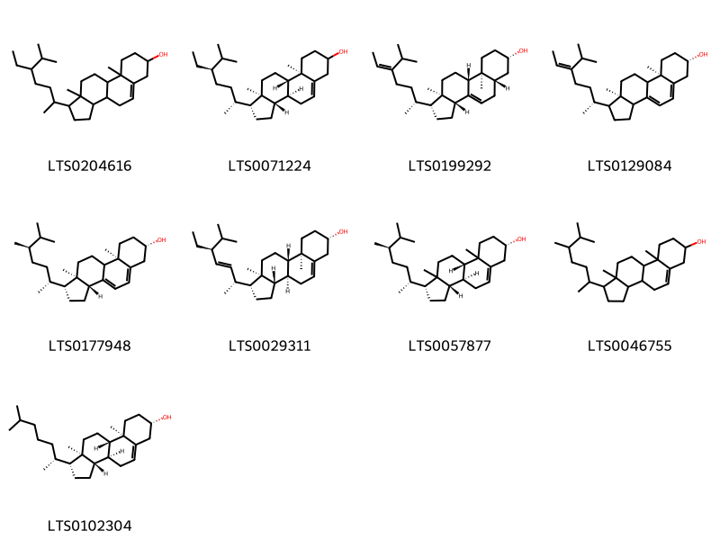{ width=100% }
    <figcaption>Hình ảnh cấu trúc hóa học của 9 hoạt chất thuộc nhóm Steroids and steroid derivatives gồm ['stigmast-5-en-3-ol, (3β)- (LTS0204616)', 'stigmast-5-en-3-ol (LTS0071224)', 'delta7-avenasterol (LTS0199292)', '5-dehydroavenasterol (LTS0129084)', 'provitamin d7 (LTS0177948)', 'phytosterol (LTS0029311)', '(1r,3as,3bs,7s,9bs)-1-[(2r,5r)-5,6-dimethylheptan-2-yl]-9a,11a-dimethyl-1h,2h,3h,3ah,3bh,4h,6h,7h,8h,9h,9bh,10h,11h-cyclopenta[a]phenanthren-7-ol (LTS0057877)', 'campesterol (LTS0046755)', 'cholesterol (LTS0102304)'].</figcaption>
</figure>

---

### Dược dân tộc học

Danh sách các quốc gia có sử dụng *Staphisagria macrosperma* trong điều trị các bệnh. 

| Country    | Disease                                                               | Bệnh                                                                                                                                                                                                |
|:-----------|:----------------------------------------------------------------------|:----------------------------------------------------------------------------------------------------------------------------------------------------------------------------------------------------|
| Danish     | Poison                                                                | MYMEMORY WARNING: YOU USED ALL AVAILABLE FREE TRANSLATIONS FOR TODAY. NEXT AVAILABLE IN  08 HOURS 40 MINUTES 24 SECONDS VISIT HTTPS://MYMEMORY.TRANSLATED.NET/DOC/USAGELIMITS.PHP TO TRANSLATE MORE |
| Dutch      | Narcotic                                                              | MYMEMORY WARNING: YOU USED ALL AVAILABLE FREE TRANSLATIONS FOR TODAY. NEXT AVAILABLE IN  08 HOURS 40 MINUTES 21 SECONDS VISIT HTTPS://MYMEMORY.TRANSLATED.NET/DOC/USAGELIMITS.PHP TO TRANSLATE MORE |
| Elsewhere  | Insecticide, Poison                                                   | MYMEMORY WARNING: YOU USED ALL AVAILABLE FREE TRANSLATIONS FOR TODAY. NEXT AVAILABLE IN  08 HOURS 40 MINUTES 19 SECONDS VISIT HTTPS://MYMEMORY.TRANSLATED.NET/DOC/USAGELIMITS.PHP TO TRANSLATE MORE |
| French     | Purgative                                                             | MYMEMORY WARNING: YOU USED ALL AVAILABLE FREE TRANSLATIONS FOR TODAY. NEXT AVAILABLE IN  08 HOURS 40 MINUTES 16 SECONDS VISIT HTTPS://MYMEMORY.TRANSLATED.NET/DOC/USAGELIMITS.PHP TO TRANSLATE MORE |
| Italian    | Nervine                                                               | MYMEMORY WARNING: YOU USED ALL AVAILABLE FREE TRANSLATIONS FOR TODAY. NEXT AVAILABLE IN  08 HOURS 40 MINUTES 13 SECONDS VISIT HTTPS://MYMEMORY.TRANSLATED.NET/DOC/USAGELIMITS.PHP TO TRANSLATE MORE |
| Portuguese | Emetic                                                                | MYMEMORY WARNING: YOU USED ALL AVAILABLE FREE TRANSLATIONS FOR TODAY. NEXT AVAILABLE IN  08 HOURS 40 MINUTES 11 SECONDS VISIT HTTPS://MYMEMORY.TRANSLATED.NET/DOC/USAGELIMITS.PHP TO TRANSLATE MORE |
| Turkey     | Emetic, Narcotic, Nervine, Pediculicide, Poison, Purgative, Vermifuge | MYMEMORY WARNING: YOU USED ALL AVAILABLE FREE TRANSLATIONS FOR TODAY. NEXT AVAILABLE IN  08 HOURS 40 MINUTES 08 SECONDS VISIT HTTPS://MYMEMORY.TRANSLATED.NET/DOC/USAGELIMITS.PHP TO TRANSLATE MORE |
| US         | Pediculicide                                                          | MYMEMORY WARNING: YOU USED ALL AVAILABLE FREE TRANSLATIONS FOR TODAY. NEXT AVAILABLE IN  08 HOURS 40 MINUTES 06 SECONDS VISIT HTTPS://MYMEMORY.TRANSLATED.NET/DOC/USAGELIMITS.PHP TO TRANSLATE MORE |
| ain        | Poison                                                                | MYMEMORY WARNING: YOU USED ALL AVAILABLE FREE TRANSLATIONS FOR TODAY. NEXT AVAILABLE IN  08 HOURS 40 MINUTES 03 SECONDS VISIT HTTPS://MYMEMORY.TRANSLATED.NET/DOC/USAGELIMITS.PHP TO TRANSLATE MORE |
| anish      | Vermifuge                                                             | MYMEMORY WARNING: YOU USED ALL AVAILABLE FREE TRANSLATIONS FOR TODAY. NEXT AVAILABLE IN  08 HOURS 40 MINUTES 00 SECONDS VISIT HTTPS://MYMEMORY.TRANSLATED.NET/DOC/USAGELIMITS.PHP TO TRANSLATE MORE |

---

---
## Delphinium zalil
### Thông tin về thực vật

!!! info "Phân loại thực vật của *Delphinium semibarbatum* từ GIBF:"
    - **Kingdom:** Plantae
    - **Phylum:** Tracheophyta
    - **Order:** Ranunculales
    - **Family:** Ranunculaceae
    - **Genus:** Delphinium
    - **Species:** *Delphinium semibarbatum*

 

| Label (VI)   | Label (EN)   | Scientific Name   | Descriptions (VI)   | Descriptions (EN)   | Also Known As (VI)   | Also Known As (EN)   |
|:-------------|:-------------|:------------------|:--------------------|:--------------------|:---------------------|:---------------------|
| N/A          | N/A          | Delphinium zalil  | loài thực vật       | species of plant    | ['']                 | ['']                 |

#### Phân bố trên thế giới

**Từ CSDL GIBF** Switzerland, Türkiye, Portugal, Morocco, France, Spain, New Zealand, Hungary, Greece, Croatia, Netherlands, Albania

#### Phân bố tại Việt Nam

**Từ CSDL GIBF**: Không có ghi nhận ở Việt Nam

---
### Thành phần hóa học
        
- Theo cơ sở dữ liệu lotus: Từ loài *Delphinium semibarbatum* đã phân lập và xác định được Chưa có hoạt chất nào được phân lập. hoạt chất thuộc về các nhóm Không có hoạt chất nào được phân lập. 

Không có hình ảnh nào được tạo ra

---

### Dược dân tộc học

Danh sách các quốc gia có sử dụng *Delphinium semibarbatum* trong điều trị các bệnh. 

| Country   | Disease         | Bệnh                                                                                                                                                                                                |
|:----------|:----------------|:----------------------------------------------------------------------------------------------------------------------------------------------------------------------------------------------------|
| Elsewhere | Diuretic        | MYMEMORY WARNING: YOU USED ALL AVAILABLE FREE TRANSLATIONS FOR TODAY. NEXT AVAILABLE IN  08 HOURS 39 MINUTES 25 SECONDS VISIT HTTPS://MYMEMORY.TRANSLATED.NET/DOC/USAGELIMITS.PHP TO TRANSLATE MORE |
| Turkey    | Diuretic, Tonic | MYMEMORY WARNING: YOU USED ALL AVAILABLE FREE TRANSLATIONS FOR TODAY. NEXT AVAILABLE IN  08 HOURS 39 MINUTES 22 SECONDS VISIT HTTPS://MYMEMORY.TRANSLATED.NET/DOC/USAGELIMITS.PHP TO TRANSLATE MORE |

---

# Chi Xanthorhiza

??? note "Danh sách các dược liệu thuộc chi"
    
	 - *Xanthorhiza simplicissima*

---
## Xanthorhiza simplicissima
### Thông tin về thực vật

!!! info "Phân loại thực vật của *Xanthorhiza simplicissima* từ GIBF:"
    - **Kingdom:** Plantae
    - **Phylum:** Tracheophyta
    - **Order:** Ranunculales
    - **Family:** Ranunculaceae
    - **Genus:** Xanthorhiza
    - **Species:** *Xanthorhiza simplicissima*

 

| Label (VI)   | Label (EN)   | Scientific Name           | Descriptions (VI)   | Descriptions (EN)   | Also Known As (VI)   | Also Known As (EN)                                                         |
|:-------------|:-------------|:--------------------------|:--------------------|:--------------------|:---------------------|:---------------------------------------------------------------------------|
| N/A          | N/A          | Xanthorhiza simplicissima | loài thực vật       | species of plant    | ['']                 | ['brook-feather', 'shrub yellowroot', 'shrubby yellow-root', 'yellowroot'] |

#### Phân bố trên thế giới

**Từ CSDL GIBF** United States of America

#### Phân bố tại Việt Nam

**Từ CSDL GIBF**: Không có ghi nhận ở Việt Nam

---
### Thành phần hóa học
        
- Theo cơ sở dữ liệu lotus: Từ loài *Xanthorhiza simplicissima* đã phân lập và xác định được 7 hoạt chất thuộc về các nhóm Prenol lipids, Cinnamic acids and derivatives, Benzazepines, Protoberberine alkaloids and derivatives. 

|    | chemicalTaxonomyClassyfireClass          |   smiles_count |
|---:|:-----------------------------------------|---------------:|
|  0 | Benzazepines                             |              2 |
|  1 | Cinnamic acids and derivatives           |              2 |
|  2 | Prenol lipids                            |              2 |
|  3 | Protoberberine alkaloids and derivatives |              1 |

#### Nhóm Benzazepines
<figure markdown="span">
    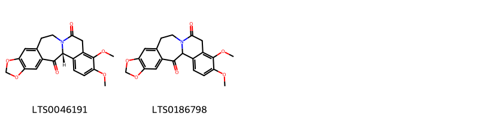{ width=100% }
    <figcaption>Hình ảnh cấu trúc hóa học của 2 hoạt chất thuộc nhóm Benzazepines gồm ['(1r)-18,19-dimethoxy-6,8-dioxa-14-azapentacyclo[12.8.0.0³,¹¹.0⁵,⁹.0¹⁷,²²]docosa-3,5(9),10,17,19,21-hexaene-2,15-dione (LTS0046191)', '18,19-dimethoxy-6,8-dioxa-14-azapentacyclo[12.8.0.0³,¹¹.0⁵,⁹.0¹⁷,²²]docosa-3,5(9),10,17,19,21-hexaene-2,15-dione (LTS0186798)'].</figcaption>
</figure>
#### Nhóm Cinnamic acids and derivatives
<figure markdown="span">
    { width=100% }
    <figcaption>Hình ảnh cấu trúc hóa học của 2 hoạt chất thuộc nhóm Cinnamic acids and derivatives gồm ['ferulic acid (LTS0077328)', 'ferulic acid (LTS0273002)'].</figcaption>
</figure>
#### Nhóm Prenol lipids
<figure markdown="span">
    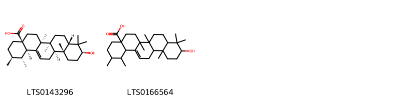{ width=100% }
    <figcaption>Hình ảnh cấu trúc hóa học của 2 hoạt chất thuộc nhóm Prenol lipids gồm ['(1r,2s,4as,6as,6bs,8as,10s,12ar,12br,14br)-10-hydroxy-1,2,6a,6b,9,9,12a-heptamethyl-2,3,4,5,6,7,8,8a,10,11,12,12b,13,14b-tetradecahydro-1h-picene-4a-carboxylic acid (LTS0143296)', '10-hydroxy-1,2,6a,6b,9,9,12a-heptamethyl-2,3,4,5,6,7,8,8a,10,11,12,12b,13,14b-tetradecahydro-1h-picene-4a-carboxylic acid (LTS0166564)'].</figcaption>
</figure>
#### Nhóm Protoberberine alkaloids and derivatives
<figure markdown="span">
    { width=100% }
    <figcaption>Hình ảnh cấu trúc hóa học của 1 hoạt chất thuộc nhóm Protoberberine alkaloids and derivatives gồm ['berberine (LTS0101484)'].</figcaption>
</figure>

---

### Dược dân tộc học

Danh sách các quốc gia có sử dụng *Xanthorhiza simplicissima* trong điều trị các bệnh. 

| Country   | Disease   | Bệnh                                                                                                                                                                                                |
|:----------|:----------|:----------------------------------------------------------------------------------------------------------------------------------------------------------------------------------------------------|
| US        | Tonic     | MYMEMORY WARNING: YOU USED ALL AVAILABLE FREE TRANSLATIONS FOR TODAY. NEXT AVAILABLE IN  08 HOURS 39 MINUTES 05 SECONDS VISIT HTTPS://MYMEMORY.TRANSLATED.NET/DOC/USAGELIMITS.PHP TO TRANSLATE MORE |

---

# Chi Helleborus

??? note "Danh sách các dược liệu thuộc chi"
    
	 - *Helleborus foetidus*
	 - *Helleborus niger*
	 - *Helleborus viridis*

---
## Helleborus foetidus
### Thông tin về thực vật

!!! info "Phân loại thực vật của *Helleborus foetidus* từ GIBF:"
    - **Kingdom:** Plantae
    - **Phylum:** Tracheophyta
    - **Order:** Ranunculales
    - **Family:** Ranunculaceae
    - **Genus:** Helleborus
    - **Species:** *Helleborus foetidus*

 

| Label (VI)   | Label (EN)   | Scientific Name     | Descriptions (VI)   | Descriptions (EN)   | Also Known As (VI)   | Also Known As (EN)                 |
|:-------------|:-------------|:--------------------|:--------------------|:--------------------|:---------------------|:-----------------------------------|
| N/A          | N/A          | Helleborus foetidus | loài thực vật       | species of plant    | ['']                 | ['dungwort', 'stinking hellebore'] |

#### Phân bố trên thế giới

**Từ CSDL GIBF** Switzerland, nan, United Kingdom of Great Britain and Northern Ireland, Denmark, Sweden, France, Spain, Czechia, New Zealand, Germany, United States of America, Italy, Austria, Belgium, Netherlands

#### Phân bố tại Việt Nam

**Từ CSDL GIBF**: Không có ghi nhận ở Việt Nam

---
### Thành phần hóa học
        
- Theo cơ sở dữ liệu lotus: Từ loài *Helleborus foetidus* đã phân lập và xác định được 3 hoạt chất thuộc về các nhóm Aporphines, Dihydrofurans. 

|    | chemicalTaxonomyClassyfireClass   |   smiles_count |
|---:|:----------------------------------|---------------:|
|  0 | Aporphines                        |              2 |
|  1 | Dihydrofurans                     |              1 |

#### Nhóm Aporphines
<figure markdown="span">
    { width=100% }
    <figcaption>Hình ảnh cấu trúc hóa học của 2 hoạt chất thuộc nhóm Aporphines gồm ['4,15-dimethoxy-10-methyl-10-azatetracyclo[7.7.1.0²,⁷.0¹³,¹⁷]heptadeca-1(16),2,4,6,13(17),14-hexaene-3,16-diol (LTS0095715)', '(9s)-4,15-dimethoxy-10-methyl-10-azatetracyclo[7.7.1.0²,⁷.0¹³,¹⁷]heptadeca-1(16),2,4,6,13(17),14-hexaene-3,16-diol (LTS0022981)'].</figcaption>
</figure>
#### Nhóm Dihydrofurans
<figure markdown="span">
    { width=100% }
    <figcaption>Hình ảnh cấu trúc hóa học của 1 hoạt chất thuộc nhóm Dihydrofurans gồm ['protoanemonin (LTS0133358)'].</figcaption>
</figure>

---

### Dược dân tộc học

Danh sách các quốc gia có sử dụng *Helleborus foetidus* trong điều trị các bệnh. 

| Country   | Disease                                 | Bệnh                                                                                                                                                                                                |
|:----------|:----------------------------------------|:----------------------------------------------------------------------------------------------------------------------------------------------------------------------------------------------------|
| Turkey    | Cardiac, Emmenagogue, Vermifuge, Poison | MYMEMORY WARNING: YOU USED ALL AVAILABLE FREE TRANSLATIONS FOR TODAY. NEXT AVAILABLE IN  08 HOURS 38 MINUTES 38 SECONDS VISIT HTTPS://MYMEMORY.TRANSLATED.NET/DOC/USAGELIMITS.PHP TO TRANSLATE MORE |
| ain       | Poison                                  | MYMEMORY WARNING: YOU USED ALL AVAILABLE FREE TRANSLATIONS FOR TODAY. NEXT AVAILABLE IN  08 HOURS 38 MINUTES 36 SECONDS VISIT HTTPS://MYMEMORY.TRANSLATED.NET/DOC/USAGELIMITS.PHP TO TRANSLATE MORE |

---

---
## Helleborus niger
### Thông tin về thực vật

!!! info "Phân loại thực vật của *Helleborus niger* từ GIBF:"
    - **Kingdom:** Plantae
    - **Phylum:** Tracheophyta
    - **Order:** Ranunculales
    - **Family:** Ranunculaceae
    - **Genus:** Helleborus
    - **Species:** *Helleborus niger*

 

| Label (VI)   | Label (EN)   | Scientific Name   | Descriptions (VI)   | Descriptions (EN)   | Also Known As (VI)   | Also Known As (EN)                                      |
|:-------------|:-------------|:------------------|:--------------------|:--------------------|:---------------------|:--------------------------------------------------------|
| N/A          | N/A          | Helleborus niger  | loài thực vật       | species of plant    | ['']                 | ['Christmas rose', 'black hellebore', 'Christmas-rose'] |

#### Phân bố trên thế giới

**Từ CSDL GIBF** nan, Switzerland, Slovenia, Spain, Germany, Italy, Austria, Croatia, Netherlands

#### Phân bố tại Việt Nam

**Từ CSDL GIBF**: Không có ghi nhận ở Việt Nam

---
### Thành phần hóa học
        
- Theo cơ sở dữ liệu lotus: Từ loài *Helleborus niger* đã phân lập và xác định được 5 hoạt chất thuộc về các nhóm Pyranodioxins, Aporphines, Dihydrofurans. 

|    | chemicalTaxonomyClassyfireClass   |   smiles_count |
|---:|:----------------------------------|---------------:|
|  0 | Aporphines                        |              2 |
|  1 | Dihydrofurans                     |              1 |
|  2 | Pyranodioxins                     |              2 |

#### Nhóm Aporphines
<figure markdown="span">
    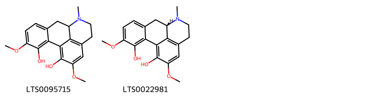{ width=100% }
    <figcaption>Hình ảnh cấu trúc hóa học của 2 hoạt chất thuộc nhóm Aporphines gồm ['4,15-dimethoxy-10-methyl-10-azatetracyclo[7.7.1.0²,⁷.0¹³,¹⁷]heptadeca-1(16),2,4,6,13(17),14-hexaene-3,16-diol (LTS0095715)', '(9s)-4,15-dimethoxy-10-methyl-10-azatetracyclo[7.7.1.0²,⁷.0¹³,¹⁷]heptadeca-1(16),2,4,6,13(17),14-hexaene-3,16-diol (LTS0022981)'].</figcaption>
</figure>
#### Nhóm Dihydrofurans
<figure markdown="span">
    { width=100% }
    <figcaption>Hình ảnh cấu trúc hóa học của 1 hoạt chất thuộc nhóm Dihydrofurans gồm ['protoanemonin (LTS0133358)'].</figcaption>
</figure>
#### Nhóm Pyranodioxins
<figure markdown="span">
    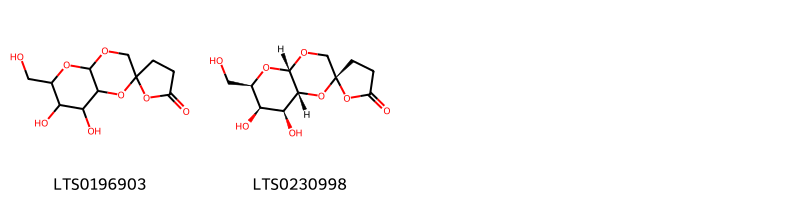{ width=100% }
    <figcaption>Hình ảnh cấu trúc hóa học của 2 hoạt chất thuộc nhóm Pyranodioxins gồm ["7',8'-dihydroxy-6'-(hydroxymethyl)-hexahydrospiro[oxolane-2,2'-pyrano[2,3-b][1,4]dioxin]-5-one (LTS0196903)", "(2s,4'as,6'r,7'r,8's,8'ar)-7',8'-dihydroxy-6'-(hydroxymethyl)-hexahydrospiro[oxolane-2,2'-pyrano[2,3-b][1,4]dioxin]-5-one (LTS0230998)"].</figcaption>
</figure>

---

### Dược dân tộc học

Danh sách các quốc gia có sử dụng *Helleborus niger* trong điều trị các bệnh. 

| Country   | Disease                                                              | Bệnh                                                                                                                                                                                                |
|:----------|:---------------------------------------------------------------------|:----------------------------------------------------------------------------------------------------------------------------------------------------------------------------------------------------|
| Elsewhere | Emmenagogue                                                          | MYMEMORY WARNING: YOU USED ALL AVAILABLE FREE TRANSLATIONS FOR TODAY. NEXT AVAILABLE IN  08 HOURS 38 MINUTES 11 SECONDS VISIT HTTPS://MYMEMORY.TRANSLATED.NET/DOC/USAGELIMITS.PHP TO TRANSLATE MORE |
| Turkey    | Cardiac, Diuretic, Emmenagogue, Poison, Narcotic, Cathartic, Nervine | MYMEMORY WARNING: YOU USED ALL AVAILABLE FREE TRANSLATIONS FOR TODAY. NEXT AVAILABLE IN  08 HOURS 38 MINUTES 08 SECONDS VISIT HTTPS://MYMEMORY.TRANSLATED.NET/DOC/USAGELIMITS.PHP TO TRANSLATE MORE |
| UK        | Rodenticide                                                          | MYMEMORY WARNING: YOU USED ALL AVAILABLE FREE TRANSLATIONS FOR TODAY. NEXT AVAILABLE IN  08 HOURS 38 MINUTES 05 SECONDS VISIT HTTPS://MYMEMORY.TRANSLATED.NET/DOC/USAGELIMITS.PHP TO TRANSLATE MORE |
| ain       | Cardiotonic, Mydriatic                                               | MYMEMORY WARNING: YOU USED ALL AVAILABLE FREE TRANSLATIONS FOR TODAY. NEXT AVAILABLE IN  08 HOURS 38 MINUTES 03 SECONDS VISIT HTTPS://MYMEMORY.TRANSLATED.NET/DOC/USAGELIMITS.PHP TO TRANSLATE MORE |

---

---
## Helleborus viridis
### Thông tin về thực vật

!!! info "Phân loại thực vật của *Helleborus viridis* từ GIBF:"
    - **Kingdom:** Plantae
    - **Phylum:** Tracheophyta
    - **Order:** Ranunculales
    - **Family:** Ranunculaceae
    - **Genus:** Helleborus
    - **Species:** *Helleborus viridis*

 

| Label (VI)   | Label (EN)   | Scientific Name    | Descriptions (VI)   | Descriptions (EN)   | Also Known As (VI)   | Also Known As (EN)                                   |
|:-------------|:-------------|:-------------------|:--------------------|:--------------------|:---------------------|:-----------------------------------------------------|
| N/A          | N/A          | Helleborus viridis | loài thực vật       | species of plant    | ['']                 | ['lenten-rose', 'green hellebore', 'Christmas-rose'] |

#### Phân bố trên thế giới

**Từ CSDL GIBF** Switzerland, nan, Slovenia, United Kingdom of Great Britain and Northern Ireland, Serbia, Denmark, France, Spain, Poland, Germany, Italy, Austria, Belgium, Netherlands

#### Phân bố tại Việt Nam

**Từ CSDL GIBF**: Không có ghi nhận ở Việt Nam

---
### Thành phần hóa học
        
- Theo cơ sở dữ liệu lotus: Từ loài *Helleborus viridis* đã phân lập và xác định được 31 hoạt chất thuộc về các nhóm Aporphines, Flavonoids, Dihydrofurans, Steroids and steroid derivatives. 

|    | chemicalTaxonomyClassyfireClass   |   smiles_count |
|---:|:----------------------------------|---------------:|
|  0 | Aporphines                        |              3 |
|  1 | Dihydrofurans                     |              1 |
|  2 | Flavonoids                        |              7 |
|  3 | Steroids and steroid derivatives  |             18 |

#### Nhóm Aporphines
<figure markdown="span">
    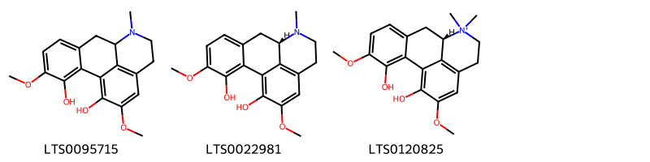{ width=100% }
    <figcaption>Hình ảnh cấu trúc hóa học của 3 hoạt chất thuộc nhóm Aporphines gồm ['4,15-dimethoxy-10-methyl-10-azatetracyclo[7.7.1.0²,⁷.0¹³,¹⁷]heptadeca-1(16),2,4,6,13(17),14-hexaene-3,16-diol (LTS0095715)', '(9s)-4,15-dimethoxy-10-methyl-10-azatetracyclo[7.7.1.0²,⁷.0¹³,¹⁷]heptadeca-1(16),2,4,6,13(17),14-hexaene-3,16-diol (LTS0022981)', 'magnoflorine (LTS0120825)'].</figcaption>
</figure>
#### Nhóm Dihydrofurans
<figure markdown="span">
    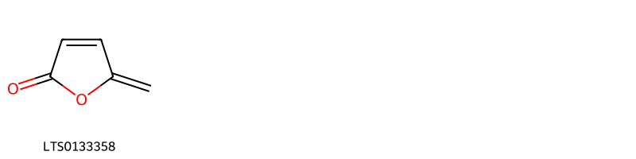{ width=100% }
    <figcaption>Hình ảnh cấu trúc hóa học của 1 hoạt chất thuộc nhóm Dihydrofurans gồm ['protoanemonin (LTS0133358)'].</figcaption>
</figure>
#### Nhóm Flavonoids
<figure markdown="span">
    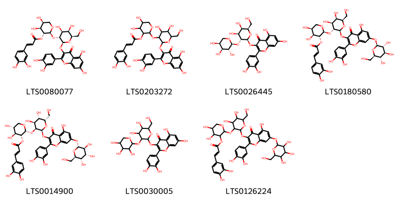{ width=100% }
    <figcaption>Hình ảnh cấu trúc hóa học của 7 hoạt chất thuộc nhóm Flavonoids gồm ['(2s,3r,4s,5s)-2-{[(2s,3r,4s,5r,6r)-2-{[2-(3,4-dihydroxyphenyl)-5,7-dihydroxy-4-oxochromen-3-yl]oxy}-4,5-dihydroxy-6-(hydroxymethyl)oxan-3-yl]oxy}-4,5-dihydroxyoxan-3-yl (2e)-3-(3,4-dihydroxyphenyl)prop-2-enoate (LTS0080077)', '2-[(2-{[2-(3,4-dihydroxyphenyl)-5,7-dihydroxy-4-oxochromen-3-yl]oxy}-4,5-dihydroxy-6-(hydroxymethyl)oxan-3-yl)oxy]-4,5-dihydroxyoxan-3-yl 3-(3,4-dihydroxyphenyl)prop-2-enoate (LTS0203272)', '3-{[(2s,3r,4s,5r,6r)-4,5-dihydroxy-6-(hydroxymethyl)-3-{[(2s,3r,4s,5s)-3,4,5-trihydroxyoxan-2-yl]oxy}oxan-2-yl]oxy}-2-(3,4-dihydroxyphenyl)-5,7-dihydroxychromen-4-one (LTS0026445)', '(2s,3r,4s,5s)-2-{[(2s,3r,4s,5r,6r)-2-{[2-(3,4-dihydroxyphenyl)-5-hydroxy-4-oxo-7-{[(2s,3r,4s,5s,6r)-3,4,5-trihydroxy-6-(hydroxymethyl)oxan-2-yl]oxy}chromen-3-yl]oxy}-4,5-dihydroxy-6-(hydroxymethyl)oxan-3-yl]oxy}-4,5-dihydroxyoxan-3-yl (2e)-3-(3,4-dihydroxyphenyl)prop-2-enoate (LTS0180580)', '(2r,3r,4s,5r)-2-{[(2s,3s,4s,5s,6s)-2-{[2-(3,4-dihydroxyphenyl)-5-hydroxy-4-oxo-7-{[(2r,3s,4r,5s,6r)-3,4,5-trihydroxy-6-(hydroxymethyl)oxan-2-yl]oxy}chromen-3-yl]oxy}-4,5-dihydroxy-6-(hydroxymethyl)oxan-3-yl]oxy}-4,5-dihydroxyoxan-3-yl (2e)-3-(3,4-dihydroxyphenyl)prop-2-enoate (LTS0014900)', '3-{[4,5-dihydroxy-6-(hydroxymethyl)-3-[(3,4,5-trihydroxyoxan-2-yl)oxy]oxan-2-yl]oxy}-2-(3,4-dihydroxyphenyl)-5,7-dihydroxychromen-4-one (LTS0030005)', '2-[(2-{[2-(3,4-dihydroxyphenyl)-5-hydroxy-4-oxo-7-{[3,4,5-trihydroxy-6-(hydroxymethyl)oxan-2-yl]oxy}chromen-3-yl]oxy}-4,5-dihydroxy-6-(hydroxymethyl)oxan-3-yl)oxy]-4,5-dihydroxyoxan-3-yl 3-(3,4-dihydroxyphenyl)prop-2-enoate (LTS0126224)'].</figcaption>
</figure>
#### Nhóm Steroids and steroid derivatives
<figure markdown="span">
    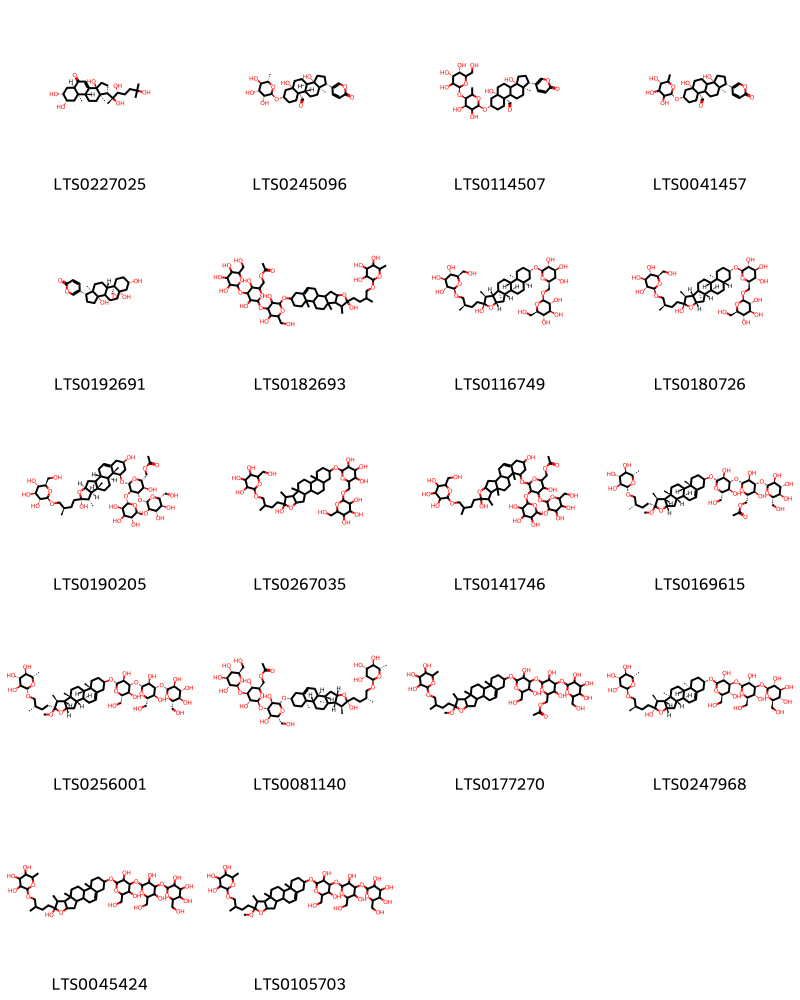{ width=100% }
    <figcaption>Hình ảnh cấu trúc hóa học của 18 hoạt chất thuộc nhóm Steroids and steroid derivatives gồm ['20-hydroxyecdysone (LTS0227025)', '(1r,3as,3br,5as,7s,9as,9bs,11ar)-3a,5a-dihydroxy-11a-methyl-1-(6-oxopyran-3-yl)-7-{[(2r,3r,4r,5r,6s)-3,4,5-trihydroxy-6-methyloxan-2-yl]oxy}-dodecahydro-1h-cyclopenta[a]phenanthrene-9a-carbaldehyde (LTS0245096)', '(1r,3as,5as,7s,9as,11ar)-7-{[(2r,4r,5r)-3,4-dihydroxy-6-methyl-5-{[(2s,4r,5s)-3,4,5-trihydroxy-6-(hydroxymethyl)oxan-2-yl]oxy}oxan-2-yl]oxy}-3a,5a-dihydroxy-11a-methyl-1-(6-oxopyran-3-yl)-dodecahydro-1h-cyclopenta[a]phenanthrene-9a-carbaldehyde (LTS0114507)', '(1r,3as,5as,7s,9as,11ar)-3a,5a-dihydroxy-11a-methyl-1-(6-oxopyran-3-yl)-7-{[(2s,5s)-3,4,5-trihydroxy-6-methyloxan-2-yl]oxy}-dodecahydro-1h-cyclopenta[a]phenanthrene-9a-carbaldehyde (LTS0041457)', 'hellebrigenin (LTS0192691)', '[6-({3,5-dihydroxy-2-[(6-hydroxy-7,9,13-trimethyl-6-{3-methyl-4-[(3,4,5-trihydroxy-6-methyloxan-2-yl)oxy]butyl}-5-oxapentacyclo[10.8.0.0²,⁹.0⁴,⁸.0¹³,¹⁸]icos-18-en-16-yl)oxy]-6-(hydroxymethyl)oxan-4-yl}oxy)-3,5-dihydroxy-4-{[3,4,5-trihydroxy-6-(hydroxymethyl)oxan-2-yl]oxy}oxan-2-yl]methyl acetate (LTS0182693)', '(2r,3r,4s,5s,6r)-2-{[(1r,2s,4s,6r,7s,8r,9s,12s,13s,16s,18r)-6-hydroxy-7,9,13-trimethyl-6-[(3r)-3-methyl-4-{[(2r,3r,4s,5s,6r)-3,4,5-trihydroxy-6-(hydroxymethyl)oxan-2-yl]oxy}butyl]-5-oxapentacyclo[10.8.0.0²,⁹.0⁴,⁸.0¹³,¹⁸]icosan-16-yl]oxy}-6-({[(2r,3r,4s,5s,6r)-3,4,5-trihydroxy-6-(hydroxymethyl)oxan-2-yl]oxy}methyl)oxane-3,4,5-triol (LTS0116749)', '(2r,3r,4s,5s,6r)-2-{[(1r,2s,4s,6r,7s,8r,9s,12s,13s,16s,18s)-6-hydroxy-7,9,13-trimethyl-6-[(3r)-3-methyl-4-{[(2r,3r,4s,5s,6r)-3,4,5-trihydroxy-6-(hydroxymethyl)oxan-2-yl]oxy}butyl]-5-oxapentacyclo[10.8.0.0²,⁹.0⁴,⁸.0¹³,¹⁸]icosan-16-yl]oxy}-6-({[(2r,3r,4s,5s,6r)-3,4,5-trihydroxy-6-(hydroxymethyl)oxan-2-yl]oxy}methyl)oxane-3,4,5-triol (LTS0180726)', '[(2r,3r,4s,5r,6r)-6-{[(1s,2s,4s,6r,7s,8r,9s,12s,13r,14r,16r)-6,16-dihydroxy-7,9,13-trimethyl-6-[(3r)-3-methyl-4-{[(2r,3r,4s,5s,6r)-3,4,5-trihydroxy-6-(hydroxymethyl)oxan-2-yl]oxy}butyl]-5-oxapentacyclo[10.8.0.0²,⁹.0⁴,⁸.0¹³,¹⁸]icos-18-en-14-yl]oxy}-3-hydroxy-4-{[(2s,3r,4s,5s,6r)-3,4,5-trihydroxy-6-(hydroxymethyl)oxan-2-yl]oxy}-5-{[(2s,3r,4r,5r,6s)-3,4,5-trihydroxy-6-methyloxan-2-yl]oxy}oxan-2-yl]methyl acetate (LTS0190205)', '2-{[6-hydroxy-7,9,13-trimethyl-6-(3-methyl-4-{[3,4,5-trihydroxy-6-(hydroxymethyl)oxan-2-yl]oxy}butyl)-5-oxapentacyclo[10.8.0.0²,⁹.0⁴,⁸.0¹³,¹⁸]icosan-16-yl]oxy}-6-({[3,4,5-trihydroxy-6-(hydroxymethyl)oxan-2-yl]oxy}methyl)oxane-3,4,5-triol (LTS0267035)', '(6-{[6,16-dihydroxy-7,9,13-trimethyl-6-(3-methyl-4-{[3,4,5-trihydroxy-6-(hydroxymethyl)oxan-2-yl]oxy}butyl)-5-oxapentacyclo[10.8.0.0²,⁹.0⁴,⁸.0¹³,¹⁸]icos-18-en-14-yl]oxy}-3-hydroxy-4-{[3,4,5-trihydroxy-6-(hydroxymethyl)oxan-2-yl]oxy}-5-[(3,4,5-trihydroxy-6-methyloxan-2-yl)oxy]oxan-2-yl)methyl acetate (LTS0141746)', '[(2s,3s,4r,5s,6r)-6-{[(2s,3s,4r,5s,6s)-3,5-dihydroxy-2-(hydroxymethyl)-6-{[(1s,2s,4s,6r,7s,8r,9r,12s,13s,16r)-6-methoxy-7,9,13-trimethyl-6-[(3s)-3-methyl-4-{[(2s,3s,4r,5r,6s)-3,4,5-trihydroxy-6-methyloxan-2-yl]oxy}butyl]-5-oxapentacyclo[10.8.0.0²,⁹.0⁴,⁸.0¹³,¹⁸]icos-18-en-16-yl]oxy}oxan-4-yl]oxy}-3,5-dihydroxy-4-{[(2r,3s,4r,5r,6s)-3,4,5-trihydroxy-6-(hydroxymethyl)oxan-2-yl]oxy}oxan-2-yl]methyl acetate (LTS0169615)', '(2s,3s,4r,5r,6s)-2-[(2s)-4-[(1s,2s,4s,6r,7s,8r,9r,12s,13s,16r)-16-{[(2s,3s,4r,5s,6s)-4-{[(2r,3s,4r,5s,6s)-3,5-dihydroxy-6-(hydroxymethyl)-4-{[(2r,3s,4r,5r,6s)-3,4,5-trihydroxy-6-(hydroxymethyl)oxan-2-yl]oxy}oxan-2-yl]oxy}-3,5-dihydroxy-6-(hydroxymethyl)oxan-2-yl]oxy}-6-methoxy-7,9,13-trimethyl-5-oxapentacyclo[10.8.0.0²,⁹.0⁴,⁸.0¹³,¹⁸]icos-18-en-6-yl]-2-methylbutoxy]-6-methyloxane-3,4,5-triol (LTS0256001)', '[(2r,3r,4s,5r,6s)-6-{[(2r,3r,4s,5r,6r)-3,5-dihydroxy-2-{[(1s,2s,4s,6s,7s,8r,9s,12s,13r,16s)-6-hydroxy-7,9,13-trimethyl-6-[(3r)-3-methyl-4-{[(2r,3r,4r,5r,6s)-3,4,5-trihydroxy-6-methyloxan-2-yl]oxy}butyl]-5-oxapentacyclo[10.8.0.0²,⁹.0⁴,⁸.0¹³,¹⁸]icos-18-en-16-yl]oxy}-6-(hydroxymethyl)oxan-4-yl]oxy}-3,5-dihydroxy-4-{[(2s,3r,4s,5s,6r)-3,4,5-trihydroxy-6-(hydroxymethyl)oxan-2-yl]oxy}oxan-2-yl]methyl acetate (LTS0081140)', '(6-{[3,5-dihydroxy-2-(hydroxymethyl)-6-[(6-methoxy-7,9,13-trimethyl-6-{3-methyl-4-[(3,4,5-trihydroxy-6-methyloxan-2-yl)oxy]butyl}-5-oxapentacyclo[10.8.0.0²,⁹.0⁴,⁸.0¹³,¹⁸]icos-18-en-16-yl)oxy]oxan-4-yl]oxy}-3,5-dihydroxy-4-{[3,4,5-trihydroxy-6-(hydroxymethyl)oxan-2-yl]oxy}oxan-2-yl)methyl acetate (LTS0177270)', '(2r,3r,4r,5r,6s)-2-[(2r)-4-[(1s,2s,4s,6s,7s,8r,9s,12s,13r,16s)-16-{[(2r,3r,4s,5r,6r)-4-{[(2s,3r,4s,5r,6r)-3,5-dihydroxy-6-(hydroxymethyl)-4-{[(2s,3r,4s,5s,6r)-3,4,5-trihydroxy-6-(hydroxymethyl)oxan-2-yl]oxy}oxan-2-yl]oxy}-3,5-dihydroxy-6-(hydroxymethyl)oxan-2-yl]oxy}-6-hydroxy-7,9,13-trimethyl-5-oxapentacyclo[10.8.0.0²,⁹.0⁴,⁸.0¹³,¹⁸]icos-18-en-6-yl]-2-methylbutoxy]-6-methyloxane-3,4,5-triol (LTS0247968)', '2-{[2-({3,5-dihydroxy-2-[(6-hydroxy-7,9,13-trimethyl-6-{3-methyl-4-[(3,4,5-trihydroxy-6-methyloxan-2-yl)oxy]butyl}-5-oxapentacyclo[10.8.0.0²,⁹.0⁴,⁸.0¹³,¹⁸]icos-18-en-16-yl)oxy]-6-(hydroxymethyl)oxan-4-yl}oxy)-3,5-dihydroxy-6-(hydroxymethyl)oxan-4-yl]oxy}-6-(hydroxymethyl)oxane-3,4,5-triol (LTS0045424)', '2-(4-{16-[(4-{[3,5-dihydroxy-6-(hydroxymethyl)-4-{[3,4,5-trihydroxy-6-(hydroxymethyl)oxan-2-yl]oxy}oxan-2-yl]oxy}-3,5-dihydroxy-6-(hydroxymethyl)oxan-2-yl)oxy]-6-methoxy-7,9,13-trimethyl-5-oxapentacyclo[10.8.0.0²,⁹.0⁴,⁸.0¹³,¹⁸]icos-18-en-6-yl}-2-methylbutoxy)-6-methyloxane-3,4,5-triol (LTS0105703)'].</figcaption>
</figure>

---

### Dược dân tộc học

Danh sách các quốc gia có sử dụng *Helleborus viridis* trong điều trị các bệnh. 

| Country   | Disease                                                       | Bệnh                                                                                                                                                                                                |
|:----------|:--------------------------------------------------------------|:----------------------------------------------------------------------------------------------------------------------------------------------------------------------------------------------------|
| Turkey    | Emmenagogue, Nervine, Poison, Sternutatory, Cardiac, Diuretic | MYMEMORY WARNING: YOU USED ALL AVAILABLE FREE TRANSLATIONS FOR TODAY. NEXT AVAILABLE IN  08 HOURS 37 MINUTES 39 SECONDS VISIT HTTPS://MYMEMORY.TRANSLATED.NET/DOC/USAGELIMITS.PHP TO TRANSLATE MORE |
| ain       | Poison                                                        | MYMEMORY WARNING: YOU USED ALL AVAILABLE FREE TRANSLATIONS FOR TODAY. NEXT AVAILABLE IN  08 HOURS 37 MINUTES 36 SECONDS VISIT HTTPS://MYMEMORY.TRANSLATED.NET/DOC/USAGELIMITS.PHP TO TRANSLATE MORE |

---

# Chi Coptis

??? note "Danh sách các dược liệu thuộc chi"
    
	 - *Coptis chinensis*
	 - *Coptis japonica*
	 - *Coptis teeta*
	 - *Coptis trifolia*

---
## Coptis chinensis
### Thông tin về thực vật

!!! info "Phân loại thực vật của *Coptis chinensis* từ GIBF:"
    - **Kingdom:** Plantae
    - **Phylum:** Tracheophyta
    - **Order:** Ranunculales
    - **Family:** Ranunculaceae
    - **Genus:** Coptis
    - **Species:** *Coptis chinensis*

 

| Label (VI)   | Label (EN)   | Scientific Name   | Descriptions (VI)   | Descriptions (EN)   | Also Known As (VI)   | Also Known As (EN)   |
|:-------------|:-------------|:------------------|:--------------------|:--------------------|:---------------------|:---------------------|
| N/A          | N/A          | Coptis chinensis  | loài thực vật       | species of plant    | ['Coptis chinensis'] | ['']                 |

#### Phân bố trên thế giới

**Từ CSDL GIBF** Viet Nam, nan, India, United States of America, China

#### Phân bố tại Việt Nam

**Từ CSDL GIBF**: Lai Chau

---
### Thành phần hóa học
        
- Theo cơ sở dữ liệu lotus: Từ loài *Coptis chinensis* đã phân lập và xác định được 9 hoạt chất thuộc về các nhóm Aporphines, Indoles and derivatives, Isoquinolines and derivatives, Protoberberine alkaloids and derivatives. 

|    | chemicalTaxonomyClassyfireClass          |   smiles_count |
|---:|:-----------------------------------------|---------------:|
|  0 | Aporphines                               |              1 |
|  1 | Indoles and derivatives                  |              1 |
|  2 | Isoquinolines and derivatives            |              1 |
|  3 | Protoberberine alkaloids and derivatives |              6 |

#### Nhóm Aporphines
<figure markdown="span">
    { width=100% }
    <figcaption>Hình ảnh cấu trúc hóa học của 1 hoạt chất thuộc nhóm Aporphines gồm ['magnoflorine (LTS0120825)'].</figcaption>
</figure>
#### Nhóm Indoles and derivatives
<figure markdown="span">
    { width=100% }
    <figcaption>Hình ảnh cấu trúc hóa học của 1 hoạt chất thuộc nhóm Indoles and derivatives gồm ['n-[2-(5-methoxy-1h-indol-3-yl)ethyl]ethanimidic acid (LTS0219322)'].</figcaption>
</figure>
#### Nhóm Isoquinolines and derivatives
<figure markdown="span">
    { width=100% }
    <figcaption>Hình ảnh cấu trúc hóa học của 1 hoạt chất thuộc nhóm Isoquinolines and derivatives gồm ['3,4,11-trimethoxy-7,8-dihydro-6-azatetraphen-10-one (LTS0258799)'].</figcaption>
</figure>
#### Nhóm Protoberberine alkaloids and derivatives
<figure markdown="span">
    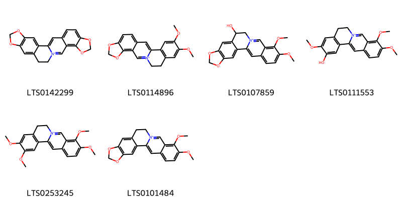{ width=100% }
    <figcaption>Hình ảnh cấu trúc hóa học của 6 hoạt chất thuộc nhóm Protoberberine alkaloids and derivatives gồm ['5,7,17,19-tetraoxa-13λ⁵-azahexacyclo[11.11.0.0²,¹⁰.0⁴,⁸.0¹⁵,²³.0¹⁶,²⁰]tetracosa-1(24),2,4(8),9,13,15,20,22-octaen-13-ylium (LTS0142299)', '16,17-dimethoxy-5,7-dioxa-1λ⁵-azapentacyclo[11.8.0.0³,¹¹.0⁴,⁸.0¹⁴,¹⁹]henicosa-1,3,8,10,12,14(19),15,17-octaen-1-ylium (LTS0114896)', 'berberastine (LTS0107859)', 'columbamine (LTS0111553)', 'palmatine (LTS0253245)', 'berberine (LTS0101484)'].</figcaption>
</figure>

---

### Dược dân tộc học

Danh sách các quốc gia có sử dụng *Coptis chinensis* trong điều trị các bệnh. 

| Country   | Disease        | Bệnh                                                                                                                                                                                                |
|:----------|:---------------|:----------------------------------------------------------------------------------------------------------------------------------------------------------------------------------------------------|
| China     | Alexiteric     | MYMEMORY WARNING: YOU USED ALL AVAILABLE FREE TRANSLATIONS FOR TODAY. NEXT AVAILABLE IN  08 HOURS 37 MINUTES 09 SECONDS VISIT HTTPS://MYMEMORY.TRANSLATED.NET/DOC/USAGELIMITS.PHP TO TRANSLATE MORE |
| Elsewhere | Analgesic, nan | MYMEMORY WARNING: YOU USED ALL AVAILABLE FREE TRANSLATIONS FOR TODAY. NEXT AVAILABLE IN  08 HOURS 37 MINUTES 07 SECONDS VISIT HTTPS://MYMEMORY.TRANSLATED.NET/DOC/USAGELIMITS.PHP TO TRANSLATE MORE |

---

---
## Coptis japonica
### Thông tin về thực vật

!!! info "Phân loại thực vật của *Coptis japonica* từ GIBF:"
    - **Kingdom:** Plantae
    - **Phylum:** Tracheophyta
    - **Order:** Ranunculales
    - **Family:** Ranunculaceae
    - **Genus:** Coptis
    - **Species:** *Coptis japonica*

 

| Label (VI)   | Label (EN)   | Scientific Name   | Descriptions (VI)   | Descriptions (EN)   | Also Known As (VI)   | Also Known As (EN)      |
|:-------------|:-------------|:------------------|:--------------------|:--------------------|:---------------------|:------------------------|
| N/A          | N/A          | Coptis japonica   | loài thực vật       | species of plant    | ['']                 | ['Japanese goldthread'] |

#### Phân bố trên thế giới

**Từ CSDL GIBF** nan, United States of America, Belgium, Japan

#### Phân bố tại Việt Nam

**Từ CSDL GIBF**: Không có ghi nhận ở Việt Nam

---
### Thành phần hóa học
        
- Theo cơ sở dữ liệu lotus: Từ loài *Coptis japonica* đã phân lập và xác định được 53 hoạt chất thuộc về các nhóm Quinolines and derivatives, Furanoid lignans, Aporphines, 2-arylbenzofuran flavonoids, Carboxylic acids and derivatives, Saccharolipids, Linear 1,3-diarylpropanoids, Benzophenanthridine alkaloids, Cinnamic acids and derivatives, Organooxygen compounds, Lignan glycosides, Coumarinolignans, Flavonoids, Isoquinolines and derivatives, Protoberberine alkaloids and derivatives, Aryltetralin lignans, Benzodioxoles, Benzene and substituted derivatives. 

|    | chemicalTaxonomyClassyfireClass          |   smiles_count |
|---:|:-----------------------------------------|---------------:|
|  0 | 2-arylbenzofuran flavonoids              |              5 |
|  1 | Aporphines                               |              1 |
|  2 | Aryltetralin lignans                     |              1 |
|  3 | Benzene and substituted derivatives      |              1 |
|  4 | Benzodioxoles                            |              1 |
|  5 | Benzophenanthridine alkaloids            |              1 |
|  6 | Carboxylic acids and derivatives         |              1 |
|  7 | Cinnamic acids and derivatives           |              1 |
|  8 | Coumarinolignans                         |              5 |
|  9 | Flavonoids                               |              3 |
| 10 | Furanoid lignans                         |              1 |
| 11 | Isoquinolines and derivatives            |              8 |
| 12 | Lignan glycosides                        |              1 |
| 13 | Linear 1,3-diarylpropanoids              |              1 |
| 14 | Organooxygen compounds                   |              1 |
| 15 | Protoberberine alkaloids and derivatives |             13 |
| 16 | Quinolines and derivatives               |              1 |
| 17 | Saccharolipids                           |              6 |

#### Nhóm 2-arylbenzofuran flavonoids
<figure markdown="span">
    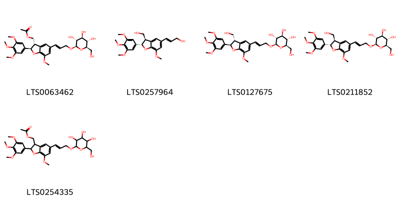{ width=100% }
    <figcaption>Hình ảnh cấu trúc hóa học của 5 hoạt chất thuộc nhóm 2-arylbenzofuran flavonoids gồm ['[(2r,3s)-7-methoxy-5-[(1e)-3-{[(2r,3r,4s,5s,6r)-3,4,5-trihydroxy-6-(hydroxymethyl)oxan-2-yl]oxy}prop-1-en-1-yl]-2-(3,4,5-trimethoxyphenyl)-2,3-dihydro-1-benzofuran-3-yl]methyl acetate (LTS0063462)', '(2e)-3-[(2s,3r)-3-(hydroxymethyl)-7-methoxy-2-(3,4,5-trimethoxyphenyl)-2,3-dihydro-1-benzofuran-5-yl]prop-2-en-1-ol (LTS0257964)', '(2r,3s,4s,5r,6r)-2-(hydroxymethyl)-6-{[(2e)-3-[(2r,3s)-3-(hydroxymethyl)-7-methoxy-2-(3,4,5-trimethoxyphenyl)-2,3-dihydro-1-benzofuran-5-yl]prop-2-en-1-yl]oxy}oxane-3,4,5-triol (LTS0127675)', '(2r,3s,4s,5r,6r)-2-(hydroxymethyl)-6-{[(2e)-3-[(2s,3r)-3-(hydroxymethyl)-7-methoxy-2-(3,4,5-trimethoxyphenyl)-2,3-dihydro-1-benzofuran-5-yl]prop-2-en-1-yl]oxy}oxane-3,4,5-triol (LTS0211852)', '[7-methoxy-5-(3-{[3,4,5-trihydroxy-6-(hydroxymethyl)oxan-2-yl]oxy}prop-1-en-1-yl)-2-(3,4,5-trimethoxyphenyl)-2,3-dihydro-1-benzofuran-3-yl]methyl acetate (LTS0254335)'].</figcaption>
</figure>
#### Nhóm Aporphines
<figure markdown="span">
    { width=100% }
    <figcaption>Hình ảnh cấu trúc hóa học của 1 hoạt chất thuộc nhóm Aporphines gồm ['magnoflorine (LTS0120825)'].</figcaption>
</figure>
#### Nhóm Aryltetralin lignans
<figure markdown="span">
    { width=100% }
    <figcaption>Hình ảnh cấu trúc hóa học của 1 hoạt chất thuộc nhóm Aryltetralin lignans gồm ['(+)-isolariciresinol (LTS0164886)'].</figcaption>
</figure>
#### Nhóm Benzene and substituted derivatives
<figure markdown="span">
    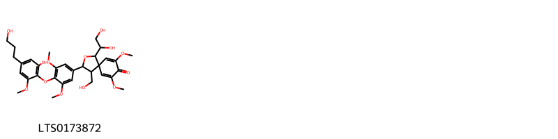{ width=100% }
    <figcaption>Hình ảnh cấu trúc hóa học của 1 hoạt chất thuộc nhóm Benzene and substituted derivatives gồm ['1-(1,2-dihydroxyethyl)-3-{4-[2-hydroxy-4-(3-hydroxypropyl)-6-methoxyphenoxy]-3,5-dimethoxyphenyl}-4-(hydroxymethyl)-7,9-dimethoxy-2-oxaspiro[4.5]deca-6,9-dien-8-one (LTS0173872)'].</figcaption>
</figure>
#### Nhóm Benzodioxoles
<figure markdown="span">
    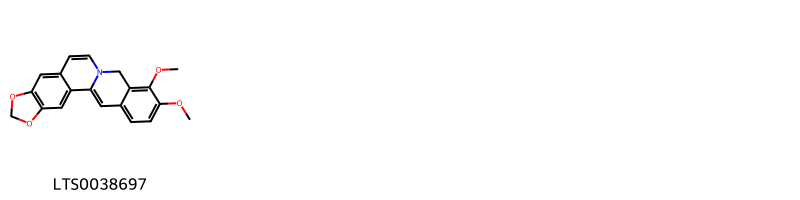{ width=100% }
    <figcaption>Hình ảnh cấu trúc hóa học của 1 hoạt chất thuộc nhóm Benzodioxoles gồm ['16,17-dimethoxy-5,7-dioxa-13-azapentacyclo[11.8.0.0²,¹⁰.0⁴,⁸.0¹⁵,²⁰]henicosa-1(21),2,4(8),9,11,15,17,19-octaene (LTS0038697)'].</figcaption>
</figure>
#### Nhóm Benzophenanthridine alkaloids
<figure markdown="span">
    { width=100% }
    <figcaption>Hình ảnh cấu trúc hóa học của 1 hoạt chất thuộc nhóm Benzophenanthridine alkaloids gồm ['sanguinarine (LTS0149026)'].</figcaption>
</figure>
#### Nhóm Carboxylic acids and derivatives
<figure markdown="span">
    { width=100% }
    <figcaption>Hình ảnh cấu trúc hóa học của 1 hoạt chất thuộc nhóm Carboxylic acids and derivatives gồm ['l-tyrosine (LTS0029981)'].</figcaption>
</figure>
#### Nhóm Cinnamic acids and derivatives
<figure markdown="span">
    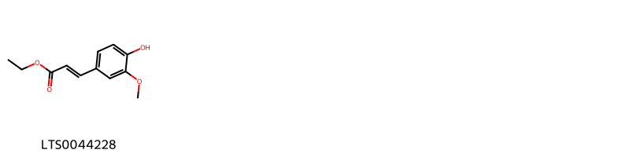{ width=100% }
    <figcaption>Hình ảnh cấu trúc hóa học của 1 hoạt chất thuộc nhóm Cinnamic acids and derivatives gồm ['ethyl ferulate (LTS0044228)'].</figcaption>
</figure>
#### Nhóm Coumarinolignans
<figure markdown="span">
    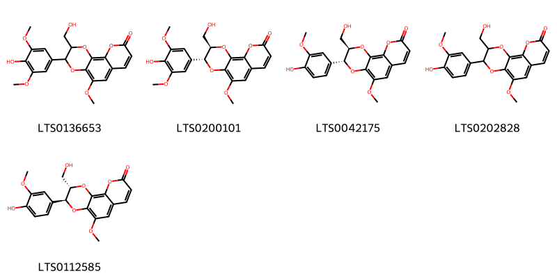{ width=100% }
    <figcaption>Hình ảnh cấu trúc hóa học của 5 hoạt chất thuộc nhóm Coumarinolignans gồm ['3-(4-hydroxy-3,5-dimethoxyphenyl)-2-(hydroxymethyl)-5-methoxy-2h,3h-[1,4]dioxino[2,3-h]chromen-9-one (LTS0136653)', '(2r,3r)-3-(4-hydroxy-3,5-dimethoxyphenyl)-2-(hydroxymethyl)-5-methoxy-2h,3h-[1,4]dioxino[2,3-h]chromen-9-one (LTS0200101)', 'cleomiscosin a (LTS0042175)', '3-(4-hydroxy-3-methoxyphenyl)-2-(hydroxymethyl)-5-methoxy-2h,3h-[1,4]dioxino[2,3-h]chromen-9-one (LTS0202828)', '(2s,3s)-3-(4-hydroxy-3-methoxyphenyl)-2-(hydroxymethyl)-5-methoxy-2h,3h-[1,4]dioxino[2,3-h]chromen-9-one (LTS0112585)'].</figcaption>
</figure>
#### Nhóm Flavonoids
<figure markdown="span">
    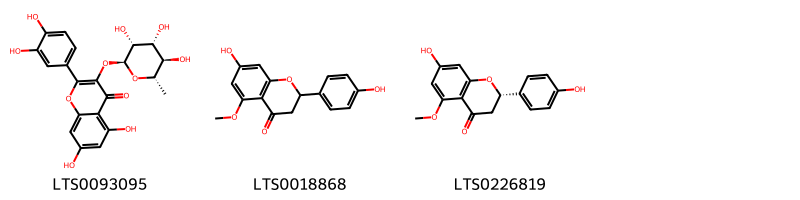{ width=100% }
    <figcaption>Hình ảnh cấu trúc hóa học của 3 hoạt chất thuộc nhóm Flavonoids gồm ['quercitrin (LTS0093095)', 'naringenin 5-methyl ether (LTS0018868)', '(2s)-7-hydroxy-2-(4-hydroxyphenyl)-5-methoxy-2,3-dihydro-1-benzopyran-4-one (LTS0226819)'].</figcaption>
</figure>
#### Nhóm Furanoid lignans
<figure markdown="span">
    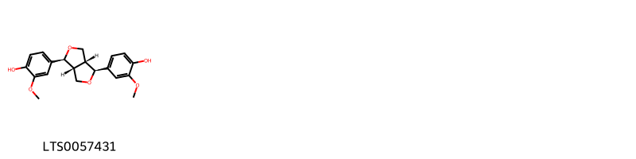{ width=100% }
    <figcaption>Hình ảnh cấu trúc hóa học của 1 hoạt chất thuộc nhóm Furanoid lignans gồm ['pinoresinol (LTS0057431)'].</figcaption>
</figure>
#### Nhóm Isoquinolines and derivatives
<figure markdown="span">
    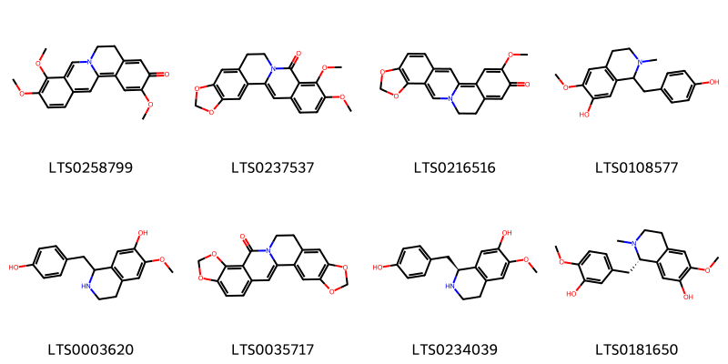{ width=100% }
    <figcaption>Hình ảnh cấu trúc hóa học của 8 hoạt chất thuộc nhóm Isoquinolines and derivatives gồm ['3,4,11-trimethoxy-7,8-dihydro-6-azatetraphen-10-one (LTS0258799)', '8-oxyberberine (LTS0237537)', '16-methoxy-5,7-dioxa-1-azapentacyclo[11.8.0.0³,¹¹.0⁴,⁸.0¹⁴,¹⁹]henicosa-2,4(8),9,11,13,15,18-heptaen-17-one (LTS0216516)', '1-[(4-hydroxyphenyl)methyl]-6-methoxy-2-methyl-3,4-dihydro-1h-isoquinolin-7-ol (LTS0108577)', '(rs)-coclaurine (LTS0003620)', '5,7,17,19-tetraoxa-13-azahexacyclo[11.11.0.0²,¹⁰.0⁴,⁸.0¹⁵,²³.0¹⁶,²⁰]tetracosa-1(24),2,4(8),9,15,20,22-heptaen-14-one (LTS0035717)', '(+-)-coclaurine (LTS0234039)', '(+,-)-reticuline (LTS0181650)'].</figcaption>
</figure>
#### Nhóm Lignan glycosides
<figure markdown="span">
    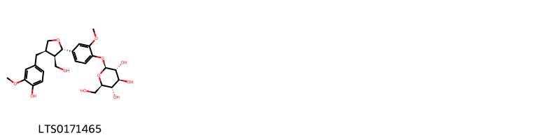{ width=100% }
    <figcaption>Hình ảnh cấu trúc hóa học của 1 hoạt chất thuộc nhóm Lignan glycosides gồm ['(2s,3r,4s,5s,6r)-2-{4-[(2s,3r,4r)-4-[(4-hydroxy-3-methoxyphenyl)methyl]-3-(hydroxymethyl)oxolan-2-yl]-2-methoxyphenoxy}-6-(hydroxymethyl)oxane-3,4,5-triol (LTS0171465)'].</figcaption>
</figure>
#### Nhóm Linear 1_3-diarylpropanoids
<figure markdown="span">
    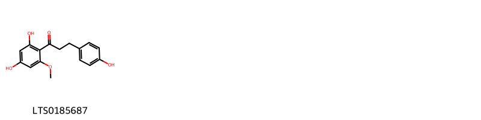{ width=100% }
    <figcaption>Hình ảnh cấu trúc hóa học của Không tìm thấy chú thích hoạt chất thuộc nhóm Linear 1_3-diarylpropanoids gồm Không tìm thấy chú thích.</figcaption>
</figure>
#### Nhóm Organooxygen compounds
<figure markdown="span">
    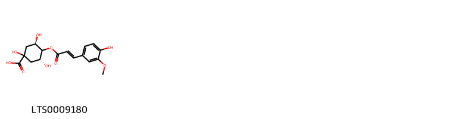{ width=100% }
    <figcaption>Hình ảnh cấu trúc hóa học của 1 hoạt chất thuộc nhóm Organooxygen compounds gồm ['(3r,5r)-1,3,5-trihydroxy-4-{[(2e)-3-(4-hydroxy-3-methoxyphenyl)prop-2-enoyl]oxy}cyclohexane-1-carboxylic acid (LTS0009180)'].</figcaption>
</figure>
#### Nhóm Protoberberine alkaloids and derivatives
<figure markdown="span">
    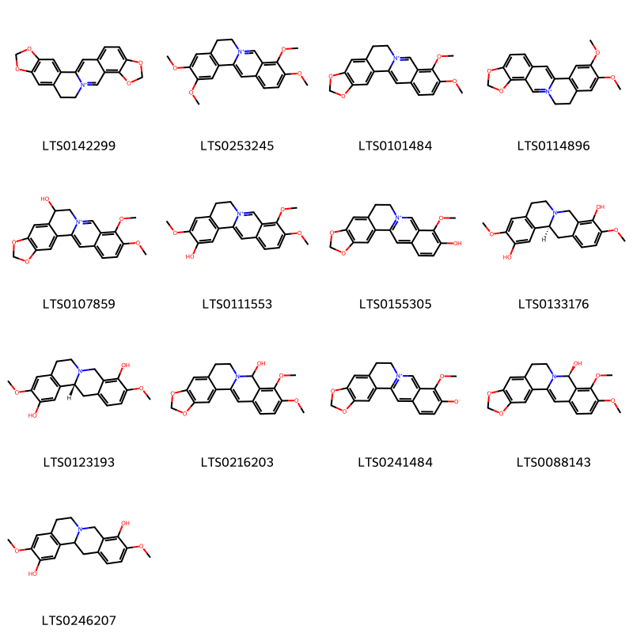{ width=100% }
    <figcaption>Hình ảnh cấu trúc hóa học của 13 hoạt chất thuộc nhóm Protoberberine alkaloids and derivatives gồm ['5,7,17,19-tetraoxa-13λ⁵-azahexacyclo[11.11.0.0²,¹⁰.0⁴,⁸.0¹⁵,²³.0¹⁶,²⁰]tetracosa-1(24),2,4(8),9,13,15,20,22-octaen-13-ylium (LTS0142299)', 'palmatine (LTS0253245)', 'berberine (LTS0101484)', '16,17-dimethoxy-5,7-dioxa-1λ⁵-azapentacyclo[11.8.0.0³,¹¹.0⁴,⁸.0¹⁴,¹⁹]henicosa-1,3,8,10,12,14(19),15,17-octaen-1-ylium (LTS0114896)', 'berberastine (LTS0107859)', 'columbamine (LTS0111553)', '17-hydroxy-16-methoxy-5,7-dioxa-13λ⁵-azapentacyclo[11.8.0.0²,¹⁰.0⁴,⁸.0¹⁵,²⁰]henicosa-1(13),2,4(8),9,14,16,18,20-octaen-13-ylium (LTS0155305)', 'scoulerine (LTS0133176)', '(12br)-3,10-dimethoxy-7,8,12b,13-tetrahydro-5h-6-azatetraphene-4,11-diol (LTS0123193)', '16,17-dimethoxy-5,7-dioxa-13-azapentacyclo[11.8.0.0²,¹⁰.0⁴,⁸.0¹⁵,²⁰]henicosa-1(21),2,4(8),9,15,17,19-heptaen-14-ol (LTS0216203)', '16-methoxy-5,7-dioxa-13λ⁵-azapentacyclo[11.8.0.0²,¹⁰.0⁴,⁸.0¹⁵,²⁰]henicosa-1(13),2,4(8),9,14,16,18,20-octaen-13-ylium-17-olate (LTS0241484)', '(14s)-16,17-dimethoxy-5,7-dioxa-13-azapentacyclo[11.8.0.0²,¹⁰.0⁴,⁸.0¹⁵,²⁰]henicosa-1(21),2,4(8),9,15,17,19-heptaen-14-ol (LTS0088143)', '(s)-scoulerine (LTS0246207)'].</figcaption>
</figure>
#### Nhóm Quinolines and derivatives
<figure markdown="span">
    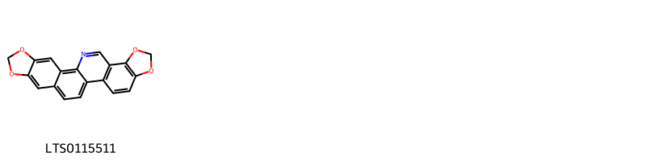{ width=100% }
    <figcaption>Hình ảnh cấu trúc hóa học của 1 hoạt chất thuộc nhóm Quinolines and derivatives gồm ['5,7,18,20-tetraoxa-24-azahexacyclo[11.11.0.0²,¹⁰.0⁴,⁸.0¹⁴,²².0¹⁷,²¹]tetracosa-1(13),2(10),3,8,11,14(22),15,17(21),23-nonaene (LTS0115511)'].</figcaption>
</figure>
#### Nhóm Saccharolipids
<figure markdown="span">
    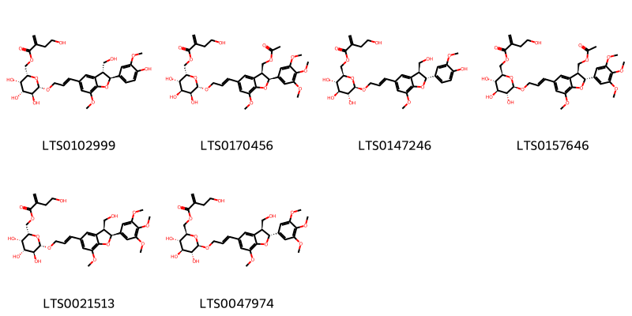{ width=100% }
    <figcaption>Hình ảnh cấu trúc hóa học của 6 hoạt chất thuộc nhóm Saccharolipids gồm ['[(2s,3s,4r,5s,6s)-3,4,5-trihydroxy-6-{[(2e)-3-[(2s,3r)-2-(4-hydroxy-3-methoxyphenyl)-3-(hydroxymethyl)-7-methoxy-2,3-dihydro-1-benzofuran-5-yl]prop-2-en-1-yl]oxy}oxan-2-yl]methyl 4-hydroxy-2-methylidenebutanoate (LTS0102999)', '[(2s,3s,4s,5s,6s)-6-{[(2e)-3-[(2s,3s)-3-[(acetyloxy)methyl]-7-methoxy-2-(3,4,5-trimethoxyphenyl)-2,3-dihydro-1-benzofuran-5-yl]prop-2-en-1-yl]oxy}-3,4,5-trihydroxyoxan-2-yl]methyl 4-hydroxy-2-methylidenebutanoate (LTS0170456)', '[(2r,3s,4s,5r,6r)-3,4,5-trihydroxy-6-{[(2e)-3-[(2r,3s)-2-(4-hydroxy-3-methoxyphenyl)-3-(hydroxymethyl)-7-methoxy-2,3-dihydro-1-benzofuran-5-yl]prop-2-en-1-yl]oxy}oxan-2-yl]methyl 4-hydroxy-2-methylidenebutanoate (LTS0147246)', '[(2r,3s,4s,5r,6r)-6-{[(2e)-3-[(2r,3s)-3-[(acetyloxy)methyl]-7-methoxy-2-(3,4,5-trimethoxyphenyl)-2,3-dihydro-1-benzofuran-5-yl]prop-2-en-1-yl]oxy}-3,4,5-trihydroxyoxan-2-yl]methyl 4-hydroxy-2-methylidenebutanoate (LTS0157646)', '[(2s,3s,4r,5s,6s)-3,4,5-trihydroxy-6-{[(2e)-3-[(2s,3s)-3-(hydroxymethyl)-7-methoxy-2-(3,4,5-trimethoxyphenyl)-2,3-dihydro-1-benzofuran-5-yl]prop-2-en-1-yl]oxy}oxan-2-yl]methyl 4-hydroxy-2-methylidenebutanoate (LTS0021513)', '[(2r,3s,4s,5r,6r)-3,4,5-trihydroxy-6-{[(2e)-3-[(2r,3s)-3-(hydroxymethyl)-7-methoxy-2-(3,4,5-trimethoxyphenyl)-2,3-dihydro-1-benzofuran-5-yl]prop-2-en-1-yl]oxy}oxan-2-yl]methyl 4-hydroxy-2-methylidenebutanoate (LTS0047974)'].</figcaption>
</figure>

---

### Dược dân tộc học

Danh sách các quốc gia có sử dụng *Coptis japonica* trong điều trị các bệnh. 

| Country   | Disease                                                                                                       | Bệnh                                                                                                                                                                                                |
|:----------|:--------------------------------------------------------------------------------------------------------------|:----------------------------------------------------------------------------------------------------------------------------------------------------------------------------------------------------|
| Japan     | Stomachic, Tonic                                                                                              | MYMEMORY WARNING: YOU USED ALL AVAILABLE FREE TRANSLATIONS FOR TODAY. NEXT AVAILABLE IN  08 HOURS 36 MINUTES 43 SECONDS VISIT HTTPS://MYMEMORY.TRANSLATED.NET/DOC/USAGELIMITS.PHP TO TRANSLATE MORE |
| Japan*    | Antiphlogistic, Antiphlogistic, Antiphlogistic, Sedative, Sedative, Stomachic, Stomachic, Stomachic, Sedative | MYMEMORY WARNING: YOU USED ALL AVAILABLE FREE TRANSLATIONS FOR TODAY. NEXT AVAILABLE IN  08 HOURS 36 MINUTES 40 SECONDS VISIT HTTPS://MYMEMORY.TRANSLATED.NET/DOC/USAGELIMITS.PHP TO TRANSLATE MORE |

---

---
## Coptis teeta
### Thông tin về thực vật

!!! info "Phân loại thực vật của *Coptis teeta* từ GIBF:"
    - **Kingdom:** Plantae
    - **Phylum:** Tracheophyta
    - **Order:** Ranunculales
    - **Family:** Ranunculaceae
    - **Genus:** Coptis
    - **Species:** *Coptis teeta*

 

| Label (VI)   | Label (EN)   | Scientific Name   | Descriptions (VI)   | Descriptions (EN)   | Also Known As (VI)   | Also Known As (EN)   |
|:-------------|:-------------|:------------------|:--------------------|:--------------------|:---------------------|:---------------------|
| N/A          | N/A          | Coptis teeta      | loài thực vật       | species of plant    | ['']                 | ['']                 |

#### Phân bố trên thế giới

**Từ CSDL GIBF** nan, unknown or invalid, United Kingdom of Great Britain and Northern Ireland, Japan, Myanmar, India, Bangladesh, China, Indonesia

#### Phân bố tại Việt Nam

**Từ CSDL GIBF**: Không có ghi nhận ở Việt Nam

---
### Thành phần hóa học
        
- Theo cơ sở dữ liệu lotus: Từ loài *Coptis teeta* đã phân lập và xác định được 9 hoạt chất thuộc về các nhóm Isoquinolines and derivatives, Unsaturated hydrocarbons, Protoberberine alkaloids and derivatives, Phthalide isoquinolines, Cinnamic acids and derivatives. 

|    | chemicalTaxonomyClassyfireClass          |   smiles_count |
|---:|:-----------------------------------------|---------------:|
|  0 | Cinnamic acids and derivatives           |              1 |
|  1 | Isoquinolines and derivatives            |              2 |
|  2 | Phthalide isoquinolines                  |              1 |
|  3 | Protoberberine alkaloids and derivatives |              3 |
|  4 | Unsaturated hydrocarbons                 |              1 |

#### Nhóm Cinnamic acids and derivatives
<figure markdown="span">
    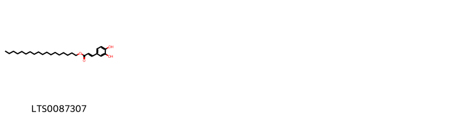{ width=100% }
    <figcaption>Hình ảnh cấu trúc hóa học của 1 hoạt chất thuộc nhóm Cinnamic acids and derivatives gồm ['octadecyl (2e)-3-(3,4-dihydroxyphenyl)prop-2-enoate (LTS0087307)'].</figcaption>
</figure>
#### Nhóm Isoquinolines and derivatives
<figure markdown="span">
    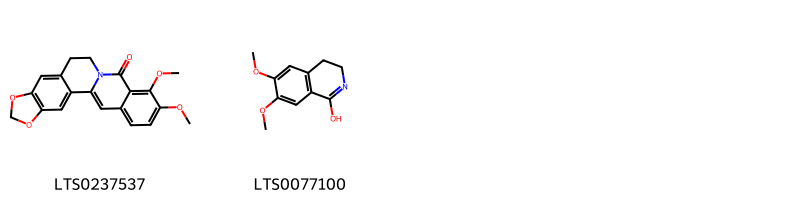{ width=100% }
    <figcaption>Hình ảnh cấu trúc hóa học của 2 hoạt chất thuộc nhóm Isoquinolines and derivatives gồm ['8-oxyberberine (LTS0237537)', '6,7-dimethoxy-3,4-dihydroisoquinolin-1-ol (LTS0077100)'].</figcaption>
</figure>
#### Nhóm Phthalide isoquinolines
<figure markdown="span">
    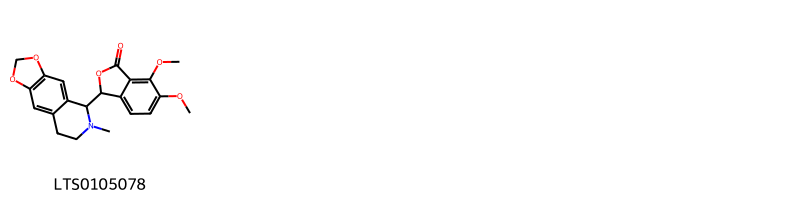{ width=100% }
    <figcaption>Hình ảnh cấu trúc hóa học của 1 hoạt chất thuộc nhóm Phthalide isoquinolines gồm ['hydrastine (LTS0105078)'].</figcaption>
</figure>
#### Nhóm Protoberberine alkaloids and derivatives
<figure markdown="span">
    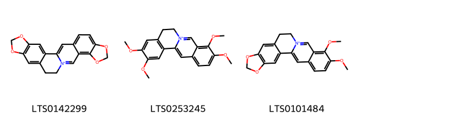{ width=100% }
    <figcaption>Hình ảnh cấu trúc hóa học của 3 hoạt chất thuộc nhóm Protoberberine alkaloids and derivatives gồm ['5,7,17,19-tetraoxa-13λ⁵-azahexacyclo[11.11.0.0²,¹⁰.0⁴,⁸.0¹⁵,²³.0¹⁶,²⁰]tetracosa-1(24),2,4(8),9,13,15,20,22-octaen-13-ylium (LTS0142299)', 'palmatine (LTS0253245)', 'berberine (LTS0101484)'].</figcaption>
</figure>
#### Nhóm Unsaturated hydrocarbons
<figure markdown="span">
    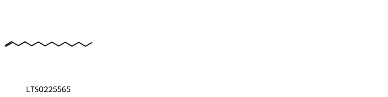{ width=100% }
    <figcaption>Hình ảnh cấu trúc hóa học của 1 hoạt chất thuộc nhóm Unsaturated hydrocarbons gồm ['tetradecene (LTS0225565)'].</figcaption>
</figure>

---

### Dược dân tộc học

Danh sách các quốc gia có sử dụng *Coptis teeta* trong điều trị các bệnh. 

| Country   | Disease                                                              | Bệnh                                                                                                                                                                                                |
|:----------|:---------------------------------------------------------------------|:----------------------------------------------------------------------------------------------------------------------------------------------------------------------------------------------------|
| China     | Antidote, Digestive, Stomachic                                       | MYMEMORY WARNING: YOU USED ALL AVAILABLE FREE TRANSLATIONS FOR TODAY. NEXT AVAILABLE IN  08 HOURS 36 MINUTES 13 SECONDS VISIT HTTPS://MYMEMORY.TRANSLATED.NET/DOC/USAGELIMITS.PHP TO TRANSLATE MORE |
| Elsewhere | Stomachic, Tonic                                                     | MYMEMORY WARNING: YOU USED ALL AVAILABLE FREE TRANSLATIONS FOR TODAY. NEXT AVAILABLE IN  08 HOURS 36 MINUTES 10 SECONDS VISIT HTTPS://MYMEMORY.TRANSLATED.NET/DOC/USAGELIMITS.PHP TO TRANSLATE MORE |
| Turkey    | Antidote, Stimulant, Apertif, Stomachic, Collyrium, Digestive, Tonic | MYMEMORY WARNING: YOU USED ALL AVAILABLE FREE TRANSLATIONS FOR TODAY. NEXT AVAILABLE IN  08 HOURS 36 MINUTES 08 SECONDS VISIT HTTPS://MYMEMORY.TRANSLATED.NET/DOC/USAGELIMITS.PHP TO TRANSLATE MORE |

---

---
## Coptis trifolia
### Thông tin về thực vật

!!! info "Phân loại thực vật của *Coptis trifolia* từ GIBF:"
    - **Kingdom:** Plantae
    - **Phylum:** Tracheophyta
    - **Order:** Ranunculales
    - **Family:** Ranunculaceae
    - **Genus:** Coptis
    - **Species:** *Coptis trifolia*

 

| Label (VI)   | Label (EN)   | Scientific Name   | Descriptions (VI)   | Descriptions (EN)   | Also Known As (VI)   | Also Known As (EN)       |
|:-------------|:-------------|:------------------|:--------------------|:--------------------|:---------------------|:-------------------------|
| N/A          | N/A          | Coptis trifolia   | loài thực vật       | species of plant    | ['']                 | ['threeleaf goldthread'] |

#### Phân bố trên thế giới

**Từ CSDL GIBF** nan, Canada, United States of America

#### Phân bố tại Việt Nam

**Từ CSDL GIBF**: Không có ghi nhận ở Việt Nam

---
### Thành phần hóa học
        
- Theo cơ sở dữ liệu lotus: Từ loài *Coptis trifolia* đã phân lập và xác định được 21 hoạt chất thuộc về các nhóm Coumarins and derivatives, Isoquinolines and derivatives, Prenol lipids, Protoberberine alkaloids and derivatives, Steroids and steroid derivatives. 

|    | chemicalTaxonomyClassyfireClass          |   smiles_count |
|---:|:-----------------------------------------|---------------:|
|  0 | Coumarins and derivatives                |              1 |
|  1 | Isoquinolines and derivatives            |              1 |
|  2 | Prenol lipids                            |             11 |
|  3 | Protoberberine alkaloids and derivatives |              2 |
|  4 | Steroids and steroid derivatives         |              6 |

#### Nhóm Coumarins and derivatives
<figure markdown="span">
    { width=100% }
    <figcaption>Hình ảnh cấu trúc hóa học của 1 hoạt chất thuộc nhóm Coumarins and derivatives gồm ['scopoletin (LTS0193112)'].</figcaption>
</figure>
#### Nhóm Isoquinolines and derivatives
<figure markdown="span">
    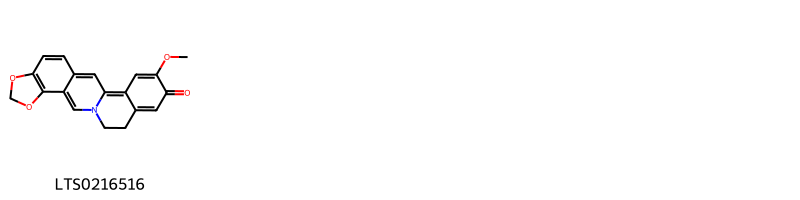{ width=100% }
    <figcaption>Hình ảnh cấu trúc hóa học của 1 hoạt chất thuộc nhóm Isoquinolines and derivatives gồm ['16-methoxy-5,7-dioxa-1-azapentacyclo[11.8.0.0³,¹¹.0⁴,⁸.0¹⁴,¹⁹]henicosa-2,4(8),9,11,13,15,18-heptaen-17-one (LTS0216516)'].</figcaption>
</figure>
#### Nhóm Prenol lipids
<figure markdown="span">
    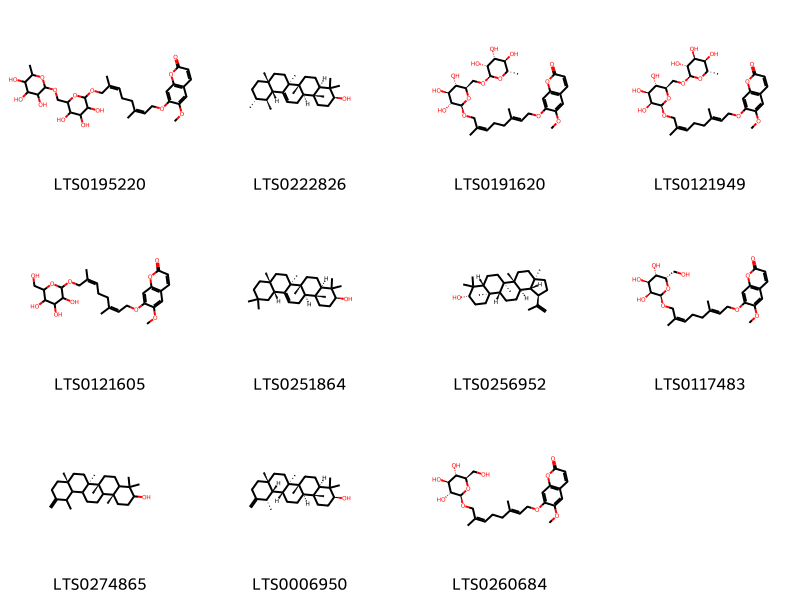{ width=100% }
    <figcaption>Hình ảnh cấu trúc hóa học của 11 hoạt chất thuộc nhóm Prenol lipids gồm ['7-({3,7-dimethyl-8-[(3,4,5-trihydroxy-6-{[(3,4,5-trihydroxy-6-methyloxan-2-yl)oxy]methyl}oxan-2-yl)oxy]octa-2,6-dien-1-yl}oxy)-6-methoxychromen-2-one (LTS0195220)', 'amyrin (LTS0222826)', '7-{[(2e,6z)-3,7-dimethyl-8-{[(2r,3r,4s,5s,6r)-3,4,5-trihydroxy-6-({[(2r,3r,4r,5r,6s)-3,4,5-trihydroxy-6-methyloxan-2-yl]oxy}methyl)oxan-2-yl]oxy}octa-2,6-dien-1-yl]oxy}-6-methoxychromen-2-one (LTS0191620)', '7-{[(2e,6z)-3,7-dimethyl-8-{[(2r,3s,4s,5s,6r)-3,4,5-trihydroxy-6-({[(2r,3r,4s,5r,6s)-3,4,5-trihydroxy-6-methyloxan-2-yl]oxy}methyl)oxan-2-yl]oxy}octa-2,6-dien-1-yl]oxy}-6-methoxychromen-2-one (LTS0121949)', '7-[(3,7-dimethyl-8-{[3,4,5-trihydroxy-6-(hydroxymethyl)oxan-2-yl]oxy}octa-2,6-dien-1-yl)oxy]-6-methoxychromen-2-one (LTS0121605)', 'β-amyrin (LTS0251864)', 'lupeol (LTS0256952)', '7-{[(2e,6z)-3,7-dimethyl-8-{[(2r,3s,4s,5s,6s)-3,4,5-trihydroxy-6-(hydroxymethyl)oxan-2-yl]oxy}octa-2,6-dien-1-yl]oxy}-6-methoxychromen-2-one (LTS0117483)', '(6ar,6br,8ar,14br)-4,4,6a,6b,8a,12,14b-heptamethyl-11-methylidene-hexadecahydropicen-3-ol (LTS0274865)', 'taraxasterol (LTS0006950)', '7-{[(2e,6z)-3,7-dimethyl-8-{[(2r,3r,4s,5s,6r)-3,4,5-trihydroxy-6-(hydroxymethyl)oxan-2-yl]oxy}octa-2,6-dien-1-yl]oxy}-6-methoxychromen-2-one (LTS0260684)'].</figcaption>
</figure>
#### Nhóm Protoberberine alkaloids and derivatives
<figure markdown="span">
    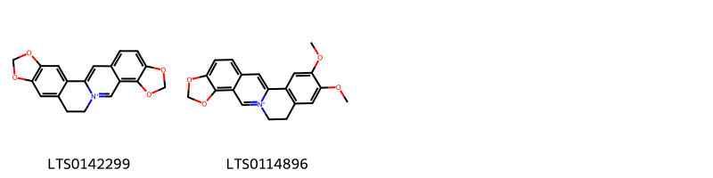{ width=100% }
    <figcaption>Hình ảnh cấu trúc hóa học của 2 hoạt chất thuộc nhóm Protoberberine alkaloids and derivatives gồm ['5,7,17,19-tetraoxa-13λ⁵-azahexacyclo[11.11.0.0²,¹⁰.0⁴,⁸.0¹⁵,²³.0¹⁶,²⁰]tetracosa-1(24),2,4(8),9,13,15,20,22-octaen-13-ylium (LTS0142299)', '16,17-dimethoxy-5,7-dioxa-1λ⁵-azapentacyclo[11.8.0.0³,¹¹.0⁴,⁸.0¹⁴,¹⁹]henicosa-1,3,8,10,12,14(19),15,17-octaen-1-ylium (LTS0114896)'].</figcaption>
</figure>
#### Nhóm Steroids and steroid derivatives
<figure markdown="span">
    { width=100% }
    <figcaption>Hình ảnh cấu trúc hóa học của 6 hoạt chất thuộc nhóm Steroids and steroid derivatives gồm ['stigmast-5-en-3-ol (LTS0071224)', 'sitosterol (LTS0168132)', 'stigmast-5-en-3-ol, (3β)- (LTS0204616)', 'phytosterol (LTS0029311)', '(1r,3as,3bs,7s,9bs)-1-[(2r,5r)-5,6-dimethylheptan-2-yl]-9a,11a-dimethyl-1h,2h,3h,3ah,3bh,4h,6h,7h,8h,9h,9bh,10h,11h-cyclopenta[a]phenanthren-7-ol (LTS0057877)', 'campesterol (LTS0046755)'].</figcaption>
</figure>

---

### Dược dân tộc học

Danh sách các quốc gia có sử dụng *Coptis trifolia* trong điều trị các bệnh. 

| Country   | Disease          | Bệnh                                                                                                                                                                                                |
|:----------|:-----------------|:----------------------------------------------------------------------------------------------------------------------------------------------------------------------------------------------------|
| Elsewhere | Stomachic, Tonic | MYMEMORY WARNING: YOU USED ALL AVAILABLE FREE TRANSLATIONS FOR TODAY. NEXT AVAILABLE IN  08 HOURS 35 MINUTES 46 SECONDS VISIT HTTPS://MYMEMORY.TRANSLATED.NET/DOC/USAGELIMITS.PHP TO TRANSLATE MORE |

---

# Chi Thalictrum

??? note "Danh sách các dược liệu thuộc chi"
    
	 - *Thalictrum angustifolium*
	 - *Thalictrum collinum*
	 - *Thalictrum flavum*
	 - *Thalictrum foliolosum*
	 - *Thalictrum hernandezii*
	 - *Thalictrum minus*
	 - *Thalictrum occidentale*
	 - *Thalictrum rubellum*

---
## Thalictrum angustifolium
### Thông tin về thực vật

!!! info "Phân loại thực vật của *Thalictrum lucidum* từ GIBF:"
    - **Kingdom:** Plantae
    - **Phylum:** Tracheophyta
    - **Order:** Ranunculales
    - **Family:** Ranunculaceae
    - **Genus:** Thalictrum
    - **Species:** *Thalictrum lucidum*

 

| Label (VI)   | Label (EN)   | Scientific Name          | Descriptions (VI)   | Descriptions (EN)   | Also Known As (VI)   | Also Known As (EN)   |
|:-------------|:-------------|:-------------------------|:--------------------|:--------------------|:---------------------|:---------------------|
| N/A          | N/A          | Thalictrum angustifolium | loài thực vật       | species of plant    | ['']                 | ['']                 |

#### Phân bố trên thế giới

**Từ CSDL GIBF** nan, Bosnia and Herzegovina, unknown or invalid, Spain, Germany, Austria, Korea, Republic of, Poland, Mongolia, Slovakia, Netherlands, Türkiye, Belarus, Japan, Hungary, Bulgaria, Estonia, China, Switzerland, Latvia, France, Czechia, Romania, Russian Federation, United States of America, Italy, Croatia, Ukraine

#### Phân bố tại Việt Nam

**Từ CSDL GIBF**: Không có ghi nhận ở Việt Nam

---
### Thành phần hóa học
        
- Theo cơ sở dữ liệu lotus: Từ loài *Thalictrum lucidum* đã phân lập và xác định được 5 hoạt chất thuộc về các nhóm Aporphines, Isoquinolines and derivatives, Protoberberine alkaloids and derivatives, Benzene and substituted derivatives. 

|    | chemicalTaxonomyClassyfireClass          |   smiles_count |
|---:|:-----------------------------------------|---------------:|
|  0 |                                          |              1 |
|  1 | Aporphines                               |              1 |
|  2 | Benzene and substituted derivatives      |              1 |
|  3 | Isoquinolines and derivatives            |              1 |
|  4 | Protoberberine alkaloids and derivatives |              1 |

#### Nhóm 
<figure markdown="span">
    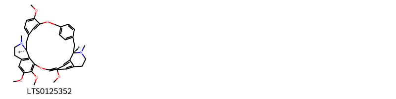{ width=100% }
    <figcaption>Hình ảnh cấu trúc hóa học của 1 hoạt chất thuộc nhóm  gồm ['(3s,21s)-10,14,15,26-tetramethoxy-4,20-dimethyl-12,28-dioxa-4,20-diazaheptacyclo[27.2.2.1⁷,¹¹.1¹³,¹⁷.1²³,²⁷.0³,⁸.0²¹,³⁵]hexatriaconta-1(31),7(36),8,10,13,15,17(35),23,25,27(34),29,32-dodecaene (LTS0125352)'].</figcaption>
</figure>
#### Nhóm Aporphines
<figure markdown="span">
    { width=100% }
    <figcaption>Hình ảnh cấu trúc hóa học của 1 hoạt chất thuộc nhóm Aporphines gồm ['magnoflorine (LTS0120825)'].</figcaption>
</figure>
#### Nhóm Benzene and substituted derivatives
<figure markdown="span">
    { width=100% }
    <figcaption>Hình ảnh cấu trúc hóa học của 1 hoạt chất thuộc nhóm Benzene and substituted derivatives gồm ['paraben (LTS0224398)'].</figcaption>
</figure>
#### Nhóm Isoquinolines and derivatives
<figure markdown="span">
    { width=100% }
    <figcaption>Hình ảnh cấu trúc hóa học của 1 hoạt chất thuộc nhóm Isoquinolines and derivatives gồm ['3,4,11-trimethoxy-7,8-dihydro-6-azatetraphen-10-one (LTS0258799)'].</figcaption>
</figure>
#### Nhóm Protoberberine alkaloids and derivatives
<figure markdown="span">
    { width=100% }
    <figcaption>Hình ảnh cấu trúc hóa học của 1 hoạt chất thuộc nhóm Protoberberine alkaloids and derivatives gồm ['berberine (LTS0101484)'].</figcaption>
</figure>

---

### Dược dân tộc học

Danh sách các quốc gia có sử dụng *Thalictrum lucidum* trong điều trị các bệnh. 

| Country   | Disease   | Bệnh                                                                                                                                                                                                |
|:----------|:----------|:----------------------------------------------------------------------------------------------------------------------------------------------------------------------------------------------------|
| USSR      | Diuretic  | MYMEMORY WARNING: YOU USED ALL AVAILABLE FREE TRANSLATIONS FOR TODAY. NEXT AVAILABLE IN  08 HOURS 35 MINUTES 15 SECONDS VISIT HTTPS://MYMEMORY.TRANSLATED.NET/DOC/USAGELIMITS.PHP TO TRANSLATE MORE |

---

---
## Thalictrum collinum
### Thông tin về thực vật

!!! info "Phân loại thực vật của *Thalictrum minus* từ GIBF:"
    - **Kingdom:** Plantae
    - **Phylum:** Tracheophyta
    - **Order:** Ranunculales
    - **Family:** Ranunculaceae
    - **Genus:** Thalictrum
    - **Species:** *Thalictrum minus*

 

| Label (VI)   | Label (EN)   | Scientific Name     | Descriptions (VI)   | Descriptions (EN)   | Also Known As (VI)   | Also Known As (EN)   |
|:-------------|:-------------|:--------------------|:--------------------|:--------------------|:---------------------|:---------------------|
| N/A          | N/A          | Thalictrum collinum | loài thực vật       | species of plant    | ['']                 | ['']                 |

#### Phân bố trên thế giới

**Từ CSDL GIBF** nan, unknown or invalid, France, Czechia, Poland, Hungary, Romania, Germany, Kazakhstan, Russian Federation, Italy, China, Austria, Ukraine

#### Phân bố tại Việt Nam

**Từ CSDL GIBF**: Không có ghi nhận ở Việt Nam

---
### Thành phần hóa học
        
- Theo cơ sở dữ liệu lotus: Từ loài *Thalictrum minus* đã phân lập và xác định được Chưa có hoạt chất nào được phân lập. hoạt chất thuộc về các nhóm Không có hoạt chất nào được phân lập. 

Không có hình ảnh nào được tạo ra

---

### Dược dân tộc học

Danh sách các quốc gia có sử dụng *Thalictrum minus* trong điều trị các bệnh. 

| Country   | Disease   | Bệnh                                                                                                                                                                                                |
|:----------|:----------|:----------------------------------------------------------------------------------------------------------------------------------------------------------------------------------------------------|
| USSR      | Diuretic  | MYMEMORY WARNING: YOU USED ALL AVAILABLE FREE TRANSLATIONS FOR TODAY. NEXT AVAILABLE IN  08 HOURS 34 MINUTES 51 SECONDS VISIT HTTPS://MYMEMORY.TRANSLATED.NET/DOC/USAGELIMITS.PHP TO TRANSLATE MORE |

---

---
## Thalictrum flavum
### Thông tin về thực vật

!!! info "Phân loại thực vật của *Thalictrum flavum* từ GIBF:"
    - **Kingdom:** Plantae
    - **Phylum:** Tracheophyta
    - **Order:** Ranunculales
    - **Family:** Ranunculaceae
    - **Genus:** Thalictrum
    - **Species:** *Thalictrum flavum*

 

| Label (VI)   | Label (EN)   | Scientific Name   | Descriptions (VI)   | Descriptions (EN)   | Also Known As (VI)   | Also Known As (EN)    |
|:-------------|:-------------|:------------------|:--------------------|:--------------------|:---------------------|:----------------------|
| N/A          | N/A          | Thalictrum flavum | loài thực vật       | species of plant    | ['']                 | ['Common Meadow-rue'] |

#### Phân bố trên thế giới

**Từ CSDL GIBF** Switzerland, Denmark, United Kingdom of Great Britain and Northern Ireland, Hungary, Germany, Austria, Netherlands

#### Phân bố tại Việt Nam

**Từ CSDL GIBF**: Không có ghi nhận ở Việt Nam

---
### Thành phần hóa học
        
- Theo cơ sở dữ liệu lotus: Từ loài *Thalictrum flavum* đã phân lập và xác định được 25 hoạt chất thuộc về các nhóm Aporphines, Isoquinolines and derivatives, Protoberberine alkaloids and derivatives, Dihydrofurans, 6,6a-secoaporphines. 

|    | chemicalTaxonomyClassyfireClass          |   smiles_count |
|---:|:-----------------------------------------|---------------:|
|  0 |                                          |             13 |
|  1 | 6,6a-secoaporphines                      |              1 |
|  2 | Aporphines                               |              6 |
|  3 | Dihydrofurans                            |              1 |
|  4 | Isoquinolines and derivatives            |              3 |
|  5 | Protoberberine alkaloids and derivatives |              1 |

#### Nhóm 
<figure markdown="span">
    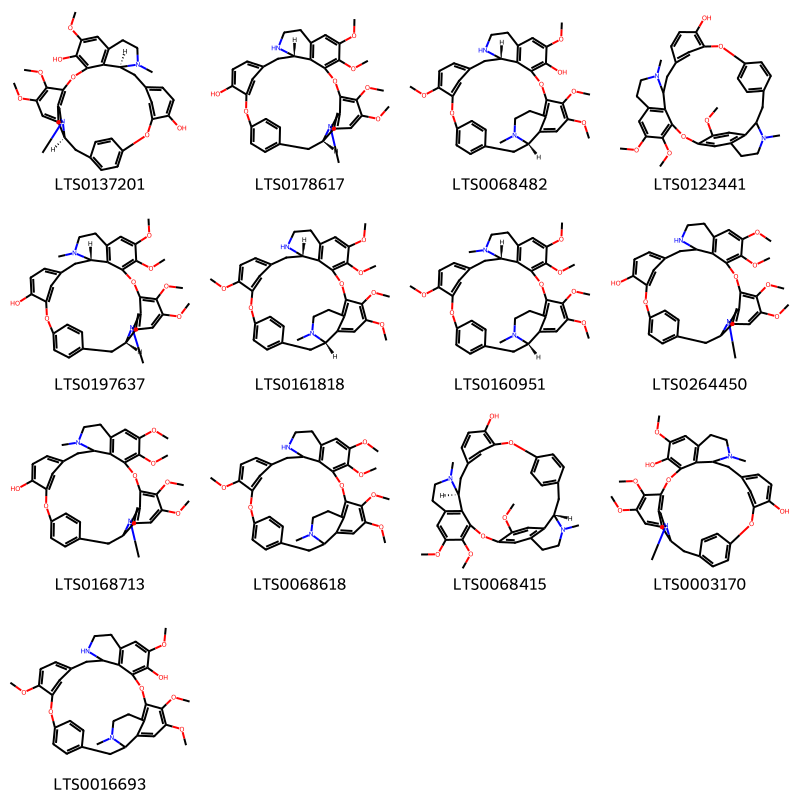{ width=100% }
    <figcaption>Hình ảnh cấu trúc hóa học của 13 hoạt chất thuộc nhóm  gồm ['(3s,22s)-10,11,16-trimethoxy-4,21-dimethyl-13,29-dioxa-4,21-diazaheptacyclo[28.2.2.1¹⁴,¹⁸.1²⁴,²⁸.0³,⁸.0⁷,¹².0²²,³⁶]hexatriaconta-1(32),7(12),8,10,14,16,18(36),24,26,28(35),30,33-dodecaene-15,27-diol (LTS0137201)', '(3s,22s)-10,11,15,16-tetramethoxy-4-methyl-13,29-dioxa-4,21-diazaheptacyclo[28.2.2.1¹⁴,¹⁸.1²⁴,²⁸.0³,⁸.0⁷,¹².0²²,³⁶]hexatriaconta-1(32),7,9,11,14,16,18(36),24,26,28(35),30,33-dodecaen-27-ol (LTS0178617)', '(3s,22s)-10,11,16,27-tetramethoxy-4-methyl-13,29-dioxa-4,21-diazaheptacyclo[28.2.2.1¹⁴,¹⁸.1²⁴,²⁸.0³,⁸.0⁷,¹².0²²,³⁶]hexatriaconta-1(32),7(12),8,10,14,16,18(36),24,26,28(35),30,33-dodecaen-15-ol (LTS0068482)', '10,14,15-trimethoxy-4,20-dimethyl-12,28-dioxa-4,20-diazaheptacyclo[27.2.2.1⁷,¹¹.1¹³,¹⁷.1²³,²⁷.0³,⁸.0²¹,³⁵]hexatriaconta-1(31),7,9,11(36),13,15,17(35),23,25,27(34),29,32-dodecaen-26-ol (LTS0123441)', '(3s,22s)-10,11,15,16-tetramethoxy-4,21-dimethyl-13,29-dioxa-4,21-diazaheptacyclo[28.2.2.1¹⁴,¹⁸.1²⁴,²⁸.0³,⁸.0⁷,¹².0²²,³⁶]hexatriaconta-1(32),7,9,11,14,16,18(36),24,26,28(35),30,33-dodecaen-27-ol (LTS0197637)', '(3s,22s)-10,11,15,16,27-pentamethoxy-4-methyl-13,29-dioxa-4,21-diazaheptacyclo[28.2.2.1¹⁴,¹⁸.1²⁴,²⁸.0³,⁸.0⁷,¹².0²²,³⁶]hexatriaconta-1(32),7(12),8,10,14,16,18(36),24,26,28(35),30,33-dodecaene (LTS0161818)', '(3s,22s)-10,11,15,16,27-pentamethoxy-4,21-dimethyl-13,29-dioxa-4,21-diazaheptacyclo[28.2.2.1¹⁴,¹⁸.1²⁴,²⁸.0³,⁸.0⁷,¹².0²²,³⁶]hexatriaconta-1(32),7(12),8,10,14,16,18(36),24,26,28(35),30,33-dodecaene (LTS0160951)', '10,11,15,16-tetramethoxy-4-methyl-13,29-dioxa-4,21-diazaheptacyclo[28.2.2.1¹⁴,¹⁸.1²⁴,²⁸.0³,⁸.0⁷,¹².0²²,³⁶]hexatriaconta-1(32),7,9,11,14,16,18(36),24,26,28(35),30,33-dodecaen-27-ol (LTS0264450)', '10,11,15,16-tetramethoxy-4,21-dimethyl-13,29-dioxa-4,21-diazaheptacyclo[28.2.2.1¹⁴,¹⁸.1²⁴,²⁸.0³,⁸.0⁷,¹².0²²,³⁶]hexatriaconta-1(32),7,9,11,14,16,18(36),24,26,28(35),30,33-dodecaen-27-ol (LTS0168713)', '10,11,15,16,27-pentamethoxy-4-methyl-13,29-dioxa-4,21-diazaheptacyclo[28.2.2.1¹⁴,¹⁸.1²⁴,²⁸.0³,⁸.0⁷,¹².0²²,³⁶]hexatriaconta-1(32),7(12),8,10,14,16,18(36),24,26,28(35),30,33-dodecaene (LTS0068618)', '(3s,21s)-10,14,15-trimethoxy-4,20-dimethyl-12,28-dioxa-4,20-diazaheptacyclo[27.2.2.1⁷,¹¹.1¹³,¹⁷.1²³,²⁷.0³,⁸.0²¹,³⁵]hexatriaconta-1(31),7,9,11(36),13,15,17(35),23,25,27(34),29,32-dodecaen-26-ol (LTS0068415)', '10,11,16-trimethoxy-4,21-dimethyl-13,29-dioxa-4,21-diazaheptacyclo[28.2.2.1¹⁴,¹⁸.1²⁴,²⁸.0³,⁸.0⁷,¹².0²²,³⁶]hexatriaconta-1(32),7(12),8,10,14,16,18(36),24,26,28(35),30,33-dodecaene-15,27-diol (LTS0003170)', '10,11,16,27-tetramethoxy-4-methyl-13,29-dioxa-4,21-diazaheptacyclo[28.2.2.1¹⁴,¹⁸.1²⁴,²⁸.0³,⁸.0⁷,¹².0²²,³⁶]hexatriaconta-1(32),7(12),8,10,14,16,18(36),24,26,28(35),30,33-dodecaen-15-ol (LTS0016693)'].</figcaption>
</figure>
#### Nhóm 6_6a-secoaporphines
<figure markdown="span">
    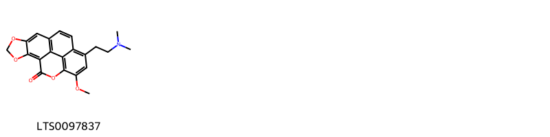{ width=100% }
    <figcaption>Hình ảnh cấu trúc hóa học của Không tìm thấy chú thích hoạt chất thuộc nhóm 6_6a-secoaporphines gồm Không tìm thấy chú thích.</figcaption>
</figure>
#### Nhóm Aporphines
<figure markdown="span">
    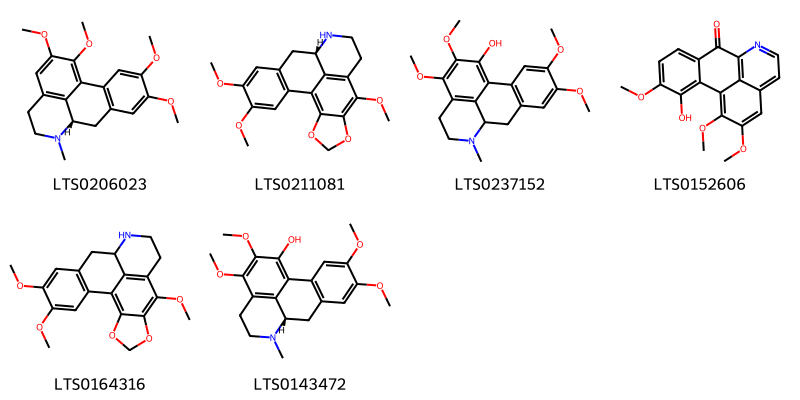{ width=100% }
    <figcaption>Hình ảnh cấu trúc hóa học của 6 hoạt chất thuộc nhóm Aporphines gồm ['(9s)-4,5,15,16-tetramethoxy-10-methyl-10-azatetracyclo[7.7.1.0²,⁷.0¹³,¹⁷]heptadeca-1(16),2(7),3,5,13(17),14-hexaene (LTS0206023)', '(12s)-7,16,17-trimethoxy-3,5-dioxa-11-azapentacyclo[10.7.1.0²,⁶.0⁸,²⁰.0¹⁴,¹⁹]icosa-1,6,8(20),14(19),15,17-hexaene (LTS0211081)', '4,5,14,15-tetramethoxy-10-methyl-10-azatetracyclo[7.7.1.0²,⁷.0¹³,¹⁷]heptadeca-1(16),2(7),3,5,13(17),14-hexaen-16-ol (LTS0237152)', '3-hydroxy-4,15,16-trimethoxy-10-azatetracyclo[7.7.1.0²,⁷.0¹³,¹⁷]heptadeca-1(16),2,4,6,9(17),10,12,14-octaen-8-one (LTS0152606)', '7,16,17-trimethoxy-3,5-dioxa-11-azapentacyclo[10.7.1.0²,⁶.0⁸,²⁰.0¹⁴,¹⁹]icosa-1,6,8(20),14(19),15,17-hexaene (LTS0164316)', '(9s)-4,5,14,15-tetramethoxy-10-methyl-10-azatetracyclo[7.7.1.0²,⁷.0¹³,¹⁷]heptadeca-1(16),2(7),3,5,13(17),14-hexaen-16-ol (LTS0143472)'].</figcaption>
</figure>
#### Nhóm Dihydrofurans
<figure markdown="span">
    { width=100% }
    <figcaption>Hình ảnh cấu trúc hóa học của 1 hoạt chất thuộc nhóm Dihydrofurans gồm ['protoanemonin (LTS0133358)'].</figcaption>
</figure>
#### Nhóm Isoquinolines and derivatives
<figure markdown="span">
    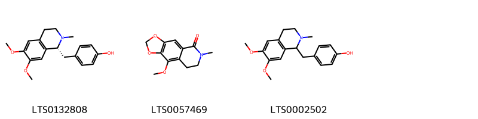{ width=100% }
    <figcaption>Hình ảnh cấu trúc hóa học của 3 hoạt chất thuộc nhóm Isoquinolines and derivatives gồm ['armepavine (LTS0132808)', '9-methoxy-6-methyl-2h,7h,8h-[1,3]dioxolo[4,5-g]isoquinolin-5-one (LTS0057469)', '(+/-)-armepavine (LTS0002502)'].</figcaption>
</figure>
#### Nhóm Protoberberine alkaloids and derivatives
<figure markdown="span">
    { width=100% }
    <figcaption>Hình ảnh cấu trúc hóa học của 1 hoạt chất thuộc nhóm Protoberberine alkaloids and derivatives gồm ['berberine (LTS0101484)'].</figcaption>
</figure>

---

### Dược dân tộc học

Danh sách các quốc gia có sử dụng *Thalictrum flavum* trong điều trị các bệnh. 

| Country   | Disease   | Bệnh                                                                                                                                                                                                |
|:----------|:----------|:----------------------------------------------------------------------------------------------------------------------------------------------------------------------------------------------------|
| English   | Laxative  | MYMEMORY WARNING: YOU USED ALL AVAILABLE FREE TRANSLATIONS FOR TODAY. NEXT AVAILABLE IN  08 HOURS 34 MINUTES 31 SECONDS VISIT HTTPS://MYMEMORY.TRANSLATED.NET/DOC/USAGELIMITS.PHP TO TRANSLATE MORE |
| French    | Poison    | MYMEMORY WARNING: YOU USED ALL AVAILABLE FREE TRANSLATIONS FOR TODAY. NEXT AVAILABLE IN  08 HOURS 34 MINUTES 28 SECONDS VISIT HTTPS://MYMEMORY.TRANSLATED.NET/DOC/USAGELIMITS.PHP TO TRANSLATE MORE |
| Italian   | Diuretic  | MYMEMORY WARNING: YOU USED ALL AVAILABLE FREE TRANSLATIONS FOR TODAY. NEXT AVAILABLE IN  08 HOURS 34 MINUTES 26 SECONDS VISIT HTTPS://MYMEMORY.TRANSLATED.NET/DOC/USAGELIMITS.PHP TO TRANSLATE MORE |

---

---
## Thalictrum foliolosum
### Thông tin về thực vật

!!! info "Phân loại thực vật của *Thalictrum foliolosum* từ GIBF:"
    - **Kingdom:** Plantae
    - **Phylum:** Tracheophyta
    - **Order:** Ranunculales
    - **Family:** Ranunculaceae
    - **Genus:** Thalictrum
    - **Species:** *Thalictrum foliolosum*

 

| Label (VI)   | Label (EN)   | Scientific Name       | Descriptions (VI)   | Descriptions (EN)   | Also Known As (VI)   | Also Known As (EN)   |
|:-------------|:-------------|:----------------------|:--------------------|:--------------------|:---------------------|:---------------------|
| N/A          | N/A          | Thalictrum foliolosum | loài thực vật       | species of plant    | ['']                 | ['Leafy Meadow-Rue'] |

#### Phân bố trên thế giới

**Từ CSDL GIBF** nan, unknown or invalid, Thailand, Pakistan, Myanmar, United Kingdom of Great Britain and Northern Ireland, Bhutan, France, India, China, Nepal

#### Phân bố tại Việt Nam

**Từ CSDL GIBF**: Không có ghi nhận ở Việt Nam

---
### Thành phần hóa học
        
- Theo cơ sở dữ liệu lotus: Từ loài *Thalictrum foliolosum* đã phân lập và xác định được 27 hoạt chất thuộc về các nhóm Dihydroisoquinolines, Aporphines, Isoquinolines and derivatives, Protoberberine alkaloids and derivatives. 

|    | chemicalTaxonomyClassyfireClass          |   smiles_count |
|---:|:-----------------------------------------|---------------:|
|  0 |                                          |              4 |
|  1 | Aporphines                               |              4 |
|  2 | Dihydroisoquinolines                     |              1 |
|  3 | Isoquinolines and derivatives            |              9 |
|  4 | Protoberberine alkaloids and derivatives |              9 |

#### Nhóm 
<figure markdown="span">
    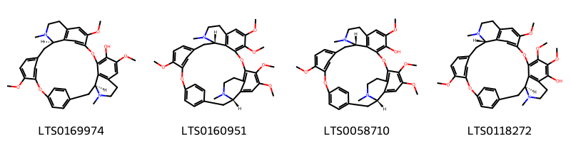{ width=100% }
    <figcaption>Hình ảnh cấu trúc hóa học của 4 hoạt chất thuộc nhóm  gồm ['(1r,14s)-6,20,25-trimethoxy-15,30-dimethyl-8,23-dioxa-15,30-diazaheptacyclo[22.6.2.2⁹,¹².1³,⁷.1¹⁴,¹⁸.0²⁷,³¹.0²²,³³]hexatriaconta-3,5,7(36),9,11,18(33),19,21,24(32),25,27(31),34-dodecaen-21-ol (LTS0169974)', '(3s,22s)-10,11,15,16,27-pentamethoxy-4,21-dimethyl-13,29-dioxa-4,21-diazaheptacyclo[28.2.2.1¹⁴,¹⁸.1²⁴,²⁸.0³,⁸.0⁷,¹².0²²,³⁶]hexatriaconta-1(32),7(12),8,10,14,16,18(36),24,26,28(35),30,33-dodecaene (LTS0160951)', '(3s,22s)-10,11,16,27-tetramethoxy-4,21-dimethyl-13,29-dioxa-4,21-diazaheptacyclo[28.2.2.1¹⁴,¹⁸.1²⁴,²⁸.0³,⁸.0⁷,¹².0²²,³⁶]hexatriaconta-1(32),7(12),8,10,14,16,18(36),24,26,28(35),30,33-dodecaen-15-ol (LTS0058710)', '(1s,14s)-6,20,21,25-tetramethoxy-15,30-dimethyl-8,23-dioxa-15,30-diazaheptacyclo[22.6.2.2⁹,¹².1³,⁷.1¹⁴,¹⁸.0²⁷,³¹.0²²,³³]hexatriaconta-3,5,7(36),9,11,18(33),19,21,24(32),25,27(31),34-dodecaen-19-ol (LTS0118272)'].</figcaption>
</figure>
#### Nhóm Aporphines
<figure markdown="span">
    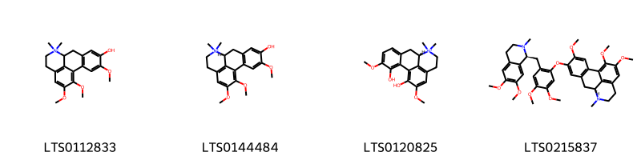{ width=100% }
    <figcaption>Hình ảnh cấu trúc hóa học của 4 hoạt chất thuộc nhóm Aporphines gồm ['5-hydroxy-4,15,16-trimethoxy-10,10-dimethyl-10-azatetracyclo[7.7.1.0²,⁷.0¹³,¹⁷]heptadeca-1(16),2(7),3,5,13(17),14-hexaen-10-ium (LTS0112833)', '(9s)-5-hydroxy-4,15,16-trimethoxy-10,10-dimethyl-10-azatetracyclo[7.7.1.0²,⁷.0¹³,¹⁷]heptadeca-1(16),2(7),3,5,13(17),14-hexaen-10-ium (LTS0144484)', 'magnoflorine (LTS0120825)', '(9s)-5-(2-{[(1s)-6,7-dimethoxy-2-methyl-3,4-dihydro-1h-isoquinolin-1-yl]methyl}-4,5-dimethoxyphenoxy)-4,15,16-trimethoxy-10-methyl-10-azatetracyclo[7.7.1.0²,⁷.0¹³,¹⁷]heptadeca-1(16),2(7),3,5,13(17),14-hexaene (LTS0215837)'].</figcaption>
</figure>
#### Nhóm Dihydroisoquinolines
<figure markdown="span">
    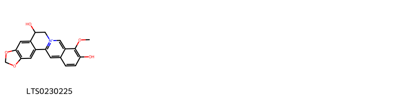{ width=100% }
    <figcaption>Hình ảnh cấu trúc hóa học của 1 hoạt chất thuộc nhóm Dihydroisoquinolines gồm ['11,17-dihydroxy-16-methoxy-5,7-dioxa-13λ⁵-azapentacyclo[11.8.0.0²,¹⁰.0⁴,⁸.0¹⁵,²⁰]henicosa-1(13),2,4(8),9,14,16,18,20-octaen-13-ylium (LTS0230225)'].</figcaption>
</figure>
#### Nhóm Isoquinolines and derivatives
<figure markdown="span">
    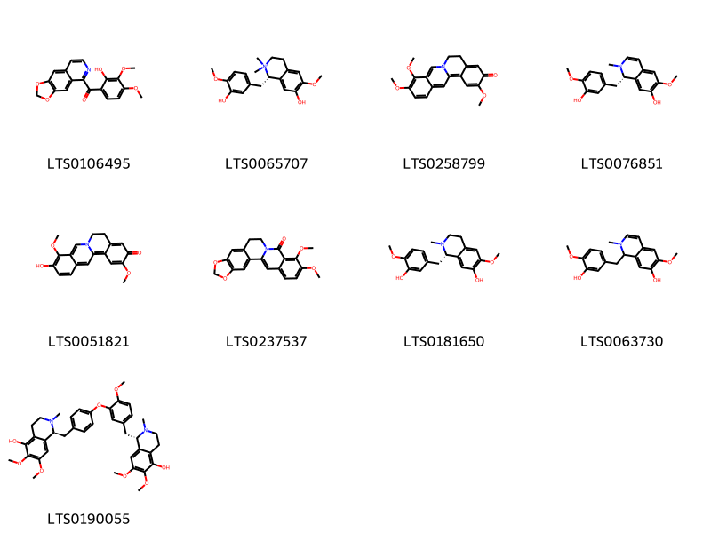{ width=100% }
    <figcaption>Hình ảnh cấu trúc hóa học của 9 hoạt chất thuộc nhóm Isoquinolines and derivatives gồm ['rugosinone (LTS0106495)', '(1s)-7-hydroxy-1-[(3-hydroxy-4-methoxyphenyl)methyl]-6-methoxy-2,2-dimethyl-3,4-dihydro-1h-isoquinolin-2-ium (LTS0065707)', '3,4,11-trimethoxy-7,8-dihydro-6-azatetraphen-10-one (LTS0258799)', '(1s)-1-[(3-hydroxy-4-methoxyphenyl)methyl]-6-methoxy-2-methyl-1h-isoquinolin-7-ol (LTS0076851)', '3-hydroxy-4,11-dimethoxy-7,8-dihydro-6-azatetraphen-10-one (LTS0051821)', '8-oxyberberine (LTS0237537)', '(+,-)-reticuline (LTS0181650)', '1-[(3-hydroxy-4-methoxyphenyl)methyl]-6-methoxy-2-methyl-1h-isoquinolin-7-ol (LTS0063730)', '(1s)-1-{[3-(4-{[(1s)-5-hydroxy-6,7-dimethoxy-2-methyl-3,4-dihydro-1h-isoquinolin-1-yl]methyl}phenoxy)-4-methoxyphenyl]methyl}-6,7-dimethoxy-2-methyl-3,4-dihydro-1h-isoquinolin-5-ol (LTS0190055)'].</figcaption>
</figure>
#### Nhóm Protoberberine alkaloids and derivatives
<figure markdown="span">
    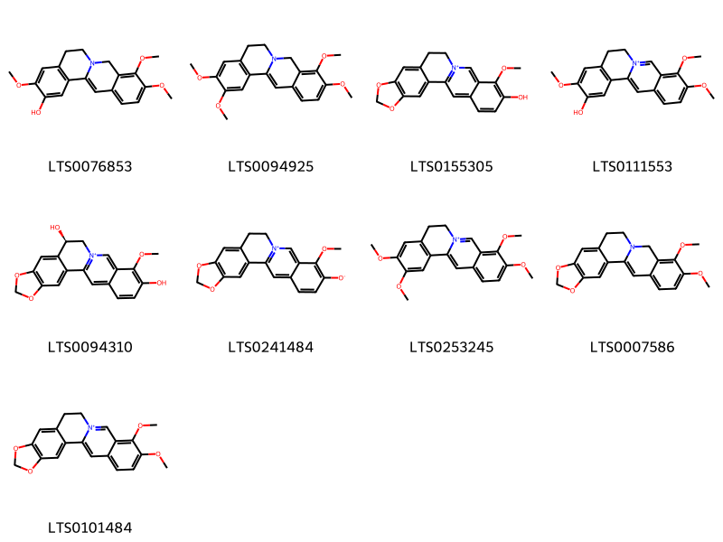{ width=100% }
    <figcaption>Hình ảnh cấu trúc hóa học của 9 hoạt chất thuộc nhóm Protoberberine alkaloids and derivatives gồm ['3,4,10-trimethoxy-7,8-dihydro-5h-6-azatetraphen-11-ol (LTS0076853)', '3,4,10,11-tetramethoxy-7,8-dihydro-5h-6-azatetraphene (LTS0094925)', '17-hydroxy-16-methoxy-5,7-dioxa-13λ⁵-azapentacyclo[11.8.0.0²,¹⁰.0⁴,⁸.0¹⁵,²⁰]henicosa-1(13),2,4(8),9,14,16,18,20-octaen-13-ylium (LTS0155305)', 'columbamine (LTS0111553)', '(11r)-11,17-dihydroxy-16-methoxy-5,7-dioxa-13λ⁵-azapentacyclo[11.8.0.0²,¹⁰.0⁴,⁸.0¹⁵,²⁰]henicosa-1(13),2,4(8),9,14,16,18,20-octaen-13-ylium (LTS0094310)', '16-methoxy-5,7-dioxa-13λ⁵-azapentacyclo[11.8.0.0²,¹⁰.0⁴,⁸.0¹⁵,²⁰]henicosa-1(13),2,4(8),9,14,16,18,20-octaen-13-ylium-17-olate (LTS0241484)', 'palmatine (LTS0253245)', '16,17-dimethoxy-5,7-dioxa-13-azapentacyclo[11.8.0.0²,¹⁰.0⁴,⁸.0¹⁵,²⁰]henicosa-1(21),2,4(8),9,15,17,19-heptaene (LTS0007586)', 'berberine (LTS0101484)'].</figcaption>
</figure>

---

### Dược dân tộc học

Danh sách các quốc gia có sử dụng *Thalictrum foliolosum* trong điều trị các bệnh. 

| Country      | Disease                              | Bệnh                                                                                                                                                                                                |
|:-------------|:-------------------------------------|:----------------------------------------------------------------------------------------------------------------------------------------------------------------------------------------------------|
| Elsewhere    | Purgative, Tonic, Aperient, Diuretic | MYMEMORY WARNING: YOU USED ALL AVAILABLE FREE TRANSLATIONS FOR TODAY. NEXT AVAILABLE IN  08 HOURS 34 MINUTES 02 SECONDS VISIT HTTPS://MYMEMORY.TRANSLATED.NET/DOC/USAGELIMITS.PHP TO TRANSLATE MORE |
| India(Hindu) | Purgative, Tonic, Diuretic, Aperient | MYMEMORY WARNING: YOU USED ALL AVAILABLE FREE TRANSLATIONS FOR TODAY. NEXT AVAILABLE IN  08 HOURS 34 MINUTES 00 SECONDS VISIT HTTPS://MYMEMORY.TRANSLATED.NET/DOC/USAGELIMITS.PHP TO TRANSLATE MORE |

---

---
## Thalictrum hernandezii
### Thông tin về thực vật

!!! info "Phân loại thực vật của *Thalictrum hernandezii* từ GIBF:"
    - **Kingdom:** Plantae
    - **Phylum:** Tracheophyta
    - **Order:** Ranunculales
    - **Family:** Ranunculaceae
    - **Genus:** Thalictrum
    - **Species:** *Thalictrum hernandezii*

 

| Label (VI)   | Label (EN)   | Scientific Name        | Descriptions (VI)   | Descriptions (EN)   | Also Known As (VI)   | Also Known As (EN)   |
|:-------------|:-------------|:-----------------------|:--------------------|:--------------------|:---------------------|:---------------------|
| N/A          | N/A          | Thalictrum hernandezii |                     | species of plant    | ['']                 | ['']                 |

#### Phân bố trên thế giới

**Từ CSDL GIBF** nan, Mexico

#### Phân bố tại Việt Nam

**Từ CSDL GIBF**: Không có ghi nhận ở Việt Nam

---
### Thành phần hóa học
        
- Theo cơ sở dữ liệu lotus: Từ loài *Thalictrum hernandezii* đã phân lập và xác định được 6 hoạt chất thuộc về các nhóm Tannins, Aporphines, Protoberberine alkaloids and derivatives, Isoquinolines and derivatives. 

|    | chemicalTaxonomyClassyfireClass          |   smiles_count |
|---:|:-----------------------------------------|---------------:|
|  0 | Aporphines                               |              2 |
|  1 | Isoquinolines and derivatives            |              2 |
|  2 | Protoberberine alkaloids and derivatives |              1 |
|  3 | Tannins                                  |              1 |

#### Nhóm Aporphines
<figure markdown="span">
    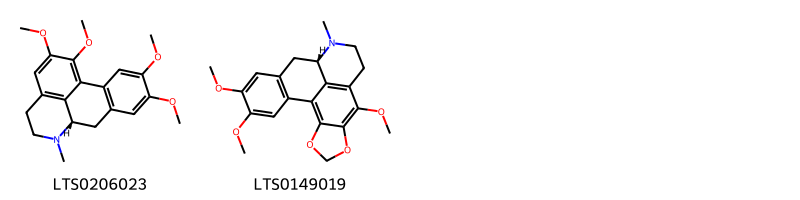{ width=100% }
    <figcaption>Hình ảnh cấu trúc hóa học của 2 hoạt chất thuộc nhóm Aporphines gồm ['(9s)-4,5,15,16-tetramethoxy-10-methyl-10-azatetracyclo[7.7.1.0²,⁷.0¹³,¹⁷]heptadeca-1(16),2(7),3,5,13(17),14-hexaene (LTS0206023)', '(12s)-7,16,17-trimethoxy-11-methyl-3,5-dioxa-11-azapentacyclo[10.7.1.0²,⁶.0⁸,²⁰.0¹⁴,¹⁹]icosa-1,6,8(20),14(19),15,17-hexaene (LTS0149019)'].</figcaption>
</figure>
#### Nhóm Isoquinolines and derivatives
<figure markdown="span">
    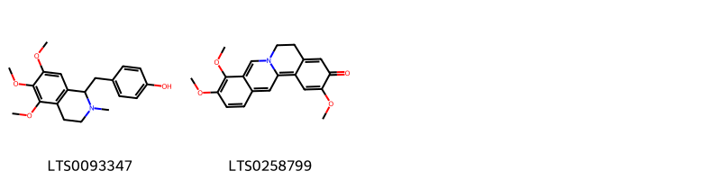{ width=100% }
    <figcaption>Hình ảnh cấu trúc hóa học của 2 hoạt chất thuộc nhóm Isoquinolines and derivatives gồm ['4-[(5,6,7-trimethoxy-2-methyl-3,4-dihydro-1h-isoquinolin-1-yl)methyl]phenol (LTS0093347)', '3,4,11-trimethoxy-7,8-dihydro-6-azatetraphen-10-one (LTS0258799)'].</figcaption>
</figure>
#### Nhóm Protoberberine alkaloids and derivatives
<figure markdown="span">
    { width=100% }
    <figcaption>Hình ảnh cấu trúc hóa học của 1 hoạt chất thuộc nhóm Protoberberine alkaloids and derivatives gồm ['berberine (LTS0101484)'].</figcaption>
</figure>
#### Nhóm Tannins
<figure markdown="span">
    { width=100% }
    <figcaption>Hình ảnh cấu trúc hóa học của 1 hoạt chất thuộc nhóm Tannins gồm ['(+)-hernandezine (LTS0040497)'].</figcaption>
</figure>

---

### Dược dân tộc học

Danh sách các quốc gia có sử dụng *Thalictrum hernandezii* trong điều trị các bệnh. 

| Country   | Disease             | Bệnh                                                                                                                                                                                                |
|:----------|:--------------------|:----------------------------------------------------------------------------------------------------------------------------------------------------------------------------------------------------|
| Argentina | Diuretic, Purgative | MYMEMORY WARNING: YOU USED ALL AVAILABLE FREE TRANSLATIONS FOR TODAY. NEXT AVAILABLE IN  08 HOURS 33 MINUTES 35 SECONDS VISIT HTTPS://MYMEMORY.TRANSLATED.NET/DOC/USAGELIMITS.PHP TO TRANSLATE MORE |

---

---
## Thalictrum minus
### Thông tin về thực vật

!!! info "Phân loại thực vật của *Thalictrum minus* từ GIBF:"
    - **Kingdom:** Plantae
    - **Phylum:** Tracheophyta
    - **Order:** Ranunculales
    - **Family:** Ranunculaceae
    - **Genus:** Thalictrum
    - **Species:** *Thalictrum minus*

 

| Label (VI)   | Label (EN)   | Scientific Name   | Descriptions (VI)   | Descriptions (EN)   | Also Known As (VI)   | Also Known As (EN)   |
|:-------------|:-------------|:------------------|:--------------------|:--------------------|:---------------------|:---------------------|
| N/A          | N/A          | Thalictrum minus  | loài thực vật       | species of plant    | ['']                 | ['']                 |

#### Phân bố trên thế giới

**Từ CSDL GIBF** Denmark, Spain, Germany, Austria, Kazakhstan, Slovakia, Netherlands, Lithuania, Hungary, Norway, Switzerland, United Kingdom of Great Britain and Northern Ireland, France, Armenia, Czechia, Romania, Russian Federation, Italy, Ukraine

#### Phân bố tại Việt Nam

**Từ CSDL GIBF**: Không có ghi nhận ở Việt Nam

---
### Thành phần hóa học
        
- Theo cơ sở dữ liệu lotus: Từ loài *Thalictrum minus* đã phân lập và xác định được 158 hoạt chất thuộc về các nhóm Aporphines, Flavonoids, Dihydroisoquinolines, Protopine alkaloids, Isoquinolines and derivatives, Benzene and substituted derivatives, Prenol lipids, Protoberberine alkaloids and derivatives, Pavine alkaloids, Dibenzocycloheptenes, Steroids and steroid derivatives, 6,6a-secoaporphines. 

|    | chemicalTaxonomyClassyfireClass          |   smiles_count |
|---:|:-----------------------------------------|---------------:|
|  0 |                                          |             29 |
|  1 | 6,6a-secoaporphines                      |              3 |
|  2 | Aporphines                               |             22 |
|  3 | Benzene and substituted derivatives      |              1 |
|  4 | Dibenzocycloheptenes                     |              4 |
|  5 | Dihydroisoquinolines                     |              1 |
|  6 | Flavonoids                               |              8 |
|  7 | Isoquinolines and derivatives            |             15 |
|  8 | Pavine alkaloids                         |              4 |
|  9 | Prenol lipids                            |             25 |
| 10 | Protoberberine alkaloids and derivatives |             19 |
| 11 | Protopine alkaloids                      |              1 |
| 12 | Steroids and steroid derivatives         |             10 |

#### Nhóm 
<figure markdown="span">
    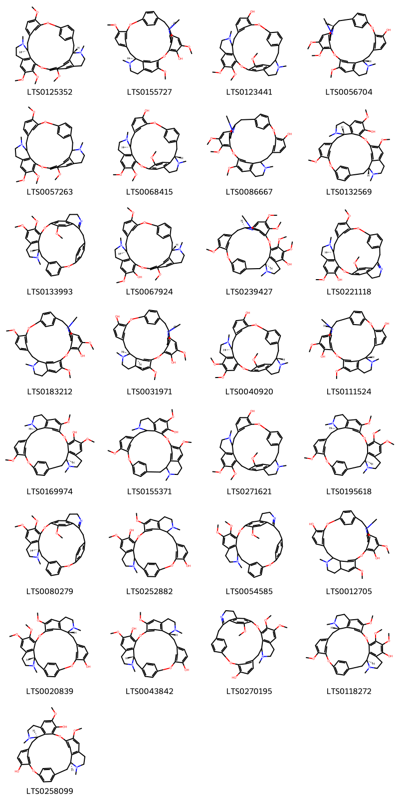{ width=100% }
    <figcaption>Hình ảnh cấu trúc hóa học của 29 hoạt chất thuộc nhóm  gồm ['(3s,21s)-10,14,15,26-tetramethoxy-4,20-dimethyl-12,28-dioxa-4,20-diazaheptacyclo[27.2.2.1⁷,¹¹.1¹³,¹⁷.1²³,²⁷.0³,⁸.0²¹,³⁵]hexatriaconta-1(31),7(36),8,10,13,15,17(35),23,25,27(34),29,32-dodecaene (LTS0125352)', '(12s,25s)-5,20,31-trimethoxy-11,26-dimethyl-2,18-dioxa-11,26-diazaheptacyclo[23.6.2.2¹⁴,¹⁷.1¹⁹,²³.0³,⁸.0⁷,¹².0²⁹,³³]hexatriaconta-1(32),3(8),4,6,14,16,19(34),20,22,29(33),30,35-dodecaen-4-ol (LTS0155727)', '10,14,15-trimethoxy-4,20-dimethyl-12,28-dioxa-4,20-diazaheptacyclo[27.2.2.1⁷,¹¹.1¹³,¹⁷.1²³,²⁷.0³,⁸.0²¹,³⁵]hexatriaconta-1(31),7,9,11(36),13,15,17(35),23,25,27(34),29,32-dodecaen-26-ol (LTS0123441)', '(12s,25s)-4,5,31-trimethoxy-11,26-dimethyl-2,18-dioxa-11,26-diazaheptacyclo[23.6.2.2¹⁴,¹⁷.1¹⁹,²³.0³,⁸.0⁷,¹².0²⁹,³³]hexatriaconta-1(32),3(8),4,6,14,16,19(34),20,22,29(33),30,35-dodecaen-20-ol (LTS0056704)', '10,14,15,26-tetramethoxy-4,20-dimethyl-12,28-dioxa-4,20-diazaheptacyclo[27.2.2.1⁷,¹¹.1¹³,¹⁷.1²³,²⁷.0³,⁸.0²¹,³⁵]hexatriaconta-1(31),7(36),8,10,13,15,17(35),23,25,27(34),29,32-dodecaene (LTS0057263)', '(3s,21s)-10,14,15-trimethoxy-4,20-dimethyl-12,28-dioxa-4,20-diazaheptacyclo[27.2.2.1⁷,¹¹.1¹³,¹⁷.1²³,²⁷.0³,⁸.0²¹,³⁵]hexatriaconta-1(31),7,9,11(36),13,15,17(35),23,25,27(34),29,32-dodecaen-26-ol (LTS0068415)', '4,5,31-trimethoxy-11,26-dimethyl-2,18-dioxa-11,26-diazaheptacyclo[23.6.2.2¹⁴,¹⁷.1¹⁹,²³.0³,⁸.0⁷,¹².0²⁹,³³]hexatriaconta-1(32),3(8),4,6,14,16,19(34),20,22,29(33),30,35-dodecaen-20-ol (LTS0086667)', '(1r,14s)-9,20,25-trimethoxy-15,30-dimethyl-7,23-dioxa-15,30-diazaheptacyclo[22.6.2.2³,⁶.1⁸,¹².1¹⁴,¹⁸.0²⁷,³¹.0²²,³³]hexatriaconta-3,5,8(34),9,11,18(33),19,21,24,26,31,35-dodecaen-21-ol (LTS0132569)', '(21s)-10,14,15-trimethoxy-20-methyl-12,28-dioxa-4,20-diazaheptacyclo[27.2.2.1⁷,¹¹.1¹³,¹⁷.1²³,²⁷.0³,⁸.0²¹,³⁵]hexatriaconta-1(31),3,7,9,11(36),13,15,17(35),23,25,27(34),29,32-tridecaene (LTS0133993)', '(3s,21s)-10,15,26-trimethoxy-4,20-dimethyl-12,28-dioxa-4,20-diazaheptacyclo[27.2.2.1⁷,¹¹.1¹³,¹⁷.1²³,²⁷.0³,⁸.0²¹,³⁵]hexatriaconta-1(31),7(36),8,10,13,15,17(35),23,25,27(34),29,32-dodecaen-14-ol (LTS0067924)', '(9s,28s)-4,16,17,21,22-pentamethoxy-10,27-dimethyl-2,19-dioxa-10,27-diazaheptacyclo[28.2.2.1³,⁷.1²⁰,²⁴.0⁹,¹⁴.0¹³,¹⁸.0²⁸,³⁵]hexatriaconta-1(32),3(36),4,6,13(18),14,16,20,22,24(35),30,33-dodecaen-23-ol (LTS0239427)', '(21s)-10,15,26-trimethoxy-20-methyl-12,28-dioxa-4,20-diazaheptacyclo[27.2.2.1⁷,¹¹.1¹³,¹⁷.1²³,²⁷.0³,⁸.0²¹,³⁵]hexatriaconta-1(31),3,7(36),8,10,13,15,17(35),23,25,27(34),29,32-tridecaen-14-ol (LTS0221118)', '5,20,31-trimethoxy-11,26-dimethyl-2,18-dioxa-11,26-diazaheptacyclo[23.6.2.2¹⁴,¹⁷.1¹⁹,²³.0³,⁸.0⁷,¹².0²⁹,³³]hexatriaconta-1(32),3(8),4,6,14,16,19(34),20,22,29(33),30,35-dodecaen-4-ol (LTS0183212)', '(12s,25s,29r,33r)-5,31-dimethoxy-11,26-dimethyl-2,18-dioxa-11,26-diazaheptacyclo[23.6.2.2¹⁴,¹⁷.1¹⁹,²³.0³,⁸.0⁷,¹².0²⁹,³³]hexatriaconta-1(32),3(8),4,6,14,16,19(34),20,22,30,35-undecaene-4,20-diol (LTS0031971)', '(3s,21s)-10,15,16-trimethoxy-4,20-dimethyl-12,28-dioxa-4,20-diazaheptacyclo[27.2.2.1⁷,¹¹.1¹³,¹⁷.1²³,²⁷.0³,⁸.0²¹,³⁵]hexatriaconta-1(31),7,9,11(36),13,15,17(35),23,25,27(34),29,32-dodecaen-26-ol (LTS0040920)', '(12s,25s)-5,31-dimethoxy-11,26-dimethyl-2,18-dioxa-11,26-diazaheptacyclo[23.6.2.2¹⁴,¹⁷.1¹⁹,²³.0³,⁸.0⁷,¹².0²⁹,³³]hexatriaconta-1(32),3,5,7,14,16,19(34),20,22,29(33),30,35-dodecaene-4,20-diol (LTS0111524)', '(1r,14s)-6,20,25-trimethoxy-15,30-dimethyl-8,23-dioxa-15,30-diazaheptacyclo[22.6.2.2⁹,¹².1³,⁷.1¹⁴,¹⁸.0²⁷,³¹.0²²,³³]hexatriaconta-3,5,7(36),9,11,18(33),19,21,24(32),25,27(31),34-dodecaen-21-ol (LTS0169974)', '9,20,25-trimethoxy-15,30-dimethyl-7,23-dioxa-15,30-diazaheptacyclo[22.6.2.2³,⁶.1⁸,¹².1¹⁴,¹⁸.0²⁷,³¹.0²²,³³]hexatriaconta-3,5,8(34),9,11,18(33),19,21,24,26,31,35-dodecaen-21-ol (LTS0155371)', '10,14,15-trimethoxy-4,20-dimethyl-28-oxa-4,20-diazaheptacyclo[27.2.2.1⁷,¹¹.1¹³,¹⁷.1²³,²⁷.0³,⁸.0²¹,³⁵]hexatriaconta-1(31),7,9,11(36),13,15,17(35),23,25,27(34),29,32-dodecaen-26-ol (LTS0271621)', '(1r,14s)-6,20,21,25-tetramethoxy-15,30-dimethyl-8,23-dioxa-15,30-diazaheptacyclo[22.6.2.2⁹,¹².1³,⁷.1¹⁴,¹⁸.0²⁷,³¹.0²²,³³]hexatriaconta-3,5,7(36),9,11,18(33),19,21,24(32),25,27(31),34-dodecaene (LTS0195618)', '(21r)-10,14,15-trimethoxy-20-methyl-12,28-dioxa-4,20-diazaheptacyclo[27.2.2.1⁷,¹¹.1¹³,¹⁷.1²³,²⁷.0³,⁸.0²¹,³⁵]hexatriaconta-1(31),3,7,9,11(36),13,15,17(35),23,25,27(34),29,32-tridecaene (LTS0080279)', '20,25-dimethoxy-15,30-dimethyl-8,23-dioxa-15,30-diazaheptacyclo[22.6.2.2⁹,¹².1³,⁷.1¹⁴,¹⁸.0²⁷,³¹.0²²,³³]hexatriaconta-3,5,7(36),9,11,18(33),19,21,24(32),25,27(31),34-dodecaene-6,21-diol (LTS0252882)', '10,14,15-trimethoxy-20-methyl-12,28-dioxa-4,20-diazaheptacyclo[27.2.2.1⁷,¹¹.1¹³,¹⁷.1²³,²⁷.0³,⁸.0²¹,³⁵]hexatriaconta-1(31),3,7,9,11(36),13,15,17(35),23,25,27(34),29,32-tridecaene (LTS0054585)', '5,31-dimethoxy-11,26-dimethyl-2,18-dioxa-11,26-diazaheptacyclo[23.6.2.2¹⁴,¹⁷.1¹⁹,²³.0³,⁸.0⁷,¹².0²⁹,³³]hexatriaconta-1(32),3(8),4,6,14,16,19(34),20,22,30,35-undecaene-4,20-diol (LTS0012705)', '(1r,14s)-20,21,25-trimethoxy-15,30-dimethyl-8,23-dioxa-15,30-diazaheptacyclo[22.6.2.2⁹,¹².1³,⁷.1¹⁴,¹⁸.0²⁷,³¹.0²²,³³]hexatriaconta-3,5,7(36),9,11,18(33),19,21,24(32),25,27(31),34-dodecaen-6-ol (LTS0020839)', '(1r,14s)-20,25-dimethoxy-15,30-dimethyl-8,23-dioxa-15,30-diazaheptacyclo[22.6.2.2⁹,¹².1³,⁷.1¹⁴,¹⁸.0²⁷,³¹.0²²,³³]hexatriaconta-3,5,7(36),9,11,18(33),19,21,24(32),25,27(31),34-dodecaene-6,21-diol (LTS0043842)', '10,14,15-trimethoxy-20-methyl-12,28-dioxa-4,20-diazaheptacyclo[27.2.2.1⁷,¹¹.1¹³,¹⁷.1²³,²⁷.0³,⁸.0²¹,³⁵]hexatriaconta-1(31),3,7,9,11(36),13,15,17(35),23,25,27(34),29,32-tridecaen-26-ol (LTS0270195)', '(1s,14s)-6,20,21,25-tetramethoxy-15,30-dimethyl-8,23-dioxa-15,30-diazaheptacyclo[22.6.2.2⁹,¹².1³,⁷.1¹⁴,¹⁸.0²⁷,³¹.0²²,³³]hexatriaconta-3,5,7(36),9,11,18(33),19,21,24(32),25,27(31),34-dodecaen-19-ol (LTS0118272)', '(1s,14r)-20,25-dimethoxy-15,30-dimethyl-7,23-dioxa-15,30-diazaheptacyclo[22.6.2.2³,⁶.1⁸,¹².1¹⁴,¹⁸.0²⁷,³¹.0²²,³³]hexatriaconta-3,5,8(34),9,11,18(33),19,21,24(32),25,27(31),35-dodecaene-9,21-diol (LTS0258099)'].</figcaption>
</figure>
#### Nhóm 6_6a-secoaporphines
<figure markdown="span">
    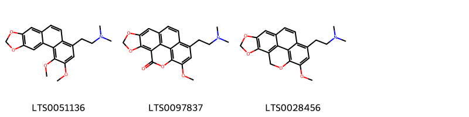{ width=100% }
    <figcaption>Hình ảnh cấu trúc hóa học của Không tìm thấy chú thích hoạt chất thuộc nhóm 6_6a-secoaporphines gồm Không tìm thấy chú thích.</figcaption>
</figure>
#### Nhóm Aporphines
<figure markdown="span">
    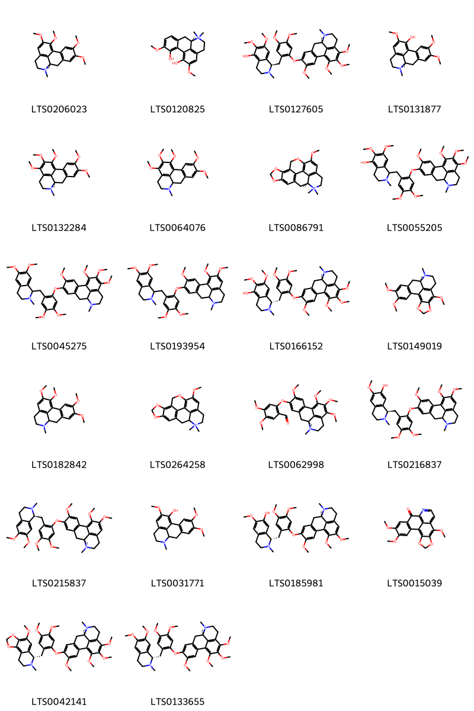{ width=100% }
    <figcaption>Hình ảnh cấu trúc hóa học của 22 hoạt chất thuộc nhóm Aporphines gồm ['(9s)-4,5,15,16-tetramethoxy-10-methyl-10-azatetracyclo[7.7.1.0²,⁷.0¹³,¹⁷]heptadeca-1(16),2(7),3,5,13(17),14-hexaene (LTS0206023)', 'magnoflorine (LTS0120825)', '(1r)-1-[(4,5-dimethoxy-2-{[(9s)-4,14,15,16-tetramethoxy-10-methyl-10-azatetracyclo[7.7.1.0²,⁷.0¹³,¹⁷]heptadeca-1(16),2(7),3,5,13(17),14-hexaen-5-yl]oxy}phenyl)methyl]-6,7-dimethoxy-2-methyl-3,4-dihydro-1h-isoquinolin-5-ol (LTS0127605)', '(9s)-4,5,15-trimethoxy-10-methyl-10-azatetracyclo[7.7.1.0²,⁷.0¹³,¹⁷]heptadeca-1(16),2(7),3,5,13(17),14-hexaen-16-ol (LTS0131877)', '(9r)-4,5,14,15,16-pentamethoxy-10-methyl-10-azatetracyclo[7.7.1.0²,⁷.0¹³,¹⁷]heptadeca-1(16),2(7),3,5,13(17),14-hexaene (LTS0132284)', '4,5,14,15,16-pentamethoxy-10-methyl-10-azatetracyclo[7.7.1.0²,⁷.0¹³,¹⁷]heptadeca-1(16),2(7),3,5,13(17),14-hexaene (LTS0064076)', '(18s)-12-methoxy-17,17-dimethyl-4,6,10-trioxa-17-azahexacyclo[16.3.1.0³,⁷.0⁸,²¹.0¹¹,²⁰.0¹⁴,¹⁹]docosa-1(21),2,7,11(20),12,14(19)-hexaen-17-ium (LTS0086791)', '1-{[4,5-dimethoxy-2-({4,14,15,16-tetramethoxy-10-methyl-10-azatetracyclo[7.7.1.0²,⁷.0¹³,¹⁷]heptadeca-1(16),2(7),3,5,13(17),14-hexaen-5-yl}oxy)phenyl]methyl}-6,7-dimethoxy-2-methyl-3,4-dihydro-1h-isoquinolin-5-ol (LTS0055205)', '5-{2-[(6,7-dimethoxy-2-methyl-3,4-dihydro-1h-isoquinolin-1-yl)methyl]-4,5-dimethoxyphenoxy}-4,14,15,16-tetramethoxy-10-methyl-10-azatetracyclo[7.7.1.0²,⁷.0¹³,¹⁷]heptadeca-1(16),2(7),3,5,13(17),14-hexaene (LTS0045275)', '5-{2-[(6,7-dimethoxy-2-methyl-3,4-dihydro-1h-isoquinolin-1-yl)methyl]-4,5-dimethoxyphenoxy}-4,15,16-trimethoxy-10-methyl-10-azatetracyclo[7.7.1.0²,⁷.0¹³,¹⁷]heptadeca-1(16),2(7),3,5,13(17),14-hexaene (LTS0193954)', '(1s)-1-[(4,5-dimethoxy-2-{[(9s)-4,14,15,16-tetramethoxy-10-methyl-10-azatetracyclo[7.7.1.0²,⁷.0¹³,¹⁷]heptadeca-1(16),2(7),3,5,13(17),14-hexaen-5-yl]oxy}phenyl)methyl]-6,7-dimethoxy-2-methyl-3,4-dihydro-1h-isoquinolin-5-ol (LTS0166152)', '(12s)-7,16,17-trimethoxy-11-methyl-3,5-dioxa-11-azapentacyclo[10.7.1.0²,⁶.0⁸,²⁰.0¹⁴,¹⁹]icosa-1,6,8(20),14(19),15,17-hexaene (LTS0149019)', '4,5,15,16-tetramethoxy-10-methyl-10-azatetracyclo[7.7.1.0²,⁷.0¹³,¹⁷]heptadeca-1(16),2(7),3,5,13(17),14-hexaene (LTS0182842)', '12-methoxy-17,17-dimethyl-4,6,10-trioxa-17-azahexacyclo[16.3.1.0³,⁷.0⁸,²¹.0¹¹,²⁰.0¹⁴,¹⁹]docosa-1(21),2,7,11(20),12,14(19)-hexaen-17-ium (LTS0264258)', '4,5-dimethoxy-2-{[(9s)-4,14,15,16-tetramethoxy-10-methyl-10-azatetracyclo[7.7.1.0²,⁷.0¹³,¹⁷]heptadeca-1(16),2(7),3,5,13(17),14-hexaen-5-yl]oxy}benzaldehyde (LTS0062998)', '(1r)-1-{[4,5-dimethoxy-2-({4,15,16-trimethoxy-10-methyl-10-azatetracyclo[7.7.1.0²,⁷.0¹³,¹⁷]heptadeca-1(16),2(7),3,5,13(17),14-hexaen-5-yl}oxy)phenyl]methyl}-6-methoxy-2-methyl-3,4-dihydro-1h-isoquinolin-7-ol (LTS0216837)', '(9s)-5-(2-{[(1s)-6,7-dimethoxy-2-methyl-3,4-dihydro-1h-isoquinolin-1-yl]methyl}-4,5-dimethoxyphenoxy)-4,15,16-trimethoxy-10-methyl-10-azatetracyclo[7.7.1.0²,⁷.0¹³,¹⁷]heptadeca-1(16),2(7),3,5,13(17),14-hexaene (LTS0215837)', '4,5,15-trimethoxy-10-methyl-10-azatetracyclo[7.7.1.0²,⁷.0¹³,¹⁷]heptadeca-1(16),2(7),3,5,13(17),14-hexaen-16-ol (LTS0031771)', '(1s)-1-[(4,5-dimethoxy-2-{[(9s)-4,15,16-trimethoxy-10-methyl-10-azatetracyclo[7.7.1.0²,⁷.0¹³,¹⁷]heptadeca-1(16),2(7),3,5,13(17),14-hexaen-5-yl]oxy}phenyl)methyl]-6-methoxy-2-methyl-3,4-dihydro-1h-isoquinolin-7-ol (LTS0185981)', '7,16,17-trimethoxy-3,5-dioxa-11-azapentacyclo[10.7.1.0²,⁶.0⁸,²⁰.0¹⁴,¹⁹]icosa-1,6,8,10,12(20),14(19),15,17-octaen-13-one (LTS0015039)', '(9s)-5-(4,5-dimethoxy-2-{[(6s)-4-methoxy-7-methyl-2h,6h,8h,9h-[1,3]dioxolo[4,5-f]isoquinolin-6-yl]methyl}phenoxy)-4,14,15,16-tetramethoxy-10-methyl-10-azatetracyclo[7.7.1.0²,⁷.0¹³,¹⁷]heptadeca-1(16),2(7),3,5,13(17),14-hexaene (LTS0042141)', '(9s)-5-(2-{[(1s)-6,7-dimethoxy-2-methyl-3,4-dihydro-1h-isoquinolin-1-yl]methyl}-4,5-dimethoxyphenoxy)-4,14,15,16-tetramethoxy-10-methyl-10-azatetracyclo[7.7.1.0²,⁷.0¹³,¹⁷]heptadeca-1(16),2(7),3,5,13(17),14-hexaene (LTS0133655)'].</figcaption>
</figure>
#### Nhóm Benzene and substituted derivatives
<figure markdown="span">
    { width=100% }
    <figcaption>Hình ảnh cấu trúc hóa học của 1 hoạt chất thuộc nhóm Benzene and substituted derivatives gồm ['anisaldehyde (LTS0054560)'].</figcaption>
</figure>
#### Nhóm Dibenzocycloheptenes
<figure markdown="span">
    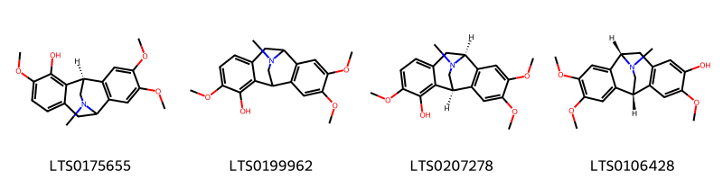{ width=100% }
    <figcaption>Hình ảnh cấu trúc hóa học của 4 hoạt chất thuộc nhóm Dibenzocycloheptenes gồm ['(1r)-4,12,13-trimethoxy-17-methyl-17-azatetracyclo[7.6.2.0²,⁷.0¹⁰,¹⁵]heptadeca-2,4,6,10(15),11,13-hexaen-3-ol (LTS0175655)', '4,12,13-trimethoxy-17-methyl-17-azatetracyclo[7.6.2.0²,⁷.0¹⁰,¹⁵]heptadeca-2,4,6,10(15),11,13-hexaen-3-ol (LTS0199962)', '(1s,9s)-4,12,13-trimethoxy-17-methyl-17-azatetracyclo[7.6.2.0²,⁷.0¹⁰,¹⁵]heptadeca-2,4,6,10(15),11,13-hexaen-3-ol (LTS0207278)', '(1r,9s)-4,12,13-trimethoxy-17-methyl-17-azatetracyclo[7.6.2.0²,⁷.0¹⁰,¹⁵]heptadeca-2(7),3,5,10,12,14-hexaen-5-ol (LTS0106428)'].</figcaption>
</figure>
#### Nhóm Dihydroisoquinolines
<figure markdown="span">
    { width=100% }
    <figcaption>Hình ảnh cấu trúc hóa học của 1 hoạt chất thuộc nhóm Dihydroisoquinolines gồm ['11,17-dihydroxy-16-methoxy-5,7-dioxa-13λ⁵-azapentacyclo[11.8.0.0²,¹⁰.0⁴,⁸.0¹⁵,²⁰]henicosa-1(13),2,4(8),9,14,16,18,20-octaen-13-ylium (LTS0230225)'].</figcaption>
</figure>
#### Nhóm Flavonoids
<figure markdown="span">
    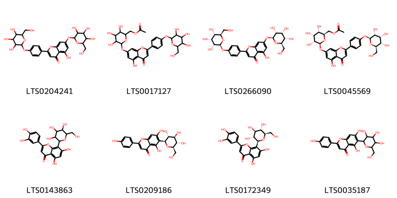{ width=100% }
    <figcaption>Hình ảnh cấu trúc hóa học của 8 hoạt chất thuộc nhóm Flavonoids gồm ['5-hydroxy-7-{[3,4,5-trihydroxy-6-(hydroxymethyl)oxan-2-yl]oxy}-2-(4-{[3,4,5-trihydroxy-6-(hydroxymethyl)oxan-2-yl]oxy}phenyl)chromen-4-one (LTS0204241)', '(3,4,5-trihydroxy-6-{[5-hydroxy-4-oxo-2-(4-{[3,4,5-trihydroxy-6-(hydroxymethyl)oxan-2-yl]oxy}phenyl)chromen-7-yl]oxy}oxan-2-yl)methyl acetate (LTS0017127)', '5-hydroxy-7-{[(2s,3r,4r,5s,6r)-3,4,5-trihydroxy-6-(hydroxymethyl)oxan-2-yl]oxy}-2-(4-{[(2s,3r,4r,5s,6r)-3,4,5-trihydroxy-6-(hydroxymethyl)oxan-2-yl]oxy}phenyl)chromen-4-one (LTS0266090)', '[(2r,3s,4r,5r,6s)-3,4,5-trihydroxy-6-{[5-hydroxy-4-oxo-2-(4-{[(2s,3r,4r,5s,6r)-3,4,5-trihydroxy-6-(hydroxymethyl)oxan-2-yl]oxy}phenyl)chromen-7-yl]oxy}oxan-2-yl]methyl acetate (LTS0045569)', 'orientin (LTS0143863)', 'isovitexin (LTS0209186)', 'orientin (LTS0172349)', 'isovitexin (LTS0035187)'].</figcaption>
</figure>
#### Nhóm Isoquinolines and derivatives
<figure markdown="span">
    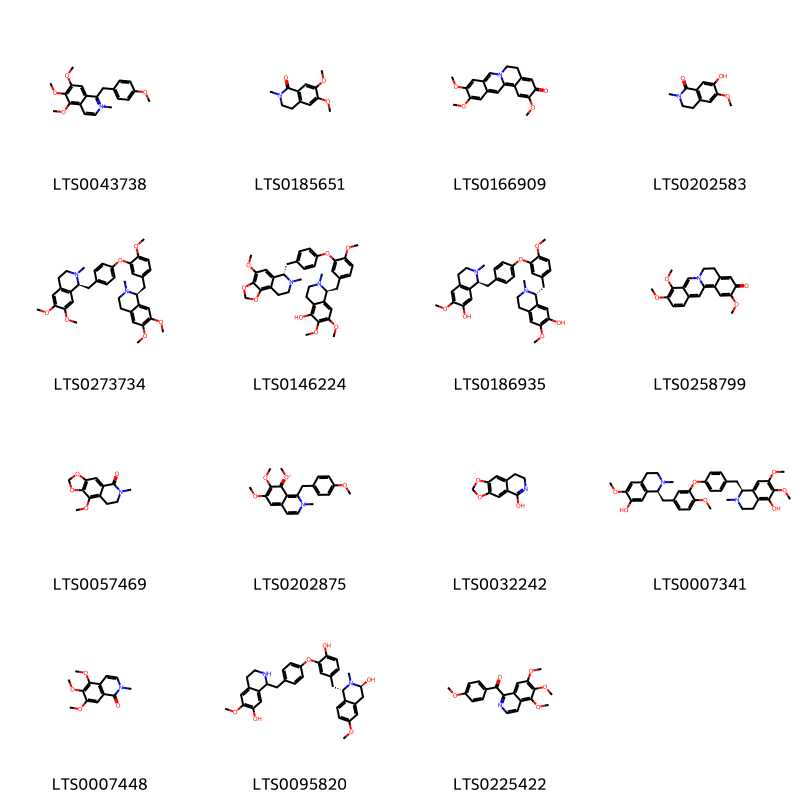{ width=100% }
    <figcaption>Hình ảnh cấu trúc hóa học của 15 hoạt chất thuộc nhóm Isoquinolines and derivatives gồm ['5,6,7-trimethoxy-1-[(4-methoxyphenyl)methyl]-2-methylisoquinolin-2-ium (LTS0043738)', 'n-methylcorydaldine (LTS0185651)', '2,3,11-trimethoxy-7,8-dihydro-6-azatetraphen-10-one (LTS0166909)', 'thalifolin (LTS0202583)', '(1s)-1-{[4-(5-{[(1s)-6,7-dimethoxy-2-methyl-3,4-dihydro-1h-isoquinolin-1-yl]methyl}-2-methoxyphenoxy)phenyl]methyl}-6,7-dimethoxy-2-methyl-3,4-dihydro-1h-isoquinoline (LTS0273734)', '(1s)-6,7-dimethoxy-1-{[4-methoxy-3-(4-{[(6s)-4-methoxy-7-methyl-2h,6h,8h,9h-[1,3]dioxolo[4,5-f]isoquinolin-6-yl]methyl}phenoxy)phenyl]methyl}-2-methyl-3,4-dihydro-1h-isoquinolin-5-ol (LTS0146224)', '(1s)-1-{[4-(5-{[(1r)-7-hydroxy-6-methoxy-2-methyl-3,4-dihydro-1h-isoquinolin-1-yl]methyl}-2-methoxyphenoxy)phenyl]methyl}-6-methoxy-2-methyl-3,4-dihydro-1h-isoquinolin-7-ol (LTS0186935)', '3,4,11-trimethoxy-7,8-dihydro-6-azatetraphen-10-one (LTS0258799)', '9-methoxy-6-methyl-2h,7h,8h-[1,3]dioxolo[4,5-g]isoquinolin-5-one (LTS0057469)', '{6,7-dimethoxy-1-[(4-methoxyphenyl)methyl]-2-methylisoquinolin-8-ylidene}(methyl)oxidanium (LTS0202875)', '2h,7h,8h-[1,3]dioxolo[4,5-g]isoquinolin-5-ol (LTS0032242)', '(1s)-1-{[4-(5-{[(1s)-7-hydroxy-6-methoxy-2-methyl-3,4-dihydro-1h-isoquinolin-1-yl]methyl}-2-methoxyphenoxy)phenyl]methyl}-6,7-dimethoxy-2-methyl-3,4-dihydro-1h-isoquinolin-5-ol (LTS0007341)', '5,6,7-trimethoxy-2-methylisoquinolin-1-one (LTS0007448)', '(1s,3s)-1-[(4-hydroxy-3-{4-[(7-hydroxy-6-methoxy-1,2,3,4-tetrahydroisoquinolin-1-yl)methyl]phenoxy}phenyl)methyl]-6-methoxy-2-methyl-3,4-dihydro-1h-isoquinolin-3-ol (LTS0095820)', '5,6,7-trimethoxy-1-(4-methoxybenzoyl)isoquinoline (LTS0225422)'].</figcaption>
</figure>
#### Nhóm Pavine alkaloids
<figure markdown="span">
    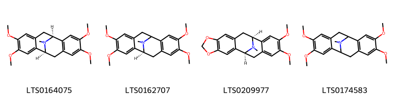{ width=100% }
    <figcaption>Hình ảnh cấu trúc hóa học của 4 hoạt chất thuộc nhóm Pavine alkaloids gồm ['(-)-argemonine (LTS0164075)', '(1s)-4,5,12,13-tetramethoxy-17-methyl-17-azatetracyclo[7.7.1.0²,⁷.0¹⁰,¹⁵]heptadeca-2,4,6,10(15),11,13-hexaene (LTS0162707)', 'eschscholtzidine (LTS0209977)', '4,5,12,13-tetramethoxy-17-methyl-17-azatetracyclo[7.7.1.0²,⁷.0¹⁰,¹⁵]heptadeca-2,4,6,10(15),11,13-hexaene (LTS0174583)'].</figcaption>
</figure>
#### Nhóm Prenol lipids
<figure markdown="span">
    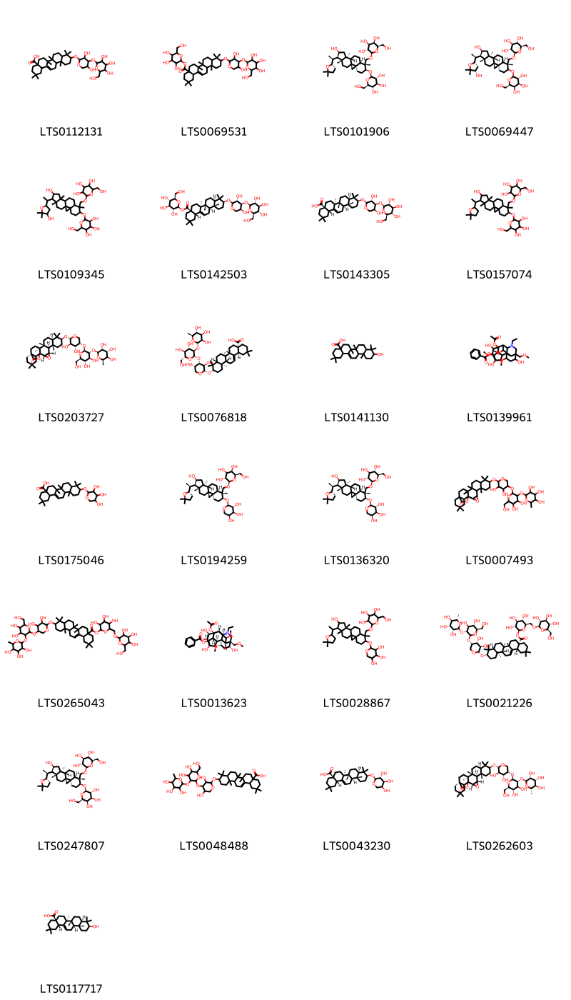{ width=100% }
    <figcaption>Hình ảnh cấu trúc hóa học của 25 hoạt chất thuộc nhóm Prenol lipids gồm ['10-[(3,5-dihydroxy-4-{[3,4,5-trihydroxy-6-(hydroxymethyl)oxan-2-yl]oxy}oxan-2-yl)oxy]-2,2,6a,6b,9,9,12a-heptamethyl-1,3,4,5,6,7,8,8a,10,11,12,12b,13,14b-tetradecahydropicene-4a-carboxylic acid (LTS0112131)', '3,4,5-trihydroxy-6-(hydroxymethyl)oxan-2-yl 10-[(3,5-dihydroxy-4-{[3,4,5-trihydroxy-6-(hydroxymethyl)oxan-2-yl]oxy}oxan-2-yl)oxy]-2,2,6a,6b,9,9,12a-heptamethyl-1,3,4,5,6,7,8,8a,10,11,12,12b,13,14b-tetradecahydropicene-4a-carboxylate (LTS0069531)', '(2r,3r,4s,5r,6r)-2-{[(1s,3r,6s,7r,8r,11s,12s,14s,15r,16r)-15-[(1s)-1-[(2s)-5,5-dimethyloxolan-2-yl]ethyl]-14-hydroxy-7,12,16-trimethyl-6-{[(2r,3r,4s,5s,6r)-3,4,5-trihydroxy-6-(hydroxymethyl)oxan-2-yl]oxy}pentacyclo[9.7.0.0¹,³.0³,⁸.0¹²,¹⁶]octadecan-7-yl]methoxy}-6-(hydroxymethyl)oxane-3,4,5-triol (LTS0101906)', '(2r,3r,4s,5s,6r)-2-{[(1s,3r,6s,7r,8r,11s,12s,14s,15r,16r)-14-hydroxy-15-[(1s)-1-[(2s,4s)-4-hydroxy-5,5-dimethyloxolan-2-yl]ethyl]-7,12,16-trimethyl-6-{[(2r,3r,4s,5r,6r)-3,4,5-trihydroxy-6-(hydroxymethyl)oxan-2-yl]oxy}pentacyclo[9.7.0.0¹,³.0³,⁸.0¹²,¹⁶]octadecan-7-yl]methoxy}-6-(hydroxymethyl)oxane-3,4,5-triol (LTS0069447)', '2-({14-hydroxy-15-[1-(4-hydroxy-5,5-dimethyloxolan-2-yl)ethyl]-7,12,16-trimethyl-6-{[3,4,5-trihydroxy-6-(hydroxymethyl)oxan-2-yl]oxy}pentacyclo[9.7.0.0¹,³.0³,⁸.0¹²,¹⁶]octadecan-7-yl}methoxy)-6-(hydroxymethyl)oxane-3,4,5-triol (LTS0109345)', '(2s,3r,4s,5s,6r)-3,4,5-trihydroxy-6-(hydroxymethyl)oxan-2-yl (4as,6as,6br,8ar,10s,12ar,12br,14bs)-10-{[(2s,3r,4s,5s)-3,5-dihydroxy-4-{[(2s,3r,4s,5s,6r)-3,4,5-trihydroxy-6-(hydroxymethyl)oxan-2-yl]oxy}oxan-2-yl]oxy}-2,2,6a,6b,9,9,12a-heptamethyl-1,3,4,5,6,7,8,8a,10,11,12,12b,13,14b-tetradecahydropicene-4a-carboxylate (LTS0142503)', '(4as,6as,6br,8ar,10s,12ar,12br,14bs)-10-{[(2s,3r,4s,5s)-3,5-dihydroxy-4-{[(2s,3r,4s,5s,6r)-3,4,5-trihydroxy-6-(hydroxymethyl)oxan-2-yl]oxy}oxan-2-yl]oxy}-2,2,6a,6b,9,9,12a-heptamethyl-1,3,4,5,6,7,8,8a,10,11,12,12b,13,14b-tetradecahydropicene-4a-carboxylic acid (LTS0143305)', '2-({15-[1-(5,5-dimethyloxolan-2-yl)ethyl]-14-hydroxy-7,12,16-trimethyl-6-{[3,4,5-trihydroxy-6-(hydroxymethyl)oxan-2-yl]oxy}pentacyclo[9.7.0.0¹,³.0³,⁸.0¹²,¹⁶]octadecan-7-yl}methoxy)-6-(hydroxymethyl)oxane-3,4,5-triol (LTS0157074)', '(1s,2s,4s,5r,6s,9s,11r,14r,15s,18s,23r)-9-{[(2s,3r,4r,5s)-5-{[(2s,3r,4s,5s,6r)-4,5-dihydroxy-6-(hydroxymethyl)-3-{[(2s,3r,4r,5r,6r)-3,4,5-trihydroxy-6-methyloxan-2-yl]oxy}oxan-2-yl]oxy}-3,4-dihydroxyoxan-2-yl]oxy}-6,10,10,14,15,21,21-heptamethyl-3,24-dioxaheptacyclo[16.5.2.0¹,¹⁵.0²,⁴.0⁵,¹⁴.0⁶,¹¹.0¹⁸,²³]pentacosan-25-one (LTS0203727)', '(4as,6as,6br,8ar,10s,12ar,12br,14bs)-10-{[(2s,3r,4s,5s)-4-{[(2s,3r,4s,5s,6r)-4,5-dihydroxy-6-(hydroxymethyl)-3-{[(2s,3r,4r,5r,6s)-3,4,5-trihydroxy-6-methyloxan-2-yl]oxy}oxan-2-yl]oxy}-3,5-dihydroxyoxan-2-yl]oxy}-2,2,6a,6b,9,9,12a-heptamethyl-1,3,4,5,6,7,8,8a,10,11,12,12b,13,14b-tetradecahydropicene-4a-carboxylic acid (LTS0076818)', 'oleanolic acid (LTS0141130)', '8-(acetyloxy)-11-ethyl-5,7,14-trihydroxy-6,16,18-trimethoxy-13-(methoxymethyl)-11-azahexacyclo[7.7.2.1²,⁵.0¹,¹⁰.0³,⁸.0¹³,¹⁷]nonadecan-4-yl benzoate (LTS0139961)', '2,2,6a,6b,9,9,12a-heptamethyl-10-[(3,4,5-trihydroxyoxan-2-yl)oxy]-1,3,4,5,6,7,8,8a,10,11,12,12b,13,14b-tetradecahydropicene-4a-carboxylic acid (LTS0175046)', '(2r,3r,4s,5r,6r)-2-{[(1s,3r,6s,7r,8r,11s,12s,14s,15r,16r)-15-[(1s)-1-[(2s)-5,5-dimethyloxolan-2-yl]ethyl]-14-hydroxy-7,12,16-trimethyl-6-{[(2s,3r,4s,5s)-3,4,5-trihydroxyoxan-2-yl]oxy}pentacyclo[9.7.0.0¹,³.0³,⁸.0¹²,¹⁶]octadecan-7-yl]methoxy}-6-(hydroxymethyl)oxane-3,4,5-triol (LTS0194259)', '(2r,3r,4s,5s,6r)-2-{[(1s,3r,6s,7r,8r,11s,12s,14s,15r,16r)-15-[(1s)-1-[(2s)-5,5-dimethyloxolan-2-yl]ethyl]-14-hydroxy-7,12,16-trimethyl-6-{[(2s,3r,4s,5s)-3,4,5-trihydroxyoxan-2-yl]oxy}pentacyclo[9.7.0.0¹,³.0³,⁸.0¹²,¹⁶]octadecan-7-yl]methoxy}-6-(hydroxymethyl)oxane-3,4,5-triol (LTS0136320)', '9-[(5-{[4,5-dihydroxy-6-(hydroxymethyl)-3-[(3,4,5-trihydroxy-6-methyloxan-2-yl)oxy]oxan-2-yl]oxy}-3,4-dihydroxyoxan-2-yl)oxy]-6,10,10,14,15,21,21-heptamethyl-3,24-dioxaheptacyclo[16.5.2.0¹,¹⁵.0²,⁴.0⁵,¹⁴.0⁶,¹¹.0¹⁸,²³]pentacosan-25-one (LTS0007493)', '3,4,5-trihydroxy-6-({[3,4,5-trihydroxy-6-(hydroxymethyl)oxan-2-yl]oxy}methyl)oxan-2-yl 10-[(5-{[4,5-dihydroxy-6-(hydroxymethyl)-3-[(3,4,5-trihydroxy-6-methyloxan-2-yl)oxy]oxan-2-yl]oxy}-3,4-dihydroxyoxan-2-yl)oxy]-2,2,6a,6b,9,9,12a-heptamethyl-1,3,4,5,6,7,8,8a,10,11,12,12b,13,14b-tetradecahydropicene-4a-carboxylate (LTS0265043)', '(1s,2s,3r,4s,5r,6s,7r,8r,9r,10r,13r,14r,16s,17s,18s)-8-(acetyloxy)-11-ethyl-5,7,14-trihydroxy-6,16,18-trimethoxy-13-(methoxymethyl)-11-azahexacyclo[7.7.2.1²,⁵.0¹,¹⁰.0³,⁸.0¹³,¹⁷]nonadecan-4-yl benzoate (LTS0013623)', '2-({15-[1-(5,5-dimethyloxolan-2-yl)ethyl]-14-hydroxy-7,12,16-trimethyl-6-[(3,4,5-trihydroxyoxan-2-yl)oxy]pentacyclo[9.7.0.0¹,³.0³,⁸.0¹²,¹⁶]octadecan-7-yl}methoxy)-6-(hydroxymethyl)oxane-3,4,5-triol (LTS0028867)', '(2s,3r,4s,5s,6r)-3,4,5-trihydroxy-6-({[(2r,3r,4s,5s,6r)-3,4,5-trihydroxy-6-(hydroxymethyl)oxan-2-yl]oxy}methyl)oxan-2-yl (4as,6as,6br,8ar,10s,12ar,12br,14br)-10-{[(2s,3r,4r,5s)-5-{[(2s,3r,4s,5s,6r)-4,5-dihydroxy-6-(hydroxymethyl)-3-{[(2s,3r,4r,5r,6s)-3,4,5-trihydroxy-6-methyloxan-2-yl]oxy}oxan-2-yl]oxy}-3,4-dihydroxyoxan-2-yl]oxy}-2,2,6a,6b,9,9,12a-heptamethyl-1,3,4,5,6,7,8,8a,10,11,12,12b,13,14b-tetradecahydropicene-4a-carboxylate (LTS0021226)', '(2r,3r,4s,5s,6r)-2-{[(1s,3r,6s,7r,8r,11s,12s,14s,15r,16r)-15-[(1s)-1-[(2s)-5,5-dimethyloxolan-2-yl]ethyl]-14-hydroxy-7,12,16-trimethyl-6-{[(2r,3r,4s,5r,6r)-3,4,5-trihydroxy-6-(hydroxymethyl)oxan-2-yl]oxy}pentacyclo[9.7.0.0¹,³.0³,⁸.0¹²,¹⁶]octadecan-7-yl]methoxy}-6-(hydroxymethyl)oxane-3,4,5-triol (LTS0247807)', '10-[(4-{[4,5-dihydroxy-6-(hydroxymethyl)-3-[(3,4,5-trihydroxy-6-methyloxan-2-yl)oxy]oxan-2-yl]oxy}-3,5-dihydroxyoxan-2-yl)oxy]-2,2,6a,6b,9,9,12a-heptamethyl-1,3,4,5,6,7,8,8a,10,11,12,12b,13,14b-tetradecahydropicene-4a-carboxylic acid (LTS0048488)', '(4as,6as,6br,8ar,10s,12ar,12br,14bs)-2,2,6a,6b,9,9,12a-heptamethyl-10-{[(2s,3r,4s,5s)-3,4,5-trihydroxyoxan-2-yl]oxy}-1,3,4,5,6,7,8,8a,10,11,12,12b,13,14b-tetradecahydropicene-4a-carboxylic acid (LTS0043230)', '(1s,2s,4s,5r,6s,9s,11r,14r,15s,18s,23r)-9-{[(2s,3r,4r,5s)-5-{[(2s,3r,4s,5s,6r)-4,5-dihydroxy-6-(hydroxymethyl)-3-{[(2s,3r,4r,5r,6s)-3,4,5-trihydroxy-6-methyloxan-2-yl]oxy}oxan-2-yl]oxy}-3,4-dihydroxyoxan-2-yl]oxy}-6,10,10,14,15,21,21-heptamethyl-3,24-dioxaheptacyclo[16.5.2.0¹,¹⁵.0²,⁴.0⁵,¹⁴.0⁶,¹¹.0¹⁸,²³]pentacosan-25-one (LTS0262603)', 'oleanolic acid (LTS0117717)'].</figcaption>
</figure>
#### Nhóm Protoberberine alkaloids and derivatives
<figure markdown="span">
    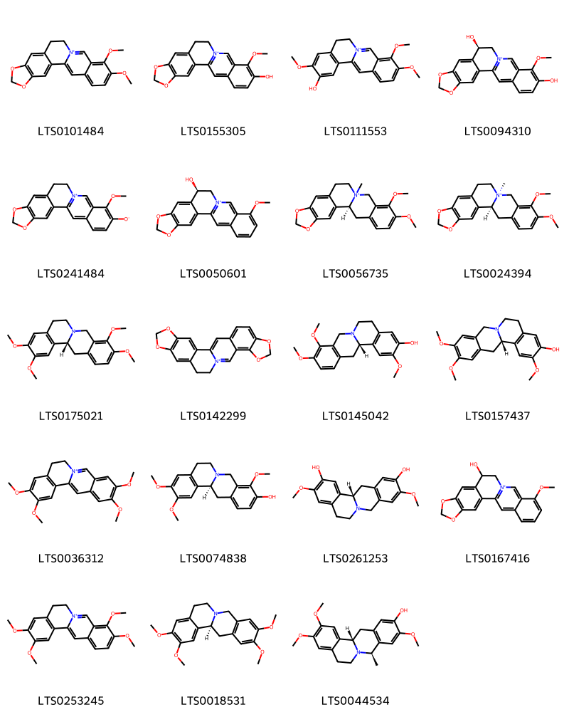{ width=100% }
    <figcaption>Hình ảnh cấu trúc hóa học của 19 hoạt chất thuộc nhóm Protoberberine alkaloids and derivatives gồm ['berberine (LTS0101484)', '17-hydroxy-16-methoxy-5,7-dioxa-13λ⁵-azapentacyclo[11.8.0.0²,¹⁰.0⁴,⁸.0¹⁵,²⁰]henicosa-1(13),2,4(8),9,14,16,18,20-octaen-13-ylium (LTS0155305)', 'columbamine (LTS0111553)', '(11r)-11,17-dihydroxy-16-methoxy-5,7-dioxa-13λ⁵-azapentacyclo[11.8.0.0²,¹⁰.0⁴,⁸.0¹⁵,²⁰]henicosa-1(13),2,4(8),9,14,16,18,20-octaen-13-ylium (LTS0094310)', '16-methoxy-5,7-dioxa-13λ⁵-azapentacyclo[11.8.0.0²,¹⁰.0⁴,⁸.0¹⁵,²⁰]henicosa-1(13),2,4(8),9,14,16,18,20-octaen-13-ylium-17-olate (LTS0241484)', '(11r)-11-hydroxy-16-methoxy-5,7-dioxa-13λ⁵-azapentacyclo[11.8.0.0²,¹⁰.0⁴,⁸.0¹⁵,²⁰]henicosa-1(13),2,4(8),9,14,16,18,20-octaen-13-ylium (LTS0050601)', '(s)-n-methylcanadine (LTS0056735)', '(s)-cis-n-methylcanadine (LTS0024394)', '(+)-tetrahydropalmatine (LTS0175021)', '5,7,17,19-tetraoxa-13λ⁵-azahexacyclo[11.11.0.0²,¹⁰.0⁴,⁸.0¹⁵,²³.0¹⁶,²⁰]tetracosa-1(24),2,4(8),9,13,15,20,22-octaen-13-ylium (LTS0142299)', 'corypalmine (LTS0145042)', '(12bs)-2,3,11-trimethoxy-7,8,12b,13-tetrahydro-5h-6-azatetraphen-10-ol (LTS0157437)', 'pseudopalmatine (LTS0036312)', '(12bs)-4,10,11-trimethoxy-7,8,12b,13-tetrahydro-5h-6-azatetraphen-3-ol (LTS0074838)', 'coreximine (LTS0261253)', '11-hydroxy-16-methoxy-5,7-dioxa-13λ⁵-azapentacyclo[11.8.0.0²,¹⁰.0⁴,⁸.0¹⁵,²⁰]henicosa-1(13),2,4(8),9,14,16,18,20-octaen-13-ylium (LTS0167416)', 'palmatine (LTS0253245)', 'xylopinine (LTS0018531)', '(5r,12bs)-3,10,11-trimethoxy-5-methyl-7,8,12b,13-tetrahydro-5h-6-azatetraphen-2-ol (LTS0044534)'].</figcaption>
</figure>
#### Nhóm Protopine alkaloids
<figure markdown="span">
    { width=100% }
    <figcaption>Hình ảnh cấu trúc hóa học của 1 hoạt chất thuộc nhóm Protopine alkaloids gồm ['protopine (LTS0080245)'].</figcaption>
</figure>
#### Nhóm Steroids and steroid derivatives
<figure markdown="span">
    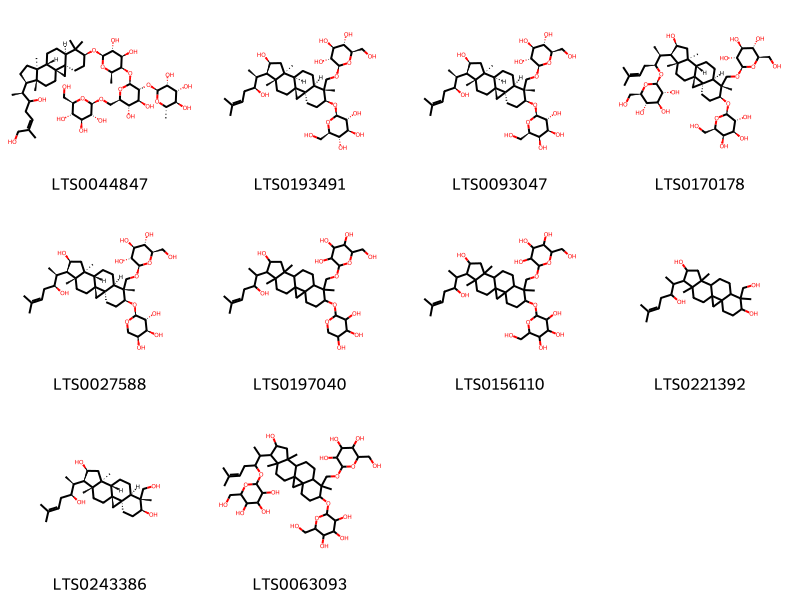{ width=100% }
    <figcaption>Hình ảnh cấu trúc hóa học của 10 hoạt chất thuộc nhóm Steroids and steroid derivatives gồm ['(2r,3r,4s,5s,6r)-2-{[(2r,3s,4s,5r,6s)-6-{[(2r,3r,4r,5r,6r)-6-{[(1s,3r,6s,8r,11s,12s,15r,16r)-15-[(2s,5z)-3,7-dihydroxy-6-methylhept-5-en-2-yl]-7,7,12,16-tetramethylpentacyclo[9.7.0.0¹,³.0³,⁸.0¹²,¹⁶]octadecan-6-yl]oxy}-4,5-dihydroxy-2-methyloxan-3-yl]oxy}-3,4-dihydroxy-5-{[(2s,3r,4r,5r,6s)-3,4,5-trihydroxy-6-methyloxan-2-yl]oxy}oxan-2-yl]methoxy}-6-(hydroxymethyl)oxane-3,4,5-triol (LTS0044847)', '(2r,3r,4s,5s,6r)-2-{[(1s,3r,6s,7r,8r,11r,12s,14s,15r,16r)-14-hydroxy-15-[(2s,3s)-3-hydroxy-6-methylhept-5-en-2-yl]-7,12,16-trimethyl-6-{[(2r,3r,4s,5s,6r)-3,4,5-trihydroxy-6-(hydroxymethyl)oxan-2-yl]oxy}pentacyclo[9.7.0.0¹,³.0³,⁸.0¹²,¹⁶]octadecan-7-yl]methoxy}-6-(hydroxymethyl)oxane-3,4,5-triol (LTS0193491)', '(2r,3r,4s,5s,6r)-2-{[(1s,3r,6s,7r,8r,11r,12s,14s,15r,16r)-14-hydroxy-15-[(2s,3s)-3-hydroxy-6-methylhept-5-en-2-yl]-7,12,16-trimethyl-6-{[(2r,3r,4s,5r,6r)-3,4,5-trihydroxy-6-(hydroxymethyl)oxan-2-yl]oxy}pentacyclo[9.7.0.0¹,³.0³,⁸.0¹²,¹⁶]octadecan-7-yl]methoxy}-6-(hydroxymethyl)oxane-3,4,5-triol (LTS0093047)', '(2r,3r,4s,5s,6r)-2-{[(2s,3s)-2-[(1s,3r,6s,7r,8r,11s,12s,14s,15r,16r)-14-hydroxy-7,12,16-trimethyl-6-{[(2r,3r,4s,5r,6r)-3,4,5-trihydroxy-6-(hydroxymethyl)oxan-2-yl]oxy}-7-({[(2r,3r,4s,5s,6r)-3,4,5-trihydroxy-6-(hydroxymethyl)oxan-2-yl]oxy}methyl)pentacyclo[9.7.0.0¹,³.0³,⁸.0¹²,¹⁶]octadecan-15-yl]-6-methylhept-5-en-3-yl]oxy}-6-(hydroxymethyl)oxane-3,4,5-triol (LTS0170178)', '(2r,3r,4s,5s,6r)-2-{[(1s,3r,6s,7r,8r,11s,12s,14s,15r,16r)-14-hydroxy-15-[(2s,3s)-3-hydroxy-6-methylhept-5-en-2-yl]-7,12,16-trimethyl-6-{[(2s,3r,4s,5s)-3,4,5-trihydroxyoxan-2-yl]oxy}pentacyclo[9.7.0.0¹,³.0³,⁸.0¹²,¹⁶]octadecan-7-yl]methoxy}-6-(hydroxymethyl)oxane-3,4,5-triol (LTS0027588)', '2-{[14-hydroxy-15-(3-hydroxy-6-methylhept-5-en-2-yl)-7,12,16-trimethyl-6-[(3,4,5-trihydroxyoxan-2-yl)oxy]pentacyclo[9.7.0.0¹,³.0³,⁸.0¹²,¹⁶]octadecan-7-yl]methoxy}-6-(hydroxymethyl)oxane-3,4,5-triol (LTS0197040)', '2-{[14-hydroxy-15-(3-hydroxy-6-methylhept-5-en-2-yl)-7,12,16-trimethyl-6-{[3,4,5-trihydroxy-6-(hydroxymethyl)oxan-2-yl]oxy}pentacyclo[9.7.0.0¹,³.0³,⁸.0¹²,¹⁶]octadecan-7-yl]methoxy}-6-(hydroxymethyl)oxane-3,4,5-triol (LTS0156110)', '15-(3-hydroxy-6-methylhept-5-en-2-yl)-7-(hydroxymethyl)-7,12,16-trimethylpentacyclo[9.7.0.0¹,³.0³,⁸.0¹²,¹⁶]octadecane-6,14-diol (LTS0221392)', '(1s,3r,6s,7r,8r,11s,12s,14s,15r,16r)-15-[(2s,3s)-3-hydroxy-6-methylhept-5-en-2-yl]-7-(hydroxymethyl)-7,12,16-trimethylpentacyclo[9.7.0.0¹,³.0³,⁸.0¹²,¹⁶]octadecane-6,14-diol (LTS0243386)', '2-{[2-(14-hydroxy-7,12,16-trimethyl-6-{[3,4,5-trihydroxy-6-(hydroxymethyl)oxan-2-yl]oxy}-7-({[3,4,5-trihydroxy-6-(hydroxymethyl)oxan-2-yl]oxy}methyl)pentacyclo[9.7.0.0¹,³.0³,⁸.0¹²,¹⁶]octadecan-15-yl)-6-methylhept-5-en-3-yl]oxy}-6-(hydroxymethyl)oxane-3,4,5-triol (LTS0063093)'].</figcaption>
</figure>

---

### Dược dân tộc học

Danh sách các quốc gia có sử dụng *Thalictrum minus* trong điều trị các bệnh. 

| Country   | Disease     | Bệnh                                                                                                                                                                                                |
|:----------|:------------|:----------------------------------------------------------------------------------------------------------------------------------------------------------------------------------------------------|
| Elsewhere | Cardiotonic | MYMEMORY WARNING: YOU USED ALL AVAILABLE FREE TRANSLATIONS FOR TODAY. NEXT AVAILABLE IN  08 HOURS 33 MINUTES 15 SECONDS VISIT HTTPS://MYMEMORY.TRANSLATED.NET/DOC/USAGELIMITS.PHP TO TRANSLATE MORE |
| US        | Antiseptic  | MYMEMORY WARNING: YOU USED ALL AVAILABLE FREE TRANSLATIONS FOR TODAY. NEXT AVAILABLE IN  08 HOURS 33 MINUTES 12 SECONDS VISIT HTTPS://MYMEMORY.TRANSLATED.NET/DOC/USAGELIMITS.PHP TO TRANSLATE MORE |

---

---
## Thalictrum occidentale
### Thông tin về thực vật

!!! info "Phân loại thực vật của *Thalictrum occidentale* từ GIBF:"
    - **Kingdom:** Plantae
    - **Phylum:** Tracheophyta
    - **Order:** Ranunculales
    - **Family:** Ranunculaceae
    - **Genus:** Thalictrum
    - **Species:** *Thalictrum occidentale*

 

| Label (VI)   | Label (EN)   | Scientific Name        | Descriptions (VI)   | Descriptions (EN)   | Also Known As (VI)   | Also Known As (EN)     |
|:-------------|:-------------|:-----------------------|:--------------------|:--------------------|:---------------------|:-----------------------|
| N/A          | N/A          | Thalictrum occidentale | loài thực vật       | species of plant    | ['']                 | ['western meadow-rue'] |

#### Phân bố trên thế giới

**Từ CSDL GIBF** Canada, United States of America

#### Phân bố tại Việt Nam

**Từ CSDL GIBF**: Không có ghi nhận ở Việt Nam

---
### Thành phần hóa học
        
- Theo cơ sở dữ liệu lotus: Từ loài *Thalictrum occidentale* đã phân lập và xác định được 1 hoạt chất thuộc về các nhóm Organooxygen compounds. 

|    | chemicalTaxonomyClassyfireClass   |   smiles_count |
|---:|:----------------------------------|---------------:|
|  0 | Organooxygen compounds            |              1 |

#### Nhóm Organooxygen compounds
<figure markdown="span">
    { width=100% }
    <figcaption>Hình ảnh cấu trúc hóa học của 1 hoạt chất thuộc nhóm Organooxygen compounds gồm ['ranunculin (LTS0141949)'].</figcaption>
</figure>

---

### Dược dân tộc học

Danh sách các quốc gia có sử dụng *Thalictrum occidentale* trong điều trị các bệnh. 

| Country      | Disease   | Bệnh                                                                                                                                                                                                |
|:-------------|:----------|:----------------------------------------------------------------------------------------------------------------------------------------------------------------------------------------------------|
| US(Flathead) | Perfume   | MYMEMORY WARNING: YOU USED ALL AVAILABLE FREE TRANSLATIONS FOR TODAY. NEXT AVAILABLE IN  08 HOURS 32 MINUTES 43 SECONDS VISIT HTTPS://MYMEMORY.TRANSLATED.NET/DOC/USAGELIMITS.PHP TO TRANSLATE MORE |

---

---
## Thalictrum rubellum
### Thông tin về thực vật

!!! info "Phân loại thực vật của *Thalictrum aquilegiifolium* từ GIBF:"
    - **Kingdom:** Plantae
    - **Phylum:** Tracheophyta
    - **Order:** Ranunculales
    - **Family:** Ranunculaceae
    - **Genus:** Thalictrum
    - **Species:** *Thalictrum aquilegiifolium*

 

| Label (VI)   | Label (EN)   | Scientific Name     | Descriptions (VI)   | Descriptions (EN)   | Also Known As (VI)   | Also Known As (EN)   |
|:-------------|:-------------|:--------------------|:--------------------|:--------------------|:---------------------|:---------------------|
| N/A          | N/A          | Thalictrum rubellum |                     |                     | ['']                 | ['']                 |

#### Phân bố trên thế giới

**Từ CSDL GIBF** Canada, United States of America

#### Phân bố tại Việt Nam

**Từ CSDL GIBF**: Không có ghi nhận ở Việt Nam

---
### Thành phần hóa học
        
- Theo cơ sở dữ liệu lotus: Từ loài *Thalictrum aquilegiifolium* đã phân lập và xác định được Chưa có hoạt chất nào được phân lập. hoạt chất thuộc về các nhóm Không có hoạt chất nào được phân lập. 

Không có hình ảnh nào được tạo ra

---

### Dược dân tộc học

Danh sách các quốc gia có sử dụng *Thalictrum aquilegiifolium* trong điều trị các bệnh. 

| Country   | Disease   | Bệnh                                                                                                                                                                                                |
|:----------|:----------|:----------------------------------------------------------------------------------------------------------------------------------------------------------------------------------------------------|
| China     | Aperient  | MYMEMORY WARNING: YOU USED ALL AVAILABLE FREE TRANSLATIONS FOR TODAY. NEXT AVAILABLE IN  08 HOURS 32 MINUTES 19 SECONDS VISIT HTTPS://MYMEMORY.TRANSLATED.NET/DOC/USAGELIMITS.PHP TO TRANSLATE MORE |

---

# Chi Ranunculus

??? note "Danh sách các dược liệu thuộc chi"
    
	 - *Ranunculus acris*
	 - *Ranunculus arvensis*
	 - *Ranunculus bullatus*
	 - *Ranunculus cantoniensis*
	 - *Ranunculus falcatus*
	 - *Ranunculus ficaria*
	 - *Ranunculus glaberrimus*
	 - *Ranunculus japonicus*
	 - *Ranunculus lingua*
	 - *Ranunculus muricatus*
	 - *Ranunculus parnassifolius*
	 - *Ranunculus petiolaris*
	 - *Ranunculus sceleratus*
	 - *Ranunculus scleratus*
	 - *Ranunculus trichophyllus*
	 - *Ranunculus zuccarinii*

---
## Ranunculus acris
### Thông tin về thực vật

!!! info "Phân loại thực vật của *Ranunculus acris* từ GIBF:"
    - **Kingdom:** Plantae
    - **Phylum:** Tracheophyta
    - **Order:** Ranunculales
    - **Family:** Ranunculaceae
    - **Genus:** Ranunculus
    - **Species:** *Ranunculus acris*

 

| Label (VI)   | Label (EN)   | Scientific Name   | Descriptions (VI)   | Descriptions (EN)   | Also Known As (VI)   | Also Known As (EN)                                                            |
|:-------------|:-------------|:------------------|:--------------------|:--------------------|:---------------------|:------------------------------------------------------------------------------|
| N/A          | N/A          | Ranunculus acris  | loài thực vật       | species of plant    | ['']                 | ['common buttercup', 'giant buttercup', 'meadow buttercup', 'tall buttercup'] |

#### Phân bố trên thế giới

**Từ CSDL GIBF** Switzerland, United Kingdom of Great Britain and Northern Ireland, Denmark, Argentina, France, New Zealand, Hungary, Germany, United States of America, Ireland, Austria, Norway, Croatia, Netherlands

#### Phân bố tại Việt Nam

**Từ CSDL GIBF**: Không có ghi nhận ở Việt Nam

---
### Thành phần hóa học
        
- Theo cơ sở dữ liệu lotus: Từ loài *Ranunculus acris* đã phân lập và xác định được 8 hoạt chất thuộc về các nhóm Organooxygen compounds, Prenol lipids, Dihydrofurans. 

|    | chemicalTaxonomyClassyfireClass   |   smiles_count |
|---:|:----------------------------------|---------------:|
|  0 | Dihydrofurans                     |              2 |
|  1 | Organooxygen compounds            |              1 |
|  2 | Prenol lipids                     |              4 |

#### Nhóm Dihydrofurans
<figure markdown="span">
    { width=100% }
    <figcaption>Hình ảnh cấu trúc hóa học của 2 hoạt chất thuộc nhóm Dihydrofurans gồm ['anemonin (LTS0245229)', 'protoanemonin (LTS0133358)'].</figcaption>
</figure>
#### Nhóm Organooxygen compounds
<figure markdown="span">
    { width=100% }
    <figcaption>Hình ảnh cấu trúc hóa học của 1 hoạt chất thuộc nhóm Organooxygen compounds gồm ['ranunculin (LTS0141949)'].</figcaption>
</figure>
#### Nhóm Prenol lipids
<figure markdown="span">
    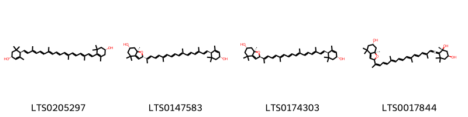{ width=100% }
    <figcaption>Hình ảnh cấu trúc hóa học của 4 hoạt chất thuộc nhóm Prenol lipids gồm ['carotenoid (LTS0205297)', 'chrysanthemaxanthin (LTS0147583)', 'flavoxanthin (LTS0174303)', '(1r,3s)-6-[(3e,5e,7e,9e,11e,13e,15z)-16-[(6s,7ar)-6-hydroxy-4,4,7a-trimethyl-2,5,6,7-tetrahydro-1-benzofuran-2-yl]-3,7,12-trimethylheptadeca-1,3,5,7,9,11,13,15-octaen-1-ylidene]-1,5,5-trimethylcyclohexane-1,3-diol (LTS0017844)'].</figcaption>
</figure>

---

### Dược dân tộc học

Danh sách các quốc gia có sử dụng *Ranunculus acris* trong điều trị các bệnh. 

| Country   | Disease                                         | Bệnh                                                                                                                                                                                                |
|:----------|:------------------------------------------------|:----------------------------------------------------------------------------------------------------------------------------------------------------------------------------------------------------|
| China     | Hallucinogen, Counterirritant                   | MYMEMORY WARNING: YOU USED ALL AVAILABLE FREE TRANSLATIONS FOR TODAY. NEXT AVAILABLE IN  08 HOURS 32 MINUTES 03 SECONDS VISIT HTTPS://MYMEMORY.TRANSLATED.NET/DOC/USAGELIMITS.PHP TO TRANSLATE MORE |
| Elsewhere | Poison                                          | MYMEMORY WARNING: YOU USED ALL AVAILABLE FREE TRANSLATIONS FOR TODAY. NEXT AVAILABLE IN  08 HOURS 32 MINUTES 01 SECONDS VISIT HTTPS://MYMEMORY.TRANSLATED.NET/DOC/USAGELIMITS.PHP TO TRANSLATE MORE |
| Turkey    | Hallucinogen, Poison, Counterirritant, Vesicant | MYMEMORY WARNING: YOU USED ALL AVAILABLE FREE TRANSLATIONS FOR TODAY. NEXT AVAILABLE IN  08 HOURS 31 MINUTES 59 SECONDS VISIT HTTPS://MYMEMORY.TRANSLATED.NET/DOC/USAGELIMITS.PHP TO TRANSLATE MORE |

---

---
## Ranunculus arvensis
### Thông tin về thực vật

!!! info "Phân loại thực vật của *Ranunculus arvensis* từ GIBF:"
    - **Kingdom:** Plantae
    - **Phylum:** Tracheophyta
    - **Order:** Ranunculales
    - **Family:** Ranunculaceae
    - **Genus:** Ranunculus
    - **Species:** *Ranunculus arvensis*

 

| Label (VI)   | Label (EN)   | Scientific Name     | Descriptions (VI)   | Descriptions (EN)   | Also Known As (VI)   | Also Known As (EN)                                      |
|:-------------|:-------------|:--------------------|:--------------------|:--------------------|:---------------------|:--------------------------------------------------------|
| N/A          | N/A          | Ranunculus arvensis | loài thực vật       | species of plant    | ['']                 | ['Corn buttercup', 'devil-on-all-sides', 'scratch bur'] |

#### Phân bố trên thế giới

**Từ CSDL GIBF** Spain, Germany, Austria, Palestine, State of, Sweden, Uzbekistan, Poland, Kazakhstan, Iraq, Belgium, Slovakia, Netherlands, Türkiye, Slovenia, Hungary, Switzerland, United Kingdom of Great Britain and Northern Ireland, France, Czechia, Russian Federation, United States of America, Algeria, Israel, Italy, Greece, Croatia, Ukraine

#### Phân bố tại Việt Nam

**Từ CSDL GIBF**: Không có ghi nhận ở Việt Nam

---
### Thành phần hóa học
        
- Theo cơ sở dữ liệu lotus: Từ loài *Ranunculus arvensis* đã phân lập và xác định được 1 hoạt chất thuộc về các nhóm Dihydrofurans. 

|    | chemicalTaxonomyClassyfireClass   |   smiles_count |
|---:|:----------------------------------|---------------:|
|  0 | Dihydrofurans                     |              1 |

#### Nhóm Dihydrofurans
<figure markdown="span">
    { width=100% }
    <figcaption>Hình ảnh cấu trúc hóa học của 1 hoạt chất thuộc nhóm Dihydrofurans gồm ['protoanemonin (LTS0133358)'].</figcaption>
</figure>

---

### Dược dân tộc học

Danh sách các quốc gia có sử dụng *Ranunculus arvensis* trong điều trị các bệnh. 

| Country   | Disease            | Bệnh                                                                                                                                                                                                |
|:----------|:-------------------|:----------------------------------------------------------------------------------------------------------------------------------------------------------------------------------------------------|
| Elsewhere | Antibiotic, Poison | MYMEMORY WARNING: YOU USED ALL AVAILABLE FREE TRANSLATIONS FOR TODAY. NEXT AVAILABLE IN  08 HOURS 31 MINUTES 36 SECONDS VISIT HTTPS://MYMEMORY.TRANSLATED.NET/DOC/USAGELIMITS.PHP TO TRANSLATE MORE |
| Iraq      | Poison             | MYMEMORY WARNING: YOU USED ALL AVAILABLE FREE TRANSLATIONS FOR TODAY. NEXT AVAILABLE IN  08 HOURS 31 MINUTES 34 SECONDS VISIT HTTPS://MYMEMORY.TRANSLATED.NET/DOC/USAGELIMITS.PHP TO TRANSLATE MORE |
| Turkey    | Vesicant           | MYMEMORY WARNING: YOU USED ALL AVAILABLE FREE TRANSLATIONS FOR TODAY. NEXT AVAILABLE IN  08 HOURS 31 MINUTES 31 SECONDS VISIT HTTPS://MYMEMORY.TRANSLATED.NET/DOC/USAGELIMITS.PHP TO TRANSLATE MORE |

---

---
## Ranunculus bullatus
### Thông tin về thực vật

!!! info "Phân loại thực vật của *Ranunculus bullatus* từ GIBF:"
    - **Kingdom:** Plantae
    - **Phylum:** Tracheophyta
    - **Order:** Ranunculales
    - **Family:** Ranunculaceae
    - **Genus:** Ranunculus
    - **Species:** *Ranunculus bullatus*

 

| Label (VI)   | Label (EN)   | Scientific Name     | Descriptions (VI)   | Descriptions (EN)   | Also Known As (VI)   | Also Known As (EN)   |
|:-------------|:-------------|:--------------------|:--------------------|:--------------------|:---------------------|:---------------------|
| N/A          | N/A          | Ranunculus bullatus | loài thực vật       | species of plant    | ['']                 | ['']                 |

#### Phân bố trên thế giới

**Từ CSDL GIBF** Malta, Portugal, Gibraltar, Morocco, France, Spain, Italy, Algeria, Greece

#### Phân bố tại Việt Nam

**Từ CSDL GIBF**: Không có ghi nhận ở Việt Nam

---
### Thành phần hóa học
        
- Theo cơ sở dữ liệu lotus: Từ loài *Ranunculus bullatus* đã phân lập và xác định được Chưa có hoạt chất nào được phân lập. hoạt chất thuộc về các nhóm Không có hoạt chất nào được phân lập. 

Không có hình ảnh nào được tạo ra

---

### Dược dân tộc học

Danh sách các quốc gia có sử dụng *Ranunculus bullatus* trong điều trị các bệnh. 

| Country   | Disease     | Bệnh                                                                                                                                                                                                |
|:----------|:------------|:----------------------------------------------------------------------------------------------------------------------------------------------------------------------------------------------------|
| ain       | Rubefacient | MYMEMORY WARNING: YOU USED ALL AVAILABLE FREE TRANSLATIONS FOR TODAY. NEXT AVAILABLE IN  08 HOURS 31 MINUTES 08 SECONDS VISIT HTTPS://MYMEMORY.TRANSLATED.NET/DOC/USAGELIMITS.PHP TO TRANSLATE MORE |

---

---
## Ranunculus cantoniensis
### Thông tin về thực vật

!!! info "Phân loại thực vật của *Ranunculus cantoniensis* từ GIBF:"
    - **Kingdom:** Plantae
    - **Phylum:** Tracheophyta
    - **Order:** Ranunculales
    - **Family:** Ranunculaceae
    - **Genus:** Ranunculus
    - **Species:** *Ranunculus cantoniensis*

 

| Label (VI)   | Label (EN)   | Scientific Name         | Descriptions (VI)   | Descriptions (EN)   | Also Known As (VI)   | Also Known As (EN)   |
|:-------------|:-------------|:------------------------|:--------------------|:--------------------|:---------------------|:---------------------|
| N/A          | N/A          | Ranunculus cantoniensis | loài thực vật       | species of plant    | ['']                 | ['']                 |

#### Phân bố trên thế giới

**Từ CSDL GIBF** Japan, China, Chinese Taipei

#### Phân bố tại Việt Nam

**Từ CSDL GIBF**: Không có ghi nhận ở Việt Nam

---
### Thành phần hóa học
        
- Theo cơ sở dữ liệu lotus: Từ loài *Ranunculus cantoniensis* đã phân lập và xác định được 1 hoạt chất thuộc về các nhóm Dihydrofurans. 

|    | chemicalTaxonomyClassyfireClass   |   smiles_count |
|---:|:----------------------------------|---------------:|
|  0 | Dihydrofurans                     |              1 |

#### Nhóm Dihydrofurans
<figure markdown="span">
    { width=100% }
    <figcaption>Hình ảnh cấu trúc hóa học của 1 hoạt chất thuộc nhóm Dihydrofurans gồm ['protoanemonin (LTS0133358)'].</figcaption>
</figure>

---

### Dược dân tộc học

Danh sách các quốc gia có sử dụng *Ranunculus cantoniensis* trong điều trị các bệnh. 

| Country   |   Disease | Bệnh                                                                                                                                                                                                |
|:----------|----------:|:----------------------------------------------------------------------------------------------------------------------------------------------------------------------------------------------------|
| Elsewhere |       nan | MYMEMORY WARNING: YOU USED ALL AVAILABLE FREE TRANSLATIONS FOR TODAY. NEXT AVAILABLE IN  08 HOURS 30 MINUTES 46 SECONDS VISIT HTTPS://MYMEMORY.TRANSLATED.NET/DOC/USAGELIMITS.PHP TO TRANSLATE MORE |

---

---
## Ranunculus falcatus
### Thông tin về thực vật

!!! info "Phân loại thực vật của *Ceratocephala falcata* từ GIBF:"
    - **Kingdom:** Plantae
    - **Phylum:** Tracheophyta
    - **Order:** Ranunculales
    - **Family:** Ranunculaceae
    - **Genus:** Ceratocephala
    - **Species:** *Ceratocephala falcata*

 

| Label (VI)   | Label (EN)   | Scientific Name     | Descriptions (VI)   | Descriptions (EN)   | Also Known As (VI)   | Also Known As (EN)   |
|:-------------|:-------------|:--------------------|:--------------------|:--------------------|:---------------------|:---------------------|
| N/A          | N/A          | Ranunculus falcatus | loài thực vật       | species of plant    | ['']                 | ['']                 |

#### Phân bố trên thế giới

**Từ CSDL GIBF** nan, Georgia, unknown or invalid, Spain, Germany, Austria, Pakistan, Palestine, State of, Uzbekistan, India, Iraq, Netherlands, Türkiye, North Macedonia, Hungary, Switzerland, Iran (Islamic Republic of), Jordan, Argentina, Morocco, France, Armenia, United States of America, Algeria, Greece, Ukraine

#### Phân bố tại Việt Nam

**Từ CSDL GIBF**: Không có ghi nhận ở Việt Nam

---
### Thành phần hóa học
        
- Theo cơ sở dữ liệu lotus: Từ loài *Ceratocephala falcata* đã phân lập và xác định được Chưa có hoạt chất nào được phân lập. hoạt chất thuộc về các nhóm Không có hoạt chất nào được phân lập. 

Không có hình ảnh nào được tạo ra

---

### Dược dân tộc học

Danh sách các quốc gia có sử dụng *Ceratocephala falcata* trong điều trị các bệnh. 

| Country   | Disease            | Bệnh                                                                                                                                                                                                |
|:----------|:-------------------|:----------------------------------------------------------------------------------------------------------------------------------------------------------------------------------------------------|
| Elsewhere | Vesicant, Vesicant | MYMEMORY WARNING: YOU USED ALL AVAILABLE FREE TRANSLATIONS FOR TODAY. NEXT AVAILABLE IN  08 HOURS 30 MINUTES 22 SECONDS VISIT HTTPS://MYMEMORY.TRANSLATED.NET/DOC/USAGELIMITS.PHP TO TRANSLATE MORE |

---

---
## Ranunculus ficaria
### Thông tin về thực vật

!!! info "Phân loại thực vật của *Ranunculus ficaria* từ GIBF:"
    - **Kingdom:** Plantae
    - **Phylum:** Tracheophyta
    - **Order:** Ranunculales
    - **Family:** Ranunculaceae
    - **Genus:** Ranunculus
    - **Species:** *Ranunculus ficaria*

 

| Label (VI)   | Label (EN)   | Scientific Name    | Descriptions (VI)   | Descriptions (EN)   | Also Known As (VI)   | Also Known As (EN)                    |
|:-------------|:-------------|:-------------------|:--------------------|:--------------------|:---------------------|:--------------------------------------|
| N/A          | N/A          | Ranunculus ficaria | loài thực vật       | species of plant    | ['']                 | ['Lesser celandine', 'Ficaria verna'] |

#### Phân bố trên thế giới

**Từ CSDL GIBF** France, Spain, Hungary, Germany, Italy, Austria, Belgium, Netherlands

#### Phân bố tại Việt Nam

**Từ CSDL GIBF**: Không có ghi nhận ở Việt Nam

---
### Thành phần hóa học
        
- Theo cơ sở dữ liệu lotus: Từ loài *Ranunculus ficaria* đã phân lập và xác định được 16 hoạt chất thuộc về các nhóm Flavonoids, Phenols, Dihydrofurans, Cinnamic acids and derivatives, Benzene and substituted derivatives. 

|    | chemicalTaxonomyClassyfireClass     |   smiles_count |
|---:|:------------------------------------|---------------:|
|  0 | Benzene and substituted derivatives |              3 |
|  1 | Cinnamic acids and derivatives      |              4 |
|  2 | Dihydrofurans                       |              1 |
|  3 | Flavonoids                          |              7 |
|  4 | Phenols                             |              1 |

#### Nhóm Benzene and substituted derivatives
<figure markdown="span">
    { width=100% }
    <figcaption>Hình ảnh cấu trúc hóa học của 3 hoạt chất thuộc nhóm Benzene and substituted derivatives gồm ['p-hydroxybenzoic acid (LTS0263634)', '3,4-dihydroxybenzoic acid (LTS0018765)', 'vanillic acid (LTS0229113)'].</figcaption>
</figure>
#### Nhóm Cinnamic acids and derivatives
<figure markdown="span">
    { width=100% }
    <figcaption>Hình ảnh cấu trúc hóa học của 4 hoạt chất thuộc nhóm Cinnamic acids and derivatives gồm ['ferulic acid (LTS0077328)', 'sinapinate (LTS0173482)', '3,4-dihydroxycinnamic acid (LTS0128050)', 'para-coumaric acid (LTS0266252)'].</figcaption>
</figure>
#### Nhóm Dihydrofurans
<figure markdown="span">
    { width=100% }
    <figcaption>Hình ảnh cấu trúc hóa học của 1 hoạt chất thuộc nhóm Dihydrofurans gồm ['protoanemonin (LTS0133358)'].</figcaption>
</figure>
#### Nhóm Flavonoids
<figure markdown="span">
    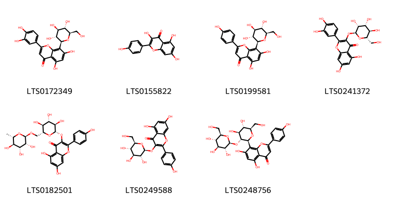{ width=100% }
    <figcaption>Hình ảnh cấu trúc hóa học của 7 hoạt chất thuộc nhóm Flavonoids gồm ['orientin (LTS0172349)', 'kaempherol (LTS0155822)', 'vitexin (LTS0199581)', '2-(3,4-dihydroxyphenyl)-5,7-dihydroxy-3-{[(2s,3r,4r,5r,6s)-3,4,5-trihydroxy-6-(hydroxymethyl)oxan-2-yl]oxy}chromen-4-one (LTS0241372)', 'nictoflorin (LTS0182501)', 'astragalin (LTS0249588)', "2''-o-glucosylvitexin (LTS0248756)"].</figcaption>
</figure>
#### Nhóm Phenols
<figure markdown="span">
    { width=100% }
    <figcaption>Hình ảnh cấu trúc hóa học của 1 hoạt chất thuộc nhóm Phenols gồm ['4-hydroxyphenylacetic acid (LTS0272177)'].</figcaption>
</figure>

---

### Dược dân tộc học

Danh sách các quốc gia có sử dụng *Ranunculus ficaria* trong điều trị các bệnh. 

| Country   | Disease                      | Bệnh                                                                                                                                                                                                |
|:----------|:-----------------------------|:----------------------------------------------------------------------------------------------------------------------------------------------------------------------------------------------------|
| Turkey    | Astringent, Diuretic, Poison | MYMEMORY WARNING: YOU USED ALL AVAILABLE FREE TRANSLATIONS FOR TODAY. NEXT AVAILABLE IN  08 HOURS 30 MINUTES 01 SECONDS VISIT HTTPS://MYMEMORY.TRANSLATED.NET/DOC/USAGELIMITS.PHP TO TRANSLATE MORE |

---

---
## Ranunculus glaberrimus
### Thông tin về thực vật

!!! info "Phân loại thực vật của *Ranunculus glaberrimus* từ GIBF:"
    - **Kingdom:** Plantae
    - **Phylum:** Tracheophyta
    - **Order:** Ranunculales
    - **Family:** Ranunculaceae
    - **Genus:** Ranunculus
    - **Species:** *Ranunculus glaberrimus*

 

| Label (VI)   | Label (EN)   | Scientific Name        | Descriptions (VI)   | Descriptions (EN)   | Also Known As (VI)   | Also Known As (EN)                                                 |
|:-------------|:-------------|:-----------------------|:--------------------|:--------------------|:---------------------|:-------------------------------------------------------------------|
| N/A          | N/A          | Ranunculus glaberrimus | loài thực vật       | species of plant    | ['']                 | ['early buttercup', 'sagebrush buttercup', 'elliptical buttercup'] |

#### Phân bố trên thế giới

**Từ CSDL GIBF** Canada, United States of America

#### Phân bố tại Việt Nam

**Từ CSDL GIBF**: Không có ghi nhận ở Việt Nam

---
### Thành phần hóa học
        
- Theo cơ sở dữ liệu lotus: Từ loài *Ranunculus glaberrimus* đã phân lập và xác định được Chưa có hoạt chất nào được phân lập. hoạt chất thuộc về các nhóm Không có hoạt chất nào được phân lập. 

Không có hình ảnh nào được tạo ra

---

### Dược dân tộc học

Danh sách các quốc gia có sử dụng *Ranunculus glaberrimus* trong điều trị các bệnh. 

| Country      | Disease   | Bệnh                                                                                                                                                                                                |
|:-------------|:----------|:----------------------------------------------------------------------------------------------------------------------------------------------------------------------------------------------------|
| US(Flathead) | Poison    | MYMEMORY WARNING: YOU USED ALL AVAILABLE FREE TRANSLATIONS FOR TODAY. NEXT AVAILABLE IN  08 HOURS 29 MINUTES 33 SECONDS VISIT HTTPS://MYMEMORY.TRANSLATED.NET/DOC/USAGELIMITS.PHP TO TRANSLATE MORE |

---

---
## Ranunculus japonicus
### Thông tin về thực vật

!!! info "Phân loại thực vật của *Ranunculus japonicus* từ GIBF:"
    - **Kingdom:** Plantae
    - **Phylum:** Tracheophyta
    - **Order:** Ranunculales
    - **Family:** Ranunculaceae
    - **Genus:** Ranunculus
    - **Species:** *Ranunculus japonicus*

 

| Label (VI)   | Label (EN)   | Scientific Name      | Descriptions (VI)   | Descriptions (EN)   | Also Known As (VI)   | Also Known As (EN)   |
|:-------------|:-------------|:---------------------|:--------------------|:--------------------|:---------------------|:---------------------|
| N/A          | N/A          | Ranunculus japonicus | loài thực vật       | species of plant    | ['']                 | ['']                 |

#### Phân bố trên thế giới

**Từ CSDL GIBF** Japan, Mongolia, Germany, Russian Federation, China, Korea, Republic of, Chinese Taipei

#### Phân bố tại Việt Nam

**Từ CSDL GIBF**: Không có ghi nhận ở Việt Nam

---
### Thành phần hóa học
        
- Theo cơ sở dữ liệu lotus: Từ loài *Ranunculus japonicus* đã phân lập và xác định được 1 hoạt chất thuộc về các nhóm Dihydrofurans. 

|    | chemicalTaxonomyClassyfireClass   |   smiles_count |
|---:|:----------------------------------|---------------:|
|  0 | Dihydrofurans                     |              1 |

#### Nhóm Dihydrofurans
<figure markdown="span">
    { width=100% }
    <figcaption>Hình ảnh cấu trúc hóa học của 1 hoạt chất thuộc nhóm Dihydrofurans gồm ['protoanemonin (LTS0133358)'].</figcaption>
</figure>

---

### Dược dân tộc học

Danh sách các quốc gia có sử dụng *Ranunculus japonicus* trong điều trị các bệnh. 

| Country   | Disease           | Bệnh                                                                                                                                                                                                |
|:----------|:------------------|:----------------------------------------------------------------------------------------------------------------------------------------------------------------------------------------------------|
| China     | Poison, Vermifuge | MYMEMORY WARNING: YOU USED ALL AVAILABLE FREE TRANSLATIONS FOR TODAY. NEXT AVAILABLE IN  08 HOURS 29 MINUTES 10 SECONDS VISIT HTTPS://MYMEMORY.TRANSLATED.NET/DOC/USAGELIMITS.PHP TO TRANSLATE MORE |

---

---
## Ranunculus lingua
### Thông tin về thực vật

!!! info "Phân loại thực vật của *Ranunculus lingua* từ GIBF:"
    - **Kingdom:** Plantae
    - **Phylum:** Tracheophyta
    - **Order:** Ranunculales
    - **Family:** Ranunculaceae
    - **Genus:** Ranunculus
    - **Species:** *Ranunculus lingua*

 

| Label (VI)   | Label (EN)   | Scientific Name   | Descriptions (VI)   | Descriptions (EN)   | Also Known As (VI)   | Also Known As (EN)                 |
|:-------------|:-------------|:------------------|:--------------------|:--------------------|:---------------------|:-----------------------------------|
| N/A          | N/A          | Ranunculus lingua | loài thực vật       | species of plant    | ['']                 | ['greater spearwort', 'spearwort'] |

#### Phân bố trên thế giới

**Từ CSDL GIBF** Switzerland, Belarus, United Kingdom of Great Britain and Northern Ireland, Denmark, Sweden, Czechia, Poland, Germany, Russian Federation, Ireland, Netherlands, Slovakia, Ukraine

#### Phân bố tại Việt Nam

**Từ CSDL GIBF**: Không có ghi nhận ở Việt Nam

---
### Thành phần hóa học
        
- Theo cơ sở dữ liệu lotus: Từ loài *Ranunculus lingua* đã phân lập và xác định được Chưa có hoạt chất nào được phân lập. hoạt chất thuộc về các nhóm Không có hoạt chất nào được phân lập. 

Không có hình ảnh nào được tạo ra

---

### Dược dân tộc học

Danh sách các quốc gia có sử dụng *Ranunculus lingua* trong điều trị các bệnh. 

| Country   | Disease   | Bệnh                                                                                                                                                                                                |
|:----------|:----------|:----------------------------------------------------------------------------------------------------------------------------------------------------------------------------------------------------|
| Elsewhere | Vesicant  | MYMEMORY WARNING: YOU USED ALL AVAILABLE FREE TRANSLATIONS FOR TODAY. NEXT AVAILABLE IN  08 HOURS 28 MINUTES 47 SECONDS VISIT HTTPS://MYMEMORY.TRANSLATED.NET/DOC/USAGELIMITS.PHP TO TRANSLATE MORE |

---

---
## Ranunculus muricatus
### Thông tin về thực vật

!!! info "Phân loại thực vật của *Ranunculus muricatus* từ GIBF:"
    - **Kingdom:** Plantae
    - **Phylum:** Tracheophyta
    - **Order:** Ranunculales
    - **Family:** Ranunculaceae
    - **Genus:** Ranunculus
    - **Species:** *Ranunculus muricatus*

 

| Label (VI)   | Label (EN)   | Scientific Name      | Descriptions (VI)   | Descriptions (EN)   | Also Known As (VI)   | Also Known As (EN)       |
|:-------------|:-------------|:---------------------|:--------------------|:--------------------|:---------------------|:-------------------------|
| N/A          | N/A          | Ranunculus muricatus | loài thực vật       | species of plant    | ['']                 | ['Spinyfruit buttercup'] |

#### Phân bố trên thế giới

**Từ CSDL GIBF** Türkiye, Malta, Portugal, Bermuda, France, Spain, Chile, United States of America, Italy, China, Israel, Greece, Croatia, Netherlands

#### Phân bố tại Việt Nam

**Từ CSDL GIBF**: Không có ghi nhận ở Việt Nam

---
### Thành phần hóa học
        
- Theo cơ sở dữ liệu lotus: Từ loài *Ranunculus muricatus* đã phân lập và xác định được Chưa có hoạt chất nào được phân lập. hoạt chất thuộc về các nhóm Không có hoạt chất nào được phân lập. 

Không có hình ảnh nào được tạo ra

---

### Dược dân tộc học

Danh sách các quốc gia có sử dụng *Ranunculus muricatus* trong điều trị các bệnh. 

| Country   | Disease                                 | Bệnh                                                                                                                                                                                                |
|:----------|:----------------------------------------|:----------------------------------------------------------------------------------------------------------------------------------------------------------------------------------------------------|
| Elsewhere | Narcotic, Poison, Vesicant, Rubefacient | MYMEMORY WARNING: YOU USED ALL AVAILABLE FREE TRANSLATIONS FOR TODAY. NEXT AVAILABLE IN  08 HOURS 28 MINUTES 27 SECONDS VISIT HTTPS://MYMEMORY.TRANSLATED.NET/DOC/USAGELIMITS.PHP TO TRANSLATE MORE |

---

---
## Ranunculus parnassifolius
### Thông tin về thực vật

!!! info "Phân loại thực vật của *Ranunculus parnassiifolius* từ GIBF:"
    - **Kingdom:** Plantae
    - **Phylum:** Tracheophyta
    - **Order:** Ranunculales
    - **Family:** Ranunculaceae
    - **Genus:** Ranunculus
    - **Species:** *Ranunculus parnassiifolius*

 

| Label (VI)   | Label (EN)   | Scientific Name           | Descriptions (VI)   | Descriptions (EN)   | Also Known As (VI)   | Also Known As (EN)   |
|:-------------|:-------------|:--------------------------|:--------------------|:--------------------|:---------------------|:---------------------|
| N/A          | N/A          | Ranunculus parnassifolius |                     | species of plant    | ['']                 | ['']                 |

#### Phân bố trên thế giới

**Từ CSDL GIBF** Switzerland, France, Spain, Andorra, Italy, Austria

#### Phân bố tại Việt Nam

**Từ CSDL GIBF**: Không có ghi nhận ở Việt Nam

---
### Thành phần hóa học
        
- Theo cơ sở dữ liệu lotus: Từ loài *Ranunculus parnassiifolius* đã phân lập và xác định được Chưa có hoạt chất nào được phân lập. hoạt chất thuộc về các nhóm Không có hoạt chất nào được phân lập. 

Không có hình ảnh nào được tạo ra

---

### Dược dân tộc học

Danh sách các quốc gia có sử dụng *Ranunculus parnassiifolius* trong điều trị các bệnh. 

| Country   | Disease   | Bệnh                                                                                                                                                                                                |
|:----------|:----------|:----------------------------------------------------------------------------------------------------------------------------------------------------------------------------------------------------|
| ain       | Vesicant  | MYMEMORY WARNING: YOU USED ALL AVAILABLE FREE TRANSLATIONS FOR TODAY. NEXT AVAILABLE IN  08 HOURS 28 MINUTES 04 SECONDS VISIT HTTPS://MYMEMORY.TRANSLATED.NET/DOC/USAGELIMITS.PHP TO TRANSLATE MORE |

---

---
## Ranunculus petiolaris
### Thông tin về thực vật

!!! info "Phân loại thực vật của *Ranunculus petiolaris* từ GIBF:"
    - **Kingdom:** Plantae
    - **Phylum:** Tracheophyta
    - **Order:** Ranunculales
    - **Family:** Ranunculaceae
    - **Genus:** Ranunculus
    - **Species:** *Ranunculus petiolaris*

 

| Label (VI)   | Label (EN)   | Scientific Name       | Descriptions (VI)   | Descriptions (EN)   | Also Known As (VI)   | Also Known As (EN)   |
|:-------------|:-------------|:----------------------|:--------------------|:--------------------|:---------------------|:---------------------|
| N/A          | N/A          | Ranunculus petiolaris | loài thực vật       | species of plant    | ['']                 | ['']                 |

#### Phân bố trên thế giới

**Từ CSDL GIBF** Colombia, United States of America, Mexico, Guatemala

#### Phân bố tại Việt Nam

**Từ CSDL GIBF**: Không có ghi nhận ở Việt Nam

---
### Thành phần hóa học
        
- Theo cơ sở dữ liệu lotus: Từ loài *Ranunculus petiolaris* đã phân lập và xác định được Chưa có hoạt chất nào được phân lập. hoạt chất thuộc về các nhóm Không có hoạt chất nào được phân lập. 

Không có hình ảnh nào được tạo ra

---

### Dược dân tộc học

Danh sách các quốc gia có sử dụng *Ranunculus petiolaris* trong điều trị các bệnh. 

| Country   | Disease              | Bệnh                                                                                                                                                                                                |
|:----------|:---------------------|:----------------------------------------------------------------------------------------------------------------------------------------------------------------------------------------------------|
| Mexico    | Antiseptic, Vesicant | MYMEMORY WARNING: YOU USED ALL AVAILABLE FREE TRANSLATIONS FOR TODAY. NEXT AVAILABLE IN  08 HOURS 27 MINUTES 42 SECONDS VISIT HTTPS://MYMEMORY.TRANSLATED.NET/DOC/USAGELIMITS.PHP TO TRANSLATE MORE |

---

---
## Ranunculus sceleratus
### Thông tin về thực vật

!!! info "Phân loại thực vật của *Ranunculus sceleratus* từ GIBF:"
    - **Kingdom:** Plantae
    - **Phylum:** Tracheophyta
    - **Order:** Ranunculales
    - **Family:** Ranunculaceae
    - **Genus:** Ranunculus
    - **Species:** *Ranunculus sceleratus*

 

| Label (VI)   | Label (EN)   | Scientific Name       | Descriptions (VI)   | Descriptions (EN)   | Also Known As (VI)   | Also Known As (EN)                                                       |
|:-------------|:-------------|:----------------------|:--------------------|:--------------------|:---------------------|:-------------------------------------------------------------------------|
| N/A          | N/A          | Ranunculus sceleratus | loài thực vật       | species of plant    | ['']                 | ['celery-leaf buttercup', 'celery-leaved buttercup', 'cursed buttercup'] |

#### Phân bố trên thế giới

**Từ CSDL GIBF** Denmark, Spain, Germany, Austria, Australia, Korea, Republic of, Sweden, Poland, India, Canada, Netherlands, Hungary, China, Chinese Taipei, Switzerland, United Kingdom of Great Britain and Northern Ireland, France, Czechia, New Zealand, Romania, Russian Federation, United States of America, Italy, Ukraine

#### Phân bố tại Việt Nam

**Từ CSDL GIBF**: Không có ghi nhận ở Việt Nam

---
### Thành phần hóa học
        
- Theo cơ sở dữ liệu lotus: Từ loài *Ranunculus sceleratus* đã phân lập và xác định được 16 hoạt chất thuộc về các nhóm Organooxygen compounds, Indoles and derivatives, Coumarins and derivatives, Fatty Acyls, Dihydrofurans, Steroids and steroid derivatives, Benzene and substituted derivatives. 

|    | chemicalTaxonomyClassyfireClass     |   smiles_count |
|---:|:------------------------------------|---------------:|
|  0 | Benzene and substituted derivatives |              1 |
|  1 | Coumarins and derivatives           |              2 |
|  2 | Dihydrofurans                       |              3 |
|  3 | Fatty Acyls                         |              1 |
|  4 | Indoles and derivatives             |              1 |
|  5 | Organooxygen compounds              |              2 |
|  6 | Steroids and steroid derivatives    |              6 |

#### Nhóm Benzene and substituted derivatives
<figure markdown="span">
    { width=100% }
    <figcaption>Hình ảnh cấu trúc hóa học của 1 hoạt chất thuộc nhóm Benzene and substituted derivatives gồm ['3,4-dihydroxybenzoic acid (LTS0018765)'].</figcaption>
</figure>
#### Nhóm Coumarins and derivatives
<figure markdown="span">
    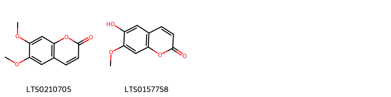{ width=100% }
    <figcaption>Hình ảnh cấu trúc hóa học của 2 hoạt chất thuộc nhóm Coumarins and derivatives gồm ['scoparone (LTS0210705)', 'isoscopoletin (LTS0157758)'].</figcaption>
</figure>
#### Nhóm Dihydrofurans
<figure markdown="span">
    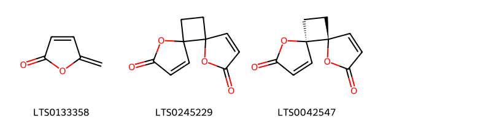{ width=100% }
    <figcaption>Hình ảnh cấu trúc hóa học của 3 hoạt chất thuộc nhóm Dihydrofurans gồm ['protoanemonin (LTS0133358)', 'anemonin (LTS0245229)', '(5r,6s)-1,7-dioxadispiro[4.0.4⁶.2⁵]dodeca-3,9-diene-2,8-dione (LTS0042547)'].</figcaption>
</figure>
#### Nhóm Fatty Acyls
<figure markdown="span">
    { width=100% }
    <figcaption>Hình ảnh cấu trúc hóa học của 1 hoạt chất thuộc nhóm Fatty Acyls gồm ['arachidic acid (LTS0171823)'].</figcaption>
</figure>
#### Nhóm Indoles and derivatives
<figure markdown="span">
    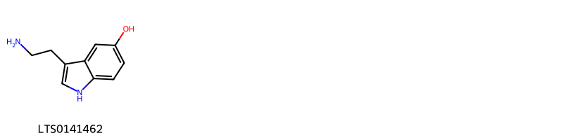{ width=100% }
    <figcaption>Hình ảnh cấu trúc hóa học của 1 hoạt chất thuộc nhóm Indoles and derivatives gồm ['serotonin (LTS0141462)'].</figcaption>
</figure>
#### Nhóm Organooxygen compounds
<figure markdown="span">
    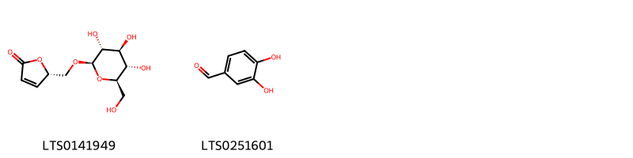{ width=100% }
    <figcaption>Hình ảnh cấu trúc hóa học của 2 hoạt chất thuộc nhóm Organooxygen compounds gồm ['ranunculin (LTS0141949)', '3,4-dihydroxybenzaldehyde (LTS0251601)'].</figcaption>
</figure>
#### Nhóm Steroids and steroid derivatives
<figure markdown="span">
    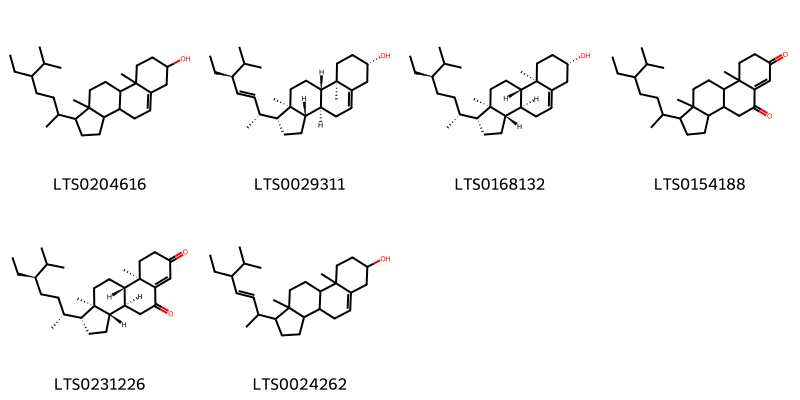{ width=100% }
    <figcaption>Hình ảnh cấu trúc hóa học của 6 hoạt chất thuộc nhóm Steroids and steroid derivatives gồm ['stigmast-5-en-3-ol, (3β)- (LTS0204616)', 'phytosterol (LTS0029311)', 'sitosterol (LTS0168132)', '1-(5-ethyl-6-methylheptan-2-yl)-9a,11a-dimethyl-1h,2h,3h,3ah,3bh,4h,8h,9h,9bh,10h,11h-cyclopenta[a]phenanthrene-5,7-dione (LTS0154188)', '(1r,3as,3bs,9ar,9bs,11ar)-1-[(2r,5r)-5-ethyl-6-methylheptan-2-yl]-9a,11a-dimethyl-1h,2h,3h,3ah,3bh,4h,8h,9h,9bh,10h,11h-cyclopenta[a]phenanthrene-5,7-dione (LTS0231226)', 'stigmasterol (LTS0024262)'].</figcaption>
</figure>

---

### Dược dân tộc học

Danh sách các quốc gia có sử dụng *Ranunculus sceleratus* trong điều trị các bệnh. 

| Country   | Disease                                 | Bệnh                                                                                                                                                                                                |
|:----------|:----------------------------------------|:----------------------------------------------------------------------------------------------------------------------------------------------------------------------------------------------------|
| Iraq      | Emmenagogue                             | MYMEMORY WARNING: YOU USED ALL AVAILABLE FREE TRANSLATIONS FOR TODAY. NEXT AVAILABLE IN  08 HOURS 27 MINUTES 19 SECONDS VISIT HTTPS://MYMEMORY.TRANSLATED.NET/DOC/USAGELIMITS.PHP TO TRANSLATE MORE |
| Turkey    | Emmenagogue, Poison, Vesicant, Vesicant | MYMEMORY WARNING: YOU USED ALL AVAILABLE FREE TRANSLATIONS FOR TODAY. NEXT AVAILABLE IN  08 HOURS 27 MINUTES 17 SECONDS VISIT HTTPS://MYMEMORY.TRANSLATED.NET/DOC/USAGELIMITS.PHP TO TRANSLATE MORE |
| US        | Vesicant                                | MYMEMORY WARNING: YOU USED ALL AVAILABLE FREE TRANSLATIONS FOR TODAY. NEXT AVAILABLE IN  08 HOURS 27 MINUTES 14 SECONDS VISIT HTTPS://MYMEMORY.TRANSLATED.NET/DOC/USAGELIMITS.PHP TO TRANSLATE MORE |
| ain       | Vesicant                                | MYMEMORY WARNING: YOU USED ALL AVAILABLE FREE TRANSLATIONS FOR TODAY. NEXT AVAILABLE IN  08 HOURS 27 MINUTES 11 SECONDS VISIT HTTPS://MYMEMORY.TRANSLATED.NET/DOC/USAGELIMITS.PHP TO TRANSLATE MORE |

---

---
## Ranunculus scleratus
### Thông tin về thực vật

!!! info "Phân loại thực vật của *Ranunculus sceleratus* từ GIBF:"
    - **Kingdom:** Plantae
    - **Phylum:** Tracheophyta
    - **Order:** Ranunculales
    - **Family:** Ranunculaceae
    - **Genus:** Ranunculus
    - **Species:** *Ranunculus sceleratus*

 

| Label (VI)   | Label (EN)   | Scientific Name       | Descriptions (VI)   | Descriptions (EN)   | Also Known As (VI)   | Also Known As (EN)                                                       |
|:-------------|:-------------|:----------------------|:--------------------|:--------------------|:---------------------|:-------------------------------------------------------------------------|
| N/A          | N/A          | Ranunculus sceleratus | loài thực vật       | species of plant    | ['']                 | ['celery-leaf buttercup', 'celery-leaved buttercup', 'cursed buttercup'] |

#### Phân bố trên thế giới

**Từ CSDL GIBF** nan, Sweden, France, Spain, Egypt, Germany, Canada, Finland, United States of America, Russian Federation, Belgium, Netherlands, Hong Kong

#### Phân bố tại Việt Nam

**Từ CSDL GIBF**: Không có ghi nhận ở Việt Nam

---
### Thành phần hóa học
        
- Theo cơ sở dữ liệu lotus: Từ loài *Ranunculus sceleratus* đã phân lập và xác định được Chưa có hoạt chất nào được phân lập. hoạt chất thuộc về các nhóm Không có hoạt chất nào được phân lập. 

Không có hình ảnh nào được tạo ra

---

### Dược dân tộc học

Danh sách các quốc gia có sử dụng *Ranunculus sceleratus* trong điều trị các bệnh. 

| Country   | Disease                                                                            | Bệnh                                                                                                                                                                                                |
|:----------|:-----------------------------------------------------------------------------------|:----------------------------------------------------------------------------------------------------------------------------------------------------------------------------------------------------|
| China     | Tonic                                                                              | MYMEMORY WARNING: YOU USED ALL AVAILABLE FREE TRANSLATIONS FOR TODAY. NEXT AVAILABLE IN  08 HOURS 26 MINUTES 42 SECONDS VISIT HTTPS://MYMEMORY.TRANSLATED.NET/DOC/USAGELIMITS.PHP TO TRANSLATE MORE |
| Elsewhere | Diuretic, Poison, Stomachic, Vesicant, nan, nan, Stimulant, Vermifuge, Rubefacient | MYMEMORY WARNING: YOU USED ALL AVAILABLE FREE TRANSLATIONS FOR TODAY. NEXT AVAILABLE IN  08 HOURS 26 MINUTES 39 SECONDS VISIT HTTPS://MYMEMORY.TRANSLATED.NET/DOC/USAGELIMITS.PHP TO TRANSLATE MORE |

---

---
## Ranunculus trichophyllus
### Thông tin về thực vật

!!! info "Phân loại thực vật của *Ranunculus trichophyllus* từ GIBF:"
    - **Kingdom:** Plantae
    - **Phylum:** Tracheophyta
    - **Order:** Ranunculales
    - **Family:** Ranunculaceae
    - **Genus:** Ranunculus
    - **Species:** *Ranunculus trichophyllus*

 

| Label (VI)   | Label (EN)   | Scientific Name          | Descriptions (VI)   | Descriptions (EN)   | Also Known As (VI)   | Also Known As (EN)      |
|:-------------|:-------------|:-------------------------|:--------------------|:--------------------|:---------------------|:------------------------|
| N/A          | N/A          | Ranunculus trichophyllus | loài thực vật       | species of plant    | ['']                 | ['threadleaf crowfoot'] |

#### Phân bố trên thế giới

**Từ CSDL GIBF** Denmark, Spain, Germany, Austria, Australia, Serbia, Sweden, Mongolia, India, Montenegro, Canada, Netherlands, Slovakia, Türkiye, North Macedonia, Hungary, Estonia, Ireland, Switzerland, United Kingdom of Great Britain and Northern Ireland, Iran (Islamic Republic of), South Africa, France, Czechia, New Zealand, Russian Federation, Iceland, United States of America, Italy, Greece, Croatia, Ukraine

#### Phân bố tại Việt Nam

**Từ CSDL GIBF**: Không có ghi nhận ở Việt Nam

---
### Thành phần hóa học
        
- Theo cơ sở dữ liệu lotus: Từ loài *Ranunculus trichophyllus* đã phân lập và xác định được 6 hoạt chất thuộc về các nhóm Flavonoids, Dihydrofurans. 

|    | chemicalTaxonomyClassyfireClass   |   smiles_count |
|---:|:----------------------------------|---------------:|
|  0 | Dihydrofurans                     |              1 |
|  1 | Flavonoids                        |              5 |

#### Nhóm Dihydrofurans
<figure markdown="span">
    { width=100% }
    <figcaption>Hình ảnh cấu trúc hóa học của 1 hoạt chất thuộc nhóm Dihydrofurans gồm ['protoanemonin (LTS0133358)'].</figcaption>
</figure>
#### Nhóm Flavonoids
<figure markdown="span">
    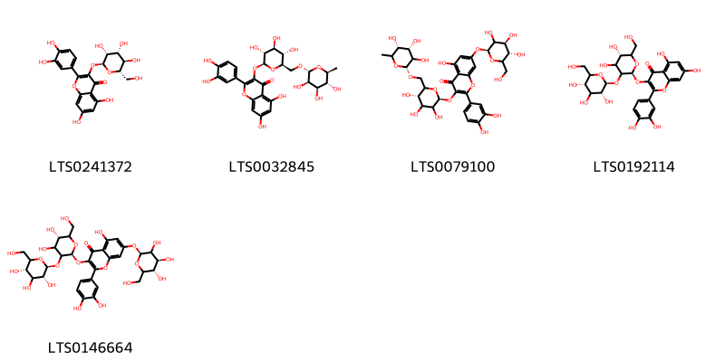{ width=100% }
    <figcaption>Hình ảnh cấu trúc hóa học của 5 hoạt chất thuộc nhóm Flavonoids gồm ['2-(3,4-dihydroxyphenyl)-5,7-dihydroxy-3-{[(2s,3r,4r,5r,6s)-3,4,5-trihydroxy-6-(hydroxymethyl)oxan-2-yl]oxy}chromen-4-one (LTS0241372)', '3-rutinosyl quercetin (LTS0032845)', '2-(3,4-dihydroxyphenyl)-5-hydroxy-7-{[(2s,4s,5s)-3,4,5-trihydroxy-6-(hydroxymethyl)oxan-2-yl]oxy}-3-{[(2s,5s)-3,4,5-trihydroxy-6-({[(2r,4s,5r)-3,4,5-trihydroxy-6-methyloxan-2-yl]oxy}methyl)oxan-2-yl]oxy}chromen-4-one (LTS0079100)', 'quercetin 3-sophoroside (LTS0192114)', '3-{[(2s,5s)-4,5-dihydroxy-6-(hydroxymethyl)-3-{[(2s,3r,5s)-3,4,5-trihydroxy-6-(hydroxymethyl)oxan-2-yl]oxy}oxan-2-yl]oxy}-2-(3,4-dihydroxyphenyl)-5-hydroxy-7-{[(2s,4s,5s)-3,4,5-trihydroxy-6-(hydroxymethyl)oxan-2-yl]oxy}chromen-4-one (LTS0146664)'].</figcaption>
</figure>

---

### Dược dân tộc học

Danh sách các quốc gia có sử dụng *Ranunculus trichophyllus* trong điều trị các bệnh. 

| Country   | Disease   | Bệnh                                                                                                                                                                                                |
|:----------|:----------|:----------------------------------------------------------------------------------------------------------------------------------------------------------------------------------------------------|
| Elsewhere | Poison    | MYMEMORY WARNING: YOU USED ALL AVAILABLE FREE TRANSLATIONS FOR TODAY. NEXT AVAILABLE IN  08 HOURS 26 MINUTES 21 SECONDS VISIT HTTPS://MYMEMORY.TRANSLATED.NET/DOC/USAGELIMITS.PHP TO TRANSLATE MORE |

---

---
## Ranunculus zuccarinii
### Thông tin về thực vật

!!! info "Phân loại thực vật của *Ranunculus ternatus* từ GIBF:"
    - **Kingdom:** Plantae
    - **Phylum:** Tracheophyta
    - **Order:** Ranunculales
    - **Family:** Ranunculaceae
    - **Genus:** Ranunculus
    - **Species:** *Ranunculus ternatus*

 

| Label (VI)   | Label (EN)   | Scientific Name       | Descriptions (VI)   | Descriptions (EN)   | Also Known As (VI)   | Also Known As (EN)   |
|:-------------|:-------------|:----------------------|:--------------------|:--------------------|:---------------------|:---------------------|
| N/A          | N/A          | Ranunculus zuccarinii |                     |                     | ['']                 | ['']                 |

#### Phân bố trên thế giới

**Từ CSDL GIBF** nan, Japan, China, Chinese Taipei

#### Phân bố tại Việt Nam

**Từ CSDL GIBF**: Không có ghi nhận ở Việt Nam

---
### Thành phần hóa học
        
- Theo cơ sở dữ liệu lotus: Từ loài *Ranunculus ternatus* đã phân lập và xác định được Chưa có hoạt chất nào được phân lập. hoạt chất thuộc về các nhóm Không có hoạt chất nào được phân lập. 

Không có hình ảnh nào được tạo ra

---

### Dược dân tộc học

Danh sách các quốc gia có sử dụng *Ranunculus ternatus* trong điều trị các bệnh. 

| Country   | Disease   | Bệnh                                                                                                                                                                                                |
|:----------|:----------|:----------------------------------------------------------------------------------------------------------------------------------------------------------------------------------------------------|
| China     | Poison    | MYMEMORY WARNING: YOU USED ALL AVAILABLE FREE TRANSLATIONS FOR TODAY. NEXT AVAILABLE IN  08 HOURS 25 MINUTES 55 SECONDS VISIT HTTPS://MYMEMORY.TRANSLATED.NET/DOC/USAGELIMITS.PHP TO TRANSLATE MORE |

---

# Chi Cimicifuga

??? note "Danh sách các dược liệu thuộc chi"
    
	 - *Cimicifuga dahurica*
	 - *Cimicifuga foetida*
	 - *Cimicifuga racemosa*
	 - *Cimicifuga simplex*

---
## Cimicifuga dahurica
### Thông tin về thực vật

!!! info "Phân loại thực vật của *Actaea dahurica* từ GIBF:"
    - **Kingdom:** Plantae
    - **Phylum:** Tracheophyta
    - **Order:** Ranunculales
    - **Family:** Ranunculaceae
    - **Genus:** Actaea
    - **Species:** *Actaea dahurica*

 

| Label (VI)   | Label (EN)   | Scientific Name     | Descriptions (VI)   | Descriptions (EN)   | Also Known As (VI)   | Also Known As (EN)   |
|:-------------|:-------------|:--------------------|:--------------------|:--------------------|:---------------------|:---------------------|
| N/A          | N/A          | Cimicifuga dahurica | loài thực vật       | species of plant    | ['']                 | ['']                 |

#### Phân bố trên thế giới

**Từ CSDL GIBF** Korea (Democratic People’s Republic of), Sweden, Russian Federation, China, Korea, Republic of

#### Phân bố tại Việt Nam

**Từ CSDL GIBF**: Không có ghi nhận ở Việt Nam

---
### Thành phần hóa học
        
- Theo cơ sở dữ liệu lotus: Từ loài *Actaea dahurica* đã phân lập và xác định được Chưa có hoạt chất nào được phân lập. hoạt chất thuộc về các nhóm Không có hoạt chất nào được phân lập. 

Không có hình ảnh nào được tạo ra

---

### Dược dân tộc học

Danh sách các quốc gia có sử dụng *Actaea dahurica* trong điều trị các bệnh. 

| Country   | Disease   | Bệnh                                                                                                                                                                                                |
|:----------|:----------|:----------------------------------------------------------------------------------------------------------------------------------------------------------------------------------------------------|
| China     | Sedative  | MYMEMORY WARNING: YOU USED ALL AVAILABLE FREE TRANSLATIONS FOR TODAY. NEXT AVAILABLE IN  08 HOURS 25 MINUTES 38 SECONDS VISIT HTTPS://MYMEMORY.TRANSLATED.NET/DOC/USAGELIMITS.PHP TO TRANSLATE MORE |

---

---
## Cimicifuga foetida
### Thông tin về thực vật

!!! info "Phân loại thực vật của *N/A* từ GIBF:"
    - **Kingdom:** Plantae
    - **Phylum:** Tracheophyta
    - **Order:** Ranunculales
    - **Family:** Ranunculaceae
    - **Genus:** Actaea
    - **Species:** *N/A*

 

| Label (VI)   | Label (EN)   | Scientific Name    | Descriptions (VI)   | Descriptions (EN)   | Also Known As (VI)   | Also Known As (EN)   |
|:-------------|:-------------|:-------------------|:--------------------|:--------------------|:---------------------|:---------------------|
| N/A          | N/A          | Cimicifuga foetida | loài thực vật       | species of plant    | ['']                 | ['']                 |

#### Phân bố trên thế giới

**Từ CSDL GIBF** Luxembourg, Germany, Austria, Korea, Republic of, Serbia, Sweden, Montenegro, Canada, Netherlands, Belarus, Lithuania, Hungary, Switzerland, United Kingdom of Great Britain and Northern Ireland, Czechia, New Zealand, Russian Federation, United States of America, Italy, Croatia, Ukraine

#### Phân bố tại Việt Nam

**Từ CSDL GIBF**: Không có ghi nhận ở Việt Nam

---
### Thành phần hóa học
        
- Theo cơ sở dữ liệu lotus: Từ loài *N/A* đã phân lập và xác định được Chưa có hoạt chất nào được phân lập. hoạt chất thuộc về các nhóm Không có hoạt chất nào được phân lập. 

Không có hình ảnh nào được tạo ra

---

### Dược dân tộc học

Danh sách các quốc gia có sử dụng *N/A* trong điều trị các bệnh. 

| Country   | Disease                                   | Bệnh                                                                                                                                                                                                |
|:----------|:------------------------------------------|:----------------------------------------------------------------------------------------------------------------------------------------------------------------------------------------------------|
| China     | Alexiteric, Analgesic, Sedative, Sedative | MYMEMORY WARNING: YOU USED ALL AVAILABLE FREE TRANSLATIONS FOR TODAY. NEXT AVAILABLE IN  08 HOURS 25 MINUTES 18 SECONDS VISIT HTTPS://MYMEMORY.TRANSLATED.NET/DOC/USAGELIMITS.PHP TO TRANSLATE MORE |
| Elsewhere | Emetic, Purgative, Sudorific, Sedative    | MYMEMORY WARNING: YOU USED ALL AVAILABLE FREE TRANSLATIONS FOR TODAY. NEXT AVAILABLE IN  08 HOURS 25 MINUTES 16 SECONDS VISIT HTTPS://MYMEMORY.TRANSLATED.NET/DOC/USAGELIMITS.PHP TO TRANSLATE MORE |

---

---
## Cimicifuga racemosa
### Thông tin về thực vật

!!! info "Phân loại thực vật của *Actaea racemosa* từ GIBF:"
    - **Kingdom:** Plantae
    - **Phylum:** Tracheophyta
    - **Order:** Ranunculales
    - **Family:** Ranunculaceae
    - **Genus:** Actaea
    - **Species:** *Actaea racemosa*

 

| Label (VI)   | Label (EN)   | Scientific Name     | Descriptions (VI)   | Descriptions (EN)   | Also Known As (VI)   | Also Known As (EN)   |
|:-------------|:-------------|:--------------------|:--------------------|:--------------------|:---------------------|:---------------------|
| N/A          | N/A          | Cimicifuga racemosa | loài thực vật       | species of plant    | ['']                 | ['']                 |

#### Phân bố trên thế giới

**Từ CSDL GIBF** nan, Sweden, Germany, Canada, United States of America, Norway, Netherlands, Belgium, Korea, Republic of

#### Phân bố tại Việt Nam

**Từ CSDL GIBF**: Không có ghi nhận ở Việt Nam

---
### Thành phần hóa học
        
- Theo cơ sở dữ liệu lotus: Từ loài *Actaea racemosa* đã phân lập và xác định được Chưa có hoạt chất nào được phân lập. hoạt chất thuộc về các nhóm Không có hoạt chất nào được phân lập. 

Không có hình ảnh nào được tạo ra

---

### Dược dân tộc học

Danh sách các quốc gia có sử dụng *Actaea racemosa* trong điều trị các bệnh. 

| Country        | Disease                                 | Bệnh                                                                                                                                                                                                |
|:---------------|:----------------------------------------|:----------------------------------------------------------------------------------------------------------------------------------------------------------------------------------------------------|
| Elsewhere      | Emmenagogue, Sedative, Tonic, Stomachic | MYMEMORY WARNING: YOU USED ALL AVAILABLE FREE TRANSLATIONS FOR TODAY. NEXT AVAILABLE IN  08 HOURS 24 MINUTES 54 SECONDS VISIT HTTPS://MYMEMORY.TRANSLATED.NET/DOC/USAGELIMITS.PHP TO TRANSLATE MORE |
| US(Amerindian) | Sudorific                               | MYMEMORY WARNING: YOU USED ALL AVAILABLE FREE TRANSLATIONS FOR TODAY. NEXT AVAILABLE IN  08 HOURS 24 MINUTES 51 SECONDS VISIT HTTPS://MYMEMORY.TRANSLATED.NET/DOC/USAGELIMITS.PHP TO TRANSLATE MORE |

---

---
## Cimicifuga simplex
### Thông tin về thực vật

!!! info "Phân loại thực vật của *Actaea simplex* từ GIBF:"
    - **Kingdom:** Plantae
    - **Phylum:** Tracheophyta
    - **Order:** Ranunculales
    - **Family:** Ranunculaceae
    - **Genus:** Actaea
    - **Species:** *Actaea simplex*

 

| Label (VI)   | Label (EN)   | Scientific Name    | Descriptions (VI)   | Descriptions (EN)   | Also Known As (VI)   | Also Known As (EN)   |
|:-------------|:-------------|:-------------------|:--------------------|:--------------------|:---------------------|:---------------------|
| N/A          | N/A          | Cimicifuga simplex | loài thực vật       | species of plant    | ['']                 | ['']                 |

#### Phân bố trên thế giới

**Từ CSDL GIBF** nan, Japan, Russian Federation, China, Korea, Republic of, Chinese Taipei

#### Phân bố tại Việt Nam

**Từ CSDL GIBF**: Không có ghi nhận ở Việt Nam

---
### Thành phần hóa học
        
- Theo cơ sở dữ liệu lotus: Từ loài *Actaea simplex* đã phân lập và xác định được 186 hoạt chất thuộc về các nhóm Organooxygen compounds, Indoles and derivatives, Prenol lipids, Carboxylic acids and derivatives, Fatty Acyls, Phenols, Cinnamic acids and derivatives, Phenylpropanoic acids, Steroids and steroid derivatives, Benzene and substituted derivatives, Cinnamaldehydes. 

|    | chemicalTaxonomyClassyfireClass     |   smiles_count |
|---:|:------------------------------------|---------------:|
|  0 | Benzene and substituted derivatives |              4 |
|  1 | Carboxylic acids and derivatives    |              1 |
|  2 | Cinnamaldehydes                     |              1 |
|  3 | Cinnamic acids and derivatives      |             44 |
|  4 | Fatty Acyls                         |              1 |
|  5 | Indoles and derivatives             |              1 |
|  6 | Organooxygen compounds              |              1 |
|  7 | Phenols                             |              1 |
|  8 | Phenylpropanoic acids               |              4 |
|  9 | Prenol lipids                       |             27 |
| 10 | Steroids and steroid derivatives    |            100 |

#### Nhóm Benzene and substituted derivatives
<figure markdown="span">
    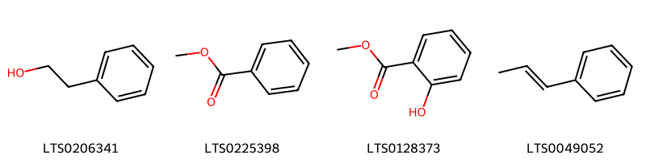{ width=100% }
    <figcaption>Hình ảnh cấu trúc hóa học của 4 hoạt chất thuộc nhóm Benzene and substituted derivatives gồm ['2-phenyl-ethanol (LTS0206341)', 'methyl benzoate (LTS0225398)', 'methyl salicylate (LTS0128373)', 'β-methylstyrene (LTS0049052)'].</figcaption>
</figure>
#### Nhóm Carboxylic acids and derivatives
<figure markdown="span">
    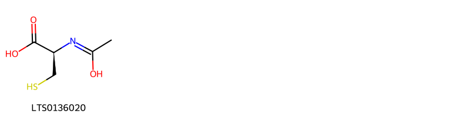{ width=100% }
    <figcaption>Hình ảnh cấu trúc hóa học của 1 hoạt chất thuộc nhóm Carboxylic acids and derivatives gồm ['(2r)-2-[(1-hydroxyethylidene)amino]-3-sulfanylpropanoic acid (LTS0136020)'].</figcaption>
</figure>
#### Nhóm Cinnamaldehydes
<figure markdown="span">
    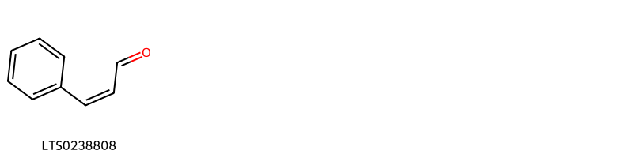{ width=100% }
    <figcaption>Hình ảnh cấu trúc hóa học của 1 hoạt chất thuộc nhóm Cinnamaldehydes gồm ['(z)-3-phenyl-2-propenal (LTS0238808)'].</figcaption>
</figure>
#### Nhóm Cinnamic acids and derivatives
<figure markdown="span">
    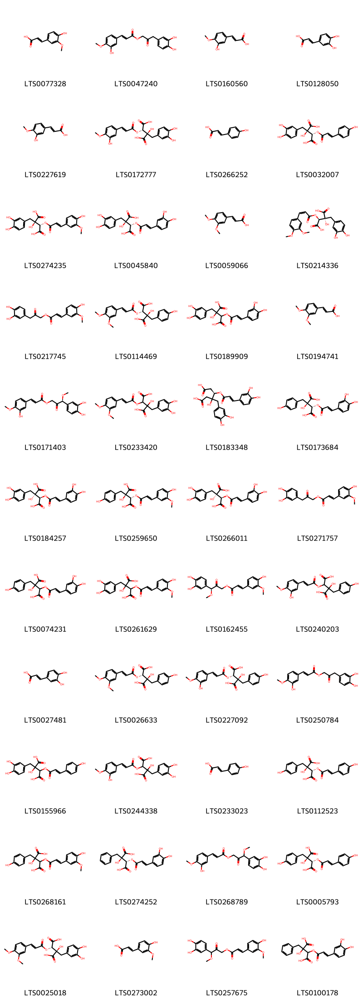{ width=100% }
    <figcaption>Hình ảnh cấu trúc hóa học của 44 hoạt chất thuộc nhóm Cinnamic acids and derivatives gồm ['ferulic acid (LTS0077328)', 'cimiracemate a (LTS0047240)', 'isoferulic acid (LTS0160560)', '3,4-dihydroxycinnamic acid (LTS0128050)', 'isoferulic acid (LTS0227619)', 'cimicifugic acid b (LTS0172777)', 'para-coumaric acid (LTS0266252)', '(2r,3s)-2-[(3,4-dihydroxyphenyl)methyl]-2-hydroxy-3-{[(2e)-3-(4-hydroxyphenyl)prop-2-enoyl]oxy}butanedioic acid (LTS0032007)', 'cimicifugic acid a (LTS0274235)', 'fukinolic acid (LTS0045840)', '3,4-dimethoxycinnamic acid (LTS0059066)', '(2r,3s)-2-[(3,4-dihydroxyphenyl)methyl]-3-{[(2z)-3-(3,4-dimethoxyphenyl)prop-2-enoyl]oxy}-2-hydroxybutanedioic acid (LTS0214336)', '3-(3,4-dihydroxyphenyl)-2-oxopropyl 3-(4-hydroxy-3-methoxyphenyl)prop-2-enoate (LTS0217745)', '(2r,3s)-3-{[(2e)-3-(3,4-dimethoxyphenyl)prop-2-enoyl]oxy}-2-hydroxy-2-[(4-hydroxyphenyl)methyl]butanedioic acid (LTS0114469)', '2-[(3,4-dihydroxyphenyl)methyl]-3-{[3-(3,4-dihydroxyphenyl)prop-2-enoyl]oxy}-2-hydroxybutanedioic acid (LTS0189909)', '3-(3,4-dimethoxyphenyl)prop-2-enoic acid (LTS0194741)', '(3s)-3-(3,4-dihydroxyphenyl)-3-methoxy-2-oxopropyl (2e)-3-(3-hydroxy-4-methoxyphenyl)prop-2-enoate (LTS0171403)', '2-[(3,4-dihydroxyphenyl)methyl]-3-{[3-(3,4-dimethoxyphenyl)prop-2-enoyl]oxy}-2-hydroxybutanedioic acid (LTS0233420)', '(4r)-3-[(3,4-dihydroxyphenyl)methyl]-4-{[(2e)-3-(3,4-dihydroxyphenyl)prop-2-enoyl]oxy}-3-hydroxyhexanedioic acid (LTS0183348)', 'cimicifugic acid d (LTS0173684)', '(2s,3r)-2-[(3,4-dihydroxyphenyl)methyl]-3-{[3-(3,4-dihydroxyphenyl)prop-2-enoyl]oxy}-2-hydroxybutanedioic acid (LTS0184257)', 'cimicifugic acid e (LTS0259650)', '(2s,3r)-2-[(3,4-dihydroxyphenyl)methyl]-3-{[(2e)-3-(3,4-dihydroxyphenyl)prop-2-enoyl]oxy}-2-hydroxybutanedioic acid (LTS0266011)', 'cimiracemate b (LTS0271757)', '3-{[3-(3,4-dihydroxyphenyl)prop-2-enoyl]oxy}-2-hydroxy-2-[(4-hydroxyphenyl)methyl]butanedioic acid (LTS0074231)', '2-[(3,4-dihydroxyphenyl)methyl]-2-hydroxy-3-{[3-(4-hydroxy-3-methoxyphenyl)prop-2-enoyl]oxy}butanedioic acid (LTS0261629)', '(3s)-3-(3,4-dihydroxyphenyl)-3-methoxy-2-oxopropyl (2e)-3-(4-hydroxy-3-methoxyphenyl)prop-2-enoate (LTS0162455)', '2-hydroxy-3-{[3-(3-hydroxy-4-methoxyphenyl)prop-2-enoyl]oxy}-2-[(4-hydroxyphenyl)methyl]butanedioic acid (LTS0240203)', 'caffeic acid (LTS0027481)', '(2r,3s)-3-{[3-(3,4-dimethoxyphenyl)prop-2-enoyl]oxy}-2-hydroxy-2-[(4-hydroxyphenyl)methyl]butanedioic acid (LTS0026633)', 'cimicifugic acid f (LTS0227092)', '3-(3,4-dihydroxyphenyl)-2-oxopropyl 3-(3-hydroxy-4-methoxyphenyl)prop-2-enoate (LTS0250784)', '2-[(3,4-dihydroxyphenyl)methyl]-2-hydroxy-3-{[3-(4-hydroxyphenyl)prop-2-enoyl]oxy}butanedioic acid (LTS0155966)', '2-[(3,4-dihydroxyphenyl)methyl]-2-hydroxy-3-{[3-(3-hydroxy-4-methoxyphenyl)prop-2-enoyl]oxy}butanedioic acid (LTS0244338)', 'hydroxycinnamic acid (LTS0233023)', '(2r,3s)-2-hydroxy-2-[(4-hydroxyphenyl)methyl]-3-{[(2e)-3-(4-hydroxyphenyl)prop-2-enoyl]oxy}butanedioic acid (LTS0112523)', '2-hydroxy-3-{[3-(4-hydroxy-3-methoxyphenyl)prop-2-enoyl]oxy}-2-[(4-hydroxyphenyl)methyl]butanedioic acid (LTS0268161)', '(2r,3s)-2-benzyl-3-{[(2e)-3-(3,4-dihydroxyphenyl)prop-2-enoyl]oxy}-2-hydroxybutanedioic acid (LTS0274252)', '3-(3,4-dihydroxyphenyl)-3-methoxy-2-oxopropyl 3-(3-hydroxy-4-methoxyphenyl)prop-2-enoate (LTS0268789)', '(2r,3s)-2-hydroxy-2-[(4-hydroxyphenyl)methyl]-3-{[3-(4-hydroxyphenyl)prop-2-enoyl]oxy}butanedioic acid (LTS0005793)', '(2r,3s)-2-[(3,4-dihydroxyphenyl)methyl]-3-{[3-(3,4-dimethoxyphenyl)prop-2-enoyl]oxy}-2-hydroxybutanedioic acid (LTS0025018)', 'ferulic acid (LTS0273002)', '3-(3,4-dihydroxyphenyl)-3-methoxy-2-oxopropyl 3-(4-hydroxy-3-methoxyphenyl)prop-2-enoate (LTS0257675)', '2-benzyl-3-{[3-(3,4-dihydroxyphenyl)prop-2-enoyl]oxy}-2-hydroxybutanedioic acid (LTS0100178)'].</figcaption>
</figure>
#### Nhóm Fatty Acyls
<figure markdown="span">
    { width=100% }
    <figcaption>Hình ảnh cấu trúc hóa học của 1 hoạt chất thuộc nhóm Fatty Acyls gồm ['hexanoic acid (LTS0031054)'].</figcaption>
</figure>
#### Nhóm Indoles and derivatives
<figure markdown="span">
    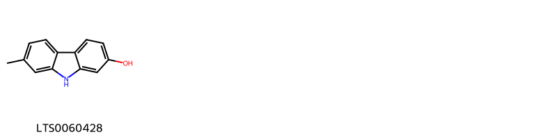{ width=100% }
    <figcaption>Hình ảnh cấu trúc hóa học của 1 hoạt chất thuộc nhóm Indoles and derivatives gồm ['7-methyl-9h-carbazol-2-ol (LTS0060428)'].</figcaption>
</figure>
#### Nhóm Organooxygen compounds
<figure markdown="span">
    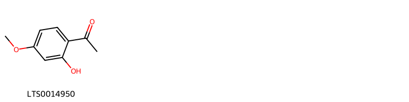{ width=100% }
    <figcaption>Hình ảnh cấu trúc hóa học của 1 hoạt chất thuộc nhóm Organooxygen compounds gồm ['paeonol (LTS0014950)'].</figcaption>
</figure>
#### Nhóm Phenols
<figure markdown="span">
    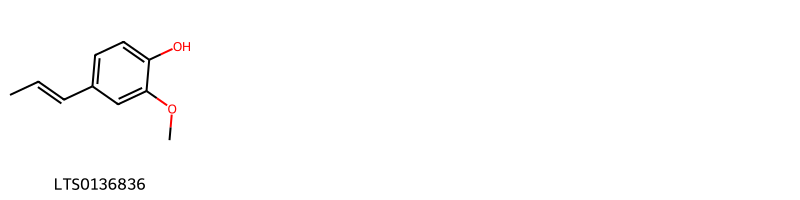{ width=100% }
    <figcaption>Hình ảnh cấu trúc hóa học của 1 hoạt chất thuộc nhóm Phenols gồm ['isoeugenol (LTS0136836)'].</figcaption>
</figure>
#### Nhóm Phenylpropanoic acids
<figure markdown="span">
    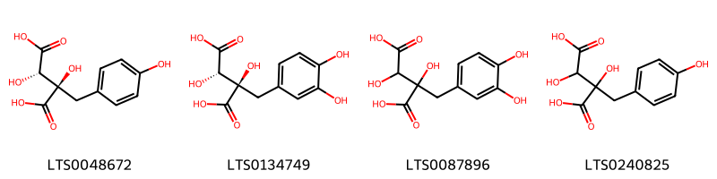{ width=100% }
    <figcaption>Hình ảnh cấu trúc hóa học của 4 hoạt chất thuộc nhóm Phenylpropanoic acids gồm ['piscidic acid (LTS0048672)', 'fukiic acid (LTS0134749)', '2-[(3,4-dihydroxyphenyl)methyl]-2,3-dihydroxybutanedioic acid (LTS0087896)', '2,3-dihydroxy-2-[(4-hydroxyphenyl)methyl]butanedioic acid (LTS0240825)'].</figcaption>
</figure>
#### Nhóm Prenol lipids
<figure markdown="span">
    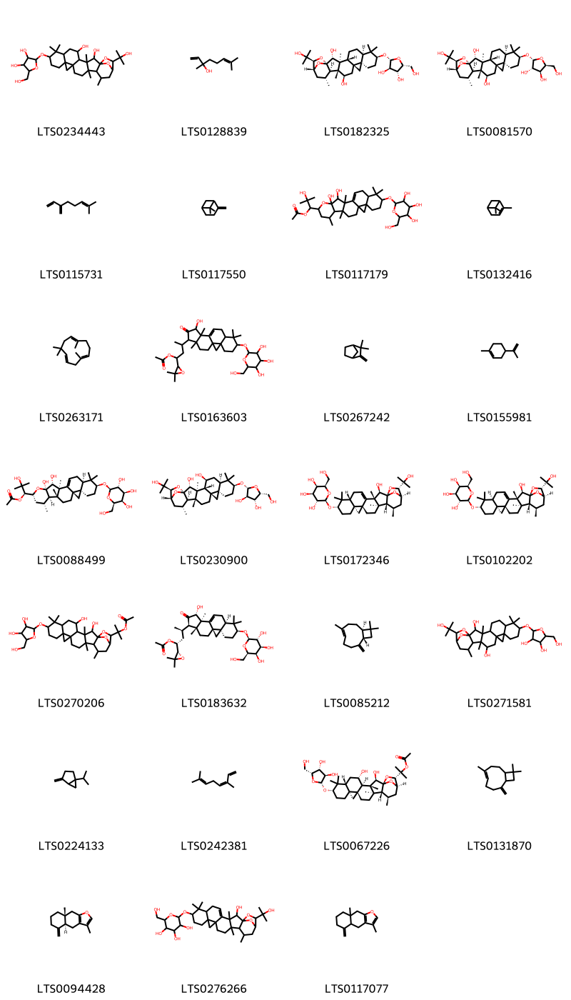{ width=100% }
    <figcaption>Hình ảnh cấu trúc hóa học của 27 hoạt chất thuộc nhóm Prenol lipids gồm ['9-{[3,4-dihydroxy-5-(hydroxymethyl)oxolan-2-yl]oxy}-22-(2-hydroxypropan-2-yl)-3,8,8,17,19-pentamethyl-23,24-dioxaheptacyclo[19.2.1.0¹,¹⁸.0³,¹⁷.0⁴,¹⁴.0⁷,¹².0¹²,¹⁴]tetracosane-2,5-diol (LTS0234443)', 'linalool, (+-)- (LTS0128839)', '(1s,2r,3s,4r,7r,9s,12r,14r,16r,17r,18r,19r,21r,22s)-9-{[(2r,3r,4r,5r)-3,4-dihydroxy-5-(hydroxymethyl)oxolan-2-yl]oxy}-22-(2-hydroxypropan-2-yl)-3,8,8,17,19-pentamethyl-23,24-dioxaheptacyclo[19.2.1.0¹,¹⁸.0³,¹⁷.0⁴,¹⁴.0⁷,¹².0¹²,¹⁴]tetracosane-2,16-diol (LTS0182325)', '(1s,2r,3s,4r,7r,9s,12r,14r,16r,17r,18r,19r,21r,22s)-9-{[(2r,3s,4s,5s)-3,4-dihydroxy-5-(hydroxymethyl)oxolan-2-yl]oxy}-22-(2-hydroxypropan-2-yl)-3,8,8,17,19-pentamethyl-23,24-dioxaheptacyclo[19.2.1.0¹,¹⁸.0³,¹⁷.0⁴,¹⁴.0⁷,¹².0¹²,¹⁴]tetracosane-2,16-diol (LTS0081570)', 'α-myrcene (LTS0115731)', 'β-pinene (LTS0117550)', '1-(10,11-dihydroxy-4,6,12,17,17-pentamethyl-18-{[3,4,5-trihydroxy-6-(hydroxymethyl)oxan-2-yl]oxy}-9-oxahexacyclo[11.9.0.0¹,²¹.0⁴,¹².0⁵,¹⁰.0¹⁶,²¹]docos-13-en-8-yl)-2-hydroxy-2-methylpropyl acetate (LTS0117179)', 'α pinene (LTS0132416)', 'humulene (LTS0263171)', '1-(3,3-dimethyloxiran-2-yl)-3-(13-hydroxy-7,7,12,16-tetramethyl-14-oxo-6-{[3,4,5-trihydroxy-6-(hydroxymethyl)oxan-2-yl]oxy}pentacyclo[9.7.0.0¹,³.0³,⁸.0¹²,¹⁶]octadec-10-en-15-yl)butyl acetate (LTS0163603)', 'camphene (LTS0267242)', 'limonene,  (LTS0155981)', '(1r)-1-[(1r,4r,5r,6r,8r,10r,11r,12r,16r,18s,21r)-10,11-dihydroxy-4,6,12,17,17-pentamethyl-18-{[(2r,3r,4s,5r,6r)-3,4,5-trihydroxy-6-(hydroxymethyl)oxan-2-yl]oxy}-9-oxahexacyclo[11.9.0.0¹,²¹.0⁴,¹².0⁵,¹⁰.0¹⁶,²¹]docos-13-en-8-yl]-2-hydroxy-2-methylpropyl acetate (LTS0088499)', '(1s,2r,3s,4r,5s,7r,9s,12r,14s,17r,18r,19r,21r,22s)-9-{[(2r,3r,4r,5r)-3,4-dihydroxy-5-(hydroxymethyl)oxolan-2-yl]oxy}-22-(2-hydroxypropan-2-yl)-3,8,8,17,19-pentamethyl-23,24-dioxaheptacyclo[19.2.1.0¹,¹⁸.0³,¹⁷.0⁴,¹⁴.0⁷,¹².0¹²,¹⁴]tetracosane-2,5-diol (LTS0230900)', '(2r,3r,4s,5r,6r)-2-{[(1s,2r,3r,7r,9s,12r,14r,17r,18r,19r,21r,22s)-2-hydroxy-22-(2-hydroxypropan-2-yl)-3,8,8,17,19-pentamethyl-23,24-dioxaheptacyclo[19.2.1.0¹,¹⁸.0³,¹⁷.0⁴,¹⁴.0⁷,¹².0¹²,¹⁴]tetracos-4-en-9-yl]oxy}-6-(hydroxymethyl)oxane-3,4,5-triol (LTS0172346)', '(2r,3r,4s,5r,6r)-2-{[(1s,2r,3r,7s,9s,12r,14r,17r,18r,19r,21r,22s)-2-hydroxy-22-(2-hydroxypropan-2-yl)-3,8,8,17,19-pentamethyl-23,24-dioxaheptacyclo[19.2.1.0¹,¹⁸.0³,¹⁷.0⁴,¹⁴.0⁷,¹².0¹²,¹⁴]tetracos-4-en-9-yl]oxy}-6-(hydroxymethyl)oxane-3,4,5-triol (LTS0102202)', '2-(9-{[3,4-dihydroxy-5-(hydroxymethyl)oxolan-2-yl]oxy}-2,5-dihydroxy-3,8,8,17,19-pentamethyl-23,24-dioxaheptacyclo[19.2.1.0¹,¹⁸.0³,¹⁷.0⁴,¹⁴.0⁷,¹².0¹²,¹⁴]tetracosan-22-yl)propan-2-yl acetate (LTS0270206)', '(1r,3r)-1-[(2s)-3,3-dimethyloxiran-2-yl]-3-[(1r,3r,6s,8r,12r,13r,15r,16r)-13-hydroxy-7,7,12,16-tetramethyl-14-oxo-6-{[(2r,3r,4s,5r,6r)-3,4,5-trihydroxy-6-(hydroxymethyl)oxan-2-yl]oxy}pentacyclo[9.7.0.0¹,³.0³,⁸.0¹²,¹⁶]octadec-10-en-15-yl]butyl acetate (LTS0183632)', 'caryophyllene (LTS0085212)', '9-{[3,4-dihydroxy-5-(hydroxymethyl)oxolan-2-yl]oxy}-22-(2-hydroxypropan-2-yl)-3,8,8,17,19-pentamethyl-23,24-dioxaheptacyclo[19.2.1.0¹,¹⁸.0³,¹⁷.0⁴,¹⁴.0⁷,¹².0¹²,¹⁴]tetracosane-2,16-diol (LTS0271581)', 'sabinene (LTS0224133)', 'β-ocimene (LTS0242381)', '2-[(1s,2r,3s,4r,5s,7r,9s,12r,14s,17r,18r,19r,21r,22s)-9-{[(2r,3r,4r,5r)-3,4-dihydroxy-5-(hydroxymethyl)oxolan-2-yl]oxy}-2,5-dihydroxy-3,8,8,17,19-pentamethyl-23,24-dioxaheptacyclo[19.2.1.0¹,¹⁸.0³,¹⁷.0⁴,¹⁴.0⁷,¹².0¹²,¹⁴]tetracosan-22-yl]propan-2-yl acetate (LTS0067226)', 'caryophyllene (LTS0131870)', 'atractylone (LTS0094428)', '2-{[2-hydroxy-22-(2-hydroxypropan-2-yl)-3,8,8,17,19-pentamethyl-23,24-dioxaheptacyclo[19.2.1.0¹,¹⁸.0³,¹⁷.0⁴,¹⁴.0⁷,¹².0¹²,¹⁴]tetracos-4-en-9-yl]oxy}-6-(hydroxymethyl)oxane-3,4,5-triol (LTS0276266)', '3,8a-dimethyl-5-methylidene-4h,4ah,6h,7h,8h,9h-naphtho[2,3-b]furan (LTS0117077)'].</figcaption>
</figure>
#### Nhóm Steroids and steroid derivatives
<figure markdown="span">
    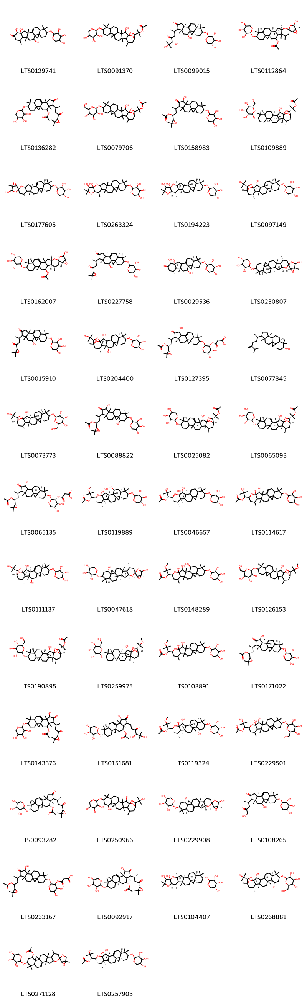{ width=100% }
    <figcaption>Hình ảnh cấu trúc hóa học của 100 hoạt chất thuộc nhóm Steroids and steroid derivatives gồm ['2,9,10-trihydroxy-4,6,12,17,17-pentamethyl-18-[(3,4,5-trihydroxyoxan-2-yl)oxy]hexacyclo[11.9.0.0¹,²¹.0⁴,¹².0⁵,¹⁰.0¹⁶,²¹]docos-13-en-8-one (LTS0129741)', '2-{2-hydroxy-3,8,8,17,19-pentamethyl-9-[(3,4,5-trihydroxyoxan-2-yl)oxy]-23,24-dioxaheptacyclo[19.2.1.0¹,¹⁸.0³,¹⁷.0⁴,¹⁴.0⁷,¹².0¹²,¹⁴]tetracosan-22-yl}propan-2-yl acetate (LTS0091370)', 'cimicifugoside h-2 (LTS0099015)', "(1'r,2r,4'r,5s,5'r,10's,12's,13's,16'r,21'r)-4-hydroxy-4',5,6',12',17',17'-hexamethyl-18'-{[(2s)-3,4,5-trihydroxyoxan-2-yl]oxy}-3,6,9'-trioxaspiro[bicyclo[3.1.0]hexane-2,8'-hexacyclo[11.9.0.0¹,²¹.0⁴,¹².0⁵,¹⁰.0¹⁶,²¹]docosan]-3'-yl acetate (LTS0112864)", '15-[4-(3,3-dimethyloxiran-2-yl)-4-oxobutan-2-yl]-7,7,12,16-tetramethyl-14-oxo-6-[(3,4,5-trihydroxyoxan-2-yl)oxy]pentacyclo[9.7.0.0¹,³.0³,⁸.0¹²,¹⁶]octadec-10-en-17-yl acetate (LTS0136282)', '2-(2-hydroxy-3,8,8,17,19-pentamethyl-9-{[3,4,5-trihydroxy-6-(hydroxymethyl)oxan-2-yl]oxy}-23,24-dioxaheptacyclo[19.2.1.0¹,¹⁸.0³,¹⁷.0⁴,¹⁴.0⁷,¹².0¹²,¹⁴]tetracosan-22-yl)propan-2-yl acetate (LTS0079706)', '1-(3,3-dimethyloxiran-2-yl)-3-{13-hydroxy-7,7,12,16-tetramethyl-14-oxo-6-[(3,4,5-trihydroxyoxan-2-yl)oxy]pentacyclo[9.7.0.0¹,³.0³,⁸.0¹²,¹⁶]octadecan-15-yl}butyl acetate (LTS0158983)', '2-[(1s,2r,3s,4r,7r,9s,12r,14s,17r,18r,19r,21r,22s)-2-hydroxy-3,8,8,17,19-pentamethyl-9-{[(2r,3r,4s,5r,6r)-3,4,5-trihydroxy-6-(hydroxymethyl)oxan-2-yl]oxy}-23,24-dioxaheptacyclo[19.2.1.0¹,¹⁸.0³,¹⁷.0⁴,¹⁴.0⁷,¹².0¹²,¹⁴]tetracosan-22-yl]propan-2-yl acetate (LTS0109889)', "(2s,3r,4s,5r)-2-[(1'r,4'r,6'r,12'r,16'r,21'r)-4',5,6',12',17',17'-hexamethyl-3,6,9'-trioxaspiro[bicyclo[3.1.0]hexane-2,8'-hexacyclo[11.9.0.0¹,²¹.0⁴,¹².0⁵,¹⁰.0¹⁶,²¹]docosan]-13'-en-4-oloxy]oxane-3,4,5-triol (LTS0177605)", '2-({21,22-dihydroxy-1,6,6,15,17,20,20-heptamethyl-19,23-dioxaheptacyclo[13.10.0.0²,¹².0⁵,¹⁰.0¹⁰,¹².0¹⁶,²⁴.0¹⁸,²²]pentacosan-7-yl}oxy)oxane-3,4,5-triol (LTS0263324)', '(2s,3r,4s,5r)-2-{[(1s,2s,5r,7s,10r,12s,15r,16r,17s,18r,21r,22r,24s)-21,22-dihydroxy-1,6,6,15,17,20,20-heptamethyl-19,23-dioxaheptacyclo[13.10.0.0²,¹².0⁵,¹⁰.0¹⁰,¹².0¹⁶,²⁴.0¹⁸,²²]pentacosan-7-yl]oxy}oxane-3,4,5-triol (LTS0194223)', 'cimigenol xyloside (LTS0097149)', "(1r,2r,3's,4'r,5s,5'r,6'r,10's,12's,16'r,18'r,21'r)-4-hydroxy-4',5,6',12',17',17'-hexamethyl-18'-{[(2s,3r,4s,5r)-3,4,5-trihydroxyoxan-2-yl]oxy}-3,6,9'-trioxaspiro[bicyclo[3.1.0]hexane-2,8'-hexacyclo[11.9.0.0¹,²¹.0⁴,¹².0⁵,¹⁰.0¹⁶,²¹]docosan]-13'-en-3'-yl acetate (LTS0162007)", 'cimicifugoside h1 (LTS0227758)', 'cimicifugoside h-4 (LTS0029536)', "(2s,3r,4s,5r)-2-[(1s,1's,4'r,5r,5'r,6'r,10's,12's,13's,16'r,21'r)-4',5,6',12',17',17'-hexamethyl-3,6,9'-trioxaspiro[bicyclo[3.1.0]hexane-2,8'-hexacyclo[11.9.0.0¹,²¹.0⁴,¹².0⁵,¹⁰.0¹⁶,²¹]docosan]-4-oloxy]oxane-3,4,5-triol (LTS0230807)", '15-[4-(3,3-dimethyloxiran-2-yl)-4-oxobutan-2-yl]-18-hydroxy-7,7,12,16-tetramethyl-6-[(3,4,5-trihydroxyoxan-2-yl)oxy]pentacyclo[9.7.0.0¹,³.0³,⁸.0¹²,¹⁶]octadec-10-en-14-one (LTS0015910)', '(2s,3r,4s,5s)-2-{[(2r,3s,7r,9s,12r,14s,16r,17r,18r,19r,21r,22s)-2,16-dihydroxy-22-(2-hydroxypropan-2-yl)-3,8,8,17,19-pentamethyl-23,24-dioxaheptacyclo[19.2.1.0¹,¹⁸.0³,¹⁷.0⁴,¹⁴.0⁷,¹².0¹²,¹⁴]tetracos-4-en-9-yl]oxy}oxane-3,4,5-triol (LTS0204400)', '3-{[(2s,3r,4s,5r)-2-{[(1r,3r,6s,8r,12r,13r,15r,16r)-15-[(2r,4r)-4-(acetyloxy)-4-[(2s)-3,3-dimethyloxiran-2-yl]butan-2-yl]-13-hydroxy-7,7,12,16-tetramethyl-14-oxopentacyclo[9.7.0.0¹,³.0³,⁸.0¹²,¹⁶]octadec-10-en-6-yl]oxy}-4,5-dihydroxyoxan-3-yl]oxy}-3-oxopropanoic acid (LTS0127395)', '24-methylene-cycloartanol (LTS0077845)', '(2r,3r,4s,5r,6r)-2-{[(1s,2r,3s,4r,7r,9s,12r,14s,17r,18r,19r,21r,22s)-2-hydroxy-22-(2-hydroxypropan-2-yl)-3,8,8,17,19-pentamethyl-23,24-dioxaheptacyclo[19.2.1.0¹,¹⁸.0³,¹⁷.0⁴,¹⁴.0⁷,¹².0¹²,¹⁴]tetracosan-9-yl]oxy}-6-(hydroxymethyl)oxane-3,4,5-triol (LTS0073773)', '3-{4,13-dihydroxy-7,7,12,16-tetramethyl-14-oxo-6-[(3,4,5-trihydroxyoxan-2-yl)oxy]pentacyclo[9.7.0.0¹,³.0³,⁸.0¹²,¹⁶]octadecan-15-yl}-1-(3,3-dimethyloxiran-2-yl)butyl acetate (LTS0088822)', '2-[(1s,2s,3r,7s,9s,12r,14r,17r,18r,19r,21r,22s)-2-hydroxy-3,8,8,17,19-pentamethyl-9-{[(2s,3r,4s,5s)-3,4,5-trihydroxyoxan-2-yl]oxy}-23,24-dioxaheptacyclo[19.2.1.0¹,¹⁸.0³,¹⁷.0⁴,¹⁴.0⁷,¹².0¹²,¹⁴]tetracos-4-en-22-yl]propan-2-yl acetate (LTS0025082)', '2-[(1s,2s,3r,7s,9s,12r,14r,17r,18r,19r,21r,22s)-2-hydroxy-3,8,8,17,19-pentamethyl-9-{[(2s,3r,4s,5r)-3,4,5-trihydroxyoxan-2-yl]oxy}-23,24-dioxaheptacyclo[19.2.1.0¹,¹⁸.0³,¹⁷.0⁴,¹⁴.0⁷,¹².0¹²,¹⁴]tetracos-4-en-22-yl]propan-2-yl acetate (LTS0065093)', '3-{[(2s,3r,4s,5r)-2-{[(1s,3r,6s,8r,11s,12s,13r,15r,16r)-15-[(2r,4r)-4-(acetyloxy)-4-[(2s)-3,3-dimethyloxiran-2-yl]butan-2-yl]-13-hydroxy-7,7,12,16-tetramethyl-14-oxopentacyclo[9.7.0.0¹,³.0³,⁸.0¹²,¹⁶]octadecan-6-yl]oxy}-4,5-dihydroxyoxan-3-yl]oxy}-3-oxopropanoic acid (LTS0065135)', '(1s)-2-methoxy-2-methyl-1-[(1s,4r,5r,6r,8r,10r,11r,12s,13r,14s,16r,18s,21r)-10,11,14-trihydroxy-4,6,12,17,17-pentamethyl-18-{[(2s,3r,4s,5r)-3,4,5-trihydroxyoxan-2-yl]oxy}-9-oxahexacyclo[11.9.0.0¹,²¹.0⁴,¹².0⁵,¹⁰.0¹⁶,²¹]docosan-8-yl]propyl acetate (LTS0119889)', '(1s)-1-[(1r,4r,5r,6r,8r,10r,11r,12r,16r,18s,21r)-10,11-dihydroxy-4,6,12,17,17-pentamethyl-18-{[(2s,3r,4s,5r)-3,4,5-trihydroxyoxan-2-yl]oxy}-9-oxahexacyclo[11.9.0.0¹,²¹.0⁴,¹².0⁵,¹⁰.0¹⁶,²¹]docos-13-en-8-yl]-2-hydroxy-2-methylpropyl acetate (LTS0046657)', '1-{10,11-dihydroxy-4,6,12,17,17-pentamethyl-18-[(3,4,5-trihydroxyoxan-2-yl)oxy]-9-oxahexacyclo[11.9.0.0¹,²¹.0⁴,¹².0⁵,¹⁰.0¹⁶,²¹]docos-13-en-8-yl}-2-hydroxy-2-methylpropyl acetate (LTS0114617)', '(2s,3r,4s,5s)-2-{[(1s,2r,3s,7r,9s,12r,14s,16r,17r,18r,19r,21r,22s)-2,16-dihydroxy-22-(2-hydroxypropan-2-yl)-3,8,8,17,19-pentamethyl-23,24-dioxaheptacyclo[19.2.1.0¹,¹⁸.0³,¹⁷.0⁴,¹⁴.0⁷,¹².0¹²,¹⁴]tetracos-4-en-9-yl]oxy}oxane-3,4,5-triol (LTS0111137)', "(2s,3r,4s,5r)-2-[(1r,1's,2r,4'r,5s,5'r,6'r,10's,12's,13's,16's,18's,20's,21's)-4',5,6',12',17',17'-hexamethyl-3,6,9'-trioxaspiro[bicyclo[3.1.0]hexane-2,8'-hexacyclo[11.9.0.0¹,²¹.0⁴,¹².0⁵,¹⁰.0¹⁶,²¹]docosane]-4,20'-dioloxy]oxane-3,4,5-triol (LTS0047618)", '2-methoxy-2-methyl-1-{10,11,14-trihydroxy-4,6,12,17,17-pentamethyl-18-[(3,4,5-trihydroxyoxan-2-yl)oxy]-9-oxahexacyclo[11.9.0.0¹,²¹.0⁴,¹².0⁵,¹⁰.0¹⁶,²¹]docosan-8-yl}propyl acetate (LTS0148289)', '2-{[2-hydroxy-22-(2-methoxypropan-2-yl)-3,8,8,17,19-pentamethyl-23,24-dioxaheptacyclo[19.2.1.0¹,¹⁸.0³,¹⁷.0⁴,¹⁴.0⁷,¹².0¹²,¹⁴]tetracosan-9-yl]oxy}-6-(hydroxymethyl)oxane-3,4,5-triol (LTS0126153)', '2-[(1s,2r,3s,4r,7r,9s,12r,14s,17r,18r,19r,21r,22s)-2-hydroxy-3,8,8,17,19-pentamethyl-9-{[(2r,3r,4s,5s,6r)-3,4,5-trihydroxy-6-(hydroxymethyl)oxan-2-yl]oxy}-23,24-dioxaheptacyclo[19.2.1.0¹,¹⁸.0³,¹⁷.0⁴,¹⁴.0⁷,¹².0¹²,¹⁴]tetracosan-22-yl]propan-2-yl acetate (LTS0190895)', '(2r,3r,4s,5r,6r)-2-{[(1s,2r,3s,4r,7r,9s,12r,14s,17r,18r,19r,21r,22s)-2-hydroxy-22-(2-methoxypropan-2-yl)-3,8,8,17,19-pentamethyl-23,24-dioxaheptacyclo[19.2.1.0¹,¹⁸.0³,¹⁷.0⁴,¹⁴.0⁷,¹².0¹²,¹⁴]tetracosan-9-yl]oxy}-6-(hydroxymethyl)oxane-3,4,5-triol (LTS0259975)', '1-{10,11-dihydroxy-4,6,12,17,17-pentamethyl-18-[(3,4,5-trihydroxyoxan-2-yl)oxy]-9-oxahexacyclo[11.9.0.0¹,²¹.0⁴,¹².0⁵,¹⁰.0¹⁶,²¹]docosan-8-yl}-2-methoxy-2-methylpropyl acetate (LTS0103891)', '(1r,3r)-1-[(2r)-3,3-dimethyloxiran-2-yl]-3-[(1s,3r,6s,8r,11r,12s,13r,15r,16r)-13-hydroxy-7,7,12,16-tetramethyl-14-oxo-6-{[(2s,3r,4s,5r)-3,4,5-trihydroxyoxan-2-yl]oxy}pentacyclo[9.7.0.0¹,³.0³,⁸.0¹²,¹⁶]octadecan-15-yl]butyl acetate (LTS0171022)', '15-[4-(3,3-dimethyloxiran-2-yl)-4-oxobutan-2-yl]-13-hydroxy-7,7,12,16-tetramethyl-14-oxo-6-[(3,4,5-trihydroxyoxan-2-yl)oxy]pentacyclo[9.7.0.0¹,³.0³,⁸.0¹²,¹⁶]octadec-10-en-17-yl acetate (LTS0143376)', '(1s,3r,6s,8r,12s,13r,15r,16r,17r)-15-[(2r,5r)-5,6-dihydroxy-6-methyl-4-oxoheptan-2-yl]-13-hydroxy-7,7,12,16-tetramethyl-14-oxo-6-{[(2s,3r,4s,5s)-3,4,5-trihydroxyoxan-2-yl]oxy}pentacyclo[9.7.0.0¹,³.0³,⁸.0¹²,¹⁶]octadec-10-en-17-yl acetate (LTS0151681)', '(1s)-2-methoxy-2-methyl-1-[(1s,4r,5r,6r,8r,10s,11r,12s,13r,16s,18s,20s,21s)-10,11,20-trihydroxy-4,6,12,17,17-pentamethyl-18-{[(2s,3r,4s,5r)-3,4,5-trihydroxyoxan-2-yl]oxy}-9-oxahexacyclo[11.9.0.0¹,²¹.0⁴,¹².0⁵,¹⁰.0¹⁶,²¹]docosan-8-yl]propyl acetate (LTS0119324)', '1-(10,11-dihydroxy-4,6,12,17,17-pentamethyl-18-{[3,4,5-trihydroxy-6-(hydroxymethyl)oxan-2-yl]oxy}-9-oxahexacyclo[11.9.0.0¹,²¹.0⁴,¹².0⁵,¹⁰.0¹⁶,²¹]docosan-8-yl)-2-hydroxy-2-methylpropyl acetate (LTS0229501)', '(1s,3r,6s,8r,12s,15r,16r,17r)-15-[(2r)-4-[(2s)-3,3-dimethyloxiran-2-yl]-4-oxobutan-2-yl]-7,7,12,16-tetramethyl-14-oxo-6-{[(2s,3r,4s,5s)-3,4,5-trihydroxyoxan-2-yl]oxy}pentacyclo[9.7.0.0¹,³.0³,⁸.0¹²,¹⁶]octadec-10-en-17-yl acetate (LTS0093282)', '2-{[2,11-dihydroxy-22-(2-hydroxypropan-2-yl)-3,8,8,17,19-pentamethyl-23,24-dioxaheptacyclo[19.2.1.0¹,¹⁸.0³,¹⁷.0⁴,¹⁴.0⁷,¹².0¹²,¹⁴]tetracosan-9-yl]oxy}oxane-3,4,5-triol (LTS0250966)', "(2s,3r,4s,5r)-2-[(1r,1's,2r,4'r,5s,5'r,6'r,10's,12'r,16's,18's,20's,21's)-4',5,6',12',17',17'-hexamethyl-3,6,9'-trioxaspiro[bicyclo[3.1.0]hexane-2,8'-hexacyclo[11.9.0.0¹,²¹.0⁴,¹².0⁵,¹⁰.0¹⁶,²¹]docosan]-13'-ene-4,20'-dioloxy]oxane-3,4,5-triol (LTS0229908)", 'cimicifugoside h-3 (LTS0108265)', '3-{[2-({15-[4-(acetyloxy)-4-(3,3-dimethyloxiran-2-yl)butan-2-yl]-13-hydroxy-7,7,12,16-tetramethyl-14-oxopentacyclo[9.7.0.0¹,³.0³,⁸.0¹²,¹⁶]octadecan-6-yl}oxy)-4,5-dihydroxyoxan-3-yl]oxy}-3-oxopropanoic acid (LTS0233167)', '(1s,3r,6r,8r,12s,13r,15r,16r,17r)-15-[(2r)-4-[(2r)-3,3-dimethyloxiran-2-yl]-4-oxobutan-2-yl]-13-hydroxy-7,7,12,16-tetramethyl-14-oxo-6-{[(2s,3r,4s,5s)-3,4,5-trihydroxyoxan-2-yl]oxy}pentacyclo[9.7.0.0¹,³.0³,⁸.0¹²,¹⁶]octadec-10-en-17-yl acetate (LTS0092917)', '(2s,3r,4s,5r)-2-{[(1s,2s,5r,7s,10r,12s,15r,16r,17s,18r,21r,22s,24s)-21,22-dihydroxy-1,6,6,15,17,20,20-heptamethyl-19,23-dioxaheptacyclo[13.10.0.0²,¹².0⁵,¹⁰.0¹⁰,¹².0¹⁶,²⁴.0¹⁸,²²]pentacosan-7-yl]oxy}oxane-3,4,5-triol (LTS0104407)', '(2r,3r,4s,5r,6r)-2-{[(1s,2r,3s,4s,7s,9s,11s,12s,14s,17r,18r,19r,21r,22s)-2,11-dihydroxy-22-(2-hydroxypropan-2-yl)-3,8,8,17,19-pentamethyl-23,24-dioxaheptacyclo[19.2.1.0¹,¹⁸.0³,¹⁷.0⁴,¹⁴.0⁷,¹².0¹²,¹⁴]tetracosan-9-yl]oxy}-6-(hydroxymethyl)oxane-3,4,5-triol (LTS0268881)', "4',5,6',12',17',17'-hexamethyl-18'-[(3,4,5-trihydroxyoxan-2-yl)oxy]-3,6,9'-trioxaspiro[bicyclo[3.1.0]hexane-2,8'-hexacyclo[11.9.0.0¹,²¹.0⁴,¹².0⁵,¹⁰.0¹⁶,²¹]docosan]-13'-en-20'-yl acetate (LTS0271128)", '(1s)-1-[(1r,4r,5r,6r,8r,10r,11r,12r,16r,18s,21r)-10,11-dihydroxy-4,6,12,17,17-pentamethyl-18-{[(2s,3r,4s,5s)-3,4,5-trihydroxyoxan-2-yl]oxy}-9-oxahexacyclo[11.9.0.0¹,²¹.0⁴,¹².0⁵,¹⁰.0¹⁶,²¹]docos-13-en-8-yl]-2-hydroxy-2-methylpropyl acetate (LTS0257903)', '(1s)-1-[(1s,4r,5r,6r,8r,10r,11r,12s,13r,16r,18s,21r)-10,11-dihydroxy-4,6,12,17,17-pentamethyl-18-{[(2s,3r,4s,5r)-3,4,5-trihydroxyoxan-2-yl]oxy}-9-oxahexacyclo[11.9.0.0¹,²¹.0⁴,¹².0⁵,¹⁰.0¹⁶,²¹]docosan-8-yl]-2-methoxy-2-methylpropyl acetate (LTS0159073)', '2-hydroxy-2-methyl-1-{10,11,14-trihydroxy-4,6,12,17,17-pentamethyl-18-[(3,4,5-trihydroxyoxan-2-yl)oxy]-9-oxahexacyclo[11.9.0.0¹,²¹.0⁴,¹².0⁵,¹⁰.0¹⁶,²¹]docosan-8-yl}propyl acetate (LTS0115191)', '(1r,3r)-3-[(1s,3r,6s,8r,10s,11r,12s,13r,15r,16r)-10,13-dihydroxy-7,7,12,16-tetramethyl-14-oxo-6-{[(2s,3r,4s,5r)-3,4,5-trihydroxyoxan-2-yl]oxy}pentacyclo[9.7.0.0¹,³.0³,⁸.0¹²,¹⁶]octadecan-15-yl]-1-[(2s)-3,3-dimethyloxiran-2-yl]butyl acetate (LTS0091861)', '2-{2-hydroxy-3,8,8,17,19-pentamethyl-9-[(3,4,5-trihydroxyoxan-2-yl)oxy]-23,24-dioxaheptacyclo[19.2.1.0¹,¹⁸.0³,¹⁷.0⁴,¹⁴.0⁷,¹².0¹²,¹⁴]tetracos-4-en-22-yl}propan-2-yl acetate (LTS0269188)', '(3r,6s,8r,11s,12s,15r,16r)-7,7,12,16-tetramethyl-15-[(2r)-6-methylhept-5-en-2-yl]pentacyclo[9.7.0.0¹,³.0³,⁸.0¹²,¹⁶]octadecan-6-ol (LTS0062833)', '(1r,3r,6s,8r,12r,15r,16r)-7,7,12,16-tetramethyl-15-[(2s)-6-methylhept-5-en-2-yl]pentacyclo[9.7.0.0¹,³.0³,⁸.0¹²,¹⁶]octadec-10-en-6-ol (LTS0039818)', '25-o-acetylcimigenol xyloside (LTS0217527)', '2-{2,11-dihydroxy-3,8,8,17,19-pentamethyl-9-[(3,4,5-trihydroxyoxan-2-yl)oxy]-23,24-dioxaheptacyclo[19.2.1.0¹,¹⁸.0³,¹⁷.0⁴,¹⁴.0⁷,¹².0¹²,¹⁴]tetracosan-22-yl}propan-2-yl acetate (LTS0218436)', '1-(3,3-dimethyloxiran-2-yl)-3-{13-hydroxy-7,7,12,16-tetramethyl-14-oxo-6-[(3,4,5-trihydroxyoxan-2-yl)oxy]pentacyclo[9.7.0.0¹,³.0³,⁸.0¹²,¹⁶]octadec-10-en-15-yl}butyl acetate (LTS0212108)', '3-{[(2s,3r,4s,5r)-2-{[(1r,4r,5r,6r,8r,10r,11r,12r,16r,18s,21r)-8-[(1r)-1-(acetyloxy)-2-hydroxy-2-methylpropyl]-10,11-dihydroxy-4,6,12,17,17-pentamethyl-9-oxahexacyclo[11.9.0.0¹,²¹.0⁴,¹².0⁵,¹⁰.0¹⁶,²¹]docos-13-en-18-yl]oxy}-4,5-dihydroxyoxan-3-yl]oxy}-3-oxopropanoic acid (LTS0210369)', '(1r)-2-hydroxy-2-methyl-1-[(1s,4r,5r,6r,8r,10r,11r,12s,13r,14s,16r,18s,21r)-10,11,14-trihydroxy-4,6,12,17,17-pentamethyl-18-{[(2s,3r,4s,5r)-3,4,5-trihydroxyoxan-2-yl]oxy}-9-oxahexacyclo[11.9.0.0¹,²¹.0⁴,¹².0⁵,¹⁰.0¹⁶,²¹]docosan-8-yl]propyl acetate (LTS0267166)', '(1r)-1-[(1r,4r,5r,6r,8r,10r,11r,12r,16r,18s,21r)-10,11-dihydroxy-4,6,12,17,17-pentamethyl-18-{[(2s,3r,4s,5s)-3,4,5-trihydroxyoxan-2-yl]oxy}-9-oxahexacyclo[11.9.0.0¹,²¹.0⁴,¹².0⁵,¹⁰.0¹⁶,²¹]docos-13-en-8-yl]-2-hydroxy-2-methylpropyl acetate (LTS0207550)', '(1r)-1-[(1s,4r,5r,6r,8r,10r,11r,12s,13r,16r,18s,21r)-10,11-dihydroxy-4,6,12,17,17-pentamethyl-18-{[(2r,3r,4s,5r,6r)-3,4,5-trihydroxy-6-(hydroxymethyl)oxan-2-yl]oxy}-9-oxahexacyclo[11.9.0.0¹,²¹.0⁴,¹².0⁵,¹⁰.0¹⁶,²¹]docosan-8-yl]-2-hydroxy-2-methylpropyl acetate (LTS0166067)', '(2s,3r,4s,5s)-2-{[(1s,2r,3r,7s,9s,12r,14r,17r,18r,19r,21r,22s)-2-hydroxy-22-(2-hydroxypropan-2-yl)-3,8,8,17,19-pentamethyl-23,24-dioxaheptacyclo[19.2.1.0¹,¹⁸.0³,¹⁷.0⁴,¹⁴.0⁷,¹².0¹²,¹⁴]tetracos-4-en-9-yl]oxy}oxane-3,4,5-triol (LTS0240201)', '7,7,12,16-tetramethyl-15-(6-methylhept-5-en-2-yl)pentacyclo[9.7.0.0¹,³.0³,⁸.0¹²,¹⁶]octadec-10-en-6-ol (LTS0230493)', '2-[(1s,2r,3s,4r,7s,9s,11s,12s,14s,17r,18r,19r,21r,22s)-2,11-dihydroxy-3,8,8,17,19-pentamethyl-9-{[(2s,3r,4s,5r)-3,4,5-trihydroxyoxan-2-yl]oxy}-23,24-dioxaheptacyclo[19.2.1.0¹,¹⁸.0³,¹⁷.0⁴,¹⁴.0⁷,¹².0¹²,¹⁴]tetracosan-22-yl]propan-2-yl acetate (LTS0225033)', '3-{6-[(3,5-dihydroxy-4-{[3,4,5-trihydroxy-6-(hydroxymethyl)oxan-2-yl]oxy}oxan-2-yl)oxy]-13-hydroxy-7,7,12,16-tetramethyl-14-oxopentacyclo[9.7.0.0¹,³.0³,⁸.0¹²,¹⁶]octadecan-15-yl}-1-(3,3-dimethyloxiran-2-yl)butyl acetate (LTS0019633)', '(1r,3r)-1-[(2s)-3,3-dimethyloxiran-2-yl]-3-[(1r,3r,6s,8r,12r,13r,15r,16r)-13-hydroxy-7,7,12,16-tetramethyl-14-oxo-6-{[(2s,3r,4s,5r)-3,4,5-trihydroxyoxan-2-yl]oxy}pentacyclo[9.7.0.0¹,³.0³,⁸.0¹²,¹⁶]octadec-10-en-15-yl]butyl acetate (LTS0144314)', '(1r,3r)-1-[(2s)-3,3-dimethyloxiran-2-yl]-3-[(1r,3r,6s,8r,12r,13r,15r,16r)-13-hydroxy-7,7,12,16-tetramethyl-14-oxo-6-{[(2s,3r,4s,5s)-3,4,5-trihydroxyoxan-2-yl]oxy}pentacyclo[9.7.0.0¹,³.0³,⁸.0¹²,¹⁶]octadec-10-en-15-yl]butyl acetate (LTS0173447)', '(1s,3r,6s,8r,12s,13r,15r,16r,17r)-15-[(2r)-4-[(2r)-3,3-dimethyloxiran-2-yl]-4-oxobutan-2-yl]-13-hydroxy-7,7,12,16-tetramethyl-14-oxo-6-{[(2s,3r,4s,5s)-3,4,5-trihydroxyoxan-2-yl]oxy}pentacyclo[9.7.0.0¹,³.0³,⁸.0¹²,¹⁶]octadec-10-en-17-yl acetate (LTS0049872)', '(1s)-1-[(1r,4r,5r,6r,8s,10r,11r,12r,16s,18s,21r)-10,11-dihydroxy-4,6,12,17,17-pentamethyl-18-{[(2s,3r,4s,5r)-3,4,5-trihydroxyoxan-2-yl]oxy}-9-oxahexacyclo[11.9.0.0¹,²¹.0⁴,¹².0⁵,¹⁰.0¹⁶,²¹]docos-13-en-8-yl]-2-methoxy-2-methylpropyl acetate (LTS0065653)', '3-{[2-({21,22-dihydroxy-1,6,6,15,17,20,20-heptamethyl-19,23-dioxaheptacyclo[13.10.0.0²,¹².0⁵,¹⁰.0¹⁰,¹².0¹⁶,²⁴.0¹⁸,²²]pentacosan-7-yl}oxy)-4,5-dihydroxyoxan-3-yl]oxy}-3-oxopropanoic acid (LTS0114414)', '(2s,3r,4s,5r)-2-{[(1s,2r,3r,7s,9s,12r,14r,17r,18r,19r,21r,22s)-2-hydroxy-22-(2-hydroxypropan-2-yl)-3,8,8,17,19-pentamethyl-23,24-dioxaheptacyclo[19.2.1.0¹,¹⁸.0³,¹⁷.0⁴,¹⁴.0⁷,¹².0¹²,¹⁴]tetracos-4-en-9-yl]oxy}oxane-3,4,5-triol (LTS0117217)', '2-{[2-hydroxy-22-(2-hydroxypropan-2-yl)-3,8,8,17,19-pentamethyl-23,24-dioxaheptacyclo[19.2.1.0¹,¹⁸.0³,¹⁷.0⁴,¹⁴.0⁷,¹².0¹²,¹⁴]tetracos-4-en-9-yl]oxy}oxane-3,4,5-triol (LTS0004280)', '3-{[(2s,3r,4s,5r)-2-{[(1s,2r,5s,7s,10r,12s,15r,16r,17s,18r,21r,22r,24s)-21,22-dihydroxy-1,6,6,15,17,20,20-heptamethyl-19,23-dioxaheptacyclo[13.10.0.0²,¹².0⁵,¹⁰.0¹⁰,¹².0¹⁶,²⁴.0¹⁸,²²]pentacosan-7-yl]oxy}-4,5-dihydroxyoxan-3-yl]oxy}-3-oxopropanoic acid (LTS0121479)', '(1s,3r,6s,8r,11s,12s,16s)-7,7,12,16-tetramethyl-15-[(2r)-6-methylhept-5-en-2-yl]pentacyclo[9.7.0.0¹,³.0³,⁸.0¹²,¹⁶]octadec-14-en-6-ol (LTS0062174)', 'cycloartenol (LTS0269561)', '(1r,3r)-3-[(1s,3r,6s,8r,11r,12s,13r,15r,16r)-6-{[(2s,3r,4s,5r)-3,5-dihydroxy-4-{[(2s,3r,4s,5s,6r)-3,4,5-trihydroxy-6-(hydroxymethyl)oxan-2-yl]oxy}oxan-2-yl]oxy}-13-hydroxy-7,7,12,16-tetramethyl-14-oxopentacyclo[9.7.0.0¹,³.0³,⁸.0¹²,¹⁶]octadecan-15-yl]-1-[(2r)-3,3-dimethyloxiran-2-yl]butyl acetate (LTS0109381)', '(1r)-1-[(1r,4r,5r,6r,8r,10r,11r,12r,16r,18s,21r)-10,11-dihydroxy-4,6,12,17,17-pentamethyl-18-{[(2s,3r,4s,5r)-3,4,5-trihydroxyoxan-2-yl]oxy}-9-oxahexacyclo[11.9.0.0¹,²¹.0⁴,¹².0⁵,¹⁰.0¹⁶,²¹]docos-13-en-8-yl]-2-hydroxy-2-methylpropyl acetate (LTS0062713)', '(1r,3r)-3-[(1s,3s,4s,6s,8s,11r,12s,13r,15r,16r)-4,13-dihydroxy-7,7,12,16-tetramethyl-14-oxo-6-{[(2s,3r,4s,5r)-3,4,5-trihydroxyoxan-2-yl]oxy}pentacyclo[9.7.0.0¹,³.0³,⁸.0¹²,¹⁶]octadecan-15-yl]-1-[(2r)-3,3-dimethyloxiran-2-yl]butyl acetate (LTS0006205)', '(2s,3r,4s,5r)-2-{[(1s,2s,3r,7s,9s,12r,14r,17r,18r,19r,21r,22r)-2-hydroxy-22-(2-hydroxypropan-2-yl)-3,8,8,17,19-pentamethyl-23,24-dioxaheptacyclo[19.2.1.0¹,¹⁸.0³,¹⁷.0⁴,¹⁴.0⁷,¹².0¹²,¹⁴]tetracos-4-en-9-yl]oxy}oxane-3,4,5-triol (LTS0008983)', '(2s,3r,4s,5s)-2-{[(1s,2s,3s,4s,7s,9s,11s,12s,14s,17r,18r,19r,21r,22s)-2,11-dihydroxy-22-(2-hydroxypropan-2-yl)-3,8,8,17,19-pentamethyl-23,24-dioxaheptacyclo[19.2.1.0¹,¹⁸.0³,¹⁷.0⁴,¹⁴.0⁷,¹².0¹²,¹⁴]tetracosan-9-yl]oxy}oxane-3,4,5-triol (LTS0019307)', '2-{9-[(3,5-dihydroxy-4-{[3,4,5-trihydroxy-6-(hydroxymethyl)oxan-2-yl]oxy}oxan-2-yl)oxy]-2-hydroxy-3,8,8,17,19-pentamethyl-23,24-dioxaheptacyclo[19.2.1.0¹,¹⁸.0³,¹⁷.0⁴,¹⁴.0⁷,¹².0¹²,¹⁴]tetracosan-22-yl}propan-2-yl acetate (LTS0022866)', '3-{[2-({15-[4-(acetyloxy)-4-(3,3-dimethyloxiran-2-yl)butan-2-yl]-13-hydroxy-7,7,12,16-tetramethyl-14-oxopentacyclo[9.7.0.0¹,³.0³,⁸.0¹²,¹⁶]octadec-10-en-6-yl}oxy)-4,5-dihydroxyoxan-3-yl]oxy}-3-oxopropanoic acid (LTS0111125)', '1-{10,11-dihydroxy-4,6,12,17,17-pentamethyl-18-[(3,4,5-trihydroxyoxan-2-yl)oxy]-9-oxahexacyclo[11.9.0.0¹,²¹.0⁴,¹².0⁵,¹⁰.0¹⁶,²¹]docos-13-en-8-yl}-2-methoxy-2-methylpropyl acetate (LTS0112010)', '15-(5,6-dihydroxy-6-methyl-4-oxoheptan-2-yl)-13-hydroxy-7,7,12,16-tetramethyl-14-oxo-6-[(3,4,5-trihydroxyoxan-2-yl)oxy]pentacyclo[9.7.0.0¹,³.0³,⁸.0¹²,¹⁶]octadec-10-en-17-yl acetate (LTS0092077)', '2-{[2-hydroxy-22-(2-hydroxypropan-2-yl)-3,8,8,17,19-pentamethyl-23,24-dioxaheptacyclo[19.2.1.0¹,¹⁸.0³,¹⁷.0⁴,¹⁴.0⁷,¹².0¹²,¹⁴]tetracosan-9-yl]oxy}-6-(hydroxymethyl)oxane-3,4,5-triol (LTS0091128)', '26-deoxycimicifugoside (LTS0102172)', '2-[(1s,2r,3s,4r,7r,9s,12r,14s,17r,18r,19r,21r,22s)-9-{[(2s,3r,4s,5r)-3,5-dihydroxy-4-{[(2s,3r,4s,5s,6r)-3,4,5-trihydroxy-6-(hydroxymethyl)oxan-2-yl]oxy}oxan-2-yl]oxy}-2-hydroxy-3,8,8,17,19-pentamethyl-23,24-dioxaheptacyclo[19.2.1.0¹,¹⁸.0³,¹⁷.0⁴,¹⁴.0⁷,¹².0¹²,¹⁴]tetracosan-22-yl]propan-2-yl acetate (LTS0025122)', '24-methylenecycloartanol (LTS0018584)', '2-methoxy-2-methyl-1-{10,11,20-trihydroxy-4,6,12,17,17-pentamethyl-18-[(3,4,5-trihydroxyoxan-2-yl)oxy]-9-oxahexacyclo[11.9.0.0¹,²¹.0⁴,¹².0⁵,¹⁰.0¹⁶,²¹]docosan-8-yl}propyl acetate (LTS0028398)', '18-hydroxy-15-(5-hydroxy-4-oxopentan-2-yl)-7,7,12,16-tetramethyl-6-[(3,4,5-trihydroxyoxan-2-yl)oxy]pentacyclo[9.7.0.0¹,³.0³,⁸.0¹²,¹⁶]octadec-10-en-14-one (LTS0028057)', '2-{[2,16-dihydroxy-22-(2-hydroxypropan-2-yl)-3,8,8,17,19-pentamethyl-23,24-dioxaheptacyclo[19.2.1.0¹,¹⁸.0³,¹⁷.0⁴,¹⁴.0⁷,¹².0¹²,¹⁴]tetracos-4-en-9-yl]oxy}oxane-3,4,5-triol (LTS0023374)', '3-{10,13-dihydroxy-7,7,12,16-tetramethyl-14-oxo-6-[(3,4,5-trihydroxyoxan-2-yl)oxy]pentacyclo[9.7.0.0¹,³.0³,⁸.0¹²,¹⁶]octadecan-15-yl}-1-(3,3-dimethyloxiran-2-yl)butyl acetate (LTS0043907)', '(1s,3r,6s,8r,12s,15r,16r,17r)-15-[(2r)-4-[(2r)-3,3-dimethyloxiran-2-yl]-4-oxobutan-2-yl]-7,7,12,16-tetramethyl-14-oxo-6-{[(2s,3r,4s,5s)-3,4,5-trihydroxyoxan-2-yl]oxy}pentacyclo[9.7.0.0¹,³.0³,⁸.0¹²,¹⁶]octadec-10-en-17-yl acetate (LTS0040263)', "(1r,1's,2s,4'r,5r,5'r,6'r,10's,12'r,16's,18's,20'r,21's)-4',5,6',12',17',17'-hexamethyl-18'-{[(2s,3r,4s,5r)-3,4,5-trihydroxyoxan-2-yl]oxy}-3,6,9'-trioxaspiro[bicyclo[3.1.0]hexane-2,8'-hexacyclo[11.9.0.0¹,²¹.0⁴,¹².0⁵,¹⁰.0¹⁶,²¹]docosan]-13'-en-20'-yl acetate (LTS0046074)", '3-{[2-({8-[1-(acetyloxy)-2-hydroxy-2-methylpropyl]-10,11-dihydroxy-4,6,12,17,17-pentamethyl-9-oxahexacyclo[11.9.0.0¹,²¹.0⁴,¹².0⁵,¹⁰.0¹⁶,²¹]docos-13-en-18-yl}oxy)-4,5-dihydroxyoxan-3-yl]oxy}-3-oxopropanoic acid (LTS0255275)', '2-{[2,11-dihydroxy-22-(2-hydroxypropan-2-yl)-3,8,8,17,19-pentamethyl-23,24-dioxaheptacyclo[19.2.1.0¹,¹⁸.0³,¹⁷.0⁴,¹⁴.0⁷,¹².0¹²,¹⁴]tetracosan-9-yl]oxy}-6-(hydroxymethyl)oxane-3,4,5-triol (LTS0230816)', '2-{[(1s,5r,7s,10r,12s,15r,16r,17s,18r,21r,22r,24s)-21,22-dihydroxy-1,6,6,15,17,20,20-heptamethyl-19,23-dioxaheptacyclo[13.10.0.0²,¹².0⁵,¹⁰.0¹⁰,¹².0¹⁶,²⁴.0¹⁸,²²]pentacosan-7-yl]oxy}oxane-3,4,5-triol (LTS0110464)', '(1s,3r,6r,8r,12s,13r,15r,16r,17r)-15-[(2r,5r)-5,6-dihydroxy-6-methyl-4-oxoheptan-2-yl]-13-hydroxy-7,7,12,16-tetramethyl-14-oxo-6-{[(2s,3r,4s,5s)-3,4,5-trihydroxyoxan-2-yl]oxy}pentacyclo[9.7.0.0¹,³.0³,⁸.0¹²,¹⁶]octadec-10-en-17-yl acetate (LTS0041898)'].</figcaption>
</figure>

---

### Dược dân tộc học

Danh sách các quốc gia có sử dụng *Actaea simplex* trong điều trị các bệnh. 

| Country   | Disease   | Bệnh                                                                                                                                                                                                |
|:----------|:----------|:----------------------------------------------------------------------------------------------------------------------------------------------------------------------------------------------------|
| China     | Sedative  | MYMEMORY WARNING: YOU USED ALL AVAILABLE FREE TRANSLATIONS FOR TODAY. NEXT AVAILABLE IN  08 HOURS 24 MINUTES 26 SECONDS VISIT HTTPS://MYMEMORY.TRANSLATED.NET/DOC/USAGELIMITS.PHP TO TRANSLATE MORE |
| Japan*    | nan       | MYMEMORY WARNING: YOU USED ALL AVAILABLE FREE TRANSLATIONS FOR TODAY. NEXT AVAILABLE IN  08 HOURS 24 MINUTES 24 SECONDS VISIT HTTPS://MYMEMORY.TRANSLATED.NET/DOC/USAGELIMITS.PHP TO TRANSLATE MORE |

---

# Chi Eranthis

??? note "Danh sách các dược liệu thuộc chi"
    
	 - *Eranthis hyemalis*
	 - *Eranthis keiskii*

---
## Eranthis hyemalis
### Thông tin về thực vật

!!! info "Phân loại thực vật của *Eranthis hyemalis* từ GIBF:"
    - **Kingdom:** Plantae
    - **Phylum:** Tracheophyta
    - **Order:** Ranunculales
    - **Family:** Ranunculaceae
    - **Genus:** Eranthis
    - **Species:** *Eranthis hyemalis*

 

| Label (VI)   | Label (EN)   | Scientific Name   | Descriptions (VI)   | Descriptions (EN)   | Also Known As (VI)   | Also Known As (EN)                                                                                                                                                                             |
|:-------------|:-------------|:------------------|:--------------------|:--------------------|:---------------------|:-----------------------------------------------------------------------------------------------------------------------------------------------------------------------------------------------|
| N/A          | N/A          | Eranthis hyemalis | loài thực vật       | species of plant    | ['']                 | ['Cammarum hyemale (L.) Greene', 'Cammarum hyemale (L.) Hill', 'Eranthis cilicicus Schott & Kotschy', 'Helleborus hyemalis L.', 'Koellea hyemalis (L.) Biria', 'Robertia hiemalis (L.) Mérat'] |

#### Phân bố trên thế giới

**Từ CSDL GIBF** Switzerland, United Kingdom of Great Britain and Northern Ireland, Denmark, Germany, Canada, United States of America, Italy, Austria, Ireland, Belgium, Netherlands

#### Phân bố tại Việt Nam

**Từ CSDL GIBF**: Không có ghi nhận ở Việt Nam

---
### Thành phần hóa học
        
- Theo cơ sở dữ liệu lotus: Từ loài *Eranthis hyemalis* đã phân lập và xác định được 14 hoạt chất thuộc về các nhóm Benzoxepines, Organooxygen compounds, Aporphines, Benzopyrans, Fatty Acyls. 

|    | chemicalTaxonomyClassyfireClass   |   smiles_count |
|---:|:----------------------------------|---------------:|
|  0 | Aporphines                        |              2 |
|  1 | Benzopyrans                       |              2 |
|  2 | Benzoxepines                      |              2 |
|  3 | Fatty Acyls                       |              4 |
|  4 | Organooxygen compounds            |              4 |

#### Nhóm Aporphines
<figure markdown="span">
    { width=100% }
    <figcaption>Hình ảnh cấu trúc hóa học của 2 hoạt chất thuộc nhóm Aporphines gồm ['4,15-dimethoxy-10-methyl-10-azatetracyclo[7.7.1.0²,⁷.0¹³,¹⁷]heptadeca-1(16),2,4,6,13(17),14-hexaene-3,16-diol (LTS0095715)', '(9s)-4,15-dimethoxy-10-methyl-10-azatetracyclo[7.7.1.0²,⁷.0¹³,¹⁷]heptadeca-1(16),2,4,6,13(17),14-hexaene-3,16-diol (LTS0022981)'].</figcaption>
</figure>
#### Nhóm Benzopyrans
<figure markdown="span">
    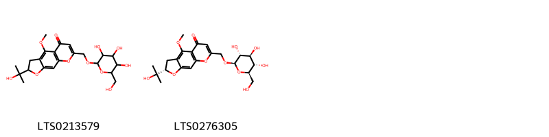{ width=100% }
    <figcaption>Hình ảnh cấu trúc hóa học của 2 hoạt chất thuộc nhóm Benzopyrans gồm ['2-(2-hydroxypropan-2-yl)-4-methoxy-7-({[3,4,5-trihydroxy-6-(hydroxymethyl)oxan-2-yl]oxy}methyl)-2h,3h-furo[3,2-g]chromen-5-one (LTS0213579)', '(2s)-2-(2-hydroxypropan-2-yl)-4-methoxy-7-({[(2r,3r,4s,5s,6r)-3,4,5-trihydroxy-6-(hydroxymethyl)oxan-2-yl]oxy}methyl)-2h,3h-furo[3,2-g]chromen-5-one (LTS0276305)'].</figcaption>
</figure>
#### Nhóm Benzoxepines
<figure markdown="span">
    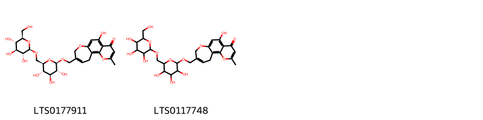{ width=100% }
    <figcaption>Hình ảnh cấu trúc hóa học của 2 hoạt chất thuộc nhóm Benzoxepines gồm ['5-hydroxy-2-methyl-9-({[(2r,3r,4s,5s,6r)-3,4,5-trihydroxy-6-({[(2r,3r,4s,5s,6r)-3,4,5-trihydroxy-6-(hydroxymethyl)oxan-2-yl]oxy}methyl)oxan-2-yl]oxy}methyl)-8h,11h-oxepino[2,3-h]chromen-4-one (LTS0177911)', '5-hydroxy-2-methyl-9-({[3,4,5-trihydroxy-6-({[3,4,5-trihydroxy-6-(hydroxymethyl)oxan-2-yl]oxy}methyl)oxan-2-yl]oxy}methyl)-8h,11h-oxepino[2,3-h]chromen-4-one (LTS0117748)'].</figcaption>
</figure>
#### Nhóm Fatty Acyls
<figure markdown="span">
    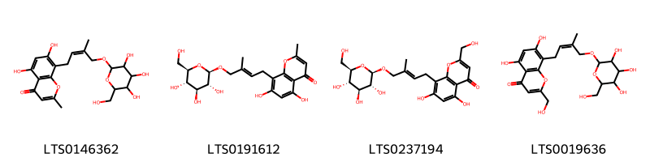{ width=100% }
    <figcaption>Hình ảnh cấu trúc hóa học của 4 hoạt chất thuộc nhóm Fatty Acyls gồm ['5,7-dihydroxy-2-methyl-8-(3-methyl-4-{[3,4,5-trihydroxy-6-(hydroxymethyl)oxan-2-yl]oxy}but-2-en-1-yl)chromen-4-one (LTS0146362)', '5,7-dihydroxy-2-methyl-8-[(2e)-3-methyl-4-{[(2r,3r,4s,5s,6r)-3,4,5-trihydroxy-6-(hydroxymethyl)oxan-2-yl]oxy}but-2-en-1-yl]chromen-4-one (LTS0191612)', '5,7-dihydroxy-2-(hydroxymethyl)-8-[(2e)-3-methyl-4-{[(2r,3r,4s,5s,6r)-3,4,5-trihydroxy-6-(hydroxymethyl)oxan-2-yl]oxy}but-2-en-1-yl]chromen-4-one (LTS0237194)', '5,7-dihydroxy-2-(hydroxymethyl)-8-(3-methyl-4-{[3,4,5-trihydroxy-6-(hydroxymethyl)oxan-2-yl]oxy}but-2-en-1-yl)chromen-4-one (LTS0019636)'].</figcaption>
</figure>
#### Nhóm Organooxygen compounds
<figure markdown="span">
    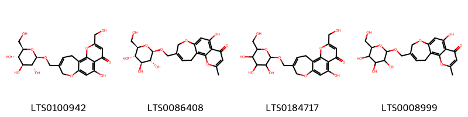{ width=100% }
    <figcaption>Hình ảnh cấu trúc hóa học của 4 hoạt chất thuộc nhóm Organooxygen compounds gồm ['5-hydroxy-2-(hydroxymethyl)-9-({[(2r,3r,4s,5s,6r)-3,4,5-trihydroxy-6-(hydroxymethyl)oxan-2-yl]oxy}methyl)-8h,11h-oxepino[2,3-h]chromen-4-one (LTS0100942)', '5-hydroxy-2-methyl-9-({[(2r,3r,4s,5s,6r)-3,4,5-trihydroxy-6-(hydroxymethyl)oxan-2-yl]oxy}methyl)-8h,11h-oxepino[2,3-h]chromen-4-one (LTS0086408)', '5-hydroxy-2-(hydroxymethyl)-9-({[3,4,5-trihydroxy-6-(hydroxymethyl)oxan-2-yl]oxy}methyl)-8h,11h-oxepino[2,3-h]chromen-4-one (LTS0184717)', '5-hydroxy-2-methyl-9-({[3,4,5-trihydroxy-6-(hydroxymethyl)oxan-2-yl]oxy}methyl)-8h,11h-oxepino[2,3-h]chromen-4-one (LTS0008999)'].</figcaption>
</figure>

---

### Dược dân tộc học

Danh sách các quốc gia có sử dụng *Eranthis hyemalis* trong điều trị các bệnh. 

| Country   | Disease   | Bệnh                                                                                                                                                                                                |
|:----------|:----------|:----------------------------------------------------------------------------------------------------------------------------------------------------------------------------------------------------|
| UK        | Poison    | MYMEMORY WARNING: YOU USED ALL AVAILABLE FREE TRANSLATIONS FOR TODAY. NEXT AVAILABLE IN  08 HOURS 23 MINUTES 49 SECONDS VISIT HTTPS://MYMEMORY.TRANSLATED.NET/DOC/USAGELIMITS.PHP TO TRANSLATE MORE |

---

---
## Eranthis keiskii
### Thông tin về thực vật

!!! info "Phân loại thực vật của *Eranthis pinnatifida* từ GIBF:"
    - **Kingdom:** Plantae
    - **Phylum:** Tracheophyta
    - **Order:** Ranunculales
    - **Family:** Ranunculaceae
    - **Genus:** Eranthis
    - **Species:** *Eranthis pinnatifida*

 

| Label (VI)   | Label (EN)   | Scientific Name   | Descriptions (VI)   | Descriptions (EN)   | Also Known As (VI)   | Also Known As (EN)                                                                                                                                                                             |
|:-------------|:-------------|:------------------|:--------------------|:--------------------|:---------------------|:-----------------------------------------------------------------------------------------------------------------------------------------------------------------------------------------------|
| N/A          | N/A          | Eranthis hyemalis | loài thực vật       | species of plant    | ['']                 | ['Cammarum hyemale (L.) Greene', 'Cammarum hyemale (L.) Hill', 'Eranthis cilicicus Schott & Kotschy', 'Helleborus hyemalis L.', 'Koellea hyemalis (L.) Biria', 'Robertia hiemalis (L.) Mérat'] |

#### Phân bố trên thế giới

**Từ CSDL GIBF** Switzerland, United Kingdom of Great Britain and Northern Ireland, Denmark, Germany, Canada, United States of America, Italy, Austria, Ireland, Belgium, Netherlands

#### Phân bố tại Việt Nam

**Từ CSDL GIBF**: Không có ghi nhận ở Việt Nam

---
### Thành phần hóa học
        
- Theo cơ sở dữ liệu lotus: Từ loài *Eranthis pinnatifida* đã phân lập và xác định được Chưa có hoạt chất nào được phân lập. hoạt chất thuộc về các nhóm Không có hoạt chất nào được phân lập. 

Không có hình ảnh nào được tạo ra

---

### Dược dân tộc học

Danh sách các quốc gia có sử dụng *Eranthis pinnatifida* trong điều trị các bệnh. 

| Country   | Disease   | Bệnh                                                                                                                                                                                                |
|:----------|:----------|:----------------------------------------------------------------------------------------------------------------------------------------------------------------------------------------------------|
| China     | Antidote  | MYMEMORY WARNING: YOU USED ALL AVAILABLE FREE TRANSLATIONS FOR TODAY. NEXT AVAILABLE IN  08 HOURS 23 MINUTES 25 SECONDS VISIT HTTPS://MYMEMORY.TRANSLATED.NET/DOC/USAGELIMITS.PHP TO TRANSLATE MORE |

---

# Chi Hydrastis

??? note "Danh sách các dược liệu thuộc chi"
    
	 - *Hydrastis canadensis*

---
## Hydrastis canadensis
### Thông tin về thực vật

!!! info "Phân loại thực vật của *Hydrastis canadensis* từ GIBF:"
    - **Kingdom:** Plantae
    - **Phylum:** Tracheophyta
    - **Order:** Ranunculales
    - **Family:** Ranunculaceae
    - **Genus:** Hydrastis
    - **Species:** *Hydrastis canadensis*

 

| Label (VI)   | Label (EN)   | Scientific Name      | Descriptions (VI)   | Descriptions (EN)            | Also Known As (VI)   | Also Known As (EN)   |
|:-------------|:-------------|:---------------------|:--------------------|:-----------------------------|:---------------------|:---------------------|
| N/A          | N/A          | Hydrastis canadensis | loài thực vật       | species of plant, Goldenseal | ['']                 | ['goldenseal']       |

#### Phân bố trên thế giới

**Từ CSDL GIBF** nan, Canada, United States of America

#### Phân bố tại Việt Nam

**Từ CSDL GIBF**: Không có ghi nhận ở Việt Nam

---
### Thành phần hóa học
        
- Theo cơ sở dữ liệu lotus: Từ loài *Hydrastis canadensis* đã phân lập và xác định được 37 hoạt chất thuộc về các nhóm Organooxygen compounds, Flavonoids, Isoquinolines and derivatives, Carboxylic acids and derivatives, Protoberberine alkaloids and derivatives, Phthalide isoquinolines, Cinnamic acids and derivatives, Steroids and steroid derivatives, Tetrahydroisoquinolines. 

|    | chemicalTaxonomyClassyfireClass          |   smiles_count |
|---:|:-----------------------------------------|---------------:|
|  0 | Carboxylic acids and derivatives         |              1 |
|  1 | Cinnamic acids and derivatives           |              1 |
|  2 | Flavonoids                               |              3 |
|  3 | Isoquinolines and derivatives            |              5 |
|  4 | Organooxygen compounds                   |              9 |
|  5 | Phthalide isoquinolines                  |              3 |
|  6 | Protoberberine alkaloids and derivatives |             12 |
|  7 | Steroids and steroid derivatives         |              2 |
|  8 | Tetrahydroisoquinolines                  |              1 |

#### Nhóm Carboxylic acids and derivatives
<figure markdown="span">
    { width=100% }
    <figcaption>Hình ảnh cấu trúc hóa học của 1 hoạt chất thuộc nhóm Carboxylic acids and derivatives gồm ['cichoric acid (LTS0177566)'].</figcaption>
</figure>
#### Nhóm Cinnamic acids and derivatives
<figure markdown="span">
    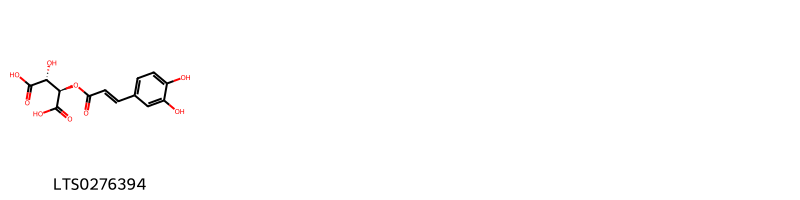{ width=100% }
    <figcaption>Hình ảnh cấu trúc hóa học của 1 hoạt chất thuộc nhóm Cinnamic acids and derivatives gồm ['caftaric acid (LTS0276394)'].</figcaption>
</figure>
#### Nhóm Flavonoids
<figure markdown="span">
    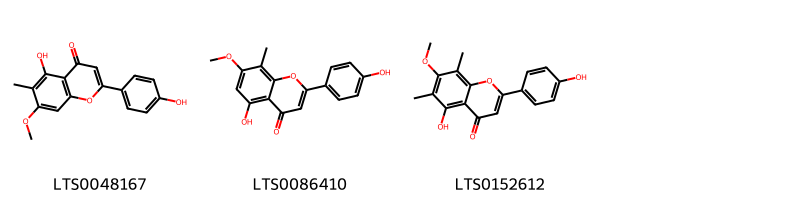{ width=100% }
    <figcaption>Hình ảnh cấu trúc hóa học của 3 hoạt chất thuộc nhóm Flavonoids gồm ['8-demethylsideroxylin (LTS0048167)', '6-desmethylsideroxylin (LTS0086410)', 'sideroxylin (LTS0152612)'].</figcaption>
</figure>
#### Nhóm Isoquinolines and derivatives
<figure markdown="span">
    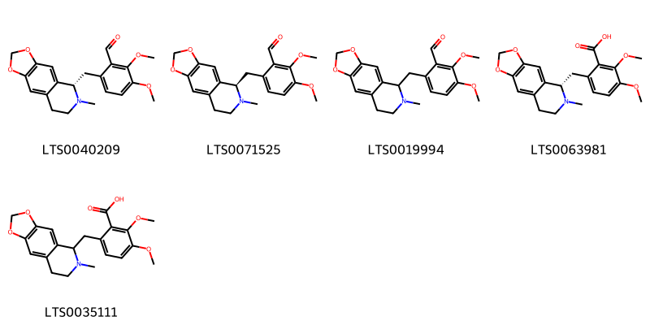{ width=100% }
    <figcaption>Hình ảnh cấu trúc hóa học của 5 hoạt chất thuộc nhóm Isoquinolines and derivatives gồm ['(.+-.)-canadaline (LTS0040209)', 'canadaline (LTS0071525)', '2,3-dimethoxy-6-({6-methyl-2h,5h,7h,8h-[1,3]dioxolo[4,5-g]isoquinolin-5-yl}methyl)benzaldehyde (LTS0019994)', '2,3-dimethoxy-6-{[(5s)-6-methyl-2h,5h,7h,8h-[1,3]dioxolo[4,5-g]isoquinolin-5-yl]methyl}benzoic acid (LTS0063981)', '2,3-dimethoxy-6-({6-methyl-2h,5h,7h,8h-[1,3]dioxolo[4,5-g]isoquinolin-5-yl}methyl)benzoic acid (LTS0035111)'].</figcaption>
</figure>
#### Nhóm Organooxygen compounds
<figure markdown="span">
    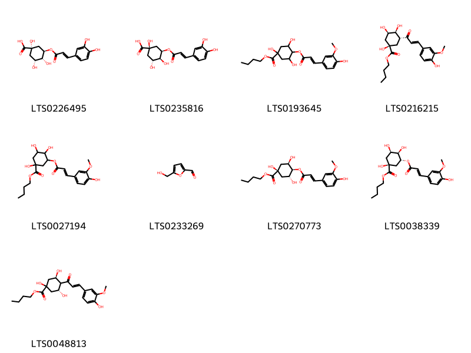{ width=100% }
    <figcaption>Hình ảnh cấu trúc hóa học của 9 hoạt chất thuộc nhóm Organooxygen compounds gồm ['chlorogenic acid (LTS0226495)', 'neochlorogenic acid (LTS0235816)', 'butyl 1,3,5-trihydroxy-4-{[3-(4-hydroxy-3-methoxyphenyl)prop-2-enoyl]oxy}cyclohexane-1-carboxylate (LTS0193645)', 'butyl (1r,3r,4s,5r)-1,3,4-trihydroxy-5-[(2e)-3-(4-hydroxy-3-methoxyphenyl)prop-2-enoyl]cyclohexane-1-carboxylate (LTS0216215)', 'butyl 1,3,4-trihydroxy-5-{[3-(4-hydroxy-3-methoxyphenyl)prop-2-enoyl]oxy}cyclohexane-1-carboxylate (LTS0027194)', 'hydroxymethylfurfural (LTS0233269)', 'butyl (1s,3r,4s,5r)-1,3,5-trihydroxy-4-{[(2e)-3-(4-hydroxy-3-methoxyphenyl)prop-2-enoyl]oxy}cyclohexane-1-carboxylate (LTS0270773)', 'butyl (1s,3r,4r,5r)-1,3,4-trihydroxy-5-{[(2e)-3-(4-hydroxy-3-methoxyphenyl)prop-2-enoyl]oxy}cyclohexane-1-carboxylate (LTS0038339)', 'butyl (3r,5r)-1,3,5-trihydroxy-4-[(2e)-3-(4-hydroxy-3-methoxyphenyl)prop-2-enoyl]cyclohexane-1-carboxylate (LTS0048813)'].</figcaption>
</figure>
#### Nhóm Phthalide isoquinolines
<figure markdown="span">
    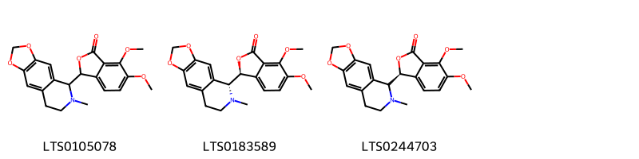{ width=100% }
    <figcaption>Hình ảnh cấu trúc hóa học của 3 hoạt chất thuộc nhóm Phthalide isoquinolines gồm ['hydrastine (LTS0105078)', 'hydrastine (LTS0183589)', '(3s)-6,7-dimethoxy-3-{6-methyl-2h,5h,7h,8h-[1,3]dioxolo[4,5-g]isoquinolin-5-yl}-3h-2-benzofuran-1-one (LTS0244703)'].</figcaption>
</figure>
#### Nhóm Protoberberine alkaloids and derivatives
<figure markdown="span">
    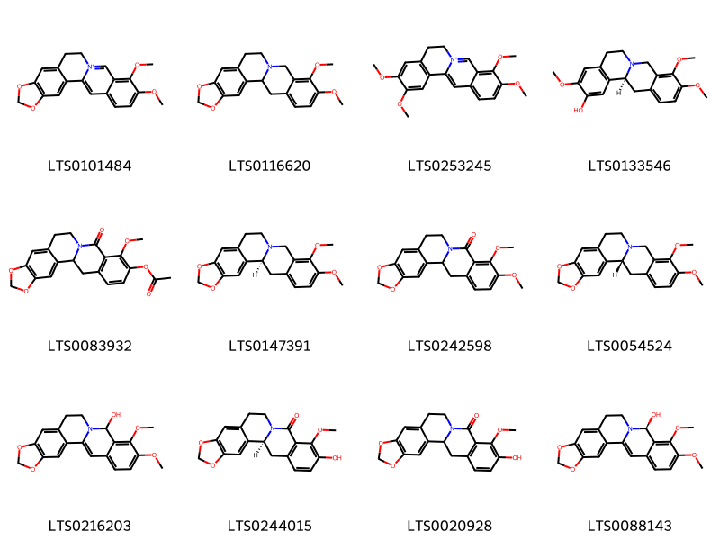{ width=100% }
    <figcaption>Hình ảnh cấu trúc hóa học của 12 hoạt chất thuộc nhóm Protoberberine alkaloids and derivatives gồm ['berberine (LTS0101484)', 'canadin (LTS0116620)', 'palmatine (LTS0253245)', 'tetrahydrocolumbamine (LTS0133546)', '16-methoxy-14-oxo-5,7-dioxa-13-azapentacyclo[11.8.0.0²,¹⁰.0⁴,⁸.0¹⁵,²⁰]henicosa-2,4(8),9,15(20),16,18-hexaen-17-yl acetate (LTS0083932)', '(s)-canadine (LTS0147391)', '16,17-dimethoxy-5,7-dioxa-13-azapentacyclo[11.8.0.0²,¹⁰.0⁴,⁸.0¹⁵,²⁰]henicosa-2,4(8),9,15,17,19-hexaen-14-one (LTS0242598)', '(+)-canadine (LTS0054524)', '16,17-dimethoxy-5,7-dioxa-13-azapentacyclo[11.8.0.0²,¹⁰.0⁴,⁸.0¹⁵,²⁰]henicosa-1(21),2,4(8),9,15,17,19-heptaen-14-ol (LTS0216203)', '(1s)-17-hydroxy-16-methoxy-5,7-dioxa-13-azapentacyclo[11.8.0.0²,¹⁰.0⁴,⁸.0¹⁵,²⁰]henicosa-2,4(8),9,15(20),16,18-hexaen-14-one (LTS0244015)', '17-hydroxy-16-methoxy-5,7-dioxa-13-azapentacyclo[11.8.0.0²,¹⁰.0⁴,⁸.0¹⁵,²⁰]henicosa-2,4(8),9,15(20),16,18-hexaen-14-one (LTS0020928)', '(14s)-16,17-dimethoxy-5,7-dioxa-13-azapentacyclo[11.8.0.0²,¹⁰.0⁴,⁸.0¹⁵,²⁰]henicosa-1(21),2,4(8),9,15,17,19-heptaen-14-ol (LTS0088143)'].</figcaption>
</figure>
#### Nhóm Steroids and steroid derivatives
<figure markdown="span">
    { width=100% }
    <figcaption>Hình ảnh cấu trúc hóa học của 2 hoạt chất thuộc nhóm Steroids and steroid derivatives gồm ['sitogluside (LTS0201798)', '2-{[1-(5-ethyl-6-methylheptan-2-yl)-9a,11a-dimethyl-1h,2h,3h,3ah,3bh,4h,6h,7h,8h,9h,9bh,10h,11h-cyclopenta[a]phenanthren-7-yl]oxy}-6-(hydroxymethyl)oxane-3,4,5-triol (LTS0158828)'].</figcaption>
</figure>
#### Nhóm Tetrahydroisoquinolines
<figure markdown="span">
    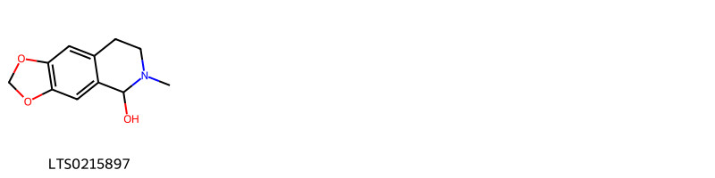{ width=100% }
    <figcaption>Hình ảnh cấu trúc hóa học của 1 hoạt chất thuộc nhóm Tetrahydroisoquinolines gồm ['hydrastinine (LTS0215897)'].</figcaption>
</figure>

---

### Dược dân tộc học

Danh sách các quốc gia có sử dụng *Hydrastis canadensis* trong điều trị các bệnh. 

| Country        | Disease                                                          | Bệnh                                                                                                                                                                                                |
|:---------------|:-----------------------------------------------------------------|:----------------------------------------------------------------------------------------------------------------------------------------------------------------------------------------------------|
| Turkey         | Antiseptic, Diuretic, Hemostat, Uterotonic, Aperient, Tonic      | MYMEMORY WARNING: YOU USED ALL AVAILABLE FREE TRANSLATIONS FOR TODAY. NEXT AVAILABLE IN  08 HOURS 23 MINUTES 08 SECONDS VISIT HTTPS://MYMEMORY.TRANSLATED.NET/DOC/USAGELIMITS.PHP TO TRANSLATE MORE |
| US             | Astringent, Cicatrizant, Hemostatic, Tonic, Poison, Antiperiodic | MYMEMORY WARNING: YOU USED ALL AVAILABLE FREE TRANSLATIONS FOR TODAY. NEXT AVAILABLE IN  08 HOURS 23 MINUTES 06 SECONDS VISIT HTTPS://MYMEMORY.TRANSLATED.NET/DOC/USAGELIMITS.PHP TO TRANSLATE MORE |
| US(Appalachia) | Tonic, Tonic, Apertif                                            | MYMEMORY WARNING: YOU USED ALL AVAILABLE FREE TRANSLATIONS FOR TODAY. NEXT AVAILABLE IN  08 HOURS 23 MINUTES 03 SECONDS VISIT HTTPS://MYMEMORY.TRANSLATED.NET/DOC/USAGELIMITS.PHP TO TRANSLATE MORE |

---

# Chi Adonis

??? note "Danh sách các dược liệu thuộc chi"
    
	 - *Adonis aestivalis*
	 - *Adonis amurensis*
	 - *Adonis chrysocyathus*
	 - *Adonis vernalis*

---
## Adonis aestivalis
### Thông tin về thực vật

!!! info "Phân loại thực vật của *Adonis aestivalis* từ GIBF:"
    - **Kingdom:** Plantae
    - **Phylum:** Tracheophyta
    - **Order:** Ranunculales
    - **Family:** Ranunculaceae
    - **Genus:** Adonis
    - **Species:** *Adonis aestivalis*

 

| Label (VI)   | Label (EN)   | Scientific Name   | Descriptions (VI)   | Descriptions (EN)   | Also Known As (VI)   | Also Known As (EN)     |
|:-------------|:-------------|:------------------|:--------------------|:--------------------|:---------------------|:-----------------------|
| N/A          | N/A          | Adonis aestivalis |                     | species of plant    | ['']                 | ['Anonimus tuntuntun'] |

#### Phân bố trên thế giới

**Từ CSDL GIBF** Georgia, Spain, Afghanistan, Germany, Austria, Uzbekistan, Poland, Kazakhstan, Slovakia, Kyrgyzstan, Hungary, Ukraine, Switzerland, Iran (Islamic Republic of), France, Armenia, Czechia, Romania, Russian Federation, United States of America, Algeria, Israel, Italy, Tajikistan

#### Phân bố tại Việt Nam

**Từ CSDL GIBF**: Không có ghi nhận ở Việt Nam

---
### Thành phần hóa học
        
- Theo cơ sở dữ liệu lotus: Từ loài *Adonis aestivalis* đã phân lập và xác định được 14 hoạt chất thuộc về các nhóm Aporphines, Steroids and steroid derivatives. 

|    | chemicalTaxonomyClassyfireClass   |   smiles_count |
|---:|:----------------------------------|---------------:|
|  0 | Aporphines                        |              3 |
|  1 | Steroids and steroid derivatives  |             11 |

#### Nhóm Aporphines
<figure markdown="span">
    { width=100% }
    <figcaption>Hình ảnh cấu trúc hóa học của 3 hoạt chất thuộc nhóm Aporphines gồm ['magnoflorine (LTS0120825)', '4,15-dimethoxy-10-methyl-10-azatetracyclo[7.7.1.0²,⁷.0¹³,¹⁷]heptadeca-1(16),2,4,6,13(17),14-hexaene-3,16-diol (LTS0095715)', '(9s)-4,15-dimethoxy-10-methyl-10-azatetracyclo[7.7.1.0²,⁷.0¹³,¹⁷]heptadeca-1(16),2,4,6,13(17),14-hexaene-3,16-diol (LTS0022981)'].</figcaption>
</figure>
#### Nhóm Steroids and steroid derivatives
<figure markdown="span">
    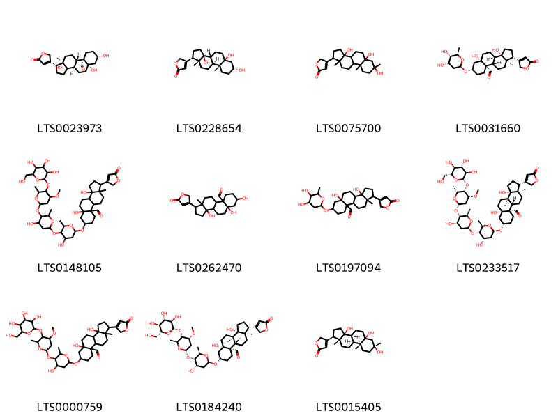{ width=100% }
    <figcaption>Hình ảnh cấu trúc hóa học của 11 hoạt chất thuộc nhóm Steroids and steroid derivatives gồm ['strophanthidin (LTS0023973)', '4-[(1r,3as,3br,5as,7r,9ar,9bs,11ar)-3a,5a,7-trihydroxy-9a,11a-dimethyl-dodecahydro-1h-cyclopenta[a]phenanthren-1-yl]-5h-furan-2-one (LTS0228654)', '4-{3a,5a,7-trihydroxy-7,9a,11a-trimethyl-dodecahydrocyclopenta[a]phenanthren-1-yl}-5h-furan-2-one (LTS0075700)', 'helveticoside (LTS0031660)', '3a,5a-dihydroxy-7-{[4-hydroxy-5-({4-hydroxy-5-[(4-methoxy-6-methyl-5-{[3,4,5-trihydroxy-6-(hydroxymethyl)oxan-2-yl]oxy}oxan-2-yl)oxy]-6-methyloxan-2-yl}oxy)-6-methyloxan-2-yl]oxy}-11a-methyl-1-(5-oxo-2h-furan-3-yl)-dodecahydro-1h-cyclopenta[a]phenanthrene-9a-carbaldehyde (LTS0148105)', 'strophanthidin (LTS0262470)', '7-[(4,5-dihydroxy-6-methyloxan-2-yl)oxy]-3a,5a-dihydroxy-11a-methyl-1-(5-oxo-2h-furan-3-yl)-dodecahydro-1h-cyclopenta[a]phenanthrene-9a-carbaldehyde (LTS0197094)', '(1r,3as,3br,5as,7s,9as,9bs,11ar)-3a,5a-dihydroxy-7-{[(2r,4s,5s,6r)-4-hydroxy-5-{[(2s,4s,5s,6r)-4-hydroxy-5-{[(2s,4r,5s,6r)-4-methoxy-6-methyl-5-{[(2s,3r,4s,5s,6r)-3,4,5-trihydroxy-6-(hydroxymethyl)oxan-2-yl]oxy}oxan-2-yl]oxy}-6-methyloxan-2-yl]oxy}-6-methyloxan-2-yl]oxy}-11a-methyl-1-(5-oxo-2h-furan-3-yl)-dodecahydro-1h-cyclopenta[a]phenanthrene-9a-carbaldehyde (LTS0233517)', '3a,5a-dihydroxy-7-({4-hydroxy-5-[(4-methoxy-6-methyl-5-{[3,4,5-trihydroxy-6-(hydroxymethyl)oxan-2-yl]oxy}oxan-2-yl)oxy]-6-methyloxan-2-yl}oxy)-11a-methyl-1-(5-oxo-2h-furan-3-yl)-dodecahydro-1h-cyclopenta[a]phenanthrene-9a-carbaldehyde (LTS0000759)', '(1r,3as,3br,5as,7s,9as,9bs,11ar)-3a,5a-dihydroxy-7-{[(2r,4s,5s,6r)-4-hydroxy-5-{[(2s,4r,5s,6s)-4-methoxy-6-methyl-5-{[(2s,3r,4s,5s,6r)-3,4,5-trihydroxy-6-(hydroxymethyl)oxan-2-yl]oxy}oxan-2-yl]oxy}-6-methyloxan-2-yl]oxy}-11a-methyl-1-(5-oxo-2h-furan-3-yl)-dodecahydro-1h-cyclopenta[a]phenanthrene-9a-carbaldehyde (LTS0184240)', '4-[(1r,3as,3br,5as,7r,9ar,9bs,11ar)-3a,5a,7-trihydroxy-7,9a,11a-trimethyl-dodecahydrocyclopenta[a]phenanthren-1-yl]-5h-furan-2-one (LTS0015405)'].</figcaption>
</figure>

---

### Dược dân tộc học

Danh sách các quốc gia có sử dụng *Adonis aestivalis* trong điều trị các bệnh. 

| Country   | Disease            | Bệnh                                                                                                                                                                                                |
|:----------|:-------------------|:----------------------------------------------------------------------------------------------------------------------------------------------------------------------------------------------------|
| Dutch     | Poison             | MYMEMORY WARNING: YOU USED ALL AVAILABLE FREE TRANSLATIONS FOR TODAY. NEXT AVAILABLE IN  08 HOURS 22 MINUTES 35 SECONDS VISIT HTTPS://MYMEMORY.TRANSLATED.NET/DOC/USAGELIMITS.PHP TO TRANSLATE MORE |
| Elsewhere | Cardiac, Stimulant | MYMEMORY WARNING: YOU USED ALL AVAILABLE FREE TRANSLATIONS FOR TODAY. NEXT AVAILABLE IN  08 HOURS 22 MINUTES 32 SECONDS VISIT HTTPS://MYMEMORY.TRANSLATED.NET/DOC/USAGELIMITS.PHP TO TRANSLATE MORE |
| French    | Diuretic           | MYMEMORY WARNING: YOU USED ALL AVAILABLE FREE TRANSLATIONS FOR TODAY. NEXT AVAILABLE IN  08 HOURS 22 MINUTES 29 SECONDS VISIT HTTPS://MYMEMORY.TRANSLATED.NET/DOC/USAGELIMITS.PHP TO TRANSLATE MORE |
| German    | Cardiac            | MYMEMORY WARNING: YOU USED ALL AVAILABLE FREE TRANSLATIONS FOR TODAY. NEXT AVAILABLE IN  08 HOURS 22 MINUTES 26 SECONDS VISIT HTTPS://MYMEMORY.TRANSLATED.NET/DOC/USAGELIMITS.PHP TO TRANSLATE MORE |
| Iraq      | Cardiac, Diuretic  | MYMEMORY WARNING: YOU USED ALL AVAILABLE FREE TRANSLATIONS FOR TODAY. NEXT AVAILABLE IN  08 HOURS 22 MINUTES 24 SECONDS VISIT HTTPS://MYMEMORY.TRANSLATED.NET/DOC/USAGELIMITS.PHP TO TRANSLATE MORE |
| anish     | Emmenagogue        | MYMEMORY WARNING: YOU USED ALL AVAILABLE FREE TRANSLATIONS FOR TODAY. NEXT AVAILABLE IN  08 HOURS 22 MINUTES 21 SECONDS VISIT HTTPS://MYMEMORY.TRANSLATED.NET/DOC/USAGELIMITS.PHP TO TRANSLATE MORE |

---

---
## Adonis amurensis
### Thông tin về thực vật

!!! info "Phân loại thực vật của *Adonis amurensis* từ GIBF:"
    - **Kingdom:** Plantae
    - **Phylum:** Tracheophyta
    - **Order:** Ranunculales
    - **Family:** Ranunculaceae
    - **Genus:** Adonis
    - **Species:** *Adonis amurensis*

 

| Label (VI)   | Label (EN)   | Scientific Name   | Descriptions (VI)   | Descriptions (EN)   | Also Known As (VI)   | Also Known As (EN)   |
|:-------------|:-------------|:------------------|:--------------------|:--------------------|:---------------------|:---------------------|
| N/A          | N/A          | Adonis amurensis  | loài thực vật       | species of plant    | ['']                 | ['']                 |

#### Phân bố trên thế giới

**Từ CSDL GIBF** nan, Japan, Germany, Russian Federation, United States of America, China, Korea, Republic of

#### Phân bố tại Việt Nam

**Từ CSDL GIBF**: Không có ghi nhận ở Việt Nam

---
### Thành phần hóa học
        
- Theo cơ sở dữ liệu lotus: Từ loài *Adonis amurensis* đã phân lập và xác định được 22 hoạt chất thuộc về các nhóm Steroids and steroid derivatives, Coumarins and derivatives. 

|    | chemicalTaxonomyClassyfireClass   |   smiles_count |
|---:|:----------------------------------|---------------:|
|  0 | Coumarins and derivatives         |              1 |
|  1 | Steroids and steroid derivatives  |             20 |

#### Nhóm Coumarins and derivatives
<figure markdown="span">
    { width=100% }
    <figcaption>Hình ảnh cấu trúc hóa học của 1 hoạt chất thuộc nhóm Coumarins and derivatives gồm ['scopoletin (LTS0193112)'].</figcaption>
</figure>
#### Nhóm Steroids and steroid derivatives
<figure markdown="span">
    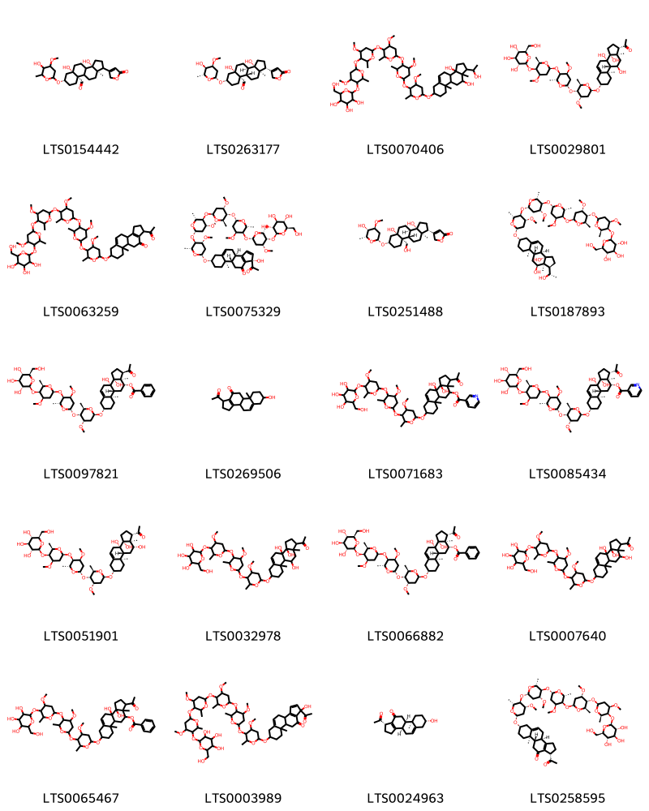{ width=100% }
    <figcaption>Hình ảnh cấu trúc hóa học của 20 hoạt chất thuộc nhóm Steroids and steroid derivatives gồm ['(3as,5as,7s,9as,11ar)-3a,5a-dihydroxy-7-[(5-hydroxy-4-methoxy-6-methyloxan-2-yl)oxy]-11a-methyl-1-(5-oxo-2h-furan-3-yl)-dodecahydro-1h-cyclopenta[a]phenanthrene-9a-carbaldehyde (LTS0154442)', 'cymarin (LTS0263177)', '2-({6-[(6-{[6-({6-[(6-{[3a,11-dihydroxy-1-(1-hydroxyethyl)-9a,11a-dimethyl-1h,2h,3h,3bh,4h,6h,7h,8h,9h,9bh,10h,11h-cyclopenta[a]phenanthren-7-yl]oxy}-4-methoxy-2-methyloxan-3-yl)oxy]-4-methoxy-2-methyloxan-3-yl}oxy)-4-methoxy-2-methyloxan-3-yl]oxy}-4-methoxy-2-methyloxan-3-yl)oxy]-4-methoxy-2-methyloxan-3-yl}oxy)-6-(hydroxymethyl)oxane-3,4,5-triol (LTS0070406)', '1-[(1s,3ar,3bs,7s,9ar,9bs,10r,11ar)-3a,3b,10-trihydroxy-7-{[(2r,4s,5r,6r)-4-methoxy-5-{[(2s,4s,5r,6r)-4-methoxy-5-{[(2s,4r,5s,6r)-4-methoxy-6-methyl-5-{[(2s,3r,4s,5s,6r)-3,4,5-trihydroxy-6-(hydroxymethyl)oxan-2-yl]oxy}oxan-2-yl]oxy}-6-methyloxan-2-yl]oxy}-6-methyloxan-2-yl]oxy}-9a,11a-dimethyl-1h,2h,3h,4h,6h,7h,8h,9h,9bh,10h,11h-cyclopenta[a]phenanthren-1-yl]ethanone (LTS0029801)', '1-acetyl-7-({4-methoxy-5-[(4-methoxy-5-{[4-methoxy-5-({4-methoxy-5-[(4-methoxy-6-methyl-5-{[3,4,5-trihydroxy-6-(hydroxymethyl)oxan-2-yl]oxy}oxan-2-yl)oxy]-6-methyloxan-2-yl}oxy)-6-methyloxan-2-yl]oxy}-6-methyloxan-2-yl)oxy]-6-methyloxan-2-yl}oxy)-9a-methyl-1h,2h,3h,3bh,4h,6h,7h,8h,9h,9bh,10h-cyclopenta[a]phenanthren-11-one (LTS0063259)', '(1s,3br,7s,9ar,9bs)-1-acetyl-1-hydroxy-7-{[(2r,4r,5r,6r)-4-methoxy-5-{[(2s,4r,5r,6r)-4-methoxy-5-{[(2s,4s,5r,6r)-4-methoxy-5-{[(2s,4s,5r,6r)-4-methoxy-5-{[(2s,4r,5s,6r)-4-methoxy-6-methyl-5-{[(2s,3r,4s,5s,6r)-3,4,5-trihydroxy-6-(hydroxymethyl)oxan-2-yl]oxy}oxan-2-yl]oxy}-6-methyloxan-2-yl]oxy}-6-methyloxan-2-yl]oxy}-6-methyloxan-2-yl]oxy}-6-methyloxan-2-yl]oxy}-9a-methyl-3bh,4h,6h,7h,8h,9h,9bh,10h-cyclopenta[a]phenanthren-11-one (LTS0075329)', '4-[(1r,3as,3br,5as,7s,9ar,9bs,11ar)-3a,5a-dihydroxy-7-{[(2r,4s,5s,6r)-5-hydroxy-4-methoxy-6-methyloxan-2-yl]oxy}-9a-(hydroxymethyl)-11a-methyl-dodecahydro-1h-cyclopenta[a]phenanthren-1-yl]-5h-furan-2-one (LTS0251488)', '(2s,3r,4s,5s,6r)-2-{[(2r,3s,4r,6s)-6-{[(2r,3r,4s,6s)-6-{[(2r,3r,4s,6s)-6-{[(2r,3r,4r,6s)-6-{[(2r,3r,4r,6r)-6-{[(1r,3as,3br,7s,9ar,9bs,11s,11as)-3a,11-dihydroxy-1-[(1s)-1-hydroxyethyl]-9a,11a-dimethyl-1h,2h,3h,3bh,4h,6h,7h,8h,9h,9bh,10h,11h-cyclopenta[a]phenanthren-7-yl]oxy}-4-methoxy-2-methyloxan-3-yl]oxy}-4-methoxy-2-methyloxan-3-yl]oxy}-4-methoxy-2-methyloxan-3-yl]oxy}-4-methoxy-2-methyloxan-3-yl]oxy}-4-methoxy-2-methyloxan-3-yl]oxy}-6-(hydroxymethyl)oxane-3,4,5-triol (LTS0187893)', '(1r,3ar,3bs,7s,9ar,9br,11r,11as)-1-acetyl-3a,3b-dihydroxy-7-{[(2r,4s,5r,6r)-4-methoxy-5-{[(2s,4s,5r,6r)-4-methoxy-5-{[(2s,4r,5s,6r)-4-methoxy-6-methyl-5-{[(2s,3r,4s,5s,6r)-3,4,5-trihydroxy-6-(hydroxymethyl)oxan-2-yl]oxy}oxan-2-yl]oxy}-6-methyloxan-2-yl]oxy}-6-methyloxan-2-yl]oxy}-9a,11a-dimethyl-1h,2h,3h,4h,6h,7h,8h,9h,9bh,10h,11h-cyclopenta[a]phenanthren-11-yl benzoate (LTS0097821)', '1-acetyl-7-hydroxy-9a-methyl-1h,2h,3h,3bh,4h,6h,7h,8h,9h,9bh,10h-cyclopenta[a]phenanthren-11-one (LTS0269506)', '1-acetyl-3a,3b-dihydroxy-7-{[4-methoxy-5-({4-methoxy-5-[(4-methoxy-6-methyl-5-{[3,4,5-trihydroxy-6-(hydroxymethyl)oxan-2-yl]oxy}oxan-2-yl)oxy]-6-methyloxan-2-yl}oxy)-6-methyloxan-2-yl]oxy}-9a,11a-dimethyl-1h,2h,3h,4h,6h,7h,8h,9h,9bh,10h,11h-cyclopenta[a]phenanthren-11-yl pyridine-3-carboxylate (LTS0071683)', '(1s,3ar,3bs,7s,9ar,9br,11r,11as)-1-acetyl-3a,3b-dihydroxy-7-{[(2r,4s,5r,6r)-4-methoxy-5-{[(2s,4s,5r,6r)-4-methoxy-5-{[(2s,4r,5s,6r)-4-methoxy-6-methyl-5-{[(2s,3r,4s,5s,6r)-3,4,5-trihydroxy-6-(hydroxymethyl)oxan-2-yl]oxy}oxan-2-yl]oxy}-6-methyloxan-2-yl]oxy}-6-methyloxan-2-yl]oxy}-9a,11a-dimethyl-1h,2h,3h,4h,6h,7h,8h,9h,9bh,10h,11h-cyclopenta[a]phenanthren-11-yl pyridine-3-carboxylate (LTS0085434)', '1-[(1s,3ar,3bs,7s,9ar,9br,11r,11as)-3a,3b,11-trihydroxy-7-{[(2r,4s,5r,6r)-4-methoxy-5-{[(2s,4s,5r,6r)-4-methoxy-5-{[(2s,4r,5s,6r)-4-methoxy-6-methyl-5-{[(2s,3r,4s,5s,6r)-3,4,5-trihydroxy-6-(hydroxymethyl)oxan-2-yl]oxy}oxan-2-yl]oxy}-6-methyloxan-2-yl]oxy}-6-methyloxan-2-yl]oxy}-9a,11a-dimethyl-1h,2h,3h,4h,6h,7h,8h,9h,9bh,10h,11h-cyclopenta[a]phenanthren-1-yl]ethanone (LTS0051901)', '1-(3a,3b,10-trihydroxy-7-{[4-methoxy-5-({4-methoxy-5-[(4-methoxy-6-methyl-5-{[3,4,5-trihydroxy-6-(hydroxymethyl)oxan-2-yl]oxy}oxan-2-yl)oxy]-6-methyloxan-2-yl}oxy)-6-methyloxan-2-yl]oxy}-9a,11a-dimethyl-1h,2h,3h,4h,6h,7h,8h,9h,9bh,10h,11h-cyclopenta[a]phenanthren-1-yl)ethanone (LTS0032978)', '(1s,3ar,3bs,7s,9ar,9br,11r,11as)-1-acetyl-3a,3b-dihydroxy-7-{[(2r,4s,5r,6r)-4-methoxy-5-{[(2s,4s,5r,6r)-4-methoxy-5-{[(2s,4r,5s,6r)-4-methoxy-6-methyl-5-{[(2s,3r,4s,5s,6r)-3,4,5-trihydroxy-6-(hydroxymethyl)oxan-2-yl]oxy}oxan-2-yl]oxy}-6-methyloxan-2-yl]oxy}-6-methyloxan-2-yl]oxy}-9a,11a-dimethyl-1h,2h,3h,4h,6h,7h,8h,9h,9bh,10h,11h-cyclopenta[a]phenanthren-11-yl benzoate (LTS0066882)', '1-(3a,3b,11-trihydroxy-7-{[4-methoxy-5-({4-methoxy-5-[(4-methoxy-6-methyl-5-{[3,4,5-trihydroxy-6-(hydroxymethyl)oxan-2-yl]oxy}oxan-2-yl)oxy]-6-methyloxan-2-yl}oxy)-6-methyloxan-2-yl]oxy}-9a,11a-dimethyl-1h,2h,3h,4h,6h,7h,8h,9h,9bh,10h,11h-cyclopenta[a]phenanthren-1-yl)ethanone (LTS0007640)', '1-acetyl-3a,3b-dihydroxy-7-{[4-methoxy-5-({4-methoxy-5-[(4-methoxy-6-methyl-5-{[3,4,5-trihydroxy-6-(hydroxymethyl)oxan-2-yl]oxy}oxan-2-yl)oxy]-6-methyloxan-2-yl}oxy)-6-methyloxan-2-yl]oxy}-9a,11a-dimethyl-1h,2h,3h,4h,6h,7h,8h,9h,9bh,10h,11h-cyclopenta[a]phenanthren-11-yl benzoate (LTS0065467)', '1-acetyl-1-hydroxy-7-({4-methoxy-5-[(4-methoxy-5-{[4-methoxy-5-({4-methoxy-5-[(4-methoxy-6-methyl-5-{[3,4,5-trihydroxy-6-(hydroxymethyl)oxan-2-yl]oxy}oxan-2-yl)oxy]-6-methyloxan-2-yl}oxy)-6-methyloxan-2-yl]oxy}-6-methyloxan-2-yl)oxy]-6-methyloxan-2-yl}oxy)-9a-methyl-3bh,4h,6h,7h,8h,9h,9bh,10h-cyclopenta[a]phenanthren-11-one (LTS0003989)', '(1s,3br,7s,9ar,9br)-1-acetyl-7-hydroxy-9a-methyl-1h,2h,3h,3bh,4h,6h,7h,8h,9h,9bh,10h-cyclopenta[a]phenanthren-11-one (LTS0024963)', '(1s,3br,7s,9ar,9bs)-1-acetyl-7-{[(2r,4r,5r,6r)-4-methoxy-5-{[(2s,4r,5r,6r)-4-methoxy-5-{[(2s,4s,5r,6r)-4-methoxy-5-{[(2s,4s,5r,6r)-4-methoxy-5-{[(2s,4r,5s,6r)-4-methoxy-6-methyl-5-{[(2s,3r,4s,5s,6r)-3,4,5-trihydroxy-6-(hydroxymethyl)oxan-2-yl]oxy}oxan-2-yl]oxy}-6-methyloxan-2-yl]oxy}-6-methyloxan-2-yl]oxy}-6-methyloxan-2-yl]oxy}-6-methyloxan-2-yl]oxy}-9a-methyl-1h,2h,3h,3bh,4h,6h,7h,8h,9h,9bh,10h-cyclopenta[a]phenanthren-11-one (LTS0258595)'].</figcaption>
</figure>

---

### Dược dân tộc học

Danh sách các quốc gia có sử dụng *Adonis amurensis* trong điều trị các bệnh. 

| Country   | Disease                        | Bệnh                                                                                                                                                                                                |
|:----------|:-------------------------------|:----------------------------------------------------------------------------------------------------------------------------------------------------------------------------------------------------|
| China     | Tranquilizer, Poison, Diuretic | MYMEMORY WARNING: YOU USED ALL AVAILABLE FREE TRANSLATIONS FOR TODAY. NEXT AVAILABLE IN  08 HOURS 21 MINUTES 56 SECONDS VISIT HTTPS://MYMEMORY.TRANSLATED.NET/DOC/USAGELIMITS.PHP TO TRANSLATE MORE |
| Elsewhere | Diuretic, Cardiotonic          | MYMEMORY WARNING: YOU USED ALL AVAILABLE FREE TRANSLATIONS FOR TODAY. NEXT AVAILABLE IN  08 HOURS 21 MINUTES 53 SECONDS VISIT HTTPS://MYMEMORY.TRANSLATED.NET/DOC/USAGELIMITS.PHP TO TRANSLATE MORE |
| Japan     | Cardiotonic, Diuretic          | MYMEMORY WARNING: YOU USED ALL AVAILABLE FREE TRANSLATIONS FOR TODAY. NEXT AVAILABLE IN  08 HOURS 21 MINUTES 50 SECONDS VISIT HTTPS://MYMEMORY.TRANSLATED.NET/DOC/USAGELIMITS.PHP TO TRANSLATE MORE |

---

---
## Adonis chrysocyathus
### Thông tin về thực vật

!!! info "Phân loại thực vật của *Adonis chrysocyatha* từ GIBF:"
    - **Kingdom:** Plantae
    - **Phylum:** Tracheophyta
    - **Order:** Ranunculales
    - **Family:** Ranunculaceae
    - **Genus:** Adonis
    - **Species:** *Adonis chrysocyatha*

 

| Label (VI)   | Label (EN)   | Scientific Name      | Descriptions (VI)   | Descriptions (EN)   | Also Known As (VI)      | Also Known As (EN)      |
|:-------------|:-------------|:---------------------|:--------------------|:--------------------|:------------------------|:------------------------|
| N/A          | N/A          | Adonis chrysocyathus | loài thực vật       | species of plant    | ['Adonis chrysocyatha'] | ['Adonis chrysocyatha'] |

#### Phân bố trên thế giới

**Từ CSDL GIBF** nan, Pakistan, Kyrgyzstan, India, Kazakhstan, United States of America, China, Nepal, Tajikistan

#### Phân bố tại Việt Nam

**Từ CSDL GIBF**: Không có ghi nhận ở Việt Nam

---
### Thành phần hóa học
        
- Theo cơ sở dữ liệu lotus: Từ loài *Adonis chrysocyatha* đã phân lập và xác định được Chưa có hoạt chất nào được phân lập. hoạt chất thuộc về các nhóm Không có hoạt chất nào được phân lập. 

Không có hình ảnh nào được tạo ra

---

### Dược dân tộc học

Danh sách các quốc gia có sử dụng *Adonis chrysocyatha* trong điều trị các bệnh. 

| Country   | Disease   | Bệnh                                                                                                                                                                                                |
|:----------|:----------|:----------------------------------------------------------------------------------------------------------------------------------------------------------------------------------------------------|
| Kashmir   | Poison    | MYMEMORY WARNING: YOU USED ALL AVAILABLE FREE TRANSLATIONS FOR TODAY. NEXT AVAILABLE IN  08 HOURS 21 MINUTES 26 SECONDS VISIT HTTPS://MYMEMORY.TRANSLATED.NET/DOC/USAGELIMITS.PHP TO TRANSLATE MORE |

---

---
## Adonis vernalis
### Thông tin về thực vật

!!! info "Phân loại thực vật của *Adonis vernalis* từ GIBF:"
    - **Kingdom:** Plantae
    - **Phylum:** Tracheophyta
    - **Order:** Ranunculales
    - **Family:** Ranunculaceae
    - **Genus:** Adonis
    - **Species:** *Adonis vernalis*

 

| Label (VI)   | Label (EN)   | Scientific Name   | Descriptions (VI)   | Descriptions (EN)   | Also Known As (VI)   | Also Known As (EN)        |
|:-------------|:-------------|:------------------|:--------------------|:--------------------|:---------------------|:--------------------------|
| N/A          | N/A          | Adonis vernalis   | loài thực vật       | species of plant    | ['']                 | ["spring pheasant's eye"] |

#### Phân bố trên thế giới

**Từ CSDL GIBF** Switzerland, Serbia, France, Spain, Czechia, Hungary, Romania, Germany, Russian Federation, Austria, Slovakia, Ukraine

#### Phân bố tại Việt Nam

**Từ CSDL GIBF**: Không có ghi nhận ở Việt Nam

---
### Thành phần hóa học
        
- Theo cơ sở dữ liệu lotus: Từ loài *Adonis vernalis* đã phân lập và xác định được 24 hoạt chất thuộc về các nhóm Organooxygen compounds, Aporphines, Flavonoids, Saturated hydrocarbons, Organonitrogen compounds, Carboxylic acids and derivatives, Steroids and steroid derivatives. 

|    | chemicalTaxonomyClassyfireClass   |   smiles_count |
|---:|:----------------------------------|---------------:|
|  0 | Aporphines                        |              3 |
|  1 | Carboxylic acids and derivatives  |              2 |
|  2 | Flavonoids                        |              4 |
|  3 | Organonitrogen compounds          |              1 |
|  4 | Organooxygen compounds            |              4 |
|  5 | Saturated hydrocarbons            |              1 |
|  6 | Steroids and steroid derivatives  |              9 |

#### Nhóm Aporphines
<figure markdown="span">
    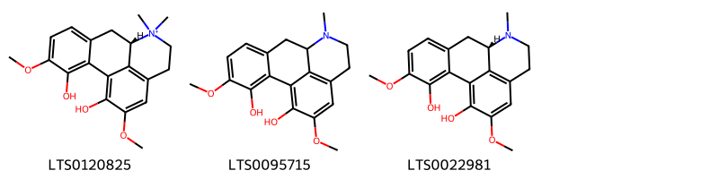{ width=100% }
    <figcaption>Hình ảnh cấu trúc hóa học của 3 hoạt chất thuộc nhóm Aporphines gồm ['magnoflorine (LTS0120825)', '4,15-dimethoxy-10-methyl-10-azatetracyclo[7.7.1.0²,⁷.0¹³,¹⁷]heptadeca-1(16),2,4,6,13(17),14-hexaene-3,16-diol (LTS0095715)', '(9s)-4,15-dimethoxy-10-methyl-10-azatetracyclo[7.7.1.0²,⁷.0¹³,¹⁷]heptadeca-1(16),2,4,6,13(17),14-hexaene-3,16-diol (LTS0022981)'].</figcaption>
</figure>
#### Nhóm Carboxylic acids and derivatives
<figure markdown="span">
    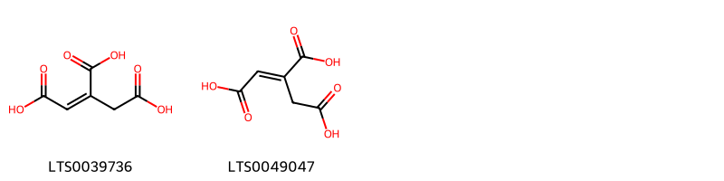{ width=100% }
    <figcaption>Hình ảnh cấu trúc hóa học của 2 hoạt chất thuộc nhóm Carboxylic acids and derivatives gồm ['aconitic acid (LTS0039736)', 'trans-aconitic acid (LTS0049047)'].</figcaption>
</figure>
#### Nhóm Flavonoids
<figure markdown="span">
    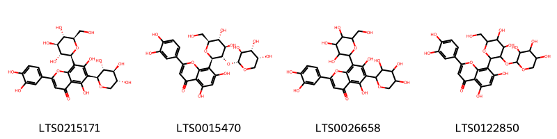{ width=100% }
    <figcaption>Hình ảnh cấu trúc hóa học của 4 hoạt chất thuộc nhóm Flavonoids gồm ['2-(3,4-dihydroxyphenyl)-5,7-dihydroxy-8-[(2s,3r,4r,5s,6r)-3,4,5-trihydroxy-6-(hydroxymethyl)oxan-2-yl]-6-[(2s,3r,4s,5r)-3,4,5-trihydroxyoxan-2-yl]chromen-4-one (LTS0215171)', '8-[(2r,3s,4r,5r,6s)-4,5-dihydroxy-6-(hydroxymethyl)-3-{[(2r,3s,4r,5r)-3,4,5-trihydroxyoxan-2-yl]oxy}oxan-2-yl]-2-(3,4-dihydroxyphenyl)-5,7-dihydroxychromen-4-one (LTS0015470)', '2-(3,4-dihydroxyphenyl)-5,7-dihydroxy-8-[3,4,5-trihydroxy-6-(hydroxymethyl)oxan-2-yl]-6-(3,4,5-trihydroxyoxan-2-yl)chromen-4-one (LTS0026658)', '8-[4,5-dihydroxy-6-(hydroxymethyl)-3-[(3,4,5-trihydroxyoxan-2-yl)oxy]oxan-2-yl]-2-(3,4-dihydroxyphenyl)-5,7-dihydroxychromen-4-one (LTS0122850)'].</figcaption>
</figure>
#### Nhóm Organonitrogen compounds
<figure markdown="span">
    { width=100% }
    <figcaption>Hình ảnh cấu trúc hóa học của 1 hoạt chất thuộc nhóm Organonitrogen compounds gồm ['choline (LTS0170307)'].</figcaption>
</figure>
#### Nhóm Organooxygen compounds
<figure markdown="span">
    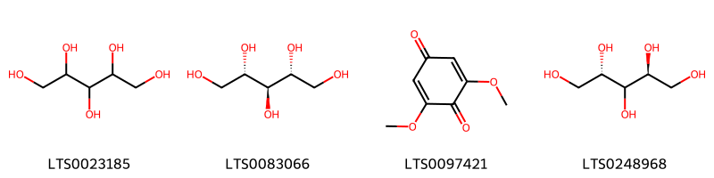{ width=100% }
    <figcaption>Hình ảnh cấu trúc hóa học của 4 hoạt chất thuộc nhóm Organooxygen compounds gồm ['1,2,3,4,5-pentahydroxypentane (LTS0023185)', 'ribitol (LTS0083066)', '2,6-dimethoxy-1,4-benzoquinone (LTS0097421)', 'arabinitol (LTS0248968)'].</figcaption>
</figure>
#### Nhóm Saturated hydrocarbons
<figure markdown="span">
    { width=100% }
    <figcaption>Hình ảnh cấu trúc hóa học của 1 hoạt chất thuộc nhóm Saturated hydrocarbons gồm ['pentatriacontane (LTS0110888)'].</figcaption>
</figure>
#### Nhóm Steroids and steroid derivatives
<figure markdown="span">
    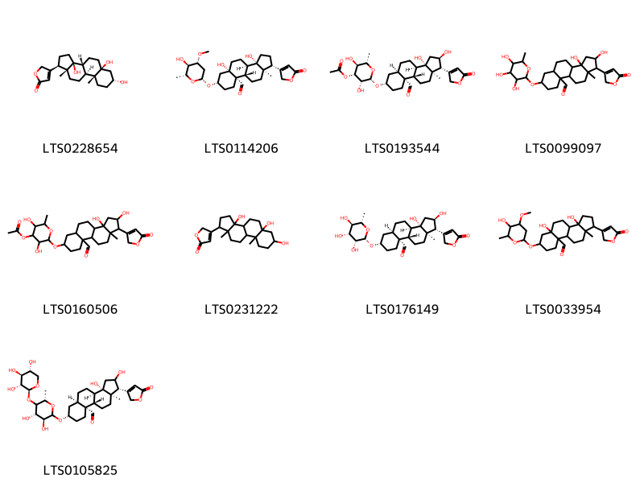{ width=100% }
    <figcaption>Hình ảnh cấu trúc hóa học của 9 hoạt chất thuộc nhóm Steroids and steroid derivatives gồm ['4-[(1r,3as,3br,5as,7r,9ar,9bs,11ar)-3a,5a,7-trihydroxy-9a,11a-dimethyl-dodecahydro-1h-cyclopenta[a]phenanthren-1-yl]-5h-furan-2-one (LTS0228654)', '(1r,3as,3br,5as,7s,9as,9bs,11ar)-3a,5a-dihydroxy-7-{[(2r,4r,5r,6r)-5-hydroxy-4-methoxy-6-methyloxan-2-yl]oxy}-11a-methyl-1-(5-oxo-2h-furan-3-yl)-dodecahydro-1h-cyclopenta[a]phenanthrene-9a-carbaldehyde (LTS0114206)', '(2s,3r,4r,5s,6s)-2-{[(1r,2r,3as,3br,5ar,7s,9ar,9bs,11ar)-9a-formyl-2,3a-dihydroxy-11a-methyl-1-(5-oxo-2h-furan-3-yl)-tetradecahydrocyclopenta[a]phenanthren-7-yl]oxy}-3,5-dihydroxy-6-methyloxan-4-yl acetate (LTS0193544)', 'adonitoxin (LTS0099097)', '2-{[9a-formyl-2,3a-dihydroxy-11a-methyl-1-(5-oxo-2h-furan-3-yl)-tetradecahydrocyclopenta[a]phenanthren-7-yl]oxy}-3,5-dihydroxy-6-methyloxan-4-yl acetate (LTS0160506)', '4-{3a,5a,7-trihydroxy-9a,11a-dimethyl-dodecahydro-1h-cyclopenta[a]phenanthren-1-yl}-5h-furan-2-one (LTS0231222)', '(1r,2r,3as,3br,5ar,7s,9ar,9bs,11ar)-2,3a-dihydroxy-11a-methyl-1-(5-oxo-2h-furan-3-yl)-7-{[(2s,3r,4r,5r,6s)-3,4,5-trihydroxy-6-methyloxan-2-yl]oxy}-tetradecahydrocyclopenta[a]phenanthrene-9a-carbaldehyde (LTS0176149)', 'cymarin (LTS0033954)', '(1r,3as,3br,5ar,7s,9ar,9bs,11ar)-7-{[(3s,4s,6s)-3,4-dihydroxy-6-methyl-5-{[(2s,3r,4s,5r)-3,4,5-trihydroxyoxan-2-yl]oxy}oxan-2-yl]oxy}-2,3a-dihydroxy-11a-methyl-1-(5-oxo-2h-furan-3-yl)-tetradecahydrocyclopenta[a]phenanthrene-9a-carbaldehyde (LTS0105825)'].</figcaption>
</figure>

---

### Dược dân tộc học

Danh sách các quốc gia có sử dụng *Adonis vernalis* trong điều trị các bệnh. 

| Country   | Disease     | Bệnh                                                                                                                                                                                                |
|:----------|:------------|:----------------------------------------------------------------------------------------------------------------------------------------------------------------------------------------------------|
| Dutch     | Diuretic    | MYMEMORY WARNING: YOU USED ALL AVAILABLE FREE TRANSLATIONS FOR TODAY. NEXT AVAILABLE IN  08 HOURS 21 MINUTES 08 SECONDS VISIT HTTPS://MYMEMORY.TRANSLATED.NET/DOC/USAGELIMITS.PHP TO TRANSLATE MORE |
| English   | Emmenagogue | MYMEMORY WARNING: YOU USED ALL AVAILABLE FREE TRANSLATIONS FOR TODAY. NEXT AVAILABLE IN  08 HOURS 21 MINUTES 05 SECONDS VISIT HTTPS://MYMEMORY.TRANSLATED.NET/DOC/USAGELIMITS.PHP TO TRANSLATE MORE |
| French    | Sedative    | MYMEMORY WARNING: YOU USED ALL AVAILABLE FREE TRANSLATIONS FOR TODAY. NEXT AVAILABLE IN  08 HOURS 21 MINUTES 02 SECONDS VISIT HTTPS://MYMEMORY.TRANSLATED.NET/DOC/USAGELIMITS.PHP TO TRANSLATE MORE |
| German    | Poison      | MYMEMORY WARNING: YOU USED ALL AVAILABLE FREE TRANSLATIONS FOR TODAY. NEXT AVAILABLE IN  08 HOURS 21 MINUTES 00 SECONDS VISIT HTTPS://MYMEMORY.TRANSLATED.NET/DOC/USAGELIMITS.PHP TO TRANSLATE MORE |
| Turkey    | Cardiotonic | MYMEMORY WARNING: YOU USED ALL AVAILABLE FREE TRANSLATIONS FOR TODAY. NEXT AVAILABLE IN  08 HOURS 20 MINUTES 57 SECONDS VISIT HTTPS://MYMEMORY.TRANSLATED.NET/DOC/USAGELIMITS.PHP TO TRANSLATE MORE |
| ain       | Cardiotonic | MYMEMORY WARNING: YOU USED ALL AVAILABLE FREE TRANSLATIONS FOR TODAY. NEXT AVAILABLE IN  08 HOURS 20 MINUTES 55 SECONDS VISIT HTTPS://MYMEMORY.TRANSLATED.NET/DOC/USAGELIMITS.PHP TO TRANSLATE MORE |
| anish     | Vermifuge   | MYMEMORY WARNING: YOU USED ALL AVAILABLE FREE TRANSLATIONS FOR TODAY. NEXT AVAILABLE IN  08 HOURS 20 MINUTES 52 SECONDS VISIT HTTPS://MYMEMORY.TRANSLATED.NET/DOC/USAGELIMITS.PHP TO TRANSLATE MORE |

---

# Chi Pulsatilla

??? note "Danh sách các dược liệu thuộc chi"
    
	 - *Pulsatilla cernua*
	 - *Pulsatilla chinensis*
	 - *Pulsatilla koreana*

---
## Pulsatilla cernua
### Thông tin về thực vật

!!! info "Phân loại thực vật của *Pulsatilla cernua* từ GIBF:"
    - **Kingdom:** Plantae
    - **Phylum:** Tracheophyta
    - **Order:** Ranunculales
    - **Family:** Ranunculaceae
    - **Genus:** Pulsatilla
    - **Species:** *Pulsatilla cernua*

 

| Label (VI)   | Label (EN)   | Scientific Name   | Descriptions (VI)   | Descriptions (EN)   | Also Known As (VI)   | Also Known As (EN)            |
|:-------------|:-------------|:------------------|:--------------------|:--------------------|:---------------------|:------------------------------|
| N/A          | N/A          | Pulsatilla cernua | loài thực vật       | species of plant    | ['']                 | ['narrow-leaf pasque-flower'] |

#### Phân bố trên thế giới

**Từ CSDL GIBF** nan, Japan, Russian Federation, China, Korea, Republic of

#### Phân bố tại Việt Nam

**Từ CSDL GIBF**: Không có ghi nhận ở Việt Nam

---
### Thành phần hóa học
        
- Theo cơ sở dữ liệu lotus: Từ loài *Pulsatilla cernua* đã phân lập và xác định được 89 hoạt chất thuộc về các nhóm Vinylogous esters, Furanoid lignans, 2-arylbenzofuran flavonoids, Prenol lipids, Lignan glycosides, Carboxylic acids and derivatives, Lignan lactones, Steroids and steroid derivatives, Phenylpropanoic acids, Cinnamic acids and derivatives. 

|    | chemicalTaxonomyClassyfireClass   |   smiles_count |
|---:|:----------------------------------|---------------:|
|  0 | 2-arylbenzofuran flavonoids       |              3 |
|  1 | Carboxylic acids and derivatives  |              1 |
|  2 | Cinnamic acids and derivatives    |              6 |
|  3 | Furanoid lignans                  |              4 |
|  4 | Lignan glycosides                 |              1 |
|  5 | Lignan lactones                   |              2 |
|  6 | Phenylpropanoic acids             |              1 |
|  7 | Prenol lipids                     |             69 |
|  8 | Steroids and steroid derivatives  |              1 |
|  9 | Vinylogous esters                 |              1 |

#### Nhóm 2-arylbenzofuran flavonoids
<figure markdown="span">
    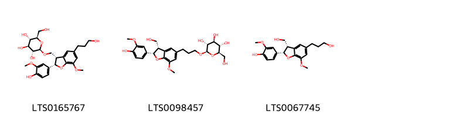{ width=100% }
    <figcaption>Hình ảnh cấu trúc hóa học của 3 hoạt chất thuộc nhóm 2-arylbenzofuran flavonoids gồm ['(2r,3r,4s,5s,6r)-2-{[(2s,3s)-2-(4-hydroxy-3-methoxyphenyl)-5-(3-hydroxypropyl)-7-methoxy-2,3-dihydro-1-benzofuran-3-yl]methoxy}-6-(hydroxymethyl)oxane-3,4,5-triol (LTS0165767)', '(2r,3r,4s,5s,6r)-2-{3-[(2s,3s)-2-(4-hydroxy-3-methoxyphenyl)-3-(hydroxymethyl)-7-methoxy-2,3-dihydro-1-benzofuran-5-yl]propoxy}-6-(hydroxymethyl)oxane-3,4,5-triol (LTS0098457)', '4-[(2s,3s)-3-(hydroxymethyl)-5-(3-hydroxypropyl)-7-methoxy-2,3-dihydro-1-benzofuran-2-yl]-2-methoxyphenol (LTS0067745)'].</figcaption>
</figure>
#### Nhóm Carboxylic acids and derivatives
<figure markdown="span">
    { width=100% }
    <figcaption>Hình ảnh cấu trúc hóa học của 1 hoạt chất thuộc nhóm Carboxylic acids and derivatives gồm ['(2r,3s)-2,3-bis({[(2e)-3-(3,4-dihydroxyphenyl)prop-2-enoyl]oxy})butanedioic acid (LTS0214614)'].</figcaption>
</figure>
#### Nhóm Cinnamic acids and derivatives
<figure markdown="span">
    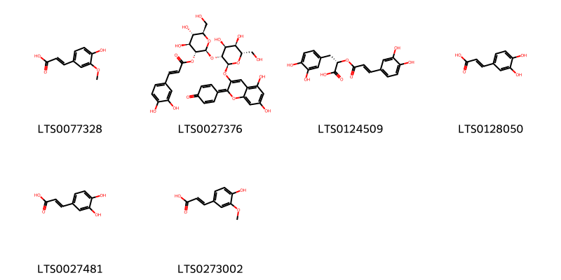{ width=100% }
    <figcaption>Hình ảnh cấu trúc hóa học của 6 hoạt chất thuộc nhóm Cinnamic acids and derivatives gồm ['ferulic acid (LTS0077328)', '(2s,3r,4s,5s,6r)-2-{[(2s,3r,4s,5r,6s)-2-{[5,7-dihydroxy-2-(4-oxocyclohexa-2,5-dien-1-ylidene)chromen-3-yl]oxy}-4,5-dihydroxy-6-(hydroxymethyl)oxan-3-yl]oxy}-4,5-dihydroxy-6-(hydroxymethyl)oxan-3-yl 3-(3,4-dihydroxyphenyl)prop-2-enoate (LTS0027376)', '(s)-rosmarinic acid (LTS0124509)', '3,4-dihydroxycinnamic acid (LTS0128050)', 'caffeic acid (LTS0027481)', 'ferulic acid (LTS0273002)'].</figcaption>
</figure>
#### Nhóm Furanoid lignans
<figure markdown="span">
    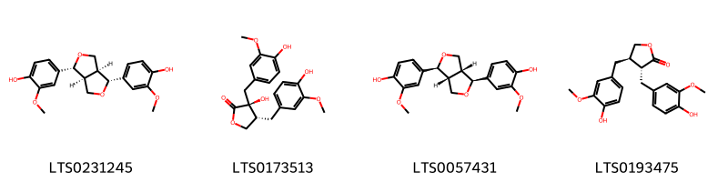{ width=100% }
    <figcaption>Hình ảnh cấu trúc hóa học của 4 hoạt chất thuộc nhóm Furanoid lignans gồm ['(-)-pinoresinol (LTS0231245)', '(3s,4r)-3-hydroxy-3,4-bis[(4-hydroxy-3-methoxyphenyl)methyl]oxolan-2-one (LTS0173513)', 'pinoresinol (LTS0057431)', 'matairesinol (LTS0193475)'].</figcaption>
</figure>
#### Nhóm Lignan glycosides
<figure markdown="span">
    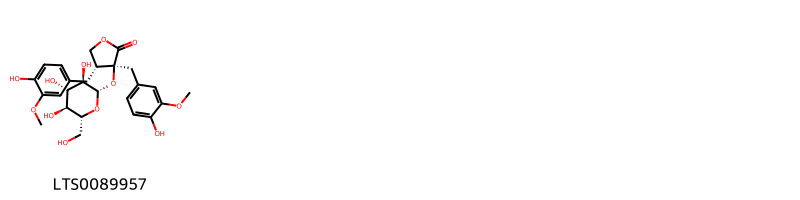{ width=100% }
    <figcaption>Hình ảnh cấu trúc hóa học của 1 hoạt chất thuộc nhóm Lignan glycosides gồm ['(3s,4r)-3,4-bis[(4-hydroxy-3-methoxyphenyl)methyl]-3-{[(2s,3r,4s,5s,6r)-3,4,5-trihydroxy-6-(hydroxymethyl)oxan-2-yl]oxy}oxolan-2-one (LTS0089957)'].</figcaption>
</figure>
#### Nhóm Lignan lactones
<figure markdown="span">
    { width=100% }
    <figcaption>Hình ảnh cấu trúc hóa học của 2 hoạt chất thuộc nhóm Lignan lactones gồm ['10-(3,4,5-trimethoxyphenyl)-4,6,13-trioxatetracyclo[7.7.0.0³,⁷.0¹¹,¹⁵]hexadeca-1,3(7),8-trien-12-one (LTS0255618)', '(-)-deoxypodophyllotoxin (LTS0013249)'].</figcaption>
</figure>
#### Nhóm Phenylpropanoic acids
<figure markdown="span">
    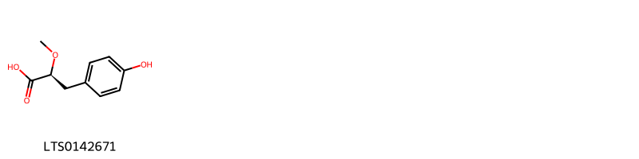{ width=100% }
    <figcaption>Hình ảnh cấu trúc hóa học của 1 hoạt chất thuộc nhóm Phenylpropanoic acids gồm ['(2s)-3-(4-hydroxyphenyl)-2-methoxypropanoic acid (LTS0142671)'].</figcaption>
</figure>
#### Nhóm Prenol lipids
<figure markdown="span">
    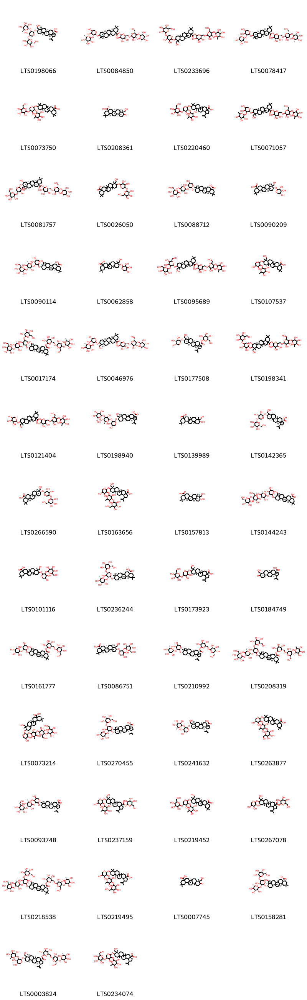{ width=100% }
    <figcaption>Hình ảnh cấu trúc hóa học của 69 hoạt chất thuộc nhóm Prenol lipids gồm ['(1r,3as,5ar,5br,7ar,8r,9s,11ar,11br,13ar,13br)-9-{[(2s,3r,4s,5s)-4-hydroxy-5-{[(2s,3r,4s,5s,6r)-3,4,5-trihydroxy-6-(hydroxymethyl)oxan-2-yl]oxy}-3-{[(2s,3r,4r,5r,6s)-3,4,5-trihydroxy-6-methyloxan-2-yl]oxy}oxan-2-yl]oxy}-8-(hydroxymethyl)-5a,5b,8,11a-tetramethyl-1-(prop-1-en-2-yl)-hexadecahydrocyclopenta[a]chrysene-3a-carboxylic acid (LTS0198066)', '(2s,3r,4s,5s,6r)-6-({[(2r,3r,4r,5s,6r)-3,4-dihydroxy-6-(hydroxymethyl)-5-{[(2s,3r,4r,5r,6s)-3,4,5-trihydroxy-6-methyloxan-2-yl]oxy}oxan-2-yl]oxy}methyl)-3,4,5-trihydroxyoxan-2-yl (4as,6as,6br,8ar,10s,12ar,12br,14bs)-10-{[(2s,3r,4s,5s)-4,5-dihydroxy-3-{[(2s,3r,4r,5r,6s)-3,4,5-trihydroxy-6-methyloxan-2-yl]oxy}oxan-2-yl]oxy}-2,2,6a,6b,9,9,12a-heptamethyl-1,3,4,5,6,7,8,8a,10,11,12,12b,13,14b-tetradecahydropicene-4a-carboxylate (LTS0084850)', '6-({[3,4-dihydroxy-6-(hydroxymethyl)-5-[(3,4,5-trihydroxy-6-methyloxan-2-yl)oxy]oxan-2-yl]oxy}methyl)-3,4,5-trihydroxyoxan-2-yl 10-[(3,4-dihydroxy-5-{[3,4,5-trihydroxy-6-(hydroxymethyl)oxan-2-yl]oxy}oxan-2-yl)oxy]-9-(hydroxymethyl)-2,2,6a,6b,9,12a-hexamethyl-1,3,4,5,6,7,8,8a,10,11,12,12b,13,14b-tetradecahydropicene-4a-carboxylate (LTS0233696)', '(2s,3r,4s,5s,6r)-6-({[(2r,3r,4r,5s,6r)-3,4-dihydroxy-6-(hydroxymethyl)-5-{[(2s,3r,4r,5r,6s)-3,4,5-trihydroxy-6-methyloxan-2-yl]oxy}oxan-2-yl]oxy}methyl)-3,4,5-trihydroxyoxan-2-yl (4as,6as,6br,8ar,10s,12ar,12br,14br)-10-{[(2s,3r,4s,5s)-4,5-dihydroxy-3-{[(2s,3r,4r,5r,6s)-3,4,5-trihydroxy-6-methyloxan-2-yl]oxy}oxan-2-yl]oxy}-2,2,6a,6b,9,9,12a-heptamethyl-1,3,4,5,6,7,8,8a,10,11,12,12b,13,14b-tetradecahydropicene-4a-carboxylate (LTS0078417)', 'hederacolchiside (LTS0073750)', '(4as,6as,6br,8ar,9r,12ar,12br,14bs)-9-(hydroxymethyl)-2,2,6a,6b,9,12a-hexamethyl-10-oxo-3,4,5,6,7,8,8a,11,12,12b,13,14b-dodecahydro-1h-picene-4a-carboxylic acid (LTS0208361)', '9-[(4-hydroxy-5-{[3,4,5-trihydroxy-6-(hydroxymethyl)oxan-2-yl]oxy}-3-[(3,4,5-trihydroxy-6-methyloxan-2-yl)oxy]oxan-2-yl)oxy]-5a,5b,8,8,11a-pentamethyl-1-(prop-1-en-2-yl)-hexadecahydrocyclopenta[a]chrysene-3a-carboxylic acid (LTS0220460)', '6-({[3,4-dihydroxy-6-(hydroxymethyl)-5-[(3,4,5-trihydroxy-6-methyloxan-2-yl)oxy]oxan-2-yl]oxy}methyl)-3,4,5-trihydroxyoxan-2-yl 10-({4,5-dihydroxy-3-[(3,4,5-trihydroxy-6-methyloxan-2-yl)oxy]oxan-2-yl}oxy)-9-(hydroxymethyl)-2,2,6a,6b,9,12a-hexamethyl-1,3,4,5,6,7,8,8a,10,11,12,12b,13,14b-tetradecahydropicene-4a-carboxylate (LTS0071057)', '(2s,3r,4s,5s,6r)-6-({[(2r,3r,4r,5s,6r)-3,4-dihydroxy-6-(hydroxymethyl)-5-{[(2s,3r,4r,5r,6s)-3,4,5-trihydroxy-6-methyloxan-2-yl]oxy}oxan-2-yl]oxy}methyl)-3,4,5-trihydroxyoxan-2-yl (4as,6as,6br,8ar,9r,10r,11r,12ar,12br,14bs)-10-{[(2s,3r,4r,5s)-3,4-dihydroxy-5-{[(2s,3r,4s,5s,6r)-3,4,5-trihydroxy-6-(hydroxymethyl)oxan-2-yl]oxy}oxan-2-yl]oxy}-11-hydroxy-9-(hydroxymethyl)-2,2,6a,6b,9,12a-hexamethyl-1,3,4,5,6,7,8,8a,10,11,12,12b,13,14b-tetradecahydropicene-4a-carboxylate (LTS0081757)', '10-[(3,4-dihydroxy-5-{[3,4,5-trihydroxy-6-(hydroxymethyl)oxan-2-yl]oxy}oxan-2-yl)oxy]-9-(hydroxymethyl)-2,2,6a,6b,9,12a-hexamethyl-1,3,4,5,6,7,8,8a,10,11,12,12b,13,14b-tetradecahydropicene-4a-carboxylic acid (LTS0026050)', '(4as,6as,6br,8ar,10s,12ar,12br,14bs)-10-{[(2s,3r,4s,5s)-3-{[(2s,3r,4r,5s,6s)-3,5-dihydroxy-6-methyl-4-{[(2s,3r,4s,5s,6r)-3,4,5-trihydroxy-6-(hydroxymethyl)oxan-2-yl]oxy}oxan-2-yl]oxy}-4,5-dihydroxyoxan-2-yl]oxy}-2,2,6a,6b,9,9,12a-heptamethyl-1,3,4,5,6,7,8,8a,10,11,12,12b,13,14b-tetradecahydropicene-4a-carboxylic acid (LTS0088712)', 'hederagenin 3-o-arabinoside (LTS0090209)', '(4as,6as,6br,8ar,9r,10s,12ar,12br,14br)-10-{[(2s,3r,4s,5s)-3-{[(2s,3r,4r,5s,6s)-3,5-dihydroxy-6-methyl-4-{[(2s,3r,4s,5s,6r)-3,4,5-trihydroxy-6-(hydroxymethyl)oxan-2-yl]oxy}oxan-2-yl]oxy}-4,5-dihydroxyoxan-2-yl]oxy}-9-(hydroxymethyl)-2,2,6a,6b,9,12a-hexamethyl-1,3,4,5,6,7,8,8a,10,11,12,12b,13,14b-tetradecahydropicene-4a-carboxylic acid (LTS0090114)', '9-(hydroxymethyl)-2,2,6a,6b,9,12a-hexamethyl-10-[(3,4,5-trihydroxyoxan-2-yl)oxy]-1,3,4,5,6,7,8,8a,10,11,12,12b,13,14b-tetradecahydropicene-4a-carboxylic acid (LTS0062858)', '6-({[3,4-dihydroxy-6-(hydroxymethyl)-5-[(3,4,5-trihydroxy-6-methyloxan-2-yl)oxy]oxan-2-yl]oxy}methyl)-3,4,5-trihydroxyoxan-2-yl 10-{[4,5-dihydroxy-6-(hydroxymethyl)-3-{[3,4,5-trihydroxy-6-(hydroxymethyl)oxan-2-yl]oxy}oxan-2-yl]oxy}-9-(hydroxymethyl)-2,2,6a,6b,9,12a-hexamethyl-1,3,4,5,6,7,8,8a,10,11,12,12b,13,14b-tetradecahydropicene-4a-carboxylate (LTS0095689)', '10-({4,5-dihydroxy-3-[(3,4,5-trihydroxy-6-methyloxan-2-yl)oxy]oxan-2-yl}oxy)-9-(hydroxymethyl)-2,2,6a,6b,9,12a-hexamethyl-1,3,4,5,6,7,8,8a,10,11,12,12b,13,14b-tetradecahydropicene-4a-carboxylic acid (LTS0107537)', '(2s,3r,4s,5s,6r)-6-({[(2r,3r,4r,5s,6r)-3,4-dihydroxy-6-(hydroxymethyl)-5-{[(2s,3r,4r,5r,6s)-3,4,5-trihydroxy-6-methyloxan-2-yl]oxy}oxan-2-yl]oxy}methyl)-3,4,5-trihydroxyoxan-2-yl (4as,6as,6br,8ar,9r,10r,12ar,12br,14bs)-10-{[(2s,3r,4s,5s)-3-{[(2s,3r,4r,5s,6s)-3,5-dihydroxy-6-methyl-4-{[(2s,3r,4s,5s,6r)-3,4,5-trihydroxy-6-(hydroxymethyl)oxan-2-yl]oxy}oxan-2-yl]oxy}-4-hydroxy-5-{[(2s,3r,4s,5s,6r)-3,4,5-trihydroxy-6-(hydroxymethyl)oxan-2-yl]oxy}oxan-2-yl]oxy}-9-(hydroxymethyl)-2,2,6a,6b,9,12a-hexamethyl-1,3,4,5,6,7,8,8a,10,11,12,12b,13,14b-tetradecahydropicene-4a-carboxylate (LTS0017174)', 'kalopanaxsaponin b (LTS0046976)', '(2s,3r,4s,5s,6r)-3,4,5-trihydroxy-6-(hydroxymethyl)oxan-2-yl (1r,3as,5ar,5br,7ar,8r,9s,11ar,11br,13ar,13br)-8-(hydroxymethyl)-5a,5b,8,11a-tetramethyl-1-(prop-1-en-2-yl)-9-{[(2s,3r,4s,5s)-3,4,5-trihydroxyoxan-2-yl]oxy}-hexadecahydrocyclopenta[a]chrysene-3a-carboxylate (LTS0177508)', '6-({[3,4-dihydroxy-6-(hydroxymethyl)-5-[(3,4,5-trihydroxy-6-methyloxan-2-yl)oxy]oxan-2-yl]oxy}methyl)-3,4,5-trihydroxyoxan-2-yl 10-[(3,4-dihydroxy-5-{[3,4,5-trihydroxy-6-(hydroxymethyl)oxan-2-yl]oxy}oxan-2-yl)oxy]-11-hydroxy-9-(hydroxymethyl)-2,2,6a,6b,9,12a-hexamethyl-1,3,4,5,6,7,8,8a,10,11,12,12b,13,14b-tetradecahydropicene-4a-carboxylate (LTS0198341)', '6-({[3,4-dihydroxy-6-(hydroxymethyl)-5-[(3,4,5-trihydroxy-6-methyloxan-2-yl)oxy]oxan-2-yl]oxy}methyl)-3,4,5-trihydroxyoxan-2-yl 9-(hydroxymethyl)-2,2,6a,6b,9,12a-hexamethyl-10-[(3,4,5-trihydroxyoxan-2-yl)oxy]-1,3,4,5,6,7,8,8a,10,11,12,12b,13,14b-tetradecahydropicene-4a-carboxylate (LTS0121404)', '(1r,3as,5ar,5br,7ar,8r,9s,11ar,11br,13ar,13br)-9-{[(2s,3r,4s,5s)-3-{[(2s,3r,4r,5s,6s)-3,5-dihydroxy-6-methyl-4-{[(2s,3r,4s,5s,6r)-3,4,5-trihydroxy-6-(hydroxymethyl)oxan-2-yl]oxy}oxan-2-yl]oxy}-4,5-dihydroxyoxan-2-yl]oxy}-8-(hydroxymethyl)-5a,5b,8,11a-tetramethyl-1-(prop-1-en-2-yl)-hexadecahydrocyclopenta[a]chrysene-3a-carboxylic acid (LTS0198940)', '10-hydroxy-9-(hydroxymethyl)-2,2,6a,6b,9,12a-hexamethyl-1,3,4,5,6,7,8,8a,10,11,12,12b,13,14b-tetradecahydropicene-4a-carboxylic acid (LTS0139989)', '(1r,3as,5ar,5br,7ar,8r,9s,11ar,11br,13ar,13br)-9-{[(2s,3r,4r,5s)-3,4-dihydroxy-5-{[(2s,3r,4s,5s,6r)-3,4,5-trihydroxy-6-(hydroxymethyl)oxan-2-yl]oxy}oxan-2-yl]oxy}-8-(hydroxymethyl)-5a,5b,8,11a-tetramethyl-1-(prop-1-en-2-yl)-hexadecahydrocyclopenta[a]chrysene-3a-carboxylic acid (LTS0142365)', '(4as,6as,6br,8ar,9r,10s,12ar,12br,14bs)-10-{[(2s,3r,4r,5s)-3,4-dihydroxy-5-{[(2s,3r,4s,5s,6r)-3,4,5-trihydroxy-6-(hydroxymethyl)oxan-2-yl]oxy}oxan-2-yl]oxy}-9-(hydroxymethyl)-2,2,6a,6b,9,12a-hexamethyl-1,3,4,5,6,7,8,8a,10,11,12,12b,13,14b-tetradecahydropicene-4a-carboxylic acid (LTS0266590)', '9-({3-[(3,5-dihydroxy-6-methyl-4-{[3,4,5-trihydroxy-6-(hydroxymethyl)oxan-2-yl]oxy}oxan-2-yl)oxy]-4,5-dihydroxyoxan-2-yl}oxy)-8-(hydroxymethyl)-5a,5b,8,11a-tetramethyl-1-(prop-1-en-2-yl)-hexadecahydrocyclopenta[a]chrysene-3a-carboxylic acid (LTS0163656)', 'hederagenin (LTS0157813)', '(4as,6as,6br,8ar,9r,10s,12ar,12br,14br)-10-{[(2s,3r,4s,5s)-3-{[(2s,3r,4r,5s,6s)-4-{[(2s,3r,4r,5s,6r)-3,4-dihydroxy-6-(hydroxymethyl)-5-{[(2s,3r,4s,5s,6r)-3,4,5-trihydroxy-6-(hydroxymethyl)oxan-2-yl]oxy}oxan-2-yl]oxy}-3,5-dihydroxy-6-methyloxan-2-yl]oxy}-4,5-dihydroxyoxan-2-yl]oxy}-9-(hydroxymethyl)-2,2,6a,6b,9,12a-hexamethyl-1,3,4,5,6,7,8,8a,10,11,12,12b,13,14b-tetradecahydropicene-4a-carboxylic acid (LTS0144243)', '10-[(4,5-dihydroxy-3-{[3,4,5-trihydroxy-6-(hydroxymethyl)oxan-2-yl]oxy}oxan-2-yl)oxy]-9-(hydroxymethyl)-2,2,6a,6b,9,12a-hexamethyl-1,3,4,5,6,7,8,8a,10,11,12,12b,13,14b-tetradecahydropicene-4a-carboxylic acid (LTS0101116)', '(4as,6as,6br,8ar,10s,12ar,12br,14bs)-10-{[(2s,3r,4s,5s)-4-hydroxy-5-{[(2s,3r,4s,5s,6r)-3,4,5-trihydroxy-6-(hydroxymethyl)oxan-2-yl]oxy}-3-{[(2s,3r,4r,5r,6s)-3,4,5-trihydroxy-6-methyloxan-2-yl]oxy}oxan-2-yl]oxy}-2,2,6a,6b,9,9,12a-heptamethyl-1,3,4,5,6,7,8,8a,10,11,12,12b,13,14b-tetradecahydropicene-4a-carboxylic acid (LTS0236244)', '9-[(3,4-dihydroxy-5-{[3,4,5-trihydroxy-6-(hydroxymethyl)oxan-2-yl]oxy}oxan-2-yl)oxy]-8-(hydroxymethyl)-5a,5b,8,11a-tetramethyl-1-(prop-1-en-2-yl)-hexadecahydrocyclopenta[a]chrysene-3a-carboxylic acid (LTS0173923)', '(1r,3as,5ar,5br,7ar,8r,11ar,11br,13ar,13br)-8-(hydroxymethyl)-5a,5b,8,11a-tetramethyl-9-oxo-1-(prop-1-en-2-yl)-tetradecahydro-1h-cyclopenta[a]chrysene-3a-carboxylic acid (LTS0184749)', 'dipsacoside b (LTS0161777)', 'cauloside c (LTS0086751)', '(2s,3r,4s,5s,6r)-3,4,5-trihydroxy-6-({[(2r,3r,4s,5s,6r)-3,4,5-trihydroxy-6-(hydroxymethyl)oxan-2-yl]oxy}methyl)oxan-2-yl (1r,3as,5ar,5br,7ar,9s,11ar,11br,13ar,13br)-9-{[(2s,3r,4s,5s)-4,5-dihydroxy-3-{[(2s,3r,4r,5r,6s)-3,4,5-trihydroxy-6-methyloxan-2-yl]oxy}oxan-2-yl]oxy}-5a,5b,8,8,11a-pentamethyl-1-(prop-1-en-2-yl)-hexadecahydrocyclopenta[a]chrysene-3a-carboxylate (LTS0210992)', '(2s,3r,4s,5s,6r)-6-({[(2r,3r,4r,5s,6r)-3,4-dihydroxy-6-(hydroxymethyl)-5-{[(2s,3r,4r,5r,6s)-3,4,5-trihydroxy-6-methyloxan-2-yl]oxy}oxan-2-yl]oxy}methyl)-3,4,5-trihydroxyoxan-2-yl (4as,6as,6br,8ar,10s,12ar,12br,14bs)-10-{[(2s,3r,4s,5s)-3-{[(2s,3r,4r,5s,6s)-3,5-dihydroxy-6-methyl-4-{[(2s,3r,4s,5s,6r)-3,4,5-trihydroxy-6-(hydroxymethyl)oxan-2-yl]oxy}oxan-2-yl]oxy}-4-hydroxy-5-{[(2s,3r,4s,5s,6r)-3,4,5-trihydroxy-6-(hydroxymethyl)oxan-2-yl]oxy}oxan-2-yl]oxy}-2,2,6a,6b,9,9,12a-heptamethyl-1,3,4,5,6,7,8,8a,10,11,12,12b,13,14b-tetradecahydropicene-4a-carboxylate (LTS0208319)', '10-({3-[(4-{[3,4-dihydroxy-6-(hydroxymethyl)-5-{[3,4,5-trihydroxy-6-(hydroxymethyl)oxan-2-yl]oxy}oxan-2-yl]oxy}-3,5-dihydroxy-6-methyloxan-2-yl)oxy]-4,5-dihydroxyoxan-2-yl}oxy)-9-(hydroxymethyl)-2,2,6a,6b,9,12a-hexamethyl-1,3,4,5,6,7,8,8a,10,11,12,12b,13,14b-tetradecahydropicene-4a-carboxylic acid (LTS0073214)', '(1r,3as,5ar,5br,7ar,9s,11ar,11br,13ar,13br)-9-{[(2s,3r,4s,5s)-4-hydroxy-5-{[(2s,3r,4s,5s,6r)-3,4,5-trihydroxy-6-(hydroxymethyl)oxan-2-yl]oxy}-3-{[(2s,3r,4r,5r,6s)-3,4,5-trihydroxy-6-methyloxan-2-yl]oxy}oxan-2-yl]oxy}-5a,5b,8,8,11a-pentamethyl-1-(prop-1-en-2-yl)-hexadecahydrocyclopenta[a]chrysene-3a-carboxylic acid (LTS0270455)', '(1r,3as,5ar,5br,7ar,8r,9s,11ar,11br,13ar,13br)-9-{[(2s,3r,4s,5s)-4,5-dihydroxy-3-{[(2s,3r,4r,5r,6s)-3,4,5-trihydroxy-6-methyloxan-2-yl]oxy}oxan-2-yl]oxy}-8-(hydroxymethyl)-5a,5b,8,11a-tetramethyl-1-(prop-1-en-2-yl)-hexadecahydrocyclopenta[a]chrysene-3a-carboxylic acid (LTS0241632)', '10-({3-[(3,5-dihydroxy-6-methyl-4-{[3,4,5-trihydroxy-6-(hydroxymethyl)oxan-2-yl]oxy}oxan-2-yl)oxy]-4,5-dihydroxyoxan-2-yl}oxy)-2,2,6a,6b,9,9,12a-heptamethyl-1,3,4,5,6,7,8,8a,10,11,12,12b,13,14b-tetradecahydropicene-4a-carboxylic acid (LTS0263877)', '(1r,3as,5ar,5br,7ar,9s,11ar,11br,13ar,13br)-9-{[(2s,3r,4s,5s)-3-{[(2s,3r,4r,5s,6s)-3,5-dihydroxy-6-methyl-4-{[(2s,3r,4s,5s,6r)-3,4,5-trihydroxy-6-(hydroxymethyl)oxan-2-yl]oxy}oxan-2-yl]oxy}-4,5-dihydroxyoxan-2-yl]oxy}-5a,5b,8,8,11a-pentamethyl-1-(prop-1-en-2-yl)-hexadecahydrocyclopenta[a]chrysene-3a-carboxylic acid (LTS0093748)', '3,4,5-trihydroxy-6-(hydroxymethyl)oxan-2-yl 9-({4,5-dihydroxy-3-[(3,4,5-trihydroxy-6-methyloxan-2-yl)oxy]oxan-2-yl}oxy)-8-(hydroxymethyl)-5a,5b,8,11a-tetramethyl-1-(prop-1-en-2-yl)-hexadecahydrocyclopenta[a]chrysene-3a-carboxylate (LTS0237159)', '10-[(4-hydroxy-5-{[3,4,5-trihydroxy-6-(hydroxymethyl)oxan-2-yl]oxy}-3-[(3,4,5-trihydroxy-6-methyloxan-2-yl)oxy]oxan-2-yl)oxy]-9-(hydroxymethyl)-2,2,6a,6b,9,12a-hexamethyl-1,3,4,5,6,7,8,8a,10,11,12,12b,13,14b-tetradecahydropicene-4a-carboxylic acid (LTS0219452)', '3,4,5-trihydroxy-6-(hydroxymethyl)oxan-2-yl 8-(hydroxymethyl)-5a,5b,8,11a-tetramethyl-1-(prop-1-en-2-yl)-9-[(3,4,5-trihydroxyoxan-2-yl)oxy]-hexadecahydrocyclopenta[a]chrysene-3a-carboxylate (LTS0267078)', '(2s,3r,4s,5s,6r)-6-({[(2r,3r,4r,5s,6r)-3,4-dihydroxy-6-(hydroxymethyl)-5-{[(2s,3r,4r,5r,6s)-3,4,5-trihydroxy-6-methyloxan-2-yl]oxy}oxan-2-yl]oxy}methyl)-3,4,5-trihydroxyoxan-2-yl (4as,6as,6br,8ar,9r,10s,12ar,12br,14bs)-10-{[(2s,3r,4s,5s)-3-{[(2s,3r,4r,5s,6s)-3,5-dihydroxy-6-methyl-4-{[(2s,3r,4s,5s,6r)-3,4,5-trihydroxy-6-(hydroxymethyl)oxan-2-yl]oxy}oxan-2-yl]oxy}-4-hydroxy-5-{[(2s,3r,4s,5s,6r)-3,4,5-trihydroxy-6-(hydroxymethyl)oxan-2-yl]oxy}oxan-2-yl]oxy}-9-(hydroxymethyl)-2,2,6a,6b,9,12a-hexamethyl-1,3,4,5,6,7,8,8a,10,11,12,12b,13,14b-tetradecahydropicene-4a-carboxylate (LTS0218538)', '9-({3-[(3,5-dihydroxy-6-methyl-4-{[3,4,5-trihydroxy-6-(hydroxymethyl)oxan-2-yl]oxy}oxan-2-yl)oxy]-4,5-dihydroxyoxan-2-yl}oxy)-5a,5b,8,8,11a-pentamethyl-1-(prop-1-en-2-yl)-hexadecahydrocyclopenta[a]chrysene-3a-carboxylic acid (LTS0219495)', '9-(hydroxymethyl)-2,2,6a,6b,9,12a-hexamethyl-10-oxo-3,4,5,6,7,8,8a,11,12,12b,13,14b-dodecahydro-1h-picene-4a-carboxylic acid (LTS0007745)', '(4as,6as,6br,8ar,9r,10s,12ar,12br,14br)-10-{[(2s,3r,4s,5s)-4-hydroxy-5-{[(2s,3r,4s,5s,6r)-3,4,5-trihydroxy-6-(hydroxymethyl)oxan-2-yl]oxy}-3-{[(2s,3r,4r,5r,6s)-3,4,5-trihydroxy-6-methyloxan-2-yl]oxy}oxan-2-yl]oxy}-9-(hydroxymethyl)-2,2,6a,6b,9,12a-hexamethyl-1,3,4,5,6,7,8,8a,10,11,12,12b,13,14b-tetradecahydropicene-4a-carboxylic acid (LTS0158281)', '(2s,3r,4s,5s,6r)-6-({[(2r,3r,4r,5s,6r)-3,4-dihydroxy-6-(hydroxymethyl)-5-{[(2s,3r,4r,5r,6s)-3,4,5-trihydroxy-6-methyloxan-2-yl]oxy}oxan-2-yl]oxy}methyl)-3,4,5-trihydroxyoxan-2-yl (1r,3as,5ar,5br,7ar,8r,9s,11ar,11br,13ar,13bs)-9-{[(2s,3r,4s,5s)-4,5-dihydroxy-3-{[(2s,3r,4r,5r,6s)-3,4,5-trihydroxy-6-methyloxan-2-yl]oxy}oxan-2-yl]oxy}-8-(hydroxymethyl)-5a,5b,8,11a-tetramethyl-1-(prop-1-en-2-yl)-hexadecahydrocyclopenta[a]chrysene-3a-carboxylate (LTS0003824)', '9-[(4-hydroxy-5-{[3,4,5-trihydroxy-6-(hydroxymethyl)oxan-2-yl]oxy}-3-[(3,4,5-trihydroxy-6-methyloxan-2-yl)oxy]oxan-2-yl)oxy]-8-(hydroxymethyl)-5a,5b,8,11a-tetramethyl-1-(prop-1-en-2-yl)-hexadecahydrocyclopenta[a]chrysene-3a-carboxylic acid (LTS0234074)', '(2s,3r,4s,5s,6r)-6-({[(2r,3r,4r,5s,6r)-3,4-dihydroxy-6-(hydroxymethyl)-5-{[(2s,3r,4r,5r,6s)-3,4,5-trihydroxy-6-methyloxan-2-yl]oxy}oxan-2-yl]oxy}methyl)-3,4,5-trihydroxyoxan-2-yl (4as,6as,6br,8ar,9r,10s,12ar,12br,14bs)-10-{[(2s,3r,4r,5s)-3,4-dihydroxy-5-{[(2s,3r,4s,5s,6r)-3,4,5-trihydroxy-6-(hydroxymethyl)oxan-2-yl]oxy}oxan-2-yl]oxy}-9-(hydroxymethyl)-2,2,6a,6b,9,12a-hexamethyl-1,3,4,5,6,7,8,8a,10,11,12,12b,13,14b-tetradecahydropicene-4a-carboxylate (LTS0186326)', 'cauloside d (LTS0191345)', '(4as,6as,6br,8ar,9r,10s,12ar,12br,14bs)-10-{[(2s,4s,5s)-3-{[(3r,4r,5s,6r)-3,4-dihydroxy-6-(hydroxymethyl)-5-{[(2s,3r,4r,5r,6s)-3,4,5-trihydroxy-6-methyloxan-2-yl]oxy}oxan-2-yl]oxy}-4,5-dihydroxyoxan-2-yl]oxy}-9-(hydroxymethyl)-2,2,6a,6b,9,12a-hexamethyl-1,3,4,5,6,7,8,8a,10,11,12,12b,13,14b-tetradecahydropicene-4a-carboxylic acid (LTS0055090)', '(4as,6as,6br,8ar,9r,10s,12ar,12br,14br)-10-{[(2s,3r,4s,5s)-4,5-dihydroxy-3-{[(2s,3r,4r,5r,6s)-3,4,5-trihydroxy-6-methyloxan-2-yl]oxy}oxan-2-yl]oxy}-9-(hydroxymethyl)-2,2,6a,6b,9,12a-hexamethyl-1,3,4,5,6,7,8,8a,10,11,12,12b,13,14b-tetradecahydropicene-4a-carboxylic acid (LTS0023122)', '(2s,3r,4s,5s,6r)-3,4,5-trihydroxy-6-(hydroxymethyl)oxan-2-yl (1r,3as,5ar,5br,7ar,8r,9s,11ar,11br,13ar,13br)-9-{[(2s,3r,4s,5s)-4,5-dihydroxy-3-{[(2s,3r,4r,5r,6s)-3,4,5-trihydroxy-6-methyloxan-2-yl]oxy}oxan-2-yl]oxy}-8-(hydroxymethyl)-5a,5b,8,11a-tetramethyl-1-(prop-1-en-2-yl)-hexadecahydrocyclopenta[a]chrysene-3a-carboxylate (LTS0031275)', '6-({[3,4-dihydroxy-6-(hydroxymethyl)-5-[(3,4,5-trihydroxy-6-methyloxan-2-yl)oxy]oxan-2-yl]oxy}methyl)-3,4,5-trihydroxyoxan-2-yl 10-({4,5-dihydroxy-3-[(3,4,5-trihydroxy-6-methyloxan-2-yl)oxy]oxan-2-yl}oxy)-2,2,6a,6b,9,9,12a-heptamethyl-1,3,4,5,6,7,8,8a,10,11,12,12b,13,14b-tetradecahydropicene-4a-carboxylate (LTS0131730)', '(4as,6as,6br,8ar,9r,10s,12ar,12br,14br)-10-{[(2s,3r,4r,5s)-3,4-dihydroxy-5-{[(2s,3r,4s,5s,6r)-3,4,5-trihydroxy-6-(hydroxymethyl)oxan-2-yl]oxy}oxan-2-yl]oxy}-9-(hydroxymethyl)-2,2,6a,6b,9,12a-hexamethyl-1,3,4,5,6,7,8,8a,10,11,12,12b,13,14b-tetradecahydropicene-4a-carboxylic acid (LTS0034352)', '6-({[3,4-dihydroxy-6-(hydroxymethyl)-5-[(3,4,5-trihydroxy-6-methyloxan-2-yl)oxy]oxan-2-yl]oxy}methyl)-3,4,5-trihydroxyoxan-2-yl 9-({4,5-dihydroxy-3-[(3,4,5-trihydroxy-6-methyloxan-2-yl)oxy]oxan-2-yl}oxy)-8-(hydroxymethyl)-5a,5b,8,11a-tetramethyl-1-(prop-1-en-2-yl)-hexadecahydrocyclopenta[a]chrysene-3a-carboxylate (LTS0058576)', '9-({4,5-dihydroxy-3-[(3,4,5-trihydroxy-6-methyloxan-2-yl)oxy]oxan-2-yl}oxy)-8-(hydroxymethyl)-5a,5b,8,11a-tetramethyl-1-(prop-1-en-2-yl)-hexadecahydrocyclopenta[a]chrysene-3a-carboxylic acid (LTS0011545)', '(2s,3r,4s,5s,6r)-6-({[(2r,3r,4r,5s,6r)-3,4-dihydroxy-6-(hydroxymethyl)-5-{[(2s,3r,4r,5r,6s)-3,4,5-trihydroxy-6-methyloxan-2-yl]oxy}oxan-2-yl]oxy}methyl)-3,4,5-trihydroxyoxan-2-yl (4as,6as,6br,8ar,9r,10s,12ar,12br,14bs)-10-{[(2r,3r,4s,5s,6r)-4,5-dihydroxy-6-(hydroxymethyl)-3-{[(2s,3r,4s,5s,6r)-3,4,5-trihydroxy-6-(hydroxymethyl)oxan-2-yl]oxy}oxan-2-yl]oxy}-9-(hydroxymethyl)-2,2,6a,6b,9,12a-hexamethyl-1,3,4,5,6,7,8,8a,10,11,12,12b,13,14b-tetradecahydropicene-4a-carboxylate (LTS0014592)', 'α-hederin (LTS0024551)', 'pulsatilla saponin d (LTS0079482)', '3,4,5-trihydroxy-6-({[3,4,5-trihydroxy-6-(hydroxymethyl)oxan-2-yl]oxy}methyl)oxan-2-yl 9-({4,5-dihydroxy-3-[(3,4,5-trihydroxy-6-methyloxan-2-yl)oxy]oxan-2-yl}oxy)-5a,5b,8,8,11a-pentamethyl-1-(prop-1-en-2-yl)-hexadecahydrocyclopenta[a]chrysene-3a-carboxylate (LTS0032425)', '6-({[3,4-dihydroxy-6-(hydroxymethyl)-5-[(3,4,5-trihydroxy-6-methyloxan-2-yl)oxy]oxan-2-yl]oxy}methyl)-3,4,5-trihydroxyoxan-2-yl 9-({4,5-dihydroxy-3-[(3,4,5-trihydroxy-6-methyloxan-2-yl)oxy]oxan-2-yl}oxy)-5a,5b,8,8,11a-pentamethyl-1-(prop-1-en-2-yl)-hexadecahydrocyclopenta[a]chrysene-3a-carboxylate (LTS0098787)', '(2s,3r,4s,5s,6r)-6-({[(2r,3r,4r,5s,6r)-3,4-dihydroxy-6-(hydroxymethyl)-5-{[(2s,3r,4r,5r,6s)-3,4,5-trihydroxy-6-methyloxan-2-yl]oxy}oxan-2-yl]oxy}methyl)-3,4,5-trihydroxyoxan-2-yl (1r,3as,5ar,5br,7ar,9s,11ar,11br,13ar,13br)-9-{[(2s,3r,4s,5s)-4,5-dihydroxy-3-{[(2s,3r,4r,5r,6s)-3,4,5-trihydroxy-6-methyloxan-2-yl]oxy}oxan-2-yl]oxy}-5a,5b,8,8,11a-pentamethyl-1-(prop-1-en-2-yl)-hexadecahydrocyclopenta[a]chrysene-3a-carboxylate (LTS0030261)', '10-({3-[(3,5-dihydroxy-6-methyl-4-{[3,4,5-trihydroxy-6-(hydroxymethyl)oxan-2-yl]oxy}oxan-2-yl)oxy]-4,5-dihydroxyoxan-2-yl}oxy)-9-(hydroxymethyl)-2,2,6a,6b,9,12a-hexamethyl-1,3,4,5,6,7,8,8a,10,11,12,12b,13,14b-tetradecahydropicene-4a-carboxylic acid (LTS0090355)', '(3as,5br,8r,11ar,13ar)-8-(hydroxymethyl)-5a,5b,8,11a-tetramethyl-9-oxo-1-(prop-1-en-2-yl)-tetradecahydro-1h-cyclopenta[a]chrysene-3a-carboxylic acid (LTS0038748)', '(4as,6as,6br,8ar,9r,10s,12ar,12br,14bs)-10-{[(2r,3s,4r,5r)-4,5-dihydroxy-3-{[(2s,3r,4s,5r,6s)-3,4,5-trihydroxy-6-methyloxan-2-yl]oxy}oxan-2-yl]oxy}-9-(hydroxymethyl)-2,2,6a,6b,9,12a-hexamethyl-1,3,4,5,6,7,8,8a,10,11,12,12b,13,14b-tetradecahydropicene-4a-carboxylic acid (LTS0036836)', '(2s,3r,4s,5s,6r)-6-({[(2r,3r,4r,5s,6r)-3,4-dihydroxy-6-(hydroxymethyl)-5-{[(2s,3r,4r,5r,6s)-3,4,5-trihydroxy-6-methyloxan-2-yl]oxy}oxan-2-yl]oxy}methyl)-3,4,5-trihydroxyoxan-2-yl (1r,3as,5ar,5br,7ar,8r,9s,11ar,11br,13ar,13br)-9-{[(2s,3r,4s,5s)-4,5-dihydroxy-3-{[(2s,3r,4r,5r,6s)-3,4,5-trihydroxy-6-methyloxan-2-yl]oxy}oxan-2-yl]oxy}-8-(hydroxymethyl)-5a,5b,8,11a-tetramethyl-1-(prop-1-en-2-yl)-hexadecahydrocyclopenta[a]chrysene-3a-carboxylate (LTS0049051)'].</figcaption>
</figure>
#### Nhóm Steroids and steroid derivatives
<figure markdown="span">
    { width=100% }
    <figcaption>Hình ảnh cấu trúc hóa học của 1 hoạt chất thuộc nhóm Steroids and steroid derivatives gồm ['sitogluside (LTS0201798)'].</figcaption>
</figure>
#### Nhóm Vinylogous esters
<figure markdown="span">
    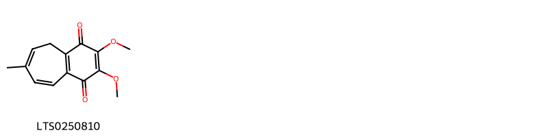{ width=100% }
    <figcaption>Hình ảnh cấu trúc hóa học của 1 hoạt chất thuộc nhóm Vinylogous esters gồm ['2,3-dimethoxy-7-methyl-5h-benzo[7]annulene-1,4-dione (LTS0250810)'].</figcaption>
</figure>

---

### Dược dân tộc học

Danh sách các quốc gia có sử dụng *Pulsatilla cernua* trong điều trị các bệnh. 

| Country   | Disease                    | Bệnh                                                                                                                                                                                                |
|:----------|:---------------------------|:----------------------------------------------------------------------------------------------------------------------------------------------------------------------------------------------------|
| Chinese   | Antiphlogistic, Hemostatic | MYMEMORY WARNING: YOU USED ALL AVAILABLE FREE TRANSLATIONS FOR TODAY. NEXT AVAILABLE IN  08 HOURS 20 MINUTES 25 SECONDS VISIT HTTPS://MYMEMORY.TRANSLATED.NET/DOC/USAGELIMITS.PHP TO TRANSLATE MORE |

---

---
## Pulsatilla chinensis
### Thông tin về thực vật

!!! info "Phân loại thực vật của *Pulsatilla chinensis* từ GIBF:"
    - **Kingdom:** Plantae
    - **Phylum:** Tracheophyta
    - **Order:** Ranunculales
    - **Family:** Ranunculaceae
    - **Genus:** Pulsatilla
    - **Species:** *Pulsatilla chinensis*

 

| Label (VI)   | Label (EN)   | Scientific Name      | Descriptions (VI)   | Descriptions (EN)   | Also Known As (VI)   | Also Known As (EN)    |
|:-------------|:-------------|:---------------------|:--------------------|:--------------------|:---------------------|:----------------------|
| N/A          | N/A          | Pulsatilla chinensis | loài thực vật       | species of plant    | ['']                 | ['Anemone chinensis'] |

#### Phân bố trên thế giới

**Từ CSDL GIBF** nan, Russian Federation, United States of America, Mexico, China, Korea, Republic of

#### Phân bố tại Việt Nam

**Từ CSDL GIBF**: Không có ghi nhận ở Việt Nam

---
### Thành phần hóa học
        
- Theo cơ sở dữ liệu lotus: Từ loài *Pulsatilla chinensis* đã phân lập và xác định được 61 hoạt chất thuộc về các nhóm Organooxygen compounds, Furanoid lignans, Prenol lipids, Lignan lactones. 

|    | chemicalTaxonomyClassyfireClass   |   smiles_count |
|---:|:----------------------------------|---------------:|
|  0 | Furanoid lignans                  |              3 |
|  1 | Lignan lactones                   |              3 |
|  2 | Organooxygen compounds            |              1 |
|  3 | Prenol lipids                     |             54 |

#### Nhóm Furanoid lignans
<figure markdown="span">
    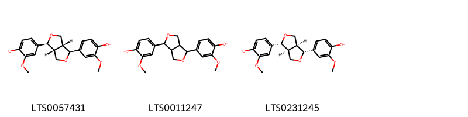{ width=100% }
    <figcaption>Hình ảnh cấu trúc hóa học của 3 hoạt chất thuộc nhóm Furanoid lignans gồm ['pinoresinol (LTS0057431)', 'pinoresinol (LTS0011247)', '(-)-pinoresinol (LTS0231245)'].</figcaption>
</figure>
#### Nhóm Lignan lactones
<figure markdown="span">
    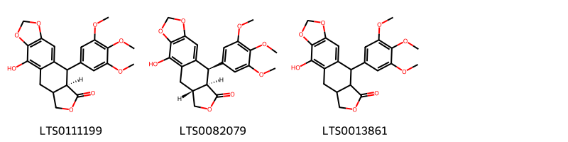{ width=100% }
    <figcaption>Hình ảnh cấu trúc hóa học của 3 hoạt chất thuộc nhóm Lignan lactones gồm ['(11r)-2-hydroxy-10-(3,4,5-trimethoxyphenyl)-4,6,13-trioxatetracyclo[7.7.0.0³,⁷.0¹¹,¹⁵]hexadeca-1,3(7),8-trien-12-one (LTS0111199)', 'β-peltatin (LTS0082079)', 'β-peltatin (LTS0013861)'].</figcaption>
</figure>
#### Nhóm Organooxygen compounds
<figure markdown="span">
    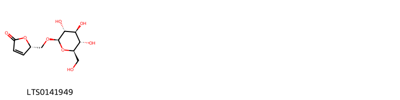{ width=100% }
    <figcaption>Hình ảnh cấu trúc hóa học của 1 hoạt chất thuộc nhóm Organooxygen compounds gồm ['ranunculin (LTS0141949)'].</figcaption>
</figure>
#### Nhóm Prenol lipids
<figure markdown="span">
    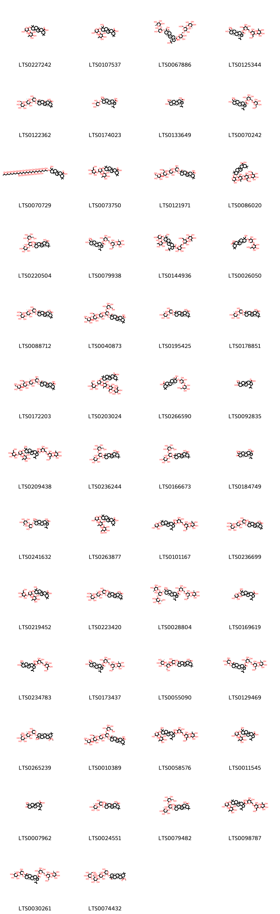{ width=100% }
    <figcaption>Hình ảnh cấu trúc hóa học của 54 hoạt chất thuộc nhóm Prenol lipids gồm ['10-({4,5-dihydroxy-3-[(3,4,5-trihydroxy-6-methyloxan-2-yl)oxy]oxan-2-yl}oxy)-2,2,6a,6b,9,9,12a-heptamethyl-1,3,4,5,6,7,8,8a,10,11,12,12b,13,14b-tetradecahydropicene-4a-carboxylic acid (LTS0227242)', '10-({4,5-dihydroxy-3-[(3,4,5-trihydroxy-6-methyloxan-2-yl)oxy]oxan-2-yl}oxy)-9-(hydroxymethyl)-2,2,6a,6b,9,12a-hexamethyl-1,3,4,5,6,7,8,8a,10,11,12,12b,13,14b-tetradecahydropicene-4a-carboxylic acid (LTS0107537)', '(2s,3r,4s,5s,6r)-6-({[(2r,3r,4r,5s,6r)-3,4-dihydroxy-6-(hydroxymethyl)-5-{[(2s,3r,4r,5r,6s)-3,4,5-trihydroxy-6-methyloxan-2-yl]oxy}oxan-2-yl]oxy}methyl)-3,4,5-trihydroxyoxan-2-yl (1r,3as,5ar,5br,7ar,8r,9s,11ar,11br,13ar,13bs)-9-{[(2s,3r,4s,5s)-4,5-dihydroxy-3-{[(2s,3r,4r,5r,6s)-3,4,5-trihydroxy-6-methyloxan-2-yl]oxy}oxan-2-yl]oxy}-8-(hydroxymethyl)-1-(2-hydroxypropan-2-yl)-5a,5b,8,11a-tetramethyl-hexadecahydrocyclopenta[a]chrysene-3a-carboxylate (LTS0067886)', '6-({[3,4-dihydroxy-6-(hydroxymethyl)-5-[(3,4,5-trihydroxy-6-methyloxan-2-yl)oxy]oxan-2-yl]oxy}methyl)-3,4,5-trihydroxyoxan-2-yl (1r,3as,5ar,5br,7ar,8r,9s,11ar,11br,13ar,13br)-9-hydroxy-8-(hydroxymethyl)-5a,5b,8,11a-tetramethyl-1-(prop-1-en-2-yl)-hexadecahydrocyclopenta[a]chrysene-3a-carboxylate (LTS0125344)', '(4ar,6as,6br,8ar,10s,12ar,12br,14bs)-10-{[(2s,3r,4s,5s)-3-{[(2s,3r,4r,5s,6s)-3,5-dihydroxy-6-methyl-4-{[(2s,3r,4s,5s,6r)-3,4,5-trihydroxy-6-(hydroxymethyl)oxan-2-yl]oxy}oxan-2-yl]oxy}-4,5-dihydroxyoxan-2-yl]oxy}-2,2,6a,6b,9,9,12a-heptamethyl-1,3,4,5,6,7,8,8a,10,11,12,12b,13,14b-tetradecahydropicene-4a-carboxylic acid (LTS0122362)', '(1r,3as,5ar,5br,7ar,8r,9s,11ar,11br,13ar,13br)-8-(hydroxymethyl)-5a,5b,8,11a-tetramethyl-1-(prop-1-en-2-yl)-9-{[(2s,3r,4s,5s)-3,4,5-trihydroxyoxan-2-yl]oxy}-hexadecahydrocyclopenta[a]chrysene-3a-carboxylic acid (LTS0174023)', '23-hydroxybetulinic acid (LTS0133649)', '(2s,3r,4s,5s,6r)-3,4,5-trihydroxy-6-({[(2r,3r,4s,5s,6r)-3,4,5-trihydroxy-6-(hydroxymethyl)oxan-2-yl]oxy}methyl)oxan-2-yl (1r,3as,5ar,5br,7ar,8r,9s,11ar,11br,13ar,13br)-9-hydroxy-8-(hydroxymethyl)-5a,5b,8,11a-tetramethyl-1-(prop-1-en-2-yl)-hexadecahydrocyclopenta[a]chrysene-3a-carboxylate (LTS0070242)', '10-[(2,4,5,6,7,8,9,10,11,12,13,14,15,16,17,18,19,20,22,24,26,28-docosahydroxynonacosyl)oxy]-9-(hydroxymethyl)-2,2,6a,6b,9,12a-hexamethyl-1,3,4,5,6,7,8,8a,10,11,12,12b,13,14b-tetradecahydropicene-4a-carboxylic acid (LTS0070729)', 'hederacolchiside (LTS0073750)', '(4as,6as,6br,8ar,10s,12ar,12br,14bs)-10-{[(2s,3r,4s,5s)-3-{[(2s,3r,4r,5s,6s)-4-{[(2s,3r,4r,5s,6r)-3,4-dihydroxy-6-(hydroxymethyl)-5-{[(2s,3r,4s,5s,6r)-3,4,5-trihydroxy-6-(hydroxymethyl)oxan-2-yl]oxy}oxan-2-yl]oxy}-3,5-dihydroxy-6-methyloxan-2-yl]oxy}-4,5-dihydroxyoxan-2-yl]oxy}-2,2,6a,6b,9,9,12a-heptamethyl-1,3,4,5,6,7,8,8a,10,11,12,12b,13,14b-tetradecahydropicene-4a-carboxylic acid (LTS0121971)', '10-({3-[(4-{[3,4-dihydroxy-6-(hydroxymethyl)-5-{[3,4,5-trihydroxy-6-(hydroxymethyl)oxan-2-yl]oxy}oxan-2-yl]oxy}-3,5-dihydroxy-6-methyloxan-2-yl)oxy]-4,5-dihydroxyoxan-2-yl}oxy)-2,2,6a,6b,9,9,12a-heptamethyl-1,3,4,5,6,7,8,8a,10,11,12,12b,13,14b-tetradecahydropicene-4a-carboxylic acid (LTS0086020)', '(4ar,6as,6br,8ar,9r,10s,12ar,12br,14bs)-10-{[(2s,3r,4s,5s)-4-hydroxy-5-{[(2s,3r,4s,5s,6r)-3,4,5-trihydroxy-6-(hydroxymethyl)oxan-2-yl]oxy}-3-{[(2s,3r,4r,5r,6s)-3,4,5-trihydroxy-6-methyloxan-2-yl]oxy}oxan-2-yl]oxy}-9-(hydroxymethyl)-2,2,6a,6b,9,12a-hexamethyl-1,3,4,5,6,7,8,8a,10,11,12,12b,13,14b-tetradecahydropicene-4a-carboxylic acid (LTS0220504)', '(2s,3r,4s,5s,6r)-6-({[(2r,3r,4s,5s,6r)-3,4-dihydroxy-6-(hydroxymethyl)-5-{[(2s,3r,4r,5r,6s)-3,4,5-trihydroxy-6-methyloxan-2-yl]oxy}oxan-2-yl]oxy}methyl)-3,4,5-trihydroxyoxan-2-yl (1r,3as,5ar,5br,7ar,8r,9s,11ar,11br,13ar,13bs)-9-hydroxy-8-(hydroxymethyl)-5a,5b,8,11a-tetramethyl-1-(prop-1-en-2-yl)-hexadecahydrocyclopenta[a]chrysene-3a-carboxylate (LTS0079938)', '6-({[3,4-dihydroxy-6-(hydroxymethyl)-5-[(3,4,5-trihydroxy-6-methyloxan-2-yl)oxy]oxan-2-yl]oxy}methyl)-3,4,5-trihydroxyoxan-2-yl 9-({4,5-dihydroxy-3-[(3,4,5-trihydroxy-6-methyloxan-2-yl)oxy]oxan-2-yl}oxy)-8-(hydroxymethyl)-1-(2-hydroxypropan-2-yl)-5a,5b,8,11a-tetramethyl-hexadecahydrocyclopenta[a]chrysene-3a-carboxylate (LTS0144936)', '10-[(3,4-dihydroxy-5-{[3,4,5-trihydroxy-6-(hydroxymethyl)oxan-2-yl]oxy}oxan-2-yl)oxy]-9-(hydroxymethyl)-2,2,6a,6b,9,12a-hexamethyl-1,3,4,5,6,7,8,8a,10,11,12,12b,13,14b-tetradecahydropicene-4a-carboxylic acid (LTS0026050)', '(4as,6as,6br,8ar,10s,12ar,12br,14bs)-10-{[(2s,3r,4s,5s)-3-{[(2s,3r,4r,5s,6s)-3,5-dihydroxy-6-methyl-4-{[(2s,3r,4s,5s,6r)-3,4,5-trihydroxy-6-(hydroxymethyl)oxan-2-yl]oxy}oxan-2-yl]oxy}-4,5-dihydroxyoxan-2-yl]oxy}-2,2,6a,6b,9,9,12a-heptamethyl-1,3,4,5,6,7,8,8a,10,11,12,12b,13,14b-tetradecahydropicene-4a-carboxylic acid (LTS0088712)', '(4as,6as,6br,8ar,10s,12ar,12br,14bs)-10-{[(2s,3r,4s,5s)-3-{[(2s,3r,4r,5s,6s)-4-{[(2s,3r,4r,5s,6r)-3,4-dihydroxy-6-(hydroxymethyl)-5-{[(2s,3r,4s,5s,6r)-3,4,5-trihydroxy-6-(hydroxymethyl)oxan-2-yl]oxy}oxan-2-yl]oxy}-3,5-dihydroxy-6-methyloxan-2-yl]oxy}-4-hydroxy-5-{[(2s,3r,4s,5s,6r)-3,4,5-trihydroxy-6-(hydroxymethyl)oxan-2-yl]oxy}oxan-2-yl]oxy}-2,2,6a,6b,9,9,12a-heptamethyl-1,3,4,5,6,7,8,8a,10,11,12,12b,13,14b-tetradecahydropicene-4a-carboxylic acid (LTS0040873)', 'β-hederin (LTS0195425)', '(4ar,6as,6br,8ar,10s,12ar,12br,14bs)-10-{[(2s,3r,4s,5s)-4,5-dihydroxy-3-{[(2s,3r,4r,5r,6s)-3,4,5-trihydroxy-6-methyloxan-2-yl]oxy}oxan-2-yl]oxy}-2,2,6a,6b,9,9,12a-heptamethyl-1,3,4,5,6,7,8,8a,10,11,12,12b,13,14b-tetradecahydropicene-4a-carboxylic acid (LTS0178851)', '(4ar,6as,6br,8ar,10s,12ar,12br,14bs)-10-{[(2s,3r,4s,5s)-3-{[(2s,3r,4r,5s,6s)-4-{[(2s,3r,4r,5s,6r)-3,4-dihydroxy-6-(hydroxymethyl)-5-{[(2s,3r,4s,5s,6r)-3,4,5-trihydroxy-6-(hydroxymethyl)oxan-2-yl]oxy}oxan-2-yl]oxy}-3,5-dihydroxy-6-methyloxan-2-yl]oxy}-4,5-dihydroxyoxan-2-yl]oxy}-2,2,6a,6b,9,9,12a-heptamethyl-1,3,4,5,6,7,8,8a,10,11,12,12b,13,14b-tetradecahydropicene-4a-carboxylic acid (LTS0172203)', '10-({3-[(4-{[3,4-dihydroxy-6-(hydroxymethyl)-5-{[3,4,5-trihydroxy-6-(hydroxymethyl)oxan-2-yl]oxy}oxan-2-yl]oxy}-3,5-dihydroxy-6-methyloxan-2-yl)oxy]-4-hydroxy-5-{[3,4,5-trihydroxy-6-(hydroxymethyl)oxan-2-yl]oxy}oxan-2-yl}oxy)-2,2,6a,6b,9,9,12a-heptamethyl-1,3,4,5,6,7,8,8a,10,11,12,12b,13,14b-tetradecahydropicene-4a-carboxylic acid (LTS0203024)', '(4as,6as,6br,8ar,9r,10s,12ar,12br,14bs)-10-{[(2s,3r,4r,5s)-3,4-dihydroxy-5-{[(2s,3r,4s,5s,6r)-3,4,5-trihydroxy-6-(hydroxymethyl)oxan-2-yl]oxy}oxan-2-yl]oxy}-9-(hydroxymethyl)-2,2,6a,6b,9,12a-hexamethyl-1,3,4,5,6,7,8,8a,10,11,12,12b,13,14b-tetradecahydropicene-4a-carboxylic acid (LTS0266590)', '9-hydroxy-8-(hydroxymethyl)-5a,5b,8,11a-tetramethyl-1-(prop-1-en-2-yl)-hexadecahydrocyclopenta[a]chrysene-3a-carboxylic acid (LTS0092835)', '6-({[3,4-dihydroxy-6-(hydroxymethyl)-5-[(3,4,5-trihydroxy-6-methyloxan-2-yl)oxy]oxan-2-yl]oxy}methyl)-3,4,5-trihydroxyoxan-2-yl 9-[(4-hydroxy-5-{[3,4,5-trihydroxy-6-(hydroxymethyl)oxan-2-yl]oxy}-3-[(3,4,5-trihydroxy-6-methyloxan-2-yl)oxy]oxan-2-yl)oxy]-8-(hydroxymethyl)-5a,5b,8,11a-tetramethyl-1-(prop-1-en-2-yl)-hexadecahydrocyclopenta[a]chrysene-3a-carboxylate (LTS0209438)', '(4as,6as,6br,8ar,10s,12ar,12br,14bs)-10-{[(2s,3r,4s,5s)-4-hydroxy-5-{[(2s,3r,4s,5s,6r)-3,4,5-trihydroxy-6-(hydroxymethyl)oxan-2-yl]oxy}-3-{[(2s,3r,4r,5r,6s)-3,4,5-trihydroxy-6-methyloxan-2-yl]oxy}oxan-2-yl]oxy}-2,2,6a,6b,9,9,12a-heptamethyl-1,3,4,5,6,7,8,8a,10,11,12,12b,13,14b-tetradecahydropicene-4a-carboxylic acid (LTS0236244)', '(4ar,6as,6br,8ar,10s,12ar,12br,14bs)-10-{[(2s,3r,4s,5s)-4-hydroxy-5-{[(2s,3r,4s,5s,6r)-3,4,5-trihydroxy-6-(hydroxymethyl)oxan-2-yl]oxy}-3-{[(2s,3r,4r,5r,6s)-3,4,5-trihydroxy-6-methyloxan-2-yl]oxy}oxan-2-yl]oxy}-2,2,6a,6b,9,9,12a-heptamethyl-1,3,4,5,6,7,8,8a,10,11,12,12b,13,14b-tetradecahydropicene-4a-carboxylic acid (LTS0166673)', '(1r,3as,5ar,5br,7ar,8r,11ar,11br,13ar,13br)-8-(hydroxymethyl)-5a,5b,8,11a-tetramethyl-9-oxo-1-(prop-1-en-2-yl)-tetradecahydro-1h-cyclopenta[a]chrysene-3a-carboxylic acid (LTS0184749)', '(1r,3as,5ar,5br,7ar,8r,9s,11ar,11br,13ar,13br)-9-{[(2s,3r,4s,5s)-4,5-dihydroxy-3-{[(2s,3r,4r,5r,6s)-3,4,5-trihydroxy-6-methyloxan-2-yl]oxy}oxan-2-yl]oxy}-8-(hydroxymethyl)-5a,5b,8,11a-tetramethyl-1-(prop-1-en-2-yl)-hexadecahydrocyclopenta[a]chrysene-3a-carboxylic acid (LTS0241632)', '10-({3-[(3,5-dihydroxy-6-methyl-4-{[3,4,5-trihydroxy-6-(hydroxymethyl)oxan-2-yl]oxy}oxan-2-yl)oxy]-4,5-dihydroxyoxan-2-yl}oxy)-2,2,6a,6b,9,9,12a-heptamethyl-1,3,4,5,6,7,8,8a,10,11,12,12b,13,14b-tetradecahydropicene-4a-carboxylic acid (LTS0263877)', '6-({[3,4-dihydroxy-6-(hydroxymethyl)-5-[(3,4,5-trihydroxy-6-methyloxan-2-yl)oxy]oxan-2-yl]oxy}methyl)-3,4,5-trihydroxyoxan-2-yl 5a,5b,8,8,11a-pentamethyl-1-(prop-1-en-2-yl)-9-[(3,4,5-trihydroxyoxan-2-yl)oxy]-hexadecahydrocyclopenta[a]chrysene-3a-carboxylate (LTS0101167)', '(4ar,6as,6br,8ar,9r,10s,12ar,12br,14bs)-10-{[(2s,3r,4s,5s)-3-{[(2s,3r,4r,5s,6s)-3,5-dihydroxy-6-methyl-4-{[(2s,3r,4s,5s,6r)-3,4,5-trihydroxy-6-(hydroxymethyl)oxan-2-yl]oxy}oxan-2-yl]oxy}-4,5-dihydroxyoxan-2-yl]oxy}-9-(hydroxymethyl)-2,2,6a,6b,9,12a-hexamethyl-1,3,4,5,6,7,8,8a,10,11,12,12b,13,14b-tetradecahydropicene-4a-carboxylic acid (LTS0236699)', '10-[(4-hydroxy-5-{[3,4,5-trihydroxy-6-(hydroxymethyl)oxan-2-yl]oxy}-3-[(3,4,5-trihydroxy-6-methyloxan-2-yl)oxy]oxan-2-yl)oxy]-9-(hydroxymethyl)-2,2,6a,6b,9,12a-hexamethyl-1,3,4,5,6,7,8,8a,10,11,12,12b,13,14b-tetradecahydropicene-4a-carboxylic acid (LTS0219452)', '(4as,6as,6br,8ar,9r,10s,12ar,12br,14bs)-10-{[(2s,3r,4s,5s)-3-{[(2s,3r,4r,5s,6s)-3,5-dihydroxy-6-methyl-4-{[(2s,3r,4s,5s,6r)-3,4,5-trihydroxy-6-(hydroxymethyl)oxan-2-yl]oxy}oxan-2-yl]oxy}-4,5-dihydroxyoxan-2-yl]oxy}-9-(hydroxymethyl)-2,2,6a,6b,9,12a-hexamethyl-1,3,4,5,6,7,8,8a,10,11,12,12b,13,14b-tetradecahydropicene-4a-carboxylic acid (LTS0223420)', '(2s,3r,4s,5s,6r)-6-({[(2r,3r,4r,5s,6r)-3,4-dihydroxy-6-(hydroxymethyl)-5-{[(2s,3r,4r,5r,6s)-3,4,5-trihydroxy-6-methyloxan-2-yl]oxy}oxan-2-yl]oxy}methyl)-3,4,5-trihydroxyoxan-2-yl (1r,3as,5ar,5br,7ar,8r,9s,11ar,11br,13ar,13br)-9-{[(2s,3r,4s,5s)-4-hydroxy-5-{[(2s,3r,4s,5s,6r)-3,4,5-trihydroxy-6-(hydroxymethyl)oxan-2-yl]oxy}-3-{[(2s,3r,4r,5r,6s)-3,4,5-trihydroxy-6-methyloxan-2-yl]oxy}oxan-2-yl]oxy}-8-(hydroxymethyl)-5a,5b,8,11a-tetramethyl-1-(prop-1-en-2-yl)-hexadecahydrocyclopenta[a]chrysene-3a-carboxylate (LTS0028804)', '8-(hydroxymethyl)-5a,5b,8,11a-tetramethyl-1-(prop-1-en-2-yl)-9-[(3,4,5-trihydroxyoxan-2-yl)oxy]-hexadecahydrocyclopenta[a]chrysene-3a-carboxylic acid (LTS0169619)', '3,4,5-trihydroxy-6-({[3,4,5-trihydroxy-6-(hydroxymethyl)oxan-2-yl]oxy}methyl)oxan-2-yl 9-hydroxy-8-(hydroxymethyl)-5a,5b,8,11a-tetramethyl-1-(prop-1-en-2-yl)-hexadecahydrocyclopenta[a]chrysene-3a-carboxylate (LTS0234783)', '(2s,3r,4s,5s,6r)-6-({[(2r,3r,4r,5s,6r)-3,4-dihydroxy-6-(hydroxymethyl)-5-{[(2s,3r,4r,5r,6s)-3,4,5-trihydroxy-6-methyloxan-2-yl]oxy}oxan-2-yl]oxy}methyl)-3,4,5-trihydroxyoxan-2-yl (1r,3as,5ar,5br,7ar,8r,9s,11ar,11br,13ar,13br)-9-hydroxy-8-(hydroxymethyl)-5a,5b,8,11a-tetramethyl-1-(prop-1-en-2-yl)-hexadecahydrocyclopenta[a]chrysene-3a-carboxylate (LTS0173437)', '(4as,6as,6br,8ar,9r,10s,12ar,12br,14bs)-10-{[(2s,4s,5s)-3-{[(3r,4r,5s,6r)-3,4-dihydroxy-6-(hydroxymethyl)-5-{[(2s,3r,4r,5r,6s)-3,4,5-trihydroxy-6-methyloxan-2-yl]oxy}oxan-2-yl]oxy}-4,5-dihydroxyoxan-2-yl]oxy}-9-(hydroxymethyl)-2,2,6a,6b,9,12a-hexamethyl-1,3,4,5,6,7,8,8a,10,11,12,12b,13,14b-tetradecahydropicene-4a-carboxylic acid (LTS0055090)', '(2s,3r,4s,5s,6r)-6-({[(2r,3r,4r,5s,6r)-3,4-dihydroxy-6-(hydroxymethyl)-5-{[(2s,3r,4r,5r,6s)-3,4,5-trihydroxy-6-methyloxan-2-yl]oxy}oxan-2-yl]oxy}methyl)-3,4,5-trihydroxyoxan-2-yl (1r,3as,5ar,5br,7ar,9s,11ar,11br,13ar,13br)-5a,5b,8,8,11a-pentamethyl-1-(prop-1-en-2-yl)-9-{[(2s,3r,4s,5s)-3,4,5-trihydroxyoxan-2-yl]oxy}-hexadecahydrocyclopenta[a]chrysene-3a-carboxylate (LTS0129469)', 'methyl (4as,6as,6br,8ar,9r,10s,12ar,12br,14bs)-10-{[(2s,3r,4s,5s)-3-{[(2s,3r,4r,5s,6s)-3,5-dihydroxy-6-methyl-4-{[(2s,3r,4s,5s,6r)-3,4,5-trihydroxy-6-(hydroxymethyl)oxan-2-yl]oxy}oxan-2-yl]oxy}-4,5-dihydroxyoxan-2-yl]oxy}-9-(hydroxymethyl)-2,2,6a,6b,9,12a-hexamethyl-1,3,4,5,6,7,8,8a,10,11,12,12b,13,14b-tetradecahydropicene-4a-carboxylate (LTS0265239)', '(4ar,6as,6br,8ar,10s,12ar,12br,14bs)-10-{[(2s,3r,4s,5s)-3-{[(2s,3r,4r,5s,6s)-4-{[(2s,3r,4r,5s,6r)-3,4-dihydroxy-6-(hydroxymethyl)-5-{[(2s,3r,4s,5s,6r)-3,4,5-trihydroxy-6-(hydroxymethyl)oxan-2-yl]oxy}oxan-2-yl]oxy}-3,5-dihydroxy-6-methyloxan-2-yl]oxy}-4-hydroxy-5-{[(2s,3r,4s,5s,6r)-3,4,5-trihydroxy-6-(hydroxymethyl)oxan-2-yl]oxy}oxan-2-yl]oxy}-2,2,6a,6b,9,9,12a-heptamethyl-1,3,4,5,6,7,8,8a,10,11,12,12b,13,14b-tetradecahydropicene-4a-carboxylic acid (LTS0010389)', '6-({[3,4-dihydroxy-6-(hydroxymethyl)-5-[(3,4,5-trihydroxy-6-methyloxan-2-yl)oxy]oxan-2-yl]oxy}methyl)-3,4,5-trihydroxyoxan-2-yl 9-({4,5-dihydroxy-3-[(3,4,5-trihydroxy-6-methyloxan-2-yl)oxy]oxan-2-yl}oxy)-8-(hydroxymethyl)-5a,5b,8,11a-tetramethyl-1-(prop-1-en-2-yl)-hexadecahydrocyclopenta[a]chrysene-3a-carboxylate (LTS0058576)', '9-({4,5-dihydroxy-3-[(3,4,5-trihydroxy-6-methyloxan-2-yl)oxy]oxan-2-yl}oxy)-8-(hydroxymethyl)-5a,5b,8,11a-tetramethyl-1-(prop-1-en-2-yl)-hexadecahydrocyclopenta[a]chrysene-3a-carboxylic acid (LTS0011545)', '8-(hydroxymethyl)-5a,5b,8,11a-tetramethyl-9-oxo-1-(prop-1-en-2-yl)-tetradecahydro-1h-cyclopenta[a]chrysene-3a-carboxylic acid (LTS0007962)', 'α-hederin (LTS0024551)', 'pulsatilla saponin d (LTS0079482)', '6-({[3,4-dihydroxy-6-(hydroxymethyl)-5-[(3,4,5-trihydroxy-6-methyloxan-2-yl)oxy]oxan-2-yl]oxy}methyl)-3,4,5-trihydroxyoxan-2-yl 9-({4,5-dihydroxy-3-[(3,4,5-trihydroxy-6-methyloxan-2-yl)oxy]oxan-2-yl}oxy)-5a,5b,8,8,11a-pentamethyl-1-(prop-1-en-2-yl)-hexadecahydrocyclopenta[a]chrysene-3a-carboxylate (LTS0098787)', '(2s,3r,4s,5s,6r)-6-({[(2r,3r,4r,5s,6r)-3,4-dihydroxy-6-(hydroxymethyl)-5-{[(2s,3r,4r,5r,6s)-3,4,5-trihydroxy-6-methyloxan-2-yl]oxy}oxan-2-yl]oxy}methyl)-3,4,5-trihydroxyoxan-2-yl (1r,3as,5ar,5br,7ar,9s,11ar,11br,13ar,13br)-9-{[(2s,3r,4s,5s)-4,5-dihydroxy-3-{[(2s,3r,4r,5r,6s)-3,4,5-trihydroxy-6-methyloxan-2-yl]oxy}oxan-2-yl]oxy}-5a,5b,8,8,11a-pentamethyl-1-(prop-1-en-2-yl)-hexadecahydrocyclopenta[a]chrysene-3a-carboxylate (LTS0030261)', 'methyl (4as,6as,6br,8ar,10s,12ar,12br,14bs)-10-{[(2s,3r,4s,5s)-3-{[(2s,3r,4r,5s,6s)-4-{[(2s,3r,4r,5s,6r)-3,4-dihydroxy-6-(hydroxymethyl)-5-{[(2s,3r,4s,5s,6r)-3,4,5-trihydroxy-6-(hydroxymethyl)oxan-2-yl]oxy}oxan-2-yl]oxy}-3,5-dihydroxy-6-methyloxan-2-yl]oxy}-4,5-dihydroxyoxan-2-yl]oxy}-2,2,6a,6b,9,9,12a-heptamethyl-1,3,4,5,6,7,8,8a,10,11,12,12b,13,14b-tetradecahydropicene-4a-carboxylate (LTS0074432)', '10-({3-[(3,5-dihydroxy-6-methyl-4-{[3,4,5-trihydroxy-6-(hydroxymethyl)oxan-2-yl]oxy}oxan-2-yl)oxy]-4,5-dihydroxyoxan-2-yl}oxy)-9-(hydroxymethyl)-2,2,6a,6b,9,12a-hexamethyl-1,3,4,5,6,7,8,8a,10,11,12,12b,13,14b-tetradecahydropicene-4a-carboxylic acid (LTS0090355)', '6-({[3,4-dihydroxy-6-(hydroxymethyl)-5-[(3,4,5-trihydroxy-6-methyloxan-2-yl)oxy]oxan-2-yl]oxy}methyl)-3,4,5-trihydroxyoxan-2-yl 9-hydroxy-8-(hydroxymethyl)-5a,5b,8,11a-tetramethyl-1-(prop-1-en-2-yl)-hexadecahydrocyclopenta[a]chrysene-3a-carboxylate (LTS0049833)', '(3as,5br,8r,11ar,13ar)-8-(hydroxymethyl)-5a,5b,8,11a-tetramethyl-9-oxo-1-(prop-1-en-2-yl)-tetradecahydro-1h-cyclopenta[a]chrysene-3a-carboxylic acid (LTS0038748)', '(2s,3r,4s,5s,6r)-6-({[(2r,3r,4r,5s,6r)-3,4-dihydroxy-6-(hydroxymethyl)-5-{[(2s,3r,4r,5r,6s)-3,4,5-trihydroxy-6-methyloxan-2-yl]oxy}oxan-2-yl]oxy}methyl)-3,4,5-trihydroxyoxan-2-yl (1r,3as,5ar,5br,7ar,8r,9s,11ar,11br,13ar,13br)-9-{[(2s,3r,4s,5s)-4,5-dihydroxy-3-{[(2s,3r,4r,5r,6s)-3,4,5-trihydroxy-6-methyloxan-2-yl]oxy}oxan-2-yl]oxy}-8-(hydroxymethyl)-5a,5b,8,11a-tetramethyl-1-(prop-1-en-2-yl)-hexadecahydrocyclopenta[a]chrysene-3a-carboxylate (LTS0049051)'].</figcaption>
</figure>

---

### Dược dân tộc học

Danh sách các quốc gia có sử dụng *Pulsatilla chinensis* trong điều trị các bệnh. 

| Country   | Disease                    | Bệnh                                                                                                                                                                                                |
|:----------|:---------------------------|:----------------------------------------------------------------------------------------------------------------------------------------------------------------------------------------------------|
| Chinese   | Antiphlogistic, Hemostatic | MYMEMORY WARNING: YOU USED ALL AVAILABLE FREE TRANSLATIONS FOR TODAY. NEXT AVAILABLE IN  08 HOURS 19 MINUTES 56 SECONDS VISIT HTTPS://MYMEMORY.TRANSLATED.NET/DOC/USAGELIMITS.PHP TO TRANSLATE MORE |

---

---
## Pulsatilla koreana
### Thông tin về thực vật

!!! info "Phân loại thực vật của *Pulsatilla cernua* từ GIBF:"
    - **Kingdom:** Plantae
    - **Phylum:** Tracheophyta
    - **Order:** Ranunculales
    - **Family:** Ranunculaceae
    - **Genus:** Pulsatilla
    - **Species:** *Pulsatilla cernua*

 

| Label (VI)   | Label (EN)   | Scientific Name    | Descriptions (VI)   | Descriptions (EN)   | Also Known As (VI)   | Also Known As (EN)   |
|:-------------|:-------------|:-------------------|:--------------------|:--------------------|:---------------------|:---------------------|
| N/A          | N/A          | Pulsatilla koreana | loài thực vật       | species of plant    | ['']                 | ['']                 |

#### Phân bố trên thế giới

**Từ CSDL GIBF** nan, Korea, Republic of, China

#### Phân bố tại Việt Nam

**Từ CSDL GIBF**: Không có ghi nhận ở Việt Nam

---
### Thành phần hóa học
        
- Theo cơ sở dữ liệu lotus: Từ loài *Pulsatilla cernua* đã phân lập và xác định được Chưa có hoạt chất nào được phân lập. hoạt chất thuộc về các nhóm Không có hoạt chất nào được phân lập. 

Không có hình ảnh nào được tạo ra

---

### Dược dân tộc học

Danh sách các quốc gia có sử dụng *Pulsatilla cernua* trong điều trị các bệnh. 

| Country   | Disease                    | Bệnh                                                                                                                                                                                                |
|:----------|:---------------------------|:----------------------------------------------------------------------------------------------------------------------------------------------------------------------------------------------------|
| Chinese   | Antiphlogistic, Hemostatic | MYMEMORY WARNING: YOU USED ALL AVAILABLE FREE TRANSLATIONS FOR TODAY. NEXT AVAILABLE IN  08 HOURS 19 MINUTES 28 SECONDS VISIT HTTPS://MYMEMORY.TRANSLATED.NET/DOC/USAGELIMITS.PHP TO TRANSLATE MORE |

---

# Chi Nigella

??? note "Danh sách các dược liệu thuộc chi"
    
	 - *Nigella damascena*
	 - *Nigella sativa*

---
## Nigella damascena
### Thông tin về thực vật

!!! info "Phân loại thực vật của *Nigella damascena* từ GIBF:"
    - **Kingdom:** Plantae
    - **Phylum:** Tracheophyta
    - **Order:** Ranunculales
    - **Family:** Ranunculaceae
    - **Genus:** Nigella
    - **Species:** *Nigella damascena*

 

| Label (VI)   | Label (EN)   | Scientific Name   | Descriptions (VI)   | Descriptions (EN)   | Also Known As (VI)   | Also Known As (EN)                                                    |
|:-------------|:-------------|:------------------|:--------------------|:--------------------|:---------------------|:----------------------------------------------------------------------|
| N/A          | N/A          | Nigella damascena | loài thực vật       | species of plant    | ['']                 | ['Bishop wort', "Bishop's wort", 'Devil-in-a-bush', 'love-in-a-mist'] |

#### Phân bố trên thế giới

**Từ CSDL GIBF** Denmark, Spain, Germany, Austria, Australia, Albania, Belgium, Netherlands, Slovakia, Malta, Ireland, Switzerland, United Kingdom of Great Britain and Northern Ireland, Portugal, France, Czechia, New Zealand, Cyprus, Russian Federation, United States of America, Italy, Algeria, Greece, Croatia, Ukraine

#### Phân bố tại Việt Nam

**Từ CSDL GIBF**: Không có ghi nhận ở Việt Nam

---
### Thành phần hóa học
        
- Theo cơ sở dữ liệu lotus: Từ loài *Nigella damascena* đã phân lập và xác định được 30 hoạt chất thuộc về các nhóm Prenol lipids, Flavonoids, Phenols, Dihydrofurans. 

|    | chemicalTaxonomyClassyfireClass   |   smiles_count |
|---:|:----------------------------------|---------------:|
|  0 | Dihydrofurans                     |              1 |
|  1 | Flavonoids                        |              4 |
|  2 | Phenols                           |              2 |
|  3 | Prenol lipids                     |             23 |

#### Nhóm Dihydrofurans
<figure markdown="span">
    { width=100% }
    <figcaption>Hình ảnh cấu trúc hóa học của 1 hoạt chất thuộc nhóm Dihydrofurans gồm ['protoanemonin (LTS0133358)'].</figcaption>
</figure>
#### Nhóm Flavonoids
<figure markdown="span">
    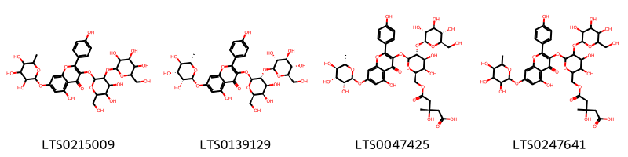{ width=100% }
    <figcaption>Hình ảnh cấu trúc hóa học của 4 hoạt chất thuộc nhóm Flavonoids gồm ['3-{[4,5-dihydroxy-6-(hydroxymethyl)-3-{[3,4,5-trihydroxy-6-(hydroxymethyl)oxan-2-yl]oxy}oxan-2-yl]oxy}-5-hydroxy-2-(4-hydroxyphenyl)-7-[(3,4,5-trihydroxy-6-methyloxan-2-yl)oxy]chromen-4-one (LTS0215009)', '3-{[(2s,3r,4s,5r,6r)-4,5-dihydroxy-6-(hydroxymethyl)-3-{[(2s,3r,4s,5s,6r)-3,4,5-trihydroxy-6-(hydroxymethyl)oxan-2-yl]oxy}oxan-2-yl]oxy}-5-hydroxy-2-(4-hydroxyphenyl)-7-{[(2s,3r,4r,5r,6s)-3,4,5-trihydroxy-6-methyloxan-2-yl]oxy}chromen-4-one (LTS0139129)', '(3s)-5-{[(2r,3r,4s,5r,6s)-3,4-dihydroxy-6-{[5-hydroxy-2-(4-hydroxyphenyl)-4-oxo-7-{[(2s,3r,4r,5r,6s)-3,4,5-trihydroxy-6-methyloxan-2-yl]oxy}chromen-3-yl]oxy}-5-{[(2s,3r,4s,5s,6r)-3,4,5-trihydroxy-6-(hydroxymethyl)oxan-2-yl]oxy}oxan-2-yl]methoxy}-3-hydroxy-3-methyl-5-oxopentanoic acid (LTS0047425)', '5-[(3,4-dihydroxy-6-{[5-hydroxy-2-(4-hydroxyphenyl)-4-oxo-7-[(3,4,5-trihydroxy-6-methyloxan-2-yl)oxy]chromen-3-yl]oxy}-5-{[3,4,5-trihydroxy-6-(hydroxymethyl)oxan-2-yl]oxy}oxan-2-yl)methoxy]-3-hydroxy-3-methyl-5-oxopentanoic acid (LTS0247641)'].</figcaption>
</figure>
#### Nhóm Phenols
<figure markdown="span">
    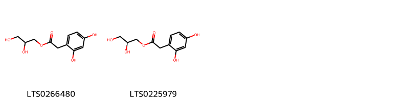{ width=100% }
    <figcaption>Hình ảnh cấu trúc hóa học của 2 hoạt chất thuộc nhóm Phenols gồm ['2,3-dihydroxypropyl 2-(2,4-dihydroxyphenyl)acetate (LTS0266480)', '(2s)-2,3-dihydroxypropyl 2-(2,4-dihydroxyphenyl)acetate (LTS0225979)'].</figcaption>
</figure>
#### Nhóm Prenol lipids
<figure markdown="span">
    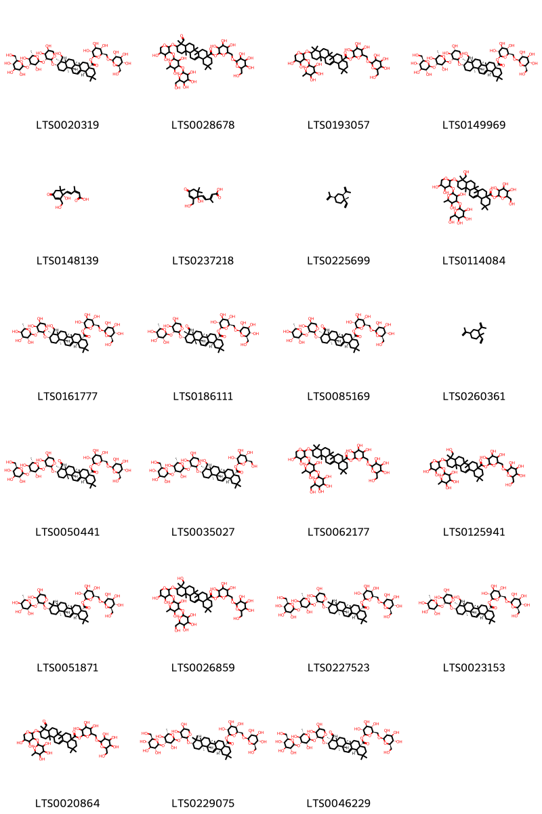{ width=100% }
    <figcaption>Hình ảnh cấu trúc hóa học của 23 hoạt chất thuộc nhóm Prenol lipids gồm ['macranthoidin a (LTS0020319)', '3,4,5-trihydroxy-6-({[3,4,5-trihydroxy-6-(hydroxymethyl)oxan-2-yl]oxy}methyl)oxan-2-yl 10-({3-[(3,5-dihydroxy-6-methyl-4-{[3,4,5-trihydroxy-6-(hydroxymethyl)oxan-2-yl]oxy}oxan-2-yl)oxy]-4,5-dihydroxyoxan-2-yl}oxy)-9-formyl-2,2,6a,6b,9,12a-hexamethyl-1,3,4,5,6,7,8,8a,10,11,12,12b,13,14b-tetradecahydropicene-4a-carboxylate (LTS0028678)', '3,4,5-trihydroxy-6-({[3,4,5-trihydroxy-6-(hydroxymethyl)oxan-2-yl]oxy}methyl)oxan-2-yl 10-({4,5-dihydroxy-3-[(3,4,5-trihydroxy-6-methyloxan-2-yl)oxy]oxan-2-yl}oxy)-2,2,6a,6b,9,9,12a-heptamethyl-1,3,4,5,6,7,8,8a,10,11,12,12b,13,14b-tetradecahydropicene-4a-carboxylate (LTS0193057)', '(2s,3r,4s,5s,6r)-3,4,5-trihydroxy-6-({[(2r,3r,4s,5s,6r)-3,4,5-trihydroxy-6-(hydroxymethyl)oxan-2-yl]oxy}methyl)oxan-2-yl (4as,6as,6br,8ar,9r,10s,12ar,12br,14bs)-10-{[(2s,3r,4s,5r)-3-{[(2s,3r,4r,5s,6s)-3,5-dihydroxy-6-methyl-4-{[(2s,3r,4s,5s,6r)-3,4,5-trihydroxy-6-(hydroxymethyl)oxan-2-yl]oxy}oxan-2-yl]oxy}-4,5-dihydroxyoxan-2-yl]oxy}-9-(hydroxymethyl)-2,2,6a,6b,9,12a-hexamethyl-1,3,4,5,6,7,8,8a,10,11,12,12b,13,14b-tetradecahydropicene-4a-carboxylate (LTS0149969)', '(2z,4e)-5-[(1s)-1-hydroxy-2-(hydroxymethyl)-6,6-dimethyl-4-oxocyclohex-2-en-1-yl]-3-methylpenta-2,4-dienoic acid (LTS0148139)', '5-[1-hydroxy-2-(hydroxymethyl)-6,6-dimethyl-4-oxocyclohex-2-en-1-yl]-3-methylpenta-2,4-dienoic acid (LTS0237218)', 'β-elemene (LTS0225699)', '3,4,5-trihydroxy-6-(hydroxymethyl)oxan-2-yl 10-({3-[(3,5-dihydroxy-6-methyl-4-{[3,4,5-trihydroxy-6-(hydroxymethyl)oxan-2-yl]oxy}oxan-2-yl)oxy]-4,5-dihydroxyoxan-2-yl}oxy)-9-(hydroxymethyl)-2,2,6a,6b,9,12a-hexamethyl-1,3,4,5,6,7,8,8a,10,11,12,12b,13,14b-tetradecahydropicene-4a-carboxylate (LTS0114084)', 'dipsacoside b (LTS0161777)', '(2s,3r,4s,5s,6r)-3,4,5-trihydroxy-6-({[(2r,3r,4s,5s,6r)-3,4,5-trihydroxy-6-(hydroxymethyl)oxan-2-yl]oxy}methyl)oxan-2-yl (4as,6as,6br,8ar,9r,10s,12as,12br,14bs)-10-{[(2s,3r,4s,5s)-4,5-dihydroxy-3-{[(2s,3r,4r,5r,6s)-3,4,5-trihydroxy-6-methyloxan-2-yl]oxy}oxan-2-yl]oxy}-9-formyl-2,2,6a,6b,9,12a-hexamethyl-1,3,4,5,6,7,8,8a,10,11,12,12b,13,14b-tetradecahydropicene-4a-carboxylate (LTS0186111)', '(2s,3r,4s,5s,6r)-3,4,5-trihydroxy-6-({[(2r,3r,4s,5s,6r)-3,4,5-trihydroxy-6-(hydroxymethyl)oxan-2-yl]oxy}methyl)oxan-2-yl (4as,6as,6br,8ar,9s,10s,12ar,12br,14bs)-10-{[(2s,3r,4s,5s)-4,5-dihydroxy-3-{[(2s,3r,4r,5r,6s)-3,4,5-trihydroxy-6-methyloxan-2-yl]oxy}oxan-2-yl]oxy}-9-formyl-2,2,6a,6b,9,12a-hexamethyl-1,3,4,5,6,7,8,8a,10,11,12,12b,13,14b-tetradecahydropicene-4a-carboxylate (LTS0085169)', 'β-elemene (LTS0260361)', '(2s,3r,4s,5s,6r)-3,4,5-trihydroxy-6-({[(2r,3r,4s,5s,6r)-3,4,5-trihydroxy-6-(hydroxymethyl)oxan-2-yl]oxy}methyl)oxan-2-yl (4as,6as,6br,8ar,9s,10s,12as,12br,14bs)-10-{[(2s,3r,4s,5s)-3-{[(2s,3r,4r,5s,6s)-3,5-dihydroxy-6-methyl-4-{[(2s,3r,4s,5s,6r)-3,4,5-trihydroxy-6-(hydroxymethyl)oxan-2-yl]oxy}oxan-2-yl]oxy}-4,5-dihydroxyoxan-2-yl]oxy}-9-formyl-2,2,6a,6b,9,12a-hexamethyl-1,3,4,5,6,7,8,8a,10,11,12,12b,13,14b-tetradecahydropicene-4a-carboxylate (LTS0050441)', '(2s,3r,4s,5s,6r)-3,4,5-trihydroxy-6-(hydroxymethyl)oxan-2-yl (4as,6as,6br,8ar,9r,10s,12ar,12br,14bs)-10-{[(2s,3r,4s,5s)-3-{[(2s,3r,4r,5s,6s)-3,5-dihydroxy-6-methyl-4-{[(2s,3r,4s,5s,6r)-3,4,5-trihydroxy-6-(hydroxymethyl)oxan-2-yl]oxy}oxan-2-yl]oxy}-4,5-dihydroxyoxan-2-yl]oxy}-9-(hydroxymethyl)-2,2,6a,6b,9,12a-hexamethyl-1,3,4,5,6,7,8,8a,10,11,12,12b,13,14b-tetradecahydropicene-4a-carboxylate (LTS0035027)', '3,4,5-trihydroxy-6-({[3,4,5-trihydroxy-6-(hydroxymethyl)oxan-2-yl]oxy}methyl)oxan-2-yl 10-({3-[(3,5-dihydroxy-6-methyl-4-{[3,4,5-trihydroxy-6-(hydroxymethyl)oxan-2-yl]oxy}oxan-2-yl)oxy]-4,5-dihydroxyoxan-2-yl}oxy)-2,2,6a,6b,9,9,12a-heptamethyl-1,3,4,5,6,7,8,8a,10,11,12,12b,13,14b-tetradecahydropicene-4a-carboxylate (LTS0062177)', '3,4,5-trihydroxy-6-({[3,4,5-trihydroxy-6-(hydroxymethyl)oxan-2-yl]oxy}methyl)oxan-2-yl 10-({4,5-dihydroxy-3-[(3,4,5-trihydroxy-6-methyloxan-2-yl)oxy]oxan-2-yl}oxy)-9-(hydroxymethyl)-2,2,6a,6b,9,12a-hexamethyl-1,3,4,5,6,7,8,8a,10,11,12,12b,13,14b-tetradecahydropicene-4a-carboxylate (LTS0125941)', '(2s,3r,4s,5s,6r)-3,4,5-trihydroxy-6-({[(2r,3r,4s,5s,6r)-3,4,5-trihydroxy-6-(hydroxymethyl)oxan-2-yl]oxy}methyl)oxan-2-yl (4as,6as,6br,8ar,10s,12ar,12br,14bs)-10-{[(2s,3r,4s,5s)-4,5-dihydroxy-3-{[(2s,3r,4r,5r,6s)-3,4,5-trihydroxy-6-methyloxan-2-yl]oxy}oxan-2-yl]oxy}-2,2,6a,6b,9,9,12a-heptamethyl-1,3,4,5,6,7,8,8a,10,11,12,12b,13,14b-tetradecahydropicene-4a-carboxylate (LTS0051871)', '3,4,5-trihydroxy-6-({[3,4,5-trihydroxy-6-(hydroxymethyl)oxan-2-yl]oxy}methyl)oxan-2-yl 10-({3-[(3,5-dihydroxy-6-methyl-4-{[3,4,5-trihydroxy-6-(hydroxymethyl)oxan-2-yl]oxy}oxan-2-yl)oxy]-4,5-dihydroxyoxan-2-yl}oxy)-9-(hydroxymethyl)-2,2,6a,6b,9,12a-hexamethyl-1,3,4,5,6,7,8,8a,10,11,12,12b,13,14b-tetradecahydropicene-4a-carboxylate (LTS0026859)', '(2s,3r,4s,5s,6r)-3,4,5-trihydroxy-6-({[(2r,3r,4s,5s,6r)-3,4,5-trihydroxy-6-(hydroxymethyl)oxan-2-yl]oxy}methyl)oxan-2-yl (4as,6as,6br,8ar,10s,12ar,12br,14bs)-10-{[(2s,3r,4s,5r)-3-{[(2s,3r,4r,5s,6s)-3,5-dihydroxy-6-methyl-4-{[(2s,3r,4s,5s,6r)-3,4,5-trihydroxy-6-(hydroxymethyl)oxan-2-yl]oxy}oxan-2-yl]oxy}-4,5-dihydroxyoxan-2-yl]oxy}-2,2,6a,6b,9,9,12a-heptamethyl-1,3,4,5,6,7,8,8a,10,11,12,12b,13,14b-tetradecahydropicene-4a-carboxylate (LTS0227523)', '(2s,3r,4s,5s,6r)-3,4,5-trihydroxy-6-({[(2r,3r,4s,5s,6r)-3,4,5-trihydroxy-6-(hydroxymethyl)oxan-2-yl]oxy}methyl)oxan-2-yl (4as,6as,6br,8ar,9r,10s,12ar,12br,14bs)-10-{[(2s,3r,4s,5r)-4,5-dihydroxy-3-{[(2s,3r,4r,5r,6s)-3,4,5-trihydroxy-6-methyloxan-2-yl]oxy}oxan-2-yl]oxy}-9-(hydroxymethyl)-2,2,6a,6b,9,12a-hexamethyl-1,3,4,5,6,7,8,8a,10,11,12,12b,13,14b-tetradecahydropicene-4a-carboxylate (LTS0023153)', '3,4,5-trihydroxy-6-({[3,4,5-trihydroxy-6-(hydroxymethyl)oxan-2-yl]oxy}methyl)oxan-2-yl 10-({4,5-dihydroxy-3-[(3,4,5-trihydroxy-6-methyloxan-2-yl)oxy]oxan-2-yl}oxy)-9-formyl-2,2,6a,6b,9,12a-hexamethyl-1,3,4,5,6,7,8,8a,10,11,12,12b,13,14b-tetradecahydropicene-4a-carboxylate (LTS0020864)', '(2s,3r,4s,5s,6r)-3,4,5-trihydroxy-6-({[(2r,3r,4s,5s,6r)-3,4,5-trihydroxy-6-(hydroxymethyl)oxan-2-yl]oxy}methyl)oxan-2-yl (4as,6as,6br,8ar,10s,12ar,12br,14bs)-10-{[(2s,3r,4s,5s)-3-{[(2s,3r,4r,5s,6s)-3,5-dihydroxy-6-methyl-4-{[(2s,3r,4s,5s,6r)-3,4,5-trihydroxy-6-(hydroxymethyl)oxan-2-yl]oxy}oxan-2-yl]oxy}-4,5-dihydroxyoxan-2-yl]oxy}-2,2,6a,6b,9,9,12a-heptamethyl-1,3,4,5,6,7,8,8a,10,11,12,12b,13,14b-tetradecahydropicene-4a-carboxylate (LTS0229075)', '(2s,3r,4s,5s,6r)-3,4,5-trihydroxy-6-({[(2r,3r,4s,5s,6r)-3,4,5-trihydroxy-6-(hydroxymethyl)oxan-2-yl]oxy}methyl)oxan-2-yl (4as,6as,6br,8ar,9s,10s,12ar,12br,14bs)-10-{[(2s,3r,4s,5s)-3-{[(2s,3r,4r,5s,6s)-3,5-dihydroxy-6-methyl-4-{[(2s,3r,4s,5s,6r)-3,4,5-trihydroxy-6-(hydroxymethyl)oxan-2-yl]oxy}oxan-2-yl]oxy}-4,5-dihydroxyoxan-2-yl]oxy}-9-formyl-2,2,6a,6b,9,12a-hexamethyl-1,3,4,5,6,7,8,8a,10,11,12,12b,13,14b-tetradecahydropicene-4a-carboxylate (LTS0046229)'].</figcaption>
</figure>

---

### Dược dân tộc học

Danh sách các quốc gia có sử dụng *Nigella damascena* trong điều trị các bệnh. 

| Country   | Disease                                                                                                                                   | Bệnh                                                                                                                                                                                                |
|:----------|:------------------------------------------------------------------------------------------------------------------------------------------|:----------------------------------------------------------------------------------------------------------------------------------------------------------------------------------------------------|
| Elsewhere | Emmenagogue, Vermifuge, Carminative                                                                                                       | MYMEMORY WARNING: YOU USED ALL AVAILABLE FREE TRANSLATIONS FOR TODAY. NEXT AVAILABLE IN  08 HOURS 19 MINUTES 09 SECONDS VISIT HTTPS://MYMEMORY.TRANSLATED.NET/DOC/USAGELIMITS.PHP TO TRANSLATE MORE |
| Turkey    | Carminative, Digestive, Diuretic, Narcotic, Perfume, Poison, Sternutatory, Sudorific, Tonic, Vermifuge, Emmenagogue, Emollient, Stimulant | MYMEMORY WARNING: YOU USED ALL AVAILABLE FREE TRANSLATIONS FOR TODAY. NEXT AVAILABLE IN  08 HOURS 19 MINUTES 06 SECONDS VISIT HTTPS://MYMEMORY.TRANSLATED.NET/DOC/USAGELIMITS.PHP TO TRANSLATE MORE |

---

---
## Nigella sativa
### Thông tin về thực vật

!!! info "Phân loại thực vật của *Nigella sativa* từ GIBF:"
    - **Kingdom:** Plantae
    - **Phylum:** Tracheophyta
    - **Order:** Ranunculales
    - **Family:** Ranunculaceae
    - **Genus:** Nigella
    - **Species:** *Nigella sativa*

 

| Label (VI)   | Label (EN)   | Scientific Name   | Descriptions (VI)   | Descriptions (EN)                                             | Also Known As (VI)   | Also Known As (EN)   |
|:-------------|:-------------|:------------------|:--------------------|:--------------------------------------------------------------|:---------------------|:---------------------|
| N/A          | N/A          | Nigella sativa    |                     | species of annual flowering plant in the family Ranunculaceae | ['']                 | ['']                 |

#### Phân bố trên thế giới

**Từ CSDL GIBF** nan, Georgia, Somalia, Spain, Germany, Austria, Indonesia, Pakistan, Sweden, Poland, India, Montenegro, Sudan, Canada, Nigeria, Bangladesh, Belgium, Slovakia, Netherlands, Finland, Türkiye, Belarus, Yemen, Hungary, Ethiopia, Bulgaria, Estonia, China, Norway, Moldova, Republic of, Iran (Islamic Republic of), South Africa, Portugal, France, Syrian Arab Republic, Czechia, Egypt, Romania, Russian Federation, United States of America, Italy, Israel, Algeria, Chad, Croatia, Ukraine, Libya

#### Phân bố tại Việt Nam

**Từ CSDL GIBF**: Không có ghi nhận ở Việt Nam

---
### Thành phần hóa học
        
- Theo cơ sở dữ liệu lotus: Từ loài *Nigella sativa* đã phân lập và xác định được 132 hoạt chất thuộc về các nhóm Organooxygen compounds, Benzopyrans, Flavonoids, Aporphines, Isoquinolines and derivatives, Prenol lipids, Benzopyrazoles, Fatty Acyls, Phenol ethers, Steroids and steroid derivatives, Benzene and substituted derivatives. 

|    | chemicalTaxonomyClassyfireClass     |   smiles_count |
|---:|:------------------------------------|---------------:|
|  0 | Aporphines                          |              1 |
|  1 | Benzene and substituted derivatives |              2 |
|  2 | Benzopyrans                         |              1 |
|  3 | Benzopyrazoles                      |             10 |
|  4 | Fatty Acyls                         |             19 |
|  5 | Flavonoids                          |             13 |
|  6 | Isoquinolines and derivatives       |              1 |
|  7 | Organooxygen compounds              |              4 |
|  8 | Phenol ethers                       |              1 |
|  9 | Prenol lipids                       |             45 |
| 10 | Steroids and steroid derivatives    |             34 |

#### Nhóm Aporphines
<figure markdown="span">
    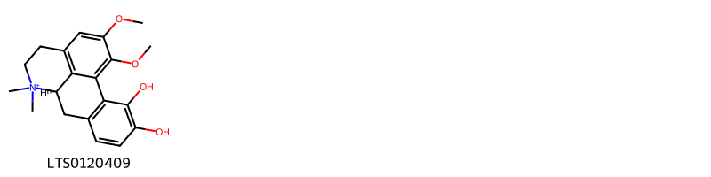{ width=100% }
    <figcaption>Hình ảnh cấu trúc hóa học của 1 hoạt chất thuộc nhóm Aporphines gồm ['(9r)-3,4-dihydroxy-15,16-dimethoxy-10,10-dimethyl-10-azatetracyclo[7.7.1.0²,⁷.0¹³,¹⁷]heptadeca-1(16),2(7),3,5,13(17),14-hexaen-10-ium (LTS0120409)'].</figcaption>
</figure>
#### Nhóm Benzene and substituted derivatives
<figure markdown="span">
    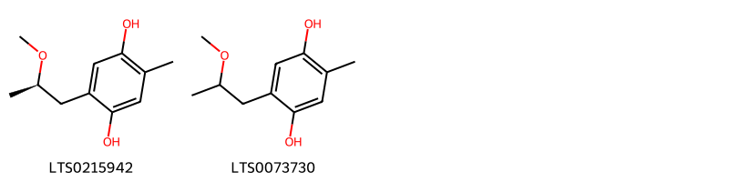{ width=100% }
    <figcaption>Hình ảnh cấu trúc hóa học của 2 hoạt chất thuộc nhóm Benzene and substituted derivatives gồm ['2-[(2r)-2-methoxypropyl]-5-methylbenzene-1,4-diol (LTS0215942)', '2-(2-methoxypropyl)-5-methylbenzene-1,4-diol (LTS0073730)'].</figcaption>
</figure>
#### Nhóm Benzopyrans
<figure markdown="span">
    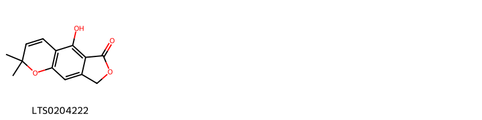{ width=100% }
    <figcaption>Hình ảnh cấu trúc hóa học của 1 hoạt chất thuộc nhóm Benzopyrans gồm ['5-hydroxy-2,2-dimethyl-8h-furo[3,4-g]chromen-6-one (LTS0204222)'].</figcaption>
</figure>
#### Nhóm Benzopyrazoles
<figure markdown="span">
    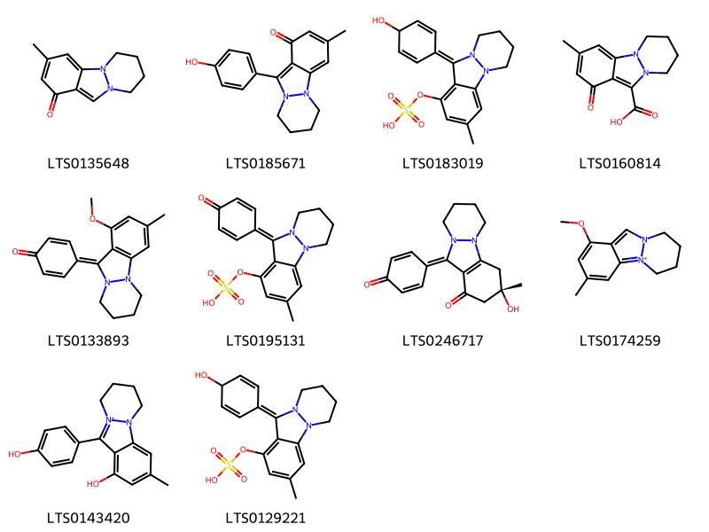{ width=100% }
    <figcaption>Hình ảnh cấu trúc hóa học của 10 hoạt chất thuộc nhóm Benzopyrazoles gồm ['3-methyl-6h,7h,8h,9h-pyridazino[1,2-a]indazol-1-one (LTS0135648)', '11-(4-hydroxyphenyl)-3-methyl-6h,7h,8h,9h-pyridazino[1,2-a]indazol-1-one (LTS0185671)', '1-hydroxy-4-[3-methyl-1-(sulfooxy)-6h,7h,8h,9h-pyridazino[1,2-a]indazol-11-ylidene]cyclohexa-2,5-dien-1-yl (LTS0183019)', '3-methyl-1-oxo-6h,7h,8h,9h-pyridazino[1,2-a]indazole-11-carboxylic acid (LTS0160814)', '4-{1-methoxy-3-methyl-6h,7h,8h,9h-pyridazino[1,2-a]indazol-11-ylidene}cyclohexa-2,5-dien-1-one (LTS0133893)', 'nigellidine (LTS0195131)', '(3s)-3-hydroxy-3-methyl-11-(4-oxocyclohexa-2,5-dien-1-ylidene)-2h,4h,6h,7h,8h,9h-pyridazino[1,2-a]indazol-1-one (LTS0246717)', '1-methoxy-3-methyl-6h,7h,8h,9h-5λ⁵-pyridazino[1,2-a]indazol-5-ylium (LTS0174259)', '1-hydroxy-11-(4-hydroxyphenyl)-3-methyl-6h,7h,8h,9h-10λ⁵-pyridazino[1,2-a]indazol-10-ylium (LTS0143420)', '[11-(4-hydroxycyclohexa-2,5-dien-1-ylidene)-3-methyl-6h,7h,8h,9h-pyridazino[1,2-a]indazol-1-yl]oxidanesulfonic acid (LTS0129221)'].</figcaption>
</figure>
#### Nhóm Fatty Acyls
<figure markdown="span">
    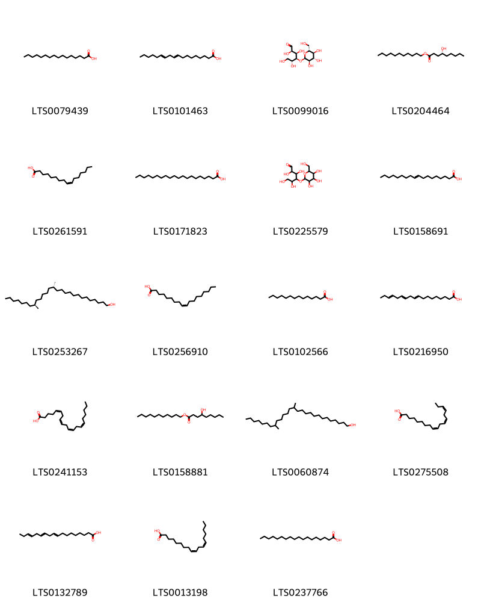{ width=100% }
    <figcaption>Hình ảnh cấu trúc hóa học của 19 hoạt chất thuộc nhóm Fatty Acyls gồm ['palmitic acid (LTS0079439)', '9,12-octadecadienoic acid (LTS0101463)', '(2r,3r,4s,5r)-2,3,5,6-tetrahydroxy-4-{[(2r,3r,4s,5s,6r)-3,4,5-trihydroxy-6-(hydroxymethyl)oxan-2-yl]oxy}hexanal (LTS0099016)', 'undecyl (4r)-4-hydroxynonanoate (LTS0204464)', 'palmitoleic acid (LTS0261591)', 'arachidic acid (LTS0171823)', 'cellobiose (LTS0225579)', '9 octadecenoic acid (LTS0158691)', '(14r,20s)-14,20-dimethylheptacosan-1-ol (LTS0253267)', 'oleic acid (LTS0256910)', 'myristic acid (LTS0102566)', 'octadeca-9,12,15-trienoic acid (LTS0216950)', 'arachidonic acid (LTS0241153)', 'undecyl 4-hydroxynonanoate (LTS0158881)', '14,20-dimethylheptacosan-1-ol (LTS0060874)', 'α-linolenic acid (LTS0275508)', 'α linolenic acid (LTS0132789)', 'linoleic (LTS0013198)', 'stearic acid (LTS0237766)'].</figcaption>
</figure>
#### Nhóm Flavonoids
<figure markdown="span">
    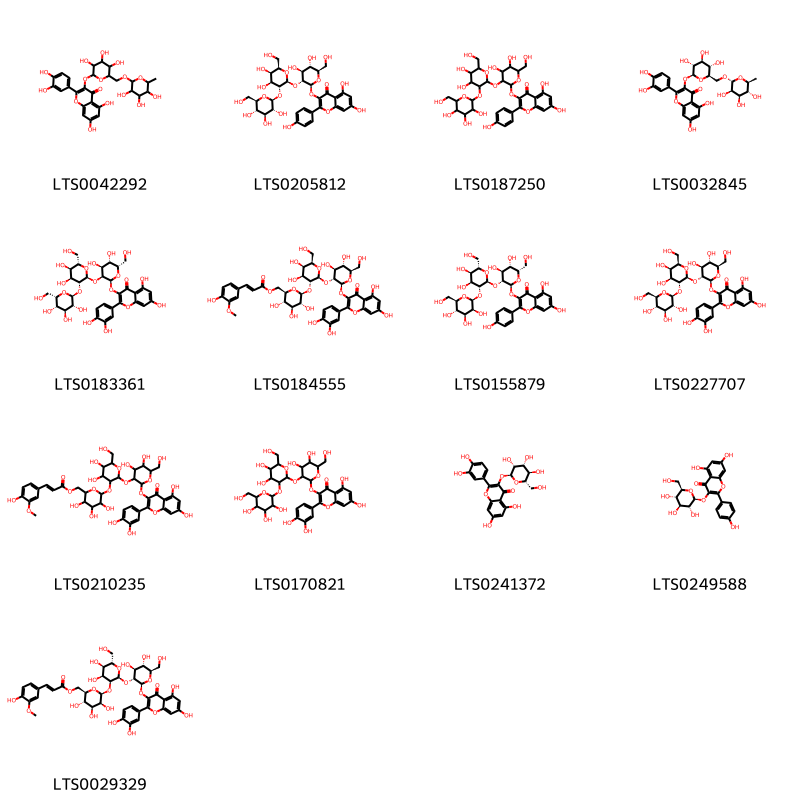{ width=100% }
    <figcaption>Hình ảnh cấu trúc hóa học của 13 hoạt chất thuộc nhóm Flavonoids gồm ['rutin (LTS0042292)', '3-{[(2s,3r,4s,5s,6r)-3-{[(2s,3r,4s,5r,6r)-4,5-dihydroxy-6-(hydroxymethyl)-3-{[(2s,3r,4s,5s,6r)-3,4,5-trihydroxy-6-(hydroxymethyl)oxan-2-yl]oxy}oxan-2-yl]oxy}-4,5-dihydroxy-6-(hydroxymethyl)oxan-2-yl]oxy}-5,7-dihydroxy-2-(4-hydroxyphenyl)chromen-4-one (LTS0205812)', '3-[(3-{[4,5-dihydroxy-6-(hydroxymethyl)-3-{[3,4,5-trihydroxy-6-(hydroxymethyl)oxan-2-yl]oxy}oxan-2-yl]oxy}-4,5-dihydroxy-6-(hydroxymethyl)oxan-2-yl)oxy]-5,7-dihydroxy-2-(4-hydroxyphenyl)chromen-4-one (LTS0187250)', '3-rutinosyl quercetin (LTS0032845)', '3-{[(2s,3s,4s,5s,6s)-3-{[(2s,3r,4s,5r,6s)-4,5-dihydroxy-6-(hydroxymethyl)-3-{[(2s,3r,4s,5s,6s)-3,4,5-trihydroxy-6-(hydroxymethyl)oxan-2-yl]oxy}oxan-2-yl]oxy}-4,5-dihydroxy-6-(hydroxymethyl)oxan-2-yl]oxy}-2-(3,4-dihydroxyphenyl)-5,7-dihydroxychromen-4-one (LTS0183361)', '[(2r,3s,4s,5r,6s)-6-{[(2s,3r,4s,5r,6r)-2-{[(2s,3r,4s,5s,6r)-2-{[2-(3,4-dihydroxyphenyl)-5,7-dihydroxy-4-oxochromen-3-yl]oxy}-4,5-dihydroxy-6-(hydroxymethyl)oxan-3-yl]oxy}-4,5-dihydroxy-6-(hydroxymethyl)oxan-3-yl]oxy}-3,4,5-trihydroxyoxan-2-yl]methyl (2e)-3-(4-hydroxy-3-methoxyphenyl)prop-2-enoate (LTS0184555)', '3-{[(2s,3r,4s,5s,6s)-3-{[(2s,3r,4s,5r,6s)-4,5-dihydroxy-6-(hydroxymethyl)-3-{[(2s,3s,4s,5s,6r)-3,4,5-trihydroxy-6-(hydroxymethyl)oxan-2-yl]oxy}oxan-2-yl]oxy}-4,5-dihydroxy-6-(hydroxymethyl)oxan-2-yl]oxy}-5,7-dihydroxy-2-(4-hydroxyphenyl)chromen-4-one (LTS0155879)', '3-{[(2s,3r,4s,5s,6r)-3-{[(2s,3r,4s,5r,6r)-4,5-dihydroxy-6-(hydroxymethyl)-3-{[(2s,3r,4s,5s,6r)-3,4,5-trihydroxy-6-(hydroxymethyl)oxan-2-yl]oxy}oxan-2-yl]oxy}-4,5-dihydroxy-6-(hydroxymethyl)oxan-2-yl]oxy}-2-(3,4-dihydroxyphenyl)-5,7-dihydroxychromen-4-one (LTS0227707)', '[6-({2-[(2-{[2-(3,4-dihydroxyphenyl)-5,7-dihydroxy-4-oxochromen-3-yl]oxy}-4,5-dihydroxy-6-(hydroxymethyl)oxan-3-yl)oxy]-4,5-dihydroxy-6-(hydroxymethyl)oxan-3-yl}oxy)-3,4,5-trihydroxyoxan-2-yl]methyl 3-(4-hydroxy-3-methoxyphenyl)prop-2-enoate (LTS0210235)', '3-[(3-{[4,5-dihydroxy-6-(hydroxymethyl)-3-{[3,4,5-trihydroxy-6-(hydroxymethyl)oxan-2-yl]oxy}oxan-2-yl]oxy}-4,5-dihydroxy-6-(hydroxymethyl)oxan-2-yl)oxy]-2-(3,4-dihydroxyphenyl)-5,7-dihydroxychromen-4-one (LTS0170821)', '2-(3,4-dihydroxyphenyl)-5,7-dihydroxy-3-{[(2s,3r,4r,5r,6s)-3,4,5-trihydroxy-6-(hydroxymethyl)oxan-2-yl]oxy}chromen-4-one (LTS0241372)', 'astragalin (LTS0249588)', '[(2r,3s,4s,5s,6s)-6-{[(2s,3s,4s,5r,6s)-2-{[(2s,3r,4s,5s,6r)-2-{[2-(3,4-dihydroxyphenyl)-5,7-dihydroxy-4-oxochromen-3-yl]oxy}-4,5-dihydroxy-6-(hydroxymethyl)oxan-3-yl]oxy}-4,5-dihydroxy-6-(hydroxymethyl)oxan-3-yl]oxy}-3,4,5-trihydroxyoxan-2-yl]methyl (2e)-3-(4-hydroxy-3-methoxyphenyl)prop-2-enoate (LTS0029329)'].</figcaption>
</figure>
#### Nhóm Isoquinolines and derivatives
<figure markdown="span">
    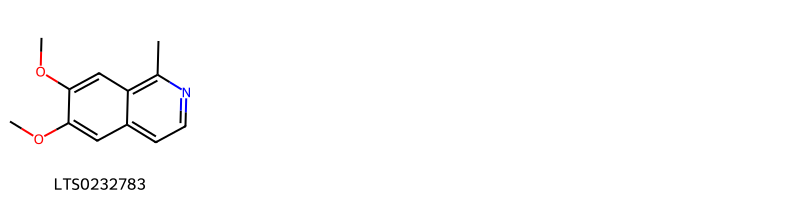{ width=100% }
    <figcaption>Hình ảnh cấu trúc hóa học của 1 hoạt chất thuộc nhóm Isoquinolines and derivatives gồm ['6,7-dimethoxy-1-methylisoquinoline (LTS0232783)'].</figcaption>
</figure>
#### Nhóm Organooxygen compounds
<figure markdown="span">
    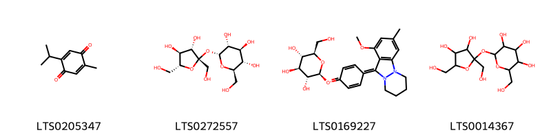{ width=100% }
    <figcaption>Hình ảnh cấu trúc hóa học của 4 hoạt chất thuộc nhóm Organooxygen compounds gồm ['thymoquinone (LTS0205347)', 'sucrose (LTS0272557)', '(4-{1-methoxy-3-methyl-6h,7h,8h,9h-pyridazino[1,2-a]indazol-11-ylidene}cyclohexa-2,5-dien-1-ylidene)[(2s,3r,4s,5s,6r)-3,4,5-trihydroxy-6-(hydroxymethyl)oxan-2-yl]oxidanium (LTS0169227)', 'granulated sugar (LTS0014367)'].</figcaption>
</figure>
#### Nhóm Phenol ethers
<figure markdown="span">
    { width=100% }
    <figcaption>Hình ảnh cấu trúc hóa học của 1 hoạt chất thuộc nhóm Phenol ethers gồm ['anethole (LTS0033696)'].</figcaption>
</figure>
#### Nhóm Prenol lipids
<figure markdown="span">
    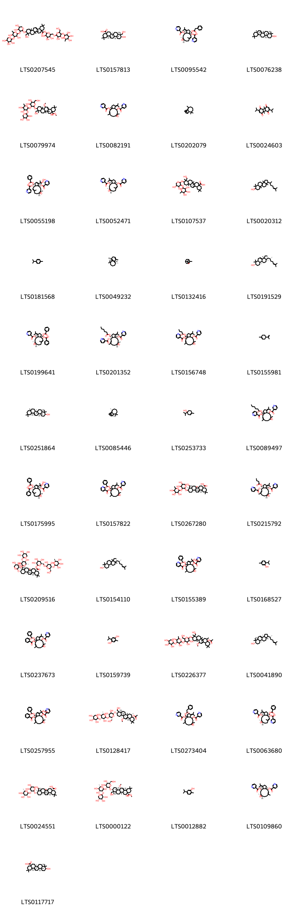{ width=100% }
    <figcaption>Hình ảnh cấu trúc hóa học của 45 hoạt chất thuộc nhóm Prenol lipids gồm ['6-({[3,4-dihydroxy-6-(hydroxymethyl)-5-[(3,4,5-trihydroxy-6-methyloxan-2-yl)oxy]oxan-2-yl]oxy}methyl)-3,4,5-trihydroxyoxan-2-yl 10-{[3-({3,5-dihydroxy-6-methyl-4-[(3,4,5-trihydroxyoxan-2-yl)oxy]oxan-2-yl}oxy)-4,5-dihydroxyoxan-2-yl]oxy}-9-(hydroxymethyl)-2,2,6a,6b,9,12a-hexamethyl-1,3,4,5,6,7,8,8a,10,11,12,12b,13,14b-tetradecahydropicene-4a-carboxylate (LTS0207545)', 'hederagenin (LTS0157813)', '(1s,2r,4s,6r,9e,11s,12s)-4,9-dimethyl-12-{[(2-phenylacetyl)oxy]methyl}-15-(propan-2-ylidene)-2-(pyridine-3-carbonyloxy)-5-oxatricyclo[10.3.0.0⁴,⁶]pentadec-9-en-11-yl pyridine-3-carboxylate (LTS0095542)', 'alnulin (LTS0076238)', 'methyl 10-{[3-({4,5-dihydroxy-6-methyl-3-[(3,4,5-trihydroxyoxan-2-yl)oxy]oxan-2-yl}oxy)-4,5-dihydroxy-6-(hydroxymethyl)oxan-2-yl]oxy}-5-hydroxy-9-(hydroxymethyl)-13-methoxy-2,2,6a,6b,9,12a-hexamethyl-1,3,4,5,6,7,8,8a,10,11,12,12b,13,14b-tetradecahydropicene-4a-carboxylate (LTS0079974)', '4,9,12-trimethyl-15-(propan-2-ylidene)-2-(pyridine-3-carbonyloxy)-5-oxatricyclo[10.3.0.0⁴,⁶]pentadec-9-en-11-yl pyridine-3-carboxylate (LTS0082191)', 'longifolene (LTS0202079)', 'dithymoquinone (LTS0024603)', '(1r,2r,4s,6r,9e,11s,12s)-12-[(benzoyloxy)methyl]-15-(2-hydroperoxypropan-2-yl)-4,9-dimethyl-2-(pyridine-3-carbonyloxy)-5-oxatricyclo[10.3.0.0⁴,⁶]pentadeca-9,14-dien-11-yl pyridine-3-carboxylate (LTS0055198)', '(1s,2r,4s,6r,9e,11s,12s)-4,9,12-trimethyl-15-(propan-2-ylidene)-2-(pyridine-3-carbonyloxy)-5-oxatricyclo[10.3.0.0⁴,⁶]pentadec-9-en-11-yl pyridine-3-carboxylate (LTS0052471)', '10-({4,5-dihydroxy-3-[(3,4,5-trihydroxy-6-methyloxan-2-yl)oxy]oxan-2-yl}oxy)-9-(hydroxymethyl)-2,2,6a,6b,9,12a-hexamethyl-1,3,4,5,6,7,8,8a,10,11,12,12b,13,14b-tetradecahydropicene-4a-carboxylic acid (LTS0107537)', 'lanster (LTS0020312)', 'cymene (LTS0181568)', '(1s,2s,7s,8s)-2,6,6,9-tetramethyltricyclo[5.4.0.0²,⁸]undec-9-ene (LTS0049232)', 'α pinene (LTS0132416)', '(1r,3ar,7s,9ar,11ar)-3a,6,6,9a,11a-pentamethyl-1-[(2r)-6-methylhept-5-en-2-yl]-1h,2h,3h,5h,5ah,7h,8h,9h,9bh,10h,11h-cyclopenta[a]phenanthren-7-ol (LTS0191529)', '(1s,2r,4s,6r,9e,11s,12s)-11-(benzoyloxy)-12-[(benzoyloxy)methyl]-4,9-dimethyl-15-(propan-2-ylidene)-5-oxatricyclo[10.3.0.0⁴,⁶]pentadec-9-en-2-yl pyridine-3-carboxylate (LTS0199641)', '(1s,2r,4s,6r,9e,11s,12s)-12-[(hexanoyloxy)methyl]-4,9-dimethyl-15-(propan-2-ylidene)-11-(pyridine-3-carbonyloxy)-5-oxatricyclo[10.3.0.0⁴,⁶]pentadec-9-en-2-yl pyridine-3-carboxylate (LTS0201352)', '12-[(butanoyloxy)methyl]-4,9-dimethyl-15-(propan-2-ylidene)-11-(pyridine-3-carbonyloxy)-5-oxatricyclo[10.3.0.0⁴,⁶]pentadec-9-en-2-yl pyridine-3-carboxylate (LTS0156748)', 'limonene,  (LTS0155981)', 'β-amyrin (LTS0251864)', '(2s,7s)-3,3,7-trimethyl-8-methylidenetricyclo[5.4.0.0²,⁹]undecane (LTS0085446)', '4-terpineol (LTS0253733)', '12-[(hexanoyloxy)methyl]-4,9-dimethyl-15-(propan-2-ylidene)-11-(pyridine-3-carbonyloxy)-5-oxatricyclo[10.3.0.0⁴,⁶]pentadec-9-en-2-yl pyridine-3-carboxylate (LTS0089497)', '(1r,2r,4s,6r,9e,11s,12s)-11-(benzoyloxy)-12-[(benzoyloxy)methyl]-15-(2-hydroperoxypropan-2-yl)-4,9-dimethyl-5-oxatricyclo[10.3.0.0⁴,⁶]pentadeca-9,14-dien-2-yl pyridine-3-carboxylate (LTS0175995)', '12-[(benzoyloxy)methyl]-4,9-dimethyl-15-(propan-2-ylidene)-2-(pyridine-3-carbonyloxy)-5-oxatricyclo[10.3.0.0⁴,⁶]pentadec-9-en-11-yl pyridine-3-carboxylate (LTS0157822)', '(4as,6as,6br,8as,9r,12ar,12br,14br)-10-({4,5-dihydroxy-3-[(3,4,5-trihydroxy-6-methyloxan-2-yl)oxy]oxan-2-yl}oxy)-9-(hydroxymethyl)-2,2,6a,6b,9,12a-hexamethyl-1,3,4,5,6,7,8,8a,10,11,12,12b,13,14b-tetradecahydropicene-4a-carboxylic acid (LTS0267280)', '(1s,2r,4s,6r,9e,11s,12s)-12-[(butanoyloxy)methyl]-4,9-dimethyl-15-(propan-2-ylidene)-11-(pyridine-3-carbonyloxy)-5-oxatricyclo[10.3.0.0⁴,⁶]pentadec-9-en-2-yl pyridine-3-carboxylate (LTS0215792)', '(2s,3r,4s,5s,6r)-6-({[(2r,3r,4r,5s,6r)-3,4-dihydroxy-6-(hydroxymethyl)-5-{[(2r,3r,4r,5r,6s)-3,4,5-trihydroxy-6-methyloxan-2-yl]oxy}oxan-2-yl]oxy}methyl)-3,4,5-trihydroxyoxan-2-yl (4as,6as,6br,8ar,9r,10s,12ar,12br,14bs)-10-{[(2r,3r,4s,5s)-3-{[(2r,3r,4r,5s,6s)-3,5-dihydroxy-6-methyl-4-{[(2s,3r,4s,5r)-3,4,5-trihydroxyoxan-2-yl]oxy}oxan-2-yl]oxy}-4,5-dihydroxyoxan-2-yl]oxy}-9-(hydroxymethyl)-2,2,6a,6b,9,12a-hexamethyl-1,3,4,5,6,7,8,8a,10,11,12,12b,13,14b-tetradecahydropicene-4a-carboxylate (LTS0209516)', '(1r,7s,9as)-3a,6,6,9a,11a-pentamethyl-1-[(2r)-6-methylhept-5-en-2-yl]-1h,2h,3h,4h,5h,5ah,7h,8h,9h,10h,11h-cyclopenta[a]phenanthren-7-ol (LTS0154110)', '12-[(benzoyloxy)methyl]-15-(2-hydroperoxypropan-2-yl)-4,9-dimethyl-2-(pyridine-3-carbonyloxy)-5-oxatricyclo[10.3.0.0⁴,⁶]pentadeca-9,14-dien-11-yl pyridine-3-carboxylate (LTS0155389)', 'thymol (LTS0168527)', '11-(benzoyloxy)-12-[(benzoyloxy)methyl]-4,9-dimethyl-15-(propan-2-ylidene)-5-oxatricyclo[10.3.0.0⁴,⁶]pentadec-9-en-2-yl pyridine-3-carboxylate (LTS0237673)', '2-isopropyl-5-methylbenzene-1,4-diol (LTS0159739)', '10-{[5-({3,5-dihydroxy-6-methyl-4-[(3,4,5-trihydroxyoxan-2-yl)oxy]oxan-2-yl}oxy)-3,4-dihydroxy-6-(hydroxymethyl)oxan-2-yl]oxy}-9-(hydroxymethyl)-13-methoxy-2,2,5,6a,6b,9,12a-heptamethyl-1,3,4,5,6,7,8,8a,10,11,12,12b,13,14b-tetradecahydropicen-4a-yl acetate (LTS0226377)', '(3as,5ar,7s,9ar,11as)-3a,6,6,9a,11a-pentamethyl-1-[(2r)-6-methylhept-5-en-2-yl]-1h,2h,3h,5h,5ah,7h,8h,9h,9bh,10h,11h-cyclopenta[a]phenanthren-7-ol (LTS0041890)', '11-(benzoyloxy)-12-[(benzoyloxy)methyl]-15-(2-hydroperoxypropan-2-yl)-4,9-dimethyl-5-oxatricyclo[10.3.0.0⁴,⁶]pentadeca-9,14-dien-2-yl pyridine-3-carboxylate (LTS0257955)', '(4as,5s,6as,6br,8ar,9r,10s,12as,12br,13r,14bs)-10-{[(2r,3r,4r,5s,6r)-5-{[(2s,3r,4r,5s,6s)-3,5-dihydroxy-6-methyl-4-{[(2s,3r,4s,5r)-3,4,5-trihydroxyoxan-2-yl]oxy}oxan-2-yl]oxy}-3,4-dihydroxy-6-(hydroxymethyl)oxan-2-yl]oxy}-9-(hydroxymethyl)-13-methoxy-2,2,5,6a,6b,9,12a-heptamethyl-1,3,4,5,6,7,8,8a,10,11,12,12b,13,14b-tetradecahydropicen-4a-yl acetate (LTS0128417)', '4,9-dimethyl-12-{[(2-phenylacetyl)oxy]methyl}-15-(propan-2-ylidene)-2-(pyridine-3-carbonyloxy)-5-oxatricyclo[10.3.0.0⁴,⁶]pentadec-9-en-11-yl pyridine-3-carboxylate (LTS0273404)', '(1s,2r,4s,6r,9e,11s,12s)-12-[(benzoyloxy)methyl]-4,9-dimethyl-15-(propan-2-ylidene)-2-(pyridine-3-carbonyloxy)-5-oxatricyclo[10.3.0.0⁴,⁶]pentadec-9-en-11-yl pyridine-3-carboxylate (LTS0063680)', 'α-hederin (LTS0024551)', 'methyl (4ar,5r,6as,6br,8ar,9r,10r,12as,12br,13r,14bs)-10-{[(2r,3r,4s,5s,6r)-3-{[(2s,3r,4r,5r,6s)-4,5-dihydroxy-6-methyl-3-{[(2s,3r,4s,5r)-3,4,5-trihydroxyoxan-2-yl]oxy}oxan-2-yl]oxy}-4,5-dihydroxy-6-(hydroxymethyl)oxan-2-yl]oxy}-5-hydroxy-9-(hydroxymethyl)-13-methoxy-2,2,6a,6b,9,12a-hexamethyl-1,3,4,5,6,7,8,8a,10,11,12,12b,13,14b-tetradecahydropicene-4a-carboxylate (LTS0000122)', 'carvacrol (LTS0012882)', '(1s,2r,4s,6r,9z,11s,12s)-4,9,12-trimethyl-15-(propan-2-ylidene)-2-(pyridine-3-carbonyloxy)-5-oxatricyclo[10.3.0.0⁴,⁶]pentadec-9-en-11-yl pyridine-3-carboxylate (LTS0109860)', 'oleanolic acid (LTS0117717)'].</figcaption>
</figure>
#### Nhóm Steroids and steroid derivatives
<figure markdown="span">
    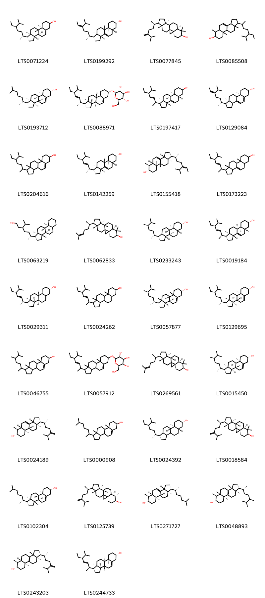{ width=100% }
    <figcaption>Hình ảnh cấu trúc hóa học của 34 hoạt chất thuộc nhóm Steroids and steroid derivatives gồm ['stigmast-5-en-3-ol (LTS0071224)', 'delta7-avenasterol (LTS0199292)', '24-methylene-cycloartanol (LTS0077845)', '1-(5-ethyl-6-methylheptan-2-yl)-6,9a,11a-trimethyl-1h,2h,3h,3ah,5h,5ah,6h,7h,8h,9h,9bh,10h,11h-cyclopenta[a]phenanthren-7-ol (LTS0085508)', '(1r,3ar,3br,7s,9ar,9br,11ar)-9a,11a-dimethyl-1-[(2r)-6-methylheptan-2-yl]-1h,2h,3h,3ah,3bh,4h,6h,7h,8h,9h,9bh,10h,11h-cyclopenta[a]phenanthren-7-ol (LTS0193712)', '(2r,3r,4s,5s,6r)-2-{[(1r,3as,3bs,7s,9ar,9bs,11ar)-1-[(2r,3e,5s)-5-ethyl-6-methylhept-3-en-2-yl]-9a,11a-dimethyl-1h,2h,3h,3ah,3bh,4h,6h,7h,8h,9h,9bh,10h,11h-cyclopenta[a]phenanthren-7-yl]oxy}-6-(hydroxymethyl)oxane-3,4,5-triol (LTS0088971)', '(3ar,5as,9as,9bs,11ar)-1-(5-ethyl-6-methylhept-3-en-2-yl)-9a,11a-dimethyl-1h,2h,3h,3ah,5h,5ah,6h,7h,8h,9h,9bh,10h,11h-cyclopenta[a]phenanthren-7-ol (LTS0197417)', '5-dehydroavenasterol (LTS0129084)', 'stigmast-5-en-3-ol, (3β)- (LTS0204616)', 'chondrillasterol (LTS0142259)', '(z)-24-ethylidenelophenol (LTS0155418)', '1-(5-ethyl-6-methylhept-3-en-2-yl)-9a,11a-dimethyl-1h,2h,3h,3ah,5h,5ah,6h,7h,8h,9h,9bh,10h,11h-cyclopenta[a]phenanthren-7-ol (LTS0173223)', '(3s,6r)-6-[(1r,3as,3br,9as,9bs,11ar)-9a,11a-dimethyl-tetradecahydro-1h-cyclopenta[a]phenanthren-1-yl]-3-isopropylheptan-1-ol (LTS0063219)', '(3r,6s,8r,11s,12s,15r,16r)-7,7,12,16-tetramethyl-15-[(2r)-6-methylhept-5-en-2-yl]pentacyclo[9.7.0.0¹,³.0³,⁸.0¹²,¹⁶]octadecan-6-ol (LTS0062833)', 'campestanol (LTS0233243)', '(1r,3ar,5as,7s,9as,9bs,11ar)-1-[(2s,3e,5s)-5-ethyl-6-methylhept-3-en-2-yl]-9a,11a-dimethyl-1h,2h,3h,3ah,5h,5ah,6h,7h,8h,9h,9bh,10h,11h-cyclopenta[a]phenanthren-7-ol (LTS0019184)', 'phytosterol (LTS0029311)', 'stigmasterol (LTS0024262)', '(1r,3as,3bs,7s,9bs)-1-[(2r,5r)-5,6-dimethylheptan-2-yl]-9a,11a-dimethyl-1h,2h,3h,3ah,3bh,4h,6h,7h,8h,9h,9bh,10h,11h-cyclopenta[a]phenanthren-7-ol (LTS0057877)', '(1r,3ar,3br,7s,9ar,9br,11ar)-1-[(2r,5r)-5-ethyl-6-methylheptan-2-yl]-9a,11a-dimethyl-1h,2h,3h,3ah,3bh,4h,6h,7h,8h,9h,9bh,10h,11h-cyclopenta[a]phenanthren-7-ol (LTS0129695)', 'campesterol (LTS0046755)', '2-{[1-(5-ethyl-6-methylhept-3-en-2-yl)-9a,11a-dimethyl-1h,2h,3h,3ah,3bh,4h,6h,7h,8h,9h,9bh,10h,11h-cyclopenta[a]phenanthren-7-yl]oxy}-6-(hydroxymethyl)oxane-3,4,5-triol (LTS0057912)', 'cycloartenol (LTS0269561)', '(1r,3ar,3br,7s,9ar,9br,11ar)-1-[(2r,5r)-5,6-dimethylheptan-2-yl]-9a,11a-dimethyl-1h,2h,3h,3ah,3bh,4h,6h,7h,8h,9h,9bh,10h,11h-cyclopenta[a]phenanthren-7-ol (LTS0015450)', '24-methylidenelophenol (LTS0024189)', 'epicholestrol (LTS0000908)', '(1r,5as,7s,9as,9bs,11ar)-1-[(2r)-5-ethyl-6-methylheptan-2-yl]-9a,11a-dimethyl-tetradecahydro-1h-cyclopenta[a]phenanthren-7-ol (LTS0024392)', '24-methylenecycloartanol (LTS0018584)', 'cholesterol (LTS0102304)', 'cycloeucalenol (LTS0125739)', 'lophenol (LTS0271727)', '(1r,3ar,5as,6s,7s,9as,11ar)-1-[(2r)-5,6-dimethylheptan-2-yl]-6,9a,11a-trimethyl-1h,2h,3h,3ah,4h,5h,5ah,6h,7h,8h,9h,10h,11h-cyclopenta[a]phenanthren-7-ol (LTS0048893)', '(1r,3ar,5as,6s,7s,9as,11ar)-3a,6,9a,11a-tetramethyl-1-[(2r)-6-methyl-5-methylideneheptan-2-yl]-1h,2h,3h,4h,5h,5ah,6h,7h,8h,9h,10h,11h-cyclopenta[a]phenanthren-7-ol (LTS0243203)', '(1r,3ar,3br,7s,9ar,9br,11ar)-1-[(2s,3e,5s)-5-ethyl-6-methylhept-3-en-2-yl]-9a,11a-dimethyl-1h,2h,3h,3ah,3bh,4h,6h,7h,8h,9h,9bh,10h,11h-cyclopenta[a]phenanthren-7-ol (LTS0244733)'].</figcaption>
</figure>

---

### Dược dân tộc học

Danh sách các quốc gia có sử dụng *Nigella sativa* trong điều trị các bệnh. 

| Country   | Disease                                                                                                     | Bệnh                                                                                                                                                                                                |
|:----------|:------------------------------------------------------------------------------------------------------------|:----------------------------------------------------------------------------------------------------------------------------------------------------------------------------------------------------|
| Elsewhere | Diuretic, Stimulant, Carminative, Lactagogue, Emmenagogue                                                   | MYMEMORY WARNING: YOU USED ALL AVAILABLE FREE TRANSLATIONS FOR TODAY. NEXT AVAILABLE IN  08 HOURS 18 MINUTES 40 SECONDS VISIT HTTPS://MYMEMORY.TRANSLATED.NET/DOC/USAGELIMITS.PHP TO TRANSLATE MORE |
| Europe    | Vermifuge                                                                                                   | MYMEMORY WARNING: YOU USED ALL AVAILABLE FREE TRANSLATIONS FOR TODAY. NEXT AVAILABLE IN  08 HOURS 18 MINUTES 38 SECONDS VISIT HTTPS://MYMEMORY.TRANSLATED.NET/DOC/USAGELIMITS.PHP TO TRANSLATE MORE |
| India     | nan                                                                                                         | MYMEMORY WARNING: YOU USED ALL AVAILABLE FREE TRANSLATIONS FOR TODAY. NEXT AVAILABLE IN  08 HOURS 18 MINUTES 36 SECONDS VISIT HTTPS://MYMEMORY.TRANSLATED.NET/DOC/USAGELIMITS.PHP TO TRANSLATE MORE |
| Turkey    | Carminative, Digestive, Emmenagogue, Purgative, Stimulant, Stomachic, Sudorific, Tonic, Vermifuge, Diuretic | MYMEMORY WARNING: YOU USED ALL AVAILABLE FREE TRANSLATIONS FOR TODAY. NEXT AVAILABLE IN  08 HOURS 18 MINUTES 33 SECONDS VISIT HTTPS://MYMEMORY.TRANSLATED.NET/DOC/USAGELIMITS.PHP TO TRANSLATE MORE |

---

