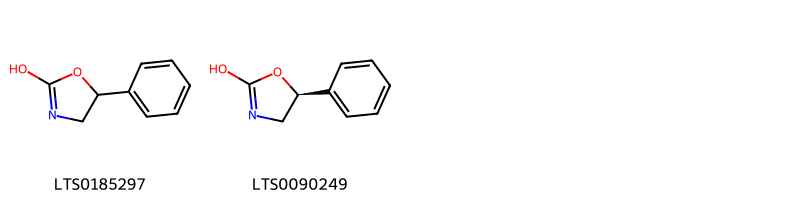
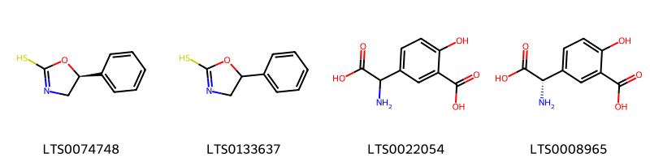
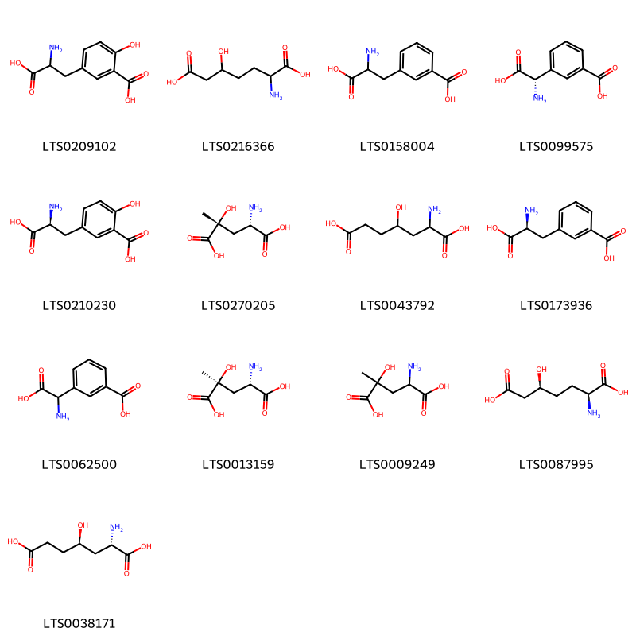
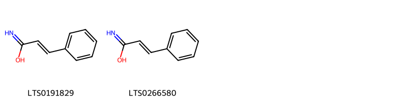
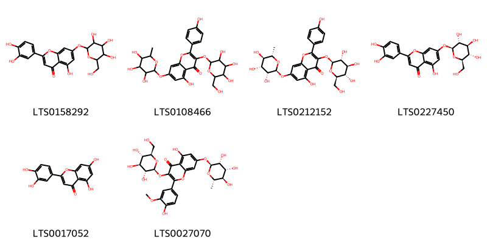
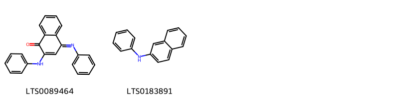
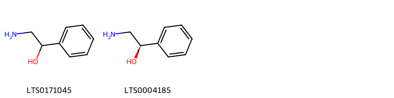
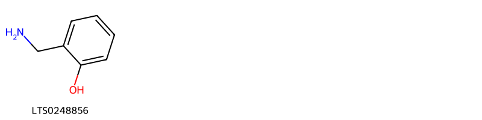
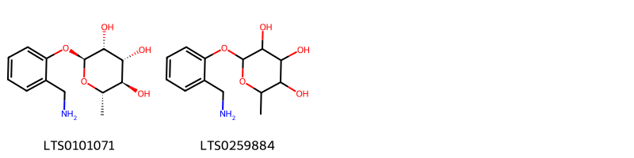

!!! abstract "Tóm tắt"

    Họ Resedaceae gồm khoảng 1 chi và 2 loài được một số cộng đồng tại các quốc gia như Turkey, Elsewhere, ain, Europe, Iraq sử dụng trong một số trường hợp Chất độc, Vermifuge, Thuốc lợi tiểu, Thuốc lợi tiểu, Nước hoa, Thuốc lợi tiểu, Nước hoa, Chất làm mềm, Thuốc lợi tiểu, Thuốc lợi tiểu, Sudorific, Thuốc lợi tiểu, Thuốc nhuận tràng, Demulcent, Nước hoa, Vulnerary.

!!! info "DrDuke"

    James A. Duke sinh năm 1929-2017 là một nhà thực vật học người Mỹ. Đây là một trong những tác giả hàng đầu trong lĩnh vực dược dân tộc học với cuốn *CRC Handbook of Medicinal Herbs* và chính là người xây dựng lên cơ sở dữ liệu về hợp chất tự nhiên và dược dân tộc học tại Bộ nông nghiệp Hoa Kỳ. Các thông tin được đăng tải tại website [Dr. Duke's Phytochemical and Ethnobotanical Databases](https://phytochem.nal.usda.gov/). 
    Trong suốt thập niên 1970, ông lãnh đạo the Plant Taxonomy Laboratory, Plant Genetics and Germplasm Institute of the Agricultural Research Service, U.S. Department of Agriculture.
    Trong tài liệu này, các thông tin về dược dân tộc của các dược liệu được trích dẫn từ tài liệu của James A. Ducke với sự trợ giúp của phần mềm dịch thuật từ tiếng Anh sang tiếng Việt.
   

# Chi Reseda

??? note "Danh sách các dược liệu thuộc chi"
    
	 - *Reseda luteola*
	 - *Reseda odorata*

---
## Reseda luteola
### Thông tin về thực vật

!!! info "Phân loại thực vật của *Reseda luteola* từ GIBF:"
    - **Kingdom:** Plantae
    - **Phylum:** Tracheophyta
    - **Order:** Brassicales
    - **Family:** Resedaceae
    - **Genus:** Reseda
    - **Species:** *Reseda luteola*

 

| Label (VI)   | Label (EN)   | Scientific Name   | Descriptions (VI)   | Descriptions (EN)   | Also Known As (VI)   | Also Known As (EN)                                |
|:-------------|:-------------|:------------------|:--------------------|:--------------------|:---------------------|:--------------------------------------------------|
| N/A          | N/A          | Reseda luteola    | loài thực vật       | species of plant    | ['']                 | ['weld', "dyer's rocket", "dyer's weed", 'woold'] |

#### Phân bố trên thế giới

**Từ CSDL GIBF** Italy, Australia, Israel, Denmark, Netherlands, Spain, Portugal, Algeria, Morocco, United States of America, Sweden, Czechia, Germany, Switzerland, Mexico, France, Austria, United Kingdom of Great Britain and Northern Ireland, Ireland, New Zealand

#### Phân bố tại Việt Nam

**Từ CSDL GIBF**: Không có ghi nhận ở Việt Nam

---
### Thành phần hóa học
        
- Theo cơ sở dữ liệu lotus: Từ loài *Reseda luteola* đã phân lập và xác định được 32 hoạt chất thuộc về các nhóm Naphthalenes, Flavonoids, Steroids and steroid derivatives, Cinnamic acids and derivatives, Azolidines, Organonitrogen compounds, Benzene and substituted derivatives, Carboxylic acids and derivatives. 

|    | chemicalTaxonomyClassyfireClass     |   smiles_count |
|---:|:------------------------------------|---------------:|
|  0 | Azolidines                          |              2 |
|  1 | Benzene and substituted derivatives |              4 |
|  2 | Carboxylic acids and derivatives    |             13 |
|  3 | Cinnamic acids and derivatives      |              2 |
|  4 | Flavonoids                          |              6 |
|  5 | Naphthalenes                        |              2 |
|  6 | Organonitrogen compounds            |              2 |
|  7 | Steroids and steroid derivatives    |              1 |

#### Nhóm Azolidines
<figure markdown="span">
    { width=100% }
    <figcaption>Hình ảnh cấu trúc hóa học của 2 hoạt chất thuộc nhóm Azolidines gồm ['5-phenyl-4,5-dihydro-1,3-oxazol-2-ol (LTS0185297)', '(5s)-5-phenyl-4,5-dihydro-1,3-oxazol-2-ol (LTS0090249)'].</figcaption>
</figure>
#### Nhóm Benzene and substituted derivatives
<figure markdown="span">
    { width=100% }
    <figcaption>Hình ảnh cấu trúc hóa học của 4 hoạt chất thuộc nhóm Benzene and substituted derivatives gồm ['(5s)-5-phenyl-4,5-dihydro-1,3-oxazole-2-thiol (LTS0074748)', '5-phenyl-4,5-dihydro-1,3-oxazole-2-thiol (LTS0133637)', '5-[amino(carboxy)methyl]-2-hydroxybenzoic acid (LTS0022054)', '5-[(s)-amino(carboxy)methyl]-2-hydroxybenzoic acid (LTS0008965)'].</figcaption>
</figure>
#### Nhóm Carboxylic acids and derivatives
<figure markdown="span">
    { width=100% }
    <figcaption>Hình ảnh cấu trúc hóa học của 13 hoạt chất thuộc nhóm Carboxylic acids and derivatives gồm ['5-(2-amino-2-carboxyethyl)-2-hydroxybenzoic acid (LTS0209102)', '2-amino-5-hydroxyheptanedioic acid (LTS0216366)', '3-(2-amino-2-carboxyethyl)benzoic acid (LTS0158004)', '3-[(s)-amino(carboxy)methyl]benzoic acid (LTS0099575)', '5-[(2s)-2-amino-2-carboxyethyl]-2-hydroxybenzoic acid (LTS0210230)', '4-hydroxy-4-methylglutamate (LTS0270205)', '2-amino-4-hydroxyheptanedioic acid (LTS0043792)', '3-[(2s)-2-amino-2-carboxyethyl]benzoic acid (LTS0173936)', '3-[amino(carboxy)methyl]benzoic acid (LTS0062500)', '(2s,4s)-4-amino-2-hydroxy-2-methylpentanedioic acid (LTS0013159)', '4-amino-2-hydroxy-2-methylpentanedioic acid (LTS0009249)', '(2s,5s)-2-amino-5-hydroxyheptanedioic acid (LTS0087995)', '(2s,4r)-2-amino-4-hydroxyheptanedioic acid (LTS0038171)'].</figcaption>
</figure>
#### Nhóm Cinnamic acids and derivatives
<figure markdown="span">
    { width=100% }
    <figcaption>Hình ảnh cấu trúc hóa học của 2 hoạt chất thuộc nhóm Cinnamic acids and derivatives gồm ['cinnamamide (LTS0191829)', '3-phenylprop-2-enimidic acid (LTS0266580)'].</figcaption>
</figure>
#### Nhóm Flavonoids
<figure markdown="span">
    { width=100% }
    <figcaption>Hình ảnh cấu trúc hóa học của 6 hoạt chất thuộc nhóm Flavonoids gồm ['2-(3,4-dihydroxyphenyl)-5-hydroxy-7-{[3,4,5-trihydroxy-6-(hydroxymethyl)oxan-2-yl]oxy}chromen-4-one (LTS0158292)', '5-hydroxy-2-(4-hydroxyphenyl)-3-{[3,4,5-trihydroxy-6-(hydroxymethyl)oxan-2-yl]oxy}-7-[(3,4,5-trihydroxy-6-methyloxan-2-yl)oxy]chromen-4-one (LTS0108466)', '5-hydroxy-2-(4-hydroxyphenyl)-3-{[(2s,3r,4s,5s,6r)-3,4,5-trihydroxy-6-(hydroxymethyl)oxan-2-yl]oxy}-7-{[(2s,3r,4r,5r,6s)-3,4,5-trihydroxy-6-methyloxan-2-yl]oxy}chromen-4-one (LTS0212152)', 'luteolin 7-o-glucoside (LTS0227450)', 'luteolin (LTS0017052)', '5-hydroxy-2-(4-hydroxy-3-methoxyphenyl)-3-{[(2s,3r,4s,5s,6r)-3,4,5-trihydroxy-6-(hydroxymethyl)oxan-2-yl]oxy}-7-{[(2s,3r,4r,5r,6s)-3,4,5-trihydroxy-6-methyloxan-2-yl]oxy}chromen-4-one (LTS0027070)'].</figcaption>
</figure>
#### Nhóm Naphthalenes
<figure markdown="span">
    { width=100% }
    <figcaption>Hình ảnh cấu trúc hóa học của 2 hoạt chất thuộc nhóm Naphthalenes gồm ['2-(phenylamino)-4-(phenylimino)naphthalen-1-one (LTS0089464)', 'anilinonaphthalene (LTS0183891)'].</figcaption>
</figure>
#### Nhóm Organonitrogen compounds
<figure markdown="span">
    { width=100% }
    <figcaption>Hình ảnh cấu trúc hóa học của 2 hoạt chất thuộc nhóm Organonitrogen compounds gồm ['β phenylethanolamine (LTS0171045)', '(1r)-2-amino-1-phenylethanol (LTS0004185)'].</figcaption>
</figure>
#### Nhóm Steroids and steroid derivatives
<figure markdown="span">
    { width=100% }
    <figcaption>Hình ảnh cấu trúc hóa học của 1 hoạt chất thuộc nhóm Steroids and steroid derivatives gồm ['progesterone (LTS0238391)'].</figcaption>
</figure>

---

### Dược dân tộc học

Danh sách các quốc gia có sử dụng *Reseda luteola* trong điều trị các bệnh. 

| Country   | Disease                                  | Bệnh                                       |
|:----------|:-----------------------------------------|:-------------------------------------------|
| Elsewhere | Poison, Vermifuge, Diuretic, Diaphoretic | Chất độc, Vermifuge, lợi tiểu, Diaphoretic |
| Iraq      | Diuretic                                 | Thuốc lợi tiêu                             |
| Turkey    | Diaphoretic, Diuretic, Sudorific         | Thuốc lợi tiểu, lợi tiểu, gây ngạt mồ hôi  |

---

---
## Reseda odorata
### Thông tin về thực vật

!!! info "Phân loại thực vật của *Reseda odorata* từ GIBF:"
    - **Kingdom:** Plantae
    - **Phylum:** Tracheophyta
    - **Order:** Brassicales
    - **Family:** Resedaceae
    - **Genus:** Reseda
    - **Species:** *Reseda odorata*

 

| Label (VI)   | Label (EN)   | Scientific Name   | Descriptions (VI)   | Descriptions (EN)   | Also Known As (VI)   | Also Known As (EN)   |
|:-------------|:-------------|:------------------|:--------------------|:--------------------|:---------------------|:---------------------|
| N/A          | N/A          | Reseda odorata    | loài thực vật       | species of plant    | ['']                 | ['']                 |

#### Phân bố trên thế giới

**Từ CSDL GIBF** nan, Italy, Australia, Belgium, unknown or invalid, Norway, Canada, Denmark, Netherlands, Spain, Russian Federation, Morocco, United States of America, Sweden, Finland, Greece, Czechia, Germany, Brazil, Austria, France, Mexico, United Kingdom of Great Britain and Northern Ireland, China, India, Poland, New Zealand

#### Phân bố tại Việt Nam

**Từ CSDL GIBF**: Không có ghi nhận ở Việt Nam

---
### Thành phần hóa học
        
- Theo cơ sở dữ liệu lotus: Từ loài *Reseda odorata* đã phân lập và xác định được 3 hoạt chất thuộc về các nhóm Organooxygen compounds, Benzene and substituted derivatives. 

|    | chemicalTaxonomyClassyfireClass     |   smiles_count |
|---:|:------------------------------------|---------------:|
|  0 | Benzene and substituted derivatives |              1 |
|  1 | Organooxygen compounds              |              2 |

#### Nhóm Benzene and substituted derivatives
<figure markdown="span">
    { width=100% }
    <figcaption>Hình ảnh cấu trúc hóa học của 1 hoạt chất thuộc nhóm Benzene and substituted derivatives gồm ['2-(aminomethyl)phenol (LTS0248856)'].</figcaption>
</figure>
#### Nhóm Organooxygen compounds
<figure markdown="span">
    { width=100% }
    <figcaption>Hình ảnh cấu trúc hóa học của 2 hoạt chất thuộc nhóm Organooxygen compounds gồm ['(2s,3r,4r,5r,6s)-2-[2-(aminomethyl)phenoxy]-6-methyloxane-3,4,5-triol (LTS0101071)', '2-[2-(aminomethyl)phenoxy]-6-methyloxane-3,4,5-triol (LTS0259884)'].</figcaption>
</figure>

---

### Dược dân tộc học

Danh sách các quốc gia có sử dụng *Reseda odorata* trong điều trị các bệnh. 

| Country   | Disease                         | Bệnh                                              |
|:----------|:--------------------------------|:--------------------------------------------------|
| Europe    | Perfume                         | Nước hoa                                          |
| Iraq      | Perfume, Emollient              | Nước hoa, chất làm mềm                            |
| Turkey    | Demulcent, Perfume, Vulnerary   | Demulcent, Perfume, Vulnerary                     |
| ain       | Diaphoretic, Diuretic, Laxative | Thuốc lợi tiểu, thuốc lợi tiểu, thuốc nhuận tràng |

---

