!!! abstract "Tóm tắt"

    Họ Rhamnaceae gồm khoảng 17 chi và 58 loài được một số cộng đồng tại các quốc gia như Honduras, Nyasaland, US(Flathead), Philippines, Chinese, Chile, Newguinea, Malaya, Borneo, Europe, West Indies, Haiti, ain, Guatemala, Dominican Republic, Canada(Salish), German, Africa, Malaysia, India, Samoa, US, US(Appalachia), Italian, Nigeria, Bahamas, Turkey, Iraq, Salvador, Dutch, Japan, Guyana(Waiwai), India(Santal), Ethiopia, Japan*, Mexico, China, Guiana(Waiwai), Tonga, Mexico(Kickapoo), Elsewhere, Canada(Kwakiutl), US(Amerindian), Bolivia sử dụng trong một số trường hợp QUERY LENGTH LIMIT EXCEEDED. MAX ALLOWED QUERY : 500 CHARS MYMEMORY WARNING: YOU USED ALL AVAILABLE FREE TRANSLATIONS FOR TODAY. NEXT AVAILABLE IN  14 HOURS 27 MINUTES 31 SECONDS VISIT HTTPS://MYMEMORY.TRANSLATED.NET/DOC/USAGELIMITS.PHP TO TRANSLATE MORE.

!!! info "DrDuke"

    James A. Duke sinh năm 1929-2017 là một nhà thực vật học người Mỹ. Đây là một trong những tác giả hàng đầu trong lĩnh vực dược dân tộc học với cuốn *CRC Handbook of Medicinal Herbs* và chính là người xây dựng lên cơ sở dữ liệu về hợp chất tự nhiên và dược dân tộc học tại Bộ nông nghiệp Hoa Kỳ. Các thông tin được đăng tải tại website [Dr. Duke's Phytochemical and Ethnobotanical Databases](https://phytochem.nal.usda.gov/). 
    Trong suốt thập niên 1970, ông lãnh đạo the Plant Taxonomy Laboratory, Plant Genetics and Germplasm Institute of the Agricultural Research Service, U.S. Department of Agriculture.
    Trong tài liệu này, các thông tin về dược dân tộc của các dược liệu được trích dẫn từ tài liệu của James A. Ducke với sự trợ giúp của phần mềm dịch thuật từ tiếng Anh sang tiếng Việt.
   

# Chi Condalia

??? note "Danh sách các dược liệu thuộc chi"
    
	 - *Condalia lycioides*
	 - *Condalia obtusifolia*

---
## Condalia lycioides
### Thông tin về thực vật

!!! info "Phân loại thực vật của *Sarcomphalus obtusifolius* từ GIBF:"
    - **Kingdom:** Plantae
    - **Phylum:** Tracheophyta
    - **Order:** Rosales
    - **Family:** Rhamnaceae
    - **Genus:** Sarcomphalus
    - **Species:** *Sarcomphalus obtusifolius*

 

| Label (VI)   | Label (EN)   | Scientific Name    | Descriptions (VI)   | Descriptions (EN)   | Also Known As (VI)   | Also Known As (EN)   |
|:-------------|:-------------|:-------------------|:--------------------|:--------------------|:---------------------|:---------------------|
| N/A          | N/A          | Condalia lycioides |                     |                     | ['']                 | ['']                 |

#### Phân bố trên thế giới

**Từ CSDL GIBF** nan, United States of America, Mexico, Papua New Guinea

#### Phân bố tại Việt Nam

**Từ CSDL GIBF**: Không có ghi nhận ở Việt Nam

---
### Thành phần hóa học
        
- Theo cơ sở dữ liệu lotus: Từ loài *Sarcomphalus obtusifolius* đã phân lập và xác định được Chưa có hoạt chất nào được phân lập. hoạt chất thuộc về các nhóm Không có hoạt chất nào được phân lập. 

Không có hình ảnh nào được tạo ra

---

### Dược dân tộc học

Danh sách các quốc gia có sử dụng *Sarcomphalus obtusifolius* trong điều trị các bệnh. 

| Country   | Disease   | Bệnh                                                                                                                                                                                                |
|:----------|:----------|:----------------------------------------------------------------------------------------------------------------------------------------------------------------------------------------------------|
| Elsewhere | Soap      | MYMEMORY WARNING: YOU USED ALL AVAILABLE FREE TRANSLATIONS FOR TODAY. NEXT AVAILABLE IN  14 HOURS 27 MINUTES 28 SECONDS VISIT HTTPS://MYMEMORY.TRANSLATED.NET/DOC/USAGELIMITS.PHP TO TRANSLATE MORE |
| Mexico    | Soap      | MYMEMORY WARNING: YOU USED ALL AVAILABLE FREE TRANSLATIONS FOR TODAY. NEXT AVAILABLE IN  14 HOURS 27 MINUTES 25 SECONDS VISIT HTTPS://MYMEMORY.TRANSLATED.NET/DOC/USAGELIMITS.PHP TO TRANSLATE MORE |

---

---
## Condalia obtusifolia
### Thông tin về thực vật

!!! info "Phân loại thực vật của *Sarcomphalus obtusifolius* từ GIBF:"
    - **Kingdom:** Plantae
    - **Phylum:** Tracheophyta
    - **Order:** Rosales
    - **Family:** Rhamnaceae
    - **Genus:** Sarcomphalus
    - **Species:** *Sarcomphalus obtusifolius*

 

| Label (VI)   | Label (EN)   | Scientific Name      | Descriptions (VI)   | Descriptions (EN)   | Also Known As (VI)   | Also Known As (EN)   |
|:-------------|:-------------|:---------------------|:--------------------|:--------------------|:---------------------|:---------------------|
| N/A          | N/A          | Condalia obtusifolia |                     |                     | ['']                 | ['']                 |

#### Phân bố trên thế giới

**Từ CSDL GIBF** nan, United States of America, Mexico

#### Phân bố tại Việt Nam

**Từ CSDL GIBF**: Không có ghi nhận ở Việt Nam

---
### Thành phần hóa học
        
- Theo cơ sở dữ liệu lotus: Từ loài *Sarcomphalus obtusifolius* đã phân lập và xác định được Chưa có hoạt chất nào được phân lập. hoạt chất thuộc về các nhóm Không có hoạt chất nào được phân lập. 

Không có hình ảnh nào được tạo ra

---

### Dược dân tộc học

Danh sách các quốc gia có sử dụng *Sarcomphalus obtusifolius* trong điều trị các bệnh. 

| Country   | Disease   | Bệnh                                                                                                                                                                                                |
|:----------|:----------|:----------------------------------------------------------------------------------------------------------------------------------------------------------------------------------------------------|
| Mexico    | Soap      | MYMEMORY WARNING: YOU USED ALL AVAILABLE FREE TRANSLATIONS FOR TODAY. NEXT AVAILABLE IN  14 HOURS 27 MINUTES 04 SECONDS VISIT HTTPS://MYMEMORY.TRANSLATED.NET/DOC/USAGELIMITS.PHP TO TRANSLATE MORE |

---

# Chi Ventilago

??? note "Danh sách các dược liệu thuộc chi"
    
	 - *Ventilago calyculata*
	 - *Ventilago madraatana*

---
## Ventilago calyculata
### Thông tin về thực vật

!!! info "Phân loại thực vật của *Ventilago denticulata* từ GIBF:"
    - **Kingdom:** Plantae
    - **Phylum:** Tracheophyta
    - **Order:** Rosales
    - **Family:** Rhamnaceae
    - **Genus:** Ventilago
    - **Species:** *Ventilago denticulata*

 

| Label (VI)   | Label (EN)   | Scientific Name      | Descriptions (VI)   | Descriptions (EN)   | Also Known As (VI)   | Also Known As (EN)   |
|:-------------|:-------------|:---------------------|:--------------------|:--------------------|:---------------------|:---------------------|
| N/A          | N/A          | Ventilago calyculata | loài thực vật       | species of plant    | ['']                 | ['']                 |

#### Phân bố trên thế giới

**Từ CSDL GIBF** nan, Viet Nam, unknown or invalid, Thailand, Slovenia, Myanmar, India, Lao People’s Democratic Republic, Bangladesh, United States of America, China, Nepal

#### Phân bố tại Việt Nam

**Từ CSDL GIBF**: Hoa Binh

---
### Thành phần hóa học
        
- Theo cơ sở dữ liệu lotus: Từ loài *Ventilago denticulata* đã phân lập và xác định được Chưa có hoạt chất nào được phân lập. hoạt chất thuộc về các nhóm Không có hoạt chất nào được phân lập. 

Không có hình ảnh nào được tạo ra

---

### Dược dân tộc học

Danh sách các quốc gia có sử dụng *Ventilago denticulata* trong điều trị các bệnh. 

| Country       | Disease   | Bệnh                                                                                                                                                                                                |
|:--------------|:----------|:----------------------------------------------------------------------------------------------------------------------------------------------------------------------------------------------------|
| India(Santal) | Laxative  | MYMEMORY WARNING: YOU USED ALL AVAILABLE FREE TRANSLATIONS FOR TODAY. NEXT AVAILABLE IN  14 HOURS 26 MINUTES 33 SECONDS VISIT HTTPS://MYMEMORY.TRANSLATED.NET/DOC/USAGELIMITS.PHP TO TRANSLATE MORE |

---

---
## Ventilago madraatana
### Thông tin về thực vật

!!! info "Phân loại thực vật của *N/A* từ GIBF:"
    - **Kingdom:** Plantae
    - **Phylum:** Tracheophyta
    - **Order:** Rosales
    - **Family:** Rhamnaceae
    - **Genus:** Ventilago
    - **Species:** *N/A*

 

| Label (VI)   | Label (EN)   | Scientific Name      | Descriptions (VI)   | Descriptions (EN)   | Also Known As (VI)   | Also Known As (EN)   |
|:-------------|:-------------|:---------------------|:--------------------|:--------------------|:---------------------|:---------------------|
| N/A          | N/A          | Ventilago calyculata | loài thực vật       | species of plant    | ['']                 | ['']                 |

#### Phân bố trên thế giới

**Từ CSDL GIBF** Thailand, India, New Caledonia, China, Madagascar, Australia, Hong Kong, Chinese Taipei

#### Phân bố tại Việt Nam

**Từ CSDL GIBF**: Không có ghi nhận ở Việt Nam

---
### Thành phần hóa học
        
- Theo cơ sở dữ liệu lotus: Từ loài *N/A* đã phân lập và xác định được Chưa có hoạt chất nào được phân lập. hoạt chất thuộc về các nhóm Không có hoạt chất nào được phân lập. 

Không có hình ảnh nào được tạo ra

---

### Dược dân tộc học

Danh sách các quốc gia có sử dụng *N/A* trong điều trị các bệnh. 

| Country   | Disease                     | Bệnh                                                                                                                                                                                                |
|:----------|:----------------------------|:----------------------------------------------------------------------------------------------------------------------------------------------------------------------------------------------------|
| Elsewhere | Tonic, Stimulant, Stomachic | MYMEMORY WARNING: YOU USED ALL AVAILABLE FREE TRANSLATIONS FOR TODAY. NEXT AVAILABLE IN  14 HOURS 26 MINUTES 04 SECONDS VISIT HTTPS://MYMEMORY.TRANSLATED.NET/DOC/USAGELIMITS.PHP TO TRANSLATE MORE |

---

# Chi Ceanothus

??? note "Danh sách các dược liệu thuộc chi"
    
	 - *Ceanothus americanus*
	 - *Ceanothus velutinus*

---
## Ceanothus americanus
### Thông tin về thực vật

!!! info "Phân loại thực vật của *Ceanothus americanus* từ GIBF:"
    - **Kingdom:** Plantae
    - **Phylum:** Tracheophyta
    - **Order:** Rosales
    - **Family:** Rhamnaceae
    - **Genus:** Ceanothus
    - **Species:** *Ceanothus americanus*

 

| Label (VI)   | Label (EN)   | Scientific Name      | Descriptions (VI)   | Descriptions (EN)   | Also Known As (VI)   | Also Known As (EN)                                                                                                                                  |
|:-------------|:-------------|:---------------------|:--------------------|:--------------------|:---------------------|:----------------------------------------------------------------------------------------------------------------------------------------------------|
| N/A          | N/A          | Ceanothus americanus | loài thực vật       | species of plant    | ['']                 | ['Jersey tea ceanothus', 'mountain sweet', 'mountain-sweet', 'mountainsweet', 'New Jersey tea', 'red root', 'red-root', 'redroot', 'wild snowball'] |

#### Phân bố trên thế giới

**Từ CSDL GIBF** Canada, United States of America

#### Phân bố tại Việt Nam

**Từ CSDL GIBF**: Không có ghi nhận ở Việt Nam

---
### Thành phần hóa học
        
- Theo cơ sở dữ liệu lotus: Từ loài *Ceanothus americanus* đã phân lập và xác định được 38 hoạt chất thuộc về các nhóm Flavonoids, Aurone flavonoids, Carboxylic acids and derivatives, Prenol lipids, Steroids and steroid derivatives. 

|    | chemicalTaxonomyClassyfireClass   |   smiles_count |
|---:|:----------------------------------|---------------:|
|  0 | Aurone flavonoids                 |              2 |
|  1 | Carboxylic acids and derivatives  |             20 |
|  2 | Flavonoids                        |              3 |
|  3 | Prenol lipids                     |             11 |
|  4 | Steroids and steroid derivatives  |              2 |

#### Nhóm Aurone flavonoids
<figure markdown="span">
    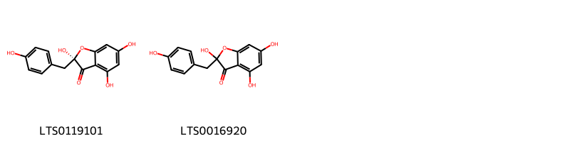{ width=100% }
    <figcaption>Hình ảnh cấu trúc hóa học của 2 hoạt chất thuộc nhóm Aurone flavonoids gồm ['(2r)-2,4,6-trihydroxy-2-[(4-hydroxyphenyl)methyl]-1-benzofuran-3-one (LTS0119101)', 'maesopsin (LTS0016920)'].</figcaption>
</figure>
#### Nhóm Carboxylic acids and derivatives
<figure markdown="span">
    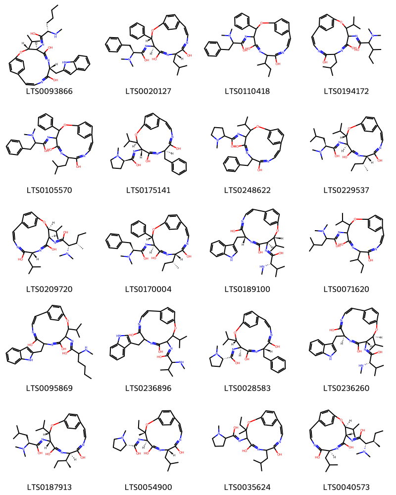{ width=100% }
    <figcaption>Hình ảnh cấu trúc hóa học của 20 hoạt chất thuộc nhóm Carboxylic acids and derivatives gồm ['(2s)-n-[(3r,4r,7r,10z)-5,8-dihydroxy-7-(1h-indol-2-ylmethyl)-3-isopropyl-2-oxa-6,9-diazabicyclo[10.2.2]hexadeca-1(14),5,8,10,12,15-hexaen-4-yl]-2-(methylamino)hexanimidic acid (LTS0093866)', '(2s)-n-[(3s,4s,7s,10z)-5,8-dihydroxy-7-(2-methylpropyl)-3-phenyl-2-oxa-6,9-diazabicyclo[10.2.2]hexadeca-1(14),5,8,10,12,15-hexaen-4-yl]-2-(dimethylamino)-3-phenylpropanimidic acid (LTS0020127)', 'n-[5,8-dihydroxy-3-phenyl-7-(sec-butyl)-2-oxa-6,9-diazabicyclo[10.2.2]hexadeca-1(14),5,8,10,12,15-hexaen-4-yl]-2-(dimethylamino)-3-phenylpropanimidic acid (LTS0110418)', 'n-[5,8-dihydroxy-3-isopropyl-7-(2-methylpropyl)-2-oxa-6,9-diazabicyclo[10.2.2]hexadeca-1(14),5,8,10,12,15-hexaen-4-yl]-2-(dimethylamino)-3-methylpentanimidic acid (LTS0194172)', 'n-[5,8-dihydroxy-7-(2-methylpropyl)-3-phenyl-2-oxa-6,9-diazabicyclo[10.2.2]hexadeca-1(14),5,8,10,12,15-hexaen-4-yl]-2-(dimethylamino)-3-phenylpropanimidic acid (LTS0105570)', '(2r)-n-[(3r,4r,7r,10z)-7-benzyl-5,8-dihydroxy-3-isopropyl-2-oxa-6,9-diazabicyclo[10.2.2]hexadeca-1(14),5,8,10,12,15-hexaen-4-yl]-1-methylpyrrolidine-2-carboximidic acid (LTS0175141)', 'n-{7-benzyl-5,8-dihydroxy-3-isopropyl-2-oxa-6,9-diazabicyclo[10.2.2]hexadeca-1(14),5,8,10,12,15-hexaen-4-yl}-1-methylpyrrolidine-2-carboximidic acid (LTS0248622)', '(2s)-n-[(3s,4s,7s,10z)-7-[(2r)-butan-2-yl]-5,8-dihydroxy-3-isopropyl-2-oxa-6,9-diazabicyclo[10.2.2]hexadeca-1(14),5,8,10,12,15-hexaen-4-yl]-2-(dimethylamino)-4-methylpentanimidic acid (LTS0229537)', '(2s,3s)-n-[(3s,4r,7r,10z)-5,8-dihydroxy-3-isopropyl-7-(2-methylpropyl)-2-oxa-6,9-diazabicyclo[10.2.2]hexadeca-1(14),5,8,10,12,15-hexaen-4-yl]-2-(dimethylamino)-3-methylpentanimidic acid (LTS0209720)', '(2s)-n-[(3s,4s,7s,10z)-7-[(2r)-butan-2-yl]-5,8-dihydroxy-3-phenyl-2-oxa-6,9-diazabicyclo[10.2.2]hexadeca-1(14),5,8,10,12,15-hexaen-4-yl]-2-(dimethylamino)-3-phenylpropanimidic acid (LTS0170004)', '(2s)-n-[(3r,4r,7r,10z)-5,8-dihydroxy-7-(1h-indol-3-ylmethyl)-3-isopropyl-2-oxa-6,9-diazabicyclo[10.2.2]hexadeca-1(14),5,8,10,12,15-hexaen-4-yl]-3-methyl-2-(methylamino)butanimidic acid (LTS0189100)', 'n-[5,8-dihydroxy-3-isopropyl-7-(sec-butyl)-2-oxa-6,9-diazabicyclo[10.2.2]hexadeca-1(14),5,8,10,12,15-hexaen-4-yl]-2-(dimethylamino)-4-methylpentanimidic acid (LTS0071620)', 'n-[5,8-dihydroxy-7-(1h-indol-2-ylmethyl)-3-isopropyl-2-oxa-6,9-diazabicyclo[10.2.2]hexadeca-1(14),5,8,10,12,15-hexaen-4-yl]-2-(methylamino)hexanimidic acid (LTS0095869)', 'n-[5,8-dihydroxy-7-(1h-indol-3-ylmethyl)-3-isopropyl-2-oxa-6,9-diazabicyclo[10.2.2]hexadeca-1(14),5,8,10,12,15-hexaen-4-yl]-3-methyl-2-(methylamino)butanimidic acid (LTS0236896)', '(2s)-n-[(3s,4s,7s,10z)-7-benzyl-5,8-dihydroxy-3-isopropyl-2-oxa-6,9-diazabicyclo[10.2.2]hexadeca-1(14),5,8,10,12,15-hexaen-4-yl]-1-methylpyrrolidine-2-carboximidic acid (LTS0028583)', '(2s)-n-[(3s,4s,7s,10z)-5,8-dihydroxy-7-(1h-indol-3-ylmethyl)-3-isopropyl-2-oxa-6,9-diazabicyclo[10.2.2]hexadeca-1(14),5,8,10,12,15-hexaen-4-yl]-3-methyl-2-(methylamino)butanimidic acid (LTS0236260)', '(2s)-n-[(3s,4r,7r,10z)-7-[(2s)-butan-2-yl]-5,8-dihydroxy-3-isopropyl-2-oxa-6,9-diazabicyclo[10.2.2]hexadeca-1(14),5,8,10,12,15-hexaen-4-yl]-2-(dimethylamino)-4-methylpentanimidic acid (LTS0187913)', '(2s)-n-[(3s,4s,7s,10z)-3-ethyl-5,8-dihydroxy-3-methyl-7-(2-methylpropyl)-2-oxa-6,9-diazabicyclo[10.2.2]hexadeca-1(14),5,8,10,12,15-hexaen-4-yl]-1-methylpyrrolidine-2-carboximidic acid (LTS0054900)', 'n-[3-ethyl-5,8-dihydroxy-3-methyl-7-(2-methylpropyl)-2-oxa-6,9-diazabicyclo[10.2.2]hexadeca-1(14),5,8,10,12,15-hexaen-4-yl]-1-methylpyrrolidine-2-carboximidic acid (LTS0035624)', '(2s,3r)-n-[(3s,4s,7s,10z)-5,8-dihydroxy-3-isopropyl-7-(2-methylpropyl)-2-oxa-6,9-diazabicyclo[10.2.2]hexadeca-1(14),5,8,10,12,15-hexaen-4-yl]-2-(dimethylamino)-3-methylpentanimidic acid (LTS0040573)'].</figcaption>
</figure>
#### Nhóm Flavonoids
<figure markdown="span">
    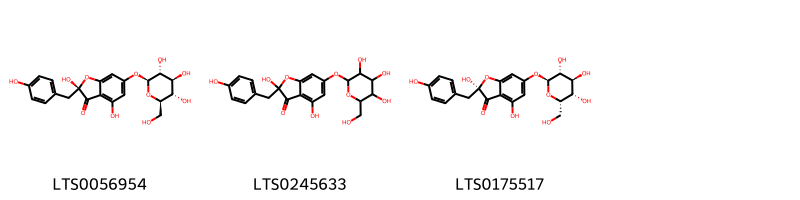{ width=100% }
    <figcaption>Hình ảnh cấu trúc hóa học của 3 hoạt chất thuộc nhóm Flavonoids gồm ['(2s)-2,4-dihydroxy-2-[(4-hydroxyphenyl)methyl]-6-{[(2s,3r,4s,5s,6r)-3,4,5-trihydroxy-6-(hydroxymethyl)oxan-2-yl]oxy}-1-benzofuran-3-one (LTS0056954)', '2,4-dihydroxy-2-[(4-hydroxyphenyl)methyl]-6-{[3,4,5-trihydroxy-6-(hydroxymethyl)oxan-2-yl]oxy}-1-benzofuran-3-one (LTS0245633)', '(2r)-2,4-dihydroxy-2-[(4-hydroxyphenyl)methyl]-6-{[(2s,3r,4s,5s,6s)-3,4,5-trihydroxy-6-(hydroxymethyl)oxan-2-yl]oxy}-1-benzofuran-3-one (LTS0175517)'].</figcaption>
</figure>
#### Nhóm Prenol lipids
<figure markdown="span">
    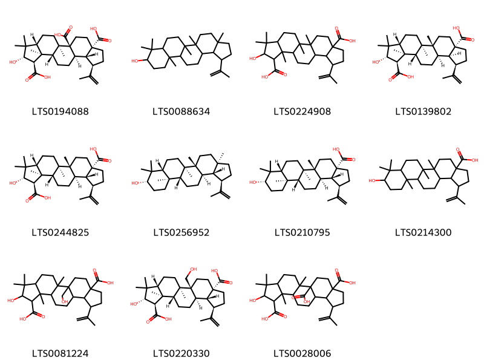{ width=100% }
    <figcaption>Hình ảnh cấu trúc hóa học của 11 hoạt chất thuộc nhóm Prenol lipids gồm ['(1s,2r,5r,7s,8r,9r,10r,13r,14r,15r,18s)-7-hydroxy-2,6,6,9-tetramethyl-15-(prop-1-en-2-yl)pentacyclo[11.7.0.0²,¹⁰.0⁵,⁹.0¹⁴,¹⁸]icosane-1,8,18-tricarboxylic acid (LTS0194088)', 'lupeol (LTS0088634)', '16-hydroxy-1,2,14,17,17-pentamethyl-8-(prop-1-en-2-yl)pentacyclo[11.7.0.0²,¹⁰.0⁵,⁹.0¹⁴,¹⁸]icosane-5,15-dicarboxylic acid (LTS0224908)', '(1r,2r,5s,8r,9s,10r,13r,14r,15r,16s,18r)-16-hydroxy-1,2,14,17,17-pentamethyl-8-(prop-1-en-2-yl)pentacyclo[11.7.0.0²,¹⁰.0⁵,⁹.0¹⁴,¹⁸]icosane-5,15-dicarboxylic acid (LTS0139802)', 'ceanothic acid (LTS0244825)', 'lupeol (LTS0256952)', 'betulinic acid (LTS0210795)', '9-hydroxy-5a,5b,8,8,11a-pentamethyl-1-(prop-1-en-2-yl)-hexadecahydrocyclopenta[a]chrysene-3a-carboxylic acid (LTS0214300)', '16-hydroxy-2-(hydroxymethyl)-1,14,17,17-tetramethyl-8-(prop-1-en-2-yl)pentacyclo[11.7.0.0²,¹⁰.0⁵,⁹.0¹⁴,¹⁸]icosane-5,15-dicarboxylic acid (LTS0081224)', '(1r,2s,5s,8r,9r,10r,13r,14r,15r,16s,18r)-16-hydroxy-2-(hydroxymethyl)-1,14,17,17-tetramethyl-8-(prop-1-en-2-yl)pentacyclo[11.7.0.0²,¹⁰.0⁵,⁹.0¹⁴,¹⁸]icosane-5,15-dicarboxylic acid (LTS0220330)', '7-hydroxy-2,6,6,9-tetramethyl-15-(prop-1-en-2-yl)pentacyclo[11.7.0.0²,¹⁰.0⁵,⁹.0¹⁴,¹⁸]icosane-1,8,18-tricarboxylic acid (LTS0028006)'].</figcaption>
</figure>
#### Nhóm Steroids and steroid derivatives
<figure markdown="span">
    { width=100% }
    <figcaption>Hình ảnh cấu trúc hóa học của 2 hoạt chất thuộc nhóm Steroids and steroid derivatives gồm ['stigmast-5-en-3-ol, (3β)- (LTS0204616)', 'sitosterol (LTS0168132)'].</figcaption>
</figure>

---

### Dược dân tộc học

Danh sách các quốc gia có sử dụng *Ceanothus americanus* trong điều trị các bệnh. 

| Country   | Disease                                          | Bệnh                                                                                                                                                                                                |
|:----------|:-------------------------------------------------|:----------------------------------------------------------------------------------------------------------------------------------------------------------------------------------------------------|
| Dutch     | Astringent                                       | MYMEMORY WARNING: YOU USED ALL AVAILABLE FREE TRANSLATIONS FOR TODAY. NEXT AVAILABLE IN  14 HOURS 25 MINUTES 40 SECONDS VISIT HTTPS://MYMEMORY.TRANSLATED.NET/DOC/USAGELIMITS.PHP TO TRANSLATE MORE |
| Elsewhere | Hemostatic                                       | MYMEMORY WARNING: YOU USED ALL AVAILABLE FREE TRANSLATIONS FOR TODAY. NEXT AVAILABLE IN  14 HOURS 25 MINUTES 37 SECONDS VISIT HTTPS://MYMEMORY.TRANSLATED.NET/DOC/USAGELIMITS.PHP TO TRANSLATE MORE |
| German    | Stimulant                                        | MYMEMORY WARNING: YOU USED ALL AVAILABLE FREE TRANSLATIONS FOR TODAY. NEXT AVAILABLE IN  14 HOURS 25 MINUTES 30 SECONDS VISIT HTTPS://MYMEMORY.TRANSLATED.NET/DOC/USAGELIMITS.PHP TO TRANSLATE MORE |
| Italian   | Expectorant                                      | MYMEMORY WARNING: YOU USED ALL AVAILABLE FREE TRANSLATIONS FOR TODAY. NEXT AVAILABLE IN  14 HOURS 25 MINUTES 25 SECONDS VISIT HTTPS://MYMEMORY.TRANSLATED.NET/DOC/USAGELIMITS.PHP TO TRANSLATE MORE |
| Mexico    | Purgative, Astringent                            | MYMEMORY WARNING: YOU USED ALL AVAILABLE FREE TRANSLATIONS FOR TODAY. NEXT AVAILABLE IN  14 HOURS 25 MINUTES 21 SECONDS VISIT HTTPS://MYMEMORY.TRANSLATED.NET/DOC/USAGELIMITS.PHP TO TRANSLATE MORE |
| US        | Hemostat, Sedative, Expectorant, Stimulant, Soap | MYMEMORY WARNING: YOU USED ALL AVAILABLE FREE TRANSLATIONS FOR TODAY. NEXT AVAILABLE IN  14 HOURS 25 MINUTES 14 SECONDS VISIT HTTPS://MYMEMORY.TRANSLATED.NET/DOC/USAGELIMITS.PHP TO TRANSLATE MORE |

---

---
## Ceanothus velutinus
### Thông tin về thực vật

!!! info "Phân loại thực vật của *Ceanothus velutinus* từ GIBF:"
    - **Kingdom:** Plantae
    - **Phylum:** Tracheophyta
    - **Order:** Rosales
    - **Family:** Rhamnaceae
    - **Genus:** Ceanothus
    - **Species:** *Ceanothus velutinus*

 

| Label (VI)   | Label (EN)   | Scientific Name     | Descriptions (VI)   | Descriptions (EN)   | Also Known As (VI)   | Also Known As (EN)   |
|:-------------|:-------------|:--------------------|:--------------------|:--------------------|:---------------------|:---------------------|
| N/A          | N/A          | Ceanothus velutinus |                     | species of plant    | ['']                 | ['']                 |

#### Phân bố trên thế giới

**Từ CSDL GIBF** Canada, United States of America

#### Phân bố tại Việt Nam

**Từ CSDL GIBF**: Không có ghi nhận ở Việt Nam

---
### Thành phần hóa học
        
- Theo cơ sở dữ liệu lotus: Từ loài *Ceanothus velutinus* đã phân lập và xác định được 16 hoạt chất thuộc về các nhóm Organooxygen compounds, Saturated hydrocarbons, Prenol lipids, Fatty Acyls, Cinnamic acids and derivatives, Steroids and steroid derivatives. 

|    | chemicalTaxonomyClassyfireClass   |   smiles_count |
|---:|:----------------------------------|---------------:|
|  0 | Cinnamic acids and derivatives    |              6 |
|  1 | Fatty Acyls                       |              2 |
|  2 | Organooxygen compounds            |              1 |
|  3 | Prenol lipids                     |              4 |
|  4 | Saturated hydrocarbons            |              1 |
|  5 | Steroids and steroid derivatives  |              2 |

#### Nhóm Cinnamic acids and derivatives
<figure markdown="span">
    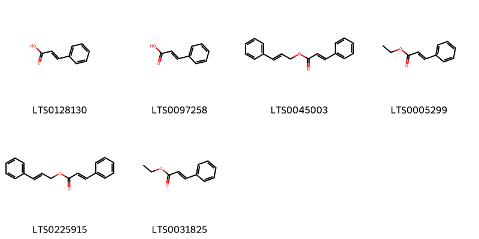{ width=100% }
    <figcaption>Hình ảnh cấu trúc hóa học của 6 hoạt chất thuộc nhóm Cinnamic acids and derivatives gồm ['cinnamic acid (LTS0128130)', 'phenylacrylic acid (LTS0097258)', '3-phenylprop-2-en-1-yl 3-phenylprop-2-enoate (LTS0045003)', 'ethyl 3-phenylprop-2-enoate (LTS0005299)', 'cinnamyl cinnamate (LTS0225915)', 'ethyl cinnamate (LTS0031825)'].</figcaption>
</figure>
#### Nhóm Fatty Acyls
<figure markdown="span">
    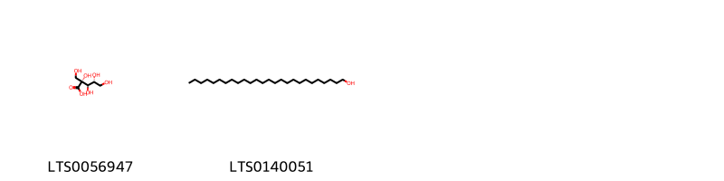{ width=100% }
    <figcaption>Hình ảnh cấu trúc hóa học của 2 hoạt chất thuộc nhóm Fatty Acyls gồm ['2-carboxy-d-arabinitol (LTS0056947)', 'ceryl alcohol (LTS0140051)'].</figcaption>
</figure>
#### Nhóm Organooxygen compounds
<figure markdown="span">
    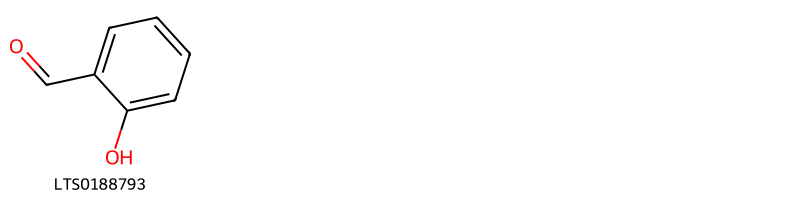{ width=100% }
    <figcaption>Hình ảnh cấu trúc hóa học của 1 hoạt chất thuộc nhóm Organooxygen compounds gồm ['salicylaldehyde (LTS0188793)'].</figcaption>
</figure>
#### Nhóm Prenol lipids
<figure markdown="span">
    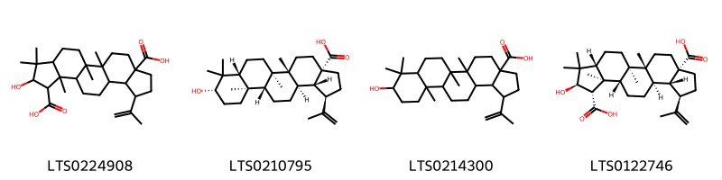{ width=100% }
    <figcaption>Hình ảnh cấu trúc hóa học của 4 hoạt chất thuộc nhóm Prenol lipids gồm ['16-hydroxy-1,2,14,17,17-pentamethyl-8-(prop-1-en-2-yl)pentacyclo[11.7.0.0²,¹⁰.0⁵,⁹.0¹⁴,¹⁸]icosane-5,15-dicarboxylic acid (LTS0224908)', 'betulinic acid (LTS0210795)', '9-hydroxy-5a,5b,8,8,11a-pentamethyl-1-(prop-1-en-2-yl)-hexadecahydrocyclopenta[a]chrysene-3a-carboxylic acid (LTS0214300)', 'isoceanothic acid (LTS0122746)'].</figcaption>
</figure>
#### Nhóm Saturated hydrocarbons
<figure markdown="span">
    { width=100% }
    <figcaption>Hình ảnh cấu trúc hóa học của 1 hoạt chất thuộc nhóm Saturated hydrocarbons gồm ['nonacosane (LTS0062747)'].</figcaption>
</figure>
#### Nhóm Steroids and steroid derivatives
<figure markdown="span">
    { width=100% }
    <figcaption>Hình ảnh cấu trúc hóa học của 2 hoạt chất thuộc nhóm Steroids and steroid derivatives gồm ['stigmast-5-en-3-ol, (3β)- (LTS0204616)', '(1s,3ar,3br,7r,9as,9br,11ar)-1-[(2r,5r)-5-ethyl-6-methylheptan-2-yl]-9a,11a-dimethyl-1h,2h,3h,3ah,3bh,4h,6h,7h,8h,9h,9bh,10h,11h-cyclopenta[a]phenanthren-7-ol (LTS0234781)'].</figcaption>
</figure>

---

### Dược dân tộc học

Danh sách các quốc gia có sử dụng *Ceanothus velutinus* trong điều trị các bệnh. 

| Country      | Disease   | Bệnh                                                                                                                                                                                                |
|:-------------|:----------|:----------------------------------------------------------------------------------------------------------------------------------------------------------------------------------------------------|
| US(Flathead) | Poultice  | MYMEMORY WARNING: YOU USED ALL AVAILABLE FREE TRANSLATIONS FOR TODAY. NEXT AVAILABLE IN  14 HOURS 24 MINUTES 40 SECONDS VISIT HTTPS://MYMEMORY.TRANSLATED.NET/DOC/USAGELIMITS.PHP TO TRANSLATE MORE |

---

# Chi Hovenia

??? note "Danh sách các dược liệu thuộc chi"
    
	 - *Hovenia dulcis*

---
## Hovenia dulcis
### Thông tin về thực vật

!!! info "Phân loại thực vật của *Hovenia dulcis* từ GIBF:"
    - **Kingdom:** Plantae
    - **Phylum:** Tracheophyta
    - **Order:** Rosales
    - **Family:** Rhamnaceae
    - **Genus:** Hovenia
    - **Species:** *Hovenia dulcis*

 

| Label (VI)   | Label (EN)   | Scientific Name   | Descriptions (VI)   | Descriptions (EN)   | Also Known As (VI)   | Also Known As (EN)   |
|:-------------|:-------------|:------------------|:--------------------|:--------------------|:---------------------|:---------------------|
| N/A          | N/A          | Hovenia dulcis    |                     | species of plant    | ['']                 | ['']                 |

#### Phân bố trên thế giới

**Từ CSDL GIBF** nan, Uruguay, Argentina, Japan, South Africa, Brazil, New Zealand, Paraguay, United States of America, China, Australia, Belgium, Korea, Republic of

#### Phân bố tại Việt Nam

**Từ CSDL GIBF**: Không có ghi nhận ở Việt Nam

---
### Thành phần hóa học
        
- Theo cơ sở dữ liệu lotus: Từ loài *Hovenia dulcis* đã phân lập và xác định được 80 hoạt chất thuộc về các nhóm Organooxygen compounds, Flavonoids, Prenol lipids, Carboxylic acids and derivatives, Cinnamic acids and derivatives, Benzene and substituted derivatives. 

|    | chemicalTaxonomyClassyfireClass     |   smiles_count |
|---:|:------------------------------------|---------------:|
|  0 | Benzene and substituted derivatives |              2 |
|  1 | Carboxylic acids and derivatives    |              4 |
|  2 | Cinnamic acids and derivatives      |              1 |
|  3 | Flavonoids                          |              8 |
|  4 | Organooxygen compounds              |             10 |
|  5 | Prenol lipids                       |             55 |

#### Nhóm Benzene and substituted derivatives
<figure markdown="span">
    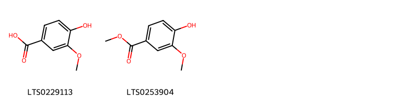{ width=100% }
    <figcaption>Hình ảnh cấu trúc hóa học của 2 hoạt chất thuộc nhóm Benzene and substituted derivatives gồm ['vanillic acid (LTS0229113)', 'vanillate (LTS0253904)'].</figcaption>
</figure>
#### Nhóm Carboxylic acids and derivatives
<figure markdown="span">
    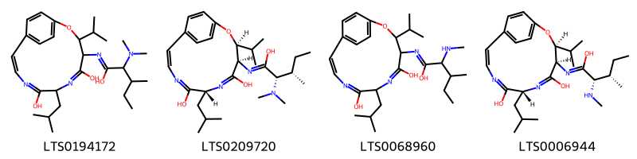{ width=100% }
    <figcaption>Hình ảnh cấu trúc hóa học của 4 hoạt chất thuộc nhóm Carboxylic acids and derivatives gồm ['n-[5,8-dihydroxy-3-isopropyl-7-(2-methylpropyl)-2-oxa-6,9-diazabicyclo[10.2.2]hexadeca-1(14),5,8,10,12,15-hexaen-4-yl]-2-(dimethylamino)-3-methylpentanimidic acid (LTS0194172)', '(2s,3s)-n-[(3s,4r,7r,10z)-5,8-dihydroxy-3-isopropyl-7-(2-methylpropyl)-2-oxa-6,9-diazabicyclo[10.2.2]hexadeca-1(14),5,8,10,12,15-hexaen-4-yl]-2-(dimethylamino)-3-methylpentanimidic acid (LTS0209720)', 'n-[5,8-dihydroxy-3-isopropyl-7-(2-methylpropyl)-2-oxa-6,9-diazabicyclo[10.2.2]hexadeca-1(14),5,8,10,12,15-hexaen-4-yl]-3-methyl-2-(methylamino)pentanimidic acid (LTS0068960)', '(2s,3s)-n-[(3s,4r,7r,10z)-5,8-dihydroxy-3-isopropyl-7-(2-methylpropyl)-2-oxa-6,9-diazabicyclo[10.2.2]hexadeca-1(14),5,8,10,12,15-hexaen-4-yl]-3-methyl-2-(methylamino)pentanimidic acid (LTS0006944)'].</figcaption>
</figure>
#### Nhóm Cinnamic acids and derivatives
<figure markdown="span">
    { width=100% }
    <figcaption>Hình ảnh cấu trúc hóa học của 1 hoạt chất thuộc nhóm Cinnamic acids and derivatives gồm ['ferulic acid (LTS0077328)'].</figcaption>
</figure>
#### Nhóm Flavonoids
<figure markdown="span">
    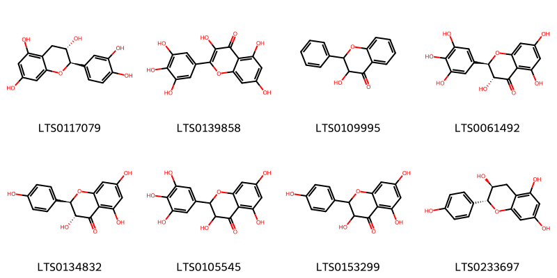{ width=100% }
    <figcaption>Hình ảnh cấu trúc hóa học của 8 hoạt chất thuộc nhóm Flavonoids gồm ['(+)-catechol (LTS0117079)', 'myricetin (LTS0139858)', 'dihydroflavonol (LTS0109995)', '(+)-dihydromyricetin (LTS0061492)', '(+)-dihydrokaempferol (LTS0134832)', 'dihydromyricetin (LTS0105545)', 'aromadendrin (LTS0153299)', 'afzelechin (LTS0233697)'].</figcaption>
</figure>
#### Nhóm Organooxygen compounds
<figure markdown="span">
    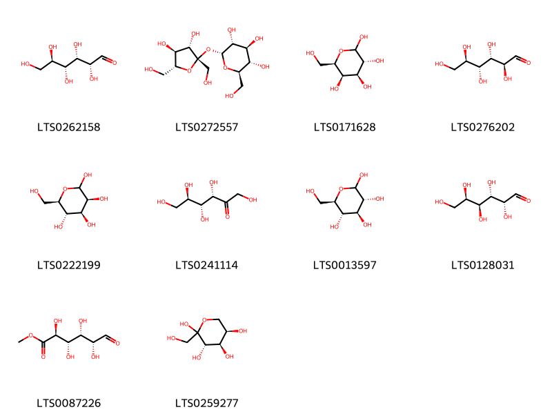{ width=100% }
    <figcaption>Hình ảnh cấu trúc hóa học của 10 hoạt chất thuộc nhóm Organooxygen compounds gồm ['(+)-glucose (LTS0262158)', 'sucrose (LTS0272557)', 'galactose (LTS0171628)', '(+-)-mannose (LTS0276202)', 'β-glucose (LTS0222199)', 'keto-d-fructose (LTS0241114)', 'glucose (LTS0013597)', 'aldehydo-d-galactose (LTS0128031)', 'methyl (2s,3s,4s,5r)-2,3,4,5-tetrahydroxy-6-oxohexanoate (LTS0087226)', 'd-fructopyranose (LTS0259277)'].</figcaption>
</figure>
#### Nhóm Prenol lipids
<figure markdown="span">
    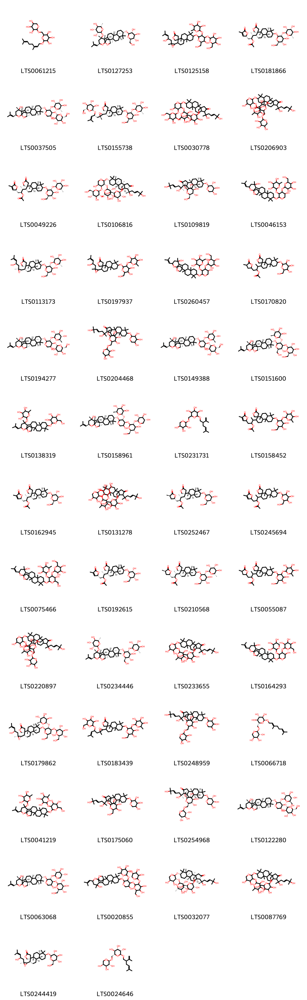{ width=100% }
    <figcaption>Hình ảnh cấu trúc hóa học của 55 hoạt chất thuộc nhóm Prenol lipids gồm ['2-{[(2z)-3,7-dimethylocta-2,6-dien-1-yl]oxy}-6-{[(3,4,5-trihydroxyoxan-2-yl)oxy]methyl}oxane-3,4,5-triol (LTS0061215)', '(2s,3r,4r,5r,6s)-2-methyl-6-{[(1s,2r,5r,7s,10r,11r,14r,15s,16s,18r,20s)-2,6,6,10,16-pentamethyl-18-(2-methylprop-1-en-1-yl)-7-{[(2r,3r,4s,5s,6r)-3,4,5-trihydroxy-6-(hydroxymethyl)oxan-2-yl]oxy}-19,21-dioxahexacyclo[18.2.1.0¹,¹⁴.0²,¹¹.0⁵,¹⁰.0¹⁵,²⁰]tricosan-16-yl]oxy}oxane-3,4,5-triol (LTS0127253)', "2'-[3-(2-hydroxy-4-methylpent-3-en-1-yl)-3-methyloxiran-2-yl]-7'-{[5-hydroxy-6-(hydroxymethyl)-4-{[3,4,5-trihydroxy-6-(hydroxymethyl)oxan-2-yl]oxy}-3-[(3,4,5-trihydroxy-6-methyloxan-2-yl)oxy]oxan-2-yl]oxy}-4'b,8',8',10'a-tetramethyl-decahydrospiro[oxolane-3,1'-phenanthren]-5-one (LTS0125158)", "(2s,3r)-3-[(2'r,3s,4'ar,4'br,7's,8'ar,10'ar)-7'-{[(2r,3r,4s,5s,6r)-4,5-dihydroxy-6-(hydroxymethyl)-3-{[(2s,3r,4r,5r,6s)-3,4,5-trihydroxy-6-methyloxan-2-yl]oxy}oxan-2-yl]oxy}-4'b,8',8',10'a-tetramethyl-5-oxo-decahydrospiro[oxolane-3,1'-phenanthren]-2'-yl]-1-[(2r)-4-methyl-5-oxo-2h-furan-2-yl]butan-2-yl acetate (LTS0181866)", '(2s,3r,4s,5s,6r)-2-{[(2s,3r,4s,5s)-5-hydroxy-2-{[(1s,2r,5r,7s,10r,11r,14r,15s,16s,18r,20s)-16-hydroxy-2,6,6,10,16-pentamethyl-18-(2-methylprop-1-en-1-yl)-19,21-dioxahexacyclo[18.2.1.0¹,¹⁴.0²,¹¹.0⁵,¹⁰.0¹⁵,²⁰]tricosan-7-yl]oxy}-3-{[(2s,3r,4r,5r,6s)-3,4,5-trihydroxy-6-methyloxan-2-yl]oxy}oxan-4-yl]oxy}-6-(hydroxymethyl)oxane-3,4,5-triol (LTS0037505)', "(2's,3s,4'ar,4'br,7's,8'ar,10'ar)-7'-{[(2r,3r,4s,5s,6r)-4,5-dihydroxy-6-(hydroxymethyl)-3-{[(2s,3r,4r,5r,6s)-3,4,5-trihydroxy-6-methyloxan-2-yl]oxy}oxan-2-yl]oxy}-4'b,8',8',10'a-tetramethyl-2'-[(2s,3s)-3-methyl-3-[(2r)-4-methyl-2-{[(2r,3r,4s,5s,6r)-3,4,5-trihydroxy-6-(hydroxymethyl)oxan-2-yl]oxy}pent-3-en-1-yl]oxiran-2-yl]-decahydrospiro[oxolane-3,1'-phenanthren]-5-one (LTS0155738)", '1-(2,6-dihydroxy-6-methylhept-4-en-2-yl)-7-[(5-hydroxy-4-{[3,4,5-trihydroxy-6-(hydroxymethyl)oxan-2-yl]oxy}-3-[(3,4,5-trihydroxy-6-methyloxan-2-yl)oxy]oxan-2-yl)oxy]-3b,6,6,9a-tetramethyl-3a-({[3,4,5-trihydroxy-6-(hydroxymethyl)oxan-2-yl]oxy}methyl)-dodecahydrocyclopenta[a]phenanthren-2-one (LTS0030778)', '7-({4,5-dihydroxy-3-[(3,4,5-trihydroxy-6-methyloxan-2-yl)oxy]oxan-2-yl}oxy)-1-(2,6-dihydroxy-6-methylhept-4-en-2-yl)-3b,6,6,9a-tetramethyl-3a-{[(3,4,5-trihydroxy-6-{[(3,4,5-trihydroxyoxan-2-yl)oxy]methyl}oxan-2-yl)oxy]methyl}-dodecahydrocyclopenta[a]phenanthren-2-one (LTS0206903)', "(2s,3r)-3-[(2'r,3s,4'ar,4'br,7's,8'as,10'ar)-7'-{[(2r,3r,4s,5s,6r)-4,5-dihydroxy-6-(hydroxymethyl)-3-{[(2s,3r,4r,5r,6s)-3,4,5-trihydroxy-6-methyloxan-2-yl]oxy}oxan-2-yl]oxy}-4'b,8',8',10'a-tetramethyl-5-oxo-decahydrospiro[oxolane-3,1'-phenanthren]-2'-yl]-1-[(2r)-4-methyl-5-oxo-2h-furan-2-yl]butan-2-yl acetate (LTS0049226)", '(1s,3as,3br,5ar,7s,9ar,9br,11ar)-1-[(2s,4e)-2,6-dihydroxy-6-methylhept-4-en-2-yl]-7-{[(2s,3r,4s,5s)-5-hydroxy-4-{[(2s,3r,4s,5s,6r)-3,4,5-trihydroxy-6-(hydroxymethyl)oxan-2-yl]oxy}-3-{[(2s,3r,4r,5r,6s)-3,4,5-trihydroxy-6-methyloxan-2-yl]oxy}oxan-2-yl]oxy}-3b,6,6,9a-tetramethyl-3a-({[(2r,3r,4s,5s,6r)-3,4,5-trihydroxy-6-(hydroxymethyl)oxan-2-yl]oxy}methyl)-dodecahydrocyclopenta[a]phenanthren-2-one (LTS0106816)', '(1s,3as,3br,5ar,7s,9ar,9br,11ar)-1-[(2s,4e)-2,6-dihydroxy-6-methylhept-4-en-2-yl]-3b,6,6,9a-tetramethyl-3a-({[(2r,3r,4s,5s,6r)-3,4,5-trihydroxy-6-(hydroxymethyl)oxan-2-yl]oxy}methyl)-7-{[(2s,3r,4s,5s)-3,4,5-trihydroxyoxan-2-yl]oxy}-dodecahydrocyclopenta[a]phenanthren-2-one (LTS0109819)', '2-[(5-hydroxy-2-{[16-hydroxy-2,6,6,10,16-pentamethyl-18-(2-methylprop-1-en-1-yl)-19,21-dioxahexacyclo[18.2.1.0¹,¹⁴.0²,¹¹.0⁵,¹⁰.0¹⁵,²⁰]tricosan-7-yl]oxy}-3-[(3,4,5-trihydroxy-6-methyloxan-2-yl)oxy]oxan-4-yl)oxy]-6-(hydroxymethyl)oxane-3,4,5-triol (LTS0046153)', "(2's,3s,4'ar,4'br,7's,8'ar,10'ar)-7'-{[(2r,3r,4s,5s,6r)-4,5-dihydroxy-6-(hydroxymethyl)-3-{[(2s,3r,4r,5r,6s)-3,4,5-trihydroxy-6-methyloxan-2-yl]oxy}oxan-2-yl]oxy}-2'-[(2s,3s)-3-[(2r)-2-hydroxy-4-methylpent-3-en-1-yl]-3-methyloxiran-2-yl]-4'b,8',8',10'a-tetramethyl-decahydrospiro[oxolane-3,1'-phenanthren]-5-one (LTS0113173)", "7'-{[4,5-dihydroxy-6-(hydroxymethyl)-3-[(3,4,5-trihydroxy-6-methyloxan-2-yl)oxy]oxan-2-yl]oxy}-2'-[3-(2-hydroxy-4-methylpent-3-en-1-yl)-3-methyloxiran-2-yl]-4'b,8',8',10'a-tetramethyl-decahydrospiro[oxolane-3,1'-phenanthren]-5-one (LTS0197937)", '2-[(5-hydroxy-2-{[16-hydroxy-2,6,6,10,16-pentamethyl-18-(2-methylprop-1-en-1-yl)-19,21-dioxahexacyclo[18.2.1.0¹,¹⁴.0²,¹¹.0⁵,¹⁰.0¹⁵,²⁰]tricosan-7-yl]oxy}-3-{[3,4,5-trihydroxy-6-(hydroxymethyl)oxan-2-yl]oxy}oxan-4-yl)oxy]-6-(hydroxymethyl)oxane-3,4,5-triol (LTS0260457)', "3-(4'b,8',8',10'a-tetramethyl-5-oxo-7'-{[3,4,5-trihydroxy-6-(hydroxymethyl)oxan-2-yl]oxy}-decahydrospiro[oxolane-3,1'-phenanthren]-2'-yl)-1-(4-methyl-5-oxooxolan-2-yl)butan-2-yl acetate (LTS0170820)", '(2s,3r,4s,5s,6r)-2-{[(2s,3r,4s,5s)-5-hydroxy-2-{[(1s,2r,5r,7s,10r,11r,14s,15r,16s,18r,20s)-16-hydroxy-2,6,6,10,16-pentamethyl-18-(2-methylprop-1-en-1-yl)-19,21-dioxahexacyclo[18.2.1.0¹,¹⁴.0²,¹¹.0⁵,¹⁰.0¹⁵,²⁰]tricosan-7-yl]oxy}-3-{[(2s,3r,4s,5s,6r)-3,4,5-trihydroxy-6-methyloxan-2-yl]oxy}oxan-4-yl]oxy}-6-(hydroxymethyl)oxane-3,4,5-triol (LTS0194277)', '1-(2,6-dihydroxy-6-methylhept-4-en-2-yl)-3b,6,6,9a-tetramethyl-3a-{[(3,4,5-trihydroxy-6-{[(3,4,5-trihydroxyoxan-2-yl)oxy]methyl}oxan-2-yl)oxy]methyl}-7-[(3,4,5-trihydroxyoxan-2-yl)oxy]-dodecahydrocyclopenta[a]phenanthren-2-one (LTS0204468)', '(2s,3r,4s,5s,6r)-2-{[(2s,3r,4s,5s)-5-hydroxy-2-{[(1s,2r,5r,7s,10r,11r,14r,15s,16s,18r,20s)-16-hydroxy-2,6,6,10,16-pentamethyl-18-(2-methylprop-1-en-1-yl)-19,21-dioxahexacyclo[18.2.1.0¹,¹⁴.0²,¹¹.0⁵,¹⁰.0¹⁵,²⁰]tricosan-7-yl]oxy}-3-{[(2s,3r,4s,5s,6r)-3,4,5-trihydroxy-6-methyloxan-2-yl]oxy}oxan-4-yl]oxy}-6-(hydroxymethyl)oxane-3,4,5-triol (LTS0149388)', '(2s,3r,4s,5s,6r)-2-{[(2r,3r,4s,5r,6r)-3-hydroxy-6-{[(1s,2r,5r,7s,10r,11r,14r,15s,16s,18r,20s)-16-hydroxy-2,6,6,10,16-pentamethyl-18-(2-methylprop-1-en-1-yl)-19,21-dioxahexacyclo[18.2.1.0¹,¹⁴.0²,¹¹.0⁵,¹⁰.0¹⁵,²⁰]tricosan-7-yl]oxy}-2-(hydroxymethyl)-5-{[(2s,3r,4r,5r,6s)-3,4,5-trihydroxy-6-methyloxan-2-yl]oxy}oxan-4-yl]oxy}-6-(hydroxymethyl)oxane-3,4,5-triol (LTS0151600)', '2-methyl-6-{[2,6,6,10,16-pentamethyl-18-(2-methylprop-1-en-1-yl)-7-{[3,4,5-trihydroxy-6-(hydroxymethyl)oxan-2-yl]oxy}-19,21-dioxahexacyclo[18.2.1.0¹,¹⁴.0²,¹¹.0⁵,¹⁰.0¹⁵,²⁰]tricosan-16-yl]oxy}oxane-3,4,5-triol (LTS0138319)', '(2s,3r,4r,5r,6s)-2-{[(2s,3r,4s,5s)-4-{[(2s,3r,4s,5s,6r)-4,5-dihydroxy-6-(hydroxymethyl)-3-{[(2s,3r,4s,5r)-3,4,5-trihydroxyoxan-2-yl]oxy}oxan-2-yl]oxy}-5-hydroxy-2-{[(1s,2r,5r,7s,10r,11r,14r,15s,16s,18r,20s)-16-hydroxy-2,6,6,10,16-pentamethyl-18-(2-methylprop-1-en-1-yl)-19,21-dioxahexacyclo[18.2.1.0¹,¹⁴.0²,¹¹.0⁵,¹⁰.0¹⁵,²⁰]tricosan-7-yl]oxy}oxan-3-yl]oxy}-6-methyloxane-3,4,5-triol (LTS0158961)', '2-{[5-methyl-2-(prop-1-en-2-yl)hex-4-en-1-yl]oxy}-6-{[(3,4,5-trihydroxyoxan-2-yl)oxy]methyl}oxane-3,4,5-triol (LTS0231731)', "3-(7'-{[4,5-dihydroxy-6-(hydroxymethyl)-3-[(3,4,5-trihydroxy-6-methyloxan-2-yl)oxy]oxan-2-yl]oxy}-4'b,8',8',10'a-tetramethyl-5-oxo-decahydrospiro[oxolane-3,1'-phenanthren]-2'-yl)-1-(4-methyl-5-oxo-2h-furan-2-yl)butan-2-yl acetate (LTS0158452)", "(2s,3r)-3-[(2'r,3s,4'ar,4'br,7's,8'ar,10'ar)-4'b,8',8',10'a-tetramethyl-5-oxo-7'-{[(2r,3r,4s,5s,6r)-3,4,5-trihydroxy-6-(hydroxymethyl)oxan-2-yl]oxy}-decahydrospiro[oxolane-3,1'-phenanthren]-2'-yl]-1-[(2r)-4-methyl-5-oxo-2h-furan-2-yl]butan-2-yl acetate (LTS0162945)", '7-({3-[(4,5-dihydroxy-6-methyl-3-{[3,4,5-trihydroxy-6-(hydroxymethyl)oxan-2-yl]oxy}oxan-2-yl)oxy]-4,5-dihydroxyoxan-2-yl}oxy)-1-[(4e)-2,6-dihydroxy-6-methylhept-4-en-2-yl]-3b,6,6,9a-tetramethyl-3a-({[3,4,5-trihydroxy-6-(hydroxymethyl)oxan-2-yl]oxy}methyl)-dodecahydrocyclopenta[a]phenanthren-2-one (LTS0131278)', "(2s,3r)-3-[(2'r,3s,4'ar,4'br,7's,8'as,10'ar)-4'b,8',8',10'a-tetramethyl-5-oxo-7'-{[(2r,3r,4s,5s,6r)-3,4,5-trihydroxy-6-(hydroxymethyl)oxan-2-yl]oxy}-decahydrospiro[oxolane-3,1'-phenanthren]-2'-yl]-1-[(2s,4r)-4-methyl-5-oxooxolan-2-yl]butan-2-yl acetate (LTS0252467)", "3-(4'b,8',8',10'a-tetramethyl-5-oxo-7'-{[3,4,5-trihydroxy-6-(hydroxymethyl)oxan-2-yl]oxy}-decahydrospiro[oxolane-3,1'-phenanthren]-2'-yl)-1-(4-methyl-5-oxo-2h-furan-2-yl)butan-2-yl acetate (LTS0245694)", '2-[(3-hydroxy-6-{[16-hydroxy-2,6,6,10,16-pentamethyl-18-(2-methylprop-1-en-1-yl)-19,21-dioxahexacyclo[18.2.1.0¹,¹⁴.0²,¹¹.0⁵,¹⁰.0¹⁵,²⁰]tricosan-7-yl]oxy}-2-(hydroxymethyl)-5-[(3,4,5-trihydroxy-6-methyloxan-2-yl)oxy]oxan-4-yl)oxy]-6-(hydroxymethyl)oxane-3,4,5-triol (LTS0075466)', "(2s,3r)-3-[(2'r,3s,4'ar,4'br,7's,8'as,10'ar)-4'b,8',8',10'a-tetramethyl-5-oxo-7'-{[(2r,3r,4s,5s,6r)-3,4,5-trihydroxy-6-(hydroxymethyl)oxan-2-yl]oxy}-decahydrospiro[oxolane-3,1'-phenanthren]-2'-yl]-1-[(2r)-4-methyl-5-oxo-2h-furan-2-yl]butan-2-yl acetate (LTS0192615)", "(2s,3r)-3-[(2'r,3s,4'ar,4'br,7's,8'as,10'ar)-7'-{[(2r,3r,4s,5s,6r)-4,5-dihydroxy-6-(hydroxymethyl)-3-{[(2s,3r,4r,5r,6s)-3,4,5-trihydroxy-6-methyloxan-2-yl]oxy}oxan-2-yl]oxy}-4'b,8',8',10'a-tetramethyl-5-oxo-decahydrospiro[oxolane-3,1'-phenanthren]-2'-yl]-1-[(2s,4r)-4-methyl-5-oxooxolan-2-yl]butan-2-yl acetate (LTS0210568)", "3-(7'-{[4,5-dihydroxy-6-(hydroxymethyl)-3-[(3,4,5-trihydroxy-6-methyloxan-2-yl)oxy]oxan-2-yl]oxy}-4'b,8',8',10'a-tetramethyl-5-oxo-decahydrospiro[oxolane-3,1'-phenanthren]-2'-yl)-1-(4-methyl-5-oxooxolan-2-yl)butan-2-yl acetate (LTS0055087)", '7-({4,5-dihydroxy-3-[(3,4,5-trihydroxy-6-methyloxan-2-yl)oxy]oxan-2-yl}oxy)-1-[(4e)-2,6-dihydroxy-6-methylhept-4-en-2-yl]-3b,6,6,9a-tetramethyl-3a-{[(3,4,5-trihydroxy-6-{[(3,4,5-trihydroxyoxan-2-yl)oxy]methyl}oxan-2-yl)oxy]methyl}-dodecahydrocyclopenta[a]phenanthren-2-one (LTS0220897)', '(2s,3r,4r,5r,6s)-2-{[(1s,2r,5r,7s,10r,11r,14r,15s,16s,18r,20s)-7-{[(2r,3r,4s,5s,6r)-4,5-dihydroxy-6-(hydroxymethyl)-3-{[(2s,3r,4r,5r,6s)-3,4,5-trihydroxy-6-methyloxan-2-yl]oxy}oxan-2-yl]oxy}-2,6,6,10,16-pentamethyl-18-(2-methylprop-1-en-1-yl)-19,21-dioxahexacyclo[18.2.1.0¹,¹⁴.0²,¹¹.0⁵,¹⁰.0¹⁵,²⁰]tricosan-16-yl]oxy}-6-methyloxane-3,4,5-triol (LTS0234446)', '7-({4,5-dihydroxy-3-[(3,4,5-trihydroxy-6-methyloxan-2-yl)oxy]oxan-2-yl}oxy)-1-(2,6-dihydroxy-6-methylhept-4-en-2-yl)-3b,6,6,9a-tetramethyl-3a-({[3,4,5-trihydroxy-6-(hydroxymethyl)oxan-2-yl]oxy}methyl)-dodecahydrocyclopenta[a]phenanthren-2-one (LTS0233655)', '2-[(5-hydroxy-2-{[16-hydroxy-2,6,6,10,16-pentamethyl-18-(2-methylprop-1-en-1-yl)-19,21-dioxahexacyclo[18.2.1.0¹,¹⁴.0²,¹¹.0⁵,¹⁰.0¹⁵,²⁰]tricosan-7-yl]oxy}-3-[(3,4,5-trihydroxyoxan-2-yl)oxy]oxan-4-yl)oxy]-6-(hydroxymethyl)oxane-3,4,5-triol (LTS0164293)', "(2's,3s,4'ar,4'br,7's,8'ar,10'ar)-2'-[(2s,3s)-3-[(2r)-2-hydroxy-4-methylpent-3-en-1-yl]-3-methyloxiran-2-yl]-7'-{[(2r,3r,4s,5r,6r)-5-hydroxy-6-(hydroxymethyl)-4-{[(2s,3r,4s,5s,6r)-3,4,5-trihydroxy-6-(hydroxymethyl)oxan-2-yl]oxy}-3-{[(2s,3r,4r,5r,6s)-3,4,5-trihydroxy-6-methyloxan-2-yl]oxy}oxan-2-yl]oxy}-4'b,8',8',10'a-tetramethyl-decahydrospiro[oxolane-3,1'-phenanthren]-5-one (LTS0179862)", "7'-{[4,5-dihydroxy-6-(hydroxymethyl)-3-[(3,4,5-trihydroxy-6-methyloxan-2-yl)oxy]oxan-2-yl]oxy}-4'b,8',8',10'a-tetramethyl-2'-[3-methyl-3-(4-methyl-2-{[3,4,5-trihydroxy-6-(hydroxymethyl)oxan-2-yl]oxy}pent-3-en-1-yl)oxiran-2-yl]-decahydrospiro[oxolane-3,1'-phenanthren]-5-one (LTS0183439)", '1-[(4e)-2,6-dihydroxy-6-methylhept-4-en-2-yl]-3b,6,6,9a-tetramethyl-3a-{[(3,4,5-trihydroxy-6-{[(3,4,5-trihydroxyoxan-2-yl)oxy]methyl}oxan-2-yl)oxy]methyl}-7-[(3,4,5-trihydroxyoxan-2-yl)oxy]-dodecahydrocyclopenta[a]phenanthren-2-one (LTS0248959)', '(2s,3r,4s,5s,6r)-2-{[(2e)-3,7-dimethylocta-2,6-dien-1-yl]oxy}-6-({[(2s,3r,4s,5s)-3,4,5-trihydroxyoxan-2-yl]oxy}methyl)oxane-3,4,5-triol (LTS0066718)', '2-[(7-{[4,5-dihydroxy-6-(hydroxymethyl)-3-[(3,4,5-trihydroxy-6-methyloxan-2-yl)oxy]oxan-2-yl]oxy}-2,6,6,10,16-pentamethyl-18-(2-methylprop-1-en-1-yl)-19,21-dioxahexacyclo[18.2.1.0¹,¹⁴.0²,¹¹.0⁵,¹⁰.0¹⁵,²⁰]tricosan-16-yl)oxy]-6-methyloxane-3,4,5-triol (LTS0041219)', '1-[(4e)-2,6-dihydroxy-6-methylhept-4-en-2-yl]-3b,6,6,9a-tetramethyl-3a-({[3,4,5-trihydroxy-6-(hydroxymethyl)oxan-2-yl]oxy}methyl)-7-[(3,4,5-trihydroxyoxan-2-yl)oxy]-dodecahydrocyclopenta[a]phenanthren-2-one (LTS0175060)', '(1s,3as,3br,5ar,7s,9ar,9br,11ar)-1-[(2s,4e)-2,6-dihydroxy-6-methylhept-4-en-2-yl]-3b,6,6,9a-tetramethyl-3a-({[(2r,3r,4s,5s,6r)-3,4,5-trihydroxy-6-({[(2s,3r,4s,5r)-3,4,5-trihydroxyoxan-2-yl]oxy}methyl)oxan-2-yl]oxy}methyl)-7-{[(2s,3r,4s,5s)-3,4,5-trihydroxyoxan-2-yl]oxy}-dodecahydrocyclopenta[a]phenanthren-2-one (LTS0254968)', '(2s,3r,4s,5s,6r)-2-{[(2s,3r,4s,5s)-5-hydroxy-2-{[(1s,2r,5r,7s,10r,11r,14r,15s,16s,18r,20s)-16-hydroxy-2,6,6,10,16-pentamethyl-18-(2-methylprop-1-en-1-yl)-19,21-dioxahexacyclo[18.2.1.0¹,¹⁴.0²,¹¹.0⁵,¹⁰.0¹⁵,²⁰]tricosan-7-yl]oxy}-3-{[(2s,3r,4s,5s,6r)-3,4,5-trihydroxy-6-(hydroxymethyl)oxan-2-yl]oxy}oxan-4-yl]oxy}-6-(hydroxymethyl)oxane-3,4,5-triol (LTS0122280)', '(2s,3r,4s,5s,6r)-2-{[(2s,3r,4s,5s)-5-hydroxy-2-{[(1s,2r,5r,7s,10r,11r,14r,15s,16s,18r,20s)-16-hydroxy-2,6,6,10,16-pentamethyl-18-(2-methylprop-1-en-1-yl)-19,21-dioxahexacyclo[18.2.1.0¹,¹⁴.0²,¹¹.0⁵,¹⁰.0¹⁵,²⁰]tricosan-7-yl]oxy}-3-{[(2s,3r,4s,5r)-3,4,5-trihydroxyoxan-2-yl]oxy}oxan-4-yl]oxy}-6-(hydroxymethyl)oxane-3,4,5-triol (LTS0063068)', '2-[(4-{[4,5-dihydroxy-6-(hydroxymethyl)-3-[(3,4,5-trihydroxyoxan-2-yl)oxy]oxan-2-yl]oxy}-5-hydroxy-2-{[16-hydroxy-2,6,6,10,16-pentamethyl-18-(2-methylprop-1-en-1-yl)-19,21-dioxahexacyclo[18.2.1.0¹,¹⁴.0²,¹¹.0⁵,¹⁰.0¹⁵,²⁰]tricosan-7-yl]oxy}oxan-3-yl)oxy]-6-methyloxane-3,4,5-triol (LTS0020855)', '(1s,3as,3br,5ar,7s,9ar,9br,11ar)-7-{[(2s,3r,4s,5s)-4,5-dihydroxy-3-{[(2s,3r,4r,5r,6s)-3,4,5-trihydroxy-6-methyloxan-2-yl]oxy}oxan-2-yl]oxy}-1-[(2s,4e)-2,6-dihydroxy-6-methylhept-4-en-2-yl]-3b,6,6,9a-tetramethyl-3a-({[(2r,3r,4s,5s,6r)-3,4,5-trihydroxy-6-(hydroxymethyl)oxan-2-yl]oxy}methyl)-dodecahydrocyclopenta[a]phenanthren-2-one (LTS0032077)', '7-({4,5-dihydroxy-3-[(3,4,5-trihydroxy-6-methyloxan-2-yl)oxy]oxan-2-yl}oxy)-1-[(4e)-2,6-dihydroxy-6-methylhept-4-en-2-yl]-3b,6,6,9a-tetramethyl-3a-({[3,4,5-trihydroxy-6-(hydroxymethyl)oxan-2-yl]oxy}methyl)-dodecahydrocyclopenta[a]phenanthren-2-one (LTS0087769)', "(2's,3s,4'ar,4'br,7's,8'ar,10'ar)-2'-[(2r,3s)-3-[(2r)-2-hydroxy-4-methylpent-3-en-1-yl]-3-methyloxiran-2-yl]-4'b,8',8',10'a-tetramethyl-7'-{[(2r,3r,4s,5s,6r)-3,4,5-trihydroxy-6-(hydroxymethyl)oxan-2-yl]oxy}-decahydrospiro[oxolane-3,1'-phenanthren]-5-one (LTS0244419)", '(2s,3s,4s,5s,6r)-2-{[5-methyl-2-(prop-1-en-2-yl)hex-4-en-1-yl]oxy}-6-({[(2s,3r,4s,5s)-3,4,5-trihydroxyoxan-2-yl]oxy}methyl)oxane-3,4,5-triol (LTS0024646)', '1-(2,6-dihydroxy-6-methylhept-4-en-2-yl)-3b,6,6,9a-tetramethyl-3a-({[3,4,5-trihydroxy-6-(hydroxymethyl)oxan-2-yl]oxy}methyl)-7-[(3,4,5-trihydroxyoxan-2-yl)oxy]-dodecahydrocyclopenta[a]phenanthren-2-one (LTS0042980)', '(1s,3as,3br,5ar,7s,9ar,9br,11ar)-7-{[(2s,3r,4s,5s)-4,5-dihydroxy-3-{[(2s,3r,4r,5r,6s)-3,4,5-trihydroxy-6-methyloxan-2-yl]oxy}oxan-2-yl]oxy}-1-[(2s,4e)-2,6-dihydroxy-6-methylhept-4-en-2-yl]-3b,6,6,9a-tetramethyl-3a-({[(2r,3r,4s,5s,6r)-3,4,5-trihydroxy-6-({[(2s,3r,4s,5r)-3,4,5-trihydroxyoxan-2-yl]oxy}methyl)oxan-2-yl]oxy}methyl)-dodecahydrocyclopenta[a]phenanthren-2-one (LTS0111631)', '2-{[2-({2-[(4,5-dihydroxy-2-{[(1s,2r,7s,10r,11r,14r,15s,16s,20s)-16-hydroxy-2,6,6,10,16-pentamethyl-18-(2-methylprop-1-en-1-yl)-19,21-dioxahexacyclo[18.2.1.0¹,¹⁴.0²,¹¹.0⁵,¹⁰.0¹⁵,²⁰]tricosan-7-yl]oxy}-6-methyloxan-3-yl)oxy]-4,5-dihydroxyoxan-3-yl}oxy)-3,5-dihydroxy-6-(hydroxymethyl)oxan-4-yl]oxy}oxane-3,4,5-triol (LTS0265178)', "2'-[3-(2-hydroxy-4-methylpent-3-en-1-yl)-3-methyloxiran-2-yl]-4'b,8',8',10'a-tetramethyl-7'-{[3,4,5-trihydroxy-6-(hydroxymethyl)oxan-2-yl]oxy}-decahydrospiro[oxolane-3,1'-phenanthren]-5-one (LTS0048858)", "(2's,3s,4'br,7's,10'ar)-7'-{[(2r,3r,4s,5s,6r)-4,5-dihydroxy-6-(hydroxymethyl)-3-{[(2s,3r,4r,5r,6s)-3,4,5-trihydroxy-6-methyloxan-2-yl]oxy}oxan-2-yl]oxy}-4'b,8',8',10'a-tetramethyl-2'-[(2s,3s)-3-methyl-3-[(2r)-4-methyl-2-{[(2r,3r,4s,5s,6r)-3,4,5-trihydroxy-6-(hydroxymethyl)oxan-2-yl]oxy}pent-3-en-1-yl]oxiran-2-yl]-decahydrospiro[oxolane-3,1'-phenanthren]-5-one (LTS0022249)"].</figcaption>
</figure>

---

### Dược dân tộc học

Danh sách các quốc gia có sử dụng *Hovenia dulcis* trong điều trị các bệnh. 

| Country   | Disease                                                                    | Bệnh                                                                                                                                                                                                |
|:----------|:---------------------------------------------------------------------------|:----------------------------------------------------------------------------------------------------------------------------------------------------------------------------------------------------|
| China     | Antivinous, Diuretic, Diuretic, Laxative, Laxative, Refrigerant, Stomachic | MYMEMORY WARNING: YOU USED ALL AVAILABLE FREE TRANSLATIONS FOR TODAY. NEXT AVAILABLE IN  14 HOURS 24 MINUTES 08 SECONDS VISIT HTTPS://MYMEMORY.TRANSLATED.NET/DOC/USAGELIMITS.PHP TO TRANSLATE MORE |
| Chinese   | Diuretic                                                                   | MYMEMORY WARNING: YOU USED ALL AVAILABLE FREE TRANSLATIONS FOR TODAY. NEXT AVAILABLE IN  14 HOURS 24 MINUTES 05 SECONDS VISIT HTTPS://MYMEMORY.TRANSLATED.NET/DOC/USAGELIMITS.PHP TO TRANSLATE MORE |

---

# Chi Scutia

??? note "Danh sách các dược liệu thuộc chi"
    
	 - *Scutia myrtina*

---
## Scutia myrtina
### Thông tin về thực vật

!!! info "Phân loại thực vật của *Scutia myrtina* từ GIBF:"
    - **Kingdom:** Plantae
    - **Phylum:** Tracheophyta
    - **Order:** Rosales
    - **Family:** Rhamnaceae
    - **Genus:** Scutia
    - **Species:** *Scutia myrtina*

 

| Label (VI)   | Label (EN)   | Scientific Name   | Descriptions (VI)   | Descriptions (EN)   | Also Known As (VI)   | Also Known As (EN)   |
|:-------------|:-------------|:------------------|:--------------------|:--------------------|:---------------------|:---------------------|
| N/A          | N/A          | Scutia myrtina    | loài thực vật       | species of plant    | ['']                 | ['']                 |

#### Phân bố trên thế giới

**Từ CSDL GIBF** South Africa, Eswatini, India, Kenya, Madagascar

#### Phân bố tại Việt Nam

**Từ CSDL GIBF**: Không có ghi nhận ở Việt Nam

---
### Thành phần hóa học
        
- Theo cơ sở dữ liệu lotus: Từ loài *Scutia myrtina* đã phân lập và xác định được 15 hoạt chất thuộc về các nhóm Perylenequinones, Anthracenes. 

|    | chemicalTaxonomyClassyfireClass   |   smiles_count |
|---:|:----------------------------------|---------------:|
|  0 | Anthracenes                       |              9 |
|  1 | Perylenequinones                  |              6 |

#### Nhóm Anthracenes
<figure markdown="span">
    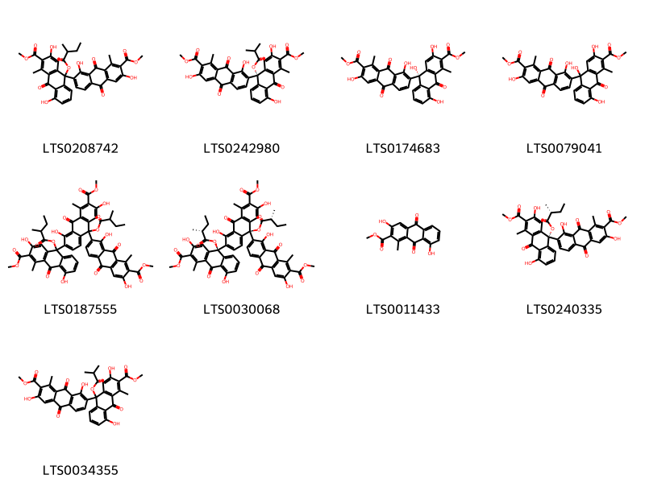{ width=100% }
    <figcaption>Hình ảnh cấu trúc hóa học của 9 hoạt chất thuộc nhóm Anthracenes gồm ['scutianthraquinone a (LTS0208742)', "3',7-dimethyl (9'r)-1,2',5',6-tetrahydroxy-4',8-dimethyl-9'-[(2-methylpropanoyl)oxy]-9,10,10'-trioxo-[2,9'-bianthracene]-3',7-dicarboxylate (LTS0242980)", "3',7-dimethyl (9'r)-1,2',5',6,9'-pentahydroxy-4',8-dimethyl-9,10,10'-trioxo-[2,9'-bianthracene]-3',7-dicarboxylate (LTS0174683)", 'scutianthraquinone c (LTS0079041)', "3',7-dimethyl 6'-[2,5-dihydroxy-3-(methoxycarbonyl)-4-methyl-9-[(2-methylbutanoyl)oxy]-10-oxoanthracen-9-yl]-1,2',5',6-tetrahydroxy-4',8-dimethyl-9'-[(2-methylbutanoyl)oxy]-9,10,10'-trioxo-[2,9'-bianthracene]-3',7-dicarboxylate (LTS0187555)", "3',7-dimethyl (9'r)-6'-[(9r)-2,5-dihydroxy-3-(methoxycarbonyl)-4-methyl-9-{[(2r)-2-methylbutanoyl]oxy}-10-oxoanthracen-9-yl]-1,2',5',6-tetrahydroxy-4',8-dimethyl-9'-{[(2r)-2-methylbutanoyl]oxy}-9,10,10'-trioxo-[2,9'-bianthracene]-3',7-dicarboxylate (LTS0030068)", 'methyl 3,8-dihydroxy-1-methyl-9,10-dioxoanthracene-2-carboxylate (LTS0011433)', "3',7-dimethyl (9's)-1,2',5',6-tetrahydroxy-4',8-dimethyl-9'-{[(2r)-2-methylbutanoyl]oxy}-9,10,10'-trioxo-[2,9'-bianthracene]-3',7-dicarboxylate (LTS0240335)", 'scutianthraquinone b (LTS0034355)'].</figcaption>
</figure>
#### Nhóm Perylenequinones
<figure markdown="span">
    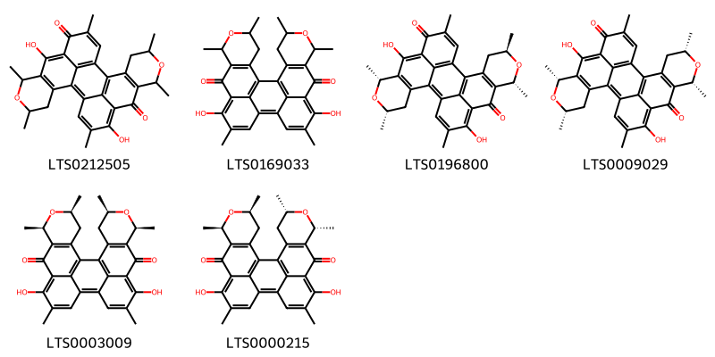{ width=100% }
    <figcaption>Hình ảnh cấu trúc hóa học của 6 hoạt chất thuộc nhóm Perylenequinones gồm ['11,22-dihydroxy-5,7,12,18,20,25-hexamethyl-6,19-dioxaheptacyclo[13.11.1.1²,¹⁰.0³,⁸.0¹⁶,²¹.0²³,²⁷.0¹⁴,²⁸]octacosa-1(27),2(28),3(8),10,12,14,16(21),22,25-nonaene-9,24-dione (LTS0212505)', '11,18-dihydroxy-5,7,12,17,22,24-hexamethyl-6,23-dioxaheptacyclo[13.11.1.1²,¹⁰.0³,⁸.0¹⁹,²⁷.0²¹,²⁶.0¹⁴,²⁸]octacosa-1(27),2(28),3(8),10,12,14,16,18,21(26)-nonaene-9,20-dione (LTS0169033)', '(5r,7r,18s,20r)-11,22-dihydroxy-5,7,12,18,20,25-hexamethyl-6,19-dioxaheptacyclo[13.11.1.1²,¹⁰.0³,⁸.0¹⁶,²¹.0²³,²⁷.0¹⁴,²⁸]octacosa-1(27),2(28),3(8),10,12,14,16(21),22,25-nonaene-9,24-dione (LTS0196800)', '(5s,7r,18s,20r)-11,22-dihydroxy-5,7,12,18,20,25-hexamethyl-6,19-dioxaheptacyclo[13.11.1.1²,¹⁰.0³,⁸.0¹⁶,²¹.0²³,²⁷.0¹⁴,²⁸]octacosa-1(27),2(28),3(8),10,12,14,16(21),22,25-nonaene-9,24-dione (LTS0009029)', '(5r,7s,22r,24s)-11,18-dihydroxy-5,7,12,17,22,24-hexamethyl-6,23-dioxaheptacyclo[13.11.1.1²,¹⁰.0³,⁸.0¹⁹,²⁷.0²¹,²⁶.0¹⁴,²⁸]octacosa-1(27),2(28),3(8),10,12,14,16,18,21(26)-nonaene-9,20-dione (LTS0003009)', '(5s,7r,22r,24s)-11,18-dihydroxy-5,7,12,17,22,24-hexamethyl-6,23-dioxaheptacyclo[13.11.1.1²,¹⁰.0³,⁸.0¹⁹,²⁷.0²¹,²⁶.0¹⁴,²⁸]octacosa-1(27),2(28),3(8),10,12,14,16,18,21(26)-nonaene-9,20-dione (LTS0000215)'].</figcaption>
</figure>

---

### Dược dân tộc học

Danh sách các quốc gia có sử dụng *Scutia myrtina* trong điều trị các bệnh. 

| Country   | Disease    | Bệnh                                                                                                                                                                                                |
|:----------|:-----------|:----------------------------------------------------------------------------------------------------------------------------------------------------------------------------------------------------|
| Elsewhere | Astringent | MYMEMORY WARNING: YOU USED ALL AVAILABLE FREE TRANSLATIONS FOR TODAY. NEXT AVAILABLE IN  14 HOURS 23 MINUTES 30 SECONDS VISIT HTTPS://MYMEMORY.TRANSLATED.NET/DOC/USAGELIMITS.PHP TO TRANSLATE MORE |

---

# Chi Ziziphus

??? note "Danh sách các dược liệu thuộc chi"
    
	 - *Ziziphus abyssinica*
	 - *Ziziphus ina-christi*
	 - *Ziziphus jujuba*
	 - *Ziziphus mauritiana*
	 - *Ziziphus mexicana*
	 - *Ziziphus mistol*
	 - *Ziziphus nummularia*
	 - *Ziziphus oenoplia*
	 - *Ziziphus sativa*
	 - *Ziziphus sonorensis*
	 - *Ziziphus vulgaris*

---
## Ziziphus abyssinica
### Thông tin về thực vật

!!! info "Phân loại thực vật của *Ziziphus abyssinica* từ GIBF:"
    - **Kingdom:** Plantae
    - **Phylum:** Tracheophyta
    - **Order:** Rosales
    - **Family:** Rhamnaceae
    - **Genus:** Ziziphus
    - **Species:** *Ziziphus abyssinica*

 

| Label (VI)   | Label (EN)   | Scientific Name     | Descriptions (VI)   | Descriptions (EN)   | Also Known As (VI)   | Also Known As (EN)   |
|:-------------|:-------------|:--------------------|:--------------------|:--------------------|:---------------------|:---------------------|
| N/A          | N/A          | Ziziphus abyssinica | loài thực vật       | species of plant    | ['']                 | ['']                 |

#### Phân bố trên thế giới

**Từ CSDL GIBF** Malawi, Somalia, Ghana, Central African Republic, Burkina Faso, Cameroon, Kenya, Niger, Togo, Sao Tome and Principe, Nigeria, Uganda, Ethiopia, Angola, Benin, Gambia, Botswana, Mozambique, Tanzania, United Republic of, Congo, Democratic Republic of the, Zimbabwe, Chad, Zambia, Mali

#### Phân bố tại Việt Nam

**Từ CSDL GIBF**: Không có ghi nhận ở Việt Nam

---
### Thành phần hóa học
        
- Theo cơ sở dữ liệu lotus: Từ loài *Ziziphus abyssinica* đã phân lập và xác định được Chưa có hoạt chất nào được phân lập. hoạt chất thuộc về các nhóm Không có hoạt chất nào được phân lập. 

Không có hình ảnh nào được tạo ra

---

### Dược dân tộc học

Danh sách các quốc gia có sử dụng *Ziziphus abyssinica* trong điều trị các bệnh. 

| Country   | Disease       | Bệnh                                                                                                                                                                                                |
|:----------|:--------------|:----------------------------------------------------------------------------------------------------------------------------------------------------------------------------------------------------|
| Africa    | Abortifacient | MYMEMORY WARNING: YOU USED ALL AVAILABLE FREE TRANSLATIONS FOR TODAY. NEXT AVAILABLE IN  14 HOURS 23 MINUTES 00 SECONDS VISIT HTTPS://MYMEMORY.TRANSLATED.NET/DOC/USAGELIMITS.PHP TO TRANSLATE MORE |
| Nyasaland | Intoxicant    | MYMEMORY WARNING: YOU USED ALL AVAILABLE FREE TRANSLATIONS FOR TODAY. NEXT AVAILABLE IN  14 HOURS 22 MINUTES 57 SECONDS VISIT HTTPS://MYMEMORY.TRANSLATED.NET/DOC/USAGELIMITS.PHP TO TRANSLATE MORE |

---

---
## Ziziphus inachristi
### Thông tin về thực vật

!!! info "Phân loại thực vật của *N/A* từ GIBF:"
    - **Kingdom:** Plantae
    - **Phylum:** Tracheophyta
    - **Order:** Rosales
    - **Family:** Rhamnaceae
    - **Genus:** Ziziphus
    - **Species:** *N/A*

 

| Label (VI)   | Label (EN)   | Scientific Name     | Descriptions (VI)   | Descriptions (EN)   | Also Known As (VI)   | Also Known As (EN)   |
|:-------------|:-------------|:--------------------|:--------------------|:--------------------|:---------------------|:---------------------|
| N/A          | N/A          | Ziziphus abyssinica | loài thực vật       | species of plant    | ['']                 | ['']                 |

#### Phân bố trên thế giới

**Từ CSDL GIBF** Namibia, Spain, French Guiana, Senegal, United Arab Emirates, Australia, Indonesia, Sri Lanka, Maldives, Puerto Rico, India, Nigeria, Antigua and Barbuda, Yemen, Ethiopia, Benin, Gambia, Chinese Taipei, Saint Martin (French part), South Africa, Botswana, Morocco, United States of America, Algeria, Israel, Chad, Cabo Verde

#### Phân bố tại Việt Nam

**Từ CSDL GIBF**: Không có ghi nhận ở Việt Nam

---
### Thành phần hóa học
        
- Theo cơ sở dữ liệu lotus: Từ loài *N/A* đã phân lập và xác định được Chưa có hoạt chất nào được phân lập. hoạt chất thuộc về các nhóm Không có hoạt chất nào được phân lập. 

Không có hình ảnh nào được tạo ra

---

### Dược dân tộc học

Danh sách các quốc gia có sử dụng *N/A* trong điều trị các bệnh. 

| Country   | Disease                                                                   | Bệnh                                                                                                                                                                                                |
|:----------|:--------------------------------------------------------------------------|:----------------------------------------------------------------------------------------------------------------------------------------------------------------------------------------------------|
| Iraq      | Astringent, Stomachic, Laxative, Tonic, Demulcent, Emollient, Refrigerant | MYMEMORY WARNING: YOU USED ALL AVAILABLE FREE TRANSLATIONS FOR TODAY. NEXT AVAILABLE IN  14 HOURS 22 MINUTES 33 SECONDS VISIT HTTPS://MYMEMORY.TRANSLATED.NET/DOC/USAGELIMITS.PHP TO TRANSLATE MORE |

---

---
## Ziziphus jujuba
### Thông tin về thực vật

!!! info "Phân loại thực vật của *Ziziphus jujuba* từ GIBF:"
    - **Kingdom:** Plantae
    - **Phylum:** Tracheophyta
    - **Order:** Rosales
    - **Family:** Rhamnaceae
    - **Genus:** Ziziphus
    - **Species:** *Ziziphus jujuba*

 

| Label (VI)   | Label (EN)   | Scientific Name   | Descriptions (VI)   | Descriptions (EN)   | Also Known As (VI)   | Also Known As (EN)                                                                |
|:-------------|:-------------|:------------------|:--------------------|:--------------------|:---------------------|:----------------------------------------------------------------------------------|
| N/A          | N/A          | Ziziphus jujuba   | loài thực vật       | species of plant    | ['']                 | ['jujube', 'Chinese jujube', 'Ziziphus jujube', 'common jujuba', 'Chinese dates'] |

#### Phân bố trên thế giới

**Từ CSDL GIBF** Viet Nam, Georgia, Thailand, Spain, Australia, Korea, Republic of, Uzbekistan, Kuwait, India, Iraq, Türkiye, Slovenia, Japan, Mexico, China, Chinese Taipei, Morocco, France, Romania, Macao, Russian Federation, United States of America, Italy, Algeria, Greece, Croatia, Tajikistan

#### Phân bố tại Việt Nam

**Từ CSDL GIBF**: Bình Thuận

---
### Thành phần hóa học
        
- Theo cơ sở dữ liệu lotus: Từ loài *Ziziphus jujuba* đã phân lập và xác định được 167 hoạt chất thuộc về các nhóm Purine nucleotides, Organooxygen compounds, Aporphines, Flavonoids, Indoles and derivatives, Isoquinolines and derivatives, Pyrimidine nucleotides, Carboxylic acids and derivatives, Prenol lipids, Fatty Acyls, Pyrrolidines, Purine nucleosides, Isoflavonoids, Imidazopyrimidines, Steroids and steroid derivatives, Benzene and substituted derivatives. 

|    | chemicalTaxonomyClassyfireClass     |   smiles_count |
|---:|:------------------------------------|---------------:|
|  0 | Aporphines                          |              7 |
|  1 | Benzene and substituted derivatives |              2 |
|  2 | Carboxylic acids and derivatives    |             24 |
|  3 | Fatty Acyls                         |              3 |
|  4 | Flavonoids                          |             59 |
|  5 | Imidazopyrimidines                  |              1 |
|  6 | Indoles and derivatives             |              1 |
|  7 | Isoflavonoids                       |             10 |
|  8 | Isoquinolines and derivatives       |              3 |
|  9 | Organooxygen compounds              |              4 |
| 10 | Prenol lipids                       |             40 |
| 11 | Purine nucleosides                  |              1 |
| 12 | Purine nucleotides                  |              2 |
| 13 | Pyrimidine nucleotides              |              1 |
| 14 | Pyrrolidines                        |              1 |
| 15 | Steroids and steroid derivatives    |              5 |

#### Nhóm Aporphines
<figure markdown="span">
    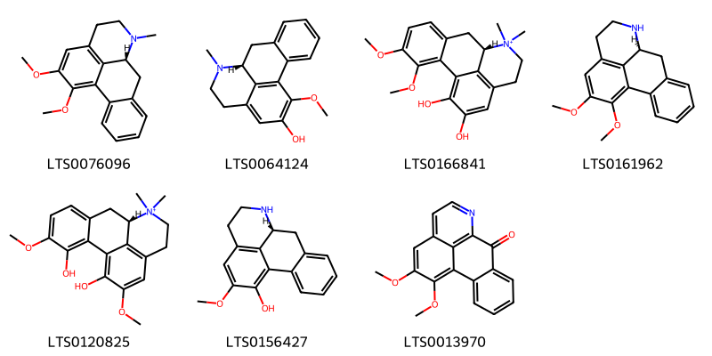{ width=100% }
    <figcaption>Hình ảnh cấu trúc hóa học của 7 hoạt chất thuộc nhóm Aporphines gồm ['nuciferine (LTS0076096)', '(9r)-16-methoxy-10-methyl-10-azatetracyclo[7.7.1.0²,⁷.0¹³,¹⁷]heptadeca-1(17),2,4,6,13,15-hexaen-15-ol (LTS0064124)', '(9s)-15,16-dihydroxy-3,4-dimethoxy-10,10-dimethyl-10-azatetracyclo[7.7.1.0²,⁷.0¹³,¹⁷]heptadeca-1(16),2,4,6,13(17),14-hexaen-10-ium (LTS0166841)', '(9s)-15,16-dimethoxy-10-azatetracyclo[7.7.1.0²,⁷.0¹³,¹⁷]heptadeca-1(16),2,4,6,13(17),14-hexaene (LTS0161962)', 'magnoflorine (LTS0120825)', '(-)-caaverine (LTS0156427)', 'lysicamine (LTS0013970)'].</figcaption>
</figure>
#### Nhóm Benzene and substituted derivatives
<figure markdown="span">
    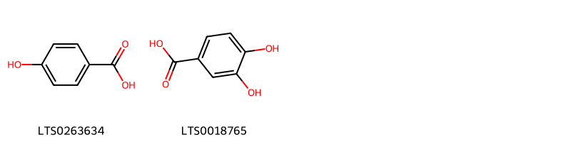{ width=100% }
    <figcaption>Hình ảnh cấu trúc hóa học của 2 hoạt chất thuộc nhóm Benzene and substituted derivatives gồm ['p-hydroxybenzoic acid (LTS0263634)', '3,4-dihydroxybenzoic acid (LTS0018765)'].</figcaption>
</figure>
#### Nhóm Carboxylic acids and derivatives
<figure markdown="span">
    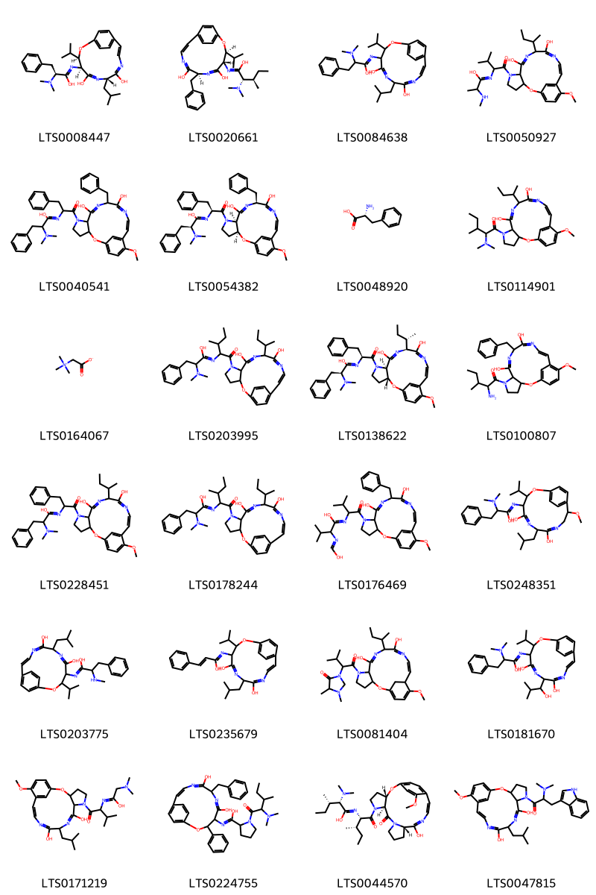{ width=100% }
    <figcaption>Hình ảnh cấu trúc hóa học của 24 hoạt chất thuộc nhóm Carboxylic acids and derivatives gồm ['(2s)-n-[(3r,4s,7s,10e)-5,8-dihydroxy-3-isopropyl-7-(2-methylpropyl)-2-oxa-6,9-diazabicyclo[10.2.2]hexadeca-1(14),5,8,10,12,15-hexaen-4-yl]-2-(dimethylamino)-3-phenylpropanimidic acid (LTS0008447)', '(2s,3r)-n-[(3s,4s,7s,10e)-7-benzyl-5,8-dihydroxy-3-isopropyl-2-oxa-6,9-diazabicyclo[10.2.2]hexadeca-1(14),5,8,10,12,15-hexaen-4-yl]-2-(dimethylamino)-3-methylpentanimidic acid (LTS0020661)', 'n-[(10z)-5,8-dihydroxy-3-isopropyl-7-(2-methylpropyl)-2-oxa-6,9-diazabicyclo[10.2.2]hexadeca-1(14),5,8,10,12,15-hexaen-4-yl]-2-(dimethylamino)-3-phenylpropanimidic acid (LTS0084638)', 'n-{1-[(13z)-8,11-dihydroxy-16-methoxy-10-(sec-butyl)-2-oxa-6,9,12-triazatricyclo[13.3.1.0³,⁷]nonadeca-1(18),8,11,13,15(19),16-hexaen-6-yl]-3-methyl-1-oxobutan-2-yl}-2-(methylamino)propanimidic acid (LTS0050927)', 'n-(1-{10-benzyl-8,11-dihydroxy-16-methoxy-2-oxa-6,9,12-triazatricyclo[13.3.1.0³,⁷]nonadeca-1(18),8,11,13,15(19),16-hexaen-6-yl}-1-oxo-3-phenylpropan-2-yl)-2-(dimethylamino)-3-phenylpropanimidic acid (LTS0040541)', '(2s)-n-[(2s)-1-[(3s,7r,10s,13z)-10-benzyl-8,11-dihydroxy-16-methoxy-2-oxa-6,9,12-triazatricyclo[13.3.1.0³,⁷]nonadeca-1(18),8,11,13,15(19),16-hexaen-6-yl]-1-oxo-3-phenylpropan-2-yl]-2-(dimethylamino)-3-phenylpropanimidic acid (LTS0054382)', 'd-phenylalanine (LTS0048920)', '1-[(13z)-8,11-dihydroxy-16-methoxy-10-(sec-butyl)-2-oxa-6,9,12-triazatricyclo[13.3.1.0³,⁷]nonadeca-1(18),8,11,13,15(19),16-hexaen-6-yl]-2-(dimethylamino)-3-methylpentan-1-one (LTS0114901)', 'bet (LTS0164067)', 'n-{1-[(13e)-8,11-dihydroxy-10-(sec-butyl)-2-oxa-6,9,12-triazatricyclo[13.2.2.0³,⁷]nonadeca-1(17),8,11,13,15,18-hexaen-6-yl]-3-methyl-1-oxopentan-2-yl}-2-(dimethylamino)-3-phenylpropanimidic acid (LTS0203995)', '(2s)-n-[(2s)-1-[(3r,7r,10s,13z)-10-[(2s)-butan-2-yl]-8,11-dihydroxy-16-methoxy-2-oxa-6,9,12-triazatricyclo[13.3.1.0³,⁷]nonadeca-1(18),8,11,13,15(19),16-hexaen-6-yl]-1-oxo-3-phenylpropan-2-yl]-2-(dimethylamino)-3-phenylpropanimidic acid (LTS0138622)', '2-amino-1-[(13e)-10-benzyl-8,11-dihydroxy-16-methoxy-2-oxa-6,9,12-triazatricyclo[13.3.1.0³,⁷]nonadeca-1(18),8,11,13,15(19),16-hexaen-6-yl]-3-methylpentan-1-one (LTS0100807)', 'n-{1-[8,11-dihydroxy-16-methoxy-10-(sec-butyl)-2-oxa-6,9,12-triazatricyclo[13.3.1.0³,⁷]nonadeca-1(18),8,11,13,15(19),16-hexaen-6-yl]-1-oxo-3-phenylpropan-2-yl}-2-(dimethylamino)-3-phenylpropanimidic acid (LTS0228451)', 'n-{1-[(13z)-8,11-dihydroxy-10-(sec-butyl)-2-oxa-6,9,12-triazatricyclo[13.2.2.0³,⁷]nonadeca-1(17),8,11,13,15,18-hexaen-6-yl]-3-methyl-1-oxopentan-2-yl}-2-(dimethylamino)-3-phenylpropanimidic acid (LTS0178244)', 'n-{1-[(13z)-10-benzyl-8,11-dihydroxy-16-methoxy-2-oxa-6,9,12-triazatricyclo[13.3.1.0³,⁷]nonadeca-1(18),8,11,13,15(19),16-hexaen-6-yl]-3-methyl-1-oxobutan-2-yl}-2-[(hydroxymethylidene)amino]-3-methylbutanimidic acid (LTS0176469)', 'n-[5,8-dihydroxy-3-isopropyl-11-methoxy-7-(2-methylpropyl)-2-oxa-6,9-diazabicyclo[10.2.2]hexadeca-1(14),5,8,12,15-pentaen-4-yl]-2-(dimethylamino)-3-phenylpropanimidic acid (LTS0248351)', 'n-[(10e)-5,8-dihydroxy-3-isopropyl-7-(2-methylpropyl)-2-oxa-6,9-diazabicyclo[10.2.2]hexadeca-1(14),5,8,10,12,15-hexaen-4-yl]-2-(methylamino)-3-phenylpropanimidic acid (LTS0203775)', '(2e)-n-[(10e)-5,8-dihydroxy-3-isopropyl-7-(2-methylpropyl)-2-oxa-6,9-diazabicyclo[10.2.2]hexadeca-1(14),5,8,10,12,15-hexaen-4-yl]-3-phenylprop-2-enimidic acid (LTS0235679)', '3-{1-[(13z)-8,11-dihydroxy-16-methoxy-10-(sec-butyl)-2-oxa-6,9,12-triazatricyclo[13.3.1.0³,⁷]nonadeca-1(18),8,11,13,16-pentaen-6-yl]-3-methyl-1-oxobutan-2-yl}-1,5-dimethylimidazolidin-4-one (LTS0081404)', 'n-[(10e)-5,8-dihydroxy-7-(1-hydroxy-2-methylpropyl)-3-isopropyl-2-oxa-6,9-diazabicyclo[10.2.2]hexadeca-1(14),5,8,10,12,15-hexaen-4-yl]-2-(dimethylamino)-3-phenylpropanimidic acid (LTS0181670)', 'n-{1-[(13z)-8,11-dihydroxy-16-methoxy-10-(2-methylpropyl)-2-oxa-6,9,12-triazatricyclo[13.3.1.0³,⁷]nonadeca-1(18),8,11,13,15(19),16-hexaen-6-yl]-3-methyl-1-oxobutan-2-yl}-2-(dimethylamino)ethanimidic acid (LTS0171219)', 'n-[(10z)-7-benzyl-5,8-dihydroxy-3-phenyl-2-oxa-6,9-diazabicyclo[10.2.2]hexadeca-1(14),5,8,10,12,15-hexaen-4-yl]-1-[2-(dimethylamino)-3-methylpentanoyl]pyrrolidine-2-carboximidic acid (LTS0224755)', '(2s,3s)-2-(dimethylamino)-n-[(2s,3s)-1-[(3s,7s,13s,16z)-14-hydroxy-22-methoxy-8-oxo-2-oxa-6,9,15-triazatetracyclo[16.2.2.0³,⁷.0⁹,¹³]docosa-1(20),14,16,18,21-pentaen-6-yl]-3-methyl-1-oxopentan-2-yl]-3-methylpentanimidic acid (LTS0044570)', '1-[(13e)-8,11-dihydroxy-16-methoxy-10-(2-methylpropyl)-2-oxa-6,9,12-triazatricyclo[13.3.1.0³,⁷]nonadeca-1(18),8,11,13,15(19),16-hexaen-6-yl]-2-(dimethylamino)-3-(1h-indol-3-yl)propan-1-one (LTS0047815)'].</figcaption>
</figure>
#### Nhóm Fatty Acyls
<figure markdown="span">
    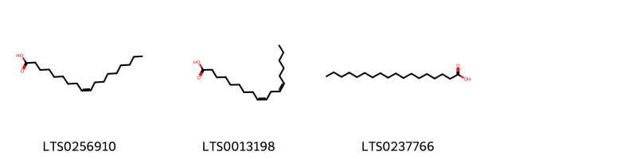{ width=100% }
    <figcaption>Hình ảnh cấu trúc hóa học của 3 hoạt chất thuộc nhóm Fatty Acyls gồm ['oleic acid (LTS0256910)', 'linoleic (LTS0013198)', 'stearic acid (LTS0237766)'].</figcaption>
</figure>
#### Nhóm Flavonoids
<figure markdown="span">
    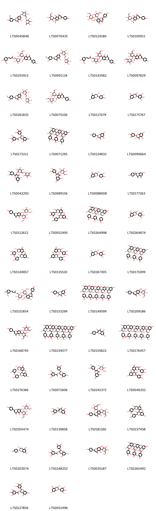{ width=100% }
    <figcaption>Hình ảnh cấu trúc hóa học của 59 hoạt chất thuộc nhóm Flavonoids gồm ['clematin (LTS0045848)', '5-hydroxy-2-(4-hydroxyphenyl)-7-methoxy-6-[3,4,5-trihydroxy-6-(hydroxymethyl)oxan-2-yl]chromen-4-one (LTS0070435)', '8-[(2s,3r,4s,5s,6r)-4,5-dihydroxy-6-(hydroxymethyl)-3-{[(2s,3r,4s,5s,6r)-3,4,5-trihydroxy-6-(hydroxymethyl)oxan-2-yl]oxy}oxan-2-yl]-5-hydroxy-2-(4-hydroxyphenyl)-7-methoxychromen-4-one (LTS0124180)', '5-hydroxy-2-(4-hydroxyphenyl)-7-methoxy-6-[(2s,3r,4r,5s,6r)-3,4,5-trihydroxy-6-(hydroxymethyl)oxan-2-yl]chromen-4-one (LTS0100911)', '[(2r,3s,4s,5r,6s)-6-{[(2s,3r,4s,5s,6r)-4,5-dihydroxy-2-[5-hydroxy-2-(4-hydroxyphenyl)-7-methoxy-4-oxochromen-6-yl]-6-(hydroxymethyl)oxan-3-yl]oxy}-3,4,5-trihydroxyoxan-2-yl]methyl (2e)-3-(4-hydroxy-3-methoxyphenyl)prop-2-enoate (LTS0255913)', '(2s)-5-hydroxy-2-(3-hydroxy-4-methoxyphenyl)-7-{[(2s,3r,4s,5s,6r)-3,4,5-trihydroxy-6-({[(2r,3r,4s,5r,6s)-3,4,5-trihydroxy-6-methyloxan-2-yl]oxy}methyl)oxan-2-yl]oxy}-2,3-dihydro-1-benzopyran-4-one (LTS0091118)', '[6-({4,5-dihydroxy-2-[5-hydroxy-2-(4-hydroxyphenyl)-7-methoxy-4-oxochromen-6-yl]-6-(hydroxymethyl)oxan-3-yl}oxy)-3,4,5-trihydroxyoxan-2-yl]methyl 3-(4-hydroxy-3-methoxyphenyl)prop-2-enoate (LTS0143582)', 'spinosin (LTS0097829)', 'hesperidin (LTS0261835)', 'spinosin (LTS0075106)', '(+)-catechol (LTS0117079)', 'epigallocatechin (LTS0175767)', '(-)-epigallocatechin gallate (LTS0173211)', '4-[2-(3,4-dihydroxyphenyl)-3,5,7-trihydroxy-3,4-dihydro-2h-1-benzopyran-8-yl]-8-[3,5,7-trihydroxy-2-(4-hydroxyphenyl)-3,4-dihydro-2h-1-benzopyran-4-yl]-2-(3,4,5-trihydroxyphenyl)-3,4-dihydro-2h-1-benzopyran-3,5,7-triol (LTS0071295)', '(+)-dihydrokaempferol (LTS0134832)', '(+)-taxifolin (LTS0090664)', 'rutin (LTS0042292)', 'hyperoside (LTS0089156)', 'α catechin (LTS0088008)', '2-hydroxynaringenin (LTS0177263)', '6-[(2s,3r,4s,5s,6s)-4,5-dihydroxy-6-(hydroxymethyl)-3-{[(2s,3s,4s,5s,6s)-3,4,5-trihydroxy-6-(hydroxymethyl)oxan-2-yl]oxy}oxan-2-yl]-5,7-dihydroxy-2-(4-hydroxyphenyl)chromen-4-one (LTS0112612)', '2-(4-hydroxyphenyl)-4-[3,5,7-trihydroxy-2-(3,4,5-trihydroxyphenyl)-3,4-dihydro-2h-1-benzopyran-8-yl]-3,4-dihydro-2h-1-benzopyran-3,5,7-triol (LTS0052495)', '(2r,3r,4s)-4-[(2r,3s)-2-(3,4-dihydroxyphenyl)-3,5,7-trihydroxy-3,4-dihydro-2h-1-benzopyran-8-yl]-8-[(2r,3r,4r)-3,5,7-trihydroxy-2-(4-hydroxyphenyl)-3,4-dihydro-2h-1-benzopyran-4-yl]-2-(3,4,5-trihydroxyphenyl)-3,4-dihydro-2h-1-benzopyran-3,5,7-triol (LTS0264998)', '(-)-gallocatechin (LTS0264874)', '(2r,3r,4r)-2-(4-hydroxyphenyl)-4-[(2r,3r)-3,5,7-trihydroxy-2-(3,4,5-trihydroxyphenyl)-3,4-dihydro-2h-1-benzopyran-8-yl]-3,4-dihydro-2h-1-benzopyran-3,5,7-triol (LTS0140857)', '(2r,3r,4r)-2-(3,4-dihydroxyphenyl)-4-[(2r,3r)-2-(3,4-dihydroxyphenyl)-3,5,7-trihydroxy-3,4-dihydro-2h-1-benzopyran-8-yl]-3,4-dihydro-2h-1-benzopyran-3,5,7-triol (LTS0135510)', 'gallocatechol (LTS0267305)', '(2r,3r,4s)-2-(3,4-dihydroxyphenyl)-4-[(2r,3s)-2-(3,4-dihydroxyphenyl)-3,5,7-trihydroxy-3,4-dihydro-2h-1-benzopyran-8-yl]-8-[(2r,3r,4r)-3,5,7-trihydroxy-2-(4-hydroxyphenyl)-3,4-dihydro-2h-1-benzopyran-4-yl]-3,4-dihydro-2h-1-benzopyran-3,5,7-triol (LTS0171099)', '[(2r,3s,4s,5r,6s)-6-{[(2s,3r,4s,5s,6s)-4,5-dihydroxy-2-[5-hydroxy-2-(4-hydroxyphenyl)-7-methoxy-4-oxochromen-8-yl]-6-(hydroxymethyl)oxan-3-yl]oxy}-3,4,5-trihydroxyoxan-2-yl]methyl (2e)-3-(4-hydroxy-3-methoxyphenyl)prop-2-enoate (LTS0151854)', 'aromadendrin (LTS0153299)', '(2r,3r,4r)-4-[(2r,3r,4r)-4-[(2r,3r,4s)-4-[(2r,3s)-2-(3,4-dihydroxyphenyl)-3,5,7-trihydroxy-3,4-dihydro-2h-1-benzopyran-8-yl]-3,5,7-trihydroxy-2-(3,4,5-trihydroxyphenyl)-3,4-dihydro-2h-1-benzopyran-8-yl]-3,5,7-trihydroxy-2-(3,4,5-trihydroxyphenyl)-3,4-dihydro-2h-1-benzopyran-8-yl]-8-[(2r,3r,4r)-3,5,7-trihydroxy-2-(4-hydroxyphenyl)-3,4-dihydro-2h-1-benzopyran-4-yl]-2-(3,4,5-trihydroxyphenyl)-3,4-dihydro-2h-1-benzopyran-3,5,7-triol (LTS0149599)', 'isovitexin (LTS0209186)', '6-[4,5-dihydroxy-6-(hydroxymethyl)-3-{[3,4,5-trihydroxy-6-(hydroxymethyl)oxan-2-yl]oxy}oxan-2-yl]-5,7-dihydroxy-2-(4-hydroxyphenyl)chromen-4-one (LTS0168745)', '4-[2-(3,4-dihydroxyphenyl)-4-{4-[2-(3,4-dihydroxyphenyl)-3,5,7-trihydroxy-3,4-dihydro-2h-1-benzopyran-8-yl]-3,5,7-trihydroxy-2-(3,4,5-trihydroxyphenyl)-3,4-dihydro-2h-1-benzopyran-8-yl}-3,5,7-trihydroxy-3,4-dihydro-2h-1-benzopyran-8-yl]-8-[3,5,7-trihydroxy-2-(4-hydroxyphenyl)-3,4-dihydro-2h-1-benzopyran-4-yl]-2-(3,4,5-trihydroxyphenyl)-3,4-dihydro-2h-1-benzopyran-3,5,7-triol (LTS0234577)', 'kaempherol (LTS0155822)', '(2r,3r,4r)-4-[(2r,3s,4s)-2-(3,4-dihydroxyphenyl)-4-[(2r,3r,4s)-4-[(2r,3s)-2-(3,4-dihydroxyphenyl)-3,5,7-trihydroxy-3,4-dihydro-2h-1-benzopyran-8-yl]-3,5,7-trihydroxy-2-(3,4,5-trihydroxyphenyl)-3,4-dihydro-2h-1-benzopyran-8-yl]-3,5,7-trihydroxy-3,4-dihydro-2h-1-benzopyran-8-yl]-8-[(2r,3r,4r)-3,5,7-trihydroxy-2-(4-hydroxyphenyl)-3,4-dihydro-2h-1-benzopyran-4-yl]-2-(3,4,5-trihydroxyphenyl)-3,4-dihydro-2h-1-benzopyran-3,5,7-triol (LTS0176457)', '(2r,3r,4r)-4-[(2r,3r)-2-(3,4-dihydroxyphenyl)-3,5,7-trihydroxy-3,4-dihydro-2h-1-benzopyran-8-yl]-2-(4-hydroxyphenyl)-3,4-dihydro-2h-1-benzopyran-3,5,7-triol (LTS0276366)', 'epicatechin gallate (LTS0071606)', '2-(3,4-dihydroxyphenyl)-5,7-dihydroxy-3-{[(2s,3r,4r,5r,6s)-3,4,5-trihydroxy-6-(hydroxymethyl)oxan-2-yl]oxy}chromen-4-one (LTS0241372)', '2-(3,4-dihydroxyphenyl)-4-[2-(3,4-dihydroxyphenyl)-3,5,7-trihydroxy-3,4-dihydro-2h-1-benzopyran-8-yl]-3,4-dihydro-2h-1-benzopyran-3,5,7-triol (LTS0040252)', "isovitexin 2''-o-β-d-glucoside (LTS0205474)", 'myricetin (LTS0139858)', 'vicenin 2 (LTS0181160)', '4-[2-(3,4-dihydroxyphenyl)-3,5,7-trihydroxy-3,4-dihydro-2h-1-benzopyran-8-yl]-2-(4-hydroxyphenyl)-3,4-dihydro-2h-1-benzopyran-3,5,7-triol (LTS0237458)', 'epiafzelechin (LTS0203074)', '2-(3,4-dihydroxyphenyl)-5,7-dihydroxy-3,4-dihydro-2h-1-benzopyran-3-yl 3,4,5-trihydroxybenzoate (LTS0248252)', 'isovitexin (LTS0035187)', '2-(3,4-dihydroxyphenyl)-4-[2-(3,4-dihydroxyphenyl)-3,5,7-trihydroxy-3,4-dihydro-2h-1-benzopyran-8-yl]-8-[3,5,7-trihydroxy-2-(4-hydroxyphenyl)-3,4-dihydro-2h-1-benzopyran-4-yl]-3,4-dihydro-2h-1-benzopyran-3,5,7-triol (LTS0265492)', '5,7-dihydroxy-2-(3,4,5-trihydroxyphenyl)-3,4-dihydro-2h-1-benzopyran-3-yl 3,4,5-trihydroxybenzoate (LTS0127856)', 'epigallocatechin (LTS0052496)', 'quercetin (LTS0004651)', '3-rutinosyl quercetin (LTS0032845)', 'catechol (LTS0090912)', '(2r,3r,4r)-2-(3,4-dihydroxyphenyl)-4-[(2r,3r)-3,5,7-trihydroxy-2-(3,4,5-trihydroxyphenyl)-3,4-dihydro-2h-1-benzopyran-8-yl]-3,4-dihydro-2h-1-benzopyran-3,5,7-triol (LTS0101621)', '4-(4-{4-[2-(3,4-dihydroxyphenyl)-3,5,7-trihydroxy-3,4-dihydro-2h-1-benzopyran-8-yl]-3,5,7-trihydroxy-2-(3,4,5-trihydroxyphenyl)-3,4-dihydro-2h-1-benzopyran-8-yl}-3,5,7-trihydroxy-2-(3,4,5-trihydroxyphenyl)-3,4-dihydro-2h-1-benzopyran-8-yl)-8-[3,5,7-trihydroxy-2-(4-hydroxyphenyl)-3,4-dihydro-2h-1-benzopyran-4-yl]-2-(3,4,5-trihydroxyphenyl)-3,4-dihydro-2h-1-benzopyran-3,5,7-triol (LTS0228676)', 'catechin 3-o-gallate (LTS0019986)', '2-(3,4-dihydroxyphenyl)-4-[3,5,7-trihydroxy-2-(3,4,5-trihydroxyphenyl)-3,4-dihydro-2h-1-benzopyran-8-yl]-3,4-dihydro-2h-1-benzopyran-3,5,7-triol (LTS0039361)', "3,5,7,4'-tetrahydroxyflavan (LTS0039714)", 'ent-epicatechin (LTS0265245)'].</figcaption>
</figure>
#### Nhóm Imidazopyrimidines
<figure markdown="span">
    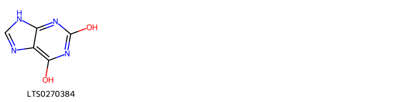{ width=100% }
    <figcaption>Hình ảnh cấu trúc hóa học của 1 hoạt chất thuộc nhóm Imidazopyrimidines gồm ['9h-purine-2,6-diol (LTS0270384)'].</figcaption>
</figure>
#### Nhóm Indoles and derivatives
<figure markdown="span">
    { width=100% }
    <figcaption>Hình ảnh cấu trúc hóa học của 1 hoạt chất thuộc nhóm Indoles and derivatives gồm ['n-[2-(5-methoxy-1h-indol-3-yl)ethyl]ethanimidic acid (LTS0219322)'].</figcaption>
</figure>
#### Nhóm Isoflavonoids
<figure markdown="span">
    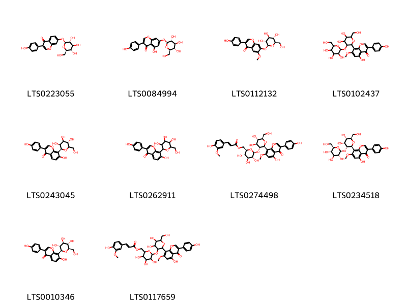{ width=100% }
    <figcaption>Hình ảnh cấu trúc hóa học của 10 hoạt chất thuộc nhóm Isoflavonoids gồm ['daidzin (LTS0223055)', 'genistin (LTS0084994)', 'glycitin (LTS0112132)', '8-[4,5-dihydroxy-6-(hydroxymethyl)-3-{[3,4,5-trihydroxy-6-(hydroxymethyl)oxan-2-yl]oxy}oxan-2-yl]-5-hydroxy-3-(4-hydroxyphenyl)-7-methoxychromen-4-one (LTS0102437)', '7-hydroxy-3-(4-hydroxyphenyl)-8-[(2s,3s,5s)-3,4,5-trihydroxy-6-(hydroxymethyl)oxan-2-yl]chromen-4-one (LTS0243045)', 'puerarin (LTS0262911)', '[(2r,3s,4s,5r,6s)-6-{[(2s,3r,4s,5s,6r)-4,5-dihydroxy-2-[5-hydroxy-3-(4-hydroxyphenyl)-7-methoxy-4-oxochromen-8-yl]-6-(hydroxymethyl)oxan-3-yl]oxy}-3,4,5-trihydroxyoxan-2-yl]methyl (2e)-3-(4-hydroxy-3-methoxyphenyl)prop-2-enoate (LTS0274498)', '8-[(2s,3r,4s,5s,6r)-4,5-dihydroxy-6-(hydroxymethyl)-3-{[(2s,3r,4s,5s,6r)-3,4,5-trihydroxy-6-(hydroxymethyl)oxan-2-yl]oxy}oxan-2-yl]-5-hydroxy-3-(4-hydroxyphenyl)-7-methoxychromen-4-one (LTS0234518)', 'puerarin (LTS0010346)', '[6-({4,5-dihydroxy-2-[5-hydroxy-3-(4-hydroxyphenyl)-7-methoxy-4-oxochromen-8-yl]-6-(hydroxymethyl)oxan-3-yl}oxy)-3,4,5-trihydroxyoxan-2-yl]methyl 3-(4-hydroxy-3-methoxyphenyl)prop-2-enoate (LTS0117659)'].</figcaption>
</figure>
#### Nhóm Isoquinolines and derivatives
<figure markdown="span">
    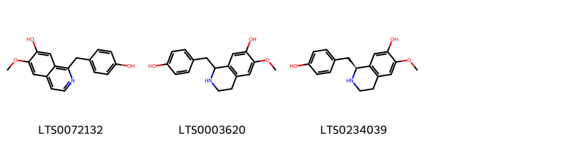{ width=100% }
    <figcaption>Hình ảnh cấu trúc hóa học của 3 hoạt chất thuộc nhóm Isoquinolines and derivatives gồm ['1-[(4-hydroxyphenyl)methyl]-6-methoxyisoquinolin-7-ol (LTS0072132)', '(rs)-coclaurine (LTS0003620)', '(+-)-coclaurine (LTS0234039)'].</figcaption>
</figure>
#### Nhóm Organooxygen compounds
<figure markdown="span">
    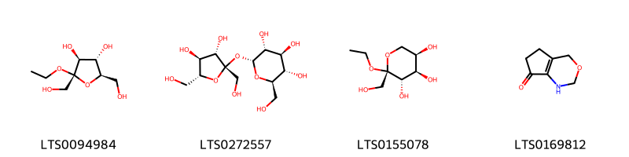{ width=100% }
    <figcaption>Hình ảnh cấu trúc hóa học của 4 hoạt chất thuộc nhóm Organooxygen compounds gồm ['(2s,3s,4s,5r)-2-ethoxy-2,5-bis(hydroxymethyl)oxolane-3,4-diol (LTS0094984)', 'sucrose (LTS0272557)', '(2r,3s,4r,5r)-2-ethoxy-2-(hydroxymethyl)oxane-3,4,5-triol (LTS0155078)', '1h,2h,4h,5h,6h-cyclopenta[d][1,3]oxazin-7-one (LTS0169812)'].</figcaption>
</figure>
#### Nhóm Prenol lipids
<figure markdown="span">
    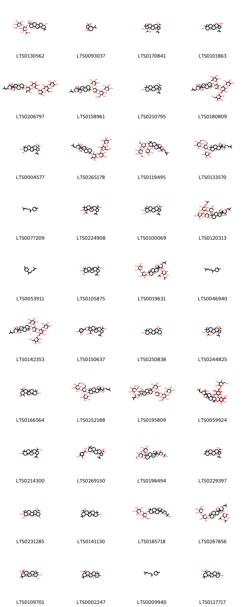{ width=100% }
    <figcaption>Hình ảnh cấu trúc hóa học của 40 hoạt chất thuộc nhóm Prenol lipids gồm ['(2s,3s,4s,5r,6r)-6-{[(3s,4s,4ar,6ar,6bs,8ar,9r,12as,14ar,14br)-9-hydroxy-4-(hydroxymethyl)-4,6a,6b,8a,11,11,14b-heptamethyl-1,2,3,4a,5,6,7,8,9,10,12,12a,14,14a-tetradecahydropicen-3-yl]oxy}-3,4-dihydroxy-5-{[(2s,3r,4s,5s,6r)-3,4,5-trihydroxy-6-(hydroxymethyl)oxan-2-yl]oxy}oxane-2-carboxylic acid (LTS0130562)', '(1s,3ar,4r,8as)-7-isopropyl-1,4-dimethyl-2,3,3a,5,6,8a-hexahydroazulene-1,4-diol (LTS0093037)', '(1r,2r,5s,8r,9r,10r,13r,14r,15s,16s,18r)-16-hydroxy-1,2,14,17,17-pentamethyl-8-(prop-1-en-2-yl)pentacyclo[11.7.0.0²,¹⁰.0⁵,⁹.0¹⁴,¹⁸]icosane-5,15-dicarboxylic acid (LTS0170841)', 'betulin (LTS0101863)', '2-[(4,5-dihydroxy-2-{[(1s,2r,7s,10r,11r,14r,15s,16s,20s)-16-hydroxy-2,6,6,10,16-pentamethyl-18-(2-methylprop-1-en-1-yl)-19,21-dioxahexacyclo[18.2.1.0¹,¹⁴.0²,¹¹.0⁵,¹⁰.0¹⁵,²⁰]tricosan-7-yl]oxy}-6-methyloxan-3-yl)oxy]-6-{[(3-{[3,5-dihydroxy-6-(hydroxymethyl)-4-[(3,4,5-trihydroxyoxan-2-yl)oxy]oxan-2-yl]oxy}-4,5-dihydroxyoxan-2-yl)oxy]methyl}oxane-3,4,5-triol (LTS0206797)', '(2s,3r,4r,5r,6s)-2-{[(2s,3r,4s,5s)-4-{[(2s,3r,4s,5s,6r)-4,5-dihydroxy-6-(hydroxymethyl)-3-{[(2s,3r,4s,5r)-3,4,5-trihydroxyoxan-2-yl]oxy}oxan-2-yl]oxy}-5-hydroxy-2-{[(1s,2r,5r,7s,10r,11r,14r,15s,16s,18r,20s)-16-hydroxy-2,6,6,10,16-pentamethyl-18-(2-methylprop-1-en-1-yl)-19,21-dioxahexacyclo[18.2.1.0¹,¹⁴.0²,¹¹.0⁵,¹⁰.0¹⁵,²⁰]tricosan-7-yl]oxy}oxan-3-yl]oxy}-6-methyloxane-3,4,5-triol (LTS0158961)', 'betulinic acid (LTS0210795)', '2-{[(6r)-3,4-dihydroxy-6-{[(2r)-5-hydroxy-2-{[(1s,2r,5r,10r,11r,14s,15r,16s,20s)-16-hydroxy-2,6,6,10,16-pentamethyl-18-(2-methylprop-1-en-1-yl)-19,21-dioxahexacyclo[18.2.1.0¹,¹⁴.0²,¹¹.0⁵,¹⁰.0¹⁵,²⁰]tricosan-7-yl]oxy}-3-{[(2r)-3,4,5-trihydroxy-6-methyloxan-2-yl]oxy}oxan-4-yl]oxy}-5-{[(2r)-3,4,5-trihydroxyoxan-2-yl]oxy}oxan-2-yl]methoxy}-6-(hydroxymethyl)oxane-3,4,5-triol (LTS0180809)', '(1r,3as,5as,5br,9r,10r,11ar)-9,10-dihydroxy-5a,5b,8,8,11a-pentamethyl-1-(prop-1-en-2-yl)-1h,2h,3h,4h,5h,6h,7h,7ah,9h,10h,11h,11bh,12h,13bh-cyclopenta[a]chrysene-3a-carboxylic acid (LTS0004577)', '2-{[2-({2-[(4,5-dihydroxy-2-{[(1s,2r,7s,10r,11r,14r,15s,16s,20s)-16-hydroxy-2,6,6,10,16-pentamethyl-18-(2-methylprop-1-en-1-yl)-19,21-dioxahexacyclo[18.2.1.0¹,¹⁴.0²,¹¹.0⁵,¹⁰.0¹⁵,²⁰]tricosan-7-yl]oxy}-6-methyloxan-3-yl)oxy]-4,5-dihydroxyoxan-3-yl}oxy)-3,5-dihydroxy-6-(hydroxymethyl)oxan-4-yl]oxy}oxane-3,4,5-triol (LTS0265178)', '(2s,3r,4s,5s,6r)-2-{[(2r,3r,4s,5r,6r)-3-hydroxy-6-{[16-hydroxy-2,6,6,10,16-pentamethyl-17-(3-methylbut-2-en-1-yl)-18,20-dioxahexacyclo[17.2.1.0¹,¹⁴.0²,¹¹.0⁵,¹⁰.0¹⁵,¹⁹]docosan-7-yl]oxy}-2-(hydroxymethyl)-5-{[(2s,3r,4r,5r,6s)-3,4,5-trihydroxy-6-methyloxan-2-yl]oxy}oxan-4-yl]oxy}-6-(hydroxymethyl)oxane-3,4,5-triol (LTS0119495)', '(2s,3r,4s,5s,6r)-2-{[(2r,3s,4s,5r,6r)-3-hydroxy-6-{[(1s,2r,5r,10r,11r,14r,15s,16r,17s,19s)-16-hydroxy-2,6,6,10,16-pentamethyl-17-(3-methylbut-2-en-1-yl)-18,20-dioxahexacyclo[17.2.1.0¹,¹⁴.0²,¹¹.0⁵,¹⁰.0¹⁵,¹⁹]docosan-7-yl]oxy}-2-(hydroxymethyl)-5-{[(2s,3r,4r,5r,6s)-3,4,5-trihydroxy-6-methyloxan-2-yl]oxy}oxan-4-yl]oxy}-6-(hydroxymethyl)oxane-3,4,5-triol (LTS0133570)', '(r)-β-bisabolene (LTS0077209)', '16-hydroxy-1,2,14,17,17-pentamethyl-8-(prop-1-en-2-yl)pentacyclo[11.7.0.0²,¹⁰.0⁵,⁹.0¹⁴,¹⁸]icosane-5,15-dicarboxylic acid (LTS0224908)', '(1r,3as,5ar,5br,7ar,9r,10r,11ar,11br,13ar,13br)-9,10-dihydroxy-5a,5b,8,8,11a-pentamethyl-1-(prop-1-en-2-yl)-hexadecahydrocyclopenta[a]chrysene-3a-carboxylic acid (LTS0100069)', '[(2r,3s,4s,5r,6s)-3,4-dihydroxy-6-{[(2s,3r,4s,5s)-5-hydroxy-2-{[(1s,2r,5r,7s,10r,11r,14r,15s,16s,18r,20s)-16-hydroxy-2,6,6,10,16-pentamethyl-18-(2-methylprop-1-en-1-yl)-19,21-dioxahexacyclo[18.2.1.0¹,¹⁴.0²,¹¹.0⁵,¹⁰.0¹⁵,²⁰]tricosan-7-yl]oxy}-3-{[(2s,3r,4r,5r,6s)-3,4,5-trihydroxy-6-methyloxan-2-yl]oxy}oxan-4-yl]oxy}-5-{[(2s,3r,4s,5r)-3,4,5-trihydroxyoxan-2-yl]oxy}oxan-2-yl]methyl acetate (LTS0120313)', '(z)-α-bisabolene (LTS0053911)', '9,10-dihydroxy-5a,5b,8,8,11a-pentamethyl-1-(prop-1-en-2-yl)-hexadecahydrocyclopenta[a]chrysene-3a-carboxylic acid (LTS0105875)', 'ziziphin (LTS0019631)', '(e)-α-bisabolene (LTS0046940)', '2-{[(6s)-3,4-dihydroxy-6-{[(2s)-5-hydroxy-2-{[(1s,2r,5r,10r,11r,14r,15s,16s,20s)-16-hydroxy-2,6,6,10,16-pentamethyl-18-(2-methylprop-1-en-1-yl)-19,21-dioxahexacyclo[18.2.1.0¹,¹⁴.0²,¹¹.0⁵,¹⁰.0¹⁵,²⁰]tricosan-7-yl]oxy}-3-{[(2r)-3,4,5-trihydroxy-6-methyloxan-2-yl]oxy}oxan-4-yl]oxy}-5-{[(2s)-3,4,5-trihydroxyoxan-2-yl]oxy}oxan-2-yl]methoxy}-6-(hydroxymethyl)oxane-3,4,5-triol (LTS0142353)', '16-(3,4-dihydroxybenzoyloxy)-1,2,14,17,17-pentamethyl-8-(prop-1-en-2-yl)pentacyclo[11.7.0.0²,¹⁰.0⁵,⁹.0¹⁴,¹⁸]icosane-5,15-dicarboxylic acid (LTS0150637)', 'ursolic acid (LTS0250838)', 'ceanothic acid (LTS0244825)', '10-hydroxy-1,2,6a,6b,9,9,12a-heptamethyl-2,3,4,5,6,7,8,8a,10,11,12,12b,13,14b-tetradecahydro-1h-picene-4a-carboxylic acid (LTS0166564)', '(2s,3r,4s,5s,6r)-2-{[(2r,3r,4s,5r,6r)-3-hydroxy-6-{[(1s,2r,5r,10r,11r,14r,15s,16r,17s,19s)-16-hydroxy-2,6,6,10,16-pentamethyl-17-(3-methylbut-2-en-1-yl)-18,20-dioxahexacyclo[17.2.1.0¹,¹⁴.0²,¹¹.0⁵,¹⁰.0¹⁵,¹⁹]docosan-7-yl]oxy}-2-(hydroxymethyl)-5-{[(2s,3r,4r,5r,6s)-3,4,5-trihydroxy-6-methyloxan-2-yl]oxy}oxan-4-yl]oxy}-6-(hydroxymethyl)oxane-3,4,5-triol (LTS0252188)', '(1s,3as,3br,5ar,7s,9ar,9br,11ar)-7-{[(2s,3r,4s,5s)-4-{[(2s,3r,4s,5s,6r)-4,5-dihydroxy-6-(hydroxymethyl)-3-{[(2s,3r,4s,5r)-3,4,5-trihydroxyoxan-2-yl]oxy}oxan-2-yl]oxy}-5-hydroxy-3-{[(2s,3r,4r,5r,6s)-3,4,5-trihydroxy-6-methyloxan-2-yl]oxy}oxan-2-yl]oxy}-1-[(2s,4r)-2-hydroxy-6-methyl-4-{[(2r,3r,4s,5s,6r)-3,4,5-trihydroxy-6-(hydroxymethyl)oxan-2-yl]oxy}hept-5-en-2-yl]-3a-(hydroxymethyl)-3b,6,6,9a-tetramethyl-dodecahydrocyclopenta[a]phenanthren-2-one (LTS0195809)', '2-({3,4-dihydroxy-6-[(5-hydroxy-2-{[16-hydroxy-2,6,6,10,16-pentamethyl-18-(2-methylprop-1-en-1-yl)-19,21-dioxahexacyclo[18.2.1.0¹,¹⁴.0²,¹¹.0⁵,¹⁰.0¹⁵,²⁰]tricosan-7-yl]oxy}-3-[(3,4,5-trihydroxy-6-methyloxan-2-yl)oxy]oxan-4-yl)oxy]-5-{[3,4,5-trihydroxy-6-(hydroxymethyl)oxan-2-yl]oxy}oxan-2-yl}methoxy)-6-(hydroxymethyl)oxane-3,4,5-triol (LTS0059924)', '9-hydroxy-5a,5b,8,8,11a-pentamethyl-1-(prop-1-en-2-yl)-hexadecahydrocyclopenta[a]chrysene-3a-carboxylic acid (LTS0214300)', '(1r,3as,5ar,5br,7ar,9r,10r,11ar,11br,13ar,13br)-10-(3,4-dihydroxybenzoyloxy)-9-hydroxy-5a,5b,8,8,11a-pentamethyl-1-(prop-1-en-2-yl)-hexadecahydrocyclopenta[a]chrysene-3a-carboxylic acid (LTS0269150)', '(2s,3r,4r,5r,6s)-2-{[(2r,3r,4s,5r,6r)-4,5-dihydroxy-6-(hydroxymethyl)-2-{[(1s,2r,5r,10r,11r,14r,15s,16r,18r,20r,22s)-18-(2-hydroxypropan-2-yl)-2,6,6,10,16-pentamethyl-17,21,23-trioxaheptacyclo[20.2.1.0¹,¹⁴.0²,¹¹.0⁵,¹⁰.0¹⁵,²².0¹⁶,²⁰]pentacosan-7-yl]oxy}oxan-3-yl]oxy}-6-methyloxane-3,4,5-triol (LTS0198494)', '(1r,3as,5ar,5br,7ar,11ar,11br,13ar,13br)-5a,5b,8,8,11a-pentamethyl-9-oxo-1-(prop-1-en-2-yl)-tetradecahydro-1h-cyclopenta[a]chrysene-3a-carboxylic acid (LTS0229397)', 'corosolic acid (LTS0231285)', 'oleanolic acid (LTS0141130)', '(2s,3r,4r,5r,6s)-2-{[(2r,3r,4s,5r,6r)-4,5-dihydroxy-6-(hydroxymethyl)-2-{[18-(2-hydroxypropan-2-yl)-2,6,6,10,16-pentamethyl-17,21,23-trioxaheptacyclo[20.2.1.0¹,¹⁴.0²,¹¹.0⁵,¹⁰.0¹⁵,²².0¹⁶,²⁰]pentacosan-7-yl]oxy}oxan-3-yl]oxy}-6-methyloxane-3,4,5-triol (LTS0185718)', '(2s,3r,4r,5s,6s)-3-(acetyloxy)-2-{[(1s,2r,5r,7s,10r,11r,15s,16s,18r,20s)-7-{[(2s,3r,4r,5s)-3,4-dihydroxy-5-{[(2s,3r,4r,5r,6s)-3,4,5-trihydroxy-6-methyloxan-2-yl]oxy}oxan-2-yl]oxy}-2,6,6,10,16-pentamethyl-18-(2-methylprop-1-en-1-yl)-19,21-dioxahexacyclo[18.2.1.0¹,¹⁴.0²,¹¹.0⁵,¹⁰.0¹⁵,²⁰]tricosan-16-yl]oxy}-5-hydroxy-6-methyloxan-4-yl acetate (LTS0267856)', 'maslinic acid (LTS0109701)', '(4as,6as,6br,8ar,12ar,12br,14bs)-2,2,6a,6b,9,9,12a-heptamethyl-10-oxo-3,4,5,6,7,8,8a,11,12,12b,13,14b-dodecahydro-1h-picene-4a-carboxylic acid (LTS0002247)', '(-)-β-bisabolene (LTS0009940)', 'oleanolic acid (LTS0117717)'].</figcaption>
</figure>
#### Nhóm Purine nucleosides
<figure markdown="span">
    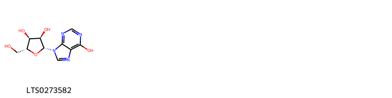{ width=100% }
    <figcaption>Hình ảnh cấu trúc hóa học của 1 hoạt chất thuộc nhóm Purine nucleosides gồm ['(-)-inosine (LTS0273582)'].</figcaption>
</figure>
#### Nhóm Purine nucleotides
<figure markdown="span">
    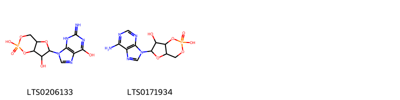{ width=100% }
    <figcaption>Hình ảnh cấu trúc hóa học của 2 hoạt chất thuộc nhóm Purine nucleotides gồm ['2,7-dihydroxy-6-(6-hydroxy-2-imino-3h-purin-9-yl)-tetrahydro-4h-2λ⁵-furo[3,2-d][1,3,2]dioxaphosphinin-2-one (LTS0206133)', 'cyclic amp (LTS0171934)'].</figcaption>
</figure>
#### Nhóm Pyrimidine nucleotides
<figure markdown="span">
    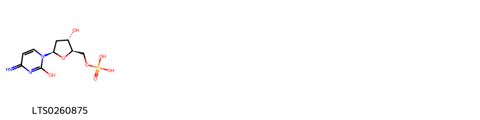{ width=100% }
    <figcaption>Hình ảnh cấu trúc hóa học của 1 hoạt chất thuộc nhóm Pyrimidine nucleotides gồm ['deoxycytidine monophosphate (LTS0260875)'].</figcaption>
</figure>
#### Nhóm Pyrrolidines
<figure markdown="span">
    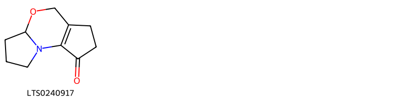{ width=100% }
    <figcaption>Hình ảnh cấu trúc hóa học của 1 hoạt chất thuộc nhóm Pyrrolidines gồm ['8-oxa-1-azatricyclo[7.3.0.0²,⁶]dodec-2(6)-en-3-one (LTS0240917)'].</figcaption>
</figure>
#### Nhóm Steroids and steroid derivatives
<figure markdown="span">
    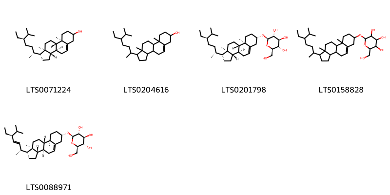{ width=100% }
    <figcaption>Hình ảnh cấu trúc hóa học của 5 hoạt chất thuộc nhóm Steroids and steroid derivatives gồm ['stigmast-5-en-3-ol (LTS0071224)', 'stigmast-5-en-3-ol, (3β)- (LTS0204616)', 'sitogluside (LTS0201798)', '2-{[1-(5-ethyl-6-methylheptan-2-yl)-9a,11a-dimethyl-1h,2h,3h,3ah,3bh,4h,6h,7h,8h,9h,9bh,10h,11h-cyclopenta[a]phenanthren-7-yl]oxy}-6-(hydroxymethyl)oxane-3,4,5-triol (LTS0158828)', '(2r,3r,4s,5s,6r)-2-{[(1r,3as,3bs,7s,9ar,9bs,11ar)-1-[(2r,3e,5s)-5-ethyl-6-methylhept-3-en-2-yl]-9a,11a-dimethyl-1h,2h,3h,3ah,3bh,4h,6h,7h,8h,9h,9bh,10h,11h-cyclopenta[a]phenanthren-7-yl]oxy}-6-(hydroxymethyl)oxane-3,4,5-triol (LTS0088971)'].</figcaption>
</figure>

---

### Dược dân tộc học

Danh sách các quốc gia có sử dụng *Ziziphus jujuba* trong điều trị các bệnh. 

| Country   | Disease                                                        | Bệnh                                                                                                                                                                                                |
|:----------|:---------------------------------------------------------------|:----------------------------------------------------------------------------------------------------------------------------------------------------------------------------------------------------|
| China     | Tonic, Expectorant, Sedative                                   | MYMEMORY WARNING: YOU USED ALL AVAILABLE FREE TRANSLATIONS FOR TODAY. NEXT AVAILABLE IN  14 HOURS 22 MINUTES 02 SECONDS VISIT HTTPS://MYMEMORY.TRANSLATED.NET/DOC/USAGELIMITS.PHP TO TRANSLATE MORE |
| Chinese   | Sedative, Tonic, Tonic, Sedative                               | MYMEMORY WARNING: YOU USED ALL AVAILABLE FREE TRANSLATIONS FOR TODAY. NEXT AVAILABLE IN  14 HOURS 21 MINUTES 58 SECONDS VISIT HTTPS://MYMEMORY.TRANSLATED.NET/DOC/USAGELIMITS.PHP TO TRANSLATE MORE |
| Elsewhere | Antidote, Emollient, Laxative, Refrigerant, Sedative, Tonic    | MYMEMORY WARNING: YOU USED ALL AVAILABLE FREE TRANSLATIONS FOR TODAY. NEXT AVAILABLE IN  14 HOURS 21 MINUTES 54 SECONDS VISIT HTTPS://MYMEMORY.TRANSLATED.NET/DOC/USAGELIMITS.PHP TO TRANSLATE MORE |
| Haiti     | Emollient                                                      | MYMEMORY WARNING: YOU USED ALL AVAILABLE FREE TRANSLATIONS FOR TODAY. NEXT AVAILABLE IN  14 HOURS 21 MINUTES 50 SECONDS VISIT HTTPS://MYMEMORY.TRANSLATED.NET/DOC/USAGELIMITS.PHP TO TRANSLATE MORE |
| Iraq      | Sialogogue, Demulcent                                          | MYMEMORY WARNING: YOU USED ALL AVAILABLE FREE TRANSLATIONS FOR TODAY. NEXT AVAILABLE IN  14 HOURS 21 MINUTES 47 SECONDS VISIT HTTPS://MYMEMORY.TRANSLATED.NET/DOC/USAGELIMITS.PHP TO TRANSLATE MORE |
| Turkey    | Emollient, Laxative, Refrigerant, Stomachic, Tonic, Astringent | MYMEMORY WARNING: YOU USED ALL AVAILABLE FREE TRANSLATIONS FOR TODAY. NEXT AVAILABLE IN  14 HOURS 21 MINUTES 44 SECONDS VISIT HTTPS://MYMEMORY.TRANSLATED.NET/DOC/USAGELIMITS.PHP TO TRANSLATE MORE |

---

---
## Ziziphus mauritiana
### Thông tin về thực vật

!!! info "Phân loại thực vật của *Ziziphus mauritiana* từ GIBF:"
    - **Kingdom:** Plantae
    - **Phylum:** Tracheophyta
    - **Order:** Rosales
    - **Family:** Rhamnaceae
    - **Genus:** Ziziphus
    - **Species:** *Ziziphus mauritiana*

 

| Label (VI)   | Label (EN)   | Scientific Name     | Descriptions (VI)   | Descriptions (EN)   | Also Known As (VI)                             | Also Known As (EN)                       |
|:-------------|:-------------|:--------------------|:--------------------|:--------------------|:-----------------------------------------------|:-----------------------------------------|
| N/A          | N/A          | Ziziphus mauritiana | loài thực vật       | species of plant    | ['Zizyphus mauritiana', 'Ziziphus mauritiana'] | ['Indian jujube', 'Zizyphus mauritiana'] |

#### Phân bố trên thế giới

**Từ CSDL GIBF** Thailand, El Salvador, Guadeloupe, Dominica, French Guiana, Trinidad and Tobago, Senegal, Burkina Faso, Australia, Jamaica, Indonesia, Sri Lanka, Maldives, Puerto Rico, Malaysia, India, Nigeria, Virgin Islands (U.S.), Antigua and Barbuda, Panama, Ethiopia, Nepal, Benin, Gambia, Chinese Taipei, Saint Martin (French part), Mozambique, Chad, Cabo Verde

#### Phân bố tại Việt Nam

**Từ CSDL GIBF**: Không có ghi nhận ở Việt Nam

---
### Thành phần hóa học
        
- Theo cơ sở dữ liệu lotus: Từ loài *Ziziphus mauritiana* đã phân lập và xác định được 29 hoạt chất thuộc về các nhóm Steroids and steroid derivatives, Prenol lipids, Flavonoids, Benzene and substituted derivatives. 

|    | chemicalTaxonomyClassyfireClass     |   smiles_count |
|---:|:------------------------------------|---------------:|
|  0 | Benzene and substituted derivatives |              2 |
|  1 | Flavonoids                          |             10 |
|  2 | Prenol lipids                       |             14 |
|  3 | Steroids and steroid derivatives    |              3 |

#### Nhóm Benzene and substituted derivatives
<figure markdown="span">
    { width=100% }
    <figcaption>Hình ảnh cấu trúc hóa học của 2 hoạt chất thuộc nhóm Benzene and substituted derivatives gồm ['p-hydroxybenzoic acid (LTS0263634)', '3,4-dihydroxybenzoic acid (LTS0018765)'].</figcaption>
</figure>
#### Nhóm Flavonoids
<figure markdown="span">
    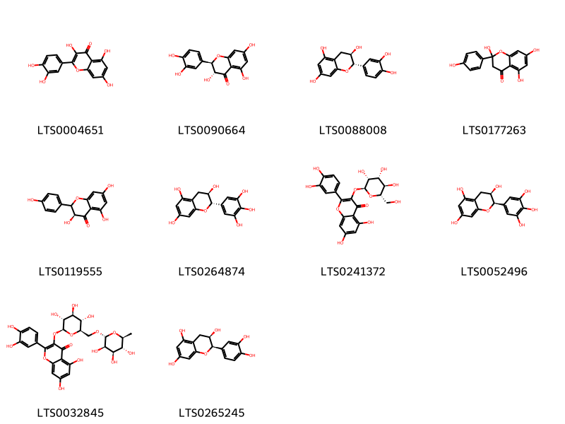{ width=100% }
    <figcaption>Hình ảnh cấu trúc hóa học của 10 hoạt chất thuộc nhóm Flavonoids gồm ['quercetin (LTS0004651)', '(+)-taxifolin (LTS0090664)', 'α catechin (LTS0088008)', '2-hydroxynaringenin (LTS0177263)', '(3s)-3,5,7-trihydroxy-2-(4-hydroxyphenyl)-2,3-dihydro-1-benzopyran-4-one (LTS0119555)', '(-)-gallocatechin (LTS0264874)', '2-(3,4-dihydroxyphenyl)-5,7-dihydroxy-3-{[(2s,3r,4r,5r,6s)-3,4,5-trihydroxy-6-(hydroxymethyl)oxan-2-yl]oxy}chromen-4-one (LTS0241372)', 'epigallocatechin (LTS0052496)', '3-rutinosyl quercetin (LTS0032845)', 'ent-epicatechin (LTS0265245)'].</figcaption>
</figure>
#### Nhóm Prenol lipids
<figure markdown="span">
    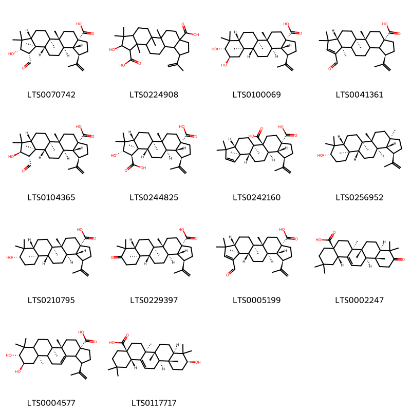{ width=100% }
    <figcaption>Hình ảnh cấu trúc hóa học của 14 hoạt chất thuộc nhóm Prenol lipids gồm ['(1r,2r,5s,8r,9r,10r,13r,14r,15s,16s,18r)-15-formyl-16-hydroxy-1,2,14,17,17-pentamethyl-8-(prop-1-en-2-yl)pentacyclo[11.7.0.0²,¹⁰.0⁵,⁹.0¹⁴,¹⁸]icosane-5-carboxylic acid (LTS0070742)', '16-hydroxy-1,2,14,17,17-pentamethyl-8-(prop-1-en-2-yl)pentacyclo[11.7.0.0²,¹⁰.0⁵,⁹.0¹⁴,¹⁸]icosane-5,15-dicarboxylic acid (LTS0224908)', '(1r,3as,5ar,5br,7ar,9r,10r,11ar,11br,13ar,13br)-9,10-dihydroxy-5a,5b,8,8,11a-pentamethyl-1-(prop-1-en-2-yl)-hexadecahydrocyclopenta[a]chrysene-3a-carboxylic acid (LTS0100069)', '(1r,2r,5s,8r,14s,18s)-15-formyl-1,2,14,17,17-pentamethyl-8-(prop-1-en-2-yl)pentacyclo[11.7.0.0²,¹⁰.0⁵,⁹.0¹⁴,¹⁸]icos-15-ene-5-carboxylic acid (LTS0041361)', 'zizyberanalic acid (LTS0104365)', 'ceanothic acid (LTS0244825)', '(1s,2r,5s,9s,10r,13r,14r,15r,18s)-2,6,6,9-tetramethyl-15-(prop-1-en-2-yl)pentacyclo[11.7.0.0²,¹⁰.0⁵,⁹.0¹⁴,¹⁸]icos-7-ene-1,18-dicarboxylic acid (LTS0242160)', 'lupeol (LTS0256952)', 'betulinic acid (LTS0210795)', '(1r,3as,5ar,5br,7ar,11ar,11br,13ar,13br)-5a,5b,8,8,11a-pentamethyl-9-oxo-1-(prop-1-en-2-yl)-tetradecahydro-1h-cyclopenta[a]chrysene-3a-carboxylic acid (LTS0229397)', '(1r,2r,5s,8r,9r,10r,13s,14s,18s)-15-formyl-1,2,14,17,17-pentamethyl-8-(prop-1-en-2-yl)pentacyclo[11.7.0.0²,¹⁰.0⁵,⁹.0¹⁴,¹⁸]icos-15-ene-5-carboxylic acid (LTS0005199)', '(4as,6as,6br,8ar,12ar,12br,14bs)-2,2,6a,6b,9,9,12a-heptamethyl-10-oxo-3,4,5,6,7,8,8a,11,12,12b,13,14b-dodecahydro-1h-picene-4a-carboxylic acid (LTS0002247)', '(1r,3as,5as,5br,9r,10r,11ar)-9,10-dihydroxy-5a,5b,8,8,11a-pentamethyl-1-(prop-1-en-2-yl)-1h,2h,3h,4h,5h,6h,7h,7ah,9h,10h,11h,11bh,12h,13bh-cyclopenta[a]chrysene-3a-carboxylic acid (LTS0004577)', 'oleanolic acid (LTS0117717)'].</figcaption>
</figure>
#### Nhóm Steroids and steroid derivatives
<figure markdown="span">
    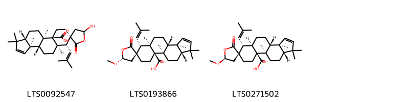{ width=100% }
    <figcaption>Hình ảnh cấu trúc hóa học của 3 hoạt chất thuộc nhóm Steroids and steroid derivatives gồm ["(3as,3br,5ar,6r,7r,9as,9br,11as)-5'-hydroxy-1,1,3a,9b-tetramethyl-6-(2-methylprop-1-en-1-yl)-2'-oxo-3b,4,5,5a,6,8,9,10,11,11a-decahydrospiro[cyclopenta[a]phenanthrene-7,3'-oxolane]-9a-carboxylic acid (LTS0092547)", "(3as,3br,5'r,5ar,6r,7r,9as,9br,11as)-5'-methoxy-1,1,3a,9b-tetramethyl-6-(2-methylprop-1-en-1-yl)-2'-oxo-3b,4,5,5a,6,8,9,10,11,11a-decahydrospiro[cyclopenta[a]phenanthrene-7,3'-oxolane]-9a-carboxylic acid (LTS0193866)", "(3as,3br,5's,5ar,6r,7r,9as,9br,11as)-5'-methoxy-1,1,3a,9b-tetramethyl-6-(2-methylprop-1-en-1-yl)-2'-oxo-3b,4,5,5a,6,8,9,10,11,11a-decahydrospiro[cyclopenta[a]phenanthrene-7,3'-oxolane]-9a-carboxylic acid (LTS0271502)"].</figcaption>
</figure>

---

### Dược dân tộc học

Danh sách các quốc gia có sử dụng *Ziziphus mauritiana* trong điều trị các bệnh. 

| Country   | Disease                                                        | Bệnh                                                                                                                                                                                                |
|:----------|:---------------------------------------------------------------|:----------------------------------------------------------------------------------------------------------------------------------------------------------------------------------------------------|
| Elsewhere | Antidote, Diaphoretic, Refrigerant, Sedative, Soporific, Tonic | MYMEMORY WARNING: YOU USED ALL AVAILABLE FREE TRANSLATIONS FOR TODAY. NEXT AVAILABLE IN  14 HOURS 20 MINUTES 53 SECONDS VISIT HTTPS://MYMEMORY.TRANSLATED.NET/DOC/USAGELIMITS.PHP TO TRANSLATE MORE |
| Haiti     | Expectorant                                                    | MYMEMORY WARNING: YOU USED ALL AVAILABLE FREE TRANSLATIONS FOR TODAY. NEXT AVAILABLE IN  14 HOURS 20 MINUTES 49 SECONDS VISIT HTTPS://MYMEMORY.TRANSLATED.NET/DOC/USAGELIMITS.PHP TO TRANSLATE MORE |
| India     | Contraceptive                                                  | MYMEMORY WARNING: YOU USED ALL AVAILABLE FREE TRANSLATIONS FOR TODAY. NEXT AVAILABLE IN  14 HOURS 20 MINUTES 46 SECONDS VISIT HTTPS://MYMEMORY.TRANSLATED.NET/DOC/USAGELIMITS.PHP TO TRANSLATE MORE |
| Nigeria   | Sweetener                                                      | MYMEMORY WARNING: YOU USED ALL AVAILABLE FREE TRANSLATIONS FOR TODAY. NEXT AVAILABLE IN  14 HOURS 20 MINUTES 43 SECONDS VISIT HTTPS://MYMEMORY.TRANSLATED.NET/DOC/USAGELIMITS.PHP TO TRANSLATE MORE |

---

---
## Ziziphus mexicana
### Thông tin về thực vật

!!! info "Phân loại thực vật của *Sarcomphalus mexicanus* từ GIBF:"
    - **Kingdom:** Plantae
    - **Phylum:** Tracheophyta
    - **Order:** Rosales
    - **Family:** Rhamnaceae
    - **Genus:** Sarcomphalus
    - **Species:** *Sarcomphalus mexicanus*

 

| Label (VI)   | Label (EN)   | Scientific Name   | Descriptions (VI)   | Descriptions (EN)   | Also Known As (VI)   | Also Known As (EN)    |
|:-------------|:-------------|:------------------|:--------------------|:--------------------|:---------------------|:----------------------|
| N/A          | N/A          | Ziziphus mexicana | loài thực vật       | species of plant    | ['']                 | ['Ziziphus mexicana'] |

#### Phân bố trên thế giới

**Từ CSDL GIBF** nan, Mexico

#### Phân bố tại Việt Nam

**Từ CSDL GIBF**: Không có ghi nhận ở Việt Nam

---
### Thành phần hóa học
        
- Theo cơ sở dữ liệu lotus: Từ loài *Sarcomphalus mexicanus* đã phân lập và xác định được Chưa có hoạt chất nào được phân lập. hoạt chất thuộc về các nhóm Không có hoạt chất nào được phân lập. 

Không có hình ảnh nào được tạo ra

---

### Dược dân tộc học

Danh sách các quốc gia có sử dụng *Sarcomphalus mexicanus* trong điều trị các bệnh. 

| Country   | Disease   | Bệnh                                                                                                                                                                                                |
|:----------|:----------|:----------------------------------------------------------------------------------------------------------------------------------------------------------------------------------------------------|
| Mexico    | Soap      | MYMEMORY WARNING: YOU USED ALL AVAILABLE FREE TRANSLATIONS FOR TODAY. NEXT AVAILABLE IN  14 HOURS 20 MINUTES 03 SECONDS VISIT HTTPS://MYMEMORY.TRANSLATED.NET/DOC/USAGELIMITS.PHP TO TRANSLATE MORE |

---

---
## Ziziphus mistol
### Thông tin về thực vật

!!! info "Phân loại thực vật của *Sarcomphalus mistol* từ GIBF:"
    - **Kingdom:** Plantae
    - **Phylum:** Tracheophyta
    - **Order:** Rosales
    - **Family:** Rhamnaceae
    - **Genus:** Sarcomphalus
    - **Species:** *Sarcomphalus mistol*

 

| Label (VI)   | Label (EN)   | Scientific Name   | Descriptions (VI)   | Descriptions (EN)   | Also Known As (VI)   | Also Known As (EN)   |
|:-------------|:-------------|:------------------|:--------------------|:--------------------|:---------------------|:---------------------|
| N/A          | N/A          | Ziziphus mistol   | loài thực vật       | species of plant    | ['']                 | ['']                 |

#### Phân bố trên thế giới

**Từ CSDL GIBF** Paraguay, Argentina, Bolivia (Plurinational State of), Brazil

#### Phân bố tại Việt Nam

**Từ CSDL GIBF**: Không có ghi nhận ở Việt Nam

---
### Thành phần hóa học
        
- Theo cơ sở dữ liệu lotus: Từ loài *Sarcomphalus mistol* đã phân lập và xác định được Chưa có hoạt chất nào được phân lập. hoạt chất thuộc về các nhóm Không có hoạt chất nào được phân lập. 

Không có hình ảnh nào được tạo ra

---

### Dược dân tộc học

Danh sách các quốc gia có sử dụng *Sarcomphalus mistol* trong điều trị các bệnh. 

| Country   | Disease    | Bệnh                                                                                                                                                                                                |
|:----------|:-----------|:----------------------------------------------------------------------------------------------------------------------------------------------------------------------------------------------------|
| Bolivia   | Intoxicant | MYMEMORY WARNING: YOU USED ALL AVAILABLE FREE TRANSLATIONS FOR TODAY. NEXT AVAILABLE IN  14 HOURS 19 MINUTES 36 SECONDS VISIT HTTPS://MYMEMORY.TRANSLATED.NET/DOC/USAGELIMITS.PHP TO TRANSLATE MORE |

---

---
## Ziziphus nummularia
### Thông tin về thực vật

!!! info "Phân loại thực vật của *Ziziphus nummularia* từ GIBF:"
    - **Kingdom:** Plantae
    - **Phylum:** Tracheophyta
    - **Order:** Rosales
    - **Family:** Rhamnaceae
    - **Genus:** Ziziphus
    - **Species:** *Ziziphus nummularia*

 

| Label (VI)   | Label (EN)   | Scientific Name     | Descriptions (VI)   | Descriptions (EN)   | Also Known As (VI)   | Also Known As (EN)   |
|:-------------|:-------------|:--------------------|:--------------------|:--------------------|:---------------------|:---------------------|
| N/A          | N/A          | Ziziphus nummularia | loài thực vật       | species of plant    | ['']                 | ['']                 |

#### Phân bố trên thế giới

**Từ CSDL GIBF** Pakistan, Iran (Islamic Republic of), India, Qatar, Israel, United Arab Emirates, Saudi Arabia

#### Phân bố tại Việt Nam

**Từ CSDL GIBF**: Không có ghi nhận ở Việt Nam

---
### Thành phần hóa học
        
- Theo cơ sở dữ liệu lotus: Từ loài *Ziziphus nummularia* đã phân lập và xác định được 25 hoạt chất thuộc về các nhóm Prenol lipids, Carboxylic acids and derivatives, Fatty Acyls, Peptidomimetics. 

|    | chemicalTaxonomyClassyfireClass   |   smiles_count |
|---:|:----------------------------------|---------------:|
|  0 | Carboxylic acids and derivatives  |             20 |
|  1 | Fatty Acyls                       |              2 |
|  2 | Peptidomimetics                   |              1 |
|  3 | Prenol lipids                     |              2 |

#### Nhóm Carboxylic acids and derivatives
<figure markdown="span">
    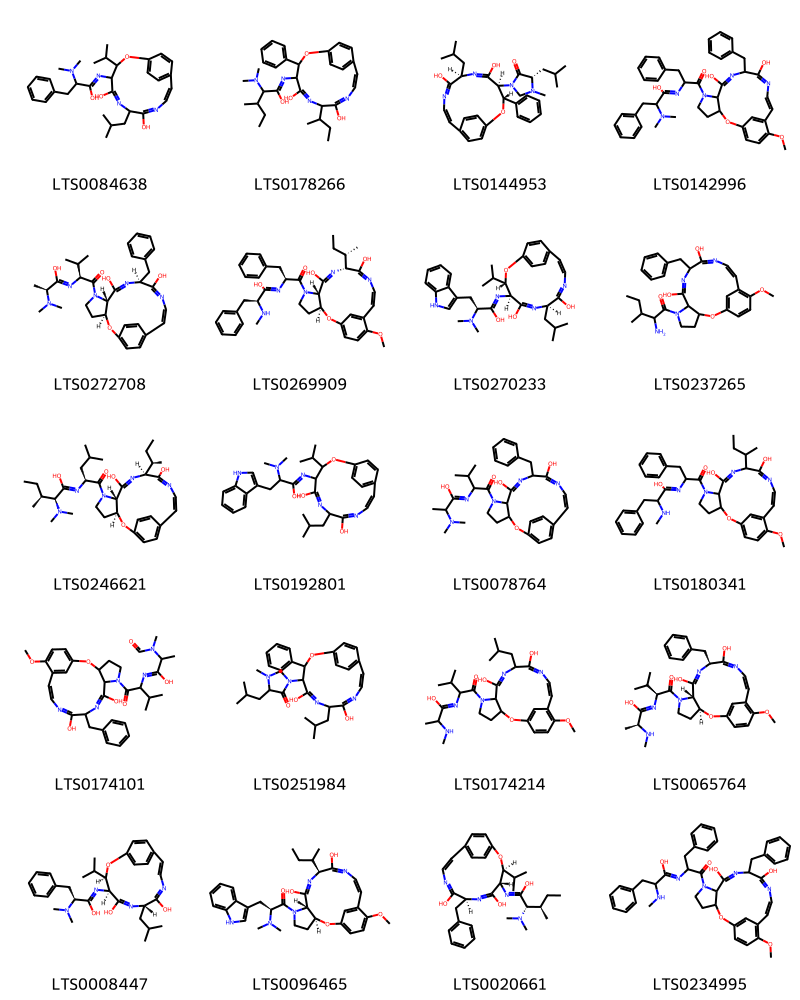{ width=100% }
    <figcaption>Hình ảnh cấu trúc hóa học của 20 hoạt chất thuộc nhóm Carboxylic acids and derivatives gồm ['n-[(10z)-5,8-dihydroxy-3-isopropyl-7-(2-methylpropyl)-2-oxa-6,9-diazabicyclo[10.2.2]hexadeca-1(14),5,8,10,12,15-hexaen-4-yl]-2-(dimethylamino)-3-phenylpropanimidic acid (LTS0084638)', 'n-[(10z)-5,8-dihydroxy-3-phenyl-7-(sec-butyl)-2-oxa-6,9-diazabicyclo[10.2.2]hexadeca-1(14),5,8,10,12,15-hexaen-4-yl]-2-(dimethylamino)-3-methylpentanimidic acid (LTS0178266)', '(5s)-3-[(3s,4s,7r,10z)-5,8-dihydroxy-7-(2-methylpropyl)-3-phenyl-2-oxa-6,9-diazabicyclo[10.2.2]hexadeca-1(14),5,8,10,12,15-hexaen-4-yl]-1-methyl-5-(2-methylpropyl)imidazolidin-4-one (LTS0144953)', 'n-{1-[(13e)-10-benzyl-8,11-dihydroxy-16-methoxy-2-oxa-6,9,12-triazatricyclo[13.3.1.0³,⁷]nonadeca-1(18),8,11,13,15(19),16-hexaen-6-yl]-1-oxo-3-phenylpropan-2-yl}-2-(dimethylamino)-3-phenylpropanimidic acid (LTS0142996)', '(2s)-n-[(2s)-1-[(3s,7s,10s,13z)-10-benzyl-8,11-dihydroxy-2-oxa-6,9,12-triazatricyclo[13.2.2.0³,⁷]nonadeca-1(17),8,11,13,15,18-hexaen-6-yl]-3-methyl-1-oxobutan-2-yl]-2-(dimethylamino)propanimidic acid (LTS0272708)', '(2s)-n-[(2s)-1-[(3s,7s,10r,13z)-10-[(2s)-butan-2-yl]-8,11-dihydroxy-16-methoxy-2-oxa-6,9,12-triazatricyclo[13.3.1.0³,⁷]nonadeca-1(18),8,11,13,15(19),16-hexaen-6-yl]-1-oxo-3-phenylpropan-2-yl]-2-(methylamino)-3-phenylpropanimidic acid (LTS0269909)', '(2s)-n-[(3s,4s,7r,10z)-5,8-dihydroxy-3-isopropyl-7-(2-methylpropyl)-2-oxa-6,9-diazabicyclo[10.2.2]hexadeca-1(14),5,8,10,12,15-hexaen-4-yl]-2-(dimethylamino)-3-(1h-indol-3-yl)propanimidic acid (LTS0270233)', '2-amino-1-{10-benzyl-8,11-dihydroxy-16-methoxy-2-oxa-6,9,12-triazatricyclo[13.3.1.0³,⁷]nonadeca-1(18),8,11,13,15(19),16-hexaen-6-yl}-3-methylpentan-1-one (LTS0237265)', '(2s,3s)-n-[(2s)-1-[(3s,7s,10s,13z)-10-[(2r)-butan-2-yl]-8,11-dihydroxy-2-oxa-6,9,12-triazatricyclo[13.2.2.0³,⁷]nonadeca-1(17),8,11,13,15,18-hexaen-6-yl]-4-methyl-1-oxopentan-2-yl]-2-(dimethylamino)-3-methylpentanimidic acid (LTS0246621)', 'n-[5,8-dihydroxy-3-isopropyl-7-(2-methylpropyl)-2-oxa-6,9-diazabicyclo[10.2.2]hexadeca-1(14),5,8,10,12,15-hexaen-4-yl]-2-(dimethylamino)-3-(1h-indol-3-yl)propanimidic acid (LTS0192801)', 'n-{1-[(13z)-10-benzyl-8,11-dihydroxy-2-oxa-6,9,12-triazatricyclo[13.2.2.0³,⁷]nonadeca-1(17),8,11,13,15,18-hexaen-6-yl]-3-methyl-1-oxobutan-2-yl}-2-(dimethylamino)propanimidic acid (LTS0078764)', 'n-{1-[8,11-dihydroxy-16-methoxy-10-(sec-butyl)-2-oxa-6,9,12-triazatricyclo[13.3.1.0³,⁷]nonadeca-1(18),8,11,13,15(19),16-hexaen-6-yl]-1-oxo-3-phenylpropan-2-yl}-2-(methylamino)-3-phenylpropanimidic acid (LTS0180341)', 'n-(1-{10-benzyl-8,11-dihydroxy-16-methoxy-2-oxa-6,9,12-triazatricyclo[13.3.1.0³,⁷]nonadeca-1(18),8,11,13,15(19),16-hexaen-6-yl}-3-methyl-1-oxobutan-2-yl)-2-(n-methylformamido)propanimidic acid (LTS0174101)', '3-[5,8-dihydroxy-7-(2-methylpropyl)-3-phenyl-2-oxa-6,9-diazabicyclo[10.2.2]hexadeca-1(14),5,8,10,12,15-hexaen-4-yl]-1-methyl-5-(2-methylpropyl)imidazolidin-4-one (LTS0251984)', 'n-{1-[(13z)-8,11-dihydroxy-16-methoxy-10-(2-methylpropyl)-2-oxa-6,9,12-triazatricyclo[13.3.1.0³,⁷]nonadeca-1(18),8,11,13,15(19),16-hexaen-6-yl]-3-methyl-1-oxobutan-2-yl}-2-(methylamino)propanimidic acid (LTS0174214)', '(2s)-n-[(2s)-1-[(3s,7s,10s,13z)-10-benzyl-8,11-dihydroxy-16-methoxy-2-oxa-6,9,12-triazatricyclo[13.3.1.0³,⁷]nonadeca-1(18),8,11,13,15(19),16-hexaen-6-yl]-3-methyl-1-oxobutan-2-yl]-2-(methylamino)propanimidic acid (LTS0065764)', '(2s)-n-[(3r,4s,7s,10e)-5,8-dihydroxy-3-isopropyl-7-(2-methylpropyl)-2-oxa-6,9-diazabicyclo[10.2.2]hexadeca-1(14),5,8,10,12,15-hexaen-4-yl]-2-(dimethylamino)-3-phenylpropanimidic acid (LTS0008447)', '(2s)-1-[(3s,7s,10s,13z)-8,11-dihydroxy-16-methoxy-10-(sec-butyl)-2-oxa-6,9,12-triazatricyclo[13.3.1.0³,⁷]nonadeca-1(18),8,11,13,15(19),16-hexaen-6-yl]-2-(dimethylamino)-3-(1h-indol-3-yl)propan-1-one (LTS0096465)', '(2s,3r)-n-[(3s,4s,7s,10e)-7-benzyl-5,8-dihydroxy-3-isopropyl-2-oxa-6,9-diazabicyclo[10.2.2]hexadeca-1(14),5,8,10,12,15-hexaen-4-yl]-2-(dimethylamino)-3-methylpentanimidic acid (LTS0020661)', 'n-(1-{10-benzyl-8,11-dihydroxy-16-methoxy-2-oxa-6,9,12-triazatricyclo[13.3.1.0³,⁷]nonadeca-1(18),8,11,13,15(19),16-hexaen-6-yl}-1-oxo-3-phenylpropan-2-yl)-2-(methylamino)-3-phenylpropanimidic acid (LTS0234995)'].</figcaption>
</figure>
#### Nhóm Fatty Acyls
<figure markdown="span">
    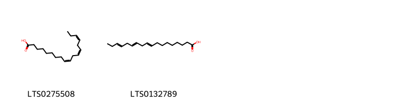{ width=100% }
    <figcaption>Hình ảnh cấu trúc hóa học của 2 hoạt chất thuộc nhóm Fatty Acyls gồm ['α-linolenic acid (LTS0275508)', 'α linolenic acid (LTS0132789)'].</figcaption>
</figure>
#### Nhóm Peptidomimetics
<figure markdown="span">
    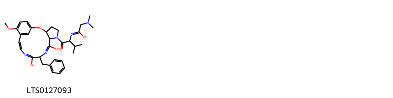{ width=100% }
    <figcaption>Hình ảnh cấu trúc hóa học của 1 hoạt chất thuộc nhóm Peptidomimetics gồm ['n-{1-[(13z)-10-benzyl-8,11-dihydroxy-16-methoxy-2-oxa-6,9,12-triazatricyclo[13.3.1.0³,⁷]nonadeca-1(18),8,11,13,15(19),16-hexaen-6-yl]-3-methyl-1-oxobutan-2-yl}-2-(dimethylamino)ethanimidic acid (LTS0127093)'].</figcaption>
</figure>
#### Nhóm Prenol lipids
<figure markdown="span">
    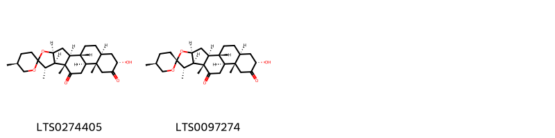{ width=100% }
    <figcaption>Hình ảnh cấu trúc hóa học của 2 hoạt chất thuộc nhóm Prenol lipids gồm ["(1'r,2's,4's,5s,7's,8'r,9's,12's,13's,16's,18's)-16'-hydroxy-5,7',9',13'-tetramethyl-5'-oxaspiro[oxane-2,6'-pentacyclo[10.8.0.0²,⁹.0⁴,⁸.0¹³,¹⁸]icosane]-10',15'-dione (LTS0274405)", "(1'r,2r,2's,4's,5s,7's,8'r,9's,12's,13's,16's,18's)-16'-hydroxy-5,7',9',13'-tetramethyl-5'-oxaspiro[oxane-2,6'-pentacyclo[10.8.0.0²,⁹.0⁴,⁸.0¹³,¹⁸]icosane]-10',15'-dione (LTS0097274)"].</figcaption>
</figure>

---

### Dược dân tộc học

Danh sách các quốc gia có sử dụng *Ziziphus nummularia* trong điều trị các bệnh. 

| Country   | Disease                 | Bệnh                                                                                                                                                                                                |
|:----------|:------------------------|:----------------------------------------------------------------------------------------------------------------------------------------------------------------------------------------------------|
| Elsewhere | Astringent, Refrigerant | MYMEMORY WARNING: YOU USED ALL AVAILABLE FREE TRANSLATIONS FOR TODAY. NEXT AVAILABLE IN  14 HOURS 19 MINUTES 09 SECONDS VISIT HTTPS://MYMEMORY.TRANSLATED.NET/DOC/USAGELIMITS.PHP TO TRANSLATE MORE |

---

---
## Ziziphus oenoplia
### Thông tin về thực vật

!!! info "Phân loại thực vật của *Ziziphus oenoplia* từ GIBF:"
    - **Kingdom:** Plantae
    - **Phylum:** Tracheophyta
    - **Order:** Rosales
    - **Family:** Rhamnaceae
    - **Genus:** Ziziphus
    - **Species:** *Ziziphus oenoplia*

 

| Label (VI)   | Label (EN)   | Scientific Name     | Descriptions (VI)   | Descriptions (EN)   | Also Known As (VI)   | Also Known As (EN)   |
|:-------------|:-------------|:--------------------|:--------------------|:--------------------|:---------------------|:---------------------|
| N/A          | N/A          | Ziziphus nummularia | loài thực vật       | species of plant    | ['']                 | ['']                 |

#### Phân bố trên thế giới

**Từ CSDL GIBF** Viet Nam, nan, unknown or invalid, Thailand, Sri Lanka, Myanmar, Philippines, Malaysia, India, Papua New Guinea, Lao People’s Democratic Republic, Bangladesh, China, Australia, Cambodia, Indonesia

#### Phân bố tại Việt Nam

**Từ CSDL GIBF**: Tonkin, Hoa Binh

---
### Thành phần hóa học
        
- Theo cơ sở dữ liệu lotus: Từ loài *Ziziphus oenoplia* đã phân lập và xác định được Chưa có hoạt chất nào được phân lập. hoạt chất thuộc về các nhóm Không có hoạt chất nào được phân lập. 

Không có hình ảnh nào được tạo ra

---

### Dược dân tộc học

Danh sách các quốc gia có sử dụng *Ziziphus oenoplia* trong điều trị các bệnh. 

| Country   | Disease    | Bệnh                                                                                                                                                                                                |
|:----------|:-----------|:----------------------------------------------------------------------------------------------------------------------------------------------------------------------------------------------------|
| India     | Ascaricide | MYMEMORY WARNING: YOU USED ALL AVAILABLE FREE TRANSLATIONS FOR TODAY. NEXT AVAILABLE IN  14 HOURS 18 MINUTES 33 SECONDS VISIT HTTPS://MYMEMORY.TRANSLATED.NET/DOC/USAGELIMITS.PHP TO TRANSLATE MORE |

---

---
## Ziziphus sativa
### Thông tin về thực vật

!!! info "Phân loại thực vật của *Ziziphus jujuba* từ GIBF:"
    - **Kingdom:** Plantae
    - **Phylum:** Tracheophyta
    - **Order:** Rosales
    - **Family:** Rhamnaceae
    - **Genus:** Ziziphus
    - **Species:** *Ziziphus jujuba*

 

| Label (VI)   | Label (EN)   | Scientific Name   | Descriptions (VI)   | Descriptions (EN)   | Also Known As (VI)   | Also Known As (EN)   |
|:-------------|:-------------|:------------------|:--------------------|:--------------------|:---------------------|:---------------------|
| N/A          | N/A          | Ziziphus sativa   | loài thực vật       | species of plant    | ['']                 | ['']                 |

#### Phân bố trên thế giới

**Từ CSDL GIBF** nan, unknown or invalid, Pakistan, Japan, Korea (Democratic People’s Republic of), France, Spain, India, Cyprus, Afghanistan, United States of America, Italy, China, Israel, Algeria, Belgium

#### Phân bố tại Việt Nam

**Từ CSDL GIBF**: Không có ghi nhận ở Việt Nam

---
### Thành phần hóa học
        
- Theo cơ sở dữ liệu lotus: Từ loài *Ziziphus jujuba* đã phân lập và xác định được Chưa có hoạt chất nào được phân lập. hoạt chất thuộc về các nhóm Không có hoạt chất nào được phân lập. 

Không có hình ảnh nào được tạo ra

---

### Dược dân tộc học

Danh sách các quốc gia có sử dụng *Ziziphus jujuba* trong điều trị các bệnh. 

| Country   | Disease                                              | Bệnh                                                                                                                                                                                                |
|:----------|:-----------------------------------------------------|:----------------------------------------------------------------------------------------------------------------------------------------------------------------------------------------------------|
| China     | Hypnotic, Sedative, Tranquilizer, Uterotonic, Poison | MYMEMORY WARNING: YOU USED ALL AVAILABLE FREE TRANSLATIONS FOR TODAY. NEXT AVAILABLE IN  14 HOURS 18 MINUTES 04 SECONDS VISIT HTTPS://MYMEMORY.TRANSLATED.NET/DOC/USAGELIMITS.PHP TO TRANSLATE MORE |

---

---
## Ziziphus sonorensis
### Thông tin về thực vật

!!! info "Phân loại thực vật của *Sarcomphalus amole* từ GIBF:"
    - **Kingdom:** Plantae
    - **Phylum:** Tracheophyta
    - **Order:** Rosales
    - **Family:** Rhamnaceae
    - **Genus:** Sarcomphalus
    - **Species:** *Sarcomphalus amole*

 

| Label (VI)   | Label (EN)   | Scientific Name     | Descriptions (VI)   | Descriptions (EN)   | Also Known As (VI)   | Also Known As (EN)   |
|:-------------|:-------------|:--------------------|:--------------------|:--------------------|:---------------------|:---------------------|
| N/A          | N/A          | Ziziphus sonorensis |                     |                     | ['']                 | ['']                 |

#### Phân bố trên thế giới

**Từ CSDL GIBF** nan, Mexico

#### Phân bố tại Việt Nam

**Từ CSDL GIBF**: Không có ghi nhận ở Việt Nam

---
### Thành phần hóa học
        
- Theo cơ sở dữ liệu lotus: Từ loài *Sarcomphalus amole* đã phân lập và xác định được Chưa có hoạt chất nào được phân lập. hoạt chất thuộc về các nhóm Không có hoạt chất nào được phân lập. 

Không có hình ảnh nào được tạo ra

---

### Dược dân tộc học

Danh sách các quốc gia có sử dụng *Sarcomphalus amole* trong điều trị các bệnh. 

| Country   | Disease    | Bệnh                                                                                                                                                                                                |
|:----------|:-----------|:----------------------------------------------------------------------------------------------------------------------------------------------------------------------------------------------------|
| Mexico    | Soap, Soap | MYMEMORY WARNING: YOU USED ALL AVAILABLE FREE TRANSLATIONS FOR TODAY. NEXT AVAILABLE IN  14 HOURS 17 MINUTES 38 SECONDS VISIT HTTPS://MYMEMORY.TRANSLATED.NET/DOC/USAGELIMITS.PHP TO TRANSLATE MORE |

---

---
## Ziziphus vulgaris
### Thông tin về thực vật

!!! info "Phân loại thực vật của *Ziziphus jujuba* từ GIBF:"
    - **Kingdom:** Plantae
    - **Phylum:** Tracheophyta
    - **Order:** Rosales
    - **Family:** Rhamnaceae
    - **Genus:** Ziziphus
    - **Species:** *Ziziphus jujuba*

 

| Label (VI)   | Label (EN)   | Scientific Name   | Descriptions (VI)   | Descriptions (EN)   | Also Known As (VI)   | Also Known As (EN)   |
|:-------------|:-------------|:------------------|:--------------------|:--------------------|:---------------------|:---------------------|
| N/A          | N/A          | Ziziphus vulgaris | loài thực vật       | species of plant    | ['']                 | ['']                 |

#### Phân bố trên thế giới

**Từ CSDL GIBF** nan, unknown or invalid, Spain, Albania, Tunisia, Uzbekistan, India, Türkiye, Japan, Bulgaria, China, Iran (Islamic Republic of), Korea (Democratic People’s Republic of), France, Egypt, United States of America, Italy, Algeria, Croatia

#### Phân bố tại Việt Nam

**Từ CSDL GIBF**: Không có ghi nhận ở Việt Nam

---
### Thành phần hóa học
        
- Theo cơ sở dữ liệu lotus: Từ loài *Ziziphus jujuba* đã phân lập và xác định được Chưa có hoạt chất nào được phân lập. hoạt chất thuộc về các nhóm Không có hoạt chất nào được phân lập. 

Không có hình ảnh nào được tạo ra

---

### Dược dân tộc học

Danh sách các quốc gia có sử dụng *Ziziphus jujuba* trong điều trị các bệnh. 

| Country   | Disease                                                             | Bệnh                                                                                                                                                                                                |
|:----------|:--------------------------------------------------------------------|:----------------------------------------------------------------------------------------------------------------------------------------------------------------------------------------------------|
| China     | Diaphoretic, Laxative, Nervine, Poultice, Sedative, Sedative, Tonic | MYMEMORY WARNING: YOU USED ALL AVAILABLE FREE TRANSLATIONS FOR TODAY. NEXT AVAILABLE IN  14 HOURS 17 MINUTES 16 SECONDS VISIT HTTPS://MYMEMORY.TRANSLATED.NET/DOC/USAGELIMITS.PHP TO TRANSLATE MORE |
| Japan*    | Demulcent, Sedative, Tonic                                          | MYMEMORY WARNING: YOU USED ALL AVAILABLE FREE TRANSLATIONS FOR TODAY. NEXT AVAILABLE IN  14 HOURS 17 MINUTES 13 SECONDS VISIT HTTPS://MYMEMORY.TRANSLATED.NET/DOC/USAGELIMITS.PHP TO TRANSLATE MORE |

---

# Chi Karwinskia

??? note "Danh sách các dược liệu thuộc chi"
    
	 - *Karwinskia calderoni*
	 - *Karwinskia humboldtiana*
	 - *Karwinskia latifolia*
	 - *Karwinskia parvifolia*

---
## Karwinskia calderoni
### Thông tin về thực vật

!!! info "Phân loại thực vật của *Karwinskia calderonii* từ GIBF:"
    - **Kingdom:** Plantae
    - **Phylum:** Tracheophyta
    - **Order:** Rosales
    - **Family:** Rhamnaceae
    - **Genus:** Karwinskia
    - **Species:** *Karwinskia calderonii*

 

| Label (VI)   | Label (EN)   | Scientific Name   | Descriptions (VI)   | Descriptions (EN)   | Also Known As (VI)   | Also Known As (EN)   |
|:-------------|:-------------|:------------------|:--------------------|:--------------------|:---------------------|:---------------------|
| N/A          | N/A          | Ziziphus vulgaris | loài thực vật       | species of plant    | ['']                 | ['']                 |

#### Phân bố trên thế giới

**Từ CSDL GIBF** Honduras, nan, El Salvador, Nicaragua, Costa Rica, Mexico, Guatemala

#### Phân bố tại Việt Nam

**Từ CSDL GIBF**: Không có ghi nhận ở Việt Nam

---
### Thành phần hóa học
        
- Theo cơ sở dữ liệu lotus: Từ loài *Karwinskia calderonii* đã phân lập và xác định được Chưa có hoạt chất nào được phân lập. hoạt chất thuộc về các nhóm Không có hoạt chất nào được phân lập. 

Không có hình ảnh nào được tạo ra

---

### Dược dân tộc học

Danh sách các quốc gia có sử dụng *Karwinskia calderonii* trong điều trị các bệnh. 

| Country   | Disease   | Bệnh                                                                                                                                                                                                |
|:----------|:----------|:----------------------------------------------------------------------------------------------------------------------------------------------------------------------------------------------------|
| Guatemala | Poison    | MYMEMORY WARNING: YOU USED ALL AVAILABLE FREE TRANSLATIONS FOR TODAY. NEXT AVAILABLE IN  14 HOURS 16 MINUTES 37 SECONDS VISIT HTTPS://MYMEMORY.TRANSLATED.NET/DOC/USAGELIMITS.PHP TO TRANSLATE MORE |

---

---
## Karwinskia humboldtiana
### Thông tin về thực vật

!!! info "Phân loại thực vật của *Karwinskia humboldtiana* từ GIBF:"
    - **Kingdom:** Plantae
    - **Phylum:** Tracheophyta
    - **Order:** Rosales
    - **Family:** Rhamnaceae
    - **Genus:** Karwinskia
    - **Species:** *Karwinskia humboldtiana*

 

| Label (VI)   | Label (EN)   | Scientific Name         | Descriptions (VI)   | Descriptions (EN)   | Also Known As (VI)   | Also Known As (EN)   |
|:-------------|:-------------|:------------------------|:--------------------|:--------------------|:---------------------|:---------------------|
| N/A          | N/A          | Karwinskia humboldtiana | loài thực vật       | species of plant    | ['']                 | ['']                 |

#### Phân bố trên thế giới

**Từ CSDL GIBF** United States of America, Mexico

#### Phân bố tại Việt Nam

**Từ CSDL GIBF**: Không có ghi nhận ở Việt Nam

---
### Thành phần hóa học
        
- Theo cơ sở dữ liệu lotus: Từ loài *Karwinskia humboldtiana* đã phân lập và xác định được 17 hoạt chất thuộc về các nhóm Arylnaphthalene lignans, Prenol lipids, Anthracenes, Naphthopyrans, Naphthalenes. 

|    | chemicalTaxonomyClassyfireClass   |   smiles_count |
|---:|:----------------------------------|---------------:|
|  0 | Anthracenes                       |              2 |
|  1 | Arylnaphthalene lignans           |              8 |
|  2 | Naphthalenes                      |              1 |
|  3 | Naphthopyrans                     |              4 |
|  4 | Prenol lipids                     |              2 |

#### Nhóm Anthracenes
<figure markdown="span">
    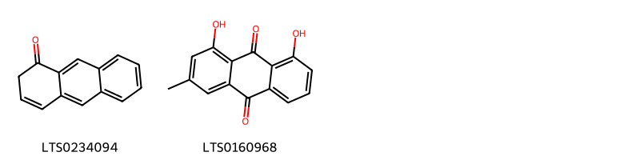{ width=100% }
    <figcaption>Hình ảnh cấu trúc hóa học của 2 hoạt chất thuộc nhóm Anthracenes gồm ['2h-anthracen-1-one (LTS0234094)', 'turkey rhubarb (LTS0160968)'].</figcaption>
</figure>
#### Nhóm Arylnaphthalene lignans
<figure markdown="span">
    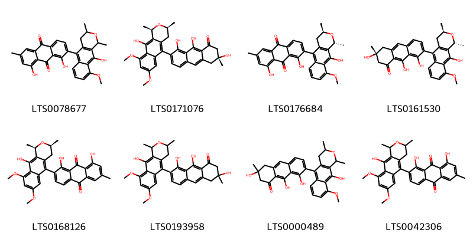{ width=100% }
    <figcaption>Hình ảnh cấu trúc hóa học của 8 hoạt chất thuộc nhóm Arylnaphthalene lignans gồm ['1,8-dihydroxy-2-{10-hydroxy-9-methoxy-1,3-dimethyl-1h,3h,4h-naphtho[2,3-c]pyran-5-yl}-6-methylanthracene-9,10-dione (LTS0078677)', '(3r)-3,8,9-trihydroxy-7-[(1r,3s)-10-hydroxy-7,9-dimethoxy-1,3-dimethyl-1h,3h,4h-naphtho[2,3-c]pyran-5-yl]-3-methyl-2,4-dihydroanthracen-1-one (LTS0171076)', '1,8-dihydroxy-2-[(1r,3r)-10-hydroxy-9-methoxy-1,3-dimethyl-1h,3h,4h-naphtho[2,3-c]pyran-5-yl]-6-methylanthracene-9,10-dione (LTS0176684)', '(3r)-3,8,9-trihydroxy-7-[(1r,3r)-10-hydroxy-9-methoxy-1,3-dimethyl-1h,3h,4h-naphtho[2,3-c]pyran-5-yl]-3-methyl-2,4-dihydroanthracen-1-one (LTS0161530)', '1,8-dihydroxy-2-[(1r,3s)-10-hydroxy-7,9-dimethoxy-1,3-dimethyl-1h,3h,4h-naphtho[2,3-c]pyran-5-yl]-6-methylanthracene-9,10-dione (LTS0168126)', '3,8,9-trihydroxy-7-{10-hydroxy-7,9-dimethoxy-1,3-dimethyl-1h,3h,4h-naphtho[2,3-c]pyran-5-yl}-3-methyl-2,4-dihydroanthracen-1-one (LTS0193958)', '3,8,9-trihydroxy-7-{10-hydroxy-9-methoxy-1,3-dimethyl-1h,3h,4h-naphtho[2,3-c]pyran-5-yl}-3-methyl-2,4-dihydroanthracen-1-one (LTS0000489)', '1,8-dihydroxy-2-{10-hydroxy-7,9-dimethoxy-1,3-dimethyl-1h,3h,4h-naphtho[2,3-c]pyran-5-yl}-6-methylanthracene-9,10-dione (LTS0042306)'].</figcaption>
</figure>
#### Nhóm Naphthalenes
<figure markdown="span">
    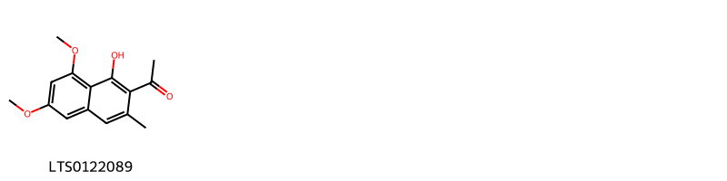{ width=100% }
    <figcaption>Hình ảnh cấu trúc hóa học của 1 hoạt chất thuộc nhóm Naphthalenes gồm ['1-(1-hydroxy-6,8-dimethoxy-3-methylnaphthalen-2-yl)ethanone (LTS0122089)'].</figcaption>
</figure>
#### Nhóm Naphthopyrans
<figure markdown="span">
    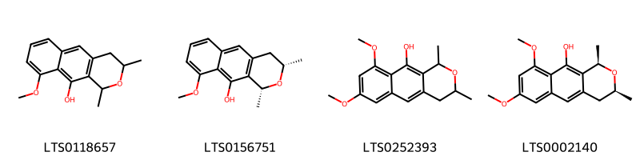{ width=100% }
    <figcaption>Hình ảnh cấu trúc hóa học của 4 hoạt chất thuộc nhóm Naphthopyrans gồm ['9-methoxy-1,3-dimethyl-1h,3h,4h-naphtho[2,3-c]pyran-10-ol (LTS0118657)', '(1r,3s)-9-methoxy-1,3-dimethyl-1h,3h,4h-naphtho[2,3-c]pyran-10-ol (LTS0156751)', '7,9-dimethoxy-1,3-dimethyl-1h,3h,4h-naphtho[2,3-c]pyran-10-ol (LTS0252393)', 'karwinaphthol b (LTS0002140)'].</figcaption>
</figure>
#### Nhóm Prenol lipids
<figure markdown="span">
    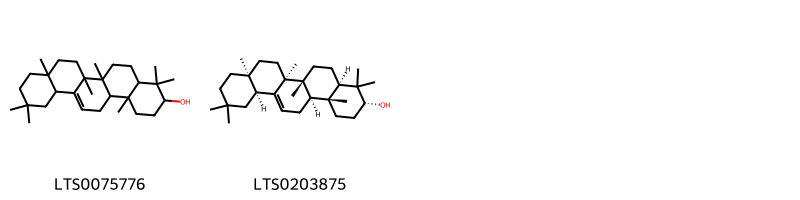{ width=100% }
    <figcaption>Hình ảnh cấu trúc hóa học của 2 hoạt chất thuộc nhóm Prenol lipids gồm ['β-amyrin (LTS0075776)', '(3r,4ar,6ar,6bs,8as,12as,14ar,14br)-4,4,6a,6b,8a,11,11,14b-octamethyl-1,2,3,4a,5,6,7,8,9,10,12,12a,14,14a-tetradecahydropicen-3-ol (LTS0203875)'].</figcaption>
</figure>

---

### Dược dân tộc học

Danh sách các quốc gia có sử dụng *Karwinskia humboldtiana* trong điều trị các bệnh. 

| Country          | Disease   | Bệnh                                                                                                                                                                                                |
|:-----------------|:----------|:----------------------------------------------------------------------------------------------------------------------------------------------------------------------------------------------------|
| Mexico           | Poison    | MYMEMORY WARNING: YOU USED ALL AVAILABLE FREE TRANSLATIONS FOR TODAY. NEXT AVAILABLE IN  14 HOURS 16 MINUTES 13 SECONDS VISIT HTTPS://MYMEMORY.TRANSLATED.NET/DOC/USAGELIMITS.PHP TO TRANSLATE MORE |
| Mexico(Kickapoo) | Poison    | MYMEMORY WARNING: YOU USED ALL AVAILABLE FREE TRANSLATIONS FOR TODAY. NEXT AVAILABLE IN  14 HOURS 16 MINUTES 11 SECONDS VISIT HTTPS://MYMEMORY.TRANSLATED.NET/DOC/USAGELIMITS.PHP TO TRANSLATE MORE |
| US               | Poison    | MYMEMORY WARNING: YOU USED ALL AVAILABLE FREE TRANSLATIONS FOR TODAY. NEXT AVAILABLE IN  14 HOURS 16 MINUTES 08 SECONDS VISIT HTTPS://MYMEMORY.TRANSLATED.NET/DOC/USAGELIMITS.PHP TO TRANSLATE MORE |

---

---
## Karwinskia latifolia
### Thông tin về thực vật

!!! info "Phân loại thực vật của *Karwinskia latifolia* từ GIBF:"
    - **Kingdom:** Plantae
    - **Phylum:** Tracheophyta
    - **Order:** Rosales
    - **Family:** Rhamnaceae
    - **Genus:** Karwinskia
    - **Species:** *Karwinskia latifolia*

 

| Label (VI)   | Label (EN)   | Scientific Name      | Descriptions (VI)   | Descriptions (EN)   | Also Known As (VI)   | Also Known As (EN)   |
|:-------------|:-------------|:---------------------|:--------------------|:--------------------|:---------------------|:---------------------|
| N/A          | N/A          | Karwinskia latifolia | loài thực vật       | species of plant    | ['']                 | ['']                 |

#### Phân bố trên thế giới

**Từ CSDL GIBF** nan, Mexico

#### Phân bố tại Việt Nam

**Từ CSDL GIBF**: Không có ghi nhận ở Việt Nam

---
### Thành phần hóa học
        
- Theo cơ sở dữ liệu lotus: Từ loài *Karwinskia latifolia* đã phân lập và xác định được Chưa có hoạt chất nào được phân lập. hoạt chất thuộc về các nhóm Không có hoạt chất nào được phân lập. 

Không có hình ảnh nào được tạo ra

---

### Dược dân tộc học

Danh sách các quốc gia có sử dụng *Karwinskia latifolia* trong điều trị các bệnh. 

| Country   | Disease           | Bệnh                                                                                                                                                                                                |
|:----------|:------------------|:----------------------------------------------------------------------------------------------------------------------------------------------------------------------------------------------------|
| Mexico    | Poison, Purgative | MYMEMORY WARNING: YOU USED ALL AVAILABLE FREE TRANSLATIONS FOR TODAY. NEXT AVAILABLE IN  14 HOURS 15 MINUTES 36 SECONDS VISIT HTTPS://MYMEMORY.TRANSLATED.NET/DOC/USAGELIMITS.PHP TO TRANSLATE MORE |

---

---
## Karwinskia parvifolia
### Thông tin về thực vật

!!! info "Phân loại thực vật của *Karwinskia parvifolia* từ GIBF:"
    - **Kingdom:** Plantae
    - **Phylum:** Tracheophyta
    - **Order:** Rosales
    - **Family:** Rhamnaceae
    - **Genus:** Karwinskia
    - **Species:** *Karwinskia parvifolia*

 

| Label (VI)   | Label (EN)   | Scientific Name       | Descriptions (VI)   | Descriptions (EN)   | Also Known As (VI)   | Also Known As (EN)   |
|:-------------|:-------------|:----------------------|:--------------------|:--------------------|:---------------------|:---------------------|
| N/A          | N/A          | Karwinskia parvifolia |                     | species of plant    | ['']                 | ['']                 |

#### Phân bố trên thế giới

**Từ CSDL GIBF** nan, United States of America, Mexico

#### Phân bố tại Việt Nam

**Từ CSDL GIBF**: Không có ghi nhận ở Việt Nam

---
### Thành phần hóa học
        
- Theo cơ sở dữ liệu lotus: Từ loài *Karwinskia parvifolia* đã phân lập và xác định được 17 hoạt chất thuộc về các nhóm Naphthopyrans, Arylnaphthalene lignans, Anthracenes, Naphthalenes. 

|    | chemicalTaxonomyClassyfireClass   |   smiles_count |
|---:|:----------------------------------|---------------:|
|  0 | Anthracenes                       |              8 |
|  1 | Arylnaphthalene lignans           |              4 |
|  2 | Naphthalenes                      |              2 |
|  3 | Naphthopyrans                     |              3 |

#### Nhóm Anthracenes
<figure markdown="span">
    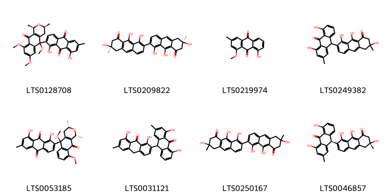{ width=100% }
    <figcaption>Hình ảnh cấu trúc hóa học của 8 hoạt chất thuộc nhóm Anthracenes gồm ['1,8-dihydroxy-6-methyl-2-[(1r,3s)-5,7,9-trimethoxy-1,3-dimethyl-10-oxo-1h,3h,4h-naphtho[2,3-c]pyran-5-yl]anthracene-9,10-dione (LTS0128708)', "(6r,6'r)-1,1',6,6',9,9'-hexahydroxy-6,6'-dimethyl-5h,5'h,7h,7'h-[2,2'-bianthracene]-8,8'-dione (LTS0209822)", '8-hydroxy-1-methoxy-3-methylanthracene-9,10-dione (LTS0219974)', "1,4',5',6,9-pentahydroxy-2',6-dimethyl-5,7-dihydro-9'h-[2,9'-bianthracene]-8,10'-dione (LTS0249382)", '2-[(1r,3s)-5,9-dimethoxy-1,3-dimethyl-10-oxo-1h,3h,4h-naphtho[2,3-c]pyran-5-yl]-1,8-dihydroxy-6-methylanthracene-9,10-dione (LTS0053185)', "1,4',5',8-tetrahydroxy-2',6-dimethyl-9'h,10h-[2,9'-bianthracene]-9,10'-dione (LTS0031121)", "1,1',6,6',9,9'-hexahydroxy-6,6'-dimethyl-5h,5'h,7h,7'h-[2,2'-bianthracene]-8,8'-dione (LTS0250167)", "(6r,9'r)-1,4',5',6,9-pentahydroxy-2',6-dimethyl-5,7-dihydro-9'h-[2,9'-bianthracene]-8,10'-dione (LTS0046857)"].</figcaption>
</figure>
#### Nhóm Arylnaphthalene lignans
<figure markdown="span">
    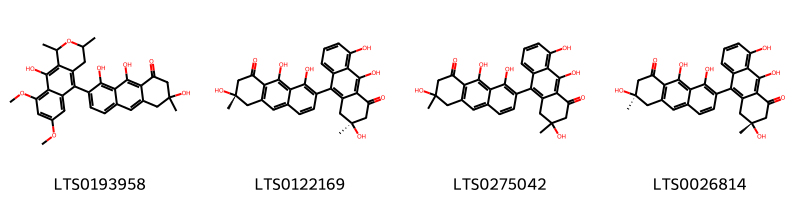{ width=100% }
    <figcaption>Hình ảnh cấu trúc hóa học của 4 hoạt chất thuộc nhóm Arylnaphthalene lignans gồm ['3,8,9-trihydroxy-7-{10-hydroxy-7,9-dimethoxy-1,3-dimethyl-1h,3h,4h-naphtho[2,3-c]pyran-5-yl}-3-methyl-2,4-dihydroanthracen-1-one (LTS0193958)', 'peroxisomicine a1 (LTS0122169)', "1,2',5',6,9,10'-hexahydroxy-2',6-dimethyl-1',3',5,7-tetrahydro-[2,9'-bianthracene]-4',8-dione (LTS0275042)", "(2'r,6r)-1,2',5',6,9,10'-hexahydroxy-2',6-dimethyl-1',3',5,7-tetrahydro-[2,9'-bianthracene]-4',8-dione (LTS0026814)"].</figcaption>
</figure>
#### Nhóm Naphthalenes
<figure markdown="span">
    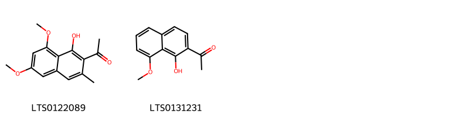{ width=100% }
    <figcaption>Hình ảnh cấu trúc hóa học của 2 hoạt chất thuộc nhóm Naphthalenes gồm ['1-(1-hydroxy-6,8-dimethoxy-3-methylnaphthalen-2-yl)ethanone (LTS0122089)', '1-(1-hydroxy-8-methoxynaphthalen-2-yl)ethanone (LTS0131231)'].</figcaption>
</figure>
#### Nhóm Naphthopyrans
<figure markdown="span">
    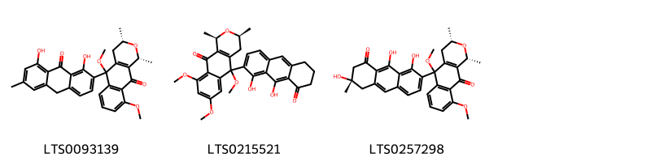{ width=100% }
    <figcaption>Hình ảnh cấu trúc hóa học của 3 hoạt chất thuộc nhóm Naphthopyrans gồm ['(1r,3s)-5-(1,8-dihydroxy-6-methyl-9-oxo-10h-anthracen-2-yl)-5,9-dimethoxy-1,3-dimethyl-1h,3h,4h-naphtho[2,3-c]pyran-10-one (LTS0093139)', '(1r,3s)-5-(1,9-dihydroxy-8-oxo-6,7-dihydro-5h-anthracen-2-yl)-5,7,9-trimethoxy-1,3-dimethyl-1h,3h,4h-naphtho[2,3-c]pyran-10-one (LTS0215521)', '(1r,3s)-5,9-dimethoxy-1,3-dimethyl-5-[(6s)-1,6,9-trihydroxy-6-methyl-8-oxo-5,7-dihydroanthracen-2-yl]-1h,3h,4h-naphtho[2,3-c]pyran-10-one (LTS0257298)'].</figcaption>
</figure>

---

### Dược dân tộc học

Danh sách các quốc gia có sử dụng *Karwinskia parvifolia* trong điều trị các bệnh. 

| Country   | Disease   | Bệnh                                                                                                                                                                                                |
|:----------|:----------|:----------------------------------------------------------------------------------------------------------------------------------------------------------------------------------------------------|
| Mexico    | Tonic     | MYMEMORY WARNING: YOU USED ALL AVAILABLE FREE TRANSLATIONS FOR TODAY. NEXT AVAILABLE IN  14 HOURS 15 MINUTES 01 SECONDS VISIT HTTPS://MYMEMORY.TRANSLATED.NET/DOC/USAGELIMITS.PHP TO TRANSLATE MORE |

---

# Chi Noltea

??? note "Danh sách các dược liệu thuộc chi"
    
	 - *Noltea africana*

---
## Noltea africana
### Thông tin về thực vật

!!! info "Phân loại thực vật của *Noltea africana* từ GIBF:"
    - **Kingdom:** Plantae
    - **Phylum:** Tracheophyta
    - **Order:** Rosales
    - **Family:** Rhamnaceae
    - **Genus:** Noltea
    - **Species:** *Noltea africana*

 

| Label (VI)   | Label (EN)   | Scientific Name   | Descriptions (VI)   | Descriptions (EN)   | Also Known As (VI)   | Also Known As (EN)   |
|:-------------|:-------------|:------------------|:--------------------|:--------------------|:---------------------|:---------------------|
| N/A          | N/A          | Noltea africana   | loài thực vật       | species of plant    | ['']                 | ['Soap Shiny-leaf']  |

#### Phân bố trên thế giới

**Từ CSDL GIBF** nan, unknown or invalid, South Africa, Japan, Saint Helena, Ascension and Tristan da Cunha, Portugal, Spain, France, New Zealand, Mauritius, Réunion, Ethiopia, United States of America, Algeria, Zambia, Australia

#### Phân bố tại Việt Nam

**Từ CSDL GIBF**: Không có ghi nhận ở Việt Nam

---
### Thành phần hóa học
        
- Theo cơ sở dữ liệu lotus: Từ loài *Noltea africana* đã phân lập và xác định được Chưa có hoạt chất nào được phân lập. hoạt chất thuộc về các nhóm Không có hoạt chất nào được phân lập. 

Không có hình ảnh nào được tạo ra

---

### Dược dân tộc học

Danh sách các quốc gia có sử dụng *Noltea africana* trong điều trị các bệnh. 

| Country   | Disease   | Bệnh                                                                                                                                                                                                |
|:----------|:----------|:----------------------------------------------------------------------------------------------------------------------------------------------------------------------------------------------------|
| Africa    | Soap      | MYMEMORY WARNING: YOU USED ALL AVAILABLE FREE TRANSLATIONS FOR TODAY. NEXT AVAILABLE IN  14 HOURS 14 MINUTES 38 SECONDS VISIT HTTPS://MYMEMORY.TRANSLATED.NET/DOC/USAGELIMITS.PHP TO TRANSLATE MORE |

---

# Chi Alphitonia

??? note "Danh sách các dược liệu thuộc chi"
    
	 - *Alphitonia incana*
	 - *Alphitonia zizyphoides*

---
## Alphitonia incana
### Thông tin về thực vật

!!! info "Phân loại thực vật của *Alphitonia incana* từ GIBF:"
    - **Kingdom:** Plantae
    - **Phylum:** Tracheophyta
    - **Order:** Rosales
    - **Family:** Rhamnaceae
    - **Genus:** Alphitonia
    - **Species:** *Alphitonia incana*

 

| Label (VI)   | Label (EN)   | Scientific Name   | Descriptions (VI)   | Descriptions (EN)   | Also Known As (VI)   | Also Known As (EN)   |
|:-------------|:-------------|:------------------|:--------------------|:--------------------|:---------------------|:---------------------|
| N/A          | N/A          | Alphitonia incana | loài thực vật       | species of plant    | ['']                 | ['']                 |

#### Phân bố trên thế giới

**Từ CSDL GIBF** nan, Viet Nam, unknown or invalid, Brunei Darussalam, Vanuatu, Philippines, Malaysia, Papua New Guinea, China, Australia, Solomon Islands, Indonesia

#### Phân bố tại Việt Nam

**Từ CSDL GIBF**: Không có ghi nhận ở Việt Nam

---
### Thành phần hóa học
        
- Theo cơ sở dữ liệu lotus: Từ loài *Alphitonia incana* đã phân lập và xác định được Chưa có hoạt chất nào được phân lập. hoạt chất thuộc về các nhóm Không có hoạt chất nào được phân lập. 

Không có hình ảnh nào được tạo ra

---

### Dược dân tộc học

Danh sách các quốc gia có sử dụng *Alphitonia incana* trong điều trị các bệnh. 

| Country   | Disease    | Bệnh                                                                                                                                                                                                |
|:----------|:-----------|:----------------------------------------------------------------------------------------------------------------------------------------------------------------------------------------------------|
| Newguinea | Astringent | MYMEMORY WARNING: YOU USED ALL AVAILABLE FREE TRANSLATIONS FOR TODAY. NEXT AVAILABLE IN  14 HOURS 14 MINUTES 07 SECONDS VISIT HTTPS://MYMEMORY.TRANSLATED.NET/DOC/USAGELIMITS.PHP TO TRANSLATE MORE |

---

---
## Alphitonia zizyphoides
### Thông tin về thực vật

!!! info "Phân loại thực vật của *Alphitonia zizyphoides* từ GIBF:"
    - **Kingdom:** Plantae
    - **Phylum:** Tracheophyta
    - **Order:** Rosales
    - **Family:** Rhamnaceae
    - **Genus:** Alphitonia
    - **Species:** *Alphitonia zizyphoides*

 

| Label (VI)   | Label (EN)   | Scientific Name        | Descriptions (VI)   | Descriptions (EN)   | Also Known As (VI)   | Also Known As (EN)   |
|:-------------|:-------------|:-----------------------|:--------------------|:--------------------|:---------------------|:---------------------|
| N/A          | N/A          | Alphitonia zizyphoides | loài thực vật       | species of plant    | ['']                 | ['']                 |

#### Phân bố trên thế giới

**Từ CSDL GIBF** Vanuatu, American Samoa, Niue, New Zealand, French Polynesia, Cook Islands, Fiji, Samoa, Papua New Guinea, United States of America, Tonga, Wallis and Futuna, Australia, Solomon Islands

#### Phân bố tại Việt Nam

**Từ CSDL GIBF**: Không có ghi nhận ở Việt Nam

---
### Thành phần hóa học
        
- Theo cơ sở dữ liệu lotus: Từ loài *Alphitonia zizyphoides* đã phân lập và xác định được 7 hoạt chất thuộc về các nhóm Organooxygen compounds, Prenol lipids, Phenols. 

|    | chemicalTaxonomyClassyfireClass   |   smiles_count |
|---:|:----------------------------------|---------------:|
|  0 | Organooxygen compounds            |              1 |
|  1 | Phenols                           |              1 |
|  2 | Prenol lipids                     |              5 |

#### Nhóm Organooxygen compounds
<figure markdown="span">
    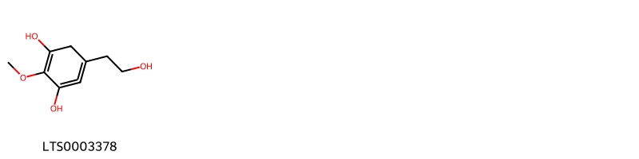{ width=100% }
    <figcaption>Hình ảnh cấu trúc hóa học của 1 hoạt chất thuộc nhóm Organooxygen compounds gồm ['5-(2-hydroxyethyl)-2-methoxycyclohexa-1,3,4-triene-1,3-diol (LTS0003378)'].</figcaption>
</figure>
#### Nhóm Phenols
<figure markdown="span">
    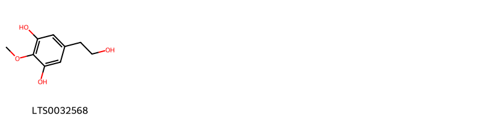{ width=100% }
    <figcaption>Hình ảnh cấu trúc hóa học của 1 hoạt chất thuộc nhóm Phenols gồm ['5-(2-hydroxyethyl)-2-methoxybenzene-1,3-diol (LTS0032568)'].</figcaption>
</figure>
#### Nhóm Prenol lipids
<figure markdown="span">
    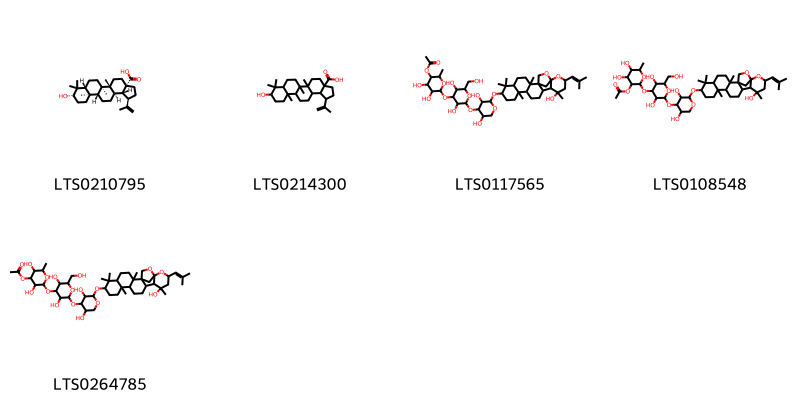{ width=100% }
    <figcaption>Hình ảnh cấu trúc hóa học của 5 hoạt chất thuộc nhóm Prenol lipids gồm ['betulinic acid (LTS0210795)', '9-hydroxy-5a,5b,8,8,11a-pentamethyl-1-(prop-1-en-2-yl)-hexadecahydrocyclopenta[a]chrysene-3a-carboxylic acid (LTS0214300)', '6-({2-[(3,5-dihydroxy-2-{[16-hydroxy-2,6,6,10,16-pentamethyl-18-(2-methylprop-1-en-1-yl)-19,21-dioxahexacyclo[18.2.1.0¹,¹⁴.0²,¹¹.0⁵,¹⁰.0¹⁵,²⁰]tricosan-7-yl]oxy}oxan-4-yl)oxy]-3,5-dihydroxy-6-(hydroxymethyl)oxan-4-yl}oxy)-4,5-dihydroxy-2-methyloxan-3-yl acetate (LTS0117565)', '2-({2-[(3,5-dihydroxy-2-{[16-hydroxy-2,6,6,10,16-pentamethyl-18-(2-methylprop-1-en-1-yl)-19,21-dioxahexacyclo[18.2.1.0¹,¹⁴.0²,¹¹.0⁵,¹⁰.0¹⁵,²⁰]tricosan-7-yl]oxy}oxan-4-yl)oxy]-3,5-dihydroxy-6-(hydroxymethyl)oxan-4-yl}oxy)-4,5-dihydroxy-6-methyloxan-3-yl acetate (LTS0108548)', '2-({2-[(3,5-dihydroxy-2-{[16-hydroxy-2,6,6,10,16-pentamethyl-18-(2-methylprop-1-en-1-yl)-19,21-dioxahexacyclo[18.2.1.0¹,¹⁴.0²,¹¹.0⁵,¹⁰.0¹⁵,²⁰]tricosan-7-yl]oxy}oxan-4-yl)oxy]-3,5-dihydroxy-6-(hydroxymethyl)oxan-4-yl}oxy)-3,5-dihydroxy-6-methyloxan-4-yl acetate (LTS0264785)'].</figcaption>
</figure>

---

### Dược dân tộc học

Danh sách các quốc gia có sử dụng *Alphitonia zizyphoides* trong điều trị các bệnh. 

| Country   | Disease   | Bệnh                                                                                                                                                                                                |
|:----------|:----------|:----------------------------------------------------------------------------------------------------------------------------------------------------------------------------------------------------|
| Tonga     | Laxative  | MYMEMORY WARNING: YOU USED ALL AVAILABLE FREE TRANSLATIONS FOR TODAY. NEXT AVAILABLE IN  14 HOURS 13 MINUTES 39 SECONDS VISIT HTTPS://MYMEMORY.TRANSLATED.NET/DOC/USAGELIMITS.PHP TO TRANSLATE MORE |

---

# Chi Ampelozizyphus

??? note "Danh sách các dược liệu thuộc chi"
    
	 - *Ampelozizyphus amazonicus*

---
## Ampelozizyphus amazonicus
### Thông tin về thực vật

!!! info "Phân loại thực vật của *Ampelozizyphus amazonicus* từ GIBF:"
    - **Kingdom:** Plantae
    - **Phylum:** Tracheophyta
    - **Order:** Rosales
    - **Family:** Rhamnaceae
    - **Genus:** Ampelozizyphus
    - **Species:** *Ampelozizyphus amazonicus*

 

| Label (VI)   | Label (EN)   | Scientific Name           | Descriptions (VI)   | Descriptions (EN)   | Also Known As (VI)   | Also Known As (EN)   |
|:-------------|:-------------|:--------------------------|:--------------------|:--------------------|:---------------------|:---------------------|
| N/A          | N/A          | Ampelozizyphus amazonicus | loài thực vật       | species of plant    | ['']                 | ['Ampelozizipheae']  |

#### Phân bố trên thế giới

**Từ CSDL GIBF** Colombia, Suriname, Venezuela (Bolivarian Republic of), Brazil, Peru, French Guiana, Guyana

#### Phân bố tại Việt Nam

**Từ CSDL GIBF**: Không có ghi nhận ở Việt Nam

---
### Thành phần hóa học
        
- Theo cơ sở dữ liệu lotus: Từ loài *Ampelozizyphus amazonicus* đã phân lập và xác định được 10 hoạt chất thuộc về các nhóm Prenol lipids. 

|    | chemicalTaxonomyClassyfireClass   |   smiles_count |
|---:|:----------------------------------|---------------:|
|  0 | Prenol lipids                     |             10 |

#### Nhóm Prenol lipids
<figure markdown="span">
    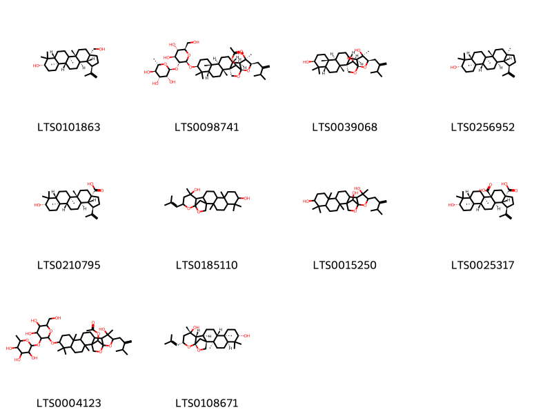{ width=100% }
    <figcaption>Hình ảnh cấu trúc hóa học của 10 hoạt chất thuộc nhóm Prenol lipids gồm ['betulin (LTS0101863)', '(1r,2r,5s,7s,10r,11r,14r,15s,16r,17r,19r,22r)-7-{[(2r,3r,4s,5s,6r)-4,5-dihydroxy-6-(hydroxymethyl)-3-{[(2s,3r,4r,5r,6s)-3,4,5-trihydroxy-6-methyloxan-2-yl]oxy}oxan-2-yl]oxy}-16-hydroxy-2,6,6,10,16-pentamethyl-17-(3-methyl-2-methylidenebutyl)-18,20-dioxahexacyclo[17.2.1.0¹,¹⁴.0²,¹¹.0⁵,¹⁰.0¹⁵,¹⁹]docosan-22-yl acetate (LTS0098741)', '(1r,2r,5s,7s,10r,11r,14r,15s,16r,17r,19r,22r)-2,6,6,10,16-pentamethyl-17-(3-methyl-2-methylidenebutyl)-18,20-dioxahexacyclo[17.2.1.0¹,¹⁴.0²,¹¹.0⁵,¹⁰.0¹⁵,¹⁹]docosane-7,16,22-triol (LTS0039068)', 'lupeol (LTS0256952)', 'betulinic acid (LTS0210795)', '2,6,6,10,16-pentamethyl-18-(2-methylprop-1-en-1-yl)-19,21-dioxahexacyclo[18.2.1.0¹,¹⁴.0²,¹¹.0⁵,¹⁰.0¹⁵,²⁰]tricosane-7,16-diol (LTS0185110)', '2,6,6,10,16-pentamethyl-17-(3-methyl-2-methylidenebutyl)-18,20-dioxahexacyclo[17.2.1.0¹,¹⁴.0²,¹¹.0⁵,¹⁰.0¹⁵,¹⁹]docosane-7,16,22-triol (LTS0015250)', '(1r,3as,5as,5br,7ar,9s,11ar,11br,13ar,13br)-9-hydroxy-5b,8,8,11a-tetramethyl-1-(prop-1-en-2-yl)-hexadecahydrocyclopenta[a]chrysene-3a,5a-dicarboxylic acid (LTS0025317)', '7-{[4,5-dihydroxy-6-(hydroxymethyl)-3-[(3,4,5-trihydroxy-6-methyloxan-2-yl)oxy]oxan-2-yl]oxy}-16-hydroxy-2,6,6,10,16-pentamethyl-17-(3-methyl-2-methylidenebutyl)-18,20-dioxahexacyclo[17.2.1.0¹,¹⁴.0²,¹¹.0⁵,¹⁰.0¹⁵,¹⁹]docosan-22-yl acetate (LTS0004123)', '(1s,2r,5s,7s,10r,11r,14r,15s,16s,18s,20s)-2,6,6,10,16-pentamethyl-18-(2-methylprop-1-en-1-yl)-19,21-dioxahexacyclo[18.2.1.0¹,¹⁴.0²,¹¹.0⁵,¹⁰.0¹⁵,²⁰]tricosane-7,16-diol (LTS0108671)'].</figcaption>
</figure>

---

### Dược dân tộc học

Danh sách các quốc gia có sử dụng *Ampelozizyphus amazonicus* trong điều trị các bệnh. 

| Country        | Disease   | Bệnh                                                                                                                                                                                                |
|:---------------|:----------|:----------------------------------------------------------------------------------------------------------------------------------------------------------------------------------------------------|
| Guiana(Waiwai) | Soap      | MYMEMORY WARNING: YOU USED ALL AVAILABLE FREE TRANSLATIONS FOR TODAY. NEXT AVAILABLE IN  14 HOURS 13 MINUTES 12 SECONDS VISIT HTTPS://MYMEMORY.TRANSLATED.NET/DOC/USAGELIMITS.PHP TO TRANSLATE MORE |
| Guyana(Waiwai) | Soap      | MYMEMORY WARNING: YOU USED ALL AVAILABLE FREE TRANSLATIONS FOR TODAY. NEXT AVAILABLE IN  14 HOURS 13 MINUTES 07 SECONDS VISIT HTTPS://MYMEMORY.TRANSLATED.NET/DOC/USAGELIMITS.PHP TO TRANSLATE MORE |

---

# Chi Frangula

??? note "Danh sách các dược liệu thuộc chi"
    
	 - *Frangula alnus*

---
## Frangula alnus
### Thông tin về thực vật

!!! info "Phân loại thực vật của *Frangula alnus* từ GIBF:"
    - **Kingdom:** Plantae
    - **Phylum:** Tracheophyta
    - **Order:** Rosales
    - **Family:** Rhamnaceae
    - **Genus:** Frangula
    - **Species:** *Frangula alnus*

 

| Label (VI)   | Label (EN)   | Scientific Name   | Descriptions (VI)   | Descriptions (EN)   | Also Known As (VI)   | Also Known As (EN)   |
|:-------------|:-------------|:------------------|:--------------------|:--------------------|:---------------------|:---------------------|
| N/A          | N/A          | Frangula alnus    | loài thực vật       | species of plant    | ['']                 | ['Alder Buckthorn']  |

#### Phân bố trên thế giới

**Từ CSDL GIBF** Denmark, Spain, Germany, Austria, Sweden, Poland, Canada, Belgium, Finland, Netherlands, Slovenia, Hungary, Norway, Switzerland, United Kingdom of Great Britain and Northern Ireland, Portugal, Czechia, Romania, Russian Federation, United States of America, Italy, Ukraine

#### Phân bố tại Việt Nam

**Từ CSDL GIBF**: Không có ghi nhận ở Việt Nam

---
### Thành phần hóa học
        
- Theo cơ sở dữ liệu lotus: Từ loài *Frangula alnus* đã phân lập và xác định được 14 hoạt chất thuộc về các nhóm Anthracenes. 

|    | chemicalTaxonomyClassyfireClass   |   smiles_count |
|---:|:----------------------------------|---------------:|
|  0 | Anthracenes                       |             14 |

#### Nhóm Anthracenes
<figure markdown="span">
    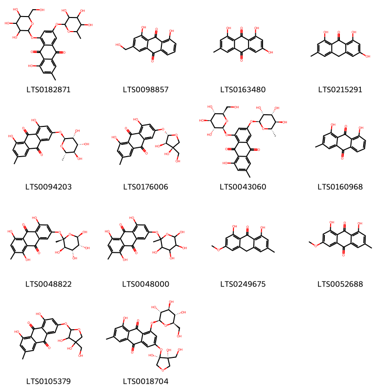{ width=100% }
    <figcaption>Hình ảnh cấu trúc hóa học của 14 hoạt chất thuộc nhóm Anthracenes gồm ['1-hydroxy-3-methyl-8-{[3,4,5-trihydroxy-6-(hydroxymethyl)oxan-2-yl]oxy}-6-[(3,4,5-trihydroxy-6-methyloxan-2-yl)oxy]anthracene-9,10-dione (LTS0182871)', 'aloe emodin (LTS0098857)', 'emodin (LTS0163480)', 'emodin-9-anthrone (LTS0215291)', 'frangulin a (LTS0094203)', 'frangulin b (LTS0176006)', 'glucofrangulin a (LTS0043060)', 'turkey rhubarb (LTS0160968)', '1,4,5-trihydroxy-2-methyl-7-{[(2r,3r,4s,5r,6r)-3,4,5,6-tetrahydroxy-2-methyloxan-2-yl]oxy}anthracene-9,10-dione (LTS0048822)', '1,4,5-trihydroxy-2-methyl-7-[(3,4,5,6-tetrahydroxy-2-methyloxan-2-yl)oxy]anthracene-9,10-dione (LTS0048000)', '1,8-dihydroxy-3-methoxy-6-methyl-10h-anthracen-9-one (LTS0249675)', 'physcion (LTS0052688)', '3-{[3,4-dihydroxy-4-(hydroxymethyl)oxolan-2-yl]oxy}-1,8-dihydroxy-6-methylanthracene-9,10-dione (LTS0105379)', 'glucofrangulin b (LTS0018704)'].</figcaption>
</figure>

---

### Dược dân tộc học

Danh sách các quốc gia có sử dụng *Frangula alnus* trong điều trị các bệnh. 

| Country   | Disease                                 | Bệnh                                                                                                                                                                                                |
|:----------|:----------------------------------------|:----------------------------------------------------------------------------------------------------------------------------------------------------------------------------------------------------|
| Europe    | Purgative, Poison                       | MYMEMORY WARNING: YOU USED ALL AVAILABLE FREE TRANSLATIONS FOR TODAY. NEXT AVAILABLE IN  14 HOURS 12 MINUTES 35 SECONDS VISIT HTTPS://MYMEMORY.TRANSLATED.NET/DOC/USAGELIMITS.PHP TO TRANSLATE MORE |
| Turkey    | Laxative, Purgative, Tonic, Emmenagogue | MYMEMORY WARNING: YOU USED ALL AVAILABLE FREE TRANSLATIONS FOR TODAY. NEXT AVAILABLE IN  14 HOURS 12 MINUTES 32 SECONDS VISIT HTTPS://MYMEMORY.TRANSLATED.NET/DOC/USAGELIMITS.PHP TO TRANSLATE MORE |
| ain       | Purgative                               | MYMEMORY WARNING: YOU USED ALL AVAILABLE FREE TRANSLATIONS FOR TODAY. NEXT AVAILABLE IN  14 HOURS 12 MINUTES 29 SECONDS VISIT HTTPS://MYMEMORY.TRANSLATED.NET/DOC/USAGELIMITS.PHP TO TRANSLATE MORE |

---

# Chi Gouania

??? note "Danh sách các dược liệu thuộc chi"
    
	 - *Gouania lupuloides*
	 - *Gouania polygama*
	 - *Gouania tiliaefolia*

---
## Gouania lupuloides
### Thông tin về thực vật

!!! info "Phân loại thực vật của *Gouania lupuloides* từ GIBF:"
    - **Kingdom:** Plantae
    - **Phylum:** Tracheophyta
    - **Order:** Rosales
    - **Family:** Rhamnaceae
    - **Genus:** Gouania
    - **Species:** *Gouania lupuloides*

 

| Label (VI)   | Label (EN)   | Scientific Name    | Descriptions (VI)   | Descriptions (EN)   | Also Known As (VI)   | Also Known As (EN)   |
|:-------------|:-------------|:-------------------|:--------------------|:--------------------|:---------------------|:---------------------|
| N/A          | N/A          | Gouania lupuloides |                     | species of plant    | ['']                 | ['']                 |

#### Phân bố trên thế giới

**Từ CSDL GIBF** Honduras, El Salvador, Guadeloupe, Martinique, Jamaica, Guatemala, Haiti, Colombia, Dominican Republic, Puerto Rico, Cuba, Bonaire, Sint Eustatius and Saba, Virgin Islands (U.S.), Nicaragua, Panama, Brazil, Mexico, Saint Martin (French part), Argentina, Bolivia (Plurinational State of), Costa Rica, Ecuador, United States of America

#### Phân bố tại Việt Nam

**Từ CSDL GIBF**: Không có ghi nhận ở Việt Nam

---
### Thành phần hóa học
        
- Theo cơ sở dữ liệu lotus: Từ loài *Gouania lupuloides* đã phân lập và xác định được Chưa có hoạt chất nào được phân lập. hoạt chất thuộc về các nhóm Không có hoạt chất nào được phân lập. 

Không có hình ảnh nào được tạo ra

---

### Dược dân tộc học

Danh sách các quốc gia có sử dụng *Gouania lupuloides* trong điều trị các bệnh. 

| Country            | Disease                    | Bệnh                                                                                                                                                                                                |
|:-------------------|:---------------------------|:----------------------------------------------------------------------------------------------------------------------------------------------------------------------------------------------------|
| Dominican Republic | Diuretic, Stomachic, Tonic | MYMEMORY WARNING: YOU USED ALL AVAILABLE FREE TRANSLATIONS FOR TODAY. NEXT AVAILABLE IN  14 HOURS 11 MINUTES 56 SECONDS VISIT HTTPS://MYMEMORY.TRANSLATED.NET/DOC/USAGELIMITS.PHP TO TRANSLATE MORE |
| Elsewhere          | Dentifrice, Soap           | MYMEMORY WARNING: YOU USED ALL AVAILABLE FREE TRANSLATIONS FOR TODAY. NEXT AVAILABLE IN  14 HOURS 11 MINUTES 51 SECONDS VISIT HTTPS://MYMEMORY.TRANSLATED.NET/DOC/USAGELIMITS.PHP TO TRANSLATE MORE |
| Guatemala          | Poison                     | MYMEMORY WARNING: YOU USED ALL AVAILABLE FREE TRANSLATIONS FOR TODAY. NEXT AVAILABLE IN  14 HOURS 11 MINUTES 46 SECONDS VISIT HTTPS://MYMEMORY.TRANSLATED.NET/DOC/USAGELIMITS.PHP TO TRANSLATE MORE |
| Mexico             | Dentifrice, Dentifrice     | MYMEMORY WARNING: YOU USED ALL AVAILABLE FREE TRANSLATIONS FOR TODAY. NEXT AVAILABLE IN  14 HOURS 11 MINUTES 41 SECONDS VISIT HTTPS://MYMEMORY.TRANSLATED.NET/DOC/USAGELIMITS.PHP TO TRANSLATE MORE |

---

---
## Gouania polygama
### Thông tin về thực vật

!!! info "Phân loại thực vật của *Gouania polygama* từ GIBF:"
    - **Kingdom:** Plantae
    - **Phylum:** Tracheophyta
    - **Order:** Rosales
    - **Family:** Rhamnaceae
    - **Genus:** Gouania
    - **Species:** *Gouania polygama*

 

| Label (VI)   | Label (EN)   | Scientific Name   | Descriptions (VI)   | Descriptions (EN)   | Also Known As (VI)   | Also Known As (EN)   |
|:-------------|:-------------|:------------------|:--------------------|:--------------------|:---------------------|:---------------------|
| N/A          | N/A          | Gouania polygama  | loài thực vật       | species of plant    | ['']                 | ['']                 |

#### Phân bố trên thế giới

**Từ CSDL GIBF** Haiti, Colombia, Argentina, Dominican Republic, El Salvador, Nicaragua, Brazil, Panama, Venezuela (Bolivarian Republic of), Belize, Puerto Rico, Peru, Costa Rica, Ecuador, Cuba, Mexico, Guatemala

#### Phân bố tại Việt Nam

**Từ CSDL GIBF**: Không có ghi nhận ở Việt Nam

---
### Thành phần hóa học
        
- Theo cơ sở dữ liệu lotus: Từ loài *Gouania polygama* đã phân lập và xác định được Chưa có hoạt chất nào được phân lập. hoạt chất thuộc về các nhóm Không có hoạt chất nào được phân lập. 

Không có hình ảnh nào được tạo ra

---

### Dược dân tộc học

Danh sách các quốc gia có sử dụng *Gouania polygama* trong điều trị các bệnh. 

| Country   | Disease                                | Bệnh                                                                                                                                                                                                |
|:----------|:---------------------------------------|:----------------------------------------------------------------------------------------------------------------------------------------------------------------------------------------------------|
| Haiti     | Dentifrice, Diuretic, Stomachic, Tonic | MYMEMORY WARNING: YOU USED ALL AVAILABLE FREE TRANSLATIONS FOR TODAY. NEXT AVAILABLE IN  14 HOURS 11 MINUTES 15 SECONDS VISIT HTTPS://MYMEMORY.TRANSLATED.NET/DOC/USAGELIMITS.PHP TO TRANSLATE MORE |
| Honduras  | Dentifrice                             | MYMEMORY WARNING: YOU USED ALL AVAILABLE FREE TRANSLATIONS FOR TODAY. NEXT AVAILABLE IN  14 HOURS 11 MINUTES 11 SECONDS VISIT HTTPS://MYMEMORY.TRANSLATED.NET/DOC/USAGELIMITS.PHP TO TRANSLATE MORE |
| Mexico    | Dentifrice                             | MYMEMORY WARNING: YOU USED ALL AVAILABLE FREE TRANSLATIONS FOR TODAY. NEXT AVAILABLE IN  14 HOURS 11 MINUTES 08 SECONDS VISIT HTTPS://MYMEMORY.TRANSLATED.NET/DOC/USAGELIMITS.PHP TO TRANSLATE MORE |
| Salvador  | Soap                                   | MYMEMORY WARNING: YOU USED ALL AVAILABLE FREE TRANSLATIONS FOR TODAY. NEXT AVAILABLE IN  14 HOURS 11 MINUTES 05 SECONDS VISIT HTTPS://MYMEMORY.TRANSLATED.NET/DOC/USAGELIMITS.PHP TO TRANSLATE MORE |

---

---
## Gouania tiliaefolia
### Thông tin về thực vật

!!! info "Phân loại thực vật của *Gouania tiliifolia* từ GIBF:"
    - **Kingdom:** Plantae
    - **Phylum:** Tracheophyta
    - **Order:** Rosales
    - **Family:** Rhamnaceae
    - **Genus:** Gouania
    - **Species:** *Gouania tiliifolia*

 

| Label (VI)   | Label (EN)   | Scientific Name   | Descriptions (VI)   | Descriptions (EN)   | Also Known As (VI)   | Also Known As (EN)   |
|:-------------|:-------------|:------------------|:--------------------|:--------------------|:---------------------|:---------------------|
| N/A          | N/A          | Gouania polygama  | loài thực vật       | species of plant    | ['']                 | ['']                 |

#### Phân bố trên thế giới

**Từ CSDL GIBF** unknown or invalid, Mozambique, Tanzania, United Republic of, Mauritius, India, Philippines, Kenya, Seychelles, Madagascar, Indonesia

#### Phân bố tại Việt Nam

**Từ CSDL GIBF**: Không có ghi nhận ở Việt Nam

---
### Thành phần hóa học
        
- Theo cơ sở dữ liệu lotus: Từ loài *Gouania tiliifolia* đã phân lập và xác định được Chưa có hoạt chất nào được phân lập. hoạt chất thuộc về các nhóm Không có hoạt chất nào được phân lập. 

Không có hình ảnh nào được tạo ra

---

### Dược dân tộc học

Danh sách các quốc gia có sử dụng *Gouania tiliifolia* trong điều trị các bệnh. 

| Country     | Disease   | Bệnh                                                                                                                                                                                                |
|:------------|:----------|:----------------------------------------------------------------------------------------------------------------------------------------------------------------------------------------------------|
| India       | Vermicide | MYMEMORY WARNING: YOU USED ALL AVAILABLE FREE TRANSLATIONS FOR TODAY. NEXT AVAILABLE IN  14 HOURS 10 MINUTES 37 SECONDS VISIT HTTPS://MYMEMORY.TRANSLATED.NET/DOC/USAGELIMITS.PHP TO TRANSLATE MORE |
| Philippines | Soap      | MYMEMORY WARNING: YOU USED ALL AVAILABLE FREE TRANSLATIONS FOR TODAY. NEXT AVAILABLE IN  14 HOURS 10 MINUTES 34 SECONDS VISIT HTTPS://MYMEMORY.TRANSLATED.NET/DOC/USAGELIMITS.PHP TO TRANSLATE MORE |

---

# Chi Paliurus

??? note "Danh sách các dược liệu thuộc chi"
    
	 - *Paliurus ramosissimus*

---
## Paliurus ramosissimus
### Thông tin về thực vật

!!! info "Phân loại thực vật của *Paliurus ramosissimus* từ GIBF:"
    - **Kingdom:** Plantae
    - **Phylum:** Tracheophyta
    - **Order:** Rosales
    - **Family:** Rhamnaceae
    - **Genus:** Paliurus
    - **Species:** *Paliurus ramosissimus*

 

| Label (VI)   | Label (EN)   | Scientific Name       | Descriptions (VI)   | Descriptions (EN)   | Also Known As (VI)   | Also Known As (EN)   |
|:-------------|:-------------|:----------------------|:--------------------|:--------------------|:---------------------|:---------------------|
| N/A          | N/A          | Paliurus ramosissimus | loài thực vật       | species of plant    | ['']                 | ['']                 |

#### Phân bố trên thế giới

**Từ CSDL GIBF** nan, Japan, China, Korea, Republic of, Hong Kong, Chinese Taipei

#### Phân bố tại Việt Nam

**Từ CSDL GIBF**: Không có ghi nhận ở Việt Nam

---
### Thành phần hóa học
        
- Theo cơ sở dữ liệu lotus: Từ loài *Paliurus ramosissimus* đã phân lập và xác định được 36 hoạt chất thuộc về các nhóm Prenol lipids, Carboxylic acids and derivatives. 

|    | chemicalTaxonomyClassyfireClass   |   smiles_count |
|---:|:----------------------------------|---------------:|
|  0 | Carboxylic acids and derivatives  |             32 |
|  1 | Prenol lipids                     |              4 |

#### Nhóm Carboxylic acids and derivatives
<figure markdown="span">
    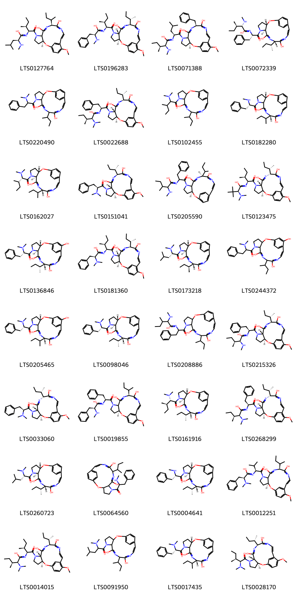{ width=100% }
    <figcaption>Hình ảnh cấu trúc hóa học của 32 hoạt chất thuộc nhóm Carboxylic acids and derivatives gồm ['(2s)-n-[(2s,3s)-1-[(3s,10s,13e)-8,11-dihydroxy-16-methoxy-10-(sec-butyl)-2-oxa-6,9,12-triazatricyclo[13.3.1.0³,⁷]nonadeca-1(18),8,11,13,15(19),16-hexaen-6-yl]-3-methyl-1-oxopentan-2-yl]-4-methyl-2-(methylamino)pentanimidic acid (LTS0127764)', '(2s)-n-[(2s,3s)-1-[(3s,7s,10s,13e)-10-[(2s)-butan-2-yl]-8,11-dihydroxy-16-methoxy-2-oxa-6,9,12-triazatricyclo[13.3.1.0³,⁷]nonadeca-1(18),8,11,13,15(19),16-hexaen-6-yl]-3-methyl-1-oxopentan-2-yl]-2-(methylamino)-3-phenylpropanimidic acid (LTS0196283)', '(2s,3s)-n-[(2s)-1-[(3s,10s,13e)-10-benzyl-8,11-dihydroxy-16-methoxy-2-oxa-6,9,12-triazatricyclo[13.3.1.0³,⁷]nonadeca-1(18),8,11,13,15(19),16-hexaen-6-yl]-4-methyl-1-oxopentan-2-yl]-3-methyl-2-(methylamino)pentanimidic acid (LTS0071388)', '(2s,3r)-n-[(2s)-1-[(3s,7s,10s,13z)-10-[(2r)-butan-2-yl]-8,11-dihydroxy-2-oxa-6,9,12-triazatricyclo[13.2.2.0³,⁷]nonadeca-1(17),8,11,13,15,18-hexaen-6-yl]-1-oxo-3-phenylpropan-2-yl]-3-methyl-2-(methylamino)pentanimidic acid (LTS0072339)', '1-[8,11-dihydroxy-10-(sec-butyl)-2-oxa-6,9,12-triazatricyclo[13.2.2.0³,⁷]nonadeca-1(17),8,11,13,15,18-hexaen-6-yl]-2-(dimethylamino)-3-phenylpropan-1-one (LTS0220490)', '(2s,3s)-n-[(2s)-1-[(3s,7s,10s,13e)-10-[(2s)-butan-2-yl]-8,11-dihydroxy-16-methoxy-2-oxa-6,9,12-triazatricyclo[13.3.1.0³,⁷]nonadeca-1(18),8,11,13,15(19),16-hexaen-6-yl]-1-oxo-3-phenylpropan-2-yl]-2-(dimethylamino)-3-methylpentanimidic acid (LTS0022688)', '1-[8,11-dihydroxy-10-(sec-butyl)-2-oxa-6,9,12-triazatricyclo[13.2.2.0³,⁷]nonadeca-1(17),8,11,13,15,18-hexaen-6-yl]-2-(dimethylamino)-3-methylpentan-1-one (LTS0102455)', '(2s)-1-[(3s,10s,13e)-8,11-dihydroxy-10-(sec-butyl)-2-oxa-6,9,12-triazatricyclo[13.2.2.0³,⁷]nonadeca-1(17),8,11,13,15,18-hexaen-6-yl]-2-(methylamino)-3-phenylpropan-1-one (LTS0182280)', '(2s)-1-[(3s,7s,10s,13z)-8,11-dihydroxy-10-(sec-butyl)-2-oxa-6,9,12-triazatricyclo[13.2.2.0³,⁷]nonadeca-1(17),8,11,13,15,18-hexaen-6-yl]-2-(dimethylamino)-3-methylpentan-1-one (LTS0162027)', '(2s)-1-[(3s,7s,10s,13e)-10-[(2s)-butan-2-yl]-8,11-dihydroxy-16-methoxy-2-oxa-6,9,12-triazatricyclo[13.3.1.0³,⁷]nonadeca-1(18),8,11,13,15(19),16-hexaen-6-yl]-2-(dimethylamino)-3-phenylpropan-1-one (LTS0151041)', 'n-{1-[(3s,10s,13e)-8,11-dihydroxy-10-(sec-butyl)-2-oxa-6,9,12-triazatricyclo[13.2.2.0³,⁷]nonadeca-1(17),8,11,13,15,18-hexaen-6-yl]-1-oxo-3-phenylpropan-2-yl}-3-methyl-2-(methylamino)pentanimidic acid (LTS0205590)', '(2s)-n-[(2s,3s)-1-[(3s,7s,10r,13e)-10-[(2s)-butan-2-yl]-8,11-dihydroxy-16-methoxy-2-oxa-6,9,12-triazatricyclo[13.3.1.0³,⁷]nonadeca-1(18),8,11,13,15(19),16-hexaen-6-yl]-3-methyl-1-oxopentan-2-yl]-2-(dimethylamino)-3,3-dimethylbutanimidic acid (LTS0123475)', '(2s)-1-[(3s,7s,10s,13z)-10-[(2r)-butan-2-yl]-8,11,19-trihydroxy-2-oxa-6,9,12-triazatricyclo[13.2.2.0³,⁷]nonadeca-1(17),8,11,13,15,18-hexaen-6-yl]-2-(dimethylamino)-3-phenylpropan-1-one (LTS0136846)', '(2s)-n-[(2s,3s)-1-[(3s,7s,10s,13e)-10-[(2s)-butan-2-yl]-8,11-dihydroxy-16-methoxy-2-oxa-6,9,12-triazatricyclo[13.3.1.0³,⁷]nonadeca-1(18),8,11,13,15(19),16-hexaen-6-yl]-3-methyl-1-oxopentan-2-yl]-2-(dimethylamino)-3-phenylpropanimidic acid (LTS0181360)', '(2s)-1-[(3s,7s,10s,13z)-10-[(2s)-butan-2-yl]-8,11-dihydroxy-2-oxa-6,9,12-triazatricyclo[13.2.2.0³,⁷]nonadeca-1(17),8,11,13,15,18-hexaen-6-yl]-2-(dimethylamino)-4-methylpentan-1-one (LTS0173218)', '2-(dimethylamino)-3-phenyl-1-[8,11,19-trihydroxy-10-(sec-butyl)-2-oxa-6,9,12-triazatricyclo[13.2.2.0³,⁷]nonadeca-1(17),8,11,13,15,18-hexaen-6-yl]propan-1-one (LTS0244372)', '(2s)-2-(dimethylamino)-3-phenyl-1-[(3s,10s,13z)-8,11,19-trihydroxy-10-(sec-butyl)-2-oxa-6,9,12-triazatricyclo[13.2.2.0³,⁷]nonadeca-1(17),8,11,13,15,18-hexaen-6-yl]propan-1-one (LTS0205465)', '(2s)-1-[(3s,7s,10s,13z)-10-[(2r)-butan-2-yl]-8,11-dihydroxy-2-oxa-6,9,12-triazatricyclo[13.2.2.0³,⁷]nonadeca-1(17),8,11,13,15,18-hexaen-6-yl]-2-(dimethylamino)-3-phenylpropan-1-one (LTS0098046)', 'n-{1-[8,11-dihydroxy-10-(sec-butyl)-2-oxa-6,9,12-triazatricyclo[13.2.2.0³,⁷]nonadeca-1(17),8,11,13,15,18-hexaen-6-yl]-1-oxo-3-phenylpropan-2-yl}-3-methyl-2-(methylamino)pentanimidic acid (LTS0208886)', '(2s,3s)-n-[(2s)-1-[(3s,7s,10s,13e)-10-[(2s)-butan-2-yl]-8,11-dihydroxy-16-methoxy-2-oxa-6,9,12-triazatricyclo[13.3.1.0³,⁷]nonadeca-1(18),8,11,13,15(19),16-hexaen-6-yl]-1-oxo-3-phenylpropan-2-yl]-3-methyl-2-(methylamino)pentanimidic acid (LTS0215326)', '(2s)-1-[(3s,7s,10r,13e)-10-[(2s)-butan-2-yl]-8,11-dihydroxy-16-methoxy-2-oxa-6,9,12-triazatricyclo[13.3.1.0³,⁷]nonadeca-1(18),8,11,13,15(19),16-hexaen-6-yl]-2-(dimethylamino)-3-phenylpropan-1-one (LTS0033060)', '(2s)-n-[(2s)-1-[(3s,10s,13e)-8,11-dihydroxy-16-methoxy-10-(sec-butyl)-2-oxa-6,9,12-triazatricyclo[13.3.1.0³,⁷]nonadeca-1(18),8,11,13,15(19),16-hexaen-6-yl]-1-oxo-3-phenylpropan-2-yl]-2-(methylamino)-3-phenylpropanimidic acid (LTS0019855)', '(2s,3r)-1-[(3s,7s,10s,13z)-10-[(2r)-butan-2-yl]-8,11-dihydroxy-2-oxa-6,9,12-triazatricyclo[13.2.2.0³,⁷]nonadeca-1(17),8,11,13,15,18-hexaen-6-yl]-2-(dimethylamino)-3-methylpentan-1-one (LTS0161916)', '(2s,3s)-n-[(2s)-1-[(3s,7s,10r,13e)-10-[(2s)-butan-2-yl]-8,11-dihydroxy-16-methoxy-2-oxa-6,9,12-triazatricyclo[13.3.1.0³,⁷]nonadeca-1(18),8,11,13,15(19),16-hexaen-6-yl]-1-oxo-3-phenylpropan-2-yl]-2-(dimethylamino)-3-methylpentanimidic acid (LTS0268299)', '(2s)-1-[(3s,7s,10s,13z)-10-[(2r)-butan-2-yl]-8,11-dihydroxy-2-oxa-6,9,12-triazatricyclo[13.2.2.0³,⁷]nonadeca-1(17),8,11,13,15,18-hexaen-6-yl]-2-(dimethylamino)-4-methylpentan-1-one (LTS0260723)', '1-[8,11-dihydroxy-10-(sec-butyl)-2-oxa-6,9,12-triazatricyclo[13.2.2.0³,⁷]nonadeca-1(17),8,11,13,15,18-hexaen-6-yl]-2-(methylamino)-3-phenylpropan-1-one (LTS0064560)', '(2s)-1-[(3s,7s,10s,13z)-10-[(2r)-butan-2-yl]-8,11-dihydroxy-2-oxa-6,9,12-triazatricyclo[13.2.2.0³,⁷]nonadeca-1(17),8,11,13,15,18-hexaen-6-yl]-2-(methylamino)-3-phenylpropan-1-one (LTS0004641)', '(2s)-n-[(2s)-1-[(3s,10s,13e)-8,11-dihydroxy-16-methoxy-10-(sec-butyl)-2-oxa-6,9,12-triazatricyclo[13.3.1.0³,⁷]nonadeca-1(18),8,11,13,15(19),16-hexaen-6-yl]-3-methyl-1-oxobutan-2-yl]-2-(dimethylamino)-3-phenylpropanimidic acid (LTS0012251)', '(2s,3s)-n-[(2s,3s)-1-[(3s,7s,10s,13e)-10-[(2s)-butan-2-yl]-8,11-dihydroxy-16-methoxy-2-oxa-6,9,12-triazatricyclo[13.3.1.0³,⁷]nonadeca-1(18),8,11,13,15(19),16-hexaen-6-yl]-3-methyl-1-oxopentan-2-yl]-2-(dimethylamino)-3-methylpentanimidic acid (LTS0014015)', '1-[8,11-dihydroxy-10-(sec-butyl)-2-oxa-6,9,12-triazatricyclo[13.2.2.0³,⁷]nonadeca-1(17),8,11,13,15,18-hexaen-6-yl]-2-(dimethylamino)-4-methylpentan-1-one (LTS0091950)', '(2s)-1-[(3s,10s,13e)-8,11-dihydroxy-10-(sec-butyl)-2-oxa-6,9,12-triazatricyclo[13.2.2.0³,⁷]nonadeca-1(17),8,11,13,15,18-hexaen-6-yl]-2-(dimethylamino)-3-phenylpropan-1-one (LTS0017435)', '(2s,3s)-1-[(3s,7s,10s,13e)-10-[(2s)-butan-2-yl]-8,11-dihydroxy-16-methoxy-2-oxa-6,9,12-triazatricyclo[13.3.1.0³,⁷]nonadeca-1(18),8,11,13,15(19),16-hexaen-6-yl]-2-(dimethylamino)-3-methylpentan-1-one (LTS0028170)'].</figcaption>
</figure>
#### Nhóm Prenol lipids
<figure markdown="span">
    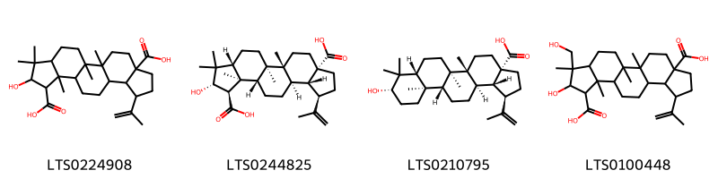{ width=100% }
    <figcaption>Hình ảnh cấu trúc hóa học của 4 hoạt chất thuộc nhóm Prenol lipids gồm ['16-hydroxy-1,2,14,17,17-pentamethyl-8-(prop-1-en-2-yl)pentacyclo[11.7.0.0²,¹⁰.0⁵,⁹.0¹⁴,¹⁸]icosane-5,15-dicarboxylic acid (LTS0224908)', 'ceanothic acid (LTS0244825)', 'betulinic acid (LTS0210795)', '16-hydroxy-17-(hydroxymethyl)-1,2,14,17-tetramethyl-8-(prop-1-en-2-yl)pentacyclo[11.7.0.0²,¹⁰.0⁵,⁹.0¹⁴,¹⁸]icosane-5,15-dicarboxylic acid (LTS0100448)'].</figcaption>
</figure>

---

### Dược dân tộc học

Danh sách các quốc gia có sử dụng *Paliurus ramosissimus* trong điều trị các bệnh. 

| Country   | Disease               | Bệnh                                                                                                                                                                                                |
|:----------|:----------------------|:----------------------------------------------------------------------------------------------------------------------------------------------------------------------------------------------------|
| China     | Refrigerant, Diuretic | MYMEMORY WARNING: YOU USED ALL AVAILABLE FREE TRANSLATIONS FOR TODAY. NEXT AVAILABLE IN  14 HOURS 10 MINUTES 05 SECONDS VISIT HTTPS://MYMEMORY.TRANSLATED.NET/DOC/USAGELIMITS.PHP TO TRANSLATE MORE |

---

# Chi Krugiodendron

??? note "Danh sách các dược liệu thuộc chi"
    
	 - *Krugiodendron ferreum*

---
## Krugiodendron ferreum
### Thông tin về thực vật

!!! info "Phân loại thực vật của *Krugiodendron ferreum* từ GIBF:"
    - **Kingdom:** Plantae
    - **Phylum:** Tracheophyta
    - **Order:** Rosales
    - **Family:** Rhamnaceae
    - **Genus:** Krugiodendron
    - **Species:** *Krugiodendron ferreum*

 

| Label (VI)   | Label (EN)   | Scientific Name       | Descriptions (VI)   | Descriptions (EN)   | Also Known As (VI)   | Also Known As (EN)   |
|:-------------|:-------------|:----------------------|:--------------------|:--------------------|:---------------------|:---------------------|
| N/A          | N/A          | Krugiodendron ferreum | loài thực vật       | species of plant    | ['']                 | ['']                 |

#### Phân bố trên thế giới

**Từ CSDL GIBF** Saint Martin (French part), Dominican Republic, Nicaragua, Guadeloupe, Puerto Rico, Bahamas, United States of America, Cuba, Jamaica, Mexico, Sint Maarten (Dutch part), Bonaire, Sint Eustatius and Saba, Virgin Islands (U.S.), Curaçao

#### Phân bố tại Việt Nam

**Từ CSDL GIBF**: Không có ghi nhận ở Việt Nam

---
### Thành phần hóa học
        
- Theo cơ sở dữ liệu lotus: Từ loài *Krugiodendron ferreum* đã phân lập và xác định được Chưa có hoạt chất nào được phân lập. hoạt chất thuộc về các nhóm Không có hoạt chất nào được phân lập. 

Không có hình ảnh nào được tạo ra

---

### Dược dân tộc học

Danh sách các quốc gia có sử dụng *Krugiodendron ferreum* trong điều trị các bệnh. 

| Country   | Disease   | Bệnh                                                                                                                                                                                                |
|:----------|:----------|:----------------------------------------------------------------------------------------------------------------------------------------------------------------------------------------------------|
| Mexico    | Purgative | MYMEMORY WARNING: YOU USED ALL AVAILABLE FREE TRANSLATIONS FOR TODAY. NEXT AVAILABLE IN  14 HOURS 09 MINUTES 30 SECONDS VISIT HTTPS://MYMEMORY.TRANSLATED.NET/DOC/USAGELIMITS.PHP TO TRANSLATE MORE |

---

# Chi Rhamnus

??? note "Danh sách các dược liệu thuộc chi"
    
	 - *Rhamnus alaternus*
	 - *Rhamnus alpina*
	 - *Rhamnus californica*
	 - *Rhamnus caroliniana*
	 - *Rhamnus cathartica*
	 - *Rhamnus catharticus*
	 - *Rhamnus chlorophorus*
	 - *Rhamnus frangula*
	 - *Rhamnus ilicifolia*
	 - *Rhamnus infectoria*
	 - *Rhamnus japonica*
	 - *Rhamnus pentapomica*
	 - *Rhamnus prinoides*
	 - *Rhamnus purpurea*
	 - *Rhamnus purshiana*
	 - *Rhamnus purshianus*
	 - *Rhamnus triquetra*
	 - *Rhamnus virgata*
	 - *Rhamnus wightii*

---
## Rhamnus alaternus
### Thông tin về thực vật

!!! info "Phân loại thực vật của *Rhamnus alaternus* từ GIBF:"
    - **Kingdom:** Plantae
    - **Phylum:** Tracheophyta
    - **Order:** Rosales
    - **Family:** Rhamnaceae
    - **Genus:** Rhamnus
    - **Species:** *Rhamnus alaternus*

 

| Label (VI)   | Label (EN)   | Scientific Name   | Descriptions (VI)   | Descriptions (EN)   | Also Known As (VI)   | Also Known As (EN)          |
|:-------------|:-------------|:------------------|:--------------------|:--------------------|:---------------------|:----------------------------|
| N/A          | N/A          | Rhamnus alaternus | loài thực vật       | species of plant    | ['']                 | ['Mediterranean Buckthorn'] |

#### Phân bố trên thế giới

**Từ CSDL GIBF** Malta, Portugal, France, Spain, New Zealand, United States of America, Italy, Israel, Algeria, Monaco, Greece, Australia, Ukraine

#### Phân bố tại Việt Nam

**Từ CSDL GIBF**: Không có ghi nhận ở Việt Nam

---
### Thành phần hóa học
        
- Theo cơ sở dữ liệu lotus: Từ loài *Rhamnus alaternus* đã phân lập và xác định được 3 hoạt chất thuộc về các nhóm Prenol lipids, Anthracenes. 

|    | chemicalTaxonomyClassyfireClass   |   smiles_count |
|---:|:----------------------------------|---------------:|
|  0 | Anthracenes                       |              1 |
|  1 | Prenol lipids                     |              2 |

#### Nhóm Anthracenes
<figure markdown="span">
    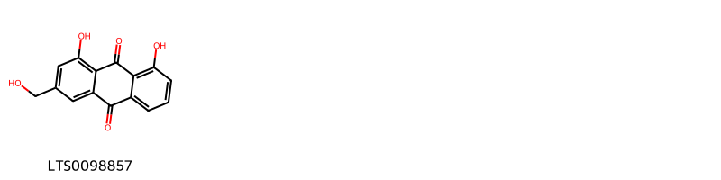{ width=100% }
    <figcaption>Hình ảnh cấu trúc hóa học của 1 hoạt chất thuộc nhóm Anthracenes gồm ['aloe emodin (LTS0098857)'].</figcaption>
</figure>
#### Nhóm Prenol lipids
<figure markdown="span">
    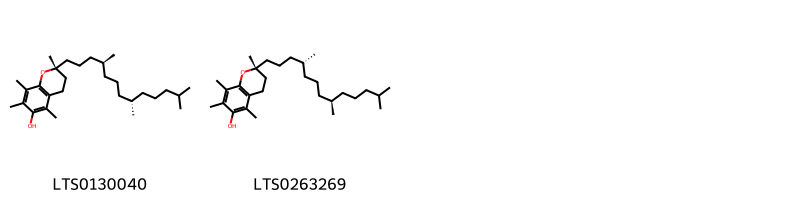{ width=100% }
    <figcaption>Hình ảnh cấu trúc hóa học của 2 hoạt chất thuộc nhóm Prenol lipids gồm ['(2r)-2,5,7,8-tetramethyl-2-[(4s,8s)-4,8,12-trimethyltridecyl]-3,4-dihydro-1-benzopyran-6-ol (LTS0130040)', 'vitamin e (LTS0263269)'].</figcaption>
</figure>

---

### Dược dân tộc học

Danh sách các quốc gia có sử dụng *Rhamnus alaternus* trong điều trị các bệnh. 

| Country   | Disease   | Bệnh                                                                                                                                                                                                |
|:----------|:----------|:----------------------------------------------------------------------------------------------------------------------------------------------------------------------------------------------------|
| ain       | Purgative | MYMEMORY WARNING: YOU USED ALL AVAILABLE FREE TRANSLATIONS FOR TODAY. NEXT AVAILABLE IN  14 HOURS 09 MINUTES 06 SECONDS VISIT HTTPS://MYMEMORY.TRANSLATED.NET/DOC/USAGELIMITS.PHP TO TRANSLATE MORE |

---

---
## Rhamnus alpina
### Thông tin về thực vật

!!! info "Phân loại thực vật của *N/A* từ GIBF:"
    - **Kingdom:** Plantae
    - **Phylum:** Tracheophyta
    - **Order:** Rosales
    - **Family:** Rhamnaceae
    - **Genus:** N/A
    - **Species:** *N/A*

 

| Label (VI)   | Label (EN)   | Scientific Name   | Descriptions (VI)   | Descriptions (EN)   | Also Known As (VI)   | Also Known As (EN)   |
|:-------------|:-------------|:------------------|:--------------------|:--------------------|:---------------------|:---------------------|
| N/A          | N/A          | Rhamnus alpina    | loài thực vật       | species of plant    | ['']                 | ['']                 |

#### Phân bố trên thế giới

**Từ CSDL GIBF** Namibia, Spain, Chile, Australia, Puerto Rico, Canada, Virgin Islands (U.S.), Malta, Mexico, Chinese Taipei, Uruguay, Argentina, Portugal, South Africa, France, New Zealand, Bolivia (Plurinational State of), New Caledonia, Ecuador, United States of America, Italy, Greece, Ukraine

#### Phân bố tại Việt Nam

**Từ CSDL GIBF**: Không có ghi nhận ở Việt Nam

---
### Thành phần hóa học
        
- Theo cơ sở dữ liệu lotus: Từ loài *N/A* đã phân lập và xác định được Chưa có hoạt chất nào được phân lập. hoạt chất thuộc về các nhóm Không có hoạt chất nào được phân lập. 

Không có hình ảnh nào được tạo ra

---

### Dược dân tộc học

Danh sách các quốc gia có sử dụng *N/A* trong điều trị các bệnh. 

| Country   | Disease   | Bệnh                                                                                                                                                                                                |
|:----------|:----------|:----------------------------------------------------------------------------------------------------------------------------------------------------------------------------------------------------|
| ain       | Purgative | MYMEMORY WARNING: YOU USED ALL AVAILABLE FREE TRANSLATIONS FOR TODAY. NEXT AVAILABLE IN  14 HOURS 08 MINUTES 26 SECONDS VISIT HTTPS://MYMEMORY.TRANSLATED.NET/DOC/USAGELIMITS.PHP TO TRANSLATE MORE |

---

---
## Rhamnus californica
### Thông tin về thực vật

!!! info "Phân loại thực vật của *Frangula californica* từ GIBF:"
    - **Kingdom:** Plantae
    - **Phylum:** Tracheophyta
    - **Order:** Rosales
    - **Family:** Rhamnaceae
    - **Genus:** Frangula
    - **Species:** *Frangula californica*

 

| Label (VI)   | Label (EN)   | Scientific Name     | Descriptions (VI)   | Descriptions (EN)   | Also Known As (VI)   | Also Known As (EN)   |
|:-------------|:-------------|:--------------------|:--------------------|:--------------------|:---------------------|:---------------------|
| N/A          | N/A          | Rhamnus californica | loài thực vật       | species of plant    | ['']                 | ['']                 |

#### Phân bố trên thế giới

**Từ CSDL GIBF** unknown or invalid, New Zealand, United States of America, Mexico, Austria

#### Phân bố tại Việt Nam

**Từ CSDL GIBF**: Không có ghi nhận ở Việt Nam

---
### Thành phần hóa học
        
- Theo cơ sở dữ liệu lotus: Từ loài *Frangula californica* đã phân lập và xác định được Chưa có hoạt chất nào được phân lập. hoạt chất thuộc về các nhóm Không có hoạt chất nào được phân lập. 

Không có hình ảnh nào được tạo ra

---

### Dược dân tộc học

Danh sách các quốc gia có sử dụng *Frangula californica* trong điều trị các bệnh. 

| Country   | Disease          | Bệnh                                                                                                                                                                                                |
|:----------|:-----------------|:----------------------------------------------------------------------------------------------------------------------------------------------------------------------------------------------------|
| Mexico    | Emetic, Laxative | MYMEMORY WARNING: YOU USED ALL AVAILABLE FREE TRANSLATIONS FOR TODAY. NEXT AVAILABLE IN  14 HOURS 07 MINUTES 58 SECONDS VISIT HTTPS://MYMEMORY.TRANSLATED.NET/DOC/USAGELIMITS.PHP TO TRANSLATE MORE |

---

---
## Rhamnus caroliniana
### Thông tin về thực vật

!!! info "Phân loại thực vật của *N/A* từ GIBF:"
    - **Kingdom:** Plantae
    - **Phylum:** Tracheophyta
    - **Order:** Rosales
    - **Family:** Rhamnaceae
    - **Genus:** N/A
    - **Species:** *N/A*

 

| Label (VI)   | Label (EN)   | Scientific Name     | Descriptions (VI)   | Descriptions (EN)   | Also Known As (VI)   | Also Known As (EN)                     |
|:-------------|:-------------|:--------------------|:--------------------|:--------------------|:---------------------|:---------------------------------------|
| N/A          | N/A          | Rhamnus caroliniana | loài thực vật       | species of plant    | ['']                 | ['Rhamnus carolinianus (misspelling)'] |

#### Phân bố trên thế giới

**Từ CSDL GIBF** Namibia, Spain, Chile, Australia, Puerto Rico, Canada, Virgin Islands (U.S.), Malta, Mexico, Chinese Taipei, Uruguay, Argentina, Portugal, South Africa, France, New Zealand, Bolivia (Plurinational State of), New Caledonia, Ecuador, United States of America, Italy, Greece, Ukraine

#### Phân bố tại Việt Nam

**Từ CSDL GIBF**: Không có ghi nhận ở Việt Nam

---
### Thành phần hóa học
        
- Theo cơ sở dữ liệu lotus: Từ loài *N/A* đã phân lập và xác định được Chưa có hoạt chất nào được phân lập. hoạt chất thuộc về các nhóm Không có hoạt chất nào được phân lập. 

Không có hình ảnh nào được tạo ra

---

### Dược dân tộc học

Danh sách các quốc gia có sử dụng *N/A* trong điều trị các bệnh. 

| Country        | Disease   | Bệnh                                                                                                                                                                                                |
|:---------------|:----------|:----------------------------------------------------------------------------------------------------------------------------------------------------------------------------------------------------|
| US(Appalachia) | Laxative  | MYMEMORY WARNING: YOU USED ALL AVAILABLE FREE TRANSLATIONS FOR TODAY. NEXT AVAILABLE IN  14 HOURS 07 MINUTES 24 SECONDS VISIT HTTPS://MYMEMORY.TRANSLATED.NET/DOC/USAGELIMITS.PHP TO TRANSLATE MORE |

---

---
## Rhamnus cathartica
### Thông tin về thực vật

!!! info "Phân loại thực vật của *Rhamnus cathartica* từ GIBF:"
    - **Kingdom:** Plantae
    - **Phylum:** Tracheophyta
    - **Order:** Rosales
    - **Family:** Rhamnaceae
    - **Genus:** Rhamnus
    - **Species:** *Rhamnus cathartica*

 

| Label (VI)   | Label (EN)   | Scientific Name    | Descriptions (VI)   | Descriptions (EN)   | Also Known As (VI)   | Also Known As (EN)                                                           |
|:-------------|:-------------|:-------------------|:--------------------|:--------------------|:---------------------|:-----------------------------------------------------------------------------|
| N/A          | N/A          | Rhamnus cathartica |                     | species of plant    | ['']                 | ['Buckthorn', 'Common Buckthorn', 'European buckthorn', 'Purging Buckthorn'] |

#### Phân bố trên thế giới

**Từ CSDL GIBF** Switzerland, Sweden, Spain, Canada, Russian Federation, United States of America, Norway, Netherlands

#### Phân bố tại Việt Nam

**Từ CSDL GIBF**: Không có ghi nhận ở Việt Nam

---
### Thành phần hóa học
        
- Theo cơ sở dữ liệu lotus: Từ loài *Rhamnus cathartica* đã phân lập và xác định được 12 hoạt chất thuộc về các nhóm Organooxygen compounds, Flavonoids, Anthracenes. 

|    | chemicalTaxonomyClassyfireClass   |   smiles_count |
|---:|:----------------------------------|---------------:|
|  0 | Anthracenes                       |              4 |
|  1 | Flavonoids                        |              6 |
|  2 | Organooxygen compounds            |              2 |

#### Nhóm Anthracenes
<figure markdown="span">
    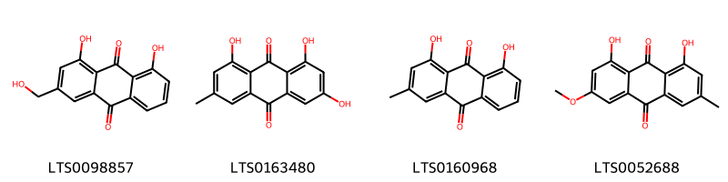{ width=100% }
    <figcaption>Hình ảnh cấu trúc hóa học của 4 hoạt chất thuộc nhóm Anthracenes gồm ['aloe emodin (LTS0098857)', 'emodin (LTS0163480)', 'turkey rhubarb (LTS0160968)', 'physcion (LTS0052688)'].</figcaption>
</figure>
#### Nhóm Flavonoids
<figure markdown="span">
    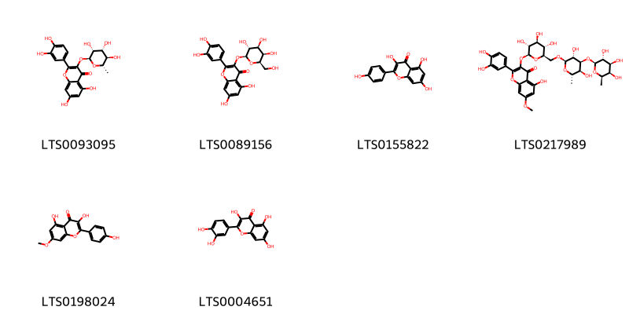{ width=100% }
    <figcaption>Hình ảnh cấu trúc hóa học của 6 hoạt chất thuộc nhóm Flavonoids gồm ['quercitrin (LTS0093095)', 'hyperoside (LTS0089156)', 'kaempherol (LTS0155822)', '3-{[(2s,3r,4s,5s,6r)-6-({[(2r,3r,4s,5s,6s)-3,5-dihydroxy-6-methyl-4-{[(2s,3r,4s,5r,6r)-3,4,5-trihydroxy-6-methyloxan-2-yl]oxy}oxan-2-yl]oxy}methyl)-3,4,5-trihydroxyoxan-2-yl]oxy}-2-(3,4-dihydroxyphenyl)-5-hydroxy-7-methoxychromen-4-one (LTS0217989)', 'rhamnocitrin (LTS0198024)', 'quercetin (LTS0004651)'].</figcaption>
</figure>
#### Nhóm Organooxygen compounds
<figure markdown="span">
    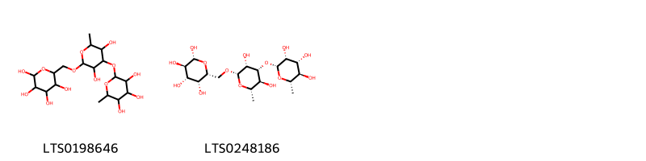{ width=100% }
    <figcaption>Hình ảnh cấu trúc hóa học của 2 hoạt chất thuộc nhóm Organooxygen compounds gồm ['6-[({3,5-dihydroxy-6-methyl-4-[(3,4,5-trihydroxy-6-methyloxan-2-yl)oxy]oxan-2-yl}oxy)methyl]oxane-2,3,4,5-tetrol (LTS0198646)', '(2r,3r,4s,5r,6r)-6-({[(2s,3r,4r,5s,6s)-3,5-dihydroxy-6-methyl-4-{[(2r,3r,4r,5r,6s)-3,4,5-trihydroxy-6-methyloxan-2-yl]oxy}oxan-2-yl]oxy}methyl)oxane-2,3,4,5-tetrol (LTS0248186)'].</figcaption>
</figure>

---

### Dược dân tộc học

Danh sách các quốc gia có sử dụng *Rhamnus cathartica* trong điều trị các bệnh. 

| Country   | Disease                                       | Bệnh                                                                                                                                                                                                |
|:----------|:----------------------------------------------|:----------------------------------------------------------------------------------------------------------------------------------------------------------------------------------------------------|
| Europe    | Poison                                        | MYMEMORY WARNING: YOU USED ALL AVAILABLE FREE TRANSLATIONS FOR TODAY. NEXT AVAILABLE IN  14 HOURS 06 MINUTES 56 SECONDS VISIT HTTPS://MYMEMORY.TRANSLATED.NET/DOC/USAGELIMITS.PHP TO TRANSLATE MORE |
| Turkey    | Emetic, Laxative, Poison, Purgative, Diuretic | MYMEMORY WARNING: YOU USED ALL AVAILABLE FREE TRANSLATIONS FOR TODAY. NEXT AVAILABLE IN  14 HOURS 06 MINUTES 53 SECONDS VISIT HTTPS://MYMEMORY.TRANSLATED.NET/DOC/USAGELIMITS.PHP TO TRANSLATE MORE |
| ain       | Purgative                                     | MYMEMORY WARNING: YOU USED ALL AVAILABLE FREE TRANSLATIONS FOR TODAY. NEXT AVAILABLE IN  14 HOURS 06 MINUTES 50 SECONDS VISIT HTTPS://MYMEMORY.TRANSLATED.NET/DOC/USAGELIMITS.PHP TO TRANSLATE MORE |

---

---
## Rhamnus catharticus
### Thông tin về thực vật

!!! info "Phân loại thực vật của *Rhamnus cathartica* từ GIBF:"
    - **Kingdom:** Plantae
    - **Phylum:** Tracheophyta
    - **Order:** Rosales
    - **Family:** Rhamnaceae
    - **Genus:** Rhamnus
    - **Species:** *Rhamnus cathartica*

 

| Label (VI)   | Label (EN)   | Scientific Name    | Descriptions (VI)   | Descriptions (EN)   | Also Known As (VI)   | Also Known As (EN)                                                           |
|:-------------|:-------------|:-------------------|:--------------------|:--------------------|:---------------------|:-----------------------------------------------------------------------------|
| N/A          | N/A          | Rhamnus cathartica |                     | species of plant    | ['']                 | ['Buckthorn', 'Common Buckthorn', 'European buckthorn', 'Purging Buckthorn'] |

#### Phân bố trên thế giới

**Từ CSDL GIBF** Switzerland, Sweden, Spain, Canada, Russian Federation, United States of America, Norway, Netherlands

#### Phân bố tại Việt Nam

**Từ CSDL GIBF**: Không có ghi nhận ở Việt Nam

---
### Thành phần hóa học
        
- Theo cơ sở dữ liệu lotus: Từ loài *Rhamnus cathartica* đã phân lập và xác định được Chưa có hoạt chất nào được phân lập. hoạt chất thuộc về các nhóm Không có hoạt chất nào được phân lập. 

Không có hình ảnh nào được tạo ra

---

### Dược dân tộc học

Danh sách các quốc gia có sử dụng *Rhamnus cathartica* trong điều trị các bệnh. 

| Country   | Disease   | Bệnh                                                                                                                                                                                                |
|:----------|:----------|:----------------------------------------------------------------------------------------------------------------------------------------------------------------------------------------------------|
| Europe    | Purgative | MYMEMORY WARNING: YOU USED ALL AVAILABLE FREE TRANSLATIONS FOR TODAY. NEXT AVAILABLE IN  14 HOURS 06 MINUTES 10 SECONDS VISIT HTTPS://MYMEMORY.TRANSLATED.NET/DOC/USAGELIMITS.PHP TO TRANSLATE MORE |

---

---
## Rhamnus chlorophorus
### Thông tin về thực vật

!!! info "Phân loại thực vật của *Rhamnus globosa* từ GIBF:"
    - **Kingdom:** Plantae
    - **Phylum:** Tracheophyta
    - **Order:** Rosales
    - **Family:** Rhamnaceae
    - **Genus:** Rhamnus
    - **Species:** *Rhamnus globosa*

 

| Label (VI)   | Label (EN)   | Scientific Name    | Descriptions (VI)   | Descriptions (EN)   | Also Known As (VI)   | Also Known As (EN)                                                           |
|:-------------|:-------------|:-------------------|:--------------------|:--------------------|:---------------------|:-----------------------------------------------------------------------------|
| N/A          | N/A          | Rhamnus cathartica |                     | species of plant    | ['']                 | ['Buckthorn', 'Common Buckthorn', 'European buckthorn', 'Purging Buckthorn'] |

#### Phân bố trên thế giới

**Từ CSDL GIBF** nan, Spain, France, China

#### Phân bố tại Việt Nam

**Từ CSDL GIBF**: Không có ghi nhận ở Việt Nam

---
### Thành phần hóa học
        
- Theo cơ sở dữ liệu lotus: Từ loài *Rhamnus globosa* đã phân lập và xác định được Chưa có hoạt chất nào được phân lập. hoạt chất thuộc về các nhóm Không có hoạt chất nào được phân lập. 

Không có hình ảnh nào được tạo ra

---

### Dược dân tộc học

Danh sách các quốc gia có sử dụng *Rhamnus globosa* trong điều trị các bệnh. 

| Country   | Disease   | Bệnh                                                                                                                                                                                                |
|:----------|:----------|:----------------------------------------------------------------------------------------------------------------------------------------------------------------------------------------------------|
| China     | Purgative | MYMEMORY WARNING: YOU USED ALL AVAILABLE FREE TRANSLATIONS FOR TODAY. NEXT AVAILABLE IN  14 HOURS 05 MINUTES 42 SECONDS VISIT HTTPS://MYMEMORY.TRANSLATED.NET/DOC/USAGELIMITS.PHP TO TRANSLATE MORE |

---

---
## Rhamnus frangula
### Thông tin về thực vật

!!! info "Phân loại thực vật của *Frangula alnus* từ GIBF:"
    - **Kingdom:** Plantae
    - **Phylum:** Tracheophyta
    - **Order:** Rosales
    - **Family:** Rhamnaceae
    - **Genus:** Frangula
    - **Species:** *Frangula alnus*

 

| Label (VI)   | Label (EN)   | Scientific Name   | Descriptions (VI)   | Descriptions (EN)   | Also Known As (VI)   | Also Known As (EN)   |
|:-------------|:-------------|:------------------|:--------------------|:--------------------|:---------------------|:---------------------|
| N/A          | N/A          | Rhamnus frangula  | loài thực vật       | species of plant    | ['']                 | ['']                 |

#### Phân bố trên thế giới

**Từ CSDL GIBF** France, Spain, Poland, Germany, Russian Federation, United States of America, Austria, Norway, Belgium, Ukraine

#### Phân bố tại Việt Nam

**Từ CSDL GIBF**: Không có ghi nhận ở Việt Nam

---
### Thành phần hóa học
        
- Theo cơ sở dữ liệu lotus: Từ loài *Frangula alnus* đã phân lập và xác định được 14 hoạt chất thuộc về các nhóm Anthracenes. 

|    | chemicalTaxonomyClassyfireClass   |   smiles_count |
|---:|:----------------------------------|---------------:|
|  0 | Anthracenes                       |             14 |

#### Nhóm Anthracenes
<figure markdown="span">
    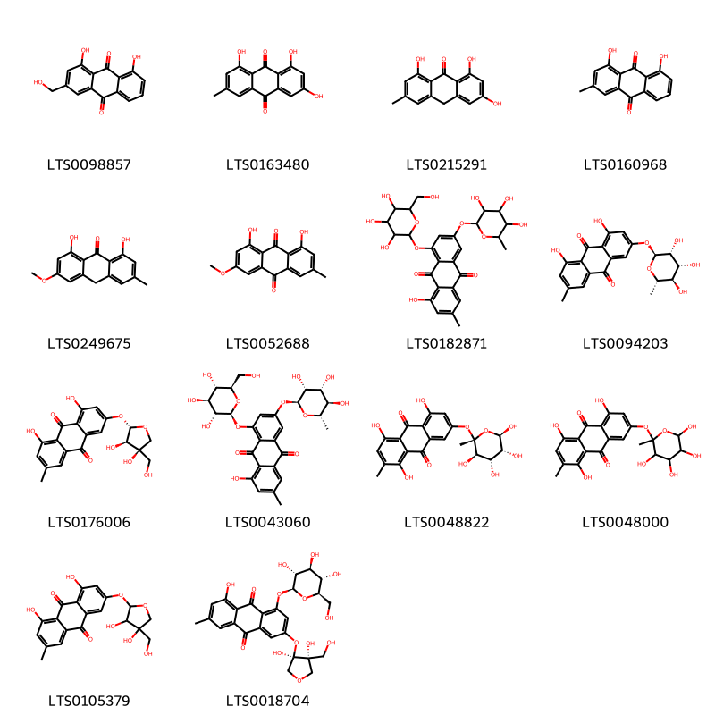{ width=100% }
    <figcaption>Hình ảnh cấu trúc hóa học của 14 hoạt chất thuộc nhóm Anthracenes gồm ['aloe emodin (LTS0098857)', 'emodin (LTS0163480)', 'emodin-9-anthrone (LTS0215291)', 'turkey rhubarb (LTS0160968)', '1,8-dihydroxy-3-methoxy-6-methyl-10h-anthracen-9-one (LTS0249675)', 'physcion (LTS0052688)', '1-hydroxy-3-methyl-8-{[3,4,5-trihydroxy-6-(hydroxymethyl)oxan-2-yl]oxy}-6-[(3,4,5-trihydroxy-6-methyloxan-2-yl)oxy]anthracene-9,10-dione (LTS0182871)', 'frangulin a (LTS0094203)', 'frangulin b (LTS0176006)', 'glucofrangulin a (LTS0043060)', '1,4,5-trihydroxy-2-methyl-7-{[(2r,3r,4s,5r,6r)-3,4,5,6-tetrahydroxy-2-methyloxan-2-yl]oxy}anthracene-9,10-dione (LTS0048822)', '1,4,5-trihydroxy-2-methyl-7-[(3,4,5,6-tetrahydroxy-2-methyloxan-2-yl)oxy]anthracene-9,10-dione (LTS0048000)', '3-{[3,4-dihydroxy-4-(hydroxymethyl)oxolan-2-yl]oxy}-1,8-dihydroxy-6-methylanthracene-9,10-dione (LTS0105379)', 'glucofrangulin b (LTS0018704)'].</figcaption>
</figure>

---

### Dược dân tộc học

Danh sách các quốc gia có sử dụng *Frangula alnus* trong điều trị các bệnh. 

| Country   | Disease   | Bệnh                                                                                                                                                                                                |
|:----------|:----------|:----------------------------------------------------------------------------------------------------------------------------------------------------------------------------------------------------|
| Elsewhere | Aperient  | MYMEMORY WARNING: YOU USED ALL AVAILABLE FREE TRANSLATIONS FOR TODAY. NEXT AVAILABLE IN  14 HOURS 05 MINUTES 15 SECONDS VISIT HTTPS://MYMEMORY.TRANSLATED.NET/DOC/USAGELIMITS.PHP TO TRANSLATE MORE |

---

---
## Rhamnus ilicifolia
### Thông tin về thực vật

!!! info "Phân loại thực vật của *Endotropis crocea* từ GIBF:"
    - **Kingdom:** Plantae
    - **Phylum:** Tracheophyta
    - **Order:** Rosales
    - **Family:** Rhamnaceae
    - **Genus:** Endotropis
    - **Species:** *Endotropis crocea*

 

| Label (VI)   | Label (EN)   | Scientific Name    | Descriptions (VI)   | Descriptions (EN)   | Also Known As (VI)   | Also Known As (EN)     |
|:-------------|:-------------|:-------------------|:--------------------|:--------------------|:---------------------|:-----------------------|
| N/A          | N/A          | Rhamnus ilicifolia | loài thực vật       | species of plant    | ['']                 | ['Hollyleaf redberry'] |

#### Phân bố trên thế giới

**Từ CSDL GIBF** United States of America, Mexico

#### Phân bố tại Việt Nam

**Từ CSDL GIBF**: Không có ghi nhận ở Việt Nam

---
### Thành phần hóa học
        
- Theo cơ sở dữ liệu lotus: Từ loài *Endotropis crocea* đã phân lập và xác định được Chưa có hoạt chất nào được phân lập. hoạt chất thuộc về các nhóm Không có hoạt chất nào được phân lập. 

Không có hình ảnh nào được tạo ra

---

### Dược dân tộc học

Danh sách các quốc gia có sử dụng *Endotropis crocea* trong điều trị các bệnh. 

| Country   | Disease                    | Bệnh                                                                                                                                                                                                |
|:----------|:---------------------------|:----------------------------------------------------------------------------------------------------------------------------------------------------------------------------------------------------|
| Mexico    | Cathartic, Laxative, Tonic | MYMEMORY WARNING: YOU USED ALL AVAILABLE FREE TRANSLATIONS FOR TODAY. NEXT AVAILABLE IN  14 HOURS 04 MINUTES 42 SECONDS VISIT HTTPS://MYMEMORY.TRANSLATED.NET/DOC/USAGELIMITS.PHP TO TRANSLATE MORE |

---

---
## Rhamnus infectoria
### Thông tin về thực vật

!!! info "Phân loại thực vật của *Rhamnus infectoria* từ GIBF:"
    - **Kingdom:** Plantae
    - **Phylum:** Tracheophyta
    - **Order:** Rosales
    - **Family:** Rhamnaceae
    - **Genus:** Rhamnus
    - **Species:** *Rhamnus infectoria*

 

| Label (VI)   | Label (EN)   | Scientific Name    | Descriptions (VI)   | Descriptions (EN)   | Also Known As (VI)   | Also Known As (EN)   |
|:-------------|:-------------|:-------------------|:--------------------|:--------------------|:---------------------|:---------------------|
| N/A          | N/A          | Rhamnus infectoria |                     |                     | ['']                 | ['']                 |

#### Phân bố trên thế giới

**Từ CSDL GIBF** nan, Colombia, United Kingdom of Great Britain and Northern Ireland, Portugal, Panama, France, Spain, Costa Rica, Italy, Algeria, Netherlands, Belgium, Korea, Republic of

#### Phân bố tại Việt Nam

**Từ CSDL GIBF**: Không có ghi nhận ở Việt Nam

---
### Thành phần hóa học
        
- Theo cơ sở dữ liệu lotus: Từ loài *Rhamnus infectoria* đã phân lập và xác định được 2 hoạt chất thuộc về các nhóm Phenols, Anthracenes. 

|    | chemicalTaxonomyClassyfireClass   |   smiles_count |
|---:|:----------------------------------|---------------:|
|  0 | Anthracenes                       |              1 |
|  1 | Phenols                           |              1 |

#### Nhóm Anthracenes
<figure markdown="span">
    { width=100% }
    <figcaption>Hình ảnh cấu trúc hóa học của 1 hoạt chất thuộc nhóm Anthracenes gồm ['emodin (LTS0163480)'].</figcaption>
</figure>
#### Nhóm Phenols
<figure markdown="span">
    { width=100% }
    <figcaption>Hình ảnh cấu trúc hóa học của 1 hoạt chất thuộc nhóm Phenols gồm ['syringaldehyde (LTS0201406)'].</figcaption>
</figure>

---

### Dược dân tộc học

Danh sách các quốc gia có sử dụng *Rhamnus infectoria* trong điều trị các bệnh. 

| Country   | Disease   | Bệnh                                                                                                                                                                                                |
|:----------|:----------|:----------------------------------------------------------------------------------------------------------------------------------------------------------------------------------------------------|
| ain       | Purgative | MYMEMORY WARNING: YOU USED ALL AVAILABLE FREE TRANSLATIONS FOR TODAY. NEXT AVAILABLE IN  14 HOURS 04 MINUTES 14 SECONDS VISIT HTTPS://MYMEMORY.TRANSLATED.NET/DOC/USAGELIMITS.PHP TO TRANSLATE MORE |

---

---
## Rhamnus japonica
### Thông tin về thực vật

!!! info "Phân loại thực vật của *Rhamnus japonica* từ GIBF:"
    - **Kingdom:** Plantae
    - **Phylum:** Tracheophyta
    - **Order:** Rosales
    - **Family:** Rhamnaceae
    - **Genus:** Rhamnus
    - **Species:** *Rhamnus japonica*

 

| Label (VI)   | Label (EN)   | Scientific Name   | Descriptions (VI)   | Descriptions (EN)   | Also Known As (VI)   | Also Known As (EN)   |
|:-------------|:-------------|:------------------|:--------------------|:--------------------|:---------------------|:---------------------|
| N/A          | N/A          | Rhamnus japonica  | loài thực vật       | species of plant    | ['']                 | ['']                 |

#### Phân bố trên thế giới

**Từ CSDL GIBF** nan, Japan, Russian Federation, United States of America, Belgium

#### Phân bố tại Việt Nam

**Từ CSDL GIBF**: Không có ghi nhận ở Việt Nam

---
### Thành phần hóa học
        
- Theo cơ sở dữ liệu lotus: Từ loài *Rhamnus japonica* đã phân lập và xác định được 1 hoạt chất thuộc về các nhóm Naphthofurans. 

|    | chemicalTaxonomyClassyfireClass   |   smiles_count |
|---:|:----------------------------------|---------------:|
|  0 | Naphthofurans                     |              1 |

#### Nhóm Naphthofurans
<figure markdown="span">
    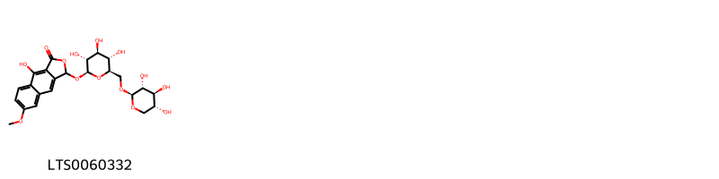{ width=100% }
    <figcaption>Hình ảnh cấu trúc hóa học của 1 hoạt chất thuộc nhóm Naphthofurans gồm ['9-hydroxy-6-methoxy-3-{[(2s,3r,4s,5s,6r)-3,4,5-trihydroxy-6-({[(2s,3r,4s,5r)-3,4,5-trihydroxyoxan-2-yl]oxy}methyl)oxan-2-yl]oxy}-3h-naphtho[2,3-c]furan-1-one (LTS0060332)'].</figcaption>
</figure>

---

### Dược dân tộc học

Danh sách các quốc gia có sử dụng *Rhamnus japonica* trong điều trị các bệnh. 

| Country   | Disease   | Bệnh                                                                                                                                                                                                |
|:----------|:----------|:----------------------------------------------------------------------------------------------------------------------------------------------------------------------------------------------------|
| Elsewhere | Aperient  | MYMEMORY WARNING: YOU USED ALL AVAILABLE FREE TRANSLATIONS FOR TODAY. NEXT AVAILABLE IN  14 HOURS 03 MINUTES 42 SECONDS VISIT HTTPS://MYMEMORY.TRANSLATED.NET/DOC/USAGELIMITS.PHP TO TRANSLATE MORE |
| Japan     | Laxative  | MYMEMORY WARNING: YOU USED ALL AVAILABLE FREE TRANSLATIONS FOR TODAY. NEXT AVAILABLE IN  14 HOURS 03 MINUTES 39 SECONDS VISIT HTTPS://MYMEMORY.TRANSLATED.NET/DOC/USAGELIMITS.PHP TO TRANSLATE MORE |

---

---
## Rhamnus pentapomica
### Thông tin về thực vật

!!! info "Phân loại thực vật của *Rhamnus pentapomica* từ GIBF:"
    - **Kingdom:** Plantae
    - **Phylum:** Tracheophyta
    - **Order:** Rosales
    - **Family:** Rhamnaceae
    - **Genus:** Rhamnus
    - **Species:** *Rhamnus pentapomica*

 

| Label (VI)   | Label (EN)   | Scientific Name     | Descriptions (VI)   | Descriptions (EN)   | Also Known As (VI)   | Also Known As (EN)   |
|:-------------|:-------------|:--------------------|:--------------------|:--------------------|:---------------------|:---------------------|
| N/A          | N/A          | Rhamnus pentapomica |                     | species of plant    | ['']                 | ['']                 |

#### Phân bố trên thế giới

**Từ CSDL GIBF** nan, Pakistan, India, Afghanistan

#### Phân bố tại Việt Nam

**Từ CSDL GIBF**: Không có ghi nhận ở Việt Nam

---
### Thành phần hóa học
        
- Theo cơ sở dữ liệu lotus: Từ loài *Rhamnus pentapomica* đã phân lập và xác định được Chưa có hoạt chất nào được phân lập. hoạt chất thuộc về các nhóm Không có hoạt chất nào được phân lập. 

Không có hình ảnh nào được tạo ra

---

### Dược dân tộc học

Danh sách các quốc gia có sử dụng *Rhamnus pentapomica* trong điều trị các bệnh. 

| Country   | Disease   | Bệnh                                                                                                                                                                                                |
|:----------|:----------|:----------------------------------------------------------------------------------------------------------------------------------------------------------------------------------------------------|
| India     | Emetic    | MYMEMORY WARNING: YOU USED ALL AVAILABLE FREE TRANSLATIONS FOR TODAY. NEXT AVAILABLE IN  14 HOURS 03 MINUTES 13 SECONDS VISIT HTTPS://MYMEMORY.TRANSLATED.NET/DOC/USAGELIMITS.PHP TO TRANSLATE MORE |

---

---
## Rhamnus prinoides
### Thông tin về thực vật

!!! info "Phân loại thực vật của *Rhamnus prinoides* từ GIBF:"
    - **Kingdom:** Plantae
    - **Phylum:** Tracheophyta
    - **Order:** Rosales
    - **Family:** Rhamnaceae
    - **Genus:** Rhamnus
    - **Species:** *Rhamnus prinoides*

 

| Label (VI)   | Label (EN)   | Scientific Name   | Descriptions (VI)   | Descriptions (EN)         | Also Known As (VI)   | Also Known As (EN)                     |
|:-------------|:-------------|:------------------|:--------------------|:--------------------------|:---------------------|:---------------------------------------|
| N/A          | N/A          | Rhamnus prinoides |                     | Afrotropical tree species | ['']                 | ['Blinkblaar', 'Shiny-leaf buckthorn'] |

#### Phân bố trên thế giới

**Từ CSDL GIBF** South Africa, Eswatini, Ethiopia, Zimbabwe, Rwanda

#### Phân bố tại Việt Nam

**Từ CSDL GIBF**: Không có ghi nhận ở Việt Nam

---
### Thành phần hóa học
        
- Theo cơ sở dữ liệu lotus: Từ loài *Rhamnus prinoides* đã phân lập và xác định được 28 hoạt chất thuộc về các nhóm Organooxygen compounds, Flavonoids, Anthracenes, Naphthalenes. 

|    | chemicalTaxonomyClassyfireClass   |   smiles_count |
|---:|:----------------------------------|---------------:|
|  0 | Anthracenes                       |             18 |
|  1 | Flavonoids                        |              4 |
|  2 | Naphthalenes                      |              1 |
|  3 | Organooxygen compounds            |              5 |

#### Nhóm Anthracenes
<figure markdown="span">
    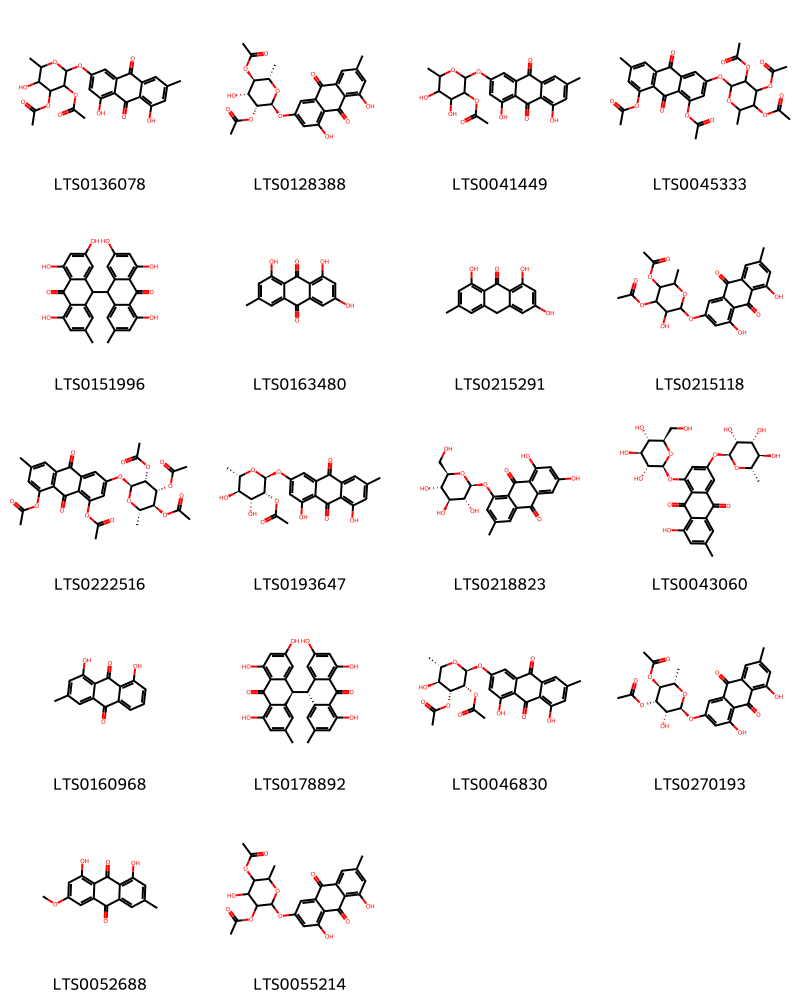{ width=100% }
    <figcaption>Hình ảnh cấu trúc hóa học của 18 hoạt chất thuộc nhóm Anthracenes gồm ['3-(acetyloxy)-2-[(4,5-dihydroxy-7-methyl-9,10-dioxoanthracen-2-yl)oxy]-5-hydroxy-6-methyloxan-4-yl acetate (LTS0136078)', '(2s,3r,4r,5r,6s)-5-(acetyloxy)-2-[(4,5-dihydroxy-7-methyl-9,10-dioxoanthracen-2-yl)oxy]-4-hydroxy-6-methyloxan-3-yl acetate (LTS0128388)', '2-[(4,5-dihydroxy-7-methyl-9,10-dioxoanthracen-2-yl)oxy]-4,5-dihydroxy-6-methyloxan-3-yl acetate (LTS0041449)', '8-(acetyloxy)-3-methyl-9,10-dioxo-6-{[3,4,5-tris(acetyloxy)-6-methyloxan-2-yl]oxy}anthracen-1-yl acetate (LTS0045333)', "2,2',4,4',5,5'-hexahydroxy-7,7'-dimethyl-9h,9'h-[9,9'-bianthracene]-10,10'-dione (LTS0151996)", 'emodin (LTS0163480)', 'emodin-9-anthrone (LTS0215291)', '3-(acetyloxy)-6-[(4,5-dihydroxy-7-methyl-9,10-dioxoanthracen-2-yl)oxy]-5-hydroxy-2-methyloxan-4-yl acetate (LTS0215118)', '8-(acetyloxy)-3-methyl-9,10-dioxo-6-{[(2s,3r,4r,5s,6s)-3,4,5-tris(acetyloxy)-6-methyloxan-2-yl]oxy}anthracen-1-yl acetate (LTS0222516)', '(2s,3r,4r,5r,6s)-2-[(4,5-dihydroxy-7-methyl-9,10-dioxoanthracen-2-yl)oxy]-4,5-dihydroxy-6-methyloxan-3-yl acetate (LTS0193647)', 'emodin 1-o-β-d-glucoside (LTS0218823)', 'glucofrangulin a (LTS0043060)', 'turkey rhubarb (LTS0160968)', "(9s,9's)-2,2',4,4',5,5'-hexahydroxy-7,7'-dimethyl-9h,9'h-[9,9'-bianthracene]-10,10'-dione (LTS0178892)", '(2s,3r,4r,5s,6s)-3-(acetyloxy)-2-[(4,5-dihydroxy-7-methyl-9,10-dioxoanthracen-2-yl)oxy]-5-hydroxy-6-methyloxan-4-yl acetate (LTS0046830)', '(2s,3s,4s,5r,6s)-3-(acetyloxy)-6-[(4,5-dihydroxy-7-methyl-9,10-dioxoanthracen-2-yl)oxy]-5-hydroxy-2-methyloxan-4-yl acetate (LTS0270193)', 'physcion (LTS0052688)', '5-(acetyloxy)-2-[(4,5-dihydroxy-7-methyl-9,10-dioxoanthracen-2-yl)oxy]-4-hydroxy-6-methyloxan-3-yl acetate (LTS0055214)'].</figcaption>
</figure>
#### Nhóm Flavonoids
<figure markdown="span">
    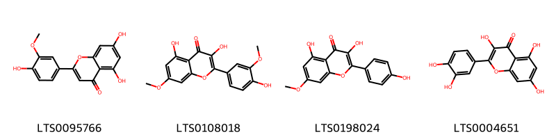{ width=100% }
    <figcaption>Hình ảnh cấu trúc hóa học của 4 hoạt chất thuộc nhóm Flavonoids gồm ['chrysoeriol (LTS0095766)', 'rhamnazin (LTS0108018)', 'rhamnocitrin (LTS0198024)', 'quercetin (LTS0004651)'].</figcaption>
</figure>
#### Nhóm Naphthalenes
<figure markdown="span">
    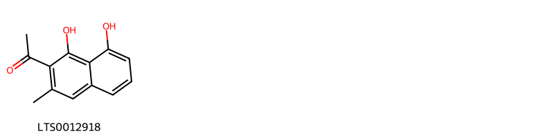{ width=100% }
    <figcaption>Hình ảnh cấu trúc hóa học của 1 hoạt chất thuộc nhóm Naphthalenes gồm ['nepodin (LTS0012918)'].</figcaption>
</figure>
#### Nhóm Organooxygen compounds
<figure markdown="span">
    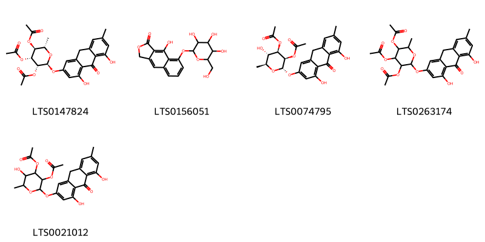{ width=100% }
    <figcaption>Hình ảnh cấu trúc hóa học của 5 hoạt chất thuộc nhóm Organooxygen compounds gồm ['(2s,3r,4r,5s,6s)-4,5-bis(acetyloxy)-2-[(4,5-dihydroxy-7-methyl-10-oxo-9h-anthracen-2-yl)oxy]-6-methyloxan-3-yl acetate (LTS0147824)', '9-hydroxy-8-{[3,4,5-trihydroxy-6-(hydroxymethyl)oxan-2-yl]oxy}-3h-naphtho[2,3-c]furan-1-one (LTS0156051)', '(2s,3r,4r,5s,6s)-3-(acetyloxy)-2-[(4,5-dihydroxy-7-methyl-10-oxo-9h-anthracen-2-yl)oxy]-5-hydroxy-6-methyloxan-4-yl acetate (LTS0074795)', '4,5-bis(acetyloxy)-2-[(4,5-dihydroxy-7-methyl-10-oxo-9h-anthracen-2-yl)oxy]-6-methyloxan-3-yl acetate (LTS0263174)', '3-(acetyloxy)-2-[(4,5-dihydroxy-7-methyl-10-oxo-9h-anthracen-2-yl)oxy]-5-hydroxy-6-methyloxan-4-yl acetate (LTS0021012)'].</figcaption>
</figure>

---

### Dược dân tộc học

Danh sách các quốc gia có sử dụng *Rhamnus prinoides* trong điều trị các bệnh. 

| Country   | Disease               | Bệnh                                                                                                                                                                                                |
|:----------|:----------------------|:----------------------------------------------------------------------------------------------------------------------------------------------------------------------------------------------------|
| Ethiopia  | Intoxicant, Stimulant | MYMEMORY WARNING: YOU USED ALL AVAILABLE FREE TRANSLATIONS FOR TODAY. NEXT AVAILABLE IN  14 HOURS 02 MINUTES 48 SECONDS VISIT HTTPS://MYMEMORY.TRANSLATED.NET/DOC/USAGELIMITS.PHP TO TRANSLATE MORE |

---

---
## Rhamnus purpurea
### Thông tin về thực vật

!!! info "Phân loại thực vật của *Rhamnus purpurea* từ GIBF:"
    - **Kingdom:** Plantae
    - **Phylum:** Tracheophyta
    - **Order:** Rosales
    - **Family:** Rhamnaceae
    - **Genus:** Rhamnus
    - **Species:** *Rhamnus purpurea*

 

| Label (VI)   | Label (EN)   | Scientific Name   | Descriptions (VI)   | Descriptions (EN)   | Also Known As (VI)   | Also Known As (EN)   |
|:-------------|:-------------|:------------------|:--------------------|:--------------------|:---------------------|:---------------------|
| N/A          | N/A          | Rhamnus purpurea  | loài thực vật       | species of plant    | ['']                 | ['']                 |

#### Phân bố trên thế giới

**Từ CSDL GIBF** nan, Pakistan, Iran (Islamic Republic of), Bhutan, India, China, Nepal

#### Phân bố tại Việt Nam

**Từ CSDL GIBF**: Không có ghi nhận ở Việt Nam

---
### Thành phần hóa học
        
- Theo cơ sở dữ liệu lotus: Từ loài *Rhamnus purpurea* đã phân lập và xác định được Chưa có hoạt chất nào được phân lập. hoạt chất thuộc về các nhóm Không có hoạt chất nào được phân lập. 

Không có hình ảnh nào được tạo ra

---

### Dược dân tộc học

Danh sách các quốc gia có sử dụng *Rhamnus purpurea* trong điều trị các bệnh. 

| Country   | Disease   | Bệnh                                                                                                                                                                                                |
|:----------|:----------|:----------------------------------------------------------------------------------------------------------------------------------------------------------------------------------------------------|
| India     | Purgative | MYMEMORY WARNING: YOU USED ALL AVAILABLE FREE TRANSLATIONS FOR TODAY. NEXT AVAILABLE IN  14 HOURS 02 MINUTES 17 SECONDS VISIT HTTPS://MYMEMORY.TRANSLATED.NET/DOC/USAGELIMITS.PHP TO TRANSLATE MORE |

---

---
## Rhamnus purshiana
### Thông tin về thực vật

!!! info "Phân loại thực vật của *Frangula purshiana* từ GIBF:"
    - **Kingdom:** Plantae
    - **Phylum:** Tracheophyta
    - **Order:** Rosales
    - **Family:** Rhamnaceae
    - **Genus:** Frangula
    - **Species:** *Frangula purshiana*

 

| Label (VI)   | Label (EN)   | Scientific Name   | Descriptions (VI)   | Descriptions (EN)   | Also Known As (VI)   | Also Known As (EN)   |
|:-------------|:-------------|:------------------|:--------------------|:--------------------|:---------------------|:---------------------|
| N/A          | N/A          | Rhamnus purshiana | loài thực vật       | species of plant    | ['']                 | ['']                 |

#### Phân bố trên thế giới

**Từ CSDL GIBF** nan, Colombia, Poland, New Zealand, Canada, United States of America, Norway, Netherlands

#### Phân bố tại Việt Nam

**Từ CSDL GIBF**: Không có ghi nhận ở Việt Nam

---
### Thành phần hóa học
        
- Theo cơ sở dữ liệu lotus: Từ loài *Frangula purshiana* đã phân lập và xác định được 13 hoạt chất thuộc về các nhóm Organooxygen compounds, Anthracenes. 

|    | chemicalTaxonomyClassyfireClass   |   smiles_count |
|---:|:----------------------------------|---------------:|
|  0 | Anthracenes                       |              7 |
|  1 | Organooxygen compounds            |              6 |

#### Nhóm Anthracenes
<figure markdown="span">
    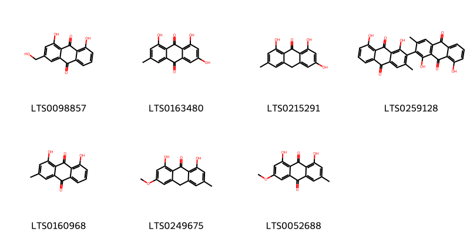{ width=100% }
    <figcaption>Hình ảnh cấu trúc hóa học của 7 hoạt chất thuộc nhóm Anthracenes gồm ['aloe emodin (LTS0098857)', 'emodin (LTS0163480)', 'emodin-9-anthrone (LTS0215291)', 'cassiamin c (LTS0259128)', 'turkey rhubarb (LTS0160968)', '1,8-dihydroxy-3-methoxy-6-methyl-10h-anthracen-9-one (LTS0249675)', 'physcion (LTS0052688)'].</figcaption>
</figure>
#### Nhóm Organooxygen compounds
<figure markdown="span">
    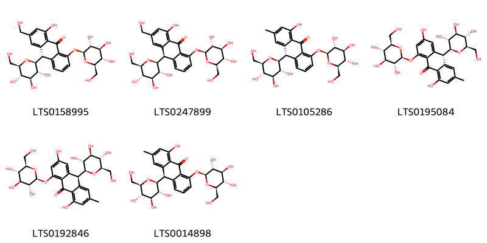{ width=100% }
    <figcaption>Hình ảnh cấu trúc hóa học của 6 hoạt chất thuộc nhóm Organooxygen compounds gồm ['cascaroside a (LTS0158995)', 'cascaroside b (LTS0247899)', 'cascaroside c (LTS0105286)', 'cascaroside e (LTS0195084)', 'cascaroside f (LTS0192846)', 'cascaroside d (LTS0014898)'].</figcaption>
</figure>

---

### Dược dân tộc học

Danh sách các quốc gia có sử dụng *Frangula purshiana* trong điều trị các bệnh. 

| Country          | Disease             | Bệnh                                                                                                                                                                                                |
|:-----------------|:--------------------|:----------------------------------------------------------------------------------------------------------------------------------------------------------------------------------------------------|
| Canada(Kwakiutl) | Laxative            | MYMEMORY WARNING: YOU USED ALL AVAILABLE FREE TRANSLATIONS FOR TODAY. NEXT AVAILABLE IN  14 HOURS 01 MINUTES 51 SECONDS VISIT HTTPS://MYMEMORY.TRANSLATED.NET/DOC/USAGELIMITS.PHP TO TRANSLATE MORE |
| Elsewhere        | Aperient            | MYMEMORY WARNING: YOU USED ALL AVAILABLE FREE TRANSLATIONS FOR TODAY. NEXT AVAILABLE IN  14 HOURS 01 MINUTES 48 SECONDS VISIT HTTPS://MYMEMORY.TRANSLATED.NET/DOC/USAGELIMITS.PHP TO TRANSLATE MORE |
| US               | Laxative, Tonic     | MYMEMORY WARNING: YOU USED ALL AVAILABLE FREE TRANSLATIONS FOR TODAY. NEXT AVAILABLE IN  14 HOURS 01 MINUTES 45 SECONDS VISIT HTTPS://MYMEMORY.TRANSLATED.NET/DOC/USAGELIMITS.PHP TO TRANSLATE MORE |
| US(Amerindian)   | Laxative, Tonic     | MYMEMORY WARNING: YOU USED ALL AVAILABLE FREE TRANSLATIONS FOR TODAY. NEXT AVAILABLE IN  14 HOURS 01 MINUTES 42 SECONDS VISIT HTTPS://MYMEMORY.TRANSLATED.NET/DOC/USAGELIMITS.PHP TO TRANSLATE MORE |
| US(Flathead)     | Purgative, Laxative | MYMEMORY WARNING: YOU USED ALL AVAILABLE FREE TRANSLATIONS FOR TODAY. NEXT AVAILABLE IN  14 HOURS 01 MINUTES 39 SECONDS VISIT HTTPS://MYMEMORY.TRANSLATED.NET/DOC/USAGELIMITS.PHP TO TRANSLATE MORE |

---

---
## Rhamnus purshianus
### Thông tin về thực vật

!!! info "Phân loại thực vật của *Frangula purshiana* từ GIBF:"
    - **Kingdom:** Plantae
    - **Phylum:** Tracheophyta
    - **Order:** Rosales
    - **Family:** Rhamnaceae
    - **Genus:** Frangula
    - **Species:** *Frangula purshiana*

 

| Label (VI)   | Label (EN)   | Scientific Name   | Descriptions (VI)   | Descriptions (EN)   | Also Known As (VI)   | Also Known As (EN)   |
|:-------------|:-------------|:------------------|:--------------------|:--------------------|:---------------------|:---------------------|
| N/A          | N/A          | Rhamnus purshiana | loài thực vật       | species of plant    | ['']                 | ['']                 |

#### Phân bố trên thế giới

**Từ CSDL GIBF** nan, Colombia, Poland, New Zealand, Canada, United States of America, Norway, Netherlands

#### Phân bố tại Việt Nam

**Từ CSDL GIBF**: Không có ghi nhận ở Việt Nam

---
### Thành phần hóa học
        
- Theo cơ sở dữ liệu lotus: Từ loài *Frangula purshiana* đã phân lập và xác định được Chưa có hoạt chất nào được phân lập. hoạt chất thuộc về các nhóm Không có hoạt chất nào được phân lập. 

Không có hình ảnh nào được tạo ra

---

### Dược dân tộc học

Danh sách các quốc gia có sử dụng *Frangula purshiana* trong điều trị các bệnh. 

| Country        | Disease                    | Bệnh                                                                                                                                                                                                |
|:---------------|:---------------------------|:----------------------------------------------------------------------------------------------------------------------------------------------------------------------------------------------------|
| Canada(Salish) | Purgative, Tonic, Laxative | MYMEMORY WARNING: YOU USED ALL AVAILABLE FREE TRANSLATIONS FOR TODAY. NEXT AVAILABLE IN  14 HOURS 01 MINUTES 04 SECONDS VISIT HTTPS://MYMEMORY.TRANSLATED.NET/DOC/USAGELIMITS.PHP TO TRANSLATE MORE |
| Elsewhere      | Laxative, Tonic            | MYMEMORY WARNING: YOU USED ALL AVAILABLE FREE TRANSLATIONS FOR TODAY. NEXT AVAILABLE IN  14 HOURS 00 MINUTES 59 SECONDS VISIT HTTPS://MYMEMORY.TRANSLATED.NET/DOC/USAGELIMITS.PHP TO TRANSLATE MORE |
| Turkey         | Laxative, Tonic            | MYMEMORY WARNING: YOU USED ALL AVAILABLE FREE TRANSLATIONS FOR TODAY. NEXT AVAILABLE IN  14 HOURS 00 MINUTES 56 SECONDS VISIT HTTPS://MYMEMORY.TRANSLATED.NET/DOC/USAGELIMITS.PHP TO TRANSLATE MORE |

---

---
## Rhamnus triquetra
### Thông tin về thực vật

!!! info "Phân loại thực vật của *Rhamnus triquetra* từ GIBF:"
    - **Kingdom:** Plantae
    - **Phylum:** Tracheophyta
    - **Order:** Rosales
    - **Family:** Rhamnaceae
    - **Genus:** Rhamnus
    - **Species:** *Rhamnus triquetra*

 

| Label (VI)   | Label (EN)   | Scientific Name   | Descriptions (VI)   | Descriptions (EN)   | Also Known As (VI)   | Also Known As (EN)   |
|:-------------|:-------------|:------------------|:--------------------|:--------------------|:---------------------|:---------------------|
| N/A          | N/A          | Rhamnus triquetra | loài thực vật       | species of plant    | ['']                 | ['']                 |

#### Phân bố trên thế giới

**Từ CSDL GIBF** nan, Pakistan, India, United States of America, Mexico, Nepal

#### Phân bố tại Việt Nam

**Từ CSDL GIBF**: Không có ghi nhận ở Việt Nam

---
### Thành phần hóa học
        
- Theo cơ sở dữ liệu lotus: Từ loài *Rhamnus triquetra* đã phân lập và xác định được 1 hoạt chất thuộc về các nhóm Anthracenes. 

|    | chemicalTaxonomyClassyfireClass   |   smiles_count |
|---:|:----------------------------------|---------------:|
|  0 | Anthracenes                       |              1 |

#### Nhóm Anthracenes
<figure markdown="span">
    { width=100% }
    <figcaption>Hình ảnh cấu trúc hóa học của 1 hoạt chất thuộc nhóm Anthracenes gồm ['emodin (LTS0163480)'].</figcaption>
</figure>

---

### Dược dân tộc học

Danh sách các quốc gia có sử dụng *Rhamnus triquetra* trong điều trị các bệnh. 

| Country   | Disease           | Bệnh                                                                                                                                                                                                |
|:----------|:------------------|:----------------------------------------------------------------------------------------------------------------------------------------------------------------------------------------------------|
| India     | Astringent, Tonic | MYMEMORY WARNING: YOU USED ALL AVAILABLE FREE TRANSLATIONS FOR TODAY. NEXT AVAILABLE IN  14 HOURS 00 MINUTES 32 SECONDS VISIT HTTPS://MYMEMORY.TRANSLATED.NET/DOC/USAGELIMITS.PHP TO TRANSLATE MORE |

---

---
## Rhamnus virgata
### Thông tin về thực vật

!!! info "Phân loại thực vật của *Rhamnus virgata* từ GIBF:"
    - **Kingdom:** Plantae
    - **Phylum:** Tracheophyta
    - **Order:** Rosales
    - **Family:** Rhamnaceae
    - **Genus:** Rhamnus
    - **Species:** *Rhamnus virgata*

 

| Label (VI)   | Label (EN)   | Scientific Name   | Descriptions (VI)   | Descriptions (EN)   | Also Known As (VI)   | Also Known As (EN)   |
|:-------------|:-------------|:------------------|:--------------------|:--------------------|:---------------------|:---------------------|
| N/A          | N/A          | Rhamnus virgata   | loài thực vật       | species of plant    | ['']                 | ['']                 |

#### Phân bố trên thế giới

**Từ CSDL GIBF** Thailand, Pakistan, Japan, Latvia, New Zealand, India, Russian Federation, United States of America, China, Nepal, Korea, Republic of

#### Phân bố tại Việt Nam

**Từ CSDL GIBF**: Không có ghi nhận ở Việt Nam

---
### Thành phần hóa học
        
- Theo cơ sở dữ liệu lotus: Từ loài *Rhamnus virgata* đã phân lập và xác định được 3 hoạt chất thuộc về các nhóm Anthracenes. 

|    | chemicalTaxonomyClassyfireClass   |   smiles_count |
|---:|:----------------------------------|---------------:|
|  0 | Anthracenes                       |              3 |

#### Nhóm Anthracenes
<figure markdown="span">
    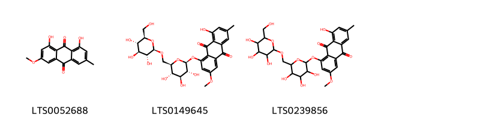{ width=100% }
    <figcaption>Hình ảnh cấu trúc hóa học của 3 hoạt chất thuộc nhóm Anthracenes gồm ['physcion (LTS0052688)', 'physcion diglucoside (LTS0149645)', '1-hydroxy-6-methoxy-3-methyl-8-{[3,4,5-trihydroxy-6-({[3,4,5-trihydroxy-6-(hydroxymethyl)oxan-2-yl]oxy}methyl)oxan-2-yl]oxy}anthracene-9,10-dione (LTS0239856)'].</figcaption>
</figure>

---

### Dược dân tộc học

Danh sách các quốc gia có sử dụng *Rhamnus virgata* trong điều trị các bệnh. 

| Country   | Disease           | Bệnh                                                                                                                                                                                                |
|:----------|:------------------|:----------------------------------------------------------------------------------------------------------------------------------------------------------------------------------------------------|
| India     | Emetic, Purgative | MYMEMORY WARNING: YOU USED ALL AVAILABLE FREE TRANSLATIONS FOR TODAY. NEXT AVAILABLE IN  14 HOURS 00 MINUTES 05 SECONDS VISIT HTTPS://MYMEMORY.TRANSLATED.NET/DOC/USAGELIMITS.PHP TO TRANSLATE MORE |

---

---
## Rhamnus wightii
### Thông tin về thực vật

!!! info "Phân loại thực vật của *Rhamnus wightii* từ GIBF:"
    - **Kingdom:** Plantae
    - **Phylum:** Tracheophyta
    - **Order:** Rosales
    - **Family:** Rhamnaceae
    - **Genus:** Rhamnus
    - **Species:** *Rhamnus wightii*

 

| Label (VI)   | Label (EN)   | Scientific Name   | Descriptions (VI)   | Descriptions (EN)   | Also Known As (VI)   | Also Known As (EN)   |
|:-------------|:-------------|:------------------|:--------------------|:--------------------|:---------------------|:---------------------|
| N/A          | N/A          | Rhamnus wightii   | loài thực vật       | species of plant    | ['']                 | ['']                 |

#### Phân bố trên thế giới

**Từ CSDL GIBF** nan, Nepal, Sri Lanka, India

#### Phân bố tại Việt Nam

**Từ CSDL GIBF**: Không có ghi nhận ở Việt Nam

---
### Thành phần hóa học
        
- Theo cơ sở dữ liệu lotus: Từ loài *Rhamnus wightii* đã phân lập và xác định được 17 hoạt chất thuộc về các nhóm Organooxygen compounds, Naphthofurans, Prenol lipids, Anthracenes, Isocoumarans, Steroids and steroid derivatives, Naphthalenes. 

|    | chemicalTaxonomyClassyfireClass   |   smiles_count |
|---:|:----------------------------------|---------------:|
|  0 | Anthracenes                       |              4 |
|  1 | Isocoumarans                      |              1 |
|  2 | Naphthalenes                      |              1 |
|  3 | Naphthofurans                     |              1 |
|  4 | Organooxygen compounds            |              2 |
|  5 | Prenol lipids                     |              3 |
|  6 | Steroids and steroid derivatives  |              5 |

#### Nhóm Anthracenes
<figure markdown="span">
    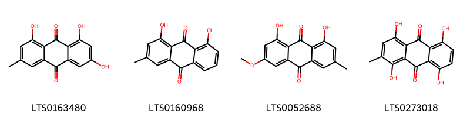{ width=100% }
    <figcaption>Hình ảnh cấu trúc hóa học của 4 hoạt chất thuộc nhóm Anthracenes gồm ['emodin (LTS0163480)', 'turkey rhubarb (LTS0160968)', 'physcion (LTS0052688)', '1,4,5,8-tetrahydroxy-2-methylanthracene-9,10-dione (LTS0273018)'].</figcaption>
</figure>
#### Nhóm Isocoumarans
<figure markdown="span">
    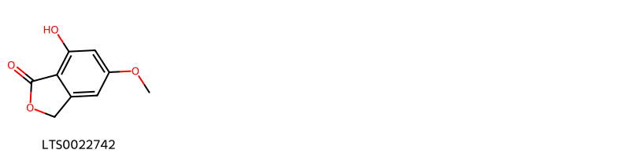{ width=100% }
    <figcaption>Hình ảnh cấu trúc hóa học của 1 hoạt chất thuộc nhóm Isocoumarans gồm ['7-hydroxy-5-methoxy-3h-2-benzofuran-1-one (LTS0022742)'].</figcaption>
</figure>
#### Nhóm Naphthalenes
<figure markdown="span">
    { width=100% }
    <figcaption>Hình ảnh cấu trúc hóa học của 1 hoạt chất thuộc nhóm Naphthalenes gồm ['nepodin (LTS0012918)'].</figcaption>
</figure>
#### Nhóm Naphthofurans
<figure markdown="span">
    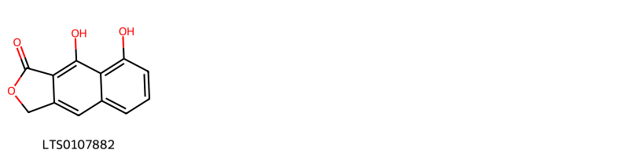{ width=100% }
    <figcaption>Hình ảnh cấu trúc hóa học của 1 hoạt chất thuộc nhóm Naphthofurans gồm ['8,9-dihydroxy-3h-naphtho[2,3-c]furan-1-one (LTS0107882)'].</figcaption>
</figure>
#### Nhóm Organooxygen compounds
<figure markdown="span">
    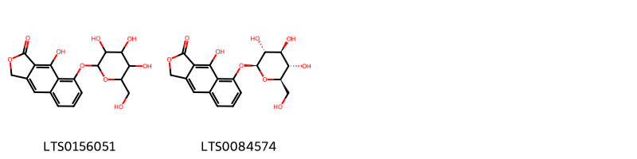{ width=100% }
    <figcaption>Hình ảnh cấu trúc hóa học của 2 hoạt chất thuộc nhóm Organooxygen compounds gồm ['9-hydroxy-8-{[3,4,5-trihydroxy-6-(hydroxymethyl)oxan-2-yl]oxy}-3h-naphtho[2,3-c]furan-1-one (LTS0156051)', '9-hydroxy-8-{[(2s,3r,4s,5s,6r)-3,4,5-trihydroxy-6-(hydroxymethyl)oxan-2-yl]oxy}-3h-naphtho[2,3-c]furan-1-one (LTS0084574)'].</figcaption>
</figure>
#### Nhóm Prenol lipids
<figure markdown="span">
    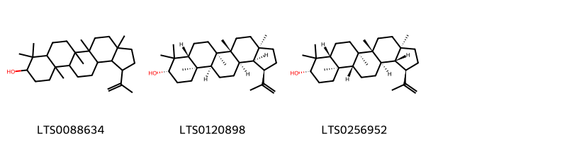{ width=100% }
    <figcaption>Hình ảnh cấu trúc hóa học của 3 hoạt chất thuộc nhóm Prenol lipids gồm ['lupeol (LTS0088634)', '(1r,3ar,5ar,5br,7ar,9s,11ar,11bs,13ar,13bs)-3a,5a,5b,8,8,11a-hexamethyl-1-(prop-1-en-2-yl)-hexadecahydrocyclopenta[a]chrysen-9-ol (LTS0120898)', 'lupeol (LTS0256952)'].</figcaption>
</figure>
#### Nhóm Steroids and steroid derivatives
<figure markdown="span">
    { width=100% }
    <figcaption>Hình ảnh cấu trúc hóa học của 5 hoạt chất thuộc nhóm Steroids and steroid derivatives gồm ['stigmast-5-en-3-ol (LTS0071224)', 'sitosterol (LTS0168132)', 'stigmast-5-en-3-ol, (3β)- (LTS0204616)', 'sitogluside (LTS0201798)', '2-{[1-(5-ethyl-6-methylheptan-2-yl)-9a,11a-dimethyl-1h,2h,3h,3ah,3bh,4h,6h,7h,8h,9h,9bh,10h,11h-cyclopenta[a]phenanthren-7-yl]oxy}-6-(hydroxymethyl)oxane-3,4,5-triol (LTS0158828)'].</figcaption>
</figure>

---

### Dược dân tộc học

Danh sách các quốc gia có sử dụng *Rhamnus wightii* trong điều trị các bệnh. 

| Country   | Disease           | Bệnh                                                                                                                                                                                                |
|:----------|:------------------|:----------------------------------------------------------------------------------------------------------------------------------------------------------------------------------------------------|
| India     | Tonic, Astringent | MYMEMORY WARNING: YOU USED ALL AVAILABLE FREE TRANSLATIONS FOR TODAY. NEXT AVAILABLE IN  13 HOURS 59 MINUTES 35 SECONDS VISIT HTTPS://MYMEMORY.TRANSLATED.NET/DOC/USAGELIMITS.PHP TO TRANSLATE MORE |

---

# Chi Colubrina

??? note "Danh sách các dược liệu thuộc chi"
    
	 - *Colubrina arborescens*
	 - *Colubrina asiatica*
	 - *Colubrina ferruginea*
	 - *Colubrina gregii*
	 - *Colubrina reclinata*

---
## Colubrina arborescens
### Thông tin về thực vật

!!! info "Phân loại thực vật của *Colubrina arborescens* từ GIBF:"
    - **Kingdom:** Plantae
    - **Phylum:** Tracheophyta
    - **Order:** Rosales
    - **Family:** Rhamnaceae
    - **Genus:** Colubrina
    - **Species:** *Colubrina arborescens*

 

| Label (VI)   | Label (EN)   | Scientific Name       | Descriptions (VI)   | Descriptions (EN)   | Also Known As (VI)   | Also Known As (EN)   |
|:-------------|:-------------|:----------------------|:--------------------|:--------------------|:---------------------|:---------------------|
| N/A          | N/A          | Colubrina arborescens | loài thực vật       | species of plant    | ['']                 | ['']                 |

#### Phân bố trên thế giới

**Từ CSDL GIBF** nan, Cayman Islands, El Salvador, Trinidad and Tobago, Jamaica, Guatemala, Haiti, Colombia, Turks and Caicos Islands, Dominican Republic, Puerto Rico, Bahamas, Cuba, Anguilla, Bonaire, Sint Eustatius and Saba, Virgin Islands (U.S.), Barbados, Virgin Islands (British), Antigua and Barbuda, Nicaragua, Belize, Brazil, Montserrat, Mexico, Saint Martin (French part), Costa Rica, Ecuador, United States of America

#### Phân bố tại Việt Nam

**Từ CSDL GIBF**: Không có ghi nhận ở Việt Nam

---
### Thành phần hóa học
        
- Theo cơ sở dữ liệu lotus: Từ loài *Colubrina arborescens* đã phân lập và xác định được Chưa có hoạt chất nào được phân lập. hoạt chất thuộc về các nhóm Không có hoạt chất nào được phân lập. 

Không có hình ảnh nào được tạo ra

---

### Dược dân tộc học

Danh sách các quốc gia có sử dụng *Colubrina arborescens* trong điều trị các bệnh. 

| Country     | Disease    | Bệnh                                                                                                                                                                                                |
|:------------|:-----------|:----------------------------------------------------------------------------------------------------------------------------------------------------------------------------------------------------|
| Bahamas     | Antiseptic | MYMEMORY WARNING: YOU USED ALL AVAILABLE FREE TRANSLATIONS FOR TODAY. NEXT AVAILABLE IN  13 HOURS 59 MINUTES 02 SECONDS VISIT HTTPS://MYMEMORY.TRANSLATED.NET/DOC/USAGELIMITS.PHP TO TRANSLATE MORE |
| West Indies | Soap       | MYMEMORY WARNING: YOU USED ALL AVAILABLE FREE TRANSLATIONS FOR TODAY. NEXT AVAILABLE IN  13 HOURS 58 MINUTES 58 SECONDS VISIT HTTPS://MYMEMORY.TRANSLATED.NET/DOC/USAGELIMITS.PHP TO TRANSLATE MORE |

---

---
## Colubrina asiatica
### Thông tin về thực vật

!!! info "Phân loại thực vật của *Colubrina asiatica* từ GIBF:"
    - **Kingdom:** Plantae
    - **Phylum:** Tracheophyta
    - **Order:** Rosales
    - **Family:** Rhamnaceae
    - **Genus:** Colubrina
    - **Species:** *Colubrina asiatica*

 

| Label (VI)   | Label (EN)   | Scientific Name    | Descriptions (VI)   | Descriptions (EN)   | Also Known As (VI)   | Also Known As (EN)                                     |
|:-------------|:-------------|:-------------------|:--------------------|:--------------------|:---------------------|:-------------------------------------------------------|
| N/A          | N/A          | Colubrina asiatica | loài thực vật       | species of plant    | ['']                 | ['Asian nakedwood', 'Asiatic snakewood', 'latherleaf'] |

#### Phân bố trên thế giới

**Từ CSDL GIBF** nan, Cayman Islands, Thailand, French Polynesia, Northern Mariana Islands, Kenya, Singapore, Australia, Jamaica, Indonesia, Maldives, Malaysia, Mayotte, Seychelles, Guam, Vanuatu, French Southern Territories, Mexico, Tonga, Chinese Taipei, Niue, Tanzania, United Republic of, Fiji, New Caledonia, United States of America, Madagascar

#### Phân bố tại Việt Nam

**Từ CSDL GIBF**: Không có ghi nhận ở Việt Nam

---
### Thành phần hóa học
        
- Theo cơ sở dữ liệu lotus: Từ loài *Colubrina asiatica* đã phân lập và xác định được 16 hoạt chất thuộc về các nhóm Flavonoids, Prenol lipids, Isoquinolines and derivatives. 

|    | chemicalTaxonomyClassyfireClass   |   smiles_count |
|---:|:----------------------------------|---------------:|
|  0 | Flavonoids                        |              6 |
|  1 | Isoquinolines and derivatives     |              2 |
|  2 | Prenol lipids                     |              8 |

#### Nhóm Flavonoids
<figure markdown="span">
    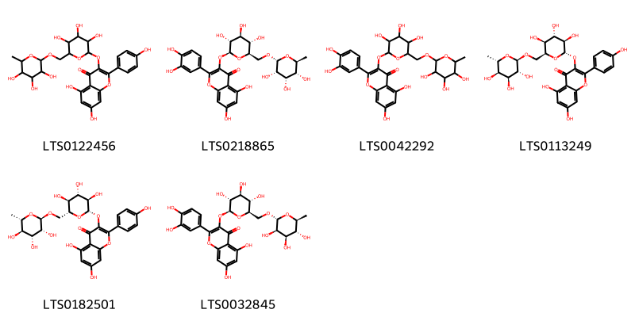{ width=100% }
    <figcaption>Hình ảnh cấu trúc hóa học của 6 hoạt chất thuộc nhóm Flavonoids gồm ['5,7-dihydroxy-2-(4-hydroxyphenyl)-3-[(3,4,5-trihydroxy-6-{[(3,4,5-trihydroxy-6-methyloxan-2-yl)oxy]methyl}oxan-2-yl)oxy]chromen-4-one (LTS0122456)', '2-(3,4-dihydroxyphenyl)-5,7-dihydroxy-3-{[(2s,3r,4s,5s,6r)-3,4,5-trihydroxy-6-({[(2r,3s,4s,5r,6s)-3,4,5-trihydroxy-6-methyloxan-2-yl]oxy}methyl)oxan-2-yl]oxy}chromen-4-one (LTS0218865)', 'rutin (LTS0042292)', '5,7-dihydroxy-2-(4-hydroxyphenyl)-3-{[(2s,3r,4s,5s,6s)-3,4,5-trihydroxy-6-({[(2r,3r,4s,5r,6s)-3,4,5-trihydroxy-6-methyloxan-2-yl]oxy}methyl)oxan-2-yl]oxy}chromen-4-one (LTS0113249)', 'nictoflorin (LTS0182501)', '3-rutinosyl quercetin (LTS0032845)'].</figcaption>
</figure>
#### Nhóm Isoquinolines and derivatives
<figure markdown="span">
    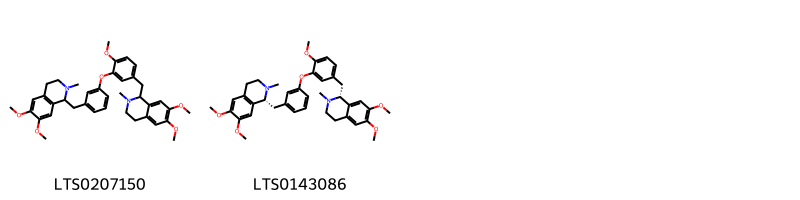{ width=100% }
    <figcaption>Hình ảnh cấu trúc hóa học của 2 hoạt chất thuộc nhóm Isoquinolines and derivatives gồm ['1-[(3-{5-[(6,7-dimethoxy-2-methyl-3,4-dihydro-1h-isoquinolin-1-yl)methyl]-2-methoxyphenoxy}phenyl)methyl]-6,7-dimethoxy-2-methyl-3,4-dihydro-1h-isoquinoline (LTS0207150)', '(1r)-1-{[3-(5-{[(1r)-6,7-dimethoxy-2-methyl-3,4-dihydro-1h-isoquinolin-1-yl]methyl}-2-methoxyphenoxy)phenyl]methyl}-6,7-dimethoxy-2-methyl-3,4-dihydro-1h-isoquinoline (LTS0143086)'].</figcaption>
</figure>
#### Nhóm Prenol lipids
<figure markdown="span">
    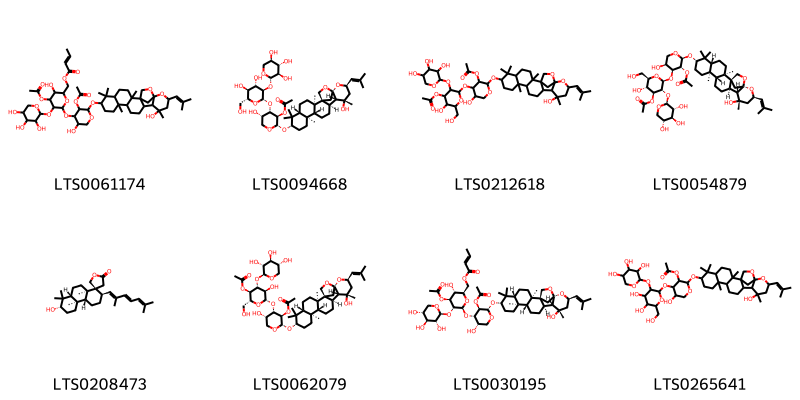{ width=100% }
    <figcaption>Hình ảnh cấu trúc hóa học của 8 hoạt chất thuộc nhóm Prenol lipids gồm ['[4-(acetyloxy)-6-{[3-(acetyloxy)-5-hydroxy-2-{[16-hydroxy-2,6,6,10,16-pentamethyl-18-(2-methylprop-1-en-1-yl)-19,21-dioxahexacyclo[18.2.1.0¹,¹⁴.0²,¹¹.0⁵,¹⁰.0¹⁵,²⁰]tricosan-7-yl]oxy}oxan-4-yl]oxy}-3-hydroxy-5-[(3,4,5-trihydroxyoxan-2-yl)oxy]oxan-2-yl]methyl but-2-enoate (LTS0061174)', 'colubrin (LTS0094668)', '4-{[4-(acetyloxy)-5-hydroxy-6-(hydroxymethyl)-3-[(3,4,5-trihydroxyoxan-2-yl)oxy]oxan-2-yl]oxy}-5-hydroxy-2-{[16-hydroxy-2,6,6,10,16-pentamethyl-18-(2-methylprop-1-en-1-yl)-19,21-dioxahexacyclo[18.2.1.0¹,¹⁴.0²,¹¹.0⁵,¹⁰.0¹⁵,²⁰]tricosan-7-yl]oxy}oxan-3-yl acetate (LTS0212618)', '(2s,3r,4s,5r,6r)-2-{[(2s,3r,4s,5s)-3-(acetyloxy)-5-hydroxy-2-{[(1s,2r,5r,7s,10r,11r,14r,15s,16s,18r,20s)-16-hydroxy-2,6,6,10,16-pentamethyl-18-(2-methylprop-1-en-1-yl)-19,21-dioxahexacyclo[18.2.1.0¹,¹⁴.0²,¹¹.0⁵,¹⁰.0¹⁵,²⁰]tricosan-7-yl]oxy}oxan-4-yl]oxy}-5-hydroxy-6-(hydroxymethyl)-3-{[(2s,3r,4s,5r)-3,4,5-trihydroxyoxan-2-yl]oxy}oxan-4-yl acetate (LTS0054879)', "(2'r,3s,4'ar,4'br,7's,8'ar,10'ar)-2'-[(1e,3e)-2,6-dimethylhepta-1,3,5-trien-1-yl]-7'-hydroxy-4'b,8',8',10'a-tetramethyl-decahydrospiro[oxolane-3,1'-phenanthren]-5-one (LTS0208473)", '(2s,3r,4s,5s)-4-{[(2s,3r,4r,5r,6r)-5-(acetyloxy)-3-hydroxy-6-(hydroxymethyl)-4-{[(2s,3r,4s,5r)-3,4,5-trihydroxyoxan-2-yl]oxy}oxan-2-yl]oxy}-5-hydroxy-2-{[(1s,2r,5r,7s,10r,11r,14r,15s,16s,18r,20s)-16-hydroxy-2,6,6,10,16-pentamethyl-18-(2-methylprop-1-en-1-yl)-19,21-dioxahexacyclo[18.2.1.0¹,¹⁴.0²,¹¹.0⁵,¹⁰.0¹⁵,²⁰]tricosan-7-yl]oxy}oxan-3-yl acetate (LTS0062079)', '[(2r,3r,4s,5r,6s)-4-(acetyloxy)-6-{[(2s,3r,4s,5s)-3-(acetyloxy)-5-hydroxy-2-{[(1s,2r,5r,7s,10r,11r,14r,15s,16s,18r,20s)-16-hydroxy-2,6,6,10,16-pentamethyl-18-(2-methylprop-1-en-1-yl)-19,21-dioxahexacyclo[18.2.1.0¹,¹⁴.0²,¹¹.0⁵,¹⁰.0¹⁵,²⁰]tricosan-7-yl]oxy}oxan-4-yl]oxy}-3-hydroxy-5-{[(2s,3r,4s,5r)-3,4,5-trihydroxyoxan-2-yl]oxy}oxan-2-yl]methyl (2e)-but-2-enoate (LTS0030195)', '4-{[4,5-dihydroxy-6-(hydroxymethyl)-3-[(3,4,5-trihydroxyoxan-2-yl)oxy]oxan-2-yl]oxy}-5-hydroxy-2-{[16-hydroxy-2,6,6,10,16-pentamethyl-18-(2-methylprop-1-en-1-yl)-19,21-dioxahexacyclo[18.2.1.0¹,¹⁴.0²,¹¹.0⁵,¹⁰.0¹⁵,²⁰]tricosan-7-yl]oxy}oxan-3-yl acetate (LTS0265641)'].</figcaption>
</figure>

---

### Dược dân tộc học

Danh sách các quốc gia có sử dụng *Colubrina asiatica* trong điều trị các bệnh. 

| Country   | Disease         | Bệnh                                                                                                                                                                                                |
|:----------|:----------------|:----------------------------------------------------------------------------------------------------------------------------------------------------------------------------------------------------|
| Borneo    | Soap            | MYMEMORY WARNING: YOU USED ALL AVAILABLE FREE TRANSLATIONS FOR TODAY. NEXT AVAILABLE IN  13 HOURS 58 MINUTES 23 SECONDS VISIT HTTPS://MYMEMORY.TRANSLATED.NET/DOC/USAGELIMITS.PHP TO TRANSLATE MORE |
| Elsewhere | Soap, Piscicide | MYMEMORY WARNING: YOU USED ALL AVAILABLE FREE TRANSLATIONS FOR TODAY. NEXT AVAILABLE IN  13 HOURS 58 MINUTES 20 SECONDS VISIT HTTPS://MYMEMORY.TRANSLATED.NET/DOC/USAGELIMITS.PHP TO TRANSLATE MORE |
| Malaya    | Abortifacient   | MYMEMORY WARNING: YOU USED ALL AVAILABLE FREE TRANSLATIONS FOR TODAY. NEXT AVAILABLE IN  13 HOURS 58 MINUTES 15 SECONDS VISIT HTTPS://MYMEMORY.TRANSLATED.NET/DOC/USAGELIMITS.PHP TO TRANSLATE MORE |
| Malaysia  | Abortifacient   | MYMEMORY WARNING: YOU USED ALL AVAILABLE FREE TRANSLATIONS FOR TODAY. NEXT AVAILABLE IN  13 HOURS 58 MINUTES 11 SECONDS VISIT HTTPS://MYMEMORY.TRANSLATED.NET/DOC/USAGELIMITS.PHP TO TRANSLATE MORE |
| Samoa     | Soap            | MYMEMORY WARNING: YOU USED ALL AVAILABLE FREE TRANSLATIONS FOR TODAY. NEXT AVAILABLE IN  13 HOURS 58 MINUTES 08 SECONDS VISIT HTTPS://MYMEMORY.TRANSLATED.NET/DOC/USAGELIMITS.PHP TO TRANSLATE MORE |

---

---
## Colubrina ferruginea
### Thông tin về thực vật

!!! info "Phân loại thực vật của *Colubrina arborescens* từ GIBF:"
    - **Kingdom:** Plantae
    - **Phylum:** Tracheophyta
    - **Order:** Rosales
    - **Family:** Rhamnaceae
    - **Genus:** Colubrina
    - **Species:** *Colubrina arborescens*

 

| Label (VI)   | Label (EN)   | Scientific Name    | Descriptions (VI)   | Descriptions (EN)   | Also Known As (VI)   | Also Known As (EN)                                     |
|:-------------|:-------------|:-------------------|:--------------------|:--------------------|:---------------------|:-------------------------------------------------------|
| N/A          | N/A          | Colubrina asiatica | loài thực vật       | species of plant    | ['']                 | ['Asian nakedwood', 'Asiatic snakewood', 'latherleaf'] |

#### Phân bố trên thế giới

**Từ CSDL GIBF** nan, unknown or invalid, El Salvador, Dominica, Cameroon, Jamaica, Guatemala, Haiti, Dominican Republic, Puerto Rico, Cuba, Bahamas, Anguilla, Bonaire, Sint Eustatius and Saba, Virgin Islands (U.S.), Brazil, Mexico, Tanzania, United Republic of, Congo, Democratic Republic of the, United States of America

#### Phân bố tại Việt Nam

**Từ CSDL GIBF**: Không có ghi nhận ở Việt Nam

---
### Thành phần hóa học
        
- Theo cơ sở dữ liệu lotus: Từ loài *Colubrina arborescens* đã phân lập và xác định được Chưa có hoạt chất nào được phân lập. hoạt chất thuộc về các nhóm Không có hoạt chất nào được phân lập. 

Không có hình ảnh nào được tạo ra

---

### Dược dân tộc học

Danh sách các quốc gia có sử dụng *Colubrina arborescens* trong điều trị các bệnh. 

| Country   | Disease                  | Bệnh                                                                                                                                                                                                |
|:----------|:-------------------------|:----------------------------------------------------------------------------------------------------------------------------------------------------------------------------------------------------|
| Elsewhere | Emmenagogue, Antipyretic | MYMEMORY WARNING: YOU USED ALL AVAILABLE FREE TRANSLATIONS FOR TODAY. NEXT AVAILABLE IN  13 HOURS 57 MINUTES 35 SECONDS VISIT HTTPS://MYMEMORY.TRANSLATED.NET/DOC/USAGELIMITS.PHP TO TRANSLATE MORE |

---

---
## Colubrina gregii
### Thông tin về thực vật

!!! info "Phân loại thực vật của *Colubrina greggii* từ GIBF:"
    - **Kingdom:** Plantae
    - **Phylum:** Tracheophyta
    - **Order:** Rosales
    - **Family:** Rhamnaceae
    - **Genus:** Colubrina
    - **Species:** *Colubrina greggii*

 

| Label (VI)   | Label (EN)   | Scientific Name    | Descriptions (VI)   | Descriptions (EN)   | Also Known As (VI)   | Also Known As (EN)                                     |
|:-------------|:-------------|:-------------------|:--------------------|:--------------------|:---------------------|:-------------------------------------------------------|
| N/A          | N/A          | Colubrina asiatica | loài thực vật       | species of plant    | ['']                 | ['Asian nakedwood', 'Asiatic snakewood', 'latherleaf'] |

#### Phân bố trên thế giới

**Từ CSDL GIBF** United States of America, Mexico, Guatemala

#### Phân bố tại Việt Nam

**Từ CSDL GIBF**: Không có ghi nhận ở Việt Nam

---
### Thành phần hóa học
        
- Theo cơ sở dữ liệu lotus: Từ loài *Colubrina greggii* đã phân lập và xác định được Chưa có hoạt chất nào được phân lập. hoạt chất thuộc về các nhóm Không có hoạt chất nào được phân lập. 

Không có hình ảnh nào được tạo ra

---

### Dược dân tộc học

Danh sách các quốc gia có sử dụng *Colubrina greggii* trong điều trị các bệnh. 

| Country          | Disease     | Bệnh                                                                                                                                                                                                |
|:-----------------|:------------|:----------------------------------------------------------------------------------------------------------------------------------------------------------------------------------------------------|
| Mexico(Kickapoo) | Emmenagogue | MYMEMORY WARNING: YOU USED ALL AVAILABLE FREE TRANSLATIONS FOR TODAY. NEXT AVAILABLE IN  13 HOURS 57 MINUTES 04 SECONDS VISIT HTTPS://MYMEMORY.TRANSLATED.NET/DOC/USAGELIMITS.PHP TO TRANSLATE MORE |

---

---
## Colubrina reclinata
### Thông tin về thực vật

!!! info "Phân loại thực vật của *Colubrina elliptica* từ GIBF:"
    - **Kingdom:** Plantae
    - **Phylum:** Tracheophyta
    - **Order:** Rosales
    - **Family:** Rhamnaceae
    - **Genus:** Colubrina
    - **Species:** *Colubrina elliptica*

 

| Label (VI)   | Label (EN)   | Scientific Name     | Descriptions (VI)   | Descriptions (EN)   | Also Known As (VI)   | Also Known As (EN)   |
|:-------------|:-------------|:--------------------|:--------------------|:--------------------|:---------------------|:---------------------|
| N/A          | N/A          | Colubrina reclinata |                     |                     | ['']                 | ['']                 |

#### Phân bố trên thế giới

**Từ CSDL GIBF** nan, Haiti, unknown or invalid, Dominican Republic, Brazil, Puerto Rico, Indonesia, Canada, Cuba, United States of America, Mexico, Bahamas, Virgin Islands (U.S.), Guatemala

#### Phân bố tại Việt Nam

**Từ CSDL GIBF**: Không có ghi nhận ở Việt Nam

---
### Thành phần hóa học
        
- Theo cơ sở dữ liệu lotus: Từ loài *Colubrina elliptica* đã phân lập và xác định được Chưa có hoạt chất nào được phân lập. hoạt chất thuộc về các nhóm Không có hoạt chất nào được phân lập. 

Không có hình ảnh nào được tạo ra

---

### Dược dân tộc học

Danh sách các quốc gia có sử dụng *Colubrina elliptica* trong điều trị các bệnh. 

| Country   | Disease    | Bệnh                                                                                                                                                                                                |
|:----------|:-----------|:----------------------------------------------------------------------------------------------------------------------------------------------------------------------------------------------------|
| Haiti     | Intoxicant | MYMEMORY WARNING: YOU USED ALL AVAILABLE FREE TRANSLATIONS FOR TODAY. NEXT AVAILABLE IN  13 HOURS 56 MINUTES 38 SECONDS VISIT HTTPS://MYMEMORY.TRANSLATED.NET/DOC/USAGELIMITS.PHP TO TRANSLATE MORE |

---

# Chi Retanilla

??? note "Danh sách các dược liệu thuộc chi"
    
	 - *Retanilla ephedra*

---
## Retanilla ephedra
### Thông tin về thực vật

!!! info "Phân loại thực vật của *Retanilla ephedra* từ GIBF:"
    - **Kingdom:** Plantae
    - **Phylum:** Tracheophyta
    - **Order:** Rosales
    - **Family:** Rhamnaceae
    - **Genus:** Retanilla
    - **Species:** *Retanilla ephedra*

 

| Label (VI)   | Label (EN)   | Scientific Name   | Descriptions (VI)   | Descriptions (EN)   | Also Known As (VI)   | Also Known As (EN)   |
|:-------------|:-------------|:------------------|:--------------------|:--------------------|:---------------------|:---------------------|
| N/A          | N/A          | Retanilla ephedra | loài thực vật       | species of plant    | ['']                 | ['']                 |

#### Phân bố trên thế giới

**Từ CSDL GIBF** nan, Argentina, France, Peru, Chile, United States of America

#### Phân bố tại Việt Nam

**Từ CSDL GIBF**: Không có ghi nhận ở Việt Nam

---
### Thành phần hóa học
        
- Theo cơ sở dữ liệu lotus: Từ loài *Retanilla ephedra* đã phân lập và xác định được Chưa có hoạt chất nào được phân lập. hoạt chất thuộc về các nhóm Không có hoạt chất nào được phân lập. 

Không có hình ảnh nào được tạo ra

---

### Dược dân tộc học

Danh sách các quốc gia có sử dụng *Retanilla ephedra* trong điều trị các bệnh. 

| Country   | Disease                 | Bệnh                                                                                                                                                                                                |
|:----------|:------------------------|:----------------------------------------------------------------------------------------------------------------------------------------------------------------------------------------------------|
| Chile     | Astringent, Carminative | MYMEMORY WARNING: YOU USED ALL AVAILABLE FREE TRANSLATIONS FOR TODAY. NEXT AVAILABLE IN  13 HOURS 56 MINUTES 10 SECONDS VISIT HTTPS://MYMEMORY.TRANSLATED.NET/DOC/USAGELIMITS.PHP TO TRANSLATE MORE |

---

