!!! abstract "Tóm tắt"

    Họ Rhizophoraceae gồm khoảng 4 chi và 5 loài được một số cộng đồng tại các quốc gia như Turkey, Haiti, Elsewhere, Venezuela, Samoa, Mexico, Malaya, China sử dụng trong một số trường hợp MYMEMORY WARNING: YOU USED ALL AVAILABLE FREE TRANSLATIONS FOR TODAY. NEXT AVAILABLE IN  06 HOURS 56 MINUTES 07 SECONDS VISIT HTTPS://MYMEMORY.TRANSLATED.NET/DOC/USAGELIMITS.PHP TO TRANSLATE MORE.

!!! info "DrDuke"

    James A. Duke sinh năm 1929-2017 là một nhà thực vật học người Mỹ. Đây là một trong những tác giả hàng đầu trong lĩnh vực dược dân tộc học với cuốn *CRC Handbook of Medicinal Herbs* và chính là người xây dựng lên cơ sở dữ liệu về hợp chất tự nhiên và dược dân tộc học tại Bộ nông nghiệp Hoa Kỳ. Các thông tin được đăng tải tại website [Dr. Duke's Phytochemical and Ethnobotanical Databases](https://phytochem.nal.usda.gov/). 
    Trong suốt thập niên 1970, ông lãnh đạo the Plant Taxonomy Laboratory, Plant Genetics and Germplasm Institute of the Agricultural Research Service, U.S. Department of Agriculture.
    Trong tài liệu này, các thông tin về dược dân tộc của các dược liệu được trích dẫn từ tài liệu của James A. Ducke với sự trợ giúp của phần mềm dịch thuật từ tiếng Anh sang tiếng Việt.
   

# Chi Ceriops

??? note "Danh sách các dược liệu thuộc chi"
    
	 - *Ceriops tagal*

---
## Ceriops tagal
### Thông tin về thực vật

!!! info "Phân loại thực vật của *Ceriops tagal* từ GIBF:"
    - **Kingdom:** Plantae
    - **Phylum:** Tracheophyta
    - **Order:** Malpighiales
    - **Family:** Rhizophoraceae
    - **Genus:** Ceriops
    - **Species:** *Ceriops tagal*

 

| Label (VI)   | Label (EN)   | Scientific Name   | Descriptions (VI)   | Descriptions (EN)   | Also Known As (VI)   | Also Known As (EN)   |
|:-------------|:-------------|:------------------|:--------------------|:--------------------|:---------------------|:---------------------|
| N/A          | N/A          | Ceriops tagal     | loài thực vật       | species of plant    | ['']                 | ['']                 |

#### Phân bố trên thế giới

**Từ CSDL GIBF** nan, Sri Lanka, Australia, Belgium, Mozambique, Tanzania, United Republic of, Papua New Guinea, Solomon Islands, South Africa, Thailand, New Caledonia, Mayotte, Singapore, Viet Nam, China, Madagascar, Seychelles, Kenya, Vanuatu, India, Indonesia, Philippines, Malaysia

#### Phân bố tại Việt Nam

**Từ CSDL GIBF**: Không có ghi nhận ở Việt Nam

---
### Thành phần hóa học
        
- Theo cơ sở dữ liệu lotus: Từ loài *Ceriops tagal* đã phân lập và xác định được 109 hoạt chất thuộc về các nhóm Prenol lipids, Steroids and steroid derivatives. 

|    | chemicalTaxonomyClassyfireClass   |   smiles_count |
|---:|:----------------------------------|---------------:|
|  0 | Prenol lipids                     |            102 |
|  1 | Steroids and steroid derivatives  |              7 |

#### Nhóm Prenol lipids
<figure markdown="span">
    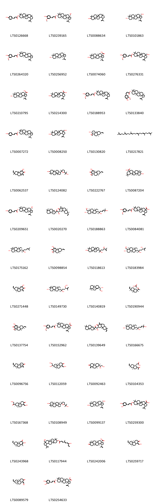{ width=100% }
    <figcaption>Hình ảnh cấu trúc hóa học của 102 hoạt chất thuộc nhóm Prenol lipids gồm ['3a,5a,5b,8,8,11a-hexamethyl-1-(prop-1-en-2-yl)-hexadecahydrocyclopenta[a]chrysen-9-yl 3-(4-hydroxyphenyl)prop-2-enoate (LTS0126668)', '(1r,3as,5ar,5br,7ar,9s,11ar,11br,13ar,13br)-3a-(hydroxymethyl)-5a,5b,8,8,11a-pentamethyl-1-(prop-1-en-2-yl)-hexadecahydrocyclopenta[a]chrysen-9-yl (2e)-3-(4-hydroxy-3-methoxyphenyl)prop-2-enoate (LTS0239165)', 'lupeol (LTS0088634)', 'betulin (LTS0101863)', '(1r,3ar,5ar,5br,7ar,9s,11ar,11br,13ar,13br)-3a,5a,5b,8,8,11a-hexamethyl-1-(prop-1-en-2-yl)-hexadecahydrocyclopenta[a]chrysen-9-yl (2e)-3-(4-hydroxy-3-methoxyphenyl)prop-2-enoate (LTS0264320)', 'lupeol (LTS0256952)', '(1r,3as,5ar,5br,7ar,9r,11ar,11br,13ar,13br)-9-hydroxy-5a,5b,8,8,11a-pentamethyl-1-(prop-1-en-2-yl)-hexadecahydrocyclopenta[a]chrysene-3a-carboxylic acid (LTS0074060)', '3a-(hydroxymethyl)-5a,5b,8,8,11a-pentamethyl-1-(prop-1-en-2-yl)-hexadecahydrocyclopenta[a]chrysen-9-yl 3-(4-hydroxy-3-methoxyphenyl)prop-2-enoate (LTS0276331)', 'betulinic acid (LTS0210795)', '9-hydroxy-5a,5b,8,8,11a-pentamethyl-1-(prop-1-en-2-yl)-hexadecahydrocyclopenta[a]chrysene-3a-carboxylic acid (LTS0214300)', '3a,5a,5b,8,8,11a-hexamethyl-1-(prop-1-en-2-yl)-hexadecahydrocyclopenta[a]chrysen-9-yl 3-(4-hydroxy-3-methoxyphenyl)prop-2-enoate (LTS0188953)', '(1r,3ar,5ar,5br,7ar,9s,11ar,11br,13ar,13br)-3a,5a,5b,8,8,11a-hexamethyl-1-(prop-1-en-2-yl)-hexadecahydrocyclopenta[a]chrysen-9-yl (2z)-3-(4-hydroxy-3-methoxyphenyl)prop-2-enoate (LTS0133840)', '(1r,3ar,5ar,5br,7ar,9s,11ar,11br,13ar,13br)-3a,5a,5b,8,8,11a-hexamethyl-1-(prop-1-en-2-yl)-hexadecahydrocyclopenta[a]chrysen-9-yl (2e)-3-(4-hydroxyphenyl)prop-2-enoate (LTS0007272)', '3a-(hydroxymethyl)-5a,5b,8,8,11a-pentamethyl-1-(prop-1-en-2-yl)-hexadecahydrocyclopenta[a]chrysen-9-ol (LTS0008250)', "(2r,2'r,4'as,4'br,7'r,8'ar,10'ar)-7'-ethenyl-4'b,7',10'a-trimethyl-decahydrospiro[oxirane-2,1'-phenanthren]-2'-ol (LTS0130820)", 'squalene (LTS0217821)', '7-ethenyl-3-hydroxy-4b,7,10a-trimethyl-1-methylidene-5,6,8,8a,9,10-hexahydro-4ah-phenanthren-2-one (LTS0062537)', '1-[5-(2-hydroxypropan-2-yl)-2-methyloxolan-2-yl]-3a,3b,6,6,9a-pentamethyl-dodecahydro-1h-cyclopenta[a]phenanthren-7-ol (LTS0124082)', "(2r,4'as,4'br,7'r,8'ar,10'ar)-7'-ethenyl-3'-hydroxy-4'b,7',10'a-trimethyl-5',6',8',8'a,9',10'-hexahydro-4'ah-spiro[oxirane-2,1'-phenanthren]-2'-one (LTS0222767)", '(4as,6as,6br,8as,10s,12ar,12bs,14br)-10-hydroxy-2,2,6a,6b,9,9,12a-heptamethyl-1,3,4,5,6,7,8,8a,10,11,12,12b,13,14b-tetradecahydropicene-4a-carboxylic acid (LTS0087204)', '(1r,3as,5ar,5br,7ar,9s,11ar,11br,13ar,13br)-3a-(hydroxymethyl)-5a,5b,8,8,11a-pentamethyl-1-(prop-1-en-2-yl)-hexadecahydrocyclopenta[a]chrysen-9-yl (2e)-3-(4-hydroxyphenyl)prop-2-enoate (LTS0209651)', '(3s,4as,4br,7r,8ar,10ar)-3-[(1r)-2-[(2s,4ar,4br,8ar)-2,4b,8,8-tetramethyl-4,4a,5,6,7,8a,9,10-octahydro-3h-phenanthren-2-yl]-1-hydroxy-2-oxoethyl]-7-ethenyl-4b,7,10a-trimethyl-1-methylidene-octahydro-3h-phenanthren-2-one (LTS0020270)', '(3e,6s)-6-[(1s,3ar,3br,5ar,6r,7s,9ar,9br,11ar)-7-hydroxy-6-(hydroxymethyl)-3a,3b,6,9a-tetramethyl-dodecahydro-1h-cyclopenta[a]phenanthren-1-yl]-2-methylhept-3-ene-2,6-diol (LTS0188863)', '9-{[3-(4-hydroxy-3-methoxyphenyl)prop-2-enoyl]oxy}-5a,5b,8,8,11a-pentamethyl-1-(prop-1-en-2-yl)-hexadecahydrocyclopenta[a]chrysene-3a-carboxylic acid (LTS0084081)', 'dammarenediol (LTS0175162)', "(2s,4'as,4'br,7'r,8'ar,10'ar)-7'-ethenyl-3'-hydroxy-4'b,7',10'a-trimethyl-5',6',8',8'a,9',10'-hexahydro-4'ah-spiro[oxirane-2,1'-phenanthren]-2'-one (LTS0098854)", '2-{7-hydroxy-3a,3b,6,6,9a-pentamethyl-dodecahydro-1h-cyclopenta[a]phenanthren-1-yl}-6-methylhept-6-ene-2,5-diol (LTS0118613)', '(2s,5s)-2-[(1s,3ar,3br,5ar,6r,7s,9ar,9br,11ar)-7-hydroxy-6-(hydroxymethyl)-3a,3b,6,9a-tetramethyl-dodecahydro-1h-cyclopenta[a]phenanthren-1-yl]-6-methylhept-6-ene-2,5-diol (LTS0183984)', '(4ar,4bs,7s,8as,10as)-7-ethenyl-3-hydroxy-4b,7,10a-trimethyl-1-methylidene-5,6,8,8a,9,10-hexahydro-4ah-phenanthren-2-one (LTS0271448)', '(1s,3ar,3br,5ar,7s,9ar,9br,11ar)-1-[(2s,5r)-5-hydroperoxy-2-hydroxy-6-methylhept-6-en-2-yl]-3a,3b,6,6,9a-pentamethyl-dodecahydro-1h-cyclopenta[a]phenanthren-7-ol (LTS0149730)', '(1s)-1-[(2r,4as,4bs,8as)-2,4b,8,8-tetramethyl-4,4a,5,6,7,8a,9,10-octahydro-3h-phenanthren-2-yl]ethane-1,2-diol (LTS0140819)', '[(1s,2r,4ar,6r,8ar)-2-acetyl-6-ethenyl-2,6,8a-trimethyl-hexahydro-1h-naphthalen-1-yl]acetic acid (LTS0190944)', "(2r,4'ar,4'bs,7's,8'as,10'as)-7'-ethenyl-3'-hydroxy-4'b,7',10'a-trimethyl-5',6',8',8'a,9',10'-hexahydro-4'ah-spiro[oxirane-2,1'-phenanthren]-2'-one (LTS0137754)", '(1r,3as,5ar,5br,7ar,9s,11ar,11br,13ar,13br)-9-{[(2e)-3-(4-hydroxy-3-methoxyphenyl)prop-2-enoyl]oxy}-5a,5b,8,8,11a-pentamethyl-1-(prop-1-en-2-yl)-hexadecahydrocyclopenta[a]chrysene-3a-carboxylic acid (LTS0152962)', '3-[2-(2,4b,8,8-tetramethyl-4,4a,5,6,7,8a,9,10-octahydro-3h-phenanthren-2-yl)-1-hydroxy-2-oxoethyl]-7-ethenyl-4b,7,10a-trimethyl-1-methylidene-octahydro-3h-phenanthren-2-one (LTS0139649)', '(3e,6s)-6-[(1s,3ar,3br,5as,7s,9ar,9br,11ar)-7-hydroxy-3a,3b,6,6,9a-pentamethyl-dodecahydro-1h-cyclopenta[a]phenanthren-1-yl]-2-methylhept-3-ene-2,6-diol (LTS0166675)', '(4as,4br,7r,8ar,10ar)-7-ethenyl-4b,7,10a-trimethyl-1-methylidene-octahydro-3h-phenanthren-2-one (LTS0096756)', '(1z,4ar,4bs,7s,8as,10as)-7-(1,2-dihydroxyethyl)-1-(hydroxymethylidene)-4b,7,10a-trimethyl-octahydro-3h-phenanthren-2-one (LTS0112059)', 'tagalsin u (LTS0092463)', '[(1r,2s,4as,6s,8ar)-2-acetyl-6-ethenyl-2,6,8a-trimethyl-hexahydro-1h-naphthalen-1-yl]acetic acid (LTS0104353)', '(4ar,4bs,7s,8as,10as)-7-(2-hydroxyacetyl)-1-(hydroxymethylidene)-4b,7,10a-trimethyl-octahydro-3h-phenanthren-2-one (LTS0167368)', '(1s,3ar,3br,5ar,7s,9ar,9br,11ar)-1-[(2s,5s)-5-(2-hydroxypropan-2-yl)-2-methyloxolan-2-yl]-3a,3b,6,6,9a-pentamethyl-dodecahydro-1h-cyclopenta[a]phenanthren-7-ol (LTS0108949)', '(1r,3as,5ar,5br,7ar,9r,11ar,11br,13ar,13br)-3a-(hydroxymethyl)-5a,5b,8,8,11a-pentamethyl-1-(prop-1-en-2-yl)-hexadecahydrocyclopenta[a]chrysen-9-ol (LTS0099137)', '9-{[3-(3,4-dihydroxyphenyl)prop-2-enoyl]oxy}-5a,5b,8,8,11a-pentamethyl-1-(prop-1-en-2-yl)-hexadecahydrocyclopenta[a]chrysene-3a-carboxylic acid (LTS0259300)', '(4ar,4bs,7s,8as,10as)-7-ethenyl-2-hydroxy-1,4b,7,10a-tetramethyl-4,4a,5,6,8,8a,9,10-octahydrophenanthren-3-one (LTS0243968)', '3a-(hydroxymethyl)-5a,5b,8,8,11a-pentamethyl-1-(prop-1-en-2-yl)-hexadecahydrocyclopenta[a]chrysen-9-yl (4e,6e)-7-hydroxy-4-methylnona-2,4,6,8-tetraenoate (LTS0117944)', '(1r,3as,5ar,5br,7ar,11ar,11br,13ar,13bs)-5a,5b,8,8,11a-pentamethyl-9-oxo-1-(prop-1-en-2-yl)-tetradecahydro-1h-cyclopenta[a]chrysene-3a-carboxylic acid (LTS0242006)', '(1z,4ar,4bs,7s,8as,10as)-7-ethenyl-1-(hydroxymethylidene)-4b,7,10a-trimethyl-octahydro-3h-phenanthren-2-one (LTS0259717)', '(1e,4ar,4bs,7s,8as,10as)-7-ethenyl-1-(hydroxymethylidene)-4b,7,10a-trimethyl-octahydro-3h-phenanthren-2-one (LTS0089579)', '(1r,3as,5ar,5br,7ar,9s,11ar,11br,13ar,13br)-9-{[(2e)-3-(3,4-dihydroxyphenyl)prop-2-enoyl]oxy}-5a,5b,8,8,11a-pentamethyl-1-(prop-1-en-2-yl)-hexadecahydrocyclopenta[a]chrysene-3a-carboxylic acid (LTS0254633)', '(2s,5r)-2-[(1s,3ar,3br,5ar,7s,9ar,9br,11ar)-7-hydroxy-3a,3b,6,6,9a-pentamethyl-dodecahydro-1h-cyclopenta[a]phenanthren-1-yl]-6-methylhept-6-ene-2,5-diol (LTS0275647)', '7-ethenyl-4b,7,10a-trimethyl-1-methylidene-octahydro-3h-phenanthren-2-one (LTS0271275)', '(1z,4ar,4bs,7s,8as,10as)-7-(2-hydroxyacetyl)-1-(hydroxymethylidene)-4b,7,10a-trimethyl-octahydro-3h-phenanthren-2-one (LTS0203058)', '5a,5b,8,8,11a-pentamethyl-9-oxo-1-(prop-1-en-2-yl)-tetradecahydro-1h-cyclopenta[a]chrysene-3a-carboxylic acid (LTS0255379)', '(4as,4br,7r,8ar,10ar)-3-{2-[(2s,4ar,4br,8ar)-2,4b,8,8-tetramethyl-4,4a,5,6,7,8a,9,10-octahydro-3h-phenanthren-2-yl]-2-oxoethyl}-7-ethenyl-4b,7,10a-trimethyl-1-methylidene-5,6,8,8a,9,10-hexahydro-4ah-phenanthren-2-one (LTS0260120)', '(3e,6s)-6-[(1s,3ar,3br,5ar,7s,9ar,9br,11ar)-7-hydroxy-3a,3b,6,6,9a-pentamethyl-dodecahydro-1h-cyclopenta[a]phenanthren-1-yl]-2-methylhept-3-ene-2,6-diol (LTS0247516)', '7-ethenyl-2-hydroxy-1,4b,7,10a-tetramethyl-4,4a,5,6,8,8a,9,10-octahydrophenanthren-3-one (LTS0076466)', '(1r,3as,5ar,5br,7ar,9s,11ar,11br,13ar,13br)-3a-(hydroxymethyl)-5a,5b,8,8,11a-pentamethyl-1-(prop-1-en-2-yl)-hexadecahydrocyclopenta[a]chrysen-9-yl (2e)-3-(3,4-dihydroxyphenyl)prop-2-enoate (LTS0068179)', '7-ethenyl-1-(hydroxymethylidene)-4b,7,10a-trimethyl-octahydro-3h-phenanthren-2-one (LTS0271042)', '1-(2,4b,8,8-tetramethyl-4,4a,5,6,7,8a,9,10-octahydro-3h-phenanthren-2-yl)ethane-1,2-diol (LTS0205593)', "(2s,4'ar,4'bs,7's,8'as,10'as)-7'-ethenyl-3'-hydroxy-4'b,7',10'a-trimethyl-5',6',8',8'a,9',10'-hexahydro-4'ah-spiro[oxirane-2,1'-phenanthren]-2'-one (LTS0234147)", "7,8'-diethenyl-4b,4'b,7,8',10a,10'a-hexamethyl-3',4,4',4a,5,5',6,6',6'a,7',8,8a,9,9',10,10',10'b,11'-octadecahydro-3h-spiro[phenanthrene-1,2'-phenanthro[2,1-b]pyran]-2,12'-dione (LTS0231460)", '(1s,3ar,3br,5ar,7s,9ar,9br,11ar)-1-[(2s,5s)-5-hydroperoxy-2-hydroxy-6-methylhept-6-en-2-yl]-3a,3b,6,6,9a-pentamethyl-dodecahydro-1h-cyclopenta[a]phenanthren-7-ol (LTS0223265)', "7'-ethenyl-3'-hydroxy-4'b,7',10'a-trimethyl-5',6',8',8'a,9',10'-hexahydro-4'ah-spiro[oxirane-2,1'-phenanthren]-2'-one (LTS0074022)", '(1r,3as,5ar,5br,7ar,9s,11ar,11br,13ar,13br)-3a-(hydroxymethyl)-5a,5b,8,8,11a-pentamethyl-1-(prop-1-en-2-yl)-hexadecahydrocyclopenta[a]chrysen-9-yl (2z,4e,6e)-7-hydroxy-4-methylnona-2,4,6,8-tetraenoate (LTS0271915)', '(1r,3as,5ar,5br,7ar,9r,11ar,11br,13ar,13br)-9-{[(2e)-3-(4-hydroxy-3-methoxyphenyl)prop-2-enoyl]oxy}-5a,5b,8,8,11a-pentamethyl-1-(prop-1-en-2-yl)-hexadecahydrocyclopenta[a]chrysene-3a-carboxylic acid (LTS0087784)', '(2r,5r)-2-[(1r,3as,3bs,5as,7r,9ar,9br,11ar)-7-hydroxy-3a,3b,6,6,9a-pentamethyl-dodecahydro-1h-cyclopenta[a]phenanthren-1-yl]-6-methylhept-6-ene-2,5-diol (LTS0264080)', '(4as,4br,7r,8ar,10ar)-7-ethenyl-3-hydroxy-4b,7,10a-trimethyl-1-methylidene-5,6,8,8a,9,10-hexahydro-4ah-phenanthren-2-one (LTS0264089)', 'betulone (LTS0222075)', '2-[7-hydroxy-6-(hydroxymethyl)-3a,3b,6,9a-tetramethyl-dodecahydro-1h-cyclopenta[a]phenanthren-1-yl]-6-methylhept-6-ene-2,5-diol (LTS0029205)', '(1r,3as,5ar,5br,7ar,11ar,11br,13ar,13br)-5a,5b,8,8,11a-pentamethyl-9-oxo-1-(prop-1-en-2-yl)-tetradecahydro-1h-cyclopenta[a]chrysene-3a-carboxylic acid (LTS0229397)', "(2s,2's,4'ar,4'bs,7's,8'as,10'as)-7'-ethenyl-4'b,7',10'a-trimethyl-decahydrospiro[oxirane-2,1'-phenanthren]-2'-ol (LTS0164737)", 'oleanolic acid (LTS0141130)', '(4as,4br,7r,8ar,10ar)-7-ethenyl-2-hydroxy-1,4b,7,10a-tetramethyl-4,4a,5,6,8,8a,9,10-octahydrophenanthren-3-one (LTS0024891)', '(1z,4as,4br,7r,8ar,10ar)-7-ethenyl-1-(hydroxymethylidene)-4b,7,10a-trimethyl-octahydro-3h-phenanthren-2-one (LTS0207513)', '(4as,6as,6br,8ar,10s,12ar,12br,14br)-10-hydroxy-2,2,6a,6b,9,9,12a-heptamethyl-1,3,4,5,6,7,8,8a,10,11,12,12b,13,14b-tetradecahydropicene-4a-carboxylic acid (LTS0233446)', "7'-ethenyl-4'b,7',10'a-trimethyl-decahydrospiro[oxirane-2,1'-phenanthren]-2'-ol (LTS0165420)", '(4ar,4bs,7s,8as,10as)-2,7-dihydroxy-1,4b,7,10a-tetramethyl-4,4a,5,6,8,8a,9,10-octahydrophenanthren-3-one (LTS0048865)', '(1r,3as,5ar,5br,7ar,9s,11ar,11br,13ar,13br)-9-{[(2z)-3-(4-hydroxyphenyl)prop-2-enoyl]oxy}-5a,5b,8,8,11a-pentamethyl-1-(prop-1-en-2-yl)-hexadecahydrocyclopenta[a]chrysene-3a-carboxylic acid (LTS0157717)', '[(1r,2s,4as,6s,8as)-2-acetyl-6-ethenyl-2,6,8a-trimethyl-hexahydro-1h-naphthalen-1-yl]acetic acid (LTS0228868)', '9-(acetyloxy)-5a,5b,8,8,11a-pentamethyl-1-(prop-1-en-2-yl)-hexadecahydrocyclopenta[a]chrysene-3a-carboxylic acid (LTS0197695)', 'tagalsin q (LTS0054111)', '6-{7-hydroxy-3a,3b,6,6,9a-pentamethyl-dodecahydro-1h-cyclopenta[a]phenanthren-1-yl}-2-methylhept-3-ene-2,6-diol (LTS0252803)', '(1r,3as,5ar,5br,7ar,9r,11ar,11br,13ar,13br)-9-{[(2e)-3-(4-hydroxyphenyl)prop-2-enoyl]oxy}-5a,5b,8,8,11a-pentamethyl-1-(prop-1-en-2-yl)-hexadecahydrocyclopenta[a]chrysene-3a-carboxylic acid (LTS0055739)', '3a-(hydroxymethyl)-5a,5b,8,8,11a-pentamethyl-1-(prop-1-en-2-yl)-tetradecahydro-1h-cyclopenta[a]chrysen-9-one (LTS0189548)', '1-(5-hydroperoxy-2-hydroxy-6-methylhept-6-en-2-yl)-3a,3b,6,6,9a-pentamethyl-dodecahydro-1h-cyclopenta[a]phenanthren-7-ol (LTS0016689)', '3-[2-(2,4b,8,8-tetramethyl-4,4a,5,6,7,8a,9,10-octahydro-3h-phenanthren-2-yl)-2-oxoethyl]-7-ethenyl-4b,7,10a-trimethyl-1-methylidene-5,6,8,8a,9,10-hexahydro-4ah-phenanthren-2-one (LTS0121591)', '1-(2-hydroxy-6-methylhept-5-en-2-yl)-3a,3b,6,6,9a-pentamethyl-dodecahydro-1h-cyclopenta[a]phenanthren-7-ol (LTS0006172)', "7,8'-diethenyl-4b,4'b,7,8',10a,10'a-hexamethyl-4,4',4a,5,5',6,6',6'a,7',8,8a,9,9',10,10',10'b,11',12'-octadecahydro-3h,3'h-spiro[phenanthrene-1,2'-phenanthro[2,1-b]pyran]-2-one (LTS0009748)", '3a-(hydroxymethyl)-5a,5b,8,8,11a-pentamethyl-1-(prop-1-en-2-yl)-hexadecahydrocyclopenta[a]chrysen-9-yl 3-(3,4-dihydroxyphenyl)prop-2-enoate (LTS0025810)', "(1r,4ar,4bs,4'bs,6'as,7s,8's,8as,10as,10'as,10'br)-7,8'-diethenyl-4b,4'b,7,8',10a,10'a-hexamethyl-4,4',4a,5,5',6,6',6'a,7',8,8a,9,9',10,10',10'b,11',12'-octadecahydro-3h,3'h-spiro[phenanthrene-1,2'-phenanthro[2,1-b]pyran]-2-one (LTS0030876)", '(1r,3as,5ar,5br,7ar,9s,11ar,11br,13ar,13br)-9-(acetyloxy)-5a,5b,8,8,11a-pentamethyl-1-(prop-1-en-2-yl)-hexadecahydrocyclopenta[a]chrysene-3a-carboxylic acid (LTS0000950)', '(1r,3as,5ar,5br,7ar,9s,11ar,11br,13ar,13br)-9-{[(2e)-3-(4-hydroxyphenyl)prop-2-enoyl]oxy}-5a,5b,8,8,11a-pentamethyl-1-(prop-1-en-2-yl)-hexadecahydrocyclopenta[a]chrysene-3a-carboxylic acid (LTS0016360)', '(3ar,3br,5ar,7s,9ar,9br)-1-[(2s)-2-hydroxy-6-methylhept-5-en-2-yl]-3a,3b,6,6,9a-pentamethyl-dodecahydro-1h-cyclopenta[a]phenanthren-7-ol (LTS0031035)', '9-{[3-(4-hydroxyphenyl)prop-2-enoyl]oxy}-5a,5b,8,8,11a-pentamethyl-1-(prop-1-en-2-yl)-hexadecahydrocyclopenta[a]chrysene-3a-carboxylic acid (LTS0102859)', '(1r,3as,5ar,5br,7ar,9s,11ar,11br,13ar,13br)-3a-(hydroxymethyl)-5a,5b,8,8,11a-pentamethyl-1-(prop-1-en-2-yl)-hexadecahydrocyclopenta[a]chrysen-9-yl (2z)-3-(4-hydroxy-3-methoxyphenyl)prop-2-enoate (LTS0110221)', '(4ar,4bs,7s,8as,10as)-7-(1,2-dihydroxyethyl)-1-(hydroxymethylidene)-4b,7,10a-trimethyl-octahydro-3h-phenanthren-2-one (LTS0117715)', '(2s,5r)-2-[(1s,3ar,3br,5ar,6r,7s,9ar,9br,11ar)-7-hydroxy-6-(hydroxymethyl)-3a,3b,6,9a-tetramethyl-dodecahydro-1h-cyclopenta[a]phenanthren-1-yl]-6-methylhept-6-ene-2,5-diol (LTS0126397)', '3a-(hydroxymethyl)-5a,5b,8,8,11a-pentamethyl-1-(prop-1-en-2-yl)-hexadecahydrocyclopenta[a]chrysen-9-yl 3-(4-hydroxyphenyl)prop-2-enoate (LTS0134025)', '(4ar,4bs,7s,8as,10as)-7-ethenyl-4b,7,10a-trimethyl-1-methylidene-octahydro-3h-phenanthren-2-one (LTS0104985)', "(1r,4ar,4bs,4'bs,6'as,7s,8's,8as,10as,10'as,10'br)-7,8'-diethenyl-4b,4'b,7,8',10a,10'a-hexamethyl-3',4,4',4a,5,5',6,6',6'a,7',8,8a,9,9',10,10',10'b,11'-octadecahydro-3h-spiro[phenanthrene-1,2'-phenanthro[2,1-b]pyran]-2,12'-dione (LTS0106577)", '(2-acetyl-6-ethenyl-2,6,8a-trimethyl-hexahydro-1h-naphthalen-1-yl)acetic acid (LTS0038421)'].</figcaption>
</figure>
#### Nhóm Steroids and steroid derivatives
<figure markdown="span">
    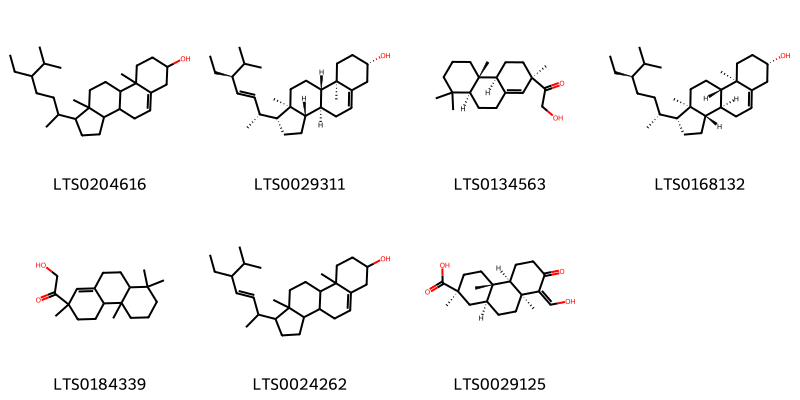{ width=100% }
    <figcaption>Hình ảnh cấu trúc hóa học của 7 hoạt chất thuộc nhóm Steroids and steroid derivatives gồm ['stigmast-5-en-3-ol, (3β)- (LTS0204616)', 'phytosterol (LTS0029311)', '1-[(2r,4as,4bs,8as)-2,4b,8,8-tetramethyl-4,4a,5,6,7,8a,9,10-octahydro-3h-phenanthren-2-yl]-2-hydroxyethanone (LTS0134563)', 'sitosterol (LTS0168132)', '1-(2,4b,8,8-tetramethyl-4,4a,5,6,7,8a,9,10-octahydro-3h-phenanthren-2-yl)-2-hydroxyethanone (LTS0184339)', 'stigmasterol (LTS0024262)', '(2s,4as,4br,8z,8as,10as)-8-(hydroxymethylidene)-2,4a,8a-trimethyl-7-oxo-octahydro-1h-phenanthrene-2-carboxylic acid (LTS0029125)'].</figcaption>
</figure>

---

### Dược dân tộc học

Danh sách các quốc gia có sử dụng *Ceriops tagal* trong điều trị các bệnh. 

| Country   | Disease   | Bệnh                                                                                                                                                                                                |
|:----------|:----------|:----------------------------------------------------------------------------------------------------------------------------------------------------------------------------------------------------|
| Elsewhere | Hemostat  | MYMEMORY WARNING: YOU USED ALL AVAILABLE FREE TRANSLATIONS FOR TODAY. NEXT AVAILABLE IN  06 HOURS 56 MINUTES 04 SECONDS VISIT HTTPS://MYMEMORY.TRANSLATED.NET/DOC/USAGELIMITS.PHP TO TRANSLATE MORE |

---

# Chi Carallia

??? note "Danh sách các dược liệu thuộc chi"
    
	 - *Carallia suffruticosa*

---
## Carallia suffruticosa
### Thông tin về thực vật

!!! info "Phân loại thực vật của *Carallia suffruticosa* từ GIBF:"
    - **Kingdom:** Plantae
    - **Phylum:** Tracheophyta
    - **Order:** Malpighiales
    - **Family:** Rhizophoraceae
    - **Genus:** Carallia
    - **Species:** *Carallia suffruticosa*

 

| Label (VI)   | Label (EN)   | Scientific Name       | Descriptions (VI)   | Descriptions (EN)   | Also Known As (VI)   | Also Known As (EN)   |
|:-------------|:-------------|:----------------------|:--------------------|:--------------------|:---------------------|:---------------------|
| N/A          | N/A          | Carallia suffruticosa | loài thực vật       | species of plant    | ['']                 | ['']                 |

#### Phân bố trên thế giới

**Từ CSDL GIBF** nan, Lao People’s Democratic Republic, Cambodia, India, Indonesia, unknown or invalid, Viet Nam, Singapore, Malaysia

#### Phân bố tại Việt Nam

**Từ CSDL GIBF**: Đồng Nai, Bình Dương

---
### Thành phần hóa học
        
- Theo cơ sở dữ liệu lotus: Từ loài *Carallia suffruticosa* đã phân lập và xác định được Chưa có hoạt chất nào được phân lập. hoạt chất thuộc về các nhóm Không có hoạt chất nào được phân lập. 

Không có hình ảnh nào được tạo ra

---

### Dược dân tộc học

Danh sách các quốc gia có sử dụng *Carallia suffruticosa* trong điều trị các bệnh. 

| Country   | Disease   | Bệnh                                                                                                                                                                                                |
|:----------|:----------|:----------------------------------------------------------------------------------------------------------------------------------------------------------------------------------------------------|
| Malaya    | Vermifuge | MYMEMORY WARNING: YOU USED ALL AVAILABLE FREE TRANSLATIONS FOR TODAY. NEXT AVAILABLE IN  06 HOURS 55 MINUTES 30 SECONDS VISIT HTTPS://MYMEMORY.TRANSLATED.NET/DOC/USAGELIMITS.PHP TO TRANSLATE MORE |

---

# Chi Rhizophora

??? note "Danh sách các dược liệu thuộc chi"
    
	 - *Rhizophora mangle*
	 - *Rhizophora mucronata*

---
## Rhizophora mangle
### Thông tin về thực vật

!!! info "Phân loại thực vật của *Rhizophora mangle* từ GIBF:"
    - **Kingdom:** Plantae
    - **Phylum:** Tracheophyta
    - **Order:** Malpighiales
    - **Family:** Rhizophoraceae
    - **Genus:** Rhizophora
    - **Species:** *Rhizophora mangle*

 

| Label (VI)   | Label (EN)   | Scientific Name   | Descriptions (VI)   | Descriptions (EN)   | Also Known As (VI)   | Also Known As (EN)   |
|:-------------|:-------------|:------------------|:--------------------|:--------------------|:---------------------|:---------------------|
| N/A          | N/A          | Rhizophora mangle | loài thực vật       | species of plant    | ['']                 | ['Red mangrove']     |

#### Phân bố trên thế giới

**Từ CSDL GIBF** Belize, Ecuador, Trinidad and Tobago, Puerto Rico, Nicaragua, Guadeloupe, Aruba, Guatemala, Brazil, Bahamas, Costa Rica, Gambia, Jamaica, United States of America, Cuba, Mexico, Antigua and Barbuda, Dominican Republic

#### Phân bố tại Việt Nam

**Từ CSDL GIBF**: Không có ghi nhận ở Việt Nam

---
### Thành phần hóa học
        
- Theo cơ sở dữ liệu lotus: Từ loài *Rhizophora mangle* đã phân lập và xác định được 12 hoạt chất thuộc về các nhóm Prenol lipids, Benzene and substituted derivatives, Organooxygen compounds, Carboxylic acids and derivatives. 

|    | chemicalTaxonomyClassyfireClass     |   smiles_count |
|---:|:------------------------------------|---------------:|
|  0 | Benzene and substituted derivatives |              1 |
|  1 | Carboxylic acids and derivatives    |              1 |
|  2 | Organooxygen compounds              |              1 |
|  3 | Prenol lipids                       |              8 |

#### Nhóm Benzene and substituted derivatives
<figure markdown="span">
    { width=100% }
    <figcaption>Hình ảnh cấu trúc hóa học của 1 hoạt chất thuộc nhóm Benzene and substituted derivatives gồm ['benzaldehyde (LTS0094193)'].</figcaption>
</figure>
#### Nhóm Carboxylic acids and derivatives
<figure markdown="span">
    { width=100% }
    <figcaption>Hình ảnh cấu trúc hóa học của 1 hoạt chất thuộc nhóm Carboxylic acids and derivatives gồm ['ethyl acetate (LTS0196824)'].</figcaption>
</figure>
#### Nhóm Organooxygen compounds
<figure markdown="span">
    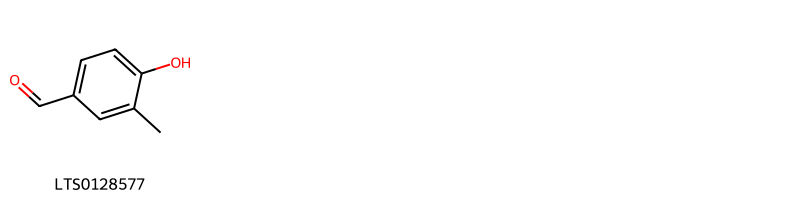{ width=100% }
    <figcaption>Hình ảnh cấu trúc hóa học của 1 hoạt chất thuộc nhóm Organooxygen compounds gồm ['4-hydroxy-3-methylbenzaldehyde (LTS0128577)'].</figcaption>
</figure>
#### Nhóm Prenol lipids
<figure markdown="span">
    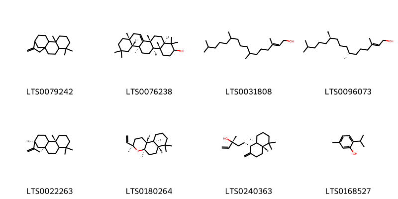{ width=100% }
    <figcaption>Hình ảnh cấu trúc hóa học của 8 hoạt chất thuộc nhóm Prenol lipids gồm ['5,5,9-trimethyl-14-methylidenetetracyclo[11.2.1.0¹,¹⁰.0⁴,⁹]hexadecane (LTS0079242)', 'alnulin (LTS0076238)', 'phytol (LTS0031808)', 'phytol (LTS0096073)', '(1s,9r,13s)-5,5,9-trimethyl-14-methylidenetetracyclo[11.2.1.0¹,¹⁰.0⁴,⁹]hexadecane (LTS0022263)', '(3r,4ar,6as,10as,10br)-3-ethenyl-3,4a,7,7,10a-pentamethyl-octahydro-1h-naphtho[2,1-b]pyran (LTS0180264)', 'manool (LTS0240363)', 'thymol (LTS0168527)'].</figcaption>
</figure>

---

### Dược dân tộc học

Danh sách các quốc gia có sử dụng *Rhizophora mangle* trong điều trị các bệnh. 

| Country   | Disease                  | Bệnh                                                                                                                                                                                                |
|:----------|:-------------------------|:----------------------------------------------------------------------------------------------------------------------------------------------------------------------------------------------------|
| China     | Astringent, Astringent   | MYMEMORY WARNING: YOU USED ALL AVAILABLE FREE TRANSLATIONS FOR TODAY. NEXT AVAILABLE IN  06 HOURS 54 MINUTES 59 SECONDS VISIT HTTPS://MYMEMORY.TRANSLATED.NET/DOC/USAGELIMITS.PHP TO TRANSLATE MORE |
| Elsewhere | Expectorant, Styptic     | MYMEMORY WARNING: YOU USED ALL AVAILABLE FREE TRANSLATIONS FOR TODAY. NEXT AVAILABLE IN  06 HOURS 54 MINUTES 56 SECONDS VISIT HTTPS://MYMEMORY.TRANSLATED.NET/DOC/USAGELIMITS.PHP TO TRANSLATE MORE |
| Haiti     | Astringent, Styptic      | MYMEMORY WARNING: YOU USED ALL AVAILABLE FREE TRANSLATIONS FOR TODAY. NEXT AVAILABLE IN  06 HOURS 54 MINUTES 53 SECONDS VISIT HTTPS://MYMEMORY.TRANSLATED.NET/DOC/USAGELIMITS.PHP TO TRANSLATE MORE |
| Mexico    | Hemostat, Styptic, Tonic | MYMEMORY WARNING: YOU USED ALL AVAILABLE FREE TRANSLATIONS FOR TODAY. NEXT AVAILABLE IN  06 HOURS 54 MINUTES 50 SECONDS VISIT HTTPS://MYMEMORY.TRANSLATED.NET/DOC/USAGELIMITS.PHP TO TRANSLATE MORE |
| Samoa     | Emmenagogue              | MYMEMORY WARNING: YOU USED ALL AVAILABLE FREE TRANSLATIONS FOR TODAY. NEXT AVAILABLE IN  06 HOURS 54 MINUTES 47 SECONDS VISIT HTTPS://MYMEMORY.TRANSLATED.NET/DOC/USAGELIMITS.PHP TO TRANSLATE MORE |
| Turkey    | Astringent               | MYMEMORY WARNING: YOU USED ALL AVAILABLE FREE TRANSLATIONS FOR TODAY. NEXT AVAILABLE IN  06 HOURS 54 MINUTES 44 SECONDS VISIT HTTPS://MYMEMORY.TRANSLATED.NET/DOC/USAGELIMITS.PHP TO TRANSLATE MORE |
| Venezuela | Astringent, Intoxicant   | MYMEMORY WARNING: YOU USED ALL AVAILABLE FREE TRANSLATIONS FOR TODAY. NEXT AVAILABLE IN  06 HOURS 54 MINUTES 41 SECONDS VISIT HTTPS://MYMEMORY.TRANSLATED.NET/DOC/USAGELIMITS.PHP TO TRANSLATE MORE |

---

---
## Rhizophora mucronata
### Thông tin về thực vật

!!! info "Phân loại thực vật của *Rhizophora mucronata* từ GIBF:"
    - **Kingdom:** Plantae
    - **Phylum:** Tracheophyta
    - **Order:** Malpighiales
    - **Family:** Rhizophoraceae
    - **Genus:** Rhizophora
    - **Species:** *Rhizophora mucronata*

 

| Label (VI)   | Label (EN)   | Scientific Name      | Descriptions (VI)    | Descriptions (EN)   | Also Known As (VI)         | Also Known As (EN)   |
|:-------------|:-------------|:---------------------|:---------------------|:--------------------|:---------------------------|:---------------------|
| N/A          | N/A          | Rhizophora mucronata | loài thực vật có hoa | species of plant    | ['đước xanh', 'đước nhọn'] | ['mangrove']         |

#### Phân bố trên thế giới

**Từ CSDL GIBF** nan, Sri Lanka, Australia, Japan, Belgium, Mauritius, Myanmar, Mozambique, Philippines, Tanzania, United Republic of, United States of America, Saudi Arabia, South Africa, Fiji, Thailand, Iran (Islamic Republic of), Egypt, Mayotte, Singapore, Viet Nam, China, Madagascar, Seychelles, India, Indonesia, Kenya, Malaysia

#### Phân bố tại Việt Nam

**Từ CSDL GIBF**: Khánh Hòa, Tỉnh Bạc Liêu, Bà Rịa - Vũng Tàu

---
### Thành phần hóa học
        
- Theo cơ sở dữ liệu lotus: Từ loài *Rhizophora mucronata* đã phân lập và xác định được 77 hoạt chất thuộc về các nhóm Fatty Acyls, Prenol lipids, Steroids and steroid derivatives, Cinnamic acids and derivatives, Pyrans, Organooxygen compounds, Carboxylic acids and derivatives, Benzopyrans. 

|    | chemicalTaxonomyClassyfireClass   |   smiles_count |
|---:|:----------------------------------|---------------:|
|  0 | Benzopyrans                       |             11 |
|  1 | Carboxylic acids and derivatives  |              8 |
|  2 | Cinnamic acids and derivatives    |              2 |
|  3 | Fatty Acyls                       |              4 |
|  4 | Organooxygen compounds            |             10 |
|  5 | Prenol lipids                     |             20 |
|  6 | Pyrans                            |             14 |
|  7 | Steroids and steroid derivatives  |              8 |

#### Nhóm Benzopyrans
<figure markdown="span">
    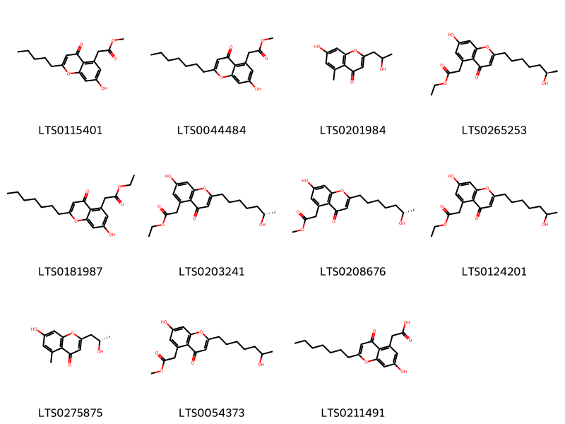{ width=100% }
    <figcaption>Hình ảnh cấu trúc hóa học của 11 hoạt chất thuộc nhóm Benzopyrans gồm ['methyl 2-(7-hydroxy-4-oxo-2-pentylchromen-5-yl)acetate (LTS0115401)', 'methyl 2-(2-heptyl-7-hydroxy-4-oxochromen-5-yl)acetate (LTS0044484)', '7-hydroxy-2-(2-hydroxypropyl)-5-methylchromen-4-one (LTS0201984)', 'ethyl 2-{7-hydroxy-2-[(6r)-6-hydroxyheptyl]-4-oxochromen-5-yl}acetate (LTS0265253)', 'ethyl 2-(2-heptyl-7-hydroxy-4-oxochromen-5-yl)acetate (LTS0181987)', 'ethyl 2-{7-hydroxy-2-[(6s)-6-hydroxyheptyl]-4-oxochromen-5-yl}acetate (LTS0203241)', 'methyl 2-{7-hydroxy-2-[(6s)-6-hydroxyheptyl]-4-oxochromen-5-yl}acetate (LTS0208676)', 'ethyl 2-[7-hydroxy-2-(6-hydroxyheptyl)-4-oxochromen-5-yl]acetate (LTS0124201)', '7-hydroxy-2-[(2s)-2-hydroxypropyl]-5-methylchromen-4-one (LTS0275875)', 'methyl 2-[7-hydroxy-2-(6-hydroxyheptyl)-4-oxochromen-5-yl]acetate (LTS0054373)', '(2-heptyl-7-hydroxy-4-oxochromen-5-yl)acetic acid (LTS0211491)'].</figcaption>
</figure>
#### Nhóm Carboxylic acids and derivatives
<figure markdown="span">
    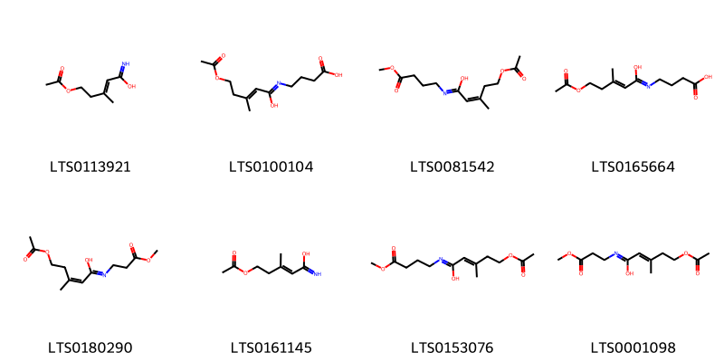{ width=100% }
    <figcaption>Hình ảnh cấu trúc hóa học của 8 hoạt chất thuộc nhóm Carboxylic acids and derivatives gồm ['5-(acetyloxy)-3-methylpent-2-enimidic acid (LTS0113921)', '4-{[5-(acetyloxy)-1-hydroxy-3-methylpent-2-en-1-ylidene]amino}butanoic acid (LTS0100104)', '5-(acetyloxy)-n-(4-methoxy-4-oxobutyl)-3-methylpent-2-enimidic acid (LTS0081542)', '4-{[(2e)-5-(acetyloxy)-1-hydroxy-3-methylpent-2-en-1-ylidene]amino}butanoic acid (LTS0165664)', '5-(acetyloxy)-n-(3-methoxy-3-oxopropyl)-3-methylpent-2-enimidic acid (LTS0180290)', '(2e)-5-(acetyloxy)-3-methylpent-2-enimidic acid (LTS0161145)', '(2e)-5-(acetyloxy)-n-(4-methoxy-4-oxobutyl)-3-methylpent-2-enimidic acid (LTS0153076)', '(2e)-5-(acetyloxy)-n-(3-methoxy-3-oxopropyl)-3-methylpent-2-enimidic acid (LTS0001098)'].</figcaption>
</figure>
#### Nhóm Cinnamic acids and derivatives
<figure markdown="span">
    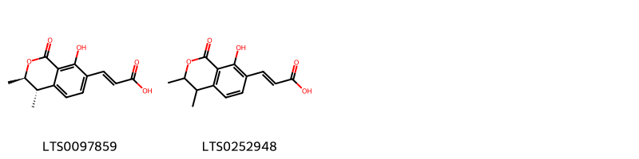{ width=100% }
    <figcaption>Hình ảnh cấu trúc hóa học của 2 hoạt chất thuộc nhóm Cinnamic acids and derivatives gồm ['(2e)-3-[(3r,4s)-8-hydroxy-3,4-dimethyl-1-oxo-3,4-dihydro-2-benzopyran-7-yl]prop-2-enoic acid (LTS0097859)', '3-(8-hydroxy-3,4-dimethyl-1-oxo-3,4-dihydro-2-benzopyran-7-yl)prop-2-enoic acid (LTS0252948)'].</figcaption>
</figure>
#### Nhóm Fatty Acyls
<figure markdown="span">
    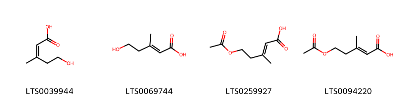{ width=100% }
    <figcaption>Hình ảnh cấu trúc hóa học của 4 hoạt chất thuộc nhóm Fatty Acyls gồm ['5-hydroxy-3-methylpent-2-enoic acid (LTS0039944)', '(2e)-5-hydroxy-3-methylpent-2-enoic acid (LTS0069744)', '5-(acetyloxy)-3-methylpent-2-enoic acid (LTS0259927)', '(2e)-5-(acetyloxy)-3-methylpent-2-enoic acid (LTS0094220)'].</figcaption>
</figure>
#### Nhóm Organooxygen compounds
<figure markdown="span">
    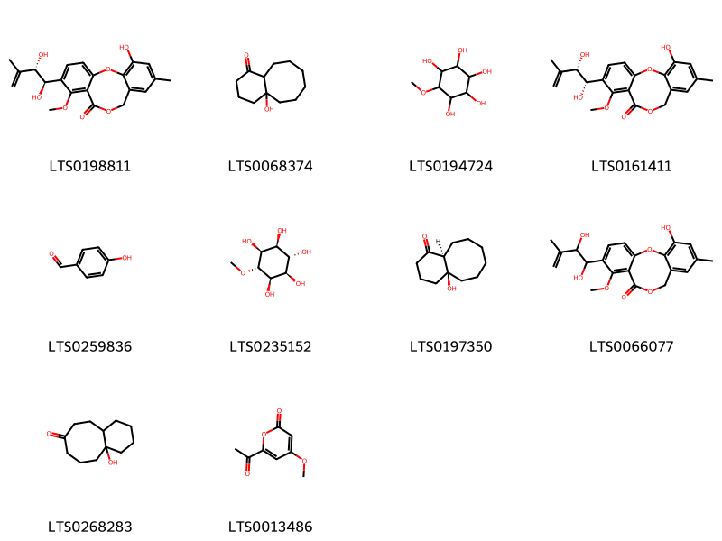{ width=100% }
    <figcaption>Hình ảnh cấu trúc hóa học của 10 hoạt chất thuộc nhóm Organooxygen compounds gồm ['6-[(1r,2s)-1,2-dihydroxy-3-methylbut-3-en-1-yl]-16-hydroxy-7-methoxy-14-methyl-2,10-dioxatricyclo[10.4.0.0³,⁸]hexadeca-1(16),3,5,7,12,14-hexaen-9-one (LTS0198811)', '4a-hydroxy-decahydrobenzo[8]annulen-1-one (LTS0068374)', 'pinitol (LTS0194724)', '6-[(1s,2s)-1,2-dihydroxy-3-methylbut-3-en-1-yl]-16-hydroxy-7-methoxy-14-methyl-2,10-dioxatricyclo[10.4.0.0³,⁸]hexadeca-1(16),3,5,7,12,14-hexaen-9-one (LTS0161411)', 'p-hydroxybenzaldehyde (LTS0259836)', '(1r,2r,3s,4s,5s,6r)-6-methoxycyclohexane-1,2,3,4,5-pentol (LTS0235152)', '(4as,10as)-4a-hydroxy-decahydrobenzo[8]annulen-1-one (LTS0197350)', '6-(1,2-dihydroxy-3-methylbut-3-en-1-yl)-16-hydroxy-7-methoxy-14-methyl-2,10-dioxatricyclo[10.4.0.0³,⁸]hexadeca-1(16),3,5,7,12,14-hexaen-9-one (LTS0066077)', '10a-hydroxy-decahydrobenzo[8]annulen-7-one (LTS0268283)', '6-acetyl-4-methoxypyran-2-one (LTS0013486)'].</figcaption>
</figure>
#### Nhóm Prenol lipids
<figure markdown="span">
    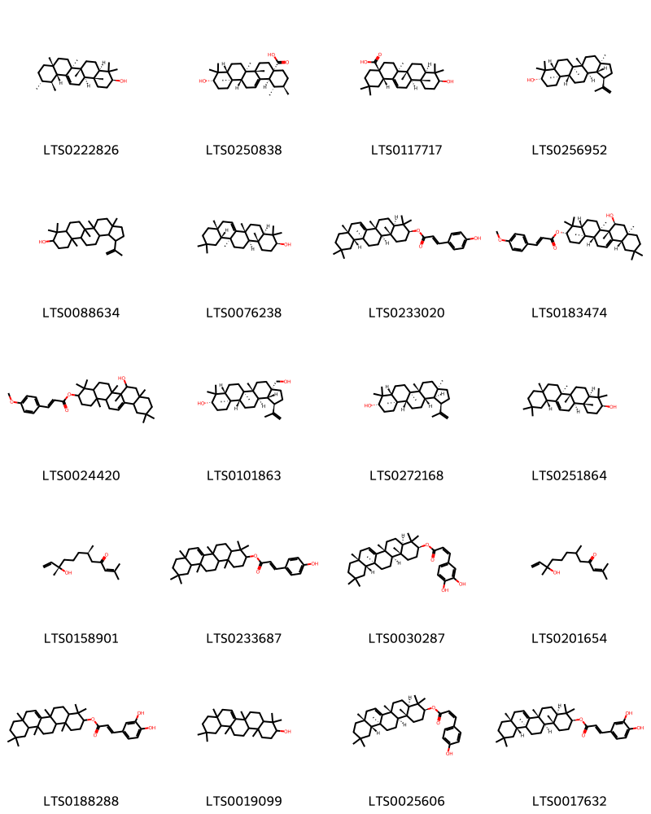{ width=100% }
    <figcaption>Hình ảnh cấu trúc hóa học của 20 hoạt chất thuộc nhóm Prenol lipids gồm ['amyrin (LTS0222826)', 'ursolic acid (LTS0250838)', 'oleanolic acid (LTS0117717)', 'lupeol (LTS0256952)', 'lupeol (LTS0088634)', 'alnulin (LTS0076238)', '(3s,4ar,6ar,8ar,12ar,12bs,14ar,14br)-4,4,6a,8a,11,11,12b,14b-octamethyl-1,2,3,4a,5,6,8,9,10,12,12a,13,14,14a-tetradecahydropicen-3-yl (2e)-3-(4-hydroxyphenyl)prop-2-enoate (LTS0233020)', '(3s,4ar,6ar,6bs,7s,8ar,12as,14ar,14br)-7-hydroxy-4,4,6a,6b,8a,11,11,14b-octamethyl-1,2,3,4a,5,6,7,8,9,10,12,12a,14,14a-tetradecahydropicen-3-yl (2e)-3-(4-methoxyphenyl)prop-2-enoate (LTS0183474)', '7-hydroxy-4,4,6a,6b,8a,11,11,14b-octamethyl-1,2,3,4a,5,6,7,8,9,10,12,12a,14,14a-tetradecahydropicen-3-yl 3-(4-methoxyphenyl)prop-2-enoate (LTS0024420)', 'betulin (LTS0101863)', '(1r,3ar,5ar,5br,7ar,9s,11ar,11br,13as,13bs)-3a,5a,5b,8,8,11a-hexamethyl-1-(prop-1-en-2-yl)-hexadecahydrocyclopenta[a]chrysen-9-ol (LTS0272168)', 'β-amyrin (LTS0251864)', '(6r,10s)-10-hydroxy-2,6,10-trimethyldodeca-2,11-dien-4-one (LTS0158901)', '4,4,6a,8a,11,11,12b,14b-octamethyl-1,2,3,4a,5,6,8,9,10,12,12a,13,14,14a-tetradecahydropicen-3-yl 3-(4-hydroxyphenyl)prop-2-enoate (LTS0233687)', '(3s,4ar,6ar,8ar,12ar,12bs,14ar,14br)-4,4,6a,8a,11,11,12b,14b-octamethyl-1,2,3,4a,5,6,8,9,10,12,12a,13,14,14a-tetradecahydropicen-3-yl (2z)-3-(3,4-dihydroxyphenyl)prop-2-enoate (LTS0030287)', '10-hydroxy-2,6,10-trimethyldodeca-2,11-dien-4-one (LTS0201654)', '4,4,6a,8a,11,11,12b,14b-octamethyl-1,2,3,4a,5,6,8,9,10,12,12a,13,14,14a-tetradecahydropicen-3-yl 3-(3,4-dihydroxyphenyl)prop-2-enoate (LTS0188288)', 'taraxerol (LTS0019099)', '(3s,4ar,6ar,8ar,12ar,12bs,14ar,14br)-4,4,6a,8a,11,11,12b,14b-octamethyl-1,2,3,4a,5,6,8,9,10,12,12a,13,14,14a-tetradecahydropicen-3-yl (2z)-3-(4-hydroxyphenyl)prop-2-enoate (LTS0025606)', '(3s,4ar,6ar,8ar,12ar,12bs,14ar,14br)-4,4,6a,8a,11,11,12b,14b-octamethyl-1,2,3,4a,5,6,8,9,10,12,12a,13,14,14a-tetradecahydropicen-3-yl (2e)-3-(3,4-dihydroxyphenyl)prop-2-enoate (LTS0017632)'].</figcaption>
</figure>
#### Nhóm Pyrans
<figure markdown="span">
    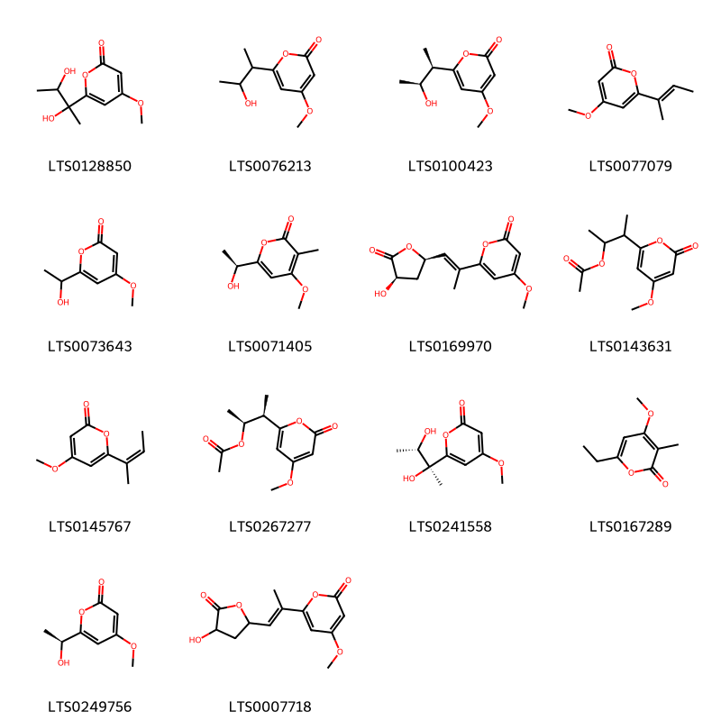{ width=100% }
    <figcaption>Hình ảnh cấu trúc hóa học của 14 hoạt chất thuộc nhóm Pyrans gồm ['6-(2,3-dihydroxybutan-2-yl)-4-methoxypyran-2-one (LTS0128850)', '6-(3-hydroxybutan-2-yl)-4-methoxypyran-2-one (LTS0076213)', '6-[(2r,3s)-3-hydroxybutan-2-yl]-4-methoxypyran-2-one (LTS0100423)', '6-(but-2-en-2-yl)-4-methoxypyran-2-one (LTS0077079)', '6-(1-hydroxyethyl)-4-methoxypyran-2-one (LTS0073643)', '6-[(1s)-1-hydroxyethyl]-4-methoxy-3-methylpyran-2-one (LTS0071405)', '6-[(1e)-1-[(2r,4r)-4-hydroxy-5-oxooxolan-2-yl]prop-1-en-2-yl]-4-methoxypyran-2-one (LTS0169970)', '3-(4-methoxy-6-oxopyran-2-yl)butan-2-yl acetate (LTS0143631)', '6-[(2z)-but-2-en-2-yl]-4-methoxypyran-2-one (LTS0145767)', '(2s,3r)-3-(4-methoxy-6-oxopyran-2-yl)butan-2-yl acetate (LTS0267277)', '6-[(2s,3s)-2,3-dihydroxybutan-2-yl]-4-methoxypyran-2-one (LTS0241558)', '6-ethyl-4-methoxy-3-methylpyran-2-one (LTS0167289)', '6-[(1s)-1-hydroxyethyl]-4-methoxypyran-2-one (LTS0249756)', '6-[1-(4-hydroxy-5-oxooxolan-2-yl)prop-1-en-2-yl]-4-methoxypyran-2-one (LTS0007718)'].</figcaption>
</figure>
#### Nhóm Steroids and steroid derivatives
<figure markdown="span">
    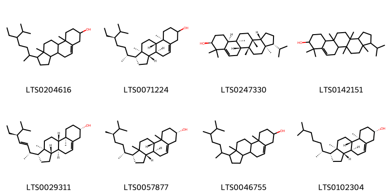{ width=100% }
    <figcaption>Hình ảnh cấu trúc hóa học của 8 hoạt chất thuộc nhóm Steroids and steroid derivatives gồm ['stigmast-5-en-3-ol, (3β)- (LTS0204616)', 'stigmast-5-en-3-ol (LTS0071224)', '(3r,3ar,5ar,5br,9s,11as,11bs,13ar,13br)-3-isopropyl-3a,5a,8,8,11b,13a-hexamethyl-1h,2h,3h,4h,5h,5bh,6h,9h,10h,11h,11ah,12h,13h,13bh-cyclopenta[a]chrysen-9-ol (LTS0247330)', '3-isopropyl-3a,5a,8,8,11b,13a-hexamethyl-1h,2h,3h,4h,5h,5bh,6h,9h,10h,11h,11ah,12h,13h,13bh-cyclopenta[a]chrysen-9-ol (LTS0142151)', 'phytosterol (LTS0029311)', '(1r,3as,3bs,7s,9bs)-1-[(2r,5r)-5,6-dimethylheptan-2-yl]-9a,11a-dimethyl-1h,2h,3h,3ah,3bh,4h,6h,7h,8h,9h,9bh,10h,11h-cyclopenta[a]phenanthren-7-ol (LTS0057877)', 'campesterol (LTS0046755)', 'cholesterol (LTS0102304)'].</figcaption>
</figure>

---

### Dược dân tộc học

Danh sách các quốc gia có sử dụng *Rhizophora mucronata* trong điều trị các bệnh. 

| Country   | Disease    | Bệnh                                                                                                                                                                                                |
|:----------|:-----------|:----------------------------------------------------------------------------------------------------------------------------------------------------------------------------------------------------|
| Elsewhere | Astringent | MYMEMORY WARNING: YOU USED ALL AVAILABLE FREE TRANSLATIONS FOR TODAY. NEXT AVAILABLE IN  06 HOURS 54 MINUTES 08 SECONDS VISIT HTTPS://MYMEMORY.TRANSLATED.NET/DOC/USAGELIMITS.PHP TO TRANSLATE MORE |

---

# Chi Bruguiera

??? note "Danh sách các dược liệu thuộc chi"
    
	 - *Bruguiera conjugata*

---
## Bruguiera conjugata
### Thông tin về thực vật

!!! info "Phân loại thực vật của *Bruguiera gymnorhiza* từ GIBF:"
    - **Kingdom:** Plantae
    - **Phylum:** Tracheophyta
    - **Order:** Malpighiales
    - **Family:** Rhizophoraceae
    - **Genus:** Bruguiera
    - **Species:** *Bruguiera gymnorhiza*

 

| Label (VI)   | Label (EN)   | Scientific Name     | Descriptions (VI)   | Descriptions (EN)   | Also Known As (VI)   | Also Known As (EN)   |
|:-------------|:-------------|:--------------------|:--------------------|:--------------------|:---------------------|:---------------------|
| N/A          | N/A          | Bruguiera conjugata | loài thực vật       | species of plant    | ['']                 | ['']                 |

#### Phân bố trên thế giới

**Từ CSDL GIBF** nan, Palau, Sri Lanka, Kiribati, Micronesia (Federated States of), Australia, Japan, Marshall Islands, Chinese Taipei, unknown or invalid, Tonga, Indonesia, United States of America, Samoa, Philippines, Malaysia, China

#### Phân bố tại Việt Nam

**Từ CSDL GIBF**: Không có ghi nhận ở Việt Nam

---
### Thành phần hóa học
        
- Theo cơ sở dữ liệu lotus: Từ loài *Bruguiera gymnorhiza* đã phân lập và xác định được Chưa có hoạt chất nào được phân lập. hoạt chất thuộc về các nhóm Không có hoạt chất nào được phân lập. 

Không có hình ảnh nào được tạo ra

---

### Dược dân tộc học

Danh sách các quốc gia có sử dụng *Bruguiera gymnorhiza* trong điều trị các bệnh. 

| Country   | Disease    | Bệnh                                                                                                                                                                                                |
|:----------|:-----------|:----------------------------------------------------------------------------------------------------------------------------------------------------------------------------------------------------|
| Elsewhere | Astringent | MYMEMORY WARNING: YOU USED ALL AVAILABLE FREE TRANSLATIONS FOR TODAY. NEXT AVAILABLE IN  06 HOURS 53 MINUTES 23 SECONDS VISIT HTTPS://MYMEMORY.TRANSLATED.NET/DOC/USAGELIMITS.PHP TO TRANSLATE MORE |

---

