!!! abstract "Tóm tắt"

    Họ Rosaceae gồm khoảng 40 chi và 142 loài được một số cộng đồng tại các quốc gia như US(Blackfoot), US(Flathead), French, Germany, Chile, English, Europe, Borneo, Elsewhere(Amerindian), ain, Haiti, Dominican Republic, Canada(Salish), German, Africa, Kurdistan, Portuguese, India, Eurasia, US, US(Appalachia), Sudan, Italian, US(Colonial), Turkey, Iraq, US(Tewa), Dutch, Japan, US(Navajo), Brazil, Hungary, Venezuela, Ethiopia, Japan*, Mexico, China, Mexico(Kickapoo), anish, Nepal, Elsewhere, Argentina, Canada(Kwakiutl), France, Latin America, US(Amerindian), Lesotho sử dụng trong một số trường hợp QUERY LENGTH LIMIT EXCEEDED. MAX ALLOWED QUERY : 500 CHARS QUERY LENGTH LIMIT EXCEEDED. MAX ALLOWED QUERY : 500 CHARS QUERY LENGTH LIMIT EXCEEDED. MAX ALLOWED QUERY : 500 CHARS QUERY LENGTH LIMIT EXCEEDED. MAX ALLOWED QUERY : 500 CHARS QUERY LENGTH LIMIT EXCEEDED. MAX ALLOWED QUERY : 500 CHARS MYMEMORY WARNING: YOU USED ALL AVAILABLE FREE TRANSLATIONS FOR TODAY. NEXT AVAILABLE IN  12 HOURS 33 MINUTES 54 SECONDS VISIT HTTPS://MYMEMORY.TRANSLATED.NET/DOC/USAGELIMITS.PHP TO TRANSLATE MORE.

!!! info "DrDuke"

    James A. Duke sinh năm 1929-2017 là một nhà thực vật học người Mỹ. Đây là một trong những tác giả hàng đầu trong lĩnh vực dược dân tộc học với cuốn *CRC Handbook of Medicinal Herbs* và chính là người xây dựng lên cơ sở dữ liệu về hợp chất tự nhiên và dược dân tộc học tại Bộ nông nghiệp Hoa Kỳ. Các thông tin được đăng tải tại website [Dr. Duke's Phytochemical and Ethnobotanical Databases](https://phytochem.nal.usda.gov/). 
    Trong suốt thập niên 1970, ông lãnh đạo the Plant Taxonomy Laboratory, Plant Genetics and Germplasm Institute of the Agricultural Research Service, U.S. Department of Agriculture.
    Trong tài liệu này, các thông tin về dược dân tộc của các dược liệu được trích dẫn từ tài liệu của James A. Ducke với sự trợ giúp của phần mềm dịch thuật từ tiếng Anh sang tiếng Việt.
   

# Chi Rhodotypos

??? note "Danh sách các dược liệu thuộc chi"
    
	 - *Rhodotypos tetrapetala*

---
## Rhodotypos tetrapetala
### Thông tin về thực vật

!!! info "Phân loại thực vật của *Rhodotypos scandens* từ GIBF:"
    - **Kingdom:** Plantae
    - **Phylum:** Tracheophyta
    - **Order:** Rosales
    - **Family:** Rosaceae
    - **Genus:** Rhodotypos
    - **Species:** *Rhodotypos scandens*

 

| Label (VI)   | Label (EN)   | Scientific Name        | Descriptions (VI)   | Descriptions (EN)   | Also Known As (VI)   | Also Known As (EN)   |
|:-------------|:-------------|:-----------------------|:--------------------|:--------------------|:---------------------|:---------------------|
| N/A          | N/A          | Rhodotypos tetrapetala | loài thực vật       | species of plant    | ['']                 | ['']                 |

#### Phân bố trên thế giới

**Từ CSDL GIBF** Switzerland, nan, United States of America, Japan

#### Phân bố tại Việt Nam

**Từ CSDL GIBF**: Không có ghi nhận ở Việt Nam

---
### Thành phần hóa học
        
- Theo cơ sở dữ liệu lotus: Từ loài *Rhodotypos scandens* đã phân lập và xác định được Chưa có hoạt chất nào được phân lập. hoạt chất thuộc về các nhóm Không có hoạt chất nào được phân lập. 

Không có hình ảnh nào được tạo ra

---

### Dược dân tộc học

Danh sách các quốc gia có sử dụng *Rhodotypos scandens* trong điều trị các bệnh. 

| Country   | Disease   | Bệnh                                                                                                                                                                                                |
|:----------|:----------|:----------------------------------------------------------------------------------------------------------------------------------------------------------------------------------------------------|
| US        | Poison    | MYMEMORY WARNING: YOU USED ALL AVAILABLE FREE TRANSLATIONS FOR TODAY. NEXT AVAILABLE IN  12 HOURS 33 MINUTES 51 SECONDS VISIT HTTPS://MYMEMORY.TRANSLATED.NET/DOC/USAGELIMITS.PHP TO TRANSLATE MORE |

---

# Chi Chaenomeles

??? note "Danh sách các dược liệu thuộc chi"
    
	 - *Chaenomeles eciosa*
	 - *Chaenomeles japonica*
	 - *Chaenomeles sinensis*

---
## Chaenomeles eciosa
### Thông tin về thực vật

!!! info "Phân loại thực vật của *N/A* từ GIBF:"
    - **Kingdom:** Plantae
    - **Phylum:** Tracheophyta
    - **Order:** Rosales
    - **Family:** Rosaceae
    - **Genus:** Chaenomeles
    - **Species:** *N/A*

 

| Label (VI)   | Label (EN)   | Scientific Name        | Descriptions (VI)   | Descriptions (EN)   | Also Known As (VI)   | Also Known As (EN)   |
|:-------------|:-------------|:-----------------------|:--------------------|:--------------------|:---------------------|:---------------------|
| N/A          | N/A          | Rhodotypos tetrapetala | loài thực vật       | species of plant    | ['']                 | ['']                 |

#### Phân bố trên thế giới

**Từ CSDL GIBF** Türkiye, Switzerland, Bosnia and Herzegovina, United Kingdom of Great Britain and Northern Ireland, Serbia, Japan, Sweden, Luxembourg, France, Korea, Republic of, Germany, United States of America, China, Austria, Belgium, Netherlands

#### Phân bố tại Việt Nam

**Từ CSDL GIBF**: Không có ghi nhận ở Việt Nam

---
### Thành phần hóa học
        
- Theo cơ sở dữ liệu lotus: Từ loài *N/A* đã phân lập và xác định được Chưa có hoạt chất nào được phân lập. hoạt chất thuộc về các nhóm Không có hoạt chất nào được phân lập. 

Không có hình ảnh nào được tạo ra

---

### Dược dân tộc học

Danh sách các quốc gia có sử dụng *N/A* trong điều trị các bệnh. 

| Country   | Disease     | Bệnh                                                                                                                                                                                                |
|:----------|:------------|:----------------------------------------------------------------------------------------------------------------------------------------------------------------------------------------------------|
| Elsewhere | Antitussive | MYMEMORY WARNING: YOU USED ALL AVAILABLE FREE TRANSLATIONS FOR TODAY. NEXT AVAILABLE IN  12 HOURS 33 MINUTES 30 SECONDS VISIT HTTPS://MYMEMORY.TRANSLATED.NET/DOC/USAGELIMITS.PHP TO TRANSLATE MORE |

---

---
## Chaenomeles japonica
### Thông tin về thực vật

!!! info "Phân loại thực vật của *Chaenomeles japonica* từ GIBF:"
    - **Kingdom:** Plantae
    - **Phylum:** Tracheophyta
    - **Order:** Rosales
    - **Family:** Rosaceae
    - **Genus:** Chaenomeles
    - **Species:** *Chaenomeles japonica*

 

| Label (VI)   | Label (EN)   | Scientific Name      | Descriptions (VI)   | Descriptions (EN)   | Also Known As (VI)   | Also Known As (EN)                                                 |
|:-------------|:-------------|:---------------------|:--------------------|:--------------------|:---------------------|:-------------------------------------------------------------------|
| N/A          | N/A          | Chaenomeles japonica | loài thực vật       | species of plant    | ['']                 | ["Maule's quince", 'Japanese flowering-quince', 'Japanese quince'] |

#### Phân bố trên thế giới

**Từ CSDL GIBF** Denmark, Luxembourg, Germany, Austria, Sweden, Poland, Canada, Belgium, Netherlands, Belarus, Japan, Lithuania, Estonia, Norway, Switzerland, United Kingdom of Great Britain and Northern Ireland, Latvia, France, Czechia, New Zealand, Romania, Russian Federation, United States of America, Ukraine

#### Phân bố tại Việt Nam

**Từ CSDL GIBF**: Không có ghi nhận ở Việt Nam

---
### Thành phần hóa học
        
- Theo cơ sở dữ liệu lotus: Từ loài *Chaenomeles japonica* đã phân lập và xác định được 13 hoạt chất thuộc về các nhóm Steroids and steroid derivatives, Organooxygen compounds, Flavonoids, Prenol lipids. 

|    | chemicalTaxonomyClassyfireClass   |   smiles_count |
|---:|:----------------------------------|---------------:|
|  0 | Flavonoids                        |              2 |
|  1 | Organooxygen compounds            |              3 |
|  2 | Prenol lipids                     |              6 |
|  3 | Steroids and steroid derivatives  |              2 |

#### Nhóm Flavonoids
<figure markdown="span">
    { width=100% }
    <figcaption>Hình ảnh cấu trúc hóa học của 2 hoạt chất thuộc nhóm Flavonoids gồm ['catechol (LTS0090912)', 'ent-epicatechin (LTS0265245)'].</figcaption>
</figure>
#### Nhóm Organooxygen compounds
<figure markdown="span">
    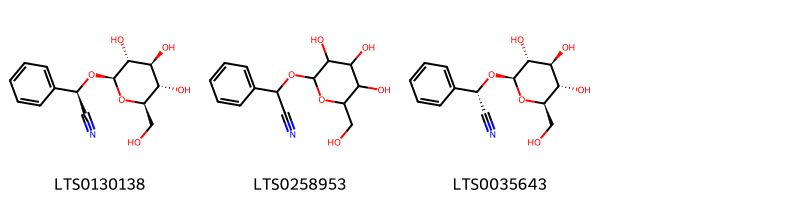{ width=100% }
    <figcaption>Hình ảnh cấu trúc hóa học của 3 hoạt chất thuộc nhóm Organooxygen compounds gồm ['prunasin (LTS0130138)', '2-phenyl-2-{[3,4,5-trihydroxy-6-(hydroxymethyl)oxan-2-yl]oxy}acetonitrile (LTS0258953)', '(s)-prunasin (LTS0035643)'].</figcaption>
</figure>
#### Nhóm Prenol lipids
<figure markdown="span">
    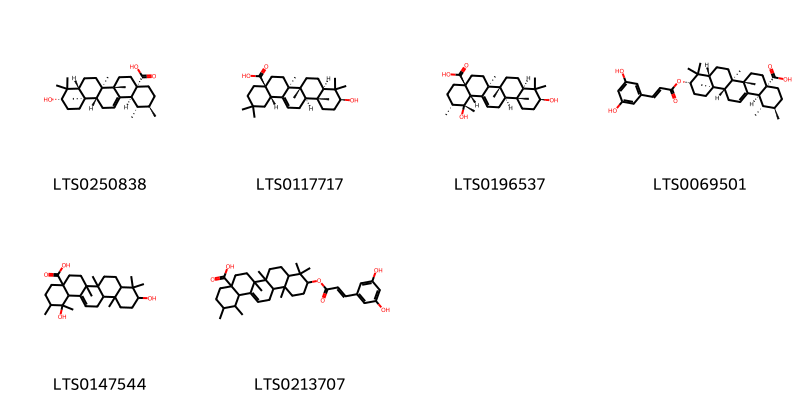{ width=100% }
    <figcaption>Hình ảnh cấu trúc hóa học của 6 hoạt chất thuộc nhóm Prenol lipids gồm ['ursolic acid (LTS0250838)', 'oleanolic acid (LTS0117717)', 'pomolic acid (LTS0196537)', '(1s,2r,4as,6as,6br,8ar,10s,12ar,12br,14bs)-10-{[(2e)-3-(3,5-dihydroxyphenyl)prop-2-enoyl]oxy}-1,2,6a,6b,9,9,12a-heptamethyl-2,3,4,5,6,7,8,8a,10,11,12,12b,13,14b-tetradecahydro-1h-picene-4a-carboxylic acid (LTS0069501)', '1,10-dihydroxy-1,2,6a,6b,9,9,12a-heptamethyl-2,3,4,5,6,7,8,8a,10,11,12,12b,13,14b-tetradecahydropicene-4a-carboxylic acid (LTS0147544)', '10-{[3-(3,5-dihydroxyphenyl)prop-2-enoyl]oxy}-1,2,6a,6b,9,9,12a-heptamethyl-2,3,4,5,6,7,8,8a,10,11,12,12b,13,14b-tetradecahydro-1h-picene-4a-carboxylic acid (LTS0213707)'].</figcaption>
</figure>
#### Nhóm Steroids and steroid derivatives
<figure markdown="span">
    { width=100% }
    <figcaption>Hình ảnh cấu trúc hóa học của 2 hoạt chất thuộc nhóm Steroids and steroid derivatives gồm ['sitogluside (LTS0201798)', '2-{[1-(5-ethyl-6-methylheptan-2-yl)-9a,11a-dimethyl-1h,2h,3h,3ah,3bh,4h,6h,7h,8h,9h,9bh,10h,11h-cyclopenta[a]phenanthren-7-yl]oxy}-6-(hydroxymethyl)oxane-3,4,5-triol (LTS0158828)'].</figcaption>
</figure>

---

### Dược dân tộc học

Danh sách các quốc gia có sử dụng *Chaenomeles japonica* trong điều trị các bệnh. 

| Country   | Disease               | Bệnh                                                                                                                                                                                                |
|:----------|:----------------------|:----------------------------------------------------------------------------------------------------------------------------------------------------------------------------------------------------|
| Elsewhere | Antitussive, Diuretic | MYMEMORY WARNING: YOU USED ALL AVAILABLE FREE TRANSLATIONS FOR TODAY. NEXT AVAILABLE IN  12 HOURS 32 MINUTES 58 SECONDS VISIT HTTPS://MYMEMORY.TRANSLATED.NET/DOC/USAGELIMITS.PHP TO TRANSLATE MORE |

---

---
## Chaenomeles sinensis
### Thông tin về thực vật

!!! info "Phân loại thực vật của *Pseudocydonia sinensis* từ GIBF:"
    - **Kingdom:** Plantae
    - **Phylum:** Tracheophyta
    - **Order:** Rosales
    - **Family:** Rosaceae
    - **Genus:** Pseudocydonia
    - **Species:** *Pseudocydonia sinensis*

 

| Label (VI)   | Label (EN)   | Scientific Name      | Descriptions (VI)   | Descriptions (EN)   | Also Known As (VI)   | Also Known As (EN)   |
|:-------------|:-------------|:---------------------|:--------------------|:--------------------|:---------------------|:---------------------|
| N/A          | N/A          | Chaenomeles sinensis | loài thực vật       | species of plant    | ['']                 | ['']                 |

#### Phân bố trên thế giới

**Từ CSDL GIBF** nan, Japan, Korea (Democratic People’s Republic of), Andorra, Estonia, United States of America, China, Korea, Republic of

#### Phân bố tại Việt Nam

**Từ CSDL GIBF**: Không có ghi nhận ở Việt Nam

---
### Thành phần hóa học
        
- Theo cơ sở dữ liệu lotus: Từ loài *Pseudocydonia sinensis* đã phân lập và xác định được 92 hoạt chất thuộc về các nhóm Organooxygen compounds, Flavonoids, 2-arylbenzofuran flavonoids, Prenol lipids, Lignan glycosides, Isoflavonoids, Phenols, Hydroxy acids and derivatives, Steroids and steroid derivatives, Benzene and substituted derivatives. 

|    | chemicalTaxonomyClassyfireClass     |   smiles_count |
|---:|:------------------------------------|---------------:|
|  0 | 2-arylbenzofuran flavonoids         |              4 |
|  1 | Benzene and substituted derivatives |              1 |
|  2 | Flavonoids                          |             17 |
|  3 | Hydroxy acids and derivatives       |              1 |
|  4 | Isoflavonoids                       |              4 |
|  5 | Lignan glycosides                   |             10 |
|  6 | Organooxygen compounds              |              3 |
|  7 | Phenols                             |              1 |
|  8 | Prenol lipids                       |             48 |
|  9 | Steroids and steroid derivatives    |              3 |

#### Nhóm 2-arylbenzofuran flavonoids
<figure markdown="span">
    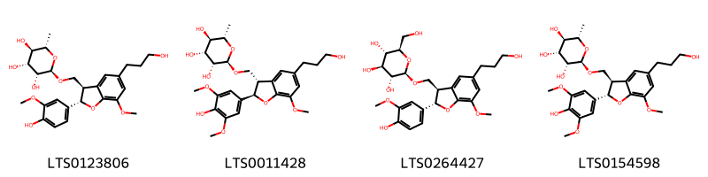{ width=100% }
    <figcaption>Hình ảnh cấu trúc hóa học của 4 hoạt chất thuộc nhóm 2-arylbenzofuran flavonoids gồm ['(2r,3r,4r,5r,6s)-2-{[(2s,3r)-2-(4-hydroxy-3-methoxyphenyl)-5-(3-hydroxypropyl)-7-methoxy-2,3-dihydro-1-benzofuran-3-yl]methoxy}-6-methyloxane-3,4,5-triol (LTS0123806)', '(2r,3r,4r,5r,6s)-2-{[(2r,3s)-2-(4-hydroxy-3,5-dimethoxyphenyl)-5-(3-hydroxypropyl)-7-methoxy-2,3-dihydro-1-benzofuran-3-yl]methoxy}-6-methyloxane-3,4,5-triol (LTS0011428)', '(2r,3r,4s,5s,6r)-2-{[(2s,3r)-2-(4-hydroxy-3-methoxyphenyl)-5-(3-hydroxypropyl)-7-methoxy-2,3-dihydro-1-benzofuran-3-yl]methoxy}-6-(hydroxymethyl)oxane-3,4,5-triol (LTS0264427)', '(2r,3r,4r,5r,6s)-2-{[(2s,3r)-2-(4-hydroxy-3,5-dimethoxyphenyl)-5-(3-hydroxypropyl)-7-methoxy-2,3-dihydro-1-benzofuran-3-yl]methoxy}-6-methyloxane-3,4,5-triol (LTS0154598)'].</figcaption>
</figure>
#### Nhóm Benzene and substituted derivatives
<figure markdown="span">
    { width=100% }
    <figcaption>Hình ảnh cấu trúc hóa học của 1 hoạt chất thuộc nhóm Benzene and substituted derivatives gồm ['3,4-dihydroxybenzoic acid (LTS0018765)'].</figcaption>
</figure>
#### Nhóm Flavonoids
<figure markdown="span">
    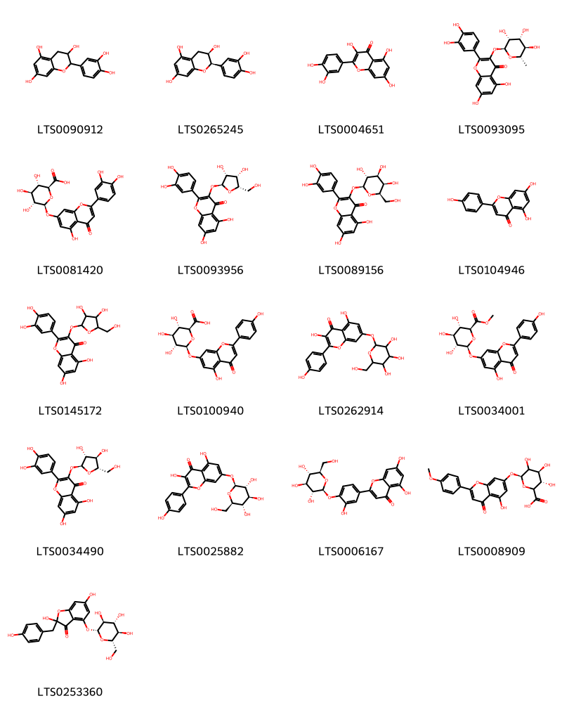{ width=100% }
    <figcaption>Hình ảnh cấu trúc hóa học của 17 hoạt chất thuộc nhóm Flavonoids gồm ['catechol (LTS0090912)', 'ent-epicatechin (LTS0265245)', 'quercetin (LTS0004651)', 'quercitrin (LTS0093095)', 'luteolin 7-o-glucuronide (LTS0081420)', '3-{[(2s,3r,4s,5s)-3,4-dihydroxy-5-(hydroxymethyl)oxolan-2-yl]oxy}-2-(3,4-dihydroxyphenyl)-5,7-dihydroxychromen-4-one (LTS0093956)', 'hyperoside (LTS0089156)', 'chamomile (LTS0104946)', '3-{[3,4-dihydroxy-5-(hydroxymethyl)oxolan-2-yl]oxy}-2-(3,4-dihydroxyphenyl)-5,7-dihydroxychromen-4-one (LTS0145172)', '(2s,3s,4s,5r,6s)-3,4,5-trihydroxy-6-{[5-hydroxy-2-(4-hydroxyphenyl)-4-oxochromen-7-yl]oxy}oxane-2-carboxylic acid (LTS0100940)', '3,5-dihydroxy-2-(4-hydroxyphenyl)-7-{[3,4,5-trihydroxy-6-(hydroxymethyl)oxan-2-yl]oxy}chromen-4-one (LTS0262914)', 'methyl (2s,3s,4s,5r,6s)-3,4,5-trihydroxy-6-{[5-hydroxy-2-(4-hydroxyphenyl)-4-oxochromen-7-yl]oxy}oxane-2-carboxylate (LTS0034001)', 'avicularin (LTS0034490)', 'kaempferol 7-o-glucoside (LTS0025882)', '5,7-dihydroxy-2-(3-hydroxy-4-{[(2s,3r,4s,5s,6r)-3,4,5-trihydroxy-6-(hydroxymethyl)oxan-2-yl]oxy}phenyl)chromen-4-one (LTS0006167)', 'acacetin 7-glucuronide (LTS0008909)', '2,6-dihydroxy-2-[(4-hydroxyphenyl)methyl]-4-{[(2r,3s,4r,5r,6s)-3,4,5-trihydroxy-6-(hydroxymethyl)oxan-2-yl]oxy}-1-benzofuran-3-one (LTS0253360)'].</figcaption>
</figure>
#### Nhóm Hydroxy acids and derivatives
<figure markdown="span">
    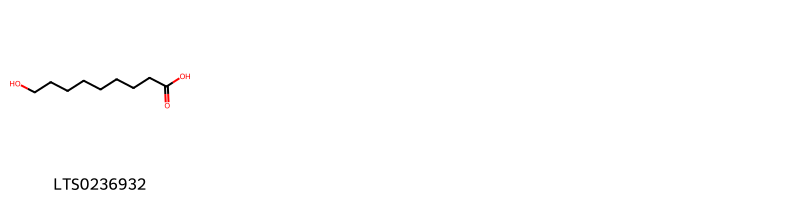{ width=100% }
    <figcaption>Hình ảnh cấu trúc hóa học của 1 hoạt chất thuộc nhóm Hydroxy acids and derivatives gồm ['9-hydroxynonanoic acid (LTS0236932)'].</figcaption>
</figure>
#### Nhóm Isoflavonoids
<figure markdown="span">
    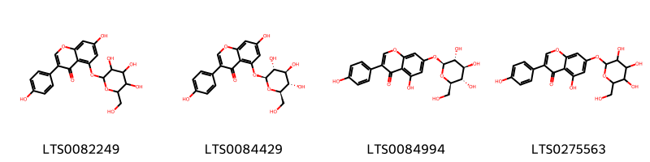{ width=100% }
    <figcaption>Hình ảnh cấu trúc hóa học của 4 hoạt chất thuộc nhóm Isoflavonoids gồm ['7-hydroxy-3-(4-hydroxyphenyl)-5-{[3,4,5-trihydroxy-6-(hydroxymethyl)oxan-2-yl]oxy}chromen-4-one (LTS0082249)', '7-hydroxy-3-(4-hydroxyphenyl)-5-{[(2s,3r,4s,5s,6r)-3,4,5-trihydroxy-6-(hydroxymethyl)oxan-2-yl]oxy}chromen-4-one (LTS0084429)', 'genistin (LTS0084994)', '5-hydroxy-3-(4-hydroxyphenyl)-7-{[3,4,5-trihydroxy-6-(hydroxymethyl)oxan-2-yl]oxy}chromen-4-one (LTS0275563)'].</figcaption>
</figure>
#### Nhóm Lignan glycosides
<figure markdown="span">
    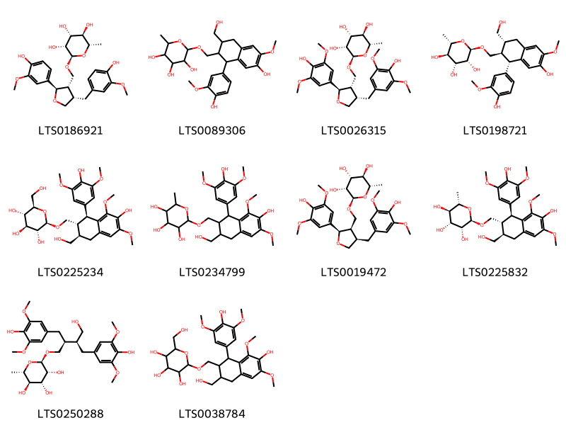{ width=100% }
    <figcaption>Hình ảnh cấu trúc hóa học của 10 hoạt chất thuộc nhóm Lignan glycosides gồm ['(2r,3r,4r,5r,6s)-2-{[(2r,3s,4s)-2-(4-hydroxy-3-methoxyphenyl)-4-[(4-hydroxy-3-methoxyphenyl)methyl]oxolan-3-yl]methoxy}-6-methyloxane-3,4,5-triol (LTS0186921)', '2-{[7-hydroxy-1-(4-hydroxy-3-methoxyphenyl)-3-(hydroxymethyl)-6-methoxy-1,2,3,4-tetrahydronaphthalen-2-yl]methoxy}-6-methyloxane-3,4,5-triol (LTS0089306)', '(2r,3r,4r,5r,6s)-2-{[(2r,3s,4s)-2-(4-hydroxy-3,5-dimethoxyphenyl)-4-[(4-hydroxy-3,5-dimethoxyphenyl)methyl]oxolan-3-yl]methoxy}-6-methyloxane-3,4,5-triol (LTS0026315)', 'aviculin (LTS0198721)', '(2r,3r,4s,5s,6r)-2-{[(1s,2r,3r)-7-hydroxy-1-(4-hydroxy-3,5-dimethoxyphenyl)-3-(hydroxymethyl)-6,8-dimethoxy-1,2,3,4-tetrahydronaphthalen-2-yl]methoxy}-6-(hydroxymethyl)oxane-3,4,5-triol (LTS0225234)', '2-{[7-hydroxy-1-(4-hydroxy-3,5-dimethoxyphenyl)-3-(hydroxymethyl)-6,8-dimethoxy-1,2,3,4-tetrahydronaphthalen-2-yl]methoxy}-6-methyloxane-3,4,5-triol (LTS0234799)', '(2r,3r,4r,5r,6s)-2-{[(2r,3r,4r)-2-(4-hydroxy-3,5-dimethoxyphenyl)-4-[(4-hydroxy-3,5-dimethoxyphenyl)methyl]oxolan-3-yl]methoxy}-6-methyloxane-3,4,5-triol (LTS0019472)', '(2r,3r,4r,5r,6s)-2-{[(1s,2r,3r)-7-hydroxy-1-(4-hydroxy-3,5-dimethoxyphenyl)-3-(hydroxymethyl)-6,8-dimethoxy-1,2,3,4-tetrahydronaphthalen-2-yl]methoxy}-6-methyloxane-3,4,5-triol (LTS0225832)', '(2r,3r,4r,5r,6s)-2-[(2s,3s)-4-hydroxy-2,3-bis[(4-hydroxy-3,5-dimethoxyphenyl)methyl]butoxy]-6-methyloxane-3,4,5-triol (LTS0250288)', '2-{[7-hydroxy-1-(4-hydroxy-3,5-dimethoxyphenyl)-3-(hydroxymethyl)-6,8-dimethoxy-1,2,3,4-tetrahydronaphthalen-2-yl]methoxy}-6-(hydroxymethyl)oxane-3,4,5-triol (LTS0038784)'].</figcaption>
</figure>
#### Nhóm Organooxygen compounds
<figure markdown="span">
    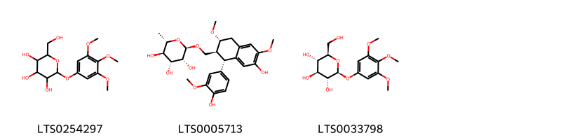{ width=100% }
    <figcaption>Hình ảnh cấu trúc hóa học của 3 hoạt chất thuộc nhóm Organooxygen compounds gồm ['2-(hydroxymethyl)-6-(3,4,5-trimethoxyphenoxy)oxane-3,4,5-triol (LTS0254297)', '(2r,3r,4r,5r,6s)-2-{[(1s,2s,3r)-7-hydroxy-1-(4-hydroxy-3-methoxyphenyl)-3,6-dimethoxy-1,2,3,4-tetrahydronaphthalen-2-yl]methoxy}-6-methyloxane-3,4,5-triol (LTS0005713)', 'koaburside (LTS0033798)'].</figcaption>
</figure>
#### Nhóm Phenols
<figure markdown="span">
    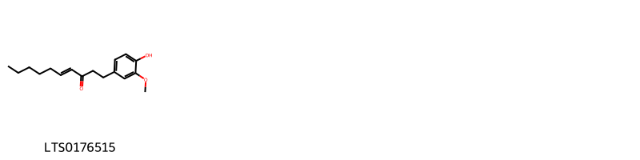{ width=100% }
    <figcaption>Hình ảnh cấu trúc hóa học của 1 hoạt chất thuộc nhóm Phenols gồm ['shogaol (LTS0176515)'].</figcaption>
</figure>
#### Nhóm Prenol lipids
<figure markdown="span">
    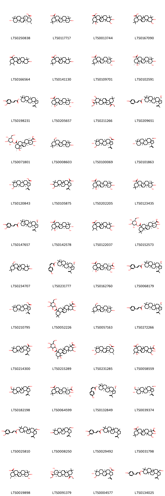{ width=100% }
    <figcaption>Hình ảnh cấu trúc hóa học của 48 hoạt chất thuộc nhóm Prenol lipids gồm ['ursolic acid (LTS0250838)', 'oleanolic acid (LTS0117717)', '1,10,11-trihydroxy-1,2,6a,6b,9,9,12a-heptamethyl-2,3,4,5,6,7,8,8a,10,11,12,12b,13,14b-tetradecahydropicene-4a-carboxylic acid (LTS0013744)', '10,11-dihydroxy-2,2,6a,6b,9,9,12a-heptamethyl-1,3,4,5,6,7,8,8a,10,11,12,12b,13,14b-tetradecahydropicene-4a-carboxylic acid (LTS0167090)', '10-hydroxy-1,2,6a,6b,9,9,12a-heptamethyl-2,3,4,5,6,7,8,8a,10,11,12,12b,13,14b-tetradecahydro-1h-picene-4a-carboxylic acid (LTS0166564)', 'oleanolic acid (LTS0141130)', 'maslinic acid (LTS0109701)', 'tormentic acid (LTS0102591)', '(1r,3ar,5ar,5br,7ar,9s,11ar,11br,13ar,13br)-3a,5a,5b,8,8,11a-hexamethyl-1-(prop-1-en-2-yl)-hexadecahydrocyclopenta[a]chrysen-9-yl (2e)-3-(3,4-dihydroxyphenyl)prop-2-enoate (LTS0198231)', 'euscaphic acid (LTS0205657)', '4,8a-dimethyl 2,3-dihydroxy-4,6a,6b,11,11,14b-hexamethyl-1,2,3,4a,5,6,7,8,9,10,12,12a,14,14a-tetradecahydropicene-4,8a-dicarboxylate (LTS0211266)', '(1r,3as,5ar,5br,7ar,9s,11ar,11br,13ar,13br)-3a-(hydroxymethyl)-5a,5b,8,8,11a-pentamethyl-1-(prop-1-en-2-yl)-hexadecahydrocyclopenta[a]chrysen-9-yl (2e)-3-(4-hydroxyphenyl)prop-2-enoate (LTS0209651)', '(2r,3r,4r,4ar,6ar,6bs,8as,11r,12r,12as,14ar,14br)-2,3,12-trihydroxy-4,6a,6b,11,12,14b-hexamethyl-8a-({[(2s,3r,4s,5s,6r)-3,4,5-trihydroxy-6-(hydroxymethyl)oxan-2-yl]oxy}carbonyl)-1,2,3,4a,5,6,7,8,9,10,11,12a,14,14a-tetradecahydropicene-4-carboxylic acid (LTS0071801)', '(3s,4as,6ar,6bs,8as,12ar,14ar,14br)-8a-(hydroxymethyl)-4,4,6a,6b,11,11,14b-heptamethyl-1,2,3,4a,5,6,7,8,9,10,12,12a,14,14a-tetradecahydropicen-3-ol (LTS0008603)', '(1r,3as,5ar,5br,7ar,9r,10r,11ar,11br,13ar,13br)-9,10-dihydroxy-5a,5b,8,8,11a-pentamethyl-1-(prop-1-en-2-yl)-hexadecahydrocyclopenta[a]chrysene-3a-carboxylic acid (LTS0100069)', 'betulin (LTS0101863)', '(1r,3as,5ar,5br,7ar,9r,10r,11ar,11br,13ar,13bs)-9,10-dihydroxy-5a,5b,8,8,11a-pentamethyl-1-(prop-1-en-2-yl)-hexadecahydrocyclopenta[a]chrysene-3a-carboxylic acid (LTS0120843)', '9,10-dihydroxy-5a,5b,8,8,11a-pentamethyl-1-(prop-1-en-2-yl)-hexadecahydrocyclopenta[a]chrysene-3a-carboxylic acid (LTS0105875)', '(1s,2s,4as,6as,6br,8ar,10r,11r,12ar,12br,14bs)-1,10,11-trihydroxy-1,2,6a,6b,9,9,12a-heptamethyl-2,3,4,5,6,7,8,8a,10,11,12,12b,13,14b-tetradecahydropicene-4a-carboxylic acid (LTS0202205)', '(4as,6as,6br,8ar,10r,11r,12ar,12br,14br)-10,11-dihydroxy-2,2,6a,6b,9,9,12a-heptamethyl-1,3,4,5,6,7,8,8a,10,11,12,12b,13,14b-tetradecahydropicene-4a-carboxylic acid (LTS0123435)', '(1r,3as,5ar,5br,7ar,9s,11as,11br,13ar,13bs)-3a-(hydroxymethyl)-5a,5b,8,8,11a-pentamethyl-1-(prop-1-en-2-yl)-hexadecahydrocyclopenta[a]chrysen-9-yl (2e)-3-(3,4-dihydroxyphenyl)prop-2-enoate (LTS0147657)', '(1s,2s,4as,6as,6br,8ar,10s,11r,12ar,12br,14bs)-1,10,11-trihydroxy-1,2,6a,6b,9,9,12a-heptamethyl-2,3,4,5,6,7,8,8a,10,11,12,12b,13,14b-tetradecahydropicene-4a-carboxylic acid (LTS0142578)', '10,11-dihydroxy-1,2,6a,6b,9,9,12a-heptamethyl-2,3,4,5,6,7,8,8a,10,11,12,12b,13,14b-tetradecahydro-1h-picene-4a-carboxylic acid (LTS0122037)', '(2r,3r,4r,4ar,6ar,6bs,8as,12as,14ar,14br)-2,3-dihydroxy-4,6a,6b,11,11,14b-hexamethyl-8a-({[(2s,3r,4s,5s,6r)-3,4,5-trihydroxy-6-(hydroxymethyl)oxan-2-yl]oxy}carbonyl)-1,2,3,4a,5,6,7,8,9,10,12,12a,14,14a-tetradecahydropicene-4-carboxylic acid (LTS0152573)', '8a-(hydroxymethyl)-4,4,6a,6b,11,11,14b-heptamethyl-1,2,3,4a,5,6,7,8,9,10,12,12a,14,14a-tetradecahydropicen-3-ol (LTS0234707)', '(1r,3as,5ar,5br,7ar,9s,11ar,11br,13ar,13br)-3a-(hydroxymethyl)-5a,5b,8,8,11a-pentamethyl-1-(prop-1-en-2-yl)-hexadecahydrocyclopenta[a]chrysen-9-yl (2z)-3-(4-hydroxyphenyl)prop-2-enoate (LTS0231777)', '(2r,3r,4r,4ar,6ar,6bs,8as,11r,12r,12as,14ar,14br)-2,3,12-trihydroxy-4,6a,6b,11,12,14b-hexamethyl-1,2,3,4a,5,6,7,8,9,10,11,12a,14,14a-tetradecahydropicene-4,8a-dicarboxylic acid (LTS0162760)', '(1r,3as,5ar,5br,7ar,9s,11ar,11br,13ar,13br)-3a-(hydroxymethyl)-5a,5b,8,8,11a-pentamethyl-1-(prop-1-en-2-yl)-hexadecahydrocyclopenta[a]chrysen-9-yl (2e)-3-(3,4-dihydroxyphenyl)prop-2-enoate (LTS0068179)', 'betulinic acid (LTS0210795)', '2,3-dihydroxy-4,6a,6b,11,11,14b-hexamethyl-8a-({[3,4,5-trihydroxy-6-(hydroxymethyl)oxan-2-yl]oxy}carbonyl)-1,2,3,4a,5,6,7,8,9,10,12,12a,14,14a-tetradecahydropicene-4-carboxylic acid (LTS0052226)', 'erythrodiol (LTS0057163)', '(1r,3as,5ar,5br,7as,9s,11ar,11bs,13as,13br)-3a-(hydroxymethyl)-5a,5b,8,8,11a-pentamethyl-1-(prop-1-en-2-yl)-hexadecahydrocyclopenta[a]chrysen-9-yl (2e)-3-(4-hydroxyphenyl)prop-2-enoate (LTS0272266)', '9-hydroxy-5a,5b,8,8,11a-pentamethyl-1-(prop-1-en-2-yl)-hexadecahydrocyclopenta[a]chrysene-3a-carboxylic acid (LTS0214300)', '2,3,12-trihydroxy-4,6a,6b,11,12,14b-hexamethyl-8a-({[3,4,5-trihydroxy-6-(hydroxymethyl)oxan-2-yl]oxy}carbonyl)-1,2,3,4a,5,6,7,8,9,10,11,12a,14,14a-tetradecahydropicene-4-carboxylic acid (LTS0215289)', 'corosolic acid (LTS0231285)', '2,3,12-trihydroxy-4,6a,6b,11,12,14b-hexamethyl-1,2,3,4a,5,6,7,8,9,10,11,12a,14,14a-tetradecahydropicene-4,8a-dicarboxylic acid (LTS0058559)', '3a,8-bis(hydroxymethyl)-5a,5b,8,11a-tetramethyl-1-(prop-1-en-2-yl)-hexadecahydrocyclopenta[a]chrysen-9-ol (LTS0182198)', '(2r,3r,4r,4ar,6ar,6bs,8as,12as,14ar,14br)-2,3-dihydroxy-4,6a,6b,11,11,14b-hexamethyl-1,2,3,4a,5,6,7,8,9,10,12,12a,14,14a-tetradecahydropicene-4,8a-dicarboxylic acid (LTS0064599)', '(1r,3as,5ar,5br,7ar,9s,11ar,11bs,13ar,13br)-3a-(hydroxymethyl)-5a,5b,8,8,11a-pentamethyl-1-(prop-1-en-2-yl)-hexadecahydrocyclopenta[a]chrysen-9-yl (2z)-3-(4-hydroxyphenyl)prop-2-enoate (LTS0132849)', '(1r,3as,5ar,5br,7ar,8r,9s,11ar,11br,13ar,13br)-3a,8-bis(hydroxymethyl)-5a,5b,8,11a-tetramethyl-1-(prop-1-en-2-yl)-hexadecahydrocyclopenta[a]chrysen-9-ol (LTS0039374)', '3a-(hydroxymethyl)-5a,5b,8,8,11a-pentamethyl-1-(prop-1-en-2-yl)-hexadecahydrocyclopenta[a]chrysen-9-yl 3-(3,4-dihydroxyphenyl)prop-2-enoate (LTS0025810)', '3a-(hydroxymethyl)-5a,5b,8,8,11a-pentamethyl-1-(prop-1-en-2-yl)-hexadecahydrocyclopenta[a]chrysen-9-ol (LTS0008250)', '3a,5a,5b,8,8,11a-hexamethyl-1-(prop-1-en-2-yl)-hexadecahydrocyclopenta[a]chrysen-9-yl 3-(3,4-dihydroxyphenyl)prop-2-enoate (LTS0029492)', '2,3-dihydroxy-4,6a,6b,11,11,14b-hexamethyl-1,2,3,4a,5,6,7,8,9,10,12,12a,14,14a-tetradecahydropicene-4,8a-dicarboxylic acid (LTS0031798)', '(1r,2s,4as,6as,6br,8ar,10r,11r,12ar,12br,14bs)-10,11-dihydroxy-1,2,6a,6b,9,9,12a-heptamethyl-2,3,4,5,6,7,8,8a,10,11,12,12b,13,14b-tetradecahydro-1h-picene-4a-carboxylic acid (LTS0019898)', '4,8a-dimethyl (2r,3r,4r,4ar,6ar,6bs,8as,12as,14ar,14br)-2,3-dihydroxy-4,6a,6b,11,11,14b-hexamethyl-1,2,3,4a,5,6,7,8,9,10,12,12a,14,14a-tetradecahydropicene-4,8a-dicarboxylate (LTS0091379)', '(1r,3as,5as,5br,9r,10r,11ar)-9,10-dihydroxy-5a,5b,8,8,11a-pentamethyl-1-(prop-1-en-2-yl)-1h,2h,3h,4h,5h,6h,7h,7ah,9h,10h,11h,11bh,12h,13bh-cyclopenta[a]chrysene-3a-carboxylic acid (LTS0004577)', '3a-(hydroxymethyl)-5a,5b,8,8,11a-pentamethyl-1-(prop-1-en-2-yl)-hexadecahydrocyclopenta[a]chrysen-9-yl 3-(4-hydroxyphenyl)prop-2-enoate (LTS0134025)'].</figcaption>
</figure>
#### Nhóm Steroids and steroid derivatives
<figure markdown="span">
    { width=100% }
    <figcaption>Hình ảnh cấu trúc hóa học của 3 hoạt chất thuộc nhóm Steroids and steroid derivatives gồm ['stigmast-5-en-3-ol (LTS0071224)', 'sitosterol (LTS0168132)', 'stigmast-5-en-3-ol, (3β)- (LTS0204616)'].</figcaption>
</figure>

---

### Dược dân tộc học

Danh sách các quốc gia có sử dụng *Pseudocydonia sinensis* trong điều trị các bệnh. 

| Country   | Disease                           | Bệnh                                                                                                                                                                                                |
|:----------|:----------------------------------|:----------------------------------------------------------------------------------------------------------------------------------------------------------------------------------------------------|
| China     | Analgesic, Stimulant, Expectorant | MYMEMORY WARNING: YOU USED ALL AVAILABLE FREE TRANSLATIONS FOR TODAY. NEXT AVAILABLE IN  12 HOURS 32 MINUTES 26 SECONDS VISIT HTTPS://MYMEMORY.TRANSLATED.NET/DOC/USAGELIMITS.PHP TO TRANSLATE MORE |
| Elsewhere | Antitussive, Diuretic             | MYMEMORY WARNING: YOU USED ALL AVAILABLE FREE TRANSLATIONS FOR TODAY. NEXT AVAILABLE IN  12 HOURS 32 MINUTES 23 SECONDS VISIT HTTPS://MYMEMORY.TRANSLATED.NET/DOC/USAGELIMITS.PHP TO TRANSLATE MORE |

---

# Chi Potentilla

??? note "Danh sách các dược liệu thuộc chi"
    
	 - *Potentilla anserina*
	 - *Potentilla candicans*
	 - *Potentilla chinensis*
	 - *Potentilla cryptotaenia*
	 - *Potentilla discolor*
	 - *Potentilla erecta*
	 - *Potentilla fragarioides*
	 - *Potentilla fruticosa*
	 - *Potentilla fulgens*
	 - *Potentilla kleiniana*
	 - *Potentilla pacifica*
	 - *Potentilla reptans*
	 - *Potentilla rubra*
	 - *Potentilla salesoviana*
	 - *Potentilla sericea*
	 - *Potentilla sundaica*
	 - *Potentilla supina*
	 - *Potentilla tormentilla*

---
## Potentilla anserina
### Thông tin về thực vật

!!! info "Phân loại thực vật của *Argentina anserina* từ GIBF:"
    - **Kingdom:** Plantae
    - **Phylum:** Tracheophyta
    - **Order:** Rosales
    - **Family:** Rosaceae
    - **Genus:** Argentina
    - **Species:** *Argentina anserina*

 

| Label (VI)   | Label (EN)   | Scientific Name     | Descriptions (VI)   | Descriptions (EN)             | Also Known As (VI)   | Also Known As (EN)   |
|:-------------|:-------------|:--------------------|:--------------------|:------------------------------|:---------------------|:---------------------|
| N/A          | N/A          | Potentilla anserina | loài thực vật       | synonym of Argentina anserina | ['']                 | ['Silverweed']       |

#### Phân bố trên thế giới

**Từ CSDL GIBF** Switzerland, United Kingdom of Great Britain and Northern Ireland, France, Germany, Ireland, Austria, Norway, Netherlands

#### Phân bố tại Việt Nam

**Từ CSDL GIBF**: Không có ghi nhận ở Việt Nam

---
### Thành phần hóa học
        
- Theo cơ sở dữ liệu lotus: Từ loài *Argentina anserina* đã phân lập và xác định được 55 hoạt chất thuộc về các nhóm Stilbenes, Benzofurans, Flavonoids, Coumarins and derivatives, Pyrans. 

|    | chemicalTaxonomyClassyfireClass   |   smiles_count |
|---:|:----------------------------------|---------------:|
|  0 | Benzofurans                       |              3 |
|  1 | Coumarins and derivatives         |              2 |
|  2 | Flavonoids                        |             45 |
|  3 | Pyrans                            |              3 |
|  4 | Stilbenes                         |              2 |

#### Nhóm Benzofurans
<figure markdown="span">
    { width=100% }
    <figcaption>Hình ảnh cấu trúc hóa học của 3 hoạt chất thuộc nhóm Benzofurans gồm ['(6s,7as)-6-hydroxy-4,4,7a-trimethyl-6,7-dihydro-5h-1-benzofuran-2-one (LTS0067359)', 'loliolide (LTS0254454)', 'loliolide (LTS0119422)'].</figcaption>
</figure>
#### Nhóm Coumarins and derivatives
<figure markdown="span">
    { width=100% }
    <figcaption>Hình ảnh cấu trúc hóa học của 2 hoạt chất thuộc nhóm Coumarins and derivatives gồm ['umbelliferone (LTS0162728)', 'scopoletin (LTS0193112)'].</figcaption>
</figure>
#### Nhóm Flavonoids
<figure markdown="span">
    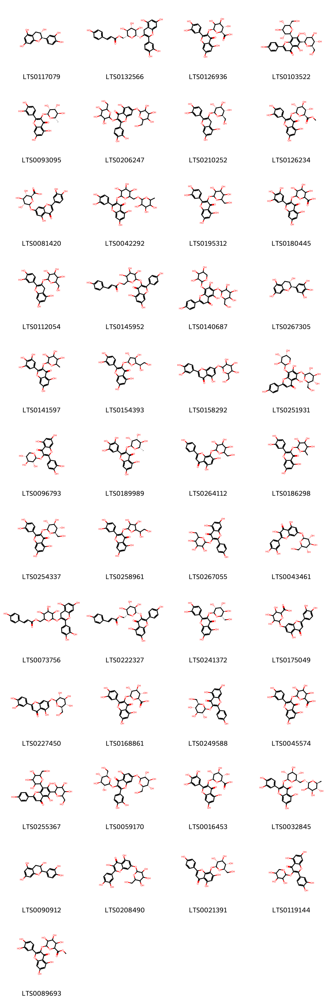{ width=100% }
    <figcaption>Hình ảnh cấu trúc hóa học của 45 hoạt chất thuộc nhóm Flavonoids gồm ['(+)-catechol (LTS0117079)', '[(2r,3s,4s,5r,6s)-6-{[2-(3,4-dihydroxyphenyl)-5,7-dihydroxy-4h-chromen-3-yl]oxy}-3,4,5-trihydroxyoxan-2-yl]methyl (2e)-3-(4-hydroxyphenyl)prop-2-enoate (LTS0132566)', 'miquelianin (LTS0126936)', 'vicenin-2 (LTS0103522)', 'quercitrin (LTS0093095)', '2-(3,4-dihydroxyphenyl)-5-hydroxy-3,7-bis({[3,4,5-trihydroxy-6-(hydroxymethyl)oxan-2-yl]oxy})chromen-4-one (LTS0206247)', '(2s,3r,4s,5s,6r)-2-{[2-(3,4-dihydroxyphenyl)-5,7-dihydroxy-4h-chromen-3-yl]oxy}-6-(hydroxymethyl)oxane-3,4,5-triol (LTS0210252)', 'methyl (2s,3s,4s,5r,6s)-6-{[2-(3,4-dihydroxyphenyl)-5,7-dihydroxy-4-oxochromen-3-yl]oxy}-3,4,5-trihydroxyoxane-2-carboxylate (LTS0126234)', 'luteolin 7-o-glucuronide (LTS0081420)', 'rutin (LTS0042292)', '2-(3,4-dihydroxyphenyl)-5,7-dihydroxy-3-{[3,4,5-trihydroxy-6-(hydroxymethyl)oxan-2-yl]oxy}chromen-4-one (LTS0195312)', '6-{[5,7-dihydroxy-4-oxo-2-(3,4,5-trihydroxyphenyl)chromen-3-yl]oxy}-3,4,5-trihydroxyoxane-2-carboxylic acid (LTS0180445)', '2-{[2-(3,4-dihydroxyphenyl)-5,7-dihydroxy-4h-chromen-3-yl]oxy}-6-(hydroxymethyl)oxane-3,4,5-triol (LTS0112054)', '(6-{[5,7-dihydroxy-2-(4-hydroxyphenyl)-4-oxochromen-3-yl]oxy}-3,4,5-trihydroxyoxan-2-yl)methyl 3-(4-hydroxyphenyl)prop-2-enoate (LTS0145952)', '5,7-dihydroxy-2-(4-hydroxyphenyl)-6-{[3,4,5-trihydroxy-6-(hydroxymethyl)oxan-2-yl]oxy}-8-[(3,4,5-trihydroxyoxan-2-yl)oxy]chromen-4-one (LTS0140687)', 'gallocatechol (LTS0267305)', 'myricitrin (LTS0141597)', 'quercetin-3-glucoside (LTS0154393)', '2-(3,4-dihydroxyphenyl)-5-hydroxy-7-{[3,4,5-trihydroxy-6-(hydroxymethyl)oxan-2-yl]oxy}chromen-4-one (LTS0158292)', '5,7-dihydroxy-2-(4-hydroxyphenyl)-6-{[(2s,3r,4s,5s,6r)-3,4,5-trihydroxy-6-(hydroxymethyl)oxan-2-yl]oxy}-8-{[(2s,3s,4r,5r)-3,4,5-trihydroxyoxan-2-yl]oxy}chromen-4-one (LTS0251931)', '2-(3,4-dihydroxyphenyl)-5,7-dihydroxy-3-{[(2s,3r,4s,5r)-3,4,5-trihydroxyoxan-2-yl]oxy}chromen-4-one (LTS0096793)', 'myricitrin (LTS0189989)', '5,7-dihydroxy-2-(4-hydroxyphenyl)-8-{[3,4,5-trihydroxy-6-(hydroxymethyl)oxan-2-yl]oxy}chromen-4-one (LTS0264112)', 'quercitrin (LTS0186298)', 'isoquercetin (LTS0254337)', '3-{[5-(1,2-dihydroxyethyl)-3,4-dihydroxyoxolan-2-yl]oxy}-2-(3,4-dihydroxyphenyl)-5,7-dihydroxychromen-4-one (LTS0258961)', 'trifolin (LTS0267055)', 'quercimeritrin (LTS0043461)', '(6-{[2-(3,4-dihydroxyphenyl)-5,7-dihydroxy-4h-chromen-3-yl]oxy}-3,4,5-trihydroxyoxan-2-yl)methyl 3-(4-hydroxyphenyl)prop-2-enoate (LTS0073756)', 'tiliroside (LTS0222327)', '2-(3,4-dihydroxyphenyl)-5,7-dihydroxy-3-{[(2s,3r,4r,5r,6s)-3,4,5-trihydroxy-6-(hydroxymethyl)oxan-2-yl]oxy}chromen-4-one (LTS0241372)', '6-{[2-(3,4-dihydroxyphenyl)-5-hydroxy-4-oxochromen-7-yl]oxy}-3,4,5-trihydroxyoxane-2-carboxylic acid (LTS0175049)', 'luteolin 7-o-glucoside (LTS0227450)', 'querciturone (LTS0168861)', 'astragalin (LTS0249588)', 'miquelianin (LTS0045574)', '5,7-dihydroxy-2-(4-hydroxyphenyl)-6,8-bis[3,4,5-trihydroxy-6-(hydroxymethyl)oxan-2-yl]chromen-4-one (LTS0255367)', 'quercetin 3,7-diglucoside (LTS0059170)', 'myricetin 3-o-glucuronide (LTS0016453)', '3-rutinosyl quercetin (LTS0032845)', 'catechol (LTS0090912)', 'quercimeritrin (LTS0208490)', '5,7-dihydroxy-2-(4-hydroxyphenyl)-8-{[(2s,3r,4s,5s,6r)-3,4,5-trihydroxy-6-(hydroxymethyl)oxan-2-yl]oxy}chromen-4-one (LTS0021391)', 'guaijaverin (LTS0119144)', 'methyl 6-{[2-(3,4-dihydroxyphenyl)-5,7-dihydroxy-4-oxochromen-3-yl]oxy}-3,4,5-trihydroxyoxane-2-carboxylate (LTS0089693)'].</figcaption>
</figure>
#### Nhóm Pyrans
<figure markdown="span">
    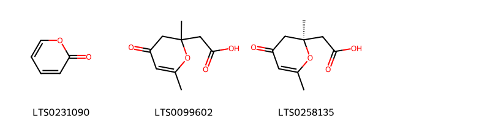{ width=100% }
    <figcaption>Hình ảnh cấu trúc hóa học của 3 hoạt chất thuộc nhóm Pyrans gồm ['α-pyrone (LTS0231090)', '(2,6-dimethyl-4-oxo-3h-pyran-2-yl)acetic acid (LTS0099602)', '[(2s)-2,6-dimethyl-4-oxo-3h-pyran-2-yl]acetic acid (LTS0258135)'].</figcaption>
</figure>
#### Nhóm Stilbenes
<figure markdown="span">
    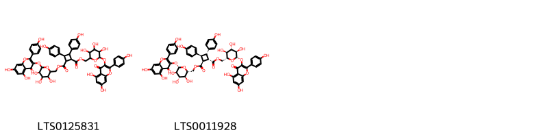{ width=100% }
    <figcaption>Hình ảnh cấu trúc hóa học của 2 hoạt chất thuộc nhóm Stilbenes gồm ['1,2-bis[(6-{[5,7-dihydroxy-2-(4-hydroxyphenyl)-4-oxochromen-3-yl]oxy}-3,4,5-trihydroxyoxan-2-yl)methyl] 3,4-bis(4-hydroxyphenyl)cyclobutane-1,2-dicarboxylate (LTS0125831)', '1,2-bis{[(2r,3s,4s,5r,6s)-6-{[5,7-dihydroxy-2-(4-hydroxyphenyl)-4-oxochromen-3-yl]oxy}-3,4,5-trihydroxyoxan-2-yl]methyl} (1s,2s,3s,4s)-3,4-bis(4-hydroxyphenyl)cyclobutane-1,2-dicarboxylate (LTS0011928)'].</figcaption>
</figure>

---

### Dược dân tộc học

Danh sách các quốc gia có sử dụng *Argentina anserina* trong điều trị các bệnh. 

| Country   | Disease                               | Bệnh                                                                                                                                                                                                |
|:----------|:--------------------------------------|:----------------------------------------------------------------------------------------------------------------------------------------------------------------------------------------------------|
| Elsewhere | Tonic, Vulnerary, Astringent          | MYMEMORY WARNING: YOU USED ALL AVAILABLE FREE TRANSLATIONS FOR TODAY. NEXT AVAILABLE IN  12 HOURS 31 MINUTES 35 SECONDS VISIT HTTPS://MYMEMORY.TRANSLATED.NET/DOC/USAGELIMITS.PHP TO TRANSLATE MORE |
| Turkey    | Astringent, Styptic, Tonic, Vulnerary | MYMEMORY WARNING: YOU USED ALL AVAILABLE FREE TRANSLATIONS FOR TODAY. NEXT AVAILABLE IN  12 HOURS 31 MINUTES 33 SECONDS VISIT HTTPS://MYMEMORY.TRANSLATED.NET/DOC/USAGELIMITS.PHP TO TRANSLATE MORE |

---

---
## Potentilla candicans
### Thông tin về thực vật

!!! info "Phân loại thực vật của *Potentilla candicans* từ GIBF:"
    - **Kingdom:** Plantae
    - **Phylum:** Tracheophyta
    - **Order:** Rosales
    - **Family:** Rosaceae
    - **Genus:** Potentilla
    - **Species:** *Potentilla candicans*

 

| Label (VI)   | Label (EN)   | Scientific Name      | Descriptions (VI)   | Descriptions (EN)   | Also Known As (VI)   | Also Known As (EN)   |
|:-------------|:-------------|:---------------------|:--------------------|:--------------------|:---------------------|:---------------------|
| N/A          | N/A          | Potentilla candicans | loài thực vật       | species of plant    | ['']                 | ['']                 |

#### Phân bố trên thế giới

**Từ CSDL GIBF** nan, United States of America, Mexico

#### Phân bố tại Việt Nam

**Từ CSDL GIBF**: Không có ghi nhận ở Việt Nam

---
### Thành phần hóa học
        
- Theo cơ sở dữ liệu lotus: Từ loài *Potentilla candicans* đã phân lập và xác định được 1 hoạt chất thuộc về các nhóm Tannins. 

|    | chemicalTaxonomyClassyfireClass   |   smiles_count |
|---:|:----------------------------------|---------------:|
|  0 | Tannins                           |              1 |

#### Nhóm Tannins
<figure markdown="span">
    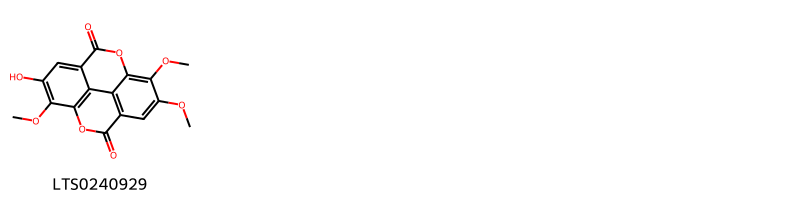{ width=100% }
    <figcaption>Hình ảnh cấu trúc hóa học của 1 hoạt chất thuộc nhóm Tannins gồm ['13-hydroxy-6,7,14-trimethoxy-2,9-dioxatetracyclo[6.6.2.0⁴,¹⁶.0¹¹,¹⁵]hexadeca-1(15),4(16),5,7,11,13-hexaene-3,10-dione (LTS0240929)'].</figcaption>
</figure>

---

### Dược dân tộc học

Danh sách các quốc gia có sử dụng *Potentilla candicans* trong điều trị các bệnh. 

| Country   | Disease    | Bệnh                                                                                                                                                                                                |
|:----------|:-----------|:----------------------------------------------------------------------------------------------------------------------------------------------------------------------------------------------------|
| Mexico    | Astringent | MYMEMORY WARNING: YOU USED ALL AVAILABLE FREE TRANSLATIONS FOR TODAY. NEXT AVAILABLE IN  12 HOURS 31 MINUTES 03 SECONDS VISIT HTTPS://MYMEMORY.TRANSLATED.NET/DOC/USAGELIMITS.PHP TO TRANSLATE MORE |

---

---
## Potentilla chinensis
### Thông tin về thực vật

!!! info "Phân loại thực vật của *Potentilla chinensis* từ GIBF:"
    - **Kingdom:** Plantae
    - **Phylum:** Tracheophyta
    - **Order:** Rosales
    - **Family:** Rosaceae
    - **Genus:** Potentilla
    - **Species:** *Potentilla chinensis*

 

| Label (VI)   | Label (EN)   | Scientific Name      | Descriptions (VI)   | Descriptions (EN)   | Also Known As (VI)   | Also Known As (EN)   |
|:-------------|:-------------|:---------------------|:--------------------|:--------------------|:---------------------|:---------------------|
| N/A          | N/A          | Potentilla chinensis | loài thực vật       | species of plant    | ['']                 | ['']                 |

#### Phân bố trên thế giới

**Từ CSDL GIBF** nan, Japan, Mongolia, Russian Federation, China, Korea, Republic of, Chinese Taipei

#### Phân bố tại Việt Nam

**Từ CSDL GIBF**: Không có ghi nhận ở Việt Nam

---
### Thành phần hóa học
        
- Theo cơ sở dữ liệu lotus: Từ loài *Potentilla chinensis* đã phân lập và xác định được 1 hoạt chất thuộc về các nhóm . 

| chemicalTaxonomyClassyfireClass   | smiles_count   |
|-----------------------------------|----------------|

---

### Dược dân tộc học

Danh sách các quốc gia có sử dụng *Potentilla chinensis* trong điều trị các bệnh. 

| Country   | Disease          | Bệnh                                                                                                                                                                                                |
|:----------|:-----------------|:----------------------------------------------------------------------------------------------------------------------------------------------------------------------------------------------------|
| Elsewhere | nan, Emmenagogue | MYMEMORY WARNING: YOU USED ALL AVAILABLE FREE TRANSLATIONS FOR TODAY. NEXT AVAILABLE IN  12 HOURS 30 MINUTES 32 SECONDS VISIT HTTPS://MYMEMORY.TRANSLATED.NET/DOC/USAGELIMITS.PHP TO TRANSLATE MORE |

---

---
## Potentilla cryptotaenia
### Thông tin về thực vật

!!! info "Phân loại thực vật của *Potentilla cryptotaeniae* từ GIBF:"
    - **Kingdom:** Plantae
    - **Phylum:** Tracheophyta
    - **Order:** Rosales
    - **Family:** Rosaceae
    - **Genus:** Potentilla
    - **Species:** *Potentilla cryptotaeniae*

 

| Label (VI)   | Label (EN)   | Scientific Name      | Descriptions (VI)   | Descriptions (EN)   | Also Known As (VI)   | Also Known As (EN)   |
|:-------------|:-------------|:---------------------|:--------------------|:--------------------|:---------------------|:---------------------|
| N/A          | N/A          | Potentilla chinensis | loài thực vật       | species of plant    | ['']                 | ['']                 |

#### Phân bố trên thế giới

**Từ CSDL GIBF** nan, Japan, Russian Federation, China, Korea, Republic of

#### Phân bố tại Việt Nam

**Từ CSDL GIBF**: Không có ghi nhận ở Việt Nam

---
### Thành phần hóa học
        
- Theo cơ sở dữ liệu lotus: Từ loài *Potentilla cryptotaeniae* đã phân lập và xác định được 1 hoạt chất thuộc về các nhóm Organooxygen compounds. 

|    | chemicalTaxonomyClassyfireClass   |   smiles_count |
|---:|:----------------------------------|---------------:|
|  0 | Organooxygen compounds            |              1 |

#### Nhóm Organooxygen compounds
<figure markdown="span">
    { width=100% }
    <figcaption>Hình ảnh cấu trúc hóa học của 1 hoạt chất thuộc nhóm Organooxygen compounds gồm ['chlorogenic acid (LTS0226495)'].</figcaption>
</figure>

---

### Dược dân tộc học

Danh sách các quốc gia có sử dụng *Potentilla cryptotaeniae* trong điều trị các bệnh. 

| Country   | Disease           | Bệnh                                                                                                                                                                                                |
|:----------|:------------------|:----------------------------------------------------------------------------------------------------------------------------------------------------------------------------------------------------|
| China     | Poison, Vermifuge | MYMEMORY WARNING: YOU USED ALL AVAILABLE FREE TRANSLATIONS FOR TODAY. NEXT AVAILABLE IN  12 HOURS 30 MINUTES 02 SECONDS VISIT HTTPS://MYMEMORY.TRANSLATED.NET/DOC/USAGELIMITS.PHP TO TRANSLATE MORE |

---

---
## Potentilla discolor
### Thông tin về thực vật

!!! info "Phân loại thực vật của *Potentilla discolor* từ GIBF:"
    - **Kingdom:** Plantae
    - **Phylum:** Tracheophyta
    - **Order:** Rosales
    - **Family:** Rosaceae
    - **Genus:** Potentilla
    - **Species:** *Potentilla discolor*

 

| Label (VI)   | Label (EN)   | Scientific Name     | Descriptions (VI)   | Descriptions (EN)   | Also Known As (VI)   | Also Known As (EN)   |
|:-------------|:-------------|:--------------------|:--------------------|:--------------------|:---------------------|:---------------------|
| N/A          | N/A          | Potentilla discolor | loài thực vật       | species of plant    | ['']                 | ['']                 |

#### Phân bố trên thế giới

**Từ CSDL GIBF** nan, Japan, Russian Federation, China, Korea, Republic of, Chinese Taipei

#### Phân bố tại Việt Nam

**Từ CSDL GIBF**: Không có ghi nhận ở Việt Nam

---
### Thành phần hóa học
        
- Theo cơ sở dữ liệu lotus: Từ loài *Potentilla discolor* đã phân lập và xác định được Chưa có hoạt chất nào được phân lập. hoạt chất thuộc về các nhóm Không có hoạt chất nào được phân lập. 

Không có hình ảnh nào được tạo ra

---

### Dược dân tộc học

Danh sách các quốc gia có sử dụng *Potentilla discolor* trong điều trị các bệnh. 

| Country   | Disease                                       | Bệnh                                                                                                                                                                                                |
|:----------|:----------------------------------------------|:----------------------------------------------------------------------------------------------------------------------------------------------------------------------------------------------------|
| China     | Astringent, Hemostat, Refrigerant, Detoxicant | MYMEMORY WARNING: YOU USED ALL AVAILABLE FREE TRANSLATIONS FOR TODAY. NEXT AVAILABLE IN  12 HOURS 29 MINUTES 35 SECONDS VISIT HTTPS://MYMEMORY.TRANSLATED.NET/DOC/USAGELIMITS.PHP TO TRANSLATE MORE |

---

---
## Potentilla erecta
### Thông tin về thực vật

!!! info "Phân loại thực vật của *Potentilla erecta* từ GIBF:"
    - **Kingdom:** Plantae
    - **Phylum:** Tracheophyta
    - **Order:** Rosales
    - **Family:** Rosaceae
    - **Genus:** Potentilla
    - **Species:** *Potentilla erecta*

 

| Label (VI)   | Label (EN)   | Scientific Name   | Descriptions (VI)   | Descriptions (EN)   | Also Known As (VI)   | Also Known As (EN)   |
|:-------------|:-------------|:------------------|:--------------------|:--------------------|:---------------------|:---------------------|
| N/A          | N/A          | Potentilla erecta | loài thực vật       | species of plant    | ['']                 | ['Tormentil']        |

#### Phân bố trên thế giới

**Từ CSDL GIBF** Denmark, Spain, Germany, Austria, Sweden, Poland, Belgium, Netherlands, Slovenia, Hungary, Ireland, Norway, Switzerland, United Kingdom of Great Britain and Northern Ireland, Portugal, France, Czechia, Russian Federation, Italy, Guernsey, Ukraine

#### Phân bố tại Việt Nam

**Từ CSDL GIBF**: Không có ghi nhận ở Việt Nam

---
### Thành phần hóa học
        
- Theo cơ sở dữ liệu lotus: Từ loài *Potentilla erecta* đã phân lập và xác định được 39 hoạt chất thuộc về các nhóm Organooxygen compounds, Flavonoids, Coumarins and derivatives, Tannins, Prenol lipids, Cinnamic acids and derivatives, Steroids and steroid derivatives. 

|    | chemicalTaxonomyClassyfireClass   |   smiles_count |
|---:|:----------------------------------|---------------:|
|  0 | Cinnamic acids and derivatives    |              6 |
|  1 | Coumarins and derivatives         |              4 |
|  2 | Flavonoids                        |             11 |
|  3 | Organooxygen compounds            |              2 |
|  4 | Prenol lipids                     |              9 |
|  5 | Steroids and steroid derivatives  |              2 |
|  6 | Tannins                           |              5 |

#### Nhóm Cinnamic acids and derivatives
<figure markdown="span">
    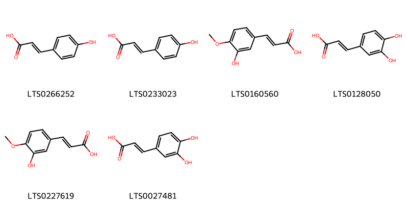{ width=100% }
    <figcaption>Hình ảnh cấu trúc hóa học của 6 hoạt chất thuộc nhóm Cinnamic acids and derivatives gồm ['para-coumaric acid (LTS0266252)', 'hydroxycinnamic acid (LTS0233023)', 'isoferulic acid (LTS0160560)', '3,4-dihydroxycinnamic acid (LTS0128050)', 'isoferulic acid (LTS0227619)', 'caffeic acid (LTS0027481)'].</figcaption>
</figure>
#### Nhóm Coumarins and derivatives
<figure markdown="span">
    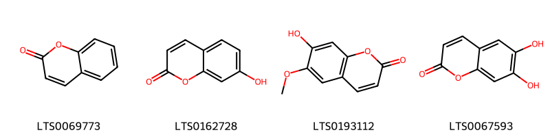{ width=100% }
    <figcaption>Hình ảnh cấu trúc hóa học của 4 hoạt chất thuộc nhóm Coumarins and derivatives gồm ['2h-1-benzopyran-2-one (LTS0069773)', 'umbelliferone (LTS0162728)', 'scopoletin (LTS0193112)', 'esculetin (LTS0067593)'].</figcaption>
</figure>
#### Nhóm Flavonoids
<figure markdown="span">
    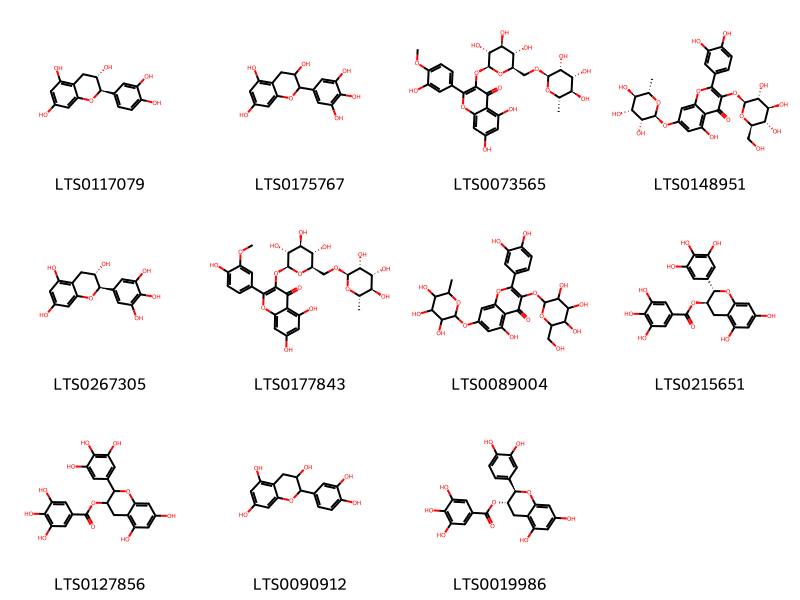{ width=100% }
    <figcaption>Hình ảnh cấu trúc hóa học của 11 hoạt chất thuộc nhóm Flavonoids gồm ['(+)-catechol (LTS0117079)', 'epigallocatechin (LTS0175767)', '5,7-dihydroxy-2-(3-hydroxy-4-methoxyphenyl)-3-{[(2s,3r,4s,5s,6r)-3,4,5-trihydroxy-6-({[(2r,3r,4r,5r,6s)-3,4,5-trihydroxy-6-methyloxan-2-yl]oxy}methyl)oxan-2-yl]oxy}chromen-4-one (LTS0073565)', 'petiolaroside (LTS0148951)', 'gallocatechol (LTS0267305)', 'narcissin (LTS0177843)', '2-(3,4-dihydroxyphenyl)-5-hydroxy-3-{[3,4,5-trihydroxy-6-(hydroxymethyl)oxan-2-yl]oxy}-7-[(3,4,5-trihydroxy-6-methyloxan-2-yl)oxy]chromen-4-one (LTS0089004)', 'gallocatechin gallate (LTS0215651)', '5,7-dihydroxy-2-(3,4,5-trihydroxyphenyl)-3,4-dihydro-2h-1-benzopyran-3-yl 3,4,5-trihydroxybenzoate (LTS0127856)', 'catechol (LTS0090912)', 'catechin 3-o-gallate (LTS0019986)'].</figcaption>
</figure>
#### Nhóm Organooxygen compounds
<figure markdown="span">
    { width=100% }
    <figcaption>Hình ảnh cấu trúc hóa học của 2 hoạt chất thuộc nhóm Organooxygen compounds gồm ['3-{[3-(3,4-dihydroxyphenyl)prop-2-enoyl]oxy}-1,4,5-trihydroxycyclohexane-1-carboxylic acid (LTS0143901)', 'chlorogenic acid (LTS0226495)'].</figcaption>
</figure>
#### Nhóm Prenol lipids
<figure markdown="span">
    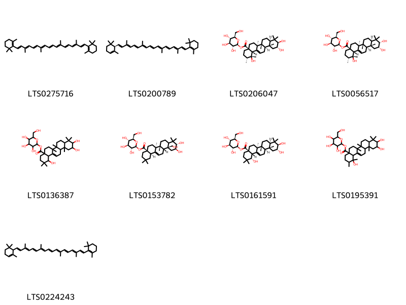{ width=100% }
    <figcaption>Hình ảnh cấu trúc hóa học của 9 hoạt chất thuộc nhóm Prenol lipids gồm ['β-carotene (LTS0275716)', '(+)-α-carotene (LTS0200789)', '(2s,3r,4s,5s,6r)-3,4,5-trihydroxy-6-(hydroxymethyl)oxan-2-yl (1r,2r,4as,6as,6br,8ar,10r,11r,12ar,12br,14bs)-1,10,11-trihydroxy-1,2,6a,6b,9,9,12a-heptamethyl-2,3,4,5,6,7,8,8a,10,11,12,12b,13,14b-tetradecahydropicene-4a-carboxylate (LTS0206047)', '(2s,3r,4s,5s,6r)-3,4,5-trihydroxy-6-(hydroxymethyl)oxan-2-yl (1r,2r,4as,6as,6br,8ar,10s,11r,12ar,12br,14bs)-1,10,11-trihydroxy-1,2,6a,6b,9,9,12a-heptamethyl-2,3,4,5,6,7,8,8a,10,11,12,12b,13,14b-tetradecahydropicene-4a-carboxylate (LTS0056517)', '3,4,5-trihydroxy-6-(hydroxymethyl)oxan-2-yl 1,10,11-trihydroxy-2,2,6a,6b,9,9,12a-heptamethyl-1,3,4,5,6,7,8,8a,10,11,12,12b,13,14b-tetradecahydropicene-4a-carboxylate (LTS0136387)', '(2s,3r,4s,5s,6r)-3,4,5-trihydroxy-6-(hydroxymethyl)oxan-2-yl (4as,6as,6br,10s,11s,12as,12br,14br)-10,11-dihydroxy-12a-(hydroxymethyl)-2,2,6a,6b,9,9-hexamethyl-1,3,4,5,6,7,8,8a,10,11,12,12b,13,14b-tetradecahydropicene-4a-carboxylate (LTS0153782)', '(2s,3r,4s,5s,6r)-3,4,5-trihydroxy-6-(hydroxymethyl)oxan-2-yl (1s,4ar,6as,6br,8ar,10r,11r,12ar,12br,14bs)-1,10,11-trihydroxy-2,2,6a,6b,9,9,12a-heptamethyl-1,3,4,5,6,7,8,8a,10,11,12,12b,13,14b-tetradecahydropicene-4a-carboxylate (LTS0161591)', '3,4,5-trihydroxy-6-(hydroxymethyl)oxan-2-yl 1,10,11-trihydroxy-1,2,6a,6b,9,9,12a-heptamethyl-2,3,4,5,6,7,8,8a,10,11,12,12b,13,14b-tetradecahydropicene-4a-carboxylate (LTS0195391)', 'α-carotene (LTS0224243)'].</figcaption>
</figure>
#### Nhóm Steroids and steroid derivatives
<figure markdown="span">
    { width=100% }
    <figcaption>Hình ảnh cấu trúc hóa học của 2 hoạt chất thuộc nhóm Steroids and steroid derivatives gồm ['stigmast-5-en-3-ol, (3β)- (LTS0204616)', 'stigmast-5-en-3-ol (LTS0071224)'].</figcaption>
</figure>
#### Nhóm Tannins
<figure markdown="span">
    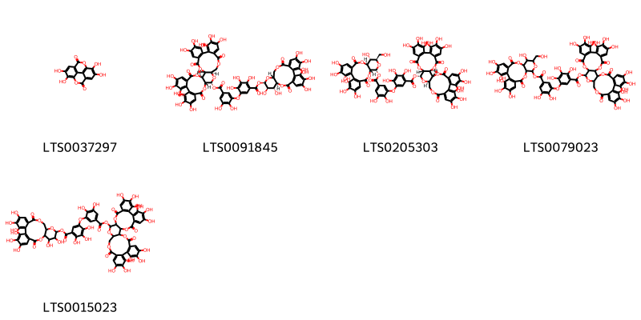{ width=100% }
    <figcaption>Hình ảnh cấu trúc hóa học của 5 hoạt chất thuộc nhóm Tannins gồm ['ellagic acid (LTS0037297)', '(10s,11r,12r,13r,15r)-3,4,5,11,12,21,22,23-octahydroxy-8,18-dioxo-9,14,17-trioxatetracyclo[17.4.0.0²,⁷.0¹⁰,¹⁵]tricosa-1(23),2(7),3,5,19,21-hexaen-13-yl 5-[5-({[(1r,2s,19r,20r,22r)-7,8,9,12,13,14,28,29,30,33,34,35-dodecahydroxy-4,17,25,38-tetraoxo-3,18,21,24,39-pentaoxaheptacyclo[20.17.0.0²,¹⁹.0⁵,¹⁰.0¹¹,¹⁶.0²⁶,³¹.0³²,³⁷]nonatriaconta-5,7,9,11(16),12,14,26,28,30,32(37),33,35-dodecaen-20-yl]oxy}carbonyl)-2,3-dihydroxyphenoxy]-2,3,4-trihydroxybenzoate (LTS0091845)', '(1r,2s,19r,20r,22r)-7,8,9,12,13,14,28,29,30,33,34,35-dodecahydroxy-4,17,25,38-tetraoxo-3,18,21,24,39-pentaoxaheptacyclo[20.17.0.0²,¹⁹.0⁵,¹⁰.0¹¹,¹⁶.0²⁶,³¹.0³²,³⁷]nonatriaconta-5,7,9,11(16),12,14,26,28,30,32(37),33,35-dodecaen-20-yl 5-[5-({[(10r,11r,13r,14r,15s)-3,4,5,14,20,21,22-heptahydroxy-13-(hydroxymethyl)-8,17-dioxo-9,12,16-trioxatetracyclo[16.4.0.0²,⁷.0¹⁰,¹⁵]docosa-1(22),2(7),3,5,18,20-hexaen-11-yl]oxy}carbonyl)-2,3-dihydroxyphenoxy]-2,3,4-trihydroxybenzoate (LTS0205303)', '7,8,9,12,13,14,28,29,30,33,34,35-dodecahydroxy-4,17,25,38-tetraoxo-3,18,21,24,39-pentaoxaheptacyclo[20.17.0.0²,¹⁹.0⁵,¹⁰.0¹¹,¹⁶.0²⁶,³¹.0³²,³⁷]nonatriaconta-5,7,9,11(16),12,14,26,28,30,32(37),33,35-dodecaen-20-yl 5-[5-({[3,4,5,14,20,21,22-heptahydroxy-13-(hydroxymethyl)-8,17-dioxo-9,12,16-trioxatetracyclo[16.4.0.0²,⁷.0¹⁰,¹⁵]docosa-1(22),2(7),3,5,18,20-hexaen-11-yl]oxy}carbonyl)-2,3-dihydroxyphenoxy]-2,3,4-trihydroxybenzoate (LTS0079023)', '3,4,5,11,12,21,22,23-octahydroxy-8,18-dioxo-9,14,17-trioxatetracyclo[17.4.0.0²,⁷.0¹⁰,¹⁵]tricosa-1(23),2(7),3,5,19,21-hexaen-13-yl 5-{5-[({7,8,9,12,13,14,28,29,30,33,34,35-dodecahydroxy-4,17,25,38-tetraoxo-3,18,21,24,39-pentaoxaheptacyclo[20.17.0.0²,¹⁹.0⁵,¹⁰.0¹¹,¹⁶.0²⁶,³¹.0³²,³⁷]nonatriaconta-5,7,9,11(16),12,14,26,28,30,32(37),33,35-dodecaen-20-yl}oxy)carbonyl]-2,3-dihydroxyphenoxy}-2,3,4-trihydroxybenzoate (LTS0015023)'].</figcaption>
</figure>

---

### Dược dân tộc học

Danh sách các quốc gia có sử dụng *Potentilla erecta* trong điều trị các bệnh. 

| Country   | Disease                      | Bệnh                                                                                                                                                                                                |
|:----------|:-----------------------------|:----------------------------------------------------------------------------------------------------------------------------------------------------------------------------------------------------|
| Eurasia   | Astringent, Stomachic, Tonic | MYMEMORY WARNING: YOU USED ALL AVAILABLE FREE TRANSLATIONS FOR TODAY. NEXT AVAILABLE IN  12 HOURS 29 MINUTES 03 SECONDS VISIT HTTPS://MYMEMORY.TRANSLATED.NET/DOC/USAGELIMITS.PHP TO TRANSLATE MORE |

---

---
## Potentilla fragarioides
### Thông tin về thực vật

!!! info "Phân loại thực vật của *Potentilla fragarioides* từ GIBF:"
    - **Kingdom:** Plantae
    - **Phylum:** Tracheophyta
    - **Order:** Rosales
    - **Family:** Rosaceae
    - **Genus:** Potentilla
    - **Species:** *Potentilla fragarioides*

 

| Label (VI)   | Label (EN)   | Scientific Name         | Descriptions (VI)   | Descriptions (EN)   | Also Known As (VI)   | Also Known As (EN)   |
|:-------------|:-------------|:------------------------|:--------------------|:--------------------|:---------------------|:---------------------|
| N/A          | N/A          | Potentilla fragarioides | loài thực vật       | species of plant    | ['']                 | ['']                 |

#### Phân bố trên thế giới

**Từ CSDL GIBF** Japan, Korea (Democratic People’s Republic of), Mongolia, Germany, Russian Federation, China, Korea, Republic of

#### Phân bố tại Việt Nam

**Từ CSDL GIBF**: Không có ghi nhận ở Việt Nam

---
### Thành phần hóa học
        
- Theo cơ sở dữ liệu lotus: Từ loài *Potentilla fragarioides* đã phân lập và xác định được Chưa có hoạt chất nào được phân lập. hoạt chất thuộc về các nhóm Không có hoạt chất nào được phân lập. 

Không có hình ảnh nào được tạo ra

---

### Dược dân tộc học

Danh sách các quốc gia có sử dụng *Potentilla fragarioides* trong điều trị các bệnh. 

| Country   | Disease    | Bệnh                                                                                                                                                                                                |
|:----------|:-----------|:----------------------------------------------------------------------------------------------------------------------------------------------------------------------------------------------------|
| Elsewhere | Astringent | MYMEMORY WARNING: YOU USED ALL AVAILABLE FREE TRANSLATIONS FOR TODAY. NEXT AVAILABLE IN  12 HOURS 28 MINUTES 28 SECONDS VISIT HTTPS://MYMEMORY.TRANSLATED.NET/DOC/USAGELIMITS.PHP TO TRANSLATE MORE |

---

---
## Potentilla fruticosa
### Thông tin về thực vật

!!! info "Phân loại thực vật của *Dasiphora fruticosa* từ GIBF:"
    - **Kingdom:** Plantae
    - **Phylum:** Tracheophyta
    - **Order:** Rosales
    - **Family:** Rosaceae
    - **Genus:** Dasiphora
    - **Species:** *Dasiphora fruticosa*

 

| Label (VI)   | Label (EN)   | Scientific Name      | Descriptions (VI)   | Descriptions (EN)                | Also Known As (VI)   | Also Known As (EN)   |
|:-------------|:-------------|:---------------------|:--------------------|:---------------------------------|:---------------------|:---------------------|
| N/A          | N/A          | Potentilla fruticosa |                     | synonym  for Dasiphora fruticosa | ['']                 | ['']                 |

#### Phân bố trên thế giới

**Từ CSDL GIBF** Switzerland, nan, United Kingdom of Great Britain and Northern Ireland, Luxembourg, France, Spain, Czechia, Poland, Mongolia, Germany, Estonia, United States of America, Austria, Ireland, Norway, Belgium

#### Phân bố tại Việt Nam

**Từ CSDL GIBF**: Không có ghi nhận ở Việt Nam

---
### Thành phần hóa học
        
- Theo cơ sở dữ liệu lotus: Từ loài *Dasiphora fruticosa* đã phân lập và xác định được 37 hoạt chất thuộc về các nhóm Flavonoids, Tannins, Prenol lipids, Cinnamic acids and derivatives, Steroids and steroid derivatives. 

|    | chemicalTaxonomyClassyfireClass   |   smiles_count |
|---:|:----------------------------------|---------------:|
|  0 | Cinnamic acids and derivatives    |              4 |
|  1 | Flavonoids                        |             21 |
|  2 | Prenol lipids                     |              6 |
|  3 | Steroids and steroid derivatives  |              5 |
|  4 | Tannins                           |              1 |

#### Nhóm Cinnamic acids and derivatives
<figure markdown="span">
    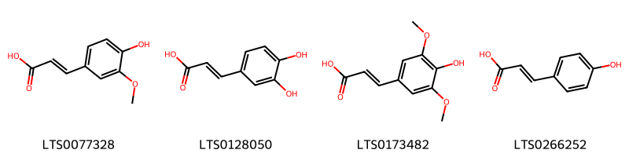{ width=100% }
    <figcaption>Hình ảnh cấu trúc hóa học của 4 hoạt chất thuộc nhóm Cinnamic acids and derivatives gồm ['ferulic acid (LTS0077328)', '3,4-dihydroxycinnamic acid (LTS0128050)', 'sinapinate (LTS0173482)', 'para-coumaric acid (LTS0266252)'].</figcaption>
</figure>
#### Nhóm Flavonoids
<figure markdown="span">
    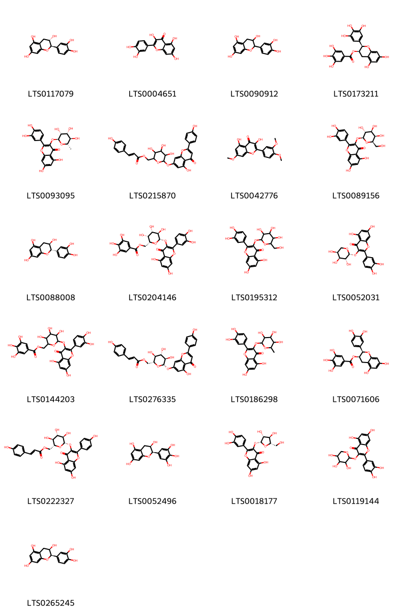{ width=100% }
    <figcaption>Hình ảnh cấu trúc hóa học của 21 hoạt chất thuộc nhóm Flavonoids gồm ['(+)-catechol (LTS0117079)', 'quercetin (LTS0004651)', 'catechol (LTS0090912)', '(-)-epigallocatechin gallate (LTS0173211)', 'quercitrin (LTS0093095)', '(3,4,5-trihydroxy-6-{[5-hydroxy-2-(4-hydroxyphenyl)-4-oxochromen-7-yl]oxy}oxan-2-yl)methyl 3-(4-hydroxyphenyl)prop-2-enoate (LTS0215870)', '2-(3,4-dimethoxyphenyl)-3,5-dihydroxy-7-methoxychromen-4-one (LTS0042776)', 'hyperoside (LTS0089156)', 'α catechin (LTS0088008)', '[(2r,3r,4s,5r,6s)-6-{[2-(3,4-dihydroxyphenyl)-5,7-dihydroxy-4-oxochromen-3-yl]oxy}-3,4,5-trihydroxyoxan-2-yl]methyl 3,4,5-trihydroxybenzoate (LTS0204146)', '2-(3,4-dihydroxyphenyl)-5,7-dihydroxy-3-{[3,4,5-trihydroxy-6-(hydroxymethyl)oxan-2-yl]oxy}chromen-4-one (LTS0195312)', '2-(3,4-dihydroxyphenyl)-5,7-dihydroxy-3-{[(2r,3r,4s,5s)-3,4,5-trihydroxyoxan-2-yl]oxy}chromen-4-one (LTS0052031)', '(6-{[2-(3,4-dihydroxyphenyl)-5,7-dihydroxy-4-oxochromen-3-yl]oxy}-3,4,5-trihydroxyoxan-2-yl)methyl 3,4,5-trihydroxybenzoate (LTS0144203)', 'echinacin (LTS0276335)', 'quercitrin (LTS0186298)', 'epicatechin gallate (LTS0071606)', 'tiliroside (LTS0222327)', 'epigallocatechin (LTS0052496)', '3-{[(2r,3r,4r,5s)-3,4-dihydroxy-5-(hydroxymethyl)oxolan-2-yl]oxy}-2-(3,4-dihydroxyphenyl)-5,7-dihydroxychromen-4-one (LTS0018177)', 'guaijaverin (LTS0119144)', 'ent-epicatechin (LTS0265245)'].</figcaption>
</figure>
#### Nhóm Prenol lipids
<figure markdown="span">
    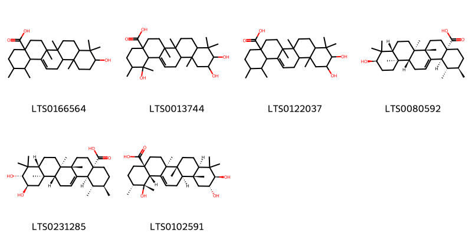{ width=100% }
    <figcaption>Hình ảnh cấu trúc hóa học của 6 hoạt chất thuộc nhóm Prenol lipids gồm ['10-hydroxy-1,2,6a,6b,9,9,12a-heptamethyl-2,3,4,5,6,7,8,8a,10,11,12,12b,13,14b-tetradecahydro-1h-picene-4a-carboxylic acid (LTS0166564)', '1,10,11-trihydroxy-1,2,6a,6b,9,9,12a-heptamethyl-2,3,4,5,6,7,8,8a,10,11,12,12b,13,14b-tetradecahydropicene-4a-carboxylic acid (LTS0013744)', '10,11-dihydroxy-1,2,6a,6b,9,9,12a-heptamethyl-2,3,4,5,6,7,8,8a,10,11,12,12b,13,14b-tetradecahydro-1h-picene-4a-carboxylic acid (LTS0122037)', '3β-hydroxy-12-ursen-28-ic acid (LTS0080592)', 'corosolic acid (LTS0231285)', 'tormentic acid (LTS0102591)'].</figcaption>
</figure>
#### Nhóm Steroids and steroid derivatives
<figure markdown="span">
    { width=100% }
    <figcaption>Hình ảnh cấu trúc hóa học của 5 hoạt chất thuộc nhóm Steroids and steroid derivatives gồm ['stigmast-5-en-3-ol, (3β)- (LTS0204616)', 'stigmast-5-en-3-ol (LTS0071224)', 'phytosterol (LTS0029311)', '(1r,3as,3bs,7s,9bs)-1-[(2r,5r)-5,6-dimethylheptan-2-yl]-9a,11a-dimethyl-1h,2h,3h,3ah,3bh,4h,6h,7h,8h,9h,9bh,10h,11h-cyclopenta[a]phenanthren-7-ol (LTS0057877)', 'campesterol (LTS0046755)'].</figcaption>
</figure>
#### Nhóm Tannins
<figure markdown="span">
    { width=100% }
    <figcaption>Hình ảnh cấu trúc hóa học của 1 hoạt chất thuộc nhóm Tannins gồm ['ellagic acid (LTS0037297)'].</figcaption>
</figure>

---

### Dược dân tộc học

Danh sách các quốc gia có sử dụng *Dasiphora fruticosa* trong điều trị các bệnh. 

| Country   | Disease                      | Bệnh                                                                                                                                                                                                |
|:----------|:-----------------------------|:----------------------------------------------------------------------------------------------------------------------------------------------------------------------------------------------------|
| Elsewhere | Astringent, Tonic, Vulnerary | MYMEMORY WARNING: YOU USED ALL AVAILABLE FREE TRANSLATIONS FOR TODAY. NEXT AVAILABLE IN  12 HOURS 27 MINUTES 52 SECONDS VISIT HTTPS://MYMEMORY.TRANSLATED.NET/DOC/USAGELIMITS.PHP TO TRANSLATE MORE |

---

---
## Potentilla fulgens
### Thông tin về thực vật

!!! info "Phân loại thực vật của *Potentilla fulgens* từ GIBF:"
    - **Kingdom:** Plantae
    - **Phylum:** Tracheophyta
    - **Order:** Rosales
    - **Family:** Rosaceae
    - **Genus:** Potentilla
    - **Species:** *Potentilla fulgens*

 

| Label (VI)   | Label (EN)   | Scientific Name    | Descriptions (VI)   | Descriptions (EN)   | Also Known As (VI)   | Also Known As (EN)   |
|:-------------|:-------------|:-------------------|:--------------------|:--------------------|:---------------------|:---------------------|
| N/A          | N/A          | Potentilla fulgens | loài thực vật       | species of plant    | ['']                 | ['']                 |

#### Phân bố trên thế giới

**Từ CSDL GIBF** Nepal, China

#### Phân bố tại Việt Nam

**Từ CSDL GIBF**: Không có ghi nhận ở Việt Nam

---
### Thành phần hóa học
        
- Theo cơ sở dữ liệu lotus: Từ loài *Potentilla fulgens* đã phân lập và xác định được Chưa có hoạt chất nào được phân lập. hoạt chất thuộc về các nhóm Không có hoạt chất nào được phân lập. 

Không có hình ảnh nào được tạo ra

---

### Dược dân tộc học

Danh sách các quốc gia có sử dụng *Potentilla fulgens* trong điều trị các bệnh. 

| Country   | Disease    | Bệnh                                                                                                                                                                                                |
|:----------|:-----------|:----------------------------------------------------------------------------------------------------------------------------------------------------------------------------------------------------|
| India     | Dentifrice | MYMEMORY WARNING: YOU USED ALL AVAILABLE FREE TRANSLATIONS FOR TODAY. NEXT AVAILABLE IN  12 HOURS 27 MINUTES 13 SECONDS VISIT HTTPS://MYMEMORY.TRANSLATED.NET/DOC/USAGELIMITS.PHP TO TRANSLATE MORE |

---

---
## Potentilla kleiniana
### Thông tin về thực vật

!!! info "Phân loại thực vật của *Potentilla sundaica* từ GIBF:"
    - **Kingdom:** Plantae
    - **Phylum:** Tracheophyta
    - **Order:** Rosales
    - **Family:** Rosaceae
    - **Genus:** Potentilla
    - **Species:** *Potentilla sundaica*

 

| Label (VI)   | Label (EN)   | Scientific Name      | Descriptions (VI)   | Descriptions (EN)   | Also Known As (VI)   | Also Known As (EN)   |
|:-------------|:-------------|:---------------------|:--------------------|:--------------------|:---------------------|:---------------------|
| N/A          | N/A          | Potentilla kleiniana |                     | species of plant    | ['']                 | ['']                 |

#### Phân bố trên thế giới

**Từ CSDL GIBF** nan, Japan, Russian Federation, China, Korea, Republic of

#### Phân bố tại Việt Nam

**Từ CSDL GIBF**: Không có ghi nhận ở Việt Nam

---
### Thành phần hóa học
        
- Theo cơ sở dữ liệu lotus: Từ loài *Potentilla sundaica* đã phân lập và xác định được 3 hoạt chất thuộc về các nhóm Tannins. 

|    | chemicalTaxonomyClassyfireClass   |   smiles_count |
|---:|:----------------------------------|---------------:|
|  0 | Tannins                           |              3 |

#### Nhóm Tannins
<figure markdown="span">
    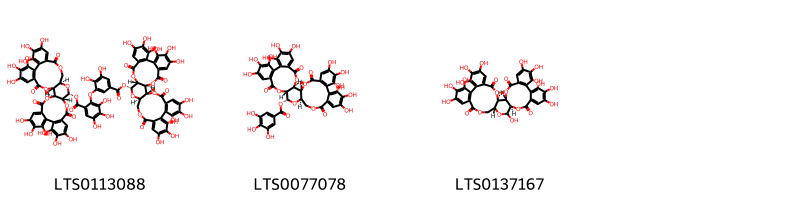{ width=100% }
    <figcaption>Hình ảnh cấu trúc hóa học của 3 hoạt chất thuộc nhóm Tannins gồm ['(1r,2s,19r,20r,22r)-7,8,9,12,13,14,28,29,30,33,34,35-dodecahydroxy-4,17,25,38-tetraoxo-3,18,21,24,39-pentaoxaheptacyclo[20.17.0.0²,¹⁹.0⁵,¹⁰.0¹¹,¹⁶.0²⁶,³¹.0³²,³⁷]nonatriaconta-5,7,9,11(16),12,14,26,28,30,32(37),33,35-dodecaen-20-yl 2-[5-({[(1r,2s,19r,20r,22r)-7,8,9,12,13,14,28,29,30,33,34,35-dodecahydroxy-4,17,25,38-tetraoxo-3,18,21,24,39-pentaoxaheptacyclo[20.17.0.0²,¹⁹.0⁵,¹⁰.0¹¹,¹⁶.0²⁶,³¹.0³²,³⁷]nonatriaconta-5,7,9,11(16),12,14,26,28,30,32(37),33,35-dodecaen-20-yl]oxy}carbonyl)-2,3-dihydroxyphenoxy]-3,4,5-trihydroxybenzoate (LTS0113088)', '(1r,2s,19r,20r,22r)-7,8,9,12,13,14,28,29,30,33,34,35-dodecahydroxy-4,17,25,38-tetraoxo-3,18,21,24,39-pentaoxaheptacyclo[20.17.0.0²,¹⁹.0⁵,¹⁰.0¹¹,¹⁶.0²⁶,³¹.0³²,³⁷]nonatriaconta-5,7,9,11(16),12,14,26,28,30,32(37),33,35-dodecaen-20-yl 3,4,5-trihydroxybenzoate (LTS0077078)', '(1r,2s,19r,22r)-7,8,9,12,13,14,20,28,29,30,33,34,35-tridecahydroxy-3,18,21,24,39-pentaoxaheptacyclo[20.17.0.0²,¹⁹.0⁵,¹⁰.0¹¹,¹⁶.0²⁶,³¹.0³²,³⁷]nonatriaconta-5(10),6,8,11,13,15,26(31),27,29,32,34,36-dodecaene-4,17,25,38-tetrone (LTS0137167)'].</figcaption>
</figure>

---

### Dược dân tộc học

Danh sách các quốc gia có sử dụng *Potentilla sundaica* trong điều trị các bệnh. 

| Country   | Disease    | Bệnh                                                                                                                                                                                                |
|:----------|:-----------|:----------------------------------------------------------------------------------------------------------------------------------------------------------------------------------------------------|
| China     | Alexiteric | MYMEMORY WARNING: YOU USED ALL AVAILABLE FREE TRANSLATIONS FOR TODAY. NEXT AVAILABLE IN  12 HOURS 26 MINUTES 35 SECONDS VISIT HTTPS://MYMEMORY.TRANSLATED.NET/DOC/USAGELIMITS.PHP TO TRANSLATE MORE |

---

---
## Potentilla pacifica
### Thông tin về thực vật

!!! info "Phân loại thực vật của *Argentina anserina* từ GIBF:"
    - **Kingdom:** Plantae
    - **Phylum:** Tracheophyta
    - **Order:** Rosales
    - **Family:** Rosaceae
    - **Genus:** Argentina
    - **Species:** *Argentina anserina*

 

| Label (VI)   | Label (EN)   | Scientific Name     | Descriptions (VI)   | Descriptions (EN)   | Also Known As (VI)   | Also Known As (EN)   |
|:-------------|:-------------|:--------------------|:--------------------|:--------------------|:---------------------|:---------------------|
| N/A          | N/A          | Potentilla pacifica |                     | species of plant    | ['']                 | ['']                 |

#### Phân bố trên thế giới

**Từ CSDL GIBF** nan, Colombia, Pakistan, Greenland, unknown or invalid, Japan, Canada, Russian Federation, United States of America

#### Phân bố tại Việt Nam

**Từ CSDL GIBF**: Không có ghi nhận ở Việt Nam

---
### Thành phần hóa học
        
- Theo cơ sở dữ liệu lotus: Từ loài *Argentina anserina* đã phân lập và xác định được Chưa có hoạt chất nào được phân lập. hoạt chất thuộc về các nhóm Không có hoạt chất nào được phân lập. 

Không có hình ảnh nào được tạo ra

---

### Dược dân tộc học

Danh sách các quốc gia có sử dụng *Argentina anserina* trong điều trị các bệnh. 

| Country          | Disease   | Bệnh                                                                                                                                                                                                |
|:-----------------|:----------|:----------------------------------------------------------------------------------------------------------------------------------------------------------------------------------------------------|
| Canada(Kwakiutl) | Poultice  | MYMEMORY WARNING: YOU USED ALL AVAILABLE FREE TRANSLATIONS FOR TODAY. NEXT AVAILABLE IN  12 HOURS 26 MINUTES 04 SECONDS VISIT HTTPS://MYMEMORY.TRANSLATED.NET/DOC/USAGELIMITS.PHP TO TRANSLATE MORE |

---

---
## Potentilla reptans
### Thông tin về thực vật

!!! info "Phân loại thực vật của *Potentilla reptans* từ GIBF:"
    - **Kingdom:** Plantae
    - **Phylum:** Tracheophyta
    - **Order:** Rosales
    - **Family:** Rosaceae
    - **Genus:** Potentilla
    - **Species:** *Potentilla reptans*

 

| Label (VI)   | Label (EN)   | Scientific Name    | Descriptions (VI)   | Descriptions (EN)   | Also Known As (VI)   | Also Known As (EN)   |
|:-------------|:-------------|:-------------------|:--------------------|:--------------------|:---------------------|:---------------------|
| N/A          | N/A          | Potentilla reptans |                     | species of plant    | ['']                 | ['cinquefoil']       |

#### Phân bố trên thế giới

**Từ CSDL GIBF** Denmark, Spain, Germany, Austria, Australia, Serbia, Sweden, Poland, Montenegro, Canada, Belgium, Netherlands, Switzerland, United Kingdom of Great Britain and Northern Ireland, Morocco, France, New Zealand, Russian Federation, United States of America, Italy, Croatia, Ukraine

#### Phân bố tại Việt Nam

**Từ CSDL GIBF**: Không có ghi nhận ở Việt Nam

---
### Thành phần hóa học
        
- Theo cơ sở dữ liệu lotus: Từ loài *Potentilla reptans* đã phân lập và xác định được Chưa có hoạt chất nào được phân lập. hoạt chất thuộc về các nhóm Không có hoạt chất nào được phân lập. 

Không có hình ảnh nào được tạo ra

---

### Dược dân tộc học

Danh sách các quốc gia có sử dụng *Potentilla reptans* trong điều trị các bệnh. 

| Country   | Disease              | Bệnh                                                                                                                                                                                                |
|:----------|:---------------------|:----------------------------------------------------------------------------------------------------------------------------------------------------------------------------------------------------|
| Elsewhere | Astringent, Hemostat | MYMEMORY WARNING: YOU USED ALL AVAILABLE FREE TRANSLATIONS FOR TODAY. NEXT AVAILABLE IN  12 HOURS 25 MINUTES 37 SECONDS VISIT HTTPS://MYMEMORY.TRANSLATED.NET/DOC/USAGELIMITS.PHP TO TRANSLATE MORE |
| Turkey    | Astringent, Hemostat | MYMEMORY WARNING: YOU USED ALL AVAILABLE FREE TRANSLATIONS FOR TODAY. NEXT AVAILABLE IN  12 HOURS 25 MINUTES 34 SECONDS VISIT HTTPS://MYMEMORY.TRANSLATED.NET/DOC/USAGELIMITS.PHP TO TRANSLATE MORE |

---

---
## Potentilla rubra
### Thông tin về thực vật

!!! info "Phân loại thực vật của *Potentilla rubra* từ GIBF:"
    - **Kingdom:** Plantae
    - **Phylum:** Tracheophyta
    - **Order:** Rosales
    - **Family:** Rosaceae
    - **Genus:** Potentilla
    - **Species:** *Potentilla rubra*

 

| Label (VI)   | Label (EN)   | Scientific Name   | Descriptions (VI)   | Descriptions (EN)   | Also Known As (VI)   | Also Known As (EN)   |
|:-------------|:-------------|:------------------|:--------------------|:--------------------|:---------------------|:---------------------|
| N/A          | N/A          | Potentilla rubra  | loài thực vật       | species of plant    | ['']                 | ['']                 |

#### Phân bố trên thế giới

**Từ CSDL GIBF** nan, unknown or invalid, United States of America, Mexico

#### Phân bố tại Việt Nam

**Từ CSDL GIBF**: Không có ghi nhận ở Việt Nam

---
### Thành phần hóa học
        
- Theo cơ sở dữ liệu lotus: Từ loài *Potentilla rubra* đã phân lập và xác định được Chưa có hoạt chất nào được phân lập. hoạt chất thuộc về các nhóm Không có hoạt chất nào được phân lập. 

Không có hình ảnh nào được tạo ra

---

### Dược dân tộc học

Danh sách các quốc gia có sử dụng *Potentilla rubra* trong điều trị các bệnh. 

| Country   | Disease    | Bệnh                                                                                                                                                                                                |
|:----------|:-----------|:----------------------------------------------------------------------------------------------------------------------------------------------------------------------------------------------------|
| Mexico    | Dentifrice | MYMEMORY WARNING: YOU USED ALL AVAILABLE FREE TRANSLATIONS FOR TODAY. NEXT AVAILABLE IN  12 HOURS 25 MINUTES 08 SECONDS VISIT HTTPS://MYMEMORY.TRANSLATED.NET/DOC/USAGELIMITS.PHP TO TRANSLATE MORE |

---

---
## Potentilla salesoviana
### Thông tin về thực vật

!!! info "Phân loại thực vật của *Farinopsis salesoviana* từ GIBF:"
    - **Kingdom:** Plantae
    - **Phylum:** Tracheophyta
    - **Order:** Rosales
    - **Family:** Rosaceae
    - **Genus:** Farinopsis
    - **Species:** *Farinopsis salesoviana*

 

| Label (VI)   | Label (EN)   | Scientific Name   | Descriptions (VI)   | Descriptions (EN)   | Also Known As (VI)   | Also Known As (EN)   |
|:-------------|:-------------|:------------------|:--------------------|:--------------------|:---------------------|:---------------------|
| N/A          | N/A          | Potentilla rubra  | loài thực vật       | species of plant    | ['']                 | ['']                 |

#### Phân bố trên thế giới

**Từ CSDL GIBF** nan, unknown or invalid, Pakistan, India, Russian Federation, Kazakhstan, United States of America, China

#### Phân bố tại Việt Nam

**Từ CSDL GIBF**: Không có ghi nhận ở Việt Nam

---
### Thành phần hóa học
        
- Theo cơ sở dữ liệu lotus: Từ loài *Farinopsis salesoviana* đã phân lập và xác định được Chưa có hoạt chất nào được phân lập. hoạt chất thuộc về các nhóm Không có hoạt chất nào được phân lập. 

Không có hình ảnh nào được tạo ra

---

### Dược dân tộc học

Danh sách các quốc gia có sử dụng *Farinopsis salesoviana* trong điều trị các bệnh. 

| Country   | Disease      | Bệnh                                                                                                                                                                                                |
|:----------|:-------------|:----------------------------------------------------------------------------------------------------------------------------------------------------------------------------------------------------|
| Elsewhere | Sternutatory | MYMEMORY WARNING: YOU USED ALL AVAILABLE FREE TRANSLATIONS FOR TODAY. NEXT AVAILABLE IN  12 HOURS 24 MINUTES 38 SECONDS VISIT HTTPS://MYMEMORY.TRANSLATED.NET/DOC/USAGELIMITS.PHP TO TRANSLATE MORE |

---

---
## Potentilla sericea
### Thông tin về thực vật

!!! info "Phân loại thực vật của *Potentilla sericea* từ GIBF:"
    - **Kingdom:** Plantae
    - **Phylum:** Tracheophyta
    - **Order:** Rosales
    - **Family:** Rosaceae
    - **Genus:** Potentilla
    - **Species:** *Potentilla sericea*

 

| Label (VI)   | Label (EN)   | Scientific Name    | Descriptions (VI)   | Descriptions (EN)   | Also Known As (VI)   | Also Known As (EN)   |
|:-------------|:-------------|:-------------------|:--------------------|:--------------------|:---------------------|:---------------------|
| N/A          | N/A          | Potentilla sericea | loài thực vật       | species of plant    | ['']                 | ['']                 |

#### Phân bố trên thế giới

**Từ CSDL GIBF** Mongolia, Russian Federation, Kazakhstan, China, Tajikistan

#### Phân bố tại Việt Nam

**Từ CSDL GIBF**: Không có ghi nhận ở Việt Nam

---
### Thành phần hóa học
        
- Theo cơ sở dữ liệu lotus: Từ loài *Potentilla sericea* đã phân lập và xác định được Chưa có hoạt chất nào được phân lập. hoạt chất thuộc về các nhóm Không có hoạt chất nào được phân lập. 

Không có hình ảnh nào được tạo ra

---

### Dược dân tộc học

Danh sách các quốc gia có sử dụng *Potentilla sericea* trong điều trị các bệnh. 

| Country   | Disease    | Bệnh                                                                                                                                                                                                |
|:----------|:-----------|:----------------------------------------------------------------------------------------------------------------------------------------------------------------------------------------------------|
| Elsewhere | Astringent | MYMEMORY WARNING: YOU USED ALL AVAILABLE FREE TRANSLATIONS FOR TODAY. NEXT AVAILABLE IN  12 HOURS 24 MINUTES 14 SECONDS VISIT HTTPS://MYMEMORY.TRANSLATED.NET/DOC/USAGELIMITS.PHP TO TRANSLATE MORE |

---

---
## Potentilla sundaica
### Thông tin về thực vật

!!! info "Phân loại thực vật của *Potentilla sundaica* từ GIBF:"
    - **Kingdom:** Plantae
    - **Phylum:** Tracheophyta
    - **Order:** Rosales
    - **Family:** Rosaceae
    - **Genus:** Potentilla
    - **Species:** *Potentilla sundaica*

 

| Label (VI)   | Label (EN)   | Scientific Name     | Descriptions (VI)   | Descriptions (EN)   | Also Known As (VI)   | Also Known As (EN)   |
|:-------------|:-------------|:--------------------|:--------------------|:--------------------|:---------------------|:---------------------|
| N/A          | N/A          | Potentilla sundaica | loài thực vật       | species of plant    | ['']                 | ['']                 |

#### Phân bố trên thế giới

**Từ CSDL GIBF** Japan, Bhutan, Russian Federation, China, Korea, Republic of

#### Phân bố tại Việt Nam

**Từ CSDL GIBF**: Không có ghi nhận ở Việt Nam

---
### Thành phần hóa học
        
- Theo cơ sở dữ liệu lotus: Từ loài *Potentilla sundaica* đã phân lập và xác định được Chưa có hoạt chất nào được phân lập. hoạt chất thuộc về các nhóm Không có hoạt chất nào được phân lập. 

Không có hình ảnh nào được tạo ra

---

### Dược dân tộc học

Danh sách các quốc gia có sử dụng *Potentilla sundaica* trong điều trị các bệnh. 

| Country   | Disease    | Bệnh                                                                                                                                                                                                |
|:----------|:-----------|:----------------------------------------------------------------------------------------------------------------------------------------------------------------------------------------------------|
| Elsewhere | Astringent | MYMEMORY WARNING: YOU USED ALL AVAILABLE FREE TRANSLATIONS FOR TODAY. NEXT AVAILABLE IN  12 HOURS 23 MINUTES 47 SECONDS VISIT HTTPS://MYMEMORY.TRANSLATED.NET/DOC/USAGELIMITS.PHP TO TRANSLATE MORE |

---

---
## Potentilla supina
### Thông tin về thực vật

!!! info "Phân loại thực vật của *Potentilla supina* từ GIBF:"
    - **Kingdom:** Plantae
    - **Phylum:** Tracheophyta
    - **Order:** Rosales
    - **Family:** Rosaceae
    - **Genus:** Potentilla
    - **Species:** *Potentilla supina*

 

| Label (VI)   | Label (EN)   | Scientific Name   | Descriptions (VI)   | Descriptions (EN)   | Also Known As (VI)   | Also Known As (EN)   |
|:-------------|:-------------|:------------------|:--------------------|:--------------------|:---------------------|:---------------------|
| N/A          | N/A          | Potentilla supina | loài thực vật       | species of plant    | ['']                 | ['']                 |

#### Phân bố trên thế giới

**Từ CSDL GIBF** Spain, Germany, Austria, Korea, Republic of, Sweden, Mongolia, Kazakhstan, Belgium, Slovakia, Netherlands, Japan, Hungary, China, Switzerland, Moldova, Republic of, Czechia, Armenia, Russian Federation, United States of America, Italy, Ukraine

#### Phân bố tại Việt Nam

**Từ CSDL GIBF**: Không có ghi nhận ở Việt Nam

---
### Thành phần hóa học
        
- Theo cơ sở dữ liệu lotus: Từ loài *Potentilla supina* đã phân lập và xác định được Chưa có hoạt chất nào được phân lập. hoạt chất thuộc về các nhóm Không có hoạt chất nào được phân lập. 

Không có hình ảnh nào được tạo ra

---

### Dược dân tộc học

Danh sách các quốc gia có sử dụng *Potentilla supina* trong điều trị các bệnh. 

| Country   | Disease    | Bệnh                                                                                                                                                                                                |
|:----------|:-----------|:----------------------------------------------------------------------------------------------------------------------------------------------------------------------------------------------------|
| Sudan     | Astringent | MYMEMORY WARNING: YOU USED ALL AVAILABLE FREE TRANSLATIONS FOR TODAY. NEXT AVAILABLE IN  12 HOURS 23 MINUTES 20 SECONDS VISIT HTTPS://MYMEMORY.TRANSLATED.NET/DOC/USAGELIMITS.PHP TO TRANSLATE MORE |

---

---
## Potentilla tormentilla
### Thông tin về thực vật

!!! info "Phân loại thực vật của *Potentilla erecta* từ GIBF:"
    - **Kingdom:** Plantae
    - **Phylum:** Tracheophyta
    - **Order:** Rosales
    - **Family:** Rosaceae
    - **Genus:** Potentilla
    - **Species:** *Potentilla erecta*

 

| Label (VI)   | Label (EN)   | Scientific Name        | Descriptions (VI)   | Descriptions (EN)   | Also Known As (VI)   | Also Known As (EN)   |
|:-------------|:-------------|:-----------------------|:--------------------|:--------------------|:---------------------|:---------------------|
| N/A          | N/A          | Potentilla tormentilla |                     |                     | ['']                 | ['']                 |

#### Phân bố trên thế giới

**Từ CSDL GIBF** France

#### Phân bố tại Việt Nam

**Từ CSDL GIBF**: Không có ghi nhận ở Việt Nam

---
### Thành phần hóa học
        
- Theo cơ sở dữ liệu lotus: Từ loài *Potentilla erecta* đã phân lập và xác định được 26 hoạt chất thuộc về các nhóm Organooxygen compounds, Flavonoids, Coumarins and derivatives, Tannins, Prenol lipids, Cinnamic acids and derivatives, Benzene and substituted derivatives. 

|    | chemicalTaxonomyClassyfireClass     |   smiles_count |
|---:|:------------------------------------|---------------:|
|  0 | Benzene and substituted derivatives |              2 |
|  1 | Cinnamic acids and derivatives      |              3 |
|  2 | Coumarins and derivatives           |              3 |
|  3 | Flavonoids                          |              6 |
|  4 | Organooxygen compounds              |              1 |
|  5 | Prenol lipids                       |              8 |
|  6 | Tannins                             |              3 |

#### Nhóm Benzene and substituted derivatives
<figure markdown="span">
    { width=100% }
    <figcaption>Hình ảnh cấu trúc hóa học của 2 hoạt chất thuộc nhóm Benzene and substituted derivatives gồm ['galop (LTS0222857)', 'methyl gallate (LTS0043810)'].</figcaption>
</figure>
#### Nhóm Cinnamic acids and derivatives
<figure markdown="span">
    { width=100% }
    <figcaption>Hình ảnh cấu trúc hóa học của 3 hoạt chất thuộc nhóm Cinnamic acids and derivatives gồm ['3,4-dihydroxycinnamic acid (LTS0128050)', 'para-coumaric acid (LTS0266252)', 'ferulic acid (LTS0077328)'].</figcaption>
</figure>
#### Nhóm Coumarins and derivatives
<figure markdown="span">
    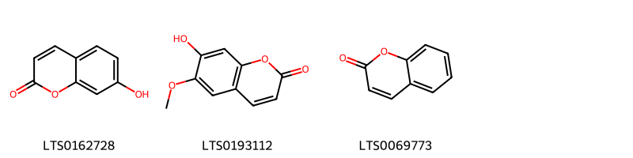{ width=100% }
    <figcaption>Hình ảnh cấu trúc hóa học của 3 hoạt chất thuộc nhóm Coumarins and derivatives gồm ['umbelliferone (LTS0162728)', 'scopoletin (LTS0193112)', '2h-1-benzopyran-2-one (LTS0069773)'].</figcaption>
</figure>
#### Nhóm Flavonoids
<figure markdown="span">
    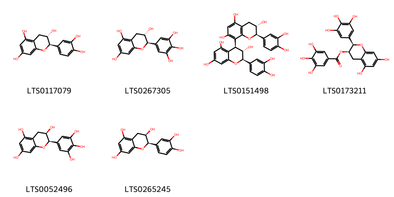{ width=100% }
    <figcaption>Hình ảnh cấu trúc hóa học của 6 hoạt chất thuộc nhóm Flavonoids gồm ['(+)-catechol (LTS0117079)', 'gallocatechol (LTS0267305)', '(2r,3s,4s)-2-(3,4-dihydroxyphenyl)-4-[(2r,3s)-2-(3,4-dihydroxyphenyl)-3,5,7-trihydroxy-3,4-dihydro-2h-1-benzopyran-8-yl]-3,4-dihydro-2h-1-benzopyran-3,5,7-triol (LTS0151498)', '(-)-epigallocatechin gallate (LTS0173211)', 'epigallocatechin (LTS0052496)', 'ent-epicatechin (LTS0265245)'].</figcaption>
</figure>
#### Nhóm Organooxygen compounds
<figure markdown="span">
    { width=100% }
    <figcaption>Hình ảnh cấu trúc hóa học của 1 hoạt chất thuộc nhóm Organooxygen compounds gồm ['chlorogenic acid (LTS0226495)'].</figcaption>
</figure>
#### Nhóm Prenol lipids
<figure markdown="span">
    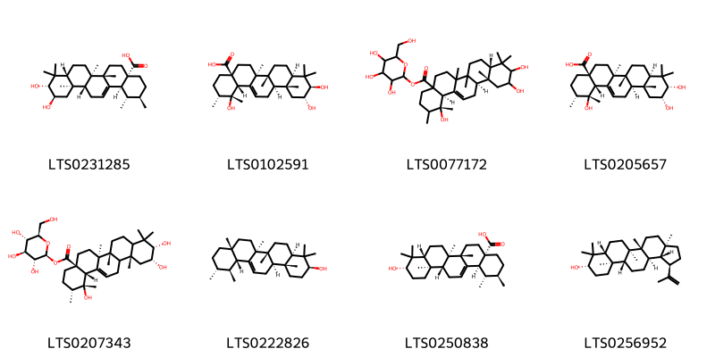{ width=100% }
    <figcaption>Hình ảnh cấu trúc hóa học của 8 hoạt chất thuộc nhóm Prenol lipids gồm ['corosolic acid (LTS0231285)', 'tormentic acid (LTS0102591)', '3,4,5-trihydroxy-6-(hydroxymethyl)oxan-2-yl (1r,8as,12ar,12br,14br)-1,10,11-trihydroxy-1,2,6a,6b,9,9,12a-heptamethyl-2,3,4,5,6,7,8,8a,10,11,12,12b,13,14b-tetradecahydropicene-4a-carboxylate (LTS0077172)', 'euscaphic acid (LTS0205657)', '(2s,3r,4s,5s,6r)-3,4,5-trihydroxy-6-(hydroxymethyl)oxan-2-yl (1r,2r,4as,6as,6br,10s,11r,12ar,14bs)-1,10,11-trihydroxy-1,2,6a,6b,9,9,12a-heptamethyl-2,3,4,5,6,7,8,8a,10,11,12,12b,13,14b-tetradecahydropicene-4a-carboxylate (LTS0207343)', 'amyrin (LTS0222826)', 'ursolic acid (LTS0250838)', 'lupeol (LTS0256952)'].</figcaption>
</figure>
#### Nhóm Tannins
<figure markdown="span">
    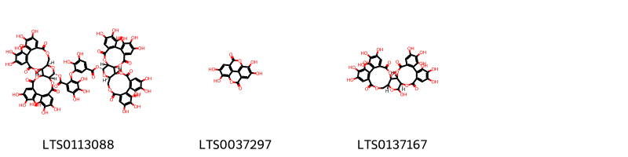{ width=100% }
    <figcaption>Hình ảnh cấu trúc hóa học của 3 hoạt chất thuộc nhóm Tannins gồm ['(1r,2s,19r,20r,22r)-7,8,9,12,13,14,28,29,30,33,34,35-dodecahydroxy-4,17,25,38-tetraoxo-3,18,21,24,39-pentaoxaheptacyclo[20.17.0.0²,¹⁹.0⁵,¹⁰.0¹¹,¹⁶.0²⁶,³¹.0³²,³⁷]nonatriaconta-5,7,9,11(16),12,14,26,28,30,32(37),33,35-dodecaen-20-yl 2-[5-({[(1r,2s,19r,20r,22r)-7,8,9,12,13,14,28,29,30,33,34,35-dodecahydroxy-4,17,25,38-tetraoxo-3,18,21,24,39-pentaoxaheptacyclo[20.17.0.0²,¹⁹.0⁵,¹⁰.0¹¹,¹⁶.0²⁶,³¹.0³²,³⁷]nonatriaconta-5,7,9,11(16),12,14,26,28,30,32(37),33,35-dodecaen-20-yl]oxy}carbonyl)-2,3-dihydroxyphenoxy]-3,4,5-trihydroxybenzoate (LTS0113088)', 'ellagic acid (LTS0037297)', '(1r,2s,19r,22r)-7,8,9,12,13,14,20,28,29,30,33,34,35-tridecahydroxy-3,18,21,24,39-pentaoxaheptacyclo[20.17.0.0²,¹⁹.0⁵,¹⁰.0¹¹,¹⁶.0²⁶,³¹.0³²,³⁷]nonatriaconta-5(10),6,8,11,13,15,26(31),27,29,32,34,36-dodecaene-4,17,25,38-tetrone (LTS0137167)'].</figcaption>
</figure>

---

### Dược dân tộc học

Danh sách các quốc gia có sử dụng *Potentilla erecta* trong điều trị các bệnh. 

| Country   | Disease                                                    | Bệnh                                                                                                                                                                                                |
|:----------|:-----------------------------------------------------------|:----------------------------------------------------------------------------------------------------------------------------------------------------------------------------------------------------|
| Elsewhere | Antidiarrheic, Hemostatic                                  | MYMEMORY WARNING: YOU USED ALL AVAILABLE FREE TRANSLATIONS FOR TODAY. NEXT AVAILABLE IN  12 HOURS 22 MINUTES 54 SECONDS VISIT HTTPS://MYMEMORY.TRANSLATED.NET/DOC/USAGELIMITS.PHP TO TRANSLATE MORE |
| Turkey    | Astringent, Hemostat, Styptic, Sudorific, Stomachic, Tonic | MYMEMORY WARNING: YOU USED ALL AVAILABLE FREE TRANSLATIONS FOR TODAY. NEXT AVAILABLE IN  12 HOURS 22 MINUTES 51 SECONDS VISIT HTTPS://MYMEMORY.TRANSLATED.NET/DOC/USAGELIMITS.PHP TO TRANSLATE MORE |

---

# Chi Heeromeles

??? note "Danh sách các dược liệu thuộc chi"
    
	 - *Heeromeles goudotiana*

---
## Heeromeles goudotiana
### Thông tin về thực vật

!!! info "Phân loại thực vật của *N/A* từ GIBF:"
    - **Kingdom:** N/A
    - **Phylum:** N/A
    - **Order:** N/A
    - **Family:** N/A
    - **Genus:** N/A
    - **Species:** *N/A*

 

| Label (VI)   | Label (EN)   | Scientific Name        | Descriptions (VI)   | Descriptions (EN)   | Also Known As (VI)   | Also Known As (EN)   |
|:-------------|:-------------|:-----------------------|:--------------------|:--------------------|:---------------------|:---------------------|
| N/A          | N/A          | Potentilla tormentilla |                     |                     | ['']                 | ['']                 |

#### Phân bố trên thế giới

**Từ CSDL GIBF** Không có kết quả phù hợp

#### Phân bố tại Việt Nam

**Từ CSDL GIBF**: Không có ghi nhận ở Việt Nam

---
### Thành phần hóa học
        
- Theo cơ sở dữ liệu lotus: Từ loài *N/A* đã phân lập và xác định được Chưa có hoạt chất nào được phân lập. hoạt chất thuộc về các nhóm Không có hoạt chất nào được phân lập. 

Không có hình ảnh nào được tạo ra

---

### Dược dân tộc học

Danh sách các quốc gia có sử dụng *N/A* trong điều trị các bệnh. 

| Country   | Disease    | Bệnh                                                                                                                                                                                                |
|:----------|:-----------|:----------------------------------------------------------------------------------------------------------------------------------------------------------------------------------------------------|
| Elsewhere | Astringent | MYMEMORY WARNING: YOU USED ALL AVAILABLE FREE TRANSLATIONS FOR TODAY. NEXT AVAILABLE IN  12 HOURS 22 MINUTES 06 SECONDS VISIT HTTPS://MYMEMORY.TRANSLATED.NET/DOC/USAGELIMITS.PHP TO TRANSLATE MORE |

---

# Chi Aruncus

??? note "Danh sách các dược liệu thuộc chi"
    
	 - *Aruncus sylvester*

---
## Aruncus sylvester
### Thông tin về thực vật

!!! info "Phân loại thực vật của *Aruncus sylvester* từ GIBF:"
    - **Kingdom:** Plantae
    - **Phylum:** Tracheophyta
    - **Order:** Rosales
    - **Family:** Rosaceae
    - **Genus:** Aruncus
    - **Species:** *Aruncus sylvester*

 

| Label (VI)   | Label (EN)   | Scientific Name   | Descriptions (VI)   | Descriptions (EN)   | Also Known As (VI)   | Also Known As (EN)   |
|:-------------|:-------------|:------------------|:--------------------|:--------------------|:---------------------|:---------------------|
| N/A          | N/A          | Aruncus sylvester | loài thực vật       | species of plant    | ['']                 | ['']                 |

#### Phân bố trên thế giới

**Từ CSDL GIBF** Georgia, nan, Korea, Republic of, Japan, Sweden, France, Czechia, Poland, Germany, Russian Federation, United States of America, China, Austria, Nepal, Finland

#### Phân bố tại Việt Nam

**Từ CSDL GIBF**: Không có ghi nhận ở Việt Nam

---
### Thành phần hóa học
        
- Theo cơ sở dữ liệu lotus: Từ loài *Aruncus sylvester* đã phân lập và xác định được Chưa có hoạt chất nào được phân lập. hoạt chất thuộc về các nhóm Không có hoạt chất nào được phân lập. 

Không có hình ảnh nào được tạo ra

---

### Dược dân tộc học

Danh sách các quốc gia có sử dụng *Aruncus sylvester* trong điều trị các bệnh. 

| Country          | Disease   | Bệnh                                                                                                                                                                                                |
|:-----------------|:----------|:----------------------------------------------------------------------------------------------------------------------------------------------------------------------------------------------------|
| Canada(Kwakiutl) | Soap      | MYMEMORY WARNING: YOU USED ALL AVAILABLE FREE TRANSLATIONS FOR TODAY. NEXT AVAILABLE IN  12 HOURS 21 MINUTES 53 SECONDS VISIT HTTPS://MYMEMORY.TRANSLATED.NET/DOC/USAGELIMITS.PHP TO TRANSLATE MORE |

---

# Chi Quillaja

??? note "Danh sách các dược liệu thuộc chi"
    
	 - *Quillaja brasiliensis*
	 - *Quillaja saponaria*

---
## Quillaja brasiliensis
### Thông tin về thực vật

!!! info "Phân loại thực vật của *Quillaja brasiliensis* từ GIBF:"
    - **Kingdom:** Plantae
    - **Phylum:** Tracheophyta
    - **Order:** Fabales
    - **Family:** Quillajaceae
    - **Genus:** Quillaja
    - **Species:** *Quillaja brasiliensis*

 

| Label (VI)   | Label (EN)   | Scientific Name       | Descriptions (VI)   | Descriptions (EN)   | Also Known As (VI)   | Also Known As (EN)   |
|:-------------|:-------------|:----------------------|:--------------------|:--------------------|:---------------------|:---------------------|
| N/A          | N/A          | Quillaja brasiliensis |                     | species of tree     | ['']                 | ['']                 |

#### Phân bố trên thế giới

**Từ CSDL GIBF** Uruguay, unknown or invalid, Argentina, Brazil, Chile, United States of America, Belgium

#### Phân bố tại Việt Nam

**Từ CSDL GIBF**: Không có ghi nhận ở Việt Nam

---
### Thành phần hóa học
        
- Theo cơ sở dữ liệu lotus: Từ loài *Quillaja brasiliensis* đã phân lập và xác định được 2 hoạt chất thuộc về các nhóm Flavonoids. 

|    | chemicalTaxonomyClassyfireClass   |   smiles_count |
|---:|:----------------------------------|---------------:|
|  0 | Flavonoids                        |              2 |

#### Nhóm Flavonoids
<figure markdown="span">
    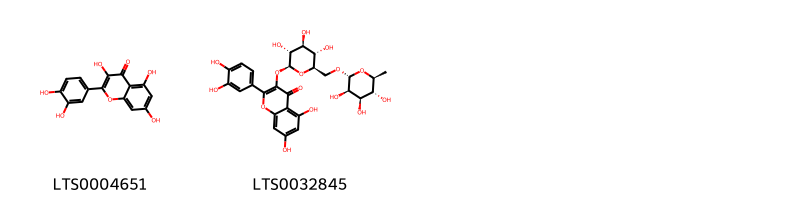{ width=100% }
    <figcaption>Hình ảnh cấu trúc hóa học của 2 hoạt chất thuộc nhóm Flavonoids gồm ['quercetin (LTS0004651)', '3-rutinosyl quercetin (LTS0032845)'].</figcaption>
</figure>

---

### Dược dân tộc học

Danh sách các quốc gia có sử dụng *Quillaja brasiliensis* trong điều trị các bệnh. 

| Country   | Disease   | Bệnh                                                                                                                                                                                                |
|:----------|:----------|:----------------------------------------------------------------------------------------------------------------------------------------------------------------------------------------------------|
| Brazil    | Soap      | MYMEMORY WARNING: YOU USED ALL AVAILABLE FREE TRANSLATIONS FOR TODAY. NEXT AVAILABLE IN  12 HOURS 21 MINUTES 27 SECONDS VISIT HTTPS://MYMEMORY.TRANSLATED.NET/DOC/USAGELIMITS.PHP TO TRANSLATE MORE |

---

---
## Quillaja saponaria
### Thông tin về thực vật

!!! info "Phân loại thực vật của *Quillaja saponaria* từ GIBF:"
    - **Kingdom:** Plantae
    - **Phylum:** Tracheophyta
    - **Order:** Fabales
    - **Family:** Quillajaceae
    - **Genus:** Quillaja
    - **Species:** *Quillaja saponaria*

 

| Label (VI)   | Label (EN)   | Scientific Name    | Descriptions (VI)   | Descriptions (EN)   | Also Known As (VI)   | Also Known As (EN)   |
|:-------------|:-------------|:-------------------|:--------------------|:--------------------|:---------------------|:---------------------|
| N/A          | N/A          | Quillaja saponaria | loài thực vật       | species of plant    | ['']                 | ['']                 |

#### Phân bố trên thế giới

**Từ CSDL GIBF** Chile

#### Phân bố tại Việt Nam

**Từ CSDL GIBF**: Không có ghi nhận ở Việt Nam

---
### Thành phần hóa học
        
- Theo cơ sở dữ liệu lotus: Từ loài *Quillaja saponaria* đã phân lập và xác định được 10 hoạt chất thuộc về các nhóm Organooxygen compounds, Prenol lipids, Lignan glycosides, Fatty Acyls. 

|    | chemicalTaxonomyClassyfireClass   |   smiles_count |
|---:|:----------------------------------|---------------:|
|  0 | Fatty Acyls                       |              1 |
|  1 | Lignan glycosides                 |              2 |
|  2 | Organooxygen compounds            |              4 |
|  3 | Prenol lipids                     |              3 |

#### Nhóm Fatty Acyls
<figure markdown="span">
    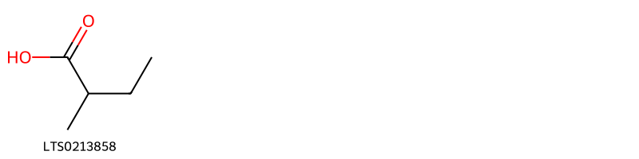{ width=100% }
    <figcaption>Hình ảnh cấu trúc hóa học của 1 hoạt chất thuộc nhóm Fatty Acyls gồm ['2-methylbutanoic acid (LTS0213858)'].</figcaption>
</figure>
#### Nhóm Lignan glycosides
<figure markdown="span">
    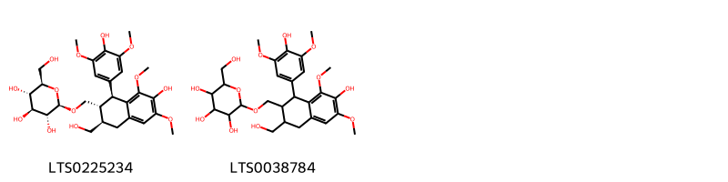{ width=100% }
    <figcaption>Hình ảnh cấu trúc hóa học của 2 hoạt chất thuộc nhóm Lignan glycosides gồm ['(2r,3r,4s,5s,6r)-2-{[(1s,2r,3r)-7-hydroxy-1-(4-hydroxy-3,5-dimethoxyphenyl)-3-(hydroxymethyl)-6,8-dimethoxy-1,2,3,4-tetrahydronaphthalen-2-yl]methoxy}-6-(hydroxymethyl)oxane-3,4,5-triol (LTS0225234)', '2-{[7-hydroxy-1-(4-hydroxy-3,5-dimethoxyphenyl)-3-(hydroxymethyl)-6,8-dimethoxy-1,2,3,4-tetrahydronaphthalen-2-yl]methoxy}-6-(hydroxymethyl)oxane-3,4,5-triol (LTS0038784)'].</figcaption>
</figure>
#### Nhóm Organooxygen compounds
<figure markdown="span">
    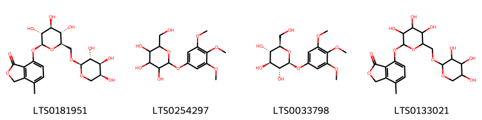{ width=100% }
    <figcaption>Hình ảnh cấu trúc hóa học của 4 hoạt chất thuộc nhóm Organooxygen compounds gồm ['4-methyl-7-{[(2s,3r,4s,5s,6r)-3,4,5-trihydroxy-6-({[(2s,3r,4s,5s)-3,4,5-trihydroxyoxan-2-yl]oxy}methyl)oxan-2-yl]oxy}-3h-2-benzofuran-1-one (LTS0181951)', '2-(hydroxymethyl)-6-(3,4,5-trimethoxyphenoxy)oxane-3,4,5-triol (LTS0254297)', 'koaburside (LTS0033798)', '4-methyl-7-[(3,4,5-trihydroxy-6-{[(3,4,5-trihydroxyoxan-2-yl)oxy]methyl}oxan-2-yl)oxy]-3h-2-benzofuran-1-one (LTS0133021)'].</figcaption>
</figure>
#### Nhóm Prenol lipids
<figure markdown="span">
    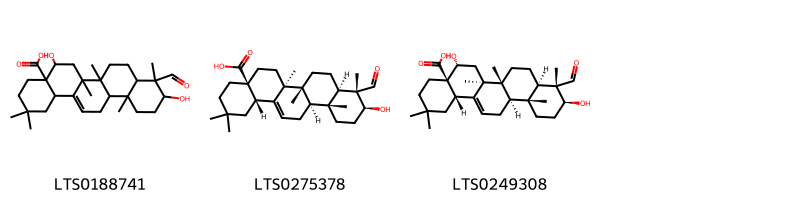{ width=100% }
    <figcaption>Hình ảnh cấu trúc hóa học của 3 hoạt chất thuộc nhóm Prenol lipids gồm ['quillaic acid (LTS0188741)', 'gypsogenin (LTS0275378)', 'quillaic acid (LTS0249308)'].</figcaption>
</figure>

---

### Dược dân tộc học

Danh sách các quốc gia có sử dụng *Quillaja saponaria* trong điều trị các bệnh. 

| Country       | Disease                                           | Bệnh                                                                                                                                                                                                |
|:--------------|:--------------------------------------------------|:----------------------------------------------------------------------------------------------------------------------------------------------------------------------------------------------------|
| Elsewhere     | Diuretic, Expectorant, Soap, Stimulant            | MYMEMORY WARNING: YOU USED ALL AVAILABLE FREE TRANSLATIONS FOR TODAY. NEXT AVAILABLE IN  12 HOURS 20 MINUTES 51 SECONDS VISIT HTTPS://MYMEMORY.TRANSLATED.NET/DOC/USAGELIMITS.PHP TO TRANSLATE MORE |
| Latin America | Cardiodepressant, Expectorant, Soap               | MYMEMORY WARNING: YOU USED ALL AVAILABLE FREE TRANSLATIONS FOR TODAY. NEXT AVAILABLE IN  12 HOURS 20 MINUTES 49 SECONDS VISIT HTTPS://MYMEMORY.TRANSLATED.NET/DOC/USAGELIMITS.PHP TO TRANSLATE MORE |
| Turkey        | Expectorant, Poison, Soap, Sternutatory, Diuretic | MYMEMORY WARNING: YOU USED ALL AVAILABLE FREE TRANSLATIONS FOR TODAY. NEXT AVAILABLE IN  12 HOURS 20 MINUTES 46 SECONDS VISIT HTTPS://MYMEMORY.TRANSLATED.NET/DOC/USAGELIMITS.PHP TO TRANSLATE MORE |

---

# Chi Alchemilla

??? note "Danh sách các dược liệu thuộc chi"
    
	 - *Alchemilla alpina*
	 - *Alchemilla arvensis*
	 - *Alchemilla vulgaris*

---
## Alchemilla alpina
### Thông tin về thực vật

!!! info "Phân loại thực vật của *Alchemilla alpina* từ GIBF:"
    - **Kingdom:** Plantae
    - **Phylum:** Tracheophyta
    - **Order:** Rosales
    - **Family:** Rosaceae
    - **Genus:** Alchemilla
    - **Species:** *Alchemilla alpina*

 

| Label (VI)   | Label (EN)   | Scientific Name   | Descriptions (VI)   | Descriptions (EN)   | Also Known As (VI)   | Also Known As (EN)       |
|:-------------|:-------------|:------------------|:--------------------|:--------------------|:---------------------|:-------------------------|
| N/A          | N/A          | Alchemilla alpina | loài thực vật       | species of plant    | ['Peucrist']         | ["Alpine Lady's-mantle"] |

#### Phân bố trên thế giới

**Từ CSDL GIBF** Switzerland, United Kingdom of Great Britain and Northern Ireland, Greenland, Sweden, France, Iceland, Ireland, Austria, Norway

#### Phân bố tại Việt Nam

**Từ CSDL GIBF**: Không có ghi nhận ở Việt Nam

---
### Thành phần hóa học
        
- Theo cơ sở dữ liệu lotus: Từ loài *Alchemilla alpina* đã phân lập và xác định được 5 hoạt chất thuộc về các nhóm Prenol lipids. 

|    | chemicalTaxonomyClassyfireClass   |   smiles_count |
|---:|:----------------------------------|---------------:|
|  0 | Prenol lipids                     |              5 |

#### Nhóm Prenol lipids
<figure markdown="span">
    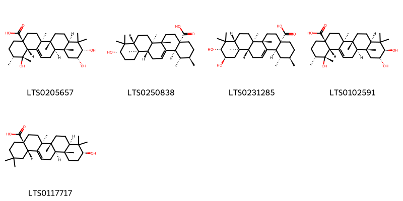{ width=100% }
    <figcaption>Hình ảnh cấu trúc hóa học của 5 hoạt chất thuộc nhóm Prenol lipids gồm ['euscaphic acid (LTS0205657)', 'ursolic acid (LTS0250838)', 'corosolic acid (LTS0231285)', 'tormentic acid (LTS0102591)', 'oleanolic acid (LTS0117717)'].</figcaption>
</figure>

---

### Dược dân tộc học

Danh sách các quốc gia có sử dụng *Alchemilla alpina* trong điều trị các bệnh. 

| Country   | Disease               | Bệnh                                                                                                                                                                                                |
|:----------|:----------------------|:----------------------------------------------------------------------------------------------------------------------------------------------------------------------------------------------------|
| Turkey    | Carminative, Diuretic | MYMEMORY WARNING: YOU USED ALL AVAILABLE FREE TRANSLATIONS FOR TODAY. NEXT AVAILABLE IN  12 HOURS 20 MINUTES 20 SECONDS VISIT HTTPS://MYMEMORY.TRANSLATED.NET/DOC/USAGELIMITS.PHP TO TRANSLATE MORE |

---

---
## Alchemilla arvensis
### Thông tin về thực vật

!!! info "Phân loại thực vật của *N/A* từ GIBF:"
    - **Kingdom:** Plantae
    - **Phylum:** Tracheophyta
    - **Order:** Rosales
    - **Family:** Rosaceae
    - **Genus:** N/A
    - **Species:** *N/A*

 

| Label (VI)   | Label (EN)   | Scientific Name     | Descriptions (VI)   | Descriptions (EN)   | Also Known As (VI)   | Also Known As (EN)   |
|:-------------|:-------------|:--------------------|:--------------------|:--------------------|:---------------------|:---------------------|
| N/A          | N/A          | Alchemilla arvensis | loài thực vật       | species of plant    | ['']                 | ['']                 |

#### Phân bố trên thế giới

**Từ CSDL GIBF** Denmark, Spain, Germany, Chile, Isle of Man, Australia, India, Canada, Finland, Türkiye, Japan, Ireland, Chinese Taipei, Hong Kong, United Kingdom of Great Britain and Northern Ireland, Argentina, Portugal, South Africa, France, Czechia, New Zealand, Russian Federation, United States of America, Italy, Israel, Ukraine

#### Phân bố tại Việt Nam

**Từ CSDL GIBF**: Không có ghi nhận ở Việt Nam

---
### Thành phần hóa học
        
- Theo cơ sở dữ liệu lotus: Từ loài *N/A* đã phân lập và xác định được Chưa có hoạt chất nào được phân lập. hoạt chất thuộc về các nhóm Không có hoạt chất nào được phân lập. 

Không có hình ảnh nào được tạo ra

---

### Dược dân tộc học

Danh sách các quốc gia có sử dụng *N/A* trong điều trị các bệnh. 

| Country   | Disease                                     | Bệnh                                                                                                                                                                                                |
|:----------|:--------------------------------------------|:----------------------------------------------------------------------------------------------------------------------------------------------------------------------------------------------------|
| Turkey    | Demulcent, Diuretic, Refrigerant, Vulnerary | MYMEMORY WARNING: YOU USED ALL AVAILABLE FREE TRANSLATIONS FOR TODAY. NEXT AVAILABLE IN  12 HOURS 19 MINUTES 46 SECONDS VISIT HTTPS://MYMEMORY.TRANSLATED.NET/DOC/USAGELIMITS.PHP TO TRANSLATE MORE |

---

---
## Alchemilla vulgaris
### Thông tin về thực vật

!!! info "Phân loại thực vật của *Alchemilla vulgaris* từ GIBF:"
    - **Kingdom:** Plantae
    - **Phylum:** Tracheophyta
    - **Order:** Rosales
    - **Family:** Rosaceae
    - **Genus:** Alchemilla
    - **Species:** *Alchemilla vulgaris*

 

| Label (VI)   | Label (EN)   | Scientific Name     | Descriptions (VI)   | Descriptions (EN)   | Also Known As (VI)   | Also Known As (EN)   |
|:-------------|:-------------|:--------------------|:--------------------|:--------------------|:---------------------|:---------------------|
| N/A          | N/A          | Alchemilla vulgaris | loài thực vật       | species of plant    | ['']                 | ["lady's mantle"]    |

#### Phân bố trên thế giới

**Từ CSDL GIBF** Belarus, United Kingdom of Great Britain and Northern Ireland, Denmark, Sweden, Spain, Czechia, Poland, Germany, Estonia, Russian Federation, Austria, Norway, Finland, Ukraine

#### Phân bố tại Việt Nam

**Từ CSDL GIBF**: Không có ghi nhận ở Việt Nam

---
### Thành phần hóa học
        
- Theo cơ sở dữ liệu lotus: Từ loài *Alchemilla vulgaris* đã phân lập và xác định được 6 hoạt chất thuộc về các nhóm Flavonoids, Prenol lipids. 

|    | chemicalTaxonomyClassyfireClass   |   smiles_count |
|---:|:----------------------------------|---------------:|
|  0 | Flavonoids                        |              1 |
|  1 | Prenol lipids                     |              5 |

#### Nhóm Flavonoids
<figure markdown="span">
    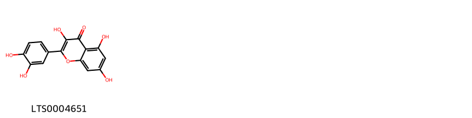{ width=100% }
    <figcaption>Hình ảnh cấu trúc hóa học của 1 hoạt chất thuộc nhóm Flavonoids gồm ['quercetin (LTS0004651)'].</figcaption>
</figure>
#### Nhóm Prenol lipids
<figure markdown="span">
    { width=100% }
    <figcaption>Hình ảnh cấu trúc hóa học của 5 hoạt chất thuộc nhóm Prenol lipids gồm ['euscaphic acid (LTS0205657)', 'ursolic acid (LTS0250838)', 'corosolic acid (LTS0231285)', 'tormentic acid (LTS0102591)', 'oleanolic acid (LTS0117717)'].</figcaption>
</figure>

---

### Dược dân tộc học

Danh sách các quốc gia có sử dụng *Alchemilla vulgaris* trong điều trị các bệnh. 

| Country   | Disease                                                                                      | Bệnh                                                                                                                                                                                                |
|:----------|:---------------------------------------------------------------------------------------------|:----------------------------------------------------------------------------------------------------------------------------------------------------------------------------------------------------|
| Turkey    | Astringent, Hemostat, Refrigerant, Stomachic, Styptic, Tonic, Diuretic, Vulnerary, Demulcent | MYMEMORY WARNING: YOU USED ALL AVAILABLE FREE TRANSLATIONS FOR TODAY. NEXT AVAILABLE IN  12 HOURS 19 MINUTES 22 SECONDS VISIT HTTPS://MYMEMORY.TRANSLATED.NET/DOC/USAGELIMITS.PHP TO TRANSLATE MORE |

---

# Chi Gillenia

??? note "Danh sách các dược liệu thuộc chi"
    
	 - *Gillenia trifoliata*

---
## Gillenia trifoliata
### Thông tin về thực vật

!!! info "Phân loại thực vật của *Gillenia trifoliata* từ GIBF:"
    - **Kingdom:** Plantae
    - **Phylum:** Tracheophyta
    - **Order:** Rosales
    - **Family:** Rosaceae
    - **Genus:** Gillenia
    - **Species:** *Gillenia trifoliata*

 

| Label (VI)   | Label (EN)   | Scientific Name     | Descriptions (VI)   | Descriptions (EN)   | Also Known As (VI)   | Also Known As (EN)   |
|:-------------|:-------------|:--------------------|:--------------------|:--------------------|:---------------------|:---------------------|
| N/A          | N/A          | Gillenia trifoliata | loài thực vật       | species of plant    | ['']                 | ['']                 |

#### Phân bố trên thế giới

**Từ CSDL GIBF** United States of America, Sweden

#### Phân bố tại Việt Nam

**Từ CSDL GIBF**: Không có ghi nhận ở Việt Nam

---
### Thành phần hóa học
        
- Theo cơ sở dữ liệu lotus: Từ loài *Gillenia trifoliata* đã phân lập và xác định được Chưa có hoạt chất nào được phân lập. hoạt chất thuộc về các nhóm Không có hoạt chất nào được phân lập. 

Không có hình ảnh nào được tạo ra

---

### Dược dân tộc học

Danh sách các quốc gia có sử dụng *Gillenia trifoliata* trong điều trị các bệnh. 

| Country        | Disease                            | Bệnh                                                                                                                                                                                                |
|:---------------|:-----------------------------------|:----------------------------------------------------------------------------------------------------------------------------------------------------------------------------------------------------|
| English        | Laxative, Emetic, Expectorant      | MYMEMORY WARNING: YOU USED ALL AVAILABLE FREE TRANSLATIONS FOR TODAY. NEXT AVAILABLE IN  12 HOURS 18 MINUTES 50 SECONDS VISIT HTTPS://MYMEMORY.TRANSLATED.NET/DOC/USAGELIMITS.PHP TO TRANSLATE MORE |
| US             | Emetic, Tonic, Laxative, Vermifuge | MYMEMORY WARNING: YOU USED ALL AVAILABLE FREE TRANSLATIONS FOR TODAY. NEXT AVAILABLE IN  12 HOURS 18 MINUTES 46 SECONDS VISIT HTTPS://MYMEMORY.TRANSLATED.NET/DOC/USAGELIMITS.PHP TO TRANSLATE MORE |
| US(Amerindian) | Emetic                             | MYMEMORY WARNING: YOU USED ALL AVAILABLE FREE TRANSLATIONS FOR TODAY. NEXT AVAILABLE IN  12 HOURS 18 MINUTES 42 SECONDS VISIT HTTPS://MYMEMORY.TRANSLATED.NET/DOC/USAGELIMITS.PHP TO TRANSLATE MORE |

---

# Chi Agrimonia

??? note "Danh sách các dược liệu thuộc chi"
    
	 - *Agrimonia eupatoria*
	 - *Agrimonia odorata*
	 - *Agrimonia pilosa*

---
## Agrimonia eupatoria
### Thông tin về thực vật

!!! info "Phân loại thực vật của *Agrimonia eupatoria* từ GIBF:"
    - **Kingdom:** Plantae
    - **Phylum:** Tracheophyta
    - **Order:** Rosales
    - **Family:** Rosaceae
    - **Genus:** Agrimonia
    - **Species:** *Agrimonia eupatoria*

 

| Label (VI)   | Label (EN)   | Scientific Name     | Descriptions (VI)   | Descriptions (EN)   | Also Known As (VI)   | Also Known As (EN)                        |
|:-------------|:-------------|:--------------------|:--------------------|:--------------------|:---------------------|:------------------------------------------|
| N/A          | N/A          | Agrimonia eupatoria | loài thực vật       | species of plant    | ['']                 | ['common agrimony', 'medicinal agrimony'] |

#### Phân bố trên thế giới

**Từ CSDL GIBF** Denmark, Luxembourg, Spain, Germany, Austria, Sweden, Kazakhstan, Belgium, Netherlands, Hungary, Norway, Switzerland, United Kingdom of Great Britain and Northern Ireland, Portugal, France, Czechia, Russian Federation, Italy, Greece, Croatia, Ukraine

#### Phân bố tại Việt Nam

**Từ CSDL GIBF**: Không có ghi nhận ở Việt Nam

---
### Thành phần hóa học
        
- Theo cơ sở dữ liệu lotus: Từ loài *Agrimonia eupatoria* đã phân lập và xác định được 34 hoạt chất thuộc về các nhóm Organooxygen compounds, Prenol lipids, Flavonoids. 

|    | chemicalTaxonomyClassyfireClass   |   smiles_count |
|---:|:----------------------------------|---------------:|
|  0 | Flavonoids                        |             29 |
|  1 | Organooxygen compounds            |              1 |
|  2 | Prenol lipids                     |              4 |

#### Nhóm Flavonoids
<figure markdown="span">
    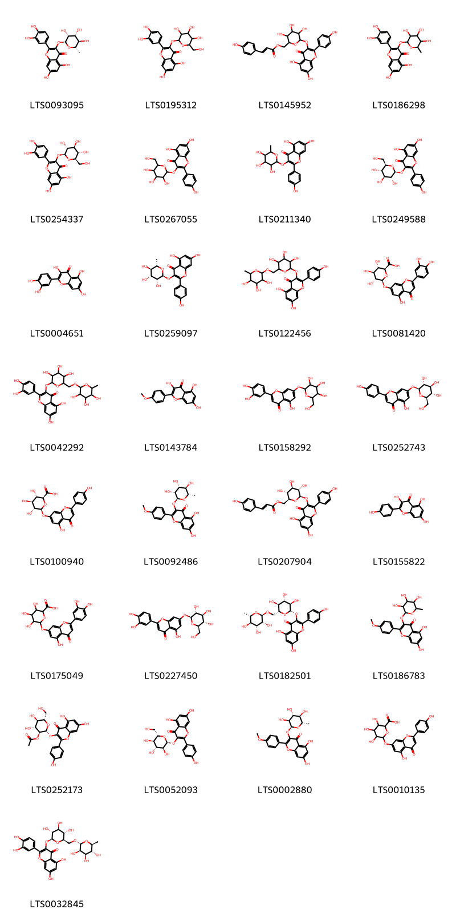{ width=100% }
    <figcaption>Hình ảnh cấu trúc hóa học của 29 hoạt chất thuộc nhóm Flavonoids gồm ['quercitrin (LTS0093095)', '2-(3,4-dihydroxyphenyl)-5,7-dihydroxy-3-{[3,4,5-trihydroxy-6-(hydroxymethyl)oxan-2-yl]oxy}chromen-4-one (LTS0195312)', '(6-{[5,7-dihydroxy-2-(4-hydroxyphenyl)-4-oxochromen-3-yl]oxy}-3,4,5-trihydroxyoxan-2-yl)methyl 3-(4-hydroxyphenyl)prop-2-enoate (LTS0145952)', 'quercitrin (LTS0186298)', 'isoquercetin (LTS0254337)', 'trifolin (LTS0267055)', '5,7-dihydroxy-2-(4-hydroxyphenyl)-3-[(3,4,5-trihydroxy-6-methyloxan-2-yl)oxy]chromen-4-one (LTS0211340)', 'astragalin (LTS0249588)', 'quercetin (LTS0004651)', 'afzelin (LTS0259097)', '5,7-dihydroxy-2-(4-hydroxyphenyl)-3-[(3,4,5-trihydroxy-6-{[(3,4,5-trihydroxy-6-methyloxan-2-yl)oxy]methyl}oxan-2-yl)oxy]chromen-4-one (LTS0122456)', 'luteolin 7-o-glucuronide (LTS0081420)', 'rutin (LTS0042292)', 'kaempferide (LTS0143784)', '2-(3,4-dihydroxyphenyl)-5-hydroxy-7-{[3,4,5-trihydroxy-6-(hydroxymethyl)oxan-2-yl]oxy}chromen-4-one (LTS0158292)', 'apigenin 7-o-β-glucoside (LTS0252743)', '(2s,3s,4s,5r,6s)-3,4,5-trihydroxy-6-{[5-hydroxy-2-(4-hydroxyphenyl)-4-oxochromen-7-yl]oxy}oxane-2-carboxylic acid (LTS0100940)', '5,7-dihydroxy-2-(4-methoxyphenyl)-3-{[(2s,3r,4r,5r,6s)-3,4,5-trihydroxy-6-methyloxan-2-yl]oxy}chromen-4-one (LTS0092486)', '[(2s,3r,4r,5s,6r)-6-{[5,7-dihydroxy-2-(4-hydroxyphenyl)-4-oxochromen-3-yl]oxy}-3,4,5-trihydroxyoxan-2-yl]methyl (2e)-3-(4-hydroxyphenyl)prop-2-enoate (LTS0207904)', 'kaempherol (LTS0155822)', '6-{[2-(3,4-dihydroxyphenyl)-5-hydroxy-4-oxochromen-7-yl]oxy}-3,4,5-trihydroxyoxane-2-carboxylic acid (LTS0175049)', 'luteolin 7-o-glucoside (LTS0227450)', 'nictoflorin (LTS0182501)', '5,7-dihydroxy-2-(4-methoxyphenyl)-3-[(3,4,5-trihydroxy-6-methyloxan-2-yl)oxy]chromen-4-one (LTS0186783)', '(2r,3s,4r,5r,6s)-2-{[5,7-dihydroxy-2-(4-hydroxyphenyl)-4-oxochromen-3-yl]oxy}-4,5-dihydroxy-6-(hydroxymethyl)oxan-3-yl acetate (LTS0252173)', '5,7-dihydroxy-2-(4-hydroxyphenyl)-3-{[(2r,3s,4r,5r,6s)-3,4,5-trihydroxy-6-(hydroxymethyl)oxan-2-yl]oxy}chromen-4-one (LTS0052093)', '5,7-dihydroxy-2-(4-methoxyphenyl)-3-{[(2s,3s,4r,5r,6s)-3,4,5-trihydroxy-6-methyloxan-2-yl]oxy}chromen-4-one (LTS0002880)', '3,4,5-trihydroxy-6-{[5-hydroxy-2-(4-hydroxyphenyl)-4-oxochromen-7-yl]oxy}oxane-2-carboxylic acid (LTS0010135)', '3-rutinosyl quercetin (LTS0032845)'].</figcaption>
</figure>
#### Nhóm Organooxygen compounds
<figure markdown="span">
    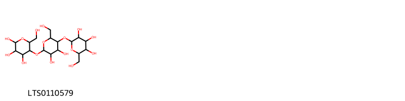{ width=100% }
    <figcaption>Hình ảnh cấu trúc hóa học của 1 hoạt chất thuộc nhóm Organooxygen compounds gồm ['amylose (LTS0110579)'].</figcaption>
</figure>
#### Nhóm Prenol lipids
<figure markdown="span">
    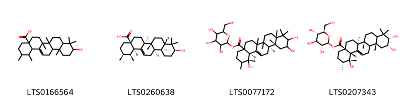{ width=100% }
    <figcaption>Hình ảnh cấu trúc hóa học của 4 hoạt chất thuộc nhóm Prenol lipids gồm ['10-hydroxy-1,2,6a,6b,9,9,12a-heptamethyl-2,3,4,5,6,7,8,8a,10,11,12,12b,13,14b-tetradecahydro-1h-picene-4a-carboxylic acid (LTS0166564)', '(1s,2s,4as,6as,6br,8as,10s,12as,12br,14br)-10-hydroxy-1,2,6a,6b,9,9,12a-heptamethyl-2,3,4,5,6,7,8,8a,10,11,12,12b,13,14b-tetradecahydro-1h-picene-4a-carboxylic acid (LTS0260638)', '3,4,5-trihydroxy-6-(hydroxymethyl)oxan-2-yl (1r,8as,12ar,12br,14br)-1,10,11-trihydroxy-1,2,6a,6b,9,9,12a-heptamethyl-2,3,4,5,6,7,8,8a,10,11,12,12b,13,14b-tetradecahydropicene-4a-carboxylate (LTS0077172)', '(2s,3r,4s,5s,6r)-3,4,5-trihydroxy-6-(hydroxymethyl)oxan-2-yl (1r,2r,4as,6as,6br,10s,11r,12ar,14bs)-1,10,11-trihydroxy-1,2,6a,6b,9,9,12a-heptamethyl-2,3,4,5,6,7,8,8a,10,11,12,12b,13,14b-tetradecahydropicene-4a-carboxylate (LTS0207343)'].</figcaption>
</figure>

---

### Dược dân tộc học

Danh sách các quốc gia có sử dụng *Agrimonia eupatoria* trong điều trị các bệnh. 

| Country   | Disease                                                                    | Bệnh                                                                                                                                                                                                |
|:----------|:---------------------------------------------------------------------------|:----------------------------------------------------------------------------------------------------------------------------------------------------------------------------------------------------|
| China     | Coagulant, Cardiotonic, Hemostat                                           | MYMEMORY WARNING: YOU USED ALL AVAILABLE FREE TRANSLATIONS FOR TODAY. NEXT AVAILABLE IN  12 HOURS 18 MINUTES 14 SECONDS VISIT HTTPS://MYMEMORY.TRANSLATED.NET/DOC/USAGELIMITS.PHP TO TRANSLATE MORE |
| Dutch     | Tonic                                                                      | MYMEMORY WARNING: YOU USED ALL AVAILABLE FREE TRANSLATIONS FOR TODAY. NEXT AVAILABLE IN  12 HOURS 18 MINUTES 11 SECONDS VISIT HTTPS://MYMEMORY.TRANSLATED.NET/DOC/USAGELIMITS.PHP TO TRANSLATE MORE |
| Europe    | Astringent, Tonic                                                          | MYMEMORY WARNING: YOU USED ALL AVAILABLE FREE TRANSLATIONS FOR TODAY. NEXT AVAILABLE IN  12 HOURS 18 MINUTES 08 SECONDS VISIT HTTPS://MYMEMORY.TRANSLATED.NET/DOC/USAGELIMITS.PHP TO TRANSLATE MORE |
| French    | Astringent                                                                 | MYMEMORY WARNING: YOU USED ALL AVAILABLE FREE TRANSLATIONS FOR TODAY. NEXT AVAILABLE IN  12 HOURS 18 MINUTES 06 SECONDS VISIT HTTPS://MYMEMORY.TRANSLATED.NET/DOC/USAGELIMITS.PHP TO TRANSLATE MORE |
| German    | Diuretic                                                                   | MYMEMORY WARNING: YOU USED ALL AVAILABLE FREE TRANSLATIONS FOR TODAY. NEXT AVAILABLE IN  12 HOURS 18 MINUTES 03 SECONDS VISIT HTTPS://MYMEMORY.TRANSLATED.NET/DOC/USAGELIMITS.PHP TO TRANSLATE MORE |
| Hungary   | Cholagogue                                                                 | MYMEMORY WARNING: YOU USED ALL AVAILABLE FREE TRANSLATIONS FOR TODAY. NEXT AVAILABLE IN  12 HOURS 18 MINUTES 01 SECONDS VISIT HTTPS://MYMEMORY.TRANSLATED.NET/DOC/USAGELIMITS.PHP TO TRANSLATE MORE |
| Iraq      | Cholagogue, Diuretic, Tonic, Vermifuge, Vulnerary, Emmenagogue, Astringent | MYMEMORY WARNING: YOU USED ALL AVAILABLE FREE TRANSLATIONS FOR TODAY. NEXT AVAILABLE IN  12 HOURS 17 MINUTES 58 SECONDS VISIT HTTPS://MYMEMORY.TRANSLATED.NET/DOC/USAGELIMITS.PHP TO TRANSLATE MORE |
| Italian   | Vulnerary                                                                  | MYMEMORY WARNING: YOU USED ALL AVAILABLE FREE TRANSLATIONS FOR TODAY. NEXT AVAILABLE IN  12 HOURS 17 MINUTES 55 SECONDS VISIT HTTPS://MYMEMORY.TRANSLATED.NET/DOC/USAGELIMITS.PHP TO TRANSLATE MORE |
| Turkey    | Emmenagogue                                                                | MYMEMORY WARNING: YOU USED ALL AVAILABLE FREE TRANSLATIONS FOR TODAY. NEXT AVAILABLE IN  12 HOURS 17 MINUTES 52 SECONDS VISIT HTTPS://MYMEMORY.TRANSLATED.NET/DOC/USAGELIMITS.PHP TO TRANSLATE MORE |
| anish     | Vermifuge                                                                  | MYMEMORY WARNING: YOU USED ALL AVAILABLE FREE TRANSLATIONS FOR TODAY. NEXT AVAILABLE IN  12 HOURS 17 MINUTES 49 SECONDS VISIT HTTPS://MYMEMORY.TRANSLATED.NET/DOC/USAGELIMITS.PHP TO TRANSLATE MORE |

---

---
## Agrimonia odorata
### Thông tin về thực vật

!!! info "Phân loại thực vật của *Agrimonia repens* từ GIBF:"
    - **Kingdom:** Plantae
    - **Phylum:** Tracheophyta
    - **Order:** Rosales
    - **Family:** Rosaceae
    - **Genus:** Agrimonia
    - **Species:** *Agrimonia repens*

 

| Label (VI)   | Label (EN)   | Scientific Name   | Descriptions (VI)   | Descriptions (EN)   | Also Known As (VI)   | Also Known As (EN)   |
|:-------------|:-------------|:------------------|:--------------------|:--------------------|:---------------------|:---------------------|
| N/A          | N/A          | Agrimonia odorata |                     | species of plant    | ['']                 | ['']                 |

#### Phân bố trên thế giới

**Từ CSDL GIBF** South Africa, Sweden, France, Poland, Norway

#### Phân bố tại Việt Nam

**Từ CSDL GIBF**: Không có ghi nhận ở Việt Nam

---
### Thành phần hóa học
        
- Theo cơ sở dữ liệu lotus: Từ loài *Agrimonia repens* đã phân lập và xác định được Chưa có hoạt chất nào được phân lập. hoạt chất thuộc về các nhóm Không có hoạt chất nào được phân lập. 

Không có hình ảnh nào được tạo ra

---

### Dược dân tộc học

Danh sách các quốc gia có sử dụng *Agrimonia repens* trong điều trị các bệnh. 

| Country   | Disease   | Bệnh                                                                                                                                                                                                |
|:----------|:----------|:----------------------------------------------------------------------------------------------------------------------------------------------------------------------------------------------------|
| Lesotho   | Vermifuge | MYMEMORY WARNING: YOU USED ALL AVAILABLE FREE TRANSLATIONS FOR TODAY. NEXT AVAILABLE IN  12 HOURS 17 MINUTES 13 SECONDS VISIT HTTPS://MYMEMORY.TRANSLATED.NET/DOC/USAGELIMITS.PHP TO TRANSLATE MORE |

---

---
## Agrimonia pilosa
### Thông tin về thực vật

!!! info "Phân loại thực vật của *Agrimonia pilosa* từ GIBF:"
    - **Kingdom:** Plantae
    - **Phylum:** Tracheophyta
    - **Order:** Rosales
    - **Family:** Rosaceae
    - **Genus:** Agrimonia
    - **Species:** *Agrimonia pilosa*

 

| Label (VI)   | Label (EN)   | Scientific Name   | Descriptions (VI)   | Descriptions (EN)   | Also Known As (VI)                                    | Also Known As (EN)                            |
|:-------------|:-------------|:------------------|:--------------------|:--------------------|:------------------------------------------------------|:----------------------------------------------|
| N/A          | N/A          | Agrimonia pilosa  | loài thực vật       | species of plant    | ['Tiên hạc thảo', 'Cỏ răng rồng', 'Agrimonia pilosa'] | ['Agrimonia pilosa Ledeb.', 'hairy agrimony'] |

#### Phân bố trên thế giới

**Từ CSDL GIBF** Mongolia, Estonia, Russian Federation, China, Ukraine

#### Phân bố tại Việt Nam

**Từ CSDL GIBF**: Không có ghi nhận ở Việt Nam

---
### Thành phần hóa học
        
- Theo cơ sở dữ liệu lotus: Từ loài *Agrimonia pilosa* đã phân lập và xác định được 66 hoạt chất thuộc về các nhóm Organooxygen compounds, Flavonoids, Tannins, Prenol lipids, Fatty Acyls, Diarylheptanoids, Phenol ethers, Benzene and substituted derivatives. 

|    | chemicalTaxonomyClassyfireClass     |   smiles_count |
|---:|:------------------------------------|---------------:|
|  0 | Benzene and substituted derivatives |              2 |
|  1 | Diarylheptanoids                    |              3 |
|  2 | Fatty Acyls                         |              3 |
|  3 | Flavonoids                          |             25 |
|  4 | Organooxygen compounds              |             10 |
|  5 | Phenol ethers                       |              1 |
|  6 | Prenol lipids                       |             10 |
|  7 | Tannins                             |             11 |

#### Nhóm Benzene and substituted derivatives
<figure markdown="span">
    { width=100% }
    <figcaption>Hình ảnh cấu trúc hóa học của 2 hoạt chất thuộc nhóm Benzene and substituted derivatives gồm ['(3s)-6,8-dihydroxy-3-[2-(4-methoxyphenyl)ethyl]-3,4-dihydro-2-benzopyran-1-one (LTS0058575)', '6,8-dihydroxy-3-[2-(4-methoxyphenyl)ethyl]-3,4-dihydro-2-benzopyran-1-one (LTS0019619)'].</figcaption>
</figure>
#### Nhóm Diarylheptanoids
<figure markdown="span">
    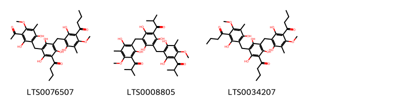{ width=100% }
    <figcaption>Hình ảnh cấu trúc hóa học của 3 hoạt chất thuộc nhóm Diarylheptanoids gồm ['1-{3-[(3-acetyl-2,6-dihydroxy-4-methoxy-5-methylphenyl)methyl]-5-[(3-butanoyl-2,6-dihydroxy-4-methoxy-5-methylphenyl)methyl]-2,4,6-trihydroxyphenyl}butan-1-one (LTS0076507)', '1-{3-[(3-{[2,6-dihydroxy-4-methoxy-3-methyl-5-(2-methylpropanoyl)phenyl]methyl}-2,4,6-trihydroxy-5-(2-methylpropanoyl)phenyl)methyl]-2,4-dihydroxy-6-methoxy-5-methylphenyl}-2-methylpropan-1-one (LTS0008805)', 'agrimol c (LTS0034207)'].</figcaption>
</figure>
#### Nhóm Fatty Acyls
<figure markdown="span">
    { width=100% }
    <figcaption>Hình ảnh cấu trúc hóa học của 3 hoạt chất thuộc nhóm Fatty Acyls gồm ['(+-)-propylene glycol (LTS0274535)', 'methyl elaidolinolenate (LTS0266092)', '9-hexadecenoic acid (LTS0166766)'].</figcaption>
</figure>
#### Nhóm Flavonoids
<figure markdown="span">
    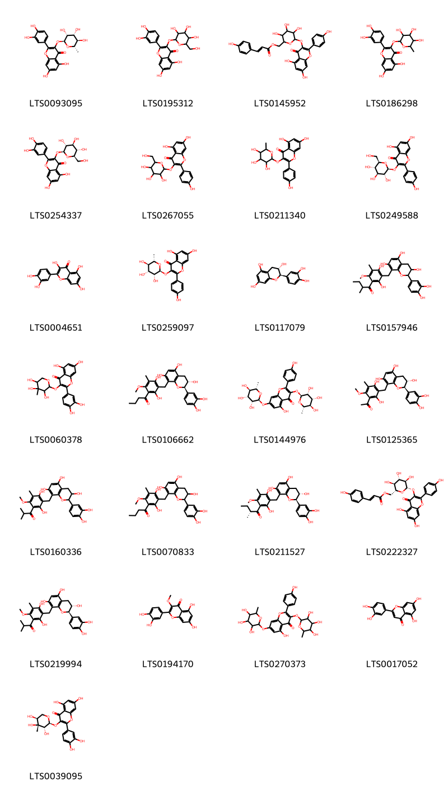{ width=100% }
    <figcaption>Hình ảnh cấu trúc hóa học của 25 hoạt chất thuộc nhóm Flavonoids gồm ['quercitrin (LTS0093095)', '2-(3,4-dihydroxyphenyl)-5,7-dihydroxy-3-{[3,4,5-trihydroxy-6-(hydroxymethyl)oxan-2-yl]oxy}chromen-4-one (LTS0195312)', '(6-{[5,7-dihydroxy-2-(4-hydroxyphenyl)-4-oxochromen-3-yl]oxy}-3,4,5-trihydroxyoxan-2-yl)methyl 3-(4-hydroxyphenyl)prop-2-enoate (LTS0145952)', 'quercitrin (LTS0186298)', 'isoquercetin (LTS0254337)', 'trifolin (LTS0267055)', '5,7-dihydroxy-2-(4-hydroxyphenyl)-3-[(3,4,5-trihydroxy-6-methyloxan-2-yl)oxy]chromen-4-one (LTS0211340)', 'astragalin (LTS0249588)', 'quercetin (LTS0004651)', 'afzelin (LTS0259097)', '(+)-catechol (LTS0117079)', '1-(3-{[2-(3,4-dihydroxyphenyl)-3,5,7-trihydroxy-3,4-dihydro-2h-1-benzopyran-8-yl]methyl}-2,4-dihydroxy-6-methoxy-5-methylphenyl)-2-methylbutan-1-one (LTS0157946)', '2-(3,4-dihydroxyphenyl)-5,7-dihydroxy-3-[(3,4,5-trihydroxy-4-methyloxan-2-yl)oxy]chromen-4-one (LTS0060378)', 'pilosanol c (LTS0106662)', 'lespedin (LTS0144976)', '1-(3-{[(2r,3s)-2-(3,4-dihydroxyphenyl)-3,5,7-trihydroxy-3,4-dihydro-2h-1-benzopyran-8-yl]methyl}-2,4-dihydroxy-6-methoxy-5-methylphenyl)ethanone (LTS0125365)', '1-(3-{[2-(3,4-dihydroxyphenyl)-3,5,7-trihydroxy-3,4-dihydro-2h-1-benzopyran-8-yl]methyl}-2,4-dihydroxy-6-methoxy-5-methylphenyl)-2-methylpropan-1-one (LTS0160336)', '1-(3-{[2-(3,4-dihydroxyphenyl)-3,5,7-trihydroxy-3,4-dihydro-2h-1-benzopyran-8-yl]methyl}-2,4-dihydroxy-6-methoxy-5-methylphenyl)butan-1-one (LTS0070833)', '(2r)-1-(3-{[(2r,3s)-2-(3,4-dihydroxyphenyl)-3,5,7-trihydroxy-3,4-dihydro-2h-1-benzopyran-8-yl]methyl}-2,4-dihydroxy-6-methoxy-5-methylphenyl)-2-methylbutan-1-one (LTS0211527)', 'tiliroside (LTS0222327)', 'pilosanol b (LTS0219994)', 'quercetin 3-methyl ether (LTS0194170)', 'kaempferitrin (LTS0270373)', 'luteolin (LTS0017052)', '2-(3,4-dihydroxyphenyl)-5,7-dihydroxy-3-{[(2s,3r,4r,5s)-3,4,5-trihydroxy-4-methyloxan-2-yl]oxy}chromen-4-one (LTS0039095)'].</figcaption>
</figure>
#### Nhóm Organooxygen compounds
<figure markdown="span">
    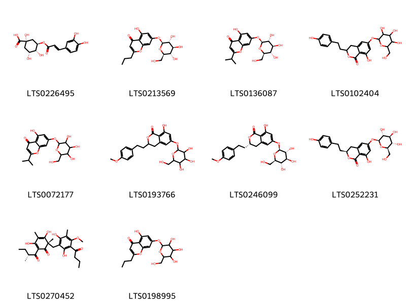{ width=100% }
    <figcaption>Hình ảnh cấu trúc hóa học của 10 hoạt chất thuộc nhóm Organooxygen compounds gồm ['chlorogenic acid (LTS0226495)', '5-hydroxy-2-propyl-7-{[(2s,3r,4s,5s,6r)-3,4,5-trihydroxy-6-(hydroxymethyl)oxan-2-yl]oxy}chromen-4-one (LTS0213569)', '5-hydroxy-2-isopropyl-7-{[(2s,3r,4s,5s,6r)-3,4,5-trihydroxy-6-(hydroxymethyl)oxan-2-yl]oxy}chromen-4-one (LTS0136087)', '8-hydroxy-3-[2-(4-hydroxyphenyl)ethyl]-6-{[3,4,5-trihydroxy-6-(hydroxymethyl)oxan-2-yl]oxy}-3,4-dihydro-2-benzopyran-1-one (LTS0102404)', '5-hydroxy-2-isopropyl-7-{[3,4,5-trihydroxy-6-(hydroxymethyl)oxan-2-yl]oxy}chromen-4-one (LTS0072177)', '8-hydroxy-3-[2-(4-methoxyphenyl)ethyl]-6-{[3,4,5-trihydroxy-6-(hydroxymethyl)oxan-2-yl]oxy}-3,4-dihydro-2-benzopyran-1-one (LTS0193766)', '(3s)-8-hydroxy-3-[2-(4-methoxyphenyl)ethyl]-6-{[(2s,3r,4s,5s,6r)-3,4,5-trihydroxy-6-(hydroxymethyl)oxan-2-yl]oxy}-3,4-dihydro-2-benzopyran-1-one (LTS0246099)', '(3s)-8-hydroxy-3-[2-(4-hydroxyphenyl)ethyl]-6-{[(2s,3r,4s,5s,6r)-3,4,5-trihydroxy-6-(hydroxymethyl)oxan-2-yl]oxy}-3,4-dihydro-2-benzopyran-1-one (LTS0252231)', 'agrimophol (LTS0270452)', '5-hydroxy-2-propyl-7-{[3,4,5-trihydroxy-6-(hydroxymethyl)oxan-2-yl]oxy}chromen-4-one (LTS0198995)'].</figcaption>
</figure>
#### Nhóm Phenol ethers
<figure markdown="span">
    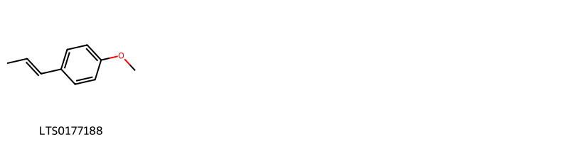{ width=100% }
    <figcaption>Hình ảnh cấu trúc hóa học của 1 hoạt chất thuộc nhóm Phenol ethers gồm ['p-propenylanisole (LTS0177188)'].</figcaption>
</figure>
#### Nhóm Prenol lipids
<figure markdown="span">
    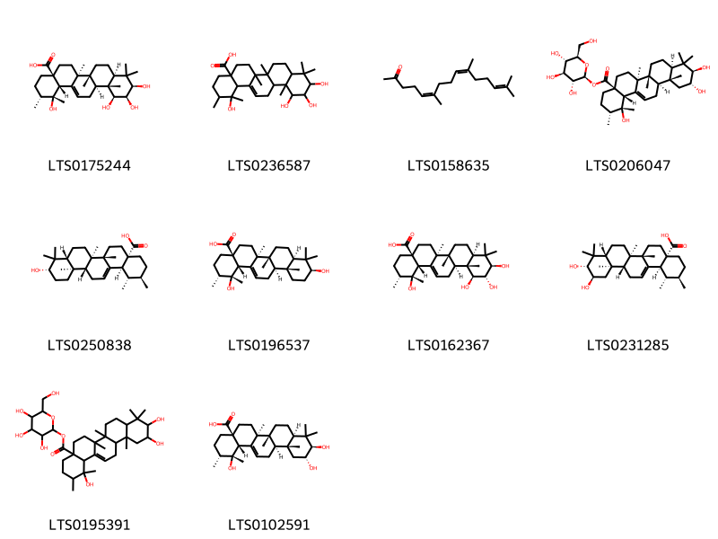{ width=100% }
    <figcaption>Hình ảnh cấu trúc hóa học của 10 hoạt chất thuộc nhóm Prenol lipids gồm ['(1r,2r,4as,6as,6br,8as,10r,11r,12s,12ar,12bs,14bs)-1,10,11,12-tetrahydroxy-1,2,6a,6b,9,9,12a-heptamethyl-2,3,4,5,6,7,8,8a,10,11,12,12b,13,14b-tetradecahydropicene-4a-carboxylic acid (LTS0175244)', '1,10,11,12-tetrahydroxy-1,2,6a,6b,9,9,12a-heptamethyl-2,3,4,5,6,7,8,8a,10,11,12,12b,13,14b-tetradecahydropicene-4a-carboxylic acid (LTS0236587)', '6,10,14-trimethylpentadeca-5,9,13-trien-2-one (LTS0158635)', '(2s,3r,4s,5s,6r)-3,4,5-trihydroxy-6-(hydroxymethyl)oxan-2-yl (1r,2r,4as,6as,6br,8ar,10r,11r,12ar,12br,14bs)-1,10,11-trihydroxy-1,2,6a,6b,9,9,12a-heptamethyl-2,3,4,5,6,7,8,8a,10,11,12,12b,13,14b-tetradecahydropicene-4a-carboxylate (LTS0206047)', 'ursolic acid (LTS0250838)', 'pomolic acid (LTS0196537)', '(1r,2r,4as,6as,6br,8as,10r,11s,12s,12ar,12bs,14bs)-1,10,11,12-tetrahydroxy-1,2,6a,6b,9,9,12a-heptamethyl-2,3,4,5,6,7,8,8a,10,11,12,12b,13,14b-tetradecahydropicene-4a-carboxylic acid (LTS0162367)', 'corosolic acid (LTS0231285)', '3,4,5-trihydroxy-6-(hydroxymethyl)oxan-2-yl 1,10,11-trihydroxy-1,2,6a,6b,9,9,12a-heptamethyl-2,3,4,5,6,7,8,8a,10,11,12,12b,13,14b-tetradecahydropicene-4a-carboxylate (LTS0195391)', 'tormentic acid (LTS0102591)'].</figcaption>
</figure>
#### Nhóm Tannins
<figure markdown="span">
    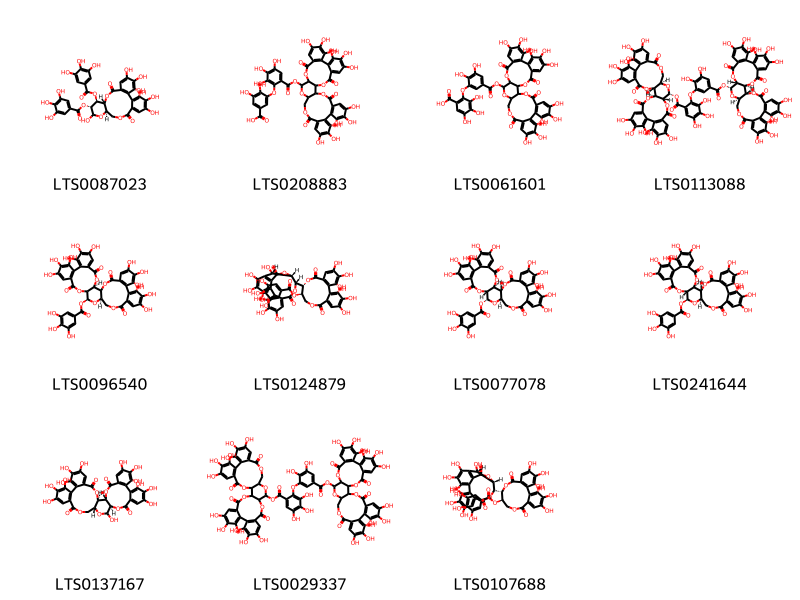{ width=100% }
    <figcaption>Hình ảnh cấu trúc hóa học của 11 hoạt chất thuộc nhóm Tannins gồm ['(10r,11s,12r,15r)-3,4,5,13,21,22,23-heptahydroxy-8,18-dioxo-11-(3,4,5-trihydroxybenzoyloxy)-9,14,17-trioxatetracyclo[17.4.0.0²,⁷.0¹⁰,¹⁵]tricosa-1(23),2(7),3,5,19,21-hexaen-12-yl 3,4,5-trihydroxybenzoate (LTS0087023)', '3-{6-[({7,8,9,12,13,14,28,29,30,33,34,35-dodecahydroxy-4,17,25,38-tetraoxo-3,18,21,24,39-pentaoxaheptacyclo[20.17.0.0²,¹⁹.0⁵,¹⁰.0¹¹,¹⁶.0²⁶,³¹.0³²,³⁷]nonatriaconta-5,7,9,11(16),12,14,26,28,30,32(37),33,35-dodecaen-20-yl}oxy)carbonyl]-2,3,4-trihydroxyphenoxy}-4,5-dihydroxybenzoic acid (LTS0208883)', '2-{5-[({7,8,9,12,13,14,28,29,30,33,34,35-dodecahydroxy-4,17,25,38-tetraoxo-3,18,21,24,39-pentaoxaheptacyclo[20.17.0.0²,¹⁹.0⁵,¹⁰.0¹¹,¹⁶.0²⁶,³¹.0³²,³⁷]nonatriaconta-5,7,9,11(16),12,14,26,28,30,32(37),33,35-dodecaen-20-yl}oxy)carbonyl]-2,3-dihydroxyphenoxy}-3,4,5-trihydroxybenzoic acid (LTS0061601)', '(1r,2s,19r,20r,22r)-7,8,9,12,13,14,28,29,30,33,34,35-dodecahydroxy-4,17,25,38-tetraoxo-3,18,21,24,39-pentaoxaheptacyclo[20.17.0.0²,¹⁹.0⁵,¹⁰.0¹¹,¹⁶.0²⁶,³¹.0³²,³⁷]nonatriaconta-5,7,9,11(16),12,14,26,28,30,32(37),33,35-dodecaen-20-yl 2-[5-({[(1r,2s,19r,20r,22r)-7,8,9,12,13,14,28,29,30,33,34,35-dodecahydroxy-4,17,25,38-tetraoxo-3,18,21,24,39-pentaoxaheptacyclo[20.17.0.0²,¹⁹.0⁵,¹⁰.0¹¹,¹⁶.0²⁶,³¹.0³²,³⁷]nonatriaconta-5,7,9,11(16),12,14,26,28,30,32(37),33,35-dodecaen-20-yl]oxy}carbonyl)-2,3-dihydroxyphenoxy]-3,4,5-trihydroxybenzoate (LTS0113088)', '(2s,20s,22r)-7,8,9,12,13,14,28,29,30,33,34,35-dodecahydroxy-4,17,25,38-tetraoxo-3,18,21,24,39-pentaoxaheptacyclo[20.17.0.0²,¹⁹.0⁵,¹⁰.0¹¹,¹⁶.0²⁶,³¹.0³²,³⁷]nonatriaconta-5,7,9,11(16),12,14,26,28,30,32(37),33,35-dodecaen-20-yl 3,4,5-trihydroxybenzoate (LTS0096540)', '(11r,12r)-12-[(14r,15s,19s)-2,3,4,7,8,9,19-heptahydroxy-12,17-dioxo-13,16-dioxatetracyclo[13.3.1.0⁵,¹⁸.0⁶,¹¹]nonadeca-1(18),2,4,6,8,10-hexaen-14-yl]-3,4,5,17,18,19-hexahydroxy-8,14-dioxo-9,13-dioxatricyclo[13.4.0.0²,⁷]nonadeca-1(15),2,4,6,16,18-hexaen-11-yl 3,4,5-trihydroxybenzoate (LTS0124879)', '(1r,2s,19r,20r,22r)-7,8,9,12,13,14,28,29,30,33,34,35-dodecahydroxy-4,17,25,38-tetraoxo-3,18,21,24,39-pentaoxaheptacyclo[20.17.0.0²,¹⁹.0⁵,¹⁰.0¹¹,¹⁶.0²⁶,³¹.0³²,³⁷]nonatriaconta-5,7,9,11(16),12,14,26,28,30,32(37),33,35-dodecaen-20-yl 3,4,5-trihydroxybenzoate (LTS0077078)', 'casuarictin (LTS0241644)', '(1r,2s,19r,22r)-7,8,9,12,13,14,20,28,29,30,33,34,35-tridecahydroxy-3,18,21,24,39-pentaoxaheptacyclo[20.17.0.0²,¹⁹.0⁵,¹⁰.0¹¹,¹⁶.0²⁶,³¹.0³²,³⁷]nonatriaconta-5(10),6,8,11,13,15,26(31),27,29,32,34,36-dodecaene-4,17,25,38-tetrone (LTS0137167)', '7,8,9,12,13,14,28,29,30,33,34,35-dodecahydroxy-4,17,25,38-tetraoxo-3,18,21,24,39-pentaoxaheptacyclo[20.17.0.0²,¹⁹.0⁵,¹⁰.0¹¹,¹⁶.0²⁶,³¹.0³²,³⁷]nonatriaconta-5,7,9,11(16),12,14,26,28,30,32(37),33,35-dodecaen-20-yl 2-{5-[({7,8,9,12,13,14,28,29,30,33,34,35-dodecahydroxy-4,17,25,38-tetraoxo-3,18,21,24,39-pentaoxaheptacyclo[20.17.0.0²,¹⁹.0⁵,¹⁰.0¹¹,¹⁶.0²⁶,³¹.0³²,³⁷]nonatriaconta-5,7,9,11(16),12,14,26,28,30,32(37),33,35-dodecaen-20-yl}oxy)carbonyl]-2,3-dihydroxyphenoxy}-3,4,5-trihydroxybenzoate (LTS0029337)', '(11r,12r)-12-[(15s,19s)-2,3,4,7,8,9,19-heptahydroxy-12,17-dioxo-13,16-dioxatetracyclo[13.3.1.0⁵,¹⁸.0⁶,¹¹]nonadeca-1(18),2,4,6,8,10-hexaen-14-yl]-3,4,5,17,18,19-hexahydroxy-8,14-dioxo-9,13-dioxatricyclo[13.4.0.0²,⁷]nonadeca-1(15),2,4,6,16,18-hexaen-11-yl 3,4,5-trihydroxybenzoate (LTS0107688)'].</figcaption>
</figure>

---

### Dược dân tộc học

Danh sách các quốc gia có sử dụng *Agrimonia pilosa* trong điều trị các bệnh. 

| Country   | Disease       | Bệnh                                                                                                                                                                                                |
|:----------|:--------------|:----------------------------------------------------------------------------------------------------------------------------------------------------------------------------------------------------|
| China     | Hemostat      | MYMEMORY WARNING: YOU USED ALL AVAILABLE FREE TRANSLATIONS FOR TODAY. NEXT AVAILABLE IN  12 HOURS 16 MINUTES 45 SECONDS VISIT HTTPS://MYMEMORY.TRANSLATED.NET/DOC/USAGELIMITS.PHP TO TRANSLATE MORE |
| Elsewhere | Antidiarrheic | MYMEMORY WARNING: YOU USED ALL AVAILABLE FREE TRANSLATIONS FOR TODAY. NEXT AVAILABLE IN  12 HOURS 16 MINUTES 42 SECONDS VISIT HTTPS://MYMEMORY.TRANSLATED.NET/DOC/USAGELIMITS.PHP TO TRANSLATE MORE |

---

# Chi Physocarpus

??? note "Danh sách các dược liệu thuộc chi"
    
	 - *Physocarpus capitatus*

---
## Physocarpus capitatus
### Thông tin về thực vật

!!! info "Phân loại thực vật của *Physocarpus capitatus* từ GIBF:"
    - **Kingdom:** Plantae
    - **Phylum:** Tracheophyta
    - **Order:** Rosales
    - **Family:** Rosaceae
    - **Genus:** Physocarpus
    - **Species:** *Physocarpus capitatus*

 

| Label (VI)   | Label (EN)   | Scientific Name       | Descriptions (VI)   | Descriptions (EN)   | Also Known As (VI)   | Also Known As (EN)   |
|:-------------|:-------------|:----------------------|:--------------------|:--------------------|:---------------------|:---------------------|
| N/A          | N/A          | Physocarpus capitatus | loài thực vật       | species of plant    | ['']                 | ['']                 |

#### Phân bố trên thế giới

**Từ CSDL GIBF** Canada, United States of America

#### Phân bố tại Việt Nam

**Từ CSDL GIBF**: Không có ghi nhận ở Việt Nam

---
### Thành phần hóa học
        
- Theo cơ sở dữ liệu lotus: Từ loài *Physocarpus capitatus* đã phân lập và xác định được 12 hoạt chất thuộc về các nhóm Steroids and steroid derivatives, Organooxygen compounds, Prenol lipids, Flavonoids. 

|    | chemicalTaxonomyClassyfireClass   |   smiles_count |
|---:|:----------------------------------|---------------:|
|  0 | Flavonoids                        |              5 |
|  1 | Organooxygen compounds            |              1 |
|  2 | Prenol lipids                     |              3 |
|  3 | Steroids and steroid derivatives  |              3 |

#### Nhóm Flavonoids
<figure markdown="span">
    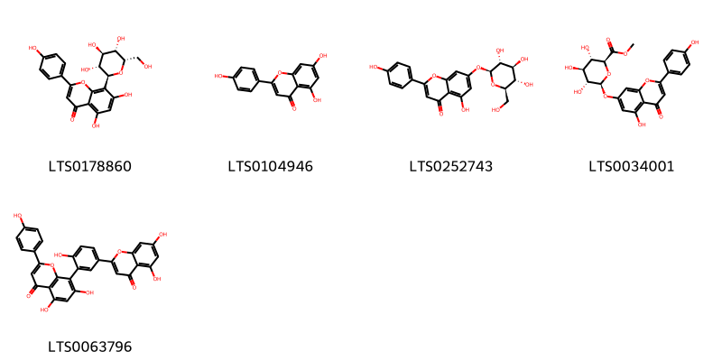{ width=100% }
    <figcaption>Hình ảnh cấu trúc hóa học của 5 hoạt chất thuộc nhóm Flavonoids gồm ['5,7-dihydroxy-2-(4-hydroxyphenyl)-8-[(2s,3r,4r,5s,6s)-3,4,5-trihydroxy-6-(hydroxymethyl)oxan-2-yl]chromen-4-one (LTS0178860)', 'chamomile (LTS0104946)', 'apigenin 7-o-β-glucoside (LTS0252743)', 'methyl (2s,3s,4s,5r,6s)-3,4,5-trihydroxy-6-{[5-hydroxy-2-(4-hydroxyphenyl)-4-oxochromen-7-yl]oxy}oxane-2-carboxylate (LTS0034001)', 'amentoflavone (LTS0063796)'].</figcaption>
</figure>
#### Nhóm Organooxygen compounds
<figure markdown="span">
    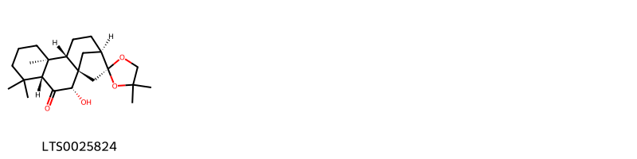{ width=100% }
    <figcaption>Hình ảnh cấu trúc hóa học của 1 hoạt chất thuộc nhóm Organooxygen compounds gồm ["(1'r,2s,2's,4'r,9's,10's,13'r)-2'-hydroxy-4,4,5',5',9'-pentamethylspiro[1,3-dioxolane-2,14'-tetracyclo[11.2.1.0¹,¹⁰.0⁴,⁹]hexadecan]-3'-one (LTS0025824)"].</figcaption>
</figure>
#### Nhóm Prenol lipids
<figure markdown="span">
    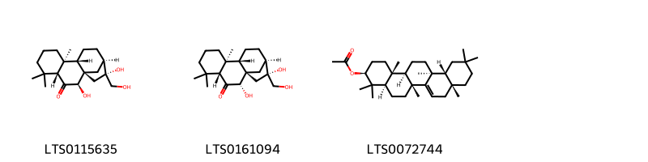{ width=100% }
    <figcaption>Hình ảnh cấu trúc hóa học của 3 hoạt chất thuộc nhóm Prenol lipids gồm ['(1r,2r,4r,9s,10s,13r,14r)-2,14-dihydroxy-14-(hydroxymethyl)-5,5,9-trimethyltetracyclo[11.2.1.0¹,¹⁰.0⁴,⁹]hexadecan-3-one (LTS0115635)', '(1r,2s,4r,9s,10s,13r,14r)-2,14-dihydroxy-14-(hydroxymethyl)-5,5,9-trimethyltetracyclo[11.2.1.0¹,¹⁰.0⁴,⁹]hexadecan-3-one (LTS0161094)', '(3s,4ar,6ar,8ar,12ar,12bs,14ar,14br)-4,4,6a,8a,11,11,12b,14b-octamethyl-1,2,3,4a,5,6,8,9,10,12,12a,13,14,14a-tetradecahydropicen-3-yl acetate (LTS0072744)'].</figcaption>
</figure>
#### Nhóm Steroids and steroid derivatives
<figure markdown="span">
    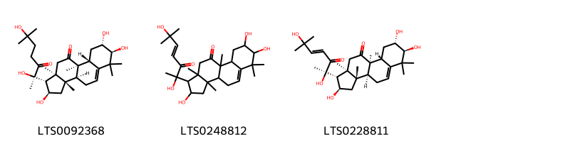{ width=100% }
    <figcaption>Hình ảnh cấu trúc hóa học của 3 hoạt chất thuộc nhóm Steroids and steroid derivatives gồm ['(1r,2r,3as,3bs,7s,8s,9ar,9br,11ar)-1-[(2r)-2,6-dihydroxy-6-methyl-3-oxoheptan-2-yl]-2,7,8-trihydroxy-3a,6,6,9b,11a-pentamethyl-1h,2h,3h,3bh,4h,7h,8h,9h,9ah,11h-cyclopenta[a]phenanthren-10-one (LTS0092368)', '1-(2,6-dihydroxy-6-methyl-3-oxohept-4-en-2-yl)-2,7,8-trihydroxy-3a,6,6,9b,11a-pentamethyl-1h,2h,3h,3bh,4h,7h,8h,9h,9ah,11h-cyclopenta[a]phenanthren-10-one (LTS0248812)', 'cucurbitacin f (LTS0228811)'].</figcaption>
</figure>

---

### Dược dân tộc học

Danh sách các quốc gia có sử dụng *Physocarpus capitatus* trong điều trị các bệnh. 

| Country          | Disease           | Bệnh                                                                                                                                                                                                |
|:-----------------|:------------------|:----------------------------------------------------------------------------------------------------------------------------------------------------------------------------------------------------|
| Canada(Kwakiutl) | Emetic, Purgative | MYMEMORY WARNING: YOU USED ALL AVAILABLE FREE TRANSLATIONS FOR TODAY. NEXT AVAILABLE IN  12 HOURS 16 MINUTES 06 SECONDS VISIT HTTPS://MYMEMORY.TRANSLATED.NET/DOC/USAGELIMITS.PHP TO TRANSLATE MORE |
| Canada(Salish)   | Laxative          | MYMEMORY WARNING: YOU USED ALL AVAILABLE FREE TRANSLATIONS FOR TODAY. NEXT AVAILABLE IN  12 HOURS 16 MINUTES 03 SECONDS VISIT HTTPS://MYMEMORY.TRANSLATED.NET/DOC/USAGELIMITS.PHP TO TRANSLATE MORE |

---

# Chi Leucosidea

??? note "Danh sách các dược liệu thuộc chi"
    
	 - *Leucosidea sericea*

---
## Leucosidea sericea
### Thông tin về thực vật

!!! info "Phân loại thực vật của *Leucosidea sericea* từ GIBF:"
    - **Kingdom:** Plantae
    - **Phylum:** Tracheophyta
    - **Order:** Rosales
    - **Family:** Rosaceae
    - **Genus:** Leucosidea
    - **Species:** *Leucosidea sericea*

 

| Label (VI)   | Label (EN)   | Scientific Name    | Descriptions (VI)   | Descriptions (EN)   | Also Known As (VI)   | Also Known As (EN)   |
|:-------------|:-------------|:-------------------|:--------------------|:--------------------|:---------------------|:---------------------|
| N/A          | N/A          | Leucosidea sericea | loài thực vật       | species of plant    | ['']                 | ['Oldwood']          |

#### Phân bố trên thế giới

**Từ CSDL GIBF** Eswatini, Lesotho, South Africa

#### Phân bố tại Việt Nam

**Từ CSDL GIBF**: Không có ghi nhận ở Việt Nam

---
### Thành phần hóa học
        
- Theo cơ sở dữ liệu lotus: Từ loài *Leucosidea sericea* đã phân lập và xác định được 2 hoạt chất thuộc về các nhóm Organooxygen compounds. 

|    | chemicalTaxonomyClassyfireClass   |   smiles_count |
|---:|:----------------------------------|---------------:|
|  0 | Organooxygen compounds            |              2 |

#### Nhóm Organooxygen compounds
<figure markdown="span">
    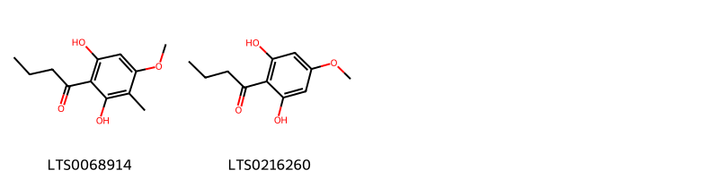{ width=100% }
    <figcaption>Hình ảnh cấu trúc hóa học của 2 hoạt chất thuộc nhóm Organooxygen compounds gồm ['aspidinol (LTS0068914)', '1-(2,6-dihydroxy-4-methoxyphenyl)butan-1-one (LTS0216260)'].</figcaption>
</figure>

---

### Dược dân tộc học

Danh sách các quốc gia có sử dụng *Leucosidea sericea* trong điều trị các bệnh. 

| Country   | Disease   | Bệnh                                                                                                                                                                                                |
|:----------|:----------|:----------------------------------------------------------------------------------------------------------------------------------------------------------------------------------------------------|
| Lesotho   | Vermifuge | MYMEMORY WARNING: YOU USED ALL AVAILABLE FREE TRANSLATIONS FOR TODAY. NEXT AVAILABLE IN  12 HOURS 15 MINUTES 31 SECONDS VISIT HTTPS://MYMEMORY.TRANSLATED.NET/DOC/USAGELIMITS.PHP TO TRANSLATE MORE |

---

# Chi Sanguisorba

??? note "Danh sách các dược liệu thuộc chi"
    
	 - *Sanguisorba minor*
	 - *Sanguisorba officinalis*

---
## Sanguisorba minor
### Thông tin về thực vật

!!! info "Phân loại thực vật của *Poterium sanguisorba* từ GIBF:"
    - **Kingdom:** Plantae
    - **Phylum:** Tracheophyta
    - **Order:** Rosales
    - **Family:** Rosaceae
    - **Genus:** Poterium
    - **Species:** *Poterium sanguisorba*

 

| Label (VI)   | Label (EN)   | Scientific Name   | Descriptions (VI)   | Descriptions (EN)   | Also Known As (VI)   | Also Known As (EN)                                |
|:-------------|:-------------|:------------------|:--------------------|:--------------------|:---------------------|:--------------------------------------------------|
| N/A          | N/A          | Sanguisorba minor | loài thực vật       | species of plant    | ['']                 | ['Salad Burnet', 'small burnet', 'garden burnet'] |

#### Phân bố trên thế giới

**Từ CSDL GIBF** nan, Spain, Germany, Chile, Austria, Australia, Albania, Belgium, Netherlands, Slovenia, Hungary, Switzerland, United Kingdom of Great Britain and Northern Ireland, France, Czechia, Russian Federation, United States of America, Italy, Israel, Ukraine

#### Phân bố tại Việt Nam

**Từ CSDL GIBF**: Không có ghi nhận ở Việt Nam

---
### Thành phần hóa học
        
- Theo cơ sở dữ liệu lotus: Từ loài *Poterium sanguisorba* đã phân lập và xác định được 17 hoạt chất thuộc về các nhóm Organooxygen compounds, Flavonoids, Coumarins and derivatives, Tannins, Phenol ethers, Benzene and substituted derivatives. 

|    | chemicalTaxonomyClassyfireClass     |   smiles_count |
|---:|:------------------------------------|---------------:|
|  0 | Benzene and substituted derivatives |              3 |
|  1 | Coumarins and derivatives           |              1 |
|  2 | Flavonoids                          |              4 |
|  3 | Organooxygen compounds              |              3 |
|  4 | Phenol ethers                       |              1 |
|  5 | Tannins                             |              3 |

#### Nhóm Benzene and substituted derivatives
<figure markdown="span">
    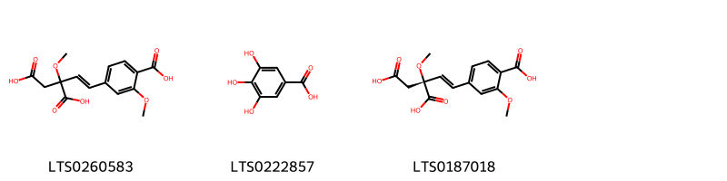{ width=100% }
    <figcaption>Hình ảnh cấu trúc hóa học của 3 hoạt chất thuộc nhóm Benzene and substituted derivatives gồm ['2-[2-(4-carboxy-3-methoxyphenyl)ethenyl]-2-methoxybutanedioic acid (LTS0260583)', 'galop (LTS0222857)', '(2r)-2-[(1e)-2-(4-carboxy-3-methoxyphenyl)ethenyl]-2-methoxybutanedioic acid (LTS0187018)'].</figcaption>
</figure>
#### Nhóm Coumarins and derivatives
<figure markdown="span">
    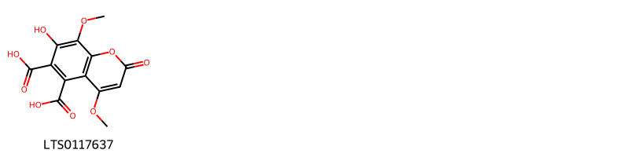{ width=100% }
    <figcaption>Hình ảnh cấu trúc hóa học của 1 hoạt chất thuộc nhóm Coumarins and derivatives gồm ['7-hydroxy-4,8-dimethoxy-2-oxochromene-5,6-dicarboxylic acid (LTS0117637)'].</figcaption>
</figure>
#### Nhóm Flavonoids
<figure markdown="span">
    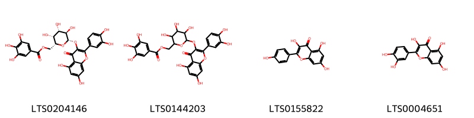{ width=100% }
    <figcaption>Hình ảnh cấu trúc hóa học của 4 hoạt chất thuộc nhóm Flavonoids gồm ['[(2r,3r,4s,5r,6s)-6-{[2-(3,4-dihydroxyphenyl)-5,7-dihydroxy-4-oxochromen-3-yl]oxy}-3,4,5-trihydroxyoxan-2-yl]methyl 3,4,5-trihydroxybenzoate (LTS0204146)', '(6-{[2-(3,4-dihydroxyphenyl)-5,7-dihydroxy-4-oxochromen-3-yl]oxy}-3,4,5-trihydroxyoxan-2-yl)methyl 3,4,5-trihydroxybenzoate (LTS0144203)', 'kaempherol (LTS0155822)', 'quercetin (LTS0004651)'].</figcaption>
</figure>
#### Nhóm Organooxygen compounds
<figure markdown="span">
    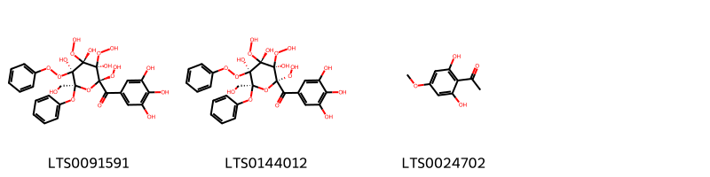{ width=100% }
    <figcaption>Hình ảnh cấu trúc hóa học của 3 hoạt chất thuộc nhóm Organooxygen compounds gồm ['(2r,3r,4r,5r,6r)-2,3,4-trihydroperoxy-6-(hydroxymethyl)-6-phenoxy-5-(phenylperoxy)-2-(3,4,5-trihydroxybenzoyl)oxane-3,4,5-triol (LTS0091591)', '(2s,3r,4r,5r,6r)-2,3,4-trihydroperoxy-6-(hydroxymethyl)-6-phenoxy-5-(phenylperoxy)-2-(3,4,5-trihydroxybenzoyl)oxane-3,4,5-triol (LTS0144012)', 'phloretin (LTS0024702)'].</figcaption>
</figure>
#### Nhóm Phenol ethers
<figure markdown="span">
    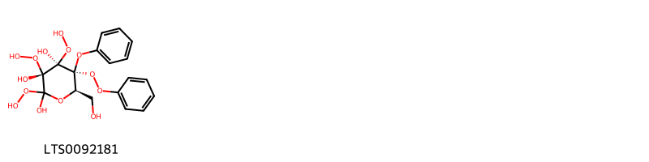{ width=100% }
    <figcaption>Hình ảnh cấu trúc hóa học của 1 hoạt chất thuộc nhóm Phenol ethers gồm ['(3r,4r,5r,6r)-2,3,4-trihydroperoxy-6-(hydroxymethyl)-5-phenoxy-5-(phenylperoxy)oxane-2,3,4-triol (LTS0092181)'].</figcaption>
</figure>
#### Nhóm Tannins
<figure markdown="span">
    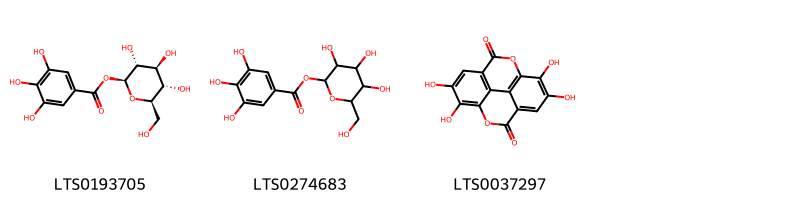{ width=100% }
    <figcaption>Hình ảnh cấu trúc hóa học của 3 hoạt chất thuộc nhóm Tannins gồm ['β-glucogallin (LTS0193705)', '3,4,5-trihydroxy-6-(hydroxymethyl)oxan-2-yl 3,4,5-trihydroxybenzoate (LTS0274683)', 'ellagic acid (LTS0037297)'].</figcaption>
</figure>

---

### Dược dân tộc học

Danh sách các quốc gia có sử dụng *Poterium sanguisorba* trong điều trị các bệnh. 

| Country   | Disease                       | Bệnh                                                                                                                                                                                                |
|:----------|:------------------------------|:----------------------------------------------------------------------------------------------------------------------------------------------------------------------------------------------------|
| Turkey    | Apertif, Astringent, Hemostat | MYMEMORY WARNING: YOU USED ALL AVAILABLE FREE TRANSLATIONS FOR TODAY. NEXT AVAILABLE IN  12 HOURS 14 MINUTES 55 SECONDS VISIT HTTPS://MYMEMORY.TRANSLATED.NET/DOC/USAGELIMITS.PHP TO TRANSLATE MORE |

---

---
## Sanguisorba officinalis
### Thông tin về thực vật

!!! info "Phân loại thực vật của *Sanguisorba officinalis* từ GIBF:"
    - **Kingdom:** Plantae
    - **Phylum:** Tracheophyta
    - **Order:** Rosales
    - **Family:** Rosaceae
    - **Genus:** Sanguisorba
    - **Species:** *Sanguisorba officinalis*

 

| Label (VI)   | Label (EN)   | Scientific Name         | Descriptions (VI)   | Descriptions (EN)   | Also Known As (VI)   | Also Known As (EN)   |
|:-------------|:-------------|:------------------------|:--------------------|:--------------------|:---------------------|:---------------------|
| N/A          | N/A          | Sanguisorba officinalis | loài thực vật       | species of plant    | ['']                 | ['Great Burnet']     |

#### Phân bố trên thế giới

**Từ CSDL GIBF** Switzerland, United Kingdom of Great Britain and Northern Ireland, Japan, France, Czechia, Poland, Hungary, Germany, Russian Federation, United States of America, Austria, Norway, Croatia, Netherlands, Ukraine

#### Phân bố tại Việt Nam

**Từ CSDL GIBF**: Không có ghi nhận ở Việt Nam

---
### Thành phần hóa học
        
- Theo cơ sở dữ liệu lotus: Từ loài *Sanguisorba officinalis* đã phân lập và xác định được 141 hoạt chất thuộc về các nhóm Organooxygen compounds, Flavonoids, Tannins, Prenol lipids, Pyrans, Steroids and steroid derivatives, Benzene and substituted derivatives. 

|    | chemicalTaxonomyClassyfireClass     |   smiles_count |
|---:|:------------------------------------|---------------:|
|  0 |                                     |              1 |
|  1 | Benzene and substituted derivatives |             11 |
|  2 | Flavonoids                          |             11 |
|  3 | Organooxygen compounds              |              1 |
|  4 | Prenol lipids                       |             75 |
|  5 | Pyrans                              |              1 |
|  6 | Steroids and steroid derivatives    |              4 |
|  7 | Tannins                             |             37 |

#### Nhóm 
<figure markdown="span">
    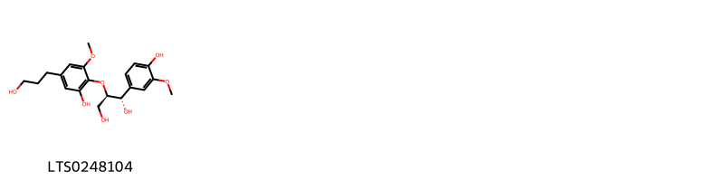{ width=100% }
    <figcaption>Hình ảnh cấu trúc hóa học của 1 hoạt chất thuộc nhóm  gồm ['(1s,2r)-1-(4-hydroxy-3-methoxyphenyl)-2-[2-hydroxy-4-(3-hydroxypropyl)-6-methoxyphenoxy]propane-1,3-diol (LTS0248104)'].</figcaption>
</figure>
#### Nhóm Benzene and substituted derivatives
<figure markdown="span">
    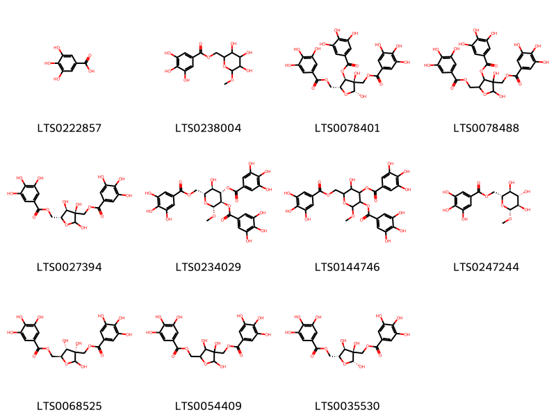{ width=100% }
    <figcaption>Hình ảnh cấu trúc hóa học của 11 hoạt chất thuộc nhóm Benzene and substituted derivatives gồm ['galop (LTS0222857)', '(3,4,5-trihydroxy-6-methoxyoxan-2-yl)methyl 3,4,5-trihydroxybenzoate (LTS0238004)', '[(2r,3r,4r,5r)-2,3-dihydroxy-4-(3,4,5-trihydroxybenzoyloxy)-5-[(3,4,5-trihydroxybenzoyloxy)methyl]oxolan-3-yl]methyl 3,4,5-trihydroxybenzoate (LTS0078401)', '[2,3-dihydroxy-4-(3,4,5-trihydroxybenzoyloxy)-5-[(3,4,5-trihydroxybenzoyloxy)methyl]oxolan-3-yl]methyl 3,4,5-trihydroxybenzoate (LTS0078488)', '[(3r,4r,5r)-2,3,4-trihydroxy-5-[(3,4,5-trihydroxybenzoyloxy)methyl]oxolan-3-yl]methyl 3,4,5-trihydroxybenzoate (LTS0027394)', '[(2r,3r,4s,5r,6r)-3-hydroxy-6-methoxy-4,5-bis(3,4,5-trihydroxybenzoyloxy)oxan-2-yl]methyl 3,4,5-trihydroxybenzoate (LTS0234029)', '[3-hydroxy-6-methoxy-4,5-bis(3,4,5-trihydroxybenzoyloxy)oxan-2-yl]methyl 3,4,5-trihydroxybenzoate (LTS0144746)', '[(2r,3s,4s,5r,6r)-3,4,5-trihydroxy-6-methoxyoxan-2-yl]methyl 3,4,5-trihydroxybenzoate (LTS0247244)', '[(3s,4s,5s)-2,3,4-trihydroxy-5-[(3,4,5-trihydroxybenzoyloxy)methyl]oxolan-3-yl]methyl 3,4,5-trihydroxybenzoate (LTS0068525)', '{2,3,4-trihydroxy-5-[(3,4,5-trihydroxybenzoyloxy)methyl]oxolan-3-yl}methyl 3,4,5-trihydroxybenzoate (LTS0054409)', '[(2r,3r,4r,5r)-2,3,4-trihydroxy-5-[(3,4,5-trihydroxybenzoyloxy)methyl]oxolan-3-yl]methyl 3,4,5-trihydroxybenzoate (LTS0035530)'].</figcaption>
</figure>
#### Nhóm Flavonoids
<figure markdown="span">
    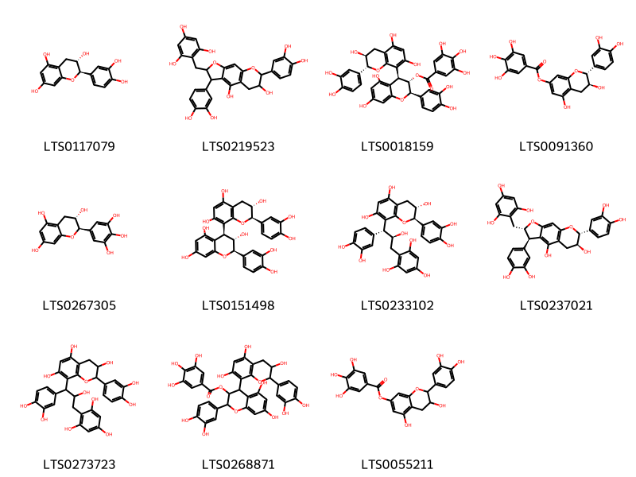{ width=100% }
    <figcaption>Hình ảnh cấu trúc hóa học của 11 hoạt chất thuộc nhóm Flavonoids gồm ['(+)-catechol (LTS0117079)', '2-{[6,12-bis(3,4-dihydroxyphenyl)-8,11-dihydroxy-4,13-dioxatricyclo[7.4.0.0³,⁷]trideca-1(9),2,7-trien-5-yl]methyl}benzene-1,3,5-triol (LTS0219523)', 'procyanidin b3 3-o-gallate (LTS0018159)', 'catechin 7-o-gallate (LTS0091360)', 'gallocatechol (LTS0267305)', '(2r,3s,4s)-2-(3,4-dihydroxyphenyl)-4-[(2r,3s)-2-(3,4-dihydroxyphenyl)-3,5,7-trihydroxy-3,4-dihydro-2h-1-benzopyran-8-yl]-3,4-dihydro-2h-1-benzopyran-3,5,7-triol (LTS0151498)', 'gambiriin a1 (LTS0233102)', '2-{[(5s,6r,11s,12r)-6,12-bis(3,4-dihydroxyphenyl)-8,11-dihydroxy-4,13-dioxatricyclo[7.4.0.0³,⁷]trideca-1(9),2,7-trien-5-yl]methyl}benzene-1,3,5-triol (LTS0237021)', '2-(3,4-dihydroxyphenyl)-8-[1-(3,4-dihydroxyphenyl)-2-hydroxy-3-(2,4,6-trihydroxyphenyl)propyl]-3,4-dihydro-2h-1-benzopyran-3,5,7-triol (LTS0273723)', '2-(3,4-dihydroxyphenyl)-4-[2-(3,4-dihydroxyphenyl)-3,5,7-trihydroxy-3,4-dihydro-2h-1-benzopyran-8-yl]-5,7-dihydroxy-3,4-dihydro-2h-1-benzopyran-3-yl 3,4,5-trihydroxybenzoate (LTS0268871)', '2-(3,4-dihydroxyphenyl)-3,5-dihydroxy-3,4-dihydro-2h-1-benzopyran-7-yl 3,4,5-trihydroxybenzoate (LTS0055211)'].</figcaption>
</figure>
#### Nhóm Organooxygen compounds
<figure markdown="span">
    { width=100% }
    <figcaption>Hình ảnh cấu trúc hóa học của 1 hoạt chất thuộc nhóm Organooxygen compounds gồm ['chlorogenic acid (LTS0226495)'].</figcaption>
</figure>
#### Nhóm Prenol lipids
<figure markdown="span">
    { width=100% }
    <figcaption>Hình ảnh cấu trúc hóa học của 75 hoạt chất thuộc nhóm Prenol lipids gồm ['betulinic acid (LTS0210795)', '(2s,3r,4s,5s,6r)-3,4,5-trihydroxy-6-(hydroxymethyl)oxan-2-yl (1r,2r,4as,6as,6br,8ar,10s,12ar,12br,14bs)-1,10-dihydroxy-1,2,6a,6b,9,9,12a-heptamethyl-2,3,4,5,6,7,8,8a,10,11,12,12b,13,14b-tetradecahydropicene-4a-carboxylate (LTS0126971)', '10-{[3,4-dihydroxy-5-(hydroxymethyl)oxolan-2-yl]oxy}-1-hydroxy-1,2,6a,6b,9,9,12a-heptamethyl-2,3,4,5,6,7,8,8a,10,11,12,12b,13,14b-tetradecahydropicene-4a-carboxylic acid (LTS0125605)', '1,6a,6b,9,9,12a-hexamethyl-10-[(3,4,5-trihydroxyoxan-2-yl)oxy]-1,2,3,4,4a,5,6,7,8,8a,10,11,12,12b,13,14b-hexadecahydropicene-4-carboxylic acid (LTS0195059)', 'euscaphic acid (LTS0205657)', '10-{[3,4-dihydroxy-5-(hydroxymethyl)oxolan-2-yl]oxy}-1,2,6a,6b,9,9,12a-heptamethyl-3,4,5,6,7,8,8a,10,11,12,12b,13-dodecahydro-2h-picene-4a-carboxylic acid (LTS0129649)', '(1s,4r,4as,6as,6br,8as,10s,12ar,12br,14bs)-1,6a,6b,9,9,12a-hexamethyl-10-{[(2r,3r,4s,5s)-3,4,5-trihydroxyoxan-2-yl]oxy}-1,2,3,4,4a,5,6,7,8,8a,10,11,12,12b,13,14b-hexadecahydropicene-4-carboxylic acid (LTS0098360)', '1,10,11,12-tetrahydroxy-1,2,6a,6b,9,9,12a-heptamethyl-2,3,4,5,6,7,8,8a,10,11,12,12b,13,14b-tetradecahydropicene-4a-carboxylic acid (LTS0236587)', '1-hydroxy-2,2,6a,6b,9,9,12a-heptamethyl-10-[(3,4,5-trihydroxyoxan-2-yl)oxy]-1,3,4,5,6,7,8,8a,10,11,12,12b,13,14b-tetradecahydropicene-4a-carboxylic acid (LTS0161017)', '(1r,2r,4as,6as,6br,8ar,10r,12ar,12br,14bs)-1,10-dihydroxy-1,2,6a,6b,9,9,12a-heptamethyl-2,3,4,5,6,7,8,8a,10,11,12,12b,13,14b-tetradecahydropicene-4a-carboxylic acid (LTS0100658)', '1,10,11-trihydroxy-1,2,6a,6b,9,9,12a-heptamethyl-2,3,4,5,6,7,8,8a,10,11,12,12b,13,14b-tetradecahydropicene-4a-carboxylic acid (LTS0013744)', '(2r,4as,6as,6br,8ar,10s,12ar,12bs,14bs)-2,6a,6b,9,9,12a-hexamethyl-1-methylidene-10-{[(2s,3r,4s,5s)-3,4,5-trihydroxyoxan-2-yl]oxy}-2,3,4,5,6,7,8,8a,10,11,12,12b,13,14b-tetradecahydropicene-4a-carboxylic acid (LTS0157138)', '(2s,3r,4s,5s,6r)-3,4,5-trihydroxy-6-(hydroxymethyl)oxan-2-yl (1r,2r,4as,6ar,6br,8as,10r,12as,12br,14br)-1,6a-dihydroxy-1,2,6b,9,9,12a-hexamethyl-10-{[(2s,3r,4s,5s)-3,4,5-trihydroxyoxan-2-yl]oxy}-2,3,4,5,6,7,8,8a,10,11,12,12b,13,14b-tetradecahydropicene-4a-carboxylate (LTS0068063)', '(2s,3r,4s,5s,6r)-3,4,5-trihydroxy-6-(hydroxymethyl)oxan-2-yl (1r,2r,4as,6as,6br,8ar,10r,11r,12ar,12br,14bs)-1,10,11-trihydroxy-1,2,6a,6b,9,9,12a-heptamethyl-2,3,4,5,6,7,8,8a,10,11,12,12b,13,14b-tetradecahydropicene-4a-carboxylate (LTS0206047)', '(1r,2r,4as,6as,6br,8ar,10s,12ar,12br,14bs)-10-{[(2s,3s,4s,5r)-3,4-dihydroxy-5-(hydroxymethyl)oxolan-2-yl]oxy}-1-hydroxy-1,2,6a,6b,9,9,12a-heptamethyl-2,3,4,5,6,7,8,8a,10,11,12,12b,13,14b-tetradecahydropicene-4a-carboxylic acid (LTS0103269)', '3,4,5-trihydroxy-6-(hydroxymethyl)oxan-2-yl 1-hydroxy-2,2,6a,6b,9,9,12a-heptamethyl-10-[(3,4,5-trihydroxyoxan-2-yl)oxy]-1,3,4,5,6,7,8,8a,10,11,12,12b,13,14b-tetradecahydropicene-4a-carboxylate (LTS0095998)', '3,4,5-trihydroxy-6-[(3,4,5-trihydroxybenzoyloxy)methyl]oxan-2-yl 10-{[3,4-dihydroxy-5-(hydroxymethyl)oxolan-2-yl]oxy}-1-hydroxy-1,2,6a,6b,9,9,12a-heptamethyl-2,3,4,5,6,7,8,8a,10,11,12,12b,13,14b-tetradecahydropicene-4a-carboxylate (LTS0187329)', '(2s,3r,4s,5s,6r)-3,4,5-trihydroxy-6-(hydroxymethyl)oxan-2-yl (1r,2r,4as,6as,6br,8ar,10s,11r,12ar,12br,14bs)-1,10,11-trihydroxy-1,2,6a,6b,9,9,12a-heptamethyl-2,3,4,5,6,7,8,8a,10,11,12,12b,13,14b-tetradecahydropicene-4a-carboxylate (LTS0056517)', '(2s,3r,4s,5s,6r)-3,4,5-trihydroxy-6-(hydroxymethyl)oxan-2-yl (2r,4as,6as,6br,8ar,9r,10s,12ar,12br,14bs)-9-(hydroxymethyl)-2,6a,6b,9,12a-pentamethyl-1-methylidene-10-{[(2s,3r,4s,5s)-3,4,5-trihydroxyoxan-2-yl]oxy}-2,3,4,5,6,7,8,8a,10,11,12,12b,13,14b-tetradecahydropicene-4a-carboxylate (LTS0145092)', '3,4,5-trihydroxy-6-(hydroxymethyl)oxan-2-yl 10-{[3,4-dihydroxy-5-(hydroxymethyl)oxolan-2-yl]oxy}-9-(hydroxymethyl)-2,2,6a,6b,9,12a-hexamethyl-1,3,4,5,6,7,8,8a,10,11,12,12b,13,14b-tetradecahydropicene-4a-carboxylate (LTS0272472)', '(2s,3r,4s,5s,6r)-3,4,5-trihydroxy-6-(hydroxymethyl)oxan-2-yl (1s,4ar,6as,6br,8ar,10s,12ar,12br,14bs)-10-{[(2s,3s,4s,5r)-3,4-dihydroxy-5-(hydroxymethyl)oxolan-2-yl]oxy}-1-hydroxy-2,2,6a,6b,9,9,12a-heptamethyl-1,3,4,5,6,7,8,8a,10,11,12,12b,13,14b-tetradecahydropicene-4a-carboxylate (LTS0260253)', '(1r,2r,4as,6as,6br,8ar,12as,12br,14bs)-1-hydroxy-1,2,6a,6b,9,9,12a-heptamethyl-10,13-dioxo-2,3,4,5,6,7,8,8a,11,12,12b,14b-dodecahydropicene-4a-carboxylic acid (LTS0194289)', '1,10-dihydroxy-1,2,6a,6b,9,9,12a-heptamethyl-2,3,4,5,6,7,8,8a,10,11,12,12b,13,14b-tetradecahydropicene-4a-carboxylic acid (LTS0147544)', '(2s,3r,4s,5s,6r)-3,4,5-trihydroxy-6-(hydroxymethyl)oxan-2-yl (1s,4ar,6as,6br,8ar,10s,12ar,12br,14bs)-1-hydroxy-2,2,6a,6b,9,9,12a-heptamethyl-10-{[(2s,3r,4s,5s)-3,4,5-trihydroxyoxan-2-yl]oxy}-1,3,4,5,6,7,8,8a,10,11,12,12b,13,14b-tetradecahydropicene-4a-carboxylate (LTS0148457)', '(2s,3r,4s,5s,6r)-3,4,5-trihydroxy-6-[(3,4,5-trihydroxybenzoyloxy)methyl]oxan-2-yl (1r,2r,4as,6as,6br,8ar,10s,12ar,12br,14bs)-1-hydroxy-1,2,6a,6b,9,9,12a-heptamethyl-10-{[(2s,3r,4s,5s)-3,4,5-trihydroxyoxan-2-yl]oxy}-2,3,4,5,6,7,8,8a,10,11,12,12b,13,14b-tetradecahydropicene-4a-carboxylate (LTS0264820)', '3,4,5-trihydroxy-6-(hydroxymethyl)oxan-2-yl 1,10-dihydroxy-1,2,6a,6b,9,9,12a-heptamethyl-2,3,4,5,6,7,8,8a,10,11,12,12b,13,14b-tetradecahydropicene-4a-carboxylate (LTS0150203)', '(1r,2r,4as,6as,6br,8ar,12ar,12br,14bs)-1-hydroxy-1,2,6a,6b,9,9,12a-heptamethyl-10-oxo-3,4,5,6,7,8,8a,11,12,12b,13,14b-dodecahydro-2h-picene-4a-carboxylic acid (LTS0153152)', '(2s,3r,4s,5s,6r)-3,4,5-trihydroxy-6-(hydroxymethyl)oxan-2-yl (2r,4as,6as,6br,8ar,10s,12ar,12br,14bs)-2,6a,6b,9,9,12a-hexamethyl-1-methylidene-10-{[(2s,3r,4s,5s)-3,4,5-trihydroxyoxan-2-yl]oxy}-2,3,4,5,6,7,8,8a,10,11,12,12b,13,14b-tetradecahydropicene-4a-carboxylate (LTS0152807)', '(1s,4ar,6as,6br,8as,10s,12ar,12br,14bs)-1-hydroxy-2,2,6a,6b,9,9,12a-heptamethyl-10-{[(2s,3r,4s,5s)-3,4,5-trihydroxyoxan-2-yl]oxy}-1,3,4,5,6,7,8,8a,10,11,12,12b,13,14b-tetradecahydropicene-4a-carboxylic acid (LTS0198821)', '1-hydroxy-1,2,6a,6b,9,9,12a-heptamethyl-10,13-dioxo-2,3,4,5,6,7,8,8a,11,12,12b,14b-dodecahydropicene-4a-carboxylic acid (LTS0156542)', '(1r,2r,4as,6as,6br,8ar,10s,12ar,12br,14bs)-1-hydroxy-1,2,6a,6b,9,9,12a-heptamethyl-10-{[(2s,3r,4s,5s)-3,4,5-trihydroxyoxan-2-yl]oxy}-2,3,4,5,6,7,8,8a,10,11,12,12b,13,14b-tetradecahydropicene-4a-carboxylic acid (LTS0157847)', '(4as,6as,6br,8ar,10s,12ar,12br,14bs)-10-hydroxy-1,2,6a,6b,9,9,12a-heptamethyl-4,5,6,7,8,8a,10,11,12,12b,13,14b-dodecahydro-3h-picene-4a-carboxylic acid (LTS0158817)', '3,4,5-trihydroxy-6-(hydroxymethyl)oxan-2-yl 10-{[3,4-dihydroxy-5-(hydroxymethyl)oxolan-2-yl]oxy}-1-hydroxy-1,2,6a,6b,9,9,12a-heptamethyl-2,3,4,5,6,7,8,8a,10,11,12,12b,13,14b-tetradecahydropicene-4a-carboxylate (LTS0162623)', '(2s,3r,4s,5s,6r)-3,4,5-trihydroxy-6-(hydroxymethyl)oxan-2-yl (1r,2r,4as,6as,6br,8ar,10s,12ar,12br,14bs)-1-hydroxy-1,2,6a,6b,9,9,12a-heptamethyl-10-{[(2r,3r,4s,5s)-3,4,5-trihydroxyoxan-2-yl]oxy}-2,3,4,5,6,7,8,8a,10,11,12,12b,13,14b-tetradecahydropicene-4a-carboxylate (LTS0159180)', '(1r,2r,4as,6as,6br,8ar,10s,12ar,12br,14bs)-1-hydroxy-1,2,6a,6b,9,9,12a-heptamethyl-10-{[(2r,3r,4s,5s)-3,4,5-trihydroxyoxan-2-yl]oxy}-2,3,4,5,6,7,8,8a,10,11,12,12b,13,14b-tetradecahydropicene-4a-carboxylic acid (LTS0143279)', '1-hydroxy-1,2,6a,6b,9,9,12a-heptamethyl-10-oxo-3,4,5,6,7,8,8a,11,12,12b,13,14b-dodecahydro-2h-picene-4a-carboxylic acid (LTS0111779)', '(2s,3r,4s,5s,6r)-3,4,5-trihydroxy-6-[(3,4,5-trihydroxybenzoyloxy)methyl]oxan-2-yl (1r,2s,4as,6as,6bs,8as,10s,12as,12br,14br)-10-{[(2s,3s,4s,5r)-3,4-dihydroxy-5-(hydroxymethyl)oxolan-2-yl]oxy}-1-hydroxy-1,2,6a,6b,9,9,12a-heptamethyl-2,3,4,5,6,7,8,8a,10,11,12,12b,13,14b-tetradecahydropicene-4a-carboxylate (LTS0102303)', '3,4,5-trihydroxy-6-(hydroxymethyl)oxan-2-yl 10-{[3,4-dihydroxy-5-(hydroxymethyl)oxolan-2-yl]oxy}-2,6a,6b,9,9,12a-hexamethyl-1-methylidene-2,3,4,5,6,7,8,8a,10,11,12,12b,13,14b-tetradecahydropicene-4a-carboxylate (LTS0143536)', '(2s,3r,4s,5s,6r)-3,4,5-trihydroxy-6-(hydroxymethyl)oxan-2-yl (4as,6as,6br,8ar,9r,10s,12ar,12br,14bs)-9-(hydroxymethyl)-2,2,6a,6b,9,12a-hexamethyl-10-{[(2s,3r,4s,5s)-3,4,5-trihydroxyoxan-2-yl]oxy}-1,3,4,5,6,7,8,8a,10,11,12,12b,13,14b-tetradecahydropicene-4a-carboxylate (LTS0115586)', '(2r,3s,4r,5r,6s)-3,4,5-trihydroxy-6-(hydroxymethyl)oxan-2-yl (1r,2r,4as,6as,6br,8ar,10r,12as,12br)-1,2,6a,6b,9,9,12a-heptamethyl-10-{[(2r,3s,4r,5s)-3,4,5-trihydroxyoxan-2-yl]oxy}-2,3,4,5,6,7,8,8a,10,11,12,12b-dodecahydro-1h-picene-4a-carboxylate (LTS0164305)', '2,6a,6b,9,9,12a-hexamethyl-1-methylidene-10-[(3,4,5-trihydroxyoxan-2-yl)oxy]-2,3,4,5,6,7,8,8a,10,11,12,12b,13,14b-tetradecahydropicene-4a-carboxylic acid (LTS0187446)', '3,4,5-trihydroxy-6-(hydroxymethyl)oxan-2-yl 1-hydroxy-1,2,6a,6b,9,9,12a-heptamethyl-10-[(3,4,5-trihydroxyoxan-2-yl)oxy]-2,3,4,5,6,7,8,8a,10,11,12,12b,13,14b-tetradecahydropicene-4a-carboxylate (LTS0268210)', '3,4,5-trihydroxy-6-(hydroxymethyl)oxan-2-yl 1,2,6a,6b,9,9,12a-heptamethyl-10-[(3,4,5-trihydroxyoxan-2-yl)oxy]-2,3,4,5,6,7,8,8a,10,11,12,12b-dodecahydro-1h-picene-4a-carboxylate (LTS0062114)', '3,4,5-trihydroxy-6-(hydroxymethyl)oxan-2-yl 1,6a-dihydroxy-1,2,6b,9,9,12a-hexamethyl-10-[(3,4,5-trihydroxyoxan-2-yl)oxy]-2,3,4,5,6,7,8,8a,10,11,12,12b,13,14b-tetradecahydropicene-4a-carboxylate (LTS0037119)', '10-hydroxy-1,2,6a,6b,9,9,12a-heptamethyl-4,5,6,7,8,8a,10,11,12,12b,13,14b-dodecahydro-3h-picene-4a-carboxylic acid (LTS0082442)', 'pomolic acid (LTS0196537)', '2,3,12-trihydroxy-4-(hydroxymethyl)-6a,6b,11,12,14b-pentamethyl-8a-({[3,4,5-trihydroxy-6-(hydroxymethyl)oxan-2-yl]oxy}carbonyl)-1,2,3,4a,5,6,7,8,9,10,11,12a,14,14a-tetradecahydropicene-4-carboxylic acid (LTS0240960)', '1-hydroxy-1,6a,6b,9,9,12a-hexamethyl-2-methylidene-10-[(3,4,5-trihydroxyoxan-2-yl)oxy]-4,5,6,7,8,8a,10,11,12,12b,13,14b-dodecahydro-3h-picene-4a-carboxylic acid (LTS0214369)', '(2s,3r,4s,5s,6r)-3,4,5-trihydroxy-6-(hydroxymethyl)oxan-2-yl (2r,4as,6as,6br,8ar,9r,10s,12ar,12br,14bs)-10-{[(2s,3s,4s,5r)-3,4-dihydroxy-5-(hydroxymethyl)oxolan-2-yl]oxy}-9-(hydroxymethyl)-2,6a,6b,9,12a-pentamethyl-1-methylidene-2,3,4,5,6,7,8,8a,10,11,12,12b,13,14b-tetradecahydropicene-4a-carboxylate (LTS0219609)', '1-hydroxy-1,2,6a,6b,9,9,12a-heptamethyl-10-[(3,4,5-trihydroxyoxan-2-yl)oxy]-2,3,4,5,6,7,8,8a,10,11,12,12b,13,14b-tetradecahydropicene-4a-carboxylic acid (LTS0207787)', '(2r,3s,4s,4ar,6ar,6bs,8as,11r,12r,12ar,14ar,14br)-2,3,12-trihydroxy-4-(hydroxymethyl)-6a,6b,11,12,14b-pentamethyl-8a-({[(2s,3r,4s,5s,6r)-3,4,5-trihydroxy-6-(hydroxymethyl)oxan-2-yl]oxy}carbonyl)-1,2,3,4a,5,6,7,8,9,10,11,12a,14,14a-tetradecahydropicene-4-carboxylic acid (LTS0078120)', '(1r,2r,4as,6as,6br,8as,10s,11s,12s,12ar,12bs,14bs)-1,10,11,12-tetrahydroxy-1,2,6a,6b,9,9,12a-heptamethyl-2,3,4,5,6,7,8,8a,10,11,12,12b,13,14b-tetradecahydropicene-4a-carboxylic acid (LTS0217675)', '3,4,5-trihydroxy-6-(hydroxymethyl)oxan-2-yl 10-{[3,4-dihydroxy-5-(hydroxymethyl)oxolan-2-yl]oxy}-1-hydroxy-2,2,6a,6b,9,9,12a-heptamethyl-1,3,4,5,6,7,8,8a,10,11,12,12b,13,14b-tetradecahydropicene-4a-carboxylate (LTS0227004)', '3,4,5-trihydroxy-6-(hydroxymethyl)oxan-2-yl 1,10,11-trihydroxy-1,2,6a,6b,9,9,12a-heptamethyl-2,3,4,5,6,7,8,8a,10,11,12,12b,13,14b-tetradecahydropicene-4a-carboxylate (LTS0195391)', '10-hydroxy-1,6a,6b,9,9,12a-hexamethyl-3,4,4a,5,6,7,8,8a,10,11,12,12b,13,14b-tetradecahydropicene-4-carboxylic acid (LTS0162147)', '3,4,5-trihydroxy-6-(hydroxymethyl)oxan-2-yl 2,6a,6b,9,9,12a-hexamethyl-1-methylidene-10-[(3,4,5-trihydroxyoxan-2-yl)oxy]-2,3,4,5,6,7,8,8a,10,11,12,12b,13,14b-tetradecahydropicene-4a-carboxylate (LTS0276307)', '1,2,6a,6b,9,9,12a-heptamethyl-10-[(3,4,5-trihydroxyoxan-2-yl)oxy]-4,5,6,7,8,8a,10,11,12,12b,13,14b-dodecahydro-3h-picene-4a-carboxylic acid (LTS0068840)', '(2s,3r,4s,5s,6r)-3,4,5-trihydroxy-6-(hydroxymethyl)oxan-2-yl (4as,6as,6br,8ar,9r,10s,12ar,12br,14bs)-10-{[(2s,3s,4s,5r)-3,4-dihydroxy-5-(hydroxymethyl)oxolan-2-yl]oxy}-9-(hydroxymethyl)-2,2,6a,6b,9,12a-hexamethyl-1,3,4,5,6,7,8,8a,10,11,12,12b,13,14b-tetradecahydropicene-4a-carboxylate (LTS0053233)', '(4as,6as,6br,8ar,10s,12ar,12br,14bs)-1,2,6a,6b,9,9,12a-heptamethyl-10-{[(2s,3r,4s,5s)-3,4,5-trihydroxyoxan-2-yl]oxy}-4,5,6,7,8,8a,10,11,12,12b,13,14b-dodecahydro-3h-picene-4a-carboxylic acid (LTS0001344)', '(2s,3r,4s,5s,6r)-3,4,5-trihydroxy-6-(hydroxymethyl)oxan-2-yl (2r,4as,6as,6br,8ar,10s,12ar,12br,14bs)-10-{[(2s,3s,4s,5r)-3,4-dihydroxy-5-(hydroxymethyl)oxolan-2-yl]oxy}-2,6a,6b,9,9,12a-hexamethyl-1-methylidene-2,3,4,5,6,7,8,8a,10,11,12,12b,13,14b-tetradecahydropicene-4a-carboxylate (LTS0058907)', '(3r,4s,5s,6r)-3,4,5-trihydroxy-6-(hydroxymethyl)oxan-2-yl (1r,2r,4as,6as,6br,8ar,10s,12ar,12br,14bs)-1-hydroxy-1,2,6a,6b,9,9,12a-heptamethyl-10-{[(2s,3r,4s,5s)-3,4,5-trihydroxyoxan-2-yl]oxy}-2,3,4,5,6,7,8,8a,10,11,12,12b,13,14b-tetradecahydropicene-4a-carboxylate (LTS0016510)', '3,4,5-trihydroxy-6-(hydroxymethyl)oxan-2-yl 10-{[3,4-dihydroxy-5-(hydroxymethyl)oxolan-2-yl]oxy}-9-(hydroxymethyl)-2,6a,6b,9,12a-pentamethyl-1-methylidene-2,3,4,5,6,7,8,8a,10,11,12,12b,13,14b-tetradecahydropicene-4a-carboxylate (LTS0016302)', '(4as,6ar,6br,8ar,10s,12ar,12bs,14bs)-10-hydroxy-1,2,6a,6b,9,9,12a-heptamethyl-4,5,6,7,8,8a,10,11,12,12b,13,14b-dodecahydro-3h-picene-4a-carboxylic acid (LTS0032188)', '1,2,6a,6b,9,9,12a-heptamethyl-10-[(3,4,5-trihydroxyoxan-2-yl)oxy]-3,4,5,6,7,8,8a,10,11,12,12b,13-dodecahydro-2h-picene-4a-carboxylic acid (LTS0010023)', '(2s,3r,4s,5s,6r)-3,4,5-trihydroxy-6-(hydroxymethyl)oxan-2-yl (1r,2r,4as,6as,6br,8ar,10s,12ar,12br,14bs)-1-hydroxy-1,2,6a,6b,9,9,12a-heptamethyl-10-{[(2s,3r,4s,5s)-3,4,5-trihydroxyoxan-2-yl]oxy}-2,3,4,5,6,7,8,8a,10,11,12,12b,13,14b-tetradecahydropicene-4a-carboxylate (LTS0253525)', '(2r,4as,6as,6br,8ar,10s,12ar,12br)-10-{[(2s,3s,4s,5r)-3,4-dihydroxy-5-(hydroxymethyl)oxolan-2-yl]oxy}-1,2,6a,6b,9,9,12a-heptamethyl-3,4,5,6,7,8,8a,10,11,12,12b,13-dodecahydro-2h-picene-4a-carboxylic acid (LTS0032884)', '3,4,5-trihydroxy-6-(hydroxymethyl)oxan-2-yl 9-(hydroxymethyl)-2,2,6a,6b,9,12a-hexamethyl-10-[(3,4,5-trihydroxyoxan-2-yl)oxy]-1,3,4,5,6,7,8,8a,10,11,12,12b,13,14b-tetradecahydropicene-4a-carboxylate (LTS0137322)', 'tormentic acid (LTS0102591)', '(1r,4ar,6as,6br,8as,10s,12ar,12br,14bs)-1-hydroxy-1,6a,6b,9,9,12a-hexamethyl-2-methylidene-10-{[(2s,3r,4s,5s)-3,4,5-trihydroxyoxan-2-yl]oxy}-4,5,6,7,8,8a,10,11,12,12b,13,14b-dodecahydro-3h-picene-4a-carboxylic acid (LTS0110255)', '3,4,5-trihydroxy-6-(hydroxymethyl)oxan-2-yl 9-(hydroxymethyl)-2,6a,6b,9,12a-pentamethyl-1-methylidene-10-[(3,4,5-trihydroxyoxan-2-yl)oxy]-2,3,4,5,6,7,8,8a,10,11,12,12b,13,14b-tetradecahydropicene-4a-carboxylate (LTS0030992)', '(4s,4as,6as,6br,8as,10r,12ar,12bs,14bs)-10-hydroxy-1,6a,6b,9,9,12a-hexamethyl-3,4,4a,5,6,7,8,8a,10,11,12,12b,13,14b-tetradecahydropicene-4-carboxylic acid (LTS0128389)', '(2s,3r,4s,5s,6r)-3,4,5-trihydroxy-6-(hydroxymethyl)oxan-2-yl (1r,2r,4as,6as,6br,8ar,10s,12ar,12br,14bs)-10-{[(2s,3s,4s,5r)-3,4-dihydroxy-5-(hydroxymethyl)oxolan-2-yl]oxy}-1-hydroxy-1,2,6a,6b,9,9,12a-heptamethyl-2,3,4,5,6,7,8,8a,10,11,12,12b,13,14b-tetradecahydropicene-4a-carboxylate (LTS0129016)', '(4as,6as,6br,8as,10s,12ar,12bs,14bs)-1,2,6a,6b,9,9,12a-heptamethyl-10-{[(2s,3r,4s,5s)-3,4,5-trihydroxyoxan-2-yl]oxy}-4,5,6,7,8,8a,10,11,12,12b,13,14b-dodecahydro-3h-picene-4a-carboxylic acid (LTS0111415)', '(2r,4as,6as,6br,8ar,10s,12ar,12br)-1,2,6a,6b,9,9,12a-heptamethyl-10-{[(2s,3r,4s,5s)-3,4,5-trihydroxyoxan-2-yl]oxy}-3,4,5,6,7,8,8a,10,11,12,12b,13-dodecahydro-2h-picene-4a-carboxylic acid (LTS0035375)', '3,4,5-trihydroxy-6-[(3,4,5-trihydroxybenzoyloxy)methyl]oxan-2-yl 1-hydroxy-1,2,6a,6b,9,9,12a-heptamethyl-10-[(3,4,5-trihydroxyoxan-2-yl)oxy]-2,3,4,5,6,7,8,8a,10,11,12,12b,13,14b-tetradecahydropicene-4a-carboxylate (LTS0035299)'].</figcaption>
</figure>
#### Nhóm Pyrans
<figure markdown="span">
    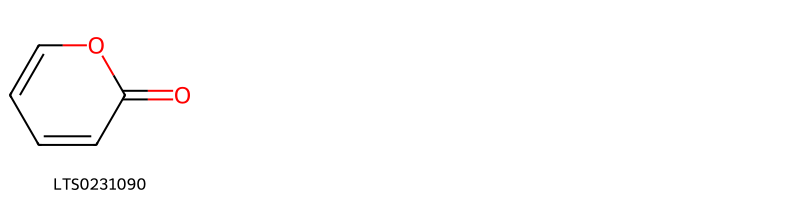{ width=100% }
    <figcaption>Hình ảnh cấu trúc hóa học của 1 hoạt chất thuộc nhóm Pyrans gồm ['α-pyrone (LTS0231090)'].</figcaption>
</figure>
#### Nhóm Steroids and steroid derivatives
<figure markdown="span">
    { width=100% }
    <figcaption>Hình ảnh cấu trúc hóa học của 4 hoạt chất thuộc nhóm Steroids and steroid derivatives gồm ['2-{[1-(5-ethyl-6-methylheptan-2-yl)-9a,11a-dimethyl-1h,2h,3h,3ah,3bh,4h,6h,7h,8h,9h,9bh,10h,11h-cyclopenta[a]phenanthren-7-yl]oxy}-6-(hydroxymethyl)oxane-3,4,5-triol (LTS0158828)', 'sitogluside (LTS0201798)', '2,3-dihydroxy-4,6a,6b,11,12,14b-hexamethyl-1,2,3,4a,5,6,7,8,14,14a-decahydropicene-4-carboxylic acid (LTS0147934)', '(2r,3r,4s,4ar,6ar,6bs,14as,14br)-2,3-dihydroxy-4,6a,6b,11,12,14b-hexamethyl-1,2,3,4a,5,6,7,8,14,14a-decahydropicene-4-carboxylic acid (LTS0248473)'].</figcaption>
</figure>
#### Nhóm Tannins
<figure markdown="span">
    { width=100% }
    <figcaption>Hình ảnh cấu trúc hóa học của 37 hoạt chất thuộc nhóm Tannins gồm ['(10r,11s,12r,13s,15r)-3,4,5,21,22,23-hexahydroxy-8,18-dioxo-12,13-bis(3,4,5-trihydroxybenzoyloxy)-9,14,17-trioxatetracyclo[17.4.0.0²,⁷.0¹⁰,¹⁵]tricosa-1(23),2(7),3,5,19,21-hexaen-11-yl 3,4,5-trihydroxybenzoate (LTS0067445)', '4,5-dihydroxy-3-(3,4,5-trihydroxybenzoyloxy)-6-[(3,4,5-trihydroxybenzoyloxy)methyl]oxan-2-yl 3,4,5-trihydroxybenzoate (LTS0063924)', '5-hydroxy-3,4-bis(3,4,5-trihydroxybenzoyloxy)-6-[(3,4,5-trihydroxybenzoyloxy)methyl]oxan-2-yl 3,4,5-trihydroxybenzoate (LTS0023424)', '(2s,3r,4s,5r,6r)-5-hydroxy-3,4-bis(3,4,5-trihydroxybenzoyloxy)-6-[(3,4,5-trihydroxybenzoyloxy)methyl]oxan-2-yl 3,4,5-trihydroxybenzoate (LTS0130248)', '(2s,3r,4s,5s,6r)-4,5-dihydroxy-3-(3,4,5-trihydroxybenzoyloxy)-6-[(3,4,5-trihydroxybenzoyloxy)methyl]oxan-2-yl 3,4,5-trihydroxybenzoate (LTS0243221)', '[(2r,3r,4r,5r,6r)-5-hydroxy-6-methoxy-3,4-bis(3,4,5-trihydroxybenzoyloxy)oxan-2-yl]methyl 3,4,5-trihydroxybenzoate (LTS0058217)', 'β-glucogallin (LTS0193705)', '3,4-dihydroxy-5-{[(2s,3r,4s,5s,6r)-3,4,5-trihydroxy-6-[(3,4,5-trihydroxybenzoyloxy)methyl]oxan-2-yl]oxy}benzoic acid (LTS0092876)', '(1r,2s,19r,20s,22r)-7,8,9,12,13,14,28,29,30,33,34,35-dodecahydroxy-4,17,25,38-tetraoxo-3,18,21,24,39-pentaoxaheptacyclo[20.17.0.0²,¹⁹.0⁵,¹⁰.0¹¹,¹⁶.0²⁶,³¹.0³²,³⁷]nonatriaconta-5,7,9,11(16),12,14,26,28,30,32(37),33,35-dodecaen-20-yl 3-{[(1r,2s,19r,20r,22r)-7,8,9,12,13,14,28,29,30,33,34,35-dodecahydroxy-4,17,25,38-tetraoxo-20-(3,4,5-trihydroxybenzoyloxy)-3,18,21,24,39-pentaoxaheptacyclo[20.17.0.0²,¹⁹.0⁵,¹⁰.0¹¹,¹⁶.0²⁶,³¹.0³²,³⁷]nonatriaconta-5,7,9,11(16),12,14,26,28,30,32(37),33,35-dodecaen-36-yl]oxy}-4,5-dihydroxybenzoate (LTS0138389)', '3,4-dihydroxy-5-({3,4,5-trihydroxy-6-[(3,4,5-trihydroxybenzoyloxy)methyl]oxan-2-yl}oxy)benzoic acid (LTS0183510)', '3,4,5,14,20,21,22-heptahydroxy-13-(hydroxymethyl)-8,17-dioxo-9,12,16-trioxatetracyclo[16.4.0.0²,⁷.0¹⁰,¹⁵]docosa-1(22),2(7),3,5,18,20-hexaen-11-yl 3-{[9,10,11,14,15,16,26,28,29,32,33,34-dodecahydroxy-6,19,24,37-tetraoxo-3-(3,4,5-trihydroxybenzoyloxy)-2,5,20,23,38-pentaoxaheptacyclo[19.18.0.0⁴,²².0⁷,¹².0¹³,¹⁸.0²⁵,³⁰.0³¹,³⁶]nonatriaconta-7(12),8,10,13,15,17,25,27,29,31,33,35-dodecaen-27-yl]oxy}-4,5-dihydroxybenzoate (LTS0144980)', '[6-methoxy-3,4,5-tris(3,4,5-trihydroxybenzoyloxy)oxan-2-yl]methyl 3,4,5-trihydroxybenzoate (LTS0135479)', '[5-hydroxy-6-methoxy-3,4-bis(3,4,5-trihydroxybenzoyloxy)oxan-2-yl]methyl 3,4,5-trihydroxybenzoate (LTS0153124)', '(2s,20s,22r)-7,8,9,12,13,14,28,29,30,33,34,35-dodecahydroxy-4,17,25,38-tetraoxo-3,18,21,24,39-pentaoxaheptacyclo[20.17.0.0²,¹⁹.0⁵,¹⁰.0¹¹,¹⁶.0²⁶,³¹.0³²,³⁷]nonatriaconta-5,7,9,11(16),12,14,26,28,30,32(37),33,35-dodecaen-20-yl 3,4,5-trihydroxybenzoate (LTS0096540)', '(11r,12r)-12-[(14r,15s,19s)-2,3,4,7,8,9,19-heptahydroxy-12,17-dioxo-13,16-dioxatetracyclo[13.3.1.0⁵,¹⁸.0⁶,¹¹]nonadeca-1(18),2,4,6,8,10-hexaen-14-yl]-3,4,5,17,18,19-hexahydroxy-8,14-dioxo-9,13-dioxatricyclo[13.4.0.0²,⁷]nonadeca-1(15),2,4,6,16,18-hexaen-11-yl 3,4,5-trihydroxybenzoate (LTS0124879)', '2-hydroxy-4,5-bis(3,4,5-trihydroxybenzoyloxy)-6-[(3,4,5-trihydroxybenzoyloxy)methyl]oxan-3-yl 3,4,5-trihydroxybenzoate (LTS0202124)', '3,4,5,14,20,21,22-heptahydroxy-13-(hydroxymethyl)-8,17-dioxo-9,12,16-trioxatetracyclo[16.4.0.0²,⁷.0¹⁰,¹⁵]docosa-1(22),2(7),3,5,18,20-hexaen-11-yl 3-{[7,8,9,12,13,14,28,29,30,33,34,35-dodecahydroxy-4,17,25,38-tetraoxo-20-(3,4,5-trihydroxybenzoyloxy)-3,18,21,24,39-pentaoxaheptacyclo[20.17.0.0²,¹⁹.0⁵,¹⁰.0¹¹,¹⁶.0²⁶,³¹.0³²,³⁷]nonatriaconta-5(10),6,8,11,13,15,26,28,30,32(37),33,35-dodecaen-36-yl]oxy}-4,5-dihydroxybenzoate (LTS0198048)', '(1r,2s,19r,20r,22r)-7,8,9,12,13,14,28,29,30,33,34,35-dodecahydroxy-4,17,25,38-tetraoxo-3,18,21,24,39-pentaoxaheptacyclo[20.17.0.0²,¹⁹.0⁵,¹⁰.0¹¹,¹⁶.0²⁶,³¹.0³²,³⁷]nonatriaconta-5,7,9,11(16),12,14,26,28,30,32(37),33,35-dodecaen-20-yl 3,4,5-trihydroxybenzoate (LTS0077078)', '(2s,3r,4s,5r,6r)-3,4,5-tris(3,4,5-trihydroxybenzoyloxy)-6-[(3,4,5-trihydroxybenzoyloxy)methyl]oxan-2-yl 3,4,5-trihydroxybenzoate (LTS0216134)', '3,4,5-tris(3,4,5-trihydroxybenzoyloxy)-6-[(3,4,5-trihydroxybenzoyloxy)methyl]oxan-2-yl 3,4,5-trihydroxybenzoate (LTS0226232)', '3-{[9,10,11,14,15,16,27,28,29,32,33,34-dodecahydroxy-6,19,24,37-tetraoxo-3-(3,4,5-trihydroxybenzoyloxy)-2,5,20,23,38-pentaoxaheptacyclo[19.18.0.0⁴,²².0⁷,¹².0¹³,¹⁸.0²⁵,³⁰.0³¹,³⁶]nonatriaconta-7(12),8,10,13,15,17,25(30),26,28,31,33,35-dodecaen-26-yl]oxy}-4,5-dihydroxybenzoic acid (LTS0018932)', '(10r,11r,13r,14r,15s)-3,4,5,14,20,21,22-heptahydroxy-8,17-dioxo-13-[(3,4,5-trihydroxybenzoyloxy)methyl]-9,12,16-trioxatetracyclo[16.4.0.0²,⁷.0¹⁰,¹⁵]docosa-1(18),2,4,6,19,21-hexaen-11-yl 3,4,5-trihydroxybenzoate (LTS0249002)', '[(2r,3r,4s,5r,6r)-6-methoxy-3,4,5-tris(3,4,5-trihydroxybenzoyloxy)oxan-2-yl]methyl 3,4,5-trihydroxybenzoate (LTS0189954)', '[4,5-dihydroxy-6-methoxy-3-(3,4,5-trihydroxybenzoyloxy)oxan-2-yl]methyl 3,4,5-trihydroxybenzoate (LTS0206408)', '(1r,2s,19r,20s,22r)-7,8,9,12,13,14,28,29,30,33,34,35-dodecahydroxy-4,17,25,38-tetraoxo-3,18,21,24,39-pentaoxaheptacyclo[20.17.0.0²,¹⁹.0⁵,¹⁰.0¹¹,¹⁶.0²⁶,³¹.0³²,³⁷]nonatriaconta-5,7,9,11(16),12,14,26,28,30,32(37),33,35-dodecaen-20-yl 3-{[(1r,3s,4r,21r,22s)-9,10,11,14,15,16,27,28,29,32,33,34-dodecahydroxy-6,19,24,37-tetraoxo-3-(3,4,5-trihydroxybenzoyloxy)-2,5,20,23,38-pentaoxaheptacyclo[19.18.0.0⁴,²².0⁷,¹².0¹³,¹⁸.0²⁵,³⁰.0³¹,³⁶]nonatriaconta-7,9,11,13(18),14,16,25(30),26,28,31,33,35-dodecaen-26-yl]oxy}-4,5-dihydroxybenzoate (LTS0037832)', '3-{[(1r,3s,4r,21r,22s)-9,10,11,14,15,16,27,28,29,32,33,34-dodecahydroxy-6,19,24,37-tetraoxo-3-(3,4,5-trihydroxybenzoyloxy)-2,5,20,23,38-pentaoxaheptacyclo[19.18.0.0⁴,²².0⁷,¹².0¹³,¹⁸.0²⁵,³⁰.0³¹,³⁶]nonatriaconta-7,9,11,13(18),14,16,25(30),26,28,31,33,35-dodecaen-26-yl]oxy}-4,5-dihydroxybenzoic acid (LTS0014235)', '(1r,2s,19r,22r)-7,8,9,12,13,14,20,28,29,30,33,34,35-tridecahydroxy-3,18,21,24,39-pentaoxaheptacyclo[20.17.0.0²,¹⁹.0⁵,¹⁰.0¹¹,¹⁶.0²⁶,³¹.0³²,³⁷]nonatriaconta-5(10),6,8,11,13,15,26(31),27,29,32,34,36-dodecaene-4,17,25,38-tetrone (LTS0137167)', '(10r,11s,13r,14r,15s)-3,4,5,14,20,21,22-heptahydroxy-13-(hydroxymethyl)-8,17-dioxo-9,12,16-trioxatetracyclo[16.4.0.0²,⁷.0¹⁰,¹⁵]docosa-1(22),2(7),3,5,18,20-hexaen-11-yl 3-{[(1r,2s,19r,20r,22r)-7,8,9,12,13,14,28,29,30,33,34,35-dodecahydroxy-4,17,25,38-tetraoxo-20-(3,4,5-trihydroxybenzoyloxy)-3,18,21,24,39-pentaoxaheptacyclo[20.17.0.0²,¹⁹.0⁵,¹⁰.0¹¹,¹⁶.0²⁶,³¹.0³²,³⁷]nonatriaconta-5,7,9,11(16),12,14,26,28,30,32(37),33,35-dodecaen-36-yl]oxy}-4,5-dihydroxybenzoate (LTS0133797)', '3,4,5,14,20,21,22-heptahydroxy-8,17-dioxo-13-[(3,4,5-trihydroxybenzoyloxy)methyl]-9,12,16-trioxatetracyclo[16.4.0.0²,⁷.0¹⁰,¹⁵]docosa-1(18),2,4,6,19,21-hexaen-11-yl 3,4,5-trihydroxybenzoate (LTS0134388)', '7,8,9,12,13,14,28,29,30,33,34,35-dodecahydroxy-4,17,25,38-tetraoxo-3,18,21,24,39-pentaoxaheptacyclo[20.17.0.0²,¹⁹.0⁵,¹⁰.0¹¹,¹⁶.0²⁶,³¹.0³²,³⁷]nonatriaconta-5,7,9,11(16),12,14,26,28,30,32(37),33,35-dodecaen-20-yl 3,4,5-trihydroxybenzoate (LTS0009009)', '(10r,11s,13r,14r,15s)-3,4,5,14,20,21,22-heptahydroxy-13-(hydroxymethyl)-8,17-dioxo-9,12,16-trioxatetracyclo[16.4.0.0²,⁷.0¹⁰,¹⁵]docosa-1(22),2(7),3,5,18,20-hexaen-11-yl 3-{[(1r,3s,4r,21r,22s)-9,10,11,14,15,16,26,28,29,32,33,34-dodecahydroxy-6,19,24,37-tetraoxo-3-(3,4,5-trihydroxybenzoyloxy)-2,5,20,23,38-pentaoxaheptacyclo[19.18.0.0⁴,²².0⁷,¹².0¹³,¹⁸.0²⁵,³⁰.0³¹,³⁶]nonatriaconta-7,9,11,13(18),14,16,25,27,29,31,33,35-dodecaen-27-yl]oxy}-4,5-dihydroxybenzoate (LTS0003847)', '[(2r,3s,4r,5r,6r)-4,5-dihydroxy-6-methoxy-3-(3,4,5-trihydroxybenzoyloxy)oxan-2-yl]methyl 3,4,5-trihydroxybenzoate (LTS0017065)', '7,8,9,12,13,14,28,29,30,33,34,35-dodecahydroxy-4,17,25,38-tetraoxo-3,18,21,24,39-pentaoxaheptacyclo[20.17.0.0²,¹⁹.0⁵,¹⁰.0¹¹,¹⁶.0²⁶,³¹.0³²,³⁷]nonatriaconta-5,7,9,11(16),12,14,26,28,30,32(37),33,35-dodecaen-20-yl 3-{[9,10,11,14,15,16,27,28,29,32,33,34-dodecahydroxy-6,19,24,37-tetraoxo-3-(3,4,5-trihydroxybenzoyloxy)-2,5,20,23,38-pentaoxaheptacyclo[19.18.0.0⁴,²².0⁷,¹².0¹³,¹⁸.0²⁵,³⁰.0³¹,³⁶]nonatriaconta-7(12),8,10,13,15,17,25(30),26,28,31,33,35-dodecaen-26-yl]oxy}-4,5-dihydroxybenzoate (LTS0136372)', '(2r,3r,4s,5r,6r)-2-hydroxy-4,5-bis(3,4,5-trihydroxybenzoyloxy)-6-[(3,4,5-trihydroxybenzoyloxy)methyl]oxan-3-yl 3,4,5-trihydroxybenzoate (LTS0245227)', '7,8,9,12,13,14,28,29,30,33,34,35-dodecahydroxy-4,17,25,38-tetraoxo-3,18,21,24,39-pentaoxaheptacyclo[20.17.0.0²,¹⁹.0⁵,¹⁰.0¹¹,¹⁶.0²⁶,³¹.0³²,³⁷]nonatriaconta-5,7,9,11(16),12,14,26,28,30,32(37),33,35-dodecaen-20-yl 3-{[7,8,9,12,13,14,28,29,30,33,34,35-dodecahydroxy-4,17,25,38-tetraoxo-20-(3,4,5-trihydroxybenzoyloxy)-3,18,21,24,39-pentaoxaheptacyclo[20.17.0.0²,¹⁹.0⁵,¹⁰.0¹¹,¹⁶.0²⁶,³¹.0³²,³⁷]nonatriaconta-5(10),6,8,11,13,15,26,28,30,32(37),33,35-dodecaen-36-yl]oxy}-4,5-dihydroxybenzoate (LTS0041451)', '3,4-dihydroxy-5-({6,7,13,14-tetrahydroxy-3,10-dioxo-2,9-dioxatetracyclo[6.6.2.0⁴,¹⁶.0¹¹,¹⁵]hexadeca-1(14),4(16),5,7,11(15),12-hexaen-5-yl}oxy)benzoic acid (LTS0038548)', '(11r,12r)-12-[(15s,19s)-2,3,4,7,8,9,19-heptahydroxy-12,17-dioxo-13,16-dioxatetracyclo[13.3.1.0⁵,¹⁸.0⁶,¹¹]nonadeca-1(18),2,4,6,8,10-hexaen-14-yl]-3,4,5,17,18,19-hexahydroxy-8,14-dioxo-9,13-dioxatricyclo[13.4.0.0²,⁷]nonadeca-1(15),2,4,6,16,18-hexaen-11-yl 3,4,5-trihydroxybenzoate (LTS0107688)'].</figcaption>
</figure>

---

### Dược dân tộc học

Danh sách các quốc gia có sử dụng *Sanguisorba officinalis* trong điều trị các bệnh. 

| Country   | Disease                                                                        | Bệnh                                                                                                                                                                                                |
|:----------|:-------------------------------------------------------------------------------|:----------------------------------------------------------------------------------------------------------------------------------------------------------------------------------------------------|
| China     | Hemostat, Hemostat, Hemostat                                                   | MYMEMORY WARNING: YOU USED ALL AVAILABLE FREE TRANSLATIONS FOR TODAY. NEXT AVAILABLE IN  12 HOURS 14 MINUTES 21 SECONDS VISIT HTTPS://MYMEMORY.TRANSLATED.NET/DOC/USAGELIMITS.PHP TO TRANSLATE MORE |
| Elsewhere | Astringent, Hemostatic                                                         | MYMEMORY WARNING: YOU USED ALL AVAILABLE FREE TRANSLATIONS FOR TODAY. NEXT AVAILABLE IN  12 HOURS 14 MINUTES 18 SECONDS VISIT HTTPS://MYMEMORY.TRANSLATED.NET/DOC/USAGELIMITS.PHP TO TRANSLATE MORE |
| Turkey    | Apertif, Stomachic, Sudorific, Tonic, Vulnerary, Astringent, Diuretic, Styptic | MYMEMORY WARNING: YOU USED ALL AVAILABLE FREE TRANSLATIONS FOR TODAY. NEXT AVAILABLE IN  12 HOURS 14 MINUTES 14 SECONDS VISIT HTTPS://MYMEMORY.TRANSLATED.NET/DOC/USAGELIMITS.PHP TO TRANSLATE MORE |

---

# Chi iraea

??? note "Danh sách các dược liệu thuộc chi"
    
	 - *iraea aruncus*
	 - *iraea filipendula*
	 - *iraea tomentosa*

---
## iraea aruncus
### Thông tin về thực vật

!!! info "Phân loại thực vật của *N/A* từ GIBF:"
    - **Kingdom:** N/A
    - **Phylum:** N/A
    - **Order:** N/A
    - **Family:** N/A
    - **Genus:** N/A
    - **Species:** *N/A*

 

| Label (VI)   | Label (EN)   | Scientific Name         | Descriptions (VI)   | Descriptions (EN)   | Also Known As (VI)   | Also Known As (EN)   |
|:-------------|:-------------|:------------------------|:--------------------|:--------------------|:---------------------|:---------------------|
| N/A          | N/A          | Sanguisorba officinalis | loài thực vật       | species of plant    | ['']                 | ['Great Burnet']     |

#### Phân bố trên thế giới

**Từ CSDL GIBF** Không có kết quả phù hợp

#### Phân bố tại Việt Nam

**Từ CSDL GIBF**: Không có ghi nhận ở Việt Nam

---
### Thành phần hóa học
        
- Theo cơ sở dữ liệu lotus: Từ loài *N/A* đã phân lập và xác định được Chưa có hoạt chất nào được phân lập. hoạt chất thuộc về các nhóm Không có hoạt chất nào được phân lập. 

Không có hình ảnh nào được tạo ra

---

### Dược dân tộc học

Danh sách các quốc gia có sử dụng *N/A* trong điều trị các bệnh. 

| Country   | Disease    | Bệnh                                                                                                                                                                                                |
|:----------|:-----------|:----------------------------------------------------------------------------------------------------------------------------------------------------------------------------------------------------|
| Elsewhere | Antibiotic | MYMEMORY WARNING: YOU USED ALL AVAILABLE FREE TRANSLATIONS FOR TODAY. NEXT AVAILABLE IN  12 HOURS 13 MINUTES 38 SECONDS VISIT HTTPS://MYMEMORY.TRANSLATED.NET/DOC/USAGELIMITS.PHP TO TRANSLATE MORE |

---

---
## iraea filipendula
### Thông tin về thực vật

!!! info "Phân loại thực vật của *N/A* từ GIBF:"
    - **Kingdom:** N/A
    - **Phylum:** N/A
    - **Order:** N/A
    - **Family:** N/A
    - **Genus:** N/A
    - **Species:** *N/A*

 

| Label (VI)   | Label (EN)   | Scientific Name         | Descriptions (VI)   | Descriptions (EN)   | Also Known As (VI)   | Also Known As (EN)   |
|:-------------|:-------------|:------------------------|:--------------------|:--------------------|:---------------------|:---------------------|
| N/A          | N/A          | Sanguisorba officinalis | loài thực vật       | species of plant    | ['']                 | ['Great Burnet']     |

#### Phân bố trên thế giới

**Từ CSDL GIBF** Không có kết quả phù hợp

#### Phân bố tại Việt Nam

**Từ CSDL GIBF**: Không có ghi nhận ở Việt Nam

---
### Thành phần hóa học
        
- Theo cơ sở dữ liệu lotus: Từ loài *N/A* đã phân lập và xác định được Chưa có hoạt chất nào được phân lập. hoạt chất thuộc về các nhóm Không có hoạt chất nào được phân lập. 

Không có hình ảnh nào được tạo ra

---

### Dược dân tộc học

Danh sách các quốc gia có sử dụng *N/A* trong điều trị các bệnh. 

| Country   | Disease            | Bệnh                                                                                                                                                                                                |
|:----------|:-------------------|:----------------------------------------------------------------------------------------------------------------------------------------------------------------------------------------------------|
| English   | Diuretic, Laxative | MYMEMORY WARNING: YOU USED ALL AVAILABLE FREE TRANSLATIONS FOR TODAY. NEXT AVAILABLE IN  12 HOURS 13 MINUTES 24 SECONDS VISIT HTTPS://MYMEMORY.TRANSLATED.NET/DOC/USAGELIMITS.PHP TO TRANSLATE MORE |
| German    | Astringent         | MYMEMORY WARNING: YOU USED ALL AVAILABLE FREE TRANSLATIONS FOR TODAY. NEXT AVAILABLE IN  12 HOURS 13 MINUTES 20 SECONDS VISIT HTTPS://MYMEMORY.TRANSLATED.NET/DOC/USAGELIMITS.PHP TO TRANSLATE MORE |

---

---
## iraea tomentosa
### Thông tin về thực vật

!!! info "Phân loại thực vật của *N/A* từ GIBF:"
    - **Kingdom:** N/A
    - **Phylum:** N/A
    - **Order:** N/A
    - **Family:** N/A
    - **Genus:** N/A
    - **Species:** *N/A*

 

| Label (VI)   | Label (EN)   | Scientific Name         | Descriptions (VI)   | Descriptions (EN)   | Also Known As (VI)   | Also Known As (EN)   |
|:-------------|:-------------|:------------------------|:--------------------|:--------------------|:---------------------|:---------------------|
| N/A          | N/A          | Sanguisorba officinalis | loài thực vật       | species of plant    | ['']                 | ['Great Burnet']     |

#### Phân bố trên thế giới

**Từ CSDL GIBF** Không có kết quả phù hợp

#### Phân bố tại Việt Nam

**Từ CSDL GIBF**: Không có ghi nhận ở Việt Nam

---
### Thành phần hóa học
        
- Theo cơ sở dữ liệu lotus: Từ loài *N/A* đã phân lập và xác định được Chưa có hoạt chất nào được phân lập. hoạt chất thuộc về các nhóm Không có hoạt chất nào được phân lập. 

Không có hình ảnh nào được tạo ra

---

### Dược dân tộc học

Danh sách các quốc gia có sử dụng *N/A* trong điều trị các bệnh. 

| Country   | Disease    | Bệnh                                                                                                                                                                                                |
|:----------|:-----------|:----------------------------------------------------------------------------------------------------------------------------------------------------------------------------------------------------|
| US        | Astringent | MYMEMORY WARNING: YOU USED ALL AVAILABLE FREE TRANSLATIONS FOR TODAY. NEXT AVAILABLE IN  12 HOURS 13 MINUTES 05 SECONDS VISIT HTTPS://MYMEMORY.TRANSLATED.NET/DOC/USAGELIMITS.PHP TO TRANSLATE MORE |

---

# Chi Geum

??? note "Danh sách các dược liệu thuộc chi"
    
	 - *Geum aleppicum*
	 - *Geum canadense*
	 - *Geum dryadoides*
	 - *Geum elatum*
	 - *Geum japonicum*
	 - *Geum macrophyllum*
	 - *Geum rivale*
	 - *Geum triflorum*
	 - *Geum urbanum*

---
## Geum aleppicum
### Thông tin về thực vật

!!! info "Phân loại thực vật của *Geum aleppicum* từ GIBF:"
    - **Kingdom:** Plantae
    - **Phylum:** Tracheophyta
    - **Order:** Rosales
    - **Family:** Rosaceae
    - **Genus:** Geum
    - **Species:** *Geum aleppicum*

 

| Label (VI)   | Label (EN)   | Scientific Name   | Descriptions (VI)   | Descriptions (EN)   | Also Known As (VI)   | Also Known As (EN)   |
|:-------------|:-------------|:------------------|:--------------------|:--------------------|:---------------------|:---------------------|
| N/A          | N/A          | Geum aleppicum    | loài thực vật       | species of plant    | ['']                 | ['yellow avens']     |

#### Phân bố trên thế giới

**Từ CSDL GIBF** Belarus, Sweden, Mongolia, Canada, Russian Federation, United States of America, Kazakhstan, China, Norway, Netherlands, Ukraine

#### Phân bố tại Việt Nam

**Từ CSDL GIBF**: Không có ghi nhận ở Việt Nam

---
### Thành phần hóa học
        
- Theo cơ sở dữ liệu lotus: Từ loài *Geum aleppicum* đã phân lập và xác định được 20 hoạt chất thuộc về các nhóm Organooxygen compounds, Flavonoids, Tannins, Prenol lipids, Cinnamic acids and derivatives, Benzene and substituted derivatives. 

|    | chemicalTaxonomyClassyfireClass     |   smiles_count |
|---:|:------------------------------------|---------------:|
|  0 | Benzene and substituted derivatives |              1 |
|  1 | Cinnamic acids and derivatives      |              1 |
|  2 | Flavonoids                          |              1 |
|  3 | Organooxygen compounds              |              2 |
|  4 | Prenol lipids                       |              5 |
|  5 | Tannins                             |              9 |

#### Nhóm Benzene and substituted derivatives
<figure markdown="span">
    { width=100% }
    <figcaption>Hình ảnh cấu trúc hóa học của 1 hoạt chất thuộc nhóm Benzene and substituted derivatives gồm ['3,4-dihydroxybenzoic acid (LTS0018765)'].</figcaption>
</figure>
#### Nhóm Cinnamic acids and derivatives
<figure markdown="span">
    { width=100% }
    <figcaption>Hình ảnh cấu trúc hóa học của 1 hoạt chất thuộc nhóm Cinnamic acids and derivatives gồm ['3,4-dihydroxycinnamic acid (LTS0128050)'].</figcaption>
</figure>
#### Nhóm Flavonoids
<figure markdown="span">
    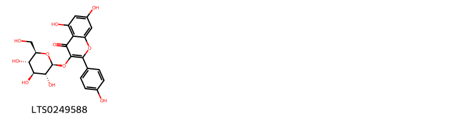{ width=100% }
    <figcaption>Hình ảnh cấu trúc hóa học của 1 hoạt chất thuộc nhóm Flavonoids gồm ['astragalin (LTS0249588)'].</figcaption>
</figure>
#### Nhóm Organooxygen compounds
<figure markdown="span">
    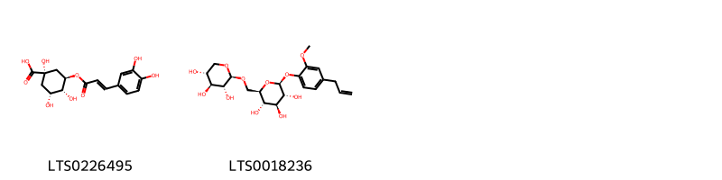{ width=100% }
    <figcaption>Hình ảnh cấu trúc hóa học của 2 hoạt chất thuộc nhóm Organooxygen compounds gồm ['chlorogenic acid (LTS0226495)', '(2s,3r,4s,5s,6r)-2-[2-methoxy-4-(prop-2-en-1-yl)phenoxy]-6-({[(2s,3r,4s,5r)-3,4,5-trihydroxyoxan-2-yl]oxy}methyl)oxane-3,4,5-triol (LTS0018236)'].</figcaption>
</figure>
#### Nhóm Prenol lipids
<figure markdown="span">
    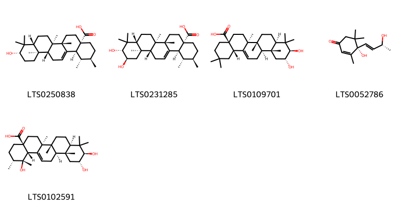{ width=100% }
    <figcaption>Hình ảnh cấu trúc hóa học của 5 hoạt chất thuộc nhóm Prenol lipids gồm ['ursolic acid (LTS0250838)', 'corosolic acid (LTS0231285)', 'maslinic acid (LTS0109701)', '(6s,9r)-vomifoliol (LTS0052786)', 'tormentic acid (LTS0102591)'].</figcaption>
</figure>
#### Nhóm Tannins
<figure markdown="span">
    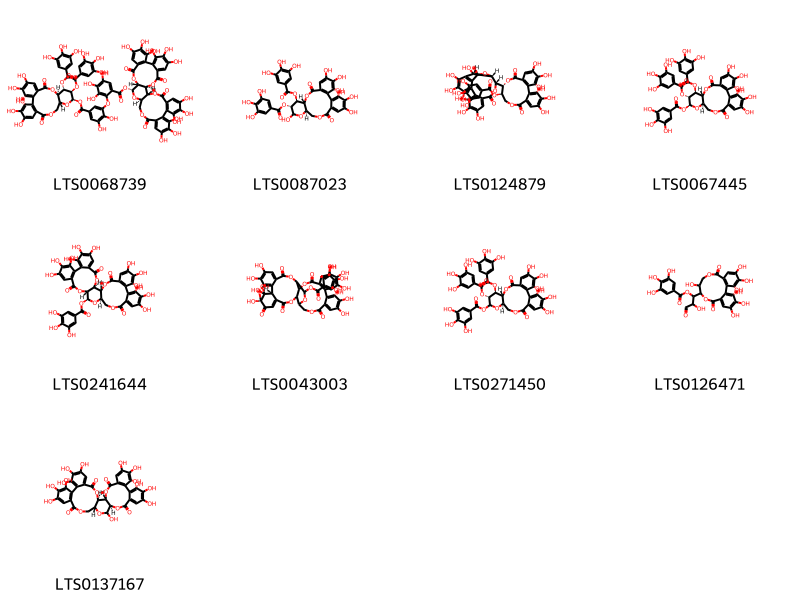{ width=100% }
    <figcaption>Hình ảnh cấu trúc hóa học của 9 hoạt chất thuộc nhóm Tannins gồm ['(1r,2s,19r,20r,22r)-7,8,9,12,13,14,28,29,30,33,34,35-dodecahydroxy-4,17,25,38-tetraoxo-3,18,21,24,39-pentaoxaheptacyclo[20.17.0.0²,¹⁹.0⁵,¹⁰.0¹¹,¹⁶.0²⁶,³¹.0³²,³⁷]nonatriaconta-5,7,9,11(16),12,14,26,28,30,32(37),33,35-dodecaen-20-yl 2-[5-({[(10r,11s,12r,13r,15r)-3,4,5,21,22,23-hexahydroxy-8,18-dioxo-11,12-bis(3,4,5-trihydroxybenzoyloxy)-9,14,17-trioxatetracyclo[17.4.0.0²,⁷.0¹⁰,¹⁵]tricosa-1(19),2,4,6,20,22-hexaen-13-yl]oxy}carbonyl)-2,3-dihydroxyphenoxy]-3,4,5-trihydroxybenzoate (LTS0068739)', '(10r,11s,12r,15r)-3,4,5,13,21,22,23-heptahydroxy-8,18-dioxo-11-(3,4,5-trihydroxybenzoyloxy)-9,14,17-trioxatetracyclo[17.4.0.0²,⁷.0¹⁰,¹⁵]tricosa-1(23),2(7),3,5,19,21-hexaen-12-yl 3,4,5-trihydroxybenzoate (LTS0087023)', '(11r,12r)-12-[(14r,15s,19s)-2,3,4,7,8,9,19-heptahydroxy-12,17-dioxo-13,16-dioxatetracyclo[13.3.1.0⁵,¹⁸.0⁶,¹¹]nonadeca-1(18),2,4,6,8,10-hexaen-14-yl]-3,4,5,17,18,19-hexahydroxy-8,14-dioxo-9,13-dioxatricyclo[13.4.0.0²,⁷]nonadeca-1(15),2,4,6,16,18-hexaen-11-yl 3,4,5-trihydroxybenzoate (LTS0124879)', '(10r,11s,12r,13s,15r)-3,4,5,21,22,23-hexahydroxy-8,18-dioxo-12,13-bis(3,4,5-trihydroxybenzoyloxy)-9,14,17-trioxatetracyclo[17.4.0.0²,⁷.0¹⁰,¹⁵]tricosa-1(23),2(7),3,5,19,21-hexaen-11-yl 3,4,5-trihydroxybenzoate (LTS0067445)', 'casuarictin (LTS0241644)', '(1r,38r)-1,13,14,15,18,19,20,34,35,39,39-undecahydroxy-2,5,10,23,31-pentaoxo-6,9,24,27,30,40-hexaoxaoctacyclo[34.3.1.0⁴,³⁸.0⁷,²⁶.0⁸,²⁹.0¹¹,¹⁶.0¹⁷,²².0³²,³⁷]tetraconta-3,11(16),12,14,17,19,21,32,34,36-decaen-28-yl 3,4,5-trihydroxybenzoate (LTS0043003)', '(10r,11s,12r,15r)-3,4,5,21,22,23-hexahydroxy-8,18-dioxo-12,13-bis(3,4,5-trihydroxybenzoyloxy)-9,14,17-trioxatetracyclo[17.4.0.0²,⁷.0¹⁰,¹⁵]tricosa-1(23),2(7),3,5,19,21-hexaen-11-yl 3,4,5-trihydroxybenzoate (LTS0271450)', '1-{3,4,5,11,17,18,19-heptahydroxy-8,14-dioxo-9,13-dioxatricyclo[13.4.0.0²,⁷]nonadeca-1(15),2,4,6,16,18-hexaen-10-yl}-2-hydroxy-3-oxopropyl 3,4,5-trihydroxybenzoate (LTS0126471)', '(1r,2s,19r,22r)-7,8,9,12,13,14,20,28,29,30,33,34,35-tridecahydroxy-3,18,21,24,39-pentaoxaheptacyclo[20.17.0.0²,¹⁹.0⁵,¹⁰.0¹¹,¹⁶.0²⁶,³¹.0³²,³⁷]nonatriaconta-5(10),6,8,11,13,15,26(31),27,29,32,34,36-dodecaene-4,17,25,38-tetrone (LTS0137167)'].</figcaption>
</figure>

---

### Dược dân tộc học

Danh sách các quốc gia có sử dụng *Geum aleppicum* trong điều trị các bệnh. 

| Country   | Disease   | Bệnh                                                                                                                                                                                                |
|:----------|:----------|:----------------------------------------------------------------------------------------------------------------------------------------------------------------------------------------------------|
| Elsewhere | Diuretic  | MYMEMORY WARNING: YOU USED ALL AVAILABLE FREE TRANSLATIONS FOR TODAY. NEXT AVAILABLE IN  12 HOURS 12 MINUTES 53 SECONDS VISIT HTTPS://MYMEMORY.TRANSLATED.NET/DOC/USAGELIMITS.PHP TO TRANSLATE MORE |

---

---
## Geum canadense
### Thông tin về thực vật

!!! info "Phân loại thực vật của *Geum canadense* từ GIBF:"
    - **Kingdom:** Plantae
    - **Phylum:** Tracheophyta
    - **Order:** Rosales
    - **Family:** Rosaceae
    - **Genus:** Geum
    - **Species:** *Geum canadense*

 

| Label (VI)   | Label (EN)   | Scientific Name   | Descriptions (VI)   | Descriptions (EN)   | Also Known As (VI)   | Also Known As (EN)   |
|:-------------|:-------------|:------------------|:--------------------|:--------------------|:---------------------|:---------------------|
| N/A          | N/A          | Geum canadense    | loài thực vật       | species of plant    | ['']                 | ['']                 |

#### Phân bố trên thế giới

**Từ CSDL GIBF** United States of America

#### Phân bố tại Việt Nam

**Từ CSDL GIBF**: Không có ghi nhận ở Việt Nam

---
### Thành phần hóa học
        
- Theo cơ sở dữ liệu lotus: Từ loài *Geum canadense* đã phân lập và xác định được Chưa có hoạt chất nào được phân lập. hoạt chất thuộc về các nhóm Không có hoạt chất nào được phân lập. 

Không có hình ảnh nào được tạo ra

---

### Dược dân tộc học

Danh sách các quốc gia có sử dụng *Geum canadense* trong điều trị các bệnh. 

| Country   | Disease                      | Bệnh                                                                                                                                                                                                |
|:----------|:-----------------------------|:----------------------------------------------------------------------------------------------------------------------------------------------------------------------------------------------------|
| Elsewhere | Astringent, Stomachic, Tonic | MYMEMORY WARNING: YOU USED ALL AVAILABLE FREE TRANSLATIONS FOR TODAY. NEXT AVAILABLE IN  12 HOURS 12 MINUTES 20 SECONDS VISIT HTTPS://MYMEMORY.TRANSLATED.NET/DOC/USAGELIMITS.PHP TO TRANSLATE MORE |

---

---
## Geum dryadoides
### Thông tin về thực vật

!!! info "Phân loại thực vật của *Geum pentapetalum* từ GIBF:"
    - **Kingdom:** Plantae
    - **Phylum:** Tracheophyta
    - **Order:** Rosales
    - **Family:** Rosaceae
    - **Genus:** Geum
    - **Species:** *Geum pentapetalum*

 

| Label (VI)   | Label (EN)   | Scientific Name   | Descriptions (VI)   | Descriptions (EN)   | Also Known As (VI)   | Also Known As (EN)   |
|:-------------|:-------------|:------------------|:--------------------|:--------------------|:---------------------|:---------------------|
| N/A          | N/A          | Geum canadense    | loài thực vật       | species of plant    | ['']                 | ['']                 |

#### Phân bố trên thế giới

**Từ CSDL GIBF** United States of America

#### Phân bố tại Việt Nam

**Từ CSDL GIBF**: Không có ghi nhận ở Việt Nam

---
### Thành phần hóa học
        
- Theo cơ sở dữ liệu lotus: Từ loài *Geum pentapetalum* đã phân lập và xác định được Chưa có hoạt chất nào được phân lập. hoạt chất thuộc về các nhóm Không có hoạt chất nào được phân lập. 

Không có hình ảnh nào được tạo ra

---

### Dược dân tộc học

Danh sách các quốc gia có sử dụng *Geum pentapetalum* trong điều trị các bệnh. 

| Country   | Disease   | Bệnh                                                                                                                                                                                                |
|:----------|:----------|:----------------------------------------------------------------------------------------------------------------------------------------------------------------------------------------------------|
| China     | Hemostat  | MYMEMORY WARNING: YOU USED ALL AVAILABLE FREE TRANSLATIONS FOR TODAY. NEXT AVAILABLE IN  12 HOURS 11 MINUTES 56 SECONDS VISIT HTTPS://MYMEMORY.TRANSLATED.NET/DOC/USAGELIMITS.PHP TO TRANSLATE MORE |

---

---
## Geum elatum
### Thông tin về thực vật

!!! info "Phân loại thực vật của *Geum elatum* từ GIBF:"
    - **Kingdom:** Plantae
    - **Phylum:** Tracheophyta
    - **Order:** Rosales
    - **Family:** Rosaceae
    - **Genus:** Geum
    - **Species:** *Geum elatum*

 

| Label (VI)   | Label (EN)   | Scientific Name   | Descriptions (VI)   | Descriptions (EN)   | Also Known As (VI)   | Also Known As (EN)   |
|:-------------|:-------------|:------------------|:--------------------|:--------------------|:---------------------|:---------------------|
| N/A          | N/A          | Geum elatum       | loài thực vật       | species of plant    | ['']                 | ['']                 |

#### Phân bố trên thế giới

**Từ CSDL GIBF** nan, unknown or invalid, Pakistan, United Kingdom of Great Britain and Northern Ireland, Bhutan, Japan, Sweden, Peru, India, United States of America, China, Nepal, Belgium

#### Phân bố tại Việt Nam

**Từ CSDL GIBF**: Không có ghi nhận ở Việt Nam

---
### Thành phần hóa học
        
- Theo cơ sở dữ liệu lotus: Từ loài *Geum elatum* đã phân lập và xác định được 6 hoạt chất thuộc về các nhóm Organooxygen compounds, Flavonoids, Tannins, Fatty Acyls, Steroids and steroid derivatives. 

|    | chemicalTaxonomyClassyfireClass   |   smiles_count |
|---:|:----------------------------------|---------------:|
|  0 | Fatty Acyls                       |              1 |
|  1 | Flavonoids                        |              1 |
|  2 | Organooxygen compounds            |              1 |
|  3 | Steroids and steroid derivatives  |              2 |
|  4 | Tannins                           |              1 |

#### Nhóm Fatty Acyls
<figure markdown="span">
    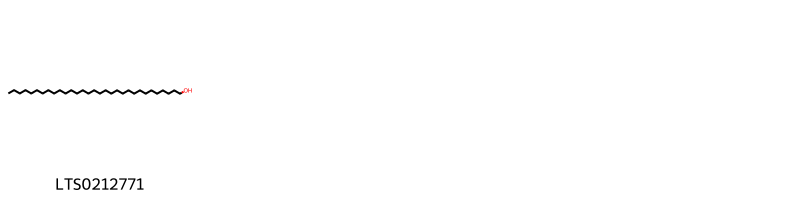{ width=100% }
    <figcaption>Hình ảnh cấu trúc hóa học của 1 hoạt chất thuộc nhóm Fatty Acyls gồm ['n-hentriacontanol (LTS0212771)'].</figcaption>
</figure>
#### Nhóm Flavonoids
<figure markdown="span">
    { width=100% }
    <figcaption>Hình ảnh cấu trúc hóa học của 1 hoạt chất thuộc nhóm Flavonoids gồm ['2-(3,4-dihydroxyphenyl)-5,7-dihydroxy-3-{[(2s,3r,4r,5r,6s)-3,4,5-trihydroxy-6-(hydroxymethyl)oxan-2-yl]oxy}chromen-4-one (LTS0241372)'].</figcaption>
</figure>
#### Nhóm Organooxygen compounds
<figure markdown="span">
    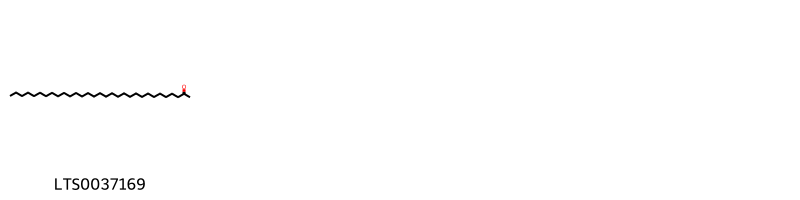{ width=100% }
    <figcaption>Hình ảnh cấu trúc hóa học của 1 hoạt chất thuộc nhóm Organooxygen compounds gồm ['hentriacontan-2-one (LTS0037169)'].</figcaption>
</figure>
#### Nhóm Steroids and steroid derivatives
<figure markdown="span">
    { width=100% }
    <figcaption>Hình ảnh cấu trúc hóa học của 2 hoạt chất thuộc nhóm Steroids and steroid derivatives gồm ['stigmast-5-en-3-ol (LTS0071224)', 'stigmast-5-en-3-ol, (3β)- (LTS0204616)'].</figcaption>
</figure>
#### Nhóm Tannins
<figure markdown="span">
    { width=100% }
    <figcaption>Hình ảnh cấu trúc hóa học của 1 hoạt chất thuộc nhóm Tannins gồm ['ellagic acid (LTS0037297)'].</figcaption>
</figure>

---

### Dược dân tộc học

Danh sách các quốc gia có sử dụng *Geum elatum* trong điều trị các bệnh. 

| Country   | Disease    | Bệnh                                                                                                                                                                                                |
|:----------|:-----------|:----------------------------------------------------------------------------------------------------------------------------------------------------------------------------------------------------|
| India     | Astringent | MYMEMORY WARNING: YOU USED ALL AVAILABLE FREE TRANSLATIONS FOR TODAY. NEXT AVAILABLE IN  12 HOURS 11 MINUTES 27 SECONDS VISIT HTTPS://MYMEMORY.TRANSLATED.NET/DOC/USAGELIMITS.PHP TO TRANSLATE MORE |

---

---
## Geum japonicum
### Thông tin về thực vật

!!! info "Phân loại thực vật của *Geum japonicum* từ GIBF:"
    - **Kingdom:** Plantae
    - **Phylum:** Tracheophyta
    - **Order:** Rosales
    - **Family:** Rosaceae
    - **Genus:** Geum
    - **Species:** *Geum japonicum*

 

| Label (VI)   | Label (EN)   | Scientific Name   | Descriptions (VI)   | Descriptions (EN)   | Also Known As (VI)   | Also Known As (EN)   |
|:-------------|:-------------|:------------------|:--------------------|:--------------------|:---------------------|:---------------------|
| N/A          | N/A          | Geum japonicum    | loài thực vật       | species of plant    | ['']                 | ['']                 |

#### Phân bố trên thế giới

**Từ CSDL GIBF** Colombia, Japan, Germany, Estonia, Russian Federation, China, Korea, Republic of, Chinese Taipei

#### Phân bố tại Việt Nam

**Từ CSDL GIBF**: Không có ghi nhận ở Việt Nam

---
### Thành phần hóa học
        
- Theo cơ sở dữ liệu lotus: Từ loài *Geum japonicum* đã phân lập và xác định được 97 hoạt chất thuộc về các nhóm Organooxygen compounds, Flavonoids, Tannins, Prenol lipids, Phenols, Cinnamic acids and derivatives, Benzene and substituted derivatives. 

|    | chemicalTaxonomyClassyfireClass     |   smiles_count |
|---:|:------------------------------------|---------------:|
|  0 | Benzene and substituted derivatives |              3 |
|  1 | Cinnamic acids and derivatives      |              2 |
|  2 | Flavonoids                          |              1 |
|  3 | Organooxygen compounds              |              4 |
|  4 | Phenols                             |              1 |
|  5 | Prenol lipids                       |             21 |
|  6 | Tannins                             |             64 |

#### Nhóm Benzene and substituted derivatives
<figure markdown="span">
    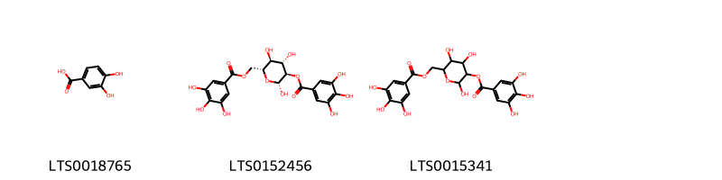{ width=100% }
    <figcaption>Hình ảnh cấu trúc hóa học của 3 hoạt chất thuộc nhóm Benzene and substituted derivatives gồm ['3,4-dihydroxybenzoic acid (LTS0018765)', '(2r,3r,4s,5s,6r)-2,4,5-trihydroxy-6-[(3,4,5-trihydroxybenzoyloxy)methyl]oxan-3-yl 3,4,5-trihydroxybenzoate (LTS0152456)', '2,4,5-trihydroxy-6-[(3,4,5-trihydroxybenzoyloxy)methyl]oxan-3-yl 3,4,5-trihydroxybenzoate (LTS0015341)'].</figcaption>
</figure>
#### Nhóm Cinnamic acids and derivatives
<figure markdown="span">
    { width=100% }
    <figcaption>Hình ảnh cấu trúc hóa học của 2 hoạt chất thuộc nhóm Cinnamic acids and derivatives gồm ['3,4-dihydroxycinnamic acid (LTS0128050)', 'caffeic acid (LTS0027481)'].</figcaption>
</figure>
#### Nhóm Flavonoids
<figure markdown="span">
    { width=100% }
    <figcaption>Hình ảnh cấu trúc hóa học của 1 hoạt chất thuộc nhóm Flavonoids gồm ['astragalin (LTS0249588)'].</figcaption>
</figure>
#### Nhóm Organooxygen compounds
<figure markdown="span">
    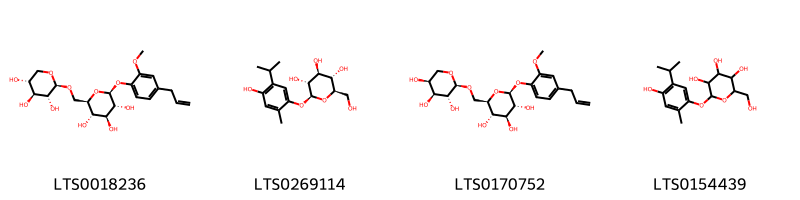{ width=100% }
    <figcaption>Hình ảnh cấu trúc hóa học của 4 hoạt chất thuộc nhóm Organooxygen compounds gồm ['(2s,3r,4s,5s,6r)-2-[2-methoxy-4-(prop-2-en-1-yl)phenoxy]-6-({[(2s,3r,4s,5r)-3,4,5-trihydroxyoxan-2-yl]oxy}methyl)oxane-3,4,5-triol (LTS0018236)', '(2s,3r,4s,5s,6r)-2-(4-hydroxy-5-isopropyl-2-methylphenoxy)-6-(hydroxymethyl)oxane-3,4,5-triol (LTS0269114)', '(2s,3r,4s,5s,6r)-2-[2-methoxy-4-(prop-2-en-1-yl)phenoxy]-6-({[(2s,3r,4s,5s)-3,4,5-trihydroxyoxan-2-yl]oxy}methyl)oxane-3,4,5-triol (LTS0170752)', '2-(4-hydroxy-5-isopropyl-2-methylphenoxy)-6-(hydroxymethyl)oxane-3,4,5-triol (LTS0154439)'].</figcaption>
</figure>
#### Nhóm Phenols
<figure markdown="span">
    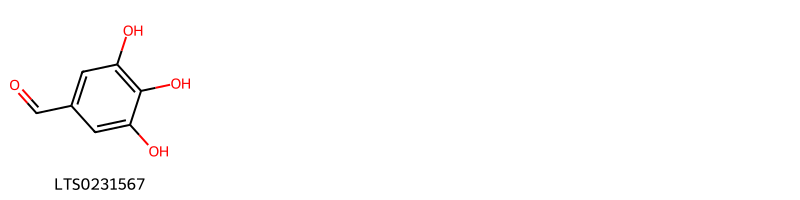{ width=100% }
    <figcaption>Hình ảnh cấu trúc hóa học của 1 hoạt chất thuộc nhóm Phenols gồm ['3,4,5-trihydroxybenzaldehyde (LTS0231567)'].</figcaption>
</figure>
#### Nhóm Prenol lipids
<figure markdown="span">
    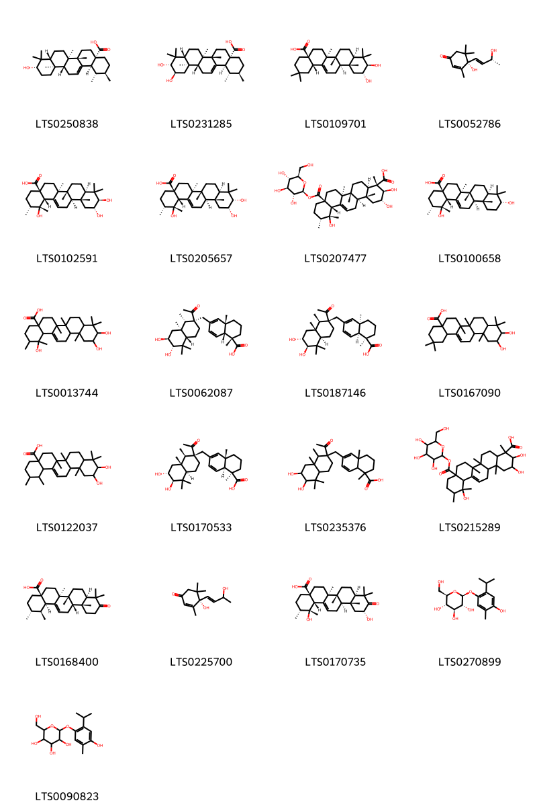{ width=100% }
    <figcaption>Hình ảnh cấu trúc hóa học của 21 hoạt chất thuộc nhóm Prenol lipids gồm ['ursolic acid (LTS0250838)', 'corosolic acid (LTS0231285)', 'maslinic acid (LTS0109701)', '(6s,9r)-vomifoliol (LTS0052786)', 'tormentic acid (LTS0102591)', 'euscaphic acid (LTS0205657)', '(2r,3r,4s,4ar,6ar,6bs,8as,11r,12r,12as,14ar,14br)-2,3,12-trihydroxy-4,6a,6b,11,12,14b-hexamethyl-8a-({[(2s,3r,4s,5s,6r)-3,4,5-trihydroxy-6-(hydroxymethyl)oxan-2-yl]oxy}carbonyl)-1,2,3,4a,5,6,7,8,9,10,11,12a,14,14a-tetradecahydropicene-4-carboxylic acid (LTS0207477)', '(1r,2r,4as,6as,6br,8ar,10r,12ar,12br,14bs)-1,10-dihydroxy-1,2,6a,6b,9,9,12a-heptamethyl-2,3,4,5,6,7,8,8a,10,11,12,12b,13,14b-tetradecahydropicene-4a-carboxylic acid (LTS0100658)', '1,10,11-trihydroxy-1,2,6a,6b,9,9,12a-heptamethyl-2,3,4,5,6,7,8,8a,10,11,12,12b,13,14b-tetradecahydropicene-4a-carboxylic acid (LTS0013744)', '(1s,4as,8ar)-6-{[(1s,2r,4as,6s,7s,8as)-2-acetyl-6,7-dihydroxy-1,5,5,8a-tetramethyl-hexahydro-1h-naphthalen-2-yl]methyl}-1,4a-dimethyl-2,3,4,8a-tetrahydronaphthalene-1-carboxylic acid (LTS0062087)', 'geumonoid (LTS0187146)', '10,11-dihydroxy-2,2,6a,6b,9,9,12a-heptamethyl-1,3,4,5,6,7,8,8a,10,11,12,12b,13,14b-tetradecahydropicene-4a-carboxylic acid (LTS0167090)', '10,11-dihydroxy-1,2,6a,6b,9,9,12a-heptamethyl-2,3,4,5,6,7,8,8a,10,11,12,12b,13,14b-tetradecahydro-1h-picene-4a-carboxylic acid (LTS0122037)', '(1r,4as,8as)-6-{[(1r,2s,4ar,6r,7r,8ar)-2-acetyl-6,7-dihydroxy-1,5,5,8a-tetramethyl-hexahydro-1h-naphthalen-2-yl]methyl}-1,4a-dimethyl-2,3,4,8a-tetrahydronaphthalene-1-carboxylic acid (LTS0170533)', '6-[(2-acetyl-6,7-dihydroxy-1,5,5,8a-tetramethyl-hexahydro-1h-naphthalen-2-yl)methyl]-1,4a-dimethyl-2,3,4,8a-tetrahydronaphthalene-1-carboxylic acid (LTS0235376)', '2,3,12-trihydroxy-4,6a,6b,11,12,14b-hexamethyl-8a-({[3,4,5-trihydroxy-6-(hydroxymethyl)oxan-2-yl]oxy}carbonyl)-1,2,3,4a,5,6,7,8,9,10,11,12a,14,14a-tetradecahydropicene-4-carboxylic acid (LTS0215289)', '(1s,2r,4as,6as,6br,8ar,12ar,12bs,14br)-1,2,6a,6b,9,9,12a-heptamethyl-10-oxo-1,2,3,4,5,6,7,8,8a,11,12,12b,13,14b-tetradecahydropicene-4a-carboxylic acid (LTS0168400)', '(4s)-4-hydroxy-4-(3-hydroxybut-1-en-1-yl)-3,5,5-trimethylcyclohex-2-en-1-one (LTS0225700)', '(1r,2r,4as,6as,6br,8ar,11r,12ar,12br,14bs)-1,11-dihydroxy-1,2,6a,6b,9,9,12a-heptamethyl-10-oxo-3,4,5,6,7,8,8a,11,12,12b,13,14b-dodecahydro-2h-picene-4a-carboxylic acid (LTS0170735)', '(2s,3r,4s,5s,6r)-2-(4-hydroxy-2-isopropyl-5-methylphenoxy)-6-(hydroxymethyl)oxane-3,4,5-triol (LTS0270899)', '2-(4-hydroxy-2-isopropyl-5-methylphenoxy)-6-(hydroxymethyl)oxane-3,4,5-triol (LTS0090823)'].</figcaption>
</figure>
#### Nhóm Tannins
<figure markdown="span">
    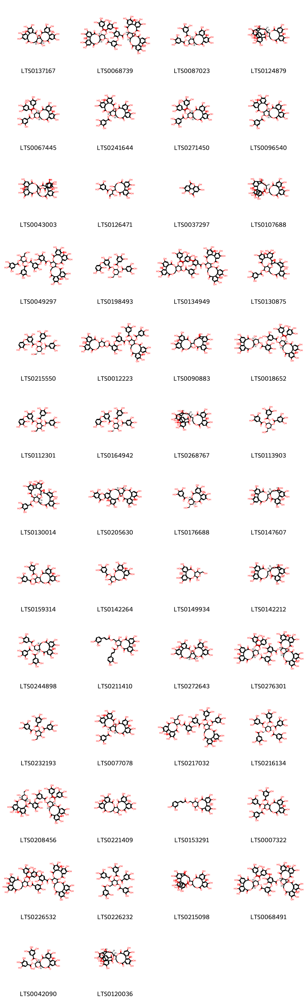{ width=100% }
    <figcaption>Hình ảnh cấu trúc hóa học của 64 hoạt chất thuộc nhóm Tannins gồm ['(1r,2s,19r,22r)-7,8,9,12,13,14,20,28,29,30,33,34,35-tridecahydroxy-3,18,21,24,39-pentaoxaheptacyclo[20.17.0.0²,¹⁹.0⁵,¹⁰.0¹¹,¹⁶.0²⁶,³¹.0³²,³⁷]nonatriaconta-5(10),6,8,11,13,15,26(31),27,29,32,34,36-dodecaene-4,17,25,38-tetrone (LTS0137167)', '(1r,2s,19r,20r,22r)-7,8,9,12,13,14,28,29,30,33,34,35-dodecahydroxy-4,17,25,38-tetraoxo-3,18,21,24,39-pentaoxaheptacyclo[20.17.0.0²,¹⁹.0⁵,¹⁰.0¹¹,¹⁶.0²⁶,³¹.0³²,³⁷]nonatriaconta-5,7,9,11(16),12,14,26,28,30,32(37),33,35-dodecaen-20-yl 2-[5-({[(10r,11s,12r,13r,15r)-3,4,5,21,22,23-hexahydroxy-8,18-dioxo-11,12-bis(3,4,5-trihydroxybenzoyloxy)-9,14,17-trioxatetracyclo[17.4.0.0²,⁷.0¹⁰,¹⁵]tricosa-1(19),2,4,6,20,22-hexaen-13-yl]oxy}carbonyl)-2,3-dihydroxyphenoxy]-3,4,5-trihydroxybenzoate (LTS0068739)', '(10r,11s,12r,15r)-3,4,5,13,21,22,23-heptahydroxy-8,18-dioxo-11-(3,4,5-trihydroxybenzoyloxy)-9,14,17-trioxatetracyclo[17.4.0.0²,⁷.0¹⁰,¹⁵]tricosa-1(23),2(7),3,5,19,21-hexaen-12-yl 3,4,5-trihydroxybenzoate (LTS0087023)', '(11r,12r)-12-[(14r,15s,19s)-2,3,4,7,8,9,19-heptahydroxy-12,17-dioxo-13,16-dioxatetracyclo[13.3.1.0⁵,¹⁸.0⁶,¹¹]nonadeca-1(18),2,4,6,8,10-hexaen-14-yl]-3,4,5,17,18,19-hexahydroxy-8,14-dioxo-9,13-dioxatricyclo[13.4.0.0²,⁷]nonadeca-1(15),2,4,6,16,18-hexaen-11-yl 3,4,5-trihydroxybenzoate (LTS0124879)', '(10r,11s,12r,13s,15r)-3,4,5,21,22,23-hexahydroxy-8,18-dioxo-12,13-bis(3,4,5-trihydroxybenzoyloxy)-9,14,17-trioxatetracyclo[17.4.0.0²,⁷.0¹⁰,¹⁵]tricosa-1(23),2(7),3,5,19,21-hexaen-11-yl 3,4,5-trihydroxybenzoate (LTS0067445)', 'casuarictin (LTS0241644)', '(10r,11s,12r,15r)-3,4,5,21,22,23-hexahydroxy-8,18-dioxo-12,13-bis(3,4,5-trihydroxybenzoyloxy)-9,14,17-trioxatetracyclo[17.4.0.0²,⁷.0¹⁰,¹⁵]tricosa-1(23),2(7),3,5,19,21-hexaen-11-yl 3,4,5-trihydroxybenzoate (LTS0271450)', '(2s,20s,22r)-7,8,9,12,13,14,28,29,30,33,34,35-dodecahydroxy-4,17,25,38-tetraoxo-3,18,21,24,39-pentaoxaheptacyclo[20.17.0.0²,¹⁹.0⁵,¹⁰.0¹¹,¹⁶.0²⁶,³¹.0³²,³⁷]nonatriaconta-5,7,9,11(16),12,14,26,28,30,32(37),33,35-dodecaen-20-yl 3,4,5-trihydroxybenzoate (LTS0096540)', '(1r,38r)-1,13,14,15,18,19,20,34,35,39,39-undecahydroxy-2,5,10,23,31-pentaoxo-6,9,24,27,30,40-hexaoxaoctacyclo[34.3.1.0⁴,³⁸.0⁷,²⁶.0⁸,²⁹.0¹¹,¹⁶.0¹⁷,²².0³²,³⁷]tetraconta-3,11(16),12,14,17,19,21,32,34,36-decaen-28-yl 3,4,5-trihydroxybenzoate (LTS0043003)', '1-{3,4,5,11,17,18,19-heptahydroxy-8,14-dioxo-9,13-dioxatricyclo[13.4.0.0²,⁷]nonadeca-1(15),2,4,6,16,18-hexaen-10-yl}-2-hydroxy-3-oxopropyl 3,4,5-trihydroxybenzoate (LTS0126471)', 'ellagic acid (LTS0037297)', '(11r,12r)-12-[(15s,19s)-2,3,4,7,8,9,19-heptahydroxy-12,17-dioxo-13,16-dioxatetracyclo[13.3.1.0⁵,¹⁸.0⁶,¹¹]nonadeca-1(18),2,4,6,8,10-hexaen-14-yl]-3,4,5,17,18,19-hexahydroxy-8,14-dioxo-9,13-dioxatricyclo[13.4.0.0²,⁷]nonadeca-1(15),2,4,6,16,18-hexaen-11-yl 3,4,5-trihydroxybenzoate (LTS0107688)', '7,8,9,12,13,14,28,29,30,33,34,35-dodecahydroxy-4,17,25,38-tetraoxo-3,18,21,24,39-pentaoxaheptacyclo[20.17.0.0²,¹⁹.0⁵,¹⁰.0¹¹,¹⁶.0²⁶,³¹.0³²,³⁷]nonatriaconta-5,7,9,11(16),12,14,26,28,30,32(37),33,35-dodecaen-20-yl 2-[2,3-dihydroxy-5-({[5-hydroxy-6-(hydroxymethyl)-3,4-bis(3,4,5-trihydroxybenzoyloxy)oxan-2-yl]oxy}carbonyl)phenoxy]-3,4,5-trihydroxybenzoate (LTS0049297)', '(2s,3r,4s,5r,6r)-2-[3,4-dihydroxy-5-(2,3,4-trihydroxyphenoxy)benzoyloxy]-5-hydroxy-6-(hydroxymethyl)-3-(3,4,5-trihydroxybenzoyloxy)oxan-4-yl 3,4,5-trihydroxybenzoate (LTS0198493)', '7,8,9,12,13,14,28,29,30,33,34,35-dodecahydroxy-4,17,25,38-tetraoxo-3,18,21,24,39-pentaoxaheptacyclo[20.17.0.0²,¹⁹.0⁵,¹⁰.0¹¹,¹⁶.0²⁶,³¹.0³²,³⁷]nonatriaconta-5,7,9,11(16),12,14,26,28,30,32(37),33,35-dodecaen-20-yl 2-[5-({[3,4,5,21,22,23-hexahydroxy-8,18-dioxo-11,12-bis(3,4,5-trihydroxybenzoyloxy)-9,14,17-trioxatetracyclo[17.4.0.0²,⁷.0¹⁰,¹⁵]tricosa-1(23),2(7),3,5,19,21-hexaen-13-yl]oxy}carbonyl)-2,3-dihydroxyphenoxy]-3,4,5-trihydroxybenzoate (LTS0134949)', '6,6,7,11,12,26,27,28,31,32,33-undecahydroxy-2,5,15,23,35-pentaoxo-16,19,22,36,39,41-hexaoxanonacyclo[18.15.3.1¹,³⁸.1⁷,¹⁰.1³⁰,³⁴.0³,⁸.0⁹,¹⁴.0¹⁷,³⁷.0²⁴,²⁹]hentetraconta-3,9,11,13,24,26,28,30(40),31,33-decaen-18-yl 3,4,5-trihydroxybenzoate (LTS0130875)', '(2s,3s,4r,5r,6s)-2-[3,4-dihydroxy-5-(2,3,4-trihydroxyphenoxy)benzoyloxy]-5-hydroxy-6-(hydroxymethyl)-3-(3,4,5-trihydroxybenzoyloxy)oxan-4-yl 3,4,5-trihydroxybenzoate (LTS0215550)', '3,4,5,11,12,21,22,23-octahydroxy-8,18-dioxo-9,14,17-trioxatetracyclo[17.4.0.0²,⁷.0¹⁰,¹⁵]tricosa-1(23),2(7),3,5,19,21-hexaen-13-yl 2-[5-({[3,4,5,21,22,23-hexahydroxy-8,18-dioxo-11,12-bis(3,4,5-trihydroxybenzoyloxy)-9,14,17-trioxatetracyclo[17.4.0.0²,⁷.0¹⁰,¹⁵]tricosa-1(23),2(7),3,5,19,21-hexaen-13-yl]oxy}carbonyl)-2,3-dihydroxyphenoxy]-3,4,5-trihydroxybenzoate (LTS0012223)', '14-{3,4,5,11,17,18,19-heptahydroxy-8,14-dioxo-9,13-dioxatricyclo[13.4.0.0²,⁷]nonadeca-1(15),2,4,6,16,18-hexaen-10-yl}-2,3,4,7,8,9,19-heptahydroxy-13,16-dioxatetracyclo[13.3.1.0⁵,¹⁸.0⁶,¹¹]nonadeca-1(18),2,4,6,8,10-hexaene-12,17-dione (LTS0090883)', '(10s,11r,12r,13r,15r)-3,4,5,11,12,21,22,23-octahydroxy-8,18-dioxo-9,14,17-trioxatetracyclo[17.4.0.0²,⁷.0¹⁰,¹⁵]tricosa-1(23),2(7),3,5,19,21-hexaen-13-yl 2-[5-({[(10r,11s,12r,13s,15r)-3,4,5,21,22,23-hexahydroxy-8,18-dioxo-11,12-bis(3,4,5-trihydroxybenzoyloxy)-9,14,17-trioxatetracyclo[17.4.0.0²,⁷.0¹⁰,¹⁵]tricosa-1(23),2(7),3,5,19,21-hexaen-13-yl]oxy}carbonyl)-2,3-dihydroxyphenoxy]-3,4,5-trihydroxybenzoate (LTS0018652)', '2-[3,4-dihydroxy-5-(2,3,4-trihydroxyphenoxy)benzoyloxy]-5-hydroxy-6-(hydroxymethyl)-3-(3,4,5-trihydroxybenzoyloxy)oxan-4-yl 3,4,5-trihydroxybenzoate (LTS0112301)', '(2s,3s,4r,6s)-2-[3,4-dihydroxy-5-(2,3,4-trihydroxyphenoxy)benzoyloxy]-5-hydroxy-6-(hydroxymethyl)-3-(3,4,5-trihydroxybenzoyloxy)oxan-4-yl 3,4,5-trihydroxybenzoate (LTS0164942)', '(11s,12r)-12-[(14r,15s,19s)-2,3,4,7,8,9,19-heptahydroxy-12,17-dioxo-13,16-dioxatetracyclo[13.3.1.0⁵,¹⁸.0⁶,¹¹]nonadeca-1(18),2,4,6,8,10-hexaen-14-yl]-3,4,5,17,18,19-hexahydroxy-8,14-dioxo-9,13-dioxatricyclo[13.4.0.0²,⁷]nonadeca-1(15),2,4,6,16,18-hexaen-11-yl 3,4,5-trihydroxybenzoate (LTS0268767)', '(2r,3r,4s,5r,6s)-3-hydroxy-2-(hydroxymethyl)-5,6-bis(3,4,5-trihydroxybenzoyloxy)oxan-4-yl 3,4,5-trihydroxybenzoate (LTS0113903)', '(1r,7r,8r,17r,18s,20r,37s,38s)-6,6,7,11,12,26,27,28,31,32,33-undecahydroxy-2,5,15,23,35-pentaoxo-16,19,22,36,39,41-hexaoxanonacyclo[18.15.3.1¹,³⁸.1⁷,¹⁰.1³⁰,³⁴.0³,⁸.0⁹,¹⁴.0¹⁷,³⁷.0²⁴,²⁹]hentetraconta-3,9,11,13,24,26,28,30(40),31,33-decaen-18-yl 3,4,5-trihydroxybenzoate (LTS0130014)', '(1r,28r,31r,48s)-6,7,8,11,17,18,19,30,36,37,38,41,42,43-tetradecahydroxy-2,13,21,26,29,32,47-heptaoxanonacyclo[26.20.0.0⁴,⁹.0¹⁰,²⁴.0¹²,²².0¹⁵,²⁰.0³¹,⁴⁸.0³⁴,³⁹.0⁴⁰,⁴⁵]octatetraconta-4(9),5,7,10,12(22),15(20),16,18,23,34(39),35,37,40,42,44-pentadecaene-3,14,25,33,46-pentone (LTS0205630)', '(10r,11r,13r,14r,15s)-3,4,5,14,20,21,22-heptahydroxy-13-(hydroxymethyl)-8,17-dioxo-9,12,16-trioxatetracyclo[16.4.0.0²,⁷.0¹⁰,¹⁵]docosa-1(22),2(7),3,5,18,20-hexaen-11-yl 3,4,5-trihydroxybenzoate (LTS0176688)', '(14s,15s,19s)-14-[(10s,11s)-3,4,5,11,17,18,19-heptahydroxy-8,14-dioxo-9,13-dioxatricyclo[13.4.0.0²,⁷]nonadeca-1(15),2,4,6,16,18-hexaen-10-yl]-2,3,4,7,8,9,19-heptahydroxy-13,16-dioxatetracyclo[13.3.1.0⁵,¹⁸.0⁶,¹¹]nonadeca-1(18),2,4,6,8,10-hexaene-12,17-dione (LTS0147607)', '3,4,5,13,21,22,23-heptahydroxy-8,18-dioxo-12-(3,4,5-trihydroxybenzoyloxy)-9,14,17-trioxatetracyclo[17.4.0.0²,⁷.0¹⁰,¹⁵]tricosa-1(23),2(7),3,5,19,21-hexaen-11-yl 3,4,5-trihydroxybenzoate (LTS0159314)', '3,4,5,12,13,21,22,23-octahydroxy-8,18-dioxo-9,14,17-trioxatetracyclo[17.4.0.0²,⁷.0¹⁰,¹⁵]tricosa-1(23),2(7),3,5,19,21-hexaen-11-yl 3,4,5-trihydroxybenzoate (LTS0142264)', '3,4,5,11,14,20,21,22-octahydroxy-13-(hydroxymethyl)-9,12,16-trioxatetracyclo[16.4.0.0²,⁷.0¹⁰,¹⁵]docosa-1(22),2(7),3,5,18,20-hexaene-8,17-dione (LTS0149934)', '(14s,15s,19r)-14-[(10s,11r)-3,4,5,11,17,18,19-heptahydroxy-8,14-dioxo-9,13-dioxatricyclo[13.4.0.0²,⁷]nonadeca-1(15),2,4,6,16,18-hexaen-10-yl]-2,3,4,7,8,9,19-heptahydroxy-13,16-dioxatetracyclo[13.3.1.0⁵,¹⁸.0⁶,¹¹]nonadeca-1(18),2,4,6,8,10-hexaene-12,17-dione (LTS0142212)', '(10s,11s,12s,13r,15s)-3,4,5,21,22,23-hexahydroxy-8,18-dioxo-11,12-bis(3,4,5-trihydroxybenzoyloxy)-9,14,17-trioxatetracyclo[17.4.0.0²,⁷.0¹⁰,¹⁵]tricosa-1(19),2,4,6,20,22-hexaen-13-yl 3,4,5-trihydroxybenzoate (LTS0244898)', '(11-{[3-(3,4-dihydroxyphenyl)prop-2-enoyl]oxy}-3,4,5,14,20,21,22-heptahydroxy-8,17-dioxo-9,12,16-trioxatetracyclo[16.4.0.0²,⁷.0¹⁰,¹⁵]docosa-1(18),2,4,6,19,21-hexaen-13-yl)methyl 3-(3,4-dihydroxyphenyl)prop-2-enoate (LTS0211410)', '(1r,2s,19r,20s,22r)-7,8,9,12,13,14,20,28,29,30,33,34,35-tridecahydroxy-3,18,21,24,39-pentaoxaheptacyclo[20.17.0.0²,¹⁹.0⁵,¹⁰.0¹¹,¹⁶.0²⁶,³¹.0³²,³⁷]nonatriaconta-5(10),6,8,11,13,15,26(31),27,29,32,34,36-dodecaene-4,17,25,38-tetrone (LTS0272643)', '(1r,2s,19r,20r,22r)-7,8,9,12,13,14,28,29,30,33,34,35-dodecahydroxy-4,17,25,38-tetraoxo-3,18,21,24,39-pentaoxaheptacyclo[20.17.0.0²,¹⁹.0⁵,¹⁰.0¹¹,¹⁶.0²⁶,³¹.0³²,³⁷]nonatriaconta-5,7,9,11(16),12,14,26,28,30,32(37),33,35-dodecaen-20-yl 2-[5-({[(10r,11s,12r,13s,15r)-3,4,5,21,22,23-hexahydroxy-8,18-dioxo-12-(2,3,4-trihydroxybenzoyloxy)-11-(3,4,5-trihydroxybenzoyloxy)-9,14,17-trioxatetracyclo[17.4.0.0²,⁷.0¹⁰,¹⁵]tricosa-1(23),2(7),3,5,19,21-hexaen-13-yl]oxy}carbonyl)-2,3-dihydroxyphenoxy]-3,4,5-trihydroxybenzoate (LTS0276301)', '3-hydroxy-2-(hydroxymethyl)-5,6-bis(3,4,5-trihydroxybenzoyloxy)oxan-4-yl 3,4,5-trihydroxybenzoate (LTS0232193)', '(1r,2s,19r,20r,22r)-7,8,9,12,13,14,28,29,30,33,34,35-dodecahydroxy-4,17,25,38-tetraoxo-3,18,21,24,39-pentaoxaheptacyclo[20.17.0.0²,¹⁹.0⁵,¹⁰.0¹¹,¹⁶.0²⁶,³¹.0³²,³⁷]nonatriaconta-5,7,9,11(16),12,14,26,28,30,32(37),33,35-dodecaen-20-yl 3,4,5-trihydroxybenzoate (LTS0077078)', '3,4,5,14,20,21,22-heptahydroxy-13-(hydroxymethyl)-8,17-dioxo-9,12,16-trioxatetracyclo[16.4.0.0²,⁷.0¹⁰,¹⁵]docosa-1(22),2(7),3,5,18,20-hexaen-11-yl 2-[5-({[3,4,5,21,22,23-hexahydroxy-8,18-dioxo-11,12-bis(3,4,5-trihydroxybenzoyloxy)-9,14,17-trioxatetracyclo[17.4.0.0²,⁷.0¹⁰,¹⁵]tricosa-1(23),2(7),3,5,19,21-hexaen-13-yl]oxy}carbonyl)-2,3-dihydroxyphenoxy]-3,4,5-trihydroxybenzoate (LTS0217032)', '(2s,3r,4s,5r,6r)-3,4,5-tris(3,4,5-trihydroxybenzoyloxy)-6-[(3,4,5-trihydroxybenzoyloxy)methyl]oxan-2-yl 3,4,5-trihydroxybenzoate (LTS0216134)', '(10r,11r,13r,14r,15s)-3,4,5,14,20,21,22-heptahydroxy-13-(hydroxymethyl)-8,17-dioxo-9,12,16-trioxatetracyclo[16.4.0.0²,⁷.0¹⁰,¹⁵]docosa-1(22),2(7),3,5,18,20-hexaen-11-yl 2-[5-({[(10r,11s,12r,13s,15r)-3,4,5,21,22,23-hexahydroxy-8,18-dioxo-11,12-bis(3,4,5-trihydroxybenzoyloxy)-9,14,17-trioxatetracyclo[17.4.0.0²,⁷.0¹⁰,¹⁵]tricosa-1(23),2(7),3,5,19,21-hexaen-13-yl]oxy}carbonyl)-2,3-dihydroxyphenoxy]-3,4,5-trihydroxybenzoate (LTS0208456)', '7,8,9,12,13,14,20,28,29,30,33,34,35-tridecahydroxy-3,18,21,24,39-pentaoxaheptacyclo[20.17.0.0²,¹⁹.0⁵,¹⁰.0¹¹,¹⁶.0²⁶,³¹.0³²,³⁷]nonatriaconta-5(10),6,8,11,13,15,26(31),27,29,32,34,36-dodecaene-4,17,25,38-tetrone (LTS0221409)', '{3,4,5,11,14,20,21,22-octahydroxy-8,17-dioxo-9,12,16-trioxatetracyclo[16.4.0.0²,⁷.0¹⁰,¹⁵]docosa-1(18),2,4,6,19,21-hexaen-13-yl}methyl 3-(3,4-dihydroxyphenyl)prop-2-enoate (LTS0153291)', '3,4,5,21,22,23-hexahydroxy-8,18-dioxo-12,13-bis(3,4,5-trihydroxybenzoyloxy)-9,14,17-trioxatetracyclo[17.4.0.0²,⁷.0¹⁰,¹⁵]tricosa-1(23),2(7),3,5,19,21-hexaen-11-yl 3,4,5-trihydroxybenzoate (LTS0007322)', '7,8,9,12,13,14,28,29,30,33,34,35-dodecahydroxy-4,17,25,38-tetraoxo-3,18,21,24,39-pentaoxaheptacyclo[20.17.0.0²,¹⁹.0⁵,¹⁰.0¹¹,¹⁶.0²⁶,³¹.0³²,³⁷]nonatriaconta-5,7,9,11(16),12,14,26,28,30,32(37),33,35-dodecaen-20-yl 2-[5-({[3,4,5,21,22,23-hexahydroxy-8,18-dioxo-12-(2,3,4-trihydroxybenzoyloxy)-11-(3,4,5-trihydroxybenzoyloxy)-9,14,17-trioxatetracyclo[17.4.0.0²,⁷.0¹⁰,¹⁵]tricosa-1(23),2(7),3,5,19,21-hexaen-13-yl]oxy}carbonyl)-2,3-dihydroxyphenoxy]-3,4,5-trihydroxybenzoate (LTS0226532)', '3,4,5-tris(3,4,5-trihydroxybenzoyloxy)-6-[(3,4,5-trihydroxybenzoyloxy)methyl]oxan-2-yl 3,4,5-trihydroxybenzoate (LTS0226232)', '12-{2,3,4,7,8,9,19-heptahydroxy-12,17-dioxo-13,16-dioxatetracyclo[13.3.1.0⁵,¹⁸.0⁶,¹¹]nonadeca-1(18),2,4,6,8,10-hexaen-14-yl}-3,4,5,17,18,19-hexahydroxy-8,14-dioxo-9,13-dioxatricyclo[13.4.0.0²,⁷]nonadeca-1(15),2,4,6,16,18-hexaen-11-yl 3,4,5-trihydroxybenzoate (LTS0215098)', '(1r,2s,19r,20r,22r)-7,8,9,12,13,14,28,29,30,33,34,35-dodecahydroxy-4,17,25,38-tetraoxo-3,18,21,24,39-pentaoxaheptacyclo[20.17.0.0²,¹⁹.0⁵,¹⁰.0¹¹,¹⁶.0²⁶,³¹.0³²,³⁷]nonatriaconta-5,7,9,11(16),12,14,26,28,30,32(37),33,35-dodecaen-20-yl 2-[5-({[(10r,11s,12r,13s,15r)-3,4,5,21,22,23-hexahydroxy-8,18-dioxo-11,12-bis(3,4,5-trihydroxybenzoyloxy)-9,14,17-trioxatetracyclo[17.4.0.0²,⁷.0¹⁰,¹⁵]tricosa-1(23),2(7),3,5,19,21-hexaen-13-yl]oxy}carbonyl)-2,3-dihydroxyphenoxy]-3,4,5-trihydroxybenzoate (LTS0068491)', '(10r,11s,12r,13s,15r)-3,4,5,13,21,22,23-heptahydroxy-8,18-dioxo-11-(3,4,5-trihydroxybenzoyloxy)-9,14,17-trioxatetracyclo[17.4.0.0²,⁷.0¹⁰,¹⁵]tricosa-1(23),2(7),3,5,19,21-hexaen-12-yl 3,4,5-trihydroxybenzoate (LTS0042090)', '(11s,12s)-12-[(14r,15r,19r)-2,3,4,7,8,9,19-heptahydroxy-12,17-dioxo-13,16-dioxatetracyclo[13.3.1.0⁵,¹⁸.0⁶,¹¹]nonadeca-1(18),2,4,6,8,10-hexaen-14-yl]-3,4,5,17,18,19-hexahydroxy-8,14-dioxo-9,13-dioxatricyclo[13.4.0.0²,⁷]nonadeca-1(15),2,4,6,16,18-hexaen-11-yl 3,4,5-trihydroxybenzoate (LTS0120036)', '(10r,11r,12r,13s,15r)-3,4,5,12,13,21,22,23-octahydroxy-8,18-dioxo-9,14,17-trioxatetracyclo[17.4.0.0²,⁷.0¹⁰,¹⁵]tricosa-1(23),2(7),3,5,19,21-hexaen-11-yl 3,4,5-trihydroxybenzoate (LTS0137319)', '3,4,5,14,20,21,22-heptahydroxy-13-(hydroxymethyl)-8,17-dioxo-9,12,16-trioxatetracyclo[16.4.0.0²,⁷.0¹⁰,¹⁵]docosa-1(22),2(7),3,5,18,20-hexaen-11-yl 3,4,5-trihydroxybenzoate (LTS0005266)', '(1r,2s,19r,20r,22r)-7,8,9,12,13,14,28,29,30,33,34,35-dodecahydroxy-4,17,25,38-tetraoxo-3,18,21,24,39-pentaoxaheptacyclo[20.17.0.0²,¹⁹.0⁵,¹⁰.0¹¹,¹⁶.0²⁶,³¹.0³²,³⁷]nonatriaconta-5,7,9,11(16),12,14,26,28,30,32(37),33,35-dodecaen-20-yl 2-[2,3-dihydroxy-5-({[(2s,3r,4s,5r,6r)-5-hydroxy-6-(hydroxymethyl)-3,4-bis(3,4,5-trihydroxybenzoyloxy)oxan-2-yl]oxy}carbonyl)phenoxy]-3,4,5-trihydroxybenzoate (LTS0015990)', '7,8,9,12,13,14,28,29,30,33,34,35-dodecahydroxy-4,17,25,38-tetraoxo-3,18,21,24,39-pentaoxaheptacyclo[20.17.0.0²,¹⁹.0⁵,¹⁰.0¹¹,¹⁶.0²⁶,³¹.0³²,³⁷]nonatriaconta-5,7,9,11(16),12,14,26,28,30,32(37),33,35-dodecaen-20-yl 3,4,5-trihydroxybenzoate (LTS0009009)', '[(10r,11r,13r,14r,15s)-11-{[(2e)-3-(3,4-dihydroxyphenyl)prop-2-enoyl]oxy}-3,4,5,14,20,21,22-heptahydroxy-8,17-dioxo-9,12,16-trioxatetracyclo[16.4.0.0²,⁷.0¹⁰,¹⁵]docosa-1(18),2,4,6,19,21-hexaen-13-yl]methyl (2e)-3-(3,4-dihydroxyphenyl)prop-2-enoate (LTS0014185)', '(1r,2s,19r,20r,22r)-7,8,9,12,13,14,20,28,29,30,33,34,35-tridecahydroxy-3,18,21,24,39-pentaoxaheptacyclo[20.17.0.0²,¹⁹.0⁵,¹⁰.0¹¹,¹⁶.0²⁶,³¹.0³²,³⁷]nonatriaconta-5(10),6,8,11,13,15,26(31),27,29,32,34,36-dodecaene-4,17,25,38-tetrone (LTS0092963)', '10-{3,3,4,8,9,19-hexahydroxy-2,12,17-trioxo-13,16,20-trioxapentacyclo[13.3.1.1⁴,⁷.0⁵,¹⁸.0⁶,¹¹]icosa-1(18),6(11),7,9-tetraen-14-yl}-3,4,5,17,18,19-hexahydroxy-8,14-dioxo-9,13-dioxatricyclo[13.4.0.0²,⁷]nonadeca-1(15),2,4,6,16,18-hexaen-11-yl 3,4,5-trihydroxybenzoate (LTS0010128)', '(2r,3r)-3-[(10s,11r)-11-formyl-3,4,5,16,17,18-hexahydroxy-8,13-dioxo-9,12-dioxatricyclo[12.4.0.0²,⁷]octadeca-1(18),2(7),3,5,14,16-hexaen-10-yl]-2,3-dihydroxypropyl (2e)-3-(3,4-dihydroxyphenyl)prop-2-enoate (LTS0231601)', '(10r,11r,13r,14r,15s)-3,4,5,11,14,20,21,22-octahydroxy-13-(hydroxymethyl)-9,12,16-trioxatetracyclo[16.4.0.0²,⁷.0¹⁰,¹⁵]docosa-1(18),2,4,6,19,21-hexaene-8,17-dione (LTS0033259)', '[(10r,11s,13r,14r,15s)-3,4,5,11,14,20,21,22-octahydroxy-8,17-dioxo-9,12,16-trioxatetracyclo[16.4.0.0²,⁷.0¹⁰,¹⁵]docosa-1(18),2,4,6,19,21-hexaen-13-yl]methyl (2e)-3-(3,4-dihydroxyphenyl)prop-2-enoate (LTS0037396)', '(14r,15s,19r)-14-[(10r,11r)-3,4,5,11,17,18,19-heptahydroxy-8,14-dioxo-9,13-dioxatricyclo[13.4.0.0²,⁷]nonadeca-1(15),2,4,6,16,18-hexaen-10-yl]-2,3,4,7,8,9,19-heptahydroxy-13,16-dioxatetracyclo[13.3.1.0⁵,¹⁸.0⁶,¹¹]nonadeca-1(18),2,4,6,8,10-hexaene-12,17-dione (LTS0041901)', '(7r,8s,26r,28s,29s)-1,13,14,15,18,19,20,34,35,39,39-undecahydroxy-2,5,10,23,31-pentaoxo-6,9,24,27,30,40-hexaoxaoctacyclo[34.3.1.0⁴,³⁸.0⁷,²⁶.0⁸,²⁹.0¹¹,¹⁶.0¹⁷,²².0³²,³⁷]tetraconta-3,11,13,15,17(22),18,20,32,34,36-decaen-28-yl 3,4,5-trihydroxybenzoate (LTS0238381)', '(14r,15s,19s)-14-[(10r,11r)-3,4,5,11,17,18,19-heptahydroxy-8,14-dioxo-9,13-dioxatricyclo[13.4.0.0²,⁷]nonadeca-1(15),2,4,6,16,18-hexaen-10-yl]-2,3,4,7,8,9,19-heptahydroxy-13,16-dioxatetracyclo[13.3.1.0⁵,¹⁸.0⁶,¹¹]nonadeca-1(18),2,4,6,8,10-hexaene-12,17-dione (LTS0042847)', '(10r,11r)-10-[(4s,5s,14r,15s,19r)-3,3,4,8,9,19-hexahydroxy-2,12,17-trioxo-13,16,20-trioxapentacyclo[13.3.1.1⁴,⁷.0⁵,¹⁸.0⁶,¹¹]icosa-1(18),6(11),7,9-tetraen-14-yl]-3,4,5,17,18,19-hexahydroxy-8,14-dioxo-9,13-dioxatricyclo[13.4.0.0²,⁷]nonadeca-1(15),2,4,6,16,18-hexaen-11-yl 3,4,5-trihydroxybenzoate (LTS0050403)'].</figcaption>
</figure>

---

### Dược dân tộc học

Danh sách các quốc gia có sử dụng *Geum japonicum* trong điều trị các bệnh. 

| Country   | Disease   | Bệnh                                                                                                                                                                                                |
|:----------|:----------|:----------------------------------------------------------------------------------------------------------------------------------------------------------------------------------------------------|
| Elsewhere | Diuretic  | MYMEMORY WARNING: YOU USED ALL AVAILABLE FREE TRANSLATIONS FOR TODAY. NEXT AVAILABLE IN  12 HOURS 10 MINUTES 57 SECONDS VISIT HTTPS://MYMEMORY.TRANSLATED.NET/DOC/USAGELIMITS.PHP TO TRANSLATE MORE |

---

---
## Geum macrophyllum
### Thông tin về thực vật

!!! info "Phân loại thực vật của *Geum macrophyllum* từ GIBF:"
    - **Kingdom:** Plantae
    - **Phylum:** Tracheophyta
    - **Order:** Rosales
    - **Family:** Rosaceae
    - **Genus:** Geum
    - **Species:** *Geum macrophyllum*

 

| Label (VI)   | Label (EN)   | Scientific Name   | Descriptions (VI)   | Descriptions (EN)   | Also Known As (VI)   | Also Known As (EN)                                                               |
|:-------------|:-------------|:------------------|:--------------------|:--------------------|:---------------------|:---------------------------------------------------------------------------------|
| N/A          | N/A          | Geum macrophyllum | loài thực vật       | species of plant    | ['']                 | ['largeleaf avens', 'bigleaf avens', 'large leaved avens', 'large-leaved avens'] |

#### Phân bố trên thế giới

**Từ CSDL GIBF** Denmark, United Kingdom of Great Britain and Northern Ireland, Sweden, Canada, Russian Federation, United States of America, Iceland, Norway, Belgium, Netherlands

#### Phân bố tại Việt Nam

**Từ CSDL GIBF**: Không có ghi nhận ở Việt Nam

---
### Thành phần hóa học
        
- Theo cơ sở dữ liệu lotus: Từ loài *Geum macrophyllum* đã phân lập và xác định được Chưa có hoạt chất nào được phân lập. hoạt chất thuộc về các nhóm Không có hoạt chất nào được phân lập. 

Không có hình ảnh nào được tạo ra

---

### Dược dân tộc học

Danh sách các quốc gia có sử dụng *Geum macrophyllum* trong điều trị các bệnh. 

| Country        | Disease    | Bệnh                                                                                                                                                                                                |
|:---------------|:-----------|:----------------------------------------------------------------------------------------------------------------------------------------------------------------------------------------------------|
| US(Amerindian) | Astringent | MYMEMORY WARNING: YOU USED ALL AVAILABLE FREE TRANSLATIONS FOR TODAY. NEXT AVAILABLE IN  12 HOURS 10 MINUTES 23 SECONDS VISIT HTTPS://MYMEMORY.TRANSLATED.NET/DOC/USAGELIMITS.PHP TO TRANSLATE MORE |

---

---
## Geum rivale
### Thông tin về thực vật

!!! info "Phân loại thực vật của *Geum rivale* từ GIBF:"
    - **Kingdom:** Plantae
    - **Phylum:** Tracheophyta
    - **Order:** Rosales
    - **Family:** Rosaceae
    - **Genus:** Geum
    - **Species:** *Geum rivale*

 

| Label (VI)   | Label (EN)   | Scientific Name   | Descriptions (VI)   | Descriptions (EN)   | Also Known As (VI)   | Also Known As (EN)   |
|:-------------|:-------------|:------------------|:--------------------|:--------------------|:---------------------|:---------------------|
| N/A          | N/A          | Geum rivale       | loài thực vật       | species of plant    | ['']                 | ['Water Avens']      |

#### Phân bố trên thế giới

**Từ CSDL GIBF** Switzerland, Belarus, Denmark, United Kingdom of Great Britain and Northern Ireland, Sweden, Lithuania, France, Czechia, Poland, Germany, Russian Federation, Finland, Austria, Ireland, Norway, Croatia, Netherlands, Ukraine

#### Phân bố tại Việt Nam

**Từ CSDL GIBF**: Không có ghi nhận ở Việt Nam

---
### Thành phần hóa học
        
- Theo cơ sở dữ liệu lotus: Từ loài *Geum rivale* đã phân lập và xác định được 9 hoạt chất thuộc về các nhóm Organooxygen compounds, Flavonoids, Coumarins and derivatives, Prenol lipids, Cinnamic acids and derivatives, Steroids and steroid derivatives, Benzene and substituted derivatives. 

|    | chemicalTaxonomyClassyfireClass     |   smiles_count |
|---:|:------------------------------------|---------------:|
|  0 | Benzene and substituted derivatives |              1 |
|  1 | Cinnamic acids and derivatives      |              1 |
|  2 | Coumarins and derivatives           |              1 |
|  3 | Flavonoids                          |              2 |
|  4 | Organooxygen compounds              |              1 |
|  5 | Prenol lipids                       |              2 |
|  6 | Steroids and steroid derivatives    |              1 |

#### Nhóm Benzene and substituted derivatives
<figure markdown="span">
    { width=100% }
    <figcaption>Hình ảnh cấu trúc hóa học của 1 hoạt chất thuộc nhóm Benzene and substituted derivatives gồm ['galop (LTS0222857)'].</figcaption>
</figure>
#### Nhóm Cinnamic acids and derivatives
<figure markdown="span">
    { width=100% }
    <figcaption>Hình ảnh cấu trúc hóa học của 1 hoạt chất thuộc nhóm Cinnamic acids and derivatives gồm ['3,4-dihydroxycinnamic acid (LTS0128050)'].</figcaption>
</figure>
#### Nhóm Coumarins and derivatives
<figure markdown="span">
    { width=100% }
    <figcaption>Hình ảnh cấu trúc hóa học của 1 hoạt chất thuộc nhóm Coumarins and derivatives gồm ['esculetin (LTS0067593)'].</figcaption>
</figure>
#### Nhóm Flavonoids
<figure markdown="span">
    { width=100% }
    <figcaption>Hình ảnh cấu trúc hóa học của 2 hoạt chất thuộc nhóm Flavonoids gồm ['kaempherol (LTS0155822)', 'quercetin (LTS0004651)'].</figcaption>
</figure>
#### Nhóm Organooxygen compounds
<figure markdown="span">
    { width=100% }
    <figcaption>Hình ảnh cấu trúc hóa học của 1 hoạt chất thuộc nhóm Organooxygen compounds gồm ['sucrose (LTS0272557)'].</figcaption>
</figure>
#### Nhóm Prenol lipids
<figure markdown="span">
    { width=100% }
    <figcaption>Hình ảnh cấu trúc hóa học của 2 hoạt chất thuộc nhóm Prenol lipids gồm ['ursolic acid (LTS0250838)', 'oleanolic acid (LTS0117717)'].</figcaption>
</figure>
#### Nhóm Steroids and steroid derivatives
<figure markdown="span">
    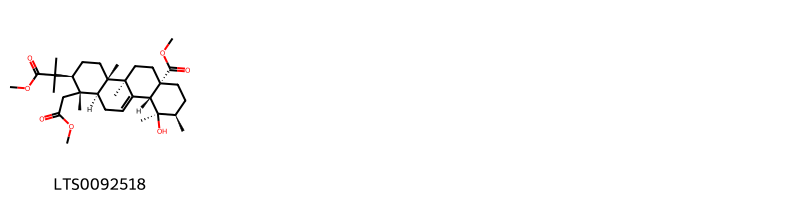{ width=100% }
    <figcaption>Hình ảnh cấu trúc hóa học của 1 hoạt chất thuộc nhóm Steroids and steroid derivatives gồm ['methyl (1s,2s,4as,4br,6as,9r,10r,10ar,12as)-10-hydroxy-2-(1-methoxy-2-methyl-1-oxopropan-2-yl)-1-(2-methoxy-2-oxoethyl)-1,4a,4b,9,10-pentamethyl-3,4,5,6,7,8,9,10a,12,12a-decahydro-2h-chrysene-6a-carboxylate (LTS0092518)'].</figcaption>
</figure>

---

### Dược dân tộc học

Danh sách các quốc gia có sử dụng *Geum rivale* trong điều trị các bệnh. 

| Country        | Disease                                             | Bệnh                                                                                                                                                                                                |
|:---------------|:----------------------------------------------------|:----------------------------------------------------------------------------------------------------------------------------------------------------------------------------------------------------|
| Elsewhere      | Astringent, Stomachic, Tonic                        | MYMEMORY WARNING: YOU USED ALL AVAILABLE FREE TRANSLATIONS FOR TODAY. NEXT AVAILABLE IN  12 HOURS 09 MINUTES 54 SECONDS VISIT HTTPS://MYMEMORY.TRANSLATED.NET/DOC/USAGELIMITS.PHP TO TRANSLATE MORE |
| Turkey         | Astringent, Stomachic, Tonic, Antiseptic, Digestive | MYMEMORY WARNING: YOU USED ALL AVAILABLE FREE TRANSLATIONS FOR TODAY. NEXT AVAILABLE IN  12 HOURS 09 MINUTES 51 SECONDS VISIT HTTPS://MYMEMORY.TRANSLATED.NET/DOC/USAGELIMITS.PHP TO TRANSLATE MORE |
| US             | Vermifuge                                           | MYMEMORY WARNING: YOU USED ALL AVAILABLE FREE TRANSLATIONS FOR TODAY. NEXT AVAILABLE IN  12 HOURS 09 MINUTES 48 SECONDS VISIT HTTPS://MYMEMORY.TRANSLATED.NET/DOC/USAGELIMITS.PHP TO TRANSLATE MORE |
| US(Appalachia) | Tonic                                               | MYMEMORY WARNING: YOU USED ALL AVAILABLE FREE TRANSLATIONS FOR TODAY. NEXT AVAILABLE IN  12 HOURS 09 MINUTES 45 SECONDS VISIT HTTPS://MYMEMORY.TRANSLATED.NET/DOC/USAGELIMITS.PHP TO TRANSLATE MORE |

---

---
## Geum triflorum
### Thông tin về thực vật

!!! info "Phân loại thực vật của *Geum triflorum* từ GIBF:"
    - **Kingdom:** Plantae
    - **Phylum:** Tracheophyta
    - **Order:** Rosales
    - **Family:** Rosaceae
    - **Genus:** Geum
    - **Species:** *Geum triflorum*

 

| Label (VI)   | Label (EN)   | Scientific Name   | Descriptions (VI)   | Descriptions (EN)   | Also Known As (VI)   | Also Known As (EN)   |
|:-------------|:-------------|:------------------|:--------------------|:--------------------|:---------------------|:---------------------|
| N/A          | N/A          | Geum triflorum    | loài thực vật       | species of plant    | ['']                 | ['']                 |

#### Phân bố trên thế giới

**Từ CSDL GIBF** nan, Canada, United States of America

#### Phân bố tại Việt Nam

**Từ CSDL GIBF**: Không có ghi nhận ở Việt Nam

---
### Thành phần hóa học
        
- Theo cơ sở dữ liệu lotus: Từ loài *Geum triflorum* đã phân lập và xác định được Chưa có hoạt chất nào được phân lập. hoạt chất thuộc về các nhóm Không có hoạt chất nào được phân lập. 

Không có hình ảnh nào được tạo ra

---

### Dược dân tộc học

Danh sách các quốc gia có sử dụng *Geum triflorum* trong điều trị các bệnh. 

| Country       | Disease   | Bệnh                                                                                                                                                                                                |
|:--------------|:----------|:----------------------------------------------------------------------------------------------------------------------------------------------------------------------------------------------------|
| US(Blackfoot) | Tonic     | MYMEMORY WARNING: YOU USED ALL AVAILABLE FREE TRANSLATIONS FOR TODAY. NEXT AVAILABLE IN  12 HOURS 09 MINUTES 09 SECONDS VISIT HTTPS://MYMEMORY.TRANSLATED.NET/DOC/USAGELIMITS.PHP TO TRANSLATE MORE |

---

---
## Geum urbanum
### Thông tin về thực vật

!!! info "Phân loại thực vật của *Geum urbanum* từ GIBF:"
    - **Kingdom:** Plantae
    - **Phylum:** Tracheophyta
    - **Order:** Rosales
    - **Family:** Rosaceae
    - **Genus:** Geum
    - **Species:** *Geum urbanum*

 

| Label (VI)   | Label (EN)   | Scientific Name   | Descriptions (VI)   | Descriptions (EN)   | Also Known As (VI)   | Also Known As (EN)            |
|:-------------|:-------------|:------------------|:--------------------|:--------------------|:---------------------|:------------------------------|
| N/A          | N/A          | Geum urbanum      | loài thực vật       | species of plant    | ['']                 | ['herb bennet', 'Wood Avens'] |

#### Phân bố trên thế giới

**Từ CSDL GIBF** United Kingdom of Great Britain and Northern Ireland, Denmark, France, Czechia, New Zealand, Netherlands, Poland, Germany, Russian Federation, Italy, Austria, Australia, Belgium, Finland, Ukraine

#### Phân bố tại Việt Nam

**Từ CSDL GIBF**: Không có ghi nhận ở Việt Nam

---
### Thành phần hóa học
        
- Theo cơ sở dữ liệu lotus: Từ loài *Geum urbanum* đã phân lập và xác định được Chưa có hoạt chất nào được phân lập. hoạt chất thuộc về các nhóm Không có hoạt chất nào được phân lập. 

Không có hình ảnh nào được tạo ra

---

### Dược dân tộc học

Danh sách các quốc gia có sử dụng *Geum urbanum* trong điều trị các bệnh. 

| Country   | Disease                                             | Bệnh                                                                                                                                                                                                |
|:----------|:----------------------------------------------------|:----------------------------------------------------------------------------------------------------------------------------------------------------------------------------------------------------|
| Elsewhere | Astringent, Diuretic, Stomachic, Styptic, Tonic     | MYMEMORY WARNING: YOU USED ALL AVAILABLE FREE TRANSLATIONS FOR TODAY. NEXT AVAILABLE IN  12 HOURS 08 MINUTES 39 SECONDS VISIT HTTPS://MYMEMORY.TRANSLATED.NET/DOC/USAGELIMITS.PHP TO TRANSLATE MORE |
| France    | Sedative                                            | MYMEMORY WARNING: YOU USED ALL AVAILABLE FREE TRANSLATIONS FOR TODAY. NEXT AVAILABLE IN  12 HOURS 08 MINUTES 36 SECONDS VISIT HTTPS://MYMEMORY.TRANSLATED.NET/DOC/USAGELIMITS.PHP TO TRANSLATE MORE |
| Germany   | Sedative                                            | MYMEMORY WARNING: YOU USED ALL AVAILABLE FREE TRANSLATIONS FOR TODAY. NEXT AVAILABLE IN  12 HOURS 08 MINUTES 33 SECONDS VISIT HTTPS://MYMEMORY.TRANSLATED.NET/DOC/USAGELIMITS.PHP TO TRANSLATE MORE |
| Turkey    | Antiseptic, Astringent, Stomachic, Tonic, Digestive | MYMEMORY WARNING: YOU USED ALL AVAILABLE FREE TRANSLATIONS FOR TODAY. NEXT AVAILABLE IN  12 HOURS 08 MINUTES 30 SECONDS VISIT HTTPS://MYMEMORY.TRANSLATED.NET/DOC/USAGELIMITS.PHP TO TRANSLATE MORE |

---

# Chi Prunus

??? note "Danh sách các dược liệu thuộc chi"
    
	 - *Prunus armeniaca*
	 - *Prunus avium*
	 - *Prunus brachybotrya*
	 - *Prunus capuli*
	 - *Prunus cerasus*
	 - *Prunus ceylanica*
	 - *Prunus domestica*
	 - *Prunus dulcis*
	 - *Prunus emarginata*
	 - *Prunus inosa*
	 - *Prunus institia*
	 - *Prunus inulosa*
	 - *Prunus japonica*
	 - *Prunus javanica*
	 - *Prunus laurocerasus*
	 - *Prunus mahaleb*
	 - *Prunus mume*
	 - *Prunus myrtifolia*
	 - *Prunus napaulensis*
	 - *Prunus padus*
	 - *Prunus persica*
	 - *Prunus pseudocerasus*
	 - *Prunus rhamnoides*
	 - *Prunus salicina*
	 - *Prunus serotina*
	 - *Prunus tomentosa*
	 - *Prunus virginiana*
	 - *Prunus virginianum*
	 - *Prunus yedoensis*
	 - *Prunus zippeliana*

---
## Prunus armeniaca
### Thông tin về thực vật

!!! info "Phân loại thực vật của *Prunus armeniaca* từ GIBF:"
    - **Kingdom:** Plantae
    - **Phylum:** Tracheophyta
    - **Order:** Rosales
    - **Family:** Rosaceae
    - **Genus:** Prunus
    - **Species:** *Prunus armeniaca*

 

| Label (VI)   | Label (EN)   | Scientific Name   | Descriptions (VI)   | Descriptions (EN)             | Also Known As (VI)                          | Also Known As (EN)          |
|:-------------|:-------------|:------------------|:--------------------|:------------------------------|:--------------------------------------------|:----------------------------|
| N/A          | N/A          | Prunus armeniaca  | loài thực vật       | species of plant; the apricot | ['Prunus armeniaca', 'Mơ tây', 'Mơ Kavkaz'] | ['apricot', 'apricot tree'] |

#### Phân bố trên thế giới

**Từ CSDL GIBF** nan, Spain, Germany, Austria, Australia, Mongolia, India, Canada, Kazakhstan, Belgium, Türkiye, Kyrgyzstan, Hungary, Mexico, China, Switzerland, Argentina, Iran (Islamic Republic of), South Africa, Morocco, France, New Zealand, Romania, Russian Federation, United States of America, Greece, Ukraine

#### Phân bố tại Việt Nam

**Từ CSDL GIBF**: Không có ghi nhận ở Việt Nam

---
### Thành phần hóa học
        
- Theo cơ sở dữ liệu lotus: Từ loài *Prunus armeniaca* đã phân lập và xác định được 153 hoạt chất thuộc về các nhóm Organooxygen compounds, Furanoid lignans, Flavonoids, Lactones, Dibenzylbutane lignans, Prenol lipids, Carboxylic acids and derivatives, Fatty Acyls, Phenols, Steroids and steroid derivatives, Cinnamic acids and derivatives, Benzene and substituted derivatives. 

|    | chemicalTaxonomyClassyfireClass     |   smiles_count |
|---:|:------------------------------------|---------------:|
|  0 | Benzene and substituted derivatives |              9 |
|  1 | Carboxylic acids and derivatives    |              1 |
|  2 | Cinnamic acids and derivatives      |              7 |
|  3 | Dibenzylbutane lignans              |              2 |
|  4 | Fatty Acyls                         |             19 |
|  5 | Flavonoids                          |             39 |
|  6 | Furanoid lignans                    |              3 |
|  7 | Lactones                            |              1 |
|  8 | Organooxygen compounds              |             27 |
|  9 | Phenols                             |              6 |
| 10 | Prenol lipids                       |             30 |
| 11 | Steroids and steroid derivatives    |              8 |

#### Nhóm Benzene and substituted derivatives
<figure markdown="span">
    { width=100% }
    <figcaption>Hình ảnh cấu trúc hóa học của 9 hoạt chất thuộc nhóm Benzene and substituted derivatives gồm ['3,4-dihydroxybenzoic acid (LTS0018765)', '2-phenyl-ethanol (LTS0206341)', '4-vinylphenol (LTS0148777)', 'benzoic acid (LTS0145871)', 'benzaldehyde (LTS0094193)', 'mandelonitrile (LTS0237414)', '(r)-mandelamide (LTS0251186)', 'phenylacetaldehyde (LTS0245512)', 'benzyl alcohol (LTS0125638)'].</figcaption>
</figure>
#### Nhóm Carboxylic acids and derivatives
<figure markdown="span">
    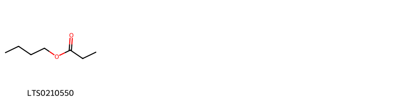{ width=100% }
    <figcaption>Hình ảnh cấu trúc hóa học của 1 hoạt chất thuộc nhóm Carboxylic acids and derivatives gồm ['butyl propionate (LTS0210550)'].</figcaption>
</figure>
#### Nhóm Cinnamic acids and derivatives
<figure markdown="span">
    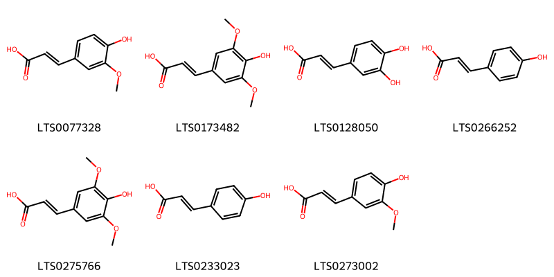{ width=100% }
    <figcaption>Hình ảnh cấu trúc hóa học của 7 hoạt chất thuộc nhóm Cinnamic acids and derivatives gồm ['ferulic acid (LTS0077328)', 'sinapinate (LTS0173482)', '3,4-dihydroxycinnamic acid (LTS0128050)', 'para-coumaric acid (LTS0266252)', 'sinapoyl alcohol (LTS0275766)', 'hydroxycinnamic acid (LTS0233023)', 'ferulic acid (LTS0273002)'].</figcaption>
</figure>
#### Nhóm Dibenzylbutane lignans
<figure markdown="span">
    { width=100% }
    <figcaption>Hình ảnh cấu trúc hóa học của 2 hoạt chất thuộc nhóm Dibenzylbutane lignans gồm ['(2s,3r)-2,3-bis[(4-hydroxy-3-methoxyphenyl)(¹³c)methyl](1-¹³c)butane-1,4-diol (LTS0268699)', 'secoisolariciresinol (LTS0086727)'].</figcaption>
</figure>
#### Nhóm Fatty Acyls
<figure markdown="span">
    { width=100% }
    <figcaption>Hình ảnh cấu trúc hóa học của 19 hoạt chất thuộc nhóm Fatty Acyls gồm ['linoleic (LTS0013198)', 'isovaleric acid (LTS0156600)', 'hexyl butyrate (LTS0143525)', 'ethyl butyrate (LTS0106732)', 'butyl β-d-glucopyranoside (LTS0155906)', 'oleic acid (LTS0256910)', 'butanoic acid (LTS0175510)', 'butyl butyrate (LTS0236625)', '2-methylbutanoic acid (LTS0213858)', 'hexanol (LTS0217299)', 'hexyl 2-methylbutyrate (LTS0234493)', 'ethyl hexanoate (LTS0021856)', 'butyl 2-methylbutyrate (LTS0230033)', 'hexanoic acid (LTS0031054)', 'hexyl hexanoate (LTS0063928)', 'lauric acid (LTS0051907)', 'caprylic acid (LTS0254176)', 'butyl hexanoate (LTS0254165)', 'amyl butyrate (LTS0030398)'].</figcaption>
</figure>
#### Nhóm Flavonoids
<figure markdown="span">
    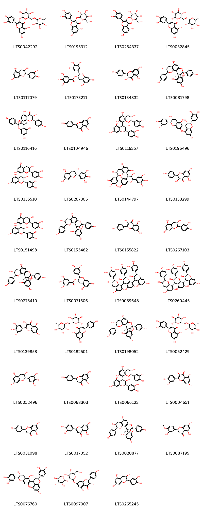{ width=100% }
    <figcaption>Hình ảnh cấu trúc hóa học của 39 hoạt chất thuộc nhóm Flavonoids gồm ['rutin (LTS0042292)', '2-(3,4-dihydroxyphenyl)-5,7-dihydroxy-3-{[3,4,5-trihydroxy-6-(hydroxymethyl)oxan-2-yl]oxy}chromen-4-one (LTS0195312)', 'isoquercetin (LTS0254337)', '3-rutinosyl quercetin (LTS0032845)', '(+)-catechol (LTS0117079)', '(-)-epigallocatechin gallate (LTS0173211)', '(+)-dihydrokaempferol (LTS0134832)', '(1s,5s,6r,13r,21s)-5,13-bis(4-hydroxyphenyl)-4,12,14-trioxapentacyclo[11.7.1.0²,¹¹.0³,⁸.0¹⁵,²⁰]henicosa-2(11),3(8),9,15,17,19-hexaene-6,9,17,19,21-pentol (LTS0081798)', '(1s,13r,21s)-6,9,17,19,21-pentahydroxy-5,13-bis(4-hydroxyphenyl)-4,12,14-trioxapentacyclo[11.7.1.0²,¹¹.0³,⁸.0¹⁵,²⁰]henicosa-2,5,8,10,15,17,19-heptaen-7-one (LTS0116416)', 'chamomile (LTS0104946)', '(2r,3s,4s)-2-(3,4-dihydroxyphenyl)-4-[(2r,3r)-2-(3,4-dihydroxyphenyl)-3,5,7-trihydroxy-3,4-dihydro-2h-1-benzopyran-8-yl]-3,4-dihydro-2h-1-benzopyran-3,5,7-triol (LTS0116257)', '(2r,3s,4s)-2-(3,4-dihydroxyphenyl)-4-[(2r,3r)-2-(3,4-dihydroxyphenyl)-3,5,7-trihydroxy-3,4-dihydro-2h-1-benzopyran-6-yl]-3,4-dihydro-2h-1-benzopyran-3,5,7-triol (LTS0196496)', '(2r,3r,4r)-2-(3,4-dihydroxyphenyl)-4-[(2r,3r)-2-(3,4-dihydroxyphenyl)-3,5,7-trihydroxy-3,4-dihydro-2h-1-benzopyran-8-yl]-3,4-dihydro-2h-1-benzopyran-3,5,7-triol (LTS0135510)', 'gallocatechol (LTS0267305)', '4-[3,5,7-trihydroxy-2-(3,4,5-trihydroxyphenyl)-3,4-dihydro-2h-1-benzopyran-8-yl]-2-(3,4,5-trihydroxyphenyl)-3,4-dihydro-2h-1-benzopyran-3,5,7-triol (LTS0144797)', 'aromadendrin (LTS0153299)', '(2r,3s,4s)-2-(3,4-dihydroxyphenyl)-4-[(2r,3s)-2-(3,4-dihydroxyphenyl)-3,5,7-trihydroxy-3,4-dihydro-2h-1-benzopyran-8-yl]-3,4-dihydro-2h-1-benzopyran-3,5,7-triol (LTS0151498)', 'geranin a (LTS0153482)', 'kaempherol (LTS0155822)', '(3r)-2-(3,4-dihydroxyphenyl)-3,4-dihydro-2h-1-benzopyran-3,5,7-triol (LTS0267103)', '(1s,5r,6s,13r,21s)-5,13-bis(4-hydroxyphenyl)-4,12,14-trioxapentacyclo[11.7.1.0²,¹¹.0³,⁸.0¹⁵,²⁰]henicosa-2(11),3(8),9,15,17,19-hexaene-6,9,17,19,21-pentol (LTS0275410)', 'epicatechin gallate (LTS0071606)', '(2r,3r)-2-(3,4-dihydroxyphenyl)-8-[(2r,3r)-2-(3,4-dihydroxyphenyl)-3,5,7-trihydroxy-3,4-dihydro-2h-1-benzopyran-4-yl]-4-[(2r,3s)-2-(3,4-dihydroxyphenyl)-3,5,7-trihydroxy-3,4-dihydro-2h-1-benzopyran-8-yl]-3,4-dihydro-2h-1-benzopyran-3,5,7-triol (LTS0059648)', 'procyanidin c1 (LTS0260445)', 'myricetin (LTS0139858)', 'nictoflorin (LTS0182501)', '(1s,5r,6r,13r,21s)-5,13-bis(4-hydroxyphenyl)-4,12,14-trioxapentacyclo[11.7.1.0²,¹¹.0³,⁸.0¹⁵,²⁰]henicosa-2(11),3(8),9,15,17,19-hexaene-6,9,17,19,21-pentol (LTS0198052)', '2-(3,4-dihydroxyphenyl)-5,7-dihydroxy-3-{[(2r,3s,4r,5r,6s)-3,4,5-trihydroxy-6-({[(2s,3s,4s,5s,6r)-3,4,5-trihydroxy-6-methyloxan-2-yl]oxy}methyl)oxan-2-yl]oxy}chromen-4-one (LTS0052429)', 'epigallocatechin (LTS0052496)', 'asahina (LTS0068303)', '(2r,3r,4r)-2-(3,4-dihydroxyphenyl)-4-[(2r,3s)-2-(3,4-dihydroxyphenyl)-3,5,7-trihydroxy-3,4-dihydro-2h-1-benzopyran-8-yl]-3,4-dihydro-2h-1-benzopyran-3,5,7-triol (LTS0066122)', 'quercetin (LTS0004651)', 'naringenin (LTS0031098)', 'luteolin (LTS0017052)', '(1s,5s,6s,13r,21s)-5,13-bis(4-hydroxyphenyl)-4,12,14-trioxapentacyclo[11.7.1.0²,¹¹.0³,⁸.0¹⁵,²⁰]henicosa-2(11),3(8),9,15,17,19-hexaene-6,9,17,19,21-pentol (LTS0020877)', 'hesperetin (LTS0087195)', '(2r,3s,4r)-2-(3,4-dihydroxyphenyl)-4-[(2r,3r)-2-(3,4-dihydroxyphenyl)-3,5,7-trihydroxy-3,4-dihydro-2h-1-benzopyran-6-yl]-3,4-dihydro-2h-1-benzopyran-3,5,7-triol (LTS0076760)', 'kaempferol 3-o-rutinoside (LTS0097007)', 'ent-epicatechin (LTS0265245)'].</figcaption>
</figure>
#### Nhóm Furanoid lignans
<figure markdown="span">
    { width=100% }
    <figcaption>Hình ảnh cấu trúc hóa học của 3 hoạt chất thuộc nhóm Furanoid lignans gồm ['pinoresinol (LTS0057431)', 'matairesinol (LTS0193475)', 'lariciresinol (LTS0010950)'].</figcaption>
</figure>
#### Nhóm Lactones
<figure markdown="span">
    { width=100% }
    <figcaption>Hình ảnh cấu trúc hóa học của 1 hoạt chất thuộc nhóm Lactones gồm ['γ-decalactone (LTS0263005)'].</figcaption>
</figure>
#### Nhóm Organooxygen compounds
<figure markdown="span">
    { width=100% }
    <figcaption>Hình ảnh cấu trúc hóa học của 27 hoạt chất thuộc nhóm Organooxygen compounds gồm ['chlorogenic acid (LTS0226495)', 'hydroxyacetophenone (LTS0214036)', 'prunasin (LTS0130138)', '(1s,3r,4s,5r)-1,3,5-trihydroxy-4-{[(2e)-3-(4-hydroxyphenyl)prop-2-enoyl]oxy}cyclohexane-1-carboxylic acid (LTS0122976)', '(2r)-2-phenyl-2-{[(4s,5s)-3,4,5-trihydroxy-6-({[(3r,5s,6r)-3,4,5-trihydroxy-6-(hydroxymethyl)oxan-2-yl]oxy}methyl)oxan-2-yl]oxy}acetonitrile (LTS0091377)', '3-o-sinapoylquinic acid (LTS0036999)', 'amygdalin (LTS0185669)', '3-o-feruloyl-d-quinic acid (LTS0039027)', '(1r,3r,4s,5r)-1,3,4-trihydroxy-5-{[(2e)-3-(4-hydroxyphenyl)prop-2-enoyl]oxy}cyclohexane-1-carboxylic acid (LTS0198665)', 'sucrose (LTS0272557)', '4-o-feruloyl-d-quinic acid (LTS0140332)', 'cryptochlorogenic acid (LTS0252404)', 'amygdalin (LTS0157939)', '(2s,3s,4s,5r,6r)-3,4,5-trihydroxy-6-{[(2r,3r,4s,5r,6r)-3,4,5,6-tetrahydroxyoxan-2-yl]methoxy}oxane-2-carboxylic acid (LTS0246071)', 'laetrile (LTS0251059)', '(2s)-2-phenyl-2-{[(2r,3r,4s,5s,6r)-3,4,5-trihydroxy-6-({[(2r,3r,4s,5s,6r)-3,4,5-trihydroxy-6-(hydroxymethyl)oxan-2-yl]oxy}methyl)oxan-2-yl]oxy}acetonitrile (LTS0185608)', '(3r,5r)-1,3,5-trihydroxy-4-{[(2e)-3-(4-hydroxyphenyl)prop-2-enoyl]oxy}cyclohexane-1-carboxylic acid (LTS0093718)', '(1s,3r,4r,5r)-1,3,4-trihydroxy-5-{[(2e)-3-(4-hydroxyphenyl)prop-2-enoyl]oxy}cyclohexane-1-carboxylic acid (LTS0211457)', '3,4,5-trihydroxy-6-[(3,4,5,6-tetrahydroxyoxan-2-yl)methoxy]oxane-2-carboxylic acid (LTS0211604)', 'acetoin (LTS0220819)', 'neochlorogenic acid (LTS0235816)', '3-feruloylquinic acid (LTS0062037)', 'chlorogenic acid (LTS0001951)', '(2r,3r,5r,6r)-2-(benzyloxy)-6-(hydroxymethyl)oxane-3,4,5-triol (LTS0007372)', 'isoamyl alcohol (LTS0112297)', '5-o-sinapoylquinic acid (LTS0260720)', '4-o-sinapoylquinic acid (LTS0045601)'].</figcaption>
</figure>
#### Nhóm Phenols
<figure markdown="span">
    { width=100% }
    <figcaption>Hình ảnh cấu trúc hóa học của 6 hoạt chất thuộc nhóm Phenols gồm ['vanillin (LTS0136163)', '2-methoxy-4-vinyl-phenol (LTS0128961)', 'eugenol (LTS0052342)', 'p-cresol (LTS0208715)', 'tyrosol (LTS0132195)', 'phenol (LTS0092642)'].</figcaption>
</figure>
#### Nhóm Prenol lipids
<figure markdown="span">
    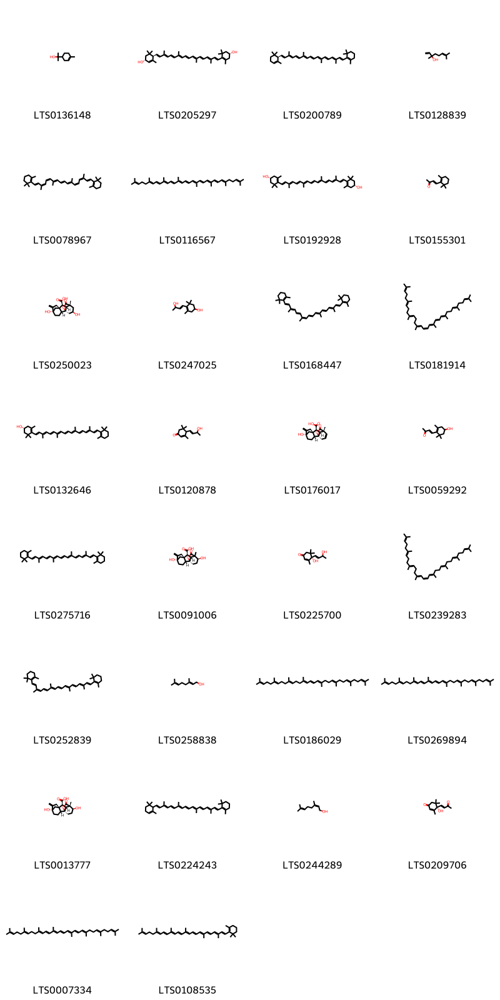{ width=100% }
    <figcaption>Hình ảnh cấu trúc hóa học của 30 hoạt chất thuộc nhóm Prenol lipids gồm ['terpineol (LTS0136148)', 'carotenoid (LTS0205297)', '(+)-α-carotene (LTS0200789)', 'linalool, (+-)- (LTS0128839)', '1,3,3-trimethyl-2-[(1e,3z,5z,7e,9e,11e,13z,15z,17e)-3,7,12,16-tetramethyl-18-(2,6,6-trimethylcyclohex-1-en-1-yl)octadeca-1,3,5,7,9,11,13,15,17-nonaen-1-yl]cyclohex-1-ene (LTS0078967)', 'lycopene (LTS0116567)', 'zeaxanthin (LTS0192928)', 'β-ionone (LTS0155301)', 'gibberellin a29 (LTS0250023)', '4-[(1e)-3-hydroxybut-1-en-1-yl]-3,5,5-trimethylcyclohex-3-en-1-ol (LTS0247025)', 'β,β-carotene (LTS0168447)', 'phytofluene (LTS0181914)', 'cryptoxanthin (LTS0132646)', '4-[(1e)-3-hydroxybut-1-en-1-yl]-3,5,5-trimethylcyclohex-2-en-1-one (LTS0120878)', 'gibberellin a5 (LTS0176017)', '(3e)-4-(4-hydroxy-2,6,6-trimethylcyclohex-1-en-1-yl)but-3-en-2-one (LTS0059292)', 'β-carotene (LTS0275716)', '(1r,2r,5s,8s,9s,10r,12s)-5,12-dihydroxy-11-methyl-6-methylidene-16-oxo-15-oxapentacyclo[9.3.2.1⁵,⁸.0¹,¹⁰.0²,⁸]heptadecane-9-carboxylic acid (LTS0091006)', '(4s)-4-hydroxy-4-(3-hydroxybut-1-en-1-yl)-3,5,5-trimethylcyclohex-2-en-1-one (LTS0225700)', 'cis-phytoene (LTS0239283)', '(9z)-β-carotene (LTS0252839)', 'geraniol (LTS0258838)', 'phytoene (LTS0186029)', 'all-trans-phytofluene (LTS0269894)', 'gibberellin a1 (LTS0013777)', 'α-carotene (LTS0224243)', 'nerol (LTS0244289)', 'dehydrovomifoliol (LTS0209706)', 'zeta-carotene (LTS0007334)', 'gamma-carotene (LTS0108535)'].</figcaption>
</figure>
#### Nhóm Steroids and steroid derivatives
<figure markdown="span">
    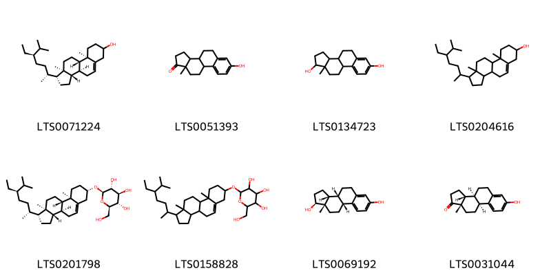{ width=100% }
    <figcaption>Hình ảnh cấu trúc hóa học của 8 hoạt chất thuộc nhóm Steroids and steroid derivatives gồm ['stigmast-5-en-3-ol (LTS0071224)', 'unden (LTS0051393)', 'estradiol (LTS0134723)', 'stigmast-5-en-3-ol, (3β)- (LTS0204616)', 'sitogluside (LTS0201798)', '2-{[1-(5-ethyl-6-methylheptan-2-yl)-9a,11a-dimethyl-1h,2h,3h,3ah,3bh,4h,6h,7h,8h,9h,9bh,10h,11h-cyclopenta[a]phenanthren-7-yl]oxy}-6-(hydroxymethyl)oxane-3,4,5-triol (LTS0158828)', '(1s,3ar,3br,9br,11as)-11a-methyl-1h,2h,3h,3ah,3bh,4h,5h,9bh,10h,11h-cyclopenta[a]phenanthrene-1,7-diol (LTS0069192)', '(3ar,3bs,9bs,11as)-7-hydroxy-11a-methyl-2h,3h,3ah,3bh,4h,5h,9bh,10h,11h-cyclopenta[a]phenanthren-1-one (LTS0031044)'].</figcaption>
</figure>

---

### Dược dân tộc học

Danh sách các quốc gia có sử dụng *Prunus armeniaca* trong điều trị các bệnh. 

| Country   | Disease                                                                                                        | Bệnh                                                                                                                                                                                                |
|:----------|:---------------------------------------------------------------------------------------------------------------|:----------------------------------------------------------------------------------------------------------------------------------------------------------------------------------------------------|
| China     | Antidote, Antitussive, Cosmetic, Demulcent, Expectorant, Expectorant, Sedative, Sedative, Vermifuge, Vulnerary | MYMEMORY WARNING: YOU USED ALL AVAILABLE FREE TRANSLATIONS FOR TODAY. NEXT AVAILABLE IN  12 HOURS 07 MINUTES 58 SECONDS VISIT HTTPS://MYMEMORY.TRANSLATED.NET/DOC/USAGELIMITS.PHP TO TRANSLATE MORE |
| Elsewhere | Sedative                                                                                                       | MYMEMORY WARNING: YOU USED ALL AVAILABLE FREE TRANSLATIONS FOR TODAY. NEXT AVAILABLE IN  12 HOURS 07 MINUTES 55 SECONDS VISIT HTTPS://MYMEMORY.TRANSLATED.NET/DOC/USAGELIMITS.PHP TO TRANSLATE MORE |
| Iraq      | Aphrodisiac                                                                                                    | MYMEMORY WARNING: YOU USED ALL AVAILABLE FREE TRANSLATIONS FOR TODAY. NEXT AVAILABLE IN  12 HOURS 07 MINUTES 53 SECONDS VISIT HTTPS://MYMEMORY.TRANSLATED.NET/DOC/USAGELIMITS.PHP TO TRANSLATE MORE |
| Japan*    | Antitussive, Aperient, Expectorant                                                                             | MYMEMORY WARNING: YOU USED ALL AVAILABLE FREE TRANSLATIONS FOR TODAY. NEXT AVAILABLE IN  12 HOURS 07 MINUTES 50 SECONDS VISIT HTTPS://MYMEMORY.TRANSLATED.NET/DOC/USAGELIMITS.PHP TO TRANSLATE MORE |
| Kurdistan | Sedative                                                                                                       | MYMEMORY WARNING: YOU USED ALL AVAILABLE FREE TRANSLATIONS FOR TODAY. NEXT AVAILABLE IN  12 HOURS 07 MINUTES 47 SECONDS VISIT HTTPS://MYMEMORY.TRANSLATED.NET/DOC/USAGELIMITS.PHP TO TRANSLATE MORE |
| Turkey    | Aphrodisiac, Demulcent, Poison, Sedative, Tonic, Emollient, Vermifuge                                          | MYMEMORY WARNING: YOU USED ALL AVAILABLE FREE TRANSLATIONS FOR TODAY. NEXT AVAILABLE IN  12 HOURS 07 MINUTES 43 SECONDS VISIT HTTPS://MYMEMORY.TRANSLATED.NET/DOC/USAGELIMITS.PHP TO TRANSLATE MORE |
| US        | Poison                                                                                                         | MYMEMORY WARNING: YOU USED ALL AVAILABLE FREE TRANSLATIONS FOR TODAY. NEXT AVAILABLE IN  12 HOURS 07 MINUTES 40 SECONDS VISIT HTTPS://MYMEMORY.TRANSLATED.NET/DOC/USAGELIMITS.PHP TO TRANSLATE MORE |

---

---
## Prunus avium
### Thông tin về thực vật

!!! info "Phân loại thực vật của *Prunus avium* từ GIBF:"
    - **Kingdom:** Plantae
    - **Phylum:** Tracheophyta
    - **Order:** Rosales
    - **Family:** Rosaceae
    - **Genus:** Prunus
    - **Species:** *Prunus avium*

 

| Label (VI)   | Label (EN)   | Scientific Name   | Descriptions (VI)   | Descriptions (EN)   | Also Known As (VI)   | Also Known As (EN)                                     |
|:-------------|:-------------|:------------------|:--------------------|:--------------------|:---------------------|:-------------------------------------------------------|
| N/A          | N/A          | Prunus avium      | loài thực vật       | species of plant    | ['']                 | ['gean', 'wild cherry', 'bird cherry', 'sweet cherry'] |

#### Phân bố trên thế giới

**Từ CSDL GIBF** Switzerland, Slovenia, Denmark, United Kingdom of Great Britain and Northern Ireland, Sweden, Spain, Hungary, Germany, Canada, Russian Federation, United States of America, Italy, Austria, Norway, Belgium, Netherlands, Ukraine

#### Phân bố tại Việt Nam

**Từ CSDL GIBF**: Không có ghi nhận ở Việt Nam

---
### Thành phần hóa học
        
- Theo cơ sở dữ liệu lotus: Từ loài *Prunus avium* đã phân lập và xác định được 160 hoạt chất thuộc về các nhóm Organooxygen compounds, Flavonoids, Tannins, Prenol lipids, Carboxylic acids and derivatives, Isoflavonoids, Hydroxy acids and derivatives, Dioxepanes, Cinnamic acids and derivatives. 

|    | chemicalTaxonomyClassyfireClass   |   smiles_count |
|---:|:----------------------------------|---------------:|
|  0 | Carboxylic acids and derivatives  |              3 |
|  1 | Cinnamic acids and derivatives    |              7 |
|  2 | Dioxepanes                        |              2 |
|  3 | Flavonoids                        |             84 |
|  4 | Hydroxy acids and derivatives     |              4 |
|  5 | Isoflavonoids                     |              7 |
|  6 | Organooxygen compounds            |             34 |
|  7 | Prenol lipids                     |             18 |
|  8 | Tannins                           |              1 |

#### Nhóm Carboxylic acids and derivatives
<figure markdown="span">
    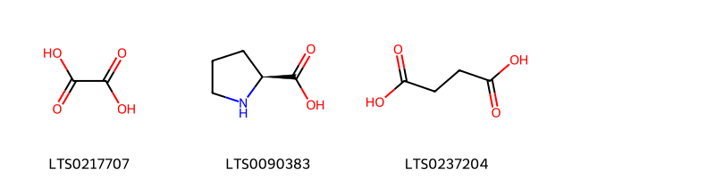{ width=100% }
    <figcaption>Hình ảnh cấu trúc hóa học của 3 hoạt chất thuộc nhóm Carboxylic acids and derivatives gồm ['oxalic acid (LTS0217707)', 'l-proline (LTS0090383)', 'succinic acid (LTS0237204)'].</figcaption>
</figure>
#### Nhóm Cinnamic acids and derivatives
<figure markdown="span">
    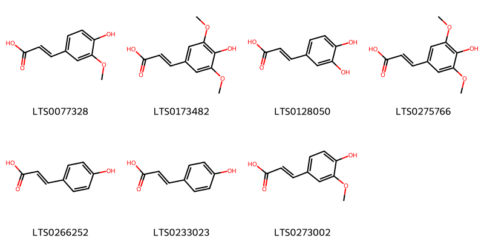{ width=100% }
    <figcaption>Hình ảnh cấu trúc hóa học của 7 hoạt chất thuộc nhóm Cinnamic acids and derivatives gồm ['ferulic acid (LTS0077328)', 'sinapinate (LTS0173482)', '3,4-dihydroxycinnamic acid (LTS0128050)', 'sinapoyl alcohol (LTS0275766)', 'para-coumaric acid (LTS0266252)', 'hydroxycinnamic acid (LTS0233023)', 'ferulic acid (LTS0273002)'].</figcaption>
</figure>
#### Nhóm Dioxepanes
<figure markdown="span">
    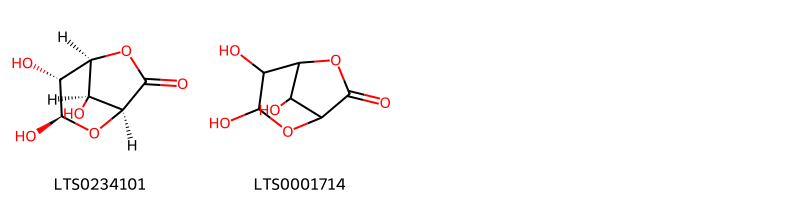{ width=100% }
    <figcaption>Hình ảnh cấu trúc hóa học của 2 hoạt chất thuộc nhóm Dioxepanes gồm ['(1s,3r,4r,5s,8s)-3,4,8-trihydroxy-2,6-dioxabicyclo[3.2.1]octan-7-one (LTS0234101)', '3,4,8-trihydroxy-2,6-dioxabicyclo[3.2.1]octan-7-one (LTS0001714)'].</figcaption>
</figure>
#### Nhóm Flavonoids
<figure markdown="span">
    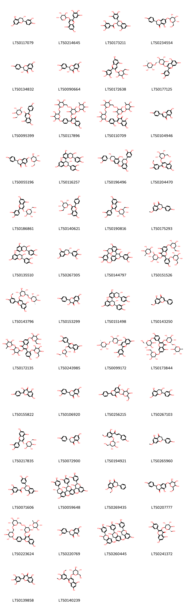{ width=100% }
    <figcaption>Hình ảnh cấu trúc hóa học của 84 hoạt chất thuộc nhóm Flavonoids gồm ['(+)-catechol (LTS0117079)', '5,7-dihydroxy-3-{[(2r,3r,4s,5s)-3,4,5-trihydroxyoxan-2-yl]oxy}-2-(3,4,5-trihydroxyphenyl)-1λ⁴-chromen-1-ylium (LTS0214645)', '(-)-epigallocatechin gallate (LTS0173211)', 'prunin (LTS0234554)', '(+)-dihydrokaempferol (LTS0134832)', '(+)-taxifolin (LTS0090664)', '5,7-dihydroxy-3-{[3,4,5-trihydroxy-6-(hydroxymethyl)oxan-2-yl]oxy}-2-(3,4,5-trihydroxyphenyl)-1λ⁴-chromen-1-ylium (LTS0172638)', '5,7-dihydroxy-2-(4-hydroxy-3-oxidophenyl)-3-{[(3r,4s,5s,6r)-3,4,5-trihydroxy-6-({[(2r,3r,4r,5r,6s)-3,4,5-trihydroxy-6-methyloxan-2-yl]oxy}methyl)oxan-2-yl]oxy}-1λ⁴-chromen-1-ylium (LTS0177125)', 'pelargonidin 3-glucoside (LTS0095399)', '7-hydroxy-2-(4-{[3,4,5-trihydroxy-6-({[3,4,5-trihydroxy-6-(hydroxymethyl)oxan-2-yl]oxy}methyl)oxan-2-yl]oxy}phenyl)-3-({3,4,5-trihydroxy-6-[(3,4,5-trihydroxy-6-methyloxan-2-yl)oxy]oxan-2-yl}oxy)chromen-4-one (LTS0117896)', '5,7-dihydroxy-2-(2-hydroxy-4-{[3,4,5-trihydroxy-6-({[3,4,5-trihydroxy-6-(hydroxymethyl)oxan-2-yl]oxy}methyl)oxan-2-yl]oxy}phenyl)-3-({3,4,5-trihydroxy-6-[(3,4,5-trihydroxy-6-methyloxan-2-yl)oxy]oxan-2-yl}oxy)chromen-4-one (LTS0110709)', 'chamomile (LTS0104946)', '(2s)-5-hydroxy-2-(4-hydroxyphenyl)-7-{[(2r,3s,4r,5r,6s)-3,4,5-trihydroxy-6-(hydroxymethyl)oxan-2-yl]oxy}-2,3-dihydro-1-benzopyran-4-one (LTS0055196)', '(2r,3s,4s)-2-(3,4-dihydroxyphenyl)-4-[(2r,3r)-2-(3,4-dihydroxyphenyl)-3,5,7-trihydroxy-3,4-dihydro-2h-1-benzopyran-8-yl]-3,4-dihydro-2h-1-benzopyran-3,5,7-triol (LTS0116257)', '(2r,3s,4s)-2-(3,4-dihydroxyphenyl)-4-[(2r,3r)-2-(3,4-dihydroxyphenyl)-3,5,7-trihydroxy-3,4-dihydro-2h-1-benzopyran-6-yl]-3,4-dihydro-2h-1-benzopyran-3,5,7-triol (LTS0196496)', 'peonidin-3-glucoside (LTS0204470)', 'cyanidin 3-o-β-d-galactoside (LTS0186861)', '5,7-dihydroxy-2-(4-hydroxyphenyl)-3-{[(2r,3s,4r,5r,6s)-3,4,5-trihydroxy-6-(hydroxymethyl)oxan-2-yl]oxy}-1λ⁴-chromen-1-ylium (LTS0140621)', '2-(3,4-dihydroxyphenyl)-5,7-dihydroxy-3-{[(2r,3s,4r,5r,6s)-3,4,5-trihydroxy-6-(hydroxymethyl)oxan-2-yl]oxy}-1λ⁴-chromen-1-ylium (LTS0190816)', 'sakuranetin (LTS0175293)', '(2r,3r,4r)-2-(3,4-dihydroxyphenyl)-4-[(2r,3r)-2-(3,4-dihydroxyphenyl)-3,5,7-trihydroxy-3,4-dihydro-2h-1-benzopyran-8-yl]-3,4-dihydro-2h-1-benzopyran-3,5,7-triol (LTS0135510)', 'gallocatechol (LTS0267305)', '4-[3,5,7-trihydroxy-2-(3,4,5-trihydroxyphenyl)-3,4-dihydro-2h-1-benzopyran-8-yl]-2-(3,4,5-trihydroxyphenyl)-3,4-dihydro-2h-1-benzopyran-3,5,7-triol (LTS0144797)', '5-hydroxy-2-(4-hydroxy-2-{[(2s,3r,4s,5s,6r)-3,4,5-trihydroxy-6-(hydroxymethyl)oxan-2-yl]oxy}phenyl)-7-{[(2s,3r,4s,5s,6r)-3,4,5-trihydroxy-6-(hydroxymethyl)oxan-2-yl]oxy}-3-{[(2r,3r,4r,5s,6s)-3,4,5-trihydroxy-6-{[(2s,3r,4s,5s,6s)-3,4,5-trihydroxy-6-methyloxan-2-yl]oxy}oxan-2-yl]oxy}chromen-4-one (LTS0151526)', '5,7-dihydroxy-2-(4-hydroxy-3-methoxyphenyl)-3-{[(2s,3r,4s,5s,6r)-3,4,5-trihydroxy-6-({[(2r,3r,4r,5r,6s)-3,4,5-trihydroxy-6-methyloxan-2-yl]oxy}methyl)oxan-2-yl]oxy}-1λ⁴-chromen-1-ylium (LTS0143796)', 'aromadendrin (LTS0153299)', '(2r,3s,4s)-2-(3,4-dihydroxyphenyl)-4-[(2r,3s)-2-(3,4-dihydroxyphenyl)-3,5,7-trihydroxy-3,4-dihydro-2h-1-benzopyran-8-yl]-3,4-dihydro-2h-1-benzopyran-3,5,7-triol (LTS0151498)', 'tectochrysin (LTS0143250)', '5-hydroxy-2-(4-hydroxy-2-{[3,4,5-trihydroxy-6-(hydroxymethyl)oxan-2-yl]oxy}phenyl)-7-{[3,4,5-trihydroxy-6-(hydroxymethyl)oxan-2-yl]oxy}-3-({3,4,5-trihydroxy-6-[(3,4,5-trihydroxy-6-methyloxan-2-yl)oxy]oxan-2-yl}oxy)chromen-4-one (LTS0172135)', '3-{[(2r,3r,4r,5s)-3,4-dihydroxy-5-(hydroxymethyl)oxolan-2-yl]oxy}-2-(3,4-dihydroxyphenyl)-5,7-dihydroxy-1λ⁴-chromen-1-ylium (LTS0243985)', 'tulipanin (LTS0099172)', '5-hydroxy-2-(4-hydroxy-3-{[(2s,3s,4s,5s,6s)-3,4,5-trihydroxy-6-(hydroxymethyl)oxan-2-yl]oxy}phenyl)-7-{[(2s,3r,4s,5s,6r)-3,4,5-trihydroxy-6-(hydroxymethyl)oxan-2-yl]oxy}-3-{[(2s,3r,4s,5s,6s)-3,4,5-trihydroxy-6-({[(2r,3r,4s,5r,6s)-3,4,5-trihydroxy-6-methyloxan-2-yl]oxy}methyl)oxan-2-yl]oxy}chromen-4-one (LTS0173844)', 'kaempherol (LTS0155822)', '(+/-)-eriodictyol (LTS0106920)', '7-hydroxy-2-(4-hydroxyphenyl)-5-{[3,4,5-trihydroxy-6-(hydroxymethyl)oxan-2-yl]oxy}chromen-4-one (LTS0256215)', '(3r)-2-(3,4-dihydroxyphenyl)-3,4-dihydro-2h-1-benzopyran-3,5,7-triol (LTS0267103)', 'cyanidin 3-glucoside (LTS0217835)', '(-)-naringenin (LTS0072900)', '(2e)-1-(2-hydroxy-4-methoxy-6-{[(2s,3r,4s,5s,6r)-3,4,5-trihydroxy-6-(hydroxymethyl)oxan-2-yl]oxy}phenyl)-3-(4-hydroxyphenyl)prop-2-en-1-one (LTS0194921)', 'sakuranetin (LTS0265960)', 'epicatechin gallate (LTS0071606)', '(2r,3r)-2-(3,4-dihydroxyphenyl)-8-[(2r,3r)-2-(3,4-dihydroxyphenyl)-3,5,7-trihydroxy-3,4-dihydro-2h-1-benzopyran-4-yl]-4-[(2r,3s)-2-(3,4-dihydroxyphenyl)-3,5,7-trihydroxy-3,4-dihydro-2h-1-benzopyran-8-yl]-3,4-dihydro-2h-1-benzopyran-3,5,7-triol (LTS0059648)', '(2s)-5,7-dihydroxy-8-methoxy-2-phenyl-2,3-dihydro-1-benzopyran-4-one (LTS0269435)', '5-hydroxy-2-(4-hydroxyphenyl)-7-{[3,4,5-trihydroxy-6-(hydroxymethyl)oxan-2-yl]oxy}-2,3-dihydro-1-benzopyran-4-one (LTS0207777)', '7-hydroxy-2-(4-{[(2s,3r,4s,5s,6r)-3,4,5-trihydroxy-6-({[(2r,3r,4s,5s,6r)-3,4,5-trihydroxy-6-(hydroxymethyl)oxan-2-yl]oxy}methyl)oxan-2-yl]oxy}phenyl)-3-{[(2r,3r,4r,5s,6s)-3,4,5-trihydroxy-6-{[(2s,3r,4s,5s,6s)-3,4,5-trihydroxy-6-methyloxan-2-yl]oxy}oxan-2-yl]oxy}chromen-4-one (LTS0223624)', 'eriodictyol (LTS0220769)', 'procyanidin c1 (LTS0260445)', '2-(3,4-dihydroxyphenyl)-5,7-dihydroxy-3-{[(2s,3r,4r,5r,6s)-3,4,5-trihydroxy-6-(hydroxymethyl)oxan-2-yl]oxy}chromen-4-one (LTS0241372)', 'myricetin (LTS0139858)', 'malvidin-3-glucoside (LTS0140239)', 'nictoflorin (LTS0182501)', 'astragalin (LTS0249588)', 'petunidin-3-o-glucoside (LTS0178327)', '5,7-dihydroxy-2-(4-hydroxy-3,5-dimethoxyphenyl)-3-{[(2r,3r,4s,5s)-3,4,5-trihydroxyoxan-2-yl]oxy}-1λ⁴-chromen-1-ylium (LTS0042107)', '2-(3,4-dihydroxyphenyl)-5,7-dihydroxy-3-{[(2r,3s,4r,5r,6s)-3,4,5-trihydroxy-6-({[(2s,3s,4s,5s,6r)-3,4,5-trihydroxy-6-methyloxan-2-yl]oxy}methyl)oxan-2-yl]oxy}chromen-4-one (LTS0052429)', 'cyanidin 3-o-sophoroside (LTS0112561)', 'delphinidin 3-glucoside (LTS0010677)', 'epigallocatechin (LTS0052496)', '5,7-dihydroxy-2-(4-hydroxy-3-methoxyphenyl)-3-{[(2s,3r,4s,5r,6r)-3,4,5-trihydroxy-6-(hydroxymethyl)oxan-2-yl]oxy}-1λ⁴-chromen-1-ylium (LTS0013592)', 'petunidin 3-glucoside (LTS0001367)', 'asahina (LTS0068303)', '5,7-dihydroxy-2-(3-hydroxy-5-methoxy-4-oxidophenyl)-3-{[(2s,3r,4s,5s,6r)-3,4,5-trihydroxy-6-(hydroxymethyl)oxan-2-yl]oxy}-1λ⁴-chromen-1-ylium (LTS0002588)', '(2r,3r,4r)-2-(3,4-dihydroxyphenyl)-4-[(2r,3s)-2-(3,4-dihydroxyphenyl)-3,5,7-trihydroxy-3,4-dihydro-2h-1-benzopyran-8-yl]-3,4-dihydro-2h-1-benzopyran-3,5,7-triol (LTS0066122)', 'quercetin (LTS0004651)', '7-hydroxy-2-(4-hydroxyphenyl)-5-{[(2s,3r,4s,5s,6r)-3,4,5-trihydroxy-6-(hydroxymethyl)oxan-2-yl]oxy}chromen-4-one (LTS0025306)', 'dihydrowogonin (LTS0004522)', '5,7-dihydroxy-2-(2-hydroxy-4-{[(2s,3r,4s,5s,6r)-3,4,5-trihydroxy-6-({[(2r,3r,4s,5s,6r)-3,4,5-trihydroxy-6-(hydroxymethyl)oxan-2-yl]oxy}methyl)oxan-2-yl]oxy}phenyl)-3-{[(2r,3r,4r,5s,6s)-3,4,5-trihydroxy-6-{[(2s,3r,4s,5s,6s)-3,4,5-trihydroxy-6-methyloxan-2-yl]oxy}oxan-2-yl]oxy}chromen-4-one (LTS0000959)', 'naringenin (LTS0031098)', '3-[(4,5-dihydroxy-3-{[3,4,5-trihydroxy-6-(hydroxymethyl)oxan-2-yl]oxy}-6-{[(3,4,5-trihydroxy-6-methyloxan-2-yl)oxy]methyl}oxan-2-yl)oxy]-2-(3,4-dihydroxyphenyl)-5,7-dihydroxy-1λ⁴-chromen-1-ylium (LTS0016654)', 'luteolin (LTS0017052)', '3-rutinosyl quercetin (LTS0032845)', '2-(3,5-dihydroxy-4-oxidophenyl)-5,7-dihydroxy-3-{[(2s,3r,4s,5s,6r)-3,4,5-trihydroxy-6-(hydroxymethyl)oxan-2-yl]oxy}-1λ⁴-chromen-1-ylium (LTS0079754)', 'pelargonidin 3-o-rutinoside (LTS0031008)', '3,5,7-trihydroxy-2-(4-{[(2s,3r,4r,5s,6r)-3,4,5-trihydroxy-6-(hydroxymethyl)oxan-2-yl]oxy}phenyl)chromen-4-one (LTS0114766)', 'catechol (LTS0090912)', 'hesperetin (LTS0087195)', '(2r,3s,4r)-2-(3,4-dihydroxyphenyl)-4-[(2r,3r)-2-(3,4-dihydroxyphenyl)-3,5,7-trihydroxy-3,4-dihydro-2h-1-benzopyran-6-yl]-3,4-dihydro-2h-1-benzopyran-3,5,7-triol (LTS0076760)', '2-(3,4-dihydroxyphenyl)-5,7-dihydroxy-3-{[(2r,5r)-3,4,5-trihydroxy-6-({[(2s,4r,5s)-3,4,5-trihydroxy-6-methyloxan-2-yl]oxy}methyl)oxan-2-yl]oxy}-1λ⁴-chromen-1-ylium (LTS0238654)', '1-(2-hydroxy-4-methoxy-6-{[3,4,5-trihydroxy-6-(hydroxymethyl)oxan-2-yl]oxy}phenyl)-3-(4-hydroxyphenyl)prop-2-en-1-one (LTS0027785)', '2-(4-hydroxyphenyl)-7-methoxy-5-{[3,4,5-trihydroxy-6-(hydroxymethyl)oxan-2-yl]oxy}chromen-4-one (LTS0039107)', 'cyanidin 3-o-rutinoside (LTS0049654)', '2-(3,4-dihydroxy-5-methoxyphenyl)-5,7-dihydroxy-3-{[(2r,3r,4r,5r)-3,4,5-trihydroxyoxan-2-yl]oxy}-1λ⁴-chromen-1-ylium (LTS0050404)', '2-(4-hydroxyphenyl)-7-methoxy-5-{[(2s,3r,4s,5s,6r)-3,4,5-trihydroxy-6-(hydroxymethyl)oxan-2-yl]oxy}chromen-4-one (LTS0124013)', 'ent-epicatechin (LTS0265245)'].</figcaption>
</figure>
#### Nhóm Hydroxy acids and derivatives
<figure markdown="span">
    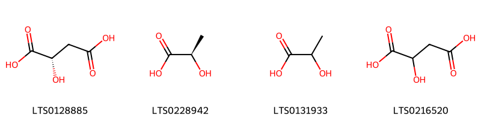{ width=100% }
    <figcaption>Hình ảnh cấu trúc hóa học của 4 hoạt chất thuộc nhóm Hydroxy acids and derivatives gồm ['(-)-malic acid (LTS0128885)', 'd-lactic acid (LTS0228942)', 'lactic acid (LTS0131933)', 'malic acid (LTS0216520)'].</figcaption>
</figure>
#### Nhóm Isoflavonoids
<figure markdown="span">
    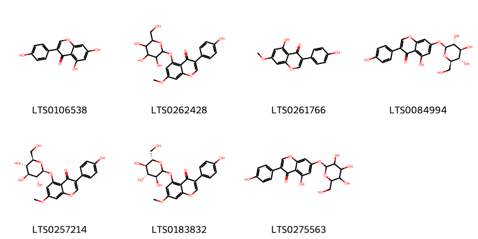{ width=100% }
    <figcaption>Hình ảnh cấu trúc hóa học của 7 hoạt chất thuộc nhóm Isoflavonoids gồm ['genistein (LTS0106538)', '3-(4-hydroxyphenyl)-7-methoxy-5-{[3,4,5-trihydroxy-6-(hydroxymethyl)oxan-2-yl]oxy}chromen-4-one (LTS0262428)', 'prunetin (LTS0261766)', 'genistin (LTS0084994)', '3-(4-hydroxyphenyl)-7-methoxy-5-{[(2s,3r,4s,5s,6r)-3,4,5-trihydroxy-6-(hydroxymethyl)oxan-2-yl]oxy}chromen-4-one (LTS0257214)', '3-(4-hydroxyphenyl)-7-methoxy-5-{[(3s,4r,5r,6s)-3,4,5-trihydroxy-6-(hydroxymethyl)oxan-2-yl]oxy}chromen-4-one (LTS0183832)', '5-hydroxy-3-(4-hydroxyphenyl)-7-{[3,4,5-trihydroxy-6-(hydroxymethyl)oxan-2-yl]oxy}chromen-4-one (LTS0275563)'].</figcaption>
</figure>
#### Nhóm Organooxygen compounds
<figure markdown="span">
    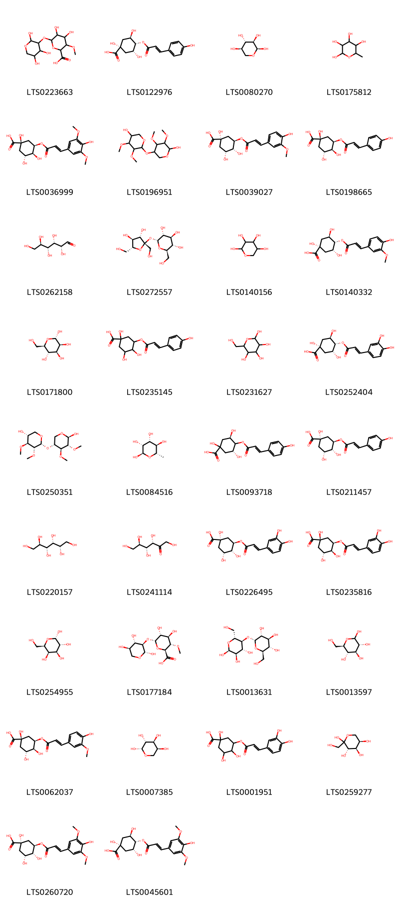{ width=100% }
    <figcaption>Hình ảnh cấu trúc hóa học của 34 hoạt chất thuộc nhóm Organooxygen compounds gồm ['4,5-dihydroxy-3-methoxy-6-[(2,4,5-trihydroxyoxan-3-yl)oxy]oxane-2-carboxylic acid (LTS0223663)', '(1s,3r,4s,5r)-1,3,5-trihydroxy-4-{[(2e)-3-(4-hydroxyphenyl)prop-2-enoyl]oxy}cyclohexane-1-carboxylic acid (LTS0122976)', 'α-d-xylopyranose (LTS0080270)', '6-methyloxane-2,3,4,5-tetrol (LTS0175812)', '3-o-sinapoylquinic acid (LTS0036999)', '6-[(6-hydroxy-4,5-dimethoxyoxan-3-yl)oxy]-4,5-dimethoxyoxan-3-ol (LTS0196951)', '3-o-feruloyl-d-quinic acid (LTS0039027)', '(1r,3r,4s,5r)-1,3,4-trihydroxy-5-{[(2e)-3-(4-hydroxyphenyl)prop-2-enoyl]oxy}cyclohexane-1-carboxylic acid (LTS0198665)', '(+)-glucose (LTS0262158)', 'sucrose (LTS0272557)', 'xylose (LTS0140156)', '4-o-feruloyl-d-quinic acid (LTS0140332)', 'α-d-mannose (LTS0171800)', '1,3,4-trihydroxy-5-{[(2e)-3-(4-hydroxyphenyl)prop-2-enoyl]oxy}cyclohexane-1-carboxylic acid (LTS0235145)', 'd-galactose (LTS0231627)', 'cryptochlorogenic acid (LTS0252404)', '(2r,3r,4s,5r)-5-{[(2r,3r,4s,5r)-5-hydroxy-3,4-dimethoxyoxan-2-yl]oxy}-3,4-dimethoxyoxan-2-ol (LTS0250351)', 'α-l-rhamnopyranose (LTS0084516)', '(3r,5r)-1,3,5-trihydroxy-4-{[(2e)-3-(4-hydroxyphenyl)prop-2-enoyl]oxy}cyclohexane-1-carboxylic acid (LTS0093718)', '(1s,3r,4r,5r)-1,3,4-trihydroxy-5-{[(2e)-3-(4-hydroxyphenyl)prop-2-enoyl]oxy}cyclohexane-1-carboxylic acid (LTS0211457)', 'd-sorbitol (LTS0220157)', 'keto-d-fructose (LTS0241114)', 'chlorogenic acid (LTS0226495)', 'neochlorogenic acid (LTS0235816)', 'galactose (LTS0254955)', '(2s,3s,4r,5r,6s)-4,5-dihydroxy-3-methoxy-6-{[(2r,3r,4s,5r)-2,4,5-trihydroxyoxan-3-yl]oxy}oxane-2-carboxylic acid (LTS0177184)', 'α-maltose (LTS0013631)', 'glucose (LTS0013597)', '3-feruloylquinic acid (LTS0062037)', 'β-l-arabinose (LTS0007385)', 'chlorogenic acid (LTS0001951)', 'd-fructopyranose (LTS0259277)', '5-o-sinapoylquinic acid (LTS0260720)', '4-o-sinapoylquinic acid (LTS0045601)'].</figcaption>
</figure>
#### Nhóm Prenol lipids
<figure markdown="span">
    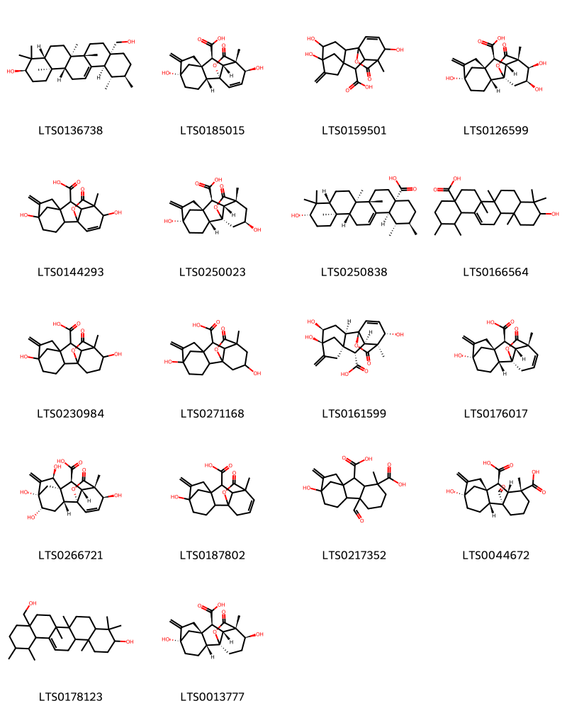{ width=100% }
    <figcaption>Hình ảnh cấu trúc hóa học của 18 hoạt chất thuộc nhóm Prenol lipids gồm ['urs-12-ene-3β,28-diol (LTS0136738)', 'gibberellin a3 (LTS0185015)', '4,5,12-trihydroxy-11-methyl-6-methylidene-16-oxo-15-oxapentacyclo[9.3.2.1⁵,⁸.0¹,¹⁰.0²,⁸]heptadec-13-ene-9-carboxylic acid (LTS0159501)', 'gibberellin a8 (LTS0126599)', '5,12-dihydroxy-11-methyl-6-methylidene-16-oxo-15-oxapentacyclo[9.3.2.1⁵,⁸.0¹,¹⁰.0²,⁸]heptadec-13-ene-9-carboxylic acid (LTS0144293)', 'gibberellin a29 (LTS0250023)', 'ursolic acid (LTS0250838)', '10-hydroxy-1,2,6a,6b,9,9,12a-heptamethyl-2,3,4,5,6,7,8,8a,10,11,12,12b,13,14b-tetradecahydro-1h-picene-4a-carboxylic acid (LTS0166564)', '5,12-dihydroxy-11-methyl-6-methylidene-16-oxo-15-oxapentacyclo[9.3.2.1⁵,⁸.0¹,¹⁰.0²,⁸]heptadecane-9-carboxylic acid (LTS0230984)', '5,13-dihydroxy-11-methyl-6-methylidene-16-oxo-15-oxapentacyclo[9.3.2.1⁵,⁸.0¹,¹⁰.0²,⁸]heptadecane-9-carboxylic acid (LTS0271168)', '(1r,2r,4s,5s,8s,9s,10r,11s,12s)-4,5,12-trihydroxy-11-methyl-6-methylidene-16-oxo-15-oxapentacyclo[9.3.2.1⁵,⁸.0¹,¹⁰.0²,⁸]heptadec-13-ene-9-carboxylic acid (LTS0161599)', 'gibberellin a5 (LTS0176017)', '(1r,2r,4s,5s,7s,8r,9s,10r,11s,12s)-4,5,7,12-tetrahydroxy-11-methyl-6-methylidene-16-oxo-15-oxapentacyclo[9.3.2.1⁵,⁸.0¹,¹⁰.0²,⁸]heptadec-13-ene-9-carboxylic acid (LTS0266721)', '5-hydroxy-11-methyl-6-methylidene-16-oxo-15-oxapentacyclo[9.3.2.1⁵,⁸.0¹,¹⁰.0²,⁸]heptadec-12-ene-9-carboxylic acid (LTS0187802)', '8-formyl-12-hydroxy-4-methyl-13-methylidenetetracyclo[10.2.1.0¹,⁹.0³,⁸]pentadecane-2,4-dicarboxylic acid (LTS0217352)', 'gibberellin a19 (LTS0044672)', '8a-(hydroxymethyl)-4,4,6a,6b,11,12,14b-heptamethyl-2,3,4a,5,6,7,8,9,10,11,12,12a,14,14a-tetradecahydro-1h-picen-3-ol (LTS0178123)', 'gibberellin a1 (LTS0013777)'].</figcaption>
</figure>
#### Nhóm Tannins
<figure markdown="span">
    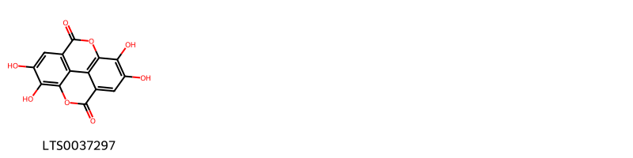{ width=100% }
    <figcaption>Hình ảnh cấu trúc hóa học của 1 hoạt chất thuộc nhóm Tannins gồm ['ellagic acid (LTS0037297)'].</figcaption>
</figure>

---

### Dược dân tộc học

Danh sách các quốc gia có sử dụng *Prunus avium* trong điều trị các bệnh. 

| Country   | Disease           | Bệnh                                                                                                                                                                                                |
|:----------|:------------------|:----------------------------------------------------------------------------------------------------------------------------------------------------------------------------------------------------|
| Elsewhere | Astringent, Tonic | MYMEMORY WARNING: YOU USED ALL AVAILABLE FREE TRANSLATIONS FOR TODAY. NEXT AVAILABLE IN  12 HOURS 06 MINUTES 50 SECONDS VISIT HTTPS://MYMEMORY.TRANSLATED.NET/DOC/USAGELIMITS.PHP TO TRANSLATE MORE |
| Italian   | Tonic             | MYMEMORY WARNING: YOU USED ALL AVAILABLE FREE TRANSLATIONS FOR TODAY. NEXT AVAILABLE IN  12 HOURS 06 MINUTES 47 SECONDS VISIT HTTPS://MYMEMORY.TRANSLATED.NET/DOC/USAGELIMITS.PHP TO TRANSLATE MORE |
| US        | Astringent        | MYMEMORY WARNING: YOU USED ALL AVAILABLE FREE TRANSLATIONS FOR TODAY. NEXT AVAILABLE IN  12 HOURS 06 MINUTES 45 SECONDS VISIT HTTPS://MYMEMORY.TRANSLATED.NET/DOC/USAGELIMITS.PHP TO TRANSLATE MORE |

---

---
## Prunus brachybotrya
### Thông tin về thực vật

!!! info "Phân loại thực vật của *Prunus brachybotrya* từ GIBF:"
    - **Kingdom:** Plantae
    - **Phylum:** Tracheophyta
    - **Order:** Rosales
    - **Family:** Rosaceae
    - **Genus:** Prunus
    - **Species:** *Prunus brachybotrya*

 

| Label (VI)   | Label (EN)   | Scientific Name     | Descriptions (VI)   | Descriptions (EN)   | Also Known As (VI)   | Also Known As (EN)   |
|:-------------|:-------------|:--------------------|:--------------------|:--------------------|:---------------------|:---------------------|
| N/A          | N/A          | Prunus brachybotrya | loài thực vật       | species of plant    | ['']                 | ['']                 |

#### Phân bố trên thế giới

**Từ CSDL GIBF** Guatemala, Georgia, Honduras, El Salvador, Panama, Costa Rica, Mexico, Indonesia

#### Phân bố tại Việt Nam

**Từ CSDL GIBF**: Không có ghi nhận ở Việt Nam

---
### Thành phần hóa học
        
- Theo cơ sở dữ liệu lotus: Từ loài *Prunus brachybotrya* đã phân lập và xác định được Chưa có hoạt chất nào được phân lập. hoạt chất thuộc về các nhóm Không có hoạt chất nào được phân lập. 

Không có hình ảnh nào được tạo ra

---

### Dược dân tộc học

Danh sách các quốc gia có sử dụng *Prunus brachybotrya* trong điều trị các bệnh. 

| Country   | Disease   | Bệnh                                                                                                                                                                                                |
|:----------|:----------|:----------------------------------------------------------------------------------------------------------------------------------------------------------------------------------------------------|
| Mexico    | Poison    | MYMEMORY WARNING: YOU USED ALL AVAILABLE FREE TRANSLATIONS FOR TODAY. NEXT AVAILABLE IN  12 HOURS 05 MINUTES 52 SECONDS VISIT HTTPS://MYMEMORY.TRANSLATED.NET/DOC/USAGELIMITS.PHP TO TRANSLATE MORE |

---

---
## Prunus capuli
### Thông tin về thực vật

!!! info "Phân loại thực vật của *Prunus serotina* từ GIBF:"
    - **Kingdom:** Plantae
    - **Phylum:** Tracheophyta
    - **Order:** Rosales
    - **Family:** Rosaceae
    - **Genus:** Prunus
    - **Species:** *Prunus serotina*

 

| Label (VI)   | Label (EN)   | Scientific Name   | Descriptions (VI)   | Descriptions (EN)   | Also Known As (VI)   | Also Known As (EN)   |
|:-------------|:-------------|:------------------|:--------------------|:--------------------|:---------------------|:---------------------|
| N/A          | N/A          | Prunus capuli     | loài thực vật       | species of plant    | ['']                 | ['']                 |

#### Phân bố trên thế giới

**Từ CSDL GIBF** nan, Colombia, New Zealand, Peru, Germany, Ecuador, United States of America, Mexico

#### Phân bố tại Việt Nam

**Từ CSDL GIBF**: Không có ghi nhận ở Việt Nam

---
### Thành phần hóa học
        
- Theo cơ sở dữ liệu lotus: Từ loài *Prunus serotina* đã phân lập và xác định được Chưa có hoạt chất nào được phân lập. hoạt chất thuộc về các nhóm Không có hoạt chất nào được phân lập. 

Không có hình ảnh nào được tạo ra

---

### Dược dân tộc học

Danh sách các quốc gia có sử dụng *Prunus serotina* trong điều trị các bệnh. 

| Country   | Disease           | Bệnh                                                                                                                                                                                                |
|:----------|:------------------|:----------------------------------------------------------------------------------------------------------------------------------------------------------------------------------------------------|
| Mexico    | Poison, Collyrium | MYMEMORY WARNING: YOU USED ALL AVAILABLE FREE TRANSLATIONS FOR TODAY. NEXT AVAILABLE IN  12 HOURS 05 MINUTES 24 SECONDS VISIT HTTPS://MYMEMORY.TRANSLATED.NET/DOC/USAGELIMITS.PHP TO TRANSLATE MORE |

---

---
## Prunus cerasus
### Thông tin về thực vật

!!! info "Phân loại thực vật của *Prunus cerasus* từ GIBF:"
    - **Kingdom:** Plantae
    - **Phylum:** Tracheophyta
    - **Order:** Rosales
    - **Family:** Rosaceae
    - **Genus:** Prunus
    - **Species:** *Prunus cerasus*

 

| Label (VI)   | Label (EN)   | Scientific Name   | Descriptions (VI)   | Descriptions (EN)   | Also Known As (VI)   | Also Known As (EN)                             |
|:-------------|:-------------|:------------------|:--------------------|:--------------------|:---------------------|:-----------------------------------------------|
| N/A          | N/A          | Prunus cerasus    | loài thực vật       | species of plant    | ['']                 | ['sour cherry', 'dwarf cherry', 'tart cherry'] |

#### Phân bố trên thế giới

**Từ CSDL GIBF** Spain, Germany, Austria, Australia, Sweden, Poland, Canada, Kazakhstan, Belgium, Netherlands, Finland, Belarus, Bulgaria, Estonia, Norway, Switzerland, Latvia, France, Czechia, Russian Federation, United States of America, Italy, Ukraine

#### Phân bố tại Việt Nam

**Từ CSDL GIBF**: Không có ghi nhận ở Việt Nam

---
### Thành phần hóa học
        
- Theo cơ sở dữ liệu lotus: Từ loài *Prunus cerasus* đã phân lập và xác định được 147 hoạt chất thuộc về các nhóm Organooxygen compounds, Flavonoids, Indoles and derivatives, Prenol lipids, Fatty Acyls, Isoflavonoids, Phenols, Linear 1,3-diarylpropanoids, Phenylpropanoic acids, Cinnamic acids and derivatives, Benzene and substituted derivatives. 

|    | chemicalTaxonomyClassyfireClass     |   smiles_count |
|---:|:------------------------------------|---------------:|
|  0 | Benzene and substituted derivatives |              7 |
|  1 | Cinnamic acids and derivatives      |              9 |
|  2 | Fatty Acyls                         |              4 |
|  3 | Flavonoids                          |             58 |
|  4 | Indoles and derivatives             |              5 |
|  5 | Isoflavonoids                       |              8 |
|  6 | Linear 1,3-diarylpropanoids         |              4 |
|  7 | Organooxygen compounds              |             28 |
|  8 | Phenols                             |              1 |
|  9 | Phenylpropanoic acids               |              2 |
| 10 | Prenol lipids                       |             21 |

#### Nhóm Benzene and substituted derivatives
<figure markdown="span">
    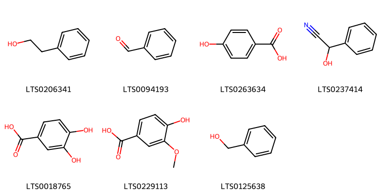{ width=100% }
    <figcaption>Hình ảnh cấu trúc hóa học của 7 hoạt chất thuộc nhóm Benzene and substituted derivatives gồm ['2-phenyl-ethanol (LTS0206341)', 'benzaldehyde (LTS0094193)', 'p-hydroxybenzoic acid (LTS0263634)', 'mandelonitrile (LTS0237414)', '3,4-dihydroxybenzoic acid (LTS0018765)', 'vanillic acid (LTS0229113)', 'benzyl alcohol (LTS0125638)'].</figcaption>
</figure>
#### Nhóm Cinnamic acids and derivatives
<figure markdown="span">
    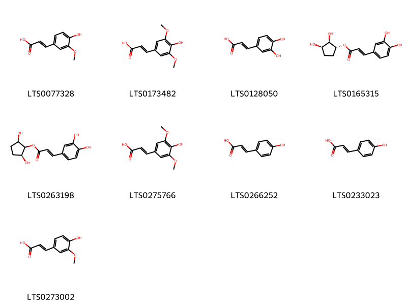{ width=100% }
    <figcaption>Hình ảnh cấu trúc hóa học của 9 hoạt chất thuộc nhóm Cinnamic acids and derivatives gồm ['ferulic acid (LTS0077328)', 'sinapinate (LTS0173482)', '3,4-dihydroxycinnamic acid (LTS0128050)', '(1r,2r,3r)-2,3-dihydroxycyclopentyl (2e)-3-(3,4-dihydroxyphenyl)prop-2-enoate (LTS0165315)', '(2r,5s)-2,5-dihydroxycyclopentyl (2e)-3-(3,4-dihydroxyphenyl)prop-2-enoate (LTS0263198)', 'sinapoyl alcohol (LTS0275766)', 'para-coumaric acid (LTS0266252)', 'hydroxycinnamic acid (LTS0233023)', 'ferulic acid (LTS0273002)'].</figcaption>
</figure>
#### Nhóm Fatty Acyls
<figure markdown="span">
    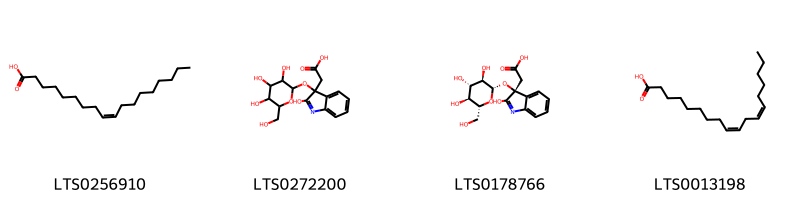{ width=100% }
    <figcaption>Hình ảnh cấu trúc hóa học của 4 hoạt chất thuộc nhóm Fatty Acyls gồm ['oleic acid (LTS0256910)', '(2-hydroxy-3-{[3,4,5-trihydroxy-6-(hydroxymethyl)oxan-2-yl]oxy}indol-3-yl)acetic acid (LTS0272200)', '[(3r)-2-hydroxy-3-{[(2s,3r,4s,5s,6r)-3,4,5-trihydroxy-6-(hydroxymethyl)oxan-2-yl]oxy}indol-3-yl]acetic acid (LTS0178766)', 'linoleic (LTS0013198)'].</figcaption>
</figure>
#### Nhóm Flavonoids
<figure markdown="span">
    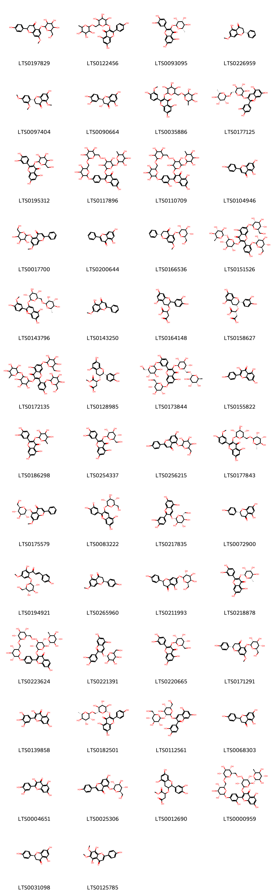{ width=100% }
    <figcaption>Hình ảnh cấu trúc hóa học của 58 hoạt chất thuộc nhóm Flavonoids gồm ['sakuranin (LTS0197829)', '5,7-dihydroxy-2-(4-hydroxyphenyl)-3-[(3,4,5-trihydroxy-6-{[(3,4,5-trihydroxy-6-methyloxan-2-yl)oxy]methyl}oxan-2-yl)oxy]chromen-4-one (LTS0122456)', 'quercitrin (LTS0093095)', '(2r)-5-hydroxy-7-methoxy-2-phenyl-2,3-dihydro-1-benzopyran-4-one (LTS0226959)', '(2r)-2-(2,4-dimethoxyphenyl)-7-hydroxy-5-methoxy-2,3-dihydro-1-benzopyran-4-one (LTS0097404)', '(+)-taxifolin (LTS0090664)', '5,7-dihydroxy-2-(4-hydroxy-3-methoxyphenyl)-3-[(3,4,5-trihydroxy-6-{[(3,4,5-trihydroxy-6-methyloxan-2-yl)oxy]methyl}oxan-2-yl)oxy]chromen-4-one (LTS0035886)', '5,7-dihydroxy-2-(4-hydroxy-3-oxidophenyl)-3-{[(3r,4s,5s,6r)-3,4,5-trihydroxy-6-({[(2r,3r,4r,5r,6s)-3,4,5-trihydroxy-6-methyloxan-2-yl]oxy}methyl)oxan-2-yl]oxy}-1λ⁴-chromen-1-ylium (LTS0177125)', '2-(3,4-dihydroxyphenyl)-5,7-dihydroxy-3-{[3,4,5-trihydroxy-6-(hydroxymethyl)oxan-2-yl]oxy}chromen-4-one (LTS0195312)', '7-hydroxy-2-(4-{[3,4,5-trihydroxy-6-({[3,4,5-trihydroxy-6-(hydroxymethyl)oxan-2-yl]oxy}methyl)oxan-2-yl]oxy}phenyl)-3-({3,4,5-trihydroxy-6-[(3,4,5-trihydroxy-6-methyloxan-2-yl)oxy]oxan-2-yl}oxy)chromen-4-one (LTS0117896)', '5,7-dihydroxy-2-(2-hydroxy-4-{[3,4,5-trihydroxy-6-({[3,4,5-trihydroxy-6-(hydroxymethyl)oxan-2-yl]oxy}methyl)oxan-2-yl]oxy}phenyl)-3-({3,4,5-trihydroxy-6-[(3,4,5-trihydroxy-6-methyloxan-2-yl)oxy]oxan-2-yl}oxy)chromen-4-one (LTS0110709)', 'chamomile (LTS0104946)', '7-methoxy-2-phenyl-5-{[3,4,5-trihydroxy-6-(hydroxymethyl)oxan-2-yl]oxy}chromen-4-one (LTS0017700)', 'chrysin (LTS0200644)', '(2s)-7-methoxy-2-phenyl-5-{[(2s,3r,4s,5s,6r)-3,4,5-trihydroxy-6-(hydroxymethyl)oxan-2-yl]oxy}-2,3-dihydro-1-benzopyran-4-one (LTS0166536)', '5-hydroxy-2-(4-hydroxy-2-{[(2s,3r,4s,5s,6r)-3,4,5-trihydroxy-6-(hydroxymethyl)oxan-2-yl]oxy}phenyl)-7-{[(2s,3r,4s,5s,6r)-3,4,5-trihydroxy-6-(hydroxymethyl)oxan-2-yl]oxy}-3-{[(2r,3r,4r,5s,6s)-3,4,5-trihydroxy-6-{[(2s,3r,4s,5s,6s)-3,4,5-trihydroxy-6-methyloxan-2-yl]oxy}oxan-2-yl]oxy}chromen-4-one (LTS0151526)', '5,7-dihydroxy-2-(4-hydroxy-3-methoxyphenyl)-3-{[(2s,3r,4s,5s,6r)-3,4,5-trihydroxy-6-({[(2r,3r,4r,5r,6s)-3,4,5-trihydroxy-6-methyloxan-2-yl]oxy}methyl)oxan-2-yl]oxy}-1λ⁴-chromen-1-ylium (LTS0143796)', 'tectochrysin (LTS0143250)', '2-{[2-(3,4-dihydroxyphenyl)-5,7-dihydroxy-3,4-dihydro-2h-1-benzopyran-3-yl]oxy}butanedioic acid (LTS0164148)', '(2r)-2-{[(2r,3r)-2-(3,4-dihydroxyphenyl)-5,7-dihydroxy-3,4-dihydro-2h-1-benzopyran-3-yl]oxy}butanedioic acid (LTS0158627)', '5-hydroxy-2-(4-hydroxy-2-{[3,4,5-trihydroxy-6-(hydroxymethyl)oxan-2-yl]oxy}phenyl)-7-{[3,4,5-trihydroxy-6-(hydroxymethyl)oxan-2-yl]oxy}-3-({3,4,5-trihydroxy-6-[(3,4,5-trihydroxy-6-methyloxan-2-yl)oxy]oxan-2-yl}oxy)chromen-4-one (LTS0172135)', '(3s)-3-{[(2r,3r)-2-(3,4-dihydroxyphenyl)-5,7-dihydroxy-3,4-dihydro-2h-1-benzopyran-3-yl]oxy}-4-methoxy-4-oxobutanoic acid (LTS0128985)', '5-hydroxy-2-(4-hydroxy-3-{[(2s,3s,4s,5s,6s)-3,4,5-trihydroxy-6-(hydroxymethyl)oxan-2-yl]oxy}phenyl)-7-{[(2s,3r,4s,5s,6r)-3,4,5-trihydroxy-6-(hydroxymethyl)oxan-2-yl]oxy}-3-{[(2s,3r,4s,5s,6s)-3,4,5-trihydroxy-6-({[(2r,3r,4s,5r,6s)-3,4,5-trihydroxy-6-methyloxan-2-yl]oxy}methyl)oxan-2-yl]oxy}chromen-4-one (LTS0173844)', 'kaempherol (LTS0155822)', 'quercitrin (LTS0186298)', 'isoquercetin (LTS0254337)', '7-hydroxy-2-(4-hydroxyphenyl)-5-{[3,4,5-trihydroxy-6-(hydroxymethyl)oxan-2-yl]oxy}chromen-4-one (LTS0256215)', 'narcissin (LTS0177843)', '7-methoxy-2-phenyl-5-{[(2r,3r,4s,5s,6r)-3,4,5-trihydroxy-6-(hydroxymethyl)oxan-2-yl]oxy}chromen-4-one (LTS0175579)', '5,7-dihydroxy-2-(4-hydroxy-3-oxidophenyl)-3-{[(2s,3r,4s,5s,6r)-3,4,5-trihydroxy-6-(hydroxymethyl)oxan-2-yl]oxy}-1λ⁴-chromen-1-ylium (LTS0083222)', 'cyanidin 3-glucoside (LTS0217835)', '(-)-naringenin (LTS0072900)', '(2e)-1-(2-hydroxy-4-methoxy-6-{[(2s,3r,4s,5s,6r)-3,4,5-trihydroxy-6-(hydroxymethyl)oxan-2-yl]oxy}phenyl)-3-(4-hydroxyphenyl)prop-2-en-1-one (LTS0194921)', 'sakuranetin (LTS0265960)', '(2s)-5-hydroxy-2-(4-hydroxyphenyl)-7-{[(2s,3r,4s,5r,6r)-3,4,5-trihydroxy-6-(hydroxymethyl)oxan-2-yl]oxy}-2,3-dihydro-1-benzopyran-4-one (LTS0211993)', '2-(3,4-dihydroxyphenyl)-5,7-dihydroxy-3-{[(2r,3r,4r,5r,6s)-3,4,5-trihydroxy-6-methyloxan-2-yl]oxy}chromen-4-one (LTS0218878)', '7-hydroxy-2-(4-{[(2s,3r,4s,5s,6r)-3,4,5-trihydroxy-6-({[(2r,3r,4s,5s,6r)-3,4,5-trihydroxy-6-(hydroxymethyl)oxan-2-yl]oxy}methyl)oxan-2-yl]oxy}phenyl)-3-{[(2r,3r,4r,5s,6s)-3,4,5-trihydroxy-6-{[(2s,3r,4s,5s,6s)-3,4,5-trihydroxy-6-methyloxan-2-yl]oxy}oxan-2-yl]oxy}chromen-4-one (LTS0223624)', 'chrysanthemin (LTS0221391)', '2-(3,4-dihydroxyphenyl)-5,7-dihydroxy-3-{[(2s,3r,4r,5s,6r)-3,4,5-trihydroxy-6-(hydroxymethyl)oxan-2-yl]oxy}chromen-4-one (LTS0220665)', 'sakuranin (LTS0171291)', 'myricetin (LTS0139858)', 'nictoflorin (LTS0182501)', 'cyanidin 3-o-sophoroside (LTS0112561)', 'asahina (LTS0068303)', 'quercetin (LTS0004651)', '7-hydroxy-2-(4-hydroxyphenyl)-5-{[(2s,3r,4s,5s,6r)-3,4,5-trihydroxy-6-(hydroxymethyl)oxan-2-yl]oxy}chromen-4-one (LTS0025306)', '3-{[2-(3,4-dihydroxyphenyl)-5,7-dihydroxy-3,4-dihydro-2h-1-benzopyran-3-yl]oxy}-4-methoxy-4-oxobutanoic acid (LTS0012690)', '5,7-dihydroxy-2-(2-hydroxy-4-{[(2s,3r,4s,5s,6r)-3,4,5-trihydroxy-6-({[(2r,3r,4s,5s,6r)-3,4,5-trihydroxy-6-(hydroxymethyl)oxan-2-yl]oxy}methyl)oxan-2-yl]oxy}phenyl)-3-{[(2r,3r,4r,5s,6s)-3,4,5-trihydroxy-6-{[(2s,3r,4s,5s,6s)-3,4,5-trihydroxy-6-methyloxan-2-yl]oxy}oxan-2-yl]oxy}chromen-4-one (LTS0000959)', 'naringenin (LTS0031098)', 'isothymusin (LTS0125785)', '3-[(4,5-dihydroxy-3-{[3,4,5-trihydroxy-6-(hydroxymethyl)oxan-2-yl]oxy}-6-{[(3,4,5-trihydroxy-6-methyloxan-2-yl)oxy]methyl}oxan-2-yl)oxy]-2-(3,4-dihydroxyphenyl)-5,7-dihydroxy-1λ⁴-chromen-1-ylium (LTS0016654)', 'luteolin (LTS0017052)', '3-rutinosyl quercetin (LTS0032845)', 'pinostrobin 5-o-glucoside (LTS0101074)', '1-(2-hydroxy-4-methoxy-6-{[3,4,5-trihydroxy-6-(hydroxymethyl)oxan-2-yl]oxy}phenyl)-3-(4-hydroxyphenyl)prop-2-en-1-one (LTS0027785)', '2-(4-hydroxyphenyl)-7-methoxy-5-{[3,4,5-trihydroxy-6-(hydroxymethyl)oxan-2-yl]oxy}chromen-4-one (LTS0039107)', 'cyanidin 3-o-rutinoside (LTS0049654)', '2-(4-hydroxyphenyl)-7-methoxy-5-{[(2s,3r,4s,5s,6r)-3,4,5-trihydroxy-6-(hydroxymethyl)oxan-2-yl]oxy}chromen-4-one (LTS0124013)'].</figcaption>
</figure>
#### Nhóm Indoles and derivatives
<figure markdown="span">
    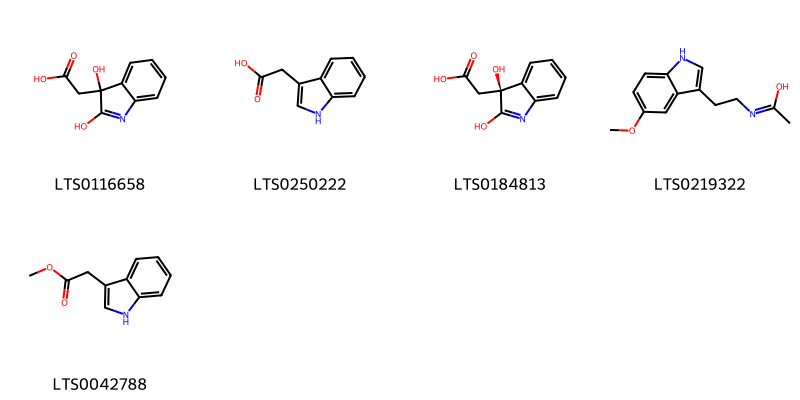{ width=100% }
    <figcaption>Hình ảnh cấu trúc hóa học của 5 hoạt chất thuộc nhóm Indoles and derivatives gồm ['(2,3-dihydroxyindol-3-yl)acetic acid (LTS0116658)', 'β-indole-3-acetic acid (LTS0250222)', '[(3s)-2,3-dihydroxyindol-3-yl]acetic acid (LTS0184813)', 'n-[2-(5-methoxy-1h-indol-3-yl)ethyl]ethanimidic acid (LTS0219322)', 'methyl indole-3-acetate (LTS0042788)'].</figcaption>
</figure>
#### Nhóm Isoflavonoids
<figure markdown="span">
    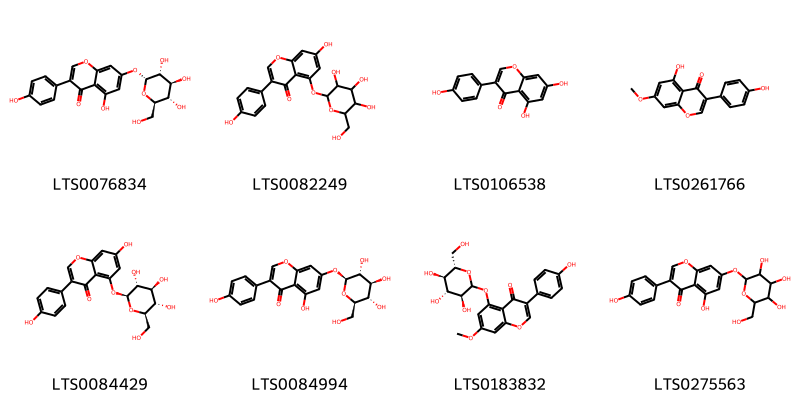{ width=100% }
    <figcaption>Hình ảnh cấu trúc hóa học của 8 hoạt chất thuộc nhóm Isoflavonoids gồm ['5-hydroxy-3-(4-hydroxyphenyl)-7-{[(2r,3r,4s,5s,6r)-3,4,5-trihydroxy-6-(hydroxymethyl)oxan-2-yl]oxy}chromen-4-one (LTS0076834)', '7-hydroxy-3-(4-hydroxyphenyl)-5-{[3,4,5-trihydroxy-6-(hydroxymethyl)oxan-2-yl]oxy}chromen-4-one (LTS0082249)', 'genistein (LTS0106538)', 'prunetin (LTS0261766)', '7-hydroxy-3-(4-hydroxyphenyl)-5-{[(2s,3r,4s,5s,6r)-3,4,5-trihydroxy-6-(hydroxymethyl)oxan-2-yl]oxy}chromen-4-one (LTS0084429)', 'genistin (LTS0084994)', '3-(4-hydroxyphenyl)-7-methoxy-5-{[(3s,4r,5r,6s)-3,4,5-trihydroxy-6-(hydroxymethyl)oxan-2-yl]oxy}chromen-4-one (LTS0183832)', '5-hydroxy-3-(4-hydroxyphenyl)-7-{[3,4,5-trihydroxy-6-(hydroxymethyl)oxan-2-yl]oxy}chromen-4-one (LTS0275563)'].</figcaption>
</figure>
#### Nhóm Linear 1_3-diarylpropanoids
<figure markdown="span">
    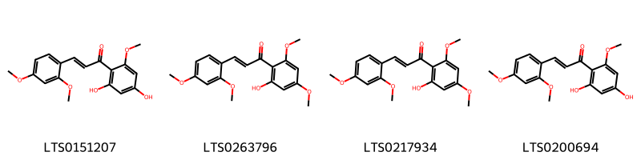{ width=100% }
    <figcaption>Hình ảnh cấu trúc hóa học của Không tìm thấy chú thích hoạt chất thuộc nhóm Linear 1_3-diarylpropanoids gồm Không tìm thấy chú thích.</figcaption>
</figure>
#### Nhóm Organooxygen compounds
<figure markdown="span">
    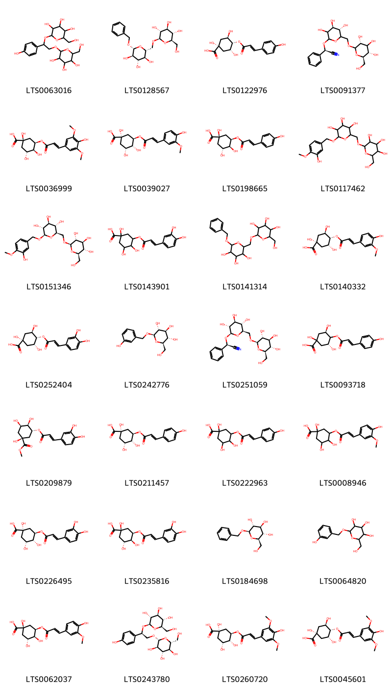{ width=100% }
    <figcaption>Hình ảnh cấu trúc hóa học của 28 hoạt chất thuộc nhóm Organooxygen compounds gồm ['2-(hydroxymethyl)-6-[2-(4-hydroxyphenyl)-2-{[3,4,5-trihydroxy-6-(hydroxymethyl)oxan-2-yl]oxy}ethoxy]oxane-3,4,5-triol (LTS0063016)', '(2r,3r,4s,5s,6r)-2-{[(2r,3s,4s,5r,6r)-6-(benzyloxy)-3,4,5-trihydroxyoxan-2-yl]methoxy}-6-(hydroxymethyl)oxane-3,4,5-triol (LTS0128567)', '(1s,3r,4s,5r)-1,3,5-trihydroxy-4-{[(2e)-3-(4-hydroxyphenyl)prop-2-enoyl]oxy}cyclohexane-1-carboxylic acid (LTS0122976)', '(2r)-2-phenyl-2-{[(4s,5s)-3,4,5-trihydroxy-6-({[(3r,5s,6r)-3,4,5-trihydroxy-6-(hydroxymethyl)oxan-2-yl]oxy}methyl)oxan-2-yl]oxy}acetonitrile (LTS0091377)', '3-o-sinapoylquinic acid (LTS0036999)', '3-o-feruloyl-d-quinic acid (LTS0039027)', '(1r,3r,4s,5r)-1,3,4-trihydroxy-5-{[(2e)-3-(4-hydroxyphenyl)prop-2-enoyl]oxy}cyclohexane-1-carboxylic acid (LTS0198665)', '2-[(3-hydroxy-4-methoxyphenyl)methoxy]-6-({[3,4,5-trihydroxy-6-(hydroxymethyl)oxan-2-yl]oxy}methyl)oxane-3,4,5-triol (LTS0117462)', '(2r,3r,4s,5s,6r)-2-[(3-hydroxy-4-methoxyphenyl)methoxy]-6-({[(2r,3r,4s,5s,6r)-3,4,5-trihydroxy-6-(hydroxymethyl)oxan-2-yl]oxy}methyl)oxane-3,4,5-triol (LTS0151346)', '3-{[3-(3,4-dihydroxyphenyl)prop-2-enoyl]oxy}-1,4,5-trihydroxycyclohexane-1-carboxylic acid (LTS0143901)', '2-{[6-(benzyloxy)-3,4,5-trihydroxyoxan-2-yl]methoxy}-6-(hydroxymethyl)oxane-3,4,5-triol (LTS0141314)', '4-o-feruloyl-d-quinic acid (LTS0140332)', 'cryptochlorogenic acid (LTS0252404)', '(2r,3s,4s,5r,6r)-2-(hydroxymethyl)-6-[(3-hydroxyphenyl)methoxy]oxane-3,4,5-triol (LTS0242776)', 'laetrile (LTS0251059)', '(3r,5r)-1,3,5-trihydroxy-4-{[(2e)-3-(4-hydroxyphenyl)prop-2-enoyl]oxy}cyclohexane-1-carboxylic acid (LTS0093718)', 'methyl chlorogenate (LTS0209879)', '(1s,3r,4r,5r)-1,3,4-trihydroxy-5-{[(2e)-3-(4-hydroxyphenyl)prop-2-enoyl]oxy}cyclohexane-1-carboxylic acid (LTS0211457)', '1,3,4-trihydroxy-5-{[3-(4-hydroxyphenyl)prop-2-enoyl]oxy}cyclohexane-1-carboxylic acid (LTS0222963)', '1,3,4-trihydroxy-5-{[3-(4-hydroxy-3-methoxyphenyl)prop-2-enoyl]oxy}cyclohexane-1-carboxylic acid (LTS0008946)', 'chlorogenic acid (LTS0226495)', 'neochlorogenic acid (LTS0235816)', 'benzyl β-d-glucoside (LTS0184698)', '2-(hydroxymethyl)-6-[(3-hydroxyphenyl)methoxy]oxane-3,4,5-triol (LTS0064820)', '3-feruloylquinic acid (LTS0062037)', '(2r,3s,4s,5r,6r)-2-(hydroxymethyl)-6-[(2r)-2-(4-hydroxyphenyl)-2-{[(2r,3r,4s,5s,6r)-3,4,5-trihydroxy-6-(hydroxymethyl)oxan-2-yl]oxy}ethoxy]oxane-3,4,5-triol (LTS0243780)', '5-o-sinapoylquinic acid (LTS0260720)', '4-o-sinapoylquinic acid (LTS0045601)'].</figcaption>
</figure>
#### Nhóm Phenols
<figure markdown="span">
    { width=100% }
    <figcaption>Hình ảnh cấu trúc hóa học của 1 hoạt chất thuộc nhóm Phenols gồm ['eugenol (LTS0052342)'].</figcaption>
</figure>
#### Nhóm Phenylpropanoic acids
<figure markdown="span">
    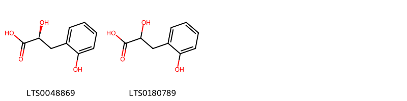{ width=100% }
    <figcaption>Hình ảnh cấu trúc hóa học của 2 hoạt chất thuộc nhóm Phenylpropanoic acids gồm ['(2s)-2-hydroxy-3-(2-hydroxyphenyl)propanoic acid (LTS0048869)', 'dl-o-hydroxyphenyllactic acid (LTS0180789)'].</figcaption>
</figure>
#### Nhóm Prenol lipids
<figure markdown="span">
    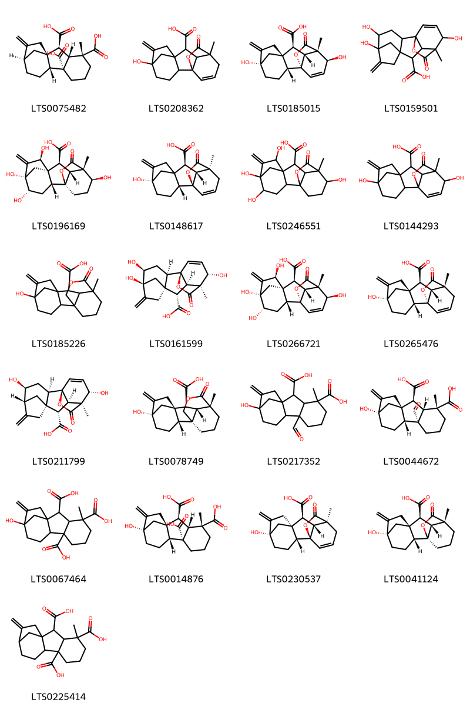{ width=100% }
    <figcaption>Hình ảnh cấu trúc hóa học của 21 hoạt chất thuộc nhóm Prenol lipids gồm ['gibberellin a25 (LTS0075482)', '5-hydroxy-11-methyl-6-methylidene-16-oxo-15-oxapentacyclo[9.3.2.1⁵,⁸.0¹,¹⁰.0²,⁸]heptadec-13-ene-9-carboxylic acid (LTS0208362)', 'gibberellin a3 (LTS0185015)', '4,5,12-trihydroxy-11-methyl-6-methylidene-16-oxo-15-oxapentacyclo[9.3.2.1⁵,⁸.0¹,¹⁰.0²,⁸]heptadec-13-ene-9-carboxylic acid (LTS0159501)', '(1r,2r,4s,5s,7s,8r,9s,10r,11s,12s)-4,5,7,12-tetrahydroxy-11-methyl-6-methylidene-16-oxo-15-oxapentacyclo[9.3.2.1⁵,⁸.0¹,¹⁰.0²,⁸]heptadecane-9-carboxylic acid (LTS0196169)', '(1s,2r,5s,9s,10r,11s)-5-hydroxy-11-methyl-6-methylidene-16-oxo-15-oxapentacyclo[9.3.2.1⁵,⁸.0¹,¹⁰.0²,⁸]heptadec-13-ene-9-carboxylic acid (LTS0148617)', '4,5,7,12-tetrahydroxy-11-methyl-6-methylidene-16-oxo-15-oxapentacyclo[9.3.2.1⁵,⁸.0¹,¹⁰.0²,⁸]heptadecane-9-carboxylic acid (LTS0246551)', '5,12-dihydroxy-11-methyl-6-methylidene-16-oxo-15-oxapentacyclo[9.3.2.1⁵,⁸.0¹,¹⁰.0²,⁸]heptadec-13-ene-9-carboxylic acid (LTS0144293)', '5-hydroxy-11-methyl-6-methylidene-12-oxo-13-oxapentacyclo[9.3.3.1⁵,⁸.0¹,¹⁰.0²,⁸]octadecane-9-carboxylic acid (LTS0185226)', '(1r,2r,4s,5s,8s,9s,10r,11s,12s)-4,5,12-trihydroxy-11-methyl-6-methylidene-16-oxo-15-oxapentacyclo[9.3.2.1⁵,⁸.0¹,¹⁰.0²,⁸]heptadec-13-ene-9-carboxylic acid (LTS0161599)', '(1r,2r,4s,5s,7s,8r,9s,10r,11s,12s)-4,5,7,12-tetrahydroxy-11-methyl-6-methylidene-16-oxo-15-oxapentacyclo[9.3.2.1⁵,⁸.0¹,¹⁰.0²,⁸]heptadec-13-ene-9-carboxylic acid (LTS0266721)', '(1r,2r,5s,8s,9s,10r,11r)-5-hydroxy-11-methyl-6-methylidene-16-oxo-15-oxapentacyclo[9.3.2.1⁵,⁸.0¹,¹⁰.0²,⁸]heptadec-13-ene-9-carboxylic acid (LTS0265476)', '(1r,2r,4s,5r,8r,9s,10r,11s,12s)-4,12-dihydroxy-11-methyl-6-methylidene-16-oxo-15-oxapentacyclo[9.3.2.1⁵,⁸.0¹,¹⁰.0²,⁸]heptadec-13-ene-9-carboxylic acid (LTS0211799)', 'gibberellin a44 (LTS0078749)', '8-formyl-12-hydroxy-4-methyl-13-methylidenetetracyclo[10.2.1.0¹,⁹.0³,⁸]pentadecane-2,4-dicarboxylic acid (LTS0217352)', 'gibberellin a19 (LTS0044672)', '12-hydroxy-4-methyl-13-methylidenetetracyclo[10.2.1.0¹,⁹.0³,⁸]pentadecane-2,4,8-tricarboxylic acid (LTS0067464)', 'gibberellin a17 (LTS0014876)', '(1s,2r,5s,8r,9s,10r,11s)-5-hydroxy-11-methyl-6-methylidene-16-oxo-15-oxapentacyclo[9.3.2.1⁵,⁸.0¹,¹⁰.0²,⁸]heptadec-13-ene-9-carboxylic acid (LTS0230537)', 'gibberellin a20 (LTS0041124)', '4-methyl-13-methylidenetetracyclo[10.2.1.0¹,⁹.0³,⁸]pentadecane-2,4,8-tricarboxylic acid (LTS0225414)'].</figcaption>
</figure>

---

### Dược dân tộc học

Danh sách các quốc gia có sử dụng *Prunus cerasus* trong điều trị các bệnh. 

| Country   | Disease                               | Bệnh                                                                                                                                                                                                |
|:----------|:--------------------------------------|:----------------------------------------------------------------------------------------------------------------------------------------------------------------------------------------------------|
| Elsewhere | Diuretic, Nervine, Tonic              | MYMEMORY WARNING: YOU USED ALL AVAILABLE FREE TRANSLATIONS FOR TODAY. NEXT AVAILABLE IN  12 HOURS 05 MINUTES 04 SECONDS VISIT HTTPS://MYMEMORY.TRANSLATED.NET/DOC/USAGELIMITS.PHP TO TRANSLATE MORE |
| Haiti     | Diuretic                              | MYMEMORY WARNING: YOU USED ALL AVAILABLE FREE TRANSLATIONS FOR TODAY. NEXT AVAILABLE IN  12 HOURS 05 MINUTES 01 SECONDS VISIT HTTPS://MYMEMORY.TRANSLATED.NET/DOC/USAGELIMITS.PHP TO TRANSLATE MORE |
| Turkey    | Sedative, Tonic, Diuretic, Astringent | MYMEMORY WARNING: YOU USED ALL AVAILABLE FREE TRANSLATIONS FOR TODAY. NEXT AVAILABLE IN  12 HOURS 04 MINUTES 56 SECONDS VISIT HTTPS://MYMEMORY.TRANSLATED.NET/DOC/USAGELIMITS.PHP TO TRANSLATE MORE |
| US        | Sedative                              | MYMEMORY WARNING: YOU USED ALL AVAILABLE FREE TRANSLATIONS FOR TODAY. NEXT AVAILABLE IN  12 HOURS 04 MINUTES 51 SECONDS VISIT HTTPS://MYMEMORY.TRANSLATED.NET/DOC/USAGELIMITS.PHP TO TRANSLATE MORE |

---

---
## Prunus ceylanica
### Thông tin về thực vật

!!! info "Phân loại thực vật của *Prunus ceylanica* từ GIBF:"
    - **Kingdom:** Plantae
    - **Phylum:** Tracheophyta
    - **Order:** Rosales
    - **Family:** Rosaceae
    - **Genus:** Prunus
    - **Species:** *Prunus ceylanica*

 

| Label (VI)   | Label (EN)   | Scientific Name   | Descriptions (VI)   | Descriptions (EN)   | Also Known As (VI)   | Also Known As (EN)   |
|:-------------|:-------------|:------------------|:--------------------|:--------------------|:---------------------|:---------------------|
| N/A          | N/A          | Prunus ceylanica  |                     | species of plant    | ['']                 | ['']                 |

#### Phân bố trên thế giới

**Từ CSDL GIBF** Viet Nam, nan, unknown or invalid, Thailand, Sri Lanka, Bhutan, Myanmar, Pakistan, India, Afghanistan, Lao People’s Democratic Republic, Bangladesh, Nepal, Cambodia

#### Phân bố tại Việt Nam

**Từ CSDL GIBF**: Vinh Phuc, Song Be, Thua Thien-Hue, Quang Nam-Da Nang

---
### Thành phần hóa học
        
- Theo cơ sở dữ liệu lotus: Từ loài *Prunus ceylanica* đã phân lập và xác định được Chưa có hoạt chất nào được phân lập. hoạt chất thuộc về các nhóm Không có hoạt chất nào được phân lập. 

Không có hình ảnh nào được tạo ra

---

### Dược dân tộc học

Danh sách các quốc gia có sử dụng *Prunus ceylanica* trong điều trị các bệnh. 

| Country   | Disease   | Bệnh                                                                                                                                                                                                |
|:----------|:----------|:----------------------------------------------------------------------------------------------------------------------------------------------------------------------------------------------------|
| Elsewhere | Piscicide | MYMEMORY WARNING: YOU USED ALL AVAILABLE FREE TRANSLATIONS FOR TODAY. NEXT AVAILABLE IN  12 HOURS 04 MINUTES 10 SECONDS VISIT HTTPS://MYMEMORY.TRANSLATED.NET/DOC/USAGELIMITS.PHP TO TRANSLATE MORE |

---

---
## Prunus domestica
### Thông tin về thực vật

!!! info "Phân loại thực vật của *Prunus domestica* từ GIBF:"
    - **Kingdom:** Plantae
    - **Phylum:** Tracheophyta
    - **Order:** Rosales
    - **Family:** Rosaceae
    - **Genus:** Prunus
    - **Species:** *Prunus domestica*

 

| Label (VI)   | Label (EN)   | Scientific Name   | Descriptions (VI)   | Descriptions (EN)                              | Also Known As (VI)   | Also Known As (EN)   |
|:-------------|:-------------|:------------------|:--------------------|:-----------------------------------------------|:---------------------|:---------------------|
| N/A          | N/A          | Prunus domestica  | loài thực vật       | species of plant in the rose family (Rosaceae) | ['Prunus domestica'] | ['plum tree']        |

#### Phân bố trên thế giới

**Từ CSDL GIBF** Denmark, Spain, Kosovo, Germany, Austria, Australia, Sweden, Poland, India, Kazakhstan, Belgium, Netherlands, Finland, Türkiye, Belarus, Hungary, Estonia, Norway, Switzerland, United Kingdom of Great Britain and Northern Ireland, South Africa, Portugal, France, Czechia, New Zealand, Romania, Russian Federation, United States of America, Italy

#### Phân bố tại Việt Nam

**Từ CSDL GIBF**: Không có ghi nhận ở Việt Nam

---
### Thành phần hóa học
        
- Theo cơ sở dữ liệu lotus: Từ loài *Prunus domestica* đã phân lập và xác định được 203 hoạt chất thuộc về các nhóm Furanoid lignans, Nucleoside and nucleotide analogues, Dibenzylbutane lignans, Carboxylic acids and derivatives, 2-arylbenzofuran flavonoids, Dihydrofurans, Pyridines and derivatives, Organic phosphoric acids and derivatives, Tannins, Phenols, Cinnamic acids and derivatives, Organooxygen compounds, Coumarins and derivatives, 3,4-dihydrocoumarins, Lignan glycosides, Fatty Acyls, Flavonoids, Indoles and derivatives, Organic sulfonic acids and derivatives, Prenol lipids, Benzene and substituted derivatives. 

|    | chemicalTaxonomyClassyfireClass          |   smiles_count |
|---:|:-----------------------------------------|---------------:|
|  0 | 2-arylbenzofuran flavonoids              |              2 |
|  1 | 3,4-dihydrocoumarins                     |              2 |
|  2 | Benzene and substituted derivatives      |             10 |
|  3 | Carboxylic acids and derivatives         |             31 |
|  4 | Cinnamic acids and derivatives           |             11 |
|  5 | Coumarins and derivatives                |              4 |
|  6 | Dibenzylbutane lignans                   |              2 |
|  7 | Dihydrofurans                            |              1 |
|  8 | Fatty Acyls                              |             10 |
|  9 | Flavonoids                               |             46 |
| 10 | Furanoid lignans                         |              3 |
| 11 | Indoles and derivatives                  |              2 |
| 12 | Lignan glycosides                        |              2 |
| 13 | Nucleoside and nucleotide analogues      |              1 |
| 14 | Organic phosphoric acids and derivatives |              1 |
| 15 | Organic sulfonic acids and derivatives   |              1 |
| 16 | Organooxygen compounds                   |             43 |
| 17 | Phenols                                  |              5 |
| 18 | Prenol lipids                            |             22 |
| 19 | Pyridines and derivatives                |              1 |
| 20 | Tannins                                  |              3 |

#### Nhóm 2-arylbenzofuran flavonoids
<figure markdown="span">
    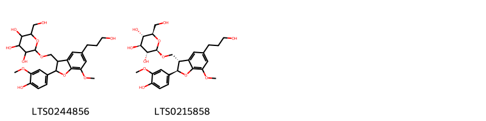{ width=100% }
    <figcaption>Hình ảnh cấu trúc hóa học của 2 hoạt chất thuộc nhóm 2-arylbenzofuran flavonoids gồm ['2-{[2-(4-hydroxy-3-methoxyphenyl)-5-(3-hydroxypropyl)-7-methoxy-2,3-dihydro-1-benzofuran-3-yl]methoxy}-6-(hydroxymethyl)oxane-3,4,5-triol (LTS0244856)', '(2r,3r,4s,5s,6r)-2-{[(2r,3s)-2-(4-hydroxy-3-methoxyphenyl)-5-(3-hydroxypropyl)-7-methoxy-2,3-dihydro-1-benzofuran-3-yl]methoxy}-6-(hydroxymethyl)oxane-3,4,5-triol (LTS0215858)'].</figcaption>
</figure>
#### Nhóm 3_4-dihydrocoumarins
<figure markdown="span">
    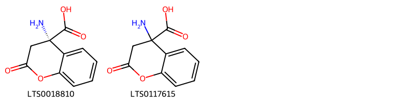{ width=100% }
    <figcaption>Hình ảnh cấu trúc hóa học của Không tìm thấy chú thích hoạt chất thuộc nhóm 3_4-dihydrocoumarins gồm Không tìm thấy chú thích.</figcaption>
</figure>
#### Nhóm Benzene and substituted derivatives
<figure markdown="span">
    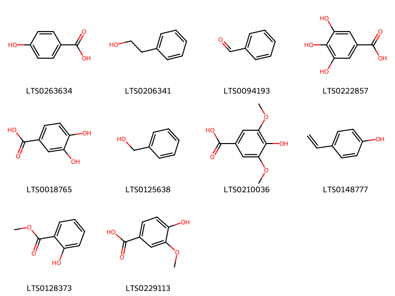{ width=100% }
    <figcaption>Hình ảnh cấu trúc hóa học của 10 hoạt chất thuộc nhóm Benzene and substituted derivatives gồm ['p-hydroxybenzoic acid (LTS0263634)', '2-phenyl-ethanol (LTS0206341)', 'benzaldehyde (LTS0094193)', 'galop (LTS0222857)', '3,4-dihydroxybenzoic acid (LTS0018765)', 'benzyl alcohol (LTS0125638)', 'syringic acid (LTS0210036)', '4-vinylphenol (LTS0148777)', 'methyl salicylate (LTS0128373)', 'vanillic acid (LTS0229113)'].</figcaption>
</figure>
#### Nhóm Carboxylic acids and derivatives
<figure markdown="span">
    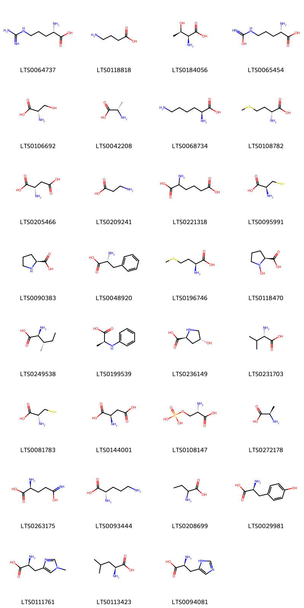{ width=100% }
    <figcaption>Hình ảnh cấu trúc hóa học của 31 hoạt chất thuộc nhóm Carboxylic acids and derivatives gồm ['l-arginine (LTS0064737)', 'gamma(amino)-butyric acid (LTS0118818)', 'l-threonine (LTS0184056)', 'l(+)-citrulline (LTS0065454)', 'l-serine (LTS0106692)', 'l-alanine (LTS0042208)', 'l-lysine (LTS0068734)', 'd-methionine (LTS0108782)', 'l-aspartic acid (LTS0205466)', 'β alanine (LTS0209241)', 'aminoadipic acid (LTS0221318)', 'd-cysteine (LTS0095991)', 'l-proline (LTS0090383)', 'd-phenylalanine (LTS0048920)', 'l-methionine (LTS0196746)', 'n-hydroxy-l-proline (LTS0118470)', 'l-isoleucine (LTS0249538)', '(2s)-2-(phenylamino)propanoic acid (LTS0199539)', 'hydroxyproline (LTS0236149)', 'l-valine (LTS0231703)', 'l-cysteine (LTS0081783)', 'd-aspartic acid (LTS0144001)', 'phosphoserine (LTS0108147)', 'd-alanine (LTS0272178)', 'l glutamine (LTS0263175)', 'l-ornithine (LTS0093444)', 'abu (LTS0208699)', 'l-tyrosine (LTS0029981)', '4-methyl-histidine (LTS0111761)', 'l-leucine (LTS0113423)', 'l-histidine (LTS0094081)'].</figcaption>
</figure>
#### Nhóm Cinnamic acids and derivatives
<figure markdown="span">
    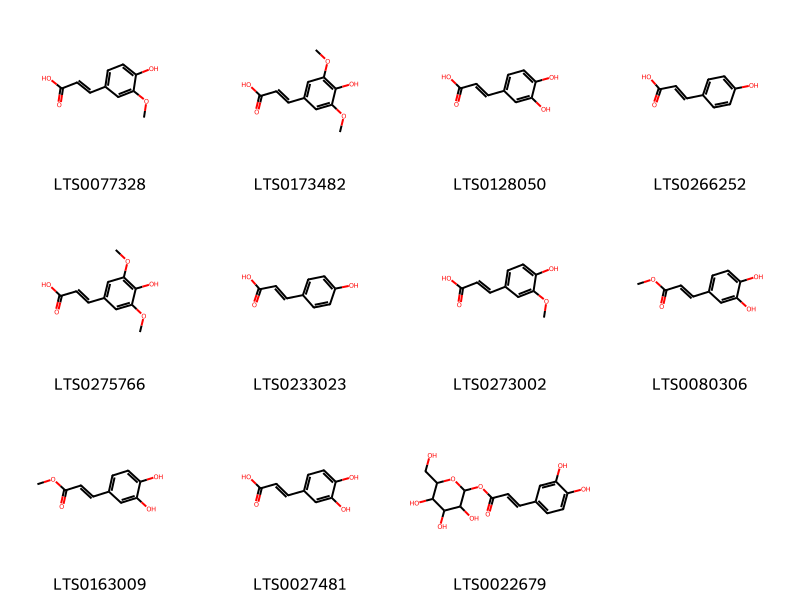{ width=100% }
    <figcaption>Hình ảnh cấu trúc hóa học của 11 hoạt chất thuộc nhóm Cinnamic acids and derivatives gồm ['ferulic acid (LTS0077328)', 'sinapinate (LTS0173482)', '3,4-dihydroxycinnamic acid (LTS0128050)', 'para-coumaric acid (LTS0266252)', 'sinapoyl alcohol (LTS0275766)', 'hydroxycinnamic acid (LTS0233023)', 'ferulic acid (LTS0273002)', 'methyl 3-(3,4-dihydroxyphenyl)prop-2-enoate (LTS0080306)', 'methyl caffeate (LTS0163009)', 'caffeic acid (LTS0027481)', '3,4,5-trihydroxy-6-(hydroxymethyl)oxan-2-yl (2e)-3-(3,4-dihydroxyphenyl)prop-2-enoate (LTS0022679)'].</figcaption>
</figure>
#### Nhóm Coumarins and derivatives
<figure markdown="span">
    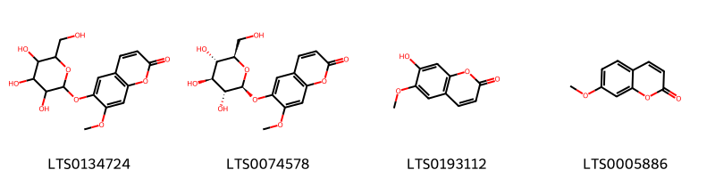{ width=100% }
    <figcaption>Hình ảnh cấu trúc hóa học của 4 hoạt chất thuộc nhóm Coumarins and derivatives gồm ['7-methoxy-6-{[3,4,5-trihydroxy-6-(hydroxymethyl)oxan-2-yl]oxy}chromen-2-one (LTS0134724)', '7-methoxy-6-{[(2s,3r,4s,5s,6r)-3,4,5-trihydroxy-6-(hydroxymethyl)oxan-2-yl]oxy}chromen-2-one (LTS0074578)', 'scopoletin (LTS0193112)', 'methylumbelliferone (LTS0005886)'].</figcaption>
</figure>
#### Nhóm Dibenzylbutane lignans
<figure markdown="span">
    { width=100% }
    <figcaption>Hình ảnh cấu trúc hóa học của 2 hoạt chất thuộc nhóm Dibenzylbutane lignans gồm ['(2s,3r)-2,3-bis[(4-hydroxy-3-methoxyphenyl)(¹³c)methyl](1-¹³c)butane-1,4-diol (LTS0268699)', 'secoisolariciresinol (LTS0086727)'].</figcaption>
</figure>
#### Nhóm Dihydrofurans
<figure markdown="span">
    { width=100% }
    <figcaption>Hình ảnh cấu trúc hóa học của 1 hoạt chất thuộc nhóm Dihydrofurans gồm ['vitamin c (LTS0022555)'].</figcaption>
</figure>
#### Nhóm Fatty Acyls
<figure markdown="span">
    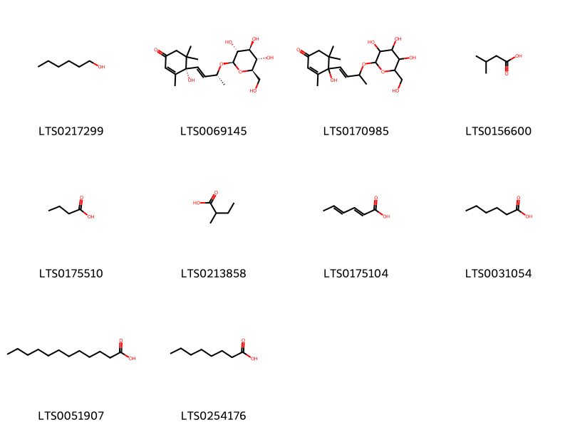{ width=100% }
    <figcaption>Hình ảnh cấu trúc hóa học của 10 hoạt chất thuộc nhóm Fatty Acyls gồm ['hexanol (LTS0217299)', '(4s)-4-hydroxy-3,5,5-trimethyl-4-[(1e,3r)-3-{[(2r,3r,4s,5s,6r)-3,4,5-trihydroxy-6-(hydroxymethyl)oxan-2-yl]oxy}but-1-en-1-yl]cyclohex-2-en-1-one (LTS0069145)', '4-hydroxy-3,5,5-trimethyl-4-(3-{[3,4,5-trihydroxy-6-(hydroxymethyl)oxan-2-yl]oxy}but-1-en-1-yl)cyclohex-2-en-1-one (LTS0170985)', 'isovaleric acid (LTS0156600)', 'butanoic acid (LTS0175510)', '2-methylbutanoic acid (LTS0213858)', 'sorbic acid (LTS0175104)', 'hexanoic acid (LTS0031054)', 'lauric acid (LTS0051907)', 'caprylic acid (LTS0254176)'].</figcaption>
</figure>
#### Nhóm Flavonoids
<figure markdown="span">
    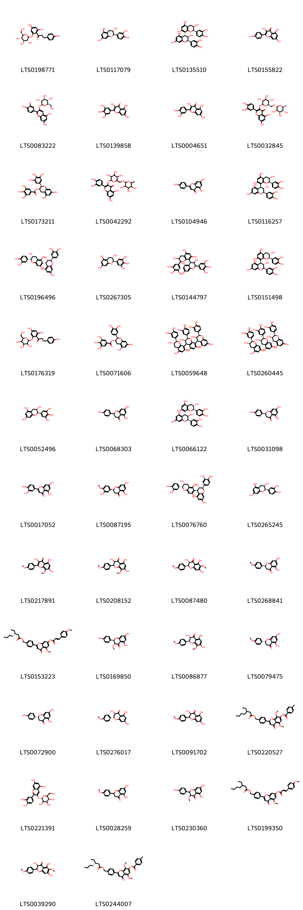{ width=100% }
    <figcaption>Hình ảnh cấu trúc hóa học của 46 hoạt chất thuộc nhóm Flavonoids gồm ['phlorizin (LTS0198771)', '(+)-catechol (LTS0117079)', '(2r,3r,4r)-2-(3,4-dihydroxyphenyl)-4-[(2r,3r)-2-(3,4-dihydroxyphenyl)-3,5,7-trihydroxy-3,4-dihydro-2h-1-benzopyran-8-yl]-3,4-dihydro-2h-1-benzopyran-3,5,7-triol (LTS0135510)', 'kaempherol (LTS0155822)', '5,7-dihydroxy-2-(4-hydroxy-3-oxidophenyl)-3-{[(2s,3r,4s,5s,6r)-3,4,5-trihydroxy-6-(hydroxymethyl)oxan-2-yl]oxy}-1λ⁴-chromen-1-ylium (LTS0083222)', 'myricetin (LTS0139858)', 'quercetin (LTS0004651)', '3-rutinosyl quercetin (LTS0032845)', '(-)-epigallocatechin gallate (LTS0173211)', 'rutin (LTS0042292)', 'chamomile (LTS0104946)', '(2r,3s,4s)-2-(3,4-dihydroxyphenyl)-4-[(2r,3r)-2-(3,4-dihydroxyphenyl)-3,5,7-trihydroxy-3,4-dihydro-2h-1-benzopyran-8-yl]-3,4-dihydro-2h-1-benzopyran-3,5,7-triol (LTS0116257)', '(2r,3s,4s)-2-(3,4-dihydroxyphenyl)-4-[(2r,3r)-2-(3,4-dihydroxyphenyl)-3,5,7-trihydroxy-3,4-dihydro-2h-1-benzopyran-6-yl]-3,4-dihydro-2h-1-benzopyran-3,5,7-triol (LTS0196496)', 'gallocatechol (LTS0267305)', '4-[3,5,7-trihydroxy-2-(3,4,5-trihydroxyphenyl)-3,4-dihydro-2h-1-benzopyran-8-yl]-2-(3,4,5-trihydroxyphenyl)-3,4-dihydro-2h-1-benzopyran-3,5,7-triol (LTS0144797)', '(2r,3s,4s)-2-(3,4-dihydroxyphenyl)-4-[(2r,3s)-2-(3,4-dihydroxyphenyl)-3,5,7-trihydroxy-3,4-dihydro-2h-1-benzopyran-8-yl]-3,4-dihydro-2h-1-benzopyran-3,5,7-triol (LTS0151498)', 'phloridzin (LTS0176319)', 'epicatechin gallate (LTS0071606)', '(2r,3r)-2-(3,4-dihydroxyphenyl)-8-[(2r,3r)-2-(3,4-dihydroxyphenyl)-3,5,7-trihydroxy-3,4-dihydro-2h-1-benzopyran-4-yl]-4-[(2r,3s)-2-(3,4-dihydroxyphenyl)-3,5,7-trihydroxy-3,4-dihydro-2h-1-benzopyran-8-yl]-3,4-dihydro-2h-1-benzopyran-3,5,7-triol (LTS0059648)', 'procyanidin c1 (LTS0260445)', 'epigallocatechin (LTS0052496)', 'asahina (LTS0068303)', '(2r,3r,4r)-2-(3,4-dihydroxyphenyl)-4-[(2r,3s)-2-(3,4-dihydroxyphenyl)-3,5,7-trihydroxy-3,4-dihydro-2h-1-benzopyran-8-yl]-3,4-dihydro-2h-1-benzopyran-3,5,7-triol (LTS0066122)', 'naringenin (LTS0031098)', 'luteolin (LTS0017052)', 'hesperetin (LTS0087195)', '(2r,3s,4r)-2-(3,4-dihydroxyphenyl)-4-[(2r,3r)-2-(3,4-dihydroxyphenyl)-3,5,7-trihydroxy-3,4-dihydro-2h-1-benzopyran-6-yl]-3,4-dihydro-2h-1-benzopyran-3,5,7-triol (LTS0076760)', 'ent-epicatechin (LTS0265245)', 'prudomestin (LTS0217891)', '3,5,7-trihydroxy-8-methoxy-2-(4-methoxyphenyl)-2,3-dihydro-1-benzopyran-4-one (LTS0208152)', '(2s,3r)-3,5,7-trihydroxy-6-methoxy-2-(4-methoxyphenyl)-2,3-dihydro-1-benzopyran-4-one (LTS0087480)', 'isosakuranetin (LTS0268841)', '[4-(5-methoxy-7-{[(2e)-3-(4-methoxyphenyl)prop-2-enoyl]oxy}-4-oxochromen-2-yl)phenyl]methyl (3s)-3-ethylheptanoate (LTS0153223)', '(2r,3s)-5,7-dihydroxy-2-(4-hydroxyphenyl)-3-methoxy-2,3-dihydro-1-benzopyran-4-one (LTS0169850)', '(2s,3r)-3,5,7-trihydroxy-8-methoxy-2-(4-methoxyphenyl)-2,3-dihydro-1-benzopyran-4-one (LTS0086877)', '(2r)-5,7-dihydroxy-2-(4-methoxyphenyl)-2,3-dihydro-1-benzopyran-4-one (LTS0079475)', '(-)-naringenin (LTS0072900)', 'dihydrokaempferide (LTS0276017)', 'dihydrokaempferide (LTS0091702)', '2-(4-{[(3-ethylheptanoyl)oxy]methyl}phenyl)-5,8-dimethoxy-4-oxochromen-7-yl 4-methylbenzoate (LTS0220527)', 'chrysanthemin (LTS0221391)', 'isosakuranetin (LTS0028259)', '5,7-dihydroxy-2-(4-hydroxyphenyl)-3-methoxy-2,3-dihydro-1-benzopyran-4-one (LTS0230360)', '[4-(5-methoxy-7-{[3-(4-methoxyphenyl)prop-2-enoyl]oxy}-4-oxochromen-2-yl)phenyl]methyl 3-ethylheptanoate (LTS0199350)', '3,5,7-trihydroxy-6-methoxy-2-(4-methoxyphenyl)-2,3-dihydro-1-benzopyran-4-one (LTS0039290)', '2-[4-({[(3s)-3-ethylheptanoyl]oxy}methyl)phenyl]-5,8-dimethoxy-4-oxochromen-7-yl 4-methylbenzoate (LTS0244007)'].</figcaption>
</figure>
#### Nhóm Furanoid lignans
<figure markdown="span">
    { width=100% }
    <figcaption>Hình ảnh cấu trúc hóa học của 3 hoạt chất thuộc nhóm Furanoid lignans gồm ['pinoresinol (LTS0057431)', 'matairesinol (LTS0193475)', 'lariciresinol (LTS0010950)'].</figcaption>
</figure>
#### Nhóm Indoles and derivatives
<figure markdown="span">
    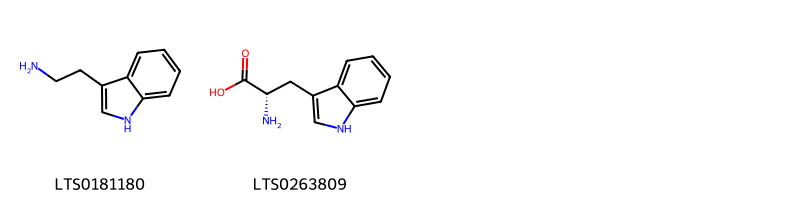{ width=100% }
    <figcaption>Hình ảnh cấu trúc hóa học của 2 hoạt chất thuộc nhóm Indoles and derivatives gồm ['tryptamine (LTS0181180)', 'l-tryptophan (LTS0263809)'].</figcaption>
</figure>
#### Nhóm Lignan glycosides
<figure markdown="span">
    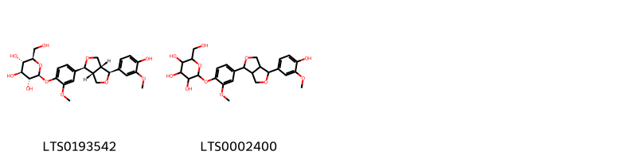{ width=100% }
    <figcaption>Hình ảnh cấu trúc hóa học của 2 hoạt chất thuộc nhóm Lignan glycosides gồm ['(2s,3r,4s,5s,6r)-2-{4-[(1s,3ar,4s,6ar)-4-(4-hydroxy-3-methoxyphenyl)-hexahydrofuro[3,4-c]furan-1-yl]-2-methoxyphenoxy}-6-(hydroxymethyl)oxane-3,4,5-triol (LTS0193542)', '2-{4-[4-(4-hydroxy-3-methoxyphenyl)-hexahydrofuro[3,4-c]furan-1-yl]-2-methoxyphenoxy}-6-(hydroxymethyl)oxane-3,4,5-triol (LTS0002400)'].</figcaption>
</figure>
#### Nhóm Nucleoside and nucleotide analogues
<figure markdown="span">
    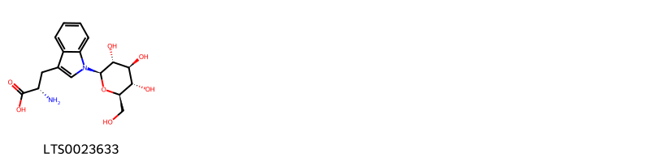{ width=100% }
    <figcaption>Hình ảnh cấu trúc hóa học của 1 hoạt chất thuộc nhóm Nucleoside and nucleotide analogues gồm ['tryptophan n-glucoside (LTS0023633)'].</figcaption>
</figure>
#### Nhóm Organic phosphoric acids and derivatives
<figure markdown="span">
    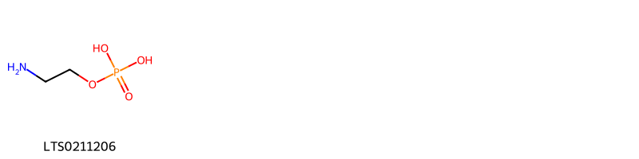{ width=100% }
    <figcaption>Hình ảnh cấu trúc hóa học của 1 hoạt chất thuộc nhóm Organic phosphoric acids and derivatives gồm ['o-phosphoethanolamine (LTS0211206)'].</figcaption>
</figure>
#### Nhóm Organic sulfonic acids and derivatives
<figure markdown="span">
    { width=100% }
    <figcaption>Hình ảnh cấu trúc hóa học của 1 hoạt chất thuộc nhóm Organic sulfonic acids and derivatives gồm ['2-aminoethanesulfonic acid (LTS0101689)'].</figcaption>
</figure>
#### Nhóm Organooxygen compounds
<figure markdown="span">
    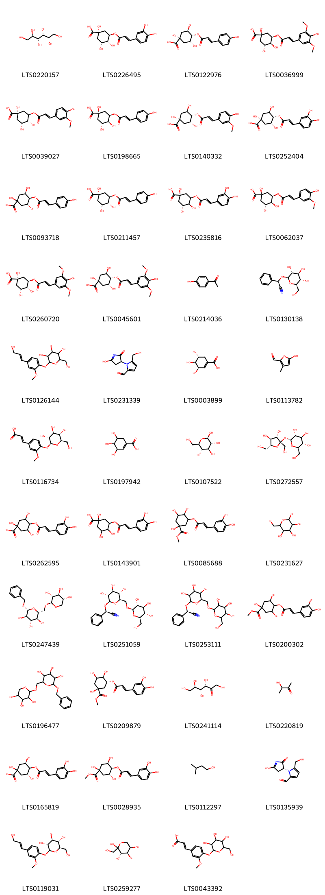{ width=100% }
    <figcaption>Hình ảnh cấu trúc hóa học của 43 hoạt chất thuộc nhóm Organooxygen compounds gồm ['d-sorbitol (LTS0220157)', 'chlorogenic acid (LTS0226495)', '(1s,3r,4s,5r)-1,3,5-trihydroxy-4-{[(2e)-3-(4-hydroxyphenyl)prop-2-enoyl]oxy}cyclohexane-1-carboxylic acid (LTS0122976)', '3-o-sinapoylquinic acid (LTS0036999)', '3-o-feruloyl-d-quinic acid (LTS0039027)', '(1r,3r,4s,5r)-1,3,4-trihydroxy-5-{[(2e)-3-(4-hydroxyphenyl)prop-2-enoyl]oxy}cyclohexane-1-carboxylic acid (LTS0198665)', '4-o-feruloyl-d-quinic acid (LTS0140332)', 'cryptochlorogenic acid (LTS0252404)', '(3r,5r)-1,3,5-trihydroxy-4-{[(2e)-3-(4-hydroxyphenyl)prop-2-enoyl]oxy}cyclohexane-1-carboxylic acid (LTS0093718)', '(1s,3r,4r,5r)-1,3,4-trihydroxy-5-{[(2e)-3-(4-hydroxyphenyl)prop-2-enoyl]oxy}cyclohexane-1-carboxylic acid (LTS0211457)', 'neochlorogenic acid (LTS0235816)', '3-feruloylquinic acid (LTS0062037)', '5-o-sinapoylquinic acid (LTS0260720)', '4-o-sinapoylquinic acid (LTS0045601)', 'hydroxyacetophenone (LTS0214036)', 'prunasin (LTS0130138)', '2-(hydroxymethyl)-6-[4-(3-hydroxyprop-1-en-1-yl)-2-methoxyphenoxy]oxane-3,4,5-triol (LTS0126144)', "5'-hydroxy-5-(hydroxymethyl)-2'-oxo-3',4'-dihydro-[1,3'-bipyrrole]-2-carbaldehyde (LTS0231339)", '(-)-shikimate (LTS0003899)', '5-hydroxy-3-methylfuran-2-carbaldehyde (LTS0113782)', '(2e)-3-(3-methoxy-4-{[(2s,3r,4s,5s,6r)-3,4,5-trihydroxy-6-(hydroxymethyl)oxan-2-yl]oxy}phenyl)prop-2-enoic acid (LTS0116734)', 'shikimate (LTS0197942)', 'β-d-glucose (LTS0107522)', 'sucrose (LTS0272557)', '4-{[3-(3,4-dihydroxyphenyl)prop-2-enoyl]oxy}-1,3,5-trihydroxycyclohexane-1-carboxylic acid (LTS0262595)', '3-{[3-(3,4-dihydroxyphenyl)prop-2-enoyl]oxy}-1,4,5-trihydroxycyclohexane-1-carboxylic acid (LTS0143901)', 'methyl 3-{[3-(3,4-dihydroxyphenyl)prop-2-enoyl]oxy}-1,4,5-trihydroxycyclohexane-1-carboxylate (LTS0085688)', 'd-galactose (LTS0231627)', '(2r,3r,4s,5s,6r)-2-(benzyloxy)-6-({[(2s,3r,4s,5r)-3,4,5-trihydroxyoxan-2-yl]oxy}methyl)oxane-3,4,5-triol (LTS0247439)', 'laetrile (LTS0251059)', 'amygdalin (LTS0253111)', 'methyl 4-{[3-(3,4-dihydroxyphenyl)prop-2-enoyl]oxy}-1,3,5-trihydroxycyclohexane-1-carboxylate (LTS0200302)', '2-(benzyloxy)-6-{[(3,4,5-trihydroxyoxan-2-yl)oxy]methyl}oxane-3,4,5-triol (LTS0196477)', 'methyl chlorogenate (LTS0209879)', 'keto-d-fructose (LTS0241114)', 'acetoin (LTS0220819)', '(3r,5r)-4-{[(2e)-3-(3,4-dihydroxyphenyl)prop-2-enoyl]oxy}-1,3,5-trihydroxycyclohexane-1-carboxylic acid (LTS0165819)', 'methyl (1s,3r,4s,5r)-4-{[(2e)-3-(3,4-dihydroxyphenyl)prop-2-enoyl]oxy}-1,3,5-trihydroxycyclohexane-1-carboxylate (LTS0028935)', 'isoamyl alcohol (LTS0112297)', "(3'r)-5'-hydroxy-5-(hydroxymethyl)-2'-oxo-3',4'-dihydro-[1,3'-bipyrrole]-2-carbaldehyde (LTS0135939)", 'coniferin (LTS0119031)', 'd-fructopyranose (LTS0259277)', '3-(3-methoxy-4-{[3,4,5-trihydroxy-6-(hydroxymethyl)oxan-2-yl]oxy}phenyl)prop-2-enoic acid (LTS0043392)'].</figcaption>
</figure>
#### Nhóm Phenols
<figure markdown="span">
    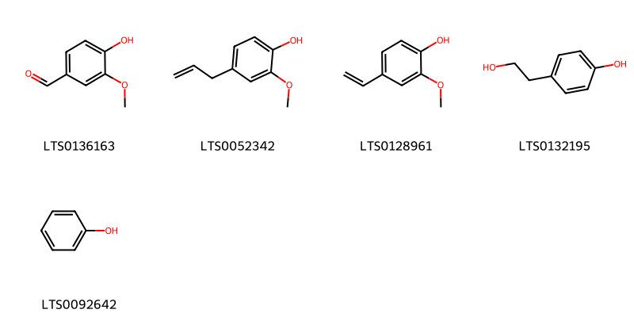{ width=100% }
    <figcaption>Hình ảnh cấu trúc hóa học của 5 hoạt chất thuộc nhóm Phenols gồm ['vanillin (LTS0136163)', 'eugenol (LTS0052342)', '2-methoxy-4-vinyl-phenol (LTS0128961)', 'tyrosol (LTS0132195)', 'phenol (LTS0092642)'].</figcaption>
</figure>
#### Nhóm Prenol lipids
<figure markdown="span">
    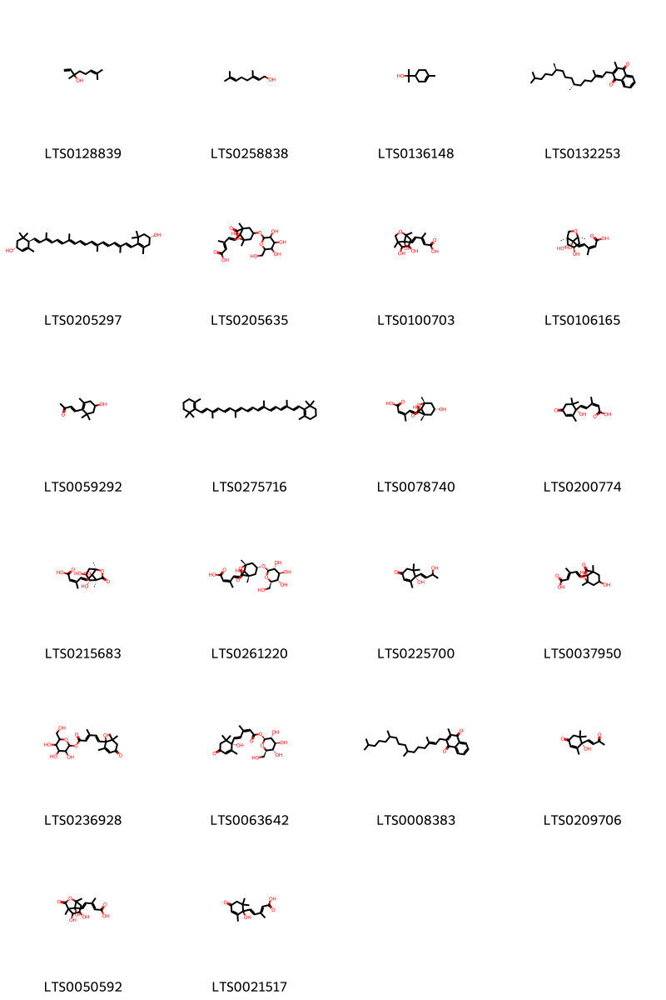{ width=100% }
    <figcaption>Hình ảnh cấu trúc hóa học của 22 hoạt chất thuộc nhóm Prenol lipids gồm ['linalool, (+-)- (LTS0128839)', 'geraniol (LTS0258838)', 'terpineol (LTS0136148)', 'phytonadione (LTS0132253)', 'carotenoid (LTS0205297)', '5-(8-hydroxy-1,5-dimethyl-7-oxo-3-{[3,4,5-trihydroxy-6-(hydroxymethyl)oxan-2-yl]oxy}-6-oxabicyclo[3.2.1]octan-8-yl)-3-methylpenta-2,4-dienoic acid (LTS0205635)', '3-methyl-5-{2,3,8-trihydroxy-1,5-dimethyl-6-oxabicyclo[3.2.1]octan-8-yl}penta-2,4-dienoic acid (LTS0100703)', '(2z,4e)-3-methyl-5-[(1r,2r,3r,5s,8s)-2,3,8-trihydroxy-1,5-dimethyl-6-oxabicyclo[3.2.1]octan-8-yl]penta-2,4-dienoic acid (LTS0106165)', '(3e)-4-(4-hydroxy-2,6,6-trimethylcyclohex-1-en-1-yl)but-3-en-2-one (LTS0059292)', 'β-carotene (LTS0275716)', '(2z,4e)-5-[(1s,3r,5r,8r)-3,8-dihydroxy-1,5-dimethyl-7-oxo-6-oxabicyclo[3.2.1]octan-8-yl]-3-methylpenta-2,4-dienoic acid (LTS0078740)', 'abscisic acid (LTS0200774)', '(2z,4e)-3-methyl-5-[(1s,2s,3s,5r,8r)-2,3,8-trihydroxy-1,5-dimethyl-7-oxo-6-oxabicyclo[3.2.1]octan-8-yl]penta-2,4-dienoic acid (LTS0215683)', '(2z,4e)-5-[(1s,3r,5r,8r)-8-hydroxy-1,5-dimethyl-7-oxo-3-{[(2r,3r,4s,5s,6r)-3,4,5-trihydroxy-6-(hydroxymethyl)oxan-2-yl]oxy}-6-oxabicyclo[3.2.1]octan-8-yl]-3-methylpenta-2,4-dienoic acid (LTS0261220)', '(4s)-4-hydroxy-4-(3-hydroxybut-1-en-1-yl)-3,5,5-trimethylcyclohex-2-en-1-one (LTS0225700)', '5-{3,8-dihydroxy-1,5-dimethyl-7-oxo-6-oxabicyclo[3.2.1]octan-8-yl}-3-methylpenta-2,4-dienoic acid (LTS0037950)', '3,4,5-trihydroxy-6-(hydroxymethyl)oxan-2-yl 5-(1-hydroxy-2,6,6-trimethyl-4-oxocyclohex-2-en-1-yl)-3-methylpenta-2,4-dienoate (LTS0236928)', 'aba-β-ge (LTS0063642)', 'vitamin k (LTS0008383)', 'dehydrovomifoliol (LTS0209706)', '3-methyl-5-{2,3,8-trihydroxy-1,5-dimethyl-7-oxo-6-oxabicyclo[3.2.1]octan-8-yl}penta-2,4-dienoic acid (LTS0050592)', '5-(1-hydroxy-2,6,6-trimethyl-4-oxocyclohex-2-en-1-yl)-3-methylpenta-2,4-dienoic acid (LTS0021517)'].</figcaption>
</figure>
#### Nhóm Pyridines and derivatives
<figure markdown="span">
    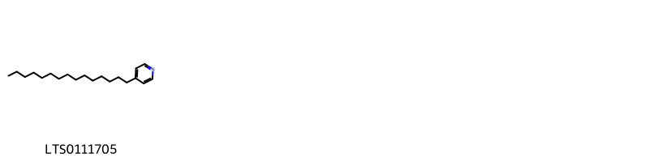{ width=100% }
    <figcaption>Hình ảnh cấu trúc hóa học của 1 hoạt chất thuộc nhóm Pyridines and derivatives gồm ['4-pentadecylpyridine (LTS0111705)'].</figcaption>
</figure>
#### Nhóm Tannins
<figure markdown="span">
    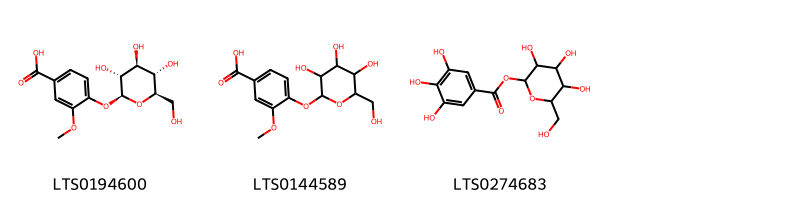{ width=100% }
    <figcaption>Hình ảnh cấu trúc hóa học của 3 hoạt chất thuộc nhóm Tannins gồm ['3-methoxy-4-{[(2s,3r,4s,5s,6r)-3,4,5-trihydroxy-6-(hydroxymethyl)oxan-2-yl]oxy}benzoic acid (LTS0194600)', '3-methoxy-4-{[3,4,5-trihydroxy-6-(hydroxymethyl)oxan-2-yl]oxy}benzoic acid (LTS0144589)', '3,4,5-trihydroxy-6-(hydroxymethyl)oxan-2-yl 3,4,5-trihydroxybenzoate (LTS0274683)'].</figcaption>
</figure>

---

### Dược dân tộc học

Danh sách các quốc gia có sử dụng *Prunus domestica* trong điều trị các bệnh. 

| Country    | Disease                             | Bệnh                                                                                                                                                                                                |
|:-----------|:------------------------------------|:----------------------------------------------------------------------------------------------------------------------------------------------------------------------------------------------------|
| China      | Refrigerant                         | MYMEMORY WARNING: YOU USED ALL AVAILABLE FREE TRANSLATIONS FOR TODAY. NEXT AVAILABLE IN  12 HOURS 03 MINUTES 37 SECONDS VISIT HTTPS://MYMEMORY.TRANSLATED.NET/DOC/USAGELIMITS.PHP TO TRANSLATE MORE |
| Elsewhere  | Demulcent, Refrigerant, Laxative    | MYMEMORY WARNING: YOU USED ALL AVAILABLE FREE TRANSLATIONS FOR TODAY. NEXT AVAILABLE IN  12 HOURS 03 MINUTES 29 SECONDS VISIT HTTPS://MYMEMORY.TRANSLATED.NET/DOC/USAGELIMITS.PHP TO TRANSLATE MORE |
| French     | Cholagogue                          | MYMEMORY WARNING: YOU USED ALL AVAILABLE FREE TRANSLATIONS FOR TODAY. NEXT AVAILABLE IN  12 HOURS 03 MINUTES 26 SECONDS VISIT HTTPS://MYMEMORY.TRANSLATED.NET/DOC/USAGELIMITS.PHP TO TRANSLATE MORE |
| Haiti      | Laxative                            | MYMEMORY WARNING: YOU USED ALL AVAILABLE FREE TRANSLATIONS FOR TODAY. NEXT AVAILABLE IN  12 HOURS 03 MINUTES 22 SECONDS VISIT HTTPS://MYMEMORY.TRANSLATED.NET/DOC/USAGELIMITS.PHP TO TRANSLATE MORE |
| Italian    | Refrigerant                         | MYMEMORY WARNING: YOU USED ALL AVAILABLE FREE TRANSLATIONS FOR TODAY. NEXT AVAILABLE IN  12 HOURS 03 MINUTES 15 SECONDS VISIT HTTPS://MYMEMORY.TRANSLATED.NET/DOC/USAGELIMITS.PHP TO TRANSLATE MORE |
| Portuguese | Demulcent                           | MYMEMORY WARNING: YOU USED ALL AVAILABLE FREE TRANSLATIONS FOR TODAY. NEXT AVAILABLE IN  12 HOURS 03 MINUTES 12 SECONDS VISIT HTTPS://MYMEMORY.TRANSLATED.NET/DOC/USAGELIMITS.PHP TO TRANSLATE MORE |
| US         | Apertif, Laxative, Laxative, Poison | MYMEMORY WARNING: YOU USED ALL AVAILABLE FREE TRANSLATIONS FOR TODAY. NEXT AVAILABLE IN  12 HOURS 03 MINUTES 08 SECONDS VISIT HTTPS://MYMEMORY.TRANSLATED.NET/DOC/USAGELIMITS.PHP TO TRANSLATE MORE |

---

---
## Prunus dulcis
### Thông tin về thực vật

!!! info "Phân loại thực vật của *N/A* từ GIBF:"
    - **Kingdom:** Plantae
    - **Phylum:** Tracheophyta
    - **Order:** Rosales
    - **Family:** Rosaceae
    - **Genus:** Prunus
    - **Species:** *N/A*

 

| Label (VI)   | Label (EN)   | Scientific Name   | Descriptions (VI)   | Descriptions (EN)   | Also Known As (VI)                         | Also Known As (EN)                  |
|:-------------|:-------------|:------------------|:--------------------|:--------------------|:-------------------------------------------|:------------------------------------|
| N/A          | N/A          | Prunus dulcis     | loài thực vật       | species of plant    | ['Hạnh nhân', 'Đại hạnh nhân', 'Biển đào'] | ['almond tree', 'Prunus amygdalus'] |

#### Phân bố trên thế giới

**Từ CSDL GIBF** Spain, Germany, Chile, Austria, Australia, Canada, Belgium, Netherlands, Japan, Mexico, Ireland, China, Chinese Taipei, Switzerland, United Kingdom of Great Britain and Northern Ireland, South Africa, France, New Zealand, Russian Federation, United States of America, Italy, Israel, Ukraine

#### Phân bố tại Việt Nam

**Từ CSDL GIBF**: Không có ghi nhận ở Việt Nam

---
### Thành phần hóa học
        
- Theo cơ sở dữ liệu lotus: Từ loài *N/A* đã phân lập và xác định được 129 hoạt chất thuộc về các nhóm Stilbenes, Organooxygen compounds, Pyrimidine nucleosides, Flavonoids, Lactones, Furanoid lignans, Indoles and derivatives, Sphingolipids, Dibenzylbutane lignans, Prenol lipids, Fatty Acyls, Harmala alkaloids, Purine nucleosides, Phenols, Heteroaromatic compounds, Steroids and steroid derivatives, Benzene and substituted derivatives, Naphthalenes. 

|    | chemicalTaxonomyClassyfireClass     |   smiles_count |
|---:|:------------------------------------|---------------:|
|  0 | Benzene and substituted derivatives |             10 |
|  1 | Dibenzylbutane lignans              |              2 |
|  2 | Fatty Acyls                         |              9 |
|  3 | Flavonoids                          |             37 |
|  4 | Furanoid lignans                    |              3 |
|  5 | Harmala alkaloids                   |              2 |
|  6 | Heteroaromatic compounds            |              1 |
|  7 | Indoles and derivatives             |              1 |
|  8 | Lactones                            |              2 |
|  9 | Naphthalenes                        |              1 |
| 10 | Organooxygen compounds              |             17 |
| 11 | Phenols                             |              2 |
| 12 | Prenol lipids                       |             25 |
| 13 | Purine nucleosides                  |              2 |
| 14 | Pyrimidine nucleosides              |              2 |
| 15 | Sphingolipids                       |              2 |
| 16 | Steroids and steroid derivatives    |              8 |
| 17 | Stilbenes                           |              3 |

#### Nhóm Benzene and substituted derivatives
<figure markdown="span">
    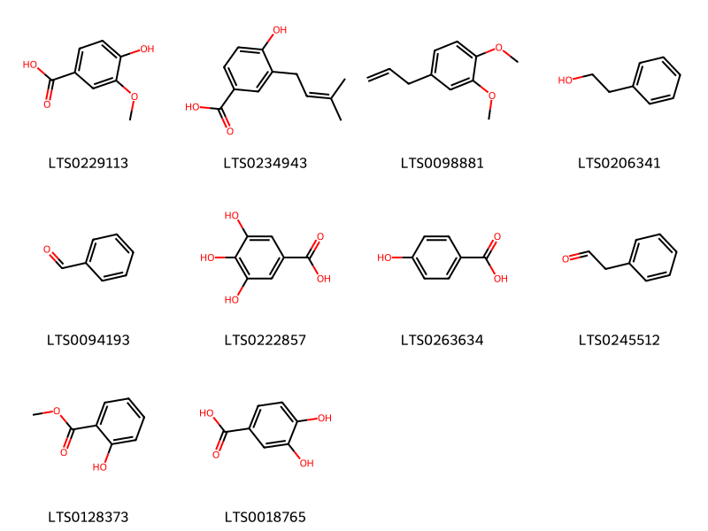{ width=100% }
    <figcaption>Hình ảnh cấu trúc hóa học của 10 hoạt chất thuộc nhóm Benzene and substituted derivatives gồm ['vanillic acid (LTS0229113)', '4-hydroxy-3-(3-methylbut-2-en-1-yl)benzoic acid (LTS0234943)', 'methyl eugenol (LTS0098881)', '2-phenyl-ethanol (LTS0206341)', 'benzaldehyde (LTS0094193)', 'galop (LTS0222857)', 'p-hydroxybenzoic acid (LTS0263634)', 'phenylacetaldehyde (LTS0245512)', 'methyl salicylate (LTS0128373)', '3,4-dihydroxybenzoic acid (LTS0018765)'].</figcaption>
</figure>
#### Nhóm Dibenzylbutane lignans
<figure markdown="span">
    { width=100% }
    <figcaption>Hình ảnh cấu trúc hóa học của 2 hoạt chất thuộc nhóm Dibenzylbutane lignans gồm ['(2s,3r)-2,3-bis[(4-hydroxy-3-methoxyphenyl)(¹³c)methyl](1-¹³c)butane-1,4-diol (LTS0268699)', 'secoisolariciresinol (LTS0086727)'].</figcaption>
</figure>
#### Nhóm Fatty Acyls
<figure markdown="span">
    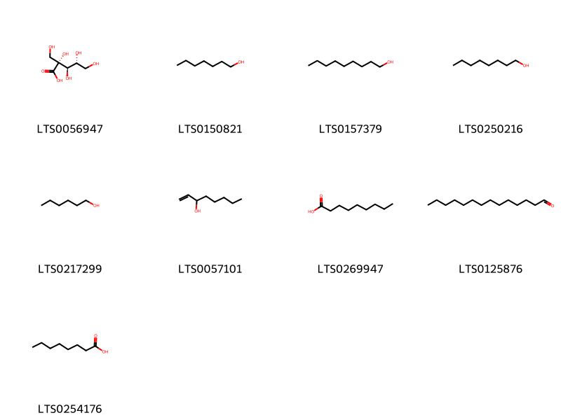{ width=100% }
    <figcaption>Hình ảnh cấu trúc hóa học của 9 hoạt chất thuộc nhóm Fatty Acyls gồm ['2-carboxy-d-arabinitol (LTS0056947)', 'heptanol (LTS0150821)', 'nonan-1-ol (LTS0157379)', 'octanol (LTS0250216)', 'hexanol (LTS0217299)', '1-octen-3-ol (LTS0057101)', 'nonanoic acid (LTS0269947)', 'tetradecanal (LTS0125876)', 'caprylic acid (LTS0254176)'].</figcaption>
</figure>
#### Nhóm Flavonoids
<figure markdown="span">
    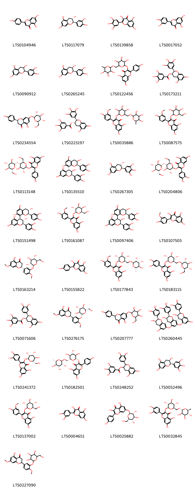{ width=100% }
    <figcaption>Hình ảnh cấu trúc hóa học của 37 hoạt chất thuộc nhóm Flavonoids gồm ['chamomile (LTS0104946)', '(+)-catechol (LTS0117079)', 'myricetin (LTS0139858)', 'luteolin (LTS0017052)', 'catechol (LTS0090912)', 'ent-epicatechin (LTS0265245)', '5,7-dihydroxy-2-(4-hydroxyphenyl)-3-[(3,4,5-trihydroxy-6-{[(3,4,5-trihydroxy-6-methyloxan-2-yl)oxy]methyl}oxan-2-yl)oxy]chromen-4-one (LTS0122456)', '(-)-epigallocatechin gallate (LTS0173211)', 'prunin (LTS0234554)', 'gallocatechin 3-o-gallate (LTS0223197)', '5,7-dihydroxy-2-(4-hydroxy-3-methoxyphenyl)-3-[(3,4,5-trihydroxy-6-{[(3,4,5-trihydroxy-6-methyloxan-2-yl)oxy]methyl}oxan-2-yl)oxy]chromen-4-one (LTS0035886)', 'isorhamnetin 3-galactoside (LTS0087575)', '3-{[(2s,3r,4r,5s,6r)-3,4-dihydroxy-6-(hydroxymethyl)-5-{[(2s,3r,4s,5s,6r)-3,4,5-trihydroxy-6-(hydroxymethyl)oxan-2-yl]oxy}oxan-2-yl]oxy}-5,7-dihydroxy-2-(4-hydroxyphenyl)chromen-4-one (LTS0113148)', '(2r,3r,4r)-2-(3,4-dihydroxyphenyl)-4-[(2r,3r)-2-(3,4-dihydroxyphenyl)-3,5,7-trihydroxy-3,4-dihydro-2h-1-benzopyran-8-yl]-3,4-dihydro-2h-1-benzopyran-3,5,7-triol (LTS0135510)', 'gallocatechol (LTS0267305)', '3-{[(2s,3r,4r,5s,6r)-3,4-dihydroxy-6-(hydroxymethyl)-5-{[(2s,3r,4s,5s,6r)-3,4,5-trihydroxy-6-(hydroxymethyl)oxan-2-yl]oxy}oxan-2-yl]oxy}-2-(3,4-dihydroxyphenyl)-5,7-dihydroxychromen-4-one (LTS0204806)', '(2r,3s,4s)-2-(3,4-dihydroxyphenyl)-4-[(2r,3s)-2-(3,4-dihydroxyphenyl)-3,5,7-trihydroxy-3,4-dihydro-2h-1-benzopyran-8-yl]-3,4-dihydro-2h-1-benzopyran-3,5,7-triol (LTS0151498)', 'cacticin (LTS0161087)', '(2r,3r)-2-(3,4-dihydroxyphenyl)-4-[(2r,3r)-2-(3,4-dihydroxyphenyl)-3,5,7-trihydroxy-3,4-dihydro-2h-1-benzopyran-8-yl]-3,4-dihydro-2h-1-benzopyran-3,5,7-triol (LTS0097406)', 'isorhamnetin (LTS0107505)', '(2r)-5-hydroxy-7-methoxy-2-(4-methoxy-3-{[(2s,3r,4s,5s,6r)-3,4,5-trihydroxy-6-(hydroxymethyl)oxan-2-yl]oxy}phenyl)-2,3-dihydro-1-benzopyran-4-one (LTS0163214)', 'kaempherol (LTS0155822)', 'narcissin (LTS0177843)', '2-(3,4-dihydroxyphenyl)-5,7-dihydroxy-3-{[(2s,3r,4s,5s,6r)-3,4,5-trihydroxy-6-({[(2r,3r,4s,5s,6r)-3,4,5-trihydroxy-6-(hydroxymethyl)oxan-2-yl]oxy}methyl)oxan-2-yl]oxy}chromen-4-one (LTS0183115)', 'epicatechin gallate (LTS0071606)', '(2s)-5-hydroxy-7-methoxy-2-(4-methoxy-3-{[(2r,3s,4r,5r,6s)-3,4,5-trihydroxy-6-(hydroxymethyl)oxan-2-yl]oxy}phenyl)-2,3-dihydro-1-benzopyran-4-one (LTS0276175)', '5-hydroxy-2-(4-hydroxyphenyl)-7-{[3,4,5-trihydroxy-6-(hydroxymethyl)oxan-2-yl]oxy}-2,3-dihydro-1-benzopyran-4-one (LTS0207777)', 'procyanidin c1 (LTS0260445)', '2-(3,4-dihydroxyphenyl)-5,7-dihydroxy-3-{[(2s,3r,4r,5r,6s)-3,4,5-trihydroxy-6-(hydroxymethyl)oxan-2-yl]oxy}chromen-4-one (LTS0241372)', 'nictoflorin (LTS0182501)', '2-(3,4-dihydroxyphenyl)-5,7-dihydroxy-3,4-dihydro-2h-1-benzopyran-3-yl 3,4,5-trihydroxybenzoate (LTS0248252)', 'epigallocatechin (LTS0052496)', 'isorhamnetin 3-o-glucoside (LTS0137002)', 'quercetin (LTS0004651)', 'kaempferol 7-o-glucoside (LTS0025882)', '3-rutinosyl quercetin (LTS0032845)', '5-hydroxy-7-methoxy-2-(4-methoxy-3-{[3,4,5-trihydroxy-6-(hydroxymethyl)oxan-2-yl]oxy}phenyl)-2,3-dihydro-1-benzopyran-4-one (LTS0227090)'].</figcaption>
</figure>
#### Nhóm Furanoid lignans
<figure markdown="span">
    { width=100% }
    <figcaption>Hình ảnh cấu trúc hóa học của 3 hoạt chất thuộc nhóm Furanoid lignans gồm ['pinoresinol (LTS0057431)', 'matairesinol (LTS0193475)', 'lariciresinol (LTS0010950)'].</figcaption>
</figure>
#### Nhóm Harmala alkaloids
<figure markdown="span">
    { width=100% }
    <figcaption>Hình ảnh cấu trúc hóa học của 2 hoạt chất thuộc nhóm Harmala alkaloids gồm ['harmane (LTS0068205)', '1-methyl-3h,4h,9h-pyrido[3,4-b]indole (LTS0027115)'].</figcaption>
</figure>
#### Nhóm Heteroaromatic compounds
<figure markdown="span">
    { width=100% }
    <figcaption>Hình ảnh cấu trúc hóa học của 1 hoạt chất thuộc nhóm Heteroaromatic compounds gồm ['amylfuran (LTS0044471)'].</figcaption>
</figure>
#### Nhóm Indoles and derivatives
<figure markdown="span">
    { width=100% }
    <figcaption>Hình ảnh cấu trúc hóa học của 1 hoạt chất thuộc nhóm Indoles and derivatives gồm ['β-carboline (LTS0263207)'].</figcaption>
</figure>
#### Nhóm Lactones
<figure markdown="span">
    { width=100% }
    <figcaption>Hình ảnh cấu trúc hóa học của 2 hoạt chất thuộc nhóm Lactones gồm ['aldehyde c-18 (LTS0034678)', 'gamma-nonalactone (LTS0096823)'].</figcaption>
</figure>
#### Nhóm Naphthalenes
<figure markdown="span">
    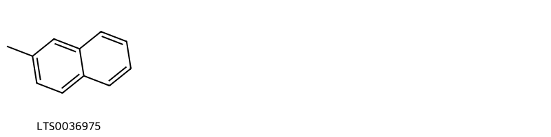{ width=100% }
    <figcaption>Hình ảnh cấu trúc hóa học của 1 hoạt chất thuộc nhóm Naphthalenes gồm ['2-methylnaphthalene (LTS0036975)'].</figcaption>
</figure>
#### Nhóm Organooxygen compounds
<figure markdown="span">
    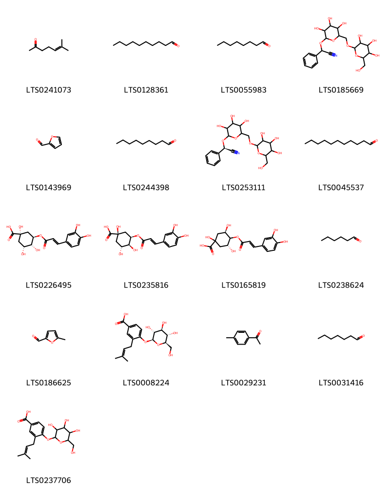{ width=100% }
    <figcaption>Hình ảnh cấu trúc hóa học của 17 hoạt chất thuộc nhóm Organooxygen compounds gồm ['6-methyl-5-hepten-2-one (LTS0241073)', 'decanal (LTS0128361)', 'octanal (LTS0055983)', 'amygdalin (LTS0185669)', 'bran oil (LTS0143969)', 'nonanal (LTS0244398)', 'amygdalin (LTS0253111)', 'aldehyde c11 (LTS0045537)', 'chlorogenic acid (LTS0226495)', 'neochlorogenic acid (LTS0235816)', '(3r,5r)-4-{[(2e)-3-(3,4-dihydroxyphenyl)prop-2-enoyl]oxy}-1,3,5-trihydroxycyclohexane-1-carboxylic acid (LTS0165819)', 'hexanal (LTS0238624)', '5-methylfurfural (LTS0186625)', '3-(3-methylbut-2-en-1-yl)-4-{[(2s,3r,4s,5s,6r)-3,4,5-trihydroxy-6-(hydroxymethyl)oxan-2-yl]oxy}benzoic acid (LTS0008224)', 'p-methylacetophenone (LTS0029231)', 'heptanal (LTS0031416)', '3-(3-methylbut-2-en-1-yl)-4-{[3,4,5-trihydroxy-6-(hydroxymethyl)oxan-2-yl]oxy}benzoic acid (LTS0237706)'].</figcaption>
</figure>
#### Nhóm Phenols
<figure markdown="span">
    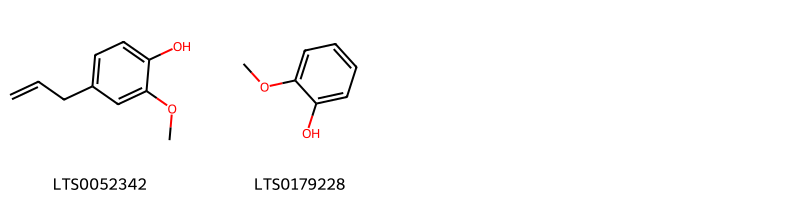{ width=100% }
    <figcaption>Hình ảnh cấu trúc hóa học của 2 hoạt chất thuộc nhóm Phenols gồm ['eugenol (LTS0052342)', 'guaiacol (LTS0179228)'].</figcaption>
</figure>
#### Nhóm Prenol lipids
<figure markdown="span">
    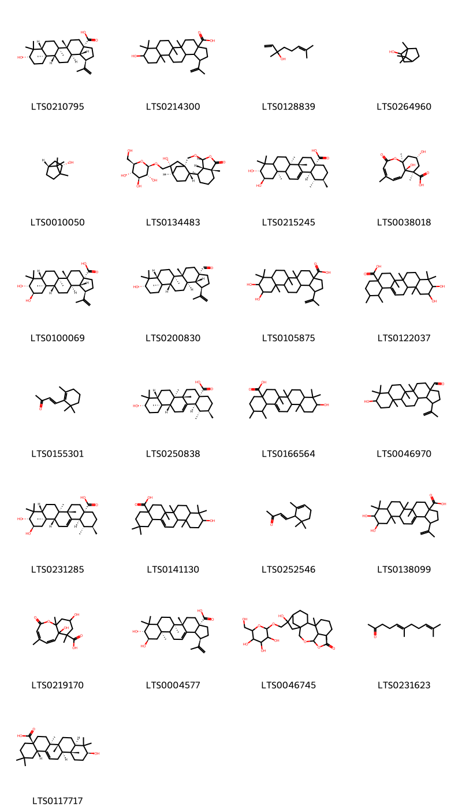{ width=100% }
    <figcaption>Hình ảnh cấu trúc hóa học của 25 hoạt chất thuộc nhóm Prenol lipids gồm ['betulinic acid (LTS0210795)', '9-hydroxy-5a,5b,8,8,11a-pentamethyl-1-(prop-1-en-2-yl)-hexadecahydrocyclopenta[a]chrysene-3a-carboxylic acid (LTS0214300)', 'linalool, (+-)- (LTS0128839)', 'borneol (LTS0264960)', '(2s,4r)-1,7,7-trimethylbicyclo[2.2.1]heptan-2-ol (LTS0010050)', '(1s,2s,5r,6r,8r,11s,14r,18s)-6-hydroxy-1,14-dimethyl-6-({[(2r,3r,4s,5s,6r)-3,4,5-trihydroxy-6-(hydroxymethyl)oxan-2-yl]oxy}methyl)-10,12-dioxapentacyclo[9.6.1.1⁵,⁸.0²,⁸.0¹⁴,¹⁸]nonadecan-13-one (LTS0134483)', '(1s,2r,4as,6as,6br,10r,11r,12ar,14bs)-10,11-dihydroxy-1,2,6a,6b,9,9,12a-heptamethyl-2,3,4,5,6,7,8,8a,10,11,12,12b,13,14b-tetradecahydro-1h-picene-4a-carboxylic acid (LTS0215245)', '(3z,5z,6ar,7r,9r,10as)-6a,9-dihydroxy-4,7,10a-trimethyl-2-oxo-9,10-dihydro-8h-1-benzoxocine-7-carboxylic acid (LTS0038018)', '(1r,3as,5ar,5br,7ar,9r,10r,11ar,11br,13ar,13br)-9,10-dihydroxy-5a,5b,8,8,11a-pentamethyl-1-(prop-1-en-2-yl)-hexadecahydrocyclopenta[a]chrysene-3a-carboxylic acid (LTS0100069)', '(1r,3as,5ar,5br,7ar,9s,11ar,11br,13ar,13br)-9-hydroxy-5a,5b,8,8,11a-pentamethyl-1-(prop-1-en-2-yl)-hexadecahydrocyclopenta[a]chrysene-3a-carbaldehyde (LTS0200830)', '9,10-dihydroxy-5a,5b,8,8,11a-pentamethyl-1-(prop-1-en-2-yl)-hexadecahydrocyclopenta[a]chrysene-3a-carboxylic acid (LTS0105875)', '10,11-dihydroxy-1,2,6a,6b,9,9,12a-heptamethyl-2,3,4,5,6,7,8,8a,10,11,12,12b,13,14b-tetradecahydro-1h-picene-4a-carboxylic acid (LTS0122037)', 'β-ionone (LTS0155301)', 'ursolic acid (LTS0250838)', '10-hydroxy-1,2,6a,6b,9,9,12a-heptamethyl-2,3,4,5,6,7,8,8a,10,11,12,12b,13,14b-tetradecahydro-1h-picene-4a-carboxylic acid (LTS0166564)', 'betulinaldehyde (LTS0046970)', 'corosolic acid (LTS0231285)', 'oleanolic acid (LTS0141130)', 'ionone (LTS0252546)', '9,10-dihydroxy-5a,5b,8,8,11a-pentamethyl-1-(prop-1-en-2-yl)-1h,2h,3h,4h,5h,6h,7h,7ah,9h,10h,11h,11bh,12h,13bh-cyclopenta[a]chrysene-3a-carboxylic acid (LTS0138099)', '6a,9-dihydroxy-4,7,10a-trimethyl-2-oxo-9,10-dihydro-8h-1-benzoxocine-7-carboxylic acid (LTS0219170)', '(1r,3as,5as,5br,9r,10r,11ar)-9,10-dihydroxy-5a,5b,8,8,11a-pentamethyl-1-(prop-1-en-2-yl)-1h,2h,3h,4h,5h,6h,7h,7ah,9h,10h,11h,11bh,12h,13bh-cyclopenta[a]chrysene-3a-carboxylic acid (LTS0004577)', '6-hydroxy-1,14-dimethyl-6-({[3,4,5-trihydroxy-6-(hydroxymethyl)oxan-2-yl]oxy}methyl)-10,12-dioxapentacyclo[9.6.1.1⁵,⁸.0²,⁸.0¹⁴,¹⁸]nonadecan-13-one (LTS0046745)', 'geranylacetone (LTS0231623)', 'oleanolic acid (LTS0117717)'].</figcaption>
</figure>
#### Nhóm Purine nucleosides
<figure markdown="span">
    { width=100% }
    <figcaption>Hình ảnh cấu trúc hóa học của 2 hoạt chất thuộc nhóm Purine nucleosides gồm ['adenosine (LTS0052576)', 'adenosine (LTS0014061)'].</figcaption>
</figure>
#### Nhóm Pyrimidine nucleosides
<figure markdown="span">
    { width=100% }
    <figcaption>Hình ảnh cấu trúc hóa học của 2 hoạt chất thuộc nhóm Pyrimidine nucleosides gồm ['1-[3,4-dihydroxy-5-(hydroxymethyl)oxolan-2-yl]-4-hydroxypyrimidin-2-one (LTS0075646)', 'uridine (LTS0220125)'].</figcaption>
</figure>
#### Nhóm Sphingolipids
<figure markdown="span">
    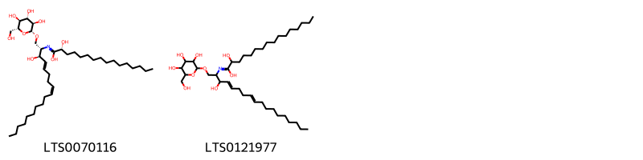{ width=100% }
    <figcaption>Hình ảnh cấu trúc hóa học của 2 hoạt chất thuộc nhóm Sphingolipids gồm ['(2r)-2-hydroxy-n-[(2s,3r,4e,8z)-3-hydroxy-1-{[(2r,3r,4s,5s,6r)-3,4,5-trihydroxy-6-(hydroxymethyl)oxan-2-yl]oxy}octadeca-4,8-dien-2-yl]hexadecanimidic acid (LTS0070116)', '2-hydroxy-n-(3-hydroxy-1-{[3,4,5-trihydroxy-6-(hydroxymethyl)oxan-2-yl]oxy}octadeca-4,8-dien-2-yl)hexadecanimidic acid (LTS0121977)'].</figcaption>
</figure>
#### Nhóm Steroids and steroid derivatives
<figure markdown="span">
    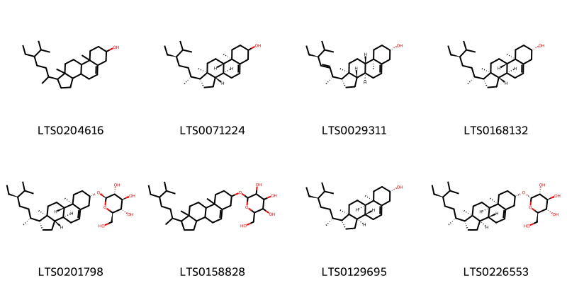{ width=100% }
    <figcaption>Hình ảnh cấu trúc hóa học của 8 hoạt chất thuộc nhóm Steroids and steroid derivatives gồm ['stigmast-5-en-3-ol, (3β)- (LTS0204616)', 'stigmast-5-en-3-ol (LTS0071224)', 'phytosterol (LTS0029311)', 'sitosterol (LTS0168132)', 'sitogluside (LTS0201798)', '2-{[1-(5-ethyl-6-methylheptan-2-yl)-9a,11a-dimethyl-1h,2h,3h,3ah,3bh,4h,6h,7h,8h,9h,9bh,10h,11h-cyclopenta[a]phenanthren-7-yl]oxy}-6-(hydroxymethyl)oxane-3,4,5-triol (LTS0158828)', '(1r,3ar,3br,7s,9ar,9br,11ar)-1-[(2r,5r)-5-ethyl-6-methylheptan-2-yl]-9a,11a-dimethyl-1h,2h,3h,3ah,3bh,4h,6h,7h,8h,9h,9bh,10h,11h-cyclopenta[a]phenanthren-7-ol (LTS0129695)', '(2s,3r,4s,5s,6r)-2-{[(1r,3ar,3br,7s,9ar,9br,11ar)-1-[(2r,5r)-5-ethyl-6-methylheptan-2-yl]-9a,11a-dimethyl-1h,2h,3h,3ah,3bh,4h,6h,7h,8h,9h,9bh,10h,11h-cyclopenta[a]phenanthren-7-yl]oxy}-6-(hydroxymethyl)oxane-3,4,5-triol (LTS0226553)'].</figcaption>
</figure>
#### Nhóm Stilbenes
<figure markdown="span">
    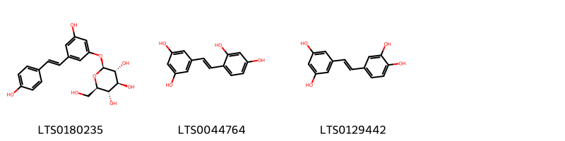{ width=100% }
    <figcaption>Hình ảnh cấu trúc hóa học của 3 hoạt chất thuộc nhóm Stilbenes gồm ['piceid (LTS0180235)', '5-[(1e)-2-(2,4-dihydroxyphenyl)ethenyl]benzene-1,3-diol (LTS0044764)', 'piceatannol (LTS0129442)'].</figcaption>
</figure>

---

### Dược dân tộc học

Danh sách các quốc gia có sử dụng *N/A* trong điều trị các bệnh. 

| Country   | Disease                                                                          | Bệnh                                                                                                                                                                                                |
|:----------|:---------------------------------------------------------------------------------|:----------------------------------------------------------------------------------------------------------------------------------------------------------------------------------------------------|
| China     | Carminative, Laxative                                                            | MYMEMORY WARNING: YOU USED ALL AVAILABLE FREE TRANSLATIONS FOR TODAY. NEXT AVAILABLE IN  12 HOURS 02 MINUTES 22 SECONDS VISIT HTTPS://MYMEMORY.TRANSLATED.NET/DOC/USAGELIMITS.PHP TO TRANSLATE MORE |
| Elsewhere | Astringent, Demulcent, Discutient, Sedative, Stimulant, Tonic, Diuretic, Nervine | MYMEMORY WARNING: YOU USED ALL AVAILABLE FREE TRANSLATIONS FOR TODAY. NEXT AVAILABLE IN  12 HOURS 02 MINUTES 19 SECONDS VISIT HTTPS://MYMEMORY.TRANSLATED.NET/DOC/USAGELIMITS.PHP TO TRANSLATE MORE |
| Turkey    | Demulcent, Emollient, Sedative                                                   | MYMEMORY WARNING: YOU USED ALL AVAILABLE FREE TRANSLATIONS FOR TODAY. NEXT AVAILABLE IN  12 HOURS 02 MINUTES 14 SECONDS VISIT HTTPS://MYMEMORY.TRANSLATED.NET/DOC/USAGELIMITS.PHP TO TRANSLATE MORE |
| US        | Poison                                                                           | MYMEMORY WARNING: YOU USED ALL AVAILABLE FREE TRANSLATIONS FOR TODAY. NEXT AVAILABLE IN  12 HOURS 02 MINUTES 09 SECONDS VISIT HTTPS://MYMEMORY.TRANSLATED.NET/DOC/USAGELIMITS.PHP TO TRANSLATE MORE |

---

---
## Prunus emarginata
### Thông tin về thực vật

!!! info "Phân loại thực vật của *Prunus emarginata* từ GIBF:"
    - **Kingdom:** Plantae
    - **Phylum:** Tracheophyta
    - **Order:** Rosales
    - **Family:** Rosaceae
    - **Genus:** Prunus
    - **Species:** *Prunus emarginata*

 

| Label (VI)   | Label (EN)   | Scientific Name   | Descriptions (VI)   | Descriptions (EN)   | Also Known As (VI)   | Also Known As (EN)   |
|:-------------|:-------------|:------------------|:--------------------|:--------------------|:---------------------|:---------------------|
| N/A          | N/A          | Prunus emarginata | loài thực vật       | species of plant    | ['']                 | ['']                 |

#### Phân bố trên thế giới

**Từ CSDL GIBF** Canada, United States of America

#### Phân bố tại Việt Nam

**Từ CSDL GIBF**: Không có ghi nhận ở Việt Nam

---
### Thành phần hóa học
        
- Theo cơ sở dữ liệu lotus: Từ loài *Prunus emarginata* đã phân lập và xác định được Chưa có hoạt chất nào được phân lập. hoạt chất thuộc về các nhóm Không có hoạt chất nào được phân lập. 

Không có hình ảnh nào được tạo ra

---

### Dược dân tộc học

Danh sách các quốc gia có sử dụng *Prunus emarginata* trong điều trị các bệnh. 

| Country        | Disease   | Bệnh                                                                                                                                                                                                |
|:---------------|:----------|:----------------------------------------------------------------------------------------------------------------------------------------------------------------------------------------------------|
| Canada(Salish) | Tonic     | MYMEMORY WARNING: YOU USED ALL AVAILABLE FREE TRANSLATIONS FOR TODAY. NEXT AVAILABLE IN  12 HOURS 01 MINUTES 21 SECONDS VISIT HTTPS://MYMEMORY.TRANSLATED.NET/DOC/USAGELIMITS.PHP TO TRANSLATE MORE |

---

---
## Prunus inosa
### Thông tin về thực vật

!!! info "Phân loại thực vật của *N/A* từ GIBF:"
    - **Kingdom:** Plantae
    - **Phylum:** Tracheophyta
    - **Order:** Rosales
    - **Family:** Rosaceae
    - **Genus:** Prunus
    - **Species:** *N/A*

 

| Label (VI)   | Label (EN)   | Scientific Name   | Descriptions (VI)   | Descriptions (EN)   | Also Known As (VI)   | Also Known As (EN)   |
|:-------------|:-------------|:------------------|:--------------------|:--------------------|:---------------------|:---------------------|
| N/A          | N/A          | Prunus emarginata | loài thực vật       | species of plant    | ['']                 | ['']                 |

#### Phân bố trên thế giới

**Từ CSDL GIBF** Spain, Germany, Chile, Austria, Australia, Canada, Belgium, Netherlands, Japan, Mexico, Ireland, China, Chinese Taipei, Switzerland, United Kingdom of Great Britain and Northern Ireland, South Africa, France, New Zealand, Russian Federation, United States of America, Italy, Israel, Ukraine

#### Phân bố tại Việt Nam

**Từ CSDL GIBF**: Không có ghi nhận ở Việt Nam

---
### Thành phần hóa học
        
- Theo cơ sở dữ liệu lotus: Từ loài *N/A* đã phân lập và xác định được Chưa có hoạt chất nào được phân lập. hoạt chất thuộc về các nhóm Không có hoạt chất nào được phân lập. 

Không có hình ảnh nào được tạo ra

---

### Dược dân tộc học

Danh sách các quốc gia có sử dụng *N/A* trong điều trị các bệnh. 

| Country   | Disease                                                                    | Bệnh                                                                                                                                                                                                |
|:----------|:---------------------------------------------------------------------------|:----------------------------------------------------------------------------------------------------------------------------------------------------------------------------------------------------|
| Turkey    | Astringent, Diuretic, Emmenagogue, Purgative, Styptic, Vermifuge, Laxative | MYMEMORY WARNING: YOU USED ALL AVAILABLE FREE TRANSLATIONS FOR TODAY. NEXT AVAILABLE IN  12 HOURS 00 MINUTES 38 SECONDS VISIT HTTPS://MYMEMORY.TRANSLATED.NET/DOC/USAGELIMITS.PHP TO TRANSLATE MORE |
| ain       | Laxative                                                                   | MYMEMORY WARNING: YOU USED ALL AVAILABLE FREE TRANSLATIONS FOR TODAY. NEXT AVAILABLE IN  12 HOURS 00 MINUTES 34 SECONDS VISIT HTTPS://MYMEMORY.TRANSLATED.NET/DOC/USAGELIMITS.PHP TO TRANSLATE MORE |

---

---
## Prunus institia
### Thông tin về thực vật

!!! info "Phân loại thực vật của *Prunus domestica* từ GIBF:"
    - **Kingdom:** Plantae
    - **Phylum:** Tracheophyta
    - **Order:** Rosales
    - **Family:** Rosaceae
    - **Genus:** Prunus
    - **Species:** *Prunus domestica*

 

| Label (VI)   | Label (EN)   | Scientific Name   | Descriptions (VI)   | Descriptions (EN)   | Also Known As (VI)   | Also Known As (EN)   |
|:-------------|:-------------|:------------------|:--------------------|:--------------------|:---------------------|:---------------------|
| N/A          | N/A          | Prunus emarginata | loài thực vật       | species of plant    | ['']                 | ['']                 |

#### Phân bố trên thế giới

**Từ CSDL GIBF** nan, Canada, United States of America, India

#### Phân bố tại Việt Nam

**Từ CSDL GIBF**: Không có ghi nhận ở Việt Nam

---
### Thành phần hóa học
        
- Theo cơ sở dữ liệu lotus: Từ loài *Prunus domestica* đã phân lập và xác định được Chưa có hoạt chất nào được phân lập. hoạt chất thuộc về các nhóm Không có hoạt chất nào được phân lập. 

Không có hình ảnh nào được tạo ra

---

### Dược dân tộc học

Danh sách các quốc gia có sử dụng *Prunus domestica* trong điều trị các bệnh. 

| Country    | Disease    | Bệnh                                                                                                                                                                                                |
|:-----------|:-----------|:----------------------------------------------------------------------------------------------------------------------------------------------------------------------------------------------------|
| Dutch      | Digestive  | MYMEMORY WARNING: YOU USED ALL AVAILABLE FREE TRANSLATIONS FOR TODAY. NEXT AVAILABLE IN  12 HOURS 00 MINUTES 09 SECONDS VISIT HTTPS://MYMEMORY.TRANSLATED.NET/DOC/USAGELIMITS.PHP TO TRANSLATE MORE |
| Portuguese | Apertif    | MYMEMORY WARNING: YOU USED ALL AVAILABLE FREE TRANSLATIONS FOR TODAY. NEXT AVAILABLE IN  12 HOURS 00 MINUTES 06 SECONDS VISIT HTTPS://MYMEMORY.TRANSLATED.NET/DOC/USAGELIMITS.PHP TO TRANSLATE MORE |
| US         | Astringent | MYMEMORY WARNING: YOU USED ALL AVAILABLE FREE TRANSLATIONS FOR TODAY. NEXT AVAILABLE IN  12 HOURS 00 MINUTES 03 SECONDS VISIT HTTPS://MYMEMORY.TRANSLATED.NET/DOC/USAGELIMITS.PHP TO TRANSLATE MORE |

---

---
## Prunus inulosa
### Thông tin về thực vật

!!! info "Phân loại thực vật của *N/A* từ GIBF:"
    - **Kingdom:** Plantae
    - **Phylum:** Tracheophyta
    - **Order:** Rosales
    - **Family:** Rosaceae
    - **Genus:** Prunus
    - **Species:** *N/A*

 

| Label (VI)   | Label (EN)   | Scientific Name   | Descriptions (VI)   | Descriptions (EN)   | Also Known As (VI)   | Also Known As (EN)   |
|:-------------|:-------------|:------------------|:--------------------|:--------------------|:---------------------|:---------------------|
| N/A          | N/A          | Prunus emarginata | loài thực vật       | species of plant    | ['']                 | ['']                 |

#### Phân bố trên thế giới

**Từ CSDL GIBF** Spain, Germany, Chile, Austria, Australia, Canada, Belgium, Netherlands, Japan, Mexico, Ireland, China, Chinese Taipei, Switzerland, United Kingdom of Great Britain and Northern Ireland, South Africa, France, New Zealand, Russian Federation, United States of America, Italy, Israel, Ukraine

#### Phân bố tại Việt Nam

**Từ CSDL GIBF**: Không có ghi nhận ở Việt Nam

---
### Thành phần hóa học
        
- Theo cơ sở dữ liệu lotus: Từ loài *N/A* đã phân lập và xác định được Chưa có hoạt chất nào được phân lập. hoạt chất thuộc về các nhóm Không có hoạt chất nào được phân lập. 

Không có hình ảnh nào được tạo ra

---

### Dược dân tộc học

Danh sách các quốc gia có sử dụng *N/A* trong điều trị các bệnh. 

| Country   | Disease   | Bệnh                                                                                                                                                                                                |
|:----------|:----------|:----------------------------------------------------------------------------------------------------------------------------------------------------------------------------------------------------|
| China     | Vermifuge | MYMEMORY WARNING: YOU USED ALL AVAILABLE FREE TRANSLATIONS FOR TODAY. NEXT AVAILABLE IN  11 HOURS 59 MINUTES 36 SECONDS VISIT HTTPS://MYMEMORY.TRANSLATED.NET/DOC/USAGELIMITS.PHP TO TRANSLATE MORE |

---

---
## Prunus japonica
### Thông tin về thực vật

!!! info "Phân loại thực vật của *Prunus japonica* từ GIBF:"
    - **Kingdom:** Plantae
    - **Phylum:** Tracheophyta
    - **Order:** Rosales
    - **Family:** Rosaceae
    - **Genus:** Prunus
    - **Species:** *Prunus japonica*

 

| Label (VI)   | Label (EN)   | Scientific Name   | Descriptions (VI)   | Descriptions (EN)   | Also Known As (VI)   | Also Known As (EN)   |
|:-------------|:-------------|:------------------|:--------------------|:--------------------|:---------------------|:---------------------|
| N/A          | N/A          | Prunus japonica   |                     | species of plant    | ['']                 | ['']                 |

#### Phân bố trên thế giới

**Từ CSDL GIBF** nan, Japan, United States of America, China, Korea, Republic of, Chinese Taipei

#### Phân bố tại Việt Nam

**Từ CSDL GIBF**: Không có ghi nhận ở Việt Nam

---
### Thành phần hóa học
        
- Theo cơ sở dữ liệu lotus: Từ loài *Prunus japonica* đã phân lập và xác định được 4 hoạt chất thuộc về các nhóm Prenol lipids, Benzene and substituted derivatives. 

|    | chemicalTaxonomyClassyfireClass     |   smiles_count |
|---:|:------------------------------------|---------------:|
|  0 | Benzene and substituted derivatives |              2 |
|  1 | Prenol lipids                       |              2 |

#### Nhóm Benzene and substituted derivatives
<figure markdown="span">
    { width=100% }
    <figcaption>Hình ảnh cấu trúc hóa học của 2 hoạt chất thuộc nhóm Benzene and substituted derivatives gồm ['3,4-dihydroxybenzoic acid (LTS0018765)', 'vanillic acid (LTS0229113)'].</figcaption>
</figure>
#### Nhóm Prenol lipids
<figure markdown="span">
    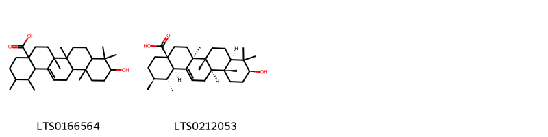{ width=100% }
    <figcaption>Hình ảnh cấu trúc hóa học của 2 hoạt chất thuộc nhóm Prenol lipids gồm ['10-hydroxy-1,2,6a,6b,9,9,12a-heptamethyl-2,3,4,5,6,7,8,8a,10,11,12,12b,13,14b-tetradecahydro-1h-picene-4a-carboxylic acid (LTS0166564)', '(1r,2s,4as,6as,6br,8ar,10s,12ar,12br,14br)-10-hydroxy-1,2,6a,6b,9,9,12a-heptamethyl-2,3,4,5,6,7,8,8a,10,11,12,12b,13,14b-tetradecahydro-1h-picene-4a-carboxylic acid (LTS0212053)'].</figcaption>
</figure>

---

### Dược dân tộc học

Danh sách các quốc gia có sử dụng *Prunus japonica* trong điều trị các bệnh. 

| Country   | Disease                                                      | Bệnh                                                                                                                                                                                                |
|:----------|:-------------------------------------------------------------|:----------------------------------------------------------------------------------------------------------------------------------------------------------------------------------------------------|
| China     | Demulcent, Diuretic, Diuretic, Laxative, Laxative, Vermifuge | MYMEMORY WARNING: YOU USED ALL AVAILABLE FREE TRANSLATIONS FOR TODAY. NEXT AVAILABLE IN  11 HOURS 59 MINUTES 07 SECONDS VISIT HTTPS://MYMEMORY.TRANSLATED.NET/DOC/USAGELIMITS.PHP TO TRANSLATE MORE |
| Elsewhere | Diuretic                                                     | MYMEMORY WARNING: YOU USED ALL AVAILABLE FREE TRANSLATIONS FOR TODAY. NEXT AVAILABLE IN  11 HOURS 59 MINUTES 04 SECONDS VISIT HTTPS://MYMEMORY.TRANSLATED.NET/DOC/USAGELIMITS.PHP TO TRANSLATE MORE |

---

---
## Prunus javanica
### Thông tin về thực vật

!!! info "Phân loại thực vật của *Prunus javanica* từ GIBF:"
    - **Kingdom:** Plantae
    - **Phylum:** Tracheophyta
    - **Order:** Rosales
    - **Family:** Rosaceae
    - **Genus:** Prunus
    - **Species:** *Prunus javanica*

 

| Label (VI)   | Label (EN)   | Scientific Name   | Descriptions (VI)   | Descriptions (EN)   | Also Known As (VI)   | Also Known As (EN)   |
|:-------------|:-------------|:------------------|:--------------------|:--------------------|:---------------------|:---------------------|
| N/A          | N/A          | Prunus javanica   | loài thực vật       | species of plant    | ['']                 | ['']                 |

#### Phân bố trên thế giới

**Từ CSDL GIBF** Viet Nam, nan, Thailand, Myanmar, Malaysia, Afghanistan, India, Cambodia, Indonesia

#### Phân bố tại Việt Nam

**Từ CSDL GIBF**: Lam Dong, Ba Ria Vung Tau

---
### Thành phần hóa học
        
- Theo cơ sở dữ liệu lotus: Từ loài *Prunus javanica* đã phân lập và xác định được Chưa có hoạt chất nào được phân lập. hoạt chất thuộc về các nhóm Không có hoạt chất nào được phân lập. 

Không có hình ảnh nào được tạo ra

---

### Dược dân tộc học

Danh sách các quốc gia có sử dụng *Prunus javanica* trong điều trị các bệnh. 

| Country   | Disease   | Bệnh                                                                                                                                                                                                |
|:----------|:----------|:----------------------------------------------------------------------------------------------------------------------------------------------------------------------------------------------------|
| Borneo    | Vermifuge | MYMEMORY WARNING: YOU USED ALL AVAILABLE FREE TRANSLATIONS FOR TODAY. NEXT AVAILABLE IN  11 HOURS 58 MINUTES 31 SECONDS VISIT HTTPS://MYMEMORY.TRANSLATED.NET/DOC/USAGELIMITS.PHP TO TRANSLATE MORE |
| Elsewhere | Vermicide | MYMEMORY WARNING: YOU USED ALL AVAILABLE FREE TRANSLATIONS FOR TODAY. NEXT AVAILABLE IN  11 HOURS 58 MINUTES 25 SECONDS VISIT HTTPS://MYMEMORY.TRANSLATED.NET/DOC/USAGELIMITS.PHP TO TRANSLATE MORE |

---

---
## Prunus laurocerasus
### Thông tin về thực vật

!!! info "Phân loại thực vật của *Prunus laurocerasus* từ GIBF:"
    - **Kingdom:** Plantae
    - **Phylum:** Tracheophyta
    - **Order:** Rosales
    - **Family:** Rosaceae
    - **Genus:** Prunus
    - **Species:** *Prunus laurocerasus*

 

| Label (VI)   | Label (EN)   | Scientific Name     | Descriptions (VI)   | Descriptions (EN)   | Also Known As (VI)   | Also Known As (EN)                                   |
|:-------------|:-------------|:--------------------|:--------------------|:--------------------|:---------------------|:-----------------------------------------------------|
| N/A          | N/A          | Prunus laurocerasus | loài thực vật       | species of plant    | ['']                 | ['cherry laurel', 'common laurel', 'English laurel'] |

#### Phân bố trên thế giới

**Từ CSDL GIBF** Switzerland, United Kingdom of Great Britain and Northern Ireland, Denmark, France, Czechia, New Zealand, Germany, Canada, Russian Federation, United States of America, Italy, Ireland, Austria, Australia, Belgium, Netherlands

#### Phân bố tại Việt Nam

**Từ CSDL GIBF**: Không có ghi nhận ở Việt Nam

---
### Thành phần hóa học
        
- Theo cơ sở dữ liệu lotus: Từ loài *Prunus laurocerasus* đã phân lập và xác định được 61 hoạt chất thuộc về các nhóm Organooxygen compounds, Flavonoids, Saturated hydrocarbons, Fatty Acyls, Steroids and steroid derivatives. 

|    | chemicalTaxonomyClassyfireClass   |   smiles_count |
|---:|:----------------------------------|---------------:|
|  0 | Fatty Acyls                       |             25 |
|  1 | Flavonoids                        |              1 |
|  2 | Organooxygen compounds            |             11 |
|  3 | Saturated hydrocarbons            |             18 |
|  4 | Steroids and steroid derivatives  |              6 |

#### Nhóm Fatty Acyls
<figure markdown="span">
    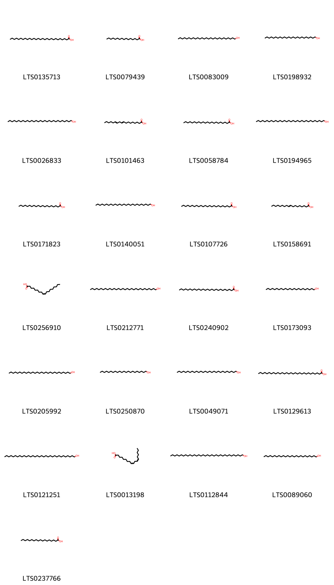{ width=100% }
    <figcaption>Hình ảnh cấu trúc hóa học của 25 hoạt chất thuộc nhóm Fatty Acyls gồm ['octacosanoic acid (LTS0135713)', 'palmitic acid (LTS0079439)', 'heptacosanol (LTS0083009)', '1-tetracosanol (LTS0198932)', 'triacontanol (LTS0026833)', '9,12-octadecadienoic acid (LTS0101463)', 'behenic acid (LTS0058784)', 'dotriacontanol (LTS0194965)', 'arachidic acid (LTS0171823)', 'ceryl alcohol (LTS0140051)', 'lignoceric acid (LTS0107726)', '9 octadecenoic acid (LTS0158691)', 'oleic acid (LTS0256910)', 'n-hentriacontanol (LTS0212771)', 'hexacosanoic acid (LTS0240902)', '1-tricosanol (LTS0173093)', 'nonacosanol (LTS0205992)', 'docosanol (LTS0250870)', 'octacosanol (LTS0049071)', 'triacontanoic acid (LTS0129613)', 'tritriacontan-1-ol (LTS0121251)', 'linoleic (LTS0013198)', 'geddyl alcohol (LTS0112844)', '1-pentacosanol (LTS0089060)', 'stearic acid (LTS0237766)'].</figcaption>
</figure>
#### Nhóm Flavonoids
<figure markdown="span">
    { width=100% }
    <figcaption>Hình ảnh cấu trúc hóa học của 1 hoạt chất thuộc nhóm Flavonoids gồm ['ent-epicatechin (LTS0265245)'].</figcaption>
</figure>
#### Nhóm Organooxygen compounds
<figure markdown="span">
    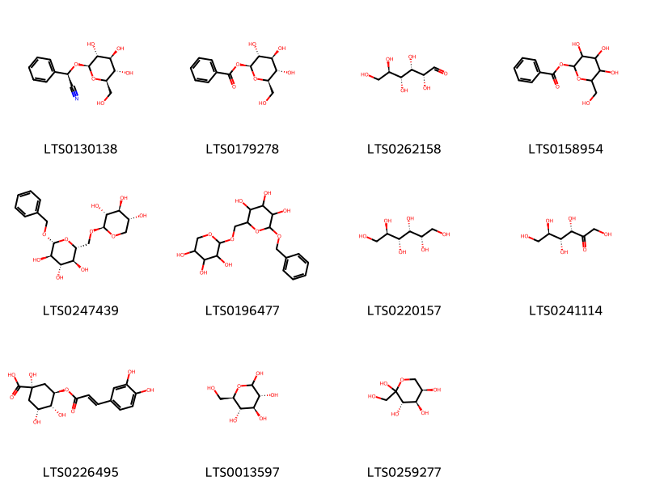{ width=100% }
    <figcaption>Hình ảnh cấu trúc hóa học của 11 hoạt chất thuộc nhóm Organooxygen compounds gồm ['prunasin (LTS0130138)', 'benzoyl-β-d-glucoside (LTS0179278)', '(+)-glucose (LTS0262158)', 'benzoyl-β-d-glucoside (LTS0158954)', '(2r,3r,4s,5s,6r)-2-(benzyloxy)-6-({[(2s,3r,4s,5r)-3,4,5-trihydroxyoxan-2-yl]oxy}methyl)oxane-3,4,5-triol (LTS0247439)', '2-(benzyloxy)-6-{[(3,4,5-trihydroxyoxan-2-yl)oxy]methyl}oxane-3,4,5-triol (LTS0196477)', 'd-sorbitol (LTS0220157)', 'keto-d-fructose (LTS0241114)', 'chlorogenic acid (LTS0226495)', 'glucose (LTS0013597)', 'd-fructopyranose (LTS0259277)'].</figcaption>
</figure>
#### Nhóm Saturated hydrocarbons
<figure markdown="span">
    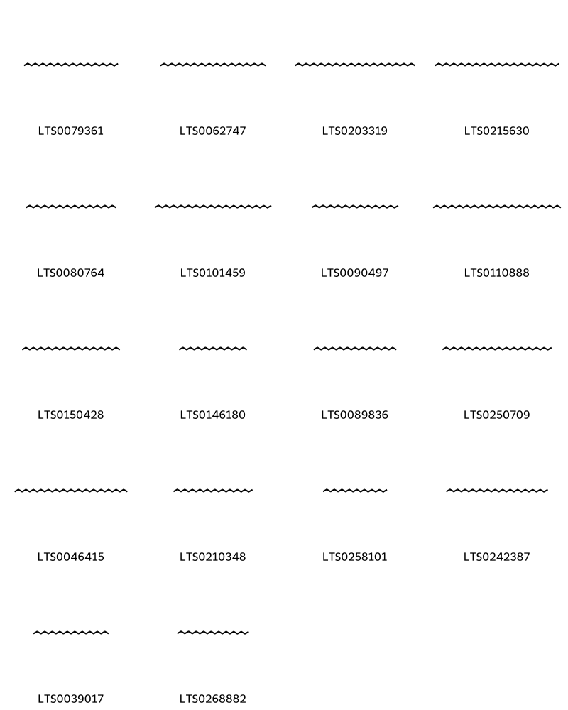{ width=100% }
    <figcaption>Hình ảnh cấu trúc hóa học của 18 hoạt chất thuộc nhóm Saturated hydrocarbons gồm ['hexacosane (LTS0079361)', 'nonacosane (LTS0062747)', 'tritriacontane (LTS0203319)', 'tetratriacontane (LTS0215630)', 'pentacosane (LTS0080764)', 'dotriacontane (LTS0101459)', 'tetracosane (LTS0090497)', 'pentatriacontane (LTS0110888)', 'heptacosane (LTS0150428)', 'nonadecane (LTS0146180)', 'tricosane (LTS0089836)', 'triacontane (LTS0250709)', 'hentriacontane (LTS0046415)', 'docosane (LTS0210348)', 'octadecane (LTS0258101)', 'octacosane (LTS0242387)', 'heneicosane (LTS0039017)', 'eicosane (LTS0268882)'].</figcaption>
</figure>
#### Nhóm Steroids and steroid derivatives
<figure markdown="span">
    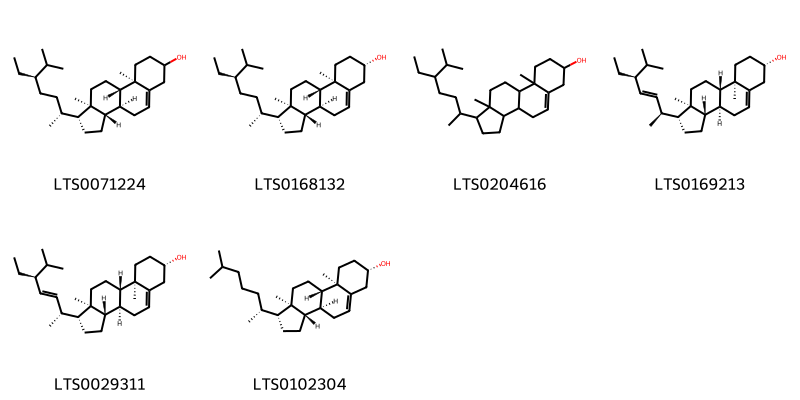{ width=100% }
    <figcaption>Hình ảnh cấu trúc hóa học của 6 hoạt chất thuộc nhóm Steroids and steroid derivatives gồm ['stigmast-5-en-3-ol (LTS0071224)', 'sitosterol (LTS0168132)', 'stigmast-5-en-3-ol, (3β)- (LTS0204616)', '(1r,3as,3bs,7s,9ar,9bs,11ar)-1-[(2s,3e,5s)-5-ethyl-6-methylhept-3-en-2-yl]-9a,11a-dimethyl-1h,2h,3h,3ah,3bh,4h,6h,7h,8h,9h,9bh,10h,11h-cyclopenta[a]phenanthren-7-ol (LTS0169213)', 'phytosterol (LTS0029311)', 'cholesterol (LTS0102304)'].</figcaption>
</figure>

---

### Dược dân tộc học

Danh sách các quốc gia có sử dụng *Prunus laurocerasus* trong điều trị các bệnh. 

| Country   | Disease                            | Bệnh                                                                                                                                                                                                |
|:----------|:-----------------------------------|:----------------------------------------------------------------------------------------------------------------------------------------------------------------------------------------------------|
| Elsewhere | Antitussive, Antitussive, Sedative | MYMEMORY WARNING: YOU USED ALL AVAILABLE FREE TRANSLATIONS FOR TODAY. NEXT AVAILABLE IN  11 HOURS 57 MINUTES 56 SECONDS VISIT HTTPS://MYMEMORY.TRANSLATED.NET/DOC/USAGELIMITS.PHP TO TRANSLATE MORE |
| Turkey    | Sedative, Tonic, Narcotic, Poison  | MYMEMORY WARNING: YOU USED ALL AVAILABLE FREE TRANSLATIONS FOR TODAY. NEXT AVAILABLE IN  11 HOURS 57 MINUTES 53 SECONDS VISIT HTTPS://MYMEMORY.TRANSLATED.NET/DOC/USAGELIMITS.PHP TO TRANSLATE MORE |
| US        | Poison, Poison, Sedative           | MYMEMORY WARNING: YOU USED ALL AVAILABLE FREE TRANSLATIONS FOR TODAY. NEXT AVAILABLE IN  11 HOURS 57 MINUTES 50 SECONDS VISIT HTTPS://MYMEMORY.TRANSLATED.NET/DOC/USAGELIMITS.PHP TO TRANSLATE MORE |

---

---
## Prunus mahaleb
### Thông tin về thực vật

!!! info "Phân loại thực vật của *Prunus mahaleb* từ GIBF:"
    - **Kingdom:** Plantae
    - **Phylum:** Tracheophyta
    - **Order:** Rosales
    - **Family:** Rosaceae
    - **Genus:** Prunus
    - **Species:** *Prunus mahaleb*

 

| Label (VI)   | Label (EN)   | Scientific Name   | Descriptions (VI)   | Descriptions (EN)   | Also Known As (VI)   | Also Known As (EN)   |
|:-------------|:-------------|:------------------|:--------------------|:--------------------|:---------------------|:---------------------|
| N/A          | N/A          | Prunus mahaleb    | loài thực vật       | species of plant    | ['']                 | ['']                 |

#### Phân bố trên thế giới

**Từ CSDL GIBF** Luxembourg, Spain, Germany, Austria, Serbia, Sweden, Uzbekistan, Poland, Montenegro, Netherlands, Slovakia, Türkiye, Slovenia, Hungary, Switzerland, Argentina, Iran (Islamic Republic of), France, Czechia, New Zealand, Romania, Russian Federation, United States of America, Italy, Croatia, Ukraine

#### Phân bố tại Việt Nam

**Từ CSDL GIBF**: Không có ghi nhận ở Việt Nam

---
### Thành phần hóa học
        
- Theo cơ sở dữ liệu lotus: Từ loài *Prunus mahaleb* đã phân lập và xác định được 14 hoạt chất thuộc về các nhóm Organooxygen compounds, Coumarins and derivatives, 3,4-dihydrocoumarins, Organonitrogen compounds, Lupin alkaloids, Steroids and steroid derivatives. 

|    | chemicalTaxonomyClassyfireClass   |   smiles_count |
|---:|:----------------------------------|---------------:|
|  0 | 3,4-dihydrocoumarins              |              1 |
|  1 | Coumarins and derivatives         |              3 |
|  2 | Lupin alkaloids                   |              2 |
|  3 | Organonitrogen compounds          |              1 |
|  4 | Organooxygen compounds            |              1 |
|  5 | Steroids and steroid derivatives  |              6 |

#### Nhóm 3_4-dihydrocoumarins
<figure markdown="span">
    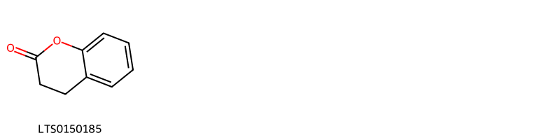{ width=100% }
    <figcaption>Hình ảnh cấu trúc hóa học của Không tìm thấy chú thích hoạt chất thuộc nhóm 3_4-dihydrocoumarins gồm Không tìm thấy chú thích.</figcaption>
</figure>
#### Nhóm Coumarins and derivatives
<figure markdown="span">
    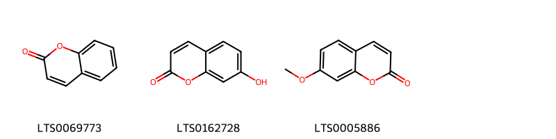{ width=100% }
    <figcaption>Hình ảnh cấu trúc hóa học của 3 hoạt chất thuộc nhóm Coumarins and derivatives gồm ['2h-1-benzopyran-2-one (LTS0069773)', 'umbelliferone (LTS0162728)', 'methylumbelliferone (LTS0005886)'].</figcaption>
</figure>
#### Nhóm Lupin alkaloids
<figure markdown="span">
    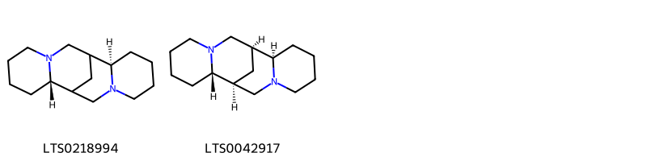{ width=100% }
    <figcaption>Hình ảnh cấu trúc hóa học của 2 hoạt chất thuộc nhóm Lupin alkaloids gồm ['(2r,10s)-7,15-diazatetracyclo[7.7.1.0²,⁷.0¹⁰,¹⁵]heptadecane (LTS0218994)', 'sparteine (LTS0042917)'].</figcaption>
</figure>
#### Nhóm Organonitrogen compounds
<figure markdown="span">
    { width=100% }
    <figcaption>Hình ảnh cấu trúc hóa học của 1 hoạt chất thuộc nhóm Organonitrogen compounds gồm ['choline (LTS0170307)'].</figcaption>
</figure>
#### Nhóm Organooxygen compounds
<figure markdown="span">
    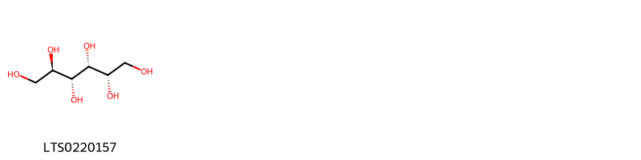{ width=100% }
    <figcaption>Hình ảnh cấu trúc hóa học của 1 hoạt chất thuộc nhóm Organooxygen compounds gồm ['d-sorbitol (LTS0220157)'].</figcaption>
</figure>
#### Nhóm Steroids and steroid derivatives
<figure markdown="span">
    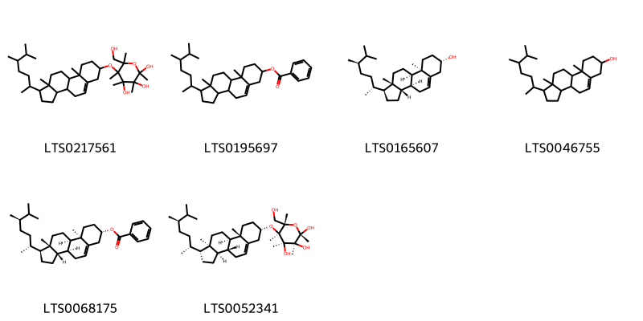{ width=100% }
    <figcaption>Hình ảnh cấu trúc hóa học của 6 hoạt chất thuộc nhóm Steroids and steroid derivatives gồm ['5-{[1-(5,6-dimethylheptan-2-yl)-9a,11a-dimethyl-1h,2h,3h,3ah,3bh,4h,6h,7h,8h,9h,9bh,10h,11h-cyclopenta[a]phenanthren-7-yl]oxy}-6-(hydroxymethyl)-2,3,4,5,6-pentamethyloxane-2,3,4-triol (LTS0217561)', '1-(5,6-dimethylheptan-2-yl)-9a,11a-dimethyl-1h,2h,3h,3ah,3bh,4h,6h,7h,8h,9h,9bh,10h,11h-cyclopenta[a]phenanthren-7-yl benzoate (LTS0195697)', '(1s,3as,3bs,7s,9ar,9br,11as)-1-[(2r,5r)-5,6-dimethylheptan-2-yl]-9a,11a-dimethyl-1h,2h,3h,3ah,3bh,4h,6h,7h,8h,9h,9bh,10h,11h-cyclopenta[a]phenanthren-7-ol (LTS0165607)', 'campesterol (LTS0046755)', '(1s,3as,3bs,7s,9ar,9br,11as)-1-[(2r,5r)-5,6-dimethylheptan-2-yl]-9a,11a-dimethyl-1h,2h,3h,3ah,3bh,4h,6h,7h,8h,9h,9bh,10h,11h-cyclopenta[a]phenanthren-7-yl benzoate (LTS0068175)', '(2s,3s,4r,5r,6s)-5-{[(1r,3ar,3br,7s,9as,9br,11ar)-1-[(2r,5r)-5,6-dimethylheptan-2-yl]-9a,11a-dimethyl-1h,2h,3h,3ah,3bh,4h,6h,7h,8h,9h,9bh,10h,11h-cyclopenta[a]phenanthren-7-yl]oxy}-6-(hydroxymethyl)-2,3,4,5,6-pentamethyloxane-2,3,4-triol (LTS0052341)'].</figcaption>
</figure>

---

### Dược dân tộc học

Danh sách các quốc gia có sử dụng *Prunus mahaleb* trong điều trị các bệnh. 

| Country   | Disease                             | Bệnh                                                                                                                                                                                                |
|:----------|:------------------------------------|:----------------------------------------------------------------------------------------------------------------------------------------------------------------------------------------------------|
| Elsewhere | Insecticide                         | MYMEMORY WARNING: YOU USED ALL AVAILABLE FREE TRANSLATIONS FOR TODAY. NEXT AVAILABLE IN  11 HOURS 57 MINUTES 02 SECONDS VISIT HTTPS://MYMEMORY.TRANSLATED.NET/DOC/USAGELIMITS.PHP TO TRANSLATE MORE |
| Iraq      | Poison                              | MYMEMORY WARNING: YOU USED ALL AVAILABLE FREE TRANSLATIONS FOR TODAY. NEXT AVAILABLE IN  11 HOURS 56 MINUTES 59 SECONDS VISIT HTTPS://MYMEMORY.TRANSLATED.NET/DOC/USAGELIMITS.PHP TO TRANSLATE MORE |
| Turkey    | Diuretic, Perfume, Stomachic, Tonic | MYMEMORY WARNING: YOU USED ALL AVAILABLE FREE TRANSLATIONS FOR TODAY. NEXT AVAILABLE IN  11 HOURS 56 MINUTES 56 SECONDS VISIT HTTPS://MYMEMORY.TRANSLATED.NET/DOC/USAGELIMITS.PHP TO TRANSLATE MORE |

---

---
## Prunus mume
### Thông tin về thực vật

!!! info "Phân loại thực vật của *Prunus mume* từ GIBF:"
    - **Kingdom:** Plantae
    - **Phylum:** Tracheophyta
    - **Order:** Rosales
    - **Family:** Rosaceae
    - **Genus:** Prunus
    - **Species:** *Prunus mume*

 

| Label (VI)   | Label (EN)   | Scientific Name   | Descriptions (VI)   | Descriptions (EN)   | Also Known As (VI)                                                          | Also Known As (EN)                                           |
|:-------------|:-------------|:------------------|:--------------------|:--------------------|:----------------------------------------------------------------------------|:-------------------------------------------------------------|
| N/A          | N/A          | Prunus mume       | loài thực vật       | species of plant    | ['Prunus mume', 'mơ ta', 'mơ Nhật Bản', 'mơ mai', 'mận Nhật Bản', 'mai mơ'] | ['Ume', 'green plum', 'Japanese apricot', 'sour green plum'] |

#### Phân bố trên thế giới

**Từ CSDL GIBF** nan, Chinese Taipei, Japan, Mongolia, Paraguay, Germany, Chile, United States of America, China, Korea, Republic of, Hong Kong

#### Phân bố tại Việt Nam

**Từ CSDL GIBF**: Không có ghi nhận ở Việt Nam

---
### Thành phần hóa học
        
- Theo cơ sở dữ liệu lotus: Từ loài *Prunus mume* đã phân lập và xác định được 55 hoạt chất thuộc về các nhóm Organooxygen compounds, Flavonoids, Coumarins and derivatives, Carboxylic acids and derivatives, Prenol lipids, Fatty Acyls, Heteroaromatic compounds, Hydroxy acids and derivatives. 

|    | chemicalTaxonomyClassyfireClass   |   smiles_count |
|---:|:----------------------------------|---------------:|
|  0 | Carboxylic acids and derivatives  |             14 |
|  1 | Coumarins and derivatives         |              2 |
|  2 | Fatty Acyls                       |              4 |
|  3 | Flavonoids                        |             25 |
|  4 | Heteroaromatic compounds          |              1 |
|  5 | Hydroxy acids and derivatives     |              1 |
|  6 | Organooxygen compounds            |              6 |
|  7 | Prenol lipids                     |              2 |

#### Nhóm Carboxylic acids and derivatives
<figure markdown="span">
    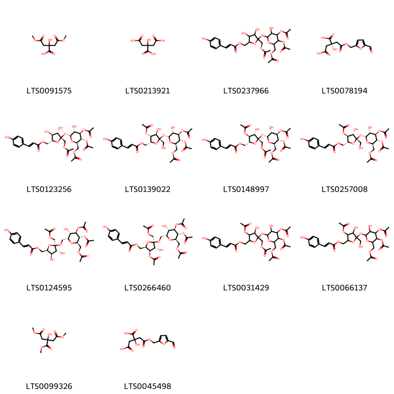{ width=100% }
    <figcaption>Hình ảnh cấu trúc hóa học của 14 hoạt chất thuộc nhóm Carboxylic acids and derivatives gồm ['2-hydroxy-4-methoxy-2-(2-methoxy-2-oxoethyl)-4-oxobutanoic acid (LTS0091575)', 'citric acid (LTS0213921)', '{5-[(acetyloxy)methyl]-5-{[4,5-bis(acetyloxy)-6-[(acetyloxy)methyl]-3-hydroxyoxan-2-yl]oxy}-3,4-dihydroxyoxolan-2-yl}methyl 3-(4-hydroxyphenyl)prop-2-enoate (LTS0237966)', '(2s)-2-{2-[(5-formylfuran-2-yl)methoxy]-2-oxoethyl}-2-hydroxybutanedioic acid (LTS0078194)', '[(2r,3s,4s,5s)-5-[(acetyloxy)methyl]-5-{[(2r,3r,4r,5r,6r)-4,5-bis(acetyloxy)-6-[(acetyloxy)methyl]-3-hydroxyoxan-2-yl]oxy}-3,4-dihydroxyoxolan-2-yl]methyl (2e)-3-(4-hydroxyphenyl)prop-2-enoate (LTS0123256)', '[(2r,3r,4r,5s)-3-(acetyloxy)-5-{[(2r,3r,4r,5r,6r)-4,5-bis(acetyloxy)-6-[(acetyloxy)methyl]-3-hydroxyoxan-2-yl]oxy}-4-hydroxy-5-(hydroxymethyl)oxolan-2-yl]methyl (2e)-3-(4-hydroxyphenyl)prop-2-enoate (LTS0139022)', '[(2r,3s,4s,5s)-3-(acetyloxy)-5-[(acetyloxy)methyl]-5-{[(2r,3r,4r,5r,6r)-4,5-bis(acetyloxy)-6-[(acetyloxy)methyl]-3-hydroxyoxan-2-yl]oxy}-4-hydroxyoxolan-2-yl]methyl (2e)-3-(4-hydroxyphenyl)prop-2-enoate (LTS0148997)', '[(2r,3s,4s,5s)-3-(acetyloxy)-5-{[(2r,3r,4r,5r,6r)-4,5-bis(acetyloxy)-6-[(acetyloxy)methyl]-3-hydroxyoxan-2-yl]oxy}-4-hydroxy-5-(hydroxymethyl)oxolan-2-yl]methyl (2e)-3-(4-hydroxyphenyl)prop-2-enoate (LTS0257008)', '[(2r,3r,4r,5r)-5-[(acetyloxy)methyl]-5-{[(2r,3s,4r,5r,6r)-4,5-bis(acetyloxy)-6-[(acetyloxy)methyl]-3-hydroxyoxan-2-yl]methoxy}-3,4-dihydroxyoxolan-2-yl]methyl (2e)-3-(4-hydroxyphenyl)prop-2-enoate (LTS0124595)', '[(2r,3r,4r,5r)-3-(acetyloxy)-5-[(acetyloxy)methyl]-5-{[(2r,3s,4r,5r,6r)-4,5-bis(acetyloxy)-6-[(acetyloxy)methyl]-3-hydroxyoxan-2-yl]methoxy}-4-hydroxyoxolan-2-yl]methyl (2e)-3-(4-hydroxyphenyl)prop-2-enoate (LTS0266460)', '[3-(acetyloxy)-5-[(acetyloxy)methyl]-5-{[4,5-bis(acetyloxy)-6-[(acetyloxy)methyl]-3-hydroxyoxan-2-yl]oxy}-4-hydroxyoxolan-2-yl]methyl 3-(4-hydroxyphenyl)prop-2-enoate (LTS0031429)', '[3-(acetyloxy)-5-{[4,5-bis(acetyloxy)-6-[(acetyloxy)methyl]-3-hydroxyoxan-2-yl]oxy}-4-hydroxy-5-(hydroxymethyl)oxolan-2-yl]methyl 3-(4-hydroxyphenyl)prop-2-enoate (LTS0066137)', 'trimethyl citrate (LTS0099326)', '2-{2-[(5-formylfuran-2-yl)methoxy]-2-oxoethyl}-2-hydroxybutanedioic acid (LTS0045498)'].</figcaption>
</figure>
#### Nhóm Coumarins and derivatives
<figure markdown="span">
    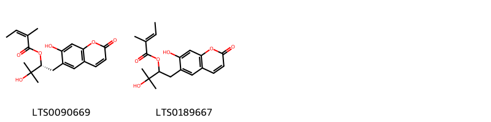{ width=100% }
    <figcaption>Hình ảnh cấu trúc hóa học của 2 hoạt chất thuộc nhóm Coumarins and derivatives gồm ['(2r)-3-hydroxy-1-(7-hydroxy-2-oxochromen-6-yl)-3-methylbutan-2-yl (2z)-2-methylbut-2-enoate (LTS0090669)', '3-hydroxy-1-(7-hydroxy-2-oxochromen-6-yl)-3-methylbutan-2-yl 2-methylbut-2-enoate (LTS0189667)'].</figcaption>
</figure>
#### Nhóm Fatty Acyls
<figure markdown="span">
    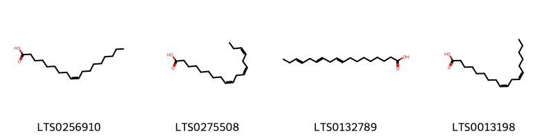{ width=100% }
    <figcaption>Hình ảnh cấu trúc hóa học của 4 hoạt chất thuộc nhóm Fatty Acyls gồm ['oleic acid (LTS0256910)', 'α-linolenic acid (LTS0275508)', 'α linolenic acid (LTS0132789)', 'linoleic (LTS0013198)'].</figcaption>
</figure>
#### Nhóm Flavonoids
<figure markdown="span">
    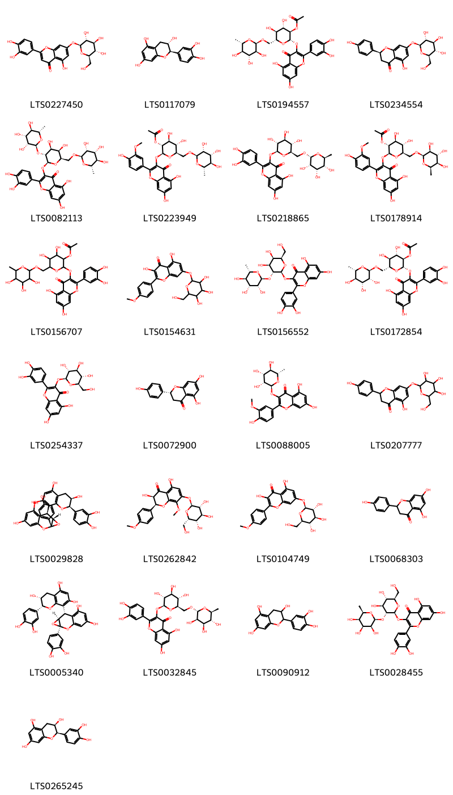{ width=100% }
    <figcaption>Hình ảnh cấu trúc hóa học của 25 hoạt chất thuộc nhóm Flavonoids gồm ['luteolin 7-o-glucoside (LTS0227450)', '(+)-catechol (LTS0117079)', '(2s,3r,4s,5s,6r)-2-{[2-(3,4-dihydroxyphenyl)-5,7-dihydroxy-4-oxochromen-3-yl]oxy}-4,5-dihydroxy-6-({[(2r,3s,4r,5r,6s)-3,4,5-trihydroxy-6-methyloxan-2-yl]oxy}methyl)oxan-3-yl acetate (LTS0194557)', 'prunin (LTS0234554)', '3-{[(2s,3r,4s,5r,6r)-4,5-dihydroxy-3-{[(2s,3r,4r,5r,6s)-3,4,5-trihydroxy-6-methyloxan-2-yl]oxy}-6-({[(2r,3r,4r,5r,6s)-3,4,5-trihydroxy-6-methyloxan-2-yl]oxy}methyl)oxan-2-yl]oxy}-2-(3,4-dihydroxyphenyl)-5,7-dihydroxychromen-4-one (LTS0082113)', '(2s,3r,4s,5s,6r)-2-{[5,7-dihydroxy-2-(4-hydroxy-3-methoxyphenyl)-4-oxochromen-3-yl]oxy}-4,5-dihydroxy-6-({[(2r,3r,4r,5r,6s)-3,4,5-trihydroxy-6-methyloxan-2-yl]oxy}methyl)oxan-3-yl acetate (LTS0223949)', '2-(3,4-dihydroxyphenyl)-5,7-dihydroxy-3-{[(2s,3r,4s,5s,6r)-3,4,5-trihydroxy-6-({[(2r,3s,4s,5r,6s)-3,4,5-trihydroxy-6-methyloxan-2-yl]oxy}methyl)oxan-2-yl]oxy}chromen-4-one (LTS0218865)', '(2s,3r,4s,5s,6r)-2-{[5,7-dihydroxy-2-(4-hydroxy-3-methoxyphenyl)-4-oxochromen-3-yl]oxy}-4,5-dihydroxy-6-({[(2r,3s,4r,5r,6r)-3,4,5-trihydroxy-6-methyloxan-2-yl]oxy}methyl)oxan-3-yl acetate (LTS0178914)', '2-{[2-(3,4-dihydroxyphenyl)-5,7-dihydroxy-4-oxochromen-3-yl]oxy}-4,5-dihydroxy-6-{[(3,4,5-trihydroxy-6-methyloxan-2-yl)oxy]methyl}oxan-3-yl acetate (LTS0156707)', '3,5-dihydroxy-2-(4-methoxyphenyl)-7-{[3,4,5-trihydroxy-6-(hydroxymethyl)oxan-2-yl]oxy}chromen-4-one (LTS0154631)', '3-{[(2s,3r,4s,5r,6r)-4,5-dihydroxy-6-(hydroxymethyl)-3-{[(2s,3r,4r,5r,6s)-3,4,5-trihydroxy-6-methyloxan-2-yl]oxy}oxan-2-yl]oxy}-2-(3,4-dihydroxyphenyl)-5,7-dihydroxychromen-4-one (LTS0156552)', '(2s,3r,4s,5s,6r)-2-{[2-(3,4-dihydroxyphenyl)-5,7-dihydroxy-4-oxochromen-3-yl]oxy}-4,5-dihydroxy-6-({[(2r,3r,4r,5r,6s)-3,4,5-trihydroxy-6-methyloxan-2-yl]oxy}methyl)oxan-3-yl acetate (LTS0172854)', 'isoquercetin (LTS0254337)', '(-)-naringenin (LTS0072900)', '5,7-dihydroxy-2-(4-hydroxy-3-methoxyphenyl)-3-{[(2s,3r,4r,5r,6s)-3,4,5-trihydroxy-6-methyloxan-2-yl]oxy}chromen-4-one (LTS0088005)', '5-hydroxy-2-(4-hydroxyphenyl)-7-{[3,4,5-trihydroxy-6-(hydroxymethyl)oxan-2-yl]oxy}-2,3-dihydro-1-benzopyran-4-one (LTS0207777)', '(2r,3r)-8-[(3r,5s,6s)-8,10-dihydroxy-3-(4-hydroxyphenyl)-2,4-dioxatricyclo[5.4.0.0³,⁵]undeca-1(11),7,9-trien-6-yl]-2-(3,4-dihydroxyphenyl)-3,4-dihydro-2h-1-benzopyran-3,5,7-triol (LTS0029828)', '(2s,3r)-3,5-dihydroxy-8-methoxy-2-(4-methoxyphenyl)-7-{[(2s,3r,4s,5s,6s)-3,4,5-trihydroxy-6-(hydroxymethyl)oxan-2-yl]oxy}-2,3-dihydro-1-benzopyran-4-one (LTS0262842)', '3,5-dihydroxy-2-(4-methoxyphenyl)-7-{[(2s,3r,4s,5s,6r)-3,4,5-trihydroxy-6-(hydroxymethyl)oxan-2-yl]oxy}chromen-4-one (LTS0104749)', 'asahina (LTS0068303)', '(2r,3r)-2-(3,4-dihydroxyphenyl)-8-[(3r,5s,6s)-3-(3,4-dihydroxyphenyl)-8,10-dihydroxy-2,4-dioxatricyclo[5.4.0.0³,⁵]undeca-1(11),7,9-trien-6-yl]-3,4-dihydro-2h-1-benzopyran-3,5,7-triol (LTS0005340)', '3-rutinosyl quercetin (LTS0032845)', 'catechol (LTS0090912)', 'quercetin 3-neohesperidoside (LTS0028455)', 'ent-epicatechin (LTS0265245)'].</figcaption>
</figure>
#### Nhóm Heteroaromatic compounds
<figure markdown="span">
    { width=100% }
    <figcaption>Hình ảnh cấu trúc hóa học của 1 hoạt chất thuộc nhóm Heteroaromatic compounds gồm ['furfuryl alcohol (LTS0110403)'].</figcaption>
</figure>
#### Nhóm Hydroxy acids and derivatives
<figure markdown="span">
    { width=100% }
    <figcaption>Hình ảnh cấu trúc hóa học của 1 hoạt chất thuộc nhóm Hydroxy acids and derivatives gồm ['malic acid (LTS0216520)'].</figcaption>
</figure>
#### Nhóm Organooxygen compounds
<figure markdown="span">
    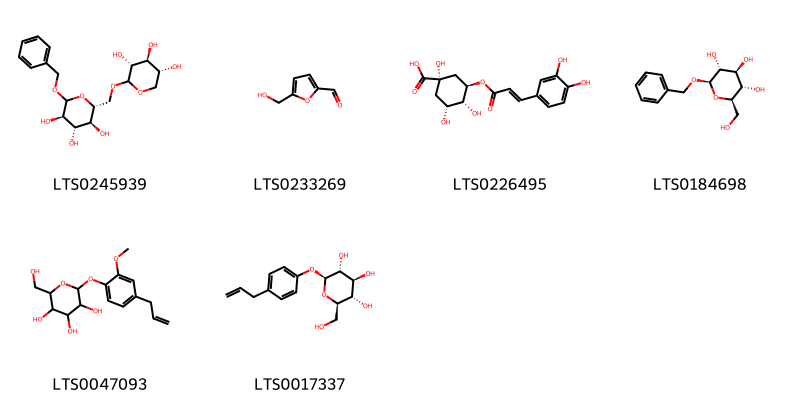{ width=100% }
    <figcaption>Hình ảnh cấu trúc hóa học của 6 hoạt chất thuộc nhóm Organooxygen compounds gồm ['(3r,4s,5s,6r)-2-(benzyloxy)-6-({[(3r,4s,5r)-3,4,5-trihydroxyoxan-2-yl]oxy}methyl)oxane-3,4,5-triol (LTS0245939)', 'hydroxymethylfurfural (LTS0233269)', 'chlorogenic acid (LTS0226495)', 'benzyl β-d-glucoside (LTS0184698)', '2-(hydroxymethyl)-6-[2-methoxy-4-(prop-2-en-1-yl)phenoxy]oxane-3,4,5-triol (LTS0047093)', '(2r,3s,4s,5r,6s)-2-(hydroxymethyl)-6-[4-(prop-2-en-1-yl)phenoxy]oxane-3,4,5-triol (LTS0017337)'].</figcaption>
</figure>
#### Nhóm Prenol lipids
<figure markdown="span">
    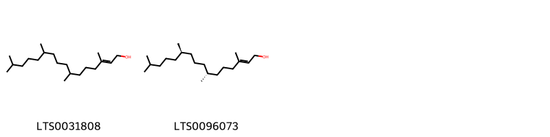{ width=100% }
    <figcaption>Hình ảnh cấu trúc hóa học của 2 hoạt chất thuộc nhóm Prenol lipids gồm ['phytol (LTS0031808)', 'phytol (LTS0096073)'].</figcaption>
</figure>

---

### Dược dân tộc học

Danh sách các quốc gia có sử dụng *Prunus mume* trong điều trị các bệnh. 

| Country   | Disease                                                                                | Bệnh                                                                                                                                                                                                |
|:----------|:---------------------------------------------------------------------------------------|:----------------------------------------------------------------------------------------------------------------------------------------------------------------------------------------------------|
| China     | Apertif, Astringent, Carminative, Styptic, Vermifuge, Astringent, Stomachic, Vermifuge | MYMEMORY WARNING: YOU USED ALL AVAILABLE FREE TRANSLATIONS FOR TODAY. NEXT AVAILABLE IN  11 HOURS 56 MINUTES 27 SECONDS VISIT HTTPS://MYMEMORY.TRANSLATED.NET/DOC/USAGELIMITS.PHP TO TRANSLATE MORE |
| Japan     | Vermifuge                                                                              | MYMEMORY WARNING: YOU USED ALL AVAILABLE FREE TRANSLATIONS FOR TODAY. NEXT AVAILABLE IN  11 HOURS 56 MINUTES 24 SECONDS VISIT HTTPS://MYMEMORY.TRANSLATED.NET/DOC/USAGELIMITS.PHP TO TRANSLATE MORE |

---

---
## Prunus myrtifolia
### Thông tin về thực vật

!!! info "Phân loại thực vật của *Prunus myrtifolia* từ GIBF:"
    - **Kingdom:** Plantae
    - **Phylum:** Tracheophyta
    - **Order:** Rosales
    - **Family:** Rosaceae
    - **Genus:** Prunus
    - **Species:** *Prunus myrtifolia*

 

| Label (VI)   | Label (EN)   | Scientific Name   | Descriptions (VI)   | Descriptions (EN)   | Also Known As (VI)   | Also Known As (EN)   |
|:-------------|:-------------|:------------------|:--------------------|:--------------------|:---------------------|:---------------------|
| N/A          | N/A          | Prunus myrtifolia | loài thực vật       | species of plant    | ['']                 | ['']                 |

#### Phân bố trên thế giới

**Từ CSDL GIBF** Colombia, Dominican Republic, Brazil, France, Puerto Rico, Germany, United States of America

#### Phân bố tại Việt Nam

**Từ CSDL GIBF**: Không có ghi nhận ở Việt Nam

---
### Thành phần hóa học
        
- Theo cơ sở dữ liệu lotus: Từ loài *Prunus myrtifolia* đã phân lập và xác định được 3 hoạt chất thuộc về các nhóm Organooxygen compounds, Benzene and substituted derivatives. 

|    | chemicalTaxonomyClassyfireClass     |   smiles_count |
|---:|:------------------------------------|---------------:|
|  0 | Benzene and substituted derivatives |              2 |
|  1 | Organooxygen compounds              |              1 |

#### Nhóm Benzene and substituted derivatives
<figure markdown="span">
    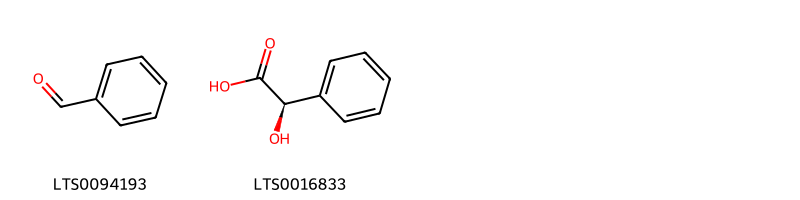{ width=100% }
    <figcaption>Hình ảnh cấu trúc hóa học của 2 hoạt chất thuộc nhóm Benzene and substituted derivatives gồm ['benzaldehyde (LTS0094193)', '(r)-mandelic acid (LTS0016833)'].</figcaption>
</figure>
#### Nhóm Organooxygen compounds
<figure markdown="span">
    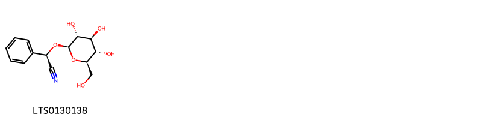{ width=100% }
    <figcaption>Hình ảnh cấu trúc hóa học của 1 hoạt chất thuộc nhóm Organooxygen compounds gồm ['prunasin (LTS0130138)'].</figcaption>
</figure>

---

### Dược dân tộc học

Danh sách các quốc gia có sử dụng *Prunus myrtifolia* trong điều trị các bệnh. 

| Country            | Disease    | Bệnh                                                                                                                                                                                                |
|:-------------------|:-----------|:----------------------------------------------------------------------------------------------------------------------------------------------------------------------------------------------------|
| Dominican Republic | Dentifrice | MYMEMORY WARNING: YOU USED ALL AVAILABLE FREE TRANSLATIONS FOR TODAY. NEXT AVAILABLE IN  11 HOURS 55 MINUTES 45 SECONDS VISIT HTTPS://MYMEMORY.TRANSLATED.NET/DOC/USAGELIMITS.PHP TO TRANSLATE MORE |

---

---
## Prunus napaulensis
### Thông tin về thực vật

!!! info "Phân loại thực vật của *Prunus napaulensis* từ GIBF:"
    - **Kingdom:** Plantae
    - **Phylum:** Tracheophyta
    - **Order:** Rosales
    - **Family:** Rosaceae
    - **Genus:** Prunus
    - **Species:** *Prunus napaulensis*

 

| Label (VI)   | Label (EN)   | Scientific Name    | Descriptions (VI)   | Descriptions (EN)   | Also Known As (VI)   | Also Known As (EN)                                                                                                                                        |
|:-------------|:-------------|:-------------------|:--------------------|:--------------------|:---------------------|:----------------------------------------------------------------------------------------------------------------------------------------------------------|
| N/A          | N/A          | Prunus napaulensis | loài thực vật       | species of plant    | ['']                 | ['Cerasus napaulensis', 'Cerasus glaucifolia', 'Padus glaucifolia', 'Padus napaulensis', 'Prunus glaucifolia', 'Prunus nepalensis', 'Prunus nepaulensis'] |

#### Phân bố trên thế giới

**Từ CSDL GIBF** nan, Myanmar, Bhutan, India, Bangladesh, China, Nepal

#### Phân bố tại Việt Nam

**Từ CSDL GIBF**: Không có ghi nhận ở Việt Nam

---
### Thành phần hóa học
        
- Theo cơ sở dữ liệu lotus: Từ loài *Prunus napaulensis* đã phân lập và xác định được Chưa có hoạt chất nào được phân lập. hoạt chất thuộc về các nhóm Không có hoạt chất nào được phân lập. 

Không có hình ảnh nào được tạo ra

---

### Dược dân tộc học

Danh sách các quốc gia có sử dụng *Prunus napaulensis* trong điều trị các bệnh. 

| Country   | Disease   | Bệnh                                                                                                                                                                                                |
|:----------|:----------|:----------------------------------------------------------------------------------------------------------------------------------------------------------------------------------------------------|
| Elsewhere | Poison    | MYMEMORY WARNING: YOU USED ALL AVAILABLE FREE TRANSLATIONS FOR TODAY. NEXT AVAILABLE IN  11 HOURS 55 MINUTES 17 SECONDS VISIT HTTPS://MYMEMORY.TRANSLATED.NET/DOC/USAGELIMITS.PHP TO TRANSLATE MORE |

---

---
## Prunus padus
### Thông tin về thực vật

!!! info "Phân loại thực vật của *Prunus padus* từ GIBF:"
    - **Kingdom:** Plantae
    - **Phylum:** Tracheophyta
    - **Order:** Rosales
    - **Family:** Rosaceae
    - **Genus:** Prunus
    - **Species:** *Prunus padus*

 

| Label (VI)   | Label (EN)   | Scientific Name   | Descriptions (VI)   | Descriptions (EN)   | Also Known As (VI)   | Also Known As (EN)                               |
|:-------------|:-------------|:------------------|:--------------------|:--------------------|:---------------------|:-------------------------------------------------|
| N/A          | N/A          | Prunus padus      | loài thực vật       | species of plant    | ['']                 | ['Bird Cherry', 'Bird-cherry', 'Padus racemosa'] |

#### Phân bố trên thế giới

**Từ CSDL GIBF** Denmark, Germany, Austria, Sweden, Poland, Belgium, Slovakia, Finland, Netherlands, Belarus, Slovenia, Hungary, Norway, Switzerland, United Kingdom of Great Britain and Northern Ireland, France, Czechia, Russian Federation, Italy, Croatia, Ukraine

#### Phân bố tại Việt Nam

**Từ CSDL GIBF**: Không có ghi nhận ở Việt Nam

---
### Thành phần hóa học
        
- Theo cơ sở dữ liệu lotus: Từ loài *Prunus padus* đã phân lập và xác định được 43 hoạt chất thuộc về các nhóm Organooxygen compounds, Flavonoids, Prenol lipids, Carboxylic acids and derivatives, Fatty Acyls, Lignan glycosides, Cinnamic acids and derivatives. 

|    | chemicalTaxonomyClassyfireClass   |   smiles_count |
|---:|:----------------------------------|---------------:|
|  0 | Carboxylic acids and derivatives  |              6 |
|  1 | Cinnamic acids and derivatives    |              2 |
|  2 | Fatty Acyls                       |              2 |
|  3 | Flavonoids                        |              9 |
|  4 | Lignan glycosides                 |              6 |
|  5 | Organooxygen compounds            |             13 |
|  6 | Prenol lipids                     |              4 |

#### Nhóm Carboxylic acids and derivatives
<figure markdown="span">
    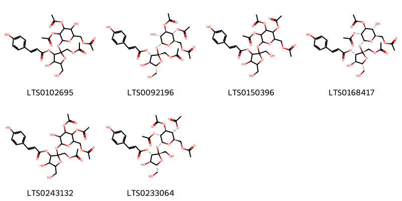{ width=100% }
    <figcaption>Hình ảnh cấu trúc hóa học của 6 hoạt chất thuộc nhóm Carboxylic acids and derivatives gồm ['2-[(acetyloxy)methyl]-2-{[3,4-bis(acetyloxy)-6-[(acetyloxy)methyl]-5-hydroxyoxan-2-yl]oxy}-4-hydroxy-5-(hydroxymethyl)oxolan-3-yl 3-(4-hydroxyphenyl)prop-2-enoate (LTS0102695)', '(2s,3s,4r,5r)-2-[(acetyloxy)methyl]-2-{[(2r,3r,4r,5r,6r)-4,5-bis(acetyloxy)-6-[(acetyloxy)methyl]-3-hydroxyoxan-2-yl]oxy}-4-hydroxy-5-(hydroxymethyl)oxolan-3-yl (2e)-3-(4-hydroxyphenyl)prop-2-enoate (LTS0092196)', '4-hydroxy-2,5-bis(hydroxymethyl)-2-{[3,4,5-tris(acetyloxy)-6-[(acetyloxy)methyl]oxan-2-yl]oxy}oxolan-3-yl 3-(4-hydroxyphenyl)prop-2-enoate (LTS0150396)', '(2s,3s,4r,5r)-2-[(acetyloxy)methyl]-2-{[(2r,3r,4s,5r,6r)-3,4-bis(acetyloxy)-6-[(acetyloxy)methyl]-5-hydroxyoxan-2-yl]oxy}-4-hydroxy-5-(hydroxymethyl)oxolan-3-yl (2e)-3-(4-hydroxyphenyl)prop-2-enoate (LTS0168417)', '2-[(acetyloxy)methyl]-2-{[4,5-bis(acetyloxy)-6-[(acetyloxy)methyl]-3-hydroxyoxan-2-yl]oxy}-4-hydroxy-5-(hydroxymethyl)oxolan-3-yl 3-(4-hydroxyphenyl)prop-2-enoate (LTS0243132)', '(2s,3s,4r,5r)-4-hydroxy-2,5-bis(hydroxymethyl)-2-{[(2r,3r,4s,5r,6r)-3,4,5-tris(acetyloxy)-6-[(acetyloxy)methyl]oxan-2-yl]oxy}oxolan-3-yl (2e)-3-(4-hydroxyphenyl)prop-2-enoate (LTS0233064)'].</figcaption>
</figure>
#### Nhóm Cinnamic acids and derivatives
<figure markdown="span">
    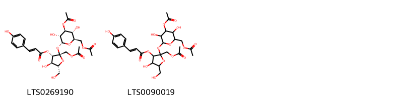{ width=100% }
    <figcaption>Hình ảnh cấu trúc hóa học của 2 hoạt chất thuộc nhóm Cinnamic acids and derivatives gồm ['(2s,3s,4r,5r)-2-{[(2r,3r,4s,5r,6r)-4-(acetyloxy)-6-[(acetyloxy)methyl]-3,5-dihydroxyoxan-2-yl]oxy}-2-[(acetyloxy)methyl]-4-hydroxy-5-(hydroxymethyl)oxolan-3-yl (2e)-3-(4-hydroxyphenyl)prop-2-enoate (LTS0269190)', '2-{[4-(acetyloxy)-6-[(acetyloxy)methyl]-3,5-dihydroxyoxan-2-yl]oxy}-2-[(acetyloxy)methyl]-4-hydroxy-5-(hydroxymethyl)oxolan-3-yl 3-(4-hydroxyphenyl)prop-2-enoate (LTS0090019)'].</figcaption>
</figure>
#### Nhóm Fatty Acyls
<figure markdown="span">
    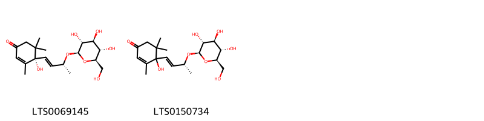{ width=100% }
    <figcaption>Hình ảnh cấu trúc hóa học của 2 hoạt chất thuộc nhóm Fatty Acyls gồm ['(4s)-4-hydroxy-3,5,5-trimethyl-4-[(1e,3r)-3-{[(2r,3r,4s,5s,6r)-3,4,5-trihydroxy-6-(hydroxymethyl)oxan-2-yl]oxy}but-1-en-1-yl]cyclohex-2-en-1-one (LTS0069145)', '4-hydroxy-3,5,5-trimethyl-4-[(1e,3r)-3-{[(2r,3r,4s,5s,6r)-3,4,5-trihydroxy-6-(hydroxymethyl)oxan-2-yl]oxy}but-1-en-1-yl]cyclohex-2-en-1-one (LTS0150734)'].</figcaption>
</figure>
#### Nhóm Flavonoids
<figure markdown="span">
    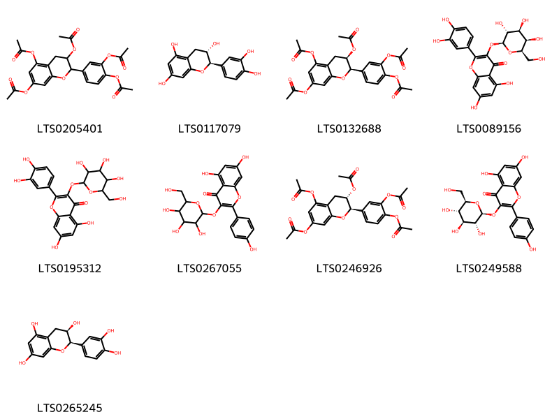{ width=100% }
    <figcaption>Hình ảnh cấu trúc hóa học của 9 hoạt chất thuộc nhóm Flavonoids gồm ['3,7-bis(acetyloxy)-2-[3,4-bis(acetyloxy)phenyl]-3,4-dihydro-2h-1-benzopyran-5-yl acetate (LTS0205401)', '(+)-catechol (LTS0117079)', '(2r,3r)-3,7-bis(acetyloxy)-2-[3,4-bis(acetyloxy)phenyl]-3,4-dihydro-2h-1-benzopyran-5-yl acetate (LTS0132688)', 'hyperoside (LTS0089156)', '2-(3,4-dihydroxyphenyl)-5,7-dihydroxy-3-{[3,4,5-trihydroxy-6-(hydroxymethyl)oxan-2-yl]oxy}chromen-4-one (LTS0195312)', 'trifolin (LTS0267055)', '(2r,3s)-3,7-bis(acetyloxy)-2-[3,4-bis(acetyloxy)phenyl]-3,4-dihydro-2h-1-benzopyran-5-yl acetate (LTS0246926)', 'astragalin (LTS0249588)', 'ent-epicatechin (LTS0265245)'].</figcaption>
</figure>
#### Nhóm Lignan glycosides
<figure markdown="span">
    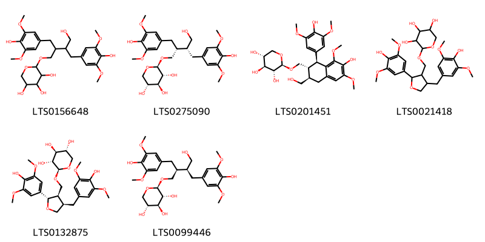{ width=100% }
    <figcaption>Hình ảnh cấu trúc hóa học của 6 hoạt chất thuộc nhóm Lignan glycosides gồm ['2-{4-hydroxy-2,3-bis[(4-hydroxy-3,5-dimethoxyphenyl)methyl]butoxy}oxane-3,4,5-triol (LTS0156648)', '(2r,3r,4s,5r)-2-[(2r,3r)-4-hydroxy-2,3-bis[(4-hydroxy-3,5-dimethoxyphenyl)methyl]butoxy]oxane-3,4,5-triol (LTS0275090)', '(2r,3r,4s,5r)-2-{[(1s,2r,3r)-7-hydroxy-1-(4-hydroxy-3,5-dimethoxyphenyl)-3-(hydroxymethyl)-6,8-dimethoxy-1,2,3,4-tetrahydronaphthalen-2-yl]methoxy}oxane-3,4,5-triol (LTS0201451)', '2-{[2-(4-hydroxy-3,5-dimethoxyphenyl)-4-[(4-hydroxy-3,5-dimethoxyphenyl)methyl]oxolan-3-yl]methoxy}oxane-3,4,5-triol (LTS0021418)', '(2r,3r,4s,5r)-2-{[(2s,3r,4r)-2-(4-hydroxy-3,5-dimethoxyphenyl)-4-[(4-hydroxy-3,5-dimethoxyphenyl)methyl]oxolan-3-yl]methoxy}oxane-3,4,5-triol (LTS0132875)', '(2r,3r,4s,5r)-2-[(2s,3s)-4-hydroxy-2,3-bis[(4-hydroxy-3,5-dimethoxyphenyl)methyl]butoxy]oxane-3,4,5-triol (LTS0099446)'].</figcaption>
</figure>
#### Nhóm Organooxygen compounds
<figure markdown="span">
    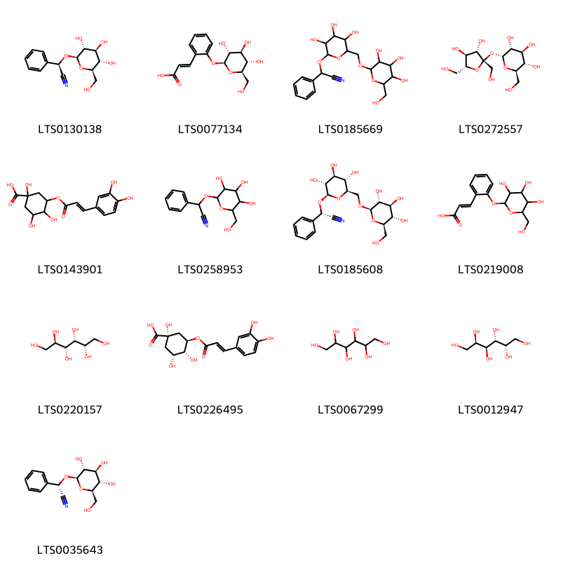{ width=100% }
    <figcaption>Hình ảnh cấu trúc hóa học của 13 hoạt chất thuộc nhóm Organooxygen compounds gồm ['prunasin (LTS0130138)', 'melilotoside (LTS0077134)', 'amygdalin (LTS0185669)', 'sucrose (LTS0272557)', '3-{[3-(3,4-dihydroxyphenyl)prop-2-enoyl]oxy}-1,4,5-trihydroxycyclohexane-1-carboxylic acid (LTS0143901)', '2-phenyl-2-{[3,4,5-trihydroxy-6-(hydroxymethyl)oxan-2-yl]oxy}acetonitrile (LTS0258953)', '(2s)-2-phenyl-2-{[(2r,3r,4s,5s,6r)-3,4,5-trihydroxy-6-({[(2r,3r,4s,5s,6r)-3,4,5-trihydroxy-6-(hydroxymethyl)oxan-2-yl]oxy}methyl)oxan-2-yl]oxy}acetonitrile (LTS0185608)', '3-(2-{[3,4,5-trihydroxy-6-(hydroxymethyl)oxan-2-yl]oxy}phenyl)prop-2-enoic acid (LTS0219008)', 'd-sorbitol (LTS0220157)', 'chlorogenic acid (LTS0226495)', 'sorbo (LTS0067299)', 'galactitol (LTS0012947)', '(s)-prunasin (LTS0035643)'].</figcaption>
</figure>
#### Nhóm Prenol lipids
<figure markdown="span">
    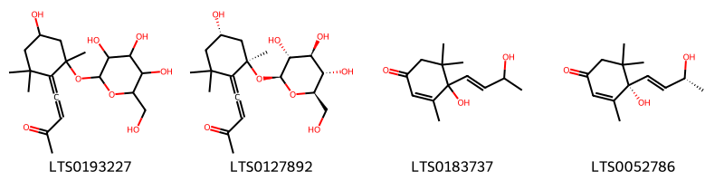{ width=100% }
    <figcaption>Hình ảnh cấu trúc hóa học của 4 hoạt chất thuộc nhóm Prenol lipids gồm ['4-(4-hydroxy-2,2,6-trimethyl-6-{[3,4,5-trihydroxy-6-(hydroxymethyl)oxan-2-yl]oxy}cyclohexylidene)but-3-en-2-one (LTS0193227)', 'citroside b (LTS0127892)', '4-hydroxy-4-(3-hydroxybut-1-en-1-yl)-3,5,5-trimethylcyclohex-2-en-1-one (LTS0183737)', '(6s,9r)-vomifoliol (LTS0052786)'].</figcaption>
</figure>

---

### Dược dân tộc học

Danh sách các quốc gia có sử dụng *Prunus padus* trong điều trị các bệnh. 

| Country   | Disease                                                             | Bệnh                                                                                                                                                                                                |
|:----------|:--------------------------------------------------------------------|:----------------------------------------------------------------------------------------------------------------------------------------------------------------------------------------------------|
| Turkey    | Astringent, Diuretic, Poison, Sedative, Stomachic, Tonic, Sudorific | MYMEMORY WARNING: YOU USED ALL AVAILABLE FREE TRANSLATIONS FOR TODAY. NEXT AVAILABLE IN  11 HOURS 54 MINUTES 36 SECONDS VISIT HTTPS://MYMEMORY.TRANSLATED.NET/DOC/USAGELIMITS.PHP TO TRANSLATE MORE |

---

---
## Prunus persica
### Thông tin về thực vật

!!! info "Phân loại thực vật của *Prunus persica* từ GIBF:"
    - **Kingdom:** Plantae
    - **Phylum:** Tracheophyta
    - **Order:** Rosales
    - **Family:** Rosaceae
    - **Genus:** Prunus
    - **Species:** *Prunus persica*

 

| Label (VI)   | Label (EN)   | Scientific Name   | Descriptions (VI)    | Descriptions (EN)                                   | Also Known As (VI)   | Also Known As (EN)   |
|:-------------|:-------------|:------------------|:---------------------|:----------------------------------------------------|:---------------------|:---------------------|
| N/A          | N/A          | Prunus persica    | Loại cây, hoa và quả | species of fruit tree (for the fruit use Q13202263) | ['']                 | ['peach tree']       |

#### Phân bố trên thế giới

**Từ CSDL GIBF** nan, Georgia, Honduras, Spain, Germany, Austria, Australia, Korea, Republic of, Dominican Republic, Sweden, Poland, India, Belgium, Netherlands, Slovakia, Slovenia, Hungary, Mexico, China, Norway, Switzerland, Jordan, United Kingdom of Great Britain and Northern Ireland, Portugal, South Africa, France, New Zealand, Bolivia (Plurinational State of), Russian Federation, United States of America, Italy, Croatia, Ukraine

#### Phân bố tại Việt Nam

**Từ CSDL GIBF**: Không có ghi nhận ở Việt Nam

---
### Thành phần hóa học
        
- Theo cơ sở dữ liệu lotus: Từ loài *Prunus persica* đã phân lập và xác định được 204 hoạt chất thuộc về các nhóm Organooxygen compounds, Furanoid lignans, Flavonoids, Lactones, Coumarins and derivatives, Saturated hydrocarbons, Dibenzylbutane lignans, Prenol lipids, Carboxylic acids and derivatives, Fatty Acyls, Glycerolipids, Cinnamyl alcohols, Phenols, Cinnamic acids and derivatives, Steroids and steroid derivatives, Benzene and substituted derivatives. 

|    | chemicalTaxonomyClassyfireClass     |   smiles_count |
|---:|:------------------------------------|---------------:|
|  0 | Benzene and substituted derivatives |              6 |
|  1 | Carboxylic acids and derivatives    |              6 |
|  2 | Cinnamic acids and derivatives      |              7 |
|  3 | Cinnamyl alcohols                   |              1 |
|  4 | Coumarins and derivatives           |              4 |
|  5 | Dibenzylbutane lignans              |              2 |
|  6 | Fatty Acyls                         |             10 |
|  7 | Flavonoids                          |             51 |
|  8 | Furanoid lignans                    |              3 |
|  9 | Glycerolipids                       |              1 |
| 10 | Lactones                            |              1 |
| 11 | Organooxygen compounds              |             40 |
| 12 | Phenols                             |              6 |
| 13 | Prenol lipids                       |             60 |
| 14 | Saturated hydrocarbons              |              1 |
| 15 | Steroids and steroid derivatives    |              4 |

#### Nhóm Benzene and substituted derivatives
<figure markdown="span">
    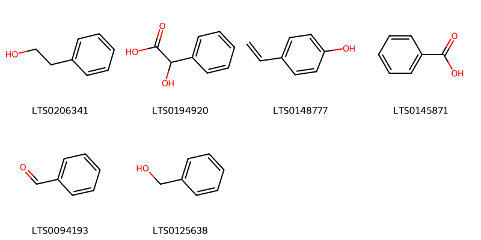{ width=100% }
    <figcaption>Hình ảnh cấu trúc hóa học của 6 hoạt chất thuộc nhóm Benzene and substituted derivatives gồm ['2-phenyl-ethanol (LTS0206341)', 'mandelic acid (LTS0194920)', '4-vinylphenol (LTS0148777)', 'benzoic acid (LTS0145871)', 'benzaldehyde (LTS0094193)', 'benzyl alcohol (LTS0125638)'].</figcaption>
</figure>
#### Nhóm Carboxylic acids and derivatives
<figure markdown="span">
    { width=100% }
    <figcaption>Hình ảnh cấu trúc hóa học của 6 hoạt chất thuộc nhóm Carboxylic acids and derivatives gồm ['glycocyamine (LTS0275175)', '4-guanidinobutyric acid (LTS0236153)', 'l-arginine (LTS0064737)', 'guanidinosuccinic acid (LTS0172937)', 'n-amidino-l-aspartic acid (LTS0014971)', 'creatine (LTS0246540)'].</figcaption>
</figure>
#### Nhóm Cinnamic acids and derivatives
<figure markdown="span">
    { width=100% }
    <figcaption>Hình ảnh cấu trúc hóa học của 7 hoạt chất thuộc nhóm Cinnamic acids and derivatives gồm ['ferulic acid (LTS0077328)', 'sinapinate (LTS0173482)', '3,4-dihydroxycinnamic acid (LTS0128050)', 'sinapoyl alcohol (LTS0275766)', 'para-coumaric acid (LTS0266252)', 'hydroxycinnamic acid (LTS0233023)', 'ferulic acid (LTS0273002)'].</figcaption>
</figure>
#### Nhóm Cinnamyl alcohols
<figure markdown="span">
    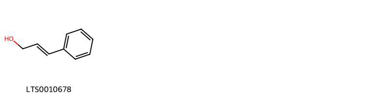{ width=100% }
    <figcaption>Hình ảnh cấu trúc hóa học của 1 hoạt chất thuộc nhóm Cinnamyl alcohols gồm ['cinnamyl alcohol (LTS0010678)'].</figcaption>
</figure>
#### Nhóm Coumarins and derivatives
<figure markdown="span">
    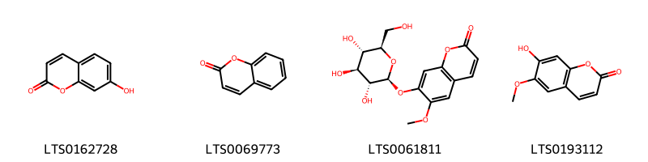{ width=100% }
    <figcaption>Hình ảnh cấu trúc hóa học của 4 hoạt chất thuộc nhóm Coumarins and derivatives gồm ['umbelliferone (LTS0162728)', '2h-1-benzopyran-2-one (LTS0069773)', 'scopolin (LTS0061811)', 'scopoletin (LTS0193112)'].</figcaption>
</figure>
#### Nhóm Dibenzylbutane lignans
<figure markdown="span">
    { width=100% }
    <figcaption>Hình ảnh cấu trúc hóa học của 2 hoạt chất thuộc nhóm Dibenzylbutane lignans gồm ['(2s,3r)-2,3-bis[(4-hydroxy-3-methoxyphenyl)(¹³c)methyl](1-¹³c)butane-1,4-diol (LTS0268699)', 'secoisolariciresinol (LTS0086727)'].</figcaption>
</figure>
#### Nhóm Fatty Acyls
<figure markdown="span">
    { width=100% }
    <figcaption>Hình ảnh cấu trúc hóa học của 10 hoạt chất thuộc nhóm Fatty Acyls gồm ['isovaleric acid (LTS0156600)', 'oleic acid (LTS0256910)', 'butanoic acid (LTS0175510)', '2-methylbutanoic acid (LTS0213858)', 'hexanol (LTS0217299)', '(6e,8e,10e)-2-{tetracyclo[4.3.0.0²,⁴.0³,⁷]non-8-en-1-yl}trideca-6,8,10-trienoic acid (LTS0262212)', 'hexanoic acid (LTS0031054)', 'lauric acid (LTS0051907)', 'linoleic (LTS0013198)', 'caprylic acid (LTS0254176)'].</figcaption>
</figure>
#### Nhóm Flavonoids
<figure markdown="span">
    { width=100% }
    <figcaption>Hình ảnh cấu trúc hóa học của 51 hoạt chất thuộc nhóm Flavonoids gồm ['astragalin (LTS0249588)', '(+)-catechol (LTS0117079)', 'luteolin (LTS0017052)', '(+)-dihydrokaempferol (LTS0134832)', '3-{[(2s,3r,4r,5s,6r)-3,4-dihydroxy-6-(hydroxymethyl)-5-{[(2s,3r,4s,5s,6r)-3,4,5-trihydroxy-6-(hydroxymethyl)oxan-2-yl]oxy}oxan-2-yl]oxy}-5,7-dihydroxy-2-(4-hydroxyphenyl)chromen-4-one (LTS0113148)', 'aromadendrin (LTS0153299)', 'persicogenin (LTS0184013)', '5,7-dihydroxy-2-(4-hydroxy-3-oxidophenyl)-3-{[(2s,3r,4s,5s,6r)-3,4,5-trihydroxy-6-(hydroxymethyl)oxan-2-yl]oxy}-1λ⁴-chromen-1-ylium (LTS0083222)', '2-(3,4-dihydroxyphenyl)-5,7-dihydroxy-3-{[(2s,3r,4s,5s,6r)-3,4,5-trihydroxy-6-({[(2r,3r,4s,5s,6r)-3,4,5-trihydroxy-6-(hydroxymethyl)oxan-2-yl]oxy}methyl)oxan-2-yl]oxy}chromen-4-one (LTS0183115)', '(-)-naringenin (LTS0072900)', 'epicatechin gallate (LTS0071606)', 'pilloin (LTS0220710)', 'chrysanthemin (LTS0221391)', '3-{[(2s,3r,4r,5s,6r)-3,4-dihydroxy-6-(hydroxymethyl)-5-{[(3s,5r)-3,4,5-trihydroxy-6-(hydroxymethyl)oxan-2-yl]oxy}oxan-2-yl]oxy}-2-(3,4-dihydroxyphenyl)-5,7-dihydroxychromen-4-one (LTS0162166)', 'helichrysin (LTS0126816)', 'asahina (LTS0068303)', 'hesperetin (LTS0087195)', 'rutin (LTS0042292)', 'hyperoside (LTS0089156)', 'isoquercetin (LTS0254337)', 'cyanidin 3-glucoside (LTS0217835)', '(2r,3r,4r)-2-(3,4-dihydroxyphenyl)-4-[(2r,3s)-2-(3,4-dihydroxyphenyl)-3,5,7-trihydroxy-3,4-dihydro-2h-1-benzopyran-8-yl]-3,4-dihydro-2h-1-benzopyran-3,5,7-triol (LTS0066122)', '3-rutinosyl quercetin (LTS0032845)', 'cyanidin 3-o-rutinoside (LTS0049654)', 'ent-epicatechin (LTS0265245)', '(-)-epigallocatechin gallate (LTS0173211)', '(1r,5r,6s,13s,21s)-5,13-bis(4-hydroxyphenyl)-4,12,14-trioxapentacyclo[11.7.1.0²,¹¹.0³,⁸.0¹⁵,²⁰]henicosa-2(11),3(8),9,15,17,19-hexaene-6,9,17,19,21-pentol (LTS0209983)', 'chamomile (LTS0104946)', '(2r,3s,4s)-2-(3,4-dihydroxyphenyl)-4-[(2r,3r)-2-(3,4-dihydroxyphenyl)-3,5,7-trihydroxy-3,4-dihydro-2h-1-benzopyran-8-yl]-3,4-dihydro-2h-1-benzopyran-3,5,7-triol (LTS0116257)', '(2r,3s,4s)-2-(3,4-dihydroxyphenyl)-4-[(2r,3r)-2-(3,4-dihydroxyphenyl)-3,5,7-trihydroxy-3,4-dihydro-2h-1-benzopyran-6-yl]-3,4-dihydro-2h-1-benzopyran-3,5,7-triol (LTS0196496)', '(2r,3r,4r)-2-(3,4-dihydroxyphenyl)-4-[(2r,3r)-2-(3,4-dihydroxyphenyl)-3,5,7-trihydroxy-3,4-dihydro-2h-1-benzopyran-8-yl]-3,4-dihydro-2h-1-benzopyran-3,5,7-triol (LTS0135510)', 'gallocatechol (LTS0267305)', '4-[3,5,7-trihydroxy-2-(3,4,5-trihydroxyphenyl)-3,4-dihydro-2h-1-benzopyran-8-yl]-2-(3,4,5-trihydroxyphenyl)-3,4-dihydro-2h-1-benzopyran-3,5,7-triol (LTS0144797)', 'hesperetin 5-o-glucoside (LTS0163163)', '(2r,3s,4s)-2-(3,4-dihydroxyphenyl)-4-[(2r,3s)-2-(3,4-dihydroxyphenyl)-3,5,7-trihydroxy-3,4-dihydro-2h-1-benzopyran-8-yl]-3,4-dihydro-2h-1-benzopyran-3,5,7-triol (LTS0151498)', 'geranin a (LTS0153482)', 'kaempherol (LTS0155822)', '(2r,3r)-2-(3,4-dihydroxyphenyl)-8-[(2r,3r)-2-(3,4-dihydroxyphenyl)-3,5,7-trihydroxy-3,4-dihydro-2h-1-benzopyran-4-yl]-4-[(2r,3s)-2-(3,4-dihydroxyphenyl)-3,5,7-trihydroxy-3,4-dihydro-2h-1-benzopyran-8-yl]-3,4-dihydro-2h-1-benzopyran-3,5,7-triol (LTS0059648)', '(1r,5r,6s,13s,21s)-5-(3,4-dihydroxyphenyl)-13-(4-hydroxyphenyl)-4,12,14-trioxapentacyclo[11.7.1.0²,¹¹.0³,⁸.0¹⁵,²⁰]henicosa-2(11),3(8),9,15,17,19-hexaene-6,9,17,19,21-pentol (LTS0239289)', 'trifolin (LTS0237581)', 'eriodictyol (LTS0220769)', 'procyanidin c1 (LTS0260445)', '2-(3,4-dihydroxyphenyl)-5,7-dihydroxy-3-{[(2s,3r,4r,5r,6s)-3,4,5-trihydroxy-6-(hydroxymethyl)oxan-2-yl]oxy}chromen-4-one (LTS0241372)', 'myricetin (LTS0139858)', '5-(3,4-dihydroxyphenyl)-13-(4-hydroxyphenyl)-4,12,14-trioxapentacyclo[11.7.1.0²,¹¹.0³,⁸.0¹⁵,²⁰]henicosa-2(11),3(8),9,15,17,19-hexaene-6,9,17,19,21-pentol (LTS0268035)', 'epigallocatechin (LTS0052496)', 'quercetin (LTS0004651)', 'afzelechin (LTS0233697)', '(2r,3s,4r)-2-(3,4-dihydroxyphenyl)-4-[(2r,3r)-2-(3,4-dihydroxyphenyl)-3,5,7-trihydroxy-3,4-dihydro-2h-1-benzopyran-6-yl]-3,4-dihydro-2h-1-benzopyran-3,5,7-triol (LTS0076760)', '(2s)-2-(3-hydroxy-4-methoxyphenyl)-7-methoxy-5-{[(2s,3r,4s,5s,6s)-3,4,5-trihydroxy-6-(hydroxymethyl)oxan-2-yl]oxy}-2,3-dihydro-1-benzopyran-4-one (LTS0234295)', "3,5,7,4'-tetrahydroxyflavan (LTS0039714)"].</figcaption>
</figure>
#### Nhóm Furanoid lignans
<figure markdown="span">
    { width=100% }
    <figcaption>Hình ảnh cấu trúc hóa học của 3 hoạt chất thuộc nhóm Furanoid lignans gồm ['pinoresinol (LTS0057431)', 'matairesinol (LTS0193475)', 'lariciresinol (LTS0010950)'].</figcaption>
</figure>
#### Nhóm Glycerolipids
<figure markdown="span">
    { width=100% }
    <figcaption>Hình ảnh cấu trúc hóa học của 1 hoạt chất thuộc nhóm Glycerolipids gồm ['triolein (LTS0254684)'].</figcaption>
</figure>
#### Nhóm Lactones
<figure markdown="span">
    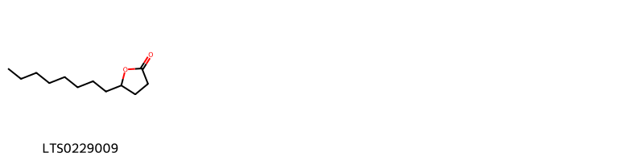{ width=100% }
    <figcaption>Hình ảnh cấu trúc hóa học của 1 hoạt chất thuộc nhóm Lactones gồm ['γ-dodecalactone (LTS0229009)'].</figcaption>
</figure>
#### Nhóm Organooxygen compounds
<figure markdown="span">
    { width=100% }
    <figcaption>Hình ảnh cấu trúc hóa học của 40 hoạt chất thuộc nhóm Organooxygen compounds gồm ['chlorogenic acid (LTS0226495)', '(+)-glucose (LTS0262158)', 'glucose (LTS0013597)', 'neochlorogenic acid (LTS0235816)', '(2r,3r,4s,5s,6r)-2-{[(2r,3s,4s,5r,6r)-6-(benzyloxy)-3,4,5-trihydroxyoxan-2-yl]methoxy}-6-(hydroxymethyl)oxane-3,4,5-triol (LTS0128567)', 'hydroxyacetophenone (LTS0214036)', 'prunasin (LTS0130138)', '(s)-phenyl({[(2s,3r,4s,5s,6r)-3,4,5-trihydroxy-6-(hydroxymethyl)oxan-2-yl]oxy})acetic acid (LTS0125299)', '(1s,3r,4s,5r)-1,3,5-trihydroxy-4-{[(2e)-3-(4-hydroxyphenyl)prop-2-enoyl]oxy}cyclohexane-1-carboxylic acid (LTS0122976)', 'n-[(3r,4r,5s,6r)-2,4,5-trihydroxy-6-(hydroxymethyl)oxan-3-yl]ethanimidic acid (LTS0075677)', '(2r)-2-phenyl-2-{[(4s,5s)-3,4,5-trihydroxy-6-({[(3r,5s,6r)-3,4,5-trihydroxy-6-(hydroxymethyl)oxan-2-yl]oxy}methyl)oxan-2-yl]oxy}acetonitrile (LTS0091377)', 'phenyl({[3,4,5-trihydroxy-6-({[3,4,5-trihydroxy-6-(hydroxymethyl)oxan-2-yl]oxy}methyl)oxan-2-yl]oxy})acetic acid (LTS0172219)', 'l-arabinopyranose (LTS0043712)', '3-o-sinapoylquinic acid (LTS0036999)', 'amygdalin (LTS0185669)', '(-)-inositol (LTS0047771)', '3-o-feruloyl-d-quinic acid (LTS0039027)', '(1r,3r,4s,5r)-1,3,4-trihydroxy-5-{[(2e)-3-(4-hydroxyphenyl)prop-2-enoyl]oxy}cyclohexane-1-carboxylic acid (LTS0198665)', 'sucrose (LTS0272557)', '2-{[6-(benzyloxy)-3,4,5-trihydroxyoxan-2-yl]methoxy}-6-(hydroxymethyl)oxane-3,4,5-triol (LTS0141314)', '4-o-feruloyl-d-quinic acid (LTS0140332)', 'cryptochlorogenic acid (LTS0252404)', '(2z)-1-[(4s)-4-hydroxy-2,6,6-trimethylcyclohex-1-en-1-yl]but-2-en-1-one (LTS0225864)', 'laetrile (LTS0251059)', '2-phenyl-2-{[3,4,5-trihydroxy-6-(hydroxymethyl)oxan-2-yl]oxy}acetonitrile (LTS0258953)', '(2s)-2-phenyl-2-{[(2r,3r,4s,5s,6r)-3,4,5-trihydroxy-6-({[(2r,3r,4s,5s,6r)-3,4,5-trihydroxy-6-(hydroxymethyl)oxan-2-yl]oxy}methyl)oxan-2-yl]oxy}acetonitrile (LTS0185608)', 'benzyl glucopyranoside (LTS0210495)', '(3r,5r)-1,3,5-trihydroxy-4-{[(2e)-3-(4-hydroxyphenyl)prop-2-enoyl]oxy}cyclohexane-1-carboxylic acid (LTS0093718)', '(1s,3r,4r,5r)-1,3,4-trihydroxy-5-{[(2e)-3-(4-hydroxyphenyl)prop-2-enoyl]oxy}cyclohexane-1-carboxylic acid (LTS0211457)', 'acetoin (LTS0220819)', '(r)-phenyl({[(2s,3r,4s,5s,6r)-3,4,5-trihydroxy-6-({[(2r,3r,4s,5s,6r)-3,4,5-trihydroxy-6-(hydroxymethyl)oxan-2-yl]oxy}methyl)oxan-2-yl]oxy})acetic acid (LTS0230135)', 'benzyl β-d-glucoside (LTS0184698)', 'phenyl({[3,4,5-trihydroxy-6-(hydroxymethyl)oxan-2-yl]oxy})acetic acid (LTS0259076)', '3-feruloylquinic acid (LTS0062037)', '(s)-prunasin (LTS0035643)', 'n-[(3r,4r,5r,6r)-2,4,5-trihydroxy-6-(hydroxymethyl)oxan-3-yl]ethanimidic acid (LTS0028359)', 'isoamyl alcohol (LTS0112297)', 'd-fructopyranose (LTS0259277)', '5-o-sinapoylquinic acid (LTS0260720)', '4-o-sinapoylquinic acid (LTS0045601)'].</figcaption>
</figure>
#### Nhóm Phenols
<figure markdown="span">
    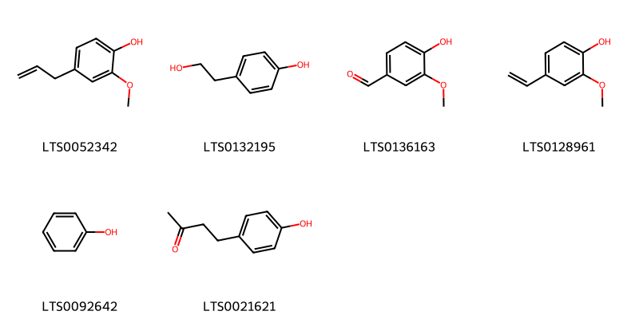{ width=100% }
    <figcaption>Hình ảnh cấu trúc hóa học của 6 hoạt chất thuộc nhóm Phenols gồm ['eugenol (LTS0052342)', 'tyrosol (LTS0132195)', 'vanillin (LTS0136163)', '2-methoxy-4-vinyl-phenol (LTS0128961)', 'phenol (LTS0092642)', 'frambinone (LTS0021621)'].</figcaption>
</figure>
#### Nhóm Prenol lipids
<figure markdown="span">
    { width=100% }
    <figcaption>Hình ảnh cấu trúc hóa học của 60 hoạt chất thuộc nhóm Prenol lipids gồm ['terpineol (LTS0136148)', 'carotenoid (LTS0205297)', '(+)-α-carotene (LTS0200789)', 'linalool, (+-)- (LTS0128839)', '(1r,2s,3s,4r,6s,8r,9s,12s)-6,12-dihydroxy-4,8-dimethyl-13-methylidenetetracyclo[10.2.1.0¹,⁹.0³,⁸]pentadecane-2,4-dicarboxylic acid (LTS0086231)', '1,3,3-trimethyl-2-[(1e,3z,5z,7e,9e,11e,13z,15z,17e)-3,7,12,16-tetramethyl-18-(2,6,6-trimethylcyclohex-1-en-1-yl)octadeca-1,3,5,7,9,11,13,15,17-nonaen-1-yl]cyclohex-1-ene (LTS0078967)', 'violaxanthin (LTS0102265)', '(1r,2r,5r,7r,8r,9s,10r,11s,12s)-7,12-dihydroxy-11-methyl-6-methylidene-16-oxo-15-oxapentacyclo[9.3.2.1⁵,⁸.0¹,¹⁰.0²,⁸]heptadecane-9-carboxylic acid (LTS0026845)', 'gibberellin a3 (LTS0185015)', '(1r,2r,4s,5s,7s,8r,9s,10r,11s,12s)-4,5,7,12-tetrahydroxy-11-methyl-6-methylidene-16-oxo-15-oxapentacyclo[9.3.2.1⁵,⁸.0¹,¹⁰.0²,⁸]heptadecane-9-carboxylic acid (LTS0196169)', '(1s,2r,5s,9s,10r,11s)-5-hydroxy-11-methyl-6-methylidene-16-oxo-15-oxapentacyclo[9.3.2.1⁵,⁸.0¹,¹⁰.0²,⁸]heptadec-13-ene-9-carboxylic acid (LTS0148617)', '(1r,2r,5r,8r,9s,10r,11r,14r)-14-hydroxy-11-methyl-6-methylidene-16-oxo-15-oxapentacyclo[9.3.2.1⁵,⁸.0¹,¹⁰.0²,⁸]heptadecane-9-carboxylic acid (LTS0129490)', 'gibberellin a8 (LTS0126599)', 'zeaxanthin (LTS0192928)', '4,5,7,12-tetrahydroxy-11-methyl-6-methylidene-16-oxo-15-oxapentacyclo[9.3.2.1⁵,⁸.0¹,¹⁰.0²,⁸]heptadecane-9-carboxylic acid (LTS0246551)', 'ursolic acid (LTS0250838)', '4-[(1e)-3-hydroxybut-1-en-1-yl]-3,5,5-trimethylcyclohex-3-en-1-ol (LTS0247025)', 'β,β-carotene (LTS0168447)', '(1r,2r,5s,8s,9s,10r,11r,14s)-5,14-dihydroxy-11-methyl-6-methylidene-16-oxo-15-oxapentacyclo[9.3.2.1⁵,⁸.0¹,¹⁰.0²,⁸]heptadecane-9-carboxylic acid (LTS0240244)', '(1s,2r,4r,5s,8r,9s,10r,11s)-4,5-dihydroxy-11-methyl-6-methylidene-16-oxo-15-oxapentacyclo[9.3.2.1⁵,⁸.0¹,¹⁰.0²,⁸]heptadec-13-ene-9-carboxylic acid (LTS0180508)', 'phytofluene (LTS0181914)', 'cryptoxanthin (LTS0132646)', '(1r,2r,4s,5s,8s,9s,10r,11s,12s)-4,5,12-trihydroxy-11-methyl-6-methylidene-16-oxo-15-oxapentacyclo[9.3.2.1⁵,⁸.0¹,¹⁰.0²,⁸]heptadec-13-ene-9-carboxylic acid (LTS0161599)', '4-[(1e)-3-hydroxybut-1-en-1-yl]-3,5,5-trimethylcyclohex-2-en-1-one (LTS0120878)', 'gibberellin a5 (LTS0176017)', '(3e)-4-(4-hydroxy-2,6,6-trimethylcyclohex-1-en-1-yl)but-3-en-2-one (LTS0059292)', '(1r,2r,4s,5s,7s,8r,9s,10r,11s,12s)-4,5,7,12-tetrahydroxy-11-methyl-6-methylidene-16-oxo-15-oxapentacyclo[9.3.2.1⁵,⁸.0¹,¹⁰.0²,⁸]heptadec-13-ene-9-carboxylic acid (LTS0266721)', 'β-carotene (LTS0275716)', '(1r,2r,4r,5r,8r,9s,10r,11r)-4-hydroxy-11-methyl-6-methylidene-16-oxo-15-oxapentacyclo[9.3.2.1⁵,⁸.0¹,¹⁰.0²,⁸]heptadec-13-ene-9-carboxylic acid (LTS0035223)', '(1r,2r,4s,5r,8r,9s,10r,11s,12s)-4,12-dihydroxy-11-methyl-6-methylidene-16-oxo-15-oxapentacyclo[9.3.2.1⁵,⁸.0¹,¹⁰.0²,⁸]heptadec-13-ene-9-carboxylic acid (LTS0211799)', 'gibberellin a44 (LTS0078749)', 'abscisic acid (LTS0200774)', 'antheraxanthin (LTS0210072)', '(2s,6r,7as)-2-[(2e,4e,6e,8e,10e,12e,14e)-15-[(2s,7ar)-4,4,7a-trimethyl-2,5,6,7-tetrahydro-1-benzofuran-2-yl]-6,11-dimethylhexadeca-2,4,6,8,10,12,14-heptaen-2-yl]-4,4,7a-trimethyl-2,5,6,7-tetrahydro-1-benzofuran-6-ol (LTS0220558)', '(2s,3s,4r,6s,8r,9s,12s)-6,12-dihydroxy-4,8-dimethyl-13-methylidenetetracyclo[10.2.1.0¹,⁹.0³,⁸]pentadecane-2,4-dicarboxylic acid (LTS0221918)', '(1r,2r,5r,7r,8r,9s,10r,11s,12s)-7,12-dihydroxy-11-methyl-6-methylidene-16-oxo-15-oxapentacyclo[9.3.2.1⁵,⁸.0¹,¹⁰.0²,⁸]heptadec-13-ene-9-carboxylic acid (LTS0262222)', '5-hydroxy-11-methyl-6-methylidene-16-oxo-15-oxapentacyclo[9.3.2.1⁵,⁸.0¹,¹⁰.0²,⁸]heptadec-12-ene-9-carboxylic acid (LTS0187802)', '(4s)-4-hydroxy-4-(3-hydroxybut-1-en-1-yl)-3,5,5-trimethylcyclohex-2-en-1-one (LTS0225700)', '(1r,2r,5r,8s,9s,10r,11r)-11-methyl-6-methylidene-16-oxo-15-oxapentacyclo[9.3.2.1⁵,⁸.0¹,¹⁰.0²,⁸]heptadec-13-ene-9-carboxylic acid (LTS0159711)', 'cis-phytoene (LTS0239283)', 'gibberellin a19 (LTS0044672)', '2-[(2z,4e,6e,8e,10e,12e,14e,16e)-17-{4-hydroxy-2,2,6-trimethyl-7-oxabicyclo[4.1.0]heptan-1-yl}-6,11,15-trimethylheptadeca-2,4,6,8,10,12,14,16-octaen-2-yl]-4,4,7a-trimethyl-2,5,6,7-tetrahydro-1-benzofuran-6-ol (LTS0193507)', '(9z)-β-carotene (LTS0252839)', '(1r,2r,8s,9s,10r)-11-methyl-6-methylidene-16-oxo-15-oxapentacyclo[9.3.2.1⁵,⁸.0¹,¹⁰.0²,⁸]heptadec-13-ene-9-carboxylic acid (LTS0049851)', 'geraniol (LTS0258838)', 'gibberellin a9 (LTS0243888)', '(1r,2r,4s,5r,8r,9s,10r,11r)-4-hydroxy-11-methyl-6-methylidene-16-oxo-15-oxapentacyclo[9.3.2.1⁵,⁸.0¹,¹⁰.0²,⁸]heptadec-13-ene-9-carboxylic acid (LTS0243402)', 'phytoene (LTS0186029)', 'all-trans-phytofluene (LTS0269894)', '10,15-dihydroxy-6,6,14-trimethyl-9-methylidene-19-oxo-5,7,18-trioxahexacyclo[12.3.2.1⁸,¹¹.0¹,¹³.0²,¹¹.0⁴,⁸]icos-16-ene-12-carboxylic acid (LTS0003721)', '(1r,2r,5r,8r,9s,10r,11r,14s)-14-hydroxy-11-methyl-6-methylidene-16-oxo-15-oxapentacyclo[9.3.2.1⁵,⁸.0¹,¹⁰.0²,⁸]heptadecane-9-carboxylic acid (LTS0059228)', '(1r,2r,4s,8s,10s,11r,12s,13r,14s,15s)-10,15-dihydroxy-6,6,14-trimethyl-9-methylidene-19-oxo-5,7,18-trioxahexacyclo[12.3.2.1⁸,¹¹.0¹,¹³.0²,¹¹.0⁴,⁸]icos-16-ene-12-carboxylic acid (LTS0016694)', 'gibberellin a1 (LTS0013777)', '6-[(1e,3z,5e,7e,9e,11z)-13-hydroxy-3,7,12-trimethyltrideca-1,3,5,7,9,11-hexaen-1-yl]-1,5,5-trimethyl-7-oxabicyclo[4.1.0]heptan-3-ol (LTS0013466)', 'α-carotene (LTS0224243)', 'dehydrovomifoliol (LTS0209706)', 'zeta-carotene (LTS0007334)', '(1s,2r,5s,8r,9s,10r,11s)-5-hydroxy-11-methyl-6-methylidene-16-oxo-15-oxapentacyclo[9.3.2.1⁵,⁸.0¹,¹⁰.0²,⁸]heptadec-13-ene-9-carboxylic acid (LTS0230537)', '(1s,2r,4r,5s,9s,10r,11s)-4,5-dihydroxy-11-methyl-6-methylidene-16-oxo-15-oxapentacyclo[9.3.2.1⁵,⁸.0¹,¹⁰.0²,⁸]heptadec-13-ene-9-carboxylic acid (LTS0254428)', '5-(1-hydroxy-2,6,6-trimethyl-4-oxocyclohex-2-en-1-yl)-3-methylpenta-2,4-dienoic acid (LTS0021517)'].</figcaption>
</figure>
#### Nhóm Saturated hydrocarbons
<figure markdown="span">
    { width=100% }
    <figcaption>Hình ảnh cấu trúc hóa học của 1 hoạt chất thuộc nhóm Saturated hydrocarbons gồm ['hentriacontane (LTS0046415)'].</figcaption>
</figure>
#### Nhóm Steroids and steroid derivatives
<figure markdown="span">
    { width=100% }
    <figcaption>Hình ảnh cấu trúc hóa học của 4 hoạt chất thuộc nhóm Steroids and steroid derivatives gồm ['stigmast-5-en-3-ol, (3β)- (LTS0204616)', 'sitogluside (LTS0201798)', '(2s,6r)-6-[(1r,3ar,3bs,5r,5ar,7r,9ar,9br,11as)-5,7-dihydroxy-9a,11a-dimethyl-2-oxo-tetradecahydrocyclopenta[a]phenanthren-1-yl]-2-methyl-5-oxoheptanoic acid (LTS0231216)', '6-{5,7-dihydroxy-9a,11a-dimethyl-2-oxo-tetradecahydrocyclopenta[a]phenanthren-1-yl}-2-methyl-5-oxoheptanoic acid (LTS0218243)'].</figcaption>
</figure>

---

### Dược dân tộc học

Danh sách các quốc gia có sử dụng *Prunus persica* trong điều trị các bệnh. 

| Country    | Disease                                                                  | Bệnh                                                                                                                                                                                                |
|:-----------|:-------------------------------------------------------------------------|:----------------------------------------------------------------------------------------------------------------------------------------------------------------------------------------------------|
| China      | Antitussive, Antitussive, Diuretic, Sedative, Laxative                   | MYMEMORY WARNING: YOU USED ALL AVAILABLE FREE TRANSLATIONS FOR TODAY. NEXT AVAILABLE IN  11 HOURS 54 MINUTES 02 SECONDS VISIT HTTPS://MYMEMORY.TRANSLATED.NET/DOC/USAGELIMITS.PHP TO TRANSLATE MORE |
| Elsewhere  | Expectorant, Poison, Poultice, Vermifuge, Purgative                      | MYMEMORY WARNING: YOU USED ALL AVAILABLE FREE TRANSLATIONS FOR TODAY. NEXT AVAILABLE IN  11 HOURS 53 MINUTES 59 SECONDS VISIT HTTPS://MYMEMORY.TRANSLATED.NET/DOC/USAGELIMITS.PHP TO TRANSLATE MORE |
| Iraq       | Sedative                                                                 | MYMEMORY WARNING: YOU USED ALL AVAILABLE FREE TRANSLATIONS FOR TODAY. NEXT AVAILABLE IN  11 HOURS 53 MINUTES 56 SECONDS VISIT HTTPS://MYMEMORY.TRANSLATED.NET/DOC/USAGELIMITS.PHP TO TRANSLATE MORE |
| Japan      | Antiphlogistic, Antitussive, Diuretic, Cathartic                         | MYMEMORY WARNING: YOU USED ALL AVAILABLE FREE TRANSLATIONS FOR TODAY. NEXT AVAILABLE IN  11 HOURS 53 MINUTES 53 SECONDS VISIT HTTPS://MYMEMORY.TRANSLATED.NET/DOC/USAGELIMITS.PHP TO TRANSLATE MORE |
| Japan*     | Antiphlogistic, Aperient                                                 | MYMEMORY WARNING: YOU USED ALL AVAILABLE FREE TRANSLATIONS FOR TODAY. NEXT AVAILABLE IN  11 HOURS 53 MINUTES 49 SECONDS VISIT HTTPS://MYMEMORY.TRANSLATED.NET/DOC/USAGELIMITS.PHP TO TRANSLATE MORE |
| Turkey     | Demulcent, Laxative, Sedative, Aperient, Astringent, Diuretic, Vermifuge | MYMEMORY WARNING: YOU USED ALL AVAILABLE FREE TRANSLATIONS FOR TODAY. NEXT AVAILABLE IN  11 HOURS 53 MINUTES 46 SECONDS VISIT HTTPS://MYMEMORY.TRANSLATED.NET/DOC/USAGELIMITS.PHP TO TRANSLATE MORE |
| US         | Sedative, Poison                                                         | MYMEMORY WARNING: YOU USED ALL AVAILABLE FREE TRANSLATIONS FOR TODAY. NEXT AVAILABLE IN  11 HOURS 53 MINUTES 43 SECONDS VISIT HTTPS://MYMEMORY.TRANSLATED.NET/DOC/USAGELIMITS.PHP TO TRANSLATE MORE |
| US(Navajo) | Purgative                                                                | MYMEMORY WARNING: YOU USED ALL AVAILABLE FREE TRANSLATIONS FOR TODAY. NEXT AVAILABLE IN  11 HOURS 53 MINUTES 37 SECONDS VISIT HTTPS://MYMEMORY.TRANSLATED.NET/DOC/USAGELIMITS.PHP TO TRANSLATE MORE |
| Venezuela  | Laxative                                                                 | MYMEMORY WARNING: YOU USED ALL AVAILABLE FREE TRANSLATIONS FOR TODAY. NEXT AVAILABLE IN  11 HOURS 53 MINUTES 29 SECONDS VISIT HTTPS://MYMEMORY.TRANSLATED.NET/DOC/USAGELIMITS.PHP TO TRANSLATE MORE |
| ain        | Poison                                                                   | MYMEMORY WARNING: YOU USED ALL AVAILABLE FREE TRANSLATIONS FOR TODAY. NEXT AVAILABLE IN  11 HOURS 53 MINUTES 26 SECONDS VISIT HTTPS://MYMEMORY.TRANSLATED.NET/DOC/USAGELIMITS.PHP TO TRANSLATE MORE |

---

---
## Prunus pseudocerasus
### Thông tin về thực vật

!!! info "Phân loại thực vật của *Prunus pseudocerasus* từ GIBF:"
    - **Kingdom:** Plantae
    - **Phylum:** Tracheophyta
    - **Order:** Rosales
    - **Family:** Rosaceae
    - **Genus:** Prunus
    - **Species:** *Prunus pseudocerasus*

 

| Label (VI)   | Label (EN)   | Scientific Name      | Descriptions (VI)   | Descriptions (EN)   | Also Known As (VI)   | Also Known As (EN)                                                                                                                                                   |
|:-------------|:-------------|:---------------------|:--------------------|:--------------------|:---------------------|:---------------------------------------------------------------------------------------------------------------------------------------------------------------------|
| N/A          | N/A          | Prunus pseudocerasus | loài thực vật       | species of plant    | ['']                 | ['Cerasus pseudo-cerasus', 'Cerasus pseudocerasus', 'Chinese cherry', 'Chinese sour cherry', 'Padus pseudo-cerasus', 'Padus pseudocerasus', 'Prunus pseudo-cerasus'] |

#### Phân bố trên thế giới

**Từ CSDL GIBF** nan, Japan, New Zealand, United States of America, China, Korea, Republic of

#### Phân bố tại Việt Nam

**Từ CSDL GIBF**: Không có ghi nhận ở Việt Nam

---
### Thành phần hóa học
        
- Theo cơ sở dữ liệu lotus: Từ loài *Prunus pseudocerasus* đã phân lập và xác định được Chưa có hoạt chất nào được phân lập. hoạt chất thuộc về các nhóm Không có hoạt chất nào được phân lập. 

Không có hình ảnh nào được tạo ra

---

### Dược dân tộc học

Danh sách các quốc gia có sử dụng *Prunus pseudocerasus* trong điều trị các bệnh. 

| Country   | Disease             | Bệnh                                                                                                                                                                                                |
|:----------|:--------------------|:----------------------------------------------------------------------------------------------------------------------------------------------------------------------------------------------------|
| China     | Cosmetic, Vermifuge | MYMEMORY WARNING: YOU USED ALL AVAILABLE FREE TRANSLATIONS FOR TODAY. NEXT AVAILABLE IN  11 HOURS 52 MINUTES 36 SECONDS VISIT HTTPS://MYMEMORY.TRANSLATED.NET/DOC/USAGELIMITS.PHP TO TRANSLATE MORE |

---

---
## Prunus rhamnoides
### Thông tin về thực vật

!!! info "Phân loại thực vật của *Prunus rhamnoides* từ GIBF:"
    - **Kingdom:** Plantae
    - **Phylum:** Tracheophyta
    - **Order:** Rosales
    - **Family:** Rosaceae
    - **Genus:** Prunus
    - **Species:** *Prunus rhamnoides*

 

| Label (VI)   | Label (EN)   | Scientific Name   | Descriptions (VI)   | Descriptions (EN)   | Also Known As (VI)   | Also Known As (EN)   |
|:-------------|:-------------|:------------------|:--------------------|:--------------------|:---------------------|:---------------------|
| N/A          | N/A          | Prunus rhamnoides |                     | species of plant    | ['']                 | ['']                 |

#### Phân bố trên thế giới

**Từ CSDL GIBF** nan, Honduras, Belize, Nicaragua, Costa Rica, Mexico, Guatemala

#### Phân bố tại Việt Nam

**Từ CSDL GIBF**: Không có ghi nhận ở Việt Nam

---
### Thành phần hóa học
        
- Theo cơ sở dữ liệu lotus: Từ loài *Prunus rhamnoides* đã phân lập và xác định được Chưa có hoạt chất nào được phân lập. hoạt chất thuộc về các nhóm Không có hoạt chất nào được phân lập. 

Không có hình ảnh nào được tạo ra

---

### Dược dân tộc học

Danh sách các quốc gia có sử dụng *Prunus rhamnoides* trong điều trị các bệnh. 

| Country   | Disease   | Bệnh                                                                                                                                                                                                |
|:----------|:----------|:----------------------------------------------------------------------------------------------------------------------------------------------------------------------------------------------------|
| Mexico    | Poison    | MYMEMORY WARNING: YOU USED ALL AVAILABLE FREE TRANSLATIONS FOR TODAY. NEXT AVAILABLE IN  11 HOURS 52 MINUTES 09 SECONDS VISIT HTTPS://MYMEMORY.TRANSLATED.NET/DOC/USAGELIMITS.PHP TO TRANSLATE MORE |

---

---
## Prunus salicina
### Thông tin về thực vật

!!! info "Phân loại thực vật của *Prunus salicina* từ GIBF:"
    - **Kingdom:** Plantae
    - **Phylum:** Tracheophyta
    - **Order:** Rosales
    - **Family:** Rosaceae
    - **Genus:** Prunus
    - **Species:** *Prunus salicina*

 

| Label (VI)   | Label (EN)   | Scientific Name   | Descriptions (VI)   | Descriptions (EN)   | Also Known As (VI)   | Also Known As (EN)   |
|:-------------|:-------------|:------------------|:--------------------|:--------------------|:---------------------|:---------------------|
| N/A          | N/A          | Prunus salicina   | loài thực vật       | species of plant    | ['Prunus salicina']  | ['']                 |

#### Phân bố trên thế giới

**Từ CSDL GIBF** nan, Chinese Taipei, unknown or invalid, El Salvador, Japan, Korea (Democratic People’s Republic of), Brazil, Spain, Russian Federation, United States of America, Mexico, China, Australia, Korea, Republic of, Hong Kong

#### Phân bố tại Việt Nam

**Từ CSDL GIBF**: Không có ghi nhận ở Việt Nam

---
### Thành phần hóa học
        
- Theo cơ sở dữ liệu lotus: Từ loài *Prunus salicina* đã phân lập và xác định được 12 hoạt chất thuộc về các nhóm Organooxygen compounds, Flavonoids, Carboxylic acids and derivatives. 

|    | chemicalTaxonomyClassyfireClass   |   smiles_count |
|---:|:----------------------------------|---------------:|
|  0 | Carboxylic acids and derivatives  |              1 |
|  1 | Flavonoids                        |              7 |
|  2 | Organooxygen compounds            |              4 |

#### Nhóm Carboxylic acids and derivatives
<figure markdown="span">
    { width=100% }
    <figcaption>Hình ảnh cấu trúc hóa học của 1 hoạt chất thuộc nhóm Carboxylic acids and derivatives gồm ['oxalic acid (LTS0217707)'].</figcaption>
</figure>
#### Nhóm Flavonoids
<figure markdown="span">
    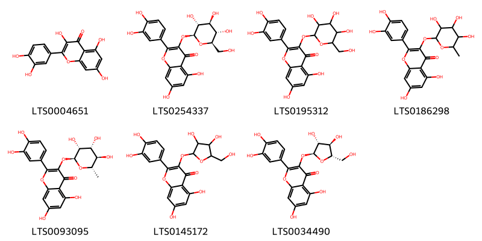{ width=100% }
    <figcaption>Hình ảnh cấu trúc hóa học của 7 hoạt chất thuộc nhóm Flavonoids gồm ['quercetin (LTS0004651)', 'isoquercetin (LTS0254337)', '2-(3,4-dihydroxyphenyl)-5,7-dihydroxy-3-{[3,4,5-trihydroxy-6-(hydroxymethyl)oxan-2-yl]oxy}chromen-4-one (LTS0195312)', 'quercitrin (LTS0186298)', 'quercitrin (LTS0093095)', '3-{[3,4-dihydroxy-5-(hydroxymethyl)oxolan-2-yl]oxy}-2-(3,4-dihydroxyphenyl)-5,7-dihydroxychromen-4-one (LTS0145172)', 'avicularin (LTS0034490)'].</figcaption>
</figure>
#### Nhóm Organooxygen compounds
<figure markdown="span">
    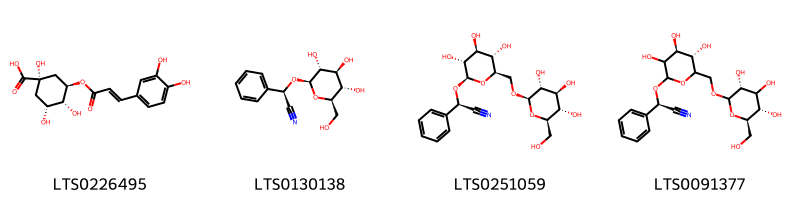{ width=100% }
    <figcaption>Hình ảnh cấu trúc hóa học của 4 hoạt chất thuộc nhóm Organooxygen compounds gồm ['chlorogenic acid (LTS0226495)', 'prunasin (LTS0130138)', 'laetrile (LTS0251059)', '(2r)-2-phenyl-2-{[(4s,5s)-3,4,5-trihydroxy-6-({[(3r,5s,6r)-3,4,5-trihydroxy-6-(hydroxymethyl)oxan-2-yl]oxy}methyl)oxan-2-yl]oxy}acetonitrile (LTS0091377)'].</figcaption>
</figure>

---

### Dược dân tộc học

Danh sách các quốc gia có sử dụng *Prunus salicina* trong điều trị các bệnh. 

| Country   | Disease   | Bệnh                                                                                                                                                                                                |
|:----------|:----------|:----------------------------------------------------------------------------------------------------------------------------------------------------------------------------------------------------|
| Elsewhere | Stomachic | MYMEMORY WARNING: YOU USED ALL AVAILABLE FREE TRANSLATIONS FOR TODAY. NEXT AVAILABLE IN  11 HOURS 51 MINUTES 40 SECONDS VISIT HTTPS://MYMEMORY.TRANSLATED.NET/DOC/USAGELIMITS.PHP TO TRANSLATE MORE |

---

---
## Prunus serotina
### Thông tin về thực vật

!!! info "Phân loại thực vật của *Prunus serotina* từ GIBF:"
    - **Kingdom:** Plantae
    - **Phylum:** Tracheophyta
    - **Order:** Rosales
    - **Family:** Rosaceae
    - **Genus:** Prunus
    - **Species:** *Prunus serotina*

 

| Label (VI)   | Label (EN)   | Scientific Name   | Descriptions (VI)   | Descriptions (EN)   | Also Known As (VI)   | Also Known As (EN)   |
|:-------------|:-------------|:------------------|:--------------------|:--------------------|:---------------------|:---------------------|
| N/A          | N/A          | Prunus serotina   | loài thực vật       | species of plant    | ['']                 | ['black cherry']     |

#### Phân bố trên thế giới

**Từ CSDL GIBF** Colombia, Sweden, Poland, New Zealand, Germany, Canada, United States of America, Mexico, Australia, Belgium, Netherlands

#### Phân bố tại Việt Nam

**Từ CSDL GIBF**: Không có ghi nhận ở Việt Nam

---
### Thành phần hóa học
        
- Theo cơ sở dữ liệu lotus: Từ loài *Prunus serotina* đã phân lập và xác định được 19 hoạt chất thuộc về các nhóm Organooxygen compounds, Flavonoids, Saturated hydrocarbons, Prenol lipids, Fatty Acyls. 

|    | chemicalTaxonomyClassyfireClass   |   smiles_count |
|---:|:----------------------------------|---------------:|
|  0 | Fatty Acyls                       |              1 |
|  1 | Flavonoids                        |              2 |
|  2 | Organooxygen compounds            |             11 |
|  3 | Prenol lipids                     |              3 |
|  4 | Saturated hydrocarbons            |              2 |

#### Nhóm Fatty Acyls
<figure markdown="span">
    { width=100% }
    <figcaption>Hình ảnh cấu trúc hóa học của 1 hoạt chất thuộc nhóm Fatty Acyls gồm ['ceryl alcohol (LTS0140051)'].</figcaption>
</figure>
#### Nhóm Flavonoids
<figure markdown="span">
    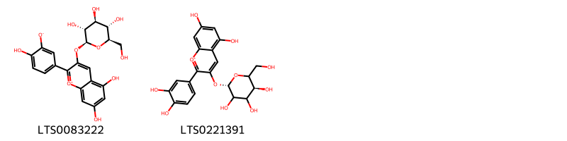{ width=100% }
    <figcaption>Hình ảnh cấu trúc hóa học của 2 hoạt chất thuộc nhóm Flavonoids gồm ['5,7-dihydroxy-2-(4-hydroxy-3-oxidophenyl)-3-{[(2s,3r,4s,5s,6r)-3,4,5-trihydroxy-6-(hydroxymethyl)oxan-2-yl]oxy}-1λ⁴-chromen-1-ylium (LTS0083222)', 'chrysanthemin (LTS0221391)'].</figcaption>
</figure>
#### Nhóm Organooxygen compounds
<figure markdown="span">
    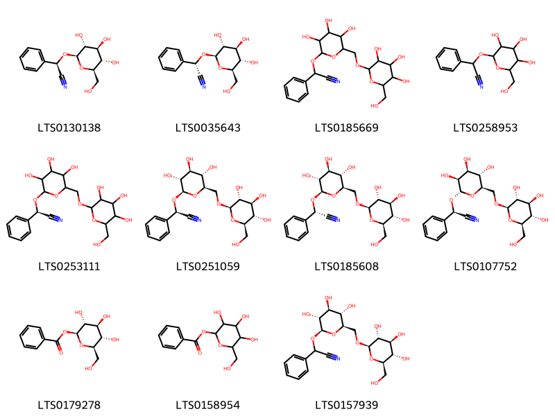{ width=100% }
    <figcaption>Hình ảnh cấu trúc hóa học của 11 hoạt chất thuộc nhóm Organooxygen compounds gồm ['prunasin (LTS0130138)', '(s)-prunasin (LTS0035643)', 'amygdalin (LTS0185669)', '2-phenyl-2-{[3,4,5-trihydroxy-6-(hydroxymethyl)oxan-2-yl]oxy}acetonitrile (LTS0258953)', 'amygdalin (LTS0253111)', 'laetrile (LTS0251059)', '(2s)-2-phenyl-2-{[(2r,3r,4s,5s,6r)-3,4,5-trihydroxy-6-({[(2r,3r,4s,5s,6r)-3,4,5-trihydroxy-6-(hydroxymethyl)oxan-2-yl]oxy}methyl)oxan-2-yl]oxy}acetonitrile (LTS0185608)', '(2r)-2-phenyl-2-{[(2s,3s,4s,5s,6r)-3,4,5-trihydroxy-6-({[(2r,3r,4s,5s,6r)-3,4,5-trihydroxy-6-(hydroxymethyl)oxan-2-yl]oxy}methyl)oxan-2-yl]oxy}acetonitrile (LTS0107752)', 'benzoyl-β-d-glucoside (LTS0179278)', 'benzoyl-β-d-glucoside (LTS0158954)', 'amygdalin (LTS0157939)'].</figcaption>
</figure>
#### Nhóm Prenol lipids
<figure markdown="span">
    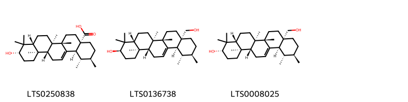{ width=100% }
    <figcaption>Hình ảnh cấu trúc hóa học của 3 hoạt chất thuộc nhóm Prenol lipids gồm ['ursolic acid (LTS0250838)', 'urs-12-ene-3β,28-diol (LTS0136738)', 'uvaol (LTS0008025)'].</figcaption>
</figure>
#### Nhóm Saturated hydrocarbons
<figure markdown="span">
    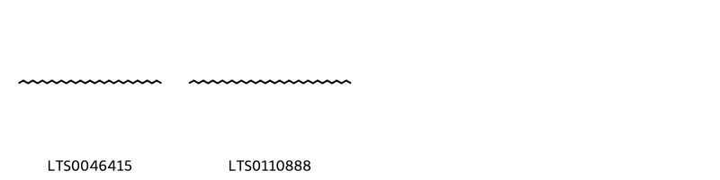{ width=100% }
    <figcaption>Hình ảnh cấu trúc hóa học của 2 hoạt chất thuộc nhóm Saturated hydrocarbons gồm ['hentriacontane (LTS0046415)', 'pentatriacontane (LTS0110888)'].</figcaption>
</figure>

---

### Dược dân tộc học

Danh sách các quốc gia có sử dụng *Prunus serotina* trong điều trị các bệnh. 

| Country        | Disease                             | Bệnh                                                                                                                                                                                                |
|:---------------|:------------------------------------|:----------------------------------------------------------------------------------------------------------------------------------------------------------------------------------------------------|
| Mexico         | Nervine, Poison, Tonic              | MYMEMORY WARNING: YOU USED ALL AVAILABLE FREE TRANSLATIONS FOR TODAY. NEXT AVAILABLE IN  11 HOURS 51 MINUTES 11 SECONDS VISIT HTTPS://MYMEMORY.TRANSLATED.NET/DOC/USAGELIMITS.PHP TO TRANSLATE MORE |
| Turkey         | Astringent, Poison, Sedative, Tonic | MYMEMORY WARNING: YOU USED ALL AVAILABLE FREE TRANSLATIONS FOR TODAY. NEXT AVAILABLE IN  11 HOURS 51 MINUTES 08 SECONDS VISIT HTTPS://MYMEMORY.TRANSLATED.NET/DOC/USAGELIMITS.PHP TO TRANSLATE MORE |
| US             | Expectorant, Tonic, Poison          | MYMEMORY WARNING: YOU USED ALL AVAILABLE FREE TRANSLATIONS FOR TODAY. NEXT AVAILABLE IN  11 HOURS 51 MINUTES 04 SECONDS VISIT HTTPS://MYMEMORY.TRANSLATED.NET/DOC/USAGELIMITS.PHP TO TRANSLATE MORE |
| US(Appalachia) | Tonic                               | MYMEMORY WARNING: YOU USED ALL AVAILABLE FREE TRANSLATIONS FOR TODAY. NEXT AVAILABLE IN  11 HOURS 51 MINUTES 01 SECONDS VISIT HTTPS://MYMEMORY.TRANSLATED.NET/DOC/USAGELIMITS.PHP TO TRANSLATE MORE |
| US(Colonial)   | Vermifuge                           | MYMEMORY WARNING: YOU USED ALL AVAILABLE FREE TRANSLATIONS FOR TODAY. NEXT AVAILABLE IN  11 HOURS 50 MINUTES 58 SECONDS VISIT HTTPS://MYMEMORY.TRANSLATED.NET/DOC/USAGELIMITS.PHP TO TRANSLATE MORE |

---

---
## Prunus tomentosa
### Thông tin về thực vật

!!! info "Phân loại thực vật của *Prunus tomentosa* từ GIBF:"
    - **Kingdom:** Plantae
    - **Phylum:** Tracheophyta
    - **Order:** Rosales
    - **Family:** Rosaceae
    - **Genus:** Prunus
    - **Species:** *Prunus tomentosa*

 

| Label (VI)   | Label (EN)   | Scientific Name   | Descriptions (VI)   | Descriptions (EN)   | Also Known As (VI)   | Also Known As (EN)                                    |
|:-------------|:-------------|:------------------|:--------------------|:--------------------|:---------------------|:------------------------------------------------------|
| N/A          | N/A          | Prunus tomentosa  | loài thực vật       | species of plant    | ['Prunus tomentosa'] | ['Nanking bush cherry', "Prunus tomentosa 'Nanking'"] |

#### Phân bố trên thế giới

**Từ CSDL GIBF** Belarus, Bhutan, Lithuania, Czechia, Mongolia, Germany, Russian Federation, Canada, United States of America, China, Netherlands, Korea, Republic of, Ukraine

#### Phân bố tại Việt Nam

**Từ CSDL GIBF**: Không có ghi nhận ở Việt Nam

---
### Thành phần hóa học
        
- Theo cơ sở dữ liệu lotus: Từ loài *Prunus tomentosa* đã phân lập và xác định được 7 hoạt chất thuộc về các nhóm Cinnamic acids and derivatives, Carboxylic acids and derivatives. 

|    | chemicalTaxonomyClassyfireClass   |   smiles_count |
|---:|:----------------------------------|---------------:|
|  0 | Carboxylic acids and derivatives  |              1 |
|  1 | Cinnamic acids and derivatives    |              6 |

#### Nhóm Carboxylic acids and derivatives
<figure markdown="span">
    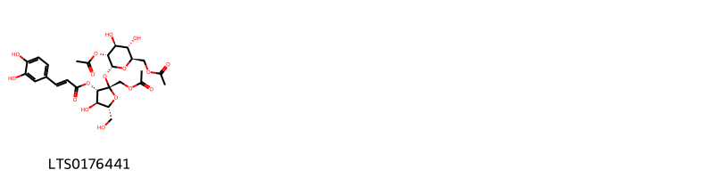{ width=100% }
    <figcaption>Hình ảnh cấu trúc hóa học của 1 hoạt chất thuộc nhóm Carboxylic acids and derivatives gồm ['(2s,3s,4r,5r)-2-{[(2r,3r,4s,5s,6r)-3-(acetyloxy)-6-[(acetyloxy)methyl]-4,5-dihydroxyoxan-2-yl]oxy}-2-[(acetyloxy)methyl]-4-hydroxy-5-(hydroxymethyl)oxolan-3-yl (2e)-3-(3,4-dihydroxyphenyl)prop-2-enoate (LTS0176441)'].</figcaption>
</figure>
#### Nhóm Cinnamic acids and derivatives
<figure markdown="span">
    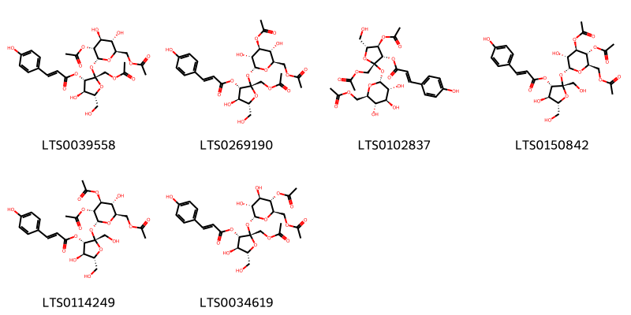{ width=100% }
    <figcaption>Hình ảnh cấu trúc hóa học của 6 hoạt chất thuộc nhóm Cinnamic acids and derivatives gồm ['(2s,3s,4r,5r)-2-{[(2r,3r,4s,5s,6r)-3-(acetyloxy)-6-[(acetyloxy)methyl]-4,5-dihydroxyoxan-2-yl]oxy}-2-[(acetyloxy)methyl]-4-hydroxy-5-(hydroxymethyl)oxolan-3-yl (2e)-3-(4-hydroxyphenyl)prop-2-enoate (LTS0039558)', '(2s,3s,4r,5r)-2-{[(2r,3r,4s,5r,6r)-4-(acetyloxy)-6-[(acetyloxy)methyl]-3,5-dihydroxyoxan-2-yl]oxy}-2-[(acetyloxy)methyl]-4-hydroxy-5-(hydroxymethyl)oxolan-3-yl (2e)-3-(4-hydroxyphenyl)prop-2-enoate (LTS0269190)', '(2s,3s,4r,5r)-4-(acetyloxy)-2-[(acetyloxy)methyl]-2-{[(2r,3r,4s,5s,6r)-6-[(acetyloxy)methyl]-3,4,5-trihydroxyoxan-2-yl]oxy}-5-(hydroxymethyl)oxolan-3-yl (2e)-3-(4-hydroxyphenyl)prop-2-enoate (LTS0102837)', '(2s,3s,4r,5r)-2-{[(2r,3r,4r,5r,6r)-4,5-bis(acetyloxy)-6-[(acetyloxy)methyl]-3-hydroxyoxan-2-yl]oxy}-4-hydroxy-2,5-bis(hydroxymethyl)oxolan-3-yl (2e)-3-(4-hydroxyphenyl)prop-2-enoate (LTS0150842)', '(2s,3s,4r,5r)-2-{[(2r,3r,4s,5r,6r)-3,4-bis(acetyloxy)-6-[(acetyloxy)methyl]-5-hydroxyoxan-2-yl]oxy}-4-hydroxy-2,5-bis(hydroxymethyl)oxolan-3-yl (2e)-3-(4-hydroxyphenyl)prop-2-enoate (LTS0114249)', '(2s,3s,4r,5r)-2-{[(2r,3r,4r,5s,6r)-5-(acetyloxy)-6-[(acetyloxy)methyl]-3,4-dihydroxyoxan-2-yl]oxy}-2-[(acetyloxy)methyl]-4-hydroxy-5-(hydroxymethyl)oxolan-3-yl (2e)-3-(4-hydroxyphenyl)prop-2-enoate (LTS0034619)'].</figcaption>
</figure>

---

### Dược dân tộc học

Danh sách các quốc gia có sử dụng *Prunus tomentosa* trong điều trị các bệnh. 

| Country   | Disease                        | Bệnh                                                                                                                                                                                                |
|:----------|:-------------------------------|:----------------------------------------------------------------------------------------------------------------------------------------------------------------------------------------------------|
| China     | Demulcent, Diuretic, Vermifuge | MYMEMORY WARNING: YOU USED ALL AVAILABLE FREE TRANSLATIONS FOR TODAY. NEXT AVAILABLE IN  11 HOURS 50 MINUTES 18 SECONDS VISIT HTTPS://MYMEMORY.TRANSLATED.NET/DOC/USAGELIMITS.PHP TO TRANSLATE MORE |
| Elsewhere | Diuretic                       | MYMEMORY WARNING: YOU USED ALL AVAILABLE FREE TRANSLATIONS FOR TODAY. NEXT AVAILABLE IN  11 HOURS 50 MINUTES 16 SECONDS VISIT HTTPS://MYMEMORY.TRANSLATED.NET/DOC/USAGELIMITS.PHP TO TRANSLATE MORE |

---

---
## Prunus virginiana
### Thông tin về thực vật

!!! info "Phân loại thực vật của *Prunus virginiana* từ GIBF:"
    - **Kingdom:** Plantae
    - **Phylum:** Tracheophyta
    - **Order:** Rosales
    - **Family:** Rosaceae
    - **Genus:** Prunus
    - **Species:** *Prunus virginiana*

 

| Label (VI)   | Label (EN)   | Scientific Name   | Descriptions (VI)   | Descriptions (EN)   | Also Known As (VI)   | Also Known As (EN)                                                                                 |
|:-------------|:-------------|:------------------|:--------------------|:--------------------|:---------------------|:---------------------------------------------------------------------------------------------------|
| N/A          | N/A          | Prunus virginiana | loài thực vật       | species of plant    | ['']                 | ['chokecherry', 'western chokecherry', 'bitterberry', 'black chokecherry', 'Virginia bird cherry'] |

#### Phân bố trên thế giới

**Từ CSDL GIBF** Belarus, Sweden, Czechia, Canada, Russian Federation, United States of America

#### Phân bố tại Việt Nam

**Từ CSDL GIBF**: Không có ghi nhận ở Việt Nam

---
### Thành phần hóa học
        
- Theo cơ sở dữ liệu lotus: Từ loài *Prunus virginiana* đã phân lập và xác định được 6 hoạt chất thuộc về các nhóm Organooxygen compounds, Flavonoids. 

|    | chemicalTaxonomyClassyfireClass   |   smiles_count |
|---:|:----------------------------------|---------------:|
|  0 | Flavonoids                        |              2 |
|  1 | Organooxygen compounds            |              4 |

#### Nhóm Flavonoids
<figure markdown="span">
    { width=100% }
    <figcaption>Hình ảnh cấu trúc hóa học của 2 hoạt chất thuộc nhóm Flavonoids gồm ['3-rutinosyl quercetin (LTS0032845)', 'rutin (LTS0042292)'].</figcaption>
</figure>
#### Nhóm Organooxygen compounds
<figure markdown="span">
    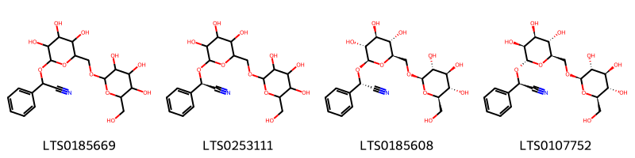{ width=100% }
    <figcaption>Hình ảnh cấu trúc hóa học của 4 hoạt chất thuộc nhóm Organooxygen compounds gồm ['amygdalin (LTS0185669)', 'amygdalin (LTS0253111)', '(2s)-2-phenyl-2-{[(2r,3r,4s,5s,6r)-3,4,5-trihydroxy-6-({[(2r,3r,4s,5s,6r)-3,4,5-trihydroxy-6-(hydroxymethyl)oxan-2-yl]oxy}methyl)oxan-2-yl]oxy}acetonitrile (LTS0185608)', '(2r)-2-phenyl-2-{[(2s,3s,4s,5s,6r)-3,4,5-trihydroxy-6-({[(2r,3r,4s,5s,6r)-3,4,5-trihydroxy-6-(hydroxymethyl)oxan-2-yl]oxy}methyl)oxan-2-yl]oxy}acetonitrile (LTS0107752)'].</figcaption>
</figure>

---

### Dược dân tộc học

Danh sách các quốc gia có sử dụng *Prunus virginiana* trong điều trị các bệnh. 

| Country        | Disease                                 | Bệnh                                                                                                                                                                                                |
|:---------------|:----------------------------------------|:----------------------------------------------------------------------------------------------------------------------------------------------------------------------------------------------------|
| US             | Intoxicant                              | MYMEMORY WARNING: YOU USED ALL AVAILABLE FREE TRANSLATIONS FOR TODAY. NEXT AVAILABLE IN  11 HOURS 49 MINUTES 33 SECONDS VISIT HTTPS://MYMEMORY.TRANSLATED.NET/DOC/USAGELIMITS.PHP TO TRANSLATE MORE |
| US(Amerindian) | Sedative                                | MYMEMORY WARNING: YOU USED ALL AVAILABLE FREE TRANSLATIONS FOR TODAY. NEXT AVAILABLE IN  11 HOURS 49 MINUTES 29 SECONDS VISIT HTTPS://MYMEMORY.TRANSLATED.NET/DOC/USAGELIMITS.PHP TO TRANSLATE MORE |
| US(Colonial)   | Vermifuge                               | MYMEMORY WARNING: YOU USED ALL AVAILABLE FREE TRANSLATIONS FOR TODAY. NEXT AVAILABLE IN  11 HOURS 49 MINUTES 25 SECONDS VISIT HTTPS://MYMEMORY.TRANSLATED.NET/DOC/USAGELIMITS.PHP TO TRANSLATE MORE |
| US(Flathead)   | Purgative, Vermifuge, Collyrium, Emetic | MYMEMORY WARNING: YOU USED ALL AVAILABLE FREE TRANSLATIONS FOR TODAY. NEXT AVAILABLE IN  11 HOURS 49 MINUTES 23 SECONDS VISIT HTTPS://MYMEMORY.TRANSLATED.NET/DOC/USAGELIMITS.PHP TO TRANSLATE MORE |

---

---
## Prunus virginianum
### Thông tin về thực vật

!!! info "Phân loại thực vật của *Prunus virginiana* từ GIBF:"
    - **Kingdom:** Plantae
    - **Phylum:** Tracheophyta
    - **Order:** Rosales
    - **Family:** Rosaceae
    - **Genus:** Prunus
    - **Species:** *Prunus virginiana*

 

| Label (VI)   | Label (EN)   | Scientific Name   | Descriptions (VI)   | Descriptions (EN)   | Also Known As (VI)   | Also Known As (EN)                                                                                 |
|:-------------|:-------------|:------------------|:--------------------|:--------------------|:---------------------|:---------------------------------------------------------------------------------------------------|
| N/A          | N/A          | Prunus virginiana | loài thực vật       | species of plant    | ['']                 | ['chokecherry', 'western chokecherry', 'bitterberry', 'black chokecherry', 'Virginia bird cherry'] |

#### Phân bố trên thế giới

**Từ CSDL GIBF** Belarus, Sweden, Czechia, Canada, Russian Federation, United States of America

#### Phân bố tại Việt Nam

**Từ CSDL GIBF**: Không có ghi nhận ở Việt Nam

---
### Thành phần hóa học
        
- Theo cơ sở dữ liệu lotus: Từ loài *Prunus virginiana* đã phân lập và xác định được Chưa có hoạt chất nào được phân lập. hoạt chất thuộc về các nhóm Không có hoạt chất nào được phân lập. 

Không có hình ảnh nào được tạo ra

---

### Dược dân tộc học

Danh sách các quốc gia có sử dụng *Prunus virginiana* trong điều trị các bệnh. 

| Country       | Disease   | Bệnh                                                                                                                                                                                                |
|:--------------|:----------|:----------------------------------------------------------------------------------------------------------------------------------------------------------------------------------------------------|
| US(Blackfoot) | Hemostat  | MYMEMORY WARNING: YOU USED ALL AVAILABLE FREE TRANSLATIONS FOR TODAY. NEXT AVAILABLE IN  11 HOURS 48 MINUTES 55 SECONDS VISIT HTTPS://MYMEMORY.TRANSLATED.NET/DOC/USAGELIMITS.PHP TO TRANSLATE MORE |

---

---
## Prunus yedoensis
### Thông tin về thực vật

!!! info "Phân loại thực vật của *Prunus yedoensis* từ GIBF:"
    - **Kingdom:** Plantae
    - **Phylum:** Tracheophyta
    - **Order:** Rosales
    - **Family:** Rosaceae
    - **Genus:** Prunus
    - **Species:** *Prunus yedoensis*

 

| Label (VI)   | Label (EN)   | Scientific Name   | Descriptions (VI)   | Descriptions (EN)   | Also Known As (VI)   | Also Known As (EN)                                                                                 |
|:-------------|:-------------|:------------------|:--------------------|:--------------------|:---------------------|:---------------------------------------------------------------------------------------------------|
| N/A          | N/A          | Prunus virginiana | loài thực vật       | species of plant    | ['']                 | ['chokecherry', 'western chokecherry', 'bitterberry', 'black chokecherry', 'Virginia bird cherry'] |

#### Phân bố trên thế giới

**Từ CSDL GIBF** nan, Japan, France, New Zealand, Germany, Canada, United States of America, China, Australia, Korea, Republic of

#### Phân bố tại Việt Nam

**Từ CSDL GIBF**: Không có ghi nhận ở Việt Nam

---
### Thành phần hóa học
        
- Theo cơ sở dữ liệu lotus: Từ loài *Prunus yedoensis* đã phân lập và xác định được 34 hoạt chất thuộc về các nhóm Organooxygen compounds, Flavonoids, Coumarins and derivatives, Prenol lipids, Cinnamic acids and derivatives, Benzene and substituted derivatives. 

|    | chemicalTaxonomyClassyfireClass     |   smiles_count |
|---:|:------------------------------------|---------------:|
|  0 | Benzene and substituted derivatives |              4 |
|  1 | Cinnamic acids and derivatives      |              1 |
|  2 | Coumarins and derivatives           |              1 |
|  3 | Flavonoids                          |              7 |
|  4 | Organooxygen compounds              |              4 |
|  5 | Prenol lipids                       |              9 |

#### Nhóm Benzene and substituted derivatives
<figure markdown="span">
    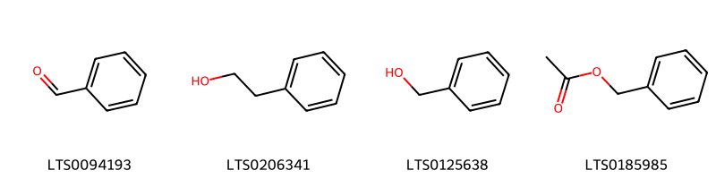{ width=100% }
    <figcaption>Hình ảnh cấu trúc hóa học của 4 hoạt chất thuộc nhóm Benzene and substituted derivatives gồm ['benzaldehyde (LTS0094193)', '2-phenyl-ethanol (LTS0206341)', 'benzyl alcohol (LTS0125638)', 'benzyl acetate (LTS0185985)'].</figcaption>
</figure>
#### Nhóm Cinnamic acids and derivatives
<figure markdown="span">
    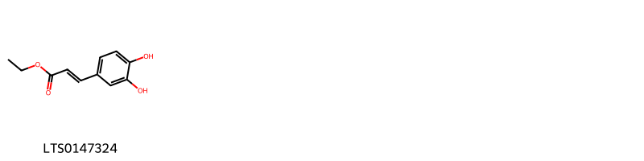{ width=100% }
    <figcaption>Hình ảnh cấu trúc hóa học của 1 hoạt chất thuộc nhóm Cinnamic acids and derivatives gồm ['ethyl caffeate (LTS0147324)'].</figcaption>
</figure>
#### Nhóm Coumarins and derivatives
<figure markdown="span">
    { width=100% }
    <figcaption>Hình ảnh cấu trúc hóa học của 1 hoạt chất thuộc nhóm Coumarins and derivatives gồm ['2h-1-benzopyran-2-one (LTS0069773)'].</figcaption>
</figure>
#### Nhóm Flavonoids
<figure markdown="span">
    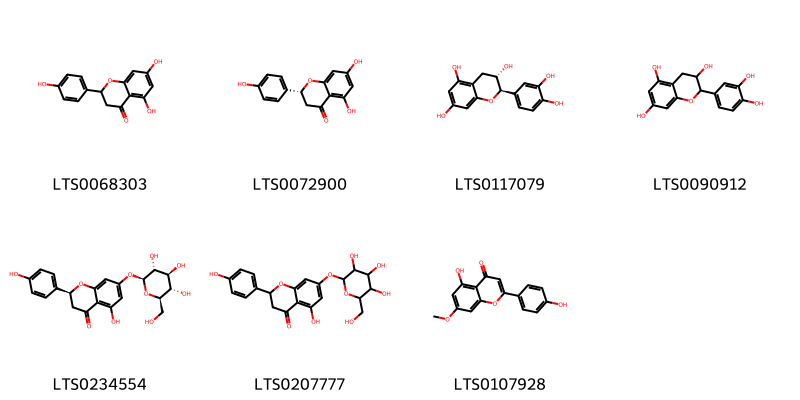{ width=100% }
    <figcaption>Hình ảnh cấu trúc hóa học của 7 hoạt chất thuộc nhóm Flavonoids gồm ['asahina (LTS0068303)', '(-)-naringenin (LTS0072900)', '(+)-catechol (LTS0117079)', 'catechol (LTS0090912)', 'prunin (LTS0234554)', '5-hydroxy-2-(4-hydroxyphenyl)-7-{[3,4,5-trihydroxy-6-(hydroxymethyl)oxan-2-yl]oxy}-2,3-dihydro-1-benzopyran-4-one (LTS0207777)', 'genkwanin (LTS0107928)'].</figcaption>
</figure>
#### Nhóm Organooxygen compounds
<figure markdown="span">
    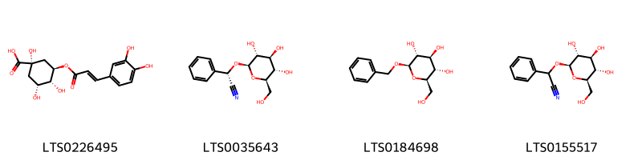{ width=100% }
    <figcaption>Hình ảnh cấu trúc hóa học của 4 hoạt chất thuộc nhóm Organooxygen compounds gồm ['chlorogenic acid (LTS0226495)', '(s)-prunasin (LTS0035643)', 'benzyl β-d-glucoside (LTS0184698)', 'prulaurasin (LTS0155517)'].</figcaption>
</figure>
#### Nhóm Prenol lipids
<figure markdown="span">
    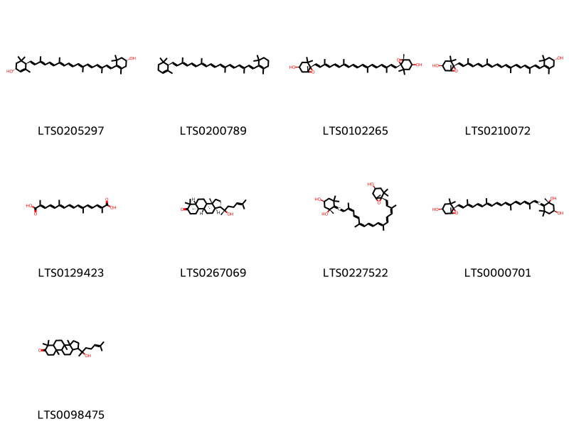{ width=100% }
    <figcaption>Hình ảnh cấu trúc hóa học của 9 hoạt chất thuộc nhóm Prenol lipids gồm ['carotenoid (LTS0205297)', '(+)-α-carotene (LTS0200789)', 'violaxanthin (LTS0102265)', 'antheraxanthin (LTS0210072)', 'crocetin (LTS0129423)', 'dipterocarpol (LTS0267069)', 'neoxanthin (LTS0227522)', 'neoxanthin (LTS0000701)', '1-(2-hydroxy-6-methylhept-5-en-2-yl)-3a,3b,6,6,9a-pentamethyl-dodecahydrocyclopenta[a]phenanthren-7-one (LTS0098475)'].</figcaption>
</figure>

---

### Dược dân tộc học

Danh sách các quốc gia có sử dụng *Prunus yedoensis* trong điều trị các bệnh. 

| Country   | Disease     | Bệnh                                                                                                                                                                                                |
|:----------|:------------|:----------------------------------------------------------------------------------------------------------------------------------------------------------------------------------------------------|
| Elsewhere | Antitussive | MYMEMORY WARNING: YOU USED ALL AVAILABLE FREE TRANSLATIONS FOR TODAY. NEXT AVAILABLE IN  11 HOURS 48 MINUTES 30 SECONDS VISIT HTTPS://MYMEMORY.TRANSLATED.NET/DOC/USAGELIMITS.PHP TO TRANSLATE MORE |
| Japan     | Antitussive | MYMEMORY WARNING: YOU USED ALL AVAILABLE FREE TRANSLATIONS FOR TODAY. NEXT AVAILABLE IN  11 HOURS 48 MINUTES 26 SECONDS VISIT HTTPS://MYMEMORY.TRANSLATED.NET/DOC/USAGELIMITS.PHP TO TRANSLATE MORE |

---

---
## Prunus zippeliana
### Thông tin về thực vật

!!! info "Phân loại thực vật của *Prunus zippeliana* từ GIBF:"
    - **Kingdom:** Plantae
    - **Phylum:** Tracheophyta
    - **Order:** Rosales
    - **Family:** Rosaceae
    - **Genus:** Prunus
    - **Species:** *Prunus zippeliana*

 

| Label (VI)   | Label (EN)   | Scientific Name   | Descriptions (VI)   | Descriptions (EN)   | Also Known As (VI)   | Also Known As (EN)   |
|:-------------|:-------------|:------------------|:--------------------|:--------------------|:---------------------|:---------------------|
| N/A          | N/A          | Prunus zippeliana | loài thực vật       | species of plant    | ['']                 | ['big leaf cherry']  |

#### Phân bố trên thế giới

**Từ CSDL GIBF** nan, Viet Nam, Thailand, Japan, Malaysia, China, Chinese Taipei

#### Phân bố tại Việt Nam

**Từ CSDL GIBF**: Thanh Hoa

---
### Thành phần hóa học
        
- Theo cơ sở dữ liệu lotus: Từ loài *Prunus zippeliana* đã phân lập và xác định được 41 hoạt chất thuộc về các nhóm Organooxygen compounds, Flavonoids, Prenol lipids, Fatty Acyls, Steroids and steroid derivatives, Benzene and substituted derivatives. 

|    | chemicalTaxonomyClassyfireClass     |   smiles_count |
|---:|:------------------------------------|---------------:|
|  0 | Benzene and substituted derivatives |              2 |
|  1 | Fatty Acyls                         |              1 |
|  2 | Flavonoids                          |              2 |
|  3 | Organooxygen compounds              |              6 |
|  4 | Prenol lipids                       |             16 |
|  5 | Steroids and steroid derivatives    |             14 |

#### Nhóm Benzene and substituted derivatives
<figure markdown="span">
    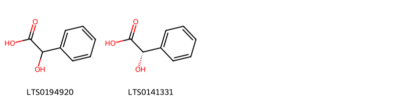{ width=100% }
    <figcaption>Hình ảnh cấu trúc hóa học của 2 hoạt chất thuộc nhóm Benzene and substituted derivatives gồm ['mandelic acid (LTS0194920)', '(s)-mandelic acid (LTS0141331)'].</figcaption>
</figure>
#### Nhóm Fatty Acyls
<figure markdown="span">
    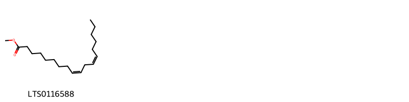{ width=100% }
    <figcaption>Hình ảnh cấu trúc hóa học của 1 hoạt chất thuộc nhóm Fatty Acyls gồm ['methyl linoleate (LTS0116588)'].</figcaption>
</figure>
#### Nhóm Flavonoids
<figure markdown="span">
    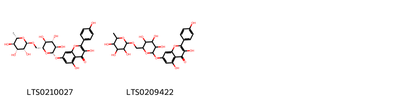{ width=100% }
    <figcaption>Hình ảnh cấu trúc hóa học của 2 hoạt chất thuộc nhóm Flavonoids gồm ['3,5-dihydroxy-2-(4-hydroxyphenyl)-7-{[(2s,3r,4s,5s,6r)-3,4,5-trihydroxy-6-({[(2r,3r,4r,5r,6s)-3,4,5-trihydroxy-6-methyloxan-2-yl]oxy}methyl)oxan-2-yl]oxy}chromen-4-one (LTS0210027)', '3,5-dihydroxy-2-(4-hydroxyphenyl)-7-[(3,4,5-trihydroxy-6-{[(3,4,5-trihydroxy-6-methyloxan-2-yl)oxy]methyl}oxan-2-yl)oxy]chromen-4-one (LTS0209422)'].</figcaption>
</figure>
#### Nhóm Organooxygen compounds
<figure markdown="span">
    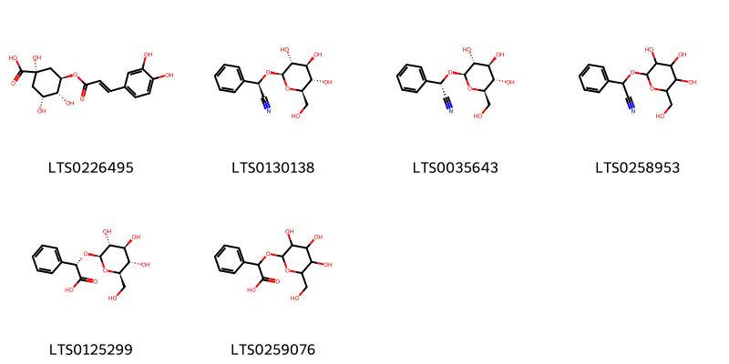{ width=100% }
    <figcaption>Hình ảnh cấu trúc hóa học của 6 hoạt chất thuộc nhóm Organooxygen compounds gồm ['chlorogenic acid (LTS0226495)', 'prunasin (LTS0130138)', '(s)-prunasin (LTS0035643)', '2-phenyl-2-{[3,4,5-trihydroxy-6-(hydroxymethyl)oxan-2-yl]oxy}acetonitrile (LTS0258953)', '(s)-phenyl({[(2s,3r,4s,5s,6r)-3,4,5-trihydroxy-6-(hydroxymethyl)oxan-2-yl]oxy})acetic acid (LTS0125299)', 'phenyl({[3,4,5-trihydroxy-6-(hydroxymethyl)oxan-2-yl]oxy})acetic acid (LTS0259076)'].</figcaption>
</figure>
#### Nhóm Prenol lipids
<figure markdown="span">
    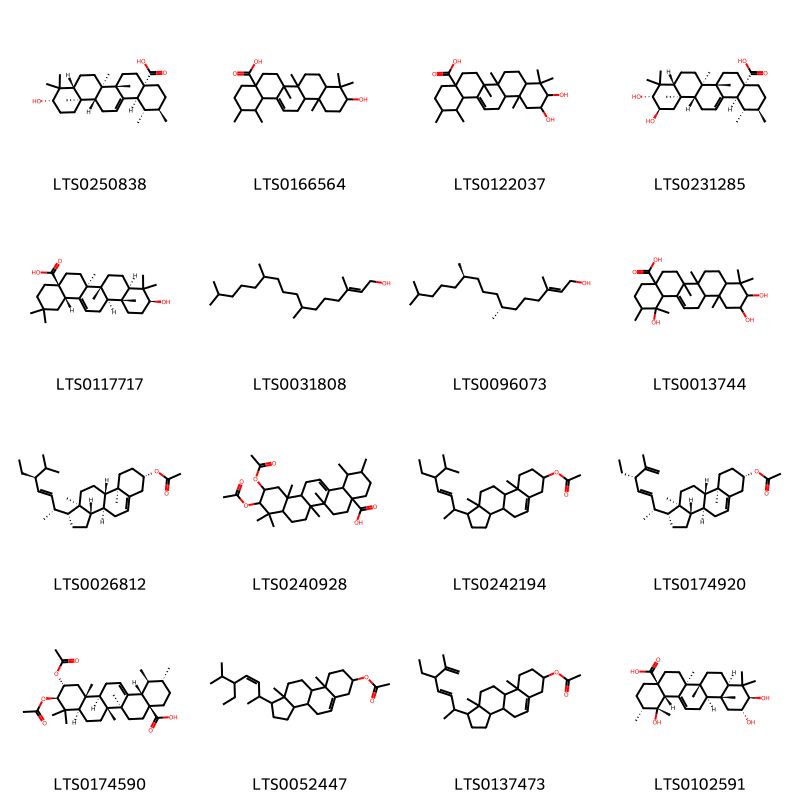{ width=100% }
    <figcaption>Hình ảnh cấu trúc hóa học của 16 hoạt chất thuộc nhóm Prenol lipids gồm ['ursolic acid (LTS0250838)', '10-hydroxy-1,2,6a,6b,9,9,12a-heptamethyl-2,3,4,5,6,7,8,8a,10,11,12,12b,13,14b-tetradecahydro-1h-picene-4a-carboxylic acid (LTS0166564)', '10,11-dihydroxy-1,2,6a,6b,9,9,12a-heptamethyl-2,3,4,5,6,7,8,8a,10,11,12,12b,13,14b-tetradecahydro-1h-picene-4a-carboxylic acid (LTS0122037)', 'corosolic acid (LTS0231285)', 'oleanolic acid (LTS0117717)', 'phytol (LTS0031808)', 'phytol (LTS0096073)', '1,10,11-trihydroxy-1,2,6a,6b,9,9,12a-heptamethyl-2,3,4,5,6,7,8,8a,10,11,12,12b,13,14b-tetradecahydropicene-4a-carboxylic acid (LTS0013744)', 'stigmasteryl acetate (LTS0026812)', '10,11-bis(acetyloxy)-1,2,6a,6b,9,9,12a-heptamethyl-2,3,4,5,6,7,8,8a,10,11,12,12b,13,14b-tetradecahydro-1h-picene-4a-carboxylic acid (LTS0240928)', '1-(5-ethyl-6-methylhept-3-en-2-yl)-9a,11a-dimethyl-1h,2h,3h,3ah,3bh,4h,6h,7h,8h,9h,9bh,10h,11h-cyclopenta[a]phenanthren-7-yl acetate (LTS0242194)', '(1r,3as,3bs,7s,9ar,9bs,11ar)-1-[(2r,3e,5s)-5-ethyl-6-methylhepta-3,6-dien-2-yl]-9a,11a-dimethyl-1h,2h,3h,3ah,3bh,4h,6h,7h,8h,9h,9bh,10h,11h-cyclopenta[a]phenanthren-7-yl acetate (LTS0174920)', '(1s,2r,4as,6as,6br,8ar,10r,11r,12ar,12br,14bs)-10,11-bis(acetyloxy)-1,2,6a,6b,9,9,12a-heptamethyl-2,3,4,5,6,7,8,8a,10,11,12,12b,13,14b-tetradecahydro-1h-picene-4a-carboxylic acid (LTS0174590)', '1-[(3z)-5-ethyl-6-methylhept-3-en-2-yl]-9a,11a-dimethyl-1h,2h,3h,3ah,3bh,4h,6h,7h,8h,9h,9bh,10h,11h-cyclopenta[a]phenanthren-7-yl acetate (LTS0052447)', '1-(5-ethyl-6-methylhepta-3,6-dien-2-yl)-9a,11a-dimethyl-1h,2h,3h,3ah,3bh,4h,6h,7h,8h,9h,9bh,10h,11h-cyclopenta[a]phenanthren-7-yl acetate (LTS0137473)', 'tormentic acid (LTS0102591)'].</figcaption>
</figure>
#### Nhóm Steroids and steroid derivatives
<figure markdown="span">
    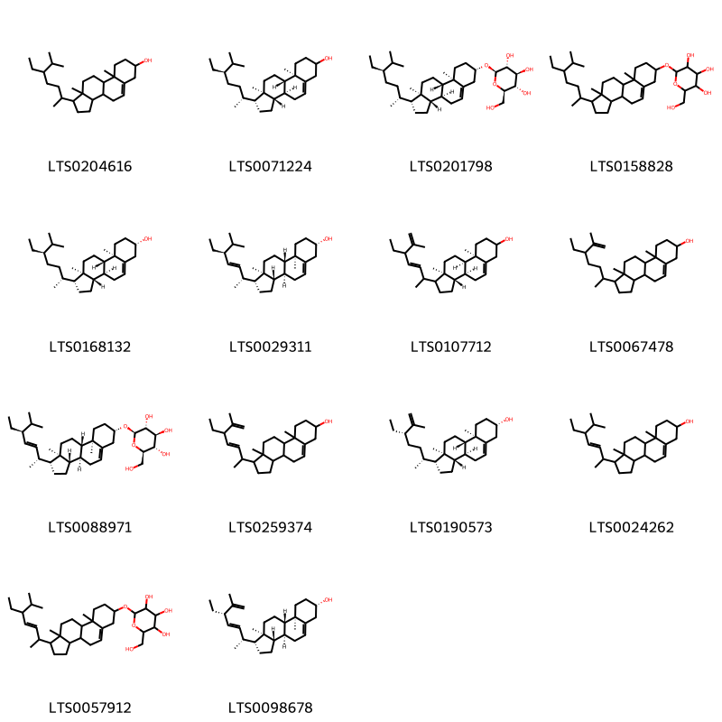{ width=100% }
    <figcaption>Hình ảnh cấu trúc hóa học của 14 hoạt chất thuộc nhóm Steroids and steroid derivatives gồm ['stigmast-5-en-3-ol, (3β)- (LTS0204616)', 'stigmast-5-en-3-ol (LTS0071224)', 'sitogluside (LTS0201798)', '2-{[1-(5-ethyl-6-methylheptan-2-yl)-9a,11a-dimethyl-1h,2h,3h,3ah,3bh,4h,6h,7h,8h,9h,9bh,10h,11h-cyclopenta[a]phenanthren-7-yl]oxy}-6-(hydroxymethyl)oxane-3,4,5-triol (LTS0158828)', 'sitosterol (LTS0168132)', 'phytosterol (LTS0029311)', '(3as,3bs,9ar,9br,11ar)-1-(5-ethyl-6-methylhepta-3,6-dien-2-yl)-9a,11a-dimethyl-1h,2h,3h,3ah,3bh,4h,6h,7h,8h,9h,9bh,10h,11h-cyclopenta[a]phenanthren-7-ol (LTS0107712)', '1-(5-ethyl-6-methylhept-6-en-2-yl)-9a,11a-dimethyl-1h,2h,3h,3ah,3bh,4h,6h,7h,8h,9h,9bh,10h,11h-cyclopenta[a]phenanthren-7-ol (LTS0067478)', '(2r,3r,4s,5s,6r)-2-{[(1r,3as,3bs,7s,9ar,9bs,11ar)-1-[(2r,3e,5s)-5-ethyl-6-methylhept-3-en-2-yl]-9a,11a-dimethyl-1h,2h,3h,3ah,3bh,4h,6h,7h,8h,9h,9bh,10h,11h-cyclopenta[a]phenanthren-7-yl]oxy}-6-(hydroxymethyl)oxane-3,4,5-triol (LTS0088971)', '1-(5-ethyl-6-methylhepta-3,6-dien-2-yl)-9a,11a-dimethyl-1h,2h,3h,3ah,3bh,4h,6h,7h,8h,9h,9bh,10h,11h-cyclopenta[a]phenanthren-7-ol (LTS0259374)', '(1r,3as,3bs,7s,9ar,9bs,11ar)-1-[(2r,5s)-5-ethyl-6-methylhept-6-en-2-yl]-9a,11a-dimethyl-1h,2h,3h,3ah,3bh,4h,6h,7h,8h,9h,9bh,10h,11h-cyclopenta[a]phenanthren-7-ol (LTS0190573)', 'stigmasterol (LTS0024262)', '2-{[1-(5-ethyl-6-methylhept-3-en-2-yl)-9a,11a-dimethyl-1h,2h,3h,3ah,3bh,4h,6h,7h,8h,9h,9bh,10h,11h-cyclopenta[a]phenanthren-7-yl]oxy}-6-(hydroxymethyl)oxane-3,4,5-triol (LTS0057912)', '(1r,3as,3bs,7s,9ar,9bs,11ar)-1-[(2r,3e,5s)-5-ethyl-6-methylhepta-3,6-dien-2-yl]-9a,11a-dimethyl-1h,2h,3h,3ah,3bh,4h,6h,7h,8h,9h,9bh,10h,11h-cyclopenta[a]phenanthren-7-ol (LTS0098678)'].</figcaption>
</figure>

---

### Dược dân tộc học

Danh sách các quốc gia có sử dụng *Prunus zippeliana* trong điều trị các bệnh. 

| Country   | Disease     | Bệnh                                                                                                                                                                                                |
|:----------|:------------|:----------------------------------------------------------------------------------------------------------------------------------------------------------------------------------------------------|
| Elsewhere | Antitussive | MYMEMORY WARNING: YOU USED ALL AVAILABLE FREE TRANSLATIONS FOR TODAY. NEXT AVAILABLE IN  11 HOURS 47 MINUTES 57 SECONDS VISIT HTTPS://MYMEMORY.TRANSLATED.NET/DOC/USAGELIMITS.PHP TO TRANSLATE MORE |

---

# Chi Pygeum

??? note "Danh sách các dược liệu thuộc chi"
    
	 - *Pygeum gardneri*

---
## Pygeum gardneri
### Thông tin về thực vật

!!! info "Phân loại thực vật của *Prunus ceylanica* từ GIBF:"
    - **Kingdom:** Plantae
    - **Phylum:** Tracheophyta
    - **Order:** Rosales
    - **Family:** Rosaceae
    - **Genus:** Prunus
    - **Species:** *Prunus ceylanica*

 

| Label (VI)   | Label (EN)   | Scientific Name   | Descriptions (VI)   | Descriptions (EN)   | Also Known As (VI)   | Also Known As (EN)   |
|:-------------|:-------------|:------------------|:--------------------|:--------------------|:---------------------|:---------------------|
| N/A          | N/A          | Prunus zippeliana | loài thực vật       | species of plant    | ['']                 | ['big leaf cherry']  |

#### Phân bố trên thế giới

**Từ CSDL GIBF** nan, Viet Nam, Thailand, Japan, Malaysia, China, Chinese Taipei

#### Phân bố tại Việt Nam

**Từ CSDL GIBF**: Thanh Hoa

---
### Thành phần hóa học
        
- Theo cơ sở dữ liệu lotus: Từ loài *Prunus ceylanica* đã phân lập và xác định được Chưa có hoạt chất nào được phân lập. hoạt chất thuộc về các nhóm Không có hoạt chất nào được phân lập. 

Không có hình ảnh nào được tạo ra

---

### Dược dân tộc học

Danh sách các quốc gia có sử dụng *Prunus ceylanica* trong điều trị các bệnh. 

| Country   | Disease   | Bệnh                                                                                                                                                                                                |
|:----------|:----------|:----------------------------------------------------------------------------------------------------------------------------------------------------------------------------------------------------|
| India     | Piscicide | MYMEMORY WARNING: YOU USED ALL AVAILABLE FREE TRANSLATIONS FOR TODAY. NEXT AVAILABLE IN  11 HOURS 47 MINUTES 17 SECONDS VISIT HTTPS://MYMEMORY.TRANSLATED.NET/DOC/USAGELIMITS.PHP TO TRANSLATE MORE |

---

# Chi Aphanes

??? note "Danh sách các dược liệu thuộc chi"
    
	 - *Aphanes arvensis*

---
## Aphanes arvensis
### Thông tin về thực vật

!!! info "Phân loại thực vật của *Aphanes arvensis* từ GIBF:"
    - **Kingdom:** Plantae
    - **Phylum:** Tracheophyta
    - **Order:** Rosales
    - **Family:** Rosaceae
    - **Genus:** Aphanes
    - **Species:** *Aphanes arvensis*

 

| Label (VI)   | Label (EN)   | Scientific Name   | Descriptions (VI)   | Descriptions (EN)   | Also Known As (VI)   | Also Known As (EN)   |
|:-------------|:-------------|:------------------|:--------------------|:--------------------|:---------------------|:---------------------|
| N/A          | N/A          | Aphanes arvensis  | loài thực vật       | species of plant    | ['']                 | ['parsley-piert']    |

#### Phân bố trên thế giới

**Từ CSDL GIBF** Switzerland, United Kingdom of Great Britain and Northern Ireland, Denmark, Sweden, Luxembourg, France, Germany, United States of America, Italy, Austria, Greece, Belgium, Netherlands

#### Phân bố tại Việt Nam

**Từ CSDL GIBF**: Không có ghi nhận ở Việt Nam

---
### Thành phần hóa học
        
- Theo cơ sở dữ liệu lotus: Từ loài *Aphanes arvensis* đã phân lập và xác định được Chưa có hoạt chất nào được phân lập. hoạt chất thuộc về các nhóm Không có hoạt chất nào được phân lập. 

Không có hình ảnh nào được tạo ra

---

### Dược dân tộc học

Danh sách các quốc gia có sử dụng *Aphanes arvensis* trong điều trị các bệnh. 

| Country   | Disease   | Bệnh                                                                                                                                                                                                |
|:----------|:----------|:----------------------------------------------------------------------------------------------------------------------------------------------------------------------------------------------------|
| ain       | Tonic     | MYMEMORY WARNING: YOU USED ALL AVAILABLE FREE TRANSLATIONS FOR TODAY. NEXT AVAILABLE IN  11 HOURS 46 MINUTES 55 SECONDS VISIT HTTPS://MYMEMORY.TRANSLATED.NET/DOC/USAGELIMITS.PHP TO TRANSLATE MORE |

---

# Chi Duchesnea

??? note "Danh sách các dược liệu thuộc chi"
    
	 - *Duchesnea indica*

---
## Duchesnea indica
### Thông tin về thực vật

!!! info "Phân loại thực vật của *Potentilla indica* từ GIBF:"
    - **Kingdom:** Plantae
    - **Phylum:** Tracheophyta
    - **Order:** Rosales
    - **Family:** Rosaceae
    - **Genus:** Potentilla
    - **Species:** *Potentilla indica*

 

| Label (VI)   | Label (EN)   | Scientific Name   | Descriptions (VI)   | Descriptions (EN)   | Also Known As (VI)   | Also Known As (EN)   |
|:-------------|:-------------|:------------------|:--------------------|:--------------------|:---------------------|:---------------------|
| N/A          | N/A          | Duchesnea indica  | loài thực vật       | species of plant    | ['']                 | ['']                 |

#### Phân bố trên thế giới

**Từ CSDL GIBF** Switzerland, Liechtenstein, Portugal, France, Spain, Germany, Italy, Austria, Belgium, Korea, Republic of

#### Phân bố tại Việt Nam

**Từ CSDL GIBF**: Không có ghi nhận ở Việt Nam

---
### Thành phần hóa học
        
- Theo cơ sở dữ liệu lotus: Từ loài *Potentilla indica* đã phân lập và xác định được 2 hoạt chất thuộc về các nhóm Tannins. 

|    | chemicalTaxonomyClassyfireClass   |   smiles_count |
|---:|:----------------------------------|---------------:|
|  0 | Tannins                           |              2 |

#### Nhóm Tannins
<figure markdown="span">
    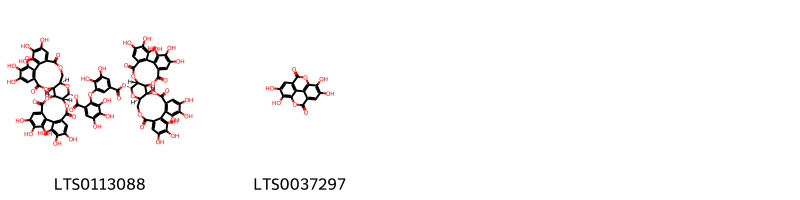{ width=100% }
    <figcaption>Hình ảnh cấu trúc hóa học của 2 hoạt chất thuộc nhóm Tannins gồm ['(1r,2s,19r,20r,22r)-7,8,9,12,13,14,28,29,30,33,34,35-dodecahydroxy-4,17,25,38-tetraoxo-3,18,21,24,39-pentaoxaheptacyclo[20.17.0.0²,¹⁹.0⁵,¹⁰.0¹¹,¹⁶.0²⁶,³¹.0³²,³⁷]nonatriaconta-5,7,9,11(16),12,14,26,28,30,32(37),33,35-dodecaen-20-yl 2-[5-({[(1r,2s,19r,20r,22r)-7,8,9,12,13,14,28,29,30,33,34,35-dodecahydroxy-4,17,25,38-tetraoxo-3,18,21,24,39-pentaoxaheptacyclo[20.17.0.0²,¹⁹.0⁵,¹⁰.0¹¹,¹⁶.0²⁶,³¹.0³²,³⁷]nonatriaconta-5,7,9,11(16),12,14,26,28,30,32(37),33,35-dodecaen-20-yl]oxy}carbonyl)-2,3-dihydroxyphenoxy]-3,4,5-trihydroxybenzoate (LTS0113088)', 'ellagic acid (LTS0037297)'].</figcaption>
</figure>

---

### Dược dân tộc học

Danh sách các quốc gia có sử dụng *Potentilla indica* trong điều trị các bệnh. 

| Country   | Disease             | Bệnh                                                                                                                                                                                                |
|:----------|:--------------------|:----------------------------------------------------------------------------------------------------------------------------------------------------------------------------------------------------|
| China     | Poison, Refrigerant | MYMEMORY WARNING: YOU USED ALL AVAILABLE FREE TRANSLATIONS FOR TODAY. NEXT AVAILABLE IN  11 HOURS 46 MINUTES 34 SECONDS VISIT HTTPS://MYMEMORY.TRANSLATED.NET/DOC/USAGELIMITS.PHP TO TRANSLATE MORE |

---

# Chi Malus

??? note "Danh sách các dược liệu thuộc chi"
    
	 - *Malus sylvestris*
	 - *Malus sylvestrus*

---
## Malus sylvestris
### Thông tin về thực vật

!!! info "Phân loại thực vật của *Malus sylvestris* từ GIBF:"
    - **Kingdom:** Plantae
    - **Phylum:** Tracheophyta
    - **Order:** Rosales
    - **Family:** Rosaceae
    - **Genus:** Malus
    - **Species:** *Malus sylvestris*

 

| Label (VI)   | Label (EN)   | Scientific Name   | Descriptions (VI)   | Descriptions (EN)   | Also Known As (VI)   | Also Known As (EN)                    |
|:-------------|:-------------|:------------------|:--------------------|:--------------------|:---------------------|:--------------------------------------|
| N/A          | N/A          | Malus sylvestris  | loài thực vật       | species of plant    | ['']                 | ['crab apple', 'European crab apple'] |

#### Phân bố trên thế giới

**Từ CSDL GIBF** Denmark, Spain, Germany, Austria, Sweden, Poland, Montenegro, Belgium, Netherlands, Belarus, Lithuania, Hungary, Estonia, Ireland, Norway, Switzerland, United Kingdom of Great Britain and Northern Ireland, France, New Zealand, Russian Federation, United States of America, Italy, Croatia, Ukraine

#### Phân bố tại Việt Nam

**Từ CSDL GIBF**: Không có ghi nhận ở Việt Nam

---
### Thành phần hóa học
        
- Theo cơ sở dữ liệu lotus: Từ loài *Malus sylvestris* đã phân lập và xác định được 93 hoạt chất thuộc về các nhóm Organooxygen compounds, Flavonoids, Nucleoside and nucleotide analogues, Saturated hydrocarbons, Cinnamyl alcohols, Prenol lipids, Carboxylic acids and derivatives, Fatty Acyls, Linear 1,3-diarylpropanoids, Phenols, Heteroaromatic compounds, Phenylpropanoic acids, Cinnamic acids and derivatives, Benzene and substituted derivatives, Cinnamaldehydes. 

|    | chemicalTaxonomyClassyfireClass     |   smiles_count |
|---:|:------------------------------------|---------------:|
|  0 | Benzene and substituted derivatives |              8 |
|  1 | Carboxylic acids and derivatives    |             10 |
|  2 | Cinnamaldehydes                     |              2 |
|  3 | Cinnamic acids and derivatives      |              4 |
|  4 | Cinnamyl alcohols                   |              1 |
|  5 | Fatty Acyls                         |              8 |
|  6 | Flavonoids                          |             29 |
|  7 | Heteroaromatic compounds            |              1 |
|  8 | Linear 1,3-diarylpropanoids         |              1 |
|  9 | Nucleoside and nucleotide analogues |              1 |
| 10 | Organooxygen compounds              |              3 |
| 11 | Phenols                             |              3 |
| 12 | Phenylpropanoic acids               |              1 |
| 13 | Prenol lipids                       |             18 |
| 14 | Saturated hydrocarbons              |              3 |

#### Nhóm Benzene and substituted derivatives
<figure markdown="span">
    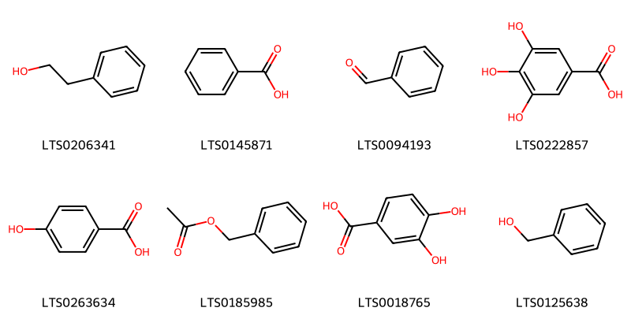{ width=100% }
    <figcaption>Hình ảnh cấu trúc hóa học của 8 hoạt chất thuộc nhóm Benzene and substituted derivatives gồm ['2-phenyl-ethanol (LTS0206341)', 'benzoic acid (LTS0145871)', 'benzaldehyde (LTS0094193)', 'galop (LTS0222857)', 'p-hydroxybenzoic acid (LTS0263634)', 'benzyl acetate (LTS0185985)', '3,4-dihydroxybenzoic acid (LTS0018765)', 'benzyl alcohol (LTS0125638)'].</figcaption>
</figure>
#### Nhóm Carboxylic acids and derivatives
<figure markdown="span">
    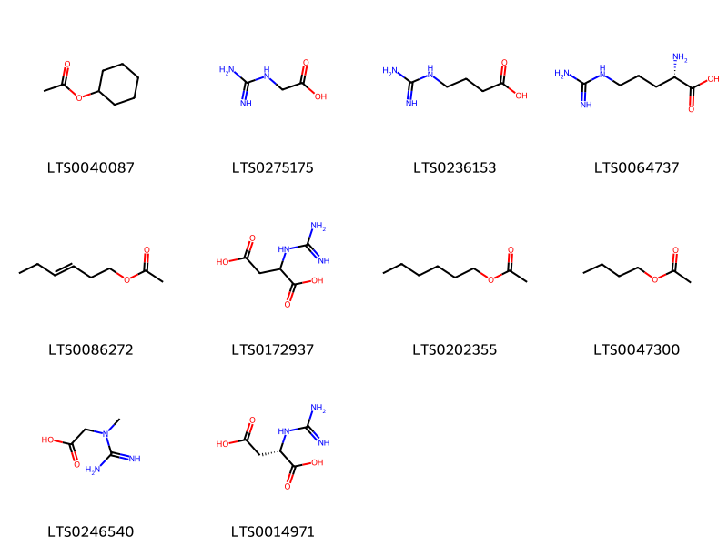{ width=100% }
    <figcaption>Hình ảnh cấu trúc hóa học của 10 hoạt chất thuộc nhóm Carboxylic acids and derivatives gồm ['cyclohexyl acetate (LTS0040087)', 'glycocyamine (LTS0275175)', '4-guanidinobutyric acid (LTS0236153)', 'l-arginine (LTS0064737)', '3-hexenyl acetate (LTS0086272)', 'guanidinosuccinic acid (LTS0172937)', 'hexyl acetate (LTS0202355)', 'butyl acetate (LTS0047300)', 'creatine (LTS0246540)', 'n-amidino-l-aspartic acid (LTS0014971)'].</figcaption>
</figure>
#### Nhóm Cinnamaldehydes
<figure markdown="span">
    { width=100% }
    <figcaption>Hình ảnh cấu trúc hóa học của 2 hoạt chất thuộc nhóm Cinnamaldehydes gồm ['3-phenyl-2-propenal (LTS0204346)', 'cinnamal (LTS0271313)'].</figcaption>
</figure>
#### Nhóm Cinnamic acids and derivatives
<figure markdown="span">
    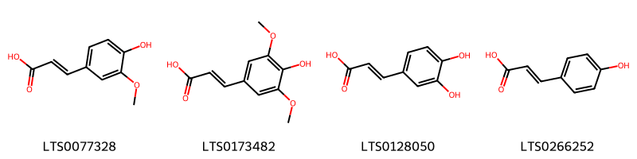{ width=100% }
    <figcaption>Hình ảnh cấu trúc hóa học của 4 hoạt chất thuộc nhóm Cinnamic acids and derivatives gồm ['ferulic acid (LTS0077328)', 'sinapinate (LTS0173482)', '3,4-dihydroxycinnamic acid (LTS0128050)', 'para-coumaric acid (LTS0266252)'].</figcaption>
</figure>
#### Nhóm Cinnamyl alcohols
<figure markdown="span">
    { width=100% }
    <figcaption>Hình ảnh cấu trúc hóa học của 1 hoạt chất thuộc nhóm Cinnamyl alcohols gồm ['cinnamyl alcohol (LTS0010678)'].</figcaption>
</figure>
#### Nhóm Fatty Acyls
<figure markdown="span">
    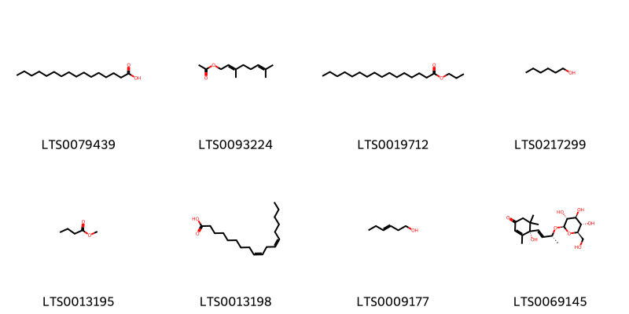{ width=100% }
    <figcaption>Hình ảnh cấu trúc hóa học của 8 hoạt chất thuộc nhóm Fatty Acyls gồm ['palmitic acid (LTS0079439)', 'geranyl acetate (LTS0093224)', 'hexadecanoic acid, propylester (LTS0019712)', 'hexanol (LTS0217299)', 'methyl butyrate (LTS0013195)', 'linoleic (LTS0013198)', '3-hexenol (LTS0009177)', '(4s)-4-hydroxy-3,5,5-trimethyl-4-[(1e,3r)-3-{[(2r,3r,4s,5s,6r)-3,4,5-trihydroxy-6-(hydroxymethyl)oxan-2-yl]oxy}but-1-en-1-yl]cyclohex-2-en-1-one (LTS0069145)'].</figcaption>
</figure>
#### Nhóm Flavonoids
<figure markdown="span">
    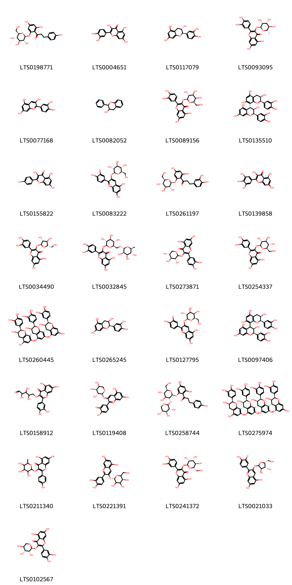{ width=100% }
    <figcaption>Hình ảnh cấu trúc hóa học của 29 hoạt chất thuộc nhóm Flavonoids gồm ['phlorizin (LTS0198771)', 'quercetin (LTS0004651)', '(+)-catechol (LTS0117079)', 'quercitrin (LTS0093095)', 'cyanidin (LTS0077168)', 'favan-3-ol (LTS0082052)', 'hyperoside (LTS0089156)', '(2r,3r,4r)-2-(3,4-dihydroxyphenyl)-4-[(2r,3r)-2-(3,4-dihydroxyphenyl)-3,5,7-trihydroxy-3,4-dihydro-2h-1-benzopyran-8-yl]-3,4-dihydro-2h-1-benzopyran-3,5,7-triol (LTS0135510)', 'kaempherol (LTS0155822)', '5,7-dihydroxy-2-(4-hydroxy-3-oxidophenyl)-3-{[(2s,3r,4s,5s,6r)-3,4,5-trihydroxy-6-(hydroxymethyl)oxan-2-yl]oxy}-1λ⁴-chromen-1-ylium (LTS0083222)', '1-(2,4-dihydroxy-6-{[(2s,3r,4s,5s,6r)-3,4,5-trihydroxy-6-(hydroxymethyl)oxan-2-yl]oxy}phenyl)-3-(3,4-dihydroxyphenyl)propan-1-one (LTS0261197)', 'myricetin (LTS0139858)', 'avicularin (LTS0034490)', '3-rutinosyl quercetin (LTS0032845)', '2-(3,4-dihydroxyphenyl)-5,7-dihydroxy-3-{[(3r,4s,5r)-3,4,5-trihydroxyoxan-2-yl]oxy}chromen-4-one (LTS0273871)', 'isoquercetin (LTS0254337)', 'procyanidin c1 (LTS0260445)', 'ent-epicatechin (LTS0265245)', '5,7-dihydroxy-2-(4-hydroxy-3-oxidophenyl)-3-{[(2s,3r,4s,5r,6r)-3,4,5-trihydroxy-6-(hydroxymethyl)oxan-2-yl]oxy}-1λ⁴-chromen-1-ylium (LTS0127795)', '(2r,3r)-2-(3,4-dihydroxyphenyl)-4-[(2r,3r)-2-(3,4-dihydroxyphenyl)-3,5,7-trihydroxy-3,4-dihydro-2h-1-benzopyran-8-yl]-3,4-dihydro-2h-1-benzopyran-3,5,7-triol (LTS0097406)', '5-{[2-(3,4-dihydroxyphenyl)-5,7-dihydroxy-4-oxochromen-3-yl]oxy}-2,3,4-trihydroxypentanal (LTS0158912)', '5,7-dihydroxy-2-(4-hydroxy-3-oxidophenyl)-3-{[(2s,3r,4s,5s)-3,4,5-trihydroxyoxan-2-yl]oxy}-1λ⁴-chromen-1-ylium (LTS0119408)', '1-(2-{[(2s,3r,4s,5s,6r)-4,5-dihydroxy-6-(hydroxymethyl)-3-{[(2s,3r,4s,5r)-3,4,5-trihydroxyoxan-2-yl]oxy}oxan-2-yl]oxy}-4,6-dihydroxyphenyl)-3-(4-hydroxyphenyl)propan-1-one (LTS0258744)', '(2r,3r,4r)-2-(3,4-dihydroxyphenyl)-8-[(2r,3r,4r)-2-(3,4-dihydroxyphenyl)-3,5,7-trihydroxy-3,4-dihydro-2h-1-benzopyran-4-yl]-4-[(2r,3r,4s)-2-(3,4-dihydroxyphenyl)-4-[(2r,3r)-2-(3,4-dihydroxyphenyl)-3,5,7-trihydroxy-3,4-dihydro-2h-1-benzopyran-8-yl]-3,5,7-trihydroxy-3,4-dihydro-2h-1-benzopyran-8-yl]-3,4-dihydro-2h-1-benzopyran-3,5,7-triol (LTS0275974)', '5,7-dihydroxy-2-(4-hydroxyphenyl)-3-[(3,4,5-trihydroxy-6-methyloxan-2-yl)oxy]chromen-4-one (LTS0211340)', 'chrysanthemin (LTS0221391)', '2-(3,4-dihydroxyphenyl)-5,7-dihydroxy-3-{[(2s,3r,4r,5r,6s)-3,4,5-trihydroxy-6-(hydroxymethyl)oxan-2-yl]oxy}chromen-4-one (LTS0241372)', '3-{[(3r,4r,5r)-3,4-dihydroxy-5-(hydroxymethyl)oxolan-2-yl]oxy}-5,7-dihydroxy-2-(4-hydroxy-3-oxidophenyl)-1λ⁴-chromen-1-ylium (LTS0021033)', '2-(3,4-dihydroxyphenyl)-5,7-dihydroxy-3-{[(2s,3r,4r,5s)-3,4,5-trihydroxyoxan-2-yl]oxy}chromen-4-one (LTS0102567)'].</figcaption>
</figure>
#### Nhóm Heteroaromatic compounds
<figure markdown="span">
    { width=100% }
    <figcaption>Hình ảnh cấu trúc hóa học của 1 hoạt chất thuộc nhóm Heteroaromatic compounds gồm ['perillene (LTS0083458)'].</figcaption>
</figure>
#### Nhóm Linear 1_3-diarylpropanoids
<figure markdown="span">
    { width=100% }
    <figcaption>Hình ảnh cấu trúc hóa học của Không tìm thấy chú thích hoạt chất thuộc nhóm Linear 1_3-diarylpropanoids gồm Không tìm thấy chú thích.</figcaption>
</figure>
#### Nhóm Nucleoside and nucleotide analogues
<figure markdown="span">
    { width=100% }
    <figcaption>Hình ảnh cấu trúc hóa học của 1 hoạt chất thuộc nhóm Nucleoside and nucleotide analogues gồm ['tryptophan n-glucoside (LTS0023633)'].</figcaption>
</figure>
#### Nhóm Organooxygen compounds
<figure markdown="span">
    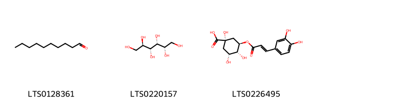{ width=100% }
    <figcaption>Hình ảnh cấu trúc hóa học của 3 hoạt chất thuộc nhóm Organooxygen compounds gồm ['decanal (LTS0128361)', 'd-sorbitol (LTS0220157)', 'chlorogenic acid (LTS0226495)'].</figcaption>
</figure>
#### Nhóm Phenols
<figure markdown="span">
    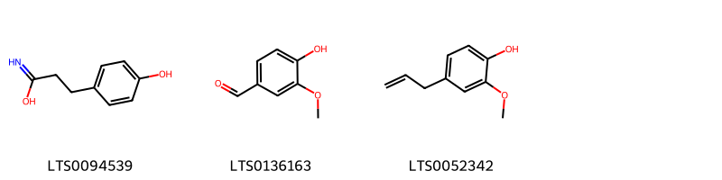{ width=100% }
    <figcaption>Hình ảnh cấu trúc hóa học của 3 hoạt chất thuộc nhóm Phenols gồm ['3-(4-hydroxyphenyl)propanimidic acid (LTS0094539)', 'vanillin (LTS0136163)', 'eugenol (LTS0052342)'].</figcaption>
</figure>
#### Nhóm Phenylpropanoic acids
<figure markdown="span">
    { width=100% }
    <figcaption>Hình ảnh cấu trúc hóa học của 1 hoạt chất thuộc nhóm Phenylpropanoic acids gồm ['hydroxyphenyl propionic acid (LTS0119368)'].</figcaption>
</figure>
#### Nhóm Prenol lipids
<figure markdown="span">
    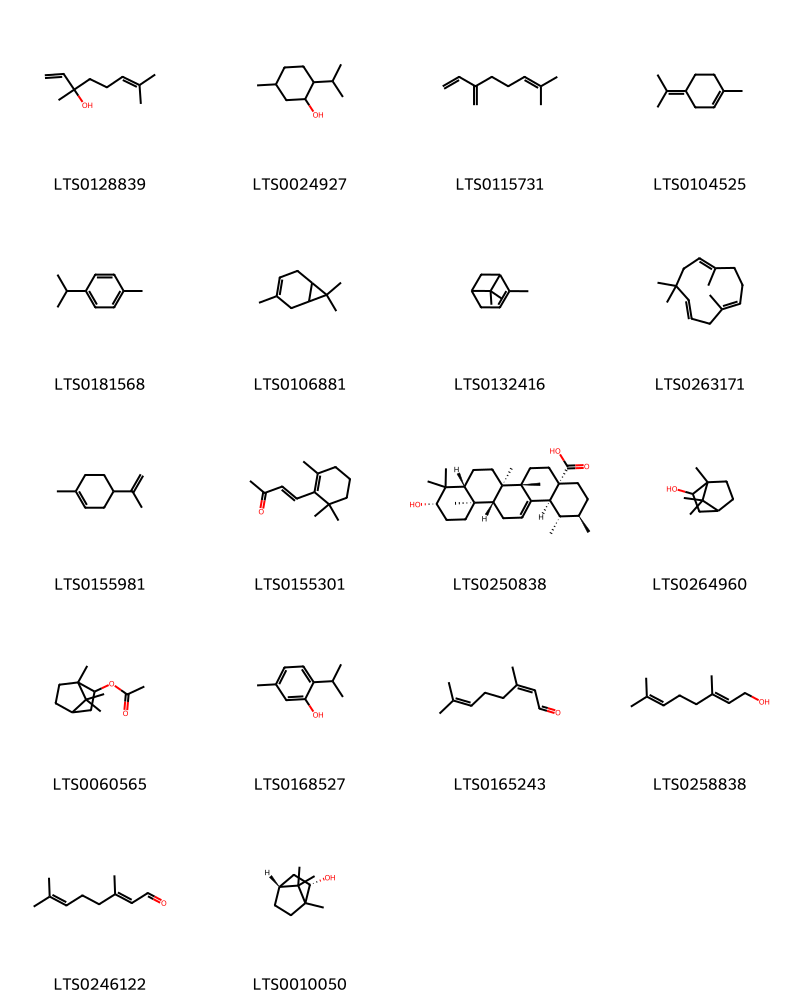{ width=100% }
    <figcaption>Hình ảnh cấu trúc hóa học của 18 hoạt chất thuộc nhóm Prenol lipids gồm ['linalool, (+-)- (LTS0128839)', 'menthol natural (LTS0024927)', 'α-myrcene (LTS0115731)', 'terpinolene (LTS0104525)', 'cymene (LTS0181568)', 'monoterpenes (LTS0106881)', 'α pinene (LTS0132416)', 'humulene (LTS0263171)', 'limonene,  (LTS0155981)', 'β-ionone (LTS0155301)', 'ursolic acid (LTS0250838)', 'borneol (LTS0264960)', 'bornyl acetate (LTS0060565)', 'thymol (LTS0168527)', 'neral (LTS0165243)', 'geraniol (LTS0258838)', 'α-citral (LTS0246122)', '(2s,4r)-1,7,7-trimethylbicyclo[2.2.1]heptan-2-ol (LTS0010050)'].</figcaption>
</figure>
#### Nhóm Saturated hydrocarbons
<figure markdown="span">
    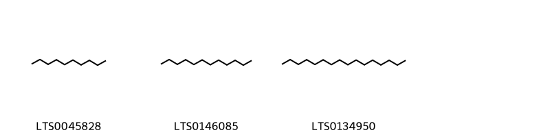{ width=100% }
    <figcaption>Hình ảnh cấu trúc hóa học của 3 hoạt chất thuộc nhóm Saturated hydrocarbons gồm ['decane (LTS0045828)', 'dodecane (LTS0146085)', 'cetane (LTS0134950)'].</figcaption>
</figure>

---

### Dược dân tộc học

Danh sách các quốc gia có sử dụng *Malus sylvestris* trong điều trị các bệnh. 

| Country   | Disease                                          | Bệnh                                                                                                                                                                                                |
|:----------|:-------------------------------------------------|:----------------------------------------------------------------------------------------------------------------------------------------------------------------------------------------------------|
| China     | Carminative, Sedative, Tonic, Vermifuge, Apertif | MYMEMORY WARNING: YOU USED ALL AVAILABLE FREE TRANSLATIONS FOR TODAY. NEXT AVAILABLE IN  11 HOURS 46 MINUTES 07 SECONDS VISIT HTTPS://MYMEMORY.TRANSLATED.NET/DOC/USAGELIMITS.PHP TO TRANSLATE MORE |
| Dutch     | Diuretic                                         | MYMEMORY WARNING: YOU USED ALL AVAILABLE FREE TRANSLATIONS FOR TODAY. NEXT AVAILABLE IN  11 HOURS 46 MINUTES 05 SECONDS VISIT HTTPS://MYMEMORY.TRANSLATED.NET/DOC/USAGELIMITS.PHP TO TRANSLATE MORE |
| Elsewhere | nan, Hypnotic, Vermifuge                         | MYMEMORY WARNING: YOU USED ALL AVAILABLE FREE TRANSLATIONS FOR TODAY. NEXT AVAILABLE IN  11 HOURS 46 MINUTES 01 SECONDS VISIT HTTPS://MYMEMORY.TRANSLATED.NET/DOC/USAGELIMITS.PHP TO TRANSLATE MORE |
| France    | Emollient                                        | MYMEMORY WARNING: YOU USED ALL AVAILABLE FREE TRANSLATIONS FOR TODAY. NEXT AVAILABLE IN  11 HOURS 45 MINUTES 57 SECONDS VISIT HTTPS://MYMEMORY.TRANSLATED.NET/DOC/USAGELIMITS.PHP TO TRANSLATE MORE |
| Haiti     | Laxative                                         | MYMEMORY WARNING: YOU USED ALL AVAILABLE FREE TRANSLATIONS FOR TODAY. NEXT AVAILABLE IN  11 HOURS 45 MINUTES 50 SECONDS VISIT HTTPS://MYMEMORY.TRANSLATED.NET/DOC/USAGELIMITS.PHP TO TRANSLATE MORE |
| India     | Digestive, Cardiac                               | MYMEMORY WARNING: YOU USED ALL AVAILABLE FREE TRANSLATIONS FOR TODAY. NEXT AVAILABLE IN  11 HOURS 45 MINUTES 46 SECONDS VISIT HTTPS://MYMEMORY.TRANSLATED.NET/DOC/USAGELIMITS.PHP TO TRANSLATE MORE |
| Iraq      | Apertif, Digestive                               | MYMEMORY WARNING: YOU USED ALL AVAILABLE FREE TRANSLATIONS FOR TODAY. NEXT AVAILABLE IN  11 HOURS 45 MINUTES 42 SECONDS VISIT HTTPS://MYMEMORY.TRANSLATED.NET/DOC/USAGELIMITS.PHP TO TRANSLATE MORE |
| Kurdistan | Refrigerant                                      | MYMEMORY WARNING: YOU USED ALL AVAILABLE FREE TRANSLATIONS FOR TODAY. NEXT AVAILABLE IN  11 HOURS 45 MINUTES 40 SECONDS VISIT HTTPS://MYMEMORY.TRANSLATED.NET/DOC/USAGELIMITS.PHP TO TRANSLATE MORE |
| Turkey    | Apertif, Digestive, Diuretic, Poison             | MYMEMORY WARNING: YOU USED ALL AVAILABLE FREE TRANSLATIONS FOR TODAY. NEXT AVAILABLE IN  11 HOURS 45 MINUTES 37 SECONDS VISIT HTTPS://MYMEMORY.TRANSLATED.NET/DOC/USAGELIMITS.PHP TO TRANSLATE MORE |
| US        | Poison                                           | MYMEMORY WARNING: YOU USED ALL AVAILABLE FREE TRANSLATIONS FOR TODAY. NEXT AVAILABLE IN  11 HOURS 45 MINUTES 35 SECONDS VISIT HTTPS://MYMEMORY.TRANSLATED.NET/DOC/USAGELIMITS.PHP TO TRANSLATE MORE |
| ain       | Laxative                                         | MYMEMORY WARNING: YOU USED ALL AVAILABLE FREE TRANSLATIONS FOR TODAY. NEXT AVAILABLE IN  11 HOURS 45 MINUTES 33 SECONDS VISIT HTTPS://MYMEMORY.TRANSLATED.NET/DOC/USAGELIMITS.PHP TO TRANSLATE MORE |

---

---
## Malus sylvestrus
### Thông tin về thực vật

!!! info "Phân loại thực vật của *Malus sylvestris* từ GIBF:"
    - **Kingdom:** Plantae
    - **Phylum:** Tracheophyta
    - **Order:** Rosales
    - **Family:** Rosaceae
    - **Genus:** Malus
    - **Species:** *Malus sylvestris*

 

| Label (VI)   | Label (EN)   | Scientific Name   | Descriptions (VI)   | Descriptions (EN)   | Also Known As (VI)   | Also Known As (EN)                    |
|:-------------|:-------------|:------------------|:--------------------|:--------------------|:---------------------|:--------------------------------------|
| N/A          | N/A          | Malus sylvestris  | loài thực vật       | species of plant    | ['']                 | ['crab apple', 'European crab apple'] |

#### Phân bố trên thế giới

**Từ CSDL GIBF** Denmark, Spain, Germany, Austria, Sweden, Poland, Montenegro, Belgium, Netherlands, Belarus, Lithuania, Hungary, Estonia, Ireland, Norway, Switzerland, United Kingdom of Great Britain and Northern Ireland, France, New Zealand, Russian Federation, United States of America, Italy, Croatia, Ukraine

#### Phân bố tại Việt Nam

**Từ CSDL GIBF**: Không có ghi nhận ở Việt Nam

---
### Thành phần hóa học
        
- Theo cơ sở dữ liệu lotus: Từ loài *Malus sylvestris* đã phân lập và xác định được Chưa có hoạt chất nào được phân lập. hoạt chất thuộc về các nhóm Không có hoạt chất nào được phân lập. 

Không có hình ảnh nào được tạo ra

---

### Dược dân tộc học

Danh sách các quốc gia có sử dụng *Malus sylvestris* trong điều trị các bệnh. 

| Country   | Disease     | Bệnh                                                                                                                                                                                                |
|:----------|:------------|:----------------------------------------------------------------------------------------------------------------------------------------------------------------------------------------------------|
| Elsewhere | Refrigerant | MYMEMORY WARNING: YOU USED ALL AVAILABLE FREE TRANSLATIONS FOR TODAY. NEXT AVAILABLE IN  11 HOURS 44 MINUTES 50 SECONDS VISIT HTTPS://MYMEMORY.TRANSLATED.NET/DOC/USAGELIMITS.PHP TO TRANSLATE MORE |

---

# Chi Poterium

??? note "Danh sách các dược liệu thuộc chi"
    
	 - *Poterium officinale*

---
## Poterium officinale
### Thông tin về thực vật

!!! info "Phân loại thực vật của *Sanguisorba officinalis* từ GIBF:"
    - **Kingdom:** Plantae
    - **Phylum:** Tracheophyta
    - **Order:** Rosales
    - **Family:** Rosaceae
    - **Genus:** Sanguisorba
    - **Species:** *Sanguisorba officinalis*

 

| Label (VI)   | Label (EN)   | Scientific Name     | Descriptions (VI)   | Descriptions (EN)   | Also Known As (VI)   | Also Known As (EN)   |
|:-------------|:-------------|:--------------------|:--------------------|:--------------------|:---------------------|:---------------------|
| N/A          | N/A          | Poterium officinale |                     |                     | ['']                 | ['']                 |

#### Phân bố trên thế giới

**Từ CSDL GIBF** nan, Belarus, United Kingdom of Great Britain and Northern Ireland, Japan, France, Germany, China, Netherlands

#### Phân bố tại Việt Nam

**Từ CSDL GIBF**: Không có ghi nhận ở Việt Nam

---
### Thành phần hóa học
        
- Theo cơ sở dữ liệu lotus: Từ loài *Sanguisorba officinalis* đã phân lập và xác định được Chưa có hoạt chất nào được phân lập. hoạt chất thuộc về các nhóm Không có hoạt chất nào được phân lập. 

Không có hình ảnh nào được tạo ra

---

### Dược dân tộc học

Danh sách các quốc gia có sử dụng *Sanguisorba officinalis* trong điều trị các bệnh. 

| Country   | Disease                        | Bệnh                                                                                                                                                                                                |
|:----------|:-------------------------------|:----------------------------------------------------------------------------------------------------------------------------------------------------------------------------------------------------|
| China     | Styptic, Vulnerary, Astringent | MYMEMORY WARNING: YOU USED ALL AVAILABLE FREE TRANSLATIONS FOR TODAY. NEXT AVAILABLE IN  11 HOURS 44 MINUTES 24 SECONDS VISIT HTTPS://MYMEMORY.TRANSLATED.NET/DOC/USAGELIMITS.PHP TO TRANSLATE MORE |

---

# Chi Eriobotrya

??? note "Danh sách các dược liệu thuộc chi"
    
	 - *Eriobotrya japonica*

---
## Eriobotrya japonica
### Thông tin về thực vật

!!! info "Phân loại thực vật của *Rhaphiolepis bibas* từ GIBF:"
    - **Kingdom:** Plantae
    - **Phylum:** Tracheophyta
    - **Order:** Rosales
    - **Family:** Rosaceae
    - **Genus:** Rhaphiolepis
    - **Species:** *Rhaphiolepis bibas*

 

| Label (VI)   | Label (EN)   | Scientific Name     | Descriptions (VI)   | Descriptions (EN)        | Also Known As (VI)                                   | Also Known As (EN)                                             |
|:-------------|:-------------|:--------------------|:--------------------|:-------------------------|:-----------------------------------------------------|:---------------------------------------------------------------|
| N/A          | N/A          | Eriobotrya japonica | loài thực vật       | species of plant, Loquat | ['Tỳ bà', 'Tì bà', 'Lô quất', 'Eriobotrya japonica'] | ['Chinese plum', 'Japanese plum', 'Japanese medlar', 'loquat'] |

#### Phân bố trên thế giới

**Từ CSDL GIBF** Georgia, nan, Spain, Chile, Austria, Australia, Colombia, Dominican Republic, Réunion, Türkiye, Slovenia, Japan, Brazil, Mexico, China, Hong Kong, Switzerland, Argentina, Iran (Islamic Republic of), Portugal, South Africa, Bermuda, France, New Zealand, Cyprus, Bolivia (Plurinational State of), Russian Federation, Ecuador, United States of America, Italy, Madagascar, Greece

#### Phân bố tại Việt Nam

**Từ CSDL GIBF**: Không có ghi nhận ở Việt Nam

---
### Thành phần hóa học
        
- Theo cơ sở dữ liệu lotus: Từ loài *Rhaphiolepis bibas* đã phân lập và xác định được 154 hoạt chất thuộc về các nhóm Organooxygen compounds, Benzofurans, Flavonoids, Prenol lipids, Carboxylic acids and derivatives, Fatty Acyls, Neoflavonoids, Cinnamic acids and derivatives, Steroids and steroid derivatives, Benzene and substituted derivatives. 

|    | chemicalTaxonomyClassyfireClass     |   smiles_count |
|---:|:------------------------------------|---------------:|
|  0 | Benzene and substituted derivatives |              1 |
|  1 | Benzofurans                         |              1 |
|  2 | Carboxylic acids and derivatives    |              6 |
|  3 | Cinnamic acids and derivatives      |              1 |
|  4 | Fatty Acyls                         |             10 |
|  5 | Flavonoids                          |             45 |
|  6 | Neoflavonoids                       |              1 |
|  7 | Organooxygen compounds              |             11 |
|  8 | Prenol lipids                       |             74 |
|  9 | Steroids and steroid derivatives    |              3 |

#### Nhóm Benzene and substituted derivatives
<figure markdown="span">
    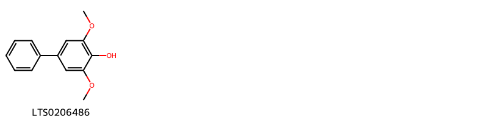{ width=100% }
    <figcaption>Hình ảnh cấu trúc hóa học của 1 hoạt chất thuộc nhóm Benzene and substituted derivatives gồm ['aucuparin (LTS0206486)'].</figcaption>
</figure>
#### Nhóm Benzofurans
<figure markdown="span">
    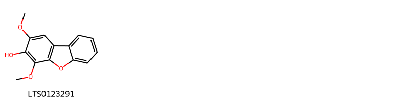{ width=100% }
    <figcaption>Hình ảnh cấu trúc hóa học của 1 hoạt chất thuộc nhóm Benzofurans gồm ['eriobofuran (LTS0123291)'].</figcaption>
</figure>
#### Nhóm Carboxylic acids and derivatives
<figure markdown="span">
    { width=100% }
    <figcaption>Hình ảnh cấu trúc hóa học của 6 hoạt chất thuộc nhóm Carboxylic acids and derivatives gồm ['glycocyamine (LTS0275175)', '4-guanidinobutyric acid (LTS0236153)', 'l-arginine (LTS0064737)', 'guanidinosuccinic acid (LTS0172937)', 'n-amidino-l-aspartic acid (LTS0014971)', 'creatine (LTS0246540)'].</figcaption>
</figure>
#### Nhóm Cinnamic acids and derivatives
<figure markdown="span">
    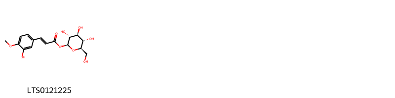{ width=100% }
    <figcaption>Hình ảnh cấu trúc hóa học của 1 hoạt chất thuộc nhóm Cinnamic acids and derivatives gồm ['(2s,3r,4s,5s,6r)-3,4,5-trihydroxy-6-(hydroxymethyl)oxan-2-yl (2e)-3-(3-hydroxy-4-methoxyphenyl)prop-2-enoate (LTS0121225)'].</figcaption>
</figure>
#### Nhóm Fatty Acyls
<figure markdown="span">
    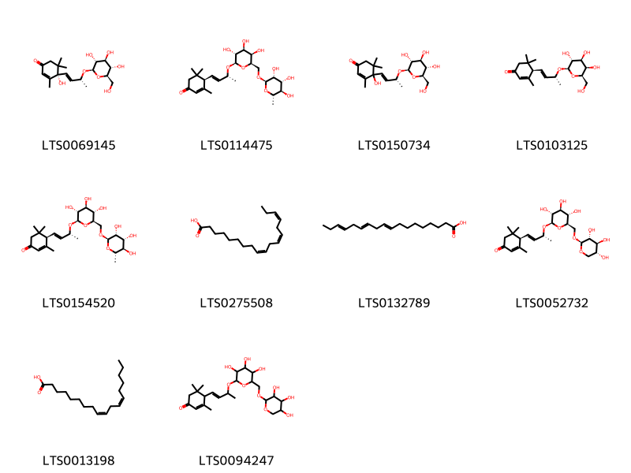{ width=100% }
    <figcaption>Hình ảnh cấu trúc hóa học của 10 hoạt chất thuộc nhóm Fatty Acyls gồm ['(4s)-4-hydroxy-3,5,5-trimethyl-4-[(1e,3r)-3-{[(2r,3r,4s,5s,6r)-3,4,5-trihydroxy-6-(hydroxymethyl)oxan-2-yl]oxy}but-1-en-1-yl]cyclohex-2-en-1-one (LTS0069145)', '(4r)-3,5,5-trimethyl-4-[(1e,3r)-3-{[(2r,3r,4s,5r,6r)-3,4,5-trihydroxy-6-({[(2r,3r,4r,5r,6s)-3,4,5-trihydroxy-6-methyloxan-2-yl]oxy}methyl)oxan-2-yl]oxy}but-1-en-1-yl]cyclohex-2-en-1-one (LTS0114475)', '4-hydroxy-3,5,5-trimethyl-4-[(1e,3r)-3-{[(2r,3r,4s,5s,6r)-3,4,5-trihydroxy-6-(hydroxymethyl)oxan-2-yl]oxy}but-1-en-1-yl]cyclohex-2-en-1-one (LTS0150734)', '(4r)-3,5,5-trimethyl-4-[(1e,3r)-3-{[(2r,3r,4s,5r,6r)-3,4,5-trihydroxy-6-(hydroxymethyl)oxan-2-yl]oxy}but-1-en-1-yl]cyclohex-2-en-1-one (LTS0103125)', '(4r)-3,5,5-trimethyl-4-[(1e,3r)-3-{[(2r,3r,4s,5s,6r)-3,4,5-trihydroxy-6-({[(2r,3r,4r,5r,6s)-3,4,5-trihydroxy-6-methyloxan-2-yl]oxy}methyl)oxan-2-yl]oxy}but-1-en-1-yl]cyclohex-2-en-1-one (LTS0154520)', 'α-linolenic acid (LTS0275508)', 'α linolenic acid (LTS0132789)', '(4r)-3,5,5-trimethyl-4-[(1e,3r)-3-{[(2r,3r,4s,5s,6r)-3,4,5-trihydroxy-6-({[(2s,3r,4s,5r)-3,4,5-trihydroxyoxan-2-yl]oxy}methyl)oxan-2-yl]oxy}but-1-en-1-yl]cyclohex-2-en-1-one (LTS0052732)', 'linoleic (LTS0013198)', '3,5,5-trimethyl-4-[(1e)-3-[(3,4,5-trihydroxy-6-{[(3,4,5-trihydroxyoxan-2-yl)oxy]methyl}oxan-2-yl)oxy]but-1-en-1-yl]cyclohex-2-en-1-one (LTS0094247)'].</figcaption>
</figure>
#### Nhóm Flavonoids
<figure markdown="span">
    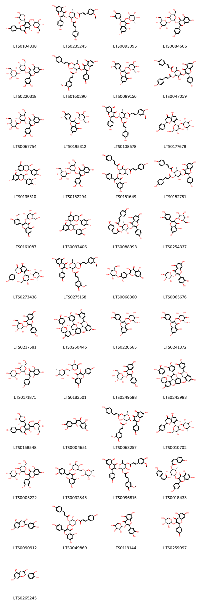{ width=100% }
    <figcaption>Hình ảnh cấu trúc hóa học của 45 hoạt chất thuộc nhóm Flavonoids gồm ['schaftoside (LTS0104338)', '(2s,3r,4r,5r,6s)-6-{[5,7-dihydroxy-2-(4-hydroxyphenyl)-4-oxochromen-3-yl]oxy}-4-hydroxy-5-{[(2e)-3-(4-hydroxyphenyl)prop-2-enoyl]oxy}-2-methyloxan-3-yl (2e)-3-(4-hydroxy-3-methoxyphenyl)prop-2-enoate (LTS0235245)', 'quercitrin (LTS0093095)', 'kaempferol 3-o-sophoroside (LTS0084606)', '3-{[(2s,3r,4r,5s,6s)-4,5-dihydroxy-6-(hydroxymethyl)-3-{[(2s,3r,4s,5s,6r)-3,4,5-trihydroxy-6-(hydroxymethyl)oxan-2-yl]oxy}oxan-2-yl]oxy}-2-(3,4-dihydroxyphenyl)-5,7-dihydroxychromen-4-one (LTS0220318)', '2-{[5,7-dihydroxy-2-(4-hydroxyphenyl)-4-oxochromen-3-yl]oxy}-4-hydroxy-5-{[3-(4-hydroxyphenyl)prop-2-enoyl]oxy}-6-methyloxan-3-yl 3-(4-hydroxy-3-methoxyphenyl)prop-2-enoate (LTS0160290)', 'hyperoside (LTS0089156)', '2-{[5,7-dihydroxy-2-(4-hydroxyphenyl)-4-oxochromen-3-yl]oxy}-3-hydroxy-5-{[3-(4-hydroxyphenyl)prop-2-enoyl]oxy}-6-methyloxan-4-yl 3-(4-hydroxyphenyl)prop-2-enoate (LTS0047059)', '3-{[4,5-dihydroxy-6-(hydroxymethyl)-3-{[3,4,5-trihydroxy-6-(hydroxymethyl)oxan-2-yl]oxy}oxan-2-yl]oxy}-2-(3,4-dihydroxyphenyl)-5,7-dihydroxychromen-4-one (LTS0067754)', '2-(3,4-dihydroxyphenyl)-5,7-dihydroxy-3-{[3,4,5-trihydroxy-6-(hydroxymethyl)oxan-2-yl]oxy}chromen-4-one (LTS0195312)', '6-{[5,7-dihydroxy-2-(4-hydroxyphenyl)-4-oxochromen-3-yl]oxy}-4-hydroxy-5-{[3-(4-hydroxyphenyl)prop-2-enoyl]oxy}-2-methyloxan-3-yl 3-(4-hydroxy-3-methoxyphenyl)prop-2-enoate (LTS0108578)', '(2s)-8-[(2s,3r,4s,5s,6r)-4,5-dihydroxy-6-(hydroxymethyl)-3-{[(2s,3r,4r,5r,6s)-3,4,5-trihydroxy-6-methyloxan-2-yl]oxy}oxan-2-yl]-5,7-dihydroxy-2-(4-hydroxyphenyl)-2,3-dihydro-1-benzopyran-4-one (LTS0177678)', '(2r,3r,4r)-2-(3,4-dihydroxyphenyl)-4-[(2r,3r)-2-(3,4-dihydroxyphenyl)-3,5,7-trihydroxy-3,4-dihydro-2h-1-benzopyran-8-yl]-3,4-dihydro-2h-1-benzopyran-3,5,7-triol (LTS0135510)', 'quosp (LTS0152294)', '2-{[5,7-dihydroxy-2-(4-hydroxyphenyl)-4-oxochromen-3-yl]oxy}-4-hydroxy-5-{[3-(4-hydroxyphenyl)prop-2-enoyl]oxy}-6-methyloxan-3-yl 3-(4-hydroxyphenyl)prop-2-enoate (LTS0151649)', '(2s,3r,4s,5s,6s)-2-{[5,7-dihydroxy-2-(4-hydroxyphenyl)-4-oxochromen-3-yl]oxy}-3-hydroxy-5-{[(2e)-3-(4-hydroxyphenyl)prop-2-enoyl]oxy}-6-methyloxan-4-yl (2e)-3-(4-hydroxyphenyl)prop-2-enoate (LTS0152781)', 'cacticin (LTS0161087)', '(2r,3r)-2-(3,4-dihydroxyphenyl)-4-[(2r,3r)-2-(3,4-dihydroxyphenyl)-3,5,7-trihydroxy-3,4-dihydro-2h-1-benzopyran-8-yl]-3,4-dihydro-2h-1-benzopyran-3,5,7-triol (LTS0097406)', '(2s,3r,4s,5s,6s)-2-{[5,7-dihydroxy-2-(4-hydroxyphenyl)-4-oxochromen-3-yl]oxy}-3-hydroxy-5-{[(2e)-3-(4-hydroxyphenyl)prop-2-enoyl]oxy}-6-methyloxan-4-yl (2z)-3-(4-hydroxyphenyl)prop-2-enoate (LTS0088993)', 'isoquercetin (LTS0254337)', '(2s)-8-[(3r,4s,5s,6r)-4,5-dihydroxy-6-(hydroxymethyl)-3-{[(2s,3r,4r,5r,6s)-3,4,5-trihydroxy-6-methyloxan-2-yl]oxy}oxan-2-yl]-5,7-dihydroxy-2-(4-hydroxyphenyl)-2,3-dihydro-1-benzopyran-4-one (LTS0273438)', '(2s,3r,4r,5r,6s)-6-{[5,7-dihydroxy-2-(4-hydroxyphenyl)-4-oxochromen-3-yl]oxy}-4-hydroxy-5-{[(2e)-3-(4-hydroxy-3-methoxyphenyl)prop-2-enoyl]oxy}-2-methyloxan-3-yl (2e)-3-(4-hydroxy-3-methoxyphenyl)prop-2-enoate (LTS0275168)', 'spiraeoside (LTS0068360)', 'guaijaverin (LTS0065676)', 'trifolin (LTS0237581)', 'procyanidin c1 (LTS0260445)', '2-(3,4-dihydroxyphenyl)-5,7-dihydroxy-3-{[(2s,3r,4r,5s,6r)-3,4,5-trihydroxy-6-(hydroxymethyl)oxan-2-yl]oxy}chromen-4-one (LTS0220665)', '2-(3,4-dihydroxyphenyl)-5,7-dihydroxy-3-{[(2s,3r,4r,5r,6s)-3,4,5-trihydroxy-6-(hydroxymethyl)oxan-2-yl]oxy}chromen-4-one (LTS0241372)', '3-{[(2s,3r,4s,5s,6r)-4,5-dihydroxy-6-(hydroxymethyl)-3-{[(2s,3r,4r,5r,6s)-3,4,5-trihydroxy-6-methyloxan-2-yl]oxy}oxan-2-yl]oxy}-5,7-dihydroxy-2-(4-hydroxyphenyl)chromen-4-one (LTS0171871)', 'nictoflorin (LTS0182501)', 'astragalin (LTS0249588)', '(2r,3r,4r)-2-(3,4-dihydroxyphenyl)-8-[(2r,3r,4r)-2-(3,4-dihydroxyphenyl)-3,5,7-trihydroxy-3,4-dihydro-2h-1-benzopyran-4-yl]-4-[(2s,3r)-2-(3,4-dihydroxyphenyl)-3,5,7-trihydroxy-3,4-dihydro-2h-1-benzopyran-8-yl]-3,4-dihydro-2h-1-benzopyran-3,5,7-triol (LTS0242983)', '5,7-dihydroxy-2-(4-hydroxyphenyl)-6-[(3r,4r,5s,6r)-3,4,5-trihydroxy-6-(hydroxymethyl)oxan-2-yl]-8-[(2s,3r,4s,5s)-3,4,5-trihydroxyoxan-2-yl]chromen-4-one (LTS0158548)', 'quercetin (LTS0004651)', '(2s,3r,4r,5r,6s)-2-{[5,7-dihydroxy-2-(4-hydroxyphenyl)-4-oxochromen-3-yl]oxy}-4-hydroxy-5-{[(2e)-3-(4-hydroxyphenyl)prop-2-enoyl]oxy}-6-methyloxan-3-yl (2e)-3-(4-hydroxy-3-methoxyphenyl)prop-2-enoate (LTS0063257)', '(2r)-8-[(2s,3r,4s,5s,6r)-4,5-dihydroxy-6-(hydroxymethyl)-3-{[(2s,3r,4r,5r,6s)-3,4,5-trihydroxy-6-methyloxan-2-yl]oxy}oxan-2-yl]-5,7-dihydroxy-2-(4-hydroxyphenyl)-2,3-dihydro-1-benzopyran-4-one (LTS0010702)', '3-{[(2s,3r,4s,5s,6r)-4,5-dihydroxy-6-(hydroxymethyl)-3-{[(2s,3r,4s,5r)-3,4,5-trihydroxyoxan-2-yl]oxy}oxan-2-yl]oxy}-2-(3,4-dihydroxyphenyl)-5,7-dihydroxychromen-4-one (LTS0005222)', '3-rutinosyl quercetin (LTS0032845)', '6-{[5,7-dihydroxy-2-(4-hydroxyphenyl)-4-oxochromen-3-yl]oxy}-4-hydroxy-5-{[3-(4-hydroxy-3-methoxyphenyl)prop-2-enoyl]oxy}-2-methyloxan-3-yl 3-(4-hydroxy-3-methoxyphenyl)prop-2-enoate (LTS0096815)', '(2s,3r,4r,5r,6s)-2-{[5,7-dihydroxy-2-(4-hydroxyphenyl)-4-oxochromen-3-yl]oxy}-4-hydroxy-5-{[(2z)-3-(4-hydroxyphenyl)prop-2-enoyl]oxy}-6-methyloxan-3-yl (2z)-3-(4-hydroxyphenyl)prop-2-enoate (LTS0018433)', 'catechol (LTS0090912)', '(2s,3r,4r,5r,6s)-2-{[5,7-dihydroxy-2-(4-hydroxyphenyl)-4-oxochromen-3-yl]oxy}-4-hydroxy-5-{[(2e)-3-(4-hydroxyphenyl)prop-2-enoyl]oxy}-6-methyloxan-3-yl (2e)-3-(4-hydroxyphenyl)prop-2-enoate (LTS0049869)', 'guaijaverin (LTS0119144)', 'afzelin (LTS0259097)', 'ent-epicatechin (LTS0265245)'].</figcaption>
</figure>
#### Nhóm Neoflavonoids
<figure markdown="span">
    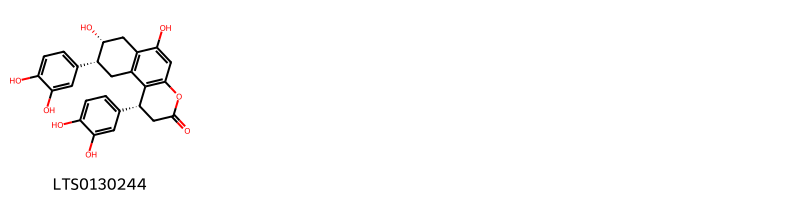{ width=100% }
    <figcaption>Hình ảnh cấu trúc hóa học của 1 hoạt chất thuộc nhóm Neoflavonoids gồm ['(1r,8r,9r)-1,9-bis(3,4-dihydroxyphenyl)-6,8-dihydroxy-1h,2h,7h,8h,9h,10h-naphtho[2,1-b]pyran-3-one (LTS0130244)'].</figcaption>
</figure>
#### Nhóm Organooxygen compounds
<figure markdown="span">
    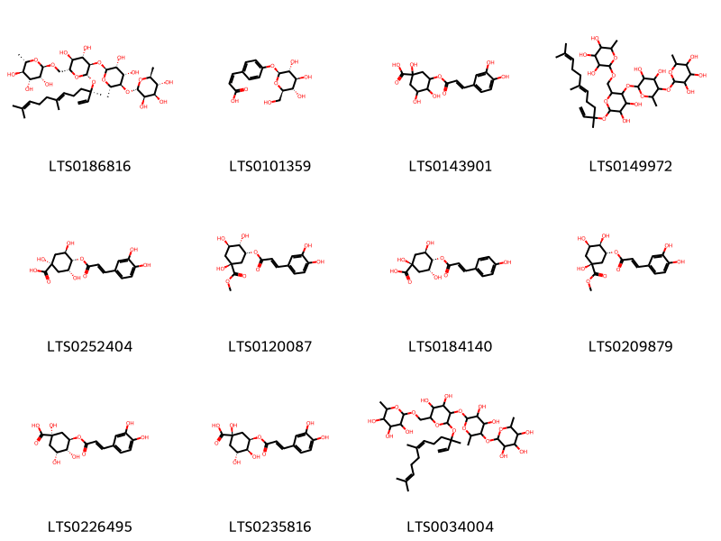{ width=100% }
    <figcaption>Hình ảnh cấu trúc hóa học của 11 hoạt chất thuộc nhóm Organooxygen compounds gồm ['(2r,3r,4r,5r,6s)-2-{[(2r,3s,4s,5r,6s)-5-{[(2s,3r,4s,5r,6s)-3,4-dihydroxy-6-methyl-5-{[(2s,3r,4r,5r,6s)-3,4,5-trihydroxy-6-methyloxan-2-yl]oxy}oxan-2-yl]oxy}-3,4-dihydroxy-6-{[(3r,6e)-3,7,11-trimethyldodeca-1,6,10-trien-3-yl]oxy}oxan-2-yl]methoxy}-6-methyloxane-3,4,5-triol (LTS0186816)', '(2z)-3-(4-{[(2s,3r,4s,5s,6r)-3,4,5-trihydroxy-6-(hydroxymethyl)oxan-2-yl]oxy}phenyl)prop-2-enoic acid (LTS0101359)', '3-{[3-(3,4-dihydroxyphenyl)prop-2-enoyl]oxy}-1,4,5-trihydroxycyclohexane-1-carboxylic acid (LTS0143901)', '2-{[3-({3,4-dihydroxy-6-methyl-5-[(3,4,5-trihydroxy-6-methyloxan-2-yl)oxy]oxan-2-yl}oxy)-4,5-dihydroxy-6-{[(6e)-3,7,11-trimethyldodeca-1,6,10-trien-3-yl]oxy}oxan-2-yl]methoxy}-6-methyloxane-3,4,5-triol (LTS0149972)', 'cryptochlorogenic acid (LTS0252404)', 'methyl (1s,3r,4s,5r)-3-{[(2e)-3-(3,4-dihydroxyphenyl)prop-2-enoyl]oxy}-1,4,5-trihydroxycyclohexane-1-carboxylate (LTS0120087)', '4-p-coumaroylquinic acid (LTS0184140)', 'methyl chlorogenate (LTS0209879)', 'chlorogenic acid (LTS0226495)', 'neochlorogenic acid (LTS0235816)', '2-{[5-({3,4-dihydroxy-6-methyl-5-[(3,4,5-trihydroxy-6-methyloxan-2-yl)oxy]oxan-2-yl}oxy)-3,4-dihydroxy-6-[(3,7,11-trimethyldodeca-1,6,10-trien-3-yl)oxy]oxan-2-yl]methoxy}-6-methyloxane-3,4,5-triol (LTS0034004)'].</figcaption>
</figure>
#### Nhóm Prenol lipids
<figure markdown="span">
    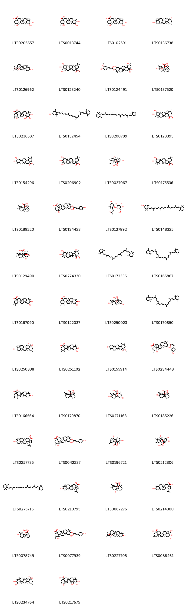{ width=100% }
    <figcaption>Hình ảnh cấu trúc hóa học của 74 hoạt chất thuộc nhóm Prenol lipids gồm ['euscaphic acid (LTS0205657)', '1,10,11-trihydroxy-1,2,6a,6b,9,9,12a-heptamethyl-2,3,4,5,6,7,8,8a,10,11,12,12b,13,14b-tetradecahydropicene-4a-carboxylic acid (LTS0013744)', 'tormentic acid (LTS0102591)', 'urs-12-ene-3β,28-diol (LTS0136738)', '(1s,4s,5r,8r,10s,13s,14r,17s,18r,19s,20r)-10-hydroxy-4,5,9,9,13,19,20-heptamethyl-24-oxahexacyclo[15.5.2.0¹,¹⁸.0⁴,¹⁷.0⁵,¹⁴.0⁸,¹³]tetracos-15-en-23-one (LTS0126962)', 'methyl (4as,6as,6br,8ar,9r,10r,11r,12ar,12br,14bs)-10,11-dihydroxy-9-(hydroxymethyl)-2,2,6a,6b,9,12a-hexamethyl-1,3,4,5,6,7,8,8a,10,11,12,12b,13,14b-tetradecahydropicene-4a-carboxylate (LTS0123240)', '1,11-dihydroxy-10-{[(2e)-3-(4-hydroxy-3-methoxyphenyl)prop-2-enoyl]oxy}-1,2,6a,6b,9,9,12a-heptamethyl-2,3,4,5,6,7,8,8a,10,11,12,12b,13,14b-tetradecahydropicene-4a-carboxylic acid (LTS0124491)', '(1r,2r,5s,8s,9s,10s,11r,14r)-5,14-dihydroxy-11-methyl-6-methylidene-12-oxo-13-oxapentacyclo[9.3.3.1⁵,⁸.0¹,¹⁰.0²,⁸]octadecane-9-carboxylic acid (LTS0137520)', '1,10,11,12-tetrahydroxy-1,2,6a,6b,9,9,12a-heptamethyl-2,3,4,5,6,7,8,8a,10,11,12,12b,13,14b-tetradecahydropicene-4a-carboxylic acid (LTS0236587)', '3,5,5-trimethyl-4-[(1e,3e,5e,7e,9e)-3,7,12,16-tetramethyl-18-(2,6,6-trimethylcyclohex-1-en-1-yl)octadeca-1,3,5,7,9,11,13,15,17-nonaen-1-yl]cyclohex-3-en-1-ol (LTS0132454)', '(+)-α-carotene (LTS0200789)', 'methyl (1s,2r,4as,6as,6br,8ar,10s,11r,12ar,12br,14bs)-10,11-dihydroxy-1,2,6a,6b,9,9,12a-heptamethyl-2,3,4,5,6,7,8,8a,10,11,12,12b,13,14b-tetradecahydro-1h-picene-4a-carboxylate (LTS0128395)', 'methyl 10,11-dihydroxy-1,2,6a,6b,9,9,12a-heptamethyl-2,3,4,5,6,7,8,8a,10,11,12,12b,13,14b-tetradecahydro-1h-picene-4a-carboxylate (LTS0154296)', 'methyl 10,11-dihydroxy-9-(hydroxymethyl)-2,2,6a,6b,9,12a-hexamethyl-1,3,4,5,6,7,8,8a,10,11,12,12b,13,14b-tetradecahydropicene-4a-carboxylate (LTS0206902)', '(1s,2s,3s,5s,8r,9s,10r,11s,12s)-3,12-dihydroxy-11-methyl-6-methylidene-16-oxo-15-oxapentacyclo[9.3.2.1⁵,⁸.0¹,¹⁰.0²,⁸]heptadecane-9-carboxylic acid (LTS0037067)', 'methyl 10,11-dihydroxy-2,2,6a,6b,9,9,12a-heptamethyl-1,3,4,5,6,7,8,8a,10,11,12,12b,13,14b-tetradecahydropicene-4a-carboxylate (LTS0175536)', '(1r,2r,5r,8r,9s,10s,11r)-11-methyl-6-methylidene-12-oxo-13-oxapentacyclo[9.3.3.1⁵,⁸.0¹,¹⁰.0²,⁸]octadecane-9-carboxylic acid (LTS0189220)', '(1r,2r,4as,6ar,6br,8ar,10r,11r,12ar,12br,14ar,14bs)-1,11-dihydroxy-10-{[(2e)-3-(4-hydroxyphenyl)prop-2-enoyl]oxy}-1,2,6a,6b,9,9,12a-heptamethyl-hexadecahydropicene-4a-carboxylic acid (LTS0134423)', 'citroside b (LTS0127892)', '(s)-cryptoxanthin (LTS0148325)', '(1r,2r,5r,8r,9s,10r,11r,14r)-14-hydroxy-11-methyl-6-methylidene-16-oxo-15-oxapentacyclo[9.3.2.1⁵,⁸.0¹,¹⁰.0²,⁸]heptadecane-9-carboxylic acid (LTS0129490)', 'methyl 1,10,11-trihydroxy-1,2,6a,6b,9,9,12a-heptamethyl-2,3,4,5,6,7,8,8a,10,11,12,12b,13,14b-tetradecahydropicene-4a-carboxylate (LTS0274330)', '1,3,3-trimethyl-2-[(1e,3z,5e,7e,9e,11z,13e,15e,17e)-3,7,12,16-tetramethyl-18-(2,6,6-trimethylcyclohex-1-en-1-yl)octadeca-1,3,5,7,9,11,13,15,17-nonaen-1-yl]cyclohex-1-ene (LTS0172336)', '1,3,3-trimethyl-2-[3,7,12,16-tetramethyl-18-(2,6,6-trimethylcyclohex-1-en-1-yl)octadeca-1,3,5,7,9,11,13,15,17-nonaen-1-yl]cyclohex-1-ene (LTS0165867)', '10,11-dihydroxy-2,2,6a,6b,9,9,12a-heptamethyl-1,3,4,5,6,7,8,8a,10,11,12,12b,13,14b-tetradecahydropicene-4a-carboxylic acid (LTS0167090)', '10,11-dihydroxy-1,2,6a,6b,9,9,12a-heptamethyl-2,3,4,5,6,7,8,8a,10,11,12,12b,13,14b-tetradecahydro-1h-picene-4a-carboxylic acid (LTS0122037)', 'gibberellin a29 (LTS0250023)', '1,3,3-trimethyl-2-[(17e)-3,7,12,16-tetramethyl-18-(2,6,6-trimethylcyclohex-1-en-1-yl)octadeca-1,3,5,7,9,11,13,15,17-nonaen-1-yl]cyclohex-1-ene (LTS0170850)', 'ursolic acid (LTS0250838)', '11-hydroxy-1,2,6a,6b,9,9,12a-heptamethyl-10-oxo-1,2,3,4,5,6,7,8,8a,11,12,12b,13,14b-tetradecahydropicene-4a-carboxylic acid (LTS0251102)', 'methyl 10-hydroxy-1,2,6a,6b,9,9,12a-heptamethyl-2,3,4,5,6,7,8,8a,10,11,12,12b,13,14b-tetradecahydro-1h-picene-4a-carboxylate (LTS0155914)', '(1r,2r,4as,6ar,6br,8ar,10r,11r,12ar,12br,14ar,14bs)-1,11-dihydroxy-10-{[(2z)-3-(4-hydroxyphenyl)prop-2-enoyl]oxy}-1,2,6a,6b,9,9,12a-heptamethyl-hexadecahydropicene-4a-carboxylic acid (LTS0234448)', '10-hydroxy-1,2,6a,6b,9,9,12a-heptamethyl-2,3,4,5,6,7,8,8a,10,11,12,12b,13,14b-tetradecahydro-1h-picene-4a-carboxylic acid (LTS0166564)', '11-methyl-6-methylidene-12-oxo-13-oxapentacyclo[9.3.3.1⁵,⁸.0¹,¹⁰.0²,⁸]octadecane-9-carboxylic acid (LTS0179870)', '5,13-dihydroxy-11-methyl-6-methylidene-16-oxo-15-oxapentacyclo[9.3.2.1⁵,⁸.0¹,¹⁰.0²,⁸]heptadecane-9-carboxylic acid (LTS0271168)', '5-hydroxy-11-methyl-6-methylidene-12-oxo-13-oxapentacyclo[9.3.3.1⁵,⁸.0¹,¹⁰.0²,⁸]octadecane-9-carboxylic acid (LTS0185226)', 'methyl (1r,3as,5ar,5br,7ar,9s,11ar,11br,13ar,13br)-9-hydroxy-5a,5b,8,8,11a-pentamethyl-1-(prop-1-en-2-yl)-hexadecahydrocyclopenta[a]chrysene-3a-carboxylate (LTS0257735)', '(1r,2r,4as,6as,6br,8ar,10r,11r,12ar,12br,14bs)-1,11-dihydroxy-10-{[(2e)-3-(4-hydroxyphenyl)prop-2-enoyl]oxy}-1,2,6a,6b,9,9,12a-heptamethyl-2,3,4,5,6,7,8,8a,10,11,12,12b,13,14b-tetradecahydropicene-4a-carboxylic acid (LTS0042237)', '3,12-dihydroxy-11-methyl-6-methylidene-16-oxo-15-oxapentacyclo[9.3.2.1⁵,⁸.0¹,¹⁰.0²,⁸]heptadecane-9-carboxylic acid (LTS0196721)', '(1s,2s,3s,5s,8r,9s,10r,11s,12r,13s)-3,12,13-trihydroxy-11-methyl-6-methylidene-16-oxo-15-oxapentacyclo[9.3.2.1⁵,⁸.0¹,¹⁰.0²,⁸]heptadecane-9-carboxylic acid (LTS0212806)', 'β-carotene (LTS0275716)', 'betulinic acid (LTS0210795)', '(1s,2s,3s,5s,8r,9s,10r,11r)-3-hydroxy-11-methyl-6-methylidene-16-oxo-15-oxapentacyclo[9.3.2.1⁵,⁸.0¹,¹⁰.0²,⁸]heptadecane-9-carboxylic acid (LTS0067276)', '9-hydroxy-5a,5b,8,8,11a-pentamethyl-1-(prop-1-en-2-yl)-hexadecahydrocyclopenta[a]chrysene-3a-carboxylic acid (LTS0214300)', 'gibberellin a44 (LTS0078749)', '1,11-dihydroxy-10-{[3-(4-hydroxyphenyl)prop-2-enoyl]oxy}-1,2,6a,6b,9,9,12a-heptamethyl-hexadecahydropicene-4a-carboxylic acid (LTS0077939)', '10-hydroxy-4,5,9,9,13,19,20-heptamethyl-24-oxahexacyclo[15.5.2.0¹,¹⁸.0⁴,¹⁷.0⁵,¹⁴.0⁸,¹³]tetracos-15-en-23-one (LTS0227705)', '(4as,6as,6br,8ar,9r,10s,11r,12ar,12br,14bs)-10,11-dihydroxy-9-(hydroxymethyl)-2,2,6a,6b,9,12a-hexamethyl-1,3,4,5,6,7,8,8a,10,11,12,12b,13,14b-tetradecahydropicene-4a-carboxylic acid (LTS0088461)', '(1s,2r,4as,6as,6br,8ar,10s,11r,12ar,12br,14bs)-10,11-dihydroxy-1,2,6a,6b,9,9,12a-heptamethyl-2,3,4,5,6,7,8,8a,10,11,12,12b,13,14b-tetradecahydro-1h-picene-4a-carboxylic acid (LTS0234764)', '(1r,2r,4as,6as,6br,8as,10s,11s,12s,12ar,12bs,14bs)-1,10,11,12-tetrahydroxy-1,2,6a,6b,9,9,12a-heptamethyl-2,3,4,5,6,7,8,8a,10,11,12,12b,13,14b-tetradecahydropicene-4a-carboxylic acid (LTS0217675)', 'corosolic acid (LTS0231285)', 'methyl (4as,6as,6br,8ar,10r,11r,12ar,12br,14bs)-10,11-dihydroxy-2,2,6a,6b,9,9,12a-heptamethyl-1,3,4,5,6,7,8,8a,10,11,12,12b,13,14b-tetradecahydropicene-4a-carboxylate (LTS0241652)', 'oleanolic acid (LTS0141130)', '14-hydroxy-11-methyl-6-methylidene-16-oxo-15-oxapentacyclo[9.3.2.1⁵,⁸.0¹,¹⁰.0²,⁸]heptadecane-9-carboxylic acid (LTS0159537)', 'methyl (4as,6as,6br,10r,11r,12ar,12br,14br)-10,11-dihydroxy-2,2,6a,6b,9,9,12a-heptamethyl-1,3,4,5,6,7,8,8a,10,11,12,12b,13,14b-tetradecahydropicene-4a-carboxylate (LTS0250596)', '(9z)-β-carotene (LTS0252839)', '8a-(hydroxymethyl)-4,4,6a,6b,11,12,14b-heptamethyl-2,3,4a,5,6,7,8,9,10,11,12,12a,14,14a-tetradecahydro-1h-picen-3-ol (LTS0178123)', '10,11-dihydroxy-9-(hydroxymethyl)-2,2,6a,6b,9,12a-hexamethyl-1,3,4,5,6,7,8,8a,10,11,12,12b,13,14b-tetradecahydropicene-4a-carboxylic acid (LTS0258848)', '(1s,2r,4as,6as,6br,8ar,11r,12ar,12br,14bs)-11-hydroxy-1,2,6a,6b,9,9,12a-heptamethyl-10-oxo-1,2,3,4,5,6,7,8,8a,11,12,12b,13,14b-tetradecahydropicene-4a-carboxylic acid (LTS0177075)', 'maslinic acid (LTS0109701)', '5,14-dihydroxy-11-methyl-6-methylidene-12-oxo-13-oxapentacyclo[9.3.3.1⁵,⁸.0¹,¹⁰.0²,⁸]octadecane-9-carboxylic acid (LTS0053454)', 'uvaol (LTS0008025)', '(1r,2r,4as,6as,6br,8ar,10r,11r,12ar,12br,14bs)-10-{[(2e)-3-(3,4-dihydroxyphenyl)prop-2-enoyl]oxy}-1,11-dihydroxy-1,2,6a,6b,9,9,12a-heptamethyl-2,3,4,5,6,7,8,8a,10,11,12,12b,13,14b-tetradecahydropicene-4a-carboxylic acid (LTS0013851)', 'methyl 9-hydroxy-5a,5b,8,8,11a-pentamethyl-1-(prop-1-en-2-yl)-hexadecahydrocyclopenta[a]chrysene-3a-carboxylate (LTS0015878)', 'α-carotene (LTS0224243)', '(1s,4as,6br,10r,12ar)-10,11-dihydroxy-1,2,6a,6b,9,9,12a-heptamethyl-2,3,4,5,6,7,8,8a,10,11,12,12b,13,14b-tetradecahydro-1h-picene-4a-carboxylic acid (LTS0120210)', 'methyl (1s,2r,4as,6as,6br,8ar,10s,12ar,12br,14bs)-10-hydroxy-1,2,6a,6b,9,9,12a-heptamethyl-2,3,4,5,6,7,8,8a,10,11,12,12b,13,14b-tetradecahydro-1h-picene-4a-carboxylate (LTS0086911)', '3,12,13-trihydroxy-11-methyl-6-methylidene-16-oxo-15-oxapentacyclo[9.3.2.1⁵,⁸.0¹,¹⁰.0²,⁸]heptadecane-9-carboxylic acid (LTS0228286)', '(4as,6as,6br,8ar,10s,12ar,12br)-10-hydroxy-2,2,6a,6b,9,9,12a-heptamethyl-1,3,4,5,6,7,8,8a,10,11,12,12b,13,14-tetradecahydropicene-4a-carboxylic acid (LTS0030517)', 'methyl (1s,2r,4as,6as,6br,8ar,10r,11r,12ar,12br,14bs)-10,11-dihydroxy-1,2,6a,6b,9,9,12a-heptamethyl-2,3,4,5,6,7,8,8a,10,11,12,12b,13,14b-tetradecahydro-1h-picene-4a-carboxylate (LTS0250757)', '10-hydroxy-2,2,6a,6b,9,9,12a-heptamethyl-1,3,4,5,6,7,8,8a,10,11,12,12b,13,14-tetradecahydropicene-4a-carboxylic acid (LTS0246525)', 'methyl (1r,2r,4as,6as,6br,8ar,10r,11r,12ar,12br,14bs)-1,10,11-trihydroxy-1,2,6a,6b,9,9,12a-heptamethyl-2,3,4,5,6,7,8,8a,10,11,12,12b,13,14b-tetradecahydropicene-4a-carboxylate (LTS0025404)', 'oleanolic acid (LTS0117717)', '(1s,3s,6s)-1,5,5-trimethyl-6-[(1e,3e,5e,7e,9e,11e,13e,15e,17e)-3,7,12,16-tetramethyl-18-[(1s,6r)-2,2,6-trimethyl-7-oxabicyclo[4.1.0]heptan-1-yl]octadeca-1,3,5,7,9,11,13,15,17-nonaen-1-yl]-7-oxabicyclo[4.1.0]heptan-3-ol (LTS0051020)'].</figcaption>
</figure>
#### Nhóm Steroids and steroid derivatives
<figure markdown="span">
    { width=100% }
    <figcaption>Hình ảnh cấu trúc hóa học của 3 hoạt chất thuộc nhóm Steroids and steroid derivatives gồm ['stigmast-5-en-3-ol (LTS0071224)', 'sitosterol (LTS0168132)', 'stigmast-5-en-3-ol, (3β)- (LTS0204616)'].</figcaption>
</figure>

---

### Dược dân tộc học

Danh sách các quốc gia có sử dụng *Rhaphiolepis bibas* trong điều trị các bệnh. 

| Country   | Disease                                                         | Bệnh                                                                                                                                                                                                |
|:----------|:----------------------------------------------------------------|:----------------------------------------------------------------------------------------------------------------------------------------------------------------------------------------------------|
| China     | Antitussive, Expectorant, Expectorant, Expectorant, Antitussive | MYMEMORY WARNING: YOU USED ALL AVAILABLE FREE TRANSLATIONS FOR TODAY. NEXT AVAILABLE IN  11 HOURS 44 MINUTES 03 SECONDS VISIT HTTPS://MYMEMORY.TRANSLATED.NET/DOC/USAGELIMITS.PHP TO TRANSLATE MORE |
| Elsewhere | Refrigerant, Sedative, Expectorant, Stomachic                   | MYMEMORY WARNING: YOU USED ALL AVAILABLE FREE TRANSLATIONS FOR TODAY. NEXT AVAILABLE IN  11 HOURS 44 MINUTES 01 SECONDS VISIT HTTPS://MYMEMORY.TRANSLATED.NET/DOC/USAGELIMITS.PHP TO TRANSLATE MORE |

---

# Chi Rubus

??? note "Danh sách các dược liệu thuộc chi"
    
	 - *Rubus canadensis*
	 - *Rubus coreanus*
	 - *Rubus ectabilis*
	 - *Rubus ellipticus*
	 - *Rubus fruticosus*
	 - *Rubus idaeus*
	 - *Rubus incisus*
	 - *Rubus parvifolius*
	 - *Rubus rosaefolius*
	 - *Rubus tephrodes*
	 - *Rubus tokkura*

---
## Rubus canadensis
### Thông tin về thực vật

!!! info "Phân loại thực vật của *Rubus canadensis* từ GIBF:"
    - **Kingdom:** Plantae
    - **Phylum:** Tracheophyta
    - **Order:** Rosales
    - **Family:** Rosaceae
    - **Genus:** Rubus
    - **Species:** *Rubus canadensis*

 

| Label (VI)   | Label (EN)   | Scientific Name   | Descriptions (VI)   | Descriptions (EN)   | Also Known As (VI)   | Also Known As (EN)   |
|:-------------|:-------------|:------------------|:--------------------|:--------------------|:---------------------|:---------------------|
| N/A          | N/A          | Rubus canadensis  | loài thực vật       | species of plant    | ['']                 | ['']                 |

#### Phân bố trên thế giới

**Từ CSDL GIBF** Bosnia and Herzegovina, Denmark, United Kingdom of Great Britain and Northern Ireland, Saint Pierre and Miquelon, Sweden, Poland, Germany, Canada, Russian Federation, United States of America, Austria, Belgium, Netherlands

#### Phân bố tại Việt Nam

**Từ CSDL GIBF**: Không có ghi nhận ở Việt Nam

---
### Thành phần hóa học
        
- Theo cơ sở dữ liệu lotus: Từ loài *Rubus canadensis* đã phân lập và xác định được Chưa có hoạt chất nào được phân lập. hoạt chất thuộc về các nhóm Không có hoạt chất nào được phân lập. 

Không có hình ảnh nào được tạo ra

---

### Dược dân tộc học

Danh sách các quốc gia có sử dụng *Rubus canadensis* trong điều trị các bệnh. 

| Country   | Disease    | Bệnh                                                                                                                                                                                                |
|:----------|:-----------|:----------------------------------------------------------------------------------------------------------------------------------------------------------------------------------------------------|
| Turkey    | Astringent | MYMEMORY WARNING: YOU USED ALL AVAILABLE FREE TRANSLATIONS FOR TODAY. NEXT AVAILABLE IN  11 HOURS 43 MINUTES 18 SECONDS VISIT HTTPS://MYMEMORY.TRANSLATED.NET/DOC/USAGELIMITS.PHP TO TRANSLATE MORE |

---

---
## Rubus coreanus
### Thông tin về thực vật

!!! info "Phân loại thực vật của *Rubus coreanus* từ GIBF:"
    - **Kingdom:** Plantae
    - **Phylum:** Tracheophyta
    - **Order:** Rosales
    - **Family:** Rosaceae
    - **Genus:** Rubus
    - **Species:** *Rubus coreanus*

 

| Label (VI)   | Label (EN)   | Scientific Name   | Descriptions (VI)   | Descriptions (EN)   | Also Known As (VI)   | Also Known As (EN)   |
|:-------------|:-------------|:------------------|:--------------------|:--------------------|:---------------------|:---------------------|
| N/A          | N/A          | Rubus coreanus    | loài thực vật       | species of plant    | ['']                 | ['bokbunja']         |

#### Phân bố trên thế giới

**Từ CSDL GIBF** nan, Belgium, Korea, Republic of, China

#### Phân bố tại Việt Nam

**Từ CSDL GIBF**: Không có ghi nhận ở Việt Nam

---
### Thành phần hóa học
        
- Theo cơ sở dữ liệu lotus: Từ loài *Rubus coreanus* đã phân lập và xác định được 31 hoạt chất thuộc về các nhóm Organooxygen compounds, Flavonoids, Indoles and derivatives, Tannins, Prenol lipids, Fatty Acyls, Cinnamic acids and derivatives, Steroids and steroid derivatives, Benzene and substituted derivatives. 

|    | chemicalTaxonomyClassyfireClass     |   smiles_count |
|---:|:------------------------------------|---------------:|
|  0 | Benzene and substituted derivatives |              1 |
|  1 | Cinnamic acids and derivatives      |              1 |
|  2 | Fatty Acyls                         |              1 |
|  3 | Flavonoids                          |              6 |
|  4 | Indoles and derivatives             |              1 |
|  5 | Organooxygen compounds              |              1 |
|  6 | Prenol lipids                       |             12 |
|  7 | Steroids and steroid derivatives    |              2 |
|  8 | Tannins                             |              6 |

#### Nhóm Benzene and substituted derivatives
<figure markdown="span">
    { width=100% }
    <figcaption>Hình ảnh cấu trúc hóa học của 1 hoạt chất thuộc nhóm Benzene and substituted derivatives gồm ['methyl gallate (LTS0043810)'].</figcaption>
</figure>
#### Nhóm Cinnamic acids and derivatives
<figure markdown="span">
    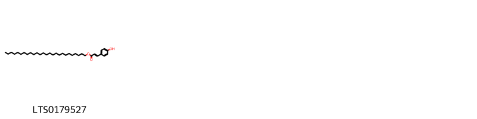{ width=100% }
    <figcaption>Hình ảnh cấu trúc hóa học của 1 hoạt chất thuộc nhóm Cinnamic acids and derivatives gồm ['hexacosyl (2e)-3-(4-hydroxyphenyl)prop-2-enoate (LTS0179527)'].</figcaption>
</figure>
#### Nhóm Fatty Acyls
<figure markdown="span">
    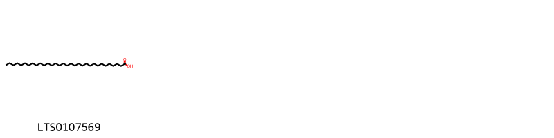{ width=100% }
    <figcaption>Hình ảnh cấu trúc hóa học của 1 hoạt chất thuộc nhóm Fatty Acyls gồm ['lacceroic acid (LTS0107569)'].</figcaption>
</figure>
#### Nhóm Flavonoids
<figure markdown="span">
    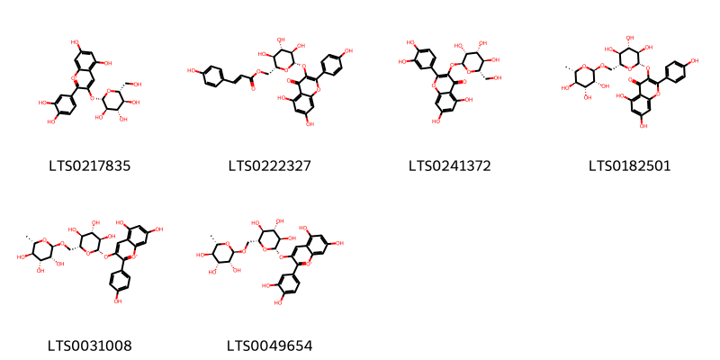{ width=100% }
    <figcaption>Hình ảnh cấu trúc hóa học của 6 hoạt chất thuộc nhóm Flavonoids gồm ['cyanidin 3-glucoside (LTS0217835)', 'tiliroside (LTS0222327)', '2-(3,4-dihydroxyphenyl)-5,7-dihydroxy-3-{[(2s,3r,4r,5r,6s)-3,4,5-trihydroxy-6-(hydroxymethyl)oxan-2-yl]oxy}chromen-4-one (LTS0241372)', 'nictoflorin (LTS0182501)', 'pelargonidin 3-o-rutinoside (LTS0031008)', 'cyanidin 3-o-rutinoside (LTS0049654)'].</figcaption>
</figure>
#### Nhóm Indoles and derivatives
<figure markdown="span">
    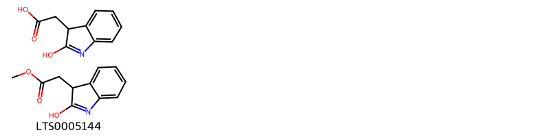{ width=100% }
    <figcaption>Hình ảnh cấu trúc hóa học của 1 hoạt chất thuộc nhóm Indoles and derivatives gồm ['(2-hydroxy-3h-indol-3-yl)acetic acid; methyl 2-(2-hydroxy-3h-indol-3-yl)acetate (LTS0005144)'].</figcaption>
</figure>
#### Nhóm Organooxygen compounds
<figure markdown="span">
    { width=100% }
    <figcaption>Hình ảnh cấu trúc hóa học của 1 hoạt chất thuộc nhóm Organooxygen compounds gồm ['chlorogenic acid (LTS0226495)'].</figcaption>
</figure>
#### Nhóm Prenol lipids
<figure markdown="span">
    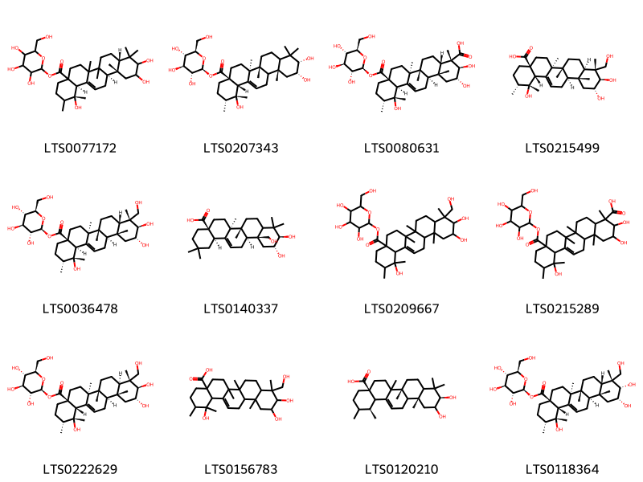{ width=100% }
    <figcaption>Hình ảnh cấu trúc hóa học của 12 hoạt chất thuộc nhóm Prenol lipids gồm ['3,4,5-trihydroxy-6-(hydroxymethyl)oxan-2-yl (1r,8as,12ar,12br,14br)-1,10,11-trihydroxy-1,2,6a,6b,9,9,12a-heptamethyl-2,3,4,5,6,7,8,8a,10,11,12,12b,13,14b-tetradecahydropicene-4a-carboxylate (LTS0077172)', '(2s,3r,4s,5s,6r)-3,4,5-trihydroxy-6-(hydroxymethyl)oxan-2-yl (1r,2r,4as,6as,6br,10s,11r,12ar,14bs)-1,10,11-trihydroxy-1,2,6a,6b,9,9,12a-heptamethyl-2,3,4,5,6,7,8,8a,10,11,12,12b,13,14b-tetradecahydropicene-4a-carboxylate (LTS0207343)', '(2r,3r,4s,4as,6ar,6bs,8as,11r,12r,12ar,14ar,14br)-2,3,12-trihydroxy-4,6a,6b,11,12,14b-hexamethyl-8a-({[(2s,3r,4s,5s,6r)-3,4,5-trihydroxy-6-(hydroxymethyl)oxan-2-yl]oxy}carbonyl)-1,2,3,4a,5,6,7,8,9,10,11,12a,14,14a-tetradecahydropicene-4-carboxylic acid (LTS0080631)', '19α-hydroxyasiatic acid (LTS0215499)', '(2s,3r,4s,5s,6r)-3,4,5-trihydroxy-6-(hydroxymethyl)oxan-2-yl (1r,2r,4as,6as,6br,8as,9r,10r,11r,12ar,12br,14br)-1,10,11-trihydroxy-9-(hydroxymethyl)-1,2,6a,6b,9,12a-hexamethyl-2,3,4,5,6,7,8,8a,10,11,12,12b,13,14b-tetradecahydropicene-4a-carboxylate (LTS0036478)', '(4as,6as,6br,10r,11r,12as,12bs,14br)-10,11-dihydroxy-12a-(hydroxymethyl)-2,2,6a,6b,9,9-hexamethyl-1,3,4,5,6,7,8,8a,10,11,12,12b,13,14b-tetradecahydropicene-4a-carboxylic acid (LTS0140337)', '3,4,5-trihydroxy-6-(hydroxymethyl)oxan-2-yl 1,10,11-trihydroxy-9-(hydroxymethyl)-1,2,6a,6b,9,12a-hexamethyl-2,3,4,5,6,7,8,8a,10,11,12,12b,13,14b-tetradecahydropicene-4a-carboxylate (LTS0209667)', '2,3,12-trihydroxy-4,6a,6b,11,12,14b-hexamethyl-8a-({[3,4,5-trihydroxy-6-(hydroxymethyl)oxan-2-yl]oxy}carbonyl)-1,2,3,4a,5,6,7,8,9,10,11,12a,14,14a-tetradecahydropicene-4-carboxylic acid (LTS0215289)', '(2s,3r,4s,5s,6r)-3,4,5-trihydroxy-6-(hydroxymethyl)oxan-2-yl (1r,2r,4as,6as,6br,8ar,9r,10r,11r,12ar,12br,14bs)-1,10,11-trihydroxy-9-(hydroxymethyl)-1,2,6a,6b,9,12a-hexamethyl-2,3,4,5,6,7,8,8a,10,11,12,12b,13,14b-tetradecahydropicene-4a-carboxylate (LTS0222629)', '1,10,11-trihydroxy-9-(hydroxymethyl)-1,2,6a,6b,9,12a-hexamethyl-2,3,4,5,6,7,8,8a,10,11,12,12b,13,14b-tetradecahydropicene-4a-carboxylic acid (LTS0156783)', '(1s,4as,6br,10r,12ar)-10,11-dihydroxy-1,2,6a,6b,9,9,12a-heptamethyl-2,3,4,5,6,7,8,8a,10,11,12,12b,13,14b-tetradecahydro-1h-picene-4a-carboxylic acid (LTS0120210)', '(2s,3r,4s,5s,6r)-3,4,5-trihydroxy-6-(hydroxymethyl)oxan-2-yl (1r,2r,4as,6as,6br,8as,9r,10s,11r,12ar,12br,14bs)-1,10,11-trihydroxy-9-(hydroxymethyl)-1,2,6a,6b,9,12a-hexamethyl-2,3,4,5,6,7,8,8a,10,11,12,12b,13,14b-tetradecahydropicene-4a-carboxylate (LTS0118364)'].</figcaption>
</figure>
#### Nhóm Steroids and steroid derivatives
<figure markdown="span">
    { width=100% }
    <figcaption>Hình ảnh cấu trúc hóa học của 2 hoạt chất thuộc nhóm Steroids and steroid derivatives gồm ['sitogluside (LTS0201798)', '2-{[1-(5-ethyl-6-methylheptan-2-yl)-9a,11a-dimethyl-1h,2h,3h,3ah,3bh,4h,6h,7h,8h,9h,9bh,10h,11h-cyclopenta[a]phenanthren-7-yl]oxy}-6-(hydroxymethyl)oxane-3,4,5-triol (LTS0158828)'].</figcaption>
</figure>
#### Nhóm Tannins
<figure markdown="span">
    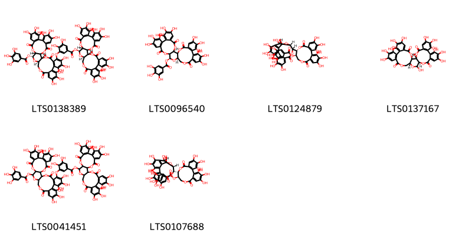{ width=100% }
    <figcaption>Hình ảnh cấu trúc hóa học của 6 hoạt chất thuộc nhóm Tannins gồm ['(1r,2s,19r,20s,22r)-7,8,9,12,13,14,28,29,30,33,34,35-dodecahydroxy-4,17,25,38-tetraoxo-3,18,21,24,39-pentaoxaheptacyclo[20.17.0.0²,¹⁹.0⁵,¹⁰.0¹¹,¹⁶.0²⁶,³¹.0³²,³⁷]nonatriaconta-5,7,9,11(16),12,14,26,28,30,32(37),33,35-dodecaen-20-yl 3-{[(1r,2s,19r,20r,22r)-7,8,9,12,13,14,28,29,30,33,34,35-dodecahydroxy-4,17,25,38-tetraoxo-20-(3,4,5-trihydroxybenzoyloxy)-3,18,21,24,39-pentaoxaheptacyclo[20.17.0.0²,¹⁹.0⁵,¹⁰.0¹¹,¹⁶.0²⁶,³¹.0³²,³⁷]nonatriaconta-5,7,9,11(16),12,14,26,28,30,32(37),33,35-dodecaen-36-yl]oxy}-4,5-dihydroxybenzoate (LTS0138389)', '(2s,20s,22r)-7,8,9,12,13,14,28,29,30,33,34,35-dodecahydroxy-4,17,25,38-tetraoxo-3,18,21,24,39-pentaoxaheptacyclo[20.17.0.0²,¹⁹.0⁵,¹⁰.0¹¹,¹⁶.0²⁶,³¹.0³²,³⁷]nonatriaconta-5,7,9,11(16),12,14,26,28,30,32(37),33,35-dodecaen-20-yl 3,4,5-trihydroxybenzoate (LTS0096540)', '(11r,12r)-12-[(14r,15s,19s)-2,3,4,7,8,9,19-heptahydroxy-12,17-dioxo-13,16-dioxatetracyclo[13.3.1.0⁵,¹⁸.0⁶,¹¹]nonadeca-1(18),2,4,6,8,10-hexaen-14-yl]-3,4,5,17,18,19-hexahydroxy-8,14-dioxo-9,13-dioxatricyclo[13.4.0.0²,⁷]nonadeca-1(15),2,4,6,16,18-hexaen-11-yl 3,4,5-trihydroxybenzoate (LTS0124879)', '(1r,2s,19r,22r)-7,8,9,12,13,14,20,28,29,30,33,34,35-tridecahydroxy-3,18,21,24,39-pentaoxaheptacyclo[20.17.0.0²,¹⁹.0⁵,¹⁰.0¹¹,¹⁶.0²⁶,³¹.0³²,³⁷]nonatriaconta-5(10),6,8,11,13,15,26(31),27,29,32,34,36-dodecaene-4,17,25,38-tetrone (LTS0137167)', '7,8,9,12,13,14,28,29,30,33,34,35-dodecahydroxy-4,17,25,38-tetraoxo-3,18,21,24,39-pentaoxaheptacyclo[20.17.0.0²,¹⁹.0⁵,¹⁰.0¹¹,¹⁶.0²⁶,³¹.0³²,³⁷]nonatriaconta-5,7,9,11(16),12,14,26,28,30,32(37),33,35-dodecaen-20-yl 3-{[7,8,9,12,13,14,28,29,30,33,34,35-dodecahydroxy-4,17,25,38-tetraoxo-20-(3,4,5-trihydroxybenzoyloxy)-3,18,21,24,39-pentaoxaheptacyclo[20.17.0.0²,¹⁹.0⁵,¹⁰.0¹¹,¹⁶.0²⁶,³¹.0³²,³⁷]nonatriaconta-5(10),6,8,11,13,15,26,28,30,32(37),33,35-dodecaen-36-yl]oxy}-4,5-dihydroxybenzoate (LTS0041451)', '(11r,12r)-12-[(15s,19s)-2,3,4,7,8,9,19-heptahydroxy-12,17-dioxo-13,16-dioxatetracyclo[13.3.1.0⁵,¹⁸.0⁶,¹¹]nonadeca-1(18),2,4,6,8,10-hexaen-14-yl]-3,4,5,17,18,19-hexahydroxy-8,14-dioxo-9,13-dioxatricyclo[13.4.0.0²,⁷]nonadeca-1(15),2,4,6,16,18-hexaen-11-yl 3,4,5-trihydroxybenzoate (LTS0107688)'].</figcaption>
</figure>

---

### Dược dân tộc học

Danh sách các quốc gia có sử dụng *Rubus coreanus* trong điều trị các bệnh. 

| Country   | Disease           | Bệnh                                                                                                                                                                                                |
|:----------|:------------------|:----------------------------------------------------------------------------------------------------------------------------------------------------------------------------------------------------|
| China     | Astringent, Tonic | MYMEMORY WARNING: YOU USED ALL AVAILABLE FREE TRANSLATIONS FOR TODAY. NEXT AVAILABLE IN  11 HOURS 42 MINUTES 55 SECONDS VISIT HTTPS://MYMEMORY.TRANSLATED.NET/DOC/USAGELIMITS.PHP TO TRANSLATE MORE |

---

---
## Rubus ectabilis
### Thông tin về thực vật

!!! info "Phân loại thực vật của *N/A* từ GIBF:"
    - **Kingdom:** Plantae
    - **Phylum:** Tracheophyta
    - **Order:** Rosales
    - **Family:** Rosaceae
    - **Genus:** Rubus
    - **Species:** *N/A*

 

| Label (VI)   | Label (EN)   | Scientific Name   | Descriptions (VI)   | Descriptions (EN)   | Also Known As (VI)   | Also Known As (EN)   |
|:-------------|:-------------|:------------------|:--------------------|:--------------------|:---------------------|:---------------------|
| N/A          | N/A          | Rubus coreanus    | loài thực vật       | species of plant    | ['']                 | ['bokbunja']         |

#### Phân bố trên thế giới

**Từ CSDL GIBF** Uruguay, United Kingdom of Great Britain and Northern Ireland, Argentina, South Africa, France, Spain, New Zealand, Bolivia (Plurinational State of), Russian Federation, Canada, United States of America, Ecuador, Ireland, Chile, Isle of Man, Australia, Chinese Taipei

#### Phân bố tại Việt Nam

**Từ CSDL GIBF**: Không có ghi nhận ở Việt Nam

---
### Thành phần hóa học
        
- Theo cơ sở dữ liệu lotus: Từ loài *N/A* đã phân lập và xác định được Chưa có hoạt chất nào được phân lập. hoạt chất thuộc về các nhóm Không có hoạt chất nào được phân lập. 

Không có hình ảnh nào được tạo ra

---

### Dược dân tộc học

Danh sách các quốc gia có sử dụng *N/A* trong điều trị các bệnh. 

| Country               | Disease    | Bệnh                                                                                                                                                                                                |
|:----------------------|:-----------|:----------------------------------------------------------------------------------------------------------------------------------------------------------------------------------------------------|
| Elsewhere(Amerindian) | Astringent | MYMEMORY WARNING: YOU USED ALL AVAILABLE FREE TRANSLATIONS FOR TODAY. NEXT AVAILABLE IN  11 HOURS 42 MINUTES 23 SECONDS VISIT HTTPS://MYMEMORY.TRANSLATED.NET/DOC/USAGELIMITS.PHP TO TRANSLATE MORE |

---

---
## Rubus ellipticus
### Thông tin về thực vật

!!! info "Phân loại thực vật của *Rubus ellipticus* từ GIBF:"
    - **Kingdom:** Plantae
    - **Phylum:** Tracheophyta
    - **Order:** Rosales
    - **Family:** Rosaceae
    - **Genus:** Rubus
    - **Species:** *Rubus ellipticus*

 

| Label (VI)   | Label (EN)   | Scientific Name   | Descriptions (VI)   | Descriptions (EN)   | Also Known As (VI)   | Also Known As (EN)   |
|:-------------|:-------------|:------------------|:--------------------|:--------------------|:---------------------|:---------------------|
| N/A          | N/A          | Rubus ellipticus  | loài thực vật       | species of plant    | ['']                 | ['']                 |

#### Phân bố trên thế giới

**Từ CSDL GIBF** Viet Nam, Sri Lanka, South Africa, Myanmar, Bhutan, New Zealand, India, Ecuador, United States of America, China, Nepal, Australia, Jamaica, Chinese Taipei

#### Phân bố tại Việt Nam

**Từ CSDL GIBF**: Lào Cai

---
### Thành phần hóa học
        
- Theo cơ sở dữ liệu lotus: Từ loài *Rubus ellipticus* đã phân lập và xác định được 63 hoạt chất thuộc về các nhóm Organooxygen compounds, Prenol lipids. 

|    | chemicalTaxonomyClassyfireClass   |   smiles_count |
|---:|:----------------------------------|---------------:|
|  0 | Organooxygen compounds            |              1 |
|  1 | Prenol lipids                     |             62 |

#### Nhóm Organooxygen compounds
<figure markdown="span">
    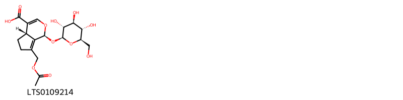{ width=100% }
    <figcaption>Hình ảnh cấu trúc hóa học của 1 hoạt chất thuộc nhóm Organooxygen compounds gồm ['(1s,4as)-7-[(acetyloxy)methyl]-1-{[(2s,3r,4s,5s,6r)-3,4,5-trihydroxy-6-(hydroxymethyl)oxan-2-yl]oxy}-1h,4ah,5h,6h-cyclopenta[c]pyran-4-carboxylic acid (LTS0109214)'].</figcaption>
</figure>
#### Nhóm Prenol lipids
<figure markdown="span">
    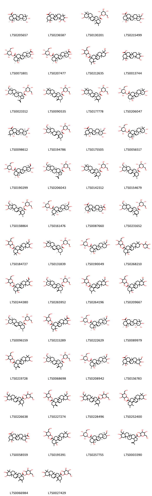{ width=100% }
    <figcaption>Hình ảnh cấu trúc hóa học của 62 hoạt chất thuộc nhóm Prenol lipids gồm ['euscaphic acid (LTS0205657)', '1,10,11,12-tetrahydroxy-1,2,6a,6b,9,9,12a-heptamethyl-2,3,4,5,6,7,8,8a,10,11,12,12b,13,14b-tetradecahydropicene-4a-carboxylic acid (LTS0236587)', '(2s,3r,4s,5s,6r)-3,4,5-trihydroxy-6-(hydroxymethyl)oxan-2-yl (4as,6as,6br,8ar,10r,11r,12ar,12br,14bs)-10,11-dihydroxy-1,2,6a,6b,9,9,12a-heptamethyl-4,5,6,7,8,8a,10,11,12,12b,13,14b-dodecahydro-3h-picene-4a-carboxylate (LTS0130201)', '19α-hydroxyasiatic acid (LTS0215499)', '(2r,3r,4r,4ar,6ar,6bs,8as,11r,12r,12as,14ar,14br)-2,3,12-trihydroxy-4,6a,6b,11,12,14b-hexamethyl-8a-({[(2s,3r,4s,5s,6r)-3,4,5-trihydroxy-6-(hydroxymethyl)oxan-2-yl]oxy}carbonyl)-1,2,3,4a,5,6,7,8,9,10,11,12a,14,14a-tetradecahydropicene-4-carboxylic acid (LTS0071801)', '(2r,3r,4s,4ar,6ar,6bs,8as,11r,12r,12as,14ar,14br)-2,3,12-trihydroxy-4,6a,6b,11,12,14b-hexamethyl-8a-({[(2s,3r,4s,5s,6r)-3,4,5-trihydroxy-6-(hydroxymethyl)oxan-2-yl]oxy}carbonyl)-1,2,3,4a,5,6,7,8,9,10,11,12a,14,14a-tetradecahydropicene-4-carboxylic acid (LTS0207477)', '3,4,5-trihydroxy-6-(hydroxymethyl)oxan-2-yl 1,10-dihydroxy-9-(hydroxymethyl)-1,2,6a,6b,9,12a-hexamethyl-2,3,4,5,6,7,8,8a,10,11,12,12b,13,14b-tetradecahydropicene-4a-carboxylate (LTS0212635)', '1,10,11-trihydroxy-1,2,6a,6b,9,9,12a-heptamethyl-2,3,4,5,6,7,8,8a,10,11,12,12b,13,14b-tetradecahydropicene-4a-carboxylic acid (LTS0013744)', '(2s,3r,4s,5s,6r)-3,4,5-trihydroxy-6-(hydroxymethyl)oxan-2-yl (1r,3as,5ar,5br,7ar,8s,9r,10r,11ar,11br,13ar,13bs)-9,10-dihydroxy-8-(hydroxymethyl)-5a,5b,8,11a-tetramethyl-1-(prop-1-en-2-yl)-hexadecahydrocyclopenta[a]chrysene-3a-carboxylate (LTS0023312)', '(2s,3r,4s,5s,6r)-3,4,5-trihydroxy-6-(hydroxymethyl)oxan-2-yl (2r,4as,6as,6br,8ar,10r,11r,12ar,12br,14bs)-10,11-dihydroxy-2,6a,6b,9,9,12a-hexamethyl-1-methylidene-2,3,4,5,6,7,8,8a,10,11,12,12b,13,14b-tetradecahydropicene-4a-carboxylate (LTS0090535)', '(2s,3r,4s,5s,6r)-3,4,5-trihydroxy-6-(hydroxymethyl)oxan-2-yl (4as,6as,6br,8ar,10s,11r,12ar,12br,14bs)-10,11-dihydroxy-1,2,6a,6b,9,9,12a-heptamethyl-4,5,6,7,8,8a,10,11,12,12b,13,14b-dodecahydro-3h-picene-4a-carboxylate (LTS0177778)', '(2s,3r,4s,5s,6r)-3,4,5-trihydroxy-6-(hydroxymethyl)oxan-2-yl (1r,2r,4as,6as,6br,8ar,10r,11r,12ar,12br,14bs)-1,10,11-trihydroxy-1,2,6a,6b,9,9,12a-heptamethyl-2,3,4,5,6,7,8,8a,10,11,12,12b,13,14b-tetradecahydropicene-4a-carboxylate (LTS0206047)', '(1s,4ar,6as,6br,8ar,9s,10s,11r,12ar,12br,14bs)-1,10,11-trihydroxy-9-(hydroxymethyl)-2,2,6a,6b,9,12a-hexamethyl-1,3,4,5,6,7,8,8a,10,11,12,12b,13,14b-tetradecahydropicene-4a-carboxylic acid (LTS0098612)', '(2s,3r,4s,5s,6r)-3,4,5-trihydroxy-6-(hydroxymethyl)oxan-2-yl (2r,4as,6as,6br,8ar,9r,10s,11r,12ar,12br)-10,11-dihydroxy-9-(hydroxymethyl)-1,2,6a,6b,9,12a-hexamethyl-3,4,5,6,7,8,8a,10,11,12,12b,13-dodecahydro-2h-picene-4a-carboxylate (LTS0194786)', '(1s,4ar,6as,6br,8ar,9s,10r,11r,12ar,12br,14bs)-1,10,11-trihydroxy-9-(hydroxymethyl)-2,2,6a,6b,9,12a-hexamethyl-1,3,4,5,6,7,8,8a,10,11,12,12b,13,14b-tetradecahydropicene-4a-carboxylic acid (LTS0175505)', '(2s,3r,4s,5s,6r)-3,4,5-trihydroxy-6-(hydroxymethyl)oxan-2-yl (1r,2r,4as,6as,6br,8ar,10s,11r,12ar,12br,14bs)-1,10,11-trihydroxy-1,2,6a,6b,9,9,12a-heptamethyl-2,3,4,5,6,7,8,8a,10,11,12,12b,13,14b-tetradecahydropicene-4a-carboxylate (LTS0056517)', '(2s,3r,4s,5s,6r)-3,4,5-trihydroxy-6-(hydroxymethyl)oxan-2-yl (1r,2r,4as,6as,6br,8ar,9s,10r,11r,12ar,12br,14bs)-9-formyl-1,10,11-trihydroxy-1,2,6a,6b,9,12a-hexamethyl-2,3,4,5,6,7,8,8a,10,11,12,12b,13,14b-tetradecahydropicene-4a-carboxylate (LTS0190299)', '(2s,3r,4s,5s,6r)-3,4,5-trihydroxy-6-(hydroxymethyl)oxan-2-yl (1r,3as,5ar,5br,7ar,8s,9r,10r,11ar,11br,13ar,13br)-9,10-dihydroxy-8-(hydroxymethyl)-5a,5b,8,11a-tetramethyl-1-(prop-1-en-2-yl)-hexadecahydrocyclopenta[a]chrysene-3a-carboxylate (LTS0206043)', '(2s,3r,4s,5s,6r)-3,4,5-trihydroxy-6-(hydroxymethyl)oxan-2-yl (2r,4as,6as,6br,8ar,10s,11r,12ar,12br,14bs)-10,11-dihydroxy-2,6a,6b,9,9,12a-hexamethyl-1-methylidene-2,3,4,5,6,7,8,8a,10,11,12,12b,13,14b-tetradecahydropicene-4a-carboxylate (LTS0142312)', '(2s,3r,4s,5s,6r)-3,4,5-trihydroxy-6-(hydroxymethyl)oxan-2-yl (2r,4as,6as,6br,8ar,9r,10r,11r,12ar,12br)-10,11-dihydroxy-9-(hydroxymethyl)-1,2,6a,6b,9,12a-hexamethyl-3,4,5,6,7,8,8a,10,11,12,12b,13-dodecahydro-2h-picene-4a-carboxylate (LTS0154679)', '(2s,3r,4s,5s,6r)-3,4,5-trihydroxy-6-(hydroxymethyl)oxan-2-yl (2r,4as,6as,6br,8ar,9r,10s,11r,12as,12br)-10,11-dihydroxy-9-(hydroxymethyl)-1,2,6a,6b,9,12a-hexamethyl-3,4,5,6,7,8,8a,10,11,12,12b,13-dodecahydro-2h-picene-4a-carboxylate (LTS0158864)', 'sericoside (LTS0161476)', '(2r,3r,4s,4ar,6ar,6bs,8as,11r,12r,12as,14ar,14br)-2,3,12-trihydroxy-4,6a,6b,11,12,14b-hexamethyl-1,2,3,4a,5,6,7,8,9,10,11,12a,14,14a-tetradecahydropicene-4,8a-dicarboxylic acid (LTS0087660)', '(2s,3r,4s,5s,6r)-3,4,5-trihydroxy-6-(hydroxymethyl)oxan-2-yl (4as,6as,6br,8ar,9r,10r,11r,12ar,12br,14bs)-10,11-dihydroxy-9-(hydroxymethyl)-1,2,6a,6b,9,12a-hexamethyl-4,5,6,7,8,8a,10,11,12,12b,13,14b-dodecahydro-3h-picene-4a-carboxylate (LTS0231652)', '3,4,5-trihydroxy-6-(hydroxymethyl)oxan-2-yl 1,10,11-trihydroxy-9-(hydroxymethyl)-2,2,6a,6b,9,12a-hexamethyl-1,3,4,5,6,7,8,8a,10,11,12,12b,13,14b-tetradecahydropicene-4a-carboxylate (LTS0184727)', '(2s,3r,4s,5s,6r)-3,4,5-trihydroxy-6-(hydroxymethyl)oxan-2-yl (1s,2r,4as,6as,6br,8ar,10s,11r,12as,12br)-10,11-dihydroxy-1,2,6a,6b,9,9,12a-heptamethyl-2,3,4,5,6,7,8,8a,10,11,12,12b-dodecahydro-1h-picene-4a-carboxylate (LTS0131839)', '(2s,3r,4s,5s,6r)-3,4,5-trihydroxy-6-(hydroxymethyl)oxan-2-yl (1r,2r,4as,6as,6br,8ar,9r,10s,12as,12br,14bs)-1,10-dihydroxy-9-(hydroxymethyl)-1,2,6a,6b,9,12a-hexamethyl-2,3,4,5,6,7,8,8a,10,11,12,12b,13,14b-tetradecahydropicene-4a-carboxylate (LTS0190049)', '3,4,5-trihydroxy-6-(hydroxymethyl)oxan-2-yl 1-hydroxy-1,2,6a,6b,9,9,12a-heptamethyl-10-[(3,4,5-trihydroxyoxan-2-yl)oxy]-2,3,4,5,6,7,8,8a,10,11,12,12b,13,14b-tetradecahydropicene-4a-carboxylate (LTS0268210)', '3,4,5-trihydroxy-6-(hydroxymethyl)oxan-2-yl 9-formyl-1,10,11-trihydroxy-1,2,6a,6b,9,12a-hexamethyl-2,3,4,5,6,7,8,8a,10,11,12,12b,13,14b-tetradecahydropicene-4a-carboxylate (LTS0244380)', '(2s,3r,4s,5s,6r)-3,4,5-trihydroxy-6-(hydroxymethyl)oxan-2-yl (2r,4as,6as,6br,8ar,9r,10r,11r,12as,12br,14bs)-10,11-dihydroxy-9-(hydroxymethyl)-2,6a,6b,9,12a-pentamethyl-1-methylidene-2,3,4,5,6,7,8,8a,10,11,12,12b,13,14b-tetradecahydropicene-4a-carboxylate (LTS0265952)', '3,4,5-trihydroxy-6-(hydroxymethyl)oxan-2-yl 10,11-dihydroxy-9-(hydroxymethyl)-1,2,6a,6b,9,12a-hexamethyl-2,3,4,5,6,7,8,8a,10,11,12,12b-dodecahydro-1h-picene-4a-carboxylate (LTS0264196)', '3,4,5-trihydroxy-6-(hydroxymethyl)oxan-2-yl 1,10,11-trihydroxy-9-(hydroxymethyl)-1,2,6a,6b,9,12a-hexamethyl-2,3,4,5,6,7,8,8a,10,11,12,12b,13,14b-tetradecahydropicene-4a-carboxylate (LTS0209667)', '(2s,3r,4s,5s,6r)-3,4,5-trihydroxy-6-(hydroxymethyl)oxan-2-yl (1s,2r,4as,6as,6br,8ar,9r,10r,11r,12as,12br)-10,11-dihydroxy-9-(hydroxymethyl)-1,2,6a,6b,9,12a-hexamethyl-2,3,4,5,6,7,8,8a,10,11,12,12b-dodecahydro-1h-picene-4a-carboxylate (LTS0096159)', '2,3,12-trihydroxy-4,6a,6b,11,12,14b-hexamethyl-8a-({[3,4,5-trihydroxy-6-(hydroxymethyl)oxan-2-yl]oxy}carbonyl)-1,2,3,4a,5,6,7,8,9,10,11,12a,14,14a-tetradecahydropicene-4-carboxylic acid (LTS0215289)', '(2s,3r,4s,5s,6r)-3,4,5-trihydroxy-6-(hydroxymethyl)oxan-2-yl (1r,2r,4as,6as,6br,8ar,9r,10r,11r,12ar,12br,14bs)-1,10,11-trihydroxy-9-(hydroxymethyl)-1,2,6a,6b,9,12a-hexamethyl-2,3,4,5,6,7,8,8a,10,11,12,12b,13,14b-tetradecahydropicene-4a-carboxylate (LTS0222629)', '(1r,2r,4as,6as,6br,8as,10r,11s,12r,12ar,12bs,14bs)-1,10,11,12-tetrahydroxy-1,2,6a,6b,9,9,12a-heptamethyl-2,3,4,5,6,7,8,8a,10,11,12,12b,13,14b-tetradecahydropicene-4a-carboxylic acid (LTS0089979)', '3,4,5-trihydroxy-6-(hydroxymethyl)oxan-2-yl 10,11-dihydroxy-2,6a,6b,9,9,12a-hexamethyl-1-methylidene-2,3,4,5,6,7,8,8a,10,11,12,12b,13,14b-tetradecahydropicene-4a-carboxylate (LTS0219728)', '(2s,3r,4s,5s,6r)-3,4,5-trihydroxy-6-(hydroxymethyl)oxan-2-yl (2r,4as,6as,6br,8ar,9r,10r,11r,12ar,12br,14bs)-10,11-dihydroxy-9-(hydroxymethyl)-2,6a,6b,9,12a-pentamethyl-1-methylidene-2,3,4,5,6,7,8,8a,10,11,12,12b,13,14b-tetradecahydropicene-4a-carboxylate (LTS0068698)', '(2s,3r,4s,5s,6r)-3,4,5-trihydroxy-6-(hydroxymethyl)oxan-2-yl (1r,2s,4as,6as,6br,8ar,9r,10r,11r,12as,12br,14bs)-1,10,11-trihydroxy-9-(hydroxymethyl)-1,2,6a,6b,9,12a-hexamethyl-2,3,4,5,6,7,8,8a,10,11,12,12b,13,14b-tetradecahydropicene-4a-carboxylate (LTS0208942)', '1,10,11-trihydroxy-9-(hydroxymethyl)-1,2,6a,6b,9,12a-hexamethyl-2,3,4,5,6,7,8,8a,10,11,12,12b,13,14b-tetradecahydropicene-4a-carboxylic acid (LTS0156783)', '3,4,5-trihydroxy-6-(hydroxymethyl)oxan-2-yl 10,11-dihydroxy-9-(hydroxymethyl)-1,2,6a,6b,9,12a-hexamethyl-3,4,5,6,7,8,8a,10,11,12,12b,13-dodecahydro-2h-picene-4a-carboxylate (LTS0226638)', '3,4,5-trihydroxy-6-(hydroxymethyl)oxan-2-yl 10,11-dihydroxy-9-(hydroxymethyl)-2,6a,6b,9,12a-pentamethyl-1-methylidene-2,3,4,5,6,7,8,8a,10,11,12,12b,13,14b-tetradecahydropicene-4a-carboxylate (LTS0227274)', '3,4,5-trihydroxy-6-(hydroxymethyl)oxan-2-yl 10,11-dihydroxy-9-(hydroxymethyl)-1,2,6a,6b,9,12a-hexamethyl-4,5,6,7,8,8a,10,11,12,12b,13,14b-dodecahydro-3h-picene-4a-carboxylate (LTS0228496)', '3,4,5-trihydroxy-6-(hydroxymethyl)oxan-2-yl 10,11-dihydroxy-1,2,6a,6b,9,9,12a-heptamethyl-2,3,4,5,6,7,8,8a,10,11,12,12b-dodecahydro-1h-picene-4a-carboxylate (LTS0252400)', '2,3,12-trihydroxy-4,6a,6b,11,12,14b-hexamethyl-1,2,3,4a,5,6,7,8,9,10,11,12a,14,14a-tetradecahydropicene-4,8a-dicarboxylic acid (LTS0058559)', '3,4,5-trihydroxy-6-(hydroxymethyl)oxan-2-yl 1,10,11-trihydroxy-1,2,6a,6b,9,9,12a-heptamethyl-2,3,4,5,6,7,8,8a,10,11,12,12b,13,14b-tetradecahydropicene-4a-carboxylate (LTS0195391)', '(2s,3r,4s,5s,6r)-3,4,5-trihydroxy-6-(hydroxymethyl)oxan-2-yl (1r,2r,4as,6as,6br,8ar,9r,10s,12ar,12br,14bs)-1,10-dihydroxy-9-(hydroxymethyl)-1,2,6a,6b,9,12a-hexamethyl-2,3,4,5,6,7,8,8a,10,11,12,12b,13,14b-tetradecahydropicene-4a-carboxylate (LTS0257755)', '3,4,5-trihydroxy-6-(hydroxymethyl)oxan-2-yl 9,10-dihydroxy-8-(hydroxymethyl)-5a,5b,8,11a-tetramethyl-1-(prop-1-en-2-yl)-hexadecahydrocyclopenta[a]chrysene-3a-carboxylate (LTS0003390)', '3,4,5-trihydroxy-6-(hydroxymethyl)oxan-2-yl 10,11-dihydroxy-1,2,6a,6b,9,9,12a-heptamethyl-4,5,6,7,8,8a,10,11,12,12b,13,14b-dodecahydro-3h-picene-4a-carboxylate (LTS0066984)', '3,4,5-trihydroxy-6-(hydroxymethyl)oxan-2-yl 10,11-dihydroxy-1,2,6a,6b,9,9,12a-heptamethyl-3,4,5,6,7,8,8a,10,11,12,12b,13-dodecahydro-2h-picene-4a-carboxylate (LTS0027429)', '(2s,3r,4s,5s,6r)-3,4,5-trihydroxy-6-(hydroxymethyl)oxan-2-yl (2r,4as,6as,6br,8ar,10s,11r,12ar,12br)-10,11-dihydroxy-1,2,6a,6b,9,9,12a-heptamethyl-3,4,5,6,7,8,8a,10,11,12,12b,13-dodecahydro-2h-picene-4a-carboxylate (LTS0011187)', '1,10,11-trihydroxy-9-(hydroxymethyl)-2,2,6a,6b,9,12a-hexamethyl-1,3,4,5,6,7,8,8a,10,11,12,12b,13,14b-tetradecahydropicene-4a-carboxylic acid (LTS0012074)', '(2s,3r,4s,5s,6r)-3,4,5-trihydroxy-6-(hydroxymethyl)oxan-2-yl (1r,2r,4as,6as,6br,8ar,9s,10s,11r,12ar,12br,14bs)-9-formyl-1,10,11-trihydroxy-1,2,6a,6b,9,12a-hexamethyl-2,3,4,5,6,7,8,8a,10,11,12,12b,13,14b-tetradecahydropicene-4a-carboxylate (LTS0225550)', '(2s,3r,4s,5s,6r)-3,4,5-trihydroxy-6-(hydroxymethyl)oxan-2-yl (1r,2r,4as,6as,6br,8ar,10s,12ar,12br,14bs)-1-hydroxy-1,2,6a,6b,9,9,12a-heptamethyl-10-{[(2s,3r,4s,5s)-3,4,5-trihydroxyoxan-2-yl]oxy}-2,3,4,5,6,7,8,8a,10,11,12,12b,13,14b-tetradecahydropicene-4a-carboxylate (LTS0253525)', '(2s,3r,4s,5s,6r)-3,4,5-trihydroxy-6-(hydroxymethyl)oxan-2-yl (1r,2r,4as,6as,6br,8ar,9r,10s,11r,12ar,12br,14bs)-1,10,11-trihydroxy-9-(hydroxymethyl)-1,2,6a,6b,9,12a-hexamethyl-2,3,4,5,6,7,8,8a,10,11,12,12b,13,14b-tetradecahydropicene-4a-carboxylate (LTS0245663)', '(2s,3r,4s,5s,6r)-3,4,5-trihydroxy-6-(hydroxymethyl)oxan-2-yl (2r,4as,6as,6br,8ar,10r,11r,12ar,12br)-10,11-dihydroxy-1,2,6a,6b,9,9,12a-heptamethyl-3,4,5,6,7,8,8a,10,11,12,12b,13-dodecahydro-2h-picene-4a-carboxylate (LTS0137674)', '(2s,3r,4s,5s,6r)-3,4,5-trihydroxy-6-(hydroxymethyl)oxan-2-yl (1r,2r,4as,6as,6br,8ar,9s,10s,11r,12as,12br,14bs)-9-formyl-1,10,11-trihydroxy-1,2,6a,6b,9,12a-hexamethyl-2,3,4,5,6,7,8,8a,10,11,12,12b,13,14b-tetradecahydropicene-4a-carboxylate (LTS0104924)', '(2s,3r,4s,5s,6r)-3,4,5-trihydroxy-6-(hydroxymethyl)oxan-2-yl (1r,2r,4as,6as,6br,8ar,9s,10r,11r,12ar,12br,14bs)-1,10,11-trihydroxy-9-(hydroxymethyl)-1,2,6a,6b,9,12a-hexamethyl-2,3,4,5,6,7,8,8a,10,11,12,12b,13,14b-tetradecahydropicene-4a-carboxylate (LTS0104579)', '(2s,3r,4s,5s,6r)-3,4,5-trihydroxy-6-(hydroxymethyl)oxan-2-yl (1r,2r,4as,6as,6br,8as,9r,10r,11r,12ar,12br,14br)-1,10,11-trihydroxy-9-(hydroxymethyl)-1,2,6a,6b,9,12a-hexamethyl-2,3,4,5,6,7,8,8a,10,11,12,12b,13,14b-tetradecahydropicene-4a-carboxylate (LTS0036478)', '3,4,5-trihydroxy-6-(hydroxymethyl)oxan-2-yl 1,10,11-trihydroxy-2,2,6a,6b,9,9,12a-heptamethyl-1,3,4,5,6,7,8,8a,10,11,12,12b,13,14b-tetradecahydropicene-4a-carboxylate (LTS0136387)', '(2s,3r,4s,5s,6r)-3,4,5-trihydroxy-6-(hydroxymethyl)oxan-2-yl (1s,4ar,6as,6br,8ar,10r,11r,12ar,12br,14bs)-1,10,11-trihydroxy-2,2,6a,6b,9,9,12a-heptamethyl-1,3,4,5,6,7,8,8a,10,11,12,12b,13,14b-tetradecahydropicene-4a-carboxylate (LTS0161591)', 'tormentic acid (LTS0102591)'].</figcaption>
</figure>

---

### Dược dân tộc học

Danh sách các quốc gia có sử dụng *Rubus ellipticus* trong điều trị các bệnh. 

| Country   | Disease                              | Bệnh                                                                                                                                                                                                |
|:----------|:-------------------------------------|:----------------------------------------------------------------------------------------------------------------------------------------------------------------------------------------------------|
| Nepal     | Astringent, Tonic, Astringent, Tonic | MYMEMORY WARNING: YOU USED ALL AVAILABLE FREE TRANSLATIONS FOR TODAY. NEXT AVAILABLE IN  11 HOURS 42 MINUTES 00 SECONDS VISIT HTTPS://MYMEMORY.TRANSLATED.NET/DOC/USAGELIMITS.PHP TO TRANSLATE MORE |

---

---
## Rubus fruticosus
### Thông tin về thực vật

!!! info "Phân loại thực vật của *Rubus fruticosus* từ GIBF:"
    - **Kingdom:** Plantae
    - **Phylum:** Tracheophyta
    - **Order:** Rosales
    - **Family:** Rosaceae
    - **Genus:** Rubus
    - **Species:** *Rubus fruticosus*

 

| Label (VI)   | Label (EN)   | Scientific Name   | Descriptions (VI)   | Descriptions (EN)   | Also Known As (VI)   | Also Known As (EN)               |
|:-------------|:-------------|:------------------|:--------------------|:--------------------|:---------------------|:---------------------------------|
| N/A          | N/A          | Rubus fruticosus  | loài thực vật       | species of plant    | ['']                 | ['bramble', 'Rubus fructicosus'] |

#### Phân bố trên thế giới

**Từ CSDL GIBF** Argentina, New Zealand, Hungary, Isle of Man, Australia

#### Phân bố tại Việt Nam

**Từ CSDL GIBF**: Không có ghi nhận ở Việt Nam

---
### Thành phần hóa học
        
- Theo cơ sở dữ liệu lotus: Từ loài *Rubus fruticosus* đã phân lập và xác định được 33 hoạt chất thuộc về các nhóm Organooxygen compounds, Flavonoids, Tannins, Prenol lipids, Dihydrofurans, Steroids and steroid derivatives, Cinnamic acids and derivatives. 

|    | chemicalTaxonomyClassyfireClass   |   smiles_count |
|---:|:----------------------------------|---------------:|
|  0 | Cinnamic acids and derivatives    |              1 |
|  1 | Dihydrofurans                     |              1 |
|  2 | Flavonoids                        |              1 |
|  3 | Organooxygen compounds            |              1 |
|  4 | Prenol lipids                     |             11 |
|  5 | Steroids and steroid derivatives  |             13 |
|  6 | Tannins                           |              5 |

#### Nhóm Cinnamic acids and derivatives
<figure markdown="span">
    { width=100% }
    <figcaption>Hình ảnh cấu trúc hóa học của 1 hoạt chất thuộc nhóm Cinnamic acids and derivatives gồm ['para-coumaric acid (LTS0266252)'].</figcaption>
</figure>
#### Nhóm Dihydrofurans
<figure markdown="span">
    { width=100% }
    <figcaption>Hình ảnh cấu trúc hóa học của 1 hoạt chất thuộc nhóm Dihydrofurans gồm ['vitamin c (LTS0022555)'].</figcaption>
</figure>
#### Nhóm Flavonoids
<figure markdown="span">
    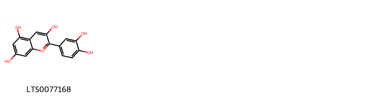{ width=100% }
    <figcaption>Hình ảnh cấu trúc hóa học của 1 hoạt chất thuộc nhóm Flavonoids gồm ['cyanidin (LTS0077168)'].</figcaption>
</figure>
#### Nhóm Organooxygen compounds
<figure markdown="span">
    { width=100% }
    <figcaption>Hình ảnh cấu trúc hóa học của 1 hoạt chất thuộc nhóm Organooxygen compounds gồm ['chlorogenic acid (LTS0226495)'].</figcaption>
</figure>
#### Nhóm Prenol lipids
<figure markdown="span">
    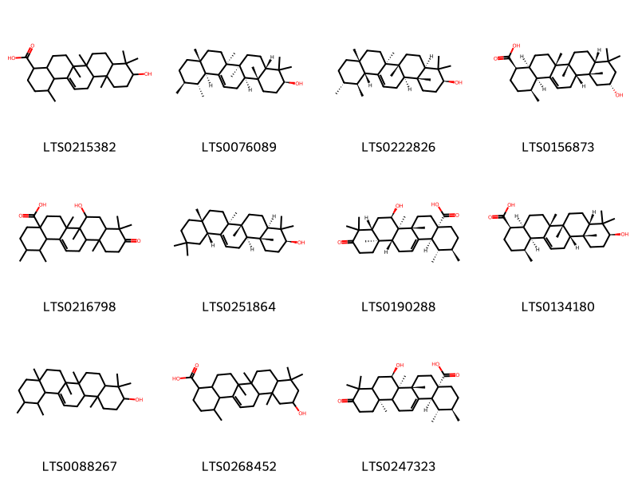{ width=100% }
    <figcaption>Hình ảnh cấu trúc hóa học của 11 hoạt chất thuộc nhóm Prenol lipids gồm ['10-hydroxy-1,6a,6b,9,9,12a-hexamethyl-1,2,3,4,4a,5,6,7,8,8a,10,11,12,12b,13,14b-hexadecahydropicene-4-carboxylic acid (LTS0215382)', '(3s,4as,6as,6bs,8ar,11s,12r,12as,14ar,14br)-4,4,6a,6b,8a,11,12,14b-octamethyl-2,3,4a,5,6,7,8,9,10,11,12,12a,14,14a-tetradecahydro-1h-picen-3-ol (LTS0076089)', 'amyrin (LTS0222826)', '(1s,4r,4as,6ar,6br,8ar,11s,12as,12bs,14bs)-11-hydroxy-1,6a,6b,9,9,12a-hexamethyl-1,2,3,4,4a,5,6,7,8,8a,10,11,12,12b,13,14b-hexadecahydropicene-4-carboxylic acid (LTS0156873)', '7-hydroxy-1,2,6a,6b,9,9,12a-heptamethyl-10-oxo-1,2,3,4,5,6,7,8,8a,11,12,12b,13,14b-tetradecahydropicene-4a-carboxylic acid (LTS0216798)', 'β-amyrin (LTS0251864)', '(1s,2r,4as,6ar,6br,7r,8ar,12ar,12br,14bs)-7-hydroxy-1,2,6a,6b,9,9,12a-heptamethyl-10-oxo-1,2,3,4,5,6,7,8,8a,11,12,12b,13,14b-tetradecahydropicene-4a-carboxylic acid (LTS0190288)', '(1s,4r,4as,6ar,6br,8as,10s,12ar,12bs,14bs)-10-hydroxy-1,6a,6b,9,9,12a-hexamethyl-1,2,3,4,4a,5,6,7,8,8a,10,11,12,12b,13,14b-hexadecahydropicene-4-carboxylic acid (LTS0134180)', 'α-amyrin (LTS0088267)', '11-hydroxy-1,6a,6b,9,9,12a-hexamethyl-1,2,3,4,4a,5,6,7,8,8a,10,11,12,12b,13,14b-hexadecahydropicene-4-carboxylic acid (LTS0268452)', '(1s,2r,4as,6ar,6br,7r,12ar,14bs)-7-hydroxy-1,2,6a,6b,9,9,12a-heptamethyl-10-oxo-1,2,3,4,5,6,7,8,8a,11,12,12b,13,14b-tetradecahydropicene-4a-carboxylic acid (LTS0247323)'].</figcaption>
</figure>
#### Nhóm Steroids and steroid derivatives
<figure markdown="span">
    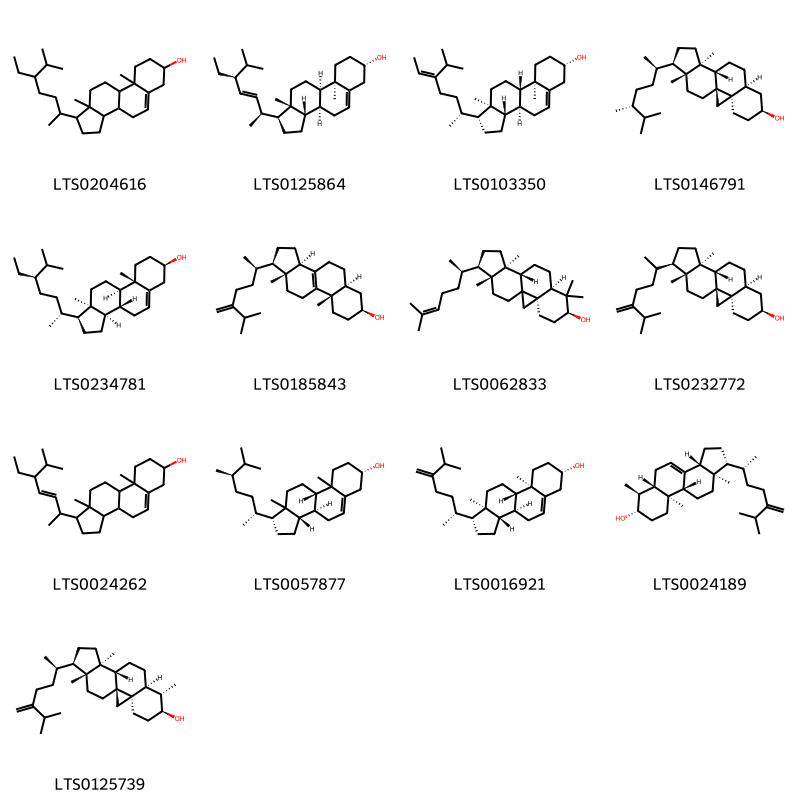{ width=100% }
    <figcaption>Hình ảnh cấu trúc hóa học của 13 hoạt chất thuộc nhóm Steroids and steroid derivatives gồm ['stigmast-5-en-3-ol, (3β)- (LTS0204616)', '(1s,3as,3bs,7s,9ar,9br,11as)-1-[(2s,3e,5s)-5-ethyl-6-methylhept-3-en-2-yl]-9a,11a-dimethyl-1h,2h,3h,3ah,3bh,4h,6h,7h,8h,9h,9bh,10h,11h-cyclopenta[a]phenanthren-7-ol (LTS0125864)', 'avenasterol (LTS0103350)', '(1s,3r,6s,8s,11s,12s,15r,16r)-15-[(2r,5r)-5,6-dimethylheptan-2-yl]-12,16-dimethylpentacyclo[9.7.0.0¹,³.0³,⁸.0¹²,¹⁶]octadecan-6-ol (LTS0146791)', '(1s,3ar,3br,7r,9as,9br,11ar)-1-[(2r,5r)-5-ethyl-6-methylheptan-2-yl]-9a,11a-dimethyl-1h,2h,3h,3ah,3bh,4h,6h,7h,8h,9h,9bh,10h,11h-cyclopenta[a]phenanthren-7-ol (LTS0234781)', 'fecosterol (LTS0185843)', '(3r,6s,8r,11s,12s,15r,16r)-7,7,12,16-tetramethyl-15-[(2r)-6-methylhept-5-en-2-yl]pentacyclo[9.7.0.0¹,³.0³,⁸.0¹²,¹⁶]octadecan-6-ol (LTS0062833)', '(1s,3r,6s,8s,11s,12s,15r,16r)-12,16-dimethyl-15-(6-methyl-5-methylideneheptan-2-yl)pentacyclo[9.7.0.0¹,³.0³,⁸.0¹²,¹⁶]octadecan-6-ol (LTS0232772)', 'stigmasterol (LTS0024262)', '(1r,3as,3bs,7s,9bs)-1-[(2r,5r)-5,6-dimethylheptan-2-yl]-9a,11a-dimethyl-1h,2h,3h,3ah,3bh,4h,6h,7h,8h,9h,9bh,10h,11h-cyclopenta[a]phenanthren-7-ol (LTS0057877)', '24-methylenecholesterol (LTS0016921)', '24-methylidenelophenol (LTS0024189)', 'cycloeucalenol (LTS0125739)'].</figcaption>
</figure>
#### Nhóm Tannins
<figure markdown="span">
    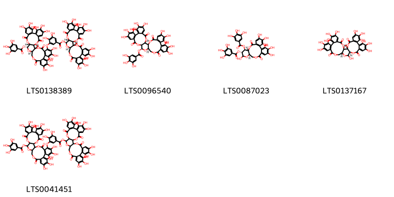{ width=100% }
    <figcaption>Hình ảnh cấu trúc hóa học của 5 hoạt chất thuộc nhóm Tannins gồm ['(1r,2s,19r,20s,22r)-7,8,9,12,13,14,28,29,30,33,34,35-dodecahydroxy-4,17,25,38-tetraoxo-3,18,21,24,39-pentaoxaheptacyclo[20.17.0.0²,¹⁹.0⁵,¹⁰.0¹¹,¹⁶.0²⁶,³¹.0³²,³⁷]nonatriaconta-5,7,9,11(16),12,14,26,28,30,32(37),33,35-dodecaen-20-yl 3-{[(1r,2s,19r,20r,22r)-7,8,9,12,13,14,28,29,30,33,34,35-dodecahydroxy-4,17,25,38-tetraoxo-20-(3,4,5-trihydroxybenzoyloxy)-3,18,21,24,39-pentaoxaheptacyclo[20.17.0.0²,¹⁹.0⁵,¹⁰.0¹¹,¹⁶.0²⁶,³¹.0³²,³⁷]nonatriaconta-5,7,9,11(16),12,14,26,28,30,32(37),33,35-dodecaen-36-yl]oxy}-4,5-dihydroxybenzoate (LTS0138389)', '(2s,20s,22r)-7,8,9,12,13,14,28,29,30,33,34,35-dodecahydroxy-4,17,25,38-tetraoxo-3,18,21,24,39-pentaoxaheptacyclo[20.17.0.0²,¹⁹.0⁵,¹⁰.0¹¹,¹⁶.0²⁶,³¹.0³²,³⁷]nonatriaconta-5,7,9,11(16),12,14,26,28,30,32(37),33,35-dodecaen-20-yl 3,4,5-trihydroxybenzoate (LTS0096540)', '(10r,11s,12r,15r)-3,4,5,13,21,22,23-heptahydroxy-8,18-dioxo-11-(3,4,5-trihydroxybenzoyloxy)-9,14,17-trioxatetracyclo[17.4.0.0²,⁷.0¹⁰,¹⁵]tricosa-1(23),2(7),3,5,19,21-hexaen-12-yl 3,4,5-trihydroxybenzoate (LTS0087023)', '(1r,2s,19r,22r)-7,8,9,12,13,14,20,28,29,30,33,34,35-tridecahydroxy-3,18,21,24,39-pentaoxaheptacyclo[20.17.0.0²,¹⁹.0⁵,¹⁰.0¹¹,¹⁶.0²⁶,³¹.0³²,³⁷]nonatriaconta-5(10),6,8,11,13,15,26(31),27,29,32,34,36-dodecaene-4,17,25,38-tetrone (LTS0137167)', '7,8,9,12,13,14,28,29,30,33,34,35-dodecahydroxy-4,17,25,38-tetraoxo-3,18,21,24,39-pentaoxaheptacyclo[20.17.0.0²,¹⁹.0⁵,¹⁰.0¹¹,¹⁶.0²⁶,³¹.0³²,³⁷]nonatriaconta-5,7,9,11(16),12,14,26,28,30,32(37),33,35-dodecaen-20-yl 3-{[7,8,9,12,13,14,28,29,30,33,34,35-dodecahydroxy-4,17,25,38-tetraoxo-20-(3,4,5-trihydroxybenzoyloxy)-3,18,21,24,39-pentaoxaheptacyclo[20.17.0.0²,¹⁹.0⁵,¹⁰.0¹¹,¹⁶.0²⁶,³¹.0³²,³⁷]nonatriaconta-5(10),6,8,11,13,15,26,28,30,32(37),33,35-dodecaen-36-yl]oxy}-4,5-dihydroxybenzoate (LTS0041451)'].</figcaption>
</figure>

---

### Dược dân tộc học

Danh sách các quốc gia có sử dụng *Rubus fruticosus* trong điều trị các bệnh. 

| Country   | Disease                     | Bệnh                                                                                                                                                                                                |
|:----------|:----------------------------|:----------------------------------------------------------------------------------------------------------------------------------------------------------------------------------------------------|
| Europe    | Astringent, Diuretic        | MYMEMORY WARNING: YOU USED ALL AVAILABLE FREE TRANSLATIONS FOR TODAY. NEXT AVAILABLE IN  11 HOURS 41 MINUTES 28 SECONDS VISIT HTTPS://MYMEMORY.TRANSLATED.NET/DOC/USAGELIMITS.PHP TO TRANSLATE MORE |
| India     | Intoxicant                  | MYMEMORY WARNING: YOU USED ALL AVAILABLE FREE TRANSLATIONS FOR TODAY. NEXT AVAILABLE IN  11 HOURS 41 MINUTES 26 SECONDS VISIT HTTPS://MYMEMORY.TRANSLATED.NET/DOC/USAGELIMITS.PHP TO TRANSLATE MORE |
| Turkey    | Diuretic, Astringent, Tonic | MYMEMORY WARNING: YOU USED ALL AVAILABLE FREE TRANSLATIONS FOR TODAY. NEXT AVAILABLE IN  11 HOURS 41 MINUTES 23 SECONDS VISIT HTTPS://MYMEMORY.TRANSLATED.NET/DOC/USAGELIMITS.PHP TO TRANSLATE MORE |

---

---
## Rubus idaeus
### Thông tin về thực vật

!!! info "Phân loại thực vật của *Rubus idaeus* từ GIBF:"
    - **Kingdom:** Plantae
    - **Phylum:** Tracheophyta
    - **Order:** Rosales
    - **Family:** Rosaceae
    - **Genus:** Rubus
    - **Species:** *Rubus idaeus*

 

| Label (VI)   | Label (EN)   | Scientific Name   | Descriptions (VI)   | Descriptions (EN)   | Also Known As (VI)   | Also Known As (EN)                                                             |
|:-------------|:-------------|:------------------|:--------------------|:--------------------|:---------------------|:-------------------------------------------------------------------------------|
| N/A          | N/A          | Rubus idaeus      | loài thực vật       | species of plant    | ['']                 | ['European raspberry', 'European red raspberry', 'raspberry', 'red raspberry'] |

#### Phân bố trên thế giới

**Từ CSDL GIBF** Switzerland, United Kingdom of Great Britain and Northern Ireland, Denmark, Argentina, Sweden, New Zealand, Poland, Germany, Canada, Russian Federation, United States of America, Finland, Austria, Norway, Belgium, Netherlands, Ukraine

#### Phân bố tại Việt Nam

**Từ CSDL GIBF**: Không có ghi nhận ở Việt Nam

---
### Thành phần hóa học
        
- Theo cơ sở dữ liệu lotus: Từ loài *Rubus idaeus* đã phân lập và xác định được 102 hoạt chất thuộc về các nhóm Organooxygen compounds, Flavonoids, Nucleoside and nucleotide analogues, Tannins, Prenol lipids, Phenols, Dihydrofurans, Cinnamic acids and derivatives, Benzene and substituted derivatives. 

|    | chemicalTaxonomyClassyfireClass     |   smiles_count |
|---:|:------------------------------------|---------------:|
|  0 | Benzene and substituted derivatives |              1 |
|  1 | Cinnamic acids and derivatives      |              6 |
|  2 | Dihydrofurans                       |              1 |
|  3 | Flavonoids                          |             57 |
|  4 | Nucleoside and nucleotide analogues |              1 |
|  5 | Organooxygen compounds              |              7 |
|  6 | Phenols                             |              2 |
|  7 | Prenol lipids                       |             17 |
|  8 | Tannins                             |             10 |

#### Nhóm Benzene and substituted derivatives
<figure markdown="span">
    { width=100% }
    <figcaption>Hình ảnh cấu trúc hóa học của 1 hoạt chất thuộc nhóm Benzene and substituted derivatives gồm ['galop (LTS0222857)'].</figcaption>
</figure>
#### Nhóm Cinnamic acids and derivatives
<figure markdown="span">
    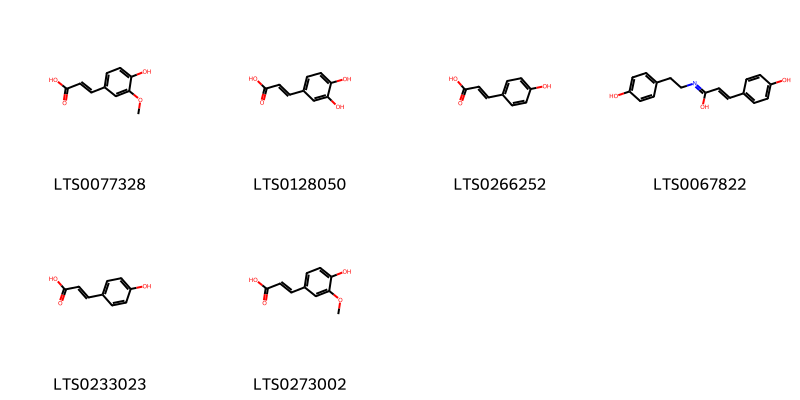{ width=100% }
    <figcaption>Hình ảnh cấu trúc hóa học của 6 hoạt chất thuộc nhóm Cinnamic acids and derivatives gồm ['ferulic acid (LTS0077328)', '3,4-dihydroxycinnamic acid (LTS0128050)', 'para-coumaric acid (LTS0266252)', '(2e)-3-(4-hydroxyphenyl)-n-[2-(4-hydroxyphenyl)ethyl]prop-2-enimidic acid (LTS0067822)', 'hydroxycinnamic acid (LTS0233023)', 'ferulic acid (LTS0273002)'].</figcaption>
</figure>
#### Nhóm Dihydrofurans
<figure markdown="span">
    { width=100% }
    <figcaption>Hình ảnh cấu trúc hóa học của 1 hoạt chất thuộc nhóm Dihydrofurans gồm ['vitamin c (LTS0022555)'].</figcaption>
</figure>
#### Nhóm Flavonoids
<figure markdown="span">
    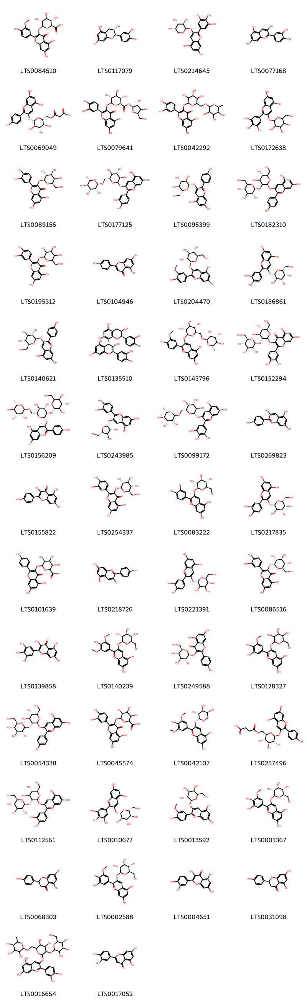{ width=100% }
    <figcaption>Hình ảnh cấu trúc hóa học của 57 hoạt chất thuộc nhóm Flavonoids gồm ['isorhamnetin-3-glucuronide (LTS0084510)', '(+)-catechol (LTS0117079)', '5,7-dihydroxy-3-{[(2r,3r,4s,5s)-3,4,5-trihydroxyoxan-2-yl]oxy}-2-(3,4,5-trihydroxyphenyl)-1λ⁴-chromen-1-ylium (LTS0214645)', 'cyanidin (LTS0077168)', '3-{[(2s,3r,4s,5s,6r)-6-{[(2-carboxyacetyl)oxy]methyl}-3,4,5-trihydroxyoxan-2-yl]oxy}-5,7-dihydroxy-2-(4-hydroxyphenyl)-1λ⁴-chromen-1-ylium (LTS0069049)', '(2s,3r,4r,5r)-3,4-dihydroxy-5-(hydroxymethyl)oxolan-2-yl (2s,3s,4s,5r,6s)-6-{[2-(3,4-dihydroxyphenyl)-5,7-dihydroxy-4-oxochromen-3-yl]oxy}-3,4,5-trihydroxyoxane-2-carboxylate (LTS0079641)', 'rutin (LTS0042292)', '5,7-dihydroxy-3-{[3,4,5-trihydroxy-6-(hydroxymethyl)oxan-2-yl]oxy}-2-(3,4,5-trihydroxyphenyl)-1λ⁴-chromen-1-ylium (LTS0172638)', 'hyperoside (LTS0089156)', '5,7-dihydroxy-2-(4-hydroxy-3-oxidophenyl)-3-{[(3r,4s,5s,6r)-3,4,5-trihydroxy-6-({[(2r,3r,4r,5r,6s)-3,4,5-trihydroxy-6-methyloxan-2-yl]oxy}methyl)oxan-2-yl]oxy}-1λ⁴-chromen-1-ylium (LTS0177125)', 'pelargonidin 3-glucoside (LTS0095399)', '3-{[(2s,5s)-4,5-dihydroxy-6-(hydroxymethyl)-3-{[(2s,3r,5s)-3,4,5-trihydroxy-6-(hydroxymethyl)oxan-2-yl]oxy}oxan-2-yl]oxy}-5,7-dihydroxy-2-(4-hydroxyphenyl)-1λ⁴-chromen-1-ylium (LTS0182310)', '2-(3,4-dihydroxyphenyl)-5,7-dihydroxy-3-{[3,4,5-trihydroxy-6-(hydroxymethyl)oxan-2-yl]oxy}chromen-4-one (LTS0195312)', 'chamomile (LTS0104946)', 'peonidin-3-glucoside (LTS0204470)', 'cyanidin 3-o-β-d-galactoside (LTS0186861)', '5,7-dihydroxy-2-(4-hydroxyphenyl)-3-{[(2r,3s,4r,5r,6s)-3,4,5-trihydroxy-6-(hydroxymethyl)oxan-2-yl]oxy}-1λ⁴-chromen-1-ylium (LTS0140621)', '(2r,3r,4r)-2-(3,4-dihydroxyphenyl)-4-[(2r,3r)-2-(3,4-dihydroxyphenyl)-3,5,7-trihydroxy-3,4-dihydro-2h-1-benzopyran-8-yl]-3,4-dihydro-2h-1-benzopyran-3,5,7-triol (LTS0135510)', '5,7-dihydroxy-2-(4-hydroxy-3-methoxyphenyl)-3-{[(2s,3r,4s,5s,6r)-3,4,5-trihydroxy-6-({[(2r,3r,4r,5r,6s)-3,4,5-trihydroxy-6-methyloxan-2-yl]oxy}methyl)oxan-2-yl]oxy}-1λ⁴-chromen-1-ylium (LTS0143796)', 'quosp (LTS0152294)', '3-{[(2s,3r,4s,5s,6r)-4,5-dihydroxy-3-{[(2s,3r,4s,5s)-3,4,5-trihydroxy-6-(hydroxymethyl)oxan-2-yl]oxy}-6-({[(2r,3r,4r,5r,6s)-3,4,5-trihydroxy-6-methyloxan-2-yl]oxy}methyl)oxan-2-yl]oxy}-5,7-dihydroxy-2-(4-hydroxyphenyl)-1λ⁴-chromen-1-ylium (LTS0156209)', '3-{[(2r,3r,4r,5s)-3,4-dihydroxy-5-(hydroxymethyl)oxolan-2-yl]oxy}-2-(3,4-dihydroxyphenyl)-5,7-dihydroxy-1λ⁴-chromen-1-ylium (LTS0243985)', 'tulipanin (LTS0099172)', 'pelargonidin (LTS0269823)', 'kaempherol (LTS0155822)', 'isoquercetin (LTS0254337)', '5,7-dihydroxy-2-(4-hydroxy-3-oxidophenyl)-3-{[(2s,3r,4s,5s,6r)-3,4,5-trihydroxy-6-(hydroxymethyl)oxan-2-yl]oxy}-1λ⁴-chromen-1-ylium (LTS0083222)', 'cyanidin 3-glucoside (LTS0217835)', '6-{[5,7-dihydroxy-2-(4-hydroxyphenyl)-4-oxochromen-3-yl]oxy}-3,4,5-trihydroxyoxane-2-carboxylic acid (LTS0101639)', '5,7-dihydroxy-2-(4-hydroxyphenyl)-1λ⁴-chromen-1-ylium-3-olate (LTS0218726)', 'chrysanthemin (LTS0221391)', '2-(3,4-dihydroxyphenyl)-5,7-dihydroxy-3-{[(2r,3r,4s,5s,6r)-3,4,5-trihydroxy-6-(hydroxymethyl)oxan-2-yl]oxy}chromen-4-one (LTS0086516)', 'myricetin (LTS0139858)', 'malvidin-3-glucoside (LTS0140239)', 'astragalin (LTS0249588)', 'petunidin-3-o-glucoside (LTS0178327)', 'pelargonidin 3-o-sophoroside (LTS0054338)', 'miquelianin (LTS0045574)', '5,7-dihydroxy-2-(4-hydroxy-3,5-dimethoxyphenyl)-3-{[(2r,3r,4s,5s)-3,4,5-trihydroxyoxan-2-yl]oxy}-1λ⁴-chromen-1-ylium (LTS0042107)', '3-{[(2s,3r,4s,5s,6r)-6-{[(3-carboxypropanoyl)oxy]methyl}-3,4,5-trihydroxyoxan-2-yl]oxy}-5,7-dihydroxy-2-(4-hydroxyphenyl)-1λ⁴-chromen-1-ylium (LTS0257496)', 'cyanidin 3-o-sophoroside (LTS0112561)', 'delphinidin 3-glucoside (LTS0010677)', '5,7-dihydroxy-2-(4-hydroxy-3-methoxyphenyl)-3-{[(2s,3r,4s,5r,6r)-3,4,5-trihydroxy-6-(hydroxymethyl)oxan-2-yl]oxy}-1λ⁴-chromen-1-ylium (LTS0013592)', 'petunidin 3-glucoside (LTS0001367)', 'asahina (LTS0068303)', '5,7-dihydroxy-2-(3-hydroxy-5-methoxy-4-oxidophenyl)-3-{[(2s,3r,4s,5s,6r)-3,4,5-trihydroxy-6-(hydroxymethyl)oxan-2-yl]oxy}-1λ⁴-chromen-1-ylium (LTS0002588)', 'quercetin (LTS0004651)', 'naringenin (LTS0031098)', '3-[(4,5-dihydroxy-3-{[3,4,5-trihydroxy-6-(hydroxymethyl)oxan-2-yl]oxy}-6-{[(3,4,5-trihydroxy-6-methyloxan-2-yl)oxy]methyl}oxan-2-yl)oxy]-2-(3,4-dihydroxyphenyl)-5,7-dihydroxy-1λ⁴-chromen-1-ylium (LTS0016654)', 'luteolin (LTS0017052)', '3-rutinosyl quercetin (LTS0032845)', '2-(3,5-dihydroxy-4-oxidophenyl)-5,7-dihydroxy-3-{[(2s,3r,4s,5s,6r)-3,4,5-trihydroxy-6-(hydroxymethyl)oxan-2-yl]oxy}-1λ⁴-chromen-1-ylium (LTS0079754)', 'pelargonidin 3-o-rutinoside (LTS0031008)', 'hesperetin (LTS0087195)', 'cyanidin 3-o-rutinoside (LTS0049654)', '2-(3,4-dihydroxy-5-methoxyphenyl)-5,7-dihydroxy-3-{[(2r,3r,4r,5r)-3,4,5-trihydroxyoxan-2-yl]oxy}-1λ⁴-chromen-1-ylium (LTS0050404)', 'ent-epicatechin (LTS0265245)'].</figcaption>
</figure>
#### Nhóm Nucleoside and nucleotide analogues
<figure markdown="span">
    { width=100% }
    <figcaption>Hình ảnh cấu trúc hóa học của 1 hoạt chất thuộc nhóm Nucleoside and nucleotide analogues gồm ['tryptophan n-glucoside (LTS0023633)'].</figcaption>
</figure>
#### Nhóm Organooxygen compounds
<figure markdown="span">
    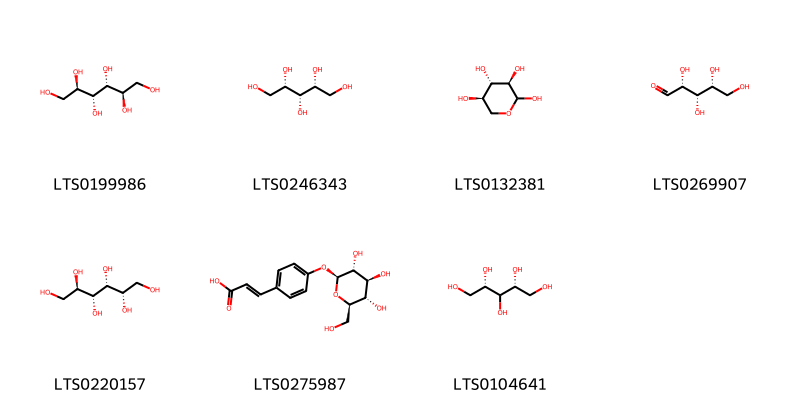{ width=100% }
    <figcaption>Hình ảnh cấu trúc hóa học của 7 hoạt chất thuộc nhóm Organooxygen compounds gồm ['mannitol (LTS0199986)', 'd-xylitol (LTS0246343)', 'd-xylose (LTS0132381)', '(d)-xylose (LTS0269907)', 'd-sorbitol (LTS0220157)', 'p-coumaric acid glucoside (LTS0275987)', '(2r,4s)-pentane-1,2,3,4,5-pentol (LTS0104641)'].</figcaption>
</figure>
#### Nhóm Phenols
<figure markdown="span">
    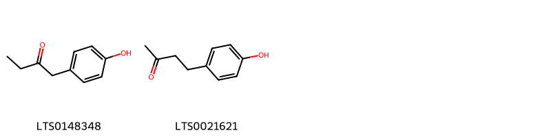{ width=100% }
    <figcaption>Hình ảnh cấu trúc hóa học của 2 hoạt chất thuộc nhóm Phenols gồm ['1-(4-hydroxyphenyl)butan-2-one (LTS0148348)', 'frambinone (LTS0021621)'].</figcaption>
</figure>
#### Nhóm Prenol lipids
<figure markdown="span">
    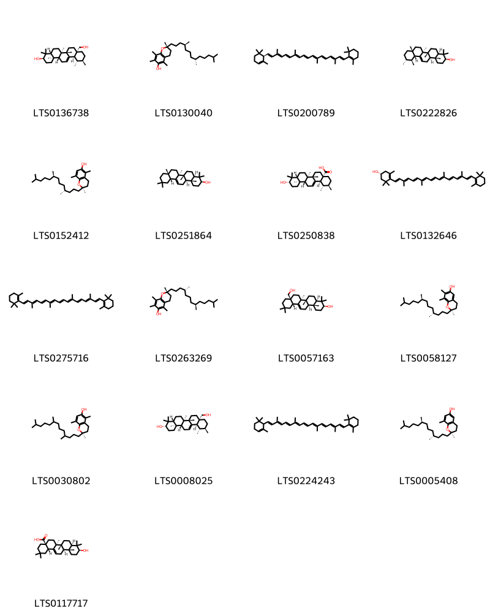{ width=100% }
    <figcaption>Hình ảnh cấu trúc hóa học của 17 hoạt chất thuộc nhóm Prenol lipids gồm ['urs-12-ene-3β,28-diol (LTS0136738)', '(2r)-2,5,7,8-tetramethyl-2-[(4s,8s)-4,8,12-trimethyltridecyl]-3,4-dihydro-1-benzopyran-6-ol (LTS0130040)', '(+)-α-carotene (LTS0200789)', 'amyrin (LTS0222826)', 'β-tocopherol (LTS0152412)', 'β-amyrin (LTS0251864)', 'ursolic acid (LTS0250838)', 'cryptoxanthin (LTS0132646)', 'β-carotene (LTS0275716)', 'vitamin e (LTS0263269)', 'erythrodiol (LTS0057163)', 'gamma-tocopherol (LTS0058127)', '(2r)-2,5,8-trimethyl-2-(4,8,12-trimethyltridecyl)-3,4-dihydro-1-benzopyran-6-ol (LTS0030802)', 'uvaol (LTS0008025)', 'α-carotene (LTS0224243)', 'delta-tocopherol (LTS0005408)', 'oleanolic acid (LTS0117717)'].</figcaption>
</figure>
#### Nhóm Tannins
<figure markdown="span">
    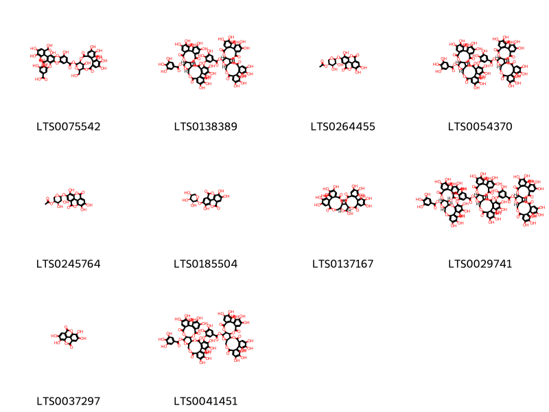{ width=100% }
    <figcaption>Hình ảnh cấu trúc hóa học của 10 hoạt chất thuộc nhóm Tannins gồm ['3-(6-carboxy-2,3,4-trihydroxyphenyl)-1-(5-carboxy-2,3-dihydroxyphenoxy)-8-({[6,7,8,11,12,13,22-heptahydroxy-21-(hydroxymethyl)-3,16-dioxo-2,17,20-trioxatetracyclo[16.3.1.0⁴,⁹.0¹⁰,¹⁵]docosa-4,6,8,10(15),11,13-hexaen-19-yl]oxy}carbonyl)-4,6-dihydroxyoxanthrene-2-carboxylic acid (LTS0075542)', '(1r,2s,19r,20s,22r)-7,8,9,12,13,14,28,29,30,33,34,35-dodecahydroxy-4,17,25,38-tetraoxo-3,18,21,24,39-pentaoxaheptacyclo[20.17.0.0²,¹⁹.0⁵,¹⁰.0¹¹,¹⁶.0²⁶,³¹.0³²,³⁷]nonatriaconta-5,7,9,11(16),12,14,26,28,30,32(37),33,35-dodecaen-20-yl 3-{[(1r,2s,19r,20r,22r)-7,8,9,12,13,14,28,29,30,33,34,35-dodecahydroxy-4,17,25,38-tetraoxo-20-(3,4,5-trihydroxybenzoyloxy)-3,18,21,24,39-pentaoxaheptacyclo[20.17.0.0²,¹⁹.0⁵,¹⁰.0¹¹,¹⁶.0²⁶,³¹.0³²,³⁷]nonatriaconta-5,7,9,11(16),12,14,26,28,30,32(37),33,35-dodecaen-36-yl]oxy}-4,5-dihydroxybenzoate (LTS0138389)', '(3r,4r,5r,6s)-4,5-dihydroxy-6-({7,13,14-trihydroxy-3,10-dioxo-2,9-dioxatetracyclo[6.6.2.0⁴,¹⁶.0¹¹,¹⁵]hexadeca-1(15),4(16),5,7,11,13-hexaen-6-yl}oxy)oxan-3-yl acetate (LTS0264455)', '(1r,2s,19r,20s,22r)-7,8,9,12,13,14,28,29,30,33,34,35-dodecahydroxy-4,17,25,38-tetraoxo-3,18,21,24,39-pentaoxaheptacyclo[20.17.0.0²,¹⁹.0⁵,¹⁰.0¹¹,¹⁶.0²⁶,³¹.0³²,³⁷]nonatriaconta-5,7,9,11(16),12,14,26,28,30,32(37),33,35-dodecaen-20-yl 3-{[(1r,2s,19r,20s,22r)-7,8,9,12,13,14,28,29,30,33,34,35-dodecahydroxy-4,17,25,38-tetraoxo-20-(3,4,5-trihydroxybenzoyloxy)-3,18,21,24,39-pentaoxaheptacyclo[20.17.0.0²,¹⁹.0⁵,¹⁰.0¹¹,¹⁶.0²⁶,³¹.0³²,³⁷]nonatriaconta-5,7,9,11(16),12,14,26,28,30,32(37),33,35-dodecaen-36-yl]oxy}-4,5-dihydroxybenzoate (LTS0054370)', '(3s,4r,5r,6s)-4,5-dihydroxy-6-({7,13,14-trihydroxy-3,10-dioxo-2,9-dioxatetracyclo[6.6.2.0⁴,¹⁶.0¹¹,¹⁵]hexadeca-1(15),4(16),5,7,11,13-hexaen-6-yl}oxy)oxan-3-yl acetate (LTS0245764)', '6,7,14-trihydroxy-13-{[(2s,3r,4s,5s)-3,4,5-trihydroxyoxan-2-yl]oxy}-2,9-dioxatetracyclo[6.6.2.0⁴,¹⁶.0¹¹,¹⁵]hexadeca-1(15),4,6,8(16),11,13-hexaene-3,10-dione (LTS0185504)', '(1r,2s,19r,22r)-7,8,9,12,13,14,20,28,29,30,33,34,35-tridecahydroxy-3,18,21,24,39-pentaoxaheptacyclo[20.17.0.0²,¹⁹.0⁵,¹⁰.0¹¹,¹⁶.0²⁶,³¹.0³²,³⁷]nonatriaconta-5(10),6,8,11,13,15,26(31),27,29,32,34,36-dodecaene-4,17,25,38-tetrone (LTS0137167)', '(1r,2s,19r,20s,22r)-7,8,9,12,13,14,28,29,30,33,34,35-dodecahydroxy-4,17,25,38-tetraoxo-3,18,21,24,39-pentaoxaheptacyclo[20.17.0.0²,¹⁹.0⁵,¹⁰.0¹¹,¹⁶.0²⁶,³¹.0³²,³⁷]nonatriaconta-5,7,9,11(16),12,14,26,28,30,32(37),33,35-dodecaen-20-yl 3-{[(1r,2s,19r,20s,22r)-20-(3-{[(1s,2r,18r,20r,21r)-6,7,8,11,12,13,26,27,28,31,32,33-dodecahydroxy-23,36-dioxo-20-(3,4,5-trihydroxybenzoyloxy)-3,16,19,22,37-pentaoxaheptacyclo[19.16.0.0²,¹⁸.0⁴,⁹.0¹⁰,¹⁵.0²⁴,²⁹.0³⁰,³⁵]heptatriaconta-4(9),5,7,10,12,14,24(29),25,27,30,32,34-dodecaen-5-yl]oxy}-4,5-dihydroxybenzoyloxy)-7,8,9,12,13,14,28,29,30,33,34,35-dodecahydroxy-4,17,25,38-tetraoxo-3,18,21,24,39-pentaoxaheptacyclo[20.17.0.0²,¹⁹.0⁵,¹⁰.0¹¹,¹⁶.0²⁶,³¹.0³²,³⁷]nonatriaconta-5,7,9,11(16),12,14,26,28,30,32(37),33,35-dodecaen-36-yl]oxy}-4,5-dihydroxybenzoate (LTS0029741)', 'ellagic acid (LTS0037297)', '7,8,9,12,13,14,28,29,30,33,34,35-dodecahydroxy-4,17,25,38-tetraoxo-3,18,21,24,39-pentaoxaheptacyclo[20.17.0.0²,¹⁹.0⁵,¹⁰.0¹¹,¹⁶.0²⁶,³¹.0³²,³⁷]nonatriaconta-5,7,9,11(16),12,14,26,28,30,32(37),33,35-dodecaen-20-yl 3-{[7,8,9,12,13,14,28,29,30,33,34,35-dodecahydroxy-4,17,25,38-tetraoxo-20-(3,4,5-trihydroxybenzoyloxy)-3,18,21,24,39-pentaoxaheptacyclo[20.17.0.0²,¹⁹.0⁵,¹⁰.0¹¹,¹⁶.0²⁶,³¹.0³²,³⁷]nonatriaconta-5(10),6,8,11,13,15,26,28,30,32(37),33,35-dodecaen-36-yl]oxy}-4,5-dihydroxybenzoate (LTS0041451)'].</figcaption>
</figure>

---

### Dược dân tộc học

Danh sách các quốc gia có sử dụng *Rubus idaeus* trong điều trị các bệnh. 

| Country   | Disease               | Bệnh                                                                                                                                                                                                |
|:----------|:----------------------|:----------------------------------------------------------------------------------------------------------------------------------------------------------------------------------------------------|
| Elsewhere | Astringent            | MYMEMORY WARNING: YOU USED ALL AVAILABLE FREE TRANSLATIONS FOR TODAY. NEXT AVAILABLE IN  11 HOURS 40 MINUTES 54 SECONDS VISIT HTTPS://MYMEMORY.TRANSLATED.NET/DOC/USAGELIMITS.PHP TO TRANSLATE MORE |
| Haiti     | Stimulant, Sudorific  | MYMEMORY WARNING: YOU USED ALL AVAILABLE FREE TRANSLATIONS FOR TODAY. NEXT AVAILABLE IN  11 HOURS 40 MINUTES 51 SECONDS VISIT HTTPS://MYMEMORY.TRANSLATED.NET/DOC/USAGELIMITS.PHP TO TRANSLATE MORE |
| Turkey    | Astringent, Stimulant | MYMEMORY WARNING: YOU USED ALL AVAILABLE FREE TRANSLATIONS FOR TODAY. NEXT AVAILABLE IN  11 HOURS 40 MINUTES 48 SECONDS VISIT HTTPS://MYMEMORY.TRANSLATED.NET/DOC/USAGELIMITS.PHP TO TRANSLATE MORE |

---

---
## Rubus incisus
### Thông tin về thực vật

!!! info "Phân loại thực vật của *Rubus microphyllus* từ GIBF:"
    - **Kingdom:** Plantae
    - **Phylum:** Tracheophyta
    - **Order:** Rosales
    - **Family:** Rosaceae
    - **Genus:** Rubus
    - **Species:** *Rubus microphyllus*

 

| Label (VI)   | Label (EN)   | Scientific Name   | Descriptions (VI)   | Descriptions (EN)   | Also Known As (VI)   | Also Known As (EN)                                                             |
|:-------------|:-------------|:------------------|:--------------------|:--------------------|:---------------------|:-------------------------------------------------------------------------------|
| N/A          | N/A          | Rubus idaeus      | loài thực vật       | species of plant    | ['']                 | ['European raspberry', 'European red raspberry', 'raspberry', 'red raspberry'] |

#### Phân bố trên thế giới

**Từ CSDL GIBF** nan, unknown or invalid, Japan, France, China, Belgium, Chinese Taipei

#### Phân bố tại Việt Nam

**Từ CSDL GIBF**: Không có ghi nhận ở Việt Nam

---
### Thành phần hóa học
        
- Theo cơ sở dữ liệu lotus: Từ loài *Rubus microphyllus* đã phân lập và xác định được Chưa có hoạt chất nào được phân lập. hoạt chất thuộc về các nhóm Không có hoạt chất nào được phân lập. 

Không có hình ảnh nào được tạo ra

---

### Dược dân tộc học

Danh sách các quốc gia có sử dụng *Rubus microphyllus* trong điều trị các bệnh. 

| Country   | Disease                 | Bệnh                                                                                                                                                                                                |
|:----------|:------------------------|:----------------------------------------------------------------------------------------------------------------------------------------------------------------------------------------------------|
| China     | Expectorant, Antivinous | MYMEMORY WARNING: YOU USED ALL AVAILABLE FREE TRANSLATIONS FOR TODAY. NEXT AVAILABLE IN  11 HOURS 40 MINUTES 11 SECONDS VISIT HTTPS://MYMEMORY.TRANSLATED.NET/DOC/USAGELIMITS.PHP TO TRANSLATE MORE |

---

---
## Rubus parvifolius
### Thông tin về thực vật

!!! info "Phân loại thực vật của *Rubus parvifolius* từ GIBF:"
    - **Kingdom:** Plantae
    - **Phylum:** Tracheophyta
    - **Order:** Rosales
    - **Family:** Rosaceae
    - **Genus:** Rubus
    - **Species:** *Rubus parvifolius*

 

| Label (VI)   | Label (EN)   | Scientific Name   | Descriptions (VI)   | Descriptions (EN)   | Also Known As (VI)   | Also Known As (EN)   |
|:-------------|:-------------|:------------------|:--------------------|:--------------------|:---------------------|:---------------------|
| N/A          | N/A          | Rubus parvifolius | loài thực vật       | species of plant    | ['']                 | ['']                 |

#### Phân bố trên thế giới

**Từ CSDL GIBF** Chinese Taipei, Japan, United States of America, China, Australia, Korea, Republic of, Hong Kong

#### Phân bố tại Việt Nam

**Từ CSDL GIBF**: Không có ghi nhận ở Việt Nam

---
### Thành phần hóa học
        
- Theo cơ sở dữ liệu lotus: Từ loài *Rubus parvifolius* đã phân lập và xác định được 10 hoạt chất thuộc về các nhóm Tannins, Organooxygen compounds, Prenol lipids. 

|    | chemicalTaxonomyClassyfireClass   |   smiles_count |
|---:|:----------------------------------|---------------:|
|  0 | Organooxygen compounds            |              1 |
|  1 | Prenol lipids                     |              2 |
|  2 | Tannins                           |              7 |

#### Nhóm Organooxygen compounds
<figure markdown="span">
    { width=100% }
    <figcaption>Hình ảnh cấu trúc hóa học của 1 hoạt chất thuộc nhóm Organooxygen compounds gồm ['chlorogenic acid (LTS0226495)'].</figcaption>
</figure>
#### Nhóm Prenol lipids
<figure markdown="span">
    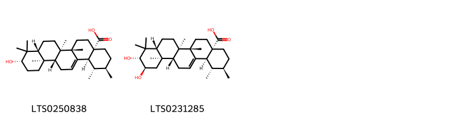{ width=100% }
    <figcaption>Hình ảnh cấu trúc hóa học của 2 hoạt chất thuộc nhóm Prenol lipids gồm ['ursolic acid (LTS0250838)', 'corosolic acid (LTS0231285)'].</figcaption>
</figure>
#### Nhóm Tannins
<figure markdown="span">
    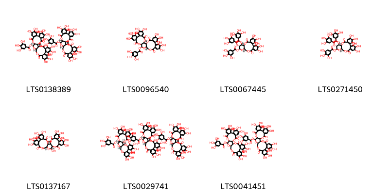{ width=100% }
    <figcaption>Hình ảnh cấu trúc hóa học của 7 hoạt chất thuộc nhóm Tannins gồm ['(1r,2s,19r,20s,22r)-7,8,9,12,13,14,28,29,30,33,34,35-dodecahydroxy-4,17,25,38-tetraoxo-3,18,21,24,39-pentaoxaheptacyclo[20.17.0.0²,¹⁹.0⁵,¹⁰.0¹¹,¹⁶.0²⁶,³¹.0³²,³⁷]nonatriaconta-5,7,9,11(16),12,14,26,28,30,32(37),33,35-dodecaen-20-yl 3-{[(1r,2s,19r,20r,22r)-7,8,9,12,13,14,28,29,30,33,34,35-dodecahydroxy-4,17,25,38-tetraoxo-20-(3,4,5-trihydroxybenzoyloxy)-3,18,21,24,39-pentaoxaheptacyclo[20.17.0.0²,¹⁹.0⁵,¹⁰.0¹¹,¹⁶.0²⁶,³¹.0³²,³⁷]nonatriaconta-5,7,9,11(16),12,14,26,28,30,32(37),33,35-dodecaen-36-yl]oxy}-4,5-dihydroxybenzoate (LTS0138389)', '(2s,20s,22r)-7,8,9,12,13,14,28,29,30,33,34,35-dodecahydroxy-4,17,25,38-tetraoxo-3,18,21,24,39-pentaoxaheptacyclo[20.17.0.0²,¹⁹.0⁵,¹⁰.0¹¹,¹⁶.0²⁶,³¹.0³²,³⁷]nonatriaconta-5,7,9,11(16),12,14,26,28,30,32(37),33,35-dodecaen-20-yl 3,4,5-trihydroxybenzoate (LTS0096540)', '(10r,11s,12r,13s,15r)-3,4,5,21,22,23-hexahydroxy-8,18-dioxo-12,13-bis(3,4,5-trihydroxybenzoyloxy)-9,14,17-trioxatetracyclo[17.4.0.0²,⁷.0¹⁰,¹⁵]tricosa-1(23),2(7),3,5,19,21-hexaen-11-yl 3,4,5-trihydroxybenzoate (LTS0067445)', '(10r,11s,12r,15r)-3,4,5,21,22,23-hexahydroxy-8,18-dioxo-12,13-bis(3,4,5-trihydroxybenzoyloxy)-9,14,17-trioxatetracyclo[17.4.0.0²,⁷.0¹⁰,¹⁵]tricosa-1(23),2(7),3,5,19,21-hexaen-11-yl 3,4,5-trihydroxybenzoate (LTS0271450)', '(1r,2s,19r,22r)-7,8,9,12,13,14,20,28,29,30,33,34,35-tridecahydroxy-3,18,21,24,39-pentaoxaheptacyclo[20.17.0.0²,¹⁹.0⁵,¹⁰.0¹¹,¹⁶.0²⁶,³¹.0³²,³⁷]nonatriaconta-5(10),6,8,11,13,15,26(31),27,29,32,34,36-dodecaene-4,17,25,38-tetrone (LTS0137167)', '(1r,2s,19r,20s,22r)-7,8,9,12,13,14,28,29,30,33,34,35-dodecahydroxy-4,17,25,38-tetraoxo-3,18,21,24,39-pentaoxaheptacyclo[20.17.0.0²,¹⁹.0⁵,¹⁰.0¹¹,¹⁶.0²⁶,³¹.0³²,³⁷]nonatriaconta-5,7,9,11(16),12,14,26,28,30,32(37),33,35-dodecaen-20-yl 3-{[(1r,2s,19r,20s,22r)-20-(3-{[(1s,2r,18r,20r,21r)-6,7,8,11,12,13,26,27,28,31,32,33-dodecahydroxy-23,36-dioxo-20-(3,4,5-trihydroxybenzoyloxy)-3,16,19,22,37-pentaoxaheptacyclo[19.16.0.0²,¹⁸.0⁴,⁹.0¹⁰,¹⁵.0²⁴,²⁹.0³⁰,³⁵]heptatriaconta-4(9),5,7,10,12,14,24(29),25,27,30,32,34-dodecaen-5-yl]oxy}-4,5-dihydroxybenzoyloxy)-7,8,9,12,13,14,28,29,30,33,34,35-dodecahydroxy-4,17,25,38-tetraoxo-3,18,21,24,39-pentaoxaheptacyclo[20.17.0.0²,¹⁹.0⁵,¹⁰.0¹¹,¹⁶.0²⁶,³¹.0³²,³⁷]nonatriaconta-5,7,9,11(16),12,14,26,28,30,32(37),33,35-dodecaen-36-yl]oxy}-4,5-dihydroxybenzoate (LTS0029741)', '7,8,9,12,13,14,28,29,30,33,34,35-dodecahydroxy-4,17,25,38-tetraoxo-3,18,21,24,39-pentaoxaheptacyclo[20.17.0.0²,¹⁹.0⁵,¹⁰.0¹¹,¹⁶.0²⁶,³¹.0³²,³⁷]nonatriaconta-5,7,9,11(16),12,14,26,28,30,32(37),33,35-dodecaen-20-yl 3-{[7,8,9,12,13,14,28,29,30,33,34,35-dodecahydroxy-4,17,25,38-tetraoxo-20-(3,4,5-trihydroxybenzoyloxy)-3,18,21,24,39-pentaoxaheptacyclo[20.17.0.0²,¹⁹.0⁵,¹⁰.0¹¹,¹⁶.0²⁶,³¹.0³²,³⁷]nonatriaconta-5(10),6,8,11,13,15,26,28,30,32(37),33,35-dodecaen-36-yl]oxy}-4,5-dihydroxybenzoate (LTS0041451)'].</figcaption>
</figure>

---

### Dược dân tộc học

Danh sách các quốc gia có sử dụng *Rubus parvifolius* trong điều trị các bệnh. 

| Country   | Disease       | Bệnh                                                                                                                                                                                                |
|:----------|:--------------|:----------------------------------------------------------------------------------------------------------------------------------------------------------------------------------------------------|
| Elsewhere | Antidiarrheic | MYMEMORY WARNING: YOU USED ALL AVAILABLE FREE TRANSLATIONS FOR TODAY. NEXT AVAILABLE IN  11 HOURS 39 MINUTES 47 SECONDS VISIT HTTPS://MYMEMORY.TRANSLATED.NET/DOC/USAGELIMITS.PHP TO TRANSLATE MORE |

---

---
## Rubus rosaefolius
### Thông tin về thực vật

!!! info "Phân loại thực vật của *Rubus rosifolius* từ GIBF:"
    - **Kingdom:** Plantae
    - **Phylum:** Tracheophyta
    - **Order:** Rosales
    - **Family:** Rosaceae
    - **Genus:** Rubus
    - **Species:** *Rubus rosifolius*

 

| Label (VI)   | Label (EN)   | Scientific Name   | Descriptions (VI)   | Descriptions (EN)   | Also Known As (VI)   | Also Known As (EN)   |
|:-------------|:-------------|:------------------|:--------------------|:--------------------|:---------------------|:---------------------|
| N/A          | N/A          | Rubus rosaefolius | loài thực vật       | species of plant    | ['']                 | ['']                 |

#### Phân bố trên thế giới

**Từ CSDL GIBF** Chinese Taipei, Colombia, El Salvador, Japan, Brazil, Guadeloupe, Puerto Rico, French Polynesia, Bolivia (Plurinational State of), Costa Rica, New Caledonia, Kenya, Ecuador, United States of America, Equatorial Guinea, China, Bonaire, Sint Eustatius and Saba, Indonesia

#### Phân bố tại Việt Nam

**Từ CSDL GIBF**: Không có ghi nhận ở Việt Nam

---
### Thành phần hóa học
        
- Theo cơ sở dữ liệu lotus: Từ loài *Rubus rosifolius* đã phân lập và xác định được 10 hoạt chất thuộc về các nhóm Steroids and steroid derivatives, Prenol lipids. 

|    | chemicalTaxonomyClassyfireClass   |   smiles_count |
|---:|:----------------------------------|---------------:|
|  0 | Prenol lipids                     |              4 |
|  1 | Steroids and steroid derivatives  |              6 |

#### Nhóm Prenol lipids
<figure markdown="span">
    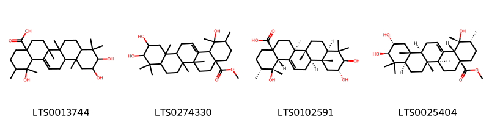{ width=100% }
    <figcaption>Hình ảnh cấu trúc hóa học của 4 hoạt chất thuộc nhóm Prenol lipids gồm ['1,10,11-trihydroxy-1,2,6a,6b,9,9,12a-heptamethyl-2,3,4,5,6,7,8,8a,10,11,12,12b,13,14b-tetradecahydropicene-4a-carboxylic acid (LTS0013744)', 'methyl 1,10,11-trihydroxy-1,2,6a,6b,9,9,12a-heptamethyl-2,3,4,5,6,7,8,8a,10,11,12,12b,13,14b-tetradecahydropicene-4a-carboxylate (LTS0274330)', 'tormentic acid (LTS0102591)', 'methyl (1r,2r,4as,6as,6br,8ar,10r,11r,12ar,12br,14bs)-1,10,11-trihydroxy-1,2,6a,6b,9,9,12a-heptamethyl-2,3,4,5,6,7,8,8a,10,11,12,12b,13,14b-tetradecahydropicene-4a-carboxylate (LTS0025404)'].</figcaption>
</figure>
#### Nhóm Steroids and steroid derivatives
<figure markdown="span">
    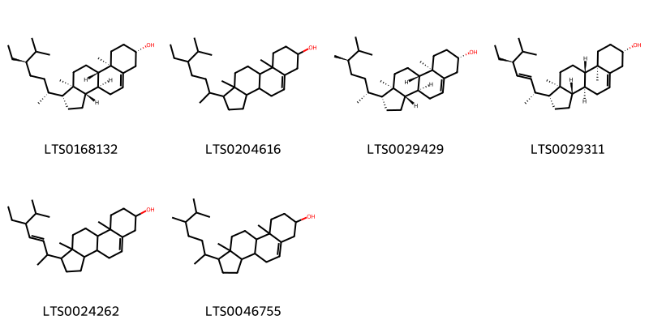{ width=100% }
    <figcaption>Hình ảnh cấu trúc hóa học của 6 hoạt chất thuộc nhóm Steroids and steroid derivatives gồm ['sitosterol (LTS0168132)', 'stigmast-5-en-3-ol, (3β)- (LTS0204616)', 'campesterol (LTS0029429)', 'phytosterol (LTS0029311)', 'stigmasterol (LTS0024262)', 'campesterol (LTS0046755)'].</figcaption>
</figure>

---

### Dược dân tộc học

Danh sách các quốc gia có sử dụng *Rubus rosifolius* trong điều trị các bệnh. 

| Country   | Disease    | Bệnh                                                                                                                                                                                                |
|:----------|:-----------|:----------------------------------------------------------------------------------------------------------------------------------------------------------------------------------------------------|
| China     | Detoxicant | MYMEMORY WARNING: YOU USED ALL AVAILABLE FREE TRANSLATIONS FOR TODAY. NEXT AVAILABLE IN  11 HOURS 39 MINUTES 17 SECONDS VISIT HTTPS://MYMEMORY.TRANSLATED.NET/DOC/USAGELIMITS.PHP TO TRANSLATE MORE |

---

---
## Rubus tephrodes
### Thông tin về thực vật

!!! info "Phân loại thực vật của *Rubus tephrodes* từ GIBF:"
    - **Kingdom:** Plantae
    - **Phylum:** Tracheophyta
    - **Order:** Rosales
    - **Family:** Rosaceae
    - **Genus:** Rubus
    - **Species:** *Rubus tephrodes*

 

| Label (VI)   | Label (EN)   | Scientific Name   | Descriptions (VI)   | Descriptions (EN)   | Also Known As (VI)   | Also Known As (EN)   |
|:-------------|:-------------|:------------------|:--------------------|:--------------------|:---------------------|:---------------------|
| N/A          | N/A          | Rubus tephrodes   | loài thực vật       | species of plant    | ['']                 | ['Rubus tephrodes']  |

#### Phân bố trên thế giới

**Từ CSDL GIBF** nan, China, Chinese Taipei

#### Phân bố tại Việt Nam

**Từ CSDL GIBF**: Không có ghi nhận ở Việt Nam

---
### Thành phần hóa học
        
- Theo cơ sở dữ liệu lotus: Từ loài *Rubus tephrodes* đã phân lập và xác định được Chưa có hoạt chất nào được phân lập. hoạt chất thuộc về các nhóm Không có hoạt chất nào được phân lập. 

Không có hình ảnh nào được tạo ra

---

### Dược dân tộc học

Danh sách các quốc gia có sử dụng *Rubus tephrodes* trong điều trị các bệnh. 

| Country   | Disease   | Bệnh                                                                                                                                                                                                |
|:----------|:----------|:----------------------------------------------------------------------------------------------------------------------------------------------------------------------------------------------------|
| China     | Hemostat  | MYMEMORY WARNING: YOU USED ALL AVAILABLE FREE TRANSLATIONS FOR TODAY. NEXT AVAILABLE IN  11 HOURS 38 MINUTES 48 SECONDS VISIT HTTPS://MYMEMORY.TRANSLATED.NET/DOC/USAGELIMITS.PHP TO TRANSLATE MORE |

---

---
## Rubus tokkura
### Thông tin về thực vật

!!! info "Phân loại thực vật của *Rubus coreanus* từ GIBF:"
    - **Kingdom:** Plantae
    - **Phylum:** Tracheophyta
    - **Order:** Rosales
    - **Family:** Rosaceae
    - **Genus:** Rubus
    - **Species:** *Rubus coreanus*

 

| Label (VI)   | Label (EN)   | Scientific Name   | Descriptions (VI)   | Descriptions (EN)   | Also Known As (VI)   | Also Known As (EN)   |
|:-------------|:-------------|:------------------|:--------------------|:--------------------|:---------------------|:---------------------|
| N/A          | N/A          | Rubus tephrodes   | loài thực vật       | species of plant    | ['']                 | ['Rubus tephrodes']  |

#### Phân bố trên thế giới

**Từ CSDL GIBF** nan, China, Chinese Taipei

#### Phân bố tại Việt Nam

**Từ CSDL GIBF**: Không có ghi nhận ở Việt Nam

---
### Thành phần hóa học
        
- Theo cơ sở dữ liệu lotus: Từ loài *Rubus coreanus* đã phân lập và xác định được Chưa có hoạt chất nào được phân lập. hoạt chất thuộc về các nhóm Không có hoạt chất nào được phân lập. 

Không có hình ảnh nào được tạo ra

---

### Dược dân tộc học

Danh sách các quốc gia có sử dụng *Rubus coreanus* trong điều trị các bệnh. 

| Country   | Disease            | Bệnh                                                                                                                                                                                                |
|:----------|:-------------------|:----------------------------------------------------------------------------------------------------------------------------------------------------------------------------------------------------|
| China     | Aphrodisiac, Tonic | MYMEMORY WARNING: YOU USED ALL AVAILABLE FREE TRANSLATIONS FOR TODAY. NEXT AVAILABLE IN  11 HOURS 38 MINUTES 26 SECONDS VISIT HTTPS://MYMEMORY.TRANSLATED.NET/DOC/USAGELIMITS.PHP TO TRANSLATE MORE |

---

# Chi Meilus

??? note "Danh sách các dược liệu thuộc chi"
    
	 - *Meilus germanica*

---
## Meilus germanica
### Thông tin về thực vật

!!! info "Phân loại thực vật của *N/A* từ GIBF:"
    - **Kingdom:** N/A
    - **Phylum:** N/A
    - **Order:** N/A
    - **Family:** N/A
    - **Genus:** N/A
    - **Species:** *N/A*

 

| Label (VI)   | Label (EN)   | Scientific Name   | Descriptions (VI)   | Descriptions (EN)   | Also Known As (VI)   | Also Known As (EN)   |
|:-------------|:-------------|:------------------|:--------------------|:--------------------|:---------------------|:---------------------|
| N/A          | N/A          | Rubus tephrodes   | loài thực vật       | species of plant    | ['']                 | ['Rubus tephrodes']  |

#### Phân bố trên thế giới

**Từ CSDL GIBF** Không có kết quả phù hợp

#### Phân bố tại Việt Nam

**Từ CSDL GIBF**: Không có ghi nhận ở Việt Nam

---
### Thành phần hóa học
        
- Theo cơ sở dữ liệu lotus: Từ loài *N/A* đã phân lập và xác định được Chưa có hoạt chất nào được phân lập. hoạt chất thuộc về các nhóm Không có hoạt chất nào được phân lập. 

Không có hình ảnh nào được tạo ra

---

### Dược dân tộc học

Danh sách các quốc gia có sử dụng *N/A* trong điều trị các bệnh. 

| Country   | Disease                     | Bệnh                                                                                                                                                                                                |
|:----------|:----------------------------|:----------------------------------------------------------------------------------------------------------------------------------------------------------------------------------------------------|
| Turkey    | Astringent, Diuretic, Tonic | MYMEMORY WARNING: YOU USED ALL AVAILABLE FREE TRANSLATIONS FOR TODAY. NEXT AVAILABLE IN  11 HOURS 38 MINUTES 04 SECONDS VISIT HTTPS://MYMEMORY.TRANSLATED.NET/DOC/USAGELIMITS.PHP TO TRANSLATE MORE |

---

# Chi Sorbus

??? note "Danh sách các dược liệu thuộc chi"
    
	 - *Sorbus americana*
	 - *Sorbus aucuparia*

---
## Sorbus americana
### Thông tin về thực vật

!!! info "Phân loại thực vật của *Sorbus americana* từ GIBF:"
    - **Kingdom:** Plantae
    - **Phylum:** Tracheophyta
    - **Order:** Rosales
    - **Family:** Rosaceae
    - **Genus:** Sorbus
    - **Species:** *Sorbus americana*

 

| Label (VI)   | Label (EN)   | Scientific Name   | Descriptions (VI)   | Descriptions (EN)   | Also Known As (VI)   | Also Known As (EN)                 |
|:-------------|:-------------|:------------------|:--------------------|:--------------------|:---------------------|:-----------------------------------|
| N/A          | N/A          | Sorbus americana  | loài thực vật       | species of plant    | ['']                 | ['rowan', 'American mountain-ash'] |

#### Phân bố trên thế giới

**Từ CSDL GIBF** Canada, United States of America

#### Phân bố tại Việt Nam

**Từ CSDL GIBF**: Không có ghi nhận ở Việt Nam

---
### Thành phần hóa học
        
- Theo cơ sở dữ liệu lotus: Từ loài *Sorbus americana* đã phân lập và xác định được 6 hoạt chất thuộc về các nhóm Prenol lipids. 

|    | chemicalTaxonomyClassyfireClass   |   smiles_count |
|---:|:----------------------------------|---------------:|
|  0 | Prenol lipids                     |              6 |

#### Nhóm Prenol lipids
<figure markdown="span">
    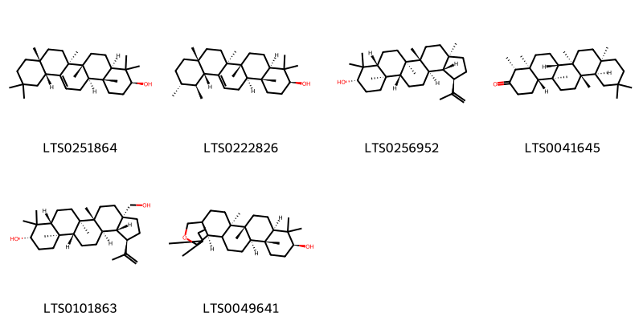{ width=100% }
    <figcaption>Hình ảnh cấu trúc hóa học của 6 hoạt chất thuộc nhóm Prenol lipids gồm ['β-amyrin (LTS0251864)', 'amyrin (LTS0222826)', 'lupeol (LTS0256952)', '(-)-friedelin (LTS0041645)', 'betulin (LTS0101863)', '(1r,4r,5r,8r,10s,13r,14r,18r)-4,5,9,9,13,20,20-heptamethyl-24-oxahexacyclo[17.3.2.0¹,¹⁸.0⁴,¹⁷.0⁵,¹⁴.0⁸,¹³]tetracosan-10-ol (LTS0049641)'].</figcaption>
</figure>

---

### Dược dân tộc học

Danh sách các quốc gia có sử dụng *Sorbus americana* trong điều trị các bệnh. 

| Country   | Disease    | Bệnh                                                                                                                                                                                                |
|:----------|:-----------|:----------------------------------------------------------------------------------------------------------------------------------------------------------------------------------------------------|
| US        | Astringent | MYMEMORY WARNING: YOU USED ALL AVAILABLE FREE TRANSLATIONS FOR TODAY. NEXT AVAILABLE IN  11 HOURS 37 MINUTES 51 SECONDS VISIT HTTPS://MYMEMORY.TRANSLATED.NET/DOC/USAGELIMITS.PHP TO TRANSLATE MORE |

---

---
## Sorbus aucuparia
### Thông tin về thực vật

!!! info "Phân loại thực vật của *Sorbus aucuparia* từ GIBF:"
    - **Kingdom:** Plantae
    - **Phylum:** Tracheophyta
    - **Order:** Rosales
    - **Family:** Rosaceae
    - **Genus:** Sorbus
    - **Species:** *Sorbus aucuparia*

 

| Label (VI)   | Label (EN)   | Scientific Name   | Descriptions (VI)   | Descriptions (EN)   | Also Known As (VI)   | Also Known As (EN)                                                  |
|:-------------|:-------------|:------------------|:--------------------|:--------------------|:---------------------|:--------------------------------------------------------------------|
| N/A          | N/A          | Sorbus aucuparia  | loài thực vật       | species of plant    | ['']                 | ['European mountain-ash', 'European rowan', 'rowan-berry', 'rowan'] |

#### Phân bố trên thế giới

**Từ CSDL GIBF** Switzerland, United Kingdom of Great Britain and Northern Ireland, Denmark, Sweden, Spain, New Zealand, Germany, Canada, Russian Federation, United States of America, Austria, Ireland, Norway, Netherlands, Finland, Ukraine

#### Phân bố tại Việt Nam

**Từ CSDL GIBF**: Không có ghi nhận ở Việt Nam

---
### Thành phần hóa học
        
- Theo cơ sở dữ liệu lotus: Từ loài *Sorbus aucuparia* đã phân lập và xác định được 41 hoạt chất thuộc về các nhóm Organooxygen compounds, Flavonoids, Saturated hydrocarbons, Prenol lipids, Fatty Acyls, Pyrans, Phenols, Steroids and steroid derivatives, Benzene and substituted derivatives. 

|    | chemicalTaxonomyClassyfireClass     |   smiles_count |
|---:|:------------------------------------|---------------:|
|  0 | Benzene and substituted derivatives |              5 |
|  1 | Fatty Acyls                         |              1 |
|  2 | Flavonoids                          |              3 |
|  3 | Organooxygen compounds              |             10 |
|  4 | Phenols                             |              1 |
|  5 | Prenol lipids                       |             15 |
|  6 | Pyrans                              |              1 |
|  7 | Saturated hydrocarbons              |              1 |
|  8 | Steroids and steroid derivatives    |              3 |

#### Nhóm Benzene and substituted derivatives
<figure markdown="span">
    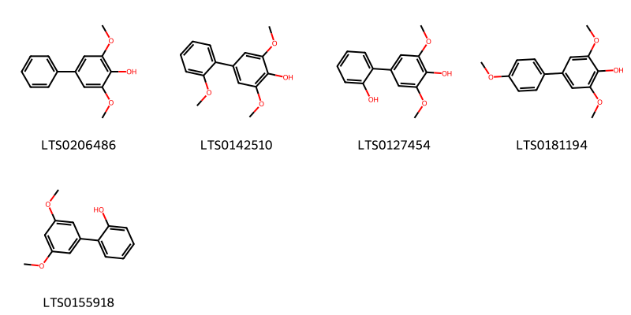{ width=100% }
    <figcaption>Hình ảnh cấu trúc hóa học của 5 hoạt chất thuộc nhóm Benzene and substituted derivatives gồm ['aucuparin (LTS0206486)', "2',3,5-trimethoxy-[1,1'-biphenyl]-4-ol (LTS0142510)", "3',5'-dimethoxy-[1,1'-biphenyl]-2,4'-diol (LTS0127454)", "3,4',5-trimethoxy-[1,1'-biphenyl]-4-ol (LTS0181194)", "3',5'-dimethoxy-[1,1'-biphenyl]-2-ol (LTS0155918)"].</figcaption>
</figure>
#### Nhóm Fatty Acyls
<figure markdown="span">
    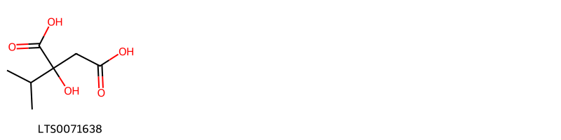{ width=100% }
    <figcaption>Hình ảnh cấu trúc hóa học của 1 hoạt chất thuộc nhóm Fatty Acyls gồm ['2-isopropylmalic acid (LTS0071638)'].</figcaption>
</figure>
#### Nhóm Flavonoids
<figure markdown="span">
    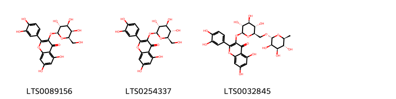{ width=100% }
    <figcaption>Hình ảnh cấu trúc hóa học của 3 hoạt chất thuộc nhóm Flavonoids gồm ['hyperoside (LTS0089156)', 'isoquercetin (LTS0254337)', '3-rutinosyl quercetin (LTS0032845)'].</figcaption>
</figure>
#### Nhóm Organooxygen compounds
<figure markdown="span">
    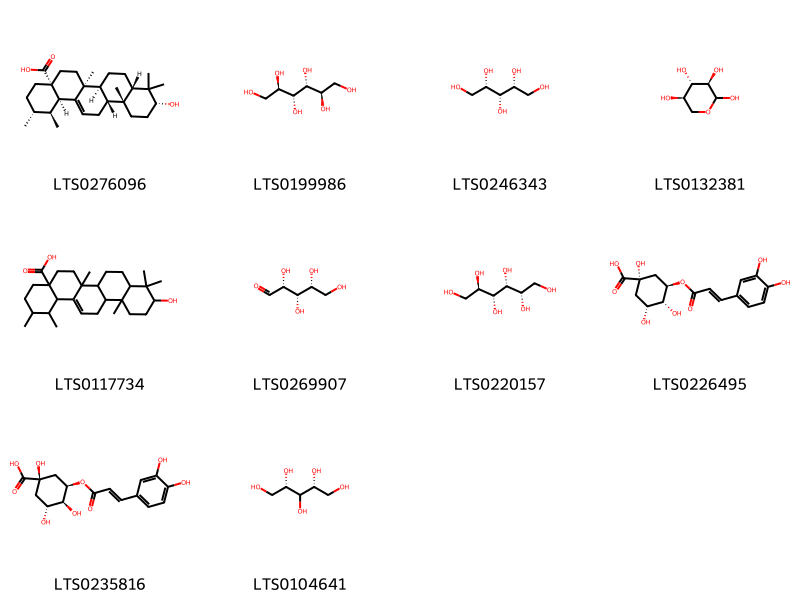{ width=100% }
    <figcaption>Hình ảnh cấu trúc hóa học của 10 hoạt chất thuộc nhóm Organooxygen compounds gồm ['(1s,2r,4ar,6as,6bs,8as,10r,12ar,12br,14br)-10-hydroxy-1,2,6a,9,9,12a-hexamethyl-1,2,3,4,5,6,6b,7,8,8a,10,11,12,12b,13,14b-hexadecahydropicene-4a-carboxylic acid (LTS0276096)', 'mannitol (LTS0199986)', 'd-xylitol (LTS0246343)', 'd-xylose (LTS0132381)', '10-hydroxy-1,2,6a,9,9,12a-hexamethyl-1,2,3,4,5,6,6b,7,8,8a,10,11,12,12b,13,14b-hexadecahydropicene-4a-carboxylic acid (LTS0117734)', '(d)-xylose (LTS0269907)', 'd-sorbitol (LTS0220157)', 'chlorogenic acid (LTS0226495)', 'neochlorogenic acid (LTS0235816)', '(2r,4s)-pentane-1,2,3,4,5-pentol (LTS0104641)'].</figcaption>
</figure>
#### Nhóm Phenols
<figure markdown="span">
    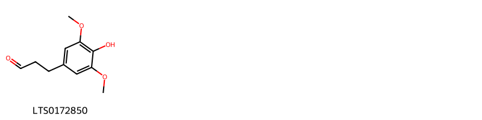{ width=100% }
    <figcaption>Hình ảnh cấu trúc hóa học của 1 hoạt chất thuộc nhóm Phenols gồm ['3-(4-hydroxy-3,5-dimethoxyphenyl)propanal (LTS0172850)'].</figcaption>
</figure>
#### Nhóm Prenol lipids
<figure markdown="span">
    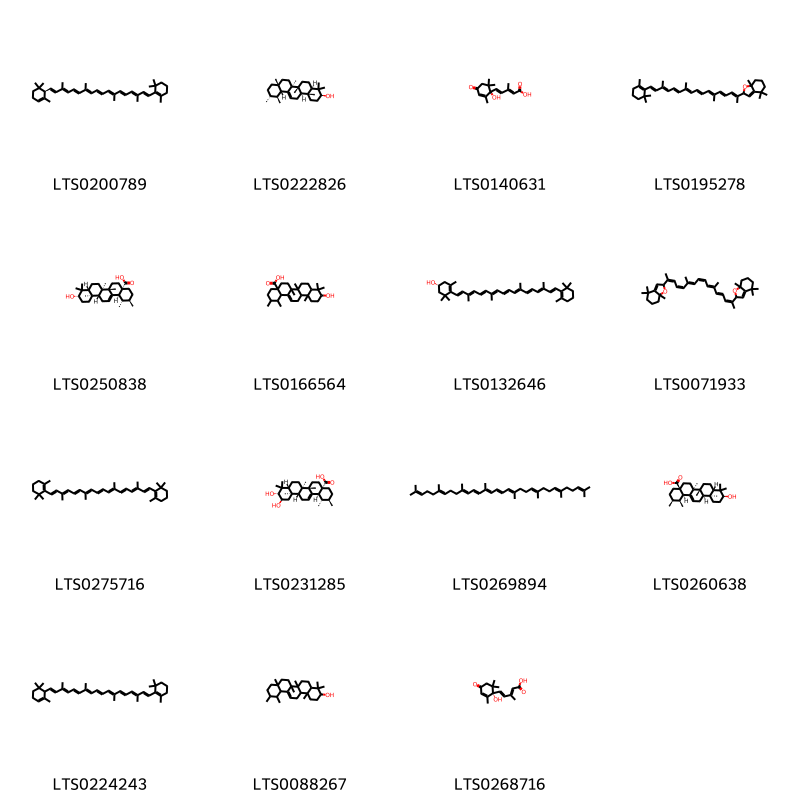{ width=100% }
    <figcaption>Hình ảnh cấu trúc hóa học của 15 hoạt chất thuộc nhóm Prenol lipids gồm ['(+)-α-carotene (LTS0200789)', 'amyrin (LTS0222826)', 'abscisic acid,  (LTS0140631)', 'mutatochrome (LTS0195278)', 'ursolic acid (LTS0250838)', '10-hydroxy-1,2,6a,6b,9,9,12a-heptamethyl-2,3,4,5,6,7,8,8a,10,11,12,12b,13,14b-tetradecahydro-1h-picene-4a-carboxylic acid (LTS0166564)', 'cryptoxanthin (LTS0132646)', '2-[(2z,4e,6e,8z,10e,12z,14z)-15-(4,4,7a-trimethyl-2,5,6,7-tetrahydro-1-benzofuran-2-yl)-6,11-dimethylhexadeca-2,4,6,8,10,12,14-heptaen-2-yl]-4,4,7a-trimethyl-2,5,6,7-tetrahydro-1-benzofuran (LTS0071933)', 'β-carotene (LTS0275716)', 'corosolic acid (LTS0231285)', 'all-trans-phytofluene (LTS0269894)', '(1s,2s,4as,6as,6br,8as,10s,12as,12br,14br)-10-hydroxy-1,2,6a,6b,9,9,12a-heptamethyl-2,3,4,5,6,7,8,8a,10,11,12,12b,13,14b-tetradecahydro-1h-picene-4a-carboxylic acid (LTS0260638)', 'α-carotene (LTS0224243)', 'α-amyrin (LTS0088267)', '(4e)-5-[(1s)-1-hydroxy-2,6,6-trimethyl-4-oxocyclohex-2-en-1-yl]-3-methylpenta-2,4-dienoic acid (LTS0268716)'].</figcaption>
</figure>
#### Nhóm Pyrans
<figure markdown="span">
    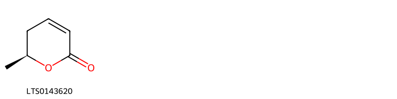{ width=100% }
    <figcaption>Hình ảnh cấu trúc hóa học của 1 hoạt chất thuộc nhóm Pyrans gồm ['parasorbic acid (LTS0143620)'].</figcaption>
</figure>
#### Nhóm Saturated hydrocarbons
<figure markdown="span">
    { width=100% }
    <figcaption>Hình ảnh cấu trúc hóa học của 1 hoạt chất thuộc nhóm Saturated hydrocarbons gồm ['octacosane (LTS0242387)'].</figcaption>
</figure>
#### Nhóm Steroids and steroid derivatives
<figure markdown="span">
    { width=100% }
    <figcaption>Hình ảnh cấu trúc hóa học của 3 hoạt chất thuộc nhóm Steroids and steroid derivatives gồm ['stigmast-5-en-3-ol (LTS0071224)', 'sitosterol (LTS0168132)', 'stigmast-5-en-3-ol, (3β)- (LTS0204616)'].</figcaption>
</figure>

---

### Dược dân tộc học

Danh sách các quốc gia có sử dụng *Sorbus aucuparia* trong điều trị các bệnh. 

| Country   | Disease                                     | Bệnh                                                                                                                                                                                                |
|:----------|:--------------------------------------------|:----------------------------------------------------------------------------------------------------------------------------------------------------------------------------------------------------|
| Elsewhere | Aperient, Diuretic, Emmenagogue, Astringent | MYMEMORY WARNING: YOU USED ALL AVAILABLE FREE TRANSLATIONS FOR TODAY. NEXT AVAILABLE IN  11 HOURS 37 MINUTES 23 SECONDS VISIT HTTPS://MYMEMORY.TRANSLATED.NET/DOC/USAGELIMITS.PHP TO TRANSLATE MORE |
| Eurasia   | Intoxicant                                  | MYMEMORY WARNING: YOU USED ALL AVAILABLE FREE TRANSLATIONS FOR TODAY. NEXT AVAILABLE IN  11 HOURS 37 MINUTES 20 SECONDS VISIT HTTPS://MYMEMORY.TRANSLATED.NET/DOC/USAGELIMITS.PHP TO TRANSLATE MORE |
| Turkey    | Aperient, Astringent, Emmenagogue, Diuretic | MYMEMORY WARNING: YOU USED ALL AVAILABLE FREE TRANSLATIONS FOR TODAY. NEXT AVAILABLE IN  11 HOURS 37 MINUTES 17 SECONDS VISIT HTTPS://MYMEMORY.TRANSLATED.NET/DOC/USAGELIMITS.PHP TO TRANSLATE MORE |

---

# Chi Hagenia

??? note "Danh sách các dược liệu thuộc chi"
    
	 - *Hagenia abyssincia*
	 - *Hagenia abyssinica*

---
## Hagenia abyssincia
### Thông tin về thực vật

!!! info "Phân loại thực vật của *Hagenia abyssinica* từ GIBF:"
    - **Kingdom:** Plantae
    - **Phylum:** Tracheophyta
    - **Order:** Rosales
    - **Family:** Rosaceae
    - **Genus:** Hagenia
    - **Species:** *Hagenia abyssinica*

 

| Label (VI)   | Label (EN)   | Scientific Name   | Descriptions (VI)   | Descriptions (EN)   | Also Known As (VI)   | Also Known As (EN)                                                  |
|:-------------|:-------------|:------------------|:--------------------|:--------------------|:---------------------|:--------------------------------------------------------------------|
| N/A          | N/A          | Sorbus aucuparia  | loài thực vật       | species of plant    | ['']                 | ['European mountain-ash', 'European rowan', 'rowan-berry', 'rowan'] |

#### Phân bố trên thế giới

**Từ CSDL GIBF** Malawi, Uganda, Somalia, Tanzania, United Republic of, New Zealand, Malaysia, Ethiopia, Congo, Democratic Republic of the, Kenya, Burundi, Rwanda, Norway

#### Phân bố tại Việt Nam

**Từ CSDL GIBF**: Không có ghi nhận ở Việt Nam

---
### Thành phần hóa học
        
- Theo cơ sở dữ liệu lotus: Từ loài *Hagenia abyssinica* đã phân lập và xác định được Chưa có hoạt chất nào được phân lập. hoạt chất thuộc về các nhóm Không có hoạt chất nào được phân lập. 

Không có hình ảnh nào được tạo ra

---

### Dược dân tộc học

Danh sách các quốc gia có sử dụng *Hagenia abyssinica* trong điều trị các bệnh. 

| Country   | Disease   | Bệnh                                                                                                                                                                                                |
|:----------|:----------|:----------------------------------------------------------------------------------------------------------------------------------------------------------------------------------------------------|
| Ethiopia  | Taenifuge | MYMEMORY WARNING: YOU USED ALL AVAILABLE FREE TRANSLATIONS FOR TODAY. NEXT AVAILABLE IN  11 HOURS 36 MINUTES 43 SECONDS VISIT HTTPS://MYMEMORY.TRANSLATED.NET/DOC/USAGELIMITS.PHP TO TRANSLATE MORE |

---

---
## Hagenia abyssinica
### Thông tin về thực vật

!!! info "Phân loại thực vật của *Hagenia abyssinica* từ GIBF:"
    - **Kingdom:** Plantae
    - **Phylum:** Tracheophyta
    - **Order:** Rosales
    - **Family:** Rosaceae
    - **Genus:** Hagenia
    - **Species:** *Hagenia abyssinica*

 

| Label (VI)   | Label (EN)   | Scientific Name    | Descriptions (VI)   | Descriptions (EN)   | Also Known As (VI)   | Also Known As (EN)   |
|:-------------|:-------------|:-------------------|:--------------------|:--------------------|:---------------------|:---------------------|
| N/A          | N/A          | Hagenia abyssinica |                     | species of plants   | ['']                 | ['']                 |

#### Phân bố trên thế giới

**Từ CSDL GIBF** Malawi, Uganda, Somalia, Tanzania, United Republic of, New Zealand, Malaysia, Ethiopia, Congo, Democratic Republic of the, Kenya, Burundi, Rwanda, Norway

#### Phân bố tại Việt Nam

**Từ CSDL GIBF**: Không có ghi nhận ở Việt Nam

---
### Thành phần hóa học
        
- Theo cơ sở dữ liệu lotus: Từ loài *Hagenia abyssinica* đã phân lập và xác định được 22 hoạt chất thuộc về các nhóm Organooxygen compounds, Benzene and substituted derivatives, Diarylheptanoids. 

|    | chemicalTaxonomyClassyfireClass     |   smiles_count |
|---:|:------------------------------------|---------------:|
|  0 | Benzene and substituted derivatives |              6 |
|  1 | Diarylheptanoids                    |              9 |
|  2 | Organooxygen compounds              |              7 |

#### Nhóm Benzene and substituted derivatives
<figure markdown="span">
    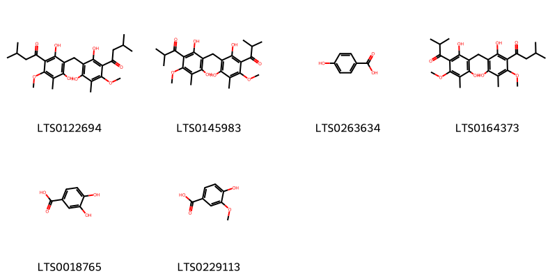{ width=100% }
    <figcaption>Hình ảnh cấu trúc hóa học của 6 hoạt chất thuộc nhóm Benzene and substituted derivatives gồm ['1-(3-{[2,6-dihydroxy-4-methoxy-3-methyl-5-(3-methylbutanoyl)phenyl]methyl}-2,4-dihydroxy-6-methoxy-5-methylphenyl)-3-methylbutan-1-one (LTS0122694)', 'α-kosin (LTS0145983)', 'p-hydroxybenzoic acid (LTS0263634)', '1-(3-{[2,6-dihydroxy-4-methoxy-3-methyl-5-(2-methylpropanoyl)phenyl]methyl}-2,4-dihydroxy-6-methoxy-5-methylphenyl)-3-methylbutan-1-one (LTS0164373)', '3,4-dihydroxybenzoic acid (LTS0018765)', 'vanillic acid (LTS0229113)'].</figcaption>
</figure>
#### Nhóm Diarylheptanoids
<figure markdown="span">
    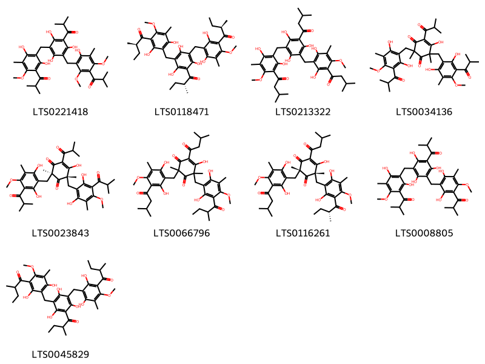{ width=100% }
    <figcaption>Hình ảnh cấu trúc hóa học của 9 hoạt chất thuộc nhóm Diarylheptanoids gồm ['1-{2,4-dihydroxy-6-methoxy-5-methyl-3-[(2,4,6-trihydroxy-3-{[2-hydroxy-4,6-dimethoxy-3-methyl-5-(2-methylpropanoyl)phenyl]methyl}-5-(2-methylpropanoyl)phenyl)methyl]phenyl}-2-methylpropan-1-one (LTS0221418)', '(2r)-1-[3,5-bis({2,6-dihydroxy-4-methoxy-3-methyl-5-[(2r)-2-methylbutanoyl]phenyl}methyl)-2,4,6-trihydroxyphenyl]-2-methylbutan-1-one (LTS0118471)', '1-{3-[(3-{[2,6-dihydroxy-4-methoxy-3-methyl-5-(3-methylbutanoyl)phenyl]methyl}-2,4,6-trihydroxy-5-(3-methylbutanoyl)phenyl)methyl]-2,4-dihydroxy-6-methoxy-5-methylphenyl}-3-methylbutan-1-one (LTS0213322)', '2,6-bis({[2,6-dihydroxy-4-methoxy-3-methyl-5-(2-methylpropanoyl)phenyl]methyl})-5-hydroxy-2,6-dimethyl-4-(2-methylpropanoyl)cyclohex-4-ene-1,3-dione (LTS0034136)', '(2r,6s)-2,6-bis({[2,6-dihydroxy-4-methoxy-3-methyl-5-(2-methylpropanoyl)phenyl]methyl})-5-hydroxy-2,6-dimethyl-4-(2-methylpropanoyl)cyclohex-4-ene-1,3-dione (LTS0023843)', '6-{[2,6-dihydroxy-4-methoxy-3-methyl-5-(2-methylbutanoyl)phenyl]methyl}-2-{[2,6-dihydroxy-4-methoxy-3-methyl-5-(3-methylbutanoyl)phenyl]methyl}-5-hydroxy-2,6-dimethyl-4-(3-methylbutanoyl)cyclohex-4-ene-1,3-dione (LTS0066796)', '(2s,6s)-2-{[2,6-dihydroxy-4-methoxy-3-methyl-5-(3-methylbutanoyl)phenyl]methyl}-6-({2,6-dihydroxy-4-methoxy-3-methyl-5-[(2r)-2-methylbutanoyl]phenyl}methyl)-5-hydroxy-2,6-dimethyl-4-(3-methylbutanoyl)cyclohex-4-ene-1,3-dione (LTS0116261)', '1-{3-[(3-{[2,6-dihydroxy-4-methoxy-3-methyl-5-(2-methylpropanoyl)phenyl]methyl}-2,4,6-trihydroxy-5-(2-methylpropanoyl)phenyl)methyl]-2,4-dihydroxy-6-methoxy-5-methylphenyl}-2-methylpropan-1-one (LTS0008805)', '1-[3,5-bis({[2,6-dihydroxy-4-methoxy-3-methyl-5-(2-methylbutanoyl)phenyl]methyl})-2,4,6-trihydroxyphenyl]-2-methylbutan-1-one (LTS0045829)'].</figcaption>
</figure>
#### Nhóm Organooxygen compounds
<figure markdown="span">
    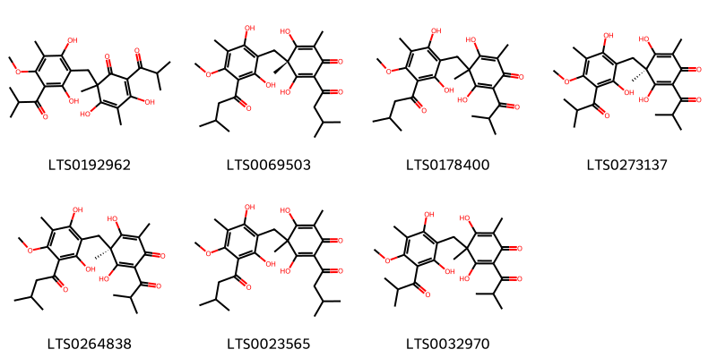{ width=100% }
    <figcaption>Hình ảnh cấu trúc hóa học của 7 hoạt chất thuộc nhóm Organooxygen compounds gồm ['6-{[2,6-dihydroxy-4-methoxy-3-methyl-5-(2-methylpropanoyl)phenyl]methyl}-3,5-dihydroxy-4,6-dimethyl-2-(2-methylpropanoyl)cyclohexa-2,4-dien-1-one (LTS0192962)', '(4r)-4-{[2,6-dihydroxy-4-methoxy-3-methyl-5-(3-methylbutanoyl)phenyl]methyl}-3,5-dihydroxy-2,4-dimethyl-6-(3-methylbutanoyl)cyclohexa-2,5-dien-1-one (LTS0069503)', '4-{[2,6-dihydroxy-4-methoxy-3-methyl-5-(3-methylbutanoyl)phenyl]methyl}-3,5-dihydroxy-2,4-dimethyl-6-(2-methylpropanoyl)cyclohexa-2,5-dien-1-one (LTS0178400)', '(4s)-4-{[2,6-dihydroxy-4-methoxy-3-methyl-5-(2-methylpropanoyl)phenyl]methyl}-3,5-dihydroxy-2,4-dimethyl-6-(2-methylpropanoyl)cyclohexa-2,5-dien-1-one (LTS0273137)', '(4s)-4-{[2,6-dihydroxy-4-methoxy-3-methyl-5-(3-methylbutanoyl)phenyl]methyl}-3,5-dihydroxy-2,4-dimethyl-6-(2-methylpropanoyl)cyclohexa-2,5-dien-1-one (LTS0264838)', '4-{[2,6-dihydroxy-4-methoxy-3-methyl-5-(3-methylbutanoyl)phenyl]methyl}-3,5-dihydroxy-2,4-dimethyl-6-(3-methylbutanoyl)cyclohexa-2,5-dien-1-one (LTS0023565)', '4-{[2,6-dihydroxy-4-methoxy-3-methyl-5-(2-methylpropanoyl)phenyl]methyl}-3,5-dihydroxy-2,4-dimethyl-6-(2-methylpropanoyl)cyclohexa-2,5-dien-1-one (LTS0032970)'].</figcaption>
</figure>

---

### Dược dân tộc học

Danh sách các quốc gia có sử dụng *Hagenia abyssinica* trong điều trị các bệnh. 

| Country   | Disease                                        | Bệnh                                                                                                                                                                                                |
|:----------|:-----------------------------------------------|:----------------------------------------------------------------------------------------------------------------------------------------------------------------------------------------------------|
| Elsewhere | Taenifuge, Vermifuge                           | MYMEMORY WARNING: YOU USED ALL AVAILABLE FREE TRANSLATIONS FOR TODAY. NEXT AVAILABLE IN  11 HOURS 36 MINUTES 19 SECONDS VISIT HTTPS://MYMEMORY.TRANSLATED.NET/DOC/USAGELIMITS.PHP TO TRANSLATE MORE |
| Ethiopia  | Poison, Abortifacient                          | MYMEMORY WARNING: YOU USED ALL AVAILABLE FREE TRANSLATIONS FOR TODAY. NEXT AVAILABLE IN  11 HOURS 36 MINUTES 15 SECONDS VISIT HTTPS://MYMEMORY.TRANSLATED.NET/DOC/USAGELIMITS.PHP TO TRANSLATE MORE |
| Turkey    | Abortifacient, Taenifuge, Vermifuge, Purgative | MYMEMORY WARNING: YOU USED ALL AVAILABLE FREE TRANSLATIONS FOR TODAY. NEXT AVAILABLE IN  11 HOURS 36 MINUTES 09 SECONDS VISIT HTTPS://MYMEMORY.TRANSLATED.NET/DOC/USAGELIMITS.PHP TO TRANSLATE MORE |

---

# Chi Cercocarpus

??? note "Danh sách các dược liệu thuộc chi"
    
	 - *Cercocarpus montanus*

---
## Cercocarpus montanus
### Thông tin về thực vật

!!! info "Phân loại thực vật của *Cercocarpus montanus* từ GIBF:"
    - **Kingdom:** Plantae
    - **Phylum:** Tracheophyta
    - **Order:** Rosales
    - **Family:** Rosaceae
    - **Genus:** Cercocarpus
    - **Species:** *Cercocarpus montanus*

 

| Label (VI)   | Label (EN)   | Scientific Name      | Descriptions (VI)   | Descriptions (EN)   | Also Known As (VI)   | Also Known As (EN)   |
|:-------------|:-------------|:---------------------|:--------------------|:--------------------|:---------------------|:---------------------|
| N/A          | N/A          | Cercocarpus montanus | loài thực vật       | species of plant    | ['']                 | ['']                 |

#### Phân bố trên thế giới

**Từ CSDL GIBF** United States of America, Mexico

#### Phân bố tại Việt Nam

**Từ CSDL GIBF**: Không có ghi nhận ở Việt Nam

---
### Thành phần hóa học
        
- Theo cơ sở dữ liệu lotus: Từ loài *Cercocarpus montanus* đã phân lập và xác định được 2 hoạt chất thuộc về các nhóm Prenol lipids. 

|    | chemicalTaxonomyClassyfireClass   |   smiles_count |
|---:|:----------------------------------|---------------:|
|  0 | Prenol lipids                     |              2 |

#### Nhóm Prenol lipids
<figure markdown="span">
    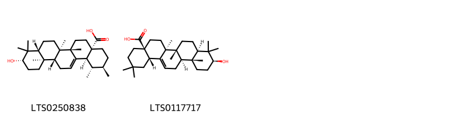{ width=100% }
    <figcaption>Hình ảnh cấu trúc hóa học của 2 hoạt chất thuộc nhóm Prenol lipids gồm ['ursolic acid (LTS0250838)', 'oleanolic acid (LTS0117717)'].</figcaption>
</figure>

---

### Dược dân tộc học

Danh sách các quốc gia có sử dụng *Cercocarpus montanus* trong điều trị các bệnh. 

| Country   | Disease   | Bệnh                                                                                                                                                                                                |
|:----------|:----------|:----------------------------------------------------------------------------------------------------------------------------------------------------------------------------------------------------|
| Mexico    | Laxative  | MYMEMORY WARNING: YOU USED ALL AVAILABLE FREE TRANSLATIONS FOR TODAY. NEXT AVAILABLE IN  11 HOURS 35 MINUTES 41 SECONDS VISIT HTTPS://MYMEMORY.TRANSLATED.NET/DOC/USAGELIMITS.PHP TO TRANSLATE MORE |
| US        | Poison    | MYMEMORY WARNING: YOU USED ALL AVAILABLE FREE TRANSLATIONS FOR TODAY. NEXT AVAILABLE IN  11 HOURS 35 MINUTES 38 SECONDS VISIT HTTPS://MYMEMORY.TRANSLATED.NET/DOC/USAGELIMITS.PHP TO TRANSLATE MORE |
| US(Tewa)  | Laxative  | MYMEMORY WARNING: YOU USED ALL AVAILABLE FREE TRANSLATIONS FOR TODAY. NEXT AVAILABLE IN  11 HOURS 35 MINUTES 36 SECONDS VISIT HTTPS://MYMEMORY.TRANSLATED.NET/DOC/USAGELIMITS.PHP TO TRANSLATE MORE |

---

# Chi Photinia

??? note "Danh sách các dược liệu thuộc chi"
    
	 - *Photinia glabra*
	 - *Photinia serrulata*

---
## Photinia glabra
### Thông tin về thực vật

!!! info "Phân loại thực vật của *Photinia glabra* từ GIBF:"
    - **Kingdom:** Plantae
    - **Phylum:** Tracheophyta
    - **Order:** Rosales
    - **Family:** Rosaceae
    - **Genus:** Photinia
    - **Species:** *Photinia glabra*

 

| Label (VI)   | Label (EN)   | Scientific Name   | Descriptions (VI)   | Descriptions (EN)   | Also Known As (VI)   | Also Known As (EN)   |
|:-------------|:-------------|:------------------|:--------------------|:--------------------|:---------------------|:---------------------|
| N/A          | N/A          | Photinia glabra   | loài thực vật       | species of plant    | ['']                 | ['']                 |

#### Phân bố trên thế giới

**Từ CSDL GIBF** Viet Nam, nan, Japan, South Africa, Brazil, France, Spain, Germany, United States of America, China, Australia, Korea, Republic of, Ukraine, Chinese Taipei

#### Phân bố tại Việt Nam

**Từ CSDL GIBF**: Không có ghi nhận ở Việt Nam

---
### Thành phần hóa học
        
- Theo cơ sở dữ liệu lotus: Từ loài *Photinia glabra* đã phân lập và xác định được 2 hoạt chất thuộc về các nhóm Fatty Acyls. 

|    | chemicalTaxonomyClassyfireClass   |   smiles_count |
|---:|:----------------------------------|---------------:|
|  0 | Fatty Acyls                       |              2 |

#### Nhóm Fatty Acyls
<figure markdown="span">
    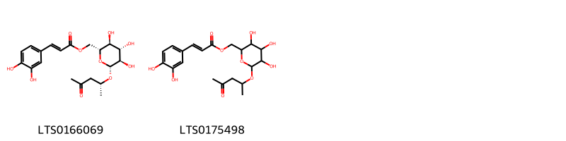{ width=100% }
    <figcaption>Hình ảnh cấu trúc hóa học của 2 hoạt chất thuộc nhóm Fatty Acyls gồm ['[(2r,3s,4s,5r,6r)-3,4,5-trihydroxy-6-{[(2r)-4-oxopentan-2-yl]oxy}oxan-2-yl]methyl (2e)-3-(3,4-dihydroxyphenyl)prop-2-enoate (LTS0166069)', '{3,4,5-trihydroxy-6-[(4-oxopentan-2-yl)oxy]oxan-2-yl}methyl 3-(3,4-dihydroxyphenyl)prop-2-enoate (LTS0175498)'].</figcaption>
</figure>

---

### Dược dân tộc học

Danh sách các quốc gia có sử dụng *Photinia glabra* trong điều trị các bệnh. 

| Country   | Disease                       | Bệnh                                                                                                                                                                                                |
|:----------|:------------------------------|:----------------------------------------------------------------------------------------------------------------------------------------------------------------------------------------------------|
| China     | Apertif, Digestive, Vermifuge | MYMEMORY WARNING: YOU USED ALL AVAILABLE FREE TRANSLATIONS FOR TODAY. NEXT AVAILABLE IN  11 HOURS 35 MINUTES 05 SECONDS VISIT HTTPS://MYMEMORY.TRANSLATED.NET/DOC/USAGELIMITS.PHP TO TRANSLATE MORE |

---

---
## Photinia serrulata
### Thông tin về thực vật

!!! info "Phân loại thực vật của *N/A* từ GIBF:"
    - **Kingdom:** Plantae
    - **Phylum:** Tracheophyta
    - **Order:** Rosales
    - **Family:** Rosaceae
    - **Genus:** N/A
    - **Species:** *N/A*

 

| Label (VI)   | Label (EN)   | Scientific Name    | Descriptions (VI)   | Descriptions (EN)   | Also Known As (VI)   | Also Known As (EN)   |
|:-------------|:-------------|:-------------------|:--------------------|:--------------------|:---------------------|:---------------------|
| N/A          | N/A          | Photinia serrulata | loài thực vật       | species of plant    | ['']                 | ['']                 |

#### Phân bố trên thế giới

**Từ CSDL GIBF** Denmark, Spain, Germany, Chile, Isle of Man, Australia, India, Canada, Finland, Türkiye, Japan, Ireland, Chinese Taipei, Hong Kong, United Kingdom of Great Britain and Northern Ireland, Argentina, Portugal, South Africa, France, Czechia, New Zealand, Russian Federation, United States of America, Italy, Israel, Ukraine

#### Phân bố tại Việt Nam

**Từ CSDL GIBF**: Không có ghi nhận ở Việt Nam

---
### Thành phần hóa học
        
- Theo cơ sở dữ liệu lotus: Từ loài *N/A* đã phân lập và xác định được 27 hoạt chất thuộc về các nhóm Prenol lipids, Lactones. 

|    | chemicalTaxonomyClassyfireClass   |   smiles_count |
|---:|:----------------------------------|---------------:|
|  0 | Lactones                          |              4 |
|  1 | Prenol lipids                     |             23 |

#### Nhóm Lactones
<figure markdown="span">
    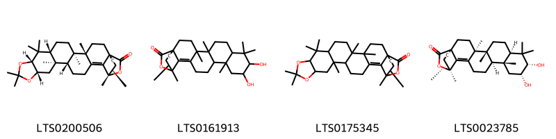{ width=100% }
    <figcaption>Hình ảnh cấu trúc hóa học của 4 hoạt chất thuộc nhóm Lactones gồm ['(1s,4s,5r,8r,10r,14s,16r,17r,22s,23r)-4,5,9,9,12,12,16,22,23-nonamethyl-11,13,27-trioxaheptacyclo[20.3.2.0¹,²¹.0⁴,²⁰.0⁵,¹⁷.0⁸,¹⁶.0¹⁰,¹⁴]heptacos-20-en-26-one (LTS0200506)', '10,11-dihydroxy-4,5,9,9,13,19,20-heptamethyl-24-oxahexacyclo[17.3.2.0¹,¹⁸.0⁴,¹⁷.0⁵,¹⁴.0⁸,¹³]tetracos-17-en-23-one (LTS0161913)', '4,5,9,9,12,12,16,22,23-nonamethyl-11,13,27-trioxaheptacyclo[20.3.2.0¹,²¹.0⁴,²⁰.0⁵,¹⁷.0⁸,¹⁶.0¹⁰,¹⁴]heptacos-20-en-26-one (LTS0175345)', '(1s,4s,5r,8r,10s,11r,13r,14r,19s,20r)-10,11-dihydroxy-4,5,9,9,13,19,20-heptamethyl-24-oxahexacyclo[17.3.2.0¹,¹⁸.0⁴,¹⁷.0⁵,¹⁴.0⁸,¹³]tetracos-17-en-23-one (LTS0023785)'].</figcaption>
</figure>
#### Nhóm Prenol lipids
<figure markdown="span">
    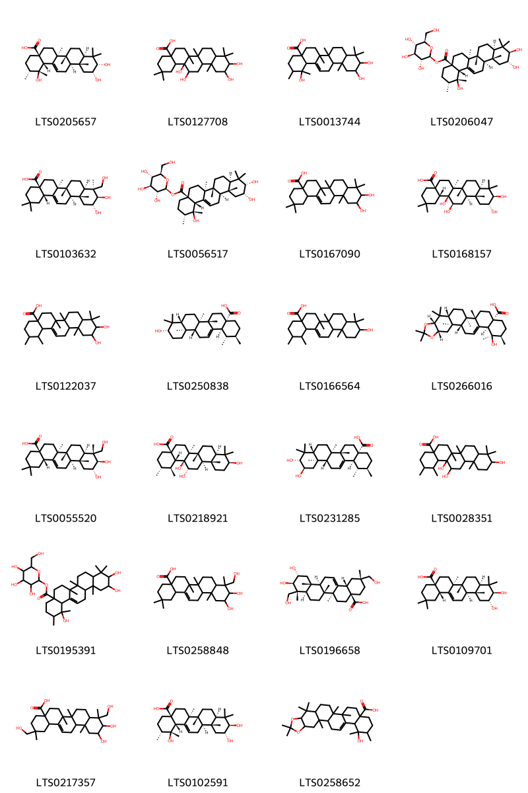{ width=100% }
    <figcaption>Hình ảnh cấu trúc hóa học của 23 hoạt chất thuộc nhóm Prenol lipids gồm ['euscaphic acid (LTS0205657)', '10,11,14,14a-tetrahydroxy-2,2,6a,6b,9,9,12a-heptamethyl-tetradecahydro-1h-picene-4a-carboxylic acid (LTS0127708)', '1,10,11-trihydroxy-1,2,6a,6b,9,9,12a-heptamethyl-2,3,4,5,6,7,8,8a,10,11,12,12b,13,14b-tetradecahydropicene-4a-carboxylic acid (LTS0013744)', '(2s,3r,4s,5s,6r)-3,4,5-trihydroxy-6-(hydroxymethyl)oxan-2-yl (1r,2r,4as,6as,6br,8ar,10r,11r,12ar,12br,14bs)-1,10,11-trihydroxy-1,2,6a,6b,9,9,12a-heptamethyl-2,3,4,5,6,7,8,8a,10,11,12,12b,13,14b-tetradecahydropicene-4a-carboxylate (LTS0206047)', '(4as,6as,6br,8ar,9s,10r,11r,12ar,12br,14bs)-10,11-dihydroxy-9-(hydroxymethyl)-2,2,6a,6b,9,12a-hexamethyl-1,3,4,5,6,7,8,8a,10,11,12,12b,13,14b-tetradecahydropicene-4a-carboxylic acid (LTS0103632)', '(2s,3r,4s,5s,6r)-3,4,5-trihydroxy-6-(hydroxymethyl)oxan-2-yl (1r,2r,4as,6as,6br,8ar,10s,11r,12ar,12br,14bs)-1,10,11-trihydroxy-1,2,6a,6b,9,9,12a-heptamethyl-2,3,4,5,6,7,8,8a,10,11,12,12b,13,14b-tetradecahydropicene-4a-carboxylate (LTS0056517)', '10,11-dihydroxy-2,2,6a,6b,9,9,12a-heptamethyl-1,3,4,5,6,7,8,8a,10,11,12,12b,13,14b-tetradecahydropicene-4a-carboxylic acid (LTS0167090)', '(4as,6as,6br,8ar,10r,11r,12ar,12br,14r,14as,14br)-10,11,14,14a-tetrahydroxy-2,2,6a,6b,9,9,12a-heptamethyl-tetradecahydro-1h-picene-4a-carboxylic acid (LTS0168157)', '10,11-dihydroxy-1,2,6a,6b,9,9,12a-heptamethyl-2,3,4,5,6,7,8,8a,10,11,12,12b,13,14b-tetradecahydro-1h-picene-4a-carboxylic acid (LTS0122037)', 'ursolic acid (LTS0250838)', '10-hydroxy-1,2,6a,6b,9,9,12a-heptamethyl-2,3,4,5,6,7,8,8a,10,11,12,12b,13,14b-tetradecahydro-1h-picene-4a-carboxylic acid (LTS0166564)', '(1r,2r,4as,6as,6br,8ar,9ar,12as,13ar,13br,15bs)-1-hydroxy-1,2,6a,6b,9,9,11,11,13a-nonamethyl-2h,3h,4h,5h,6h,7h,8h,8ah,9ah,12ah,13h,13bh,14h,15bh-piceno[2,3-d][1,3]dioxole-4a-carboxylic acid (LTS0266016)', 'arjunolic acid (LTS0055520)', '(1s,2r,4as,6as,6br,8ar,10s,12ar,12br,14s,14as,14br)-10,14,14a-trihydroxy-1,2,6a,6b,9,9,12a-heptamethyl-hexadecahydropicene-4a-carboxylic acid (LTS0218921)', 'corosolic acid (LTS0231285)', '10,14,14a-trihydroxy-1,2,6a,6b,9,9,12a-heptamethyl-hexadecahydropicene-4a-carboxylic acid (LTS0028351)', '3,4,5-trihydroxy-6-(hydroxymethyl)oxan-2-yl 1,10,11-trihydroxy-1,2,6a,6b,9,9,12a-heptamethyl-2,3,4,5,6,7,8,8a,10,11,12,12b,13,14b-tetradecahydropicene-4a-carboxylate (LTS0195391)', '10,11-dihydroxy-9-(hydroxymethyl)-2,2,6a,6b,9,12a-hexamethyl-1,3,4,5,6,7,8,8a,10,11,12,12b,13,14b-tetradecahydropicene-4a-carboxylic acid (LTS0258848)', '(2r,4ar,6as,6br,8ar,9r,10r,11r,12ar,12br,14bs)-10,11-dihydroxy-2,9-bis(hydroxymethyl)-2,6a,6b,9,12a-pentamethyl-1,3,4,5,6,7,8,8a,10,11,12,12b,13,14b-tetradecahydropicene-4a-carboxylic acid (LTS0196658)', 'maslinic acid (LTS0109701)', '10,11-dihydroxy-2,9-bis(hydroxymethyl)-2,6a,6b,9,12a-pentamethyl-1,3,4,5,6,7,8,8a,10,11,12,12b,13,14b-tetradecahydropicene-4a-carboxylic acid (LTS0217357)', 'tormentic acid (LTS0102591)', '1-hydroxy-1,2,6a,6b,9,9,11,11,13a-nonamethyl-2h,3h,4h,5h,6h,7h,8h,8ah,9ah,12ah,13h,13bh,14h,15bh-piceno[2,3-d][1,3]dioxole-4a-carboxylic acid (LTS0258652)'].</figcaption>
</figure>

---

### Dược dân tộc học

Danh sách các quốc gia có sử dụng *N/A* trong điều trị các bệnh. 

| Country   | Disease   | Bệnh                                                                                                                                                                                                |
|:----------|:----------|:----------------------------------------------------------------------------------------------------------------------------------------------------------------------------------------------------|
| Elsewhere | Tonic     | MYMEMORY WARNING: YOU USED ALL AVAILABLE FREE TRANSLATIONS FOR TODAY. NEXT AVAILABLE IN  11 HOURS 34 MINUTES 40 SECONDS VISIT HTTPS://MYMEMORY.TRANSLATED.NET/DOC/USAGELIMITS.PHP TO TRANSLATE MORE |

---

# Chi Amygdalus

??? note "Danh sách các dược liệu thuộc chi"
    
	 - *Amygdalus communis*

---
## Amygdalus communis
### Thông tin về thực vật

!!! info "Phân loại thực vật của *N/A* từ GIBF:"
    - **Kingdom:** Plantae
    - **Phylum:** Tracheophyta
    - **Order:** Rosales
    - **Family:** Rosaceae
    - **Genus:** Prunus
    - **Species:** *N/A*

 

| Label (VI)   | Label (EN)   | Scientific Name    | Descriptions (VI)   | Descriptions (EN)   | Also Known As (VI)   | Also Known As (EN)   |
|:-------------|:-------------|:-------------------|:--------------------|:--------------------|:---------------------|:---------------------|
| N/A          | N/A          | Amygdalus communis | loài thực vật       | species of plant    | ['']                 | ['']                 |

#### Phân bố trên thế giới

**Từ CSDL GIBF** Spain, Germany, Chile, Austria, Australia, Canada, Belgium, Netherlands, Japan, Mexico, Ireland, China, Chinese Taipei, Switzerland, United Kingdom of Great Britain and Northern Ireland, South Africa, France, New Zealand, Russian Federation, United States of America, Italy, Israel, Ukraine

#### Phân bố tại Việt Nam

**Từ CSDL GIBF**: Không có ghi nhận ở Việt Nam

---
### Thành phần hóa học
        
- Theo cơ sở dữ liệu lotus: Từ loài *N/A* đã phân lập và xác định được Chưa có hoạt chất nào được phân lập. hoạt chất thuộc về các nhóm Không có hoạt chất nào được phân lập. 

Không có hình ảnh nào được tạo ra

---

### Dược dân tộc học

Danh sách các quốc gia có sử dụng *N/A* trong điều trị các bệnh. 

| Country   | Disease                                     | Bệnh                                                                                                                                                                                                |
|:----------|:--------------------------------------------|:----------------------------------------------------------------------------------------------------------------------------------------------------------------------------------------------------|
| Elsewhere | Demulcent, Emollient, Sedative, Antitussive | MYMEMORY WARNING: YOU USED ALL AVAILABLE FREE TRANSLATIONS FOR TODAY. NEXT AVAILABLE IN  11 HOURS 34 MINUTES 14 SECONDS VISIT HTTPS://MYMEMORY.TRANSLATED.NET/DOC/USAGELIMITS.PHP TO TRANSLATE MORE |

---

# Chi Cliffortia

??? note "Danh sách các dược liệu thuộc chi"
    
	 - *Cliffortia ilicifolia*

---
## Cliffortia ilicifolia
### Thông tin về thực vật

!!! info "Phân loại thực vật của *Cliffortia ilicifolia* từ GIBF:"
    - **Kingdom:** Plantae
    - **Phylum:** Tracheophyta
    - **Order:** Rosales
    - **Family:** Rosaceae
    - **Genus:** Cliffortia
    - **Species:** *Cliffortia ilicifolia*

 

| Label (VI)   | Label (EN)   | Scientific Name       | Descriptions (VI)   | Descriptions (EN)   | Also Known As (VI)   | Also Known As (EN)   |
|:-------------|:-------------|:----------------------|:--------------------|:--------------------|:---------------------|:---------------------|
| N/A          | N/A          | Cliffortia ilicifolia | loài thực vật       | species of plant    | ['']                 | ['']                 |

#### Phân bố trên thế giới

**Từ CSDL GIBF** nan, South Africa

#### Phân bố tại Việt Nam

**Từ CSDL GIBF**: Không có ghi nhận ở Việt Nam

---
### Thành phần hóa học
        
- Theo cơ sở dữ liệu lotus: Từ loài *Cliffortia ilicifolia* đã phân lập và xác định được Chưa có hoạt chất nào được phân lập. hoạt chất thuộc về các nhóm Không có hoạt chất nào được phân lập. 

Không có hình ảnh nào được tạo ra

---

### Dược dân tộc học

Danh sách các quốc gia có sử dụng *Cliffortia ilicifolia* trong điều trị các bệnh. 

| Country   | Disease                | Bệnh                                                                                                                                                                                                |
|:----------|:-----------------------|:----------------------------------------------------------------------------------------------------------------------------------------------------------------------------------------------------|
| Africa    | Emollient, Expectorant | MYMEMORY WARNING: YOU USED ALL AVAILABLE FREE TRANSLATIONS FOR TODAY. NEXT AVAILABLE IN  11 HOURS 33 MINUTES 39 SECONDS VISIT HTTPS://MYMEMORY.TRANSLATED.NET/DOC/USAGELIMITS.PHP TO TRANSLATE MORE |

---

# Chi Pyrus

??? note "Danh sách các dược liệu thuộc chi"
    
	 - *Pyrus cathayensis*
	 - *Pyrus chinensis*
	 - *Pyrus communis*
	 - *Pyrus fusca*
	 - *Pyrus pyrifolia*
	 - *Pyrus sinensis*

---
## Pyrus cathayensis
### Thông tin về thực vật

!!! info "Phân loại thực vật của *N/A* từ GIBF:"
    - **Kingdom:** Plantae
    - **Phylum:** Tracheophyta
    - **Order:** Rosales
    - **Family:** Rosaceae
    - **Genus:** N/A
    - **Species:** *N/A*

 

| Label (VI)   | Label (EN)   | Scientific Name   | Descriptions (VI)   | Descriptions (EN)   | Also Known As (VI)   | Also Known As (EN)   |
|:-------------|:-------------|:------------------|:--------------------|:--------------------|:---------------------|:---------------------|
| N/A          | N/A          | Pyrus cathayensis | loài thực vật       | species of plant    | ['']                 | ['']                 |

#### Phân bố trên thế giới

**Từ CSDL GIBF** Denmark, Spain, Germany, Chile, Isle of Man, Australia, India, Canada, Finland, Türkiye, Japan, Ireland, Chinese Taipei, Hong Kong, United Kingdom of Great Britain and Northern Ireland, Argentina, Portugal, South Africa, France, Czechia, New Zealand, Russian Federation, United States of America, Italy, Israel, Ukraine

#### Phân bố tại Việt Nam

**Từ CSDL GIBF**: Không có ghi nhận ở Việt Nam

---
### Thành phần hóa học
        
- Theo cơ sở dữ liệu lotus: Từ loài *N/A* đã phân lập và xác định được Chưa có hoạt chất nào được phân lập. hoạt chất thuộc về các nhóm Không có hoạt chất nào được phân lập. 

Không có hình ảnh nào được tạo ra

---

### Dược dân tộc học

Danh sách các quốc gia có sử dụng *N/A* trong điều trị các bệnh. 

| Country   | Disease                                              | Bệnh                                                                                                                                                                                                |
|:----------|:-----------------------------------------------------|:----------------------------------------------------------------------------------------------------------------------------------------------------------------------------------------------------|
| China     | Astringent, Cosmetic, Demulcent, Digestive, Diuretic | MYMEMORY WARNING: YOU USED ALL AVAILABLE FREE TRANSLATIONS FOR TODAY. NEXT AVAILABLE IN  11 HOURS 33 MINUTES 16 SECONDS VISIT HTTPS://MYMEMORY.TRANSLATED.NET/DOC/USAGELIMITS.PHP TO TRANSLATE MORE |

---

---
## Pyrus chinensis
### Thông tin về thực vật

!!! info "Phân loại thực vật của *N/A* từ GIBF:"
    - **Kingdom:** Plantae
    - **Phylum:** Tracheophyta
    - **Order:** Rosales
    - **Family:** Rosaceae
    - **Genus:** N/A
    - **Species:** *N/A*

 

| Label (VI)   | Label (EN)   | Scientific Name   | Descriptions (VI)   | Descriptions (EN)   | Also Known As (VI)   | Also Known As (EN)   |
|:-------------|:-------------|:------------------|:--------------------|:--------------------|:---------------------|:---------------------|
| N/A          | N/A          | Pyrus cathayensis | loài thực vật       | species of plant    | ['']                 | ['']                 |

#### Phân bố trên thế giới

**Từ CSDL GIBF** Denmark, Spain, Germany, Chile, Isle of Man, Australia, India, Canada, Finland, Türkiye, Japan, Ireland, Chinese Taipei, Hong Kong, United Kingdom of Great Britain and Northern Ireland, Argentina, Portugal, South Africa, France, Czechia, New Zealand, Russian Federation, United States of America, Italy, Israel, Ukraine

#### Phân bố tại Việt Nam

**Từ CSDL GIBF**: Không có ghi nhận ở Việt Nam

---
### Thành phần hóa học
        
- Theo cơ sở dữ liệu lotus: Từ loài *N/A* đã phân lập và xác định được Chưa có hoạt chất nào được phân lập. hoạt chất thuộc về các nhóm Không có hoạt chất nào được phân lập. 

Không có hình ảnh nào được tạo ra

---

### Dược dân tộc học

Danh sách các quốc gia có sử dụng *N/A* trong điều trị các bệnh. 

| Country   | Disease                     | Bệnh                                                                                                                                                                                                |
|:----------|:----------------------------|:----------------------------------------------------------------------------------------------------------------------------------------------------------------------------------------------------|
| China     | Antivinous, Astringent, nan | MYMEMORY WARNING: YOU USED ALL AVAILABLE FREE TRANSLATIONS FOR TODAY. NEXT AVAILABLE IN  11 HOURS 32 MINUTES 56 SECONDS VISIT HTTPS://MYMEMORY.TRANSLATED.NET/DOC/USAGELIMITS.PHP TO TRANSLATE MORE |

---

---
## Pyrus communis
### Thông tin về thực vật

!!! info "Phân loại thực vật của *Pyrus communis* từ GIBF:"
    - **Kingdom:** Plantae
    - **Phylum:** Tracheophyta
    - **Order:** Rosales
    - **Family:** Rosaceae
    - **Genus:** Pyrus
    - **Species:** *Pyrus communis*

 

| Label (VI)   | Label (EN)   | Scientific Name   | Descriptions (VI)   | Descriptions (EN)   | Also Known As (VI)   | Also Known As (EN)        |
|:-------------|:-------------|:------------------|:--------------------|:--------------------|:---------------------|:--------------------------|
| N/A          | N/A          | Pyrus communis    | loài thực vật       | species of plant    | ['']                 | ['European pear', 'pear'] |
| N/A          | N/A          | Pyrus communis    |                     |                     | ['']                 | ['']                      |

#### Phân bố trên thế giới

**Từ CSDL GIBF** Luxembourg, Spain, Germany, Chile, Austria, Sweden, Poland, Canada, Belgium, Slovakia, Netherlands, Belarus, Lithuania, Hungary, Bulgaria, Mexico, Switzerland, United Kingdom of Great Britain and Northern Ireland, France, Czechia, New Zealand, Russian Federation, United States of America, Italy, Croatia, Ukraine

#### Phân bố tại Việt Nam

**Từ CSDL GIBF**: Không có ghi nhận ở Việt Nam

---
### Thành phần hóa học
        
- Theo cơ sở dữ liệu lotus: Từ loài *Pyrus communis* đã phân lập và xác định được 119 hoạt chất thuộc về các nhóm Organooxygen compounds, Furanoid lignans, Flavonoids, Benzofurans, Saturated hydrocarbons, Nucleoside and nucleotide analogues, Dibenzylbutane lignans, Prenol lipids, Carboxylic acids and derivatives, Phenols, Steroids and steroid derivatives, Hydroxy acids and derivatives, Cinnamic acids and derivatives. 

|    | chemicalTaxonomyClassyfireClass     |   smiles_count |
|---:|:------------------------------------|---------------:|
|  0 | Benzofurans                         |              2 |
|  1 | Carboxylic acids and derivatives    |              3 |
|  2 | Cinnamic acids and derivatives      |              9 |
|  3 | Dibenzylbutane lignans              |              2 |
|  4 | Flavonoids                          |             26 |
|  5 | Furanoid lignans                    |              3 |
|  6 | Hydroxy acids and derivatives       |              1 |
|  7 | Nucleoside and nucleotide analogues |              1 |
|  8 | Organooxygen compounds              |             34 |
|  9 | Phenols                             |              1 |
| 10 | Prenol lipids                       |             33 |
| 11 | Saturated hydrocarbons              |              1 |
| 12 | Steroids and steroid derivatives    |              3 |

#### Nhóm Benzofurans
<figure markdown="span">
    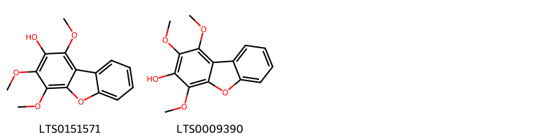{ width=100% }
    <figcaption>Hình ảnh cấu trúc hóa học của 2 hoạt chất thuộc nhóm Benzofurans gồm ['α-pyrufuran (LTS0151571)', 'β-pyrufuran (LTS0009390)'].</figcaption>
</figure>
#### Nhóm Carboxylic acids and derivatives
<figure markdown="span">
    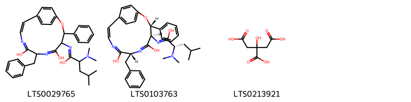{ width=100% }
    <figcaption>Hình ảnh cấu trúc hóa học của 3 hoạt chất thuộc nhóm Carboxylic acids and derivatives gồm ['n-{7-benzyl-5,8-dihydroxy-3-phenyl-2-oxa-6,9-diazabicyclo[10.2.2]hexadeca-1(14),5,8,10,12,15-hexaen-4-yl}-2-(dimethylamino)-4-methylpentanimidic acid (LTS0029765)', '(2s)-n-[(3r,4r,7r,10z)-7-benzyl-5,8-dihydroxy-3-phenyl-2-oxa-6,9-diazabicyclo[10.2.2]hexadeca-1(14),5,8,10,12,15-hexaen-4-yl]-2-(dimethylamino)-4-methylpentanimidic acid (LTS0103763)', 'citric acid (LTS0213921)'].</figcaption>
</figure>
#### Nhóm Cinnamic acids and derivatives
<figure markdown="span">
    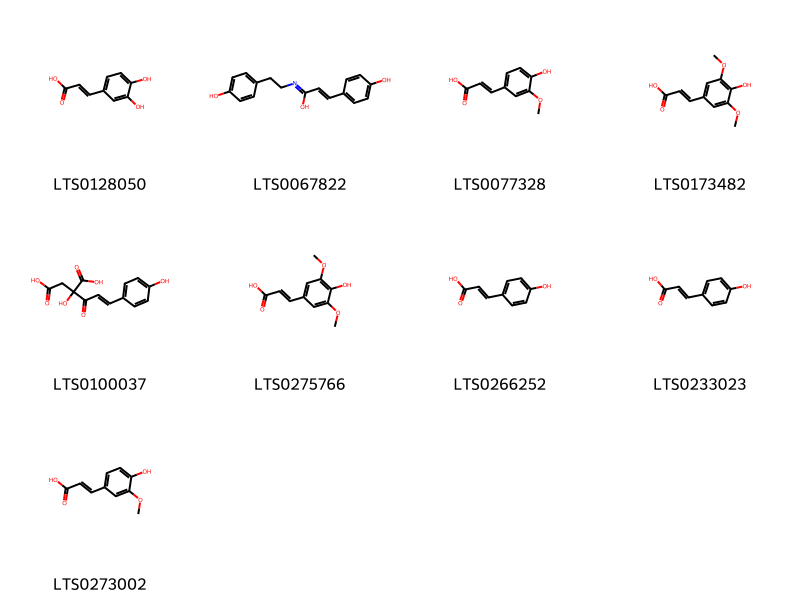{ width=100% }
    <figcaption>Hình ảnh cấu trúc hóa học của 9 hoạt chất thuộc nhóm Cinnamic acids and derivatives gồm ['3,4-dihydroxycinnamic acid (LTS0128050)', '(2e)-3-(4-hydroxyphenyl)-n-[2-(4-hydroxyphenyl)ethyl]prop-2-enimidic acid (LTS0067822)', 'ferulic acid (LTS0077328)', 'sinapinate (LTS0173482)', '2-hydroxy-2-[(2e)-3-(4-hydroxyphenyl)prop-2-enoyl]butanedioic acid (LTS0100037)', 'sinapoyl alcohol (LTS0275766)', 'para-coumaric acid (LTS0266252)', 'hydroxycinnamic acid (LTS0233023)', 'ferulic acid (LTS0273002)'].</figcaption>
</figure>
#### Nhóm Dibenzylbutane lignans
<figure markdown="span">
    { width=100% }
    <figcaption>Hình ảnh cấu trúc hóa học của 2 hoạt chất thuộc nhóm Dibenzylbutane lignans gồm ['(2s,3r)-2,3-bis[(4-hydroxy-3-methoxyphenyl)(¹³c)methyl](1-¹³c)butane-1,4-diol (LTS0268699)', 'secoisolariciresinol (LTS0086727)'].</figcaption>
</figure>
#### Nhóm Flavonoids
<figure markdown="span">
    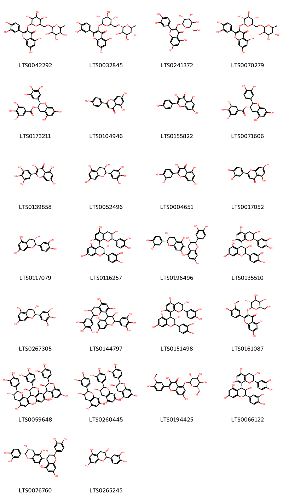{ width=100% }
    <figcaption>Hình ảnh cấu trúc hóa học của 26 hoạt chất thuộc nhóm Flavonoids gồm ['rutin (LTS0042292)', '3-rutinosyl quercetin (LTS0032845)', '2-(3,4-dihydroxyphenyl)-5,7-dihydroxy-3-{[(2s,3r,4r,5r,6s)-3,4,5-trihydroxy-6-(hydroxymethyl)oxan-2-yl]oxy}chromen-4-one (LTS0241372)', '2-(3,4-dihydroxyphenyl)-5,7-dihydroxy-3-{[(2s,3r,4s,5s,6r)-3,4,5-trihydroxy-6-({[(2s,3r,4r,5r,6s)-3,4,5-trihydroxy-6-methyloxan-2-yl]oxy}methyl)oxan-2-yl]oxy}chromen-4-one (LTS0070279)', '(-)-epigallocatechin gallate (LTS0173211)', 'chamomile (LTS0104946)', 'kaempherol (LTS0155822)', 'epicatechin gallate (LTS0071606)', 'myricetin (LTS0139858)', 'epigallocatechin (LTS0052496)', 'quercetin (LTS0004651)', 'luteolin (LTS0017052)', '(+)-catechol (LTS0117079)', '(2r,3s,4s)-2-(3,4-dihydroxyphenyl)-4-[(2r,3r)-2-(3,4-dihydroxyphenyl)-3,5,7-trihydroxy-3,4-dihydro-2h-1-benzopyran-8-yl]-3,4-dihydro-2h-1-benzopyran-3,5,7-triol (LTS0116257)', '(2r,3s,4s)-2-(3,4-dihydroxyphenyl)-4-[(2r,3r)-2-(3,4-dihydroxyphenyl)-3,5,7-trihydroxy-3,4-dihydro-2h-1-benzopyran-6-yl]-3,4-dihydro-2h-1-benzopyran-3,5,7-triol (LTS0196496)', '(2r,3r,4r)-2-(3,4-dihydroxyphenyl)-4-[(2r,3r)-2-(3,4-dihydroxyphenyl)-3,5,7-trihydroxy-3,4-dihydro-2h-1-benzopyran-8-yl]-3,4-dihydro-2h-1-benzopyran-3,5,7-triol (LTS0135510)', 'gallocatechol (LTS0267305)', '4-[3,5,7-trihydroxy-2-(3,4,5-trihydroxyphenyl)-3,4-dihydro-2h-1-benzopyran-8-yl]-2-(3,4,5-trihydroxyphenyl)-3,4-dihydro-2h-1-benzopyran-3,5,7-triol (LTS0144797)', '(2r,3s,4s)-2-(3,4-dihydroxyphenyl)-4-[(2r,3s)-2-(3,4-dihydroxyphenyl)-3,5,7-trihydroxy-3,4-dihydro-2h-1-benzopyran-8-yl]-3,4-dihydro-2h-1-benzopyran-3,5,7-triol (LTS0151498)', 'cacticin (LTS0161087)', '(2r,3r)-2-(3,4-dihydroxyphenyl)-8-[(2r,3r)-2-(3,4-dihydroxyphenyl)-3,5,7-trihydroxy-3,4-dihydro-2h-1-benzopyran-4-yl]-4-[(2r,3s)-2-(3,4-dihydroxyphenyl)-3,5,7-trihydroxy-3,4-dihydro-2h-1-benzopyran-8-yl]-3,4-dihydro-2h-1-benzopyran-3,5,7-triol (LTS0059648)', 'procyanidin c1 (LTS0260445)', '3,7-dihydroxy-2-(4-hydroxy-3-methoxyphenyl)-5-{[(2s,3r,4s,5r,6s)-3,4,5-trihydroxy-6-(hydroxymethyl)oxan-2-yl]oxy}chromen-4-one (LTS0194425)', '(2r,3r,4r)-2-(3,4-dihydroxyphenyl)-4-[(2r,3s)-2-(3,4-dihydroxyphenyl)-3,5,7-trihydroxy-3,4-dihydro-2h-1-benzopyran-8-yl]-3,4-dihydro-2h-1-benzopyran-3,5,7-triol (LTS0066122)', '(2r,3s,4r)-2-(3,4-dihydroxyphenyl)-4-[(2r,3r)-2-(3,4-dihydroxyphenyl)-3,5,7-trihydroxy-3,4-dihydro-2h-1-benzopyran-6-yl]-3,4-dihydro-2h-1-benzopyran-3,5,7-triol (LTS0076760)', 'ent-epicatechin (LTS0265245)'].</figcaption>
</figure>
#### Nhóm Furanoid lignans
<figure markdown="span">
    { width=100% }
    <figcaption>Hình ảnh cấu trúc hóa học của 3 hoạt chất thuộc nhóm Furanoid lignans gồm ['pinoresinol (LTS0057431)', 'matairesinol (LTS0193475)', 'lariciresinol (LTS0010950)'].</figcaption>
</figure>
#### Nhóm Hydroxy acids and derivatives
<figure markdown="span">
    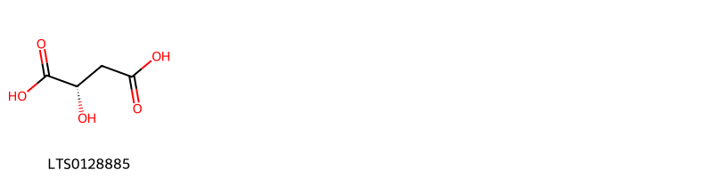{ width=100% }
    <figcaption>Hình ảnh cấu trúc hóa học của 1 hoạt chất thuộc nhóm Hydroxy acids and derivatives gồm ['(-)-malic acid (LTS0128885)'].</figcaption>
</figure>
#### Nhóm Nucleoside and nucleotide analogues
<figure markdown="span">
    { width=100% }
    <figcaption>Hình ảnh cấu trúc hóa học của 1 hoạt chất thuộc nhóm Nucleoside and nucleotide analogues gồm ['tryptophan n-glucoside (LTS0023633)'].</figcaption>
</figure>
#### Nhóm Organooxygen compounds
<figure markdown="span">
    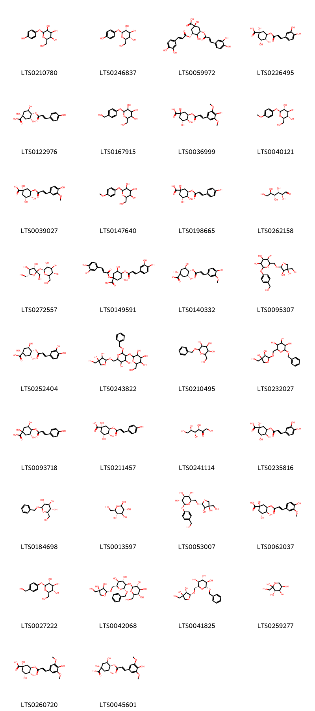{ width=100% }
    <figcaption>Hình ảnh cấu trúc hóa học của 34 hoạt chất thuộc nhóm Organooxygen compounds gồm ['arbutin (LTS0210780)', 'β-arbutin (LTS0246837)', '(3r,5r)-3,5-bis({[(2e)-3-(3,4-dihydroxyphenyl)prop-2-enoyl]oxy})-1,4-dihydroxycyclohexane-1-carboxylic acid (LTS0059972)', 'chlorogenic acid (LTS0226495)', '(1s,3r,4s,5r)-1,3,5-trihydroxy-4-{[(2e)-3-(4-hydroxyphenyl)prop-2-enoyl]oxy}cyclohexane-1-carboxylic acid (LTS0122976)', '2-(hydroxymethyl)-6-[4-(hydroxymethyl)phenoxy]oxane-3,4,5-triol (LTS0167915)', '3-o-sinapoylquinic acid (LTS0036999)', 'methylarbutin (LTS0040121)', '3-o-feruloyl-d-quinic acid (LTS0039027)', '2-(hydroxymethyl)-6-(4-methoxyphenoxy)oxane-3,4,5-triol (LTS0147640)', '(1r,3r,4s,5r)-1,3,4-trihydroxy-5-{[(2e)-3-(4-hydroxyphenyl)prop-2-enoyl]oxy}cyclohexane-1-carboxylic acid (LTS0198665)', '(+)-glucose (LTS0262158)', 'sucrose (LTS0272557)', '(3r,5r)-1,4-bis({[(2e)-3-(3,4-dihydroxyphenyl)prop-2-enoyl]oxy})-3,5-dihydroxycyclohexane-1-carboxylic acid (LTS0149591)', '4-o-feruloyl-d-quinic acid (LTS0140332)', '2-({[3,4-dihydroxy-4-(hydroxymethyl)oxolan-2-yl]oxy}methyl)-6-[4-(hydroxymethyl)phenoxy]oxane-3,4,5-triol (LTS0095307)', 'cryptochlorogenic acid (LTS0252404)', '2-{[2-(benzyloxy)-6-({[3,4-dihydroxy-4-(hydroxymethyl)oxolan-2-yl]oxy}methyl)-4,5-dihydroxyoxan-3-yl]oxy}-6-(hydroxymethyl)oxane-3,4,5-triol (LTS0243822)', 'benzyl glucopyranoside (LTS0210495)', '2-(benzyloxy)-6-({[3,4-dihydroxy-4-(hydroxymethyl)oxolan-2-yl]oxy}methyl)oxane-3,4,5-triol (LTS0232027)', '(3r,5r)-1,3,5-trihydroxy-4-{[(2e)-3-(4-hydroxyphenyl)prop-2-enoyl]oxy}cyclohexane-1-carboxylic acid (LTS0093718)', '(1s,3r,4r,5r)-1,3,4-trihydroxy-5-{[(2e)-3-(4-hydroxyphenyl)prop-2-enoyl]oxy}cyclohexane-1-carboxylic acid (LTS0211457)', 'keto-d-fructose (LTS0241114)', 'neochlorogenic acid (LTS0235816)', 'benzyl β-d-glucoside (LTS0184698)', 'glucose (LTS0013597)', '(2r,3s,4s,5r,6s)-2-({[(2r,3r,4r)-3,4-dihydroxy-4-(hydroxymethyl)oxolan-2-yl]oxy}methyl)-6-[4-(hydroxymethyl)phenoxy]oxane-3,4,5-triol (LTS0053007)', '3-feruloylquinic acid (LTS0062037)', 'gastrodin (LTS0027222)', '(2s,3r,4s,5s,6r)-2-{[(2r,3r,4s,5s,6r)-2-(benzyloxy)-6-({[(2r,3r,4r)-3,4-dihydroxy-4-(hydroxymethyl)oxolan-2-yl]oxy}methyl)-4,5-dihydroxyoxan-3-yl]oxy}-6-(hydroxymethyl)oxane-3,4,5-triol (LTS0042068)', '(2r,3r,4s,5s,6r)-2-(benzyloxy)-6-({[(2r,3r,4r)-3,4-dihydroxy-4-(hydroxymethyl)oxolan-2-yl]oxy}methyl)oxane-3,4,5-triol (LTS0041825)', 'd-fructopyranose (LTS0259277)', '5-o-sinapoylquinic acid (LTS0260720)', '4-o-sinapoylquinic acid (LTS0045601)'].</figcaption>
</figure>
#### Nhóm Phenols
<figure markdown="span">
    { width=100% }
    <figcaption>Hình ảnh cấu trúc hóa học của 1 hoạt chất thuộc nhóm Phenols gồm ['α-hydroquinone (LTS0063684)'].</figcaption>
</figure>
#### Nhóm Prenol lipids
<figure markdown="span">
    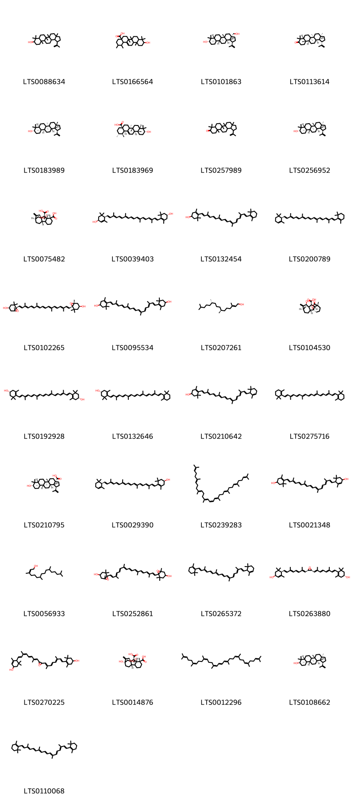{ width=100% }
    <figcaption>Hình ảnh cấu trúc hóa học của 33 hoạt chất thuộc nhóm Prenol lipids gồm ['lupeol (LTS0088634)', '10-hydroxy-1,2,6a,6b,9,9,12a-heptamethyl-2,3,4,5,6,7,8,8a,10,11,12,12b,13,14b-tetradecahydro-1h-picene-4a-carboxylic acid (LTS0166564)', 'betulin (LTS0101863)', '(1s,3ar,5as,5br,7ar,11as,11bs,13ar,13bs)-3a,5a,5b,8,8,11a-hexamethyl-1-(prop-1-en-2-yl)-tetradecahydro-1h-cyclopenta[a]chrysen-9-one (LTS0113614)', '(1r,3as,5as,5br,7as,9s,11ar,11bs,13as,13br)-3a,5a,5b,8,8,11a-hexamethyl-1-(prop-1-en-2-yl)-hexadecahydrocyclopenta[a]chrysen-9-ol (LTS0183989)', '(1s,2r,4as,6as,6br,8as,10r,12ar,12br,14br)-10-hydroxy-1,2,6a,6b,9,9,12a-heptamethyl-2,3,4,5,6,7,8,8a,10,11,12,12b,13,14b-tetradecahydro-1h-picene-4a-carboxylic acid (LTS0183969)', '3a,5a,5b,8,8,11a-hexamethyl-1-(prop-1-en-2-yl)-tetradecahydro-1h-cyclopenta[a]chrysen-9-one (LTS0257989)', 'lupeol (LTS0256952)', 'gibberellin a25 (LTS0075482)', '(1s,4r)-4-[(1e,3e,5e,7e,9e,11e,13e,15e,17e)-18-[(4r)-4-hydroxy-2,6,6-trimethylcyclohex-1-en-1-yl]-3,7,12,16-tetramethyloctadeca-1,3,5,7,9,11,13,15,17-nonaen-1-yl]-3,5,5-trimethylcyclohex-2-en-1-ol (LTS0039403)', '3,5,5-trimethyl-4-[(1e,3e,5e,7e,9e)-3,7,12,16-tetramethyl-18-(2,6,6-trimethylcyclohex-1-en-1-yl)octadeca-1,3,5,7,9,11,13,15,17-nonaen-1-yl]cyclohex-3-en-1-ol (LTS0132454)', '(+)-α-carotene (LTS0200789)', 'violaxanthin (LTS0102265)', '4-[(9e,11e,13e,15e,17e)-18-(4-hydroxy-2,6,6-trimethylcyclohex-1-en-1-yl)-3,7,12,16-tetramethyloctadeca-1,3,5,7,9,11,13,15,17-nonaen-1-yl]-3,5,5-trimethylcyclohex-3-en-1-ol (LTS0095534)', '(2e,7s,11s)-3,7,11,15-tetramethylhexadec-2-en-1-ol (LTS0207261)', '(1r,2r,5r,7r,8r,9s,10r,11r)-7-hydroxy-11-methyl-6-methylidene-16-oxo-15-oxapentacyclo[9.3.2.1⁵,⁸.0¹,¹⁰.0²,⁸]heptadecane-9-carboxylic acid (LTS0104530)', 'zeaxanthin (LTS0192928)', 'cryptoxanthin (LTS0132646)', '3,5,5-trimethyl-4-[(1e,3e,5e,7e,9e)-3,7,12,16-tetramethyl-18-(2,6,6-trimethylcyclohex-2-en-1-yl)octadeca-1,3,5,7,9,11,13,15,17-nonaen-1-yl]cyclohex-3-en-1-ol (LTS0210642)', 'β-carotene (LTS0275716)', 'betulinic acid (LTS0210795)', '(1s)-3,5,5-trimethyl-4-[(1e,3e,5e,7e,9e,11e,13e,15e,17e)-3,7,12,16-tetramethyl-18-[(1r)-2,6,6-trimethylcyclohex-2-en-1-yl]octadeca-1,3,5,7,9,11,13,15,17-nonaen-1-yl]cyclohex-3-en-1-ol (LTS0029390)', 'cis-phytoene (LTS0239283)', '4-[(9e,11e,13e,15e,17e)-18-(4-hydroxy-2,6,6-trimethylcyclohex-1-en-1-yl)-3,7,12,16-tetramethyloctadeca-1,3,5,7,9,11,13,15,17-nonaen-1-yl]-3,5,5-trimethylcyclohex-2-en-1-ol (LTS0021348)', '3,7,11,15-tetramethylhexadec-2-en-1-ol (LTS0056933)', '6-[(9e,11e,13e,15e,17e)-18-{4-hydroxy-2,2,6-trimethyl-7-oxabicyclo[4.1.0]heptan-1-yl}-3,7,12,16-tetramethyloctadeca-1,3,5,7,9,11,13,15,17-nonaen-1-yl]-1,5,5-trimethyl-7-oxabicyclo[4.1.0]heptan-3-ol (LTS0252861)', '1,5,5-trimethyl-6-[(9e,11e,13e,15e,17e)-3,7,12,16-tetramethyl-18-(2,6,6-trimethylcyclohex-1-en-1-yl)octadeca-1,3,5,7,9,11,13,15,17-nonaen-1-yl]cyclohex-1-ene (LTS0265372)', '(1s,4r)-4-[(1e,3e,5e,7e)-8-[(2r,3s)-3-[(1e,3e,5e,7e)-8-[(4r)-4-hydroxy-2,6,6-trimethylcyclohex-1-en-1-yl]-2,6-dimethylocta-1,3,5,7-tetraen-1-yl]oxiran-2-yl]-3,7-dimethylocta-1,3,5,7-tetraen-1-yl]-3,5,5-trimethylcyclohex-2-en-1-ol (LTS0263880)', '4-(8-{3-[(1e,3e)-8-(4-hydroxy-2,6,6-trimethylcyclohex-2-en-1-yl)-2,6-dimethylocta-1,3,5,7-tetraen-1-yl]oxiran-2-yl}-3,7-dimethylocta-1,3,5,7-tetraen-1-yl)-3,5,5-trimethylcyclohex-3-en-1-ol (LTS0270225)', 'gibberellin a17 (LTS0014876)', '(18e)-2,6,10,14,19,23,27,31-octamethyldotriaconta-2,6,10,14,16,18,22,26,30-nonaene (LTS0012296)', 'epilupeol (LTS0108662)', '1,3,3-trimethyl-2-[(9e,11e,13e,15e,17e)-3,7,12,16-tetramethyl-18-(2,6,6-trimethylcyclohex-1-en-1-yl)octadeca-1,3,5,7,9,11,13,15,17-nonaen-1-yl]cyclohex-1-ene (LTS0110068)'].</figcaption>
</figure>
#### Nhóm Saturated hydrocarbons
<figure markdown="span">
    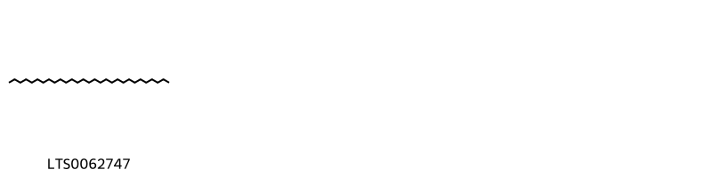{ width=100% }
    <figcaption>Hình ảnh cấu trúc hóa học của 1 hoạt chất thuộc nhóm Saturated hydrocarbons gồm ['nonacosane (LTS0062747)'].</figcaption>
</figure>
#### Nhóm Steroids and steroid derivatives
<figure markdown="span">
    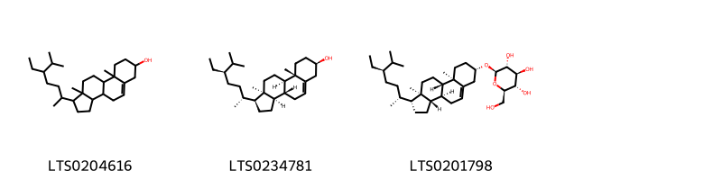{ width=100% }
    <figcaption>Hình ảnh cấu trúc hóa học của 3 hoạt chất thuộc nhóm Steroids and steroid derivatives gồm ['stigmast-5-en-3-ol, (3β)- (LTS0204616)', '(1s,3ar,3br,7r,9as,9br,11ar)-1-[(2r,5r)-5-ethyl-6-methylheptan-2-yl]-9a,11a-dimethyl-1h,2h,3h,3ah,3bh,4h,6h,7h,8h,9h,9bh,10h,11h-cyclopenta[a]phenanthren-7-ol (LTS0234781)', 'sitogluside (LTS0201798)'].</figcaption>
</figure>

---

### Dược dân tộc học

Danh sách các quốc gia có sử dụng *Pyrus communis* trong điều trị các bệnh. 

| Country   | Disease              | Bệnh                                                                                                                                                                                                |
|:----------|:---------------------|:----------------------------------------------------------------------------------------------------------------------------------------------------------------------------------------------------|
| Elsewhere | nan                  | MYMEMORY WARNING: YOU USED ALL AVAILABLE FREE TRANSLATIONS FOR TODAY. NEXT AVAILABLE IN  11 HOURS 32 MINUTES 28 SECONDS VISIT HTTPS://MYMEMORY.TRANSLATED.NET/DOC/USAGELIMITS.PHP TO TRANSLATE MORE |
| India     | Diuretic             | MYMEMORY WARNING: YOU USED ALL AVAILABLE FREE TRANSLATIONS FOR TODAY. NEXT AVAILABLE IN  11 HOURS 32 MINUTES 25 SECONDS VISIT HTTPS://MYMEMORY.TRANSLATED.NET/DOC/USAGELIMITS.PHP TO TRANSLATE MORE |
| Turkey    | Diuretic, Astringent | MYMEMORY WARNING: YOU USED ALL AVAILABLE FREE TRANSLATIONS FOR TODAY. NEXT AVAILABLE IN  11 HOURS 32 MINUTES 23 SECONDS VISIT HTTPS://MYMEMORY.TRANSLATED.NET/DOC/USAGELIMITS.PHP TO TRANSLATE MORE |
| US        | Poison               | MYMEMORY WARNING: YOU USED ALL AVAILABLE FREE TRANSLATIONS FOR TODAY. NEXT AVAILABLE IN  11 HOURS 32 MINUTES 21 SECONDS VISIT HTTPS://MYMEMORY.TRANSLATED.NET/DOC/USAGELIMITS.PHP TO TRANSLATE MORE |

---

---
## Pyrus fusca
### Thông tin về thực vật

!!! info "Phân loại thực vật của *Malus fusca* từ GIBF:"
    - **Kingdom:** Plantae
    - **Phylum:** Tracheophyta
    - **Order:** Rosales
    - **Family:** Rosaceae
    - **Genus:** Malus
    - **Species:** *Malus fusca*

 

| Label (VI)   | Label (EN)   | Scientific Name   | Descriptions (VI)   | Descriptions (EN)   | Also Known As (VI)   | Also Known As (EN)   |
|:-------------|:-------------|:------------------|:--------------------|:--------------------|:---------------------|:---------------------|
| N/A          | N/A          | Pyrus fusca       | loài thực vật       | species of plant    | ['']                 | ['']                 |

#### Phân bố trên thế giới

**Từ CSDL GIBF** nan, Canada, United States of America, Japan

#### Phân bố tại Việt Nam

**Từ CSDL GIBF**: Không có ghi nhận ở Việt Nam

---
### Thành phần hóa học
        
- Theo cơ sở dữ liệu lotus: Từ loài *Malus fusca* đã phân lập và xác định được Chưa có hoạt chất nào được phân lập. hoạt chất thuộc về các nhóm Không có hoạt chất nào được phân lập. 

Không có hình ảnh nào được tạo ra

---

### Dược dân tộc học

Danh sách các quốc gia có sử dụng *Malus fusca* trong điều trị các bệnh. 

| Country        | Disease   | Bệnh                                                                                                                                                                                                |
|:---------------|:----------|:----------------------------------------------------------------------------------------------------------------------------------------------------------------------------------------------------|
| Canada(Salish) | Tonic     | MYMEMORY WARNING: YOU USED ALL AVAILABLE FREE TRANSLATIONS FOR TODAY. NEXT AVAILABLE IN  11 HOURS 31 MINUTES 46 SECONDS VISIT HTTPS://MYMEMORY.TRANSLATED.NET/DOC/USAGELIMITS.PHP TO TRANSLATE MORE |

---

---
## Pyrus pyrifolia
### Thông tin về thực vật

!!! info "Phân loại thực vật của *Pyrus pyrifolia* từ GIBF:"
    - **Kingdom:** Plantae
    - **Phylum:** Tracheophyta
    - **Order:** Rosales
    - **Family:** Rosaceae
    - **Genus:** Pyrus
    - **Species:** *Pyrus pyrifolia*

 

| Label (VI)   | Label (EN)   | Scientific Name   | Descriptions (VI)   | Descriptions (EN)   | Also Known As (VI)   | Also Known As (EN)                                                                                                     |
|:-------------|:-------------|:------------------|:--------------------|:--------------------|:---------------------|:-----------------------------------------------------------------------------------------------------------------------|
| N/A          | N/A          | Pyrus pyrifolia   | loài thực vật       | species of pear     | ['']                 | ['apple pear', 'Asian pear', 'Chinese pear', 'Japanese pear', 'Korean pear', 'nashi pear', 'sand pear', 'Taiwan pear'] |

#### Phân bố trên thế giới

**Từ CSDL GIBF** South Africa, Japan, India, Germany, United States of America, China, Australia, Belgium, Korea, Republic of, Chinese Taipei

#### Phân bố tại Việt Nam

**Từ CSDL GIBF**: Không có ghi nhận ở Việt Nam

---
### Thành phần hóa học
        
- Theo cơ sở dữ liệu lotus: Từ loài *Pyrus pyrifolia* đã phân lập và xác định được 40 hoạt chất thuộc về các nhóm Organooxygen compounds, Flavonoids, Saturated hydrocarbons, Prenol lipids, Carboxylic acids and derivatives, Fatty Acyls, Heteroaromatic compounds, Cinnamic acids and derivatives, Benzene and substituted derivatives. 

|    | chemicalTaxonomyClassyfireClass     |   smiles_count |
|---:|:------------------------------------|---------------:|
|  0 | Benzene and substituted derivatives |              3 |
|  1 | Carboxylic acids and derivatives    |              1 |
|  2 | Cinnamic acids and derivatives      |              5 |
|  3 | Fatty Acyls                         |              3 |
|  4 | Flavonoids                          |              4 |
|  5 | Heteroaromatic compounds            |              1 |
|  6 | Organooxygen compounds              |              4 |
|  7 | Prenol lipids                       |             16 |
|  8 | Saturated hydrocarbons              |              3 |

#### Nhóm Benzene and substituted derivatives
<figure markdown="span">
    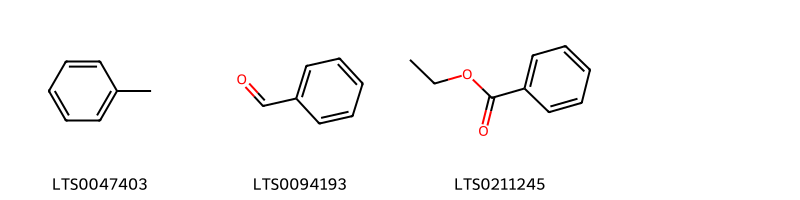{ width=100% }
    <figcaption>Hình ảnh cấu trúc hóa học của 3 hoạt chất thuộc nhóm Benzene and substituted derivatives gồm ['toluene (LTS0047403)', 'benzaldehyde (LTS0094193)', 'ethyl benzoate (LTS0211245)'].</figcaption>
</figure>
#### Nhóm Carboxylic acids and derivatives
<figure markdown="span">
    { width=100% }
    <figcaption>Hình ảnh cấu trúc hóa học của 1 hoạt chất thuộc nhóm Carboxylic acids and derivatives gồm ['hexyl acetate (LTS0202355)'].</figcaption>
</figure>
#### Nhóm Cinnamic acids and derivatives
<figure markdown="span">
    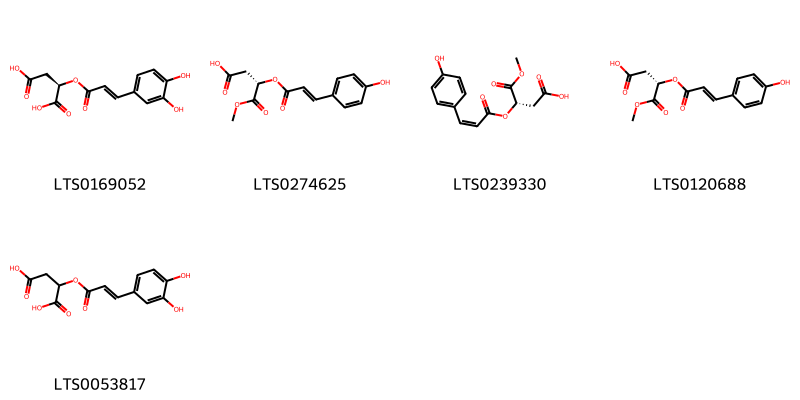{ width=100% }
    <figcaption>Hình ảnh cấu trúc hóa học của 5 hoạt chất thuộc nhóm Cinnamic acids and derivatives gồm ['(2r)-2-{[(2e)-3-(3,4-dihydroxyphenyl)prop-2-enoyl]oxy}butanedioic acid (LTS0169052)', '(3s)-3-{[(2e)-3-(4-hydroxyphenyl)prop-2-enoyl]oxy}-4-methoxy-4-oxobutanoic acid (LTS0274625)', '(3s)-3-{[(2z)-3-(4-hydroxyphenyl)prop-2-enoyl]oxy}-4-methoxy-4-oxobutanoic acid (LTS0239330)', '(3s)-3-{[3-(4-hydroxyphenyl)prop-2-enoyl]oxy}-4-methoxy-4-oxobutanoic acid (LTS0120688)', 'caffeoylmalic acid (LTS0053817)'].</figcaption>
</figure>
#### Nhóm Fatty Acyls
<figure markdown="span">
    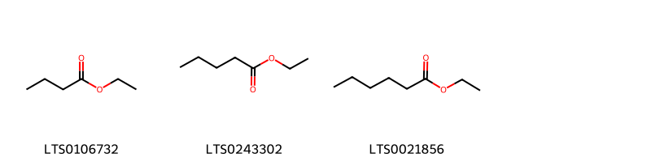{ width=100% }
    <figcaption>Hình ảnh cấu trúc hóa học của 3 hoạt chất thuộc nhóm Fatty Acyls gồm ['ethyl butyrate (LTS0106732)', 'ethyl valerate (LTS0243302)', 'ethyl hexanoate (LTS0021856)'].</figcaption>
</figure>
#### Nhóm Flavonoids
<figure markdown="span">
    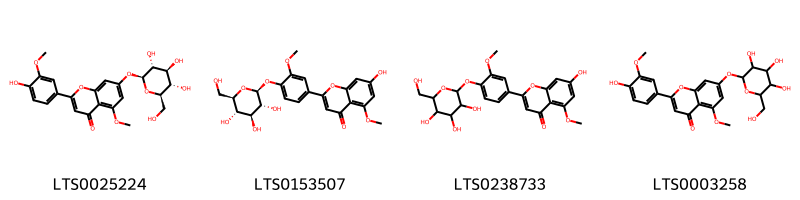{ width=100% }
    <figcaption>Hình ảnh cấu trúc hóa học của 4 hoạt chất thuộc nhóm Flavonoids gồm ['2-(4-hydroxy-3-methoxyphenyl)-5-methoxy-7-{[(2s,3r,4s,5s,6r)-3,4,5-trihydroxy-6-(hydroxymethyl)oxan-2-yl]oxy}chromen-4-one (LTS0025224)', '7-hydroxy-5-methoxy-2-(3-methoxy-4-{[(2s,3r,4s,5s,6r)-3,4,5-trihydroxy-6-(hydroxymethyl)oxan-2-yl]oxy}phenyl)chromen-4-one (LTS0153507)', '7-hydroxy-5-methoxy-2-(3-methoxy-4-{[3,4,5-trihydroxy-6-(hydroxymethyl)oxan-2-yl]oxy}phenyl)chromen-4-one (LTS0238733)', '2-(4-hydroxy-3-methoxyphenyl)-5-methoxy-7-{[3,4,5-trihydroxy-6-(hydroxymethyl)oxan-2-yl]oxy}chromen-4-one (LTS0003258)'].</figcaption>
</figure>
#### Nhóm Heteroaromatic compounds
<figure markdown="span">
    { width=100% }
    <figcaption>Hình ảnh cấu trúc hóa học của 1 hoạt chất thuộc nhóm Heteroaromatic compounds gồm ['amylfuran (LTS0044471)'].</figcaption>
</figure>
#### Nhóm Organooxygen compounds
<figure markdown="span">
    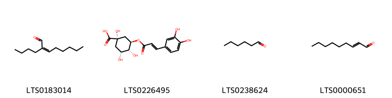{ width=100% }
    <figcaption>Hình ảnh cấu trúc hóa học của 4 hoạt chất thuộc nhóm Organooxygen compounds gồm ['2-butyloct-2-enal (LTS0183014)', 'chlorogenic acid (LTS0226495)', 'hexanal (LTS0238624)', '2-nonenal (LTS0000651)'].</figcaption>
</figure>
#### Nhóm Prenol lipids
<figure markdown="span">
    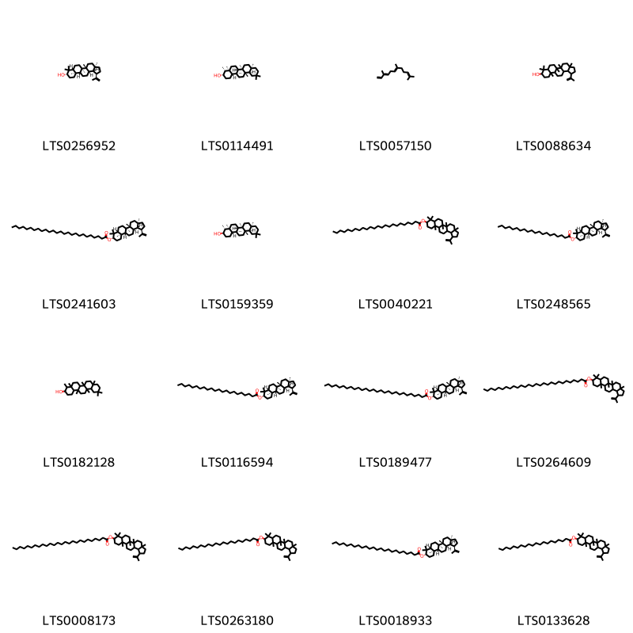{ width=100% }
    <figcaption>Hình ảnh cấu trúc hóa học của 16 hoạt chất thuộc nhóm Prenol lipids gồm ['lupeol (LTS0256952)', 'epi-friedelanol (LTS0114491)', 'farnesene (LTS0057150)', 'lupeol (LTS0088634)', '(1r,3ar,5ar,5br,7ar,9s,11ar,11br,13ar,13br)-3a,5a,5b,8,8,11a-hexamethyl-1-(prop-1-en-2-yl)-hexadecahydrocyclopenta[a]chrysen-9-yl hexacosanoate (LTS0241603)', '(3r,4r,4as,6as,6br,8ar,12ar,12bs,14as,14bs)-4,4a,6b,8a,11,11,12b,14a-octamethyl-hexadecahydropicen-3-ol (LTS0159359)', '3a,5a,5b,8,8,11a-hexamethyl-1-(prop-1-en-2-yl)-hexadecahydrocyclopenta[a]chrysen-9-yl tetracosanoate (LTS0040221)', '(1r,3ar,5ar,5br,7ar,9s,11ar,11br,13ar,13br)-3a,5a,5b,8,8,11a-hexamethyl-1-(prop-1-en-2-yl)-hexadecahydrocyclopenta[a]chrysen-9-yl icosanoate (LTS0248565)', '4,4a,6b,8a,11,11,12b,14a-octamethyl-hexadecahydropicen-3-ol (LTS0182128)', '(1r,3ar,5ar,5br,7ar,9s,11ar,11br,13ar,13br)-3a,5a,5b,8,8,11a-hexamethyl-1-(prop-1-en-2-yl)-hexadecahydrocyclopenta[a]chrysen-9-yl docosanoate (LTS0116594)', '(1r,3ar,5ar,5br,7ar,9s,11ar,11br,13ar,13br)-3a,5a,5b,8,8,11a-hexamethyl-1-(prop-1-en-2-yl)-hexadecahydrocyclopenta[a]chrysen-9-yl octacosanoate (LTS0189477)', '3a,5a,5b,8,8,11a-hexamethyl-1-(prop-1-en-2-yl)-hexadecahydrocyclopenta[a]chrysen-9-yl octacosanoate (LTS0264609)', '3a,5a,5b,8,8,11a-hexamethyl-1-(prop-1-en-2-yl)-hexadecahydrocyclopenta[a]chrysen-9-yl hexacosanoate (LTS0008173)', '3a,5a,5b,8,8,11a-hexamethyl-1-(prop-1-en-2-yl)-hexadecahydrocyclopenta[a]chrysen-9-yl docosanoate (LTS0263180)', '(1r,3ar,5ar,5br,7ar,9s,11ar,11br,13ar,13br)-3a,5a,5b,8,8,11a-hexamethyl-1-(prop-1-en-2-yl)-hexadecahydrocyclopenta[a]chrysen-9-yl tetracosanoate (LTS0018933)', '3a,5a,5b,8,8,11a-hexamethyl-1-(prop-1-en-2-yl)-hexadecahydrocyclopenta[a]chrysen-9-yl icosanoate (LTS0133628)'].</figcaption>
</figure>
#### Nhóm Saturated hydrocarbons
<figure markdown="span">
    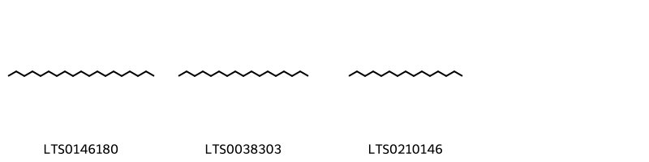{ width=100% }
    <figcaption>Hình ảnh cấu trúc hóa học của 3 hoạt chất thuộc nhóm Saturated hydrocarbons gồm ['nonadecane (LTS0146180)', 'heptadecane (LTS0038303)', 'pentadecane (LTS0210146)'].</figcaption>
</figure>

---

### Dược dân tộc học

Danh sách các quốc gia có sử dụng *Pyrus pyrifolia* trong điều trị các bệnh. 

| Country   | Disease   | Bệnh                                                                                                                                                                                                |
|:----------|:----------|:----------------------------------------------------------------------------------------------------------------------------------------------------------------------------------------------------|
| Elsewhere | Diuretic  | MYMEMORY WARNING: YOU USED ALL AVAILABLE FREE TRANSLATIONS FOR TODAY. NEXT AVAILABLE IN  11 HOURS 31 MINUTES 19 SECONDS VISIT HTTPS://MYMEMORY.TRANSLATED.NET/DOC/USAGELIMITS.PHP TO TRANSLATE MORE |

---

---
## Pyrus sinensis
### Thông tin về thực vật

!!! info "Phân loại thực vật của *N/A* từ GIBF:"
    - **Kingdom:** Plantae
    - **Phylum:** Tracheophyta
    - **Order:** Rosales
    - **Family:** Rosaceae
    - **Genus:** N/A
    - **Species:** *N/A*

 

| Label (VI)   | Label (EN)   | Scientific Name   | Descriptions (VI)   | Descriptions (EN)   | Also Known As (VI)   | Also Known As (EN)                                                                                                     |
|:-------------|:-------------|:------------------|:--------------------|:--------------------|:---------------------|:-----------------------------------------------------------------------------------------------------------------------|
| N/A          | N/A          | Pyrus pyrifolia   | loài thực vật       | species of pear     | ['']                 | ['apple pear', 'Asian pear', 'Chinese pear', 'Japanese pear', 'Korean pear', 'nashi pear', 'sand pear', 'Taiwan pear'] |

#### Phân bố trên thế giới

**Từ CSDL GIBF** Denmark, Spain, Germany, Chile, Isle of Man, Australia, India, Canada, Finland, Türkiye, Japan, Ireland, Chinese Taipei, Hong Kong, United Kingdom of Great Britain and Northern Ireland, Argentina, Portugal, South Africa, France, Czechia, New Zealand, Russian Federation, United States of America, Italy, Israel, Ukraine

#### Phân bố tại Việt Nam

**Từ CSDL GIBF**: Không có ghi nhận ở Việt Nam

---
### Thành phần hóa học
        
- Theo cơ sở dữ liệu lotus: Từ loài *N/A* đã phân lập và xác định được Chưa có hoạt chất nào được phân lập. hoạt chất thuộc về các nhóm Không có hoạt chất nào được phân lập. 

Không có hình ảnh nào được tạo ra

---

### Dược dân tộc học

Danh sách các quốc gia có sử dụng *N/A* trong điều trị các bệnh. 

| Country   | Disease                       | Bệnh                                                                                                                                                                                                |
|:----------|:------------------------------|:----------------------------------------------------------------------------------------------------------------------------------------------------------------------------------------------------|
| China     | Cosmetic, Digestive, Sedative | MYMEMORY WARNING: YOU USED ALL AVAILABLE FREE TRANSLATIONS FOR TODAY. NEXT AVAILABLE IN  11 HOURS 30 MINUTES 52 SECONDS VISIT HTTPS://MYMEMORY.TRANSLATED.NET/DOC/USAGELIMITS.PHP TO TRANSLATE MORE |

---

# Chi Rosa

??? note "Danh sách các dược liệu thuộc chi"
    
	 - *Rosa anemonaeflora*
	 - *Rosa banksiae*
	 - *Rosa borboniana*
	 - *Rosa canina*
	 - *Rosa centifolia*
	 - *Rosa chinensis*
	 - *Rosa cymosa*
	 - *Rosa damascena*
	 - *Rosa gallica*
	 - *Rosa indica*
	 - *Rosa laevigana*
	 - *Rosa laevigata*
	 - *Rosa moschata*
	 - *Rosa multiflora*
	 - *Rosa polyantha*
	 - *Rosa x centifolia*

---
## Rosa anemonaeflora
### Thông tin về thực vật

!!! info "Phân loại thực vật của *Rosa anemoneflora* từ GIBF:"
    - **Kingdom:** Plantae
    - **Phylum:** Tracheophyta
    - **Order:** Rosales
    - **Family:** Rosaceae
    - **Genus:** Rosa
    - **Species:** *Rosa anemoneflora*

 

| Label (VI)   | Label (EN)   | Scientific Name   | Descriptions (VI)   | Descriptions (EN)   | Also Known As (VI)   | Also Known As (EN)                                                                                                     |
|:-------------|:-------------|:------------------|:--------------------|:--------------------|:---------------------|:-----------------------------------------------------------------------------------------------------------------------|
| N/A          | N/A          | Pyrus pyrifolia   | loài thực vật       | species of pear     | ['']                 | ['apple pear', 'Asian pear', 'Chinese pear', 'Japanese pear', 'Korean pear', 'nashi pear', 'sand pear', 'Taiwan pear'] |

#### Phân bố trên thế giới

**Từ CSDL GIBF** nan, China, Chinese Taipei

#### Phân bố tại Việt Nam

**Từ CSDL GIBF**: Không có ghi nhận ở Việt Nam

---
### Thành phần hóa học
        
- Theo cơ sở dữ liệu lotus: Từ loài *Rosa anemoneflora* đã phân lập và xác định được Chưa có hoạt chất nào được phân lập. hoạt chất thuộc về các nhóm Không có hoạt chất nào được phân lập. 

Không có hình ảnh nào được tạo ra

---

### Dược dân tộc học

Danh sách các quốc gia có sử dụng *Rosa anemoneflora* trong điều trị các bệnh. 

| Country   | Disease   | Bệnh                                                                                                                                                                                                |
|:----------|:----------|:----------------------------------------------------------------------------------------------------------------------------------------------------------------------------------------------------|
| China     | Antidote  | MYMEMORY WARNING: YOU USED ALL AVAILABLE FREE TRANSLATIONS FOR TODAY. NEXT AVAILABLE IN  11 HOURS 30 MINUTES 20 SECONDS VISIT HTTPS://MYMEMORY.TRANSLATED.NET/DOC/USAGELIMITS.PHP TO TRANSLATE MORE |

---

---
## Rosa banksiae
### Thông tin về thực vật

!!! info "Phân loại thực vật của *Rosa banksiae* từ GIBF:"
    - **Kingdom:** Plantae
    - **Phylum:** Tracheophyta
    - **Order:** Rosales
    - **Family:** Rosaceae
    - **Genus:** Rosa
    - **Species:** *Rosa banksiae*

 

| Label (VI)   | Label (EN)   | Scientific Name   | Descriptions (VI)   | Descriptions (EN)                        | Also Known As (VI)   | Also Known As (EN)   |
|:-------------|:-------------|:------------------|:--------------------|:-----------------------------------------|:---------------------|:---------------------|
| N/A          | N/A          | Rosa banksiae     | loài thực vật       | species of plant, originated from China. | ['']                 | ['Rosa banksiae']    |

#### Phân bố trên thế giới

**Từ CSDL GIBF** nan, Bhutan, Japan, France, Spain, Syrian Arab Republic, New Zealand, India, Germany, Russian Federation, United States of America, Italy, China, Mexico, Australia, Korea, Republic of, Guatemala

#### Phân bố tại Việt Nam

**Từ CSDL GIBF**: Không có ghi nhận ở Việt Nam

---
### Thành phần hóa học
        
- Theo cơ sở dữ liệu lotus: Từ loài *Rosa banksiae* đã phân lập và xác định được Chưa có hoạt chất nào được phân lập. hoạt chất thuộc về các nhóm Không có hoạt chất nào được phân lập. 

Không có hình ảnh nào được tạo ra

---

### Dược dân tộc học

Danh sách các quốc gia có sử dụng *Rosa banksiae* trong điều trị các bệnh. 

| Country   | Disease   | Bệnh                                                                                                                                                                                                |
|:----------|:----------|:----------------------------------------------------------------------------------------------------------------------------------------------------------------------------------------------------|
| China     | Tonic     | MYMEMORY WARNING: YOU USED ALL AVAILABLE FREE TRANSLATIONS FOR TODAY. NEXT AVAILABLE IN  11 HOURS 29 MINUTES 57 SECONDS VISIT HTTPS://MYMEMORY.TRANSLATED.NET/DOC/USAGELIMITS.PHP TO TRANSLATE MORE |

---

---
## Rosa borboniana
### Thông tin về thực vật

!!! info "Phân loại thực vật của *N/A* từ GIBF:"
    - **Kingdom:** Plantae
    - **Phylum:** Tracheophyta
    - **Order:** Rosales
    - **Family:** Rosaceae
    - **Genus:** Rosa
    - **Species:** *N/A*

 

| Label (VI)   | Label (EN)   | Scientific Name   | Descriptions (VI)   | Descriptions (EN)                        | Also Known As (VI)   | Also Known As (EN)   |
|:-------------|:-------------|:------------------|:--------------------|:-----------------------------------------|:---------------------|:---------------------|
| N/A          | N/A          | Rosa banksiae     | loài thực vật       | species of plant, originated from China. | ['']                 | ['Rosa banksiae']    |

#### Phân bố trên thế giới

**Từ CSDL GIBF** Denmark, Luxembourg, Spain, Germany, Chile, Austria, Australia, Sweden, Mongolia, Canada, Iraq, Slovakia, Belarus, Ethiopia, Mexico, Ireland, China, Chinese Taipei, United Kingdom of Great Britain and Northern Ireland, Argentina, Portugal, Latvia, France, New Zealand, Russian Federation, United States of America, Italy, Israel

#### Phân bố tại Việt Nam

**Từ CSDL GIBF**: Không có ghi nhận ở Việt Nam

---
### Thành phần hóa học
        
- Theo cơ sở dữ liệu lotus: Từ loài *N/A* đã phân lập và xác định được Chưa có hoạt chất nào được phân lập. hoạt chất thuộc về các nhóm Không có hoạt chất nào được phân lập. 

Không có hình ảnh nào được tạo ra

---

### Dược dân tộc học

Danh sách các quốc gia có sử dụng *N/A* trong điều trị các bệnh. 

| Country   | Disease   | Bệnh                                                                                                                                                                                                |
|:----------|:----------|:----------------------------------------------------------------------------------------------------------------------------------------------------------------------------------------------------|
| Haiti     | Digestive | MYMEMORY WARNING: YOU USED ALL AVAILABLE FREE TRANSLATIONS FOR TODAY. NEXT AVAILABLE IN  11 HOURS 29 MINUTES 28 SECONDS VISIT HTTPS://MYMEMORY.TRANSLATED.NET/DOC/USAGELIMITS.PHP TO TRANSLATE MORE |

---

---
## Rosa canina
### Thông tin về thực vật

!!! info "Phân loại thực vật của *Rosa canina* từ GIBF:"
    - **Kingdom:** Plantae
    - **Phylum:** Tracheophyta
    - **Order:** Rosales
    - **Family:** Rosaceae
    - **Genus:** Rosa
    - **Species:** *Rosa canina*

 

| Label (VI)   | Label (EN)   | Scientific Name   | Descriptions (VI)   | Descriptions (EN)   | Also Known As (VI)   | Also Known As (EN)       |
|:-------------|:-------------|:------------------|:--------------------|:--------------------|:---------------------|:-------------------------|
| N/A          | N/A          | Rosa canina       | loài thực vật       | species of plant    | ['']                 | ['dog rose', 'dog-rose'] |

#### Phân bố trên thế giới

**Từ CSDL GIBF** Denmark, Luxembourg, Spain, Germany, Austria, Australia, Sweden, Poland, Canada, Iraq, Belgium, Slovakia, Netherlands, Türkiye, Lithuania, Hungary, Ireland, Norway, Switzerland, United Kingdom of Great Britain and Northern Ireland, Portugal, South Africa, France, Czechia, New Zealand, Romania, United States of America, Italy, Israel, Croatia, Ukraine

#### Phân bố tại Việt Nam

**Từ CSDL GIBF**: Không có ghi nhận ở Việt Nam

---
### Thành phần hóa học
        
- Theo cơ sở dữ liệu lotus: Từ loài *Rosa canina* đã phân lập và xác định được 54 hoạt chất thuộc về các nhóm Thioethers, Flavonoids, Lactones, 2-arylbenzofuran flavonoids, Carboxylic acids and derivatives, Prenol lipids, Fatty Acyls, Glycerolipids, Heteroaromatic compounds, Dihydrofurans, Organic disulfides. 

|    | chemicalTaxonomyClassyfireClass   |   smiles_count |
|---:|:----------------------------------|---------------:|
|  0 | 2-arylbenzofuran flavonoids       |              4 |
|  1 | Carboxylic acids and derivatives  |              1 |
|  2 | Dihydrofurans                     |              1 |
|  3 | Fatty Acyls                       |              3 |
|  4 | Flavonoids                        |             23 |
|  5 | Glycerolipids                     |              2 |
|  6 | Heteroaromatic compounds          |              2 |
|  7 | Lactones                          |              1 |
|  8 | Organic disulfides                |              1 |
|  9 | Prenol lipids                     |             15 |
| 10 | Thioethers                        |              1 |

#### Nhóm 2-arylbenzofuran flavonoids
<figure markdown="span">
    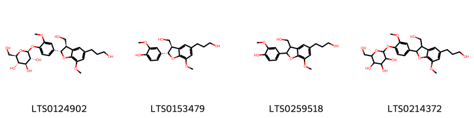{ width=100% }
    <figcaption>Hình ảnh cấu trúc hóa học của 4 hoạt chất thuộc nhóm 2-arylbenzofuran flavonoids gồm ['(2r,3s,4s,5r,6s)-2-(hydroxymethyl)-6-{4-[(2s,3r)-3-(hydroxymethyl)-5-(3-hydroxypropyl)-7-methoxy-2,3-dihydro-1-benzofuran-2-yl]-2-methoxyphenoxy}oxane-3,4,5-triol (LTS0124902)', '4-[(2s,3r)-3-(hydroxymethyl)-5-(3-hydroxypropyl)-7-methoxy-2,3-dihydro-1-benzofuran-2-yl]-2-methoxyphenol (LTS0153479)', '4-[3-(hydroxymethyl)-5-(3-hydroxypropyl)-7-methoxy-2,3-dihydro-1-benzofuran-2-yl]-2-methoxyphenol (LTS0259518)', '2-(hydroxymethyl)-6-{4-[3-(hydroxymethyl)-5-(3-hydroxypropyl)-7-methoxy-2,3-dihydro-1-benzofuran-2-yl]-2-methoxyphenoxy}oxane-3,4,5-triol (LTS0214372)'].</figcaption>
</figure>
#### Nhóm Carboxylic acids and derivatives
<figure markdown="span">
    { width=100% }
    <figcaption>Hình ảnh cấu trúc hóa học của 1 hoạt chất thuộc nhóm Carboxylic acids and derivatives gồm ['citric acid (LTS0213921)'].</figcaption>
</figure>
#### Nhóm Dihydrofurans
<figure markdown="span">
    { width=100% }
    <figcaption>Hình ảnh cấu trúc hóa học của 1 hoạt chất thuộc nhóm Dihydrofurans gồm ['vitamin c (LTS0022555)'].</figcaption>
</figure>
#### Nhóm Fatty Acyls
<figure markdown="span">
    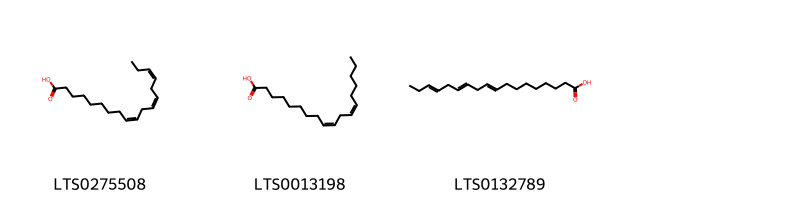{ width=100% }
    <figcaption>Hình ảnh cấu trúc hóa học của 3 hoạt chất thuộc nhóm Fatty Acyls gồm ['α-linolenic acid (LTS0275508)', 'linoleic (LTS0013198)', 'α linolenic acid (LTS0132789)'].</figcaption>
</figure>
#### Nhóm Flavonoids
<figure markdown="span">
    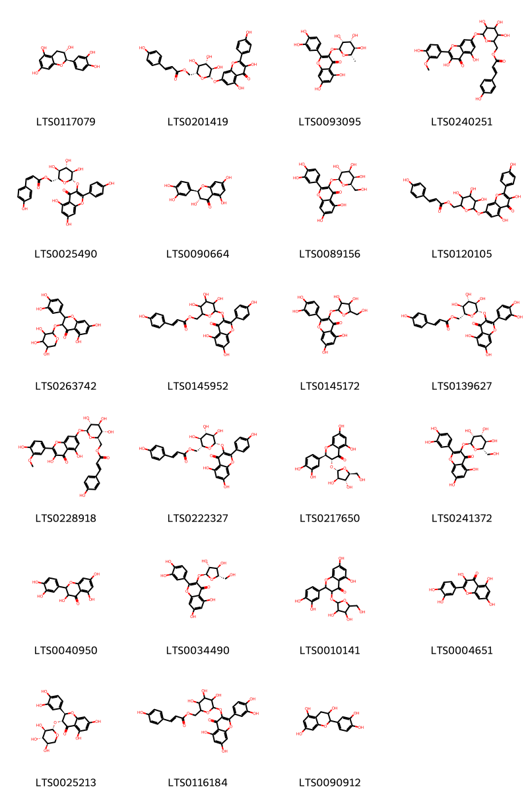{ width=100% }
    <figcaption>Hình ảnh cấu trúc hóa học của 23 hoạt chất thuộc nhóm Flavonoids gồm ['(+)-catechol (LTS0117079)', '[(2r,3s,4s,5r,6s)-6-{[3,5-dihydroxy-2-(4-hydroxyphenyl)-4-oxochromen-7-yl]oxy}-3,4,5-trihydroxyoxan-2-yl]methyl (2e)-3-(4-hydroxyphenyl)prop-2-enoate (LTS0201419)', 'quercitrin (LTS0093095)', '(6-{[3,5-dihydroxy-2-(4-hydroxy-3-methoxyphenyl)-4-oxochromen-7-yl]oxy}-3,4,5-trihydroxyoxan-2-yl)methyl 3-(4-hydroxyphenyl)prop-2-enoate (LTS0240251)', '[(2r,3s,4s,5r,6s)-6-{[5,7-dihydroxy-2-(4-hydroxyphenyl)-4-oxochromen-3-yl]oxy}-3,4,5-trihydroxyoxan-2-yl]methyl (2z)-3-(4-hydroxyphenyl)prop-2-enoate (LTS0025490)', '(+)-taxifolin (LTS0090664)', 'hyperoside (LTS0089156)', '(6-{[3,5-dihydroxy-2-(4-hydroxyphenyl)-4-oxochromen-7-yl]oxy}-3,4,5-trihydroxyoxan-2-yl)methyl 3-(4-hydroxyphenyl)prop-2-enoate (LTS0120105)', '2-(3,4-dihydroxyphenyl)-5,7-dihydroxy-3-[(3,4,5-trihydroxyoxan-2-yl)oxy]-2,3-dihydro-1-benzopyran-4-one (LTS0263742)', '(6-{[5,7-dihydroxy-2-(4-hydroxyphenyl)-4-oxochromen-3-yl]oxy}-3,4,5-trihydroxyoxan-2-yl)methyl 3-(4-hydroxyphenyl)prop-2-enoate (LTS0145952)', '3-{[3,4-dihydroxy-5-(hydroxymethyl)oxolan-2-yl]oxy}-2-(3,4-dihydroxyphenyl)-5,7-dihydroxychromen-4-one (LTS0145172)', '[(2r,3s,4s,5r,6s)-6-{[2-(3,4-dihydroxyphenyl)-5,7-dihydroxy-4-oxochromen-3-yl]oxy}-3,4,5-trihydroxyoxan-2-yl]methyl (2e)-3-(4-hydroxyphenyl)prop-2-enoate (LTS0139627)', '[(2r,3s,4s,5r,6s)-6-{[3,5-dihydroxy-2-(4-hydroxy-3-methoxyphenyl)-4-oxochromen-7-yl]oxy}-3,4,5-trihydroxyoxan-2-yl]methyl (2e)-3-(4-hydroxyphenyl)prop-2-enoate (LTS0228918)', 'tiliroside (LTS0222327)', '(2r,3r)-3-{[(2s,3r,4r,5s)-3,4-dihydroxy-5-(hydroxymethyl)oxolan-2-yl]oxy}-2-(3,4-dihydroxyphenyl)-5,7-dihydroxy-2,3-dihydro-1-benzopyran-4-one (LTS0217650)', '2-(3,4-dihydroxyphenyl)-5,7-dihydroxy-3-{[(2s,3r,4r,5r,6s)-3,4,5-trihydroxy-6-(hydroxymethyl)oxan-2-yl]oxy}chromen-4-one (LTS0241372)', '2,3-dihydroquercetin (LTS0040950)', 'avicularin (LTS0034490)', '3-{[3,4-dihydroxy-5-(hydroxymethyl)oxolan-2-yl]oxy}-2-(3,4-dihydroxyphenyl)-5,7-dihydroxy-2,3-dihydro-1-benzopyran-4-one (LTS0010141)', 'quercetin (LTS0004651)', '(2r,3r)-2-(3,4-dihydroxyphenyl)-5,7-dihydroxy-3-{[(2s,3r,4s,5r)-3,4,5-trihydroxyoxan-2-yl]oxy}-2,3-dihydro-1-benzopyran-4-one (LTS0025213)', '(6-{[2-(3,4-dihydroxyphenyl)-5,7-dihydroxy-4-oxochromen-3-yl]oxy}-3,4,5-trihydroxyoxan-2-yl)methyl 3-(4-hydroxyphenyl)prop-2-enoate (LTS0116184)', 'catechol (LTS0090912)'].</figcaption>
</figure>
#### Nhóm Glycerolipids
<figure markdown="span">
    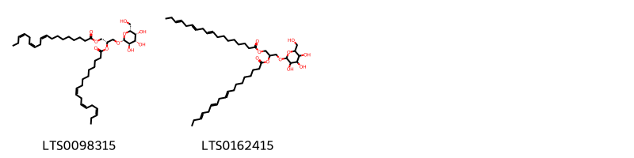{ width=100% }
    <figcaption>Hình ảnh cấu trúc hóa học của 2 hoạt chất thuộc nhóm Glycerolipids gồm ['(2s)-1-[(9z,12z,15z)-octadeca-9,12,15-trienoyloxy]-3-{[(2r,3r,4s,5r,6r)-3,4,5-trihydroxy-6-(hydroxymethyl)oxan-2-yl]oxy}propan-2-yl (9z,12z,15z)-octadeca-9,12,15-trienoate (LTS0098315)', '1-(octadeca-9,12,15-trienoyloxy)-3-{[3,4,5-trihydroxy-6-(hydroxymethyl)oxan-2-yl]oxy}propan-2-yl octadeca-9,12,15-trienoate (LTS0162415)'].</figcaption>
</figure>
#### Nhóm Heteroaromatic compounds
<figure markdown="span">
    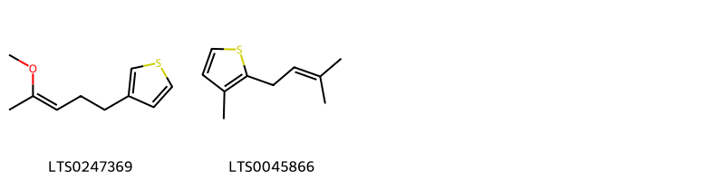{ width=100% }
    <figcaption>Hình ảnh cấu trúc hóa học của 2 hoạt chất thuộc nhóm Heteroaromatic compounds gồm ['3-(4-methoxypent-3-en-1-yl)thiophene (LTS0247369)', '3-methyl-2-(3-methylbut-2-en-1-yl)thiophene (LTS0045866)'].</figcaption>
</figure>
#### Nhóm Lactones
<figure markdown="span">
    { width=100% }
    <figcaption>Hình ảnh cấu trúc hóa học của 1 hoạt chất thuộc nhóm Lactones gồm ['dehydroascorbic acid (LTS0096767)'].</figcaption>
</figure>
#### Nhóm Organic disulfides
<figure markdown="span">
    { width=100% }
    <figcaption>Hình ảnh cấu trúc hóa học của 1 hoạt chất thuộc nhóm Organic disulfides gồm ['1-(methyldisulfanyl)hexane (LTS0215927)'].</figcaption>
</figure>
#### Nhóm Prenol lipids
<figure markdown="span">
    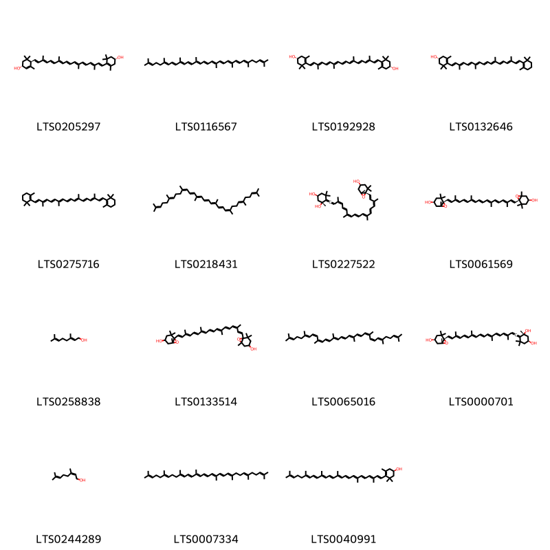{ width=100% }
    <figcaption>Hình ảnh cấu trúc hóa học của 15 hoạt chất thuộc nhóm Prenol lipids gồm ['carotenoid (LTS0205297)', 'lycopene (LTS0116567)', 'zeaxanthin (LTS0192928)', 'cryptoxanthin (LTS0132646)', 'β-carotene (LTS0275716)', 'ζ -carotene (LTS0218431)', 'neoxanthin (LTS0227522)', '(3s,6s)-6-[(1e,3e,5e,7e,9e,11e,13e,15e,17e)-18-[(1s,4s)-4-hydroxy-2,2,6-trimethyl-7-oxabicyclo[4.1.0]heptan-1-yl]-3,7,12,16-tetramethyloctadeca-1,3,5,7,9,11,13,15,17-nonaen-1-yl]-1,5,5-trimethyl-7-oxabicyclo[4.1.0]heptan-3-ol (LTS0061569)', 'geraniol (LTS0258838)', '6-[(1e,3e,5e,7e,9e,11e,13e,15z,17e)-18-{4-hydroxy-2,2,6-trimethyl-7-oxabicyclo[4.1.0]heptan-1-yl}-3,7,12,16-tetramethyloctadeca-1,3,5,7,9,11,13,15,17-nonaen-1-yl]-1,5,5-trimethyl-7-oxabicyclo[4.1.0]heptan-3-ol (LTS0133514)', 'prolycopene (LTS0065016)', 'neoxanthin (LTS0000701)', 'nerol (LTS0244289)', 'zeta-carotene (LTS0007334)', 'rubixanthin (LTS0040991)'].</figcaption>
</figure>
#### Nhóm Thioethers
<figure markdown="span">
    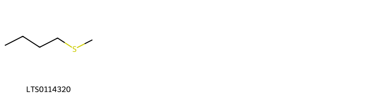{ width=100% }
    <figcaption>Hình ảnh cấu trúc hóa học của 1 hoạt chất thuộc nhóm Thioethers gồm ['2-thiahexane (LTS0114320)'].</figcaption>
</figure>

---

### Dược dân tộc học

Danh sách các quốc gia có sử dụng *Rosa canina* trong điều trị các bệnh. 

| Country   | Disease                           | Bệnh                                                                                                                                                                                                |
|:----------|:----------------------------------|:----------------------------------------------------------------------------------------------------------------------------------------------------------------------------------------------------|
| Europe    | Astringent, Diuretic, Refrigerant | MYMEMORY WARNING: YOU USED ALL AVAILABLE FREE TRANSLATIONS FOR TODAY. NEXT AVAILABLE IN  11 HOURS 29 MINUTES 04 SECONDS VISIT HTTPS://MYMEMORY.TRANSLATED.NET/DOC/USAGELIMITS.PHP TO TRANSLATE MORE |
| Haiti     | Astringent, Diuretic, Diuretic    | MYMEMORY WARNING: YOU USED ALL AVAILABLE FREE TRANSLATIONS FOR TODAY. NEXT AVAILABLE IN  11 HOURS 29 MINUTES 00 SECONDS VISIT HTTPS://MYMEMORY.TRANSLATED.NET/DOC/USAGELIMITS.PHP TO TRANSLATE MORE |
| Turkey    | Astringent, Diuretic              | MYMEMORY WARNING: YOU USED ALL AVAILABLE FREE TRANSLATIONS FOR TODAY. NEXT AVAILABLE IN  11 HOURS 28 MINUTES 57 SECONDS VISIT HTTPS://MYMEMORY.TRANSLATED.NET/DOC/USAGELIMITS.PHP TO TRANSLATE MORE |

---

---
## Rosa centifolia
### Thông tin về thực vật

!!! info "Phân loại thực vật của *Rosa centifolia* từ GIBF:"
    - **Kingdom:** Plantae
    - **Phylum:** Tracheophyta
    - **Order:** Rosales
    - **Family:** Rosaceae
    - **Genus:** Rosa
    - **Species:** *Rosa centifolia*

 

| Label (VI)   | Label (EN)   | Scientific Name   | Descriptions (VI)   | Descriptions (EN)   | Also Known As (VI)   | Also Known As (EN)   |
|:-------------|:-------------|:------------------|:--------------------|:--------------------|:---------------------|:---------------------|
| N/A          | N/A          | Rosa centifolia   | loài thực vật       | species of plant    | ['']                 | ['Rosa centifolia']  |

#### Phân bố trên thế giới

**Từ CSDL GIBF** nan, unknown or invalid, Denmark, El Salvador, Luxembourg, Germany, Austria, Australia, Colombia, Pakistan, Sweden, Poland, Canada, Belgium, Netherlands, Finland, Japan, Brazil, Peru, Hungary, Estonia, Mexico, China, Norway, Switzerland, United Kingdom of Great Britain and Northern Ireland, Latvia, France, New Zealand, Romania, Costa Rica, Paraguay, Russian Federation, Ecuador, United States of America, Ukraine

#### Phân bố tại Việt Nam

**Từ CSDL GIBF**: Không có ghi nhận ở Việt Nam

---
### Thành phần hóa học
        
- Theo cơ sở dữ liệu lotus: Từ loài *Rosa centifolia* đã phân lập và xác định được 27 hoạt chất thuộc về các nhóm Saturated hydrocarbons, Oxanes, Prenol lipids, Fatty Acyls, Benzene and substituted derivatives. 

|    | chemicalTaxonomyClassyfireClass     |   smiles_count |
|---:|:------------------------------------|---------------:|
|  0 | Benzene and substituted derivatives |              1 |
|  1 | Fatty Acyls                         |              3 |
|  2 | Oxanes                              |              2 |
|  3 | Prenol lipids                       |             10 |
|  4 | Saturated hydrocarbons              |             11 |

#### Nhóm Benzene and substituted derivatives
<figure markdown="span">
    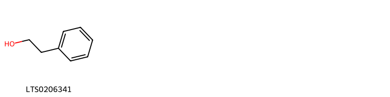{ width=100% }
    <figcaption>Hình ảnh cấu trúc hóa học của 1 hoạt chất thuộc nhóm Benzene and substituted derivatives gồm ['2-phenyl-ethanol (LTS0206341)'].</figcaption>
</figure>
#### Nhóm Fatty Acyls
<figure markdown="span">
    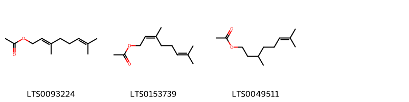{ width=100% }
    <figcaption>Hình ảnh cấu trúc hóa học của 3 hoạt chất thuộc nhóm Fatty Acyls gồm ['geranyl acetate (LTS0093224)', 'neryl acetate (LTS0153739)', 'citronellyl acetate (LTS0049511)'].</figcaption>
</figure>
#### Nhóm Oxanes
<figure markdown="span">
    { width=100% }
    <figcaption>Hình ảnh cấu trúc hóa học của 2 hoạt chất thuộc nhóm Oxanes gồm ['(2r,4r)-rose oxide (LTS0270571)', 'rose oxide (LTS0036561)'].</figcaption>
</figure>
#### Nhóm Prenol lipids
<figure markdown="span">
    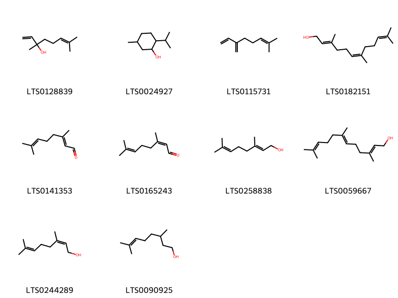{ width=100% }
    <figcaption>Hình ảnh cấu trúc hóa học của 10 hoạt chất thuộc nhóm Prenol lipids gồm ['linalool, (+-)- (LTS0128839)', 'menthol natural (LTS0024927)', 'α-myrcene (LTS0115731)', '(e,z)-farnesol (LTS0182151)', '3,7-dimethyl-2,6-octadienal (LTS0141353)', 'neral (LTS0165243)', 'geraniol (LTS0258838)', 'farnesol (LTS0059667)', 'nerol (LTS0244289)', 'citronellol, (+-)- (LTS0090925)'].</figcaption>
</figure>
#### Nhóm Saturated hydrocarbons
<figure markdown="span">
    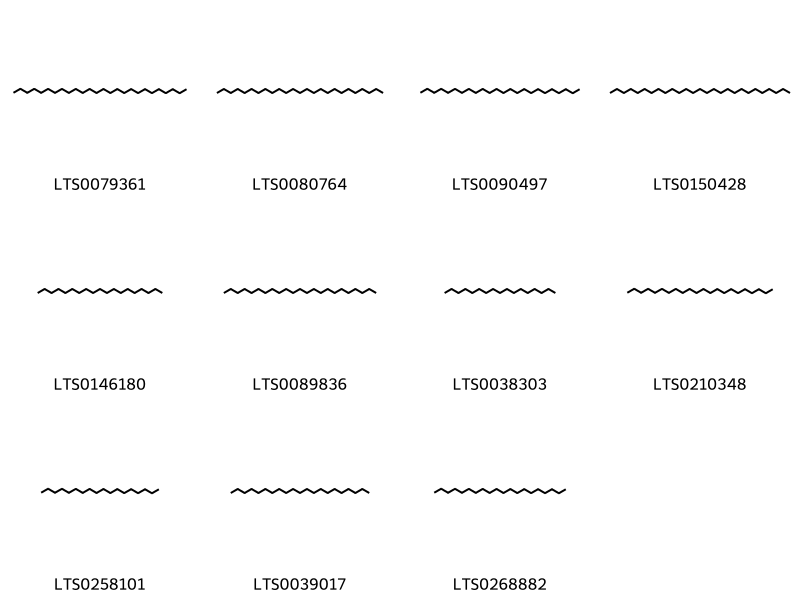{ width=100% }
    <figcaption>Hình ảnh cấu trúc hóa học của 11 hoạt chất thuộc nhóm Saturated hydrocarbons gồm ['hexacosane (LTS0079361)', 'pentacosane (LTS0080764)', 'tetracosane (LTS0090497)', 'heptacosane (LTS0150428)', 'nonadecane (LTS0146180)', 'tricosane (LTS0089836)', 'heptadecane (LTS0038303)', 'docosane (LTS0210348)', 'octadecane (LTS0258101)', 'heneicosane (LTS0039017)', 'eicosane (LTS0268882)'].</figcaption>
</figure>

---

### Dược dân tộc học

Danh sách các quốc gia có sử dụng *Rosa centifolia* trong điều trị các bệnh. 

| Country   | Disease    | Bệnh                                                                                                                                                                                                |
|:----------|:-----------|:----------------------------------------------------------------------------------------------------------------------------------------------------------------------------------------------------|
| English   | Aperient   | MYMEMORY WARNING: YOU USED ALL AVAILABLE FREE TRANSLATIONS FOR TODAY. NEXT AVAILABLE IN  11 HOURS 27 MINUTES 47 SECONDS VISIT HTTPS://MYMEMORY.TRANSLATED.NET/DOC/USAGELIMITS.PHP TO TRANSLATE MORE |
| German    | Perfume    | MYMEMORY WARNING: YOU USED ALL AVAILABLE FREE TRANSLATIONS FOR TODAY. NEXT AVAILABLE IN  11 HOURS 27 MINUTES 41 SECONDS VISIT HTTPS://MYMEMORY.TRANSLATED.NET/DOC/USAGELIMITS.PHP TO TRANSLATE MORE |
| India     | Astringent | MYMEMORY WARNING: YOU USED ALL AVAILABLE FREE TRANSLATIONS FOR TODAY. NEXT AVAILABLE IN  11 HOURS 27 MINUTES 37 SECONDS VISIT HTTPS://MYMEMORY.TRANSLATED.NET/DOC/USAGELIMITS.PHP TO TRANSLATE MORE |
| Iraq      | Aperient   | MYMEMORY WARNING: YOU USED ALL AVAILABLE FREE TRANSLATIONS FOR TODAY. NEXT AVAILABLE IN  11 HOURS 27 MINUTES 34 SECONDS VISIT HTTPS://MYMEMORY.TRANSLATED.NET/DOC/USAGELIMITS.PHP TO TRANSLATE MORE |
| Italian   | Nervine    | MYMEMORY WARNING: YOU USED ALL AVAILABLE FREE TRANSLATIONS FOR TODAY. NEXT AVAILABLE IN  11 HOURS 27 MINUTES 30 SECONDS VISIT HTTPS://MYMEMORY.TRANSLATED.NET/DOC/USAGELIMITS.PHP TO TRANSLATE MORE |
| Kurdistan | Nervine    | MYMEMORY WARNING: YOU USED ALL AVAILABLE FREE TRANSLATIONS FOR TODAY. NEXT AVAILABLE IN  11 HOURS 27 MINUTES 28 SECONDS VISIT HTTPS://MYMEMORY.TRANSLATED.NET/DOC/USAGELIMITS.PHP TO TRANSLATE MORE |
| Mexico    | Vulnerary  | MYMEMORY WARNING: YOU USED ALL AVAILABLE FREE TRANSLATIONS FOR TODAY. NEXT AVAILABLE IN  11 HOURS 27 MINUTES 24 SECONDS VISIT HTTPS://MYMEMORY.TRANSLATED.NET/DOC/USAGELIMITS.PHP TO TRANSLATE MORE |

---

---
## Rosa chinensis
### Thông tin về thực vật

!!! info "Phân loại thực vật của *Rosa chinensis* từ GIBF:"
    - **Kingdom:** Plantae
    - **Phylum:** Tracheophyta
    - **Order:** Rosales
    - **Family:** Rosaceae
    - **Genus:** Rosa
    - **Species:** *Rosa chinensis*

 

| Label (VI)   | Label (EN)   | Scientific Name   | Descriptions (VI)   | Descriptions (EN)   | Also Known As (VI)             | Also Known As (EN)   |
|:-------------|:-------------|:------------------|:--------------------|:--------------------|:-------------------------------|:---------------------|
| N/A          | N/A          | Rosa chinensis    | loài thực vật       | species of plant    | ['Rosa chinensis', 'Hoa hồng'] | ['']                 |

#### Phân bố trên thế giới

**Từ CSDL GIBF** Viet Nam, El Salvador, Spain, Germany, Australia, Korea, Republic of, Guatemala, Colombia, Poland, India, Réunion, Kazakhstan, Seychelles, Belgium, Nicaragua, Brazil, Peru, Estonia, Mexico, China, Norway, Switzerland, United Kingdom of Great Britain and Northern Ireland, Iran (Islamic Republic of), France, Micronesia (Federated States of), Armenia, New Zealand, Cook Islands, Russian Federation, Ecuador, United States of America, Greece

#### Phân bố tại Việt Nam

**Từ CSDL GIBF**: Không có ghi nhận ở Việt Nam

---
### Thành phần hóa học
        
- Theo cơ sở dữ liệu lotus: Từ loài *Rosa chinensis* đã phân lập và xác định được 42 hoạt chất thuộc về các nhóm Organooxygen compounds, Flavonoids, Sphingolipids, 2-arylbenzofuran flavonoids, Prenol lipids, Isoflavonoids, Cinnamic acids and derivatives. 

|    | chemicalTaxonomyClassyfireClass   |   smiles_count |
|---:|:----------------------------------|---------------:|
|  0 | 2-arylbenzofuran flavonoids       |              7 |
|  1 | Cinnamic acids and derivatives    |              4 |
|  2 | Flavonoids                        |             13 |
|  3 | Isoflavonoids                     |              1 |
|  4 | Organooxygen compounds            |              4 |
|  5 | Prenol lipids                     |             11 |
|  6 | Sphingolipids                     |              2 |

#### Nhóm 2-arylbenzofuran flavonoids
<figure markdown="span">
    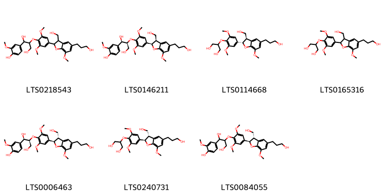{ width=100% }
    <figcaption>Hình ảnh cấu trúc hóa học của 7 hoạt chất thuộc nhóm 2-arylbenzofuran flavonoids gồm ['1-(4-hydroxy-3-methoxyphenyl)-2-{4-[3-(hydroxymethyl)-5-(3-hydroxypropyl)-7-methoxy-2,3-dihydro-1-benzofuran-2-yl]-2,6-dimethoxyphenoxy}propane-1,3-diol (LTS0218543)', '(1r,2s)-1-(4-hydroxy-3-methoxyphenyl)-2-{4-[(2r,3r)-3-(hydroxymethyl)-5-(3-hydroxypropyl)-7-methoxy-2,3-dihydro-1-benzofuran-2-yl]-2,6-dimethoxyphenoxy}propane-1,3-diol (LTS0146211)', '2-{4-[(2s,3r)-3-(hydroxymethyl)-5-(3-hydroxypropyl)-7-methoxy-2,3-dihydro-1-benzofuran-2-yl]-2,6-dimethoxyphenoxy}propane-1,3-diol (LTS0114668)', '2-{4-[3-(hydroxymethyl)-5-(3-hydroxypropyl)-7-methoxy-2,3-dihydro-1-benzofuran-2-yl]-2,6-dimethoxyphenoxy}propane-1,3-diol (LTS0165316)', '(1r,2s)-1-(4-hydroxy-3-methoxyphenyl)-2-{4-[(2r,3s)-3-(hydroxymethyl)-5-(3-hydroxypropyl)-7-methoxy-2,3-dihydro-1-benzofuran-2-yl]-2,6-dimethoxyphenoxy}propane-1,3-diol (LTS0006463)', '2-{4-[(2r,3s)-3-(hydroxymethyl)-5-(3-hydroxypropyl)-7-methoxy-2,3-dihydro-1-benzofuran-2-yl]-2,6-dimethoxyphenoxy}propane-1,3-diol (LTS0240731)', '1-(4-hydroxy-3-methoxyphenyl)-2-{4-[(2r,3s)-3-(hydroxymethyl)-5-(3-hydroxypropyl)-7-methoxy-2,3-dihydro-1-benzofuran-2-yl]-2,6-dimethoxyphenoxy}propane-1,3-diol (LTS0084055)'].</figcaption>
</figure>
#### Nhóm Cinnamic acids and derivatives
<figure markdown="span">
    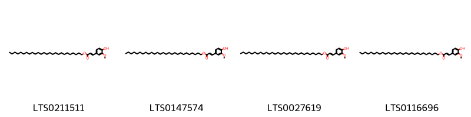{ width=100% }
    <figcaption>Hình ảnh cấu trúc hóa học của 4 hoạt chất thuộc nhóm Cinnamic acids and derivatives gồm ['hexacosyl (2e)-3-(4-hydroxy-3-methoxyphenyl)prop-2-enoate (LTS0211511)', 'heptacosyl (2e)-3-(4-hydroxy-3-methoxyphenyl)prop-2-enoate (LTS0147574)', 'nonacosyl (2e)-3-(4-hydroxy-3-methoxyphenyl)prop-2-enoate (LTS0027619)', 'octacosyl (2e)-3-(4-hydroxy-3-methoxyphenyl)prop-2-enoate (LTS0116696)'].</figcaption>
</figure>
#### Nhóm Flavonoids
<figure markdown="span">
    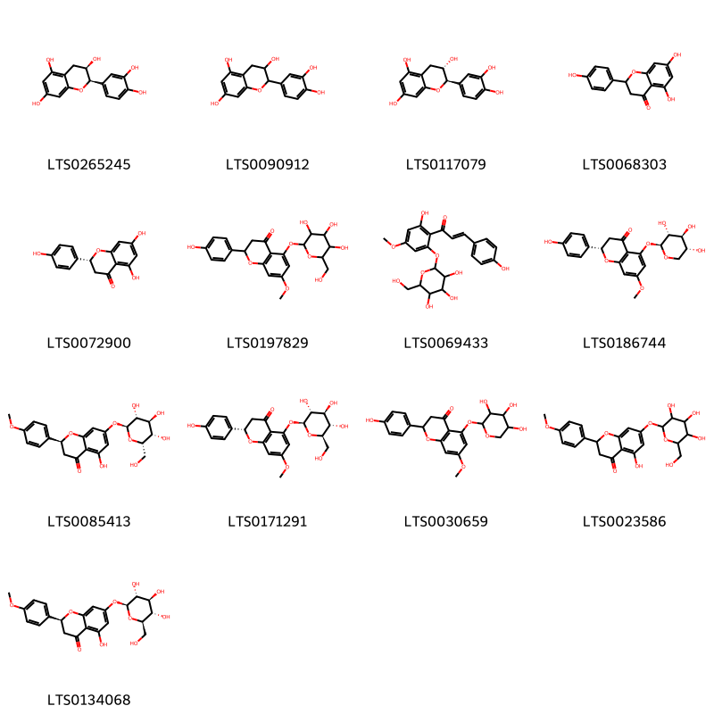{ width=100% }
    <figcaption>Hình ảnh cấu trúc hóa học của 13 hoạt chất thuộc nhóm Flavonoids gồm ['ent-epicatechin (LTS0265245)', 'catechol (LTS0090912)', '(+)-catechol (LTS0117079)', 'asahina (LTS0068303)', '(-)-naringenin (LTS0072900)', 'sakuranin (LTS0197829)', 'neosakuranin (LTS0069433)', '(2s)-2-(4-hydroxyphenyl)-7-methoxy-5-{[(2s,3r,4s,5r)-3,4,5-trihydroxyoxan-2-yl]oxy}-2,3-dihydro-1-benzopyran-4-one (LTS0186744)', '(2s)-5-hydroxy-2-(4-methoxyphenyl)-7-{[(2s,3r,4s,5s,6s)-3,4,5-trihydroxy-6-(hydroxymethyl)oxan-2-yl]oxy}-2,3-dihydro-1-benzopyran-4-one (LTS0085413)', 'sakuranin (LTS0171291)', '2-(4-hydroxyphenyl)-7-methoxy-5-[(3,4,5-trihydroxyoxan-2-yl)oxy]-2,3-dihydro-1-benzopyran-4-one (LTS0030659)', '5-hydroxy-2-(4-methoxyphenyl)-7-{[3,4,5-trihydroxy-6-(hydroxymethyl)oxan-2-yl]oxy}-2,3-dihydro-1-benzopyran-4-one (LTS0023586)', '(2s)-5-hydroxy-2-(4-methoxyphenyl)-7-{[(2s,3r,4s,5s,6r)-3,4,5-trihydroxy-6-(hydroxymethyl)oxan-2-yl]oxy}-2,3-dihydro-1-benzopyran-4-one (LTS0134068)'].</figcaption>
</figure>
#### Nhóm Isoflavonoids
<figure markdown="span">
    { width=100% }
    <figcaption>Hình ảnh cấu trúc hóa học của 1 hoạt chất thuộc nhóm Isoflavonoids gồm ['genistein (LTS0106538)'].</figcaption>
</figure>
#### Nhóm Organooxygen compounds
<figure markdown="span">
    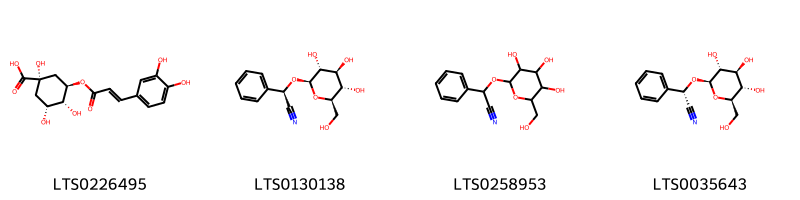{ width=100% }
    <figcaption>Hình ảnh cấu trúc hóa học của 4 hoạt chất thuộc nhóm Organooxygen compounds gồm ['chlorogenic acid (LTS0226495)', 'prunasin (LTS0130138)', '2-phenyl-2-{[3,4,5-trihydroxy-6-(hydroxymethyl)oxan-2-yl]oxy}acetonitrile (LTS0258953)', '(s)-prunasin (LTS0035643)'].</figcaption>
</figure>
#### Nhóm Prenol lipids
<figure markdown="span">
    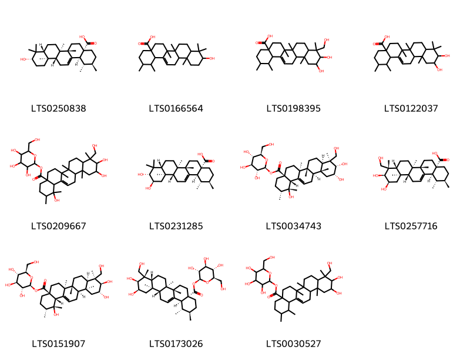{ width=100% }
    <figcaption>Hình ảnh cấu trúc hóa học của 11 hoạt chất thuộc nhóm Prenol lipids gồm ['ursolic acid (LTS0250838)', '10-hydroxy-1,2,6a,6b,9,9,12a-heptamethyl-2,3,4,5,6,7,8,8a,10,11,12,12b,13,14b-tetradecahydro-1h-picene-4a-carboxylic acid (LTS0166564)', 'asiatic acid (LTS0198395)', '10,11-dihydroxy-1,2,6a,6b,9,9,12a-heptamethyl-2,3,4,5,6,7,8,8a,10,11,12,12b,13,14b-tetradecahydro-1h-picene-4a-carboxylic acid (LTS0122037)', '3,4,5-trihydroxy-6-(hydroxymethyl)oxan-2-yl 1,10,11-trihydroxy-9-(hydroxymethyl)-1,2,6a,6b,9,12a-hexamethyl-2,3,4,5,6,7,8,8a,10,11,12,12b,13,14b-tetradecahydropicene-4a-carboxylate (LTS0209667)', 'corosolic acid (LTS0231285)', '(2s,3r,4s,5s,6r)-3,4,5-trihydroxy-6-(hydroxymethyl)oxan-2-yl (1r,2r,4as,6as,6br,8ar,9s,10s,11r,12ar,12br,14bs)-1,10,11-trihydroxy-9-(hydroxymethyl)-1,2,6a,6b,9,12a-hexamethyl-2,3,4,5,6,7,8,8a,10,11,12,12b,13,14b-tetradecahydropicene-4a-carboxylate (LTS0034743)', '(1s,2r,4as,6as,6br,8ar,9s,10s,11r,12ar,12br,14bs)-10,11-dihydroxy-9-(hydroxymethyl)-1,2,6a,6b,9,12a-hexamethyl-2,3,4,5,6,7,8,8a,10,11,12,12b,13,14b-tetradecahydro-1h-picene-4a-carboxylic acid (LTS0257716)', '(2s,3r,4s,5s,6r)-3,4,5-trihydroxy-6-(hydroxymethyl)oxan-2-yl (1r,2r,4as,6as,6br,8ar,9s,10r,11r,12as,12br,14bs)-1,10,11-trihydroxy-9-(hydroxymethyl)-1,2,6a,6b,9,12a-hexamethyl-2,3,4,5,6,7,8,8a,10,11,12,12b,13,14b-tetradecahydropicene-4a-carboxylate (LTS0151907)', '(2s,3r,4s,5s,6r)-3,4,5-trihydroxy-6-(hydroxymethyl)oxan-2-yl (1s,2r,4as,6as,6br,8ar,9s,10s,11r,12ar,12br,14bs)-10,11-dihydroxy-9-(hydroxymethyl)-1,2,6a,6b,9,12a-hexamethyl-2,3,4,5,6,7,8,8a,10,11,12,12b,13,14b-tetradecahydro-1h-picene-4a-carboxylate (LTS0173026)', '3,4,5-trihydroxy-6-(hydroxymethyl)oxan-2-yl 10,11-dihydroxy-9-(hydroxymethyl)-1,2,6a,6b,9,12a-hexamethyl-2,3,4,5,6,7,8,8a,10,11,12,12b,13,14b-tetradecahydro-1h-picene-4a-carboxylate (LTS0030527)'].</figcaption>
</figure>
#### Nhóm Sphingolipids
<figure markdown="span">
    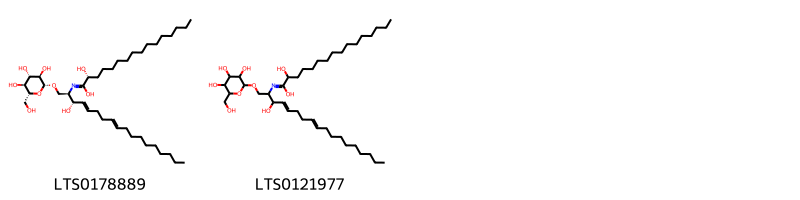{ width=100% }
    <figcaption>Hình ảnh cấu trúc hóa học của 2 hoạt chất thuộc nhóm Sphingolipids gồm ['(2r)-2-hydroxy-n-[(2r,3s,4e,8e)-3-hydroxy-1-{[(2r,3r,4s,5s,6r)-3,4,5-trihydroxy-6-(hydroxymethyl)oxan-2-yl]oxy}octadeca-4,8-dien-2-yl]hexadecanimidic acid (LTS0178889)', '2-hydroxy-n-(3-hydroxy-1-{[3,4,5-trihydroxy-6-(hydroxymethyl)oxan-2-yl]oxy}octadeca-4,8-dien-2-yl)hexadecanimidic acid (LTS0121977)'].</figcaption>
</figure>

---

### Dược dân tộc học

Danh sách các quốc gia có sử dụng *Rosa chinensis* trong điều trị các bệnh. 

| Country   | Disease                       | Bệnh                                                                                                                                                                                                |
|:----------|:------------------------------|:----------------------------------------------------------------------------------------------------------------------------------------------------------------------------------------------------|
| China     | Stimulant, Tonic, Emmenagogue | MYMEMORY WARNING: YOU USED ALL AVAILABLE FREE TRANSLATIONS FOR TODAY. NEXT AVAILABLE IN  11 HOURS 26 MINUTES 46 SECONDS VISIT HTTPS://MYMEMORY.TRANSLATED.NET/DOC/USAGELIMITS.PHP TO TRANSLATE MORE |

---

---
## Rosa cymosa
### Thông tin về thực vật

!!! info "Phân loại thực vật của *N/A* từ GIBF:"
    - **Kingdom:** Plantae
    - **Phylum:** Tracheophyta
    - **Order:** Rosales
    - **Family:** Rosaceae
    - **Genus:** Rosa
    - **Species:** *N/A*

 

| Label (VI)   | Label (EN)   | Scientific Name   | Descriptions (VI)   | Descriptions (EN)   | Also Known As (VI)   | Also Known As (EN)   |
|:-------------|:-------------|:------------------|:--------------------|:--------------------|:---------------------|:---------------------|
| N/A          | N/A          | Rosa cymosa       | loài thực vật       | species of plant    | ['']                 | ['']                 |

#### Phân bố trên thế giới

**Từ CSDL GIBF** Denmark, Luxembourg, Spain, Germany, Chile, Austria, Australia, Sweden, Mongolia, Canada, Iraq, Slovakia, Belarus, Ethiopia, Mexico, Ireland, China, Chinese Taipei, United Kingdom of Great Britain and Northern Ireland, Argentina, Portugal, Latvia, France, New Zealand, Russian Federation, United States of America, Italy, Israel

#### Phân bố tại Việt Nam

**Từ CSDL GIBF**: Không có ghi nhận ở Việt Nam

---
### Thành phần hóa học
        
- Theo cơ sở dữ liệu lotus: Từ loài *N/A* đã phân lập và xác định được 14 hoạt chất thuộc về các nhóm Tannins, Organooxygen compounds, Flavonoids. 

|    | chemicalTaxonomyClassyfireClass   |   smiles_count |
|---:|:----------------------------------|---------------:|
|  0 | Flavonoids                        |              7 |
|  1 | Organooxygen compounds            |              2 |
|  2 | Tannins                           |              5 |

#### Nhóm Flavonoids
<figure markdown="span">
    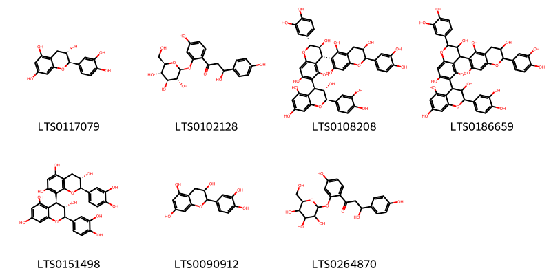{ width=100% }
    <figcaption>Hình ảnh cấu trúc hóa học của 7 hoạt chất thuộc nhóm Flavonoids gồm ['(+)-catechol (LTS0117079)', '(3s)-3-hydroxy-1-(4-hydroxy-2-{[(2s,3r,4s,5s,6r)-3,4,5-trihydroxy-6-(hydroxymethyl)oxan-2-yl]oxy}phenyl)-3-(4-hydroxyphenyl)propan-1-one (LTS0102128)', '(2r,3s,4r)-2-(3,4-dihydroxyphenyl)-6-[(2r,3s,4r)-2-(3,4-dihydroxyphenyl)-3,5,7-trihydroxy-3,4-dihydro-2h-1-benzopyran-4-yl]-4-[(2r,3r)-2-(3,4-dihydroxyphenyl)-3,5,7-trihydroxy-3,4-dihydro-2h-1-benzopyran-6-yl]-3,4-dihydro-2h-1-benzopyran-3,5,7-triol (LTS0108208)', '2-(3,4-dihydroxyphenyl)-6-[2-(3,4-dihydroxyphenyl)-3,5,7-trihydroxy-3,4-dihydro-2h-1-benzopyran-4-yl]-4-[2-(3,4-dihydroxyphenyl)-3,5,7-trihydroxy-3,4-dihydro-2h-1-benzopyran-6-yl]-3,4-dihydro-2h-1-benzopyran-3,5,7-triol (LTS0186659)', '(2r,3s,4s)-2-(3,4-dihydroxyphenyl)-4-[(2r,3s)-2-(3,4-dihydroxyphenyl)-3,5,7-trihydroxy-3,4-dihydro-2h-1-benzopyran-8-yl]-3,4-dihydro-2h-1-benzopyran-3,5,7-triol (LTS0151498)', 'catechol (LTS0090912)', 'rocymosin b (LTS0264870)'].</figcaption>
</figure>
#### Nhóm Organooxygen compounds
<figure markdown="span">
    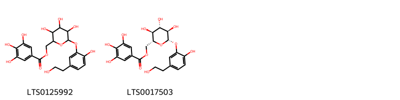{ width=100% }
    <figcaption>Hình ảnh cấu trúc hóa học của 2 hoạt chất thuộc nhóm Organooxygen compounds gồm ['{3,4,5-trihydroxy-6-[2-hydroxy-5-(2-hydroxyethyl)phenoxy]oxan-2-yl}methyl 3,4,5-trihydroxybenzoate (LTS0125992)', '[(2r,3s,4s,5r,6s)-3,4,5-trihydroxy-6-[2-hydroxy-5-(2-hydroxyethyl)phenoxy]oxan-2-yl]methyl 3,4,5-trihydroxybenzoate (LTS0017503)'].</figcaption>
</figure>
#### Nhóm Tannins
<figure markdown="span">
    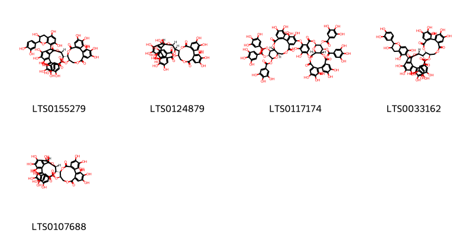{ width=100% }
    <figcaption>Hình ảnh cấu trúc hóa học của 5 hoạt chất thuộc nhóm Tannins gồm ['(11r,12r)-12-[(15s,19s)-19-[2-(3,4-dihydroxyphenyl)-3,5,7-trihydroxy-3,4-dihydro-2h-1-benzopyran-8-yl]-2,3,4,7,8,9-hexahydroxy-12,17-dioxo-13,16-dioxatetracyclo[13.3.1.0⁵,¹⁸.0⁶,¹¹]nonadeca-1(18),2,4,6,8,10-hexaen-14-yl]-3,4,5,17,18,19-hexahydroxy-8,14-dioxo-9,13-dioxatricyclo[13.4.0.0²,⁷]nonadeca-1(15),2,4,6,16,18-hexaen-11-yl 3,4,5-trihydroxybenzoate (LTS0155279)', '(11r,12r)-12-[(14r,15s,19s)-2,3,4,7,8,9,19-heptahydroxy-12,17-dioxo-13,16-dioxatetracyclo[13.3.1.0⁵,¹⁸.0⁶,¹¹]nonadeca-1(18),2,4,6,8,10-hexaen-14-yl]-3,4,5,17,18,19-hexahydroxy-8,14-dioxo-9,13-dioxatricyclo[13.4.0.0²,⁷]nonadeca-1(15),2,4,6,16,18-hexaen-11-yl 3,4,5-trihydroxybenzoate (LTS0124879)', '(10r,11s,12r,13s,15r)-3,4,5,21,22,23-hexahydroxy-8,18-dioxo-11,12-bis(3,4,5-trihydroxybenzoyloxy)-9,14,17-trioxatetracyclo[17.4.0.0²,⁷.0¹⁰,¹⁵]tricosa-1(23),2(7),3,5,19,21-hexaen-13-yl 3,4,5-trihydroxy-2-{[(10r,11s,12r,13s,15r)-3,4,5,22,23-pentahydroxy-8,18-dioxo-11,12,13-tris(3,4,5-trihydroxybenzoyloxy)-9,14,17-trioxatetracyclo[17.4.0.0²,⁷.0¹⁰,¹⁵]tricosa-1(23),2(7),3,5,19,21-hexaen-21-yl]oxy}benzoate (LTS0117174)', '(11r,12r)-12-[(14r,15s,19s)-19-[2-(3,4-dihydroxyphenyl)-3,5,7-trihydroxy-3,4-dihydro-2h-1-benzopyran-6-yl]-2,3,4,7,8,9-hexahydroxy-12,17-dioxo-13,16-dioxatetracyclo[13.3.1.0⁵,¹⁸.0⁶,¹¹]nonadeca-1(18),2,4,6,8,10-hexaen-14-yl]-3,4,5,17,18,19-hexahydroxy-8,14-dioxo-9,13-dioxatricyclo[13.4.0.0²,⁷]nonadeca-1(15),2,4,6,16,18-hexaen-11-yl 3,4,5-trihydroxybenzoate (LTS0033162)', '(11r,12r)-12-[(15s,19s)-2,3,4,7,8,9,19-heptahydroxy-12,17-dioxo-13,16-dioxatetracyclo[13.3.1.0⁵,¹⁸.0⁶,¹¹]nonadeca-1(18),2,4,6,8,10-hexaen-14-yl]-3,4,5,17,18,19-hexahydroxy-8,14-dioxo-9,13-dioxatricyclo[13.4.0.0²,⁷]nonadeca-1(15),2,4,6,16,18-hexaen-11-yl 3,4,5-trihydroxybenzoate (LTS0107688)'].</figcaption>
</figure>

---

### Dược dân tộc học

Danh sách các quốc gia có sử dụng *N/A* trong điều trị các bệnh. 

| Country   | Disease             | Bệnh                                                                                                                                                                                                |
|:----------|:--------------------|:----------------------------------------------------------------------------------------------------------------------------------------------------------------------------------------------------|
| China     | Diuretic, Purgative | MYMEMORY WARNING: YOU USED ALL AVAILABLE FREE TRANSLATIONS FOR TODAY. NEXT AVAILABLE IN  11 HOURS 26 MINUTES 09 SECONDS VISIT HTTPS://MYMEMORY.TRANSLATED.NET/DOC/USAGELIMITS.PHP TO TRANSLATE MORE |

---

---
## Rosa damascena
### Thông tin về thực vật

!!! info "Phân loại thực vật của *Rosa damascena* từ GIBF:"
    - **Kingdom:** Plantae
    - **Phylum:** Tracheophyta
    - **Order:** Rosales
    - **Family:** Rosaceae
    - **Genus:** Rosa
    - **Species:** *Rosa damascena*

 

| Label (VI)   | Label (EN)   | Scientific Name   | Descriptions (VI)   | Descriptions (EN)   | Also Known As (VI)   | Also Known As (EN)                                |
|:-------------|:-------------|:------------------|:--------------------|:--------------------|:---------------------|:--------------------------------------------------|
| N/A          | N/A          | Rosa damascena    | loài thực vật       | species of plant    | ['']                 | ['Damask rose', 'Damask roses', 'Rosa damascena'] |

#### Phân bố trên thế giới

**Từ CSDL GIBF** nan, unknown or invalid, Thailand, Spain, Germany, Austria, Australia, Tunisia, Pakistan, Sweden, Uzbekistan, Poland, India, Canada, Iraq, Belgium, Finland, Türkiye, Belarus, Lebanon, Hungary, Estonia, Greece, Mexico, China, Nepal, Jordan, Iran (Islamic Republic of), Latvia, France, Morocco, Syrian Arab Republic, New Zealand, Cook Islands, New Caledonia, Russian Federation, United States of America, Saudi Arabia, Ukraine

#### Phân bố tại Việt Nam

**Từ CSDL GIBF**: Không có ghi nhận ở Việt Nam

---
### Thành phần hóa học
        
- Theo cơ sở dữ liệu lotus: Từ loài *Rosa damascena* đã phân lập và xác định được 80 hoạt chất thuộc về các nhóm Organooxygen compounds, Flavonoids, Saturated hydrocarbons, Unsaturated hydrocarbons, Oxanes, Prenol lipids, Fatty Acyls, Phenols, Heteroaromatic compounds, Benzene and substituted derivatives, Cinnamaldehydes. 

|    | chemicalTaxonomyClassyfireClass     |   smiles_count |
|---:|:------------------------------------|---------------:|
|  0 | Benzene and substituted derivatives |              3 |
|  1 | Cinnamaldehydes                     |              2 |
|  2 | Fatty Acyls                         |             14 |
|  3 | Flavonoids                          |             20 |
|  4 | Heteroaromatic compounds            |              2 |
|  5 | Organooxygen compounds              |             12 |
|  6 | Oxanes                              |              2 |
|  7 | Phenols                             |              1 |
|  8 | Prenol lipids                       |             21 |
|  9 | Saturated hydrocarbons              |              2 |
| 10 | Unsaturated hydrocarbons            |              1 |

#### Nhóm Benzene and substituted derivatives
<figure markdown="span">
    { width=100% }
    <figcaption>Hình ảnh cấu trúc hóa học của 3 hoạt chất thuộc nhóm Benzene and substituted derivatives gồm ['methyl eugenol (LTS0098881)', '2-phenyl-ethanol (LTS0206341)', 'benzaldehyde (LTS0094193)'].</figcaption>
</figure>
#### Nhóm Cinnamaldehydes
<figure markdown="span">
    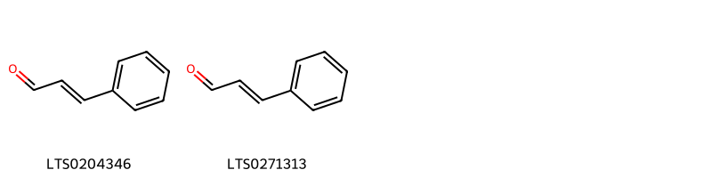{ width=100% }
    <figcaption>Hình ảnh cấu trúc hóa học của 2 hoạt chất thuộc nhóm Cinnamaldehydes gồm ['3-phenyl-2-propenal (LTS0204346)', 'cinnamal (LTS0271313)'].</figcaption>
</figure>
#### Nhóm Fatty Acyls
<figure markdown="span">
    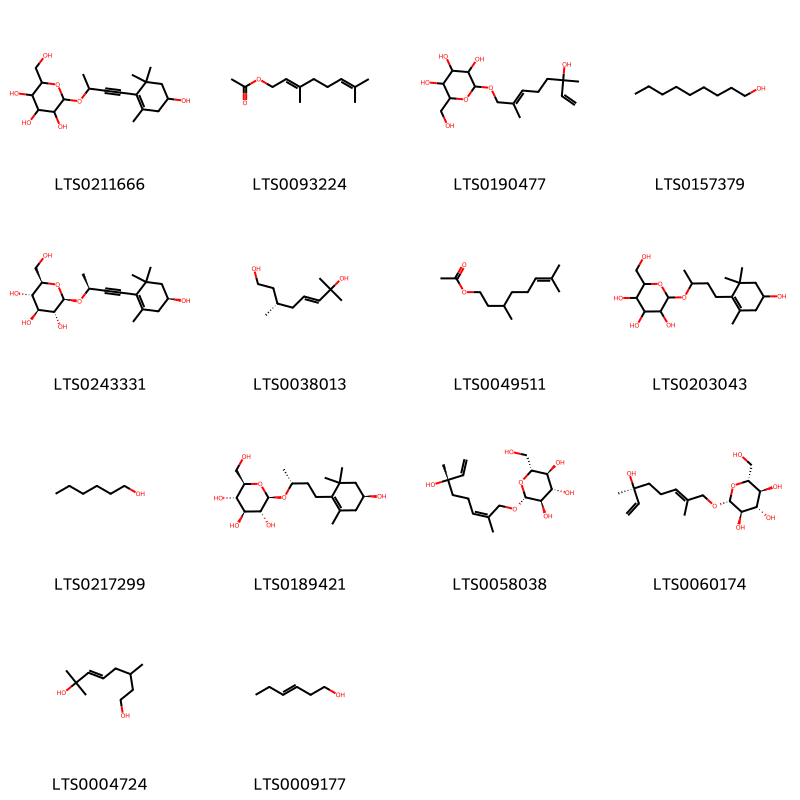{ width=100% }
    <figcaption>Hình ảnh cấu trúc hóa học của 14 hoạt chất thuộc nhóm Fatty Acyls gồm ['2-{[4-(4-hydroxy-2,6,6-trimethylcyclohex-1-en-1-yl)but-3-yn-2-yl]oxy}-6-(hydroxymethyl)oxane-3,4,5-triol (LTS0211666)', 'geranyl acetate (LTS0093224)', '2-[(6-hydroxy-2,6-dimethylocta-2,7-dien-1-yl)oxy]-6-(hydroxymethyl)oxane-3,4,5-triol (LTS0190477)', 'nonan-1-ol (LTS0157379)', '(2r,3r,4s,5s,6r)-2-{[(2s)-4-[(4s)-4-hydroxy-2,6,6-trimethylcyclohex-1-en-1-yl]but-3-yn-2-yl]oxy}-6-(hydroxymethyl)oxane-3,4,5-triol (LTS0243331)', '(3s,5e)-3,7-dimethyloct-5-ene-1,7-diol (LTS0038013)', 'citronellyl acetate (LTS0049511)', '2-{[4-(4-hydroxy-2,6,6-trimethylcyclohex-1-en-1-yl)butan-2-yl]oxy}-6-(hydroxymethyl)oxane-3,4,5-triol (LTS0203043)', 'hexanol (LTS0217299)', '(2r,3r,4s,5s,6r)-2-{[(2r)-4-[(4s)-4-hydroxy-2,6,6-trimethylcyclohex-1-en-1-yl]butan-2-yl]oxy}-6-(hydroxymethyl)oxane-3,4,5-triol (LTS0189421)', '(2r,3r,4s,5s,6r)-2-{[(2z,6s)-6-hydroxy-2,6-dimethylocta-2,7-dien-1-yl]oxy}-6-(hydroxymethyl)oxane-3,4,5-triol (LTS0058038)', '(2r,3r,4s,5s,6r)-2-{[(2e,6s)-6-hydroxy-2,6-dimethylocta-2,7-dien-1-yl]oxy}-6-(hydroxymethyl)oxane-3,4,5-triol (LTS0060174)', '3,7-dimethyloct-5-ene-1,7-diol (LTS0004724)', '3-hexenol (LTS0009177)'].</figcaption>
</figure>
#### Nhóm Flavonoids
<figure markdown="span">
    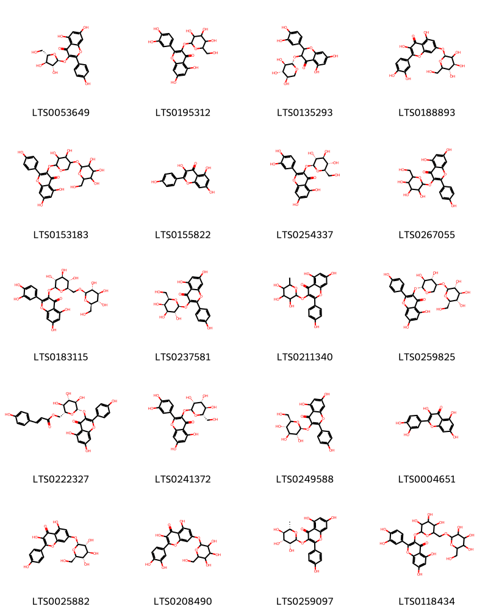{ width=100% }
    <figcaption>Hình ảnh cấu trúc hóa học của 20 hoạt chất thuộc nhóm Flavonoids gồm ['juglanin (LTS0053649)', '2-(3,4-dihydroxyphenyl)-5,7-dihydroxy-3-{[3,4,5-trihydroxy-6-(hydroxymethyl)oxan-2-yl]oxy}chromen-4-one (LTS0195312)', '2-(3,4-dihydroxyphenyl)-5,7-dihydroxy-3-{[(2s,3r,4s,5r)-3,4,5-trihydroxyoxan-2-yl]oxy}-2,3-dihydro-1-benzopyran-4-one (LTS0135293)', 'quercimeritrin (LTS0188893)', '3-[(3,4-dihydroxy-5-{[3,4,5-trihydroxy-6-(hydroxymethyl)oxan-2-yl]oxy}oxan-2-yl)oxy]-5,7-dihydroxy-2-(4-hydroxyphenyl)chromen-4-one (LTS0153183)', 'kaempherol (LTS0155822)', 'isoquercetin (LTS0254337)', 'trifolin (LTS0267055)', '2-(3,4-dihydroxyphenyl)-5,7-dihydroxy-3-{[(2s,3r,4s,5s,6r)-3,4,5-trihydroxy-6-({[(2r,3r,4s,5s,6r)-3,4,5-trihydroxy-6-(hydroxymethyl)oxan-2-yl]oxy}methyl)oxan-2-yl]oxy}chromen-4-one (LTS0183115)', 'trifolin (LTS0237581)', '5,7-dihydroxy-2-(4-hydroxyphenyl)-3-[(3,4,5-trihydroxy-6-methyloxan-2-yl)oxy]chromen-4-one (LTS0211340)', '3-{[(2r,3s,4s,5s)-3,4-dihydroxy-5-{[(2s,3r,4s,5s,6r)-3,4,5-trihydroxy-6-(hydroxymethyl)oxan-2-yl]oxy}oxan-2-yl]oxy}-5,7-dihydroxy-2-(4-hydroxyphenyl)chromen-4-one (LTS0259825)', 'tiliroside (LTS0222327)', '2-(3,4-dihydroxyphenyl)-5,7-dihydroxy-3-{[(2s,3r,4r,5r,6s)-3,4,5-trihydroxy-6-(hydroxymethyl)oxan-2-yl]oxy}chromen-4-one (LTS0241372)', 'astragalin (LTS0249588)', 'quercetin (LTS0004651)', 'kaempferol 7-o-glucoside (LTS0025882)', 'quercimeritrin (LTS0208490)', 'afzelin (LTS0259097)', '2-(3,4-dihydroxyphenyl)-5,7-dihydroxy-3-{[3,4,5-trihydroxy-6-({[3,4,5-trihydroxy-6-(hydroxymethyl)oxan-2-yl]oxy}methyl)oxan-2-yl]oxy}chromen-4-one (LTS0118434)'].</figcaption>
</figure>
#### Nhóm Heteroaromatic compounds
<figure markdown="span">
    { width=100% }
    <figcaption>Hình ảnh cấu trúc hóa học của 2 hoạt chất thuộc nhóm Heteroaromatic compounds gồm ['3-methyl-2-(3-methylbut-2-en-1-yl)thiophene (LTS0045866)', '3-(4-methylpent-3-en-1-yl)thiophene (LTS0178824)'].</figcaption>
</figure>
#### Nhóm Organooxygen compounds
<figure markdown="span">
    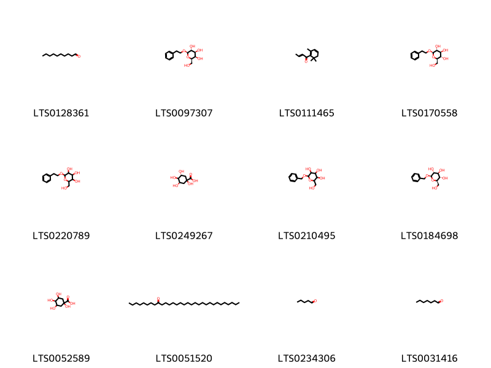{ width=100% }
    <figcaption>Hình ảnh cấu trúc hóa học của 12 hoạt chất thuộc nhóm Organooxygen compounds gồm ['decanal (LTS0128361)', '(2r,3r,4s,5r,6r)-2-(hydroxymethyl)-6-(2-phenylethoxy)oxane-3,4,5-triol (LTS0097307)', 'damascenone (LTS0111465)', '(2r,3s,4s,5r,6r)-2-(hydroxymethyl)-6-(2-phenylethoxy)oxane-3,4,5-triol (LTS0170558)', '2-(hydroxymethyl)-6-(2-phenylethoxy)oxane-3,4,5-triol (LTS0220789)', '(3r,5r)-1,3,4,5-tetrahydroxycyclohexane-1-carboxylic acid (LTS0249267)', 'benzyl glucopyranoside (LTS0210495)', 'benzyl β-d-glucoside (LTS0184698)', 'quinic acid (LTS0052589)', 'hentriacontan-9-one (LTS0051520)', 'pentanal (LTS0234306)', 'heptanal (LTS0031416)'].</figcaption>
</figure>
#### Nhóm Oxanes
<figure markdown="span">
    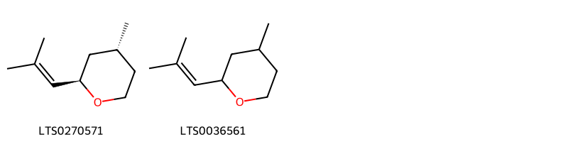{ width=100% }
    <figcaption>Hình ảnh cấu trúc hóa học của 2 hoạt chất thuộc nhóm Oxanes gồm ['(2r,4r)-rose oxide (LTS0270571)', 'rose oxide (LTS0036561)'].</figcaption>
</figure>
#### Nhóm Phenols
<figure markdown="span">
    { width=100% }
    <figcaption>Hình ảnh cấu trúc hóa học của 1 hoạt chất thuộc nhóm Phenols gồm ['eugenol (LTS0052342)'].</figcaption>
</figure>
#### Nhóm Prenol lipids
<figure markdown="span">
    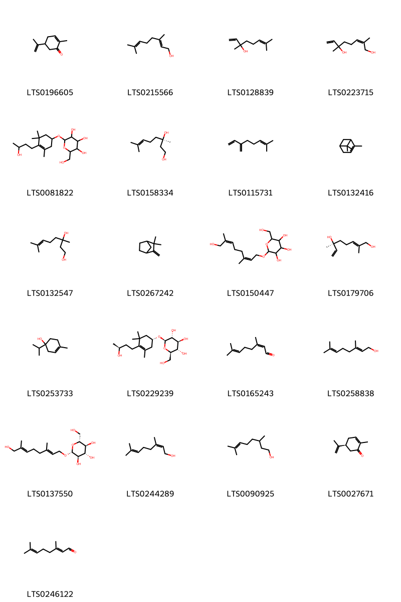{ width=100% }
    <figcaption>Hình ảnh cấu trúc hóa học của 21 hoạt chất thuộc nhóm Prenol lipids gồm ['carvone (LTS0196605)', '3,7-dimethyl-2,6-octadien-1-ol (LTS0215566)', 'linalool, (+-)- (LTS0128839)', '2,6-dimethylocta-2,7-diene-1,6-diol (LTS0223715)', '2-{[4-(3-hydroxybutyl)-3,5,5-trimethylcyclohex-3-en-1-yl]oxy}-6-(hydroxymethyl)oxane-3,4,5-triol (LTS0081822)', '(3r)-3,7-dimethyloct-6-ene-1,3-diol (LTS0158334)', 'α-myrcene (LTS0115731)', 'α pinene (LTS0132416)', '3,7-dimethyloct-6-ene-1,3-diol (LTS0132547)', 'camphene (LTS0267242)', '2-[(8-hydroxy-3,7-dimethylocta-2,6-dien-1-yl)oxy]-6-(hydroxymethyl)oxane-3,4,5-triol (LTS0150447)', '(2e,6s)-2,6-dimethylocta-2,7-diene-1,6-diol (LTS0179706)', '4-terpineol (LTS0253733)', '(2r,3r,4s,5s,6r)-2-{[(1r)-4-[(3s)-3-hydroxybutyl]-3,5,5-trimethylcyclohex-3-en-1-yl]oxy}-6-(hydroxymethyl)oxane-3,4,5-triol (LTS0229239)', 'neral (LTS0165243)', 'geraniol (LTS0258838)', '(2r,3r,4s,5s,6r)-2-{[(2e,6e)-8-hydroxy-3,7-dimethylocta-2,6-dien-1-yl]oxy}-6-(hydroxymethyl)oxane-3,4,5-triol (LTS0137550)', 'nerol (LTS0244289)', 'citronellol, (+-)- (LTS0090925)', 'carvone, (+)- (LTS0027671)', 'α-citral (LTS0246122)'].</figcaption>
</figure>
#### Nhóm Saturated hydrocarbons
<figure markdown="span">
    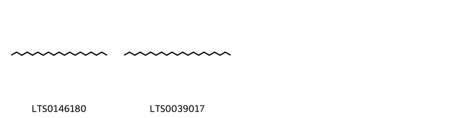{ width=100% }
    <figcaption>Hình ảnh cấu trúc hóa học của 2 hoạt chất thuộc nhóm Saturated hydrocarbons gồm ['nonadecane (LTS0146180)', 'heneicosane (LTS0039017)'].</figcaption>
</figure>
#### Nhóm Unsaturated hydrocarbons
<figure markdown="span">
    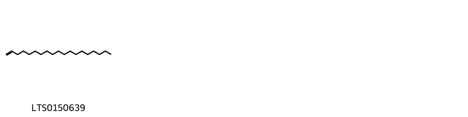{ width=100% }
    <figcaption>Hình ảnh cấu trúc hóa học của 1 hoạt chất thuộc nhóm Unsaturated hydrocarbons gồm ['1-nonadecene (LTS0150639)'].</figcaption>
</figure>

---

### Dược dân tộc học

Danh sách các quốc gia có sử dụng *Rosa damascena* trong điều trị các bệnh. 

| Country   | Disease                                                                         | Bệnh                                                                                                                                                                                                |
|:----------|:--------------------------------------------------------------------------------|:----------------------------------------------------------------------------------------------------------------------------------------------------------------------------------------------------|
| Elsewhere | Aperient, Astringent, Laxative, Refrigerant, Tonic                              | MYMEMORY WARNING: YOU USED ALL AVAILABLE FREE TRANSLATIONS FOR TODAY. NEXT AVAILABLE IN  11 HOURS 25 MINUTES 35 SECONDS VISIT HTTPS://MYMEMORY.TRANSLATED.NET/DOC/USAGELIMITS.PHP TO TRANSLATE MORE |
| Eurasia   | Perfume                                                                         | MYMEMORY WARNING: YOU USED ALL AVAILABLE FREE TRANSLATIONS FOR TODAY. NEXT AVAILABLE IN  11 HOURS 25 MINUTES 30 SECONDS VISIT HTTPS://MYMEMORY.TRANSLATED.NET/DOC/USAGELIMITS.PHP TO TRANSLATE MORE |
| Iraq      | Aperient, Carminative, Stomachic, Cardiotonic, Nervine, Refrigerant, Astringent | MYMEMORY WARNING: YOU USED ALL AVAILABLE FREE TRANSLATIONS FOR TODAY. NEXT AVAILABLE IN  11 HOURS 25 MINUTES 27 SECONDS VISIT HTTPS://MYMEMORY.TRANSLATED.NET/DOC/USAGELIMITS.PHP TO TRANSLATE MORE |

---

---
## Rosa gallica
### Thông tin về thực vật

!!! info "Phân loại thực vật của *Rosa gallica* từ GIBF:"
    - **Kingdom:** Plantae
    - **Phylum:** Tracheophyta
    - **Order:** Rosales
    - **Family:** Rosaceae
    - **Genus:** Rosa
    - **Species:** *Rosa gallica*

 

| Label (VI)   | Label (EN)   | Scientific Name   | Descriptions (VI)   | Descriptions (EN)   | Also Known As (VI)   | Also Known As (EN)          |
|:-------------|:-------------|:------------------|:--------------------|:--------------------|:---------------------|:----------------------------|
| N/A          | N/A          | Rosa gallica      | loài thực vật       | species of plant    | ['']                 | ['gallica', 'gallica rose'] |

#### Phân bố trên thế giới

**Từ CSDL GIBF** Spain, Germany, Austria, Serbia, Sweden, Poland, Belgium, Finland, Netherlands, Slovakia, Slovenia, North Macedonia, Hungary, Estonia, Norway, Switzerland, United Kingdom of Great Britain and Northern Ireland, Portugal, France, Czechia, Romania, Russian Federation, United States of America, Italy, Croatia, Ukraine

#### Phân bố tại Việt Nam

**Từ CSDL GIBF**: Không có ghi nhận ở Việt Nam

---
### Thành phần hóa học
        
- Theo cơ sở dữ liệu lotus: Từ loài *Rosa gallica* đã phân lập và xác định được 113 hoạt chất thuộc về các nhóm Organooxygen compounds, Flavonoids, Saturated hydrocarbons, Unsaturated hydrocarbons, Tannins, Oxanes, Prenol lipids, Fatty Acyls, Phenols, Heteroaromatic compounds, Dihydrofurans, Benzene and substituted derivatives, Cinnamaldehydes. 

|    | chemicalTaxonomyClassyfireClass     |   smiles_count |
|---:|:------------------------------------|---------------:|
|  0 | Benzene and substituted derivatives |              3 |
|  1 | Cinnamaldehydes                     |              2 |
|  2 | Dihydrofurans                       |              1 |
|  3 | Fatty Acyls                         |             15 |
|  4 | Flavonoids                          |             20 |
|  5 | Heteroaromatic compounds            |              2 |
|  6 | Organooxygen compounds              |             12 |
|  7 | Oxanes                              |              2 |
|  8 | Phenols                             |              1 |
|  9 | Prenol lipids                       |             28 |
| 10 | Saturated hydrocarbons              |             11 |
| 11 | Tannins                             |             15 |
| 12 | Unsaturated hydrocarbons            |              1 |

#### Nhóm Benzene and substituted derivatives
<figure markdown="span">
    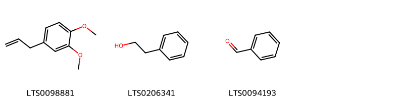{ width=100% }
    <figcaption>Hình ảnh cấu trúc hóa học của 3 hoạt chất thuộc nhóm Benzene and substituted derivatives gồm ['methyl eugenol (LTS0098881)', '2-phenyl-ethanol (LTS0206341)', 'benzaldehyde (LTS0094193)'].</figcaption>
</figure>
#### Nhóm Cinnamaldehydes
<figure markdown="span">
    { width=100% }
    <figcaption>Hình ảnh cấu trúc hóa học của 2 hoạt chất thuộc nhóm Cinnamaldehydes gồm ['3-phenyl-2-propenal (LTS0204346)', 'cinnamal (LTS0271313)'].</figcaption>
</figure>
#### Nhóm Dihydrofurans
<figure markdown="span">
    { width=100% }
    <figcaption>Hình ảnh cấu trúc hóa học của 1 hoạt chất thuộc nhóm Dihydrofurans gồm ['vitamin c (LTS0022555)'].</figcaption>
</figure>
#### Nhóm Fatty Acyls
<figure markdown="span">
    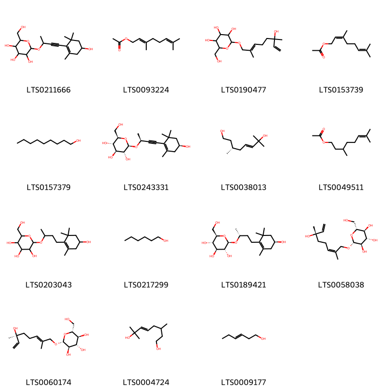{ width=100% }
    <figcaption>Hình ảnh cấu trúc hóa học của 15 hoạt chất thuộc nhóm Fatty Acyls gồm ['2-{[4-(4-hydroxy-2,6,6-trimethylcyclohex-1-en-1-yl)but-3-yn-2-yl]oxy}-6-(hydroxymethyl)oxane-3,4,5-triol (LTS0211666)', 'geranyl acetate (LTS0093224)', '2-[(6-hydroxy-2,6-dimethylocta-2,7-dien-1-yl)oxy]-6-(hydroxymethyl)oxane-3,4,5-triol (LTS0190477)', 'neryl acetate (LTS0153739)', 'nonan-1-ol (LTS0157379)', '(2r,3r,4s,5s,6r)-2-{[(2s)-4-[(4s)-4-hydroxy-2,6,6-trimethylcyclohex-1-en-1-yl]but-3-yn-2-yl]oxy}-6-(hydroxymethyl)oxane-3,4,5-triol (LTS0243331)', '(3s,5e)-3,7-dimethyloct-5-ene-1,7-diol (LTS0038013)', 'citronellyl acetate (LTS0049511)', '2-{[4-(4-hydroxy-2,6,6-trimethylcyclohex-1-en-1-yl)butan-2-yl]oxy}-6-(hydroxymethyl)oxane-3,4,5-triol (LTS0203043)', 'hexanol (LTS0217299)', '(2r,3r,4s,5s,6r)-2-{[(2r)-4-[(4s)-4-hydroxy-2,6,6-trimethylcyclohex-1-en-1-yl]butan-2-yl]oxy}-6-(hydroxymethyl)oxane-3,4,5-triol (LTS0189421)', '(2r,3r,4s,5s,6r)-2-{[(2z,6s)-6-hydroxy-2,6-dimethylocta-2,7-dien-1-yl]oxy}-6-(hydroxymethyl)oxane-3,4,5-triol (LTS0058038)', '(2r,3r,4s,5s,6r)-2-{[(2e,6s)-6-hydroxy-2,6-dimethylocta-2,7-dien-1-yl]oxy}-6-(hydroxymethyl)oxane-3,4,5-triol (LTS0060174)', '3,7-dimethyloct-5-ene-1,7-diol (LTS0004724)', '3-hexenol (LTS0009177)'].</figcaption>
</figure>
#### Nhóm Flavonoids
<figure markdown="span">
    { width=100% }
    <figcaption>Hình ảnh cấu trúc hóa học của 20 hoạt chất thuộc nhóm Flavonoids gồm ['juglanin (LTS0053649)', '2-(3,4-dihydroxyphenyl)-5,7-dihydroxy-3-{[3,4,5-trihydroxy-6-(hydroxymethyl)oxan-2-yl]oxy}chromen-4-one (LTS0195312)', '2-(3,4-dihydroxyphenyl)-5,7-dihydroxy-3-{[(2s,3r,4s,5r)-3,4,5-trihydroxyoxan-2-yl]oxy}-2,3-dihydro-1-benzopyran-4-one (LTS0135293)', 'quercimeritrin (LTS0188893)', '3-[(3,4-dihydroxy-5-{[3,4,5-trihydroxy-6-(hydroxymethyl)oxan-2-yl]oxy}oxan-2-yl)oxy]-5,7-dihydroxy-2-(4-hydroxyphenyl)chromen-4-one (LTS0153183)', 'kaempherol (LTS0155822)', 'isoquercetin (LTS0254337)', 'trifolin (LTS0267055)', '2-(3,4-dihydroxyphenyl)-5,7-dihydroxy-3-{[(2s,3r,4s,5s,6r)-3,4,5-trihydroxy-6-({[(2r,3r,4s,5s,6r)-3,4,5-trihydroxy-6-(hydroxymethyl)oxan-2-yl]oxy}methyl)oxan-2-yl]oxy}chromen-4-one (LTS0183115)', 'trifolin (LTS0237581)', '5,7-dihydroxy-2-(4-hydroxyphenyl)-3-[(3,4,5-trihydroxy-6-methyloxan-2-yl)oxy]chromen-4-one (LTS0211340)', '3-{[(2r,3s,4s,5s)-3,4-dihydroxy-5-{[(2s,3r,4s,5s,6r)-3,4,5-trihydroxy-6-(hydroxymethyl)oxan-2-yl]oxy}oxan-2-yl]oxy}-5,7-dihydroxy-2-(4-hydroxyphenyl)chromen-4-one (LTS0259825)', 'tiliroside (LTS0222327)', '2-(3,4-dihydroxyphenyl)-5,7-dihydroxy-3-{[(2s,3r,4r,5r,6s)-3,4,5-trihydroxy-6-(hydroxymethyl)oxan-2-yl]oxy}chromen-4-one (LTS0241372)', 'astragalin (LTS0249588)', 'quercetin (LTS0004651)', 'kaempferol 7-o-glucoside (LTS0025882)', 'quercimeritrin (LTS0208490)', 'afzelin (LTS0259097)', '2-(3,4-dihydroxyphenyl)-5,7-dihydroxy-3-{[3,4,5-trihydroxy-6-({[3,4,5-trihydroxy-6-(hydroxymethyl)oxan-2-yl]oxy}methyl)oxan-2-yl]oxy}chromen-4-one (LTS0118434)'].</figcaption>
</figure>
#### Nhóm Heteroaromatic compounds
<figure markdown="span">
    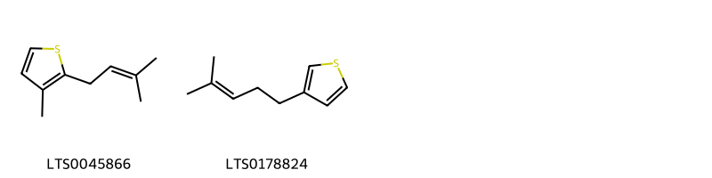{ width=100% }
    <figcaption>Hình ảnh cấu trúc hóa học của 2 hoạt chất thuộc nhóm Heteroaromatic compounds gồm ['3-methyl-2-(3-methylbut-2-en-1-yl)thiophene (LTS0045866)', '3-(4-methylpent-3-en-1-yl)thiophene (LTS0178824)'].</figcaption>
</figure>
#### Nhóm Organooxygen compounds
<figure markdown="span">
    { width=100% }
    <figcaption>Hình ảnh cấu trúc hóa học của 12 hoạt chất thuộc nhóm Organooxygen compounds gồm ['decanal (LTS0128361)', '(2r,3r,4s,5r,6r)-2-(hydroxymethyl)-6-(2-phenylethoxy)oxane-3,4,5-triol (LTS0097307)', 'damascenone (LTS0111465)', '(2r,3s,4s,5r,6r)-2-(hydroxymethyl)-6-(2-phenylethoxy)oxane-3,4,5-triol (LTS0170558)', '2-(hydroxymethyl)-6-(2-phenylethoxy)oxane-3,4,5-triol (LTS0220789)', '(3r,5r)-1,3,4,5-tetrahydroxycyclohexane-1-carboxylic acid (LTS0249267)', 'benzyl glucopyranoside (LTS0210495)', 'benzyl β-d-glucoside (LTS0184698)', 'quinic acid (LTS0052589)', 'hentriacontan-9-one (LTS0051520)', 'pentanal (LTS0234306)', 'heptanal (LTS0031416)'].</figcaption>
</figure>
#### Nhóm Oxanes
<figure markdown="span">
    { width=100% }
    <figcaption>Hình ảnh cấu trúc hóa học của 2 hoạt chất thuộc nhóm Oxanes gồm ['(2r,4r)-rose oxide (LTS0270571)', 'rose oxide (LTS0036561)'].</figcaption>
</figure>
#### Nhóm Phenols
<figure markdown="span">
    { width=100% }
    <figcaption>Hình ảnh cấu trúc hóa học của 1 hoạt chất thuộc nhóm Phenols gồm ['eugenol (LTS0052342)'].</figcaption>
</figure>
#### Nhóm Prenol lipids
<figure markdown="span">
    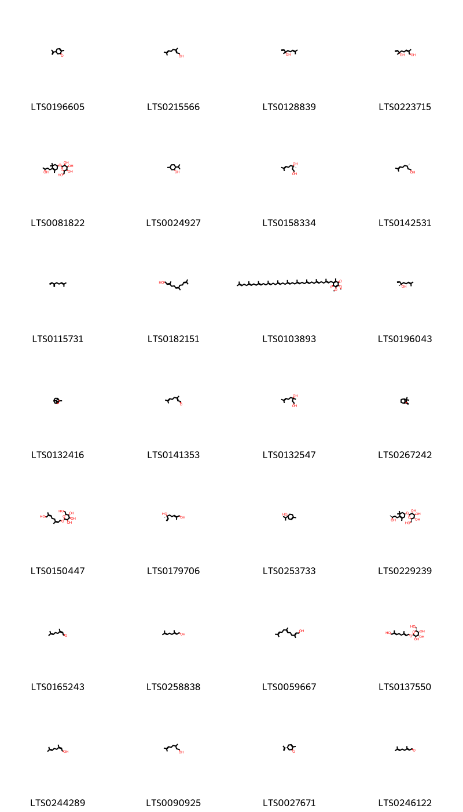{ width=100% }
    <figcaption>Hình ảnh cấu trúc hóa học của 28 hoạt chất thuộc nhóm Prenol lipids gồm ['carvone (LTS0196605)', '3,7-dimethyl-2,6-octadien-1-ol (LTS0215566)', 'linalool, (+-)- (LTS0128839)', '2,6-dimethylocta-2,7-diene-1,6-diol (LTS0223715)', '2-{[4-(3-hydroxybutyl)-3,5,5-trimethylcyclohex-3-en-1-yl]oxy}-6-(hydroxymethyl)oxane-3,4,5-triol (LTS0081822)', 'menthol natural (LTS0024927)', '(3r)-3,7-dimethyloct-6-ene-1,3-diol (LTS0158334)', '(-)-citronellol (LTS0142531)', 'α-myrcene (LTS0115731)', '(e,z)-farnesol (LTS0182151)', 'coenzyme q10 (LTS0103893)', '(+)-linalool (LTS0196043)', 'α pinene (LTS0132416)', '3,7-dimethyl-2,6-octadienal (LTS0141353)', '3,7-dimethyloct-6-ene-1,3-diol (LTS0132547)', 'camphene (LTS0267242)', '2-[(8-hydroxy-3,7-dimethylocta-2,6-dien-1-yl)oxy]-6-(hydroxymethyl)oxane-3,4,5-triol (LTS0150447)', '(2e,6s)-2,6-dimethylocta-2,7-diene-1,6-diol (LTS0179706)', '4-terpineol (LTS0253733)', '(2r,3r,4s,5s,6r)-2-{[(1r)-4-[(3s)-3-hydroxybutyl]-3,5,5-trimethylcyclohex-3-en-1-yl]oxy}-6-(hydroxymethyl)oxane-3,4,5-triol (LTS0229239)', 'neral (LTS0165243)', 'geraniol (LTS0258838)', 'farnesol (LTS0059667)', '(2r,3r,4s,5s,6r)-2-{[(2e,6e)-8-hydroxy-3,7-dimethylocta-2,6-dien-1-yl]oxy}-6-(hydroxymethyl)oxane-3,4,5-triol (LTS0137550)', 'nerol (LTS0244289)', 'citronellol, (+-)- (LTS0090925)', 'carvone, (+)- (LTS0027671)', 'α-citral (LTS0246122)'].</figcaption>
</figure>
#### Nhóm Saturated hydrocarbons
<figure markdown="span">
    { width=100% }
    <figcaption>Hình ảnh cấu trúc hóa học của 11 hoạt chất thuộc nhóm Saturated hydrocarbons gồm ['hexacosane (LTS0079361)', 'pentacosane (LTS0080764)', 'tetracosane (LTS0090497)', 'heptacosane (LTS0150428)', 'nonadecane (LTS0146180)', 'tricosane (LTS0089836)', 'heptadecane (LTS0038303)', 'docosane (LTS0210348)', 'octadecane (LTS0258101)', 'heneicosane (LTS0039017)', 'eicosane (LTS0268882)'].</figcaption>
</figure>
#### Nhóm Tannins
<figure markdown="span">
    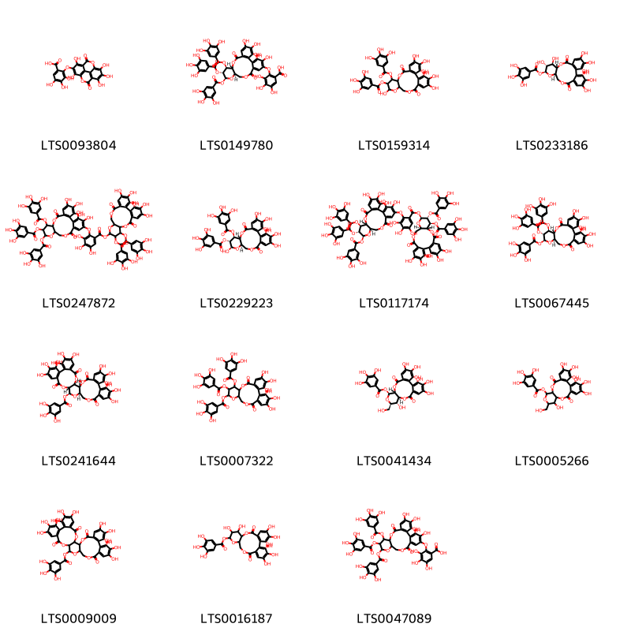{ width=100% }
    <figcaption>Hình ảnh cấu trúc hóa học của 15 hoạt chất thuộc nhóm Tannins gồm ['3,4,5-trihydroxy-2-({5,7,12,13,14-pentahydroxy-3,10-dioxo-2,9-dioxatetracyclo[6.6.2.0⁴,¹⁶.0¹¹,¹⁵]hexadeca-1(14),4,6,8(16),11(15),12-hexaen-6-yl}oxy)benzoic acid (LTS0093804)', '3,4,5-trihydroxy-2-{[(10r,11s,12r,13s,15r)-3,4,5,22,23-pentahydroxy-8,18-dioxo-11,12,13-tris(3,4,5-trihydroxybenzoyloxy)-9,14,17-trioxatetracyclo[17.4.0.0²,⁷.0¹⁰,¹⁵]tricosa-1(23),2(7),3,5,19,21-hexaen-21-yl]oxy}benzoic acid (LTS0149780)', '3,4,5,13,21,22,23-heptahydroxy-8,18-dioxo-12-(3,4,5-trihydroxybenzoyloxy)-9,14,17-trioxatetracyclo[17.4.0.0²,⁷.0¹⁰,¹⁵]tricosa-1(23),2(7),3,5,19,21-hexaen-11-yl 3,4,5-trihydroxybenzoate (LTS0159314)', '(10s,11r,12r,13s,15r)-3,4,5,11,12,21,22,23-octahydroxy-8,18-dioxo-9,14,17-trioxatetracyclo[17.4.0.0²,⁷.0¹⁰,¹⁵]tricosa-1(23),2(7),3,5,19,21-hexaen-13-yl 3,4,5-trihydroxybenzoate (LTS0233186)', '3,4,5,21,22,23-hexahydroxy-8,18-dioxo-11,12-bis(3,4,5-trihydroxybenzoyloxy)-9,14,17-trioxatetracyclo[17.4.0.0²,⁷.0¹⁰,¹⁵]tricosa-1(23),2(7),3,5,19,21-hexaen-13-yl 3,4,5-trihydroxy-2-{[3,4,5,22,23-pentahydroxy-8,18-dioxo-11,12,13-tris(3,4,5-trihydroxybenzoyloxy)-9,14,17-trioxatetracyclo[17.4.0.0²,⁷.0¹⁰,¹⁵]tricosa-1(23),2(7),3,5,19,21-hexaen-21-yl]oxy}benzoate (LTS0247872)', '(10r,11s,12r,13r,15r)-3,4,5,13,21,22,23-heptahydroxy-8,18-dioxo-11-(3,4,5-trihydroxybenzoyloxy)-9,14,17-trioxatetracyclo[17.4.0.0²,⁷.0¹⁰,¹⁵]tricosa-1(23),2(7),3,5,19,21-hexaen-12-yl 3,4,5-trihydroxybenzoate (LTS0229223)', '(10r,11s,12r,13s,15r)-3,4,5,21,22,23-hexahydroxy-8,18-dioxo-11,12-bis(3,4,5-trihydroxybenzoyloxy)-9,14,17-trioxatetracyclo[17.4.0.0²,⁷.0¹⁰,¹⁵]tricosa-1(23),2(7),3,5,19,21-hexaen-13-yl 3,4,5-trihydroxy-2-{[(10r,11s,12r,13s,15r)-3,4,5,22,23-pentahydroxy-8,18-dioxo-11,12,13-tris(3,4,5-trihydroxybenzoyloxy)-9,14,17-trioxatetracyclo[17.4.0.0²,⁷.0¹⁰,¹⁵]tricosa-1(23),2(7),3,5,19,21-hexaen-21-yl]oxy}benzoate (LTS0117174)', '(10r,11s,12r,13s,15r)-3,4,5,21,22,23-hexahydroxy-8,18-dioxo-12,13-bis(3,4,5-trihydroxybenzoyloxy)-9,14,17-trioxatetracyclo[17.4.0.0²,⁷.0¹⁰,¹⁵]tricosa-1(23),2(7),3,5,19,21-hexaen-11-yl 3,4,5-trihydroxybenzoate (LTS0067445)', 'casuarictin (LTS0241644)', '3,4,5,21,22,23-hexahydroxy-8,18-dioxo-12,13-bis(3,4,5-trihydroxybenzoyloxy)-9,14,17-trioxatetracyclo[17.4.0.0²,⁷.0¹⁰,¹⁵]tricosa-1(23),2(7),3,5,19,21-hexaen-11-yl 3,4,5-trihydroxybenzoate (LTS0007322)', '(10r,11s,13r,14r,15s)-3,4,5,14,20,21,22-heptahydroxy-13-(hydroxymethyl)-8,17-dioxo-9,12,16-trioxatetracyclo[16.4.0.0²,⁷.0¹⁰,¹⁵]docosa-1(22),2(7),3,5,18,20-hexaen-11-yl 3,4,5-trihydroxybenzoate (LTS0041434)', '3,4,5,14,20,21,22-heptahydroxy-13-(hydroxymethyl)-8,17-dioxo-9,12,16-trioxatetracyclo[16.4.0.0²,⁷.0¹⁰,¹⁵]docosa-1(22),2(7),3,5,18,20-hexaen-11-yl 3,4,5-trihydroxybenzoate (LTS0005266)', '7,8,9,12,13,14,28,29,30,33,34,35-dodecahydroxy-4,17,25,38-tetraoxo-3,18,21,24,39-pentaoxaheptacyclo[20.17.0.0²,¹⁹.0⁵,¹⁰.0¹¹,¹⁶.0²⁶,³¹.0³²,³⁷]nonatriaconta-5,7,9,11(16),12,14,26,28,30,32(37),33,35-dodecaen-20-yl 3,4,5-trihydroxybenzoate (LTS0009009)', '3,4,5,11,12,21,22,23-octahydroxy-8,18-dioxo-9,14,17-trioxatetracyclo[17.4.0.0²,⁷.0¹⁰,¹⁵]tricosa-1(23),2(7),3,5,19,21-hexaen-13-yl 3,4,5-trihydroxybenzoate (LTS0016187)', '3,4,5-trihydroxy-2-{[3,4,5,22,23-pentahydroxy-8,18-dioxo-11,12,13-tris(3,4,5-trihydroxybenzoyloxy)-9,14,17-trioxatetracyclo[17.4.0.0²,⁷.0¹⁰,¹⁵]tricosa-1(23),2(7),3,5,19,21-hexaen-21-yl]oxy}benzoic acid (LTS0047089)'].</figcaption>
</figure>
#### Nhóm Unsaturated hydrocarbons
<figure markdown="span">
    { width=100% }
    <figcaption>Hình ảnh cấu trúc hóa học của 1 hoạt chất thuộc nhóm Unsaturated hydrocarbons gồm ['1-nonadecene (LTS0150639)'].</figcaption>
</figure>

---

### Dược dân tộc học

Danh sách các quốc gia có sử dụng *Rosa gallica* trong điều trị các bệnh. 

| Country   | Disease                                                               | Bệnh                                                                                                                                                                                                |
|:----------|:----------------------------------------------------------------------|:----------------------------------------------------------------------------------------------------------------------------------------------------------------------------------------------------|
| Elsewhere | Astringent, Tonic                                                     | MYMEMORY WARNING: YOU USED ALL AVAILABLE FREE TRANSLATIONS FOR TODAY. NEXT AVAILABLE IN  11 HOURS 24 MINUTES 35 SECONDS VISIT HTTPS://MYMEMORY.TRANSLATED.NET/DOC/USAGELIMITS.PHP TO TRANSLATE MORE |
| Europe    | Astringent, Tonic                                                     | MYMEMORY WARNING: YOU USED ALL AVAILABLE FREE TRANSLATIONS FOR TODAY. NEXT AVAILABLE IN  11 HOURS 24 MINUTES 31 SECONDS VISIT HTTPS://MYMEMORY.TRANSLATED.NET/DOC/USAGELIMITS.PHP TO TRANSLATE MORE |
| Turkey    | Astringent, Cardiotonic, Nervine, Refrigerant, Stomachic, Carminative | MYMEMORY WARNING: YOU USED ALL AVAILABLE FREE TRANSLATIONS FOR TODAY. NEXT AVAILABLE IN  11 HOURS 24 MINUTES 25 SECONDS VISIT HTTPS://MYMEMORY.TRANSLATED.NET/DOC/USAGELIMITS.PHP TO TRANSLATE MORE |

---

---
## Rosa indica
### Thông tin về thực vật

!!! info "Phân loại thực vật của *Rosa indica* từ GIBF:"
    - **Kingdom:** Plantae
    - **Phylum:** Tracheophyta
    - **Order:** Rosales
    - **Family:** Rosaceae
    - **Genus:** Rosa
    - **Species:** *Rosa indica*

 

| Label (VI)   | Label (EN)   | Scientific Name   | Descriptions (VI)   | Descriptions (EN)   | Also Known As (VI)   | Also Known As (EN)   |
|:-------------|:-------------|:------------------|:--------------------|:--------------------|:---------------------|:---------------------|
| N/A          | N/A          | Rosa indica       | loài thực vật       | species of plant    | ['']                 | ['Jh', 'R. Indica']  |

#### Phân bố trên thế giới

**Từ CSDL GIBF** Viet Nam, Pakistan, Japan, Peru, India, Germany, Russian Federation, United States of America, China, Belgium, Chinese Taipei

#### Phân bố tại Việt Nam

**Từ CSDL GIBF**: Hoa Binh

---
### Thành phần hóa học
        
- Theo cơ sở dữ liệu lotus: Từ loài *Rosa indica* đã phân lập và xác định được Chưa có hoạt chất nào được phân lập. hoạt chất thuộc về các nhóm Không có hoạt chất nào được phân lập. 

Không có hình ảnh nào được tạo ra

---

### Dược dân tộc học

Danh sách các quốc gia có sử dụng *Rosa indica* trong điều trị các bệnh. 

| Country   | Disease   | Bệnh                                                                                                                                                                                                |
|:----------|:----------|:----------------------------------------------------------------------------------------------------------------------------------------------------------------------------------------------------|
| India     | Fungicide | MYMEMORY WARNING: YOU USED ALL AVAILABLE FREE TRANSLATIONS FOR TODAY. NEXT AVAILABLE IN  11 HOURS 23 MINUTES 17 SECONDS VISIT HTTPS://MYMEMORY.TRANSLATED.NET/DOC/USAGELIMITS.PHP TO TRANSLATE MORE |

---

---
## Rosa laevigana
### Thông tin về thực vật

!!! info "Phân loại thực vật của *Rosa laevigata* từ GIBF:"
    - **Kingdom:** Plantae
    - **Phylum:** Tracheophyta
    - **Order:** Rosales
    - **Family:** Rosaceae
    - **Genus:** Rosa
    - **Species:** *Rosa laevigata*

 

| Label (VI)   | Label (EN)   | Scientific Name   | Descriptions (VI)   | Descriptions (EN)   | Also Known As (VI)   | Also Known As (EN)   |
|:-------------|:-------------|:------------------|:--------------------|:--------------------|:---------------------|:---------------------|
| N/A          | N/A          | Rosa indica       | loài thực vật       | species of plant    | ['']                 | ['Jh', 'R. Indica']  |

#### Phân bố trên thế giới

**Từ CSDL GIBF** nan, South Africa, United States of America, China, Korea, Republic of, Hong Kong

#### Phân bố tại Việt Nam

**Từ CSDL GIBF**: Không có ghi nhận ở Việt Nam

---
### Thành phần hóa học
        
- Theo cơ sở dữ liệu lotus: Từ loài *Rosa laevigata* đã phân lập và xác định được Chưa có hoạt chất nào được phân lập. hoạt chất thuộc về các nhóm Không có hoạt chất nào được phân lập. 

Không có hình ảnh nào được tạo ra

---

### Dược dân tộc học

Danh sách các quốc gia có sử dụng *Rosa laevigata* trong điều trị các bệnh. 

| Country   | Disease     | Bệnh                                                                                                                                                                                                |
|:----------|:------------|:----------------------------------------------------------------------------------------------------------------------------------------------------------------------------------------------------|
| China     | Carminative | MYMEMORY WARNING: YOU USED ALL AVAILABLE FREE TRANSLATIONS FOR TODAY. NEXT AVAILABLE IN  11 HOURS 22 MINUTES 50 SECONDS VISIT HTTPS://MYMEMORY.TRANSLATED.NET/DOC/USAGELIMITS.PHP TO TRANSLATE MORE |

---

---
## Rosa laevigata
### Thông tin về thực vật

!!! info "Phân loại thực vật của *Rosa laevigata* từ GIBF:"
    - **Kingdom:** Plantae
    - **Phylum:** Tracheophyta
    - **Order:** Rosales
    - **Family:** Rosaceae
    - **Genus:** Rosa
    - **Species:** *Rosa laevigata*

 

| Label (VI)   | Label (EN)   | Scientific Name   | Descriptions (VI)   | Descriptions (EN)   | Also Known As (VI)              | Also Known As (EN)   |
|:-------------|:-------------|:------------------|:--------------------|:--------------------|:--------------------------------|:---------------------|
| N/A          | N/A          | Rosa laevigata    | loài thực vật       | species of plant    | ['Rosa laevigata', 'Hồng vụng'] | ['Cherokee rose']    |

#### Phân bố trên thế giới

**Từ CSDL GIBF** nan, South Africa, United States of America, China, Korea, Republic of, Hong Kong

#### Phân bố tại Việt Nam

**Từ CSDL GIBF**: Không có ghi nhận ở Việt Nam

---
### Thành phần hóa học
        
- Theo cơ sở dữ liệu lotus: Từ loài *Rosa laevigata* đã phân lập và xác định được 98 hoạt chất thuộc về các nhóm Organooxygen compounds, Flavonoids, Benzofurans, Coumarins and derivatives, Tannins, Prenol lipids, Steroids and steroid derivatives, Hydroxy acids and derivatives, Cinnamic acids and derivatives, Benzene and substituted derivatives. 

|    | chemicalTaxonomyClassyfireClass     |   smiles_count |
|---:|:------------------------------------|---------------:|
|  0 | Benzene and substituted derivatives |              1 |
|  1 | Benzofurans                         |              1 |
|  2 | Cinnamic acids and derivatives      |              1 |
|  3 | Coumarins and derivatives           |              1 |
|  4 | Flavonoids                          |              3 |
|  5 | Hydroxy acids and derivatives       |              1 |
|  6 | Organooxygen compounds              |              4 |
|  7 | Prenol lipids                       |             42 |
|  8 | Steroids and steroid derivatives    |              8 |
|  9 | Tannins                             |             36 |

#### Nhóm Benzene and substituted derivatives
<figure markdown="span">
    { width=100% }
    <figcaption>Hình ảnh cấu trúc hóa học của 1 hoạt chất thuộc nhóm Benzene and substituted derivatives gồm ['galop (LTS0222857)'].</figcaption>
</figure>
#### Nhóm Benzofurans
<figure markdown="span">
    { width=100% }
    <figcaption>Hình ảnh cấu trúc hóa học của 1 hoạt chất thuộc nhóm Benzofurans gồm ['loliolide (LTS0254454)'].</figcaption>
</figure>
#### Nhóm Cinnamic acids and derivatives
<figure markdown="span">
    { width=100% }
    <figcaption>Hình ảnh cấu trúc hóa học của 1 hoạt chất thuộc nhóm Cinnamic acids and derivatives gồm ['para-coumaric acid (LTS0266252)'].</figcaption>
</figure>
#### Nhóm Coumarins and derivatives
<figure markdown="span">
    { width=100% }
    <figcaption>Hình ảnh cấu trúc hóa học của 1 hoạt chất thuộc nhóm Coumarins and derivatives gồm ['esculetin (LTS0067593)'].</figcaption>
</figure>
#### Nhóm Flavonoids
<figure markdown="span">
    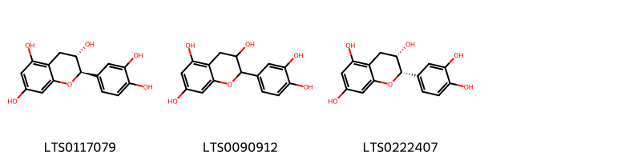{ width=100% }
    <figcaption>Hình ảnh cấu trúc hóa học của 3 hoạt chất thuộc nhóm Flavonoids gồm ['(+)-catechol (LTS0117079)', 'catechol (LTS0090912)', '(+)-epicatechin (LTS0222407)'].</figcaption>
</figure>
#### Nhóm Hydroxy acids and derivatives
<figure markdown="span">
    { width=100% }
    <figcaption>Hình ảnh cấu trúc hóa học của 1 hoạt chất thuộc nhóm Hydroxy acids and derivatives gồm ['diethyl malate (LTS0207399)'].</figcaption>
</figure>
#### Nhóm Organooxygen compounds
<figure markdown="span">
    { width=100% }
    <figcaption>Hình ảnh cấu trúc hóa học của 4 hoạt chất thuộc nhóm Organooxygen compounds gồm ['o1-methyl-glucose (LTS0211293)', '[(2s,3r,4r,5s,6r)-3,4,5-trihydroxy-6-[2-hydroxy-4-(2-hydroxyethyl)phenoxy]oxan-2-yl]methyl 3,4,5-trihydroxybenzoate (LTS0152950)', '{3,4,5-trihydroxy-6-[2-hydroxy-4-(2-hydroxyethyl)phenoxy]oxan-2-yl}methyl 3,4,5-trihydroxybenzoate (LTS0136677)', 'methyl-α-d-mannoside (LTS0012148)'].</figcaption>
</figure>
#### Nhóm Prenol lipids
<figure markdown="span">
    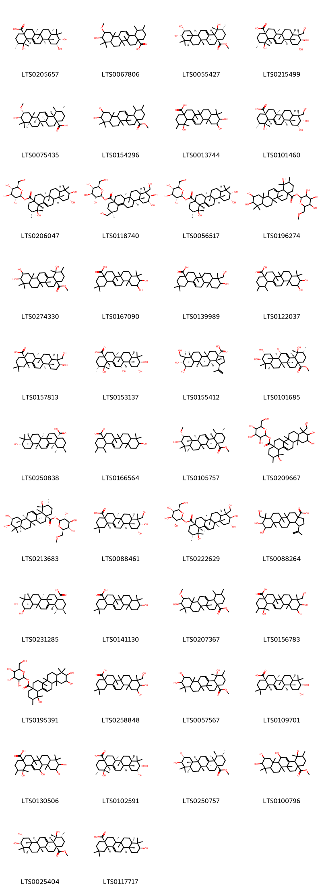{ width=100% }
    <figcaption>Hình ảnh cấu trúc hóa học của 42 hoạt chất thuộc nhóm Prenol lipids gồm ['euscaphic acid (LTS0205657)', '10-hydroxy-11-methoxy-1,2,6a,6b,9,9,12a-heptamethyl-2,3,4,5,6,7,8,8a,10,11,12,12b,13,14b-tetradecahydro-1h-picene-4a-carboxylic acid (LTS0067806)', 'methyl (1r,2r,4as,6as,6br,8ar,10s,11r,12ar,12br,14bs)-1,10,11-trihydroxy-1,2,6a,6b,9,9,12a-heptamethyl-2,3,4,5,6,7,8,8a,10,11,12,12b,13,14b-tetradecahydropicene-4a-carboxylate (LTS0055427)', '19α-hydroxyasiatic acid (LTS0215499)', '(1s,2r,4as,6as,6br,8ar,10r,11r,12ar,12br,14bs)-10-hydroxy-11-methoxy-1,2,6a,6b,9,9,12a-heptamethyl-2,3,4,5,6,7,8,8a,10,11,12,12b,13,14b-tetradecahydro-1h-picene-4a-carboxylic acid (LTS0075435)', 'methyl 10,11-dihydroxy-1,2,6a,6b,9,9,12a-heptamethyl-2,3,4,5,6,7,8,8a,10,11,12,12b,13,14b-tetradecahydro-1h-picene-4a-carboxylate (LTS0154296)', '1,10,11-trihydroxy-1,2,6a,6b,9,9,12a-heptamethyl-2,3,4,5,6,7,8,8a,10,11,12,12b,13,14b-tetradecahydropicene-4a-carboxylic acid (LTS0013744)', '(1r,2r,4as,6as,6br,8ar,9r,10s,11r,12ar,12br,14bs)-1,10,11-trihydroxy-9-(hydroxymethyl)-1,2,6a,6b,9,12a-hexamethyl-2,3,4,5,6,7,8,8a,10,11,12,12b,13,14b-tetradecahydropicene-4a-carboxylic acid (LTS0101460)', '(2s,3r,4s,5s,6r)-3,4,5-trihydroxy-6-(hydroxymethyl)oxan-2-yl (1r,2r,4as,6as,6br,8ar,10r,11r,12ar,12br,14bs)-1,10,11-trihydroxy-1,2,6a,6b,9,9,12a-heptamethyl-2,3,4,5,6,7,8,8a,10,11,12,12b,13,14b-tetradecahydropicene-4a-carboxylate (LTS0206047)', '(2s,3r,4s,5s,6r)-3,4,5-trihydroxy-6-(hydroxymethyl)oxan-2-yl (2s,4ar,6as,6br,8ar,9r,10r,11r,12ar,12br)-10,11-dihydroxy-2,9-bis(hydroxymethyl)-2,6a,6b,9,12a-pentamethyl-1,3,4,5,6,7,8,8a,10,11,12,12b,13,14-tetradecahydropicene-4a-carboxylate (LTS0118740)', '(2s,3r,4s,5s,6r)-3,4,5-trihydroxy-6-(hydroxymethyl)oxan-2-yl (1r,2r,4as,6as,6br,8ar,10s,11r,12ar,12br,14bs)-1,10,11-trihydroxy-1,2,6a,6b,9,9,12a-heptamethyl-2,3,4,5,6,7,8,8a,10,11,12,12b,13,14b-tetradecahydropicene-4a-carboxylate (LTS0056517)', '3,4,5-trihydroxy-6-(methoxymethyl)oxan-2-yl 1,10,11-trihydroxy-1,2,6a,6b,9,9,12a-heptamethyl-2,3,4,5,6,7,8,8a,10,11,12,12b,13,14b-tetradecahydropicene-4a-carboxylate (LTS0196274)', 'methyl 1,10,11-trihydroxy-1,2,6a,6b,9,9,12a-heptamethyl-2,3,4,5,6,7,8,8a,10,11,12,12b,13,14b-tetradecahydropicene-4a-carboxylate (LTS0274330)', '10,11-dihydroxy-2,2,6a,6b,9,9,12a-heptamethyl-1,3,4,5,6,7,8,8a,10,11,12,12b,13,14b-tetradecahydropicene-4a-carboxylic acid (LTS0167090)', '10-hydroxy-9-(hydroxymethyl)-2,2,6a,6b,9,12a-hexamethyl-1,3,4,5,6,7,8,8a,10,11,12,12b,13,14b-tetradecahydropicene-4a-carboxylic acid (LTS0139989)', '10,11-dihydroxy-1,2,6a,6b,9,9,12a-heptamethyl-2,3,4,5,6,7,8,8a,10,11,12,12b,13,14b-tetradecahydro-1h-picene-4a-carboxylic acid (LTS0122037)', 'hederagenin (LTS0157813)', '(1r,2r,4as,6as,6br,8ar,10r,11r,12as,12br,13r,14bs)-1,10,11,13-tetrahydroxy-1,2,6a,6b,9,9,12a-heptamethyl-2,3,4,5,6,7,8,8a,10,11,12,12b,13,14b-tetradecahydropicene-4a-carboxylic acid (LTS0153137)', '(1r,3as,5ar,5br,7ar,8r,9r,10r,11ar,11br,13ar,13br)-9,10-dihydroxy-8-(hydroxymethyl)-5a,5b,8,11a-tetramethyl-1-(prop-1-en-2-yl)-hexadecahydrocyclopenta[a]chrysene-3a-carboxylic acid (LTS0155412)', 'methyl (1r,2r,4as,6as,6br,8ar,10r,11r,12as,12br,13r,14bs)-1,10,11,13-tetrahydroxy-1,2,6a,6b,9,9,12a-heptamethyl-2,3,4,5,6,7,8,8a,10,11,12,12b,13,14b-tetradecahydropicene-4a-carboxylate (LTS0101685)', 'ursolic acid (LTS0250838)', '10-hydroxy-1,2,6a,6b,9,9,12a-heptamethyl-2,3,4,5,6,7,8,8a,10,11,12,12b,13,14b-tetradecahydro-1h-picene-4a-carboxylic acid (LTS0166564)', 'methyl (1s,2r,4as,6as,6br,8ar,10r,11r,12ar,12br,14bs)-10-hydroxy-11-methoxy-1,2,6a,6b,9,9,12a-heptamethyl-2,3,4,5,6,7,8,8a,10,11,12,12b,13,14b-tetradecahydro-1h-picene-4a-carboxylate (LTS0105757)', '3,4,5-trihydroxy-6-(hydroxymethyl)oxan-2-yl 1,10,11-trihydroxy-9-(hydroxymethyl)-1,2,6a,6b,9,12a-hexamethyl-2,3,4,5,6,7,8,8a,10,11,12,12b,13,14b-tetradecahydropicene-4a-carboxylate (LTS0209667)', '(2s,3r,4s,5s,6r)-3,4,5-trihydroxy-6-(methoxymethyl)oxan-2-yl (1r,2r,4as,6as,6br,8ar,10r,11r,12ar,12br,14bs)-1,10,11-trihydroxy-1,2,6a,6b,9,9,12a-heptamethyl-2,3,4,5,6,7,8,8a,10,11,12,12b,13,14b-tetradecahydropicene-4a-carboxylate (LTS0213683)', '(4as,6as,6br,8ar,9r,10s,11r,12ar,12br,14bs)-10,11-dihydroxy-9-(hydroxymethyl)-2,2,6a,6b,9,12a-hexamethyl-1,3,4,5,6,7,8,8a,10,11,12,12b,13,14b-tetradecahydropicene-4a-carboxylic acid (LTS0088461)', '(2s,3r,4s,5s,6r)-3,4,5-trihydroxy-6-(hydroxymethyl)oxan-2-yl (1r,2r,4as,6as,6br,8ar,9r,10r,11r,12ar,12br,14bs)-1,10,11-trihydroxy-9-(hydroxymethyl)-1,2,6a,6b,9,12a-hexamethyl-2,3,4,5,6,7,8,8a,10,11,12,12b,13,14b-tetradecahydropicene-4a-carboxylate (LTS0222629)', '9,10-dihydroxy-8-(hydroxymethyl)-5a,5b,8,11a-tetramethyl-1-(prop-1-en-2-yl)-hexadecahydrocyclopenta[a]chrysene-3a-carboxylic acid (LTS0088264)', 'corosolic acid (LTS0231285)', 'oleanolic acid (LTS0141130)', 'methyl 10-hydroxy-11-methoxy-1,2,6a,6b,9,9,12a-heptamethyl-2,3,4,5,6,7,8,8a,10,11,12,12b,13,14b-tetradecahydro-1h-picene-4a-carboxylate (LTS0207367)', '1,10,11-trihydroxy-9-(hydroxymethyl)-1,2,6a,6b,9,12a-hexamethyl-2,3,4,5,6,7,8,8a,10,11,12,12b,13,14b-tetradecahydropicene-4a-carboxylic acid (LTS0156783)', '3,4,5-trihydroxy-6-(hydroxymethyl)oxan-2-yl 1,10,11-trihydroxy-1,2,6a,6b,9,9,12a-heptamethyl-2,3,4,5,6,7,8,8a,10,11,12,12b,13,14b-tetradecahydropicene-4a-carboxylate (LTS0195391)', '10,11-dihydroxy-9-(hydroxymethyl)-2,2,6a,6b,9,12a-hexamethyl-1,3,4,5,6,7,8,8a,10,11,12,12b,13,14b-tetradecahydropicene-4a-carboxylic acid (LTS0258848)', 'methyl (1r)-1,10,11-trihydroxy-1,2,6a,6b,9,9,12a-heptamethyl-2,3,4,5,6,7,8,8a,10,11,12,12b,13,14b-tetradecahydropicene-4a-carboxylate (LTS0057567)', 'maslinic acid (LTS0109701)', '1,10,11,13-tetrahydroxy-1,2,6a,6b,9,9,12a-heptamethyl-2,3,4,5,6,7,8,8a,10,11,12,12b,13,14b-tetradecahydropicene-4a-carboxylic acid (LTS0130506)', 'tormentic acid (LTS0102591)', 'methyl (1s,2r,4as,6as,6br,8ar,10r,11r,12ar,12br,14bs)-10,11-dihydroxy-1,2,6a,6b,9,9,12a-heptamethyl-2,3,4,5,6,7,8,8a,10,11,12,12b,13,14b-tetradecahydro-1h-picene-4a-carboxylate (LTS0250757)', 'methyl 1,10,11,13-tetrahydroxy-1,2,6a,6b,9,9,12a-heptamethyl-2,3,4,5,6,7,8,8a,10,11,12,12b,13,14b-tetradecahydropicene-4a-carboxylate (LTS0100796)', 'methyl (1r,2r,4as,6as,6br,8ar,10r,11r,12ar,12br,14bs)-1,10,11-trihydroxy-1,2,6a,6b,9,9,12a-heptamethyl-2,3,4,5,6,7,8,8a,10,11,12,12b,13,14b-tetradecahydropicene-4a-carboxylate (LTS0025404)', 'oleanolic acid (LTS0117717)'].</figcaption>
</figure>
#### Nhóm Steroids and steroid derivatives
<figure markdown="span">
    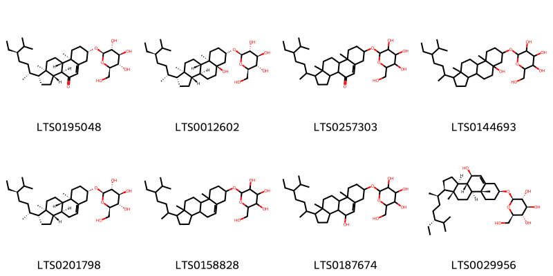{ width=100% }
    <figcaption>Hình ảnh cấu trúc hóa học của 8 hoạt chất thuộc nhóm Steroids and steroid derivatives gồm ['(1r,3as,3bs,7s,9ar,9bs,11ar)-1-[(2r,5r)-5-ethyl-6-methylheptan-2-yl]-9a,11a-dimethyl-7-{[(2r,3r,4s,5s,6r)-3,4,5-trihydroxy-6-(hydroxymethyl)oxan-2-yl]oxy}-1h,2h,3h,3ah,3bh,6h,7h,8h,9h,9bh,10h,11h-cyclopenta[a]phenanthren-4-one (LTS0195048)', '(2r,3r,4s,5s,6r)-2-{[(1r,3as,3bs,5ar,7s,9ar,9bs,11ar)-1-[(2r,5r)-5-ethyl-6-methylheptan-2-yl]-5a-hydroxy-9a,11a-dimethyl-tetradecahydrocyclopenta[a]phenanthren-7-yl]oxy}-6-(hydroxymethyl)oxane-3,4,5-triol (LTS0012602)', '1-(5-ethyl-6-methylheptan-2-yl)-9a,11a-dimethyl-7-{[3,4,5-trihydroxy-6-(hydroxymethyl)oxan-2-yl]oxy}-1h,2h,3h,3ah,3bh,6h,7h,8h,9h,9bh,10h,11h-cyclopenta[a]phenanthren-4-one (LTS0257303)', '2-{[1-(5-ethyl-6-methylheptan-2-yl)-5a-hydroxy-9a,11a-dimethyl-tetradecahydrocyclopenta[a]phenanthren-7-yl]oxy}-6-(hydroxymethyl)oxane-3,4,5-triol (LTS0144693)', 'sitogluside (LTS0201798)', '2-{[1-(5-ethyl-6-methylheptan-2-yl)-9a,11a-dimethyl-1h,2h,3h,3ah,3bh,4h,6h,7h,8h,9h,9bh,10h,11h-cyclopenta[a]phenanthren-7-yl]oxy}-6-(hydroxymethyl)oxane-3,4,5-triol (LTS0158828)', '2-{[1-(5-ethyl-6-methylheptan-2-yl)-4-hydroxy-9a,11a-dimethyl-1h,2h,3h,3ah,3bh,4h,6h,7h,8h,9h,9bh,10h,11h-cyclopenta[a]phenanthren-7-yl]oxy}-6-(hydroxymethyl)oxane-3,4,5-triol (LTS0187674)', '(2r,3r,4s,5s,6r)-2-{[(1r,3as,3bs,4r,7s,9ar,9bs,11ar)-1-[(2r,5r)-5-ethyl-6-methylheptan-2-yl]-4-hydroxy-9a,11a-dimethyl-1h,2h,3h,3ah,3bh,4h,6h,7h,8h,9h,9bh,10h,11h-cyclopenta[a]phenanthren-7-yl]oxy}-6-(hydroxymethyl)oxane-3,4,5-triol (LTS0029956)'].</figcaption>
</figure>
#### Nhóm Tannins
<figure markdown="span">
    { width=100% }
    <figcaption>Hình ảnh cấu trúc hóa học của 36 hoạt chất thuộc nhóm Tannins gồm ['ellagic acid (LTS0037297)', '3,4,5,11,12,21,22,23-octahydroxy-8,18-dioxo-9,14,17-trioxatetracyclo[17.4.0.0²,⁷.0¹⁰,¹⁵]tricosa-1(23),2(7),3,5,19,21-hexaen-13-yl 2-[5-({[3,4,5,14,20,21,22-heptahydroxy-13-(hydroxymethyl)-8,17-dioxo-9,12,16-trioxatetracyclo[16.4.0.0²,⁷.0¹⁰,¹⁵]docosa-1(22),2(7),3,5,18,20-hexaen-11-yl]oxy}carbonyl)-2,3-dihydroxyphenoxy]-3,4,5-trihydroxybenzoate (LTS0038398)', '3,4,5,14,20,21,22-heptahydroxy-13-(hydroxymethyl)-8,17-dioxo-9,12,16-trioxatetracyclo[16.4.0.0²,⁷.0¹⁰,¹⁵]docosa-1(22),2(7),3,5,18,20-hexaen-11-yl 2-{5-[({7,8,9,12,13,14,28,29,30,33,34,35-dodecahydroxy-4,17,25,38-tetraoxo-3,18,21,24,39-pentaoxaheptacyclo[20.17.0.0²,¹⁹.0⁵,¹⁰.0¹¹,¹⁶.0²⁶,³¹.0³²,³⁷]nonatriaconta-5,7,9,11(16),12,14,26,28,30,32(37),33,35-dodecaen-20-yl}oxy)carbonyl]-2,3-dihydroxyphenoxy}-3,4,5-trihydroxybenzoate (LTS0202006)', '3-{6-[({7,8,9,12,13,14,28,29,30,33,34,35-dodecahydroxy-4,17,25,38-tetraoxo-3,18,21,24,39-pentaoxaheptacyclo[20.17.0.0²,¹⁹.0⁵,¹⁰.0¹¹,¹⁶.0²⁶,³¹.0³²,³⁷]nonatriaconta-5,7,9,11(16),12,14,26,28,30,32(37),33,35-dodecaen-20-yl}oxy)carbonyl]-2,3,4-trihydroxyphenoxy}-4,5-dihydroxybenzoic acid (LTS0208883)', '3,4,5,11,12,21,22,23-octahydroxy-8,18-dioxo-9,14,17-trioxatetracyclo[17.4.0.0²,⁷.0¹⁰,¹⁵]tricosa-1(23),2(7),3,5,19,21-hexaen-13-yl 2-{5-[({7,8,9,12,13,14,28,29,30,33,34,35-dodecahydroxy-4,17,25,38-tetraoxo-3,18,21,24,39-pentaoxaheptacyclo[20.17.0.0²,¹⁹.0⁵,¹⁰.0¹¹,¹⁶.0²⁶,³¹.0³²,³⁷]nonatriaconta-5,7,9,11(16),12,14,26,28,30,32(37),33,35-dodecaen-20-yl}oxy)carbonyl]-2,3-dihydroxyphenoxy}-3,4,5-trihydroxybenzoate (LTS0173389)', '7,8,9,12,13,14,28,29,30,33,34,35-dodecahydroxy-4,17,25,38-tetraoxo-3,18,21,24,39-pentaoxaheptacyclo[20.17.0.0²,¹⁹.0⁵,¹⁰.0¹¹,¹⁶.0²⁶,³¹.0³²,³⁷]nonatriaconta-5,7,9,11(16),12,14,26,28,30,32(37),33,35-dodecaen-20-yl 2-[5-({[3,4,5,14,20,21,22-heptahydroxy-13-(hydroxymethyl)-8,17-dioxo-9,12,16-trioxatetracyclo[16.4.0.0²,⁷.0¹⁰,¹⁵]docosa-1(22),2(7),3,5,18,20-hexaen-11-yl]oxy}carbonyl)-2,3-dihydroxyphenoxy]-3,4,5-trihydroxybenzoate (LTS0180266)', '2-{5-[({7,8,9,12,13,14,28,29,30,33,34,35-dodecahydroxy-4,17,25,38-tetraoxo-3,18,21,24,39-pentaoxaheptacyclo[20.17.0.0²,¹⁹.0⁵,¹⁰.0¹¹,¹⁶.0²⁶,³¹.0³²,³⁷]nonatriaconta-5,7,9,11(16),12,14,26,28,30,32(37),33,35-dodecaen-20-yl}oxy)carbonyl]-2,3-dihydroxyphenoxy}-3,4,5-trihydroxybenzoic acid (LTS0061601)', '(1r,2s,19r,20r,22r)-7,8,9,12,13,14,28,29,30,33,34,35-dodecahydroxy-4,17,25,38-tetraoxo-3,18,21,24,39-pentaoxaheptacyclo[20.17.0.0²,¹⁹.0⁵,¹⁰.0¹¹,¹⁶.0²⁶,³¹.0³²,³⁷]nonatriaconta-5,7,9,11(16),12,14,26,28,30,32(37),33,35-dodecaen-20-yl 2-[2,3-dihydroxy-5-({[(10s,11s,12r,13s,15r)-3,4,5,11,13,21,22,23-octahydroxy-8,18-dioxo-9,14,17-trioxatetracyclo[17.4.0.0²,⁷.0¹⁰,¹⁵]tricosa-1(23),2(7),3,5,19,21-hexaen-12-yl]oxy}carbonyl)phenoxy]-3,4,5-trihydroxybenzoate (LTS0187848)', '(1r,2s,19r,20r,22r)-7,8,9,12,13,14,28,29,30,33,34,35-dodecahydroxy-4,17,25,38-tetraoxo-3,18,21,24,39-pentaoxaheptacyclo[20.17.0.0²,¹⁹.0⁵,¹⁰.0¹¹,¹⁶.0²⁶,³¹.0³²,³⁷]nonatriaconta-5,7,9,11(16),12,14,26,28,30,32(37),33,35-dodecaen-20-yl 2-[5-({[(1r,2s,19r,20r,22r)-7,8,9,12,13,14,28,29,30,33,34,35-dodecahydroxy-4,17,25,38-tetraoxo-3,18,21,24,39-pentaoxaheptacyclo[20.17.0.0²,¹⁹.0⁵,¹⁰.0¹¹,¹⁶.0²⁶,³¹.0³²,³⁷]nonatriaconta-5,7,9,11(16),12,14,26,28,30,32(37),33,35-dodecaen-20-yl]oxy}carbonyl)-2,3-dihydroxyphenoxy]-3,4,5-trihydroxybenzoate (LTS0113088)', '(1r,2s,19r,20r,22r)-7,8,9,12,13,14,28,29,30,33,34,35-dodecahydroxy-4,17,25,38-tetraoxo-3,18,21,24,39-pentaoxaheptacyclo[20.17.0.0²,¹⁹.0⁵,¹⁰.0¹¹,¹⁶.0²⁶,³¹.0³²,³⁷]nonatriaconta-5,7,9,11(16),12,14,26,28,30,32(37),33,35-dodecaen-20-yl 2-[5-({[(10r,11r,13r,14r,15s)-3,4,5,14,20,21,22-heptahydroxy-13-(hydroxymethyl)-8,17-dioxo-9,12,16-trioxatetracyclo[16.4.0.0²,⁷.0¹⁰,¹⁵]docosa-1(22),2(7),3,5,18,20-hexaen-11-yl]oxy}carbonyl)-2,3-dihydroxyphenoxy]-3,4,5-trihydroxybenzoate (LTS0164179)', '(10r,11r,13r,14r,15s)-3,4,5,14,20,21,22-heptahydroxy-13-(hydroxymethyl)-8,17-dioxo-9,12,16-trioxatetracyclo[16.4.0.0²,⁷.0¹⁰,¹⁵]docosa-1(22),2(7),3,5,18,20-hexaen-11-yl 2-[5-({[(10r,11r,13r,14r,15s)-3,4,5,14,20,21,22-heptahydroxy-13-(hydroxymethyl)-8,17-dioxo-9,12,16-trioxatetracyclo[16.4.0.0²,⁷.0¹⁰,¹⁵]docosa-1(22),2(7),3,5,18,20-hexaen-11-yl]oxy}carbonyl)-2,3-dihydroxyphenoxy]-3,4,5-trihydroxybenzoate (LTS0175540)', '(10s,11s,13r,14r,15s)-3,4,5,14,20,21,22-heptahydroxy-13-(hydroxymethyl)-8,17-dioxo-9,12,16-trioxatetracyclo[16.4.0.0²,⁷.0¹⁰,¹⁵]docosa-1(22),2(7),3,5,18,20-hexaen-11-yl 3,4,5-trihydroxybenzoate (LTS0272893)', '6-{[3,4-dihydroxy-5-(hydroxymethyl)oxolan-2-yl]oxy}-7,13,14-trihydroxy-2,9-dioxatetracyclo[6.6.2.0⁴,¹⁶.0¹¹,¹⁵]hexadeca-1(15),4,6,8(16),11,13-hexaene-3,10-dione (LTS0191766)', '(10r,11r,13r,14r,15s)-3,4,5,14,20,21,22-heptahydroxy-13-(hydroxymethyl)-8,17-dioxo-9,12,16-trioxatetracyclo[16.4.0.0²,⁷.0¹⁰,¹⁵]docosa-1(22),2(7),3,5,18,20-hexaen-11-yl 3,4,5-trihydroxybenzoate (LTS0176688)', '(10s,11r,12r,13r,15r)-3,4,5,11,12,21,22,23-octahydroxy-8,18-dioxo-9,14,17-trioxatetracyclo[17.4.0.0²,⁷.0¹⁰,¹⁵]tricosa-1(23),2(7),3,5,19,21-hexaen-13-yl 2-[5-({[(1r,2s,19r,20r,22r)-7,8,9,12,13,14,28,29,30,33,34,35-dodecahydroxy-4,17,25,38-tetraoxo-3,18,21,24,39-pentaoxaheptacyclo[20.17.0.0²,¹⁹.0⁵,¹⁰.0¹¹,¹⁶.0²⁶,³¹.0³²,³⁷]nonatriaconta-5,7,9,11(16),12,14,26,28,30,32(37),33,35-dodecaen-20-yl]oxy}carbonyl)-2,3-dihydroxyphenoxy]-3,4,5-trihydroxybenzoate (LTS0138471)', '6,7,14-trihydroxy-13-{[(2r,3r,4s,5r)-3,4,5-trihydroxyoxan-2-yl]oxy}-2,9-dioxatetracyclo[6.6.2.0⁴,¹⁶.0¹¹,¹⁵]hexadeca-1(15),4,6,8(16),11,13-hexaene-3,10-dione (LTS0162363)', '(1r,2s,19r,20r,22r)-7,8,9,12,13,14,28,29,30,33,34,35-dodecahydroxy-4,17,25,38-tetraoxo-3,18,21,24,39-pentaoxaheptacyclo[20.17.0.0²,¹⁹.0⁵,¹⁰.0¹¹,¹⁶.0²⁶,³¹.0³²,³⁷]nonatriaconta-5,7,9,11(16),12,14,26,28,30,32(37),33,35-dodecaen-20-yl 2-[2,3-dihydroxy-5-({[(10s,11s,12r,15r)-3,4,5,11,13,21,22,23-octahydroxy-8,18-dioxo-9,14,17-trioxatetracyclo[17.4.0.0²,⁷.0¹⁰,¹⁵]tricosa-1(23),2(7),3,5,19,21-hexaen-12-yl]oxy}carbonyl)phenoxy]-3,4,5-trihydroxybenzoate (LTS0105116)', '2-[5-({[(10r,11r,13r,14r,15s)-3,4,5,14,20,21,22-heptahydroxy-13-(hydroxymethyl)-8,17-dioxo-9,12,16-trioxatetracyclo[16.4.0.0²,⁷.0¹⁰,¹⁵]docosa-1(22),2(7),3,5,18,20-hexaen-11-yl]oxy}carbonyl)-2,3-dihydroxyphenoxy]-3,4,5-trihydroxybenzoic acid (LTS0274555)', '7,8,9,12,13,14,28,29,30,33,34,35-dodecahydroxy-4,17,25,38-tetraoxo-3,18,21,24,39-pentaoxaheptacyclo[20.17.0.0²,¹⁹.0⁵,¹⁰.0¹¹,¹⁶.0²⁶,³¹.0³²,³⁷]nonatriaconta-5,7,9,11(16),12,14,26,28,30,32(37),33,35-dodecaen-20-yl 2-{2,3-dihydroxy-5-[({3,4,5,11,13,21,22,23-octahydroxy-8,18-dioxo-9,14,17-trioxatetracyclo[17.4.0.0²,⁷.0¹⁰,¹⁵]tricosa-1(23),2(7),3,5,19,21-hexaen-12-yl}oxy)carbonyl]phenoxy}-3,4,5-trihydroxybenzoate (LTS0243458)', '6,7,14-trihydroxy-13-[(3,4,5-trihydroxyoxan-2-yl)oxy]-2,9-dioxatetracyclo[6.6.2.0⁴,¹⁶.0¹¹,¹⁵]hexadeca-1(15),4,6,8(16),11,13-hexaene-3,10-dione (LTS0265081)', '6-{[(2s,3r,4r,5s)-3,4-dihydroxy-5-(hydroxymethyl)oxolan-2-yl]oxy}-7,13,14-trihydroxy-2,9-dioxatetracyclo[6.6.2.0⁴,¹⁶.0¹¹,¹⁵]hexadeca-1(15),4,6,8(16),11,13-hexaene-3,10-dione (LTS0258176)', '(10r,11r,13r,14r,15s)-3,4,5,14,20,21,22-heptahydroxy-13-(hydroxymethyl)-8,17-dioxo-9,12,16-trioxatetracyclo[16.4.0.0²,⁷.0¹⁰,¹⁵]docosa-1(22),2(7),3,5,18,20-hexaen-11-yl 2-[5-({[(1r,2s,19r,20r,22r)-7,8,9,12,13,14,28,29,30,33,34,35-dodecahydroxy-4,17,25,38-tetraoxo-3,18,21,24,39-pentaoxaheptacyclo[20.17.0.0²,¹⁹.0⁵,¹⁰.0¹¹,¹⁶.0²⁶,³¹.0³²,³⁷]nonatriaconta-5,7,9,11(16),12,14,26,28,30,32(37),33,35-dodecaen-20-yl]oxy}carbonyl)-2,3-dihydroxyphenoxy]-3,4,5-trihydroxybenzoate (LTS0217104)', '(1r,2s,19r,20s,22r)-7,8,9,12,13,14,20,28,29,30,33,34,35-tridecahydroxy-3,18,21,24,39-pentaoxaheptacyclo[20.17.0.0²,¹⁹.0⁵,¹⁰.0¹¹,¹⁶.0²⁶,³¹.0³²,³⁷]nonatriaconta-5(10),6,8,11,13,15,26(31),27,29,32,34,36-dodecaene-4,17,25,38-tetrone (LTS0272643)', '(10s,11r,12r,13r,15r)-3,4,5,11,12,21,22,23-octahydroxy-8,18-dioxo-9,14,17-trioxatetracyclo[17.4.0.0²,⁷.0¹⁰,¹⁵]tricosa-1(23),2(7),3,5,19,21-hexaen-13-yl 2-[5-({[(10r,11r,13r,14r,15s)-3,4,5,14,20,21,22-heptahydroxy-13-(hydroxymethyl)-8,17-dioxo-9,12,16-trioxatetracyclo[16.4.0.0²,⁷.0¹⁰,¹⁵]docosa-1(22),2(7),3,5,18,20-hexaen-11-yl]oxy}carbonyl)-2,3-dihydroxyphenoxy]-3,4,5-trihydroxybenzoate (LTS0231291)', '2-[5-({[3,4,5,14,20,21,22-heptahydroxy-13-(hydroxymethyl)-8,17-dioxo-9,12,16-trioxatetracyclo[16.4.0.0²,⁷.0¹⁰,¹⁵]docosa-1(22),2(7),3,5,18,20-hexaen-11-yl]oxy}carbonyl)-2,3-dihydroxyphenoxy]-3,4,5-trihydroxybenzoic acid (LTS0213212)', '7,8,9,12,13,14,20,28,29,30,33,34,35-tridecahydroxy-3,18,21,24,39-pentaoxaheptacyclo[20.17.0.0²,¹⁹.0⁵,¹⁰.0¹¹,¹⁶.0²⁶,³¹.0³²,³⁷]nonatriaconta-5(10),6,8,11,13,15,26(31),27,29,32,34,36-dodecaene-4,17,25,38-tetrone (LTS0221409)', '3-[6-({[(1r,2s,19r,20r,22r)-7,8,9,12,13,14,28,29,30,33,34,35-dodecahydroxy-4,17,25,38-tetraoxo-3,18,21,24,39-pentaoxaheptacyclo[20.17.0.0²,¹⁹.0⁵,¹⁰.0¹¹,¹⁶.0²⁶,³¹.0³²,³⁷]nonatriaconta-5,7,9,11(16),12,14,26,28,30,32(37),33,35-dodecaen-20-yl]oxy}carbonyl)-2,3,4-trihydroxyphenoxy]-4,5-dihydroxybenzoic acid (LTS0239507)', 'casuarictin (LTS0241644)', '3,4,5,14,20,21,22-heptahydroxy-13-(hydroxymethyl)-8,17-dioxo-9,12,16-trioxatetracyclo[16.4.0.0²,⁷.0¹⁰,¹⁵]docosa-1(22),2(7),3,5,18,20-hexaen-11-yl 2-[5-({[3,4,5,14,20,21,22-heptahydroxy-13-(hydroxymethyl)-8,17-dioxo-9,12,16-trioxatetracyclo[16.4.0.0²,⁷.0¹⁰,¹⁵]docosa-1(22),2(7),3,5,18,20-hexaen-11-yl]oxy}carbonyl)-2,3-dihydroxyphenoxy]-3,4,5-trihydroxybenzoate (LTS0233902)', '(1r,2s,19r,20r,22r)-7,8,9,12,13,14,28,29,30,33,34,35-dodecahydroxy-4,17,25,38-tetraoxo-3,18,21,24,39-pentaoxaheptacyclo[20.17.0.0²,¹⁹.0⁵,¹⁰.0¹¹,¹⁶.0²⁶,³¹.0³²,³⁷]nonatriaconta-5,7,9,11(16),12,14,26,28,30,32(37),33,35-dodecaen-20-yl 2-[2,3-dihydroxy-5-({[(10s,11s,12r,13r,15r)-3,4,5,11,13,21,22,23-octahydroxy-8,18-dioxo-9,14,17-trioxatetracyclo[17.4.0.0²,⁷.0¹⁰,¹⁵]tricosa-1(19),2,4,6,20,22-hexaen-12-yl]oxy}carbonyl)phenoxy]-3,4,5-trihydroxybenzoate (LTS0143858)', '(1r,2s,19r,22r)-7,8,9,12,13,14,20,28,29,30,33,34,35-tridecahydroxy-3,18,21,24,39-pentaoxaheptacyclo[20.17.0.0²,¹⁹.0⁵,¹⁰.0¹¹,¹⁶.0²⁶,³¹.0³²,³⁷]nonatriaconta-5(10),6,8,11,13,15,26(31),27,29,32,34,36-dodecaene-4,17,25,38-tetrone (LTS0137167)', '7,8,9,12,13,14,28,29,30,33,34,35-dodecahydroxy-4,17,24,38-tetraoxo-3,18,21,25,39-pentaoxaheptacyclo[20.17.0.0²,¹⁹.0⁵,¹⁰.0¹¹,¹⁶.0²⁶,³¹.0³²,³⁷]nonatriaconta-5(10),6,8,11,13,15,26(31),27,29,32,34,36-dodecaen-20-yl 2-[5-({[3,4,5,14,20,21,22-heptahydroxy-13-(hydroxymethyl)-8,17-dioxo-9,12,16-trioxatetracyclo[16.4.0.0²,⁷.0¹⁰,¹⁵]docosa-1(22),2(7),3,5,18,20-hexaen-11-yl]oxy}carbonyl)-2,3-dihydroxyphenoxy]-3,4,5-trihydroxybenzoate (LTS0055157)', '3,4,5,14,20,21,22-heptahydroxy-13-(hydroxymethyl)-8,17-dioxo-9,12,16-trioxatetracyclo[16.4.0.0²,⁷.0¹⁰,¹⁵]docosa-1(22),2(7),3,5,18,20-hexaen-11-yl 3,4,5-trihydroxybenzoate (LTS0005266)', '2-[5-({[(1r,2s,19r,20r,22r)-7,8,9,12,13,14,28,29,30,33,34,35-dodecahydroxy-4,17,25,38-tetraoxo-3,18,21,24,39-pentaoxaheptacyclo[20.17.0.0²,¹⁹.0⁵,¹⁰.0¹¹,¹⁶.0²⁶,³¹.0³²,³⁷]nonatriaconta-5,7,9,11(16),12,14,26,28,30,32(37),33,35-dodecaen-20-yl]oxy}carbonyl)-2,3-dihydroxyphenoxy]-3,4,5-trihydroxybenzoic acid (LTS0014197)', '7,8,9,12,13,14,28,29,30,33,34,35-dodecahydroxy-4,17,25,38-tetraoxo-3,18,21,24,39-pentaoxaheptacyclo[20.17.0.0²,¹⁹.0⁵,¹⁰.0¹¹,¹⁶.0²⁶,³¹.0³²,³⁷]nonatriaconta-5,7,9,11(16),12,14,26,28,30,32(37),33,35-dodecaen-20-yl 3,4,5-trihydroxybenzoate (LTS0009009)', '7,8,9,12,13,14,28,29,30,33,34,35-dodecahydroxy-4,17,25,38-tetraoxo-3,18,21,24,39-pentaoxaheptacyclo[20.17.0.0²,¹⁹.0⁵,¹⁰.0¹¹,¹⁶.0²⁶,³¹.0³²,³⁷]nonatriaconta-5,7,9,11(16),12,14,26,28,30,32(37),33,35-dodecaen-20-yl 2-{5-[({7,8,9,12,13,14,28,29,30,33,34,35-dodecahydroxy-4,17,25,38-tetraoxo-3,18,21,24,39-pentaoxaheptacyclo[20.17.0.0²,¹⁹.0⁵,¹⁰.0¹¹,¹⁶.0²⁶,³¹.0³²,³⁷]nonatriaconta-5,7,9,11(16),12,14,26,28,30,32(37),33,35-dodecaen-20-yl}oxy)carbonyl]-2,3-dihydroxyphenoxy}-3,4,5-trihydroxybenzoate (LTS0029337)'].</figcaption>
</figure>

---

### Dược dân tộc học

Danh sách các quốc gia có sử dụng *Rosa laevigata* trong điều trị các bệnh. 

| Country   | Disease                                                             | Bệnh                                                                                                                                                                                                |
|:----------|:--------------------------------------------------------------------|:----------------------------------------------------------------------------------------------------------------------------------------------------------------------------------------------------|
| China     | Astringent, Vermifuge, Vulnerary, Carminative, Diuretic, Alexiteric | MYMEMORY WARNING: YOU USED ALL AVAILABLE FREE TRANSLATIONS FOR TODAY. NEXT AVAILABLE IN  11 HOURS 22 MINUTES 21 SECONDS VISIT HTTPS://MYMEMORY.TRANSLATED.NET/DOC/USAGELIMITS.PHP TO TRANSLATE MORE |
| Elsewhere | Antidiarrheic                                                       | MYMEMORY WARNING: YOU USED ALL AVAILABLE FREE TRANSLATIONS FOR TODAY. NEXT AVAILABLE IN  11 HOURS 22 MINUTES 18 SECONDS VISIT HTTPS://MYMEMORY.TRANSLATED.NET/DOC/USAGELIMITS.PHP TO TRANSLATE MORE |

---

---
## Rosa moschata
### Thông tin về thực vật

!!! info "Phân loại thực vật của *Rosa moschata* từ GIBF:"
    - **Kingdom:** Plantae
    - **Phylum:** Tracheophyta
    - **Order:** Rosales
    - **Family:** Rosaceae
    - **Genus:** Rosa
    - **Species:** *Rosa moschata*

 

| Label (VI)   | Label (EN)   | Scientific Name   | Descriptions (VI)   | Descriptions (EN)   | Also Known As (VI)   | Also Known As (EN)   |
|:-------------|:-------------|:------------------|:--------------------|:--------------------|:---------------------|:---------------------|
| N/A          | N/A          | Rosa moschata     | loài thực vật       | species of plant    | ['']                 | ['']                 |

#### Phân bố trên thế giới

**Từ CSDL GIBF** nan, unknown or invalid, Spain, Afghanistan, Germany, Chile, Tunisia, Pakistan, Bhutan, Mongolia, India, Canada, Belgium, Yemen, Mexico, China, Nepal, Norway, United Kingdom of Great Britain and Northern Ireland, Iran (Islamic Republic of), Latvia, France, New Zealand, United States of America, Italy

#### Phân bố tại Việt Nam

**Từ CSDL GIBF**: Không có ghi nhận ở Việt Nam

---
### Thành phần hóa học
        
- Theo cơ sở dữ liệu lotus: Từ loài *Rosa moschata* đã phân lập và xác định được Chưa có hoạt chất nào được phân lập. hoạt chất thuộc về các nhóm Không có hoạt chất nào được phân lập. 

Không có hình ảnh nào được tạo ra

---

### Dược dân tộc học

Danh sách các quốc gia có sử dụng *Rosa moschata* trong điều trị các bệnh. 

| Country   | Disease     | Bệnh                                                                                                                                                                                                |
|:----------|:------------|:----------------------------------------------------------------------------------------------------------------------------------------------------------------------------------------------------|
| English   | Aphrodisiac | MYMEMORY WARNING: YOU USED ALL AVAILABLE FREE TRANSLATIONS FOR TODAY. NEXT AVAILABLE IN  11 HOURS 21 MINUTES 33 SECONDS VISIT HTTPS://MYMEMORY.TRANSLATED.NET/DOC/USAGELIMITS.PHP TO TRANSLATE MORE |

---

---
## Rosa multiflora
### Thông tin về thực vật

!!! info "Phân loại thực vật của *Rosa multiflora* từ GIBF:"
    - **Kingdom:** Plantae
    - **Phylum:** Tracheophyta
    - **Order:** Rosales
    - **Family:** Rosaceae
    - **Genus:** Rosa
    - **Species:** *Rosa multiflora*

 

| Label (VI)   | Label (EN)   | Scientific Name   | Descriptions (VI)   | Descriptions (EN)   | Also Known As (VI)   | Also Known As (EN)   |
|:-------------|:-------------|:------------------|:--------------------|:--------------------|:---------------------|:---------------------|
| N/A          | N/A          | Rosa multiflora   | loài thực vật       | species of plant    | ['Rosa multiflora']  | ['Multiflora Rose']  |

#### Phân bố trên thế giới

**Từ CSDL GIBF** Switzerland, Korea, Republic of, United Kingdom of Great Britain and Northern Ireland, Japan, Sweden, Germany, Canada, United States of America, Austria, China, Belgium, Netherlands, Hong Kong

#### Phân bố tại Việt Nam

**Từ CSDL GIBF**: Không có ghi nhận ở Việt Nam

---
### Thành phần hóa học
        
- Theo cơ sở dữ liệu lotus: Từ loài *Rosa multiflora* đã phân lập và xác định được 49 hoạt chất thuộc về các nhóm Furanoid lignans, Organooxygen compounds, Flavonoids, Tannins, 2-arylbenzofuran flavonoids, Prenol lipids, Steroids and steroid derivatives, Benzene and substituted derivatives. 

|    | chemicalTaxonomyClassyfireClass     |   smiles_count |
|---:|:------------------------------------|---------------:|
|  0 | 2-arylbenzofuran flavonoids         |              1 |
|  1 | Benzene and substituted derivatives |              1 |
|  2 | Flavonoids                          |             24 |
|  3 | Furanoid lignans                    |              4 |
|  4 | Organooxygen compounds              |              1 |
|  5 | Prenol lipids                       |             13 |
|  6 | Steroids and steroid derivatives    |              3 |
|  7 | Tannins                             |              2 |

#### Nhóm 2-arylbenzofuran flavonoids
<figure markdown="span">
    { width=100% }
    <figcaption>Hình ảnh cấu trúc hóa học của 1 hoạt chất thuộc nhóm 2-arylbenzofuran flavonoids gồm ['dehydrodiconiferyl alcohol (LTS0152779)'].</figcaption>
</figure>
#### Nhóm Benzene and substituted derivatives
<figure markdown="span">
    { width=100% }
    <figcaption>Hình ảnh cấu trúc hóa học của 1 hoạt chất thuộc nhóm Benzene and substituted derivatives gồm ['methyl gallate (LTS0043810)'].</figcaption>
</figure>
#### Nhóm Flavonoids
<figure markdown="span">
    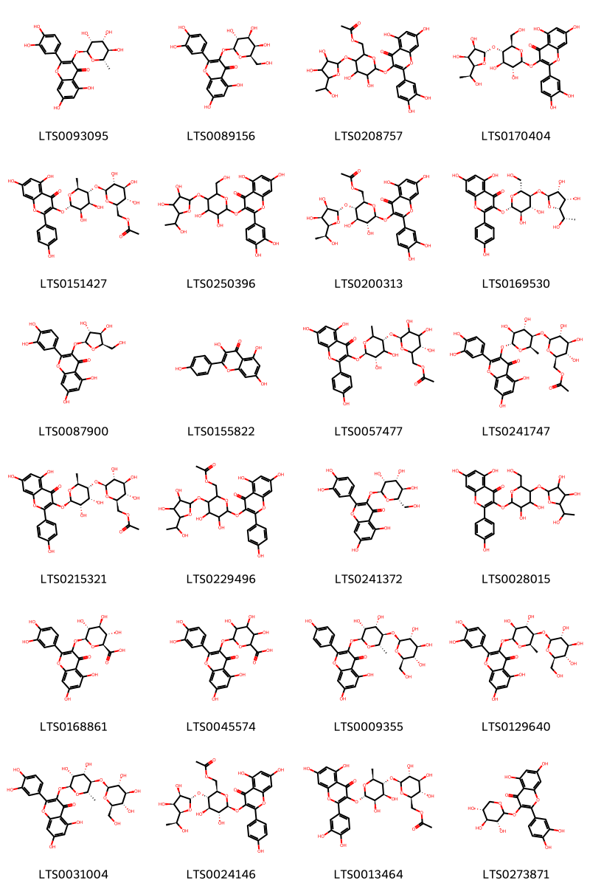{ width=100% }
    <figcaption>Hình ảnh cấu trúc hóa học của 24 hoạt chất thuộc nhóm Flavonoids gồm ['quercitrin (LTS0093095)', 'hyperoside (LTS0089156)', '(3-{[3,4-dihydroxy-5-(1-hydroxyethyl)oxolan-2-yl]oxy}-6-{[2-(3,4-dihydroxyphenyl)-5,7-dihydroxy-4-oxochromen-3-yl]oxy}-4,5-dihydroxyoxan-2-yl)methyl acetate (LTS0208757)', '3-{[(2s,3r,4r,5s,6r)-5-{[(2s,3r,4s,5s)-3,4-dihydroxy-5-[(1s)-1-hydroxyethyl]oxolan-2-yl]oxy}-3,4-dihydroxy-6-(hydroxymethyl)oxan-2-yl]oxy}-2-(3,4-dihydroxyphenyl)-5,7-dihydroxychromen-4-one (LTS0170404)', '[(2r,3s,4s,5r,6s)-6-{[(2s,3r,4s,5r,6s)-6-{[5,7-dihydroxy-2-(4-hydroxyphenyl)-4-oxochromen-3-yl]oxy}-4,5-dihydroxy-2-methyloxan-3-yl]oxy}-3,4,5-trihydroxyoxan-2-yl]methyl acetate (LTS0151427)', '3-[(5-{[3,4-dihydroxy-5-(1-hydroxyethyl)oxolan-2-yl]oxy}-3,4-dihydroxy-6-(hydroxymethyl)oxan-2-yl)oxy]-2-(3,4-dihydroxyphenyl)-5,7-dihydroxychromen-4-one (LTS0250396)', '[(2r,3s,4r,5r,6s)-3-{[(2s,3r,4s,5s)-3,4-dihydroxy-5-[(1s)-1-hydroxyethyl]oxolan-2-yl]oxy}-6-{[2-(3,4-dihydroxyphenyl)-5,7-dihydroxy-4-oxochromen-3-yl]oxy}-4,5-dihydroxyoxan-2-yl]methyl acetate (LTS0200313)', '3-{[(2s,3r,4r,5s,6r)-5-{[(2s,3r,4s,5s)-3,4-dihydroxy-5-[(1s)-1-hydroxyethyl]oxolan-2-yl]oxy}-3,4-dihydroxy-6-(hydroxymethyl)oxan-2-yl]oxy}-5,7-dihydroxy-2-(4-hydroxyphenyl)chromen-4-one (LTS0169530)', '3-{[(2s,3r,4r,5r)-3,4-dihydroxy-5-(hydroxymethyl)oxolan-2-yl]oxy}-2-(3,4-dihydroxyphenyl)-5,7-dihydroxychromen-4-one (LTS0087900)', 'kaempherol (LTS0155822)', 'multiflorin a (LTS0057477)', '[(2r,3s,4s,5r,6s)-6-{[(2r,3r,4s,5s,6r)-6-{[2-(3,4-dihydroxyphenyl)-5,7-dihydroxy-4-oxochromen-3-yl]oxy}-4,5-dihydroxy-2-methyloxan-3-yl]oxy}-3,4,5-trihydroxyoxan-2-yl]methyl acetate (LTS0241747)', '[(2r,3s,4s,5r,6s)-6-{[(2s,3r,4r,5s,6r)-6-{[5,7-dihydroxy-2-(4-hydroxyphenyl)-4-oxochromen-3-yl]oxy}-4,5-dihydroxy-2-methyloxan-3-yl]oxy}-3,4,5-trihydroxyoxan-2-yl]methyl acetate (LTS0215321)', '(6-{[5,7-dihydroxy-2-(4-hydroxyphenyl)-4-oxochromen-3-yl]oxy}-3-{[3,4-dihydroxy-5-(1-hydroxyethyl)oxolan-2-yl]oxy}-4,5-dihydroxyoxan-2-yl)methyl acetate (LTS0229496)', '2-(3,4-dihydroxyphenyl)-5,7-dihydroxy-3-{[(2s,3r,4r,5r,6s)-3,4,5-trihydroxy-6-(hydroxymethyl)oxan-2-yl]oxy}chromen-4-one (LTS0241372)', '3-[(5-{[3,4-dihydroxy-5-(1-hydroxyethyl)oxolan-2-yl]oxy}-3,4-dihydroxy-6-(hydroxymethyl)oxan-2-yl)oxy]-5,7-dihydroxy-2-(4-hydroxyphenyl)chromen-4-one (LTS0028015)', 'querciturone (LTS0168861)', 'miquelianin (LTS0045574)', 'multiflorin b (LTS0009355)', '3-{[(2s,3s,4s,5r,6r)-3,4-dihydroxy-6-methyl-5-{[(2s,3r,4s,5s,6r)-3,4,5-trihydroxy-6-(hydroxymethyl)oxan-2-yl]oxy}oxan-2-yl]oxy}-2-(3,4-dihydroxyphenyl)-5,7-dihydroxychromen-4-one (LTS0129640)', 'multinoside a (LTS0031004)', '[(2r,3s,4r,5r,6s)-6-{[5,7-dihydroxy-2-(4-hydroxyphenyl)-4-oxochromen-3-yl]oxy}-3-{[(2s,3r,4s,5s)-3,4-dihydroxy-5-[(1s)-1-hydroxyethyl]oxolan-2-yl]oxy}-4,5-dihydroxyoxan-2-yl]methyl acetate (LTS0024146)', '[(2r,3s,4s,5r,6s)-6-{[(2s,3r,4s,5r,6s)-6-{[2-(3,4-dihydroxyphenyl)-5,7-dihydroxy-4-oxochromen-3-yl]oxy}-4,5-dihydroxy-2-methyloxan-3-yl]oxy}-3,4,5-trihydroxyoxan-2-yl]methyl acetate (LTS0013464)', '2-(3,4-dihydroxyphenyl)-5,7-dihydroxy-3-{[(3r,4s,5r)-3,4,5-trihydroxyoxan-2-yl]oxy}chromen-4-one (LTS0273871)'].</figcaption>
</figure>
#### Nhóm Furanoid lignans
<figure markdown="span">
    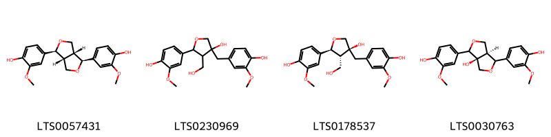{ width=100% }
    <figcaption>Hình ảnh cấu trúc hóa học của 4 hoạt chất thuộc nhóm Furanoid lignans gồm ['pinoresinol (LTS0057431)', '5-(4-hydroxy-3-methoxyphenyl)-3-[(4-hydroxy-3-methoxyphenyl)methyl]-4-(hydroxymethyl)oxolan-3-ol (LTS0230969)', 'olivil (LTS0178537)', '(3as,6as)-1,4-bis(4-hydroxy-3-methoxyphenyl)-tetrahydro-1h-furo[3,4-c]furan-3a-ol (LTS0030763)'].</figcaption>
</figure>
#### Nhóm Organooxygen compounds
<figure markdown="span">
    { width=100% }
    <figcaption>Hình ảnh cấu trúc hóa học của 1 hoạt chất thuộc nhóm Organooxygen compounds gồm ['chlorogenic acid (LTS0226495)'].</figcaption>
</figure>
#### Nhóm Prenol lipids
<figure markdown="span">
    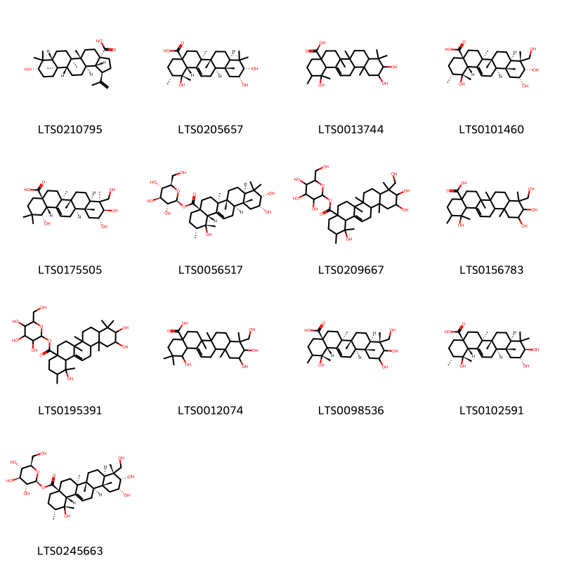{ width=100% }
    <figcaption>Hình ảnh cấu trúc hóa học của 13 hoạt chất thuộc nhóm Prenol lipids gồm ['betulinic acid (LTS0210795)', 'euscaphic acid (LTS0205657)', '1,10,11-trihydroxy-1,2,6a,6b,9,9,12a-heptamethyl-2,3,4,5,6,7,8,8a,10,11,12,12b,13,14b-tetradecahydropicene-4a-carboxylic acid (LTS0013744)', '(1r,2r,4as,6as,6br,8ar,9r,10s,11r,12ar,12br,14bs)-1,10,11-trihydroxy-9-(hydroxymethyl)-1,2,6a,6b,9,12a-hexamethyl-2,3,4,5,6,7,8,8a,10,11,12,12b,13,14b-tetradecahydropicene-4a-carboxylic acid (LTS0101460)', '(1s,4ar,6as,6br,8ar,9s,10r,11r,12ar,12br,14bs)-1,10,11-trihydroxy-9-(hydroxymethyl)-2,2,6a,6b,9,12a-hexamethyl-1,3,4,5,6,7,8,8a,10,11,12,12b,13,14b-tetradecahydropicene-4a-carboxylic acid (LTS0175505)', '(2s,3r,4s,5s,6r)-3,4,5-trihydroxy-6-(hydroxymethyl)oxan-2-yl (1r,2r,4as,6as,6br,8ar,10s,11r,12ar,12br,14bs)-1,10,11-trihydroxy-1,2,6a,6b,9,9,12a-heptamethyl-2,3,4,5,6,7,8,8a,10,11,12,12b,13,14b-tetradecahydropicene-4a-carboxylate (LTS0056517)', '3,4,5-trihydroxy-6-(hydroxymethyl)oxan-2-yl 1,10,11-trihydroxy-9-(hydroxymethyl)-1,2,6a,6b,9,12a-hexamethyl-2,3,4,5,6,7,8,8a,10,11,12,12b,13,14b-tetradecahydropicene-4a-carboxylate (LTS0209667)', '1,10,11-trihydroxy-9-(hydroxymethyl)-1,2,6a,6b,9,12a-hexamethyl-2,3,4,5,6,7,8,8a,10,11,12,12b,13,14b-tetradecahydropicene-4a-carboxylic acid (LTS0156783)', '3,4,5-trihydroxy-6-(hydroxymethyl)oxan-2-yl 1,10,11-trihydroxy-1,2,6a,6b,9,9,12a-heptamethyl-2,3,4,5,6,7,8,8a,10,11,12,12b,13,14b-tetradecahydropicene-4a-carboxylate (LTS0195391)', '1,10,11-trihydroxy-9-(hydroxymethyl)-2,2,6a,6b,9,12a-hexamethyl-1,3,4,5,6,7,8,8a,10,11,12,12b,13,14b-tetradecahydropicene-4a-carboxylic acid (LTS0012074)', '(1r,4as,6as,6br,8ar,9r,12ar,12br,14bs)-1,10,11-trihydroxy-9-(hydroxymethyl)-1,2,6a,6b,9,12a-hexamethyl-2,3,4,5,6,7,8,8a,10,11,12,12b,13,14b-tetradecahydropicene-4a-carboxylic acid (LTS0098536)', 'tormentic acid (LTS0102591)', '(2s,3r,4s,5s,6r)-3,4,5-trihydroxy-6-(hydroxymethyl)oxan-2-yl (1r,2r,4as,6as,6br,8ar,9r,10s,11r,12ar,12br,14bs)-1,10,11-trihydroxy-9-(hydroxymethyl)-1,2,6a,6b,9,12a-hexamethyl-2,3,4,5,6,7,8,8a,10,11,12,12b,13,14b-tetradecahydropicene-4a-carboxylate (LTS0245663)'].</figcaption>
</figure>
#### Nhóm Steroids and steroid derivatives
<figure markdown="span">
    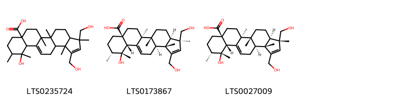{ width=100% }
    <figcaption>Hình ảnh cấu trúc hóa học của 3 hoạt chất thuộc nhóm Steroids and steroid derivatives gồm ['11-hydroxy-1,3-bis(hydroxymethyl)-3,5a,5b,10,11,13b-hexamethyl-3ah,4h,5h,6h,7h,8h,9h,10h,11ah,13h,13ah-cyclopenta[a]chrysene-7a-carboxylic acid (LTS0235724)', '(3s,3ar,5ar,5bs,7as,10r,11r,11as,13as,13br)-11-hydroxy-1,3-bis(hydroxymethyl)-3,5a,5b,10,11,13b-hexamethyl-3ah,4h,5h,6h,7h,8h,9h,10h,11ah,13h,13ah-cyclopenta[a]chrysene-7a-carboxylic acid (LTS0173867)', '(3r,3ar,5ar,5bs,7as,10r,11r,11as,13as,13br)-11-hydroxy-1,3-bis(hydroxymethyl)-3,5a,5b,10,11,13b-hexamethyl-3ah,4h,5h,6h,7h,8h,9h,10h,11ah,13h,13ah-cyclopenta[a]chrysene-7a-carboxylic acid (LTS0027009)'].</figcaption>
</figure>
#### Nhóm Tannins
<figure markdown="span">
    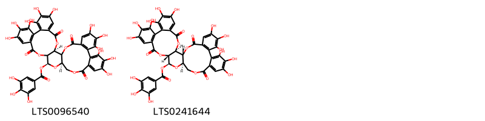{ width=100% }
    <figcaption>Hình ảnh cấu trúc hóa học của 2 hoạt chất thuộc nhóm Tannins gồm ['(2s,20s,22r)-7,8,9,12,13,14,28,29,30,33,34,35-dodecahydroxy-4,17,25,38-tetraoxo-3,18,21,24,39-pentaoxaheptacyclo[20.17.0.0²,¹⁹.0⁵,¹⁰.0¹¹,¹⁶.0²⁶,³¹.0³²,³⁷]nonatriaconta-5,7,9,11(16),12,14,26,28,30,32(37),33,35-dodecaen-20-yl 3,4,5-trihydroxybenzoate (LTS0096540)', 'casuarictin (LTS0241644)'].</figcaption>
</figure>

---

### Dược dân tộc học

Danh sách các quốc gia có sử dụng *Rosa multiflora* trong điều trị các bệnh. 

| Country   | Disease                                                | Bệnh                                                                                                                                                                                                |
|:----------|:-------------------------------------------------------|:----------------------------------------------------------------------------------------------------------------------------------------------------------------------------------------------------|
| China     | Astringent, Carminative, Cathartic, Diuretic, Laxative | MYMEMORY WARNING: YOU USED ALL AVAILABLE FREE TRANSLATIONS FOR TODAY. NEXT AVAILABLE IN  11 HOURS 20 MINUTES 58 SECONDS VISIT HTTPS://MYMEMORY.TRANSLATED.NET/DOC/USAGELIMITS.PHP TO TRANSLATE MORE |
| Elsewhere | nan                                                    | MYMEMORY WARNING: YOU USED ALL AVAILABLE FREE TRANSLATIONS FOR TODAY. NEXT AVAILABLE IN  11 HOURS 20 MINUTES 56 SECONDS VISIT HTTPS://MYMEMORY.TRANSLATED.NET/DOC/USAGELIMITS.PHP TO TRANSLATE MORE |
| Japan     | Laxative                                               | MYMEMORY WARNING: YOU USED ALL AVAILABLE FREE TRANSLATIONS FOR TODAY. NEXT AVAILABLE IN  11 HOURS 20 MINUTES 54 SECONDS VISIT HTTPS://MYMEMORY.TRANSLATED.NET/DOC/USAGELIMITS.PHP TO TRANSLATE MORE |
| Japan*    | Diuretic, Purgative                                    | MYMEMORY WARNING: YOU USED ALL AVAILABLE FREE TRANSLATIONS FOR TODAY. NEXT AVAILABLE IN  11 HOURS 20 MINUTES 51 SECONDS VISIT HTTPS://MYMEMORY.TRANSLATED.NET/DOC/USAGELIMITS.PHP TO TRANSLATE MORE |

---

---
## Rosa polyantha
### Thông tin về thực vật

!!! info "Phân loại thực vật của *N/A* từ GIBF:"
    - **Kingdom:** Plantae
    - **Phylum:** Tracheophyta
    - **Order:** Rosales
    - **Family:** Rosaceae
    - **Genus:** Rosa
    - **Species:** *N/A*

 

| Label (VI)   | Label (EN)   | Scientific Name   | Descriptions (VI)   | Descriptions (EN)   | Also Known As (VI)   | Also Known As (EN)   |
|:-------------|:-------------|:------------------|:--------------------|:--------------------|:---------------------|:---------------------|
| N/A          | N/A          | Rosa multiflora   | loài thực vật       | species of plant    | ['Rosa multiflora']  | ['Multiflora Rose']  |

#### Phân bố trên thế giới

**Từ CSDL GIBF** Denmark, Luxembourg, Spain, Germany, Chile, Austria, Australia, Sweden, Mongolia, Canada, Iraq, Slovakia, Belarus, Ethiopia, Mexico, Ireland, China, Chinese Taipei, United Kingdom of Great Britain and Northern Ireland, Argentina, Portugal, Latvia, France, New Zealand, Russian Federation, United States of America, Italy, Israel

#### Phân bố tại Việt Nam

**Từ CSDL GIBF**: Không có ghi nhận ở Việt Nam

---
### Thành phần hóa học
        
- Theo cơ sở dữ liệu lotus: Từ loài *N/A* đã phân lập và xác định được 1 hoạt chất thuộc về các nhóm Flavonoids. 

|    | chemicalTaxonomyClassyfireClass   |   smiles_count |
|---:|:----------------------------------|---------------:|
|  0 | Flavonoids                        |              1 |

#### Nhóm Flavonoids
<figure markdown="span">
    { width=100% }
    <figcaption>Hình ảnh cấu trúc hóa học của 1 hoạt chất thuộc nhóm Flavonoids gồm ['quercetin (LTS0004651)'].</figcaption>
</figure>

---

### Dược dân tộc học

Danh sách các quốc gia có sử dụng *N/A* trong điều trị các bệnh. 

| Country   | Disease   | Bệnh                                                                                                                                                                                                |
|:----------|:----------|:----------------------------------------------------------------------------------------------------------------------------------------------------------------------------------------------------|
| China     | Cathartic | MYMEMORY WARNING: YOU USED ALL AVAILABLE FREE TRANSLATIONS FOR TODAY. NEXT AVAILABLE IN  11 HOURS 20 MINUTES 09 SECONDS VISIT HTTPS://MYMEMORY.TRANSLATED.NET/DOC/USAGELIMITS.PHP TO TRANSLATE MORE |

---

---
## Rosa x centifolia
### Thông tin về thực vật

!!! info "Phân loại thực vật của *Rosa centifolia* từ GIBF:"
    - **Kingdom:** Plantae
    - **Phylum:** Tracheophyta
    - **Order:** Rosales
    - **Family:** Rosaceae
    - **Genus:** Rosa
    - **Species:** *Rosa centifolia*

 

| Label (VI)   | Label (EN)   | Scientific Name   | Descriptions (VI)   | Descriptions (EN)   | Also Known As (VI)   | Also Known As (EN)   |
|:-------------|:-------------|:------------------|:--------------------|:--------------------|:---------------------|:---------------------|
| N/A          | N/A          | Rosa multiflora   | loài thực vật       | species of plant    | ['Rosa multiflora']  | ['Multiflora Rose']  |

#### Phân bố trên thế giới

**Từ CSDL GIBF** nan, unknown or invalid, Denmark, El Salvador, Luxembourg, Germany, Austria, Australia, Colombia, Pakistan, Sweden, Poland, Canada, Belgium, Netherlands, Finland, Japan, Brazil, Peru, Hungary, Estonia, Mexico, China, Norway, Switzerland, United Kingdom of Great Britain and Northern Ireland, Latvia, France, New Zealand, Romania, Costa Rica, Paraguay, Russian Federation, Ecuador, United States of America, Ukraine

#### Phân bố tại Việt Nam

**Từ CSDL GIBF**: Không có ghi nhận ở Việt Nam

---
### Thành phần hóa học
        
- Theo cơ sở dữ liệu lotus: Từ loài *Rosa centifolia* đã phân lập và xác định được Chưa có hoạt chất nào được phân lập. hoạt chất thuộc về các nhóm Không có hoạt chất nào được phân lập. 

Không có hình ảnh nào được tạo ra

---

### Dược dân tộc học

Danh sách các quốc gia có sử dụng *Rosa centifolia* trong điều trị các bệnh. 

| Country   | Disease    | Bệnh                                                                                                                                                                                                |
|:----------|:-----------|:----------------------------------------------------------------------------------------------------------------------------------------------------------------------------------------------------|
| Elsewhere | Astringent | MYMEMORY WARNING: YOU USED ALL AVAILABLE FREE TRANSLATIONS FOR TODAY. NEXT AVAILABLE IN  11 HOURS 19 MINUTES 36 SECONDS VISIT HTTPS://MYMEMORY.TRANSLATED.NET/DOC/USAGELIMITS.PHP TO TRANSLATE MORE |

---

# Chi Cydonia

??? note "Danh sách các dược liệu thuộc chi"
    
	 - *Cydonia oblonga*

---
## Cydonia oblonga
### Thông tin về thực vật

!!! info "Phân loại thực vật của *Cydonia oblonga* từ GIBF:"
    - **Kingdom:** Plantae
    - **Phylum:** Tracheophyta
    - **Order:** Rosales
    - **Family:** Rosaceae
    - **Genus:** Cydonia
    - **Species:** *Cydonia oblonga*

 

| Label (VI)   | Label (EN)   | Scientific Name   | Descriptions (VI)   | Descriptions (EN)                                      | Also Known As (VI)   | Also Known As (EN)        |
|:-------------|:-------------|:------------------|:--------------------|:-------------------------------------------------------|:---------------------|:--------------------------|
| N/A          | N/A          | Cydonia oblonga   | loài thực vật       | species of flowering plant in the rose family Rosaceae | ['Cydonia oblonga']  | ['quince', 'quince tree'] |

#### Phân bố trên thế giới

**Từ CSDL GIBF** Honduras, Georgia, Denmark, Spain, Germany, Azerbaijan, Chile, Austria, Australia, Pakistan, Sweden, Montenegro, Canada, Belgium, Slovakia, Netherlands, Türkiye, Peru, Hungary, Bulgaria, Switzerland, Uruguay, United Kingdom of Great Britain and Northern Ireland, South Africa, Portugal, Morocco, France, New Zealand, Romania, Russian Federation, Ecuador, United States of America, Algeria, Italy, Greece, Croatia, Ukraine

#### Phân bố tại Việt Nam

**Từ CSDL GIBF**: Không có ghi nhận ở Việt Nam

---
### Thành phần hóa học
        
- Theo cơ sở dữ liệu lotus: Từ loài *Cydonia oblonga* đã phân lập và xác định được 170 hoạt chất thuộc về các nhóm Organooxygen compounds, Flavonoids, Lactones, Oxolanes, Unsaturated hydrocarbons, Oxepanes, Phenol esters, Prenol lipids, Fatty Acyls, Saccharolipids, Phenols, Tetrahydrofurans, Steroids and steroid derivatives, Benzene and substituted derivatives. 

|    | chemicalTaxonomyClassyfireClass     |   smiles_count |
|---:|:------------------------------------|---------------:|
|  0 | Benzene and substituted derivatives |             15 |
|  1 | Fatty Acyls                         |             41 |
|  2 | Flavonoids                          |             15 |
|  3 | Lactones                            |              4 |
|  4 | Organooxygen compounds              |             27 |
|  5 | Oxepanes                            |              2 |
|  6 | Oxolanes                            |              1 |
|  7 | Phenol esters                       |              8 |
|  8 | Phenols                             |              4 |
|  9 | Prenol lipids                       |             35 |
| 10 | Saccharolipids                      |              2 |
| 11 | Steroids and steroid derivatives    |             11 |
| 12 | Tetrahydrofurans                    |              2 |
| 13 | Unsaturated hydrocarbons            |              3 |

#### Nhóm Benzene and substituted derivatives
<figure markdown="span">
    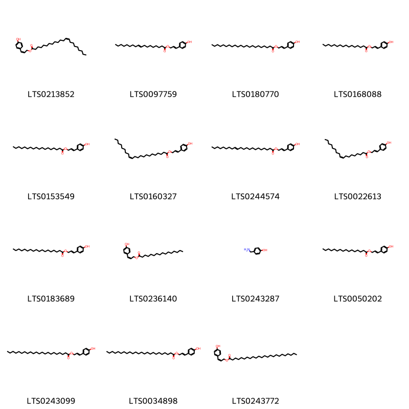{ width=100% }
    <figcaption>Hình ảnh cấu trúc hóa học của 15 hoạt chất thuộc nhóm Benzene and substituted derivatives gồm ['(2z)-3-(4-hydroxyphenyl)prop-2-en-1-yl (13z)-docos-13-enoate (LTS0213852)', '3-(4-hydroxyphenyl)prop-2-en-1-yl octadec-9-enoate (LTS0097759)', '3-(4-hydroxyphenyl)prop-2-en-1-yl docosanoate (LTS0180770)', '(2e)-3-(4-hydroxyphenyl)prop-2-en-1-yl hexadecanoate (LTS0168088)', '(2e)-3-(4-hydroxyphenyl)prop-2-en-1-yl octadecanoate (LTS0153549)', '(2e)-3-(4-hydroxyphenyl)prop-2-en-1-yl (13z)-docos-13-enoate (LTS0160327)', '3-(4-hydroxyphenyl)prop-2-en-1-yl docos-13-enoate (LTS0244574)', '(2e)-3-(4-hydroxyphenyl)prop-2-en-1-yl (9z)-octadec-9-enoate (LTS0022613)', '3-(4-hydroxyphenyl)prop-2-en-1-yl octadecanoate (LTS0183689)', '(2z)-3-(4-hydroxyphenyl)prop-2-en-1-yl hexadecanoate (LTS0236140)', '4-hydroxybenzylamine (LTS0243287)', '3-(4-hydroxyphenyl)prop-2-en-1-yl hexadecanoate (LTS0050202)', '(2e)-3-(4-hydroxyphenyl)prop-2-en-1-yl docosanoate (LTS0243099)', '3-(4-hydroxyphenyl)prop-2-en-1-yl tetracosanoate (LTS0034898)', '(2z)-3-(4-hydroxyphenyl)prop-2-en-1-yl tetracosanoate (LTS0243772)'].</figcaption>
</figure>
#### Nhóm Fatty Acyls
<figure markdown="span">
    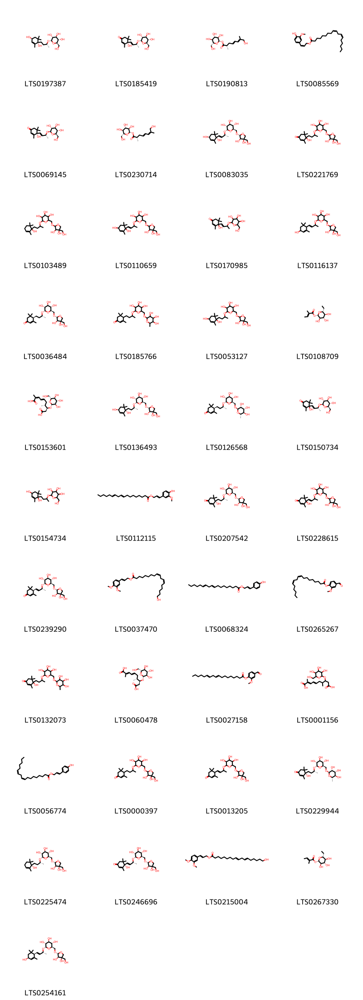{ width=100% }
    <figcaption>Hình ảnh cấu trúc hóa học của 41 hoạt chất thuộc nhóm Fatty Acyls gồm ['(2s,3r,4s,5s,6r)-2-{[(2r)-4-[(1s,4s)-1,4-dihydroxy-2,6,6-trimethylcyclohex-2-en-1-yl]butan-2-yl]oxy}-6-(hydroxymethyl)oxane-3,4,5-triol (LTS0197387)', '(4s)-4-hydroxy-3,5,5-trimethyl-4-[(1e,3r)-3-{[(2s,3r,4s,5s,6r)-3,4,5-trihydroxy-6-(hydroxymethyl)oxan-2-yl]oxy}but-1-en-1-yl]cyclohex-2-en-1-one (LTS0185419)', '(2s,3r,4s,5s,6r)-3,4,5-trihydroxy-6-(hydroxymethyl)oxan-2-yl (2s,4e,6e)-8-hydroxy-2,7-dimethylocta-4,6-dienoate (LTS0190813)', '(2z)-3-(4-hydroxy-3-methoxyphenyl)prop-2-en-1-yl (9z,12z)-octadeca-9,12-dienoate (LTS0085569)', '(4s)-4-hydroxy-3,5,5-trimethyl-4-[(1e,3r)-3-{[(2r,3r,4s,5s,6r)-3,4,5-trihydroxy-6-(hydroxymethyl)oxan-2-yl]oxy}but-1-en-1-yl]cyclohex-2-en-1-one (LTS0069145)', '(2s,3r,4s,5s,6r)-3,4,5-trihydroxy-6-(hydroxymethyl)oxan-2-yl (2s)-8-hydroxy-2,7-dimethylocta-4,6-dienoate (LTS0230714)', '(2s,3r,4s,5s,6r)-2-{[(2r,3e)-4-[(1s,4s)-1,4-dihydroxy-2,6,6-trimethylcyclohex-2-en-1-yl]but-3-en-2-yl]oxy}-6-({[(2r,3r,4r)-3,4-dihydroxy-4-(hydroxymethyl)oxolan-2-yl]oxy}methyl)oxane-3,4,5-triol (LTS0083035)', '4-(3-{[6-({[3,4-dihydroxy-4-(hydroxymethyl)oxolan-2-yl]oxy}methyl)-3,4,5-trihydroxyoxan-2-yl]oxy}butyl)-4-hydroxy-3,5,5-trimethylcyclohex-2-en-1-one (LTS0221769)', '2-({[3,4-dihydroxy-4-(hydroxymethyl)oxolan-2-yl]oxy}methyl)-6-{[4-(1-hydroxy-2,6,6-trimethylcyclohex-2-en-1-yl)butan-2-yl]oxy}oxane-3,4,5-triol (LTS0103489)', '2-{[4-(1,4-dihydroxy-2,6,6-trimethylcyclohex-2-en-1-yl)but-3-en-2-yl]oxy}-6-({[3,4-dihydroxy-4-(hydroxymethyl)oxolan-2-yl]oxy}methyl)oxane-3,4,5-triol (LTS0110659)', '4-hydroxy-3,5,5-trimethyl-4-(3-{[3,4,5-trihydroxy-6-(hydroxymethyl)oxan-2-yl]oxy}but-1-en-1-yl)cyclohex-2-en-1-one (LTS0170985)', '2-({[3,4-dihydroxy-4-(hydroxymethyl)oxolan-2-yl]oxy}methyl)-6-{[4-(4-hydroxy-2,6,6-trimethylcyclohex-2-en-1-yl)but-3-en-2-yl]oxy}oxane-3,4,5-triol (LTS0116137)', '(4r)-4-[(3r)-3-{[(2s,3r,4s,5s,6r)-6-({[(2r,3r,4r)-3,4-dihydroxy-4-(hydroxymethyl)oxolan-2-yl]oxy}methyl)-3,4,5-trihydroxyoxan-2-yl]oxy}butyl]-3,5,5-trimethylcyclohex-2-en-1-one (LTS0036484)', '3,5,5-trimethyl-4-{3-[(3,4,5-trihydroxy-6-{[(3,4,5-trihydroxy-6-methyloxan-2-yl)oxy]methyl}oxan-2-yl)oxy]butyl}cyclohex-2-en-1-one (LTS0185766)', '2-{[4-(1,4-dihydroxy-2,6,6-trimethylcyclohex-2-en-1-yl)butan-2-yl]oxy}-6-({[3,4-dihydroxy-4-(hydroxymethyl)oxolan-2-yl]oxy}methyl)oxane-3,4,5-triol (LTS0053127)', '(2s,3r,4s,5s,6r)-6-ethyl-3,4,5-trihydroxyoxan-2-yl 2-methylbut-2-enoate (LTS0108709)', '(2z,4e,7r,8s)-2,7-dimethyl-8-{[(2r,3r,4s,5s,6r)-3,4,5-trihydroxy-6-(hydroxymethyl)oxan-2-yl]oxy}deca-2,4-dienedioic acid (LTS0153601)', '(2s,3r,4s,5s,6r)-2-{[(2r)-4-[(1s,4s)-1,4-dihydroxy-2,6,6-trimethylcyclohex-2-en-1-yl]butan-2-yl]oxy}-6-({[(2r,3r,4r)-3,4-dihydroxy-4-(hydroxymethyl)oxolan-2-yl]oxy}methyl)oxane-3,4,5-triol (LTS0136493)', '(4r)-3,5,5-trimethyl-4-[(3r)-3-{[(2s,3r,4s,5s,6r)-3,4,5-trihydroxy-6-({[(2r,3r,4r,5r,6s)-3,4,5-trihydroxy-6-methyloxan-2-yl]oxy}methyl)oxan-2-yl]oxy}butyl]cyclohex-2-en-1-one (LTS0126568)', '4-hydroxy-3,5,5-trimethyl-4-[(1e,3r)-3-{[(2r,3r,4s,5s,6r)-3,4,5-trihydroxy-6-(hydroxymethyl)oxan-2-yl]oxy}but-1-en-1-yl]cyclohex-2-en-1-one (LTS0150734)', '2-{[4-(1,4-dihydroxy-2,6,6-trimethylcyclohex-2-en-1-yl)butan-2-yl]oxy}-6-(hydroxymethyl)oxane-3,4,5-triol (LTS0154734)', '3-(4-hydroxy-3-methoxyphenyl)prop-2-en-1-yl octadeca-9,12-dienoate (LTS0112115)', '(4s)-4-[(3r)-3-{[(2s,3r,4s,5s,6r)-6-({[(2r,3r,4r)-3,4-dihydroxy-4-(hydroxymethyl)oxolan-2-yl]oxy}methyl)-3,4,5-trihydroxyoxan-2-yl]oxy}butyl]-4-hydroxy-3,5,5-trimethylcyclohex-2-en-1-one (LTS0207542)', '4-(3-{[6-({[3,4-dihydroxy-4-(hydroxymethyl)oxolan-2-yl]oxy}methyl)-3,4,5-trihydroxyoxan-2-yl]oxy}but-1-en-1-yl)-4-hydroxy-3,5,5-trimethylcyclohex-2-en-1-one (LTS0228615)', '(4r)-4-[(1e,3r)-3-{[(2s,3r,4s,5s,6r)-6-({[(2r,3r,4r)-3,4-dihydroxy-4-(hydroxymethyl)oxolan-2-yl]oxy}methyl)-3,4,5-trihydroxyoxan-2-yl]oxy}but-1-en-1-yl]-3,5,5-trimethylcyclohex-2-en-1-one (LTS0239290)', '(2e)-3-(3,4-dimethoxyphenyl)prop-2-en-1-yl (9z,12z)-18-hydroxyoctadeca-9,12-dienoate (LTS0037470)', '3-(4-hydroxyphenyl)prop-2-en-1-yl octadeca-9,12-dienoate (LTS0068324)', '4-formyl-2-methoxyphenyl (9z,12z)-octadeca-9,12-dienoate (LTS0265267)', '4-hydroxy-3,5,5-trimethyl-4-{3-[(3,4,5-trihydroxy-6-{[(3,4,5-trihydroxy-6-methyloxan-2-yl)oxy]methyl}oxan-2-yl)oxy]butyl}cyclohex-2-en-1-one (LTS0132073)', '(2e,4e,7r,8s)-2,7-dimethyl-8-{[(2r,3r,4s,5s,6r)-3,4,5-trihydroxy-6-(hydroxymethyl)oxan-2-yl]oxy}deca-2,4-dienedioic acid (LTS0060478)', '4-formyl-2-methoxyphenyl octadeca-9,12-dienoate (LTS0027158)', '2,7-dimethyl-8-{[3,4,5-trihydroxy-6-(hydroxymethyl)oxan-2-yl]oxy}deca-2,4-dienedioic acid (LTS0001156)', '(2e)-3-(4-hydroxyphenyl)prop-2-en-1-yl (9z,12z)-octadeca-9,12-dienoate (LTS0056774)', '4-(3-{[6-({[3,4-dihydroxy-4-(hydroxymethyl)oxolan-2-yl]oxy}methyl)-3,4,5-trihydroxyoxan-2-yl]oxy}butyl)-3,5,5-trimethylcyclohex-2-en-1-one (LTS0000397)', '4-(3-{[6-({[3,4-dihydroxy-4-(hydroxymethyl)oxolan-2-yl]oxy}methyl)-3,4,5-trihydroxyoxan-2-yl]oxy}but-1-en-1-yl)-3,5,5-trimethylcyclohex-2-en-1-one (LTS0013205)', '(4s)-4-hydroxy-3,5,5-trimethyl-4-[(3r)-3-{[(2s,3r,4s,5s,6r)-3,4,5-trihydroxy-6-({[(2r,3r,4r,5r,6s)-3,4,5-trihydroxy-6-methyloxan-2-yl]oxy}methyl)oxan-2-yl]oxy}butyl]cyclohex-2-en-1-one (LTS0229944)', '(2r,3s,4s,5r,6s)-2-({[(2r,3r,4r)-3,4-dihydroxy-4-(hydroxymethyl)oxolan-2-yl]oxy}methyl)-6-{[(2r)-4-[(1s)-1-hydroxy-2,6,6-trimethylcyclohex-2-en-1-yl]butan-2-yl]oxy}oxane-3,4,5-triol (LTS0225474)', '(4s)-4-[(1e,3r)-3-{[(2s,3r,4s,5s,6r)-6-({[(2r,3r,4r)-3,4-dihydroxy-4-(hydroxymethyl)oxolan-2-yl]oxy}methyl)-3,4,5-trihydroxyoxan-2-yl]oxy}but-1-en-1-yl]-4-hydroxy-3,5,5-trimethylcyclohex-2-en-1-one (LTS0246696)', '3-(3,4-dimethoxyphenyl)prop-2-en-1-yl 18-hydroxyoctadeca-9,12-dienoate (LTS0215004)', '(2s,3r,4s,5s,6r)-6-ethyl-3,4,5-trihydroxyoxan-2-yl (2e)-2-methylbut-2-enoate (LTS0267330)', '(2r,3s,4s,5r,6s)-2-({[(2r,3r,4r)-3,4-dihydroxy-4-(hydroxymethyl)oxolan-2-yl]oxy}methyl)-6-{[(2r,3e)-4-[(1r,4s)-4-hydroxy-2,6,6-trimethylcyclohex-2-en-1-yl]but-3-en-2-yl]oxy}oxane-3,4,5-triol (LTS0254161)'].</figcaption>
</figure>
#### Nhóm Flavonoids
<figure markdown="span">
    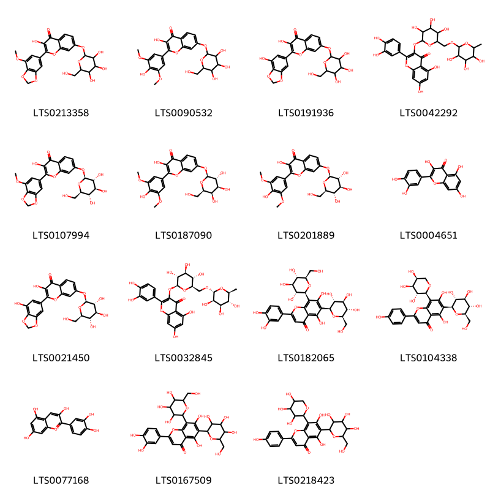{ width=100% }
    <figcaption>Hình ảnh cấu trúc hóa học của 15 hoạt chất thuộc nhóm Flavonoids gồm ['3-hydroxy-2-(7-methoxy-2h-1,3-benzodioxol-5-yl)-7-{[3,4,5-trihydroxy-6-(hydroxymethyl)oxan-2-yl]oxy}chromen-4-one (LTS0213358)', '3-hydroxy-2-(4-hydroxy-3,5-dimethoxyphenyl)-7-{[3,4,5-trihydroxy-6-(hydroxymethyl)oxan-2-yl]oxy}chromen-4-one (LTS0090532)', '3-hydroxy-2-(7-hydroxy-2h-1,3-benzodioxol-5-yl)-7-{[3,4,5-trihydroxy-6-(hydroxymethyl)oxan-2-yl]oxy}chromen-4-one (LTS0191936)', 'rutin (LTS0042292)', '3-hydroxy-2-(7-methoxy-2h-1,3-benzodioxol-5-yl)-7-{[(2s,3r,4s,5s,6r)-3,4,5-trihydroxy-6-(hydroxymethyl)oxan-2-yl]oxy}chromen-4-one (LTS0107994)', '3-hydroxy-2-(4-hydroxy-3,5-dimethoxyphenyl)-7-{[(2s,3r,4s,5r,6r)-3,4,5-trihydroxy-6-(hydroxymethyl)oxan-2-yl]oxy}chromen-4-one (LTS0187090)', '3-hydroxy-2-(4-hydroxy-3,5-dimethoxyphenyl)-7-{[(2s,3r,4s,5s,6r)-3,4,5-trihydroxy-6-(hydroxymethyl)oxan-2-yl]oxy}chromen-4-one (LTS0201889)', 'quercetin (LTS0004651)', '3-hydroxy-2-(7-hydroxy-2h-1,3-benzodioxol-5-yl)-7-{[(2s,3r,4s,5s,6r)-3,4,5-trihydroxy-6-(hydroxymethyl)oxan-2-yl]oxy}chromen-4-one (LTS0021450)', '3-rutinosyl quercetin (LTS0032845)', 'lucenin-2 (LTS0182065)', 'schaftoside (LTS0104338)', 'cyanidin (LTS0077168)', '2-(3,4-dihydroxyphenyl)-5,7-dihydroxy-6,8-bis[3,4,5-trihydroxy-6-(hydroxymethyl)oxan-2-yl]chromen-4-one (LTS0167509)', '5,7-dihydroxy-2-(4-hydroxyphenyl)-6-[3,4,5-trihydroxy-6-(hydroxymethyl)oxan-2-yl]-8-(3,4,5-trihydroxyoxan-2-yl)chromen-4-one (LTS0218423)'].</figcaption>
</figure>
#### Nhóm Lactones
<figure markdown="span">
    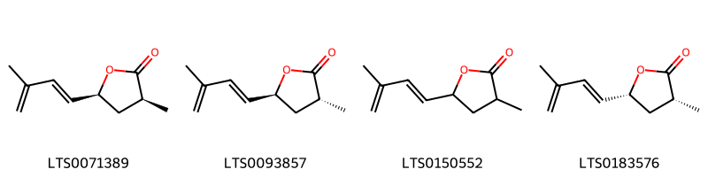{ width=100% }
    <figcaption>Hình ảnh cấu trúc hóa học của 4 hoạt chất thuộc nhóm Lactones gồm ['(3s,5s)-3-methyl-5-[(1e)-3-methylbuta-1,3-dien-1-yl]oxolan-2-one (LTS0071389)', '(3r,5s)-3-methyl-5-[(1e)-3-methylbuta-1,3-dien-1-yl]oxolan-2-one (LTS0093857)', '3-methyl-5-(3-methylbuta-1,3-dien-1-yl)oxolan-2-one (LTS0150552)', '(3r,5r)-3-methyl-5-[(1e)-3-methylbuta-1,3-dien-1-yl]oxolan-2-one (LTS0183576)'].</figcaption>
</figure>
#### Nhóm Organooxygen compounds
<figure markdown="span">
    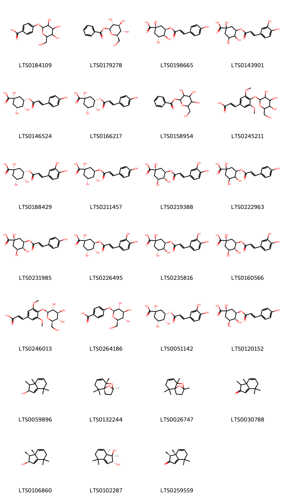{ width=100% }
    <figcaption>Hình ảnh cấu trúc hóa học của 27 hoạt chất thuộc nhóm Organooxygen compounds gồm ['4-{[3,4,5-trihydroxy-6-(hydroxymethyl)oxan-2-yl]oxy}benzoic acid (LTS0184109)', 'benzoyl-β-d-glucoside (LTS0179278)', '(1r,3r,4s,5r)-1,3,4-trihydroxy-5-{[(2e)-3-(4-hydroxyphenyl)prop-2-enoyl]oxy}cyclohexane-1-carboxylic acid (LTS0198665)', '3-{[3-(3,4-dihydroxyphenyl)prop-2-enoyl]oxy}-1,4,5-trihydroxycyclohexane-1-carboxylic acid (LTS0143901)', '(1s,3r,4r,5s)-1,3,4-trihydroxy-5-{[3-(4-hydroxyphenyl)prop-2-enoyl]oxy}cyclohexane-1-carboxylic acid (LTS0146524)', '(1s,3r,4r,5s)-1,3,4-trihydroxy-5-{[(2e)-3-(4-hydroxyphenyl)prop-2-enoyl]oxy}cyclohexane-1-carboxylic acid (LTS0166217)', 'benzoyl-β-d-glucoside (LTS0158954)', '3-(3,5-dimethoxy-4-{[3,4,5-trihydroxy-6-(hydroxymethyl)oxan-2-yl]oxy}phenyl)prop-2-enoic acid (LTS0245211)', '(1s,3s,4r,5r)-3-{[3-(3,4-dihydroxyphenyl)prop-2-enoyl]oxy}-1,4,5-trihydroxycyclohexane-1-carboxylic acid (LTS0188429)', '(1s,3r,4r,5r)-1,3,4-trihydroxy-5-{[(2e)-3-(4-hydroxyphenyl)prop-2-enoyl]oxy}cyclohexane-1-carboxylic acid (LTS0211457)', '(1r,3r,4s,5s)-3-{[3-(3,4-dihydroxyphenyl)prop-2-enoyl]oxy}-1,4,5-trihydroxycyclohexane-1-carboxylic acid (LTS0219388)', '1,3,4-trihydroxy-5-{[3-(4-hydroxyphenyl)prop-2-enoyl]oxy}cyclohexane-1-carboxylic acid (LTS0222963)', '(1r,3s,4s,5r)-1,3,4-trihydroxy-5-{[3-(4-hydroxyphenyl)prop-2-enoyl]oxy}cyclohexane-1-carboxylic acid (LTS0231985)', 'chlorogenic acid (LTS0226495)', 'neochlorogenic acid (LTS0235816)', '(1r,3r,4s,5s)-3-{[(2e)-3-(3,4-dihydroxyphenyl)prop-2-enoyl]oxy}-1,4,5-trihydroxycyclohexane-1-carboxylic acid (LTS0160566)', '(2e)-3-(3,5-dimethoxy-4-{[(2s,3r,4s,5s,6r)-3,4,5-trihydroxy-6-(hydroxymethyl)oxan-2-yl]oxy}phenyl)prop-2-enoic acid (LTS0246013)', '4-(β-d-glucosyloxy)benzoate (LTS0264186)', '(1s,3s,4r,5r)-3-{[(2e)-3-(3,4-dihydroxyphenyl)prop-2-enoyl]oxy}-1,4,5-trihydroxycyclohexane-1-carboxylic acid (LTS0051142)', '(1r,3s,4s,5r)-1,3,4-trihydroxy-5-{[(2e)-3-(4-hydroxyphenyl)prop-2-enoyl]oxy}cyclohexane-1-carboxylic acid (LTS0120152)', '1,4,4,7a-tetramethyl-2,5-dihydro-1h-inden-2-ol (LTS0059896)', '(1r,6s,8r)-2,2,6,8-tetramethyl-7,11-dioxatricyclo[6.2.1.0¹,⁶]undec-4-ene (LTS0132244)', '2,2,6,8-tetramethyl-7,11-dioxatricyclo[6.2.1.0¹,⁶]undec-4-ene (LTS0026747)', '1,4,4,7a-tetramethyl-1,5-dihydroinden-2-one (LTS0030788)', '(1s,2r,7as)-1,4,4,7a-tetramethyl-2,5-dihydro-1h-inden-2-ol (LTS0106860)', '(1r,2r,7ar)-1,4,4,7a-tetramethyl-2,5-dihydroindene-1,2-diol (LTS0102287)', '(1s,7as)-1,4,4,7a-tetramethyl-1,5-dihydroinden-2-one (LTS0259559)'].</figcaption>
</figure>
#### Nhóm Oxepanes
<figure markdown="span">
    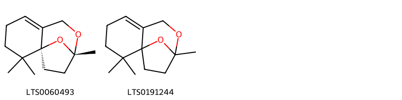{ width=100% }
    <figcaption>Hình ảnh cấu trúc hóa học của 2 hoạt chất thuộc nhóm Oxepanes gồm ['(1s,9s)-2,2,9-trimethyl-8,12-dioxatricyclo[7.2.1.0¹,⁶]dodec-5-ene (LTS0060493)', '2,2,9-trimethyl-8,12-dioxatricyclo[7.2.1.0¹,⁶]dodec-5-ene (LTS0191244)'].</figcaption>
</figure>
#### Nhóm Oxolanes
<figure markdown="span">
    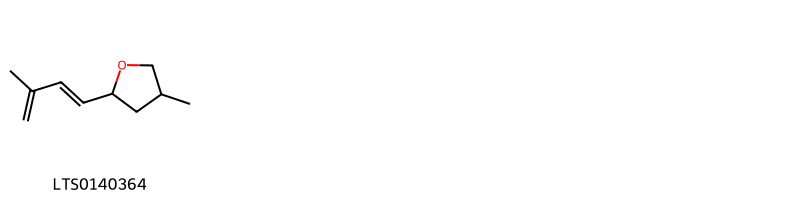{ width=100% }
    <figcaption>Hình ảnh cấu trúc hóa học của 1 hoạt chất thuộc nhóm Oxolanes gồm ['4-methyl-2-(3-methylbuta-1,3-dien-1-yl)oxolane (LTS0140364)'].</figcaption>
</figure>
#### Nhóm Phenol esters
<figure markdown="span">
    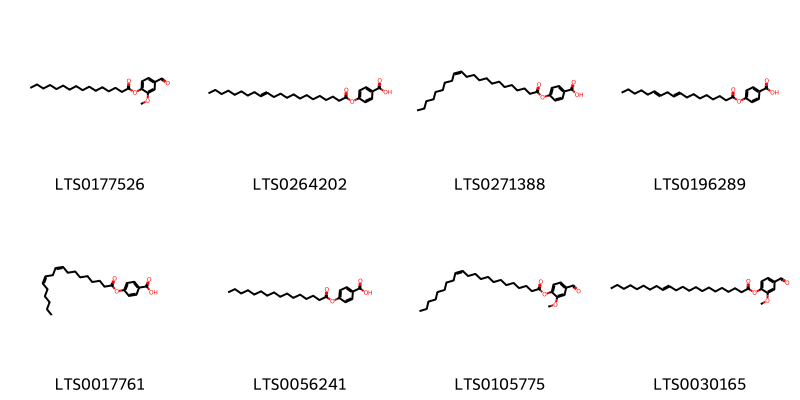{ width=100% }
    <figcaption>Hình ảnh cấu trúc hóa học của 8 hoạt chất thuộc nhóm Phenol esters gồm ['4-formyl-2-methoxyphenyl hexadecanoate (LTS0177526)', '4-(docos-13-enoyloxy)benzoic acid (LTS0264202)', '4-[(13z)-docos-13-enoyloxy]benzoic acid (LTS0271388)', '4-(octadeca-9,12-dienoyloxy)benzoic acid (LTS0196289)', '4-[(9z,12z)-octadeca-9,12-dienoyloxy]benzoic acid (LTS0017761)', '4-(hexadecanoyloxy)benzoic acid (LTS0056241)', '4-formyl-2-methoxyphenyl (13z)-docos-13-enoate (LTS0105775)', '4-formyl-2-methoxyphenyl docos-13-enoate (LTS0030165)'].</figcaption>
</figure>
#### Nhóm Phenols
<figure markdown="span">
    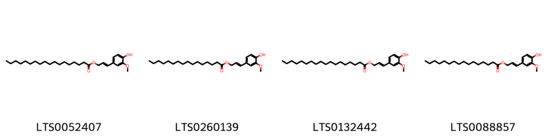{ width=100% }
    <figcaption>Hình ảnh cấu trúc hóa học của 4 hoạt chất thuộc nhóm Phenols gồm ['(2e)-3-(4-hydroxy-3-methoxyphenyl)prop-2-en-1-yl octadecanoate (LTS0052407)', '(2e)-3-(4-hydroxy-3-methoxyphenyl)prop-2-en-1-yl hexadecanoate (LTS0260139)', '3-(4-hydroxy-3-methoxyphenyl)prop-2-en-1-yl octadecanoate (LTS0132442)', '3-(4-hydroxy-3-methoxyphenyl)prop-2-en-1-yl hexadecanoate (LTS0088857)'].</figcaption>
</figure>
#### Nhóm Prenol lipids
<figure markdown="span">
    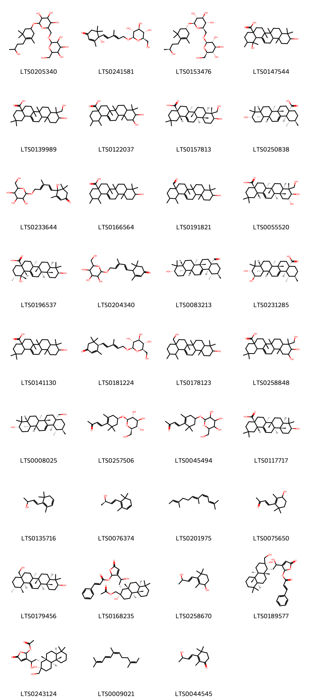{ width=100% }
    <figcaption>Hình ảnh cấu trúc hóa học của 35 hoạt chất thuộc nhóm Prenol lipids gồm ['2-{[4-(3-hydroxybutyl)-3,5,5-trimethylcyclohex-3-en-1-yl]oxy}-6-({[3,4,5-trihydroxy-6-(hydroxymethyl)oxan-2-yl]oxy}methyl)oxane-3,4,5-triol (LTS0205340)', '(4s)-4-hydroxy-3,5,5-trimethyl-4-[(1e,3e)-3-methyl-5-{[(2r,3r,4s,5s,6r)-3,4,5-trihydroxy-6-(hydroxymethyl)oxan-2-yl]oxy}penta-1,3-dien-1-yl]cyclohex-2-en-1-one (LTS0241581)', '(2r,3r,4s,5s,6r)-2-{[(1r)-4-[(3s)-3-hydroxybutyl]-3,5,5-trimethylcyclohex-3-en-1-yl]oxy}-6-({[(2r,3r,4s,5s,6r)-3,4,5-trihydroxy-6-(hydroxymethyl)oxan-2-yl]oxy}methyl)oxane-3,4,5-triol (LTS0153476)', '1,10-dihydroxy-1,2,6a,6b,9,9,12a-heptamethyl-2,3,4,5,6,7,8,8a,10,11,12,12b,13,14b-tetradecahydropicene-4a-carboxylic acid (LTS0147544)', '10-hydroxy-9-(hydroxymethyl)-2,2,6a,6b,9,12a-hexamethyl-1,3,4,5,6,7,8,8a,10,11,12,12b,13,14b-tetradecahydropicene-4a-carboxylic acid (LTS0139989)', '10,11-dihydroxy-1,2,6a,6b,9,9,12a-heptamethyl-2,3,4,5,6,7,8,8a,10,11,12,12b,13,14b-tetradecahydro-1h-picene-4a-carboxylic acid (LTS0122037)', 'hederagenin (LTS0157813)', 'ursolic acid (LTS0250838)', '4-hydroxy-3,5,5-trimethyl-4-(3-methyl-5-{[3,4,5-trihydroxy-6-(hydroxymethyl)oxan-2-yl]oxy}penta-1,3-dien-1-yl)cyclohex-2-en-1-one (LTS0233644)', '10-hydroxy-1,2,6a,6b,9,9,12a-heptamethyl-2,3,4,5,6,7,8,8a,10,11,12,12b,13,14b-tetradecahydro-1h-picene-4a-carboxylic acid (LTS0166564)', '10-hydroxy-1,2,6a,6b,9,9,12a-heptamethyl-2,3,4,5,6,7,8,8a,10,11,12,12b,13,14b-tetradecahydro-1h-picene-4a-carbaldehyde (LTS0191821)', 'arjunolic acid (LTS0055520)', 'pomolic acid (LTS0196537)', '3,5,5-trimethyl-4-(3-methyl-5-{[3,4,5-trihydroxy-6-(hydroxymethyl)oxan-2-yl]oxy}penta-1,3-dien-1-yl)cyclohex-2-en-1-one (LTS0204340)', '(1s,2r,4as,6as,6br,8ar,10s,12ar,12br,14bs)-10-hydroxy-1,2,6a,6b,9,9,12a-heptamethyl-2,3,4,5,6,7,8,8a,10,11,12,12b,13,14b-tetradecahydro-1h-picene-4a-carbaldehyde (LTS0083213)', 'corosolic acid (LTS0231285)', 'oleanolic acid (LTS0141130)', '(4r)-3,5,5-trimethyl-4-[(1e,3e)-3-methyl-5-{[(2r,3r,4s,5s,6r)-3,4,5-trihydroxy-6-(hydroxymethyl)oxan-2-yl]oxy}penta-1,3-dien-1-yl]cyclohex-2-en-1-one (LTS0181224)', '8a-(hydroxymethyl)-4,4,6a,6b,11,12,14b-heptamethyl-2,3,4a,5,6,7,8,9,10,11,12,12a,14,14a-tetradecahydro-1h-picen-3-ol (LTS0178123)', '10,11-dihydroxy-9-(hydroxymethyl)-2,2,6a,6b,9,12a-hexamethyl-1,3,4,5,6,7,8,8a,10,11,12,12b,13,14b-tetradecahydropicene-4a-carboxylic acid (LTS0258848)', 'uvaol (LTS0008025)', '(3e)-4-[(4r)-2,6,6-trimethyl-4-{[(2r,3r,4s,5s,6r)-3,4,5-trihydroxy-6-(hydroxymethyl)oxan-2-yl]oxy}cyclohex-1-en-1-yl]but-3-en-2-one (LTS0257506)', '4-(2,6,6-trimethyl-4-{[3,4,5-trihydroxy-6-(hydroxymethyl)oxan-2-yl]oxy}cyclohex-1-en-1-yl)but-3-en-2-one (LTS0045494)', 'oleanolic acid (LTS0117717)', '4-(2,6,6-trimethylcyclohexa-1,3-dien-1-yl)but-3-en-2-ol (LTS0135716)', '(2r,3e)-4-(2,6,6-trimethylcyclohexa-1,3-dien-1-yl)but-3-en-2-ol (LTS0076374)', '(4z,6e,10e)-2,6,10-trimethyldodeca-2,4,6,10-tetraene (LTS0201975)', '(3e)-4-(3-hydroxy-2,6,6-trimethylcyclohex-1-en-1-yl)but-3-en-2-one (LTS0075650)', '(3s,4ar,6ar,6bs,8as,11r,12s,12ar,14ar,14br)-8a-(hydroxymethyl)-4,4,6a,6b,11,12,14b-heptamethyl-2,3,4a,5,6,7,8,9,10,11,12,12a,14,14a-tetradecahydro-1h-picen-3-ol (LTS0179456)', '3-{2-[(1r,2s,4ar,4bs,8as,10ar)-2-[(acetyloxy)methyl]-2-hydroxy-4b,8,8,10a-tetramethyl-decahydrophenanthren-1-yl]-1-hydroxyethyl}-5-oxo-2h-furan-2-yl (2e)-3-phenylprop-2-enoate (LTS0168235)', '3-[(1e)-3-hydroxybut-1-en-1-yl]-2,4,4-trimethylcyclohex-2-en-1-ol (LTS0258670)', '3-{2-[(1r,2s,4ar,4bs,8as,10ar)-2-hydroxy-2-(hydroxymethyl)-4b,8,8,10a-tetramethyl-decahydrophenanthren-1-yl]-1-hydroxyethyl}-5-oxo-2h-furan-2-yl (2e)-3-phenylprop-2-enoate (LTS0189577)', '3-{2-[(1r,2s,4ar,4bs,8as,10ar)-2-hydroxy-2-(hydroxymethyl)-4b,8,8,10a-tetramethyl-decahydrophenanthren-1-yl]-1-hydroxyethyl}-5-oxo-2h-furan-2-yl acetate (LTS0243124)', '2,6,10-trimethyldodeca-2,4,6,10-tetraene (LTS0009021)', '3-[(1e)-3-hydroxybut-1-en-1-yl]-2,4,4-trimethylcyclohex-2-en-1-one (LTS0044545)'].</figcaption>
</figure>
#### Nhóm Saccharolipids
<figure markdown="span">
    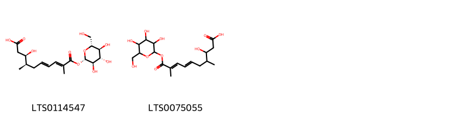{ width=100% }
    <figcaption>Hình ảnh cấu trúc hóa học của 2 hoạt chất thuộc nhóm Saccharolipids gồm ['(3r,4r,6e,8e)-3-hydroxy-4,9-dimethyl-10-oxo-10-{[(2s,3r,4s,5s,6r)-3,4,5-trihydroxy-6-(hydroxymethyl)oxan-2-yl]oxy}deca-6,8-dienoic acid (LTS0114547)', '3-hydroxy-4,9-dimethyl-10-oxo-10-{[3,4,5-trihydroxy-6-(hydroxymethyl)oxan-2-yl]oxy}deca-6,8-dienoic acid (LTS0075055)'].</figcaption>
</figure>
#### Nhóm Steroids and steroid derivatives
<figure markdown="span">
    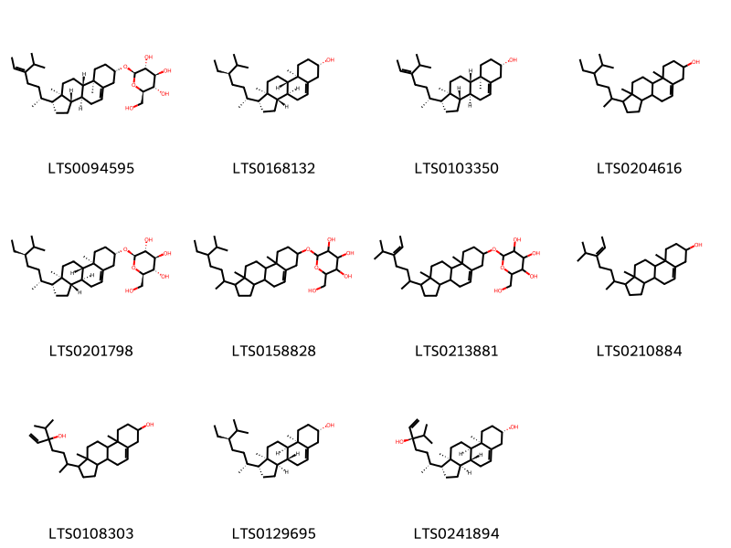{ width=100% }
    <figcaption>Hình ảnh cấu trúc hóa học của 11 hoạt chất thuộc nhóm Steroids and steroid derivatives gồm ['(2r,3r,4s,5s,6r)-2-{[(1r,3as,3bs,7s,9ar,9bs,11ar)-1-[(2r,5z)-5-isopropylhept-5-en-2-yl]-9a,11a-dimethyl-1h,2h,3h,3ah,3bh,4h,6h,7h,8h,9h,9bh,10h,11h-cyclopenta[a]phenanthren-7-yl]oxy}-6-(hydroxymethyl)oxane-3,4,5-triol (LTS0094595)', 'sitosterol (LTS0168132)', 'avenasterol (LTS0103350)', 'stigmast-5-en-3-ol, (3β)- (LTS0204616)', 'sitogluside (LTS0201798)', '2-{[1-(5-ethyl-6-methylheptan-2-yl)-9a,11a-dimethyl-1h,2h,3h,3ah,3bh,4h,6h,7h,8h,9h,9bh,10h,11h-cyclopenta[a]phenanthren-7-yl]oxy}-6-(hydroxymethyl)oxane-3,4,5-triol (LTS0158828)', '2-(hydroxymethyl)-6-{[1-(5-isopropylhept-5-en-2-yl)-9a,11a-dimethyl-1h,2h,3h,3ah,3bh,4h,6h,7h,8h,9h,9bh,10h,11h-cyclopenta[a]phenanthren-7-yl]oxy}oxane-3,4,5-triol (LTS0213881)', '1-(5-isopropylhept-5-en-2-yl)-9a,11a-dimethyl-1h,2h,3h,3ah,3bh,4h,6h,7h,8h,9h,9bh,10h,11h-cyclopenta[a]phenanthren-7-ol (LTS0210884)', '1-(5-hydroxy-5-isopropylhept-6-en-2-yl)-9a,11a-dimethyl-1h,2h,3h,3ah,3bh,4h,6h,7h,8h,9h,9bh,10h,11h-cyclopenta[a]phenanthren-7-ol (LTS0108303)', '(1r,3ar,3br,7s,9ar,9br,11ar)-1-[(2r,5r)-5-ethyl-6-methylheptan-2-yl]-9a,11a-dimethyl-1h,2h,3h,3ah,3bh,4h,6h,7h,8h,9h,9bh,10h,11h-cyclopenta[a]phenanthren-7-ol (LTS0129695)', '(1r,3ar,3br,7s,9ar,9br,11ar)-1-[(2r,5r)-5-hydroxy-5-isopropylhept-6-en-2-yl]-9a,11a-dimethyl-1h,2h,3h,3ah,3bh,4h,6h,7h,8h,9h,9bh,10h,11h-cyclopenta[a]phenanthren-7-ol (LTS0241894)'].</figcaption>
</figure>
#### Nhóm Tetrahydrofurans
<figure markdown="span">
    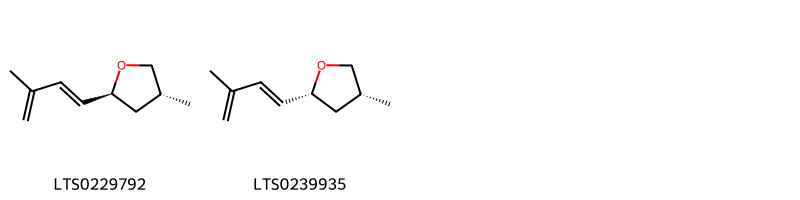{ width=100% }
    <figcaption>Hình ảnh cấu trúc hóa học của 2 hoạt chất thuộc nhóm Tetrahydrofurans gồm ['(2s,4r)-4-methyl-2-[(1e)-3-methylbuta-1,3-dien-1-yl]oxolane (LTS0229792)', '(2r,4r)-4-methyl-2-[(1e)-3-methylbuta-1,3-dien-1-yl]oxolane (LTS0239935)'].</figcaption>
</figure>
#### Nhóm Unsaturated hydrocarbons
<figure markdown="span">
    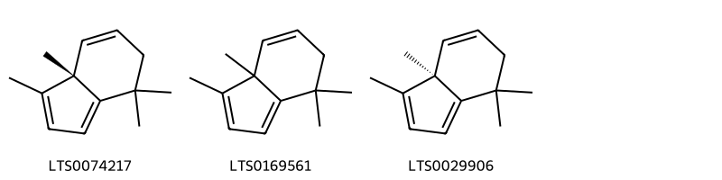{ width=100% }
    <figcaption>Hình ảnh cấu trúc hóa học của 3 hoạt chất thuộc nhóm Unsaturated hydrocarbons gồm ['(7as)-1,4,4,7a-tetramethyl-5h-indene (LTS0074217)', '1,4,4,7a-tetramethyl-5h-indene (LTS0169561)', '(7ar)-1,4,4,7a-tetramethyl-5h-indene (LTS0029906)'].</figcaption>
</figure>

---

### Dược dân tộc học

Danh sách các quốc gia có sử dụng *Cydonia oblonga* trong điều trị các bệnh. 

| Country   | Disease                                                           | Bệnh                                                                                                                                                                                                |
|:----------|:------------------------------------------------------------------|:----------------------------------------------------------------------------------------------------------------------------------------------------------------------------------------------------|
| China     | Astringent, Carminative, Digestive, Refrigerant, Antivinous       | MYMEMORY WARNING: YOU USED ALL AVAILABLE FREE TRANSLATIONS FOR TODAY. NEXT AVAILABLE IN  11 HOURS 19 MINUTES 05 SECONDS VISIT HTTPS://MYMEMORY.TRANSLATED.NET/DOC/USAGELIMITS.PHP TO TRANSLATE MORE |
| Elsewhere | Antidiarrheic, Astringent, Cardiac, Demulcent, Expectorant, Tonic | MYMEMORY WARNING: YOU USED ALL AVAILABLE FREE TRANSLATIONS FOR TODAY. NEXT AVAILABLE IN  11 HOURS 19 MINUTES 02 SECONDS VISIT HTTPS://MYMEMORY.TRANSLATED.NET/DOC/USAGELIMITS.PHP TO TRANSLATE MORE |
| Iraq      | Demulcent                                                         | MYMEMORY WARNING: YOU USED ALL AVAILABLE FREE TRANSLATIONS FOR TODAY. NEXT AVAILABLE IN  11 HOURS 18 MINUTES 56 SECONDS VISIT HTTPS://MYMEMORY.TRANSLATED.NET/DOC/USAGELIMITS.PHP TO TRANSLATE MORE |
| Mexico    | Astringent, Emollient, Stimulant                                  | MYMEMORY WARNING: YOU USED ALL AVAILABLE FREE TRANSLATIONS FOR TODAY. NEXT AVAILABLE IN  11 HOURS 18 MINUTES 50 SECONDS VISIT HTTPS://MYMEMORY.TRANSLATED.NET/DOC/USAGELIMITS.PHP TO TRANSLATE MORE |
| Turkey    | Diuretic, Emollient, Astringent, Cardiac, Demulcent, Tonic        | MYMEMORY WARNING: YOU USED ALL AVAILABLE FREE TRANSLATIONS FOR TODAY. NEXT AVAILABLE IN  11 HOURS 18 MINUTES 46 SECONDS VISIT HTTPS://MYMEMORY.TRANSLATED.NET/DOC/USAGELIMITS.PHP TO TRANSLATE MORE |

---

# Chi Fragaria

??? note "Danh sách các dược liệu thuộc chi"
    
	 - *Fragaria indica*
	 - *Fragaria silvestris*
	 - *Fragaria vesca*
	 - *Fragaria virginiana*

---
## Fragaria indica
### Thông tin về thực vật

!!! info "Phân loại thực vật của *N/A* từ GIBF:"
    - **Kingdom:** Plantae
    - **Phylum:** Tracheophyta
    - **Order:** Rosales
    - **Family:** Rosaceae
    - **Genus:** N/A
    - **Species:** *N/A*

 

| Label (VI)   | Label (EN)   | Scientific Name   | Descriptions (VI)   | Descriptions (EN)   | Also Known As (VI)   | Also Known As (EN)   |
|:-------------|:-------------|:------------------|:--------------------|:--------------------|:---------------------|:---------------------|
| N/A          | N/A          | Fragaria indica   | loài thực vật       | species of plant    | ['']                 | ['']                 |

#### Phân bố trên thế giới

**Từ CSDL GIBF** Denmark, Spain, Germany, Chile, Isle of Man, Australia, India, Canada, Finland, Türkiye, Japan, Ireland, Chinese Taipei, Hong Kong, United Kingdom of Great Britain and Northern Ireland, Argentina, Portugal, South Africa, France, Czechia, New Zealand, Russian Federation, United States of America, Italy, Israel, Ukraine

#### Phân bố tại Việt Nam

**Từ CSDL GIBF**: Không có ghi nhận ở Việt Nam

---
### Thành phần hóa học
        
- Theo cơ sở dữ liệu lotus: Từ loài *N/A* đã phân lập và xác định được Chưa có hoạt chất nào được phân lập. hoạt chất thuộc về các nhóm Không có hoạt chất nào được phân lập. 

Không có hình ảnh nào được tạo ra

---

### Dược dân tộc học

Danh sách các quốc gia có sử dụng *N/A* trong điều trị các bệnh. 

| Country   | Disease              | Bệnh                                                                                                                                                                                                |
|:----------|:---------------------|:----------------------------------------------------------------------------------------------------------------------------------------------------------------------------------------------------|
| China     | Antidote, Antiseptic | MYMEMORY WARNING: YOU USED ALL AVAILABLE FREE TRANSLATIONS FOR TODAY. NEXT AVAILABLE IN  11 HOURS 17 MINUTES 58 SECONDS VISIT HTTPS://MYMEMORY.TRANSLATED.NET/DOC/USAGELIMITS.PHP TO TRANSLATE MORE |

---

---
## Fragaria silvestris
### Thông tin về thực vật

!!! info "Phân loại thực vật của *Fragaria vesca* từ GIBF:"
    - **Kingdom:** Plantae
    - **Phylum:** Tracheophyta
    - **Order:** Rosales
    - **Family:** Rosaceae
    - **Genus:** Fragaria
    - **Species:** *Fragaria vesca*

 

| Label (VI)   | Label (EN)   | Scientific Name   | Descriptions (VI)   | Descriptions (EN)   | Also Known As (VI)   | Also Known As (EN)   |
|:-------------|:-------------|:------------------|:--------------------|:--------------------|:---------------------|:---------------------|
| N/A          | N/A          | Fragaria indica   | loài thực vật       | species of plant    | ['']                 | ['']                 |

#### Phân bố trên thế giới

**Từ CSDL GIBF** Denmark, Spain, Germany, Chile, Isle of Man, Australia, India, Canada, Finland, Türkiye, Japan, Ireland, Chinese Taipei, Hong Kong, United Kingdom of Great Britain and Northern Ireland, Argentina, Portugal, South Africa, France, Czechia, New Zealand, Russian Federation, United States of America, Italy, Israel, Ukraine

#### Phân bố tại Việt Nam

**Từ CSDL GIBF**: Không có ghi nhận ở Việt Nam

---
### Thành phần hóa học
        
- Theo cơ sở dữ liệu lotus: Từ loài *Fragaria vesca* đã phân lập và xác định được Chưa có hoạt chất nào được phân lập. hoạt chất thuộc về các nhóm Không có hoạt chất nào được phân lập. 

Không có hình ảnh nào được tạo ra

---

### Dược dân tộc học

Danh sách các quốc gia có sử dụng *Fragaria vesca* trong điều trị các bệnh. 

| Country   | Disease                                                 | Bệnh                                                                                                                                                                                                |
|:----------|:--------------------------------------------------------|:----------------------------------------------------------------------------------------------------------------------------------------------------------------------------------------------------|
| Turkey    | Astringent, Discutient, Laxative, Refrigerant, Diuretic | MYMEMORY WARNING: YOU USED ALL AVAILABLE FREE TRANSLATIONS FOR TODAY. NEXT AVAILABLE IN  11 HOURS 17 MINUTES 35 SECONDS VISIT HTTPS://MYMEMORY.TRANSLATED.NET/DOC/USAGELIMITS.PHP TO TRANSLATE MORE |

---

---
## Fragaria vesca
### Thông tin về thực vật

!!! info "Phân loại thực vật của *Fragaria vesca* từ GIBF:"
    - **Kingdom:** Plantae
    - **Phylum:** Tracheophyta
    - **Order:** Rosales
    - **Family:** Rosaceae
    - **Genus:** Fragaria
    - **Species:** *Fragaria vesca*

 

| Label (VI)   | Label (EN)   | Scientific Name   | Descriptions (VI)   | Descriptions (EN)   | Also Known As (VI)   | Also Known As (EN)                                                                                              |
|:-------------|:-------------|:------------------|:--------------------|:--------------------|:---------------------|:----------------------------------------------------------------------------------------------------------------|
| N/A          | N/A          | Fragaria vesca    | loài thực vật       | species of plant    | ['']                 | ['woodland strawberry', 'Alpine strawberry', 'Carpathian strawberry', 'European strawberry', 'wild strawberry'] |

#### Phân bố trên thế giới

**Từ CSDL GIBF** Denmark, Spain, Germany, Austria, Dominican Republic, Sweden, Poland, Canada, Slovakia, Netherlands, Slovenia, Mexico, Ireland, Norway, Switzerland, Argentina, United Kingdom of Great Britain and Northern Ireland, Portugal, France, New Zealand, Russian Federation, Ecuador, United States of America, Italy, Ukraine

#### Phân bố tại Việt Nam

**Từ CSDL GIBF**: Không có ghi nhận ở Việt Nam

---
### Thành phần hóa học
        
- Theo cơ sở dữ liệu lotus: Từ loài *Fragaria vesca* đã phân lập và xác định được 12 hoạt chất thuộc về các nhóm Flavonoids, Tannins, Tetrapyrroles and derivatives, Dihydrofurans, Cinnamic acids and derivatives. 

|    | chemicalTaxonomyClassyfireClass   |   smiles_count |
|---:|:----------------------------------|---------------:|
|  0 | Cinnamic acids and derivatives    |              1 |
|  1 | Dihydrofurans                     |              1 |
|  2 | Flavonoids                        |              6 |
|  3 | Tannins                           |              1 |
|  4 | Tetrapyrroles and derivatives     |              2 |

#### Nhóm Cinnamic acids and derivatives
<figure markdown="span">
    { width=100% }
    <figcaption>Hình ảnh cấu trúc hóa học của 1 hoạt chất thuộc nhóm Cinnamic acids and derivatives gồm ['para-coumaric acid (LTS0266252)'].</figcaption>
</figure>
#### Nhóm Dihydrofurans
<figure markdown="span">
    { width=100% }
    <figcaption>Hình ảnh cấu trúc hóa học của 1 hoạt chất thuộc nhóm Dihydrofurans gồm ['vitamin c (LTS0022555)'].</figcaption>
</figure>
#### Nhóm Flavonoids
<figure markdown="span">
    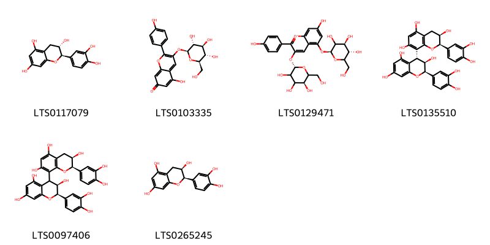{ width=100% }
    <figcaption>Hình ảnh cấu trúc hóa học của 6 hoạt chất thuộc nhóm Flavonoids gồm ['(+)-catechol (LTS0117079)', '5-hydroxy-2-(4-hydroxyphenyl)-3-{[(2s,3r,4s,5s,6r)-3,4,5-trihydroxy-6-(hydroxymethyl)oxan-2-yl]oxy}chromen-7-one (LTS0103335)', 'pelargonin (LTS0129471)', '(2r,3r,4r)-2-(3,4-dihydroxyphenyl)-4-[(2r,3r)-2-(3,4-dihydroxyphenyl)-3,5,7-trihydroxy-3,4-dihydro-2h-1-benzopyran-8-yl]-3,4-dihydro-2h-1-benzopyran-3,5,7-triol (LTS0135510)', '(2r,3r)-2-(3,4-dihydroxyphenyl)-4-[(2r,3r)-2-(3,4-dihydroxyphenyl)-3,5,7-trihydroxy-3,4-dihydro-2h-1-benzopyran-8-yl]-3,4-dihydro-2h-1-benzopyran-3,5,7-triol (LTS0097406)', 'ent-epicatechin (LTS0265245)'].</figcaption>
</figure>
#### Nhóm Tannins
<figure markdown="span">
    { width=100% }
    <figcaption>Hình ảnh cấu trúc hóa học của 1 hoạt chất thuộc nhóm Tannins gồm ['ellagic acid (LTS0037297)'].</figcaption>
</figure>
#### Nhóm Tetrapyrroles and derivatives
<figure markdown="span">
    { width=100% }
    <figcaption>Hình ảnh cấu trúc hóa học của 2 hoạt chất thuộc nhóm Tetrapyrroles and derivatives gồm ['methyl (3r,21s,22s)-16-ethenyl-11-ethyl-12,17,21,26-tetramethyl-4-oxo-22-(3-oxo-3-{[(2e,7r,11r)-3,7,11,15-tetramethylhexadec-2-en-1-yl]oxy}propyl)-7,23,24,25-tetraazahexacyclo[18.2.1.1⁵,⁸.1¹⁰,¹³.1¹⁵,¹⁸.0²,⁶]hexacosa-1(23),2(6),5(26),7,9,11,13,15,17,19-decaene-3-carboxylate (LTS0200273)', 'methyl (3r,21s,22s)-16-ethenyl-11-ethyl-12,17,21,26-tetramethyl-4-oxo-22-(3-oxo-3-{[(2e)-3,7,11,15-tetramethylhexadec-2-en-1-yl]oxy}propyl)-7,23,24,25-tetraazahexacyclo[18.2.1.1⁵,⁸.1¹⁰,¹³.1¹⁵,¹⁸.0²,⁶]hexacosa-1(23),2(6),5(26),7,9,11,13,15,17,19-decaene-3-carboxylate (LTS0272109)'].</figcaption>
</figure>

---

### Dược dân tộc học

Danh sách các quốc gia có sử dụng *Fragaria vesca* trong điều trị các bệnh. 

| Country   | Disease                                                 | Bệnh                                                                                                                                                                                                |
|:----------|:--------------------------------------------------------|:----------------------------------------------------------------------------------------------------------------------------------------------------------------------------------------------------|
| Elsewhere | Diuretic, Astringent                                    | MYMEMORY WARNING: YOU USED ALL AVAILABLE FREE TRANSLATIONS FOR TODAY. NEXT AVAILABLE IN  11 HOURS 17 MINUTES 17 SECONDS VISIT HTTPS://MYMEMORY.TRANSLATED.NET/DOC/USAGELIMITS.PHP TO TRANSLATE MORE |
| Haiti     | Diuretic, Diuretic                                      | MYMEMORY WARNING: YOU USED ALL AVAILABLE FREE TRANSLATIONS FOR TODAY. NEXT AVAILABLE IN  11 HOURS 17 MINUTES 14 SECONDS VISIT HTTPS://MYMEMORY.TRANSLATED.NET/DOC/USAGELIMITS.PHP TO TRANSLATE MORE |
| Turkey    | Astringent, Discutient, Diuretic, Refrigerant, Laxative | MYMEMORY WARNING: YOU USED ALL AVAILABLE FREE TRANSLATIONS FOR TODAY. NEXT AVAILABLE IN  11 HOURS 17 MINUTES 09 SECONDS VISIT HTTPS://MYMEMORY.TRANSLATED.NET/DOC/USAGELIMITS.PHP TO TRANSLATE MORE |
| ain       | Diuretic                                                | MYMEMORY WARNING: YOU USED ALL AVAILABLE FREE TRANSLATIONS FOR TODAY. NEXT AVAILABLE IN  11 HOURS 17 MINUTES 06 SECONDS VISIT HTTPS://MYMEMORY.TRANSLATED.NET/DOC/USAGELIMITS.PHP TO TRANSLATE MORE |

---

---
## Fragaria virginiana
### Thông tin về thực vật

!!! info "Phân loại thực vật của *Fragaria virginiana* từ GIBF:"
    - **Kingdom:** Plantae
    - **Phylum:** Tracheophyta
    - **Order:** Rosales
    - **Family:** Rosaceae
    - **Genus:** Fragaria
    - **Species:** *Fragaria virginiana*

 

| Label (VI)   | Label (EN)   | Scientific Name     | Descriptions (VI)   | Descriptions (EN)   | Also Known As (VI)   | Also Known As (EN)      |
|:-------------|:-------------|:--------------------|:--------------------|:--------------------|:---------------------|:------------------------|
| N/A          | N/A          | Fragaria virginiana | loài thực vật       | species of plant    | ['']                 | ['Fragaria virginiana'] |

#### Phân bố trên thế giới

**Từ CSDL GIBF** Canada, United States of America

#### Phân bố tại Việt Nam

**Từ CSDL GIBF**: Không có ghi nhận ở Việt Nam

---
### Thành phần hóa học
        
- Theo cơ sở dữ liệu lotus: Từ loài *Fragaria virginiana* đã phân lập và xác định được Chưa có hoạt chất nào được phân lập. hoạt chất thuộc về các nhóm Không có hoạt chất nào được phân lập. 

Không có hình ảnh nào được tạo ra

---

### Dược dân tộc học

Danh sách các quốc gia có sử dụng *Fragaria virginiana* trong điều trị các bệnh. 

| Country   | Disease   | Bệnh                                                                                                                                                                                                |
|:----------|:----------|:----------------------------------------------------------------------------------------------------------------------------------------------------------------------------------------------------|
| US        | Diuretic  | MYMEMORY WARNING: YOU USED ALL AVAILABLE FREE TRANSLATIONS FOR TODAY. NEXT AVAILABLE IN  11 HOURS 16 MINUTES 36 SECONDS VISIT HTTPS://MYMEMORY.TRANSLATED.NET/DOC/USAGELIMITS.PHP TO TRANSLATE MORE |

---

# Chi Crataegus

??? note "Danh sách các dược liệu thuộc chi"
    
	 - *Crataegus cuneata*
	 - *Crataegus douglasii*
	 - *Crataegus mexicana*
	 - *Crataegus monogyna*
	 - *Crataegus oxyacantha*
	 - *Crataegus pinnatifida*
	 - *Crataegus pubescens*

---
## Crataegus cuneata
### Thông tin về thực vật

!!! info "Phân loại thực vật của *Crataegus cuneata* từ GIBF:"
    - **Kingdom:** Plantae
    - **Phylum:** Tracheophyta
    - **Order:** Rosales
    - **Family:** Rosaceae
    - **Genus:** Crataegus
    - **Species:** *Crataegus cuneata*

 

| Label (VI)   | Label (EN)   | Scientific Name   | Descriptions (VI)   | Descriptions (EN)   | Also Known As (VI)   | Also Known As (EN)   |
|:-------------|:-------------|:------------------|:--------------------|:--------------------|:---------------------|:---------------------|
| N/A          | N/A          | Crataegus cuneata | loài thực vật       | species of plant    | ['']                 | ['']                 |

#### Phân bố trên thế giới

**Từ CSDL GIBF** nan, unknown or invalid, Japan, United States of America, China, Belgium, Korea, Republic of

#### Phân bố tại Việt Nam

**Từ CSDL GIBF**: Không có ghi nhận ở Việt Nam

---
### Thành phần hóa học
        
- Theo cơ sở dữ liệu lotus: Từ loài *Crataegus cuneata* đã phân lập và xác định được 2 hoạt chất thuộc về các nhóm Prenol lipids. 

|    | chemicalTaxonomyClassyfireClass   |   smiles_count |
|---:|:----------------------------------|---------------:|
|  0 | Prenol lipids                     |              2 |

#### Nhóm Prenol lipids
<figure markdown="span">
    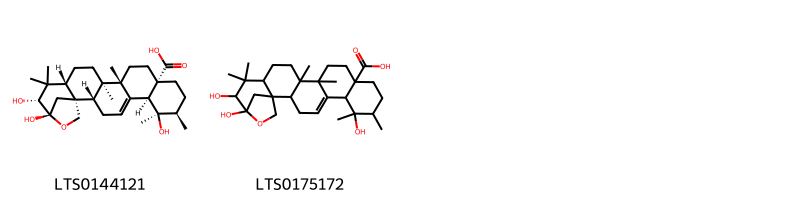{ width=100% }
    <figcaption>Hình ảnh cấu trúc hóa học của 2 hoạt chất thuộc nhóm Prenol lipids gồm ['(1s,2s,6s,7r,8r,11s,14s,15r,18r,20r,21s)-7,20,21-trihydroxy-7,8,14,15,19,19-hexamethyl-22-oxahexacyclo[19.2.1.0¹,¹⁸.0²,¹⁵.0⁵,¹⁴.0⁶,¹¹]tetracos-4-ene-11-carboxylic acid (LTS0144121)', '7,20,21-trihydroxy-7,8,14,15,19,19-hexamethyl-22-oxahexacyclo[19.2.1.0¹,¹⁸.0²,¹⁵.0⁵,¹⁴.0⁶,¹¹]tetracos-4-ene-11-carboxylic acid (LTS0175172)'].</figcaption>
</figure>

---

### Dược dân tộc học

Danh sách các quốc gia có sử dụng *Crataegus cuneata* trong điều trị các bệnh. 

| Country   | Disease              | Bệnh                                                                                                                                                                                                |
|:----------|:---------------------|:----------------------------------------------------------------------------------------------------------------------------------------------------------------------------------------------------|
| China     | Digestive, Digestive | MYMEMORY WARNING: YOU USED ALL AVAILABLE FREE TRANSLATIONS FOR TODAY. NEXT AVAILABLE IN  11 HOURS 16 MINUTES 11 SECONDS VISIT HTTPS://MYMEMORY.TRANSLATED.NET/DOC/USAGELIMITS.PHP TO TRANSLATE MORE |

---

---
## Crataegus douglasii
### Thông tin về thực vật

!!! info "Phân loại thực vật của *Crataegus douglasii* từ GIBF:"
    - **Kingdom:** Plantae
    - **Phylum:** Tracheophyta
    - **Order:** Rosales
    - **Family:** Rosaceae
    - **Genus:** Crataegus
    - **Species:** *Crataegus douglasii*

 

| Label (VI)   | Label (EN)   | Scientific Name     | Descriptions (VI)   | Descriptions (EN)                  | Also Known As (VI)   | Also Known As (EN)                        |
|:-------------|:-------------|:--------------------|:--------------------|:-----------------------------------|:---------------------|:------------------------------------------|
| N/A          | N/A          | Crataegus douglasii |                     | species of North American hawthorn | ['']                 | ['black hawthorn', "Douglas' thornapple"] |

#### Phân bố trên thế giới

**Từ CSDL GIBF** Denmark, Sweden, Latvia, Canada, Russian Federation, United States of America, Kazakhstan, Finland

#### Phân bố tại Việt Nam

**Từ CSDL GIBF**: Không có ghi nhận ở Việt Nam

---
### Thành phần hóa học
        
- Theo cơ sở dữ liệu lotus: Từ loài *Crataegus douglasii* đã phân lập và xác định được Chưa có hoạt chất nào được phân lập. hoạt chất thuộc về các nhóm Không có hoạt chất nào được phân lập. 

Không có hình ảnh nào được tạo ra

---

### Dược dân tộc học

Danh sách các quốc gia có sử dụng *Crataegus douglasii* trong điều trị các bệnh. 

| Country          | Disease   | Bệnh                                                                                                                                                                                                |
|:-----------------|:----------|:----------------------------------------------------------------------------------------------------------------------------------------------------------------------------------------------------|
| Canada(Kwakiutl) | Poultice  | MYMEMORY WARNING: YOU USED ALL AVAILABLE FREE TRANSLATIONS FOR TODAY. NEXT AVAILABLE IN  11 HOURS 15 MINUTES 48 SECONDS VISIT HTTPS://MYMEMORY.TRANSLATED.NET/DOC/USAGELIMITS.PHP TO TRANSLATE MORE |

---

---
## Crataegus mexicana
### Thông tin về thực vật

!!! info "Phân loại thực vật của *Crataegus mexicana* từ GIBF:"
    - **Kingdom:** Plantae
    - **Phylum:** Tracheophyta
    - **Order:** Rosales
    - **Family:** Rosaceae
    - **Genus:** Crataegus
    - **Species:** *Crataegus mexicana*

 

| Label (VI)   | Label (EN)   | Scientific Name    | Descriptions (VI)   | Descriptions (EN)   | Also Known As (VI)   | Also Known As (EN)   |
|:-------------|:-------------|:-------------------|:--------------------|:--------------------|:---------------------|:---------------------|
| N/A          | N/A          | Crataegus mexicana | loài thực vật       | species of plant    | ['']                 | ['']                 |

#### Phân bố trên thế giới

**Từ CSDL GIBF** United Kingdom of Great Britain and Northern Ireland, South Africa, Peru, United States of America, Mexico, Guatemala

#### Phân bố tại Việt Nam

**Từ CSDL GIBF**: Không có ghi nhận ở Việt Nam

---
### Thành phần hóa học
        
- Theo cơ sở dữ liệu lotus: Từ loài *Crataegus mexicana* đã phân lập và xác định được Chưa có hoạt chất nào được phân lập. hoạt chất thuộc về các nhóm Không có hoạt chất nào được phân lập. 

Không có hình ảnh nào được tạo ra

---

### Dược dân tộc học

Danh sách các quốc gia có sử dụng *Crataegus mexicana* trong điều trị các bệnh. 

| Country          | Disease   | Bệnh                                                                                                                                                                                                |
|:-----------------|:----------|:----------------------------------------------------------------------------------------------------------------------------------------------------------------------------------------------------|
| Mexico           | Diuretic  | MYMEMORY WARNING: YOU USED ALL AVAILABLE FREE TRANSLATIONS FOR TODAY. NEXT AVAILABLE IN  11 HOURS 15 MINUTES 19 SECONDS VISIT HTTPS://MYMEMORY.TRANSLATED.NET/DOC/USAGELIMITS.PHP TO TRANSLATE MORE |
| Mexico(Kickapoo) | Diuretic  | MYMEMORY WARNING: YOU USED ALL AVAILABLE FREE TRANSLATIONS FOR TODAY. NEXT AVAILABLE IN  11 HOURS 15 MINUTES 16 SECONDS VISIT HTTPS://MYMEMORY.TRANSLATED.NET/DOC/USAGELIMITS.PHP TO TRANSLATE MORE |

---

---
## Crataegus monogyna
### Thông tin về thực vật

!!! info "Phân loại thực vật của *Crataegus monogyna* từ GIBF:"
    - **Kingdom:** Plantae
    - **Phylum:** Tracheophyta
    - **Order:** Rosales
    - **Family:** Rosaceae
    - **Genus:** Crataegus
    - **Species:** *Crataegus monogyna*

 

| Label (VI)   | Label (EN)   | Scientific Name    | Descriptions (VI)   | Descriptions (EN)   | Also Known As (VI)   | Also Known As (EN)              |
|:-------------|:-------------|:-------------------|:--------------------|:--------------------|:---------------------|:--------------------------------|
| N/A          | N/A          | Crataegus monogyna |                     | species of plant    | ['']                 | ['Hawthorn', 'common hawthorn'] |

#### Phân bố trên thế giới

**Từ CSDL GIBF** Türkiye, United Kingdom of Great Britain and Northern Ireland, Denmark, Portugal, Sweden, France, Spain, New Zealand, Hungary, Germany, Canada, United States of America, Algeria, Ireland, Austria, Norway, Australia, Netherlands

#### Phân bố tại Việt Nam

**Từ CSDL GIBF**: Không có ghi nhận ở Việt Nam

---
### Thành phần hóa học
        
- Theo cơ sở dữ liệu lotus: Từ loài *Crataegus monogyna* đã phân lập và xác định được 110 hoạt chất thuộc về các nhóm Organooxygen compounds, Flavonoids, Coumarins and derivatives, Tannins, Carboxylic acids and derivatives, Prenol lipids, Fatty Acyls, Phenols, Steroids and steroid derivatives, Cinnamic acids and derivatives, Benzene and substituted derivatives. 

|    | chemicalTaxonomyClassyfireClass     |   smiles_count |
|---:|:------------------------------------|---------------:|
|  0 | Benzene and substituted derivatives |              6 |
|  1 | Carboxylic acids and derivatives    |              1 |
|  2 | Cinnamic acids and derivatives      |              6 |
|  3 | Coumarins and derivatives           |              2 |
|  4 | Fatty Acyls                         |             12 |
|  5 | Flavonoids                          |             59 |
|  6 | Organooxygen compounds              |              1 |
|  7 | Phenols                             |              3 |
|  8 | Prenol lipids                       |             17 |
|  9 | Steroids and steroid derivatives    |              2 |
| 10 | Tannins                             |              1 |

#### Nhóm Benzene and substituted derivatives
<figure markdown="span">
    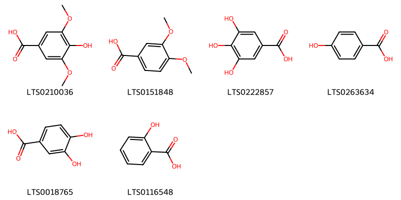{ width=100% }
    <figcaption>Hình ảnh cấu trúc hóa học của 6 hoạt chất thuộc nhóm Benzene and substituted derivatives gồm ['syringic acid (LTS0210036)', 'veratric acid (LTS0151848)', 'galop (LTS0222857)', 'p-hydroxybenzoic acid (LTS0263634)', '3,4-dihydroxybenzoic acid (LTS0018765)', 'salicyclic acid (LTS0116548)'].</figcaption>
</figure>
#### Nhóm Carboxylic acids and derivatives
<figure markdown="span">
    { width=100% }
    <figcaption>Hình ảnh cấu trúc hóa học của 1 hoạt chất thuộc nhóm Carboxylic acids and derivatives gồm ['levodopa (LTS0130329)'].</figcaption>
</figure>
#### Nhóm Cinnamic acids and derivatives
<figure markdown="span">
    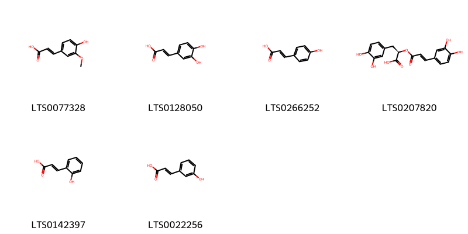{ width=100% }
    <figcaption>Hình ảnh cấu trúc hóa học của 6 hoạt chất thuộc nhóm Cinnamic acids and derivatives gồm ['ferulic acid (LTS0077328)', '3,4-dihydroxycinnamic acid (LTS0128050)', 'para-coumaric acid (LTS0266252)', 'rosemary acid (LTS0207820)', 'trans-2-hydroxycinnamic acid (LTS0142397)', 'm-coumaric acid (LTS0022256)'].</figcaption>
</figure>
#### Nhóm Coumarins and derivatives
<figure markdown="span">
    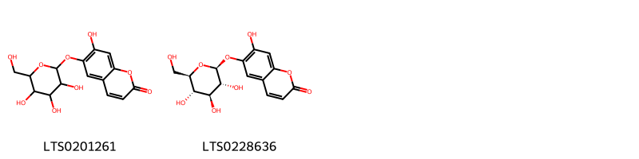{ width=100% }
    <figcaption>Hình ảnh cấu trúc hóa học của 2 hoạt chất thuộc nhóm Coumarins and derivatives gồm ['esculin (LTS0201261)', 'esculin (LTS0228636)'].</figcaption>
</figure>
#### Nhóm Fatty Acyls
<figure markdown="span">
    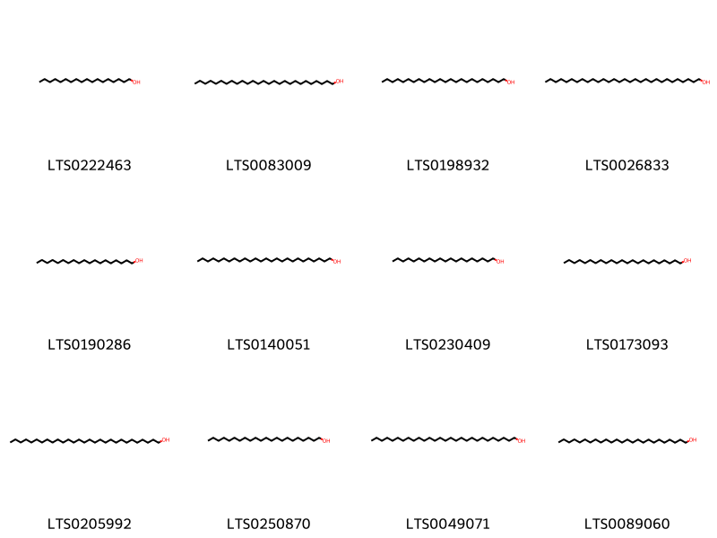{ width=100% }
    <figcaption>Hình ảnh cấu trúc hóa học của 12 hoạt chất thuộc nhóm Fatty Acyls gồm ['stearyl alcohol (LTS0222463)', 'heptacosanol (LTS0083009)', '1-tetracosanol (LTS0198932)', 'triacontanol (LTS0026833)', 'nonadecanol (LTS0190286)', 'ceryl alcohol (LTS0140051)', 'arachidyl alcohol (LTS0230409)', '1-tricosanol (LTS0173093)', 'nonacosanol (LTS0205992)', 'docosanol (LTS0250870)', 'octacosanol (LTS0049071)', '1-pentacosanol (LTS0089060)'].</figcaption>
</figure>
#### Nhóm Flavonoids
<figure markdown="span">
    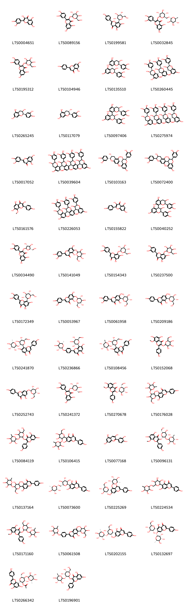{ width=100% }
    <figcaption>Hình ảnh cấu trúc hóa học của 59 hoạt chất thuộc nhóm Flavonoids gồm ['quercetin (LTS0004651)', 'hyperoside (LTS0089156)', 'vitexin (LTS0199581)', '3-rutinosyl quercetin (LTS0032845)', '2-(3,4-dihydroxyphenyl)-5,7-dihydroxy-3-{[3,4,5-trihydroxy-6-(hydroxymethyl)oxan-2-yl]oxy}chromen-4-one (LTS0195312)', 'chamomile (LTS0104946)', '(2r,3r,4r)-2-(3,4-dihydroxyphenyl)-4-[(2r,3r)-2-(3,4-dihydroxyphenyl)-3,5,7-trihydroxy-3,4-dihydro-2h-1-benzopyran-8-yl]-3,4-dihydro-2h-1-benzopyran-3,5,7-triol (LTS0135510)', 'procyanidin c1 (LTS0260445)', 'ent-epicatechin (LTS0265245)', '(+)-catechol (LTS0117079)', '(2r,3r)-2-(3,4-dihydroxyphenyl)-4-[(2r,3r)-2-(3,4-dihydroxyphenyl)-3,5,7-trihydroxy-3,4-dihydro-2h-1-benzopyran-8-yl]-3,4-dihydro-2h-1-benzopyran-3,5,7-triol (LTS0097406)', '(2r,3r,4r)-2-(3,4-dihydroxyphenyl)-8-[(2r,3r,4r)-2-(3,4-dihydroxyphenyl)-3,5,7-trihydroxy-3,4-dihydro-2h-1-benzopyran-4-yl]-4-[(2r,3r,4s)-2-(3,4-dihydroxyphenyl)-4-[(2r,3r)-2-(3,4-dihydroxyphenyl)-3,5,7-trihydroxy-3,4-dihydro-2h-1-benzopyran-8-yl]-3,5,7-trihydroxy-3,4-dihydro-2h-1-benzopyran-8-yl]-3,4-dihydro-2h-1-benzopyran-3,5,7-triol (LTS0275974)', 'luteolin (LTS0017052)', '2-(3,4-dihydroxyphenyl)-8-[2-(3,4-dihydroxyphenyl)-3,5,7-trihydroxy-3,4-dihydro-2h-1-benzopyran-4-yl]-4-[2-(3,4-dihydroxyphenyl)-4-[2-(3,4-dihydroxyphenyl)-3,5,7-trihydroxy-3,4-dihydro-2h-1-benzopyran-8-yl]-3,5,7-trihydroxy-3,4-dihydro-2h-1-benzopyran-8-yl]-3,4-dihydro-2h-1-benzopyran-3,5,7-triol (LTS0039604)', '(2r,3r,4s)-2-(3,4-dihydroxyphenyl)-4-[(2r,3r)-2-(3,4-dihydroxyphenyl)-3,5,7-trihydroxy-3,4-dihydro-2h-1-benzopyran-6-yl]-3,4-dihydro-2h-1-benzopyran-3,5,7-triol (LTS0103163)', '2-(3,4-dihydroxyphenyl)-4-[2-(3,4-dihydroxyphenyl)-3,5,7-trihydroxy-3,4-dihydro-2h-1-benzopyran-6-yl]-3,4-dihydro-2h-1-benzopyran-3,5,7-triol (LTS0072400)', 'sexangularetin (LTS0161576)', 'procyanidin c2 (LTS0226053)', 'kaempherol (LTS0155822)', '2-(3,4-dihydroxyphenyl)-4-[2-(3,4-dihydroxyphenyl)-3,5,7-trihydroxy-3,4-dihydro-2h-1-benzopyran-8-yl]-3,4-dihydro-2h-1-benzopyran-3,5,7-triol (LTS0040252)', 'avicularin (LTS0034490)', '2-(3,4-dihydroxyphenyl)-5,7-dihydroxy-6-{[3,4,5-trihydroxy-6-(hydroxymethyl)oxan-2-yl]oxy}chromen-4-one (LTS0141049)', 'hypolaetin-8-glucoside (LTS0154343)', '2-(3,4-dihydroxyphenyl)-5,7-dihydroxy-8-{[3,4,5-trihydroxy-6-(hydroxymethyl)oxan-2-yl]oxy}chromen-4-one (LTS0237500)', 'orientin (LTS0172349)', '2-(3,4-dihydroxyphenyl)-5,7-dihydroxy-6-{[(2s,3r,4s,5s,6r)-3,4,5-trihydroxy-6-(hydroxymethyl)oxan-2-yl]oxy}chromen-4-one (LTS0053967)', 'isoorientin (LTS0061958)', 'isovitexin (LTS0209186)', "vitexin 2''-rhamnoside (LTS0241870)", '5,7-dihydroxy-8-[(2s,3r,4r,5s,6r)-3,4,5-trihydroxy-6-(hydroxymethyl)oxan-2-yl]-2-(4-{[(2s,3r,5r,6s)-3,4,5-trihydroxy-6-methyloxan-2-yl]oxy}phenyl)chromen-4-one (LTS0236866)', '8-[(2s,3r,4s,5s,6r)-4,5-dihydroxy-6-(hydroxymethyl)-3-{[(2s,3s,4r,5s,6r)-3,4,5-trihydroxy-6-methyloxan-2-yl]oxy}oxan-2-yl]-5,7-dihydroxy-2-(4-hydroxyphenyl)chromen-4-one (LTS0108456)', '5,7-dihydroxy-2-(4-hydroxyphenyl)-8-methoxy-3-{[3,4,5-trihydroxy-6-(hydroxymethyl)oxan-2-yl]oxy}chromen-4-one (LTS0152068)', 'apigenin 7-o-β-glucoside (LTS0252743)', '2-(3,4-dihydroxyphenyl)-5,7-dihydroxy-3-{[(2s,3r,4r,5r,6s)-3,4,5-trihydroxy-6-(hydroxymethyl)oxan-2-yl]oxy}chromen-4-one (LTS0241372)', '5,7-dihydroxy-2-(4-hydroxyphenyl)-8-methoxy-3-{[(2s,3r,4s,5s,6r)-3,4,5-trihydroxy-6-(hydroxymethyl)oxan-2-yl]oxy}chromen-4-one (LTS0270678)', '6-[3,5-dihydroxy-6-(hydroxymethyl)-4-[(3,4,5-trihydroxy-6-methyloxan-2-yl)oxy]oxan-2-yl]-5,7-dihydroxy-2-(4-hydroxyphenyl)chromen-4-one (LTS0176028)', '3-{[4,5-dihydroxy-6-(hydroxymethyl)-3-[(3,4,5-trihydroxy-6-methyloxan-2-yl)oxy]oxan-2-yl]oxy}-5,7-dihydroxy-2-(4-hydroxyphenyl)chromen-4-one (LTS0084119)', '6-[4,5-dihydroxy-6-(hydroxymethyl)-3-[(3,4,5-trihydroxy-6-methyloxan-2-yl)oxy]oxan-2-yl]-5,7-dihydroxy-2-(4-hydroxyphenyl)chromen-4-one (LTS0106415)', 'cyanidin (LTS0077168)', '3-{[(2s,3r,4s,5s,6r)-4,5-dihydroxy-6-(hydroxymethyl)-3-{[(2r,3r,4r,5r,6s)-3,4,5-trihydroxy-6-methyloxan-2-yl]oxy}oxan-2-yl]oxy}-5,7-dihydroxy-2-(4-hydroxyphenyl)-8-methoxychromen-4-one (LTS0096131)', '6-[3,4-dihydroxy-6-(hydroxymethyl)-5-[(3,4,5-trihydroxy-6-methyloxan-2-yl)oxy]oxan-2-yl]-5,7-dihydroxy-2-(4-hydroxyphenyl)chromen-4-one (LTS0137164)', '5,7-dihydroxy-2-(4-hydroxyphenyl)-6-[(2r,3r,4r,5s,6r)-3,4,5-trihydroxy-6-({[(2s,3r,4r,5r,6s)-3,4,5-trihydroxy-6-methyloxan-2-yl]oxy}methyl)oxan-2-yl]chromen-4-one (LTS0073600)', '7-hydroxy-2-(4-hydroxyphenyl)-6-[(2r,3r,4r,5s,6r)-3,4,5-trihydroxy-6-(hydroxymethyl)oxan-2-yl]-5-{[(2s,3r,4r,5r,6s)-3,4,5-trihydroxy-6-methyloxan-2-yl]oxy}chromen-4-one (LTS0225269)', '5,7-dihydroxy-2-(4-hydroxyphenyl)-6-(3,4,5-trihydroxy-6-{[(3,4,5-trihydroxy-6-methyloxan-2-yl)oxy]methyl}oxan-2-yl)chromen-4-one (LTS0224534)', '3-{[4,5-dihydroxy-6-(hydroxymethyl)-3-[(3,4,5-trihydroxy-6-methyloxan-2-yl)oxy]oxan-2-yl]oxy}-5,7-dihydroxy-2-(4-hydroxyphenyl)-8-methoxychromen-4-one (LTS0171160)', '5,7-dihydroxy-6-[3,4,5-trihydroxy-6-(hydroxymethyl)oxan-2-yl]-2-{4-[(3,4,5-trihydroxy-6-methyloxan-2-yl)oxy]phenyl}chromen-4-one (LTS0061508)', '6-[(2r,3s,4r,5r,6r)-3,5-dihydroxy-6-(hydroxymethyl)-4-{[(2r,3r,4r,5r,6s)-3,4,5-trihydroxy-6-methyloxan-2-yl]oxy}oxan-2-yl]-5,7-dihydroxy-2-(4-hydroxyphenyl)chromen-4-one (LTS0202155)', '5-hydroxy-2-(4-hydroxyphenyl)-6-[(2r,3r,4r,5s,6r)-3,4,5-trihydroxy-6-(hydroxymethyl)oxan-2-yl]-7-{[(2r,3r,4r,5r,6s)-3,4,5-trihydroxy-6-methyloxan-2-yl]oxy}chromen-4-one (LTS0132697)', '(2s,3r,4s,5s,6r)-2-[5,7-dihydroxy-2-(4-hydroxyphenyl)-4-oxochromen-8-yl]-4-hydroxy-6-(hydroxymethyl)-5-{[(2s,3s,4r,5r,6s)-3,4,5-trihydroxy-6-methyloxan-2-yl]oxy}oxan-3-yl acetate (LTS0266342)', 'kaempferol 3-neohesperidoside (LTS0196901)', '5-hydroxy-2-(4-hydroxyphenyl)-6-[3,4,5-trihydroxy-6-(hydroxymethyl)oxan-2-yl]-7-[(3,4,5-trihydroxy-6-methyloxan-2-yl)oxy]chromen-4-one (LTS0140882)', '7-hydroxy-2-(4-hydroxyphenyl)-6-[3,4,5-trihydroxy-6-(hydroxymethyl)oxan-2-yl]-5-[(3,4,5-trihydroxy-6-methyloxan-2-yl)oxy]chromen-4-one (LTS0092803)', '3-{[(2s,3r,4s,5s,6r)-4,5-dihydroxy-6-(hydroxymethyl)-3-{[(2r,3s,4r,5r,6s)-3,4,5-trihydroxy-6-methyloxan-2-yl]oxy}oxan-2-yl]oxy}-5,7-dihydroxy-2-(4-hydroxyphenyl)chromen-4-one (LTS0160668)', '6-[(2r,3r,4s,5s,6r)-4,5-dihydroxy-6-(hydroxymethyl)-3-{[(2s,3r,4r,5r,6s)-3,4,5-trihydroxy-6-methyloxan-2-yl]oxy}oxan-2-yl]-5,7-dihydroxy-2-(4-hydroxyphenyl)chromen-4-one (LTS0204872)', '5,7-dihydroxy-2-(4-hydroxyphenyl)-6,8-bis[3,4,5-trihydroxy-6-(hydroxymethyl)oxan-2-yl]chromen-4-one (LTS0255367)', '5,7-dihydroxy-2-(4-hydroxyphenyl)-6-[(2r,3r,4r,5s,6r)-3,4,5-trihydroxy-6-(hydroxymethyl)oxan-2-yl]-8-[(2s,3r,4r,5s,6r)-3,4,5-trihydroxy-6-(hydroxymethyl)oxan-2-yl]chromen-4-one (LTS0243270)', '5,7-dihydroxy-6-[(2r,3r,4r,5s,6r)-3,4,5-trihydroxy-6-(hydroxymethyl)oxan-2-yl]-2-(4-{[(2r,3r,4r,5r,6s)-3,4,5-trihydroxy-6-methyloxan-2-yl]oxy}phenyl)chromen-4-one (LTS0056052)', '6-[(2r,3r,4r,5s,6r)-3,4-dihydroxy-6-(hydroxymethyl)-5-{[(2r,3r,4r,5r,6s)-3,4,5-trihydroxy-6-methyloxan-2-yl]oxy}oxan-2-yl]-5,7-dihydroxy-2-(4-hydroxyphenyl)chromen-4-one (LTS0063226)', '5,7-dihydroxy-2-(4-hydroxyphenyl)-6,8-bis[(2r,3r,4r,5s,6r)-3,4,5-trihydroxy-6-(hydroxymethyl)oxan-2-yl]chromen-4-one (LTS0097973)'].</figcaption>
</figure>
#### Nhóm Organooxygen compounds
<figure markdown="span">
    { width=100% }
    <figcaption>Hình ảnh cấu trúc hóa học của 1 hoạt chất thuộc nhóm Organooxygen compounds gồm ['chlorogenic acid (LTS0226495)'].</figcaption>
</figure>
#### Nhóm Phenols
<figure markdown="span">
    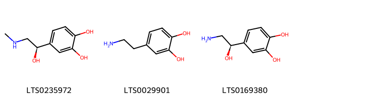{ width=100% }
    <figcaption>Hình ảnh cấu trúc hóa học của 3 hoạt chất thuộc nhóm Phenols gồm ['epinephrine (LTS0235972)', 'dopamine (LTS0029901)', 'norepinephrine (LTS0169380)'].</figcaption>
</figure>
#### Nhóm Prenol lipids
<figure markdown="span">
    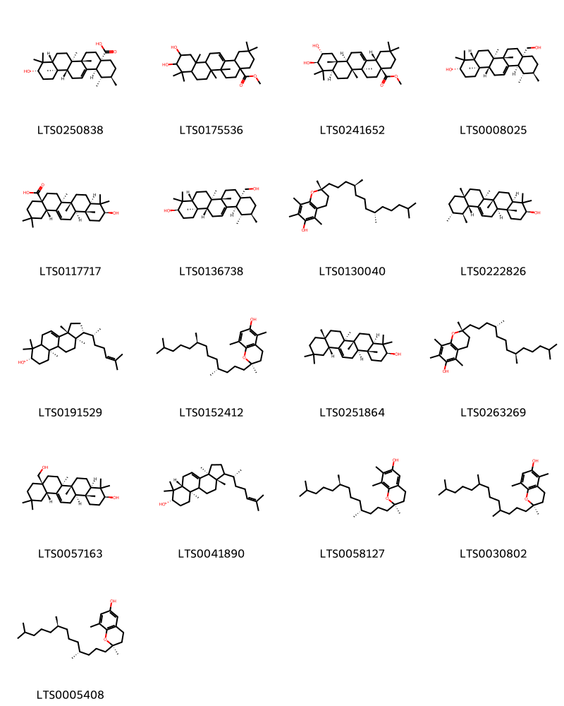{ width=100% }
    <figcaption>Hình ảnh cấu trúc hóa học của 17 hoạt chất thuộc nhóm Prenol lipids gồm ['ursolic acid (LTS0250838)', 'methyl 10,11-dihydroxy-2,2,6a,6b,9,9,12a-heptamethyl-1,3,4,5,6,7,8,8a,10,11,12,12b,13,14b-tetradecahydropicene-4a-carboxylate (LTS0175536)', 'methyl (4as,6as,6br,8ar,10r,11r,12ar,12br,14bs)-10,11-dihydroxy-2,2,6a,6b,9,9,12a-heptamethyl-1,3,4,5,6,7,8,8a,10,11,12,12b,13,14b-tetradecahydropicene-4a-carboxylate (LTS0241652)', 'uvaol (LTS0008025)', 'oleanolic acid (LTS0117717)', 'urs-12-ene-3β,28-diol (LTS0136738)', '(2r)-2,5,7,8-tetramethyl-2-[(4s,8s)-4,8,12-trimethyltridecyl]-3,4-dihydro-1-benzopyran-6-ol (LTS0130040)', 'amyrin (LTS0222826)', '(1r,3ar,7s,9ar,11ar)-3a,6,6,9a,11a-pentamethyl-1-[(2r)-6-methylhept-5-en-2-yl]-1h,2h,3h,5h,5ah,7h,8h,9h,9bh,10h,11h-cyclopenta[a]phenanthren-7-ol (LTS0191529)', 'β-tocopherol (LTS0152412)', 'β-amyrin (LTS0251864)', 'vitamin e (LTS0263269)', 'erythrodiol (LTS0057163)', '(3as,5ar,7s,9ar,11as)-3a,6,6,9a,11a-pentamethyl-1-[(2r)-6-methylhept-5-en-2-yl]-1h,2h,3h,5h,5ah,7h,8h,9h,9bh,10h,11h-cyclopenta[a]phenanthren-7-ol (LTS0041890)', 'gamma-tocopherol (LTS0058127)', '(2r)-2,5,8-trimethyl-2-(4,8,12-trimethyltridecyl)-3,4-dihydro-1-benzopyran-6-ol (LTS0030802)', 'delta-tocopherol (LTS0005408)'].</figcaption>
</figure>
#### Nhóm Steroids and steroid derivatives
<figure markdown="span">
    { width=100% }
    <figcaption>Hình ảnh cấu trúc hóa học của 2 hoạt chất thuộc nhóm Steroids and steroid derivatives gồm ['(3r,6s,8r,11s,12s,15r,16r)-7,7,12,16-tetramethyl-15-[(2r)-6-methylhept-5-en-2-yl]pentacyclo[9.7.0.0¹,³.0³,⁸.0¹²,¹⁶]octadecan-6-ol (LTS0062833)', 'cycloartenol (LTS0269561)'].</figcaption>
</figure>
#### Nhóm Tannins
<figure markdown="span">
    { width=100% }
    <figcaption>Hình ảnh cấu trúc hóa học của 1 hoạt chất thuộc nhóm Tannins gồm ['ellagic acid (LTS0037297)'].</figcaption>
</figure>

---

### Dược dân tộc học

Danh sách các quốc gia có sử dụng *Crataegus monogyna* trong điều trị các bệnh. 

| Country   | Disease     | Bệnh                                                                                                                                                                                                |
|:----------|:------------|:----------------------------------------------------------------------------------------------------------------------------------------------------------------------------------------------------|
| ain       | Cardiotonic | MYMEMORY WARNING: YOU USED ALL AVAILABLE FREE TRANSLATIONS FOR TODAY. NEXT AVAILABLE IN  11 HOURS 14 MINUTES 46 SECONDS VISIT HTTPS://MYMEMORY.TRANSLATED.NET/DOC/USAGELIMITS.PHP TO TRANSLATE MORE |

---

---
## Crataegus oxyacantha
### Thông tin về thực vật

!!! info "Phân loại thực vật của *N/A* từ GIBF:"
    - **Kingdom:** Plantae
    - **Phylum:** Tracheophyta
    - **Order:** Rosales
    - **Family:** Rosaceae
    - **Genus:** Crataegus
    - **Species:** *N/A*

 

| Label (VI)   | Label (EN)   | Scientific Name      | Descriptions (VI)   | Descriptions (EN)         | Also Known As (VI)   | Also Known As (EN)       |
|:-------------|:-------------|:---------------------|:--------------------|:--------------------------|:---------------------|:-------------------------|
| N/A          | N/A          | Crataegus oxyacantha |                     | name that may not be used | ['']                 | ['Crataegus oxyacantha'] |

#### Phân bố trên thế giới

**Từ CSDL GIBF** Denmark, Spain, Germany, Austria, Australia, Sweden, Canada, Netherlands, Türkiye, Hungary, Mexico, Ireland, China, Norway, United Kingdom of Great Britain and Northern Ireland, Portugal, South Africa, France, New Zealand, Cyprus, United States of America, Algeria, Israel

#### Phân bố tại Việt Nam

**Từ CSDL GIBF**: Không có ghi nhận ở Việt Nam

---
### Thành phần hóa học
        
- Theo cơ sở dữ liệu lotus: Từ loài *N/A* đã phân lập và xác định được 44 hoạt chất thuộc về các nhóm Organooxygen compounds, Flavonoids, Coumarins and derivatives, Tannins, Carboxylic acids and derivatives, Prenol lipids, Phenols, Cinnamic acids and derivatives, Benzene and substituted derivatives. 

|    | chemicalTaxonomyClassyfireClass     |   smiles_count |
|---:|:------------------------------------|---------------:|
|  0 | Benzene and substituted derivatives |              6 |
|  1 | Carboxylic acids and derivatives    |              1 |
|  2 | Cinnamic acids and derivatives      |              6 |
|  3 | Coumarins and derivatives           |              2 |
|  4 | Flavonoids                          |             22 |
|  5 | Organooxygen compounds              |              1 |
|  6 | Phenols                             |              3 |
|  7 | Prenol lipids                       |              2 |
|  8 | Tannins                             |              1 |

#### Nhóm Benzene and substituted derivatives
<figure markdown="span">
    { width=100% }
    <figcaption>Hình ảnh cấu trúc hóa học của 6 hoạt chất thuộc nhóm Benzene and substituted derivatives gồm ['syringic acid (LTS0210036)', 'veratric acid (LTS0151848)', 'galop (LTS0222857)', 'p-hydroxybenzoic acid (LTS0263634)', '3,4-dihydroxybenzoic acid (LTS0018765)', 'salicyclic acid (LTS0116548)'].</figcaption>
</figure>
#### Nhóm Carboxylic acids and derivatives
<figure markdown="span">
    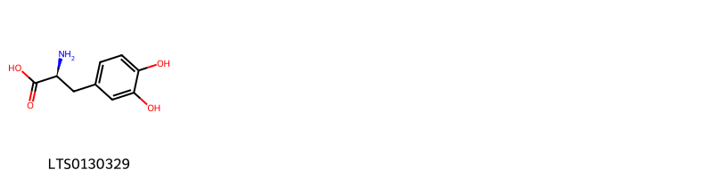{ width=100% }
    <figcaption>Hình ảnh cấu trúc hóa học của 1 hoạt chất thuộc nhóm Carboxylic acids and derivatives gồm ['levodopa (LTS0130329)'].</figcaption>
</figure>
#### Nhóm Cinnamic acids and derivatives
<figure markdown="span">
    { width=100% }
    <figcaption>Hình ảnh cấu trúc hóa học của 6 hoạt chất thuộc nhóm Cinnamic acids and derivatives gồm ['ferulic acid (LTS0077328)', '3,4-dihydroxycinnamic acid (LTS0128050)', 'para-coumaric acid (LTS0266252)', 'rosemary acid (LTS0207820)', 'trans-2-hydroxycinnamic acid (LTS0142397)', 'm-coumaric acid (LTS0022256)'].</figcaption>
</figure>
#### Nhóm Coumarins and derivatives
<figure markdown="span">
    { width=100% }
    <figcaption>Hình ảnh cấu trúc hóa học của 2 hoạt chất thuộc nhóm Coumarins and derivatives gồm ['esculin (LTS0201261)', 'esculin (LTS0228636)'].</figcaption>
</figure>
#### Nhóm Flavonoids
<figure markdown="span">
    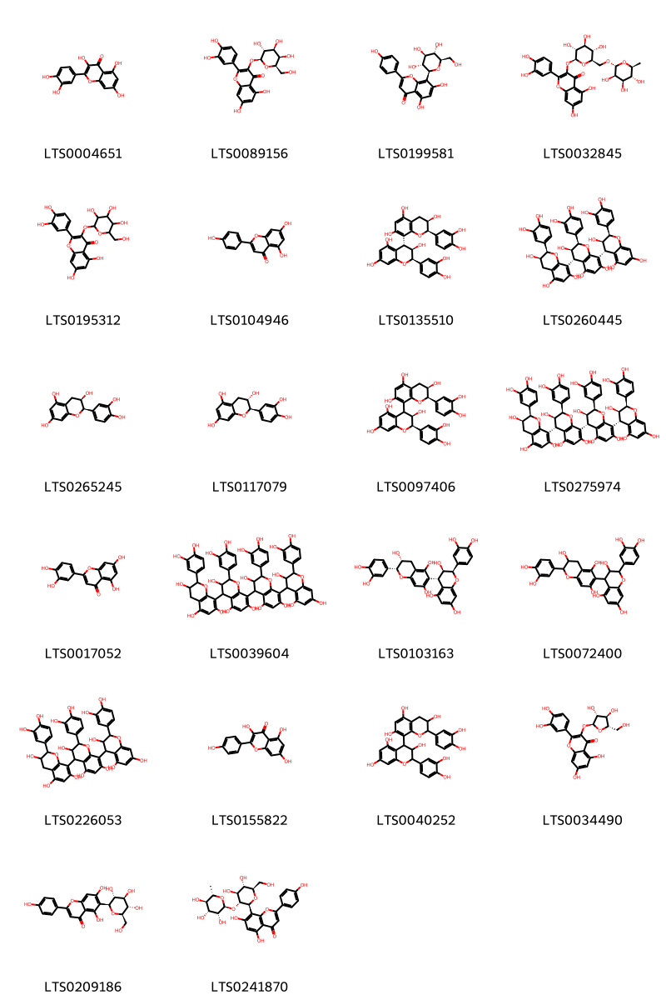{ width=100% }
    <figcaption>Hình ảnh cấu trúc hóa học của 22 hoạt chất thuộc nhóm Flavonoids gồm ['quercetin (LTS0004651)', 'hyperoside (LTS0089156)', 'vitexin (LTS0199581)', '3-rutinosyl quercetin (LTS0032845)', '2-(3,4-dihydroxyphenyl)-5,7-dihydroxy-3-{[3,4,5-trihydroxy-6-(hydroxymethyl)oxan-2-yl]oxy}chromen-4-one (LTS0195312)', 'chamomile (LTS0104946)', '(2r,3r,4r)-2-(3,4-dihydroxyphenyl)-4-[(2r,3r)-2-(3,4-dihydroxyphenyl)-3,5,7-trihydroxy-3,4-dihydro-2h-1-benzopyran-8-yl]-3,4-dihydro-2h-1-benzopyran-3,5,7-triol (LTS0135510)', 'procyanidin c1 (LTS0260445)', 'ent-epicatechin (LTS0265245)', '(+)-catechol (LTS0117079)', '(2r,3r)-2-(3,4-dihydroxyphenyl)-4-[(2r,3r)-2-(3,4-dihydroxyphenyl)-3,5,7-trihydroxy-3,4-dihydro-2h-1-benzopyran-8-yl]-3,4-dihydro-2h-1-benzopyran-3,5,7-triol (LTS0097406)', '(2r,3r,4r)-2-(3,4-dihydroxyphenyl)-8-[(2r,3r,4r)-2-(3,4-dihydroxyphenyl)-3,5,7-trihydroxy-3,4-dihydro-2h-1-benzopyran-4-yl]-4-[(2r,3r,4s)-2-(3,4-dihydroxyphenyl)-4-[(2r,3r)-2-(3,4-dihydroxyphenyl)-3,5,7-trihydroxy-3,4-dihydro-2h-1-benzopyran-8-yl]-3,5,7-trihydroxy-3,4-dihydro-2h-1-benzopyran-8-yl]-3,4-dihydro-2h-1-benzopyran-3,5,7-triol (LTS0275974)', 'luteolin (LTS0017052)', '2-(3,4-dihydroxyphenyl)-8-[2-(3,4-dihydroxyphenyl)-3,5,7-trihydroxy-3,4-dihydro-2h-1-benzopyran-4-yl]-4-[2-(3,4-dihydroxyphenyl)-4-[2-(3,4-dihydroxyphenyl)-3,5,7-trihydroxy-3,4-dihydro-2h-1-benzopyran-8-yl]-3,5,7-trihydroxy-3,4-dihydro-2h-1-benzopyran-8-yl]-3,4-dihydro-2h-1-benzopyran-3,5,7-triol (LTS0039604)', '(2r,3r,4s)-2-(3,4-dihydroxyphenyl)-4-[(2r,3r)-2-(3,4-dihydroxyphenyl)-3,5,7-trihydroxy-3,4-dihydro-2h-1-benzopyran-6-yl]-3,4-dihydro-2h-1-benzopyran-3,5,7-triol (LTS0103163)', '2-(3,4-dihydroxyphenyl)-4-[2-(3,4-dihydroxyphenyl)-3,5,7-trihydroxy-3,4-dihydro-2h-1-benzopyran-6-yl]-3,4-dihydro-2h-1-benzopyran-3,5,7-triol (LTS0072400)', 'procyanidin c2 (LTS0226053)', 'kaempherol (LTS0155822)', '2-(3,4-dihydroxyphenyl)-4-[2-(3,4-dihydroxyphenyl)-3,5,7-trihydroxy-3,4-dihydro-2h-1-benzopyran-8-yl]-3,4-dihydro-2h-1-benzopyran-3,5,7-triol (LTS0040252)', 'avicularin (LTS0034490)', 'isovitexin (LTS0209186)', "vitexin 2''-rhamnoside (LTS0241870)"].</figcaption>
</figure>
#### Nhóm Organooxygen compounds
<figure markdown="span">
    { width=100% }
    <figcaption>Hình ảnh cấu trúc hóa học của 1 hoạt chất thuộc nhóm Organooxygen compounds gồm ['chlorogenic acid (LTS0226495)'].</figcaption>
</figure>
#### Nhóm Phenols
<figure markdown="span">
    { width=100% }
    <figcaption>Hình ảnh cấu trúc hóa học của 3 hoạt chất thuộc nhóm Phenols gồm ['epinephrine (LTS0235972)', 'dopamine (LTS0029901)', 'norepinephrine (LTS0169380)'].</figcaption>
</figure>
#### Nhóm Prenol lipids
<figure markdown="span">
    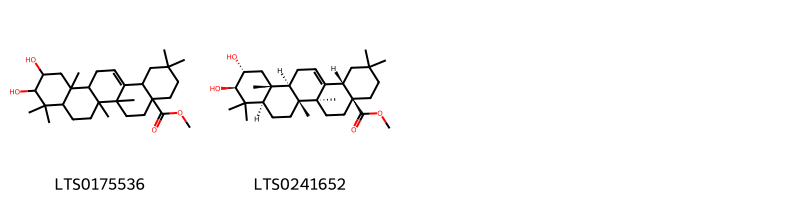{ width=100% }
    <figcaption>Hình ảnh cấu trúc hóa học của 2 hoạt chất thuộc nhóm Prenol lipids gồm ['methyl 10,11-dihydroxy-2,2,6a,6b,9,9,12a-heptamethyl-1,3,4,5,6,7,8,8a,10,11,12,12b,13,14b-tetradecahydropicene-4a-carboxylate (LTS0175536)', 'methyl (4as,6as,6br,8ar,10r,11r,12ar,12br,14bs)-10,11-dihydroxy-2,2,6a,6b,9,9,12a-heptamethyl-1,3,4,5,6,7,8,8a,10,11,12,12b,13,14b-tetradecahydropicene-4a-carboxylate (LTS0241652)'].</figcaption>
</figure>
#### Nhóm Tannins
<figure markdown="span">
    { width=100% }
    <figcaption>Hình ảnh cấu trúc hóa học của 1 hoạt chất thuộc nhóm Tannins gồm ['ellagic acid (LTS0037297)'].</figcaption>
</figure>

---

### Dược dân tộc học

Danh sách các quốc gia có sử dụng *N/A* trong điều trị các bệnh. 

| Country   | Disease                                        | Bệnh                                                                                                                                                                                                |
|:----------|:-----------------------------------------------|:----------------------------------------------------------------------------------------------------------------------------------------------------------------------------------------------------|
| Elsewhere | Cardiotonic, Stomachic                         | MYMEMORY WARNING: YOU USED ALL AVAILABLE FREE TRANSLATIONS FOR TODAY. NEXT AVAILABLE IN  11 HOURS 14 MINUTES 02 SECONDS VISIT HTTPS://MYMEMORY.TRANSLATED.NET/DOC/USAGELIMITS.PHP TO TRANSLATE MORE |
| Turkey    | Cardiotonic, Discutient, Diuretic, Hypotensive | MYMEMORY WARNING: YOU USED ALL AVAILABLE FREE TRANSLATIONS FOR TODAY. NEXT AVAILABLE IN  11 HOURS 13 MINUTES 58 SECONDS VISIT HTTPS://MYMEMORY.TRANSLATED.NET/DOC/USAGELIMITS.PHP TO TRANSLATE MORE |

---

---
## Crataegus pinnatifida
### Thông tin về thực vật

!!! info "Phân loại thực vật của *Crataegus pinnatifida* từ GIBF:"
    - **Kingdom:** Plantae
    - **Phylum:** Tracheophyta
    - **Order:** Rosales
    - **Family:** Rosaceae
    - **Genus:** Crataegus
    - **Species:** *Crataegus pinnatifida*

 

| Label (VI)   | Label (EN)   | Scientific Name       | Descriptions (VI)   | Descriptions (EN)   | Also Known As (VI)   | Also Known As (EN)    |
|:-------------|:-------------|:----------------------|:--------------------|:--------------------|:---------------------|:----------------------|
| N/A          | N/A          | Crataegus pinnatifida | loài thực vật       | species of plant    | ['']                 | ['mountain hawthorn'] |

#### Phân bố trên thế giới

**Từ CSDL GIBF** Denmark, Latvia, Estonia, Russian Federation, China, Belgium, Korea, Republic of

#### Phân bố tại Việt Nam

**Từ CSDL GIBF**: Không có ghi nhận ở Việt Nam

---
### Thành phần hóa học
        
- Theo cơ sở dữ liệu lotus: Từ loài *Crataegus pinnatifida* đã phân lập và xác định được 74 hoạt chất thuộc về các nhóm Flavonoids, Saturated hydrocarbons, Prenol lipids, Carboxylic acids and derivatives, Fatty Acyls, Phenols, Steroids and steroid derivatives. 

|    | chemicalTaxonomyClassyfireClass   |   smiles_count |
|---:|:----------------------------------|---------------:|
|  0 |                                   |              4 |
|  1 | Carboxylic acids and derivatives  |              2 |
|  2 | Fatty Acyls                       |             10 |
|  3 | Flavonoids                        |             27 |
|  4 | Phenols                           |              3 |
|  5 | Prenol lipids                     |             24 |
|  6 | Saturated hydrocarbons            |              1 |
|  7 | Steroids and steroid derivatives  |              3 |

#### Nhóm 
<figure markdown="span">
    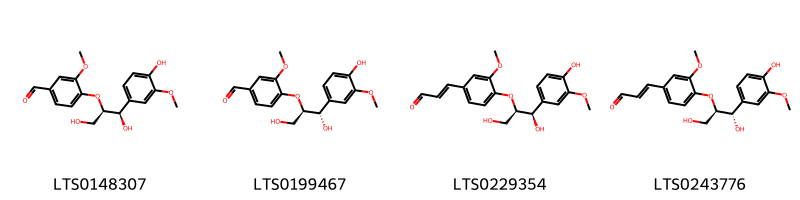{ width=100% }
    <figcaption>Hình ảnh cấu trúc hóa học của 4 hoạt chất thuộc nhóm  gồm ['4-{[(1r,2r)-1,3-dihydroxy-1-(4-hydroxy-3-methoxyphenyl)propan-2-yl]oxy}-3-methoxybenzaldehyde (LTS0148307)', '4-{[(1s,2r)-1,3-dihydroxy-1-(4-hydroxy-3-methoxyphenyl)propan-2-yl]oxy}-3-methoxybenzaldehyde (LTS0199467)', '(2e)-3-(4-{[(1r,2r)-1,3-dihydroxy-1-(4-hydroxy-3-methoxyphenyl)propan-2-yl]oxy}-3-methoxyphenyl)prop-2-enal (LTS0229354)', '(2e)-3-(4-{[(1s,2r)-1,3-dihydroxy-1-(4-hydroxy-3-methoxyphenyl)propan-2-yl]oxy}-3-methoxyphenyl)prop-2-enal (LTS0243776)'].</figcaption>
</figure>
#### Nhóm Carboxylic acids and derivatives
<figure markdown="span">
    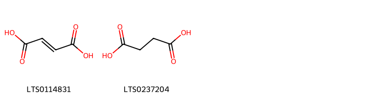{ width=100% }
    <figcaption>Hình ảnh cấu trúc hóa học của 2 hoạt chất thuộc nhóm Carboxylic acids and derivatives gồm ['fumaric acid (LTS0114831)', 'succinic acid (LTS0237204)'].</figcaption>
</figure>
#### Nhóm Fatty Acyls
<figure markdown="span">
    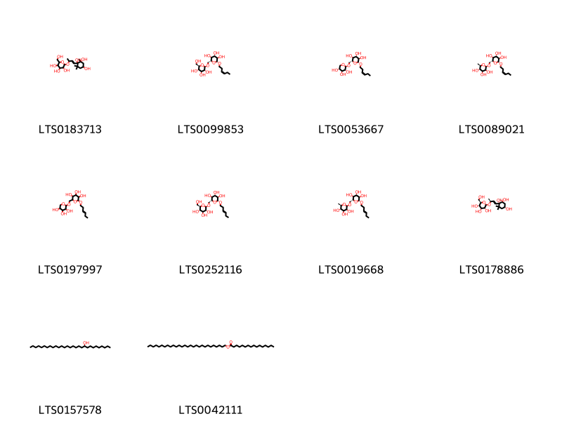{ width=100% }
    <figcaption>Hình ảnh cấu trúc hóa học của 10 hoạt chất thuộc nhóm Fatty Acyls gồm ['2-(hydroxymethyl)-6-{[4-(1,2,4-trihydroxy-2,6,6-trimethylcyclohexyl)but-3-en-2-yl]oxy}oxane-3,4,5-triol (LTS0183713)', '(2r,3r,4s,5s,6r)-2-[(3z)-hex-3-en-1-yloxy]-6-({[(2r,3r,4s,5s,6r)-3,4,5-trihydroxy-6-(hydroxymethyl)oxan-2-yl]oxy}methyl)oxane-3,4,5-triol (LTS0099853)', '(2r,3r,4s,5s,6r)-2-[(3z)-hex-3-en-1-yloxy]-6-({[(2s,3r,4s,5r)-3,4,5-trihydroxyoxan-2-yl]oxy}methyl)oxane-3,4,5-triol (LTS0053667)', '(2r,3r,4s,5s,6r)-2-[(3z)-hex-3-en-1-yloxy]-6-({[(2r,3s,4s,5s,6r)-3,4,5-trihydroxy-6-methyloxan-2-yl]oxy}methyl)oxane-3,4,5-triol (LTS0089021)', '2-(hex-3-en-1-yloxy)-6-{[(3,4,5-trihydroxyoxan-2-yl)oxy]methyl}oxane-3,4,5-triol (LTS0197997)', '(2r,3r,4s,5s,6r)-2-(hex-3-en-1-yloxy)-6-({[(2r,3r,4s,5s,6r)-3,4,5-trihydroxy-6-(hydroxymethyl)oxan-2-yl]oxy}methyl)oxane-3,4,5-triol (LTS0252116)', '(2r,3r,4s,5s,6r)-2-(hex-3-en-1-yloxy)-6-({[(2r,3s,4s,5s,6r)-3,4,5-trihydroxy-6-methyloxan-2-yl]oxy}methyl)oxane-3,4,5-triol (LTS0019668)', '(2r,3s,4s,5r,6r)-2-(hydroxymethyl)-6-{[(2s,3e)-4-[(1s,2s,4r)-1,2,4-trihydroxy-2,6,6-trimethylcyclohexyl]but-3-en-2-yl]oxy}oxane-3,4,5-triol (LTS0178886)', '(s)-nonacosan-10-ol (LTS0157578)', 'octacosyl-palmitate (LTS0042111)'].</figcaption>
</figure>
#### Nhóm Flavonoids
<figure markdown="span">
    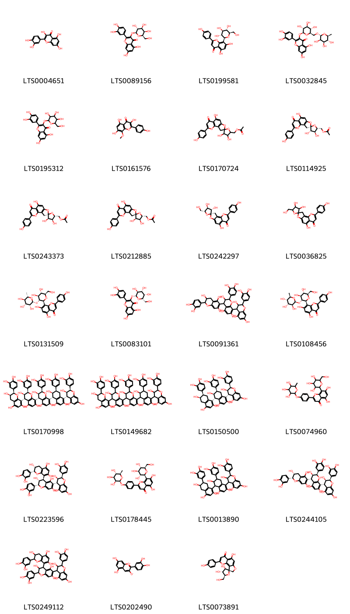{ width=100% }
    <figcaption>Hình ảnh cấu trúc hóa học của 27 hoạt chất thuộc nhóm Flavonoids gồm ['quercetin (LTS0004651)', 'hyperoside (LTS0089156)', 'vitexin (LTS0199581)', '3-rutinosyl quercetin (LTS0032845)', '2-(3,4-dihydroxyphenyl)-5,7-dihydroxy-3-{[3,4,5-trihydroxy-6-(hydroxymethyl)oxan-2-yl]oxy}chromen-4-one (LTS0195312)', 'sexangularetin (LTS0161576)', "3',4',5-trihydroxy-2-(4-hydroxyphenyl)-4-oxo-9h-spiro[furo[2,3-h]chromene-8,2'-oxolan]-5'-ylmethyl acetate (LTS0170724)", "(3's,4's,5'r,8r)-3',4',5-trihydroxy-2-(4-hydroxyphenyl)-4-oxo-9h-spiro[furo[2,3-h]chromene-8,2'-oxolan]-5'-ylmethyl acetate (LTS0114925)", "(3'r,4's,5'r,8r)-3',4',5-trihydroxy-2-(4-hydroxyphenyl)-4-oxo-9h-spiro[furo[2,3-h]chromene-8,2'-oxolan]-5'-ylmethyl acetate (LTS0243373)", "(3'r,4's,5'r,8s)-3',4',5-trihydroxy-2-(4-hydroxyphenyl)-4-oxo-9h-spiro[furo[2,3-h]chromene-8,2'-oxolan]-5'-ylmethyl acetate (LTS0212885)", "(3's,4's,5'r,8r)-3',4',5-trihydroxy-5'-(hydroxymethyl)-2-(4-hydroxyphenyl)-9h-spiro[furo[2,3-h]chromene-8,2'-oxolan]-4-one (LTS0242297)", "3',4',5-trihydroxy-5'-(hydroxymethyl)-2-(4-hydroxyphenyl)-9h-spiro[furo[2,3-h]chromene-8,2'-oxolan]-4-one (LTS0036825)", '8-[(2s,3r,4s,5s,6r)-4,5-dihydroxy-6-(hydroxymethyl)-3-{[(2r,3r,4r,5r,6s)-3,4,5-trihydroxy-6-methyloxan-2-yl]oxy}oxan-2-yl]-5,7-dihydroxy-2-(4-hydroxyphenyl)chromen-4-one (LTS0131509)', '2-(3,4-dihydroxyphenyl)-5,7-dihydroxy-3-{[(2r,3s,4r,5s,6s)-3,4,5-trihydroxy-6-(hydroxymethyl)oxan-2-yl]oxy}chromen-4-one (LTS0083101)', 'arecatannin b1 (LTS0091361)', '8-[(2s,3r,4s,5s,6r)-4,5-dihydroxy-6-(hydroxymethyl)-3-{[(2s,3s,4r,5s,6r)-3,4,5-trihydroxy-6-methyloxan-2-yl]oxy}oxan-2-yl]-5,7-dihydroxy-2-(4-hydroxyphenyl)chromen-4-one (LTS0108456)', '(2r,3r,4r)-2-(3,4-dihydroxyphenyl)-4-[(2r,3r,4s)-2-(3,4-dihydroxyphenyl)-4-[(2r,3r)-2-(3,4-dihydroxyphenyl)-3,5,7-trihydroxy-3,4-dihydro-2h-1-benzopyran-8-yl]-3,5,7-trihydroxy-3,4-dihydro-2h-1-benzopyran-8-yl]-8-[(1r,2s,3r)-3-(3,4-dihydroxyphenyl)-5-[(2r,3r,4s)-2-(3,4-dihydroxyphenyl)-3,5,7-trihydroxy-3,4-dihydro-2h-1-benzopyran-4-yl]-2,6,8-trihydroxy-1,2,3,4-tetrahydronaphthalen-1-yl]-3,4-dihydro-2h-1-benzopyran-3,5,7-triol (LTS0170998)', '2-(3,4-dihydroxyphenyl)-4-[2-(3,4-dihydroxyphenyl)-4-[2-(3,4-dihydroxyphenyl)-3,5,7-trihydroxy-3,4-dihydro-2h-1-benzopyran-8-yl]-3,5,7-trihydroxy-3,4-dihydro-2h-1-benzopyran-8-yl]-8-[3-(3,4-dihydroxyphenyl)-5-[2-(3,4-dihydroxyphenyl)-3,5,7-trihydroxy-3,4-dihydro-2h-1-benzopyran-4-yl]-2,6,8-trihydroxy-1,2,3,4-tetrahydronaphthalen-1-yl]-3,4-dihydro-2h-1-benzopyran-3,5,7-triol (LTS0149682)', "(1's,2's,3'r,6r,7r)-3',7-bis(3,4-dihydroxyphenyl)-5'-[(2r,3r,4s)-2-(3,4-dihydroxyphenyl)-3,5,7-trihydroxy-3,4-dihydro-2h-1-benzopyran-4-yl]-1',2',3',4',5,6,7,8-octahydro-[1,1'-binaphthalene]-2,2',4,6,6',8'-hexol (LTS0150500)", '5,7-dihydroxy-8-[3,4,5-trihydroxy-6-(hydroxymethyl)oxan-2-yl]-2-{4-[(3,4,5-trihydroxy-6-methyloxan-2-yl)oxy]phenyl}chromen-4-one (LTS0074960)', '(2r,3r,4r)-2-(3,4-dihydroxyphenyl)-6-[(2r,3r,4s)-2-(3,4-dihydroxyphenyl)-3,5,7-trihydroxy-3,4-dihydro-2h-1-benzopyran-4-yl]-4-[(2r,3r)-2-(3,4-dihydroxyphenyl)-3,5,7-trihydroxy-3,4-dihydro-2h-1-benzopyran-8-yl]-3,4-dihydro-2h-1-benzopyran-3,5,7-triol (LTS0223596)', '5,7-dihydroxy-8-[(2s,3r,4r,5s,6r)-3,4,5-trihydroxy-6-(hydroxymethyl)oxan-2-yl]-2-(4-{[(2s,3s,4s,5s,6r)-3,4,5-trihydroxy-6-methyloxan-2-yl]oxy}phenyl)chromen-4-one (LTS0178445)', "3',7-bis(3,4-dihydroxyphenyl)-5'-[2-(3,4-dihydroxyphenyl)-3,5,7-trihydroxy-3,4-dihydro-2h-1-benzopyran-4-yl]-1',2',3',4',5,6,7,8-octahydro-[1,1'-binaphthalene]-2,2',4,6,6',8'-hexol (LTS0013890)", '(2r,3r,4s)-2-(3,4-dihydroxyphenyl)-8-[(2r,3r,4r)-2-(3,4-dihydroxyphenyl)-3,5,7-trihydroxy-3,4-dihydro-2h-1-benzopyran-4-yl]-4-[(2r,3r)-2-(3,4-dihydroxyphenyl)-3,5,7-trihydroxy-3,4-dihydro-2h-1-benzopyran-6-yl]-3,4-dihydro-2h-1-benzopyran-3,5,7-triol (LTS0244105)', '2-(3,4-dihydroxyphenyl)-6-[2-(3,4-dihydroxyphenyl)-3,5,7-trihydroxy-3,4-dihydro-2h-1-benzopyran-4-yl]-4-[2-(3,4-dihydroxyphenyl)-3,5,7-trihydroxy-3,4-dihydro-2h-1-benzopyran-8-yl]-3,4-dihydro-2h-1-benzopyran-3,5,7-triol (LTS0249112)', '2-(3,4-dihydroxyphenyl)-5,7-dihydroxy-1λ⁴-chromen-1-ylium-3-olate (LTS0202490)', 'pinnatifinoside a (LTS0073891)'].</figcaption>
</figure>
#### Nhóm Phenols
<figure markdown="span">
    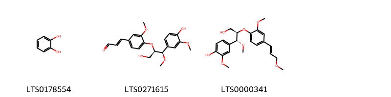{ width=100% }
    <figcaption>Hình ảnh cấu trúc hóa học của 3 hoạt chất thuộc nhóm Phenols gồm ['catechol (LTS0178554)', '(2e)-3-(4-{[(1r,2r)-3-hydroxy-1-(4-hydroxy-3-methoxyphenyl)-1-methoxypropan-2-yl]oxy}-3-methoxyphenyl)prop-2-enal (LTS0271615)', '4-[(1r,2r)-3-hydroxy-1-methoxy-2-{2-methoxy-4-[(1e)-3-methoxyprop-1-en-1-yl]phenoxy}propyl]-2-methoxyphenol (LTS0000341)'].</figcaption>
</figure>
#### Nhóm Prenol lipids
<figure markdown="span">
    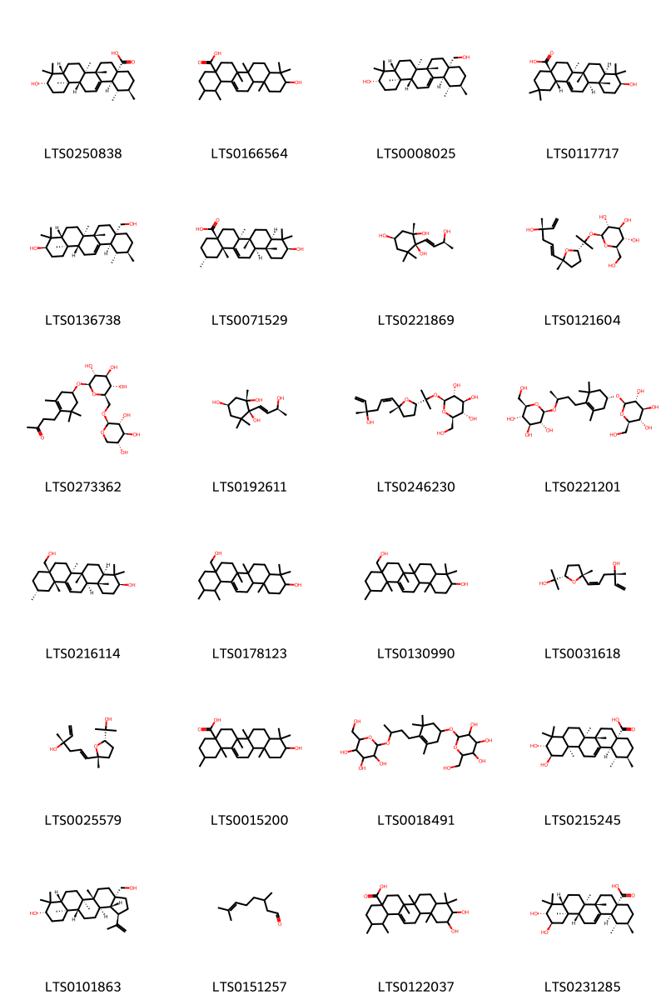{ width=100% }
    <figcaption>Hình ảnh cấu trúc hóa học của 24 hoạt chất thuộc nhóm Prenol lipids gồm ['ursolic acid (LTS0250838)', '10-hydroxy-1,2,6a,6b,9,9,12a-heptamethyl-2,3,4,5,6,7,8,8a,10,11,12,12b,13,14b-tetradecahydro-1h-picene-4a-carboxylic acid (LTS0166564)', 'uvaol (LTS0008025)', 'oleanolic acid (LTS0117717)', 'urs-12-ene-3β,28-diol (LTS0136738)', '(2r,4as,6as,6br,8ar,10s,12ar,12br,14bs)-10-hydroxy-2,6a,6b,9,9,12a,14b-heptamethyl-1,2,3,4,5,6,7,8,8a,10,11,12,12b,13-tetradecahydropicene-4a-carboxylic acid (LTS0071529)', '(1s,2s,4r)-1-[(1e,3s)-3-hydroxybut-1-en-1-yl]-2,6,6-trimethylcyclohexane-1,2,4-triol (LTS0221869)', '(2s,3r,4s,5s,6r)-2-({2-[(2s,5r)-5-[(4s)-4-hydroxy-4-methylhexa-1,5-dien-1-yl]-5-methyloxolan-2-yl]propan-2-yl}oxy)-6-(hydroxymethyl)oxane-3,4,5-triol (LTS0121604)', '4-[(4r)-2,6,6-trimethyl-4-{[(2r,3r,4s,5s,6r)-3,4,5-trihydroxy-6-({[(2s,3r,4s,5r)-3,4,5-trihydroxyoxan-2-yl]oxy}methyl)oxan-2-yl]oxy}cyclohex-1-en-1-yl]butan-2-one (LTS0273362)', '(1s,2s,4r)-1-[(3s)-3-hydroxybut-1-en-1-yl]-2,6,6-trimethylcyclohexane-1,2,4-triol (LTS0192611)', '(2s,3r,4s,5s,6r)-2-({2-[(2s,5r)-5-[(1z,4s)-4-hydroxy-4-methylhexa-1,5-dien-1-yl]-5-methyloxolan-2-yl]propan-2-yl}oxy)-6-(hydroxymethyl)oxane-3,4,5-triol (LTS0246230)', '(2r,3s,4s,5r,6r)-2-(hydroxymethyl)-6-{[(2s)-4-[(4r)-2,6,6-trimethyl-4-{[(2r,3r,4s,5s,6r)-3,4,5-trihydroxy-6-(hydroxymethyl)oxan-2-yl]oxy}cyclohex-1-en-1-yl]butan-2-yl]oxy}oxane-3,4,5-triol (LTS0221201)', '(3s,4ar,6ar,6bs,8as,11r,12as,14ar,14br)-8a-(hydroxymethyl)-4,4,6a,6b,11,12a,14b-heptamethyl-1,2,3,4a,5,6,7,8,9,10,11,12,14,14a-tetradecahydropicen-3-ol (LTS0216114)', '8a-(hydroxymethyl)-4,4,6a,6b,11,12,14b-heptamethyl-2,3,4a,5,6,7,8,9,10,11,12,12a,14,14a-tetradecahydro-1h-picen-3-ol (LTS0178123)', '8a-(hydroxymethyl)-4,4,6a,6b,11,12a,14b-heptamethyl-1,2,3,4a,5,6,7,8,9,10,11,12,14,14a-tetradecahydropicen-3-ol (LTS0130990)', '(3s,5z)-6-[(2r,5s)-5-(2-hydroxypropan-2-yl)-2-methyloxolan-2-yl]-3-methylhexa-1,5-dien-3-ol (LTS0031618)', '(3s)-6-[(2r,5s)-5-(2-hydroxypropan-2-yl)-2-methyloxolan-2-yl]-3-methylhexa-1,5-dien-3-ol (LTS0025579)', '10-hydroxy-2,6a,6b,9,9,12a,14b-heptamethyl-1,2,3,4,5,6,7,8,8a,10,11,12,12b,13-tetradecahydropicene-4a-carboxylic acid (LTS0015200)', '2-(hydroxymethyl)-6-{[4-(2,6,6-trimethyl-4-{[3,4,5-trihydroxy-6-(hydroxymethyl)oxan-2-yl]oxy}cyclohex-1-en-1-yl)butan-2-yl]oxy}oxane-3,4,5-triol (LTS0018491)', '(1s,2r,4as,6as,6br,10r,11r,12ar,14bs)-10,11-dihydroxy-1,2,6a,6b,9,9,12a-heptamethyl-2,3,4,5,6,7,8,8a,10,11,12,12b,13,14b-tetradecahydro-1h-picene-4a-carboxylic acid (LTS0215245)', 'betulin (LTS0101863)', 'citronella (LTS0151257)', '10,11-dihydroxy-1,2,6a,6b,9,9,12a-heptamethyl-2,3,4,5,6,7,8,8a,10,11,12,12b,13,14b-tetradecahydro-1h-picene-4a-carboxylic acid (LTS0122037)', 'corosolic acid (LTS0231285)'].</figcaption>
</figure>
#### Nhóm Saturated hydrocarbons
<figure markdown="span">
    { width=100% }
    <figcaption>Hình ảnh cấu trúc hóa học của 1 hoạt chất thuộc nhóm Saturated hydrocarbons gồm ['triacontane (LTS0250709)'].</figcaption>
</figure>
#### Nhóm Steroids and steroid derivatives
<figure markdown="span">
    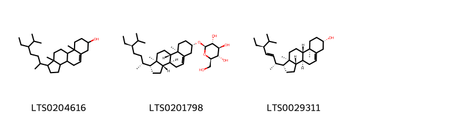{ width=100% }
    <figcaption>Hình ảnh cấu trúc hóa học của 3 hoạt chất thuộc nhóm Steroids and steroid derivatives gồm ['stigmast-5-en-3-ol, (3β)- (LTS0204616)', 'sitogluside (LTS0201798)', 'phytosterol (LTS0029311)'].</figcaption>
</figure>

---

### Dược dân tộc học

Danh sách các quốc gia có sử dụng *Crataegus pinnatifida* trong điều trị các bệnh. 

| Country   | Disease   | Bệnh                                                                                                                                                                                                |
|:----------|:----------|:----------------------------------------------------------------------------------------------------------------------------------------------------------------------------------------------------|
| China     | Digestive | MYMEMORY WARNING: YOU USED ALL AVAILABLE FREE TRANSLATIONS FOR TODAY. NEXT AVAILABLE IN  11 HOURS 13 MINUTES 06 SECONDS VISIT HTTPS://MYMEMORY.TRANSLATED.NET/DOC/USAGELIMITS.PHP TO TRANSLATE MORE |

---

---
## Crataegus pubescens
### Thông tin về thực vật

!!! info "Phân loại thực vật của *N/A* từ GIBF:"
    - **Kingdom:** Plantae
    - **Phylum:** Tracheophyta
    - **Order:** Rosales
    - **Family:** Rosaceae
    - **Genus:** Crataegus
    - **Species:** *N/A*

 

| Label (VI)   | Label (EN)   | Scientific Name     | Descriptions (VI)   | Descriptions (EN)   | Also Known As (VI)   | Also Known As (EN)   |
|:-------------|:-------------|:--------------------|:--------------------|:--------------------|:---------------------|:---------------------|
| N/A          | N/A          | Crataegus pubescens | loài thực vật       | species of plant    | ['']                 | ['']                 |

#### Phân bố trên thế giới

**Từ CSDL GIBF** Denmark, Spain, Germany, Austria, Australia, Sweden, Canada, Netherlands, Türkiye, Hungary, Mexico, Ireland, China, Norway, United Kingdom of Great Britain and Northern Ireland, Portugal, South Africa, France, New Zealand, Cyprus, United States of America, Algeria, Israel

#### Phân bố tại Việt Nam

**Từ CSDL GIBF**: Không có ghi nhận ở Việt Nam

---
### Thành phần hóa học
        
- Theo cơ sở dữ liệu lotus: Từ loài *N/A* đã phân lập và xác định được Chưa có hoạt chất nào được phân lập. hoạt chất thuộc về các nhóm Không có hoạt chất nào được phân lập. 

Không có hình ảnh nào được tạo ra

---

### Dược dân tộc học

Danh sách các quốc gia có sử dụng *N/A* trong điều trị các bệnh. 

| Country          | Disease   | Bệnh                                                                                                                                                                                                |
|:-----------------|:----------|:----------------------------------------------------------------------------------------------------------------------------------------------------------------------------------------------------|
| Mexico(Kickapoo) | Diuretic  | MYMEMORY WARNING: YOU USED ALL AVAILABLE FREE TRANSLATIONS FOR TODAY. NEXT AVAILABLE IN  11 HOURS 12 MINUTES 24 SECONDS VISIT HTTPS://MYMEMORY.TRANSLATED.NET/DOC/USAGELIMITS.PHP TO TRANSLATE MORE |

---

# Chi Margyricarpus

??? note "Danh sách các dược liệu thuộc chi"
    
	 - *Margyricarpus setosus*

---
## Margyricarpus setosus
### Thông tin về thực vật

!!! info "Phân loại thực vật của *Margyricarpus pinnatus* từ GIBF:"
    - **Kingdom:** Plantae
    - **Phylum:** Tracheophyta
    - **Order:** Rosales
    - **Family:** Rosaceae
    - **Genus:** Margyricarpus
    - **Species:** *Margyricarpus pinnatus*

 

| Label (VI)   | Label (EN)   | Scientific Name       | Descriptions (VI)   | Descriptions (EN)   | Also Known As (VI)   | Also Known As (EN)   |
|:-------------|:-------------|:----------------------|:--------------------|:--------------------|:---------------------|:---------------------|
| N/A          | N/A          | Margyricarpus setosus | loài thực vật       | species of plant    | ['']                 | ['']                 |

#### Phân bố trên thế giới

**Từ CSDL GIBF** nan, Uruguay, Colombia, Argentina, unknown or invalid, Brazil, Spain, Peru, Bolivia (Plurinational State of), Paraguay, Ecuador, Chile, United States of America, Belgium

#### Phân bố tại Việt Nam

**Từ CSDL GIBF**: Không có ghi nhận ở Việt Nam

---
### Thành phần hóa học
        
- Theo cơ sở dữ liệu lotus: Từ loài *Margyricarpus pinnatus* đã phân lập và xác định được 18 hoạt chất thuộc về các nhóm Organooxygen compounds, Flavonoids, Prenol lipids. 

|    | chemicalTaxonomyClassyfireClass   |   smiles_count |
|---:|:----------------------------------|---------------:|
|  0 | Flavonoids                        |              2 |
|  1 | Organooxygen compounds            |             11 |
|  2 | Prenol lipids                     |              5 |

#### Nhóm Flavonoids
<figure markdown="span">
    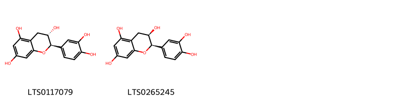{ width=100% }
    <figcaption>Hình ảnh cấu trúc hóa học của 2 hoạt chất thuộc nhóm Flavonoids gồm ['(+)-catechol (LTS0117079)', 'ent-epicatechin (LTS0265245)'].</figcaption>
</figure>
#### Nhóm Organooxygen compounds
<figure markdown="span">
    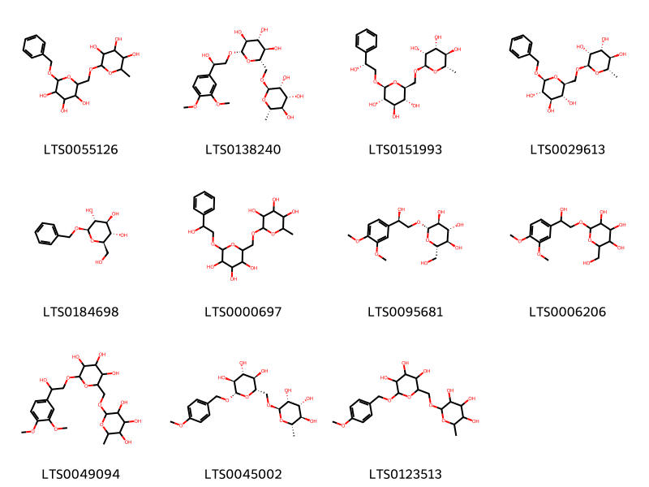{ width=100% }
    <figcaption>Hình ảnh cấu trúc hóa học của 11 hoạt chất thuộc nhóm Organooxygen compounds gồm ['2-{[6-(benzyloxy)-3,4,5-trihydroxyoxan-2-yl]methoxy}-6-methyloxane-3,4,5-triol (LTS0055126)', '(2s,3s,4r,5r,6s)-2-[(2r)-2-(3,4-dimethoxyphenyl)-2-hydroxyethoxy]-6-({[(2r,3r,4r,5r,6s)-3,4,5-trihydroxy-6-methyloxan-2-yl]oxy}methyl)oxane-3,4,5-triol (LTS0138240)', '(2s,3r,4r,5r,6r)-2-methyl-6-{[(2s,3r,4r,5s,6s)-3,4,5-trihydroxy-6-[(2r)-2-hydroxy-2-phenylethoxy]oxan-2-yl]methoxy}oxane-3,4,5-triol (LTS0151993)', '(2r,3r,4r,5r,6s)-2-{[(2s,3r,4r,5s,6s)-6-(benzyloxy)-3,4,5-trihydroxyoxan-2-yl]methoxy}-6-methyloxane-3,4,5-triol (LTS0029613)', 'benzyl β-d-glucoside (LTS0184698)', '2-methyl-6-{[3,4,5-trihydroxy-6-(2-hydroxy-2-phenylethoxy)oxan-2-yl]methoxy}oxane-3,4,5-triol (LTS0000697)', '(2s,3s,4r,5r,6s)-2-[(2r)-2-(3,4-dimethoxyphenyl)-2-hydroxyethoxy]-6-(hydroxymethyl)oxane-3,4,5-triol (LTS0095681)', '2-[2-(3,4-dimethoxyphenyl)-2-hydroxyethoxy]-6-(hydroxymethyl)oxane-3,4,5-triol (LTS0006206)', '2-[2-(3,4-dimethoxyphenyl)-2-hydroxyethoxy]-6-{[(3,4,5-trihydroxy-6-methyloxan-2-yl)oxy]methyl}oxane-3,4,5-triol (LTS0049094)', '(2s,3s,4r,5r,6s)-2-[(4-methoxyphenyl)methoxy]-6-({[(2r,3r,4r,5r,6s)-3,4,5-trihydroxy-6-methyloxan-2-yl]oxy}methyl)oxane-3,4,5-triol (LTS0045002)', '2-[(4-methoxyphenyl)methoxy]-6-{[(3,4,5-trihydroxy-6-methyloxan-2-yl)oxy]methyl}oxane-3,4,5-triol (LTS0123513)'].</figcaption>
</figure>
#### Nhóm Prenol lipids
<figure markdown="span">
    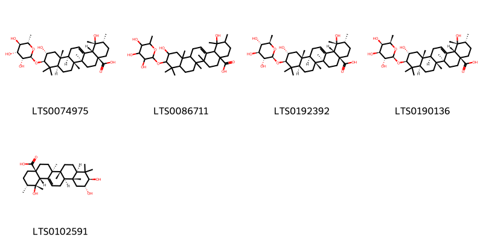{ width=100% }
    <figcaption>Hình ảnh cấu trúc hóa học của 5 hoạt chất thuộc nhóm Prenol lipids gồm ['(1r,2r,4as,6as,6br,8ar,10r,11r,12ar,12br,14bs)-1,11-dihydroxy-1,2,6a,6b,9,9,12a-heptamethyl-10-{[(2s,3r,4r,5r,6s)-3,4,5-trihydroxy-6-methyloxan-2-yl]oxy}-2,3,4,5,6,7,8,8a,10,11,12,12b,13,14b-tetradecahydropicene-4a-carboxylic acid (LTS0074975)', '1,11-dihydroxy-1,2,6a,6b,9,9,12a-heptamethyl-10-[(3,4,5-trihydroxy-6-methyloxan-2-yl)oxy]-2,3,4,5,6,7,8,8a,10,11,12,12b,13,14b-tetradecahydropicene-4a-carboxylic acid (LTS0086711)', '(1r,2r,4as,6as,6br,8ar,10r,11r,12ar,12br,14bs)-1,11-dihydroxy-1,2,6a,6b,9,9,12a-heptamethyl-10-{[(2s,3r,4s,5s,6r)-3,4,5-trihydroxy-6-methyloxan-2-yl]oxy}-2,3,4,5,6,7,8,8a,10,11,12,12b,13,14b-tetradecahydropicene-4a-carboxylic acid (LTS0192392)', '(1r,2r,4as,6as,6br,8ar,10r,11r,12ar,12br,14bs)-1,11-dihydroxy-1,2,6a,6b,9,9,12a-heptamethyl-10-{[(2s,3r,4s,5r,6r)-3,4,5-trihydroxy-6-methyloxan-2-yl]oxy}-2,3,4,5,6,7,8,8a,10,11,12,12b,13,14b-tetradecahydropicene-4a-carboxylic acid (LTS0190136)', 'tormentic acid (LTS0102591)'].</figcaption>
</figure>

---

### Dược dân tộc học

Danh sách các quốc gia có sử dụng *Margyricarpus pinnatus* trong điều trị các bệnh. 

| Country   | Disease   | Bệnh                                                                                                                                                                                                |
|:----------|:----------|:----------------------------------------------------------------------------------------------------------------------------------------------------------------------------------------------------|
| Chile     | Diuretic  | MYMEMORY WARNING: YOU USED ALL AVAILABLE FREE TRANSLATIONS FOR TODAY. NEXT AVAILABLE IN  11 HOURS 11 MINUTES 59 SECONDS VISIT HTTPS://MYMEMORY.TRANSLATED.NET/DOC/USAGELIMITS.PHP TO TRANSLATE MORE |

---

# Chi Filipendula

??? note "Danh sách các dược liệu thuộc chi"
    
	 - *Filipendula ulmaria*

---
## Filipendula ulmaria
### Thông tin về thực vật

!!! info "Phân loại thực vật của *Filipendula ulmaria* từ GIBF:"
    - **Kingdom:** Plantae
    - **Phylum:** Tracheophyta
    - **Order:** Rosales
    - **Family:** Rosaceae
    - **Genus:** Filipendula
    - **Species:** *Filipendula ulmaria*

 

| Label (VI)   | Label (EN)   | Scientific Name     | Descriptions (VI)   | Descriptions (EN)   | Also Known As (VI)   | Also Known As (EN)           |
|:-------------|:-------------|:--------------------|:--------------------|:--------------------|:---------------------|:-----------------------------|
| N/A          | N/A          | Filipendula ulmaria |                     | species of plant    | ['']                 | ['mead wort', 'meadowsweet'] |

#### Phân bố trên thế giới

**Từ CSDL GIBF** Denmark, Spain, Germany, Austria, Sweden, Poland, Kazakhstan, Belgium, Slovakia, Netherlands, Finland, Ireland, Norway, Switzerland, United Kingdom of Great Britain and Northern Ireland, France, Czechia, Russian Federation, Italy

#### Phân bố tại Việt Nam

**Từ CSDL GIBF**: Không có ghi nhận ở Việt Nam

---
### Thành phần hóa học
        
- Theo cơ sở dữ liệu lotus: Từ loài *Filipendula ulmaria* đã phân lập và xác định được 26 hoạt chất thuộc về các nhóm Organooxygen compounds, Flavonoids, Benzene and substituted derivatives, Tannins, Dihydrofurans, Cinnamic acids and derivatives, Pyrans. 

|    | chemicalTaxonomyClassyfireClass     |   smiles_count |
|---:|:------------------------------------|---------------:|
|  0 | Benzene and substituted derivatives |              7 |
|  1 | Cinnamic acids and derivatives      |              3 |
|  2 | Dihydrofurans                       |              1 |
|  3 | Flavonoids                          |             11 |
|  4 | Organooxygen compounds              |              2 |
|  5 | Pyrans                              |              1 |
|  6 | Tannins                             |              1 |

#### Nhóm Benzene and substituted derivatives
<figure markdown="span">
    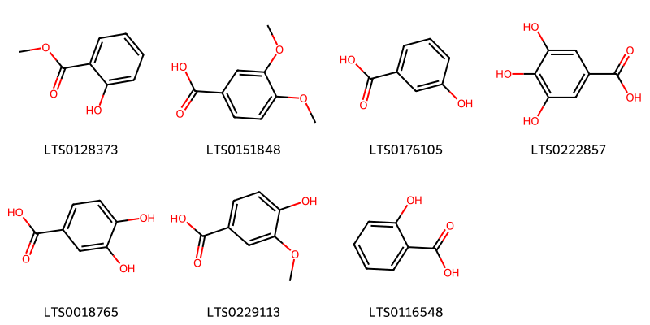{ width=100% }
    <figcaption>Hình ảnh cấu trúc hóa học của 7 hoạt chất thuộc nhóm Benzene and substituted derivatives gồm ['methyl salicylate (LTS0128373)', 'veratric acid (LTS0151848)', '3-hydroxybenzoic acid (LTS0176105)', 'galop (LTS0222857)', '3,4-dihydroxybenzoic acid (LTS0018765)', 'vanillic acid (LTS0229113)', 'salicyclic acid (LTS0116548)'].</figcaption>
</figure>
#### Nhóm Cinnamic acids and derivatives
<figure markdown="span">
    { width=100% }
    <figcaption>Hình ảnh cấu trúc hóa học của 3 hoạt chất thuộc nhóm Cinnamic acids and derivatives gồm ['ferulic acid (LTS0077328)', '3,4-dihydroxycinnamic acid (LTS0128050)', 'para-coumaric acid (LTS0266252)'].</figcaption>
</figure>
#### Nhóm Dihydrofurans
<figure markdown="span">
    { width=100% }
    <figcaption>Hình ảnh cấu trúc hóa học của 1 hoạt chất thuộc nhóm Dihydrofurans gồm ['vitamin c (LTS0022555)'].</figcaption>
</figure>
#### Nhóm Flavonoids
<figure markdown="span">
    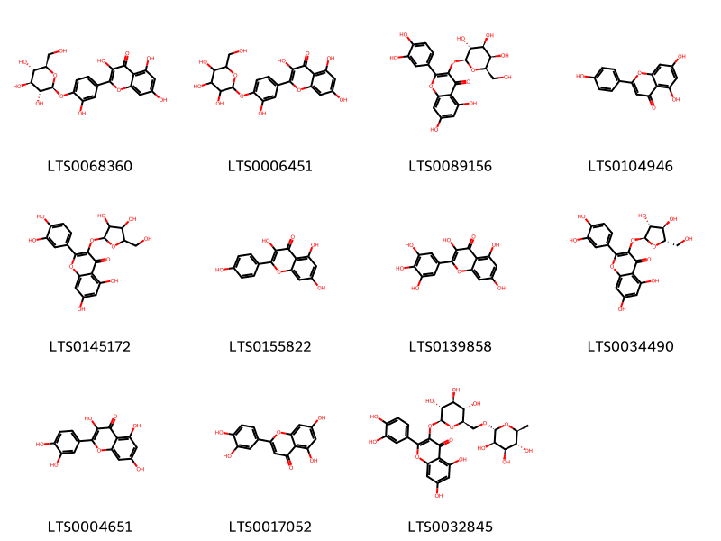{ width=100% }
    <figcaption>Hình ảnh cấu trúc hóa học của 11 hoạt chất thuộc nhóm Flavonoids gồm ['spiraeoside (LTS0068360)', '3,5,7-trihydroxy-2-(3-hydroxy-4-{[3,4,5-trihydroxy-6-(hydroxymethyl)oxan-2-yl]oxy}phenyl)chromen-4-one (LTS0006451)', 'hyperoside (LTS0089156)', 'chamomile (LTS0104946)', '3-{[3,4-dihydroxy-5-(hydroxymethyl)oxolan-2-yl]oxy}-2-(3,4-dihydroxyphenyl)-5,7-dihydroxychromen-4-one (LTS0145172)', 'kaempherol (LTS0155822)', 'myricetin (LTS0139858)', 'avicularin (LTS0034490)', 'quercetin (LTS0004651)', 'luteolin (LTS0017052)', '3-rutinosyl quercetin (LTS0032845)'].</figcaption>
</figure>
#### Nhóm Organooxygen compounds
<figure markdown="span">
    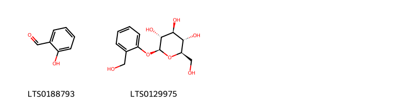{ width=100% }
    <figcaption>Hình ảnh cấu trúc hóa học của 2 hoạt chất thuộc nhóm Organooxygen compounds gồm ['salicylaldehyde (LTS0188793)', 'salicin (LTS0129975)'].</figcaption>
</figure>
#### Nhóm Pyrans
<figure markdown="span">
    { width=100% }
    <figcaption>Hình ảnh cấu trúc hóa học của 1 hoạt chất thuộc nhóm Pyrans gồm ['α-pyrone (LTS0231090)'].</figcaption>
</figure>
#### Nhóm Tannins
<figure markdown="span">
    { width=100% }
    <figcaption>Hình ảnh cấu trúc hóa học của 1 hoạt chất thuộc nhóm Tannins gồm ['ellagic acid (LTS0037297)'].</figcaption>
</figure>

---

### Dược dân tộc học

Danh sách các quốc gia có sử dụng *Filipendula ulmaria* trong điều trị các bệnh. 

| Country   | Disease                                                                       | Bệnh                                                                                                                                                                                                |
|:----------|:------------------------------------------------------------------------------|:----------------------------------------------------------------------------------------------------------------------------------------------------------------------------------------------------|
| Elsewhere | Astringent                                                                    | MYMEMORY WARNING: YOU USED ALL AVAILABLE FREE TRANSLATIONS FOR TODAY. NEXT AVAILABLE IN  11 HOURS 11 MINUTES 33 SECONDS VISIT HTTPS://MYMEMORY.TRANSLATED.NET/DOC/USAGELIMITS.PHP TO TRANSLATE MORE |
| Turkey    | Astringent, Diuretic, Laxative, Sedative, nan, Sudorific, Astringent, Nervine | MYMEMORY WARNING: YOU USED ALL AVAILABLE FREE TRANSLATIONS FOR TODAY. NEXT AVAILABLE IN  11 HOURS 11 MINUTES 29 SECONDS VISIT HTTPS://MYMEMORY.TRANSLATED.NET/DOC/USAGELIMITS.PHP TO TRANSLATE MORE |
| ain       | Diuretic                                                                      | MYMEMORY WARNING: YOU USED ALL AVAILABLE FREE TRANSLATIONS FOR TODAY. NEXT AVAILABLE IN  11 HOURS 11 MINUTES 26 SECONDS VISIT HTTPS://MYMEMORY.TRANSLATED.NET/DOC/USAGELIMITS.PHP TO TRANSLATE MORE |

---

# Chi Prinsepia

??? note "Danh sách các dược liệu thuộc chi"
    
	 - *Prinsepia laevis*
	 - *Prinsepia utilis*

---
## Prinsepia laevis
### Thông tin về thực vật

!!! info "Phân loại thực vật của *N/A* từ GIBF:"
    - **Kingdom:** Plantae
    - **Phylum:** Tracheophyta
    - **Order:** Rosales
    - **Family:** Rosaceae
    - **Genus:** Prinsepia
    - **Species:** *N/A*

 

| Label (VI)   | Label (EN)   | Scientific Name     | Descriptions (VI)   | Descriptions (EN)   | Also Known As (VI)   | Also Known As (EN)           |
|:-------------|:-------------|:--------------------|:--------------------|:--------------------|:---------------------|:-----------------------------|
| N/A          | N/A          | Filipendula ulmaria |                     | species of plant    | ['']                 | ['mead wort', 'meadowsweet'] |

#### Phân bố trên thế giới

**Từ CSDL GIBF** nan, Bhutan, Latvia, India, Canada, Russian Federation, United States of America, China, Nepal, Belgium, Chinese Taipei

#### Phân bố tại Việt Nam

**Từ CSDL GIBF**: Không có ghi nhận ở Việt Nam

---
### Thành phần hóa học
        
- Theo cơ sở dữ liệu lotus: Từ loài *N/A* đã phân lập và xác định được Chưa có hoạt chất nào được phân lập. hoạt chất thuộc về các nhóm Không có hoạt chất nào được phân lập. 

Không có hình ảnh nào được tạo ra

---

### Dược dân tộc học

Danh sách các quốc gia có sử dụng *N/A* trong điều trị các bệnh. 

| Country   | Disease     | Bệnh                                                                                                                                                                                                |
|:----------|:------------|:----------------------------------------------------------------------------------------------------------------------------------------------------------------------------------------------------|
| Elsewhere | Rubefacient | MYMEMORY WARNING: YOU USED ALL AVAILABLE FREE TRANSLATIONS FOR TODAY. NEXT AVAILABLE IN  11 HOURS 10 MINUTES 46 SECONDS VISIT HTTPS://MYMEMORY.TRANSLATED.NET/DOC/USAGELIMITS.PHP TO TRANSLATE MORE |

---

---
## Prinsepia utilis
### Thông tin về thực vật

!!! info "Phân loại thực vật của *Prinsepia utilis* từ GIBF:"
    - **Kingdom:** Plantae
    - **Phylum:** Tracheophyta
    - **Order:** Rosales
    - **Family:** Rosaceae
    - **Genus:** Prinsepia
    - **Species:** *Prinsepia utilis*

 

| Label (VI)   | Label (EN)   | Scientific Name   | Descriptions (VI)   | Descriptions (EN)   | Also Known As (VI)   | Also Known As (EN)                                      |
|:-------------|:-------------|:------------------|:--------------------|:--------------------|:---------------------|:--------------------------------------------------------|
| N/A          | N/A          | Prinsepia utilis  | loài thực vật       | species of plant    | ['']                 | ['Himalayan cherry prinsepia', 'Himalayan wild cherry'] |

#### Phân bố trên thế giới

**Từ CSDL GIBF** nan, unknown or invalid, Bhutan, India, China, Nepal

#### Phân bố tại Việt Nam

**Từ CSDL GIBF**: Không có ghi nhận ở Việt Nam

---
### Thành phần hóa học
        
- Theo cơ sở dữ liệu lotus: Từ loài *Prinsepia utilis* đã phân lập và xác định được 6 hoạt chất thuộc về các nhóm Furanoid lignans, Steroids and steroid derivatives, Flavonoids. 

|    | chemicalTaxonomyClassyfireClass   |   smiles_count |
|---:|:----------------------------------|---------------:|
|  0 | Flavonoids                        |              2 |
|  1 | Furanoid lignans                  |              2 |
|  2 | Steroids and steroid derivatives  |              2 |

#### Nhóm Flavonoids
<figure markdown="span">
    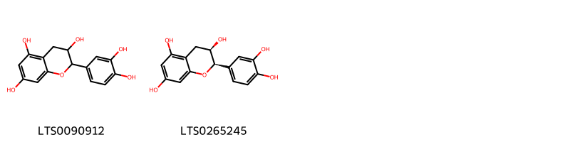{ width=100% }
    <figcaption>Hình ảnh cấu trúc hóa học của 2 hoạt chất thuộc nhóm Flavonoids gồm ['catechol (LTS0090912)', 'ent-epicatechin (LTS0265245)'].</figcaption>
</figure>
#### Nhóm Furanoid lignans
<figure markdown="span">
    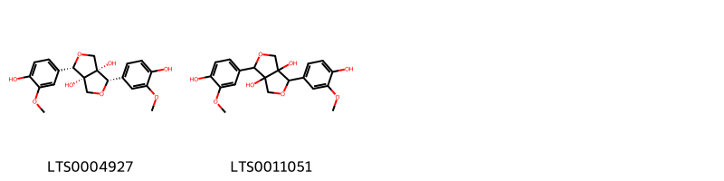{ width=100% }
    <figcaption>Hình ảnh cấu trúc hóa học của 2 hoạt chất thuộc nhóm Furanoid lignans gồm ['(1s,3ar,4s,6ar)-1,4-bis(4-hydroxy-3-methoxyphenyl)-tetrahydrofuro[3,4-c]furan-3a,6a-diol (LTS0004927)', '1,4-bis(4-hydroxy-3-methoxyphenyl)-tetrahydrofuro[3,4-c]furan-3a,6a-diol (LTS0011051)'].</figcaption>
</figure>
#### Nhóm Steroids and steroid derivatives
<figure markdown="span">
    { width=100% }
    <figcaption>Hình ảnh cấu trúc hóa học của 2 hoạt chất thuộc nhóm Steroids and steroid derivatives gồm ['sitogluside (LTS0201798)', '2-{[1-(5-ethyl-6-methylheptan-2-yl)-9a,11a-dimethyl-1h,2h,3h,3ah,3bh,4h,6h,7h,8h,9h,9bh,10h,11h-cyclopenta[a]phenanthren-7-yl]oxy}-6-(hydroxymethyl)oxane-3,4,5-triol (LTS0158828)'].</figcaption>
</figure>

---

### Dược dân tộc học

Danh sách các quốc gia có sử dụng *Prinsepia utilis* trong điều trị các bệnh. 

| Country   | Disease                  | Bệnh                                                                                                                                                                                                |
|:----------|:-------------------------|:----------------------------------------------------------------------------------------------------------------------------------------------------------------------------------------------------|
| Nepal     | Rubefacient, Rubefacient | MYMEMORY WARNING: YOU USED ALL AVAILABLE FREE TRANSLATIONS FOR TODAY. NEXT AVAILABLE IN  11 HOURS 10 MINUTES 20 SECONDS VISIT HTTPS://MYMEMORY.TRANSLATED.NET/DOC/USAGELIMITS.PHP TO TRANSLATE MORE |

---

# Chi Pyracantha

??? note "Danh sách các dược liệu thuộc chi"
    
	 - *Pyracantha coccinea*
	 - *Pyracantha fortuneana*

---
## Pyracantha coccinea
### Thông tin về thực vật

!!! info "Phân loại thực vật của *Pyracantha coccinea* từ GIBF:"
    - **Kingdom:** Plantae
    - **Phylum:** Tracheophyta
    - **Order:** Rosales
    - **Family:** Rosaceae
    - **Genus:** Pyracantha
    - **Species:** *Pyracantha coccinea*

 

| Label (VI)   | Label (EN)   | Scientific Name     | Descriptions (VI)   | Descriptions (EN)   | Also Known As (VI)   | Also Known As (EN)                       |
|:-------------|:-------------|:--------------------|:--------------------|:--------------------|:---------------------|:-----------------------------------------|
| N/A          | N/A          | Pyracantha coccinea | loài thực vật       | species of plant    | ['']                 | ['Pyracantha coccinea', 'Red firethorn'] |

#### Phân bố trên thế giới

**Từ CSDL GIBF** Denmark, Spain, Germany, Chile, Austria, Sweden, Poland, Canada, Belgium, Netherlands, Japan, Bulgaria, Norway, Switzerland, United Kingdom of Great Britain and Northern Ireland, Argentina, France, Czechia, New Zealand, Russian Federation, United States of America, Italy, Ukraine

#### Phân bố tại Việt Nam

**Từ CSDL GIBF**: Không có ghi nhận ở Việt Nam

---
### Thành phần hóa học
        
- Theo cơ sở dữ liệu lotus: Từ loài *Pyracantha coccinea* đã phân lập và xác định được 98 hoạt chất thuộc về các nhóm Organooxygen compounds, Flavonoids, Benzofurans, Coumarins and derivatives, Prenol lipids, Lignan glycosides, Glycerophospholipids, Fatty Acyls, Steroids and steroid derivatives, Organic phosphoric acids and derivatives. 

|    | chemicalTaxonomyClassyfireClass          |   smiles_count |
|---:|:-----------------------------------------|---------------:|
|  0 | Benzofurans                              |              3 |
|  1 | Coumarins and derivatives                |              1 |
|  2 | Fatty Acyls                              |              2 |
|  3 | Flavonoids                               |             57 |
|  4 | Glycerophospholipids                     |              2 |
|  5 | Lignan glycosides                        |              2 |
|  6 | Organic phosphoric acids and derivatives |              1 |
|  7 | Organooxygen compounds                   |              2 |
|  8 | Prenol lipids                            |             18 |
|  9 | Steroids and steroid derivatives         |             10 |

#### Nhóm Benzofurans
<figure markdown="span">
    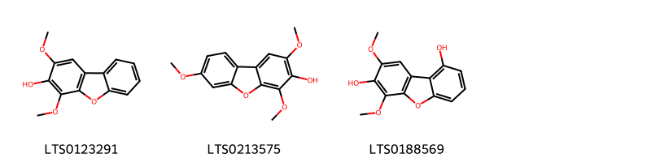{ width=100% }
    <figcaption>Hình ảnh cấu trúc hóa học của 3 hoạt chất thuộc nhóm Benzofurans gồm ['eriobofuran (LTS0123291)', '4,6,11-trimethoxy-8-oxatricyclo[7.4.0.0²,⁷]trideca-1(9),2(7),3,5,10,12-hexaen-5-ol (LTS0213575)', '10,12-dimethoxy-8-oxatricyclo[7.4.0.0²,⁷]trideca-1(9),2(7),3,5,10,12-hexaene-3,11-diol (LTS0188569)'].</figcaption>
</figure>
#### Nhóm Coumarins and derivatives
<figure markdown="span">
    { width=100% }
    <figcaption>Hình ảnh cấu trúc hóa học của 1 hoạt chất thuộc nhóm Coumarins and derivatives gồm ['scopoletin (LTS0193112)'].</figcaption>
</figure>
#### Nhóm Fatty Acyls
<figure markdown="span">
    { width=100% }
    <figcaption>Hình ảnh cấu trúc hóa học của 2 hoạt chất thuộc nhóm Fatty Acyls gồm ['(4s)-4-hydroxy-3,5,5-trimethyl-4-[(1e,3r)-3-{[(2r,3r,4s,5s,6r)-3,4,5-trihydroxy-6-(hydroxymethyl)oxan-2-yl]oxy}but-1-en-1-yl]cyclohex-2-en-1-one (LTS0069145)', '4-hydroxy-3,5,5-trimethyl-4-[(1e,3r)-3-{[(2r,3r,4s,5s,6r)-3,4,5-trihydroxy-6-(hydroxymethyl)oxan-2-yl]oxy}but-1-en-1-yl]cyclohex-2-en-1-one (LTS0150734)'].</figcaption>
</figure>
#### Nhóm Flavonoids
<figure markdown="span">
    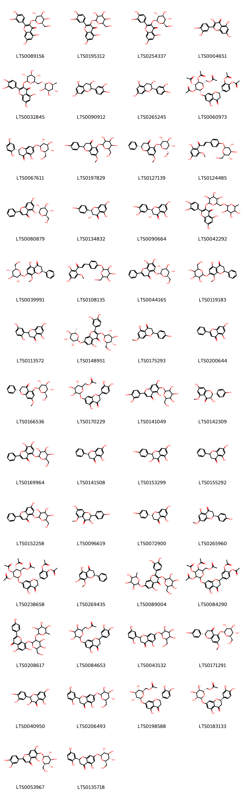{ width=100% }
    <figcaption>Hình ảnh cấu trúc hóa học của 57 hoạt chất thuộc nhóm Flavonoids gồm ['hyperoside (LTS0089156)', '2-(3,4-dihydroxyphenyl)-5,7-dihydroxy-3-{[3,4,5-trihydroxy-6-(hydroxymethyl)oxan-2-yl]oxy}chromen-4-one (LTS0195312)', 'isoquercetin (LTS0254337)', 'quercetin (LTS0004651)', '3-rutinosyl quercetin (LTS0032845)', 'catechol (LTS0090912)', 'ent-epicatechin (LTS0265245)', '[(2s,3s,4r,5s,6r)-3,4,5-tris(acetyloxy)-6-{[(2s)-2-[3,4-bis(acetyloxy)phenyl]-5-hydroxy-4-oxo-2,3-dihydro-1-benzopyran-7-yl]oxy}oxan-2-yl]methyl acetate (LTS0060973)', '(2r)-2-(2,5-dihydroxyphenyl)-5-hydroxy-7-{[(2s,3r,4s,5s,6r)-3,4,5-trihydroxy-6-(hydroxymethyl)oxan-2-yl]oxy}-2,3-dihydro-1-benzopyran-4-one (LTS0067611)', 'sakuranin (LTS0197829)', '(2s)-7-methoxy-2-phenyl-5-{[(2s,3r,4s,5s,6s)-3,4,5-trihydroxy-6-(hydroxymethyl)oxan-2-yl]oxy}-2,3-dihydro-1-benzopyran-4-one (LTS0127139)', '(2e)-1-(2,4-dihydroxy-6-methoxyphenyl)-3-(4-{[(2s,3r,4s,5s,6r)-3,4,5-trihydroxy-6-(hydroxymethyl)oxan-2-yl]oxy}phenyl)prop-2-en-1-one (LTS0124485)', '7-hydroxy-2-phenyl-5-{[(2r,3r,4s,5s,6r)-3,4,5-trihydroxy-6-(hydroxymethyl)oxan-2-yl]oxy}chromen-4-one (LTS0080879)', '(+)-dihydrokaempferol (LTS0134832)', '(+)-taxifolin (LTS0090664)', 'rutin (LTS0042292)', '(2s)-5-hydroxy-8-methoxy-2-phenyl-7-{[(2s,3r,4s,5s,6r)-3,4,5-trihydroxy-6-(hydroxymethyl)oxan-2-yl]oxy}-2,3-dihydro-1-benzopyran-4-one (LTS0039991)', '1-(2,4-dihydroxy-6-methoxyphenyl)-3-(4-{[3,4,5-trihydroxy-6-(hydroxymethyl)oxan-2-yl]oxy}phenyl)prop-2-en-1-one (LTS0108135)', '7,8-dihydroxy-2-phenyl-5-{[(2s,3r,4s,5s,6r)-3,4,5-trihydroxy-6-(hydroxymethyl)oxan-2-yl]oxy}chromen-4-one (LTS0044165)', '5-hydroxy-8-methoxy-2-phenyl-7-{[3,4,5-trihydroxy-6-(hydroxymethyl)oxan-2-yl]oxy}-2,3-dihydro-1-benzopyran-4-one (LTS0119183)', '2-(2,5-dihydroxyphenyl)-5,7-dihydroxy-2,3-dihydro-1-benzopyran-4-one (LTS0113572)', 'petiolaroside (LTS0148951)', 'sakuranetin (LTS0175293)', 'chrysin (LTS0200644)', '(2s)-7-methoxy-2-phenyl-5-{[(2s,3r,4s,5s,6r)-3,4,5-trihydroxy-6-(hydroxymethyl)oxan-2-yl]oxy}-2,3-dihydro-1-benzopyran-4-one (LTS0166536)', 'coccinoside a (LTS0170229)', '2-(3,4-dihydroxyphenyl)-5,7-dihydroxy-6-{[3,4,5-trihydroxy-6-(hydroxymethyl)oxan-2-yl]oxy}chromen-4-one (LTS0141049)', '(2r,3r)-3,7-dihydroxy-2-(4-hydroxyphenyl)-5-methoxy-2,3-dihydro-1-benzopyran-4-one (LTS0142309)', '7,8-dihydroxy-2-phenyl-5-{[3,4,5-trihydroxy-6-(hydroxymethyl)oxan-2-yl]oxy}chromen-4-one (LTS0169964)', 'pinocembrine (LTS0141508)', 'aromadendrin (LTS0153299)', 'pinocembrin (LTS0155292)', '7-hydroxy-2-phenyl-5-{[3,4,5-trihydroxy-6-(hydroxymethyl)oxan-2-yl]oxy}chromen-4-one (LTS0152258)', '3,7-dihydroxy-2-(4-hydroxyphenyl)-5-methoxy-2,3-dihydro-1-benzopyran-4-one (LTS0096619)', '(-)-naringenin (LTS0072900)', 'sakuranetin (LTS0265960)', '[(2r,3r,4s,5r,6s)-3,4,5-tris(acetyloxy)-6-{[(2s)-2-[3,4-bis(acetyloxy)phenyl]-5-hydroxy-4-oxo-2,3-dihydro-1-benzopyran-7-yl]oxy}oxan-2-yl]methyl acetate (LTS0238658)', '(2s)-5,7-dihydroxy-8-methoxy-2-phenyl-2,3-dihydro-1-benzopyran-4-one (LTS0269435)', '2-(3,4-dihydroxyphenyl)-5-hydroxy-3-{[3,4,5-trihydroxy-6-(hydroxymethyl)oxan-2-yl]oxy}-7-[(3,4,5-trihydroxy-6-methyloxan-2-yl)oxy]chromen-4-one (LTS0089004)', '[3,4,5-tris(acetyloxy)-6-({2-[3,4-bis(acetyloxy)phenyl]-5-hydroxy-4-oxo-2,3-dihydro-1-benzopyran-7-yl}oxy)oxan-2-yl]methyl acetate (LTS0084290)', '8-{[4,5-dihydroxy-6-(hydroxymethyl)-3-[(3,4,5-trihydroxy-6-methyloxan-2-yl)oxy]oxan-2-yl]oxy}-5,7-dihydroxy-2-(4-hydroxyphenyl)chromen-4-one (LTS0208617)', '(6-{[2-(3,4-dihydroxyphenyl)-5-hydroxy-4-oxo-2,3-dihydro-1-benzopyran-7-yl]oxy}-3,4,5-trihydroxyoxan-2-yl)methyl acetate (LTS0084653)', '2-(2,5-dihydroxyphenyl)-5-hydroxy-7-{[3,4,5-trihydroxy-6-(hydroxymethyl)oxan-2-yl]oxy}-2,3-dihydro-1-benzopyran-4-one (LTS0043132)', 'sakuranin (LTS0171291)', '2,3-dihydroquercetin (LTS0040950)', 'coccinoside b (LTS0206493)', '[(2r,3s,4s,5r,6s)-6-{[(2s)-2-(3,4-dihydroxyphenyl)-5-hydroxy-4-oxo-2,3-dihydro-1-benzopyran-7-yl]oxy}-3,4,5-trihydroxyoxan-2-yl]methyl acetate (LTS0198588)', '[(2s,3r,4s,5s,6s)-6-{[(2r)-2-(3,4-dihydroxyphenyl)-5-hydroxy-4-oxo-2,3-dihydro-1-benzopyran-7-yl]oxy}-3,4,5-trihydroxyoxan-2-yl]methyl acetate (LTS0183133)', '2-(3,4-dihydroxyphenyl)-5,7-dihydroxy-6-{[(2s,3r,4s,5s,6r)-3,4,5-trihydroxy-6-(hydroxymethyl)oxan-2-yl]oxy}chromen-4-one (LTS0053967)', '(2s)-2-(2,5-dihydroxyphenyl)-5-hydroxy-7-{[(2s,3r,4s,5s,6r)-3,4,5-trihydroxy-6-(hydroxymethyl)oxan-2-yl]oxy}-2,3-dihydro-1-benzopyran-4-one (LTS0135718)', 'asahina (LTS0068303)', 'dihydrowogonin (LTS0004522)', 'naringenin (LTS0031098)', '8-{[(2s,3r,4s,5s,6r)-4,5-dihydroxy-6-(hydroxymethyl)-3-{[(2s,3r,4r,5r,6s)-3,4,5-trihydroxy-6-methyloxan-2-yl]oxy}oxan-2-yl]oxy}-5,7-dihydroxy-2-(4-hydroxyphenyl)chromen-4-one (LTS0259064)', '(2e)-1-(2,4-dihydroxy-6-methoxyphenyl)-3-(4-{[(2s,3r,4r,5s,6r)-3,4,5-trihydroxy-6-(hydroxymethyl)oxan-2-yl]oxy}phenyl)prop-2-en-1-one (LTS0031057)', 'pinostrobin 5-o-glucoside (LTS0101074)', '(2s)-2-(2,5-dihydroxyphenyl)-5,7-dihydroxy-2,3-dihydro-1-benzopyran-4-one (LTS0089270)'].</figcaption>
</figure>
#### Nhóm Glycerophospholipids
<figure markdown="span">
    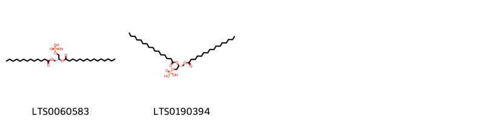{ width=100% }
    <figcaption>Hình ảnh cấu trúc hóa học của 2 hoạt chất thuộc nhóm Glycerophospholipids gồm ['(2r)-2-(pentadecanoyloxy)-3-(tridecanoyloxy)propoxyphosphonic acid (LTS0060583)', 'dipalmitoyl (LTS0190394)'].</figcaption>
</figure>
#### Nhóm Lignan glycosides
<figure markdown="span">
    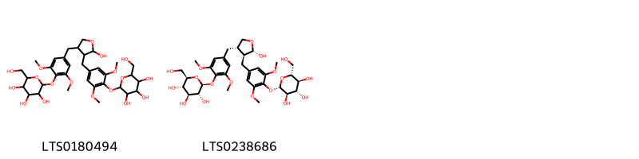{ width=100% }
    <figcaption>Hình ảnh cấu trúc hóa học của 2 hoạt chất thuộc nhóm Lignan glycosides gồm ['2-[4-({4-[(3,5-dimethoxy-4-{[3,4,5-trihydroxy-6-(hydroxymethyl)oxan-2-yl]oxy}phenyl)methyl]-2-hydroxyoxolan-3-yl}methyl)-2,6-dimethoxyphenoxy]-6-(hydroxymethyl)oxane-3,4,5-triol (LTS0180494)', '(2s,3r,4s,5s,6r)-2-(4-{[(2s,3s,4s)-4-[(3,5-dimethoxy-4-{[(2s,3r,4s,5s,6r)-3,4,5-trihydroxy-6-(hydroxymethyl)oxan-2-yl]oxy}phenyl)methyl]-2-hydroxyoxolan-3-yl]methyl}-2,6-dimethoxyphenoxy)-6-(hydroxymethyl)oxane-3,4,5-triol (LTS0238686)'].</figcaption>
</figure>
#### Nhóm Organic phosphoric acids and derivatives
<figure markdown="span">
    { width=100% }
    <figcaption>Hình ảnh cấu trúc hóa học của 1 hoạt chất thuộc nhóm Organic phosphoric acids and derivatives gồm ['o-phosphoethanolamine; bis(nonane) (LTS0249963)'].</figcaption>
</figure>
#### Nhóm Organooxygen compounds
<figure markdown="span">
    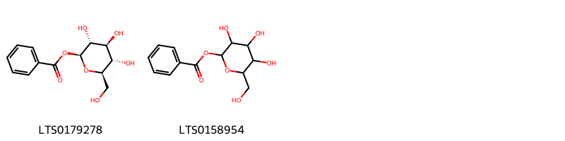{ width=100% }
    <figcaption>Hình ảnh cấu trúc hóa học của 2 hoạt chất thuộc nhóm Organooxygen compounds gồm ['benzoyl-β-d-glucoside (LTS0179278)', 'benzoyl-β-d-glucoside (LTS0158954)'].</figcaption>
</figure>
#### Nhóm Prenol lipids
<figure markdown="span">
    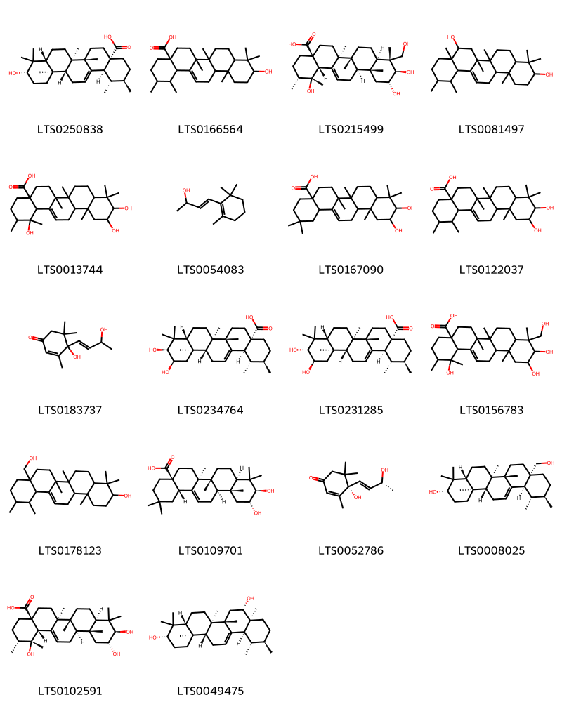{ width=100% }
    <figcaption>Hình ảnh cấu trúc hóa học của 18 hoạt chất thuộc nhóm Prenol lipids gồm ['ursolic acid (LTS0250838)', '10-hydroxy-1,2,6a,6b,9,9,12a-heptamethyl-2,3,4,5,6,7,8,8a,10,11,12,12b,13,14b-tetradecahydro-1h-picene-4a-carboxylic acid (LTS0166564)', '19α-hydroxyasiatic acid (LTS0215499)', '4,4,6a,6b,8a,11,12,14b-octamethyl-2,3,4a,5,6,7,8,9,10,11,12,12a,14,14a-tetradecahydro-1h-picene-3,8-diol (LTS0081497)', '1,10,11-trihydroxy-1,2,6a,6b,9,9,12a-heptamethyl-2,3,4,5,6,7,8,8a,10,11,12,12b,13,14b-tetradecahydropicene-4a-carboxylic acid (LTS0013744)', 'β-ionol (LTS0054083)', '10,11-dihydroxy-2,2,6a,6b,9,9,12a-heptamethyl-1,3,4,5,6,7,8,8a,10,11,12,12b,13,14b-tetradecahydropicene-4a-carboxylic acid (LTS0167090)', '10,11-dihydroxy-1,2,6a,6b,9,9,12a-heptamethyl-2,3,4,5,6,7,8,8a,10,11,12,12b,13,14b-tetradecahydro-1h-picene-4a-carboxylic acid (LTS0122037)', '4-hydroxy-4-(3-hydroxybut-1-en-1-yl)-3,5,5-trimethylcyclohex-2-en-1-one (LTS0183737)', '(1s,2r,4as,6as,6br,8ar,10s,11r,12ar,12br,14bs)-10,11-dihydroxy-1,2,6a,6b,9,9,12a-heptamethyl-2,3,4,5,6,7,8,8a,10,11,12,12b,13,14b-tetradecahydro-1h-picene-4a-carboxylic acid (LTS0234764)', 'corosolic acid (LTS0231285)', '1,10,11-trihydroxy-9-(hydroxymethyl)-1,2,6a,6b,9,12a-hexamethyl-2,3,4,5,6,7,8,8a,10,11,12,12b,13,14b-tetradecahydropicene-4a-carboxylic acid (LTS0156783)', '8a-(hydroxymethyl)-4,4,6a,6b,11,12,14b-heptamethyl-2,3,4a,5,6,7,8,9,10,11,12,12a,14,14a-tetradecahydro-1h-picen-3-ol (LTS0178123)', 'maslinic acid (LTS0109701)', '(6s,9r)-vomifoliol (LTS0052786)', 'uvaol (LTS0008025)', 'tormentic acid (LTS0102591)', 'brein (LTS0049475)'].</figcaption>
</figure>
#### Nhóm Steroids and steroid derivatives
<figure markdown="span">
    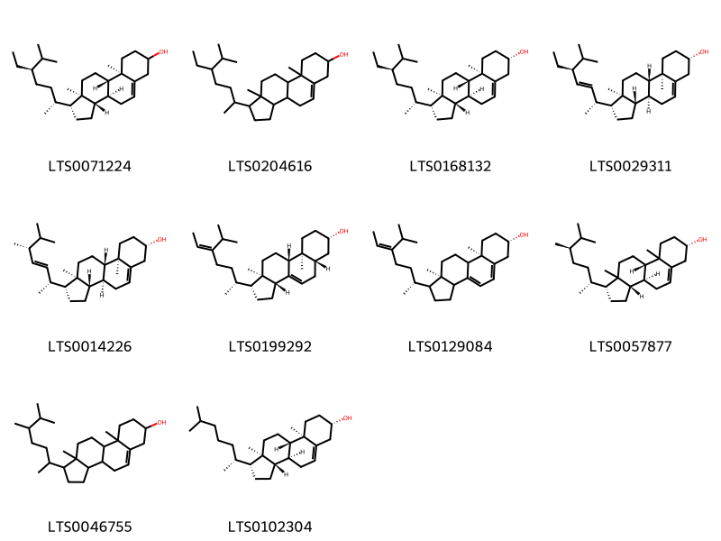{ width=100% }
    <figcaption>Hình ảnh cấu trúc hóa học của 10 hoạt chất thuộc nhóm Steroids and steroid derivatives gồm ['stigmast-5-en-3-ol (LTS0071224)', 'stigmast-5-en-3-ol, (3β)- (LTS0204616)', 'sitosterol (LTS0168132)', 'phytosterol (LTS0029311)', 'brassicasterol (LTS0014226)', 'delta7-avenasterol (LTS0199292)', '5-dehydroavenasterol (LTS0129084)', '(1r,3as,3bs,7s,9bs)-1-[(2r,5r)-5,6-dimethylheptan-2-yl]-9a,11a-dimethyl-1h,2h,3h,3ah,3bh,4h,6h,7h,8h,9h,9bh,10h,11h-cyclopenta[a]phenanthren-7-ol (LTS0057877)', 'campesterol (LTS0046755)', 'cholesterol (LTS0102304)'].</figcaption>
</figure>

---

### Dược dân tộc học

Danh sách các quốc gia có sử dụng *Pyracantha coccinea* trong điều trị các bệnh. 

| Country   | Disease                  | Bệnh                                                                                                                                                                                                |
|:----------|:-------------------------|:----------------------------------------------------------------------------------------------------------------------------------------------------------------------------------------------------|
| Europe    | Poison                   | MYMEMORY WARNING: YOU USED ALL AVAILABLE FREE TRANSLATIONS FOR TODAY. NEXT AVAILABLE IN  11 HOURS 09 MINUTES 49 SECONDS VISIT HTTPS://MYMEMORY.TRANSLATED.NET/DOC/USAGELIMITS.PHP TO TRANSLATE MORE |
| Turkey    | Cardiac, Diuretic, Tonic | MYMEMORY WARNING: YOU USED ALL AVAILABLE FREE TRANSLATIONS FOR TODAY. NEXT AVAILABLE IN  11 HOURS 09 MINUTES 46 SECONDS VISIT HTTPS://MYMEMORY.TRANSLATED.NET/DOC/USAGELIMITS.PHP TO TRANSLATE MORE |

---

---
## Pyracantha fortuneana
### Thông tin về thực vật

!!! info "Phân loại thực vật của *Pyracantha fortuneana* từ GIBF:"
    - **Kingdom:** Plantae
    - **Phylum:** Tracheophyta
    - **Order:** Rosales
    - **Family:** Rosaceae
    - **Genus:** Pyracantha
    - **Species:** *Pyracantha fortuneana*

 

| Label (VI)   | Label (EN)   | Scientific Name       | Descriptions (VI)   | Descriptions (EN)   | Also Known As (VI)   | Also Known As (EN)   |
|:-------------|:-------------|:----------------------|:--------------------|:--------------------|:---------------------|:---------------------|
| N/A          | N/A          | Pyracantha fortuneana | loài thực vật       | species of plant    | ['']                 | ['']                 |

#### Phân bố trên thế giới

**Từ CSDL GIBF** Uruguay, Argentina, Spain, New Zealand, Canada, Russian Federation, United States of America, China, Australia, Belgium, Korea, Republic of, Chinese Taipei

#### Phân bố tại Việt Nam

**Từ CSDL GIBF**: Không có ghi nhận ở Việt Nam

---
### Thành phần hóa học
        
- Theo cơ sở dữ liệu lotus: Từ loài *Pyracantha fortuneana* đã phân lập và xác định được 22 hoạt chất thuộc về các nhóm Organooxygen compounds. 

|    | chemicalTaxonomyClassyfireClass   |   smiles_count |
|---:|:----------------------------------|---------------:|
|  0 | Organooxygen compounds            |             22 |

#### Nhóm Organooxygen compounds
<figure markdown="span">
    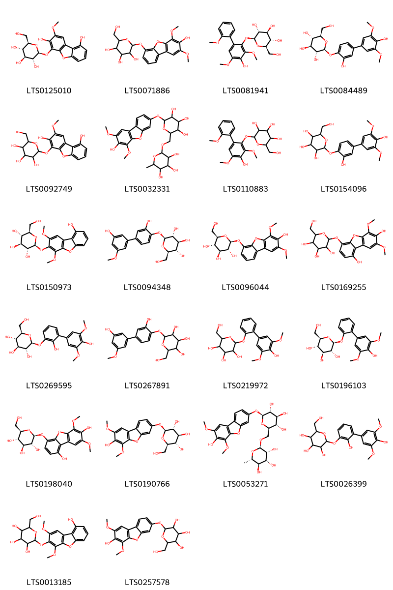{ width=100% }
    <figcaption>Hình ảnh cấu trúc hóa học của 22 hoạt chất thuộc nhóm Organooxygen compounds gồm ['(2s,3r,4s,5s,6r)-2-({5,13-dihydroxy-4-methoxy-8-oxatricyclo[7.4.0.0²,⁷]trideca-1(9),2(7),3,5,10,12-hexaen-6-yl}oxy)-6-(hydroxymethyl)oxane-3,4,5-triol (LTS0125010)', '2-({11-hydroxy-10,12-dimethoxy-8-oxatricyclo[7.4.0.0²,⁷]trideca-1(9),2(7),3,5,10,12-hexaen-6-yl}oxy)-6-(hydroxymethyl)oxane-3,4,5-triol (LTS0071886)', "(2r,3s,4s,5r,6s)-2-(hydroxymethyl)-6-({2',3,5-trimethoxy-[1,1'-biphenyl]-4-yl}oxy)oxane-3,4,5-triol (LTS0081941)", "(2s,3r,4s,5s,6r)-2-({3',5'-dimethoxy-[1,1'-biphenyl]-3,4'-diyl}oxy)-6-(hydroxymethyl)oxane-3,4,5-triol (LTS0084489)", '2-({5,13-dihydroxy-4-methoxy-8-oxatricyclo[7.4.0.0²,⁷]trideca-1(9),2(7),3,5,10,12-hexaen-6-yl}oxy)-6-(hydroxymethyl)oxane-3,4,5-triol (LTS0092749)', '2-({11-hydroxy-10,12-dimethoxy-8-oxatricyclo[7.4.0.0²,⁷]trideca-1(9),2(7),3,5,10,12-hexaen-5-yl}oxy)-6-{[(3,4,5-trihydroxy-6-methyloxan-2-yl)oxy]methyl}oxane-3,4,5-triol (LTS0032331)', "2-(hydroxymethyl)-6-({2',3,5-trimethoxy-[1,1'-biphenyl]-4-yl}oxy)oxane-3,4,5-triol (LTS0110883)", "2-({3',5'-dimethoxy-[1,1'-biphenyl]-3,4'-diyl}oxy)-6-(hydroxymethyl)oxane-3,4,5-triol (LTS0154096)", '(2s,3r,4s,5s,6r)-2-({13-hydroxy-4,6-dimethoxy-8-oxatricyclo[7.4.0.0²,⁷]trideca-1(9),2(7),3,5,10,12-hexaen-5-yl}oxy)-6-(hydroxymethyl)oxane-3,4,5-triol (LTS0150973)', "(2r,3s,4s,5r,6s)-2-(hydroxymethyl)-6-({5'-methoxy-[1,1'-biphenyl]-3,3'-diyl}oxy)oxane-3,4,5-triol (LTS0094348)", '(2s,3r,4s,5s,6r)-2-({11-hydroxy-10,12-dimethoxy-8-oxatricyclo[7.4.0.0²,⁷]trideca-1(9),2(7),3,5,10,12-hexaen-6-yl}oxy)-6-(hydroxymethyl)oxane-3,4,5-triol (LTS0096044)', '2-({3,11-dihydroxy-10,12-dimethoxy-8-oxatricyclo[7.4.0.0²,⁷]trideca-1(9),2(7),3,5,10,12-hexaen-6-yl}oxy)-6-(hydroxymethyl)oxane-3,4,5-triol (LTS0169255)', "(2s,3r,4s,5s,6r)-2-({3',5'-dimethoxy-[1,1'-biphenyl]-2,4'-diyl}oxy)-6-(hydroxymethyl)oxane-3,4,5-triol (LTS0269595)", "2-(hydroxymethyl)-6-({5'-methoxy-[1,1'-biphenyl]-3,3'-diyl}oxy)oxane-3,4,5-triol (LTS0267891)", "2-({3',5'-dimethoxy-[1,1'-biphenyl]-4'-yl}oxy)-6-(hydroxymethyl)oxane-3,4,5-triol (LTS0219972)", "(2s,3r,4s,5s,6r)-2-({3',5'-dimethoxy-[1,1'-biphenyl]-4'-yl}oxy)-6-(hydroxymethyl)oxane-3,4,5-triol (LTS0196103)", '(2s,3r,4s,5s,6r)-2-({3,11-dihydroxy-10,12-dimethoxy-8-oxatricyclo[7.4.0.0²,⁷]trideca-1(9),2(7),3,5,10,12-hexaen-6-yl}oxy)-6-(hydroxymethyl)oxane-3,4,5-triol (LTS0198040)', '(2s,3r,4s,5s,6r)-2-({11-hydroxy-10,12-dimethoxy-8-oxatricyclo[7.4.0.0²,⁷]trideca-1(9),2(7),3,5,10,12-hexaen-5-yl}oxy)-6-(hydroxymethyl)oxane-3,4,5-triol (LTS0190766)', '(2s,3r,4s,5s,6r)-2-({11-hydroxy-10,12-dimethoxy-8-oxatricyclo[7.4.0.0²,⁷]trideca-1(9),2(7),3,5,10,12-hexaen-5-yl}oxy)-6-({[(2r,3r,4r,5r,6s)-3,4,5-trihydroxy-6-methyloxan-2-yl]oxy}methyl)oxane-3,4,5-triol (LTS0053271)', "2-({3',5'-dimethoxy-[1,1'-biphenyl]-2,4'-diyl}oxy)-6-(hydroxymethyl)oxane-3,4,5-triol (LTS0026399)", '2-({13-hydroxy-4,6-dimethoxy-8-oxatricyclo[7.4.0.0²,⁷]trideca-1(9),2(7),3,5,10,12-hexaen-5-yl}oxy)-6-(hydroxymethyl)oxane-3,4,5-triol (LTS0013185)', '2-({11-hydroxy-10,12-dimethoxy-8-oxatricyclo[7.4.0.0²,⁷]trideca-1(9),2(7),3,5,10,12-hexaen-5-yl}oxy)-6-(hydroxymethyl)oxane-3,4,5-triol (LTS0257578)'].</figcaption>
</figure>

---

### Dược dân tộc học

Danh sách các quốc gia có sử dụng *Pyracantha fortuneana* trong điều trị các bệnh. 

| Country   | Disease    | Bệnh                                                                                                                                                                                                |
|:----------|:-----------|:----------------------------------------------------------------------------------------------------------------------------------------------------------------------------------------------------|
| China     | Alexiteric | MYMEMORY WARNING: YOU USED ALL AVAILABLE FREE TRANSLATIONS FOR TODAY. NEXT AVAILABLE IN  11 HOURS 08 MINUTES 51 SECONDS VISIT HTTPS://MYMEMORY.TRANSLATED.NET/DOC/USAGELIMITS.PHP TO TRANSLATE MORE |

---

# Chi Cotoneaster

??? note "Danh sách các dược liệu thuộc chi"
    
	 - *Cotoneaster acuminatus*
	 - *Cotoneaster horizontalis*
	 - *Cotoneaster nummularia*
	 - *Cotoneaster simonsii*

---
## Cotoneaster acuminatus
### Thông tin về thực vật

!!! info "Phân loại thực vật của *Cotoneaster acuminatus* từ GIBF:"
    - **Kingdom:** Plantae
    - **Phylum:** Tracheophyta
    - **Order:** Rosales
    - **Family:** Rosaceae
    - **Genus:** Cotoneaster
    - **Species:** *Cotoneaster acuminatus*

 

| Label (VI)   | Label (EN)   | Scientific Name        | Descriptions (VI)   | Descriptions (EN)   | Also Known As (VI)   | Also Known As (EN)   |
|:-------------|:-------------|:-----------------------|:--------------------|:--------------------|:---------------------|:---------------------|
| N/A          | N/A          | Cotoneaster acuminatus | loài thực vật       | species of plant    | ['']                 | ['']                 |

#### Phân bố trên thế giới

**Từ CSDL GIBF** nan, unknown or invalid, United Kingdom of Great Britain and Northern Ireland, Pakistan, Bhutan, Sweden, France, India, Germany, Russian Federation, United States of America, Austria, China, Nepal, Belgium, Korea, Republic of

#### Phân bố tại Việt Nam

**Từ CSDL GIBF**: Không có ghi nhận ở Việt Nam

---
### Thành phần hóa học
        
- Theo cơ sở dữ liệu lotus: Từ loài *Cotoneaster acuminatus* đã phân lập và xác định được Chưa có hoạt chất nào được phân lập. hoạt chất thuộc về các nhóm Không có hoạt chất nào được phân lập. 

Không có hình ảnh nào được tạo ra

---

### Dược dân tộc học

Danh sách các quốc gia có sử dụng *Cotoneaster acuminatus* trong điều trị các bệnh. 

| Country   | Disease   | Bệnh                                                                                                                                                                                                |
|:----------|:----------|:----------------------------------------------------------------------------------------------------------------------------------------------------------------------------------------------------|
| Europe    | Poison    | MYMEMORY WARNING: YOU USED ALL AVAILABLE FREE TRANSLATIONS FOR TODAY. NEXT AVAILABLE IN  11 HOURS 08 MINUTES 23 SECONDS VISIT HTTPS://MYMEMORY.TRANSLATED.NET/DOC/USAGELIMITS.PHP TO TRANSLATE MORE |

---

---
## Cotoneaster horizontalis
### Thông tin về thực vật

!!! info "Phân loại thực vật của *Cotoneaster horizontalis* từ GIBF:"
    - **Kingdom:** Plantae
    - **Phylum:** Tracheophyta
    - **Order:** Rosales
    - **Family:** Rosaceae
    - **Genus:** Cotoneaster
    - **Species:** *Cotoneaster horizontalis*

 

| Label (VI)   | Label (EN)   | Scientific Name          | Descriptions (VI)   | Descriptions (EN)   | Also Known As (VI)   | Also Known As (EN)   |
|:-------------|:-------------|:-------------------------|:--------------------|:--------------------|:---------------------|:---------------------|
| N/A          | N/A          | Cotoneaster horizontalis | loài thực vật       | species of plant    | ['']                 | ['']                 |

#### Phân bố trên thế giới

**Từ CSDL GIBF** nan, Denmark, Luxembourg, Germany, Chile, Austria, Australia, Serbia, Sweden, Canada, Belgium, Netherlands, Hungary, Norway, Switzerland, United Kingdom of Great Britain and Northern Ireland, France, New Zealand, United States of America, Italy, Croatia

#### Phân bố tại Việt Nam

**Từ CSDL GIBF**: Không có ghi nhận ở Việt Nam

---
### Thành phần hóa học
        
- Theo cơ sở dữ liệu lotus: Từ loài *Cotoneaster horizontalis* đã phân lập và xác định được 7 hoạt chất thuộc về các nhóm Benzofurans, Flavonoids. 

|    | chemicalTaxonomyClassyfireClass   |   smiles_count |
|---:|:----------------------------------|---------------:|
|  0 | Benzofurans                       |              4 |
|  1 | Flavonoids                        |              3 |

#### Nhóm Benzofurans
<figure markdown="span">
    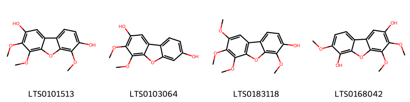{ width=100% }
    <figcaption>Hình ảnh cấu trúc hóa học của 4 hoạt chất thuộc nhóm Benzofurans gồm ['α-cotonefuran (LTS0101513)', '5,6-dimethoxy-8-oxatricyclo[7.4.0.0²,⁷]trideca-1(9),2(7),3,5,10,12-hexaene-4,11-diol (LTS0103064)', 'β-cotonefuran (LTS0183118)', '5,6,11-trimethoxy-8-oxatricyclo[7.4.0.0²,⁷]trideca-1(9),2(7),3,5,10,12-hexaene-4,10-diol (LTS0168042)'].</figcaption>
</figure>
#### Nhóm Flavonoids
<figure markdown="span">
    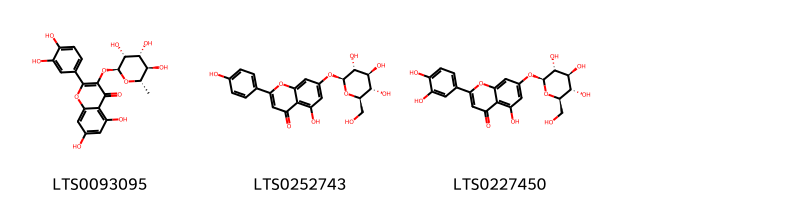{ width=100% }
    <figcaption>Hình ảnh cấu trúc hóa học của 3 hoạt chất thuộc nhóm Flavonoids gồm ['quercitrin (LTS0093095)', 'apigenin 7-o-β-glucoside (LTS0252743)', 'luteolin 7-o-glucoside (LTS0227450)'].</figcaption>
</figure>

---

### Dược dân tộc học

Danh sách các quốc gia có sử dụng *Cotoneaster horizontalis* trong điều trị các bệnh. 

| Country   | Disease   | Bệnh                                                                                                                                                                                                |
|:----------|:----------|:----------------------------------------------------------------------------------------------------------------------------------------------------------------------------------------------------|
| Europe    | Poison    | MYMEMORY WARNING: YOU USED ALL AVAILABLE FREE TRANSLATIONS FOR TODAY. NEXT AVAILABLE IN  11 HOURS 08 MINUTES 00 SECONDS VISIT HTTPS://MYMEMORY.TRANSLATED.NET/DOC/USAGELIMITS.PHP TO TRANSLATE MORE |

---

---
## Cotoneaster nummularia
### Thông tin về thực vật

!!! info "Phân loại thực vật của *Cotoneaster nummularius* từ GIBF:"
    - **Kingdom:** Plantae
    - **Phylum:** Tracheophyta
    - **Order:** Rosales
    - **Family:** Rosaceae
    - **Genus:** Cotoneaster
    - **Species:** *Cotoneaster nummularius*

 

| Label (VI)   | Label (EN)   | Scientific Name          | Descriptions (VI)   | Descriptions (EN)   | Also Known As (VI)   | Also Known As (EN)   |
|:-------------|:-------------|:-------------------------|:--------------------|:--------------------|:---------------------|:---------------------|
| N/A          | N/A          | Cotoneaster horizontalis | loài thực vật       | species of plant    | ['']                 | ['']                 |

#### Phân bố trên thế giới

**Từ CSDL GIBF** nan, Georgia, Afghanistan, Azerbaijan, Saudi Arabia, Pakistan, Uzbekistan, India, Turkmenistan, Kazakhstan, Iraq, Belgium, Türkiye, Lebanon, Iran (Islamic Republic of), Jordan, Morocco, France, Syrian Arab Republic, Armenia, Tajikistan, Cyprus, Russian Federation, Israel, Greece, Oman

#### Phân bố tại Việt Nam

**Từ CSDL GIBF**: Không có ghi nhận ở Việt Nam

---
### Thành phần hóa học
        
- Theo cơ sở dữ liệu lotus: Từ loài *Cotoneaster nummularius* đã phân lập và xác định được Chưa có hoạt chất nào được phân lập. hoạt chất thuộc về các nhóm Không có hoạt chất nào được phân lập. 

Không có hình ảnh nào được tạo ra

---

### Dược dân tộc học

Danh sách các quốc gia có sử dụng *Cotoneaster nummularius* trong điều trị các bệnh. 

| Country   | Disease                          | Bệnh                                                                                                                                                                                                |
|:----------|:---------------------------------|:----------------------------------------------------------------------------------------------------------------------------------------------------------------------------------------------------|
| Elsewhere | Aperient, Expectorant, Stomachic | MYMEMORY WARNING: YOU USED ALL AVAILABLE FREE TRANSLATIONS FOR TODAY. NEXT AVAILABLE IN  11 HOURS 07 MINUTES 32 SECONDS VISIT HTTPS://MYMEMORY.TRANSLATED.NET/DOC/USAGELIMITS.PHP TO TRANSLATE MORE |
| Iraq      | Aperient, Stomachic, Expectorant | MYMEMORY WARNING: YOU USED ALL AVAILABLE FREE TRANSLATIONS FOR TODAY. NEXT AVAILABLE IN  11 HOURS 07 MINUTES 30 SECONDS VISIT HTTPS://MYMEMORY.TRANSLATED.NET/DOC/USAGELIMITS.PHP TO TRANSLATE MORE |

---

---
## Cotoneaster simonsii
### Thông tin về thực vật

!!! info "Phân loại thực vật của *Cotoneaster simonsii* từ GIBF:"
    - **Kingdom:** Plantae
    - **Phylum:** Tracheophyta
    - **Order:** Rosales
    - **Family:** Rosaceae
    - **Genus:** Cotoneaster
    - **Species:** *Cotoneaster simonsii*

 

| Label (VI)   | Label (EN)   | Scientific Name      | Descriptions (VI)   | Descriptions (EN)   | Also Known As (VI)   | Also Known As (EN)   |
|:-------------|:-------------|:---------------------|:--------------------|:--------------------|:---------------------|:---------------------|
| N/A          | N/A          | Cotoneaster simonsii | loài thực vật       | species of plant    | ['']                 | ['']                 |

#### Phân bố trên thế giới

**Từ CSDL GIBF** United Kingdom of Great Britain and Northern Ireland, Sweden, France, New Zealand, Canada, Chile, United States of America, Ireland, Australia, Belgium

#### Phân bố tại Việt Nam

**Từ CSDL GIBF**: Không có ghi nhận ở Việt Nam

---
### Thành phần hóa học
        
- Theo cơ sở dữ liệu lotus: Từ loài *Cotoneaster simonsii* đã phân lập và xác định được 20 hoạt chất thuộc về các nhóm Organooxygen compounds, Prenol lipids, Isoflavonoids, Flavonoids. 

|    | chemicalTaxonomyClassyfireClass   |   smiles_count |
|---:|:----------------------------------|---------------:|
|  0 | Flavonoids                        |              5 |
|  1 | Isoflavonoids                     |              4 |
|  2 | Organooxygen compounds            |              6 |
|  3 | Prenol lipids                     |              5 |

#### Nhóm Flavonoids
<figure markdown="span">
    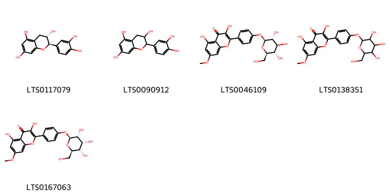{ width=100% }
    <figcaption>Hình ảnh cấu trúc hóa học của 5 hoạt chất thuộc nhóm Flavonoids gồm ['(+)-catechol (LTS0117079)', 'catechol (LTS0090912)', '3,5-dihydroxy-7-methoxy-2-(4-{[(2s,3r,4s,5s,6r)-3,4,5-trihydroxy-6-(hydroxymethyl)oxan-2-yl]oxy}phenyl)chromen-4-one (LTS0046109)', '3,5-dihydroxy-7-methoxy-2-(4-{[3,4,5-trihydroxy-6-(hydroxymethyl)oxan-2-yl]oxy}phenyl)chromen-4-one (LTS0138351)', '3,5-dihydroxy-7-methoxy-2-(4-{[(2s,3r,4r,5s,6r)-3,4,5-trihydroxy-6-(hydroxymethyl)oxan-2-yl]oxy}phenyl)chromen-4-one (LTS0167063)'].</figcaption>
</figure>
#### Nhóm Isoflavonoids
<figure markdown="span">
    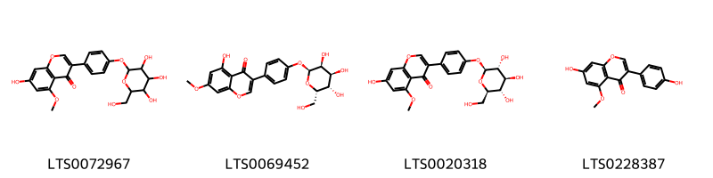{ width=100% }
    <figcaption>Hình ảnh cấu trúc hóa học của 4 hoạt chất thuộc nhóm Isoflavonoids gồm ['7-hydroxy-5-methoxy-3-(4-{[3,4,5-trihydroxy-6-(hydroxymethyl)oxan-2-yl]oxy}phenyl)chromen-4-one (LTS0072967)', '5-hydroxy-7-methoxy-3-(4-{[(2s,3s,4s,5s,6s)-3,4,5-trihydroxy-6-(hydroxymethyl)oxan-2-yl]oxy}phenyl)chromen-4-one (LTS0069452)', '7-hydroxy-5-methoxy-3-(4-{[(2s,3r,4s,5s,6r)-3,4,5-trihydroxy-6-(hydroxymethyl)oxan-2-yl]oxy}phenyl)chromen-4-one (LTS0020318)', '5-o-methylgenistein (LTS0228387)'].</figcaption>
</figure>
#### Nhóm Organooxygen compounds
<figure markdown="span">
    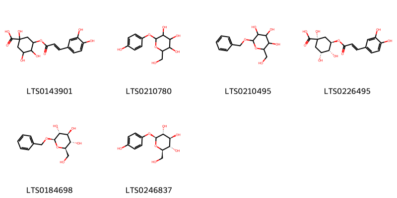{ width=100% }
    <figcaption>Hình ảnh cấu trúc hóa học của 6 hoạt chất thuộc nhóm Organooxygen compounds gồm ['3-{[3-(3,4-dihydroxyphenyl)prop-2-enoyl]oxy}-1,4,5-trihydroxycyclohexane-1-carboxylic acid (LTS0143901)', 'arbutin (LTS0210780)', 'benzyl glucopyranoside (LTS0210495)', 'chlorogenic acid (LTS0226495)', 'benzyl β-d-glucoside (LTS0184698)', 'β-arbutin (LTS0246837)'].</figcaption>
</figure>
#### Nhóm Prenol lipids
<figure markdown="span">
    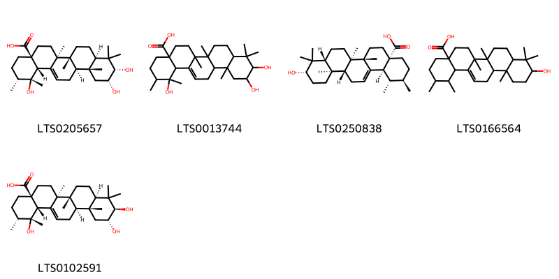{ width=100% }
    <figcaption>Hình ảnh cấu trúc hóa học của 5 hoạt chất thuộc nhóm Prenol lipids gồm ['euscaphic acid (LTS0205657)', '1,10,11-trihydroxy-1,2,6a,6b,9,9,12a-heptamethyl-2,3,4,5,6,7,8,8a,10,11,12,12b,13,14b-tetradecahydropicene-4a-carboxylic acid (LTS0013744)', 'ursolic acid (LTS0250838)', '10-hydroxy-1,2,6a,6b,9,9,12a-heptamethyl-2,3,4,5,6,7,8,8a,10,11,12,12b,13,14b-tetradecahydro-1h-picene-4a-carboxylic acid (LTS0166564)', 'tormentic acid (LTS0102591)'].</figcaption>
</figure>

---

### Dược dân tộc học

Danh sách các quốc gia có sử dụng *Cotoneaster simonsii* trong điều trị các bệnh. 

| Country   | Disease   | Bệnh                                                                                                                                                                                                |
|:----------|:----------|:----------------------------------------------------------------------------------------------------------------------------------------------------------------------------------------------------|
| Europe    | Poison    | MYMEMORY WARNING: YOU USED ALL AVAILABLE FREE TRANSLATIONS FOR TODAY. NEXT AVAILABLE IN  11 HOURS 07 MINUTES 07 SECONDS VISIT HTTPS://MYMEMORY.TRANSLATED.NET/DOC/USAGELIMITS.PHP TO TRANSLATE MORE |

---

# Chi Acaena

??? note "Danh sách các dược liệu thuộc chi"
    
	 - *Acaena cylindristachya*
	 - *Acaena integerrima*
	 - *Acaena macrostemon*

---
## Acaena cylindristachya
### Thông tin về thực vật

!!! info "Phân loại thực vật của *Acaena cylindristachya* từ GIBF:"
    - **Kingdom:** Plantae
    - **Phylum:** Tracheophyta
    - **Order:** Rosales
    - **Family:** Rosaceae
    - **Genus:** Acaena
    - **Species:** *Acaena cylindristachya*

 

| Label (VI)   | Label (EN)   | Scientific Name        | Descriptions (VI)   | Descriptions (EN)   | Also Known As (VI)   | Also Known As (EN)   |
|:-------------|:-------------|:-----------------------|:--------------------|:--------------------|:---------------------|:---------------------|
| N/A          | N/A          | Acaena cylindristachya | loài thực vật       | species of plant    | ['']                 | ['']                 |

#### Phân bố trên thế giới

**Từ CSDL GIBF** Colombia, Venezuela (Bolivarian Republic of), Peru, Bolivia (Plurinational State of), Costa Rica

#### Phân bố tại Việt Nam

**Từ CSDL GIBF**: Không có ghi nhận ở Việt Nam

---
### Thành phần hóa học
        
- Theo cơ sở dữ liệu lotus: Từ loài *Acaena cylindristachya* đã phân lập và xác định được Chưa có hoạt chất nào được phân lập. hoạt chất thuộc về các nhóm Không có hoạt chất nào được phân lập. 

Không có hình ảnh nào được tạo ra

---

### Dược dân tộc học

Danh sách các quốc gia có sử dụng *Acaena cylindristachya* trong điều trị các bệnh. 

| Country   | Disease   | Bệnh                                                                                                                                                                                                |
|:----------|:----------|:----------------------------------------------------------------------------------------------------------------------------------------------------------------------------------------------------|
| Venezuela | Sedative  | MYMEMORY WARNING: YOU USED ALL AVAILABLE FREE TRANSLATIONS FOR TODAY. NEXT AVAILABLE IN  11 HOURS 06 MINUTES 34 SECONDS VISIT HTTPS://MYMEMORY.TRANSLATED.NET/DOC/USAGELIMITS.PHP TO TRANSLATE MORE |

---

---
## Acaena integerrima
### Thông tin về thực vật

!!! info "Phân loại thực vật của *Acaena integerrima* từ GIBF:"
    - **Kingdom:** Plantae
    - **Phylum:** Tracheophyta
    - **Order:** Rosales
    - **Family:** Rosaceae
    - **Genus:** Acaena
    - **Species:** *Acaena integerrima*

 

| Label (VI)   | Label (EN)   | Scientific Name    | Descriptions (VI)   | Descriptions (EN)   | Also Known As (VI)   | Also Known As (EN)   |
|:-------------|:-------------|:-------------------|:--------------------|:--------------------|:---------------------|:---------------------|
| N/A          | N/A          | Acaena integerrima | loài thực vật       | species of plant    | ['']                 | ['']                 |

#### Phân bố trên thế giới

**Từ CSDL GIBF** Argentina, nan, Chile

#### Phân bố tại Việt Nam

**Từ CSDL GIBF**: Không có ghi nhận ở Việt Nam

---
### Thành phần hóa học
        
- Theo cơ sở dữ liệu lotus: Từ loài *Acaena integerrima* đã phân lập và xác định được Chưa có hoạt chất nào được phân lập. hoạt chất thuộc về các nhóm Không có hoạt chất nào được phân lập. 

Không có hình ảnh nào được tạo ra

---

### Dược dân tộc học

Danh sách các quốc gia có sử dụng *Acaena integerrima* trong điều trị các bệnh. 

| Country   | Disease   | Bệnh                                                                                                                                                                                                |
|:----------|:----------|:----------------------------------------------------------------------------------------------------------------------------------------------------------------------------------------------------|
| Chile     | Poison    | MYMEMORY WARNING: YOU USED ALL AVAILABLE FREE TRANSLATIONS FOR TODAY. NEXT AVAILABLE IN  11 HOURS 06 MINUTES 06 SECONDS VISIT HTTPS://MYMEMORY.TRANSLATED.NET/DOC/USAGELIMITS.PHP TO TRANSLATE MORE |

---

---
## Acaena macrostemon
### Thông tin về thực vật

!!! info "Phân loại thực vật của *Acaena magellanica* từ GIBF:"
    - **Kingdom:** Plantae
    - **Phylum:** Tracheophyta
    - **Order:** Rosales
    - **Family:** Rosaceae
    - **Genus:** Acaena
    - **Species:** *Acaena magellanica*

 

| Label (VI)   | Label (EN)   | Scientific Name    | Descriptions (VI)   | Descriptions (EN)   | Also Known As (VI)   | Also Known As (EN)   |
|:-------------|:-------------|:-------------------|:--------------------|:--------------------|:---------------------|:---------------------|
| N/A          | N/A          | Acaena macrostemon | loài thực vật       | species of plant    | ['']                 | ['']                 |

#### Phân bố trên thế giới

**Từ CSDL GIBF** Argentina, nan, unknown or invalid, Chile

#### Phân bố tại Việt Nam

**Từ CSDL GIBF**: Không có ghi nhận ở Việt Nam

---
### Thành phần hóa học
        
- Theo cơ sở dữ liệu lotus: Từ loài *Acaena magellanica* đã phân lập và xác định được Chưa có hoạt chất nào được phân lập. hoạt chất thuộc về các nhóm Không có hoạt chất nào được phân lập. 

Không có hình ảnh nào được tạo ra

---

### Dược dân tộc học

Danh sách các quốc gia có sử dụng *Acaena magellanica* trong điều trị các bệnh. 

| Country   | Disease   | Bệnh                                                                                                                                                                                                |
|:----------|:----------|:----------------------------------------------------------------------------------------------------------------------------------------------------------------------------------------------------|
| Argentina | Diuretic  | MYMEMORY WARNING: YOU USED ALL AVAILABLE FREE TRANSLATIONS FOR TODAY. NEXT AVAILABLE IN  11 HOURS 05 MINUTES 45 SECONDS VISIT HTTPS://MYMEMORY.TRANSLATED.NET/DOC/USAGELIMITS.PHP TO TRANSLATE MORE |
| Chile     | Tonic     | MYMEMORY WARNING: YOU USED ALL AVAILABLE FREE TRANSLATIONS FOR TODAY. NEXT AVAILABLE IN  11 HOURS 05 MINUTES 43 SECONDS VISIT HTTPS://MYMEMORY.TRANSLATED.NET/DOC/USAGELIMITS.PHP TO TRANSLATE MORE |

---

