!!! abstract "Tóm tắt"

    Họ Rubiaceae gồm khoảng 65 chi và 125 loài được một số cộng đồng tại các quốc gia như Trinidad, Japan*, Brazil, Asia, Japan, Indochina, China, New Zealand, Ecuador, Java, Dutch, Turkey, Thailand, Africa(Swahili), Ghana, English, Perak, Tonga, Bolivia, Indonesia, Costa Rica, Dominican Republic, Colombia, Nigeria, Africa, UK, Sierra Leone, Grenada, Europe, India(Santal), Fiji, Panama(Choco), Latin America, Mexico, Morocco, Mediterranean, US(Meskwaski), US(KS), Malaysia, South America, Haiti, Philippines, W Africa, Gabon, Iraq, Mexico(Mazatec), Upper Volta, Sudan, Kurdistan, ain, Venezuela, Solomon I, Peru, Elsewhere, Bahamas, Dominica(Carib), US(Amerindian), Australia, Tahiti, Malaya, India, Liberia, C Africa, US, Martinique, France, Samoa sử dụng trong một số trường hợp QUERY LENGTH LIMIT EXCEEDED. MAX ALLOWED QUERY : 500 CHARS QUERY LENGTH LIMIT EXCEEDED. MAX ALLOWED QUERY : 500 CHARS QUERY LENGTH LIMIT EXCEEDED. MAX ALLOWED QUERY : 500 CHARS MYMEMORY WARNING: YOU USED ALL AVAILABLE FREE TRANSLATIONS FOR TODAY. NEXT AVAILABLE IN  11 HOURS 14 MINUTES 12 SECONDS VISIT HTTPS://MYMEMORY.TRANSLATED.NET/DOC/USAGELIMITS.PHP TO TRANSLATE MORE.

!!! info "DrDuke"

    James A. Duke sinh năm 1929-2017 là một nhà thực vật học người Mỹ. Đây là một trong những tác giả hàng đầu trong lĩnh vực dược dân tộc học với cuốn *CRC Handbook of Medicinal Herbs* và chính là người xây dựng lên cơ sở dữ liệu về hợp chất tự nhiên và dược dân tộc học tại Bộ nông nghiệp Hoa Kỳ. Các thông tin được đăng tải tại website [Dr. Duke's Phytochemical and Ethnobotanical Databases](https://phytochem.nal.usda.gov/). 
    Trong suốt thập niên 1970, ông lãnh đạo the Plant Taxonomy Laboratory, Plant Genetics and Germplasm Institute of the Agricultural Research Service, U.S. Department of Agriculture.
    Trong tài liệu này, các thông tin về dược dân tộc của các dược liệu được trích dẫn từ tài liệu của James A. Ducke với sự trợ giúp của phần mềm dịch thuật từ tiếng Anh sang tiếng Việt.
   

# Chi Saprosma

??? note "Danh sách các dược liệu thuộc chi"
    
	 - *Saprosma ternatum*

---
## Saprosma ternatum
### Thông tin về thực vật

!!! info "Phân loại thực vật của *Saprosma ternata* từ GIBF:"
    - **Kingdom:** Plantae
    - **Phylum:** Tracheophyta
    - **Order:** Gentianales
    - **Family:** Rubiaceae
    - **Genus:** Saprosma
    - **Species:** *Saprosma ternata*

 

| Label (VI)   | Label (EN)   | Scientific Name        | Descriptions (VI)   | Descriptions (EN)   | Also Known As (VI)   | Also Known As (EN)   |
|:-------------|:-------------|:-----------------------|:--------------------|:--------------------|:---------------------|:---------------------|
| N/A          | N/A          | Ancistrocladus hamatus | loài thực vật       | species of plant    | ['']                 | ['']                 |

#### Phân bố trên thế giới

**Từ CSDL GIBF** nan, Viet Nam, Cambodia, Indonesia, Malaysia, Philippines, China, Bangladesh, Myanmar, India, unknown or invalid, Thailand, Lao People’s Democratic Republic

#### Phân bố tại Việt Nam

**Từ CSDL GIBF**: Nghe An, Điện Biên, Hà Nội, Khánh Hòa

---
### Thành phần hóa học
        
- Theo cơ sở dữ liệu lotus: Từ loài *Saprosma ternata* đã phân lập và xác định được Chưa có hoạt chất nào được phân lập. hoạt chất thuộc về các nhóm Không có hoạt chất nào được phân lập. 

Không có hình ảnh nào được tạo ra

---

### Dược dân tộc học

Danh sách các quốc gia có sử dụng *Saprosma ternata* trong điều trị các bệnh. 

| Country   | Disease     | Bệnh                                                                                                                                                                                                |
|:----------|:------------|:----------------------------------------------------------------------------------------------------------------------------------------------------------------------------------------------------|
| Elsewhere | Carminative | MYMEMORY WARNING: YOU USED ALL AVAILABLE FREE TRANSLATIONS FOR TODAY. NEXT AVAILABLE IN  11 HOURS 14 MINUTES 08 SECONDS VISIT HTTPS://MYMEMORY.TRANSLATED.NET/DOC/USAGELIMITS.PHP TO TRANSLATE MORE |

---

# Chi Lasianthus

??? note "Danh sách các dược liệu thuộc chi"
    
	 - *Lasianthus oblongus*

---
## Lasianthus oblongus
### Thông tin về thực vật

!!! info "Phân loại thực vật của *Lasianthus oblongus* từ GIBF:"
    - **Kingdom:** Plantae
    - **Phylum:** Tracheophyta
    - **Order:** Gentianales
    - **Family:** Rubiaceae
    - **Genus:** Lasianthus
    - **Species:** *Lasianthus oblongus*

 

| Label (VI)   | Label (EN)   | Scientific Name     | Descriptions (VI)   | Descriptions (EN)   | Also Known As (VI)   | Also Known As (EN)   |
|:-------------|:-------------|:--------------------|:--------------------|:--------------------|:---------------------|:---------------------|
| N/A          | N/A          | Lasianthus oblongus | loài thực vật       | species of plant    | ['']                 | ['']                 |

#### Phân bố trên thế giới

**Từ CSDL GIBF** nan, India, Malaysia

#### Phân bố tại Việt Nam

**Từ CSDL GIBF**: Không có ghi nhận ở Việt Nam

---
### Thành phần hóa học
        
- Theo cơ sở dữ liệu lotus: Từ loài *Lasianthus oblongus* đã phân lập và xác định được Chưa có hoạt chất nào được phân lập. hoạt chất thuộc về các nhóm Không có hoạt chất nào được phân lập. 

Không có hình ảnh nào được tạo ra

---

### Dược dân tộc học

Danh sách các quốc gia có sử dụng *Lasianthus oblongus* trong điều trị các bệnh. 

| Country   | Disease      | Bệnh                                                                                                                                                                                                |
|:----------|:-------------|:----------------------------------------------------------------------------------------------------------------------------------------------------------------------------------------------------|
| Malaya    | Stupefacient | MYMEMORY WARNING: YOU USED ALL AVAILABLE FREE TRANSLATIONS FOR TODAY. NEXT AVAILABLE IN  11 HOURS 13 MINUTES 44 SECONDS VISIT HTTPS://MYMEMORY.TRANSLATED.NET/DOC/USAGELIMITS.PHP TO TRANSLATE MORE |

---

# Chi Coutarea

??? note "Danh sách các dược liệu thuộc chi"
    
	 - *Coutarea hexandra*

---
## Coutarea hexandra
### Thông tin về thực vật

!!! info "Phân loại thực vật của *Coutarea hexandra* từ GIBF:"
    - **Kingdom:** Plantae
    - **Phylum:** Tracheophyta
    - **Order:** Gentianales
    - **Family:** Rubiaceae
    - **Genus:** Coutarea
    - **Species:** *Coutarea hexandra*

 

| Label (VI)   | Label (EN)   | Scientific Name   | Descriptions (VI)   | Descriptions (EN)   | Also Known As (VI)   | Also Known As (EN)   |
|:-------------|:-------------|:------------------|:--------------------|:--------------------|:---------------------|:---------------------|
| N/A          | N/A          | Coutarea hexandra | loài thực vật       | species of plant    | ['']                 | ['']                 |

#### Phân bố trên thế giới

**Từ CSDL GIBF** Brazil, Nicaragua, El Salvador, Peru, Costa Rica, Colombia, Ecuador, Argentina, French Guiana, Panama, Belize, Bolivia (Plurinational State of)

#### Phân bố tại Việt Nam

**Từ CSDL GIBF**: Không có ghi nhận ở Việt Nam

---
### Thành phần hóa học
        
- Theo cơ sở dữ liệu lotus: Từ loài *Coutarea hexandra* đã phân lập và xác định được 20 hoạt chất thuộc về các nhóm Coumarins and derivatives, Neoflavonoids. 

|    | chemicalTaxonomyClassyfireClass   |   smiles_count |
|---:|:----------------------------------|---------------:|
|  0 | Coumarins and derivatives         |              9 |
|  1 | Neoflavonoids                     |             11 |

#### Nhóm Coumarins and derivatives
<figure markdown="span">
    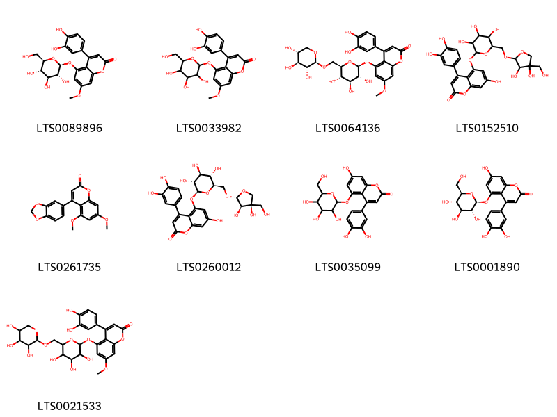{ width=100% }
    <figcaption>Hình ảnh cấu trúc hóa học của 9 hoạt chất thuộc nhóm Coumarins and derivatives gồm ['4-(3,4-dihydroxyphenyl)-7-methoxy-5-{[(2s,3r,4s,5s,6r)-3,4,5-trihydroxy-6-(hydroxymethyl)oxan-2-yl]oxy}chromen-2-one (LTS0089896)', '4-(3,4-dihydroxyphenyl)-7-methoxy-5-{[3,4,5-trihydroxy-6-(hydroxymethyl)oxan-2-yl]oxy}chromen-2-one (LTS0033982)', '4-(3,4-dihydroxyphenyl)-7-methoxy-5-{[(2s,3r,4s,5s,6r)-3,4,5-trihydroxy-6-({[(2s,3r,4s,5r)-3,4,5-trihydroxyoxan-2-yl]oxy}methyl)oxan-2-yl]oxy}chromen-2-one (LTS0064136)', '5-{[6-({[3,4-dihydroxy-4-(hydroxymethyl)oxolan-2-yl]oxy}methyl)-3,4,5-trihydroxyoxan-2-yl]oxy}-4-(3,4-dihydroxyphenyl)-7-hydroxychromen-2-one (LTS0152510)', '4-(2h-1,3-benzodioxol-5-yl)-5,7-dimethoxychromen-2-one (LTS0261735)', '5-{[(2s,3r,4s,5s,6r)-6-({[(2r,3r,4r)-3,4-dihydroxy-4-(hydroxymethyl)oxolan-2-yl]oxy}methyl)-3,4,5-trihydroxyoxan-2-yl]oxy}-4-(3,4-dihydroxyphenyl)-7-hydroxychromen-2-one (LTS0260012)', '4-(3,4-dihydroxyphenyl)-7-hydroxy-5-{[3,4,5-trihydroxy-6-(hydroxymethyl)oxan-2-yl]oxy}chromen-2-one (LTS0035099)', '4-(3,4-dihydroxyphenyl)-7-hydroxy-5-{[(2s,3r,4s,5s,6r)-3,4,5-trihydroxy-6-(hydroxymethyl)oxan-2-yl]oxy}chromen-2-one (LTS0001890)', '4-(3,4-dihydroxyphenyl)-7-methoxy-5-[(3,4,5-trihydroxy-6-{[(3,4,5-trihydroxyoxan-2-yl)oxy]methyl}oxan-2-yl)oxy]chromen-2-one (LTS0021533)'].</figcaption>
</figure>
#### Nhóm Neoflavonoids
<figure markdown="span">
    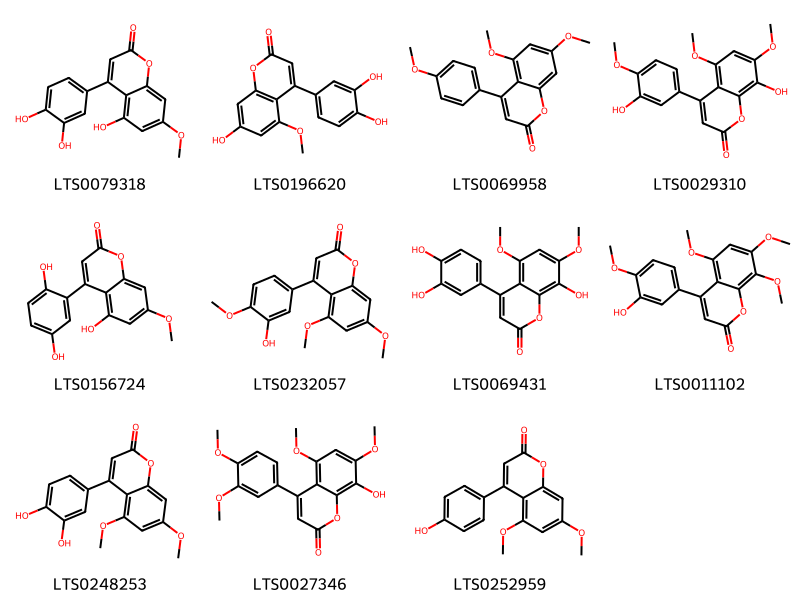{ width=100% }
    <figcaption>Hình ảnh cấu trúc hóa học của 11 hoạt chất thuộc nhóm Neoflavonoids gồm ['4-(3,4-dihydroxyphenyl)-5-hydroxy-7-methoxychromen-2-one (LTS0079318)', '4-(3,4-dihydroxyphenyl)-7-hydroxy-5-methoxychromen-2-one (LTS0196620)', '5,7-dimethoxy-4-(4-methoxyphenyl)chromen-2-one (LTS0069958)', '8-hydroxy-4-(3-hydroxy-4-methoxyphenyl)-5,7-dimethoxychromen-2-one (LTS0029310)', '4-(2,5-dihydroxyphenyl)-5-hydroxy-7-methoxychromen-2-one (LTS0156724)', '4-(3-hydroxy-4-methoxyphenyl)-5,7-dimethoxychromen-2-one (LTS0232057)', '4-(3,4-dihydroxyphenyl)-8-hydroxy-5,7-dimethoxychromen-2-one (LTS0069431)', '4-(3-hydroxy-4-methoxyphenyl)-5,7,8-trimethoxychromen-2-one (LTS0011102)', '4-(3,4-dihydroxyphenyl)-5,7-dimethoxychromen-2-one (LTS0248253)', '4-(3,4-dimethoxyphenyl)-8-hydroxy-5,7-dimethoxychromen-2-one (LTS0027346)', '4-(4-hydroxyphenyl)-5,7-dimethoxychromen-2-one (LTS0252959)'].</figcaption>
</figure>

---

### Dược dân tộc học

Danh sách các quốc gia có sử dụng *Coutarea hexandra* trong điều trị các bệnh. 

| Country   | Disease    | Bệnh                                                                                                                                                                                                |
|:----------|:-----------|:----------------------------------------------------------------------------------------------------------------------------------------------------------------------------------------------------|
| Mexico    | Astringent | MYMEMORY WARNING: YOU USED ALL AVAILABLE FREE TRANSLATIONS FOR TODAY. NEXT AVAILABLE IN  11 HOURS 13 MINUTES 23 SECONDS VISIT HTTPS://MYMEMORY.TRANSLATED.NET/DOC/USAGELIMITS.PHP TO TRANSLATE MORE |

---

# Chi Exostema

??? note "Danh sách các dược liệu thuộc chi"
    
	 - *Exostema caribaeum*
	 - *Exostema sanctae-luciae*
	 - *Exostema santae-luciae*

---
## Exostema caribaeum
### Thông tin về thực vật

!!! info "Phân loại thực vật của *Exostema caribaeum* từ GIBF:"
    - **Kingdom:** Plantae
    - **Phylum:** Tracheophyta
    - **Order:** Gentianales
    - **Family:** Rubiaceae
    - **Genus:** Exostema
    - **Species:** *Exostema caribaeum*

 

| Label (VI)   | Label (EN)   | Scientific Name    | Descriptions (VI)   | Descriptions (EN)   | Also Known As (VI)   | Also Known As (EN)   |
|:-------------|:-------------|:-------------------|:--------------------|:--------------------|:---------------------|:---------------------|
| N/A          | N/A          | Exostema caribaeum | loài thực vật       | species of plant    | ['']                 | ['']                 |

#### Phân bố trên thế giới

**Từ CSDL GIBF** nan, Guadeloupe, Honduras, Anguilla, Cayman Islands, Puerto Rico, United States of America, Saint Barthélemy, Jamaica, Virgin Islands (U.S.), Costa Rica, Dominican Republic, Saint Martin (French part), Cuba, Sint Maarten (Dutch part), Dominica, Mexico, El Salvador, Haiti, Nicaragua

#### Phân bố tại Việt Nam

**Từ CSDL GIBF**: Không có ghi nhận ở Việt Nam

---
### Thành phần hóa học
        
- Theo cơ sở dữ liệu lotus: Từ loài *Exostema caribaeum* đã phân lập và xác định được 8 hoạt chất thuộc về các nhóm Coumarins and derivatives, Neoflavonoids. 

|    | chemicalTaxonomyClassyfireClass   |   smiles_count |
|---:|:----------------------------------|---------------:|
|  0 | Coumarins and derivatives         |              4 |
|  1 | Neoflavonoids                     |              4 |

#### Nhóm Coumarins and derivatives
<figure markdown="span">
    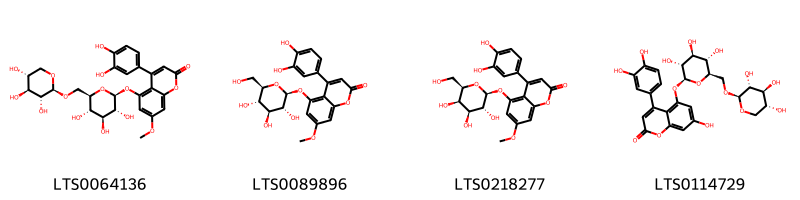{ width=100% }
    <figcaption>Hình ảnh cấu trúc hóa học của 4 hoạt chất thuộc nhóm Coumarins and derivatives gồm ['4-(3,4-dihydroxyphenyl)-7-methoxy-5-{[(2s,3r,4s,5s,6r)-3,4,5-trihydroxy-6-({[(2s,3r,4s,5r)-3,4,5-trihydroxyoxan-2-yl]oxy}methyl)oxan-2-yl]oxy}chromen-2-one (LTS0064136)', '4-(3,4-dihydroxyphenyl)-7-methoxy-5-{[(2s,3r,4s,5s,6r)-3,4,5-trihydroxy-6-(hydroxymethyl)oxan-2-yl]oxy}chromen-2-one (LTS0089896)', '4-(3,4-dihydroxyphenyl)-7-methoxy-5-{[(2s,3r,4s,5r,6r)-3,4,5-trihydroxy-6-(hydroxymethyl)oxan-2-yl]oxy}chromen-2-one (LTS0218277)', '4-(3,4-dihydroxyphenyl)-7-hydroxy-5-{[(2s,3r,4s,5s,6r)-3,4,5-trihydroxy-6-({[(2s,3r,4s,5r)-3,4,5-trihydroxyoxan-2-yl]oxy}methyl)oxan-2-yl]oxy}chromen-2-one (LTS0114729)'].</figcaption>
</figure>
#### Nhóm Neoflavonoids
<figure markdown="span">
    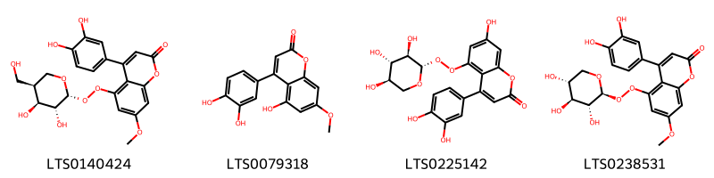{ width=100% }
    <figcaption>Hình ảnh cấu trúc hóa học của 4 hoạt chất thuộc nhóm Neoflavonoids gồm ['5-{[(2r,3r,4s,5s)-3,4-dihydroxy-5-(hydroxymethyl)oxan-2-yl]peroxy}-4-(3,4-dihydroxyphenyl)-7-methoxychromen-2-one (LTS0140424)', '4-(3,4-dihydroxyphenyl)-5-hydroxy-7-methoxychromen-2-one (LTS0079318)', '4-(3,4-dihydroxyphenyl)-7-hydroxy-5-{[(2s,3r,4s,5r)-3,4,5-trihydroxyoxan-2-yl]peroxy}chromen-2-one (LTS0225142)', '4-(3,4-dihydroxyphenyl)-7-methoxy-5-{[(2s,3r,4s,5r)-3,4,5-trihydroxyoxan-2-yl]peroxy}chromen-2-one (LTS0238531)'].</figcaption>
</figure>

---

### Dược dân tộc học

Danh sách các quốc gia có sử dụng *Exostema caribaeum* trong điều trị các bệnh. 

| Country   | Disease   | Bệnh                                                                                                                                                                                                |
|:----------|:----------|:----------------------------------------------------------------------------------------------------------------------------------------------------------------------------------------------------|
| Bahamas   | Apertif   | MYMEMORY WARNING: YOU USED ALL AVAILABLE FREE TRANSLATIONS FOR TODAY. NEXT AVAILABLE IN  11 HOURS 12 MINUTES 47 SECONDS VISIT HTTPS://MYMEMORY.TRANSLATED.NET/DOC/USAGELIMITS.PHP TO TRANSLATE MORE |
| Mexico    | Emetic    | MYMEMORY WARNING: YOU USED ALL AVAILABLE FREE TRANSLATIONS FOR TODAY. NEXT AVAILABLE IN  11 HOURS 12 MINUTES 43 SECONDS VISIT HTTPS://MYMEMORY.TRANSLATED.NET/DOC/USAGELIMITS.PHP TO TRANSLATE MORE |

---

---
## Exostema sanctaeluciae
### Thông tin về thực vật

!!! info "Phân loại thực vật của *Solenandra sanctae-luciae* từ GIBF:"
    - **Kingdom:** Plantae
    - **Phylum:** Tracheophyta
    - **Order:** Gentianales
    - **Family:** Rubiaceae
    - **Genus:** Solenandra
    - **Species:** *Solenandra sanctae-luciae*

 

| Label (VI)   | Label (EN)   | Scientific Name    | Descriptions (VI)   | Descriptions (EN)   | Also Known As (VI)   | Also Known As (EN)   |
|:-------------|:-------------|:-------------------|:--------------------|:--------------------|:---------------------|:---------------------|
| N/A          | N/A          | Exostema caribaeum | loài thực vật       | species of plant    | ['']                 | ['']                 |

#### Phân bố trên thế giới

**Từ CSDL GIBF** nan, Dominica, Brazil, United States of America, Guadeloupe, Martinique, Haiti, Belgium, Saint Vincent and the Grenadines, Dominican Republic, Saint Lucia, unknown or invalid, Spain

#### Phân bố tại Việt Nam

**Từ CSDL GIBF**: Không có ghi nhận ở Việt Nam

---
### Thành phần hóa học
        
- Theo cơ sở dữ liệu lotus: Từ loài *Solenandra sanctae-luciae* đã phân lập và xác định được Chưa có hoạt chất nào được phân lập. hoạt chất thuộc về các nhóm Không có hoạt chất nào được phân lập. 

Không có hình ảnh nào được tạo ra

---

### Dược dân tộc học

Danh sách các quốc gia có sử dụng *Solenandra sanctae-luciae* trong điều trị các bệnh. 

| Country         | Disease   | Bệnh                                                                                                                                                                                                |
|:----------------|:----------|:----------------------------------------------------------------------------------------------------------------------------------------------------------------------------------------------------|
| Dominica(Carib) | Emetic    | MYMEMORY WARNING: YOU USED ALL AVAILABLE FREE TRANSLATIONS FOR TODAY. NEXT AVAILABLE IN  11 HOURS 12 MINUTES 03 SECONDS VISIT HTTPS://MYMEMORY.TRANSLATED.NET/DOC/USAGELIMITS.PHP TO TRANSLATE MORE |

---

---
## Exostema santaeluciae
### Thông tin về thực vật

!!! info "Phân loại thực vật của *Solenandra sanctae-luciae* từ GIBF:"
    - **Kingdom:** Plantae
    - **Phylum:** Tracheophyta
    - **Order:** Gentianales
    - **Family:** Rubiaceae
    - **Genus:** Solenandra
    - **Species:** *Solenandra sanctae-luciae*

 

| Label (VI)   | Label (EN)   | Scientific Name    | Descriptions (VI)   | Descriptions (EN)   | Also Known As (VI)   | Also Known As (EN)   |
|:-------------|:-------------|:-------------------|:--------------------|:--------------------|:---------------------|:---------------------|
| N/A          | N/A          | Exostema caribaeum | loài thực vật       | species of plant    | ['']                 | ['']                 |

#### Phân bố trên thế giới

**Từ CSDL GIBF** nan, Dominica, Brazil, United States of America, Guadeloupe, Martinique, Haiti, Belgium, Saint Vincent and the Grenadines, Dominican Republic, Saint Lucia, unknown or invalid, Spain

#### Phân bố tại Việt Nam

**Từ CSDL GIBF**: Không có ghi nhận ở Việt Nam

---
### Thành phần hóa học
        
- Theo cơ sở dữ liệu lotus: Từ loài *Solenandra sanctae-luciae* đã phân lập và xác định được Chưa có hoạt chất nào được phân lập. hoạt chất thuộc về các nhóm Không có hoạt chất nào được phân lập. 

Không có hình ảnh nào được tạo ra

---

### Dược dân tộc học

Danh sách các quốc gia có sử dụng *Solenandra sanctae-luciae* trong điều trị các bệnh. 

| Country         | Disease   | Bệnh                                                                                                                                                                                                |
|:----------------|:----------|:----------------------------------------------------------------------------------------------------------------------------------------------------------------------------------------------------|
| Dominica(Carib) | Purgative | MYMEMORY WARNING: YOU USED ALL AVAILABLE FREE TRANSLATIONS FOR TODAY. NEXT AVAILABLE IN  11 HOURS 11 MINUTES 41 SECONDS VISIT HTTPS://MYMEMORY.TRANSLATED.NET/DOC/USAGELIMITS.PHP TO TRANSLATE MORE |

---

# Chi Pausinystalia

??? note "Danh sách các dược liệu thuộc chi"
    
	 - *Pausinystalia johimbe*

---
## Pausinystalia johimbe
### Thông tin về thực vật

!!! info "Phân loại thực vật của *Corynanthe johimbe* từ GIBF:"
    - **Kingdom:** Plantae
    - **Phylum:** Tracheophyta
    - **Order:** Gentianales
    - **Family:** Rubiaceae
    - **Genus:** Corynanthe
    - **Species:** *Corynanthe johimbe*

 

| Label (VI)   | Label (EN)   | Scientific Name       | Descriptions (VI)   | Descriptions (EN)   | Also Known As (VI)   | Also Known As (EN)        |
|:-------------|:-------------|:----------------------|:--------------------|:--------------------|:---------------------|:--------------------------|
| N/A          | N/A          | Pausinystalia johimbe | loài thực vật       | species of plant    | ['']                 | ['Pausinystalia johimbe'] |

#### Phân bố trên thế giới

**Từ CSDL GIBF** nan, Congo, Democratic Republic of the, United States of America, Central African Republic, Indonesia, Gabon, Nigeria, Congo, Angola, Equatorial Guinea, Cameroon

#### Phân bố tại Việt Nam

**Từ CSDL GIBF**: Không có ghi nhận ở Việt Nam

---
### Thành phần hóa học
        
- Theo cơ sở dữ liệu lotus: Từ loài *Corynanthe johimbe* đã phân lập và xác định được 8 hoạt chất thuộc về các nhóm Yohimbine alkaloids. 

|    | chemicalTaxonomyClassyfireClass   |   smiles_count |
|---:|:----------------------------------|---------------:|
|  0 | Yohimbine alkaloids               |              8 |

#### Nhóm Yohimbine alkaloids
<figure markdown="span">
    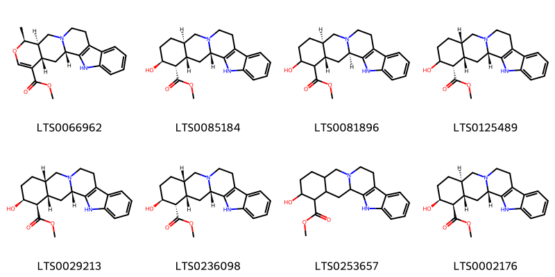{ width=100% }
    <figcaption>Hình ảnh cấu trúc hóa học của 8 hoạt chất thuộc nhóm Yohimbine alkaloids gồm ['substance ii (LTS0066962)', 'corynanthine (LTS0085184)', 'methyl (1r,15r,20s)-18-hydroxy-3,13-diazapentacyclo[11.8.0.0²,¹⁰.0⁴,⁹.0¹⁵,²⁰]henicosa-2(10),4,6,8-tetraene-19-carboxylate (LTS0081896)', 'rauwolscine (LTS0125489)', 'alloyohimbine (LTS0029213)', 'rauwolscine (LTS0236098)', 'yohimbine,α- (LTS0253657)', 'yohimbine (LTS0002176)'].</figcaption>
</figure>

---

### Dược dân tộc học

Danh sách các quốc gia có sử dụng *Corynanthe johimbe* trong điều trị các bệnh. 

| Country   | Disease     | Bệnh                                                                                                                                                                                                |
|:----------|:------------|:----------------------------------------------------------------------------------------------------------------------------------------------------------------------------------------------------|
| Turkey    | Aphrodisiac | MYMEMORY WARNING: YOU USED ALL AVAILABLE FREE TRANSLATIONS FOR TODAY. NEXT AVAILABLE IN  11 HOURS 11 MINUTES 20 SECONDS VISIT HTTPS://MYMEMORY.TRANSLATED.NET/DOC/USAGELIMITS.PHP TO TRANSLATE MORE |

---

# Chi Mitchella

??? note "Danh sách các dược liệu thuộc chi"
    
	 - *Mitchella repens*

---
## Mitchella repens
### Thông tin về thực vật

!!! info "Phân loại thực vật của *Mitchella repens* từ GIBF:"
    - **Kingdom:** Plantae
    - **Phylum:** Tracheophyta
    - **Order:** Gentianales
    - **Family:** Rubiaceae
    - **Genus:** Mitchella
    - **Species:** *Mitchella repens*

 

| Label (VI)   | Label (EN)   | Scientific Name   | Descriptions (VI)   | Descriptions (EN)   | Also Known As (VI)   | Also Known As (EN)   |
|:-------------|:-------------|:------------------|:--------------------|:--------------------|:---------------------|:---------------------|
| N/A          | N/A          | Mitchella repens  | loài thực vật       | species of plant    | ['']                 | ['']                 |

#### Phân bố trên thế giới

**Từ CSDL GIBF** United States of America, Canada

#### Phân bố tại Việt Nam

**Từ CSDL GIBF**: Không có ghi nhận ở Việt Nam

---
### Thành phần hóa học
        
- Theo cơ sở dữ liệu lotus: Từ loài *Mitchella repens* đã phân lập và xác định được 10 hoạt chất thuộc về các nhóm Prenol lipids, Steroids and steroid derivatives. 

|    | chemicalTaxonomyClassyfireClass   |   smiles_count |
|---:|:----------------------------------|---------------:|
|  0 | Prenol lipids                     |              5 |
|  1 | Steroids and steroid derivatives  |              5 |

#### Nhóm Prenol lipids
<figure markdown="span">
    { width=100% }
    <figcaption>Hình ảnh cấu trúc hóa học của 5 hoạt chất thuộc nhóm Prenol lipids gồm ['amyrin (LTS0222826)', 'β-amyrin (LTS0251864)', 'lupeol (LTS0256952)', '(6ar,6br,8ar,14br)-4,4,6a,6b,8a,12,14b-heptamethyl-11-methylidene-hexadecahydropicen-3-ol (LTS0274865)', 'taraxasterol (LTS0006950)'].</figcaption>
</figure>
#### Nhóm Steroids and steroid derivatives
<figure markdown="span">
    { width=100% }
    <figcaption>Hình ảnh cấu trúc hóa học của 5 hoạt chất thuộc nhóm Steroids and steroid derivatives gồm ['stigmast-5-en-3-ol (LTS0071224)', 'stigmast-5-en-3-ol, (3β)- (LTS0204616)', 'phytosterol (LTS0029311)', '(1r,3as,3bs,7s,9bs)-1-[(2r,5r)-5,6-dimethylheptan-2-yl]-9a,11a-dimethyl-1h,2h,3h,3ah,3bh,4h,6h,7h,8h,9h,9bh,10h,11h-cyclopenta[a]phenanthren-7-ol (LTS0057877)', 'campesterol (LTS0046755)'].</figcaption>
</figure>

---

### Dược dân tộc học

Danh sách các quốc gia có sử dụng *Mitchella repens* trong điều trị các bệnh. 

| Country   | Disease                          | Bệnh                                                                                                                                                                                                |
|:----------|:---------------------------------|:----------------------------------------------------------------------------------------------------------------------------------------------------------------------------------------------------|
| English   | Tonic                            | MYMEMORY WARNING: YOU USED ALL AVAILABLE FREE TRANSLATIONS FOR TODAY. NEXT AVAILABLE IN  11 HOURS 10 MINUTES 22 SECONDS VISIT HTTPS://MYMEMORY.TRANSLATED.NET/DOC/USAGELIMITS.PHP TO TRANSLATE MORE |
| US        | Astringent, Astringent, Diuretic | MYMEMORY WARNING: YOU USED ALL AVAILABLE FREE TRANSLATIONS FOR TODAY. NEXT AVAILABLE IN  11 HOURS 10 MINUTES 17 SECONDS VISIT HTTPS://MYMEMORY.TRANSLATED.NET/DOC/USAGELIMITS.PHP TO TRANSLATE MORE |

---

# Chi Rothmannia

??? note "Danh sách các dược liệu thuộc chi"
    
	 - *Rothmannia longiflora*

---
## Rothmannia longiflora
### Thông tin về thực vật

!!! info "Phân loại thực vật của *Rothmannia longiflora* từ GIBF:"
    - **Kingdom:** Plantae
    - **Phylum:** Tracheophyta
    - **Order:** Gentianales
    - **Family:** Rubiaceae
    - **Genus:** Rothmannia
    - **Species:** *Rothmannia longiflora*

 

| Label (VI)   | Label (EN)   | Scientific Name       | Descriptions (VI)   | Descriptions (EN)   | Also Known As (VI)   | Also Known As (EN)   |
|:-------------|:-------------|:----------------------|:--------------------|:--------------------|:---------------------|:---------------------|
| N/A          | N/A          | Rothmannia longiflora | loài thực vật       | species of plant    | ['']                 | ['']                 |

#### Phân bố trên thế giới

**Từ CSDL GIBF** Singapore, Uganda, Benin, Equatorial Guinea, Belgium, Liberia, Gabon, Côte d’Ivoire, Angola, Togo, Sierra Leone, Cameroon, Guinea, Ghana

#### Phân bố tại Việt Nam

**Từ CSDL GIBF**: Không có ghi nhận ở Việt Nam

---
### Thành phần hóa học
        
- Theo cơ sở dữ liệu lotus: Từ loài *Rothmannia longiflora* đã phân lập và xác định được 6 hoạt chất thuộc về các nhóm Fatty Acyls, Organooxygen compounds, Pyridines and derivatives. 

|    | chemicalTaxonomyClassyfireClass   |   smiles_count |
|---:|:----------------------------------|---------------:|
|  0 | Fatty Acyls                       |              2 |
|  1 | Organooxygen compounds            |              3 |
|  2 | Pyridines and derivatives         |              1 |

#### Nhóm Fatty Acyls
<figure markdown="span">
    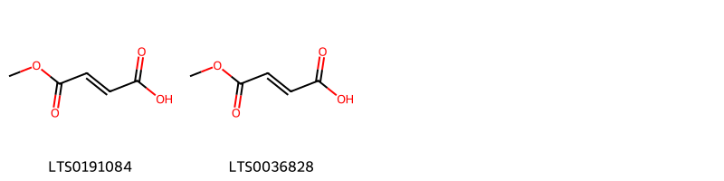{ width=100% }
    <figcaption>Hình ảnh cấu trúc hóa học của 2 hoạt chất thuộc nhóm Fatty Acyls gồm ['4-methoxy-4-oxobut-2-enoic acid (LTS0191084)', 'monomethyl fumarate (LTS0036828)'].</figcaption>
</figure>
#### Nhóm Organooxygen compounds
<figure markdown="span">
    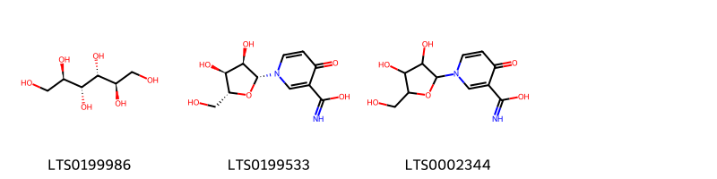{ width=100% }
    <figcaption>Hình ảnh cấu trúc hóa học của 3 hoạt chất thuộc nhóm Organooxygen compounds gồm ['mannitol (LTS0199986)', '1-[(2r,3r,4s,5r)-3,4-dihydroxy-5-(hydroxymethyl)oxolan-2-yl]-4-oxopyridine-3-carboximidic acid (LTS0199533)', '1-[3,4-dihydroxy-5-(hydroxymethyl)oxolan-2-yl]-4-oxopyridine-3-carboximidic acid (LTS0002344)'].</figcaption>
</figure>
#### Nhóm Pyridines and derivatives
<figure markdown="span">
    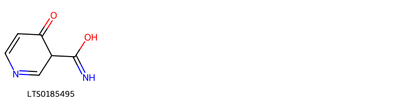{ width=100% }
    <figcaption>Hình ảnh cấu trúc hóa học của 1 hoạt chất thuộc nhóm Pyridines and derivatives gồm ['4-oxo-3h-pyridine-3-carboximidic acid (LTS0185495)'].</figcaption>
</figure>

---

### Dược dân tộc học

Danh sách các quốc gia có sử dụng *Rothmannia longiflora* trong điều trị các bệnh. 

| Country   | Disease    | Bệnh                                                                                                                                                                                                |
|:----------|:-----------|:----------------------------------------------------------------------------------------------------------------------------------------------------------------------------------------------------|
| Ghana     | Dentifrice | MYMEMORY WARNING: YOU USED ALL AVAILABLE FREE TRANSLATIONS FOR TODAY. NEXT AVAILABLE IN  11 HOURS 09 MINUTES 20 SECONDS VISIT HTTPS://MYMEMORY.TRANSLATED.NET/DOC/USAGELIMITS.PHP TO TRANSLATE MORE |

---

# Chi Cinchona

??? note "Danh sách các dược liệu thuộc chi"
    
	 - *Cinchona calisaya*
	 - *Cinchona ledgeriana*
	 - *Cinchona officinalis*
	 - *Cinchona succirubra*

---
## Cinchona calisaya
### Thông tin về thực vật

!!! info "Phân loại thực vật của *Cinchona calisaya* từ GIBF:"
    - **Kingdom:** Plantae
    - **Phylum:** Tracheophyta
    - **Order:** Gentianales
    - **Family:** Rubiaceae
    - **Genus:** Cinchona
    - **Species:** *Cinchona calisaya*

 

| Label (VI)   | Label (EN)   | Scientific Name   | Descriptions (VI)   | Descriptions (EN)   | Also Known As (VI)   | Also Known As (EN)   |
|:-------------|:-------------|:------------------|:--------------------|:--------------------|:---------------------|:---------------------|
| N/A          | N/A          | Cinchona calisaya | loài thực vật       | species of plant    | ['']                 | ['']                 |

#### Phân bố trên thế giới

**Từ CSDL GIBF** nan, Brazil, Guatemala, Madagascar, Congo, Democratic Republic of the, United States of America, Peru, Chinese Taipei, Malaysia, Honduras, Tanzania, United Republic of, India, Sao Tome and Principe, Bolivia (Plurinational State of)

#### Phân bố tại Việt Nam

**Từ CSDL GIBF**: Không có ghi nhận ở Việt Nam

---
### Thành phần hóa học
        
- Theo cơ sở dữ liệu lotus: Từ loài *Cinchona calisaya* đã phân lập và xác định được 85 hoạt chất thuộc về các nhóm Quinolines and derivatives, Anthracenes, Cinchona alkaloids, Prenol lipids, Harmala alkaloids, Indoles and derivatives. 

|    | chemicalTaxonomyClassyfireClass   |   smiles_count |
|---:|:----------------------------------|---------------:|
|  0 | Anthracenes                       |             34 |
|  1 | Cinchona alkaloids                |             20 |
|  2 | Harmala alkaloids                 |             11 |
|  3 | Indoles and derivatives           |             11 |
|  4 | Prenol lipids                     |              3 |
|  5 | Quinolines and derivatives        |              4 |

#### Nhóm Anthracenes
<figure markdown="span">
    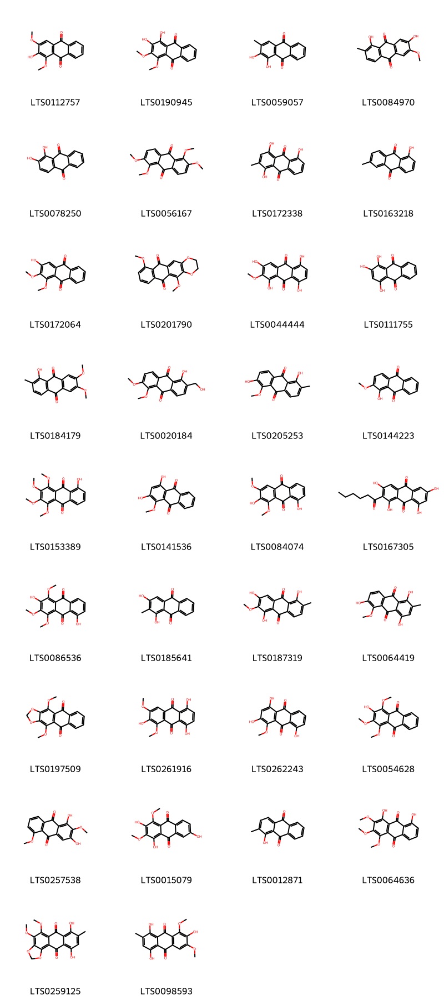{ width=100% }
    <figcaption>Hình ảnh cấu trúc hóa học của 34 hoạt chất thuộc nhóm Anthracenes gồm ['2-hydroxy-1,3-dimethoxyanthracene-9,10-dione (LTS0112757)', '1,2-dihydroxy-3,4-dimethoxyanthracene-9,10-dione (LTS0190945)', '1,2-dihydroxy-3-methylanthracene-9,10-dione (LTS0059057)', '1,7-dihydroxy-6-methoxy-2-methylanthracene-9,10-dione (LTS0084970)', 'alizarin (LTS0078250)', '1,2,5,6-tetramethoxyanthracene-9,10-dione (LTS0056167)', 'islandicin (LTS0172338)', '1-hydroxy-6-methylanthracene-9,10-dione (LTS0163218)', '3-hydroxy-1,2-dimethoxyanthracene-9,10-dione (LTS0172064)', '5,10-dimethoxy-2,3-dihydro-1,4-dioxatetracene-6,11-dione (LTS0201790)', '1,3,5,8-tetrahydroxy-2-methoxyanthracene-9,10-dione (LTS0044444)', 'purpurin (LTS0111755)', '1-hydroxy-6,7-dimethoxy-2-methylanthracene-9,10-dione (LTS0184179)', '1-hydroxy-2-(hydroxymethyl)-5,6-dimethoxyanthracene-9,10-dione (LTS0020184)', '1,6-dihydroxy-5-methoxy-2-methylanthracene-9,10-dione (LTS0205253)', 'alizarin 2-methyl ether (LTS0144223)', '5-hydroxy-1,2,3,4-tetramethoxyanthracene-9,10-dione (LTS0153389)', 'purpurin 1-methyl ether (LTS0141536)', '2,8-dihydroxy-1,3-dimethoxyanthracene-9,10-dione (LTS0084074)', 'norsolorinic acid (LTS0167305)', '2,5-dihydroxy-1,3,4-trimethoxyanthracene-9,10-dione (LTS0086536)', 'rubiadin (LTS0185641)', '1,3,5-trihydroxy-2-methoxy-6-methylanthracene-9,10-dione (LTS0187319)', '1,4,6-trihydroxy-5-methoxy-2-methylanthracene-9,10-dione (LTS0064419)', '4,11-dimethoxy-2h-anthra[2,3-d][1,3]dioxole-5,10-dione (LTS0197509)', '2,5,8-trihydroxy-1,3-dimethoxyanthracene-9,10-dione (LTS0261916)', '2,4,8-trihydroxy-1-methoxyanthracene-9,10-dione (LTS0262243)', '2-hydroxy-1,3,4-trimethoxyanthracene-9,10-dione (LTS0054628)', '1,3-dihydroxy-2,5-dimethoxyanthracene-9,10-dione (LTS0257538)', '2,4,6-trihydroxy-1,3-dimethoxyanthracene-9,10-dione (LTS0015079)', '1-hydroxy-2-methylanthracene-9,10-dione (LTS0012871)', '4,5-dihydroxy-1,2,3-trimethoxyanthracene-9,10-dione (LTS0064636)', '7,10-dihydroxy-4,5-dimethoxy-8-methyl-2h-anthra[1,2-d][1,3]dioxole-6,11-dione (LTS0259125)', '2,5,8-trihydroxy-1,3-dimethoxy-7-methylanthracene-9,10-dione (LTS0098593)'].</figcaption>
</figure>
#### Nhóm Cinchona alkaloids
<figure markdown="span">
    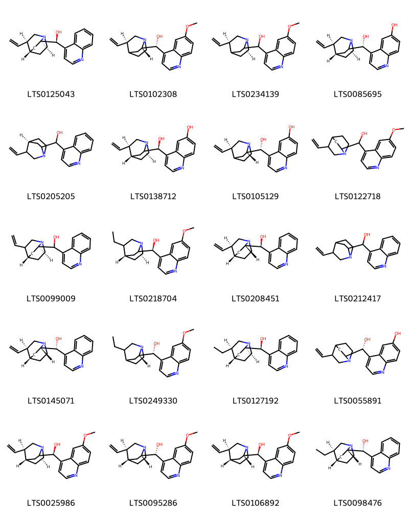{ width=100% }
    <figcaption>Hình ảnh cấu trúc hóa học của 20 hoạt chất thuộc nhóm Cinchona alkaloids gồm ['cinchonine (LTS0125043)', 'quinine (LTS0102308)', '[(2r,5r)-5-ethenyl-1-azabicyclo[2.2.2]octan-2-yl](6-methoxyquinolin-4-yl)methanol (LTS0234139)', 'cupreidine (LTS0085695)', '[(4s)-5-ethenyl-1-azabicyclo[2.2.2]octan-2-yl](quinolin-4-yl)methanol (LTS0205205)', '4-[(s)-[(2r,4s,5r)-5-ethenyl-1-azabicyclo[2.2.2]octan-2-yl](hydroxy)methyl]quinolin-6-ol (LTS0138712)', '4-[(r)-[(2s,5r)-5-ethenyl-1-azabicyclo[2.2.2]octan-2-yl](hydroxy)methyl]quinolin-6-ol (LTS0105129)', 'quinine (LTS0122718)', '[(2r,4s)-5-ethenyl-1-azabicyclo[2.2.2]octan-2-yl](quinolin-4-yl)methanol (LTS0099009)', '(s)-[(2r,4s)-5-ethyl-1-azabicyclo[2.2.2]octan-2-yl](6-methoxyquinolin-4-yl)methanol (LTS0218704)', 'cinchonine (LTS0208451)', 'cinchonidine (LTS0212417)', 'cinchonidine (LTS0145071)', '(r)-[(2s)-5-ethyl-1-azabicyclo[2.2.2]octan-2-yl](6-methoxyquinolin-4-yl)methanol (LTS0249330)', '(+)-hydrocinchonine (LTS0127192)', '4-[(r)-{5-ethenyl-1-azabicyclo[2.2.2]octan-2-yl}(hydroxy)methyl]quinolin-6-ol (LTS0055891)', 'quinidine (LTS0025986)', 'quinine (LTS0095286)', 'epiquinine (LTS0106892)', 'hydrocinchonidine (LTS0098476)'].</figcaption>
</figure>
#### Nhóm Harmala alkaloids
<figure markdown="span">
    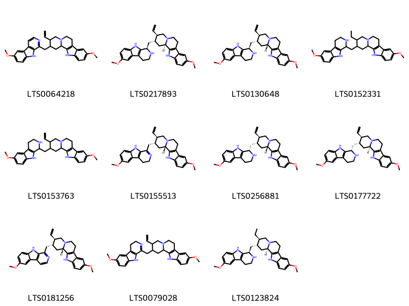{ width=100% }
    <figcaption>Hình ảnh cấu trúc hóa học của 11 hoạt chất thuộc nhóm Harmala alkaloids gồm ['3-ethenyl-9-methoxy-2-({6-methoxy-9h-pyrido[3,4-b]indol-1-yl}methyl)-1h,2h,3h,4h,6h,7h,12h,12bh-indolo[2,3-a]quinolizine (LTS0064218)', '(2s,3r,12br)-3-ethenyl-9-methoxy-2-{[(1r)-6-methoxy-1h,2h,3h,4h,9h-pyrido[3,4-b]indol-1-yl]methyl}-1h,2h,3h,4h,6h,7h,12h,12bh-indolo[2,3-a]quinolizine (LTS0217893)', '(2s,3r,12bs)-3-ethenyl-9-methoxy-2-{[(1r)-6-methoxy-1h,2h,3h,4h,9h-pyrido[3,4-b]indol-1-yl]methyl}-1h,2h,3h,4h,6h,7h,12h,12bh-indolo[2,3-a]quinolizine (LTS0130648)', '3-ethyl-9-methoxy-2-({6-methoxy-1h,2h,3h,4h,9h-pyrido[3,4-b]indol-1-yl}methyl)-1h,2h,3h,4h,6h,7h,12h,12bh-indolo[2,3-a]quinolizine (LTS0152331)', '3-ethenyl-9-methoxy-2-({6-methoxy-1h,2h,3h,4h,9h-pyrido[3,4-b]indol-1-yl}methyl)-1h,2h,3h,4h,6h,7h,12h,12bh-indolo[2,3-a]quinolizine (LTS0153763)', '(2r,3r,12bs)-3-ethenyl-9-methoxy-2-({6-methoxy-3h,4h,9h-pyrido[3,4-b]indol-1-yl}methyl)-1h,2h,3h,4h,6h,7h,12h,12bh-indolo[2,3-a]quinolizine (LTS0155513)', '(2s,3r,12bs)-3-ethenyl-9-methoxy-2-{[(1s)-6-methoxy-1h,2h,3h,4h,9h-pyrido[3,4-b]indol-1-yl]methyl}-1h,2h,3h,4h,6h,7h,12h,12bh-indolo[2,3-a]quinolizine (LTS0256881)', '(2s,3r,12br)-3-ethenyl-9-methoxy-2-{[(1s)-6-methoxy-1h,2h,3h,4h,9h-pyrido[3,4-b]indol-1-yl]methyl}-1h,2h,3h,4h,6h,7h,12h,12bh-indolo[2,3-a]quinolizine (LTS0177722)', '(2r,3r,12bs)-3-ethenyl-9-methoxy-2-({6-methoxy-9h-pyrido[3,4-b]indol-1-yl}methyl)-1h,2h,3h,4h,6h,7h,12h,12bh-indolo[2,3-a]quinolizine (LTS0181256)', '3-ethenyl-9-methoxy-2-({6-methoxy-3h,4h,9h-pyrido[3,4-b]indol-1-yl}methyl)-1h,2h,3h,4h,6h,7h,12h,12bh-indolo[2,3-a]quinolizine (LTS0079028)', '(2s,3r,12br)-3-ethyl-9-methoxy-2-{[(1r)-6-methoxy-1h,2h,3h,4h,9h-pyrido[3,4-b]indol-1-yl]methyl}-1h,2h,3h,4h,6h,7h,12h,12bh-indolo[2,3-a]quinolizine (LTS0123824)'].</figcaption>
</figure>
#### Nhóm Indoles and derivatives
<figure markdown="span">
    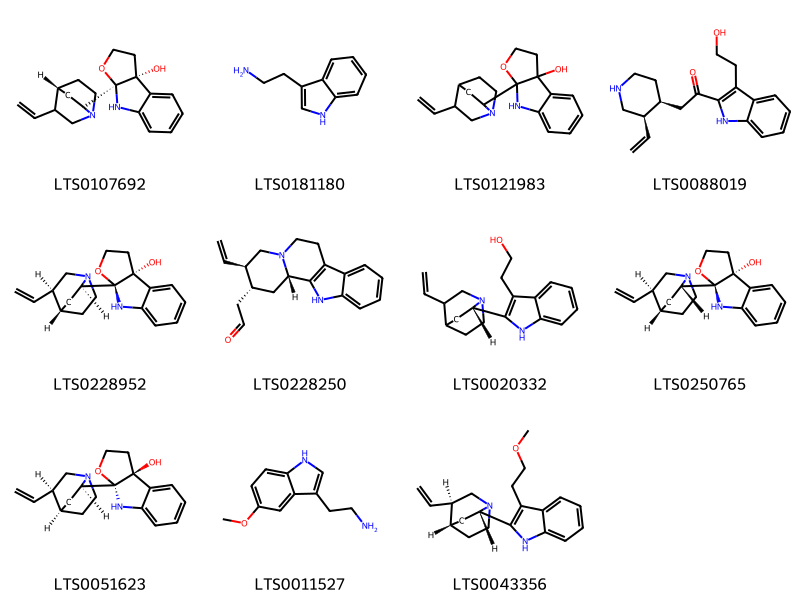{ width=100% }
    <figcaption>Hình ảnh cấu trúc hóa học của 11 hoạt chất thuộc nhóm Indoles and derivatives gồm ['(3ar,8as)-8a-[(4r)-5-ethenyl-1-azabicyclo[2.2.2]octan-2-yl]-2h,3h,8h-furo[2,3-b]indol-3a-ol (LTS0107692)', 'tryptamine (LTS0181180)', 'quinamine (LTS0121983)', '2-[(3r,4s)-3-ethenylpiperidin-4-yl]-1-[3-(2-hydroxyethyl)-1h-indol-2-yl]ethanone (LTS0088019)', 'conquinamine (LTS0228952)', 'corynantheal (LTS0228250)', 'cinchonamine (LTS0020332)', 'quinamine (LTS0250765)', '(3as,8ar)-8a-[(2r,4r,5r)-5-ethenyl-1-azabicyclo[2.2.2]octan-2-yl]-2h,3h,8h-furo[2,3-b]indol-3a-ol (LTS0051623)', '5 methoxytryptamine (LTS0011527)', '2-[(2s,4s,5r)-5-ethenyl-1-azabicyclo[2.2.2]octan-2-yl]-3-(2-methoxyethyl)-1h-indole (LTS0043356)'].</figcaption>
</figure>
#### Nhóm Prenol lipids
<figure markdown="span">
    { width=100% }
    <figcaption>Hình ảnh cấu trúc hóa học của 3 hoạt chất thuộc nhóm Prenol lipids gồm ['(-)-secologanin (LTS0199033)', 'strictosidine (LTS0210201)', 'loganin (LTS0084120)'].</figcaption>
</figure>
#### Nhóm Quinolines and derivatives
<figure markdown="span">
    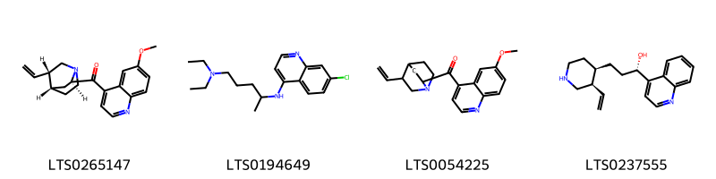{ width=100% }
    <figcaption>Hình ảnh cấu trúc hóa học của 4 hoạt chất thuộc nhóm Quinolines and derivatives gồm ['4-[(2r,4s,5s)-5-ethenyl-1-azabicyclo[2.2.2]octane-2-carbonyl]-6-methoxyquinoline (LTS0265147)', 'chloroquine (LTS0194649)', 'quininone (LTS0054225)', '(1s)-3-[(3r,4r)-3-ethenylpiperidin-4-yl]-1-(quinolin-4-yl)propan-1-ol (LTS0237555)'].</figcaption>
</figure>

---

### Dược dân tộc học

Danh sách các quốc gia có sử dụng *Cinchona calisaya* trong điều trị các bệnh. 

| Country   | Disease                                   | Bệnh                                                                                                                                                                                                |
|:----------|:------------------------------------------|:----------------------------------------------------------------------------------------------------------------------------------------------------------------------------------------------------|
| Elsewhere | Anesthetic, Antiperiodic, nan, nan, Tonic | MYMEMORY WARNING: YOU USED ALL AVAILABLE FREE TRANSLATIONS FOR TODAY. NEXT AVAILABLE IN  11 HOURS 08 MINUTES 34 SECONDS VISIT HTTPS://MYMEMORY.TRANSLATED.NET/DOC/USAGELIMITS.PHP TO TRANSLATE MORE |
| France    | Antiseptic                                | MYMEMORY WARNING: YOU USED ALL AVAILABLE FREE TRANSLATIONS FOR TODAY. NEXT AVAILABLE IN  11 HOURS 08 MINUTES 31 SECONDS VISIT HTTPS://MYMEMORY.TRANSLATED.NET/DOC/USAGELIMITS.PHP TO TRANSLATE MORE |
| India     | nan                                       | MYMEMORY WARNING: YOU USED ALL AVAILABLE FREE TRANSLATIONS FOR TODAY. NEXT AVAILABLE IN  11 HOURS 08 MINUTES 28 SECONDS VISIT HTTPS://MYMEMORY.TRANSLATED.NET/DOC/USAGELIMITS.PHP TO TRANSLATE MORE |
| Turkey    | Antiseptic, Astringent, Tonic             | MYMEMORY WARNING: YOU USED ALL AVAILABLE FREE TRANSLATIONS FOR TODAY. NEXT AVAILABLE IN  11 HOURS 08 MINUTES 25 SECONDS VISIT HTTPS://MYMEMORY.TRANSLATED.NET/DOC/USAGELIMITS.PHP TO TRANSLATE MORE |

---

---
## Cinchona ledgeriana
### Thông tin về thực vật

!!! info "Phân loại thực vật của *Cinchona calisaya* từ GIBF:"
    - **Kingdom:** Plantae
    - **Phylum:** Tracheophyta
    - **Order:** Gentianales
    - **Family:** Rubiaceae
    - **Genus:** Cinchona
    - **Species:** *Cinchona calisaya*

 

| Label (VI)   | Label (EN)   | Scientific Name     | Descriptions (VI)   | Descriptions (EN)   | Also Known As (VI)   | Also Known As (EN)   |
|:-------------|:-------------|:--------------------|:--------------------|:--------------------|:---------------------|:---------------------|
| N/A          | N/A          | Cinchona ledgeriana | loài thực vật       | species of plant    | ['']                 | ['']                 |

#### Phân bố trên thế giới

**Từ CSDL GIBF** nan, Sri Lanka, Brazil, Guatemala, Congo, Democratic Republic of the, Kenya, Rwanda, Réunion, Indonesia, Chinese Taipei, Philippines, Burundi, China, India, Tanzania, United Republic of, unknown or invalid, Sao Tome and Principe, Bolivia (Plurinational State of)

#### Phân bố tại Việt Nam

**Từ CSDL GIBF**: Không có ghi nhận ở Việt Nam

---
### Thành phần hóa học
        
- Theo cơ sở dữ liệu lotus: Từ loài *Cinchona calisaya* đã phân lập và xác định được 83 hoạt chất thuộc về các nhóm Quinolines and derivatives, Anthracenes, Cinchona alkaloids, Prenol lipids, Harmala alkaloids, Indoles and derivatives. 

|    | chemicalTaxonomyClassyfireClass   |   smiles_count |
|---:|:----------------------------------|---------------:|
|  0 | Anthracenes                       |             34 |
|  1 | Cinchona alkaloids                |             19 |
|  2 | Harmala alkaloids                 |             11 |
|  3 | Indoles and derivatives           |             11 |
|  4 | Prenol lipids                     |              3 |
|  5 | Quinolines and derivatives        |              3 |

#### Nhóm Anthracenes
<figure markdown="span">
    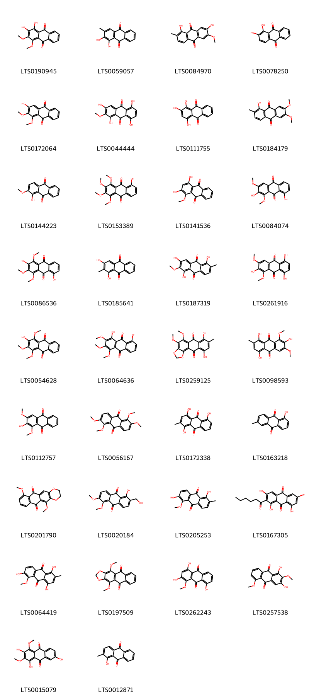{ width=100% }
    <figcaption>Hình ảnh cấu trúc hóa học của 34 hoạt chất thuộc nhóm Anthracenes gồm ['1,2-dihydroxy-3,4-dimethoxyanthracene-9,10-dione (LTS0190945)', '1,2-dihydroxy-3-methylanthracene-9,10-dione (LTS0059057)', '1,7-dihydroxy-6-methoxy-2-methylanthracene-9,10-dione (LTS0084970)', 'alizarin (LTS0078250)', '3-hydroxy-1,2-dimethoxyanthracene-9,10-dione (LTS0172064)', '1,3,5,8-tetrahydroxy-2-methoxyanthracene-9,10-dione (LTS0044444)', 'purpurin (LTS0111755)', '1-hydroxy-6,7-dimethoxy-2-methylanthracene-9,10-dione (LTS0184179)', 'alizarin 2-methyl ether (LTS0144223)', '5-hydroxy-1,2,3,4-tetramethoxyanthracene-9,10-dione (LTS0153389)', 'purpurin 1-methyl ether (LTS0141536)', '2,8-dihydroxy-1,3-dimethoxyanthracene-9,10-dione (LTS0084074)', '2,5-dihydroxy-1,3,4-trimethoxyanthracene-9,10-dione (LTS0086536)', 'rubiadin (LTS0185641)', '1,3,5-trihydroxy-2-methoxy-6-methylanthracene-9,10-dione (LTS0187319)', '2,5,8-trihydroxy-1,3-dimethoxyanthracene-9,10-dione (LTS0261916)', '2-hydroxy-1,3,4-trimethoxyanthracene-9,10-dione (LTS0054628)', '4,5-dihydroxy-1,2,3-trimethoxyanthracene-9,10-dione (LTS0064636)', '7,10-dihydroxy-4,5-dimethoxy-8-methyl-2h-anthra[1,2-d][1,3]dioxole-6,11-dione (LTS0259125)', '2,5,8-trihydroxy-1,3-dimethoxy-7-methylanthracene-9,10-dione (LTS0098593)', '2-hydroxy-1,3-dimethoxyanthracene-9,10-dione (LTS0112757)', '1,2,5,6-tetramethoxyanthracene-9,10-dione (LTS0056167)', 'islandicin (LTS0172338)', '1-hydroxy-6-methylanthracene-9,10-dione (LTS0163218)', '5,10-dimethoxy-2,3-dihydro-1,4-dioxatetracene-6,11-dione (LTS0201790)', '1-hydroxy-2-(hydroxymethyl)-5,6-dimethoxyanthracene-9,10-dione (LTS0020184)', '1,6-dihydroxy-5-methoxy-2-methylanthracene-9,10-dione (LTS0205253)', 'norsolorinic acid (LTS0167305)', '1,4,6-trihydroxy-5-methoxy-2-methylanthracene-9,10-dione (LTS0064419)', '4,11-dimethoxy-2h-anthra[2,3-d][1,3]dioxole-5,10-dione (LTS0197509)', '2,4,8-trihydroxy-1-methoxyanthracene-9,10-dione (LTS0262243)', '1,3-dihydroxy-2,5-dimethoxyanthracene-9,10-dione (LTS0257538)', '2,4,6-trihydroxy-1,3-dimethoxyanthracene-9,10-dione (LTS0015079)', '1-hydroxy-2-methylanthracene-9,10-dione (LTS0012871)'].</figcaption>
</figure>
#### Nhóm Cinchona alkaloids
<figure markdown="span">
    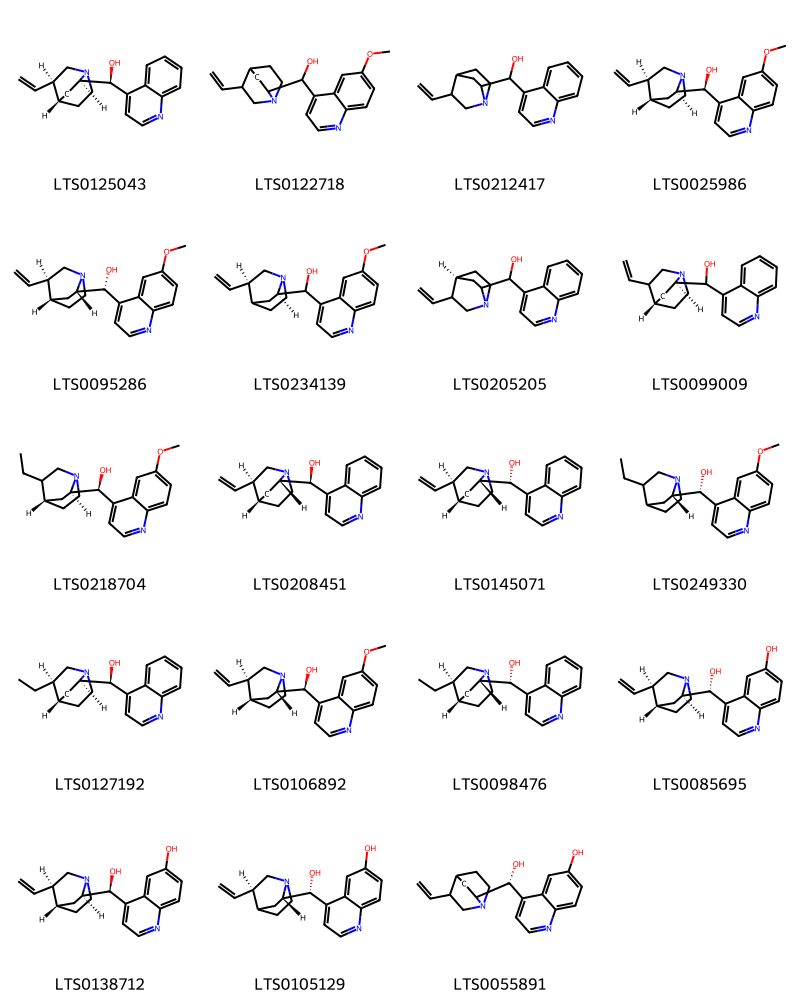{ width=100% }
    <figcaption>Hình ảnh cấu trúc hóa học của 19 hoạt chất thuộc nhóm Cinchona alkaloids gồm ['cinchonine (LTS0125043)', 'quinine (LTS0122718)', 'cinchonidine (LTS0212417)', 'quinidine (LTS0025986)', 'quinine (LTS0095286)', '[(2r,5r)-5-ethenyl-1-azabicyclo[2.2.2]octan-2-yl](6-methoxyquinolin-4-yl)methanol (LTS0234139)', '[(4s)-5-ethenyl-1-azabicyclo[2.2.2]octan-2-yl](quinolin-4-yl)methanol (LTS0205205)', '[(2r,4s)-5-ethenyl-1-azabicyclo[2.2.2]octan-2-yl](quinolin-4-yl)methanol (LTS0099009)', '(s)-[(2r,4s)-5-ethyl-1-azabicyclo[2.2.2]octan-2-yl](6-methoxyquinolin-4-yl)methanol (LTS0218704)', 'cinchonine (LTS0208451)', 'cinchonidine (LTS0145071)', '(r)-[(2s)-5-ethyl-1-azabicyclo[2.2.2]octan-2-yl](6-methoxyquinolin-4-yl)methanol (LTS0249330)', '(+)-hydrocinchonine (LTS0127192)', 'epiquinine (LTS0106892)', 'hydrocinchonidine (LTS0098476)', 'cupreidine (LTS0085695)', '4-[(s)-[(2r,4s,5r)-5-ethenyl-1-azabicyclo[2.2.2]octan-2-yl](hydroxy)methyl]quinolin-6-ol (LTS0138712)', '4-[(r)-[(2s,5r)-5-ethenyl-1-azabicyclo[2.2.2]octan-2-yl](hydroxy)methyl]quinolin-6-ol (LTS0105129)', '4-[(r)-{5-ethenyl-1-azabicyclo[2.2.2]octan-2-yl}(hydroxy)methyl]quinolin-6-ol (LTS0055891)'].</figcaption>
</figure>
#### Nhóm Harmala alkaloids
<figure markdown="span">
    { width=100% }
    <figcaption>Hình ảnh cấu trúc hóa học của 11 hoạt chất thuộc nhóm Harmala alkaloids gồm ['3-ethenyl-9-methoxy-2-({6-methoxy-9h-pyrido[3,4-b]indol-1-yl}methyl)-1h,2h,3h,4h,6h,7h,12h,12bh-indolo[2,3-a]quinolizine (LTS0064218)', '(2s,3r,12br)-3-ethenyl-9-methoxy-2-{[(1r)-6-methoxy-1h,2h,3h,4h,9h-pyrido[3,4-b]indol-1-yl]methyl}-1h,2h,3h,4h,6h,7h,12h,12bh-indolo[2,3-a]quinolizine (LTS0217893)', '(2s,3r,12bs)-3-ethenyl-9-methoxy-2-{[(1r)-6-methoxy-1h,2h,3h,4h,9h-pyrido[3,4-b]indol-1-yl]methyl}-1h,2h,3h,4h,6h,7h,12h,12bh-indolo[2,3-a]quinolizine (LTS0130648)', '3-ethyl-9-methoxy-2-({6-methoxy-1h,2h,3h,4h,9h-pyrido[3,4-b]indol-1-yl}methyl)-1h,2h,3h,4h,6h,7h,12h,12bh-indolo[2,3-a]quinolizine (LTS0152331)', '3-ethenyl-9-methoxy-2-({6-methoxy-1h,2h,3h,4h,9h-pyrido[3,4-b]indol-1-yl}methyl)-1h,2h,3h,4h,6h,7h,12h,12bh-indolo[2,3-a]quinolizine (LTS0153763)', '(2r,3r,12bs)-3-ethenyl-9-methoxy-2-({6-methoxy-3h,4h,9h-pyrido[3,4-b]indol-1-yl}methyl)-1h,2h,3h,4h,6h,7h,12h,12bh-indolo[2,3-a]quinolizine (LTS0155513)', '(2s,3r,12bs)-3-ethenyl-9-methoxy-2-{[(1s)-6-methoxy-1h,2h,3h,4h,9h-pyrido[3,4-b]indol-1-yl]methyl}-1h,2h,3h,4h,6h,7h,12h,12bh-indolo[2,3-a]quinolizine (LTS0256881)', '(2s,3r,12br)-3-ethenyl-9-methoxy-2-{[(1s)-6-methoxy-1h,2h,3h,4h,9h-pyrido[3,4-b]indol-1-yl]methyl}-1h,2h,3h,4h,6h,7h,12h,12bh-indolo[2,3-a]quinolizine (LTS0177722)', '(2r,3r,12bs)-3-ethenyl-9-methoxy-2-({6-methoxy-9h-pyrido[3,4-b]indol-1-yl}methyl)-1h,2h,3h,4h,6h,7h,12h,12bh-indolo[2,3-a]quinolizine (LTS0181256)', '3-ethenyl-9-methoxy-2-({6-methoxy-3h,4h,9h-pyrido[3,4-b]indol-1-yl}methyl)-1h,2h,3h,4h,6h,7h,12h,12bh-indolo[2,3-a]quinolizine (LTS0079028)', '(2s,3r,12br)-3-ethyl-9-methoxy-2-{[(1r)-6-methoxy-1h,2h,3h,4h,9h-pyrido[3,4-b]indol-1-yl]methyl}-1h,2h,3h,4h,6h,7h,12h,12bh-indolo[2,3-a]quinolizine (LTS0123824)'].</figcaption>
</figure>
#### Nhóm Indoles and derivatives
<figure markdown="span">
    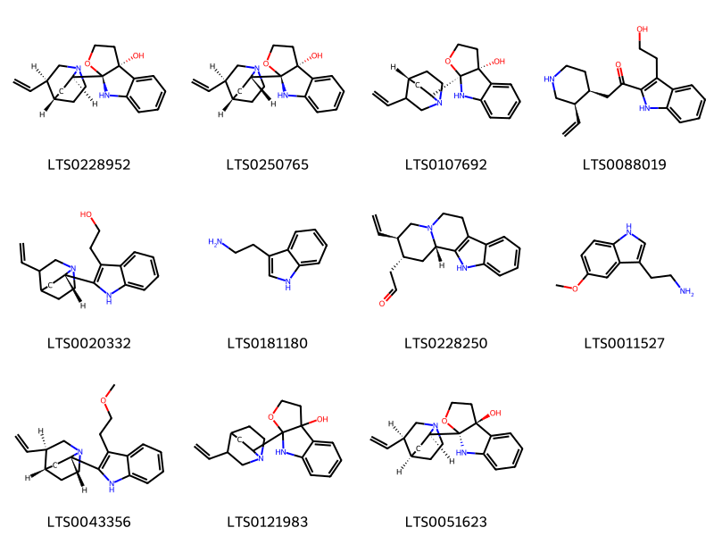{ width=100% }
    <figcaption>Hình ảnh cấu trúc hóa học của 11 hoạt chất thuộc nhóm Indoles and derivatives gồm ['conquinamine (LTS0228952)', 'quinamine (LTS0250765)', '(3ar,8as)-8a-[(4r)-5-ethenyl-1-azabicyclo[2.2.2]octan-2-yl]-2h,3h,8h-furo[2,3-b]indol-3a-ol (LTS0107692)', '2-[(3r,4s)-3-ethenylpiperidin-4-yl]-1-[3-(2-hydroxyethyl)-1h-indol-2-yl]ethanone (LTS0088019)', 'cinchonamine (LTS0020332)', 'tryptamine (LTS0181180)', 'corynantheal (LTS0228250)', '5 methoxytryptamine (LTS0011527)', '2-[(2s,4s,5r)-5-ethenyl-1-azabicyclo[2.2.2]octan-2-yl]-3-(2-methoxyethyl)-1h-indole (LTS0043356)', 'quinamine (LTS0121983)', '(3as,8ar)-8a-[(2r,4r,5r)-5-ethenyl-1-azabicyclo[2.2.2]octan-2-yl]-2h,3h,8h-furo[2,3-b]indol-3a-ol (LTS0051623)'].</figcaption>
</figure>
#### Nhóm Prenol lipids
<figure markdown="span">
    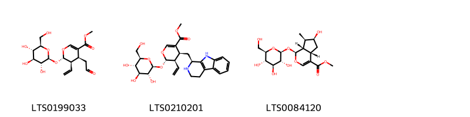{ width=100% }
    <figcaption>Hình ảnh cấu trúc hóa học của 3 hoạt chất thuộc nhóm Prenol lipids gồm ['(-)-secologanin (LTS0199033)', 'strictosidine (LTS0210201)', 'loganin (LTS0084120)'].</figcaption>
</figure>
#### Nhóm Quinolines and derivatives
<figure markdown="span">
    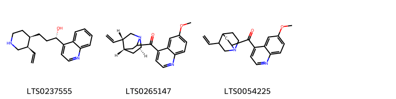{ width=100% }
    <figcaption>Hình ảnh cấu trúc hóa học của 3 hoạt chất thuộc nhóm Quinolines and derivatives gồm ['(1s)-3-[(3r,4r)-3-ethenylpiperidin-4-yl]-1-(quinolin-4-yl)propan-1-ol (LTS0237555)', '4-[(2r,4s,5s)-5-ethenyl-1-azabicyclo[2.2.2]octane-2-carbonyl]-6-methoxyquinoline (LTS0265147)', 'quininone (LTS0054225)'].</figcaption>
</figure>

---

### Dược dân tộc học

Danh sách các quốc gia có sử dụng *Cinchona calisaya* trong điều trị các bệnh. 

| Country   | Disease                       | Bệnh                                                                                                                                                                                                |
|:----------|:------------------------------|:----------------------------------------------------------------------------------------------------------------------------------------------------------------------------------------------------|
| Elsewhere | nan                           | MYMEMORY WARNING: YOU USED ALL AVAILABLE FREE TRANSLATIONS FOR TODAY. NEXT AVAILABLE IN  11 HOURS 07 MINUTES 45 SECONDS VISIT HTTPS://MYMEMORY.TRANSLATED.NET/DOC/USAGELIMITS.PHP TO TRANSLATE MORE |
| France    | Antiseptic                    | MYMEMORY WARNING: YOU USED ALL AVAILABLE FREE TRANSLATIONS FOR TODAY. NEXT AVAILABLE IN  11 HOURS 07 MINUTES 41 SECONDS VISIT HTTPS://MYMEMORY.TRANSLATED.NET/DOC/USAGELIMITS.PHP TO TRANSLATE MORE |
| Mexico    | Antiseptic, Astringent, Tonic | MYMEMORY WARNING: YOU USED ALL AVAILABLE FREE TRANSLATIONS FOR TODAY. NEXT AVAILABLE IN  11 HOURS 07 MINUTES 36 SECONDS VISIT HTTPS://MYMEMORY.TRANSLATED.NET/DOC/USAGELIMITS.PHP TO TRANSLATE MORE |

---

---
## Cinchona officinalis
### Thông tin về thực vật

!!! info "Phân loại thực vật của *Cinchona officinalis* từ GIBF:"
    - **Kingdom:** Plantae
    - **Phylum:** Tracheophyta
    - **Order:** Gentianales
    - **Family:** Rubiaceae
    - **Genus:** Cinchona
    - **Species:** *Cinchona officinalis*

 

| Label (VI)   | Label (EN)   | Scientific Name      | Descriptions (VI)   | Descriptions (EN)   | Also Known As (VI)   | Also Known As (EN)   |
|:-------------|:-------------|:---------------------|:--------------------|:--------------------|:---------------------|:---------------------|
| N/A          | N/A          | Cinchona officinalis |                     | Species of plant    | ['Quinquina']        | ['']                 |

#### Phân bố trên thế giới

**Từ CSDL GIBF** Mexico, Réunion, Brazil, United States of America, Jamaica, Netherlands, Colombia, India, Saint Helena, Ascension and Tristan da Cunha, Ecuador, Peru, Bolivia (Plurinational State of), Guinea

#### Phân bố tại Việt Nam

**Từ CSDL GIBF**: Không có ghi nhận ở Việt Nam

---
### Thành phần hóa học
        
- Theo cơ sở dữ liệu lotus: Từ loài *Cinchona officinalis* đã phân lập và xác định được 9 hoạt chất thuộc về các nhóm Cinchona alkaloids. 

|    | chemicalTaxonomyClassyfireClass   |   smiles_count |
|---:|:----------------------------------|---------------:|
|  0 | Cinchona alkaloids                |              8 |

#### Nhóm Cinchona alkaloids
<figure markdown="span">
    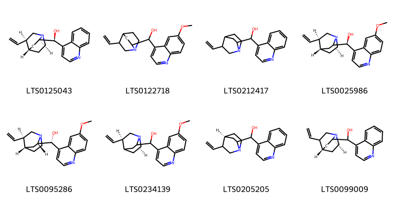{ width=100% }
    <figcaption>Hình ảnh cấu trúc hóa học của 8 hoạt chất thuộc nhóm Cinchona alkaloids gồm ['cinchonine (LTS0125043)', 'quinine (LTS0122718)', 'cinchonidine (LTS0212417)', 'quinidine (LTS0025986)', 'quinine (LTS0095286)', '[(2r,5r)-5-ethenyl-1-azabicyclo[2.2.2]octan-2-yl](6-methoxyquinolin-4-yl)methanol (LTS0234139)', '[(4s)-5-ethenyl-1-azabicyclo[2.2.2]octan-2-yl](quinolin-4-yl)methanol (LTS0205205)', '[(2r,4s)-5-ethenyl-1-azabicyclo[2.2.2]octan-2-yl](quinolin-4-yl)methanol (LTS0099009)'].</figcaption>
</figure>

---

### Dược dân tộc học

Danh sách các quốc gia có sử dụng *Cinchona officinalis* trong điều trị các bệnh. 

| Country   | Disease                                                                                  | Bệnh                                                                                                                                                                                                |
|:----------|:-----------------------------------------------------------------------------------------|:----------------------------------------------------------------------------------------------------------------------------------------------------------------------------------------------------|
| Elsewhere | nan, Contraceptive, Schizonticide, Stomachic, Tonic, Uterotonic, Anesthetic, Insecticide | MYMEMORY WARNING: YOU USED ALL AVAILABLE FREE TRANSLATIONS FOR TODAY. NEXT AVAILABLE IN  11 HOURS 06 MINUTES 59 SECONDS VISIT HTTPS://MYMEMORY.TRANSLATED.NET/DOC/USAGELIMITS.PHP TO TRANSLATE MORE |
| Mexico    | Antiseptic, Astringent, Tonic                                                            | MYMEMORY WARNING: YOU USED ALL AVAILABLE FREE TRANSLATIONS FOR TODAY. NEXT AVAILABLE IN  11 HOURS 06 MINUTES 56 SECONDS VISIT HTTPS://MYMEMORY.TRANSLATED.NET/DOC/USAGELIMITS.PHP TO TRANSLATE MORE |
| Turkey    | Antiseptic, Astringent, Tonic                                                            | MYMEMORY WARNING: YOU USED ALL AVAILABLE FREE TRANSLATIONS FOR TODAY. NEXT AVAILABLE IN  11 HOURS 06 MINUTES 52 SECONDS VISIT HTTPS://MYMEMORY.TRANSLATED.NET/DOC/USAGELIMITS.PHP TO TRANSLATE MORE |

---

---
## Cinchona succirubra
### Thông tin về thực vật

!!! info "Phân loại thực vật của *Cinchona pubescens* từ GIBF:"
    - **Kingdom:** Plantae
    - **Phylum:** Tracheophyta
    - **Order:** Gentianales
    - **Family:** Rubiaceae
    - **Genus:** Cinchona
    - **Species:** *Cinchona pubescens*

 

| Label (VI)   | Label (EN)   | Scientific Name     | Descriptions (VI)   | Descriptions (EN)   | Also Known As (VI)   | Also Known As (EN)   |
|:-------------|:-------------|:--------------------|:--------------------|:--------------------|:---------------------|:---------------------|
| N/A          | N/A          | Cinchona succirubra | loài thực vật       | species of plant    | ['']                 | ['']                 |

#### Phân bố trên thế giới

**Từ CSDL GIBF** nan, Brazil, Uganda, Japan, China, Tanzania, United Republic of, Ecuador, French Polynesia, Guinea, Sri Lanka, Réunion, United States of America, Jamaica, Indonesia, unknown or invalid, Mexico, Congo, Democratic Republic of the, Malaysia, Chinese Taipei, Philippines, Côte d’Ivoire, India, Peru, Bolivia (Plurinational State of), Cameroon

#### Phân bố tại Việt Nam

**Từ CSDL GIBF**: Không có ghi nhận ở Việt Nam

---
### Thành phần hóa học
        
- Theo cơ sở dữ liệu lotus: Từ loài *Cinchona pubescens* đã phân lập và xác định được 34 hoạt chất thuộc về các nhóm Quinolines and derivatives, Flavonoids, Cinnamic acids and derivatives, Cinchona alkaloids, Indoles and derivatives. 

|    | chemicalTaxonomyClassyfireClass   |   smiles_count |
|---:|:----------------------------------|---------------:|
|  0 | Cinchona alkaloids                |              8 |
|  1 | Cinnamic acids and derivatives    |              2 |
|  2 | Flavonoids                        |             16 |
|  3 | Indoles and derivatives           |              5 |
|  4 | Quinolines and derivatives        |              2 |

#### Nhóm Cinchona alkaloids
<figure markdown="span">
    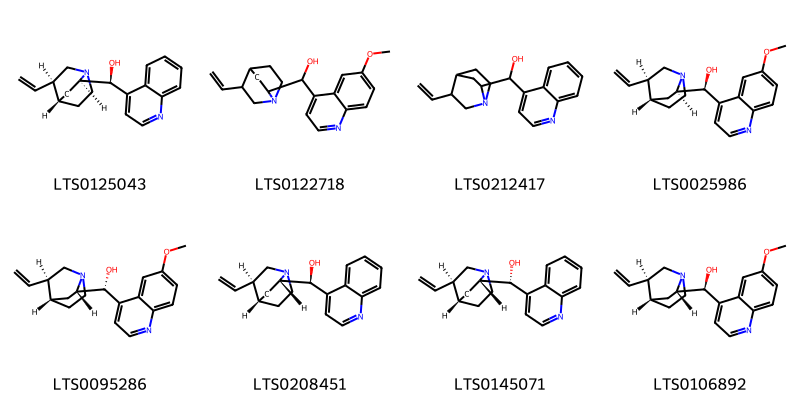{ width=100% }
    <figcaption>Hình ảnh cấu trúc hóa học của 8 hoạt chất thuộc nhóm Cinchona alkaloids gồm ['cinchonine (LTS0125043)', 'quinine (LTS0122718)', 'cinchonidine (LTS0212417)', 'quinidine (LTS0025986)', 'quinine (LTS0095286)', 'cinchonine (LTS0208451)', 'cinchonidine (LTS0145071)', 'epiquinine (LTS0106892)'].</figcaption>
</figure>
#### Nhóm Cinnamic acids and derivatives
<figure markdown="span">
    { width=100% }
    <figcaption>Hình ảnh cấu trúc hóa học của 2 hoạt chất thuộc nhóm Cinnamic acids and derivatives gồm ['3,4-dihydroxycinnamic acid (LTS0128050)', 'caffeic acid (LTS0027481)'].</figcaption>
</figure>
#### Nhóm Flavonoids
<figure markdown="span">
    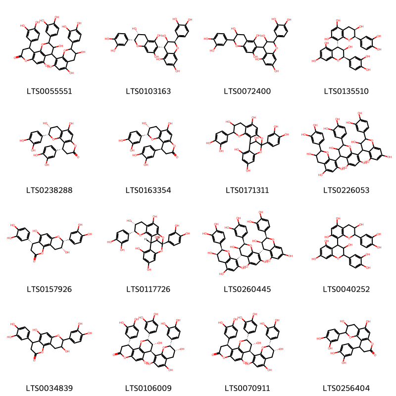{ width=100% }
    <figcaption>Hình ảnh cấu trúc hóa học của 16 hoạt chất thuộc nhóm Flavonoids gồm ['4,14-bis(3,4-dihydroxyphenyl)-6-[2-(3,4-dihydroxyphenyl)-3,5,7-trihydroxy-3,4-dihydro-2h-1-benzopyran-8-yl]-5,8-dihydroxy-3,11-dioxatricyclo[8.4.0.0²,⁷]tetradeca-1(10),2(7),8-trien-12-one (LTS0055551)', '(2r,3r,4s)-2-(3,4-dihydroxyphenyl)-4-[(2r,3r)-2-(3,4-dihydroxyphenyl)-3,5,7-trihydroxy-3,4-dihydro-2h-1-benzopyran-6-yl]-3,4-dihydro-2h-1-benzopyran-3,5,7-triol (LTS0103163)', '2-(3,4-dihydroxyphenyl)-4-[2-(3,4-dihydroxyphenyl)-3,5,7-trihydroxy-3,4-dihydro-2h-1-benzopyran-6-yl]-3,4-dihydro-2h-1-benzopyran-3,5,7-triol (LTS0072400)', '(2r,3r,4r)-2-(3,4-dihydroxyphenyl)-4-[(2r,3r)-2-(3,4-dihydroxyphenyl)-3,5,7-trihydroxy-3,4-dihydro-2h-1-benzopyran-8-yl]-3,4-dihydro-2h-1-benzopyran-3,5,7-triol (LTS0135510)', 'cinchonain ib (LTS0238288)', 'cinchonain-ib (LTS0163354)', 'procyanidin a1 (LTS0171311)', 'procyanidin c2 (LTS0226053)', '(6r,12r,13r)-6,12-bis(3,4-dihydroxyphenyl)-8,13-dihydroxy-3,11-dioxatricyclo[8.4.0.0²,⁷]tetradeca-1,7,9-trien-4-one (LTS0157926)', 'proanthocyanidin a2 (LTS0117726)', 'procyanidin c1 (LTS0260445)', '2-(3,4-dihydroxyphenyl)-4-[2-(3,4-dihydroxyphenyl)-3,5,7-trihydroxy-3,4-dihydro-2h-1-benzopyran-8-yl]-3,4-dihydro-2h-1-benzopyran-3,5,7-triol (LTS0040252)', '6,12-bis(3,4-dihydroxyphenyl)-8,13-dihydroxy-3,11-dioxatricyclo[8.4.0.0²,⁷]tetradeca-1,7,9-trien-4-one (LTS0034839)', '(4r,5r,6s,14r)-4,14-bis(3,4-dihydroxyphenyl)-6-[(2r,3r)-2-(3,4-dihydroxyphenyl)-3,5,7-trihydroxy-3,4-dihydro-2h-1-benzopyran-8-yl]-5,8-dihydroxy-3,11-dioxatricyclo[8.4.0.0²,⁷]tetradeca-1(10),2(7),8-trien-12-one (LTS0106009)', '(4r,5r,6s,14s)-4,14-bis(3,4-dihydroxyphenyl)-6-[(2r,3r)-2-(3,4-dihydroxyphenyl)-3,5,7-trihydroxy-3,4-dihydro-2h-1-benzopyran-8-yl]-5,8-dihydroxy-3,11-dioxatricyclo[8.4.0.0²,⁷]tetradeca-1(10),2(7),8-trien-12-one (LTS0070911)', '4,14-bis(3,4-dihydroxyphenyl)-5,8-dihydroxy-3,11-dioxatricyclo[8.4.0.0²,⁷]tetradeca-1(10),2(7),8-trien-12-one (LTS0256404)'].</figcaption>
</figure>
#### Nhóm Indoles and derivatives
<figure markdown="span">
    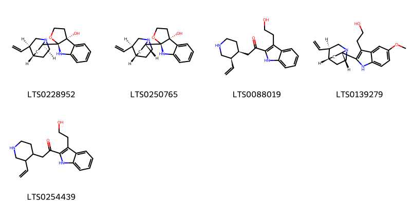{ width=100% }
    <figcaption>Hình ảnh cấu trúc hóa học của 5 hoạt chất thuộc nhóm Indoles and derivatives gồm ['conquinamine (LTS0228952)', 'quinamine (LTS0250765)', '2-[(3r,4s)-3-ethenylpiperidin-4-yl]-1-[3-(2-hydroxyethyl)-1h-indol-2-yl]ethanone (LTS0088019)', '2-{2-[(2s,4s,5r)-5-ethenyl-1-azabicyclo[2.2.2]octan-2-yl]-5-methoxy-1h-indol-3-yl}ethanol (LTS0139279)', '2-(3-ethenylpiperidin-4-yl)-1-[3-(2-hydroxyethyl)-1h-indol-2-yl]ethanone (LTS0254439)'].</figcaption>
</figure>
#### Nhóm Quinolines and derivatives
<figure markdown="span">
    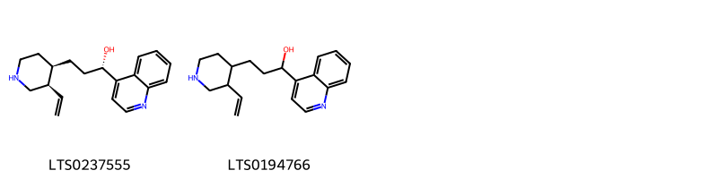{ width=100% }
    <figcaption>Hình ảnh cấu trúc hóa học của 2 hoạt chất thuộc nhóm Quinolines and derivatives gồm ['(1s)-3-[(3r,4r)-3-ethenylpiperidin-4-yl]-1-(quinolin-4-yl)propan-1-ol (LTS0237555)', '3-(3-ethenylpiperidin-4-yl)-1-(quinolin-4-yl)propan-1-ol (LTS0194766)'].</figcaption>
</figure>

---

### Dược dân tộc học

Danh sách các quốc gia có sử dụng *Cinchona pubescens* trong điều trị các bệnh. 

| Country   | Disease                       | Bệnh                                                                                                                                                                                                |
|:----------|:------------------------------|:----------------------------------------------------------------------------------------------------------------------------------------------------------------------------------------------------|
| France    | Antiseptic                    | MYMEMORY WARNING: YOU USED ALL AVAILABLE FREE TRANSLATIONS FOR TODAY. NEXT AVAILABLE IN  11 HOURS 06 MINUTES 20 SECONDS VISIT HTTPS://MYMEMORY.TRANSLATED.NET/DOC/USAGELIMITS.PHP TO TRANSLATE MORE |
| Japan*    | nan, Stomachic                | MYMEMORY WARNING: YOU USED ALL AVAILABLE FREE TRANSLATIONS FOR TODAY. NEXT AVAILABLE IN  11 HOURS 06 MINUTES 16 SECONDS VISIT HTTPS://MYMEMORY.TRANSLATED.NET/DOC/USAGELIMITS.PHP TO TRANSLATE MORE |
| Mexico    | Antiseptic, Astringent, Tonic | MYMEMORY WARNING: YOU USED ALL AVAILABLE FREE TRANSLATIONS FOR TODAY. NEXT AVAILABLE IN  11 HOURS 06 MINUTES 08 SECONDS VISIT HTTPS://MYMEMORY.TRANSLATED.NET/DOC/USAGELIMITS.PHP TO TRANSLATE MORE |
| Turkey    | Antiseptic, Astringent, Tonic | MYMEMORY WARNING: YOU USED ALL AVAILABLE FREE TRANSLATIONS FOR TODAY. NEXT AVAILABLE IN  11 HOURS 06 MINUTES 03 SECONDS VISIT HTTPS://MYMEMORY.TRANSLATED.NET/DOC/USAGELIMITS.PHP TO TRANSLATE MORE |

---

# Chi Rubia

??? note "Danh sách các dược liệu thuộc chi"
    
	 - *Rubia akane*
	 - *Rubia cordifolia*
	 - *Rubia peregrina*
	 - *Rubia tinctorum*

---
## Rubia akane
### Thông tin về thực vật

!!! info "Phân loại thực vật của *Rubia argyi* từ GIBF:"
    - **Kingdom:** Plantae
    - **Phylum:** Tracheophyta
    - **Order:** Gentianales
    - **Family:** Rubiaceae
    - **Genus:** Rubia
    - **Species:** *Rubia argyi*

 

| Label (VI)   | Label (EN)   | Scientific Name   | Descriptions (VI)   | Descriptions (EN)   | Also Known As (VI)   | Also Known As (EN)   |
|:-------------|:-------------|:------------------|:--------------------|:--------------------|:---------------------|:---------------------|
| N/A          | N/A          | Rubia akane       |                     | species of plant    | ['']                 | ['']                 |

#### Phân bố trên thế giới

**Từ CSDL GIBF** Chinese Taipei, Korea, Republic of

#### Phân bố tại Việt Nam

**Từ CSDL GIBF**: Không có ghi nhận ở Việt Nam

---
### Thành phần hóa học
        
- Theo cơ sở dữ liệu lotus: Từ loài *Rubia argyi* đã phân lập và xác định được 19 hoạt chất thuộc về các nhóm Naphthopyrans, Anthracenes, Carboxylic acids and derivatives, Steroids and steroid derivatives, Aryltetralin lignans, Prenol lipids. 

|    | chemicalTaxonomyClassyfireClass   |   smiles_count |
|---:|:----------------------------------|---------------:|
|  0 | Anthracenes                       |             10 |
|  1 | Aryltetralin lignans              |              3 |
|  2 | Carboxylic acids and derivatives  |              1 |
|  3 | Naphthopyrans                     |              1 |
|  4 | Prenol lipids                     |              2 |
|  5 | Steroids and steroid derivatives  |              2 |

#### Nhóm Anthracenes
<figure markdown="span">
    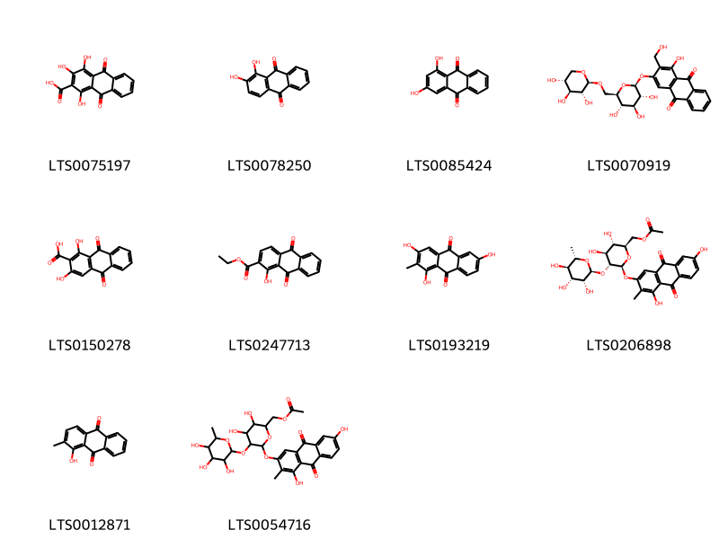{ width=100% }
    <figcaption>Hình ảnh cấu trúc hóa học của 10 hoạt chất thuộc nhóm Anthracenes gồm ['pseudopurpurin (LTS0075197)', 'alizarin (LTS0078250)', 'purpuro (LTS0085424)', '1-hydroxy-2-(hydroxymethyl)-3-{[(2s,3r,4s,5s,6r)-3,4,5-trihydroxy-6-({[(2s,3r,4s,5r)-3,4,5-trihydroxyoxan-2-yl]oxy}methyl)oxan-2-yl]oxy}anthracene-9,10-dione (LTS0070919)', '1,3-dihydroxy-9,10-dioxoanthracene-2-carboxylic acid (LTS0150278)', 'ethyl 1-hydroxy-9,10-dioxoanthracene-2-carboxylate (LTS0247713)', '1,3,6-trihydroxy-2-methylanthracene-9,10-dione (LTS0193219)', '[(2r,3s,4s,5r,6s)-6-[(4,7-dihydroxy-3-methyl-9,10-dioxoanthracen-2-yl)oxy]-3,4-dihydroxy-5-{[(2s,3r,4r,5r,6s)-3,4,5-trihydroxy-6-methyloxan-2-yl]oxy}oxan-2-yl]methyl acetate (LTS0206898)', '1-hydroxy-2-methylanthracene-9,10-dione (LTS0012871)', '{6-[(4,7-dihydroxy-3-methyl-9,10-dioxoanthracen-2-yl)oxy]-3,4-dihydroxy-5-[(3,4,5-trihydroxy-6-methyloxan-2-yl)oxy]oxan-2-yl}methyl acetate (LTS0054716)'].</figcaption>
</figure>
#### Nhóm Aryltetralin lignans
<figure markdown="span">
    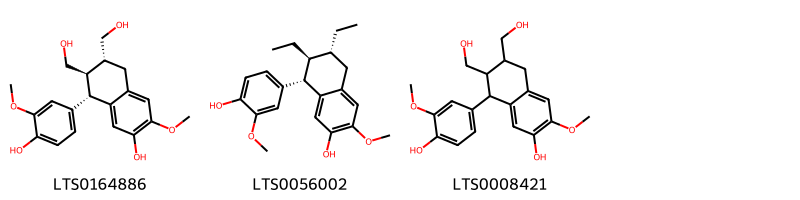{ width=100% }
    <figcaption>Hình ảnh cấu trúc hóa học của 3 hoạt chất thuộc nhóm Aryltetralin lignans gồm ['(+)-isolariciresinol (LTS0164886)', '(6r,7s,8s)-6,7-diethyl-8-(4-hydroxy-3-methoxyphenyl)-3-methoxy-5,6,7,8-tetrahydronaphthalen-2-ol (LTS0056002)', '8-(4-hydroxy-3-methoxyphenyl)-6,7-bis(hydroxymethyl)-3-methoxy-5,6,7,8-tetrahydronaphthalen-2-ol (LTS0008421)'].</figcaption>
</figure>
#### Nhóm Carboxylic acids and derivatives
<figure markdown="span">
    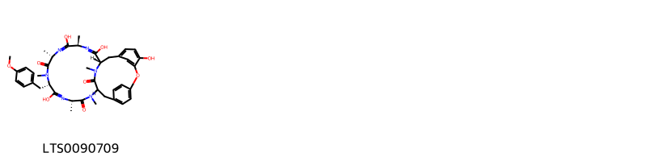{ width=100% }
    <figcaption>Hình ảnh cấu trúc hóa học của 1 hoạt chất thuộc nhóm Carboxylic acids and derivatives gồm ['(1s,4r,7s,10s,13s,16s)-2,5,11,24-tetrahydroxy-10-[(4-methoxyphenyl)methyl]-4,7,9,13,15,29-hexamethyl-22-oxa-3,6,9,12,15,29-hexaazatetracyclo[14.12.2.2¹⁸,²¹.1²³,²⁷]tritriaconta-2,5,11,18,20,23(31),24,26,32-nonaene-8,14,30-trione (LTS0090709)'].</figcaption>
</figure>
#### Nhóm Naphthopyrans
<figure markdown="span">
    { width=100% }
    <figcaption>Hình ảnh cấu trúc hóa học của 1 hoạt chất thuộc nhóm Naphthopyrans gồm ['methyl 6-hydroxy-2,2-dimethylbenzo[h]chromene-5-carboxylate (LTS0173558)'].</figcaption>
</figure>
#### Nhóm Prenol lipids
<figure markdown="span">
    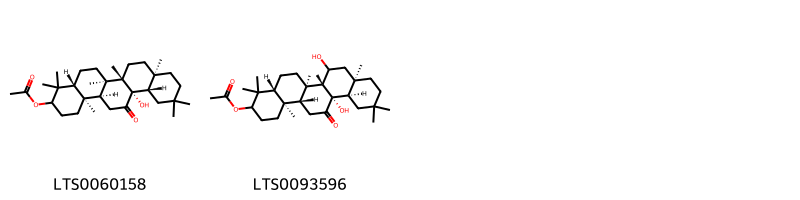{ width=100% }
    <figcaption>Hình ảnh cấu trúc hóa học của 2 hoạt chất thuộc nhóm Prenol lipids gồm ['(4ar,6ar,6bs,8ar,12as,12bs,14as,14br)-12b-hydroxy-4,4,6a,6b,8a,11,11,14b-octamethyl-13-oxo-tetradecahydropicen-3-yl acetate (LTS0060158)', '(4ar,6ar,6br,8ar,12ar,12bs,14ar,14br)-7,12b-dihydroxy-4,4,6a,6b,8a,11,11,14b-octamethyl-13-oxo-tetradecahydropicen-3-yl acetate (LTS0093596)'].</figcaption>
</figure>
#### Nhóm Steroids and steroid derivatives
<figure markdown="span">
    { width=100% }
    <figcaption>Hình ảnh cấu trúc hóa học của 2 hoạt chất thuộc nhóm Steroids and steroid derivatives gồm ['sitogluside (LTS0201798)', '2-{[1-(5-ethyl-6-methylheptan-2-yl)-9a,11a-dimethyl-1h,2h,3h,3ah,3bh,4h,6h,7h,8h,9h,9bh,10h,11h-cyclopenta[a]phenanthren-7-yl]oxy}-6-(hydroxymethyl)oxane-3,4,5-triol (LTS0158828)'].</figcaption>
</figure>

---

### Dược dân tộc học

Danh sách các quốc gia có sử dụng *Rubia argyi* trong điều trị các bệnh. 

| Country   | Disease          | Bệnh                                                                                                                                                                                                |
|:----------|:-----------------|:----------------------------------------------------------------------------------------------------------------------------------------------------------------------------------------------------|
| Elsewhere | Emmenagogue, nan | MYMEMORY WARNING: YOU USED ALL AVAILABLE FREE TRANSLATIONS FOR TODAY. NEXT AVAILABLE IN  11 HOURS 05 MINUTES 18 SECONDS VISIT HTTPS://MYMEMORY.TRANSLATED.NET/DOC/USAGELIMITS.PHP TO TRANSLATE MORE |

---

---
## Rubia cordifolia
### Thông tin về thực vật

!!! info "Phân loại thực vật của *Rubia cordifolia* từ GIBF:"
    - **Kingdom:** Plantae
    - **Phylum:** Tracheophyta
    - **Order:** Gentianales
    - **Family:** Rubiaceae
    - **Genus:** Rubia
    - **Species:** *Rubia cordifolia*

 

| Label (VI)   | Label (EN)   | Scientific Name   | Descriptions (VI)   | Descriptions (EN)   | Also Known As (VI)   | Also Known As (EN)   |
|:-------------|:-------------|:------------------|:--------------------|:--------------------|:---------------------|:---------------------|
| N/A          | N/A          | Rubia cordifolia  | loài thực vật       | species of plant    | ['']                 | ['Indian madder']    |

#### Phân bố trên thế giới

**Từ CSDL GIBF** Kenya, Rwanda, Korea, Republic of, Mongolia, Eswatini, Indonesia, Nepal, China, Russian Federation, South Africa, Myanmar, India, Tanzania, United Republic of, Ethiopia, Malawi

#### Phân bố tại Việt Nam

**Từ CSDL GIBF**: Không có ghi nhận ở Việt Nam

---
### Thành phần hóa học
        
- Theo cơ sở dữ liệu lotus: Từ loài *Rubia cordifolia* đã phân lập và xác định được 147 hoạt chất thuộc về các nhóm Angucyclines, Naphthofurans, Carboxylic acids and derivatives, Coumarins and derivatives, Steroids and steroid derivatives, Anthracenes, Naphthopyrans, Naphthalenes, Organooxygen compounds, Prenol lipids, Lignan glycosides, Benzopyrans. 

|    | chemicalTaxonomyClassyfireClass   |   smiles_count |
|---:|:----------------------------------|---------------:|
|  0 |                                   |             14 |
|  1 | Angucyclines                      |              1 |
|  2 | Anthracenes                       |             34 |
|  3 | Benzopyrans                       |              1 |
|  4 | Carboxylic acids and derivatives  |             38 |
|  5 | Coumarins and derivatives         |              1 |
|  6 | Lignan glycosides                 |              6 |
|  7 | Naphthalenes                      |              2 |
|  8 | Naphthofurans                     |              1 |
|  9 | Naphthopyrans                     |             14 |
| 10 | Organooxygen compounds            |              2 |
| 11 | Prenol lipids                     |             27 |
| 12 | Steroids and steroid derivatives  |              5 |

#### Nhóm 
<figure markdown="span">
    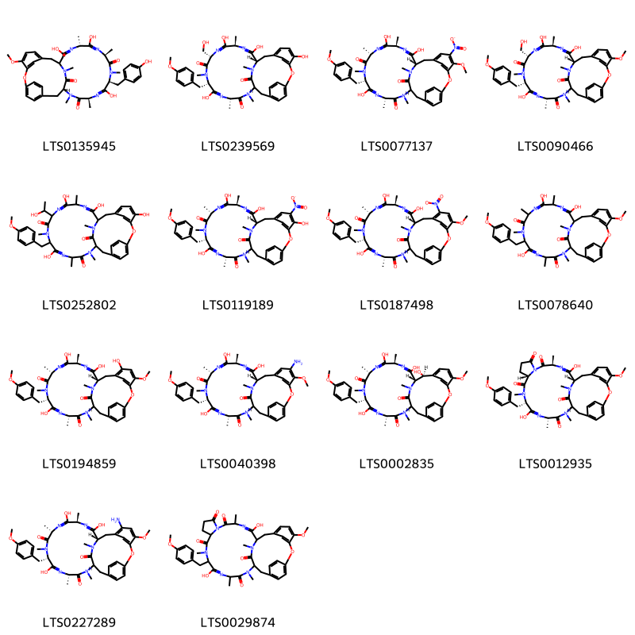{ width=100% }
    <figcaption>Hình ảnh cấu trúc hóa học của 14 hoạt chất thuộc nhóm  gồm ['(1s,4r,7s,10s,13s,16s)-2,5,11-trihydroxy-10-[(4-hydroxyphenyl)methyl]-24-methoxy-4,7,9,13,15,29-hexamethyl-22-oxa-3,6,9,12,15,29-hexaazatetracyclo[14.12.2.2¹⁸,²¹.1²³,²⁷]tritriaconta-2,5,11,18,20,23(31),24,26,32-nonaene-8,14,30-trione (LTS0135945)', '(1s,4r,7s,10s,13s,16s)-2,5,11,24-tetrahydroxy-7-(hydroxymethyl)-10-[(4-methoxyphenyl)methyl]-4,9,13,15,29-pentamethyl-22-oxa-3,6,9,12,15,29-hexaazatetracyclo[14.12.2.2¹⁸,²¹.1²³,²⁷]tritriaconta-2,5,11,18,20,23(31),24,26,32-nonaene-8,14,30-trione (LTS0239569)', '(1s,4r,7s,10s,13s,16s)-2,5,11-trihydroxy-24-methoxy-10-[(4-methoxyphenyl)methyl]-4,7,9,13,15,29-hexamethyl-25-nitro-22-oxa-3,6,9,12,15,29-hexaazatetracyclo[14.12.2.2¹⁸,²¹.1²³,²⁷]tritriaconta-2,5,11,18,20,23(31),24,26,32-nonaene-8,14,30-trione (LTS0077137)', '(1s,4r,7s,10s,13s,16s)-2,5,11-trihydroxy-7-(hydroxymethyl)-24-methoxy-10-[(4-methoxyphenyl)methyl]-4,9,13,15,29-pentamethyl-22-oxa-3,6,9,12,15,29-hexaazatetracyclo[14.12.2.2¹⁸,²¹.1²³,²⁷]tritriaconta-2,5,11,18,20,23(31),24,26,32-nonaene-8,14,30-trione (LTS0090466)', '2,5,11,24-tetrahydroxy-7-(1-hydroxyethyl)-10-[(4-methoxyphenyl)methyl]-4,9,13,15,29-pentamethyl-22-oxa-3,6,9,12,15,29-hexaazatetracyclo[14.12.2.2¹⁸,²¹.1²³,²⁷]tritriaconta-2,5,11,18,20,23(31),24,26,32-nonaene-8,14,30-trione (LTS0252802)', '(1s,4r,7s,10s,13s,16s)-2,5,11,24-tetrahydroxy-10-[(4-methoxyphenyl)methyl]-4,7,9,13,15,29-hexamethyl-25-nitro-22-oxa-3,6,9,12,15,29-hexaazatetracyclo[14.12.2.2¹⁸,²¹.1²³,²⁷]tritriaconta-2,5,11,18,20,23(31),24,26,32-nonaene-8,14,30-trione (LTS0119189)', '(1s,4r,7s,10s,13s,16s)-2,5,11-trihydroxy-24-methoxy-10-[(4-methoxyphenyl)methyl]-4,7,9,13,15,29-hexamethyl-26-nitro-22-oxa-3,6,9,12,15,29-hexaazatetracyclo[14.12.2.2¹⁸,²¹.1²³,²⁷]tritriaconta-2,5,11,18,20,23(31),24,26,32-nonaene-8,14,30-trione (LTS0187498)', '2,5,11-trihydroxy-24-methoxy-10-[(4-methoxyphenyl)methyl]-4,7,9,13,15,29-hexamethyl-22-oxa-3,6,9,12,15,29-hexaazatetracyclo[14.12.2.2¹⁸,²¹.1²³,²⁷]tritriaconta-2,5,11,18,20,23(31),24,26,32-nonaene-8,14,30-trione (LTS0078640)', '(1s,4r,7s,10s,13s,16s)-2,5,11,26-tetrahydroxy-24-methoxy-10-[(4-methoxyphenyl)methyl]-4,7,9,13,15,29-hexamethyl-22-oxa-3,6,9,12,15,29-hexaazatetracyclo[14.12.2.2¹⁸,²¹.1²³,²⁷]tritriaconta-2,5,11,18,20,23(31),24,26,32-nonaene-8,14,30-trione (LTS0194859)', '(1s,4r,7s,10s,13s,16s)-25-amino-2,5,11-trihydroxy-24-methoxy-10-[(4-methoxyphenyl)methyl]-4,7,9,13,15,29-hexamethyl-22-oxa-3,6,9,12,15,29-hexaazatetracyclo[14.12.2.2¹⁸,²¹.1²³,²⁷]tritriaconta-2,5,11,18,20,23(31),24,26,32-nonaene-8,14,30-trione (LTS0040398)', '(1s,4r,7s,10s,13s,16s,28s)-2,5,11,28-tetrahydroxy-24-methoxy-10-[(4-methoxyphenyl)methyl]-4,7,9,13,15,29-hexamethyl-22-oxa-3,6,9,12,15,29-hexaazatetracyclo[14.12.2.2¹⁸,²¹.1²³,²⁷]tritriaconta-2,5,11,18,20,23(31),24,26,32-nonaene-8,14,30-trione (LTS0002835)', '(1s,4r,10s,13s,16s,19s)-2,14-dihydroxy-27-methoxy-13-[(4-methoxyphenyl)methyl]-4,12,16,18,32-pentamethyl-25-oxa-3,6,12,15,18,32-hexaazapentacyclo[17.12.2.2²¹,²⁴.1²⁶,³⁰.0⁶,¹⁰]hexatriaconta-2,14,21,23,26(34),27,29,35-octaene-5,7,11,17,33-pentone (LTS0012935)', '(1s,4r,7s,10s,13s,16s)-26-amino-2,5,11-trihydroxy-24-methoxy-10-[(4-methoxyphenyl)methyl]-4,7,9,13,15,29-hexamethyl-22-oxa-3,6,9,12,15,29-hexaazatetracyclo[14.12.2.2¹⁸,²¹.1²³,²⁷]tritriaconta-2,5,11,18,20,23(31),24,26,32-nonaene-8,14,30-trione (LTS0227289)', '2,14-dihydroxy-27-methoxy-13-[(4-methoxyphenyl)methyl]-4,12,16,18,32-pentamethyl-25-oxa-3,6,12,15,18,32-hexaazapentacyclo[17.12.2.2²¹,²⁴.1²⁶,³⁰.0⁶,¹⁰]hexatriaconta-2,14,21,23,26(34),27,29,35-octaene-5,7,11,17,33-pentone (LTS0029874)'].</figcaption>
</figure>
#### Nhóm Angucyclines
<figure markdown="span">
    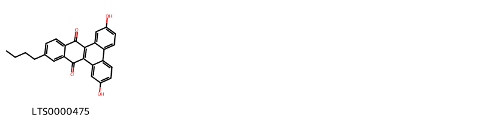{ width=100% }
    <figcaption>Hình ảnh cấu trúc hóa học của 1 hoạt chất thuộc nhóm Angucyclines gồm ['18-butyl-4,11-dihydroxypentacyclo[12.8.0.0²,⁷.0⁸,¹³.0¹⁶,²¹]docosa-1(14),2(7),3,5,8(13),9,11,16,18,20-decaene-15,22-dione (LTS0000475)'].</figcaption>
</figure>
#### Nhóm Anthracenes
<figure markdown="span">
    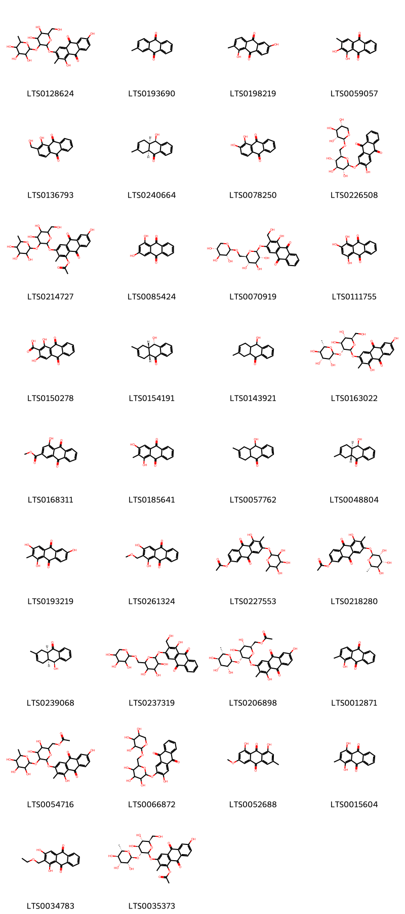{ width=100% }
    <figcaption>Hình ảnh cấu trúc hóa học của 34 hoạt chất thuộc nhóm Anthracenes gồm ['3-{[4,5-dihydroxy-6-(hydroxymethyl)-3-[(3,4,5-trihydroxy-6-methyloxan-2-yl)oxy]oxan-2-yl]oxy}-1,6-dihydroxy-2-methylanthracene-9,10-dione (LTS0128624)', '2-methylanthraquinone (LTS0193690)', '1,6-dihydroxy-2-methylanthracene-9,10-dione (LTS0198219)', '1,2-dihydroxy-3-methylanthracene-9,10-dione (LTS0059057)', 'digiferruginol (LTS0136793)', '(4ar,9as,10r)-10-hydroxy-2-methyl-4,4a,9a,10-tetrahydro-1h-anthracen-9-one (LTS0240664)', 'alizarin (LTS0078250)', '2-hydroxy-3-{[(2s,3r,4s,5s,6r)-3,4,5-trihydroxy-6-({[(2s,3r,4s,5r)-3,4,5-trihydroxyoxan-2-yl]oxy}methyl)oxan-2-yl]oxy}anthracene-9,10-dione (LTS0226508)', '3-{[4,5-dihydroxy-6-(hydroxymethyl)-3-[(3,4,5-trihydroxy-6-methyloxan-2-yl)oxy]oxan-2-yl]oxy}-6-hydroxy-2-methyl-9,10-dioxoanthracen-1-yl acetate (LTS0214727)', 'purpuro (LTS0085424)', '1-hydroxy-2-(hydroxymethyl)-3-{[(2s,3r,4s,5s,6r)-3,4,5-trihydroxy-6-({[(2s,3r,4s,5r)-3,4,5-trihydroxyoxan-2-yl]oxy}methyl)oxan-2-yl]oxy}anthracene-9,10-dione (LTS0070919)', 'purpurin (LTS0111755)', '1,3-dihydroxy-9,10-dioxoanthracene-2-carboxylic acid (LTS0150278)', '(4as,9ar,10s)-10-hydroxy-3-methyl-4,4a,9a,10-tetrahydro-1h-anthracen-9-one (LTS0154191)', '10-hydroxy-2-methyl-4,4a,9a,10-tetrahydro-1h-anthracen-9-one (LTS0143921)', '3-{[(2s,3r,4s,5s,6r)-4,5-dihydroxy-6-(hydroxymethyl)-3-{[(2s,3r,4r,5r,6s)-3,4,5-trihydroxy-6-methyloxan-2-yl]oxy}oxan-2-yl]oxy}-1,6-dihydroxy-2-methylanthracene-9,10-dione (LTS0163022)', 'methyl 4-hydroxy-9,10-dioxoanthracene-2-carboxylate (LTS0168311)', 'rubiadin (LTS0185641)', '10-hydroxy-3-methyl-4,4a,9a,10-tetrahydro-1h-anthracen-9-one (LTS0057762)', '(4ar,9ar,10r)-10-hydroxy-2-methyl-4,4a,9a,10-tetrahydro-1h-anthracen-9-one (LTS0048804)', '1,3,6-trihydroxy-2-methylanthracene-9,10-dione (LTS0193219)', 'lucidin ω-methyl ether (LTS0261324)', '5-hydroxy-6-methyl-9,10-dioxo-7-[(3,4,5-trihydroxy-6-methyloxan-2-yl)oxy]anthracen-2-yl acetate (LTS0227553)', '5-hydroxy-6-methyl-9,10-dioxo-7-{[(2s,3r,4r,5r,6s)-3,4,5-trihydroxy-6-methyloxan-2-yl]oxy}anthracen-2-yl acetate (LTS0218280)', '(4as,9ar,10s)-10-hydroxy-2-methyl-4,4a,9a,10-tetrahydro-1h-anthracen-9-one (LTS0239068)', '1-hydroxy-2-(hydroxymethyl)-3-[(3,4,5-trihydroxy-6-{[(3,4,5-trihydroxyoxan-2-yl)oxy]methyl}oxan-2-yl)oxy]anthracene-9,10-dione (LTS0237319)', '[(2r,3s,4s,5r,6s)-6-[(4,7-dihydroxy-3-methyl-9,10-dioxoanthracen-2-yl)oxy]-3,4-dihydroxy-5-{[(2s,3r,4r,5r,6s)-3,4,5-trihydroxy-6-methyloxan-2-yl]oxy}oxan-2-yl]methyl acetate (LTS0206898)', '1-hydroxy-2-methylanthracene-9,10-dione (LTS0012871)', '{6-[(4,7-dihydroxy-3-methyl-9,10-dioxoanthracen-2-yl)oxy]-3,4-dihydroxy-5-[(3,4,5-trihydroxy-6-methyloxan-2-yl)oxy]oxan-2-yl}methyl acetate (LTS0054716)', '2-hydroxy-3-[(3,4,5-trihydroxy-6-{[(3,4,5-trihydroxyoxan-2-yl)oxy]methyl}oxan-2-yl)oxy]anthracene-9,10-dione (LTS0066872)', 'physcion (LTS0052688)', '1,4-dihydroxy-2-methylanthracene-9,10-dione (LTS0015604)', '2-(ethoxymethyl)-1,3-dihydroxyanthracene-9,10-dione (LTS0034783)', '3-{[(2s,3r,4s,5s,6r)-4,5-dihydroxy-6-(hydroxymethyl)-3-{[(2s,3r,4r,5r,6s)-3,4,5-trihydroxy-6-methyloxan-2-yl]oxy}oxan-2-yl]oxy}-6-hydroxy-2-methyl-9,10-dioxoanthracen-1-yl acetate (LTS0035373)'].</figcaption>
</figure>
#### Nhóm Benzopyrans
<figure markdown="span">
    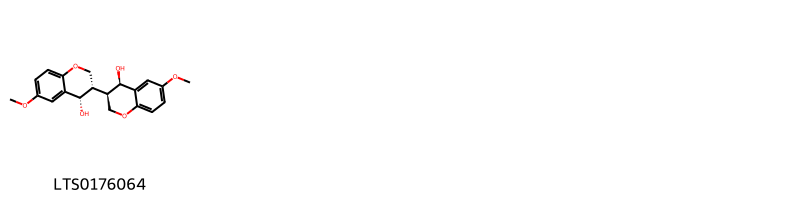{ width=100% }
    <figcaption>Hình ảnh cấu trúc hóa học của 1 hoạt chất thuộc nhóm Benzopyrans gồm ['(3s,4s)-3-[(3r,4r)-4-hydroxy-6-methoxy-3,4-dihydro-2h-1-benzopyran-3-yl]-6-methoxy-3,4-dihydro-2h-1-benzopyran-4-ol (LTS0176064)'].</figcaption>
</figure>
#### Nhóm Carboxylic acids and derivatives
<figure markdown="span">
    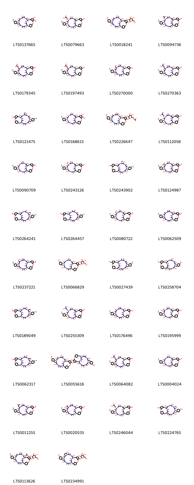{ width=100% }
    <figcaption>Hình ảnh cấu trúc hóa học của 38 hoạt chất thuộc nhóm Carboxylic acids and derivatives gồm ['2,5,11,25-tetrahydroxy-24-methoxy-10-[(4-methoxyphenyl)methyl]-4,7,9,13,15,29-hexamethyl-22-oxa-3,6,9,12,15,29-hexaazatetracyclo[14.12.2.2¹⁸,²¹.1²³,²⁷]tritriaconta-2,5,11,18,20,23(31),24,26,32-nonaene-8,14,30-trione (LTS0137665)', '3-[(1s,4r,7s,10s,13s,16s)-2,5,11-trihydroxy-24-methoxy-10-[(4-methoxyphenyl)methyl]-4,9,13,15,29-pentamethyl-8,14,30-trioxo-22-oxa-3,6,9,12,15,29-hexaazatetracyclo[14.12.2.2¹⁸,²¹.1²³,²⁷]tritriaconta-2,5,11,18,20,23(31),24,26,32-nonaen-7-yl]propanoic acid (LTS0079663)', '2,5,11-trihydroxy-10-[(4-methoxyphenyl)methyl]-4,7,9,13,15,29-hexamethyl-24-{[3,4,5-trihydroxy-6-(hydroxymethyl)oxan-2-yl]oxy}-22-oxa-3,6,9,12,15,29-hexaazatetracyclo[14.12.2.2¹⁸,²¹.1²³,²⁷]tritriaconta-2,5,11,18,20,23(31),24,26,32-nonaene-8,14,30-trione (LTS0018241)', '(1s,4r,7s,10s,13s,16s)-2,5,11-trihydroxy-24-methoxy-10-[(4-methoxyphenyl)methyl]-4,9,13,15,29-pentamethyl-7-(2-methylpropyl)-22-oxa-3,6,9,12,15,29-hexaazatetracyclo[14.12.2.2¹⁸,²¹.1²³,²⁷]tritriaconta-2,5,11,18,20,23(31),24,26,32-nonaene-8,14,30-trione (LTS0094736)', '3-{2,5,11,24-tetrahydroxy-10-[(4-methoxyphenyl)methyl]-4,9,13,15,29-pentamethyl-8,14,30-trioxo-22-oxa-3,6,9,12,15,29-hexaazatetracyclo[14.12.2.2¹⁸,²¹.1²³,²⁷]tritriaconta-2,5,11,18,20,23(31),24,26,32-nonaen-7-yl}propanoic acid (LTS0179345)', '3-{2,5,11-trihydroxy-24-methoxy-10-[(4-methoxyphenyl)methyl]-4,9,13,15,29-pentamethyl-8,14,30-trioxo-22-oxa-3,6,9,12,15,29-hexaazatetracyclo[14.12.2.2¹⁸,²¹.1²³,²⁷]tritriaconta-2,5,11,18,20,23(31),24,26,32-nonaen-7-yl}propanoic acid (LTS0197493)', '2,5,11,24-tetrahydroxy-7-(hydroxymethyl)-10-[(4-methoxyphenyl)methyl]-4,9,13,15,29-pentamethyl-22-oxa-3,6,9,12,15,29-hexaazatetracyclo[14.12.2.2¹⁸,²¹.1²³,²⁷]tritriaconta-2,5,11,18,20,23(31),24,26,32-nonaene-8,14,30-trione (LTS0270000)', '3-{2,5,11-trihydroxy-24-methoxy-10-[(4-methoxyphenyl)methyl]-4,9,13,15,29-pentamethyl-8,14,30-trioxo-22-oxa-3,6,9,12,15,29-hexaazatetracyclo[14.12.2.2¹⁸,²¹.1²³,²⁷]tritriaconta-2,5,11,18,20,23(31),24,26,32-nonaen-7-yl}propanimidic acid (LTS0270363)', '4-ethyl-2,5,11,24-tetrahydroxy-10-[(4-methoxyphenyl)methyl]-7,9,13,15,29-pentamethyl-22-oxa-3,6,9,12,15,29-hexaazatetracyclo[14.12.2.2¹⁸,²¹.1²³,²⁷]tritriaconta-2,5,11,18,20,23(31),24,26,32-nonaene-8,14,30-trione (LTS0121475)', '(1s,4r,7s,10s,13s,16s)-2,5,11,25-tetrahydroxy-24-methoxy-10-[(4-methoxyphenyl)methyl]-4,7,9,13,15,29-hexamethyl-22-oxa-3,6,9,12,15,29-hexaazatetracyclo[14.12.2.2¹⁸,²¹.1²³,²⁷]tritriaconta-2,5,11,18,20,23(31),24,26,32-nonaene-8,14,30-trione (LTS0168615)', '[3,4,5-trihydroxy-6-({2,5,11-trihydroxy-10-[(4-methoxyphenyl)methyl]-4,7,9,13,15,29-hexamethyl-8,14,30-trioxo-22-oxa-3,6,9,12,15,29-hexaazatetracyclo[14.12.2.2¹⁸,²¹.1²³,²⁷]tritriaconta-2,5,11,18,20,23(31),24,26,32-nonaen-24-yl}oxy)oxan-2-yl]methyl acetate (LTS0226647)', '3-[(1s,4r,7s,10s,13s,16s)-2,5,11,24-tetrahydroxy-10-[(4-methoxyphenyl)methyl]-4,9,13,15,29-pentamethyl-8,14,30-trioxo-22-oxa-3,6,9,12,15,29-hexaazatetracyclo[14.12.2.2¹⁸,²¹.1²³,²⁷]tritriaconta-2,5,11,18,20,23(31),24,26,32-nonaen-7-yl]propanimidic acid (LTS0112058)', '(1s,4r,7s,10s,13s,16s)-2,5,11,24-tetrahydroxy-10-[(4-methoxyphenyl)methyl]-4,7,9,13,15,29-hexamethyl-22-oxa-3,6,9,12,15,29-hexaazatetracyclo[14.12.2.2¹⁸,²¹.1²³,²⁷]tritriaconta-2,5,11,18,20,23(31),24,26,32-nonaene-8,14,30-trione (LTS0090709)', '(1s,4r,7s,10r,13s,16s)-2,5,11-trihydroxy-7-(hydroxymethyl)-24-methoxy-10-[(4-methoxyphenyl)methyl]-4,9,13,15,29-pentamethyl-22-oxa-3,6,9,12,15,29-hexaazatetracyclo[14.12.2.2¹⁸,²¹.1²³,²⁷]tritriaconta-2,5,11,18,20,23(31),24,26,32-nonaene-8,14,30-trione (LTS0243126)', '(1s,4r,7s,10s,13s,16s)-4-ethyl-2,5,11,24-tetrahydroxy-10-[(4-methoxyphenyl)methyl]-7,9,13,15,29-pentamethyl-22-oxa-3,6,9,12,15,29-hexaazatetracyclo[14.12.2.2¹⁸,²¹.1²³,²⁷]tritriaconta-2,5,11,18,20,23(31),24,26,32-nonaene-8,14,30-trione (LTS0243902)', '(1s,4r,7r,10s,13s,16s)-2,5,11-trihydroxy-7-[(1s)-1-hydroxyethyl]-24-methoxy-10-[(4-methoxyphenyl)methyl]-4,9,13,15,29-pentamethyl-22-oxa-3,6,9,12,15,29-hexaazatetracyclo[14.12.2.2¹⁸,²¹.1²³,²⁷]tritriaconta-2,5,11,18,20,23(31),24,26,32-nonaene-8,14,30-trione (LTS0124987)', '(1s,4r,7s,10s,13s,16s)-7-ethyl-2,5,11-trihydroxy-24-methoxy-10-[(4-methoxyphenyl)methyl]-4,9,13,15,29-pentamethyl-22-oxa-3,6,9,12,15,29-hexaazatetracyclo[14.12.2.2¹⁸,²¹.1²³,²⁷]tritriaconta-2,5,11,18,20,23(31),24,26,32-nonaene-8,14,30-trione (LTS0264241)', '2,5,11-trihydroxy-10-[(4-hydroxyphenyl)methyl]-24-methoxy-4,7,9,13,15,29-hexamethyl-22-oxa-3,6,9,12,15,29-hexaazatetracyclo[14.12.2.2¹⁸,²¹.1²³,²⁷]tritriaconta-2,5,11,18,20,23(31),24,26,32-nonaene-8,14,30-trione (LTS0264457)', '(1s,4r,7r,10r,13s,16s)-2,5,11-trihydroxy-7-(hydroxymethyl)-24-methoxy-10-[(4-methoxyphenyl)methyl]-4,9,13,15,29-pentamethyl-22-oxa-3,6,9,12,15,29-hexaazatetracyclo[14.12.2.2¹⁸,²¹.1²³,²⁷]tritriaconta-2,5,11,18,20,23(31),24,26,32-nonaene-8,14,30-trione (LTS0080722)', '2,5,11,28-tetrahydroxy-24-methoxy-10-[(4-methoxyphenyl)methyl]-4,7,9,13,15,29-hexamethyl-22-oxa-3,6,9,12,15,29-hexaazatetracyclo[14.12.2.2¹⁸,²¹.1²³,²⁷]tritriaconta-2,5,11,18,20,23(31),24,26,32-nonaene-8,14,30-trione (LTS0062509)', '2,5,11-trihydroxy-7-(hydroxymethyl)-24-methoxy-10-[(4-methoxyphenyl)methyl]-4,9,13,15,29-pentamethyl-22-oxa-3,6,9,12,15,29-hexaazatetracyclo[14.12.2.2¹⁸,²¹.1²³,²⁷]tritriaconta-2,5,11,18,20,23(31),24,26,32-nonaene-8,14,30-trione (LTS0237221)', '(1s,4r,7s,10s,13s,16s)-2,5,11-trihydroxy-10-[(4-methoxyphenyl)methyl]-4,7,9,13,15,29-hexamethyl-24-{[(2s,3r,4s,5s,6r)-3,4,5-trihydroxy-6-(hydroxymethyl)oxan-2-yl]oxy}-22-oxa-3,6,9,12,15,29-hexaazatetracyclo[14.12.2.2¹⁸,²¹.1²³,²⁷]tritriaconta-2,5,11,18,20,23(31),24,26,32-nonaene-8,14,30-trione (LTS0066829)', '2,5,11,17-tetrahydroxy-24-methoxy-10-[(4-methoxyphenyl)methyl]-4,7,9,13,15,29-hexamethyl-22-oxa-3,6,9,12,15,29-hexaazatetracyclo[14.12.2.2¹⁸,²¹.1²³,²⁷]tritriaconta-2,5,11,18,20,23(31),24,26,32-nonaene-8,14,30-trione (LTS0027439)', '(1s,4r,7s,10s,13r,16s,17s)-2,5,11,17-tetrahydroxy-24-methoxy-10-[(4-methoxyphenyl)methyl]-4,7,9,13,15,29-hexamethyl-22-oxa-3,6,9,12,15,29-hexaazatetracyclo[14.12.2.2¹⁸,²¹.1²³,²⁷]tritriaconta-2,5,11,18,20,23(31),24,26,32-nonaene-8,14,30-trione (LTS0258704)', '7-ethyl-2,5,11-trihydroxy-24-methoxy-10-[(4-methoxyphenyl)methyl]-4,9,13,15,29-pentamethyl-22-oxa-3,6,9,12,15,29-hexaazatetracyclo[14.12.2.2¹⁸,²¹.1²³,²⁷]tritriaconta-2,5,11,18,20,23(31),24,26,32-nonaene-8,14,30-trione (LTS0189049)', '3-[(1s,4r,7s,10s,13s,16s)-2,5,11-trihydroxy-24-methoxy-10-[(4-methoxyphenyl)methyl]-4,9,13,15,29-pentamethyl-8,14,30-trioxo-22-oxa-3,6,9,12,15,29-hexaazatetracyclo[14.12.2.2¹⁸,²¹.1²³,²⁷]tritriaconta-2,5,11,18,20,23(31),24,26,32-nonaen-7-yl]propanimidic acid (LTS0255309)', '2,5,11,24-tetrahydroxy-10-[(4-methoxyphenyl)methyl]-4,7,9,13,15,29-hexamethyl-22-oxa-3,6,9,12,15,29-hexaazatetracyclo[14.12.2.2¹⁸,²¹.1²³,²⁷]tritriaconta-2,5,11,18,20,23(31),24,26,32-nonaene-8,14,30-trione (LTS0176496)', '(1s,4r,7s,10s,13s,16s)-2,5,11,24-tetrahydroxy-7-[(1r)-1-hydroxyethyl]-10-[(4-methoxyphenyl)methyl]-4,9,13,15,29-pentamethyl-22-oxa-3,6,9,12,15,29-hexaazatetracyclo[14.12.2.2¹⁸,²¹.1²³,²⁷]tritriaconta-2,5,11,18,20,23(31),24,26,32-nonaene-8,14,30-trione (LTS0195999)', '7-ethyl-2,5,11,24-tetrahydroxy-10-[(4-methoxyphenyl)methyl]-4,9,13,15,29-pentamethyl-22-oxa-3,6,9,12,15,29-hexaazatetracyclo[14.12.2.2¹⁸,²¹.1²³,²⁷]tritriaconta-2,5,11,18,20,23(31),24,26,32-nonaene-8,14,30-trione (LTS0062317)', '2,5,11,24-tetrahydroxy-10-[(4-methoxyphenyl)methyl]-4,7,9,13,15,29-hexamethyl-25-({2,5,11-trihydroxy-10-[(4-methoxyphenyl)methyl]-4,7,9,13,15,29-hexamethyl-8,14,30-trioxo-22-oxa-3,6,9,12,15,29-hexaazatetracyclo[14.12.2.2¹⁸,²¹.1²³,²⁷]tritriaconta-2,5,11,18,20,23(31),24,26,32-nonaen-24-yl}oxy)-22-oxa-3,6,9,12,15,29-hexaazatetracyclo[14.12.2.2¹⁸,²¹.1²³,²⁷]tritriaconta-2,5,11,18,20,23,25,27(31),32-nonaene-8,14,30-trione (LTS0055618)', '3-{2,5,11,24-tetrahydroxy-10-[(4-methoxyphenyl)methyl]-4,9,13,15,29-pentamethyl-8,14,30-trioxo-22-oxa-3,6,9,12,15,29-hexaazatetracyclo[14.12.2.2¹⁸,²¹.1²³,²⁷]tritriaconta-2,5,11,18,20,23(31),24,26,32-nonaen-7-yl}propanimidic acid (LTS0064082)', '(1s,4r,7s,10s,13s,16s)-2,5,11-trihydroxy-24-methoxy-10-[(4-methoxyphenyl)methyl]-4,7,9,13,15,29-hexamethyl-22-oxa-3,6,9,12,15,29-hexaazatetracyclo[14.12.2.2¹⁸,²¹.1²³,²⁷]tritriaconta-2,5,11,18,20,23(31),24,26,32-nonaene-8,14,30-trione (LTS0004024)', '2,5,11-trihydroxy-24-methoxy-10-[(4-methoxyphenyl)methyl]-4,9,13,15,29-pentamethyl-7-(2-methylpropyl)-22-oxa-3,6,9,12,15,29-hexaazatetracyclo[14.12.2.2¹⁸,²¹.1²³,²⁷]tritriaconta-2,5,11,18,20,23(31),24,26,32-nonaene-8,14,30-trione (LTS0011255)', '2,5,11-trihydroxy-7-(1-hydroxyethyl)-24-methoxy-10-[(4-methoxyphenyl)methyl]-4,9,13,15,29-pentamethyl-22-oxa-3,6,9,12,15,29-hexaazatetracyclo[14.12.2.2¹⁸,²¹.1²³,²⁷]tritriaconta-2,5,11,18,20,23(31),24,26,32-nonaene-8,14,30-trione (LTS0020535)', '3-[(1s,4r,7s,10s,13s,16s)-2,5,11,24-tetrahydroxy-10-[(4-methoxyphenyl)methyl]-4,9,13,15,29-pentamethyl-8,14,30-trioxo-22-oxa-3,6,9,12,15,29-hexaazatetracyclo[14.12.2.2¹⁸,²¹.1²³,²⁷]tritriaconta-2,5,11,18,20,23(31),24,26,32-nonaen-7-yl]propanoic acid (LTS0246044)', '(1s,4r,7s,10s,13s,16s)-7-ethyl-2,5,11,24-tetrahydroxy-10-[(4-methoxyphenyl)methyl]-4,9,13,15,29-pentamethyl-22-oxa-3,6,9,12,15,29-hexaazatetracyclo[14.12.2.2¹⁸,²¹.1²³,²⁷]tritriaconta-2,5,11,18,20,23(31),24,26,32-nonaene-8,14,30-trione (LTS0224765)', '2,5,11-trihydroxy-10-[(4-methoxyphenyl)methyl]-4,7,9,13,15,29-hexamethyl-8,14,30-trioxo-24-{[3,4,5-trihydroxy-6-(hydroxymethyl)oxan-2-yl]oxy}-22-oxa-3,6,9,12,15,29-hexaazatetracyclo[14.12.2.2¹⁸,²¹.1²³,²⁷]tritriaconta-2,5,11,18,20,23(31),24,26,32-nonaen-28-yl acetate (LTS0113626)', '2,14-dihydroxy-13-[(4-methoxyphenyl)methyl]-4,12,16,18,32-pentamethyl-27-{[3,4,5-trihydroxy-6-(hydroxymethyl)oxan-2-yl]oxy}-25-oxa-3,6,12,15,18,32-hexaazapentacyclo[17.12.2.2²¹,²⁴.1²⁶,³⁰.0⁶,¹⁰]hexatriaconta-2,14,21,23,26(34),27,29,35-octaene-5,7,11,17,33-pentone (LTS0234991)'].</figcaption>
</figure>
#### Nhóm Coumarins and derivatives
<figure markdown="span">
    { width=100% }
    <figcaption>Hình ảnh cấu trúc hóa học của 1 hoạt chất thuộc nhóm Coumarins and derivatives gồm ['scopoletin (LTS0193112)'].</figcaption>
</figure>
#### Nhóm Lignan glycosides
<figure markdown="span">
    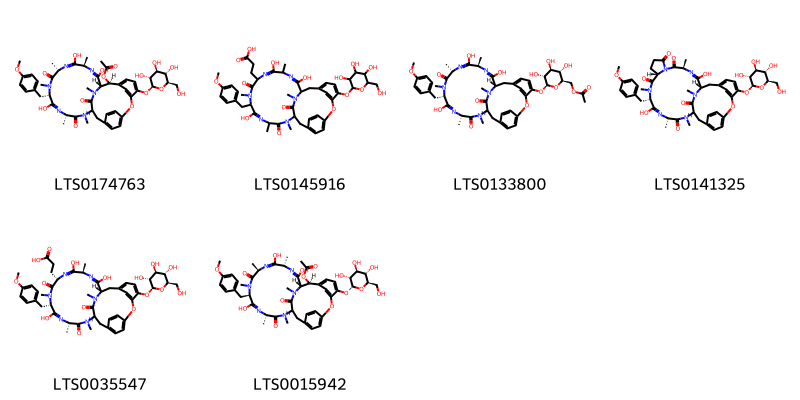{ width=100% }
    <figcaption>Hình ảnh cấu trúc hóa học của 6 hoạt chất thuộc nhóm Lignan glycosides gồm ['(1s,4r,7s,10s,13s,16s,28s)-2,5,11-trihydroxy-10-[(4-methoxyphenyl)methyl]-4,7,9,13,15,29-hexamethyl-8,14,30-trioxo-24-{[(2s,3r,4s,5s,6r)-3,4,5-trihydroxy-6-(hydroxymethyl)oxan-2-yl]oxy}-22-oxa-3,6,9,12,15,29-hexaazatetracyclo[14.12.2.2¹⁸,²¹.1²³,²⁷]tritriaconta-2,5,11,18,20,23(31),24,26,32-nonaen-28-yl acetate (LTS0174763)', '3-{2,5,11-trihydroxy-10-[(4-methoxyphenyl)methyl]-4,9,13,15,29-pentamethyl-8,14,30-trioxo-24-{[3,4,5-trihydroxy-6-(hydroxymethyl)oxan-2-yl]oxy}-22-oxa-3,6,9,12,15,29-hexaazatetracyclo[14.12.2.2¹⁸,²¹.1²³,²⁷]tritriaconta-2,5,11,18,20,23(31),24,26,32-nonaen-7-yl}propanoic acid (LTS0145916)', '[(2r,3s,4s,5r,6s)-3,4,5-trihydroxy-6-{[(1s,4r,7s,10s,13s,16s)-2,5,11-trihydroxy-10-[(4-methoxyphenyl)methyl]-4,7,9,13,15,29-hexamethyl-8,14,30-trioxo-22-oxa-3,6,9,12,15,29-hexaazatetracyclo[14.12.2.2¹⁸,²¹.1²³,²⁷]tritriaconta-2,5,11,18,20,23(31),24,26,32-nonaen-24-yl]oxy}oxan-2-yl]methyl acetate (LTS0133800)', '(1s,4r,10s,13s,16s,19s)-2,14-dihydroxy-13-[(4-methoxyphenyl)methyl]-4,12,16,18,32-pentamethyl-27-{[(2s,3r,4s,5s,6r)-3,4,5-trihydroxy-6-(hydroxymethyl)oxan-2-yl]oxy}-25-oxa-3,6,12,15,18,32-hexaazapentacyclo[17.12.2.2²¹,²⁴.1²⁶,³⁰.0⁶,¹⁰]hexatriaconta-2,14,21,23,26(34),27,29,35-octaene-5,7,11,17,33-pentone (LTS0141325)', '3-[(1s,4r,7s,10s,13s,16s)-2,5,11-trihydroxy-10-[(4-methoxyphenyl)methyl]-4,9,13,15,29-pentamethyl-8,14,30-trioxo-24-{[(2s,3r,4s,5s,6r)-3,4,5-trihydroxy-6-(hydroxymethyl)oxan-2-yl]oxy}-22-oxa-3,6,9,12,15,29-hexaazatetracyclo[14.12.2.2¹⁸,²¹.1²³,²⁷]tritriaconta-2,5,11,18,20,23(31),24,26,32-nonaen-7-yl]propanoic acid (LTS0035547)', '(1s,4s,7r,10r,13s,16s,28s)-2,5,11-trihydroxy-10-[(4-methoxyphenyl)methyl]-4,7,9,13,15,29-hexamethyl-8,14,30-trioxo-24-{[(2r,3r,4s,5s,6r)-3,4,5-trihydroxy-6-(hydroxymethyl)oxan-2-yl]oxy}-22-oxa-3,6,9,12,15,29-hexaazatetracyclo[14.12.2.2¹⁸,²¹.1²³,²⁷]tritriaconta-2,5,11,18,20,23(31),24,26,32-nonaen-28-yl acetate (LTS0015942)'].</figcaption>
</figure>
#### Nhóm Naphthalenes
<figure markdown="span">
    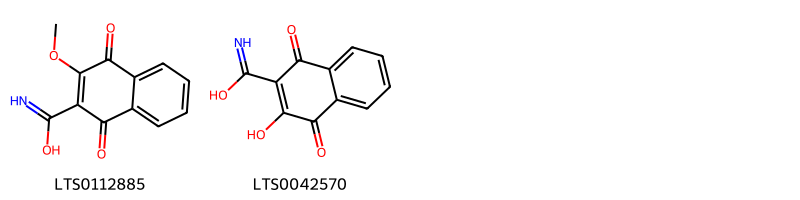{ width=100% }
    <figcaption>Hình ảnh cấu trúc hóa học của 2 hoạt chất thuộc nhóm Naphthalenes gồm ['3-methoxy-1,4-dioxonaphthalene-2-carboximidic acid (LTS0112885)', '3-hydroxy-1,4-dioxonaphthalene-2-carboximidic acid (LTS0042570)'].</figcaption>
</figure>
#### Nhóm Naphthofurans
<figure markdown="span">
    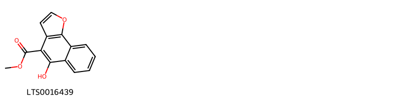{ width=100% }
    <figcaption>Hình ảnh cấu trúc hóa học của 1 hoạt chất thuộc nhóm Naphthofurans gồm ['methyl 5-hydroxynaphtho[1,2-b]furan-4-carboxylate (LTS0016439)'].</figcaption>
</figure>
#### Nhóm Naphthopyrans
<figure markdown="span">
    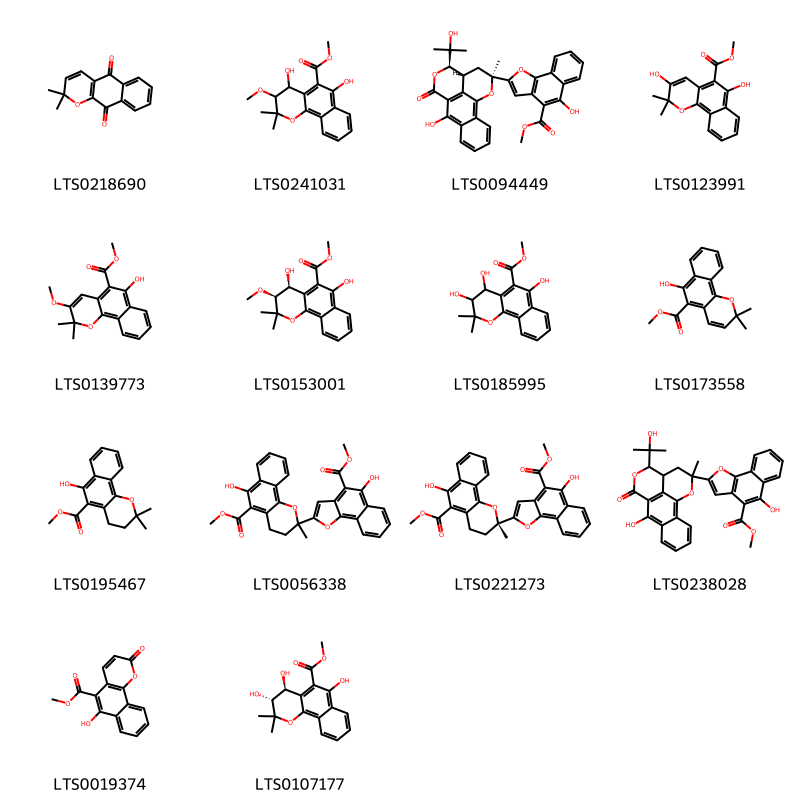{ width=100% }
    <figcaption>Hình ảnh cấu trúc hóa học của 14 hoạt chất thuộc nhóm Naphthopyrans gồm ['2,2-dimethylbenzo[g]chromene-5,10-dione (LTS0218690)', 'methyl 4,6-dihydroxy-3-methoxy-2,2-dimethyl-3h,4h-naphtho[1,2-b]pyran-5-carboxylate (LTS0241031)', 'rubicordifolin (LTS0094449)', 'methyl 3,6-dihydroxy-2,2-dimethylbenzo[h]chromene-5-carboxylate (LTS0123991)', 'methyl 6-hydroxy-3-methoxy-2,2-dimethylbenzo[h]chromene-5-carboxylate (LTS0139773)', 'methyl (3s,4s)-4,6-dihydroxy-3-methoxy-2,2-dimethyl-3h,4h-naphtho[1,2-b]pyran-5-carboxylate (LTS0153001)', 'methyl 3,4,6-trihydroxy-2,2-dimethyl-3h,4h-naphtho[1,2-b]pyran-5-carboxylate (LTS0185995)', 'methyl 6-hydroxy-2,2-dimethylbenzo[h]chromene-5-carboxylate (LTS0173558)', 'methyl 6-hydroxy-2,2-dimethyl-3h,4h-naphtho[1,2-b]pyran-5-carboxylate (LTS0195467)', 'methyl 6-hydroxy-2-[5-hydroxy-4-(methoxycarbonyl)naphtho[1,2-b]furan-2-yl]-2-methyl-3h,4h-naphtho[1,2-b]pyran-5-carboxylate (LTS0056338)', 'methyl (2s)-6-hydroxy-2-[5-hydroxy-4-(methoxycarbonyl)naphtho[1,2-b]furan-2-yl]-2-methyl-3h,4h-naphtho[1,2-b]pyran-5-carboxylate (LTS0221273)', 'rubicordifolin (LTS0238028)', 'methyl 6-hydroxy-2-oxobenzo[h]chromene-5-carboxylate (LTS0019374)', 'methyl (3r,4s)-3,4,6-trihydroxy-2,2-dimethyl-3h,4h-naphtho[1,2-b]pyran-5-carboxylate (LTS0107177)'].</figcaption>
</figure>
#### Nhóm Organooxygen compounds
<figure markdown="span">
    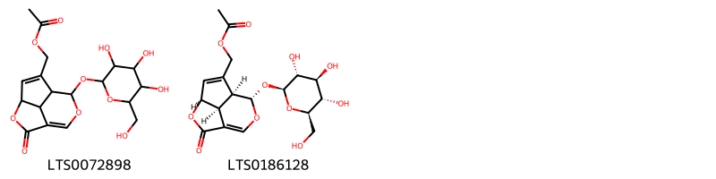{ width=100% }
    <figcaption>Hình ảnh cấu trúc hóa học của 2 hoạt chất thuộc nhóm Organooxygen compounds gồm ['asperuloside (LTS0072898)', 'asperuloside (LTS0186128)'].</figcaption>
</figure>
#### Nhóm Prenol lipids
<figure markdown="span">
    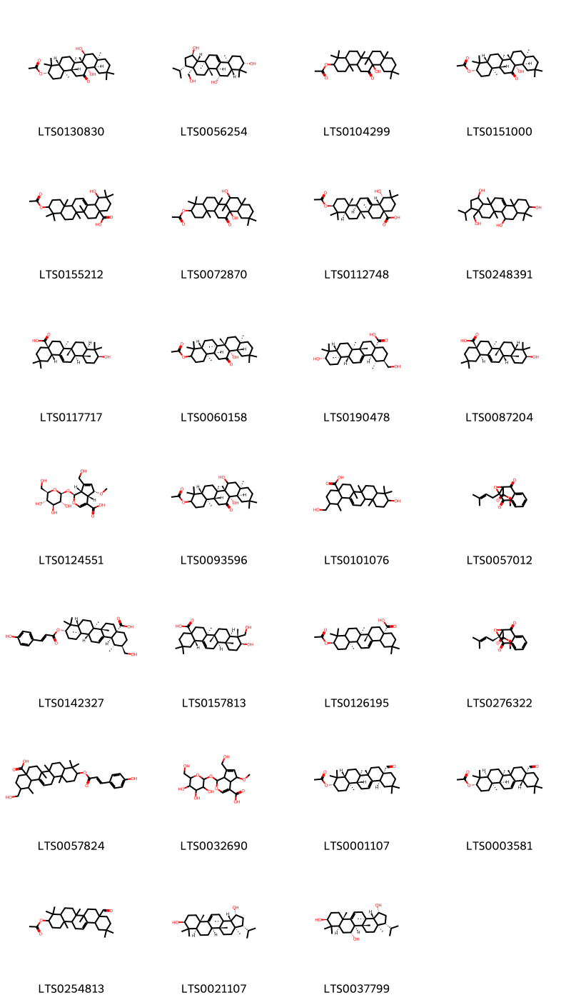{ width=100% }
    <figcaption>Hình ảnh cấu trúc hóa học của 27 hoạt chất thuộc nhóm Prenol lipids gồm ['(3s,4ar,6ar,6br,7s,8ar,12ar,12bs,14ar,14br)-7,12b-dihydroxy-4,4,6a,6b,8a,11,11,14b-octamethyl-13-oxo-tetradecahydropicen-3-yl acetate (LTS0130830)', 'rubiarbonol a (LTS0056254)', '12b-hydroxy-4,4,6a,6b,8a,11,11,14b-octamethyl-13-oxo-tetradecahydropicen-3-yl acetate (LTS0104299)', '(3s,4ar,6ar,6bs,8ar,12ar,12bs,14ar,14br)-12b-hydroxy-4,4,6a,6b,8a,11,11,14b-octamethyl-13-oxo-tetradecahydropicen-3-yl acetate (LTS0151000)', '10-(acetyloxy)-1-hydroxy-2,2,6a,6b,9,9,12a-heptamethyl-1,3,4,5,6,7,8,8a,10,11,12,12b,13,14b-tetradecahydropicene-4a-carboxylic acid (LTS0155212)', '7,12b-dihydroxy-4,4,6a,6b,8a,11,11,14b-octamethyl-13-oxo-tetradecahydropicen-3-yl acetate (LTS0072870)', '(1s,4ar,6as,6br,8ar,10s,12ar,12br,14bs)-10-(acetyloxy)-1-hydroxy-2,2,6a,6b,9,9,12a-heptamethyl-1,3,4,5,6,7,8,8a,10,11,12,12b,13,14b-tetradecahydropicene-4a-carboxylic acid (LTS0112748)', '3a-(hydroxymethyl)-3-isopropyl-5a,8,8,11a,13a-pentamethyl-1h,2h,3h,4h,5h,5bh,6h,7h,7ah,9h,10h,11h,13h,13bh-cyclopenta[a]chrysene-1,6,9-triol (LTS0248391)', 'oleanolic acid (LTS0117717)', '(4ar,6ar,6bs,8ar,12as,12bs,14as,14br)-12b-hydroxy-4,4,6a,6b,8a,11,11,14b-octamethyl-13-oxo-tetradecahydropicen-3-yl acetate (LTS0060158)', '(1r,2r,4as,6as,6br,8ar,10s,12ar,12br,14bs)-10-hydroxy-2-(hydroxymethyl)-1,6a,6b,9,9,12a-hexamethyl-2,3,4,5,6,7,8,8a,10,11,12,12b,13,14b-tetradecahydro-1h-picene-4a-carboxylic acid (LTS0190478)', '(4as,6as,6br,8as,10s,12ar,12bs,14br)-10-hydroxy-2,2,6a,6b,9,9,12a-heptamethyl-1,3,4,5,6,7,8,8a,10,11,12,12b,13,14b-tetradecahydropicene-4a-carboxylic acid (LTS0087204)', '(1s,4as,5s,7as)-7-(hydroxymethyl)-5-methoxy-1-{[(2s,3r,4s,5s,6r)-3,4,5-trihydroxy-6-(hydroxymethyl)oxan-2-yl]oxy}-1h,4ah,5h,7ah-cyclopenta[c]pyran-4-carboxylic acid (LTS0124551)', '(4ar,6ar,6br,8ar,12ar,12bs,14ar,14br)-7,12b-dihydroxy-4,4,6a,6b,8a,11,11,14b-octamethyl-13-oxo-tetradecahydropicen-3-yl acetate (LTS0093596)', '10-hydroxy-2-(hydroxymethyl)-1,6a,6b,9,9,12a-hexamethyl-2,3,4,5,6,7,8,8a,10,11,12,12b,13,14b-tetradecahydro-1h-picene-4a-carboxylic acid (LTS0101076)', 'methyl 7a-(3-methylbut-2-en-1-yl)-2,7-dioxonaphtho[2,3-b]oxirene-1a-carboxylate (LTS0057012)', '(1r,2r,4as,6as,6br,8ar,10s,12ar,12br,14bs)-2-(hydroxymethyl)-10-{[(2e)-3-(4-hydroxyphenyl)prop-2-enoyl]oxy}-1,6a,6b,9,9,12a-hexamethyl-2,3,4,5,6,7,8,8a,10,11,12,12b,13,14b-tetradecahydro-1h-picene-4a-carboxylic acid (LTS0142327)', 'hederagenin (LTS0157813)', '(4as,6as,6br,10r,12ar)-10-(acetyloxy)-2,2,6a,6b,9,9,12a-heptamethyl-1,3,4,5,6,7,8,8a,10,11,12,12b,13,14b-tetradecahydropicene-4a-carboxylic acid (LTS0126195)', 'methyl (1as,7ar)-7a-(3-methylbut-2-en-1-yl)-2,7-dioxonaphtho[2,3-b]oxirene-1a-carboxylate (LTS0276322)', '2-(hydroxymethyl)-10-{[3-(4-hydroxyphenyl)prop-2-enoyl]oxy}-1,6a,6b,9,9,12a-hexamethyl-2,3,4,5,6,7,8,8a,10,11,12,12b,13,14b-tetradecahydro-1h-picene-4a-carboxylic acid (LTS0057824)', '7-(hydroxymethyl)-5-methoxy-1-{[3,4,5-trihydroxy-6-(hydroxymethyl)oxan-2-yl]oxy}-1h,4ah,5h,7ah-cyclopenta[c]pyran-4-carboxylic acid (LTS0032690)', '(3s,4ar,6ar,6bs,8as,12as,14ar,14br)-8a-formyl-4,4,6a,6b,11,11,14b-heptamethyl-1,2,3,4a,5,6,7,8,9,10,12,12a,14,14a-tetradecahydropicen-3-yl acetate (LTS0001107)', '(3s,4as,6ar,6bs,8as,12ar,14as,14br)-8a-formyl-4,4,6a,6b,11,11,14b-heptamethyl-1,2,3,4a,5,6,7,8,9,10,12,12a,14,14a-tetradecahydropicen-3-yl acetate (LTS0003581)', '8a-formyl-4,4,6a,6b,11,11,14b-heptamethyl-1,2,3,4a,5,6,7,8,9,10,12,12a,14,14a-tetradecahydropicen-3-yl acetate (LTS0254813)', '(1r,3r,3ar,5ar,5br,7ar,9s,11as,13as,13br)-3-isopropyl-3a,5a,8,8,11a,13a-hexamethyl-1h,2h,3h,4h,5h,5bh,6h,7h,7ah,9h,10h,11h,13h,13bh-cyclopenta[a]chrysene-1,9-diol (LTS0021107)', '(1r,3r,3ar,5ar,5br,6r,7ar,9s,11as,13as,13br)-3-isopropyl-3a,5a,8,8,11a,13a-hexamethyl-1h,2h,3h,4h,5h,5bh,6h,7h,7ah,9h,10h,11h,13h,13bh-cyclopenta[a]chrysene-1,6,9-triol (LTS0037799)'].</figcaption>
</figure>
#### Nhóm Steroids and steroid derivatives
<figure markdown="span">
    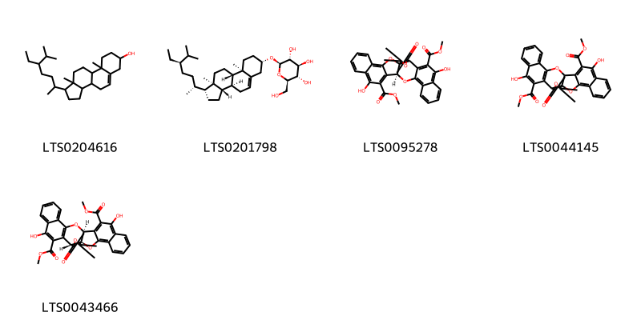{ width=100% }
    <figcaption>Hình ảnh cấu trúc hóa học của 5 hoạt chất thuộc nhóm Steroids and steroid derivatives gồm ['stigmast-5-en-3-ol, (3β)- (LTS0204616)', 'sitogluside (LTS0201798)', '7,19-dimethyl (17s)-8,20-dihydroxy-2,2-dimethyl-4-oxo-3,16,28-trioxaheptacyclo[15.11.0.0¹,⁵.0⁶,¹⁵.0⁹,¹⁴.0¹⁸,²⁷.0²¹,²⁶]octacosa-6(15),7,9,11,13,18(27),19,21,23,25-decaene-7,19-dicarboxylate (LTS0095278)', '7,19-dimethyl 8,20-dihydroxy-2,2-dimethyl-4-oxo-3,16,28-trioxaheptacyclo[15.11.0.0¹,⁵.0⁶,¹⁵.0⁹,¹⁴.0¹⁸,²⁷.0²¹,²⁶]octacosa-6(15),7,9,11,13,18(27),19,21,23,25-decaene-7,19-dicarboxylate (LTS0044145)', '7,19-dimethyl (1s,5r,17s)-8,20-dihydroxy-2,2-dimethyl-4-oxo-3,16,28-trioxaheptacyclo[15.11.0.0¹,⁵.0⁶,¹⁵.0⁹,¹⁴.0¹⁸,²⁷.0²¹,²⁶]octacosa-6(15),7,9,11,13,18(27),19,21,23,25-decaene-7,19-dicarboxylate (LTS0043466)'].</figcaption>
</figure>

---

### Dược dân tộc học

Danh sách các quốc gia có sử dụng *Rubia cordifolia* trong điều trị các bệnh. 

| Country   | Disease                                                                                                | Bệnh                                                                                                                                                                                                |
|:----------|:-------------------------------------------------------------------------------------------------------|:----------------------------------------------------------------------------------------------------------------------------------------------------------------------------------------------------|
| China     | Astringent, Emmenagogue, Hemostat, Refrigerant, Tonic, Vulnerary, nan, Diuretic, Emmenagogue, Hemostat | MYMEMORY WARNING: YOU USED ALL AVAILABLE FREE TRANSLATIONS FOR TODAY. NEXT AVAILABLE IN  11 HOURS 04 MINUTES 39 SECONDS VISIT HTTPS://MYMEMORY.TRANSLATED.NET/DOC/USAGELIMITS.PHP TO TRANSLATE MORE |
| Elsewhere | Tonic, Vermifuge                                                                                       | MYMEMORY WARNING: YOU USED ALL AVAILABLE FREE TRANSLATIONS FOR TODAY. NEXT AVAILABLE IN  11 HOURS 04 MINUTES 33 SECONDS VISIT HTTPS://MYMEMORY.TRANSLATED.NET/DOC/USAGELIMITS.PHP TO TRANSLATE MORE |

---

---
## Rubia peregrina
### Thông tin về thực vật

!!! info "Phân loại thực vật của *Rubia peregrina* từ GIBF:"
    - **Kingdom:** Plantae
    - **Phylum:** Tracheophyta
    - **Order:** Gentianales
    - **Family:** Rubiaceae
    - **Genus:** Rubia
    - **Species:** *Rubia peregrina*

 

| Label (VI)   | Label (EN)   | Scientific Name   | Descriptions (VI)   | Descriptions (EN)   | Also Known As (VI)   | Also Known As (EN)   |
|:-------------|:-------------|:------------------|:--------------------|:--------------------|:---------------------|:---------------------|
| N/A          | N/A          | Rubia peregrina   | loài thực vật       | species of plant    | ['']                 | ['']                 |

#### Phân bố trên thế giới

**Từ CSDL GIBF** Portugal, Malta, Greece, United Kingdom of Great Britain and Northern Ireland, Italy, Croatia, Türkiye, Germany, France, Spain

#### Phân bố tại Việt Nam

**Từ CSDL GIBF**: Không có ghi nhận ở Việt Nam

---
### Thành phần hóa học
        
- Theo cơ sở dữ liệu lotus: Từ loài *Rubia peregrina* đã phân lập và xác định được 2 hoạt chất thuộc về các nhóm Anthracenes. 

|    | chemicalTaxonomyClassyfireClass   |   smiles_count |
|---:|:----------------------------------|---------------:|
|  0 | Anthracenes                       |              2 |

#### Nhóm Anthracenes
<figure markdown="span">
    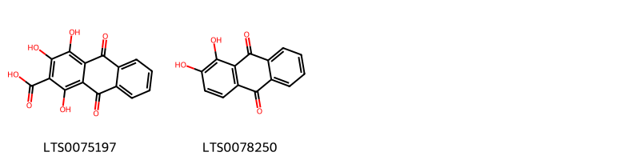{ width=100% }
    <figcaption>Hình ảnh cấu trúc hóa học của 2 hoạt chất thuộc nhóm Anthracenes gồm ['pseudopurpurin (LTS0075197)', 'alizarin (LTS0078250)'].</figcaption>
</figure>

---

### Dược dân tộc học

Danh sách các quốc gia có sử dụng *Rubia peregrina* trong điều trị các bệnh. 

| Country       | Disease                 | Bệnh                                                                                                                                                                                                |
|:--------------|:------------------------|:----------------------------------------------------------------------------------------------------------------------------------------------------------------------------------------------------|
| Mediterranean | Abortifacient, Diuretic | MYMEMORY WARNING: YOU USED ALL AVAILABLE FREE TRANSLATIONS FOR TODAY. NEXT AVAILABLE IN  11 HOURS 03 MINUTES 36 SECONDS VISIT HTTPS://MYMEMORY.TRANSLATED.NET/DOC/USAGELIMITS.PHP TO TRANSLATE MORE |
| Morocco       | Aphrodisiac             | MYMEMORY WARNING: YOU USED ALL AVAILABLE FREE TRANSLATIONS FOR TODAY. NEXT AVAILABLE IN  11 HOURS 03 MINUTES 32 SECONDS VISIT HTTPS://MYMEMORY.TRANSLATED.NET/DOC/USAGELIMITS.PHP TO TRANSLATE MORE |

---

---
## Rubia tinctorum
### Thông tin về thực vật

!!! info "Phân loại thực vật của *Rubia tinctorum* từ GIBF:"
    - **Kingdom:** Plantae
    - **Phylum:** Tracheophyta
    - **Order:** Gentianales
    - **Family:** Rubiaceae
    - **Genus:** Rubia
    - **Species:** *Rubia tinctorum*

 

| Label (VI)   | Label (EN)   | Scientific Name   | Descriptions (VI)   | Descriptions (EN)   | Also Known As (VI)   | Also Known As (EN)   |
|:-------------|:-------------|:------------------|:--------------------|:--------------------|:---------------------|:---------------------|
| N/A          | N/A          | Rubia tinctorum   | loài thực vật       | species of plant    | ['']                 | ['madder']           |

#### Phân bố trên thế giới

**Từ CSDL GIBF** Czechia, Sweden, Türkiye, Slovenia, Spain, Netherlands, United States of America, Greece, Armenia, Russian Federation, Argentina, Morocco, Algeria, Georgia, Iraq, Germany, Austria, Hungary, Ukraine, South Africa, Italy, Switzerland, Peru, France

#### Phân bố tại Việt Nam

**Từ CSDL GIBF**: Không có ghi nhận ở Việt Nam

---
### Thành phần hóa học
        
- Theo cơ sở dữ liệu lotus: Từ loài *Rubia tinctorum* đã phân lập và xác định được 58 hoạt chất thuộc về các nhóm Flavonoids, Anthracenes, Coumarins and derivatives, Naphthopyrans, Carboxylic acids and derivatives, Cinnamic acids and derivatives, Steroids and steroid derivatives, Organooxygen compounds, Prenol lipids. 

|    | chemicalTaxonomyClassyfireClass   |   smiles_count |
|---:|:----------------------------------|---------------:|
|  0 | Anthracenes                       |             36 |
|  1 | Carboxylic acids and derivatives  |              1 |
|  2 | Cinnamic acids and derivatives    |              6 |
|  3 | Coumarins and derivatives         |              1 |
|  4 | Flavonoids                        |              6 |
|  5 | Naphthopyrans                     |              1 |
|  6 | Organooxygen compounds            |              5 |
|  7 | Prenol lipids                     |              1 |
|  8 | Steroids and steroid derivatives  |              1 |

#### Nhóm Anthracenes
<figure markdown="span">
    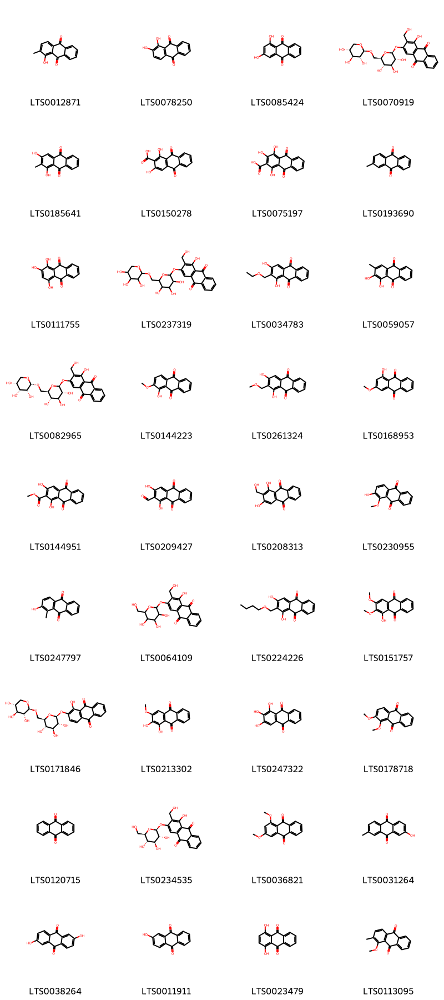{ width=100% }
    <figcaption>Hình ảnh cấu trúc hóa học của 36 hoạt chất thuộc nhóm Anthracenes gồm ['1-hydroxy-2-methylanthracene-9,10-dione (LTS0012871)', 'alizarin (LTS0078250)', 'purpuro (LTS0085424)', '1-hydroxy-2-(hydroxymethyl)-3-{[(2s,3r,4s,5s,6r)-3,4,5-trihydroxy-6-({[(2s,3r,4s,5r)-3,4,5-trihydroxyoxan-2-yl]oxy}methyl)oxan-2-yl]oxy}anthracene-9,10-dione (LTS0070919)', 'rubiadin (LTS0185641)', '1,3-dihydroxy-9,10-dioxoanthracene-2-carboxylic acid (LTS0150278)', 'pseudopurpurin (LTS0075197)', '2-methylanthraquinone (LTS0193690)', 'purpurin (LTS0111755)', '1-hydroxy-2-(hydroxymethyl)-3-[(3,4,5-trihydroxy-6-{[(3,4,5-trihydroxyoxan-2-yl)oxy]methyl}oxan-2-yl)oxy]anthracene-9,10-dione (LTS0237319)', '2-(ethoxymethyl)-1,3-dihydroxyanthracene-9,10-dione (LTS0034783)', '1,2-dihydroxy-3-methylanthracene-9,10-dione (LTS0059057)', '1-hydroxy-2-(hydroxymethyl)-3-{[(2s,3r,4s,5s,6r)-3,4,5-trihydroxy-6-({[(2r,3r,4r,5r)-3,4,5-trihydroxyoxan-2-yl]oxy}methyl)oxan-2-yl]oxy}anthracene-9,10-dione (LTS0082965)', 'alizarin 2-methyl ether (LTS0144223)', 'lucidin ω-methyl ether (LTS0261324)', '1-hydroxy-3-methoxyanthracene-9,10-dione (LTS0168953)', 'methyl 1,3-dihydroxy-9,10-dioxoanthracene-2-carboxylate (LTS0144951)', '1,3-dihydroxy-9,10-dioxoanthracene-2-carbaldehyde (LTS0209427)', 'henine (LTS0208313)', '2-hydroxy-1-methoxyanthracene-9,10-dione (LTS0230955)', '2-hydroxy-1-methylanthracene-9,10-dione (LTS0247797)', '1-hydroxy-2-(hydroxymethyl)-3-{[3,4,5-trihydroxy-6-(hydroxymethyl)oxan-2-yl]oxy}anthracene-9,10-dione (LTS0064109)', '2-(butoxymethyl)-1,3-dihydroxyanthracene-9,10-dione (LTS0224226)', '1-hydroxy-2,3-dimethoxyanthracene-9,10-dione (LTS0151757)', 'ruberythric acid (LTS0171846)', '1,2-dihydroxy-3-methoxyanthracene-9,10-dione (LTS0213302)', 'anthragallol (LTS0247322)', '1,2-dimethoxyanthracene-9,10-dione (LTS0178718)', 'anthraquinone (LTS0120715)', '1-hydroxy-2-(hydroxymethyl)-3-{[(2s,3r,4s,5s,6r)-3,4,5-trihydroxy-6-(hydroxymethyl)oxan-2-yl]oxy}anthracene-9,10-dione (LTS0234535)', '1,3-dimethoxyanthracene-9,10-dione (LTS0036821)', '2-hydroxy-7-methylanthracene-9,10-dione (LTS0031264)', 'anthraflavic acid (LTS0038264)', '2-hydroxyanthraquinone (LTS0011911)', 'quinizarin (LTS0023479)', '1-methoxy-2-methylanthracene-9,10-dione (LTS0113095)'].</figcaption>
</figure>
#### Nhóm Carboxylic acids and derivatives
<figure markdown="span">
    { width=100% }
    <figcaption>Hình ảnh cấu trúc hóa học của 1 hoạt chất thuộc nhóm Carboxylic acids and derivatives gồm ['citric acid (LTS0213921)'].</figcaption>
</figure>
#### Nhóm Cinnamic acids and derivatives
<figure markdown="span">
    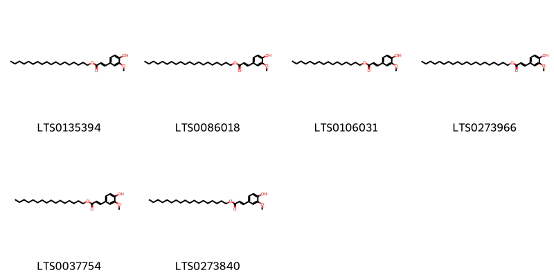{ width=100% }
    <figcaption>Hình ảnh cấu trúc hóa học của 6 hoạt chất thuộc nhóm Cinnamic acids and derivatives gồm ['octadecyl (2e)-3-(4-hydroxy-3-methoxyphenyl)prop-2-enoate (LTS0135394)', 'icosyl (2e)-3-(4-hydroxy-3-methoxyphenyl)prop-2-enoate (LTS0086018)', 'hexadecyl 3-(4-hydroxy-3-methoxyphenyl)prop-2-enoate (LTS0106031)', 'icosyl 3-(4-hydroxy-3-methoxyphenyl)prop-2-enoate (LTS0273966)', 'hexadecyl (2e)-3-(4-hydroxy-3-methoxyphenyl)prop-2-enoate (LTS0037754)', 'octadecyl 3-(4-hydroxy-3-methoxyphenyl)prop-2-enoate (LTS0273840)'].</figcaption>
</figure>
#### Nhóm Coumarins and derivatives
<figure markdown="span">
    { width=100% }
    <figcaption>Hình ảnh cấu trúc hóa học của 1 hoạt chất thuộc nhóm Coumarins and derivatives gồm ['scopoletin (LTS0193112)'].</figcaption>
</figure>
#### Nhóm Flavonoids
<figure markdown="span">
    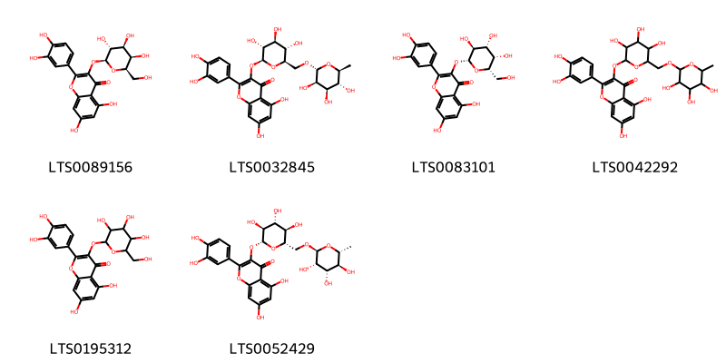{ width=100% }
    <figcaption>Hình ảnh cấu trúc hóa học của 6 hoạt chất thuộc nhóm Flavonoids gồm ['hyperoside (LTS0089156)', '3-rutinosyl quercetin (LTS0032845)', '2-(3,4-dihydroxyphenyl)-5,7-dihydroxy-3-{[(2r,3s,4r,5s,6s)-3,4,5-trihydroxy-6-(hydroxymethyl)oxan-2-yl]oxy}chromen-4-one (LTS0083101)', 'rutin (LTS0042292)', '2-(3,4-dihydroxyphenyl)-5,7-dihydroxy-3-{[3,4,5-trihydroxy-6-(hydroxymethyl)oxan-2-yl]oxy}chromen-4-one (LTS0195312)', '2-(3,4-dihydroxyphenyl)-5,7-dihydroxy-3-{[(2r,3s,4r,5r,6s)-3,4,5-trihydroxy-6-({[(2s,3s,4s,5s,6r)-3,4,5-trihydroxy-6-methyloxan-2-yl]oxy}methyl)oxan-2-yl]oxy}chromen-4-one (LTS0052429)'].</figcaption>
</figure>
#### Nhóm Naphthopyrans
<figure markdown="span">
    { width=100% }
    <figcaption>Hình ảnh cấu trúc hóa học của 1 hoạt chất thuộc nhóm Naphthopyrans gồm ['methyl 6-hydroxy-2,2-dimethylbenzo[h]chromene-5-carboxylate (LTS0173558)'].</figcaption>
</figure>
#### Nhóm Organooxygen compounds
<figure markdown="span">
    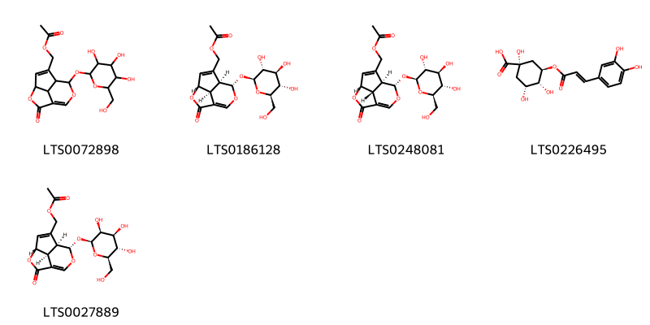{ width=100% }
    <figcaption>Hình ảnh cấu trúc hóa học của 5 hoạt chất thuộc nhóm Organooxygen compounds gồm ['asperuloside (LTS0072898)', 'asperuloside (LTS0186128)', '[(4s,7s,8s,11r)-2-oxo-8-{[(2s,3r,4s,5s,6r)-3,4,5-trihydroxy-6-(hydroxymethyl)oxan-2-yl]oxy}-3,9-dioxatricyclo[5.3.1.0⁴,¹¹]undeca-1(10),5-dien-6-yl]methyl acetate (LTS0248081)', 'chlorogenic acid (LTS0226495)', '[(4r,7s,8s,11s)-2-oxo-8-{[(2s,3s,4s,5s,6r)-3,4,5-trihydroxy-6-(hydroxymethyl)oxan-2-yl]oxy}-3,9-dioxatricyclo[5.3.1.0⁴,¹¹]undeca-1(10),5-dien-6-yl]methyl acetate (LTS0027889)'].</figcaption>
</figure>
#### Nhóm Prenol lipids
<figure markdown="span">
    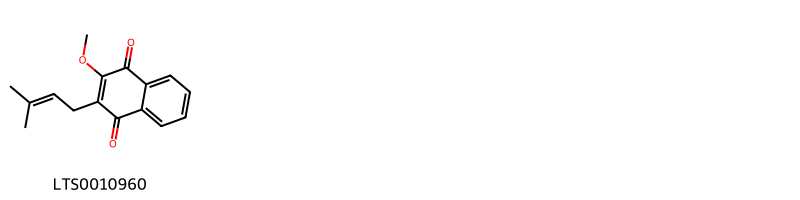{ width=100% }
    <figcaption>Hình ảnh cấu trúc hóa học của 1 hoạt chất thuộc nhóm Prenol lipids gồm ['2-methoxy-3-(3-methylbut-2-en-1-yl)naphthalene-1,4-dione (LTS0010960)'].</figcaption>
</figure>
#### Nhóm Steroids and steroid derivatives
<figure markdown="span">
    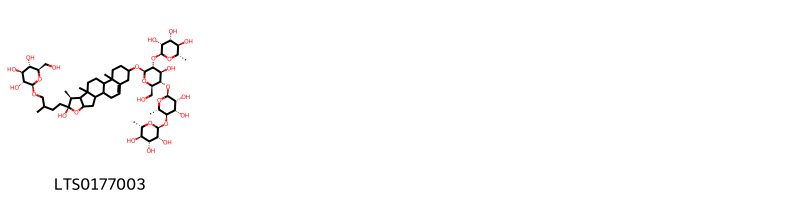{ width=100% }
    <figcaption>Hình ảnh cấu trúc hóa học của 1 hoạt chất thuộc nhóm Steroids and steroid derivatives gồm ['(2s,3r,4r,5r,6s)-2-{[(2s,3r,4s,5r,6s)-4,5-dihydroxy-6-{[(2r,3s,4s,5r,6r)-4-hydroxy-6-{[(6r,7s)-6-hydroxy-7,9,13-trimethyl-6-(3-methyl-4-{[(2r,3r,4s,5s,6r)-3,4,5-trihydroxy-6-(hydroxymethyl)oxan-2-yl]oxy}butyl)-5-oxapentacyclo[10.8.0.0²,⁹.0⁴,⁸.0¹³,¹⁸]icos-18-en-16-yl]oxy}-2-(hydroxymethyl)-5-{[(2s,3r,4r,5r,6s)-3,4,5-trihydroxy-6-methyloxan-2-yl]oxy}oxan-3-yl]oxy}-2-methyloxan-3-yl]oxy}-6-methyloxane-3,4,5-triol (LTS0177003)'].</figcaption>
</figure>

---

### Dược dân tộc học

Danh sách các quốc gia có sử dụng *Rubia tinctorum* trong điều trị các bệnh. 

| Country   | Disease                                      | Bệnh                                                                                                                                                                                                |
|:----------|:---------------------------------------------|:----------------------------------------------------------------------------------------------------------------------------------------------------------------------------------------------------|
| Elsewhere | Astringent, Diuretic, Diuretic, Tonic, Tonic | MYMEMORY WARNING: YOU USED ALL AVAILABLE FREE TRANSLATIONS FOR TODAY. NEXT AVAILABLE IN  11 HOURS 03 MINUTES 03 SECONDS VISIT HTTPS://MYMEMORY.TRANSLATED.NET/DOC/USAGELIMITS.PHP TO TRANSLATE MORE |
| Europe    | Apertif, Astringent, Diuretic                | MYMEMORY WARNING: YOU USED ALL AVAILABLE FREE TRANSLATIONS FOR TODAY. NEXT AVAILABLE IN  11 HOURS 03 MINUTES 00 SECONDS VISIT HTTPS://MYMEMORY.TRANSLATED.NET/DOC/USAGELIMITS.PHP TO TRANSLATE MORE |
| Turkey    | Diuretic, Emmenagogue, Tonic                 | MYMEMORY WARNING: YOU USED ALL AVAILABLE FREE TRANSLATIONS FOR TODAY. NEXT AVAILABLE IN  11 HOURS 02 MINUTES 56 SECONDS VISIT HTTPS://MYMEMORY.TRANSLATED.NET/DOC/USAGELIMITS.PHP TO TRANSLATE MORE |

---

# Chi Anthocephalus

??? note "Danh sách các dược liệu thuộc chi"
    
	 - *Anthocephalus chinensis*
	 - *Anthocephalus indicus*

---
## Anthocephalus chinensis
### Thông tin về thực vật

!!! info "Phân loại thực vật của *N/A* từ GIBF:"
    - **Kingdom:** Plantae
    - **Phylum:** Tracheophyta
    - **Order:** Gentianales
    - **Family:** Rubiaceae
    - **Genus:** N/A
    - **Species:** *N/A*

 

| Label (VI)   | Label (EN)   | Scientific Name         | Descriptions (VI)   | Descriptions (EN)   | Also Known As (VI)   | Also Known As (EN)   |
|:-------------|:-------------|:------------------------|:--------------------|:--------------------|:---------------------|:---------------------|
| N/A          | N/A          | Anthocephalus chinensis | loài thực vật       | species of plants   | ['']                 | ['']                 |

#### Phân bố trên thế giới

**Từ CSDL GIBF** Brazil, Viet Nam, Japan, China, Chile, New Zealand, Zimbabwe, French Polynesia, Trinidad and Tobago, Spain, Netherlands, Denmark, Puerto Rico, United States of America, Tonga, Virgin Islands (U.S.), Indonesia, Costa Rica, Russian Federation, Colombia, Argentina, Ethiopia, Hong Kong, Dominica, Mexico, Eswatini, Guam, United Kingdom of Great Britain and Northern Ireland, Chinese Taipei, Haiti, Canada, Panama, Singapore, Portugal, Ukraine, South Africa, Australia, Bahamas, India, Peru, France, Ireland

#### Phân bố tại Việt Nam

**Từ CSDL GIBF**: Lâm Đồng

---
### Thành phần hóa học
        
- Theo cơ sở dữ liệu lotus: Từ loài *N/A* đã phân lập và xác định được Chưa có hoạt chất nào được phân lập. hoạt chất thuộc về các nhóm Không có hoạt chất nào được phân lập. 

Không có hình ảnh nào được tạo ra

---

### Dược dân tộc học

Danh sách các quốc gia có sử dụng *N/A* trong điều trị các bệnh. 

| Country   | Disease   | Bệnh                                                                                                                                                                                                |
|:----------|:----------|:----------------------------------------------------------------------------------------------------------------------------------------------------------------------------------------------------|
| Elsewhere | Tonic     | MYMEMORY WARNING: YOU USED ALL AVAILABLE FREE TRANSLATIONS FOR TODAY. NEXT AVAILABLE IN  11 HOURS 02 MINUTES 11 SECONDS VISIT HTTPS://MYMEMORY.TRANSLATED.NET/DOC/USAGELIMITS.PHP TO TRANSLATE MORE |
| Perak     | Poultice  | MYMEMORY WARNING: YOU USED ALL AVAILABLE FREE TRANSLATIONS FOR TODAY. NEXT AVAILABLE IN  11 HOURS 02 MINUTES 07 SECONDS VISIT HTTPS://MYMEMORY.TRANSLATED.NET/DOC/USAGELIMITS.PHP TO TRANSLATE MORE |

---

---
## Anthocephalus indicus
### Thông tin về thực vật

!!! info "Phân loại thực vật của *Breonia chinensis* từ GIBF:"
    - **Kingdom:** Plantae
    - **Phylum:** Tracheophyta
    - **Order:** Gentianales
    - **Family:** Rubiaceae
    - **Genus:** Breonia
    - **Species:** *Breonia chinensis*

 

| Label (VI)   | Label (EN)   | Scientific Name         | Descriptions (VI)   | Descriptions (EN)   | Also Known As (VI)   | Also Known As (EN)   |
|:-------------|:-------------|:------------------------|:--------------------|:--------------------|:---------------------|:---------------------|
| N/A          | N/A          | Anthocephalus chinensis | loài thực vật       | species of plants   | ['']                 | ['']                 |

#### Phân bố trên thế giới

**Từ CSDL GIBF** nan, Brazil, Indonesia, China, unknown or invalid

#### Phân bố tại Việt Nam

**Từ CSDL GIBF**: Không có ghi nhận ở Việt Nam

---
### Thành phần hóa học
        
- Theo cơ sở dữ liệu lotus: Từ loài *Breonia chinensis* đã phân lập và xác định được Chưa có hoạt chất nào được phân lập. hoạt chất thuộc về các nhóm Không có hoạt chất nào được phân lập. 

Không có hình ảnh nào được tạo ra

---

### Dược dân tộc học

Danh sách các quốc gia có sử dụng *Breonia chinensis* trong điều trị các bệnh. 

| Country   | Disease    | Bệnh                                                                                                                                                                                                |
|:----------|:-----------|:----------------------------------------------------------------------------------------------------------------------------------------------------------------------------------------------------|
| India     | nan, Tonic | MYMEMORY WARNING: YOU USED ALL AVAILABLE FREE TRANSLATIONS FOR TODAY. NEXT AVAILABLE IN  11 HOURS 01 MINUTES 39 SECONDS VISIT HTTPS://MYMEMORY.TRANSLATED.NET/DOC/USAGELIMITS.PHP TO TRANSLATE MORE |

---

# Chi Canthium

??? note "Danh sách các dược liệu thuộc chi"
    
	 - *Canthium merrillii*
	 - *Canthium parviflorum*

---
## Canthium merrillii
### Thông tin về thực vật

!!! info "Phân loại thực vật của *Canthium merrillii* từ GIBF:"
    - **Kingdom:** Plantae
    - **Phylum:** Tracheophyta
    - **Order:** Gentianales
    - **Family:** Rubiaceae
    - **Genus:** Canthium
    - **Species:** *Canthium merrillii*

 

| Label (VI)   | Label (EN)   | Scientific Name    | Descriptions (VI)   | Descriptions (EN)   | Also Known As (VI)   | Also Known As (EN)   |
|:-------------|:-------------|:-------------------|:--------------------|:--------------------|:---------------------|:---------------------|
| N/A          | N/A          | Canthium merrillii | loài thực vật       | species of plant    | ['']                 | ['']                 |

#### Phân bố trên thế giới

**Từ CSDL GIBF** nan, United States of America, Tonga, American Samoa, Wallis and Futuna, Samoa

#### Phân bố tại Việt Nam

**Từ CSDL GIBF**: Không có ghi nhận ở Việt Nam

---
### Thành phần hóa học
        
- Theo cơ sở dữ liệu lotus: Từ loài *Canthium merrillii* đã phân lập và xác định được Chưa có hoạt chất nào được phân lập. hoạt chất thuộc về các nhóm Không có hoạt chất nào được phân lập. 

Không có hình ảnh nào được tạo ra

---

### Dược dân tộc học

Danh sách các quốc gia có sử dụng *Canthium merrillii* trong điều trị các bệnh. 

| Country   | Disease               | Bệnh                                                                                                                                                                                                |
|:----------|:----------------------|:----------------------------------------------------------------------------------------------------------------------------------------------------------------------------------------------------|
| Samoa     | Emmenagogue, Laxative | MYMEMORY WARNING: YOU USED ALL AVAILABLE FREE TRANSLATIONS FOR TODAY. NEXT AVAILABLE IN  11 HOURS 01 MINUTES 13 SECONDS VISIT HTTPS://MYMEMORY.TRANSLATED.NET/DOC/USAGELIMITS.PHP TO TRANSLATE MORE |

---

---
## Canthium parviflorum
### Thông tin về thực vật

!!! info "Phân loại thực vật của *Canthium parviflorum* từ GIBF:"
    - **Kingdom:** Plantae
    - **Phylum:** Tracheophyta
    - **Order:** Gentianales
    - **Family:** Rubiaceae
    - **Genus:** Canthium
    - **Species:** *Canthium parviflorum*

 

| Label (VI)   | Label (EN)   | Scientific Name      | Descriptions (VI)   | Descriptions (EN)   | Also Known As (VI)   | Also Known As (EN)   |
|:-------------|:-------------|:---------------------|:--------------------|:--------------------|:---------------------|:---------------------|
| N/A          | N/A          | Canthium parviflorum | loài thực vật       | species of plant    | ['']                 | ['']                 |

#### Phân bố trên thế giới

**Từ CSDL GIBF** nan, India

#### Phân bố tại Việt Nam

**Từ CSDL GIBF**: Không có ghi nhận ở Việt Nam

---
### Thành phần hóa học
        
- Theo cơ sở dữ liệu lotus: Từ loài *Canthium parviflorum* đã phân lập và xác định được Chưa có hoạt chất nào được phân lập. hoạt chất thuộc về các nhóm Không có hoạt chất nào được phân lập. 

Không có hình ảnh nào được tạo ra

---

### Dược dân tộc học

Danh sách các quốc gia có sử dụng *Canthium parviflorum* trong điều trị các bệnh. 

| Country   | Disease    | Bệnh                                                                                                                                                                                                |
|:----------|:-----------|:----------------------------------------------------------------------------------------------------------------------------------------------------------------------------------------------------|
| India     | Vermifuge  | MYMEMORY WARNING: YOU USED ALL AVAILABLE FREE TRANSLATIONS FOR TODAY. NEXT AVAILABLE IN  11 HOURS 00 MINUTES 39 SECONDS VISIT HTTPS://MYMEMORY.TRANSLATED.NET/DOC/USAGELIMITS.PHP TO TRANSLATE MORE |
| Malaysia  | Astringent | MYMEMORY WARNING: YOU USED ALL AVAILABLE FREE TRANSLATIONS FOR TODAY. NEXT AVAILABLE IN  11 HOURS 00 MINUTES 37 SECONDS VISIT HTTPS://MYMEMORY.TRANSLATED.NET/DOC/USAGELIMITS.PHP TO TRANSLATE MORE |

---

# Chi Mitragyna

??? note "Danh sách các dược liệu thuộc chi"
    
	 - *Mitragyna ciliata*
	 - *Mitragyna eciosa*
	 - *Mitragyna stipulosa*

---
## Mitragyna ciliata
### Thông tin về thực vật

!!! info "Phân loại thực vật của *Mitragyna ciliata* từ GIBF:"
    - **Kingdom:** Plantae
    - **Phylum:** Tracheophyta
    - **Order:** Gentianales
    - **Family:** Rubiaceae
    - **Genus:** Mitragyna
    - **Species:** *Mitragyna ciliata*

 

| Label (VI)   | Label (EN)   | Scientific Name   | Descriptions (VI)   | Descriptions (EN)   | Also Known As (VI)   | Also Known As (EN)   |
|:-------------|:-------------|:------------------|:--------------------|:--------------------|:---------------------|:---------------------|
| N/A          | N/A          | Mitragyna ciliata | loài thực vật       | species of plant    | ['']                 | ['']                 |

#### Phân bố trên thế giới

**Từ CSDL GIBF** nan, Benin, Congo, Democratic Republic of the, Uganda, Panama, Central African Republic, Gabon, Liberia, Côte d’Ivoire, Nigeria, unknown or invalid, Sierra Leone, Equatorial Guinea, Cameroon, Guinea, Ghana

#### Phân bố tại Việt Nam

**Từ CSDL GIBF**: Không có ghi nhận ở Việt Nam

---
### Thành phần hóa học
        
- Theo cơ sở dữ liệu lotus: Từ loài *Mitragyna ciliata* đã phân lập và xác định được Chưa có hoạt chất nào được phân lập. hoạt chất thuộc về các nhóm Không có hoạt chất nào được phân lập. 

Không có hình ảnh nào được tạo ra

---

### Dược dân tộc học

Danh sách các quốc gia có sử dụng *Mitragyna ciliata* trong điều trị các bệnh. 

| Country   | Disease   | Bệnh                                                                                                                                                                                                |
|:----------|:----------|:----------------------------------------------------------------------------------------------------------------------------------------------------------------------------------------------------|
| Nigeria   | Sweetener | MYMEMORY WARNING: YOU USED ALL AVAILABLE FREE TRANSLATIONS FOR TODAY. NEXT AVAILABLE IN  11 HOURS 00 MINUTES 13 SECONDS VISIT HTTPS://MYMEMORY.TRANSLATED.NET/DOC/USAGELIMITS.PHP TO TRANSLATE MORE |

---

---
## Mitragyna eciosa
### Thông tin về thực vật

!!! info "Phân loại thực vật của *N/A* từ GIBF:"
    - **Kingdom:** Plantae
    - **Phylum:** Tracheophyta
    - **Order:** Gentianales
    - **Family:** Rubiaceae
    - **Genus:** Mitragyna
    - **Species:** *N/A*

 

| Label (VI)   | Label (EN)   | Scientific Name   | Descriptions (VI)   | Descriptions (EN)   | Also Known As (VI)   | Also Known As (EN)   |
|:-------------|:-------------|:------------------|:--------------------|:--------------------|:---------------------|:---------------------|
| N/A          | N/A          | Mitragyna ciliata | loài thực vật       | species of plant    | ['']                 | ['']                 |

#### Phân bố trên thế giới

**Từ CSDL GIBF** Uganda, Senegal, Gambia, Thailand, Guinea-Bissau, Guinea, Sri Lanka, Ghana, United States of America, Chad, Nigeria, Sierra Leone, Benin, Philippines, Malaysia, Gabon, Liberia, India, Congo, Cameroon

#### Phân bố tại Việt Nam

**Từ CSDL GIBF**: Không có ghi nhận ở Việt Nam

---
### Thành phần hóa học
        
- Theo cơ sở dữ liệu lotus: Từ loài *N/A* đã phân lập và xác định được Chưa có hoạt chất nào được phân lập. hoạt chất thuộc về các nhóm Không có hoạt chất nào được phân lập. 

Không có hình ảnh nào được tạo ra

---

### Dược dân tộc học

Danh sách các quốc gia có sử dụng *N/A* trong điều trị các bệnh. 

| Country   | Disease   | Bệnh                                                                                                                                                                                                |
|:----------|:----------|:----------------------------------------------------------------------------------------------------------------------------------------------------------------------------------------------------|
| Asia      | Sedative  | MYMEMORY WARNING: YOU USED ALL AVAILABLE FREE TRANSLATIONS FOR TODAY. NEXT AVAILABLE IN  10 HOURS 59 MINUTES 46 SECONDS VISIT HTTPS://MYMEMORY.TRANSLATED.NET/DOC/USAGELIMITS.PHP TO TRANSLATE MORE |
| Java      | Narcotic  | MYMEMORY WARNING: YOU USED ALL AVAILABLE FREE TRANSLATIONS FOR TODAY. NEXT AVAILABLE IN  10 HOURS 59 MINUTES 43 SECONDS VISIT HTTPS://MYMEMORY.TRANSLATED.NET/DOC/USAGELIMITS.PHP TO TRANSLATE MORE |
| Perak     | Vermifuge | MYMEMORY WARNING: YOU USED ALL AVAILABLE FREE TRANSLATIONS FOR TODAY. NEXT AVAILABLE IN  10 HOURS 59 MINUTES 40 SECONDS VISIT HTTPS://MYMEMORY.TRANSLATED.NET/DOC/USAGELIMITS.PHP TO TRANSLATE MORE |

---

---
## Mitragyna stipulosa
### Thông tin về thực vật

!!! info "Phân loại thực vật của *Mitragyna stipulosa* từ GIBF:"
    - **Kingdom:** Plantae
    - **Phylum:** Tracheophyta
    - **Order:** Gentianales
    - **Family:** Rubiaceae
    - **Genus:** Mitragyna
    - **Species:** *Mitragyna stipulosa*

 

| Label (VI)   | Label (EN)   | Scientific Name     | Descriptions (VI)   | Descriptions (EN)   | Also Known As (VI)   | Also Known As (EN)   |
|:-------------|:-------------|:--------------------|:--------------------|:--------------------|:---------------------|:---------------------|
| N/A          | N/A          | Mitragyna stipulosa | loài thực vật       | species of plant    | ['']                 | ['']                 |

#### Phân bố trên thế giới

**Từ CSDL GIBF** Benin, Uganda, Liberia, Gabon, Côte d’Ivoire, Nigeria, Congo, Angola, Sierra Leone, Cameroon, Guinea, Ghana

#### Phân bố tại Việt Nam

**Từ CSDL GIBF**: Không có ghi nhận ở Việt Nam

---
### Thành phần hóa học
        
- Theo cơ sở dữ liệu lotus: Từ loài *Mitragyna stipulosa* đã phân lập và xác định được 14 hoạt chất thuộc về các nhóm Prenol lipids, Steroids and steroid derivatives, Indolizidines, Indoles and derivatives. 

|    | chemicalTaxonomyClassyfireClass   |   smiles_count |
|---:|:----------------------------------|---------------:|
|  0 | Indoles and derivatives           |              2 |
|  1 | Indolizidines                     |              4 |
|  2 | Prenol lipids                     |              6 |
|  3 | Steroids and steroid derivatives  |              2 |

#### Nhóm Indoles and derivatives
<figure markdown="span">
    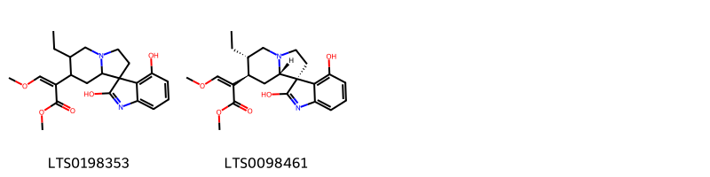{ width=100% }
    <figcaption>Hình ảnh cấu trúc hóa học của 2 hoạt chất thuộc nhóm Indoles and derivatives gồm ["methyl 2-{6'-ethyl-2,4-dihydroxy-3',5',6',7',8',8'a-hexahydro-2'h-spiro[indole-3,1'-indolizin]-7'-yl}-3-methoxyprop-2-enoate (LTS0198353)", "methyl (2z)-2-[(3r,6's,7'r,8'as)-6'-ethyl-2,4-dihydroxy-3',5',6',7',8',8'a-hexahydro-2'h-spiro[indole-3,1'-indolizin]-7'-yl]-3-methoxyprop-2-enoate (LTS0098461)"].</figcaption>
</figure>
#### Nhóm Indolizidines
<figure markdown="span">
    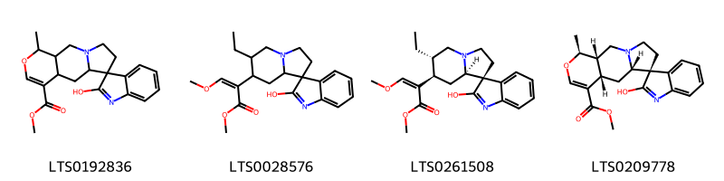{ width=100% }
    <figcaption>Hình ảnh cấu trúc hóa học của 4 hoạt chất thuộc nhóm Indolizidines gồm ["methyl 2-hydroxy-1'-methyl-1',4'a,5',5'a,7',8',10',10'a-octahydrospiro[indole-3,6'-pyrano[3,4-f]indolizine]-4'-carboxylate (LTS0192836)", "methyl 2-{6'-ethyl-2-hydroxy-3',5',6',7',8',8'a-hexahydro-2'h-spiro[indole-3,1'-indolizin]-7'-yl}-3-methoxyprop-2-enoate (LTS0028576)", "methyl (2z)-2-[(3s,6's,7'r,8'ar)-6'-ethyl-2-hydroxy-3',5',6',7',8',8'a-hexahydro-2'h-spiro[indole-3,1'-indolizin]-7'-yl]-3-methoxyprop-2-enoate (LTS0261508)", "methyl (1's,3s,4'as,5'as,10'as)-2-hydroxy-1'-methyl-1',4'a,5',5'a,7',8',10',10'a-octahydrospiro[indole-3,6'-pyrano[3,4-f]indolizine]-4'-carboxylate (LTS0209778)"].</figcaption>
</figure>
#### Nhóm Prenol lipids
<figure markdown="span">
    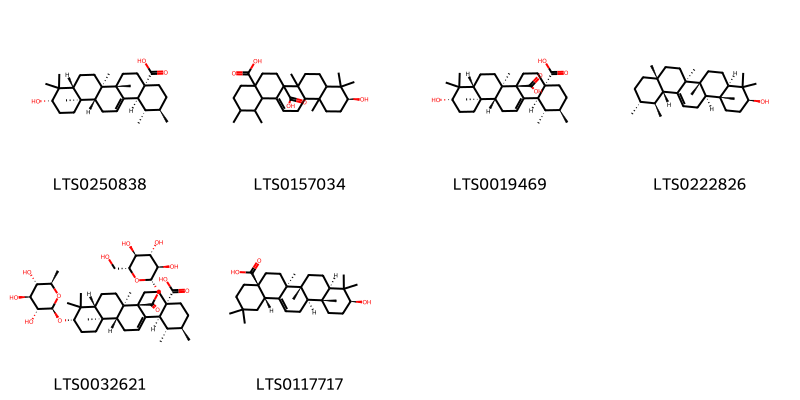{ width=100% }
    <figcaption>Hình ảnh cấu trúc hóa học của 6 hoạt chất thuộc nhóm Prenol lipids gồm ['ursolic acid (LTS0250838)', '(10s)-10-hydroxy-1,2,6b,9,9,12a-hexamethyl-2,3,4,5,6,7,8,8a,10,11,12,12b,13,14b-tetradecahydro-1h-picene-4a,6a-dicarboxylic acid (LTS0157034)', 'quinovic acid (LTS0019469)', 'amyrin (LTS0222826)', '(1s,2r,4as,6ar,6br,8ar,10s,12ar,12br,14bs)-1,2,6b,9,9,12a-hexamethyl-6a-({[(2s,3r,4s,5s,6r)-3,4,5-trihydroxy-6-(hydroxymethyl)oxan-2-yl]oxy}carbonyl)-10-{[(2r,3r,4s,5s,6r)-3,4,5-trihydroxy-6-methyloxan-2-yl]oxy}-2,3,4,5,6,7,8,8a,10,11,12,12b,13,14b-tetradecahydro-1h-picene-4a-carboxylic acid (LTS0032621)', 'oleanolic acid (LTS0117717)'].</figcaption>
</figure>
#### Nhóm Steroids and steroid derivatives
<figure markdown="span">
    { width=100% }
    <figcaption>Hình ảnh cấu trúc hóa học của 2 hoạt chất thuộc nhóm Steroids and steroid derivatives gồm ['sitogluside (LTS0201798)', '2-{[1-(5-ethyl-6-methylheptan-2-yl)-9a,11a-dimethyl-1h,2h,3h,3ah,3bh,4h,6h,7h,8h,9h,9bh,10h,11h-cyclopenta[a]phenanthren-7-yl]oxy}-6-(hydroxymethyl)oxane-3,4,5-triol (LTS0158828)'].</figcaption>
</figure>

---

### Dược dân tộc học

Danh sách các quốc gia có sử dụng *Mitragyna stipulosa* trong điều trị các bệnh. 

| Country     | Disease    | Bệnh                                                                                                                                                                                                |
|:------------|:-----------|:----------------------------------------------------------------------------------------------------------------------------------------------------------------------------------------------------|
| Africa      | Antidote   | MYMEMORY WARNING: YOU USED ALL AVAILABLE FREE TRANSLATIONS FOR TODAY. NEXT AVAILABLE IN  10 HOURS 59 MINUTES 03 SECONDS VISIT HTTPS://MYMEMORY.TRANSLATED.NET/DOC/USAGELIMITS.PHP TO TRANSLATE MORE |
| Liberia     | Diuretic   | MYMEMORY WARNING: YOU USED ALL AVAILABLE FREE TRANSLATIONS FOR TODAY. NEXT AVAILABLE IN  10 HOURS 58 MINUTES 59 SECONDS VISIT HTTPS://MYMEMORY.TRANSLATED.NET/DOC/USAGELIMITS.PHP TO TRANSLATE MORE |
| Upper Volta | Anesthetic | MYMEMORY WARNING: YOU USED ALL AVAILABLE FREE TRANSLATIONS FOR TODAY. NEXT AVAILABLE IN  10 HOURS 58 MINUTES 56 SECONDS VISIT HTTPS://MYMEMORY.TRANSLATED.NET/DOC/USAGELIMITS.PHP TO TRANSLATE MORE |

---

# Chi Faramea

??? note "Danh sách các dược liệu thuộc chi"
    
	 - *Faramea occidentalis*

---
## Faramea occidentalis
### Thông tin về thực vật

!!! info "Phân loại thực vật của *Faramea occidentalis* từ GIBF:"
    - **Kingdom:** Plantae
    - **Phylum:** Tracheophyta
    - **Order:** Gentianales
    - **Family:** Rubiaceae
    - **Genus:** Faramea
    - **Species:** *Faramea occidentalis*

 

| Label (VI)   | Label (EN)   | Scientific Name      | Descriptions (VI)   | Descriptions (EN)   | Also Known As (VI)   | Also Known As (EN)   |
|:-------------|:-------------|:---------------------|:--------------------|:--------------------|:---------------------|:---------------------|
| N/A          | N/A          | Faramea occidentalis | loài thực vật       | species of plant    | ['']                 | ['']                 |

#### Phân bố trên thế giới

**Từ CSDL GIBF** Mexico, Brazil, Bonaire, Sint Eustatius and Saba, Virgin Islands (U.S.), Guadeloupe, Costa Rica, Colombia, French Guiana, Panama, Belize, Puerto Rico

#### Phân bố tại Việt Nam

**Từ CSDL GIBF**: Không có ghi nhận ở Việt Nam

---
### Thành phần hóa học
        
- Theo cơ sở dữ liệu lotus: Từ loài *Faramea occidentalis* đã phân lập và xác định được 13 hoạt chất thuộc về các nhóm Naphthopyrans, Steroids and steroid derivatives, Benzopyrans, Anthracenes. 

|    | chemicalTaxonomyClassyfireClass   |   smiles_count |
|---:|:----------------------------------|---------------:|
|  0 | Anthracenes                       |              6 |
|  1 | Benzopyrans                       |              1 |
|  2 | Naphthopyrans                     |              4 |
|  3 | Steroids and steroid derivatives  |              2 |

#### Nhóm Anthracenes
<figure markdown="span">
    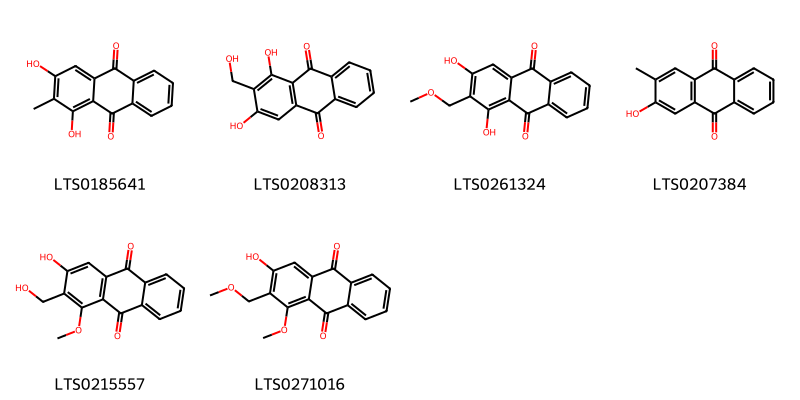{ width=100% }
    <figcaption>Hình ảnh cấu trúc hóa học của 6 hoạt chất thuộc nhóm Anthracenes gồm ['rubiadin (LTS0185641)', 'henine (LTS0208313)', 'lucidin ω-methyl ether (LTS0261324)', '2-hydroxy-3-methylanthracene-9,10-dione (LTS0207384)', 'damnacanthol (LTS0215557)', '3-hydroxy-1-methoxy-2-(methoxymethyl)anthracene-9,10-dione (LTS0271016)'].</figcaption>
</figure>
#### Nhóm Benzopyrans
<figure markdown="span">
    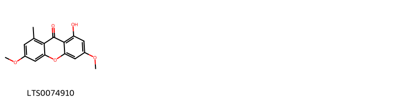{ width=100% }
    <figcaption>Hình ảnh cấu trúc hóa học của 1 hoạt chất thuộc nhóm Benzopyrans gồm ['lichexanthone (LTS0074910)'].</figcaption>
</figure>
#### Nhóm Naphthopyrans
<figure markdown="span">
    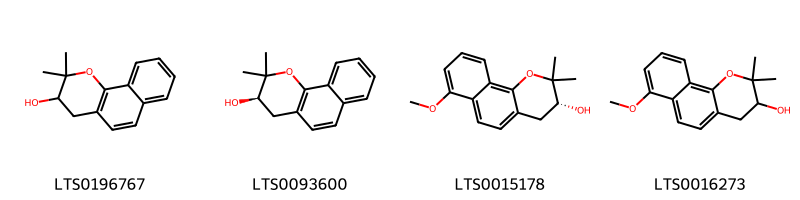{ width=100% }
    <figcaption>Hình ảnh cấu trúc hóa học của 4 hoạt chất thuộc nhóm Naphthopyrans gồm ['2,2-dimethyl-3h,4h-naphtho[1,2-b]pyran-3-ol (LTS0196767)', '(3r)-2,2-dimethyl-3h,4h-naphtho[1,2-b]pyran-3-ol (LTS0093600)', '(3r)-7-methoxy-2,2-dimethyl-3h,4h-naphtho[1,2-b]pyran-3-ol (LTS0015178)', '7-methoxy-2,2-dimethyl-3h,4h-naphtho[1,2-b]pyran-3-ol (LTS0016273)'].</figcaption>
</figure>
#### Nhóm Steroids and steroid derivatives
<figure markdown="span">
    { width=100% }
    <figcaption>Hình ảnh cấu trúc hóa học của 2 hoạt chất thuộc nhóm Steroids and steroid derivatives gồm ['sitosterol (LTS0168132)', 'stigmast-5-en-3-ol, (3β)- (LTS0204616)'].</figcaption>
</figure>

---

### Dược dân tộc học

Danh sách các quốc gia có sử dụng *Faramea occidentalis* trong điều trị các bệnh. 

| Country            | Disease   | Bệnh                                                                                                                                                                                                |
|:-------------------|:----------|:----------------------------------------------------------------------------------------------------------------------------------------------------------------------------------------------------|
| Dominican Republic | Hemostat  | MYMEMORY WARNING: YOU USED ALL AVAILABLE FREE TRANSLATIONS FOR TODAY. NEXT AVAILABLE IN  10 HOURS 58 MINUTES 16 SECONDS VISIT HTTPS://MYMEMORY.TRANSLATED.NET/DOC/USAGELIMITS.PHP TO TRANSLATE MORE |

---

# Chi Corynanthe

??? note "Danh sách các dược liệu thuộc chi"
    
	 - *Corynanthe yohimbe*

---
## Corynanthe yohimbe
### Thông tin về thực vật

!!! info "Phân loại thực vật của *N/A* từ GIBF:"
    - **Kingdom:** Plantae
    - **Phylum:** Tracheophyta
    - **Order:** Gentianales
    - **Family:** Rubiaceae
    - **Genus:** Corynanthe
    - **Species:** *N/A*

 

| Label (VI)   | Label (EN)   | Scientific Name      | Descriptions (VI)   | Descriptions (EN)   | Also Known As (VI)   | Also Known As (EN)   |
|:-------------|:-------------|:---------------------|:--------------------|:--------------------|:---------------------|:---------------------|
| N/A          | N/A          | Faramea occidentalis | loài thực vật       | species of plant    | ['']                 | ['']                 |

#### Phân bố trên thế giới

**Từ CSDL GIBF** Liberia, Gabon, Côte d’Ivoire, Cameroon, Guinea

#### Phân bố tại Việt Nam

**Từ CSDL GIBF**: Không có ghi nhận ở Việt Nam

---
### Thành phần hóa học
        
- Theo cơ sở dữ liệu lotus: Từ loài *N/A* đã phân lập và xác định được Chưa có hoạt chất nào được phân lập. hoạt chất thuộc về các nhóm Không có hoạt chất nào được phân lập. 

Không có hình ảnh nào được tạo ra

---

### Dược dân tộc học

Danh sách các quốc gia có sử dụng *N/A* trong điều trị các bệnh. 

| Country   | Disease     | Bệnh                                                                                                                                                                                                |
|:----------|:------------|:----------------------------------------------------------------------------------------------------------------------------------------------------------------------------------------------------|
| Africa    | Aphrodisiac | MYMEMORY WARNING: YOU USED ALL AVAILABLE FREE TRANSLATIONS FOR TODAY. NEXT AVAILABLE IN  10 HOURS 57 MINUTES 32 SECONDS VISIT HTTPS://MYMEMORY.TRANSLATED.NET/DOC/USAGELIMITS.PHP TO TRANSLATE MORE |

---

# Chi Erithalis

??? note "Danh sách các dược liệu thuộc chi"
    
	 - *Erithalis fruticosa*

---
## Erithalis fruticosa
### Thông tin về thực vật

!!! info "Phân loại thực vật của *Erithalis fruticosa* từ GIBF:"
    - **Kingdom:** Plantae
    - **Phylum:** Tracheophyta
    - **Order:** Gentianales
    - **Family:** Rubiaceae
    - **Genus:** Erithalis
    - **Species:** *Erithalis fruticosa*

 

| Label (VI)   | Label (EN)   | Scientific Name     | Descriptions (VI)   | Descriptions (EN)   | Also Known As (VI)   | Also Known As (EN)               |
|:-------------|:-------------|:--------------------|:--------------------|:--------------------|:---------------------|:---------------------------------|
| N/A          | N/A          | Erithalis fruticosa | loài thực vật       | species of plant    | ['']                 | ['Category:Erithalis fruticosa'] |

#### Phân bố trên thế giới

**Từ CSDL GIBF** Brazil, Virgin Islands (British), Guadeloupe, Barbados, Antigua and Barbuda, Saint Lucia, Honduras, Anguilla, Turks and Caicos Islands, Puerto Rico, Cayman Islands, United States of America, Jamaica, Virgin Islands (U.S.), Dominican Republic, Saint Martin (French part), Cuba, Aruba, Dominica, Mexico, Curaçao, Bonaire, Sint Eustatius and Saba, Martinique, Bahamas, Saint Vincent and the Grenadines, Belize

#### Phân bố tại Việt Nam

**Từ CSDL GIBF**: Không có ghi nhận ở Việt Nam

---
### Thành phần hóa học
        
- Theo cơ sở dữ liệu lotus: Từ loài *Erithalis fruticosa* đã phân lập và xác định được Chưa có hoạt chất nào được phân lập. hoạt chất thuộc về các nhóm Không có hoạt chất nào được phân lập. 

Không có hình ảnh nào được tạo ra

---

### Dược dân tộc học

Danh sách các quốc gia có sử dụng *Erithalis fruticosa* trong điều trị các bệnh. 

| Country   | Disease   | Bệnh                                                                                                                                                                                                |
|:----------|:----------|:----------------------------------------------------------------------------------------------------------------------------------------------------------------------------------------------------|
| Bahamas   | Hemostat  | MYMEMORY WARNING: YOU USED ALL AVAILABLE FREE TRANSLATIONS FOR TODAY. NEXT AVAILABLE IN  10 HOURS 56 MINUTES 51 SECONDS VISIT HTTPS://MYMEMORY.TRANSLATED.NET/DOC/USAGELIMITS.PHP TO TRANSLATE MORE |

---

# Chi Ophiorrhiza

??? note "Danh sách các dược liệu thuộc chi"
    
	 - *Ophiorrhiza mungos*

---
## Ophiorrhiza mungos
### Thông tin về thực vật

!!! info "Phân loại thực vật của *Ophiorrhiza mungos* từ GIBF:"
    - **Kingdom:** Plantae
    - **Phylum:** Tracheophyta
    - **Order:** Gentianales
    - **Family:** Rubiaceae
    - **Genus:** Ophiorrhiza
    - **Species:** *Ophiorrhiza mungos*

 

| Label (VI)   | Label (EN)   | Scientific Name    | Descriptions (VI)   | Descriptions (EN)   | Also Known As (VI)   | Also Known As (EN)   |
|:-------------|:-------------|:-------------------|:--------------------|:--------------------|:---------------------|:---------------------|
| N/A          | N/A          | Ophiorrhiza mungos | loài thực vật       | species of plant    | ['']                 | ['']                 |

#### Phân bố trên thế giới

**Từ CSDL GIBF** Sri Lanka, nan, Viet Nam, United States of America, Indonesia, Belgium, Philippines, China, Malaysia, Myanmar, India, unknown or invalid, Papua New Guinea

#### Phân bố tại Việt Nam

**Từ CSDL GIBF**: Vinh Phuc, Lam Dong, Kon Tum, 宁平

---
### Thành phần hóa học
        
- Theo cơ sở dữ liệu lotus: Từ loài *Ophiorrhiza mungos* đã phân lập và xác định được Chưa có hoạt chất nào được phân lập. hoạt chất thuộc về các nhóm Không có hoạt chất nào được phân lập. 

Không có hình ảnh nào được tạo ra

---

### Dược dân tộc học

Danh sách các quốc gia có sử dụng *Ophiorrhiza mungos* trong điều trị các bệnh. 

| Country   | Disease   | Bệnh                                                                                                                                                                                                |
|:----------|:----------|:----------------------------------------------------------------------------------------------------------------------------------------------------------------------------------------------------|
| Elsewhere | Tonic     | MYMEMORY WARNING: YOU USED ALL AVAILABLE FREE TRANSLATIONS FOR TODAY. NEXT AVAILABLE IN  10 HOURS 56 MINUTES 26 SECONDS VISIT HTTPS://MYMEMORY.TRANSLATED.NET/DOC/USAGELIMITS.PHP TO TRANSLATE MORE |

---

# Chi Paederia

??? note "Danh sách các dược liệu thuộc chi"
    
	 - *Paederia foetida*
	 - *Paederia scandens*

---
## Paederia foetida
### Thông tin về thực vật

!!! info "Phân loại thực vật của *Paederia foetida* từ GIBF:"
    - **Kingdom:** Plantae
    - **Phylum:** Tracheophyta
    - **Order:** Gentianales
    - **Family:** Rubiaceae
    - **Genus:** Paederia
    - **Species:** *Paederia foetida*

 

| Label (VI)   | Label (EN)   | Scientific Name   | Descriptions (VI)   | Descriptions (EN)   | Also Known As (VI)   | Also Known As (EN)                               |
|:-------------|:-------------|:------------------|:--------------------|:--------------------|:---------------------|:-------------------------------------------------|
| N/A          | N/A          | Paederia foetida  | loài thực vật       | species of plant    | ['']                 | ['Chinese fever vine', 'Skunkvine', 'Stinkvine'] |

#### Phân bố trên thế giới

**Từ CSDL GIBF** Hong Kong, Singapore, United States of America, Japan, Chinese Taipei, Australia, New Zealand, India

#### Phân bố tại Việt Nam

**Từ CSDL GIBF**: Không có ghi nhận ở Việt Nam

---
### Thành phần hóa học
        
- Theo cơ sở dữ liệu lotus: Từ loài *Paederia foetida* đã phân lập và xác định được 54 hoạt chất thuộc về các nhóm Steroids and steroid derivatives, Organooxygen compounds, Prenol lipids, Saturated hydrocarbons. 

|    | chemicalTaxonomyClassyfireClass   |   smiles_count |
|---:|:----------------------------------|---------------:|
|  0 | Organooxygen compounds            |             13 |
|  1 | Prenol lipids                     |             36 |
|  2 | Saturated hydrocarbons            |              1 |
|  3 | Steroids and steroid derivatives  |              3 |

#### Nhóm Organooxygen compounds
<figure markdown="span">
    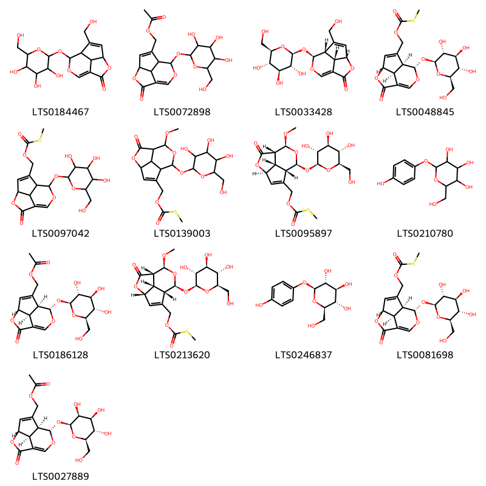{ width=100% }
    <figcaption>Hình ảnh cấu trúc hóa học của 13 hoạt chất thuộc nhóm Organooxygen compounds gồm ['6-(hydroxymethyl)-8-{[3,4,5-trihydroxy-6-(hydroxymethyl)oxan-2-yl]oxy}-3,9-dioxatricyclo[5.3.1.0⁴,¹¹]undeca-1(10),5-dien-2-one (LTS0184467)', 'asperuloside (LTS0072898)', '(4s,7s,8s,11s)-6-(hydroxymethyl)-8-{[(2s,3r,4s,5s,6r)-3,4,5-trihydroxy-6-(hydroxymethyl)oxan-2-yl]oxy}-3,9-dioxatricyclo[5.3.1.0⁴,¹¹]undeca-1(10),5-dien-2-one (LTS0033428)', '(4r,7s,8s,11s)-6-({[(methylsulfanyl)carbonyl]oxy}methyl)-8-{[(2s,3r,4s,5s,6r)-3,4,5-trihydroxy-6-(hydroxymethyl)oxan-2-yl]oxy}-3,9-dioxatricyclo[5.3.1.0⁴,¹¹]undeca-1(10),5-dien-2-one (LTS0048845)', '6-({[(methylsulfanyl)carbonyl]oxy}methyl)-8-{[3,4,5-trihydroxy-6-(hydroxymethyl)oxan-2-yl]oxy}-3,9-dioxatricyclo[5.3.1.0⁴,¹¹]undeca-1(10),5-dien-2-one (LTS0097042)', '10-methoxy-6-({[(methylsulfanyl)carbonyl]oxy}methyl)-8-{[3,4,5-trihydroxy-6-(hydroxymethyl)oxan-2-yl]oxy}-3,9-dioxatricyclo[5.3.1.0⁴,¹¹]undec-5-en-2-one (LTS0139003)', '(1s,4s,7s,8s,10s,11s)-10-methoxy-6-({[(methylsulfanyl)carbonyl]oxy}methyl)-8-{[(2s,3r,4s,5s,6r)-3,4,5-trihydroxy-6-(hydroxymethyl)oxan-2-yl]oxy}-3,9-dioxatricyclo[5.3.1.0⁴,¹¹]undec-5-en-2-one (LTS0095897)', 'arbutin (LTS0210780)', 'asperuloside (LTS0186128)', '(1s,4r,7s,8s,10s,11s)-10-methoxy-6-({[(methylsulfanyl)carbonyl]oxy}methyl)-8-{[(2s,3r,4s,5s,6r)-3,4,5-trihydroxy-6-(hydroxymethyl)oxan-2-yl]oxy}-3,9-dioxatricyclo[5.3.1.0⁴,¹¹]undec-5-en-2-one (LTS0213620)', 'β-arbutin (LTS0246837)', 'paederoside (LTS0081698)', '[(4r,7s,8s,11s)-2-oxo-8-{[(2s,3s,4s,5s,6r)-3,4,5-trihydroxy-6-(hydroxymethyl)oxan-2-yl]oxy}-3,9-dioxatricyclo[5.3.1.0⁴,¹¹]undeca-1(10),5-dien-6-yl]methyl acetate (LTS0027889)'].</figcaption>
</figure>
#### Nhóm Prenol lipids
<figure markdown="span">
    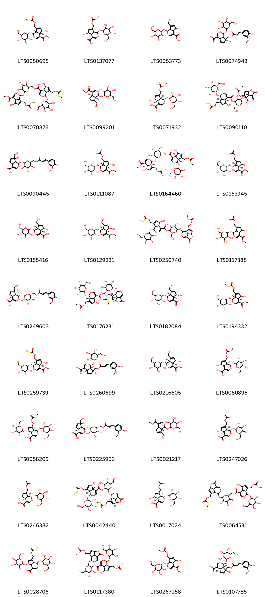{ width=100% }
    <figcaption>Hình ảnh cấu trúc hóa học của 36 hoạt chất thuộc nhóm Prenol lipids gồm ['methyl (1s,4as,5s,7as)-5-hydroxy-7-({[(methylsulfanyl)carbonyl]oxy}methyl)-1-{[(2s,3r,4s,5s,6r)-3,4,5-trihydroxy-6-(hydroxymethyl)oxan-2-yl]oxy}-1h,4ah,5h,7ah-cyclopenta[c]pyran-4-carboxylate (LTS0050695)', '5-hydroxy-7-({[(methylsulfanyl)carbonyl]oxy}methyl)-1-{[3,4,5-trihydroxy-6-(hydroxymethyl)oxan-2-yl]oxy}-1h,4ah,5h,7ah-cyclopenta[c]pyran-4-carboxylic acid (LTS0137077)', 'methyl 5-hydroxy-7-(hydroxymethyl)-1-{[3,4,5-trihydroxy-6-(hydroxymethyl)oxan-2-yl]oxy}-1h,4ah,5h,7ah-cyclopenta[c]pyran-4-carboxylate (LTS0053773)', '7-hydroxy-7-({[3-(4-hydroxy-3-methoxyphenyl)prop-2-enoyl]oxy}methyl)-1-{[3,4,5-trihydroxy-6-(hydroxymethyl)oxan-2-yl]oxy}-1h,4ah,7ah-cyclopenta[c]pyran-4-carboxylic acid (LTS0074943)', '(3,4,5-trihydroxy-6-{[5-hydroxy-4-(methoxycarbonyl)-7-({[(methylsulfanyl)carbonyl]oxy}methyl)-1h,4ah,5h,7ah-cyclopenta[c]pyran-1-yl]oxy}oxan-2-yl)methyl 5-hydroxy-7-({[(methylsulfanyl)carbonyl]oxy}methyl)-1-{[3,4,5-trihydroxy-6-(hydroxymethyl)oxan-2-yl]oxy}-1h,4ah,5h,7ah-cyclopenta[c]pyran-4-carboxylate (LTS0070876)', 'geniposide (LTS0099201)', '(1r,4as,5r,7as)-5-hydroxy-7-({[(methylsulfanyl)carbonyl]oxy}methyl)-1-{[(2s,3s,4r,5r,6s)-3,4,5-trihydroxy-6-(hydroxymethyl)oxan-2-yl]oxy}-1h,4ah,5h,7ah-cyclopenta[c]pyran-4-carboxylic acid (LTS0071932)', '(2r,3s,4r,5r,6s)-4,5-dihydroxy-2-(hydroxymethyl)-6-{[(4s,7s,8s,11s)-6-({[(methylsulfanyl)carbonyl]oxy}methyl)-2-oxo-3,9-dioxatricyclo[5.3.1.0⁴,¹¹]undeca-1(10),5-dien-8-yl]oxy}oxan-3-yl (1s,4as,5s,7as)-5-hydroxy-7-({[(methylsulfanyl)carbonyl]oxy}methyl)-1-{[(2s,3r,4s,5s,6r)-3,4,5-trihydroxy-6-(hydroxymethyl)oxan-2-yl]oxy}-1h,4ah,5h,7ah-cyclopenta[c]pyran-4-carboxylate (LTS0090110)', '7-hydroxy-7-(hydroxymethyl)-1-{[3,4,5-trihydroxy-6-({[3-(4-hydroxy-3-methoxyphenyl)prop-2-enoyl]oxy}methyl)oxan-2-yl]oxy}-1h,4ah,7ah-cyclopenta[c]pyran-4-carboxylic acid (LTS0090445)', 'methyl (1s,4as,5s,7as)-7-[(acetyloxy)methyl]-5-hydroxy-1-{[(2s,3r,4s,5s,6r)-3,4,5-trihydroxy-6-(hydroxymethyl)oxan-2-yl]oxy}-1h,4ah,5h,7ah-cyclopenta[c]pyran-4-carboxylate (LTS0111087)', '[(2s,3r,4r,5s,6r)-6-{[(1r,4ar,5s,7ar)-5-hydroxy-4-(methoxycarbonyl)-7-({[(methylsulfanyl)carbonyl]oxy}methyl)-1h,4ah,5h,7ah-cyclopenta[c]pyran-1-yl]oxy}-3,4,5-trihydroxyoxan-2-yl]methyl (1r,4ar,5s,7ar)-5-hydroxy-7-({[(methylsulfanyl)carbonyl]oxy}methyl)-1-{[(2r,3s,4r,5r,6s)-3,4,5-trihydroxy-6-(hydroxymethyl)oxan-2-yl]oxy}-1h,4ah,5h,7ah-cyclopenta[c]pyran-4-carboxylate (LTS0164460)', 'methyl (1s,4as,5r,7as)-7-[(acetyloxy)methyl]-5-hydroxy-1-{[(2s,3r,4s,5s,6r)-3,4,5-trihydroxy-6-(hydroxymethyl)oxan-2-yl]oxy}-1h,4ah,5h,7ah-cyclopenta[c]pyran-4-carboxylate (LTS0163945)', '(1s,4as,5s,7as)-5-hydroxy-7-(hydroxymethyl)-1-{[(2s,3s,4s,5s,6r)-3,4,5-trihydroxy-6-(hydroxymethyl)oxan-2-yl]oxy}-1h,4ah,5h,7ah-cyclopenta[c]pyran-4-carboxylic acid (LTS0155416)', 'scandoside methyl ester (LTS0129231)', '4,5-dihydroxy-2-(hydroxymethyl)-6-{[6-({[(methylsulfanyl)carbonyl]oxy}methyl)-2-oxo-3,9-dioxatricyclo[5.3.1.0⁴,¹¹]undeca-1(10),5-dien-8-yl]oxy}oxan-3-yl 5-hydroxy-7-({[(methylsulfanyl)carbonyl]oxy}methyl)-1-{[3,4,5-trihydroxy-6-(hydroxymethyl)oxan-2-yl]oxy}-1h,4ah,5h,7ah-cyclopenta[c]pyran-4-carboxylate (LTS0250740)', 'methyl 7-[(acetyloxy)methyl]-5-hydroxy-1-{[3,4,5-trihydroxy-6-(hydroxymethyl)oxan-2-yl]oxy}-1h,4ah,5h,7ah-cyclopenta[c]pyran-4-carboxylate (LTS0117888)', '(1s,4ar,7s,7as)-7-hydroxy-7-(hydroxymethyl)-1-{[(2s,3r,4s,5s,6r)-3,4,5-trihydroxy-6-({[(2e)-3-(4-hydroxy-3-methoxyphenyl)prop-2-enoyl]oxy}methyl)oxan-2-yl]oxy}-1h,4ah,7ah-cyclopenta[c]pyran-4-carboxylic acid (LTS0249603)', '[(2r,3s,4s,5r,6s)-3,4,5-trihydroxy-6-{[(4s,7s,8s,11s)-6-({[(methylsulfanyl)carbonyl]oxy}methyl)-2-oxo-3,9-dioxatricyclo[5.3.1.0⁴,¹¹]undeca-1(10),5-dien-8-yl]oxy}oxan-2-yl]methyl (1s,4as,5s,7as)-5-hydroxy-7-({[(methylsulfanyl)carbonyl]oxy}methyl)-1-{[(2s,3r,4s,5s,6r)-3,4,5-trihydroxy-6-(hydroxymethyl)oxan-2-yl]oxy}-1h,4ah,5h,7ah-cyclopenta[c]pyran-4-carboxylate (LTS0176231)', '(1s,4as,5r,7as)-5-hydroxy-7-(hydroxymethyl)-1-{[(2s,3r,4s,5s,6r)-3,4,5-trihydroxy-6-(hydroxymethyl)oxan-2-yl]oxy}-1h,4ah,5h,7ah-cyclopenta[c]pyran-4-carboxylic acid (LTS0182084)', 'methyl (1s,4as,5r,7as)-5-hydroxy-7-({[(methylsulfanyl)carbonyl]oxy}methyl)-1-{[(2s,3r,4s,5s,6r)-3,4,5-trihydroxy-6-(hydroxymethyl)oxan-2-yl]oxy}-1h,4ah,5h,7ah-cyclopenta[c]pyran-4-carboxylate (LTS0194332)', 'methyl (1s,4ar,5s,7as)-5-hydroxy-7-({[(methylsulfanyl)carbonyl]oxy}methyl)-1-{[(2s,3r,4r,5s,6s)-3,4,5-trihydroxy-6-(hydroxymethyl)oxan-2-yl]oxy}-1h,4ah,5h,7ah-cyclopenta[c]pyran-4-carboxylate (LTS0259739)', '(1s,4as,7r,7as)-7-hydroxy-7-({[(2e)-3-(4-hydroxy-3-methoxyphenyl)prop-2-enoyl]oxy}methyl)-1-{[(2s,3r,4s,5s,6r)-3,4,5-trihydroxy-6-(hydroxymethyl)oxan-2-yl]oxy}-1h,4ah,7ah-cyclopenta[c]pyran-4-carboxylic acid (LTS0260699)', 'methyl (1s,4as,5s,7as)-5-hydroxy-7-(hydroxymethyl)-1-{[(2s,3r,4s,5s,6r)-3,4,5-trihydroxy-6-(hydroxymethyl)oxan-2-yl]oxy}-1h,4ah,5h,7ah-cyclopenta[c]pyran-4-carboxylate (LTS0216605)', '(1s,4as,5s,7as)-5-hydroxy-7-({[(methylsulfanyl)carbonyl]oxy}methyl)-1-{[(2s,3r,4s,5s,6r)-3,4,5-trihydroxy-6-(hydroxymethyl)oxan-2-yl]oxy}-1h,4ah,5h,7ah-cyclopenta[c]pyran-4-carboxylic acid (LTS0080895)', '(1s,4as,5r,7as)-7-({[(methylsulfanyl)carbonyl]oxy}methyl)-5-{[(2r,3r,4s,5s,6r)-3,4,5-trihydroxy-6-(hydroxymethyl)oxan-2-yl]oxy}-1-{[(2s,3r,4s,5s,6r)-3,4,5-trihydroxy-6-(hydroxymethyl)oxan-2-yl]oxy}-1h,4ah,5h,7ah-cyclopenta[c]pyran-4-carboxylic acid (LTS0058209)', '(1s,4as,7r,7as)-7-hydroxy-7-(hydroxymethyl)-1-{[(2s,3r,4s,5s,6r)-3,4,5-trihydroxy-6-({[(2e)-3-(4-hydroxy-3-methoxyphenyl)prop-2-enoyl]oxy}methyl)oxan-2-yl]oxy}-1h,4ah,7ah-cyclopenta[c]pyran-4-carboxylic acid (LTS0225903)', 'methyl (4ar,7as)-7-(hydroxymethyl)-1-{[3,4,5-trihydroxy-6-(hydroxymethyl)oxan-2-yl]oxy}-1h,4ah,5h,7ah-cyclopenta[c]pyran-4-carboxylate (LTS0021217)', '(1s,4as,5s,7as)-7-[(acetyloxy)methyl]-5-hydroxy-1-{[3,4,5-trihydroxy-6-(hydroxymethyl)oxan-2-yl]oxy}-1h,4ah,5h,7ah-cyclopenta[c]pyran-4-carboxylic acid (LTS0247026)', '(1s,4as,5r,7as)-7-[(acetyloxy)methyl]-5-hydroxy-1-{[(2s,3r,4s,5s,6r)-3,4,5-trihydroxy-6-(hydroxymethyl)oxan-2-yl]oxy}-1h,4ah,5h,7ah-cyclopenta[c]pyran-4-carboxylic acid (LTS0246382)', '(2s,3r,4s,5s,6r)-4,5-dihydroxy-6-(hydroxymethyl)-2-{[(4s,7s,8s,11s)-6-({[(methylsulfanyl)carbonyl]oxy}methyl)-2-oxo-3,9-dioxatricyclo[5.3.1.0⁴,¹¹]undeca-1(10),5-dien-8-yl]oxy}oxan-3-yl (1s,4as,5s,7as)-5-hydroxy-7-({[(methylsulfanyl)carbonyl]oxy}methyl)-1-{[(2s,3r,4s,5s,6r)-3,4,5-trihydroxy-6-(hydroxymethyl)oxan-2-yl]oxy}-1h,4ah,5h,7ah-cyclopenta[c]pyran-4-carboxylate (LTS0042440)', '(1s,4as,5s,7as)-7-[(acetyloxy)methyl]-5-hydroxy-1-{[(2s,3r,4s,5s,6r)-3,4,5-trihydroxy-6-(hydroxymethyl)oxan-2-yl]oxy}-1h,4ah,5h,7ah-cyclopenta[c]pyran-4-carboxylic acid (LTS0017024)', '(3,4,5-trihydroxy-6-{[6-({[(methylsulfanyl)carbonyl]oxy}methyl)-2-oxo-3,9-dioxatricyclo[5.3.1.0⁴,¹¹]undeca-1(10),5-dien-8-yl]oxy}oxan-2-yl)methyl 5-hydroxy-7-({[(methylsulfanyl)carbonyl]oxy}methyl)-1-{[3,4,5-trihydroxy-6-(hydroxymethyl)oxan-2-yl]oxy}-1h,4ah,5h,7ah-cyclopenta[c]pyran-4-carboxylate (LTS0064531)', '7-({[(methylsulfanyl)carbonyl]oxy}methyl)-1,5-bis({[3,4,5-trihydroxy-6-(hydroxymethyl)oxan-2-yl]oxy})-1h,4ah,5h,7ah-cyclopenta[c]pyran-4-carboxylic acid (LTS0028706)', '4,5-dihydroxy-6-(hydroxymethyl)-2-{[6-({[(methylsulfanyl)carbonyl]oxy}methyl)-2-oxo-3,9-dioxatricyclo[5.3.1.0⁴,¹¹]undeca-1(10),5-dien-8-yl]oxy}oxan-3-yl 5-hydroxy-7-({[(methylsulfanyl)carbonyl]oxy}methyl)-1-{[3,4,5-trihydroxy-6-(hydroxymethyl)oxan-2-yl]oxy}-1h,4ah,5h,7ah-cyclopenta[c]pyran-4-carboxylate (LTS0117380)', 'methyl 5-hydroxy-7-({[(methylsulfanyl)carbonyl]oxy}methyl)-1-{[3,4,5-trihydroxy-6-(hydroxymethyl)oxan-2-yl]oxy}-1h,4ah,5h,7ah-cyclopenta[c]pyran-4-carboxylate (LTS0267258)', '(1s,4ar,7s,7as)-7-hydroxy-7-({[(2e)-3-(4-hydroxy-3-methoxyphenyl)prop-2-enoyl]oxy}methyl)-1-{[(2s,3r,4s,5s,6r)-3,4,5-trihydroxy-6-(hydroxymethyl)oxan-2-yl]oxy}-1h,4ah,7ah-cyclopenta[c]pyran-4-carboxylic acid (LTS0107785)'].</figcaption>
</figure>
#### Nhóm Saturated hydrocarbons
<figure markdown="span">
    { width=100% }
    <figcaption>Hình ảnh cấu trúc hóa học của 1 hoạt chất thuộc nhóm Saturated hydrocarbons gồm ['hentriacontane (LTS0046415)'].</figcaption>
</figure>
#### Nhóm Steroids and steroid derivatives
<figure markdown="span">
    { width=100% }
    <figcaption>Hình ảnh cấu trúc hóa học của 3 hoạt chất thuộc nhóm Steroids and steroid derivatives gồm ['sitosterol (LTS0168132)', '(1r,3as,3bs,7s,9ar,9bs,11ar)-1-[(2s,3e,5s)-5-ethyl-6-methylhept-3-en-2-yl]-9a,11a-dimethyl-1h,2h,3h,3ah,3bh,4h,6h,7h,8h,9h,9bh,10h,11h-cyclopenta[a]phenanthren-7-ol (LTS0169213)', 'campesterol (LTS0029429)'].</figcaption>
</figure>

---

### Dược dân tộc học

Danh sách các quốc gia có sử dụng *Paederia foetida* trong điều trị các bệnh. 

| Country     | Disease           | Bệnh                                                                                                                                                                                                |
|:------------|:------------------|:----------------------------------------------------------------------------------------------------------------------------------------------------------------------------------------------------|
| China       | Carminative       | MYMEMORY WARNING: YOU USED ALL AVAILABLE FREE TRANSLATIONS FOR TODAY. NEXT AVAILABLE IN  10 HOURS 55 MINUTES 55 SECONDS VISIT HTTPS://MYMEMORY.TRANSLATED.NET/DOC/USAGELIMITS.PHP TO TRANSLATE MORE |
| Elsewhere   | Astringent, Tonic | MYMEMORY WARNING: YOU USED ALL AVAILABLE FREE TRANSLATIONS FOR TODAY. NEXT AVAILABLE IN  10 HOURS 55 MINUTES 49 SECONDS VISIT HTTPS://MYMEMORY.TRANSLATED.NET/DOC/USAGELIMITS.PHP TO TRANSLATE MORE |
| Philippines | Diuretic          | MYMEMORY WARNING: YOU USED ALL AVAILABLE FREE TRANSLATIONS FOR TODAY. NEXT AVAILABLE IN  10 HOURS 55 MINUTES 45 SECONDS VISIT HTTPS://MYMEMORY.TRANSLATED.NET/DOC/USAGELIMITS.PHP TO TRANSLATE MORE |

---

---
## Paederia scandens
### Thông tin về thực vật

!!! info "Phân loại thực vật của *Paederia foetida* từ GIBF:"
    - **Kingdom:** Plantae
    - **Phylum:** Tracheophyta
    - **Order:** Gentianales
    - **Family:** Rubiaceae
    - **Genus:** Paederia
    - **Species:** *Paederia foetida*

 

| Label (VI)   | Label (EN)   | Scientific Name   | Descriptions (VI)   | Descriptions (EN)   | Also Known As (VI)   | Also Known As (EN)   |
|:-------------|:-------------|:------------------|:--------------------|:--------------------|:---------------------|:---------------------|
| N/A          | N/A          | Paederia scandens | loài thực vật       | species of plant    | ['']                 | ['']                 |

#### Phân bố trên thế giới

**Từ CSDL GIBF** Chinese Taipei, Viet Nam, Japan, Korea, Republic of

#### Phân bố tại Việt Nam

**Từ CSDL GIBF**: Không có ghi nhận ở Việt Nam

---
### Thành phần hóa học
        
- Theo cơ sở dữ liệu lotus: Từ loài *Paederia foetida* đã phân lập và xác định được 47 hoạt chất thuộc về các nhóm Prenol lipids, Organooxygen compounds. 

|    | chemicalTaxonomyClassyfireClass   |   smiles_count |
|---:|:----------------------------------|---------------:|
|  0 | Organooxygen compounds            |             11 |
|  1 | Prenol lipids                     |             35 |

#### Nhóm Organooxygen compounds
<figure markdown="span">
    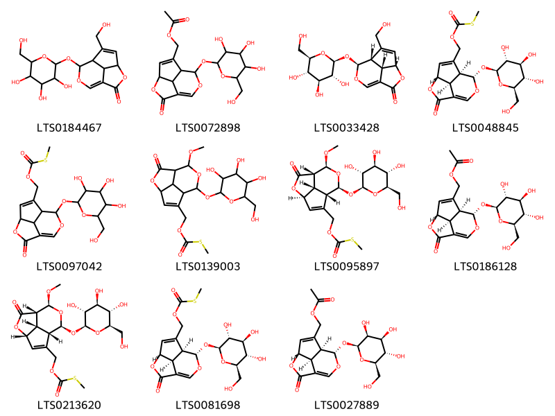{ width=100% }
    <figcaption>Hình ảnh cấu trúc hóa học của 11 hoạt chất thuộc nhóm Organooxygen compounds gồm ['6-(hydroxymethyl)-8-{[3,4,5-trihydroxy-6-(hydroxymethyl)oxan-2-yl]oxy}-3,9-dioxatricyclo[5.3.1.0⁴,¹¹]undeca-1(10),5-dien-2-one (LTS0184467)', 'asperuloside (LTS0072898)', '(4s,7s,8s,11s)-6-(hydroxymethyl)-8-{[(2s,3r,4s,5s,6r)-3,4,5-trihydroxy-6-(hydroxymethyl)oxan-2-yl]oxy}-3,9-dioxatricyclo[5.3.1.0⁴,¹¹]undeca-1(10),5-dien-2-one (LTS0033428)', '(4r,7s,8s,11s)-6-({[(methylsulfanyl)carbonyl]oxy}methyl)-8-{[(2s,3r,4s,5s,6r)-3,4,5-trihydroxy-6-(hydroxymethyl)oxan-2-yl]oxy}-3,9-dioxatricyclo[5.3.1.0⁴,¹¹]undeca-1(10),5-dien-2-one (LTS0048845)', '6-({[(methylsulfanyl)carbonyl]oxy}methyl)-8-{[3,4,5-trihydroxy-6-(hydroxymethyl)oxan-2-yl]oxy}-3,9-dioxatricyclo[5.3.1.0⁴,¹¹]undeca-1(10),5-dien-2-one (LTS0097042)', '10-methoxy-6-({[(methylsulfanyl)carbonyl]oxy}methyl)-8-{[3,4,5-trihydroxy-6-(hydroxymethyl)oxan-2-yl]oxy}-3,9-dioxatricyclo[5.3.1.0⁴,¹¹]undec-5-en-2-one (LTS0139003)', '(1s,4s,7s,8s,10s,11s)-10-methoxy-6-({[(methylsulfanyl)carbonyl]oxy}methyl)-8-{[(2s,3r,4s,5s,6r)-3,4,5-trihydroxy-6-(hydroxymethyl)oxan-2-yl]oxy}-3,9-dioxatricyclo[5.3.1.0⁴,¹¹]undec-5-en-2-one (LTS0095897)', 'asperuloside (LTS0186128)', '(1s,4r,7s,8s,10s,11s)-10-methoxy-6-({[(methylsulfanyl)carbonyl]oxy}methyl)-8-{[(2s,3r,4s,5s,6r)-3,4,5-trihydroxy-6-(hydroxymethyl)oxan-2-yl]oxy}-3,9-dioxatricyclo[5.3.1.0⁴,¹¹]undec-5-en-2-one (LTS0213620)', 'paederoside (LTS0081698)', '[(4r,7s,8s,11s)-2-oxo-8-{[(2s,3s,4s,5s,6r)-3,4,5-trihydroxy-6-(hydroxymethyl)oxan-2-yl]oxy}-3,9-dioxatricyclo[5.3.1.0⁴,¹¹]undeca-1(10),5-dien-6-yl]methyl acetate (LTS0027889)'].</figcaption>
</figure>
#### Nhóm Prenol lipids
<figure markdown="span">
    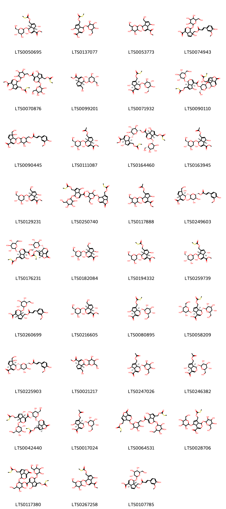{ width=100% }
    <figcaption>Hình ảnh cấu trúc hóa học của 35 hoạt chất thuộc nhóm Prenol lipids gồm ['methyl (1s,4as,5s,7as)-5-hydroxy-7-({[(methylsulfanyl)carbonyl]oxy}methyl)-1-{[(2s,3r,4s,5s,6r)-3,4,5-trihydroxy-6-(hydroxymethyl)oxan-2-yl]oxy}-1h,4ah,5h,7ah-cyclopenta[c]pyran-4-carboxylate (LTS0050695)', '5-hydroxy-7-({[(methylsulfanyl)carbonyl]oxy}methyl)-1-{[3,4,5-trihydroxy-6-(hydroxymethyl)oxan-2-yl]oxy}-1h,4ah,5h,7ah-cyclopenta[c]pyran-4-carboxylic acid (LTS0137077)', 'methyl 5-hydroxy-7-(hydroxymethyl)-1-{[3,4,5-trihydroxy-6-(hydroxymethyl)oxan-2-yl]oxy}-1h,4ah,5h,7ah-cyclopenta[c]pyran-4-carboxylate (LTS0053773)', '7-hydroxy-7-({[3-(4-hydroxy-3-methoxyphenyl)prop-2-enoyl]oxy}methyl)-1-{[3,4,5-trihydroxy-6-(hydroxymethyl)oxan-2-yl]oxy}-1h,4ah,7ah-cyclopenta[c]pyran-4-carboxylic acid (LTS0074943)', '(3,4,5-trihydroxy-6-{[5-hydroxy-4-(methoxycarbonyl)-7-({[(methylsulfanyl)carbonyl]oxy}methyl)-1h,4ah,5h,7ah-cyclopenta[c]pyran-1-yl]oxy}oxan-2-yl)methyl 5-hydroxy-7-({[(methylsulfanyl)carbonyl]oxy}methyl)-1-{[3,4,5-trihydroxy-6-(hydroxymethyl)oxan-2-yl]oxy}-1h,4ah,5h,7ah-cyclopenta[c]pyran-4-carboxylate (LTS0070876)', 'geniposide (LTS0099201)', '(1r,4as,5r,7as)-5-hydroxy-7-({[(methylsulfanyl)carbonyl]oxy}methyl)-1-{[(2s,3s,4r,5r,6s)-3,4,5-trihydroxy-6-(hydroxymethyl)oxan-2-yl]oxy}-1h,4ah,5h,7ah-cyclopenta[c]pyran-4-carboxylic acid (LTS0071932)', '(2r,3s,4r,5r,6s)-4,5-dihydroxy-2-(hydroxymethyl)-6-{[(4s,7s,8s,11s)-6-({[(methylsulfanyl)carbonyl]oxy}methyl)-2-oxo-3,9-dioxatricyclo[5.3.1.0⁴,¹¹]undeca-1(10),5-dien-8-yl]oxy}oxan-3-yl (1s,4as,5s,7as)-5-hydroxy-7-({[(methylsulfanyl)carbonyl]oxy}methyl)-1-{[(2s,3r,4s,5s,6r)-3,4,5-trihydroxy-6-(hydroxymethyl)oxan-2-yl]oxy}-1h,4ah,5h,7ah-cyclopenta[c]pyran-4-carboxylate (LTS0090110)', '7-hydroxy-7-(hydroxymethyl)-1-{[3,4,5-trihydroxy-6-({[3-(4-hydroxy-3-methoxyphenyl)prop-2-enoyl]oxy}methyl)oxan-2-yl]oxy}-1h,4ah,7ah-cyclopenta[c]pyran-4-carboxylic acid (LTS0090445)', 'methyl (1s,4as,5s,7as)-7-[(acetyloxy)methyl]-5-hydroxy-1-{[(2s,3r,4s,5s,6r)-3,4,5-trihydroxy-6-(hydroxymethyl)oxan-2-yl]oxy}-1h,4ah,5h,7ah-cyclopenta[c]pyran-4-carboxylate (LTS0111087)', '[(2s,3r,4r,5s,6r)-6-{[(1r,4ar,5s,7ar)-5-hydroxy-4-(methoxycarbonyl)-7-({[(methylsulfanyl)carbonyl]oxy}methyl)-1h,4ah,5h,7ah-cyclopenta[c]pyran-1-yl]oxy}-3,4,5-trihydroxyoxan-2-yl]methyl (1r,4ar,5s,7ar)-5-hydroxy-7-({[(methylsulfanyl)carbonyl]oxy}methyl)-1-{[(2r,3s,4r,5r,6s)-3,4,5-trihydroxy-6-(hydroxymethyl)oxan-2-yl]oxy}-1h,4ah,5h,7ah-cyclopenta[c]pyran-4-carboxylate (LTS0164460)', 'methyl (1s,4as,5r,7as)-7-[(acetyloxy)methyl]-5-hydroxy-1-{[(2s,3r,4s,5s,6r)-3,4,5-trihydroxy-6-(hydroxymethyl)oxan-2-yl]oxy}-1h,4ah,5h,7ah-cyclopenta[c]pyran-4-carboxylate (LTS0163945)', 'scandoside methyl ester (LTS0129231)', '4,5-dihydroxy-2-(hydroxymethyl)-6-{[6-({[(methylsulfanyl)carbonyl]oxy}methyl)-2-oxo-3,9-dioxatricyclo[5.3.1.0⁴,¹¹]undeca-1(10),5-dien-8-yl]oxy}oxan-3-yl 5-hydroxy-7-({[(methylsulfanyl)carbonyl]oxy}methyl)-1-{[3,4,5-trihydroxy-6-(hydroxymethyl)oxan-2-yl]oxy}-1h,4ah,5h,7ah-cyclopenta[c]pyran-4-carboxylate (LTS0250740)', 'methyl 7-[(acetyloxy)methyl]-5-hydroxy-1-{[3,4,5-trihydroxy-6-(hydroxymethyl)oxan-2-yl]oxy}-1h,4ah,5h,7ah-cyclopenta[c]pyran-4-carboxylate (LTS0117888)', '(1s,4ar,7s,7as)-7-hydroxy-7-(hydroxymethyl)-1-{[(2s,3r,4s,5s,6r)-3,4,5-trihydroxy-6-({[(2e)-3-(4-hydroxy-3-methoxyphenyl)prop-2-enoyl]oxy}methyl)oxan-2-yl]oxy}-1h,4ah,7ah-cyclopenta[c]pyran-4-carboxylic acid (LTS0249603)', '[(2r,3s,4s,5r,6s)-3,4,5-trihydroxy-6-{[(4s,7s,8s,11s)-6-({[(methylsulfanyl)carbonyl]oxy}methyl)-2-oxo-3,9-dioxatricyclo[5.3.1.0⁴,¹¹]undeca-1(10),5-dien-8-yl]oxy}oxan-2-yl]methyl (1s,4as,5s,7as)-5-hydroxy-7-({[(methylsulfanyl)carbonyl]oxy}methyl)-1-{[(2s,3r,4s,5s,6r)-3,4,5-trihydroxy-6-(hydroxymethyl)oxan-2-yl]oxy}-1h,4ah,5h,7ah-cyclopenta[c]pyran-4-carboxylate (LTS0176231)', '(1s,4as,5r,7as)-5-hydroxy-7-(hydroxymethyl)-1-{[(2s,3r,4s,5s,6r)-3,4,5-trihydroxy-6-(hydroxymethyl)oxan-2-yl]oxy}-1h,4ah,5h,7ah-cyclopenta[c]pyran-4-carboxylic acid (LTS0182084)', 'methyl (1s,4as,5r,7as)-5-hydroxy-7-({[(methylsulfanyl)carbonyl]oxy}methyl)-1-{[(2s,3r,4s,5s,6r)-3,4,5-trihydroxy-6-(hydroxymethyl)oxan-2-yl]oxy}-1h,4ah,5h,7ah-cyclopenta[c]pyran-4-carboxylate (LTS0194332)', 'methyl (1s,4ar,5s,7as)-5-hydroxy-7-({[(methylsulfanyl)carbonyl]oxy}methyl)-1-{[(2s,3r,4r,5s,6s)-3,4,5-trihydroxy-6-(hydroxymethyl)oxan-2-yl]oxy}-1h,4ah,5h,7ah-cyclopenta[c]pyran-4-carboxylate (LTS0259739)', '(1s,4as,7r,7as)-7-hydroxy-7-({[(2e)-3-(4-hydroxy-3-methoxyphenyl)prop-2-enoyl]oxy}methyl)-1-{[(2s,3r,4s,5s,6r)-3,4,5-trihydroxy-6-(hydroxymethyl)oxan-2-yl]oxy}-1h,4ah,7ah-cyclopenta[c]pyran-4-carboxylic acid (LTS0260699)', 'methyl (1s,4as,5s,7as)-5-hydroxy-7-(hydroxymethyl)-1-{[(2s,3r,4s,5s,6r)-3,4,5-trihydroxy-6-(hydroxymethyl)oxan-2-yl]oxy}-1h,4ah,5h,7ah-cyclopenta[c]pyran-4-carboxylate (LTS0216605)', '(1s,4as,5s,7as)-5-hydroxy-7-({[(methylsulfanyl)carbonyl]oxy}methyl)-1-{[(2s,3r,4s,5s,6r)-3,4,5-trihydroxy-6-(hydroxymethyl)oxan-2-yl]oxy}-1h,4ah,5h,7ah-cyclopenta[c]pyran-4-carboxylic acid (LTS0080895)', '(1s,4as,5r,7as)-7-({[(methylsulfanyl)carbonyl]oxy}methyl)-5-{[(2r,3r,4s,5s,6r)-3,4,5-trihydroxy-6-(hydroxymethyl)oxan-2-yl]oxy}-1-{[(2s,3r,4s,5s,6r)-3,4,5-trihydroxy-6-(hydroxymethyl)oxan-2-yl]oxy}-1h,4ah,5h,7ah-cyclopenta[c]pyran-4-carboxylic acid (LTS0058209)', '(1s,4as,7r,7as)-7-hydroxy-7-(hydroxymethyl)-1-{[(2s,3r,4s,5s,6r)-3,4,5-trihydroxy-6-({[(2e)-3-(4-hydroxy-3-methoxyphenyl)prop-2-enoyl]oxy}methyl)oxan-2-yl]oxy}-1h,4ah,7ah-cyclopenta[c]pyran-4-carboxylic acid (LTS0225903)', 'methyl (4ar,7as)-7-(hydroxymethyl)-1-{[3,4,5-trihydroxy-6-(hydroxymethyl)oxan-2-yl]oxy}-1h,4ah,5h,7ah-cyclopenta[c]pyran-4-carboxylate (LTS0021217)', '(1s,4as,5s,7as)-7-[(acetyloxy)methyl]-5-hydroxy-1-{[3,4,5-trihydroxy-6-(hydroxymethyl)oxan-2-yl]oxy}-1h,4ah,5h,7ah-cyclopenta[c]pyran-4-carboxylic acid (LTS0247026)', '(1s,4as,5r,7as)-7-[(acetyloxy)methyl]-5-hydroxy-1-{[(2s,3r,4s,5s,6r)-3,4,5-trihydroxy-6-(hydroxymethyl)oxan-2-yl]oxy}-1h,4ah,5h,7ah-cyclopenta[c]pyran-4-carboxylic acid (LTS0246382)', '(2s,3r,4s,5s,6r)-4,5-dihydroxy-6-(hydroxymethyl)-2-{[(4s,7s,8s,11s)-6-({[(methylsulfanyl)carbonyl]oxy}methyl)-2-oxo-3,9-dioxatricyclo[5.3.1.0⁴,¹¹]undeca-1(10),5-dien-8-yl]oxy}oxan-3-yl (1s,4as,5s,7as)-5-hydroxy-7-({[(methylsulfanyl)carbonyl]oxy}methyl)-1-{[(2s,3r,4s,5s,6r)-3,4,5-trihydroxy-6-(hydroxymethyl)oxan-2-yl]oxy}-1h,4ah,5h,7ah-cyclopenta[c]pyran-4-carboxylate (LTS0042440)', '(1s,4as,5s,7as)-7-[(acetyloxy)methyl]-5-hydroxy-1-{[(2s,3r,4s,5s,6r)-3,4,5-trihydroxy-6-(hydroxymethyl)oxan-2-yl]oxy}-1h,4ah,5h,7ah-cyclopenta[c]pyran-4-carboxylic acid (LTS0017024)', '(3,4,5-trihydroxy-6-{[6-({[(methylsulfanyl)carbonyl]oxy}methyl)-2-oxo-3,9-dioxatricyclo[5.3.1.0⁴,¹¹]undeca-1(10),5-dien-8-yl]oxy}oxan-2-yl)methyl 5-hydroxy-7-({[(methylsulfanyl)carbonyl]oxy}methyl)-1-{[3,4,5-trihydroxy-6-(hydroxymethyl)oxan-2-yl]oxy}-1h,4ah,5h,7ah-cyclopenta[c]pyran-4-carboxylate (LTS0064531)', '7-({[(methylsulfanyl)carbonyl]oxy}methyl)-1,5-bis({[3,4,5-trihydroxy-6-(hydroxymethyl)oxan-2-yl]oxy})-1h,4ah,5h,7ah-cyclopenta[c]pyran-4-carboxylic acid (LTS0028706)', '4,5-dihydroxy-6-(hydroxymethyl)-2-{[6-({[(methylsulfanyl)carbonyl]oxy}methyl)-2-oxo-3,9-dioxatricyclo[5.3.1.0⁴,¹¹]undeca-1(10),5-dien-8-yl]oxy}oxan-3-yl 5-hydroxy-7-({[(methylsulfanyl)carbonyl]oxy}methyl)-1-{[3,4,5-trihydroxy-6-(hydroxymethyl)oxan-2-yl]oxy}-1h,4ah,5h,7ah-cyclopenta[c]pyran-4-carboxylate (LTS0117380)', 'methyl 5-hydroxy-7-({[(methylsulfanyl)carbonyl]oxy}methyl)-1-{[3,4,5-trihydroxy-6-(hydroxymethyl)oxan-2-yl]oxy}-1h,4ah,5h,7ah-cyclopenta[c]pyran-4-carboxylate (LTS0267258)', '(1s,4ar,7s,7as)-7-hydroxy-7-({[(2e)-3-(4-hydroxy-3-methoxyphenyl)prop-2-enoyl]oxy}methyl)-1-{[(2s,3r,4s,5s,6r)-3,4,5-trihydroxy-6-(hydroxymethyl)oxan-2-yl]oxy}-1h,4ah,7ah-cyclopenta[c]pyran-4-carboxylic acid (LTS0107785)'].</figcaption>
</figure>

---

### Dược dân tộc học

Danh sách các quốc gia có sử dụng *Paederia foetida* trong điều trị các bệnh. 

| Country   | Disease                        | Bệnh                                                                                                                                                                                                |
|:----------|:-------------------------------|:----------------------------------------------------------------------------------------------------------------------------------------------------------------------------------------------------|
| China     | Carminative                    | MYMEMORY WARNING: YOU USED ALL AVAILABLE FREE TRANSLATIONS FOR TODAY. NEXT AVAILABLE IN  10 HOURS 54 MINUTES 55 SECONDS VISIT HTTPS://MYMEMORY.TRANSLATED.NET/DOC/USAGELIMITS.PHP TO TRANSLATE MORE |
| Elsewhere | Tonic, Astringent, Carminative | MYMEMORY WARNING: YOU USED ALL AVAILABLE FREE TRANSLATIONS FOR TODAY. NEXT AVAILABLE IN  10 HOURS 54 MINUTES 53 SECONDS VISIT HTTPS://MYMEMORY.TRANSLATED.NET/DOC/USAGELIMITS.PHP TO TRANSLATE MORE |
| Indochina | Antiphlogistic                 | MYMEMORY WARNING: YOU USED ALL AVAILABLE FREE TRANSLATIONS FOR TODAY. NEXT AVAILABLE IN  10 HOURS 54 MINUTES 49 SECONDS VISIT HTTPS://MYMEMORY.TRANSLATED.NET/DOC/USAGELIMITS.PHP TO TRANSLATE MORE |

---

# Chi Hamelia

??? note "Danh sách các dược liệu thuộc chi"
    
	 - *Hamelia patens*

---
## Hamelia patens
### Thông tin về thực vật

!!! info "Phân loại thực vật của *Hamelia patens* từ GIBF:"
    - **Kingdom:** Plantae
    - **Phylum:** Tracheophyta
    - **Order:** Gentianales
    - **Family:** Rubiaceae
    - **Genus:** Hamelia
    - **Species:** *Hamelia patens*

 

| Label (VI)   | Label (EN)   | Scientific Name   | Descriptions (VI)   | Descriptions (EN)   | Also Known As (VI)   | Also Known As (EN)   |
|:-------------|:-------------|:------------------|:--------------------|:--------------------|:---------------------|:---------------------|
| N/A          | N/A          | Hamelia patens    | loài thực vật       | species of plant    | ['']                 | ['']                 |

#### Phân bố trên thế giới

**Từ CSDL GIBF** nan, Brazil, Guatemala, Honduras, Ecuador, Trinidad and Tobago, Thailand, Puerto Rico, Sri Lanka, Samoa, Cayman Islands, United States of America, Jamaica, Costa Rica, Dominican Republic, Colombia, Cuba, Argentina, Mexico, El Salvador, Philippines, Panama, Nicaragua, Bahamas, South Africa, India, Northern Mariana Islands, Peru, Belize

#### Phân bố tại Việt Nam

**Từ CSDL GIBF**: Không có ghi nhận ở Việt Nam

---
### Thành phần hóa học
        
- Theo cơ sở dữ liệu lotus: Từ loài *Hamelia patens* đã phân lập và xác định được 9 hoạt chất thuộc về các nhóm Cinnamic acids and derivatives, Benzene and substituted derivatives, Indolizidines, Flavonoids. 

|    | chemicalTaxonomyClassyfireClass     |   smiles_count |
|---:|:------------------------------------|---------------:|
|  0 | Benzene and substituted derivatives |              1 |
|  1 | Cinnamic acids and derivatives      |              1 |
|  2 | Flavonoids                          |              3 |
|  3 | Indolizidines                       |              4 |

#### Nhóm Benzene and substituted derivatives
<figure markdown="span">
    { width=100% }
    <figcaption>Hình ảnh cấu trúc hóa học của 1 hoạt chất thuộc nhóm Benzene and substituted derivatives gồm ['ephedrine (LTS0276367)'].</figcaption>
</figure>
#### Nhóm Cinnamic acids and derivatives
<figure markdown="span">
    { width=100% }
    <figcaption>Hình ảnh cấu trúc hóa học của 1 hoạt chất thuộc nhóm Cinnamic acids and derivatives gồm ['rosemary acid (LTS0207820)'].</figcaption>
</figure>
#### Nhóm Flavonoids
<figure markdown="span">
    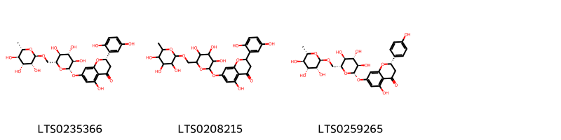{ width=100% }
    <figcaption>Hình ảnh cấu trúc hóa học của 3 hoạt chất thuộc nhóm Flavonoids gồm ['(2s)-2-(2,5-dihydroxyphenyl)-5-hydroxy-7-{[(2s,3r,4s,5s,6r)-3,4,5-trihydroxy-6-({[(2r,3r,4r,5r,6s)-3,4,5-trihydroxy-6-methyloxan-2-yl]oxy}methyl)oxan-2-yl]oxy}-2,3-dihydro-1-benzopyran-4-one (LTS0235366)', '2-(2,5-dihydroxyphenyl)-5-hydroxy-7-[(3,4,5-trihydroxy-6-{[(3,4,5-trihydroxy-6-methyloxan-2-yl)oxy]methyl}oxan-2-yl)oxy]-2,3-dihydro-1-benzopyran-4-one (LTS0208215)', 'narirutin (LTS0259265)'].</figcaption>
</figure>
#### Nhóm Indolizidines
<figure markdown="span">
    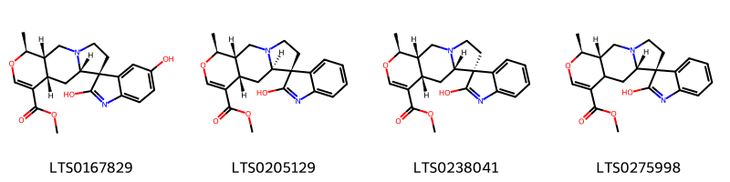{ width=100% }
    <figcaption>Hình ảnh cấu trúc hóa học của 4 hoạt chất thuộc nhóm Indolizidines gồm ["methyl (1's,3s,4'as,5'as,10'as)-2,5-dihydroxy-1'-methyl-1',4'a,5',5'a,7',8',10',10'a-octahydrospiro[indole-3,6'-pyrano[3,4-f]indolizine]-4'-carboxylate (LTS0167829)", "methyl (1's,3s,4'as,5'ar,10'as)-2-hydroxy-1'-methyl-1',4'a,5',5'a,7',8',10',10'a-octahydrospiro[indole-3,6'-pyrano[3,4-f]indolizine]-4'-carboxylate (LTS0205129)", "methyl (1's,3r,4'as,5'as,10'as)-2-hydroxy-1'-methyl-1',4'a,5',5'a,7',8',10',10'a-octahydrospiro[indole-3,6'-pyrano[3,4-f]indolizine]-4'-carboxylate (LTS0238041)", "methyl (1's,3s,5'as,10'as)-2-hydroxy-1'-methyl-1',4'a,5',5'a,7',8',10',10'a-octahydrospiro[indole-3,6'-pyrano[3,4-f]indolizine]-4'-carboxylate (LTS0275998)"].</figcaption>
</figure>

---

### Dược dân tộc học

Danh sách các quốc gia có sử dụng *Hamelia patens* trong điều trị các bệnh. 

| Country       | Disease   | Bệnh                                                                                                                                                                                                |
|:--------------|:----------|:----------------------------------------------------------------------------------------------------------------------------------------------------------------------------------------------------|
| Elsewhere     | Poison    | MYMEMORY WARNING: YOU USED ALL AVAILABLE FREE TRANSLATIONS FOR TODAY. NEXT AVAILABLE IN  10 HOURS 54 MINUTES 15 SECONDS VISIT HTTPS://MYMEMORY.TRANSLATED.NET/DOC/USAGELIMITS.PHP TO TRANSLATE MORE |
| Panama(Choco) | Purgative | MYMEMORY WARNING: YOU USED ALL AVAILABLE FREE TRANSLATIONS FOR TODAY. NEXT AVAILABLE IN  10 HOURS 54 MINUTES 12 SECONDS VISIT HTTPS://MYMEMORY.TRANSLATED.NET/DOC/USAGELIMITS.PHP TO TRANSLATE MORE |

---

# Chi Rudgea

??? note "Danh sách các dược liệu thuộc chi"
    
	 - *Rudgea subsessilis*

---
## Rudgea subsessilis
### Thông tin về thực vật

!!! info "Phân loại thực vật của *Rudgea subsessilis* từ GIBF:"
    - **Kingdom:** Plantae
    - **Phylum:** Tracheophyta
    - **Order:** Gentianales
    - **Family:** Rubiaceae
    - **Genus:** Rudgea
    - **Species:** *Rudgea subsessilis*

 

| Label (VI)   | Label (EN)   | Scientific Name    | Descriptions (VI)   | Descriptions (EN)   | Also Known As (VI)   | Also Known As (EN)   |
|:-------------|:-------------|:-------------------|:--------------------|:--------------------|:---------------------|:---------------------|
| N/A          | N/A          | Rudgea subsessilis |                     |                     | ['']                 | ['']                 |

#### Phân bố trên thế giới

**Từ CSDL GIBF** nan, Brazil, Guatemala, Honduras, Ecuador, Trinidad and Tobago, Thailand, Puerto Rico, Sri Lanka, Samoa, Cayman Islands, United States of America, Jamaica, Costa Rica, Dominican Republic, Colombia, Cuba, Argentina, Mexico, El Salvador, Philippines, Panama, Nicaragua, Bahamas, South Africa, India, Northern Mariana Islands, Peru, Belize

#### Phân bố tại Việt Nam

**Từ CSDL GIBF**: Không có ghi nhận ở Việt Nam

---
### Thành phần hóa học
        
- Theo cơ sở dữ liệu lotus: Từ loài *Rudgea subsessilis* đã phân lập và xác định được Chưa có hoạt chất nào được phân lập. hoạt chất thuộc về các nhóm Không có hoạt chất nào được phân lập. 

Không có hình ảnh nào được tạo ra

---

### Dược dân tộc học

Danh sách các quốc gia có sử dụng *Rudgea subsessilis* trong điều trị các bệnh. 

| Country   | Disease   | Bệnh                                                                                                                                                                                                |
|:----------|:----------|:----------------------------------------------------------------------------------------------------------------------------------------------------------------------------------------------------|
| Brazil    | Raticide  | MYMEMORY WARNING: YOU USED ALL AVAILABLE FREE TRANSLATIONS FOR TODAY. NEXT AVAILABLE IN  10 HOURS 53 MINUTES 22 SECONDS VISIT HTTPS://MYMEMORY.TRANSLATED.NET/DOC/USAGELIMITS.PHP TO TRANSLATE MORE |

---

# Chi Serissa

??? note "Danh sách các dược liệu thuộc chi"
    
	 - *Serissa foetida*

---
## Serissa foetida
### Thông tin về thực vật

!!! info "Phân loại thực vật của *Buchozia japonica* từ GIBF:"
    - **Kingdom:** Plantae
    - **Phylum:** Tracheophyta
    - **Order:** Gentianales
    - **Family:** Rubiaceae
    - **Genus:** Buchozia
    - **Species:** *Buchozia japonica*

 

| Label (VI)   | Label (EN)   | Scientific Name   | Descriptions (VI)   | Descriptions (EN)   | Also Known As (VI)   | Also Known As (EN)   |
|:-------------|:-------------|:------------------|:--------------------|:--------------------|:---------------------|:---------------------|
| N/A          | N/A          | Serissa foetida   | loài thực vật       | species of plant    | ['']                 | ['']                 |

#### Phân bố trên thế giới

**Từ CSDL GIBF** nan, Brazil, Réunion, Viet Nam, United States of America, Japan, France, Belgium, Chinese Taipei, China, Russian Federation, Colombia, New Zealand, India, unknown or invalid, French Polynesia, United Kingdom of Great Britain and Northern Ireland

#### Phân bố tại Việt Nam

**Từ CSDL GIBF**: 文殿

---
### Thành phần hóa học
        
- Theo cơ sở dữ liệu lotus: Từ loài *Buchozia japonica* đã phân lập và xác định được Chưa có hoạt chất nào được phân lập. hoạt chất thuộc về các nhóm Không có hoạt chất nào được phân lập. 

Không có hình ảnh nào được tạo ra

---

### Dược dân tộc học

Danh sách các quốc gia có sử dụng *Buchozia japonica* trong điều trị các bệnh. 

| Country   | Disease     | Bệnh                                                                                                                                                                                                |
|:----------|:------------|:----------------------------------------------------------------------------------------------------------------------------------------------------------------------------------------------------|
| China     | Carminative | MYMEMORY WARNING: YOU USED ALL AVAILABLE FREE TRANSLATIONS FOR TODAY. NEXT AVAILABLE IN  10 HOURS 52 MINUTES 59 SECONDS VISIT HTTPS://MYMEMORY.TRANSLATED.NET/DOC/USAGELIMITS.PHP TO TRANSLATE MORE |

---

# Chi Chiococca

??? note "Danh sách các dược liệu thuộc chi"
    
	 - *Chiococca alba*

---
## Chiococca alba
### Thông tin về thực vật

!!! info "Phân loại thực vật của *Chiococca alba* từ GIBF:"
    - **Kingdom:** Plantae
    - **Phylum:** Tracheophyta
    - **Order:** Gentianales
    - **Family:** Rubiaceae
    - **Genus:** Chiococca
    - **Species:** *Chiococca alba*

 

| Label (VI)   | Label (EN)   | Scientific Name   | Descriptions (VI)   | Descriptions (EN)   | Also Known As (VI)   | Also Known As (EN)   |
|:-------------|:-------------|:------------------|:--------------------|:--------------------|:---------------------|:---------------------|
| N/A          | N/A          | Chiococca alba    |                     | species of plant    | ['']                 | ['']                 |

#### Phân bố trên thế giới

**Từ CSDL GIBF** Brazil, Guatemala, Saint Kitts and Nevis, Antigua and Barbuda, Ecuador, Cayman Islands, Puerto Rico, United States of America, Jamaica, Virgin Islands (U.S.), Dominican Republic, Colombia, Mexico, El Salvador, Haiti, Bermuda, Martinique, Bahamas, Belize

#### Phân bố tại Việt Nam

**Từ CSDL GIBF**: Không có ghi nhận ở Việt Nam

---
### Thành phần hóa học
        
- Theo cơ sở dữ liệu lotus: Từ loài *Chiococca alba* đã phân lập và xác định được 27 hoạt chất thuộc về các nhóm Fatty Acyls, Lactones, Flavonoids, Neoflavonoids, Organooxygen compounds, Furanoid lignans, Prenol lipids. 

|    | chemicalTaxonomyClassyfireClass   |   smiles_count |
|---:|:----------------------------------|---------------:|
|  0 | Fatty Acyls                       |              4 |
|  1 | Flavonoids                        |              5 |
|  2 | Furanoid lignans                  |              1 |
|  3 | Lactones                          |              2 |
|  4 | Neoflavonoids                     |              2 |
|  5 | Organooxygen compounds            |              3 |
|  6 | Prenol lipids                     |             10 |

#### Nhóm Fatty Acyls
<figure markdown="span">
    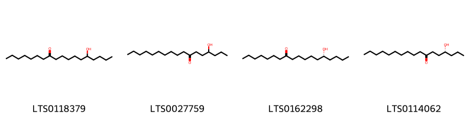{ width=100% }
    <figcaption>Hình ảnh cấu trúc hóa học của 4 hoạt chất thuộc nhóm Fatty Acyls gồm ['14-hydroxyoctadecan-8-one (LTS0118379)', '4-hydroxyheptadecan-7-one (LTS0027759)', '(14r)-14-hydroxyoctadecan-8-one (LTS0162298)', '(4r)-4-hydroxyheptadecan-7-one (LTS0114062)'].</figcaption>
</figure>
#### Nhóm Flavonoids
<figure markdown="span">
    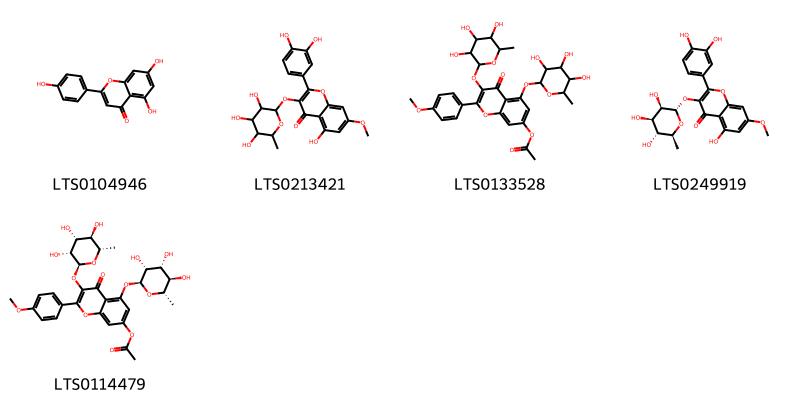{ width=100% }
    <figcaption>Hình ảnh cấu trúc hóa học của 5 hoạt chất thuộc nhóm Flavonoids gồm ['chamomile (LTS0104946)', '2-(3,4-dihydroxyphenyl)-5-hydroxy-7-methoxy-3-[(3,4,5-trihydroxy-6-methyloxan-2-yl)oxy]chromen-4-one (LTS0213421)', '2-(4-methoxyphenyl)-4-oxo-3,5-bis[(3,4,5-trihydroxy-6-methyloxan-2-yl)oxy]chromen-7-yl acetate (LTS0133528)', '2-(3,4-dihydroxyphenyl)-5-hydroxy-7-methoxy-3-{[(2s,3r,4r,5r,6s)-3,4,5-trihydroxy-6-methyloxan-2-yl]oxy}chromen-4-one (LTS0249919)', '2-(4-methoxyphenyl)-4-oxo-3,5-bis({[(2s,3r,4r,5r,6s)-3,4,5-trihydroxy-6-methyloxan-2-yl]oxy})chromen-7-yl acetate (LTS0114479)'].</figcaption>
</figure>
#### Nhóm Furanoid lignans
<figure markdown="span">
    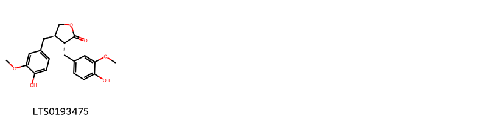{ width=100% }
    <figcaption>Hình ảnh cấu trúc hóa học của 1 hoạt chất thuộc nhóm Furanoid lignans gồm ['matairesinol (LTS0193475)'].</figcaption>
</figure>
#### Nhóm Lactones
<figure markdown="span">
    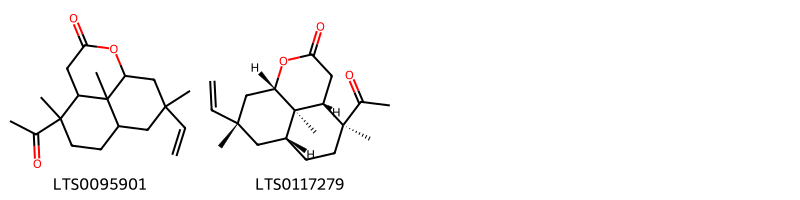{ width=100% }
    <figcaption>Hình ảnh cấu trúc hóa học của 2 hoạt chất thuộc nhóm Lactones gồm ['6-acetyl-11-ethenyl-6,11,13-trimethyl-2-oxatricyclo[7.3.1.0⁵,¹³]tridecan-3-one (LTS0095901)', '(1s,5s,6s,9r,11s,13r)-6-acetyl-11-ethenyl-6,11,13-trimethyl-2-oxatricyclo[7.3.1.0⁵,¹³]tridecan-3-one (LTS0117279)'].</figcaption>
</figure>
#### Nhóm Neoflavonoids
<figure markdown="span">
    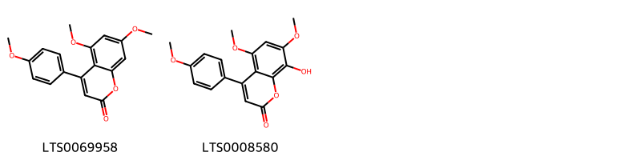{ width=100% }
    <figcaption>Hình ảnh cấu trúc hóa học của 2 hoạt chất thuộc nhóm Neoflavonoids gồm ['5,7-dimethoxy-4-(4-methoxyphenyl)chromen-2-one (LTS0069958)', 'exostemin (LTS0008580)'].</figcaption>
</figure>
#### Nhóm Organooxygen compounds
<figure markdown="span">
    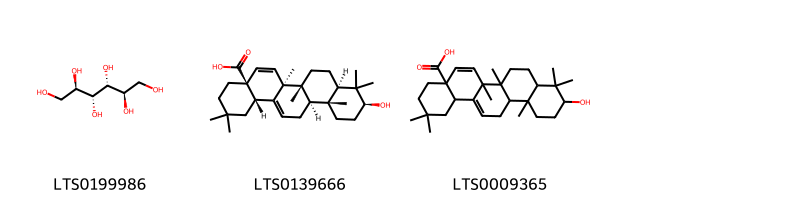{ width=100% }
    <figcaption>Hình ảnh cấu trúc hóa học của 3 hoạt chất thuộc nhóm Organooxygen compounds gồm ['mannitol (LTS0199986)', '(4as,6as,6br,8ar,10s,12ar,12br,14bs)-10-hydroxy-2,2,6a,6b,9,9,12a-heptamethyl-1,3,4,7,8,8a,10,11,12,12b,13,14b-dodecahydropicene-4a-carboxylic acid (LTS0139666)', '10-hydroxy-2,2,6a,6b,9,9,12a-heptamethyl-1,3,4,7,8,8a,10,11,12,12b,13,14b-dodecahydropicene-4a-carboxylic acid (LTS0009365)'].</figcaption>
</figure>
#### Nhóm Prenol lipids
<figure markdown="span">
    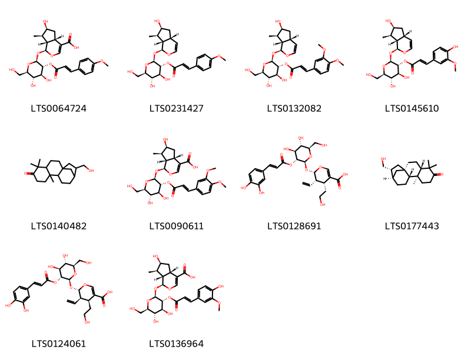{ width=100% }
    <figcaption>Hình ảnh cấu trúc hóa học của 10 hoạt chất thuộc nhóm Prenol lipids gồm ['(1s,4as,6s,7r,7as)-1-{[(2s,3r,4s,5s,6r)-4,5-dihydroxy-6-(hydroxymethyl)-3-{[(2e)-3-(4-methoxyphenyl)prop-2-enoyl]oxy}oxan-2-yl]oxy}-6-hydroxy-7-methyl-1h,4ah,5h,6h,7h,7ah-cyclopenta[c]pyran-4-carboxylic acid (LTS0064724)', '(2s,3r,4s,5s,6r)-2-{[(1s,4ar,6s,7r,7as)-6-hydroxy-7-methyl-1h,4ah,5h,6h,7h,7ah-cyclopenta[c]pyran-1-yl]oxy}-4,5-dihydroxy-6-(hydroxymethyl)oxan-3-yl (2e)-3-(4-methoxyphenyl)prop-2-enoate (LTS0231427)', '(2s,3r,4s,5s,6r)-2-{[(1s,4ar,6s,7r,7as)-6-hydroxy-7-methyl-1h,4ah,5h,6h,7h,7ah-cyclopenta[c]pyran-1-yl]oxy}-4,5-dihydroxy-6-(hydroxymethyl)oxan-3-yl (2e)-3-(3,4-dimethoxyphenyl)prop-2-enoate (LTS0132082)', '(2s,3r,4s,5s,6r)-2-{[(1s,4ar,6s,7r,7as)-6-hydroxy-7-methyl-1h,4ah,5h,6h,7h,7ah-cyclopenta[c]pyran-1-yl]oxy}-4,5-dihydroxy-6-(hydroxymethyl)oxan-3-yl (2e)-3-(4-hydroxy-3-methoxyphenyl)prop-2-enoate (LTS0145610)', '14-(hydroxymethyl)-5,5,9-trimethyltetracyclo[11.2.1.0¹,¹⁰.0⁴,⁹]hexadecan-6-one (LTS0140482)', '(1s,4as,6s,7r,7as)-1-{[(2s,3r,4s,5s,6r)-3-{[(2e)-3-(3,4-dimethoxyphenyl)prop-2-enoyl]oxy}-4,5-dihydroxy-6-(hydroxymethyl)oxan-2-yl]oxy}-6-hydroxy-7-methyl-1h,4ah,5h,6h,7h,7ah-cyclopenta[c]pyran-4-carboxylic acid (LTS0090611)', '(4r,5s,6s)-6-{[(2s,3r,4s,5s,6r)-3-{[(2e)-3-(3,4-dihydroxyphenyl)prop-2-enoyl]oxy}-4,5-dihydroxy-6-(hydroxymethyl)oxan-2-yl]oxy}-5-ethenyl-4-(2-hydroxyethyl)-5,6-dihydro-4h-pyran-3-carboxylic acid (LTS0128691)', '(1s,4s,9s,10r,13r,14r)-14-(hydroxymethyl)-5,5,9-trimethyltetracyclo[11.2.1.0¹,¹⁰.0⁴,⁹]hexadecan-6-one (LTS0177443)', '(4s,5r,6s)-6-{[(2s,3r,4s,5s,6r)-3-{[(2e)-3-(3,4-dihydroxyphenyl)prop-2-enoyl]oxy}-4,5-dihydroxy-6-(hydroxymethyl)oxan-2-yl]oxy}-5-ethenyl-4-(2-hydroxyethyl)-5,6-dihydro-4h-pyran-3-carboxylic acid (LTS0124061)', '(1s,4as,6s,7r,7as)-1-{[(2s,3r,4s,5s,6r)-4,5-dihydroxy-3-{[(2e)-3-(4-hydroxy-3-methoxyphenyl)prop-2-enoyl]oxy}-6-(hydroxymethyl)oxan-2-yl]oxy}-6-hydroxy-7-methyl-1h,4ah,5h,6h,7h,7ah-cyclopenta[c]pyran-4-carboxylic acid (LTS0136964)'].</figcaption>
</figure>

---

### Dược dân tộc học

Danh sách các quốc gia có sử dụng *Chiococca alba* trong điều trị các bệnh. 

| Country            | Disease                                        | Bệnh                                                                                                                                                                                                |
|:-------------------|:-----------------------------------------------|:----------------------------------------------------------------------------------------------------------------------------------------------------------------------------------------------------|
| Dominican Republic | Astringent, Tonic, Emollient, Emetic           | MYMEMORY WARNING: YOU USED ALL AVAILABLE FREE TRANSLATIONS FOR TODAY. NEXT AVAILABLE IN  10 HOURS 52 MINUTES 28 SECONDS VISIT HTTPS://MYMEMORY.TRANSLATED.NET/DOC/USAGELIMITS.PHP TO TRANSLATE MORE |
| Haiti              | Diuretic                                       | MYMEMORY WARNING: YOU USED ALL AVAILABLE FREE TRANSLATIONS FOR TODAY. NEXT AVAILABLE IN  10 HOURS 52 MINUTES 24 SECONDS VISIT HTTPS://MYMEMORY.TRANSLATED.NET/DOC/USAGELIMITS.PHP TO TRANSLATE MORE |
| Latin America      | Diuretic                                       | MYMEMORY WARNING: YOU USED ALL AVAILABLE FREE TRANSLATIONS FOR TODAY. NEXT AVAILABLE IN  10 HOURS 52 MINUTES 21 SECONDS VISIT HTTPS://MYMEMORY.TRANSLATED.NET/DOC/USAGELIMITS.PHP TO TRANSLATE MORE |
| Mexico             | Astringent, Emetic, Purgative, Diuretic, Tonic | MYMEMORY WARNING: YOU USED ALL AVAILABLE FREE TRANSLATIONS FOR TODAY. NEXT AVAILABLE IN  10 HOURS 52 MINUTES 17 SECONDS VISIT HTTPS://MYMEMORY.TRANSLATED.NET/DOC/USAGELIMITS.PHP TO TRANSLATE MORE |
| US                 | Expectorant, Emetic                            | MYMEMORY WARNING: YOU USED ALL AVAILABLE FREE TRANSLATIONS FOR TODAY. NEXT AVAILABLE IN  10 HOURS 52 MINUTES 11 SECONDS VISIT HTTPS://MYMEMORY.TRANSLATED.NET/DOC/USAGELIMITS.PHP TO TRANSLATE MORE |

---

# Chi Richardsonia

??? note "Danh sách các dược liệu thuộc chi"
    
	 - *Richardsonia scabra*

---
## Richardsonia scabra
### Thông tin về thực vật

!!! info "Phân loại thực vật của *Richardia scabra* từ GIBF:"
    - **Kingdom:** Plantae
    - **Phylum:** Tracheophyta
    - **Order:** Gentianales
    - **Family:** Rubiaceae
    - **Genus:** Richardia
    - **Species:** *Richardia scabra*

 

| Label (VI)   | Label (EN)   | Scientific Name     | Descriptions (VI)   | Descriptions (EN)   | Also Known As (VI)   | Also Known As (EN)   |
|:-------------|:-------------|:--------------------|:--------------------|:--------------------|:---------------------|:---------------------|
| N/A          | N/A          | Richardsonia scabra |                     |                     | ['']                 | ['']                 |

#### Phân bố trên thế giới

**Từ CSDL GIBF** nan, Mexico, Brazil, Nicaragua, United States of America, Peru, Belgium, Chile, Colombia, Tanzania, United Republic of, unknown or invalid, Ecuador

#### Phân bố tại Việt Nam

**Từ CSDL GIBF**: Không có ghi nhận ở Việt Nam

---
### Thành phần hóa học
        
- Theo cơ sở dữ liệu lotus: Từ loài *Richardia scabra* đã phân lập và xác định được Chưa có hoạt chất nào được phân lập. hoạt chất thuộc về các nhóm Không có hoạt chất nào được phân lập. 

Không có hình ảnh nào được tạo ra

---

### Dược dân tộc học

Danh sách các quốc gia có sử dụng *Richardia scabra* trong điều trị các bệnh. 

| Country   | Disease   | Bệnh                                                                                                                                                                                                |
|:----------|:----------|:----------------------------------------------------------------------------------------------------------------------------------------------------------------------------------------------------|
| Venezuela | Emetic    | MYMEMORY WARNING: YOU USED ALL AVAILABLE FREE TRANSLATIONS FOR TODAY. NEXT AVAILABLE IN  10 HOURS 51 MINUTES 36 SECONDS VISIT HTTPS://MYMEMORY.TRANSLATED.NET/DOC/USAGELIMITS.PHP TO TRANSLATE MORE |

---

# Chi Isertia

??? note "Danh sách các dược liệu thuộc chi"
    
	 - *Isertia pittieri*

---
## Isertia pittieri
### Thông tin về thực vật

!!! info "Phân loại thực vật của *Isertia pittieri* từ GIBF:"
    - **Kingdom:** Plantae
    - **Phylum:** Tracheophyta
    - **Order:** Gentianales
    - **Family:** Rubiaceae
    - **Genus:** Isertia
    - **Species:** *Isertia pittieri*

 

| Label (VI)   | Label (EN)   | Scientific Name   | Descriptions (VI)   | Descriptions (EN)   | Also Known As (VI)   | Also Known As (EN)   |
|:-------------|:-------------|:------------------|:--------------------|:--------------------|:---------------------|:---------------------|
| N/A          | N/A          | Isertia pittieri  | loài thực vật       | species of plant    | ['']                 | ['']                 |

#### Phân bố trên thế giới

**Từ CSDL GIBF** Colombia, Ecuador

#### Phân bố tại Việt Nam

**Từ CSDL GIBF**: Không có ghi nhận ở Việt Nam

---
### Thành phần hóa học
        
- Theo cơ sở dữ liệu lotus: Từ loài *Isertia pittieri* đã phân lập và xác định được 16 hoạt chất thuộc về các nhóm Prenol lipids, Organooxygen compounds. 

|    | chemicalTaxonomyClassyfireClass   |   smiles_count |
|---:|:----------------------------------|---------------:|
|  0 | Organooxygen compounds            |              8 |
|  1 | Prenol lipids                     |              8 |

#### Nhóm Organooxygen compounds
<figure markdown="span">
    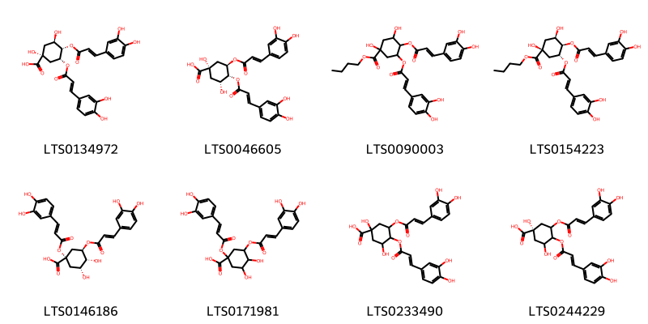{ width=100% }
    <figcaption>Hình ảnh cấu trúc hóa học của 8 hoạt chất thuộc nhóm Organooxygen compounds gồm ['3,4-dicaffeoylquinic acid (LTS0134972)', '4,5-dicaffeoylquinic acid (LTS0046605)', 'butyl 3,4-bis({[3-(3,4-dihydroxyphenyl)prop-2-enoyl]oxy})-1,5-dihydroxycyclohexane-1-carboxylate (LTS0090003)', 'butyl (1s,3r,4r,5r)-3,4-bis({[(2e)-3-(3,4-dihydroxyphenyl)prop-2-enoyl]oxy})-1,5-dihydroxycyclohexane-1-carboxylate (LTS0154223)', '(1s,3r,4r,5r)-1,3-bis({[(2e)-3-(3,4-dihydroxyphenyl)prop-2-enoyl]oxy})-4,5-dihydroxycyclohexane-1-carboxylic acid (LTS0146186)', '1,3-bis({[3-(3,4-dihydroxyphenyl)prop-2-enoyl]oxy})-4,5-dihydroxycyclohexane-1-carboxylic acid (LTS0171981)', '3,4-bis({[3-(3,4-dihydroxyphenyl)prop-2-enoyl]oxy})-1,5-dihydroxycyclohexane-1-carboxylic acid (LTS0233490)', '(1s)-3,4-bis({[3-(3,4-dihydroxyphenyl)prop-2-enoyl]oxy})-1,5-dihydroxycyclohexane-1-carboxylic acid (LTS0244229)'].</figcaption>
</figure>
#### Nhóm Prenol lipids
<figure markdown="span">
    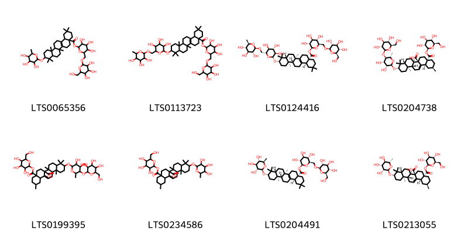{ width=100% }
    <figcaption>Hình ảnh cấu trúc hóa học của 8 hoạt chất thuộc nhóm Prenol lipids gồm ['3,4,5-trihydroxy-6-({[3,4,5-trihydroxy-6-(hydroxymethyl)oxan-2-yl]oxy}methyl)oxan-2-yl 2,2,6b,9,9,12a-hexamethyl-10-[(3,4,5-trihydroxy-6-methyloxan-2-yl)oxy]-3,4,5,6,7,8,8a,10,11,12,12b,13,14,14b-tetradecahydro-1h-picene-4a-carboxylate (LTS0065356)', '3,4,5-trihydroxy-6-({[3,4,5-trihydroxy-6-(hydroxymethyl)oxan-2-yl]oxy}methyl)oxan-2-yl 2,2,6b,9,9,12a-hexamethyl-10-[(3,4,5-trihydroxy-6-{[(3,4,5-trihydroxy-6-methyloxan-2-yl)oxy]methyl}oxan-2-yl)oxy]-3,4,5,6,7,8,8a,10,11,12,12b,13,14,14b-tetradecahydro-1h-picene-4a-carboxylate (LTS0113723)', '(2s,3r,4s,5s,6r)-3,4,5-trihydroxy-6-({[(2r,3r,4s,5s,6r)-3,4,5-trihydroxy-6-(hydroxymethyl)oxan-2-yl]oxy}methyl)oxan-2-yl (4as,6br,8ar,10s,12ar,12br,14bs)-2,2,6b,9,9,12a-hexamethyl-10-{[(2r,3r,4s,5s,6r)-3,4,5-trihydroxy-6-({[(2r,3r,4s,5s,6r)-3,4,5-trihydroxy-6-methyloxan-2-yl]oxy}methyl)oxan-2-yl]oxy}-3,4,5,6,7,8,8a,10,11,12,12b,13,14,14b-tetradecahydro-1h-picene-4a-carboxylate (LTS0124416)', '(2r,4as,6ar,6br,8ar,10s,12ar,12br,14bs)-10-{[(2r,3r,4s,5r,6s)-3,4-dihydroxy-6-methyl-5-{[(2s,3r,4s,5s,6r)-3,4,5-trihydroxy-6-(hydroxymethyl)oxan-2-yl]oxy}oxan-2-yl]oxy}-2,6b,9,9,12a-pentamethyl-4a-({[(2s,3r,4s,5s,6r)-3,4,5-trihydroxy-6-(hydroxymethyl)oxan-2-yl]oxy}carbonyl)-2,3,4,5,6,7,8,8a,10,11,12,12b,13,14b-tetradecahydro-1h-picene-6a-carboxylic acid (LTS0204738)', '10-[(3,4-dihydroxy-6-methyl-5-{[3,4,5-trihydroxy-6-(hydroxymethyl)oxan-2-yl]oxy}oxan-2-yl)oxy]-2,6b,9,9,12a-pentamethyl-4a-({[3,4,5-trihydroxy-6-(hydroxymethyl)oxan-2-yl]oxy}carbonyl)-2,3,4,5,6,7,8,8a,10,11,12,12b,13,14b-tetradecahydro-1h-picene-6a-carboxylic acid (LTS0199395)', '2,6b,9,9,12a-pentamethyl-4a-({[3,4,5-trihydroxy-6-(hydroxymethyl)oxan-2-yl]oxy}carbonyl)-10-[(3,4,5-trihydroxy-6-methyloxan-2-yl)oxy]-2,3,4,5,6,7,8,8a,10,11,12,12b,13,14b-tetradecahydro-1h-picene-6a-carboxylic acid (LTS0234586)', '(2s,3r,4s,5s,6r)-3,4,5-trihydroxy-6-({[(2r,3r,4s,5s,6r)-3,4,5-trihydroxy-6-(hydroxymethyl)oxan-2-yl]oxy}methyl)oxan-2-yl (4as,6br,8ar,10s,12ar,12br,14bs)-2,2,6b,9,9,12a-hexamethyl-10-{[(2r,3r,4s,5s,6r)-3,4,5-trihydroxy-6-methyloxan-2-yl]oxy}-3,4,5,6,7,8,8a,10,11,12,12b,13,14,14b-tetradecahydro-1h-picene-4a-carboxylate (LTS0204491)', '(2r,4as,6ar,6br,8ar,10s,12ar,12br,14bs)-2,6b,9,9,12a-pentamethyl-4a-({[(2s,3r,4s,5s,6r)-3,4,5-trihydroxy-6-(hydroxymethyl)oxan-2-yl]oxy}carbonyl)-10-{[(2r,3r,4r,5r,6s)-3,4,5-trihydroxy-6-methyloxan-2-yl]oxy}-2,3,4,5,6,7,8,8a,10,11,12,12b,13,14b-tetradecahydro-1h-picene-6a-carboxylic acid (LTS0213055)'].</figcaption>
</figure>

---

### Dược dân tộc học

Danh sách các quốc gia có sử dụng *Isertia pittieri* trong điều trị các bệnh. 

| Country       | Disease   | Bệnh                                                                                                                                                                                                |
|:--------------|:----------|:----------------------------------------------------------------------------------------------------------------------------------------------------------------------------------------------------|
| Elsewhere     | Soap      | MYMEMORY WARNING: YOU USED ALL AVAILABLE FREE TRANSLATIONS FOR TODAY. NEXT AVAILABLE IN  10 HOURS 51 MINUTES 10 SECONDS VISIT HTTPS://MYMEMORY.TRANSLATED.NET/DOC/USAGELIMITS.PHP TO TRANSLATE MORE |
| Panama(Choco) | Soap      | MYMEMORY WARNING: YOU USED ALL AVAILABLE FREE TRANSLATIONS FOR TODAY. NEXT AVAILABLE IN  10 HOURS 51 MINUTES 06 SECONDS VISIT HTTPS://MYMEMORY.TRANSLATED.NET/DOC/USAGELIMITS.PHP TO TRANSLATE MORE |
| South America | Soap      | MYMEMORY WARNING: YOU USED ALL AVAILABLE FREE TRANSLATIONS FOR TODAY. NEXT AVAILABLE IN  10 HOURS 51 MINUTES 02 SECONDS VISIT HTTPS://MYMEMORY.TRANSLATED.NET/DOC/USAGELIMITS.PHP TO TRANSLATE MORE |

---

# Chi Coprosma

??? note "Danh sách các dược liệu thuộc chi"
    
	 - *Coprosma australis*

---
## Coprosma australis
### Thông tin về thực vật

!!! info "Phân loại thực vật của *Coprosma lucida* từ GIBF:"
    - **Kingdom:** Plantae
    - **Phylum:** Tracheophyta
    - **Order:** Gentianales
    - **Family:** Rubiaceae
    - **Genus:** Coprosma
    - **Species:** *Coprosma lucida*

 

| Label (VI)   | Label (EN)   | Scientific Name    | Descriptions (VI)   | Descriptions (EN)   | Also Known As (VI)   | Also Known As (EN)   |
|:-------------|:-------------|:-------------------|:--------------------|:--------------------|:---------------------|:---------------------|
| N/A          | N/A          | Coprosma australis | loài thực vật       | species of plant    | ['']                 | ['']                 |

#### Phân bố trên thế giới

**Từ CSDL GIBF** nan, New Zealand

#### Phân bố tại Việt Nam

**Từ CSDL GIBF**: Không có ghi nhận ở Việt Nam

---
### Thành phần hóa học
        
- Theo cơ sở dữ liệu lotus: Từ loài *Coprosma lucida* đã phân lập và xác định được Chưa có hoạt chất nào được phân lập. hoạt chất thuộc về các nhóm Không có hoạt chất nào được phân lập. 

Không có hình ảnh nào được tạo ra

---

### Dược dân tộc học

Danh sách các quốc gia có sử dụng *Coprosma lucida* trong điều trị các bệnh. 

| Country     | Disease   | Bệnh                                                                                                                                                                                                |
|:------------|:----------|:----------------------------------------------------------------------------------------------------------------------------------------------------------------------------------------------------|
| New Zealand | Poultice  | MYMEMORY WARNING: YOU USED ALL AVAILABLE FREE TRANSLATIONS FOR TODAY. NEXT AVAILABLE IN  10 HOURS 50 MINUTES 25 SECONDS VISIT HTTPS://MYMEMORY.TRANSLATED.NET/DOC/USAGELIMITS.PHP TO TRANSLATE MORE |

---

# Chi Borreria

??? note "Danh sách các dược liệu thuộc chi"
    
	 - *Borreria articularis*
	 - *Borreria latifolia*

---
## Borreria articularis
### Thông tin về thực vật

!!! info "Phân loại thực vật của *Spermacoce articularis* từ GIBF:"
    - **Kingdom:** Plantae
    - **Phylum:** Tracheophyta
    - **Order:** Gentianales
    - **Family:** Rubiaceae
    - **Genus:** Spermacoce
    - **Species:** *Spermacoce articularis*

 

| Label (VI)   | Label (EN)   | Scientific Name      | Descriptions (VI)   | Descriptions (EN)   | Also Known As (VI)   | Also Known As (EN)   |
|:-------------|:-------------|:---------------------|:--------------------|:--------------------|:---------------------|:---------------------|
| N/A          | N/A          | Borreria articularis | loài thực vật       | species of plant    | ['']                 | ['']                 |

#### Phân bố trên thế giới

**Từ CSDL GIBF** nan, Sri Lanka, Viet Nam, Japan, Indonesia, Chinese Taipei, Philippines, China, Malaysia, India, unknown or invalid

#### Phân bố tại Việt Nam

**Từ CSDL GIBF**: Không có ghi nhận ở Việt Nam

---
### Thành phần hóa học
        
- Theo cơ sở dữ liệu lotus: Từ loài *Spermacoce articularis* đã phân lập và xác định được Chưa có hoạt chất nào được phân lập. hoạt chất thuộc về các nhóm Không có hoạt chất nào được phân lập. 

Không có hình ảnh nào được tạo ra

---

### Dược dân tộc học

Danh sách các quốc gia có sử dụng *Spermacoce articularis* trong điều trị các bệnh. 

| Country   | Disease   | Bệnh                                                                                                                                                                                                |
|:----------|:----------|:----------------------------------------------------------------------------------------------------------------------------------------------------------------------------------------------------|
| Elsewhere | Poultice  | MYMEMORY WARNING: YOU USED ALL AVAILABLE FREE TRANSLATIONS FOR TODAY. NEXT AVAILABLE IN  10 HOURS 50 MINUTES 00 SECONDS VISIT HTTPS://MYMEMORY.TRANSLATED.NET/DOC/USAGELIMITS.PHP TO TRANSLATE MORE |
| India     | Stimulant | MYMEMORY WARNING: YOU USED ALL AVAILABLE FREE TRANSLATIONS FOR TODAY. NEXT AVAILABLE IN  10 HOURS 49 MINUTES 57 SECONDS VISIT HTTPS://MYMEMORY.TRANSLATED.NET/DOC/USAGELIMITS.PHP TO TRANSLATE MORE |

---

---
## Borreria latifolia
### Thông tin về thực vật

!!! info "Phân loại thực vật của *Spermacoce latifolia* từ GIBF:"
    - **Kingdom:** Plantae
    - **Phylum:** Tracheophyta
    - **Order:** Gentianales
    - **Family:** Rubiaceae
    - **Genus:** Spermacoce
    - **Species:** *Spermacoce latifolia*

 

| Label (VI)   | Label (EN)   | Scientific Name    | Descriptions (VI)   | Descriptions (EN)   | Also Known As (VI)   | Also Known As (EN)   |
|:-------------|:-------------|:-------------------|:--------------------|:--------------------|:---------------------|:---------------------|
| N/A          | N/A          | Borreria latifolia | loài thực vật       | species of plant    | ['']                 | ['']                 |

#### Phân bố trên thế giới

**Từ CSDL GIBF** Brazil, Guatemala, Nicaragua, Mexico, China, Suriname, Colombia, Argentina, Venezuela (Bolivarian Republic of), French Guiana, Guyana, Guinea, Ghana

#### Phân bố tại Việt Nam

**Từ CSDL GIBF**: Không có ghi nhận ở Việt Nam

---
### Thành phần hóa học
        
- Theo cơ sở dữ liệu lotus: Từ loài *Spermacoce latifolia* đã phân lập và xác định được Chưa có hoạt chất nào được phân lập. hoạt chất thuộc về các nhóm Không có hoạt chất nào được phân lập. 

Không có hình ảnh nào được tạo ra

---

### Dược dân tộc học

Danh sách các quốc gia có sử dụng *Spermacoce latifolia* trong điều trị các bệnh. 

| Country   | Disease   | Bệnh                                                                                                                                                                                                |
|:----------|:----------|:----------------------------------------------------------------------------------------------------------------------------------------------------------------------------------------------------|
| Elsewhere | Diuretic  | MYMEMORY WARNING: YOU USED ALL AVAILABLE FREE TRANSLATIONS FOR TODAY. NEXT AVAILABLE IN  10 HOURS 49 MINUTES 22 SECONDS VISIT HTTPS://MYMEMORY.TRANSLATED.NET/DOC/USAGELIMITS.PHP TO TRANSLATE MORE |

---

# Chi Cephaelis

??? note "Danh sách các dược liệu thuộc chi"
    
	 - *Cephaelis ipecacuanha*
	 - *Cephaelis tomentosa*

---
## Cephaelis ipecacuanha
### Thông tin về thực vật

!!! info "Phân loại thực vật của *Carapichea ipecacuanha* từ GIBF:"
    - **Kingdom:** Plantae
    - **Phylum:** Tracheophyta
    - **Order:** Gentianales
    - **Family:** Rubiaceae
    - **Genus:** Carapichea
    - **Species:** *Carapichea ipecacuanha*

 

| Label (VI)   | Label (EN)   | Scientific Name       | Descriptions (VI)   | Descriptions (EN)   | Also Known As (VI)   | Also Known As (EN)   |
|:-------------|:-------------|:----------------------|:--------------------|:--------------------|:---------------------|:---------------------|
| N/A          | N/A          | Cephaelis ipecacuanha |                     | species of plant    | ['']                 | ['']                 |

#### Phân bố trên thế giới

**Từ CSDL GIBF** nan, Brazil, United States of America, Malaysia, Costa Rica, Colombia, India, unknown or invalid, Panama

#### Phân bố tại Việt Nam

**Từ CSDL GIBF**: Không có ghi nhận ở Việt Nam

---
### Thành phần hóa học
        
- Theo cơ sở dữ liệu lotus: Từ loài *Carapichea ipecacuanha* đã phân lập và xác định được Chưa có hoạt chất nào được phân lập. hoạt chất thuộc về các nhóm Không có hoạt chất nào được phân lập. 

Không có hình ảnh nào được tạo ra

---

### Dược dân tộc học

Danh sách các quốc gia có sử dụng *Carapichea ipecacuanha* trong điều trị các bệnh. 

| Country       | Disease                                                                                    | Bệnh                                                                                                                                                                                                |
|:--------------|:-------------------------------------------------------------------------------------------|:----------------------------------------------------------------------------------------------------------------------------------------------------------------------------------------------------|
| Elsewhere     | Astringent, Emetic, Emetic, Expectorant, Expectorant, Diaphoretic, Apertif, Emetic, Emetic | MYMEMORY WARNING: YOU USED ALL AVAILABLE FREE TRANSLATIONS FOR TODAY. NEXT AVAILABLE IN  10 HOURS 48 MINUTES 49 SECONDS VISIT HTTPS://MYMEMORY.TRANSLATED.NET/DOC/USAGELIMITS.PHP TO TRANSLATE MORE |
| France        | Emetic                                                                                     | MYMEMORY WARNING: YOU USED ALL AVAILABLE FREE TRANSLATIONS FOR TODAY. NEXT AVAILABLE IN  10 HOURS 48 MINUTES 46 SECONDS VISIT HTTPS://MYMEMORY.TRANSLATED.NET/DOC/USAGELIMITS.PHP TO TRANSLATE MORE |
| Japan*        | Emetic, Expectorant                                                                        | MYMEMORY WARNING: YOU USED ALL AVAILABLE FREE TRANSLATIONS FOR TODAY. NEXT AVAILABLE IN  10 HOURS 48 MINUTES 43 SECONDS VISIT HTTPS://MYMEMORY.TRANSLATED.NET/DOC/USAGELIMITS.PHP TO TRANSLATE MORE |
| South America | Poison                                                                                     | MYMEMORY WARNING: YOU USED ALL AVAILABLE FREE TRANSLATIONS FOR TODAY. NEXT AVAILABLE IN  10 HOURS 48 MINUTES 40 SECONDS VISIT HTTPS://MYMEMORY.TRANSLATED.NET/DOC/USAGELIMITS.PHP TO TRANSLATE MORE |
| Turkey        | Cholagogue, Emetic, Hemostat, Poison, Sternutatory, Sudorific, Expectorant                 | MYMEMORY WARNING: YOU USED ALL AVAILABLE FREE TRANSLATIONS FOR TODAY. NEXT AVAILABLE IN  10 HOURS 48 MINUTES 36 SECONDS VISIT HTTPS://MYMEMORY.TRANSLATED.NET/DOC/USAGELIMITS.PHP TO TRANSLATE MORE |

---

---
## Cephaelis tomentosa
### Thông tin về thực vật

!!! info "Phân loại thực vật của *Palicourea tomentosa* từ GIBF:"
    - **Kingdom:** Plantae
    - **Phylum:** Tracheophyta
    - **Order:** Gentianales
    - **Family:** Rubiaceae
    - **Genus:** Palicourea
    - **Species:** *Palicourea tomentosa*

 

| Label (VI)   | Label (EN)   | Scientific Name     | Descriptions (VI)   | Descriptions (EN)   | Also Known As (VI)   | Also Known As (EN)   |
|:-------------|:-------------|:--------------------|:--------------------|:--------------------|:---------------------|:---------------------|
| N/A          | N/A          | Cephaelis tomentosa | loài thực vật       | species of plant    | ['']                 | ['']                 |

#### Phân bố trên thế giới

**Từ CSDL GIBF** nan, Brazil, Guatemala, Suriname, Honduras, Ecuador, Trinidad and Tobago, United States of America, Costa Rica, Colombia, unknown or invalid, French Guiana, Mexico, Panama, Nicaragua, Peru, Bolivia (Plurinational State of), Belize, Venezuela (Bolivarian Republic of)

#### Phân bố tại Việt Nam

**Từ CSDL GIBF**: Không có ghi nhận ở Việt Nam

---
### Thành phần hóa học
        
- Theo cơ sở dữ liệu lotus: Từ loài *Palicourea tomentosa* đã phân lập và xác định được Chưa có hoạt chất nào được phân lập. hoạt chất thuộc về các nhóm Không có hoạt chất nào được phân lập. 

Không có hình ảnh nào được tạo ra

---

### Dược dân tộc học

Danh sách các quốc gia có sử dụng *Palicourea tomentosa* trong điều trị các bệnh. 

| Country   | Disease     | Bệnh                                                                                                                                                                                                |
|:----------|:------------|:----------------------------------------------------------------------------------------------------------------------------------------------------------------------------------------------------|
| Elsewhere | Emmenagogue | MYMEMORY WARNING: YOU USED ALL AVAILABLE FREE TRANSLATIONS FOR TODAY. NEXT AVAILABLE IN  10 HOURS 48 MINUTES 15 SECONDS VISIT HTTPS://MYMEMORY.TRANSLATED.NET/DOC/USAGELIMITS.PHP TO TRANSLATE MORE |

---

# Chi Morinda

??? note "Danh sách các dược liệu thuộc chi"
    
	 - *Morinda citrifolia*
	 - *Morinda lucida*
	 - *Morinda royoc*
	 - *Morinda yucatanensis*

---
## Morinda citrifolia
### Thông tin về thực vật

!!! info "Phân loại thực vật của *Morinda citrifolia* từ GIBF:"
    - **Kingdom:** Plantae
    - **Phylum:** Tracheophyta
    - **Order:** Gentianales
    - **Family:** Rubiaceae
    - **Genus:** Morinda
    - **Species:** *Morinda citrifolia*

 

| Label (VI)   | Label (EN)   | Scientific Name    | Descriptions (VI)   | Descriptions (EN)   | Also Known As (VI)   | Also Known As (EN)                                                                             |
|:-------------|:-------------|:-------------------|:--------------------|:--------------------|:---------------------|:-----------------------------------------------------------------------------------------------|
| N/A          | N/A          | Morinda citrifolia | loài thực vật       | species of plant    | ['']                 | ['Nono', 'Noni', 'Nonu', 'beach mulberry', 'cheese fruit', 'great morinda', 'Indian mulberry'] |

#### Phân bố trên thế giới

**Từ CSDL GIBF** Brazil, Virgin Islands (British), Viet Nam, Guadeloupe, New Caledonia, Antigua and Barbuda, Honduras, French Polynesia, Thailand, Puerto Rico, Sri Lanka, Réunion, United States of America, Jamaica, Tonga, Virgin Islands (U.S.), Indonesia, Seychelles, Costa Rica, Dominican Republic, Colombia, Guyana, Cuba, French Guiana, Grenada, Fiji, Mexico, Niue, Maldives, Guam, Montserrat, Chinese Taipei, Malaysia, Philippines, Panama, Nicaragua, Singapore, Martinique, Australia, Micronesia (Federated States of), India, Northern Mariana Islands, Peru, Belize

#### Phân bố tại Việt Nam

**Từ CSDL GIBF**: Hồ Chí Minh city

---
### Thành phần hóa học
        
- Theo cơ sở dữ liệu lotus: Từ loài *Morinda citrifolia* đã phân lập và xác định được 253 hoạt chất thuộc về các nhóm Fatty Acyls, Carboxylic acids and derivatives, Coumarins and derivatives, Phenols, Organooxygen compounds, Lignan lactones, Saccharolipids, Benzodioxanes, Lactones, Benzene and substituted derivatives, Steroids and steroid derivatives, Glycerolipids, Furanoid lignans, 2-arylbenzofuran flavonoids, Linear 1,3-diarylpropanoids, Flavonoids, Anthracenes, Pyrimidine nucleosides, Prenol lipids. 

|    | chemicalTaxonomyClassyfireClass     |   smiles_count |
|---:|:------------------------------------|---------------:|
|  0 | 2-arylbenzofuran flavonoids         |              6 |
|  1 | Anthracenes                         |             56 |
|  2 | Benzene and substituted derivatives |              3 |
|  3 | Benzodioxanes                       |             15 |
|  4 | Carboxylic acids and derivatives    |              1 |
|  5 | Coumarins and derivatives           |              4 |
|  6 | Fatty Acyls                         |             18 |
|  7 | Flavonoids                          |             21 |
|  8 | Furanoid lignans                    |             15 |
|  9 | Glycerolipids                       |              3 |
| 10 | Lactones                            |              4 |
| 11 | Lignan lactones                     |              2 |
| 12 | Linear 1,3-diarylpropanoids         |              1 |
| 13 | Organooxygen compounds              |             42 |
| 14 | Phenols                             |              5 |
| 15 | Prenol lipids                       |             36 |
| 16 | Pyrimidine nucleosides              |              3 |
| 17 | Saccharolipids                      |              4 |
| 18 | Steroids and steroid derivatives    |             14 |

#### Nhóm 2-arylbenzofuran flavonoids
<figure markdown="span">
    { width=100% }
    <figcaption>Hình ảnh cấu trúc hóa học của 6 hoạt chất thuộc nhóm 2-arylbenzofuran flavonoids gồm ['balanophonin (LTS0039496)', '(2e)-3-[(2r,3s)-2-(4-hydroxy-3-methoxyphenyl)-3-(hydroxymethyl)-7-methoxy-2,3-dihydro-1-benzofuran-5-yl]prop-2-enal (LTS0130349)', '(2e)-3-[(2s,3r)-2-(3,4-dihydroxyphenyl)-7-hydroxy-3-(hydroxymethyl)-2,3-dihydro-1-benzofuran-5-yl]prop-2-enoic acid (LTS0274715)', '3-[2-(4-hydroxy-3-methoxyphenyl)-3-(hydroxymethyl)-7-methoxy-2,3-dihydro-1-benzofuran-5-yl]prop-2-enal (LTS0233365)', '(2e)-3-[(2s,3r)-2-(3,4-dihydroxyphenyl)-7-hydroxy-3-(hydroxymethyl)-2,3-dihydro-1-benzofuran-6-yl]prop-2-enoic acid (LTS0049041)', '3-[2-(3,4-dihydroxyphenyl)-7-hydroxy-3-(hydroxymethyl)-2,3-dihydro-1-benzofuran-5-yl]prop-2-enoic acid (LTS0086464)'].</figcaption>
</figure>
#### Nhóm Anthracenes
<figure markdown="span">
    { width=100% }
    <figcaption>Hình ảnh cấu trúc hóa học của 56 hoạt chất thuộc nhóm Anthracenes gồm ['1,3,5-trihydroxy-2-methyl-6-[(3,4,5-trihydroxy-6-{[(3,4,5-trihydroxyoxan-2-yl)oxy]methyl}oxan-2-yl)oxy]anthracene-9,10-dione (LTS0136996)', '1,5-dihydroxy-2-methoxy-6-methylanthracene-9,10-dione (LTS0133474)', '2-hydroxy-1,3-dimethoxyanthracene-9,10-dione (LTS0112757)', '1,6-dihydroxy-2-methylanthracene-9,10-dione (LTS0198219)', 'morindin (LTS0237459)', 'alizarin (LTS0078250)', '1,8-dihydroxy-2-methoxy-7-methylanthracene-9,10-dione (LTS0226498)', '1-hydroxy-2-(hydroxymethyl)-3-{[(2s,3r,4s,5s,6r)-3,4,5-trihydroxy-6-({[(2s,3r,4s,5r)-3,4,5-trihydroxyoxan-2-yl]oxy}methyl)oxan-2-yl]oxy}anthracene-9,10-dione (LTS0070919)', '6-hydroxy-1-methoxy-2-methylanthracene-9,10-dione (LTS0100345)', 'morindone (LTS0113222)', '1-hydroxy-2-(hydroxymethyl)-3-methoxyanthracene-9,10-dione (LTS0049762)', '2-hydroxy-3-methoxyanthracene-9,10-dione (LTS0269450)', '1,6-dihydroxy-5-methoxy-2-(methoxymethyl)anthracene-9,10-dione (LTS0135809)', '1,6-dihydroxy-5-methoxy-2-methylanthracene-9,10-dione (LTS0205253)', 'alizarin 2-methyl ether (LTS0144223)', '1,3-dihydroxy-2-(methoxymethoxy)anthracene-9,10-dione (LTS0165108)', '1,7-dihydroxy-6-methyl-2-{[(2s,3r,4s,5s,6r)-3,4,5-trihydroxy-6-({[(2s,3r,4s,5r)-3,4,5-trihydroxyoxan-2-yl]oxy}methyl)oxan-2-yl]oxy}anthracene-9,10-dione (LTS0199145)', '1,3,6-trihydroxy-2-methoxyanthracene-9,10-dione (LTS0142919)', '2-hydroxy-1,5-dimethoxy-6-(methoxymethyl)anthracene-9,10-dione (LTS0152063)', 'purpurin 1-methyl ether (LTS0141536)', '1,3-dihydroxy-9,10-dioxoanthracene-2-carbaldehyde (LTS0209427)', '2-(hydroxymethyl)-1-methoxy-3-[(3,4,5-trihydroxy-6-{[(3,4,5-trihydroxyoxan-2-yl)oxy]methyl}oxan-2-yl)oxy]anthracene-9,10-dione (LTS0098479)', '5-methoxy-2,2-dimethyl-4h-1,3-dioxatetracene-6,11-dione (LTS0238137)', '1,3-dihydroxy-2-methoxyanthracene-9,10-dione (LTS0102506)', 'rubiadin (LTS0185641)', '2-hydroxy-3-(hydroxymethyl)anthracene-9,10-dione (LTS0114515)', '1,3,5-trihydroxy-2-methyl-6-{[(2s,3r,4s,5s,6r)-3,4,5-trihydroxy-6-({[(2s,3r,4s,5r)-3,4,5-trihydroxyoxan-2-yl]oxy}methyl)oxan-2-yl]oxy}anthracene-9,10-dione (LTS0188907)', '3-hydroxy-1-methoxy-2-methylanthracene-9,10-dione (LTS0114645)', '1,3,6-trihydroxy-2-methylanthracene-9,10-dione (LTS0193219)', 'henine (LTS0208313)', 'hydroxyanthraquinone (LTS0273108)', '1,3,5,6-tetrahydroxy-2-methylanthracene-9,10-dione (LTS0061047)', 'lucidin ω-methyl ether (LTS0261324)', 'damnacanthol (LTS0215557)', '1,7-dihydroxy-6-methyl-2-[(3,4,5-trihydroxy-6-{[(3,4,5-trihydroxyoxan-2-yl)oxy]methyl}oxan-2-yl)oxy]anthracene-9,10-dione (LTS0037835)', '3-hydroxy-1-methylanthracene-9,10-dione (LTS0024888)', '1,5,6-trihydroxy-2-(hydroxymethyl)-3-{[(2s,3r,4s,5s,6r)-3,4,5-trihydroxy-6-({[(2s,3r,4s,5r)-3,4,5-trihydroxyoxan-2-yl]oxy}methyl)oxan-2-yl]oxy}anthracene-9,10-dione (LTS0019402)', '1-hydroxy-2-(hydroxymethyl)-3-[(3,4,5-trihydroxy-6-{[(3,4,5-trihydroxyoxan-2-yl)oxy]methyl}oxan-2-yl)oxy]anthracene-9,10-dione (LTS0237319)', '1,5,6-trihydroxy-2-(hydroxymethyl)-3-[(3,4,5-trihydroxy-6-{[(3,4,5-trihydroxyoxan-2-yl)oxy]methyl}oxan-2-yl)oxy]anthracene-9,10-dione (LTS0240770)', '2-hydroxy-1-methoxyanthracene-9,10-dione (LTS0230955)', '1,8-dihydroxy-2-(hydroxymethyl)-5-methoxyanthracene-9,10-dione (LTS0237077)', '6-hydroxy-1,3-dimethoxy-7-methylanthracene-9,10-dione (LTS0247880)', '1-hydroxy-9,10-dioxoanthracene-2-carbaldehyde (LTS0188320)', 'damnacanthal (LTS0230399)', '2-(hydroxymethyl)-1-methoxy-3-{[(2s,3r,4s,5s,6r)-3,4,5-trihydroxy-6-({[(2s,3r,4s,5r)-3,4,5-trihydroxyoxan-2-yl]oxy}methyl)oxan-2-yl]oxy}anthracene-9,10-dione (LTS0187806)', '1-hydroxy-2-methylanthracene-9,10-dione (LTS0012871)', '2-ethoxy-1-hydroxyanthracene-9,10-dione (LTS0058419)', 'physcion (LTS0052688)', '1,2,5-trihydroxy-3-methylanthracene-9,10-dione (LTS0221695)', '2,6-dihydroxy-1,3-dimethoxyanthracene-9,10-dione (LTS0114699)', '3-hydroxy-1-methoxyanthracene-9,10-dione (LTS0135127)', '2-(ethoxymethyl)-1,3-dihydroxyanthracene-9,10-dione (LTS0034783)', '2-hydroxy-1-methoxy-7-methylanthracene-9,10-dione (LTS0242388)', '1,2,7-trihydroxy-6-methylanthracene-9,10-dione (LTS0088202)', '1,5-dihydroxy-2-methyl-6-[(3,4,5-trihydroxy-6-{[(3,4,5-trihydroxyoxan-2-yl)oxy]methyl}oxan-2-yl)oxy]anthracene-9,10-dione (LTS0120522)', '1,3,5,6-tetrahydroxy-2-(hydroxymethyl)anthracene-9,10-dione (LTS0090415)'].</figcaption>
</figure>
#### Nhóm Benzene and substituted derivatives
<figure markdown="span">
    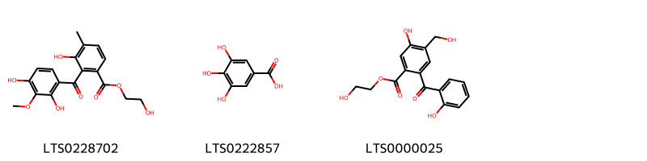{ width=100% }
    <figcaption>Hình ảnh cấu trúc hóa học của 3 hoạt chất thuộc nhóm Benzene and substituted derivatives gồm ['2-hydroxyethyl 2-(2,4-dihydroxy-3-methoxybenzoyl)-3-hydroxy-4-methylbenzoate (LTS0228702)', 'galop (LTS0222857)', '2-hydroxyethyl 5-hydroxy-2-(2-hydroxybenzoyl)-4-(hydroxymethyl)benzoate (LTS0000025)'].</figcaption>
</figure>
#### Nhóm Benzodioxanes
<figure markdown="span">
    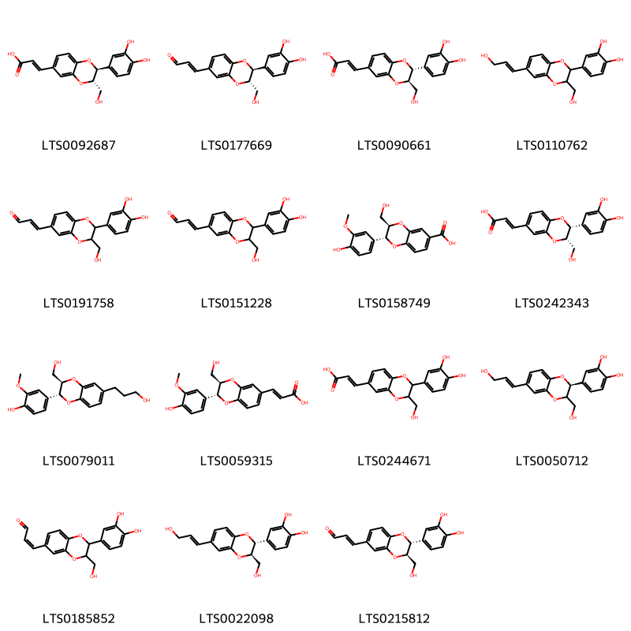{ width=100% }
    <figcaption>Hình ảnh cấu trúc hóa học của 15 hoạt chất thuộc nhóm Benzodioxanes gồm ['(2e)-3-[(2s,3s)-2-(3,4-dihydroxyphenyl)-3-(hydroxymethyl)-2,3-dihydro-1,4-benzodioxin-6-yl]prop-2-enoic acid (LTS0092687)', '(2e)-3-[(2s,3s)-2-(3,4-dihydroxyphenyl)-3-(hydroxymethyl)-2,3-dihydro-1,4-benzodioxin-6-yl]prop-2-enal (LTS0177669)', '(2e)-3-[(2r,3r)-2-(3,4-dihydroxyphenyl)-3-(hydroxymethyl)-2,3-dihydro-1,4-benzodioxin-6-yl]prop-2-enoic acid (LTS0090661)', '4-[3-(hydroxymethyl)-6-(3-hydroxyprop-1-en-1-yl)-2,3-dihydro-1,4-benzodioxin-2-yl]benzene-1,2-diol (LTS0110762)', '3-[2-(3,4-dihydroxyphenyl)-3-(hydroxymethyl)-2,3-dihydro-1,4-benzodioxin-6-yl]prop-2-enal (LTS0191758)', '(2e)-3-[2-(3,4-dihydroxyphenyl)-3-(hydroxymethyl)-2,3-dihydro-1,4-benzodioxin-6-yl]prop-2-enal (LTS0151228)', '(2r,3r)-2-(4-hydroxy-3-methoxyphenyl)-3-(hydroxymethyl)-2,3-dihydro-1,4-benzodioxine-6-carboxylic acid (LTS0158749)', '(2e)-3-[(2r,3s)-2-(3,4-dihydroxyphenyl)-3-(hydroxymethyl)-2,3-dihydro-1,4-benzodioxin-6-yl]prop-2-enoic acid (LTS0242343)', '4-[(2r,3r)-3-(hydroxymethyl)-6-(3-hydroxypropyl)-2,3-dihydro-1,4-benzodioxin-2-yl]-2-methoxyphenol (LTS0079011)', '(2e)-3-[(2r,3r)-2-(4-hydroxy-3-methoxyphenyl)-3-(hydroxymethyl)-2,3-dihydro-1,4-benzodioxin-6-yl]prop-2-enoic acid (LTS0059315)', '3-[2-(3,4-dihydroxyphenyl)-3-(hydroxymethyl)-2,3-dihydro-1,4-benzodioxin-6-yl]prop-2-enoic acid (LTS0244671)', '4-[(2s)-3-(hydroxymethyl)-6-[(1e)-3-hydroxyprop-1-en-1-yl]-2,3-dihydro-1,4-benzodioxin-2-yl]benzene-1,2-diol (LTS0050712)', '(2z)-3-[2-(3,4-dihydroxyphenyl)-3-(hydroxymethyl)-2,3-dihydro-1,4-benzodioxin-6-yl]prop-2-enal (LTS0185852)', '4-[(2r,3r)-3-(hydroxymethyl)-6-[(1e)-3-hydroxyprop-1-en-1-yl]-2,3-dihydro-1,4-benzodioxin-2-yl]benzene-1,2-diol (LTS0022098)', '(2e)-3-[(2r,3r)-2-(3,4-dihydroxyphenyl)-3-(hydroxymethyl)-2,3-dihydro-1,4-benzodioxin-6-yl]prop-2-enal (LTS0215812)'].</figcaption>
</figure>
#### Nhóm Carboxylic acids and derivatives
<figure markdown="span">
    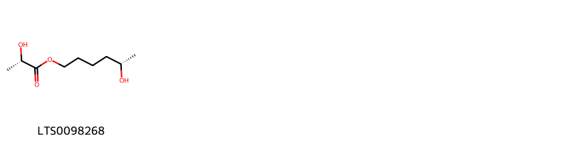{ width=100% }
    <figcaption>Hình ảnh cấu trúc hóa học của 1 hoạt chất thuộc nhóm Carboxylic acids and derivatives gồm ['(5s)-5-hydroxyhexyl (2s)-2-hydroxypropanoate (LTS0098268)'].</figcaption>
</figure>
#### Nhóm Coumarins and derivatives
<figure markdown="span">
    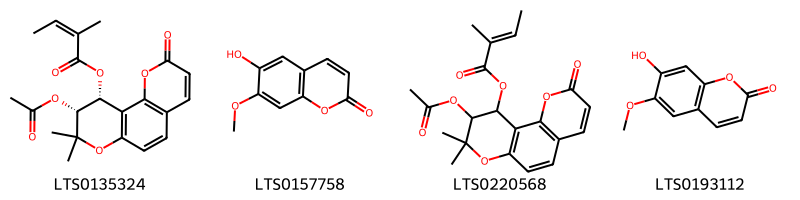{ width=100% }
    <figcaption>Hình ảnh cấu trúc hóa học của 4 hoạt chất thuộc nhóm Coumarins and derivatives gồm ['pteryxin (LTS0135324)', 'isoscopoletin (LTS0157758)', '9-(acetyloxy)-8,8-dimethyl-2-oxo-9h,10h-pyrano[2,3-h]chromen-10-yl 2-methylbut-2-enoate (LTS0220568)', 'scopoletin (LTS0193112)'].</figcaption>
</figure>
#### Nhóm Fatty Acyls
<figure markdown="span">
    { width=100% }
    <figcaption>Hình ảnh cấu trúc hóa học của 18 hoạt chất thuộc nhóm Fatty Acyls gồm ['(2r,3s,4s,5r,6r)-2-(hydroxymethyl)-6-[(3-methylbut-3-en-1-yl)oxy]oxane-3,4,5-triol (LTS0076772)', '2-[(3-methylbut-3-en-1-yl)oxy]-6-({[3,4,5-trihydroxy-6-(hydroxymethyl)oxan-2-yl]oxy}methyl)oxane-3,4,5-triol (LTS0133381)', '4,5-dihydroxy-6-(hydroxymethyl)-3-{[3,4,5-trihydroxy-6-(hydroxymethyl)oxan-2-yl]oxy}oxan-2-yl octanoate (LTS0083361)', 'nonioside c (LTS0035634)', '(2s,3r,4s,5s,6r)-4,5-dihydroxy-6-(hydroxymethyl)-3-{[(2s,3r,4s,5s,6r)-3,4,5-trihydroxy-6-(hydroxymethyl)oxan-2-yl]oxy}oxan-2-yl hexanoate (LTS0183659)', 'nonioside a (LTS0153197)', '(9z,11e,13r,15z)-13-hydroxyoctadeca-9,11,15-trienoic acid (LTS0157435)', '2-(hydroxymethyl)-6-[(3-methylbut-3-en-1-yl)oxy]oxane-3,4,5-triol (LTS0143375)', '3,4,5-trihydroxy-6-({[3,4,5-trihydroxy-6-(hydroxymethyl)oxan-2-yl]oxy}methyl)oxan-2-yl hexanoate (LTS0172434)', 'nonioside d (LTS0096194)', '1-butyl 4-(5-formylfuran-2-yl)methyl butanedioate (LTS0115508)', '3,4,5-trihydroxy-6-({[3,4,5-trihydroxy-6-(hydroxymethyl)oxan-2-yl]oxy}methyl)oxan-2-yl octanoate (LTS0267072)', '13-hydroxyoctadeca-9,11,15-trienoic acid (LTS0061896)', '(2s,3r,4s,5s,6r)-4,5-dihydroxy-6-(hydroxymethyl)-3-{[(2s,3r,4s,5s,6r)-3,4,5-trihydroxy-6-(hydroxymethyl)oxan-2-yl]oxy}oxan-2-yl octanoate (LTS0166514)', '4,5-dihydroxy-6-(hydroxymethyl)-3-{[3,4,5-trihydroxy-6-(hydroxymethyl)oxan-2-yl]oxy}oxan-2-yl hexanoate (LTS0047580)', 'hexanoic acid (LTS0031054)', 'caprylic acid (LTS0254176)', '(3r,4s,5s,6r)-3,4,5-trihydroxy-6-({[(2r,3r,4s,5s,6r)-3,4,5-trihydroxy-6-(hydroxymethyl)oxan-2-yl]oxy}methyl)oxan-2-yl (2-²h₁)octanoate (LTS0032566)'].</figcaption>
</figure>
#### Nhóm Flavonoids
<figure markdown="span">
    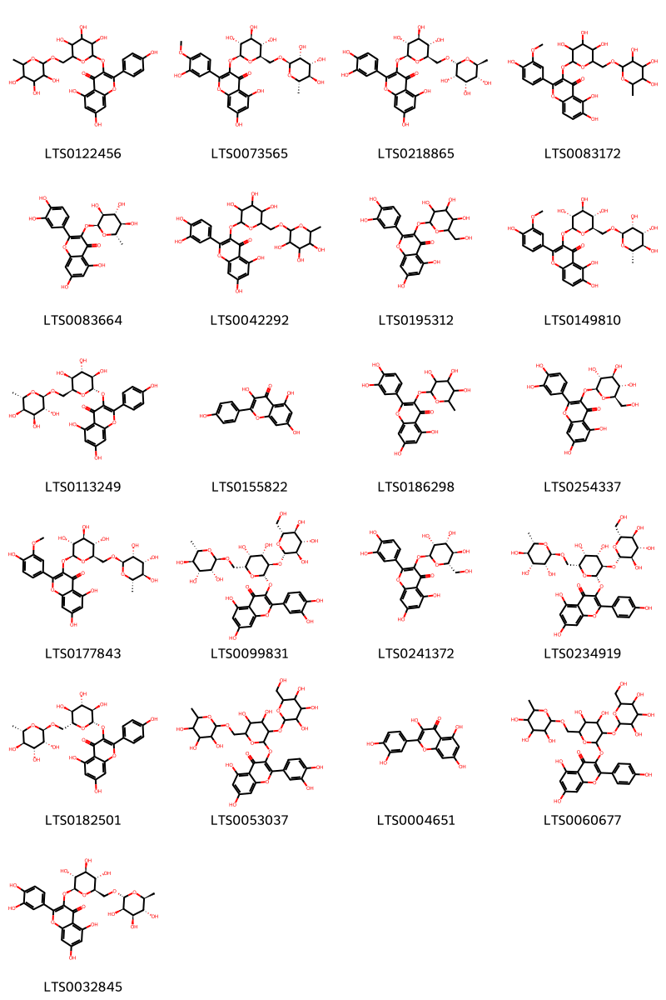{ width=100% }
    <figcaption>Hình ảnh cấu trúc hóa học của 21 hoạt chất thuộc nhóm Flavonoids gồm ['5,7-dihydroxy-2-(4-hydroxyphenyl)-3-[(3,4,5-trihydroxy-6-{[(3,4,5-trihydroxy-6-methyloxan-2-yl)oxy]methyl}oxan-2-yl)oxy]chromen-4-one (LTS0122456)', '5,7-dihydroxy-2-(3-hydroxy-4-methoxyphenyl)-3-{[(2s,3r,4s,5s,6r)-3,4,5-trihydroxy-6-({[(2r,3r,4r,5r,6s)-3,4,5-trihydroxy-6-methyloxan-2-yl]oxy}methyl)oxan-2-yl]oxy}chromen-4-one (LTS0073565)', '2-(3,4-dihydroxyphenyl)-5,7-dihydroxy-3-{[(2s,3r,4s,5s,6r)-3,4,5-trihydroxy-6-({[(2r,3s,4s,5r,6s)-3,4,5-trihydroxy-6-methyloxan-2-yl]oxy}methyl)oxan-2-yl]oxy}chromen-4-one (LTS0218865)', '5,6-dihydroxy-2-(4-hydroxy-3-methoxyphenyl)-3-[(3,4,5-trihydroxy-6-{[(3,4,5-trihydroxy-6-methyloxan-2-yl)oxy]methyl}oxan-2-yl)oxy]chromen-4-one (LTS0083172)', '2-(3,4-dihydroxyphenyl)-5,7-dihydroxy-3-{[(2s,3s,4r,5r,6s)-3,4,5-trihydroxy-6-methyloxan-2-yl]oxy}chromen-4-one (LTS0083664)', 'rutin (LTS0042292)', '2-(3,4-dihydroxyphenyl)-5,7-dihydroxy-3-{[3,4,5-trihydroxy-6-(hydroxymethyl)oxan-2-yl]oxy}chromen-4-one (LTS0195312)', '5,6-dihydroxy-2-(4-hydroxy-3-methoxyphenyl)-3-{[(2s,3r,4s,5s,6r)-3,4,5-trihydroxy-6-({[(2r,3r,4r,5r,6s)-3,4,5-trihydroxy-6-methyloxan-2-yl]oxy}methyl)oxan-2-yl]oxy}chromen-4-one (LTS0149810)', '5,7-dihydroxy-2-(4-hydroxyphenyl)-3-{[(2s,3r,4s,5s,6s)-3,4,5-trihydroxy-6-({[(2r,3r,4s,5r,6s)-3,4,5-trihydroxy-6-methyloxan-2-yl]oxy}methyl)oxan-2-yl]oxy}chromen-4-one (LTS0113249)', 'kaempherol (LTS0155822)', 'quercitrin (LTS0186298)', 'isoquercetin (LTS0254337)', 'narcissin (LTS0177843)', '3-{[(2s,3r,4s,5r,6r)-4,5-dihydroxy-3-{[(2s,3r,4s,5s,6r)-3,4,5-trihydroxy-6-(hydroxymethyl)oxan-2-yl]oxy}-6-({[(2r,3r,4r,5r,6s)-3,4,5-trihydroxy-6-methyloxan-2-yl]oxy}methyl)oxan-2-yl]oxy}-2-(3,4-dihydroxyphenyl)-5,7-dihydroxychromen-4-one (LTS0099831)', '2-(3,4-dihydroxyphenyl)-5,7-dihydroxy-3-{[(2s,3r,4r,5r,6s)-3,4,5-trihydroxy-6-(hydroxymethyl)oxan-2-yl]oxy}chromen-4-one (LTS0241372)', '3-{[(2s,3r,4s,5r,6r)-4,5-dihydroxy-3-{[(2s,3r,4s,5s,6r)-3,4,5-trihydroxy-6-(hydroxymethyl)oxan-2-yl]oxy}-6-({[(2r,3r,4r,5r,6s)-3,4,5-trihydroxy-6-methyloxan-2-yl]oxy}methyl)oxan-2-yl]oxy}-5,7-dihydroxy-2-(4-hydroxyphenyl)chromen-4-one (LTS0234919)', 'nictoflorin (LTS0182501)', '3-[(4,5-dihydroxy-3-{[3,4,5-trihydroxy-6-(hydroxymethyl)oxan-2-yl]oxy}-6-{[(3,4,5-trihydroxy-6-methyloxan-2-yl)oxy]methyl}oxan-2-yl)oxy]-2-(3,4-dihydroxyphenyl)-5,7-dihydroxychromen-4-one (LTS0053037)', 'quercetin (LTS0004651)', '3-[(4,5-dihydroxy-3-{[3,4,5-trihydroxy-6-(hydroxymethyl)oxan-2-yl]oxy}-6-{[(3,4,5-trihydroxy-6-methyloxan-2-yl)oxy]methyl}oxan-2-yl)oxy]-5,7-dihydroxy-2-(4-hydroxyphenyl)chromen-4-one (LTS0060677)', '3-rutinosyl quercetin (LTS0032845)'].</figcaption>
</figure>
#### Nhóm Furanoid lignans
<figure markdown="span">
    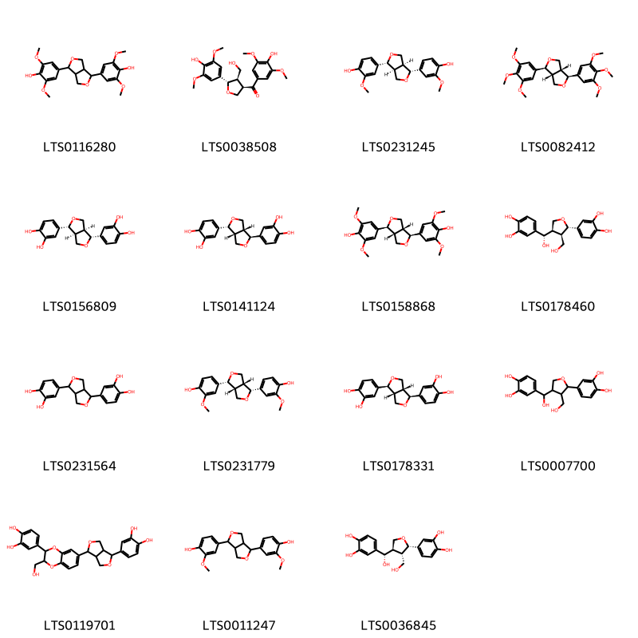{ width=100% }
    <figcaption>Hình ảnh cấu trúc hóa học của 15 hoạt chất thuộc nhóm Furanoid lignans gồm ['syringaresinol (LTS0116280)', '4-[(2s,3r,4r)-4-(4-hydroxy-3,5-dimethoxybenzoyl)-3-(hydroxymethyl)oxolan-2-yl]-2,6-dimethoxyphenol (LTS0038508)', '(-)-pinoresinol (LTS0231245)', '( )-yangabin (LTS0082412)', '4-[(1r,3as,4r,6as)-4-(3,4-dihydroxyphenyl)-hexahydrofuro[3,4-c]furan-1-yl]benzene-1,2-diol (LTS0156809)', '4-[(1s,3ar,4r,6ar)-4-(3,4-dihydroxyphenyl)-hexahydrofuro[3,4-c]furan-1-yl]benzene-1,2-diol (LTS0141124)', '(+)-syringaresinol (LTS0158868)', '4-[(2s,3r,4r)-4-[(s)-(3,4-dihydroxyphenyl)(hydroxy)methyl]-3-(hydroxymethyl)oxolan-2-yl]benzene-1,2-diol (LTS0178460)', '4-[4-(3,4-dihydroxyphenyl)-hexahydrofuro[3,4-c]furan-1-yl]benzene-1,2-diol (LTS0231564)', '4-[(1r,3ar,4r,6ar)-4-(4-hydroxy-3-methoxyphenyl)-hexahydrofuro[3,4-c]furan-1-yl]-2-methoxyphenol (LTS0231779)', '4-[(1s,3ar,4s,6ar)-4-(3,4-dihydroxyphenyl)-hexahydrofuro[3,4-c]furan-1-yl]benzene-1,2-diol (LTS0178331)', '4-{4-[(3,4-dihydroxyphenyl)(hydroxy)methyl]-3-(hydroxymethyl)oxolan-2-yl}benzene-1,2-diol (LTS0007700)', '4-{4-[3-(3,4-dihydroxyphenyl)-2-(hydroxymethyl)-2,3-dihydro-1,4-benzodioxin-6-yl]-hexahydrofuro[3,4-c]furan-1-yl}benzene-1,2-diol (LTS0119701)', 'pinoresinol (LTS0011247)', '4-[(2s,3s,4r)-4-[(s)-(3,4-dihydroxyphenyl)(hydroxy)methyl]-3-(hydroxymethyl)oxolan-2-yl]benzene-1,2-diol (LTS0036845)'].</figcaption>
</figure>
#### Nhóm Glycerolipids
<figure markdown="span">
    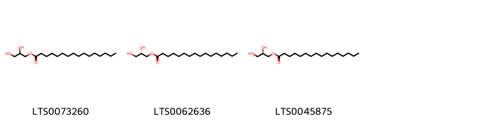{ width=100% }
    <figcaption>Hình ảnh cấu trúc hóa học của 3 hoạt chất thuộc nhóm Glycerolipids gồm ['glyceryl palmitate (LTS0073260)', '1-hexadecanoyl-sn-glycerol (LTS0062636)', '3-palmitoyl-sn-glycerol (LTS0045875)'].</figcaption>
</figure>
#### Nhóm Lactones
<figure markdown="span">
    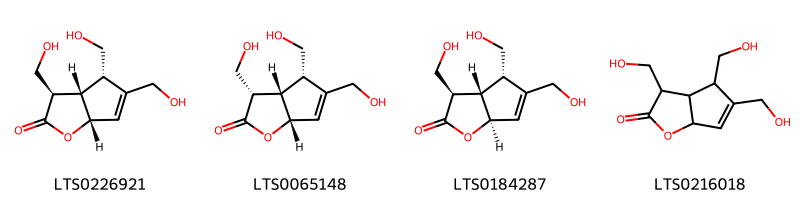{ width=100% }
    <figcaption>Hình ảnh cấu trúc hóa học của 4 hoạt chất thuộc nhóm Lactones gồm ['(3r,3as,4s,6ar)-3,4,5-tris(hydroxymethyl)-3h,3ah,4h,6ah-cyclopenta[b]furan-2-one (LTS0226921)', '(3s,3as,4s,6ar)-3,4,5-tris(hydroxymethyl)-3h,3ah,4h,6ah-cyclopenta[b]furan-2-one (LTS0065148)', '(3r,3as,4s,6as)-3,4,5-tris(hydroxymethyl)-3h,3ah,4h,6ah-cyclopenta[b]furan-2-one (LTS0184287)', '3,4,5-tris(hydroxymethyl)-3h,3ah,4h,6ah-cyclopenta[b]furan-2-one (LTS0216018)'].</figcaption>
</figure>
#### Nhóm Lignan lactones
<figure markdown="span">
    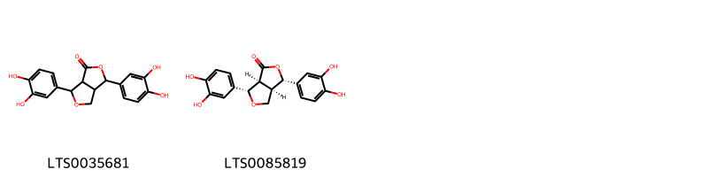{ width=100% }
    <figcaption>Hình ảnh cấu trúc hóa học của 2 hoạt chất thuộc nhóm Lignan lactones gồm ['3,6-bis(3,4-dihydroxyphenyl)-tetrahydro-3h-furo[3,4-c]furan-1-one (LTS0035681)', '(3s,3ar,6s,6as)-3,6-bis(3,4-dihydroxyphenyl)-tetrahydro-3h-furo[3,4-c]furan-1-one (LTS0085819)'].</figcaption>
</figure>
#### Nhóm Linear 1_3-diarylpropanoids
<figure markdown="span">
    { width=100% }
    <figcaption>Hình ảnh cấu trúc hóa học của Không tìm thấy chú thích hoạt chất thuộc nhóm Linear 1_3-diarylpropanoids gồm Không tìm thấy chú thích.</figcaption>
</figure>
#### Nhóm Organooxygen compounds
<figure markdown="span">
    { width=100% }
    <figcaption>Hình ảnh cấu trúc hóa học của 42 hoạt chất thuộc nhóm Organooxygen compounds gồm ['α-glucose (LTS0132398)', '6-(hydroxymethyl)-8-{[3,4,5-trihydroxy-6-(hydroxymethyl)oxan-2-yl]oxy}-3,9-dioxatricyclo[5.3.1.0⁴,¹¹]undeca-1(10),5-dien-2-one (LTS0184467)', "methyl (1's,2r,2's,3s,4's,6's,7's)-3-hydroxy-7'-{[(2s,3r,4s,5s,6r)-3,4,5-trihydroxy-6-(hydroxymethyl)oxan-2-yl]oxy}-3',8'-dioxaspiro[oxirane-2,5'-tricyclo[4.4.0.0²,⁴]decan]-9'-ene-10'-carboxylate (LTS0211679)", 'methyl (1s,2s,4s,5r,6r,7s)-5-hydroxy-5-[(r)-hydroxy({[(1s,2s,4r,5z,6s,7s)-10-(methoxycarbonyl)-7-{[(2r,3s,4r,5r,6s)-3,4,5-trihydroxy-6-(hydroxymethyl)oxan-2-yl]oxy}-3,8-dioxatricyclo[4.4.0.0²,⁴]dec-9-en-5-ylidene]methoxy})methyl]-7-{[(2r,3s,4r,5r,6s)-3,4,5-trihydroxy-6-(hydroxymethyl)oxan-2-yl]oxy}-3,8-dioxatricyclo[4.4.0.0²,⁴]dec-9-ene-10-carboxylate (LTS0127231)', 'methyl 5-hydroxy-5-(hydroxymethyl)-7-{[3,4,5-trihydroxy-6-(hydroxymethyl)oxan-2-yl]oxy}-3,8-dioxatricyclo[4.4.0.0²,⁴]dec-9-ene-10-carboxylate (LTS0072654)', 'asperuloside (LTS0072898)', '2,5-bis(hydroxymethyl)-2-methoxyoxolane-3,4-diol (LTS0088366)', '(4s,7s,8s,11s)-6-(hydroxymethyl)-8-{[(2s,3r,4s,5s,6r)-3,4,5-trihydroxy-6-(hydroxymethyl)oxan-2-yl]oxy}-3,9-dioxatricyclo[5.3.1.0⁴,¹¹]undeca-1(10),5-dien-2-one (LTS0033428)', '(2z)-3-[(z)-(1r,2s,4s,5s,6r,7s)-5-hydroxy-10-(methoxycarbonyl)-7-{[(2r,3s,4r,5r,6s)-3,4,5-trihydroxy-6-(hydroxymethyl)oxan-2-yl]oxy}-3,8-dioxatricyclo[4.4.0.0²,⁴]dec-9-ene-5-carbonyloxy]-2-(4-hydroxy-3-methoxyphenyl)prop-2-enoic acid (LTS0192496)', '(3r,4s,5s,6r)-6-(hydroxymethyl)-2-[3-methyl(2-²h₁)but-3-en-1-yl]oxane-2,3,4,5-tetrol (LTS0110493)', '5-hydroxy-7-(hydroxymethyl)-1-{[4,5,6-trihydroxy-2-(hydroxymethyl)oxan-3-yl]oxy}-1h,4ah,5h,7ah-cyclopenta[c]pyran-4-carboxylic acid (LTS0185822)', '(2r,3s,4s,5r)-2,5-bis(hydroxymethyl)-2-methoxyoxolane-3,4-diol (LTS0191480)', '(+)-glucose (LTS0262158)', '4,5-dihydroxy-3-{[3,4,5-trihydroxy-6-(hydroxymethyl)oxan-2-yl]oxy}-6-({[3,4,5-trihydroxy-6-(hydroxymethyl)oxan-2-yl]oxy}methyl)oxan-2-yl decanoate (LTS0148704)', 'mannitol (LTS0199986)', 'methyl (1s,2s,4s,5s,6s,7s)-5-hydroxy-5-(hydroxymethyl)-7-{[(2s,3r,4s,5s,6r)-3,4,5-trihydroxy-6-(hydroxymethyl)oxan-2-yl]oxy}-3,8-dioxatricyclo[4.4.0.0²,⁴]dec-9-ene-10-carboxylate (LTS0193411)', "methyl (1's,2s,2's,4's,6's,7's)-4-(4-hydroxy-3-methoxybenzoyl)-5-oxo-7'-{[(2s,3r,4s,5r,6r)-3,4,5-trihydroxy-6-(hydroxymethyl)oxan-2-yl]oxy}-3',8'-dioxaspiro[furan-2,5'-tricyclo[4.4.0.0²,⁴]decan]-9'-ene-10'-carboxylate (LTS0257837)", "methyl (2r,2's,3s,4's,7's)-3-hydroxy-7'-{[(2s,3r,4s,5s,6r)-3,4,5-trihydroxy-6-(hydroxymethyl)oxan-2-yl]oxy}-3',8'-dioxaspiro[oxirane-2,5'-tricyclo[4.4.0.0²,⁴]decan]-9'-ene-10'-carboxylate (LTS0146108)", '(1s,4as,5s,7as)-5-hydroxy-7-(hydroxymethyl)-1-{[(2s,3r,4s,5s,6s)-4,5,6-trihydroxy-2-(hydroxymethyl)oxan-3-yl]oxy}-1h,4ah,5h,7ah-cyclopenta[c]pyran-4-carboxylic acid (LTS0070001)', "methyl (2r,2's,3r,4's,7's)-3-hydroxy-7'-{[(2s,3r,4s,5s,6r)-3,4,5-trihydroxy-6-(hydroxymethyl)oxan-2-yl]oxy}-3',8'-dioxaspiro[oxirane-2,5'-tricyclo[4.4.0.0²,⁴]decan]-9'-ene-10'-carboxylate (LTS0186232)", "methyl 3-hydroxy-4-[(4-hydroxyphenyl)methylidene]-5-oxo-7'-{[3,4,5-trihydroxy-6-(hydroxymethyl)oxan-2-yl]oxy}-3',8'-dioxaspiro[oxolane-2,5'-tricyclo[4.4.0.0²,⁴]decan]-9'-ene-10'-carboxylate (LTS0132070)", 'citrifolinoside (LTS0132984)', 'asperuloside (LTS0186128)', '3-hydroxy-1-(4-hydroxy-3-methoxyphenyl)propan-1-one (LTS0074106)', '(2z)-3-[(z)-(1s,2s,4s,5s,6s,7s)-5-hydroxy-10-(methoxycarbonyl)-7-{[(2s,3r,4s,5s,6r)-3,4,5-trihydroxy-6-(hydroxymethyl)oxan-2-yl]oxy}-3,8-dioxatricyclo[4.4.0.0²,⁴]dec-9-ene-5-carbonyloxy]-2-(4-hydroxy-3-methoxyphenyl)prop-2-enoic acid (LTS0103440)', 'methyl (1s,4as,7s,7as)-7-hydroxy-1-{[(2s,3r,4s,5s,6r)-3,4,5-trihydroxy-6-(hydroxymethyl)oxan-2-yl]oxy}-1h,4ah,7h,7ah-cyclopenta[c]pyran-4-carboxylate (LTS0216664)', 'dextrose (LTS0241274)', "methyl (1's,2s,2's,3r,4e,4's,6's,7's)-3-hydroxy-4-[(4-hydroxyphenyl)methylidene]-5-oxo-7'-{[(2s,3r,4s,5s,6r)-3,4,5-trihydroxy-6-(hydroxymethyl)oxan-2-yl]oxy}-3',8'-dioxaspiro[oxolane-2,5'-tricyclo[4.4.0.0²,⁴]decan]-9'-ene-10'-carboxylate (LTS0042437)", 'nonioside e (LTS0258371)', '4,5-dihydroxy-3-{[3,4,5-trihydroxy-6-(hydroxymethyl)oxan-2-yl]oxy}-6-({[3,4,5-trihydroxy-6-(hydroxymethyl)oxan-2-yl]oxy}methyl)oxan-2-yl octanoate (LTS0059290)', 'nonioside f (LTS0250404)', '7-[(acetyloxy)methyl]-5-hydroxy-1-{[4,5,6-trihydroxy-2-(hydroxymethyl)oxan-3-yl]oxy}-1h,4ah,5h,7ah-cyclopenta[c]pyran-4-carboxylic acid (LTS0004303)', 'glucose (LTS0013597)', '(2s,3s,4s,5r)-2,5-bis(hydroxymethyl)-2-methoxyoxolane-3,4-diol (LTS0259879)', 'nonioside b (LTS0066712)', '3-[5-hydroxy-10-(methoxycarbonyl)-7-{[3,4,5-trihydroxy-6-(hydroxymethyl)oxan-2-yl]oxy}-3,8-dioxatricyclo[4.4.0.0²,⁴]dec-9-ene-5-carbonyloxy]-2-(4-hydroxy-3-methoxyphenyl)prop-2-enoic acid (LTS0002233)', 'methyl 7-hydroxy-1-{[3,4,5-trihydroxy-6-(hydroxymethyl)oxan-2-yl]oxy}-1h,4ah,7h,7ah-cyclopenta[c]pyran-4-carboxylate (LTS0013271)', 'methyl 5-hydroxy-5-[hydroxy({[10-(methoxycarbonyl)-7-{[3,4,5-trihydroxy-6-(hydroxymethyl)oxan-2-yl]oxy}-3,8-dioxatricyclo[4.4.0.0²,⁴]dec-9-en-5-ylidene]methoxy})methyl]-7-{[3,4,5-trihydroxy-6-(hydroxymethyl)oxan-2-yl]oxy}-3,8-dioxatricyclo[4.4.0.0²,⁴]dec-9-ene-10-carboxylate (LTS0015111)', '(1s,4as,5s,7as)-7-[(acetyloxy)methyl]-5-hydroxy-1-{[(2s,3r,4s,5s,6s)-4,5,6-trihydroxy-2-(hydroxymethyl)oxan-3-yl]oxy}-1h,4ah,5h,7ah-cyclopenta[c]pyran-4-carboxylic acid (LTS0228665)', '[(4r,7s,8s,11s)-2-oxo-8-{[(2s,3s,4s,5s,6r)-3,4,5-trihydroxy-6-(hydroxymethyl)oxan-2-yl]oxy}-3,9-dioxatricyclo[5.3.1.0⁴,¹¹]undeca-1(10),5-dien-6-yl]methyl acetate (LTS0027889)', "methyl (1's,2r,2's,3r,4's,6's,7's)-3-hydroxy-7'-{[(2s,3r,4s,5s,6r)-3,4,5-trihydroxy-6-(hydroxymethyl)oxan-2-yl]oxy}-3',8'-dioxaspiro[oxirane-2,5'-tricyclo[4.4.0.0²,⁴]decan]-9'-ene-10'-carboxylate (LTS0077290)", '4,5-dihydroxy-3-{[3,4,5-trihydroxy-6-(hydroxymethyl)oxan-2-yl]oxy}-6-({[3,4,5-trihydroxy-6-(hydroxymethyl)oxan-2-yl]oxy}methyl)oxan-2-yl hexanoate (LTS0043902)'].</figcaption>
</figure>
#### Nhóm Phenols
<figure markdown="span">
    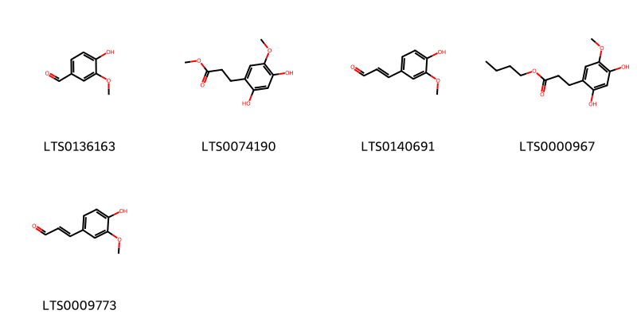{ width=100% }
    <figcaption>Hình ảnh cấu trúc hóa học của 5 hoạt chất thuộc nhóm Phenols gồm ['vanillin (LTS0136163)', 'methyl 3-(2,4-dihydroxy-5-methoxyphenyl)propanoate (LTS0074190)', 'coniferyl aldehyde (LTS0140691)', 'butyl 3-(2,4-dihydroxy-5-methoxyphenyl)propanoate (LTS0000967)', 'coniferaldehyde (LTS0009773)'].</figcaption>
</figure>
#### Nhóm Prenol lipids
<figure markdown="span">
    { width=100% }
    <figcaption>Hình ảnh cấu trúc hóa học của 36 hoạt chất thuộc nhóm Prenol lipids gồm ['5-hydroxy-7-(hydroxymethyl)-1-{[3,4,5-trihydroxy-6-(hydroxymethyl)oxan-2-yl]oxy}-1h,4ah,5h,7ah-cyclopenta[c]pyran-4-carboxylic acid (LTS0131319)', '(2z)-3-[(z)-(1s,4ar,7s,7as)-7-hydroxy-4-(methoxycarbonyl)-1-{[(2r,3s,4r,5r,6s)-3,4,5-trihydroxy-6-(hydroxymethyl)oxan-2-yl]oxy}-1h,4ah,7ah-cyclopenta[c]pyran-7-carbonyloxy]-2-(4-hydroxy-3-methoxyphenyl)prop-2-enoic acid (LTS0127904)', '1,10-dihydroxy-9-(hydroxymethyl)-1,2,6a,6b,9,12a-hexamethyl-2,3,4,5,6,7,8,8a,10,11,12,12b,13,14b-tetradecahydropicene-4a-carboxylic acid (LTS0089082)', 'methyl (1s,4as,6r,7s,7as)-6-hydroxy-7-(hydroxymethyl)-1-{[(2s,3r,4s,5s,6r)-3,4,5-trihydroxy-6-(hydroxymethyl)oxan-2-yl]oxy}-1h,4ah,5h,6h,7h,7ah-cyclopenta[c]pyran-4-carboxylate (LTS0096307)', '5-hydroxy-4,7-bis(hydroxymethyl)-1h,4h,4ah,5h,7ah-cyclopenta[c]pyran-3-one (LTS0171582)', 'phytol (LTS0096073)', '10-(acetyloxy)-1-hydroxy-1,2,6a,6b,9,9,12a-heptamethyl-2,3,4,5,6,7,8,8a,10,11,12,12b,13,14b-tetradecahydropicene-4a-carboxylic acid (LTS0113854)', '1,10-dihydroxy-1,2,6a,6b,9,9,12a-heptamethyl-2,3,4,5,6,7,8,8a,10,11,12,12b,13,14b-tetradecahydropicene-4a-carboxylic acid (LTS0147544)', '10-hydroxy-9-(hydroxymethyl)-2,2,6a,6b,9,12a-hexamethyl-1,3,4,5,6,7,8,8a,10,11,12,12b,13,14b-tetradecahydropicene-4a-carboxylic acid (LTS0139989)', 'hederagenin (LTS0157813)', 'ursolic acid (LTS0250838)', 'methyl (1s,4as,5s,7s,7ar)-5-hydroxy-7-(hydroxymethyl)-1-{[(2s,3r,4s,5s,6r)-3,4,5-trihydroxy-6-(hydroxymethyl)oxan-2-yl]oxy}-1h,4ah,5h,6h,7h,7ah-cyclopenta[c]pyran-4-carboxylate (LTS0140853)', '7-[(acetyloxy)methyl]-5-hydroxy-1-{[3,4,5-trihydroxy-6-(hydroxymethyl)oxan-2-yl]oxy}-1h,4ah,5h,7ah-cyclopenta[c]pyran-4-carboxylic acid (LTS0243332)', "methyl (1s,4ar,7r,7as)-4'-(4-hydroxy-3-methoxybenzoyl)-5'-oxo-1-{[(2s,3r,4s,5r,6r)-3,4,5-trihydroxy-6-(hydroxymethyl)oxan-2-yl]oxy}-4a,7a-dihydro-1h-spiro[cyclopenta[c]pyran-7,2'-furan]-4-carboxylate (LTS0138495)", '10-hydroxy-1,2,6a,6b,9,9,12a-heptamethyl-2,3,4,5,6,7,8,8a,10,11,12,12b,13,14b-tetradecahydro-1h-picene-4a-carboxylic acid (LTS0166564)', '2-(4-hydroxy-3-methoxyphenyl)-3-[7-hydroxy-4-(methoxycarbonyl)-1-{[3,4,5-trihydroxy-6-(hydroxymethyl)oxan-2-yl]oxy}-1h,4ah,7ah-cyclopenta[c]pyran-7-carbonyloxy]prop-2-enoic acid (LTS0185346)', '(1s,4as,5r,7as)-5-hydroxy-7-(hydroxymethyl)-1-{[(2s,3r,4s,5r,6r)-3,4,5-trihydroxy-6-(hydroxymethyl)oxan-2-yl]oxy}-1h,4ah,5h,7ah-cyclopenta[c]pyran-4-carboxylic acid (LTS0061411)', 'pomolic acid (LTS0196537)', 'monotropein (LTS0064429)', '(1s,4as,5s,7as)-7-[(acetyloxy)methyl]-5-hydroxy-1-{[(2r,3s,4r,5r,6s)-3,4,5-trihydroxy-6-(hydroxymethyl)oxan-2-yl]oxy}-1h,4ah,5h,7ah-cyclopenta[c]pyran-4-carboxylic acid (LTS0089781)', '1,10-dihydroxy-9,9-bis(hydroxymethyl)-1,2,6a,6b,12a-pentamethyl-2,3,4,5,6,7,8,8a,10,11,12,12b,13,14b-tetradecahydropicene-4a-carboxylic acid (LTS0216400)', 'oleanolic acid (LTS0141130)', '(1r,2r,4as,6as,6br,8ar,10s,12ar,12br,14bs)-10-(acetyloxy)-1-hydroxy-1,2,6a,6b,9,9,12a-heptamethyl-2,3,4,5,6,7,8,8a,10,11,12,12b,13,14b-tetradecahydropicene-4a-carboxylic acid (LTS0236776)', '3,7,11,15-tetramethylhexadec-2-en-1-ol (LTS0056933)', 'clethric acid (LTS0042178)', '(1s,4as,5s,7as)-7-[(acetyloxy)methyl]-5-hydroxy-1-{[3,4,5-trihydroxy-6-(hydroxymethyl)oxan-2-yl]oxy}-1h,4ah,5h,7ah-cyclopenta[c]pyran-4-carboxylic acid (LTS0247026)', '(4r,4as,5r,7as)-5-hydroxy-4,7-bis(hydroxymethyl)-1h,4h,4ah,5h,7ah-cyclopenta[c]pyran-3-one (LTS0050763)', '(1s,4as,5r,7as)-7-[(acetyloxy)methyl]-5-hydroxy-1-{[(2s,3r,4s,5s,6r)-3,4,5-trihydroxy-6-(hydroxymethyl)oxan-2-yl]oxy}-1h,4ah,5h,7ah-cyclopenta[c]pyran-4-carboxylic acid (LTS0246382)', 'deacetylasperulosidic acid (LTS0052630)', '(1s,4as,5s,7as)-7-[(acetyloxy)methyl]-5-hydroxy-1-{[(2s,3r,4s,5s,6r)-3,4,5-trihydroxy-6-(hydroxymethyl)oxan-2-yl]oxy}-1h,4ah,5h,7ah-cyclopenta[c]pyran-4-carboxylic acid (LTS0017024)', "methyl 4'-(4-hydroxy-3-methoxybenzoyl)-5'-oxo-1-{[3,4,5-trihydroxy-6-(hydroxymethyl)oxan-2-yl]oxy}-4a,7a-dihydro-1h-spiro[cyclopenta[c]pyran-7,2'-furan]-4-carboxylate (LTS0001212)", 'methyl (1s,4as,5s,7s,7ar)-5-hydroxy-7-methyl-1-{[(2s,3r,4s,5s,6r)-3,4,5-trihydroxy-6-(hydroxymethyl)oxan-2-yl]oxy}-1h,4ah,5h,6h,7h,7ah-cyclopenta[c]pyran-4-carboxylate (LTS0017041)', 'rotungenic acid (LTS0009951)', 'methyl 5-hydroxy-7-(hydroxymethyl)-1-{[3,4,5-trihydroxy-6-(hydroxymethyl)oxan-2-yl]oxy}-1h,4ah,5h,6h,7h,7ah-cyclopenta[c]pyran-4-carboxylate (LTS0001440)', "methyl (1s,4as,7r,7as)-4'-(4-hydroxy-3-methoxybenzoyl)-5'-oxo-1-{[(2s,3r,4s,5s,6r)-3,4,5-trihydroxy-6-(hydroxymethyl)oxan-2-yl]oxy}-4a,7a-dihydro-1h-spiro[cyclopenta[c]pyran-7,2'-furan]-4-carboxylate (LTS0042919)", 'oleanolic acid (LTS0117717)'].</figcaption>
</figure>
#### Nhóm Pyrimidine nucleosides
<figure markdown="span">
    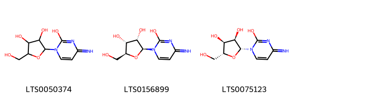{ width=100% }
    <figcaption>Hình ảnh cấu trúc hóa học của 3 hoạt chất thuộc nhóm Pyrimidine nucleosides gồm ['2-(2-hydroxy-4-iminopyrimidin-1-yl)-5-(hydroxymethyl)oxolane-3,4-diol (LTS0050374)', '(2s,3s,4r,5s)-2-(2-hydroxy-4-iminopyrimidin-1-yl)-5-(hydroxymethyl)oxolane-3,4-diol (LTS0156899)', 'cytidine (LTS0075123)'].</figcaption>
</figure>
#### Nhóm Saccharolipids
<figure markdown="span">
    { width=100% }
    <figcaption>Hình ảnh cấu trúc hóa học của 4 hoạt chất thuộc nhóm Saccharolipids gồm ['(2s,3r,4s,5s,6r)-3-{[(2s,3r,4s,5s,6r)-6-[(hexanoyloxy)methyl]-3,4,5-trihydroxyoxan-2-yl]oxy}-4,5-dihydroxy-6-({[(2r,3r,4s,5s,6r)-3,4,5-trihydroxy-6-(hydroxymethyl)oxan-2-yl]oxy}methyl)oxan-2-yl octanoate (LTS0137058)', '(6-{[4,5-dihydroxy-2-(octanoyloxy)-6-({[3,4,5-trihydroxy-6-(hydroxymethyl)oxan-2-yl]oxy}methyl)oxan-3-yl]oxy}-3,4,5-trihydroxyoxan-2-yl)methyl octanoate (LTS0234515)', '3-({6-[(hexanoyloxy)methyl]-3,4,5-trihydroxyoxan-2-yl}oxy)-4,5-dihydroxy-6-({[3,4,5-trihydroxy-6-(hydroxymethyl)oxan-2-yl]oxy}methyl)oxan-2-yl octanoate (LTS0151962)', 'nonioside g (LTS0058060)'].</figcaption>
</figure>
#### Nhóm Steroids and steroid derivatives
<figure markdown="span">
    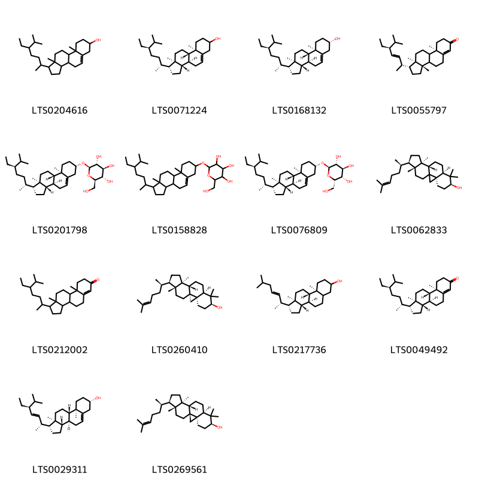{ width=100% }
    <figcaption>Hình ảnh cấu trúc hóa học của 14 hoạt chất thuộc nhóm Steroids and steroid derivatives gồm ['stigmast-5-en-3-ol, (3β)- (LTS0204616)', 'stigmast-5-en-3-ol (LTS0071224)', 'sitosterol (LTS0168132)', '(1r,3as,9ar,11ar)-1-[(3e,5s)-5-ethyl-6-methylhept-3-en-2-yl]-3a,9a,11a-trimethyl-1h,2h,3h,3bh,4h,5h,8h,9h,9bh,10h,11h-cyclopenta[a]phenanthren-7-one (LTS0055797)', 'sitogluside (LTS0201798)', '2-{[1-(5-ethyl-6-methylheptan-2-yl)-9a,11a-dimethyl-1h,2h,3h,3ah,3bh,4h,6h,7h,8h,9h,9bh,10h,11h-cyclopenta[a]phenanthren-7-yl]oxy}-6-(hydroxymethyl)oxane-3,4,5-triol (LTS0158828)', '(2r,3r,4s,5s,6s)-2-{[(1r,3as,3bs,7s,9ar,9bs,11ar)-1-[(2r,5r)-5-ethyl-6-methylheptan-2-yl]-9a,11a-dimethyl-1h,2h,3h,3ah,3bh,4h,6h,7h,8h,9h,9bh,10h,11h-cyclopenta[a]phenanthren-7-yl]oxy}-6-(hydroxymethyl)oxane-3,4,5-triol (LTS0076809)', '(3r,6s,8r,11s,12s,15r,16r)-7,7,12,16-tetramethyl-15-[(2r)-6-methylhept-5-en-2-yl]pentacyclo[9.7.0.0¹,³.0³,⁸.0¹²,¹⁶]octadecan-6-ol (LTS0062833)', '1-(5-ethyl-6-methylheptan-2-yl)-9a,11a-dimethyl-1h,2h,3h,3ah,3bh,4h,5h,8h,9h,9bh,10h,11h-cyclopenta[a]phenanthren-7-one (LTS0212002)', '(1r,3r,6s,8r,11s,12s,15r,16r)-7,7,12,16-tetramethyl-15-[(2r)-6-methylhept-5-en-2-yl]pentacyclo[9.7.0.0¹,³.0³,⁸.0¹²,¹⁶]octadecan-6-ol (LTS0260410)', '(1r,3as,3br,9as,9bs,11ar)-9a,11a-dimethyl-1-[(2r)-6-methylhept-3-en-2-yl]-tetradecahydro-1h-cyclopenta[a]phenanthren-7-ol (LTS0217736)', 'β-sitostenone (LTS0049492)', 'phytosterol (LTS0029311)', 'cycloartenol (LTS0269561)'].</figcaption>
</figure>

---

### Dược dân tộc học

Danh sách các quốc gia có sử dụng *Morinda citrifolia* trong điều trị các bệnh. 

| Country      | Disease                       | Bệnh                                                                                                                                                                                                |
|:-------------|:------------------------------|:----------------------------------------------------------------------------------------------------------------------------------------------------------------------------------------------------|
| Elsewhere    | Cathartic                     | MYMEMORY WARNING: YOU USED ALL AVAILABLE FREE TRANSLATIONS FOR TODAY. NEXT AVAILABLE IN  10 HOURS 47 MINUTES 30 SECONDS VISIT HTTPS://MYMEMORY.TRANSLATED.NET/DOC/USAGELIMITS.PHP TO TRANSLATE MORE |
| Haiti        | Sedative, Analgesic           | MYMEMORY WARNING: YOU USED ALL AVAILABLE FREE TRANSLATIONS FOR TODAY. NEXT AVAILABLE IN  10 HOURS 47 MINUTES 27 SECONDS VISIT HTTPS://MYMEMORY.TRANSLATED.NET/DOC/USAGELIMITS.PHP TO TRANSLATE MORE |
| Java         | Laxative                      | MYMEMORY WARNING: YOU USED ALL AVAILABLE FREE TRANSLATIONS FOR TODAY. NEXT AVAILABLE IN  10 HOURS 47 MINUTES 24 SECONDS VISIT HTTPS://MYMEMORY.TRANSLATED.NET/DOC/USAGELIMITS.PHP TO TRANSLATE MORE |
| Malaya       | Emmenagogue                   | MYMEMORY WARNING: YOU USED ALL AVAILABLE FREE TRANSLATIONS FOR TODAY. NEXT AVAILABLE IN  10 HOURS 47 MINUTES 21 SECONDS VISIT HTTPS://MYMEMORY.TRANSLATED.NET/DOC/USAGELIMITS.PHP TO TRANSLATE MORE |
| Philippines  | Emmenagogue                   | MYMEMORY WARNING: YOU USED ALL AVAILABLE FREE TRANSLATIONS FOR TODAY. NEXT AVAILABLE IN  10 HOURS 47 MINUTES 18 SECONDS VISIT HTTPS://MYMEMORY.TRANSLATED.NET/DOC/USAGELIMITS.PHP TO TRANSLATE MORE |
| Samoa        | Collyrium, Diuretic, Laxative | MYMEMORY WARNING: YOU USED ALL AVAILABLE FREE TRANSLATIONS FOR TODAY. NEXT AVAILABLE IN  10 HOURS 47 MINUTES 15 SECONDS VISIT HTTPS://MYMEMORY.TRANSLATED.NET/DOC/USAGELIMITS.PHP TO TRANSLATE MORE |
| Sierra Leone | Purgative                     | MYMEMORY WARNING: YOU USED ALL AVAILABLE FREE TRANSLATIONS FOR TODAY. NEXT AVAILABLE IN  10 HOURS 47 MINUTES 12 SECONDS VISIT HTTPS://MYMEMORY.TRANSLATED.NET/DOC/USAGELIMITS.PHP TO TRANSLATE MORE |
| Tonga        | Tonic                         | MYMEMORY WARNING: YOU USED ALL AVAILABLE FREE TRANSLATIONS FOR TODAY. NEXT AVAILABLE IN  10 HOURS 47 MINUTES 09 SECONDS VISIT HTTPS://MYMEMORY.TRANSLATED.NET/DOC/USAGELIMITS.PHP TO TRANSLATE MORE |

---

---
## Morinda lucida
### Thông tin về thực vật

!!! info "Phân loại thực vật của *Morinda lucida* từ GIBF:"
    - **Kingdom:** Plantae
    - **Phylum:** Tracheophyta
    - **Order:** Gentianales
    - **Family:** Rubiaceae
    - **Genus:** Morinda
    - **Species:** *Morinda lucida*

 

| Label (VI)   | Label (EN)   | Scientific Name   | Descriptions (VI)   | Descriptions (EN)   | Also Known As (VI)   | Also Known As (EN)   |
|:-------------|:-------------|:------------------|:--------------------|:--------------------|:---------------------|:---------------------|
| N/A          | N/A          | Morinda lucida    | loài thực vật       | species of plant    | ['']                 | ['']                 |

#### Phân bố trên thế giới

**Từ CSDL GIBF** Benin, Gabon, Côte d’Ivoire, Nigeria, Sao Tome and Principe, Sierra Leone, Cameroon, Ghana

#### Phân bố tại Việt Nam

**Từ CSDL GIBF**: Không có ghi nhận ở Việt Nam

---
### Thành phần hóa học
        
- Theo cơ sở dữ liệu lotus: Từ loài *Morinda lucida* đã phân lập và xác định được 27 hoạt chất thuộc về các nhóm Prenol lipids, Anthracenes, Organooxygen compounds. 

|    | chemicalTaxonomyClassyfireClass   |   smiles_count |
|---:|:----------------------------------|---------------:|
|  0 | Anthracenes                       |             24 |
|  1 | Organooxygen compounds            |              1 |
|  2 | Prenol lipids                     |              2 |

#### Nhóm Anthracenes
<figure markdown="span">
    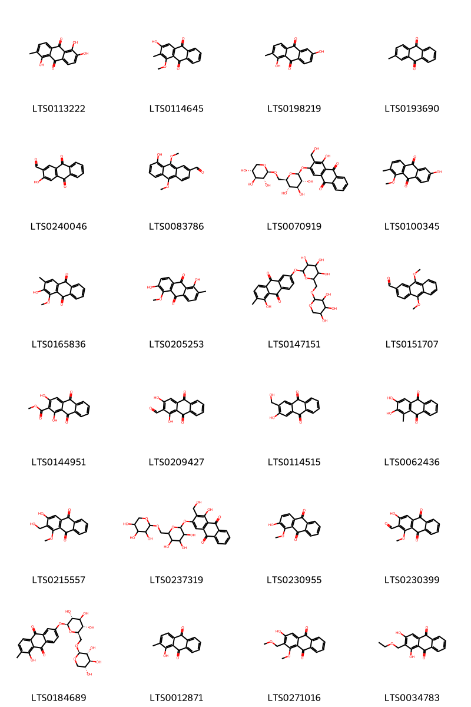{ width=100% }
    <figcaption>Hình ảnh cấu trúc hóa học của 24 hoạt chất thuộc nhóm Anthracenes gồm ['morindone (LTS0113222)', '3-hydroxy-1-methoxy-2-methylanthracene-9,10-dione (LTS0114645)', '1,6-dihydroxy-2-methylanthracene-9,10-dione (LTS0198219)', '2-methylanthraquinone (LTS0193690)', '3-hydroxy-9,10-dioxoanthracene-2-carbaldehyde (LTS0240046)', '8-hydroxy-9,10-dimethoxyanthracene-2-carbaldehyde (LTS0083786)', '1-hydroxy-2-(hydroxymethyl)-3-{[(2s,3r,4s,5s,6r)-3,4,5-trihydroxy-6-({[(2s,3r,4s,5r)-3,4,5-trihydroxyoxan-2-yl]oxy}methyl)oxan-2-yl]oxy}anthracene-9,10-dione (LTS0070919)', '6-hydroxy-1-methoxy-2-methylanthracene-9,10-dione (LTS0100345)', '2-hydroxy-1-methoxy-3-methylanthracene-9,10-dione (LTS0165836)', '1,6-dihydroxy-5-methoxy-2-methylanthracene-9,10-dione (LTS0205253)', '1-hydroxy-2-methyl-6-[(3,4,5-trihydroxy-6-{[(3,4,5-trihydroxyoxan-2-yl)oxy]methyl}oxan-2-yl)oxy]anthracene-9,10-dione (LTS0147151)', '9,10-dimethoxyanthracene-2-carbaldehyde (LTS0151707)', 'methyl 1,3-dihydroxy-9,10-dioxoanthracene-2-carboxylate (LTS0144951)', '1,3-dihydroxy-9,10-dioxoanthracene-2-carbaldehyde (LTS0209427)', '2-hydroxy-3-(hydroxymethyl)anthracene-9,10-dione (LTS0114515)', '2,3-dihydroxy-1-methylanthracene-9,10-dione (LTS0062436)', 'damnacanthol (LTS0215557)', '1-hydroxy-2-(hydroxymethyl)-3-[(3,4,5-trihydroxy-6-{[(3,4,5-trihydroxyoxan-2-yl)oxy]methyl}oxan-2-yl)oxy]anthracene-9,10-dione (LTS0237319)', '2-hydroxy-1-methoxyanthracene-9,10-dione (LTS0230955)', 'damnacanthal (LTS0230399)', '1-hydroxy-2-methyl-6-{[(2s,3r,4s,5s,6r)-3,4,5-trihydroxy-6-({[(2s,3r,4s,5r)-3,4,5-trihydroxyoxan-2-yl]oxy}methyl)oxan-2-yl]oxy}anthracene-9,10-dione (LTS0184689)', '1-hydroxy-2-methylanthracene-9,10-dione (LTS0012871)', '3-hydroxy-1-methoxy-2-(methoxymethyl)anthracene-9,10-dione (LTS0271016)', '2-(ethoxymethyl)-1,3-dihydroxyanthracene-9,10-dione (LTS0034783)'].</figcaption>
</figure>
#### Nhóm Organooxygen compounds
<figure markdown="span">
    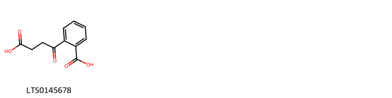{ width=100% }
    <figcaption>Hình ảnh cấu trúc hóa học của 1 hoạt chất thuộc nhóm Organooxygen compounds gồm ['o-succinylbenzoate (LTS0145678)'].</figcaption>
</figure>
#### Nhóm Prenol lipids
<figure markdown="span">
    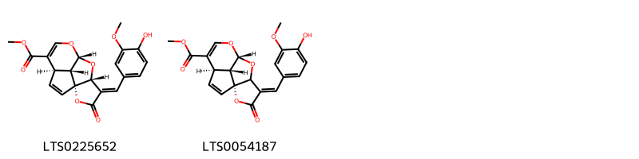{ width=100% }
    <figcaption>Hình ảnh cấu trúc hóa học của 2 hoạt chất thuộc nhóm Prenol lipids gồm ['methyl (1r,4r,8r,10r,11e,14s)-11-[(4-hydroxy-3-methoxyphenyl)methylidene]-12-oxo-7,9,13-trioxatetracyclo[6.5.1.0¹,¹⁰.0⁴,¹⁴]tetradeca-2,5-diene-5-carboxylate (LTS0225652)', 'methyl (1r,4r,8r,11e,14s)-11-[(4-hydroxy-3-methoxyphenyl)methylidene]-12-oxo-7,9,13-trioxatetracyclo[6.5.1.0¹,¹⁰.0⁴,¹⁴]tetradeca-2,5-diene-5-carboxylate (LTS0054187)'].</figcaption>
</figure>

---

### Dược dân tộc học

Danh sách các quốc gia có sử dụng *Morinda lucida* trong điều trị các bệnh. 

| Country   | Disease                       | Bệnh                                                                                                                                                                                                |
|:----------|:------------------------------|:----------------------------------------------------------------------------------------------------------------------------------------------------------------------------------------------------|
| Africa    | Emmenagogue                   | MYMEMORY WARNING: YOU USED ALL AVAILABLE FREE TRANSLATIONS FOR TODAY. NEXT AVAILABLE IN  10 HOURS 45 MINUTES 40 SECONDS VISIT HTTPS://MYMEMORY.TRANSLATED.NET/DOC/USAGELIMITS.PHP TO TRANSLATE MORE |
| C Africa  | Diuretic, Oxytoxic, Purgative | MYMEMORY WARNING: YOU USED ALL AVAILABLE FREE TRANSLATIONS FOR TODAY. NEXT AVAILABLE IN  10 HOURS 45 MINUTES 38 SECONDS VISIT HTTPS://MYMEMORY.TRANSLATED.NET/DOC/USAGELIMITS.PHP TO TRANSLATE MORE |
| Ghana     | Laxative                      | MYMEMORY WARNING: YOU USED ALL AVAILABLE FREE TRANSLATIONS FOR TODAY. NEXT AVAILABLE IN  10 HOURS 45 MINUTES 36 SECONDS VISIT HTTPS://MYMEMORY.TRANSLATED.NET/DOC/USAGELIMITS.PHP TO TRANSLATE MORE |
| W Africa  | Astringent                    | MYMEMORY WARNING: YOU USED ALL AVAILABLE FREE TRANSLATIONS FOR TODAY. NEXT AVAILABLE IN  10 HOURS 45 MINUTES 33 SECONDS VISIT HTTPS://MYMEMORY.TRANSLATED.NET/DOC/USAGELIMITS.PHP TO TRANSLATE MORE |

---

---
## Morinda royoc
### Thông tin về thực vật

!!! info "Phân loại thực vật của *Morinda royoc* từ GIBF:"
    - **Kingdom:** Plantae
    - **Phylum:** Tracheophyta
    - **Order:** Gentianales
    - **Family:** Rubiaceae
    - **Genus:** Morinda
    - **Species:** *Morinda royoc*

 

| Label (VI)   | Label (EN)   | Scientific Name   | Descriptions (VI)   | Descriptions (EN)   | Also Known As (VI)   | Also Known As (EN)   |
|:-------------|:-------------|:------------------|:--------------------|:--------------------|:---------------------|:---------------------|
| N/A          | N/A          | Morinda royoc     | loài thực vật       | species of plant    | ['']                 | ['']                 |

#### Phân bố trên thế giới

**Từ CSDL GIBF** Mexico, United States of America, Jamaica, Haiti, Bahamas, Curaçao, Dominican Republic, Cuba, Belize, Cayman Islands

#### Phân bố tại Việt Nam

**Từ CSDL GIBF**: Không có ghi nhận ở Việt Nam

---
### Thành phần hóa học
        
- Theo cơ sở dữ liệu lotus: Từ loài *Morinda royoc* đã phân lập và xác định được Chưa có hoạt chất nào được phân lập. hoạt chất thuộc về các nhóm Không có hoạt chất nào được phân lập. 

Không có hình ảnh nào được tạo ra

---

### Dược dân tộc học

Danh sách các quốc gia có sử dụng *Morinda royoc* trong điều trị các bệnh. 

| Country   | Disease                                  | Bệnh                                                                                                                                                                                                |
|:----------|:-----------------------------------------|:----------------------------------------------------------------------------------------------------------------------------------------------------------------------------------------------------|
| Haiti     | Aphrodisiac, Purgative, Tonic, Stomachic | MYMEMORY WARNING: YOU USED ALL AVAILABLE FREE TRANSLATIONS FOR TODAY. NEXT AVAILABLE IN  10 HOURS 45 MINUTES 04 SECONDS VISIT HTTPS://MYMEMORY.TRANSLATED.NET/DOC/USAGELIMITS.PHP TO TRANSLATE MORE |

---

---
## Morinda yucatanensis
### Thông tin về thực vật

!!! info "Phân loại thực vật của *Morinda royoc* từ GIBF:"
    - **Kingdom:** Plantae
    - **Phylum:** Tracheophyta
    - **Order:** Gentianales
    - **Family:** Rubiaceae
    - **Genus:** Morinda
    - **Species:** *Morinda royoc*

 

| Label (VI)   | Label (EN)   | Scientific Name      | Descriptions (VI)   | Descriptions (EN)   | Also Known As (VI)   | Also Known As (EN)   |
|:-------------|:-------------|:---------------------|:--------------------|:--------------------|:---------------------|:---------------------|
| N/A          | N/A          | Morinda yucatanensis | loài thực vật       | species of plant    | ['']                 | ['']                 |

#### Phân bố trên thế giới

**Từ CSDL GIBF** Mexico, Guatemala, Belize, Peru

#### Phân bố tại Việt Nam

**Từ CSDL GIBF**: Không có ghi nhận ở Việt Nam

---
### Thành phần hóa học
        
- Theo cơ sở dữ liệu lotus: Từ loài *Morinda royoc* đã phân lập và xác định được Chưa có hoạt chất nào được phân lập. hoạt chất thuộc về các nhóm Không có hoạt chất nào được phân lập. 

Không có hình ảnh nào được tạo ra

---

### Dược dân tộc học

Danh sách các quốc gia có sử dụng *Morinda royoc* trong điều trị các bệnh. 

| Country   | Disease                                                            | Bệnh                                                                                                                                                                                                |
|:----------|:-------------------------------------------------------------------|:----------------------------------------------------------------------------------------------------------------------------------------------------------------------------------------------------|
| Mexico    | Astringent, Digestive, Laxative, Tonic, Digestive, Diuretic, Tonic | MYMEMORY WARNING: YOU USED ALL AVAILABLE FREE TRANSLATIONS FOR TODAY. NEXT AVAILABLE IN  10 HOURS 44 MINUTES 26 SECONDS VISIT HTTPS://MYMEMORY.TRANSLATED.NET/DOC/USAGELIMITS.PHP TO TRANSLATE MORE |

---

# Chi Hintonia

??? note "Danh sách các dược liệu thuộc chi"
    
	 - *Hintonia latiflora*

---
## Hintonia latiflora
### Thông tin về thực vật

!!! info "Phân loại thực vật của *Hintonia latiflora* từ GIBF:"
    - **Kingdom:** Plantae
    - **Phylum:** Tracheophyta
    - **Order:** Gentianales
    - **Family:** Rubiaceae
    - **Genus:** Hintonia
    - **Species:** *Hintonia latiflora*

 

| Label (VI)   | Label (EN)   | Scientific Name    | Descriptions (VI)   | Descriptions (EN)   | Also Known As (VI)   | Also Known As (EN)   |
|:-------------|:-------------|:-------------------|:--------------------|:--------------------|:---------------------|:---------------------|
| N/A          | N/A          | Hintonia latiflora | loài thực vật       | species of plant    | ['']                 | ['']                 |

#### Phân bố trên thế giới

**Từ CSDL GIBF** Mexico, Guatemala, El Salvador

#### Phân bố tại Việt Nam

**Từ CSDL GIBF**: Không có ghi nhận ở Việt Nam

---
### Thành phần hóa học
        
- Theo cơ sở dữ liệu lotus: Từ loài *Hintonia latiflora* đã phân lập và xác định được 43 hoạt chất thuộc về các nhóm Piperidines, Flavonoids, Coumarins and derivatives, Steroids and steroid derivatives, Neoflavonoids, Organooxygen compounds, Prenol lipids. 

|    | chemicalTaxonomyClassyfireClass   |   smiles_count |
|---:|:----------------------------------|---------------:|
|  0 | Coumarins and derivatives         |             22 |
|  1 | Flavonoids                        |              1 |
|  2 | Neoflavonoids                     |              1 |
|  3 | Organooxygen compounds            |              7 |
|  4 | Piperidines                       |              1 |
|  5 | Prenol lipids                     |              3 |
|  6 | Steroids and steroid derivatives  |              7 |

#### Nhóm Coumarins and derivatives
<figure markdown="span">
    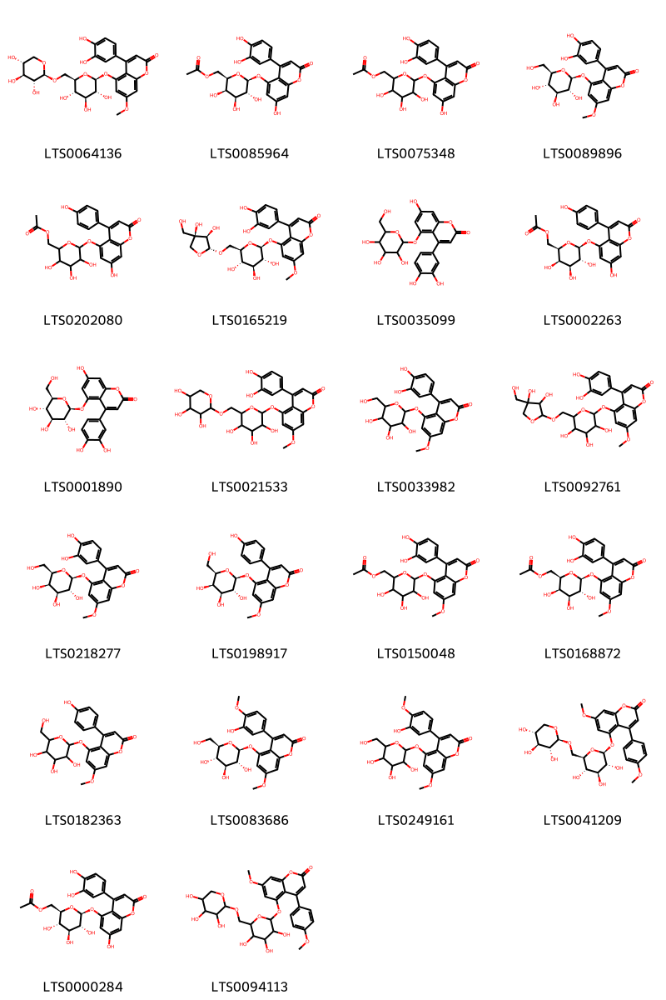{ width=100% }
    <figcaption>Hình ảnh cấu trúc hóa học của 22 hoạt chất thuộc nhóm Coumarins and derivatives gồm ['4-(3,4-dihydroxyphenyl)-7-methoxy-5-{[(2s,3r,4s,5s,6r)-3,4,5-trihydroxy-6-({[(2s,3r,4s,5r)-3,4,5-trihydroxyoxan-2-yl]oxy}methyl)oxan-2-yl]oxy}chromen-2-one (LTS0064136)', '[(2r,3r,4s,5r,6s)-6-{[4-(3,4-dihydroxyphenyl)-7-hydroxy-2-oxochromen-5-yl]oxy}-3,4,5-trihydroxyoxan-2-yl]methyl acetate (LTS0085964)', '(6-{[4-(3,4-dihydroxyphenyl)-7-hydroxy-2-oxochromen-5-yl]oxy}-3,4,5-trihydroxyoxan-2-yl)methyl acetate (LTS0075348)', '4-(3,4-dihydroxyphenyl)-7-methoxy-5-{[(2s,3r,4s,5s,6r)-3,4,5-trihydroxy-6-(hydroxymethyl)oxan-2-yl]oxy}chromen-2-one (LTS0089896)', '(3,4,5-trihydroxy-6-{[7-hydroxy-4-(4-hydroxyphenyl)-2-oxochromen-5-yl]oxy}oxan-2-yl)methyl acetate (LTS0202080)', '5-{[(2s,3r,4s,5s,6r)-6-({[(2r,3r,4r)-3,4-dihydroxy-4-(hydroxymethyl)oxolan-2-yl]oxy}methyl)-3,4,5-trihydroxyoxan-2-yl]oxy}-4-(3,4-dihydroxyphenyl)-7-methoxychromen-2-one (LTS0165219)', '4-(3,4-dihydroxyphenyl)-7-hydroxy-5-{[3,4,5-trihydroxy-6-(hydroxymethyl)oxan-2-yl]oxy}chromen-2-one (LTS0035099)', '[(2r,3r,4s,5r,6s)-3,4,5-trihydroxy-6-{[7-hydroxy-4-(4-hydroxyphenyl)-2-oxochromen-5-yl]oxy}oxan-2-yl]methyl acetate (LTS0002263)', '4-(3,4-dihydroxyphenyl)-7-hydroxy-5-{[(2s,3r,4s,5s,6r)-3,4,5-trihydroxy-6-(hydroxymethyl)oxan-2-yl]oxy}chromen-2-one (LTS0001890)', '4-(3,4-dihydroxyphenyl)-7-methoxy-5-[(3,4,5-trihydroxy-6-{[(3,4,5-trihydroxyoxan-2-yl)oxy]methyl}oxan-2-yl)oxy]chromen-2-one (LTS0021533)', '4-(3,4-dihydroxyphenyl)-7-methoxy-5-{[3,4,5-trihydroxy-6-(hydroxymethyl)oxan-2-yl]oxy}chromen-2-one (LTS0033982)', '5-{[6-({[3,4-dihydroxy-4-(hydroxymethyl)oxolan-2-yl]oxy}methyl)-3,4,5-trihydroxyoxan-2-yl]oxy}-4-(3,4-dihydroxyphenyl)-7-methoxychromen-2-one (LTS0092761)', '4-(3,4-dihydroxyphenyl)-7-methoxy-5-{[(2s,3r,4s,5r,6r)-3,4,5-trihydroxy-6-(hydroxymethyl)oxan-2-yl]oxy}chromen-2-one (LTS0218277)', '4-(4-hydroxyphenyl)-7-methoxy-5-{[(2s,3r,4s,5r,6r)-3,4,5-trihydroxy-6-(hydroxymethyl)oxan-2-yl]oxy}chromen-2-one (LTS0198917)', '(6-{[4-(3,4-dihydroxyphenyl)-7-methoxy-2-oxochromen-5-yl]oxy}-3,4,5-trihydroxyoxan-2-yl)methyl acetate (LTS0150048)', '[(2r,3r,4s,5r,6s)-6-{[4-(3,4-dihydroxyphenyl)-7-methoxy-2-oxochromen-5-yl]oxy}-3,4,5-trihydroxyoxan-2-yl]methyl acetate (LTS0168872)', '4-(4-hydroxyphenyl)-7-methoxy-5-{[3,4,5-trihydroxy-6-(hydroxymethyl)oxan-2-yl]oxy}chromen-2-one (LTS0182363)', '4-(3-hydroxy-4-methoxyphenyl)-7-methoxy-5-{[(2s,3r,4s,5s,6r)-3,4,5-trihydroxy-6-(hydroxymethyl)oxan-2-yl]oxy}chromen-2-one (LTS0083686)', '4-(3-hydroxy-4-methoxyphenyl)-7-methoxy-5-{[3,4,5-trihydroxy-6-(hydroxymethyl)oxan-2-yl]oxy}chromen-2-one (LTS0249161)', '7-methoxy-4-(4-methoxyphenyl)-5-{[(2s,3r,4s,5s,6r)-3,4,5-trihydroxy-6-({[(2s,3r,4s,5r)-3,4,5-trihydroxyoxan-2-yl]oxy}methyl)oxan-2-yl]oxy}chromen-2-one (LTS0041209)', '[(2r,3s,4s,5r,6s)-6-{[4-(3,4-dihydroxyphenyl)-7-hydroxy-2-oxochromen-5-yl]oxy}-3,4,5-trihydroxyoxan-2-yl]methyl acetate (LTS0000284)', '7-methoxy-4-(4-methoxyphenyl)-5-[(3,4,5-trihydroxy-6-{[(3,4,5-trihydroxyoxan-2-yl)oxy]methyl}oxan-2-yl)oxy]chromen-2-one (LTS0094113)'].</figcaption>
</figure>
#### Nhóm Flavonoids
<figure markdown="span">
    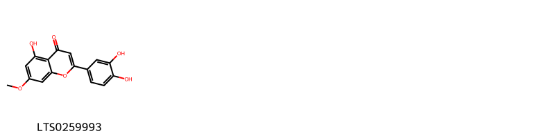{ width=100% }
    <figcaption>Hình ảnh cấu trúc hóa học của 1 hoạt chất thuộc nhóm Flavonoids gồm ['luteolin 7-methyl ether (LTS0259993)'].</figcaption>
</figure>
#### Nhóm Neoflavonoids
<figure markdown="span">
    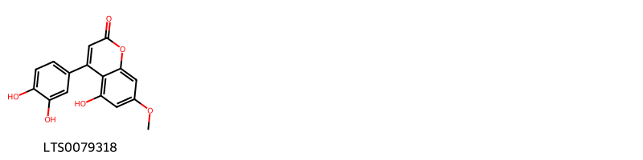{ width=100% }
    <figcaption>Hình ảnh cấu trúc hóa học của 1 hoạt chất thuộc nhóm Neoflavonoids gồm ['4-(3,4-dihydroxyphenyl)-5-hydroxy-7-methoxychromen-2-one (LTS0079318)'].</figcaption>
</figure>
#### Nhóm Organooxygen compounds
<figure markdown="span">
    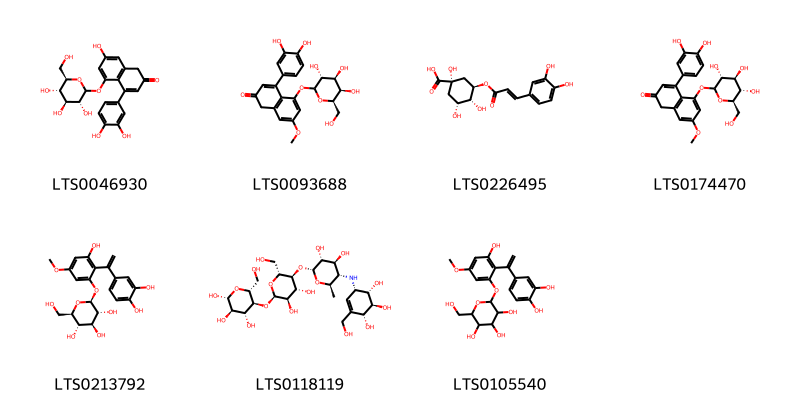{ width=100% }
    <figcaption>Hình ảnh cấu trúc hóa học của 7 hoạt chất thuộc nhóm Organooxygen compounds gồm ['4-(3,4-dihydroxyphenyl)-7-hydroxy-5-{[(3r,4s,5s,6r)-3,4,5-trihydroxy-6-(hydroxymethyl)oxan-2-yl]oxy}-1h-naphthalen-2-one (LTS0046930)', '4-(3,4-dihydroxyphenyl)-7-methoxy-5-{[(3r,4s,5r,6r)-3,4,5-trihydroxy-6-(hydroxymethyl)oxan-2-yl]oxy}-1h-naphthalen-2-one (LTS0093688)', 'chlorogenic acid (LTS0226495)', '4-(3,4-dihydroxyphenyl)-7-methoxy-5-{[(3r,4s,5s,6r)-3,4,5-trihydroxy-6-(hydroxymethyl)oxan-2-yl]oxy}-1h-naphthalen-2-one (LTS0174470)', '(2s,3r,4s,5s,6r)-2-{2-[1-(3,4-dihydroxyphenyl)ethenyl]-3-hydroxy-5-methoxyphenoxy}-6-(hydroxymethyl)oxane-3,4,5-triol (LTS0213792)', 'acarbose (LTS0118119)', '2-{2-[1-(3,4-dihydroxyphenyl)ethenyl]-3-hydroxy-5-methoxyphenoxy}-6-(hydroxymethyl)oxane-3,4,5-triol (LTS0105540)'].</figcaption>
</figure>
#### Nhóm Piperidines
<figure markdown="span">
    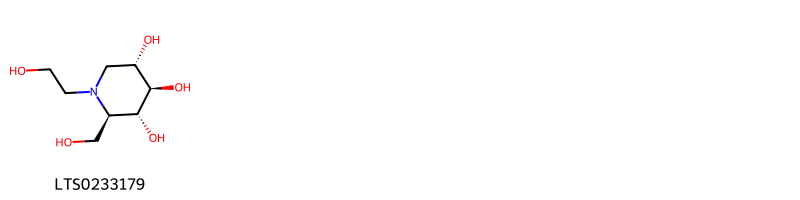{ width=100% }
    <figcaption>Hình ảnh cấu trúc hóa học của 1 hoạt chất thuộc nhóm Piperidines gồm ['miglitol (LTS0233179)'].</figcaption>
</figure>
#### Nhóm Prenol lipids
<figure markdown="span">
    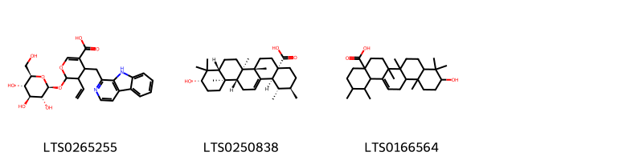{ width=100% }
    <figcaption>Hình ảnh cấu trúc hóa học của 3 hoạt chất thuộc nhóm Prenol lipids gồm ['5-ethenyl-4-{9h-pyrido[3,4-b]indol-1-ylmethyl}-6-{[(2s,3r,4s,5s,6r)-3,4,5-trihydroxy-6-(hydroxymethyl)oxan-2-yl]oxy}-5,6-dihydro-4h-pyran-3-carboxylic acid (LTS0265255)', 'ursolic acid (LTS0250838)', '10-hydroxy-1,2,6a,6b,9,9,12a-heptamethyl-2,3,4,5,6,7,8,8a,10,11,12,12b,13,14b-tetradecahydro-1h-picene-4a-carboxylic acid (LTS0166564)'].</figcaption>
</figure>
#### Nhóm Steroids and steroid derivatives
<figure markdown="span">
    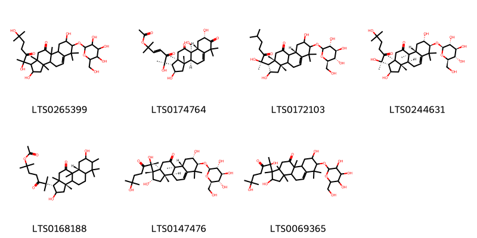{ width=100% }
    <figcaption>Hình ảnh cấu trúc hóa học của 7 hoạt chất thuộc nhóm Steroids and steroid derivatives gồm ['1-(2,6-dihydroxy-6-methyl-3-oxoheptan-2-yl)-2,8-dihydroxy-3a,6,6,9b,11a-pentamethyl-7-{[3,4,5-trihydroxy-6-(hydroxymethyl)oxan-2-yl]oxy}-1h,2h,3h,3bh,4h,7h,8h,9h,9ah,11h-cyclopenta[a]phenanthren-10-one (LTS0265399)', 'cucurbitacin a (LTS0174764)', '(1r,3as,9as,11as)-2,8-dihydroxy-1-[(2r)-2-hydroxy-6-methyl-3-oxoheptan-2-yl]-3a,6,6,11a-tetramethyl-7-{[(3r,4s,5s,6r)-3,4,5-trihydroxy-6-(hydroxymethyl)oxan-2-yl]oxy}-1h,2h,3h,3bh,4h,7h,8h,9h,9ah,9bh,11h-cyclopenta[a]phenanthren-10-one (LTS0172103)', '(1r,2r,3as,3bs,7s,8s,9ar,9br,11ar)-1-[(2r)-2,6-dihydroxy-6-methyl-3-oxoheptan-2-yl]-2,8-dihydroxy-3a,6,6,9b,11a-pentamethyl-7-{[(2r,3r,4s,5s,6r)-3,4,5-trihydroxy-6-(hydroxymethyl)oxan-2-yl]oxy}-1h,2h,3h,3bh,4h,7h,8h,9h,9ah,11h-cyclopenta[a]phenanthren-10-one (LTS0244631)', '6-[(1s,3as,9ar)-2,8-dihydroxy-3a,6,6,7,9b,11a-hexamethyl-10-oxo-dodecahydrocyclopenta[a]phenanthren-1-yl]-2,6-dimethyl-5-oxoheptan-2-yl acetate (LTS0168188)', '(1r,2s,3as,3bs,7s,8s,9ar,9br,11as)-1-[(2r)-2,6-dihydroxy-6-methyl-3-oxoheptan-2-yl]-2,8-dihydroxy-1,3a,6,6,9b,11a-hexamethyl-7-{[(2r,3r,4s,5s,6r)-3,4,5-trihydroxy-6-(hydroxymethyl)oxan-2-yl]oxy}-2h,3h,3bh,4h,7h,8h,9h,9ah,11h-cyclopenta[a]phenanthren-10-one (LTS0147476)', '1-(2,6-dihydroxy-6-methyl-3-oxoheptan-2-yl)-2,8-dihydroxy-1,3a,6,6,9b,11a-hexamethyl-7-{[3,4,5-trihydroxy-6-(hydroxymethyl)oxan-2-yl]oxy}-2h,3h,3bh,4h,7h,8h,9h,9ah,11h-cyclopenta[a]phenanthren-10-one (LTS0069365)'].</figcaption>
</figure>

---

### Dược dân tộc học

Danh sách các quốc gia có sử dụng *Hintonia latiflora* trong điều trị các bệnh. 

| Country   | Disease   | Bệnh                                                                                                                                                                                                |
|:----------|:----------|:----------------------------------------------------------------------------------------------------------------------------------------------------------------------------------------------------|
| Mexico    | Purgative | MYMEMORY WARNING: YOU USED ALL AVAILABLE FREE TRANSLATIONS FOR TODAY. NEXT AVAILABLE IN  10 HOURS 43 MINUTES 55 SECONDS VISIT HTTPS://MYMEMORY.TRANSLATED.NET/DOC/USAGELIMITS.PHP TO TRANSLATE MORE |

---

# Chi Chione

??? note "Danh sách các dược liệu thuộc chi"
    
	 - *Chione venosa*

---
## Chione venosa
### Thông tin về thực vật

!!! info "Phân loại thực vật của *Chione venosa* từ GIBF:"
    - **Kingdom:** Plantae
    - **Phylum:** Tracheophyta
    - **Order:** Gentianales
    - **Family:** Rubiaceae
    - **Genus:** Chione
    - **Species:** *Chione venosa*

 

| Label (VI)   | Label (EN)   | Scientific Name   | Descriptions (VI)   | Descriptions (EN)   | Also Known As (VI)   | Also Known As (EN)   |
|:-------------|:-------------|:------------------|:--------------------|:--------------------|:---------------------|:---------------------|
| N/A          | N/A          | Chione venosa     | loài thực vật       | species of plant    | ['']                 | ['']                 |

#### Phân bố trên thế giới

**Từ CSDL GIBF** Nicaragua, Mexico, Guatemala, United States of America, Bonaire, Sint Eustatius and Saba, Guadeloupe, Costa Rica, Dominican Republic, Colombia, Cuba, Peru, Panama, Belize, Puerto Rico

#### Phân bố tại Việt Nam

**Từ CSDL GIBF**: Không có ghi nhận ở Việt Nam

---
### Thành phần hóa học
        
- Theo cơ sở dữ liệu lotus: Từ loài *Chione venosa* đã phân lập và xác định được 21 hoạt chất thuộc về các nhóm Prenol lipids, Organooxygen compounds, Steroids and steroid derivatives, Organonitrogen compounds. 

|    | chemicalTaxonomyClassyfireClass   |   smiles_count |
|---:|:----------------------------------|---------------:|
|  0 | Organonitrogen compounds          |              2 |
|  1 | Organooxygen compounds            |             11 |
|  2 | Prenol lipids                     |              3 |
|  3 | Steroids and steroid derivatives  |              5 |

#### Nhóm Organonitrogen compounds
<figure markdown="span">
    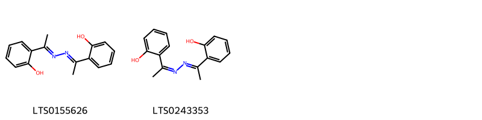{ width=100% }
    <figcaption>Hình ảnh cấu trúc hóa học của 2 hoạt chất thuộc nhóm Organonitrogen compounds gồm ['2-[(1e)-1-[(2e)-2-[1-(2-hydroxyphenyl)ethylidene]hydrazin-1-ylidene]ethyl]phenol (LTS0155626)', '2-[(1e)-1-{2-[1-(2-hydroxyphenyl)ethylidene]hydrazin-1-ylidene}ethyl]phenol (LTS0243353)'].</figcaption>
</figure>
#### Nhóm Organooxygen compounds
<figure markdown="span">
    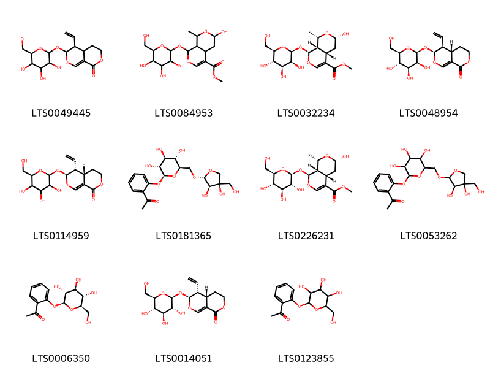{ width=100% }
    <figcaption>Hình ảnh cấu trúc hóa học của 11 hoạt chất thuộc nhóm Organooxygen compounds gồm ['5-ethenyl-6-{[3,4,5-trihydroxy-6-(hydroxymethyl)oxan-2-yl]oxy}-3h,4h,4ah,5h,6h-pyrano[3,4-c]pyran-1-one (LTS0049445)', 'methyl 6-hydroxy-8-methyl-1-{[3,4,5-trihydroxy-6-(hydroxymethyl)oxan-2-yl]oxy}-1h,4ah,5h,6h,8h,8ah-pyrano[3,4-c]pyran-4-carboxylate (LTS0084953)', 'methyl (1s,4as,6s,8s,8as)-6-hydroxy-8-methyl-1-{[(2s,3s,4s,5s,6r)-3,4,5-trihydroxy-6-(hydroxymethyl)oxan-2-yl]oxy}-1h,4ah,5h,6h,8h,8ah-pyrano[3,4-c]pyran-4-carboxylate (LTS0032234)', '(4as,5s,6s)-5-ethenyl-6-{[(2s,3s,4s,5s,6r)-3,4,5-trihydroxy-6-(hydroxymethyl)oxan-2-yl]oxy}-3h,4h,4ah,5h,6h-pyrano[3,4-c]pyran-1-one (LTS0048954)', '(4as,5r,6s)-5-ethenyl-6-{[3,4,5-trihydroxy-6-(hydroxymethyl)oxan-2-yl]oxy}-3h,4h,4ah,5h,6h-pyrano[3,4-c]pyran-1-one (LTS0114959)', '1-(2-{[(2s,3r,4s,5s,6r)-6-({[(2r,3r,4r)-3,4-dihydroxy-4-(hydroxymethyl)oxolan-2-yl]oxy}methyl)-3,4,5-trihydroxyoxan-2-yl]oxy}phenyl)ethanone (LTS0181365)', 'methyl (1s,4as,6s,8s,8as)-6-hydroxy-8-methyl-1-{[(2s,3r,4s,5s,6r)-3,4,5-trihydroxy-6-(hydroxymethyl)oxan-2-yl]oxy}-1h,4ah,5h,6h,8h,8ah-pyrano[3,4-c]pyran-4-carboxylate (LTS0226231)', '1-(2-{[6-({[3,4-dihydroxy-4-(hydroxymethyl)oxolan-2-yl]oxy}methyl)-3,4,5-trihydroxyoxan-2-yl]oxy}phenyl)ethanone (LTS0053262)', '1-(2-{[(2s,3r,4s,5s,6r)-3,4,5-trihydroxy-6-(hydroxymethyl)oxan-2-yl]oxy}phenyl)ethanone (LTS0006350)', 'sweroside (LTS0014051)', '1-(2-{[3,4,5-trihydroxy-6-(hydroxymethyl)oxan-2-yl]oxy}phenyl)ethanone (LTS0123855)'].</figcaption>
</figure>
#### Nhóm Prenol lipids
<figure markdown="span">
    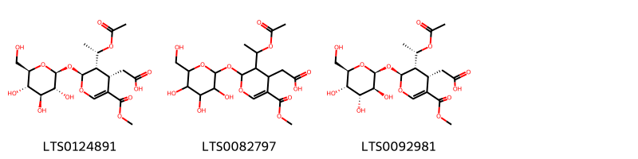{ width=100% }
    <figcaption>Hình ảnh cấu trúc hóa học của 3 hoạt chất thuộc nhóm Prenol lipids gồm ['[(2s,3s,4s)-3-[(1s)-1-(acetyloxy)ethyl]-5-(methoxycarbonyl)-2-{[(2s,3r,4s,5s,6r)-3,4,5-trihydroxy-6-(hydroxymethyl)oxan-2-yl]oxy}-3,4-dihydro-2h-pyran-4-yl]acetic acid (LTS0124891)', '{3-[1-(acetyloxy)ethyl]-5-(methoxycarbonyl)-2-{[3,4,5-trihydroxy-6-(hydroxymethyl)oxan-2-yl]oxy}-3,4-dihydro-2h-pyran-4-yl}acetic acid (LTS0082797)', '[(2s,3s,4s)-3-[(1s)-1-(acetyloxy)ethyl]-5-(methoxycarbonyl)-2-{[(2s,3s,4r,5s,6r)-3,4,5-trihydroxy-6-(hydroxymethyl)oxan-2-yl]oxy}-3,4-dihydro-2h-pyran-4-yl]acetic acid (LTS0092981)'].</figcaption>
</figure>
#### Nhóm Steroids and steroid derivatives
<figure markdown="span">
    { width=100% }
    <figcaption>Hình ảnh cấu trúc hóa học của 5 hoạt chất thuộc nhóm Steroids and steroid derivatives gồm ['sitosterol (LTS0168132)', 'stigmast-5-en-3-ol, (3β)- (LTS0204616)', 'sitogluside (LTS0201798)', '2-{[1-(5-ethyl-6-methylheptan-2-yl)-9a,11a-dimethyl-1h,2h,3h,3ah,3bh,4h,6h,7h,8h,9h,9bh,10h,11h-cyclopenta[a]phenanthren-7-yl]oxy}-6-(hydroxymethyl)oxane-3,4,5-triol (LTS0158828)', '(2r,3r,4s,5s,6s)-2-{[(1r,3as,3bs,7s,9ar,9bs,11ar)-1-[(2r,5r)-5-ethyl-6-methylheptan-2-yl]-9a,11a-dimethyl-1h,2h,3h,3ah,3bh,4h,6h,7h,8h,9h,9bh,10h,11h-cyclopenta[a]phenanthren-7-yl]oxy}-6-(hydroxymethyl)oxane-3,4,5-triol (LTS0076809)'].</figcaption>
</figure>

---

### Dược dân tộc học

Danh sách các quốc gia có sử dụng *Chione venosa* trong điều trị các bệnh. 

| Country   | Disease     | Bệnh                                                                                                                                                                                                |
|:----------|:------------|:----------------------------------------------------------------------------------------------------------------------------------------------------------------------------------------------------|
| Grenada   | Aphrodisiac | MYMEMORY WARNING: YOU USED ALL AVAILABLE FREE TRANSLATIONS FOR TODAY. NEXT AVAILABLE IN  10 HOURS 43 MINUTES 21 SECONDS VISIT HTTPS://MYMEMORY.TRANSLATED.NET/DOC/USAGELIMITS.PHP TO TRANSLATE MORE |

---

# Chi Mussaenda

??? note "Danh sách các dược liệu thuộc chi"
    
	 - *Mussaenda cambodiana*
	 - *Mussaenda erythrophila*
	 - *Mussaenda frondosa*
	 - *Mussaenda glabra*
	 - *Mussaenda kajewski*
	 - *Mussaenda villosa*

---
## Mussaenda cambodiana
### Thông tin về thực vật

!!! info "Phân loại thực vật của *Mussaenda cambodiana* từ GIBF:"
    - **Kingdom:** Plantae
    - **Phylum:** Tracheophyta
    - **Order:** Gentianales
    - **Family:** Rubiaceae
    - **Genus:** Mussaenda
    - **Species:** *Mussaenda cambodiana*

 

| Label (VI)   | Label (EN)   | Scientific Name      | Descriptions (VI)   | Descriptions (EN)   | Also Known As (VI)   | Also Known As (EN)   |
|:-------------|:-------------|:---------------------|:--------------------|:--------------------|:---------------------|:---------------------|
| N/A          | N/A          | Mussaenda cambodiana | loài thực vật       | species of plant    | ['']                 | ['']                 |

#### Phân bố trên thế giới

**Từ CSDL GIBF** nan, Viet Nam, Cambodia, Thailand, Lao People’s Democratic Republic

#### Phân bố tại Việt Nam

**Từ CSDL GIBF**: Hải Phòng, Nghe An, Phu Tho, Lam Dong, Quảng Ninh, Ninh Binh

---
### Thành phần hóa học
        
- Theo cơ sở dữ liệu lotus: Từ loài *Mussaenda cambodiana* đã phân lập và xác định được Chưa có hoạt chất nào được phân lập. hoạt chất thuộc về các nhóm Không có hoạt chất nào được phân lập. 

Không có hình ảnh nào được tạo ra

---

### Dược dân tộc học

Danh sách các quốc gia có sử dụng *Mussaenda cambodiana* trong điều trị các bệnh. 

| Country   | Disease   | Bệnh                                                                                                                                                                                                |
|:----------|:----------|:----------------------------------------------------------------------------------------------------------------------------------------------------------------------------------------------------|
| Indochina | Diuretic  | MYMEMORY WARNING: YOU USED ALL AVAILABLE FREE TRANSLATIONS FOR TODAY. NEXT AVAILABLE IN  10 HOURS 42 MINUTES 39 SECONDS VISIT HTTPS://MYMEMORY.TRANSLATED.NET/DOC/USAGELIMITS.PHP TO TRANSLATE MORE |

---

---
## Mussaenda erythrophila
### Thông tin về thực vật

!!! info "Phân loại thực vật của *Mussaenda erythrophylla* từ GIBF:"
    - **Kingdom:** Plantae
    - **Phylum:** Tracheophyta
    - **Order:** Gentianales
    - **Family:** Rubiaceae
    - **Genus:** Mussaenda
    - **Species:** *Mussaenda erythrophylla*

 

| Label (VI)   | Label (EN)   | Scientific Name      | Descriptions (VI)   | Descriptions (EN)   | Also Known As (VI)   | Also Known As (EN)   |
|:-------------|:-------------|:---------------------|:--------------------|:--------------------|:---------------------|:---------------------|
| N/A          | N/A          | Mussaenda cambodiana | loài thực vật       | species of plant    | ['']                 | ['']                 |

#### Phân bố trên thế giới

**Từ CSDL GIBF** Brazil, Uganda, Bangladesh, Barbados, China, Saint Lucia, Honduras, Tanzania, United Republic of, Ecuador, French Polynesia, Papua New Guinea, Thailand, Guinea, Puerto Rico, Ghana, United States of America, Jamaica, Indonesia, Seychelles, Costa Rica, Wallis and Futuna, Colombia, Nigeria, French Guiana, Sierra Leone, Malawi, Dominica, Hong Kong, Congo, Democratic Republic of the, Kenya, Rwanda, El Salvador, Chinese Taipei, Philippines, Malaysia, Gabon, Mauritius, Panama, Belize, Nicaragua, Singapore, Martinique, South Africa, Côte d’Ivoire, India, Congo, Peru, Bolivia (Plurinational State of), Cameroon, Venezuela (Bolivarian Republic of)

#### Phân bố tại Việt Nam

**Từ CSDL GIBF**: Không có ghi nhận ở Việt Nam

---
### Thành phần hóa học
        
- Theo cơ sở dữ liệu lotus: Từ loài *Mussaenda erythrophylla* đã phân lập và xác định được Chưa có hoạt chất nào được phân lập. hoạt chất thuộc về các nhóm Không có hoạt chất nào được phân lập. 

Không có hình ảnh nào được tạo ra

---

### Dược dân tộc học

Danh sách các quốc gia có sử dụng *Mussaenda erythrophylla* trong điều trị các bệnh. 

| Country   | Disease   | Bệnh                                                                                                                                                                                                |
|:----------|:----------|:----------------------------------------------------------------------------------------------------------------------------------------------------------------------------------------------------|
| Africa    | Apertif   | MYMEMORY WARNING: YOU USED ALL AVAILABLE FREE TRANSLATIONS FOR TODAY. NEXT AVAILABLE IN  10 HOURS 42 MINUTES 11 SECONDS VISIT HTTPS://MYMEMORY.TRANSLATED.NET/DOC/USAGELIMITS.PHP TO TRANSLATE MORE |

---

---
## Mussaenda frondosa
### Thông tin về thực vật

!!! info "Phân loại thực vật của *Mussaenda frondosa* từ GIBF:"
    - **Kingdom:** Plantae
    - **Phylum:** Tracheophyta
    - **Order:** Gentianales
    - **Family:** Rubiaceae
    - **Genus:** Mussaenda
    - **Species:** *Mussaenda frondosa*

 

| Label (VI)   | Label (EN)   | Scientific Name    | Descriptions (VI)   | Descriptions (EN)   | Also Known As (VI)   | Also Known As (EN)   |
|:-------------|:-------------|:-------------------|:--------------------|:--------------------|:---------------------|:---------------------|
| N/A          | N/A          | Mussaenda frondosa | loài thực vật       | species of plant    | ['']                 | ['']                 |

#### Phân bố trên thế giới

**Từ CSDL GIBF** nan, Brazil, Viet Nam, Bangladesh, Nepal, China, New Zealand, Zimbabwe, French Polynesia, Thailand, Madagascar, Puerto Rico, Sri Lanka, United States of America, Indonesia, Colombia, Dominica, Hong Kong, El Salvador, Philippines, Malaysia, Palau, Singapore, Cook Islands, Timor-Leste, South Africa, Australia, India

#### Phân bố tại Việt Nam

**Từ CSDL GIBF**: Tỉnh Khánh Hòa, Ha Giang, Khánh Hòa, Khanh Hoa

---
### Thành phần hóa học
        
- Theo cơ sở dữ liệu lotus: Từ loài *Mussaenda frondosa* đã phân lập và xác định được Chưa có hoạt chất nào được phân lập. hoạt chất thuộc về các nhóm Không có hoạt chất nào được phân lập. 

Không có hình ảnh nào được tạo ra

---

### Dược dân tộc học

Danh sách các quốc gia có sử dụng *Mussaenda frondosa* trong điều trị các bệnh. 

| Country   | Disease   | Bệnh                                                                                                                                                                                                |
|:----------|:----------|:----------------------------------------------------------------------------------------------------------------------------------------------------------------------------------------------------|
| Malaysia  | Vermifuge | MYMEMORY WARNING: YOU USED ALL AVAILABLE FREE TRANSLATIONS FOR TODAY. NEXT AVAILABLE IN  10 HOURS 41 MINUTES 45 SECONDS VISIT HTTPS://MYMEMORY.TRANSLATED.NET/DOC/USAGELIMITS.PHP TO TRANSLATE MORE |

---

---
## Mussaenda glabra
### Thông tin về thực vật

!!! info "Phân loại thực vật của *Mussaenda glabra* từ GIBF:"
    - **Kingdom:** Plantae
    - **Phylum:** Tracheophyta
    - **Order:** Gentianales
    - **Family:** Rubiaceae
    - **Genus:** Mussaenda
    - **Species:** *Mussaenda glabra*

 

| Label (VI)   | Label (EN)   | Scientific Name   | Descriptions (VI)   | Descriptions (EN)   | Also Known As (VI)   | Also Known As (EN)   |
|:-------------|:-------------|:------------------|:--------------------|:--------------------|:---------------------|:---------------------|
| N/A          | N/A          | Mussaenda glabra  |                     | species of plant    | ['']                 | ['']                 |

#### Phân bố trên thế giới

**Từ CSDL GIBF** Sri Lanka, nan, Singapore, Viet Nam, United States of America, Cambodia, Bhutan, Indonesia, Malaysia, Philippines, China, Nepal, Myanmar, India, French Polynesia, unknown or invalid, Thailand

#### Phân bố tại Việt Nam

**Từ CSDL GIBF**: Hải Phòng, Lam Dong, Hà Nội, Khanh Hoa, Khánh Hòa, Quang Nam-Da Nang

---
### Thành phần hóa học
        
- Theo cơ sở dữ liệu lotus: Từ loài *Mussaenda glabra* đã phân lập và xác định được Chưa có hoạt chất nào được phân lập. hoạt chất thuộc về các nhóm Không có hoạt chất nào được phân lập. 

Không có hình ảnh nào được tạo ra

---

### Dược dân tộc học

Danh sách các quốc gia có sử dụng *Mussaenda glabra* trong điều trị các bệnh. 

| Country   | Disease   | Bệnh                                                                                                                                                                                                |
|:----------|:----------|:----------------------------------------------------------------------------------------------------------------------------------------------------------------------------------------------------|
| Elsewhere | Diuretic  | MYMEMORY WARNING: YOU USED ALL AVAILABLE FREE TRANSLATIONS FOR TODAY. NEXT AVAILABLE IN  10 HOURS 41 MINUTES 17 SECONDS VISIT HTTPS://MYMEMORY.TRANSLATED.NET/DOC/USAGELIMITS.PHP TO TRANSLATE MORE |

---

---
## Mussaenda kajewski
### Thông tin về thực vật

!!! info "Phân loại thực vật của *Mussaenda kajewskii* từ GIBF:"
    - **Kingdom:** Plantae
    - **Phylum:** Tracheophyta
    - **Order:** Gentianales
    - **Family:** Rubiaceae
    - **Genus:** Mussaenda
    - **Species:** *Mussaenda kajewskii*

 

| Label (VI)   | Label (EN)   | Scientific Name   | Descriptions (VI)   | Descriptions (EN)   | Also Known As (VI)   | Also Known As (EN)   |
|:-------------|:-------------|:------------------|:--------------------|:--------------------|:---------------------|:---------------------|
| N/A          | N/A          | Mussaenda glabra  |                     | species of plant    | ['']                 | ['']                 |

#### Phân bố trên thế giới

**Từ CSDL GIBF** Papua New Guinea, Vanuatu, Solomon Islands, unknown or invalid

#### Phân bố tại Việt Nam

**Từ CSDL GIBF**: Không có ghi nhận ở Việt Nam

---
### Thành phần hóa học
        
- Theo cơ sở dữ liệu lotus: Từ loài *Mussaenda kajewskii* đã phân lập và xác định được Chưa có hoạt chất nào được phân lập. hoạt chất thuộc về các nhóm Không có hoạt chất nào được phân lập. 

Không có hình ảnh nào được tạo ra

---

### Dược dân tộc học

Danh sách các quốc gia có sử dụng *Mussaenda kajewskii* trong điều trị các bệnh. 

| Country   | Disease      | Bệnh                                                                                                                                                                                                |
|:----------|:-------------|:----------------------------------------------------------------------------------------------------------------------------------------------------------------------------------------------------|
| Solomon I | Pediculicide | MYMEMORY WARNING: YOU USED ALL AVAILABLE FREE TRANSLATIONS FOR TODAY. NEXT AVAILABLE IN  10 HOURS 40 MINUTES 38 SECONDS VISIT HTTPS://MYMEMORY.TRANSLATED.NET/DOC/USAGELIMITS.PHP TO TRANSLATE MORE |

---

---
## Mussaenda villosa
### Thông tin về thực vật

!!! info "Phân loại thực vật của *Mussaenda villosa* từ GIBF:"
    - **Kingdom:** Plantae
    - **Phylum:** Tracheophyta
    - **Order:** Gentianales
    - **Family:** Rubiaceae
    - **Genus:** Mussaenda
    - **Species:** *Mussaenda villosa*

 

| Label (VI)   | Label (EN)   | Scientific Name   | Descriptions (VI)   | Descriptions (EN)   | Also Known As (VI)   | Also Known As (EN)   |
|:-------------|:-------------|:------------------|:--------------------|:--------------------|:---------------------|:---------------------|
| N/A          | N/A          | Mussaenda villosa | loài thực vật       | species of plant    | ['']                 | ['']                 |

#### Phân bố trên thế giới

**Từ CSDL GIBF** nan, Singapore, Viet Nam, Indonesia, Malaysia, Myanmar, India, unknown or invalid, Thailand

#### Phân bố tại Việt Nam

**Từ CSDL GIBF**: Không có ghi nhận ở Việt Nam

---
### Thành phần hóa học
        
- Theo cơ sở dữ liệu lotus: Từ loài *Mussaenda villosa* đã phân lập và xác định được Chưa có hoạt chất nào được phân lập. hoạt chất thuộc về các nhóm Không có hoạt chất nào được phân lập. 

Không có hình ảnh nào được tạo ra

---

### Dược dân tộc học

Danh sách các quốc gia có sử dụng *Mussaenda villosa* trong điều trị các bệnh. 

| Country   | Disease   | Bệnh                                                                                                                                                                                                |
|:----------|:----------|:----------------------------------------------------------------------------------------------------------------------------------------------------------------------------------------------------|
| Malaya    | Poison    | MYMEMORY WARNING: YOU USED ALL AVAILABLE FREE TRANSLATIONS FOR TODAY. NEXT AVAILABLE IN  10 HOURS 40 MINUTES 17 SECONDS VISIT HTTPS://MYMEMORY.TRANSLATED.NET/DOC/USAGELIMITS.PHP TO TRANSLATE MORE |

---

# Chi Galium

??? note "Danh sách các dược liệu thuộc chi"
    
	 - *Galium aparine*
	 - *Galium cruciatum*
	 - *Galium gracile*
	 - *Galium mollugo*
	 - *Galium odoratum*
	 - *Galium verum*

---
## Galium aparine
### Thông tin về thực vật

!!! info "Phân loại thực vật của *Galium aparine* từ GIBF:"
    - **Kingdom:** Plantae
    - **Phylum:** Tracheophyta
    - **Order:** Gentianales
    - **Family:** Rubiaceae
    - **Genus:** Galium
    - **Species:** *Galium aparine*

 

| Label (VI)   | Label (EN)   | Scientific Name   | Descriptions (VI)   | Descriptions (EN)   | Also Known As (VI)   | Also Known As (EN)                                                                                              |
|:-------------|:-------------|:------------------|:--------------------|:--------------------|:---------------------|:----------------------------------------------------------------------------------------------------------------|
| N/A          | N/A          | Galium aparine    | loài thực vật       | species of plant    | ['']                 | ['stickleback', 'goosegrass', 'catchweed', 'cleavers', 'clivers', 'goose grass', 'sticky willy', 'stickywilly'] |

#### Phân bố trên thế giới

**Từ CSDL GIBF** Chile, New Zealand, Spain, Denmark, Netherlands, Bolivia (Plurinational State of), United States of America, Greece, Russian Federation, United Kingdom of Great Britain and Northern Ireland, Palestine, State of, Canada, Germany, Austria, Portugal, Australia, Italy, France, Ireland

#### Phân bố tại Việt Nam

**Từ CSDL GIBF**: Không có ghi nhận ở Việt Nam

---
### Thành phần hóa học
        
- Theo cơ sở dữ liệu lotus: Từ loài *Galium aparine* đã phân lập và xác định được 20 hoạt chất thuộc về các nhóm Benzene and substituted derivatives, Flavonoids, Anthracenes, Organooxygen compounds, Prenol lipids. 

|    | chemicalTaxonomyClassyfireClass     |   smiles_count |
|---:|:------------------------------------|---------------:|
|  0 | Anthracenes                         |             12 |
|  1 | Benzene and substituted derivatives |              1 |
|  2 | Flavonoids                          |              1 |
|  3 | Organooxygen compounds              |              3 |
|  4 | Prenol lipids                       |              3 |

#### Nhóm Anthracenes
<figure markdown="span">
    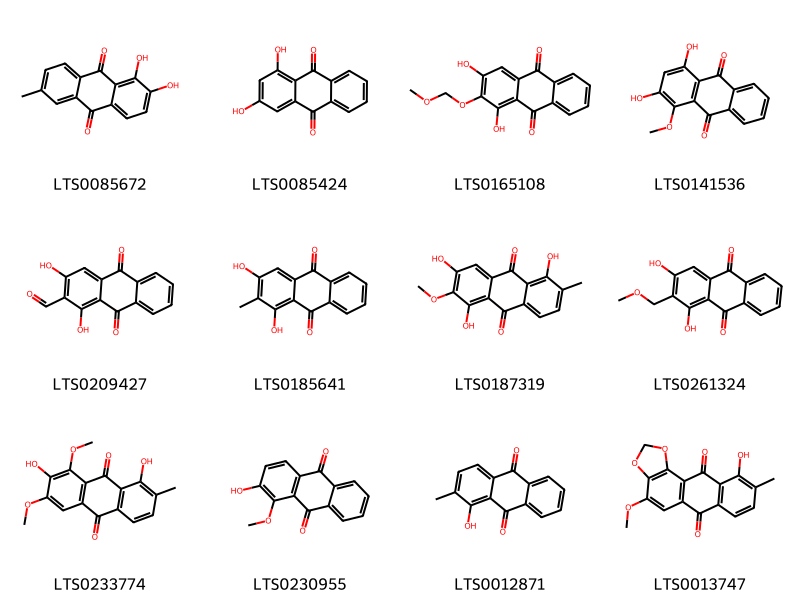{ width=100% }
    <figcaption>Hình ảnh cấu trúc hóa học của 12 hoạt chất thuộc nhóm Anthracenes gồm ['1,2-dihydroxy-6-methylanthracene-9,10-dione (LTS0085672)', 'purpuro (LTS0085424)', '1,3-dihydroxy-2-(methoxymethoxy)anthracene-9,10-dione (LTS0165108)', 'purpurin 1-methyl ether (LTS0141536)', '1,3-dihydroxy-9,10-dioxoanthracene-2-carbaldehyde (LTS0209427)', 'rubiadin (LTS0185641)', '1,3,5-trihydroxy-2-methoxy-6-methylanthracene-9,10-dione (LTS0187319)', 'lucidin ω-methyl ether (LTS0261324)', '2,8-dihydroxy-1,3-dimethoxy-7-methylanthracene-9,10-dione (LTS0233774)', '2-hydroxy-1-methoxyanthracene-9,10-dione (LTS0230955)', '1-hydroxy-2-methylanthracene-9,10-dione (LTS0012871)', '10-hydroxy-4-methoxy-9-methyl-2h-anthra[1,2-d][1,3]dioxole-6,11-dione (LTS0013747)'].</figcaption>
</figure>
#### Nhóm Benzene and substituted derivatives
<figure markdown="span">
    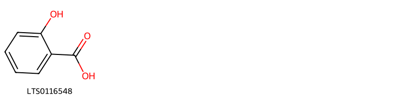{ width=100% }
    <figcaption>Hình ảnh cấu trúc hóa học của 1 hoạt chất thuộc nhóm Benzene and substituted derivatives gồm ['salicyclic acid (LTS0116548)'].</figcaption>
</figure>
#### Nhóm Flavonoids
<figure markdown="span">
    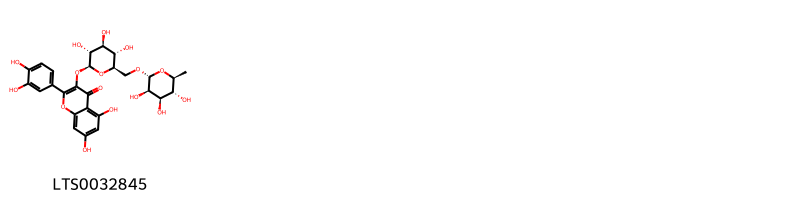{ width=100% }
    <figcaption>Hình ảnh cấu trúc hóa học của 1 hoạt chất thuộc nhóm Flavonoids gồm ['3-rutinosyl quercetin (LTS0032845)'].</figcaption>
</figure>
#### Nhóm Organooxygen compounds
<figure markdown="span">
    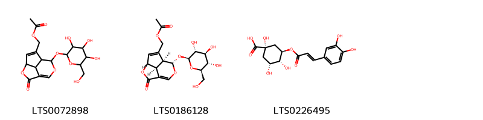{ width=100% }
    <figcaption>Hình ảnh cấu trúc hóa học của 3 hoạt chất thuộc nhóm Organooxygen compounds gồm ['asperuloside (LTS0072898)', 'asperuloside (LTS0186128)', 'chlorogenic acid (LTS0226495)'].</figcaption>
</figure>
#### Nhóm Prenol lipids
<figure markdown="span">
    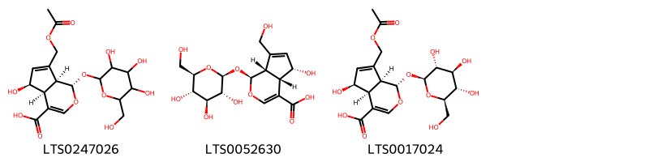{ width=100% }
    <figcaption>Hình ảnh cấu trúc hóa học của 3 hoạt chất thuộc nhóm Prenol lipids gồm ['(1s,4as,5s,7as)-7-[(acetyloxy)methyl]-5-hydroxy-1-{[3,4,5-trihydroxy-6-(hydroxymethyl)oxan-2-yl]oxy}-1h,4ah,5h,7ah-cyclopenta[c]pyran-4-carboxylic acid (LTS0247026)', 'deacetylasperulosidic acid (LTS0052630)', '(1s,4as,5s,7as)-7-[(acetyloxy)methyl]-5-hydroxy-1-{[(2s,3r,4s,5s,6r)-3,4,5-trihydroxy-6-(hydroxymethyl)oxan-2-yl]oxy}-1h,4ah,5h,7ah-cyclopenta[c]pyran-4-carboxylic acid (LTS0017024)'].</figcaption>
</figure>

---

### Dược dân tộc học

Danh sách các quốc gia có sử dụng *Galium aparine* trong điều trị các bệnh. 

| Country         | Disease                                                  | Bệnh                                                                                                                                                                                                |
|:----------------|:---------------------------------------------------------|:----------------------------------------------------------------------------------------------------------------------------------------------------------------------------------------------------|
| Elsewhere       | Aperient, Diuretic, Refrigerant                          | MYMEMORY WARNING: YOU USED ALL AVAILABLE FREE TRANSLATIONS FOR TODAY. NEXT AVAILABLE IN  10 HOURS 39 MINUTES 47 SECONDS VISIT HTTPS://MYMEMORY.TRANSLATED.NET/DOC/USAGELIMITS.PHP TO TRANSLATE MORE |
| Kurdistan       | Rennet                                                   | MYMEMORY WARNING: YOU USED ALL AVAILABLE FREE TRANSLATIONS FOR TODAY. NEXT AVAILABLE IN  10 HOURS 39 MINUTES 39 SECONDS VISIT HTTPS://MYMEMORY.TRANSLATED.NET/DOC/USAGELIMITS.PHP TO TRANSLATE MORE |
| Mexico(Mazatec) | nan                                                      | MYMEMORY WARNING: YOU USED ALL AVAILABLE FREE TRANSLATIONS FOR TODAY. NEXT AVAILABLE IN  10 HOURS 39 MINUTES 35 SECONDS VISIT HTTPS://MYMEMORY.TRANSLATED.NET/DOC/USAGELIMITS.PHP TO TRANSLATE MORE |
| Turkey          | Aperient, Astringent, Diuretic, Rennet, Tonic, Sudorific | MYMEMORY WARNING: YOU USED ALL AVAILABLE FREE TRANSLATIONS FOR TODAY. NEXT AVAILABLE IN  10 HOURS 39 MINUTES 33 SECONDS VISIT HTTPS://MYMEMORY.TRANSLATED.NET/DOC/USAGELIMITS.PHP TO TRANSLATE MORE |
| UK              | Hemostat                                                 | MYMEMORY WARNING: YOU USED ALL AVAILABLE FREE TRANSLATIONS FOR TODAY. NEXT AVAILABLE IN  10 HOURS 39 MINUTES 30 SECONDS VISIT HTTPS://MYMEMORY.TRANSLATED.NET/DOC/USAGELIMITS.PHP TO TRANSLATE MORE |
| US              | Apertif, Diuretic                                        | MYMEMORY WARNING: YOU USED ALL AVAILABLE FREE TRANSLATIONS FOR TODAY. NEXT AVAILABLE IN  10 HOURS 39 MINUTES 26 SECONDS VISIT HTTPS://MYMEMORY.TRANSLATED.NET/DOC/USAGELIMITS.PHP TO TRANSLATE MORE |
| ain             | Diuretic                                                 | MYMEMORY WARNING: YOU USED ALL AVAILABLE FREE TRANSLATIONS FOR TODAY. NEXT AVAILABLE IN  10 HOURS 39 MINUTES 21 SECONDS VISIT HTTPS://MYMEMORY.TRANSLATED.NET/DOC/USAGELIMITS.PHP TO TRANSLATE MORE |

---

---
## Galium cruciatum
### Thông tin về thực vật

!!! info "Phân loại thực vật của *Galium cruciatum* từ GIBF:"
    - **Kingdom:** Plantae
    - **Phylum:** Tracheophyta
    - **Order:** Gentianales
    - **Family:** Rubiaceae
    - **Genus:** Galium
    - **Species:** *Galium cruciatum*

 

| Label (VI)   | Label (EN)   | Scientific Name   | Descriptions (VI)   | Descriptions (EN)   | Also Known As (VI)   | Also Known As (EN)                                                                                              |
|:-------------|:-------------|:------------------|:--------------------|:--------------------|:---------------------|:----------------------------------------------------------------------------------------------------------------|
| N/A          | N/A          | Galium aparine    | loài thực vật       | species of plant    | ['']                 | ['stickleback', 'goosegrass', 'catchweed', 'cleavers', 'clivers', 'goose grass', 'sticky willy', 'stickywilly'] |

#### Phân bố trên thế giới

**Từ CSDL GIBF** nan, United Kingdom of Great Britain and Northern Ireland, Belgium, Croatia, Germany, France, Spain

#### Phân bố tại Việt Nam

**Từ CSDL GIBF**: Không có ghi nhận ở Việt Nam

---
### Thành phần hóa học
        
- Theo cơ sở dữ liệu lotus: Từ loài *Galium cruciatum* đã phân lập và xác định được Chưa có hoạt chất nào được phân lập. hoạt chất thuộc về các nhóm Không có hoạt chất nào được phân lập. 

Không có hình ảnh nào được tạo ra

---

### Dược dân tộc học

Danh sách các quốc gia có sử dụng *Galium cruciatum* trong điều trị các bệnh. 

| Country   | Disease                        | Bệnh                                                                                                                                                                                                |
|:----------|:-------------------------------|:----------------------------------------------------------------------------------------------------------------------------------------------------------------------------------------------------|
| Turkey    | Astringent, Styptic, Vulnerary | MYMEMORY WARNING: YOU USED ALL AVAILABLE FREE TRANSLATIONS FOR TODAY. NEXT AVAILABLE IN  10 HOURS 38 MINUTES 46 SECONDS VISIT HTTPS://MYMEMORY.TRANSLATED.NET/DOC/USAGELIMITS.PHP TO TRANSLATE MORE |

---

---
## Galium gracile
### Thông tin về thực vật

!!! info "Phân loại thực vật của *N/A* từ GIBF:"
    - **Kingdom:** Plantae
    - **Phylum:** Tracheophyta
    - **Order:** Gentianales
    - **Family:** Rubiaceae
    - **Genus:** Galium
    - **Species:** *N/A*

 

| Label (VI)   | Label (EN)   | Scientific Name   | Descriptions (VI)   | Descriptions (EN)   | Also Known As (VI)   | Also Known As (EN)                                                                                              |
|:-------------|:-------------|:------------------|:--------------------|:--------------------|:---------------------|:----------------------------------------------------------------------------------------------------------------|
| N/A          | N/A          | Galium aparine    | loài thực vật       | species of plant    | ['']                 | ['stickleback', 'goosegrass', 'catchweed', 'cleavers', 'clivers', 'goose grass', 'sticky willy', 'stickywilly'] |

#### Phân bố trên thế giới

**Từ CSDL GIBF** China, Chile, New Zealand, Ecuador, Uruguay, Spain, Netherlands, Denmark, Bolivia (Plurinational State of), United States of America, Russian Federation, Colombia, Argentina, United Kingdom of Great Britain and Northern Ireland, Palestine, State of, Canada, Germany, Austria, Hungary, Portugal, Ukraine, South Africa, Australia, Italy, Peru, France, Ireland

#### Phân bố tại Việt Nam

**Từ CSDL GIBF**: Không có ghi nhận ở Việt Nam

---
### Thành phần hóa học
        
- Theo cơ sở dữ liệu lotus: Từ loài *N/A* đã phân lập và xác định được Chưa có hoạt chất nào được phân lập. hoạt chất thuộc về các nhóm Không có hoạt chất nào được phân lập. 

Không có hình ảnh nào được tạo ra

---

### Dược dân tộc học

Danh sách các quốc gia có sử dụng *N/A* trong điều trị các bệnh. 

| Country   | Disease              | Bệnh                                                                                                                                                                                                |
|:----------|:---------------------|:----------------------------------------------------------------------------------------------------------------------------------------------------------------------------------------------------|
| China     | Alexiteric, Diuretic | MYMEMORY WARNING: YOU USED ALL AVAILABLE FREE TRANSLATIONS FOR TODAY. NEXT AVAILABLE IN  10 HOURS 38 MINUTES 27 SECONDS VISIT HTTPS://MYMEMORY.TRANSLATED.NET/DOC/USAGELIMITS.PHP TO TRANSLATE MORE |

---

---
## Galium mollugo
### Thông tin về thực vật

!!! info "Phân loại thực vật của *Galium mollugo* từ GIBF:"
    - **Kingdom:** Plantae
    - **Phylum:** Tracheophyta
    - **Order:** Gentianales
    - **Family:** Rubiaceae
    - **Genus:** Galium
    - **Species:** *Galium mollugo*

 

| Label (VI)   | Label (EN)   | Scientific Name   | Descriptions (VI)   | Descriptions (EN)   | Also Known As (VI)   | Also Known As (EN)                                          |
|:-------------|:-------------|:------------------|:--------------------|:--------------------|:---------------------|:------------------------------------------------------------|
| N/A          | N/A          | Galium mollugo    | loài thực vật       | species of plant    | ['']                 | ["false baby's breath", 'hedge bedstraw', 'white bedstraw'] |

#### Phân bố trên thế giới

**Từ CSDL GIBF** Czechia, Sweden, Slovenia, Spain, Poland, Denmark, Netherlands, United States of America, Romania, Russian Federation, Norway, France, Belgium, Luxembourg, Germany, Austria, Hungary, Italy, Switzerland, United Kingdom of Great Britain and Northern Ireland

#### Phân bố tại Việt Nam

**Từ CSDL GIBF**: Không có ghi nhận ở Việt Nam

---
### Thành phần hóa học
        
- Theo cơ sở dữ liệu lotus: Từ loài *Galium mollugo* đã phân lập và xác định được 59 hoạt chất thuộc về các nhóm Naphthofurans, Anthracenes, Naphthopyrans, Carboxylic acids and derivatives, Hydroxy acids and derivatives, Organooxygen compounds, Prenol lipids. 

|    | chemicalTaxonomyClassyfireClass   |   smiles_count |
|---:|:----------------------------------|---------------:|
|  0 | Anthracenes                       |              9 |
|  1 | Carboxylic acids and derivatives  |              2 |
|  2 | Hydroxy acids and derivatives     |              2 |
|  3 | Naphthofurans                     |              1 |
|  4 | Naphthopyrans                     |              1 |
|  5 | Organooxygen compounds            |             19 |
|  6 | Prenol lipids                     |             24 |

#### Nhóm Anthracenes
<figure markdown="span">
    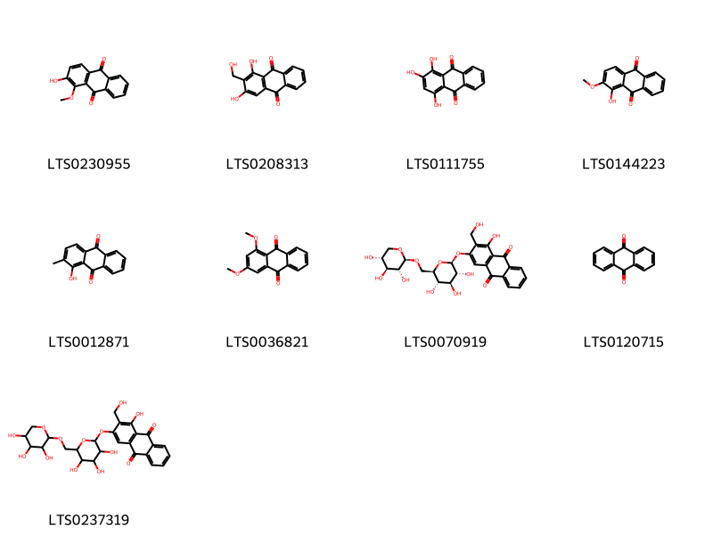{ width=100% }
    <figcaption>Hình ảnh cấu trúc hóa học của 9 hoạt chất thuộc nhóm Anthracenes gồm ['2-hydroxy-1-methoxyanthracene-9,10-dione (LTS0230955)', 'henine (LTS0208313)', 'purpurin (LTS0111755)', 'alizarin 2-methyl ether (LTS0144223)', '1-hydroxy-2-methylanthracene-9,10-dione (LTS0012871)', '1,3-dimethoxyanthracene-9,10-dione (LTS0036821)', '1-hydroxy-2-(hydroxymethyl)-3-{[(2s,3r,4s,5s,6r)-3,4,5-trihydroxy-6-({[(2s,3r,4s,5r)-3,4,5-trihydroxyoxan-2-yl]oxy}methyl)oxan-2-yl]oxy}anthracene-9,10-dione (LTS0070919)', 'anthraquinone (LTS0120715)', '1-hydroxy-2-(hydroxymethyl)-3-[(3,4,5-trihydroxy-6-{[(3,4,5-trihydroxyoxan-2-yl)oxy]methyl}oxan-2-yl)oxy]anthracene-9,10-dione (LTS0237319)'].</figcaption>
</figure>
#### Nhóm Carboxylic acids and derivatives
<figure markdown="span">
    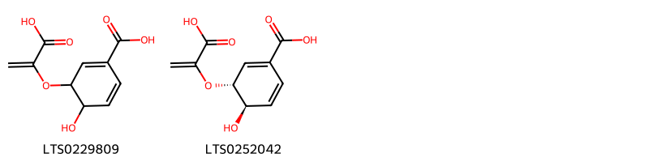{ width=100% }
    <figcaption>Hình ảnh cấu trúc hóa học của 2 hoạt chất thuộc nhóm Carboxylic acids and derivatives gồm ['chorismic acid (LTS0229809)', 'chorismic acid (LTS0252042)'].</figcaption>
</figure>
#### Nhóm Hydroxy acids and derivatives
<figure markdown="span">
    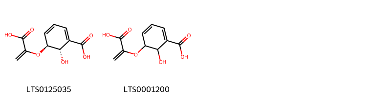{ width=100% }
    <figcaption>Hình ảnh cấu trúc hóa học của 2 hoạt chất thuộc nhóm Hydroxy acids and derivatives gồm ['isochorismic acid (LTS0125035)', '5-[(1-carboxyeth-1-en-1-yl)oxy]-6-hydroxycyclohexa-1,3-diene-1-carboxylic acid (LTS0001200)'].</figcaption>
</figure>
#### Nhóm Naphthofurans
<figure markdown="span">
    { width=100% }
    <figcaption>Hình ảnh cấu trúc hóa học của 1 hoạt chất thuộc nhóm Naphthofurans gồm ['methyl 5-hydroxynaphtho[1,2-b]furan-4-carboxylate (LTS0016439)'].</figcaption>
</figure>
#### Nhóm Naphthopyrans
<figure markdown="span">
    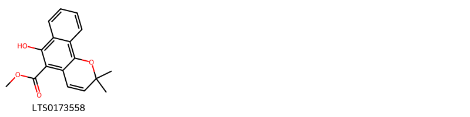{ width=100% }
    <figcaption>Hình ảnh cấu trúc hóa học của 1 hoạt chất thuộc nhóm Naphthopyrans gồm ['methyl 6-hydroxy-2,2-dimethylbenzo[h]chromene-5-carboxylate (LTS0173558)'].</figcaption>
</figure>
#### Nhóm Organooxygen compounds
<figure markdown="span">
    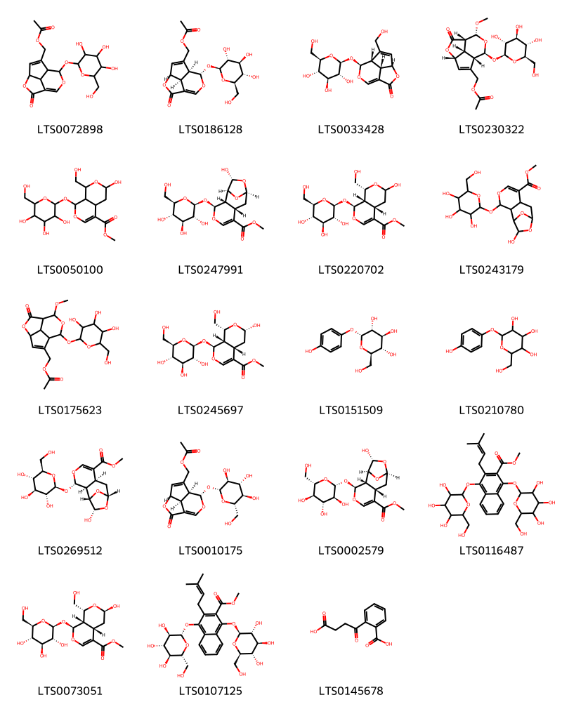{ width=100% }
    <figcaption>Hình ảnh cấu trúc hóa học của 19 hoạt chất thuộc nhóm Organooxygen compounds gồm ['asperuloside (LTS0072898)', 'asperuloside (LTS0186128)', '(4s,7s,8s,11s)-6-(hydroxymethyl)-8-{[(2s,3r,4s,5s,6r)-3,4,5-trihydroxy-6-(hydroxymethyl)oxan-2-yl]oxy}-3,9-dioxatricyclo[5.3.1.0⁴,¹¹]undeca-1(10),5-dien-2-one (LTS0033428)', '[(1s,4r,7s,8s,10r,11s)-10-methoxy-2-oxo-8-{[(2s,3r,4s,5s,6r)-3,4,5-trihydroxy-6-(hydroxymethyl)oxan-2-yl]oxy}-3,9-dioxatricyclo[5.3.1.0⁴,¹¹]undec-5-en-6-yl]methyl acetate (LTS0230322)', 'methyl 6-hydroxy-8-(hydroxymethyl)-1-{[3,4,5-trihydroxy-6-(hydroxymethyl)oxan-2-yl]oxy}-1h,4ah,5h,6h,8h,8ah-pyrano[3,4-c]pyran-4-carboxylate (LTS0050100)', 'secogalioside (LTS0247991)', '10-hydroxymorroniside (LTS0220702)', 'methyl 11-hydroxy-3-{[3,4,5-trihydroxy-6-(hydroxymethyl)oxan-2-yl]oxy}-4,10,12-trioxatricyclo[7.2.1.0²,⁷]dodec-5-ene-6-carboxylate (LTS0243179)', '(10-methoxy-2-oxo-8-{[3,4,5-trihydroxy-6-(hydroxymethyl)oxan-2-yl]oxy}-3,9-dioxatricyclo[5.3.1.0⁴,¹¹]undec-5-en-6-yl)methyl acetate (LTS0175623)', 'methyl (1s,4as,6s,8r,8as)-6-hydroxy-8-(hydroxymethyl)-1-{[(2s,3r,4s,5s,6r)-3,4,5-trihydroxy-6-(hydroxymethyl)oxan-2-yl]oxy}-1h,4ah,5h,6h,8h,8ah-pyrano[3,4-c]pyran-4-carboxylate (LTS0245697)', 'α-arbutin (LTS0151509)', 'arbutin (LTS0210780)', 'methyl (1s,2s,3s,7s,9s,11s)-11-hydroxy-3-{[(2s,3r,4s,5s,6r)-3,4,5-trihydroxy-6-(hydroxymethyl)oxan-2-yl]oxy}-4,10,12-trioxatricyclo[7.2.1.0²,⁷]dodec-5-ene-6-carboxylate (LTS0269512)', '[(4s,7s,8s,11s)-2-oxo-8-{[(2r,3s,4r,5r,6s)-3,4,5-trihydroxy-6-(hydroxymethyl)oxan-2-yl]oxy}-3,9-dioxatricyclo[5.3.1.0⁴,¹¹]undeca-1(10),5-dien-6-yl]methyl acetate (LTS0010175)', 'methyl (1s,2s,3s,7s,9s,11r)-11-hydroxy-3-{[(2r,3s,4r,5r,6s)-3,4,5-trihydroxy-6-(hydroxymethyl)oxan-2-yl]oxy}-4,10,12-trioxatricyclo[7.2.1.0²,⁷]dodec-5-ene-6-carboxylate (LTS0002579)', 'methyl 3-(3-methylbut-2-en-1-yl)-1,4-bis({[3,4,5-trihydroxy-6-(hydroxymethyl)oxan-2-yl]oxy})naphthalene-2-carboxylate (LTS0116487)', 'methyl (1s,4as,6r,8r,8as)-6-hydroxy-8-(hydroxymethyl)-1-{[(2s,3r,4s,5s,6r)-3,4,5-trihydroxy-6-(hydroxymethyl)oxan-2-yl]oxy}-1h,4ah,5h,6h,8h,8ah-pyrano[3,4-c]pyran-4-carboxylate (LTS0073051)', 'methyl 3-(3-methylbut-2-en-1-yl)-1,4-bis({[(2s,3r,4s,5s,6r)-3,4,5-trihydroxy-6-(hydroxymethyl)oxan-2-yl]oxy})naphthalene-2-carboxylate (LTS0107125)', 'o-succinylbenzoate (LTS0145678)'].</figcaption>
</figure>
#### Nhóm Prenol lipids
<figure markdown="span">
    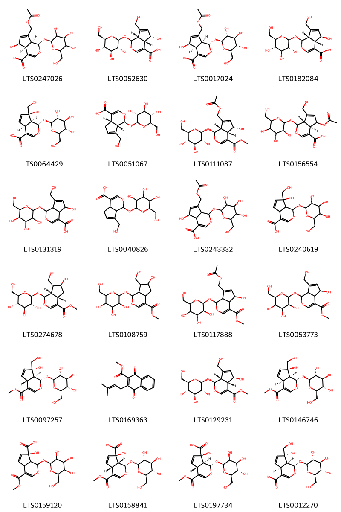{ width=100% }
    <figcaption>Hình ảnh cấu trúc hóa học của 24 hoạt chất thuộc nhóm Prenol lipids gồm ['(1s,4as,5s,7as)-7-[(acetyloxy)methyl]-5-hydroxy-1-{[3,4,5-trihydroxy-6-(hydroxymethyl)oxan-2-yl]oxy}-1h,4ah,5h,7ah-cyclopenta[c]pyran-4-carboxylic acid (LTS0247026)', 'deacetylasperulosidic acid (LTS0052630)', '(1s,4as,5s,7as)-7-[(acetyloxy)methyl]-5-hydroxy-1-{[(2s,3r,4s,5s,6r)-3,4,5-trihydroxy-6-(hydroxymethyl)oxan-2-yl]oxy}-1h,4ah,5h,7ah-cyclopenta[c]pyran-4-carboxylic acid (LTS0017024)', '(1s,4as,5r,7as)-5-hydroxy-7-(hydroxymethyl)-1-{[(2s,3r,4s,5s,6r)-3,4,5-trihydroxy-6-(hydroxymethyl)oxan-2-yl]oxy}-1h,4ah,5h,7ah-cyclopenta[c]pyran-4-carboxylic acid (LTS0182084)', 'monotropein (LTS0064429)', 'geniposidic acid (LTS0051067)', 'methyl (1s,4as,5s,7as)-7-[(acetyloxy)methyl]-5-hydroxy-1-{[(2s,3r,4s,5s,6r)-3,4,5-trihydroxy-6-(hydroxymethyl)oxan-2-yl]oxy}-1h,4ah,5h,7ah-cyclopenta[c]pyran-4-carboxylate (LTS0111087)', '(4ar,7as)-5-(acetyloxy)-7-(hydroxymethyl)-1-{[3,4,5-trihydroxy-6-(hydroxymethyl)oxan-2-yl]oxy}-1h,4ah,5h,7ah-cyclopenta[c]pyran-4-carboxylic acid (LTS0156554)', '5-hydroxy-7-(hydroxymethyl)-1-{[3,4,5-trihydroxy-6-(hydroxymethyl)oxan-2-yl]oxy}-1h,4ah,5h,7ah-cyclopenta[c]pyran-4-carboxylic acid (LTS0131319)', '7-(hydroxymethyl)-1-{[3,4,5-trihydroxy-6-(hydroxymethyl)oxan-2-yl]oxy}-1h,4ah,5h,7ah-cyclopenta[c]pyran-4-carboxylic acid (LTS0040826)', '7-[(acetyloxy)methyl]-5-hydroxy-1-{[3,4,5-trihydroxy-6-(hydroxymethyl)oxan-2-yl]oxy}-1h,4ah,5h,7ah-cyclopenta[c]pyran-4-carboxylic acid (LTS0243332)', '7-hydroxy-7-(hydroxymethyl)-1-{[3,4,5-trihydroxy-6-(hydroxymethyl)oxan-2-yl]oxy}-1h,4ah,7ah-cyclopenta[c]pyran-4-carboxylic acid (LTS0240619)', '10-hydroxyloganin (LTS0274678)', 'methyl 6-hydroxy-7-(hydroxymethyl)-1-{[3,4,5-trihydroxy-6-(hydroxymethyl)oxan-2-yl]oxy}-1h,4ah,5h,6h,7h,7ah-cyclopenta[c]pyran-4-carboxylate (LTS0108759)', 'methyl 7-[(acetyloxy)methyl]-5-hydroxy-1-{[3,4,5-trihydroxy-6-(hydroxymethyl)oxan-2-yl]oxy}-1h,4ah,5h,7ah-cyclopenta[c]pyran-4-carboxylate (LTS0117888)', 'methyl 5-hydroxy-7-(hydroxymethyl)-1-{[3,4,5-trihydroxy-6-(hydroxymethyl)oxan-2-yl]oxy}-1h,4ah,5h,7ah-cyclopenta[c]pyran-4-carboxylate (LTS0053773)', 'methyl (1s,4ar,7s,7as)-7-hydroxy-7-(hydroxymethyl)-1-{[(2s,3r,4s,5s,6r)-3,4,5-trihydroxy-6-(hydroxymethyl)oxan-2-yl]oxy}-1h,4ah,7ah-cyclopenta[c]pyran-4-carboxylate (LTS0097257)', 'methyl 3-(3-methylbut-2-en-1-yl)-1,4-dioxonaphthalene-2-carboxylate (LTS0169363)', 'scandoside methyl ester (LTS0129231)', 'gardenoside (LTS0146746)', '7-hydroxy-4-(methoxycarbonyl)-1-{[3,4,5-trihydroxy-6-(hydroxymethyl)oxan-2-yl]oxy}-1h,4ah,7ah-cyclopenta[c]pyran-7-carboxylic acid (LTS0159120)', '(1s,4ar,7r,7ar)-7-hydroxy-4-(methoxycarbonyl)-1-{[(2s,3r,4s,5s,6r)-3,4,5-trihydroxy-6-(hydroxymethyl)oxan-2-yl]oxy}-1h,4ah,7ah-cyclopenta[c]pyran-7-carboxylic acid (LTS0158841)', '(1s,4ar,7r,7as)-7-hydroxy-4-(methoxycarbonyl)-1-{[(2s,3s,4s,5s,6r)-3,4,5-trihydroxy-6-(hydroxymethyl)oxan-2-yl]oxy}-1h,4ah,7ah-cyclopenta[c]pyran-7-carboxylic acid (LTS0197734)', 'monotropeine (LTS0012270)'].</figcaption>
</figure>

---

### Dược dân tộc học

Danh sách các quốc gia có sử dụng *Galium mollugo* trong điều trị các bệnh. 

| Country   | Disease                         | Bệnh                                                                                                                                                                                                |
|:----------|:--------------------------------|:----------------------------------------------------------------------------------------------------------------------------------------------------------------------------------------------------|
| Turkey    | Diuretic, Sudorific, Astringent | MYMEMORY WARNING: YOU USED ALL AVAILABLE FREE TRANSLATIONS FOR TODAY. NEXT AVAILABLE IN  10 HOURS 38 MINUTES 02 SECONDS VISIT HTTPS://MYMEMORY.TRANSLATED.NET/DOC/USAGELIMITS.PHP TO TRANSLATE MORE |

---

---
## Galium odoratum
### Thông tin về thực vật

!!! info "Phân loại thực vật của *Galium odoratum* từ GIBF:"
    - **Kingdom:** Plantae
    - **Phylum:** Tracheophyta
    - **Order:** Gentianales
    - **Family:** Rubiaceae
    - **Genus:** Galium
    - **Species:** *Galium odoratum*

 

| Label (VI)   | Label (EN)   | Scientific Name   | Descriptions (VI)   | Descriptions (EN)   | Also Known As (VI)   | Also Known As (EN)                                                           |
|:-------------|:-------------|:------------------|:--------------------|:--------------------|:---------------------|:-----------------------------------------------------------------------------|
| N/A          | N/A          | Galium odoratum   | loài thực vật       | species of plant    | ['']                 | ['Woodruff', 'Galium odoratum', 'sweet woodruff', 'Sweet Scented Bed Straw'] |

#### Phân bố trên thế giới

**Từ CSDL GIBF** Czechia, Sweden, Slovenia, Poland, Netherlands, Denmark, United States of America, Russian Federation, Croatia, Norway, France, Canada, Germany, Moldova, Republic of, Austria, Hungary, Ukraine, Slovakia, Italy, Switzerland, United Kingdom of Great Britain and Northern Ireland

#### Phân bố tại Việt Nam

**Từ CSDL GIBF**: Không có ghi nhận ở Việt Nam

---
### Thành phần hóa học
        
- Theo cơ sở dữ liệu lotus: Từ loài *Galium odoratum* đã phân lập và xác định được 18 hoạt chất thuộc về các nhóm Benzene and substituted derivatives, Anthracenes, Cinnamic acids and derivatives, Coumarins and derivatives, Phenols, Organooxygen compounds. 

|    | chemicalTaxonomyClassyfireClass     |   smiles_count |
|---:|:------------------------------------|---------------:|
|  0 | Anthracenes                         |              9 |
|  1 | Benzene and substituted derivatives |              2 |
|  2 | Cinnamic acids and derivatives      |              4 |
|  3 | Coumarins and derivatives           |              1 |
|  4 | Organooxygen compounds              |              1 |
|  5 | Phenols                             |              1 |

#### Nhóm Anthracenes
<figure markdown="span">
    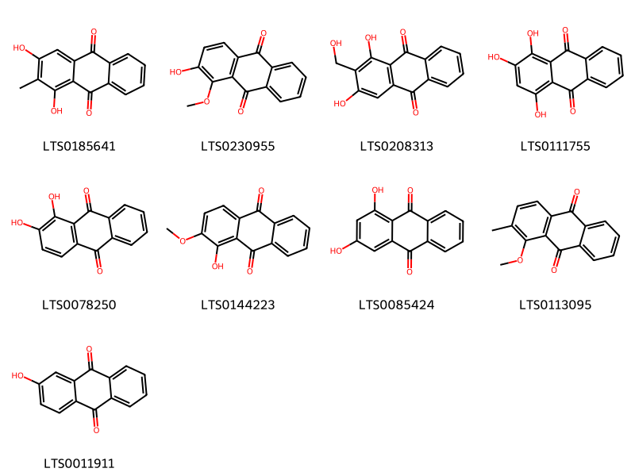{ width=100% }
    <figcaption>Hình ảnh cấu trúc hóa học của 9 hoạt chất thuộc nhóm Anthracenes gồm ['rubiadin (LTS0185641)', '2-hydroxy-1-methoxyanthracene-9,10-dione (LTS0230955)', 'henine (LTS0208313)', 'purpurin (LTS0111755)', 'alizarin (LTS0078250)', 'alizarin 2-methyl ether (LTS0144223)', 'purpuro (LTS0085424)', '1-methoxy-2-methylanthracene-9,10-dione (LTS0113095)', '2-hydroxyanthraquinone (LTS0011911)'].</figcaption>
</figure>
#### Nhóm Benzene and substituted derivatives
<figure markdown="span">
    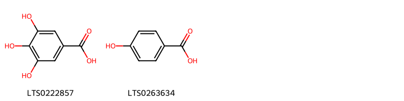{ width=100% }
    <figcaption>Hình ảnh cấu trúc hóa học của 2 hoạt chất thuộc nhóm Benzene and substituted derivatives gồm ['galop (LTS0222857)', 'p-hydroxybenzoic acid (LTS0263634)'].</figcaption>
</figure>
#### Nhóm Cinnamic acids and derivatives
<figure markdown="span">
    { width=100% }
    <figcaption>Hình ảnh cấu trúc hóa học của 4 hoạt chất thuộc nhóm Cinnamic acids and derivatives gồm ['3,4-dihydroxycinnamic acid (LTS0128050)', 'para-coumaric acid (LTS0266252)', 'caffeic acid (LTS0027481)', 'hydroxycinnamic acid (LTS0233023)'].</figcaption>
</figure>
#### Nhóm Coumarins and derivatives
<figure markdown="span">
    { width=100% }
    <figcaption>Hình ảnh cấu trúc hóa học của 1 hoạt chất thuộc nhóm Coumarins and derivatives gồm ['2h-1-benzopyran-2-one (LTS0069773)'].</figcaption>
</figure>
#### Nhóm Organooxygen compounds
<figure markdown="span">
    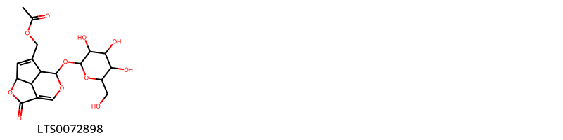{ width=100% }
    <figcaption>Hình ảnh cấu trúc hóa học của 1 hoạt chất thuộc nhóm Organooxygen compounds gồm ['asperuloside (LTS0072898)'].</figcaption>
</figure>
#### Nhóm Phenols
<figure markdown="span">
    { width=100% }
    <figcaption>Hình ảnh cấu trúc hóa học của 1 hoạt chất thuộc nhóm Phenols gồm ['vanillin (LTS0136163)'].</figcaption>
</figure>

---

### Dược dân tộc học

Danh sách các quốc gia có sử dụng *Galium odoratum* trong điều trị các bệnh. 

| Country   | Disease           | Bệnh                                                                                                                                                                                                |
|:----------|:------------------|:----------------------------------------------------------------------------------------------------------------------------------------------------------------------------------------------------|
| Europe    | Apertif, Diuretic | MYMEMORY WARNING: YOU USED ALL AVAILABLE FREE TRANSLATIONS FOR TODAY. NEXT AVAILABLE IN  10 HOURS 37 MINUTES 10 SECONDS VISIT HTTPS://MYMEMORY.TRANSLATED.NET/DOC/USAGELIMITS.PHP TO TRANSLATE MORE |
| ain       | Hypnotic          | MYMEMORY WARNING: YOU USED ALL AVAILABLE FREE TRANSLATIONS FOR TODAY. NEXT AVAILABLE IN  10 HOURS 37 MINUTES 07 SECONDS VISIT HTTPS://MYMEMORY.TRANSLATED.NET/DOC/USAGELIMITS.PHP TO TRANSLATE MORE |

---

---
## Galium verum
### Thông tin về thực vật

!!! info "Phân loại thực vật của *Galium verum* từ GIBF:"
    - **Kingdom:** Plantae
    - **Phylum:** Tracheophyta
    - **Order:** Gentianales
    - **Family:** Rubiaceae
    - **Genus:** Galium
    - **Species:** *Galium verum*

 

| Label (VI)   | Label (EN)   | Scientific Name   | Descriptions (VI)   | Descriptions (EN)   | Also Known As (VI)   | Also Known As (EN)                                 |
|:-------------|:-------------|:------------------|:--------------------|:--------------------|:---------------------|:---------------------------------------------------|
| N/A          | N/A          | Galium verum      | loài thực vật       | species of plant    | ['']                 | ['bedstraw', "lady's bedstraw", 'yellow bedstraw'] |

#### Phân bố trên thế giới

**Từ CSDL GIBF** Czechia, Sweden, Kazakhstan, Spain, Poland, Denmark, Netherlands, Russian Federation, Croatia, Belarus, Norway, United Kingdom of Great Britain and Northern Ireland, Belgium, Luxembourg, Germany, Austria, Hungary, Italy, Switzerland, France, Ireland

#### Phân bố tại Việt Nam

**Từ CSDL GIBF**: Không có ghi nhận ở Việt Nam

---
### Thành phần hóa học
        
- Theo cơ sở dữ liệu lotus: Từ loài *Galium verum* đã phân lập và xác định được 32 hoạt chất thuộc về các nhóm Flavonoids, Anthracenes, Organooxygen compounds, Furanoid lignans. 

|    | chemicalTaxonomyClassyfireClass   |   smiles_count |
|---:|:----------------------------------|---------------:|
|  0 | Anthracenes                       |             13 |
|  1 | Flavonoids                        |             11 |
|  2 | Furanoid lignans                  |              2 |
|  3 | Organooxygen compounds            |              4 |

#### Nhóm Anthracenes
<figure markdown="span">
    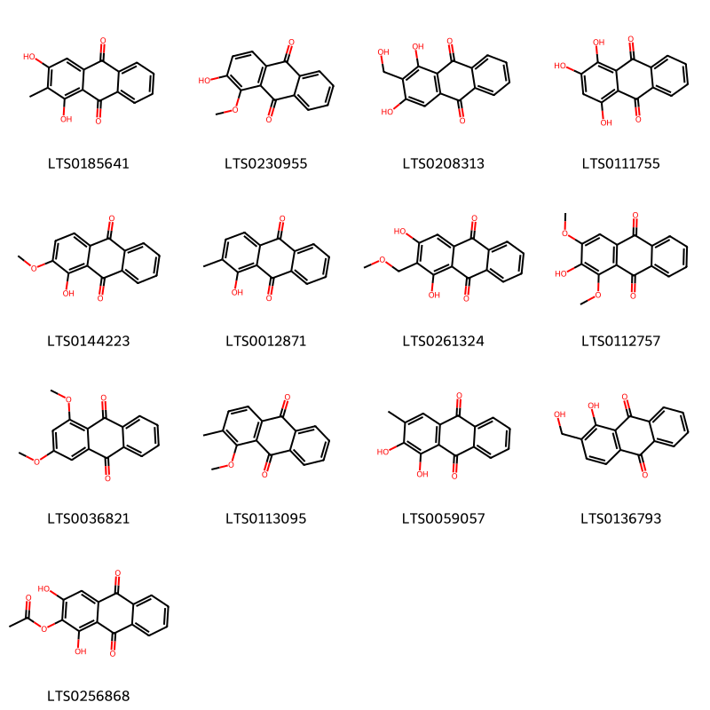{ width=100% }
    <figcaption>Hình ảnh cấu trúc hóa học của 13 hoạt chất thuộc nhóm Anthracenes gồm ['rubiadin (LTS0185641)', '2-hydroxy-1-methoxyanthracene-9,10-dione (LTS0230955)', 'henine (LTS0208313)', 'purpurin (LTS0111755)', 'alizarin 2-methyl ether (LTS0144223)', '1-hydroxy-2-methylanthracene-9,10-dione (LTS0012871)', 'lucidin ω-methyl ether (LTS0261324)', '2-hydroxy-1,3-dimethoxyanthracene-9,10-dione (LTS0112757)', '1,3-dimethoxyanthracene-9,10-dione (LTS0036821)', '1-methoxy-2-methylanthracene-9,10-dione (LTS0113095)', '1,2-dihydroxy-3-methylanthracene-9,10-dione (LTS0059057)', 'digiferruginol (LTS0136793)', '1,3-dihydroxy-9,10-dioxoanthracen-2-yl acetate (LTS0256868)'].</figcaption>
</figure>
#### Nhóm Flavonoids
<figure markdown="span">
    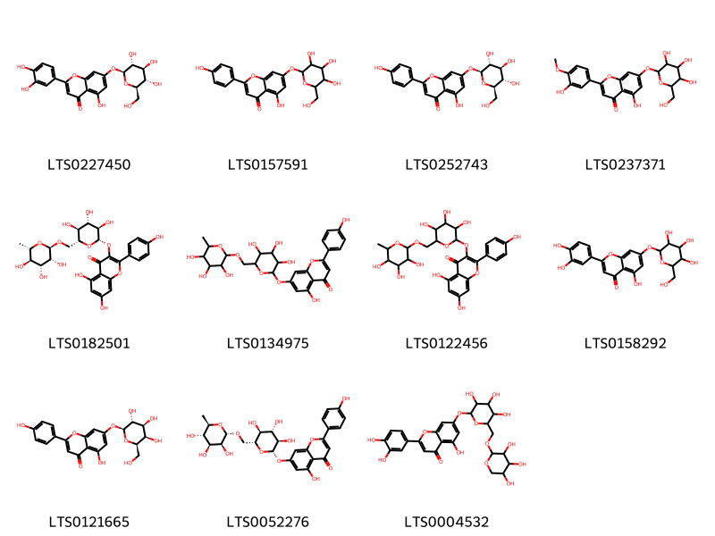{ width=100% }
    <figcaption>Hình ảnh cấu trúc hóa học của 11 hoạt chất thuộc nhóm Flavonoids gồm ['luteolin 7-o-glucoside (LTS0227450)', 'apigetrin (LTS0157591)', 'apigenin 7-o-β-glucoside (LTS0252743)', '5-hydroxy-2-(3-hydroxy-4-methoxyphenyl)-7-{[3,4,5-trihydroxy-6-(hydroxymethyl)oxan-2-yl]oxy}chromen-4-one (LTS0237371)', 'nictoflorin (LTS0182501)', '5-hydroxy-2-(4-hydroxyphenyl)-7-[(3,4,5-trihydroxy-6-{[(3,4,5-trihydroxy-6-methyloxan-2-yl)oxy]methyl}oxan-2-yl)oxy]chromen-4-one (LTS0134975)', '5,7-dihydroxy-2-(4-hydroxyphenyl)-3-[(3,4,5-trihydroxy-6-{[(3,4,5-trihydroxy-6-methyloxan-2-yl)oxy]methyl}oxan-2-yl)oxy]chromen-4-one (LTS0122456)', '2-(3,4-dihydroxyphenyl)-5-hydroxy-7-{[3,4,5-trihydroxy-6-(hydroxymethyl)oxan-2-yl]oxy}chromen-4-one (LTS0158292)', '5-hydroxy-2-(4-hydroxyphenyl)-7-{[(2s,3r,4s,5r,6r)-3,4,5-trihydroxy-6-(hydroxymethyl)oxan-2-yl]oxy}chromen-4-one (LTS0121665)', '5-hydroxy-2-(4-hydroxyphenyl)-7-{[(2s,3r,4s,5s,6r)-3,4,5-trihydroxy-6-({[(2s,3s,4s,5s,6r)-3,4,5-trihydroxy-6-methyloxan-2-yl]oxy}methyl)oxan-2-yl]oxy}chromen-4-one (LTS0052276)', '2-(3,4-dihydroxyphenyl)-5-hydroxy-7-[(3,4,5-trihydroxy-6-{[(3,4,5-trihydroxyoxan-2-yl)oxy]methyl}oxan-2-yl)oxy]chromen-4-one (LTS0004532)'].</figcaption>
</figure>
#### Nhóm Furanoid lignans
<figure markdown="span">
    { width=100% }
    <figcaption>Hình ảnh cấu trúc hóa học của 2 hoạt chất thuộc nhóm Furanoid lignans gồm ['pinoresinol (LTS0057431)', '4-[(1s,3ar,4r,6ar)-4-(4-hydroxy-3-methoxyphenyl)-hexahydrofuro[3,4-c]furan-1-yl]-2-methoxyphenol (LTS0014948)'].</figcaption>
</figure>
#### Nhóm Organooxygen compounds
<figure markdown="span">
    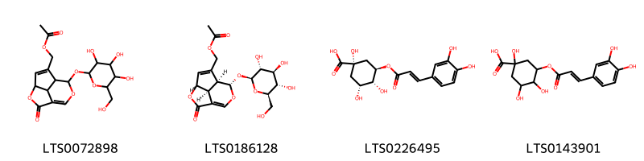{ width=100% }
    <figcaption>Hình ảnh cấu trúc hóa học của 4 hoạt chất thuộc nhóm Organooxygen compounds gồm ['asperuloside (LTS0072898)', 'asperuloside (LTS0186128)', 'chlorogenic acid (LTS0226495)', '3-{[3-(3,4-dihydroxyphenyl)prop-2-enoyl]oxy}-1,4,5-trihydroxycyclohexane-1-carboxylic acid (LTS0143901)'].</figcaption>
</figure>

---

### Dược dân tộc học

Danh sách các quốc gia có sử dụng *Galium verum* trong điều trị các bệnh. 

| Country   | Disease                                                            | Bệnh                                                                                                                                                                                                |
|:----------|:-------------------------------------------------------------------|:----------------------------------------------------------------------------------------------------------------------------------------------------------------------------------------------------|
| Elsewhere | Diuretic, Diuretic, Purgative                                      | MYMEMORY WARNING: YOU USED ALL AVAILABLE FREE TRANSLATIONS FOR TODAY. NEXT AVAILABLE IN  10 HOURS 36 MINUTES 33 SECONDS VISIT HTTPS://MYMEMORY.TRANSLATED.NET/DOC/USAGELIMITS.PHP TO TRANSLATE MORE |
| Europe    | Diuretic                                                           | MYMEMORY WARNING: YOU USED ALL AVAILABLE FREE TRANSLATIONS FOR TODAY. NEXT AVAILABLE IN  10 HOURS 36 MINUTES 29 SECONDS VISIT HTTPS://MYMEMORY.TRANSLATED.NET/DOC/USAGELIMITS.PHP TO TRANSLATE MORE |
| Turkey    | Aperient, Astringent, Diuretic, Sudorific, Tonic, Hemostat, Rennet | MYMEMORY WARNING: YOU USED ALL AVAILABLE FREE TRANSLATIONS FOR TODAY. NEXT AVAILABLE IN  10 HOURS 36 MINUTES 25 SECONDS VISIT HTTPS://MYMEMORY.TRANSLATED.NET/DOC/USAGELIMITS.PHP TO TRANSLATE MORE |
| UK        | Aphrodisiac                                                        | MYMEMORY WARNING: YOU USED ALL AVAILABLE FREE TRANSLATIONS FOR TODAY. NEXT AVAILABLE IN  10 HOURS 36 MINUTES 20 SECONDS VISIT HTTPS://MYMEMORY.TRANSLATED.NET/DOC/USAGELIMITS.PHP TO TRANSLATE MORE |
| ain       | Diuretic                                                           | MYMEMORY WARNING: YOU USED ALL AVAILABLE FREE TRANSLATIONS FOR TODAY. NEXT AVAILABLE IN  10 HOURS 36 MINUTES 13 SECONDS VISIT HTTPS://MYMEMORY.TRANSLATED.NET/DOC/USAGELIMITS.PHP TO TRANSLATE MORE |

---

# Chi Xeromphis

??? note "Danh sách các dược liệu thuộc chi"
    
	 - *Xeromphis obovata?*

---
## Xeromphis obovata
### Thông tin về thực vật

!!! info "Phân loại thực vật của *Catunaregam obovata* từ GIBF:"
    - **Kingdom:** Plantae
    - **Phylum:** Tracheophyta
    - **Order:** Gentianales
    - **Family:** Rubiaceae
    - **Genus:** Catunaregam
    - **Species:** *Catunaregam obovata*

 

| Label (VI)   | Label (EN)   | Scientific Name   | Descriptions (VI)   | Descriptions (EN)   | Also Known As (VI)   | Also Known As (EN)   |
|:-------------|:-------------|:------------------|:--------------------|:--------------------|:---------------------|:---------------------|
| N/A          | N/A          | Xeromphis obovata |                     |                     | ['']                 | ['']                 |

#### Phân bố trên thế giới

**Từ CSDL GIBF** nan, Congo, Democratic Republic of the, Zambia, South Africa, Mozambique, Malawi

#### Phân bố tại Việt Nam

**Từ CSDL GIBF**: Không có ghi nhận ở Việt Nam

---
### Thành phần hóa học
        
- Theo cơ sở dữ liệu lotus: Từ loài *Catunaregam obovata* đã phân lập và xác định được Chưa có hoạt chất nào được phân lập. hoạt chất thuộc về các nhóm Không có hoạt chất nào được phân lập. 

Không có hình ảnh nào được tạo ra

---

### Dược dân tộc học

Danh sách các quốc gia có sử dụng *Catunaregam obovata* trong điều trị các bệnh. 

| Country         | Disease   | Bệnh                                                                                                                                                                                                |
|:----------------|:----------|:----------------------------------------------------------------------------------------------------------------------------------------------------------------------------------------------------|
| Africa(Swahili) | Poison    | MYMEMORY WARNING: YOU USED ALL AVAILABLE FREE TRANSLATIONS FOR TODAY. NEXT AVAILABLE IN  10 HOURS 35 MINUTES 29 SECONDS VISIT HTTPS://MYMEMORY.TRANSLATED.NET/DOC/USAGELIMITS.PHP TO TRANSLATE MORE |

---

# Chi Simira

??? note "Danh sách các dược liệu thuộc chi"
    
	 - *Simira maxonii*
	 - *Simira rubra*
	 - *Simira viridiflora*

---
## Simira maxonii
### Thông tin về thực vật

!!! info "Phân loại thực vật của *Simira maxonii* từ GIBF:"
    - **Kingdom:** Plantae
    - **Phylum:** Tracheophyta
    - **Order:** Gentianales
    - **Family:** Rubiaceae
    - **Genus:** Simira
    - **Species:** *Simira maxonii*

 

| Label (VI)   | Label (EN)   | Scientific Name   | Descriptions (VI)   | Descriptions (EN)   | Also Known As (VI)   | Also Known As (EN)   |
|:-------------|:-------------|:------------------|:--------------------|:--------------------|:---------------------|:---------------------|
| N/A          | N/A          | Simira maxonii    | loài thực vật       | species of plant    | ['']                 | ['']                 |

#### Phân bố trên thế giới

**Từ CSDL GIBF** nan, Nicaragua, Brazil, United States of America, Belgium, Costa Rica, Colombia, Panama

#### Phân bố tại Việt Nam

**Từ CSDL GIBF**: Không có ghi nhận ở Việt Nam

---
### Thành phần hóa học
        
- Theo cơ sở dữ liệu lotus: Từ loài *Simira maxonii* đã phân lập và xác định được 1 hoạt chất thuộc về các nhóm Indoles and derivatives. 

|    | chemicalTaxonomyClassyfireClass   |   smiles_count |
|---:|:----------------------------------|---------------:|
|  0 | Indoles and derivatives           |              1 |

#### Nhóm Indoles and derivatives
<figure markdown="span">
    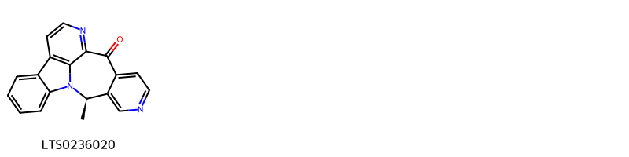{ width=100% }
    <figcaption>Hình ảnh cấu trúc hóa học của 1 hoạt chất thuộc nhóm Indoles and derivatives gồm ['(20r)-20-methyl-1,11,17-triazapentacyclo[10.8.1.0²,⁷.0⁸,²¹.0¹⁴,¹⁹]henicosa-2(7),3,5,8(21),9,11,14,16,18-nonaen-13-one (LTS0236020)'].</figcaption>
</figure>

---

### Dược dân tộc học

Danh sách các quốc gia có sử dụng *Simira maxonii* trong điều trị các bệnh. 

| Country    | Disease   | Bệnh                                                                                                                                                                                                |
|:-----------|:----------|:----------------------------------------------------------------------------------------------------------------------------------------------------------------------------------------------------|
| Costa Rica | Purgative | MYMEMORY WARNING: YOU USED ALL AVAILABLE FREE TRANSLATIONS FOR TODAY. NEXT AVAILABLE IN  10 HOURS 35 MINUTES 10 SECONDS VISIT HTTPS://MYMEMORY.TRANSLATED.NET/DOC/USAGELIMITS.PHP TO TRANSLATE MORE |
| Elsewhere  | Purgative | MYMEMORY WARNING: YOU USED ALL AVAILABLE FREE TRANSLATIONS FOR TODAY. NEXT AVAILABLE IN  10 HOURS 35 MINUTES 08 SECONDS VISIT HTTPS://MYMEMORY.TRANSLATED.NET/DOC/USAGELIMITS.PHP TO TRANSLATE MORE |

---

---
## Simira rubra
### Thông tin về thực vật

!!! info "Phân loại thực vật của *Simira rubra* từ GIBF:"
    - **Kingdom:** Plantae
    - **Phylum:** Tracheophyta
    - **Order:** Gentianales
    - **Family:** Rubiaceae
    - **Genus:** Simira
    - **Species:** *Simira rubra*

 

| Label (VI)   | Label (EN)   | Scientific Name   | Descriptions (VI)   | Descriptions (EN)   | Also Known As (VI)   | Also Known As (EN)   |
|:-------------|:-------------|:------------------|:--------------------|:--------------------|:---------------------|:---------------------|
| N/A          | N/A          | Simira rubra      | loài thực vật       | species of plant    | ['']                 | ['']                 |

#### Phân bố trên thế giới

**Từ CSDL GIBF** nan, Brazil

#### Phân bố tại Việt Nam

**Từ CSDL GIBF**: Không có ghi nhận ở Việt Nam

---
### Thành phần hóa học
        
- Theo cơ sở dữ liệu lotus: Từ loài *Simira rubra* đã phân lập và xác định được Chưa có hoạt chất nào được phân lập. hoạt chất thuộc về các nhóm Không có hoạt chất nào được phân lập. 

Không có hình ảnh nào được tạo ra

---

### Dược dân tộc học

Danh sách các quốc gia có sử dụng *Simira rubra* trong điều trị các bệnh. 

| Country   | Disease    | Bệnh                                                                                                                                                                                                |
|:----------|:-----------|:----------------------------------------------------------------------------------------------------------------------------------------------------------------------------------------------------|
| English   | Astringent | MYMEMORY WARNING: YOU USED ALL AVAILABLE FREE TRANSLATIONS FOR TODAY. NEXT AVAILABLE IN  10 HOURS 34 MINUTES 45 SECONDS VISIT HTTPS://MYMEMORY.TRANSLATED.NET/DOC/USAGELIMITS.PHP TO TRANSLATE MORE |

---

---
## Simira viridiflora
### Thông tin về thực vật

!!! info "Phân loại thực vật của *Simira rubra* từ GIBF:"
    - **Kingdom:** Plantae
    - **Phylum:** Tracheophyta
    - **Order:** Gentianales
    - **Family:** Rubiaceae
    - **Genus:** Simira
    - **Species:** *Simira rubra*

 

| Label (VI)   | Label (EN)   | Scientific Name    | Descriptions (VI)   | Descriptions (EN)   | Also Known As (VI)   | Also Known As (EN)   |
|:-------------|:-------------|:-------------------|:--------------------|:--------------------|:---------------------|:---------------------|
| N/A          | N/A          | Simira viridiflora | loài thực vật       | species of plant    | ['']                 | ['']                 |

#### Phân bố trên thế giới

**Từ CSDL GIBF** nan, Brazil

#### Phân bố tại Việt Nam

**Từ CSDL GIBF**: Không có ghi nhận ở Việt Nam

---
### Thành phần hóa học
        
- Theo cơ sở dữ liệu lotus: Từ loài *Simira rubra* đã phân lập và xác định được Chưa có hoạt chất nào được phân lập. hoạt chất thuộc về các nhóm Không có hoạt chất nào được phân lập. 

Không có hình ảnh nào được tạo ra

---

### Dược dân tộc học

Danh sách các quốc gia có sử dụng *Simira rubra* trong điều trị các bệnh. 

| Country   | Disease    | Bệnh                                                                                                                                                                                                |
|:----------|:-----------|:----------------------------------------------------------------------------------------------------------------------------------------------------------------------------------------------------|
| Brazil    | Astringent | MYMEMORY WARNING: YOU USED ALL AVAILABLE FREE TRANSLATIONS FOR TODAY. NEXT AVAILABLE IN  10 HOURS 34 MINUTES 14 SECONDS VISIT HTTPS://MYMEMORY.TRANSLATED.NET/DOC/USAGELIMITS.PHP TO TRANSLATE MORE |

---

# Chi Aeginetia

??? note "Danh sách các dược liệu thuộc chi"
    
	 - *Aeginetia indica*
	 - *Aeginetia japonica*

---
## Aeginetia indica
### Thông tin về thực vật

!!! info "Phân loại thực vật của *Aeginetia indica* từ GIBF:"
    - **Kingdom:** Plantae
    - **Phylum:** Tracheophyta
    - **Order:** Lamiales
    - **Family:** Orobanchaceae
    - **Genus:** Aeginetia
    - **Species:** *Aeginetia indica*

 

| Label (VI)   | Label (EN)   | Scientific Name   | Descriptions (VI)   | Descriptions (EN)   | Also Known As (VI)   | Also Known As (EN)   |
|:-------------|:-------------|:------------------|:--------------------|:--------------------|:---------------------|:---------------------|
| N/A          | N/A          | Aeginetia indica  |                     | species of plant    | ['Tai đất Ấn']       | ['']                 |

#### Phân bố trên thế giới

**Từ CSDL GIBF** nan, Hong Kong, Viet Nam, Cambodia, Japan, Korea, Republic of, Chinese Taipei, Nepal, China, Philippines, India, Thailand

#### Phân bố tại Việt Nam

**Từ CSDL GIBF**: Bình Dương

---
### Thành phần hóa học
        
- Theo cơ sở dữ liệu lotus: Từ loài *Aeginetia indica* đã phân lập và xác định được 24 hoạt chất thuộc về các nhóm Benzene and substituted derivatives, Flavonoids, Cinnamic acids and derivatives, Steroids and steroid derivatives, Phenols, Organooxygen compounds, Prenol lipids, 2-arylbenzofuran flavonoids. 

|    | chemicalTaxonomyClassyfireClass     |   smiles_count |
|---:|:------------------------------------|---------------:|
|  0 | 2-arylbenzofuran flavonoids         |              6 |
|  1 | Benzene and substituted derivatives |              1 |
|  2 | Cinnamic acids and derivatives      |             10 |
|  3 | Flavonoids                          |              1 |
|  4 | Organooxygen compounds              |              1 |
|  5 | Phenols                             |              2 |
|  6 | Prenol lipids                       |              1 |
|  7 | Steroids and steroid derivatives    |              2 |

#### Nhóm 2-arylbenzofuran flavonoids
<figure markdown="span">
    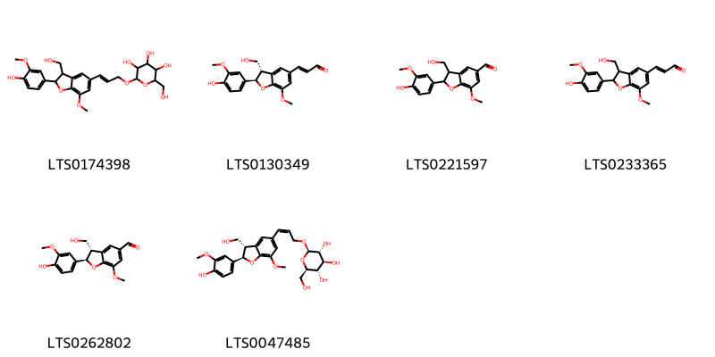{ width=100% }
    <figcaption>Hình ảnh cấu trúc hóa học của 6 hoạt chất thuộc nhóm 2-arylbenzofuran flavonoids gồm ['2-({3-[2-(4-hydroxy-3-methoxyphenyl)-3-(hydroxymethyl)-7-methoxy-2,3-dihydro-1-benzofuran-5-yl]prop-2-en-1-yl}oxy)-6-(hydroxymethyl)oxane-3,4,5-triol (LTS0174398)', '(2e)-3-[(2r,3s)-2-(4-hydroxy-3-methoxyphenyl)-3-(hydroxymethyl)-7-methoxy-2,3-dihydro-1-benzofuran-5-yl]prop-2-enal (LTS0130349)', '2-(4-hydroxy-3-methoxyphenyl)-3-(hydroxymethyl)-7-methoxy-2,3-dihydro-1-benzofuran-5-carbaldehyde (LTS0221597)', '3-[2-(4-hydroxy-3-methoxyphenyl)-3-(hydroxymethyl)-7-methoxy-2,3-dihydro-1-benzofuran-5-yl]prop-2-enal (LTS0233365)', '(2r,3s)-2-(4-hydroxy-3-methoxyphenyl)-3-(hydroxymethyl)-7-methoxy-2,3-dihydro-1-benzofuran-5-carbaldehyde (LTS0262802)', '(2r,3r,4s,5s,6r)-2-{[(2z)-3-[(2r,3s)-2-(4-hydroxy-3-methoxyphenyl)-3-(hydroxymethyl)-7-methoxy-2,3-dihydro-1-benzofuran-5-yl]prop-2-en-1-yl]oxy}-6-(hydroxymethyl)oxane-3,4,5-triol (LTS0047485)'].</figcaption>
</figure>
#### Nhóm Benzene and substituted derivatives
<figure markdown="span">
    { width=100% }
    <figcaption>Hình ảnh cấu trúc hóa học của 1 hoạt chất thuộc nhóm Benzene and substituted derivatives gồm ['vanillic acid (LTS0229113)'].</figcaption>
</figure>
#### Nhóm Cinnamic acids and derivatives
<figure markdown="span">
    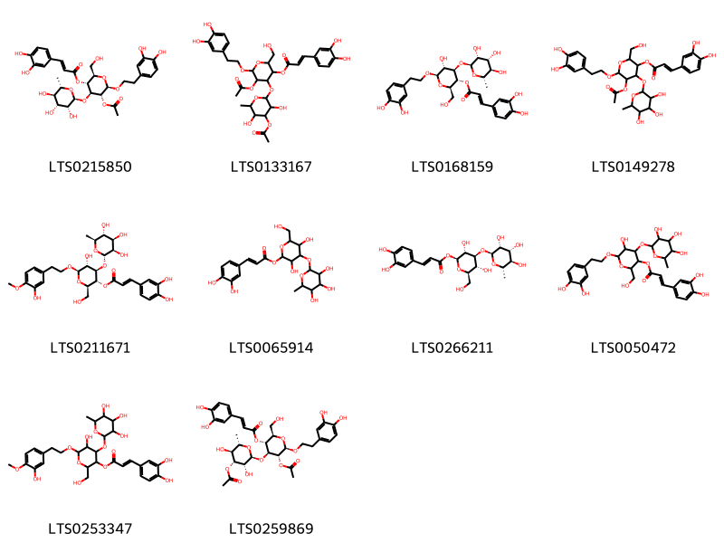{ width=100% }
    <figcaption>Hình ảnh cấu trúc hóa học của 10 hoạt chất thuộc nhóm Cinnamic acids and derivatives gồm ['(2r,3r,4s,5r,6r)-5-(acetyloxy)-6-[2-(3,4-dihydroxyphenyl)ethoxy]-2-(hydroxymethyl)-4-{[(2s,3r,4r,5r,6s)-3,4,5-trihydroxy-6-methyloxan-2-yl]oxy}oxan-3-yl (2e)-3-(3,4-dihydroxyphenyl)prop-2-enoate (LTS0215850)', '5-(acetyloxy)-4-{[4-(acetyloxy)-3,5-dihydroxy-6-methyloxan-2-yl]oxy}-6-[2-(3,4-dihydroxyphenyl)ethoxy]-2-(hydroxymethyl)oxan-3-yl 3-(3,4-dihydroxyphenyl)prop-2-enoate (LTS0133167)', 'verbascoside (LTS0168159)', '5-(acetyloxy)-6-[2-(3,4-dihydroxyphenyl)ethoxy]-2-(hydroxymethyl)-4-[(3,4,5-trihydroxy-6-methyloxan-2-yl)oxy]oxan-3-yl 3-(3,4-dihydroxyphenyl)prop-2-enoate (LTS0149278)', '(2r,3r,4r,5r,6r)-5-hydroxy-6-[2-(3-hydroxy-4-methoxyphenyl)ethoxy]-2-(hydroxymethyl)-4-{[(2s,3r,4r,5r,6s)-3,4,5-trihydroxy-6-methyloxan-2-yl]oxy}oxan-3-yl (2e)-3-(3,4-dihydroxyphenyl)prop-2-enoate (LTS0211671)', '3,5-dihydroxy-6-(hydroxymethyl)-4-[(3,4,5-trihydroxy-6-methyloxan-2-yl)oxy]oxan-2-yl 3-(3,4-dihydroxyphenyl)prop-2-enoate (LTS0065914)', '(2s,3r,4s,5r,6r)-3,5-dihydroxy-6-(hydroxymethyl)-4-{[(2s,3r,4r,5r,6s)-3,4,5-trihydroxy-6-methyloxan-2-yl]oxy}oxan-2-yl (2e)-3-(3,4-dihydroxyphenyl)prop-2-enoate (LTS0266211)', '6-[2-(3,4-dihydroxyphenyl)ethoxy]-5-hydroxy-2-(hydroxymethyl)-4-[(3,4,5-trihydroxy-6-methyloxan-2-yl)oxy]oxan-3-yl 3-(3,4-dihydroxyphenyl)prop-2-enoate (LTS0050472)', '5-hydroxy-6-[2-(3-hydroxy-4-methoxyphenyl)ethoxy]-2-(hydroxymethyl)-4-[(3,4,5-trihydroxy-6-methyloxan-2-yl)oxy]oxan-3-yl 3-(3,4-dihydroxyphenyl)prop-2-enoate (LTS0253347)', '(2r,3r,4s,5r,6r)-5-(acetyloxy)-4-{[(2s,3r,4r,5s,6s)-4-(acetyloxy)-3,5-dihydroxy-6-methyloxan-2-yl]oxy}-6-[2-(3,4-dihydroxyphenyl)ethoxy]-2-(hydroxymethyl)oxan-3-yl (2e)-3-(3,4-dihydroxyphenyl)prop-2-enoate (LTS0259869)'].</figcaption>
</figure>
#### Nhóm Flavonoids
<figure markdown="span">
    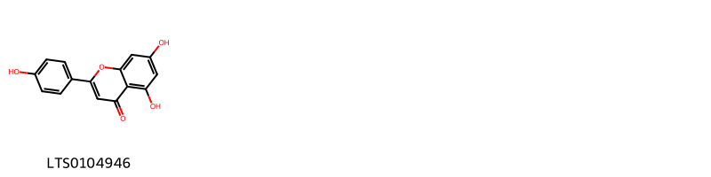{ width=100% }
    <figcaption>Hình ảnh cấu trúc hóa học của 1 hoạt chất thuộc nhóm Flavonoids gồm ['chamomile (LTS0104946)'].</figcaption>
</figure>
#### Nhóm Organooxygen compounds
<figure markdown="span">
    { width=100% }
    <figcaption>Hình ảnh cấu trúc hóa học của 1 hoạt chất thuộc nhóm Organooxygen compounds gồm ['p-hydroxybenzaldehyde (LTS0259836)'].</figcaption>
</figure>
#### Nhóm Phenols
<figure markdown="span">
    { width=100% }
    <figcaption>Hình ảnh cấu trúc hóa học của 2 hoạt chất thuộc nhóm Phenols gồm ['coniferyl aldehyde (LTS0140691)', 'coniferaldehyde (LTS0009773)'].</figcaption>
</figure>
#### Nhóm Prenol lipids
<figure markdown="span">
    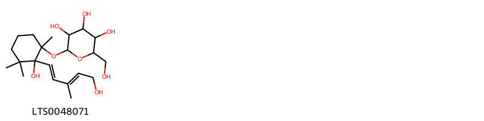{ width=100% }
    <figcaption>Hình ảnh cấu trúc hóa học của 1 hoạt chất thuộc nhóm Prenol lipids gồm ['2-{[2-hydroxy-2-(5-hydroxy-3-methylpenta-1,3-dien-1-yl)-1,3,3-trimethylcyclohexyl]oxy}-6-(hydroxymethyl)oxane-3,4,5-triol (LTS0048071)'].</figcaption>
</figure>
#### Nhóm Steroids and steroid derivatives
<figure markdown="span">
    { width=100% }
    <figcaption>Hình ảnh cấu trúc hóa học của 2 hoạt chất thuộc nhóm Steroids and steroid derivatives gồm ['stigmast-5-en-3-ol, (3β)- (LTS0204616)', 'sitogluside (LTS0201798)'].</figcaption>
</figure>

---

### Dược dân tộc học

Danh sách các quốc gia có sử dụng *Aeginetia indica* trong điều trị các bệnh. 

| Country   | Disease   | Bệnh                                                                                                                                                                                                |
|:----------|:----------|:----------------------------------------------------------------------------------------------------------------------------------------------------------------------------------------------------|
| Elsewhere | Tonic     | MYMEMORY WARNING: YOU USED ALL AVAILABLE FREE TRANSLATIONS FOR TODAY. NEXT AVAILABLE IN  10 HOURS 33 MINUTES 47 SECONDS VISIT HTTPS://MYMEMORY.TRANSLATED.NET/DOC/USAGELIMITS.PHP TO TRANSLATE MORE |

---

---
## Aeginetia japonica
### Thông tin về thực vật

!!! info "Phân loại thực vật của *Aeginetia sinensis* từ GIBF:"
    - **Kingdom:** Plantae
    - **Phylum:** Tracheophyta
    - **Order:** Lamiales
    - **Family:** Orobanchaceae
    - **Genus:** Aeginetia
    - **Species:** *Aeginetia sinensis*

 

| Label (VI)   | Label (EN)   | Scientific Name    | Descriptions (VI)   | Descriptions (EN)   | Also Known As (VI)   | Also Known As (EN)   |
|:-------------|:-------------|:-------------------|:--------------------|:--------------------|:---------------------|:---------------------|
| N/A          | N/A          | Aeginetia japonica |                     | species of plant    | ['']                 | ['']                 |

#### Phân bố trên thế giới

**Từ CSDL GIBF** Japan, China

#### Phân bố tại Việt Nam

**Từ CSDL GIBF**: Không có ghi nhận ở Việt Nam

---
### Thành phần hóa học
        
- Theo cơ sở dữ liệu lotus: Từ loài *Aeginetia sinensis* đã phân lập và xác định được Chưa có hoạt chất nào được phân lập. hoạt chất thuộc về các nhóm Không có hoạt chất nào được phân lập. 

Không có hình ảnh nào được tạo ra

---

### Dược dân tộc học

Danh sách các quốc gia có sử dụng *Aeginetia sinensis* trong điều trị các bệnh. 

| Country   | Disease            | Bệnh                                                                                                                                                                                                |
|:----------|:-------------------|:----------------------------------------------------------------------------------------------------------------------------------------------------------------------------------------------------|
| China     | Aphrodisiac, Tonic | MYMEMORY WARNING: YOU USED ALL AVAILABLE FREE TRANSLATIONS FOR TODAY. NEXT AVAILABLE IN  10 HOURS 33 MINUTES 04 SECONDS VISIT HTTPS://MYMEMORY.TRANSLATED.NET/DOC/USAGELIMITS.PHP TO TRANSLATE MORE |

---

# Chi Oldenlandia

??? note "Danh sách các dược liệu thuộc chi"
    
	 - *Oldenlandia diffusa*

---
## Oldenlandia diffusa
### Thông tin về thực vật

!!! info "Phân loại thực vật của *Scleromitrion diffusum* từ GIBF:"
    - **Kingdom:** Plantae
    - **Phylum:** Tracheophyta
    - **Order:** Gentianales
    - **Family:** Rubiaceae
    - **Genus:** Scleromitrion
    - **Species:** *Scleromitrion diffusum*

 

| Label (VI)   | Label (EN)   | Scientific Name     | Descriptions (VI)   | Descriptions (EN)   | Also Known As (VI)   | Also Known As (EN)   |
|:-------------|:-------------|:--------------------|:--------------------|:--------------------|:---------------------|:---------------------|
| N/A          | N/A          | Oldenlandia diffusa | loài thực vật       | species of plant    | ['']                 | ['']                 |

#### Phân bố trên thế giới

**Từ CSDL GIBF** nan, Brazil, Viet Nam, Japan, Nepal, China, Thailand, Madagascar, Netherlands, Sri Lanka, Korea, Republic of, Bhutan, Indonesia, Costa Rica, unknown or invalid, Hong Kong, Malaysia, Chinese Taipei, Philippines, Palau, Singapore, Cambodia, Myanmar, India

#### Phân bố tại Việt Nam

**Từ CSDL GIBF**: Hải Phòng, Hà Nội

---
### Thành phần hóa học
        
- Theo cơ sở dữ liệu lotus: Từ loài *Scleromitrion diffusum* đã phân lập và xác định được 10 hoạt chất thuộc về các nhóm Prenol lipids, Organooxygen compounds, Anthracenes. 

|    | chemicalTaxonomyClassyfireClass   |   smiles_count |
|---:|:----------------------------------|---------------:|
|  0 | Anthracenes                       |              3 |
|  1 | Organooxygen compounds            |              2 |
|  2 | Prenol lipids                     |              5 |

#### Nhóm Anthracenes
<figure markdown="span">
    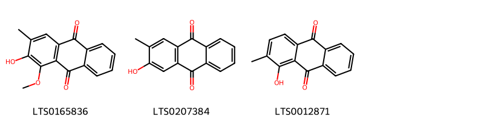{ width=100% }
    <figcaption>Hình ảnh cấu trúc hóa học của 3 hoạt chất thuộc nhóm Anthracenes gồm ['2-hydroxy-1-methoxy-3-methylanthracene-9,10-dione (LTS0165836)', '2-hydroxy-3-methylanthracene-9,10-dione (LTS0207384)', '1-hydroxy-2-methylanthracene-9,10-dione (LTS0012871)'].</figcaption>
</figure>
#### Nhóm Organooxygen compounds
<figure markdown="span">
    { width=100% }
    <figcaption>Hình ảnh cấu trúc hóa học của 2 hoạt chất thuộc nhóm Organooxygen compounds gồm ['asperuloside (LTS0072898)', 'asperuloside (LTS0186128)'].</figcaption>
</figure>
#### Nhóm Prenol lipids
<figure markdown="span">
    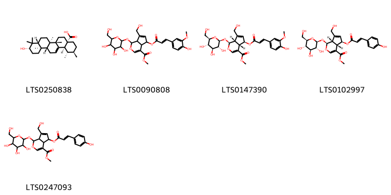{ width=100% }
    <figcaption>Hình ảnh cấu trúc hóa học của 5 hoạt chất thuộc nhóm Prenol lipids gồm ['ursolic acid (LTS0250838)', 'methyl 5-{[3-(4-hydroxy-3-methoxyphenyl)prop-2-enoyl]oxy}-7-(hydroxymethyl)-1-{[3,4,5-trihydroxy-6-(hydroxymethyl)oxan-2-yl]oxy}-1h,4ah,5h,7ah-cyclopenta[c]pyran-4-carboxylate (LTS0090808)', 'methyl (1s,4as,5r,7as)-5-{[(2e)-3-(4-hydroxy-3-methoxyphenyl)prop-2-enoyl]oxy}-7-(hydroxymethyl)-1-{[(2s,3r,4s,5s,6r)-3,4,5-trihydroxy-6-(hydroxymethyl)oxan-2-yl]oxy}-1h,4ah,5h,7ah-cyclopenta[c]pyran-4-carboxylate (LTS0147390)', 'methyl (1s,4as,5r,7as)-7-(hydroxymethyl)-5-{[(2e)-3-(4-hydroxyphenyl)prop-2-enoyl]oxy}-1-{[(2s,3r,4s,5s,6r)-3,4,5-trihydroxy-6-(hydroxymethyl)oxan-2-yl]oxy}-1h,4ah,5h,7ah-cyclopenta[c]pyran-4-carboxylate (LTS0102997)', 'methyl 7-(hydroxymethyl)-5-{[3-(4-hydroxyphenyl)prop-2-enoyl]oxy}-1-{[3,4,5-trihydroxy-6-(hydroxymethyl)oxan-2-yl]oxy}-1h,4ah,5h,7ah-cyclopenta[c]pyran-4-carboxylate (LTS0247093)'].</figcaption>
</figure>

---

### Dược dân tộc học

Danh sách các quốc gia có sử dụng *Scleromitrion diffusum* trong điều trị các bệnh. 

| Country   | Disease                                            | Bệnh                                                                                                                                                                                                |
|:----------|:---------------------------------------------------|:----------------------------------------------------------------------------------------------------------------------------------------------------------------------------------------------------|
| China     | Diuretic, Alexiteric, Diuretic, Refrigerant, Tonic | MYMEMORY WARNING: YOU USED ALL AVAILABLE FREE TRANSLATIONS FOR TODAY. NEXT AVAILABLE IN  10 HOURS 32 MINUTES 44 SECONDS VISIT HTTPS://MYMEMORY.TRANSLATED.NET/DOC/USAGELIMITS.PHP TO TRANSLATE MORE |

---

# Chi Airoerma

??? note "Danh sách các dược liệu thuộc chi"
    
	 - *Airoerma trichotomum*

---
## Airoerma trichotomum
### Thông tin về thực vật

!!! info "Phân loại thực vật của *N/A* từ GIBF:"
    - **Kingdom:** N/A
    - **Phylum:** N/A
    - **Order:** N/A
    - **Family:** N/A
    - **Genus:** N/A
    - **Species:** *N/A*

 

| Label (VI)   | Label (EN)   | Scientific Name     | Descriptions (VI)   | Descriptions (EN)   | Also Known As (VI)   | Also Known As (EN)   |
|:-------------|:-------------|:--------------------|:--------------------|:--------------------|:---------------------|:---------------------|
| N/A          | N/A          | Oldenlandia diffusa | loài thực vật       | species of plant    | ['']                 | ['']                 |

#### Phân bố trên thế giới

**Từ CSDL GIBF** Không có kết quả phù hợp

#### Phân bố tại Việt Nam

**Từ CSDL GIBF**: Không có ghi nhận ở Việt Nam

---
### Thành phần hóa học
        
- Theo cơ sở dữ liệu lotus: Từ loài *N/A* đã phân lập và xác định được Chưa có hoạt chất nào được phân lập. hoạt chất thuộc về các nhóm Không có hoạt chất nào được phân lập. 

Không có hình ảnh nào được tạo ra

---

### Dược dân tộc học

Danh sách các quốc gia có sử dụng *N/A* trong điều trị các bệnh. 

| Country   | Disease   | Bệnh                                                                                                                                                                                                |
|:----------|:----------|:----------------------------------------------------------------------------------------------------------------------------------------------------------------------------------------------------|
| Fiji      | Cathartic | MYMEMORY WARNING: YOU USED ALL AVAILABLE FREE TRANSLATIONS FOR TODAY. NEXT AVAILABLE IN  10 HOURS 32 MINUTES 15 SECONDS VISIT HTTPS://MYMEMORY.TRANSLATED.NET/DOC/USAGELIMITS.PHP TO TRANSLATE MORE |

---

# Chi Crateriermum

??? note "Danh sách các dược liệu thuộc chi"
    
	 - *Crateriermum laurinum*

---
## Crateriermum laurinum
### Thông tin về thực vật

!!! info "Phân loại thực vật của *N/A* từ GIBF:"
    - **Kingdom:** N/A
    - **Phylum:** N/A
    - **Order:** N/A
    - **Family:** N/A
    - **Genus:** N/A
    - **Species:** *N/A*

 

| Label (VI)   | Label (EN)   | Scientific Name     | Descriptions (VI)   | Descriptions (EN)   | Also Known As (VI)   | Also Known As (EN)   |
|:-------------|:-------------|:--------------------|:--------------------|:--------------------|:---------------------|:---------------------|
| N/A          | N/A          | Oldenlandia diffusa | loài thực vật       | species of plant    | ['']                 | ['']                 |

#### Phân bố trên thế giới

**Từ CSDL GIBF** Không có kết quả phù hợp

#### Phân bố tại Việt Nam

**Từ CSDL GIBF**: Không có ghi nhận ở Việt Nam

---
### Thành phần hóa học
        
- Theo cơ sở dữ liệu lotus: Từ loài *N/A* đã phân lập và xác định được Chưa có hoạt chất nào được phân lập. hoạt chất thuộc về các nhóm Không có hoạt chất nào được phân lập. 

Không có hình ảnh nào được tạo ra

---

### Dược dân tộc học

Danh sách các quốc gia có sử dụng *N/A* trong điều trị các bệnh. 

| Country      | Disease   | Bệnh                                                                                                                                                                                                |
|:-------------|:----------|:----------------------------------------------------------------------------------------------------------------------------------------------------------------------------------------------------|
| Sierra Leone | Sweetener | MYMEMORY WARNING: YOU USED ALL AVAILABLE FREE TRANSLATIONS FOR TODAY. NEXT AVAILABLE IN  10 HOURS 31 MINUTES 55 SECONDS VISIT HTTPS://MYMEMORY.TRANSLATED.NET/DOC/USAGELIMITS.PHP TO TRANSLATE MORE |

---

# Chi Crossopteryx

??? note "Danh sách các dược liệu thuộc chi"
    
	 - *Crossopteryx febrifuga*
	 - *Crossopteryx kotschyana*

---
## Crossopteryx febrifuga
### Thông tin về thực vật

!!! info "Phân loại thực vật của *Crossopteryx febrifuga* từ GIBF:"
    - **Kingdom:** Plantae
    - **Phylum:** Tracheophyta
    - **Order:** Gentianales
    - **Family:** Rubiaceae
    - **Genus:** Crossopteryx
    - **Species:** *Crossopteryx febrifuga*

 

| Label (VI)   | Label (EN)   | Scientific Name        | Descriptions (VI)   | Descriptions (EN)   | Also Known As (VI)   | Also Known As (EN)   |
|:-------------|:-------------|:-----------------------|:--------------------|:--------------------|:---------------------|:---------------------|
| N/A          | N/A          | Crossopteryx febrifuga | loài thực vật       | species of plant    | ['']                 | ['Sand Crown-berry'] |

#### Phân bố trên thế giới

**Từ CSDL GIBF** Namibia, Benin, Central African Republic, Botswana, Malawi, Gabon, South Africa, Côte d’Ivoire, Zimbabwe, Nigeria, Mozambique, Tanzania, United Republic of, Burkina Faso, Togo, Sierra Leone, Cameroon, Guinea, Ghana

#### Phân bố tại Việt Nam

**Từ CSDL GIBF**: Không có ghi nhận ở Việt Nam

---
### Thành phần hóa học
        
- Theo cơ sở dữ liệu lotus: Từ loài *Crossopteryx febrifuga* đã phân lập và xác định được 18 hoạt chất thuộc về các nhóm Prenol lipids, Flavonoids. 

|    | chemicalTaxonomyClassyfireClass   |   smiles_count |
|---:|:----------------------------------|---------------:|
|  0 | Flavonoids                        |             10 |
|  1 | Prenol lipids                     |              8 |

#### Nhóm Flavonoids
<figure markdown="span">
    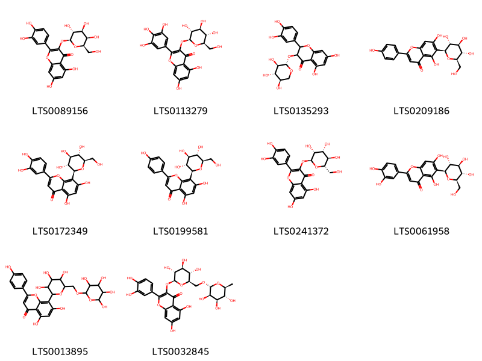{ width=100% }
    <figcaption>Hình ảnh cấu trúc hóa học của 10 hoạt chất thuộc nhóm Flavonoids gồm ['hyperoside (LTS0089156)', '5,7-dihydroxy-3-{[(2s,3r,4s,5s,6r)-3,4,5-trihydroxy-6-(hydroxymethyl)oxan-2-yl]oxy}-2-(3,4,5-trihydroxyphenyl)chromen-4-one (LTS0113279)', '2-(3,4-dihydroxyphenyl)-5,7-dihydroxy-3-{[(2s,3r,4s,5r)-3,4,5-trihydroxyoxan-2-yl]oxy}-2,3-dihydro-1-benzopyran-4-one (LTS0135293)', 'isovitexin (LTS0209186)', 'orientin (LTS0172349)', 'vitexin (LTS0199581)', '2-(3,4-dihydroxyphenyl)-5,7-dihydroxy-3-{[(2s,3r,4r,5r,6s)-3,4,5-trihydroxy-6-(hydroxymethyl)oxan-2-yl]oxy}chromen-4-one (LTS0241372)', 'isoorientin (LTS0061958)', '5,7-dihydroxy-2-(4-hydroxyphenyl)-8-(3,4,5-trihydroxy-6-{[(3,4,5,6-tetrahydroxyoxan-2-yl)oxy]methyl}oxan-2-yl)chromen-4-one (LTS0013895)', '3-rutinosyl quercetin (LTS0032845)'].</figcaption>
</figure>
#### Nhóm Prenol lipids
<figure markdown="span">
    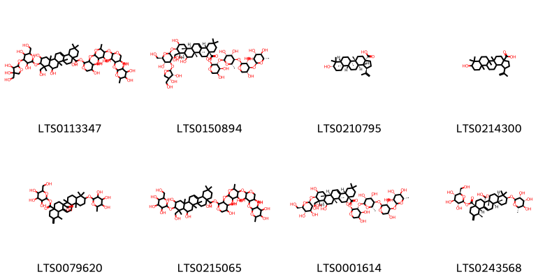{ width=100% }
    <figcaption>Hình ảnh cấu trúc hóa học của 8 hoạt chất thuộc nhóm Prenol lipids gồm ['3-{[5-({3,5-dihydroxy-4-[(3,4,5-trihydroxy-6-methyloxan-2-yl)oxy]oxan-2-yl}oxy)-3,4-dihydroxy-6-methyloxan-2-yl]oxy}-4,5-dihydroxyoxan-2-yl 10-[(4-{[3,4-dihydroxy-4-(hydroxymethyl)oxolan-2-yl]oxy}-3,5-dihydroxy-6-(hydroxymethyl)oxan-2-yl)oxy]-5,8,11-trihydroxy-9-(hydroxymethyl)-2,2,6a,6b,9,12a-hexamethyl-1,3,4,5,6,7,8,8a,10,11,12,12b,13,14b-tetradecahydropicene-4a-carboxylate (LTS0113347)', '(2s,3r,4s,5s)-3-{[(2s,3r,4s,5r,6s)-5-{[(2s,3r,4s,5r)-3,5-dihydroxy-4-{[(2s,3r,4r,5r,6s)-3,4,5-trihydroxy-6-methyloxan-2-yl]oxy}oxan-2-yl]oxy}-3,4-dihydroxy-6-methyloxan-2-yl]oxy}-4,5-dihydroxyoxan-2-yl (4ar,5r,6as,6br,8r,8ar,9r,10r,11s,12ar,12br,14bs)-10-{[(2r,3r,4s,5r,6r)-4-{[(2s,3r,4r)-3,4-dihydroxy-4-(hydroxymethyl)oxolan-2-yl]oxy}-3,5-dihydroxy-6-(hydroxymethyl)oxan-2-yl]oxy}-5,8,11-trihydroxy-9-(hydroxymethyl)-2,2,6a,6b,9,12a-hexamethyl-1,3,4,5,6,7,8,8a,10,11,12,12b,13,14b-tetradecahydropicene-4a-carboxylate (LTS0150894)', 'betulinic acid (LTS0210795)', '9-hydroxy-5a,5b,8,8,11a-pentamethyl-1-(prop-1-en-2-yl)-hexadecahydrocyclopenta[a]chrysene-3a-carboxylic acid (LTS0214300)', '1,6b,9,9,12a-pentamethyl-2-methylidene-4a-({[3,4,5-trihydroxy-6-(hydroxymethyl)oxan-2-yl]oxy}carbonyl)-10-[(3,4,5-trihydroxy-6-methyloxan-2-yl)oxy]-1,3,4,5,6,7,8,8a,10,11,12,12b,13,14b-tetradecahydropicene-6a-carboxylic acid (LTS0079620)', '3-{[5-({3,5-dihydroxy-4-[(3,4,5-trihydroxy-6-methyloxan-2-yl)oxy]oxan-2-yl}oxy)-3,4-dihydroxy-6-methyloxan-2-yl]oxy}-4,5-dihydroxyoxan-2-yl 5,8,11-trihydroxy-9-(hydroxymethyl)-2,2,6a,6b,9,12a-hexamethyl-10-{[3,4,5-trihydroxy-6-(hydroxymethyl)oxan-2-yl]oxy}-1,3,4,5,6,7,8,8a,10,11,12,12b,13,14b-tetradecahydropicene-4a-carboxylate (LTS0215065)', '(2s,3r,4s,5s)-3-{[(2s,3r,4s,5r,6s)-5-{[(2s,3r,4s,5r)-3,5-dihydroxy-4-{[(2s,3r,4r,5r,6s)-3,4,5-trihydroxy-6-methyloxan-2-yl]oxy}oxan-2-yl]oxy}-3,4-dihydroxy-6-methyloxan-2-yl]oxy}-4,5-dihydroxyoxan-2-yl (4ar,5r,6as,6br,8r,8ar,9r,10r,11s,12ar,12br,14bs)-5,8,11-trihydroxy-9-(hydroxymethyl)-2,2,6a,6b,9,12a-hexamethyl-10-{[(2r,3r,4s,5s,6r)-3,4,5-trihydroxy-6-(hydroxymethyl)oxan-2-yl]oxy}-1,3,4,5,6,7,8,8a,10,11,12,12b,13,14b-tetradecahydropicene-4a-carboxylate (LTS0001614)', '(1r,4as,6ar,6br,8ar,10s,12ar,12br,14bs)-1,6b,9,9,12a-pentamethyl-2-methylidene-4a-({[(2s,3r,4s,5s,6r)-3,4,5-trihydroxy-6-(hydroxymethyl)oxan-2-yl]oxy}carbonyl)-10-{[(2r,3r,4r,5r,6s)-3,4,5-trihydroxy-6-methyloxan-2-yl]oxy}-1,3,4,5,6,7,8,8a,10,11,12,12b,13,14b-tetradecahydropicene-6a-carboxylic acid (LTS0243568)'].</figcaption>
</figure>

---

### Dược dân tộc học

Danh sách các quốc gia có sử dụng *Crossopteryx febrifuga* trong điều trị các bệnh. 

| Country   | Disease   | Bệnh                                                                                                                                                                                                |
|:----------|:----------|:----------------------------------------------------------------------------------------------------------------------------------------------------------------------------------------------------|
| Africa    | Tonic     | MYMEMORY WARNING: YOU USED ALL AVAILABLE FREE TRANSLATIONS FOR TODAY. NEXT AVAILABLE IN  10 HOURS 31 MINUTES 35 SECONDS VISIT HTTPS://MYMEMORY.TRANSLATED.NET/DOC/USAGELIMITS.PHP TO TRANSLATE MORE |

---

---
## Crossopteryx kotschyana
### Thông tin về thực vật

!!! info "Phân loại thực vật của *Crossopteryx febrifuga* từ GIBF:"
    - **Kingdom:** Plantae
    - **Phylum:** Tracheophyta
    - **Order:** Gentianales
    - **Family:** Rubiaceae
    - **Genus:** Crossopteryx
    - **Species:** *Crossopteryx febrifuga*

 

| Label (VI)   | Label (EN)   | Scientific Name        | Descriptions (VI)   | Descriptions (EN)   | Also Known As (VI)   | Also Known As (EN)   |
|:-------------|:-------------|:-----------------------|:--------------------|:--------------------|:---------------------|:---------------------|
| N/A          | N/A          | Crossopteryx febrifuga | loài thực vật       | species of plant    | ['']                 | ['Sand Crown-berry'] |

#### Phân bố trên thế giới

**Từ CSDL GIBF** nan, Central African Republic, Tanzania, United Republic of, unknown or invalid, Angola, Sierra Leone, Cameroon, Sudan

#### Phân bố tại Việt Nam

**Từ CSDL GIBF**: Không có ghi nhận ở Việt Nam

---
### Thành phần hóa học
        
- Theo cơ sở dữ liệu lotus: Từ loài *Crossopteryx febrifuga* đã phân lập và xác định được Chưa có hoạt chất nào được phân lập. hoạt chất thuộc về các nhóm Không có hoạt chất nào được phân lập. 

Không có hình ảnh nào được tạo ra

---

### Dược dân tộc học

Danh sách các quốc gia có sử dụng *Crossopteryx febrifuga* trong điều trị các bệnh. 

| Country   | Disease   | Bệnh                                                                                                                                                                                                |
|:----------|:----------|:----------------------------------------------------------------------------------------------------------------------------------------------------------------------------------------------------|
| Elsewhere | nan       | MYMEMORY WARNING: YOU USED ALL AVAILABLE FREE TRANSLATIONS FOR TODAY. NEXT AVAILABLE IN  10 HOURS 30 MINUTES 56 SECONDS VISIT HTTPS://MYMEMORY.TRANSLATED.NET/DOC/USAGELIMITS.PHP TO TRANSLATE MORE |
| India     | Fumigant  | MYMEMORY WARNING: YOU USED ALL AVAILABLE FREE TRANSLATIONS FOR TODAY. NEXT AVAILABLE IN  10 HOURS 30 MINUTES 51 SECONDS VISIT HTTPS://MYMEMORY.TRANSLATED.NET/DOC/USAGELIMITS.PHP TO TRANSLATE MORE |

---

# Chi Nauclea

??? note "Danh sách các dược liệu thuộc chi"
    
	 - *Nauclea latifolia*
	 - *Nauclea missionis*
	 - *Nauclea orientalis*
	 - *Nauclea rhynchophylla*
	 - *Nauclea sessilifolia*
	 - *Nauclea sinensis*

---
## Nauclea latifolia
### Thông tin về thực vật

!!! info "Phân loại thực vật của *Nauclea latifolia* từ GIBF:"
    - **Kingdom:** Plantae
    - **Phylum:** Tracheophyta
    - **Order:** Gentianales
    - **Family:** Rubiaceae
    - **Genus:** Nauclea
    - **Species:** *Nauclea latifolia*

 

| Label (VI)   | Label (EN)   | Scientific Name   | Descriptions (VI)   | Descriptions (EN)   | Also Known As (VI)   | Also Known As (EN)   |
|:-------------|:-------------|:------------------|:--------------------|:--------------------|:---------------------|:---------------------|
| N/A          | N/A          | Nauclea latifolia | loài thực vật       | species of plant    | ['']                 | ['']                 |

#### Phân bố trên thế giới

**Từ CSDL GIBF** Brazil, Benin, Senegal, Gabon, Liberia, Côte d’Ivoire, Gambia, Nigeria, Guinea, Congo, Burkina Faso, Togo, Sierra Leone, Cameroon, Guinea-Bissau, Ghana

#### Phân bố tại Việt Nam

**Từ CSDL GIBF**: Không có ghi nhận ở Việt Nam

---
### Thành phần hóa học
        
- Theo cơ sở dữ liệu lotus: Từ loài *Nauclea latifolia* đã phân lập và xác định được 50 hoạt chất thuộc về các nhóm Yohimbine alkaloids, Steroids and steroid derivatives, Prenol lipids, Indoles and derivatives. 

|    | chemicalTaxonomyClassyfireClass   |   smiles_count |
|---:|:----------------------------------|---------------:|
|  0 | Indoles and derivatives           |             39 |
|  1 | Prenol lipids                     |              5 |
|  2 | Steroids and steroid derivatives  |              1 |
|  3 | Yohimbine alkaloids               |              4 |

#### Nhóm Indoles and derivatives
<figure markdown="span">
    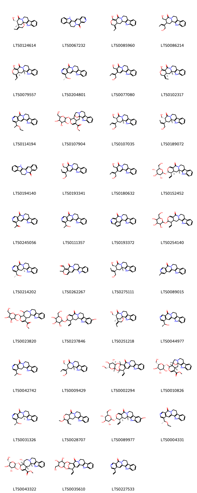{ width=100% }
    <figcaption>Hình ảnh cấu trúc hóa học của 39 hoạt chất thuộc nhóm Indoles and derivatives gồm ['(1r,15r,16r,17e)-17-ethylidene-15-(hydroxymethyl)-19-oxa-3,13-diazapentacyclo[14.3.1.0¹,¹³.0²,¹⁰.0⁴,⁹]icosa-2(10),4,6,8-tetraen-14-one (LTS0124614)', '3,13,17-triazapentacyclo[11.8.0.0²,¹⁰.0⁴,⁹.0¹⁵,²⁰]henicosa-1(21),2(10),4,6,8,15,17,19-octaen-14-one (LTS0067232)', '19-ethylidene-16-hydroxy-17-oxa-3,13-diazapentacyclo[11.8.0.0²,¹⁰.0⁴,⁹.0¹⁵,²⁰]henicosa-2(10),4,6,8,15-pentaen-14-one (LTS0085960)', '2-(1-hydroxybut-2-en-2-yl)-3-(hydroxymethyl)-1h,2h,3h,6h,7h,12h,12bh-indolo[2,3-a]quinolizin-4-one (LTS0086214)', '(1s,19z,20s)-19-ethylidene-16-hydroxy-17-oxa-3,13-diazapentacyclo[11.8.0.0²,¹⁰.0⁴,⁹.0¹⁵,²⁰]henicosa-2(10),4,6,8,15-pentaen-14-one (LTS0079557)', '19-[(1r)-1-hydroxyethyl]-3,13,17-triazapentacyclo[11.8.0.0²,¹⁰.0⁴,⁹.0¹⁵,²⁰]henicosa-1(21),2(10),4,6,8,15,17,19-octaen-14-one (LTS0204801)', '2-[(2z)-1-hydroxybut-2-en-2-yl]-3-(hydroxymethyl)-6h,7h,12h-indolo[2,3-a]quinolizin-4-one (LTS0077080)', '(1s,19e,20s)-19-ethylidene-16-hydroxy-17-oxa-3,13-diazapentacyclo[11.8.0.0²,¹⁰.0⁴,⁹.0¹⁵,²⁰]henicosa-2(10),4,6,8,15-pentaen-14-one (LTS0102317)', '19-(1-ethoxyethyl)-3,13,17-triazapentacyclo[11.8.0.0²,¹⁰.0⁴,⁹.0¹⁵,²⁰]henicosa-1(21),2(10),4,6,8,15,17,19-octaen-14-one (LTS0114194)', 'methyl 17-{[3,4,5-trihydroxy-6-(hydroxymethyl)oxan-2-yl]oxy}-18,23-dioxa-3,13-diazahexacyclo[13.7.1.0¹,¹³.0²,¹⁰.0⁴,⁹.0¹⁶,²¹]tricosa-2(10),4,6,8,19-pentaene-20-carboxylate (LTS0107904)', '(2r,3s,12bs)-2-[(2z)-1-hydroxybut-2-en-2-yl]-3-(hydroxymethyl)-1h,2h,3h,6h,7h,12h,12bh-indolo[2,3-a]quinolizin-4-one (LTS0107035)', '(2r,3r,12bs)-2-[(2e)-1-hydroxybut-2-en-2-yl]-3-(hydroxymethyl)-1h,2h,3h,6h,7h,12h,12bh-indolo[2,3-a]quinolizin-4-one (LTS0189072)', '3,13-diazapentacyclo[11.8.0.0²,¹⁰.0⁴,⁹.0¹⁵,²⁰]henicosa-1(21),2(10),4,6,8,15,17,19-octaen-14-one (LTS0194140)', '2-[(2e)-1-hydroxybut-2-en-2-yl]-3-(hydroxymethyl)-6h,7h,12h-indolo[2,3-a]quinolizin-4-one (LTS0193341)', '2-(1-hydroxybut-2-en-2-yl)-3-(hydroxymethyl)-6h,7h,12h-indolo[2,3-a]quinolizin-4-one (LTS0180632)', 'strictosamide (LTS0152452)', '19-acetyl-3,13,17-triazapentacyclo[11.8.0.0²,¹⁰.0⁴,⁹.0¹⁵,²⁰]henicosa-1(21),2(10),4,6,8,15,17,19-octaen-14-one (LTS0245056)', '19-(1-hydroxyethyl)-3,13,17-triazapentacyclo[11.8.0.0²,¹⁰.0⁴,⁹.0¹⁵,²⁰]henicosa-1(21),2(10),4,6,8,15,17,19-octaen-14-one (LTS0111357)', '4,14,18-triazahexacyclo[14.6.1.0²,¹⁴.0³,¹¹.0⁵,¹⁰.0²⁰,²³]tricosa-1,3(11),5,7,9,16,18,20(23),21-nonaen-15-one (LTS0193372)', '19-ethenyl-18-{[3,4,5-trihydroxy-6-(hydroxymethyl)oxan-2-yl]oxy}-17-oxa-3,13-diazapentacyclo[11.8.0.0²,¹⁰.0⁴,⁹.0¹⁵,²⁰]henicosa-2(10),4,6,8,15-pentaen-14-one (LTS0254140)', '(1r)-19-[(1r)-1-hydroxyethyl]-3,13,17-triazapentacyclo[11.8.0.0²,¹⁰.0⁴,⁹.0¹⁵,²⁰]henicosa-2(10),4,6,8,15(20),16,18-heptaen-14-one (LTS0214202)', '17-methyl-14-oxo-18-oxa-3,13-diazapentacyclo[11.8.0.0²,¹⁰.0⁴,⁹.0¹⁵,²⁰]henicosa-1(21),2(10),4,6,8,15,19-heptaene-16-carbaldehyde (LTS0262267)', '(2r,3s,12bs)-2-[(2e)-1-hydroxybut-2-en-2-yl]-3-(hydroxymethyl)-1h,2h,3h,6h,7h,12h,12bh-indolo[2,3-a]quinolizin-4-one (LTS0275111)', '18-methyl-3,13,17-triazapentacyclo[11.8.0.0²,¹⁰.0⁴,⁹.0¹⁵,²⁰]henicosa-1(21),2(10),4,6,8,15,17,19-octaen-14-one (LTS0089015)', 'methyl 15-hydroxy-17-{[3,4,5-trihydroxy-6-(hydroxymethyl)oxan-2-yl]oxy}-18-oxa-3,13-diazapentacyclo[11.9.0.0²,¹⁰.0⁴,⁹.0¹⁶,²¹]docosa-2(10),4,6,8,19-pentaene-20-carboxylate (LTS0023820)', '19-ethenyl-7-hydroxy-18-{[3,4,5-trihydroxy-6-(hydroxymethyl)oxan-2-yl]oxy}-17-oxa-3,13-diazapentacyclo[11.8.0.0²,¹⁰.0⁴,⁹.0¹⁵,²⁰]henicosa-2(10),4,6,8,15-pentaen-14-one (LTS0237846)', '(1r,15r,16r,17z)-17-ethylidene-15-(hydroxymethyl)-19-oxa-3,13-diazapentacyclo[14.3.1.0¹,¹³.0²,¹⁰.0⁴,⁹]icosa-2(10),4,6,8-tetraen-14-one (LTS0251218)', '19-[(1s)-1-hydroxyethyl]-3,13,17-triazapentacyclo[11.8.0.0²,¹⁰.0⁴,⁹.0¹⁵,²⁰]henicosa-1(21),2(10),4,6,8,15,17,19-octaen-14-one (LTS0044977)', '19-(1-hydroxyethyl)-3,13,17-triazapentacyclo[11.8.0.0²,¹⁰.0⁴,⁹.0¹⁵,²⁰]henicosa-2(10),4,6,8,15(20),16,18-heptaen-14-one (LTS0042742)', '(2r,3r,12bs)-2-[(2z)-1-hydroxybut-2-en-2-yl]-3-(hydroxymethyl)-1h,2h,3h,6h,7h,12h,12bh-indolo[2,3-a]quinolizin-4-one (LTS0009429)', '(1s,19r,20s,22s,24r,25s,26s,27r)-19-ethenyl-25,26-dihydroxy-24-(hydroxymethyl)-21,23,28,29-tetraoxa-4,14-diazaheptacyclo[18.8.1.0²,¹⁸.0⁴,¹⁶.0⁷,¹⁵.0⁸,¹³.0²²,²⁷]nonacosa-2(18),7(15),8,10,12,16-hexaen-3-one (LTS0002294)', 'methyl (1s,15s,16s,17s,21s)-17-{[(2r,3s,4r,5r,6s)-3,4,5-trihydroxy-6-(hydroxymethyl)oxan-2-yl]oxy}-18,23-dioxa-3,13-diazahexacyclo[13.7.1.0¹,¹³.0²,¹⁰.0⁴,⁹.0¹⁶,²¹]tricosa-2(10),4,6,8,19-pentaene-20-carboxylate (LTS0010826)', '(1r)-19-[(1s)-1-hydroxyethyl]-3,13,17-triazapentacyclo[11.8.0.0²,¹⁰.0⁴,⁹.0¹⁵,²⁰]henicosa-2(10),4,6,8,15(20),16,18-heptaen-14-one (LTS0031326)', '(19e)-19-ethylidene-18-methoxy-17-oxa-3,13-diazapentacyclo[11.8.0.0²,¹⁰.0⁴,⁹.0¹⁵,²⁰]henicosa-2(10),4,6,8-tetraen-14-one (LTS0028707)', '(1s,18s,19r,20s)-19-ethenyl-7-hydroxy-18-{[(2s,3r,4s,5s,6r)-3,4,5-trihydroxy-6-(hydroxymethyl)oxan-2-yl]oxy}-17-oxa-3,13-diazapentacyclo[11.8.0.0²,¹⁰.0⁴,⁹.0¹⁵,²⁰]henicosa-2(10),4,6,8,15-pentaen-14-one (LTS0089977)', '19-[(1r)-1-ethoxyethyl]-3,13,17-triazapentacyclo[11.8.0.0²,¹⁰.0⁴,⁹.0¹⁵,²⁰]henicosa-1(21),2(10),4,6,8,15,17,19-octaen-14-one (LTS0004331)', 'methyl (1s,15s,16s,17s,21s)-15-hydroxy-17-{[(2r,3s,4r,5r,6s)-3,4,5-trihydroxy-6-(hydroxymethyl)oxan-2-yl]oxy}-18-oxa-3,13-diazapentacyclo[11.9.0.0²,¹⁰.0⁴,⁹.0¹⁶,²¹]docosa-2(10),4,6,8,19-pentaene-20-carboxylate (LTS0043322)', '19-ethenyl-25,26-dihydroxy-24-(hydroxymethyl)-21,23,28,29-tetraoxa-4,14-diazaheptacyclo[18.8.1.0²,¹⁸.0⁴,¹⁶.0⁷,¹⁵.0⁸,¹³.0²²,²⁷]nonacosa-2(18),7(15),8,10,12,16-hexaen-3-one (LTS0035610)', 'angustine (LTS0227533)'].</figcaption>
</figure>
#### Nhóm Prenol lipids
<figure markdown="span">
    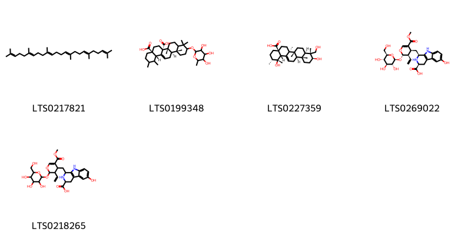{ width=100% }
    <figcaption>Hình ảnh cấu trúc hóa học của 5 hoạt chất thuộc nhóm Prenol lipids gồm ['squalene (LTS0217821)', '(4as,6ar,6br,12ar,12br,14bs)-1,2,6b,9,9,12a-hexamethyl-10-[(3,4,5-trihydroxy-6-methyloxan-2-yl)oxy]-2,3,4,5,6,7,8,8a,10,11,12,12b,13,14b-tetradecahydro-1h-picene-4a,6a-dicarboxylic acid (LTS0199348)', 'rotundic acid (LTS0227359)', '(1s,3s)-1-{[(2s,3r,4s)-3-ethenyl-5-(methoxycarbonyl)-2-{[(2s,3r,4s,5s,6r)-3,4,5-trihydroxy-6-(hydroxymethyl)oxan-2-yl]oxy}-3,4-dihydro-2h-pyran-4-yl]methyl}-6-hydroxy-1h,2h,3h,4h,9h-pyrido[3,4-b]indole-3-carboxylic acid (LTS0269022)', '1-{[3-ethenyl-5-(methoxycarbonyl)-2-{[3,4,5-trihydroxy-6-(hydroxymethyl)oxan-2-yl]oxy}-3,4-dihydro-2h-pyran-4-yl]methyl}-6-hydroxy-1h,2h,3h,4h,9h-pyrido[3,4-b]indole-3-carboxylic acid (LTS0218265)'].</figcaption>
</figure>
#### Nhóm Steroids and steroid derivatives
<figure markdown="span">
    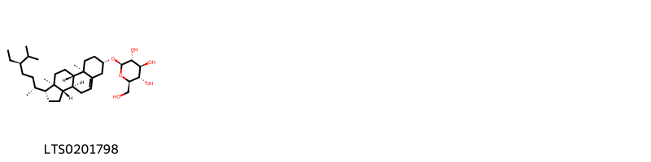{ width=100% }
    <figcaption>Hình ảnh cấu trúc hóa học của 1 hoạt chất thuộc nhóm Steroids and steroid derivatives gồm ['sitogluside (LTS0201798)'].</figcaption>
</figure>
#### Nhóm Yohimbine alkaloids
<figure markdown="span">
    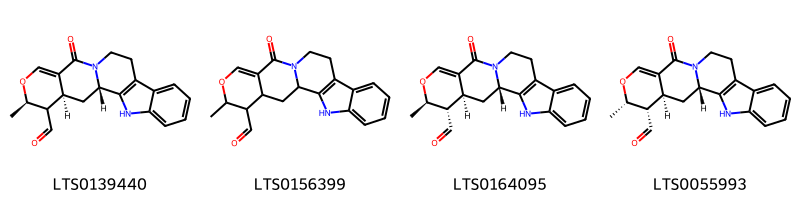{ width=100% }
    <figcaption>Hình ảnh cấu trúc hóa học của 4 hoạt chất thuộc nhóm Yohimbine alkaloids gồm ['(1s,18r,20s)-18-methyl-14-oxo-17-oxa-3,13-diazapentacyclo[11.8.0.0²,¹⁰.0⁴,⁹.0¹⁵,²⁰]henicosa-2(10),4,6,8,15-pentaene-19-carbaldehyde (LTS0139440)', '18-methyl-14-oxo-17-oxa-3,13-diazapentacyclo[11.8.0.0²,¹⁰.0⁴,⁹.0¹⁵,²⁰]henicosa-2(10),4,6,8,15-pentaene-19-carbaldehyde (LTS0156399)', '(1s,18r,19s,20s)-18-methyl-14-oxo-17-oxa-3,13-diazapentacyclo[11.8.0.0²,¹⁰.0⁴,⁹.0¹⁵,²⁰]henicosa-2(10),4,6,8,15-pentaene-19-carbaldehyde (LTS0164095)', '(1s,18s,19s,20s)-18-methyl-14-oxo-17-oxa-3,13-diazapentacyclo[11.8.0.0²,¹⁰.0⁴,⁹.0¹⁵,²⁰]henicosa-2(10),4,6,8,15-pentaene-19-carbaldehyde (LTS0055993)'].</figcaption>
</figure>

---

### Dược dân tộc học

Danh sách các quốc gia có sử dụng *Nauclea latifolia* trong điều trị các bệnh. 

| Country   | Disease                        | Bệnh                                                                                                                                                                                                |
|:----------|:-------------------------------|:----------------------------------------------------------------------------------------------------------------------------------------------------------------------------------------------------|
| Africa    | Emetic, Emmenagogue, Stomachic | MYMEMORY WARNING: YOU USED ALL AVAILABLE FREE TRANSLATIONS FOR TODAY. NEXT AVAILABLE IN  10 HOURS 30 MINUTES 20 SECONDS VISIT HTTPS://MYMEMORY.TRANSLATED.NET/DOC/USAGELIMITS.PHP TO TRANSLATE MORE |
| Ghana     | Tonic                          | MYMEMORY WARNING: YOU USED ALL AVAILABLE FREE TRANSLATIONS FOR TODAY. NEXT AVAILABLE IN  10 HOURS 30 MINUTES 16 SECONDS VISIT HTTPS://MYMEMORY.TRANSLATED.NET/DOC/USAGELIMITS.PHP TO TRANSLATE MORE |

---

---
## Nauclea missionis
### Thông tin về thực vật

!!! info "Phân loại thực vật của *Nauclea missionis* từ GIBF:"
    - **Kingdom:** Plantae
    - **Phylum:** Tracheophyta
    - **Order:** Gentianales
    - **Family:** Rubiaceae
    - **Genus:** Nauclea
    - **Species:** *Nauclea missionis*

 

| Label (VI)   | Label (EN)   | Scientific Name   | Descriptions (VI)   | Descriptions (EN)   | Also Known As (VI)   | Also Known As (EN)   |
|:-------------|:-------------|:------------------|:--------------------|:--------------------|:---------------------|:---------------------|
| N/A          | N/A          | Nauclea missionis | loài thực vật       | species of plant    | ['']                 | ['']                 |

#### Phân bố trên thế giới

**Từ CSDL GIBF** Brazil, Benin, Senegal, Gabon, Liberia, Côte d’Ivoire, Gambia, Nigeria, Guinea, Congo, Burkina Faso, Togo, Sierra Leone, Cameroon, Guinea-Bissau, Ghana

#### Phân bố tại Việt Nam

**Từ CSDL GIBF**: Không có ghi nhận ở Việt Nam

---
### Thành phần hóa học
        
- Theo cơ sở dữ liệu lotus: Từ loài *Nauclea missionis* đã phân lập và xác định được Chưa có hoạt chất nào được phân lập. hoạt chất thuộc về các nhóm Không có hoạt chất nào được phân lập. 

Không có hình ảnh nào được tạo ra

---

### Dược dân tộc học

Danh sách các quốc gia có sử dụng *Nauclea missionis* trong điều trị các bệnh. 

| Country   | Disease   | Bệnh                                                                                                                                                                                                |
|:----------|:----------|:----------------------------------------------------------------------------------------------------------------------------------------------------------------------------------------------------|
| Elsewhere | Laxative  | MYMEMORY WARNING: YOU USED ALL AVAILABLE FREE TRANSLATIONS FOR TODAY. NEXT AVAILABLE IN  10 HOURS 29 MINUTES 34 SECONDS VISIT HTTPS://MYMEMORY.TRANSLATED.NET/DOC/USAGELIMITS.PHP TO TRANSLATE MORE |

---

---
## Nauclea orientalis
### Thông tin về thực vật

!!! info "Phân loại thực vật của *Nauclea orientalis* từ GIBF:"
    - **Kingdom:** Plantae
    - **Phylum:** Tracheophyta
    - **Order:** Gentianales
    - **Family:** Rubiaceae
    - **Genus:** Nauclea
    - **Species:** *Nauclea orientalis*

 

| Label (VI)   | Label (EN)   | Scientific Name    | Descriptions (VI)   | Descriptions (EN)                       | Also Known As (VI)                                                                                                                                                                                                                                                                                                                                                                                                                            | Also Known As (EN)                                            |
|:-------------|:-------------|:-------------------|:--------------------|:----------------------------------------|:----------------------------------------------------------------------------------------------------------------------------------------------------------------------------------------------------------------------------------------------------------------------------------------------------------------------------------------------------------------------------------------------------------------------------------------------|:--------------------------------------------------------------|
| N/A          | N/A          | Nauclea orientalis |                     | species of tree in the family Rubiaceae | ['Sarcocephalus papagola', 'Sarcocephalus ovoideus', 'Sarcocephalus ovatus var. mollis', 'Sarcocephalus ovatus', 'Sarcocephalus cordatus var.pubescens', 'Sarcocephalus cordatus', 'Sarcocephalus buruensis', 'Sarcocephalus annamensis', 'Nauclea orientalis', 'Nauclea macrophylla', 'Nauclea elmeri', 'Nauclea cordata', 'Mitragyna parvifolia var.microphylla', 'Bancalus orientalis', 'Sarcocephalus glaberrimus', 'Nauclea roxburghii'] | ['canary cheesewood', 'Leichhardt tree', 'yellow cheesewood'] |

#### Phân bố trên thế giới

**Từ CSDL GIBF** Sri Lanka, Hong Kong, Viet Nam, United States of America, Cambodia, Indonesia, Philippines, Timor-Leste, Malaysia, Australia, Nigeria, Myanmar, India, Papua New Guinea, Thailand, Lao People’s Democratic Republic

#### Phân bố tại Việt Nam

**Từ CSDL GIBF**: Phu Tho

---
### Thành phần hóa học
        
- Theo cơ sở dữ liệu lotus: Từ loài *Nauclea orientalis* đã phân lập và xác định được 41 hoạt chất thuộc về các nhóm Quinolines and derivatives, Coumarins and derivatives, Steroids and steroid derivatives, Glycerolipids, Organooxygen compounds, Prenol lipids, Indoles and derivatives. 

|    | chemicalTaxonomyClassyfireClass   |   smiles_count |
|---:|:----------------------------------|---------------:|
|  0 | Coumarins and derivatives         |              1 |
|  1 | Glycerolipids                     |              1 |
|  2 | Indoles and derivatives           |             24 |
|  3 | Organooxygen compounds            |              5 |
|  4 | Prenol lipids                     |              3 |
|  5 | Quinolines and derivatives        |              1 |
|  6 | Steroids and steroid derivatives  |              5 |

#### Nhóm Coumarins and derivatives
<figure markdown="span">
    { width=100% }
    <figcaption>Hình ảnh cấu trúc hóa học của 1 hoạt chất thuộc nhóm Coumarins and derivatives gồm ['scopoletin (LTS0193112)'].</figcaption>
</figure>
#### Nhóm Glycerolipids
<figure markdown="span">
    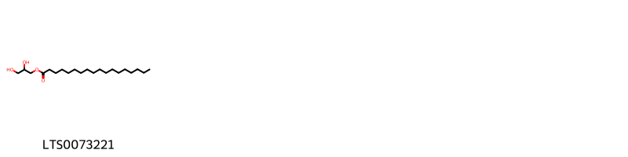{ width=100% }
    <figcaption>Hình ảnh cấu trúc hóa học của 1 hoạt chất thuộc nhóm Glycerolipids gồm ['glyceryl stearate (LTS0073221)'].</figcaption>
</figure>
#### Nhóm Indoles and derivatives
<figure markdown="span">
    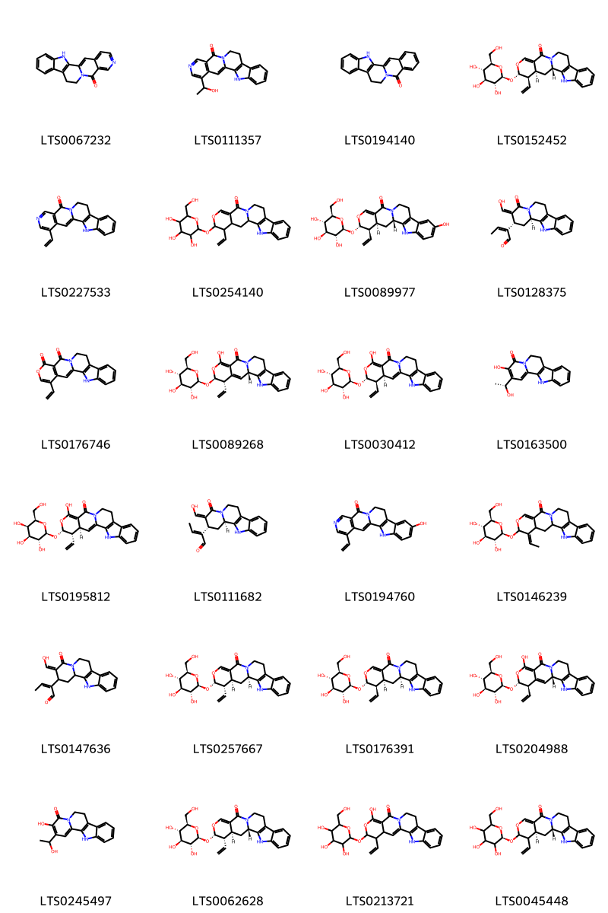{ width=100% }
    <figcaption>Hình ảnh cấu trúc hóa học của 24 hoạt chất thuộc nhóm Indoles and derivatives gồm ['3,13,17-triazapentacyclo[11.8.0.0²,¹⁰.0⁴,⁹.0¹⁵,²⁰]henicosa-1(21),2(10),4,6,8,15,17,19-octaen-14-one (LTS0067232)', '19-(1-hydroxyethyl)-3,13,17-triazapentacyclo[11.8.0.0²,¹⁰.0⁴,⁹.0¹⁵,²⁰]henicosa-1(21),2(10),4,6,8,15,17,19-octaen-14-one (LTS0111357)', '3,13-diazapentacyclo[11.8.0.0²,¹⁰.0⁴,⁹.0¹⁵,²⁰]henicosa-1(21),2(10),4,6,8,15,17,19-octaen-14-one (LTS0194140)', 'strictosamide (LTS0152452)', 'angustine (LTS0227533)', '19-ethenyl-18-{[3,4,5-trihydroxy-6-(hydroxymethyl)oxan-2-yl]oxy}-17-oxa-3,13-diazapentacyclo[11.8.0.0²,¹⁰.0⁴,⁹.0¹⁵,²⁰]henicosa-2(10),4,6,8,15-pentaen-14-one (LTS0254140)', '(1s,18s,19r,20s)-19-ethenyl-7-hydroxy-18-{[(2s,3r,4s,5s,6r)-3,4,5-trihydroxy-6-(hydroxymethyl)oxan-2-yl]oxy}-17-oxa-3,13-diazapentacyclo[11.8.0.0²,¹⁰.0⁴,⁹.0¹⁵,²⁰]henicosa-2(10),4,6,8,15-pentaen-14-one (LTS0089977)', '(2z)-2-[(2r,3z,12br)-3-(hydroxymethylidene)-4-oxo-1h,2h,6h,7h,12h,12bh-indolo[2,3-a]quinolizin-2-yl]but-2-enal (LTS0128375)', '19-ethenyl-17-oxa-3,13-diazapentacyclo[11.8.0.0²,¹⁰.0⁴,⁹.0¹⁵,²⁰]henicosa-1(21),2(10),4,6,8,15(20),18-heptaene-14,16-dione (LTS0176746)', '(1s,18s,19s)-19-ethenyl-16-hydroxy-18-{[(2s,3r,4s,5s,6r)-3,4,5-trihydroxy-6-(hydroxymethyl)oxan-2-yl]oxy}-17-oxa-3,13-diazapentacyclo[11.8.0.0²,¹⁰.0⁴,⁹.0¹⁵,²⁰]henicosa-2(10),4,6,8,15,20-hexaen-14-one (LTS0089268)', '(18r,19r,20s)-19-ethenyl-16-hydroxy-18-{[(2s,3r,4s,5s,6r)-3,4,5-trihydroxy-6-(hydroxymethyl)oxan-2-yl]oxy}-17-oxa-3,13-diazapentacyclo[11.8.0.0²,¹⁰.0⁴,⁹.0¹⁵,²⁰]henicosa-1(21),2(10),4,6,8,15-hexaen-14-one (LTS0030412)', '3-hydroxy-2-[(1r)-1-hydroxyethyl]-6h,7h,12h-indolo[2,3-a]quinolizin-4-one (LTS0163500)', '(18r,19s,20s)-19-ethenyl-16-hydroxy-18-{[(2s,3r,4s,5r,6r)-3,4,5-trihydroxy-6-(hydroxymethyl)oxan-2-yl]oxy}-17-oxa-3,13-diazapentacyclo[11.8.0.0²,¹⁰.0⁴,⁹.0¹⁵,²⁰]henicosa-1(21),2(10),4,6,8,15-hexaen-14-one (LTS0195812)', '(2e)-2-[(2r,3z,12br)-3-(hydroxymethylidene)-4-oxo-1h,2h,6h,7h,12h,12bh-indolo[2,3-a]quinolizin-2-yl]but-2-enal (LTS0111682)', '19-ethenyl-7-hydroxy-3,13,17-triazapentacyclo[11.8.0.0²,¹⁰.0⁴,⁹.0¹⁵,²⁰]henicosa-1(21),2(10),4,6,8,15,17,19-octaen-14-one (LTS0194760)', '(19e)-19-ethylidene-18-{[(2s,3r,4s,5s,6r)-3,4,5-trihydroxy-6-(hydroxymethyl)oxan-2-yl]oxy}-17-oxa-3,13-diazapentacyclo[11.8.0.0²,¹⁰.0⁴,⁹.0¹⁵,²⁰]henicosa-2(10),4,6,8,15-pentaen-14-one (LTS0146239)', '2-[3-(hydroxymethylidene)-4-oxo-1h,2h,6h,7h,12h,12bh-indolo[2,3-a]quinolizin-2-yl]but-2-enal (LTS0147636)', '(1r,18s,19s,20s)-19-ethenyl-18-{[(2s,3r,4s,5s,6r)-3,4,5-trihydroxy-6-(hydroxymethyl)oxan-2-yl]oxy}-17-oxa-3,13-diazapentacyclo[11.8.0.0²,¹⁰.0⁴,⁹.0¹⁵,²⁰]henicosa-2(10),4,6,8,15-pentaen-14-one (LTS0257667)', '(1r,18s,19r,20s)-19-ethenyl-18-{[(2s,3r,4s,5s,6r)-3,4,5-trihydroxy-6-(hydroxymethyl)oxan-2-yl]oxy}-17-oxa-3,13-diazapentacyclo[11.8.0.0²,¹⁰.0⁴,⁹.0¹⁵,²⁰]henicosa-2(10),4,6,8,15-pentaen-14-one (LTS0176391)', '(1s,18r,19r)-19-ethenyl-16-hydroxy-18-{[(2s,3r,4s,5s,6r)-3,4,5-trihydroxy-6-(hydroxymethyl)oxan-2-yl]oxy}-17-oxa-3,13-diazapentacyclo[11.8.0.0²,¹⁰.0⁴,⁹.0¹⁵,²⁰]henicosa-2(10),4,6,8,15,20-hexaen-14-one (LTS0204988)', '3-hydroxy-2-(1-hydroxyethyl)-6h,7h,12h-indolo[2,3-a]quinolizin-4-one (LTS0245497)', '(1s,18s,19s,20s)-19-ethenyl-18-{[(2s,3r,4s,5s,6r)-3,4,5-trihydroxy-6-(hydroxymethyl)oxan-2-yl]oxy}-17-oxa-3,13-diazapentacyclo[11.8.0.0²,¹⁰.0⁴,⁹.0¹⁵,²⁰]henicosa-2(10),4,6,8,15-pentaen-14-one (LTS0062628)', '19-ethenyl-16-hydroxy-18-{[3,4,5-trihydroxy-6-(hydroxymethyl)oxan-2-yl]oxy}-17-oxa-3,13-diazapentacyclo[11.8.0.0²,¹⁰.0⁴,⁹.0¹⁵,²⁰]henicosa-1(21),2(10),4,6,8,15-hexaen-14-one (LTS0213721)', '(1s,20s)-19-ethenyl-18-{[(2s)-3,4,5-trihydroxy-6-(hydroxymethyl)oxan-2-yl]oxy}-17-oxa-3,13-diazapentacyclo[11.8.0.0²,¹⁰.0⁴,⁹.0¹⁵,²⁰]henicosa-2(10),4,6,8,15-pentaen-14-one (LTS0045448)'].</figcaption>
</figure>
#### Nhóm Organooxygen compounds
<figure markdown="span">
    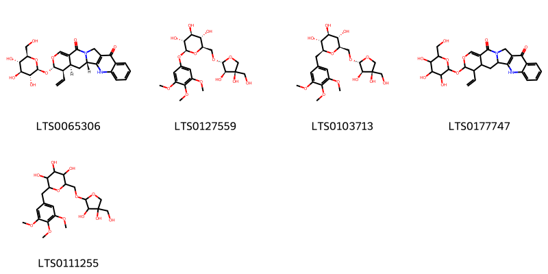{ width=100% }
    <figcaption>Hình ảnh cấu trúc hóa học của 5 hoạt chất thuộc nhóm Organooxygen compounds gồm ['pumiloside (LTS0065306)', '(2r,3s,4s,5r,6s)-2-({[(2r,3r,4r)-3,4-dihydroxy-4-(hydroxymethyl)oxolan-2-yl]oxy}methyl)-6-(3,4,5-trimethoxyphenoxy)oxane-3,4,5-triol (LTS0127559)', '(2r,3s,4r,5r,6s)-2-({[(2r,3r,4r)-3,4-dihydroxy-4-(hydroxymethyl)oxolan-2-yl]oxy}methyl)-6-[(3,4,5-trimethoxyphenyl)methyl]oxane-3,4,5-triol (LTS0103713)', '19-ethenyl-18-{[3,4,5-trihydroxy-6-(hydroxymethyl)oxan-2-yl]oxy}-17-oxa-3,13-diazapentacyclo[11.8.0.0²,¹¹.0⁴,⁹.0¹⁵,²⁰]henicosa-2(11),4,6,8,15-pentaene-10,14-dione (LTS0177747)', '2-({[3,4-dihydroxy-4-(hydroxymethyl)oxolan-2-yl]oxy}methyl)-6-[(3,4,5-trimethoxyphenyl)methyl]oxane-3,4,5-triol (LTS0111255)'].</figcaption>
</figure>
#### Nhóm Prenol lipids
<figure markdown="span">
    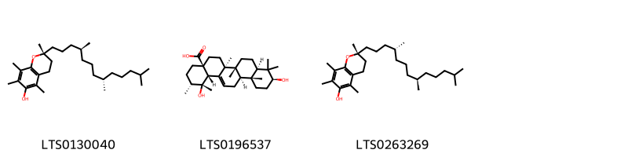{ width=100% }
    <figcaption>Hình ảnh cấu trúc hóa học của 3 hoạt chất thuộc nhóm Prenol lipids gồm ['(2r)-2,5,7,8-tetramethyl-2-[(4s,8s)-4,8,12-trimethyltridecyl]-3,4-dihydro-1-benzopyran-6-ol (LTS0130040)', 'pomolic acid (LTS0196537)', 'vitamin e (LTS0263269)'].</figcaption>
</figure>
#### Nhóm Quinolines and derivatives
<figure markdown="span">
    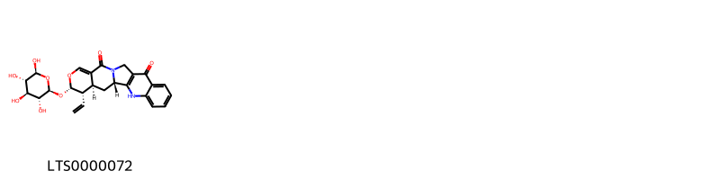{ width=100% }
    <figcaption>Hình ảnh cấu trúc hóa học của 1 hoạt chất thuộc nhóm Quinolines and derivatives gồm ['(1s,18s,19s,20s)-19-ethenyl-18-{[(2s,3r,4s,5s,6s)-3,4,5,6-tetrahydroxyoxan-2-yl]oxy}-17-oxa-3,13-diazapentacyclo[11.8.0.0²,¹¹.0⁴,⁹.0¹⁵,²⁰]henicosa-2(11),4,6,8,15-pentaene-10,14-dione (LTS0000072)'].</figcaption>
</figure>
#### Nhóm Steroids and steroid derivatives
<figure markdown="span">
    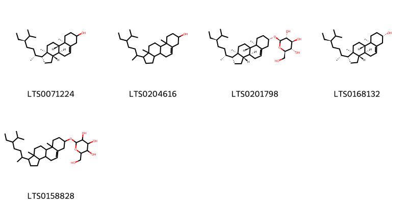{ width=100% }
    <figcaption>Hình ảnh cấu trúc hóa học của 5 hoạt chất thuộc nhóm Steroids and steroid derivatives gồm ['stigmast-5-en-3-ol (LTS0071224)', 'stigmast-5-en-3-ol, (3β)- (LTS0204616)', 'sitogluside (LTS0201798)', 'sitosterol (LTS0168132)', '2-{[1-(5-ethyl-6-methylheptan-2-yl)-9a,11a-dimethyl-1h,2h,3h,3ah,3bh,4h,6h,7h,8h,9h,9bh,10h,11h-cyclopenta[a]phenanthren-7-yl]oxy}-6-(hydroxymethyl)oxane-3,4,5-triol (LTS0158828)'].</figcaption>
</figure>

---

### Dược dân tộc học

Danh sách các quốc gia có sử dụng *Nauclea orientalis* trong điều trị các bệnh. 

| Country   | Disease                     | Bệnh                                                                                                                                                                                                |
|:----------|:----------------------------|:----------------------------------------------------------------------------------------------------------------------------------------------------------------------------------------------------|
| Elsewhere | Piscicide, Tonic, Vulnerary | MYMEMORY WARNING: YOU USED ALL AVAILABLE FREE TRANSLATIONS FOR TODAY. NEXT AVAILABLE IN  10 HOURS 29 MINUTES 04 SECONDS VISIT HTTPS://MYMEMORY.TRANSLATED.NET/DOC/USAGELIMITS.PHP TO TRANSLATE MORE |

---

---
## Nauclea rhynchophylla
### Thông tin về thực vật

!!! info "Phân loại thực vật của *Uncaria rhynchophylla* từ GIBF:"
    - **Kingdom:** Plantae
    - **Phylum:** Tracheophyta
    - **Order:** Gentianales
    - **Family:** Rubiaceae
    - **Genus:** Uncaria
    - **Species:** *Uncaria rhynchophylla*

 

| Label (VI)   | Label (EN)   | Scientific Name       | Descriptions (VI)   | Descriptions (EN)   | Also Known As (VI)   | Also Known As (EN)   |
|:-------------|:-------------|:----------------------|:--------------------|:--------------------|:---------------------|:---------------------|
| N/A          | N/A          | Nauclea rhynchophylla | loài thực vật       | species of plant    | ['']                 | ['']                 |

#### Phân bố trên thế giới

**Từ CSDL GIBF** Sri Lanka, Hong Kong, Viet Nam, United States of America, Cambodia, Indonesia, Philippines, Timor-Leste, Malaysia, Australia, Nigeria, Myanmar, India, Papua New Guinea, Thailand, Lao People’s Democratic Republic

#### Phân bố tại Việt Nam

**Từ CSDL GIBF**: Phu Tho

---
### Thành phần hóa học
        
- Theo cơ sở dữ liệu lotus: Từ loài *Uncaria rhynchophylla* đã phân lập và xác định được Chưa có hoạt chất nào được phân lập. hoạt chất thuộc về các nhóm Không có hoạt chất nào được phân lập. 

Không có hình ảnh nào được tạo ra

---

### Dược dân tộc học

Danh sách các quốc gia có sử dụng *Uncaria rhynchophylla* trong điều trị các bệnh. 

| Country   | Disease   | Bệnh                                                                                                                                                                                                |
|:----------|:----------|:----------------------------------------------------------------------------------------------------------------------------------------------------------------------------------------------------|
| Japan     | Sedative  | MYMEMORY WARNING: YOU USED ALL AVAILABLE FREE TRANSLATIONS FOR TODAY. NEXT AVAILABLE IN  10 HOURS 28 MINUTES 10 SECONDS VISIT HTTPS://MYMEMORY.TRANSLATED.NET/DOC/USAGELIMITS.PHP TO TRANSLATE MORE |

---

---
## Nauclea sessilifolia
### Thông tin về thực vật

!!! info "Phân loại thực vật của *Neonauclea sessilifolia* từ GIBF:"
    - **Kingdom:** Plantae
    - **Phylum:** Tracheophyta
    - **Order:** Gentianales
    - **Family:** Rubiaceae
    - **Genus:** Neonauclea
    - **Species:** *Neonauclea sessilifolia*

 

| Label (VI)   | Label (EN)   | Scientific Name      | Descriptions (VI)   | Descriptions (EN)   | Also Known As (VI)   | Also Known As (EN)   |
|:-------------|:-------------|:---------------------|:--------------------|:--------------------|:---------------------|:---------------------|
| N/A          | N/A          | Nauclea sessilifolia | loài thực vật       | species of plant    | ['']                 | ['']                 |

#### Phân bố trên thế giới

**Từ CSDL GIBF** Sri Lanka, Hong Kong, Viet Nam, United States of America, Cambodia, Indonesia, Philippines, Timor-Leste, Malaysia, Australia, Nigeria, Myanmar, India, Papua New Guinea, Thailand, Lao People’s Democratic Republic

#### Phân bố tại Việt Nam

**Từ CSDL GIBF**: Phu Tho

---
### Thành phần hóa học
        
- Theo cơ sở dữ liệu lotus: Từ loài *Neonauclea sessilifolia* đã phân lập và xác định được 70 hoạt chất thuộc về các nhóm Coumarins and derivatives, Organooxygen compounds, Prenol lipids, Benzopyrans, Indoles and derivatives. 

|    | chemicalTaxonomyClassyfireClass   |   smiles_count |
|---:|:----------------------------------|---------------:|
|  0 | Benzopyrans                       |              1 |
|  1 | Coumarins and derivatives         |              4 |
|  2 | Indoles and derivatives           |              2 |
|  3 | Organooxygen compounds            |             19 |
|  4 | Prenol lipids                     |             42 |

#### Nhóm Benzopyrans
<figure markdown="span">
    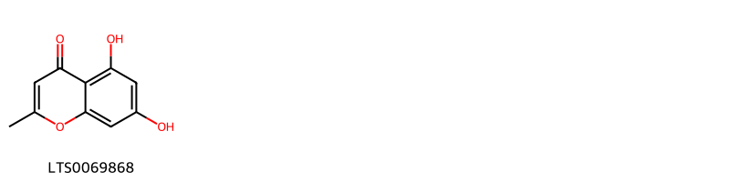{ width=100% }
    <figcaption>Hình ảnh cấu trúc hóa học của 1 hoạt chất thuộc nhóm Benzopyrans gồm ['dihydroxy methylchromone (LTS0069868)'].</figcaption>
</figure>
#### Nhóm Coumarins and derivatives
<figure markdown="span">
    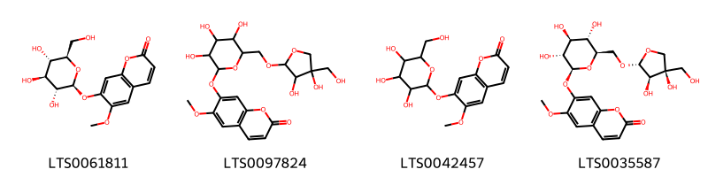{ width=100% }
    <figcaption>Hình ảnh cấu trúc hóa học của 4 hoạt chất thuộc nhóm Coumarins and derivatives gồm ['scopolin (LTS0061811)', '7-{[6-({[3,4-dihydroxy-4-(hydroxymethyl)oxolan-2-yl]oxy}methyl)-3,4,5-trihydroxyoxan-2-yl]oxy}-6-methoxychromen-2-one (LTS0097824)', '6-methoxy-7-{[3,4,5-trihydroxy-6-(hydroxymethyl)oxan-2-yl]oxy}chromen-2-one (LTS0042457)', '7-{[(2s,3r,4s,5s,6r)-6-({[(2r,3r,4r)-3,4-dihydroxy-4-(hydroxymethyl)oxolan-2-yl]oxy}methyl)-3,4,5-trihydroxyoxan-2-yl]oxy}-6-methoxychromen-2-one (LTS0035587)'].</figcaption>
</figure>
#### Nhóm Indoles and derivatives
<figure markdown="span">
    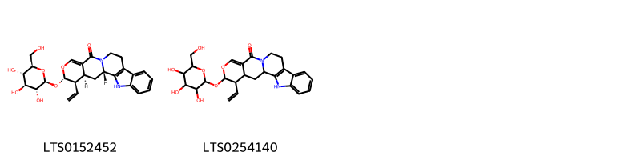{ width=100% }
    <figcaption>Hình ảnh cấu trúc hóa học của 2 hoạt chất thuộc nhóm Indoles and derivatives gồm ['strictosamide (LTS0152452)', '19-ethenyl-18-{[3,4,5-trihydroxy-6-(hydroxymethyl)oxan-2-yl]oxy}-17-oxa-3,13-diazapentacyclo[11.8.0.0²,¹⁰.0⁴,⁹.0¹⁵,²⁰]henicosa-2(10),4,6,8,15-pentaen-14-one (LTS0254140)'].</figcaption>
</figure>
#### Nhóm Organooxygen compounds
<figure markdown="span">
    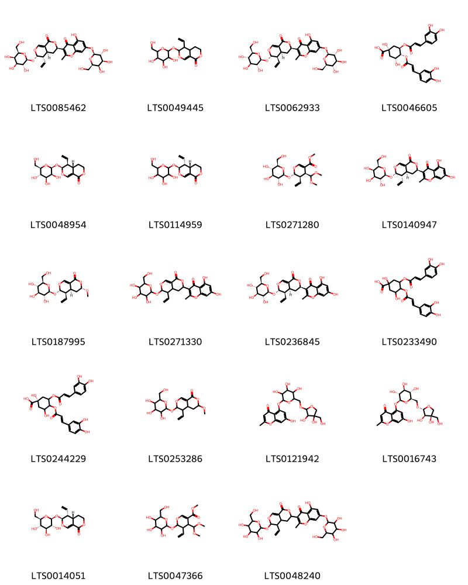{ width=100% }
    <figcaption>Hình ảnh cấu trúc hóa học của 19 hoạt chất thuộc nhóm Organooxygen compounds gồm ['3-[(3r,4as,5s,6s)-5-ethenyl-1-oxo-6-{[(2s,3r,4s,5r,6r)-3,4,5-trihydroxy-6-(hydroxymethyl)oxan-2-yl]oxy}-3h,4h,4ah,5h,6h-pyrano[3,4-c]pyran-3-yl]-5-hydroxy-2-methyl-7-{[(2s,3r,4s,5r,6r)-3,4,5-trihydroxy-6-(hydroxymethyl)oxan-2-yl]oxy}chromen-4-one (LTS0085462)', '5-ethenyl-6-{[3,4,5-trihydroxy-6-(hydroxymethyl)oxan-2-yl]oxy}-3h,4h,4ah,5h,6h-pyrano[3,4-c]pyran-1-one (LTS0049445)', '3-[(3r,4as,5r,6s)-5-ethenyl-1-oxo-6-{[(2s,3r,4s,5s,6r)-3,4,5-trihydroxy-6-(hydroxymethyl)oxan-2-yl]oxy}-3h,4h,4ah,5h,6h-pyrano[3,4-c]pyran-3-yl]-5-hydroxy-2-methyl-7-{[(2s,3r,4s,5s,6r)-3,4,5-trihydroxy-6-(hydroxymethyl)oxan-2-yl]oxy}chromen-4-one (LTS0062933)', '4,5-dicaffeoylquinic acid (LTS0046605)', '(4as,5s,6s)-5-ethenyl-6-{[(2s,3s,4s,5s,6r)-3,4,5-trihydroxy-6-(hydroxymethyl)oxan-2-yl]oxy}-3h,4h,4ah,5h,6h-pyrano[3,4-c]pyran-1-one (LTS0048954)', '(4as,5r,6s)-5-ethenyl-6-{[3,4,5-trihydroxy-6-(hydroxymethyl)oxan-2-yl]oxy}-3h,4h,4ah,5h,6h-pyrano[3,4-c]pyran-1-one (LTS0114959)', 'methyl (4s,5r,6s)-4-(dimethoxymethyl)-5-ethenyl-6-{[(2s,3r,4s,5s,6r)-3,4,5-trihydroxy-6-(hydroxymethyl)oxan-2-yl]oxy}-5,6-dihydro-4h-pyran-3-carboxylate (LTS0271280)', '3-[(3r,4as,5s,6s)-5-ethenyl-1-oxo-6-{[(2s,3r,4s,5r,6r)-3,4,5-trihydroxy-6-(hydroxymethyl)oxan-2-yl]oxy}-3h,4h,4ah,5h,6h-pyrano[3,4-c]pyran-3-yl]-5,7-dihydroxy-2-methylchromen-4-one (LTS0140947)', '(3s,4as,5r,6s)-5-ethenyl-3-methoxy-6-{[(2s,3r,4s,5s,6r)-3,4,5-trihydroxy-6-(hydroxymethyl)oxan-2-yl]oxy}-3h,4h,4ah,5h,6h-pyrano[3,4-c]pyran-1-one (LTS0187995)', '3-(5-ethenyl-1-oxo-6-{[3,4,5-trihydroxy-6-(hydroxymethyl)oxan-2-yl]oxy}-3h,4h,4ah,5h,6h-pyrano[3,4-c]pyran-3-yl)-5,7-dihydroxy-2-methylchromen-4-one (LTS0271330)', '3-[(3r,4as,5r,6s)-5-ethenyl-1-oxo-6-{[(2s,3r,4s,5s,6r)-3,4,5-trihydroxy-6-(hydroxymethyl)oxan-2-yl]oxy}-3h,4h,4ah,5h,6h-pyrano[3,4-c]pyran-3-yl]-5,7-dihydroxy-2-methylchromen-4-one (LTS0236845)', '3,4-bis({[3-(3,4-dihydroxyphenyl)prop-2-enoyl]oxy})-1,5-dihydroxycyclohexane-1-carboxylic acid (LTS0233490)', '(1s)-3,4-bis({[3-(3,4-dihydroxyphenyl)prop-2-enoyl]oxy})-1,5-dihydroxycyclohexane-1-carboxylic acid (LTS0244229)', '5-ethenyl-3-methoxy-6-{[3,4,5-trihydroxy-6-(hydroxymethyl)oxan-2-yl]oxy}-3h,4h,4ah,5h,6h-pyrano[3,4-c]pyran-1-one (LTS0253286)', '5-{[6-({[3,4-dihydroxy-4-(hydroxymethyl)oxolan-2-yl]oxy}methyl)-3,4,5-trihydroxyoxan-2-yl]oxy}-7-hydroxy-2-methylchromen-4-one (LTS0121942)', '5-{[(2s,3r,4s,5s,6r)-6-({[(2r,3r,4r)-3,4-dihydroxy-4-(hydroxymethyl)oxolan-2-yl]oxy}methyl)-3,4,5-trihydroxyoxan-2-yl]oxy}-7-hydroxy-2-methylchromen-4-one (LTS0016743)', 'sweroside (LTS0014051)', 'methyl 4-(dimethoxymethyl)-5-ethenyl-6-{[3,4,5-trihydroxy-6-(hydroxymethyl)oxan-2-yl]oxy}-5,6-dihydro-4h-pyran-3-carboxylate (LTS0047366)', '3-(5-ethenyl-1-oxo-6-{[3,4,5-trihydroxy-6-(hydroxymethyl)oxan-2-yl]oxy}-3h,4h,4ah,5h,6h-pyrano[3,4-c]pyran-3-yl)-5-hydroxy-2-methyl-7-{[3,4,5-trihydroxy-6-(hydroxymethyl)oxan-2-yl]oxy}chromen-4-one (LTS0048240)'].</figcaption>
</figure>
#### Nhóm Prenol lipids
<figure markdown="span">
    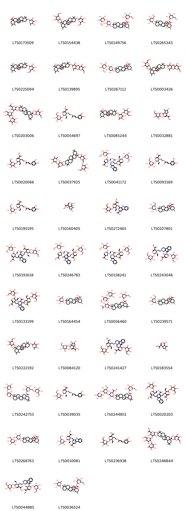{ width=100% }
    <figcaption>Hình ảnh cấu trúc hóa học của 42 hoạt chất thuộc nhóm Prenol lipids gồm ['1,2,6b,9,9,12a-hexamethyl-10-[(3,4,5-trihydroxy-6-methyloxan-2-yl)oxy]-2,3,4,5,6,7,8,8a,10,11,12,12b,13,14b-tetradecahydro-1h-picene-4a,6a-dicarboxylic acid (LTS0173509)', '1,2,6b,9,9,12a-hexamethyl-10-{[3,4,5-trihydroxy-6-(hydroxymethyl)oxan-2-yl]oxy}-4a-({[3,4,5-trihydroxy-6-(hydroxymethyl)oxan-2-yl]oxy}carbonyl)-2,3,4,5,6,7,8,8a,10,11,12,12b,13,14b-tetradecahydro-1h-picene-6a-carboxylic acid (LTS0154438)', '(1s,2r,4as,6ar,6br,8ar,10s,12ar,12br,14bs)-10-{[(2r,3r,4s,5r,6s)-3,4-dihydroxy-6-methyl-5-{[(2s,3r,4s,5s,6r)-3,4,5-trihydroxy-6-(hydroxymethyl)oxan-2-yl]oxy}oxan-2-yl]oxy}-1,2,6b,9,9,12a-hexamethyl-4a-({[(2s,3r,4s,5s,6r)-3,4,5-trihydroxy-6-(hydroxymethyl)oxan-2-yl]oxy}carbonyl)-2,3,4,5,6,7,8,8a,10,11,12,12b,13,14b-tetradecahydro-1h-picene-6a-carboxylic acid (LTS0149756)', '(1s,2r,4as,6ar,6br,8ar,10s,12ar,12br,14bs)-1,2,6b,9,9,12a-hexamethyl-10-{[(2r,3r,4s,5s,6r)-3,4,5-trihydroxy-6-(hydroxymethyl)oxan-2-yl]oxy}-4a-({[(2s,3r,4s,5s,6r)-3,4,5-trihydroxy-6-(hydroxymethyl)oxan-2-yl]oxy}carbonyl)-2,3,4,5,6,7,8,8a,10,11,12,12b,13,14b-tetradecahydro-1h-picene-6a-carboxylic acid (LTS0265343)', '1,2,6b,9,9,12a-hexamethyl-10-{[3,4,5-trihydroxy-6-(hydroxymethyl)oxan-2-yl]oxy}-2,3,4,5,6,7,8,8a,10,11,12,12b,13,14b-tetradecahydro-1h-picene-4a,6a-dicarboxylic acid (LTS0225094)', '10-[(3,4-dihydroxy-6-methyl-5-{[3,4,5-trihydroxy-6-(hydroxymethyl)oxan-2-yl]oxy}oxan-2-yl)oxy]-1,2,6b,9,9,12a-hexamethyl-2,3,4,5,6,7,8,8a,10,11,12,12b,13,14b-tetradecahydro-1h-picene-4a,6a-dicarboxylic acid (LTS0139895)', '(1s,2r,4as,6ar,6br,8ar,10s,12ar,12br,14bs)-10-{[(2r,3r,4s,5r,6s)-3,4-dihydroxy-6-methyl-5-{[(2s,3r,4s,5s,6r)-3,4,5-trihydroxy-6-(hydroxymethyl)oxan-2-yl]oxy}oxan-2-yl]oxy}-1,2,6b,9,9,12a-hexamethyl-2,3,4,5,6,7,8,8a,10,11,12,12b,13,14b-tetradecahydro-1h-picene-4a,6a-dicarboxylic acid (LTS0267112)', '10-[(3,4-dihydroxy-6-methyl-5-{[3,4,5-trihydroxy-6-(hydroxymethyl)oxan-2-yl]oxy}oxan-2-yl)oxy]-1,2,6b,9,9,12a-hexamethyl-4a-({[3,4,5-trihydroxy-6-(hydroxymethyl)oxan-2-yl]oxy}carbonyl)-2,3,4,5,6,7,8,8a,10,11,12,12b,13,14b-tetradecahydro-1h-picene-6a-carboxylic acid (LTS0003426)', '6-{[4,4,6a,6b,11,11,14b-heptamethyl-8a-({[3,4,5-trihydroxy-6-(hydroxymethyl)oxan-2-yl]oxy}carbonyl)-1,2,3,4a,5,6,7,8,9,10,12,12a,14,14a-tetradecahydropicen-3-yl]oxy}-4-{[4,5-dihydroxy-6-(hydroxymethyl)-3-[(3,4,5-trihydroxy-6-methyloxan-2-yl)oxy]oxan-2-yl]oxy}-3,5-dihydroxyoxane-2-carboxylic acid (LTS0203006)', 'methyl (4s,5r,6s)-4-(2-{[(2e)-3-(3,4-dihydroxyphenyl)prop-2-enoyl]oxy}ethyl)-5-ethenyl-6-{[(2s,3r,4s,5s,6r)-3,4,5-trihydroxy-6-(hydroxymethyl)oxan-2-yl]oxy}-5,6-dihydro-4h-pyran-3-carboxylate (LTS0054697)', '10-[(4,5-dihydroxy-6-methyl-3-{[3,4,5-trihydroxy-6-(hydroxymethyl)oxan-2-yl]oxy}oxan-2-yl)oxy]-1,2,6b,9,9,12a-hexamethyl-2,3,4,5,6,7,8,8a,10,11,12,12b,13,14b-tetradecahydro-1h-picene-4a,6a-dicarboxylic acid (LTS0085244)', 'methyl 6-hydroxy-7-methyl-1-{[3,4,5-trihydroxy-6-(hydroxymethyl)oxan-2-yl]oxy}-1h,4ah,5h,6h,7h,7ah-cyclopenta[c]pyran-4-carboxylate (LTS0032881)', 'methyl 4-(2-{[3-(3,4-dihydroxyphenyl)prop-2-enoyl]oxy}ethyl)-5-ethenyl-6-{[3,4,5-trihydroxy-6-(hydroxymethyl)oxan-2-yl]oxy}-5,6-dihydro-4h-pyran-3-carboxylate (LTS0020066)', '3,4,5-trihydroxy-6-({[3,4,5-trihydroxy-6-(hydroxymethyl)oxan-2-yl]oxy}methyl)oxan-2-yl 10-({3,4-dihydroxy-6-methyl-5-[(3,4,5-trihydroxy-6-methyloxan-2-yl)oxy]oxan-2-yl}oxy)-2,2,6b,9,9,12a-hexamethyl-3,4,5,6,7,8,8a,10,11,12,12b,13,14,14b-tetradecahydro-1h-picene-4a-carboxylate (LTS0037925)', '(1s,3s,4r)-4-[(3r,4as,5r,6s)-5-ethenyl-1-oxo-6-{[(2s,3r,4s,5s,6r)-3,4,5-trihydroxy-6-(hydroxymethyl)oxan-2-yl]oxy}-3h,4h,4ah,5h,6h-pyrano[3,4-c]pyran-3-yl]-1-{[(2s,3r,4s)-3-ethenyl-5-(methoxycarbonyl)-2-{[(2s,3r,4s,5s,6r)-3,4,5-trihydroxy-6-(hydroxymethyl)oxan-2-yl]oxy}-3,4-dihydro-2h-pyran-4-yl]methyl}-1h,2h,3h,4h,9h-pyrido[3,4-b]indole-3-carboxylic acid (LTS0041172)', '(4s,5r,6s)-5-ethenyl-4-(2-{[(2e)-3-(4-hydroxy-3-methoxyphenyl)prop-2-enoyl]oxy}ethyl)-6-{[(2s,3r,4s,5s,6r)-3,4,5-trihydroxy-6-(hydroxymethyl)oxan-2-yl]oxy}-5,6-dihydro-4h-pyran-3-carboxylic acid (LTS0093169)', '(4s,5r,6s)-4-(2-{[(2e)-3-(3,4-dihydroxyphenyl)prop-2-enoyl]oxy}ethyl)-5-ethenyl-6-{[(2s,3r,4s,5s,6r)-3,4,5-trihydroxy-6-(hydroxymethyl)oxan-2-yl]oxy}-5,6-dihydro-4h-pyran-3-carboxylic acid (LTS0195195)', 'methyl (1r,4as,6s,7r,7as)-1,6-dihydroxy-7-methyl-1h,4ah,5h,6h,7h,7ah-cyclopenta[c]pyran-4-carboxylate (LTS0160405)', '1-{[3-ethenyl-5-(methoxycarbonyl)-2-{[3,4,5-trihydroxy-6-(hydroxymethyl)oxan-2-yl]oxy}-3,4-dihydro-2h-pyran-4-yl]methyl}-9h-pyrido[3,4-b]indole-3-carboxylic acid (LTS0272465)', '(1s,2r,4as,6ar,6br,8ar,10s,12ar,12br,14bs)-1,2,6b,9,9,12a-hexamethyl-10-{[(2r,3r,4s,5s,6r)-3,4,5-trihydroxy-6-(hydroxymethyl)oxan-2-yl]oxy}-2,3,4,5,6,7,8,8a,10,11,12,12b,13,14b-tetradecahydro-1h-picene-4a,6a-dicarboxylic acid (LTS0107801)', '4-{2-[(2s,3r)-3-ethenyl-5-(methoxycarbonyl)-2-{[(2s,3r,4s,5s,6r)-3,4,5-trihydroxy-6-(hydroxymethyl)oxan-2-yl]oxy}-3,4-dihydro-2h-pyran-4-yl]ethyl}-1-{[(2s,3r)-3-ethenyl-5-(methoxycarbonyl)-2-{[(2s,3r,4s,5s,6r)-3,4,5-trihydroxy-6-(hydroxymethyl)oxan-2-yl]oxy}-3,4-dihydro-2h-pyran-4-yl]methyl}-9h-pyrido[3,4-b]indole-3-carboxylic acid (LTS0191618)', '4-{2-[(2s,3r,4s)-3-ethenyl-5-(methoxycarbonyl)-2-{[(2s,3r,4s,5s,6r)-3,4,5-trihydroxy-6-(hydroxymethyl)oxan-2-yl]oxy}-3,4-dihydro-2h-pyran-4-yl]ethyl}-1-{[(2s,3r,4s)-3-ethenyl-5-(methoxycarbonyl)-2-{[(2s,3r,4s,5s,6r)-3,4,5-trihydroxy-6-(hydroxymethyl)oxan-2-yl]oxy}-3,4-dihydro-2h-pyran-4-yl]methyl}-9h-pyrido[3,4-b]indole-3-carboxylic acid (LTS0246783)', '(1s,3r,4s)-4-[(3r,4as,5r,6s)-5-ethenyl-1-oxo-6-{[(2s,3r,4s,5s,6r)-3,4,5-trihydroxy-6-(hydroxymethyl)oxan-2-yl]oxy}-3h,4h,4ah,5h,6h-pyrano[3,4-c]pyran-3-yl]-1-{[(2s,3r,4s)-3-ethenyl-5-(methoxycarbonyl)-2-{[(2s,3r,4s,5s,6r)-3,4,5-trihydroxy-6-(hydroxymethyl)oxan-2-yl]oxy}-3,4-dihydro-2h-pyran-4-yl]methyl}-1h,2h,3h,4h,9h-pyrido[3,4-b]indole-3-carboxylic acid (LTS0158241)', 'methyl (4s,5r,6s)-5-ethenyl-4-{2-[(1s)-1-{[(2s,3r,4s)-3-ethenyl-5-(methoxycarbonyl)-2-{[(2s,3r,4s,5s,6r)-3,4,5-trihydroxy-6-(hydroxymethyl)oxan-2-yl]oxy}-3,4-dihydro-2h-pyran-4-yl]methyl}-1h,3h,4h,9h-pyrido[3,4-b]indol-2-yl]ethyl}-6-{[(2s,3r,4s,5s,6r)-3,4,5-trihydroxy-6-(hydroxymethyl)oxan-2-yl]oxy}-5,6-dihydro-4h-pyran-3-carboxylate (LTS0243046)', '4-(5-ethenyl-1-oxo-6-{[3,4,5-trihydroxy-6-(hydroxymethyl)oxan-2-yl]oxy}-3h,4h,4ah,5h,6h-pyrano[3,4-c]pyran-3-yl)-1-{[3-ethenyl-5-(methoxycarbonyl)-2-{[3,4,5-trihydroxy-6-(hydroxymethyl)oxan-2-yl]oxy}-3,4-dihydro-2h-pyran-4-yl]methyl}-1h,2h,3h,4h,9h-pyrido[3,4-b]indole-3-carboxylic acid (LTS0133199)', 'quinovin (LTS0164454)', '(2s,3s,4s,5r,6r)-6-{[(3s,4ar,6ar,6bs,8as,12as,14ar,14br)-4,4,6a,6b,11,11,14b-heptamethyl-8a-({[(2s,3r,4s,5s,6r)-3,4,5-trihydroxy-6-(hydroxymethyl)oxan-2-yl]oxy}carbonyl)-1,2,3,4a,5,6,7,8,9,10,12,12a,14,14a-tetradecahydropicen-3-yl]oxy}-4-{[(2s,3r,4s,5s,6r)-4,5-dihydroxy-6-(hydroxymethyl)-3-{[(2s,3r,4r,5r,6s)-3,4,5-trihydroxy-6-methyloxan-2-yl]oxy}oxan-2-yl]oxy}-3,5-dihydroxyoxane-2-carboxylic acid (LTS0056460)', '(1s,2r,4ar,6ar,6br,8ar,10s,12ar,12br,14bs)-1,2,6b,9,9,12a-hexamethyl-10-{[(2r,3r,4s,5s,6r)-3,4,5-trihydroxy-6-(hydroxymethyl)oxan-2-yl]oxy}-2,3,4,5,6,7,8,8a,10,11,12,12b,13,14b-tetradecahydro-1h-picene-4a,6a-dicarboxylic acid (LTS0239571)', '1,2,6b,9,9,12a-hexamethyl-4a-({[3,4,5-trihydroxy-6-(hydroxymethyl)oxan-2-yl]oxy}carbonyl)-10-[(3,4,5-trihydroxy-6-methyloxan-2-yl)oxy]-2,3,4,5,6,7,8,8a,10,11,12,12b,13,14b-tetradecahydro-1h-picene-6a-carboxylic acid (LTS0222192)', 'loganin (LTS0084120)', 'methyl 5-ethenyl-4-[2-(1-{[3-ethenyl-5-(methoxycarbonyl)-2-{[3,4,5-trihydroxy-6-(hydroxymethyl)oxan-2-yl]oxy}-3,4-dihydro-2h-pyran-4-yl]methyl}-1h,3h,4h,9h-pyrido[3,4-b]indol-2-yl)ethyl]-6-{[3,4,5-trihydroxy-6-(hydroxymethyl)oxan-2-yl]oxy}-5,6-dihydro-4h-pyran-3-carboxylate (LTS0241427)', 'methyl 1,6-dihydroxy-7-methyl-1h,4ah,5h,6h,7h,7ah-cyclopenta[c]pyran-4-carboxylate (LTS0183554)', '(2s,3r,4s,5s,6r)-3,4,5-trihydroxy-6-({[(2r,3r,4s,5s,6r)-3,4,5-trihydroxy-6-(hydroxymethyl)oxan-2-yl]oxy}methyl)oxan-2-yl (4as,6br,8ar,10s,12ar,12br,14bs)-10-{[(2r,3r,4r,5s,6r)-3,4-dihydroxy-6-methyl-5-{[(2s,3r,4r,5r,6s)-3,4,5-trihydroxy-6-methyloxan-2-yl]oxy}oxan-2-yl]oxy}-2,2,6b,9,9,12a-hexamethyl-3,4,5,6,7,8,8a,10,11,12,12b,13,14,14b-tetradecahydro-1h-picene-4a-carboxylate (LTS0242753)', '(4s,5s,6s)-4-(2-{[(2e)-3-(3,4-dihydroxyphenyl)prop-2-enoyl]oxy}ethyl)-5-ethenyl-6-{[(2s,3s,4s,5s,6r)-3,4,5-trihydroxy-6-(hydroxymethyl)oxan-2-yl]oxy}-5,6-dihydro-4h-pyran-3-carboxylic acid (LTS0039035)', 'methyl (2s,3s,4s,5r,6r)-6-{[(3s,4ar,6ar,6bs,8as,12as,14ar,14br)-4,4,6a,6b,11,11,14b-heptamethyl-8a-({[(2s,3r,4s,5s,6r)-3,4,5-trihydroxy-6-(hydroxymethyl)oxan-2-yl]oxy}carbonyl)-1,2,3,4a,5,6,7,8,9,10,12,12a,14,14a-tetradecahydropicen-3-yl]oxy}-4-{[(2s,3r,4s,5s,6r)-4,5-dihydroxy-6-(hydroxymethyl)-3-{[(2s,3r,4r,5r,6s)-3,4,5-trihydroxy-6-methyloxan-2-yl]oxy}oxan-2-yl]oxy}-3,5-dihydroxyoxane-2-carboxylate (LTS0244851)', '4-{2-[3-ethenyl-5-(methoxycarbonyl)-2-{[3,4,5-trihydroxy-6-(hydroxymethyl)oxan-2-yl]oxy}-3,4-dihydro-2h-pyran-4-yl]ethyl}-1-{[3-ethenyl-5-(methoxycarbonyl)-2-{[3,4,5-trihydroxy-6-(hydroxymethyl)oxan-2-yl]oxy}-3,4-dihydro-2h-pyran-4-yl]methyl}-9h-pyrido[3,4-b]indole-3-carboxylic acid (LTS0020203)', '(1s,2r,4as,6ar,6br,8ar,10s,12ar,12br,14bs)-10-{[(2r,3r,4s,5s,6r)-4,5-dihydroxy-6-methyl-3-{[(2s,3r,4s,5s,6r)-3,4,5-trihydroxy-6-(hydroxymethyl)oxan-2-yl]oxy}oxan-2-yl]oxy}-1,2,6b,9,9,12a-hexamethyl-2,3,4,5,6,7,8,8a,10,11,12,12b,13,14b-tetradecahydro-1h-picene-4a,6a-dicarboxylic acid (LTS0268763)', '1-{[(2s,3r,4s)-3-ethenyl-5-(methoxycarbonyl)-2-{[(2s,3r,4s,5s,6r)-3,4,5-trihydroxy-6-(hydroxymethyl)oxan-2-yl]oxy}-3,4-dihydro-2h-pyran-4-yl]methyl}-9h-pyrido[3,4-b]indole-3-carboxylic acid (LTS0010081)', '4-(2-{[3-(3,4-dihydroxyphenyl)prop-2-enoyl]oxy}ethyl)-5-ethenyl-6-{[3,4,5-trihydroxy-6-(hydroxymethyl)oxan-2-yl]oxy}-5,6-dihydro-4h-pyran-3-carboxylic acid (LTS0236938)', 'methyl 6-{[4,4,6a,6b,11,11,14b-heptamethyl-8a-({[3,4,5-trihydroxy-6-(hydroxymethyl)oxan-2-yl]oxy}carbonyl)-1,2,3,4a,5,6,7,8,9,10,12,12a,14,14a-tetradecahydropicen-3-yl]oxy}-4-{[4,5-dihydroxy-6-(hydroxymethyl)-3-[(3,4,5-trihydroxy-6-methyloxan-2-yl)oxy]oxan-2-yl]oxy}-3,5-dihydroxyoxane-2-carboxylate (LTS0248844)', 'methyl (5r,6s)-5-ethenyl-4-{2-[(1s)-1-{[(2s,3r)-3-ethenyl-5-(methoxycarbonyl)-2-{[(2s,3r,4s,5s,6r)-3,4,5-trihydroxy-6-(hydroxymethyl)oxan-2-yl]oxy}-3,4-dihydro-2h-pyran-4-yl]methyl}-1h,3h,4h,9h-pyrido[3,4-b]indol-2-yl]ethyl}-6-{[(2s,3r,4s,5s,6r)-3,4,5-trihydroxy-6-(hydroxymethyl)oxan-2-yl]oxy}-5,6-dihydro-4h-pyran-3-carboxylate (LTS0044885)', '(1s,2r,4as,6ar,6br,8ar,10s,12ar,12br,14bs)-1,2,6b,9,9,12a-hexamethyl-4a-({[(2s,3r,4s,5s,6r)-3,4,5-trihydroxy-6-(hydroxymethyl)oxan-2-yl]oxy}carbonyl)-10-{[(2r,3r,4s,5s,6r)-3,4,5-trihydroxy-6-methyloxan-2-yl]oxy}-2,3,4,5,6,7,8,8a,10,11,12,12b,13,14b-tetradecahydro-1h-picene-6a-carboxylic acid (LTS0036524)'].</figcaption>
</figure>

---

### Dược dân tộc học

Danh sách các quốc gia có sử dụng *Neonauclea sessilifolia* trong điều trị các bệnh. 

| Country   | Disease        | Bệnh                                                                                                                                                                                                |
|:----------|:---------------|:----------------------------------------------------------------------------------------------------------------------------------------------------------------------------------------------------|
| Elsewhere | Styptic, Tonic | MYMEMORY WARNING: YOU USED ALL AVAILABLE FREE TRANSLATIONS FOR TODAY. NEXT AVAILABLE IN  10 HOURS 27 MINUTES 42 SECONDS VISIT HTTPS://MYMEMORY.TRANSLATED.NET/DOC/USAGELIMITS.PHP TO TRANSLATE MORE |

---

---
## Nauclea sinensis
### Thông tin về thực vật

!!! info "Phân loại thực vật của *Uncaria sinensis* từ GIBF:"
    - **Kingdom:** Plantae
    - **Phylum:** Tracheophyta
    - **Order:** Gentianales
    - **Family:** Rubiaceae
    - **Genus:** Uncaria
    - **Species:** *Uncaria sinensis*

 

| Label (VI)   | Label (EN)   | Scientific Name   | Descriptions (VI)   | Descriptions (EN)   | Also Known As (VI)   | Also Known As (EN)   |
|:-------------|:-------------|:------------------|:--------------------|:--------------------|:---------------------|:---------------------|
| N/A          | N/A          | Nauclea sinensis  | loài thực vật       | species of plant    | ['']                 | ['']                 |

#### Phân bố trên thế giới

**Từ CSDL GIBF** nan, Hong Kong, China

#### Phân bố tại Việt Nam

**Từ CSDL GIBF**: Không có ghi nhận ở Việt Nam

---
### Thành phần hóa học
        
- Theo cơ sở dữ liệu lotus: Từ loài *Uncaria sinensis* đã phân lập và xác định được Chưa có hoạt chất nào được phân lập. hoạt chất thuộc về các nhóm Không có hoạt chất nào được phân lập. 

Không có hình ảnh nào được tạo ra

---

### Dược dân tộc học

Danh sách các quốc gia có sử dụng *Uncaria sinensis* trong điều trị các bệnh. 

| Country   | Disease   | Bệnh                                                                                                                                                                                                |
|:----------|:----------|:----------------------------------------------------------------------------------------------------------------------------------------------------------------------------------------------------|
| China     | Sedative  | MYMEMORY WARNING: YOU USED ALL AVAILABLE FREE TRANSLATIONS FOR TODAY. NEXT AVAILABLE IN  10 HOURS 26 MINUTES 57 SECONDS VISIT HTTPS://MYMEMORY.TRANSLATED.NET/DOC/USAGELIMITS.PHP TO TRANSLATE MORE |

---

# Chi Pavetta

??? note "Danh sách các dược liệu thuộc chi"
    
	 - *Pavetta graciliflora*
	 - *Pavetta indica*

---
## Pavetta graciliflora
### Thông tin về thực vật

!!! info "Phân loại thực vật của *Pavetta graciliflora* từ GIBF:"
    - **Kingdom:** Plantae
    - **Phylum:** Tracheophyta
    - **Order:** Gentianales
    - **Family:** Rubiaceae
    - **Genus:** Pavetta
    - **Species:** *Pavetta graciliflora*

 

| Label (VI)   | Label (EN)   | Scientific Name      | Descriptions (VI)   | Descriptions (EN)   | Also Known As (VI)   | Also Known As (EN)   |
|:-------------|:-------------|:---------------------|:--------------------|:--------------------|:---------------------|:---------------------|
| N/A          | N/A          | Pavetta graciliflora | loài thực vật       | species of plant    | ['']                 | ['']                 |

#### Phân bố trên thế giới

**Từ CSDL GIBF** nan, Viet Nam, Cambodia, Malaysia, Thailand

#### Phân bố tại Việt Nam

**Từ CSDL GIBF**: Không có ghi nhận ở Việt Nam

---
### Thành phần hóa học
        
- Theo cơ sở dữ liệu lotus: Từ loài *Pavetta graciliflora* đã phân lập và xác định được Chưa có hoạt chất nào được phân lập. hoạt chất thuộc về các nhóm Không có hoạt chất nào được phân lập. 

Không có hình ảnh nào được tạo ra

---

### Dược dân tộc học

Danh sách các quốc gia có sử dụng *Pavetta graciliflora* trong điều trị các bệnh. 

| Country   | Disease      | Bệnh                                                                                                                                                                                                |
|:----------|:-------------|:----------------------------------------------------------------------------------------------------------------------------------------------------------------------------------------------------|
| Malaya    | Stupefacient | MYMEMORY WARNING: YOU USED ALL AVAILABLE FREE TRANSLATIONS FOR TODAY. NEXT AVAILABLE IN  10 HOURS 26 MINUTES 36 SECONDS VISIT HTTPS://MYMEMORY.TRANSLATED.NET/DOC/USAGELIMITS.PHP TO TRANSLATE MORE |

---

---
## Pavetta indica
### Thông tin về thực vật

!!! info "Phân loại thực vật của *Pavetta indica* từ GIBF:"
    - **Kingdom:** Plantae
    - **Phylum:** Tracheophyta
    - **Order:** Gentianales
    - **Family:** Rubiaceae
    - **Genus:** Pavetta
    - **Species:** *Pavetta indica*

 

| Label (VI)   | Label (EN)   | Scientific Name   | Descriptions (VI)   | Descriptions (EN)   | Also Known As (VI)   | Also Known As (EN)   |
|:-------------|:-------------|:------------------|:--------------------|:--------------------|:---------------------|:---------------------|
| N/A          | N/A          | Pavetta indica    | loài thực vật       | species of plant    | ['']                 | ['']                 |

#### Phân bố trên thế giới

**Từ CSDL GIBF** nan, Brazil, Viet Nam, Bangladesh, Nepal, Papua New Guinea, Thailand, Sri Lanka, Bhutan, Indonesia, Nigeria, unknown or invalid, Lao People’s Democratic Republic, Vanuatu, Belgium, Chinese Taipei, Philippines, Malaysia, Singapore, Cambodia, Myanmar, India

#### Phân bố tại Việt Nam

**Từ CSDL GIBF**: Vinh Phuc, Kon Tum

---
### Thành phần hóa học
        
- Theo cơ sở dữ liệu lotus: Từ loài *Pavetta indica* đã phân lập và xác định được 8 hoạt chất thuộc về các nhóm Flavonoids, Cinnamic acids and derivatives, Steroids and steroid derivatives, Organooxygen compounds, Prenol lipids. 

|    | chemicalTaxonomyClassyfireClass   |   smiles_count |
|---:|:----------------------------------|---------------:|
|  0 | Cinnamic acids and derivatives    |              1 |
|  1 | Flavonoids                        |              1 |
|  2 | Organooxygen compounds            |              2 |
|  3 | Prenol lipids                     |              2 |
|  4 | Steroids and steroid derivatives  |              2 |

#### Nhóm Cinnamic acids and derivatives
<figure markdown="span">
    { width=100% }
    <figcaption>Hình ảnh cấu trúc hóa học của 1 hoạt chất thuộc nhóm Cinnamic acids and derivatives gồm ['3,4-dihydroxycinnamic acid (LTS0128050)'].</figcaption>
</figure>
#### Nhóm Flavonoids
<figure markdown="span">
    { width=100% }
    <figcaption>Hình ảnh cấu trúc hóa học của 1 hoạt chất thuộc nhóm Flavonoids gồm ['quercetin (LTS0004651)'].</figcaption>
</figure>
#### Nhóm Organooxygen compounds
<figure markdown="span">
    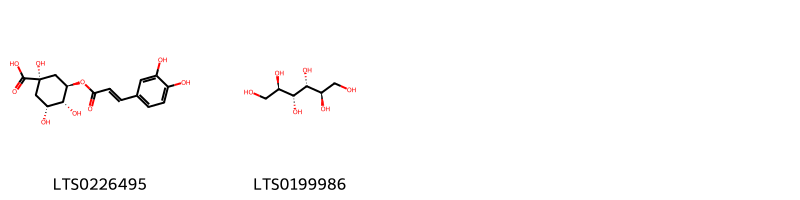{ width=100% }
    <figcaption>Hình ảnh cấu trúc hóa học của 2 hoạt chất thuộc nhóm Organooxygen compounds gồm ['chlorogenic acid (LTS0226495)', 'mannitol (LTS0199986)'].</figcaption>
</figure>
#### Nhóm Prenol lipids
<figure markdown="span">
    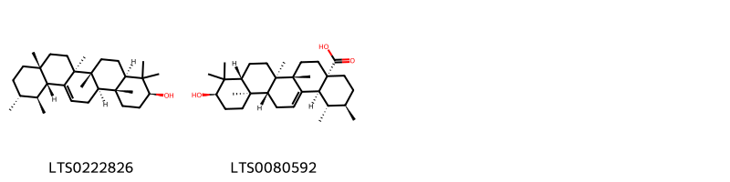{ width=100% }
    <figcaption>Hình ảnh cấu trúc hóa học của 2 hoạt chất thuộc nhóm Prenol lipids gồm ['amyrin (LTS0222826)', '3β-hydroxy-12-ursen-28-ic acid (LTS0080592)'].</figcaption>
</figure>
#### Nhóm Steroids and steroid derivatives
<figure markdown="span">
    { width=100% }
    <figcaption>Hình ảnh cấu trúc hóa học của 2 hoạt chất thuộc nhóm Steroids and steroid derivatives gồm ['stigmast-5-en-3-ol, (3β)- (LTS0204616)', 'stigmast-5-en-3-ol (LTS0071224)'].</figcaption>
</figure>

---

### Dược dân tộc học

Danh sách các quốc gia có sử dụng *Pavetta indica* trong điều trị các bệnh. 

| Country   | Disease                              | Bệnh                                                                                                                                                                                                |
|:----------|:-------------------------------------|:----------------------------------------------------------------------------------------------------------------------------------------------------------------------------------------------------|
| Elsewhere | Diuretic, Purgative, Tonic, Aperient | MYMEMORY WARNING: YOU USED ALL AVAILABLE FREE TRANSLATIONS FOR TODAY. NEXT AVAILABLE IN  10 HOURS 26 MINUTES 10 SECONDS VISIT HTTPS://MYMEMORY.TRANSLATED.NET/DOC/USAGELIMITS.PHP TO TRANSLATE MORE |
| Thailand  | Cosmetic, Cosmetic                   | MYMEMORY WARNING: YOU USED ALL AVAILABLE FREE TRANSLATIONS FOR TODAY. NEXT AVAILABLE IN  10 HOURS 26 MINUTES 06 SECONDS VISIT HTTPS://MYMEMORY.TRANSLATED.NET/DOC/USAGELIMITS.PHP TO TRANSLATE MORE |

---

# Chi Warszewiczia

??? note "Danh sách các dược liệu thuộc chi"
    
	 - *Warszewiczia coccinea*

---
## Warszewiczia coccinea
### Thông tin về thực vật

!!! info "Phân loại thực vật của *Warszewiczia coccinea* từ GIBF:"
    - **Kingdom:** Plantae
    - **Phylum:** Tracheophyta
    - **Order:** Gentianales
    - **Family:** Rubiaceae
    - **Genus:** Warszewiczia
    - **Species:** *Warszewiczia coccinea*

 

| Label (VI)   | Label (EN)   | Scientific Name       | Descriptions (VI)   | Descriptions (EN)   | Also Known As (VI)   | Also Known As (EN)   |
|:-------------|:-------------|:----------------------|:--------------------|:--------------------|:---------------------|:---------------------|
| N/A          | N/A          | Warszewiczia coccinea |                     | species of plant    | ['']                 | ['Chaconia']         |

#### Phân bố trên thế giới

**Từ CSDL GIBF** Brazil, United States of America, Costa Rica, Colombia, Ecuador, Peru, Trinidad and Tobago, Panama, Bolivia (Plurinational State of)

#### Phân bố tại Việt Nam

**Từ CSDL GIBF**: Không có ghi nhận ở Việt Nam

---
### Thành phần hóa học
        
- Theo cơ sở dữ liệu lotus: Từ loài *Warszewiczia coccinea* đã phân lập và xác định được Chưa có hoạt chất nào được phân lập. hoạt chất thuộc về các nhóm Không có hoạt chất nào được phân lập. 

Không có hình ảnh nào được tạo ra

---

### Dược dân tộc học

Danh sách các quốc gia có sử dụng *Warszewiczia coccinea* trong điều trị các bệnh. 

| Country   | Disease               | Bệnh                                                                                                                                                                                                |
|:----------|:----------------------|:----------------------------------------------------------------------------------------------------------------------------------------------------------------------------------------------------|
| Elsewhere | Hemostat, Aphrodisiac | MYMEMORY WARNING: YOU USED ALL AVAILABLE FREE TRANSLATIONS FOR TODAY. NEXT AVAILABLE IN  10 HOURS 25 MINUTES 07 SECONDS VISIT HTTPS://MYMEMORY.TRANSLATED.NET/DOC/USAGELIMITS.PHP TO TRANSLATE MORE |

---

# Chi Meyna

??? note "Danh sách các dược liệu thuộc chi"
    
	 - *Meyna laxiflora*

---
## Meyna laxiflora
### Thông tin về thực vật

!!! info "Phân loại thực vật của *Meyna laxiflora* từ GIBF:"
    - **Kingdom:** Plantae
    - **Phylum:** Tracheophyta
    - **Order:** Gentianales
    - **Family:** Rubiaceae
    - **Genus:** Meyna
    - **Species:** *Meyna laxiflora*

 

| Label (VI)   | Label (EN)   | Scientific Name   | Descriptions (VI)   | Descriptions (EN)   | Also Known As (VI)   | Also Known As (EN)   |
|:-------------|:-------------|:------------------|:--------------------|:--------------------|:---------------------|:---------------------|
| N/A          | N/A          | Meyna laxiflora   | loài thực vật       | species of plant    | ['']                 | ['']                 |

#### Phân bố trên thế giới

**Từ CSDL GIBF** nan, India

#### Phân bố tại Việt Nam

**Từ CSDL GIBF**: Không có ghi nhận ở Việt Nam

---
### Thành phần hóa học
        
- Theo cơ sở dữ liệu lotus: Từ loài *Meyna laxiflora* đã phân lập và xác định được Chưa có hoạt chất nào được phân lập. hoạt chất thuộc về các nhóm Không có hoạt chất nào được phân lập. 

Không có hình ảnh nào được tạo ra

---

### Dược dân tộc học

Danh sách các quốc gia có sử dụng *Meyna laxiflora* trong điều trị các bệnh. 

| Country   | Disease   | Bệnh                                                                                                                                                                                                |
|:----------|:----------|:----------------------------------------------------------------------------------------------------------------------------------------------------------------------------------------------------|
| Elsewhere | Narcotic  | MYMEMORY WARNING: YOU USED ALL AVAILABLE FREE TRANSLATIONS FOR TODAY. NEXT AVAILABLE IN  10 HOURS 24 MINUTES 36 SECONDS VISIT HTTPS://MYMEMORY.TRANSLATED.NET/DOC/USAGELIMITS.PHP TO TRANSLATE MORE |

---

# Chi Coeloermum

??? note "Danh sách các dược liệu thuộc chi"
    
	 - *Coeloermum reticulatum*

---
## Coeloermum reticulatum
### Thông tin về thực vật

!!! info "Phân loại thực vật của *N/A* từ GIBF:"
    - **Kingdom:** N/A
    - **Phylum:** N/A
    - **Order:** N/A
    - **Family:** N/A
    - **Genus:** N/A
    - **Species:** *N/A*

 

| Label (VI)   | Label (EN)   | Scientific Name   | Descriptions (VI)   | Descriptions (EN)   | Also Known As (VI)   | Also Known As (EN)   |
|:-------------|:-------------|:------------------|:--------------------|:--------------------|:---------------------|:---------------------|
| N/A          | N/A          | Meyna laxiflora   | loài thực vật       | species of plant    | ['']                 | ['']                 |

#### Phân bố trên thế giới

**Từ CSDL GIBF** Không có kết quả phù hợp

#### Phân bố tại Việt Nam

**Từ CSDL GIBF**: Không có ghi nhận ở Việt Nam

---
### Thành phần hóa học
        
- Theo cơ sở dữ liệu lotus: Từ loài *N/A* đã phân lập và xác định được Chưa có hoạt chất nào được phân lập. hoạt chất thuộc về các nhóm Không có hoạt chất nào được phân lập. 

Không có hình ảnh nào được tạo ra

---

### Dược dân tộc học

Danh sách các quốc gia có sử dụng *N/A* trong điều trị các bệnh. 

| Country   | Disease   | Bệnh                                                                                                                                                                                                |
|:----------|:----------|:----------------------------------------------------------------------------------------------------------------------------------------------------------------------------------------------------|
| Australia | Poison    | MYMEMORY WARNING: YOU USED ALL AVAILABLE FREE TRANSLATIONS FOR TODAY. NEXT AVAILABLE IN  10 HOURS 23 MINUTES 49 SECONDS VISIT HTTPS://MYMEMORY.TRANSLATED.NET/DOC/USAGELIMITS.PHP TO TRANSLATE MORE |

---

# Chi Hedyotis

??? note "Danh sách các dược liệu thuộc chi"
    
	 - *Hedyotis auricularia*
	 - *Hedyotis corymbosa*
	 - *Hedyotis herbacea*
	 - *Hedyotis philippensis*
	 - *Hedyotis scandens*
	 - *Hedyotis umbellata*

---
## Hedyotis auricularia
### Thông tin về thực vật

!!! info "Phân loại thực vật của *N/A* từ GIBF:"
    - **Kingdom:** Plantae
    - **Phylum:** Tracheophyta
    - **Order:** Gentianales
    - **Family:** Rubiaceae
    - **Genus:** N/A
    - **Species:** *N/A*

 

| Label (VI)   | Label (EN)   | Scientific Name      | Descriptions (VI)   | Descriptions (EN)   | Also Known As (VI)   | Also Known As (EN)   |
|:-------------|:-------------|:---------------------|:--------------------|:--------------------|:---------------------|:---------------------|
| N/A          | N/A          | Hedyotis auricularia | loài thực vật       | species of plant    | ['']                 | ['']                 |

#### Phân bố trên thế giới

**Từ CSDL GIBF** Brazil, Viet Nam, Japan, China, Chile, New Zealand, Zimbabwe, French Polynesia, Trinidad and Tobago, Spain, Netherlands, Denmark, Puerto Rico, United States of America, Tonga, Virgin Islands (U.S.), Indonesia, Costa Rica, Russian Federation, Colombia, Argentina, Ethiopia, Hong Kong, Dominica, Mexico, Eswatini, Guam, United Kingdom of Great Britain and Northern Ireland, Chinese Taipei, Haiti, Canada, Panama, Singapore, Portugal, Ukraine, South Africa, Australia, Bahamas, India, Peru, France, Ireland

#### Phân bố tại Việt Nam

**Từ CSDL GIBF**: Lâm Đồng

---
### Thành phần hóa học
        
- Theo cơ sở dữ liệu lotus: Từ loài *N/A* đã phân lập và xác định được Chưa có hoạt chất nào được phân lập. hoạt chất thuộc về các nhóm Không có hoạt chất nào được phân lập. 

Không có hình ảnh nào được tạo ra

---

### Dược dân tộc học

Danh sách các quốc gia có sử dụng *N/A* trong điều trị các bệnh. 

| Country   | Disease   | Bệnh                                                                                                                                                                                                |
|:----------|:----------|:----------------------------------------------------------------------------------------------------------------------------------------------------------------------------------------------------|
| India     | Emollient | MYMEMORY WARNING: YOU USED ALL AVAILABLE FREE TRANSLATIONS FOR TODAY. NEXT AVAILABLE IN  10 HOURS 23 MINUTES 33 SECONDS VISIT HTTPS://MYMEMORY.TRANSLATED.NET/DOC/USAGELIMITS.PHP TO TRANSLATE MORE |

---

---
## Hedyotis corymbosa
### Thông tin về thực vật

!!! info "Phân loại thực vật của *N/A* từ GIBF:"
    - **Kingdom:** Plantae
    - **Phylum:** Tracheophyta
    - **Order:** Gentianales
    - **Family:** Rubiaceae
    - **Genus:** N/A
    - **Species:** *N/A*

 

| Label (VI)   | Label (EN)   | Scientific Name    | Descriptions (VI)   | Descriptions (EN)   | Also Known As (VI)   | Also Known As (EN)   |
|:-------------|:-------------|:-------------------|:--------------------|:--------------------|:---------------------|:---------------------|
| N/A          | N/A          | Hedyotis corymbosa | loài thực vật       | species of plant    | ['']                 | ['']                 |

#### Phân bố trên thế giới

**Từ CSDL GIBF** Brazil, Viet Nam, Japan, China, Chile, New Zealand, Zimbabwe, French Polynesia, Trinidad and Tobago, Spain, Netherlands, Denmark, Puerto Rico, United States of America, Tonga, Virgin Islands (U.S.), Indonesia, Costa Rica, Russian Federation, Colombia, Argentina, Ethiopia, Hong Kong, Dominica, Mexico, Eswatini, Guam, United Kingdom of Great Britain and Northern Ireland, Chinese Taipei, Haiti, Canada, Panama, Singapore, Portugal, Ukraine, South Africa, Australia, Bahamas, India, Peru, France, Ireland

#### Phân bố tại Việt Nam

**Từ CSDL GIBF**: Lâm Đồng

---
### Thành phần hóa học
        
- Theo cơ sở dữ liệu lotus: Từ loài *N/A* đã phân lập và xác định được Chưa có hoạt chất nào được phân lập. hoạt chất thuộc về các nhóm Không có hoạt chất nào được phân lập. 

Không có hình ảnh nào được tạo ra

---

### Dược dân tộc học

Danh sách các quốc gia có sử dụng *N/A* trong điều trị các bệnh. 

| Country   | Disease                           | Bệnh                                                                                                                                                                                                |
|:----------|:----------------------------------|:----------------------------------------------------------------------------------------------------------------------------------------------------------------------------------------------------|
| India     | Refrigerant, Vermifuge, Stomachic | MYMEMORY WARNING: YOU USED ALL AVAILABLE FREE TRANSLATIONS FOR TODAY. NEXT AVAILABLE IN  10 HOURS 23 MINUTES 06 SECONDS VISIT HTTPS://MYMEMORY.TRANSLATED.NET/DOC/USAGELIMITS.PHP TO TRANSLATE MORE |

---

---
## Hedyotis herbacea
### Thông tin về thực vật

!!! info "Phân loại thực vật của *Hedyotis herbacea* từ GIBF:"
    - **Kingdom:** Plantae
    - **Phylum:** Tracheophyta
    - **Order:** Gentianales
    - **Family:** Rubiaceae
    - **Genus:** Hedyotis
    - **Species:** *Hedyotis herbacea*

 

| Label (VI)   | Label (EN)   | Scientific Name   | Descriptions (VI)   | Descriptions (EN)   | Also Known As (VI)   | Also Known As (EN)   |
|:-------------|:-------------|:------------------|:--------------------|:--------------------|:---------------------|:---------------------|
| N/A          | N/A          | Hedyotis herbacea | loài thực vật       | species of plant    | ['']                 | ['']                 |

#### Phân bố trên thế giới

**Từ CSDL GIBF** Colombia, India, Philippines, China

#### Phân bố tại Việt Nam

**Từ CSDL GIBF**: Không có ghi nhận ở Việt Nam

---
### Thành phần hóa học
        
- Theo cơ sở dữ liệu lotus: Từ loài *Hedyotis herbacea* đã phân lập và xác định được 8 hoạt chất thuộc về các nhóm Prenol lipids, Anthracenes, Flavonoids. 

|    | chemicalTaxonomyClassyfireClass   |   smiles_count |
|---:|:----------------------------------|---------------:|
|  0 | Anthracenes                       |              5 |
|  1 | Flavonoids                        |              2 |
|  2 | Prenol lipids                     |              1 |

#### Nhóm Anthracenes
<figure markdown="span">
    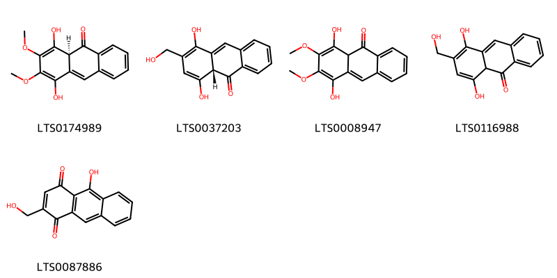{ width=100% }
    <figcaption>Hình ảnh cấu trúc hóa học của 5 hoạt chất thuộc nhóm Anthracenes gồm ['(9as)-1,4-dihydroxy-2,3-dimethoxy-9ah-anthracen-9-one (LTS0174989)', '(9as)-1,4-dihydroxy-3-(hydroxymethyl)-9ah-anthracen-9-one (LTS0037203)', '1,4-dihydroxy-2,3-dimethoxy-9ah-anthracen-9-one (LTS0008947)', '1,4-dihydroxy-3-(hydroxymethyl)-9ah-anthracen-9-one (LTS0116988)', '10-hydroxy-2-(hydroxymethyl)anthracene-1,4-dione (LTS0087886)'].</figcaption>
</figure>
#### Nhóm Flavonoids
<figure markdown="span">
    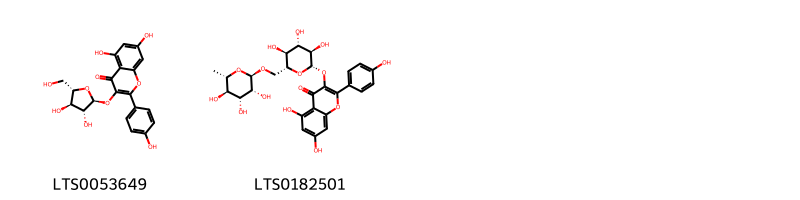{ width=100% }
    <figcaption>Hình ảnh cấu trúc hóa học của 2 hoạt chất thuộc nhóm Flavonoids gồm ['juglanin (LTS0053649)', 'nictoflorin (LTS0182501)'].</figcaption>
</figure>
#### Nhóm Prenol lipids
<figure markdown="span">
    { width=100% }
    <figcaption>Hình ảnh cấu trúc hóa học của 1 hoạt chất thuộc nhóm Prenol lipids gồm ['ursolic acid (LTS0250838)'].</figcaption>
</figure>

---

### Dược dân tộc học

Danh sách các quốc gia có sử dụng *Hedyotis herbacea* trong điều trị các bệnh. 

| Country   | Disease            | Bệnh                                                                                                                                                                                                |
|:----------|:-------------------|:----------------------------------------------------------------------------------------------------------------------------------------------------------------------------------------------------|
| India     | Tonic, Expectorant | MYMEMORY WARNING: YOU USED ALL AVAILABLE FREE TRANSLATIONS FOR TODAY. NEXT AVAILABLE IN  10 HOURS 22 MINUTES 36 SECONDS VISIT HTTPS://MYMEMORY.TRANSLATED.NET/DOC/USAGELIMITS.PHP TO TRANSLATE MORE |

---

---
## Hedyotis philippensis
### Thông tin về thực vật

!!! info "Phân loại thực vật của *Hedyotis philippensis* từ GIBF:"
    - **Kingdom:** Plantae
    - **Phylum:** Tracheophyta
    - **Order:** Gentianales
    - **Family:** Rubiaceae
    - **Genus:** Hedyotis
    - **Species:** *Hedyotis philippensis*

 

| Label (VI)   | Label (EN)   | Scientific Name       | Descriptions (VI)   | Descriptions (EN)   | Also Known As (VI)   | Also Known As (EN)   |
|:-------------|:-------------|:----------------------|:--------------------|:--------------------|:---------------------|:---------------------|
| N/A          | N/A          | Hedyotis philippensis | loài thực vật       | species of plant    | ['']                 | ['']                 |

#### Phân bố trên thế giới

**Từ CSDL GIBF** nan, Viet Nam, Indonesia, Malaysia, Philippines, China, Australia, Chinese Taipei, unknown or invalid, Papua New Guinea, Thailand

#### Phân bố tại Việt Nam

**Từ CSDL GIBF**: Không có ghi nhận ở Việt Nam

---
### Thành phần hóa học
        
- Theo cơ sở dữ liệu lotus: Từ loài *Hedyotis philippensis* đã phân lập và xác định được Chưa có hoạt chất nào được phân lập. hoạt chất thuộc về các nhóm Không có hoạt chất nào được phân lập. 

Không có hình ảnh nào được tạo ra

---

### Dược dân tộc học

Danh sách các quốc gia có sử dụng *Hedyotis philippensis* trong điều trị các bệnh. 

| Country   | Disease   | Bệnh                                                                                                                                                                                                |
|:----------|:----------|:----------------------------------------------------------------------------------------------------------------------------------------------------------------------------------------------------|
| Malaya    | Stomachic | MYMEMORY WARNING: YOU USED ALL AVAILABLE FREE TRANSLATIONS FOR TODAY. NEXT AVAILABLE IN  10 HOURS 22 MINUTES 01 SECONDS VISIT HTTPS://MYMEMORY.TRANSLATED.NET/DOC/USAGELIMITS.PHP TO TRANSLATE MORE |

---

---
## Hedyotis scandens
### Thông tin về thực vật

!!! info "Phân loại thực vật của *Dimetia scandens* từ GIBF:"
    - **Kingdom:** Plantae
    - **Phylum:** Tracheophyta
    - **Order:** Gentianales
    - **Family:** Rubiaceae
    - **Genus:** Dimetia
    - **Species:** *Dimetia scandens*

 

| Label (VI)   | Label (EN)   | Scientific Name   | Descriptions (VI)   | Descriptions (EN)   | Also Known As (VI)   | Also Known As (EN)   |
|:-------------|:-------------|:------------------|:--------------------|:--------------------|:---------------------|:---------------------|
| N/A          | N/A          | Hedyotis scandens | loài thực vật       | species of plant    | ['']                 | ['']                 |

#### Phân bố trên thế giới

**Từ CSDL GIBF** nan, Viet Nam, Bhutan, Bangladesh, Nepal, China, Myanmar, India, Thailand, Lao People’s Democratic Republic

#### Phân bố tại Việt Nam

**Từ CSDL GIBF**: Không có ghi nhận ở Việt Nam

---
### Thành phần hóa học
        
- Theo cơ sở dữ liệu lotus: Từ loài *Dimetia scandens* đã phân lập và xác định được Chưa có hoạt chất nào được phân lập. hoạt chất thuộc về các nhóm Không có hoạt chất nào được phân lập. 

Không có hình ảnh nào được tạo ra

---

### Dược dân tộc học

Danh sách các quốc gia có sử dụng *Dimetia scandens* trong điều trị các bệnh. 

| Country   | Disease   | Bệnh                                                                                                                                                                                                |
|:----------|:----------|:----------------------------------------------------------------------------------------------------------------------------------------------------------------------------------------------------|
| India     | Piscicide | MYMEMORY WARNING: YOU USED ALL AVAILABLE FREE TRANSLATIONS FOR TODAY. NEXT AVAILABLE IN  10 HOURS 21 MINUTES 37 SECONDS VISIT HTTPS://MYMEMORY.TRANSLATED.NET/DOC/USAGELIMITS.PHP TO TRANSLATE MORE |

---

---
## Hedyotis umbellata
### Thông tin về thực vật

!!! info "Phân loại thực vật của *N/A* từ GIBF:"
    - **Kingdom:** Plantae
    - **Phylum:** Tracheophyta
    - **Order:** Gentianales
    - **Family:** Rubiaceae
    - **Genus:** N/A
    - **Species:** *N/A*

 

| Label (VI)   | Label (EN)   | Scientific Name   | Descriptions (VI)   | Descriptions (EN)   | Also Known As (VI)   | Also Known As (EN)   |
|:-------------|:-------------|:------------------|:--------------------|:--------------------|:---------------------|:---------------------|
| N/A          | N/A          | Hedyotis scandens | loài thực vật       | species of plant    | ['']                 | ['']                 |

#### Phân bố trên thế giới

**Từ CSDL GIBF** Brazil, Viet Nam, Japan, China, Chile, New Zealand, Zimbabwe, French Polynesia, Trinidad and Tobago, Spain, Netherlands, Denmark, Puerto Rico, United States of America, Tonga, Virgin Islands (U.S.), Indonesia, Costa Rica, Russian Federation, Colombia, Argentina, Ethiopia, Hong Kong, Dominica, Mexico, Eswatini, Guam, United Kingdom of Great Britain and Northern Ireland, Chinese Taipei, Haiti, Canada, Panama, Singapore, Portugal, Ukraine, South Africa, Australia, Bahamas, India, Peru, France, Ireland

#### Phân bố tại Việt Nam

**Từ CSDL GIBF**: Lâm Đồng

---
### Thành phần hóa học
        
- Theo cơ sở dữ liệu lotus: Từ loài *N/A* đã phân lập và xác định được Chưa có hoạt chất nào được phân lập. hoạt chất thuộc về các nhóm Không có hoạt chất nào được phân lập. 

Không có hình ảnh nào được tạo ra

---

### Dược dân tộc học

Danh sách các quốc gia có sử dụng *N/A* trong điều trị các bệnh. 

| Country   | Disease     | Bệnh                                                                                                                                                                                                |
|:----------|:------------|:----------------------------------------------------------------------------------------------------------------------------------------------------------------------------------------------------|
| India     | Expectorant | MYMEMORY WARNING: YOU USED ALL AVAILABLE FREE TRANSLATIONS FOR TODAY. NEXT AVAILABLE IN  10 HOURS 21 MINUTES 03 SECONDS VISIT HTTPS://MYMEMORY.TRANSLATED.NET/DOC/USAGELIMITS.PHP TO TRANSLATE MORE |

---

# Chi Coptosapelta

??? note "Danh sách các dược liệu thuộc chi"
    
	 - *Coptosapelta tomentosa*

---
## Coptosapelta tomentosa
### Thông tin về thực vật

!!! info "Phân loại thực vật của *Coptosapelta tomentosa* từ GIBF:"
    - **Kingdom:** Plantae
    - **Phylum:** Tracheophyta
    - **Order:** Gentianales
    - **Family:** Rubiaceae
    - **Genus:** Coptosapelta
    - **Species:** *Coptosapelta tomentosa*

 

| Label (VI)   | Label (EN)   | Scientific Name   | Descriptions (VI)   | Descriptions (EN)   | Also Known As (VI)   | Also Known As (EN)   |
|:-------------|:-------------|:------------------|:--------------------|:--------------------|:---------------------|:---------------------|
| N/A          | N/A          | Hedyotis scandens | loài thực vật       | species of plant    | ['']                 | ['']                 |

#### Phân bố trên thế giới

**Từ CSDL GIBF** nan, Singapore, Viet Nam, Cambodia, Korea, Republic of, Indonesia, Malaysia, Philippines, Myanmar, unknown or invalid, Thailand, Lao People’s Democratic Republic, Puerto Rico

#### Phân bố tại Việt Nam

**Từ CSDL GIBF**: Ho Chi Minh, Quảng Trị, Dong Nai

---
### Thành phần hóa học
        
- Theo cơ sở dữ liệu lotus: Từ loài *Coptosapelta tomentosa* đã phân lập và xác định được Chưa có hoạt chất nào được phân lập. hoạt chất thuộc về các nhóm Không có hoạt chất nào được phân lập. 

Không có hình ảnh nào được tạo ra

---

### Dược dân tộc học

Danh sách các quốc gia có sử dụng *Coptosapelta tomentosa* trong điều trị các bệnh. 

| Country   | Disease   | Bệnh                                                                                                                                                                                                |
|:----------|:----------|:----------------------------------------------------------------------------------------------------------------------------------------------------------------------------------------------------|
| Perak     | Vermifuge | MYMEMORY WARNING: YOU USED ALL AVAILABLE FREE TRANSLATIONS FOR TODAY. NEXT AVAILABLE IN  10 HOURS 20 MINUTES 30 SECONDS VISIT HTTPS://MYMEMORY.TRANSLATED.NET/DOC/USAGELIMITS.PHP TO TRANSLATE MORE |

---

# Chi Dentella

??? note "Danh sách các dược liệu thuộc chi"
    
	 - *Dentella repens*

---
## Dentella repens
### Thông tin về thực vật

!!! info "Phân loại thực vật của *Dentella repens* từ GIBF:"
    - **Kingdom:** Plantae
    - **Phylum:** Tracheophyta
    - **Order:** Gentianales
    - **Family:** Rubiaceae
    - **Genus:** Dentella
    - **Species:** *Dentella repens*

 

| Label (VI)   | Label (EN)   | Scientific Name   | Descriptions (VI)   | Descriptions (EN)   | Also Known As (VI)   | Also Known As (EN)   |
|:-------------|:-------------|:------------------|:--------------------|:--------------------|:---------------------|:---------------------|
| N/A          | N/A          | Dentella repens   | loài thực vật       | species of plant    | ['']                 | ['']                 |

#### Phân bố trên thế giới

**Từ CSDL GIBF** British Indian Ocean Territory, Viet Nam, Bangladesh, Thailand, Sri Lanka, Tonga, Indonesia, Mexico, Maldives, Guam, Chinese Taipei, Malaysia, Philippines, Palau, Brunei Darussalam, Singapore, Australia, Myanmar, India

#### Phân bố tại Việt Nam

**Từ CSDL GIBF**: Không có ghi nhận ở Việt Nam

---
### Thành phần hóa học
        
- Theo cơ sở dữ liệu lotus: Từ loài *Dentella repens* đã phân lập và xác định được Chưa có hoạt chất nào được phân lập. hoạt chất thuộc về các nhóm Không có hoạt chất nào được phân lập. 

Không có hình ảnh nào được tạo ra

---

### Dược dân tộc học

Danh sách các quốc gia có sử dụng *Dentella repens* trong điều trị các bệnh. 

| Country   | Disease   | Bệnh                                                                                                                                                                                                |
|:----------|:----------|:----------------------------------------------------------------------------------------------------------------------------------------------------------------------------------------------------|
| Malaysia  | Poultice  | MYMEMORY WARNING: YOU USED ALL AVAILABLE FREE TRANSLATIONS FOR TODAY. NEXT AVAILABLE IN  10 HOURS 19 MINUTES 56 SECONDS VISIT HTTPS://MYMEMORY.TRANSLATED.NET/DOC/USAGELIMITS.PHP TO TRANSLATE MORE |

---

# Chi Guettarda

??? note "Danh sách các dược liệu thuộc chi"
    
	 - *Guettarda angelica*
	 - *Guettarda eciosa*

---
## Guettarda angelica
### Thông tin về thực vật

!!! info "Phân loại thực vật của *Guettarda angelica* từ GIBF:"
    - **Kingdom:** Plantae
    - **Phylum:** Tracheophyta
    - **Order:** Gentianales
    - **Family:** Rubiaceae
    - **Genus:** Guettarda
    - **Species:** *Guettarda angelica*

 

| Label (VI)   | Label (EN)   | Scientific Name    | Descriptions (VI)   | Descriptions (EN)   | Also Known As (VI)   | Also Known As (EN)   |
|:-------------|:-------------|:-------------------|:--------------------|:--------------------|:---------------------|:---------------------|
| N/A          | N/A          | Guettarda angelica | loài thực vật       | species of plant    | ['']                 | ['']                 |

#### Phân bố trên thế giới

**Từ CSDL GIBF** Brazil

#### Phân bố tại Việt Nam

**Từ CSDL GIBF**: Không có ghi nhận ở Việt Nam

---
### Thành phần hóa học
        
- Theo cơ sở dữ liệu lotus: Từ loài *Guettarda angelica* đã phân lập và xác định được 26 hoạt chất thuộc về các nhóm Prenol lipids. 

|    | chemicalTaxonomyClassyfireClass   |   smiles_count |
|---:|:----------------------------------|---------------:|
|  0 | Prenol lipids                     |             26 |

#### Nhóm Prenol lipids
<figure markdown="span">
    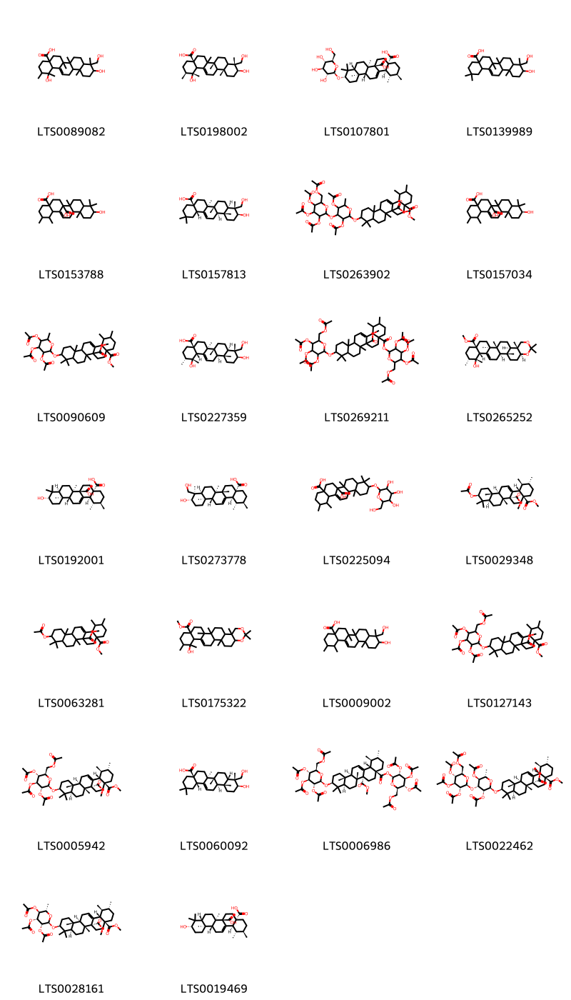{ width=100% }
    <figcaption>Hình ảnh cấu trúc hóa học của 26 hoạt chất thuộc nhóm Prenol lipids gồm ['1,10-dihydroxy-9-(hydroxymethyl)-1,2,6a,6b,9,12a-hexamethyl-2,3,4,5,6,7,8,8a,10,11,12,12b,13,14b-tetradecahydropicene-4a-carboxylic acid (LTS0089082)', '(1r,2s,4as,6br,9r,10s,12ar)-1,10-dihydroxy-9-(hydroxymethyl)-1,2,6a,6b,9,12a-hexamethyl-2,3,4,5,6,7,8,8a,10,11,12,12b,13,14b-tetradecahydropicene-4a-carboxylic acid (LTS0198002)', '(1s,2r,4as,6ar,6br,8ar,10s,12ar,12br,14bs)-1,2,6b,9,9,12a-hexamethyl-10-{[(2r,3r,4s,5s,6r)-3,4,5-trihydroxy-6-(hydroxymethyl)oxan-2-yl]oxy}-2,3,4,5,6,7,8,8a,10,11,12,12b,13,14b-tetradecahydro-1h-picene-4a,6a-dicarboxylic acid (LTS0107801)', '10-hydroxy-9-(hydroxymethyl)-2,2,6a,6b,9,12a-hexamethyl-1,3,4,5,6,7,8,8a,10,11,12,12b,13,14b-tetradecahydropicene-4a-carboxylic acid (LTS0139989)', '10-hydroxy-1,2,6b,9,9,12a-hexamethyl-2,3,4,5,6,7,8,8a,10,11,12,12b,13,14b-tetradecahydro-1h-picene-4a,6a-dicarboxylic acid (LTS0153788)', 'hederagenin (LTS0157813)', '4a,6a-dimethyl 10-{[3,5-bis(acetyloxy)-6-methyl-4-{[3,4,5-tris(acetyloxy)-6-[(acetyloxy)methyl]oxan-2-yl]oxy}oxan-2-yl]oxy}-1,2,6b,9,9,12a-hexamethyl-2,3,4,5,6,7,8,8a,10,11,12,12b,13,14b-tetradecahydro-1h-picene-4a,6a-dicarboxylate (LTS0263902)', '(10s)-10-hydroxy-1,2,6b,9,9,12a-hexamethyl-2,3,4,5,6,7,8,8a,10,11,12,12b,13,14b-tetradecahydro-1h-picene-4a,6a-dicarboxylic acid (LTS0157034)', '4a,6a-dimethyl 1,2,6b,9,9,12a-hexamethyl-10-{[3,4,5-tris(acetyloxy)-6-methyloxan-2-yl]oxy}-2,3,4,5,6,7,8,8a,10,11,12,12b,13,14b-tetradecahydro-1h-picene-4a,6a-dicarboxylate (LTS0090609)', 'rotundic acid (LTS0227359)', '6a-methyl 4a-[3,4,5-tris(acetyloxy)-6-[(acetyloxy)methyl]oxan-2-yl] 1,2,6b,9,9,12a-hexamethyl-10-{[3,4,5-tris(acetyloxy)-6-[(acetyloxy)methyl]oxan-2-yl]oxy}-2,3,4,5,6,7,8,8a,10,11,12,12b,13,14b-tetradecahydro-1h-picene-4a,6a-dicarboxylate (LTS0269211)', 'methyl (4ar,4br,6ar,6bs,8as,11r,12r,12as,14ar,14br,16as)-12-hydroxy-2,2,4a,6a,6b,11,12,14b-octamethyl-4h,4bh,5h,6h,7h,8h,9h,10h,11h,12ah,14h,14ah,15h,16h,16ah-piceno[3,4-d][1,3]dioxine-8a-carboxylate (LTS0265252)', '(1s,2r,4as,6ar,6br,8as,10s,12ar,12br,14bs)-10-hydroxy-1,2,6b,9,9,12a-hexamethyl-2,3,4,5,6,7,8,8a,10,11,12,12b,13,14b-tetradecahydro-1h-picene-4a,6a-dicarboxylic acid (LTS0192001)', '(1s,2r,4as,6as,6br,8as,9r,10s,12ar,12br,14bs)-10-hydroxy-9-(hydroxymethyl)-1,2,6a,6b,9,12a-hexamethyl-2,3,4,5,6,7,8,8a,10,11,12,12b,13,14b-tetradecahydro-1h-picene-4a-carboxylic acid (LTS0273778)', '1,2,6b,9,9,12a-hexamethyl-10-{[3,4,5-trihydroxy-6-(hydroxymethyl)oxan-2-yl]oxy}-2,3,4,5,6,7,8,8a,10,11,12,12b,13,14b-tetradecahydro-1h-picene-4a,6a-dicarboxylic acid (LTS0225094)', '4a,6a-dimethyl (1s,2r,4as,6ar,6br,8ar,10s,12ar,12br,14bs)-10-(acetyloxy)-1,2,6b,9,9,12a-hexamethyl-2,3,4,5,6,7,8,8a,10,11,12,12b,13,14b-tetradecahydro-1h-picene-4a,6a-dicarboxylate (LTS0029348)', '4a,6a-dimethyl 10-(acetyloxy)-1,2,6b,9,9,12a-hexamethyl-2,3,4,5,6,7,8,8a,10,11,12,12b,13,14b-tetradecahydro-1h-picene-4a,6a-dicarboxylate (LTS0063281)', 'methyl 12-hydroxy-2,2,4a,6a,6b,11,12,14b-octamethyl-4h,4bh,5h,6h,7h,8h,9h,10h,11h,12ah,14h,14ah,15h,16h,16ah-piceno[3,4-d][1,3]dioxine-8a-carboxylate (LTS0175322)', '10-hydroxy-9-(hydroxymethyl)-1,2,6a,6b,9,12a-hexamethyl-2,3,4,5,6,7,8,8a,10,11,12,12b,13,14b-tetradecahydro-1h-picene-4a-carboxylic acid (LTS0009002)', '4a,6a-dimethyl 1,2,6b,9,9,12a-hexamethyl-10-{[3,4,5-tris(acetyloxy)-6-[(acetyloxy)methyl]oxan-2-yl]oxy}-2,3,4,5,6,7,8,8a,10,11,12,12b,13,14b-tetradecahydro-1h-picene-4a,6a-dicarboxylate (LTS0127143)', '4a,6a-dimethyl (1s,2r,4as,6ar,6br,8ar,10s,12ar,12br,14bs)-1,2,6b,9,9,12a-hexamethyl-10-{[(2r,3r,4s,5r,6r)-3,4,5-tris(acetyloxy)-6-[(acetyloxy)methyl]oxan-2-yl]oxy}-2,3,4,5,6,7,8,8a,10,11,12,12b,13,14b-tetradecahydro-1h-picene-4a,6a-dicarboxylate (LTS0005942)', '(4as,6as,6br,8as,9r,10s,12ar,12br,14bs)-10-hydroxy-9-(hydroxymethyl)-2,2,6a,6b,9,12a-hexamethyl-1,3,4,5,6,7,8,8a,10,11,12,12b,13,14b-tetradecahydropicene-4a-carboxylic acid (LTS0060092)', '6a-methyl 4a-(2s,3r,4s,5r,6r)-3,4,5-tris(acetyloxy)-6-[(acetyloxy)methyl]oxan-2-yl (1s,2r,4as,6ar,6br,8ar,10s,12ar,12br,14bs)-1,2,6b,9,9,12a-hexamethyl-10-{[(2r,3r,4s,5r,6r)-3,4,5-tris(acetyloxy)-6-[(acetyloxy)methyl]oxan-2-yl]oxy}-2,3,4,5,6,7,8,8a,10,11,12,12b,13,14b-tetradecahydro-1h-picene-4a,6a-dicarboxylate (LTS0006986)', '4a,6a-dimethyl (1s,2r,4as,6ar,6br,8ar,10s,12ar,12br,14bs)-10-{[(2r,3r,4r,5s,6s)-3,5-bis(acetyloxy)-6-methyl-4-{[(2s,3r,4s,5r,6r)-3,4,5-tris(acetyloxy)-6-[(acetyloxy)methyl]oxan-2-yl]oxy}oxan-2-yl]oxy}-1,2,6b,9,9,12a-hexamethyl-2,3,4,5,6,7,8,8a,10,11,12,12b,13,14b-tetradecahydro-1h-picene-4a,6a-dicarboxylate (LTS0022462)', '4a,6a-dimethyl (1s,2r,4as,6ar,6br,8ar,10s,12ar,12br,14bs)-1,2,6b,9,9,12a-hexamethyl-10-{[(2r,3r,4r,5s,6s)-3,4,5-tris(acetyloxy)-6-methyloxan-2-yl]oxy}-2,3,4,5,6,7,8,8a,10,11,12,12b,13,14b-tetradecahydro-1h-picene-4a,6a-dicarboxylate (LTS0028161)', 'quinovic acid (LTS0019469)'].</figcaption>
</figure>

---

### Dược dân tộc học

Danh sách các quốc gia có sử dụng *Guettarda angelica* trong điều trị các bệnh. 

| Country   | Disease    | Bệnh                                                                                                                                                                                                |
|:----------|:-----------|:----------------------------------------------------------------------------------------------------------------------------------------------------------------------------------------------------|
| Brazil    | Astringent | MYMEMORY WARNING: YOU USED ALL AVAILABLE FREE TRANSLATIONS FOR TODAY. NEXT AVAILABLE IN  10 HOURS 19 MINUTES 04 SECONDS VISIT HTTPS://MYMEMORY.TRANSLATED.NET/DOC/USAGELIMITS.PHP TO TRANSLATE MORE |

---

---
## Guettarda eciosa
### Thông tin về thực vật

!!! info "Phân loại thực vật của *N/A* từ GIBF:"
    - **Kingdom:** Plantae
    - **Phylum:** Tracheophyta
    - **Order:** Gentianales
    - **Family:** Rubiaceae
    - **Genus:** Guettarda
    - **Species:** *N/A*

 

| Label (VI)   | Label (EN)   | Scientific Name    | Descriptions (VI)   | Descriptions (EN)   | Also Known As (VI)   | Also Known As (EN)   |
|:-------------|:-------------|:-------------------|:--------------------|:--------------------|:---------------------|:---------------------|
| N/A          | N/A          | Guettarda angelica | loài thực vật       | species of plant    | ['']                 | ['']                 |

#### Phân bố trên thế giới

**Từ CSDL GIBF** Brazil, Japan, Marshall Islands, New Caledonia, Tanzania, United Republic of, French Polynesia, Anguilla, Thailand, Uruguay, Puerto Rico, Cayman Islands, United States of America, Tuvalu, Virgin Islands (U.S.), Indonesia, Seychelles, Dominican Republic, Colombia, Argentina, French Guiana, Fiji, Kenya, El Salvador, Maldives, Guam, Chinese Taipei, Philippines, Malaysia, Haiti, Singapore, Cambodia, Cook Islands, Australia, Micronesia (Federated States of), India, Northern Mariana Islands, Belize

#### Phân bố tại Việt Nam

**Từ CSDL GIBF**: Không có ghi nhận ở Việt Nam

---
### Thành phần hóa học
        
- Theo cơ sở dữ liệu lotus: Từ loài *N/A* đã phân lập và xác định được Chưa có hoạt chất nào được phân lập. hoạt chất thuộc về các nhóm Không có hoạt chất nào được phân lập. 

Không có hình ảnh nào được tạo ra

---

### Dược dân tộc học

Danh sách các quốc gia có sử dụng *N/A* trong điều trị các bệnh. 

| Country   | Disease         | Bệnh                                                                                                                                                                                                |
|:----------|:----------------|:----------------------------------------------------------------------------------------------------------------------------------------------------------------------------------------------------|
| Tahiti    | Anticholinergic | MYMEMORY WARNING: YOU USED ALL AVAILABLE FREE TRANSLATIONS FOR TODAY. NEXT AVAILABLE IN  10 HOURS 18 MINUTES 37 SECONDS VISIT HTTPS://MYMEMORY.TRANSLATED.NET/DOC/USAGELIMITS.PHP TO TRANSLATE MORE |

---

# Chi Duroia

??? note "Danh sách các dược liệu thuộc chi"
    
	 - *Duroia hirsuta*

---
## Duroia hirsuta
### Thông tin về thực vật

!!! info "Phân loại thực vật của *Duroia hirsuta* từ GIBF:"
    - **Kingdom:** Plantae
    - **Phylum:** Tracheophyta
    - **Order:** Gentianales
    - **Family:** Rubiaceae
    - **Genus:** Duroia
    - **Species:** *Duroia hirsuta*

 

| Label (VI)   | Label (EN)   | Scientific Name   | Descriptions (VI)   | Descriptions (EN)   | Also Known As (VI)   | Also Known As (EN)   |
|:-------------|:-------------|:------------------|:--------------------|:--------------------|:---------------------|:---------------------|
| N/A          | N/A          | Duroia hirsuta    | loài thực vật       | species of plant    | ['']                 | ['']                 |

#### Phân bố trên thế giới

**Từ CSDL GIBF** Colombia, Brazil, Ecuador, Peru

#### Phân bố tại Việt Nam

**Từ CSDL GIBF**: Không có ghi nhận ở Việt Nam

---
### Thành phần hóa học
        
- Theo cơ sở dữ liệu lotus: Từ loài *Duroia hirsuta* đã phân lập và xác định được 9 hoạt chất thuộc về các nhóm Prenol lipids, Flavonoids. 

|    | chemicalTaxonomyClassyfireClass   |   smiles_count |
|---:|:----------------------------------|---------------:|
|  0 | Flavonoids                        |              3 |
|  1 | Prenol lipids                     |              6 |

#### Nhóm Flavonoids
<figure markdown="span">
    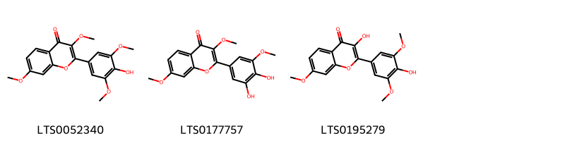{ width=100% }
    <figcaption>Hình ảnh cấu trúc hóa học của 3 hoạt chất thuộc nhóm Flavonoids gồm ['2-(4-hydroxy-3,5-dimethoxyphenyl)-3,7-dimethoxychromen-4-one (LTS0052340)', '2-(3,4-dihydroxy-5-methoxyphenyl)-3,7-dimethoxychromen-4-one (LTS0177757)', '3-hydroxy-2-(4-hydroxy-3,5-dimethoxyphenyl)-7-methoxychromen-4-one (LTS0195279)'].</figcaption>
</figure>
#### Nhóm Prenol lipids
<figure markdown="span">
    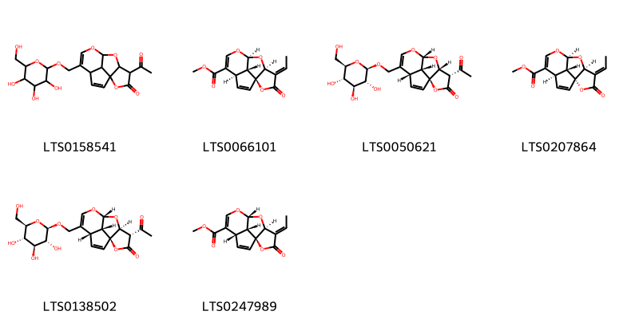{ width=100% }
    <figcaption>Hình ảnh cấu trúc hóa học của 6 hoạt chất thuộc nhóm Prenol lipids gồm ['11-acetyl-5-({[3,4,5-trihydroxy-6-(hydroxymethyl)oxan-2-yl]oxy}methyl)-7,9,13-trioxatetracyclo[6.5.1.0¹,¹⁰.0⁴,¹⁴]tetradeca-2,5-dien-12-one (LTS0158541)', 'methyl (1s,4r,8s,10s,11e,14s)-11-ethylidene-12-oxo-7,9,13-trioxatetracyclo[6.5.1.0¹,¹⁰.0⁴,¹⁴]tetradeca-2,5-diene-5-carboxylate (LTS0066101)', '(1s,4s,8r,10r,11r,14s)-11-acetyl-5-({[(2r,3r,4s,5s,6r)-3,4,5-trihydroxy-6-(hydroxymethyl)oxan-2-yl]oxy}methyl)-7,9,13-trioxatetracyclo[6.5.1.0¹,¹⁰.0⁴,¹⁴]tetradeca-2,5-dien-12-one (LTS0050621)', 'methyl (1r,4r,8s,10s,11e,14s)-11-ethylidene-12-oxo-7,9,13-trioxatetracyclo[6.5.1.0¹,¹⁰.0⁴,¹⁴]tetradeca-2,5-diene-5-carboxylate (LTS0207864)', '(1s,4s,8r,10s,11r,14s)-11-acetyl-5-({[(2r,3r,4s,5s,6r)-3,4,5-trihydroxy-6-(hydroxymethyl)oxan-2-yl]oxy}methyl)-7,9,13-trioxatetracyclo[6.5.1.0¹,¹⁰.0⁴,¹⁴]tetradeca-2,5-dien-12-one (LTS0138502)', 'plumericin (LTS0247989)'].</figcaption>
</figure>

---

### Dược dân tộc học

Danh sách các quốc gia có sử dụng *Duroia hirsuta* trong điều trị các bệnh. 

| Country   | Disease   | Bệnh                                                                                                                                                                                                |
|:----------|:----------|:----------------------------------------------------------------------------------------------------------------------------------------------------------------------------------------------------|
| Colombia  | Vesicant  | MYMEMORY WARNING: YOU USED ALL AVAILABLE FREE TRANSLATIONS FOR TODAY. NEXT AVAILABLE IN  10 HOURS 18 MINUTES 07 SECONDS VISIT HTTPS://MYMEMORY.TRANSLATED.NET/DOC/USAGELIMITS.PHP TO TRANSLATE MORE |

---

# Chi Ixora

??? note "Danh sách các dược liệu thuộc chi"
    
	 - *Ixora coccinea*
	 - *Ixora ferrea*

---
## Ixora coccinea
### Thông tin về thực vật

!!! info "Phân loại thực vật của *Ixora coccinea* từ GIBF:"
    - **Kingdom:** Plantae
    - **Phylum:** Tracheophyta
    - **Order:** Gentianales
    - **Family:** Rubiaceae
    - **Genus:** Ixora
    - **Species:** *Ixora coccinea*

 

| Label (VI)   | Label (EN)   | Scientific Name   | Descriptions (VI)                 | Descriptions (EN)   | Also Known As (VI)                       | Also Known As (EN)   |
|:-------------|:-------------|:------------------|:----------------------------------|:--------------------|:-----------------------------------------|:---------------------|
| N/A          | N/A          | Ixora coccinea    | loài thực vật (Cây Bông Trang đỏ) | species of plant    | ['Trang đỏ', 'Ixora coccinea', 'Đơn đỏ'] | ['']                 |

#### Phân bố trên thế giới

**Từ CSDL GIBF** Brazil, United Arab Emirates, Saint Kitts and Nevis, Virgin Islands (British), Guadeloupe, Bangladesh, Barbados, China, Antigua and Barbuda, Saint Lucia, Honduras, French Polynesia, Ecuador, Trinidad and Tobago, Thailand, Turks and Caicos Islands, Ghana, Puerto Rico, Sri Lanka, Cayman Islands, United States of America, Jamaica, Virgin Islands (U.S.), Indonesia, Costa Rica, Dominican Republic, Nigeria, Colombia, Guyana, Cuba, Aruba, French Guiana, Grenada, Sint Maarten (Dutch part), Hong Kong, Benin, Macao, El Salvador, Montserrat, Haiti, Philippines, Malaysia, Panama, Belize, Nicaragua, Singapore, Bonaire, Sint Eustatius and Saba, Martinique, Bahamas, Australia, Saint Vincent and the Grenadines, India, Northern Mariana Islands, Peru, Bolivia (Plurinational State of), Samoa

#### Phân bố tại Việt Nam

**Từ CSDL GIBF**: Không có ghi nhận ở Việt Nam

---
### Thành phần hóa học
        
- Theo cơ sở dữ liệu lotus: Từ loài *Ixora coccinea* đã phân lập và xác định được 70 hoạt chất thuộc về các nhóm Fatty Acyls, Benzene and substituted derivatives, Flavonoids, Carboxylic acids and derivatives, Coumarins and derivatives, Steroids and steroid derivatives, Glycerolipids, Anthracenes, Prenol lipids, Aryl halides, Anthracyclines. 

|    | chemicalTaxonomyClassyfireClass     |   smiles_count |
|---:|:------------------------------------|---------------:|
|  0 | Anthracenes                         |              1 |
|  1 | Anthracyclines                      |              1 |
|  2 | Aryl halides                        |              1 |
|  3 | Benzene and substituted derivatives |              2 |
|  4 | Carboxylic acids and derivatives    |              5 |
|  5 | Coumarins and derivatives           |              2 |
|  6 | Fatty Acyls                         |              3 |
|  7 | Flavonoids                          |             20 |
|  8 | Glycerolipids                       |              2 |
|  9 | Prenol lipids                       |             24 |
| 10 | Steroids and steroid derivatives    |              9 |

#### Nhóm Anthracenes
<figure markdown="span">
    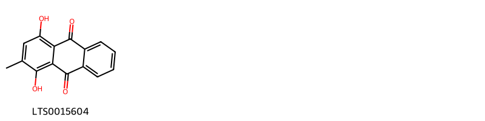{ width=100% }
    <figcaption>Hình ảnh cấu trúc hóa học của 1 hoạt chất thuộc nhóm Anthracenes gồm ['1,4-dihydroxy-2-methylanthracene-9,10-dione (LTS0015604)'].</figcaption>
</figure>
#### Nhóm Anthracyclines
<figure markdown="span">
    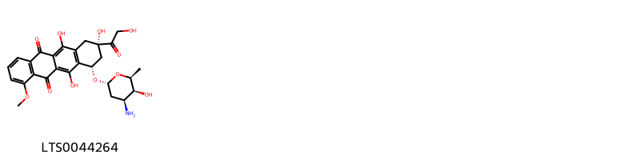{ width=100% }
    <figcaption>Hình ảnh cấu trúc hóa học của 1 hoạt chất thuộc nhóm Anthracyclines gồm ['doxorubicin (LTS0044264)'].</figcaption>
</figure>
#### Nhóm Aryl halides
<figure markdown="span">
    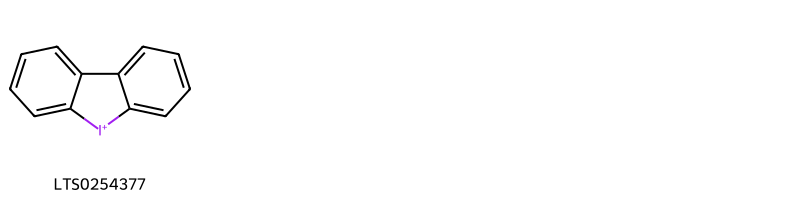{ width=100% }
    <figcaption>Hình ảnh cấu trúc hóa học của 1 hoạt chất thuộc nhóm Aryl halides gồm ['diphenyleneiodonium (LTS0254377)'].</figcaption>
</figure>
#### Nhóm Benzene and substituted derivatives
<figure markdown="span">
    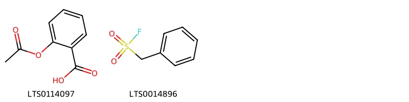{ width=100% }
    <figcaption>Hình ảnh cấu trúc hóa học của 2 hoạt chất thuộc nhóm Benzene and substituted derivatives gồm ['aspirin (LTS0114097)', 'phenylmethylsulfonyl fluoride (LTS0014896)'].</figcaption>
</figure>
#### Nhóm Carboxylic acids and derivatives
<figure markdown="span">
    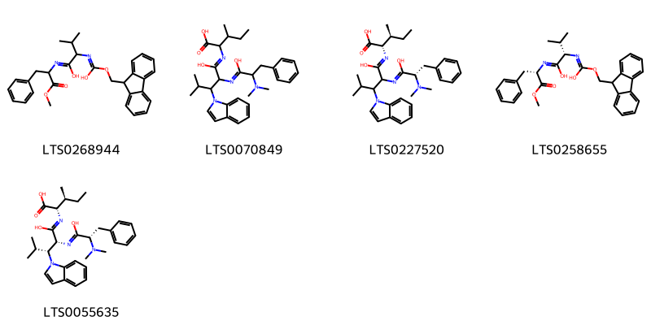{ width=100% }
    <figcaption>Hình ảnh cấu trúc hóa học của 5 hoạt chất thuộc nhóm Carboxylic acids and derivatives gồm ['2-{[(9h-fluoren-9-ylmethoxy)(hydroxy)methylidene]amino}-n-(1-methoxy-1-oxo-3-phenylpropan-2-yl)-3-methylbutanimidic acid (LTS0268944)', '2-[(2-{[2-(dimethylamino)-1-hydroxy-3-phenylpropylidene]amino}-1-hydroxy-3-(indol-1-yl)-4-methylpentylidene)amino]-3-methylpentanoic acid (LTS0070849)', '(2s,3s)-2-[(2-{[(2s)-2-(dimethylamino)-1-hydroxy-3-phenylpropylidene]amino}-1-hydroxy-3-(indol-1-yl)-4-methylpentylidene)amino]-3-methylpentanoic acid (LTS0227520)', '(2s)-2-{[(9h-fluoren-9-ylmethoxy)(hydroxy)methylidene]amino}-n-[(2s)-1-methoxy-1-oxo-3-phenylpropan-2-yl]-3-methylbutanimidic acid (LTS0258655)', '(2s,3s)-2-{[(2r,3r)-2-{[(2s)-2-(dimethylamino)-1-hydroxy-3-phenylpropylidene]amino}-1-hydroxy-3-(indol-1-yl)-4-methylpentylidene]amino}-3-methylpentanoic acid (LTS0055635)'].</figcaption>
</figure>
#### Nhóm Coumarins and derivatives
<figure markdown="span">
    { width=100% }
    <figcaption>Hình ảnh cấu trúc hóa học của 2 hoạt chất thuộc nhóm Coumarins and derivatives gồm ['scopoletin (LTS0193112)', '2h-1-benzopyran-2-one (LTS0069773)'].</figcaption>
</figure>
#### Nhóm Fatty Acyls
<figure markdown="span">
    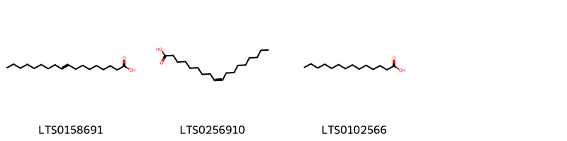{ width=100% }
    <figcaption>Hình ảnh cấu trúc hóa học của 3 hoạt chất thuộc nhóm Fatty Acyls gồm ['9 octadecenoic acid (LTS0158691)', 'oleic acid (LTS0256910)', 'myristic acid (LTS0102566)'].</figcaption>
</figure>
#### Nhóm Flavonoids
<figure markdown="span">
    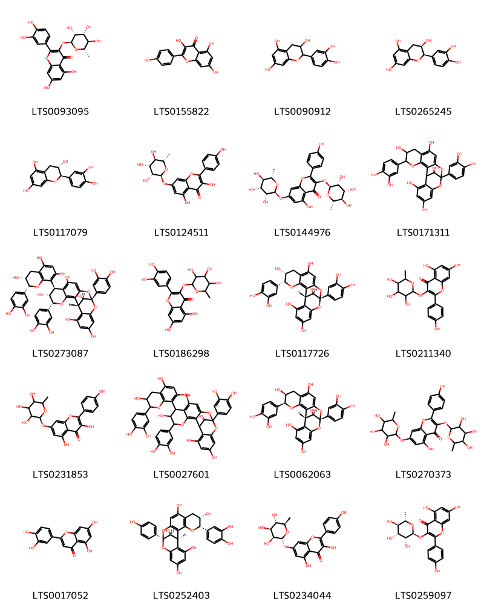{ width=100% }
    <figcaption>Hình ảnh cấu trúc hóa học của 20 hoạt chất thuộc nhóm Flavonoids gồm ['quercitrin (LTS0093095)', 'kaempherol (LTS0155822)', 'catechol (LTS0090912)', 'ent-epicatechin (LTS0265245)', '(+)-catechol (LTS0117079)', 'kaempferol-7-rhamnoside (LTS0124511)', 'lespedin (LTS0144976)', 'procyanidin a1 (LTS0171311)', 'cinnamtannin b1 (LTS0273087)', 'quercitrin (LTS0186298)', 'proanthocyanidin a2 (LTS0117726)', '5,7-dihydroxy-2-(4-hydroxyphenyl)-3-[(3,4,5-trihydroxy-6-methyloxan-2-yl)oxy]chromen-4-one (LTS0211340)', '3,5-dihydroxy-2-(4-hydroxyphenyl)-7-[(3,4,5-trihydroxy-6-methyloxan-2-yl)oxy]chromen-4-one (LTS0231853)', '5,13-bis(3,4-dihydroxyphenyl)-7-[2-(3,4-dihydroxyphenyl)-3,5,7-trihydroxy-3,4-dihydro-2h-1-benzopyran-8-yl]-4,12,14-trioxapentacyclo[11.7.1.0²,¹¹.0³,⁸.0¹⁵,²⁰]henicosa-2,8,10,15,17,19-hexaene-6,9,17,19,21-pentol (LTS0027601)', '(1r,5s,6s,13s,21r)-5,13-bis(3,4-dihydroxyphenyl)-4,12,14-trioxapentacyclo[11.7.1.0²,¹¹.0³,⁸.0¹⁵,²⁰]henicosa-2,8,10,15,17,19-hexaene-6,9,17,19,21-pentol (LTS0062063)', 'kaempferitrin (LTS0270373)', 'luteolin (LTS0017052)', '(1r,5s,6s,13s,21r)-5-(3,4-dihydroxyphenyl)-13-(4-hydroxyphenyl)-4,12,14-trioxapentacyclo[11.7.1.0²,¹¹.0³,⁸.0¹⁵,²⁰]henicosa-2(11),3(8),9,15,17,19-hexaene-6,9,17,19,21-pentol (LTS0252403)', '3,5-dihydroxy-2-(4-hydroxyphenyl)-7-{[(2r,3s,4s,5s,6r)-3,4,5-trihydroxy-6-methyloxan-2-yl]oxy}chromen-4-one (LTS0234044)', 'afzelin (LTS0259097)'].</figcaption>
</figure>
#### Nhóm Glycerolipids
<figure markdown="span">
    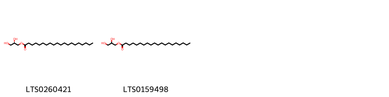{ width=100% }
    <figcaption>Hình ảnh cấu trúc hóa học của 2 hoạt chất thuộc nhóm Glycerolipids gồm ['(2r)-2,3-dihydroxypropyl icosanoate (LTS0260421)', '2,3-dihydroxypropyl icosanoate (LTS0159498)'].</figcaption>
</figure>
#### Nhóm Prenol lipids
<figure markdown="span">
    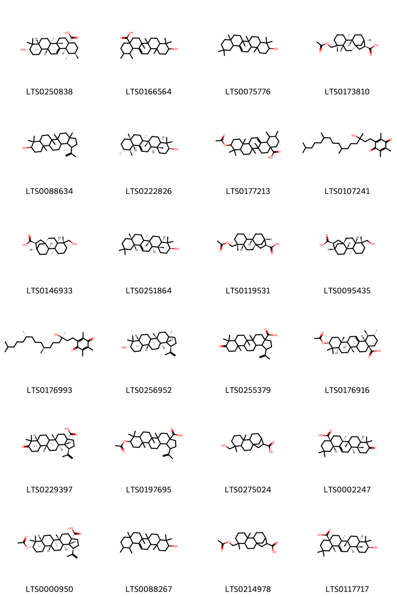{ width=100% }
    <figcaption>Hình ảnh cấu trúc hóa học của 24 hoạt chất thuộc nhóm Prenol lipids gồm ['ursolic acid (LTS0250838)', '10-hydroxy-1,2,6a,6b,9,9,12a-heptamethyl-2,3,4,5,6,7,8,8a,10,11,12,12b,13,14b-tetradecahydro-1h-picene-4a-carboxylic acid (LTS0166564)', 'β-amyrin (LTS0075776)', '(1s,4s,5r,9s,10r,13r,14s)-5-[(acetyloxy)methyl]-5,9-dimethyltetracyclo[11.2.1.0¹,¹⁰.0⁴,⁹]hexadecane-14-carboxylic acid (LTS0173810)', 'lupeol (LTS0088634)', 'amyrin (LTS0222826)', '10-(acetyloxy)-1,2,6a,6b,9,9,12a-heptamethyl-2,3,4,5,6,7,8,8a,10,11,12,12b,13,14b-tetradecahydro-1h-picene-4a-carboxylic acid (LTS0177213)', 'tocoquinone (LTS0107241)', '(1s,4r,5r,9s,10s,13r,14s)-5-(hydroxymethyl)-5,9-dimethyltetracyclo[11.2.1.0¹,¹⁰.0⁴,⁹]hexadecane-14-carboxylic acid (LTS0146933)', 'β-amyrin (LTS0251864)', '(1r,4s,5r,9s,10r,13s,14s)-5-[(acetyloxy)methyl]-5,9-dimethyltetracyclo[11.2.1.0¹,¹⁰.0⁴,⁹]hexadecane-14-carboxylic acid (LTS0119531)', '(1r,4s,5r,9s,10r,13s,14s)-5-(hydroxymethyl)-5,9-dimethyltetracyclo[11.2.1.0¹,¹⁰.0⁴,⁹]hexadecane-14-carboxylic acid (LTS0095435)', '2-[(3r,7s,11s)-3-hydroxy-3,7,11,15-tetramethylhexadecyl]-3,5,6-trimethylcyclohexa-2,5-diene-1,4-dione (LTS0176993)', 'lupeol (LTS0256952)', '5a,5b,8,8,11a-pentamethyl-9-oxo-1-(prop-1-en-2-yl)-tetradecahydro-1h-cyclopenta[a]chrysene-3a-carboxylic acid (LTS0255379)', '(1s,2r,4as,6as,6br,8ar,10s,12ar,12br,14bs)-10-(acetyloxy)-1,2,6a,6b,9,9,12a-heptamethyl-2,3,4,5,6,7,8,8a,10,11,12,12b,13,14b-tetradecahydro-1h-picene-4a-carboxylic acid (LTS0176916)', '(1r,3as,5ar,5br,7ar,11ar,11br,13ar,13br)-5a,5b,8,8,11a-pentamethyl-9-oxo-1-(prop-1-en-2-yl)-tetradecahydro-1h-cyclopenta[a]chrysene-3a-carboxylic acid (LTS0229397)', '9-(acetyloxy)-5a,5b,8,8,11a-pentamethyl-1-(prop-1-en-2-yl)-hexadecahydrocyclopenta[a]chrysene-3a-carboxylic acid (LTS0197695)', '5-(hydroxymethyl)-5,9-dimethyltetracyclo[11.2.1.0¹,¹⁰.0⁴,⁹]hexadecane-14-carboxylic acid (LTS0275024)', '(4as,6as,6br,8ar,12ar,12br,14bs)-2,2,6a,6b,9,9,12a-heptamethyl-10-oxo-3,4,5,6,7,8,8a,11,12,12b,13,14b-dodecahydro-1h-picene-4a-carboxylic acid (LTS0002247)', '(1r,3as,5ar,5br,7ar,9s,11ar,11br,13ar,13br)-9-(acetyloxy)-5a,5b,8,8,11a-pentamethyl-1-(prop-1-en-2-yl)-hexadecahydrocyclopenta[a]chrysene-3a-carboxylic acid (LTS0000950)', 'α-amyrin (LTS0088267)', '5-[(acetyloxy)methyl]-5,9-dimethyltetracyclo[11.2.1.0¹,¹⁰.0⁴,⁹]hexadecane-14-carboxylic acid (LTS0214978)', 'oleanolic acid (LTS0117717)'].</figcaption>
</figure>
#### Nhóm Steroids and steroid derivatives
<figure markdown="span">
    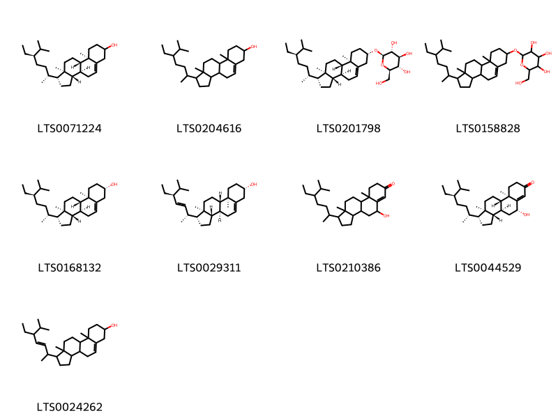{ width=100% }
    <figcaption>Hình ảnh cấu trúc hóa học của 9 hoạt chất thuộc nhóm Steroids and steroid derivatives gồm ['stigmast-5-en-3-ol (LTS0071224)', 'stigmast-5-en-3-ol, (3β)- (LTS0204616)', 'sitogluside (LTS0201798)', '2-{[1-(5-ethyl-6-methylheptan-2-yl)-9a,11a-dimethyl-1h,2h,3h,3ah,3bh,4h,6h,7h,8h,9h,9bh,10h,11h-cyclopenta[a]phenanthren-7-yl]oxy}-6-(hydroxymethyl)oxane-3,4,5-triol (LTS0158828)', 'sitosterol (LTS0168132)', 'phytosterol (LTS0029311)', '1-(5-ethyl-6-methylheptan-2-yl)-5-hydroxy-9a,11a-dimethyl-1h,2h,3h,3ah,3bh,4h,5h,8h,9h,9bh,10h,11h-cyclopenta[a]phenanthren-7-one (LTS0210386)', '(1r,3as,3bs,5r,9ar,9bs,11ar)-1-[(2r,5r)-5-ethyl-6-methylheptan-2-yl]-5-hydroxy-9a,11a-dimethyl-1h,2h,3h,3ah,3bh,4h,5h,8h,9h,9bh,10h,11h-cyclopenta[a]phenanthren-7-one (LTS0044529)', 'stigmasterol (LTS0024262)'].</figcaption>
</figure>

---

### Dược dân tộc học

Danh sách các quốc gia có sử dụng *Ixora coccinea* trong điều trị các bệnh. 

| Country   | Disease                                              | Bệnh                                                                                                                                                                                                |
|:----------|:-----------------------------------------------------|:----------------------------------------------------------------------------------------------------------------------------------------------------------------------------------------------------|
| Elsewhere | Antiseptic, Apertif, Sedative, Stomachic, Astringent | MYMEMORY WARNING: YOU USED ALL AVAILABLE FREE TRANSLATIONS FOR TODAY. NEXT AVAILABLE IN  10 HOURS 17 MINUTES 21 SECONDS VISIT HTTPS://MYMEMORY.TRANSLATED.NET/DOC/USAGELIMITS.PHP TO TRANSLATE MORE |

---

---
## Ixora ferrea
### Thông tin về thực vật

!!! info "Phân loại thực vật của *Ixora ferrea* từ GIBF:"
    - **Kingdom:** Plantae
    - **Phylum:** Tracheophyta
    - **Order:** Gentianales
    - **Family:** Rubiaceae
    - **Genus:** Ixora
    - **Species:** *Ixora ferrea*

 

| Label (VI)   | Label (EN)   | Scientific Name   | Descriptions (VI)   | Descriptions (EN)   | Also Known As (VI)   | Also Known As (EN)   |
|:-------------|:-------------|:------------------|:--------------------|:--------------------|:---------------------|:---------------------|
| N/A          | N/A          | Ixora ferrea      |                     | species of plant    | ['']                 | ['']                 |

#### Phân bố trên thế giới

**Từ CSDL GIBF** Brazil, Virgin Islands (British), Saint Kitts and Nevis, Guadeloupe, Suriname, Saint Lucia, Puerto Rico, Jamaica, Virgin Islands (U.S.), Dominican Republic, Cuba, unknown or invalid, French Guiana, Grenada, Dominica, Haiti, Martinique, Saint Vincent and the Grenadines, Guyana, Venezuela (Bolivarian Republic of)

#### Phân bố tại Việt Nam

**Từ CSDL GIBF**: Không có ghi nhận ở Việt Nam

---
### Thành phần hóa học
        
- Theo cơ sở dữ liệu lotus: Từ loài *Ixora ferrea* đã phân lập và xác định được Chưa có hoạt chất nào được phân lập. hoạt chất thuộc về các nhóm Không có hoạt chất nào được phân lập. 

Không có hình ảnh nào được tạo ra

---

### Dược dân tộc học

Danh sách các quốc gia có sử dụng *Ixora ferrea* trong điều trị các bệnh. 

| Country   | Disease   | Bệnh                                                                                                                                                                                                |
|:----------|:----------|:----------------------------------------------------------------------------------------------------------------------------------------------------------------------------------------------------|
| Haiti     | Stomachic | MYMEMORY WARNING: YOU USED ALL AVAILABLE FREE TRANSLATIONS FOR TODAY. NEXT AVAILABLE IN  10 HOURS 16 MINUTES 17 SECONDS VISIT HTTPS://MYMEMORY.TRANSLATED.NET/DOC/USAGELIMITS.PHP TO TRANSLATE MORE |

---

# Chi Psychotria

??? note "Danh sách các dược liệu thuộc chi"
    
	 - *Psychotria barbiflora*
	 - *Psychotria brachiata*
	 - *Psychotria capitata*
	 - *Psychotria catharginensis*
	 - *Psychotria emetica*
	 - *Psychotria psychotriaefolia*
	 - *Psychotria tomentosa*
	 - *Psychotria viridis*

---
## Psychotria barbiflora
### Thông tin về thực vật

!!! info "Phân loại thực vật của *Palicourea hoffmannseggiana* từ GIBF:"
    - **Kingdom:** Plantae
    - **Phylum:** Tracheophyta
    - **Order:** Gentianales
    - **Family:** Rubiaceae
    - **Genus:** Palicourea
    - **Species:** *Palicourea hoffmannseggiana*

 

| Label (VI)   | Label (EN)   | Scientific Name   | Descriptions (VI)   | Descriptions (EN)   | Also Known As (VI)   | Also Known As (EN)   |
|:-------------|:-------------|:------------------|:--------------------|:--------------------|:---------------------|:---------------------|
| N/A          | N/A          | Ixora ferrea      |                     | species of plant    | ['']                 | ['']                 |

#### Phân bố trên thế giới

**Từ CSDL GIBF** nan, Brazil, Suriname, Colombia, Ecuador, Peru, French Guiana, Bolivia (Plurinational State of), Guyana

#### Phân bố tại Việt Nam

**Từ CSDL GIBF**: Không có ghi nhận ở Việt Nam

---
### Thành phần hóa học
        
- Theo cơ sở dữ liệu lotus: Từ loài *Palicourea hoffmannseggiana* đã phân lập và xác định được Chưa có hoạt chất nào được phân lập. hoạt chất thuộc về các nhóm Không có hoạt chất nào được phân lập. 

Không có hình ảnh nào được tạo ra

---

### Dược dân tộc học

Danh sách các quốc gia có sử dụng *Palicourea hoffmannseggiana* trong điều trị các bệnh. 

| Country   | Disease   | Bệnh                                                                                                                                                                                                |
|:----------|:----------|:----------------------------------------------------------------------------------------------------------------------------------------------------------------------------------------------------|
| Brazil    | Poison    | MYMEMORY WARNING: YOU USED ALL AVAILABLE FREE TRANSLATIONS FOR TODAY. NEXT AVAILABLE IN  10 HOURS 15 MINUTES 39 SECONDS VISIT HTTPS://MYMEMORY.TRANSLATED.NET/DOC/USAGELIMITS.PHP TO TRANSLATE MORE |

---

---
## Psychotria brachiata
### Thông tin về thực vật

!!! info "Phân loại thực vật của *Psychotria brachiata* từ GIBF:"
    - **Kingdom:** Plantae
    - **Phylum:** Tracheophyta
    - **Order:** Gentianales
    - **Family:** Rubiaceae
    - **Genus:** Psychotria
    - **Species:** *Psychotria brachiata*

 

| Label (VI)   | Label (EN)   | Scientific Name      | Descriptions (VI)   | Descriptions (EN)   | Also Known As (VI)   | Also Known As (EN)   |
|:-------------|:-------------|:---------------------|:--------------------|:--------------------|:---------------------|:---------------------|
| N/A          | N/A          | Psychotria brachiata | loài thực vật       | species of plant    | ['']                 | ['']                 |

#### Phân bố trên thế giới

**Từ CSDL GIBF** nan, Mexico, Costa Rica, Dominican Republic, Colombia, Ecuador, Belize

#### Phân bố tại Việt Nam

**Từ CSDL GIBF**: Không có ghi nhận ở Việt Nam

---
### Thành phần hóa học
        
- Theo cơ sở dữ liệu lotus: Từ loài *Psychotria brachiata* đã phân lập và xác định được Chưa có hoạt chất nào được phân lập. hoạt chất thuộc về các nhóm Không có hoạt chất nào được phân lập. 

Không có hình ảnh nào được tạo ra

---

### Dược dân tộc học

Danh sách các quốc gia có sử dụng *Psychotria brachiata* trong điều trị các bệnh. 

| Country       | Disease   | Bệnh                                                                                                                                                                                                |
|:--------------|:----------|:----------------------------------------------------------------------------------------------------------------------------------------------------------------------------------------------------|
| Panama(Choco) | Purgative | MYMEMORY WARNING: YOU USED ALL AVAILABLE FREE TRANSLATIONS FOR TODAY. NEXT AVAILABLE IN  10 HOURS 15 MINUTES 14 SECONDS VISIT HTTPS://MYMEMORY.TRANSLATED.NET/DOC/USAGELIMITS.PHP TO TRANSLATE MORE |

---

---
## Psychotria capitata
### Thông tin về thực vật

!!! info "Phân loại thực vật của *Psychotria capitata* từ GIBF:"
    - **Kingdom:** Plantae
    - **Phylum:** Tracheophyta
    - **Order:** Gentianales
    - **Family:** Rubiaceae
    - **Genus:** Psychotria
    - **Species:** *Psychotria capitata*

 

| Label (VI)   | Label (EN)   | Scientific Name     | Descriptions (VI)   | Descriptions (EN)   | Also Known As (VI)   | Also Known As (EN)   |
|:-------------|:-------------|:--------------------|:--------------------|:--------------------|:---------------------|:---------------------|
| N/A          | N/A          | Psychotria capitata | loài thực vật       | species of plant    | ['']                 | ['']                 |

#### Phân bố trên thế giới

**Từ CSDL GIBF** nan, Brazil, Colombia, Ecuador, Panama, Venezuela (Bolivarian Republic of)

#### Phân bố tại Việt Nam

**Từ CSDL GIBF**: Không có ghi nhận ở Việt Nam

---
### Thành phần hóa học
        
- Theo cơ sở dữ liệu lotus: Từ loài *Psychotria capitata* đã phân lập và xác định được Chưa có hoạt chất nào được phân lập. hoạt chất thuộc về các nhóm Không có hoạt chất nào được phân lập. 

Không có hình ảnh nào được tạo ra

---

### Dược dân tộc học

Danh sách các quốc gia có sử dụng *Psychotria capitata* trong điều trị các bệnh. 

| Country   | Disease   | Bệnh                                                                                                                                                                                                |
|:----------|:----------|:----------------------------------------------------------------------------------------------------------------------------------------------------------------------------------------------------|
| Brazil    | Poison    | MYMEMORY WARNING: YOU USED ALL AVAILABLE FREE TRANSLATIONS FOR TODAY. NEXT AVAILABLE IN  10 HOURS 14 MINUTES 39 SECONDS VISIT HTTPS://MYMEMORY.TRANSLATED.NET/DOC/USAGELIMITS.PHP TO TRANSLATE MORE |

---

---
## Psychotria catharginensis
### Thông tin về thực vật

!!! info "Phân loại thực vật của *Psychotria pilosella* từ GIBF:"
    - **Kingdom:** Plantae
    - **Phylum:** Tracheophyta
    - **Order:** Gentianales
    - **Family:** Rubiaceae
    - **Genus:** Psychotria
    - **Species:** *Psychotria pilosella*

 

| Label (VI)   | Label (EN)   | Scientific Name     | Descriptions (VI)   | Descriptions (EN)   | Also Known As (VI)   | Also Known As (EN)   |
|:-------------|:-------------|:--------------------|:--------------------|:--------------------|:---------------------|:---------------------|
| N/A          | N/A          | Psychotria capitata | loài thực vật       | species of plant    | ['']                 | ['']                 |

#### Phân bố trên thế giới

**Từ CSDL GIBF** Brazil, Philippines

#### Phân bố tại Việt Nam

**Từ CSDL GIBF**: Không có ghi nhận ở Việt Nam

---
### Thành phần hóa học
        
- Theo cơ sở dữ liệu lotus: Từ loài *Psychotria pilosella* đã phân lập và xác định được Chưa có hoạt chất nào được phân lập. hoạt chất thuộc về các nhóm Không có hoạt chất nào được phân lập. 

Không có hình ảnh nào được tạo ra

---

### Dược dân tộc học

Danh sách các quốc gia có sử dụng *Psychotria pilosella* trong điều trị các bệnh. 

| Country   | Disease      | Bệnh                                                                                                                                                                                                |
|:----------|:-------------|:----------------------------------------------------------------------------------------------------------------------------------------------------------------------------------------------------|
| Peru      | Hallucinogen | MYMEMORY WARNING: YOU USED ALL AVAILABLE FREE TRANSLATIONS FOR TODAY. NEXT AVAILABLE IN  10 HOURS 14 MINUTES 06 SECONDS VISIT HTTPS://MYMEMORY.TRANSLATED.NET/DOC/USAGELIMITS.PHP TO TRANSLATE MORE |

---

---
## Psychotria emetica
### Thông tin về thực vật

!!! info "Phân loại thực vật của *Psychotria emetica* từ GIBF:"
    - **Kingdom:** Plantae
    - **Phylum:** Tracheophyta
    - **Order:** Gentianales
    - **Family:** Rubiaceae
    - **Genus:** Psychotria
    - **Species:** *Psychotria emetica*

 

| Label (VI)   | Label (EN)   | Scientific Name    | Descriptions (VI)   | Descriptions (EN)   | Also Known As (VI)   | Also Known As (EN)   |
|:-------------|:-------------|:-------------------|:--------------------|:--------------------|:---------------------|:---------------------|
| N/A          | N/A          | Psychotria emetica | loài thực vật       | species of plant    | ['']                 | ['']                 |

#### Phân bố trên thế giới

**Từ CSDL GIBF** Brazil, Philippines

#### Phân bố tại Việt Nam

**Từ CSDL GIBF**: Không có ghi nhận ở Việt Nam

---
### Thành phần hóa học
        
- Theo cơ sở dữ liệu lotus: Từ loài *Psychotria emetica* đã phân lập và xác định được Chưa có hoạt chất nào được phân lập. hoạt chất thuộc về các nhóm Không có hoạt chất nào được phân lập. 

Không có hình ảnh nào được tạo ra

---

### Dược dân tộc học

Danh sách các quốc gia có sử dụng *Psychotria emetica* trong điều trị các bệnh. 

| Country   | Disease           | Bệnh                                                                                                                                                                                                |
|:----------|:------------------|:----------------------------------------------------------------------------------------------------------------------------------------------------------------------------------------------------|
| Elsewhere | Emetic, Purgative | MYMEMORY WARNING: YOU USED ALL AVAILABLE FREE TRANSLATIONS FOR TODAY. NEXT AVAILABLE IN  10 HOURS 13 MINUTES 41 SECONDS VISIT HTTPS://MYMEMORY.TRANSLATED.NET/DOC/USAGELIMITS.PHP TO TRANSLATE MORE |

---

---
## Psychotria psychotriaefolia
### Thông tin về thực vật

!!! info "Phân loại thực vật của *Psychotria psychotriifolia* từ GIBF:"
    - **Kingdom:** Plantae
    - **Phylum:** Tracheophyta
    - **Order:** Gentianales
    - **Family:** Rubiaceae
    - **Genus:** Psychotria
    - **Species:** *Psychotria psychotriifolia*

 

| Label (VI)   | Label (EN)   | Scientific Name    | Descriptions (VI)   | Descriptions (EN)   | Also Known As (VI)   | Also Known As (EN)   |
|:-------------|:-------------|:-------------------|:--------------------|:--------------------|:---------------------|:---------------------|
| N/A          | N/A          | Psychotria emetica | loài thực vật       | species of plant    | ['']                 | ['']                 |

#### Phân bố trên thế giới

**Từ CSDL GIBF** Nicaragua, Mexico, Guatemala, United States of America, Costa Rica, Colombia, Ecuador, Panama, Belize, Venezuela (Bolivarian Republic of)

#### Phân bố tại Việt Nam

**Từ CSDL GIBF**: Không có ghi nhận ở Việt Nam

---
### Thành phần hóa học
        
- Theo cơ sở dữ liệu lotus: Từ loài *Psychotria psychotriifolia* đã phân lập và xác định được Chưa có hoạt chất nào được phân lập. hoạt chất thuộc về các nhóm Không có hoạt chất nào được phân lập. 

Không có hình ảnh nào được tạo ra

---

### Dược dân tộc học

Danh sách các quốc gia có sử dụng *Psychotria psychotriifolia* trong điều trị các bệnh. 

| Country   | Disease      | Bệnh                                                                                                                                                                                                |
|:----------|:-------------|:----------------------------------------------------------------------------------------------------------------------------------------------------------------------------------------------------|
| Ecuador   | Hallucinogen | MYMEMORY WARNING: YOU USED ALL AVAILABLE FREE TRANSLATIONS FOR TODAY. NEXT AVAILABLE IN  10 HOURS 13 MINUTES 19 SECONDS VISIT HTTPS://MYMEMORY.TRANSLATED.NET/DOC/USAGELIMITS.PHP TO TRANSLATE MORE |

---

---
## Psychotria tomentosa
### Thông tin về thực vật

!!! info "Phân loại thực vật của *N/A* từ GIBF:"
    - **Kingdom:** Plantae
    - **Phylum:** Tracheophyta
    - **Order:** Gentianales
    - **Family:** Rubiaceae
    - **Genus:** N/A
    - **Species:** *N/A*

 

| Label (VI)   | Label (EN)   | Scientific Name    | Descriptions (VI)   | Descriptions (EN)   | Also Known As (VI)   | Also Known As (EN)   |
|:-------------|:-------------|:-------------------|:--------------------|:--------------------|:---------------------|:---------------------|
| N/A          | N/A          | Psychotria emetica | loài thực vật       | species of plant    | ['']                 | ['']                 |

#### Phân bố trên thế giới

**Từ CSDL GIBF** Brazil, Viet Nam, Japan, China, Chile, New Zealand, Zimbabwe, French Polynesia, Trinidad and Tobago, Spain, Netherlands, Denmark, Puerto Rico, United States of America, Tonga, Virgin Islands (U.S.), Indonesia, Costa Rica, Russian Federation, Colombia, Argentina, Ethiopia, Hong Kong, Dominica, Mexico, Eswatini, Guam, United Kingdom of Great Britain and Northern Ireland, Chinese Taipei, Haiti, Canada, Panama, Singapore, Portugal, Ukraine, South Africa, Australia, Bahamas, India, Peru, France, Ireland

#### Phân bố tại Việt Nam

**Từ CSDL GIBF**: Lâm Đồng

---
### Thành phần hóa học
        
- Theo cơ sở dữ liệu lotus: Từ loài *N/A* đã phân lập và xác định được Chưa có hoạt chất nào được phân lập. hoạt chất thuộc về các nhóm Không có hoạt chất nào được phân lập. 

Không có hình ảnh nào được tạo ra

---

### Dược dân tộc học

Danh sách các quốc gia có sử dụng *N/A* trong điều trị các bệnh. 

| Country   | Disease     | Bệnh                                                                                                                                                                                                |
|:----------|:------------|:----------------------------------------------------------------------------------------------------------------------------------------------------------------------------------------------------|
| Colombia  | Emmenagogue | MYMEMORY WARNING: YOU USED ALL AVAILABLE FREE TRANSLATIONS FOR TODAY. NEXT AVAILABLE IN  10 HOURS 12 MINUTES 40 SECONDS VISIT HTTPS://MYMEMORY.TRANSLATED.NET/DOC/USAGELIMITS.PHP TO TRANSLATE MORE |

---

---
## Psychotria viridis
### Thông tin về thực vật

!!! info "Phân loại thực vật của *Psychotria viridis* từ GIBF:"
    - **Kingdom:** Plantae
    - **Phylum:** Tracheophyta
    - **Order:** Gentianales
    - **Family:** Rubiaceae
    - **Genus:** Psychotria
    - **Species:** *Psychotria viridis*

 

| Label (VI)   | Label (EN)   | Scientific Name    | Descriptions (VI)                  | Descriptions (EN)                       | Also Known As (VI)   | Also Known As (EN)       |
|:-------------|:-------------|:-------------------|:-----------------------------------|:----------------------------------------|:---------------------|:-------------------------|
| N/A          | N/A          | Psychotria viridis | cây bụi lâu năm thuộc họ Rubiaceae | perennial shrub of the Rubiaceae family | ['']                 | ['chacrona', 'chacruna'] |

#### Phân bố trên thế giới

**Từ CSDL GIBF** Brazil, Nicaragua, United States of America, Panama, Belgium, Costa Rica, Colombia, Honduras, Ecuador, Peru, Bolivia (Plurinational State of), Belize

#### Phân bố tại Việt Nam

**Từ CSDL GIBF**: Không có ghi nhận ở Việt Nam

---
### Thành phần hóa học
        
- Theo cơ sở dữ liệu lotus: Từ loài *Psychotria viridis* đã phân lập và xác định được Chưa có hoạt chất nào được phân lập. hoạt chất thuộc về các nhóm Không có hoạt chất nào được phân lập. 

Không có hình ảnh nào được tạo ra

---

### Dược dân tộc học

Danh sách các quốc gia có sử dụng *Psychotria viridis* trong điều trị các bệnh. 

| Country   | Disease      | Bệnh                                                                                                                                                                                                |
|:----------|:-------------|:----------------------------------------------------------------------------------------------------------------------------------------------------------------------------------------------------|
| Brazil    | Hallucinogen | MYMEMORY WARNING: YOU USED ALL AVAILABLE FREE TRANSLATIONS FOR TODAY. NEXT AVAILABLE IN  10 HOURS 12 MINUTES 11 SECONDS VISIT HTTPS://MYMEMORY.TRANSLATED.NET/DOC/USAGELIMITS.PHP TO TRANSLATE MORE |
| Peru      | Hallucinogen | MYMEMORY WARNING: YOU USED ALL AVAILABLE FREE TRANSLATIONS FOR TODAY. NEXT AVAILABLE IN  10 HOURS 12 MINUTES 08 SECONDS VISIT HTTPS://MYMEMORY.TRANSLATED.NET/DOC/USAGELIMITS.PHP TO TRANSLATE MORE |

---

# Chi Tarenna

??? note "Danh sách các dược liệu thuộc chi"
    
	 - *Tarenna asiatica*
	 - *Tarenna mollis*
	 - *Tarenna sambucina*

---
## Tarenna asiatica
### Thông tin về thực vật

!!! info "Phân loại thực vật của *Tarenna asiatica* từ GIBF:"
    - **Kingdom:** Plantae
    - **Phylum:** Tracheophyta
    - **Order:** Gentianales
    - **Family:** Rubiaceae
    - **Genus:** Tarenna
    - **Species:** *Tarenna asiatica*

 

| Label (VI)   | Label (EN)   | Scientific Name   | Descriptions (VI)   | Descriptions (EN)   | Also Known As (VI)   | Also Known As (EN)   |
|:-------------|:-------------|:------------------|:--------------------|:--------------------|:---------------------|:---------------------|
| N/A          | N/A          | Tarenna asiatica  | loài thực vật       | species of plant    | ['']                 | ['']                 |

#### Phân bố trên thế giới

**Từ CSDL GIBF** Sri Lanka, nan, Japan, Chinese Taipei, China, India

#### Phân bố tại Việt Nam

**Từ CSDL GIBF**: Không có ghi nhận ở Việt Nam

---
### Thành phần hóa học
        
- Theo cơ sở dữ liệu lotus: Từ loài *Tarenna asiatica* đã phân lập và xác định được Chưa có hoạt chất nào được phân lập. hoạt chất thuộc về các nhóm Không có hoạt chất nào được phân lập. 

Không có hình ảnh nào được tạo ra

---

### Dược dân tộc học

Danh sách các quốc gia có sử dụng *Tarenna asiatica* trong điều trị các bệnh. 

| Country   | Disease     | Bệnh                                                                                                                                                                                                |
|:----------|:------------|:----------------------------------------------------------------------------------------------------------------------------------------------------------------------------------------------------|
| Elsewhere | Suppurative | MYMEMORY WARNING: YOU USED ALL AVAILABLE FREE TRANSLATIONS FOR TODAY. NEXT AVAILABLE IN  10 HOURS 11 MINUTES 43 SECONDS VISIT HTTPS://MYMEMORY.TRANSLATED.NET/DOC/USAGELIMITS.PHP TO TRANSLATE MORE |

---

---
## Tarenna mollis
### Thông tin về thực vật

!!! info "Phân loại thực vật của *Tarenna mollis* từ GIBF:"
    - **Kingdom:** Plantae
    - **Phylum:** Tracheophyta
    - **Order:** Gentianales
    - **Family:** Rubiaceae
    - **Genus:** Tarenna
    - **Species:** *Tarenna mollis*

 

| Label (VI)   | Label (EN)   | Scientific Name   | Descriptions (VI)   | Descriptions (EN)   | Also Known As (VI)   | Also Known As (EN)   |
|:-------------|:-------------|:------------------|:--------------------|:--------------------|:---------------------|:---------------------|
| N/A          | N/A          | Tarenna mollis    | loài thực vật       | species of plant    | ['']                 | ['']                 |

#### Phân bố trên thế giới

**Từ CSDL GIBF** nan, Singapore, Indonesia, Malaysia, China, India, unknown or invalid, Brunei Darussalam, Thailand

#### Phân bố tại Việt Nam

**Từ CSDL GIBF**: Không có ghi nhận ở Việt Nam

---
### Thành phần hóa học
        
- Theo cơ sở dữ liệu lotus: Từ loài *Tarenna mollis* đã phân lập và xác định được Chưa có hoạt chất nào được phân lập. hoạt chất thuộc về các nhóm Không có hoạt chất nào được phân lập. 

Không có hình ảnh nào được tạo ra

---

### Dược dân tộc học

Danh sách các quốc gia có sử dụng *Tarenna mollis* trong điều trị các bệnh. 

| Country   | Disease   | Bệnh                                                                                                                                                                                                |
|:----------|:----------|:----------------------------------------------------------------------------------------------------------------------------------------------------------------------------------------------------|
| Malaya    | Poison    | MYMEMORY WARNING: YOU USED ALL AVAILABLE FREE TRANSLATIONS FOR TODAY. NEXT AVAILABLE IN  10 HOURS 11 MINUTES 05 SECONDS VISIT HTTPS://MYMEMORY.TRANSLATED.NET/DOC/USAGELIMITS.PHP TO TRANSLATE MORE |

---

---
## Tarenna sambucina
### Thông tin về thực vật

!!! info "Phân loại thực vật của *Tarenna sambucina* từ GIBF:"
    - **Kingdom:** Plantae
    - **Phylum:** Tracheophyta
    - **Order:** Gentianales
    - **Family:** Rubiaceae
    - **Genus:** Tarenna
    - **Species:** *Tarenna sambucina*

 

| Label (VI)   | Label (EN)   | Scientific Name   | Descriptions (VI)   | Descriptions (EN)   | Also Known As (VI)   | Also Known As (EN)   |
|:-------------|:-------------|:------------------|:--------------------|:--------------------|:---------------------|:---------------------|
| N/A          | N/A          | Tarenna sambucina | loài thực vật       | species of plant    | ['']                 | ['']                 |

#### Phân bố trên thế giới

**Từ CSDL GIBF** nan, United States of America, Vanuatu, Niue, Tonga, Guam, Indonesia, American Samoa, Cook Islands, Philippines, Wallis and Futuna, Palau, Northern Mariana Islands, French Polynesia, Papua New Guinea, Samoa, Fiji

#### Phân bố tại Việt Nam

**Từ CSDL GIBF**: Không có ghi nhận ở Việt Nam

---
### Thành phần hóa học
        
- Theo cơ sở dữ liệu lotus: Từ loài *Tarenna sambucina* đã phân lập và xác định được Chưa có hoạt chất nào được phân lập. hoạt chất thuộc về các nhóm Không có hoạt chất nào được phân lập. 

Không có hình ảnh nào được tạo ra

---

### Dược dân tộc học

Danh sách các quốc gia có sử dụng *Tarenna sambucina* trong điều trị các bệnh. 

| Country   | Disease         | Bệnh                                                                                                                                                                                                |
|:----------|:----------------|:----------------------------------------------------------------------------------------------------------------------------------------------------------------------------------------------------|
| Tonga     | Laxative, Tonic | MYMEMORY WARNING: YOU USED ALL AVAILABLE FREE TRANSLATIONS FOR TODAY. NEXT AVAILABLE IN  10 HOURS 10 MINUTES 31 SECONDS VISIT HTTPS://MYMEMORY.TRANSLATED.NET/DOC/USAGELIMITS.PHP TO TRANSLATE MORE |

---

# Chi Tocoyena

??? note "Danh sách các dược liệu thuộc chi"
    
	 - *Tocoyena longiflora*

---
## Tocoyena longiflora
### Thông tin về thực vật

!!! info "Phân loại thực vật của *Tocoyena longiflora* từ GIBF:"
    - **Kingdom:** Plantae
    - **Phylum:** Tracheophyta
    - **Order:** Gentianales
    - **Family:** Rubiaceae
    - **Genus:** Tocoyena
    - **Species:** *Tocoyena longiflora*

 

| Label (VI)   | Label (EN)   | Scientific Name     | Descriptions (VI)   | Descriptions (EN)   | Also Known As (VI)   | Also Known As (EN)   |
|:-------------|:-------------|:--------------------|:--------------------|:--------------------|:---------------------|:---------------------|
| N/A          | N/A          | Tocoyena longiflora | loài thực vật       | species of plant    | ['']                 | ['']                 |

#### Phân bố trên thế giới

**Từ CSDL GIBF** nan, Brazil, Suriname, Cuba, French Guiana, Guyana

#### Phân bố tại Việt Nam

**Từ CSDL GIBF**: Không có ghi nhận ở Việt Nam

---
### Thành phần hóa học
        
- Theo cơ sở dữ liệu lotus: Từ loài *Tocoyena longiflora* đã phân lập và xác định được Chưa có hoạt chất nào được phân lập. hoạt chất thuộc về các nhóm Không có hoạt chất nào được phân lập. 

Không có hình ảnh nào được tạo ra

---

### Dược dân tộc học

Danh sách các quốc gia có sử dụng *Tocoyena longiflora* trong điều trị các bệnh. 

| Country   | Disease   | Bệnh                                                                                                                                                                                                |
|:----------|:----------|:----------------------------------------------------------------------------------------------------------------------------------------------------------------------------------------------------|
| Brazil    | Emetic    | MYMEMORY WARNING: YOU USED ALL AVAILABLE FREE TRANSLATIONS FOR TODAY. NEXT AVAILABLE IN  10 HOURS 10 MINUTES 06 SECONDS VISIT HTTPS://MYMEMORY.TRANSLATED.NET/DOC/USAGELIMITS.PHP TO TRANSLATE MORE |

---

# Chi Genipa

??? note "Danh sách các dược liệu thuộc chi"
    
	 - *Genipa americana*
	 - *Genipa germanica*

---
## Genipa americana
### Thông tin về thực vật

!!! info "Phân loại thực vật của *Genipa americana* từ GIBF:"
    - **Kingdom:** Plantae
    - **Phylum:** Tracheophyta
    - **Order:** Gentianales
    - **Family:** Rubiaceae
    - **Genus:** Genipa
    - **Species:** *Genipa americana*

 

| Label (VI)   | Label (EN)   | Scientific Name     | Descriptions (VI)   | Descriptions (EN)   | Also Known As (VI)   | Also Known As (EN)   |
|:-------------|:-------------|:--------------------|:--------------------|:--------------------|:---------------------|:---------------------|
| N/A          | N/A          | Tocoyena longiflora | loài thực vật       | species of plant    | ['']                 | ['']                 |

#### Phân bố trên thế giới

**Từ CSDL GIBF** Brazil, Mexico, Guatemala, Bolivia (Plurinational State of), Martinique, Venezuela (Bolivarian Republic of), Paraguay, Costa Rica, French Guiana, Dominican Republic, Colombia, Honduras, Ecuador, Peru, Argentina, Trinidad and Tobago, Panama, Puerto Rico

#### Phân bố tại Việt Nam

**Từ CSDL GIBF**: Không có ghi nhận ở Việt Nam

---
### Thành phần hóa học
        
- Theo cơ sở dữ liệu lotus: Từ loài *Genipa americana* đã phân lập và xác định được 40 hoạt chất thuộc về các nhóm Fatty Acyls, Dihydrofurans, Carboxylic acids and derivatives, Organooxygen compounds, Prenol lipids. 

|    | chemicalTaxonomyClassyfireClass   |   smiles_count |
|---:|:----------------------------------|---------------:|
|  0 | Carboxylic acids and derivatives  |              2 |
|  1 | Dihydrofurans                     |              2 |
|  2 | Fatty Acyls                       |              2 |
|  3 | Organooxygen compounds            |              1 |
|  4 | Prenol lipids                     |             31 |

#### Nhóm Carboxylic acids and derivatives
<figure markdown="span">
    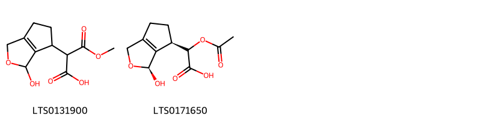{ width=100% }
    <figcaption>Hình ảnh cấu trúc hóa học của 2 hoạt chất thuộc nhóm Carboxylic acids and derivatives gồm ['2-{3-hydroxy-1h,3h,4h,5h,6h-cyclopenta[c]furan-4-yl}-3-methoxy-3-oxopropanoic acid (LTS0131900)', '(acetyloxy)[(3s,4r)-3-hydroxy-1h,3h,4h,5h,6h-cyclopenta[c]furan-4-yl]acetic acid (LTS0171650)'].</figcaption>
</figure>
#### Nhóm Dihydrofurans
<figure markdown="span">
    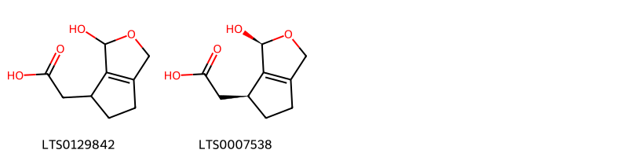{ width=100% }
    <figcaption>Hình ảnh cấu trúc hóa học của 2 hoạt chất thuộc nhóm Dihydrofurans gồm ['{3-hydroxy-1h,3h,4h,5h,6h-cyclopenta[c]furan-4-yl}acetic acid (LTS0129842)', '[(3s,4s)-3-hydroxy-1h,3h,4h,5h,6h-cyclopenta[c]furan-4-yl]acetic acid (LTS0007538)'].</figcaption>
</figure>
#### Nhóm Fatty Acyls
<figure markdown="span">
    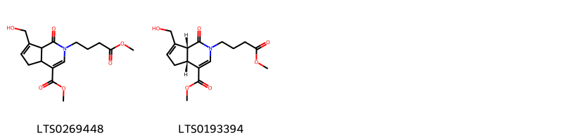{ width=100% }
    <figcaption>Hình ảnh cấu trúc hóa học của 2 hoạt chất thuộc nhóm Fatty Acyls gồm ['methyl 7-(hydroxymethyl)-2-(4-methoxy-4-oxobutyl)-1-oxo-4ah,5h,7ah-cyclopenta[c]pyridine-4-carboxylate (LTS0269448)', 'methyl (4ar,7ar)-7-(hydroxymethyl)-2-(4-methoxy-4-oxobutyl)-1-oxo-4ah,5h,7ah-cyclopenta[c]pyridine-4-carboxylate (LTS0193394)'].</figcaption>
</figure>
#### Nhóm Organooxygen compounds
<figure markdown="span">
    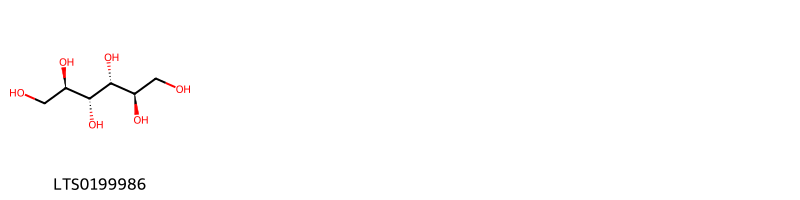{ width=100% }
    <figcaption>Hình ảnh cấu trúc hóa học của 1 hoạt chất thuộc nhóm Organooxygen compounds gồm ['mannitol (LTS0199986)'].</figcaption>
</figure>
#### Nhóm Prenol lipids
<figure markdown="span">
    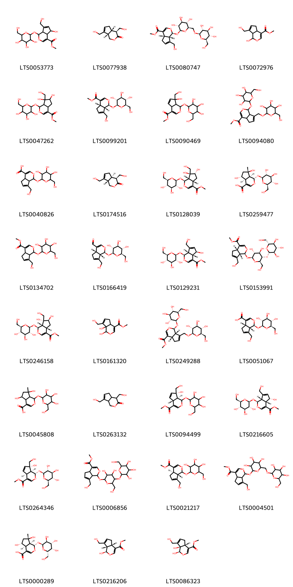{ width=100% }
    <figcaption>Hình ảnh cấu trúc hóa học của 31 hoạt chất thuộc nhóm Prenol lipids gồm ['methyl 5-hydroxy-7-(hydroxymethyl)-1-{[3,4,5-trihydroxy-6-(hydroxymethyl)oxan-2-yl]oxy}-1h,4ah,5h,7ah-cyclopenta[c]pyran-4-carboxylate (LTS0053773)', '(4s,4as,7as)-4,7-bis(hydroxymethyl)-1h,4h,4ah,5h,7ah-cyclopenta[c]pyran-3-one (LTS0077938)', 'genipin 1-gentiobioside (LTS0080747)', 'methyl 1-hydroxy-7-(hydroxymethyl)-1h,4ah,5h,7ah-cyclopenta[c]pyran-4-carboxylate (LTS0072976)', 'methyl 6,7-dihydroxy-7-(hydroxymethyl)-1-{[3,4,5-trihydroxy-6-(hydroxymethyl)oxan-2-yl]oxy}-1h,4ah,5h,6h,7ah-cyclopenta[c]pyran-4-carboxylate (LTS0047262)', 'geniposide (LTS0099201)', 'methyl 7-hydroxy-7-(hydroxymethyl)-1-{[3,4,5-trihydroxy-6-(hydroxymethyl)oxan-2-yl]oxy}-1h,4ah,7ah-cyclopenta[c]pyran-4-carboxylate (LTS0090469)', 'methyl 1-{[3,4,5-trihydroxy-6-(hydroxymethyl)oxan-2-yl]oxy}-7-({[3,4,5-trihydroxy-6-(hydroxymethyl)oxan-2-yl]oxy}methyl)-1h,4ah,5h,7ah-cyclopenta[c]pyran-4-carboxylate (LTS0094080)', '7-(hydroxymethyl)-1-{[3,4,5-trihydroxy-6-(hydroxymethyl)oxan-2-yl]oxy}-1h,4ah,5h,7ah-cyclopenta[c]pyran-4-carboxylic acid (LTS0040826)', '(4s,4ar,7as)-4,7-bis(hydroxymethyl)-1h,4h,4ah,5h,7ah-cyclopenta[c]pyran-3-one (LTS0174516)', 'methyl (1s,4as,6r,7s,7as)-6,7-dihydroxy-7-(hydroxymethyl)-1-{[(2s,3r,4s,5s,6r)-3,4,5-trihydroxy-6-(hydroxymethyl)oxan-2-yl]oxy}-1h,4ah,5h,6h,7ah-cyclopenta[c]pyran-4-carboxylate (LTS0128039)', 'shanzhiside (LTS0259477)', 'methyl 7-(hydroxymethyl)-1-{[3,4,5-trihydroxy-6-(hydroxymethyl)oxan-2-yl]oxy}-1h,4ah,5h,7ah-cyclopenta[c]pyran-4-carboxylate (LTS0134702)', 'tarennoside (LTS0166419)', 'scandoside methyl ester (LTS0129231)', 'methyl (1s,4as,7as)-1-{[(2s,3r,4r,5s,6r)-3,4-dihydroxy-6-(hydroxymethyl)-5-{[(2s,3r,4s,5s,6r)-3,4,5-trihydroxy-6-(hydroxymethyl)oxan-2-yl]oxy}oxan-2-yl]oxy}-7-(hydroxymethyl)-1h,4ah,5h,7ah-cyclopenta[c]pyran-4-carboxylate (LTS0153991)', 'methyl (1s,4as,6s,7r,7as)-6,7-dihydroxy-7-(hydroxymethyl)-1-{[(2s,3r,4s,5s,6r)-3,4,5-trihydroxy-6-(hydroxymethyl)oxan-2-yl]oxy}-1h,4ah,5h,6h,7ah-cyclopenta[c]pyran-4-carboxylate (LTS0246158)', 'methyl 1,7a-dihydroxy-7-(hydroxymethyl)-1h,4ah,5h-cyclopenta[c]pyran-4-carboxylate (LTS0161320)', 'methyl (1s,4as,7as)-1-{[(2s,3r,4s,5s,6r)-3,4,5-trihydroxy-6-(hydroxymethyl)oxan-2-yl]oxy}-7-({[(2r,3r,4s,5s,6r)-3,4,5-trihydroxy-6-(hydroxymethyl)oxan-2-yl]oxy}methyl)-1h,4ah,5h,7ah-cyclopenta[c]pyran-4-carboxylate (LTS0249288)', 'geniposidic acid (LTS0051067)', '5,7-dihydroxy-7-methyl-1-{[3,4,5-trihydroxy-6-(hydroxymethyl)oxan-2-yl]oxy}-1h,4ah,5h,6h,7ah-cyclopenta[c]pyran-4-carboxylic acid (LTS0045808)', '4,7-bis(hydroxymethyl)-1h,4h,4ah,5h,7ah-cyclopenta[c]pyran-3-one (LTS0263132)', 'methyl (4ar,7s,7as)-7-hydroxy-7-(hydroxymethyl)-1-{[3,4,5-trihydroxy-6-(hydroxymethyl)oxan-2-yl]oxy}-1h,4ah,7ah-cyclopenta[c]pyran-4-carboxylate (LTS0094499)', 'methyl (1s,4as,5s,7as)-5-hydroxy-7-(hydroxymethyl)-1-{[(2s,3r,4s,5s,6r)-3,4,5-trihydroxy-6-(hydroxymethyl)oxan-2-yl]oxy}-1h,4ah,5h,7ah-cyclopenta[c]pyran-4-carboxylate (LTS0216605)', 'methyl (1s,4as,7s,7as)-7-hydroxy-7-(hydroxymethyl)-1-{[(2s,3r,4s,5s,6r)-3,4,5-trihydroxy-6-(hydroxymethyl)oxan-2-yl]oxy}-1h,4ah,7ah-cyclopenta[c]pyran-4-carboxylate (LTS0264346)', 'methyl 1-{[3,4-dihydroxy-6-(hydroxymethyl)-5-{[3,4,5-trihydroxy-6-(hydroxymethyl)oxan-2-yl]oxy}oxan-2-yl]oxy}-7-(hydroxymethyl)-1h,4ah,5h,7ah-cyclopenta[c]pyran-4-carboxylate (LTS0006856)', 'methyl (4ar,7as)-7-(hydroxymethyl)-1-{[3,4,5-trihydroxy-6-(hydroxymethyl)oxan-2-yl]oxy}-1h,4ah,5h,7ah-cyclopenta[c]pyran-4-carboxylate (LTS0021217)', 'methyl 7-(hydroxymethyl)-1-{[3,4,5-trihydroxy-6-({[3,4,5-trihydroxy-6-(hydroxymethyl)oxan-2-yl]oxy}methyl)oxan-2-yl]oxy}-1h,4ah,5h,7ah-cyclopenta[c]pyran-4-carboxylate (LTS0004501)', '(1s,4as,5r,7s,7as)-5,7-dihydroxy-7-methyl-1-{[(2s,3s,4r,5s,6s)-3,4,5-trihydroxy-6-(hydroxymethyl)oxan-2-yl]oxy}-1h,4ah,5h,6h,7ah-cyclopenta[c]pyran-4-carboxylic acid (LTS0000289)', 'genipin (LTS0216206)', 'methyl (1r,4ar,7ar)-1,7a-dihydroxy-7-(hydroxymethyl)-1h,4ah,5h-cyclopenta[c]pyran-4-carboxylate (LTS0086323)'].</figcaption>
</figure>

---

### Dược dân tộc học

Danh sách các quốc gia có sử dụng *Genipa americana* trong điều trị các bệnh. 

| Country       | Disease                                                        | Bệnh                                                                                                                                                                                                |
|:--------------|:---------------------------------------------------------------|:----------------------------------------------------------------------------------------------------------------------------------------------------------------------------------------------------|
| Elsewhere     | Antiseptic, nan, nan, Cosmetic                                 | MYMEMORY WARNING: YOU USED ALL AVAILABLE FREE TRANSLATIONS FOR TODAY. NEXT AVAILABLE IN  10 HOURS 09 MINUTES 30 SECONDS VISIT HTTPS://MYMEMORY.TRANSLATED.NET/DOC/USAGELIMITS.PHP TO TRANSLATE MORE |
| Haiti         | Aphrodisiac, Cholagogue, Diuretic, Purgative, Stomachic, Tonic | MYMEMORY WARNING: YOU USED ALL AVAILABLE FREE TRANSLATIONS FOR TODAY. NEXT AVAILABLE IN  10 HOURS 09 MINUTES 26 SECONDS VISIT HTTPS://MYMEMORY.TRANSLATED.NET/DOC/USAGELIMITS.PHP TO TRANSLATE MORE |
| Panama(Choco) | Intoxicant, Intoxicant                                         | MYMEMORY WARNING: YOU USED ALL AVAILABLE FREE TRANSLATIONS FOR TODAY. NEXT AVAILABLE IN  10 HOURS 09 MINUTES 22 SECONDS VISIT HTTPS://MYMEMORY.TRANSLATED.NET/DOC/USAGELIMITS.PHP TO TRANSLATE MORE |
| Venezuela     | Laxative                                                       | MYMEMORY WARNING: YOU USED ALL AVAILABLE FREE TRANSLATIONS FOR TODAY. NEXT AVAILABLE IN  10 HOURS 09 MINUTES 19 SECONDS VISIT HTTPS://MYMEMORY.TRANSLATED.NET/DOC/USAGELIMITS.PHP TO TRANSLATE MORE |

---

---
## Genipa germanica
### Thông tin về thực vật

!!! info "Phân loại thực vật của *N/A* từ GIBF:"
    - **Kingdom:** Plantae
    - **Phylum:** Tracheophyta
    - **Order:** Gentianales
    - **Family:** Rubiaceae
    - **Genus:** Genipa
    - **Species:** *N/A*

 

| Label (VI)   | Label (EN)   | Scientific Name     | Descriptions (VI)   | Descriptions (EN)   | Also Known As (VI)   | Also Known As (EN)   |
|:-------------|:-------------|:--------------------|:--------------------|:--------------------|:---------------------|:---------------------|
| N/A          | N/A          | Tocoyena longiflora | loài thực vật       | species of plant    | ['']                 | ['']                 |

#### Phân bố trên thế giới

**Từ CSDL GIBF** nan, Brazil, Guatemala, Honduras, Ecuador, Trinidad and Tobago, Puerto Rico, Costa Rica, Dominican Republic, Colombia, Argentina, French Guiana, Mexico, Panama, Martinique, Paraguay, Peru, Bolivia (Plurinational State of), Venezuela (Bolivarian Republic of)

#### Phân bố tại Việt Nam

**Từ CSDL GIBF**: Không có ghi nhận ở Việt Nam

---
### Thành phần hóa học
        
- Theo cơ sở dữ liệu lotus: Từ loài *N/A* đã phân lập và xác định được Chưa có hoạt chất nào được phân lập. hoạt chất thuộc về các nhóm Không có hoạt chất nào được phân lập. 

Không có hình ảnh nào được tạo ra

---

### Dược dân tộc học

Danh sách các quốc gia có sử dụng *N/A* trong điều trị các bệnh. 

| Country       | Disease   | Bệnh                                                                                                                                                                                                |
|:--------------|:----------|:----------------------------------------------------------------------------------------------------------------------------------------------------------------------------------------------------|
| South America | Laxative  | MYMEMORY WARNING: YOU USED ALL AVAILABLE FREE TRANSLATIONS FOR TODAY. NEXT AVAILABLE IN  10 HOURS 08 MINUTES 43 SECONDS VISIT HTTPS://MYMEMORY.TRANSLATED.NET/DOC/USAGELIMITS.PHP TO TRANSLATE MORE |

---

# Chi Adina

??? note "Danh sách các dược liệu thuộc chi"
    
	 - *Adina cordifolia*
	 - *Adina polycephala*
	 - *Adina rubella*

---
## Adina cordifolia
### Thông tin về thực vật

!!! info "Phân loại thực vật của *Adina cordifolia* từ GIBF:"
    - **Kingdom:** Plantae
    - **Phylum:** Tracheophyta
    - **Order:** Gentianales
    - **Family:** Rubiaceae
    - **Genus:** Adina
    - **Species:** *Adina cordifolia*

 

| Label (VI)   | Label (EN)   | Scientific Name   | Descriptions (VI)   | Descriptions (EN)   | Also Known As (VI)   | Also Known As (EN)   |
|:-------------|:-------------|:------------------|:--------------------|:--------------------|:---------------------|:---------------------|
| N/A          | N/A          | Adina cordifolia  | loài thực vật       | species of plant    | ['']                 | ['']                 |

#### Phân bố trên thế giới

**Từ CSDL GIBF** Sri Lanka, nan, Mexico, Viet Nam, Cambodia, United States of America, Bangladesh, Nepal, Indonesia, China, Nigeria, Myanmar, India, unknown or invalid, Thailand, Lao People’s Democratic Republic, Puerto Rico

#### Phân bố tại Việt Nam

**Từ CSDL GIBF**: Nghe An, Ninh Thuận, Lai Châu

---
### Thành phần hóa học
        
- Theo cơ sở dữ liệu lotus: Từ loài *Adina cordifolia* đã phân lập và xác định được 23 hoạt chất thuộc về các nhóm Fatty Acyls, Flavonoids, Akageran and related alkaloids, Coumarins and derivatives, Steroids and steroid derivatives, Organooxygen compounds, Prenol lipids, Indoles and derivatives. 

|    | chemicalTaxonomyClassyfireClass   |   smiles_count |
|---:|:----------------------------------|---------------:|
|  0 | Akageran and related alkaloids    |              4 |
|  1 | Coumarins and derivatives         |              1 |
|  2 | Fatty Acyls                       |              1 |
|  3 | Flavonoids                        |              5 |
|  4 | Indoles and derivatives           |              2 |
|  5 | Organooxygen compounds            |              2 |
|  6 | Prenol lipids                     |              6 |
|  7 | Steroids and steroid derivatives  |              2 |

#### Nhóm Akageran and related alkaloids
<figure markdown="span">
    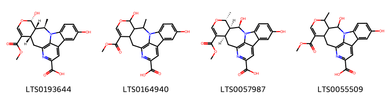{ width=100% }
    <figcaption>Hình ảnh cấu trúc hóa học của 4 hoạt chất thuộc nhóm Akageran and related alkaloids gồm ['adifoline (LTS0193644)', '5,18-dihydroxy-15-(methoxycarbonyl)-20-methyl-17-oxa-1,11-diazapentacyclo[10.8.1.0²,⁷.0⁸,²¹.0¹⁴,¹⁹]henicosa-2(7),3,5,8(21),9,11,15-heptaene-10-carboxylic acid (LTS0164940)', '(14r,18r,19s,20r)-5,20-dihydroxy-15-(methoxycarbonyl)-18-methyl-17-oxa-1,11-diazapentacyclo[10.8.1.0²,⁷.0⁸,²¹.0¹⁴,¹⁹]henicosa-2(7),3,5,8(21),9,11,15-heptaene-10-carboxylic acid (LTS0057987)', '5,20-dihydroxy-15-(methoxycarbonyl)-18-methyl-17-oxa-1,11-diazapentacyclo[10.8.1.0²,⁷.0⁸,²¹.0¹⁴,¹⁹]henicosa-2(7),3,5,8(21),9,11,15-heptaene-10-carboxylic acid (LTS0055509)'].</figcaption>
</figure>
#### Nhóm Coumarins and derivatives
<figure markdown="span">
    { width=100% }
    <figcaption>Hình ảnh cấu trúc hóa học của 1 hoạt chất thuộc nhóm Coumarins and derivatives gồm ['umbelliferone (LTS0162728)'].</figcaption>
</figure>
#### Nhóm Fatty Acyls
<figure markdown="span">
    { width=100% }
    <figcaption>Hình ảnh cấu trúc hóa học của 1 hoạt chất thuộc nhóm Fatty Acyls gồm ['octacosanol (LTS0049071)'].</figcaption>
</figure>
#### Nhóm Flavonoids
<figure markdown="span">
    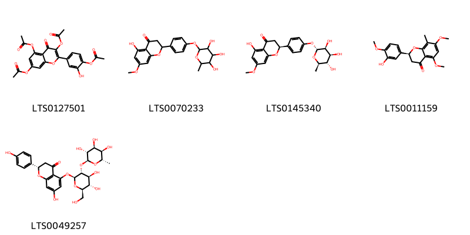{ width=100% }
    <figcaption>Hình ảnh cấu trúc hóa học của 5 hoạt chất thuộc nhóm Flavonoids gồm ['3,7-bis(acetyloxy)-2-[4-(acetyloxy)-3-hydroxyphenyl]-4-oxochromen-5-yl acetate (LTS0127501)', '5-hydroxy-7-methoxy-2-{4-[(3,4,5-trihydroxy-6-methyloxan-2-yl)oxy]phenyl}-2,3-dihydro-1-benzopyran-4-one (LTS0070233)', '(2s)-5-hydroxy-7-methoxy-2-(4-{[(2r,3s,4s,5s,6r)-3,4,5-trihydroxy-6-methyloxan-2-yl]oxy}phenyl)-2,3-dihydro-1-benzopyran-4-one (LTS0145340)', '(2s)-2-(3-hydroxy-4-methoxyphenyl)-5,7-dimethoxy-8-methyl-2,3-dihydro-1-benzopyran-4-one (LTS0011159)', '(2s)-5-{[(2s,3r,4s,5s,6r)-4,5-dihydroxy-6-(hydroxymethyl)-3-{[(2s,3r,4s,5r,6s)-3,4,5-trihydroxy-6-methyloxan-2-yl]oxy}oxan-2-yl]oxy}-7-hydroxy-2-(4-hydroxyphenyl)-2,3-dihydro-1-benzopyran-4-one (LTS0049257)'].</figcaption>
</figure>
#### Nhóm Indoles and derivatives
<figure markdown="span">
    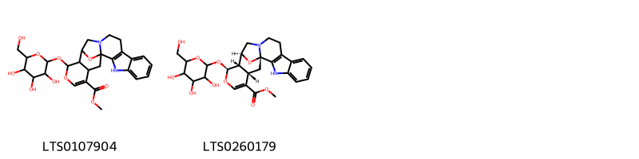{ width=100% }
    <figcaption>Hình ảnh cấu trúc hóa học của 2 hoạt chất thuộc nhóm Indoles and derivatives gồm ['methyl 17-{[3,4,5-trihydroxy-6-(hydroxymethyl)oxan-2-yl]oxy}-18,23-dioxa-3,13-diazahexacyclo[13.7.1.0¹,¹³.0²,¹⁰.0⁴,⁹.0¹⁶,²¹]tricosa-2(10),4,6,8,19-pentaene-20-carboxylate (LTS0107904)', 'methyl (1s,15s,16s,17s,21s)-17-{[3,4,5-trihydroxy-6-(hydroxymethyl)oxan-2-yl]oxy}-18,23-dioxa-3,13-diazahexacyclo[13.7.1.0¹,¹³.0²,¹⁰.0⁴,⁹.0¹⁶,²¹]tricosa-2(10),4,6,8,19-pentaene-20-carboxylate (LTS0260179)'].</figcaption>
</figure>
#### Nhóm Organooxygen compounds
<figure markdown="span">
    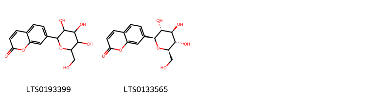{ width=100% }
    <figcaption>Hình ảnh cấu trúc hóa học của 2 hoạt chất thuộc nhóm Organooxygen compounds gồm ['7-[3,4,5-trihydroxy-6-(hydroxymethyl)oxan-2-yl]chromen-2-one (LTS0193399)', '7-[(2s,3r,4r,5s,6r)-3,4,5-trihydroxy-6-(hydroxymethyl)oxan-2-yl]chromen-2-one (LTS0133565)'].</figcaption>
</figure>
#### Nhóm Prenol lipids
<figure markdown="span">
    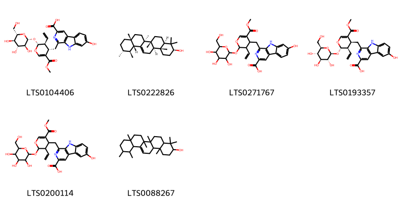{ width=100% }
    <figcaption>Hình ảnh cấu trúc hóa học của 6 hoạt chất thuộc nhóm Prenol lipids gồm ['1-{[(2r,3s,4s)-3-ethenyl-5-(methoxycarbonyl)-2-{[(2r,3s,4r,5r,6s)-3,4,5-trihydroxy-6-(hydroxymethyl)oxan-2-yl]oxy}-3,4-dihydro-2h-pyran-4-yl]methyl}-7-hydroxy-9h-pyrido[3,4-b]indole-3-carboxylic acid (LTS0104406)', 'amyrin (LTS0222826)', '1-{[3-ethenyl-5-(methoxycarbonyl)-2-{[3,4,5-trihydroxy-6-(hydroxymethyl)oxan-2-yl]oxy}-3,4-dihydro-2h-pyran-4-yl]methyl}-7-hydroxy-9h-pyrido[3,4-b]indole-3-carboxylic acid (LTS0271767)', '1-{[(2s,3r,4s)-3-ethenyl-5-(methoxycarbonyl)-2-{[(2s,3r,4s,5s,6r)-3,4,5-trihydroxy-6-(hydroxymethyl)oxan-2-yl]oxy}-3,4-dihydro-2h-pyran-4-yl]methyl}-6-hydroxy-9h-pyrido[3,4-b]indole-3-carboxylic acid (LTS0193357)', '1-{[3-ethenyl-5-(methoxycarbonyl)-2-{[3,4,5-trihydroxy-6-(hydroxymethyl)oxan-2-yl]oxy}-3,4-dihydro-2h-pyran-4-yl]methyl}-6-hydroxy-9h-pyrido[3,4-b]indole-3-carboxylic acid (LTS0200114)', 'α-amyrin (LTS0088267)'].</figcaption>
</figure>
#### Nhóm Steroids and steroid derivatives
<figure markdown="span">
    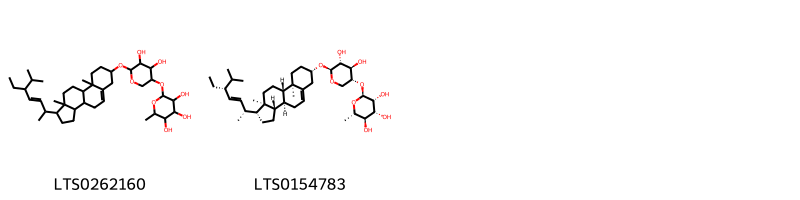{ width=100% }
    <figcaption>Hình ảnh cấu trúc hóa học của 2 hoạt chất thuộc nhóm Steroids and steroid derivatives gồm ['2-[(6-{[1-(5-ethyl-6-methylhept-3-en-2-yl)-9a,11a-dimethyl-1h,2h,3h,3ah,3bh,4h,6h,7h,8h,9h,9bh,10h,11h-cyclopenta[a]phenanthren-7-yl]oxy}-4,5-dihydroxyoxan-3-yl)oxy]-6-methyloxane-3,4,5-triol (LTS0262160)', '(2s,3r,4r,5r,6s)-2-{[(3r,4r,5r,6s)-6-{[(1r,3as,3bs,7s,9ar,9bs,11ar)-1-[(2r,3e,5r)-5-ethyl-6-methylhept-3-en-2-yl]-9a,11a-dimethyl-1h,2h,3h,3ah,3bh,4h,6h,7h,8h,9h,9bh,10h,11h-cyclopenta[a]phenanthren-7-yl]oxy}-4,5-dihydroxyoxan-3-yl]oxy}-6-methyloxane-3,4,5-triol (LTS0154783)'].</figcaption>
</figure>

---

### Dược dân tộc học

Danh sách các quốc gia có sử dụng *Adina cordifolia* trong điều trị các bệnh. 

| Country   | Disease    | Bệnh                                                                                                                                                                                                |
|:----------|:-----------|:----------------------------------------------------------------------------------------------------------------------------------------------------------------------------------------------------|
| Elsewhere | Antiseptic | MYMEMORY WARNING: YOU USED ALL AVAILABLE FREE TRANSLATIONS FOR TODAY. NEXT AVAILABLE IN  10 HOURS 08 MINUTES 14 SECONDS VISIT HTTPS://MYMEMORY.TRANSLATED.NET/DOC/USAGELIMITS.PHP TO TRANSLATE MORE |

---

---
## Adina polycephala
### Thông tin về thực vật

!!! info "Phân loại thực vật của *Adina trichotoma* từ GIBF:"
    - **Kingdom:** Plantae
    - **Phylum:** Tracheophyta
    - **Order:** Gentianales
    - **Family:** Rubiaceae
    - **Genus:** Adina
    - **Species:** *Adina trichotoma*

 

| Label (VI)   | Label (EN)   | Scientific Name   | Descriptions (VI)   | Descriptions (EN)   | Also Known As (VI)   | Also Known As (EN)   |
|:-------------|:-------------|:------------------|:--------------------|:--------------------|:---------------------|:---------------------|
| N/A          | N/A          | Adina cordifolia  | loài thực vật       | species of plant    | ['']                 | ['']                 |

#### Phân bố trên thế giới

**Từ CSDL GIBF** nan, Viet Nam, Indonesia, Philippines, Malaysia, China, Myanmar, India, unknown or invalid, Thailand

#### Phân bố tại Việt Nam

**Từ CSDL GIBF**: Hoa Binh

---
### Thành phần hóa học
        
- Theo cơ sở dữ liệu lotus: Từ loài *Adina trichotoma* đã phân lập và xác định được Chưa có hoạt chất nào được phân lập. hoạt chất thuộc về các nhóm Không có hoạt chất nào được phân lập. 

Không có hình ảnh nào được tạo ra

---

### Dược dân tộc học

Danh sách các quốc gia có sử dụng *Adina trichotoma* trong điều trị các bệnh. 

| Country   | Disease   | Bệnh                                                                                                                                                                                                |
|:----------|:----------|:----------------------------------------------------------------------------------------------------------------------------------------------------------------------------------------------------|
| Indonesia | Stimulant | MYMEMORY WARNING: YOU USED ALL AVAILABLE FREE TRANSLATIONS FOR TODAY. NEXT AVAILABLE IN  10 HOURS 07 MINUTES 34 SECONDS VISIT HTTPS://MYMEMORY.TRANSLATED.NET/DOC/USAGELIMITS.PHP TO TRANSLATE MORE |

---

---
## Adina rubella
### Thông tin về thực vật

!!! info "Phân loại thực vật của *Adina rubella* từ GIBF:"
    - **Kingdom:** Plantae
    - **Phylum:** Tracheophyta
    - **Order:** Gentianales
    - **Family:** Rubiaceae
    - **Genus:** Adina
    - **Species:** *Adina rubella*

 

| Label (VI)   | Label (EN)   | Scientific Name   | Descriptions (VI)   | Descriptions (EN)   | Also Known As (VI)   | Also Known As (EN)   |
|:-------------|:-------------|:------------------|:--------------------|:--------------------|:---------------------|:---------------------|
| N/A          | N/A          | Adina rubella     | loài thực vật       | species of plant    | ['']                 | ['']                 |

#### Phân bố trên thế giới

**Từ CSDL GIBF** nan, United States of America, Korea, Republic of, Chinese Taipei, China, Russian Federation

#### Phân bố tại Việt Nam

**Từ CSDL GIBF**: Không có ghi nhận ở Việt Nam

---
### Thành phần hóa học
        
- Theo cơ sở dữ liệu lotus: Từ loài *Adina rubella* đã phân lập và xác định được 15 hoạt chất thuộc về các nhóm Prenol lipids, Organooxygen compounds. 

|    | chemicalTaxonomyClassyfireClass   |   smiles_count |
|---:|:----------------------------------|---------------:|
|  0 | Organooxygen compounds            |              2 |
|  1 | Prenol lipids                     |             13 |

#### Nhóm Organooxygen compounds
<figure markdown="span">
    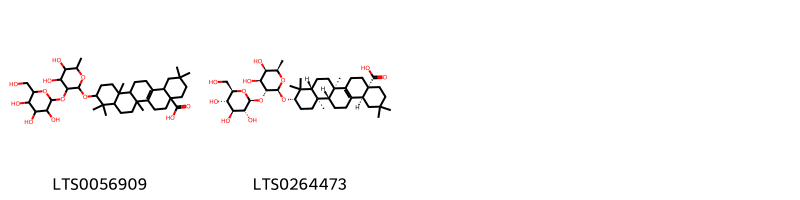{ width=100% }
    <figcaption>Hình ảnh cấu trúc hóa học của 2 hoạt chất thuộc nhóm Organooxygen compounds gồm ['10-[(4,5-dihydroxy-6-methyl-3-{[3,4,5-trihydroxy-6-(hydroxymethyl)oxan-2-yl]oxy}oxan-2-yl)oxy]-2,2,6b,9,9,12a-hexamethyl-3,4,5,6,7,8,8a,10,11,12,12b,13,14,14b-tetradecahydro-1h-picene-4a-carboxylic acid (LTS0056909)', '(4as,6br,8ar,10s,12ar,12br,14bs)-10-{[(2r,3r,4s,5r,6r)-4,5-dihydroxy-6-methyl-3-{[(2s,3r,4s,5s,6r)-3,4,5-trihydroxy-6-(hydroxymethyl)oxan-2-yl]oxy}oxan-2-yl]oxy}-2,2,6b,9,9,12a-hexamethyl-3,4,5,6,7,8,8a,10,11,12,12b,13,14,14b-tetradecahydro-1h-picene-4a-carboxylic acid (LTS0264473)'].</figcaption>
</figure>
#### Nhóm Prenol lipids
<figure markdown="span">
    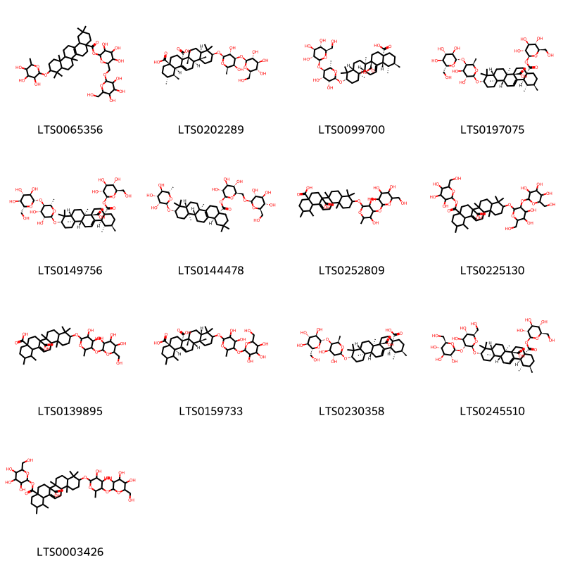{ width=100% }
    <figcaption>Hình ảnh cấu trúc hóa học của 13 hoạt chất thuộc nhóm Prenol lipids gồm ['3,4,5-trihydroxy-6-({[3,4,5-trihydroxy-6-(hydroxymethyl)oxan-2-yl]oxy}methyl)oxan-2-yl 2,2,6b,9,9,12a-hexamethyl-10-[(3,4,5-trihydroxy-6-methyloxan-2-yl)oxy]-3,4,5,6,7,8,8a,10,11,12,12b,13,14,14b-tetradecahydro-1h-picene-4a-carboxylate (LTS0065356)', '(1s,2r,4as,6ar,6br,8ar,10s,12ar,12br,14br)-10-{[(2r,3r,4s,5s,6r)-3,5-dihydroxy-6-methyl-4-{[(2s,3r,4s,5s,6r)-3,4,5-trihydroxy-6-(hydroxymethyl)oxan-2-yl]oxy}oxan-2-yl]oxy}-1,2,6b,9,9,12a-hexamethyl-2,3,4,5,6,7,8,8a,10,11,12,12b,13,14b-tetradecahydro-1h-picene-4a,6a-dicarboxylic acid (LTS0202289)', '(1s,2r,4as,6ar,6br,8ar,10s,12ar,12br,14br)-10-{[(2r,3r,4s,5r,6s)-3,4-dihydroxy-6-methyl-5-{[(2s,3r,4s,5s,6r)-3,4,5-trihydroxy-6-(hydroxymethyl)oxan-2-yl]oxy}oxan-2-yl]oxy}-1,2,6b,9,9,12a-hexamethyl-2,3,4,5,6,7,8,8a,10,11,12,12b,13,14b-tetradecahydro-1h-picene-4a,6a-dicarboxylic acid (LTS0099700)', '(1s,2r,4as,6ar,6br,8ar,10s,12ar,12br,14bs)-10-{[(2r,3r,4r,5r,6r)-3,4-dihydroxy-6-methyl-5-{[(2s,3r,4s,5s,6r)-3,4,5-trihydroxy-6-(hydroxymethyl)oxan-2-yl]oxy}oxan-2-yl]oxy}-1,2,6b,9,9,12a-hexamethyl-4a-({[(2s,3r,4s,5s,6r)-3,4,5-trihydroxy-6-(hydroxymethyl)oxan-2-yl]oxy}carbonyl)-2,3,4,5,6,7,8,8a,10,11,12,12b,13,14b-tetradecahydro-1h-picene-6a-carboxylic acid (LTS0197075)', '(1s,2r,4as,6ar,6br,8ar,10s,12ar,12br,14bs)-10-{[(2r,3r,4s,5r,6s)-3,4-dihydroxy-6-methyl-5-{[(2s,3r,4s,5s,6r)-3,4,5-trihydroxy-6-(hydroxymethyl)oxan-2-yl]oxy}oxan-2-yl]oxy}-1,2,6b,9,9,12a-hexamethyl-4a-({[(2s,3r,4s,5s,6r)-3,4,5-trihydroxy-6-(hydroxymethyl)oxan-2-yl]oxy}carbonyl)-2,3,4,5,6,7,8,8a,10,11,12,12b,13,14b-tetradecahydro-1h-picene-6a-carboxylic acid (LTS0149756)', '(2s,3r,4s,5s,6r)-3,4,5-trihydroxy-6-({[(2r,3r,4s,5s,6r)-3,4,5-trihydroxy-6-(hydroxymethyl)oxan-2-yl]oxy}methyl)oxan-2-yl (4as,6br,8ar,10s,12ar,12br,14bs)-2,2,6b,9,9,12a-hexamethyl-10-{[(2r,3r,4r,5r,6s)-3,4,5-trihydroxy-6-methyloxan-2-yl]oxy}-3,4,5,6,7,8,8a,10,11,12,12b,13,14,14b-tetradecahydro-1h-picene-4a-carboxylate (LTS0144478)', '10-[(3,5-dihydroxy-6-methyl-4-{[3,4,5-trihydroxy-6-(hydroxymethyl)oxan-2-yl]oxy}oxan-2-yl)oxy]-1,2,6b,9,9,12a-hexamethyl-2,3,4,5,6,7,8,8a,10,11,12,12b,13,14b-tetradecahydro-1h-picene-4a,6a-dicarboxylic acid (LTS0252809)', '10-{[4,5-dihydroxy-6-(hydroxymethyl)-3-{[3,4,5-trihydroxy-6-(hydroxymethyl)oxan-2-yl]oxy}oxan-2-yl]oxy}-1,2,6b,9,9,12a-hexamethyl-4a-({[3,4,5-trihydroxy-6-(hydroxymethyl)oxan-2-yl]oxy}carbonyl)-2,3,4,5,6,7,8,8a,10,11,12,12b,13,14b-tetradecahydro-1h-picene-6a-carboxylic acid (LTS0225130)', '10-[(3,4-dihydroxy-6-methyl-5-{[3,4,5-trihydroxy-6-(hydroxymethyl)oxan-2-yl]oxy}oxan-2-yl)oxy]-1,2,6b,9,9,12a-hexamethyl-2,3,4,5,6,7,8,8a,10,11,12,12b,13,14b-tetradecahydro-1h-picene-4a,6a-dicarboxylic acid (LTS0139895)', '(4as,6ar,6br,8as,12ar,12bs,14br)-10-[(3,4-dihydroxy-6-methyl-5-{[3,4,5-trihydroxy-6-(hydroxymethyl)oxan-2-yl]oxy}oxan-2-yl)oxy]-1,2,6b,9,9,12a-hexamethyl-2,3,4,5,6,7,8,8a,10,11,12,12b,13,14b-tetradecahydro-1h-picene-4a,6a-dicarboxylic acid (LTS0159733)', '(1s,2r,4as,6ar,6br,8ar,10s,12ar,12br,14bs)-10-{[(2r,3r,4r,5r,6r)-3,4-dihydroxy-6-methyl-5-{[(2s,3r,4s,5s,6r)-3,4,5-trihydroxy-6-(hydroxymethyl)oxan-2-yl]oxy}oxan-2-yl]oxy}-1,2,6b,9,9,12a-hexamethyl-2,3,4,5,6,7,8,8a,10,11,12,12b,13,14b-tetradecahydro-1h-picene-4a,6a-dicarboxylic acid (LTS0230358)', '(1s,2r,4as,6ar,6br,8ar,10s,12ar,12br,14bs)-10-{[(2r,3r,4s,5s,6r)-4,5-dihydroxy-6-(hydroxymethyl)-3-{[(2s,3r,4s,5s,6r)-3,4,5-trihydroxy-6-(hydroxymethyl)oxan-2-yl]oxy}oxan-2-yl]oxy}-1,2,6b,9,9,12a-hexamethyl-4a-({[(2s,3r,4s,5s,6r)-3,4,5-trihydroxy-6-(hydroxymethyl)oxan-2-yl]oxy}carbonyl)-2,3,4,5,6,7,8,8a,10,11,12,12b,13,14b-tetradecahydro-1h-picene-6a-carboxylic acid (LTS0245510)', '10-[(3,4-dihydroxy-6-methyl-5-{[3,4,5-trihydroxy-6-(hydroxymethyl)oxan-2-yl]oxy}oxan-2-yl)oxy]-1,2,6b,9,9,12a-hexamethyl-4a-({[3,4,5-trihydroxy-6-(hydroxymethyl)oxan-2-yl]oxy}carbonyl)-2,3,4,5,6,7,8,8a,10,11,12,12b,13,14b-tetradecahydro-1h-picene-6a-carboxylic acid (LTS0003426)'].</figcaption>
</figure>

---

### Dược dân tộc học

Danh sách các quốc gia có sử dụng *Adina rubella* trong điều trị các bệnh. 

| Country   | Disease                          | Bệnh                                                                                                                                                                                                |
|:----------|:---------------------------------|:----------------------------------------------------------------------------------------------------------------------------------------------------------------------------------------------------|
| China     | Carminative, Hemostat, Vermifuge | MYMEMORY WARNING: YOU USED ALL AVAILABLE FREE TRANSLATIONS FOR TODAY. NEXT AVAILABLE IN  10 HOURS 06 MINUTES 59 SECONDS VISIT HTTPS://MYMEMORY.TRANSLATED.NET/DOC/USAGELIMITS.PHP TO TRANSLATE MORE |

---

# Chi Coffea

??? note "Danh sách các dược liệu thuộc chi"
    
	 - *Coffea arabica*

---
## Coffea arabica
### Thông tin về thực vật

!!! info "Phân loại thực vật của *Coffea arabica* từ GIBF:"
    - **Kingdom:** Plantae
    - **Phylum:** Tracheophyta
    - **Order:** Gentianales
    - **Family:** Rubiaceae
    - **Genus:** Coffea
    - **Species:** *Coffea arabica*

 

| Label (VI)   | Label (EN)   | Scientific Name   | Descriptions (VI)   | Descriptions (EN)   | Also Known As (VI)                   | Also Known As (EN)   |
|:-------------|:-------------|:------------------|:--------------------|:--------------------|:-------------------------------------|:---------------------|
| N/A          | N/A          | Coffea arabica    | loài thực vật       | species of plant    | ['Coffea arabica', 'cà phê arabica'] | ['Arabic coffe']     |

#### Phân bố trên thế giới

**Từ CSDL GIBF** Brazil, Guatemala, Saint Lucia, Ecuador, Trinidad and Tobago, Thailand, Spain, Puerto Rico, Sri Lanka, United States of America, Jamaica, Tonga, Costa Rica, Dominican Republic, Colombia, Cuba, Argentina, Ethiopia, Hong Kong, Mexico, Kenya, Rwanda, Norway, Chinese Taipei, Haiti, Panama, South Africa, Australia, India, Northern Mariana Islands, Bolivia (Plurinational State of)

#### Phân bố tại Việt Nam

**Từ CSDL GIBF**: Không có ghi nhận ở Việt Nam

---
### Thành phần hóa học
        
- Theo cơ sở dữ liệu lotus: Từ loài *Coffea arabica* đã phân lập và xác định được 152 hoạt chất thuộc về các nhóm Fatty Acyls, Pyrroles, Carboxylic acids and derivatives, Phenols, Imidazopyrimidines, Organooxygen compounds, Tetrahydrofurans, Diazines, Saccharolipids, Thioacetals, Thiolanes, Dihydrofurans, Lactones, Benzene and substituted derivatives, Tannins, Cinnamic acids and derivatives, Pyridines and derivatives, Diazanaphthalenes, Heteroaromatic compounds, Flavonoids, Naphthofurans, Pyrans, Prenol lipids. 

|    | chemicalTaxonomyClassyfireClass     |   smiles_count |
|---:|:------------------------------------|---------------:|
|  0 |                                     |              1 |
|  1 | Benzene and substituted derivatives |              6 |
|  2 | Carboxylic acids and derivatives    |             17 |
|  3 | Cinnamic acids and derivatives      |              4 |
|  4 | Diazanaphthalenes                   |              2 |
|  5 | Diazines                            |             11 |
|  6 | Dihydrofurans                       |              2 |
|  7 | Fatty Acyls                         |             12 |
|  8 | Flavonoids                          |              2 |
|  9 | Heteroaromatic compounds            |              2 |
| 10 | Imidazopyrimidines                  |              4 |
| 11 | Lactones                            |              3 |
| 12 | Naphthofurans                       |              9 |
| 13 | Organooxygen compounds              |             46 |
| 14 | Phenols                             |             10 |
| 15 | Prenol lipids                       |              7 |
| 16 | Pyrans                              |              1 |
| 17 | Pyridines and derivatives           |              4 |
| 18 | Pyrroles                            |              2 |
| 19 | Saccharolipids                      |              2 |
| 20 | Tannins                             |              2 |
| 21 | Tetrahydrofurans                    |              1 |
| 22 | Thioacetals                         |              1 |
| 23 | Thiolanes                           |              1 |

#### Nhóm 
<figure markdown="span">
    { width=100% }
    <figcaption>Hình ảnh cấu trúc hóa học của 1 hoạt chất thuộc nhóm  gồm ['trigonelline (LTS0040106)'].</figcaption>
</figure>
#### Nhóm Benzene and substituted derivatives
<figure markdown="span">
    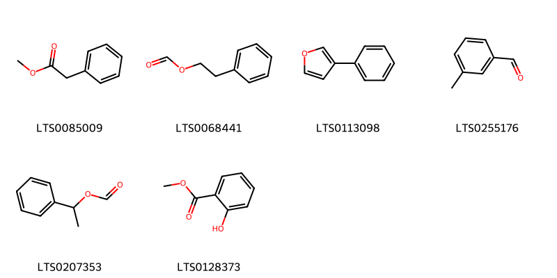{ width=100% }
    <figcaption>Hình ảnh cấu trúc hóa học của 6 hoạt chất thuộc nhóm Benzene and substituted derivatives gồm ['methyl phenylacetate (LTS0085009)', 'phenethyl formate (LTS0068441)', '3-phenylfuran (LTS0113098)', '3-methylbenzaldehyde (LTS0255176)', 'α-methylbenzyl formate (LTS0207353)', 'methyl salicylate (LTS0128373)'].</figcaption>
</figure>
#### Nhóm Carboxylic acids and derivatives
<figure markdown="span">
    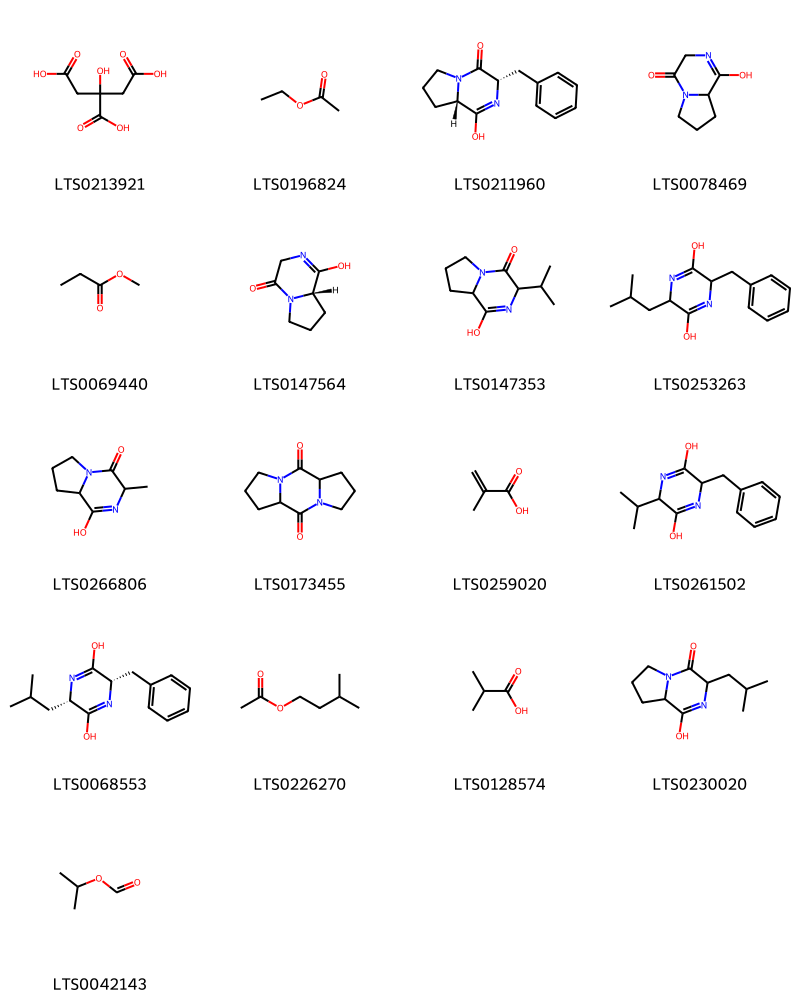{ width=100% }
    <figcaption>Hình ảnh cấu trúc hóa học của 17 hoạt chất thuộc nhóm Carboxylic acids and derivatives gồm ['citric acid (LTS0213921)', 'ethyl acetate (LTS0196824)', 'cyclo(l-phe-l-pro) (LTS0211960)', '1-hydroxy-3h,6h,7h,8h,8ah-pyrrolo[1,2-a]pyrazin-4-one (LTS0078469)', 'methyl propionate (LTS0069440)', '(8as)-1-hydroxy-3h,6h,7h,8h,8ah-pyrrolo[1,2-a]pyrazin-4-one (LTS0147564)', '1-hydroxy-3-isopropyl-3h,6h,7h,8h,8ah-pyrrolo[1,2-a]pyrazin-4-one (LTS0147353)', '3-benzyl-6-(2-methylpropyl)-3,6-dihydropyrazine-2,5-diol (LTS0253263)', '1-hydroxy-3-methyl-3h,6h,7h,8h,8ah-pyrrolo[1,2-a]pyrazin-4-one (LTS0266806)', '1,7-diazatricyclo[7.3.0.0³,⁷]dodecane-2,8-dione (LTS0173455)', 'methacrylic acid (LTS0259020)', '3-benzyl-6-isopropyl-3,6-dihydropyrazine-2,5-diol (LTS0261502)', '(3s,6s)-3-benzyl-6-(2-methylpropyl)-3,6-dihydropyrazine-2,5-diol (LTS0068553)', 'banana oil (LTS0226270)', 'isobutyric acid (LTS0128574)', '1-hydroxy-3-(2-methylpropyl)-3h,6h,7h,8h,8ah-pyrrolo[1,2-a]pyrazin-4-one (LTS0230020)', 'isopropyl formate (LTS0042143)'].</figcaption>
</figure>
#### Nhóm Cinnamic acids and derivatives
<figure markdown="span">
    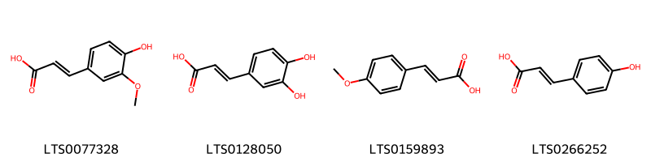{ width=100% }
    <figcaption>Hình ảnh cấu trúc hóa học của 4 hoạt chất thuộc nhóm Cinnamic acids and derivatives gồm ['ferulic acid (LTS0077328)', '3,4-dihydroxycinnamic acid (LTS0128050)', 'p-methoxy-cinnamic acid (LTS0159893)', 'para-coumaric acid (LTS0266252)'].</figcaption>
</figure>
#### Nhóm Diazanaphthalenes
<figure markdown="span">
    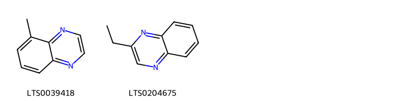{ width=100% }
    <figcaption>Hình ảnh cấu trúc hóa học của 2 hoạt chất thuộc nhóm Diazanaphthalenes gồm ['5-methylquinoxaline (LTS0039418)', '2-ethylquinoxaline (LTS0204675)'].</figcaption>
</figure>
#### Nhóm Diazines
<figure markdown="span">
    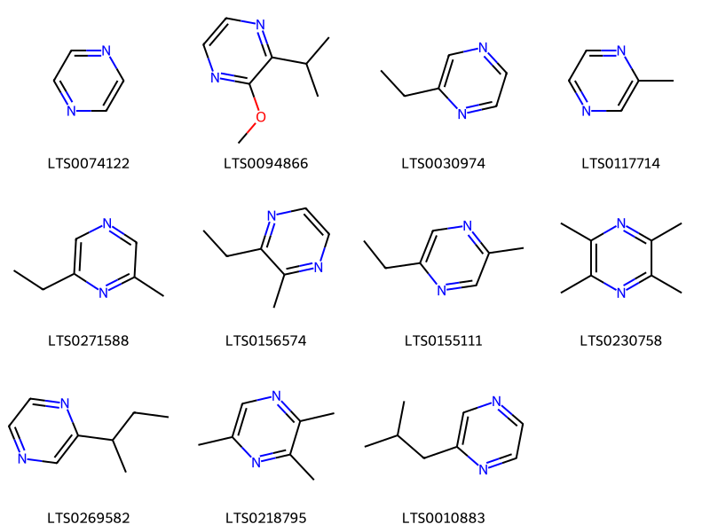{ width=100% }
    <figcaption>Hình ảnh cấu trúc hóa học của 11 hoạt chất thuộc nhóm Diazines gồm ['pyrazine (LTS0074122)', '2-methoxy-3-isopropylpyrazine (LTS0094866)', '2-ethylpyrazine (LTS0030974)', '2-methylpyrazine (LTS0117714)', '2-ethyl-6-methylpyrazine (LTS0271588)', '2-ethyl-3-methylpyrazine (LTS0156574)', '2-ethyl-5-methylpyrazine (LTS0155111)', 'ligustrazine (LTS0230758)', '2-(sec-butyl)pyrazine (LTS0269582)', 'trimethylpyrazine (LTS0218795)', '2-isobutylpyrazine (LTS0010883)'].</figcaption>
</figure>
#### Nhóm Dihydrofurans
<figure markdown="span">
    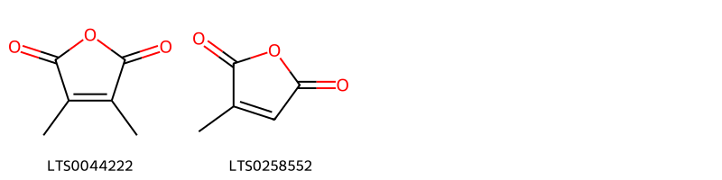{ width=100% }
    <figcaption>Hình ảnh cấu trúc hóa học của 2 hoạt chất thuộc nhóm Dihydrofurans gồm ['dimethylmaleic anhydride (LTS0044222)', 'citraconic anhydride (LTS0258552)'].</figcaption>
</figure>
#### Nhóm Fatty Acyls
<figure markdown="span">
    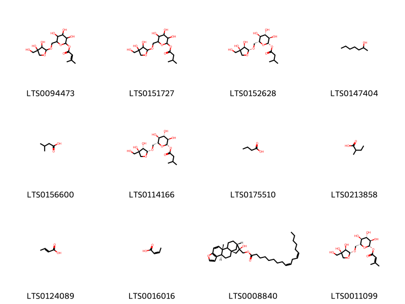{ width=100% }
    <figcaption>Hình ảnh cấu trúc hóa học của 12 hoạt chất thuộc nhóm Fatty Acyls gồm ['6-({[3,4-dihydroxy-4-(hydroxymethyl)oxolan-2-yl]oxy}methyl)-3,4,5-trihydroxyoxan-2-yl 3-methylbut-2-enoate (LTS0094473)', '6-({[3,4-dihydroxy-4-(hydroxymethyl)oxolan-2-yl]oxy}methyl)-3,4,5-trihydroxyoxan-2-yl 3-methylbutanoate (LTS0151727)', '(2s,3r,4s,5s,6r)-6-({[(2r,3r,4r)-3,4-dihydroxy-4-(hydroxymethyl)oxolan-2-yl]oxy}methyl)-3,4,5-trihydroxyoxan-2-yl 3-methylbutanoate (LTS0152628)', '2-heptanol (LTS0147404)', 'isovaleric acid (LTS0156600)', '(2s,3r,4s,5s,6r)-6-({[(2r,3s,4r)-3,4-dihydroxy-4-(hydroxymethyl)oxolan-2-yl]oxy}methyl)-3,4,5-trihydroxyoxan-2-yl 3-methylbutanoate (LTS0114166)', 'butanoic acid (LTS0175510)', '2-methylbutanoic acid (LTS0213858)', 'butenoic acid (LTS0124089)', 'isocrotonic acid (LTS0016016)', '[(1s,4r,12r,16s,17s)-17-hydroxy-12-methyl-8-oxapentacyclo[14.2.1.0¹,¹³.0⁴,¹².0⁵,⁹]nonadeca-5(9),6,10-trien-17-yl]methyl (9z,12z)-octadeca-9,12-dienoate (LTS0008840)', '(2s,3r,4s,5s,6r)-6-({[(2r,3r,4r)-3,4-dihydroxy-4-(hydroxymethyl)oxolan-2-yl]oxy}methyl)-3,4,5-trihydroxyoxan-2-yl 3-methylbut-2-enoate (LTS0011099)'].</figcaption>
</figure>
#### Nhóm Flavonoids
<figure markdown="span">
    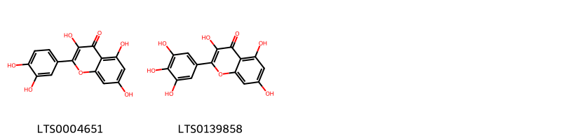{ width=100% }
    <figcaption>Hình ảnh cấu trúc hóa học của 2 hoạt chất thuộc nhóm Flavonoids gồm ['quercetin (LTS0004651)', 'myricetin (LTS0139858)'].</figcaption>
</figure>
#### Nhóm Heteroaromatic compounds
<figure markdown="span">
    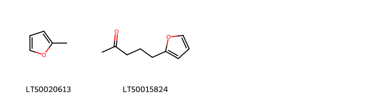{ width=100% }
    <figcaption>Hình ảnh cấu trúc hóa học của 2 hoạt chất thuộc nhóm Heteroaromatic compounds gồm ['silvan (LTS0020613)', '5-(furan-2-yl)pentan-2-one (LTS0015824)'].</figcaption>
</figure>
#### Nhóm Imidazopyrimidines
<figure markdown="span">
    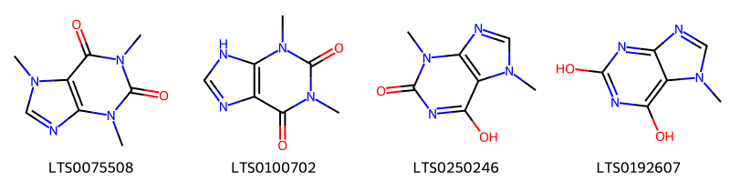{ width=100% }
    <figcaption>Hình ảnh cấu trúc hóa học của 4 hoạt chất thuộc nhóm Imidazopyrimidines gồm ['caffeine (LTS0075508)', 'constant-t (LTS0100702)', 'thesal (LTS0250246)', '2,6-dihydroxy-7-methylpurine (LTS0192607)'].</figcaption>
</figure>
#### Nhóm Lactones
<figure markdown="span">
    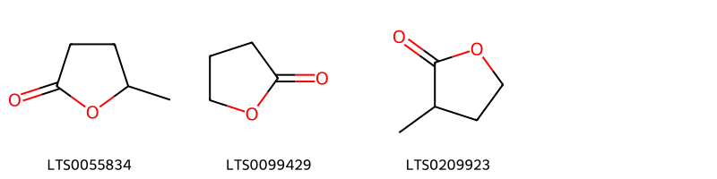{ width=100% }
    <figcaption>Hình ảnh cấu trúc hóa học của 3 hoạt chất thuộc nhóm Lactones gồm ['gamma-valerolactone (LTS0055834)', '4-butyrolactone (LTS0099429)', '3-methylbutyrolactone (LTS0209923)'].</figcaption>
</figure>
#### Nhóm Naphthofurans
<figure markdown="span">
    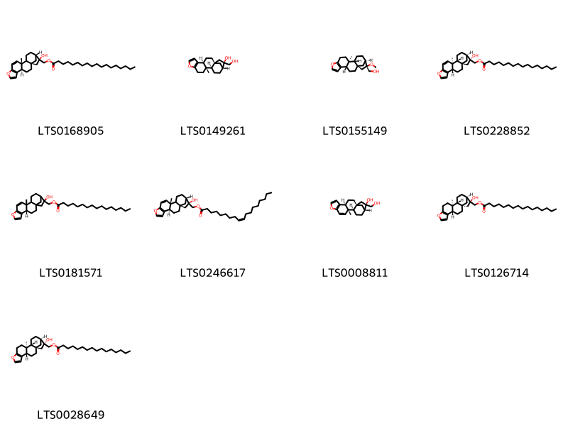{ width=100% }
    <figcaption>Hình ảnh cấu trúc hóa học của 9 hoạt chất thuộc nhóm Naphthofurans gồm ['[(1s,4r,12r,16s,17s)-17-hydroxy-12-methyl-8-oxapentacyclo[14.2.1.0¹,¹³.0⁴,¹².0⁵,⁹]nonadeca-5(9),6,10-trien-17-yl]methyl octadecanoate (LTS0168905)', 'cafestol (LTS0149261)', '16-o-methylcafestol (LTS0155149)', '[(1s,4s,12s,13r,16r,17r)-17-hydroxy-12-methyl-8-oxapentacyclo[14.2.1.0¹,¹³.0⁴,¹².0⁵,⁹]nonadeca-5(9),6,10-trien-17-yl]methyl hexadecanoate (LTS0228852)', '[(4s)-17-hydroxy-12-methyl-8-oxapentacyclo[14.2.1.0¹,¹³.0⁴,¹².0⁵,⁹]nonadeca-5(9),6,10-trien-17-yl]methyl hexadecanoate (LTS0181571)', '[(1s,4r,12r,16s,17s)-17-hydroxy-12-methyl-8-oxapentacyclo[14.2.1.0¹,¹³.0⁴,¹².0⁵,⁹]nonadeca-5(9),6,10-trien-17-yl]methyl (9z)-octadec-9-enoate (LTS0246617)', 'kahweol (LTS0008811)', '[(1r,4s,12s,13r,16r,17s)-17-hydroxy-12-methyl-8-oxapentacyclo[14.2.1.0¹,¹³.0⁴,¹².0⁵,⁹]nonadeca-5(9),6-dien-17-yl]methyl hexadecanoate (LTS0126714)', 'cafestol palmitate (LTS0028649)'].</figcaption>
</figure>
#### Nhóm Organooxygen compounds
<figure markdown="span">
    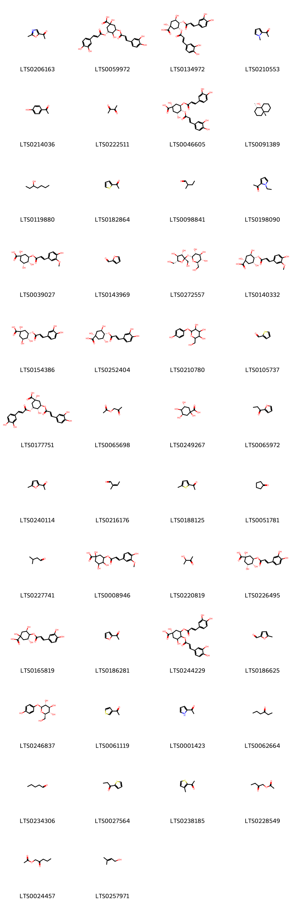{ width=100% }
    <figcaption>Hình ảnh cấu trúc hóa học của 46 hoạt chất thuộc nhóm Organooxygen compounds gồm ['1-(2-methyl-1,3-oxazol-5-yl)ethanone (LTS0206163)', '(3r,5r)-3,5-bis({[(2e)-3-(3,4-dihydroxyphenyl)prop-2-enoyl]oxy})-1,4-dihydroxycyclohexane-1-carboxylic acid (LTS0059972)', '3,4-dicaffeoylquinic acid (LTS0134972)', '2-acetyl-1-methylpyrrole (LTS0210553)', 'hydroxyacetophenone (LTS0214036)', 'diacetyl (LTS0222511)', '4,5-dicaffeoylquinic acid (LTS0046605)', 'geosmin (LTS0091389)', '3-heptanol (LTS0119880)', '2-acetylthiophene (LTS0182864)', '2-methylbutanal (LTS0098841)', '1-ethyl-2-acetyl pyrrole (LTS0198090)', '3-o-feruloyl-d-quinic acid (LTS0039027)', 'bran oil (LTS0143969)', 'sucrose (LTS0272557)', '4-o-feruloyl-d-quinic acid (LTS0140332)', '(1s,3s,4r,5s)-3-{[(2e)-3-(3,4-dihydroxyphenyl)prop-2-enoyl]oxy}-1,4,5-trihydroxycyclohexane-1-carboxylic acid (LTS0154386)', 'cryptochlorogenic acid (LTS0252404)', 'arbutin (LTS0210780)', 'formylthiophene (LTS0105737)', '3,5-dicaffeoylquinic acid (LTS0177751)', 'acetoxyacetone (LTS0065698)', '(3r,5r)-1,3,4,5-tetrahydroxycyclohexane-1-carboxylic acid (LTS0249267)', '1-propanone, 1-(2-furanyl)- (LTS0065972)', '2-acetyl-5-methylfuran (LTS0240114)', '2-butenal, 2-methyl- (LTS0216176)', '2-acetyl-5-methylthiophene (LTS0188125)', 'cyclopentanone (LTS0051781)', 'isovaleraldehyde (LTS0227741)', '1,3,4-trihydroxy-5-{[3-(4-hydroxy-3-methoxyphenyl)prop-2-enoyl]oxy}cyclohexane-1-carboxylic acid (LTS0008946)', 'acetoin (LTS0220819)', 'chlorogenic acid (LTS0226495)', '(3r,5r)-4-{[(2e)-3-(3,4-dihydroxyphenyl)prop-2-enoyl]oxy}-1,3,5-trihydroxycyclohexane-1-carboxylic acid (LTS0165819)', 'acetylfuran (LTS0186281)', '(1s)-3,4-bis({[3-(3,4-dihydroxyphenyl)prop-2-enoyl]oxy})-1,5-dihydroxycyclohexane-1-carboxylic acid (LTS0244229)', '5-methylfurfural (LTS0186625)', 'β-arbutin (LTS0246837)', '3-acetylthiophene (LTS0061119)', '2-acetylpyrrole (LTS0001423)', '3-hexanone (LTS0062664)', 'pentanal (LTS0234306)', '2-propionylthiophene (LTS0027564)', '1-(3-methylthiophen-2-yl)ethanone (LTS0238185)', '2-oxobutyl acetate (LTS0228549)', '2-oxopentyl acetate (LTS0024457)', 'prenol (LTS0257971)'].</figcaption>
</figure>
#### Nhóm Phenols
<figure markdown="span">
    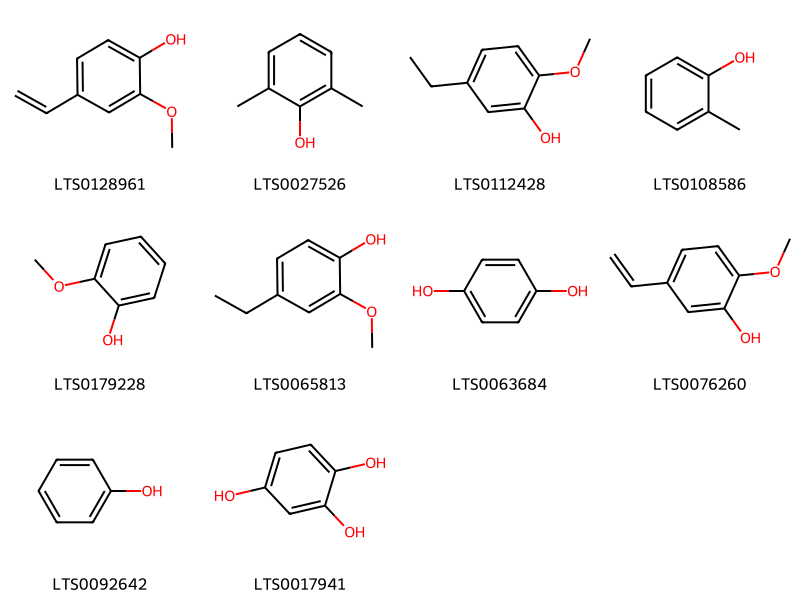{ width=100% }
    <figcaption>Hình ảnh cấu trúc hóa học của 10 hoạt chất thuộc nhóm Phenols gồm ['2-methoxy-4-vinyl-phenol (LTS0128961)', '2,6-dimethylphenol (LTS0027526)', 'locustol (LTS0112428)', 'o-cresol (LTS0108586)', 'guaiacol (LTS0179228)', '4-ethylguaiacol (LTS0065813)', 'α-hydroquinone (LTS0063684)', '5-ethenyl-2-methoxyphenol (LTS0076260)', 'phenol (LTS0092642)', '1,2,4-benzenetriol (LTS0017941)'].</figcaption>
</figure>
#### Nhóm Prenol lipids
<figure markdown="span">
    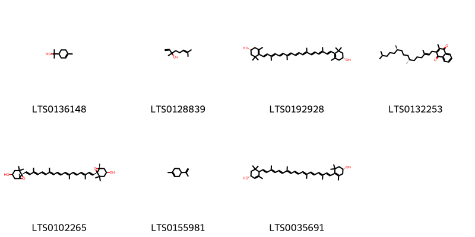{ width=100% }
    <figcaption>Hình ảnh cấu trúc hóa học của 7 hoạt chất thuộc nhóm Prenol lipids gồm ['terpineol (LTS0136148)', 'linalool, (+-)- (LTS0128839)', 'zeaxanthin (LTS0192928)', 'phytonadione (LTS0132253)', 'violaxanthin (LTS0102265)', 'limonene,  (LTS0155981)', '(1r)-4-[(1e,3e,5e,7e,9e,11e,13e,15e,17e)-18-[(4r)-4-hydroxy-2,6,6-trimethylcyclohex-1-en-1-yl]-3,7,12,16-tetramethyloctadeca-1,3,5,7,9,11,13,15,17-nonaen-1-yl]-3,5,5-trimethylcyclohex-2-en-1-ol (LTS0035691)'].</figcaption>
</figure>
#### Nhóm Pyrans
<figure markdown="span">
    { width=100% }
    <figcaption>Hình ảnh cấu trúc hóa học của 1 hoạt chất thuộc nhóm Pyrans gồm ['talmon (LTS0152081)'].</figcaption>
</figure>
#### Nhóm Pyridines and derivatives
<figure markdown="span">
    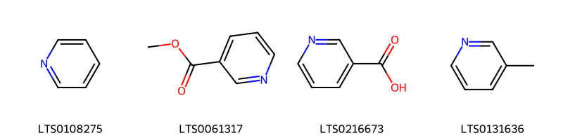{ width=100% }
    <figcaption>Hình ảnh cấu trúc hóa học của 4 hoạt chất thuộc nhóm Pyridines and derivatives gồm ['pyridine (LTS0108275)', 'heat spray (LTS0061317)', 'niacin (LTS0216673)', '3-methylpyridine (LTS0131636)'].</figcaption>
</figure>
#### Nhóm Pyrroles
<figure markdown="span">
    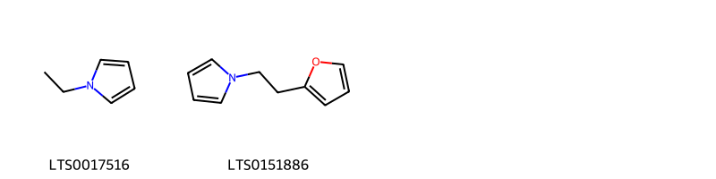{ width=100% }
    <figcaption>Hình ảnh cấu trúc hóa học của 2 hoạt chất thuộc nhóm Pyrroles gồm ['1h-pyrrole, 1-ethyl- (LTS0017516)', '1-[2-(furan-2-yl)ethyl]pyrrole (LTS0151886)'].</figcaption>
</figure>
#### Nhóm Saccharolipids
<figure markdown="span">
    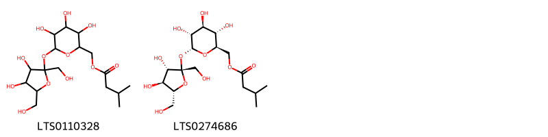{ width=100% }
    <figcaption>Hình ảnh cấu trúc hóa học của 2 hoạt chất thuộc nhóm Saccharolipids gồm ['(6-{[3,4-dihydroxy-2,5-bis(hydroxymethyl)oxolan-2-yl]oxy}-3,4,5-trihydroxyoxan-2-yl)methyl 3-methylbutanoate (LTS0110328)', '[(2r,3s,4s,5r,6r)-6-{[(2s,3s,4s,5r)-3,4-dihydroxy-2,5-bis(hydroxymethyl)oxolan-2-yl]oxy}-3,4,5-trihydroxyoxan-2-yl]methyl 3-methylbutanoate (LTS0274686)'].</figcaption>
</figure>
#### Nhóm Tannins
<figure markdown="span">
    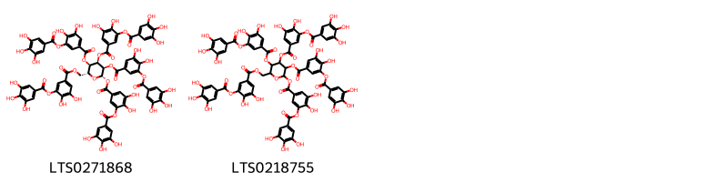{ width=100% }
    <figcaption>Hình ảnh cấu trúc hóa học của 2 hoạt chất thuộc nhóm Tannins gồm ['(2s,3r,4r,5r,6r)-3,4,5-tris[3,4-dihydroxy-5-(3,4,5-trihydroxybenzoyloxy)benzoyloxy]-6-{[3,4-dihydroxy-5-(3,4,5-trihydroxybenzoyloxy)benzoyloxy]methyl}oxan-2-yl 3,4-dihydroxy-5-(3,4,5-trihydroxybenzoyloxy)benzoate (LTS0271868)', '3,4,5-tris[3,4-dihydroxy-5-(3,4,5-trihydroxybenzoyloxy)benzoyloxy]-6-{[3,4-dihydroxy-5-(3,4,5-trihydroxybenzoyloxy)benzoyloxy]methyl}oxan-2-yl 3,4-dihydroxy-5-(3,4,5-trihydroxybenzoyloxy)benzoate (LTS0218755)'].</figcaption>
</figure>
#### Nhóm Tetrahydrofurans
<figure markdown="span">
    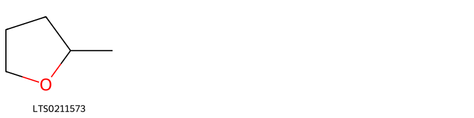{ width=100% }
    <figcaption>Hình ảnh cấu trúc hóa học của 1 hoạt chất thuộc nhóm Tetrahydrofurans gồm ['2-methyltetrahydrofuran (LTS0211573)'].</figcaption>
</figure>
#### Nhóm Thioacetals
<figure markdown="span">
    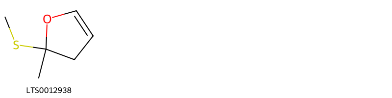{ width=100% }
    <figcaption>Hình ảnh cấu trúc hóa học của 1 hoạt chất thuộc nhóm Thioacetals gồm ['2-methyl-2-(methylsulfanyl)-3h-furan (LTS0012938)'].</figcaption>
</figure>
#### Nhóm Thiolanes
<figure markdown="span">
    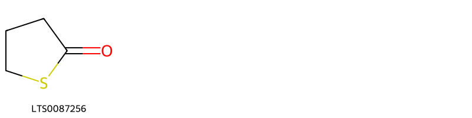{ width=100% }
    <figcaption>Hình ảnh cấu trúc hóa học của 1 hoạt chất thuộc nhóm Thiolanes gồm ['gamma-thiobutyrolactone (LTS0087256)'].</figcaption>
</figure>

---

### Dược dân tộc học

Danh sách các quốc gia có sử dụng *Coffea arabica* trong điều trị các bệnh. 

| Country            | Disease                                                                                                                                                  | Bệnh                                                                                                                                                                                                |
|:-------------------|:---------------------------------------------------------------------------------------------------------------------------------------------------------|:----------------------------------------------------------------------------------------------------------------------------------------------------------------------------------------------------|
| China              | Cardiotonic                                                                                                                                              | MYMEMORY WARNING: YOU USED ALL AVAILABLE FREE TRANSLATIONS FOR TODAY. NEXT AVAILABLE IN  10 HOURS 06 MINUTES 19 SECONDS VISIT HTTPS://MYMEMORY.TRANSLATED.NET/DOC/USAGELIMITS.PHP TO TRANSLATE MORE |
| Dominican Republic | Hypnotic, Stimulant                                                                                                                                      | MYMEMORY WARNING: YOU USED ALL AVAILABLE FREE TRANSLATIONS FOR TODAY. NEXT AVAILABLE IN  10 HOURS 06 MINUTES 15 SECONDS VISIT HTTPS://MYMEMORY.TRANSLATED.NET/DOC/USAGELIMITS.PHP TO TRANSLATE MORE |
| Elsewhere          | Analgesic, Anaphrodisiac, Anorexic, Antidote, Diuretic, Diuretic, Diuretic, Nervine, Stimulant, Stimulant, Stimulant, Counterirritant, Diuretic, Nervine | MYMEMORY WARNING: YOU USED ALL AVAILABLE FREE TRANSLATIONS FOR TODAY. NEXT AVAILABLE IN  10 HOURS 06 MINUTES 12 SECONDS VISIT HTTPS://MYMEMORY.TRANSLATED.NET/DOC/USAGELIMITS.PHP TO TRANSLATE MORE |
| Haiti              | Cardiotonic, Stimulant                                                                                                                                   | MYMEMORY WARNING: YOU USED ALL AVAILABLE FREE TRANSLATIONS FOR TODAY. NEXT AVAILABLE IN  10 HOURS 06 MINUTES 09 SECONDS VISIT HTTPS://MYMEMORY.TRANSLATED.NET/DOC/USAGELIMITS.PHP TO TRANSLATE MORE |
| Latin America      | Poison                                                                                                                                                   | MYMEMORY WARNING: YOU USED ALL AVAILABLE FREE TRANSLATIONS FOR TODAY. NEXT AVAILABLE IN  10 HOURS 06 MINUTES 05 SECONDS VISIT HTTPS://MYMEMORY.TRANSLATED.NET/DOC/USAGELIMITS.PHP TO TRANSLATE MORE |
| Trinidad           | Stimulant                                                                                                                                                | MYMEMORY WARNING: YOU USED ALL AVAILABLE FREE TRANSLATIONS FOR TODAY. NEXT AVAILABLE IN  10 HOURS 06 MINUTES 02 SECONDS VISIT HTTPS://MYMEMORY.TRANSLATED.NET/DOC/USAGELIMITS.PHP TO TRANSLATE MORE |
| Turkey             | Diuretic                                                                                                                                                 | MYMEMORY WARNING: YOU USED ALL AVAILABLE FREE TRANSLATIONS FOR TODAY. NEXT AVAILABLE IN  10 HOURS 05 MINUTES 58 SECONDS VISIT HTTPS://MYMEMORY.TRANSLATED.NET/DOC/USAGELIMITS.PHP TO TRANSLATE MORE |

---

# Chi Gardenia

??? note "Danh sách các dược liệu thuộc chi"
    
	 - *Gardenia campanulata*
	 - *Gardenia curranii*
	 - *Gardenia florida*
	 - *Gardenia gummifera*
	 - *Gardenia jasminoides*
	 - *Gardenia jovis-tonantis*
	 - *Gardenia lucida*
	 - *Gardenia thunbergia*

---
## Gardenia campanulata
### Thông tin về thực vật

!!! info "Phân loại thực vật của *Ceriscoides campanulata* từ GIBF:"
    - **Kingdom:** Plantae
    - **Phylum:** Tracheophyta
    - **Order:** Gentianales
    - **Family:** Rubiaceae
    - **Genus:** Ceriscoides
    - **Species:** *Ceriscoides campanulata*

 

| Label (VI)   | Label (EN)   | Scientific Name      | Descriptions (VI)   | Descriptions (EN)   | Also Known As (VI)   | Also Known As (EN)   |
|:-------------|:-------------|:---------------------|:--------------------|:--------------------|:---------------------|:---------------------|
| N/A          | N/A          | Gardenia campanulata | loài thực vật       | species of plant    | ['']                 | ['']                 |

#### Phân bố trên thế giới

**Từ CSDL GIBF** Brazil, Guatemala, Saint Lucia, Ecuador, Trinidad and Tobago, Thailand, Spain, Puerto Rico, Sri Lanka, United States of America, Jamaica, Tonga, Costa Rica, Dominican Republic, Colombia, Cuba, Argentina, Ethiopia, Hong Kong, Mexico, Kenya, Rwanda, Norway, Chinese Taipei, Haiti, Panama, South Africa, Australia, India, Northern Mariana Islands, Bolivia (Plurinational State of)

#### Phân bố tại Việt Nam

**Từ CSDL GIBF**: Không có ghi nhận ở Việt Nam

---
### Thành phần hóa học
        
- Theo cơ sở dữ liệu lotus: Từ loài *Ceriscoides campanulata* đã phân lập và xác định được Chưa có hoạt chất nào được phân lập. hoạt chất thuộc về các nhóm Không có hoạt chất nào được phân lập. 

Không có hình ảnh nào được tạo ra

---

### Dược dân tộc học

Danh sách các quốc gia có sử dụng *Ceriscoides campanulata* trong điều trị các bệnh. 

| Country   | Disease                                    | Bệnh                                                                                                                                                                                                |
|:----------|:-------------------------------------------|:----------------------------------------------------------------------------------------------------------------------------------------------------------------------------------------------------|
| Elsewhere | Piscicide, Cathartic                       | MYMEMORY WARNING: YOU USED ALL AVAILABLE FREE TRANSLATIONS FOR TODAY. NEXT AVAILABLE IN  10 HOURS 05 MINUTES 00 SECONDS VISIT HTTPS://MYMEMORY.TRANSLATED.NET/DOC/USAGELIMITS.PHP TO TRANSLATE MORE |
| India     | Cathartic, Larvicide, Piscicide, Vermifuge | MYMEMORY WARNING: YOU USED ALL AVAILABLE FREE TRANSLATIONS FOR TODAY. NEXT AVAILABLE IN  10 HOURS 04 MINUTES 57 SECONDS VISIT HTTPS://MYMEMORY.TRANSLATED.NET/DOC/USAGELIMITS.PHP TO TRANSLATE MORE |

---

---
## Gardenia curranii
### Thông tin về thực vật

!!! info "Phân loại thực vật của *Ceriscoides curranii* từ GIBF:"
    - **Kingdom:** Plantae
    - **Phylum:** Tracheophyta
    - **Order:** Gentianales
    - **Family:** Rubiaceae
    - **Genus:** Ceriscoides
    - **Species:** *Ceriscoides curranii*

 

| Label (VI)   | Label (EN)   | Scientific Name   | Descriptions (VI)   | Descriptions (EN)   | Also Known As (VI)   | Also Known As (EN)   |
|:-------------|:-------------|:------------------|:--------------------|:--------------------|:---------------------|:---------------------|
| N/A          | N/A          | Gardenia curranii | loài thực vật       | species of plant    | ['']                 | ['']                 |

#### Phân bố trên thế giới

**Từ CSDL GIBF** Philippines

#### Phân bố tại Việt Nam

**Từ CSDL GIBF**: Không có ghi nhận ở Việt Nam

---
### Thành phần hóa học
        
- Theo cơ sở dữ liệu lotus: Từ loài *Ceriscoides curranii* đã phân lập và xác định được Chưa có hoạt chất nào được phân lập. hoạt chất thuộc về các nhóm Không có hoạt chất nào được phân lập. 

Không có hình ảnh nào được tạo ra

---

### Dược dân tộc học

Danh sách các quốc gia có sử dụng *Ceriscoides curranii* trong điều trị các bệnh. 

| Country     | Disease   | Bệnh                                                                                                                                                                                                |
|:------------|:----------|:----------------------------------------------------------------------------------------------------------------------------------------------------------------------------------------------------|
| Philippines | Piscicide | MYMEMORY WARNING: YOU USED ALL AVAILABLE FREE TRANSLATIONS FOR TODAY. NEXT AVAILABLE IN  10 HOURS 04 MINUTES 36 SECONDS VISIT HTTPS://MYMEMORY.TRANSLATED.NET/DOC/USAGELIMITS.PHP TO TRANSLATE MORE |

---

---
## Gardenia florida
### Thông tin về thực vật

!!! info "Phân loại thực vật của *N/A* từ GIBF:"
    - **Kingdom:** Plantae
    - **Phylum:** Tracheophyta
    - **Order:** Gentianales
    - **Family:** Rubiaceae
    - **Genus:** Gardenia
    - **Species:** *N/A*

 

| Label (VI)   | Label (EN)   | Scientific Name   | Descriptions (VI)   | Descriptions (EN)   | Also Known As (VI)   | Also Known As (EN)   |
|:-------------|:-------------|:------------------|:--------------------|:--------------------|:---------------------|:---------------------|
| N/A          | N/A          | Gardenia florida  |                     | species of plant    | ['']                 | ['']                 |

#### Phân bố trên thế giới

**Từ CSDL GIBF** Uganda, Japan, Senegal, Botswana, New Caledonia, China, Zimbabwe, French Polynesia, Madagascar, Thailand, Indonesia, Sierra Leone, Hong Kong, Benin, Macao, Chinese Taipei, Malaysia, Panama, Singapore, South Africa, Australia, Micronesia (Federated States of), India, Cameroon

#### Phân bố tại Việt Nam

**Từ CSDL GIBF**: Không có ghi nhận ở Việt Nam

---
### Thành phần hóa học
        
- Theo cơ sở dữ liệu lotus: Từ loài *N/A* đã phân lập và xác định được Chưa có hoạt chất nào được phân lập. hoạt chất thuộc về các nhóm Không có hoạt chất nào được phân lập. 

Không có hình ảnh nào được tạo ra

---

### Dược dân tộc học

Danh sách các quốc gia có sử dụng *N/A* trong điều trị các bệnh. 

| Country   | Disease                             | Bệnh                                                                                                                                                                                                |
|:----------|:------------------------------------|:----------------------------------------------------------------------------------------------------------------------------------------------------------------------------------------------------|
| China     | Antiphlogistic, Hemostat, Vulnerary | MYMEMORY WARNING: YOU USED ALL AVAILABLE FREE TRANSLATIONS FOR TODAY. NEXT AVAILABLE IN  10 HOURS 04 MINUTES 13 SECONDS VISIT HTTPS://MYMEMORY.TRANSLATED.NET/DOC/USAGELIMITS.PHP TO TRANSLATE MORE |

---

---
## Gardenia gummifera
### Thông tin về thực vật

!!! info "Phân loại thực vật của *Gardenia gummifera* từ GIBF:"
    - **Kingdom:** Plantae
    - **Phylum:** Tracheophyta
    - **Order:** Gentianales
    - **Family:** Rubiaceae
    - **Genus:** Gardenia
    - **Species:** *Gardenia gummifera*

 

| Label (VI)   | Label (EN)   | Scientific Name    | Descriptions (VI)   | Descriptions (EN)   | Also Known As (VI)   | Also Known As (EN)   |
|:-------------|:-------------|:-------------------|:--------------------|:--------------------|:---------------------|:---------------------|
| N/A          | N/A          | Gardenia gummifera | loài thực vật       | species of plant    | ['']                 | ['']                 |

#### Phân bố trên thế giới

**Từ CSDL GIBF** nan, India, Nepal, Indonesia

#### Phân bố tại Việt Nam

**Từ CSDL GIBF**: Không có ghi nhận ở Việt Nam

---
### Thành phần hóa học
        
- Theo cơ sở dữ liệu lotus: Từ loài *Gardenia gummifera* đã phân lập và xác định được 5 hoạt chất thuộc về các nhóm Prenol lipids, Flavonoids. 

|    | chemicalTaxonomyClassyfireClass   |   smiles_count |
|---:|:----------------------------------|---------------:|
|  0 | Flavonoids                        |              1 |
|  1 | Prenol lipids                     |              4 |

#### Nhóm Flavonoids
<figure markdown="span">
    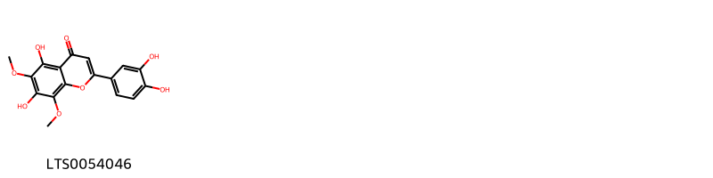{ width=100% }
    <figcaption>Hình ảnh cấu trúc hóa học của 1 hoạt chất thuộc nhóm Flavonoids gồm ['2-(3,4-dihydroxyphenyl)-5,7-dihydroxy-6,8-dimethoxychromen-4-one (LTS0054046)'].</figcaption>
</figure>
#### Nhóm Prenol lipids
<figure markdown="span">
    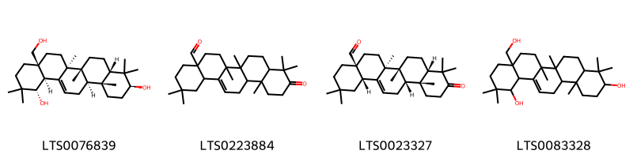{ width=100% }
    <figcaption>Hình ảnh cấu trúc hóa học của 4 hoạt chất thuộc nhóm Prenol lipids gồm ['(1s,4ar,6as,6br,8as,10s,12ar,12br,14br)-4a-(hydroxymethyl)-2,2,6a,6b,9,9,12a-heptamethyl-1,3,4,5,6,7,8,8a,10,11,12,12b,13,14b-tetradecahydropicene-1,10-diol (LTS0076839)', '2,2,6a,6b,9,9,12a-heptamethyl-10-oxo-3,4,5,6,7,8,8a,11,12,12b,13,14b-dodecahydro-1h-picene-4a-carbaldehyde (LTS0223884)', '(4as,6as,6br,8as,12ar,12bs,14bs)-2,2,6a,6b,9,9,12a-heptamethyl-10-oxo-3,4,5,6,7,8,8a,11,12,12b,13,14b-dodecahydro-1h-picene-4a-carbaldehyde (LTS0023327)', '4a-(hydroxymethyl)-2,2,6a,6b,9,9,12a-heptamethyl-1,3,4,5,6,7,8,8a,10,11,12,12b,13,14b-tetradecahydropicene-1,10-diol (LTS0083328)'].</figcaption>
</figure>

---

### Dược dân tộc học

Danh sách các quốc gia có sử dụng *Gardenia gummifera* trong điều trị các bệnh. 

| Country   | Disease                                                                 | Bệnh                                                                                                                                                                                                |
|:----------|:------------------------------------------------------------------------|:----------------------------------------------------------------------------------------------------------------------------------------------------------------------------------------------------|
| India     | Diaphoretic, Expectorant, Stimulant, Vermifuge, Antiseptic, Carminative | MYMEMORY WARNING: YOU USED ALL AVAILABLE FREE TRANSLATIONS FOR TODAY. NEXT AVAILABLE IN  10 HOURS 03 MINUTES 29 SECONDS VISIT HTTPS://MYMEMORY.TRANSLATED.NET/DOC/USAGELIMITS.PHP TO TRANSLATE MORE |

---

---
## Gardenia jasminoides
### Thông tin về thực vật

!!! info "Phân loại thực vật của *Gardenia jasminoides* từ GIBF:"
    - **Kingdom:** Plantae
    - **Phylum:** Tracheophyta
    - **Order:** Gentianales
    - **Family:** Rubiaceae
    - **Genus:** Gardenia
    - **Species:** *Gardenia jasminoides*

 

| Label (VI)   | Label (EN)   | Scientific Name      | Descriptions (VI)   | Descriptions (EN)                    | Also Known As (VI)                                                 | Also Known As (EN)   |
|:-------------|:-------------|:---------------------|:--------------------|:-------------------------------------|:-------------------------------------------------------------------|:---------------------|
| N/A          | N/A          | Gardenia jasminoides |                     | species of evergreen flowering plant | ['Thuỷ hoàng chi', 'Mác làng cương', 'Gardenia augusta', 'Chi tử'] | ['']                 |

#### Phân bố trên thế giới

**Từ CSDL GIBF** Hong Kong, Japan, Macao, Rwanda, Korea, Republic of, Indonesia, Chinese Taipei, Nepal, South Africa, Australia, China, Thailand, Micronesia (Federated States of), India, Georgia, Panama

#### Phân bố tại Việt Nam

**Từ CSDL GIBF**: Không có ghi nhận ở Việt Nam

---
### Thành phần hóa học
        
- Theo cơ sở dữ liệu lotus: Từ loài *Gardenia jasminoides* đã phân lập và xác định được 214 hoạt chất thuộc về các nhóm Fatty Acyls, Benzene and substituted derivatives, Flavonoids, Isobenzofurans, Tannins, Carboxylic acids and derivatives, Cinnamic acids and derivatives, Coumarins and derivatives, Pyridines and derivatives, Phenols, Steroids and steroid derivatives, Hydroxy acids and derivatives, Organooxygen compounds, Prenol lipids, Saturated hydrocarbons, Indoles and derivatives. 

|    | chemicalTaxonomyClassyfireClass     |   smiles_count |
|---:|:------------------------------------|---------------:|
|  0 | Benzene and substituted derivatives |              5 |
|  1 | Carboxylic acids and derivatives    |              3 |
|  2 | Cinnamic acids and derivatives      |             10 |
|  3 | Coumarins and derivatives           |              1 |
|  4 | Fatty Acyls                         |              8 |
|  5 | Flavonoids                          |              3 |
|  6 | Hydroxy acids and derivatives       |              3 |
|  7 | Indoles and derivatives             |              1 |
|  8 | Isobenzofurans                      |              2 |
|  9 | Organooxygen compounds              |             63 |
| 10 | Phenols                             |              1 |
| 11 | Prenol lipids                       |            100 |
| 12 | Pyridines and derivatives           |              4 |
| 13 | Saturated hydrocarbons              |              1 |
| 14 | Steroids and steroid derivatives    |              1 |
| 15 | Tannins                             |              1 |

#### Nhóm Benzene and substituted derivatives
<figure markdown="span">
    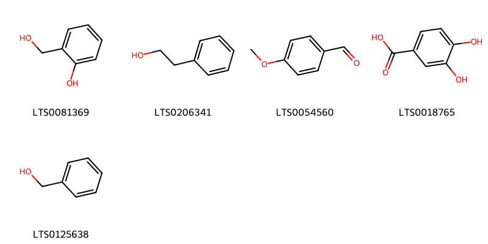{ width=100% }
    <figcaption>Hình ảnh cấu trúc hóa học của 5 hoạt chất thuộc nhóm Benzene and substituted derivatives gồm ['saligenin (LTS0081369)', '2-phenyl-ethanol (LTS0206341)', 'anisaldehyde (LTS0054560)', '3,4-dihydroxybenzoic acid (LTS0018765)', 'benzyl alcohol (LTS0125638)'].</figcaption>
</figure>
#### Nhóm Carboxylic acids and derivatives
<figure markdown="span">
    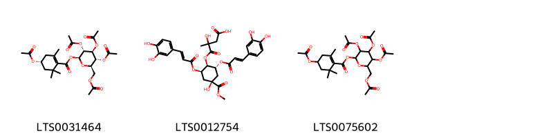{ width=100% }
    <figcaption>Hình ảnh cấu trúc hóa học của 3 hoạt chất thuộc nhóm Carboxylic acids and derivatives gồm ['(2s,3r,4s,5r,6r)-3,4,5-tris(acetyloxy)-6-[(acetyloxy)methyl]oxan-2-yl (4r)-4-(acetyloxy)-2,6,6-trimethylcyclohex-1-ene-1-carboxylate (LTS0031464)', '4-{[(1s,2r,4s,6r)-2,6-bis({[(2e)-3-(3,4-dihydroxyphenyl)prop-2-enoyl]oxy})-4-hydroxy-4-(methoxycarbonyl)cyclohexyl]oxy}-3-hydroxy-3-methyl-4-oxobutanoic acid (LTS0012754)', '3,4,5-tris(acetyloxy)-6-[(acetyloxy)methyl]oxan-2-yl 4-(acetyloxy)-2,6,6-trimethylcyclohex-1-ene-1-carboxylate (LTS0075602)'].</figcaption>
</figure>
#### Nhóm Cinnamic acids and derivatives
<figure markdown="span">
    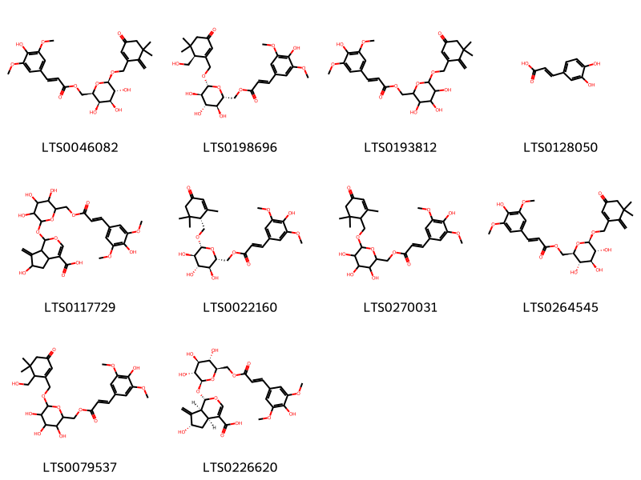{ width=100% }
    <figcaption>Hình ảnh cấu trúc hóa học của 10 hoạt chất thuộc nhóm Cinnamic acids and derivatives gồm ['[(2r,3r,4s,5r,6r)-6-[(5,5-dimethyl-6-methylidene-3-oxocyclohex-1-en-1-yl)methoxy]-3,4,5-trihydroxyoxan-2-yl]methyl (2e)-3-(4-hydroxy-3,5-dimethoxyphenyl)prop-2-enoate (LTS0046082)', '[(2r,3s,4s,5r,6r)-3,4,5-trihydroxy-6-{[(6s)-6-(hydroxymethyl)-5,5-dimethyl-3-oxocyclohex-1-en-1-yl]methoxy}oxan-2-yl]methyl (2e)-3-(4-hydroxy-3,5-dimethoxyphenyl)prop-2-enoate (LTS0198696)', '{6-[(5,5-dimethyl-6-methylidene-3-oxocyclohex-1-en-1-yl)methoxy]-3,4,5-trihydroxyoxan-2-yl}methyl 3-(4-hydroxy-3,5-dimethoxyphenyl)prop-2-enoate (LTS0193812)', '3,4-dihydroxycinnamic acid (LTS0128050)', '6-hydroxy-7-methylidene-1-{[3,4,5-trihydroxy-6-({[3-(4-hydroxy-3,5-dimethoxyphenyl)prop-2-enoyl]oxy}methyl)oxan-2-yl]oxy}-1h,4ah,5h,6h,7ah-cyclopenta[c]pyran-4-carboxylic acid (LTS0117729)', '[(2r,3s,4s,5r,6r)-3,4,5-trihydroxy-6-{[(1r)-2,6,6-trimethyl-4-oxocyclohex-2-en-1-yl]methoxy}oxan-2-yl]methyl (2e)-3-(4-hydroxy-3,5-dimethoxyphenyl)prop-2-enoate (LTS0022160)', '{3,4,5-trihydroxy-6-[(2,6,6-trimethyl-4-oxocyclohex-2-en-1-yl)methoxy]oxan-2-yl}methyl 3-(4-hydroxy-3,5-dimethoxyphenyl)prop-2-enoate (LTS0270031)', '[(2r,3s,4s,5r,6r)-6-[(5,5-dimethyl-6-methylidene-3-oxocyclohex-1-en-1-yl)methoxy]-3,4,5-trihydroxyoxan-2-yl]methyl (2e)-3-(4-hydroxy-3,5-dimethoxyphenyl)prop-2-enoate (LTS0264545)', '(3,4,5-trihydroxy-6-{[6-(hydroxymethyl)-5,5-dimethyl-3-oxocyclohex-1-en-1-yl]methoxy}oxan-2-yl)methyl 3-(4-hydroxy-3,5-dimethoxyphenyl)prop-2-enoate (LTS0079537)', '(1s,4as,6s,7as)-6-hydroxy-7-methylidene-1-{[(2s,3r,4s,5s,6r)-3,4,5-trihydroxy-6-({[(2e)-3-(4-hydroxy-3,5-dimethoxyphenyl)prop-2-enoyl]oxy}methyl)oxan-2-yl]oxy}-1h,4ah,5h,6h,7ah-cyclopenta[c]pyran-4-carboxylic acid (LTS0226620)'].</figcaption>
</figure>
#### Nhóm Coumarins and derivatives
<figure markdown="span">
    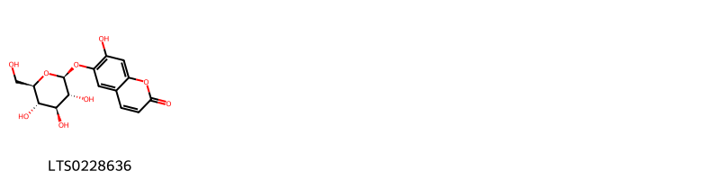{ width=100% }
    <figcaption>Hình ảnh cấu trúc hóa học của 1 hoạt chất thuộc nhóm Coumarins and derivatives gồm ['esculin (LTS0228636)'].</figcaption>
</figure>
#### Nhóm Fatty Acyls
<figure markdown="span">
    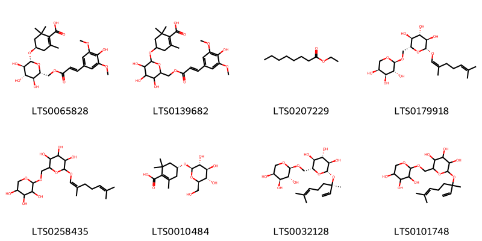{ width=100% }
    <figcaption>Hình ảnh cấu trúc hóa học của 8 hoạt chất thuộc nhóm Fatty Acyls gồm ['(4r)-2,6,6-trimethyl-4-{[(2r,3r,4s,5s,6r)-3,4,5-trihydroxy-6-({[(2e)-3-(4-hydroxy-3,5-dimethoxyphenyl)prop-2-enoyl]oxy}methyl)oxan-2-yl]oxy}cyclohex-1-ene-1-carboxylic acid (LTS0065828)', '2,6,6-trimethyl-4-{[3,4,5-trihydroxy-6-({[3-(4-hydroxy-3,5-dimethoxyphenyl)prop-2-enoyl]oxy}methyl)oxan-2-yl]oxy}cyclohex-1-ene-1-carboxylic acid (LTS0139682)', 'ethyl octanoate (LTS0207229)', '(2r,3r,4s,5s,6r)-2-{[(1z)-2,6-dimethylhepta-1,5-dien-1-yl]oxy}-6-({[(2s,3r,4s,5s)-3,4,5-trihydroxyoxan-2-yl]oxy}methyl)oxane-3,4,5-triol (LTS0179918)', '2-[(2,6-dimethylhepta-1,5-dien-1-yl)oxy]-6-{[(3,4,5-trihydroxyoxan-2-yl)oxy]methyl}oxane-3,4,5-triol (LTS0258435)', '(4r)-2,6,6-trimethyl-4-{[(2r,3r,4s,5s,6r)-3,4,5-trihydroxy-6-(hydroxymethyl)oxan-2-yl]oxy}cyclohex-1-ene-1-carboxylic acid (LTS0010484)', '(2s,3r,4s,5s,6r)-2-{[(3r)-3,7-dimethylocta-1,6-dien-3-yl]oxy}-6-({[(2s,3r,4s,5s)-3,4,5-trihydroxyoxan-2-yl]oxy}methyl)oxane-3,4,5-triol (LTS0032128)', '2-[(3,7-dimethylocta-1,6-dien-3-yl)oxy]-6-{[(3,4,5-trihydroxyoxan-2-yl)oxy]methyl}oxane-3,4,5-triol (LTS0101748)'].</figcaption>
</figure>
#### Nhóm Flavonoids
<figure markdown="span">
    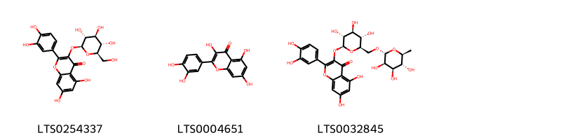{ width=100% }
    <figcaption>Hình ảnh cấu trúc hóa học của 3 hoạt chất thuộc nhóm Flavonoids gồm ['isoquercetin (LTS0254337)', 'quercetin (LTS0004651)', '3-rutinosyl quercetin (LTS0032845)'].</figcaption>
</figure>
#### Nhóm Hydroxy acids and derivatives
<figure markdown="span">
    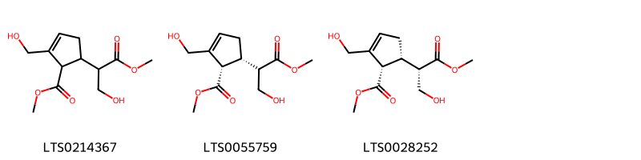{ width=100% }
    <figcaption>Hình ảnh cấu trúc hóa học của 3 hoạt chất thuộc nhóm Hydroxy acids and derivatives gồm ['methyl 5-(3-hydroxy-1-methoxy-1-oxopropan-2-yl)-2-(hydroxymethyl)cyclopent-2-ene-1-carboxylate (LTS0214367)', 'methyl (1s,5s)-5-(3-hydroxy-1-methoxy-1-oxopropan-2-yl)-2-(hydroxymethyl)cyclopent-2-ene-1-carboxylate (LTS0055759)', 'methyl (1s,5s)-5-[(2s)-3-hydroxy-1-methoxy-1-oxopropan-2-yl]-2-(hydroxymethyl)cyclopent-2-ene-1-carboxylate (LTS0028252)'].</figcaption>
</figure>
#### Nhóm Indoles and derivatives
<figure markdown="span">
    { width=100% }
    <figcaption>Hình ảnh cấu trúc hóa học của 1 hoạt chất thuộc nhóm Indoles and derivatives gồm ['n-[2-(5-methoxy-1h-indol-3-yl)ethyl]ethanimidic acid (LTS0219322)'].</figcaption>
</figure>
#### Nhóm Isobenzofurans
<figure markdown="span">
    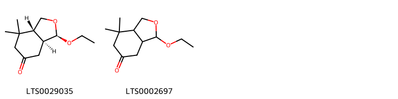{ width=100% }
    <figcaption>Hình ảnh cấu trúc hóa học của 2 hoạt chất thuộc nhóm Isobenzofurans gồm ['(3r,3as,7ar)-3-ethoxy-7,7-dimethyl-hexahydro-2-benzofuran-5-one (LTS0029035)', '3-ethoxy-7,7-dimethyl-hexahydro-2-benzofuran-5-one (LTS0002697)'].</figcaption>
</figure>
#### Nhóm Organooxygen compounds
<figure markdown="span">
    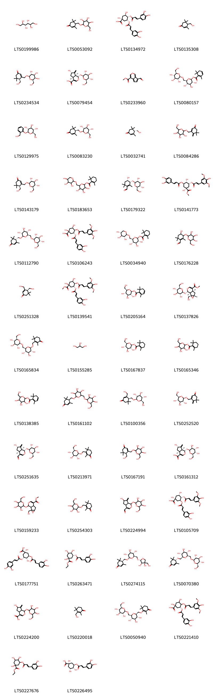{ width=100% }
    <figcaption>Hình ảnh cấu trúc hóa học của 63 hoạt chất thuộc nhóm Organooxygen compounds gồm ['mannitol (LTS0199986)', '3,5,5-trimethyl-4-({[3,4,5-trihydroxy-6-(hydroxymethyl)oxan-2-yl]oxy}methyl)cyclohex-2-en-1-one (LTS0053092)', '3,4-dicaffeoylquinic acid (LTS0134972)', '4-(hydroxymethyl)-3,5,5-trimethylcyclohex-2-en-1-one (LTS0135308)', '(4s)-4-(hydroxymethyl)-5,5-dimethyl-3-({[(2r,3r,4s,5r,6r)-3,4,5-trihydroxy-6-(hydroxymethyl)oxan-2-yl]oxy}methyl)cyclohex-2-en-1-one (LTS0234534)', 'gardoside (LTS0079454)', 'methyl 7-formylcyclopenta[c]pyran-4-carboxylate (LTS0233960)', '(2s,3r,4s,5s,6r)-3,4,5-trihydroxy-6-({[(2r,3r,4s,5s,6r)-3,4,5-trihydroxy-6-(hydroxymethyl)oxan-2-yl]oxy}methyl)oxan-2-yl 2,6,6-trimethylcyclohexa-1,3-diene-1-carboxylate (LTS0080157)', 'salicin (LTS0129975)', '(4r)-3,5,5-trimethyl-4-({[(2r,3r,4s,5s,6r)-3,4,5-trihydroxy-6-(hydroxymethyl)oxan-2-yl]oxy}methyl)cyclohex-2-en-1-one (LTS0083230)', '(4s)-4-(hydroxymethyl)-3,5,5-trimethylcyclohex-2-en-1-one (LTS0032741)', '5,5-dimethyl-4-methylidene-3-({[3,4,5-trihydroxy-6-(hydroxymethyl)oxan-2-yl]oxy}methyl)cyclohex-2-en-1-one (LTS0084286)', '(4s)-4-(hydroxymethyl)-5,5-dimethyl-3-({[(2r,3r,4s,5s,6r)-3,4,5-trihydroxy-6-(hydroxymethyl)oxan-2-yl]oxy}methyl)cyclohex-2-en-1-one (LTS0143179)', '3,4,5-trihydroxy-6-{[(3,4,5-trihydroxyoxan-2-yl)oxy]methyl}oxan-2-yl 2,6,6-trimethylcyclohex-1-ene-1-carboxylate (LTS0183653)', '(3r,4s)-4-hydroxy-2,6,6-trimethyl-3-{[(2r,3r,4s,5s,6r)-3,4,5-trihydroxy-6-(hydroxymethyl)oxan-2-yl]oxy}cyclohex-1-ene-1-carbaldehyde (LTS0179322)', 'methyl (1r,3r,4s,5r)-3-{[(2e)-3-(3,4-dihydroxyphenyl)prop-2-enoyl]oxy}-1,4-dihydroxy-5-{[(2e)-3-(4-hydroxy-3,5-dimethoxyphenyl)prop-2-enoyl]oxy}cyclohexane-1-carboxylate (LTS0141773)', '(4s)-3,5,5-trimethyl-4-({[(2r,3r,4s,5s,6r)-3,4,5-trihydroxy-6-({[(2r,3r,4s,5s,6r)-3,4,5-trihydroxy-6-(hydroxymethyl)oxan-2-yl]oxy}methyl)oxan-2-yl]oxy}methyl)cyclohex-2-en-1-one (LTS0112790)', '(1s,3r,4r,5r)-3-{[(2e)-3-(3,4-dihydroxyphenyl)prop-2-enoyl]oxy}-1,5-dihydroxy-4-{[(2e)-3-(4-hydroxy-3,5-dimethoxyphenyl)prop-2-enoyl]oxy}cyclohexane-1-carboxylic acid (LTS0106243)', '(2s,3r,4s,5s,6r)-3,4,5-trihydroxy-6-({[(2s,3r,4s,5r)-3,4,5-trihydroxyoxan-2-yl]oxy}methyl)oxan-2-yl 2,6,6-trimethylcyclohex-1-ene-1-carboxylate (LTS0034940)', '4-hydroxy-2,6,6-trimethyl-3-{[3,4,5-trihydroxy-6-(hydroxymethyl)oxan-2-yl]oxy}cyclohex-1-ene-1-carbaldehyde (LTS0176228)', 'jasminodiol (LTS0251328)', 'methyl (1s,3r,4r,5r)-3-{[(2e)-3-(3,4-dihydroxyphenyl)prop-2-enoyl]oxy}-1,5-dihydroxy-4-{[(2e)-3-(4-hydroxy-3,5-dimethoxyphenyl)prop-2-enoyl]oxy}cyclohexane-1-carboxylate (LTS0139541)', 'jasminoside h (LTS0205164)', 'methyl (1s,2s,4s,6s,10s)-2-(hydroxymethyl)-10-{[(2s,3r,4s,5s,6r)-3,4,5-trihydroxy-6-(hydroxymethyl)oxan-2-yl]oxy}-3,9-dioxatricyclo[4.4.0.0²,⁴]dec-7-ene-7-carboxylate (LTS0137826)', '2,4,4-trimethyl-3-({[(2r,3r,4s,5s,6r)-3,4,5-trihydroxy-6-({[(2r,3r,4s,5s,6r)-3,4,5-trihydroxy-6-(hydroxymethyl)oxan-2-yl]oxy}methyl)oxan-2-yl]oxy}methyl)cyclohex-2-en-1-one (LTS0165834)', 'glycerol (LTS0155285)', '(2s,3r,4s,5s,6r)-3,4,5-trihydroxy-6-(hydroxymethyl)oxan-2-yl 2,6,6-trimethylcyclohex-1-ene-1-carboxylate (LTS0167837)', '3,4,5-trihydroxy-6-(hydroxymethyl)oxan-2-yl 2,6,6-trimethylcyclohex-1-ene-1-carboxylate (LTS0165346)', '3,4,5-trihydroxy-6-(hydroxymethyl)oxan-2-yl 2,6,6-trimethylcyclohexa-1,3-diene-1-carboxylate (LTS0138385)', '3,5,5-trimethyl-4-({[3,4,5-trihydroxy-6-({[3,4,5-trihydroxy-6-(hydroxymethyl)oxan-2-yl]oxy}methyl)oxan-2-yl]oxy}methyl)cyclohex-2-en-1-one (LTS0161102)', '(4s)-3-(hydroxymethyl)-5,5-dimethyl-4-({[(2r,3r,4s,5s,6r)-3,4,5-trihydroxy-6-(hydroxymethyl)oxan-2-yl]oxy}methyl)cyclohex-2-en-1-one (LTS0100356)', '5,5-dimethyl-4-methylidene-3-({[(2r,3r,4s,5s,6r)-3,4,5-trihydroxy-6-(hydroxymethyl)oxan-2-yl]oxy}methyl)cyclohex-2-en-1-one (LTS0252520)', '(1s,4as,6s,7as)-6-hydroxy-7-methylidene-1-{[(2s,3r,4s,5s,6r)-3,4,5-trihydroxy-6-(hydroxymethyl)oxan-2-yl]oxy}-1h,4ah,5h,6h,7ah-cyclopenta[c]pyran-4-carbaldehyde (LTS0251635)', '2,4,4-trimethyl-3-({[(2r,3r,4s,5s,6r)-3,4,5-trihydroxy-6-(hydroxymethyl)oxan-2-yl]oxy}methyl)cyclohex-2-en-1-one (LTS0213971)', '4-(hydroxymethyl)-5,5-dimethyl-3-({[3,4,5-trihydroxy-6-(hydroxymethyl)oxan-2-yl]oxy}methyl)cyclohex-2-en-1-one (LTS0167191)', '(1s,4as,6s,7as)-6-hydroxy-7-methylidene-1-{[(2s,3s,4r,5s,6r)-3,4,5-trihydroxy-6-(hydroxymethyl)oxan-2-yl]oxy}-1h,4ah,5h,6h,7ah-cyclopenta[c]pyran-4-carboxylic acid (LTS0161312)', 'methyl 2-(hydroxymethyl)-10-{[3,4,5-trihydroxy-6-(hydroxymethyl)oxan-2-yl]oxy}-3,9-dioxatricyclo[4.4.0.0²,⁴]dec-7-ene-7-carboxylate (LTS0159233)', '2,4,4-trimethyl-3-({[3,4,5-trihydroxy-6-(hydroxymethyl)oxan-2-yl]oxy}methyl)cyclohex-2-en-1-one (LTS0254303)', '6-hydroxy-7-methylidene-1-{[3,4,5-trihydroxy-6-(hydroxymethyl)oxan-2-yl]oxy}-1h,4ah,5h,6h,7ah-cyclopenta[c]pyran-4-carbaldehyde (LTS0224994)', '(1r,3s,4s,5s)-3-{[(2e)-3-(3,4-dihydroxyphenyl)prop-2-enoyl]oxy}-1,5-dihydroxy-4-{[(2e)-3-(4-hydroxy-3,5-dimethoxyphenyl)prop-2-enoyl]oxy}cyclohexane-1-carboxylic acid (LTS0105709)', '3,5-dicaffeoylquinic acid (LTS0177751)', 'ethyl (1s,3r,4r,5r)-3-{[(2e)-3-(3,4-dihydroxyphenyl)prop-2-enoyl]oxy}-1,4,5-trihydroxycyclohexane-1-carboxylate (LTS0263471)', '(4r)-4-({[(2r,3r,4s,5s,6r)-6-({[(2r,3r,4r)-3,4-dihydroxy-4-(hydroxymethyl)oxolan-2-yl]oxy}methyl)-3,4,5-trihydroxyoxan-2-yl]oxy}methyl)-3,5,5-trimethylcyclohex-2-en-1-one (LTS0274115)', '(4s)-3,5,5-trimethyl-4-{[(2s,3r,4r,5s,6r)-3,4,5-trihydroxy-6-({[(2r,3r,4s,5s,6r)-3,4,5-trihydroxy-6-(hydroxymethyl)oxan-2-yl]oxy}methyl)oxan-2-yl]methoxy}cyclohex-2-en-1-one (LTS0070380)', '6-hydroxy-7-methylidene-1-{[3,4,5-trihydroxy-6-(hydroxymethyl)oxan-2-yl]oxy}-1h,4ah,5h,6h,7ah-cyclopenta[c]pyran-4-carboxylic acid (LTS0224200)', '3-(hydroxymethyl)-2,4,4-trimethylcyclohex-2-en-1-one (LTS0220018)', '2,4,4-trimethyl-3-{[(2s,3r,4r,5s,6r)-3,4,5-trihydroxy-6-({[(2r,3r,4s,5s,6r)-3,4,5-trihydroxy-6-(hydroxymethyl)oxan-2-yl]oxy}methyl)oxan-2-yl]methoxy}cyclohex-2-en-1-one (LTS0050940)', '(1s,3r)-3-{[(2e)-3-(3,4-dihydroxyphenyl)prop-2-enoyl]oxy}-1,5-dihydroxy-4-{[(2e)-3-(4-hydroxy-3,5-dimethoxyphenyl)prop-2-enoyl]oxy}cyclohexane-1-carboxylic acid (LTS0221410)', 'ethyl 3-{[(2e)-3-(3,4-dihydroxyphenyl)prop-2-enoyl]oxy}-1,4,5-trihydroxycyclohexane-1-carboxylate (LTS0227676)', 'chlorogenic acid (LTS0226495)', '2,4,4-trimethyl-3-({[3,4,5-trihydroxy-6-({[3,4,5-trihydroxy-6-(hydroxymethyl)oxan-2-yl]oxy}methyl)oxan-2-yl]oxy}methyl)cyclohex-2-en-1-one (LTS0208655)', '(4s)-3,5,5-trimethyl-4-({[(2r,3r,4s,5s,6r)-3,4,5-trihydroxy-6-(hydroxymethyl)oxan-2-yl]oxy}methyl)cyclohex-2-en-1-one (LTS0251358)', '(2s,3r,4s,5s,6r)-3,4,5-trihydroxy-6-(hydroxymethyl)oxan-2-yl (4r)-4-hydroxy-2,6,6-trimethylcyclohex-1-ene-1-carboxylate (LTS0037634)', '(4s)-3,5,5-trimethyl-4-({[(2r,3r,4s,5r,6r)-3,4,5-trihydroxy-6-(hydroxymethyl)oxan-2-yl]oxy}methyl)cyclohex-2-en-1-one (LTS0047866)', '3,4-bis(hydroxymethyl)-5,5-dimethylcyclohex-2-en-1-one (LTS0052560)', '3-(hydroxymethyl)-5,5-dimethyl-4-({[3,4,5-trihydroxy-6-(hydroxymethyl)oxan-2-yl]oxy}methyl)cyclohex-2-en-1-one (LTS0055837)', '(4r)-3,5,5-trimethyl-4-({[(2r,3r,4s,5r,6r)-3,4,5-trihydroxy-6-(hydroxymethyl)oxan-2-yl]oxy}methyl)cyclohex-2-en-1-one (LTS0008047)', '(2r,3r,4s,5s,6r)-2-methoxy-6-({[(2r,3r,4s,5s,6r)-3,4,5-trihydroxy-6-(hydroxymethyl)oxan-2-yl]oxy}methyl)oxane-3,4,5-triol (LTS0000931)', '3-{[3-(3,4-dihydroxyphenyl)prop-2-enoyl]oxy}-1,5-dihydroxy-4-{[3-(4-hydroxy-3,5-dimethoxyphenyl)prop-2-enoyl]oxy}cyclohexane-1-carboxylic acid (LTS0016597)', '(4s)-3-(hydroxymethyl)-5,5-dimethyl-4-({[(2r,3r,4s,5r,6r)-3,4,5-trihydroxy-6-(hydroxymethyl)oxan-2-yl]oxy}methyl)cyclohex-2-en-1-one (LTS0015944)', 'ethyl (1s,3r,4r,5r)-3-{[(2e)-3-(3,4-dihydroxyphenyl)prop-2-enoyl]oxy}-1,5-dihydroxy-4-{[(2e)-3-(4-hydroxy-3,5-dimethoxyphenyl)prop-2-enoyl]oxy}cyclohexane-1-carboxylate (LTS0088161)', '(2s,3r,4s,5s,6r)-3,4,5-trihydroxy-6-({[(2r,3r,4s,5s,6r)-3,4,5-trihydroxy-6-(hydroxymethyl)oxan-2-yl]oxy}methyl)oxan-2-yl 2,6,6-trimethylcyclohex-1-ene-1-carboxylate (LTS0240507)', 'ethyl (1r,3r,4s,5r)-3-{[(2e)-3-(3,4-dihydroxyphenyl)prop-2-enoyl]oxy}-1,4-dihydroxy-5-{[(2e)-3-(4-hydroxy-3,5-dimethoxyphenyl)prop-2-enoyl]oxy}cyclohexane-1-carboxylate (LTS0248865)'].</figcaption>
</figure>
#### Nhóm Phenols
<figure markdown="span">
    { width=100% }
    <figcaption>Hình ảnh cấu trúc hóa học của 1 hoạt chất thuộc nhóm Phenols gồm ['eugenol (LTS0052342)'].</figcaption>
</figure>
#### Nhóm Prenol lipids
<figure markdown="span">
    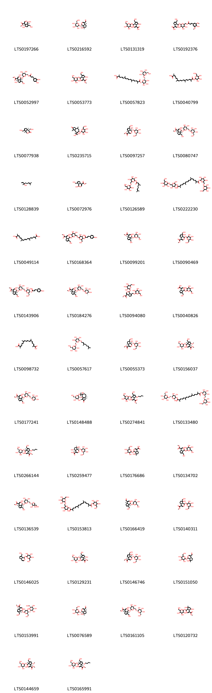{ width=100% }
    <figcaption>Hình ảnh cấu trúc hóa học của 100 hoạt chất thuộc nhóm Prenol lipids gồm ['methyl (1r,4as,5r,7as)-1,5-dihydroxy-7-(hydroxymethyl)-1h,4ah,5h,7ah-cyclopenta[c]pyran-4-carboxylate (LTS0197266)', '(1s,4as,7s,7as)-7-hydroxy-7-methyl-1-{[(2s,3r,4s,5s,6r)-3,4,5-trihydroxy-6-(hydroxymethyl)oxan-2-yl]oxy}-1h,4ah,5h,6h,7ah-cyclopenta[c]pyran-4-carbaldehyde (LTS0216592)', '5-hydroxy-7-(hydroxymethyl)-1-{[3,4,5-trihydroxy-6-(hydroxymethyl)oxan-2-yl]oxy}-1h,4ah,5h,7ah-cyclopenta[c]pyran-4-carboxylic acid (LTS0131319)', '7-(hydroxymethyl)-1-{[3,4,5-trihydroxy-6-({[3-(4-hydroxy-3,5-dimethoxyphenyl)prop-2-enoyl]oxy}methyl)oxan-2-yl]oxy}-1h,4ah,5h,7ah-cyclopenta[c]pyran-4-carboxylic acid (LTS0192376)', 'methyl (1s,4as,5s,7as)-1-{[(2s,3r,4s,5s,6r)-6-({[(2e)-3-(3,4-dihydroxyphenyl)prop-2-enoyl]oxy}methyl)-3,4,5-trihydroxyoxan-2-yl]oxy}-5-hydroxy-7-(hydroxymethyl)-1h,4ah,5h,7ah-cyclopenta[c]pyran-4-carboxylate (LTS0052997)', 'methyl 5-hydroxy-7-(hydroxymethyl)-1-{[3,4,5-trihydroxy-6-(hydroxymethyl)oxan-2-yl]oxy}-1h,4ah,5h,7ah-cyclopenta[c]pyran-4-carboxylate (LTS0053773)', 'β-d-gentiobiosyl crocetin (LTS0057823)', '(8e,10e,12e,14e)-2,6,11,15-tetramethyl-16-oxo-16-{[3,4,5-trihydroxy-6-(hydroxymethyl)oxan-2-yl]oxy}hexadeca-2,4,6,8,10,12,14-heptaenoic acid (LTS0040799)', '(4s,4as,7as)-4,7-bis(hydroxymethyl)-1h,4h,4ah,5h,7ah-cyclopenta[c]pyran-3-one (LTS0077938)', '7-hydroxy-7-(2-hydroxypropan-2-yl)-1,4-dimethyl-6-{[3,4,5-trihydroxy-6-(hydroxymethyl)oxan-2-yl]oxy}-3,3a,4,5,6,8-hexahydroazulen-2-one (LTS0235715)', 'methyl (1s,4ar,7s,7as)-7-hydroxy-7-(hydroxymethyl)-1-{[(2s,3r,4s,5s,6r)-3,4,5-trihydroxy-6-(hydroxymethyl)oxan-2-yl]oxy}-1h,4ah,7ah-cyclopenta[c]pyran-4-carboxylate (LTS0097257)', 'genipin 1-gentiobioside (LTS0080747)', 'linalool, (+-)- (LTS0128839)', 'methyl 1-hydroxy-7-(hydroxymethyl)-1h,4ah,5h,7ah-cyclopenta[c]pyran-4-carboxylate (LTS0072976)', '3,4,5-trihydroxy-6-({[3,4,5-trihydroxy-6-(hydroxymethyl)oxan-2-yl]oxy}methyl)oxan-2-yl 3,7-dimethylocta-2,6-dienoate (LTS0126589)', '3,4,5-trihydroxy-6-({[3,4,5-trihydroxy-6-(hydroxymethyl)oxan-2-yl]oxy}methyl)oxan-2-yl 2,4,5-trihydroxy-6-({[3,4,5-trihydroxy-6-(hydroxymethyl)oxan-2-yl]oxy}methyl)oxan-3-yl (8e,10e,12e,14e)-2,6,11,15-tetramethylhexadeca-2,4,6,8,10,12,14-heptaenedioate (LTS0222230)', '(8e,10e,12e,14e)-2,6,11,15-tetramethylhexadeca-2,4,6,8,10,12,14-heptaenedioic acid (LTS0049114)', 'methyl 1-{[6-({[3,4-dihydroxy-6-(hydroxymethyl)-5-{[3-(4-hydroxyphenyl)prop-2-enoyl]oxy}oxan-2-yl]oxy}methyl)-3,4,5-trihydroxyoxan-2-yl]oxy}-7-(hydroxymethyl)-1h,4ah,5h,7ah-cyclopenta[c]pyran-4-carboxylate (LTS0168364)', 'geniposide (LTS0099201)', 'methyl 7-hydroxy-7-(hydroxymethyl)-1-{[3,4,5-trihydroxy-6-(hydroxymethyl)oxan-2-yl]oxy}-1h,4ah,7ah-cyclopenta[c]pyran-4-carboxylate (LTS0090469)', 'methyl (1s,4as,7as)-1-{[(2s,3r,4s,5s,6r)-6-({[(2r,3r,4r,5s,6r)-3,4-dihydroxy-6-(hydroxymethyl)-5-{[(2e)-3-(4-hydroxyphenyl)prop-2-enoyl]oxy}oxan-2-yl]oxy}methyl)-3,4,5-trihydroxyoxan-2-yl]oxy}-7-(hydroxymethyl)-1h,4ah,5h,7ah-cyclopenta[c]pyran-4-carboxylate (LTS0143906)', 'methyl (1s,4as,7as)-7-(hydroxymethyl)-1-{[(2s,3r,4s,5s,6r)-3,4,5-trihydroxy-6-({[(2r,3r,4r,5r,6s)-3,4,5-trihydroxy-6-methyloxan-2-yl]oxy}methyl)oxan-2-yl]oxy}-1h,4ah,5h,7ah-cyclopenta[c]pyran-4-carboxylate (LTS0184276)', 'methyl 1-{[3,4,5-trihydroxy-6-(hydroxymethyl)oxan-2-yl]oxy}-7-({[3,4,5-trihydroxy-6-(hydroxymethyl)oxan-2-yl]oxy}methyl)-1h,4ah,5h,7ah-cyclopenta[c]pyran-4-carboxylate (LTS0094080)', '7-(hydroxymethyl)-1-{[3,4,5-trihydroxy-6-(hydroxymethyl)oxan-2-yl]oxy}-1h,4ah,5h,7ah-cyclopenta[c]pyran-4-carboxylic acid (LTS0040826)', '(12e,14e)-2,6,11,15-tetramethylhexadeca-2,4,6,8,10,12,14-heptaenedioic acid (LTS0098732)', '(2r,3r,4s,5s,6r)-2-{[(2e)-3,7-dimethylocta-2,6-dien-1-yl]oxy}-6-({[(2r,3r,4s,5s,6r)-3,4,5-trihydroxy-6-(hydroxymethyl)oxan-2-yl]oxy}methyl)oxane-3,4,5-triol (LTS0057617)', 'methyl (1s,4as,7s,7as)-7-hydroxy-7-(hydroxymethyl)-1-{[(2s,3r,4s,5s,6r)-3,4,5-trihydroxy-6-(hydroxymethyl)oxan-2-yl]oxy}-1h,4ah,5h,6h,7ah-cyclopenta[c]pyran-4-carboxylate (LTS0055373)', 'methyl (1s,4as,5r,7as)-7-(hydroxymethyl)-5-methoxy-1-{[(2s,3r,4s,5s,6r)-3,4,5-trihydroxy-6-(hydroxymethyl)oxan-2-yl]oxy}-1h,4ah,5h,7ah-cyclopenta[c]pyran-4-carboxylate (LTS0156037)', 'methyl (1s,4as,7as)-7-(hydroxymethyl)-1-{[(2s,3r,4s,5s,6r)-3,4,5-trihydroxy-6-({[(2r,3r,4s,5r)-3,4,5-trihydroxyoxan-2-yl]oxy}methyl)oxan-2-yl]oxy}-1h,4ah,5h,7ah-cyclopenta[c]pyran-4-carboxylate (LTS0177241)', '(3ar,4s,7s)-7-hydroxy-1,4-dimethyl-7-(2-{[(2s,3r,4s,5s,6r)-3,4,5-trihydroxy-6-(hydroxymethyl)oxan-2-yl]oxy}propan-2-yl)-3,3a,4,5,6,8-hexahydroazulen-2-one (LTS0148488)', 'methyl 5-butoxy-7-(hydroxymethyl)-1-{[3,4,5-trihydroxy-6-(hydroxymethyl)oxan-2-yl]oxy}-1h,4ah,5h,7ah-cyclopenta[c]pyran-4-carboxylate (LTS0274841)', '(2s,3r,4s,5s,6r)-3,4,5-trihydroxy-6-({[(2r,3r,4s,5s,6r)-3,4,5-trihydroxy-6-(hydroxymethyl)oxan-2-yl]oxy}methyl)oxan-2-yl (2r,3r,4s,5s,6r)-2,4,5-trihydroxy-6-({[(2r,3r,4s,5s,6r)-3,4,5-trihydroxy-6-(hydroxymethyl)oxan-2-yl]oxy}methyl)oxan-3-yl (2e,4e,6e,8e,10e,12e,14e)-2,6,11,15-tetramethylhexadeca-2,4,6,8,10,12,14-heptaenedioate (LTS0133480)', 'methyl (1s,4as,5r,7as)-5-butoxy-7-(hydroxymethyl)-1-{[(2s,3r,4s,5s,6r)-3,4,5-trihydroxy-6-(hydroxymethyl)oxan-2-yl]oxy}-1h,4ah,5h,7ah-cyclopenta[c]pyran-4-carboxylate (LTS0266144)', 'shanzhiside (LTS0259477)', '7-hydroxy-7-methyl-1-{[3,4,5-trihydroxy-6-(hydroxymethyl)oxan-2-yl]oxy}-1h,4ah,5h,6h,7ah-cyclopenta[c]pyran-4-carboxylic acid (LTS0176686)', 'methyl 7-(hydroxymethyl)-1-{[3,4,5-trihydroxy-6-(hydroxymethyl)oxan-2-yl]oxy}-1h,4ah,5h,7ah-cyclopenta[c]pyran-4-carboxylate (LTS0134702)', 'methyl (1s,4as,7as)-1-{[(2s,3r,4s,5s,6r)-6-({[(2r,3r,4r)-3,4-dihydroxy-4-(hydroxymethyl)oxolan-2-yl]oxy}methyl)-3,4,5-trihydroxyoxan-2-yl]oxy}-7-(hydroxymethyl)-1h,4ah,5h,7ah-cyclopenta[c]pyran-4-carboxylate (LTS0136539)', '3,4,5-trihydroxy-6-(hydroxymethyl)oxan-2-yl 3,4,5-trihydroxy-6-({[3,4,5-trihydroxy-6-(hydroxymethyl)oxan-2-yl]oxy}methyl)oxan-2-yl (8e,10e,12e,14e)-2,6,11,15-tetramethylhexadeca-2,4,6,8,10,12,14-heptaenedioate (LTS0153813)', 'tarennoside (LTS0166419)', 'methyl 7-hydroxy-7-(hydroxymethyl)-1-{[3,4,5-trihydroxy-6-(hydroxymethyl)oxan-2-yl]oxy}-1h,4ah,5h,6h,7ah-cyclopenta[c]pyran-4-carboxylate (LTS0140311)', '2-(hydroxymethyl)-6-{[7-(hydroxymethyl)-1h,4ah,5h,7ah-cyclopenta[c]pyran-1-yl]oxy}oxane-3,4,5-triol (LTS0146025)', 'scandoside methyl ester (LTS0129231)', 'gardenoside (LTS0146746)', '7-hydroxy-7-methyl-1-{[3,4,5-trihydroxy-6-(hydroxymethyl)oxan-2-yl]oxy}-1h,4ah,5h,6h,7ah-cyclopenta[c]pyran-4-carbaldehyde (LTS0151050)', 'methyl (1s,4as,7as)-1-{[(2s,3r,4r,5s,6r)-3,4-dihydroxy-6-(hydroxymethyl)-5-{[(2s,3r,4s,5s,6r)-3,4,5-trihydroxy-6-(hydroxymethyl)oxan-2-yl]oxy}oxan-2-yl]oxy}-7-(hydroxymethyl)-1h,4ah,5h,7ah-cyclopenta[c]pyran-4-carboxylate (LTS0153991)', '(1s,4as,7s,7as)-7-hydroxy-7-methyl-1-{[(2s,3s,4s,5s,6r)-3,4,5-trihydroxy-6-(hydroxymethyl)oxan-2-yl]oxy}-1h,4ah,5h,6h,7ah-cyclopenta[c]pyran-4-carbaldehyde (LTS0076589)', 'methyl (1s,4as,7as)-7-(hydroxymethyl)-1-{[(2s,3r,4s,5s,6r)-3,4,5-trihydroxy-6-({[(2s,3r,4s,5s,6r)-3,4,5-trihydroxy-6-(hydroxymethyl)oxan-2-yl]oxy}methyl)oxan-2-yl]oxy}-1h,4ah,5h,7ah-cyclopenta[c]pyran-4-carboxylate (LTS0161105)', 'methyl 5,7-dihydroxy-7-methyl-1-{[3,4,5-trihydroxy-6-(hydroxymethyl)oxan-2-yl]oxy}-1h,4ah,5h,6h,7ah-cyclopenta[c]pyran-4-carboxylate (LTS0120732)', 'methyl (1s,4as,5s,7as)-7-(hydroxymethyl)-5-methoxy-1-{[(2s,3r,4s,5s,6r)-3,4,5-trihydroxy-6-(hydroxymethyl)oxan-2-yl]oxy}-1h,4ah,5h,7ah-cyclopenta[c]pyran-4-carboxylate (LTS0144659)', 'methyl (1s,4as,5s,7as)-5-butoxy-7-(hydroxymethyl)-1-{[(2s,3r,4s,5s,6r)-3,4,5-trihydroxy-6-(hydroxymethyl)oxan-2-yl]oxy}-1h,4ah,5h,7ah-cyclopenta[c]pyran-4-carboxylate (LTS0165991)', '(2s,3r,4s,5s,6r)-3,4,5-trihydroxy-6-({[(2r,3r,4s,5s,6r)-3,4,5-trihydroxy-6-(hydroxymethyl)oxan-2-yl]oxy}methyl)oxan-2-yl (2e)-3,7-dimethylocta-2,6-dienoate (LTS0157118)', 'methyl (1s,4as,7r,7as)-7-(hydroxymethyl)-1-{[(2s,3r,4s,5s,6r)-3,4,5-trihydroxy-6-(hydroxymethyl)oxan-2-yl]oxy}-1h,4ah,7h,7ah-cyclopenta[c]pyran-4-carboxylate (LTS0237618)', 'methyl (1s,4as,7as)-1-{[(2s,3r,4s,5s,6r)-6-[(acetyloxy)methyl]-3,4,5-trihydroxyoxan-2-yl]oxy}-7-(hydroxymethyl)-1h,4ah,5h,7ah-cyclopenta[c]pyran-4-carboxylate (LTS0168996)', '(2z,4e,6z,8e,10e,12e,14z)-2,6,11,15-tetramethylhexadeca-2,4,6,8,10,12,14-heptaenedioic acid (LTS0089142)', 'methyl (1s,4as,7as)-1-{[(2s,3r,4s,5s,6r)-3,4,5-trihydroxy-6-(hydroxymethyl)oxan-2-yl]oxy}-7-({[(2r,3r,4s,5s,6r)-3,4,5-trihydroxy-6-(hydroxymethyl)oxan-2-yl]oxy}methyl)-1h,4ah,5h,7ah-cyclopenta[c]pyran-4-carboxylate (LTS0249288)', 'borneol (LTS0264960)', 'β-d-glucosyl crocetin (LTS0224737)', 'crocetin (LTS0129423)', '(2s,3r,4s,5s,6r)-3,4,5-trihydroxy-6-({[(2s,3r,4s,5r)-3,4,5-trihydroxyoxan-2-yl]oxy}methyl)oxan-2-yl (2e)-3,7-dimethylocta-2,6-dienoate (LTS0229072)', 'geniposidic acid (LTS0051067)', '5,7-dihydroxy-7-methyl-1-{[3,4,5-trihydroxy-6-(hydroxymethyl)oxan-2-yl]oxy}-1h,4ah,5h,6h,7ah-cyclopenta[c]pyran-4-carboxylic acid (LTS0045808)', '4,7-bis(hydroxymethyl)-1h,4h,4ah,5h,7ah-cyclopenta[c]pyran-3-one (LTS0263132)', 'methyl (1s,4as,7as)-7-[(acetyloxy)methyl]-1-{[(2s,3r,4s,5s,6r)-3,4,5-trihydroxy-6-(hydroxymethyl)oxan-2-yl]oxy}-1h,4ah,5h,7ah-cyclopenta[c]pyran-4-carboxylate (LTS0213974)', 'methyl 1-{[6-({[3-(3,4-dihydroxyphenyl)prop-2-enoyl]oxy}methyl)-3,4,5-trihydroxyoxan-2-yl]oxy}-5-hydroxy-7-(hydroxymethyl)-1h,4ah,5h,7ah-cyclopenta[c]pyran-4-carboxylate (LTS0037422)', 'methyl 7-(hydroxymethyl)-1-{[3,4,5-trihydroxy-6-({[3,4,5-trihydroxy-6-({[3-(4-hydroxyphenyl)prop-2-enoyl]oxy}methyl)oxan-2-yl]oxy}methyl)oxan-2-yl]oxy}-1h,4ah,5h,7ah-cyclopenta[c]pyran-4-carboxylate (LTS0260372)', '3,4,5-trihydroxy-6-{[(3,4,5-trihydroxyoxan-2-yl)oxy]methyl}oxan-2-yl 3,7-dimethylocta-2,6-dienoate (LTS0206791)', 'methyl (4ar,7s,7as)-7-hydroxy-7-(hydroxymethyl)-1-{[3,4,5-trihydroxy-6-(hydroxymethyl)oxan-2-yl]oxy}-1h,4ah,7ah-cyclopenta[c]pyran-4-carboxylate (LTS0094499)', 'methyl (1s,4as,5r,7s,7as)-5,7-dihydroxy-7-methyl-1-{[(2s,3r,4s,5s,6r)-3,4,5-trihydroxy-6-(hydroxymethyl)oxan-2-yl]oxy}-1h,4ah,5h,6h,7ah-cyclopenta[c]pyran-4-carboxylate (LTS0216993)', 'methyl (1s,4as,5s,7as)-5-hydroxy-7-(hydroxymethyl)-1-{[(2s,3r,4s,5s,6r)-3,4,5-trihydroxy-6-(hydroxymethyl)oxan-2-yl]oxy}-1h,4ah,5h,7ah-cyclopenta[c]pyran-4-carboxylate (LTS0216605)', '(8e,10e,12e,14e)-2,6,11,15-tetramethyl-16-oxo-16-{[3,4,5-trihydroxy-6-({[3,4,5-trihydroxy-6-(hydroxymethyl)oxan-2-yl]oxy}methyl)oxan-2-yl]oxy}hexadeca-2,4,6,8,10,12,14-heptaenoic acid (LTS0096656)', 'bis[3,4,5-trihydroxy-6-({[3,4,5-trihydroxy-6-(hydroxymethyl)oxan-2-yl]oxy}methyl)oxan-2-yl] (8e,10e,12e,14e)-2,6,11,15-tetramethylhexadeca-2,4,6,8,10,12,14-heptaenedioate (LTS0214948)', 'methyl (1s,4as,7s,7as)-7-hydroxy-7-(hydroxymethyl)-1-{[(2s,3r,4s,5s,6r)-3,4,5-trihydroxy-6-(hydroxymethyl)oxan-2-yl]oxy}-1h,4ah,7ah-cyclopenta[c]pyran-4-carboxylate (LTS0264346)', 'methyl 7-(hydroxymethyl)-1-{[3,4,5-trihydroxy-6-(hydroxymethyl)oxan-2-yl]oxy}-1h,4ah,7h,7ah-cyclopenta[c]pyran-4-carboxylate (LTS0263698)', 'methyl (1s,4as,7as)-7-(hydroxymethyl)-1-{[(2s,3r,4s,5s,6r)-3,4,5-trihydroxy-6-({[(2r,3r,4s,5s,6r)-3,4,5-trihydroxy-6-({[(2e)-3-(4-hydroxyphenyl)prop-2-enoyl]oxy}methyl)oxan-2-yl]oxy}methyl)oxan-2-yl]oxy}-1h,4ah,5h,7ah-cyclopenta[c]pyran-4-carboxylate (LTS0162213)', 'tricrocin (LTS0215875)', '(1s,4as,7as)-7-(hydroxymethyl)-1-{[(2s,3r,4s,5s,6r)-3,4,5-trihydroxy-6-({[(2e)-3-(4-hydroxy-3,5-dimethoxyphenyl)prop-2-enoyl]oxy}methyl)oxan-2-yl]oxy}-1h,4ah,5h,7ah-cyclopenta[c]pyran-4-carboxylic acid (LTS0185344)', 'bis[3,4,5-trihydroxy-6-({[3,4,5-trihydroxy-6-(hydroxymethyl)oxan-2-yl]oxy}methyl)oxan-2-yl] 2,6,11,15-tetramethylhexadeca-2,4,6,8,10,12,14-heptaenedioate (LTS0221794)', '(2s,3r,4s,5s,6r)-2-{[(1s,4ar,7as)-7-(hydroxymethyl)-1h,4ah,5h,7ah-cyclopenta[c]pyran-1-yl]oxy}-6-(hydroxymethyl)oxane-3,4,5-triol (LTS0180730)', 'methyl (4ar,7as)-7-(hydroxymethyl)-1-{[3,4,5-trihydroxy-6-(hydroxymethyl)oxan-2-yl]oxy}-1h,4ah,5h,7ah-cyclopenta[c]pyran-4-carboxylate (LTS0021217)', 'methyl (1s,4as,7as)-1-{[(2s,3r,4s,5s,6r)-6-({[(2r,3r,4s,5s,6r)-6-({[(2e)-3-(3,4-dihydroxyphenyl)prop-2-enoyl]oxy}methyl)-3,4,5-trihydroxyoxan-2-yl]oxy}methyl)-3,4,5-trihydroxyoxan-2-yl]oxy}-7-(hydroxymethyl)-1h,4ah,5h,7ah-cyclopenta[c]pyran-4-carboxylate (LTS0033793)', '(3ar,4s,7r)-1,4-dimethyl-7-(2-{[(2s,3r,4s,5s,6r)-3,4,5-trihydroxy-6-(hydroxymethyl)oxan-2-yl]oxy}propan-2-yl)-3a,4,5,6,7,8-hexahydro-3h-azulen-2-one (LTS0174269)', 'methyl (1s,4as,7r,7as)-7-(hydroxymethyl)-7-methoxy-1-{[(2s,3r,4s,5s,6r)-3,4,5-trihydroxy-6-(hydroxymethyl)oxan-2-yl]oxy}-1h,4ah,7ah-cyclopenta[c]pyran-4-carboxylate (LTS0252937)', '(2s,4r)-1,7,7-trimethylbicyclo[2.2.1]heptan-2-ol (LTS0010050)', '(1s,4as,7s,7as)-7-hydroxy-7-methyl-1-{[(2r,3s,4r,5s,6r)-3,4,5-trihydroxy-6-(hydroxymethyl)oxan-2-yl]oxy}-1h,4ah,5h,6h,7ah-cyclopenta[c]pyran-4-carboxylic acid (LTS0264652)', 'methyl 7-(hydroxymethyl)-1-{[3,4,5-trihydroxy-6-({[3,4,5-trihydroxy-6-(hydroxymethyl)oxan-2-yl]oxy}methyl)oxan-2-yl]oxy}-1h,4ah,5h,7ah-cyclopenta[c]pyran-4-carboxylate (LTS0004501)', '(2r,3s,4s,5r,6r)-2-({[(2s,3r,4s,5r)-3,4,5-trihydroxyoxan-2-yl]oxy}methyl)-6-{[(1s,2s,4s)-1,7,7-trimethylbicyclo[2.2.1]heptan-2-yl]oxy}oxane-3,4,5-triol (LTS0004815)', 'deacetylasperulosidic acid (LTS0052630)', 'bis[(2s,3r,4s,5s,6r)-3,4,5-trihydroxy-6-({[(2r,3r,4s,5s,6r)-3,4,5-trihydroxy-6-(hydroxymethyl)oxan-2-yl]oxy}methyl)oxan-2-yl] (2e,4e,6z,8e,10e,12e,14e)-2,6,11,15-tetramethylhexadeca-2,4,6,8,10,12,14-heptaenedioate (LTS0063712)', 'methyl 7-(hydroxymethyl)-7-methoxy-1-{[3,4,5-trihydroxy-6-(hydroxymethyl)oxan-2-yl]oxy}-1h,4ah,7ah-cyclopenta[c]pyran-4-carboxylate (LTS0005690)', '2-[(3,7-dimethylocta-2,6-dien-1-yl)oxy]-6-({[3,4,5-trihydroxy-6-(hydroxymethyl)oxan-2-yl]oxy}methyl)oxane-3,4,5-triol (LTS0007202)', '4-{[(1s,4as,7as)-4-(methoxycarbonyl)-1-{[(2s,3r,4s,5s,6r)-3,4,5-trihydroxy-6-(hydroxymethyl)oxan-2-yl]oxy}-1h,4ah,5h,7ah-cyclopenta[c]pyran-7-yl]methoxy}-4-oxobutanoic acid (LTS0026009)', '(1s,4as,7s,7as)-7-hydroxy-7-methyl-1-{[(2s,3r,4s,5s,6r)-3,4,5-trihydroxy-6-(hydroxymethyl)oxan-2-yl]oxy}-1h,4ah,5h,6h,7ah-cyclopenta[c]pyran-4-carboxylic acid (LTS0016590)', '2-{[(3,4,5-trihydroxyoxan-2-yl)oxy]methyl}-6-({1,7,7-trimethylbicyclo[2.2.1]heptan-2-yl}oxy)oxane-3,4,5-triol (LTS0257711)', 'genipin (LTS0216206)', 'methyl (1s,4as,5s,7as)-5-butoxy-1-{[(2s,3r,4s,5r,6r)-3,5-dihydroxy-6-(hydroxymethyl)-4-{[(2s,3r,4s,5s,6r)-3,4,5-trihydroxy-6-({[(2z)-3-(4-hydroxyphenyl)prop-2-enoyl]oxy}methyl)oxan-2-yl]oxy}oxan-2-yl]oxy}-7-(hydroxymethyl)-1h,4ah,5h,7ah-cyclopenta[c]pyran-4-carboxylate (LTS0033908)', 'methyl (1s,4ar,7r,7as)-7-hydroxy-7-(hydroxymethyl)-1-{[(2s,3r,4s,5s,6r)-3,4,5-trihydroxy-6-(hydroxymethyl)oxan-2-yl]oxy}-1h,4ah,7ah-cyclopenta[c]pyran-4-carboxylate (LTS0073973)', '(3ar,4r,6s,7r)-7-hydroxy-7-(2-hydroxypropan-2-yl)-1,4-dimethyl-6-{[(2s,3r,4s,5s,6r)-3,4,5-trihydroxy-6-(hydroxymethyl)oxan-2-yl]oxy}-3,3a,4,5,6,8-hexahydroazulen-2-one (LTS0100810)', 'methyl 5-butoxy-1-{[3,5-dihydroxy-6-(hydroxymethyl)-4-{[3,4,5-trihydroxy-6-({[3-(4-hydroxyphenyl)prop-2-enoyl]oxy}methyl)oxan-2-yl]oxy}oxan-2-yl]oxy}-7-(hydroxymethyl)-1h,4ah,5h,7ah-cyclopenta[c]pyran-4-carboxylate (LTS0251841)', 'methyl 7-(hydroxymethyl)-5-methoxy-1-{[3,4,5-trihydroxy-6-(hydroxymethyl)oxan-2-yl]oxy}-1h,4ah,5h,7ah-cyclopenta[c]pyran-4-carboxylate (LTS0253023)', 'crocin (LTS0243166)'].</figcaption>
</figure>
#### Nhóm Pyridines and derivatives
<figure markdown="span">
    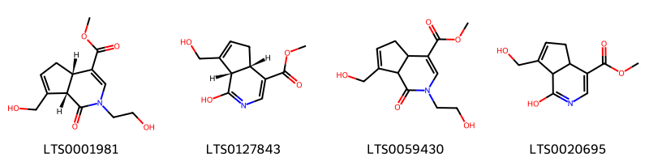{ width=100% }
    <figcaption>Hình ảnh cấu trúc hóa học của 4 hoạt chất thuộc nhóm Pyridines and derivatives gồm ['methyl (4as,7as)-2-(2-hydroxyethyl)-7-(hydroxymethyl)-1-oxo-4ah,5h,7ah-cyclopenta[c]pyridine-4-carboxylate (LTS0001981)', 'methyl (4as,7as)-1-hydroxy-7-(hydroxymethyl)-4ah,5h,7ah-cyclopenta[c]pyridine-4-carboxylate (LTS0127843)', 'methyl 2-(2-hydroxyethyl)-7-(hydroxymethyl)-1-oxo-4ah,5h,7ah-cyclopenta[c]pyridine-4-carboxylate (LTS0059430)', 'methyl 1-hydroxy-7-(hydroxymethyl)-4ah,5h,7ah-cyclopenta[c]pyridine-4-carboxylate (LTS0020695)'].</figcaption>
</figure>
#### Nhóm Saturated hydrocarbons
<figure markdown="span">
    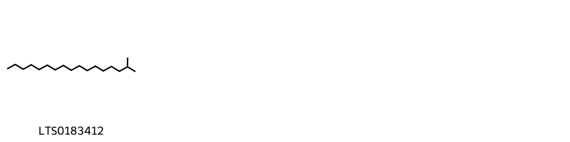{ width=100% }
    <figcaption>Hình ảnh cấu trúc hóa học của 1 hoạt chất thuộc nhóm Saturated hydrocarbons gồm ['heptadecane, 2-methyl- (LTS0183412)'].</figcaption>
</figure>
#### Nhóm Steroids and steroid derivatives
<figure markdown="span">
    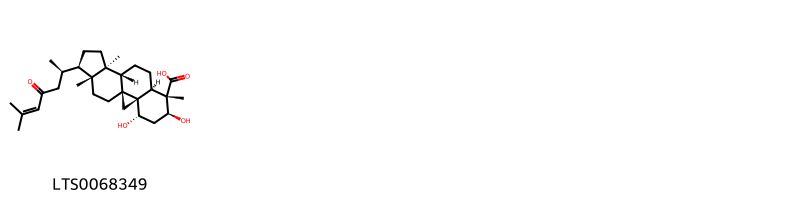{ width=100% }
    <figcaption>Hình ảnh cấu trúc hóa học của 1 hoạt chất thuộc nhóm Steroids and steroid derivatives gồm ['(1s,3s,4s,6s,7s,8r,11s,12s,15r,16r)-4,6-dihydroxy-7,12,16-trimethyl-15-[(2r)-6-methyl-4-oxohept-5-en-2-yl]pentacyclo[9.7.0.0¹,³.0³,⁸.0¹²,¹⁶]octadecane-7-carboxylic acid (LTS0068349)'].</figcaption>
</figure>
#### Nhóm Tannins
<figure markdown="span">
    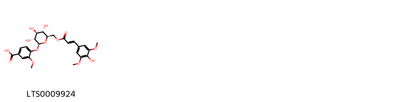{ width=100% }
    <figcaption>Hình ảnh cấu trúc hóa học của 1 hoạt chất thuộc nhóm Tannins gồm ['3-methoxy-4-{[(2s,3r,4s,5s,6r)-3,4,5-trihydroxy-6-({[(2e)-3-(4-hydroxy-3,5-dimethoxyphenyl)prop-2-enoyl]oxy}methyl)oxan-2-yl]oxy}benzoic acid (LTS0009924)'].</figcaption>
</figure>

---

### Dược dân tộc học

Danh sách các quốc gia có sử dụng *Gardenia jasminoides* trong điều trị các bệnh. 

| Country   | Disease                                                       | Bệnh                                                                                                                                                                                                |
|:----------|:--------------------------------------------------------------|:----------------------------------------------------------------------------------------------------------------------------------------------------------------------------------------------------|
| China     | Alexiteric, Refrigerant                                       | MYMEMORY WARNING: YOU USED ALL AVAILABLE FREE TRANSLATIONS FOR TODAY. NEXT AVAILABLE IN  10 HOURS 03 MINUTES 08 SECONDS VISIT HTTPS://MYMEMORY.TRANSLATED.NET/DOC/USAGELIMITS.PHP TO TRANSLATE MORE |
| India     | Antiseptic, Diuretic, Vermifuge, Cathartic, Emetic, Stimulant | MYMEMORY WARNING: YOU USED ALL AVAILABLE FREE TRANSLATIONS FOR TODAY. NEXT AVAILABLE IN  10 HOURS 03 MINUTES 05 SECONDS VISIT HTTPS://MYMEMORY.TRANSLATED.NET/DOC/USAGELIMITS.PHP TO TRANSLATE MORE |
| Japan*    | Antiphlogistic, Antiphlogistic, Cholagogue, nan, nan          | MYMEMORY WARNING: YOU USED ALL AVAILABLE FREE TRANSLATIONS FOR TODAY. NEXT AVAILABLE IN  10 HOURS 03 MINUTES 02 SECONDS VISIT HTTPS://MYMEMORY.TRANSLATED.NET/DOC/USAGELIMITS.PHP TO TRANSLATE MORE |

---

---
## Gardenia jovistonantis
### Thông tin về thực vật

!!! info "Phân loại thực vật của *Gardenia ternifolia* từ GIBF:"
    - **Kingdom:** Plantae
    - **Phylum:** Tracheophyta
    - **Order:** Gentianales
    - **Family:** Rubiaceae
    - **Genus:** Gardenia
    - **Species:** *Gardenia ternifolia*

 

| Label (VI)   | Label (EN)   | Scientific Name      | Descriptions (VI)   | Descriptions (EN)                    | Also Known As (VI)                                                 | Also Known As (EN)   |
|:-------------|:-------------|:---------------------|:--------------------|:-------------------------------------|:-------------------------------------------------------------------|:---------------------|
| N/A          | N/A          | Gardenia jasminoides |                     | species of evergreen flowering plant | ['Thuỷ hoàng chi', 'Mác làng cương', 'Gardenia augusta', 'Chi tử'] | ['']                 |

#### Phân bố trên thế giới

**Từ CSDL GIBF** nan, Uganda, Kenya, Congo, Democratic Republic of the, Senegal, Zambia, Burundi, Côte d’Ivoire, Mozambique, Tanzania, United Republic of, South Sudan, Angola

#### Phân bố tại Việt Nam

**Từ CSDL GIBF**: Không có ghi nhận ở Việt Nam

---
### Thành phần hóa học
        
- Theo cơ sở dữ liệu lotus: Từ loài *Gardenia ternifolia* đã phân lập và xác định được Chưa có hoạt chất nào được phân lập. hoạt chất thuộc về các nhóm Không có hoạt chất nào được phân lập. 

Không có hình ảnh nào được tạo ra

---

### Dược dân tộc học

Danh sách các quốc gia có sử dụng *Gardenia ternifolia* trong điều trị các bệnh. 

| Country   | Disease   | Bệnh                                                                                                                                                                                                |
|:----------|:----------|:----------------------------------------------------------------------------------------------------------------------------------------------------------------------------------------------------|
| Elsewhere | Piscicide | MYMEMORY WARNING: YOU USED ALL AVAILABLE FREE TRANSLATIONS FOR TODAY. NEXT AVAILABLE IN  10 HOURS 01 MINUTES 58 SECONDS VISIT HTTPS://MYMEMORY.TRANSLATED.NET/DOC/USAGELIMITS.PHP TO TRANSLATE MORE |

---

---
## Gardenia lucida
### Thông tin về thực vật

!!! info "Phân loại thực vật của *Gardenia resinifera* từ GIBF:"
    - **Kingdom:** Plantae
    - **Phylum:** Tracheophyta
    - **Order:** Gentianales
    - **Family:** Rubiaceae
    - **Genus:** Gardenia
    - **Species:** *Gardenia resinifera*

 

| Label (VI)   | Label (EN)   | Scientific Name   | Descriptions (VI)   | Descriptions (EN)   | Also Known As (VI)   | Also Known As (EN)   |
|:-------------|:-------------|:------------------|:--------------------|:--------------------|:---------------------|:---------------------|
| N/A          | N/A          | Gardenia lucida   |                     | species of plant    | ['']                 | ['']                 |

#### Phân bố trên thế giới

**Từ CSDL GIBF** nan, Sri Lanka, Brazil, United States of America, Philippines, Myanmar, India, unknown or invalid

#### Phân bố tại Việt Nam

**Từ CSDL GIBF**: Không có ghi nhận ở Việt Nam

---
### Thành phần hóa học
        
- Theo cơ sở dữ liệu lotus: Từ loài *Gardenia resinifera* đã phân lập và xác định được Chưa có hoạt chất nào được phân lập. hoạt chất thuộc về các nhóm Không có hoạt chất nào được phân lập. 

Không có hình ảnh nào được tạo ra

---

### Dược dân tộc học

Danh sách các quốc gia có sử dụng *Gardenia resinifera* trong điều trị các bệnh. 

| Country   | Disease         | Bệnh                                                                                                                                                                                                |
|:----------|:----------------|:----------------------------------------------------------------------------------------------------------------------------------------------------------------------------------------------------|
| Elsewhere | Insecticide     | MYMEMORY WARNING: YOU USED ALL AVAILABLE FREE TRANSLATIONS FOR TODAY. NEXT AVAILABLE IN  10 HOURS 01 MINUTES 32 SECONDS VISIT HTTPS://MYMEMORY.TRANSLATED.NET/DOC/USAGELIMITS.PHP TO TRANSLATE MORE |
| India     | Antiseptic, nan | MYMEMORY WARNING: YOU USED ALL AVAILABLE FREE TRANSLATIONS FOR TODAY. NEXT AVAILABLE IN  10 HOURS 01 MINUTES 29 SECONDS VISIT HTTPS://MYMEMORY.TRANSLATED.NET/DOC/USAGELIMITS.PHP TO TRANSLATE MORE |

---

---
## Gardenia thunbergia
### Thông tin về thực vật

!!! info "Phân loại thực vật của *Gardenia thunbergia* từ GIBF:"
    - **Kingdom:** Plantae
    - **Phylum:** Tracheophyta
    - **Order:** Gentianales
    - **Family:** Rubiaceae
    - **Genus:** Gardenia
    - **Species:** *Gardenia thunbergia*

 

| Label (VI)   | Label (EN)   | Scientific Name     | Descriptions (VI)   | Descriptions (EN)    | Also Known As (VI)   | Also Known As (EN)   |
|:-------------|:-------------|:--------------------|:--------------------|:---------------------|:---------------------|:---------------------|
| N/A          | N/A          | Gardenia thunbergia |                     | African tree species | ['']                 | ['Forest gardenia']  |

#### Phân bố trên thế giới

**Từ CSDL GIBF** nan, Brazil, Senegal, Botswana, New Zealand, Zimbabwe, Tanzania, United Republic of, French Polynesia, Spain, Puerto Rico, United States of America, Korea, Republic of, Cuba, Kenya, Eswatini, Belgium, Sudan, Cook Islands, South Africa, Australia

#### Phân bố tại Việt Nam

**Từ CSDL GIBF**: Không có ghi nhận ở Việt Nam

---
### Thành phần hóa học
        
- Theo cơ sở dữ liệu lotus: Từ loài *Gardenia thunbergia* đã phân lập và xác định được Chưa có hoạt chất nào được phân lập. hoạt chất thuộc về các nhóm Không có hoạt chất nào được phân lập. 

Không có hình ảnh nào được tạo ra

---

### Dược dân tộc học

Danh sách các quốc gia có sử dụng *Gardenia thunbergia* trong điều trị các bệnh. 

| Country   | Disease   | Bệnh                                                                                                                                                                                                |
|:----------|:----------|:----------------------------------------------------------------------------------------------------------------------------------------------------------------------------------------------------|
| Elsewhere | Soap      | MYMEMORY WARNING: YOU USED ALL AVAILABLE FREE TRANSLATIONS FOR TODAY. NEXT AVAILABLE IN  10 HOURS 01 MINUTES 09 SECONDS VISIT HTTPS://MYMEMORY.TRANSLATED.NET/DOC/USAGELIMITS.PHP TO TRANSLATE MORE |

---

# Chi Hymenodictyon

??? note "Danh sách các dược liệu thuộc chi"
    
	 - *Hymenodictyon excelsum*

---
## Hymenodictyon excelsum
### Thông tin về thực vật

!!! info "Phân loại thực vật của *Hymenodictyon orixense* từ GIBF:"
    - **Kingdom:** Plantae
    - **Phylum:** Tracheophyta
    - **Order:** Gentianales
    - **Family:** Rubiaceae
    - **Genus:** Hymenodictyon
    - **Species:** *Hymenodictyon orixense*

 

| Label (VI)   | Label (EN)   | Scientific Name        | Descriptions (VI)   | Descriptions (EN)   | Also Known As (VI)   | Also Known As (EN)   |
|:-------------|:-------------|:-----------------------|:--------------------|:--------------------|:---------------------|:---------------------|
| N/A          | N/A          | Hymenodictyon excelsum | loài thực vật       | species of plant    | ['']                 | ['']                 |

#### Phân bố trên thế giới

**Từ CSDL GIBF** nan, Viet Nam, Cambodia, Bangladesh, Indonesia, Nepal, China, Philippines, Malaysia, Myanmar, India, unknown or invalid, Trinidad and Tobago, Thailand

#### Phân bố tại Việt Nam

**Từ CSDL GIBF**: Không có ghi nhận ở Việt Nam

---
### Thành phần hóa học
        
- Theo cơ sở dữ liệu lotus: Từ loài *Hymenodictyon orixense* đã phân lập và xác định được 35 hoạt chất thuộc về các nhóm Fatty Acyls, Anthracenes, Coumarins and derivatives, Steroids and steroid derivatives, Glycerolipids, Prenol lipids. 

|    | chemicalTaxonomyClassyfireClass   |   smiles_count |
|---:|:----------------------------------|---------------:|
|  0 | Anthracenes                       |             10 |
|  1 | Coumarins and derivatives         |              2 |
|  2 | Fatty Acyls                       |              2 |
|  3 | Glycerolipids                     |              1 |
|  4 | Prenol lipids                     |             17 |
|  5 | Steroids and steroid derivatives  |              3 |

#### Nhóm Anthracenes
<figure markdown="span">
    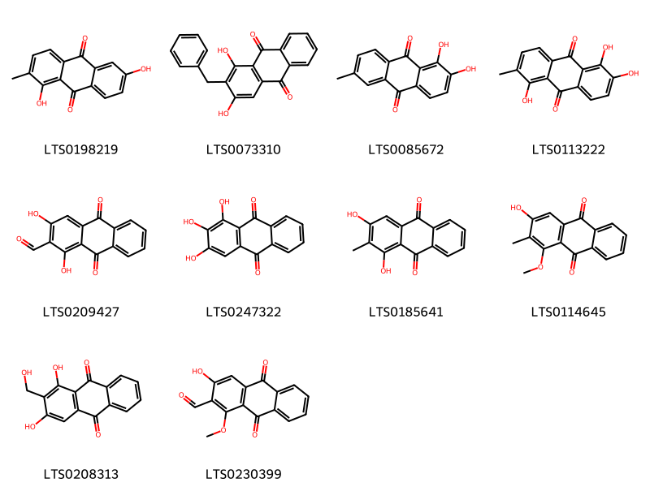{ width=100% }
    <figcaption>Hình ảnh cấu trúc hóa học của 10 hoạt chất thuộc nhóm Anthracenes gồm ['1,6-dihydroxy-2-methylanthracene-9,10-dione (LTS0198219)', '2-benzyl-1,3-dihydroxyanthracene-9,10-dione (LTS0073310)', '1,2-dihydroxy-6-methylanthracene-9,10-dione (LTS0085672)', 'morindone (LTS0113222)', '1,3-dihydroxy-9,10-dioxoanthracene-2-carbaldehyde (LTS0209427)', 'anthragallol (LTS0247322)', 'rubiadin (LTS0185641)', '3-hydroxy-1-methoxy-2-methylanthracene-9,10-dione (LTS0114645)', 'henine (LTS0208313)', 'damnacanthal (LTS0230399)'].</figcaption>
</figure>
#### Nhóm Coumarins and derivatives
<figure markdown="span">
    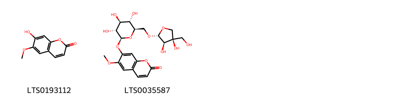{ width=100% }
    <figcaption>Hình ảnh cấu trúc hóa học của 2 hoạt chất thuộc nhóm Coumarins and derivatives gồm ['scopoletin (LTS0193112)', '7-{[(2s,3r,4s,5s,6r)-6-({[(2r,3r,4r)-3,4-dihydroxy-4-(hydroxymethyl)oxolan-2-yl]oxy}methyl)-3,4,5-trihydroxyoxan-2-yl]oxy}-6-methoxychromen-2-one (LTS0035587)'].</figcaption>
</figure>
#### Nhóm Fatty Acyls
<figure markdown="span">
    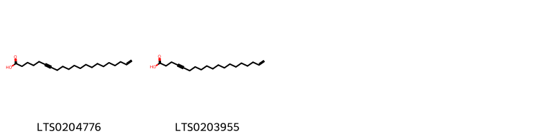{ width=100% }
    <figcaption>Hình ảnh cấu trúc hóa học của 2 hoạt chất thuộc nhóm Fatty Acyls gồm ['henicos-20-en-6-ynoic acid (LTS0204776)', 'nonadec-18-en-4-ynoic acid (LTS0203955)'].</figcaption>
</figure>
#### Nhóm Glycerolipids
<figure markdown="span">
    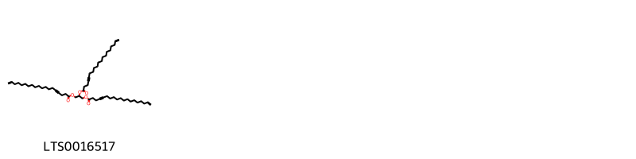{ width=100% }
    <figcaption>Hình ảnh cấu trúc hóa học của 1 hoạt chất thuộc nhóm Glycerolipids gồm ['1,3-bis(nonadec-18-en-4-ynoyloxy)propan-2-yl nonadec-18-en-4-ynoate (LTS0016517)'].</figcaption>
</figure>
#### Nhóm Prenol lipids
<figure markdown="span">
    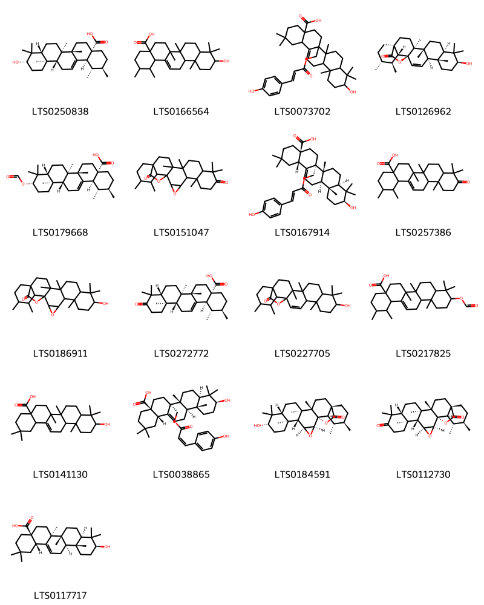{ width=100% }
    <figcaption>Hình ảnh cấu trúc hóa học của 17 hoạt chất thuộc nhóm Prenol lipids gồm ['ursolic acid (LTS0250838)', '10-hydroxy-1,2,6a,6b,9,9,12a-heptamethyl-2,3,4,5,6,7,8,8a,10,11,12,12b,13,14b-tetradecahydro-1h-picene-4a-carboxylic acid (LTS0166564)', '10-hydroxy-6a-({[3-(4-hydroxyphenyl)prop-2-enoyl]oxy}methyl)-2,2,6b,9,9,12a-hexamethyl-1,3,4,5,6,7,8,8a,10,11,12,12b,13,14b-tetradecahydropicene-4a-carboxylic acid (LTS0073702)', '(1s,4s,5r,8r,10s,13s,14r,17s,18r,19s,20r)-10-hydroxy-4,5,9,9,13,19,20-heptamethyl-24-oxahexacyclo[15.5.2.0¹,¹⁸.0⁴,¹⁷.0⁵,¹⁴.0⁸,¹³]tetracos-15-en-23-one (LTS0126962)', '(1s,2r,4as,6as,6br,8ar,10s,12ar,12br,14bs)-10-(formyloxy)-1,2,6a,6b,9,9,12a-heptamethyl-2,3,4,5,6,7,8,8a,10,11,12,12b,13,14b-tetradecahydro-1h-picene-4a-carboxylic acid (LTS0179668)', '6,10,10,14,15,21,22-heptamethyl-3,24-dioxaheptacyclo[16.5.2.0¹,¹⁵.0²,⁴.0⁵,¹⁴.0⁶,¹¹.0¹⁸,²³]pentacosane-9,25-dione (LTS0151047)', '(4as,6ar,6br,8ar,10s,12ar,12br,14bs)-10-hydroxy-6a-({[(2e)-3-(4-hydroxyphenyl)prop-2-enoyl]oxy}methyl)-2,2,6b,9,9,12a-hexamethyl-1,3,4,5,6,7,8,8a,10,11,12,12b,13,14b-tetradecahydropicene-4a-carboxylic acid (LTS0167914)', '1,2,6a,6b,9,9,12a-heptamethyl-10-oxo-1,2,3,4,5,6,7,8,8a,11,12,12b,13,14b-tetradecahydropicene-4a-carboxylic acid (LTS0257386)', '9-hydroxy-6,10,10,14,15,21,22-heptamethyl-3,24-dioxaheptacyclo[16.5.2.0¹,¹⁵.0²,⁴.0⁵,¹⁴.0⁶,¹¹.0¹⁸,²³]pentacosan-25-one (LTS0186911)', '(1s,2r,4as,6as,6br,8ar,12ar,12br,14bs)-1,2,6a,6b,9,9,12a-heptamethyl-10-oxo-1,2,3,4,5,6,7,8,8a,11,12,12b,13,14b-tetradecahydropicene-4a-carboxylic acid (LTS0272772)', '10-hydroxy-4,5,9,9,13,19,20-heptamethyl-24-oxahexacyclo[15.5.2.0¹,¹⁸.0⁴,¹⁷.0⁵,¹⁴.0⁸,¹³]tetracos-15-en-23-one (LTS0227705)', '10-(formyloxy)-1,2,6a,6b,9,9,12a-heptamethyl-2,3,4,5,6,7,8,8a,10,11,12,12b,13,14b-tetradecahydro-1h-picene-4a-carboxylic acid (LTS0217825)', 'oleanolic acid (LTS0141130)', '(4as,6ar,6br,8ar,10s,12ar,12br,14bs)-10-hydroxy-6a-({[(2z)-3-(4-hydroxyphenyl)prop-2-enoyl]oxy}methyl)-2,2,6b,9,9,12a-hexamethyl-1,3,4,5,6,7,8,8a,10,11,12,12b,13,14b-tetradecahydropicene-4a-carboxylic acid (LTS0038865)', '(1s,2s,4s,5r,6s,9s,11r,14r,15s,18s,21r,22s,23r)-9-hydroxy-6,10,10,14,15,21,22-heptamethyl-3,24-dioxaheptacyclo[16.5.2.0¹,¹⁵.0²,⁴.0⁵,¹⁴.0⁶,¹¹.0¹⁸,²³]pentacosan-25-one (LTS0184591)', '(1s,2s,4s,5r,6s,11r,14r,15s,18s,21r,22s,23r)-6,10,10,14,15,21,22-heptamethyl-3,24-dioxaheptacyclo[16.5.2.0¹,¹⁵.0²,⁴.0⁵,¹⁴.0⁶,¹¹.0¹⁸,²³]pentacosane-9,25-dione (LTS0112730)', 'oleanolic acid (LTS0117717)'].</figcaption>
</figure>
#### Nhóm Steroids and steroid derivatives
<figure markdown="span">
    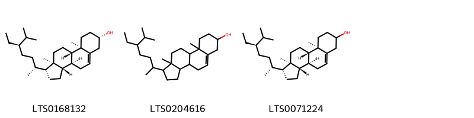{ width=100% }
    <figcaption>Hình ảnh cấu trúc hóa học của 3 hoạt chất thuộc nhóm Steroids and steroid derivatives gồm ['sitosterol (LTS0168132)', 'stigmast-5-en-3-ol, (3β)- (LTS0204616)', 'stigmast-5-en-3-ol (LTS0071224)'].</figcaption>
</figure>

---

### Dược dân tộc học

Danh sách các quốc gia có sử dụng *Hymenodictyon orixense* trong điều trị các bệnh. 

| Country   | Disease                                   | Bệnh                                                                                                                                                                                                |
|:----------|:------------------------------------------|:----------------------------------------------------------------------------------------------------------------------------------------------------------------------------------------------------|
| Elsewhere | Antiperiodic, nan, Stomachic, Carminative | MYMEMORY WARNING: YOU USED ALL AVAILABLE FREE TRANSLATIONS FOR TODAY. NEXT AVAILABLE IN  10 HOURS 00 MINUTES 36 SECONDS VISIT HTTPS://MYMEMORY.TRANSLATED.NET/DOC/USAGELIMITS.PHP TO TRANSLATE MORE |
| India     | Astringent                                | MYMEMORY WARNING: YOU USED ALL AVAILABLE FREE TRANSLATIONS FOR TODAY. NEXT AVAILABLE IN  10 HOURS 00 MINUTES 33 SECONDS VISIT HTTPS://MYMEMORY.TRANSLATED.NET/DOC/USAGELIMITS.PHP TO TRANSLATE MORE |

---

# Chi Schumanniophyton

??? note "Danh sách các dược liệu thuộc chi"
    
	 - *Schumanniophyton magnificum*

---
## Schumanniophyton magnificum
### Thông tin về thực vật

!!! info "Phân loại thực vật của *Schumanniophyton magnificum* từ GIBF:"
    - **Kingdom:** Plantae
    - **Phylum:** Tracheophyta
    - **Order:** Gentianales
    - **Family:** Rubiaceae
    - **Genus:** Schumanniophyton
    - **Species:** *Schumanniophyton magnificum*

 

| Label (VI)   | Label (EN)   | Scientific Name             | Descriptions (VI)   | Descriptions (EN)   | Also Known As (VI)   | Also Known As (EN)   |
|:-------------|:-------------|:----------------------------|:--------------------|:--------------------|:---------------------|:---------------------|
| N/A          | N/A          | Schumanniophyton magnificum | loài thực vật       | species of plant    | ['']                 | ['']                 |

#### Phân bố trên thế giới

**Từ CSDL GIBF** nan, Congo, Democratic Republic of the, Belgium, Gabon, Nigeria, Congo, Equatorial Guinea, Cameroon

#### Phân bố tại Việt Nam

**Từ CSDL GIBF**: Không có ghi nhận ở Việt Nam

---
### Thành phần hóa học
        
- Theo cơ sở dữ liệu lotus: Từ loài *Schumanniophyton magnificum* đã phân lập và xác định được 20 hoạt chất thuộc về các nhóm Piperidines, Coumarins and derivatives, Organooxygen compounds, Benzopyrans. 

|    | chemicalTaxonomyClassyfireClass   |   smiles_count |
|---:|:----------------------------------|---------------:|
|  0 |                                   |              1 |
|  1 | Benzopyrans                       |              9 |
|  2 | Coumarins and derivatives         |              4 |
|  3 | Organooxygen compounds            |              3 |
|  4 | Piperidines                       |              3 |

#### Nhóm 
<figure markdown="span">
    { width=100% }
    <figcaption>Hình ảnh cấu trúc hóa học của 1 hoạt chất thuộc nhóm  gồm ['trigonelline (LTS0040106)'].</figcaption>
</figure>
#### Nhóm Benzopyrans
<figure markdown="span">
    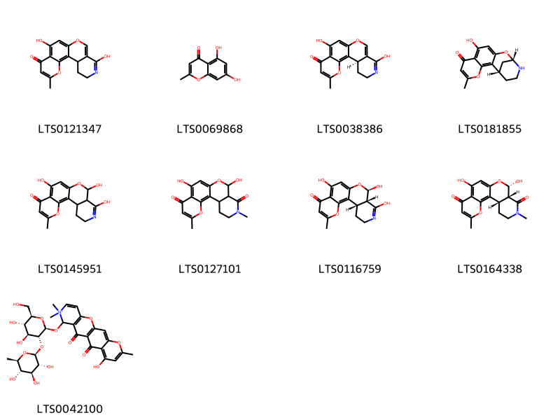{ width=100% }
    <figcaption>Hình ảnh cấu trúc hóa học của 9 hoạt chất thuộc nhóm Benzopyrans gồm ['8,14-dihydroxy-4-methyl-3,11-dioxa-15-azatetracyclo[8.8.0.0²,⁷.0¹³,¹⁸]octadeca-1,4,7,9,12,14-hexaen-6-one (LTS0121347)', 'dihydroxy methylchromone (LTS0069868)', '(18s)-8,14-dihydroxy-4-methyl-3,11-dioxa-15-azatetracyclo[8.8.0.0²,⁷.0¹³,¹⁸]octadeca-1,4,7,9,12,14-hexaen-6-one (LTS0038386)', '(1s,13s)-9-hydroxy-5-methyl-4,12-dioxa-14-azatetracyclo[11.3.1.0²,¹¹.0³,⁸]heptadeca-2,5,8,10-tetraen-7-one (LTS0181855)', '8,12,14-trihydroxy-4-methyl-3,11-dioxa-15-azatetracyclo[8.8.0.0²,⁷.0¹³,¹⁸]octadeca-1,4,7,9,14-pentaen-6-one (LTS0145951)', '8,12-dihydroxy-4,15-dimethyl-3,11-dioxa-15-azatetracyclo[8.8.0.0²,⁷.0¹³,¹⁸]octadeca-1,4,7,9-tetraene-6,14-dione (LTS0127101)', '(12r,13s,18s)-8,12,14-trihydroxy-4-methyl-3,11-dioxa-15-azatetracyclo[8.8.0.0²,⁷.0¹³,¹⁸]octadeca-1,4,7,9,14-pentaen-6-one (LTS0116759)', '(12s,13r,18s)-8,12-dihydroxy-4,15-dimethyl-3,11-dioxa-15-azatetracyclo[8.8.0.0²,⁷.0¹³,¹⁸]octadeca-1,4,7,9-tetraene-6,14-dione (LTS0164338)', '7-{[(2s,3r,4s,5s,6r)-4,5-dihydroxy-6-(hydroxymethyl)-3-{[(2s,3r,4s,5s,6r)-3,4,5-trihydroxy-6-methyloxan-2-yl]oxy}oxan-2-yl]oxy}-4-hydroxy-2,8,8-trimethyl-5,6-dioxo-7h-1,11-dioxa-8-azatetracen-8-ium (LTS0042100)'].</figcaption>
</figure>
#### Nhóm Coumarins and derivatives
<figure markdown="span">
    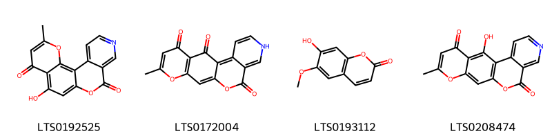{ width=100% }
    <figcaption>Hình ảnh cấu trúc hóa học của 4 hoạt chất thuộc nhóm Coumarins and derivatives gồm ['8-hydroxy-4-methyl-3,11-dioxa-15-azatetracyclo[8.8.0.0²,⁷.0¹³,¹⁸]octadeca-1(10),2(7),4,8,13(18),14,16-heptaene-6,12-dione (LTS0192525)', '2-methyl-8h-1,11-dioxa-8-azatetraphene-4,5,10-trione (LTS0172004)', 'scopoletin (LTS0193112)', '5-hydroxy-2-methyl-1,11-dioxa-8-azatetraphene-4,10-dione (LTS0208474)'].</figcaption>
</figure>
#### Nhóm Organooxygen compounds
<figure markdown="span">
    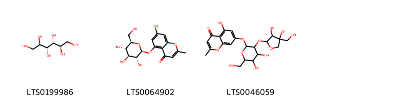{ width=100% }
    <figcaption>Hình ảnh cấu trúc hóa học của 3 hoạt chất thuộc nhóm Organooxygen compounds gồm ['mannitol (LTS0199986)', '7-hydroxy-2-methyl-5-{[(2s,3r,4s,5s,6r)-3,4,5-trihydroxy-6-(hydroxymethyl)oxan-2-yl]oxy}chromen-4-one (LTS0064902)', '7-[(3-{[3,4-dihydroxy-4-(hydroxymethyl)oxolan-2-yl]oxy}-4,5-dihydroxy-6-(hydroxymethyl)oxan-2-yl)oxy]-5-hydroxy-2-methylchromen-4-one (LTS0046059)'].</figcaption>
</figure>
#### Nhóm Piperidines
<figure markdown="span">
    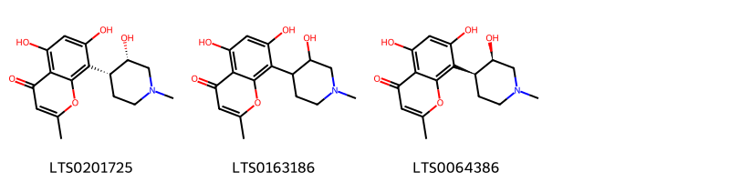{ width=100% }
    <figcaption>Hình ảnh cấu trúc hóa học của 3 hoạt chất thuộc nhóm Piperidines gồm ['rohitukine (LTS0201725)', '5,7-dihydroxy-8-(3-hydroxy-1-methylpiperidin-4-yl)-2-methylchromen-4-one (LTS0163186)', '5,7-dihydroxy-8-[(3r,4s)-3-hydroxy-1-methylpiperidin-4-yl]-2-methylchromen-4-one (LTS0064386)'].</figcaption>
</figure>

---

### Dược dân tộc học

Danh sách các quốc gia có sử dụng *Schumanniophyton magnificum* trong điều trị các bệnh. 

| Country   | Disease                           | Bệnh                                                                                                                                                                                                |
|:----------|:----------------------------------|:----------------------------------------------------------------------------------------------------------------------------------------------------------------------------------------------------|
| Africa    | Aphrodisiac, Piscicide, Stimulant | MYMEMORY WARNING: YOU USED ALL AVAILABLE FREE TRANSLATIONS FOR TODAY. NEXT AVAILABLE IN  09 HOURS 59 MINUTES 53 SECONDS VISIT HTTPS://MYMEMORY.TRANSLATED.NET/DOC/USAGELIMITS.PHP TO TRANSLATE MORE |

---

# Chi Borojoa

??? note "Danh sách các dược liệu thuộc chi"
    
	 - *Borojoa patinoi*

---
## Borojoa patinoi
### Thông tin về thực vật

!!! info "Phân loại thực vật của *Alibertia patinoi* từ GIBF:"
    - **Kingdom:** Plantae
    - **Phylum:** Tracheophyta
    - **Order:** Gentianales
    - **Family:** Rubiaceae
    - **Genus:** Alibertia
    - **Species:** *Alibertia patinoi*

 

| Label (VI)   | Label (EN)   | Scientific Name   | Descriptions (VI)   | Descriptions (EN)   | Also Known As (VI)   | Also Known As (EN)   |
|:-------------|:-------------|:------------------|:--------------------|:--------------------|:---------------------|:---------------------|
| N/A          | N/A          | Borojoa patinoi   | loài thực vật       | species of plant    | ['']                 | ['']                 |

#### Phân bố trên thế giới

**Từ CSDL GIBF** nan, Costa Rica, Colombia, Ecuador, Panama

#### Phân bố tại Việt Nam

**Từ CSDL GIBF**: Không có ghi nhận ở Việt Nam

---
### Thành phần hóa học
        
- Theo cơ sở dữ liệu lotus: Từ loài *Alibertia patinoi* đã phân lập và xác định được Chưa có hoạt chất nào được phân lập. hoạt chất thuộc về các nhóm Không có hoạt chất nào được phân lập. 

Không có hình ảnh nào được tạo ra

---

### Dược dân tộc học

Danh sách các quốc gia có sử dụng *Alibertia patinoi* trong điều trị các bệnh. 

| Country       | Disease    | Bệnh                                                                                                                                                                                                |
|:--------------|:-----------|:----------------------------------------------------------------------------------------------------------------------------------------------------------------------------------------------------|
| Panama(Choco) | Intoxicant | MYMEMORY WARNING: YOU USED ALL AVAILABLE FREE TRANSLATIONS FOR TODAY. NEXT AVAILABLE IN  09 HOURS 59 MINUTES 08 SECONDS VISIT HTTPS://MYMEMORY.TRANSLATED.NET/DOC/USAGELIMITS.PHP TO TRANSLATE MORE |

---

# Chi Myrmecodia

??? note "Danh sách các dược liệu thuộc chi"
    
	 - *Myrmecodia tuberosa*

---
## Myrmecodia tuberosa
### Thông tin về thực vật

!!! info "Phân loại thực vật của *Myrmecodia tuberosa* từ GIBF:"
    - **Kingdom:** Plantae
    - **Phylum:** Tracheophyta
    - **Order:** Gentianales
    - **Family:** Rubiaceae
    - **Genus:** Myrmecodia
    - **Species:** *Myrmecodia tuberosa*

 

| Label (VI)   | Label (EN)   | Scientific Name     | Descriptions (VI)   | Descriptions (EN)   | Also Known As (VI)   | Also Known As (EN)   |
|:-------------|:-------------|:--------------------|:--------------------|:--------------------|:---------------------|:---------------------|
| N/A          | N/A          | Myrmecodia tuberosa | loài thực vật       | species of plant    | ['']                 | ['']                 |

#### Phân bố trên thế giới

**Từ CSDL GIBF** nan, Viet Nam, United States of America, Sweden, Belgium, Philippines, Malaysia, Indonesia, Australia, Timor-Leste, Solomon Islands, unknown or invalid, Papua New Guinea, Brunei Darussalam, France, Netherlands

#### Phân bố tại Việt Nam

**Từ CSDL GIBF**: Khanh Hoa

---
### Thành phần hóa học
        
- Theo cơ sở dữ liệu lotus: Từ loài *Myrmecodia tuberosa* đã phân lập và xác định được Chưa có hoạt chất nào được phân lập. hoạt chất thuộc về các nhóm Không có hoạt chất nào được phân lập. 

Không có hình ảnh nào được tạo ra

---

### Dược dân tộc học

Danh sách các quốc gia có sử dụng *Myrmecodia tuberosa* trong điều trị các bệnh. 

| Country   | Disease   | Bệnh                                                                                                                                                                                                |
|:----------|:----------|:----------------------------------------------------------------------------------------------------------------------------------------------------------------------------------------------------|
| Java      | Poultice  | MYMEMORY WARNING: YOU USED ALL AVAILABLE FREE TRANSLATIONS FOR TODAY. NEXT AVAILABLE IN  09 HOURS 58 MINUTES 24 SECONDS VISIT HTTPS://MYMEMORY.TRANSLATED.NET/DOC/USAGELIMITS.PHP TO TRANSLATE MORE |

---

# Chi Cephalanthus

??? note "Danh sách các dược liệu thuộc chi"
    
	 - *Cephalanthus occidentalis*

---
## Cephalanthus occidentalis
### Thông tin về thực vật

!!! info "Phân loại thực vật của *Cephalanthus occidentalis* từ GIBF:"
    - **Kingdom:** Plantae
    - **Phylum:** Tracheophyta
    - **Order:** Gentianales
    - **Family:** Rubiaceae
    - **Genus:** Cephalanthus
    - **Species:** *Cephalanthus occidentalis*

 

| Label (VI)   | Label (EN)   | Scientific Name           | Descriptions (VI)   | Descriptions (EN)   | Also Known As (VI)   | Also Known As (EN)                                                  |
|:-------------|:-------------|:--------------------------|:--------------------|:--------------------|:---------------------|:--------------------------------------------------------------------|
| N/A          | N/A          | Cephalanthus occidentalis | loài thực vật       | species of plant    | ['']                 | ['button-willow', 'buttonbush', 'common buttonbush', 'honey-bells'] |

#### Phân bố trên thế giới

**Từ CSDL GIBF** United States of America, Canada

#### Phân bố tại Việt Nam

**Từ CSDL GIBF**: Không có ghi nhận ở Việt Nam

---
### Thành phần hóa học
        
- Theo cơ sở dữ liệu lotus: Từ loài *Cephalanthus occidentalis* đã phân lập và xác định được 57 hoạt chất thuộc về các nhóm Yohimbine alkaloids, Indolizidines, Coumarins and derivatives, Corynanthean-type alkaloids, Organooxygen compounds, Prenol lipids, Indoles and derivatives. 

|    | chemicalTaxonomyClassyfireClass   |   smiles_count |
|---:|:----------------------------------|---------------:|
|  0 | Corynanthean-type alkaloids       |              2 |
|  1 | Coumarins and derivatives         |              3 |
|  2 | Indoles and derivatives           |              6 |
|  3 | Indolizidines                     |              6 |
|  4 | Organooxygen compounds            |             10 |
|  5 | Prenol lipids                     |             26 |
|  6 | Yohimbine alkaloids               |              3 |

#### Nhóm Corynanthean-type alkaloids
<figure markdown="span">
    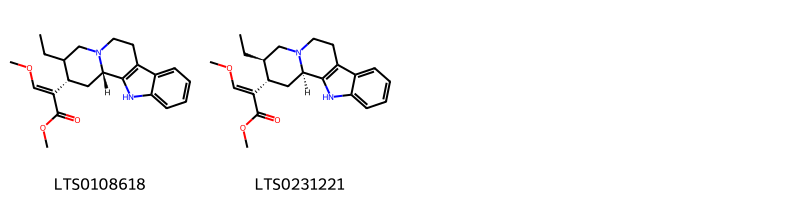{ width=100% }
    <figcaption>Hình ảnh cấu trúc hóa học của 2 hoạt chất thuộc nhóm Corynanthean-type alkaloids gồm ['methyl (2e)-2-[(2s,12bs)-3-ethyl-1h,2h,3h,4h,6h,7h,12h,12bh-indolo[2,3-a]quinolizin-2-yl]-3-methoxyprop-2-enoate (LTS0108618)', 'hirsutine (LTS0231221)'].</figcaption>
</figure>
#### Nhóm Coumarins and derivatives
<figure markdown="span">
    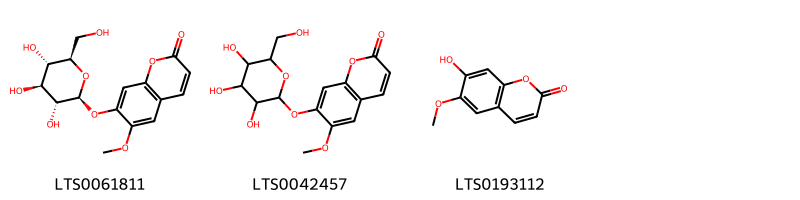{ width=100% }
    <figcaption>Hình ảnh cấu trúc hóa học của 3 hoạt chất thuộc nhóm Coumarins and derivatives gồm ['scopolin (LTS0061811)', '6-methoxy-7-{[3,4,5-trihydroxy-6-(hydroxymethyl)oxan-2-yl]oxy}chromen-2-one (LTS0042457)', 'scopoletin (LTS0193112)'].</figcaption>
</figure>
#### Nhóm Indoles and derivatives
<figure markdown="span">
    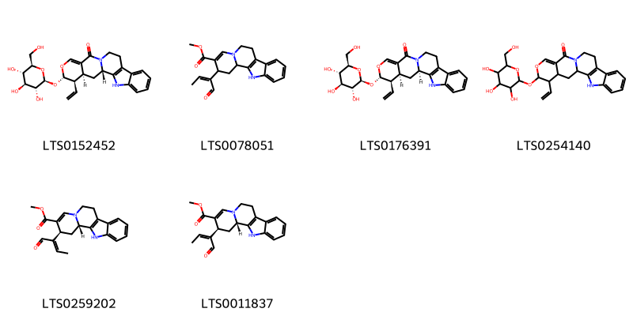{ width=100% }
    <figcaption>Hình ảnh cấu trúc hóa học của 6 hoạt chất thuộc nhóm Indoles and derivatives gồm ['strictosamide (LTS0152452)', 'methyl 2-(1-oxobut-2-en-2-yl)-1h,2h,6h,7h,12h,12bh-indolo[2,3-a]quinolizine-3-carboxylate (LTS0078051)', '(1r,18s,19r,20s)-19-ethenyl-18-{[(2s,3r,4s,5s,6r)-3,4,5-trihydroxy-6-(hydroxymethyl)oxan-2-yl]oxy}-17-oxa-3,13-diazapentacyclo[11.8.0.0²,¹⁰.0⁴,⁹.0¹⁵,²⁰]henicosa-2(10),4,6,8,15-pentaen-14-one (LTS0176391)', '19-ethenyl-18-{[3,4,5-trihydroxy-6-(hydroxymethyl)oxan-2-yl]oxy}-17-oxa-3,13-diazapentacyclo[11.8.0.0²,¹⁰.0⁴,⁹.0¹⁵,²⁰]henicosa-2(10),4,6,8,15-pentaen-14-one (LTS0254140)', 'methyl (2s,12bs)-2-[(2e)-1-oxobut-2-en-2-yl]-1h,2h,6h,7h,12h,12bh-indolo[2,3-a]quinolizine-3-carboxylate (LTS0259202)', 'methyl (2s,12bs)-2-[(2z)-1-oxobut-2-en-2-yl]-1h,2h,6h,7h,12h,12bh-indolo[2,3-a]quinolizine-3-carboxylate (LTS0011837)'].</figcaption>
</figure>
#### Nhóm Indolizidines
<figure markdown="span">
    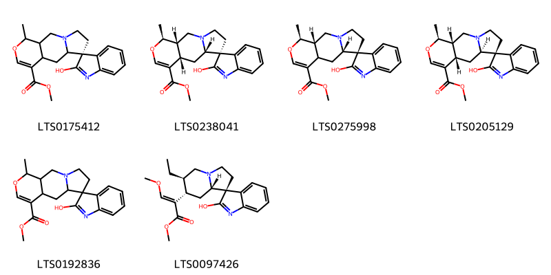{ width=100% }
    <figcaption>Hình ảnh cấu trúc hóa học của 6 hoạt chất thuộc nhóm Indolizidines gồm ["methyl (3r)-2-hydroxy-1'-methyl-1',4'a,5',5'a,7',8',10',10'a-octahydrospiro[indole-3,6'-pyrano[3,4-f]indolizine]-4'-carboxylate (LTS0175412)", "methyl (1's,3r,4'as,5'as,10'as)-2-hydroxy-1'-methyl-1',4'a,5',5'a,7',8',10',10'a-octahydrospiro[indole-3,6'-pyrano[3,4-f]indolizine]-4'-carboxylate (LTS0238041)", "methyl (1's,3s,5'as,10'as)-2-hydroxy-1'-methyl-1',4'a,5',5'a,7',8',10',10'a-octahydrospiro[indole-3,6'-pyrano[3,4-f]indolizine]-4'-carboxylate (LTS0275998)", "methyl (1's,3s,4'as,5'ar,10'as)-2-hydroxy-1'-methyl-1',4'a,5',5'a,7',8',10',10'a-octahydrospiro[indole-3,6'-pyrano[3,4-f]indolizine]-4'-carboxylate (LTS0205129)", "methyl 2-hydroxy-1'-methyl-1',4'a,5',5'a,7',8',10',10'a-octahydrospiro[indole-3,6'-pyrano[3,4-f]indolizine]-4'-carboxylate (LTS0192836)", 'rhyncophylline (LTS0097426)'].</figcaption>
</figure>
#### Nhóm Organooxygen compounds
<figure markdown="span">
    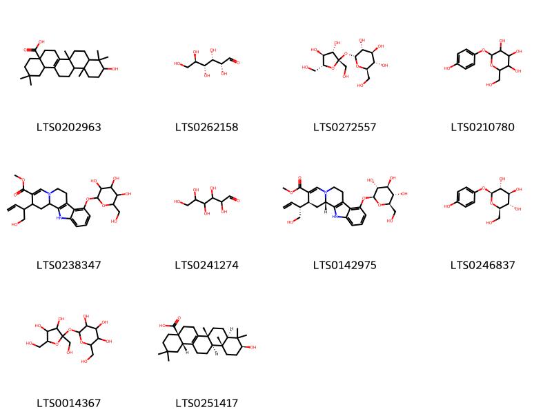{ width=100% }
    <figcaption>Hình ảnh cấu trúc hóa học của 10 hoạt chất thuộc nhóm Organooxygen compounds gồm ['10-hydroxy-2,2,6b,9,9,12a-hexamethyl-3,4,5,6,7,8,8a,10,11,12,12b,13,14,14b-tetradecahydro-1h-picene-4a-carboxylic acid (LTS0202963)', '(+)-glucose (LTS0262158)', 'sucrose (LTS0272557)', 'arbutin (LTS0210780)', 'methyl 2-(1-hydroxybut-3-en-2-yl)-8-{[3,4,5-trihydroxy-6-(hydroxymethyl)oxan-2-yl]oxy}-1h,2h,6h,7h,12h,12bh-indolo[2,3-a]quinolizine-3-carboxylate (LTS0238347)', 'dextrose (LTS0241274)', 'methyl (2s,12bs)-2-[(2r)-1-hydroxybut-3-en-2-yl]-8-{[(2s,3r,4s,5s,6r)-3,4,5-trihydroxy-6-(hydroxymethyl)oxan-2-yl]oxy}-1h,2h,6h,7h,12h,12bh-indolo[2,3-a]quinolizine-3-carboxylate (LTS0142975)', 'β-arbutin (LTS0246837)', 'granulated sugar (LTS0014367)', '(4as,6br,8ar,10s,12ar,12br,14bs)-10-hydroxy-2,2,6b,9,9,12a-hexamethyl-3,4,5,6,7,8,8a,10,11,12,12b,13,14,14b-tetradecahydro-1h-picene-4a-carboxylic acid (LTS0251417)'].</figcaption>
</figure>
#### Nhóm Prenol lipids
<figure markdown="span">
    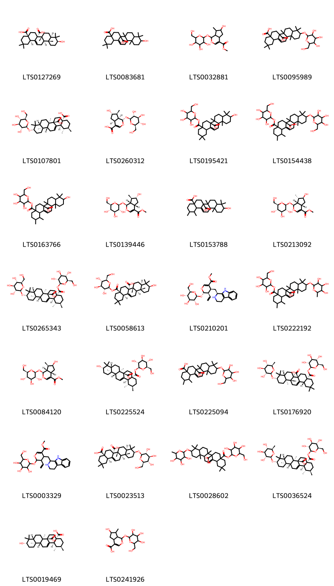{ width=100% }
    <figcaption>Hình ảnh cấu trúc hóa học của 26 hoạt chất thuộc nhóm Prenol lipids gồm ['(4as,6ar,6br,8ar,10s,12ar,12br,14br)-10-hydroxy-2,2,6b,9,9,12a-hexamethyl-1,3,4,5,6,7,8,8a,10,11,12,12b,13,14b-tetradecahydropicene-4a,6a-dicarboxylic acid (LTS0127269)', '10-hydroxy-2,2,6b,9,9,12a-hexamethyl-1,3,4,5,6,7,8,8a,10,11,12,12b,13,14b-tetradecahydropicene-4a,6a-dicarboxylic acid (LTS0083681)', 'methyl 6-hydroxy-7-methyl-1-{[3,4,5-trihydroxy-6-(hydroxymethyl)oxan-2-yl]oxy}-1h,4ah,5h,6h,7h,7ah-cyclopenta[c]pyran-4-carboxylate (LTS0032881)', '2,2,6b,9,9,12a-hexamethyl-10-{[3,4,5-trihydroxy-6-(hydroxymethyl)oxan-2-yl]oxy}-1,3,4,5,6,7,8,8a,10,11,12,12b,13,14b-tetradecahydropicene-4a,6a-dicarboxylic acid (LTS0095989)', '(1s,2r,4as,6ar,6br,8ar,10s,12ar,12br,14bs)-1,2,6b,9,9,12a-hexamethyl-10-{[(2r,3r,4s,5s,6r)-3,4,5-trihydroxy-6-(hydroxymethyl)oxan-2-yl]oxy}-2,3,4,5,6,7,8,8a,10,11,12,12b,13,14b-tetradecahydro-1h-picene-4a,6a-dicarboxylic acid (LTS0107801)', '(1s,4as,6s,7s,7as)-6-hydroxy-7-methyl-1-{[(2s,3r,4s,5s,6r)-3,4,5-trihydroxy-6-(hydroxymethyl)oxan-2-yl]oxy}-1h,4ah,5h,6h,7h,7ah-cyclopenta[c]pyran-4-carboxylic acid (LTS0260312)', '10-hydroxy-2,2,6b,9,9,12a-hexamethyl-4a-({[3,4,5-trihydroxy-6-(hydroxymethyl)oxan-2-yl]oxy}carbonyl)-1,3,4,5,6,7,8,8a,10,11,12,12b,13,14b-tetradecahydropicene-6a-carboxylic acid (LTS0195421)', '1,2,6b,9,9,12a-hexamethyl-10-{[3,4,5-trihydroxy-6-(hydroxymethyl)oxan-2-yl]oxy}-4a-({[3,4,5-trihydroxy-6-(hydroxymethyl)oxan-2-yl]oxy}carbonyl)-2,3,4,5,6,7,8,8a,10,11,12,12b,13,14b-tetradecahydro-1h-picene-6a-carboxylic acid (LTS0154438)', '10-hydroxy-1,2,6b,9,9,12a-hexamethyl-4a-({[3,4,5-trihydroxy-6-(hydroxymethyl)oxan-2-yl]oxy}carbonyl)-2,3,4,5,6,7,8,8a,10,11,12,12b,13,14b-tetradecahydro-1h-picene-6a-carboxylic acid (LTS0163766)', 'methyl (1s,4as,6r,7r,7as)-6-hydroxy-7-methyl-1-{[(2s,3r,4s,5s,6r)-3,4,5-trihydroxy-6-(hydroxymethyl)oxan-2-yl]oxy}-1h,4ah,5h,6h,7h,7ah-cyclopenta[c]pyran-4-carboxylate (LTS0139446)', '10-hydroxy-1,2,6b,9,9,12a-hexamethyl-2,3,4,5,6,7,8,8a,10,11,12,12b,13,14b-tetradecahydro-1h-picene-4a,6a-dicarboxylic acid (LTS0153788)', 'methyl (1s,4as,6s,7s,7as)-6-hydroxy-7-methyl-1-{[(2s,3r,4s,5s,6r)-3,4,5-trihydroxy-6-(hydroxymethyl)oxan-2-yl]oxy}-1h,4ah,5h,6h,7h,7ah-cyclopenta[c]pyran-4-carboxylate (LTS0213092)', '(1s,2r,4as,6ar,6br,8ar,10s,12ar,12br,14bs)-1,2,6b,9,9,12a-hexamethyl-10-{[(2r,3r,4s,5s,6r)-3,4,5-trihydroxy-6-(hydroxymethyl)oxan-2-yl]oxy}-4a-({[(2s,3r,4s,5s,6r)-3,4,5-trihydroxy-6-(hydroxymethyl)oxan-2-yl]oxy}carbonyl)-2,3,4,5,6,7,8,8a,10,11,12,12b,13,14b-tetradecahydro-1h-picene-6a-carboxylic acid (LTS0265343)', '(4as,6ar,6br,8ar,10s,12ar,12br,14br)-10-hydroxy-2,2,6b,9,9,12a-hexamethyl-4a-({[(2s,3r,4s,5s,6r)-3,4,5-trihydroxy-6-(hydroxymethyl)oxan-2-yl]oxy}carbonyl)-1,3,4,5,6,7,8,8a,10,11,12,12b,13,14b-tetradecahydropicene-6a-carboxylic acid (LTS0058613)', 'strictosidine (LTS0210201)', '1,2,6b,9,9,12a-hexamethyl-4a-({[3,4,5-trihydroxy-6-(hydroxymethyl)oxan-2-yl]oxy}carbonyl)-10-[(3,4,5-trihydroxy-6-methyloxan-2-yl)oxy]-2,3,4,5,6,7,8,8a,10,11,12,12b,13,14b-tetradecahydro-1h-picene-6a-carboxylic acid (LTS0222192)', 'loganin (LTS0084120)', '(1s,2r,4as,6ar,6br,8ar,10s,12ar,12br,14bs)-10-hydroxy-1,2,6b,9,9,12a-hexamethyl-4a-({[(2s,3r,4s,5s,6r)-3,4,5-trihydroxy-6-(hydroxymethyl)oxan-2-yl]oxy}carbonyl)-2,3,4,5,6,7,8,8a,10,11,12,12b,13,14b-tetradecahydro-1h-picene-6a-carboxylic acid (LTS0225524)', '1,2,6b,9,9,12a-hexamethyl-10-{[3,4,5-trihydroxy-6-(hydroxymethyl)oxan-2-yl]oxy}-2,3,4,5,6,7,8,8a,10,11,12,12b,13,14b-tetradecahydro-1h-picene-4a,6a-dicarboxylic acid (LTS0225094)', '(4as,6ar,6br,8ar,10s,12ar,12br,14br)-2,2,6b,9,9,12a-hexamethyl-4a-({[(2s,3r,4s,5s,6r)-3,4,5-trihydroxy-6-(hydroxymethyl)oxan-2-yl]oxy}carbonyl)-10-{[(2r,3r,4s,5s,6r)-3,4,5-trihydroxy-6-methyloxan-2-yl]oxy}-1,3,4,5,6,7,8,8a,10,11,12,12b,13,14b-tetradecahydropicene-6a-carboxylic acid (LTS0176920)', 'methyl 5-ethenyl-4-{1h,2h,3h,4h,9h-pyrido[3,4-b]indol-1-ylmethyl}-6-{[3,4,5-trihydroxy-6-(hydroxymethyl)oxan-2-yl]oxy}-5,6-dihydro-4h-pyran-3-carboxylate (LTS0003329)', '(4as,6ar,6br,8ar,10s,12ar,12br,14br)-2,2,6b,9,9,12a-hexamethyl-10-{[(2r,3r,4s,5s,6r)-3,4,5-trihydroxy-6-(hydroxymethyl)oxan-2-yl]oxy}-1,3,4,5,6,7,8,8a,10,11,12,12b,13,14b-tetradecahydropicene-4a,6a-dicarboxylic acid (LTS0023513)', '2,2,6b,9,9,12a-hexamethyl-4a-({[3,4,5-trihydroxy-6-(hydroxymethyl)oxan-2-yl]oxy}carbonyl)-10-[(3,4,5-trihydroxy-6-methyloxan-2-yl)oxy]-1,3,4,5,6,7,8,8a,10,11,12,12b,13,14b-tetradecahydropicene-6a-carboxylic acid (LTS0028602)', '(1s,2r,4as,6ar,6br,8ar,10s,12ar,12br,14bs)-1,2,6b,9,9,12a-hexamethyl-4a-({[(2s,3r,4s,5s,6r)-3,4,5-trihydroxy-6-(hydroxymethyl)oxan-2-yl]oxy}carbonyl)-10-{[(2r,3r,4s,5s,6r)-3,4,5-trihydroxy-6-methyloxan-2-yl]oxy}-2,3,4,5,6,7,8,8a,10,11,12,12b,13,14b-tetradecahydro-1h-picene-6a-carboxylic acid (LTS0036524)', 'quinovic acid (LTS0019469)', '6-hydroxy-7-methyl-1-{[3,4,5-trihydroxy-6-(hydroxymethyl)oxan-2-yl]oxy}-1h,4ah,5h,6h,7h,7ah-cyclopenta[c]pyran-4-carboxylic acid (LTS0241926)'].</figcaption>
</figure>
#### Nhóm Yohimbine alkaloids
<figure markdown="span">
    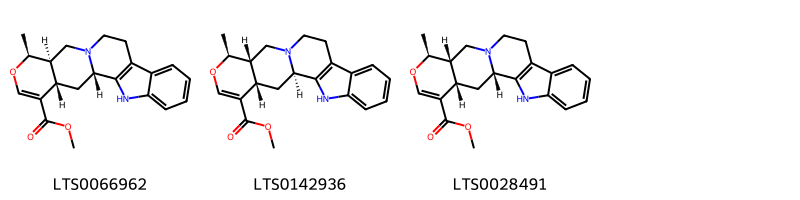{ width=100% }
    <figcaption>Hình ảnh cấu trúc hóa học của 3 hoạt chất thuộc nhóm Yohimbine alkaloids gồm ['substance ii (LTS0066962)', 'akuammigine (LTS0142936)', 'tetrahydroalstonine (LTS0028491)'].</figcaption>
</figure>

---

### Dược dân tộc học

Danh sách các quốc gia có sử dụng *Cephalanthus occidentalis* trong điều trị các bệnh. 

| Country        | Disease                          | Bệnh                                                                                                                                                                                                |
|:---------------|:---------------------------------|:----------------------------------------------------------------------------------------------------------------------------------------------------------------------------------------------------|
| Mexico         | Laxative, Laxative, Tonic, Tonic | MYMEMORY WARNING: YOU USED ALL AVAILABLE FREE TRANSLATIONS FOR TODAY. NEXT AVAILABLE IN  09 HOURS 57 MINUTES 59 SECONDS VISIT HTTPS://MYMEMORY.TRANSLATED.NET/DOC/USAGELIMITS.PHP TO TRANSLATE MORE |
| US(Amerindian) | Astringent, Tonic, Laxative      | MYMEMORY WARNING: YOU USED ALL AVAILABLE FREE TRANSLATIONS FOR TODAY. NEXT AVAILABLE IN  09 HOURS 57 MINUTES 55 SECONDS VISIT HTTPS://MYMEMORY.TRANSLATED.NET/DOC/USAGELIMITS.PHP TO TRANSLATE MORE |
| US(KS)         | Poison                           | MYMEMORY WARNING: YOU USED ALL AVAILABLE FREE TRANSLATIONS FOR TODAY. NEXT AVAILABLE IN  09 HOURS 57 MINUTES 51 SECONDS VISIT HTTPS://MYMEMORY.TRANSLATED.NET/DOC/USAGELIMITS.PHP TO TRANSLATE MORE |
| US(Meskwaski)  | Emetic                           | MYMEMORY WARNING: YOU USED ALL AVAILABLE FREE TRANSLATIONS FOR TODAY. NEXT AVAILABLE IN  09 HOURS 57 MINUTES 47 SECONDS VISIT HTTPS://MYMEMORY.TRANSLATED.NET/DOC/USAGELIMITS.PHP TO TRANSLATE MORE |

---

# Chi Randia

??? note "Danh sách các dược liệu thuộc chi"
    
	 - *Randia armata*
	 - *Randia dumetorum*
	 - *Randia inosa*
	 - *Randia malleifera*
	 - *Randia mitis*
	 - *Randia nilotica*
	 - *Randia uliginosa*
	 - *Randia walkeri*

---
## Randia armata
### Thông tin về thực vật

!!! info "Phân loại thực vật của *Randia armata* từ GIBF:"
    - **Kingdom:** Plantae
    - **Phylum:** Tracheophyta
    - **Order:** Gentianales
    - **Family:** Rubiaceae
    - **Genus:** Randia
    - **Species:** *Randia armata*

 

| Label (VI)   | Label (EN)   | Scientific Name   | Descriptions (VI)   | Descriptions (EN)   | Also Known As (VI)   | Also Known As (EN)   |
|:-------------|:-------------|:------------------|:--------------------|:--------------------|:---------------------|:---------------------|
| N/A          | N/A          | Randia armata     | loài thực vật       | species of plant    | ['']                 | ['']                 |

#### Phân bố trên thế giới

**Từ CSDL GIBF** Brazil, Mexico, El Salvador, Colombia, Ecuador, French Guiana

#### Phân bố tại Việt Nam

**Từ CSDL GIBF**: Không có ghi nhận ở Việt Nam

---
### Thành phần hóa học
        
- Theo cơ sở dữ liệu lotus: Từ loài *Randia armata* đã phân lập và xác định được 17 hoạt chất thuộc về các nhóm Prenol lipids. 

|    | chemicalTaxonomyClassyfireClass   |   smiles_count |
|---:|:----------------------------------|---------------:|
|  0 | Prenol lipids                     |             16 |

#### Nhóm Prenol lipids
<figure markdown="span">
    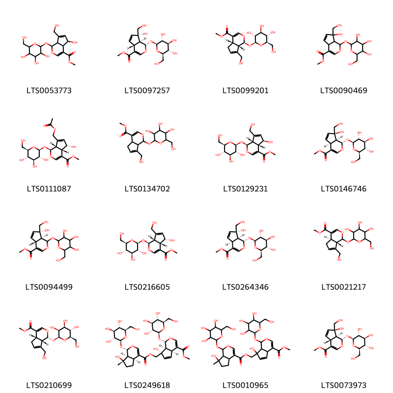{ width=100% }
    <figcaption>Hình ảnh cấu trúc hóa học của 16 hoạt chất thuộc nhóm Prenol lipids gồm ['methyl 5-hydroxy-7-(hydroxymethyl)-1-{[3,4,5-trihydroxy-6-(hydroxymethyl)oxan-2-yl]oxy}-1h,4ah,5h,7ah-cyclopenta[c]pyran-4-carboxylate (LTS0053773)', 'methyl (1s,4ar,7s,7as)-7-hydroxy-7-(hydroxymethyl)-1-{[(2s,3r,4s,5s,6r)-3,4,5-trihydroxy-6-(hydroxymethyl)oxan-2-yl]oxy}-1h,4ah,7ah-cyclopenta[c]pyran-4-carboxylate (LTS0097257)', 'geniposide (LTS0099201)', 'methyl 7-hydroxy-7-(hydroxymethyl)-1-{[3,4,5-trihydroxy-6-(hydroxymethyl)oxan-2-yl]oxy}-1h,4ah,7ah-cyclopenta[c]pyran-4-carboxylate (LTS0090469)', 'methyl (1s,4as,5s,7as)-7-[(acetyloxy)methyl]-5-hydroxy-1-{[(2s,3r,4s,5s,6r)-3,4,5-trihydroxy-6-(hydroxymethyl)oxan-2-yl]oxy}-1h,4ah,5h,7ah-cyclopenta[c]pyran-4-carboxylate (LTS0111087)', 'methyl 7-(hydroxymethyl)-1-{[3,4,5-trihydroxy-6-(hydroxymethyl)oxan-2-yl]oxy}-1h,4ah,5h,7ah-cyclopenta[c]pyran-4-carboxylate (LTS0134702)', 'scandoside methyl ester (LTS0129231)', 'gardenoside (LTS0146746)', 'methyl (4ar,7s,7as)-7-hydroxy-7-(hydroxymethyl)-1-{[3,4,5-trihydroxy-6-(hydroxymethyl)oxan-2-yl]oxy}-1h,4ah,7ah-cyclopenta[c]pyran-4-carboxylate (LTS0094499)', 'methyl (1s,4as,5s,7as)-5-hydroxy-7-(hydroxymethyl)-1-{[(2s,3r,4s,5s,6r)-3,4,5-trihydroxy-6-(hydroxymethyl)oxan-2-yl]oxy}-1h,4ah,5h,7ah-cyclopenta[c]pyran-4-carboxylate (LTS0216605)', 'methyl (1s,4as,7s,7as)-7-hydroxy-7-(hydroxymethyl)-1-{[(2s,3r,4s,5s,6r)-3,4,5-trihydroxy-6-(hydroxymethyl)oxan-2-yl]oxy}-1h,4ah,7ah-cyclopenta[c]pyran-4-carboxylate (LTS0264346)', 'methyl (4ar,7as)-7-(hydroxymethyl)-1-{[3,4,5-trihydroxy-6-(hydroxymethyl)oxan-2-yl]oxy}-1h,4ah,5h,7ah-cyclopenta[c]pyran-4-carboxylate (LTS0021217)', 'methyl (1r,4as,7as)-7-(hydroxymethyl)-1-{[(2s,3s,4s,5s,6r)-3,4,5-trihydroxy-6-(hydroxymethyl)oxan-2-yl]oxy}-1h,4ah,5h,7ah-cyclopenta[c]pyran-4-carboxylate (LTS0210699)', 'methyl (1s,4as,7s,7as)-7-{[(1s,4as,7s,7as)-7-hydroxy-7-methyl-1-{[(2s,3r,4s,5s,6r)-3,4,5-trihydroxy-6-(hydroxymethyl)oxan-2-yl]oxy}-1h,4ah,5h,6h,7ah-cyclopenta[c]pyran-4-carbonyloxy]methyl}-7-hydroxy-1-{[(2s,3r,4s,5s,6r)-3,4,5-trihydroxy-6-(hydroxymethyl)oxan-2-yl]oxy}-1h,4ah,7ah-cyclopenta[c]pyran-4-carboxylate (LTS0249618)', 'methyl 7-hydroxy-7-[(7-hydroxy-7-methyl-1-{[3,4,5-trihydroxy-6-(hydroxymethyl)oxan-2-yl]oxy}-1h,4ah,5h,6h,7ah-cyclopenta[c]pyran-4-carbonyloxy)methyl]-1-{[3,4,5-trihydroxy-6-(hydroxymethyl)oxan-2-yl]oxy}-1h,4ah,7ah-cyclopenta[c]pyran-4-carboxylate (LTS0010965)', 'methyl (1s,4ar,7r,7as)-7-hydroxy-7-(hydroxymethyl)-1-{[(2s,3r,4s,5s,6r)-3,4,5-trihydroxy-6-(hydroxymethyl)oxan-2-yl]oxy}-1h,4ah,7ah-cyclopenta[c]pyran-4-carboxylate (LTS0073973)'].</figcaption>
</figure>

---

### Dược dân tộc học

Danh sách các quốc gia có sử dụng *Randia armata* trong điều trị các bệnh. 

| Country    | Disease   | Bệnh                                                                                                                                                                                                |
|:-----------|:----------|:----------------------------------------------------------------------------------------------------------------------------------------------------------------------------------------------------|
| Elsewhere  | Piscicide | MYMEMORY WARNING: YOU USED ALL AVAILABLE FREE TRANSLATIONS FOR TODAY. NEXT AVAILABLE IN  09 HOURS 57 MINUTES 12 SECONDS VISIT HTTPS://MYMEMORY.TRANSLATED.NET/DOC/USAGELIMITS.PHP TO TRANSLATE MORE |
| Martinique | Piscicide | MYMEMORY WARNING: YOU USED ALL AVAILABLE FREE TRANSLATIONS FOR TODAY. NEXT AVAILABLE IN  09 HOURS 57 MINUTES 08 SECONDS VISIT HTTPS://MYMEMORY.TRANSLATED.NET/DOC/USAGELIMITS.PHP TO TRANSLATE MORE |
| Mexico     | Emetic    | MYMEMORY WARNING: YOU USED ALL AVAILABLE FREE TRANSLATIONS FOR TODAY. NEXT AVAILABLE IN  09 HOURS 57 MINUTES 03 SECONDS VISIT HTTPS://MYMEMORY.TRANSLATED.NET/DOC/USAGELIMITS.PHP TO TRANSLATE MORE |

---

---
## Randia dumetorum
### Thông tin về thực vật

!!! info "Phân loại thực vật của *Catunaregam spinosa* từ GIBF:"
    - **Kingdom:** Plantae
    - **Phylum:** Tracheophyta
    - **Order:** Gentianales
    - **Family:** Rubiaceae
    - **Genus:** Catunaregam
    - **Species:** *Catunaregam spinosa*

 

| Label (VI)   | Label (EN)   | Scientific Name   | Descriptions (VI)   | Descriptions (EN)   | Also Known As (VI)   | Also Known As (EN)   |
|:-------------|:-------------|:------------------|:--------------------|:--------------------|:---------------------|:---------------------|
| N/A          | N/A          | Randia dumetorum  |                     |                     | ['']                 | ['']                 |

#### Phân bố trên thế giới

**Từ CSDL GIBF** nan, Viet Nam, United States of America, Japan, Martinique, Indonesia, Chinese Taipei, Pakistan, China, Guadeloupe, Myanmar, India, Tanzania, United Republic of, unknown or invalid, Ethiopia, Madagascar

#### Phân bố tại Việt Nam

**Từ CSDL GIBF**: Không có ghi nhận ở Việt Nam

---
### Thành phần hóa học
        
- Theo cơ sở dữ liệu lotus: Từ loài *Catunaregam spinosa* đã phân lập và xác định được Chưa có hoạt chất nào được phân lập. hoạt chất thuộc về các nhóm Không có hoạt chất nào được phân lập. 

Không có hình ảnh nào được tạo ra

---

### Dược dân tộc học

Danh sách các quốc gia có sử dụng *Catunaregam spinosa* trong điều trị các bệnh. 

| Country       | Disease   | Bệnh                                                                                                                                                                                                |
|:--------------|:----------|:----------------------------------------------------------------------------------------------------------------------------------------------------------------------------------------------------|
| India         | Piscicide | MYMEMORY WARNING: YOU USED ALL AVAILABLE FREE TRANSLATIONS FOR TODAY. NEXT AVAILABLE IN  09 HOURS 56 MINUTES 26 SECONDS VISIT HTTPS://MYMEMORY.TRANSLATED.NET/DOC/USAGELIMITS.PHP TO TRANSLATE MORE |
| India(Santal) | Laxative  | MYMEMORY WARNING: YOU USED ALL AVAILABLE FREE TRANSLATIONS FOR TODAY. NEXT AVAILABLE IN  09 HOURS 56 MINUTES 23 SECONDS VISIT HTTPS://MYMEMORY.TRANSLATED.NET/DOC/USAGELIMITS.PHP TO TRANSLATE MORE |

---

---
## Randia inosa
### Thông tin về thực vật

!!! info "Phân loại thực vật của *N/A* từ GIBF:"
    - **Kingdom:** N/A
    - **Phylum:** N/A
    - **Order:** N/A
    - **Family:** N/A
    - **Genus:** N/A
    - **Species:** *N/A*

 

| Label (VI)   | Label (EN)   | Scientific Name   | Descriptions (VI)   | Descriptions (EN)   | Also Known As (VI)   | Also Known As (EN)   |
|:-------------|:-------------|:------------------|:--------------------|:--------------------|:---------------------|:---------------------|
| N/A          | N/A          | Randia dumetorum  |                     |                     | ['']                 | ['']                 |

#### Phân bố trên thế giới

**Từ CSDL GIBF** Không có kết quả phù hợp

#### Phân bố tại Việt Nam

**Từ CSDL GIBF**: Không có ghi nhận ở Việt Nam

---
### Thành phần hóa học
        
- Theo cơ sở dữ liệu lotus: Từ loài *N/A* đã phân lập và xác định được Chưa có hoạt chất nào được phân lập. hoạt chất thuộc về các nhóm Không có hoạt chất nào được phân lập. 

Không có hình ảnh nào được tạo ra

---

### Dược dân tộc học

Danh sách các quốc gia có sử dụng *N/A* trong điều trị các bệnh. 

| Country   | Disease                                                                     | Bệnh                                                                                                                                                                                                |
|:----------|:----------------------------------------------------------------------------|:----------------------------------------------------------------------------------------------------------------------------------------------------------------------------------------------------|
| Elsewhere | Apertif, Diaphoretic, Insecticide, Nervine, Piscicide, Sedative, Astringent | MYMEMORY WARNING: YOU USED ALL AVAILABLE FREE TRANSLATIONS FOR TODAY. NEXT AVAILABLE IN  09 HOURS 55 MINUTES 43 SECONDS VISIT HTTPS://MYMEMORY.TRANSLATED.NET/DOC/USAGELIMITS.PHP TO TRANSLATE MORE |

---

---
## Randia malleifera
### Thông tin về thực vật

!!! info "Phân loại thực vật của *Rothmannia whitfieldii* từ GIBF:"
    - **Kingdom:** Plantae
    - **Phylum:** Tracheophyta
    - **Order:** Gentianales
    - **Family:** Rubiaceae
    - **Genus:** Rothmannia
    - **Species:** *Rothmannia whitfieldii*

 

| Label (VI)   | Label (EN)   | Scientific Name   | Descriptions (VI)   | Descriptions (EN)   | Also Known As (VI)   | Also Known As (EN)   |
|:-------------|:-------------|:------------------|:--------------------|:--------------------|:---------------------|:---------------------|
| N/A          | N/A          | Randia malleifera | loài thực vật       | species of plant    | ['']                 | ['']                 |

#### Phân bố trên thế giới

**Từ CSDL GIBF** nan, Senegal, Liberia, Côte d’Ivoire, Cameroon, Guinea

#### Phân bố tại Việt Nam

**Từ CSDL GIBF**: Không có ghi nhận ở Việt Nam

---
### Thành phần hóa học
        
- Theo cơ sở dữ liệu lotus: Từ loài *Rothmannia whitfieldii* đã phân lập và xác định được Chưa có hoạt chất nào được phân lập. hoạt chất thuộc về các nhóm Không có hoạt chất nào được phân lập. 

Không có hình ảnh nào được tạo ra

---

### Dược dân tộc học

Danh sách các quốc gia có sử dụng *Rothmannia whitfieldii* trong điều trị các bệnh. 

| Country   | Disease   | Bệnh                                                                                                                                                                                                |
|:----------|:----------|:----------------------------------------------------------------------------------------------------------------------------------------------------------------------------------------------------|
| Africa    | Cosmetic  | MYMEMORY WARNING: YOU USED ALL AVAILABLE FREE TRANSLATIONS FOR TODAY. NEXT AVAILABLE IN  09 HOURS 55 MINUTES 23 SECONDS VISIT HTTPS://MYMEMORY.TRANSLATED.NET/DOC/USAGELIMITS.PHP TO TRANSLATE MORE |

---

---
## Randia mitis
### Thông tin về thực vật

!!! info "Phân loại thực vật của *Randia aculeata* từ GIBF:"
    - **Kingdom:** Plantae
    - **Phylum:** Tracheophyta
    - **Order:** Gentianales
    - **Family:** Rubiaceae
    - **Genus:** Randia
    - **Species:** *Randia aculeata*

 

| Label (VI)   | Label (EN)   | Scientific Name   | Descriptions (VI)   | Descriptions (EN)   | Also Known As (VI)   | Also Known As (EN)   |
|:-------------|:-------------|:------------------|:--------------------|:--------------------|:---------------------|:---------------------|
| N/A          | N/A          | Randia mitis      | loài thực vật       | species of plant    | ['']                 | ['']                 |

#### Phân bố trên thế giới

**Từ CSDL GIBF** nan, Dominica, Mexico, United States of America, El Salvador, Jamaica, Guadeloupe, Haiti, Bahamas, Cuba, unknown or invalid, Trinidad and Tobago, Panama, Grenada, Puerto Rico

#### Phân bố tại Việt Nam

**Từ CSDL GIBF**: Không có ghi nhận ở Việt Nam

---
### Thành phần hóa học
        
- Theo cơ sở dữ liệu lotus: Từ loài *Randia aculeata* đã phân lập và xác định được Chưa có hoạt chất nào được phân lập. hoạt chất thuộc về các nhóm Không có hoạt chất nào được phân lập. 

Không có hình ảnh nào được tạo ra

---

### Dược dân tộc học

Danh sách các quốc gia có sử dụng *Randia aculeata* trong điều trị các bệnh. 

| Country   | Disease    | Bệnh                                                                                                                                                                                                |
|:----------|:-----------|:----------------------------------------------------------------------------------------------------------------------------------------------------------------------------------------------------|
| Mexico    | Astringent | MYMEMORY WARNING: YOU USED ALL AVAILABLE FREE TRANSLATIONS FOR TODAY. NEXT AVAILABLE IN  09 HOURS 54 MINUTES 51 SECONDS VISIT HTTPS://MYMEMORY.TRANSLATED.NET/DOC/USAGELIMITS.PHP TO TRANSLATE MORE |

---

---
## Randia nilotica
### Thông tin về thực vật

!!! info "Phân loại thực vật của *Catunaregam nilotica* từ GIBF:"
    - **Kingdom:** Plantae
    - **Phylum:** Tracheophyta
    - **Order:** Gentianales
    - **Family:** Rubiaceae
    - **Genus:** Catunaregam
    - **Species:** *Catunaregam nilotica*

 

| Label (VI)   | Label (EN)   | Scientific Name   | Descriptions (VI)   | Descriptions (EN)   | Also Known As (VI)   | Also Known As (EN)   |
|:-------------|:-------------|:------------------|:--------------------|:--------------------|:---------------------|:---------------------|
| N/A          | N/A          | Randia nilotica   | loài thực vật       | species of plant    | ['']                 | ['']                 |

#### Phân bố trên thế giới

**Từ CSDL GIBF** nan, Dominica, Mexico, United States of America, El Salvador, Jamaica, Guadeloupe, Haiti, Bahamas, Cuba, unknown or invalid, Trinidad and Tobago, Panama, Grenada, Puerto Rico

#### Phân bố tại Việt Nam

**Từ CSDL GIBF**: Không có ghi nhận ở Việt Nam

---
### Thành phần hóa học
        
- Theo cơ sở dữ liệu lotus: Từ loài *Catunaregam nilotica* đã phân lập và xác định được Chưa có hoạt chất nào được phân lập. hoạt chất thuộc về các nhóm Không có hoạt chất nào được phân lập. 

Không có hình ảnh nào được tạo ra

---

### Dược dân tộc học

Danh sách các quốc gia có sử dụng *Catunaregam nilotica* trong điều trị các bệnh. 

| Country   | Disease                     | Bệnh                                                                                                                                                                                                |
|:----------|:----------------------------|:----------------------------------------------------------------------------------------------------------------------------------------------------------------------------------------------------|
| Sudan     | Antidote, Emetic, Piscicide | MYMEMORY WARNING: YOU USED ALL AVAILABLE FREE TRANSLATIONS FOR TODAY. NEXT AVAILABLE IN  09 HOURS 54 MINUTES 23 SECONDS VISIT HTTPS://MYMEMORY.TRANSLATED.NET/DOC/USAGELIMITS.PHP TO TRANSLATE MORE |

---

---
## Randia uliginosa
### Thông tin về thực vật

!!! info "Phân loại thực vật của *Tamilnadia uliginosa* từ GIBF:"
    - **Kingdom:** Plantae
    - **Phylum:** Tracheophyta
    - **Order:** Gentianales
    - **Family:** Rubiaceae
    - **Genus:** Tamilnadia
    - **Species:** *Tamilnadia uliginosa*

 

| Label (VI)   | Label (EN)   | Scientific Name   | Descriptions (VI)   | Descriptions (EN)   | Also Known As (VI)   | Also Known As (EN)   |
|:-------------|:-------------|:------------------|:--------------------|:--------------------|:---------------------|:---------------------|
| N/A          | N/A          | Randia uliginosa  |                     | species of plant    | ['']                 | ['']                 |

#### Phân bố trên thế giới

**Từ CSDL GIBF** nan, Nepal, Myanmar, India, Thailand

#### Phân bố tại Việt Nam

**Từ CSDL GIBF**: Không có ghi nhận ở Việt Nam

---
### Thành phần hóa học
        
- Theo cơ sở dữ liệu lotus: Từ loài *Tamilnadia uliginosa* đã phân lập và xác định được Chưa có hoạt chất nào được phân lập. hoạt chất thuộc về các nhóm Không có hoạt chất nào được phân lập. 

Không có hình ảnh nào được tạo ra

---

### Dược dân tộc học

Danh sách các quốc gia có sử dụng *Tamilnadia uliginosa* trong điều trị các bệnh. 

| Country   | Disease                                             | Bệnh                                                                                                                                                                                                |
|:----------|:----------------------------------------------------|:----------------------------------------------------------------------------------------------------------------------------------------------------------------------------------------------------|
| Elsewhere | Astringent, Piscicide, Tonic, Diuretic, Refrigerant | MYMEMORY WARNING: YOU USED ALL AVAILABLE FREE TRANSLATIONS FOR TODAY. NEXT AVAILABLE IN  09 HOURS 53 MINUTES 44 SECONDS VISIT HTTPS://MYMEMORY.TRANSLATED.NET/DOC/USAGELIMITS.PHP TO TRANSLATE MORE |

---

---
## Randia walkeri
### Thông tin về thực vật

!!! info "Phân loại thực vật của *Brenania brieyi* từ GIBF:"
    - **Kingdom:** Plantae
    - **Phylum:** Tracheophyta
    - **Order:** Gentianales
    - **Family:** Rubiaceae
    - **Genus:** Brenania
    - **Species:** *Brenania brieyi*

 

| Label (VI)   | Label (EN)   | Scientific Name   | Descriptions (VI)   | Descriptions (EN)   | Also Known As (VI)   | Also Known As (EN)   |
|:-------------|:-------------|:------------------|:--------------------|:--------------------|:---------------------|:---------------------|
| N/A          | N/A          | Randia uliginosa  |                     | species of plant    | ['']                 | ['']                 |

#### Phân bố trên thế giới

**Từ CSDL GIBF** Congo, Democratic Republic of the, Gabon

#### Phân bố tại Việt Nam

**Từ CSDL GIBF**: Không có ghi nhận ở Việt Nam

---
### Thành phần hóa học
        
- Theo cơ sở dữ liệu lotus: Từ loài *Brenania brieyi* đã phân lập và xác định được Chưa có hoạt chất nào được phân lập. hoạt chất thuộc về các nhóm Không có hoạt chất nào được phân lập. 

Không có hình ảnh nào được tạo ra

---

### Dược dân tộc học

Danh sách các quốc gia có sử dụng *Brenania brieyi* trong điều trị các bệnh. 

| Country   | Disease   | Bệnh                                                                                                                                                                                                |
|:----------|:----------|:----------------------------------------------------------------------------------------------------------------------------------------------------------------------------------------------------|
| Gabon     | Piscicide | MYMEMORY WARNING: YOU USED ALL AVAILABLE FREE TRANSLATIONS FOR TODAY. NEXT AVAILABLE IN  09 HOURS 53 MINUTES 15 SECONDS VISIT HTTPS://MYMEMORY.TRANSLATED.NET/DOC/USAGELIMITS.PHP TO TRANSLATE MORE |

---

# Chi Coussarea

??? note "Danh sách các dược liệu thuộc chi"
    
	 - *Coussarea hydrangeifolia*

---
## Coussarea hydrangeifolia
### Thông tin về thực vật

!!! info "Phân loại thực vật của *Coussarea hydrangeifolia* từ GIBF:"
    - **Kingdom:** Plantae
    - **Phylum:** Tracheophyta
    - **Order:** Gentianales
    - **Family:** Rubiaceae
    - **Genus:** Coussarea
    - **Species:** *Coussarea hydrangeifolia*

 

| Label (VI)   | Label (EN)   | Scientific Name          | Descriptions (VI)   | Descriptions (EN)   | Also Known As (VI)   | Also Known As (EN)   |
|:-------------|:-------------|:-------------------------|:--------------------|:--------------------|:---------------------|:---------------------|
| N/A          | N/A          | Coussarea hydrangeifolia | loài thực vật       | species of plant    | ['']                 | ['']                 |

#### Phân bố trên thế giới

**Từ CSDL GIBF** Brazil, Bolivia (Plurinational State of)

#### Phân bố tại Việt Nam

**Từ CSDL GIBF**: Không có ghi nhận ở Việt Nam

---
### Thành phần hóa học
        
- Theo cơ sở dữ liệu lotus: Từ loài *Coussarea hydrangeifolia* đã phân lập và xác định được 11 hoạt chất thuộc về các nhóm Organooxygen compounds, Cinnamic acids and derivatives. 

|    | chemicalTaxonomyClassyfireClass   |   smiles_count |
|---:|:----------------------------------|---------------:|
|  0 | Cinnamic acids and derivatives    |              9 |
|  1 | Organooxygen compounds            |              2 |

#### Nhóm Cinnamic acids and derivatives
<figure markdown="span">
    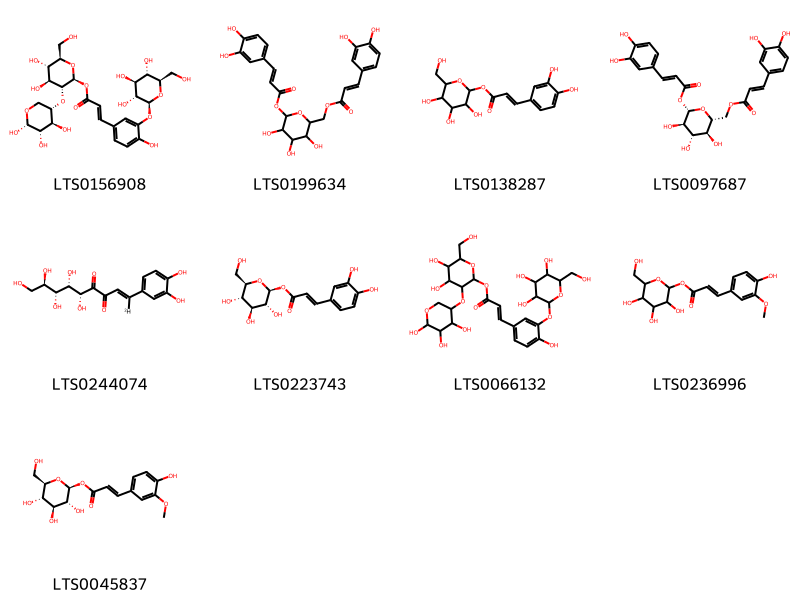{ width=100% }
    <figcaption>Hình ảnh cấu trúc hóa học của 9 hoạt chất thuộc nhóm Cinnamic acids and derivatives gồm ['(2s,3r,4s,5s,6r)-4,5-dihydroxy-6-(hydroxymethyl)-3-{[(3s,4s,5s,6r)-4,5,6-trihydroxyoxan-3-yl]oxy}oxan-2-yl (2e)-3-(4-hydroxy-3-{[(2s,3r,4s,5s,6r)-3,4,5-trihydroxy-6-(hydroxymethyl)oxan-2-yl]oxy}phenyl)prop-2-enoate (LTS0156908)', '(6-{[3-(3,4-dihydroxyphenyl)prop-2-enoyl]oxy}-3,4,5-trihydroxyoxan-2-yl)methyl 3-(3,4-dihydroxyphenyl)prop-2-enoate (LTS0199634)', '3,4,5-trihydroxy-6-(hydroxymethyl)oxan-2-yl 3-(3,4-dihydroxyphenyl)prop-2-enoate (LTS0138287)', '[(2r,3s,4s,5r,6s)-6-{[(2e)-3-(3,4-dihydroxyphenyl)prop-2-enoyl]oxy}-3,4,5-trihydroxyoxan-2-yl]methyl (2e)-3-(3,4-dihydroxyphenyl)prop-2-enoate (LTS0097687)', '(1e,5r,6s,7r,8r)-1-(3,4-dihydroxyphenyl)-5,6,7,8,9-pentahydroxy(1-²h)non-1-ene-3,4-dione (LTS0244074)', '1-caffeoyl-β-d-glucose (LTS0223743)', '4,5-dihydroxy-6-(hydroxymethyl)-3-[(4,5,6-trihydroxyoxan-3-yl)oxy]oxan-2-yl 3-(4-hydroxy-3-{[3,4,5-trihydroxy-6-(hydroxymethyl)oxan-2-yl]oxy}phenyl)prop-2-enoate (LTS0066132)', '3,4,5-trihydroxy-6-(hydroxymethyl)oxan-2-yl 3-(4-hydroxy-3-methoxyphenyl)prop-2-enoate (LTS0236996)', '1-o-feruloyl-β-d-glucose (LTS0045837)'].</figcaption>
</figure>
#### Nhóm Organooxygen compounds
<figure markdown="span">
    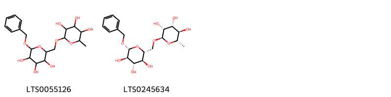{ width=100% }
    <figcaption>Hình ảnh cấu trúc hóa học của 2 hoạt chất thuộc nhóm Organooxygen compounds gồm ['2-{[6-(benzyloxy)-3,4,5-trihydroxyoxan-2-yl]methoxy}-6-methyloxane-3,4,5-triol (LTS0055126)', '(2r,3r,4r,5r,6s)-2-{[(2r,3s,4s,5r,6r)-6-(benzyloxy)-3,4,5-trihydroxyoxan-2-yl]methoxy}-6-methyloxane-3,4,5-triol (LTS0245634)'].</figcaption>
</figure>

---

### Dược dân tộc học

Danh sách các quốc gia có sử dụng *Coussarea hydrangeifolia* trong điều trị các bệnh. 

| Country   | Disease   | Bệnh                                                                                                                                                                                                |
|:----------|:----------|:----------------------------------------------------------------------------------------------------------------------------------------------------------------------------------------------------|
| Bolivia   | Tonic     | MYMEMORY WARNING: YOU USED ALL AVAILABLE FREE TRANSLATIONS FOR TODAY. NEXT AVAILABLE IN  09 HOURS 52 MINUTES 53 SECONDS VISIT HTTPS://MYMEMORY.TRANSLATED.NET/DOC/USAGELIMITS.PHP TO TRANSLATE MORE |

---

# Chi Aerula

??? note "Danh sách các dược liệu thuộc chi"
    
	 - *Aerula arvensis*
	 - *Aerula odorata*

---
## Aerula arvensis
### Thông tin về thực vật

!!! info "Phân loại thực vật của *N/A* từ GIBF:"
    - **Kingdom:** N/A
    - **Phylum:** N/A
    - **Order:** N/A
    - **Family:** N/A
    - **Genus:** N/A
    - **Species:** *N/A*

 

| Label (VI)   | Label (EN)   | Scientific Name          | Descriptions (VI)   | Descriptions (EN)   | Also Known As (VI)   | Also Known As (EN)   |
|:-------------|:-------------|:-------------------------|:--------------------|:--------------------|:---------------------|:---------------------|
| N/A          | N/A          | Coussarea hydrangeifolia | loài thực vật       | species of plant    | ['']                 | ['']                 |

#### Phân bố trên thế giới

**Từ CSDL GIBF** Không có kết quả phù hợp

#### Phân bố tại Việt Nam

**Từ CSDL GIBF**: Không có ghi nhận ở Việt Nam

---
### Thành phần hóa học
        
- Theo cơ sở dữ liệu lotus: Từ loài *N/A* đã phân lập và xác định được Chưa có hoạt chất nào được phân lập. hoạt chất thuộc về các nhóm Không có hoạt chất nào được phân lập. 

Không có hình ảnh nào được tạo ra

---

### Dược dân tộc học

Danh sách các quốc gia có sử dụng *N/A* trong điều trị các bệnh. 

| Country   | Disease    | Bệnh                                                                                                                                                                                                |
|:----------|:-----------|:----------------------------------------------------------------------------------------------------------------------------------------------------------------------------------------------------|
| Iraq      | Astringent | MYMEMORY WARNING: YOU USED ALL AVAILABLE FREE TRANSLATIONS FOR TODAY. NEXT AVAILABLE IN  09 HOURS 52 MINUTES 16 SECONDS VISIT HTTPS://MYMEMORY.TRANSLATED.NET/DOC/USAGELIMITS.PHP TO TRANSLATE MORE |
| Turkey    | Astringent | MYMEMORY WARNING: YOU USED ALL AVAILABLE FREE TRANSLATIONS FOR TODAY. NEXT AVAILABLE IN  09 HOURS 52 MINUTES 09 SECONDS VISIT HTTPS://MYMEMORY.TRANSLATED.NET/DOC/USAGELIMITS.PHP TO TRANSLATE MORE |

---

---
## Aerula odorata
### Thông tin về thực vật

!!! info "Phân loại thực vật của *N/A* từ GIBF:"
    - **Kingdom:** N/A
    - **Phylum:** N/A
    - **Order:** N/A
    - **Family:** N/A
    - **Genus:** N/A
    - **Species:** *N/A*

 

| Label (VI)   | Label (EN)   | Scientific Name          | Descriptions (VI)   | Descriptions (EN)   | Also Known As (VI)   | Also Known As (EN)   |
|:-------------|:-------------|:-------------------------|:--------------------|:--------------------|:---------------------|:---------------------|
| N/A          | N/A          | Coussarea hydrangeifolia | loài thực vật       | species of plant    | ['']                 | ['']                 |

#### Phân bố trên thế giới

**Từ CSDL GIBF** Không có kết quả phù hợp

#### Phân bố tại Việt Nam

**Từ CSDL GIBF**: Không có ghi nhận ở Việt Nam

---
### Thành phần hóa học
        
- Theo cơ sở dữ liệu lotus: Từ loài *N/A* đã phân lập và xác định được Chưa có hoạt chất nào được phân lập. hoạt chất thuộc về các nhóm Không có hoạt chất nào được phân lập. 

Không có hình ảnh nào được tạo ra

---

### Dược dân tộc học

Danh sách các quốc gia có sử dụng *N/A* trong điều trị các bệnh. 

| Country   | Disease                       | Bệnh                                                                                                                                                                                                |
|:----------|:------------------------------|:----------------------------------------------------------------------------------------------------------------------------------------------------------------------------------------------------|
| Turkey    | Sedative, Stomachic, Diuretic | MYMEMORY WARNING: YOU USED ALL AVAILABLE FREE TRANSLATIONS FOR TODAY. NEXT AVAILABLE IN  09 HOURS 51 MINUTES 46 SECONDS VISIT HTTPS://MYMEMORY.TRANSLATED.NET/DOC/USAGELIMITS.PHP TO TRANSLATE MORE |

---

# Chi Sarcocephalus

??? note "Danh sách các dược liệu thuộc chi"
    
	 - *Sarcocephalus esculentus*
	 - *Sarcocephalus russeggeri*

---
## Sarcocephalus esculentus
### Thông tin về thực vật

!!! info "Phân loại thực vật của *Nauclea latifolia* từ GIBF:"
    - **Kingdom:** Plantae
    - **Phylum:** Tracheophyta
    - **Order:** Gentianales
    - **Family:** Rubiaceae
    - **Genus:** Nauclea
    - **Species:** *Nauclea latifolia*

 

| Label (VI)   | Label (EN)   | Scientific Name          | Descriptions (VI)   | Descriptions (EN)   | Also Known As (VI)   | Also Known As (EN)   |
|:-------------|:-------------|:-------------------------|:--------------------|:--------------------|:---------------------|:---------------------|
| N/A          | N/A          | Sarcocephalus esculentus |                     | species of plant    | ['']                 | ['']                 |

#### Phân bố trên thế giới

**Từ CSDL GIBF** nan, Brazil, Congo, Democratic Republic of the, United States of America, Malaysia, Gabon, South Africa, Côte d’Ivoire, Mali, Nigeria, Burkina Faso, Sierra Leone, Equatorial Guinea, Cameroon, Guinea, Ghana

#### Phân bố tại Việt Nam

**Từ CSDL GIBF**: Không có ghi nhận ở Việt Nam

---
### Thành phần hóa học
        
- Theo cơ sở dữ liệu lotus: Từ loài *Nauclea latifolia* đã phân lập và xác định được Chưa có hoạt chất nào được phân lập. hoạt chất thuộc về các nhóm Không có hoạt chất nào được phân lập. 

Không có hình ảnh nào được tạo ra

---

### Dược dân tộc học

Danh sách các quốc gia có sử dụng *Nauclea latifolia* trong điều trị các bệnh. 

| Country   | Disease     | Bệnh                                                                                                                                                                                                |
|:----------|:------------|:----------------------------------------------------------------------------------------------------------------------------------------------------------------------------------------------------|
| Dutch     | Emmenagogue | MYMEMORY WARNING: YOU USED ALL AVAILABLE FREE TRANSLATIONS FOR TODAY. NEXT AVAILABLE IN  09 HOURS 51 MINUTES 31 SECONDS VISIT HTTPS://MYMEMORY.TRANSLATED.NET/DOC/USAGELIMITS.PHP TO TRANSLATE MORE |
| English   | Stomachic   | MYMEMORY WARNING: YOU USED ALL AVAILABLE FREE TRANSLATIONS FOR TODAY. NEXT AVAILABLE IN  09 HOURS 51 MINUTES 28 SECONDS VISIT HTTPS://MYMEMORY.TRANSLATED.NET/DOC/USAGELIMITS.PHP TO TRANSLATE MORE |

---

---
## Sarcocephalus russeggeri
### Thông tin về thực vật

!!! info "Phân loại thực vật của *Nauclea latifolia* từ GIBF:"
    - **Kingdom:** Plantae
    - **Phylum:** Tracheophyta
    - **Order:** Gentianales
    - **Family:** Rubiaceae
    - **Genus:** Nauclea
    - **Species:** *Nauclea latifolia*

 

| Label (VI)   | Label (EN)   | Scientific Name          | Descriptions (VI)   | Descriptions (EN)   | Also Known As (VI)   | Also Known As (EN)   |
|:-------------|:-------------|:-------------------------|:--------------------|:--------------------|:---------------------|:---------------------|
| N/A          | N/A          | Sarcocephalus esculentus |                     | species of plant    | ['']                 | ['']                 |

#### Phân bố trên thế giới

**Từ CSDL GIBF** nan, Brazil, Congo, Democratic Republic of the, United States of America, Malaysia, Gabon, South Africa, Côte d’Ivoire, Mali, Nigeria, Burkina Faso, Sierra Leone, Equatorial Guinea, Cameroon, Guinea, Ghana

#### Phân bố tại Việt Nam

**Từ CSDL GIBF**: Không có ghi nhận ở Việt Nam

---
### Thành phần hóa học
        
- Theo cơ sở dữ liệu lotus: Từ loài *Nauclea latifolia* đã phân lập và xác định được Chưa có hoạt chất nào được phân lập. hoạt chất thuộc về các nhóm Không có hoạt chất nào được phân lập. 

Không có hình ảnh nào được tạo ra

---

### Dược dân tộc học

Danh sách các quốc gia có sử dụng *Nauclea latifolia* trong điều trị các bệnh. 

| Country   | Disease       | Bệnh                                                                                                                                                                                                |
|:----------|:--------------|:----------------------------------------------------------------------------------------------------------------------------------------------------------------------------------------------------|
| Sudan     | Tonic, Emetic | MYMEMORY WARNING: YOU USED ALL AVAILABLE FREE TRANSLATIONS FOR TODAY. NEXT AVAILABLE IN  09 HOURS 51 MINUTES 02 SECONDS VISIT HTTPS://MYMEMORY.TRANSLATED.NET/DOC/USAGELIMITS.PHP TO TRANSLATE MORE |

---

