!!! abstract "Tóm tắt"

    Họ Rutaceae gồm khoảng 32 chi và 101 loài được một số cộng đồng tại các quốc gia như Africa, Assam, Indochina, Ghana, South America, Sri Lanka, Guatemala, Solomon I, Philippines, Dutch, India(Hindu), Sierra Leone, Curacao, Italian, Celebes, Mexico(Kickapoo), Senegal, Japan(Ainu), Nigeria, English, US(Amerindian), Africa(Zulu), ain, Guinea, Paraguay, Africa(Swahili), Mediterranean, Turkey, US(Colonial), South Africa, Brazil, Bahamas, India(Santal), French, US, Tonga, Mexico, Dominican Republic, Malaya, Iran, China, W Africa, anish, Trinidad, Haiti, Iraq, Upper Volta, German, S Africa, Chinese, India, Elsewhere, Java, Venezuela, Kurdistan, Latin America, Japan*, Sanscrit, Sicily, Malaysia sử dụng trong một số trường hợp QUERY LENGTH LIMIT EXCEEDED. MAX ALLOWED QUERY : 500 CHARS QUERY LENGTH LIMIT EXCEEDED. MAX ALLOWED QUERY : 500 CHARS QUERY LENGTH LIMIT EXCEEDED. MAX ALLOWED QUERY : 500 CHARS QUERY LENGTH LIMIT EXCEEDED. MAX ALLOWED QUERY : 500 CHARS QUERY LENGTH LIMIT EXCEEDED. MAX ALLOWED QUERY : 500 CHARS MYMEMORY WARNING: YOU USED ALL AVAILABLE FREE TRANSLATIONS FOR TODAY. NEXT AVAILABLE IN  00 HOURS 17 MINUTES 04 SECONDS VISIT HTTPS://MYMEMORY.TRANSLATED.NET/DOC/USAGELIMITS.PHP TO TRANSLATE MORE.

!!! info "DrDuke"

    James A. Duke sinh năm 1929-2017 là một nhà thực vật học người Mỹ. Đây là một trong những tác giả hàng đầu trong lĩnh vực dược dân tộc học với cuốn *CRC Handbook of Medicinal Herbs* và chính là người xây dựng lên cơ sở dữ liệu về hợp chất tự nhiên và dược dân tộc học tại Bộ nông nghiệp Hoa Kỳ. Các thông tin được đăng tải tại website [Dr. Duke's Phytochemical and Ethnobotanical Databases](https://phytochem.nal.usda.gov/). 
    Trong suốt thập niên 1970, ông lãnh đạo the Plant Taxonomy Laboratory, Plant Genetics and Germplasm Institute of the Agricultural Research Service, U.S. Department of Agriculture.
    Trong tài liệu này, các thông tin về dược dân tộc của các dược liệu được trích dẫn từ tài liệu của James A. Ducke với sự trợ giúp của phần mềm dịch thuật từ tiếng Anh sang tiếng Việt.
   

# Chi Casimiroa

??? note "Danh sách các dược liệu thuộc chi"
    
	 - *Casimiroa edulis*

---
## Casimiroa edulis
### Thông tin về thực vật

!!! info "Phân loại thực vật của *Casimiroa edulis* từ GIBF:"
    - **Kingdom:** Plantae
    - **Phylum:** Tracheophyta
    - **Order:** Sapindales
    - **Family:** Rutaceae
    - **Genus:** Casimiroa
    - **Species:** *Casimiroa edulis*

 

| Label (VI)   | Label (EN)   | Scientific Name   | Descriptions (VI)   | Descriptions (EN)   | Also Known As (VI)   | Also Known As (EN)   |
|:-------------|:-------------|:------------------|:--------------------|:--------------------|:---------------------|:---------------------|
| N/A          | N/A          | Casimiroa edulis  |                     | species of tree     | ['']                 | ['Casimiroa edulis'] |

#### Phân bố trên thế giới

**Từ CSDL GIBF** nan, Italy, Australia, Belgium, Guatemala, Mozambique, Malawi, Puerto Rico, Spain, Honduras, Morocco, United States of America, El Salvador, South Africa, Brazil, Egypt, Mexico, Dominican Republic, Colombia, Costa Rica, Gambia, India, Kenya, New Zealand, Ethiopia

#### Phân bố tại Việt Nam

**Từ CSDL GIBF**: Không có ghi nhận ở Việt Nam

---
### Thành phần hóa học
        
- Theo cơ sở dữ liệu lotus: Từ loài *Casimiroa edulis* đã phân lập và xác định được 46 hoạt chất thuộc về các nhóm Flavonoids, Prenol lipids, Steroids and steroid derivatives, Quinolines and derivatives, Organonitrogen compounds, Saturated hydrocarbons, Organooxygen compounds, Phenols, Coumarins and derivatives, Carboxylic acids and derivatives, Diazines. 

|    | chemicalTaxonomyClassyfireClass   |   smiles_count |
|---:|:----------------------------------|---------------:|
|  0 | Carboxylic acids and derivatives  |              4 |
|  1 | Coumarins and derivatives         |             10 |
|  2 | Diazines                          |              1 |
|  3 | Flavonoids                        |              3 |
|  4 | Organonitrogen compounds          |              4 |
|  5 | Organooxygen compounds            |              2 |
|  6 | Phenols                           |              1 |
|  7 | Prenol lipids                     |              5 |
|  8 | Quinolines and derivatives        |             13 |
|  9 | Saturated hydrocarbons            |              1 |
| 10 | Steroids and steroid derivatives  |              2 |

#### Nhóm Carboxylic acids and derivatives
<figure markdown="span">
    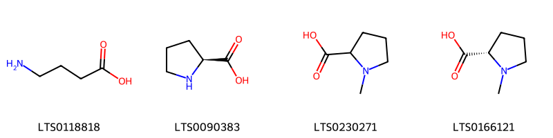{ width=100% }
    <figcaption>Hình ảnh cấu trúc hóa học của 4 hoạt chất thuộc nhóm Carboxylic acids and derivatives gồm ['gamma(amino)-butyric acid (LTS0118818)', 'l-proline (LTS0090383)', '1-methylpyrrolidine-2-carboxylic acid (LTS0230271)', 'n-methyl-l-proline (LTS0166121)'].</figcaption>
</figure>
#### Nhóm Coumarins and derivatives
<figure markdown="span">
    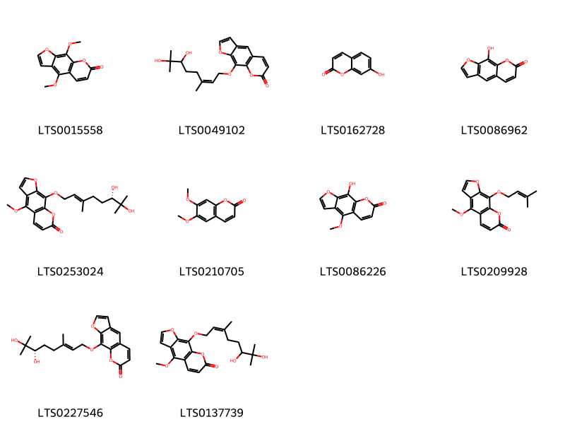{ width=100% }
    <figcaption>Hình ảnh cấu trúc hóa học của 10 hoạt chất thuộc nhóm Coumarins and derivatives gồm ['isopimpinellin (LTS0015558)', '9-[(6,7-dihydroxy-3,7-dimethyloct-2-en-1-yl)oxy]furo[3,2-g]chromen-7-one (LTS0049102)', 'umbelliferone (LTS0162728)', 'xanthotoxol (LTS0086962)', '9-{[(2e,6s)-6,7-dihydroxy-3,7-dimethyloct-2-en-1-yl]oxy}-4-methoxyfuro[3,2-g]chromen-7-one (LTS0253024)', 'scoparone (LTS0210705)', '9-hydroxy-4-methoxyfuro[3,2-g]chromen-7-one (LTS0086226)', 'phellopterin (LTS0209928)', '9-{[(2e,6s)-6,7-dihydroxy-3,7-dimethyloct-2-en-1-yl]oxy}furo[3,2-g]chromen-7-one (LTS0227546)', '9-[(6,7-dihydroxy-3,7-dimethyloct-2-en-1-yl)oxy]-4-methoxyfuro[3,2-g]chromen-7-one (LTS0137739)'].</figcaption>
</figure>
#### Nhóm Diazines
<figure markdown="span">
    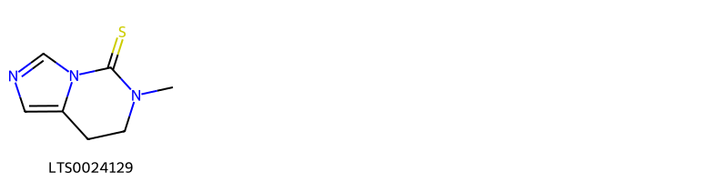{ width=100% }
    <figcaption>Hình ảnh cấu trúc hóa học của 1 hoạt chất thuộc nhóm Diazines gồm ['6-methyl-7h,8h-imidazo[1,5-c]pyrimidine-5-thione (LTS0024129)'].</figcaption>
</figure>
#### Nhóm Flavonoids
<figure markdown="span">
    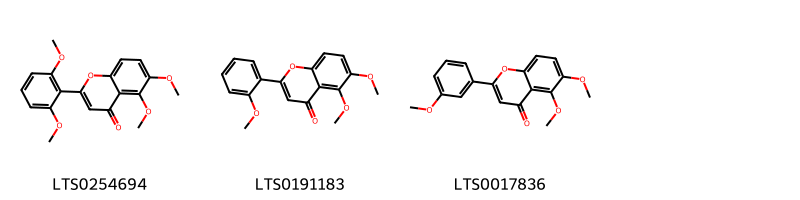{ width=100% }
    <figcaption>Hình ảnh cấu trúc hóa học của 3 hoạt chất thuộc nhóm Flavonoids gồm ['zapotin (LTS0254694)', '5,6-dimethoxy-2-(2-methoxyphenyl)chromen-4-one (LTS0191183)', '5,6-dimethoxy-2-(3-methoxyphenyl)chromen-4-one (LTS0017836)'].</figcaption>
</figure>
#### Nhóm Organonitrogen compounds
<figure markdown="span">
    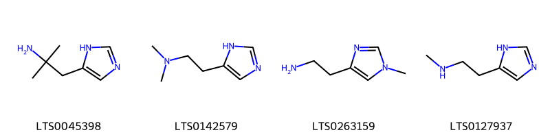{ width=100% }
    <figcaption>Hình ảnh cấu trúc hóa học của 4 hoạt chất thuộc nhóm Organonitrogen compounds gồm ['1-(3h-imidazol-4-yl)-2-methylpropan-2-amine (LTS0045398)', 'n,n-dimethylhistamine (LTS0142579)', 'methylhistamine (LTS0263159)', 'nα-methylhistamine (LTS0127937)'].</figcaption>
</figure>
#### Nhóm Organooxygen compounds
<figure markdown="span">
    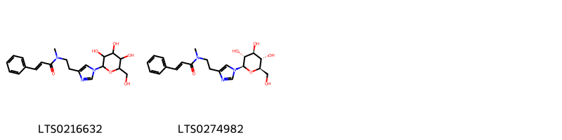{ width=100% }
    <figcaption>Hình ảnh cấu trúc hóa học của 2 hoạt chất thuộc nhóm Organooxygen compounds gồm ['n-methyl-3-phenyl-n-(2-{1-[3,4,5-trihydroxy-6-(hydroxymethyl)oxan-2-yl]imidazol-4-yl}ethyl)prop-2-enamide (LTS0216632)', 'casimiroedine (LTS0274982)'].</figcaption>
</figure>
#### Nhóm Phenols
<figure markdown="span">
    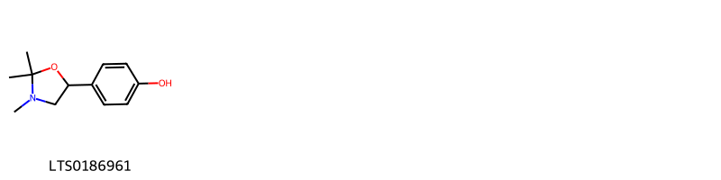{ width=100% }
    <figcaption>Hình ảnh cấu trúc hóa học của 1 hoạt chất thuộc nhóm Phenols gồm ['4-(2,2,3-trimethyl-1,3-oxazolidin-5-yl)phenol (LTS0186961)'].</figcaption>
</figure>
#### Nhóm Prenol lipids
<figure markdown="span">
    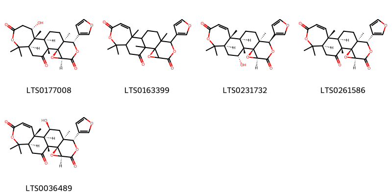{ width=100% }
    <figcaption>Hình ảnh cấu trúc hóa học của 5 hoạt chất thuộc nhóm Prenol lipids gồm ['(1r,2r,4s,7s,8s,11r,12r,13s,18r)-7-(furan-3-yl)-13-hydroxy-1,8,12,17,17-pentamethyl-3,6,16-trioxapentacyclo[9.9.0.0²,⁴.0²,⁸.0¹²,¹⁸]icosane-5,15,20-trione (LTS0177008)', '7-(furan-3-yl)-1,8,12,17,17-pentamethyl-3,6,16-trioxapentacyclo[9.9.0.0²,⁴.0²,⁸.0¹²,¹⁸]icos-13-ene-5,15,20-trione (LTS0163399)', '(1s,2r,4s,7r,8s,11r,12r,18r,20r)-7-(furan-3-yl)-20-hydroxy-1,8,12,17,17-pentamethyl-3,6,16-trioxapentacyclo[9.9.0.0²,⁴.0²,⁸.0¹²,¹⁸]icos-13-ene-5,15-dione (LTS0231732)', 'obacunone (LTS0261586)', 'zapoterin (LTS0036489)'].</figcaption>
</figure>
#### Nhóm Quinolines and derivatives
<figure markdown="span">
    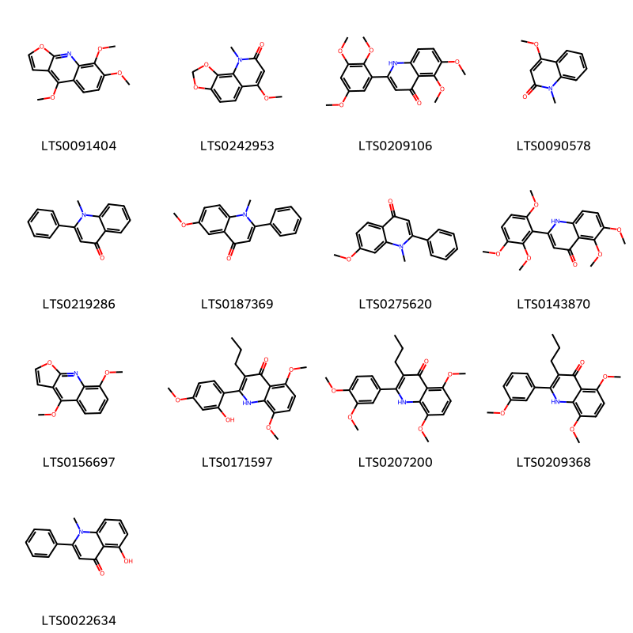{ width=100% }
    <figcaption>Hình ảnh cấu trúc hóa học của 13 hoạt chất thuộc nhóm Quinolines and derivatives gồm ['skimmianine (LTS0091404)', 'casimiroin (LTS0242953)', '5,6-dimethoxy-2-(2,3,5-trimethoxyphenyl)-1h-quinolin-4-one (LTS0209106)', '4-methoxy-1-methylquinolin-2-one (LTS0090578)', '1-methyl-2-phenylquinolin-4-one (LTS0219286)', '6-methoxy-1-methyl-2-phenylquinolin-4-one (LTS0187369)', '7-methoxy-1-methyl-2-phenylquinolin-4-one (LTS0275620)', '5,6-dimethoxy-2-(2,3,6-trimethoxyphenyl)-1h-quinolin-4-one (LTS0143870)', 'fagarine (LTS0156697)', '2-(2-hydroxy-4-methoxyphenyl)-5,8-dimethoxy-3-propyl-1h-quinolin-4-one (LTS0171597)', '2-(3,4-dimethoxyphenyl)-5,8-dimethoxy-3-propyl-1h-quinolin-4-one (LTS0207200)', '5,8-dimethoxy-2-(3-methoxyphenyl)-3-propyl-1h-quinolin-4-one (LTS0209368)', '5-hydroxy-1-methyl-2-phenylquinolin-4-one (LTS0022634)'].</figcaption>
</figure>
#### Nhóm Saturated hydrocarbons
<figure markdown="span">
    { width=100% }
    <figcaption>Hình ảnh cấu trúc hóa học của 1 hoạt chất thuộc nhóm Saturated hydrocarbons gồm ['hentriacontane (LTS0046415)'].</figcaption>
</figure>
#### Nhóm Steroids and steroid derivatives
<figure markdown="span">
    { width=100% }
    <figcaption>Hình ảnh cấu trúc hóa học của 2 hoạt chất thuộc nhóm Steroids and steroid derivatives gồm ['sitosterol (LTS0168132)', 'stigmast-5-en-3-ol, (3β)- (LTS0204616)'].</figcaption>
</figure>

---

### Dược dân tộc học

Danh sách các quốc gia có sử dụng *Casimiroa edulis* trong điều trị các bệnh. 

| Country       | Disease                                                                                                        | Bệnh                                                                                                                                                                                                |
|:--------------|:---------------------------------------------------------------------------------------------------------------|:----------------------------------------------------------------------------------------------------------------------------------------------------------------------------------------------------|
| Elsewhere     | Vermifuge, Hypnotic                                                                                            | MYMEMORY WARNING: YOU USED ALL AVAILABLE FREE TRANSLATIONS FOR TODAY. NEXT AVAILABLE IN  00 HOURS 17 MINUTES 02 SECONDS VISIT HTTPS://MYMEMORY.TRANSLATED.NET/DOC/USAGELIMITS.PHP TO TRANSLATE MORE |
| German        | Vulnerary                                                                                                      | MYMEMORY WARNING: YOU USED ALL AVAILABLE FREE TRANSLATIONS FOR TODAY. NEXT AVAILABLE IN  00 HOURS 17 MINUTES 00 SECONDS VISIT HTTPS://MYMEMORY.TRANSLATED.NET/DOC/USAGELIMITS.PHP TO TRANSLATE MORE |
| Latin America | Nervine                                                                                                        | MYMEMORY WARNING: YOU USED ALL AVAILABLE FREE TRANSLATIONS FOR TODAY. NEXT AVAILABLE IN  00 HOURS 16 MINUTES 57 SECONDS VISIT HTTPS://MYMEMORY.TRANSLATED.NET/DOC/USAGELIMITS.PHP TO TRANSLATE MORE |
| Mexico        | Analgesic, Hypnotic, Hypnotic, Hypnotic, Sedative, Sedative, Sedative, Hypnotic, Sedative, Suppurative, Poison | MYMEMORY WARNING: YOU USED ALL AVAILABLE FREE TRANSLATIONS FOR TODAY. NEXT AVAILABLE IN  00 HOURS 16 MINUTES 55 SECONDS VISIT HTTPS://MYMEMORY.TRANSLATED.NET/DOC/USAGELIMITS.PHP TO TRANSLATE MORE |
| US            | Soporific                                                                                                      | MYMEMORY WARNING: YOU USED ALL AVAILABLE FREE TRANSLATIONS FOR TODAY. NEXT AVAILABLE IN  00 HOURS 16 MINUTES 53 SECONDS VISIT HTTPS://MYMEMORY.TRANSLATED.NET/DOC/USAGELIMITS.PHP TO TRANSLATE MORE |

---

# Chi Poncirus

??? note "Danh sách các dược liệu thuộc chi"
    
	 - *Poncirus trifoliata*
	 - *Poncirus trifoliatus*

---
## Poncirus trifoliata
### Thông tin về thực vật

!!! info "Phân loại thực vật của *Citrus trifoliata* từ GIBF:"
    - **Kingdom:** Plantae
    - **Phylum:** Tracheophyta
    - **Order:** Sapindales
    - **Family:** Rutaceae
    - **Genus:** Citrus
    - **Species:** *Citrus trifoliata*

 

| Label (VI)   | Label (EN)   | Scientific Name     | Descriptions (VI)   | Descriptions (EN)                   | Also Known As (VI)                 | Also Known As (EN)                           |
|:-------------|:-------------|:--------------------|:--------------------|:------------------------------------|:-----------------------------------|:---------------------------------------------|
| N/A          | N/A          | Poncirus trifoliata | loài thực vật       | species of plant, Trifoliate orange | ['Citrus trifoliata', 'Cam ba lá'] | ['Citrus trifoliata', 'Poncirus trifoliata'] |
| N/A          | N/A          | Citrus trifoliata   | loài thực vật       | species of plant, Trifoliate orange | ['Citrus trifoliata', 'Cam ba lá'] | ['Citrus trifoliata', 'Poncirus trifoliata'] |

#### Phân bố trên thế giới

**Từ CSDL GIBF** nan, Australia, Japan, Georgia, Argentina, unknown or invalid, Norway, Netherlands, Korea, Republic of, Chinese Taipei, Spain, Portugal, Russian Federation, United States of America, Germany, Brazil, France, China, New Zealand

#### Phân bố tại Việt Nam

**Từ CSDL GIBF**: Không có ghi nhận ở Việt Nam

---
### Thành phần hóa học
        
- Theo cơ sở dữ liệu lotus: Từ loài *Citrus trifoliata* đã phân lập và xác định được 153 hoạt chất thuộc về các nhóm Fatty Acyls, Flavonoids, Prenol lipids, Steroids and steroid derivatives, Unsaturated hydrocarbons, Naphthofurans, Coumarins and derivatives, Naphthopyrans, Furanoid lignans, Carboxylic acids and derivatives, Benzopyrans. 

|    | chemicalTaxonomyClassyfireClass   |   smiles_count |
|---:|:----------------------------------|---------------:|
|  0 | Benzopyrans                       |              1 |
|  1 | Carboxylic acids and derivatives  |              1 |
|  2 | Coumarins and derivatives         |             38 |
|  3 | Fatty Acyls                       |              2 |
|  4 | Flavonoids                        |             27 |
|  5 | Furanoid lignans                  |              2 |
|  6 | Naphthofurans                     |              1 |
|  7 | Naphthopyrans                     |              4 |
|  8 | Prenol lipids                     |             58 |
|  9 | Steroids and steroid derivatives  |             18 |
| 10 | Unsaturated hydrocarbons          |              1 |

#### Nhóm Benzopyrans
<figure markdown="span">
    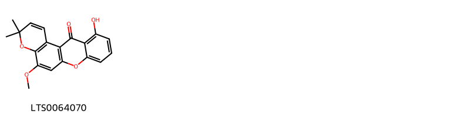{ width=100% }
    <figcaption>Hình ảnh cấu trúc hóa học của 1 hoạt chất thuộc nhóm Benzopyrans gồm ['6-hydroxy-12-methoxy-2,2-dimethyl-1,10-dioxatetraphen-5-one (LTS0064070)'].</figcaption>
</figure>
#### Nhóm Carboxylic acids and derivatives
<figure markdown="span">
    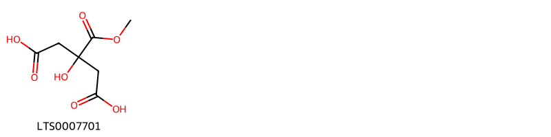{ width=100% }
    <figcaption>Hình ảnh cấu trúc hóa học của 1 hoạt chất thuộc nhóm Carboxylic acids and derivatives gồm ['3-hydroxy-3-(methoxycarbonyl)pentanedioic acid (LTS0007701)'].</figcaption>
</figure>
#### Nhóm Coumarins and derivatives
<figure markdown="span">
    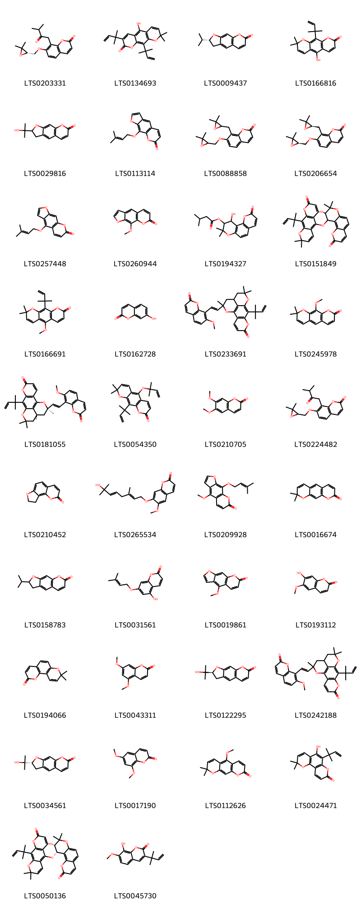{ width=100% }
    <figcaption>Hình ảnh cấu trúc hóa học của 38 hoạt chất thuộc nhóm Coumarins and derivatives gồm ['7-{[(2s)-3,3-dimethyloxiran-2-yl]methoxy}-8-(3-methyl-2-oxobutyl)chromen-2-one (LTS0203331)', '5-hydroxy-8,8-dimethyl-3,10-bis(2-methylbut-3-en-2-yl)pyrano[3,2-g]chromen-2-one (LTS0134693)', '(2r)-2-isopropyl-2h,3h-furo[3,2-g]chromen-7-one (LTS0009437)', 'nor-dentatin (LTS0166816)', 'marmesin (LTS0029816)', 'imperatorin (LTS0113114)', '7-[(3,3-dimethyloxiran-2-yl)methoxy]-8-[(3,3-dimethyloxiran-2-yl)methyl]chromen-2-one (LTS0088858)', '7-{[(2r)-3,3-dimethyloxiran-2-yl]methoxy}-8-{[(2r)-3,3-dimethyloxiran-2-yl]methyl}chromen-2-one (LTS0206654)', 'isoimperatorin (LTS0257448)', 'methoxsalen (LTS0260944)', '10-hydroxy-8,8-dimethyl-2-oxo-9h,10h-pyrano[2,3-h]chromen-9-yl 3-methylbutanoate (LTS0194327)', '5-({9-hydroxy-8,8-dimethyl-2-oxo-9h,10h-pyrano[2,3-h]chromen-10-yl}oxy)-8,8-dimethyl-10-(2-methylbut-3-en-2-yl)pyrano[3,2-g]chromen-2-one (LTS0151849)', 'dentatin (LTS0166691)', 'umbelliferone (LTS0162728)', '15-[2-(7-methoxy-2-oxochromen-8-yl)ethenyl]-11,11,15-trimethyl-8-(2-methylbut-3-en-2-yl)-6,10,16-trioxatetracyclo[7.7.1.0²,⁷.0¹³,¹⁷]heptadeca-1,3,7,9(17)-tetraen-5-one (LTS0233691)', 'luvangetin (LTS0245978)', '(13s,15r)-15-[(1e)-2-(7-methoxy-2-oxochromen-8-yl)ethenyl]-11,11,15-trimethyl-8-(2-methylbut-3-en-2-yl)-6,10,16-trioxatetracyclo[7.7.1.0²,⁷.0¹³,¹⁷]heptadeca-1,3,7,9(17)-tetraen-5-one (LTS0181055)', '8,8-dimethyl-10-(2-methylbut-3-en-2-yl)-5-[(2-methylbut-3-en-2-yl)oxy]pyrano[3,2-g]chromen-2-one (LTS0054350)', 'scoparone (LTS0210705)', '7-[(3,3-dimethyloxiran-2-yl)methoxy]-8-(3-methyl-2-oxobutyl)chromen-2-one (LTS0224482)', '8h,9h-furo[2,3-h]chromen-2-one (LTS0210452)', '7-{[(2e,5e)-7-hydroxy-3,7-dimethylocta-2,5-dien-1-yl]oxy}-6-methoxychromen-2-one (LTS0265534)', 'phellopterin (LTS0209928)', 'xanthyletin (LTS0016674)', '2-isopropyl-2h,3h-furo[3,2-g]chromen-7-one (LTS0158783)', '5-hydroxy-7-[(3-methylbut-2-en-1-yl)oxy]chromen-2-one (LTS0031561)', 'bergapten (LTS0019861)', 'scopoletin (LTS0193112)', 'seselin (LTS0194066)', 'limettin (LTS0043311)', 'marmesin (LTS0122295)', '15-[(1e)-2-(7-methoxy-2-oxochromen-8-yl)ethenyl]-11,11,15-trimethyl-8-(2-methylbut-3-en-2-yl)-6,10,16-trioxatetracyclo[7.7.1.0²,⁷.0¹³,¹⁷]heptadeca-1,3,7,9(17)-tetraen-5-one (LTS0242188)', '(-)-marmesin (LTS0034561)', '6,8-dimethoxychromen-2-one (LTS0017190)', 'xanthoxyletin (LTS0112626)', '5-hydroxy-2,2-dimethyl-6-(2-methylbut-3-en-2-yl)pyrano[2,3-h]chromen-8-one (LTS0024471)', '5-{[(9s,10s)-9-hydroxy-8,8-dimethyl-2-oxo-9h,10h-pyrano[2,3-h]chromen-10-yl]oxy}-8,8-dimethyl-10-(2-methylbut-3-en-2-yl)pyrano[3,2-g]chromen-2-one (LTS0050136)', '8-hydroxy-7-methoxy-3-(2-methylbut-3-en-2-yl)chromen-2-one (LTS0045730)'].</figcaption>
</figure>
#### Nhóm Fatty Acyls
<figure markdown="span">
    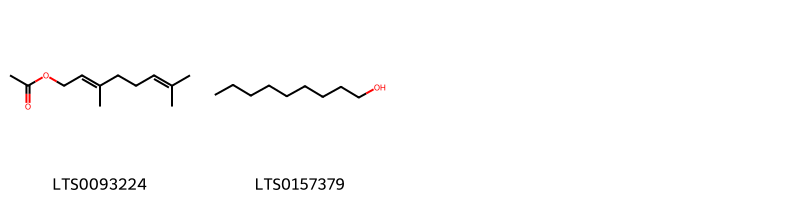{ width=100% }
    <figcaption>Hình ảnh cấu trúc hóa học của 2 hoạt chất thuộc nhóm Fatty Acyls gồm ['geranyl acetate (LTS0093224)', 'nonan-1-ol (LTS0157379)'].</figcaption>
</figure>
#### Nhóm Flavonoids
<figure markdown="span">
    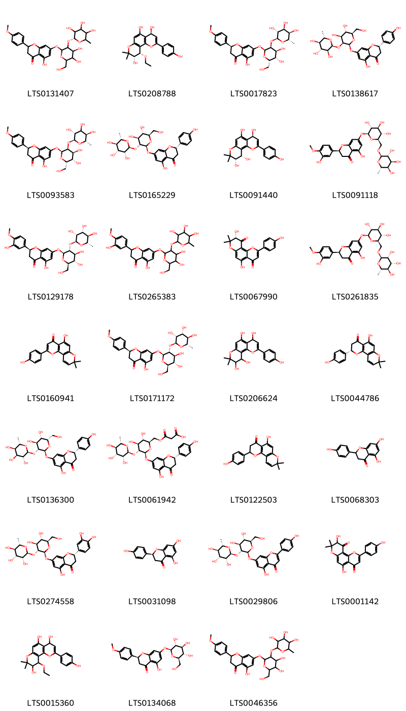{ width=100% }
    <figcaption>Hình ảnh cấu trúc hóa học của 27 hoạt chất thuộc nhóm Flavonoids gồm ['7-{[4,5-dihydroxy-6-(hydroxymethyl)-3-{[(2r)-3,4,5-trihydroxy-6-methyloxan-2-yl]oxy}oxan-2-yl]oxy}-5-hydroxy-2-(4-methoxyphenyl)-2,3-dihydro-1-benzopyran-4-one (LTS0131407)', '(4s,9s,10s)-10-ethoxy-2-(4-hydroxyphenyl)-8,8-dimethyl-4h,9h,10h-pyrano[2,3-h]chromene-4,5,9-triol (LTS0208788)', '(2s)-7-{[(2s,3s,4s,5s,6s)-4,5-dihydroxy-6-(hydroxymethyl)-3-{[(2s,3r,4s,5r,6s)-3,4,5-trihydroxy-6-methyloxan-2-yl]oxy}oxan-2-yl]oxy}-5-hydroxy-2-(4-methoxyphenyl)-2,3-dihydro-1-benzopyran-4-one (LTS0017823)', '(2s)-7-{[(2s,3s,4s,5s,6r)-4,5-dihydroxy-6-(hydroxymethyl)-3-{[(2s,3s,4r,5r,6s)-3,4,5-trihydroxy-6-methyloxan-2-yl]oxy}oxan-2-yl]oxy}-5-hydroxy-2-(4-hydroxyphenyl)-2,3-dihydro-1-benzopyran-4-one (LTS0138617)', '(2s)-7-{[(2s,3s,4s,5s,6s)-4,5-dihydroxy-6-(hydroxymethyl)-3-{[(2s,3r,5r,6s)-3,4,5-trihydroxy-6-methyloxan-2-yl]oxy}oxan-2-yl]oxy}-5-hydroxy-2-(4-methoxyphenyl)-2,3-dihydro-1-benzopyran-4-one (LTS0093583)', 'naringin (LTS0165229)', '(4s,9s,10s)-2-(4-hydroxyphenyl)-8,8-dimethyl-4h,9h,10h-pyrano[2,3-h]chromene-4,5,9,10-tetrol (LTS0091440)', '(2s)-5-hydroxy-2-(3-hydroxy-4-methoxyphenyl)-7-{[(2s,3r,4s,5s,6r)-3,4,5-trihydroxy-6-({[(2r,3r,4s,5r,6s)-3,4,5-trihydroxy-6-methyloxan-2-yl]oxy}methyl)oxan-2-yl]oxy}-2,3-dihydro-1-benzopyran-4-one (LTS0091118)', 'neohesperidin (LTS0129178)', '7-{[4,5-dihydroxy-6-(hydroxymethyl)-3-[(3,4,5-trihydroxy-6-methyloxan-2-yl)oxy]oxan-2-yl]oxy}-5-hydroxy-2-(3-hydroxy-4-methoxyphenyl)-2,3-dihydro-1-benzopyran-4-one (LTS0265383)', '(9s)-5,9-dihydroxy-2-(4-hydroxyphenyl)-8,8-dimethyl-9h-pyrano[2,3-h]chromene-4,10-dione (LTS0067990)', 'hesperidin (LTS0261835)', 'atalantoflavone (LTS0160941)', 'poncirin (LTS0171172)', '2-(4-hydroxyphenyl)-8,8-dimethyl-4h,9h,10h-pyrano[2,3-h]chromene-4,5,9,10-tetrol (LTS0206624)', '(2s)-5-hydroxy-2-(4-hydroxyphenyl)-8,8-dimethyl-2h,3h-pyrano[2,3-f]chromen-4-one (LTS0044786)', '(2s)-7-{[(2s,3r,4s,5s,6s)-4,5-dihydroxy-6-(hydroxymethyl)-3-{[(2s,3r,4s,5r,6s)-3,4,5-trihydroxy-6-methyloxan-2-yl]oxy}oxan-2-yl]oxy}-5-hydroxy-2-(4-hydroxyphenyl)-2,3-dihydro-1-benzopyran-4-one (LTS0136300)', '3-{[(2r,3s,4s,5r,6s)-3,4-dihydroxy-6-{[(2s)-5-hydroxy-2-(4-hydroxyphenyl)-4-oxo-2,3-dihydro-1-benzopyran-7-yl]oxy}-5-{[(2s,3r,4r,5r,6s)-3,4,5-trihydroxy-6-methyloxan-2-yl]oxy}oxan-2-yl]methoxy}-3-oxopropanoic acid (LTS0061942)', 'citflavanone (LTS0122503)', 'asahina (LTS0068303)', 'neoeriocitrin (LTS0274558)', 'naringenin (LTS0031098)', 'rhoifolin (LTS0029806)', '5,9-dihydroxy-2-(4-hydroxyphenyl)-8,8-dimethyl-9h-pyrano[2,3-h]chromene-4,10-dione (LTS0001142)', '10-ethoxy-2-(4-hydroxyphenyl)-8,8-dimethyl-4h,9h,10h-pyrano[2,3-h]chromene-4,5,9-triol (LTS0015360)', '(2s)-5-hydroxy-2-(4-methoxyphenyl)-7-{[(2s,3r,4s,5s,6r)-3,4,5-trihydroxy-6-(hydroxymethyl)oxan-2-yl]oxy}-2,3-dihydro-1-benzopyran-4-one (LTS0134068)', '7-{[4,5-dihydroxy-6-(hydroxymethyl)-3-[(3,4,5-trihydroxy-6-methyloxan-2-yl)oxy]oxan-2-yl]oxy}-5-hydroxy-2-(4-methoxyphenyl)-2,3-dihydro-1-benzopyran-4-one (LTS0046356)'].</figcaption>
</figure>
#### Nhóm Furanoid lignans
<figure markdown="span">
    { width=100% }
    <figcaption>Hình ảnh cấu trúc hóa học của 2 hoạt chất thuộc nhóm Furanoid lignans gồm ['syringaresinol (LTS0116280)', '(+)-syringaresinol (LTS0158868)'].</figcaption>
</figure>
#### Nhóm Naphthofurans
<figure markdown="span">
    { width=100% }
    <figcaption>Hình ảnh cấu trúc hóa học của 1 hoạt chất thuộc nhóm Naphthofurans gồm ["9b-(2-carboxy-1-hydroxyethyl)-7-[furan-3-yl(hydroxy)methyl]-3,3,5a,7-tetramethyl-5-oxo-hexahydrospiro[naphtho[1,2-c]furan-6,2'-oxirane]-3'-carboxylic acid (LTS0215959)"].</figcaption>
</figure>
#### Nhóm Naphthopyrans
<figure markdown="span">
    { width=100% }
    <figcaption>Hình ảnh cấu trúc hóa học của 4 hoạt chất thuộc nhóm Naphthopyrans gồm ['18-(furan-3-yl)-8,8,12,19-tetramethyl-6,16-dioxo-7,14,17-trioxapentacyclo[10.9.0.0²,⁹.0¹³,¹⁵.0¹³,¹⁹]henicosa-1(21),4-dien-11-yl acetate (LTS0068911)', '(1s,2s,5s,6s,9s,11r,12s,13r,15s,18r)-6-(furan-3-yl)-5,12,16,16-tetramethyl-8,20-dioxo-7,10,17,21-tetraoxahexacyclo[16.3.1.0¹,¹⁵.0²,¹².0⁵,¹¹.0⁹,¹¹]docosan-13-yl acetate (LTS0201281)', '(2s,4z,9s,11r,12s,13r,15s,18s,19s)-18-(furan-3-yl)-8,8,12,19-tetramethyl-6,16-dioxo-7,14,17-trioxapentacyclo[10.9.0.0²,⁹.0¹³,¹⁵.0¹³,¹⁹]henicosa-1(21),4-dien-11-yl acetate (LTS0098831)', '6-(furan-3-yl)-5,12,16,16-tetramethyl-8,20-dioxo-7,10,17,21-tetraoxahexacyclo[16.3.1.0¹,¹⁵.0²,¹².0⁵,¹¹.0⁹,¹¹]docosan-13-yl acetate (LTS0040509)'].</figcaption>
</figure>
#### Nhóm Prenol lipids
<figure markdown="span">
    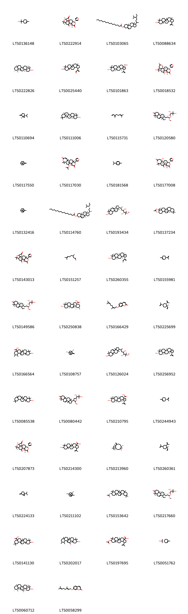{ width=100% }
    <figcaption>Hình ảnh cấu trúc hóa học của 58 hoạt chất thuộc nhóm Prenol lipids gồm ['terpineol (LTS0136148)', '(1r,2r,7s,10s,13r,14r,16s,19s,20s)-19-(furan-3-yl)-9,9,13,20-tetramethyl-4,8,15,18-tetraoxahexacyclo[11.9.0.0²,⁷.0²,¹⁰.0¹⁴,¹⁶.0¹⁴,²⁰]docosane-5,12,17-trione (LTS0222914)', '1-(5-ethyl-6-methylheptan-2-yl)-9a,11a-dimethyl-1h,2h,3h,3ah,3bh,4h,6h,7h,8h,9h,9bh,10h,11h-cyclopenta[a]phenanthren-7-yl hexadecanoate (LTS0103065)', 'lupeol (LTS0088634)', 'amyrin (LTS0222826)', '2-{9-hydroxy-3a,5a,5b,8,8,11a-hexamethyl-hexadecahydrocyclopenta[a]chrysen-1-yl}prop-2-enal (LTS0025440)', 'betulin (LTS0101863)', 'ichangin (LTS0018532)', '(+)-sabinene (LTS0110694)', '(3s,4ar,6ar,6br,8ar,12as,12br,14ar,14br)-4,4,6a,6b,8a,11,11,14b-octamethyl-hexadecahydropicen-3-ol (LTS0111006)', 'α-myrcene (LTS0115731)', '(1s,3as,5ar,9ar,9br,11as)-1-[(2s,3s,5r)-5-[(1s)-1,2-dihydroxy-2-methylpropyl]-2-methoxyoxolan-3-yl]-3a,6,6,9a,11a-pentamethyl-1h,2h,3h,5h,5ah,8h,9h,9bh,10h,11h-cyclopenta[a]phenanthren-7-one (LTS0120580)', 'β-pinene (LTS0117550)', '7-(furan-3-yl)-1,8,12,17,17-pentamethyl-5,15-dioxo-3,6,16-trioxapentacyclo[9.9.0.0²,⁴.0²,⁸.0¹²,¹⁸]icos-13-en-20-yl acetate (LTS0117030)', 'cymene (LTS0181568)', '(1r,2r,4s,7s,8s,11r,12r,13s,18r)-7-(furan-3-yl)-13-hydroxy-1,8,12,17,17-pentamethyl-3,6,16-trioxapentacyclo[9.9.0.0²,⁴.0²,⁸.0¹²,¹⁸]icosane-5,15,20-trione (LTS0177008)', 'α pinene (LTS0132416)', 'β-sitosteryl palmitate (LTS0114760)', '(3r,4r,6s)-6-[(1s,3as,5ar,7r,9ar,9br,11as)-7-hydroxy-3a,6,6,9a,11a-pentamethyl-1h,2h,3h,5h,5ah,7h,8h,9h,9bh,10h,11h-cyclopenta[a]phenanthren-1-yl]-2-methoxy-2-methylheptane-3,4-diol (LTS0193434)', 'β-amyrin acetate (LTS0137234)', 'limonin (LTS0143013)', 'citronella (LTS0151257)', '2-[(1r,3ar,5ar,5br,7ar,9s,11ar,11br,13ar,13bs)-9-hydroxy-3a,5a,5b,8,8,11a-hexamethyl-hexadecahydrocyclopenta[a]chrysen-1-yl]prop-2-enal (LTS0260355)', 'limonene,  (LTS0155981)', '(1s,3ar,5ar,9ar,9br,11as)-1-[(2r,3s,5r)-5-[(1s)-1,2-dihydroxy-2-methylpropyl]-2-methoxyoxolan-3-yl]-3a,6,6,9a,11a-pentamethyl-1h,2h,3h,5h,5ah,8h,9h,9bh,10h,11h-cyclopenta[a]phenanthren-7-one (LTS0149586)', 'ursolic acid (LTS0250838)', '7-[(3,7-dimethylocta-2,6-dien-1-yl)oxy]chromen-2-one (LTS0166429)', 'β-elemene (LTS0225699)', '10-hydroxy-1,2,6a,6b,9,9,12a-heptamethyl-2,3,4,5,6,7,8,8a,10,11,12,12b,13,14b-tetradecahydro-1h-picene-4a-carboxylic acid (LTS0166564)', '(-)-β-pinene (LTS0108757)', '6-{7-hydroxy-3a,6,6,9a,11a-pentamethyl-1h,2h,3h,5h,5ah,7h,8h,9h,9bh,10h,11h-cyclopenta[a]phenanthren-1-yl}-2-methoxy-2-methylheptane-3,4-diol (LTS0126024)', 'lupeol (LTS0256952)', '4,4,6a,6b,8a,11,11,14b-octamethyl-hexadecahydropicen-3-ol (LTS0085538)', '1-[5-(1,2-dihydroxy-2-methylpropyl)-2-methoxyoxolan-3-yl]-3a,6,6,9a,11a-pentamethyl-1h,2h,3h,5h,5ah,8h,9h,9bh,10h,11h-cyclopenta[a]phenanthren-7-one (LTS0080442)', 'betulinic acid (LTS0210795)', 'α-limonene (LTS0244943)', 'limonin (LTS0207873)', '9-hydroxy-5a,5b,8,8,11a-pentamethyl-1-(prop-1-en-2-yl)-hexadecahydrocyclopenta[a]chrysene-3a-carboxylic acid (LTS0214300)', 'β-caryophyllene oxide (LTS0213960)', 'β-elemene (LTS0260361)', 'sabinene (LTS0224133)', '(+)-α-pinene (LTS0211102)', '4,4,6a,6b,8a,11,11,14b-octamethyl-1,2,3,4a,5,6,7,8,9,10,12,12a,14,14a-tetradecahydropicen-3-yl acetate (LTS0153642)', '(1s,3ar,5ar,9ar,9br,11as)-1-[(2s,3s,5r)-5-[(1s)-1,2-dihydroxy-2-methylpropyl]-2-methoxyoxolan-3-yl]-3a,6,6,9a,11a-pentamethyl-1h,2h,3h,5h,5ah,8h,9h,9bh,10h,11h-cyclopenta[a]phenanthren-7-one (LTS0217660)', 'oleanolic acid (LTS0141130)', '10-hydroxy-1,2,4a,6a,6b,9,9,12a-octamethyl-1,2,3,4,5,6,7,8,8a,10,11,12,12b,14b-tetradecahydropicen-13-one (LTS0202017)', '9-(acetyloxy)-5a,5b,8,8,11a-pentamethyl-1-(prop-1-en-2-yl)-hexadecahydrocyclopenta[a]chrysene-3a-carboxylic acid (LTS0197695)', 'lily of valley (LTS0051762)', '(1s,2r,4ar,6as,6br,8ar,10s,12as,12br,14br)-10-hydroxy-1,2,4a,6a,6b,9,9,12a-octamethyl-1,2,3,4,5,6,7,8,8a,10,11,12,12b,14b-tetradecahydropicen-13-one (LTS0060712)', 'auraptene (LTS0058299)', '(1r,3as,5ar,5br,7ar,9s,11ar,11br,13ar,13br)-9-(acetyloxy)-5a,5b,8,8,11a-pentamethyl-1-(prop-1-en-2-yl)-hexadecahydrocyclopenta[a]chrysene-3a-carboxylic acid (LTS0000950)', '3a-(hydroxymethyl)-5a,5b,8,8,11a-pentamethyl-1-(prop-1-en-2-yl)-hexadecahydrocyclopenta[a]chrysen-9-ol (LTS0008250)', '(1s,3as,5ar,9ar,9br,11as)-1-[(2r,3s,5r)-5-[(1s)-1,2-dihydroxy-2-methylpropyl]-2-methoxyoxolan-3-yl]-3a,6,6,9a,11a-pentamethyl-1h,2h,3h,5h,5ah,8h,9h,9bh,10h,11h-cyclopenta[a]phenanthren-7-one (LTS0009894)', 'nerol (LTS0244289)', 'α-amyrin (LTS0088267)', '(1s,2r,4s,7s,8s,11r,12r,18s,20r)-7-(furan-3-yl)-1,8,12,17,17-pentamethyl-5,15-dioxo-3,6,16-trioxapentacyclo[9.9.0.0²,⁴.0²,⁸.0¹²,¹⁸]icos-13-en-20-yl acetate (LTS0020464)', 'α-citral (LTS0246122)', 'oleanolic acid (LTS0117717)'].</figcaption>
</figure>
#### Nhóm Steroids and steroid derivatives
<figure markdown="span">
    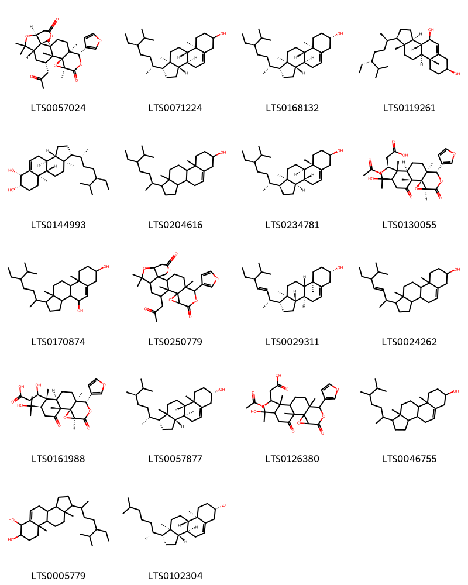{ width=100% }
    <figcaption>Hình ảnh cấu trúc hóa học của 18 hoạt chất thuộc nhóm Steroids and steroid derivatives gồm ['(1r,2r,7s,10s,12s,13r,14s,16s,19s,20s)-19-(furan-3-yl)-9,9,13,20-tetramethyl-12-(2-oxopropyl)-4,8,15,18-tetraoxahexacyclo[11.9.0.0²,⁷.0²,¹⁰.0¹⁴,¹⁶.0¹⁴,²⁰]docosane-5,17-dione (LTS0057024)', 'stigmast-5-en-3-ol (LTS0071224)', 'sitosterol (LTS0168132)', '7β-hydroxysitosterol (LTS0119261)', '(1r,3as,3bs,6r,7s,9ar,9bs,11ar)-1-[(2r,5r)-5-ethyl-6-methylheptan-2-yl]-9a,11a-dimethyl-1h,2h,3h,3ah,3bh,4h,6h,7h,8h,9h,9bh,10h,11h-cyclopenta[a]phenanthrene-6,7-diol (LTS0144993)', 'stigmast-5-en-3-ol, (3β)- (LTS0204616)', '(1s,3ar,3br,7r,9as,9br,11ar)-1-[(2r,5r)-5-ethyl-6-methylheptan-2-yl]-9a,11a-dimethyl-1h,2h,3h,3ah,3bh,4h,6h,7h,8h,9h,9bh,10h,11h-cyclopenta[a]phenanthren-7-ol (LTS0234781)', '(3s)-3-(acetyloxy)-3-[(1r,2r,5r,6r,7r,10s,11s,14s)-11-(furan-3-yl)-5-(2-hydroxypropan-2-yl)-2,6,10-trimethyl-3,13-dioxo-12,15-dioxatetracyclo[8.5.0.0¹,¹⁴.0²,⁷]pentadecan-6-yl]propanoic acid (LTS0130055)', '1-(5-ethyl-6-methylheptan-2-yl)-9a,11a-dimethyl-1h,2h,3h,3ah,3bh,4h,6h,7h,8h,9h,9bh,10h,11h-cyclopenta[a]phenanthrene-4,7-diol (LTS0170874)', '19-(furan-3-yl)-9,9,13,20-tetramethyl-12-(2-oxopropyl)-4,8,15,18-tetraoxahexacyclo[11.9.0.0²,⁷.0²,¹⁰.0¹⁴,¹⁶.0¹⁴,²⁰]docosane-5,17-dione (LTS0250779)', 'phytosterol (LTS0029311)', 'stigmasterol (LTS0024262)', '3-[(1r,2r,5r,6r,7r,10s,11s,14s)-11-(furan-3-yl)-5-(2-hydroxypropan-2-yl)-2,6,10-trimethyl-3,13-dioxo-12,15-dioxatetracyclo[8.5.0.0¹,¹⁴.0²,⁷]pentadecan-6-yl]-3-hydroxypropanoic acid (LTS0161988)', '(1r,3as,3bs,7s,9bs)-1-[(2r,5r)-5,6-dimethylheptan-2-yl]-9a,11a-dimethyl-1h,2h,3h,3ah,3bh,4h,6h,7h,8h,9h,9bh,10h,11h-cyclopenta[a]phenanthren-7-ol (LTS0057877)', '3-(acetyloxy)-3-[11-(furan-3-yl)-5-(2-hydroxypropan-2-yl)-2,6,10-trimethyl-3,13-dioxo-12,15-dioxatetracyclo[8.5.0.0¹,¹⁴.0²,⁷]pentadecan-6-yl]propanoic acid (LTS0126380)', 'campesterol (LTS0046755)', '1-(5-ethyl-6-methylheptan-2-yl)-9a,11a-dimethyl-1h,2h,3h,3ah,3bh,4h,6h,7h,8h,9h,9bh,10h,11h-cyclopenta[a]phenanthrene-6,7-diol (LTS0005779)', 'cholesterol (LTS0102304)'].</figcaption>
</figure>
#### Nhóm Unsaturated hydrocarbons
<figure markdown="span">
    { width=100% }
    <figcaption>Hình ảnh cấu trúc hóa học của 1 hoạt chất thuộc nhóm Unsaturated hydrocarbons gồm ['α terpinene (LTS0232891)'].</figcaption>
</figure>

---

### Dược dân tộc học

Danh sách các quốc gia có sử dụng *Citrus trifoliata* trong điều trị các bệnh. 

| Country   | Disease                                                  | Bệnh                                                                                                                                                                                                |
|:----------|:---------------------------------------------------------|:----------------------------------------------------------------------------------------------------------------------------------------------------------------------------------------------------|
| China     | Carminative, Diuretic, Refrigerant, Stomachic, Stomachic | MYMEMORY WARNING: YOU USED ALL AVAILABLE FREE TRANSLATIONS FOR TODAY. NEXT AVAILABLE IN  00 HOURS 16 MINUTES 26 SECONDS VISIT HTTPS://MYMEMORY.TRANSLATED.NET/DOC/USAGELIMITS.PHP TO TRANSLATE MORE |

---

---
## Poncirus trifoliatus
### Thông tin về thực vật

!!! info "Phân loại thực vật của *Citrus trifoliata* từ GIBF:"
    - **Kingdom:** Plantae
    - **Phylum:** Tracheophyta
    - **Order:** Sapindales
    - **Family:** Rutaceae
    - **Genus:** Citrus
    - **Species:** *Citrus trifoliata*

 

| Label (VI)   | Label (EN)   | Scientific Name     | Descriptions (VI)   | Descriptions (EN)                   | Also Known As (VI)                 | Also Known As (EN)                           |
|:-------------|:-------------|:--------------------|:--------------------|:------------------------------------|:-----------------------------------|:---------------------------------------------|
| N/A          | N/A          | Poncirus trifoliata | loài thực vật       | species of plant, Trifoliate orange | ['Citrus trifoliata', 'Cam ba lá'] | ['Citrus trifoliata', 'Poncirus trifoliata'] |
| N/A          | N/A          | Citrus trifoliata   | loài thực vật       | species of plant, Trifoliate orange | ['Citrus trifoliata', 'Cam ba lá'] | ['Citrus trifoliata', 'Poncirus trifoliata'] |

#### Phân bố trên thế giới

**Từ CSDL GIBF** nan, Australia, Japan, Georgia, Argentina, unknown or invalid, Norway, Netherlands, Korea, Republic of, Chinese Taipei, Spain, Portugal, Russian Federation, United States of America, Germany, Brazil, France, China, New Zealand

#### Phân bố tại Việt Nam

**Từ CSDL GIBF**: Không có ghi nhận ở Việt Nam

---
### Thành phần hóa học
        
- Theo cơ sở dữ liệu lotus: Từ loài *Citrus trifoliata* đã phân lập và xác định được Chưa có hoạt chất nào được phân lập. hoạt chất thuộc về các nhóm Không có hoạt chất nào được phân lập. 

Không có hình ảnh nào được tạo ra

---

### Dược dân tộc học

Danh sách các quốc gia có sử dụng *Citrus trifoliata* trong điều trị các bệnh. 

| Country   | Disease             | Bệnh                                                                                                                                                                                                |
|:----------|:--------------------|:----------------------------------------------------------------------------------------------------------------------------------------------------------------------------------------------------|
| Elsewhere | Diuretic, Stomachic | MYMEMORY WARNING: YOU USED ALL AVAILABLE FREE TRANSLATIONS FOR TODAY. NEXT AVAILABLE IN  00 HOURS 15 MINUTES 53 SECONDS VISIT HTTPS://MYMEMORY.TRANSLATED.NET/DOC/USAGELIMITS.PHP TO TRANSLATE MORE |

---

# Chi Acronychia

??? note "Danh sách các dược liệu thuộc chi"
    
	 - *Acronychia laurifolia*
	 - *Acronychia pedunculata*

---
## Acronychia laurifolia
### Thông tin về thực vật

!!! info "Phân loại thực vật của *Acronychia pedunculata* từ GIBF:"
    - **Kingdom:** Plantae
    - **Phylum:** Tracheophyta
    - **Order:** Sapindales
    - **Family:** Rutaceae
    - **Genus:** Acronychia
    - **Species:** *Acronychia pedunculata*

 

| Label (VI)   | Label (EN)   | Scientific Name     | Descriptions (VI)   | Descriptions (EN)                   | Also Known As (VI)                 | Also Known As (EN)                           |
|:-------------|:-------------|:--------------------|:--------------------|:------------------------------------|:-----------------------------------|:---------------------------------------------|
| N/A          | N/A          | Poncirus trifoliata | loài thực vật       | species of plant, Trifoliate orange | ['Citrus trifoliata', 'Cam ba lá'] | ['Citrus trifoliata', 'Poncirus trifoliata'] |
| N/A          | N/A          | Citrus trifoliata   | loài thực vật       | species of plant, Trifoliate orange | ['Citrus trifoliata', 'Cam ba lá'] | ['Citrus trifoliata', 'Poncirus trifoliata'] |

#### Phân bố trên thế giới

**Từ CSDL GIBF** nan, Sri Lanka, Hong Kong, Thailand, Cambodia, Chinese Taipei, unknown or invalid, Indonesia, India, Viet Nam, Philippines, Malaysia, China

#### Phân bố tại Việt Nam

**Từ CSDL GIBF**: Annam, Đà Nẵng, Tonkin

---
### Thành phần hóa học
        
- Theo cơ sở dữ liệu lotus: Từ loài *Acronychia pedunculata* đã phân lập và xác định được Chưa có hoạt chất nào được phân lập. hoạt chất thuộc về các nhóm Không có hoạt chất nào được phân lập. 

Không có hình ảnh nào được tạo ra

---

### Dược dân tộc học

Danh sách các quốc gia có sử dụng *Acronychia pedunculata* trong điều trị các bệnh. 

| Country   | Disease   | Bệnh                                                                                                                                                                                                |
|:----------|:----------|:----------------------------------------------------------------------------------------------------------------------------------------------------------------------------------------------------|
| Indochina | Piscicide | MYMEMORY WARNING: YOU USED ALL AVAILABLE FREE TRANSLATIONS FOR TODAY. NEXT AVAILABLE IN  00 HOURS 15 MINUTES 33 SECONDS VISIT HTTPS://MYMEMORY.TRANSLATED.NET/DOC/USAGELIMITS.PHP TO TRANSLATE MORE |

---

---
## Acronychia pedunculata
### Thông tin về thực vật

!!! info "Phân loại thực vật của *Acronychia pedunculata* từ GIBF:"
    - **Kingdom:** Plantae
    - **Phylum:** Tracheophyta
    - **Order:** Sapindales
    - **Family:** Rutaceae
    - **Genus:** Acronychia
    - **Species:** *Acronychia pedunculata*

 

| Label (VI)   | Label (EN)   | Scientific Name        | Descriptions (VI)   | Descriptions (EN)   | Also Known As (VI)   | Also Known As (EN)   |
|:-------------|:-------------|:-----------------------|:--------------------|:--------------------|:---------------------|:---------------------|
| N/A          | N/A          | Acronychia pedunculata | loài thực vật       | species of plant    | ['']                 | ['']                 |

#### Phân bố trên thế giới

**Từ CSDL GIBF** Sri Lanka, Hong Kong, Chinese Taipei, Macao, India, China

#### Phân bố tại Việt Nam

**Từ CSDL GIBF**: Không có ghi nhận ở Việt Nam

---
### Thành phần hóa học
        
- Theo cơ sở dữ liệu lotus: Từ loài *Acronychia pedunculata* đã phân lập và xác định được 28 hoạt chất thuộc về các nhóm Prenol lipids, Quinolines and derivatives, Benzodioxoles, Benzene and substituted derivatives, Organooxygen compounds, Coumarins and derivatives, Furanoid lignans, Benzopyrans. 

|    | chemicalTaxonomyClassyfireClass     |   smiles_count |
|---:|:------------------------------------|---------------:|
|  0 | Benzene and substituted derivatives |              4 |
|  1 | Benzodioxoles                       |              2 |
|  2 | Benzopyrans                         |              2 |
|  3 | Coumarins and derivatives           |              1 |
|  4 | Furanoid lignans                    |              1 |
|  5 | Organooxygen compounds              |              9 |
|  6 | Prenol lipids                       |              2 |
|  7 | Quinolines and derivatives          |              7 |

#### Nhóm Benzene and substituted derivatives
<figure markdown="span">
    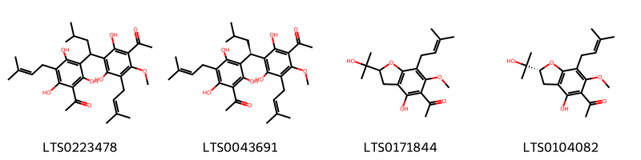{ width=100% }
    <figcaption>Hình ảnh cấu trúc hóa học của 4 hoạt chất thuộc nhóm Benzene and substituted derivatives gồm ['acrovestone (LTS0223478)', '1-{3-[(1r)-1-[3-acetyl-2,4,6-trihydroxy-5-(3-methylbut-2-en-1-yl)phenyl]-3-methylbutyl]-2,4-dihydroxy-6-methoxy-5-(3-methylbut-2-en-1-yl)phenyl}ethanone (LTS0043691)', '1-[4-hydroxy-2-(2-hydroxypropan-2-yl)-6-methoxy-7-(3-methylbut-2-en-1-yl)-2,3-dihydro-1-benzofuran-5-yl]ethanone (LTS0171844)', '1-[(2r)-4-hydroxy-2-(2-hydroxypropan-2-yl)-6-methoxy-7-(3-methylbut-2-en-1-yl)-2,3-dihydro-1-benzofuran-5-yl]ethanone (LTS0104082)'].</figcaption>
</figure>
#### Nhóm Benzodioxoles
<figure markdown="span">
    { width=100% }
    <figcaption>Hình ảnh cấu trúc hóa học của 2 hoạt chất thuộc nhóm Benzodioxoles gồm ['sesamolin (LTS0079632)', 'sesamolin (LTS0276354)'].</figcaption>
</figure>
#### Nhóm Benzopyrans
<figure markdown="span">
    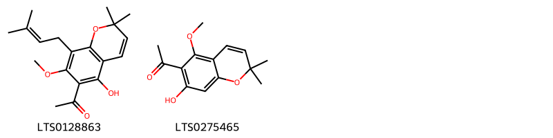{ width=100% }
    <figcaption>Hình ảnh cấu trúc hóa học của 2 hoạt chất thuộc nhóm Benzopyrans gồm ['1-[5-hydroxy-7-methoxy-2,2-dimethyl-8-(3-methylbut-2-en-1-yl)chromen-6-yl]ethanone (LTS0128863)', '1-(7-hydroxy-5-methoxy-2,2-dimethylchromen-6-yl)ethanone (LTS0275465)'].</figcaption>
</figure>
#### Nhóm Coumarins and derivatives
<figure markdown="span">
    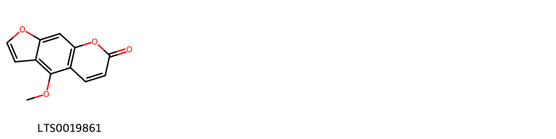{ width=100% }
    <figcaption>Hình ảnh cấu trúc hóa học của 1 hoạt chất thuộc nhóm Coumarins and derivatives gồm ['bergapten (LTS0019861)'].</figcaption>
</figure>
#### Nhóm Furanoid lignans
<figure markdown="span">
    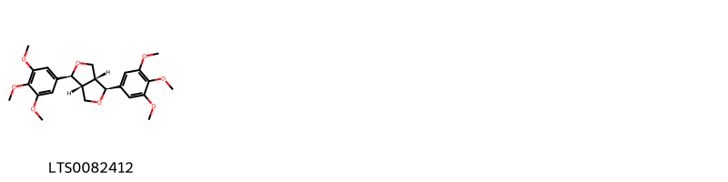{ width=100% }
    <figcaption>Hình ảnh cấu trúc hóa học của 1 hoạt chất thuộc nhóm Furanoid lignans gồm ['( )-yangabin (LTS0082412)'].</figcaption>
</figure>
#### Nhóm Organooxygen compounds
<figure markdown="span">
    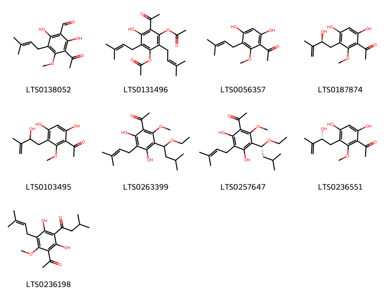{ width=100% }
    <figcaption>Hình ảnh cấu trúc hóa học của 9 hoạt chất thuộc nhóm Organooxygen compounds gồm ['3-acetyl-2,6-dihydroxy-4-methoxy-5-(3-methylbut-2-en-1-yl)benzaldehyde (LTS0138052)', '2-acetyl-5-(acetyloxy)-3-hydroxy-4,6-bis(3-methylbut-2-en-1-yl)phenyl acetate (LTS0131496)', '1-[4,6-dihydroxy-2-methoxy-3-(3-methylbut-2-en-1-yl)phenyl]ethanone (LTS0056357)', '1-{4,6-dihydroxy-3-[(2s)-2-hydroxy-3-methylbut-3-en-1-yl]-2-methoxyphenyl}ethanone (LTS0187874)', '1-[4,6-dihydroxy-3-(2-hydroxy-3-methylbut-3-en-1-yl)-2-methoxyphenyl]ethanone (LTS0103495)', '1-[3-(1-ethoxy-3-methylbutyl)-4,6-dihydroxy-2-methoxy-5-(3-methylbut-2-en-1-yl)phenyl]ethanone (LTS0263399)', '1-{3-[(1r)-1-ethoxy-3-methylbutyl]-4,6-dihydroxy-2-methoxy-5-(3-methylbut-2-en-1-yl)phenyl}ethanone (LTS0257647)', '1-{4,6-dihydroxy-3-[(2r)-2-hydroxy-3-methylbut-3-en-1-yl]-2-methoxyphenyl}ethanone (LTS0236551)', '1-[3-acetyl-2,6-dihydroxy-4-methoxy-5-(3-methylbut-2-en-1-yl)phenyl]-3-methylbutan-1-one (LTS0236198)'].</figcaption>
</figure>
#### Nhóm Prenol lipids
<figure markdown="span">
    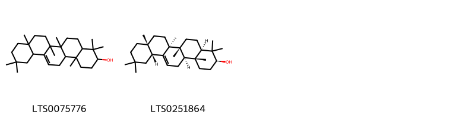{ width=100% }
    <figcaption>Hình ảnh cấu trúc hóa học của 2 hoạt chất thuộc nhóm Prenol lipids gồm ['β-amyrin (LTS0075776)', 'β-amyrin (LTS0251864)'].</figcaption>
</figure>
#### Nhóm Quinolines and derivatives
<figure markdown="span">
    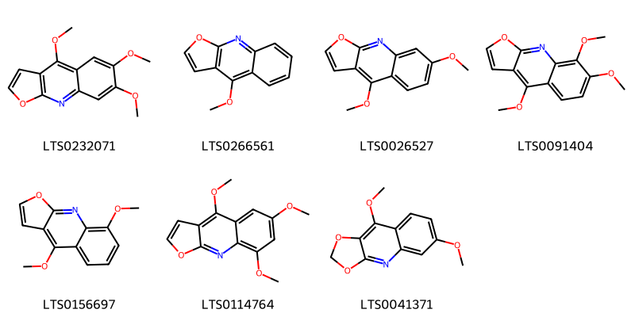{ width=100% }
    <figcaption>Hình ảnh cấu trúc hóa học của 7 hoạt chất thuộc nhóm Quinolines and derivatives gồm ['kokusaginine (LTS0232071)', 'dictamnine (LTS0266561)', '4,7-dimethoxyfuro[2,3-b]quinoline (LTS0026527)', 'skimmianine (LTS0091404)', 'fagarine (LTS0156697)', 'maculosidine (LTS0114764)', '6,9-dimethoxy-2h-[1,3]dioxolo[4,5-b]quinoline (LTS0041371)'].</figcaption>
</figure>

---

### Dược dân tộc học

Danh sách các quốc gia có sử dụng *Acronychia pedunculata* trong điều trị các bệnh. 

| Country   | Disease   | Bệnh                                                                                                                                                                                                |
|:----------|:----------|:----------------------------------------------------------------------------------------------------------------------------------------------------------------------------------------------------|
| China     | Hemostat  | MYMEMORY WARNING: YOU USED ALL AVAILABLE FREE TRANSLATIONS FOR TODAY. NEXT AVAILABLE IN  00 HOURS 15 MINUTES 14 SECONDS VISIT HTTPS://MYMEMORY.TRANSLATED.NET/DOC/USAGELIMITS.PHP TO TRANSLATE MORE |

---

# Chi Feronia

??? note "Danh sách các dược liệu thuộc chi"
    
	 - *Feronia elaphantum*
	 - *Feronia limonia*

---
## Feronia elaphantum
### Thông tin về thực vật

!!! info "Phân loại thực vật của *Limonia acidissima* từ GIBF:"
    - **Kingdom:** Plantae
    - **Phylum:** Tracheophyta
    - **Order:** Sapindales
    - **Family:** Rutaceae
    - **Genus:** Limonia
    - **Species:** *Limonia acidissima*

 

| Label (VI)   | Label (EN)   | Scientific Name        | Descriptions (VI)   | Descriptions (EN)   | Also Known As (VI)   | Also Known As (EN)   |
|:-------------|:-------------|:-----------------------|:--------------------|:--------------------|:---------------------|:---------------------|
| N/A          | N/A          | Acronychia pedunculata | loài thực vật       | species of plant    | ['']                 | ['']                 |

#### Phân bố trên thế giới

**Từ CSDL GIBF** nan, Thailand, Cambodia, Egypt, India, Indonesia, unknown or invalid, United States of America, Cuba

#### Phân bố tại Việt Nam

**Từ CSDL GIBF**: Không có ghi nhận ở Việt Nam

---
### Thành phần hóa học
        
- Theo cơ sở dữ liệu lotus: Từ loài *Limonia acidissima* đã phân lập và xác định được Chưa có hoạt chất nào được phân lập. hoạt chất thuộc về các nhóm Không có hoạt chất nào được phân lập. 

Không có hình ảnh nào được tạo ra

---

### Dược dân tộc học

Danh sách các quốc gia có sử dụng *Limonia acidissima* trong điều trị các bệnh. 

| Country   | Disease    | Bệnh                                                                                                                                                                                                |
|:----------|:-----------|:----------------------------------------------------------------------------------------------------------------------------------------------------------------------------------------------------|
| Iran      | Astringent | MYMEMORY WARNING: YOU USED ALL AVAILABLE FREE TRANSLATIONS FOR TODAY. NEXT AVAILABLE IN  00 HOURS 14 MINUTES 49 SECONDS VISIT HTTPS://MYMEMORY.TRANSLATED.NET/DOC/USAGELIMITS.PHP TO TRANSLATE MORE |

---

---
## Feronia limonia
### Thông tin về thực vật

!!! info "Phân loại thực vật của *Limonia acidissima* từ GIBF:"
    - **Kingdom:** Plantae
    - **Phylum:** Tracheophyta
    - **Order:** Sapindales
    - **Family:** Rutaceae
    - **Genus:** Limonia
    - **Species:** *Limonia acidissima*

 

| Label (VI)   | Label (EN)   | Scientific Name   | Descriptions (VI)   | Descriptions (EN)   | Also Known As (VI)   | Also Known As (EN)   |
|:-------------|:-------------|:------------------|:--------------------|:--------------------|:---------------------|:---------------------|
| N/A          | N/A          | Feronia limonia   | loài thực vật       | species of plant    | ['']                 | ['']                 |

#### Phân bố trên thế giới

**Từ CSDL GIBF** nan, Sri Lanka, Réunion, Thailand, Lao People’s Democratic Republic, Cambodia, Brazil, Myanmar, India, unknown or invalid, Indonesia, United States of America

#### Phân bố tại Việt Nam

**Từ CSDL GIBF**: Không có ghi nhận ở Việt Nam

---
### Thành phần hóa học
        
- Theo cơ sở dữ liệu lotus: Từ loài *Limonia acidissima* đã phân lập và xác định được Chưa có hoạt chất nào được phân lập. hoạt chất thuộc về các nhóm Không có hoạt chất nào được phân lập. 

Không có hình ảnh nào được tạo ra

---

### Dược dân tộc học

Danh sách các quốc gia có sử dụng *Limonia acidissima* trong điều trị các bệnh. 

| Country   | Disease                                             | Bệnh                                                                                                                                                                                                |
|:----------|:----------------------------------------------------|:----------------------------------------------------------------------------------------------------------------------------------------------------------------------------------------------------|
| Elsewhere | Stimulant, Stomachic                                | MYMEMORY WARNING: YOU USED ALL AVAILABLE FREE TRANSLATIONS FOR TODAY. NEXT AVAILABLE IN  00 HOURS 14 MINUTES 32 SECONDS VISIT HTTPS://MYMEMORY.TRANSLATED.NET/DOC/USAGELIMITS.PHP TO TRANSLATE MORE |
| India     | Alexiteric, Astringent, Cardiac, Carminative, Tonic | MYMEMORY WARNING: YOU USED ALL AVAILABLE FREE TRANSLATIONS FOR TODAY. NEXT AVAILABLE IN  00 HOURS 14 MINUTES 30 SECONDS VISIT HTTPS://MYMEMORY.TRANSLATED.NET/DOC/USAGELIMITS.PHP TO TRANSLATE MORE |

---

# Chi Ruta

??? note "Danh sách các dược liệu thuộc chi"
    
	 - *Ruta angustifolia*
	 - *Ruta chalapensis*
	 - *Ruta chalepensis*
	 - *Ruta graveolens*

---
## Ruta angustifolia
### Thông tin về thực vật

!!! info "Phân loại thực vật của *Ruta angustifolia* từ GIBF:"
    - **Kingdom:** Plantae
    - **Phylum:** Tracheophyta
    - **Order:** Sapindales
    - **Family:** Rutaceae
    - **Genus:** Ruta
    - **Species:** *Ruta angustifolia*

 

| Label (VI)   | Label (EN)   | Scientific Name   | Descriptions (VI)   | Descriptions (EN)   | Also Known As (VI)   | Also Known As (EN)   |
|:-------------|:-------------|:------------------|:--------------------|:--------------------|:---------------------|:---------------------|
| N/A          | N/A          | Ruta angustifolia | loài thực vật       | species of plant    | ['']                 | ['']                 |

#### Phân bố trên thế giới

**Từ CSDL GIBF** Italy, Spain, Portugal, Algeria, Gibraltar, France

#### Phân bố tại Việt Nam

**Từ CSDL GIBF**: Không có ghi nhận ở Việt Nam

---
### Thành phần hóa học
        
- Theo cơ sở dữ liệu lotus: Từ loài *Ruta angustifolia* đã phân lập và xác định được 41 hoạt chất thuộc về các nhóm Fatty Acyls, Flavonoids, Prenol lipids, Quinolines and derivatives, Benzodioxoles, Organooxygen compounds, Coumarins and derivatives. 

|    | chemicalTaxonomyClassyfireClass   |   smiles_count |
|---:|:----------------------------------|---------------:|
|  0 | Benzodioxoles                     |              5 |
|  1 | Coumarins and derivatives         |              2 |
|  2 | Fatty Acyls                       |              8 |
|  3 | Flavonoids                        |              5 |
|  4 | Organooxygen compounds            |             12 |
|  5 | Prenol lipids                     |              8 |
|  6 | Quinolines and derivatives        |              1 |

#### Nhóm Benzodioxoles
<figure markdown="span">
    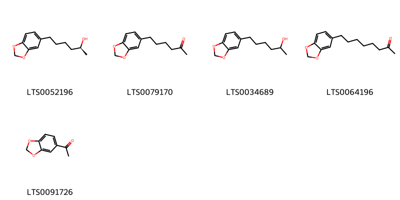{ width=100% }
    <figcaption>Hình ảnh cấu trúc hóa học của 5 hoạt chất thuộc nhóm Benzodioxoles gồm ['(2s)-6-(2h-1,3-benzodioxol-5-yl)hexan-2-ol (LTS0052196)', '6-(2h-1,3-benzodioxol-5-yl)hexan-2-one (LTS0079170)', '6-(2h-1,3-benzodioxol-5-yl)hexan-2-ol (LTS0034689)', '8-(2h-1,3-benzodioxol-5-yl)octan-2-one (LTS0064196)', '1-(2h-1,3-benzodioxol-5-yl)ethanone (LTS0091726)'].</figcaption>
</figure>
#### Nhóm Coumarins and derivatives
<figure markdown="span">
    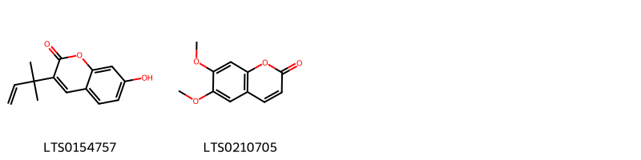{ width=100% }
    <figcaption>Hình ảnh cấu trúc hóa học của 2 hoạt chất thuộc nhóm Coumarins and derivatives gồm ['7-hydroxy-3-(2-methylbut-3-en-2-yl)chromen-2-one (LTS0154757)', 'scoparone (LTS0210705)'].</figcaption>
</figure>
#### Nhóm Fatty Acyls
<figure markdown="span">
    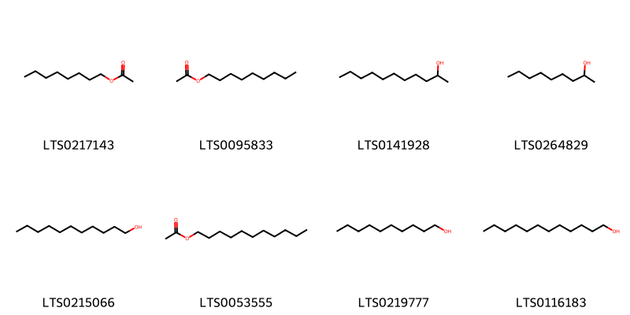{ width=100% }
    <figcaption>Hình ảnh cấu trúc hóa học của 8 hoạt chất thuộc nhóm Fatty Acyls gồm ['octyl acetate (LTS0217143)', 'nonyl acetate (LTS0095833)', '2-undecanol (LTS0141928)', '2-nonanol (LTS0264829)', 'undecanol (LTS0215066)', 'undecyl acetate (LTS0053555)', 'decanol (LTS0219777)', '1-dodecanol (LTS0116183)'].</figcaption>
</figure>
#### Nhóm Flavonoids
<figure markdown="span">
    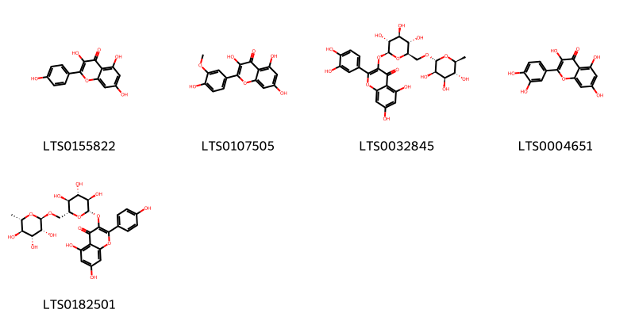{ width=100% }
    <figcaption>Hình ảnh cấu trúc hóa học của 5 hoạt chất thuộc nhóm Flavonoids gồm ['kaempherol (LTS0155822)', 'isorhamnetin (LTS0107505)', '3-rutinosyl quercetin (LTS0032845)', 'quercetin (LTS0004651)', 'nictoflorin (LTS0182501)'].</figcaption>
</figure>
#### Nhóm Organooxygen compounds
<figure markdown="span">
    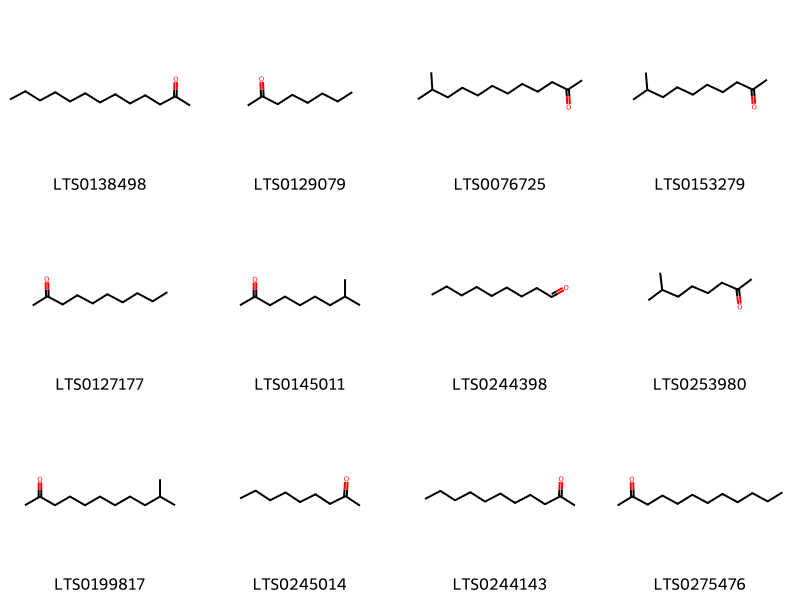{ width=100% }
    <figcaption>Hình ảnh cấu trúc hóa học của 12 hoạt chất thuộc nhóm Organooxygen compounds gồm ['2-tridecanone (LTS0138498)', '2-octanone (LTS0129079)', '11-methyldodecan-2-one (LTS0076725)', '9-methyldecan-2-one (LTS0153279)', '2-decanone (LTS0127177)', '8-methylnonan-2-one (LTS0145011)', 'nonanal (LTS0244398)', '7-methyloctan-2-one (LTS0253980)', '10-methylundecan-2-one (LTS0199817)', '2-nonanone (LTS0245014)', 'undecan-2-one (LTS0244143)', 'lauron (LTS0275476)'].</figcaption>
</figure>
#### Nhóm Prenol lipids
<figure markdown="span">
    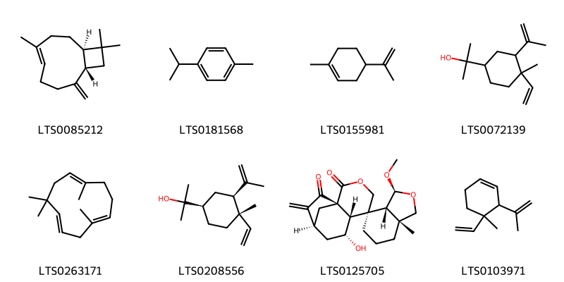{ width=100% }
    <figcaption>Hình ảnh cấu trúc hóa học của 8 hoạt chất thuộc nhóm Prenol lipids gồm ['caryophyllene (LTS0085212)', 'cymene (LTS0181568)', 'limonene,  (LTS0155981)', '2-[4-ethenyl-4-methyl-3-(prop-1-en-2-yl)cyclohexyl]propan-2-ol (LTS0072139)', 'humulene (LTS0263171)', 'elemol (LTS0208556)', "(1's,3s,3ar,4r,6's,7'r,7ar,9's)-7'-hydroxy-3-methoxy-7a-methyl-10'-methylidene-hexahydro-3'-oxaspiro[2-benzofuran-4,5'-tricyclo[7.2.1.0¹,⁶]dodecane]-2',11'-dione (LTS0125705)", '4-ethenyl-4-methyl-3-(prop-1-en-2-yl)cyclohex-1-ene (LTS0103971)'].</figcaption>
</figure>
#### Nhóm Quinolines and derivatives
<figure markdown="span">
    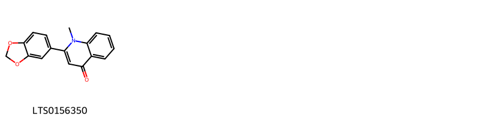{ width=100% }
    <figcaption>Hình ảnh cấu trúc hóa học của 1 hoạt chất thuộc nhóm Quinolines and derivatives gồm ['graveoline (LTS0156350)'].</figcaption>
</figure>

---

### Dược dân tộc học

Danh sách các quốc gia có sử dụng *Ruta angustifolia* trong điều trị các bệnh. 

| Country   | Disease     | Bệnh                                                                                                                                                                                                |
|:----------|:------------|:----------------------------------------------------------------------------------------------------------------------------------------------------------------------------------------------------|
| ain       | Emmenagogue | MYMEMORY WARNING: YOU USED ALL AVAILABLE FREE TRANSLATIONS FOR TODAY. NEXT AVAILABLE IN  00 HOURS 14 MINUTES 14 SECONDS VISIT HTTPS://MYMEMORY.TRANSLATED.NET/DOC/USAGELIMITS.PHP TO TRANSLATE MORE |

---

---
## Ruta chalapensis
### Thông tin về thực vật

!!! info "Phân loại thực vật của *Ruta chalepensis* từ GIBF:"
    - **Kingdom:** Plantae
    - **Phylum:** Tracheophyta
    - **Order:** Sapindales
    - **Family:** Rutaceae
    - **Genus:** Ruta
    - **Species:** *Ruta chalepensis*

 

| Label (VI)   | Label (EN)   | Scientific Name   | Descriptions (VI)   | Descriptions (EN)   | Also Known As (VI)   | Also Known As (EN)   |
|:-------------|:-------------|:------------------|:--------------------|:--------------------|:---------------------|:---------------------|
| N/A          | N/A          | Ruta angustifolia | loài thực vật       | species of plant    | ['']                 | ['']                 |

#### Phân bố trên thế giới

**Từ CSDL GIBF** Italy, Palestine, State of, Jordan, Yemen, Israel, Cyprus, Malta, Spain, Bolivia (Plurinational State of), Türkiye, Portugal, Algeria, United States of America, Croatia, Greece, Brazil, Mexico, Dominican Republic, France, Peru, Syrian Arab Republic, Colombia, Ethiopia

#### Phân bố tại Việt Nam

**Từ CSDL GIBF**: Không có ghi nhận ở Việt Nam

---
### Thành phần hóa học
        
- Theo cơ sở dữ liệu lotus: Từ loài *Ruta chalepensis* đã phân lập và xác định được Chưa có hoạt chất nào được phân lập. hoạt chất thuộc về các nhóm Không có hoạt chất nào được phân lập. 

Không có hình ảnh nào được tạo ra

---

### Dược dân tộc học

Danh sách các quốc gia có sử dụng *Ruta chalepensis* trong điều trị các bệnh. 

| Country   | Disease                | Bệnh                                                                                                                                                                                                |
|:----------|:-----------------------|:----------------------------------------------------------------------------------------------------------------------------------------------------------------------------------------------------|
| Guatemala | Emmenagogue            | MYMEMORY WARNING: YOU USED ALL AVAILABLE FREE TRANSLATIONS FOR TODAY. NEXT AVAILABLE IN  00 HOURS 13 MINUTES 46 SECONDS VISIT HTTPS://MYMEMORY.TRANSLATED.NET/DOC/USAGELIMITS.PHP TO TRANSLATE MORE |
| Haiti     | Emmenagogue, Stimulant | MYMEMORY WARNING: YOU USED ALL AVAILABLE FREE TRANSLATIONS FOR TODAY. NEXT AVAILABLE IN  00 HOURS 13 MINUTES 44 SECONDS VISIT HTTPS://MYMEMORY.TRANSLATED.NET/DOC/USAGELIMITS.PHP TO TRANSLATE MORE |
| Sicily    | Abortifacient          | MYMEMORY WARNING: YOU USED ALL AVAILABLE FREE TRANSLATIONS FOR TODAY. NEXT AVAILABLE IN  00 HOURS 13 MINUTES 42 SECONDS VISIT HTTPS://MYMEMORY.TRANSLATED.NET/DOC/USAGELIMITS.PHP TO TRANSLATE MORE |

---

---
## Ruta chalepensis
### Thông tin về thực vật

!!! info "Phân loại thực vật của *Ruta chalepensis* từ GIBF:"
    - **Kingdom:** Plantae
    - **Phylum:** Tracheophyta
    - **Order:** Sapindales
    - **Family:** Rutaceae
    - **Genus:** Ruta
    - **Species:** *Ruta chalepensis*

 

| Label (VI)   | Label (EN)   | Scientific Name   | Descriptions (VI)   | Descriptions (EN)    | Also Known As (VI)   | Also Known As (EN)   |
|:-------------|:-------------|:------------------|:--------------------|:---------------------|:---------------------|:---------------------|
| N/A          | N/A          | Ruta chalepensis  | loài thực vật       | species of plantጤናዳም | ['']                 | ['']                 |

#### Phân bố trên thế giới

**Từ CSDL GIBF** Italy, Palestine, State of, Jordan, Yemen, Israel, Cyprus, Malta, Spain, Bolivia (Plurinational State of), Türkiye, Portugal, Algeria, United States of America, Croatia, Greece, Brazil, Mexico, Dominican Republic, France, Peru, Syrian Arab Republic, Colombia, Ethiopia

#### Phân bố tại Việt Nam

**Từ CSDL GIBF**: Không có ghi nhận ở Việt Nam

---
### Thành phần hóa học
        
- Theo cơ sở dữ liệu lotus: Từ loài *Ruta chalepensis* đã phân lập và xác định được 55 hoạt chất thuộc về các nhóm Flavonoids, Quinolines and derivatives, Benzodioxoles, Coumarins and derivatives. 

|    | chemicalTaxonomyClassyfireClass   |   smiles_count |
|---:|:----------------------------------|---------------:|
|  0 | Benzodioxoles                     |              6 |
|  1 | Coumarins and derivatives         |             15 |
|  2 | Flavonoids                        |              5 |
|  3 | Quinolines and derivatives        |             28 |

#### Nhóm Benzodioxoles
<figure markdown="span">
    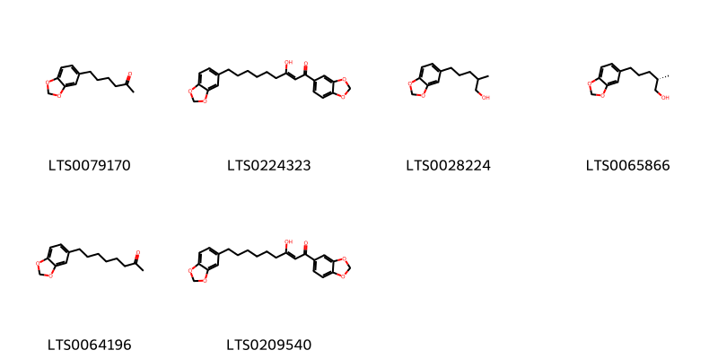{ width=100% }
    <figcaption>Hình ảnh cấu trúc hóa học của 6 hoạt chất thuộc nhóm Benzodioxoles gồm ['6-(2h-1,3-benzodioxol-5-yl)hexan-2-one (LTS0079170)', '(2z)-1,9-bis(2h-1,3-benzodioxol-5-yl)-3-hydroxynon-2-en-1-one (LTS0224323)', '5-(2h-1,3-benzodioxol-5-yl)-2-methylpentan-1-ol (LTS0028224)', '(2s)-5-(2h-1,3-benzodioxol-5-yl)-2-methylpentan-1-ol (LTS0065866)', '8-(2h-1,3-benzodioxol-5-yl)octan-2-one (LTS0064196)', '1,9-bis(2h-1,3-benzodioxol-5-yl)-3-hydroxynon-2-en-1-one (LTS0209540)'].</figcaption>
</figure>
#### Nhóm Coumarins and derivatives
<figure markdown="span">
    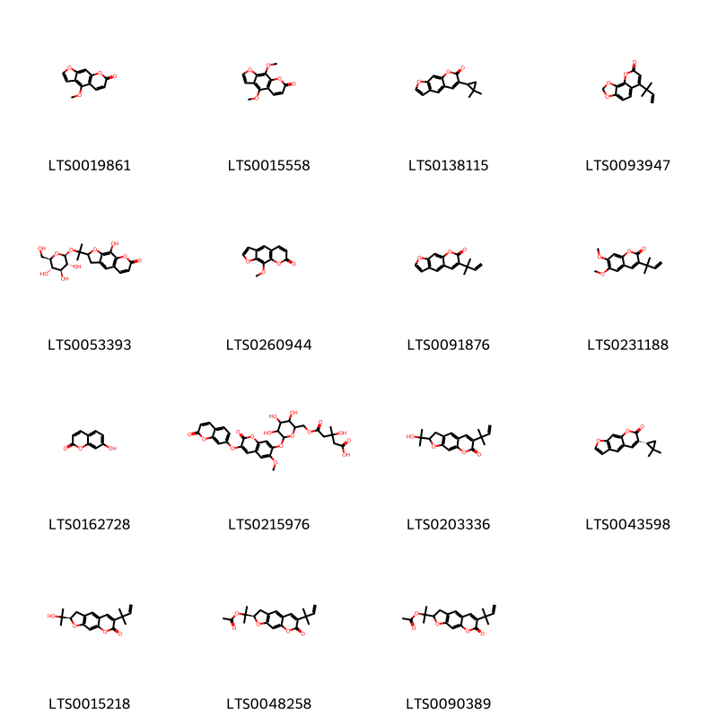{ width=100% }
    <figcaption>Hình ảnh cấu trúc hóa học của 15 hoạt chất thuộc nhóm Coumarins and derivatives gồm ['bergapten (LTS0019861)', 'isopimpinellin (LTS0015558)', '6-(2,2-dimethylcyclopropyl)furo[3,2-g]chromen-7-one (LTS0138115)', '6-(2-methylbut-3-en-2-yl)-2h-[1,3]dioxolo[4,5-h]chromen-8-one (LTS0093947)', '9-hydroxy-2-(2-{[(2s,3r,4s,5s,6r)-3,4,5-trihydroxy-6-(hydroxymethyl)oxan-2-yl]oxy}propan-2-yl)-2h,3h-furo[3,2-g]chromen-7-one (LTS0053393)', 'methoxsalen (LTS0260944)', 'chalepensin (LTS0091876)', '6,7-dimethoxy-3-(2-methylbut-3-en-2-yl)chromen-2-one (LTS0231188)', 'umbelliferone (LTS0162728)', '3-hydroxy-3-methyl-5-oxo-5-{[3,4,5-trihydroxy-6-({6-methoxy-2-oxo-3-[(2-oxochromen-7-yl)oxy]chromen-7-yl}oxy)oxan-2-yl]methoxy}pentanoic acid (LTS0215976)', 'heliettin (LTS0203336)', '6-[(1r)-2,2-dimethylcyclopropyl]furo[3,2-g]chromen-7-one (LTS0043598)', '(2r)-2-(2-hydroxypropan-2-yl)-6-(2-methylbut-3-en-2-yl)-2h,3h-furo[3,2-g]chromen-7-one (LTS0015218)', '(-)-rutamarin (LTS0048258)', '(+/-)-rutamarin (LTS0090389)'].</figcaption>
</figure>
#### Nhóm Flavonoids
<figure markdown="span">
    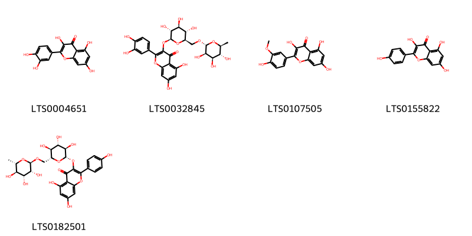{ width=100% }
    <figcaption>Hình ảnh cấu trúc hóa học của 5 hoạt chất thuộc nhóm Flavonoids gồm ['quercetin (LTS0004651)', '3-rutinosyl quercetin (LTS0032845)', 'isorhamnetin (LTS0107505)', 'kaempherol (LTS0155822)', 'nictoflorin (LTS0182501)'].</figcaption>
</figure>
#### Nhóm Quinolines and derivatives
<figure markdown="span">
    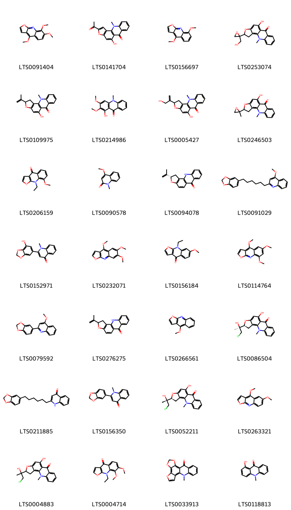{ width=100% }
    <figcaption>Hình ảnh cấu trúc hóa học của 28 hoạt chất thuộc nhóm Quinolines and derivatives gồm ['skimmianine (LTS0091404)', '2-acetyl-5-hydroxy-11-methylfuro[2,3-c]acridin-6-one (LTS0141704)', 'fagarine (LTS0156697)', '5-hydroxy-2-[2-(hydroxymethyl)oxiran-2-yl]-11-methyl-1h,2h-furo[2,3-c]acridin-6-one (LTS0253074)', 'rutacridone (LTS0109975)', 'arborinine (LTS0214986)', '5-hydroxy-2-(3-hydroxyprop-1-en-2-yl)-11-methyl-1h,2h-furo[2,3-c]acridin-6-one (LTS0005427)', 'rutacridone epoxide (LTS0246503)', '9-ethyl-8-methoxyfuro[2,3-b]quinolin-4-one (LTS0206159)', '4-methoxy-1-methylquinolin-2-one (LTS0090578)', '(2s)-2-(prop-1-en-2-yl)-1h,2h,11h-furo[2,3-c]acridin-6-one (LTS0094078)', '2-[6-(2h-1,3-benzodioxol-5-yl)hexyl]-4-methoxyquinoline (LTS0091029)', '2-(7-hydroxy-2h-1,3-benzodioxol-5-yl)-1-methylquinolin-4-one (LTS0152971)', 'kokusaginine (LTS0232071)', '9-ethyl-7-methoxyfuro[2,3-b]quinolin-4-one (LTS0156184)', 'maculosidine (LTS0114764)', '2-(2h-1,3-benzodioxol-5-yl)-4-methoxyquinoline (LTS0079592)', '2-(prop-1-en-2-yl)-1h,2h,11h-furo[2,3-c]acridin-6-one (LTS0276275)', 'dictamnine (LTS0266561)', '(2s)-2-[(2s)-1-chloro-2-hydroxypropan-2-yl]-5-hydroxy-11-methyl-1h,2h-furo[2,3-c]acridin-6-one (LTS0086504)', '2-[6-(2h-1,3-benzodioxol-5-yl)hexyl]-1h-quinolin-4-one (LTS0211885)', 'graveoline (LTS0156350)', '(2s)-2-[(2r)-1-chloro-2-hydroxypropan-2-yl]-5-hydroxy-11-methyl-1h,2h-furo[2,3-c]acridin-6-one (LTS0052211)', '4,6-dimethoxyfuro[2,3-b]quinoline (LTS0263321)', '2-(1-chloro-2-hydroxypropan-2-yl)-5-hydroxy-11-methyl-1h,2h-furo[2,3-c]acridin-6-one (LTS0004883)', '9-ethyl-7,8-dimethoxyfuro[2,3-b]quinolin-4-one (LTS0004714)', '13-methyl-3,5,8-trioxa-13-azapentacyclo[10.8.0.0²,⁶.0⁷,¹¹.0¹⁴,¹⁹]icosa-1(12),2(6),7(11),9,14,16,18-heptaen-20-one (LTS0033913)', '1-hydroxy-10-methylacridin-9-one (LTS0118813)'].</figcaption>
</figure>

---

### Dược dân tộc học

Danh sách các quốc gia có sử dụng *Ruta chalepensis* trong điều trị các bệnh. 

| Country       | Disease                               | Bệnh                                                                                                                                                                                                |
|:--------------|:--------------------------------------|:----------------------------------------------------------------------------------------------------------------------------------------------------------------------------------------------------|
| Elsewhere     | Emmenagogue                           | MYMEMORY WARNING: YOU USED ALL AVAILABLE FREE TRANSLATIONS FOR TODAY. NEXT AVAILABLE IN  00 HOURS 13 MINUTES 21 SECONDS VISIT HTTPS://MYMEMORY.TRANSLATED.NET/DOC/USAGELIMITS.PHP TO TRANSLATE MORE |
| Mediterranean | Abortifacient, Emmenagogue, Vermifuge | MYMEMORY WARNING: YOU USED ALL AVAILABLE FREE TRANSLATIONS FOR TODAY. NEXT AVAILABLE IN  00 HOURS 13 MINUTES 18 SECONDS VISIT HTTPS://MYMEMORY.TRANSLATED.NET/DOC/USAGELIMITS.PHP TO TRANSLATE MORE |

---

---
## Ruta graveolens
### Thông tin về thực vật

!!! info "Phân loại thực vật của *Ruta graveolens* từ GIBF:"
    - **Kingdom:** Plantae
    - **Phylum:** Tracheophyta
    - **Order:** Sapindales
    - **Family:** Rutaceae
    - **Genus:** Ruta
    - **Species:** *Ruta graveolens*

 

| Label (VI)   | Label (EN)   | Scientific Name   | Descriptions (VI)   | Descriptions (EN)                       | Also Known As (VI)   | Also Known As (EN)                                                 |
|:-------------|:-------------|:------------------|:--------------------|:----------------------------------------|:---------------------|:-------------------------------------------------------------------|
| N/A          | N/A          | Ruta graveolens   | loài thực vật       | species of plant in the Rutaceae family | ['']                 | ['rue', 'common rue', 'herbygrass', 'meadow rue', 'herb-of-grace'] |

#### Phân bố trên thế giới

**Từ CSDL GIBF** Italy, Belgium, Slovakia, Argentina, Canada, Ukraine, Netherlands, Lithuania, Spain, Bolivia (Plurinational State of), United States of America, Sweden, Chile, Bosnia and Herzegovina, Croatia, Greece, South Africa, Hong Kong, Czechia, Germany, Brazil, Switzerland, Austria, France, Peru, Ecuador, Colombia, Poland

#### Phân bố tại Việt Nam

**Từ CSDL GIBF**: Không có ghi nhận ở Việt Nam

---
### Thành phần hóa học
        
- Theo cơ sở dữ liệu lotus: Từ loài *Ruta graveolens* đã phân lập và xác định được 154 hoạt chất thuộc về các nhóm Fatty Acyls, Naphthalenes, Flavonoids, Prenol lipids, Steroids and steroid derivatives, Quinolines and derivatives, Glycerophospholipids, Cinnamic acids and derivatives, Benzodioxoles, Organic phosphoric acids and derivatives, Benzene and substituted derivatives, Unsaturated hydrocarbons, Organooxygen compounds, Saturated hydrocarbons, Coumarins and derivatives, Carboxylic acids and derivatives. 

|    | chemicalTaxonomyClassyfireClass          |   smiles_count |
|---:|:-----------------------------------------|---------------:|
|  0 | Benzene and substituted derivatives      |              1 |
|  1 | Benzodioxoles                            |              1 |
|  2 | Carboxylic acids and derivatives         |              1 |
|  3 | Cinnamic acids and derivatives           |              6 |
|  4 | Coumarins and derivatives                |             24 |
|  5 | Fatty Acyls                              |             16 |
|  6 | Flavonoids                               |              8 |
|  7 | Glycerophospholipids                     |              4 |
|  8 | Naphthalenes                             |              2 |
|  9 | Organic phosphoric acids and derivatives |              1 |
| 10 | Organooxygen compounds                   |             23 |
| 11 | Prenol lipids                            |              9 |
| 12 | Quinolines and derivatives               |             50 |
| 13 | Saturated hydrocarbons                   |              2 |
| 14 | Steroids and steroid derivatives         |              2 |
| 15 | Unsaturated hydrocarbons                 |              3 |

#### Nhóm Benzene and substituted derivatives
<figure markdown="span">
    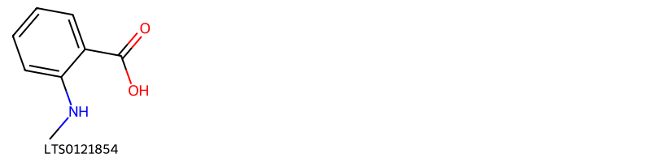{ width=100% }
    <figcaption>Hình ảnh cấu trúc hóa học của 1 hoạt chất thuộc nhóm Benzene and substituted derivatives gồm ['n-methylanthranilic acid (LTS0121854)'].</figcaption>
</figure>
#### Nhóm Benzodioxoles
<figure markdown="span">
    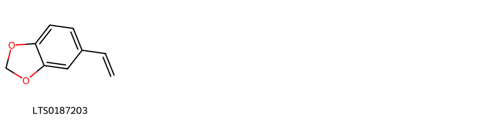{ width=100% }
    <figcaption>Hình ảnh cấu trúc hóa học của 1 hoạt chất thuộc nhóm Benzodioxoles gồm ['5-ethenyl-2h-1,3-benzodioxole (LTS0187203)'].</figcaption>
</figure>
#### Nhóm Carboxylic acids and derivatives
<figure markdown="span">
    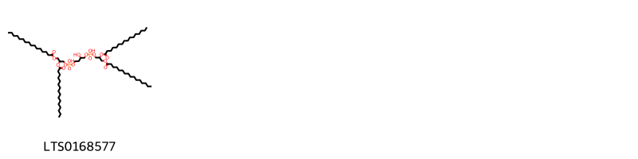{ width=100% }
    <figcaption>Hình ảnh cấu trúc hóa học của 1 hoạt chất thuộc nhóm Carboxylic acids and derivatives gồm ['2,3-bis(hexadecanoyloxy)propoxy(4-{[2,3-bis(hexadecanoyloxy)propoxy(hydroxy)phosphoryl]oxy}-2-hydroxybutoxy)phosphinic acid (LTS0168577)'].</figcaption>
</figure>
#### Nhóm Cinnamic acids and derivatives
<figure markdown="span">
    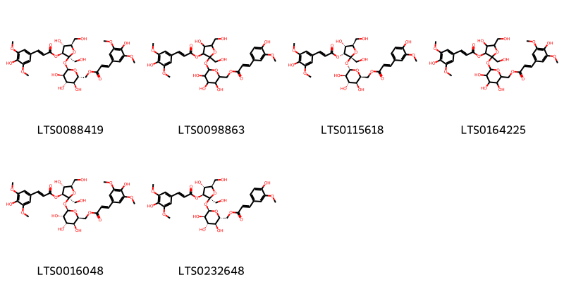{ width=100% }
    <figcaption>Hình ảnh cấu trúc hóa học của 6 hoạt chất thuộc nhóm Cinnamic acids and derivatives gồm ['[(2r,3s,4s,5r,6r)-3,4,5-trihydroxy-6-{[(2s,3s,4r,5r)-4-hydroxy-3-{[(2e)-3-(4-hydroxy-3,5-dimethoxyphenyl)prop-2-enoyl]oxy}-2,5-bis(hydroxymethyl)oxolan-2-yl]oxy}oxan-2-yl]methyl (2e)-3-(4-hydroxy-3,5-dimethoxyphenyl)prop-2-enoate (LTS0088419)', '{3,4,5-trihydroxy-6-[(4-hydroxy-3-{[3-(4-hydroxy-3,5-dimethoxyphenyl)prop-2-enoyl]oxy}-2,5-bis(hydroxymethyl)oxolan-2-yl)oxy]oxan-2-yl}methyl 3-(4-hydroxy-3-methoxyphenyl)prop-2-enoate (LTS0098863)', '[(2s,3s,4s,5r,6s)-3,4,5-trihydroxy-6-{[(2r,3r,4r,5r)-4-hydroxy-3-{[(2e)-3-(4-hydroxy-3,5-dimethoxyphenyl)prop-2-enoyl]oxy}-2,5-bis(hydroxymethyl)oxolan-2-yl]oxy}oxan-2-yl]methyl (2e)-3-(4-hydroxy-3-methoxyphenyl)prop-2-enoate (LTS0115618)', '{3,4,5-trihydroxy-6-[(4-hydroxy-3-{[3-(4-hydroxy-3,5-dimethoxyphenyl)prop-2-enoyl]oxy}-2,5-bis(hydroxymethyl)oxolan-2-yl)oxy]oxan-2-yl}methyl 3-(4-hydroxy-3,5-dimethoxyphenyl)prop-2-enoate (LTS0164225)', '[(2s,3s,4s,5s,6r)-3,4,5-trihydroxy-6-{[(2s,3s,4r,5r)-4-hydroxy-3-{[(2e)-3-(4-hydroxy-3,5-dimethoxyphenyl)prop-2-enoyl]oxy}-2,5-bis(hydroxymethyl)oxolan-2-yl]oxy}oxan-2-yl]methyl (2e)-3-(4-hydroxy-3,5-dimethoxyphenyl)prop-2-enoate (LTS0016048)', '[(2r,3s,4s,5r,6r)-3,4,5-trihydroxy-6-{[(2s,3s,4r,5r)-4-hydroxy-3-{[(2e)-3-(4-hydroxy-3,5-dimethoxyphenyl)prop-2-enoyl]oxy}-2,5-bis(hydroxymethyl)oxolan-2-yl]oxy}oxan-2-yl]methyl (2e)-3-(4-hydroxy-3-methoxyphenyl)prop-2-enoate (LTS0232648)'].</figcaption>
</figure>
#### Nhóm Coumarins and derivatives
<figure markdown="span">
    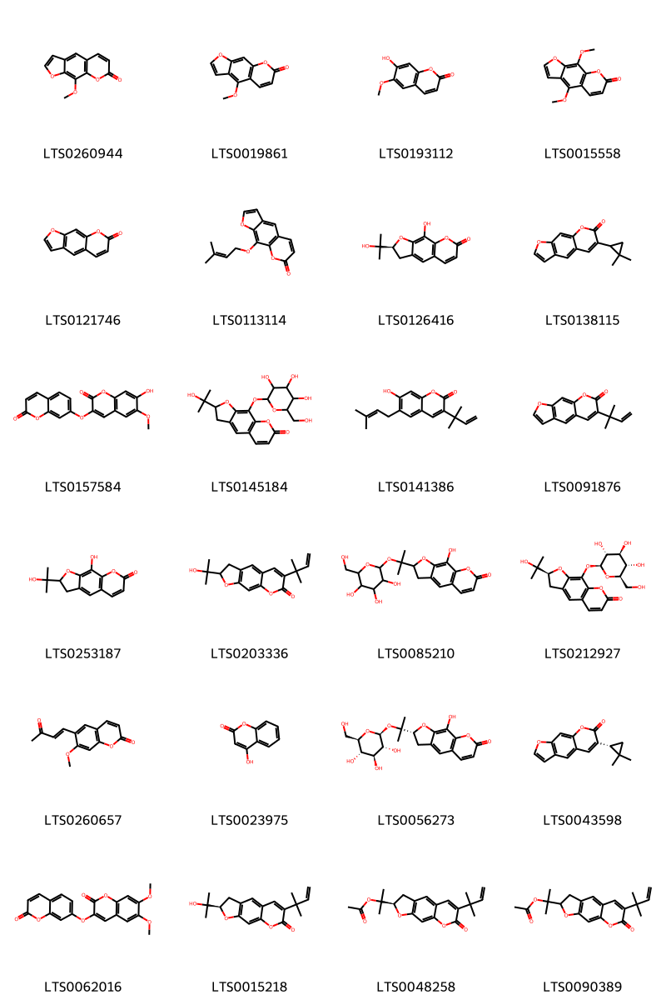{ width=100% }
    <figcaption>Hình ảnh cấu trúc hóa học của 24 hoạt chất thuộc nhóm Coumarins and derivatives gồm ['methoxsalen (LTS0260944)', 'bergapten (LTS0019861)', 'scopoletin (LTS0193112)', 'isopimpinellin (LTS0015558)', 'psoralen (LTS0121746)', 'imperatorin (LTS0113114)', '(2s)-9-hydroxy-2-(2-hydroxypropan-2-yl)-2h,3h-furo[3,2-g]chromen-7-one (LTS0126416)', '6-(2,2-dimethylcyclopropyl)furo[3,2-g]chromen-7-one (LTS0138115)', 'daphnoretin (LTS0157584)', '2-(2-hydroxypropan-2-yl)-9-{[3,4,5-trihydroxy-6-(hydroxymethyl)oxan-2-yl]oxy}-2h,3h-furo[3,2-g]chromen-7-one (LTS0145184)', '7-hydroxy-6-(3-methylbut-2-en-1-yl)-3-(2-methylbut-3-en-2-yl)chromen-2-one (LTS0141386)', 'chalepensin (LTS0091876)', '9-hydroxy-2-(2-hydroxypropan-2-yl)-2h,3h-furo[3,2-g]chromen-7-one (LTS0253187)', 'heliettin (LTS0203336)', '9-hydroxy-2-(2-{[3,4,5-trihydroxy-6-(hydroxymethyl)oxan-2-yl]oxy}propan-2-yl)-2h,3h-furo[3,2-g]chromen-7-one (LTS0085210)', 'rutarin (LTS0212927)', '7-methoxy-6-[(1e)-3-oxobut-1-en-1-yl]chromen-2-one (LTS0260657)', '4-hydroxycoumarin (LTS0023975)', '(2r)-9-hydroxy-2-(2-{[(2s,3r,4s,5s,6r)-3,4,5-trihydroxy-6-(hydroxymethyl)oxan-2-yl]oxy}propan-2-yl)-2h,3h-furo[3,2-g]chromen-7-one (LTS0056273)', '6-[(1r)-2,2-dimethylcyclopropyl]furo[3,2-g]chromen-7-one (LTS0043598)', '6,7-dimethoxy-3-[(2-oxochromen-7-yl)oxy]chromen-2-one (LTS0062016)', '(2r)-2-(2-hydroxypropan-2-yl)-6-(2-methylbut-3-en-2-yl)-2h,3h-furo[3,2-g]chromen-7-one (LTS0015218)', '(-)-rutamarin (LTS0048258)', '(+/-)-rutamarin (LTS0090389)'].</figcaption>
</figure>
#### Nhóm Fatty Acyls
<figure markdown="span">
    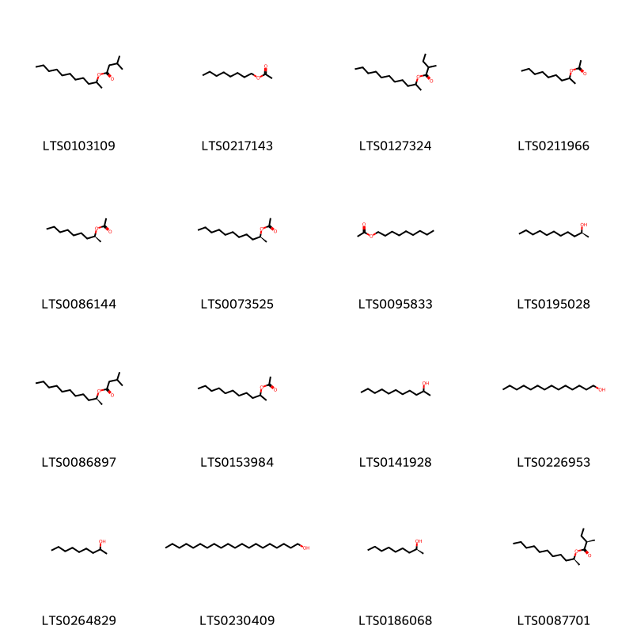{ width=100% }
    <figcaption>Hình ảnh cấu trúc hóa học của 16 hoạt chất thuộc nhóm Fatty Acyls gồm ['undecan-2-yl 3-methylbutanoate (LTS0103109)', 'octyl acetate (LTS0217143)', 'undecan-2-yl 2-methylbutanoate (LTS0127324)', 'nonan-2-yl acetate (LTS0211966)', '(2s)-nonan-2-yl acetate (LTS0086144)', '(2s)-undecan-2-yl acetate (LTS0073525)', 'nonyl acetate (LTS0095833)', '(+)-2-undecanol (LTS0195028)', '(2s)-undecan-2-yl 3-methylbutanoate (LTS0086897)', '1-methyldecyl acetate (LTS0153984)', '2-undecanol (LTS0141928)', 'myristyl alcohol (LTS0226953)', '2-nonanol (LTS0264829)', 'arachidyl alcohol (LTS0230409)', '(2s)-nonan-2-ol (LTS0186068)', '(2s)-undecan-2-yl (2r)-2-methylbutanoate (LTS0087701)'].</figcaption>
</figure>
#### Nhóm Flavonoids
<figure markdown="span">
    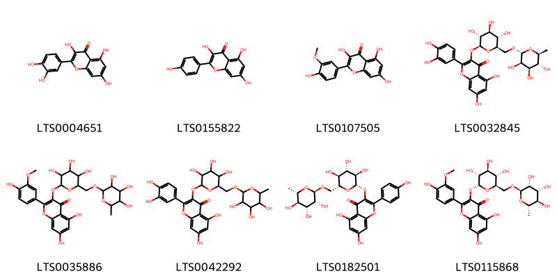{ width=100% }
    <figcaption>Hình ảnh cấu trúc hóa học của 8 hoạt chất thuộc nhóm Flavonoids gồm ['quercetin (LTS0004651)', 'kaempherol (LTS0155822)', 'isorhamnetin (LTS0107505)', '3-rutinosyl quercetin (LTS0032845)', '5,7-dihydroxy-2-(4-hydroxy-3-methoxyphenyl)-3-[(3,4,5-trihydroxy-6-{[(3,4,5-trihydroxy-6-methyloxan-2-yl)oxy]methyl}oxan-2-yl)oxy]chromen-4-one (LTS0035886)', 'rutin (LTS0042292)', 'nictoflorin (LTS0182501)', '5,7-dihydroxy-2-(4-hydroxy-3-methoxyphenyl)-3-{[(2r,3r,4s,5s,6r)-3,4,5-trihydroxy-6-({[(2r,3r,4r,5r,6s)-3,4,5-trihydroxy-6-methyloxan-2-yl]oxy}methyl)oxan-2-yl]oxy}chromen-4-one (LTS0115868)'].</figcaption>
</figure>
#### Nhóm Glycerophospholipids
<figure markdown="span">
    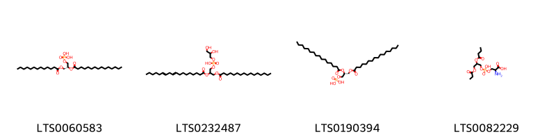{ width=100% }
    <figcaption>Hình ảnh cấu trúc hóa học của 4 hoạt chất thuộc nhóm Glycerophospholipids gồm ['(2r)-2-(pentadecanoyloxy)-3-(tridecanoyloxy)propoxyphosphonic acid (LTS0060583)', '2,3-dihydroxypropoxy(3-(hexadecanoyloxy)-2-[(9e,12e)-octadeca-9,12-dienoyloxy]propoxy)phosphinic acid (LTS0232487)', 'dipalmitoyl (LTS0190394)', '2-amino-3-{[2-(butanoyloxy)-3-(propanoyloxy)propoxy(hydroxy)phosphoryl]oxy}propanoic acid (LTS0082229)'].</figcaption>
</figure>
#### Nhóm Naphthalenes
<figure markdown="span">
    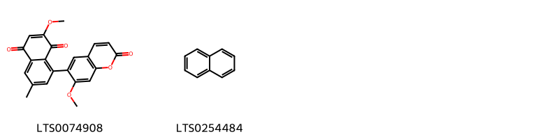{ width=100% }
    <figcaption>Hình ảnh cấu trúc hóa học của 2 hoạt chất thuộc nhóm Naphthalenes gồm ['2-methoxy-8-(7-methoxy-2-oxochromen-6-yl)-6-methylnaphthalene-1,4-dione (LTS0074908)', 'naphthalene (LTS0254484)'].</figcaption>
</figure>
#### Nhóm Organic phosphoric acids and derivatives
<figure markdown="span">
    { width=100% }
    <figcaption>Hình ảnh cấu trúc hóa học của 1 hoạt chất thuộc nhóm Organic phosphoric acids and derivatives gồm ['o-phosphoethanolamine; bis(nonane) (LTS0249963)'].</figcaption>
</figure>
#### Nhóm Organooxygen compounds
<figure markdown="span">
    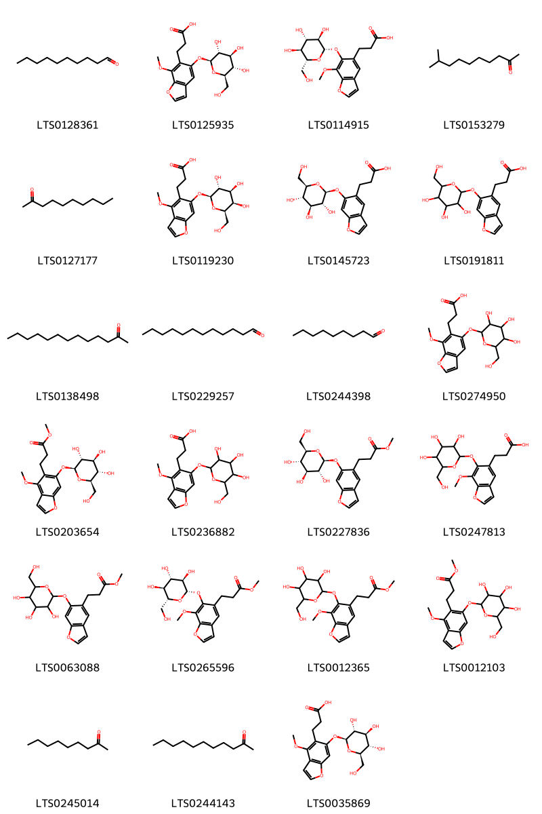{ width=100% }
    <figcaption>Hình ảnh cấu trúc hóa học của 23 hoạt chất thuộc nhóm Organooxygen compounds gồm ['decanal (LTS0128361)', '3-(7-methoxy-5-{[(2s,3r,4s,5s,6r)-3,4,5-trihydroxy-6-(hydroxymethyl)oxan-2-yl]oxy}-1-benzofuran-6-yl)propanoic acid (LTS0125935)', '3-(7-methoxy-6-{[(2s,3r,4s,5s,6r)-3,4,5-trihydroxy-6-(hydroxymethyl)oxan-2-yl]oxy}-1-benzofuran-5-yl)propanoic acid (LTS0114915)', '9-methyldecan-2-one (LTS0153279)', '2-decanone (LTS0127177)', '3-(4-methoxy-6-{[(2s,3r,4s,5r,6r)-3,4,5-trihydroxy-6-(hydroxymethyl)oxan-2-yl]oxy}-1-benzofuran-5-yl)propanoic acid (LTS0119230)', '3-(6-{[(2s,3r,4s,5s,6r)-3,4,5-trihydroxy-6-(hydroxymethyl)oxan-2-yl]oxy}-1-benzofuran-5-yl)propanoic acid (LTS0145723)', '3-(6-{[3,4,5-trihydroxy-6-(hydroxymethyl)oxan-2-yl]oxy}-1-benzofuran-5-yl)propanoic acid (LTS0191811)', '2-tridecanone (LTS0138498)', 'dodecanal (LTS0229257)', 'nonanal (LTS0244398)', '3-(7-methoxy-5-{[3,4,5-trihydroxy-6-(hydroxymethyl)oxan-2-yl]oxy}-1-benzofuran-6-yl)propanoic acid (LTS0274950)', 'methyl 3-(4-methoxy-6-{[(2s,3r,4s,5s,6r)-3,4,5-trihydroxy-6-(hydroxymethyl)oxan-2-yl]oxy}-1-benzofuran-5-yl)propanoate (LTS0203654)', '3-(4-methoxy-6-{[3,4,5-trihydroxy-6-(hydroxymethyl)oxan-2-yl]oxy}-1-benzofuran-5-yl)propanoic acid (LTS0236882)', 'methyl 3-(6-{[(2s,3r,4s,5s,6r)-3,4,5-trihydroxy-6-(hydroxymethyl)oxan-2-yl]oxy}-1-benzofuran-5-yl)propanoate (LTS0227836)', '3-(7-methoxy-6-{[3,4,5-trihydroxy-6-(hydroxymethyl)oxan-2-yl]oxy}-1-benzofuran-5-yl)propanoic acid (LTS0247813)', 'methyl 3-(6-{[3,4,5-trihydroxy-6-(hydroxymethyl)oxan-2-yl]oxy}-1-benzofuran-5-yl)propanoate (LTS0063088)', 'methyl 3-(7-methoxy-6-{[(2s,3r,4s,5s,6r)-3,4,5-trihydroxy-6-(hydroxymethyl)oxan-2-yl]oxy}-1-benzofuran-5-yl)propanoate (LTS0265596)', 'methyl 3-(7-methoxy-6-{[3,4,5-trihydroxy-6-(hydroxymethyl)oxan-2-yl]oxy}-1-benzofuran-5-yl)propanoate (LTS0012365)', 'methyl 3-(4-methoxy-6-{[3,4,5-trihydroxy-6-(hydroxymethyl)oxan-2-yl]oxy}-1-benzofuran-5-yl)propanoate (LTS0012103)', '2-nonanone (LTS0245014)', 'undecan-2-one (LTS0244143)', '3-(4-methoxy-6-{[(2s,3r,4s,5s,6r)-3,4,5-trihydroxy-6-(hydroxymethyl)oxan-2-yl]oxy}-1-benzofuran-5-yl)propanoic acid (LTS0035869)'].</figcaption>
</figure>
#### Nhóm Prenol lipids
<figure markdown="span">
    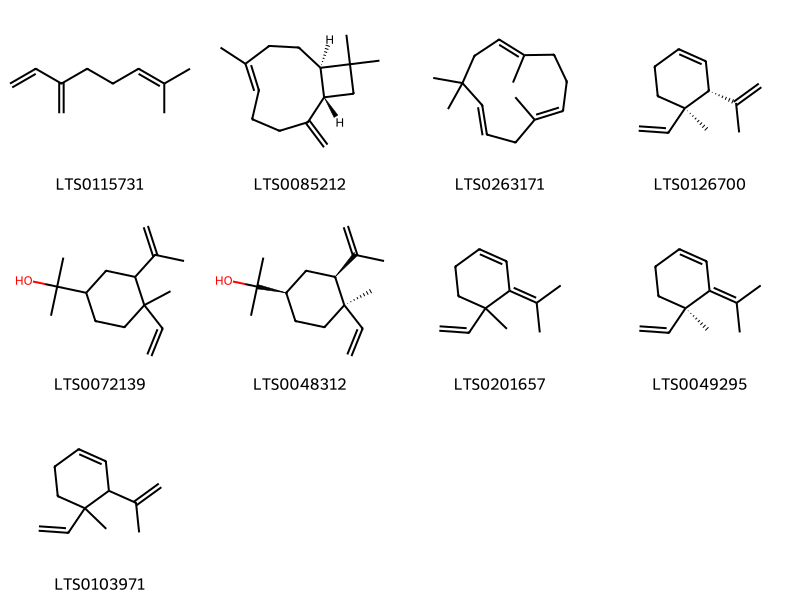{ width=100% }
    <figcaption>Hình ảnh cấu trúc hóa học của 9 hoạt chất thuộc nhóm Prenol lipids gồm ['α-myrcene (LTS0115731)', 'caryophyllene (LTS0085212)', 'humulene (LTS0263171)', '(3r,4r)-4-ethenyl-4-methyl-3-(prop-1-en-2-yl)cyclohex-1-ene (LTS0126700)', '2-[4-ethenyl-4-methyl-3-(prop-1-en-2-yl)cyclohexyl]propan-2-ol (LTS0072139)', '2-[(1r,3s,4r)-4-ethenyl-4-methyl-3-(prop-1-en-2-yl)cyclohexyl]propan-2-ol (LTS0048312)', '4-ethenyl-4-methyl-3-(propan-2-ylidene)cyclohex-1-ene (LTS0201657)', '(4r)-4-ethenyl-4-methyl-3-(propan-2-ylidene)cyclohex-1-ene (LTS0049295)', '4-ethenyl-4-methyl-3-(prop-1-en-2-yl)cyclohex-1-ene (LTS0103971)'].</figcaption>
</figure>
#### Nhóm Quinolines and derivatives
<figure markdown="span">
    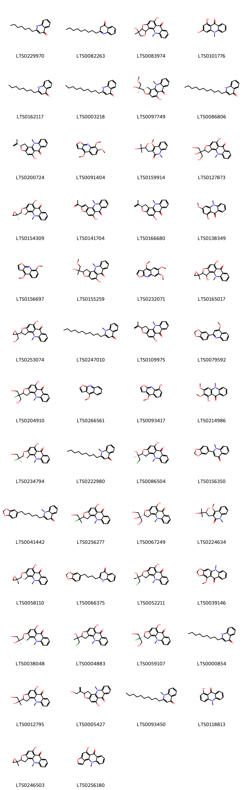{ width=100% }
    <figcaption>Hình ảnh cấu trúc hóa học của 50 hoạt chất thuộc nhóm Quinolines and derivatives gồm ['2-heptyl-4-quinolone (LTS0229970)', '2-nonyl-3h-quinolin-4-one (LTS0082263)', '6,11-dihydroxy-6,20-dimethyl-4,8-dioxa-20-azapentacyclo[10.8.0.0²,⁹.0³,⁷.0¹⁴,¹⁹]icosa-1,9,11,14,16,18-hexaen-13-one (LTS0083974)', '1,3-dihydroxy-n-methylacridone (LTS0101776)', '2-octyl-1h-quinolin-4-one (LTS0162117)', '2-decyl-1h-quinolin-4-one (LTS0003218)', '(2s)-5-hydroxy-2-[(2s)-2-hydroxy-1-methoxypropan-2-yl]-11-methyl-1h,2h-furo[2,3-c]acridin-6-one (LTS0097749)', '2-undecyl-1h-quinolin-4-one (LTS0086806)', '(2s)-5-hydroxy-11-methyl-2-(prop-1-en-2-yl)-1h,2h-furo[2,3-c]acridin-6-one (LTS0200724)', 'skimmianine (LTS0091404)', '3-(2,3-dihydroxy-3-methylbutyl)-4-methoxy-1-methylquinolin-2-one (LTS0159914)', '5-hydroxy-11-methyl-2-(1,2,3-trihydroxypropan-2-yl)-1h,2h-furo[2,3-c]acridin-6-one (LTS0127873)', '(2r)-5-hydroxy-11-methyl-2-[(2r)-2-methyloxiran-2-yl]-1h,2h-furo[2,3-c]acridin-6-one (LTS0154309)', '2-acetyl-5-hydroxy-11-methylfuro[2,3-c]acridin-6-one (LTS0141704)', '(2r)-5-hydroxy-11-methyl-2-(prop-1-en-2-yl)-1h,2h-furo[2,3-c]acridin-6-one (LTS0166680)', '1-hydroxy-3-methoxy-10-methylacridin-9-one (LTS0138349)', 'fagarine (LTS0156697)', '5-hydroxy-2-(2-hydroxy-1-methoxypropan-2-yl)-11-methyl-1h,2h-furo[2,3-c]acridin-6-one (LTS0155259)', 'kokusaginine (LTS0232071)', '1,5-dihydroxy-11-methyl-2-(2-methyloxiran-2-yl)-1h,2h-furo[2,3-c]acridin-6-one (LTS0165017)', '5-hydroxy-2-[2-(hydroxymethyl)oxiran-2-yl]-11-methyl-1h,2h-furo[2,3-c]acridin-6-one (LTS0253074)', '1-methyl-2-undecylquinolin-4-one (LTS0247010)', 'rutacridone (LTS0109975)', '2-(2h-1,3-benzodioxol-5-yl)-4-methoxyquinoline (LTS0079592)', '2-(2-chloro-1,3-dihydroxypropan-2-yl)-5-hydroxy-11-methyl-1h,2h-furo[2,3-c]acridin-6-one (LTS0204910)', 'dictamnine (LTS0266561)', 'robustine (LTS0093417)', 'arborinine (LTS0214986)', '(2r)-2-[(2s)-2-chloro-1-hydroxypropan-2-yl]-5-hydroxy-11-methyl-1h,2h-furo[2,3-c]acridin-6-one (LTS0234794)', '1-methyl-2-nonylquinolin-4-one (LTS0222980)', '(2s)-2-[(2s)-1-chloro-2-hydroxypropan-2-yl]-5-hydroxy-11-methyl-1h,2h-furo[2,3-c]acridin-6-one (LTS0086504)', 'graveoline (LTS0156350)', '2-[6-(2h-1,3-benzodioxol-5-yl)hexyl]-1-methylquinolin-4-one (LTS0041442)', '2-(2-chloro-1-hydroxypropan-2-yl)-5-hydroxy-11-methyl-1h,2h-furo[2,3-c]acridin-6-one (LTS0256277)', '(2r)-5-hydroxy-11-methyl-2-(1,2,3-trihydroxypropan-2-yl)-1h,2h-furo[2,3-c]acridin-6-one (LTS0067249)', '3-[(2s)-2,3-dihydroxy-3-methylbutyl]-4-methoxy-1-methylquinolin-2-one (LTS0224634)', '(2r)-5-hydroxy-11-methyl-2-[(2s)-2-methyloxiran-2-yl]-1h,2h-furo[2,3-c]acridin-6-one (LTS0058110)', '2-[4-(2h-1,3-benzodioxol-5-yl)butyl]-1h-quinolin-4-one (LTS0066375)', '(2s)-2-[(2r)-1-chloro-2-hydroxypropan-2-yl]-5-hydroxy-11-methyl-1h,2h-furo[2,3-c]acridin-6-one (LTS0052211)', '11-methoxy-5-methyl-2h-[1,3]dioxolo[4,5-b]acridin-10-one (LTS0039146)', '(2r)-2-[(2s)-1,2-dihydroxypropan-2-yl]-5-hydroxy-11-methyl-1h,2h-furo[2,3-c]acridin-6-one (LTS0038048)', '2-(1-chloro-2-hydroxypropan-2-yl)-5-hydroxy-11-methyl-1h,2h-furo[2,3-c]acridin-6-one (LTS0004883)', '(2r)-2-(2-chloro-1,3-dihydroxypropan-2-yl)-5-hydroxy-11-methyl-1h,2h-furo[2,3-c]acridin-6-one (LTS0059107)', '2-nonylquinolin-4(1h)-one (LTS0000854)', '2-(1,2-dihydroxypropan-2-yl)-5-hydroxy-11-methyl-1h,2h-furo[2,3-c]acridin-6-one (LTS0012795)', '5-hydroxy-2-(3-hydroxyprop-1-en-2-yl)-11-methyl-1h,2h-furo[2,3-c]acridin-6-one (LTS0005427)', '2-decyl-1-methylquinolin-4-one (LTS0093450)', '1-hydroxy-10-methylacridin-9-one (LTS0118813)', 'rutacridone epoxide (LTS0246503)', 'furofoline i (LTS0256180)'].</figcaption>
</figure>
#### Nhóm Saturated hydrocarbons
<figure markdown="span">
    { width=100% }
    <figcaption>Hình ảnh cấu trúc hóa học của 2 hoạt chất thuộc nhóm Saturated hydrocarbons gồm ['heptadecane (LTS0038303)', 'pentadecane (LTS0210146)'].</figcaption>
</figure>
#### Nhóm Steroids and steroid derivatives
<figure markdown="span">
    { width=100% }
    <figcaption>Hình ảnh cấu trúc hóa học của 2 hoạt chất thuộc nhóm Steroids and steroid derivatives gồm ['stigmast-5-en-3-ol, (3β)- (LTS0204616)', 'sitosterol (LTS0168132)'].</figcaption>
</figure>
#### Nhóm Unsaturated hydrocarbons
<figure markdown="span">
    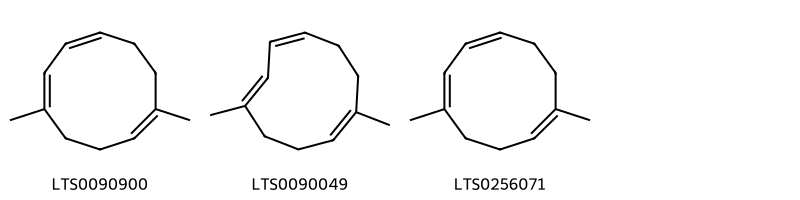{ width=100% }
    <figcaption>Hình ảnh cấu trúc hóa học của 3 hoạt chất thuộc nhóm Unsaturated hydrocarbons gồm ['1,7-dimethylcyclodeca-1,3,7-triene (LTS0090900)', '(1z,3e,7z)-4,8-dimethylcyclodeca-1,3,7-triene (LTS0090049)', '(1z,3z,7z)-1,7-dimethylcyclodeca-1,3,7-triene (LTS0256071)'].</figcaption>
</figure>

---

### Dược dân tộc học

Danh sách các quốc gia có sử dụng *Ruta graveolens* trong điều trị các bệnh. 

| Country       | Disease                                                                                                             | Bệnh                                                                                                                                                                                                |
|:--------------|:--------------------------------------------------------------------------------------------------------------------|:----------------------------------------------------------------------------------------------------------------------------------------------------------------------------------------------------|
| China         | Antidote, Carminative, Emmenagogue, Emmenagogue, Hemostat, Uterotonic, Vermifuge                                    | MYMEMORY WARNING: YOU USED ALL AVAILABLE FREE TRANSLATIONS FOR TODAY. NEXT AVAILABLE IN  00 HOURS 12 MINUTES 52 SECONDS VISIT HTTPS://MYMEMORY.TRANSLATED.NET/DOC/USAGELIMITS.PHP TO TRANSLATE MORE |
| Elsewhere     | Abortifacient, Abortifacient, Anaphrodisiac, nan, Diuretic, Emmenagogue, Emmenagogue, Narcotic, Stimulant, Diuretic | MYMEMORY WARNING: YOU USED ALL AVAILABLE FREE TRANSLATIONS FOR TODAY. NEXT AVAILABLE IN  00 HOURS 12 MINUTES 49 SECONDS VISIT HTTPS://MYMEMORY.TRANSLATED.NET/DOC/USAGELIMITS.PHP TO TRANSLATE MORE |
| Java          | Anaphrodisiac, Acaricide                                                                                            | MYMEMORY WARNING: YOU USED ALL AVAILABLE FREE TRANSLATIONS FOR TODAY. NEXT AVAILABLE IN  00 HOURS 12 MINUTES 47 SECONDS VISIT HTTPS://MYMEMORY.TRANSLATED.NET/DOC/USAGELIMITS.PHP TO TRANSLATE MORE |
| Mediterranean | Abortifacient, Emmenagogue                                                                                          | MYMEMORY WARNING: YOU USED ALL AVAILABLE FREE TRANSLATIONS FOR TODAY. NEXT AVAILABLE IN  00 HOURS 12 MINUTES 45 SECONDS VISIT HTTPS://MYMEMORY.TRANSLATED.NET/DOC/USAGELIMITS.PHP TO TRANSLATE MORE |
| Mexico        | Abortifacient, Emmenagogue, Poison                                                                                  | MYMEMORY WARNING: YOU USED ALL AVAILABLE FREE TRANSLATIONS FOR TODAY. NEXT AVAILABLE IN  00 HOURS 12 MINUTES 42 SECONDS VISIT HTTPS://MYMEMORY.TRANSLATED.NET/DOC/USAGELIMITS.PHP TO TRANSLATE MORE |
| Paraguay      | Antifertility                                                                                                       | MYMEMORY WARNING: YOU USED ALL AVAILABLE FREE TRANSLATIONS FOR TODAY. NEXT AVAILABLE IN  00 HOURS 12 MINUTES 40 SECONDS VISIT HTTPS://MYMEMORY.TRANSLATED.NET/DOC/USAGELIMITS.PHP TO TRANSLATE MORE |
| Turkey        | Apertif, Digestive, Emmenagogue, Insecticide, Nervine, Stimulant, Vermifuge, Poison, Hemostat, Abortifacient        | MYMEMORY WARNING: YOU USED ALL AVAILABLE FREE TRANSLATIONS FOR TODAY. NEXT AVAILABLE IN  00 HOURS 12 MINUTES 38 SECONDS VISIT HTTPS://MYMEMORY.TRANSLATED.NET/DOC/USAGELIMITS.PHP TO TRANSLATE MORE |
| US            | Abortifacient, Carminative, Sedative, Poultice                                                                      | MYMEMORY WARNING: YOU USED ALL AVAILABLE FREE TRANSLATIONS FOR TODAY. NEXT AVAILABLE IN  00 HOURS 12 MINUTES 35 SECONDS VISIT HTTPS://MYMEMORY.TRANSLATED.NET/DOC/USAGELIMITS.PHP TO TRANSLATE MORE |

---

# Chi Phellodendron

??? note "Danh sách các dược liệu thuộc chi"
    
	 - *Phellodendron amurense*
	 - *Phellodendron chinense*

---
## Phellodendron amurense
### Thông tin về thực vật

!!! info "Phân loại thực vật của *Phellodendron amurense* từ GIBF:"
    - **Kingdom:** Plantae
    - **Phylum:** Tracheophyta
    - **Order:** Sapindales
    - **Family:** Rutaceae
    - **Genus:** Phellodendron
    - **Species:** *Phellodendron amurense*

 

| Label (VI)   | Label (EN)   | Scientific Name        | Descriptions (VI)   | Descriptions (EN)   | Also Known As (VI)   | Also Known As (EN)   |
|:-------------|:-------------|:-----------------------|:--------------------|:--------------------|:---------------------|:---------------------|
| N/A          | N/A          | Phellodendron amurense | loài thực vật       | species of plant    | ['']                 | ['']                 |

#### Phân bố trên thế giới

**Từ CSDL GIBF** Ukraine, Belarus, Japan, Estonia, Chinese Taipei, Russian Federation, United States of America, Poland, Kazakhstan, China, Canada

#### Phân bố tại Việt Nam

**Từ CSDL GIBF**: Không có ghi nhận ở Việt Nam

---
### Thành phần hóa học
        
- Theo cơ sở dữ liệu lotus: Từ loài *Phellodendron amurense* đã phân lập và xác định được 206 hoạt chất thuộc về các nhóm Fatty Acyls, Flavonoids, Indoles and derivatives, Steroids and steroid derivatives, Prenol lipids, Cinnamic acids and derivatives, Quinolines and derivatives, Aporphines, Benzene and substituted derivatives, Organooxygen compounds, Phenols, Coumarins and derivatives, Aryltetralin lignans, Lignan glycosides, Isoquinolines and derivatives, Protoberberine alkaloids and derivatives, Indolonaphthyridine alkaloids. 

|    | chemicalTaxonomyClassyfireClass          |   smiles_count |
|---:|:-----------------------------------------|---------------:|
|  0 | Aporphines                               |              1 |
|  1 | Aryltetralin lignans                     |              2 |
|  2 | Benzene and substituted derivatives      |              6 |
|  3 | Cinnamic acids and derivatives           |             18 |
|  4 | Coumarins and derivatives                |             31 |
|  5 | Fatty Acyls                              |              2 |
|  6 | Flavonoids                               |             41 |
|  7 | Indoles and derivatives                  |             10 |
|  8 | Indolonaphthyridine alkaloids            |              1 |
|  9 | Isoquinolines and derivatives            |              6 |
| 10 | Lignan glycosides                        |              5 |
| 11 | Organooxygen compounds                   |             19 |
| 12 | Phenols                                  |              1 |
| 13 | Prenol lipids                            |             40 |
| 14 | Protoberberine alkaloids and derivatives |              4 |
| 15 | Quinolines and derivatives               |              3 |
| 16 | Steroids and steroid derivatives         |              6 |

#### Nhóm Aporphines
<figure markdown="span">
    { width=100% }
    <figcaption>Hình ảnh cấu trúc hóa học của 1 hoạt chất thuộc nhóm Aporphines gồm ['magnoflorine (LTS0120825)'].</figcaption>
</figure>
#### Nhóm Aryltetralin lignans
<figure markdown="span">
    { width=100% }
    <figcaption>Hình ảnh cấu trúc hóa học của 2 hoạt chất thuộc nhóm Aryltetralin lignans gồm ['8-(4-hydroxy-3,5-dimethoxyphenyl)-6,7-bis(hydroxymethyl)-1,3-dimethoxy-5,6,7,8-tetrahydronaphthalen-2-ol (LTS0068427)', '(6s,7s,8r)-8-(4-hydroxy-3,5-dimethoxyphenyl)-6,7-bis(hydroxymethyl)-1,3-dimethoxy-5,6,7,8-tetrahydronaphthalen-2-ol (LTS0243275)'].</figcaption>
</figure>
#### Nhóm Benzene and substituted derivatives
<figure markdown="span">
    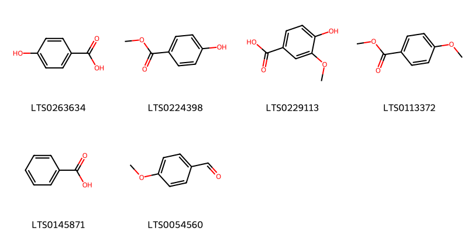{ width=100% }
    <figcaption>Hình ảnh cấu trúc hóa học của 6 hoạt chất thuộc nhóm Benzene and substituted derivatives gồm ['p-hydroxybenzoic acid (LTS0263634)', 'paraben (LTS0224398)', 'vanillic acid (LTS0229113)', 'methyl anisate (LTS0113372)', 'benzoic acid (LTS0145871)', 'anisaldehyde (LTS0054560)'].</figcaption>
</figure>
#### Nhóm Cinnamic acids and derivatives
<figure markdown="span">
    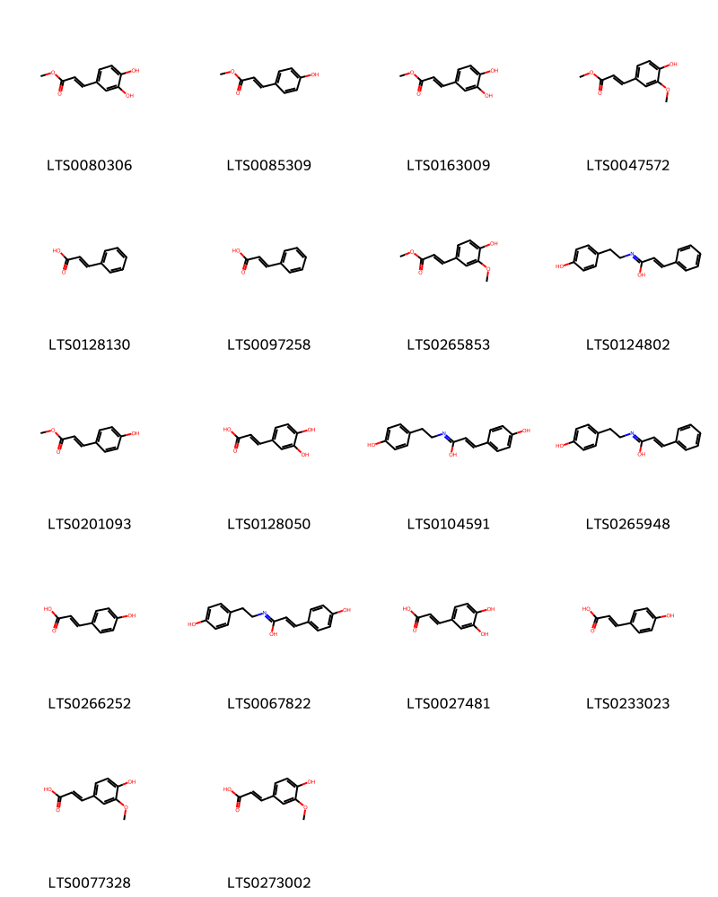{ width=100% }
    <figcaption>Hình ảnh cấu trúc hóa học của 18 hoạt chất thuộc nhóm Cinnamic acids and derivatives gồm ['methyl 3-(3,4-dihydroxyphenyl)prop-2-enoate (LTS0080306)', 'methyl (2e)-3-(4-hydroxyphenyl)prop-2-enoate (LTS0085309)', 'methyl caffeate (LTS0163009)', 'methyl ferulate (LTS0047572)', 'cinnamic acid (LTS0128130)', 'phenylacrylic acid (LTS0097258)', 'methyl ferulate (LTS0265853)', 'n-[2-(4-hydroxyphenyl)ethyl]-3-phenylprop-2-enimidic acid (LTS0124802)', 'methyl hydroxycinnamate (LTS0201093)', '3,4-dihydroxycinnamic acid (LTS0128050)', '3-(4-hydroxyphenyl)-n-[2-(4-hydroxyphenyl)ethyl]prop-2-enimidic acid (LTS0104591)', '(2e)-n-[2-(4-hydroxyphenyl)ethyl]-3-phenylprop-2-enimidic acid (LTS0265948)', 'para-coumaric acid (LTS0266252)', '(2e)-3-(4-hydroxyphenyl)-n-[2-(4-hydroxyphenyl)ethyl]prop-2-enimidic acid (LTS0067822)', 'caffeic acid (LTS0027481)', 'hydroxycinnamic acid (LTS0233023)', 'ferulic acid (LTS0077328)', 'ferulic acid (LTS0273002)'].</figcaption>
</figure>
#### Nhóm Coumarins and derivatives
<figure markdown="span">
    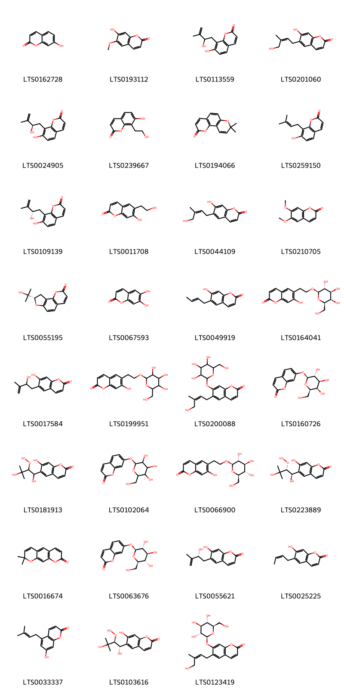{ width=100% }
    <figcaption>Hình ảnh cấu trúc hóa học của 31 hoạt chất thuộc nhóm Coumarins and derivatives gồm ['umbelliferone (LTS0162728)', 'scopoletin (LTS0193112)', '7-hydroxy-8-(2-hydroxy-3-methylbut-3-en-1-yl)chromen-2-one (LTS0113559)', '7-hydroxy-6-(4-hydroxy-3-methylbut-2-en-1-yl)chromen-2-one (LTS0201060)', '7-hydroxy-8-[(2r)-2-hydroxy-3-methylbut-3-en-1-yl]chromen-2-one (LTS0024905)', '7-hydroxy-8-(2-hydroxyethyl)chromen-2-one (LTS0239667)', 'seselin (LTS0194066)', 'osthenol (LTS0259150)', '7-hydroxy-8-[(2s)-2-hydroxy-3-methylbut-3-en-1-yl]chromen-2-one (LTS0109139)', '7-hydroxy-6-(2-hydroxyethyl)chromen-2-one (LTS0011708)', '7-hydroxy-6-[(2z)-4-hydroxy-3-methylbut-2-en-1-yl]chromen-2-one (LTS0044109)', 'scoparone (LTS0210705)', '(+)-columbianetin (LTS0055195)', 'esculetin (LTS0067593)', '6-(but-2-en-1-yl)-7-hydroxychromen-2-one (LTS0049919)', '7-hydroxy-6-(2-{[(2r,3r,4s,5r,6r)-3,4,5-trihydroxy-6-(hydroxymethyl)oxan-2-yl]oxy}ethyl)chromen-2-one (LTS0164041)', '7-hydroxy-6-(2-hydroxy-3-methylbut-3-en-1-yl)chromen-2-one (LTS0017584)', '7-hydroxy-6-(2-{[3,4,5-trihydroxy-6-(hydroxymethyl)oxan-2-yl]oxy}ethyl)chromen-2-one (LTS0199951)', '6-(4-hydroxy-3-methylbut-2-en-1-yl)-7-{[3,4,5-trihydroxy-6-(hydroxymethyl)oxan-2-yl]oxy}chromen-2-one (LTS0200088)', '7-{[(2s,3r,4s,5r,6r)-3,4,5-trihydroxy-6-(hydroxymethyl)oxan-2-yl]oxy}chromen-2-one (LTS0160726)', '6-(2-hydroperoxy-1,3-dihydroxy-3-methylbutyl)-7-hydroxychromen-2-one (LTS0181913)', 'skimmin (LTS0102064)', '7-hydroxy-6-(2-{[(2r,3r,4s,5s,6r)-3,4,5-trihydroxy-6-(hydroxymethyl)oxan-2-yl]oxy}ethyl)chromen-2-one (LTS0066900)', '6-[(1r,2r)-2-hydroperoxy-1,3-dihydroxy-3-methylbutyl]-7-hydroxychromen-2-one (LTS0223889)', 'xanthyletin (LTS0016674)', 'skimmin (LTS0063676)', '7-hydroxy-6-[(2r)-2-hydroxy-3-methylbut-3-en-1-yl]chromen-2-one (LTS0055621)', '6-[(2z)-but-2-en-1-yl]-7-hydroxychromen-2-one (LTS0025225)', '7-hydroxy-5-(3-methylbut-2-en-1-yl)chromen-2-one (LTS0033337)', '6-[(1s,2s)-2-hydroperoxy-1,3-dihydroxy-3-methylbutyl]-7-hydroxychromen-2-one (LTS0103616)', '6-[(2z)-4-hydroxy-3-methylbut-2-en-1-yl]-7-{[(2s,3r,4s,5s,6r)-3,4,5-trihydroxy-6-(hydroxymethyl)oxan-2-yl]oxy}chromen-2-one (LTS0123419)'].</figcaption>
</figure>
#### Nhóm Fatty Acyls
<figure markdown="span">
    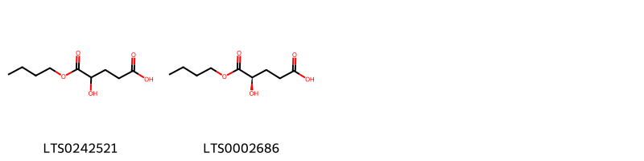{ width=100% }
    <figcaption>Hình ảnh cấu trúc hóa học của 2 hoạt chất thuộc nhóm Fatty Acyls gồm ['5-butoxy-4-hydroxy-5-oxopentanoic acid (LTS0242521)', '(4r)-5-butoxy-4-hydroxy-5-oxopentanoic acid (LTS0002686)'].</figcaption>
</figure>
#### Nhóm Flavonoids
<figure markdown="span">
    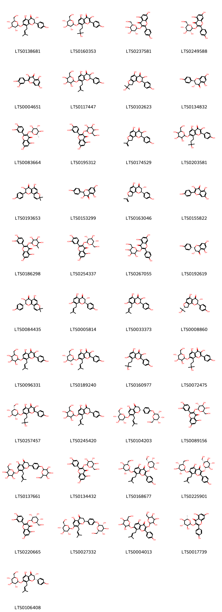{ width=100% }
    <figcaption>Hình ảnh cấu trúc hóa học của 41 hoạt chất thuộc nhóm Flavonoids gồm ['phellamurin (LTS0138681)', 'amurensin (flavonol) (LTS0160353)', 'trifolin (LTS0237581)', 'astragalin (LTS0249588)', 'quercetin (LTS0004651)', '3,5-dihydroxy-2-(4-hydroxyphenyl)-8-(3-methylbut-2-en-1-yl)-7-{[3,4,5-trihydroxy-6-(hydroxymethyl)oxan-2-yl]oxy}-2,3-dihydro-1-benzopyran-4-one (LTS0117447)', '8,11-dihydroxy-12-(4-hydroxyphenyl)-4-(2-hydroxypropan-2-yl)-5,13-dioxatricyclo[7.4.0.0²,⁶]trideca-1(9),2(6),7-trien-10-one (LTS0102623)', '(+)-dihydrokaempferol (LTS0134832)', '2-(3,4-dihydroxyphenyl)-5,7-dihydroxy-3-{[(2s,3s,4r,5r,6s)-3,4,5-trihydroxy-6-methyloxan-2-yl]oxy}chromen-4-one (LTS0083664)', '2-(3,4-dihydroxyphenyl)-5,7-dihydroxy-3-{[3,4,5-trihydroxy-6-(hydroxymethyl)oxan-2-yl]oxy}chromen-4-one (LTS0195312)', '8,11-dihydroxy-12-(4-hydroxyphenyl)-4-(prop-1-en-2-yl)-5,13-dioxatricyclo[7.4.0.0²,⁶]trideca-1(9),2(6),7-trien-10-one (LTS0174529)', 'amurensin (LTS0203581)', '3,5-dihydroxy-2-(4-hydroxyphenyl)-8,8-dimethyl-2h,3h-pyrano[2,3-f]chromen-4-one (LTS0193653)', 'aromadendrin (LTS0153299)', '(4r,11r,12r)-8,11-dihydroxy-12-(4-hydroxyphenyl)-4-(prop-1-en-2-yl)-5,13-dioxatricyclo[7.4.0.0²,⁶]trideca-1(9),2(6),7-trien-10-one (LTS0163046)', 'kaempherol (LTS0155822)', 'quercitrin (LTS0186298)', 'isoquercetin (LTS0254337)', 'trifolin (LTS0267055)', '(2s,3r)-3,5,7-trihydroxy-2-(4-hydroxyphenyl)-2,3-dihydro-1-benzopyran-4-one (LTS0192619)', '(2r,3r)-3,5-dihydroxy-2-(4-hydroxyphenyl)-8,8-dimethyl-2h,3h-pyrano[2,3-f]chromen-4-one (LTS0084435)', '(2r,3r)-3,5,7-trihydroxy-2-(4-hydroxyphenyl)-8-(3-methylbut-2-en-1-yl)-2,3-dihydro-1-benzopyran-4-one (LTS0005814)', '3,5,7-trihydroxy-2-(4-hydroxyphenyl)-8-(3-methylbut-2-en-1-yl)-2,3-dihydro-1-benzopyran-4-one (LTS0033373)', '(4r,11r,12r)-8,11-dihydroxy-12-(4-hydroxyphenyl)-4-(2-hydroxypropan-2-yl)-5,13-dioxatricyclo[7.4.0.0²,⁶]trideca-1(9),2(6),7-trien-10-one (LTS0008860)', '3,5-dihydroxy-2-(4-hydroxyphenyl)-8-(3-methylbut-2-en-1-yl)-7-{[3,4,5-trihydroxy-6-(hydroxymethyl)oxan-2-yl]oxy}chromen-4-one (LTS0096331)', '3,5-dihydroxy-2-(4-hydroxyphenyl)-8-(3-methylbut-2-en-1-yl)-7-{[(2s,3r,4s,5s,6r)-3,4,5-trihydroxy-6-(hydroxymethyl)oxan-2-yl]oxy}chromen-4-one (LTS0189240)', 'noricaritin (LTS0160977)', 'amurensin (LTS0072475)', '3,5-dihydroxy-8-(3-hydroxy-3-methylbutyl)-2-(4-hydroxyphenyl)-7-{[(2s,3r,4s,5s,6s)-3,4,5-trihydroxy-6-(hydroxymethyl)oxan-2-yl]oxy}chromen-4-one (LTS0257457)', '5-hydroxy-2-(4-hydroxyphenyl)-8-(3-methylbut-2-en-1-yl)-7-{[3,4,5-trihydroxy-6-(hydroxymethyl)oxan-2-yl]oxy}-2,3-dihydro-1-benzopyran-4-one (LTS0245420)', '(2r)-5-hydroxy-8-(3-methylbut-2-en-1-yl)-7-{[(2s,3r,4s,5s,6r)-3,4,5-trihydroxy-6-(hydroxymethyl)oxan-2-yl]oxy}-2-(4-{[(2s,3r,4r,5s,6r)-3,4,5-trihydroxy-6-(hydroxymethyl)oxan-2-yl]oxy}phenyl)-2,3-dihydro-1-benzopyran-4-one (LTS0104203)', 'hyperoside (LTS0089156)', '5-hydroxy-8-(3-methylbut-2-en-1-yl)-7-{[3,4,5-trihydroxy-6-(hydroxymethyl)oxan-2-yl]oxy}-2-(4-{[3,4,5-trihydroxy-6-(hydroxymethyl)oxan-2-yl]oxy}phenyl)-2,3-dihydro-1-benzopyran-4-one (LTS0137661)', '2-(3,4-dihydroxyphenyl)-5,7-dihydroxy-3-{[(2s,3s,4r,5r,6r)-3,4,5-trihydroxy-6-(hydroxymethyl)oxan-2-yl]oxy}chromen-4-one (LTS0134432)', '5-hydroxy-2-(4-hydroxyphenyl)-8-(3-methylbut-2-en-1-yl)-3,7-bis({[(2s,3r,4s,5r,6r)-3,4,5-trihydroxy-6-(hydroxymethyl)oxan-2-yl]oxy})chromen-4-one (LTS0168677)', '5-hydroxy-2-(4-hydroxyphenyl)-8-(3-methylbut-2-en-1-yl)-3,7-bis({[(2s,3r,4s,5s,6r)-3,4,5-trihydroxy-6-(hydroxymethyl)oxan-2-yl]oxy})chromen-4-one (LTS0225901)', '2-(3,4-dihydroxyphenyl)-5,7-dihydroxy-3-{[(2s,3r,4r,5s,6r)-3,4,5-trihydroxy-6-(hydroxymethyl)oxan-2-yl]oxy}chromen-4-one (LTS0220665)', '(2s)-5-hydroxy-8-(3-methylbut-2-en-1-yl)-7-{[(2s,3r,4s,5s,6r)-3,4,5-trihydroxy-6-(hydroxymethyl)oxan-2-yl]oxy}-2-(4-{[(2s,3r,4s,5s,6r)-3,4,5-trihydroxy-6-(hydroxymethyl)oxan-2-yl]oxy}phenyl)-2,3-dihydro-1-benzopyran-4-one (LTS0027332)', '5-hydroxy-2-(4-hydroxyphenyl)-8-(3-methylbut-2-en-1-yl)-3,7-bis({[3,4,5-trihydroxy-6-(hydroxymethyl)oxan-2-yl]oxy})chromen-4-one (LTS0004013)', '5,7-dihydroxy-2-(4-hydroxyphenyl)-3-{[(2s,3s,4r,5r,6s)-3,4,5-trihydroxy-6-methyloxan-2-yl]oxy}chromen-4-one (LTS0017739)', '(2s,3r)-3,5-dihydroxy-2-(4-hydroxyphenyl)-8-(3-methylbut-2-en-1-yl)-7-{[(2s,3r,4s,5s,6r)-3,4,5-trihydroxy-6-(hydroxymethyl)oxan-2-yl]oxy}-2,3-dihydro-1-benzopyran-4-one (LTS0106408)'].</figcaption>
</figure>
#### Nhóm Indoles and derivatives
<figure markdown="span">
    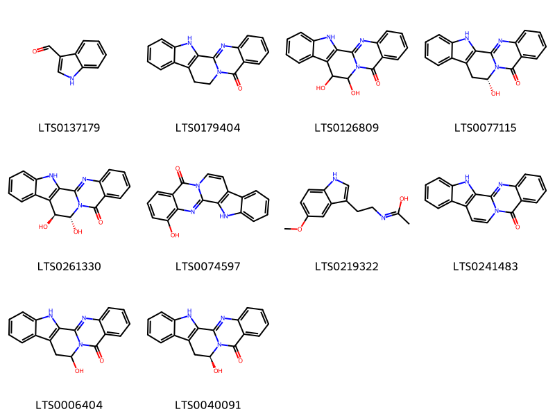{ width=100% }
    <figcaption>Hình ảnh cấu trúc hóa học của 10 hoạt chất thuộc nhóm Indoles and derivatives gồm ['indole-3-carboxaldehyde (LTS0137179)', 'rutaecarpine (LTS0179404)', '11,12-dihydroxy-3,13,21-triazapentacyclo[11.8.0.0²,¹⁰.0⁴,⁹.0¹⁵,²⁰]henicosa-1(21),2(10),4,6,8,15,17,19-octaen-14-one (LTS0126809)', '(12r)-12-hydroxy-3,13,21-triazapentacyclo[11.8.0.0²,¹⁰.0⁴,⁹.0¹⁵,²⁰]henicosa-1(21),2(10),4,6,8,15,17,19-octaen-14-one (LTS0077115)', '(11s,12r)-11,12-dihydroxy-3,13,21-triazapentacyclo[11.8.0.0²,¹⁰.0⁴,⁹.0¹⁵,²⁰]henicosa-1(21),2(10),4,6,8,15,17,19-octaen-14-one (LTS0261330)', '19-hydroxy-3,13,21-triazapentacyclo[11.8.0.0²,¹⁰.0⁴,⁹.0¹⁵,²⁰]henicosa-1(21),2(10),4(9),5,7,11,15,17,19-nonaen-14-one (LTS0074597)', 'n-[2-(5-methoxy-1h-indol-3-yl)ethyl]ethanimidic acid (LTS0219322)', '3,13,21-triazapentacyclo[11.8.0.0²,¹⁰.0⁴,⁹.0¹⁵,²⁰]henicosa-1(21),2(10),4(9),5,7,11,15,17,19-nonaen-14-one (LTS0241483)', '12-hydroxy-3,13,21-triazapentacyclo[11.8.0.0²,¹⁰.0⁴,⁹.0¹⁵,²⁰]henicosa-1(21),2(10),4,6,8,15,17,19-octaen-14-one (LTS0006404)', '(12s)-12-hydroxy-3,13,21-triazapentacyclo[11.8.0.0²,¹⁰.0⁴,⁹.0¹⁵,²⁰]henicosa-1(21),2(10),4,6,8,15,17,19-octaen-14-one (LTS0040091)'].</figcaption>
</figure>
#### Nhóm Indolonaphthyridine alkaloids
<figure markdown="span">
    { width=100% }
    <figcaption>Hình ảnh cấu trúc hóa học của 1 hoạt chất thuộc nhóm Indolonaphthyridine alkaloids gồm ['canthin-6-one (LTS0216343)'].</figcaption>
</figure>
#### Nhóm Isoquinolines and derivatives
<figure markdown="span">
    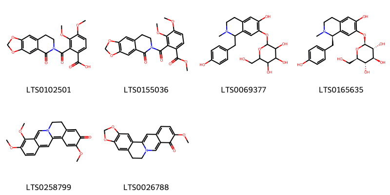{ width=100% }
    <figcaption>Hình ảnh cấu trúc hóa học của 6 hoạt chất thuộc nhóm Isoquinolines and derivatives gồm ['3,4-dimethoxy-2-{5-oxo-2h,7h,8h-[1,3]dioxolo[4,5-g]isoquinoline-6-carbonyl}benzoic acid (LTS0102501)', 'methyl 3,4-dimethoxy-2-{5-oxo-2h,7h,8h-[1,3]dioxolo[4,5-g]isoquinoline-6-carbonyl}benzoate (LTS0155036)', '2-({6-hydroxy-1-[(4-hydroxyphenyl)methyl]-2-methyl-3,4-dihydro-1h-isoquinolin-7-yl}oxy)-6-(hydroxymethyl)oxane-3,4,5-triol (LTS0069377)', '(2s,3r,4s,5s,6r)-2-{[(1r)-6-hydroxy-1-[(4-hydroxyphenyl)methyl]-2-methyl-3,4-dihydro-1h-isoquinolin-7-yl]oxy}-6-(hydroxymethyl)oxane-3,4,5-triol (LTS0165635)', '3,4,11-trimethoxy-7,8-dihydro-6-azatetraphen-10-one (LTS0258799)', '17-methoxy-5,7-dioxa-13-azapentacyclo[11.8.0.0²,¹⁰.0⁴,⁸.0¹⁵,²⁰]henicosa-1(21),2,4(8),9,14,17,19-heptaen-16-one (LTS0026788)'].</figcaption>
</figure>
#### Nhóm Lignan glycosides
<figure markdown="span">
    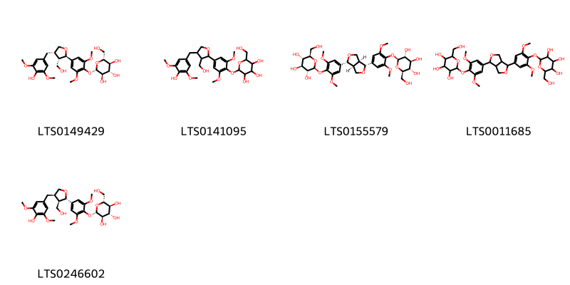{ width=100% }
    <figcaption>Hình ảnh cấu trúc hóa học của 5 hoạt chất thuộc nhóm Lignan glycosides gồm ['(2s,3r,4s,5s,6r)-2-{4-[(2r,3s,4s)-4-[(4-hydroxy-3,5-dimethoxyphenyl)methyl]-3-(hydroxymethyl)oxolan-2-yl]-2,6-dimethoxyphenoxy}-6-(hydroxymethyl)oxane-3,4,5-triol (LTS0149429)', '2-(4-{4-[(4-hydroxy-3,5-dimethoxyphenyl)methyl]-3-(hydroxymethyl)oxolan-2-yl}-2,6-dimethoxyphenoxy)-6-(hydroxymethyl)oxane-3,4,5-triol (LTS0141095)', 'acanthoside d (LTS0155579)', '2-{4-[4-(3,5-dimethoxy-4-{[3,4,5-trihydroxy-6-(hydroxymethyl)oxan-2-yl]oxy}phenyl)-hexahydrofuro[3,4-c]furan-1-yl]-2,6-dimethoxyphenoxy}-6-(hydroxymethyl)oxane-3,4,5-triol (LTS0011685)', '(2s,3r,4s,5s,6r)-2-{4-[(2s,3r,4r)-4-[(4-hydroxy-3,5-dimethoxyphenyl)methyl]-3-(hydroxymethyl)oxolan-2-yl]-2,6-dimethoxyphenoxy}-6-(hydroxymethyl)oxane-3,4,5-triol (LTS0246602)'].</figcaption>
</figure>
#### Nhóm Organooxygen compounds
<figure markdown="span">
    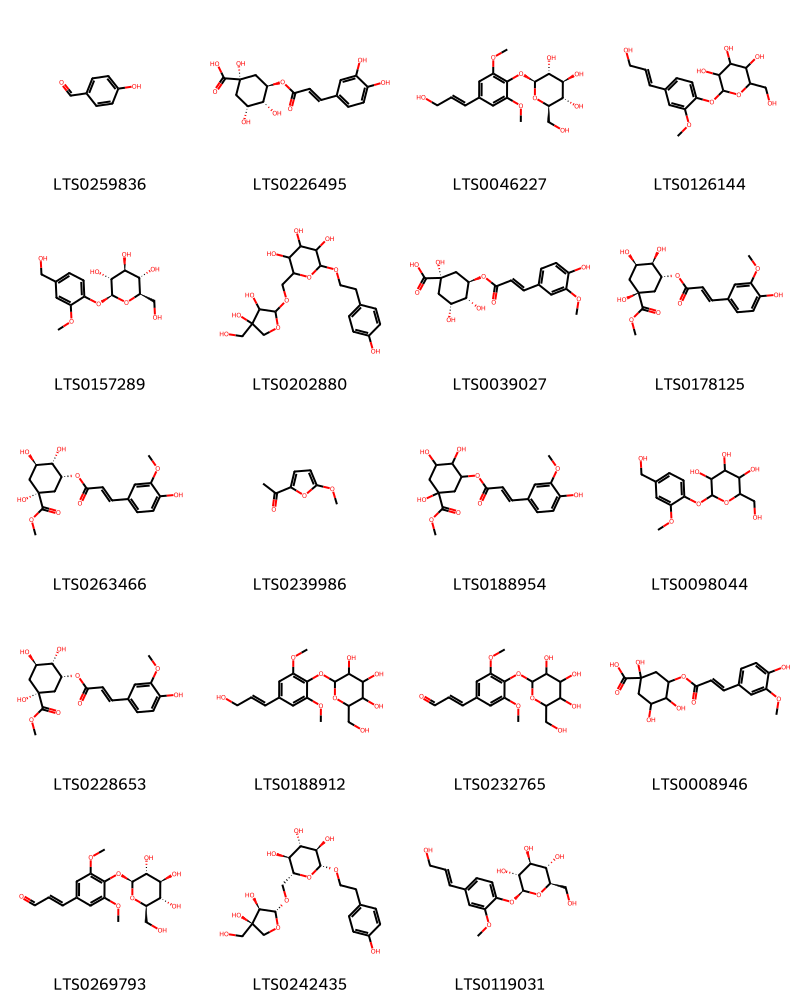{ width=100% }
    <figcaption>Hình ảnh cấu trúc hóa học của 19 hoạt chất thuộc nhóm Organooxygen compounds gồm ['p-hydroxybenzaldehyde (LTS0259836)', 'chlorogenic acid (LTS0226495)', 'syringin (LTS0046227)', '2-(hydroxymethyl)-6-[4-(3-hydroxyprop-1-en-1-yl)-2-methoxyphenoxy]oxane-3,4,5-triol (LTS0126144)', 'vanilloloside (LTS0157289)', '2-({[3,4-dihydroxy-4-(hydroxymethyl)oxolan-2-yl]oxy}methyl)-6-[2-(4-hydroxyphenyl)ethoxy]oxane-3,4,5-triol (LTS0202880)', '3-o-feruloyl-d-quinic acid (LTS0039027)', 'methyl (1s,3r,4r,5r)-1,3,4-trihydroxy-5-{[(2e)-3-(4-hydroxy-3-methoxyphenyl)prop-2-enoyl]oxy}cyclohexane-1-carboxylate (LTS0178125)', 'methyl (1r,3r,4s,5r)-1,3,4-trihydroxy-5-{[3-(4-hydroxy-3-methoxyphenyl)prop-2-enoyl]oxy}cyclohexane-1-carboxylate (LTS0263466)', '1-(5-methoxyfuran-2-yl)ethanone (LTS0239986)', 'methyl 1,3,4-trihydroxy-5-{[3-(4-hydroxy-3-methoxyphenyl)prop-2-enoyl]oxy}cyclohexane-1-carboxylate (LTS0188954)', '2-(hydroxymethyl)-6-[4-(hydroxymethyl)-2-methoxyphenoxy]oxane-3,4,5-triol (LTS0098044)', 'methyl (1r,3r,4s,5r)-1,3,4-trihydroxy-5-{[(2e)-3-(4-hydroxy-3-methoxyphenyl)prop-2-enoyl]oxy}cyclohexane-1-carboxylate (LTS0228653)', '2-(hydroxymethyl)-6-[4-(3-hydroxyprop-1-en-1-yl)-2,6-dimethoxyphenoxy]oxane-3,4,5-triol (LTS0188912)', '3-(3,5-dimethoxy-4-{[3,4,5-trihydroxy-6-(hydroxymethyl)oxan-2-yl]oxy}phenyl)prop-2-enal (LTS0232765)', '1,3,4-trihydroxy-5-{[3-(4-hydroxy-3-methoxyphenyl)prop-2-enoyl]oxy}cyclohexane-1-carboxylic acid (LTS0008946)', '(2e)-3-(3,5-dimethoxy-4-{[(2s,3r,4s,5s,6r)-3,4,5-trihydroxy-6-(hydroxymethyl)oxan-2-yl]oxy}phenyl)prop-2-enal (LTS0269793)', '(2r,3s,4s,5r,6r)-2-({[(2r,3r,4r)-3,4-dihydroxy-4-(hydroxymethyl)oxolan-2-yl]oxy}methyl)-6-[2-(4-hydroxyphenyl)ethoxy]oxane-3,4,5-triol (LTS0242435)', 'coniferin (LTS0119031)'].</figcaption>
</figure>
#### Nhóm Phenols
<figure markdown="span">
    { width=100% }
    <figcaption>Hình ảnh cấu trúc hóa học của 1 hoạt chất thuộc nhóm Phenols gồm ['tyrosol (LTS0132195)'].</figcaption>
</figure>
#### Nhóm Prenol lipids
<figure markdown="span">
    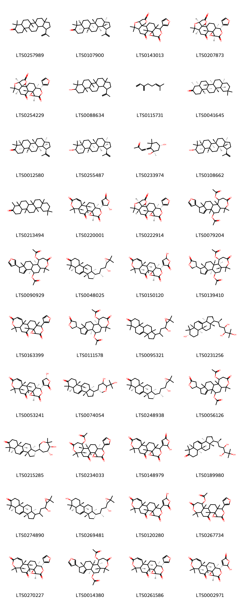{ width=100% }
    <figcaption>Hình ảnh cấu trúc hóa học của 40 hoạt chất thuộc nhóm Prenol lipids gồm ['3a,5a,5b,8,8,11a-hexamethyl-1-(prop-1-en-2-yl)-tetradecahydro-1h-cyclopenta[a]chrysen-9-one (LTS0257989)', 'lupenone (LTS0107900)', 'limonin (LTS0143013)', 'limonin (LTS0207873)', '(1s,2r,7s,10r,13r,14r,16s,19s,20s)-19-(furan-3-yl)-9,9,13,20-tetramethyl-4,8,15,18-tetraoxahexacyclo[11.9.0.0²,⁷.0²,¹⁰.0¹⁴,¹⁶.0¹⁴,²⁰]docosane-5,12,17-trione (LTS0254229)', 'lupeol (LTS0088634)', 'α-myrcene (LTS0115731)', '(-)-friedelin (LTS0041645)', '(1r,3ar,5ar,5br,7ar,11ar,11br,13ar,13bs)-3a,5a,5b,8,8,11a-hexamethyl-1-(prop-1-en-2-yl)-tetradecahydro-1h-cyclopenta[a]chrysen-9-one (LTS0012580)', '(1r,3ar,5ar,5br,7ar,9r,11ar,11br,13ar,13bs)-3a,5a,5b,8,8,11a-hexamethyl-1-(prop-1-en-2-yl)-hexadecahydrocyclopenta[a]chrysen-9-ol (LTS0255487)', '4-[(2r,4s)-2,4-dihydroxy-2,6,6-trimethylcyclohexylidene]but-3-en-2-one (LTS0233974)', 'epilupeol (LTS0108662)', 'friedelin (LTS0213494)', '(1r,2r,4s,7r,8s,11s,12r,18s)-7-[(2s)-2-hydroxy-5-oxo-2h-furan-3-yl]-1,8,12,17,17-pentamethyl-3,6,16-trioxapentacyclo[9.9.0.0²,⁴.0²,⁸.0¹²,¹⁸]icos-13-ene-5,15,20-trione (LTS0220001)', '(1r,2r,7s,10s,13r,14r,16s,19s,20s)-19-(furan-3-yl)-9,9,13,20-tetramethyl-4,8,15,18-tetraoxahexacyclo[11.9.0.0²,⁷.0²,¹⁰.0¹⁴,¹⁶.0¹⁴,²⁰]docosane-5,12,17-trione (LTS0222914)', '3-(acetyloxy)-15-(furan-3-yl)-2,7,7,11,16-pentamethyl-5-oxo-6-oxatetracyclo[9.7.0.0²,⁸.0¹²,¹⁶]octadec-12-en-10-yl acetate (LTS0079204)', '(2r,11r)-3-(acetyloxy)-15-(furan-3-yl)-2,7,7,11,16-pentamethyl-5-oxo-6-oxatetracyclo[9.7.0.0²,⁸.0¹²,¹⁶]octadec-12-en-10-yl acetate (LTS0090929)', '(1s,3as,5ar,9ar,9bs,11as)-1-[(2s,4r)-4-[(2s)-3,3-dimethyloxiran-2-yl]-4-hydroxybutan-2-yl]-3a,6,6,9a,11a-pentamethyl-1h,2h,3h,5h,5ah,8h,9h,9bh,10h,11h-cyclopenta[a]phenanthren-7-one (LTS0048025)', '(1r,2r,4s,7r,8s,11r,12r,18r)-7-(5-hydroxy-2-oxo-5h-furan-3-yl)-1,8,12,17,17-pentamethyl-3,6,16-trioxapentacyclo[9.9.0.0²,⁴.0²,⁸.0¹²,¹⁸]icos-13-ene-5,15,20-trione (LTS0150120)', '(1r,2r,3s,8r,10r,11r,15s,16s)-3-(acetyloxy)-2,7,7,11,16-pentamethyl-5-oxo-15-[(3s)-5-oxooxolan-3-yl]-6-oxatetracyclo[9.7.0.0²,⁸.0¹²,¹⁶]octadec-12-en-10-yl acetate (LTS0139410)', '7-(furan-3-yl)-1,8,12,17,17-pentamethyl-3,6,16-trioxapentacyclo[9.9.0.0²,⁴.0²,⁸.0¹²,¹⁸]icos-13-ene-5,15,20-trione (LTS0163399)', '(2r,11r)-3-(acetyloxy)-2,7,7,11,16-pentamethyl-5-oxo-15-[(3s)-5-oxooxolan-3-yl]-6-oxatetracyclo[9.7.0.0²,⁸.0¹²,¹⁶]octadec-12-en-10-yl acetate (LTS0111578)', '1-[4-(3,3-dimethyloxiran-2-yl)-4-hydroxybutan-2-yl]-3a,6,6,9a,11a-pentamethyl-1h,2h,3h,5h,5ah,8h,9h,9bh,10h,11h-cyclopenta[a]phenanthren-7-one (LTS0095321)', '(3s,4r,6s)-6-[(1s,3as,5ar,7s,9ar,9br,11as)-7-hydroxy-3a,6,6,9a,11a-pentamethyl-1h,2h,3h,5h,5ah,7h,8h,9h,9bh,10h,11h-cyclopenta[a]phenanthren-1-yl]-2-methylheptane-2,3,4-triol (LTS0231256)', '(1r,2r,4s,7r,8s,11s,12r,18s)-7-[(5r)-5-hydroxy-2-oxo-5h-furan-3-yl]-1,8,12,17,17-pentamethyl-3,6,16-trioxapentacyclo[9.9.0.0²,⁴.0²,⁸.0¹²,¹⁸]icos-13-ene-5,15,20-trione (LTS0053241)', '(1r,3as,5ar,9ar,9bs,11as)-1-[(3s)-5-hydroxy-6-(2-hydroxypropan-2-yl)oxan-3-yl]-3a,6,6,9a,11a-pentamethyl-1h,2h,3h,5h,5ah,8h,9h,9bh,10h,11h-cyclopenta[a]phenanthren-7-one (LTS0074054)', '(1s,3as,5ar,9ar,9br,11as)-1-[(2s,4r)-4-[(2s)-3,3-dimethyloxiran-2-yl]-4-hydroxybutan-2-yl]-3a,6,6,9a,11a-pentamethyl-1h,2h,3h,5h,5ah,8h,9h,9bh,10h,11h-cyclopenta[a]phenanthren-7-one (LTS0248938)', '3-(acetyloxy)-2,7,7,11,16-pentamethyl-5-oxo-15-(5-oxooxolan-3-yl)-6-oxatetracyclo[9.7.0.0²,⁸.0¹²,¹⁶]octadec-12-en-10-yl acetate (LTS0056126)', '(1s,3as,5ar,9ar,9br,11as)-1-[(3s,5r,6s)-5,6-dihydroxy-7,7-dimethyloxepan-3-yl]-3a,6,6,9a,11a-pentamethyl-1h,2h,3h,5h,5ah,8h,9h,9bh,10h,11h-cyclopenta[a]phenanthren-7-one (LTS0215285)', '(1r,2r,8s,11s,12r,18s)-7-(furan-3-yl)-1,8,12,17,17-pentamethyl-5,15,20-trioxo-3,6,16-trioxapentacyclo[9.9.0.0²,⁴.0²,⁸.0¹²,¹⁸]icosan-13-yl acetate (LTS0234033)', '7-(2-hydroxy-5-oxo-2h-furan-3-yl)-1,8,12,17,17-pentamethyl-3,6,16-trioxapentacyclo[9.9.0.0²,⁴.0²,⁸.0¹²,¹⁸]icos-13-ene-5,15,20-trione (LTS0148979)', '(1s,3as,5ar,9ar,9br,11as)-3a,6,6,9a,11a-pentamethyl-1-[(2s,4r,5s)-4,5,6-trihydroxy-6-methylheptan-2-yl]-1h,2h,3h,5h,5ah,8h,9h,9bh,10h,11h-cyclopenta[a]phenanthren-7-one (LTS0189980)', '(3as,5ar,9ar,9br,11as)-1-[4-(3,3-dimethyloxiran-2-yl)-4-hydroxybutan-2-yl]-3a,6,6,9a,11a-pentamethyl-1h,2h,3h,5h,5ah,8h,9h,9bh,10h,11h-cyclopenta[a]phenanthren-7-one (LTS0274890)', '(1s,3as,5ar,7s,9ar,9br,11as)-1-[(2s,4r)-4-[(2s)-3,3-dimethyloxiran-2-yl]-4-hydroxybutan-2-yl]-3a,6,6,9a,11a-pentamethyl-1h,2h,3h,5h,5ah,7h,8h,9h,9bh,10h,11h-cyclopenta[a]phenanthren-7-ol (LTS0269481)', '7-(5-hydroxy-2-oxo-5h-furan-3-yl)-1,8,12,17,17-pentamethyl-3,6,16-trioxapentacyclo[9.9.0.0²,⁴.0²,⁸.0¹²,¹⁸]icos-13-ene-5,15,20-trione (LTS0120280)', '7-(furan-3-yl)-1,8,12,17,17-pentamethyl-5,15,20-trioxo-3,6,16-trioxapentacyclo[9.9.0.0²,⁴.0²,⁸.0¹²,¹⁸]icosan-13-yl acetate (LTS0267734)', '(1r,2r,4s,7s,8s,11s,12r,18s)-7-(furan-3-yl)-1,8,12,17,17-pentamethyl-3,6,16-trioxapentacyclo[9.9.0.0²,⁴.0²,⁸.0¹²,¹⁸]icos-13-ene-5,15,20-trione (LTS0270227)', '(1r,2r,3s,8r,10r,11r,15r,16s)-3-(acetyloxy)-15-(furan-3-yl)-2,7,7,11,16-pentamethyl-5-oxo-6-oxatetracyclo[9.7.0.0²,⁸.0¹²,¹⁶]octadec-12-en-10-yl acetate (LTS0014380)', 'obacunone (LTS0261586)', '(1r,2r,4s,7r,8s,11r,12r,18r)-7-(2-hydroxy-5-oxo-2h-furan-3-yl)-1,8,12,17,17-pentamethyl-3,6,16-trioxapentacyclo[9.9.0.0²,⁴.0²,⁸.0¹²,¹⁸]icos-13-ene-5,15,20-trione (LTS0002971)'].</figcaption>
</figure>
#### Nhóm Protoberberine alkaloids and derivatives
<figure markdown="span">
    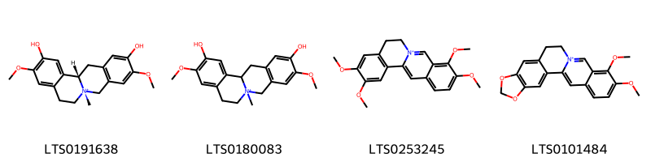{ width=100% }
    <figcaption>Hình ảnh cấu trúc hóa học của 4 hoạt chất thuộc nhóm Protoberberine alkaloids and derivatives gồm ['phellodendrine (LTS0191638)', '2,11-dihydroxy-3,10-dimethoxy-6-methyl-7,8,12b,13-tetrahydro-5h-6-azatetraphen-6-ium (LTS0180083)', 'palmatine (LTS0253245)', 'berberine (LTS0101484)'].</figcaption>
</figure>
#### Nhóm Quinolines and derivatives
<figure markdown="span">
    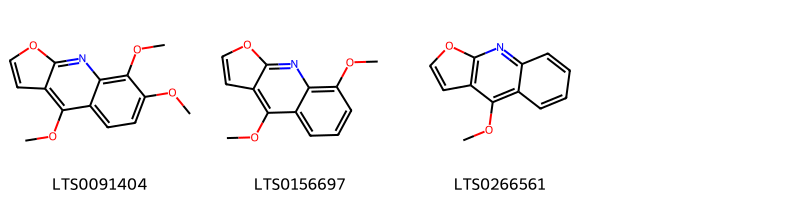{ width=100% }
    <figcaption>Hình ảnh cấu trúc hóa học của 3 hoạt chất thuộc nhóm Quinolines and derivatives gồm ['skimmianine (LTS0091404)', 'fagarine (LTS0156697)', 'dictamnine (LTS0266561)'].</figcaption>
</figure>
#### Nhóm Steroids and steroid derivatives
<figure markdown="span">
    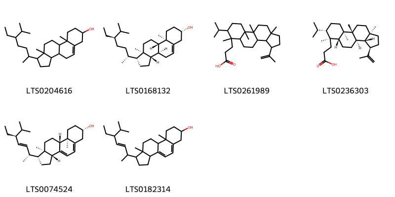{ width=100% }
    <figcaption>Hình ảnh cấu trúc hóa học của 6 hoạt chất thuộc nhóm Steroids and steroid derivatives gồm ['stigmast-5-en-3-ol, (3β)- (LTS0204616)', 'sitosterol (LTS0168132)', '3-[7-isopropyl-6,9a,9b,11a-tetramethyl-3-(prop-1-en-2-yl)-dodecahydro-1h-cyclopenta[a]phenanthren-6-yl]propanoic acid (LTS0261989)', '3-[(3r,3ar,3br,5ar,6s,7s,9ar,9br,11ar)-7-isopropyl-6,9a,9b,11a-tetramethyl-3-(prop-1-en-2-yl)-dodecahydro-1h-cyclopenta[a]phenanthren-6-yl]propanoic acid (LTS0236303)', 'δ7-stigmasterol (LTS0074524)', '1-(5-ethyl-6-methylhept-3-en-2-yl)-9a,11a-dimethyl-1h,2h,3h,3ah,6h,7h,8h,9h,9bh,10h,11h-cyclopenta[a]phenanthren-7-ol (LTS0182314)'].</figcaption>
</figure>

---

### Dược dân tộc học

Danh sách các quốc gia có sử dụng *Phellodendron amurense* trong điều trị các bệnh. 

| Country     | Disease                                                                                                    | Bệnh                                                                                                                                                                                                |
|:------------|:-----------------------------------------------------------------------------------------------------------|:----------------------------------------------------------------------------------------------------------------------------------------------------------------------------------------------------|
| China       | Antiphlogistic, Antiseptic, Diuretic, Stomachic, Tonic, Vermifuge, Aphrodisiac                             | MYMEMORY WARNING: YOU USED ALL AVAILABLE FREE TRANSLATIONS FOR TODAY. NEXT AVAILABLE IN  00 HOURS 12 MINUTES 05 SECONDS VISIT HTTPS://MYMEMORY.TRANSLATED.NET/DOC/USAGELIMITS.PHP TO TRANSLATE MORE |
| Elsewhere   | Vasoconstrictor                                                                                            | MYMEMORY WARNING: YOU USED ALL AVAILABLE FREE TRANSLATIONS FOR TODAY. NEXT AVAILABLE IN  00 HOURS 12 MINUTES 02 SECONDS VISIT HTTPS://MYMEMORY.TRANSLATED.NET/DOC/USAGELIMITS.PHP TO TRANSLATE MORE |
| Japan(Ainu) | Expectorant                                                                                                | MYMEMORY WARNING: YOU USED ALL AVAILABLE FREE TRANSLATIONS FOR TODAY. NEXT AVAILABLE IN  00 HOURS 12 MINUTES 00 SECONDS VISIT HTTPS://MYMEMORY.TRANSLATED.NET/DOC/USAGELIMITS.PHP TO TRANSLATE MORE |
| Japan*      | Antiphlogistic, Antiphlogistic, Antiphlogistic, Stomachic, Stomachic, Stomachic, Antiphlogistic, Stomachic | MYMEMORY WARNING: YOU USED ALL AVAILABLE FREE TRANSLATIONS FOR TODAY. NEXT AVAILABLE IN  00 HOURS 11 MINUTES 58 SECONDS VISIT HTTPS://MYMEMORY.TRANSLATED.NET/DOC/USAGELIMITS.PHP TO TRANSLATE MORE |

---

---
## Phellodendron chinense
### Thông tin về thực vật

!!! info "Phân loại thực vật của *Phellodendron chinense* từ GIBF:"
    - **Kingdom:** Plantae
    - **Phylum:** Tracheophyta
    - **Order:** Sapindales
    - **Family:** Rutaceae
    - **Genus:** Phellodendron
    - **Species:** *Phellodendron chinense*

 

| Label (VI)   | Label (EN)   | Scientific Name        | Descriptions (VI)   | Descriptions (EN)   | Also Known As (VI)   | Also Known As (EN)   |
|:-------------|:-------------|:-----------------------|:--------------------|:--------------------|:---------------------|:---------------------|
| N/A          | N/A          | Phellodendron chinense | loài thực vật       | species of plant    | ['']                 | ['']                 |

#### Phân bố trên thế giới

**Từ CSDL GIBF** nan, Netherlands, Japan, Belgium, Korea, Republic of, Chinese Taipei, Russian Federation, United States of America, France, China, Canada

#### Phân bố tại Việt Nam

**Từ CSDL GIBF**: Không có ghi nhận ở Việt Nam

---
### Thành phần hóa học
        
- Theo cơ sở dữ liệu lotus: Từ loài *Phellodendron chinense* đã phân lập và xác định được 138 hoạt chất thuộc về các nhóm Fatty Acyls, Flavonoids, Indoles and derivatives, Steroids and steroid derivatives, Prenol lipids, Cinnamic acids and derivatives, Aporphines, Tetrapyrroles and derivatives, Quinolines and derivatives, Benzene and substituted derivatives, Organooxygen compounds, Coumarins and derivatives, Furanoid lignans, Isoquinolines and derivatives, Protoberberine alkaloids and derivatives, Indolonaphthyridine alkaloids. 

|    | chemicalTaxonomyClassyfireClass          |   smiles_count |
|---:|:-----------------------------------------|---------------:|
|  0 | Aporphines                               |              1 |
|  1 | Benzene and substituted derivatives      |              8 |
|  2 | Cinnamic acids and derivatives           |             13 |
|  3 | Coumarins and derivatives                |             13 |
|  4 | Fatty Acyls                              |              1 |
|  5 | Flavonoids                               |             37 |
|  6 | Furanoid lignans                         |              2 |
|  7 | Indoles and derivatives                  |              3 |
|  8 | Indolonaphthyridine alkaloids            |              1 |
|  9 | Isoquinolines and derivatives            |              3 |
| 10 | Organooxygen compounds                   |              3 |
| 11 | Prenol lipids                            |             31 |
| 12 | Protoberberine alkaloids and derivatives |              5 |
| 13 | Quinolines and derivatives               |              3 |
| 14 | Steroids and steroid derivatives         |              5 |
| 15 | Tetrapyrroles and derivatives            |              2 |

#### Nhóm Aporphines
<figure markdown="span">
    { width=100% }
    <figcaption>Hình ảnh cấu trúc hóa học của 1 hoạt chất thuộc nhóm Aporphines gồm ['magnoflorine (LTS0120825)'].</figcaption>
</figure>
#### Nhóm Benzene and substituted derivatives
<figure markdown="span">
    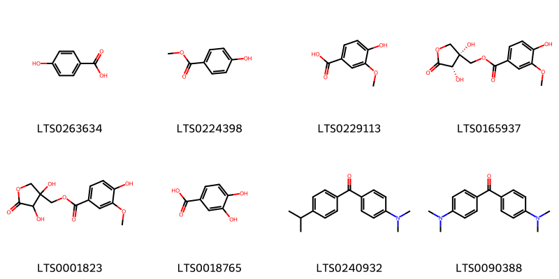{ width=100% }
    <figcaption>Hình ảnh cấu trúc hóa học của 8 hoạt chất thuộc nhóm Benzene and substituted derivatives gồm ['p-hydroxybenzoic acid (LTS0263634)', 'paraben (LTS0224398)', 'vanillic acid (LTS0229113)', '[(3s,4s)-3,4-dihydroxy-5-oxooxolan-3-yl]methyl 4-hydroxy-3-methoxybenzoate (LTS0165937)', '(3,4-dihydroxy-5-oxooxolan-3-yl)methyl 4-hydroxy-3-methoxybenzoate (LTS0001823)', '3,4-dihydroxybenzoic acid (LTS0018765)', '4-(4-isopropylbenzoyl)-n,n-dimethylaniline (LTS0240932)', "michler's ketone (LTS0090388)"].</figcaption>
</figure>
#### Nhóm Cinnamic acids and derivatives
<figure markdown="span">
    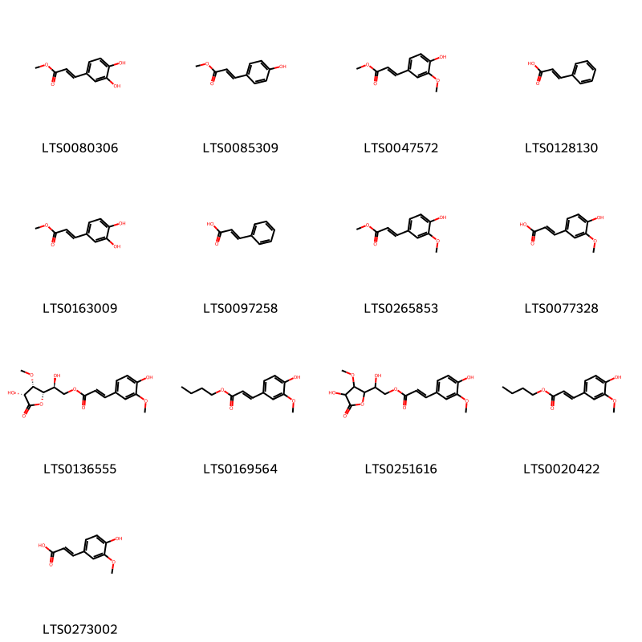{ width=100% }
    <figcaption>Hình ảnh cấu trúc hóa học của 13 hoạt chất thuộc nhóm Cinnamic acids and derivatives gồm ['methyl 3-(3,4-dihydroxyphenyl)prop-2-enoate (LTS0080306)', 'methyl (2e)-3-(4-hydroxyphenyl)prop-2-enoate (LTS0085309)', 'methyl ferulate (LTS0047572)', 'cinnamic acid (LTS0128130)', 'methyl caffeate (LTS0163009)', 'phenylacrylic acid (LTS0097258)', 'methyl ferulate (LTS0265853)', 'ferulic acid (LTS0077328)', '(2s)-2-hydroxy-2-[(2s,3s,4r)-4-hydroxy-3-methoxy-5-oxooxolan-2-yl]ethyl (2e)-3-(4-hydroxy-3-methoxyphenyl)prop-2-enoate (LTS0136555)', 'butyl (2e)-3-(4-hydroxy-3-methoxyphenyl)prop-2-enoate (LTS0169564)', '2-hydroxy-2-(4-hydroxy-3-methoxy-5-oxooxolan-2-yl)ethyl 3-(4-hydroxy-3-methoxyphenyl)prop-2-enoate (LTS0251616)', 'butyl 3-(4-hydroxy-3-methoxyphenyl)prop-2-enoate (LTS0020422)', 'ferulic acid (LTS0273002)'].</figcaption>
</figure>
#### Nhóm Coumarins and derivatives
<figure markdown="span">
    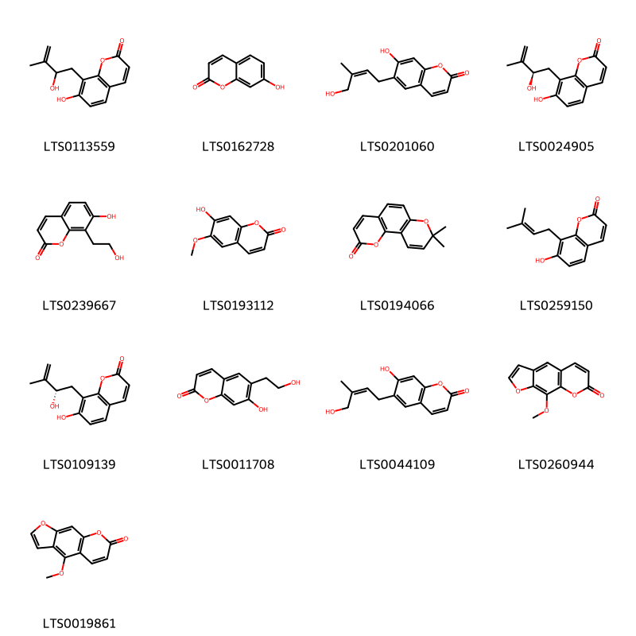{ width=100% }
    <figcaption>Hình ảnh cấu trúc hóa học của 13 hoạt chất thuộc nhóm Coumarins and derivatives gồm ['7-hydroxy-8-(2-hydroxy-3-methylbut-3-en-1-yl)chromen-2-one (LTS0113559)', 'umbelliferone (LTS0162728)', '7-hydroxy-6-(4-hydroxy-3-methylbut-2-en-1-yl)chromen-2-one (LTS0201060)', '7-hydroxy-8-[(2r)-2-hydroxy-3-methylbut-3-en-1-yl]chromen-2-one (LTS0024905)', '7-hydroxy-8-(2-hydroxyethyl)chromen-2-one (LTS0239667)', 'scopoletin (LTS0193112)', 'seselin (LTS0194066)', 'osthenol (LTS0259150)', '7-hydroxy-8-[(2s)-2-hydroxy-3-methylbut-3-en-1-yl]chromen-2-one (LTS0109139)', '7-hydroxy-6-(2-hydroxyethyl)chromen-2-one (LTS0011708)', '7-hydroxy-6-[(2z)-4-hydroxy-3-methylbut-2-en-1-yl]chromen-2-one (LTS0044109)', 'methoxsalen (LTS0260944)', 'bergapten (LTS0019861)'].</figcaption>
</figure>
#### Nhóm Fatty Acyls
<figure markdown="span">
    { width=100% }
    <figcaption>Hình ảnh cấu trúc hóa học của 1 hoạt chất thuộc nhóm Fatty Acyls gồm ['oleic acid (LTS0256910)'].</figcaption>
</figure>
#### Nhóm Flavonoids
<figure markdown="span">
    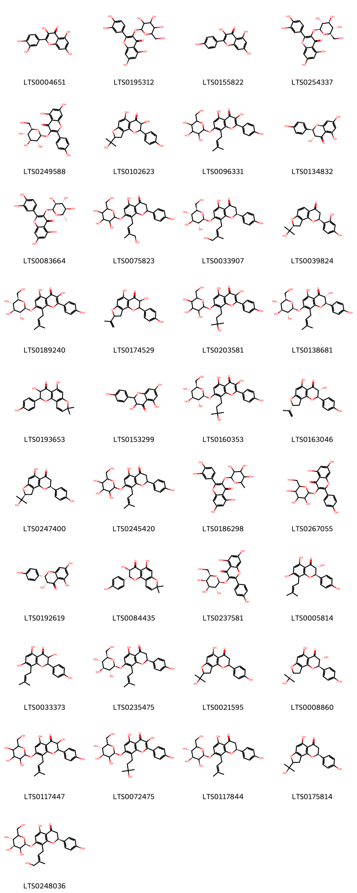{ width=100% }
    <figcaption>Hình ảnh cấu trúc hóa học của 37 hoạt chất thuộc nhóm Flavonoids gồm ['quercetin (LTS0004651)', '2-(3,4-dihydroxyphenyl)-5,7-dihydroxy-3-{[3,4,5-trihydroxy-6-(hydroxymethyl)oxan-2-yl]oxy}chromen-4-one (LTS0195312)', 'kaempherol (LTS0155822)', 'isoquercetin (LTS0254337)', 'astragalin (LTS0249588)', '8,11-dihydroxy-12-(4-hydroxyphenyl)-4-(2-hydroxypropan-2-yl)-5,13-dioxatricyclo[7.4.0.0²,⁶]trideca-1(9),2(6),7-trien-10-one (LTS0102623)', '3,5-dihydroxy-2-(4-hydroxyphenyl)-8-(3-methylbut-2-en-1-yl)-7-{[3,4,5-trihydroxy-6-(hydroxymethyl)oxan-2-yl]oxy}chromen-4-one (LTS0096331)', '(+)-dihydrokaempferol (LTS0134832)', '2-(3,4-dihydroxyphenyl)-5,7-dihydroxy-3-{[(2s,3s,4r,5r,6s)-3,4,5-trihydroxy-6-methyloxan-2-yl]oxy}chromen-4-one (LTS0083664)', '5-hydroxy-8-(4-hydroxy-3-methylbut-2-en-1-yl)-2-(4-hydroxyphenyl)-7-{[3,4,5-trihydroxy-6-(hydroxymethyl)oxan-2-yl]oxy}-2,3-dihydro-1-benzopyran-4-one (LTS0075823)', '(2s)-5-hydroxy-8-[(2e)-4-hydroxy-3-methylbut-2-en-1-yl]-2-(4-hydroxyphenyl)-7-{[(2s,3r,4s,5s,6r)-3,4,5-trihydroxy-6-(hydroxymethyl)oxan-2-yl]oxy}-2,3-dihydro-1-benzopyran-4-one (LTS0033907)', '(4s,12s)-12-(2,4-dihydroxyphenyl)-4-(2-hydroxypropan-2-yl)-5,13-dioxatricyclo[7.4.0.0²,⁶]trideca-1(9),2(6),7-trien-10-one (LTS0039824)', '3,5-dihydroxy-2-(4-hydroxyphenyl)-8-(3-methylbut-2-en-1-yl)-7-{[(2s,3r,4s,5s,6r)-3,4,5-trihydroxy-6-(hydroxymethyl)oxan-2-yl]oxy}chromen-4-one (LTS0189240)', '8,11-dihydroxy-12-(4-hydroxyphenyl)-4-(prop-1-en-2-yl)-5,13-dioxatricyclo[7.4.0.0²,⁶]trideca-1(9),2(6),7-trien-10-one (LTS0174529)', 'amurensin (LTS0203581)', 'phellamurin (LTS0138681)', '3,5-dihydroxy-2-(4-hydroxyphenyl)-8,8-dimethyl-2h,3h-pyrano[2,3-f]chromen-4-one (LTS0193653)', 'aromadendrin (LTS0153299)', 'amurensin (flavonol) (LTS0160353)', '(4r,11r,12r)-8,11-dihydroxy-12-(4-hydroxyphenyl)-4-(prop-1-en-2-yl)-5,13-dioxatricyclo[7.4.0.0²,⁶]trideca-1(9),2(6),7-trien-10-one (LTS0163046)', '(4s,12s)-8-hydroxy-12-(4-hydroxyphenyl)-4-(2-hydroxypropan-2-yl)-5,13-dioxatricyclo[7.4.0.0²,⁶]trideca-1(9),2(6),7-trien-10-one (LTS0247400)', '5-hydroxy-2-(4-hydroxyphenyl)-8-(3-methylbut-2-en-1-yl)-7-{[3,4,5-trihydroxy-6-(hydroxymethyl)oxan-2-yl]oxy}-2,3-dihydro-1-benzopyran-4-one (LTS0245420)', 'quercitrin (LTS0186298)', 'trifolin (LTS0267055)', '(2s,3r)-3,5,7-trihydroxy-2-(4-hydroxyphenyl)-2,3-dihydro-1-benzopyran-4-one (LTS0192619)', '(2r,3r)-3,5-dihydroxy-2-(4-hydroxyphenyl)-8,8-dimethyl-2h,3h-pyrano[2,3-f]chromen-4-one (LTS0084435)', 'trifolin (LTS0237581)', '(2r,3r)-3,5,7-trihydroxy-2-(4-hydroxyphenyl)-8-(3-methylbut-2-en-1-yl)-2,3-dihydro-1-benzopyran-4-one (LTS0005814)', '3,5,7-trihydroxy-2-(4-hydroxyphenyl)-8-(3-methylbut-2-en-1-yl)-2,3-dihydro-1-benzopyran-4-one (LTS0033373)', '(2s)-5-hydroxy-2-(4-hydroxyphenyl)-8-(3-methylbut-2-en-1-yl)-7-{[(2s,3r,4s,5s,6r)-3,4,5-trihydroxy-6-(hydroxymethyl)oxan-2-yl]oxy}-2,3-dihydro-1-benzopyran-4-one (LTS0235475)', '8-hydroxy-12-(4-hydroxyphenyl)-4-(2-hydroxypropan-2-yl)-5,13-dioxatricyclo[7.4.0.0²,⁶]trideca-1(9),2(6),7-trien-10-one (LTS0021595)', '(4r,11r,12r)-8,11-dihydroxy-12-(4-hydroxyphenyl)-4-(2-hydroxypropan-2-yl)-5,13-dioxatricyclo[7.4.0.0²,⁶]trideca-1(9),2(6),7-trien-10-one (LTS0008860)', '3,5-dihydroxy-2-(4-hydroxyphenyl)-8-(3-methylbut-2-en-1-yl)-7-{[3,4,5-trihydroxy-6-(hydroxymethyl)oxan-2-yl]oxy}-2,3-dihydro-1-benzopyran-4-one (LTS0117447)', 'amurensin (LTS0072475)', 'phellodensin f (LTS0117844)', 'phellodensin d (LTS0175814)', 'phellodensin e (LTS0248036)'].</figcaption>
</figure>
#### Nhóm Furanoid lignans
<figure markdown="span">
    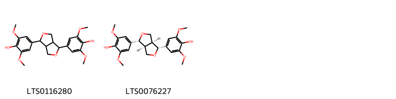{ width=100% }
    <figcaption>Hình ảnh cấu trúc hóa học của 2 hoạt chất thuộc nhóm Furanoid lignans gồm ['syringaresinol (LTS0116280)', '(-)-syringaresinol (LTS0076227)'].</figcaption>
</figure>
#### Nhóm Indoles and derivatives
<figure markdown="span">
    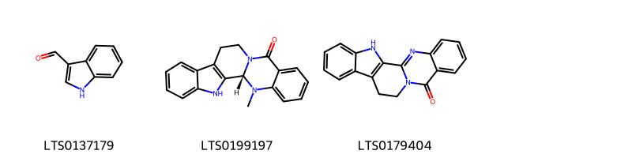{ width=100% }
    <figcaption>Hình ảnh cấu trúc hóa học của 3 hoạt chất thuộc nhóm Indoles and derivatives gồm ['indole-3-carboxaldehyde (LTS0137179)', 'evodiamine (LTS0199197)', 'rutaecarpine (LTS0179404)'].</figcaption>
</figure>
#### Nhóm Indolonaphthyridine alkaloids
<figure markdown="span">
    { width=100% }
    <figcaption>Hình ảnh cấu trúc hóa học của 1 hoạt chất thuộc nhóm Indolonaphthyridine alkaloids gồm ['canthin-6-one (LTS0216343)'].</figcaption>
</figure>
#### Nhóm Isoquinolines and derivatives
<figure markdown="span">
    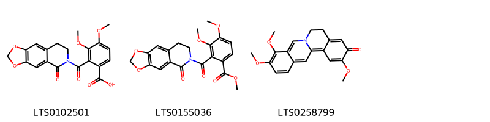{ width=100% }
    <figcaption>Hình ảnh cấu trúc hóa học của 3 hoạt chất thuộc nhóm Isoquinolines and derivatives gồm ['3,4-dimethoxy-2-{5-oxo-2h,7h,8h-[1,3]dioxolo[4,5-g]isoquinoline-6-carbonyl}benzoic acid (LTS0102501)', 'methyl 3,4-dimethoxy-2-{5-oxo-2h,7h,8h-[1,3]dioxolo[4,5-g]isoquinoline-6-carbonyl}benzoate (LTS0155036)', '3,4,11-trimethoxy-7,8-dihydro-6-azatetraphen-10-one (LTS0258799)'].</figcaption>
</figure>
#### Nhóm Organooxygen compounds
<figure markdown="span">
    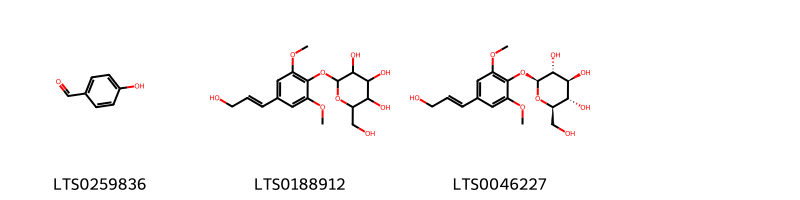{ width=100% }
    <figcaption>Hình ảnh cấu trúc hóa học của 3 hoạt chất thuộc nhóm Organooxygen compounds gồm ['p-hydroxybenzaldehyde (LTS0259836)', '2-(hydroxymethyl)-6-[4-(3-hydroxyprop-1-en-1-yl)-2,6-dimethoxyphenoxy]oxane-3,4,5-triol (LTS0188912)', 'syringin (LTS0046227)'].</figcaption>
</figure>
#### Nhóm Prenol lipids
<figure markdown="span">
    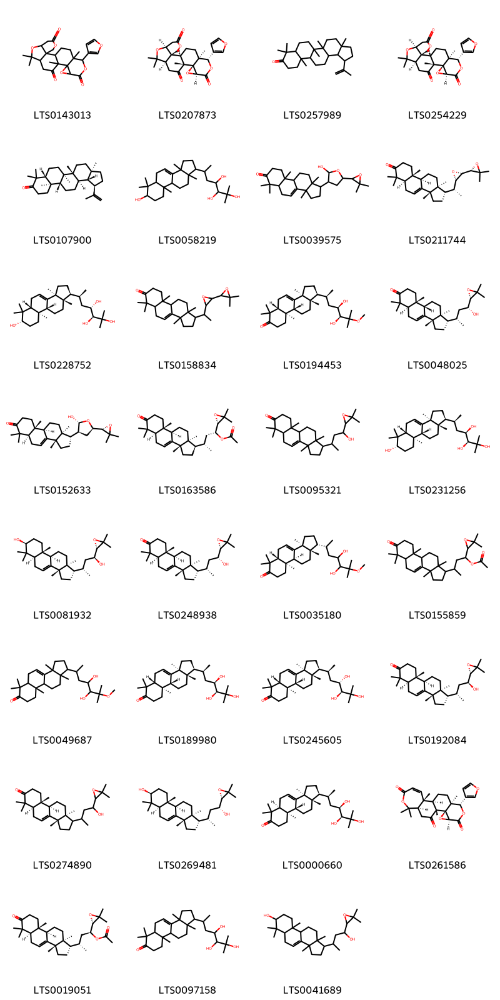{ width=100% }
    <figcaption>Hình ảnh cấu trúc hóa học của 31 hoạt chất thuộc nhóm Prenol lipids gồm ['limonin (LTS0143013)', 'limonin (LTS0207873)', '3a,5a,5b,8,8,11a-hexamethyl-1-(prop-1-en-2-yl)-tetradecahydro-1h-cyclopenta[a]chrysen-9-one (LTS0257989)', '(1s,2r,7s,10r,13r,14r,16s,19s,20s)-19-(furan-3-yl)-9,9,13,20-tetramethyl-4,8,15,18-tetraoxahexacyclo[11.9.0.0²,⁷.0²,¹⁰.0¹⁴,¹⁶.0¹⁴,²⁰]docosane-5,12,17-trione (LTS0254229)', 'lupenone (LTS0107900)', '6-{7-hydroxy-3a,6,6,9a,11a-pentamethyl-1h,2h,3h,5h,5ah,7h,8h,9h,9bh,10h,11h-cyclopenta[a]phenanthren-1-yl}-2-methylheptane-2,3,4-triol (LTS0058219)', '1-[5-(3,3-dimethyloxiran-2-yl)-2-hydroxyoxolan-3-yl]-3a,6,6,9a,11a-pentamethyl-1h,2h,3h,5h,5ah,8h,9h,9bh,10h,11h-cyclopenta[a]phenanthren-7-one (LTS0039575)', 'cneorin-np36 (LTS0211744)', '(3s,4s,6s)-6-[(1s,3as,5ar,7s,9ar,9br,11as)-7-hydroxy-3a,6,6,9a,11a-pentamethyl-1h,2h,3h,5h,5ah,7h,8h,9h,9bh,10h,11h-cyclopenta[a]phenanthren-1-yl]-2-methylheptane-2,3,4-triol (LTS0228752)', "1-(1-{3',3'-dimethyl-[2,2'-bioxiran]-3-yl}ethyl)-3a,6,6,9a,11a-pentamethyl-1h,2h,3h,5h,5ah,8h,9h,9bh,10h,11h-cyclopenta[a]phenanthren-7-one (LTS0158834)", '(1s,3as,5ar,9ar,9br,11as)-1-[(2s,4r,5s)-4,5-dihydroxy-6-methoxy-6-methylheptan-2-yl]-3a,6,6,9a,11a-pentamethyl-1h,2h,3h,5h,5ah,8h,9h,9bh,10h,11h-cyclopenta[a]phenanthren-7-one (LTS0194453)', '(1s,3as,5ar,9ar,9bs,11as)-1-[(2s,4r)-4-[(2s)-3,3-dimethyloxiran-2-yl]-4-hydroxybutan-2-yl]-3a,6,6,9a,11a-pentamethyl-1h,2h,3h,5h,5ah,8h,9h,9bh,10h,11h-cyclopenta[a]phenanthren-7-one (LTS0048025)', '(1s,3as,5ar,9ar,9br,11as)-1-[(2r,3s,5r)-5-[(2s)-3,3-dimethyloxiran-2-yl]-2-hydroxyoxolan-3-yl]-3a,6,6,9a,11a-pentamethyl-1h,2h,3h,5h,5ah,8h,9h,9bh,10h,11h-cyclopenta[a]phenanthren-7-one (LTS0152633)', '(1r,3s)-3-[(1r,3as,5ar,9ar,9br,11as)-3a,6,6,9a,11a-pentamethyl-7-oxo-1h,2h,3h,5h,5ah,8h,9h,9bh,10h,11h-cyclopenta[a]phenanthren-1-yl]-1-[(2s)-3,3-dimethyloxiran-2-yl]butyl acetate (LTS0163586)', '1-[4-(3,3-dimethyloxiran-2-yl)-4-hydroxybutan-2-yl]-3a,6,6,9a,11a-pentamethyl-1h,2h,3h,5h,5ah,8h,9h,9bh,10h,11h-cyclopenta[a]phenanthren-7-one (LTS0095321)', '(3s,4r,6s)-6-[(1s,3as,5ar,7s,9ar,9br,11as)-7-hydroxy-3a,6,6,9a,11a-pentamethyl-1h,2h,3h,5h,5ah,7h,8h,9h,9bh,10h,11h-cyclopenta[a]phenanthren-1-yl]-2-methylheptane-2,3,4-triol (LTS0231256)', '(1s,3as,5ar,7s,9ar,9br,11as)-1-[(2s,4s)-4-[(2s)-3,3-dimethyloxiran-2-yl]-4-hydroxybutan-2-yl]-3a,6,6,9a,11a-pentamethyl-1h,2h,3h,5h,5ah,7h,8h,9h,9bh,10h,11h-cyclopenta[a]phenanthren-7-ol (LTS0081932)', '(1s,3as,5ar,9ar,9br,11as)-1-[(2s,4r)-4-[(2s)-3,3-dimethyloxiran-2-yl]-4-hydroxybutan-2-yl]-3a,6,6,9a,11a-pentamethyl-1h,2h,3h,5h,5ah,8h,9h,9bh,10h,11h-cyclopenta[a]phenanthren-7-one (LTS0248938)', '(1r,3as,5ar,9ar,9bs,11as)-1-(4,5-dihydroxy-6-methoxy-6-methylheptan-2-yl)-3a,6,6,9a,11a-pentamethyl-1h,2h,3h,5h,5ah,8h,9h,9bh,10h,11h-cyclopenta[a]phenanthren-7-one (LTS0035180)', '3-{3a,6,6,9a,11a-pentamethyl-7-oxo-1h,2h,3h,5h,5ah,8h,9h,9bh,10h,11h-cyclopenta[a]phenanthren-1-yl}-1-(3,3-dimethyloxiran-2-yl)butyl acetate (LTS0155859)', '1-(4,5-dihydroxy-6-methoxy-6-methylheptan-2-yl)-3a,6,6,9a,11a-pentamethyl-1h,2h,3h,5h,5ah,8h,9h,9bh,10h,11h-cyclopenta[a]phenanthren-7-one (LTS0049687)', '(1s,3as,5ar,9ar,9br,11as)-3a,6,6,9a,11a-pentamethyl-1-[(2s,4r,5s)-4,5,6-trihydroxy-6-methylheptan-2-yl]-1h,2h,3h,5h,5ah,8h,9h,9bh,10h,11h-cyclopenta[a]phenanthren-7-one (LTS0189980)', '(1s,3as,5ar,9ar,9br,11as)-3a,6,6,9a,11a-pentamethyl-1-[(2s,4s,5s)-4,5,6-trihydroxy-6-methylheptan-2-yl]-1h,2h,3h,5h,5ah,8h,9h,9bh,10h,11h-cyclopenta[a]phenanthren-7-one (LTS0245605)', '(1s,3as,5ar,9ar,9br,11as)-1-[(2s,4s)-4-[(2s)-3,3-dimethyloxiran-2-yl]-4-hydroxybutan-2-yl]-3a,6,6,9a,11a-pentamethyl-1h,2h,3h,5h,5ah,8h,9h,9bh,10h,11h-cyclopenta[a]phenanthren-7-one (LTS0192084)', '(3as,5ar,9ar,9br,11as)-1-[4-(3,3-dimethyloxiran-2-yl)-4-hydroxybutan-2-yl]-3a,6,6,9a,11a-pentamethyl-1h,2h,3h,5h,5ah,8h,9h,9bh,10h,11h-cyclopenta[a]phenanthren-7-one (LTS0274890)', '(1s,3as,5ar,7s,9ar,9br,11as)-1-[(2s,4r)-4-[(2s)-3,3-dimethyloxiran-2-yl]-4-hydroxybutan-2-yl]-3a,6,6,9a,11a-pentamethyl-1h,2h,3h,5h,5ah,7h,8h,9h,9bh,10h,11h-cyclopenta[a]phenanthren-7-ol (LTS0269481)', '(1s,3as,5as,9ar,9br,11as)-3a,6,6,9a,11a-pentamethyl-1-[(2s,4r,5s)-4,5,6-trihydroxy-6-methylheptan-2-yl]-1h,2h,3h,5h,5ah,8h,9h,9bh,10h,11h-cyclopenta[a]phenanthren-7-one (LTS0000660)', 'obacunone (LTS0261586)', '(1s,3s)-3-[(1s,3as,5ar,9ar,9br,11as)-3a,6,6,9a,11a-pentamethyl-7-oxo-1h,2h,3h,5h,5ah,8h,9h,9bh,10h,11h-cyclopenta[a]phenanthren-1-yl]-1-[(2s)-3,3-dimethyloxiran-2-yl]butyl acetate (LTS0019051)', '3a,6,6,9a,11a-pentamethyl-1-(4,5,6-trihydroxy-6-methylheptan-2-yl)-1h,2h,3h,5h,5ah,8h,9h,9bh,10h,11h-cyclopenta[a]phenanthren-7-one (LTS0097158)', '1-[4-(3,3-dimethyloxiran-2-yl)-4-hydroxybutan-2-yl]-3a,6,6,9a,11a-pentamethyl-1h,2h,3h,5h,5ah,7h,8h,9h,9bh,10h,11h-cyclopenta[a]phenanthren-7-ol (LTS0041689)'].</figcaption>
</figure>
#### Nhóm Protoberberine alkaloids and derivatives
<figure markdown="span">
    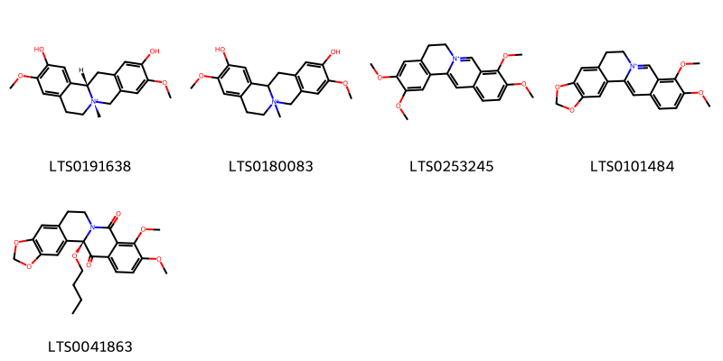{ width=100% }
    <figcaption>Hình ảnh cấu trúc hóa học của 5 hoạt chất thuộc nhóm Protoberberine alkaloids and derivatives gồm ['phellodendrine (LTS0191638)', '2,11-dihydroxy-3,10-dimethoxy-6-methyl-7,8,12b,13-tetrahydro-5h-6-azatetraphen-6-ium (LTS0180083)', 'palmatine (LTS0253245)', 'berberine (LTS0101484)', '(1r)-1-butoxy-16,17-dimethoxy-5,7-dioxa-13-azapentacyclo[11.8.0.0²,¹⁰.0⁴,⁸.0¹⁵,²⁰]henicosa-2,4(8),9,15,17,19-hexaene-14,21-dione (LTS0041863)'].</figcaption>
</figure>
#### Nhóm Quinolines and derivatives
<figure markdown="span">
    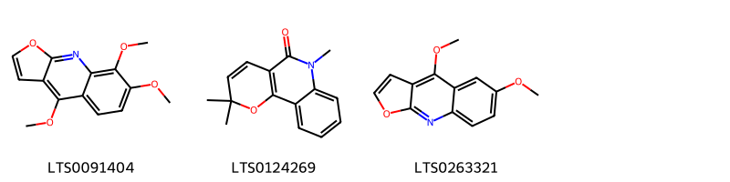{ width=100% }
    <figcaption>Hình ảnh cấu trúc hóa học của 3 hoạt chất thuộc nhóm Quinolines and derivatives gồm ['skimmianine (LTS0091404)', 'n-methylflindersine (LTS0124269)', '4,6-dimethoxyfuro[2,3-b]quinoline (LTS0263321)'].</figcaption>
</figure>
#### Nhóm Steroids and steroid derivatives
<figure markdown="span">
    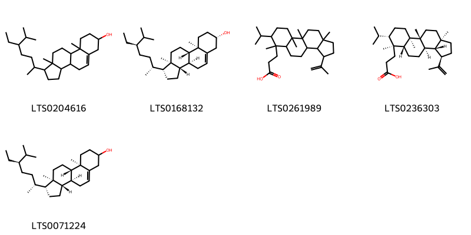{ width=100% }
    <figcaption>Hình ảnh cấu trúc hóa học của 5 hoạt chất thuộc nhóm Steroids and steroid derivatives gồm ['stigmast-5-en-3-ol, (3β)- (LTS0204616)', 'sitosterol (LTS0168132)', '3-[7-isopropyl-6,9a,9b,11a-tetramethyl-3-(prop-1-en-2-yl)-dodecahydro-1h-cyclopenta[a]phenanthren-6-yl]propanoic acid (LTS0261989)', '3-[(3r,3ar,3br,5ar,6s,7s,9ar,9br,11ar)-7-isopropyl-6,9a,9b,11a-tetramethyl-3-(prop-1-en-2-yl)-dodecahydro-1h-cyclopenta[a]phenanthren-6-yl]propanoic acid (LTS0236303)', 'stigmast-5-en-3-ol (LTS0071224)'].</figcaption>
</figure>
#### Nhóm Tetrapyrroles and derivatives
<figure markdown="span">
    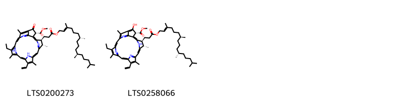{ width=100% }
    <figcaption>Hình ảnh cấu trúc hóa học của 2 hoạt chất thuộc nhóm Tetrapyrroles and derivatives gồm ['methyl (3r,21s,22s)-16-ethenyl-11-ethyl-12,17,21,26-tetramethyl-4-oxo-22-(3-oxo-3-{[(2e,7r,11r)-3,7,11,15-tetramethylhexadec-2-en-1-yl]oxy}propyl)-7,23,24,25-tetraazahexacyclo[18.2.1.1⁵,⁸.1¹⁰,¹³.1¹⁵,¹⁸.0²,⁶]hexacosa-1(23),2(6),5(26),7,9,11,13,15,17,19-decaene-3-carboxylate (LTS0200273)', 'methyl (3r,21s,22s)-16-ethenyl-11-ethyl-4-hydroxy-12,17,21,26-tetramethyl-22-(3-oxo-3-{[(2e,7s,11s)-3,7,11,15-tetramethylhexadec-2-en-1-yl]oxy}propyl)-7,23,24,25-tetraazahexacyclo[18.2.1.1⁵,⁸.1¹⁰,¹³.1¹⁵,¹⁸.0²,⁶]hexacosa-1,4,6,8(26),9,11,13(25),14,16,18(24),19-undecaene-3-carboxylate (LTS0258066)'].</figcaption>
</figure>

---

### Dược dân tộc học

Danh sách các quốc gia có sử dụng *Phellodendron chinense* trong điều trị các bệnh. 

| Country   | Disease                   | Bệnh                                                                                                                                                                                                |
|:----------|:--------------------------|:----------------------------------------------------------------------------------------------------------------------------------------------------------------------------------------------------|
| Japan*    | Antiphlogistic, Stomachic | MYMEMORY WARNING: YOU USED ALL AVAILABLE FREE TRANSLATIONS FOR TODAY. NEXT AVAILABLE IN  00 HOURS 11 MINUTES 22 SECONDS VISIT HTTPS://MYMEMORY.TRANSLATED.NET/DOC/USAGELIMITS.PHP TO TRANSLATE MORE |

---

# Chi Toddalia

??? note "Danh sách các dược liệu thuộc chi"
    
	 - *Toddalia aculeata*
	 - *Toddalia asiatica*

---
## Toddalia aculeata
### Thông tin về thực vật

!!! info "Phân loại thực vật của *Zanthoxylum asiaticum* từ GIBF:"
    - **Kingdom:** Plantae
    - **Phylum:** Tracheophyta
    - **Order:** Sapindales
    - **Family:** Rutaceae
    - **Genus:** Zanthoxylum
    - **Species:** *Zanthoxylum asiaticum*

 

| Label (VI)   | Label (EN)   | Scientific Name   | Descriptions (VI)   | Descriptions (EN)   | Also Known As (VI)   | Also Known As (EN)   |
|:-------------|:-------------|:------------------|:--------------------|:--------------------|:---------------------|:---------------------|
| N/A          | N/A          | Toddalia aculeata | loài thực vật       | species of plant    | ['']                 | ['']                 |

#### Phân bố trên thế giới

**Từ CSDL GIBF** nan, Sri Lanka, Mauritius, Philippines, unknown or invalid, Tanzania, United Republic of, Réunion, Chinese Taipei, Congo, Democratic Republic of the, Zimbabwe, Uganda, Hong Kong, China, Madagascar, India, Indonesia, Kenya, Cameroon, Nepal

#### Phân bố tại Việt Nam

**Từ CSDL GIBF**: Không có ghi nhận ở Việt Nam

---
### Thành phần hóa học
        
- Theo cơ sở dữ liệu lotus: Từ loài *Zanthoxylum asiaticum* đã phân lập và xác định được Chưa có hoạt chất nào được phân lập. hoạt chất thuộc về các nhóm Không có hoạt chất nào được phân lập. 

Không có hình ảnh nào được tạo ra

---

### Dược dân tộc học

Danh sách các quốc gia có sử dụng *Zanthoxylum asiaticum* trong điều trị các bệnh. 

| Country      | Disease                       | Bệnh                                                                                                                                                                                                |
|:-------------|:------------------------------|:----------------------------------------------------------------------------------------------------------------------------------------------------------------------------------------------------|
| English      | Stimulant                     | MYMEMORY WARNING: YOU USED ALL AVAILABLE FREE TRANSLATIONS FOR TODAY. NEXT AVAILABLE IN  00 HOURS 10 MINUTES 52 SECONDS VISIT HTTPS://MYMEMORY.TRANSLATED.NET/DOC/USAGELIMITS.PHP TO TRANSLATE MORE |
| India        | Tonic                         | MYMEMORY WARNING: YOU USED ALL AVAILABLE FREE TRANSLATIONS FOR TODAY. NEXT AVAILABLE IN  00 HOURS 10 MINUTES 49 SECONDS VISIT HTTPS://MYMEMORY.TRANSLATED.NET/DOC/USAGELIMITS.PHP TO TRANSLATE MORE |
| India(Hindu) | Carminative, Stimulant, Tonic | MYMEMORY WARNING: YOU USED ALL AVAILABLE FREE TRANSLATIONS FOR TODAY. NEXT AVAILABLE IN  00 HOURS 10 MINUTES 47 SECONDS VISIT HTTPS://MYMEMORY.TRANSLATED.NET/DOC/USAGELIMITS.PHP TO TRANSLATE MORE |

---

---
## Toddalia asiatica
### Thông tin về thực vật

!!! info "Phân loại thực vật của *Zanthoxylum asiaticum* từ GIBF:"
    - **Kingdom:** Plantae
    - **Phylum:** Tracheophyta
    - **Order:** Sapindales
    - **Family:** Rutaceae
    - **Genus:** Zanthoxylum
    - **Species:** *Zanthoxylum asiaticum*

 

| Label (VI)   | Label (EN)   | Scientific Name   | Descriptions (VI)   | Descriptions (EN)   | Also Known As (VI)   | Also Known As (EN)   |
|:-------------|:-------------|:------------------|:--------------------|:--------------------|:---------------------|:---------------------|
| N/A          | N/A          | Toddalia asiatica |                     | species of plants   | ['']                 | ['']                 |

#### Phân bố trên thế giới

**Từ CSDL GIBF** Malawi, South Africa, Réunion, Japan, Madagascar, Mauritius, Chinese Taipei, Mozambique, Bhutan, India, Indonesia, Kenya, Tanzania, United Republic of

#### Phân bố tại Việt Nam

**Từ CSDL GIBF**: Không có ghi nhận ở Việt Nam

---
### Thành phần hóa học
        
- Theo cơ sở dữ liệu lotus: Từ loài *Zanthoxylum asiaticum* đã phân lập và xác định được 137 hoạt chất thuộc về các nhóm Naphthalenes, Tetralins, Phenols, Naphthopyrans, Benzophenanthridine alkaloids, Amaryllidaceae alkaloids, Carboxylic acids and derivatives, Fatty Acyls, Cinnamic acids and derivatives, Aporphines, Protoberberine alkaloids and derivatives, Prenol lipids, Quinolines and derivatives, Organooxygen compounds, Furanoid lignans, Phenol ethers, Flavonoids, Steroids and steroid derivatives, Organonitrogen compounds, Coumarins and derivatives. 

|    | chemicalTaxonomyClassyfireClass          |   smiles_count |
|---:|:-----------------------------------------|---------------:|
|  0 | Amaryllidaceae alkaloids                 |              1 |
|  1 | Aporphines                               |              1 |
|  2 | Benzophenanthridine alkaloids            |             11 |
|  3 | Carboxylic acids and derivatives         |              3 |
|  4 | Cinnamic acids and derivatives           |              7 |
|  5 | Coumarins and derivatives                |             41 |
|  6 | Fatty Acyls                              |              3 |
|  7 | Flavonoids                               |              4 |
|  8 | Furanoid lignans                         |              3 |
|  9 | Naphthalenes                             |              1 |
| 10 | Naphthopyrans                            |              1 |
| 11 | Organonitrogen compounds                 |              1 |
| 12 | Organooxygen compounds                   |              2 |
| 13 | Phenol ethers                            |              1 |
| 14 | Phenols                                  |              3 |
| 15 | Prenol lipids                            |             17 |
| 16 | Protoberberine alkaloids and derivatives |              4 |
| 17 | Quinolines and derivatives               |             27 |
| 18 | Steroids and steroid derivatives         |              4 |
| 19 | Tetralins                                |              2 |

#### Nhóm Amaryllidaceae alkaloids
<figure markdown="span">
    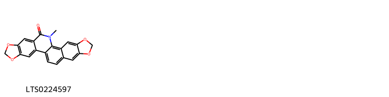{ width=100% }
    <figcaption>Hình ảnh cấu trúc hóa học của 1 hoạt chất thuộc nhóm Amaryllidaceae alkaloids gồm ['12-methyl-5,7,17,19-tetraoxa-12-azahexacyclo[11.11.0.0²,¹⁰.0⁴,⁸.0¹⁴,²².0¹⁶,²⁰]tetracosa-1(13),2(10),3,8,14(22),15,20,23-octaen-11-one (LTS0224597)'].</figcaption>
</figure>
#### Nhóm Aporphines
<figure markdown="span">
    { width=100% }
    <figcaption>Hình ảnh cấu trúc hóa học của 1 hoạt chất thuộc nhóm Aporphines gồm ['magnoflorine (LTS0120825)'].</figcaption>
</figure>
#### Nhóm Benzophenanthridine alkaloids
<figure markdown="span">
    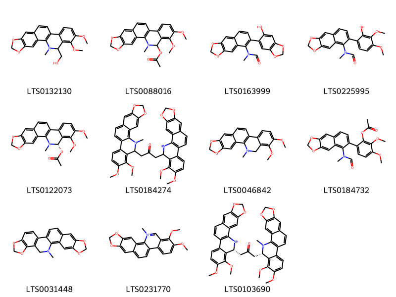{ width=100% }
    <figcaption>Hình ảnh cấu trúc hóa học của 11 hoạt chất thuộc nhóm Benzophenanthridine alkaloids gồm ['{17,18-dimethoxy-21-methyl-5,7-dioxa-21-azapentacyclo[11.8.0.0²,¹⁰.0⁴,⁸.0¹⁴,¹⁹]henicosa-1(13),2,4(8),9,11,14,16,18-octaen-20-yl}methanol (LTS0132130)', '17,18-dimethoxy-21-methyl-5,7-dioxa-21-azapentacyclo[11.8.0.0²,¹⁰.0⁴,⁸.0¹⁴,¹⁹]henicosa-1(13),2,4(8),9,11,14,16,18-octaen-20-yl acetate (LTS0088016)', 'n-[6-(6-hydroxy-2h-1,3-benzodioxol-5-yl)-2h-naphtho[2,3-d][1,3]dioxol-5-yl]-n-methylformamide (LTS0163999)', 'n-[6-(2-hydroxy-3,4-dimethoxyphenyl)-2h-naphtho[2,3-d][1,3]dioxol-5-yl]-n-methylformamide (LTS0225995)', '(20s)-17,18-dimethoxy-21-methyl-5,7-dioxa-21-azapentacyclo[11.8.0.0²,¹⁰.0⁴,⁸.0¹⁴,¹⁹]henicosa-1(13),2,4(8),9,11,14,16,18-octaen-20-yl acetate (LTS0122073)', '1-{17,18-dimethoxy-21-methyl-5,7-dioxa-21-azapentacyclo[11.8.0.0²,¹⁰.0⁴,⁸.0¹⁴,¹⁹]henicosa-1(13),2,4(8),9,11,14(19),15,17-octaen-20-yl}-3-{17,18-dimethoxy-5,7-dioxa-21-azapentacyclo[11.8.0.0²,¹⁰.0⁴,⁸.0¹⁴,¹⁹]henicosa-1(13),2,4(8),9,11,14,16,18-octaen-20-yl}propan-2-one (LTS0184274)', '17,18-dimethoxy-21-methyl-5,7-dioxa-21-azapentacyclo[11.8.0.0²,¹⁰.0⁴,⁸.0¹⁴,¹⁹]henicosa-1(13),2,4(8),9,11,14,16,18-octaene (LTS0046842)', '2,3-dimethoxy-6-[5-(n-methylformamido)-2h-naphtho[2,3-d][1,3]dioxol-6-yl]phenyl acetate (LTS0184732)', 'dihydrosanguinarine (LTS0031448)', 'chelerythrine (LTS0231770)', '1-[(20s)-17,18-dimethoxy-21-methyl-5,7-dioxa-21-azapentacyclo[11.8.0.0²,¹⁰.0⁴,⁸.0¹⁴,¹⁹]henicosa-1(13),2,4(8),9,11,14,16,18-octaen-20-yl]-3-[(20r)-17,18-dimethoxy-5,7-dioxa-21-azapentacyclo[11.8.0.0²,¹⁰.0⁴,⁸.0¹⁴,¹⁹]henicosa-1(13),2,4(8),9,11,14,16,18-octaen-20-yl]propan-2-one (LTS0103690)'].</figcaption>
</figure>
#### Nhóm Carboxylic acids and derivatives
<figure markdown="span">
    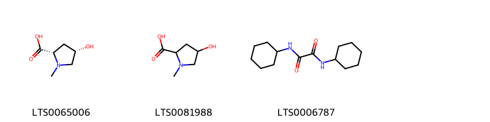{ width=100% }
    <figcaption>Hình ảnh cấu trúc hóa học của 3 hoạt chất thuộc nhóm Carboxylic acids and derivatives gồm ['(2s,4s)-4-hydroxy-1-methylpyrrolidine-2-carboxylic acid (LTS0065006)', '4-hydroxy-1-methylpyrrolidine-2-carboxylic acid (LTS0081988)', "n,n'-dicyclohexylethanediamide (LTS0006787)"].</figcaption>
</figure>
#### Nhóm Cinnamic acids and derivatives
<figure markdown="span">
    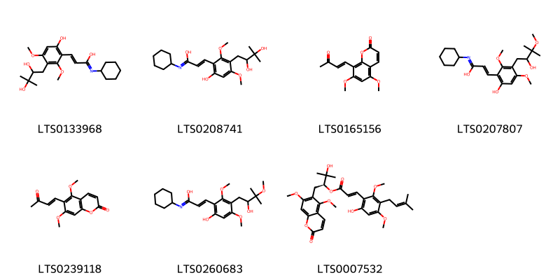{ width=100% }
    <figcaption>Hình ảnh cấu trúc hóa học của 7 hoạt chất thuộc nhóm Cinnamic acids and derivatives gồm ['n-cyclohexyl-3-[3-(2,3-dihydroxy-3-methylbutyl)-6-hydroxy-2,4-dimethoxyphenyl]prop-2-enimidic acid (LTS0133968)', '(2e)-n-cyclohexyl-3-[3-(2,3-dihydroxy-3-methylbutyl)-6-hydroxy-2,4-dimethoxyphenyl]prop-2-enimidic acid (LTS0208741)', '5,7-dimethoxy-8-[(1e)-3-oxobut-1-en-1-yl]chromen-2-one (LTS0165156)', 'n-cyclohexyl-3-[6-hydroxy-3-(2-hydroxy-3-methoxy-3-methylbutyl)-2,4-dimethoxyphenyl]prop-2-enimidic acid (LTS0207807)', '5,7-dimethoxy-6-[(1e)-3-oxobut-1-en-1-yl]chromen-2-one (LTS0239118)', '(2e)-n-cyclohexyl-3-[6-hydroxy-3-(2-hydroxy-3-methoxy-3-methylbutyl)-2,4-dimethoxyphenyl]prop-2-enimidic acid (LTS0260683)', '(2s)-1-(5,7-dimethoxy-2-oxochromen-6-yl)-3-hydroxy-3-methylbutan-2-yl (2e)-3-[6-hydroxy-2,4-dimethoxy-3-(3-methylbut-2-en-1-yl)phenyl]prop-2-enoate (LTS0007532)'].</figcaption>
</figure>
#### Nhóm Coumarins and derivatives
<figure markdown="span">
    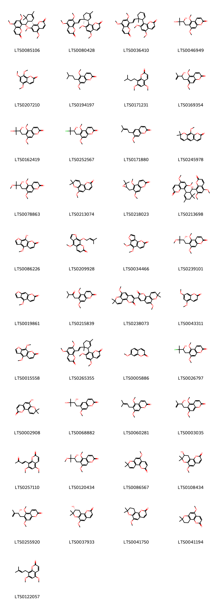{ width=100% }
    <figcaption>Hình ảnh cấu trúc hóa học của 41 hoạt chất thuộc nhóm Coumarins and derivatives gồm ['8-[(1s,6r)-6-[(r)-(5,7-dimethoxy-2-oxochromen-8-yl)(hydroxy)methyl]-3,5,5-trimethylcyclohex-2-en-1-yl]-5,7-dimethoxychromen-2-one (LTS0085106)', '8-[(1r,6r)-6-[(1e)-2-(5,7-dimethoxy-2-oxochromen-8-yl)ethenyl]-3,6-dimethylcyclohex-2-en-1-yl]-5,7-dimethoxychromen-2-one (LTS0080428)', '8-{6-[(1e)-2-(5,7-dimethoxy-2-oxochromen-8-yl)ethenyl]-6-methylcyclohex-2-en-1-yl}-5,7-dimethoxychromen-2-one (LTS0036410)', '6-[(2s)-2,3-dihydroxy-3-methylbutyl]-5,7-dimethoxychromen-2-one (LTS0046949)', '5,7,8-trimethoxychromen-2-one (LTS0207210)', '5,7-dimethoxy-6-(3-methylbutyl)chromen-2-one (LTS0194197)', '5,7-dimethoxy-8-(3-methylbutyl)chromen-2-one (LTS0171231)', '6-(2-hydroxy-3-methylbut-3-en-1-yl)-5,7-dimethoxychromen-2-one (LTS0169354)', '6-(2,3-dihydroxy-3-methylbutyl)-5,7-dimethoxychromen-2-one (LTS0162419)', '6-[(2s)-3-chloro-2-hydroxy-3-methylbutyl]-5,7-dimethoxychromen-2-one (LTS0252567)', 'suberosin (LTS0171880)', 'luvangetin (LTS0245978)', '6-(2-hydroxy-3-methoxy-3-methylbutyl)-5,7-dimethoxychromen-2-one (LTS0078863)', '6-methoxy-8,8-dimethylpyrano[2,3-h]chromen-2-one (LTS0213074)', '6-[(3,3-dimethyloxiran-2-yl)methyl]-5,7-dimethoxychromen-2-one (LTS0218023)', '8-{6-[(5,7-dimethoxy-2-oxochromen-8-yl)(hydroxy)methyl]-3,5,5-trimethylcyclohex-2-en-1-yl}-5,7-dimethoxychromen-2-one (LTS0213698)', '9-hydroxy-4-methoxyfuro[3,2-g]chromen-7-one (LTS0086226)', 'phellopterin (LTS0209928)', 'pimpinellin (LTS0034466)', '6-[(2r)-2-hydroxy-3-methoxy-3-methylbutyl]-5,7-dimethoxychromen-2-one (LTS0239101)', 'bergapten (LTS0019861)', '5,7-dimethoxy-6-(3-methyl-2-oxobutyl)chromen-2-one (LTS0215839)', '6-methoxy-3-{6-methoxy-8,8-dimethyl-2-oxopyrano[2,3-h]chromen-3-yl}-8,8-dimethylpyrano[2,3-h]chromen-2-one (LTS0238073)', 'limettin (LTS0043311)', 'isopimpinellin (LTS0015558)', '8-{6-[2-(5,7-dimethoxy-2-oxochromen-8-yl)ethenyl]-3,6-dimethylcyclohex-2-en-1-yl}-5,7-dimethoxychromen-2-one (LTS0265355)', 'methylumbelliferone (LTS0005886)', '6-(3-chloro-2-hydroxy-3-methylbutyl)-5,7-dimethoxychromen-2-one (LTS0026797)', '6-hydroxy-8,8-dimethylpyrano[2,3-f]chromen-2-one (LTS0002908)', '6-[(2r)-2,3-dihydroxy-3-methylbutyl]-7-methoxychromen-2-one (LTS0068882)', '5,7-dimethoxy-6-(3-methylbut-2-en-1-yl)chromen-2-one (LTS0060281)', '6-[(2s)-2-hydroxy-3-methylbut-3-en-1-yl]-5,7-dimethoxychromen-2-one (LTS0003035)', '5,7-dimethoxy-8-(3-oxobut-1-en-1-yl)chromen-2-one (LTS0257110)', '6-[(2s)-2-hydroxy-3-methoxy-3-methylbutyl]-5,7-dimethoxychromen-2-one (LTS0120434)', '5-methoxy-8,8-dimethylpyrano[2,3-f]chromen-2-one (LTS0086567)', '9-hydroxy-6-methoxy-8,8-dimethyl-9h,10h-pyrano[2,3-h]chromen-2-one (LTS0108434)', '6-[(2r)-2-hydroxy-3-methylbut-3-en-1-yl]-5,7-dimethoxychromen-2-one (LTS0255920)', '(9r)-9-hydroxy-6-methoxy-8,8-dimethyl-9h,10h-pyrano[2,3-h]chromen-2-one (LTS0037933)', '6-methoxy-8,8-dimethyl-9h,10h-pyrano[2,3-h]chromen-2-one (LTS0041750)', '5-methoxy-8,8-dimethyl-9h,10h-pyrano[2,3-h]chromen-2-one (LTS0041194)', '5,7-dimethoxy-8-(3-methylbut-2-en-1-yl)chromen-2-one (LTS0122057)'].</figcaption>
</figure>
#### Nhóm Fatty Acyls
<figure markdown="span">
    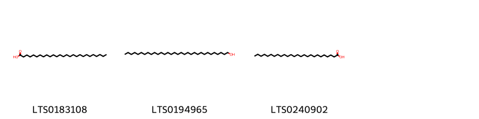{ width=100% }
    <figcaption>Hình ảnh cấu trúc hóa học của 3 hoạt chất thuộc nhóm Fatty Acyls gồm ['heptacosanoic acid (LTS0183108)', 'dotriacontanol (LTS0194965)', 'hexacosanoic acid (LTS0240902)'].</figcaption>
</figure>
#### Nhóm Flavonoids
<figure markdown="span">
    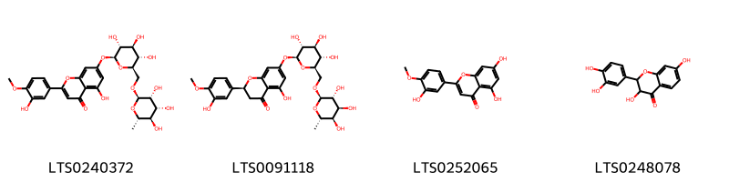{ width=100% }
    <figcaption>Hình ảnh cấu trúc hóa học của 4 hoạt chất thuộc nhóm Flavonoids gồm ['diosmin (LTS0240372)', '(2s)-5-hydroxy-2-(3-hydroxy-4-methoxyphenyl)-7-{[(2s,3r,4s,5s,6r)-3,4,5-trihydroxy-6-({[(2r,3r,4s,5r,6s)-3,4,5-trihydroxy-6-methyloxan-2-yl]oxy}methyl)oxan-2-yl]oxy}-2,3-dihydro-1-benzopyran-4-one (LTS0091118)', 'diosmetin (LTS0252065)', 'fustin (LTS0248078)'].</figcaption>
</figure>
#### Nhóm Furanoid lignans
<figure markdown="span">
    { width=100% }
    <figcaption>Hình ảnh cấu trúc hóa học của 3 hoạt chất thuộc nhóm Furanoid lignans gồm ['syringaresinol (LTS0116280)', '(-)-syringaresinol (LTS0076227)', '(+)-syringaresinol (LTS0158868)'].</figcaption>
</figure>
#### Nhóm Naphthalenes
<figure markdown="span">
    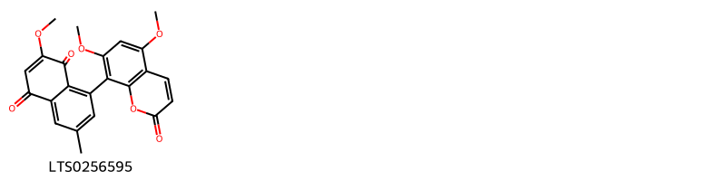{ width=100% }
    <figcaption>Hình ảnh cấu trúc hóa học của 1 hoạt chất thuộc nhóm Naphthalenes gồm ['8-(5,7-dimethoxy-2-oxochromen-8-yl)-2-methoxy-6-methylnaphthalene-1,4-dione (LTS0256595)'].</figcaption>
</figure>
#### Nhóm Naphthopyrans
<figure markdown="span">
    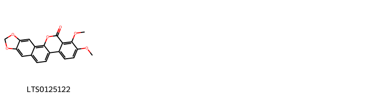{ width=100% }
    <figcaption>Hình ảnh cấu trúc hóa học của 1 hoạt chất thuộc nhóm Naphthopyrans gồm ['17,18-dimethoxy-5,7,21-trioxapentacyclo[11.8.0.0²,¹⁰.0⁴,⁸.0¹⁴,¹⁹]henicosa-1(13),2(10),3,8,11,14(19),15,17-octaen-20-one (LTS0125122)'].</figcaption>
</figure>
#### Nhóm Organonitrogen compounds
<figure markdown="span">
    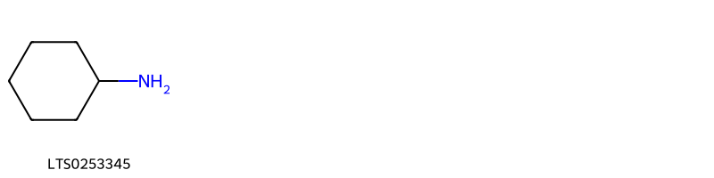{ width=100% }
    <figcaption>Hình ảnh cấu trúc hóa học của 1 hoạt chất thuộc nhóm Organonitrogen compounds gồm ['cyclohexylamine (LTS0253345)'].</figcaption>
</figure>
#### Nhóm Organooxygen compounds
<figure markdown="span">
    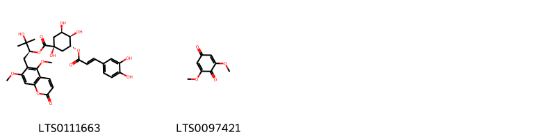{ width=100% }
    <figcaption>Hình ảnh cấu trúc hóa học của 2 hoạt chất thuộc nhóm Organooxygen compounds gồm ['(2s)-1-(5,7-dimethoxy-2-oxochromen-6-yl)-3-hydroxy-3-methylbutan-2-yl (1s,3r,4r,5r)-3-{[(2e)-3-(3,4-dihydroxyphenyl)prop-2-enoyl]oxy}-1,4,5-trihydroxycyclohexane-1-carboxylate (LTS0111663)', '2,6-dimethoxy-1,4-benzoquinone (LTS0097421)'].</figcaption>
</figure>
#### Nhóm Phenol ethers
<figure markdown="span">
    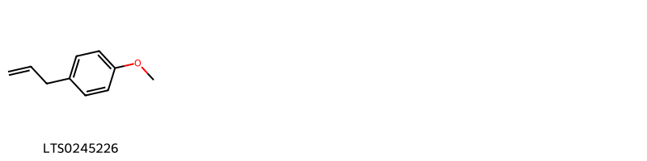{ width=100% }
    <figcaption>Hình ảnh cấu trúc hóa học của 1 hoạt chất thuộc nhóm Phenol ethers gồm ['tarragon (LTS0245226)'].</figcaption>
</figure>
#### Nhóm Phenols
<figure markdown="span">
    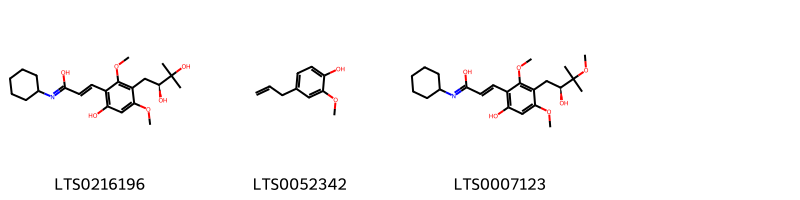{ width=100% }
    <figcaption>Hình ảnh cấu trúc hóa học của 3 hoạt chất thuộc nhóm Phenols gồm ['(2e)-n-cyclohexyl-3-{3-[(2s)-2,3-dihydroxy-3-methylbutyl]-6-hydroxy-2,4-dimethoxyphenyl}prop-2-enimidic acid (LTS0216196)', 'eugenol (LTS0052342)', '(2e)-n-cyclohexyl-3-{6-hydroxy-3-[(2s)-2-hydroxy-3-methoxy-3-methylbutyl]-2,4-dimethoxyphenyl}prop-2-enimidic acid (LTS0007123)'].</figcaption>
</figure>
#### Nhóm Prenol lipids
<figure markdown="span">
    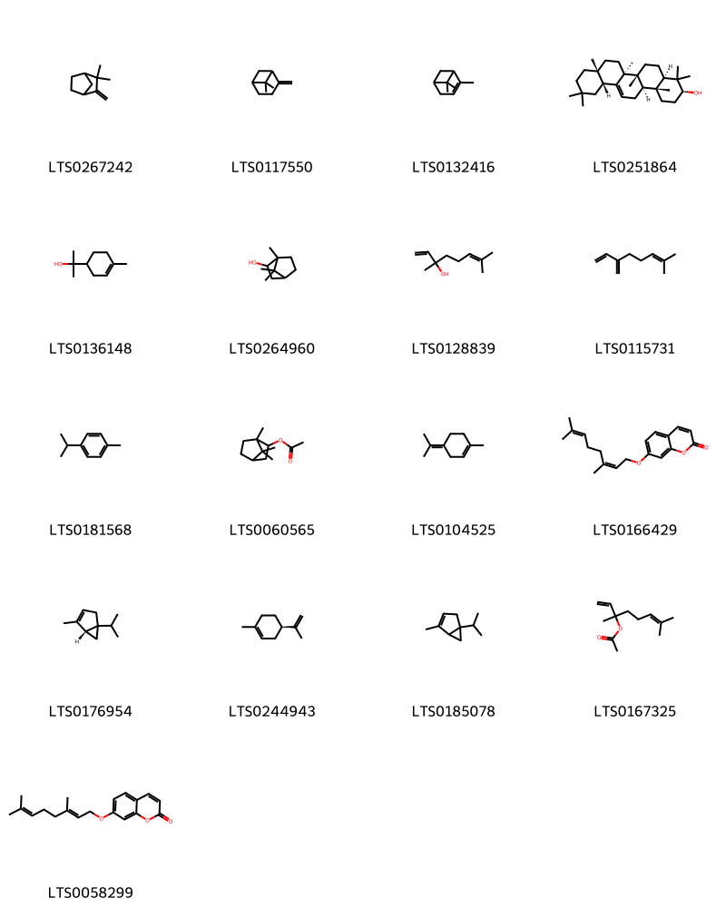{ width=100% }
    <figcaption>Hình ảnh cấu trúc hóa học của 17 hoạt chất thuộc nhóm Prenol lipids gồm ['camphene (LTS0267242)', 'β-pinene (LTS0117550)', 'α pinene (LTS0132416)', 'β-amyrin (LTS0251864)', 'terpineol (LTS0136148)', 'borneol (LTS0264960)', 'linalool, (+-)- (LTS0128839)', 'α-myrcene (LTS0115731)', 'cymene (LTS0181568)', 'bornyl acetate (LTS0060565)', 'terpinolene (LTS0104525)', '7-[(3,7-dimethylocta-2,6-dien-1-yl)oxy]chromen-2-one (LTS0166429)', 'α-thujene (LTS0176954)', 'α-limonene (LTS0244943)', 'α-thujene (LTS0185078)', 'linalyl acetate (LTS0167325)', 'auraptene (LTS0058299)'].</figcaption>
</figure>
#### Nhóm Protoberberine alkaloids and derivatives
<figure markdown="span">
    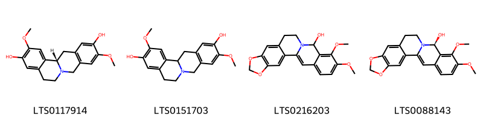{ width=100% }
    <figcaption>Hình ảnh cấu trúc hóa học của 4 hoạt chất thuộc nhóm Protoberberine alkaloids and derivatives gồm ['(12bs)-3,11-dimethoxy-7,8,12b,13-tetrahydro-5h-6-azatetraphene-2,10-diol (LTS0117914)', 'isocoreximine (LTS0151703)', '16,17-dimethoxy-5,7-dioxa-13-azapentacyclo[11.8.0.0²,¹⁰.0⁴,⁸.0¹⁵,²⁰]henicosa-1(21),2,4(8),9,15,17,19-heptaen-14-ol (LTS0216203)', '(14s)-16,17-dimethoxy-5,7-dioxa-13-azapentacyclo[11.8.0.0²,¹⁰.0⁴,⁸.0¹⁵,²⁰]henicosa-1(21),2,4(8),9,15,17,19-heptaen-14-ol (LTS0088143)'].</figcaption>
</figure>
#### Nhóm Quinolines and derivatives
<figure markdown="span">
    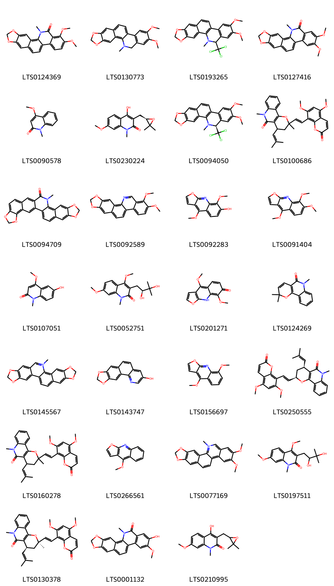{ width=100% }
    <figcaption>Hình ảnh cấu trúc hóa học của 27 hoạt chất thuộc nhóm Quinolines and derivatives gồm ['oxychelerythrine (LTS0124369)', '16,17-dimethoxy-21-methyl-5,7-dioxa-21-azapentacyclo[11.8.0.0²,¹⁰.0⁴,⁸.0¹⁴,¹⁹]henicosa-1(13),2,4(8),9,11,14(19),15,17-octaene (LTS0130773)', '16,17-dimethoxy-21-methyl-20-(trichloromethyl)-5,7-dioxa-21-azapentacyclo[11.8.0.0²,¹⁰.0⁴,⁸.0¹⁴,¹⁹]henicosa-1(13),2,4(8),9,11,14(19),15,17-octaene (LTS0193265)', '16,17-dimethoxy-21-methyl-5,7-dioxa-21-azapentacyclo[11.8.0.0²,¹⁰.0⁴,⁸.0¹⁴,¹⁹]henicosa-1(13),2(10),3,8,11,14(19),15,17-octaen-20-one (LTS0127416)', '4-methoxy-1-methylquinolin-2-one (LTS0090578)', '3-{[(2r)-3,3-dimethyloxiran-2-yl]methyl}-4-hydroxy-7-methoxy-1-methylquinolin-2-one (LTS0230224)', '(20s)-16,17-dimethoxy-21-methyl-20-(trichloromethyl)-5,7-dioxa-21-azapentacyclo[11.8.0.0²,¹⁰.0⁴,⁸.0¹⁴,¹⁹]henicosa-1(13),2,4(8),9,11,14(19),15,17-octaene (LTS0094050)', '2-[(1e)-2-(5,7-dimethoxy-2-oxochromen-8-yl)ethenyl]-2,6-dimethyl-4-(2-methylprop-1-en-1-yl)-3h,4h-pyrano[3,2-c]quinolin-5-one (LTS0100686)', '16-methyl-6,8,21,23-tetraoxa-16-azaheptacyclo[15.11.0.0²,¹⁴.0⁴,¹².0⁵,⁹.0¹⁸,²⁶.0²⁰,²⁴]octacosa-1(17),2(14),3,5(9),10,12,18(26),19,24,27-decaen-15-one (LTS0094709)', 'norchelerythrine (LTS0092589)', 'haplopine (LTS0092283)', 'skimmianine (LTS0091404)', '6-hydroxy-4-methoxy-1-methylquinolin-2-one (LTS0107051)', '3-[(2s)-2,3-dihydroxy-3-methylbutyl]-4,7-dimethoxy-1-methylquinolin-2-one (LTS0052751)', '4,8-dimethoxy-9h-furo[2,3-b]quinolin-7-one (LTS0201271)', 'n-methylflindersine (LTS0124269)', '12-methyl-5,7,17,19-tetraoxa-12-azahexacyclo[11.11.0.0²,¹⁰.0⁴,⁸.0¹⁴,²².0¹⁶,²⁰]tetracosa-1(13),2(10),3,8,11,14(22),15,20,23-nonaen-12-ium (LTS0145567)', '13,15-dioxa-3-azatetracyclo[8.7.0.0²,⁷.0¹²,¹⁶]heptadeca-1(10),2(7),3,5,8,11,16-heptaen-5-ol (LTS0143747)', 'fagarine (LTS0156697)', '(2r,4s)-2-[(1e)-2-(5,7-dimethoxy-2-oxochromen-8-yl)ethenyl]-6-methyl-4-(2-methylprop-1-en-1-yl)-2h,3h,4h-pyrano[3,2-c]quinolin-5-one (LTS0250555)', '2-[2-(5,7-dimethoxy-2-oxochromen-8-yl)ethenyl]-2,6-dimethyl-4-(2-methylprop-1-en-1-yl)-3h,4h-pyrano[3,2-c]quinolin-5-one (LTS0160278)', 'dictamnine (LTS0266561)', 'nitidine (LTS0077169)', '3-(2,3-dihydroxy-3-methylbutyl)-4,7-dimethoxy-1-methylquinolin-2-one (LTS0197511)', '(2r,4s)-2-[(1e)-2-(5,7-dimethoxy-2-oxochromen-8-yl)ethenyl]-2,6-dimethyl-4-(2-methylprop-1-en-1-yl)-3h,4h-pyrano[3,2-c]quinolin-5-one (LTS0130378)', '17-hydroxy-16-methoxy-21-methyl-5,7-dioxa-21-azapentacyclo[11.8.0.0²,¹⁰.0⁴,⁸.0¹⁴,¹⁹]henicosa-1(13),2(10),3,8,11,14(19),15,17-octaen-20-one (LTS0001132)', '3-[(3,3-dimethyloxiran-2-yl)methyl]-4-hydroxy-7-methoxy-1-methylquinolin-2-one (LTS0210995)'].</figcaption>
</figure>
#### Nhóm Steroids and steroid derivatives
<figure markdown="span">
    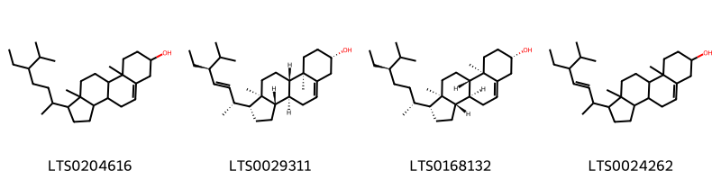{ width=100% }
    <figcaption>Hình ảnh cấu trúc hóa học của 4 hoạt chất thuộc nhóm Steroids and steroid derivatives gồm ['stigmast-5-en-3-ol, (3β)- (LTS0204616)', 'phytosterol (LTS0029311)', 'sitosterol (LTS0168132)', 'stigmasterol (LTS0024262)'].</figcaption>
</figure>
#### Nhóm Tetralins
<figure markdown="span">
    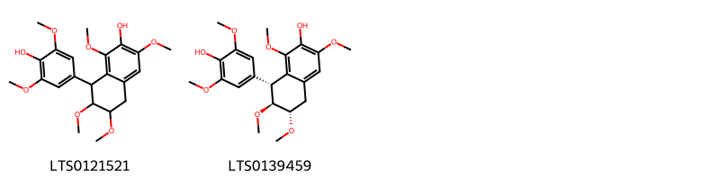{ width=100% }
    <figcaption>Hình ảnh cấu trúc hóa học của 2 hoạt chất thuộc nhóm Tetralins gồm ['8-(4-hydroxy-3,5-dimethoxyphenyl)-1,3,6,7-tetramethoxy-5,6,7,8-tetrahydronaphthalen-2-ol (LTS0121521)', '(6s,7s,8r)-8-(4-hydroxy-3,5-dimethoxyphenyl)-1,3,6,7-tetramethoxy-5,6,7,8-tetrahydronaphthalen-2-ol (LTS0139459)'].</figcaption>
</figure>

---

### Dược dân tộc học

Danh sách các quốc gia có sử dụng *Zanthoxylum asiaticum* trong điều trị các bệnh. 

| Country   | Disease                                                     | Bệnh                                                                                                                                                                                                |
|:----------|:------------------------------------------------------------|:----------------------------------------------------------------------------------------------------------------------------------------------------------------------------------------------------|
| Elsewhere | nan, Carminative, Diaphoretic, Poison, Stimulant, Stomachic | MYMEMORY WARNING: YOU USED ALL AVAILABLE FREE TRANSLATIONS FOR TODAY. NEXT AVAILABLE IN  00 HOURS 10 MINUTES 27 SECONDS VISIT HTTPS://MYMEMORY.TRANSLATED.NET/DOC/USAGELIMITS.PHP TO TRANSLATE MORE |

---

# Chi Zanthoxylum

??? note "Danh sách các dược liệu thuộc chi"
    
	 - *Zanthoxylum acanthopodium*
	 - *Zanthoxylum ailanthoides*
	 - *Zanthoxylum alatum*
	 - *Zanthoxylum americanum*
	 - *Zanthoxylum armatum*
	 - *Zanthoxylum avicennae*
	 - *Zanthoxylum bungeanum*
	 - *Zanthoxylum bungei*
	 - *Zanthoxylum capense*
	 - *Zanthoxylum clava-herculis*
	 - *Zanthoxylum dissitum*
	 - *Zanthoxylum fagara*
	 - *Zanthoxylum flavum*
	 - *Zanthoxylum fruticosum*
	 - *Zanthoxylum gagara*
	 - *Zanthoxylum gilletii*
	 - *Zanthoxylum hostile*
	 - *Zanthoxylum limonella*
	 - *Zanthoxylum martinicense*
	 - *Zanthoxylum microcarpum*
	 - *Zanthoxylum nitidum*
	 - *Zanthoxylum ovalifolium*
	 - *Zanthoxylum oxyphyllum*
	 - *Zanthoxylum piperitum*
	 - *Zanthoxylum planiinum*
	 - *Zanthoxylum schinifolium*
	 - *Zanthoxylum simulans*
	 - *Zanthoxylum tetraermum*

---
## Zanthoxylum acanthopodium
### Thông tin về thực vật

!!! info "Phân loại thực vật của *Zanthoxylum acanthopodium* từ GIBF:"
    - **Kingdom:** Plantae
    - **Phylum:** Tracheophyta
    - **Order:** Sapindales
    - **Family:** Rutaceae
    - **Genus:** Zanthoxylum
    - **Species:** *Zanthoxylum acanthopodium*

 

| Label (VI)   | Label (EN)   | Scientific Name           | Descriptions (VI)   | Descriptions (EN)   | Also Known As (VI)   | Also Known As (EN)            |
|:-------------|:-------------|:--------------------------|:--------------------|:--------------------|:---------------------|:------------------------------|
| N/A          | N/A          | Zanthoxylum acanthopodium |                     | species of plant    | ['']                 | ['Zanthoxylum acanthopodium'] |

#### Phân bố trên thế giới

**Từ CSDL GIBF** Malaysia, Australia, Thailand, Chinese Taipei, Myanmar, Bhutan, India, Viet Nam, Norway, China, Nepal

#### Phân bố tại Việt Nam

**Từ CSDL GIBF**: Lam Dong, Lâm Đồng, Kon Tum

---
### Thành phần hóa học
        
- Theo cơ sở dữ liệu lotus: Từ loài *Zanthoxylum acanthopodium* đã phân lập và xác định được 4 hoạt chất thuộc về các nhóm Flavonoids, Benzofurans. 

|    | chemicalTaxonomyClassyfireClass   |   smiles_count |
|---:|:----------------------------------|---------------:|
|  0 | Benzofurans                       |              1 |
|  1 | Flavonoids                        |              3 |

#### Nhóm Benzofurans
<figure markdown="span">
    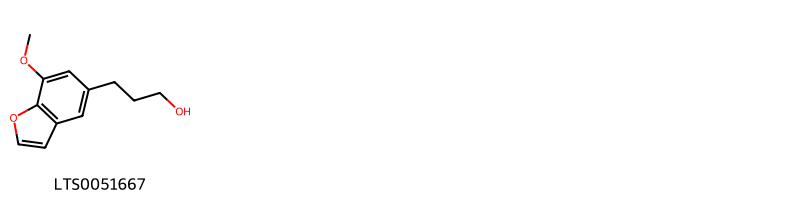{ width=100% }
    <figcaption>Hình ảnh cấu trúc hóa học của 1 hoạt chất thuộc nhóm Benzofurans gồm ['3-(7-methoxy-1-benzofuran-5-yl)propan-1-ol (LTS0051667)'].</figcaption>
</figure>
#### Nhóm Flavonoids
<figure markdown="span">
    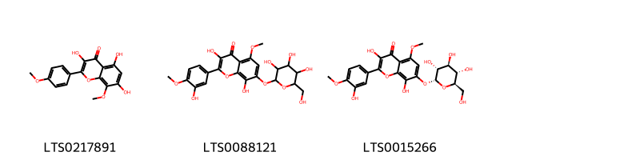{ width=100% }
    <figcaption>Hình ảnh cấu trúc hóa học của 3 hoạt chất thuộc nhóm Flavonoids gồm ['prudomestin (LTS0217891)', '3,8-dihydroxy-2-(3-hydroxy-4-methoxyphenyl)-5-methoxy-7-{[3,4,5-trihydroxy-6-(hydroxymethyl)oxan-2-yl]oxy}chromen-4-one (LTS0088121)', '3,8-dihydroxy-2-(3-hydroxy-4-methoxyphenyl)-5-methoxy-7-{[(2r,3r,4s,5s,6r)-3,4,5-trihydroxy-6-(hydroxymethyl)oxan-2-yl]oxy}chromen-4-one (LTS0015266)'].</figcaption>
</figure>

---

### Dược dân tộc học

Danh sách các quốc gia có sử dụng *Zanthoxylum acanthopodium* trong điều trị các bệnh. 

| Country   | Disease                                                                           | Bệnh                                                                                                                                                                                                |
|:----------|:----------------------------------------------------------------------------------|:----------------------------------------------------------------------------------------------------------------------------------------------------------------------------------------------------|
| Assam     | Piscicide                                                                         | MYMEMORY WARNING: YOU USED ALL AVAILABLE FREE TRANSLATIONS FOR TODAY. NEXT AVAILABLE IN  00 HOURS 09 MINUTES 57 SECONDS VISIT HTTPS://MYMEMORY.TRANSLATED.NET/DOC/USAGELIMITS.PHP TO TRANSLATE MORE |
| Elsewhere | Dentifrice, Deodorant, Stomachic, Antiseptic, Carminative, Insecticide, Vermifuge | MYMEMORY WARNING: YOU USED ALL AVAILABLE FREE TRANSLATIONS FOR TODAY. NEXT AVAILABLE IN  00 HOURS 09 MINUTES 55 SECONDS VISIT HTTPS://MYMEMORY.TRANSLATED.NET/DOC/USAGELIMITS.PHP TO TRANSLATE MORE |
| Indochina | Sudorific                                                                         | MYMEMORY WARNING: YOU USED ALL AVAILABLE FREE TRANSLATIONS FOR TODAY. NEXT AVAILABLE IN  00 HOURS 09 MINUTES 52 SECONDS VISIT HTTPS://MYMEMORY.TRANSLATED.NET/DOC/USAGELIMITS.PHP TO TRANSLATE MORE |

---

---
## Zanthoxylum ailanthoides
### Thông tin về thực vật

!!! info "Phân loại thực vật của *Zanthoxylum ailanthoides* từ GIBF:"
    - **Kingdom:** Plantae
    - **Phylum:** Tracheophyta
    - **Order:** Sapindales
    - **Family:** Rutaceae
    - **Genus:** Zanthoxylum
    - **Species:** *Zanthoxylum ailanthoides*

 

| Label (VI)   | Label (EN)   | Scientific Name          | Descriptions (VI)   | Descriptions (EN)   | Also Known As (VI)   | Also Known As (EN)   |
|:-------------|:-------------|:-------------------------|:--------------------|:--------------------|:---------------------|:---------------------|
| N/A          | N/A          | Zanthoxylum ailanthoides | loài thực vật       | species of plant    | ['']                 | ['']                 |

#### Phân bố trên thế giới

**Từ CSDL GIBF** Hong Kong, Japan, Korea, Republic of, Chinese Taipei, China

#### Phân bố tại Việt Nam

**Từ CSDL GIBF**: Không có ghi nhận ở Việt Nam

---
### Thành phần hóa học
        
- Theo cơ sở dữ liệu lotus: Từ loài *Zanthoxylum ailanthoides* đã phân lập và xác định được 164 hoạt chất thuộc về các nhóm Cinnamyl alcohols, Tetralins, Stilbenes, Phenols, Benzophenanthridine alkaloids, Fatty Acyls, Cinnamic acids and derivatives, Aporphines, Cinnamaldehydes, Carboximidic acids and derivatives, Protoberberine alkaloids and derivatives, Prenol lipids, Quinolines and derivatives, Benzene and substituted derivatives, Organooxygen compounds, Furanoid lignans, Phenol ethers, Flavonoids, Steroids and steroid derivatives, 2-arylbenzofuran flavonoids, Coumarins and derivatives, Aryltetralin lignans, Imidazopyrimidines. 

|    | chemicalTaxonomyClassyfireClass          |   smiles_count |
|---:|:-----------------------------------------|---------------:|
|  0 | 2-arylbenzofuran flavonoids              |              2 |
|  1 | Aporphines                               |              2 |
|  2 | Aryltetralin lignans                     |              2 |
|  3 | Benzene and substituted derivatives      |             11 |
|  4 | Benzophenanthridine alkaloids            |              9 |
|  5 | Carboximidic acids and derivatives       |              1 |
|  6 | Cinnamaldehydes                          |              2 |
|  7 | Cinnamic acids and derivatives           |              6 |
|  8 | Cinnamyl alcohols                        |              2 |
|  9 | Coumarins and derivatives                |             16 |
| 10 | Fatty Acyls                              |             11 |
| 11 | Flavonoids                               |              1 |
| 12 | Furanoid lignans                         |             16 |
| 13 | Imidazopyrimidines                       |              2 |
| 14 | Organooxygen compounds                   |              5 |
| 15 | Phenol ethers                            |              7 |
| 16 | Phenols                                  |              5 |
| 17 | Prenol lipids                            |             27 |
| 18 | Protoberberine alkaloids and derivatives |              3 |
| 19 | Quinolines and derivatives               |             18 |
| 20 | Steroids and steroid derivatives         |             11 |
| 21 | Stilbenes                                |              3 |
| 22 | Tetralins                                |              2 |

#### Nhóm 2-arylbenzofuran flavonoids
<figure markdown="span">
    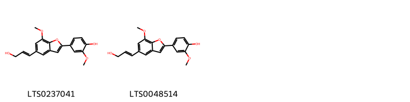{ width=100% }
    <figcaption>Hình ảnh cấu trúc hóa học của 2 hoạt chất thuộc nhóm 2-arylbenzofuran flavonoids gồm ['4-[5-(3-hydroxyprop-1-en-1-yl)-7-methoxy-1-benzofuran-2-yl]-2-methoxyphenol (LTS0237041)', '4-{5-[(1e)-3-hydroxyprop-1-en-1-yl]-7-methoxy-1-benzofuran-2-yl}-2-methoxyphenol (LTS0048514)'].</figcaption>
</figure>
#### Nhóm Aporphines
<figure markdown="span">
    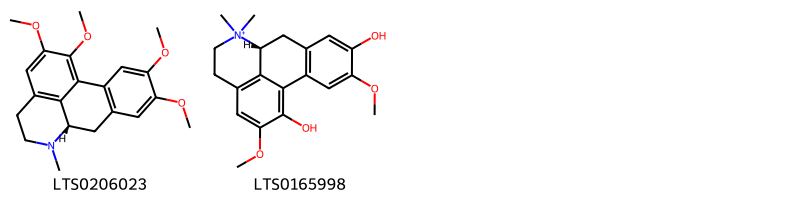{ width=100% }
    <figcaption>Hình ảnh cấu trúc hóa học của 2 hoạt chất thuộc nhóm Aporphines gồm ['(9s)-4,5,15,16-tetramethoxy-10-methyl-10-azatetracyclo[7.7.1.0²,⁷.0¹³,¹⁷]heptadeca-1(16),2(7),3,5,13(17),14-hexaene (LTS0206023)', '(9r)-5,16-dihydroxy-4,15-dimethoxy-10,10-dimethyl-10-azatetracyclo[7.7.1.0²,⁷.0¹³,¹⁷]heptadeca-1(16),2(7),3,5,13(17),14-hexaen-10-ium (LTS0165998)'].</figcaption>
</figure>
#### Nhóm Aryltetralin lignans
<figure markdown="span">
    { width=100% }
    <figcaption>Hình ảnh cấu trúc hóa học của 2 hoạt chất thuộc nhóm Aryltetralin lignans gồm ['8-(4-hydroxy-3,5-dimethoxyphenyl)-6,7-bis(hydroxymethyl)-1,3-dimethoxy-5,6,7,8-tetrahydronaphthalen-2-ol (LTS0068427)', '(6s,7s,8r)-8-(4-hydroxy-3,5-dimethoxyphenyl)-6,7-bis(hydroxymethyl)-1,3-dimethoxy-5,6,7,8-tetrahydronaphthalen-2-ol (LTS0243275)'].</figcaption>
</figure>
#### Nhóm Benzene and substituted derivatives
<figure markdown="span">
    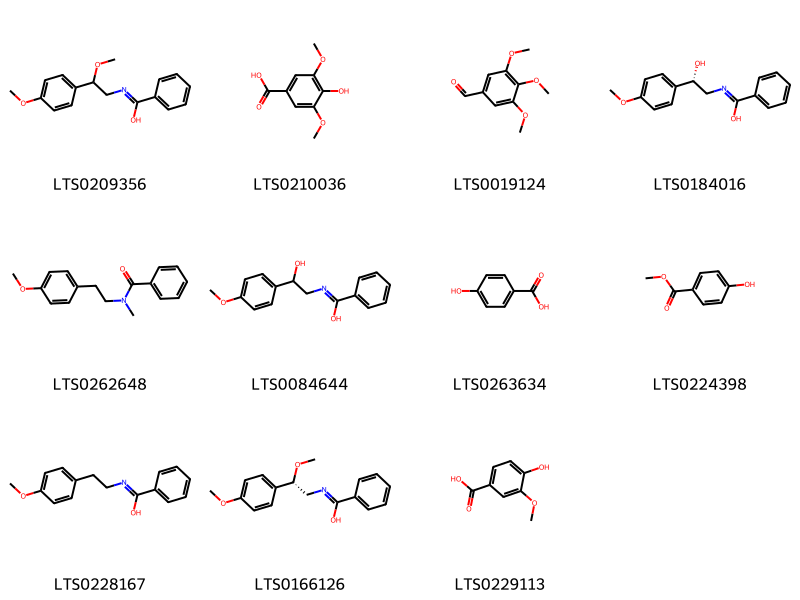{ width=100% }
    <figcaption>Hình ảnh cấu trúc hóa học của 11 hoạt chất thuộc nhóm Benzene and substituted derivatives gồm ['n-[2-methoxy-2-(4-methoxyphenyl)ethyl]benzenecarboximidic acid (LTS0209356)', 'syringic acid (LTS0210036)', '3,4,5-trimethoxybenzaldehyde (LTS0019124)', 'n-[(2s)-2-hydroxy-2-(4-methoxyphenyl)ethyl]benzenecarboximidic acid (LTS0184016)', 'n-[2-(4-methoxyphenyl)ethyl]-n-methylbenzamide (LTS0262648)', 'n-[2-hydroxy-2-(4-methoxyphenyl)ethyl]benzenecarboximidic acid (LTS0084644)', 'p-hydroxybenzoic acid (LTS0263634)', 'paraben (LTS0224398)', 'n-[2-(4-methoxyphenyl)ethyl]benzenecarboximidic acid (LTS0228167)', 'n-[(2s)-2-methoxy-2-(4-methoxyphenyl)ethyl]benzenecarboximidic acid (LTS0166126)', 'vanillic acid (LTS0229113)'].</figcaption>
</figure>
#### Nhóm Benzophenanthridine alkaloids
<figure markdown="span">
    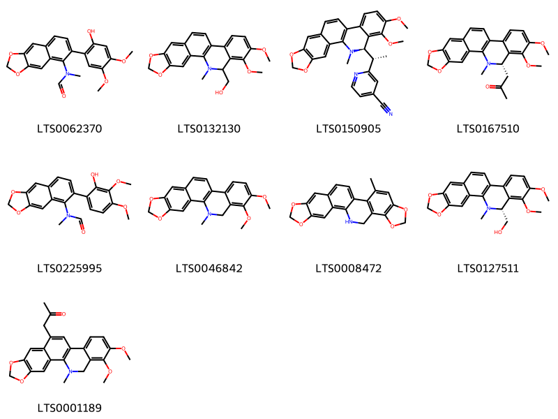{ width=100% }
    <figcaption>Hình ảnh cấu trúc hóa học của 9 hoạt chất thuộc nhóm Benzophenanthridine alkaloids gồm ['n-[6-(2-hydroxy-4,5-dimethoxyphenyl)-2h-naphtho[2,3-d][1,3]dioxol-5-yl]-n-methylformamide (LTS0062370)', '{17,18-dimethoxy-21-methyl-5,7-dioxa-21-azapentacyclo[11.8.0.0²,¹⁰.0⁴,⁸.0¹⁴,¹⁹]henicosa-1(13),2,4(8),9,11,14,16,18-octaen-20-yl}methanol (LTS0132130)', '2-[(1s)-1-[(20r)-17,18-dimethoxy-21-methyl-5,7-dioxa-21-azapentacyclo[11.8.0.0²,¹⁰.0⁴,⁸.0¹⁴,¹⁹]henicosa-1(13),2,4(8),9,11,14,16,18-octaen-20-yl]ethyl]pyridine-4-carbonitrile (LTS0150905)', '1-[(20s)-17,18-dimethoxy-21-methyl-5,7-dioxa-21-azapentacyclo[11.8.0.0²,¹⁰.0⁴,⁸.0¹⁴,¹⁹]henicosa-1(13),2,4(8),9,11,14,16,18-octaen-20-yl]propan-2-one (LTS0167510)', 'n-[6-(2-hydroxy-3,4-dimethoxyphenyl)-2h-naphtho[2,3-d][1,3]dioxol-5-yl]-n-methylformamide (LTS0225995)', '17,18-dimethoxy-21-methyl-5,7-dioxa-21-azapentacyclo[11.8.0.0²,¹⁰.0⁴,⁸.0¹⁴,¹⁹]henicosa-1(13),2,4(8),9,11,14,16,18-octaene (LTS0046842)', '15-methyl-5,7,18,20-tetraoxa-24-azahexacyclo[11.11.0.0²,¹⁰.0⁴,⁸.0¹⁴,²².0¹⁷,²¹]tetracosa-1(13),2,4(8),9,11,14(22),15,17(21)-octaene (LTS0008472)', '[(20r)-17,18-dimethoxy-21-methyl-5,7-dioxa-21-azapentacyclo[11.8.0.0²,¹⁰.0⁴,⁸.0¹⁴,¹⁹]henicosa-1(13),2,4(8),9,11,14,16,18-octaen-20-yl]methanol (LTS0127511)', '1-{17,18-dimethoxy-21-methyl-5,7-dioxa-21-azapentacyclo[11.8.0.0²,¹⁰.0⁴,⁸.0¹⁴,¹⁹]henicosa-1(13),2,4(8),9,11,14,16,18-octaen-11-yl}propan-2-one (LTS0001189)'].</figcaption>
</figure>
#### Nhóm Carboximidic acids and derivatives
<figure markdown="span">
    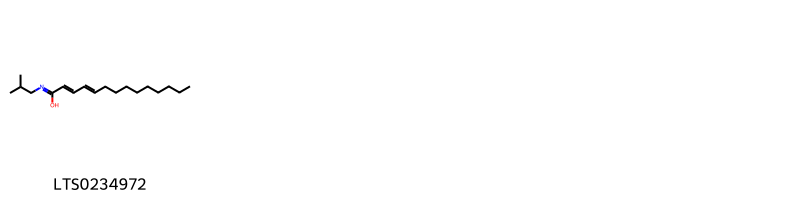{ width=100% }
    <figcaption>Hình ảnh cấu trúc hóa học của 1 hoạt chất thuộc nhóm Carboximidic acids and derivatives gồm ['n-(2-methylpropyl)tetradeca-2,4-dienimidic acid (LTS0234972)'].</figcaption>
</figure>
#### Nhóm Cinnamaldehydes
<figure markdown="span">
    { width=100% }
    <figcaption>Hình ảnh cấu trúc hóa học của 2 hoạt chất thuộc nhóm Cinnamaldehydes gồm ['3-(4-hydroxyphenyl)prop-2-enal (LTS0148306)', 'p-coumaraldehyde (LTS0221678)'].</figcaption>
</figure>
#### Nhóm Cinnamic acids and derivatives
<figure markdown="span">
    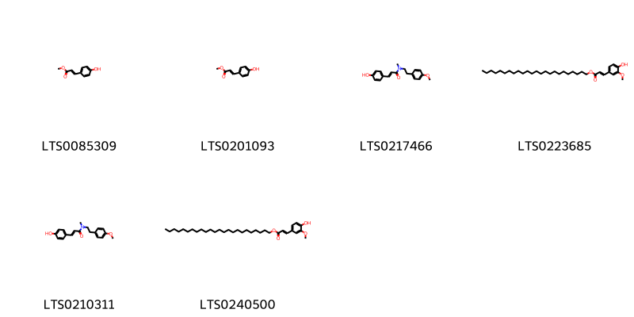{ width=100% }
    <figcaption>Hình ảnh cấu trúc hóa học của 6 hoạt chất thuộc nhóm Cinnamic acids and derivatives gồm ['methyl (2e)-3-(4-hydroxyphenyl)prop-2-enoate (LTS0085309)', 'methyl hydroxycinnamate (LTS0201093)', '3-(4-hydroxyphenyl)-n-[2-(4-methoxyphenyl)ethyl]-n-methylprop-2-enamide (LTS0217466)', 'tetracosyl (2e)-3-(4-hydroxy-3-methoxyphenyl)prop-2-enoate (LTS0223685)', '(2e)-3-(4-hydroxyphenyl)-n-[2-(4-methoxyphenyl)ethyl]-n-methylprop-2-enamide (LTS0210311)', 'tetracosyl 3-(4-hydroxy-3-methoxyphenyl)prop-2-enoate (LTS0240500)'].</figcaption>
</figure>
#### Nhóm Cinnamyl alcohols
<figure markdown="span">
    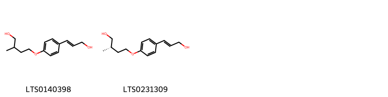{ width=100% }
    <figcaption>Hình ảnh cấu trúc hóa học của 2 hoạt chất thuộc nhóm Cinnamyl alcohols gồm ['4-{4-[(1e)-3-hydroxyprop-1-en-1-yl]phenoxy}-2-methylbutan-1-ol (LTS0140398)', '(2s)-4-{4-[(1e)-3-hydroxyprop-1-en-1-yl]phenoxy}-2-methylbutan-1-ol (LTS0231309)'].</figcaption>
</figure>
#### Nhóm Coumarins and derivatives
<figure markdown="span">
    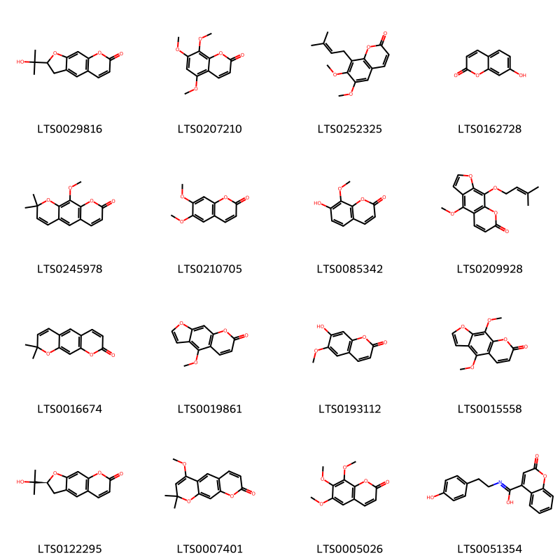{ width=100% }
    <figcaption>Hình ảnh cấu trúc hóa học của 16 hoạt chất thuộc nhóm Coumarins and derivatives gồm ['marmesin (LTS0029816)', '5,7,8-trimethoxychromen-2-one (LTS0207210)', '6,7-dimethoxy-8-(3-methylbut-2-en-1-yl)chromen-2-one (LTS0252325)', 'umbelliferone (LTS0162728)', 'luvangetin (LTS0245978)', 'scoparone (LTS0210705)', '7-hydroxy-8-methoxychromen-2-one (LTS0085342)', 'phellopterin (LTS0209928)', 'xanthyletin (LTS0016674)', 'bergapten (LTS0019861)', 'scopoletin (LTS0193112)', 'isopimpinellin (LTS0015558)', 'marmesin (LTS0122295)', '6-methoxy-8,8-dimethylpyrano[3,2-g]chromen-2-one (LTS0007401)', '6,7,8-trimethoxychromen-2-one (LTS0005026)', 'n-[2-(4-hydroxyphenyl)ethyl]-2-oxochromene-4-carboximidic acid (LTS0051354)'].</figcaption>
</figure>
#### Nhóm Fatty Acyls
<figure markdown="span">
    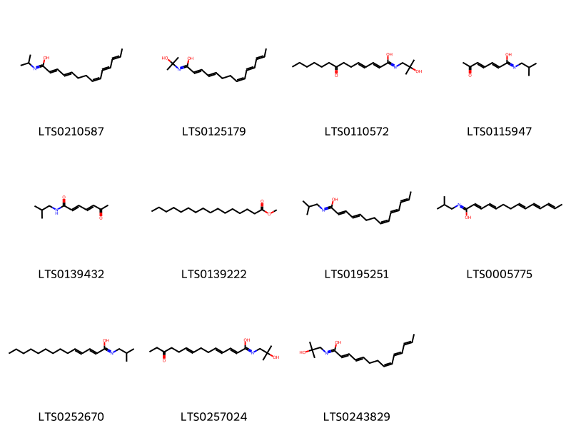{ width=100% }
    <figcaption>Hình ảnh cấu trúc hóa học của 11 hoạt chất thuộc nhóm Fatty Acyls gồm ['(2e,4e,8z,10e,12e)-n-isopropyltetradeca-2,4,8,10,12-pentaenimidic acid (LTS0210587)', '(2e,4e,8z,10e,12e)-n-(2-hydroxypropan-2-yl)tetradeca-2,4,8,10,12-pentaenimidic acid (LTS0125179)', 'n-(2-hydroxy-2-methylpropyl)-8-oxotetradeca-2,4-dienimidic acid (LTS0110572)', '(2e,4e)-n-(2-methylpropyl)-6-oxohepta-2,4-dienimidic acid (LTS0115947)', 'n-(2-methylpropyl)-6-oxohepta-2,4-dienamide (LTS0139432)', 'methyl palmitate (LTS0139222)', '(2e,4e,8z,10e,12e)-n-(2-methylpropyl)tetradeca-2,4,8,10,12-pentaenimidic acid (LTS0195251)', 'n-(2-methylpropyl)tetradeca-2,4,8,10,12-pentaenimidic acid (LTS0005775)', '(2e,4e)-n-(2-methylpropyl)tetradeca-2,4-dienimidic acid (LTS0252670)', 'n-(2-hydroxy-2-methylpropyl)-12-oxotetradeca-2,4,8-trienimidic acid (LTS0257024)', '(2e,4e,8z,10e,12e)-n-(2-hydroxy-2-methylpropyl)tetradeca-2,4,8,10,12-pentaenimidic acid (LTS0243829)'].</figcaption>
</figure>
#### Nhóm Flavonoids
<figure markdown="span">
    { width=100% }
    <figcaption>Hình ảnh cấu trúc hóa học của 1 hoạt chất thuộc nhóm Flavonoids gồm ['quercetin (LTS0004651)'].</figcaption>
</figure>
#### Nhóm Furanoid lignans
<figure markdown="span">
    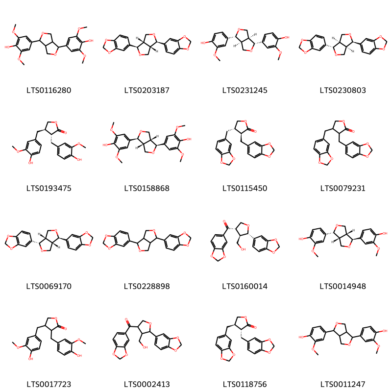{ width=100% }
    <figcaption>Hình ảnh cấu trúc hóa học của 16 hoạt chất thuộc nhóm Furanoid lignans gồm ['syringaresinol (LTS0116280)', '(-)-sesamin (LTS0203187)', '(-)-pinoresinol (LTS0231245)', '5-[(1s,3ar,4r,6ar)-4-(2h-1,3-benzodioxol-5-yl)-hexahydrofuro[3,4-c]furan-1-yl]-2h-1,3-benzodioxole (LTS0230803)', 'matairesinol (LTS0193475)', '(+)-syringaresinol (LTS0158868)', '(3s,4s)-3,4-bis(2h-1,3-benzodioxol-5-ylmethyl)oxolan-2-one (LTS0115450)', '3,4-bis(2h-1,3-benzodioxol-5-ylmethyl)oxolan-2-one (LTS0079231)', 'asarinin (LTS0069170)', 'sesamin (LTS0228898)', '[(2s,3r,4s)-2-(2h-1,3-benzodioxol-5-yl)-4-(2h-1,3-benzodioxole-5-carbonyl)oxolan-3-yl]methanol (LTS0160014)', '4-[(1s,3ar,4r,6ar)-4-(4-hydroxy-3-methoxyphenyl)-hexahydrofuro[3,4-c]furan-1-yl]-2-methoxyphenol (LTS0014948)', '3,4-bis[(4-hydroxy-3-methoxyphenyl)methyl]oxolan-2-one (LTS0017723)', '[2-(2h-1,3-benzodioxol-5-yl)-4-(2h-1,3-benzodioxole-5-carbonyl)oxolan-3-yl]methanol (LTS0002413)', 'hinokinin (LTS0118756)', 'pinoresinol (LTS0011247)'].</figcaption>
</figure>
#### Nhóm Imidazopyrimidines
<figure markdown="span">
    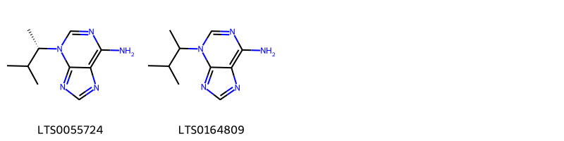{ width=100% }
    <figcaption>Hình ảnh cấu trúc hóa học của 2 hoạt chất thuộc nhóm Imidazopyrimidines gồm ['3-[(2s)-3-methylbutan-2-yl]purin-6-amine (LTS0055724)', '3-(3-methylbutan-2-yl)purin-6-amine (LTS0164809)'].</figcaption>
</figure>
#### Nhóm Organooxygen compounds
<figure markdown="span">
    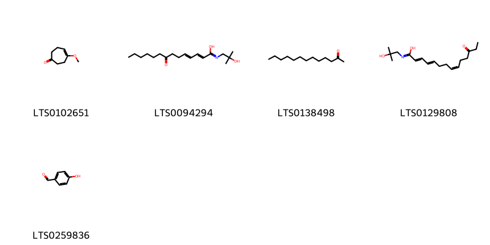{ width=100% }
    <figcaption>Hình ảnh cấu trúc hóa học của 5 hoạt chất thuộc nhóm Organooxygen compounds gồm ['4-methoxycyclohept-4-en-1-one (LTS0102651)', '(2e,4e)-n-(2-hydroxy-2-methylpropyl)-8-oxotetradeca-2,4-dienimidic acid (LTS0094294)', '2-tridecanone (LTS0138498)', '(2e,4e,8z)-n-(2-hydroxy-2-methylpropyl)-12-oxotetradeca-2,4,8-trienimidic acid (LTS0129808)', 'p-hydroxybenzaldehyde (LTS0259836)'].</figcaption>
</figure>
#### Nhóm Phenol ethers
<figure markdown="span">
    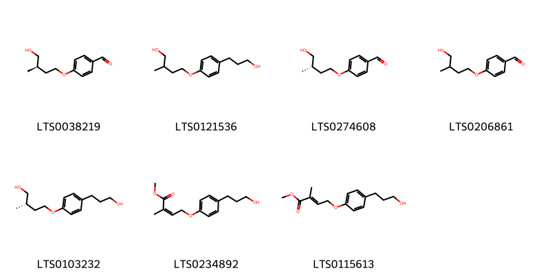{ width=100% }
    <figcaption>Hình ảnh cấu trúc hóa học của 7 hoạt chất thuộc nhóm Phenol ethers gồm ['4-[(3r)-4-hydroxy-3-methylbutoxy]benzaldehyde (LTS0038219)', '4-[4-(3-hydroxypropyl)phenoxy]-2-methylbutan-1-ol (LTS0121536)', '4-[(3s)-4-hydroxy-3-methylbutoxy]benzaldehyde (LTS0274608)', '4-(4-hydroxy-3-methylbutoxy)benzaldehyde (LTS0206861)', '(2s)-4-[4-(3-hydroxypropyl)phenoxy]-2-methylbutan-1-ol (LTS0103232)', 'methyl 4-[4-(3-hydroxypropyl)phenoxy]-2-methylbut-2-enoate (LTS0234892)', 'methyl (2e)-4-[4-(3-hydroxypropyl)phenoxy]-2-methylbut-2-enoate (LTS0115613)'].</figcaption>
</figure>
#### Nhóm Phenols
<figure markdown="span">
    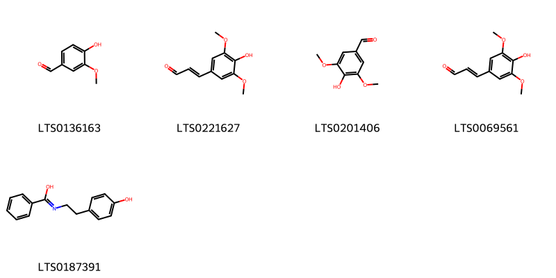{ width=100% }
    <figcaption>Hình ảnh cấu trúc hóa học của 5 hoạt chất thuộc nhóm Phenols gồm ['vanillin (LTS0136163)', 'sinapyl aldehyde (LTS0221627)', 'syringaldehyde (LTS0201406)', 'sinapaldehyde (LTS0069561)', 'n-[2-(4-hydroxyphenyl)ethyl]benzenecarboximidic acid (LTS0187391)'].</figcaption>
</figure>
#### Nhóm Prenol lipids
<figure markdown="span">
    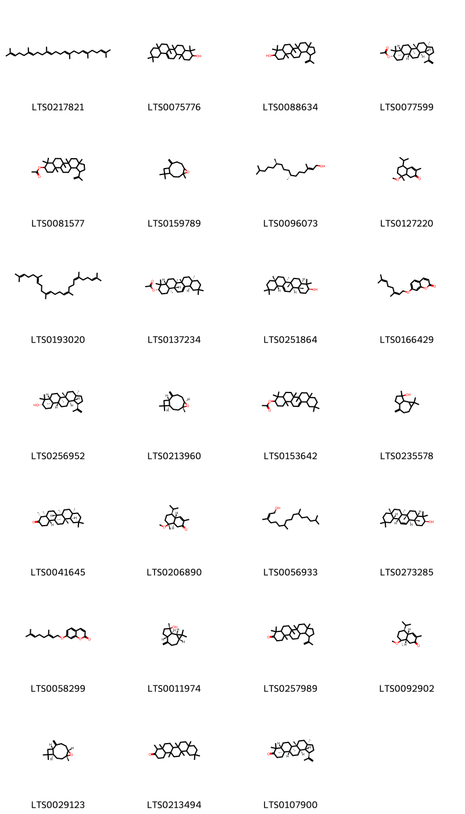{ width=100% }
    <figcaption>Hình ảnh cấu trúc hóa học của 27 hoạt chất thuộc nhóm Prenol lipids gồm ['squalene (LTS0217821)', 'β-amyrin (LTS0075776)', 'lupeol (LTS0088634)', 'lupeol acetate (LTS0077599)', '3a,5a,5b,8,8,11a-hexamethyl-1-(prop-1-en-2-yl)-hexadecahydrocyclopenta[a]chrysen-9-yl acetate (LTS0081577)', 'caryophyllene oxide (LTS0159789)', 'phytol (LTS0096073)', '5-isopropyl-8-methoxy-3,8-dimethyl-1,4a,5,6,7,8a-hexahydronaphthalen-2-one (LTS0127220)', '2,6,10,15,19,23-hexamethyltetracosa-2,6,10,14,18,22-hexaene (LTS0193020)', 'β-amyrin acetate (LTS0137234)', 'β-amyrin (LTS0251864)', '7-[(3,7-dimethylocta-2,6-dien-1-yl)oxy]chromen-2-one (LTS0166429)', 'lupeol (LTS0256952)', 'β-caryophyllene oxide (LTS0213960)', '4,4,6a,6b,8a,11,11,14b-octamethyl-1,2,3,4a,5,6,7,8,9,10,12,12a,14,14a-tetradecahydropicen-3-yl acetate (LTS0153642)', 'spathulenol (LTS0235578)', '(-)-friedelin (LTS0041645)', '(4ar,5s,8r,8ar)-5-isopropyl-8-methoxy-3,8-dimethyl-1,4a,5,6,7,8a-hexahydronaphthalen-2-one (LTS0206890)', '3,7,11,15-tetramethylhexadec-2-en-1-ol (LTS0056933)', '(3s,4as,6ar,6br,8ar,12as,12br,14ar,14bs)-4,4,6a,6b,8a,11,11,14b-octamethyl-1,2,3,4a,5,6,7,8,9,10,12,12a,12b,14a-tetradecahydropicen-3-ol (LTS0273285)', 'auraptene (LTS0058299)', 'spathulenol (LTS0011974)', '3a,5a,5b,8,8,11a-hexamethyl-1-(prop-1-en-2-yl)-tetradecahydro-1h-cyclopenta[a]chrysen-9-one (LTS0257989)', '(4ar,5s,8s,8as)-5-isopropyl-8-methoxy-3,8-dimethyl-1,4a,5,6,7,8a-hexahydronaphthalen-2-one (LTS0092902)', '(1r,4r,6s,10s)-4,12,12-trimethyl-9-methylidene-5-oxatricyclo[8.2.0.0⁴,⁶]dodecane (LTS0029123)', 'friedelin (LTS0213494)', 'lupenone (LTS0107900)'].</figcaption>
</figure>
#### Nhóm Protoberberine alkaloids and derivatives
<figure markdown="span">
    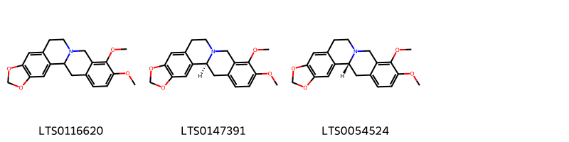{ width=100% }
    <figcaption>Hình ảnh cấu trúc hóa học của 3 hoạt chất thuộc nhóm Protoberberine alkaloids and derivatives gồm ['canadin (LTS0116620)', '(s)-canadine (LTS0147391)', '(+)-canadine (LTS0054524)'].</figcaption>
</figure>
#### Nhóm Quinolines and derivatives
<figure markdown="span">
    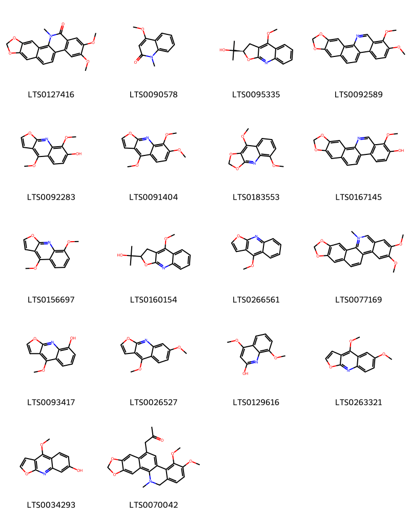{ width=100% }
    <figcaption>Hình ảnh cấu trúc hóa học của 18 hoạt chất thuộc nhóm Quinolines and derivatives gồm ['16,17-dimethoxy-21-methyl-5,7-dioxa-21-azapentacyclo[11.8.0.0²,¹⁰.0⁴,⁸.0¹⁴,¹⁹]henicosa-1(13),2(10),3,8,11,14(19),15,17-octaen-20-one (LTS0127416)', '4-methoxy-1-methylquinolin-2-one (LTS0090578)', 'platydesmine (LTS0095335)', 'norchelerythrine (LTS0092589)', 'haplopine (LTS0092283)', 'skimmianine (LTS0091404)', '5,9-dimethoxy-2h-[1,3]dioxolo[4,5-b]quinoline (LTS0183553)', 'decarine (LTS0167145)', 'fagarine (LTS0156697)', '2-{4-methoxy-2h,3h-furo[2,3-b]quinolin-2-yl}propan-2-ol (LTS0160154)', 'dictamnine (LTS0266561)', 'nitidine (LTS0077169)', 'robustine (LTS0093417)', '4,7-dimethoxyfuro[2,3-b]quinoline (LTS0026527)', '4,8-dimethoxyquinolin-2-ol (LTS0129616)', '4,6-dimethoxyfuro[2,3-b]quinoline (LTS0263321)', '4-methoxyfuro[2,3-b]quinolin-7-ol (LTS0034293)', '1-{15,16-dimethoxy-21-methyl-5,7-dioxa-21-azapentacyclo[11.8.0.0²,¹⁰.0⁴,⁸.0¹⁴,¹⁹]henicosa-1(13),2,4(8),9,11,14,16,18-octaen-11-yl}propan-2-one (LTS0070042)'].</figcaption>
</figure>
#### Nhóm Steroids and steroid derivatives
<figure markdown="span">
    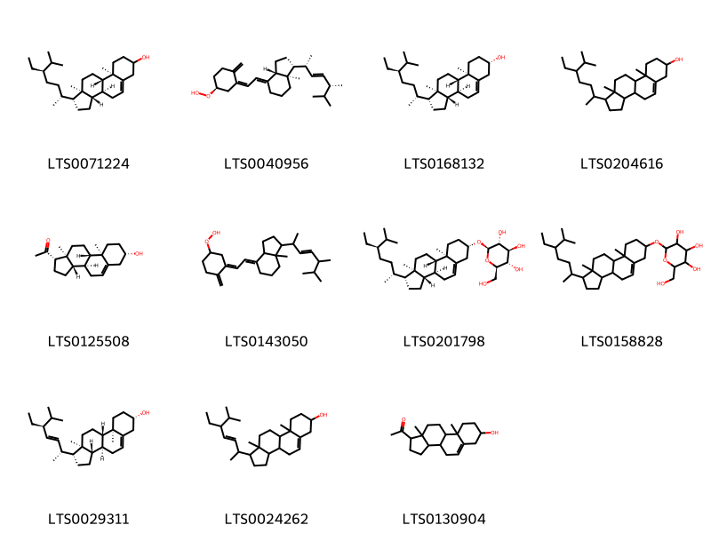{ width=100% }
    <figcaption>Hình ảnh cấu trúc hóa học của 11 hoạt chất thuộc nhóm Steroids and steroid derivatives gồm ['stigmast-5-en-3-ol (LTS0071224)', '(1s,3z)-3-{2-[(1r,3as,4e,7ar)-1-[(2r,3e,5r)-5,6-dimethylhept-3-en-2-yl]-7a-methyl-hexahydro-1h-inden-4-ylidene]ethylidene}-4-methylidenecyclohexane-1-peroxol (LTS0040956)', 'sitosterol (LTS0168132)', 'stigmast-5-en-3-ol, (3β)- (LTS0204616)', 'pregnenolone (LTS0125508)', '3-{2-[1-(5,6-dimethylhept-3-en-2-yl)-7a-methyl-hexahydro-1h-inden-4-ylidene]ethylidene}-4-methylidenecyclohexane-1-peroxol (LTS0143050)', 'sitogluside (LTS0201798)', '2-{[1-(5-ethyl-6-methylheptan-2-yl)-9a,11a-dimethyl-1h,2h,3h,3ah,3bh,4h,6h,7h,8h,9h,9bh,10h,11h-cyclopenta[a]phenanthren-7-yl]oxy}-6-(hydroxymethyl)oxane-3,4,5-triol (LTS0158828)', 'phytosterol (LTS0029311)', 'stigmasterol (LTS0024262)', 'pregnenolone (LTS0130904)'].</figcaption>
</figure>
#### Nhóm Stilbenes
<figure markdown="span">
    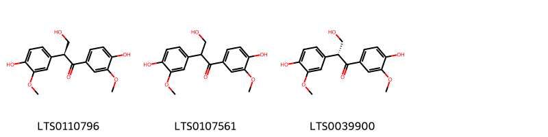{ width=100% }
    <figcaption>Hình ảnh cấu trúc hóa học của 3 hoạt chất thuộc nhóm Stilbenes gồm ['(2s)-3-hydroxy-1,2-bis(4-hydroxy-3-methoxyphenyl)propan-1-one (LTS0110796)', 'evofolin b (LTS0107561)', '(2r)-3-hydroxy-1,2-bis(4-hydroxy-3-methoxyphenyl)propan-1-one (LTS0039900)'].</figcaption>
</figure>
#### Nhóm Tetralins
<figure markdown="span">
    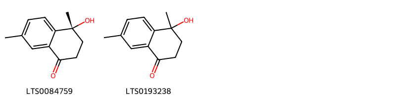{ width=100% }
    <figcaption>Hình ảnh cấu trúc hóa học của 2 hoạt chất thuộc nhóm Tetralins gồm ['(4r)-4-hydroxy-4,7-dimethyl-2,3-dihydronaphthalen-1-one (LTS0084759)', '4-hydroxy-4,7-dimethyl-2,3-dihydronaphthalen-1-one (LTS0193238)'].</figcaption>
</figure>

---

### Dược dân tộc học

Danh sách các quốc gia có sử dụng *Zanthoxylum ailanthoides* trong điều trị các bệnh. 

| Country   | Disease                          | Bệnh                                                                                                                                                                                                |
|:----------|:---------------------------------|:----------------------------------------------------------------------------------------------------------------------------------------------------------------------------------------------------|
| China     | Antidote, Stimulant, Carminative | MYMEMORY WARNING: YOU USED ALL AVAILABLE FREE TRANSLATIONS FOR TODAY. NEXT AVAILABLE IN  00 HOURS 09 MINUTES 31 SECONDS VISIT HTTPS://MYMEMORY.TRANSLATED.NET/DOC/USAGELIMITS.PHP TO TRANSLATE MORE |
| Elsewhere | Stomachic                        | MYMEMORY WARNING: YOU USED ALL AVAILABLE FREE TRANSLATIONS FOR TODAY. NEXT AVAILABLE IN  00 HOURS 09 MINUTES 29 SECONDS VISIT HTTPS://MYMEMORY.TRANSLATED.NET/DOC/USAGELIMITS.PHP TO TRANSLATE MORE |

---

---
## Zanthoxylum alatum
### Thông tin về thực vật

!!! info "Phân loại thực vật của *N/A* từ GIBF:"
    - **Kingdom:** Plantae
    - **Phylum:** Tracheophyta
    - **Order:** Sapindales
    - **Family:** Rutaceae
    - **Genus:** Zanthoxylum
    - **Species:** *N/A*

 

| Label (VI)   | Label (EN)   | Scientific Name    | Descriptions (VI)   | Descriptions (EN)   | Also Known As (VI)   | Also Known As (EN)   |
|:-------------|:-------------|:-------------------|:--------------------|:--------------------|:---------------------|:---------------------|
| N/A          | N/A          | Zanthoxylum alatum | loài thực vật       | species of plant    | ['']                 | ['']                 |

#### Phân bố trên thế giới

**Từ CSDL GIBF** Sri Lanka, Japan, Gabon, Argentina, Canada, Puerto Rico, Chinese Taipei, United States of America, Uruguay, South Africa, Hong Kong, Brazil, Bahamas, Mexico, Dominican Republic, China, Ecuador, Haiti, Costa Rica, India, Antigua and Barbuda, Cameroon

#### Phân bố tại Việt Nam

**Từ CSDL GIBF**: Không có ghi nhận ở Việt Nam

---
### Thành phần hóa học
        
- Theo cơ sở dữ liệu lotus: Từ loài *N/A* đã phân lập và xác định được 13 hoạt chất thuộc về các nhóm Prenol lipids, Steroids and steroid derivatives, Cinnamic acids and derivatives, Benzodioxoles, Furanoid lignans. 

|    | chemicalTaxonomyClassyfireClass   |   smiles_count |
|---:|:----------------------------------|---------------:|
|  0 | Benzodioxoles                     |              1 |
|  1 | Cinnamic acids and derivatives    |              1 |
|  2 | Furanoid lignans                  |              3 |
|  3 | Prenol lipids                     |              6 |
|  4 | Steroids and steroid derivatives  |              2 |

#### Nhóm Benzodioxoles
<figure markdown="span">
    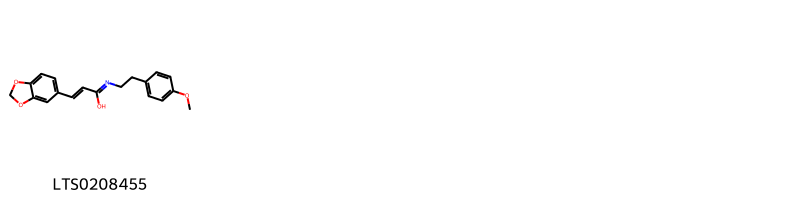{ width=100% }
    <figcaption>Hình ảnh cấu trúc hóa học của 1 hoạt chất thuộc nhóm Benzodioxoles gồm ['(2e)-3-(2h-1,3-benzodioxol-5-yl)-n-[2-(4-methoxyphenyl)ethyl]prop-2-enimidic acid (LTS0208455)'].</figcaption>
</figure>
#### Nhóm Cinnamic acids and derivatives
<figure markdown="span">
    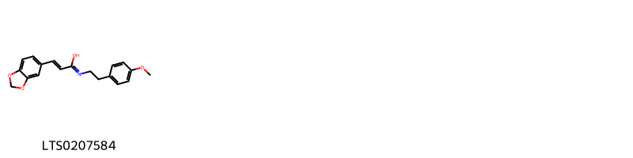{ width=100% }
    <figcaption>Hình ảnh cấu trúc hóa học của 1 hoạt chất thuộc nhóm Cinnamic acids and derivatives gồm ['3-(2h-1,3-benzodioxol-5-yl)-n-[2-(4-methoxyphenyl)ethyl]prop-2-enimidic acid (LTS0207584)'].</figcaption>
</figure>
#### Nhóm Furanoid lignans
<figure markdown="span">
    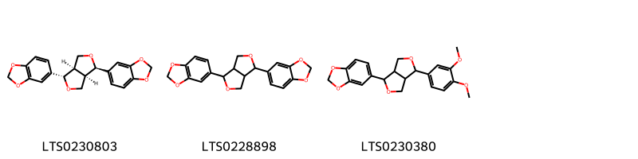{ width=100% }
    <figcaption>Hình ảnh cấu trúc hóa học của 3 hoạt chất thuộc nhóm Furanoid lignans gồm ['5-[(1s,3ar,4r,6ar)-4-(2h-1,3-benzodioxol-5-yl)-hexahydrofuro[3,4-c]furan-1-yl]-2h-1,3-benzodioxole (LTS0230803)', 'sesamin (LTS0228898)', '5-[4-(3,4-dimethoxyphenyl)-hexahydrofuro[3,4-c]furan-1-yl]-2h-1,3-benzodioxole (LTS0230380)'].</figcaption>
</figure>
#### Nhóm Prenol lipids
<figure markdown="span">
    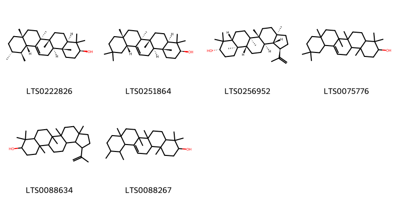{ width=100% }
    <figcaption>Hình ảnh cấu trúc hóa học của 6 hoạt chất thuộc nhóm Prenol lipids gồm ['amyrin (LTS0222826)', 'β-amyrin (LTS0251864)', 'lupeol (LTS0256952)', 'β-amyrin (LTS0075776)', 'lupeol (LTS0088634)', 'α-amyrin (LTS0088267)'].</figcaption>
</figure>
#### Nhóm Steroids and steroid derivatives
<figure markdown="span">
    { width=100% }
    <figcaption>Hình ảnh cấu trúc hóa học của 2 hoạt chất thuộc nhóm Steroids and steroid derivatives gồm ['sitogluside (LTS0201798)', '2-{[1-(5-ethyl-6-methylheptan-2-yl)-9a,11a-dimethyl-1h,2h,3h,3ah,3bh,4h,6h,7h,8h,9h,9bh,10h,11h-cyclopenta[a]phenanthren-7-yl]oxy}-6-(hydroxymethyl)oxane-3,4,5-triol (LTS0158828)'].</figcaption>
</figure>

---

### Dược dân tộc học

Danh sách các quốc gia có sử dụng *N/A* trong điều trị các bệnh. 

| Country   | Disease               | Bệnh                                                                                                                                                                                                |
|:----------|:----------------------|:----------------------------------------------------------------------------------------------------------------------------------------------------------------------------------------------------|
| China     | Stomachic             | MYMEMORY WARNING: YOU USED ALL AVAILABLE FREE TRANSLATIONS FOR TODAY. NEXT AVAILABLE IN  00 HOURS 08 MINUTES 51 SECONDS VISIT HTTPS://MYMEMORY.TRANSLATED.NET/DOC/USAGELIMITS.PHP TO TRANSLATE MORE |
| India     | Piscicide, Dentifrice | MYMEMORY WARNING: YOU USED ALL AVAILABLE FREE TRANSLATIONS FOR TODAY. NEXT AVAILABLE IN  00 HOURS 08 MINUTES 49 SECONDS VISIT HTTPS://MYMEMORY.TRANSLATED.NET/DOC/USAGELIMITS.PHP TO TRANSLATE MORE |

---

---
## Zanthoxylum americanum
### Thông tin về thực vật

!!! info "Phân loại thực vật của *Zanthoxylum americanum* từ GIBF:"
    - **Kingdom:** Plantae
    - **Phylum:** Tracheophyta
    - **Order:** Sapindales
    - **Family:** Rutaceae
    - **Genus:** Zanthoxylum
    - **Species:** *Zanthoxylum americanum*

 

| Label (VI)   | Label (EN)   | Scientific Name        | Descriptions (VI)   | Descriptions (EN)   | Also Known As (VI)   | Also Known As (EN)                                                                                                                                           |
|:-------------|:-------------|:-----------------------|:--------------------|:--------------------|:---------------------|:-------------------------------------------------------------------------------------------------------------------------------------------------------------|
| N/A          | N/A          | Zanthoxylum americanum | loài thực vật       | species of plant    | ['']                 | ['American prickly-ash', 'common prickly-ash', 'common pricklyash', 'northern prickly-ash', 'prickly ash', 'prickly-ash', 'toothache tree', 'toothachetree'] |

#### Phân bố trên thế giới

**Từ CSDL GIBF** United States of America, Canada

#### Phân bố tại Việt Nam

**Từ CSDL GIBF**: Không có ghi nhận ở Việt Nam

---
### Thành phần hóa học
        
- Theo cơ sở dữ liệu lotus: Từ loài *Zanthoxylum americanum* đã phân lập và xác định được 13 hoạt chất thuộc về các nhóm Furanoid lignans, Coumarins and derivatives. 

|    | chemicalTaxonomyClassyfireClass   |   smiles_count |
|---:|:----------------------------------|---------------:|
|  0 | Coumarins and derivatives         |              9 |
|  1 | Furanoid lignans                  |              4 |

#### Nhóm Coumarins and derivatives
<figure markdown="span">
    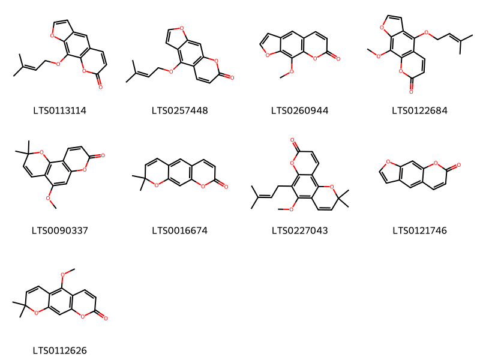{ width=100% }
    <figcaption>Hình ảnh cấu trúc hóa học của 9 hoạt chất thuộc nhóm Coumarins and derivatives gồm ['imperatorin (LTS0113114)', 'isoimperatorin (LTS0257448)', 'methoxsalen (LTS0260944)', 'cnidilin (LTS0122684)', '5-methoxy-2,2-dimethylpyrano[2,3-f]chromen-8-one (LTS0090337)', 'xanthyletin (LTS0016674)', 'dipetalin (LTS0227043)', 'psoralen (LTS0121746)', 'xanthoxyletin (LTS0112626)'].</figcaption>
</figure>
#### Nhóm Furanoid lignans
<figure markdown="span">
    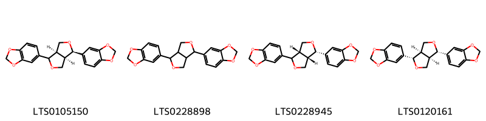{ width=100% }
    <figcaption>Hình ảnh cấu trúc hóa học của 4 hoạt chất thuộc nhóm Furanoid lignans gồm ['5-[(3ar,4r,6ar)-4-(2h-1,3-benzodioxol-5-yl)-hexahydrofuro[3,4-c]furan-1-yl]-2h-1,3-benzodioxole (LTS0105150)', 'sesamin (LTS0228898)', '5-[(3as,4s,6as)-4-(2h-1,3-benzodioxol-5-yl)-hexahydrofuro[3,4-c]furan-1-yl]-2h-1,3-benzodioxole (LTS0228945)', 'sesamin (LTS0120161)'].</figcaption>
</figure>

---

### Dược dân tộc học

Danh sách các quốc gia có sử dụng *Zanthoxylum americanum* trong điều trị các bệnh. 

| Country        | Disease                                   | Bệnh                                                                                                                                                                                                |
|:---------------|:------------------------------------------|:----------------------------------------------------------------------------------------------------------------------------------------------------------------------------------------------------|
| Mexico         | Stimulant                                 | MYMEMORY WARNING: YOU USED ALL AVAILABLE FREE TRANSLATIONS FOR TODAY. NEXT AVAILABLE IN  00 HOURS 08 MINUTES 18 SECONDS VISIT HTTPS://MYMEMORY.TRANSLATED.NET/DOC/USAGELIMITS.PHP TO TRANSLATE MORE |
| US             | Sialogogue, Sudorific, Tonic, Expectorant | MYMEMORY WARNING: YOU USED ALL AVAILABLE FREE TRANSLATIONS FOR TODAY. NEXT AVAILABLE IN  00 HOURS 08 MINUTES 15 SECONDS VISIT HTTPS://MYMEMORY.TRANSLATED.NET/DOC/USAGELIMITS.PHP TO TRANSLATE MORE |
| US(Amerindian) | Poultice, Suppurative                     | MYMEMORY WARNING: YOU USED ALL AVAILABLE FREE TRANSLATIONS FOR TODAY. NEXT AVAILABLE IN  00 HOURS 08 MINUTES 12 SECONDS VISIT HTTPS://MYMEMORY.TRANSLATED.NET/DOC/USAGELIMITS.PHP TO TRANSLATE MORE |

---

---
## Zanthoxylum armatum
### Thông tin về thực vật

!!! info "Phân loại thực vật của *Zanthoxylum armatum* từ GIBF:"
    - **Kingdom:** Plantae
    - **Phylum:** Tracheophyta
    - **Order:** Sapindales
    - **Family:** Rutaceae
    - **Genus:** Zanthoxylum
    - **Species:** *Zanthoxylum armatum*

 

| Label (VI)   | Label (EN)   | Scientific Name     | Descriptions (VI)   | Descriptions (EN)   | Also Known As (VI)   | Also Known As (EN)   |
|:-------------|:-------------|:--------------------|:--------------------|:--------------------|:---------------------|:---------------------|
| N/A          | N/A          | Zanthoxylum armatum | loài thực vật       | species of plant    | ['']                 | ['']                 |

#### Phân bố trên thế giới

**Từ CSDL GIBF** Ukraine, Pakistan, nan, Italy, Japan, Korea, Republic of, Chinese Taipei, Argentina, Bhutan, India, Russian Federation, Portugal, China, Nepal

#### Phân bố tại Việt Nam

**Từ CSDL GIBF**: Không có ghi nhận ở Việt Nam

---
### Thành phần hóa học
        
- Theo cơ sở dữ liệu lotus: Từ loài *Zanthoxylum armatum* đã phân lập và xác định được 70 hoạt chất thuộc về các nhóm Prenol lipids, Steroids and steroid derivatives, Quinolines and derivatives, Cinnamic acids and derivatives, Benzodioxoles, Unsaturated hydrocarbons, Organooxygen compounds, Coumarins and derivatives, Furanoid lignans. 

|    | chemicalTaxonomyClassyfireClass   |   smiles_count |
|---:|:----------------------------------|---------------:|
|  0 | Benzodioxoles                     |              2 |
|  1 | Cinnamic acids and derivatives    |              4 |
|  2 | Coumarins and derivatives         |              1 |
|  3 | Furanoid lignans                  |             24 |
|  4 | Organooxygen compounds            |              2 |
|  5 | Prenol lipids                     |             24 |
|  6 | Quinolines and derivatives        |              2 |
|  7 | Steroids and steroid derivatives  |              4 |
|  8 | Unsaturated hydrocarbons          |              1 |

#### Nhóm Benzodioxoles
<figure markdown="span">
    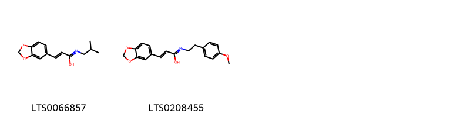{ width=100% }
    <figcaption>Hình ảnh cấu trúc hóa học của 2 hoạt chất thuộc nhóm Benzodioxoles gồm ['(2e)-3-(2h-1,3-benzodioxol-5-yl)-n-(2-methylpropyl)prop-2-enimidic acid (LTS0066857)', '(2e)-3-(2h-1,3-benzodioxol-5-yl)-n-[2-(4-methoxyphenyl)ethyl]prop-2-enimidic acid (LTS0208455)'].</figcaption>
</figure>
#### Nhóm Cinnamic acids and derivatives
<figure markdown="span">
    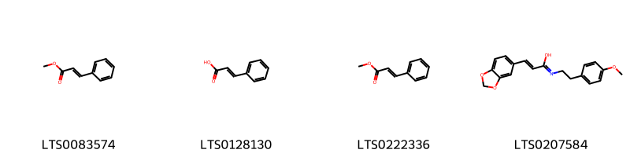{ width=100% }
    <figcaption>Hình ảnh cấu trúc hóa học của 4 hoạt chất thuộc nhóm Cinnamic acids and derivatives gồm ['methyl cinnamate (LTS0083574)', 'cinnamic acid (LTS0128130)', 'methyl cinnamate (LTS0222336)', '3-(2h-1,3-benzodioxol-5-yl)-n-[2-(4-methoxyphenyl)ethyl]prop-2-enimidic acid (LTS0207584)'].</figcaption>
</figure>
#### Nhóm Coumarins and derivatives
<figure markdown="span">
    { width=100% }
    <figcaption>Hình ảnh cấu trúc hóa học của 1 hoạt chất thuộc nhóm Coumarins and derivatives gồm ['umbelliferone (LTS0162728)'].</figcaption>
</figure>
#### Nhóm Furanoid lignans
<figure markdown="span">
    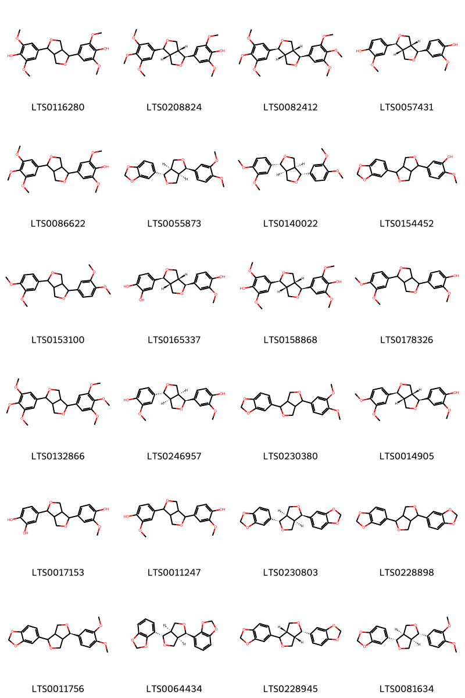{ width=100% }
    <figcaption>Hình ảnh cấu trúc hóa học của 24 hoạt chất thuộc nhóm Furanoid lignans gồm ['syringaresinol (LTS0116280)', '4-[(1s,3ar,4s,6ar)-4-(3,4,5-trimethoxyphenyl)-hexahydrofuro[3,4-c]furan-1-yl]-2,6-dimethoxyphenol (LTS0208824)', '( )-yangabin (LTS0082412)', 'pinoresinol (LTS0057431)', '2,6-dimethoxy-4-[4-(3,4,5-trimethoxyphenyl)-hexahydrofuro[3,4-c]furan-1-yl]phenol (LTS0086622)', '5-[(1s,3ar,4r,6ar)-4-(3,4-dimethoxyphenyl)-hexahydrofuro[3,4-c]furan-1-yl]-2h-1,3-benzodioxole (LTS0055873)', '(1r,3as,4r,6as)-1,4-bis(3,4-dimethoxyphenyl)-hexahydrofuro[3,4-c]furan (LTS0140022)', '5-[4-(2h-1,3-benzodioxol-5-yl)-hexahydrofuro[3,4-c]furan-1-yl]-2-methoxyphenol (LTS0154452)', '1,4-bis(3,4-dimethoxyphenyl)-hexahydrofuro[3,4-c]furan (LTS0153100)', '4-[(1s,3ar,4s,6ar)-4-(4-hydroxy-3-methoxyphenyl)-hexahydrofuro[3,4-c]furan-1-yl]benzene-1,2-diol (LTS0165337)', '(+)-syringaresinol (LTS0158868)', '4-[4-(3,4-dimethoxyphenyl)-hexahydrofuro[3,4-c]furan-1-yl]-2-methoxyphenol (LTS0178326)', '1,4-bis(3,4,5-trimethoxyphenyl)-hexahydrofuro[3,4-c]furan (LTS0132866)', '4-[(1s,3as,4r,6as)-4-(4-hydroxy-3-methoxyphenyl)-hexahydrofuro[3,4-c]furan-1-yl]-2-methoxyphenol (LTS0246957)', '5-[4-(3,4-dimethoxyphenyl)-hexahydrofuro[3,4-c]furan-1-yl]-2h-1,3-benzodioxole (LTS0230380)', '4-[(1s,3ar,4s,6ar)-4-(3,4-dimethoxyphenyl)-hexahydrofuro[3,4-c]furan-1-yl]-2-methoxyphenol (LTS0014905)', '4-[4-(4-hydroxy-3-methoxyphenyl)-hexahydrofuro[3,4-c]furan-1-yl]benzene-1,2-diol (LTS0017153)', 'pinoresinol (LTS0011247)', '5-[(1s,3ar,4r,6ar)-4-(2h-1,3-benzodioxol-5-yl)-hexahydrofuro[3,4-c]furan-1-yl]-2h-1,3-benzodioxole (LTS0230803)', 'sesamin (LTS0228898)', '5-[(4r)-4-(3,4-dimethoxyphenyl)-hexahydrofuro[3,4-c]furan-1-yl]-2h-1,3-benzodioxole (LTS0011756)', '4-[(1s,3ar,4r,6ar)-4-(2h-1,3-benzodioxol-4-yl)-hexahydrofuro[3,4-c]furan-1-yl]-2h-1,3-benzodioxole (LTS0064434)', '5-[(3as,4s,6as)-4-(2h-1,3-benzodioxol-5-yl)-hexahydrofuro[3,4-c]furan-1-yl]-2h-1,3-benzodioxole (LTS0228945)', '5-[(1s,3ar,4s,6ar)-4-(3,4-dimethoxyphenyl)-hexahydrofuro[3,4-c]furan-1-yl]-2h-1,3-benzodioxole (LTS0081634)'].</figcaption>
</figure>
#### Nhóm Organooxygen compounds
<figure markdown="span">
    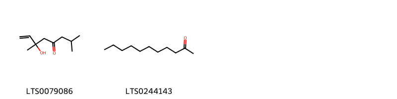{ width=100% }
    <figcaption>Hình ảnh cấu trúc hóa học của 2 hoạt chất thuộc nhóm Organooxygen compounds gồm ['6-hydroxy-2,6-dimethyloct-7-en-4-one (LTS0079086)', 'undecan-2-one (LTS0244143)'].</figcaption>
</figure>
#### Nhóm Prenol lipids
<figure markdown="span">
    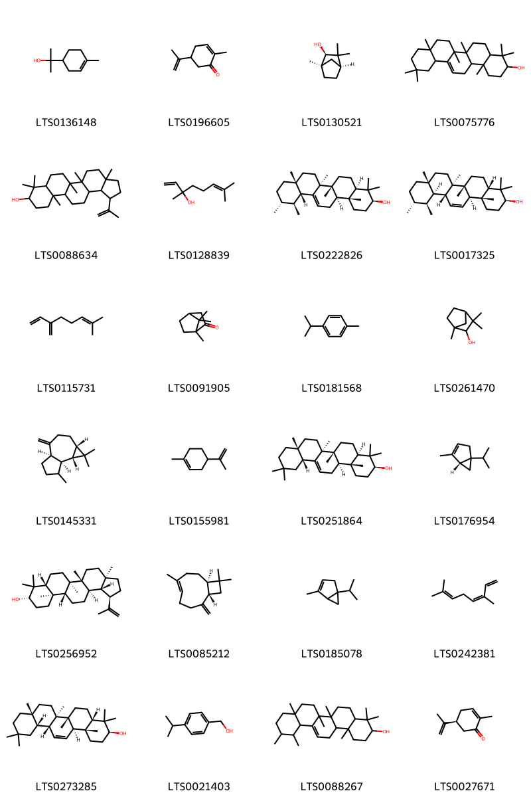{ width=100% }
    <figcaption>Hình ảnh cấu trúc hóa học của 24 hoạt chất thuộc nhóm Prenol lipids gồm ['terpineol (LTS0136148)', 'carvone (LTS0196605)', '(1r,2r,4s)-1,3,3-trimethylbicyclo[2.2.1]heptan-2-ol (LTS0130521)', 'β-amyrin (LTS0075776)', 'lupeol (LTS0088634)', 'linalool, (+-)- (LTS0128839)', 'amyrin (LTS0222826)', '(3s,4as,6ar,6br,8ar,11r,12s,12ar,12br,14ar,14bs)-4,4,6a,6b,8a,11,12,14b-octamethyl-2,3,4a,5,6,7,8,9,10,11,12,12a,12b,14a-tetradecahydro-1h-picen-3-ol (LTS0017325)', 'α-myrcene (LTS0115731)', 'camphor (LTS0091905)', 'cymene (LTS0181568)', 'fenchol (LTS0261470)', '(1as,4ar,7as,7br)-1,1,7-trimethyl-4-methylidene-octahydro-1ah-cyclopropa[e]azulene (LTS0145331)', 'limonene,  (LTS0155981)', 'β-amyrin (LTS0251864)', 'α-thujene (LTS0176954)', 'lupeol (LTS0256952)', 'caryophyllene (LTS0085212)', 'α-thujene (LTS0185078)', 'β-ocimene (LTS0242381)', '(3s,4as,6ar,6br,8ar,12as,12br,14ar,14bs)-4,4,6a,6b,8a,11,11,14b-octamethyl-1,2,3,4a,5,6,7,8,9,10,12,12a,12b,14a-tetradecahydropicen-3-ol (LTS0273285)', 'cuminol (LTS0021403)', 'α-amyrin (LTS0088267)', 'carvone, (+)- (LTS0027671)'].</figcaption>
</figure>
#### Nhóm Quinolines and derivatives
<figure markdown="span">
    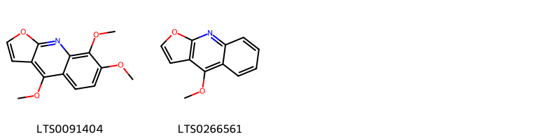{ width=100% }
    <figcaption>Hình ảnh cấu trúc hóa học của 2 hoạt chất thuộc nhóm Quinolines and derivatives gồm ['skimmianine (LTS0091404)', 'dictamnine (LTS0266561)'].</figcaption>
</figure>
#### Nhóm Steroids and steroid derivatives
<figure markdown="span">
    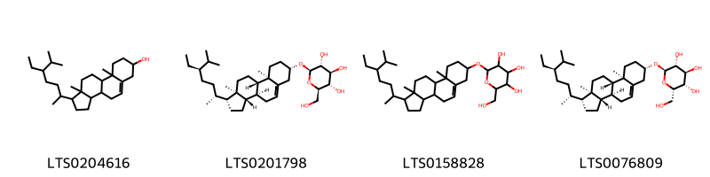{ width=100% }
    <figcaption>Hình ảnh cấu trúc hóa học của 4 hoạt chất thuộc nhóm Steroids and steroid derivatives gồm ['stigmast-5-en-3-ol, (3β)- (LTS0204616)', 'sitogluside (LTS0201798)', '2-{[1-(5-ethyl-6-methylheptan-2-yl)-9a,11a-dimethyl-1h,2h,3h,3ah,3bh,4h,6h,7h,8h,9h,9bh,10h,11h-cyclopenta[a]phenanthren-7-yl]oxy}-6-(hydroxymethyl)oxane-3,4,5-triol (LTS0158828)', '(2r,3r,4s,5s,6s)-2-{[(1r,3as,3bs,7s,9ar,9bs,11ar)-1-[(2r,5r)-5-ethyl-6-methylheptan-2-yl]-9a,11a-dimethyl-1h,2h,3h,3ah,3bh,4h,6h,7h,8h,9h,9bh,10h,11h-cyclopenta[a]phenanthren-7-yl]oxy}-6-(hydroxymethyl)oxane-3,4,5-triol (LTS0076809)'].</figcaption>
</figure>
#### Nhóm Unsaturated hydrocarbons
<figure markdown="span">
    { width=100% }
    <figcaption>Hình ảnh cấu trúc hóa học của 1 hoạt chất thuộc nhóm Unsaturated hydrocarbons gồm ['α terpinene (LTS0232891)'].</figcaption>
</figure>

---

### Dược dân tộc học

Danh sách các quốc gia có sử dụng *Zanthoxylum armatum* trong điều trị các bệnh. 

| Country   | Disease                                                        | Bệnh                                                                                                                                                                                                |
|:----------|:---------------------------------------------------------------|:----------------------------------------------------------------------------------------------------------------------------------------------------------------------------------------------------|
| Elsewhere | Antiseptic, Dentifrice, Deodorant, Insecticide, nan, Fungicide | MYMEMORY WARNING: YOU USED ALL AVAILABLE FREE TRANSLATIONS FOR TODAY. NEXT AVAILABLE IN  00 HOURS 07 MINUTES 42 SECONDS VISIT HTTPS://MYMEMORY.TRANSLATED.NET/DOC/USAGELIMITS.PHP TO TRANSLATE MORE |
| India     | Carminative, Stomachic, Vermifuge                              | MYMEMORY WARNING: YOU USED ALL AVAILABLE FREE TRANSLATIONS FOR TODAY. NEXT AVAILABLE IN  00 HOURS 07 MINUTES 39 SECONDS VISIT HTTPS://MYMEMORY.TRANSLATED.NET/DOC/USAGELIMITS.PHP TO TRANSLATE MORE |

---

---
## Zanthoxylum avicennae
### Thông tin về thực vật

!!! info "Phân loại thực vật của *Zanthoxylum avicennae* từ GIBF:"
    - **Kingdom:** Plantae
    - **Phylum:** Tracheophyta
    - **Order:** Sapindales
    - **Family:** Rutaceae
    - **Genus:** Zanthoxylum
    - **Species:** *Zanthoxylum avicennae*

 

| Label (VI)   | Label (EN)   | Scientific Name       | Descriptions (VI)   | Descriptions (EN)   | Also Known As (VI)   | Also Known As (EN)   |
|:-------------|:-------------|:----------------------|:--------------------|:--------------------|:---------------------|:---------------------|
| N/A          | N/A          | Zanthoxylum avicennae | loài thực vật       | species of plant    | ['']                 | ['']                 |

#### Phân bố trên thế giới

**Từ CSDL GIBF** Hong Kong, Chinese Taipei, Macao, United States of America, Viet Nam, China

#### Phân bố tại Việt Nam

**Từ CSDL GIBF**: Quảng Ninh, Thua Thien-Hue

---
### Thành phần hóa học
        
- Theo cơ sở dữ liệu lotus: Từ loài *Zanthoxylum avicennae* đã phân lập và xác định được 57 hoạt chất thuộc về các nhóm Benzodioxanes, Coumarinolignans, Prenol lipids, Steroids and steroid derivatives, Flavonoids, Quinolines and derivatives, Diarylheptanoids, Protopine alkaloids, Cinnamaldehydes, Coumarins and derivatives, Furanoid lignans, Benzopyrans. 

|    | chemicalTaxonomyClassyfireClass   |   smiles_count |
|---:|:----------------------------------|---------------:|
|  0 | Benzodioxanes                     |              8 |
|  1 | Benzopyrans                       |              2 |
|  2 | Cinnamaldehydes                   |              1 |
|  3 | Coumarinolignans                  |              5 |
|  4 | Coumarins and derivatives         |             11 |
|  5 | Diarylheptanoids                  |              4 |
|  6 | Flavonoids                        |              2 |
|  7 | Furanoid lignans                  |              7 |
|  8 | Prenol lipids                     |              6 |
|  9 | Protopine alkaloids               |              1 |
| 10 | Quinolines and derivatives        |              7 |
| 11 | Steroids and steroid derivatives  |              3 |

#### Nhóm Benzodioxanes
<figure markdown="span">
    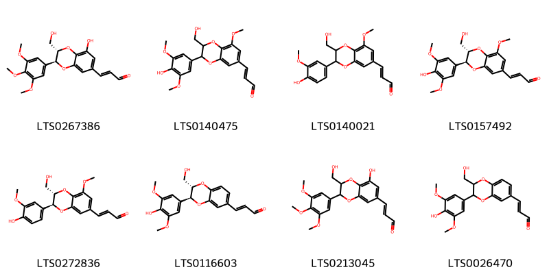{ width=100% }
    <figcaption>Hình ảnh cấu trúc hóa học của 8 hoạt chất thuộc nhóm Benzodioxanes gồm ['(2e)-3-[(2s,3s)-8-hydroxy-2-(hydroxymethyl)-3-(3,4,5-trimethoxyphenyl)-2,3-dihydro-1,4-benzodioxin-6-yl]prop-2-enal (LTS0267386)', '3-[3-(4-hydroxy-3,5-dimethoxyphenyl)-2-(hydroxymethyl)-8-methoxy-2,3-dihydro-1,4-benzodioxin-6-yl]prop-2-enal (LTS0140475)', '3-[3-(4-hydroxy-3-methoxyphenyl)-2-(hydroxymethyl)-8-methoxy-2,3-dihydro-1,4-benzodioxin-6-yl]prop-2-enal (LTS0140021)', '(2e)-3-[(2s,3s)-3-(4-hydroxy-3,5-dimethoxyphenyl)-2-(hydroxymethyl)-8-methoxy-2,3-dihydro-1,4-benzodioxin-6-yl]prop-2-enal (LTS0157492)', '(2e)-3-[(2s,3s)-3-(4-hydroxy-3-methoxyphenyl)-2-(hydroxymethyl)-8-methoxy-2,3-dihydro-1,4-benzodioxin-6-yl]prop-2-enal (LTS0272836)', '(2e)-3-[(2s,3s)-3-(4-hydroxy-3,5-dimethoxyphenyl)-2-(hydroxymethyl)-2,3-dihydro-1,4-benzodioxin-6-yl]prop-2-enal (LTS0116603)', '3-[8-hydroxy-2-(hydroxymethyl)-3-(3,4,5-trimethoxyphenyl)-2,3-dihydro-1,4-benzodioxin-6-yl]prop-2-enal (LTS0213045)', '3-[3-(4-hydroxy-3,5-dimethoxyphenyl)-2-(hydroxymethyl)-2,3-dihydro-1,4-benzodioxin-6-yl]prop-2-enal (LTS0026470)'].</figcaption>
</figure>
#### Nhóm Benzopyrans
<figure markdown="span">
    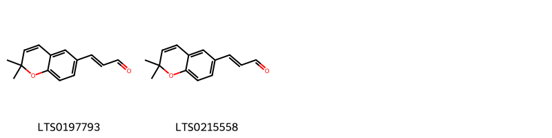{ width=100% }
    <figcaption>Hình ảnh cấu trúc hóa học của 2 hoạt chất thuộc nhóm Benzopyrans gồm ['3-(2,2-dimethylchromen-6-yl)prop-2-enal (LTS0197793)', '(2e)-3-(2,2-dimethylchromen-6-yl)prop-2-enal (LTS0215558)'].</figcaption>
</figure>
#### Nhóm Cinnamaldehydes
<figure markdown="span">
    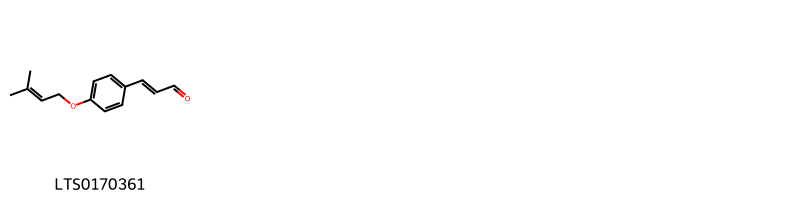{ width=100% }
    <figcaption>Hình ảnh cấu trúc hóa học của 1 hoạt chất thuộc nhóm Cinnamaldehydes gồm ['3-{4-[(3-methylbut-2-en-1-yl)oxy]phenyl}prop-2-enal (LTS0170361)'].</figcaption>
</figure>
#### Nhóm Coumarinolignans
<figure markdown="span">
    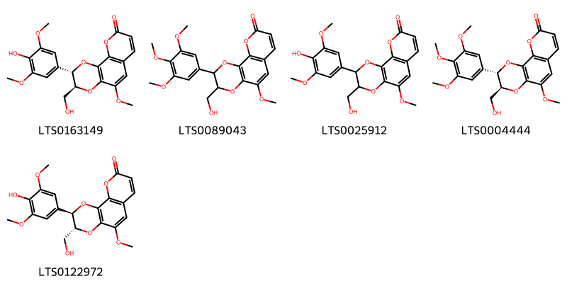{ width=100% }
    <figcaption>Hình ảnh cấu trúc hóa học của 5 hoạt chất thuộc nhóm Coumarinolignans gồm ['cleomiscosin d (LTS0163149)', '3-(hydroxymethyl)-5-methoxy-2-(3,4,5-trimethoxyphenyl)-2h,3h-[1,4]dioxino[2,3-h]chromen-9-one (LTS0089043)', '2-(4-hydroxy-3,5-dimethoxyphenyl)-3-(hydroxymethyl)-5-methoxy-2h,3h-[1,4]dioxino[2,3-h]chromen-9-one (LTS0025912)', 'methylcleomiscosin d (LTS0004444)', '(2r,3r)-2-(4-hydroxy-3,5-dimethoxyphenyl)-3-(hydroxymethyl)-5-methoxy-2h,3h-[1,4]dioxino[2,3-h]chromen-9-one (LTS0122972)'].</figcaption>
</figure>
#### Nhóm Coumarins and derivatives
<figure markdown="span">
    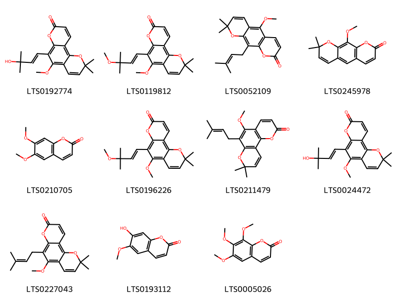{ width=100% }
    <figcaption>Hình ảnh cấu trúc hóa học của 11 hoạt chất thuộc nhóm Coumarins and derivatives gồm ['6-(3-hydroxy-3-methylbut-1-en-1-yl)-5-methoxy-2,2-dimethylpyrano[2,3-h]chromen-8-one (LTS0192774)', '5-methoxy-6-(3-methoxy-3-methylbut-1-en-1-yl)-2,2-dimethylpyrano[2,3-h]chromen-8-one (LTS0119812)', '5-methoxy-8,8-dimethyl-10-(3-methylbut-2-en-1-yl)pyrano[3,2-g]chromen-2-one (LTS0052109)', 'luvangetin (LTS0245978)', 'scoparone (LTS0210705)', '5-methoxy-6-[(1e)-3-methoxy-3-methylbut-1-en-1-yl]-2,2-dimethylpyrano[2,3-h]chromen-8-one (LTS0196226)', '5-methoxy-8,8-dimethyl-6-(3-methylbut-2-en-1-yl)pyrano[2,3-f]chromen-2-one (LTS0211479)', 'trans-avicennol (LTS0024472)', 'dipetalin (LTS0227043)', 'scopoletin (LTS0193112)', '6,7,8-trimethoxychromen-2-one (LTS0005026)'].</figcaption>
</figure>
#### Nhóm Diarylheptanoids
<figure markdown="span">
    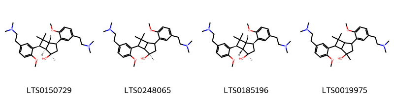{ width=100% }
    <figcaption>Hình ảnh cấu trúc hóa học của 4 hoạt chất thuộc nhóm Diarylheptanoids gồm ['(1r,2r,4s,5r,7r)-4,7-bis({5-[2-(dimethylamino)ethyl]-2-methoxyphenyl})-2,6,6-trimethylbicyclo[3.2.0]heptan-2-ol (LTS0150729)', '(2r)-4,7-bis({5-[2-(dimethylamino)ethyl]-2-methoxyphenyl})-2,6,6-trimethylbicyclo[3.2.0]heptan-2-ol (LTS0248065)', '(1s,2r,4s,5r,7r)-4,7-bis({5-[2-(dimethylamino)ethyl]-2-methoxyphenyl})-2,6,6-trimethylbicyclo[3.2.0]heptan-2-ol (LTS0185196)', '4,7-bis({5-[2-(dimethylamino)ethyl]-2-methoxyphenyl})-2,6,6-trimethylbicyclo[3.2.0]heptan-2-ol (LTS0019975)'].</figcaption>
</figure>
#### Nhóm Flavonoids
<figure markdown="span">
    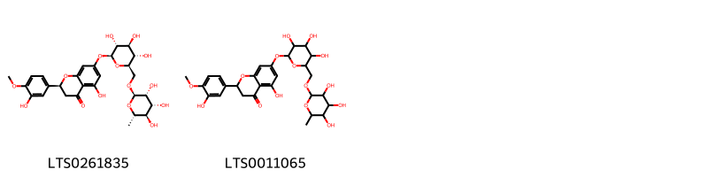{ width=100% }
    <figcaption>Hình ảnh cấu trúc hóa học của 2 hoạt chất thuộc nhóm Flavonoids gồm ['hesperidin (LTS0261835)', 'hesperidin (LTS0011065)'].</figcaption>
</figure>
#### Nhóm Furanoid lignans
<figure markdown="span">
    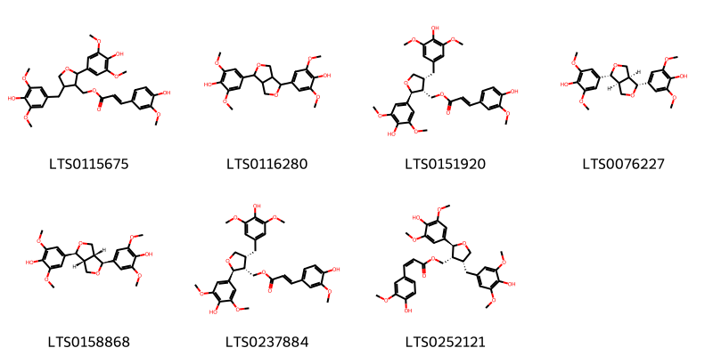{ width=100% }
    <figcaption>Hình ảnh cấu trúc hóa học của 7 hoạt chất thuộc nhóm Furanoid lignans gồm ['[2-(4-hydroxy-3,5-dimethoxyphenyl)-4-[(4-hydroxy-3,5-dimethoxyphenyl)methyl]oxolan-3-yl]methyl 3-(4-hydroxy-3-methoxyphenyl)prop-2-enoate (LTS0115675)', 'syringaresinol (LTS0116280)', '[(2s,3r,4r)-2-(4-hydroxy-3,5-dimethoxyphenyl)-4-[(4-hydroxy-3,5-dimethoxyphenyl)methyl]oxolan-3-yl]methyl (2e)-3-(4-hydroxy-3-methoxyphenyl)prop-2-enoate (LTS0151920)', '(-)-syringaresinol (LTS0076227)', '(+)-syringaresinol (LTS0158868)', '[(2s,3r,4r)-2-(4-hydroxy-3,5-dimethoxyphenyl)-4-[(4-hydroxy-3,5-dimethoxyphenyl)methyl]oxolan-3-yl]methyl 3-(4-hydroxy-3-methoxyphenyl)prop-2-enoate (LTS0237884)', '[(2s,3r,4r)-2-(4-hydroxy-3,5-dimethoxyphenyl)-4-[(4-hydroxy-3,5-dimethoxyphenyl)methyl]oxolan-3-yl]methyl (2z)-3-(4-hydroxy-3-methoxyphenyl)prop-2-enoate (LTS0252121)'].</figcaption>
</figure>
#### Nhóm Prenol lipids
<figure markdown="span">
    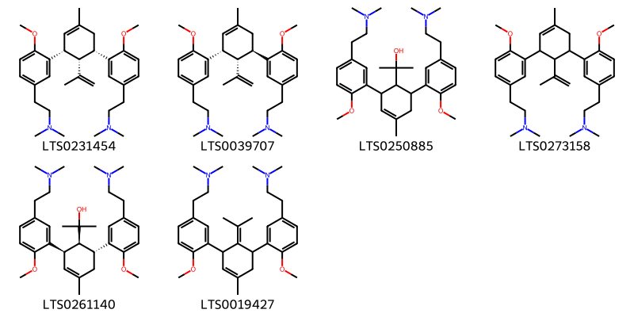{ width=100% }
    <figcaption>Hình ảnh cấu trúc hóa học của 6 hoạt chất thuộc nhóm Prenol lipids gồm ['(2-{3-[(1r,5s,6s)-5-{5-[2-(dimethylamino)ethyl]-2-methoxyphenyl}-3-methyl-6-(prop-1-en-2-yl)cyclohex-2-en-1-yl]-4-methoxyphenyl}ethyl)dimethylamine (LTS0231454)', '(2-{3-[(1r,5r,6s)-5-{5-[2-(dimethylamino)ethyl]-2-methoxyphenyl}-3-methyl-6-(prop-1-en-2-yl)cyclohex-2-en-1-yl]-4-methoxyphenyl}ethyl)dimethylamine (LTS0039707)', '2-[2,6-bis({5-[2-(dimethylamino)ethyl]-2-methoxyphenyl})-4-methylcyclohex-3-en-1-yl]propan-2-ol (LTS0250885)', '{2-[3-(5-{5-[2-(dimethylamino)ethyl]-2-methoxyphenyl}-3-methyl-6-(prop-1-en-2-yl)cyclohex-2-en-1-yl)-4-methoxyphenyl]ethyl}dimethylamine (LTS0273158)', '2-[(1s,2r,6r)-2,6-bis({5-[2-(dimethylamino)ethyl]-2-methoxyphenyl})-4-methylcyclohex-3-en-1-yl]propan-2-ol (LTS0261140)', '{2-[3-(5-{5-[2-(dimethylamino)ethyl]-2-methoxyphenyl}-3-methyl-6-(propan-2-ylidene)cyclohex-2-en-1-yl)-4-methoxyphenyl]ethyl}dimethylamine (LTS0019427)'].</figcaption>
</figure>
#### Nhóm Protopine alkaloids
<figure markdown="span">
    { width=100% }
    <figcaption>Hình ảnh cấu trúc hóa học của 1 hoạt chất thuộc nhóm Protopine alkaloids gồm ['β-allocryptopine (LTS0174113)'].</figcaption>
</figure>
#### Nhóm Quinolines and derivatives
<figure markdown="span">
    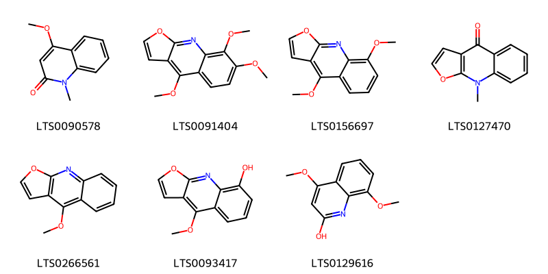{ width=100% }
    <figcaption>Hình ảnh cấu trúc hóa học của 7 hoạt chất thuộc nhóm Quinolines and derivatives gồm ['4-methoxy-1-methylquinolin-2-one (LTS0090578)', 'skimmianine (LTS0091404)', 'fagarine (LTS0156697)', 'isodictamnine (LTS0127470)', 'dictamnine (LTS0266561)', 'robustine (LTS0093417)', '4,8-dimethoxyquinolin-2-ol (LTS0129616)'].</figcaption>
</figure>
#### Nhóm Steroids and steroid derivatives
<figure markdown="span">
    { width=100% }
    <figcaption>Hình ảnh cấu trúc hóa học của 3 hoạt chất thuộc nhóm Steroids and steroid derivatives gồm ['stigmast-5-en-3-ol (LTS0071224)', 'sitosterol (LTS0168132)', 'stigmast-5-en-3-ol, (3β)- (LTS0204616)'].</figcaption>
</figure>

---

### Dược dân tộc học

Danh sách các quốc gia có sử dụng *Zanthoxylum avicennae* trong điều trị các bệnh. 

| Country     | Disease                    | Bệnh                                                                                                                                                                                                |
|:------------|:---------------------------|:----------------------------------------------------------------------------------------------------------------------------------------------------------------------------------------------------|
| Philippines | Antidote, Stomachic, Tonic | MYMEMORY WARNING: YOU USED ALL AVAILABLE FREE TRANSLATIONS FOR TODAY. NEXT AVAILABLE IN  00 HOURS 07 MINUTES 02 SECONDS VISIT HTTPS://MYMEMORY.TRANSLATED.NET/DOC/USAGELIMITS.PHP TO TRANSLATE MORE |

---

---
## Zanthoxylum bungeanum
### Thông tin về thực vật

!!! info "Phân loại thực vật của *Zanthoxylum bungeanum* từ GIBF:"
    - **Kingdom:** Plantae
    - **Phylum:** Tracheophyta
    - **Order:** Sapindales
    - **Family:** Rutaceae
    - **Genus:** Zanthoxylum
    - **Species:** *Zanthoxylum bungeanum*

 

| Label (VI)   | Label (EN)   | Scientific Name       | Descriptions (VI)   | Descriptions (EN)   | Also Known As (VI)   | Also Known As (EN)   |
|:-------------|:-------------|:----------------------|:--------------------|:--------------------|:---------------------|:---------------------|
| N/A          | N/A          | Zanthoxylum bungeanum | loài thực vật       | species of plant    | ['']                 | ['']                 |

#### Phân bố trên thế giới

**Từ CSDL GIBF** Japan, Germany, Belgium, Korea, Republic of, New Zealand, Bhutan, United States of America, Viet Nam, China, Nepal

#### Phân bố tại Việt Nam

**Từ CSDL GIBF**: Ninh Thuan

---
### Thành phần hóa học
        
- Theo cơ sở dữ liệu lotus: Từ loài *Zanthoxylum bungeanum* đã phân lập và xác định được 82 hoạt chất thuộc về các nhóm Fatty Acyls, Flavonoids, Prenol lipids, Steroids and steroid derivatives, Quinolines and derivatives, Benzene and substituted derivatives, Organooxygen compounds, Furanoid lignans. 

|    | chemicalTaxonomyClassyfireClass     |   smiles_count |
|---:|:------------------------------------|---------------:|
|  0 | Benzene and substituted derivatives |              2 |
|  1 | Fatty Acyls                         |             23 |
|  2 | Flavonoids                          |             20 |
|  3 | Furanoid lignans                    |              1 |
|  4 | Organooxygen compounds              |              8 |
|  5 | Prenol lipids                       |             24 |
|  6 | Quinolines and derivatives          |              2 |
|  7 | Steroids and steroid derivatives    |              2 |

#### Nhóm Benzene and substituted derivatives
<figure markdown="span">
    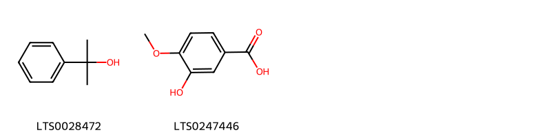{ width=100% }
    <figcaption>Hình ảnh cấu trúc hóa học của 2 hoạt chất thuộc nhóm Benzene and substituted derivatives gồm ['cumyl alcohol (LTS0028472)', 'isovanillic acid (LTS0247446)'].</figcaption>
</figure>
#### Nhóm Fatty Acyls
<figure markdown="span">
    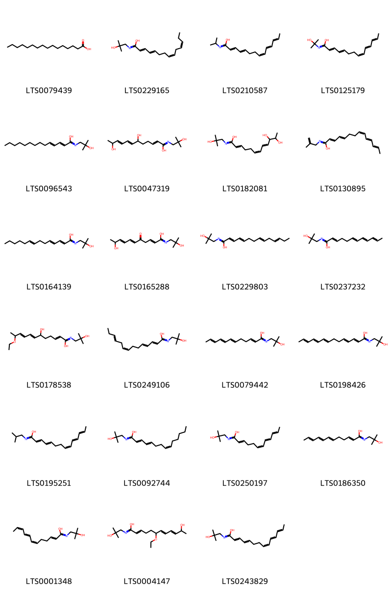{ width=100% }
    <figcaption>Hình ảnh cấu trúc hóa học của 23 hoạt chất thuộc nhóm Fatty Acyls gồm ['palmitic acid (LTS0079439)', '(2e,4e,8z,11z)-n-(2-hydroxy-2-methylpropyl)tetradeca-2,4,8,11-tetraenimidic acid (LTS0229165)', '(2e,4e,8z,10e,12e)-n-isopropyltetradeca-2,4,8,10,12-pentaenimidic acid (LTS0210587)', '(2e,4e,8z,10e,12e)-n-(2-hydroxypropan-2-yl)tetradeca-2,4,8,10,12-pentaenimidic acid (LTS0125179)', '(2e,4e)-n-(2-hydroxy-2-methylpropyl)tetradeca-2,4-dienimidic acid (LTS0096543)', '(2e,7e,9e)-6,11-dihydroxy-n-(2-hydroxy-2-methylpropyl)dodeca-2,7,9-trienimidic acid (LTS0047319)', '(2e,6z,8e)-10,11-dihydroxy-n-(2-hydroxy-2-methylpropyl)dodeca-2,6,8-trienimidic acid (LTS0182081)', '(2e,4e,8z,10e,12e)-n-(2-methylprop-2-en-1-yl)tetradeca-2,4,8,10,12-pentaenimidic acid (LTS0130895)', '(2e,4e,8e)-n-(2-hydroxy-2-methylpropyl)tetradeca-2,4,8-trienimidic acid (LTS0164139)', '(2e,6e,8e)-10-hydroxy-n-(2-hydroxy-2-methylpropyl)-5-oxoundeca-2,6,8-trienimidic acid (LTS0165288)', 'n-(2-hydroxy-2-methylpropyl)tetradeca-2,4,8,11-tetraenimidic acid (LTS0229803)', 'n-(2-hydroxy-2-methylpropyl)dodeca-2,6,8,10-tetraenimidic acid (LTS0237232)', '(2e,7e,9e)-11-ethoxy-6-hydroxy-n-(2-hydroxy-2-methylpropyl)dodeca-2,7,9-trienimidic acid (LTS0178538)', '(2e,4e,8z,11e)-n-(2-hydroxy-2-methylpropyl)tetradeca-2,4,8,11-tetraenimidic acid (LTS0249106)', '(2e,6e,8e,10e)-n-(2-hydroxy-2-methylpropyl)dodeca-2,6,8,10-tetraenimidic acid (LTS0079442)', '(2e,4e,8e,10e,12e)-n-(2-hydroxy-2-methylpropyl)tetradeca-2,4,8,10,12-pentaenimidic acid (LTS0198426)', '(2e,4e,8z,10e,12e)-n-(2-methylpropyl)tetradeca-2,4,8,10,12-pentaenimidic acid (LTS0195251)', '(2e,4e,8z)-n-(2-hydroxy-2-methylpropyl)tetradeca-2,4,8-trienimidic acid (LTS0092744)', '(2e,6z,8e,10e)-n-(2-hydroxy-2-methylpropyl)dodeca-2,6,8,10-tetraenimidic acid (LTS0250197)', '(8e)-n-(2-hydroxy-2-methylpropyl)dodeca-2,6,8,10-tetraenimidic acid (LTS0186350)', '(2e,6z,8e,10z)-n-(2-hydroxy-2-methylpropyl)dodeca-2,6,8,10-tetraenimidic acid (LTS0001348)', '(2e,7e,9e)-6-ethoxy-11-hydroxy-n-(2-hydroxy-2-methylpropyl)dodeca-2,7,9-trienimidic acid (LTS0004147)', '(2e,4e,8z,10e,12e)-n-(2-hydroxy-2-methylpropyl)tetradeca-2,4,8,10,12-pentaenimidic acid (LTS0243829)'].</figcaption>
</figure>
#### Nhóm Flavonoids
<figure markdown="span">
    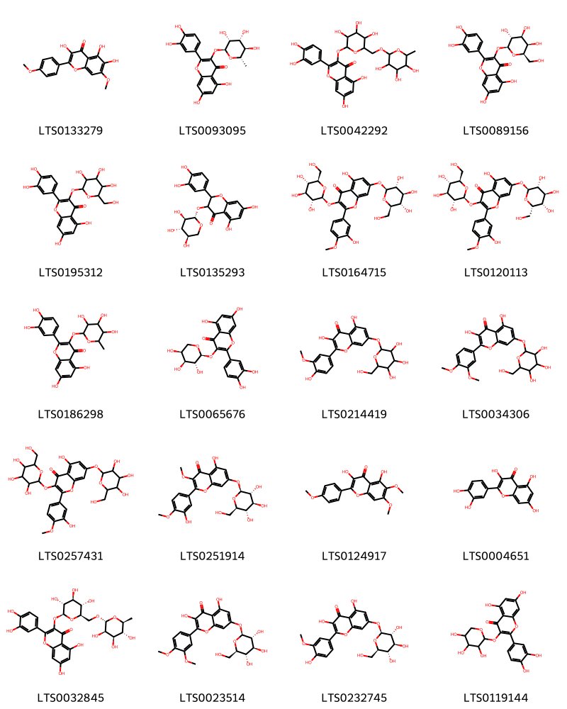{ width=100% }
    <figcaption>Hình ảnh cấu trúc hóa học của 20 hoạt chất thuộc nhóm Flavonoids gồm ['3,5,6-trihydroxy-7-methoxy-2-(4-methoxyphenyl)chromen-4-one (LTS0133279)', 'quercitrin (LTS0093095)', 'rutin (LTS0042292)', 'hyperoside (LTS0089156)', '2-(3,4-dihydroxyphenyl)-5,7-dihydroxy-3-{[3,4,5-trihydroxy-6-(hydroxymethyl)oxan-2-yl]oxy}chromen-4-one (LTS0195312)', '2-(3,4-dihydroxyphenyl)-5,7-dihydroxy-3-{[(2s,3r,4s,5r)-3,4,5-trihydroxyoxan-2-yl]oxy}-2,3-dihydro-1-benzopyran-4-one (LTS0135293)', '5-hydroxy-2-(3-hydroxy-4-methoxyphenyl)-3,7-bis({[(2s,3r,4s,5s,6r)-3,4,5-trihydroxy-6-(hydroxymethyl)oxan-2-yl]oxy})chromen-4-one (LTS0164715)', '5-hydroxy-2-(3-hydroxy-4-methoxyphenyl)-3-{[(2s,3r,4s,5s,6r)-3,4,5-trihydroxy-6-(hydroxymethyl)oxan-2-yl]oxy}-7-{[(2s,3r,4s,5s,6s)-3,4,5-trihydroxy-6-(hydroxymethyl)oxan-2-yl]oxy}chromen-4-one (LTS0120113)', 'quercitrin (LTS0186298)', 'guaijaverin (LTS0065676)', '3,5-dihydroxy-2-(4-hydroxy-3-methoxyphenyl)-7-{[3,4,5-trihydroxy-6-(hydroxymethyl)oxan-2-yl]oxy}chromen-4-one (LTS0214419)', 'dillenetin 7-glucoside (LTS0034306)', '5-hydroxy-2-(3-hydroxy-4-methoxyphenyl)-3,7-bis({[3,4,5-trihydroxy-6-(hydroxymethyl)oxan-2-yl]oxy})chromen-4-one (LTS0257431)', '5-hydroxy-2-(3-hydroxy-4-methoxyphenyl)-3-methoxy-7-{[(2s,3r,4s,5s,6r)-3,4,5-trihydroxy-6-(hydroxymethyl)oxan-2-yl]oxy}chromen-4-one (LTS0251914)', 'mikanin (LTS0124917)', 'quercetin (LTS0004651)', '3-rutinosyl quercetin (LTS0032845)', '2-(3,4-dimethoxyphenyl)-3,5-dihydroxy-7-{[(2s,3r,4s,5s,6r)-3,4,5-trihydroxy-6-(hydroxymethyl)oxan-2-yl]oxy}chromen-4-one (LTS0023514)', '3,5-dihydroxy-2-(4-hydroxy-3-methoxyphenyl)-7-{[(2s,3r,4s,5s,6r)-3,4,5-trihydroxy-6-(hydroxymethyl)oxan-2-yl]oxy}chromen-4-one (LTS0232745)', 'guaijaverin (LTS0119144)'].</figcaption>
</figure>
#### Nhóm Furanoid lignans
<figure markdown="span">
    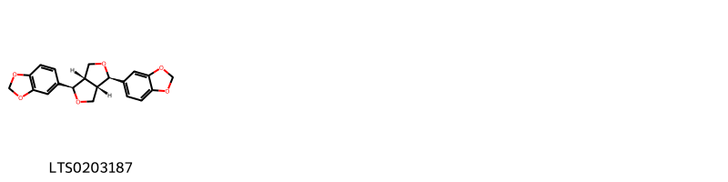{ width=100% }
    <figcaption>Hình ảnh cấu trúc hóa học của 1 hoạt chất thuộc nhóm Furanoid lignans gồm ['(-)-sesamin (LTS0203187)'].</figcaption>
</figure>
#### Nhóm Organooxygen compounds
<figure markdown="span">
    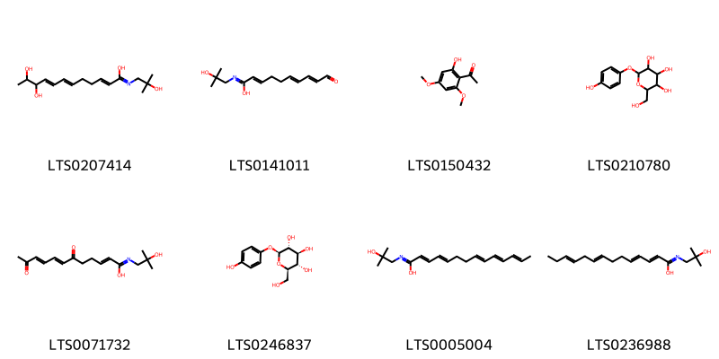{ width=100% }
    <figcaption>Hình ảnh cấu trúc hóa học của 8 hoạt chất thuộc nhóm Organooxygen compounds gồm ['(2e,6e,8e)-10,11-dihydroxy-n-(2-hydroxy-2-methylpropyl)dodeca-2,6,8-trienimidic acid (LTS0207414)', '(2e,6e,8e)-n-(2-hydroxy-2-methylpropyl)-10-oxodeca-2,6,8-trienimidic acid (LTS0141011)', 'xanthoxylin (LTS0150432)', 'arbutin (LTS0210780)', '(2e,7e,9e)-n-(2-hydroxy-2-methylpropyl)-6,11-dioxododeca-2,7,9-trienimidic acid (LTS0071732)', 'β-arbutin (LTS0246837)', 'n-(2-hydroxy-2-methylpropyl)tetradeca-2,4,8,10,12-pentaenimidic acid (LTS0005004)', '(2e,4e,8e,11e)-n-(2-hydroxy-2-methylpropyl)tetradeca-2,4,8,11-tetraenimidic acid (LTS0236988)'].</figcaption>
</figure>
#### Nhóm Prenol lipids
<figure markdown="span">
    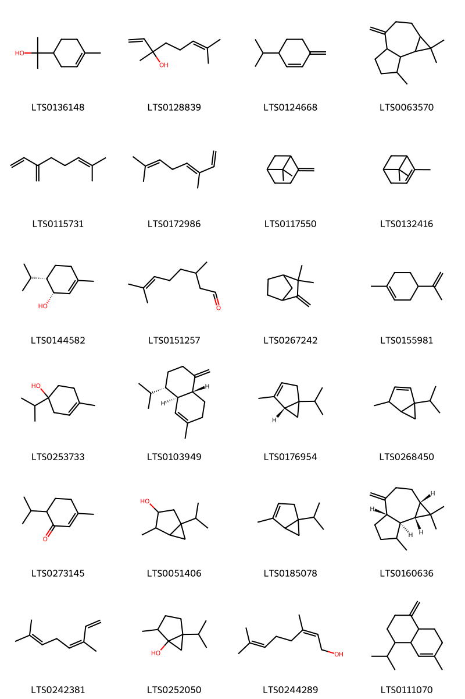{ width=100% }
    <figcaption>Hình ảnh cấu trúc hóa học của 24 hoạt chất thuộc nhóm Prenol lipids gồm ['terpineol (LTS0136148)', 'linalool, (+-)- (LTS0128839)', 'β phellandrene (LTS0124668)', '1,1,7-trimethyl-4-methylidene-octahydro-1ah-cyclopropa[e]azulene (LTS0063570)', 'α-myrcene (LTS0115731)', '3,7-dimethyl-1,3,6-octatriene (LTS0172986)', 'β-pinene (LTS0117550)', 'α pinene (LTS0132416)', '(1r,6s)-6-isopropyl-3-methylcyclohex-2-en-1-ol (LTS0144582)', 'citronella (LTS0151257)', 'camphene (LTS0267242)', 'limonene,  (LTS0155981)', '4-terpineol (LTS0253733)', '(+)-gamma-cadinene (LTS0103949)', 'α-thujene (LTS0176954)', 'thujene (LTS0268450)', 'piperitone (LTS0273145)', '1-isopropyl-4-methylbicyclo[3.1.0]hexan-3-ol (LTS0051406)', 'α-thujene (LTS0185078)', '(1as,4as,7as,7br)-1,1,7-trimethyl-4-methylidene-octahydro-1ah-cyclopropa[e]azulene (LTS0160636)', 'β-ocimene (LTS0242381)', '5-isopropyl-2-methylbicyclo[3.1.0]hexan-1-ol (LTS0252050)', 'nerol (LTS0244289)', '4-isopropyl-6-methyl-1-methylidene-3,4,4a,7,8,8a-hexahydro-2h-naphthalene (LTS0111070)'].</figcaption>
</figure>
#### Nhóm Quinolines and derivatives
<figure markdown="span">
    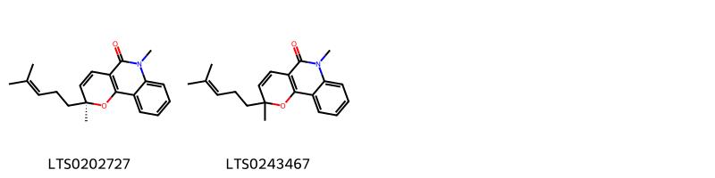{ width=100% }
    <figcaption>Hình ảnh cấu trúc hóa học của 2 hoạt chất thuộc nhóm Quinolines and derivatives gồm ['(2s)-2,6-dimethyl-2-(4-methylpent-3-en-1-yl)pyrano[3,2-c]quinolin-5-one (LTS0202727)', '2,6-dimethyl-2-(4-methylpent-3-en-1-yl)pyrano[3,2-c]quinolin-5-one (LTS0243467)'].</figcaption>
</figure>
#### Nhóm Steroids and steroid derivatives
<figure markdown="span">
    { width=100% }
    <figcaption>Hình ảnh cấu trúc hóa học của 2 hoạt chất thuộc nhóm Steroids and steroid derivatives gồm ['sitogluside (LTS0201798)', '2-{[1-(5-ethyl-6-methylheptan-2-yl)-9a,11a-dimethyl-1h,2h,3h,3ah,3bh,4h,6h,7h,8h,9h,9bh,10h,11h-cyclopenta[a]phenanthren-7-yl]oxy}-6-(hydroxymethyl)oxane-3,4,5-triol (LTS0158828)'].</figcaption>
</figure>

---

### Dược dân tộc học

Danh sách các quốc gia có sử dụng *Zanthoxylum bungeanum* trong điều trị các bệnh. 

| Country   | Disease   | Bệnh                                                                                                                                                                                                |
|:----------|:----------|:----------------------------------------------------------------------------------------------------------------------------------------------------------------------------------------------------|
| China     | Vermifuge | MYMEMORY WARNING: YOU USED ALL AVAILABLE FREE TRANSLATIONS FOR TODAY. NEXT AVAILABLE IN  00 HOURS 06 MINUTES 33 SECONDS VISIT HTTPS://MYMEMORY.TRANSLATED.NET/DOC/USAGELIMITS.PHP TO TRANSLATE MORE |

---

---
## Zanthoxylum bungei
### Thông tin về thực vật

!!! info "Phân loại thực vật của *Zanthoxylum bungeanum* từ GIBF:"
    - **Kingdom:** Plantae
    - **Phylum:** Tracheophyta
    - **Order:** Sapindales
    - **Family:** Rutaceae
    - **Genus:** Zanthoxylum
    - **Species:** *Zanthoxylum bungeanum*

 

| Label (VI)   | Label (EN)   | Scientific Name       | Descriptions (VI)   | Descriptions (EN)   | Also Known As (VI)   | Also Known As (EN)   |
|:-------------|:-------------|:----------------------|:--------------------|:--------------------|:---------------------|:---------------------|
| N/A          | N/A          | Zanthoxylum bungeanum | loài thực vật       | species of plant    | ['']                 | ['']                 |

#### Phân bố trên thế giới

**Từ CSDL GIBF** nan, Japan, New Zealand, unknown or invalid, United States of America, China

#### Phân bố tại Việt Nam

**Từ CSDL GIBF**: Không có ghi nhận ở Việt Nam

---
### Thành phần hóa học
        
- Theo cơ sở dữ liệu lotus: Từ loài *Zanthoxylum bungeanum* đã phân lập và xác định được Chưa có hoạt chất nào được phân lập. hoạt chất thuộc về các nhóm Không có hoạt chất nào được phân lập. 

Không có hình ảnh nào được tạo ra

---

### Dược dân tộc học

Danh sách các quốc gia có sử dụng *Zanthoxylum bungeanum* trong điều trị các bệnh. 

| Country   | Disease                                                               | Bệnh                                                                                                                                                                                                |
|:----------|:----------------------------------------------------------------------|:----------------------------------------------------------------------------------------------------------------------------------------------------------------------------------------------------|
| China     | Astringent, Carminative, Emmenagogue, Stimulant, Sudorific, Vermifuge | MYMEMORY WARNING: YOU USED ALL AVAILABLE FREE TRANSLATIONS FOR TODAY. NEXT AVAILABLE IN  00 HOURS 06 MINUTES 02 SECONDS VISIT HTTPS://MYMEMORY.TRANSLATED.NET/DOC/USAGELIMITS.PHP TO TRANSLATE MORE |

---

---
## Zanthoxylum capense
### Thông tin về thực vật

!!! info "Phân loại thực vật của *Zanthoxylum capense* từ GIBF:"
    - **Kingdom:** Plantae
    - **Phylum:** Tracheophyta
    - **Order:** Sapindales
    - **Family:** Rutaceae
    - **Genus:** Zanthoxylum
    - **Species:** *Zanthoxylum capense*

 

| Label (VI)   | Label (EN)   | Scientific Name     | Descriptions (VI)   | Descriptions (EN)   | Also Known As (VI)   | Also Known As (EN)   |
|:-------------|:-------------|:--------------------|:--------------------|:--------------------|:---------------------|:---------------------|
| N/A          | N/A          | Zanthoxylum capense | loài thực vật       | species of plant    | ['']                 | ['small knobwood']   |

#### Phân bố trên thế giới

**Từ CSDL GIBF** South Africa, Eswatini

#### Phân bố tại Việt Nam

**Từ CSDL GIBF**: Không có ghi nhận ở Việt Nam

---
### Thành phần hóa học
        
- Theo cơ sở dữ liệu lotus: Từ loài *Zanthoxylum capense* đã phân lập và xác định được 3 hoạt chất thuộc về các nhóm Quinolines and derivatives, Furanoid lignans. 

|    | chemicalTaxonomyClassyfireClass   |   smiles_count |
|---:|:----------------------------------|---------------:|
|  0 | Furanoid lignans                  |              2 |
|  1 | Quinolines and derivatives        |              1 |

#### Nhóm Furanoid lignans
<figure markdown="span">
    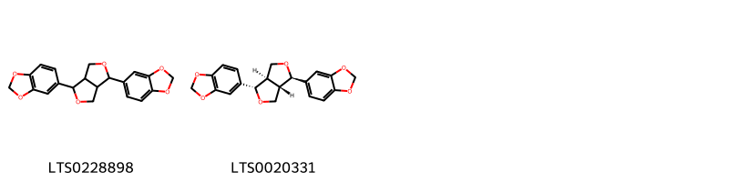{ width=100% }
    <figcaption>Hình ảnh cấu trúc hóa học của 2 hoạt chất thuộc nhóm Furanoid lignans gồm ['sesamin (LTS0228898)', '5-[(1s,3as,4r,6ar)-4-(2h-1,3-benzodioxol-5-yl)-hexahydrofuro[3,4-c]furan-1-yl]-2h-1,3-benzodioxole (LTS0020331)'].</figcaption>
</figure>
#### Nhóm Quinolines and derivatives
<figure markdown="span">
    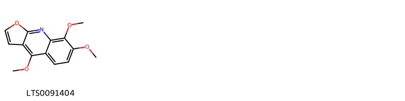{ width=100% }
    <figcaption>Hình ảnh cấu trúc hóa học của 1 hoạt chất thuộc nhóm Quinolines and derivatives gồm ['skimmianine (LTS0091404)'].</figcaption>
</figure>

---

### Dược dân tộc học

Danh sách các quốc gia có sử dụng *Zanthoxylum capense* trong điều trị các bệnh. 

| Country      | Disease                              | Bệnh                                                                                                                                                                                                |
|:-------------|:-------------------------------------|:----------------------------------------------------------------------------------------------------------------------------------------------------------------------------------------------------|
| South Africa | Parasiticide, Stomachic, Carminative | MYMEMORY WARNING: YOU USED ALL AVAILABLE FREE TRANSLATIONS FOR TODAY. NEXT AVAILABLE IN  00 HOURS 05 MINUTES 44 SECONDS VISIT HTTPS://MYMEMORY.TRANSLATED.NET/DOC/USAGELIMITS.PHP TO TRANSLATE MORE |

---

---
## Zanthoxylum clavaherculis
### Thông tin về thực vật

!!! info "Phân loại thực vật của *Zanthoxylum clava-herculis* từ GIBF:"
    - **Kingdom:** Plantae
    - **Phylum:** Tracheophyta
    - **Order:** Sapindales
    - **Family:** Rutaceae
    - **Genus:** Zanthoxylum
    - **Species:** *Zanthoxylum clava-herculis*

 

| Label (VI)   | Label (EN)   | Scientific Name     | Descriptions (VI)   | Descriptions (EN)   | Also Known As (VI)   | Also Known As (EN)   |
|:-------------|:-------------|:--------------------|:--------------------|:--------------------|:---------------------|:---------------------|
| N/A          | N/A          | Zanthoxylum capense | loài thực vật       | species of plant    | ['']                 | ['small knobwood']   |

#### Phân bố trên thế giới

**Từ CSDL GIBF** United States of America

#### Phân bố tại Việt Nam

**Từ CSDL GIBF**: Không có ghi nhận ở Việt Nam

---
### Thành phần hóa học
        
- Theo cơ sở dữ liệu lotus: Từ loài *Zanthoxylum clava-herculis* đã phân lập và xác định được Chưa có hoạt chất nào được phân lập. hoạt chất thuộc về các nhóm Không có hoạt chất nào được phân lập. 

Không có hình ảnh nào được tạo ra

---

### Dược dân tộc học

Danh sách các quốc gia có sử dụng *Zanthoxylum clava-herculis* trong điều trị các bệnh. 

| Country        | Disease                                               | Bệnh                                                                                                                                                                                                |
|:---------------|:------------------------------------------------------|:----------------------------------------------------------------------------------------------------------------------------------------------------------------------------------------------------|
| Mexico         | Stimulant                                             | MYMEMORY WARNING: YOU USED ALL AVAILABLE FREE TRANSLATIONS FOR TODAY. NEXT AVAILABLE IN  00 HOURS 05 MINUTES 18 SECONDS VISIT HTTPS://MYMEMORY.TRANSLATED.NET/DOC/USAGELIMITS.PHP TO TRANSLATE MORE |
| US             | Tonic, Carminative, Diaphoretic, Stimulant, Stimulant | MYMEMORY WARNING: YOU USED ALL AVAILABLE FREE TRANSLATIONS FOR TODAY. NEXT AVAILABLE IN  00 HOURS 05 MINUTES 16 SECONDS VISIT HTTPS://MYMEMORY.TRANSLATED.NET/DOC/USAGELIMITS.PHP TO TRANSLATE MORE |
| US(Amerindian) | Sudorific, Poultice                                   | MYMEMORY WARNING: YOU USED ALL AVAILABLE FREE TRANSLATIONS FOR TODAY. NEXT AVAILABLE IN  00 HOURS 05 MINUTES 13 SECONDS VISIT HTTPS://MYMEMORY.TRANSLATED.NET/DOC/USAGELIMITS.PHP TO TRANSLATE MORE |
| US(Colonial)   | Poultice                                              | MYMEMORY WARNING: YOU USED ALL AVAILABLE FREE TRANSLATIONS FOR TODAY. NEXT AVAILABLE IN  00 HOURS 05 MINUTES 11 SECONDS VISIT HTTPS://MYMEMORY.TRANSLATED.NET/DOC/USAGELIMITS.PHP TO TRANSLATE MORE |

---

---
## Zanthoxylum dissitum
### Thông tin về thực vật

!!! info "Phân loại thực vật của *Zanthoxylum dissitum* từ GIBF:"
    - **Kingdom:** Plantae
    - **Phylum:** Tracheophyta
    - **Order:** Sapindales
    - **Family:** Rutaceae
    - **Genus:** Zanthoxylum
    - **Species:** *Zanthoxylum dissitum*

 

| Label (VI)   | Label (EN)   | Scientific Name      | Descriptions (VI)   | Descriptions (EN)   | Also Known As (VI)   | Also Known As (EN)   |
|:-------------|:-------------|:---------------------|:--------------------|:--------------------|:---------------------|:---------------------|
| N/A          | N/A          | Zanthoxylum dissitum |                     | species of plant    | ['']                 | ['']                 |

#### Phân bố trên thế giới

**Từ CSDL GIBF** Korea, Republic of, China

#### Phân bố tại Việt Nam

**Từ CSDL GIBF**: Không có ghi nhận ở Việt Nam

---
### Thành phần hóa học
        
- Theo cơ sở dữ liệu lotus: Từ loài *Zanthoxylum dissitum* đã phân lập và xác định được Chưa có hoạt chất nào được phân lập. hoạt chất thuộc về các nhóm Không có hoạt chất nào được phân lập. 

Không có hình ảnh nào được tạo ra

---

### Dược dân tộc học

Danh sách các quốc gia có sử dụng *Zanthoxylum dissitum* trong điều trị các bệnh. 

| Country   | Disease   | Bệnh                                                                                                                                                                                                |
|:----------|:----------|:----------------------------------------------------------------------------------------------------------------------------------------------------------------------------------------------------|
| China     | Analgesic | MYMEMORY WARNING: YOU USED ALL AVAILABLE FREE TRANSLATIONS FOR TODAY. NEXT AVAILABLE IN  00 HOURS 04 MINUTES 47 SECONDS VISIT HTTPS://MYMEMORY.TRANSLATED.NET/DOC/USAGELIMITS.PHP TO TRANSLATE MORE |

---

---
## Zanthoxylum fagara
### Thông tin về thực vật

!!! info "Phân loại thực vật của *Zanthoxylum fagara* từ GIBF:"
    - **Kingdom:** Plantae
    - **Phylum:** Tracheophyta
    - **Order:** Sapindales
    - **Family:** Rutaceae
    - **Genus:** Zanthoxylum
    - **Species:** *Zanthoxylum fagara*

 

| Label (VI)   | Label (EN)   | Scientific Name    | Descriptions (VI)   | Descriptions (EN)   | Also Known As (VI)   | Also Known As (EN)                |
|:-------------|:-------------|:-------------------|:--------------------|:--------------------|:---------------------|:----------------------------------|
| N/A          | N/A          | Zanthoxylum fagara | loài thực vật       | species of plant    | ['']                 | ['wild lime', 'lime prickly-ash'] |

#### Phân bố trên thế giới

**Từ CSDL GIBF** nan, Ecuador, Bahamas, Brazil, Argentina, United States of America, Mexico, Uruguay, Dominican Republic, El Salvador

#### Phân bố tại Việt Nam

**Từ CSDL GIBF**: Không có ghi nhận ở Việt Nam

---
### Thành phần hóa học
        
- Theo cơ sở dữ liệu lotus: Từ loài *Zanthoxylum fagara* đã phân lập và xác định được 30 hoạt chất thuộc về các nhóm Prenol lipids, Quinolines and derivatives, Benzene and substituted derivatives, Phenols, Coumarins and derivatives, Benzophenanthridine alkaloids, Furanoid lignans. 

|    | chemicalTaxonomyClassyfireClass     |   smiles_count |
|---:|:------------------------------------|---------------:|
|  0 | Benzene and substituted derivatives |              7 |
|  1 | Benzophenanthridine alkaloids       |              1 |
|  2 | Coumarins and derivatives           |              1 |
|  3 | Furanoid lignans                    |              4 |
|  4 | Phenols                             |              2 |
|  5 | Prenol lipids                       |              6 |
|  6 | Quinolines and derivatives          |              6 |

#### Nhóm Benzene and substituted derivatives
<figure markdown="span">
    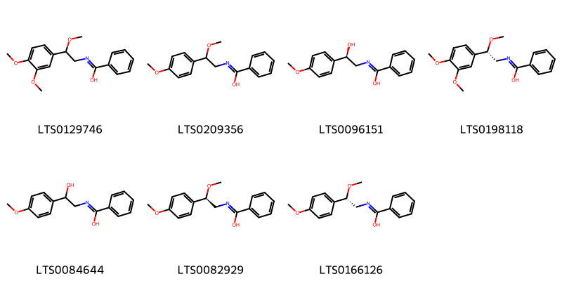{ width=100% }
    <figcaption>Hình ảnh cấu trúc hóa học của 7 hoạt chất thuộc nhóm Benzene and substituted derivatives gồm ['n-[2-(3,4-dimethoxyphenyl)-2-methoxyethyl]benzenecarboximidic acid (LTS0129746)', 'n-[2-methoxy-2-(4-methoxyphenyl)ethyl]benzenecarboximidic acid (LTS0209356)', 'n-[(2r)-2-hydroxy-2-(4-methoxyphenyl)ethyl]benzenecarboximidic acid (LTS0096151)', 'n-[(2s)-2-(3,4-dimethoxyphenyl)-2-methoxyethyl]benzenecarboximidic acid (LTS0198118)', 'n-[2-hydroxy-2-(4-methoxyphenyl)ethyl]benzenecarboximidic acid (LTS0084644)', 'n-[(2r)-2-methoxy-2-(4-methoxyphenyl)ethyl]benzenecarboximidic acid (LTS0082929)', 'n-[(2s)-2-methoxy-2-(4-methoxyphenyl)ethyl]benzenecarboximidic acid (LTS0166126)'].</figcaption>
</figure>
#### Nhóm Benzophenanthridine alkaloids
<figure markdown="span">
    { width=100% }
    <figcaption>Hình ảnh cấu trúc hóa học của 1 hoạt chất thuộc nhóm Benzophenanthridine alkaloids gồm ['chelerythrine (LTS0231770)'].</figcaption>
</figure>
#### Nhóm Coumarins and derivatives
<figure markdown="span">
    { width=100% }
    <figcaption>Hình ảnh cấu trúc hóa học của 1 hoạt chất thuộc nhóm Coumarins and derivatives gồm ['scopoletin (LTS0193112)'].</figcaption>
</figure>
#### Nhóm Furanoid lignans
<figure markdown="span">
    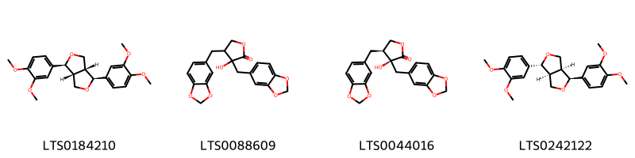{ width=100% }
    <figcaption>Hình ảnh cấu trúc hóa học của 4 hoạt chất thuộc nhóm Furanoid lignans gồm ['eudesmin (LTS0184210)', '3,4-bis(2h-1,3-benzodioxol-5-ylmethyl)-3-hydroxyoxolan-2-one (LTS0088609)', '(3s,4s)-3,4-bis(2h-1,3-benzodioxol-5-ylmethyl)-3-hydroxyoxolan-2-one (LTS0044016)', '(1r,3as,4s,6as)-1,4-bis(3,4-dimethoxyphenyl)-hexahydrofuro[3,4-c]furan (LTS0242122)'].</figcaption>
</figure>
#### Nhóm Phenols
<figure markdown="span">
    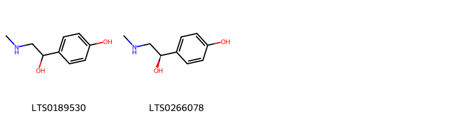{ width=100% }
    <figcaption>Hình ảnh cấu trúc hóa học của 2 hoạt chất thuộc nhóm Phenols gồm ['synephrine (LTS0189530)', '( )-synephrine (LTS0266078)'].</figcaption>
</figure>
#### Nhóm Prenol lipids
<figure markdown="span">
    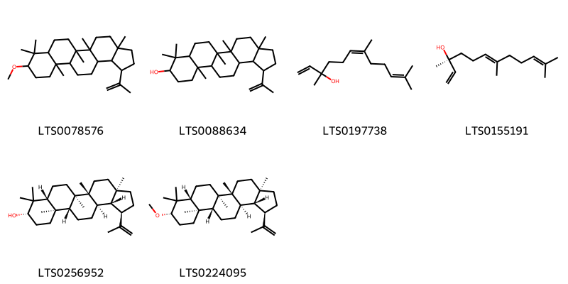{ width=100% }
    <figcaption>Hình ảnh cấu trúc hóa học của 6 hoạt chất thuộc nhóm Prenol lipids gồm ['9-methoxy-3a,5a,5b,8,8,11a-hexamethyl-1-(prop-1-en-2-yl)-hexadecahydrocyclopenta[a]chrysene (LTS0078576)', 'lupeol (LTS0088634)', 'nerolidol (LTS0197738)', 'nerolidol (LTS0155191)', 'lupeol (LTS0256952)', '(1r,3ar,5ar,5br,7ar,9s,11ar,11br,13ar,13br)-9-methoxy-3a,5a,5b,8,8,11a-hexamethyl-1-(prop-1-en-2-yl)-hexadecahydrocyclopenta[a]chrysene (LTS0224095)'].</figcaption>
</figure>
#### Nhóm Quinolines and derivatives
<figure markdown="span">
    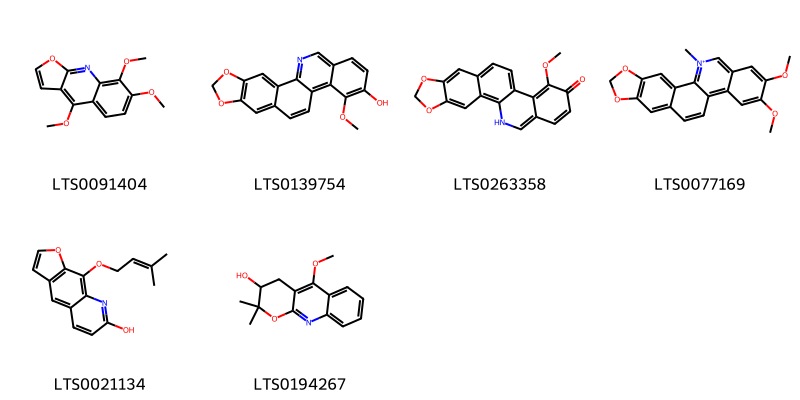{ width=100% }
    <figcaption>Hình ảnh cấu trúc hóa học của 6 hoạt chất thuộc nhóm Quinolines and derivatives gồm ['skimmianine (LTS0091404)', '15-methoxy-5,7-dioxa-21-azapentacyclo[11.8.0.0²,¹⁰.0⁴,⁸.0¹⁴,¹⁹]henicosa-1(13),2(10),3,8,11,14(19),15,17,20-nonaen-16-ol (LTS0139754)', '15-methoxy-5,7-dioxa-21-azapentacyclo[11.8.0.0²,¹⁰.0⁴,⁸.0¹⁴,¹⁹]henicosa-1(13),2(10),3,8,11,14,17,19-octaen-16-one (LTS0263358)', 'nitidine (LTS0077169)', '9-[(3-methylbut-2-en-1-yl)oxy]furo[3,2-g]quinolin-7-ol (LTS0021134)', '5-methoxy-2,2-dimethyl-3h,4h-pyrano[2,3-b]quinolin-3-ol (LTS0194267)'].</figcaption>
</figure>

---

### Dược dân tộc học

Danh sách các quốc gia có sử dụng *Zanthoxylum fagara* trong điều trị các bệnh. 

| Country          | Disease                     | Bệnh                                                                                                                                                                                                |
|:-----------------|:----------------------------|:----------------------------------------------------------------------------------------------------------------------------------------------------------------------------------------------------|
| Mexico           | Stimulant, Sudorific, Tonic | MYMEMORY WARNING: YOU USED ALL AVAILABLE FREE TRANSLATIONS FOR TODAY. NEXT AVAILABLE IN  00 HOURS 04 MINUTES 23 SECONDS VISIT HTTPS://MYMEMORY.TRANSLATED.NET/DOC/USAGELIMITS.PHP TO TRANSLATE MORE |
| Mexico(Kickapoo) | Diuretic                    | MYMEMORY WARNING: YOU USED ALL AVAILABLE FREE TRANSLATIONS FOR TODAY. NEXT AVAILABLE IN  00 HOURS 04 MINUTES 19 SECONDS VISIT HTTPS://MYMEMORY.TRANSLATED.NET/DOC/USAGELIMITS.PHP TO TRANSLATE MORE |

---

---
## Zanthoxylum flavum
### Thông tin về thực vật

!!! info "Phân loại thực vật của *Zanthoxylum flavum* từ GIBF:"
    - **Kingdom:** Plantae
    - **Phylum:** Tracheophyta
    - **Order:** Sapindales
    - **Family:** Rutaceae
    - **Genus:** Zanthoxylum
    - **Species:** *Zanthoxylum flavum*

 

| Label (VI)   | Label (EN)   | Scientific Name    | Descriptions (VI)   | Descriptions (EN)   | Also Known As (VI)   | Also Known As (EN)        |
|:-------------|:-------------|:-------------------|:--------------------|:--------------------|:---------------------|:--------------------------|
| N/A          | N/A          | Zanthoxylum flavum |                     | species of plant    | ['']                 | ['West Indian satinwood'] |

#### Phân bố trên thế giới

**Từ CSDL GIBF** nan, Virgin Islands (U.S.), Guadeloupe, Nicaragua, Bermuda, Virgin Islands (British), Venezuela (Bolivarian Republic of), Puerto Rico, Afghanistan, Honduras, Jamaica, United States of America, Bonaire, Sint Eustatius and Saba, Saint Martin (French part), Suriname, Turks and Caicos Islands, Saint Barthélemy, Bahamas, Brazil, Cuba, Dominica, Mexico, Dominican Republic, Curaçao, Haiti, Anguilla, Cayman Islands, Sint Maarten (Dutch part)

#### Phân bố tại Việt Nam

**Từ CSDL GIBF**: Không có ghi nhận ở Việt Nam

---
### Thành phần hóa học
        
- Theo cơ sở dữ liệu lotus: Từ loài *Zanthoxylum flavum* đã phân lập và xác định được 2 hoạt chất thuộc về các nhóm Benzofurans. 

|    | chemicalTaxonomyClassyfireClass   |   smiles_count |
|---:|:----------------------------------|---------------:|
|  0 | Benzofurans                       |              2 |

#### Nhóm Benzofurans
<figure markdown="span">
    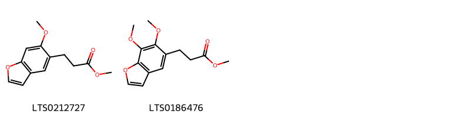{ width=100% }
    <figcaption>Hình ảnh cấu trúc hóa học của 2 hoạt chất thuộc nhóm Benzofurans gồm ['methyl 3-(6-methoxy-1-benzofuran-5-yl)propanoate (LTS0212727)', 'methyl 3-(6,7-dimethoxy-1-benzofuran-5-yl)propanoate (LTS0186476)'].</figcaption>
</figure>

---

### Dược dân tộc học

Danh sách các quốc gia có sử dụng *Zanthoxylum flavum* trong điều trị các bệnh. 

| Country   | Disease   | Bệnh                                                                                                                                                                                                |
|:----------|:----------|:----------------------------------------------------------------------------------------------------------------------------------------------------------------------------------------------------|
| Bahamas   | Apertif   | MYMEMORY WARNING: YOU USED ALL AVAILABLE FREE TRANSLATIONS FOR TODAY. NEXT AVAILABLE IN  00 HOURS 03 MINUTES 49 SECONDS VISIT HTTPS://MYMEMORY.TRANSLATED.NET/DOC/USAGELIMITS.PHP TO TRANSLATE MORE |

---

---
## Zanthoxylum fruticosum
### Thông tin về thực vật

!!! info "Phân loại thực vật của *N/A* từ GIBF:"
    - **Kingdom:** Plantae
    - **Phylum:** Tracheophyta
    - **Order:** Sapindales
    - **Family:** Rutaceae
    - **Genus:** Zanthoxylum
    - **Species:** *N/A*

 

| Label (VI)   | Label (EN)   | Scientific Name    | Descriptions (VI)   | Descriptions (EN)   | Also Known As (VI)   | Also Known As (EN)        |
|:-------------|:-------------|:-------------------|:--------------------|:--------------------|:---------------------|:--------------------------|
| N/A          | N/A          | Zanthoxylum flavum |                     | species of plant    | ['']                 | ['West Indian satinwood'] |

#### Phân bố trên thế giới

**Từ CSDL GIBF** Sri Lanka, Japan, Gabon, Argentina, Canada, Puerto Rico, Chinese Taipei, United States of America, Uruguay, South Africa, Hong Kong, Brazil, Bahamas, Mexico, Dominican Republic, China, Ecuador, Haiti, Costa Rica, India, Antigua and Barbuda, Cameroon

#### Phân bố tại Việt Nam

**Từ CSDL GIBF**: Không có ghi nhận ở Việt Nam

---
### Thành phần hóa học
        
- Theo cơ sở dữ liệu lotus: Từ loài *N/A* đã phân lập và xác định được Chưa có hoạt chất nào được phân lập. hoạt chất thuộc về các nhóm Không có hoạt chất nào được phân lập. 

Không có hình ảnh nào được tạo ra

---

### Dược dân tộc học

Danh sách các quốc gia có sử dụng *N/A* trong điều trị các bệnh. 

| Country          | Disease     | Bệnh                                                                                                                                                                                                |
|:-----------------|:------------|:----------------------------------------------------------------------------------------------------------------------------------------------------------------------------------------------------|
| Mexico(Kickapoo) | Expectorant | MYMEMORY WARNING: YOU USED ALL AVAILABLE FREE TRANSLATIONS FOR TODAY. NEXT AVAILABLE IN  00 HOURS 03 MINUTES 24 SECONDS VISIT HTTPS://MYMEMORY.TRANSLATED.NET/DOC/USAGELIMITS.PHP TO TRANSLATE MORE |

---

---
## Zanthoxylum gagara
### Thông tin về thực vật

!!! info "Phân loại thực vật của *N/A* từ GIBF:"
    - **Kingdom:** Plantae
    - **Phylum:** Tracheophyta
    - **Order:** Sapindales
    - **Family:** Rutaceae
    - **Genus:** Zanthoxylum
    - **Species:** *N/A*

 

| Label (VI)   | Label (EN)   | Scientific Name    | Descriptions (VI)   | Descriptions (EN)   | Also Known As (VI)   | Also Known As (EN)        |
|:-------------|:-------------|:-------------------|:--------------------|:--------------------|:---------------------|:--------------------------|
| N/A          | N/A          | Zanthoxylum flavum |                     | species of plant    | ['']                 | ['West Indian satinwood'] |

#### Phân bố trên thế giới

**Từ CSDL GIBF** Sri Lanka, Japan, Gabon, Argentina, Canada, Puerto Rico, Chinese Taipei, United States of America, Uruguay, South Africa, Hong Kong, Brazil, Bahamas, Mexico, Dominican Republic, China, Ecuador, Haiti, Costa Rica, India, Antigua and Barbuda, Cameroon

#### Phân bố tại Việt Nam

**Từ CSDL GIBF**: Không có ghi nhận ở Việt Nam

---
### Thành phần hóa học
        
- Theo cơ sở dữ liệu lotus: Từ loài *N/A* đã phân lập và xác định được Chưa có hoạt chất nào được phân lập. hoạt chất thuộc về các nhóm Không có hoạt chất nào được phân lập. 

Không có hình ảnh nào được tạo ra

---

### Dược dân tộc học

Danh sách các quốc gia có sử dụng *N/A* trong điều trị các bệnh. 

| Country   | Disease   | Bệnh                                                                                                                                                                                                |
|:----------|:----------|:----------------------------------------------------------------------------------------------------------------------------------------------------------------------------------------------------|
| Mexico    | Nervine   | MYMEMORY WARNING: YOU USED ALL AVAILABLE FREE TRANSLATIONS FOR TODAY. NEXT AVAILABLE IN  00 HOURS 02 MINUTES 59 SECONDS VISIT HTTPS://MYMEMORY.TRANSLATED.NET/DOC/USAGELIMITS.PHP TO TRANSLATE MORE |

---

---
## Zanthoxylum gilletii
### Thông tin về thực vật

!!! info "Phân loại thực vật của *Zanthoxylum gilletii* từ GIBF:"
    - **Kingdom:** Plantae
    - **Phylum:** Tracheophyta
    - **Order:** Sapindales
    - **Family:** Rutaceae
    - **Genus:** Zanthoxylum
    - **Species:** *Zanthoxylum gilletii*

 

| Label (VI)   | Label (EN)   | Scientific Name      | Descriptions (VI)   | Descriptions (EN)   | Also Known As (VI)   | Also Known As (EN)   |
|:-------------|:-------------|:---------------------|:--------------------|:--------------------|:---------------------|:---------------------|
| N/A          | N/A          | Zanthoxylum gilletii | loài thực vật       | species of plant    | ['']                 | ['']                 |

#### Phân bố trên thế giới

**Từ CSDL GIBF** Zambia, Ghana, Nigeria, Sao Tome and Principe, Gabon, Belgium, Angola, Côte d’Ivoire, Kenya, Benin, Congo, Democratic Republic of the, Guinea, Liberia, Sierra Leone, Cameroon

#### Phân bố tại Việt Nam

**Từ CSDL GIBF**: Không có ghi nhận ở Việt Nam

---
### Thành phần hóa học
        
- Theo cơ sở dữ liệu lotus: Từ loài *Zanthoxylum gilletii* đã phân lập và xác định được 69 hoạt chất thuộc về các nhóm Fatty Acyls, Flavonoids, Prenol lipids, Steroids and steroid derivatives, Quinolines and derivatives, Cinnamic acids and derivatives, Benzodioxoles, Aporphines, Benzene and substituted derivatives, Organooxygen compounds, Phenols, Coumarins and derivatives, Benzophenanthridine alkaloids, Furanoid lignans, Isoquinolines and derivatives. 

|    | chemicalTaxonomyClassyfireClass     |   smiles_count |
|---:|:------------------------------------|---------------:|
|  0 | Aporphines                          |              1 |
|  1 | Benzene and substituted derivatives |              5 |
|  2 | Benzodioxoles                       |              3 |
|  3 | Benzophenanthridine alkaloids       |              3 |
|  4 | Cinnamic acids and derivatives      |              1 |
|  5 | Coumarins and derivatives           |              1 |
|  6 | Fatty Acyls                         |             11 |
|  7 | Flavonoids                          |              3 |
|  8 | Furanoid lignans                    |              8 |
|  9 | Isoquinolines and derivatives       |              2 |
| 10 | Organooxygen compounds              |              3 |
| 11 | Phenols                             |              1 |
| 12 | Prenol lipids                       |             19 |
| 13 | Quinolines and derivatives          |              6 |
| 14 | Steroids and steroid derivatives    |              2 |

#### Nhóm Aporphines
<figure markdown="span">
    { width=100% }
    <figcaption>Hình ảnh cấu trúc hóa học của 1 hoạt chất thuộc nhóm Aporphines gồm ['magnoflorine (LTS0120825)'].</figcaption>
</figure>
#### Nhóm Benzene and substituted derivatives
<figure markdown="span">
    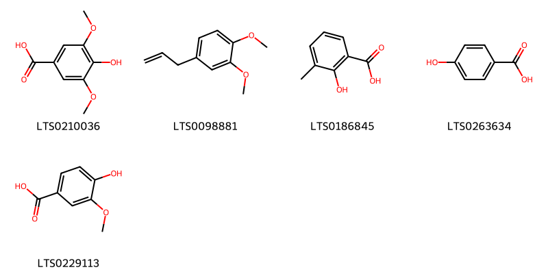{ width=100% }
    <figcaption>Hình ảnh cấu trúc hóa học của 5 hoạt chất thuộc nhóm Benzene and substituted derivatives gồm ['syringic acid (LTS0210036)', 'methyl eugenol (LTS0098881)', 'cresotic acid (LTS0186845)', 'p-hydroxybenzoic acid (LTS0263634)', 'vanillic acid (LTS0229113)'].</figcaption>
</figure>
#### Nhóm Benzodioxoles
<figure markdown="span">
    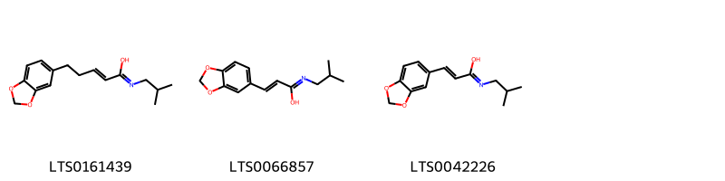{ width=100% }
    <figcaption>Hình ảnh cấu trúc hóa học của 3 hoạt chất thuộc nhóm Benzodioxoles gồm ['(2e)-5-(2h-1,3-benzodioxol-5-yl)-n-(2-methylpropyl)pent-2-enimidic acid (LTS0161439)', '(2e)-3-(2h-1,3-benzodioxol-5-yl)-n-(2-methylpropyl)prop-2-enimidic acid (LTS0066857)', '3-(2h-1,3-benzodioxol-5-yl)-n-(2-methylpropyl)prop-2-enimidic acid (LTS0042226)'].</figcaption>
</figure>
#### Nhóm Benzophenanthridine alkaloids
<figure markdown="span">
    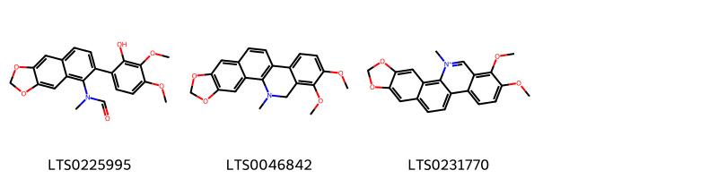{ width=100% }
    <figcaption>Hình ảnh cấu trúc hóa học của 3 hoạt chất thuộc nhóm Benzophenanthridine alkaloids gồm ['n-[6-(2-hydroxy-3,4-dimethoxyphenyl)-2h-naphtho[2,3-d][1,3]dioxol-5-yl]-n-methylformamide (LTS0225995)', '17,18-dimethoxy-21-methyl-5,7-dioxa-21-azapentacyclo[11.8.0.0²,¹⁰.0⁴,⁸.0¹⁴,¹⁹]henicosa-1(13),2,4(8),9,11,14,16,18-octaene (LTS0046842)', 'chelerythrine (LTS0231770)'].</figcaption>
</figure>
#### Nhóm Cinnamic acids and derivatives
<figure markdown="span">
    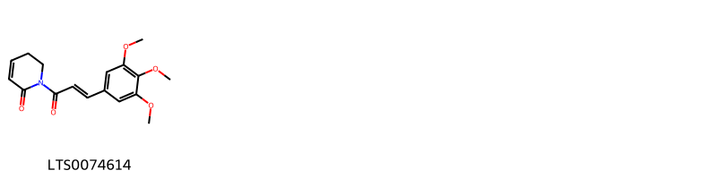{ width=100% }
    <figcaption>Hình ảnh cấu trúc hóa học của 1 hoạt chất thuộc nhóm Cinnamic acids and derivatives gồm ['piperlongumine (LTS0074614)'].</figcaption>
</figure>
#### Nhóm Coumarins and derivatives
<figure markdown="span">
    { width=100% }
    <figcaption>Hình ảnh cấu trúc hóa học của 1 hoạt chất thuộc nhóm Coumarins and derivatives gồm ['scopoletin (LTS0193112)'].</figcaption>
</figure>
#### Nhóm Fatty Acyls
<figure markdown="span">
    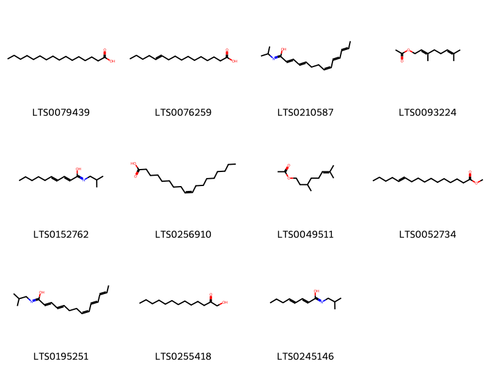{ width=100% }
    <figcaption>Hình ảnh cấu trúc hóa học của 11 hoạt chất thuộc nhóm Fatty Acyls gồm ['palmitic acid (LTS0079439)', '11-hexadecenoic acid (LTS0076259)', '(2e,4e,8z,10e,12e)-n-isopropyltetradeca-2,4,8,10,12-pentaenimidic acid (LTS0210587)', 'geranyl acetate (LTS0093224)', '(2e,4e)-n-(2-methylpropyl)deca-2,4-dienimidic acid (LTS0152762)', 'oleic acid (LTS0256910)', 'citronellyl acetate (LTS0049511)', 'methyl hexadec-11-enoate (LTS0052734)', '(2e,4e,8z,10e,12e)-n-(2-methylpropyl)tetradeca-2,4,8,10,12-pentaenimidic acid (LTS0195251)', '1-hydroxytridecan-2-one (LTS0255418)', '(2e,4e)-n-(2-methylpropyl)octa-2,4-dienimidic acid (LTS0245146)'].</figcaption>
</figure>
#### Nhóm Flavonoids
<figure markdown="span">
    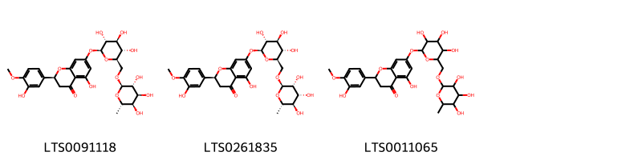{ width=100% }
    <figcaption>Hình ảnh cấu trúc hóa học của 3 hoạt chất thuộc nhóm Flavonoids gồm ['(2s)-5-hydroxy-2-(3-hydroxy-4-methoxyphenyl)-7-{[(2s,3r,4s,5s,6r)-3,4,5-trihydroxy-6-({[(2r,3r,4s,5r,6s)-3,4,5-trihydroxy-6-methyloxan-2-yl]oxy}methyl)oxan-2-yl]oxy}-2,3-dihydro-1-benzopyran-4-one (LTS0091118)', 'hesperidin (LTS0261835)', 'hesperidin (LTS0011065)'].</figcaption>
</figure>
#### Nhóm Furanoid lignans
<figure markdown="span">
    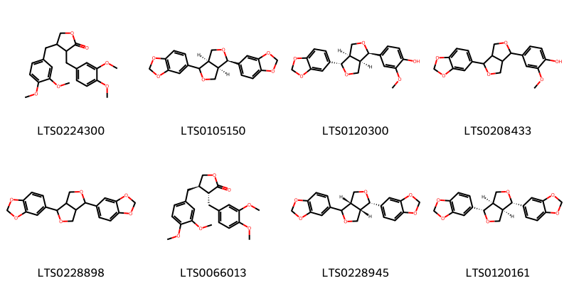{ width=100% }
    <figcaption>Hình ảnh cấu trúc hóa học của 8 hoạt chất thuộc nhóm Furanoid lignans gồm ['3,4-bis[(3,4-dimethoxyphenyl)methyl]oxolan-2-one (LTS0224300)', '5-[(3ar,4r,6ar)-4-(2h-1,3-benzodioxol-5-yl)-hexahydrofuro[3,4-c]furan-1-yl]-2h-1,3-benzodioxole (LTS0105150)', '4-[(1r,3ar,4s,6ar)-4-(2h-1,3-benzodioxol-5-yl)-hexahydrofuro[3,4-c]furan-1-yl]-2-methoxyphenol (LTS0120300)', '4-[4-(2h-1,3-benzodioxol-5-yl)-hexahydrofuro[3,4-c]furan-1-yl]-2-methoxyphenol (LTS0208433)', 'sesamin (LTS0228898)', 'arctigenin methyl ether (LTS0066013)', '5-[(3as,4s,6as)-4-(2h-1,3-benzodioxol-5-yl)-hexahydrofuro[3,4-c]furan-1-yl]-2h-1,3-benzodioxole (LTS0228945)', 'sesamin (LTS0120161)'].</figcaption>
</figure>
#### Nhóm Isoquinolines and derivatives
<figure markdown="span">
    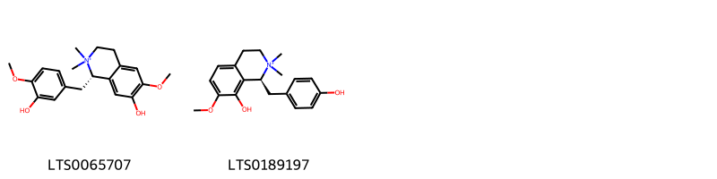{ width=100% }
    <figcaption>Hình ảnh cấu trúc hóa học của 2 hoạt chất thuộc nhóm Isoquinolines and derivatives gồm ['(1s)-7-hydroxy-1-[(3-hydroxy-4-methoxyphenyl)methyl]-6-methoxy-2,2-dimethyl-3,4-dihydro-1h-isoquinolin-2-ium (LTS0065707)', '(1s)-8-hydroxy-1-[(4-hydroxyphenyl)methyl]-7-methoxy-2,2-dimethyl-3,4-dihydro-1h-isoquinolin-2-ium (LTS0189197)'].</figcaption>
</figure>
#### Nhóm Organooxygen compounds
<figure markdown="span">
    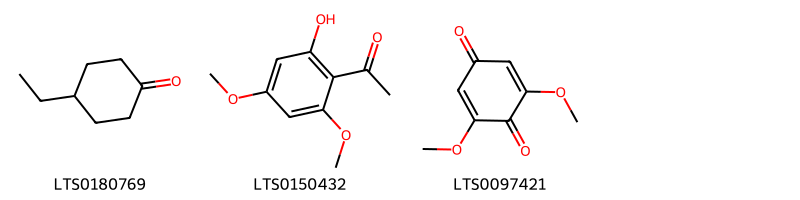{ width=100% }
    <figcaption>Hình ảnh cấu trúc hóa học của 3 hoạt chất thuộc nhóm Organooxygen compounds gồm ['cyclohexanone, 4-ethyl- (LTS0180769)', 'xanthoxylin (LTS0150432)', '2,6-dimethoxy-1,4-benzoquinone (LTS0097421)'].</figcaption>
</figure>
#### Nhóm Phenols
<figure markdown="span">
    { width=100% }
    <figcaption>Hình ảnh cấu trúc hóa học của 1 hoạt chất thuộc nhóm Phenols gồm ['syringaldehyde (LTS0201406)'].</figcaption>
</figure>
#### Nhóm Prenol lipids
<figure markdown="span">
    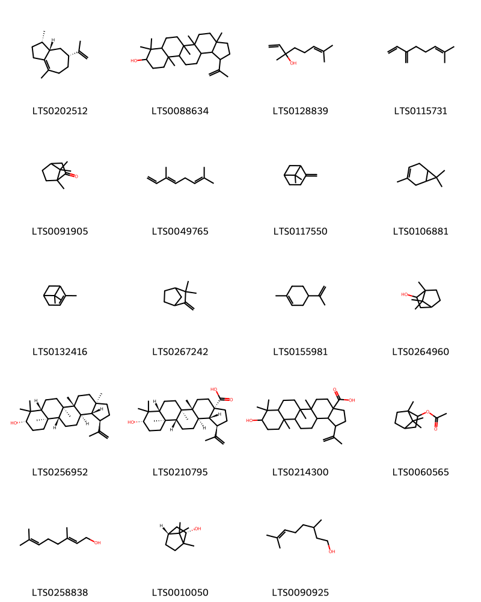{ width=100% }
    <figcaption>Hình ảnh cấu trúc hóa học của 19 hoạt chất thuộc nhóm Prenol lipids gồm ['α-bulnesene (LTS0202512)', 'lupeol (LTS0088634)', 'linalool, (+-)- (LTS0128839)', 'α-myrcene (LTS0115731)', 'camphor (LTS0091905)', 'trans-β-ocimene (LTS0049765)', 'β-pinene (LTS0117550)', 'monoterpenes (LTS0106881)', 'α pinene (LTS0132416)', 'camphene (LTS0267242)', 'limonene,  (LTS0155981)', 'borneol (LTS0264960)', 'lupeol (LTS0256952)', 'betulinic acid (LTS0210795)', '9-hydroxy-5a,5b,8,8,11a-pentamethyl-1-(prop-1-en-2-yl)-hexadecahydrocyclopenta[a]chrysene-3a-carboxylic acid (LTS0214300)', 'bornyl acetate (LTS0060565)', 'geraniol (LTS0258838)', '(2s,4r)-1,7,7-trimethylbicyclo[2.2.1]heptan-2-ol (LTS0010050)', 'citronellol, (+-)- (LTS0090925)'].</figcaption>
</figure>
#### Nhóm Quinolines and derivatives
<figure markdown="span">
    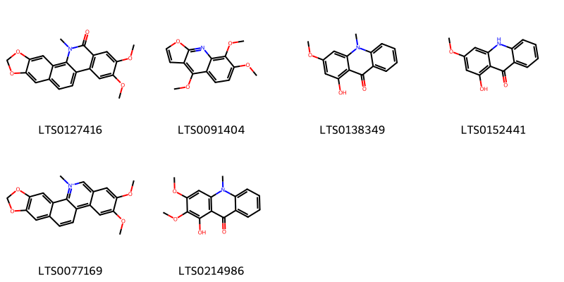{ width=100% }
    <figcaption>Hình ảnh cấu trúc hóa học của 6 hoạt chất thuộc nhóm Quinolines and derivatives gồm ['16,17-dimethoxy-21-methyl-5,7-dioxa-21-azapentacyclo[11.8.0.0²,¹⁰.0⁴,⁸.0¹⁴,¹⁹]henicosa-1(13),2(10),3,8,11,14(19),15,17-octaen-20-one (LTS0127416)', 'skimmianine (LTS0091404)', '1-hydroxy-3-methoxy-10-methylacridin-9-one (LTS0138349)', '1-hydroxy-3-methoxy-10h-acridin-9-one (LTS0152441)', 'nitidine (LTS0077169)', 'arborinine (LTS0214986)'].</figcaption>
</figure>
#### Nhóm Steroids and steroid derivatives
<figure markdown="span">
    { width=100% }
    <figcaption>Hình ảnh cấu trúc hóa học của 2 hoạt chất thuộc nhóm Steroids and steroid derivatives gồm ['stigmast-5-en-3-ol (LTS0071224)', 'stigmast-5-en-3-ol, (3β)- (LTS0204616)'].</figcaption>
</figure>

---

### Dược dân tộc học

Danh sách các quốc gia có sử dụng *Zanthoxylum gilletii* trong điều trị các bệnh. 

| Country   | Disease   | Bệnh                                                                                                                                                                                                |
|:----------|:----------|:----------------------------------------------------------------------------------------------------------------------------------------------------------------------------------------------------|
| W Africa  | Narcotic  | MYMEMORY WARNING: YOU USED ALL AVAILABLE FREE TRANSLATIONS FOR TODAY. NEXT AVAILABLE IN  00 HOURS 02 MINUTES 38 SECONDS VISIT HTTPS://MYMEMORY.TRANSLATED.NET/DOC/USAGELIMITS.PHP TO TRANSLATE MORE |

---

---
## Zanthoxylum hostile
### Thông tin về thực vật

!!! info "Phân loại thực vật của *Zanthoxylum armatum* từ GIBF:"
    - **Kingdom:** Plantae
    - **Phylum:** Tracheophyta
    - **Order:** Sapindales
    - **Family:** Rutaceae
    - **Genus:** Zanthoxylum
    - **Species:** *Zanthoxylum armatum*

 

| Label (VI)   | Label (EN)   | Scientific Name     | Descriptions (VI)   | Descriptions (EN)   | Also Known As (VI)   | Also Known As (EN)   |
|:-------------|:-------------|:--------------------|:--------------------|:--------------------|:---------------------|:---------------------|
| N/A          | N/A          | Zanthoxylum hostile |                     |                     | ['']                 | ['']                 |

#### Phân bố trên thế giới

**Từ CSDL GIBF** Zambia, Ghana, Nigeria, Sao Tome and Principe, Gabon, Belgium, Angola, Côte d’Ivoire, Kenya, Benin, Congo, Democratic Republic of the, Guinea, Liberia, Sierra Leone, Cameroon

#### Phân bố tại Việt Nam

**Từ CSDL GIBF**: Không có ghi nhận ở Việt Nam

---
### Thành phần hóa học
        
- Theo cơ sở dữ liệu lotus: Từ loài *Zanthoxylum armatum* đã phân lập và xác định được Chưa có hoạt chất nào được phân lập. hoạt chất thuộc về các nhóm Không có hoạt chất nào được phân lập. 

Không có hình ảnh nào được tạo ra

---

### Dược dân tộc học

Danh sách các quốc gia có sử dụng *Zanthoxylum armatum* trong điều trị các bệnh. 

| Country   | Disease   | Bệnh                                                                                                                                                                                                |
|:----------|:----------|:----------------------------------------------------------------------------------------------------------------------------------------------------------------------------------------------------|
| China     | Stimulant | MYMEMORY WARNING: YOU USED ALL AVAILABLE FREE TRANSLATIONS FOR TODAY. NEXT AVAILABLE IN  00 HOURS 02 MINUTES 01 SECONDS VISIT HTTPS://MYMEMORY.TRANSLATED.NET/DOC/USAGELIMITS.PHP TO TRANSLATE MORE |
| French    | Tonic     | MYMEMORY WARNING: YOU USED ALL AVAILABLE FREE TRANSLATIONS FOR TODAY. NEXT AVAILABLE IN  00 HOURS 01 MINUTES 58 SECONDS VISIT HTTPS://MYMEMORY.TRANSLATED.NET/DOC/USAGELIMITS.PHP TO TRANSLATE MORE |
| German    | Sudorific | MYMEMORY WARNING: YOU USED ALL AVAILABLE FREE TRANSLATIONS FOR TODAY. NEXT AVAILABLE IN  00 HOURS 01 MINUTES 55 SECONDS VISIT HTTPS://MYMEMORY.TRANSLATED.NET/DOC/USAGELIMITS.PHP TO TRANSLATE MORE |

---

---
## Zanthoxylum limonella
### Thông tin về thực vật

!!! info "Phân loại thực vật của *Zanthoxylum rhetsa* từ GIBF:"
    - **Kingdom:** Plantae
    - **Phylum:** Tracheophyta
    - **Order:** Sapindales
    - **Family:** Rutaceae
    - **Genus:** Zanthoxylum
    - **Species:** *Zanthoxylum rhetsa*

 

| Label (VI)   | Label (EN)   | Scientific Name       | Descriptions (VI)   | Descriptions (EN)   | Also Known As (VI)   | Also Known As (EN)   |
|:-------------|:-------------|:----------------------|:--------------------|:--------------------|:---------------------|:---------------------|
| N/A          | N/A          | Zanthoxylum limonella | loài thực vật       | species of plant    | ['']                 | ['']                 |

#### Phân bố trên thế giới

**Từ CSDL GIBF** nan, Sri Lanka, Thailand, India, Indonesia, Mexico, Philippines, Malaysia

#### Phân bố tại Việt Nam

**Từ CSDL GIBF**: Không có ghi nhận ở Việt Nam

---
### Thành phần hóa học
        
- Theo cơ sở dữ liệu lotus: Từ loài *Zanthoxylum rhetsa* đã phân lập và xác định được Chưa có hoạt chất nào được phân lập. hoạt chất thuộc về các nhóm Không có hoạt chất nào được phân lập. 

Không có hình ảnh nào được tạo ra

---

### Dược dân tộc học

Danh sách các quốc gia có sử dụng *Zanthoxylum rhetsa* trong điều trị các bệnh. 

| Country   | Disease                                                                    | Bệnh                                                                                                                                                                                                |
|:----------|:---------------------------------------------------------------------------|:----------------------------------------------------------------------------------------------------------------------------------------------------------------------------------------------------|
| Elsewhere | Anesthetic, Antiseptic, nan, Cholinergic, Stimulant, Astringent, Digestive | MYMEMORY WARNING: YOU USED ALL AVAILABLE FREE TRANSLATIONS FOR TODAY. NEXT AVAILABLE IN  00 HOURS 01 MINUTES 33 SECONDS VISIT HTTPS://MYMEMORY.TRANSLATED.NET/DOC/USAGELIMITS.PHP TO TRANSLATE MORE |

---

---
## Zanthoxylum martinicense
### Thông tin về thực vật

!!! info "Phân loại thực vật của *Zanthoxylum martinicense* từ GIBF:"
    - **Kingdom:** Plantae
    - **Phylum:** Tracheophyta
    - **Order:** Sapindales
    - **Family:** Rutaceae
    - **Genus:** Zanthoxylum
    - **Species:** *Zanthoxylum martinicense*

 

| Label (VI)   | Label (EN)   | Scientific Name          | Descriptions (VI)   | Descriptions (EN)   | Also Known As (VI)   | Also Known As (EN)                             |
|:-------------|:-------------|:-------------------------|:--------------------|:--------------------|:---------------------|:-----------------------------------------------|
| N/A          | N/A          | Zanthoxylum martinicense |                     | species of plant    | ['']                 | ['Martinique prickly ash', 'white pricklyash'] |

#### Phân bố trên thế giới

**Từ CSDL GIBF** Virgin Islands (U.S.), Ecuador, Puerto Rico, Saint Martin (French part), Guadeloupe, Haiti, Colombia, Bonaire, Sint Eustatius and Saba, Jamaica, Dominican Republic, Antigua and Barbuda

#### Phân bố tại Việt Nam

**Từ CSDL GIBF**: Không có ghi nhận ở Việt Nam

---
### Thành phần hóa học
        
- Theo cơ sở dữ liệu lotus: Từ loài *Zanthoxylum martinicense* đã phân lập và xác định được 7 hoạt chất thuộc về các nhóm Prenol lipids, Benzene and substituted derivatives, Organooxygen compounds, Benzophenanthridine alkaloids, Furanoid lignans, Isoquinolines and derivatives, Protoberberine alkaloids and derivatives. 

|    | chemicalTaxonomyClassyfireClass          |   smiles_count |
|---:|:-----------------------------------------|---------------:|
|  0 | Benzene and substituted derivatives      |              1 |
|  1 | Benzophenanthridine alkaloids            |              1 |
|  2 | Furanoid lignans                         |              1 |
|  3 | Isoquinolines and derivatives            |              1 |
|  4 | Organooxygen compounds                   |              1 |
|  5 | Prenol lipids                            |              1 |
|  6 | Protoberberine alkaloids and derivatives |              1 |

#### Nhóm Benzene and substituted derivatives
<figure markdown="span">
    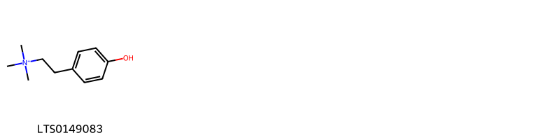{ width=100% }
    <figcaption>Hình ảnh cấu trúc hóa học của 1 hoạt chất thuộc nhóm Benzene and substituted derivatives gồm ['candicine (LTS0149083)'].</figcaption>
</figure>
#### Nhóm Benzophenanthridine alkaloids
<figure markdown="span">
    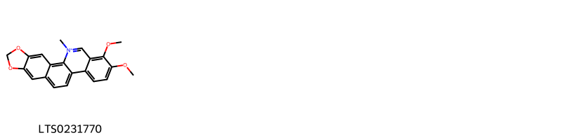{ width=100% }
    <figcaption>Hình ảnh cấu trúc hóa học của 1 hoạt chất thuộc nhóm Benzophenanthridine alkaloids gồm ['chelerythrine (LTS0231770)'].</figcaption>
</figure>
#### Nhóm Furanoid lignans
<figure markdown="span">
    { width=100% }
    <figcaption>Hình ảnh cấu trúc hóa học của 1 hoạt chất thuộc nhóm Furanoid lignans gồm ['sesamin (LTS0120161)'].</figcaption>
</figure>
#### Nhóm Isoquinolines and derivatives
<figure markdown="span">
    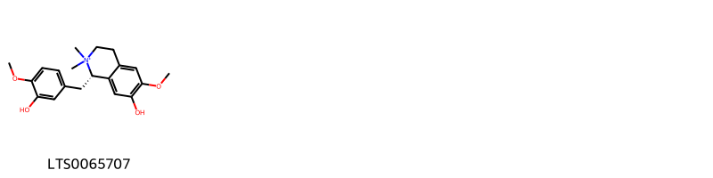{ width=100% }
    <figcaption>Hình ảnh cấu trúc hóa học của 1 hoạt chất thuộc nhóm Isoquinolines and derivatives gồm ['(1s)-7-hydroxy-1-[(3-hydroxy-4-methoxyphenyl)methyl]-6-methoxy-2,2-dimethyl-3,4-dihydro-1h-isoquinolin-2-ium (LTS0065707)'].</figcaption>
</figure>
#### Nhóm Organooxygen compounds
<figure markdown="span">
    { width=100% }
    <figcaption>Hình ảnh cấu trúc hóa học của 1 hoạt chất thuộc nhóm Organooxygen compounds gồm ['sucrose (LTS0272557)'].</figcaption>
</figure>
#### Nhóm Prenol lipids
<figure markdown="span">
    { width=100% }
    <figcaption>Hình ảnh cấu trúc hóa học của 1 hoạt chất thuộc nhóm Prenol lipids gồm ['lupeol (LTS0256952)'].</figcaption>
</figure>
#### Nhóm Protoberberine alkaloids and derivatives
<figure markdown="span">
    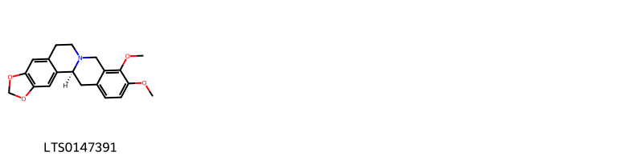{ width=100% }
    <figcaption>Hình ảnh cấu trúc hóa học của 1 hoạt chất thuộc nhóm Protoberberine alkaloids and derivatives gồm ['(s)-canadine (LTS0147391)'].</figcaption>
</figure>

---

### Dược dân tộc học

Danh sách các quốc gia có sử dụng *Zanthoxylum martinicense* trong điều trị các bệnh. 

| Country   | Disease                                                                       | Bệnh                                                                                                                                                                                                |
|:----------|:------------------------------------------------------------------------------|:----------------------------------------------------------------------------------------------------------------------------------------------------------------------------------------------------|
| Haiti     | Astringent, Sudorific, Antiseptic, Diuretic, Sialogogue, Vulnerary, Collyrium | MYMEMORY WARNING: YOU USED ALL AVAILABLE FREE TRANSLATIONS FOR TODAY. NEXT AVAILABLE IN  00 HOURS 01 MINUTES 10 SECONDS VISIT HTTPS://MYMEMORY.TRANSLATED.NET/DOC/USAGELIMITS.PHP TO TRANSLATE MORE |

---

---
## Zanthoxylum microcarpum
### Thông tin về thực vật

!!! info "Phân loại thực vật của *Zanthoxylum rhoifolium* từ GIBF:"
    - **Kingdom:** Plantae
    - **Phylum:** Tracheophyta
    - **Order:** Sapindales
    - **Family:** Rutaceae
    - **Genus:** Zanthoxylum
    - **Species:** *Zanthoxylum rhoifolium*

 

| Label (VI)   | Label (EN)   | Scientific Name         | Descriptions (VI)   | Descriptions (EN)   | Also Known As (VI)   | Also Known As (EN)   |
|:-------------|:-------------|:------------------------|:--------------------|:--------------------|:---------------------|:---------------------|
| N/A          | N/A          | Zanthoxylum microcarpum | loài thực vật       | species of plant    | ['']                 | ['']                 |

#### Phân bố trên thế giới

**Từ CSDL GIBF** Nicaragua, nan, Trinidad and Tobago, Saint Vincent and the Grenadines, Guadeloupe, Guatemala, Grenada, Brazil, Costa Rica, Honduras, Saint Lucia, unknown or invalid, Jamaica, Peru, Dominica, Mexico, El Salvador

#### Phân bố tại Việt Nam

**Từ CSDL GIBF**: Không có ghi nhận ở Việt Nam

---
### Thành phần hóa học
        
- Theo cơ sở dữ liệu lotus: Từ loài *Zanthoxylum rhoifolium* đã phân lập và xác định được Chưa có hoạt chất nào được phân lập. hoạt chất thuộc về các nhóm Không có hoạt chất nào được phân lập. 

Không có hình ảnh nào được tạo ra

---

### Dược dân tộc học

Danh sách các quốc gia có sử dụng *Zanthoxylum rhoifolium* trong điều trị các bệnh. 

| Country   | Disease              | Bệnh                                                                                                                                                                                                |
|:----------|:---------------------|:----------------------------------------------------------------------------------------------------------------------------------------------------------------------------------------------------|
| Elsewhere | Analgesic, Stimulant | MYMEMORY WARNING: YOU USED ALL AVAILABLE FREE TRANSLATIONS FOR TODAY. NEXT AVAILABLE IN  00 HOURS 00 MINUTES 37 SECONDS VISIT HTTPS://MYMEMORY.TRANSLATED.NET/DOC/USAGELIMITS.PHP TO TRANSLATE MORE |

---

---
## Zanthoxylum nitidum
### Thông tin về thực vật

!!! info "Phân loại thực vật của *Zanthoxylum nitidum* từ GIBF:"
    - **Kingdom:** Plantae
    - **Phylum:** Tracheophyta
    - **Order:** Sapindales
    - **Family:** Rutaceae
    - **Genus:** Zanthoxylum
    - **Species:** *Zanthoxylum nitidum*

 

| Label (VI)   | Label (EN)   | Scientific Name     | Descriptions (VI)   | Descriptions (EN)   | Also Known As (VI)   | Also Known As (EN)   |
|:-------------|:-------------|:--------------------|:--------------------|:--------------------|:---------------------|:---------------------|
| N/A          | N/A          | Zanthoxylum nitidum | loài thực vật       | species of plant    | ['']                 | ['']                 |

#### Phân bố trên thế giới

**Từ CSDL GIBF** Hong Kong, Australia, Japan, Chinese Taipei, Macao, Viet Nam

#### Phân bố tại Việt Nam

**Từ CSDL GIBF**: Bình Định

---
### Thành phần hóa học
        
- Theo cơ sở dữ liệu lotus: Từ loài *Zanthoxylum nitidum* đã phân lập và xác định được 116 hoạt chất thuộc về các nhóm Benzodioxanes, Cinnamyl alcohols, Phenols, Benzophenanthridine alkaloids, Amaryllidaceae alkaloids, Fatty Acyls, Indoles and derivatives, Cinnamic acids and derivatives, Aporphines, Cinnamaldehydes, Protoberberine alkaloids and derivatives, Prenol lipids, Quinolines and derivatives, Benzene and substituted derivatives, Organooxygen compounds, Furanoid lignans, Phenol ethers, Flavonoids, Steroids and steroid derivatives, Benzodioxoles, Organonitrogen compounds, Coumarins and derivatives, Isoquinolines and derivatives. 

|    | chemicalTaxonomyClassyfireClass          |   smiles_count |
|---:|:-----------------------------------------|---------------:|
|  0 | Amaryllidaceae alkaloids                 |              1 |
|  1 | Aporphines                               |              8 |
|  2 | Benzene and substituted derivatives      |              2 |
|  3 | Benzodioxanes                            |              3 |
|  4 | Benzodioxoles                            |              2 |
|  5 | Benzophenanthridine alkaloids            |             25 |
|  6 | Cinnamaldehydes                          |              3 |
|  7 | Cinnamic acids and derivatives           |              5 |
|  8 | Cinnamyl alcohols                        |              2 |
|  9 | Coumarins and derivatives                |              3 |
| 10 | Fatty Acyls                              |              4 |
| 11 | Flavonoids                               |              2 |
| 12 | Furanoid lignans                         |             18 |
| 13 | Indoles and derivatives                  |              1 |
| 14 | Isoquinolines and derivatives            |              2 |
| 15 | Organonitrogen compounds                 |              1 |
| 16 | Organooxygen compounds                   |              2 |
| 17 | Phenol ethers                            |              4 |
| 18 | Phenols                                  |              1 |
| 19 | Prenol lipids                            |              7 |
| 20 | Protoberberine alkaloids and derivatives |              1 |
| 21 | Quinolines and derivatives               |             16 |
| 22 | Steroids and steroid derivatives         |              2 |

#### Nhóm Amaryllidaceae alkaloids
<figure markdown="span">
    { width=100% }
    <figcaption>Hình ảnh cấu trúc hóa học của 1 hoạt chất thuộc nhóm Amaryllidaceae alkaloids gồm ['12-methyl-5,7,17,19-tetraoxa-12-azahexacyclo[11.11.0.0²,¹⁰.0⁴,⁸.0¹⁴,²².0¹⁶,²⁰]tetracosa-1(13),2(10),3,8,14(22),15,20,23-octaen-11-one (LTS0224597)'].</figcaption>
</figure>
#### Nhóm Aporphines
<figure markdown="span">
    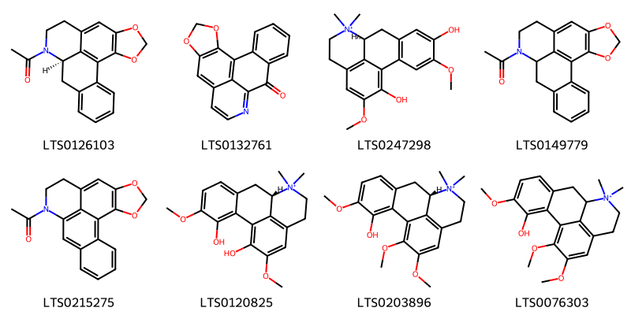{ width=100% }
    <figcaption>Hình ảnh cấu trúc hóa học của 8 hoạt chất thuộc nhóm Aporphines gồm ['1-[(12r)-3,5-dioxa-11-azapentacyclo[10.7.1.0²,⁶.0⁸,²⁰.0¹⁴,¹⁹]icosa-1(20),2(6),7,14,16,18-hexaen-11-yl]ethanone (LTS0126103)', 'liriodenine (LTS0132761)', '(9s)-5,16-dihydroxy-4,15-dimethoxy-10,10-dimethyl-10-azatetracyclo[7.7.1.0²,⁷.0¹³,¹⁷]heptadeca-1(16),2(7),3,5,13(17),14-hexaen-10-ium (LTS0247298)', '1-{3,5-dioxa-11-azapentacyclo[10.7.1.0²,⁶.0⁸,²⁰.0¹⁴,¹⁹]icosa-1(20),2(6),7,14,16,18-hexaen-11-yl}ethanone (LTS0149779)', '1-{3,5-dioxa-11-azapentacyclo[10.7.1.0²,⁶.0⁸,²⁰.0¹⁴,¹⁹]icosa-1(20),2(6),7,12,14(19),15,17-heptaen-11-yl}ethanone (LTS0215275)', 'magnoflorine (LTS0120825)', '(9s)-3-hydroxy-4,15,16-trimethoxy-10,10-dimethyl-10-azatetracyclo[7.7.1.0²,⁷.0¹³,¹⁷]heptadeca-1(16),2,4,6,13(17),14-hexaen-10-ium (LTS0203896)', '3-hydroxy-4,15,16-trimethoxy-10,10-dimethyl-10-azatetracyclo[7.7.1.0²,⁷.0¹³,¹⁷]heptadeca-1(16),2,4,6,13(17),14-hexaen-10-ium (LTS0076303)'].</figcaption>
</figure>
#### Nhóm Benzene and substituted derivatives
<figure markdown="span">
    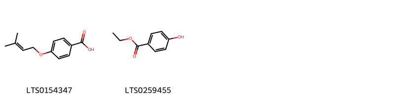{ width=100% }
    <figcaption>Hình ảnh cấu trúc hóa học của 2 hoạt chất thuộc nhóm Benzene and substituted derivatives gồm ['4-[(3-methylbut-2-en-1-yl)oxy]benzoic acid (LTS0154347)', 'ethylparaben (LTS0259455)'].</figcaption>
</figure>
#### Nhóm Benzodioxanes
<figure markdown="span">
    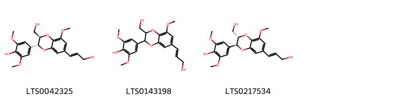{ width=100% }
    <figcaption>Hình ảnh cấu trúc hóa học của 3 hoạt chất thuộc nhóm Benzodioxanes gồm ['4-[(2r,3r)-3-(hydroxymethyl)-7-[(1e)-3-hydroxyprop-1-en-1-yl]-5-methoxy-2,3-dihydro-1,4-benzodioxin-2-yl]-2,6-dimethoxyphenol (LTS0042325)', '4-[3-(hydroxymethyl)-7-(3-hydroxyprop-1-en-1-yl)-5-methoxy-2,3-dihydro-1,4-benzodioxin-2-yl]-2,6-dimethoxyphenol (LTS0143198)', '4-[(2s,3s)-3-(hydroxymethyl)-7-[(1e)-3-hydroxyprop-1-en-1-yl]-5-methoxy-2,3-dihydro-1,4-benzodioxin-2-yl]-2,6-dimethoxyphenol (LTS0217534)'].</figcaption>
</figure>
#### Nhóm Benzodioxoles
<figure markdown="span">
    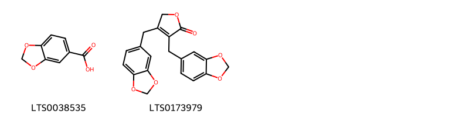{ width=100% }
    <figcaption>Hình ảnh cấu trúc hóa học của 2 hoạt chất thuộc nhóm Benzodioxoles gồm ['piperonylic acid (LTS0038535)', '3,4-bis(2h-1,3-benzodioxol-5-ylmethyl)-5h-furan-2-one (LTS0173979)'].</figcaption>
</figure>
#### Nhóm Benzophenanthridine alkaloids
<figure markdown="span">
    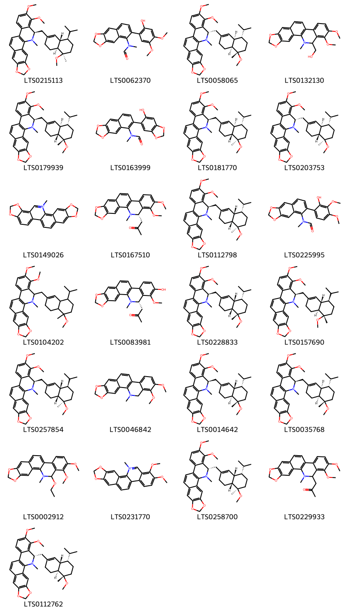{ width=100% }
    <figcaption>Hình ảnh cấu trúc hóa học của 25 hoạt chất thuộc nhóm Benzophenanthridine alkaloids gồm ['(20r)-20-{[(4as,5r,8r,8as)-8-isopropyl-5-methoxy-5-methyl-4,4a,6,7,8,8a-hexahydro-3h-naphthalen-2-yl]methyl}-17,18-dimethoxy-21-methyl-5,7-dioxa-21-azapentacyclo[11.8.0.0²,¹⁰.0⁴,⁸.0¹⁴,¹⁹]henicosa-1(13),2,4(8),9,11,14,16,18-octaene (LTS0215113)', 'n-[6-(2-hydroxy-4,5-dimethoxyphenyl)-2h-naphtho[2,3-d][1,3]dioxol-5-yl]-n-methylformamide (LTS0062370)', 'epi-zanthomuurolanine (LTS0058065)', '{17,18-dimethoxy-21-methyl-5,7-dioxa-21-azapentacyclo[11.8.0.0²,¹⁰.0⁴,⁸.0¹⁴,¹⁹]henicosa-1(13),2,4(8),9,11,14,16,18-octaen-20-yl}methanol (LTS0132130)', 'zanthocadinanine a (LTS0179939)', 'n-[6-(6-hydroxy-2h-1,3-benzodioxol-5-yl)-2h-naphtho[2,3-d][1,3]dioxol-5-yl]-n-methylformamide (LTS0163999)', 'zanthocadinanine b (LTS0181770)', 'epi-zanthocadinanine b (LTS0203753)', 'sanguinarine (LTS0149026)', '1-[(20s)-17,18-dimethoxy-21-methyl-5,7-dioxa-21-azapentacyclo[11.8.0.0²,¹⁰.0⁴,⁸.0¹⁴,¹⁹]henicosa-1(13),2,4(8),9,11,14,16,18-octaen-20-yl]propan-2-one (LTS0167510)', '(20r)-20-{[(4ar,5r,8s,8as)-8-isopropyl-5-methoxy-5-methyl-4,4a,6,7,8,8a-hexahydro-3h-naphthalen-2-yl]methyl}-17,18-dimethoxy-21-methyl-5,7-dioxa-21-azapentacyclo[11.8.0.0²,¹⁰.0⁴,⁸.0¹⁴,¹⁹]henicosa-1(13),2,4(8),9,11,14,16,18-octaene (LTS0112798)', 'n-[6-(2-hydroxy-3,4-dimethoxyphenyl)-2h-naphtho[2,3-d][1,3]dioxol-5-yl]-n-methylformamide (LTS0225995)', '20-[(8-isopropyl-5-methoxy-5-methyl-4,4a,6,7,8,8a-hexahydro-3h-naphthalen-2-yl)methyl]-17,18-dimethoxy-21-methyl-5,7-dioxa-21-azapentacyclo[11.8.0.0²,¹⁰.0⁴,⁸.0¹⁴,¹⁹]henicosa-1(13),2,4(8),9,11,14,16,18-octaene (LTS0104202)', '1-[(20s)-17-hydroxy-18-methoxy-21-methyl-5,7-dioxa-21-azapentacyclo[11.8.0.0²,¹⁰.0⁴,⁸.0¹⁴,¹⁹]henicosa-1(13),2,4(8),9,11,14(19),15,17-octaen-20-yl]propan-2-one (LTS0083981)', '(20r)-20-{[(4ar,5s,8s,8as)-8-isopropyl-5-methoxy-5-methyl-4,4a,6,7,8,8a-hexahydro-3h-naphthalen-2-yl]methyl}-17,18-dimethoxy-21-methyl-5,7-dioxa-21-azapentacyclo[11.8.0.0²,¹⁰.0⁴,⁸.0¹⁴,¹⁹]henicosa-1(13),2,4(8),9,11,14,16,18-octaene (LTS0228833)', '(20r)-20-{[(4as,5s,8r,8as)-8-isopropyl-5-methoxy-5-methyl-4,4a,6,7,8,8a-hexahydro-3h-naphthalen-2-yl]methyl}-17,18-dimethoxy-21-methyl-5,7-dioxa-21-azapentacyclo[11.8.0.0²,¹⁰.0⁴,⁸.0¹⁴,¹⁹]henicosa-1(13),2,4(8),9,11,14,16,18-octaene (LTS0157690)', '(20r)-20-{[(4ar,5r,8r,8as)-8-isopropyl-5-methoxy-5-methyl-4,4a,6,7,8,8a-hexahydro-3h-naphthalen-2-yl]methyl}-17,18-dimethoxy-21-methyl-5,7-dioxa-21-azapentacyclo[11.8.0.0²,¹⁰.0⁴,⁸.0¹⁴,¹⁹]henicosa-1(13),2,4(8),9,11,14,16,18-octaene (LTS0257854)', '17,18-dimethoxy-21-methyl-5,7-dioxa-21-azapentacyclo[11.8.0.0²,¹⁰.0⁴,⁸.0¹⁴,¹⁹]henicosa-1(13),2,4(8),9,11,14,16,18-octaene (LTS0046842)', '(20r)-20-{[(4as,5s,8s,8as)-8-isopropyl-5-methoxy-5-methyl-4,4a,6,7,8,8a-hexahydro-3h-naphthalen-2-yl]methyl}-17,18-dimethoxy-21-methyl-5,7-dioxa-21-azapentacyclo[11.8.0.0²,¹⁰.0⁴,⁸.0¹⁴,¹⁹]henicosa-1(13),2,4(8),9,11,14,16,18-octaene (LTS0014642)', 'zanthomuurolanine (LTS0035768)', '20-ethoxy-17,18-dimethoxy-21-methyl-5,7-dioxa-21-azapentacyclo[11.8.0.0²,¹⁰.0⁴,⁸.0¹⁴,¹⁹]henicosa-1(13),2,4(8),9,11,14(19),15,17-octaene (LTS0002912)', 'chelerythrine (LTS0231770)', '(20s)-20-{[(4ar,5r,8s,8as)-8-isopropyl-5-methoxy-5-methyl-4,4a,6,7,8,8a-hexahydro-3h-naphthalen-2-yl]methyl}-17,18-dimethoxy-21-methyl-5,7-dioxa-21-azapentacyclo[11.8.0.0²,¹⁰.0⁴,⁸.0¹⁴,¹⁹]henicosa-1(13),2,4(8),9,11,14,16,18-octaene (LTS0258700)', '1-{17,18-dimethoxy-21-methyl-5,7-dioxa-21-azapentacyclo[11.8.0.0²,¹⁰.0⁴,⁸.0¹⁴,¹⁹]henicosa-1(13),2,4(8),9,11,14,16,18-octaen-20-yl}propan-2-one (LTS0229933)', '(20s)-20-{[(4as,5s,8s,8as)-8-isopropyl-5-methoxy-5-methyl-4,4a,6,7,8,8a-hexahydro-3h-naphthalen-2-yl]methyl}-17,18-dimethoxy-21-methyl-5,7-dioxa-21-azapentacyclo[11.8.0.0²,¹⁰.0⁴,⁸.0¹⁴,¹⁹]henicosa-1(13),2,4(8),9,11,14,16,18-octaene (LTS0112762)'].</figcaption>
</figure>
#### Nhóm Cinnamaldehydes
<figure markdown="span">
    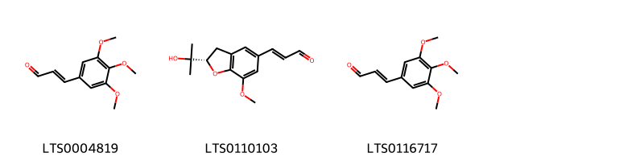{ width=100% }
    <figcaption>Hình ảnh cấu trúc hóa học của 3 hoạt chất thuộc nhóm Cinnamaldehydes gồm ['(2e)-3-(3,4,5-trimethoxyphenyl)prop-2-enal (LTS0004819)', '(2e)-3-[(2s)-2-(2-hydroxypropan-2-yl)-7-methoxy-2,3-dihydro-1-benzofuran-5-yl]prop-2-enal (LTS0110103)', '3-(3,4,5-trimethoxyphenyl)prop-2-enal (LTS0116717)'].</figcaption>
</figure>
#### Nhóm Cinnamic acids and derivatives
<figure markdown="span">
    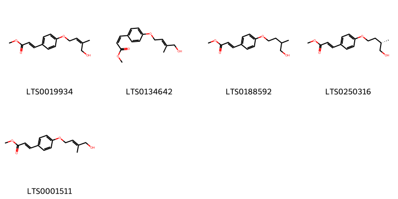{ width=100% }
    <figcaption>Hình ảnh cấu trúc hóa học của 5 hoạt chất thuộc nhóm Cinnamic acids and derivatives gồm ['methyl 3-{4-[(4-hydroxy-3-methylbut-2-en-1-yl)oxy]phenyl}prop-2-enoate (LTS0019934)', 'methyl (2z)-3-(4-{[(2e)-4-hydroxy-3-methylbut-2-en-1-yl]oxy}phenyl)prop-2-enoate (LTS0134642)', 'methyl 3-[4-(4-hydroxy-3-methylbutoxy)phenyl]prop-2-enoate (LTS0188592)', 'methyl (2e)-3-{4-[(3s)-4-hydroxy-3-methylbutoxy]phenyl}prop-2-enoate (LTS0250316)', 'methyl (2e)-3-(4-{[(2e)-4-hydroxy-3-methylbut-2-en-1-yl]oxy}phenyl)prop-2-enoate (LTS0001511)'].</figcaption>
</figure>
#### Nhóm Cinnamyl alcohols
<figure markdown="span">
    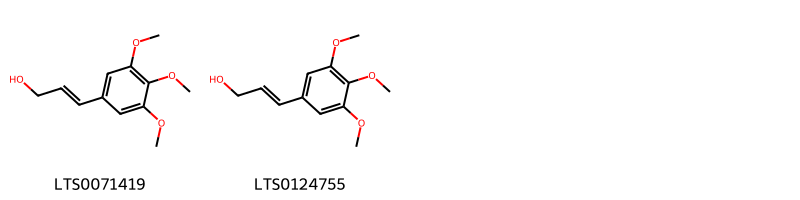{ width=100% }
    <figcaption>Hình ảnh cấu trúc hóa học của 2 hoạt chất thuộc nhóm Cinnamyl alcohols gồm ['3-(3,4,5-trimethoxyphenyl)prop-2-en-1-ol (LTS0071419)', '(2e)-3-(3,4,5-trimethoxyphenyl)prop-2-en-1-ol (LTS0124755)'].</figcaption>
</figure>
#### Nhóm Coumarins and derivatives
<figure markdown="span">
    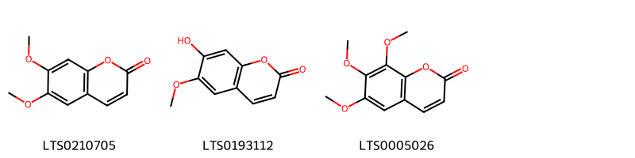{ width=100% }
    <figcaption>Hình ảnh cấu trúc hóa học của 3 hoạt chất thuộc nhóm Coumarins and derivatives gồm ['scoparone (LTS0210705)', 'scopoletin (LTS0193112)', '6,7,8-trimethoxychromen-2-one (LTS0005026)'].</figcaption>
</figure>
#### Nhóm Fatty Acyls
<figure markdown="span">
    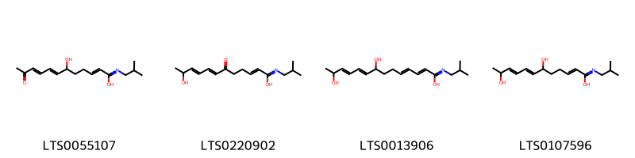{ width=100% }
    <figcaption>Hình ảnh cấu trúc hóa học của 4 hoạt chất thuộc nhóm Fatty Acyls gồm ['(2e,7e,9e)-6-hydroxy-n-(2-methylpropyl)-11-oxododeca-2,7,9-trienimidic acid (LTS0055107)', '(2e,7e,9e)-11-hydroxy-n-(2-methylpropyl)-6-oxododeca-2,7,9-trienimidic acid (LTS0220902)', '(2e,4e,9e,11e)-8,13-dihydroxy-n-(2-methylpropyl)tetradeca-2,4,9,11-tetraenimidic acid (LTS0013906)', '(2e,7e,9e)-6,11-dihydroxy-n-(2-methylpropyl)dodeca-2,7,9-trienimidic acid (LTS0107596)'].</figcaption>
</figure>
#### Nhóm Flavonoids
<figure markdown="span">
    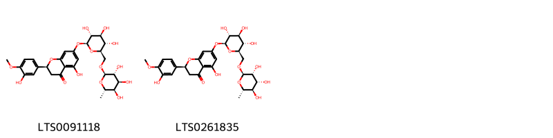{ width=100% }
    <figcaption>Hình ảnh cấu trúc hóa học của 2 hoạt chất thuộc nhóm Flavonoids gồm ['(2s)-5-hydroxy-2-(3-hydroxy-4-methoxyphenyl)-7-{[(2s,3r,4s,5s,6r)-3,4,5-trihydroxy-6-({[(2r,3r,4s,5r,6s)-3,4,5-trihydroxy-6-methyloxan-2-yl]oxy}methyl)oxan-2-yl]oxy}-2,3-dihydro-1-benzopyran-4-one (LTS0091118)', 'hesperidin (LTS0261835)'].</figcaption>
</figure>
#### Nhóm Furanoid lignans
<figure markdown="span">
    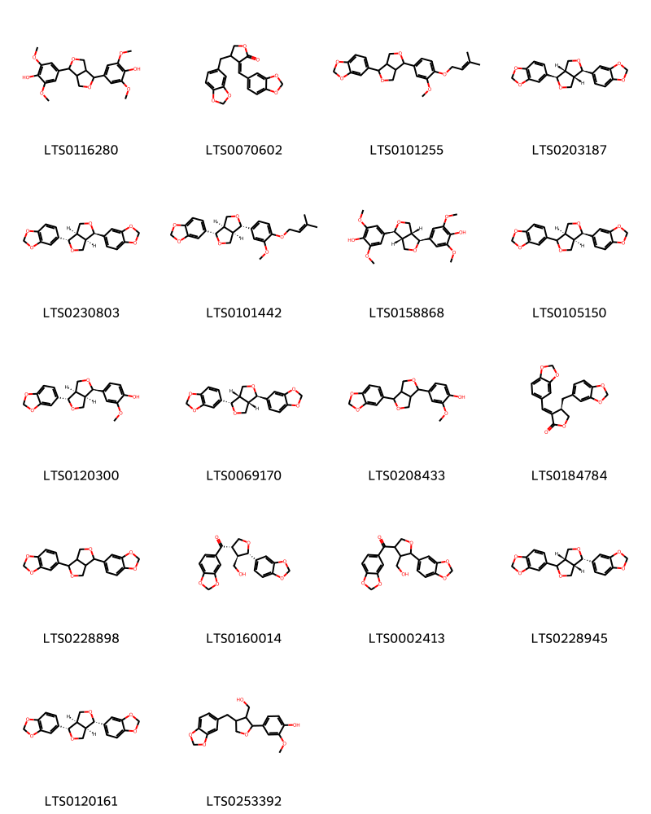{ width=100% }
    <figcaption>Hình ảnh cấu trúc hóa học của 18 hoạt chất thuộc nhóm Furanoid lignans gồm ['syringaresinol (LTS0116280)', '4-(2h-1,3-benzodioxol-5-ylmethyl)-3-(2h-1,3-benzodioxol-5-ylmethylidene)oxolan-2-one (LTS0070602)', '5-(4-{3-methoxy-4-[(3-methylbut-2-en-1-yl)oxy]phenyl}-hexahydrofuro[3,4-c]furan-1-yl)-2h-1,3-benzodioxole (LTS0101255)', '(-)-sesamin (LTS0203187)', '5-[(1s,3ar,4r,6ar)-4-(2h-1,3-benzodioxol-5-yl)-hexahydrofuro[3,4-c]furan-1-yl]-2h-1,3-benzodioxole (LTS0230803)', '5-[(1s,3ar,4s,6ar)-4-{3-methoxy-4-[(3-methylbut-2-en-1-yl)oxy]phenyl}-hexahydrofuro[3,4-c]furan-1-yl]-2h-1,3-benzodioxole (LTS0101442)', '(+)-syringaresinol (LTS0158868)', '5-[(3ar,4r,6ar)-4-(2h-1,3-benzodioxol-5-yl)-hexahydrofuro[3,4-c]furan-1-yl]-2h-1,3-benzodioxole (LTS0105150)', '4-[(1r,3ar,4s,6ar)-4-(2h-1,3-benzodioxol-5-yl)-hexahydrofuro[3,4-c]furan-1-yl]-2-methoxyphenol (LTS0120300)', 'asarinin (LTS0069170)', '4-[4-(2h-1,3-benzodioxol-5-yl)-hexahydrofuro[3,4-c]furan-1-yl]-2-methoxyphenol (LTS0208433)', 'savinin (LTS0184784)', 'sesamin (LTS0228898)', '[(2s,3r,4s)-2-(2h-1,3-benzodioxol-5-yl)-4-(2h-1,3-benzodioxole-5-carbonyl)oxolan-3-yl]methanol (LTS0160014)', '[2-(2h-1,3-benzodioxol-5-yl)-4-(2h-1,3-benzodioxole-5-carbonyl)oxolan-3-yl]methanol (LTS0002413)', '5-[(3as,4s,6as)-4-(2h-1,3-benzodioxol-5-yl)-hexahydrofuro[3,4-c]furan-1-yl]-2h-1,3-benzodioxole (LTS0228945)', 'sesamin (LTS0120161)', '4-[4-(2h-1,3-benzodioxol-5-ylmethyl)-3-(hydroxymethyl)oxolan-2-yl]-2-methoxyphenol (LTS0253392)'].</figcaption>
</figure>
#### Nhóm Indoles and derivatives
<figure markdown="span">
    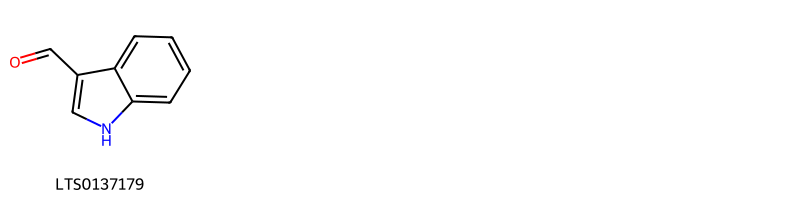{ width=100% }
    <figcaption>Hình ảnh cấu trúc hóa học của 1 hoạt chất thuộc nhóm Indoles and derivatives gồm ['indole-3-carboxaldehyde (LTS0137179)'].</figcaption>
</figure>
#### Nhóm Isoquinolines and derivatives
<figure markdown="span">
    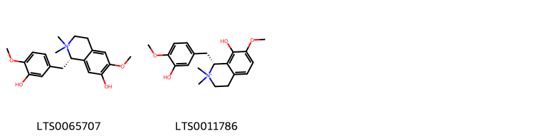{ width=100% }
    <figcaption>Hình ảnh cấu trúc hóa học của 2 hoạt chất thuộc nhóm Isoquinolines and derivatives gồm ['(1s)-7-hydroxy-1-[(3-hydroxy-4-methoxyphenyl)methyl]-6-methoxy-2,2-dimethyl-3,4-dihydro-1h-isoquinolin-2-ium (LTS0065707)', '(1r)-8-hydroxy-1-[(3-hydroxy-4-methoxyphenyl)methyl]-7-methoxy-2,2-dimethyl-3,4-dihydro-1h-isoquinolin-2-ium (LTS0011786)'].</figcaption>
</figure>
#### Nhóm Organonitrogen compounds
<figure markdown="span">
    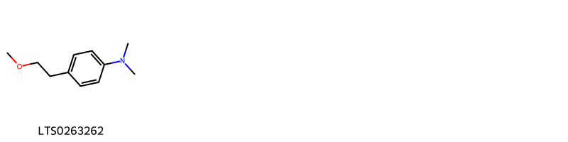{ width=100% }
    <figcaption>Hình ảnh cấu trúc hóa học của 1 hoạt chất thuộc nhóm Organonitrogen compounds gồm ['4-(2-methoxyethyl)-n,n-dimethylaniline (LTS0263262)'].</figcaption>
</figure>
#### Nhóm Organooxygen compounds
<figure markdown="span">
    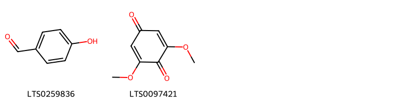{ width=100% }
    <figcaption>Hình ảnh cấu trúc hóa học của 2 hoạt chất thuộc nhóm Organooxygen compounds gồm ['p-hydroxybenzaldehyde (LTS0259836)', '2,6-dimethoxy-1,4-benzoquinone (LTS0097421)'].</figcaption>
</figure>
#### Nhóm Phenol ethers
<figure markdown="span">
    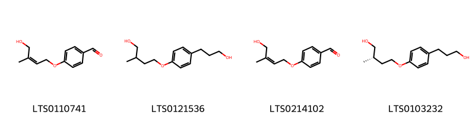{ width=100% }
    <figcaption>Hình ảnh cấu trúc hóa học của 4 hoạt chất thuộc nhóm Phenol ethers gồm ['4-[(4-hydroxy-3-methylbut-2-en-1-yl)oxy]benzaldehyde (LTS0110741)', '4-[4-(3-hydroxypropyl)phenoxy]-2-methylbutan-1-ol (LTS0121536)', '4-{[(2z)-4-hydroxy-3-methylbut-2-en-1-yl]oxy}benzaldehyde (LTS0214102)', '(2s)-4-[4-(3-hydroxypropyl)phenoxy]-2-methylbutan-1-ol (LTS0103232)'].</figcaption>
</figure>
#### Nhóm Phenols
<figure markdown="span">
    { width=100% }
    <figcaption>Hình ảnh cấu trúc hóa học của 1 hoạt chất thuộc nhóm Phenols gồm ['syringaldehyde (LTS0201406)'].</figcaption>
</figure>
#### Nhóm Prenol lipids
<figure markdown="span">
    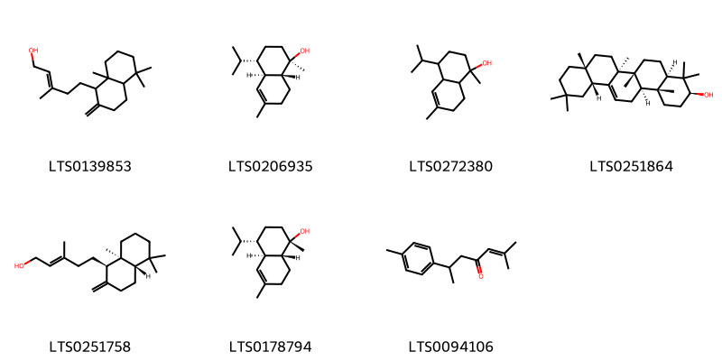{ width=100% }
    <figcaption>Hình ảnh cấu trúc hóa học của 7 hoạt chất thuộc nhóm Prenol lipids gồm ['5-(5,5,8a-trimethyl-2-methylidene-hexahydro-1h-naphthalen-1-yl)-3-methylpent-2-en-1-ol (LTS0139853)', 'α-cadinol (LTS0206935)', 'delta-cadinol (LTS0272380)', 'β-amyrin (LTS0251864)', 'syn-copalol (LTS0251758)', 'α-cadinol (LTS0178794)', 'ar-(+/-)-turmerone (LTS0094106)'].</figcaption>
</figure>
#### Nhóm Protoberberine alkaloids and derivatives
<figure markdown="span">
    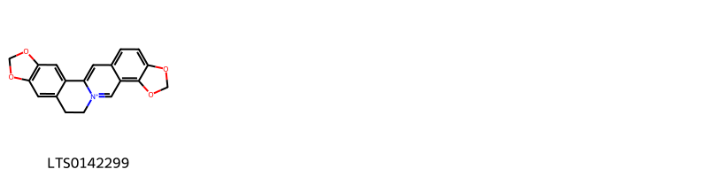{ width=100% }
    <figcaption>Hình ảnh cấu trúc hóa học của 1 hoạt chất thuộc nhóm Protoberberine alkaloids and derivatives gồm ['5,7,17,19-tetraoxa-13λ⁵-azahexacyclo[11.11.0.0²,¹⁰.0⁴,⁸.0¹⁵,²³.0¹⁶,²⁰]tetracosa-1(24),2,4(8),9,13,15,20,22-octaen-13-ylium (LTS0142299)'].</figcaption>
</figure>
#### Nhóm Quinolines and derivatives
<figure markdown="span">
    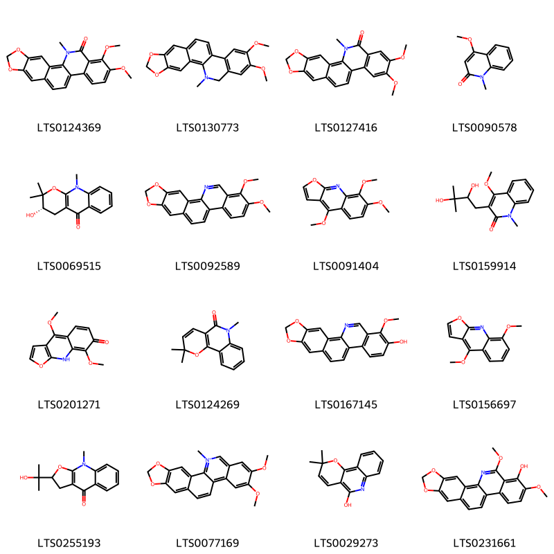{ width=100% }
    <figcaption>Hình ảnh cấu trúc hóa học của 16 hoạt chất thuộc nhóm Quinolines and derivatives gồm ['oxychelerythrine (LTS0124369)', '16,17-dimethoxy-21-methyl-5,7-dioxa-21-azapentacyclo[11.8.0.0²,¹⁰.0⁴,⁸.0¹⁴,¹⁹]henicosa-1(13),2,4(8),9,11,14(19),15,17-octaene (LTS0130773)', '16,17-dimethoxy-21-methyl-5,7-dioxa-21-azapentacyclo[11.8.0.0²,¹⁰.0⁴,⁸.0¹⁴,¹⁹]henicosa-1(13),2(10),3,8,11,14(19),15,17-octaen-20-one (LTS0127416)', '4-methoxy-1-methylquinolin-2-one (LTS0090578)', '(3s)-3-hydroxy-2,2,10-trimethyl-3h,4h-pyrano[2,3-b]quinolin-5-one (LTS0069515)', 'norchelerythrine (LTS0092589)', 'skimmianine (LTS0091404)', '3-(2,3-dihydroxy-3-methylbutyl)-4-methoxy-1-methylquinolin-2-one (LTS0159914)', '4,8-dimethoxy-9h-furo[2,3-b]quinolin-7-one (LTS0201271)', 'n-methylflindersine (LTS0124269)', 'decarine (LTS0167145)', 'fagarine (LTS0156697)', '2-(2-hydroxypropan-2-yl)-9-methyl-2h,3h-furo[2,3-b]quinolin-4-one (LTS0255193)', 'nitidine (LTS0077169)', 'flindersine (LTS0029273)', '17,20-dimethoxy-5,7-dioxa-21-azapentacyclo[11.8.0.0²,¹⁰.0⁴,⁸.0¹⁴,¹⁹]henicosa-1(13),2(10),3,8,11,14(19),15,17,20-nonaen-18-ol (LTS0231661)'].</figcaption>
</figure>
#### Nhóm Steroids and steroid derivatives
<figure markdown="span">
    { width=100% }
    <figcaption>Hình ảnh cấu trúc hóa học của 2 hoạt chất thuộc nhóm Steroids and steroid derivatives gồm ['stigmast-5-en-3-ol (LTS0071224)', 'stigmast-5-en-3-ol, (3β)- (LTS0204616)'].</figcaption>
</figure>

---

### Dược dân tộc học

Danh sách các quốc gia có sử dụng *Zanthoxylum nitidum* trong điều trị các bệnh. 

| Country   | Disease                                      | Bệnh                                                                                                                                                                                                |
|:----------|:---------------------------------------------|:----------------------------------------------------------------------------------------------------------------------------------------------------------------------------------------------------|
| China     | Alexiteric, Carminative, Poison, Analgesic   | MYMEMORY WARNING: YOU USED ALL AVAILABLE FREE TRANSLATIONS FOR TODAY. NEXT AVAILABLE IN  00 HOURS 00 MINUTES 13 SECONDS VISIT HTTPS://MYMEMORY.TRANSLATED.NET/DOC/USAGELIMITS.PHP TO TRANSLATE MORE |
| Elsewhere | Insecticide, Larvicide, Piscicide, Stimulant | MYMEMORY WARNING: YOU USED ALL AVAILABLE FREE TRANSLATIONS FOR TODAY. NEXT AVAILABLE IN  00 HOURS 00 MINUTES 10 SECONDS VISIT HTTPS://MYMEMORY.TRANSLATED.NET/DOC/USAGELIMITS.PHP TO TRANSLATE MORE |

---

---
## Zanthoxylum ovalifolium
### Thông tin về thực vật

!!! info "Phân loại thực vật của *Zanthoxylum ovalifolium* từ GIBF:"
    - **Kingdom:** Plantae
    - **Phylum:** Tracheophyta
    - **Order:** Sapindales
    - **Family:** Rutaceae
    - **Genus:** Zanthoxylum
    - **Species:** *Zanthoxylum ovalifolium*

 

| Label (VI)   | Label (EN)   | Scientific Name         | Descriptions (VI)   | Descriptions (EN)   | Also Known As (VI)   | Also Known As (EN)                                                  |
|:-------------|:-------------|:------------------------|:--------------------|:--------------------|:---------------------|:--------------------------------------------------------------------|
| N/A          | N/A          | Zanthoxylum ovalifolium | loài thực vật       | species of plant    | ['']                 | ['Little Yellowwood', 'Oval-leaf Yellow Wood', 'Thorny Yellowwood'] |

#### Phân bố trên thế giới

**Từ CSDL GIBF** Australia, Thailand, Papua New Guinea, India, unknown or invalid, Indonesia, Timor-Leste, Philippines, China

#### Phân bố tại Việt Nam

**Từ CSDL GIBF**: Không có ghi nhận ở Việt Nam

---
### Thành phần hóa học
        
- Theo cơ sở dữ liệu lotus: Từ loài *Zanthoxylum ovalifolium* đã phân lập và xác định được 11 hoạt chất thuộc về các nhóm Indolonaphthyridine alkaloids, Prenol lipids, Steroids and steroid derivatives, Coumarins and derivatives. 

|    | chemicalTaxonomyClassyfireClass   |   smiles_count |
|---:|:----------------------------------|---------------:|
|  0 | Coumarins and derivatives         |              6 |
|  1 | Indolonaphthyridine alkaloids     |              1 |
|  2 | Prenol lipids                     |              2 |
|  3 | Steroids and steroid derivatives  |              2 |

#### Nhóm Coumarins and derivatives
<figure markdown="span">
    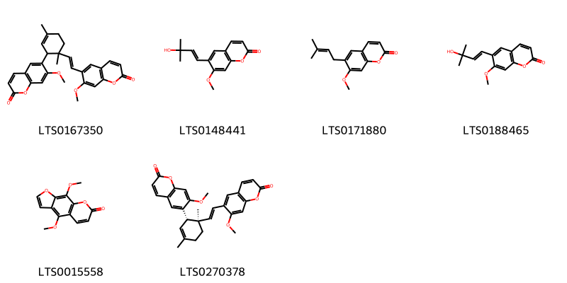{ width=100% }
    <figcaption>Hình ảnh cấu trúc hóa học của 6 hoạt chất thuộc nhóm Coumarins and derivatives gồm ['7-methoxy-6-{6-[2-(7-methoxy-2-oxochromen-6-yl)ethenyl]-3,6-dimethylcyclohex-2-en-1-yl}chromen-2-one (LTS0167350)', '6-(3-hydroxy-3-methylbut-1-en-1-yl)-7-methoxychromen-2-one (LTS0148441)', 'suberosin (LTS0171880)', '6-[(1e)-3-hydroxy-3-methylbut-1-en-1-yl]-7-methoxychromen-2-one (LTS0188465)', 'isopimpinellin (LTS0015558)', '7-methoxy-6-[(1s,6r)-6-[(1e)-2-(7-methoxy-2-oxochromen-6-yl)ethenyl]-3,6-dimethylcyclohex-2-en-1-yl]chromen-2-one (LTS0270378)'].</figcaption>
</figure>
#### Nhóm Indolonaphthyridine alkaloids
<figure markdown="span">
    { width=100% }
    <figcaption>Hình ảnh cấu trúc hóa học của 1 hoạt chất thuộc nhóm Indolonaphthyridine alkaloids gồm ['canthin-6-one (LTS0216343)'].</figcaption>
</figure>
#### Nhóm Prenol lipids
<figure markdown="span">
    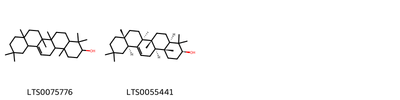{ width=100% }
    <figcaption>Hình ảnh cấu trúc hóa học của 2 hoạt chất thuộc nhóm Prenol lipids gồm ['β-amyrin (LTS0075776)', '(3s,4ar,6ar,6bs,8ar,12as,14ar,14br)-4,4,6a,6b,8a,11,11,14b-octamethyl-1,2,3,4a,5,6,7,8,9,10,12,12a,14,14a-tetradecahydropicen-3-ol (LTS0055441)'].</figcaption>
</figure>
#### Nhóm Steroids and steroid derivatives
<figure markdown="span">
    { width=100% }
    <figcaption>Hình ảnh cấu trúc hóa học của 2 hoạt chất thuộc nhóm Steroids and steroid derivatives gồm ['stigmast-5-en-3-ol, (3β)- (LTS0204616)', '(1s,3ar,3br,7r,9as,9br,11ar)-1-[(2r,5r)-5-ethyl-6-methylheptan-2-yl]-9a,11a-dimethyl-1h,2h,3h,3ah,3bh,4h,6h,7h,8h,9h,9bh,10h,11h-cyclopenta[a]phenanthren-7-ol (LTS0234781)'].</figcaption>
</figure>

---

### Dược dân tộc học

Danh sách các quốc gia có sử dụng *Zanthoxylum ovalifolium* trong điều trị các bệnh. 

| Country   | Disease      | Bệnh             |
|:----------|:-------------|:-----------------|
| Elsewhere | Carcinogenic | Chất gây ung thư |

---

---
## Zanthoxylum oxyphyllum
### Thông tin về thực vật

!!! info "Phân loại thực vật của *Zanthoxylum oxyphyllum* từ GIBF:"
    - **Kingdom:** Plantae
    - **Phylum:** Tracheophyta
    - **Order:** Sapindales
    - **Family:** Rutaceae
    - **Genus:** Zanthoxylum
    - **Species:** *Zanthoxylum oxyphyllum*

 

| Label (VI)   | Label (EN)   | Scientific Name        | Descriptions (VI)   | Descriptions (EN)   | Also Known As (VI)   | Also Known As (EN)   |
|:-------------|:-------------|:-----------------------|:--------------------|:--------------------|:---------------------|:---------------------|
| N/A          | N/A          | Zanthoxylum oxyphyllum |                     | species of plant    | ['']                 | ['']                 |

#### Phân bố trên thế giới

**Từ CSDL GIBF** nan, Australia, Thailand, Myanmar, Bhutan, India, unknown or invalid, China, New Zealand, Canada, Nepal

#### Phân bố tại Việt Nam

**Từ CSDL GIBF**: Không có ghi nhận ở Việt Nam

---
### Thành phần hóa học
        
- Theo cơ sở dữ liệu lotus: Từ loài *Zanthoxylum oxyphyllum* đã phân lập và xác định được 4 hoạt chất thuộc về các nhóm Quinolines and derivatives, Aporphines. 

|    | chemicalTaxonomyClassyfireClass   |   smiles_count |
|---:|:----------------------------------|---------------:|
|  0 | Aporphines                        |              2 |
|  1 | Quinolines and derivatives        |              2 |

#### Nhóm Aporphines
<figure markdown="span">
    { width=100% }
    <figcaption>Hình ảnh cấu trúc hóa học của 2 hoạt chất thuộc nhóm Aporphines gồm ['(9s)-3,4,15-trimethoxy-10-methyl-10-azatetracyclo[7.7.1.0²,⁷.0¹³,¹⁷]heptadeca-1(16),2(7),3,5,13(17),14-hexaen-16-ol (LTS0063811)', '3,4,15-trimethoxy-10-methyl-10-azatetracyclo[7.7.1.0²,⁷.0¹³,¹⁷]heptadeca-1(16),2(7),3,5,13(17),14-hexaen-16-ol (LTS0089038)'].</figcaption>
</figure>
#### Nhóm Quinolines and derivatives
<figure markdown="span">
    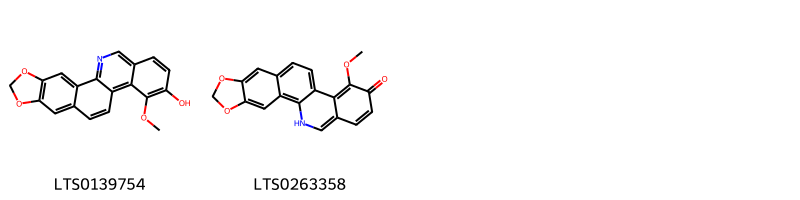{ width=100% }
    <figcaption>Hình ảnh cấu trúc hóa học của 2 hoạt chất thuộc nhóm Quinolines and derivatives gồm ['15-methoxy-5,7-dioxa-21-azapentacyclo[11.8.0.0²,¹⁰.0⁴,⁸.0¹⁴,¹⁹]henicosa-1(13),2(10),3,8,11,14(19),15,17,20-nonaen-16-ol (LTS0139754)', '15-methoxy-5,7-dioxa-21-azapentacyclo[11.8.0.0²,¹⁰.0⁴,⁸.0¹⁴,¹⁹]henicosa-1(13),2(10),3,8,11,14,17,19-octaen-16-one (LTS0263358)'].</figcaption>
</figure>

---

### Dược dân tộc học

Danh sách các quốc gia có sử dụng *Zanthoxylum oxyphyllum* trong điều trị các bệnh. 

| Country   | Disease                                                                            | Bệnh                                                                                             |
|:----------|:-----------------------------------------------------------------------------------|:-------------------------------------------------------------------------------------------------|
| Elsewhere | nan, Digestive, Fungicide, Stimulant, Stomachic, Insecticide, Sudorific, Vermifuge | nan, Tiêu hóa, Thuốc diệt nấm, Chất kích thích, Dạ dày, Thuốc diệt côn trùng, Khử mùi, Vermifuge |

---

---
## Zanthoxylum piperitum
### Thông tin về thực vật

!!! info "Phân loại thực vật của *Zanthoxylum piperitum* từ GIBF:"
    - **Kingdom:** Plantae
    - **Phylum:** Tracheophyta
    - **Order:** Sapindales
    - **Family:** Rutaceae
    - **Genus:** Zanthoxylum
    - **Species:** *Zanthoxylum piperitum*

 

| Label (VI)   | Label (EN)   | Scientific Name       | Descriptions (VI)   | Descriptions (EN)   | Also Known As (VI)   | Also Known As (EN)                          |
|:-------------|:-------------|:----------------------|:--------------------|:--------------------|:---------------------|:--------------------------------------------|
| N/A          | N/A          | Zanthoxylum piperitum | loài thực vật       | species of plant    | ['']                 | ['Japanese pepper', 'Japanese prickly-ash'] |

#### Phân bố trên thế giới

**Từ CSDL GIBF** India, Korea, Republic of, Chinese Taipei, Japan

#### Phân bố tại Việt Nam

**Từ CSDL GIBF**: Không có ghi nhận ở Việt Nam

---
### Thành phần hóa học
        
- Theo cơ sở dữ liệu lotus: Từ loài *Zanthoxylum piperitum* đã phân lập và xác định được 89 hoạt chất thuộc về các nhóm Fatty Acyls, Lignan glycosides, Flavonoids, Prenol lipids, Cinnamic acids and derivatives, Aporphines, Benzene and substituted derivatives, Organooxygen compounds, Phenols, Aryltetralin lignans, Carboximidic acids and derivatives, Furanoid lignans. 

|    | chemicalTaxonomyClassyfireClass     |   smiles_count |
|---:|:------------------------------------|---------------:|
|  0 | Aporphines                          |              1 |
|  1 | Aryltetralin lignans                |              2 |
|  2 | Benzene and substituted derivatives |              1 |
|  3 | Carboximidic acids and derivatives  |              1 |
|  4 | Cinnamic acids and derivatives      |              3 |
|  5 | Fatty Acyls                         |             32 |
|  6 | Flavonoids                          |             12 |
|  7 | Furanoid lignans                    |              1 |
|  8 | Lignan glycosides                   |              1 |
|  9 | Organooxygen compounds              |             22 |
| 10 | Phenols                             |              1 |
| 11 | Prenol lipids                       |             12 |

#### Nhóm Aporphines
<figure markdown="span">
    { width=100% }
    <figcaption>Hình ảnh cấu trúc hóa học của 1 hoạt chất thuộc nhóm Aporphines gồm ['magnoflorine (LTS0120825)'].</figcaption>
</figure>
#### Nhóm Aryltetralin lignans
<figure markdown="span">
    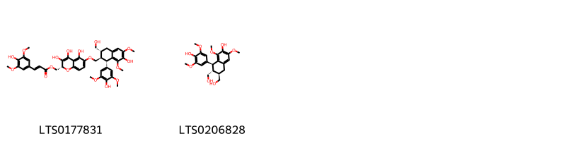{ width=100% }
    <figcaption>Hình ảnh cấu trúc hóa học của 2 hoạt chất thuộc nhóm Aryltetralin lignans gồm ['[(2r)-3,4,5-trihydroxy-6-{[(1s,2r,3r)-7-hydroxy-1-(4-hydroxy-3,5-dimethoxyphenyl)-3-(hydroxymethyl)-6,8-dimethoxy-1,2,3,4-tetrahydronaphthalen-2-yl]methoxy}-2h-chromen-2-yl]methyl (2e)-3-(4-hydroxy-3,5-dimethoxyphenyl)prop-2-enoate (LTS0177831)', '(+)-lyoniresinol (LTS0206828)'].</figcaption>
</figure>
#### Nhóm Benzene and substituted derivatives
<figure markdown="span">
    { width=100% }
    <figcaption>Hình ảnh cấu trúc hóa học của 1 hoạt chất thuộc nhóm Benzene and substituted derivatives gồm ['3,4-dihydroxybenzoic acid (LTS0018765)'].</figcaption>
</figure>
#### Nhóm Carboximidic acids and derivatives
<figure markdown="span">
    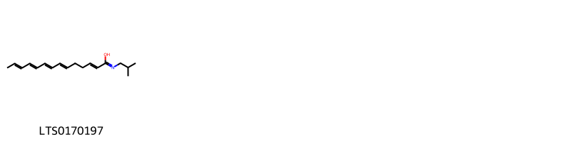{ width=100% }
    <figcaption>Hình ảnh cấu trúc hóa học của 1 hoạt chất thuộc nhóm Carboximidic acids and derivatives gồm ['(2e,6e,8e,10e,12e)-n-(2-methylpropyl)tetradeca-2,6,8,10,12-pentaenimidic acid (LTS0170197)'].</figcaption>
</figure>
#### Nhóm Cinnamic acids and derivatives
<figure markdown="span">
    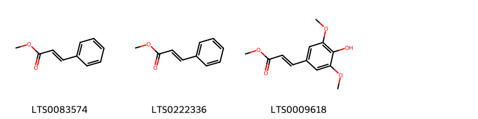{ width=100% }
    <figcaption>Hình ảnh cấu trúc hóa học của 3 hoạt chất thuộc nhóm Cinnamic acids and derivatives gồm ['methyl cinnamate (LTS0083574)', 'methyl cinnamate (LTS0222336)', 'methyl (2e)-3-(4-hydroxy-3,5-dimethoxyphenyl)prop-2-enoate (LTS0009618)'].</figcaption>
</figure>
#### Nhóm Fatty Acyls
<figure markdown="span">
    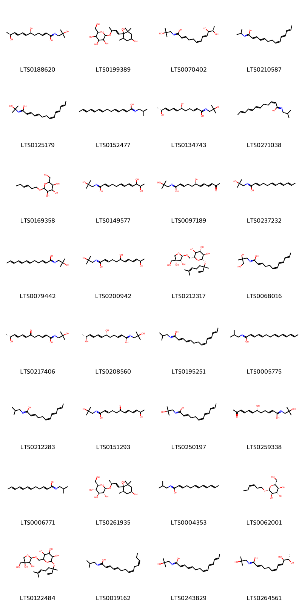{ width=100% }
    <figcaption>Hình ảnh cấu trúc hóa học của 32 hoạt chất thuộc nhóm Fatty Acyls gồm ['(2e,6s,7e,9e,11s)-6,11-dihydroxy-n-(2-hydroxy-2-methylpropyl)dodeca-2,7,9-trienimidic acid (LTS0188620)', '2-{[4-(1,4-dihydroxy-2,2,6-trimethylcyclohexyl)but-3-en-2-yl]oxy}-6-(hydroxymethyl)oxane-3,4,5-triol (LTS0199389)', '(2e,6z,8e,10r,11r)-10,11-dihydroxy-n-(2-hydroxy-2-methylpropyl)dodeca-2,6,8-trienimidic acid (LTS0070402)', '(2e,4e,8z,10e,12e)-n-isopropyltetradeca-2,4,8,10,12-pentaenimidic acid (LTS0210587)', '(2e,4e,8z,10e,12e)-n-(2-hydroxypropan-2-yl)tetradeca-2,4,8,10,12-pentaenimidic acid (LTS0125179)', '(2e,4e,8e,10e,12e)-n-(2-methylpropyl)tetradeca-2,4,8,10,12-pentaenimidic acid (LTS0152477)', '(2e,6s,7e,9e,11r)-6,11-dihydroxy-n-(2-hydroxy-2-methylpropyl)dodeca-2,7,9-trienimidic acid (LTS0134743)', '(2z,6e,8e,10e)-n-(2-methylpropyl)dodeca-2,6,8,10-tetraenimidic acid (LTS0271038)', '2-(hex-3-en-1-yloxy)-6-(hydroxymethyl)oxane-3,4,5-triol (LTS0169358)', '10,11-dihydroxy-n-(2-hydroxy-2-methylpropyl)dodeca-2,6,8-trienimidic acid (LTS0149577)', '6-hydroxy-n-(2-hydroxy-2-methylpropyl)-11-oxododeca-2,7,9-trienimidic acid (LTS0097189)', 'n-(2-hydroxy-2-methylpropyl)dodeca-2,6,8,10-tetraenimidic acid (LTS0237232)', '(2e,6e,8e,10e)-n-(2-hydroxy-2-methylpropyl)dodeca-2,6,8,10-tetraenimidic acid (LTS0079442)', '6,11-dihydroxy-n-(2-hydroxy-2-methylpropyl)dodeca-2,7,9-trienimidic acid (LTS0200942)', '(2r,3s,4s,5r,6s)-2-({[(2r,3r,4r)-3,4-dihydroxy-4-(hydroxymethyl)oxolan-2-yl]oxy}methyl)-6-{[(3s)-3,7-dimethylocta-1,6-dien-3-yl]oxy}oxane-3,4,5-triol (LTS0212317)', '(2e,6z,8e,10e)-n-(2,3-dihydroxy-2-methylpropyl)dodeca-2,6,8,10-tetraenimidic acid (LTS0068016)', '(2e,7e,9e,11r)-11-hydroxy-n-(2-hydroxy-2-methylpropyl)-6-oxododeca-2,7,9-trienimidic acid (LTS0217406)', '(2e,6r,7e,9e,11r)-6,11-dihydroxy-n-(2-hydroxy-2-methylpropyl)dodeca-2,7,9-trienimidic acid (LTS0208560)', '(2e,4e,8z,10e,12e)-n-(2-methylpropyl)tetradeca-2,4,8,10,12-pentaenimidic acid (LTS0195251)', 'n-(2-methylpropyl)tetradeca-2,4,8,10,12-pentaenimidic acid (LTS0005775)', '(2e,6z,8e,10e)-n-(2-methylpropyl)dodeca-2,6,8,10-tetraenimidic acid (LTS0212283)', '11-hydroxy-n-(2-hydroxy-2-methylpropyl)-6-oxododeca-2,7,9-trienimidic acid (LTS0151293)', '(2e,6z,8e,10e)-n-(2-hydroxy-2-methylpropyl)dodeca-2,6,8,10-tetraenimidic acid (LTS0250197)', '(2e,6r,7e,9e)-6-hydroxy-n-(2-hydroxy-2-methylpropyl)-11-oxododeca-2,7,9-trienimidic acid (LTS0259338)', '(2e,6e,8e,10e)-n-(2-methylpropyl)dodeca-2,6,8,10-tetraenimidic acid (LTS0006771)', '(2r,3r,4s,5s,6r)-2-{[(2s,3e)-4-[(1s,4s,6r)-1,4-dihydroxy-2,2,6-trimethylcyclohexyl]but-3-en-2-yl]oxy}-6-(hydroxymethyl)oxane-3,4,5-triol (LTS0261935)', 'n-(2-methylpropyl)dodeca-2,6,8,10-tetraenimidic acid (LTS0004353)', '(2r,3r,4s,5s,6r)-2-[(3z)-hex-3-en-1-yloxy]-6-(hydroxymethyl)oxane-3,4,5-triol (LTS0062001)', '2-({[3,4-dihydroxy-4-(hydroxymethyl)oxolan-2-yl]oxy}methyl)-6-[(3,7-dimethylocta-1,6-dien-3-yl)oxy]oxane-3,4,5-triol (LTS0122484)', '(2e,4e,8z,11z)-n-(2-methylpropyl)tetradeca-2,4,8,11-tetraenimidic acid (LTS0019162)', '(2e,4e,8z,10e,12e)-n-(2-hydroxy-2-methylpropyl)tetradeca-2,4,8,10,12-pentaenimidic acid (LTS0243829)', '(2e,6z,8e,10r,11s)-10,11-dihydroxy-n-(2-hydroxy-2-methylpropyl)dodeca-2,6,8-trienimidic acid (LTS0264561)'].</figcaption>
</figure>
#### Nhóm Flavonoids
<figure markdown="span">
    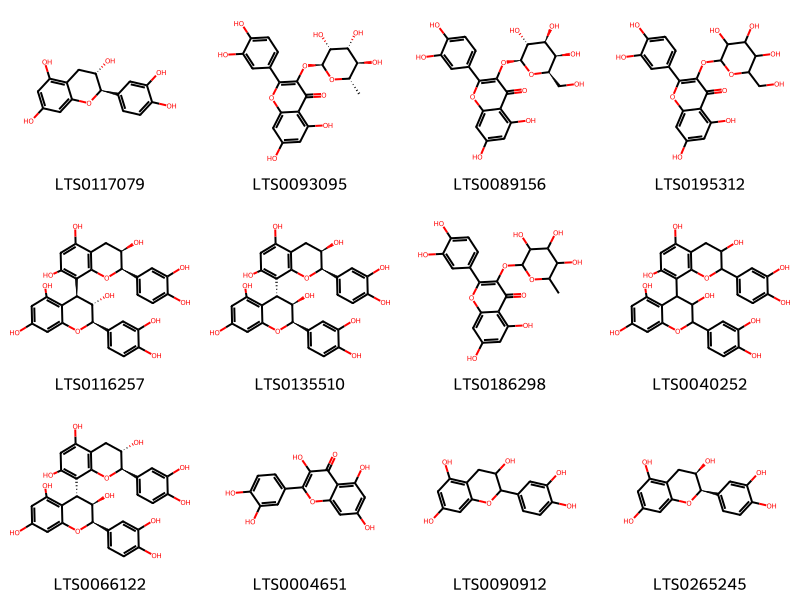{ width=100% }
    <figcaption>Hình ảnh cấu trúc hóa học của 12 hoạt chất thuộc nhóm Flavonoids gồm ['(+)-catechol (LTS0117079)', 'quercitrin (LTS0093095)', 'hyperoside (LTS0089156)', '2-(3,4-dihydroxyphenyl)-5,7-dihydroxy-3-{[3,4,5-trihydroxy-6-(hydroxymethyl)oxan-2-yl]oxy}chromen-4-one (LTS0195312)', '(2r,3s,4s)-2-(3,4-dihydroxyphenyl)-4-[(2r,3r)-2-(3,4-dihydroxyphenyl)-3,5,7-trihydroxy-3,4-dihydro-2h-1-benzopyran-8-yl]-3,4-dihydro-2h-1-benzopyran-3,5,7-triol (LTS0116257)', '(2r,3r,4r)-2-(3,4-dihydroxyphenyl)-4-[(2r,3r)-2-(3,4-dihydroxyphenyl)-3,5,7-trihydroxy-3,4-dihydro-2h-1-benzopyran-8-yl]-3,4-dihydro-2h-1-benzopyran-3,5,7-triol (LTS0135510)', 'quercitrin (LTS0186298)', '2-(3,4-dihydroxyphenyl)-4-[2-(3,4-dihydroxyphenyl)-3,5,7-trihydroxy-3,4-dihydro-2h-1-benzopyran-8-yl]-3,4-dihydro-2h-1-benzopyran-3,5,7-triol (LTS0040252)', '(2r,3r,4r)-2-(3,4-dihydroxyphenyl)-4-[(2r,3s)-2-(3,4-dihydroxyphenyl)-3,5,7-trihydroxy-3,4-dihydro-2h-1-benzopyran-8-yl]-3,4-dihydro-2h-1-benzopyran-3,5,7-triol (LTS0066122)', 'quercetin (LTS0004651)', 'catechol (LTS0090912)', 'ent-epicatechin (LTS0265245)'].</figcaption>
</figure>
#### Nhóm Furanoid lignans
<figure markdown="span">
    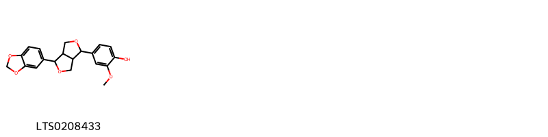{ width=100% }
    <figcaption>Hình ảnh cấu trúc hóa học của 1 hoạt chất thuộc nhóm Furanoid lignans gồm ['4-[4-(2h-1,3-benzodioxol-5-yl)-hexahydrofuro[3,4-c]furan-1-yl]-2-methoxyphenol (LTS0208433)'].</figcaption>
</figure>
#### Nhóm Lignan glycosides
<figure markdown="span">
    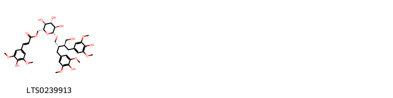{ width=100% }
    <figcaption>Hình ảnh cấu trúc hóa học của 1 hoạt chất thuộc nhóm Lignan glycosides gồm ['[(2r,3s,4s,5r,6r)-3,4,5-trihydroxy-6-[(2s,3s)-4-hydroxy-2,3-bis[(4-hydroxy-3,5-dimethoxyphenyl)methyl]butoxy]oxan-2-yl]methyl (2e)-3-(4-hydroxy-3,5-dimethoxyphenyl)prop-2-enoate (LTS0239913)'].</figcaption>
</figure>
#### Nhóm Organooxygen compounds
<figure markdown="span">
    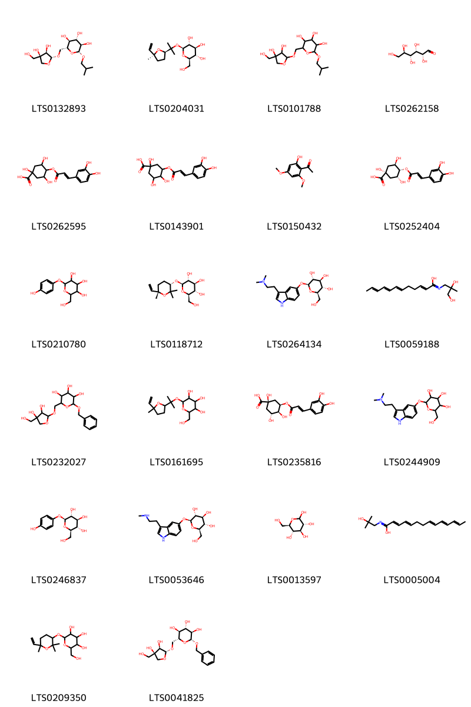{ width=100% }
    <figcaption>Hình ảnh cấu trúc hóa học của 22 hoạt chất thuộc nhóm Organooxygen compounds gồm ['(2r,3s,4s,5r,6r)-2-({[(2r,3r,4r)-3,4-dihydroxy-4-(hydroxymethyl)oxolan-2-yl]oxy}methyl)-6-(2-methylpropoxy)oxane-3,4,5-triol (LTS0132893)', '(2s,3r,4s,5s,6r)-2-({2-[(2r,5s)-5-ethenyl-5-methyloxolan-2-yl]propan-2-yl}oxy)-6-(hydroxymethyl)oxane-3,4,5-triol (LTS0204031)', '2-({[3,4-dihydroxy-4-(hydroxymethyl)oxolan-2-yl]oxy}methyl)-6-(2-methylpropoxy)oxane-3,4,5-triol (LTS0101788)', '(+)-glucose (LTS0262158)', '4-{[3-(3,4-dihydroxyphenyl)prop-2-enoyl]oxy}-1,3,5-trihydroxycyclohexane-1-carboxylic acid (LTS0262595)', '3-{[3-(3,4-dihydroxyphenyl)prop-2-enoyl]oxy}-1,4,5-trihydroxycyclohexane-1-carboxylic acid (LTS0143901)', 'xanthoxylin (LTS0150432)', 'cryptochlorogenic acid (LTS0252404)', 'arbutin (LTS0210780)', '(2s,3r,4s,5s,6r)-2-{[(3s,6s)-6-ethenyl-2,2,6-trimethyloxan-3-yl]oxy}-6-(hydroxymethyl)oxane-3,4,5-triol (LTS0118712)', '(2s,3r,4s,5s,6r)-2-({3-[2-(dimethylamino)ethyl]-1h-indol-5-yl}oxy)-6-(hydroxymethyl)oxane-3,4,5-triol (LTS0264134)', '(2e,6e,8e,10e)-n-(2,3-dihydroxy-2-methylpropyl)dodeca-2,6,8,10-tetraenimidic acid (LTS0059188)', '2-(benzyloxy)-6-({[3,4-dihydroxy-4-(hydroxymethyl)oxolan-2-yl]oxy}methyl)oxane-3,4,5-triol (LTS0232027)', '2-{[2-(5-ethenyl-5-methyloxolan-2-yl)propan-2-yl]oxy}-6-(hydroxymethyl)oxane-3,4,5-triol (LTS0161695)', 'neochlorogenic acid (LTS0235816)', '2-({3-[2-(dimethylamino)ethyl]-1h-indol-5-yl}oxy)-6-(hydroxymethyl)oxane-3,4,5-triol (LTS0244909)', 'β-arbutin (LTS0246837)', '(2r,3s,4s,5r,6s)-2-(hydroxymethyl)-6-({3-[2-(methylamino)ethyl]-1h-indol-5-yl}oxy)oxane-3,4,5-triol (LTS0053646)', 'glucose (LTS0013597)', 'n-(2-hydroxy-2-methylpropyl)tetradeca-2,4,8,10,12-pentaenimidic acid (LTS0005004)', '2-[(6-ethenyl-2,2,6-trimethyloxan-3-yl)oxy]-6-(hydroxymethyl)oxane-3,4,5-triol (LTS0209350)', '(2r,3r,4s,5s,6r)-2-(benzyloxy)-6-({[(2r,3r,4r)-3,4-dihydroxy-4-(hydroxymethyl)oxolan-2-yl]oxy}methyl)oxane-3,4,5-triol (LTS0041825)'].</figcaption>
</figure>
#### Nhóm Phenols
<figure markdown="span">
    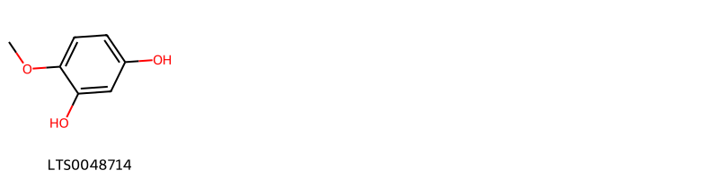{ width=100% }
    <figcaption>Hình ảnh cấu trúc hóa học của 1 hoạt chất thuộc nhóm Phenols gồm ['4-methoxybenzene-1,3-diol (LTS0048714)'].</figcaption>
</figure>
#### Nhóm Prenol lipids
<figure markdown="span">
    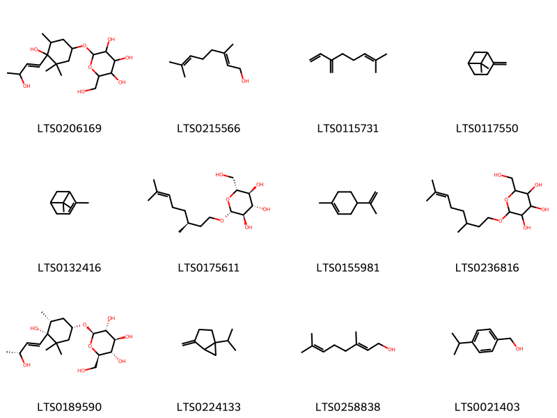{ width=100% }
    <figcaption>Hình ảnh cấu trúc hóa học của 12 hoạt chất thuộc nhóm Prenol lipids gồm ['2-{[4-hydroxy-4-(3-hydroxybut-1-en-1-yl)-3,3,5-trimethylcyclohexyl]oxy}-6-(hydroxymethyl)oxane-3,4,5-triol (LTS0206169)', '3,7-dimethyl-2,6-octadien-1-ol (LTS0215566)', 'α-myrcene (LTS0115731)', 'β-pinene (LTS0117550)', 'α pinene (LTS0132416)', '(2r,3r,4s,5s,6r)-2-{[(3s)-3,7-dimethyloct-6-en-1-yl]oxy}-6-(hydroxymethyl)oxane-3,4,5-triol (LTS0175611)', 'limonene,  (LTS0155981)', '2-[(3,7-dimethyloct-6-en-1-yl)oxy]-6-(hydroxymethyl)oxane-3,4,5-triol (LTS0236816)', '(2r,3r,4s,5s,6r)-2-{[(1s,4s,5r)-4-hydroxy-4-[(1e,3r)-3-hydroxybut-1-en-1-yl]-3,3,5-trimethylcyclohexyl]oxy}-6-(hydroxymethyl)oxane-3,4,5-triol (LTS0189590)', 'sabinene (LTS0224133)', 'geraniol (LTS0258838)', 'cuminol (LTS0021403)'].</figcaption>
</figure>

---

### Dược dân tộc học

Danh sách các quốc gia có sử dụng *Zanthoxylum piperitum* trong điều trị các bệnh. 

| Country   | Disease                                                                                             | Bệnh                                                                                                                                   |
|:----------|:----------------------------------------------------------------------------------------------------|:---------------------------------------------------------------------------------------------------------------------------------------|
| China     | Carminative, Carminative, Diuretic, Parasiticide, Poison, Stimulant, Stomachic, Stimulant, Diuretic | Carminative, Carminative, Thuốc lợi tiểu, Thuốc diệt ký sinh trùng, Chất độc, Chất kích thích, Dạ dày, Chất kích thích, Thuốc lợi tiểu |
| Japan*    | Stomachic, Stomachic                                                                                | Dạ dày, Dạ dày                                                                                                                         |

---

---
## Zanthoxylum planiinum
### Thông tin về thực vật

!!! info "Phân loại thực vật của *N/A* từ GIBF:"
    - **Kingdom:** Plantae
    - **Phylum:** Tracheophyta
    - **Order:** Sapindales
    - **Family:** Rutaceae
    - **Genus:** Zanthoxylum
    - **Species:** *N/A*

 

| Label (VI)   | Label (EN)   | Scientific Name       | Descriptions (VI)   | Descriptions (EN)   | Also Known As (VI)   | Also Known As (EN)                          |
|:-------------|:-------------|:----------------------|:--------------------|:--------------------|:---------------------|:--------------------------------------------|
| N/A          | N/A          | Zanthoxylum piperitum | loài thực vật       | species of plant    | ['']                 | ['Japanese pepper', 'Japanese prickly-ash'] |

#### Phân bố trên thế giới

**Từ CSDL GIBF** Sri Lanka, Japan, Gabon, Argentina, Canada, Puerto Rico, Chinese Taipei, United States of America, Uruguay, South Africa, Hong Kong, Brazil, Bahamas, Mexico, Dominican Republic, China, Ecuador, Haiti, Costa Rica, India, Antigua and Barbuda, Cameroon

#### Phân bố tại Việt Nam

**Từ CSDL GIBF**: Không có ghi nhận ở Việt Nam

---
### Thành phần hóa học
        
- Theo cơ sở dữ liệu lotus: Từ loài *N/A* đã phân lập và xác định được Chưa có hoạt chất nào được phân lập. hoạt chất thuộc về các nhóm Không có hoạt chất nào được phân lập. 

Không có hình ảnh nào được tạo ra

---

### Dược dân tộc học

Danh sách các quốc gia có sử dụng *N/A* trong điều trị các bệnh. 

| Country   | Disease   | Bệnh           |
|:----------|:----------|:---------------|
| China     | Vermifuge | Thuốc diệt sán |

---

---
## Zanthoxylum schinifolium
### Thông tin về thực vật

!!! info "Phân loại thực vật của *Zanthoxylum schinifolium* từ GIBF:"
    - **Kingdom:** Plantae
    - **Phylum:** Tracheophyta
    - **Order:** Sapindales
    - **Family:** Rutaceae
    - **Genus:** Zanthoxylum
    - **Species:** *Zanthoxylum schinifolium*

 

| Label (VI)   | Label (EN)   | Scientific Name          | Descriptions (VI)   | Descriptions (EN)   | Also Known As (VI)   | Also Known As (EN)   |
|:-------------|:-------------|:-------------------------|:--------------------|:--------------------|:---------------------|:---------------------|
| N/A          | N/A          | Zanthoxylum schinifolium | loài thực vật       | species of plant    | ['']                 | ['']                 |

#### Phân bố trên thế giới

**Từ CSDL GIBF** Japan, Korea, Republic of, Chinese Taipei, United States of America, China

#### Phân bố tại Việt Nam

**Từ CSDL GIBF**: Không có ghi nhận ở Việt Nam

---
### Thành phần hóa học
        
- Theo cơ sở dữ liệu lotus: Từ loài *Zanthoxylum schinifolium* đã phân lập và xác định được 185 hoạt chất thuộc về các nhóm Cinnamyl alcohols, Benzophenanthridine alkaloids, Carboxylic acids and derivatives, Fatty Acyls, Cinnamic acids and derivatives, Heteroaromatic compounds, Saturated hydrocarbons, Prenol lipids, Quinolines and derivatives, Tetrahydrofurans, Benzene and substituted derivatives, Organooxygen compounds, Furanoid lignans, Phenol ethers, Steroids and steroid derivatives, Benzodioxoles, Dioxanes, Keto acids and derivatives, Coumarins and derivatives, Epoxides. 

|    | chemicalTaxonomyClassyfireClass     |   smiles_count |
|---:|:------------------------------------|---------------:|
|  0 | Benzene and substituted derivatives |              1 |
|  1 | Benzodioxoles                       |              1 |
|  2 | Benzophenanthridine alkaloids       |              2 |
|  3 | Carboxylic acids and derivatives    |              4 |
|  4 | Cinnamic acids and derivatives      |              5 |
|  5 | Cinnamyl alcohols                   |              2 |
|  6 | Coumarins and derivatives           |             47 |
|  7 | Dioxanes                            |              1 |
|  8 | Epoxides                            |              2 |
|  9 | Fatty Acyls                         |             21 |
| 10 | Furanoid lignans                    |              3 |
| 11 | Heteroaromatic compounds            |              1 |
| 12 | Keto acids and derivatives          |              1 |
| 13 | Organooxygen compounds              |             15 |
| 14 | Phenol ethers                       |              4 |
| 15 | Prenol lipids                       |             56 |
| 16 | Quinolines and derivatives          |             13 |
| 17 | Saturated hydrocarbons              |              2 |
| 18 | Steroids and steroid derivatives    |              2 |
| 19 | Tetrahydrofurans                    |              1 |

#### Nhóm Benzene and substituted derivatives
<figure markdown="span">
    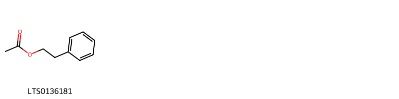{ width=100% }
    <figcaption>Hình ảnh cấu trúc hóa học của 1 hoạt chất thuộc nhóm Benzene and substituted derivatives gồm ['phenethyl acetate (LTS0136181)'].</figcaption>
</figure>
#### Nhóm Benzodioxoles
<figure markdown="span">
    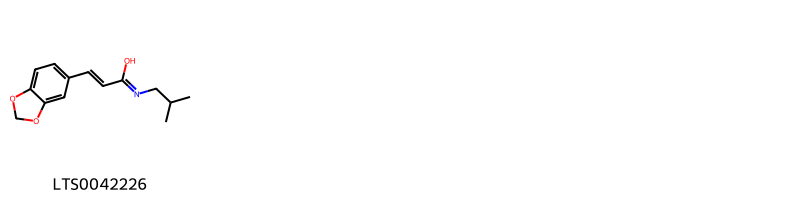{ width=100% }
    <figcaption>Hình ảnh cấu trúc hóa học của 1 hoạt chất thuộc nhóm Benzodioxoles gồm ['3-(2h-1,3-benzodioxol-5-yl)-n-(2-methylpropyl)prop-2-enimidic acid (LTS0042226)'].</figcaption>
</figure>
#### Nhóm Benzophenanthridine alkaloids
<figure markdown="span">
    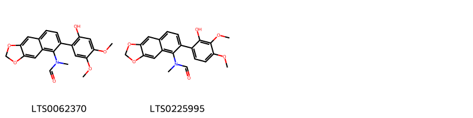{ width=100% }
    <figcaption>Hình ảnh cấu trúc hóa học của 2 hoạt chất thuộc nhóm Benzophenanthridine alkaloids gồm ['n-[6-(2-hydroxy-4,5-dimethoxyphenyl)-2h-naphtho[2,3-d][1,3]dioxol-5-yl]-n-methylformamide (LTS0062370)', 'n-[6-(2-hydroxy-3,4-dimethoxyphenyl)-2h-naphtho[2,3-d][1,3]dioxol-5-yl]-n-methylformamide (LTS0225995)'].</figcaption>
</figure>
#### Nhóm Carboxylic acids and derivatives
<figure markdown="span">
    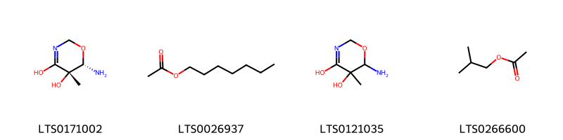{ width=100% }
    <figcaption>Hình ảnh cấu trúc hóa học của 4 hoạt chất thuộc nhóm Carboxylic acids and derivatives gồm ['(5s,6s)-6-amino-5-methyl-2,6-dihydro-1,3-oxazine-4,5-diol (LTS0171002)', 'heptyl acetate (LTS0026937)', '6-amino-5-methyl-2,6-dihydro-1,3-oxazine-4,5-diol (LTS0121035)', 'isobutyl acetate (LTS0266600)'].</figcaption>
</figure>
#### Nhóm Cinnamic acids and derivatives
<figure markdown="span">
    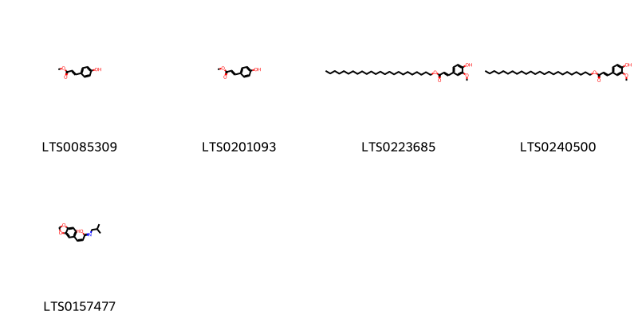{ width=100% }
    <figcaption>Hình ảnh cấu trúc hóa học của 5 hoạt chất thuộc nhóm Cinnamic acids and derivatives gồm ['methyl (2e)-3-(4-hydroxyphenyl)prop-2-enoate (LTS0085309)', 'methyl hydroxycinnamate (LTS0201093)', 'tetracosyl (2e)-3-(4-hydroxy-3-methoxyphenyl)prop-2-enoate (LTS0223685)', 'tetracosyl 3-(4-hydroxy-3-methoxyphenyl)prop-2-enoate (LTS0240500)', '(2z)-3-(2h-1,3-benzodioxol-5-yl)-n-(2-methylpropyl)prop-2-enimidic acid (LTS0157477)'].</figcaption>
</figure>
#### Nhóm Cinnamyl alcohols
<figure markdown="span">
    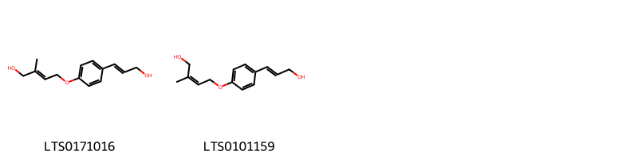{ width=100% }
    <figcaption>Hình ảnh cấu trúc hóa học của 2 hoạt chất thuộc nhóm Cinnamyl alcohols gồm ['(2e)-4-{4-[(1e)-3-hydroxyprop-1-en-1-yl]phenoxy}-2-methylbut-2-en-1-ol (LTS0171016)', '4-[4-(3-hydroxyprop-1-en-1-yl)phenoxy]-2-methylbut-2-en-1-ol (LTS0101159)'].</figcaption>
</figure>
#### Nhóm Coumarins and derivatives
<figure markdown="span">
    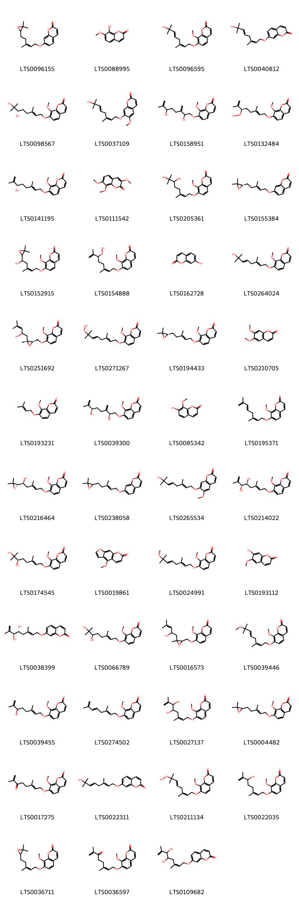{ width=100% }
    <figcaption>Hình ảnh cấu trúc hóa học của 47 hoạt chất thuộc nhóm Coumarins and derivatives gồm ['7-{[5-(3,3-dimethyloxiran-2-yl)-3-methylpent-2-en-1-yl]oxy}chromen-2-one (LTS0096155)', '8-hydroxy-7-methoxychromen-2-one (LTS0088995)', '7-[(7-hydroxy-3,7-dimethylocta-2,5-dien-1-yl)oxy]-8-methoxychromen-2-one (LTS0096595)', '7-[(7-hydroxy-3,7-dimethylocta-2,5-dien-1-yl)oxy]chromen-2-one (LTS0040812)', '7-{[(2e,6s)-6,7-dihydroxy-3,7-dimethyloct-2-en-1-yl]oxy}-8-methoxychromen-2-one (LTS0098567)', '7-[(7-hydroxy-3,7-dimethylocta-2,5-dien-1-yl)oxy]-6-methoxychromen-2-one (LTS0037109)', '7-[(2,6-dihydroxy-7-methyl-3-methylideneoct-7-en-1-yl)oxy]-8-methoxychromen-2-one (LTS0158951)', '7-{[(2e,6r)-6-hydroperoxy-3,7-dimethylocta-2,7-dien-1-yl]oxy}-8-methoxychromen-2-one (LTS0132484)', '7-{[(2e,6s)-6-hydroxy-3,7-dimethylocta-2,7-dien-1-yl]oxy}-8-methoxychromen-2-one (LTS0141195)', '3,7,8-trimethoxychromen-2-one (LTS0111542)', '7-[(6,7-dihydroxy-3,7-dimethyloct-2-en-1-yl)oxy]-8-methoxychromen-2-one (LTS0205361)', '7-{[(2e)-5-[(2r)-3,3-dimethyloxiran-2-yl]-3-methylpent-2-en-1-yl]oxy}chromen-2-one (LTS0155384)', '7-{[5-(3,3-dimethyloxiran-2-yl)-5-hydroxy-3-methylpent-2-en-1-yl]oxy}-8-methoxychromen-2-one (LTS0152915)', '7-[(6-hydroperoxy-3,7-dimethylocta-2,7-dien-1-yl)oxy]-8-methoxychromen-2-one (LTS0154888)', 'umbelliferone (LTS0162728)', '7-{[(2e,5e)-7-hydroxy-3,7-dimethylocta-2,5-dien-1-yl]oxy}-8-methoxychromen-2-one (LTS0264024)', '7-{[(2r,3r)-3-[(2r)-2-hydroxy-4-methylpent-3-en-1-yl]-3-methyloxiran-2-yl]methoxy}-8-methoxychromen-2-one (LTS0251692)', '7-{[(2e,5e)-7-hydroperoxy-3,7-dimethylocta-2,5-dien-1-yl]oxy}-8-methoxychromen-2-one (LTS0271267)', '7-{[(2e)-5-[(2r)-3,3-dimethyloxiran-2-yl]-3-methylpent-2-en-1-yl]oxy}-8-methoxychromen-2-one (LTS0194433)', 'scoparone (LTS0210705)', '8-methoxy-7-[(3-methylbut-2-en-1-yl)oxy]chromen-2-one (LTS0193231)', '7-{[(2s,6r)-2,6-dihydroxy-7-methyl-3-methylideneoct-7-en-1-yl]oxy}-8-methoxychromen-2-one (LTS0039300)', '7-hydroxy-8-methoxychromen-2-one (LTS0085342)', '7-[(3,7-dimethylocta-2,5,7-trien-1-yl)oxy]-8-methoxychromen-2-one (LTS0195371)', '7-{[(2e,5s)-5-[(2s)-3,3-dimethyloxiran-2-yl]-5-hydroxy-3-methylpent-2-en-1-yl]oxy}-8-methoxychromen-2-one (LTS0216464)', '7-{[(2e)-5-(3,3-dimethyloxiran-2-yl)-3-methylpent-2-en-1-yl]oxy}chromen-2-one (LTS0238058)', '7-{[(2e,5e)-7-hydroxy-3,7-dimethylocta-2,5-dien-1-yl]oxy}-6-methoxychromen-2-one (LTS0265534)', '7-{[(2e,5s,6s)-5,6-dihydroxy-3,7-dimethylocta-2,7-dien-1-yl]oxy}-8-methoxychromen-2-one (LTS0214022)', '7-{[(2e,6r)-6,7-dihydroxy-3,7-dimethyloct-2-en-1-yl]oxy}-8-methoxychromen-2-one (LTS0174545)', 'bergapten (LTS0019861)', '8-methoxy-7-{[(2e,5e)-7-methoxy-3,7-dimethylocta-2,5-dien-1-yl]oxy}chromen-2-one (LTS0024991)', 'scopoletin (LTS0193112)', '7-{[(2e,5r,6s)-5,6-dihydroxy-3,7-dimethylocta-2,7-dien-1-yl]oxy}chromen-2-one (LTS0038399)', '7-{[(2e)-6,7-dihydroxy-3,7-dimethyloct-2-en-1-yl]oxy}-8-methoxychromen-2-one (LTS0066789)', '7-{[3-(2-hydroxy-4-methylpent-3-en-1-yl)-3-methyloxiran-2-yl]methoxy}-8-methoxychromen-2-one (LTS0016573)', '8-methoxy-7-[(7-methoxy-3,7-dimethylocta-2,5-dien-1-yl)oxy]chromen-2-one (LTS0039446)', '7-{[(2e)-6-hydroxy-3,7-dimethylocta-2,7-dien-1-yl]oxy}-8-methoxychromen-2-one (LTS0039455)', '7-{[(2e,5e)-3,7-dimethylocta-2,5,7-trien-1-yl]oxy}-8-methoxychromen-2-one (LTS0274502)', '7-[(5,6-dihydroxy-3,7-dimethylocta-2,7-dien-1-yl)oxy]-8-methoxychromen-2-one (LTS0027137)', '7-{[(2e)-5-(3,3-dimethyloxiran-2-yl)-3-methylpent-2-en-1-yl]oxy}-8-methoxychromen-2-one (LTS0004482)', '7-{[(2e)-3,7-dimethyl-6-oxoocta-2,7-dien-1-yl]oxy}-8-methoxychromen-2-one (LTS0017275)', '7-{[(2e,5e)-7-hydroxy-3,7-dimethylocta-2,5-dien-1-yl]oxy}chromen-2-one (LTS0022311)', '7-[(7-hydroperoxy-3,7-dimethylocta-2,5-dien-1-yl)oxy]-8-methoxychromen-2-one (LTS0211134)', '7-[(6-hydroxy-3,7-dimethylocta-2,7-dien-1-yl)oxy]-8-methoxychromen-2-one (LTS0022035)', '7-{[5-(3,3-dimethyloxiran-2-yl)-3-methylpent-2-en-1-yl]oxy}-8-methoxychromen-2-one (LTS0036711)', '7-[(3,7-dimethyl-6-oxoocta-2,7-dien-1-yl)oxy]-8-methoxychromen-2-one (LTS0036597)', '7-[(5,6-dihydroxy-3,7-dimethylocta-2,7-dien-1-yl)oxy]chromen-2-one (LTS0109682)'].</figcaption>
</figure>
#### Nhóm Dioxanes
<figure markdown="span">
    { width=100% }
    <figcaption>Hình ảnh cấu trúc hóa học của 1 hoạt chất thuộc nhóm Dioxanes gồm ['ascaridole (LTS0041598)'].</figcaption>
</figure>
#### Nhóm Epoxides
<figure markdown="span">
    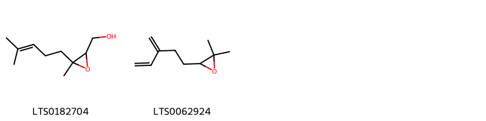{ width=100% }
    <figcaption>Hình ảnh cấu trúc hóa học của 2 hoạt chất thuộc nhóm Epoxides gồm ['[3-methyl-3-(4-methylpent-3-en-1-yl)oxiran-2-yl]methanol (LTS0182704)', '2,2-dimethyl-3-(3-methylidenepent-4-en-1-yl)oxirane (LTS0062924)'].</figcaption>
</figure>
#### Nhóm Fatty Acyls
<figure markdown="span">
    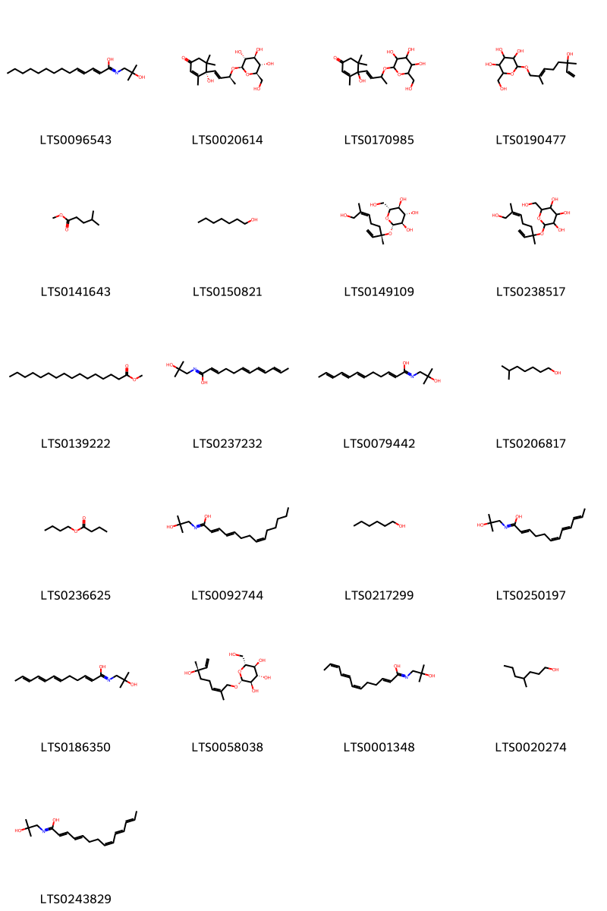{ width=100% }
    <figcaption>Hình ảnh cấu trúc hóa học của 21 hoạt chất thuộc nhóm Fatty Acyls gồm ['(2e,4e)-n-(2-hydroxy-2-methylpropyl)tetradeca-2,4-dienimidic acid (LTS0096543)', '(4s)-4-hydroxy-3,5,5-trimethyl-4-[(1e,3s)-3-{[(2r,3r,4s,5s,6r)-3,4,5-trihydroxy-6-(hydroxymethyl)oxan-2-yl]oxy}but-1-en-1-yl]cyclohex-2-en-1-one (LTS0020614)', '4-hydroxy-3,5,5-trimethyl-4-(3-{[3,4,5-trihydroxy-6-(hydroxymethyl)oxan-2-yl]oxy}but-1-en-1-yl)cyclohex-2-en-1-one (LTS0170985)', '2-[(6-hydroxy-2,6-dimethylocta-2,7-dien-1-yl)oxy]-6-(hydroxymethyl)oxane-3,4,5-triol (LTS0190477)', 'methyl 4-methylvalerate (LTS0141643)', 'heptanol (LTS0150821)', '(2s,3r,4s,5s,6r)-2-{[(3s,6z)-8-hydroxy-3,7-dimethylocta-1,6-dien-3-yl]oxy}-6-(hydroxymethyl)oxane-3,4,5-triol (LTS0149109)', '2-[(8-hydroxy-3,7-dimethylocta-1,6-dien-3-yl)oxy]-6-(hydroxymethyl)oxane-3,4,5-triol (LTS0238517)', 'methyl palmitate (LTS0139222)', 'n-(2-hydroxy-2-methylpropyl)dodeca-2,6,8,10-tetraenimidic acid (LTS0237232)', '(2e,6e,8e,10e)-n-(2-hydroxy-2-methylpropyl)dodeca-2,6,8,10-tetraenimidic acid (LTS0079442)', 'isooctyl alcohol (LTS0206817)', 'butyl butyrate (LTS0236625)', '(2e,4e,8z)-n-(2-hydroxy-2-methylpropyl)tetradeca-2,4,8-trienimidic acid (LTS0092744)', 'hexanol (LTS0217299)', '(2e,6z,8e,10e)-n-(2-hydroxy-2-methylpropyl)dodeca-2,6,8,10-tetraenimidic acid (LTS0250197)', '(8e)-n-(2-hydroxy-2-methylpropyl)dodeca-2,6,8,10-tetraenimidic acid (LTS0186350)', '(2r,3r,4s,5s,6r)-2-{[(2z,6s)-6-hydroxy-2,6-dimethylocta-2,7-dien-1-yl]oxy}-6-(hydroxymethyl)oxane-3,4,5-triol (LTS0058038)', '(2e,6z,8e,10z)-n-(2-hydroxy-2-methylpropyl)dodeca-2,6,8,10-tetraenimidic acid (LTS0001348)', '1-heptanol, 4-methyl-, (+-) (LTS0020274)', '(2e,4e,8z,10e,12e)-n-(2-hydroxy-2-methylpropyl)tetradeca-2,4,8,10,12-pentaenimidic acid (LTS0243829)'].</figcaption>
</figure>
#### Nhóm Furanoid lignans
<figure markdown="span">
    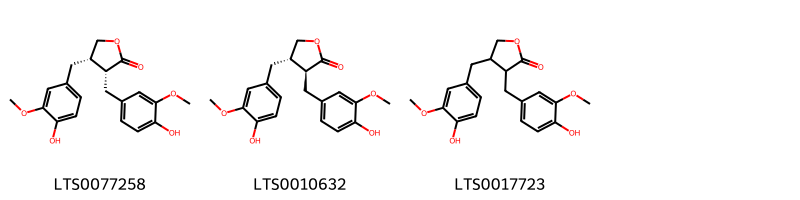{ width=100% }
    <figcaption>Hình ảnh cấu trúc hóa học của 3 hoạt chất thuộc nhóm Furanoid lignans gồm ['(3r,4s)-3,4-bis[(4-hydroxy-3-methoxyphenyl)methyl]oxolan-2-one (LTS0077258)', '(-)-matairesinol (LTS0010632)', '3,4-bis[(4-hydroxy-3-methoxyphenyl)methyl]oxolan-2-one (LTS0017723)'].</figcaption>
</figure>
#### Nhóm Heteroaromatic compounds
<figure markdown="span">
    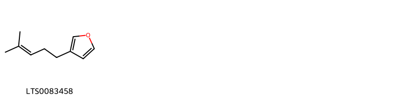{ width=100% }
    <figcaption>Hình ảnh cấu trúc hóa học của 1 hoạt chất thuộc nhóm Heteroaromatic compounds gồm ['perillene (LTS0083458)'].</figcaption>
</figure>
#### Nhóm Keto acids and derivatives
<figure markdown="span">
    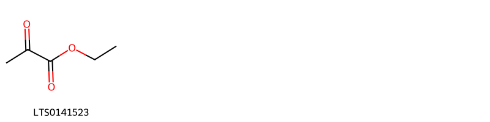{ width=100% }
    <figcaption>Hình ảnh cấu trúc hóa học của 1 hoạt chất thuộc nhóm Keto acids and derivatives gồm ['ethyl pyruvate (LTS0141523)'].</figcaption>
</figure>
#### Nhóm Organooxygen compounds
<figure markdown="span">
    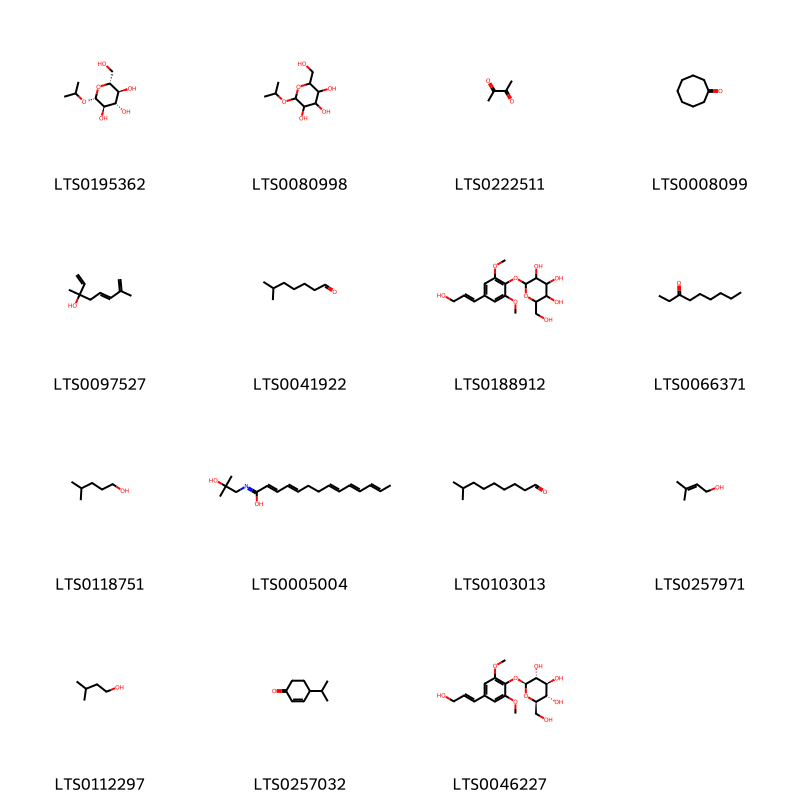{ width=100% }
    <figcaption>Hình ảnh cấu trúc hóa học của 15 hoạt chất thuộc nhóm Organooxygen compounds gồm ['(2r,3s,4s,5r,6r)-2-(hydroxymethyl)-6-isopropoxyoxane-3,4,5-triol (LTS0195362)', '2-(hydroxymethyl)-6-isopropoxyoxane-3,4,5-triol (LTS0080998)', 'diacetyl (LTS0222511)', 'cyclooctanone (LTS0008099)', '(5e)-3,7-dimethylocta-1,5,7-trien-3-ol (LTS0097527)', '6-methylheptanal (LTS0041922)', '2-(hydroxymethyl)-6-[4-(3-hydroxyprop-1-en-1-yl)-2,6-dimethoxyphenoxy]oxane-3,4,5-triol (LTS0188912)', '3-nonanone (LTS0066371)', '4-methyl-1-pentanol (LTS0118751)', 'n-(2-hydroxy-2-methylpropyl)tetradeca-2,4,8,10,12-pentaenimidic acid (LTS0005004)', 'isodecanal (LTS0103013)', 'prenol (LTS0257971)', 'isoamyl alcohol (LTS0112297)', '4-isopropyl-2-cyclohexenone (LTS0257032)', 'syringin (LTS0046227)'].</figcaption>
</figure>
#### Nhóm Phenol ethers
<figure markdown="span">
    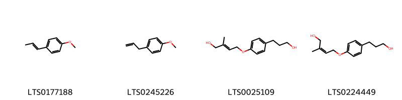{ width=100% }
    <figcaption>Hình ảnh cấu trúc hóa học của 4 hoạt chất thuộc nhóm Phenol ethers gồm ['p-propenylanisole (LTS0177188)', 'tarragon (LTS0245226)', '(2e)-4-[4-(3-hydroxypropyl)phenoxy]-2-methylbut-2-en-1-ol (LTS0025109)', '4-[4-(3-hydroxypropyl)phenoxy]-2-methylbut-2-en-1-ol (LTS0224449)'].</figcaption>
</figure>
#### Nhóm Prenol lipids
<figure markdown="span">
    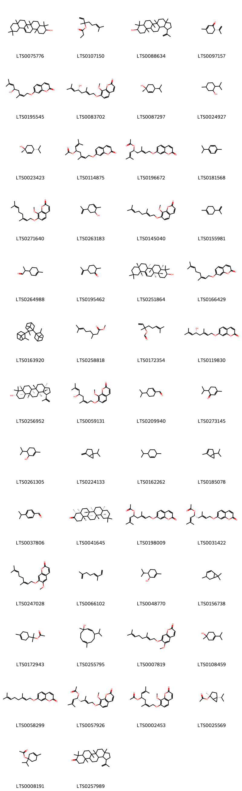{ width=100% }
    <figcaption>Hình ảnh cấu trúc hóa học của 56 hoạt chất thuộc nhóm Prenol lipids gồm ['β-amyrin (LTS0075776)', 'linalyl propionate (LTS0107150)', 'lupeol (LTS0088634)', '(+)-isopiperitenone (LTS0097157)', '7-[(5-hydroxy-3,7-dimethylocta-2,6-dien-1-yl)oxy]chromen-2-one (LTS0195545)', '7-{[(2e,5r)-5-hydroxy-3,7-dimethylocta-2,6-dien-1-yl]oxy}-8-methoxychromen-2-one (LTS0083702)', '(1r,4s)-4-isopropyl-1-methylcyclohex-2-en-1-ol (LTS0087297)', 'menthol natural (LTS0024927)', '(1r,4r)-4-isopropyl-1-methylcyclohex-2-en-1-ol (LTS0023423)', '2,6-dimethyl-8-[(2-oxochromen-7-yl)oxy]octa-2,6-dien-4-yl acetate (LTS0114875)', '(4s,6e)-2,6-dimethyl-8-[(2-oxochromen-7-yl)oxy]octa-2,6-dien-4-yl acetate (LTS0196672)', 'cymene (LTS0181568)', '7-[(3,7-dimethylocta-2,6-dien-1-yl)oxy]-8-methoxychromen-2-one (LTS0271640)', 'carveol (LTS0263183)', '7-{[(2e)-3,7-dimethylocta-2,6-dien-1-yl]oxy}-8-methoxychromen-2-one (LTS0145040)', 'limonene,  (LTS0155981)', '1-p-menthen-9-al (LTS0264988)', 'dihydrocarvone (LTS0195462)', 'β-amyrin (LTS0251864)', '7-[(3,7-dimethylocta-2,6-dien-1-yl)oxy]chromen-2-one (LTS0166429)', '2,6,6-trimethyl-1,2-bis({2,6,6-trimethylbicyclo[3.1.1]heptan-1-yl})bicyclo[3.1.1]heptane (LTS0163920)', 'methyl rhodinolate (LTS0258818)', 'linalyl formate (LTS0172354)', '7-{[(2e,5r)-5-hydroxy-3,7-dimethylocta-2,6-dien-1-yl]oxy}chromen-2-one (LTS0119830)', 'lupeol (LTS0256952)', '7-[(5-hydroxy-3,7-dimethylocta-2,6-dien-1-yl)oxy]-8-methoxychromen-2-one (LTS0059131)', 'phellandral (LTS0209940)', 'piperitone (LTS0273145)', '6-isopropyl-3-methylcyclohex-2-en-1-ol (LTS0261305)', 'sabinene (LTS0224133)', '2-menthene (LTS0162262)', 'α-thujene (LTS0185078)', 'cuminaldehyde (LTS0037806)', '(-)-friedelin (LTS0041645)', '(6e)-2,6-dimethyl-8-[(2-oxochromen-7-yl)oxy]octa-2,6-dien-4-yl acetate (LTS0198009)', '(4r,6e)-2,6-dimethyl-8-[(2-oxochromen-7-yl)oxy]octa-2,6-dien-4-yl acetate (LTS0031422)', '7-[(3,7-dimethylocta-2,6-dien-1-yl)oxy]-6-methoxychromen-2-one (LTS0247028)', '3,7-dimethylocta-1,3,7-triene (LTS0066102)', 'cis-(-)-p-menth-1-en-3-ol (LTS0048770)', '4,7,7-trimethylbicyclo[4.1.0]hept-2-ene (LTS0156738)', 'α-terpinyl acetate (LTS0172943)', '(2z,7z)-4-isopropyl-1,7-dimethylcyclodeca-2,7-dien-1-ol (LTS0255795)', '7-{[(2e)-3,7-dimethylocta-2,6-dien-1-yl]oxy}-6-methoxychromen-2-one (LTS0007819)', 'p-menth-3-en-1-ol (LTS0108459)', 'auraptene (LTS0058299)', '(4r,6e)-8-[(8-methoxy-2-oxochromen-7-yl)oxy]-2,6-dimethylocta-2,6-dien-4-yl acetate (LTS0057926)', '8-[(8-methoxy-2-oxochromen-7-yl)oxy]-2,6-dimethylocta-2,6-dien-4-yl acetate (LTS0002453)', '(2s,5s)-5-isopropyl-2-methylbicyclo[3.1.0]hexan-2-yl acetate (LTS0025569)', 'terpinene 4-acetate (LTS0008191)', '3a,5a,5b,8,8,11a-hexamethyl-1-(prop-1-en-2-yl)-tetradecahydro-1h-cyclopenta[a]chrysen-9-one (LTS0257989)', 'cuminol (LTS0021403)', 'friedelin (LTS0213494)', '2-isopropyl-5-methylcyclohex-3-en-1-one (LTS0050514)', '7-{[(2e)-5-hydroxy-3,7-dimethylocta-2,6-dien-1-yl]oxy}chromen-2-one (LTS0247652)', 'lupenone (LTS0107900)', 'trans-(-)-p-menth-1-en-3-ol (LTS0022880)'].</figcaption>
</figure>
#### Nhóm Quinolines and derivatives
<figure markdown="span">
    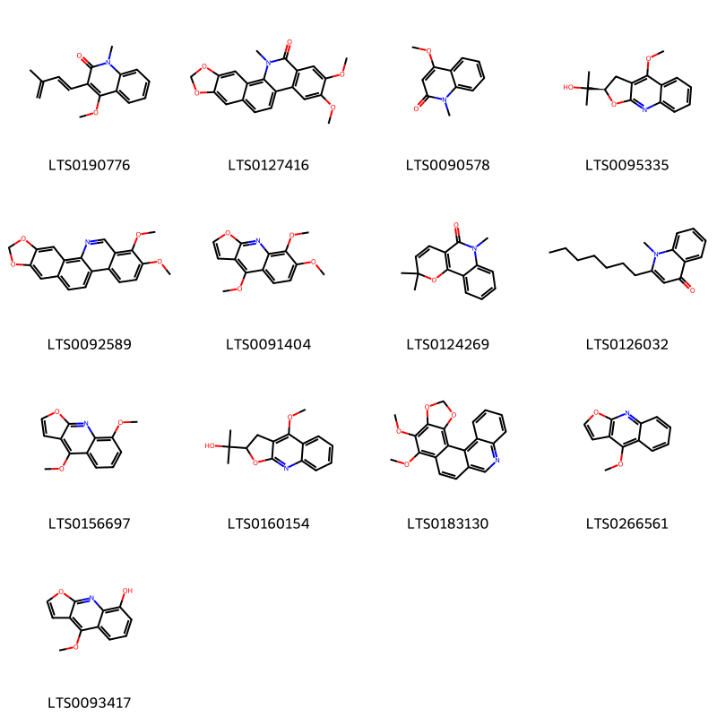{ width=100% }
    <figcaption>Hình ảnh cấu trúc hóa học của 13 hoạt chất thuộc nhóm Quinolines and derivatives gồm ['4-methoxy-1-methyl-3-[(1e)-3-methylbuta-1,3-dien-1-yl]quinolin-2-one (LTS0190776)', '16,17-dimethoxy-21-methyl-5,7-dioxa-21-azapentacyclo[11.8.0.0²,¹⁰.0⁴,⁸.0¹⁴,¹⁹]henicosa-1(13),2(10),3,8,11,14(19),15,17-octaen-20-one (LTS0127416)', '4-methoxy-1-methylquinolin-2-one (LTS0090578)', 'platydesmine (LTS0095335)', 'norchelerythrine (LTS0092589)', 'skimmianine (LTS0091404)', 'n-methylflindersine (LTS0124269)', '2-heptyl-1-methylquinolin-4-one (LTS0126032)', 'fagarine (LTS0156697)', '2-{4-methoxy-2h,3h-furo[2,3-b]quinolin-2-yl}propan-2-ol (LTS0160154)', '8,9-dimethoxy-4,6-dioxa-15-azapentacyclo[11.8.0.0²,¹⁰.0³,⁷.0¹⁶,²¹]henicosa-1(13),2(10),3(7),8,11,14,16(21),17,19-nonaene (LTS0183130)', 'dictamnine (LTS0266561)', 'robustine (LTS0093417)'].</figcaption>
</figure>
#### Nhóm Saturated hydrocarbons
<figure markdown="span">
    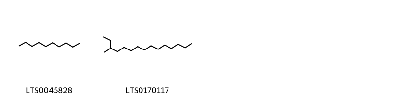{ width=100% }
    <figcaption>Hình ảnh cấu trúc hóa học của 2 hoạt chất thuộc nhóm Saturated hydrocarbons gồm ['decane (LTS0045828)', '3-methylpentadecane (LTS0170117)'].</figcaption>
</figure>
#### Nhóm Steroids and steroid derivatives
<figure markdown="span">
    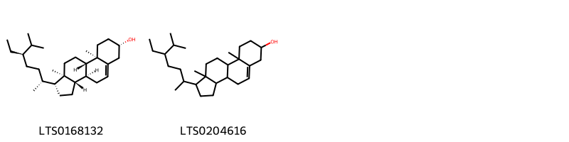{ width=100% }
    <figcaption>Hình ảnh cấu trúc hóa học của 2 hoạt chất thuộc nhóm Steroids and steroid derivatives gồm ['sitosterol (LTS0168132)', 'stigmast-5-en-3-ol, (3β)- (LTS0204616)'].</figcaption>
</figure>
#### Nhóm Tetrahydrofurans
<figure markdown="span">
    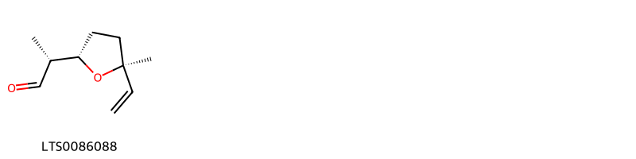{ width=100% }
    <figcaption>Hình ảnh cấu trúc hóa học của 1 hoạt chất thuộc nhóm Tetrahydrofurans gồm ["(2r,2's,5's)-lilac aldehyde (LTS0086088)"].</figcaption>
</figure>

---

### Dược dân tộc học

Danh sách các quốc gia có sử dụng *Zanthoxylum schinifolium* trong điều trị các bệnh. 

| Country   | Disease     | Bệnh     |
|:----------|:------------|:---------|
| Elsewhere | Antitussive | Chống ho |

---

---
## Zanthoxylum simulans
### Thông tin về thực vật

!!! info "Phân loại thực vật của *Zanthoxylum simulans* từ GIBF:"
    - **Kingdom:** Plantae
    - **Phylum:** Tracheophyta
    - **Order:** Sapindales
    - **Family:** Rutaceae
    - **Genus:** Zanthoxylum
    - **Species:** *Zanthoxylum simulans*

 

| Label (VI)   | Label (EN)   | Scientific Name      | Descriptions (VI)   | Descriptions (EN)   | Also Known As (VI)   | Also Known As (EN)   |
|:-------------|:-------------|:---------------------|:--------------------|:--------------------|:---------------------|:---------------------|
| N/A          | N/A          | Zanthoxylum simulans | loài thực vật       | species of plant    | ['']                 | ['']                 |

#### Phân bố trên thế giới

**Từ CSDL GIBF** nan, Netherlands, Germany, Belgium, Korea, Republic of, Chinese Taipei, New Zealand, Hungary, Portugal, Switzerland, Russian Federation, India, United States of America, Poland, Norway, China, Nepal

#### Phân bố tại Việt Nam

**Từ CSDL GIBF**: Không có ghi nhận ở Việt Nam

---
### Thành phần hóa học
        
- Theo cơ sở dữ liệu lotus: Từ loài *Zanthoxylum simulans* đã phân lập và xác định được 158 hoạt chất thuộc về các nhóm Lignan lactones, Phenols, Benzophenanthridine alkaloids, Carboxylic acids and derivatives, Fatty Acyls, Cinnamic acids and derivatives, Aporphines, Prenol lipids, Quinolines and derivatives, Benzene and substituted derivatives, Organooxygen compounds, Furanoid lignans, Steroids and steroid derivatives, Pyrans, 2-arylbenzofuran flavonoids, Unsaturated hydrocarbons, Coumarins and derivatives. 

|    | chemicalTaxonomyClassyfireClass     |   smiles_count |
|---:|:------------------------------------|---------------:|
|  0 |                                     |              2 |
|  1 | 2-arylbenzofuran flavonoids         |              5 |
|  2 | Aporphines                          |              4 |
|  3 | Benzene and substituted derivatives |              4 |
|  4 | Benzophenanthridine alkaloids       |              8 |
|  5 | Carboxylic acids and derivatives    |              1 |
|  6 | Cinnamic acids and derivatives      |              1 |
|  7 | Coumarins and derivatives           |              3 |
|  8 | Fatty Acyls                         |              3 |
|  9 | Furanoid lignans                    |             17 |
| 10 | Lignan lactones                     |              2 |
| 11 | Organooxygen compounds              |              3 |
| 12 | Phenols                             |              3 |
| 13 | Prenol lipids                       |             42 |
| 14 | Pyrans                              |              1 |
| 15 | Quinolines and derivatives          |             47 |
| 16 | Steroids and steroid derivatives    |              9 |
| 17 | Unsaturated hydrocarbons            |              1 |

#### Nhóm 
<figure markdown="span">
    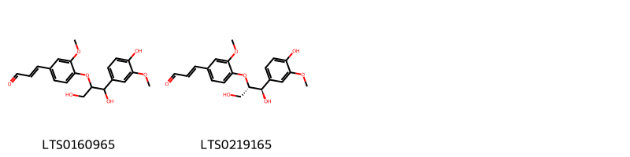{ width=100% }
    <figcaption>Hình ảnh cấu trúc hóa học của 2 hoạt chất thuộc nhóm  gồm ['3-(4-{[1,3-dihydroxy-1-(4-hydroxy-3-methoxyphenyl)propan-2-yl]oxy}-3-methoxyphenyl)prop-2-enal (LTS0160965)', '(2e)-3-(4-{[(1r,2s)-1,3-dihydroxy-1-(4-hydroxy-3-methoxyphenyl)propan-2-yl]oxy}-3-methoxyphenyl)prop-2-enal (LTS0219165)'].</figcaption>
</figure>
#### Nhóm 2-arylbenzofuran flavonoids
<figure markdown="span">
    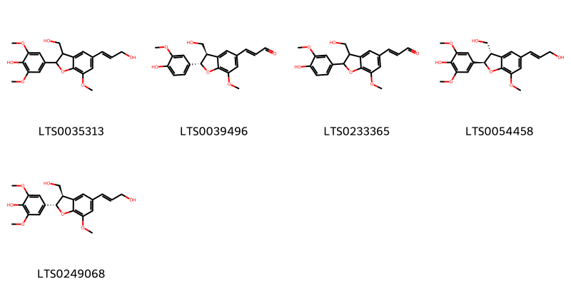{ width=100% }
    <figcaption>Hình ảnh cấu trúc hóa học của 5 hoạt chất thuộc nhóm 2-arylbenzofuran flavonoids gồm ['4-[3-(hydroxymethyl)-5-(3-hydroxyprop-1-en-1-yl)-7-methoxy-2,3-dihydro-1-benzofuran-2-yl]-2,6-dimethoxyphenol (LTS0035313)', 'balanophonin (LTS0039496)', '3-[2-(4-hydroxy-3-methoxyphenyl)-3-(hydroxymethyl)-7-methoxy-2,3-dihydro-1-benzofuran-5-yl]prop-2-enal (LTS0233365)', '4-[(2r,3s)-3-(hydroxymethyl)-5-[(1e)-3-hydroxyprop-1-en-1-yl]-7-methoxy-2,3-dihydro-1-benzofuran-2-yl]-2,6-dimethoxyphenol (LTS0054458)', '4-[(2s,3r)-3-(hydroxymethyl)-5-[(1e)-3-hydroxyprop-1-en-1-yl]-7-methoxy-2,3-dihydro-1-benzofuran-2-yl]-2,6-dimethoxyphenol (LTS0249068)'].</figcaption>
</figure>
#### Nhóm Aporphines
<figure markdown="span">
    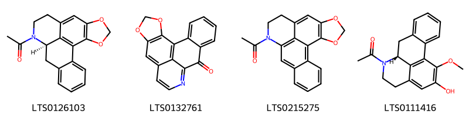{ width=100% }
    <figcaption>Hình ảnh cấu trúc hóa học của 4 hoạt chất thuộc nhóm Aporphines gồm ['1-[(12r)-3,5-dioxa-11-azapentacyclo[10.7.1.0²,⁶.0⁸,²⁰.0¹⁴,¹⁹]icosa-1(20),2(6),7,14,16,18-hexaen-11-yl]ethanone (LTS0126103)', 'liriodenine (LTS0132761)', '1-{3,5-dioxa-11-azapentacyclo[10.7.1.0²,⁶.0⁸,²⁰.0¹⁴,¹⁹]icosa-1(20),2(6),7,12,14(19),15,17-heptaen-11-yl}ethanone (LTS0215275)', '1-[(9r)-15-hydroxy-16-methoxy-10-azatetracyclo[7.7.1.0²,⁷.0¹³,¹⁷]heptadeca-1(17),2,4,6,13,15-hexaen-10-yl]ethanone (LTS0111416)'].</figcaption>
</figure>
#### Nhóm Benzene and substituted derivatives
<figure markdown="span">
    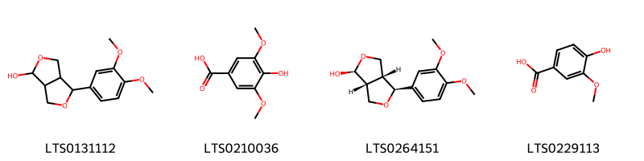{ width=100% }
    <figcaption>Hình ảnh cấu trúc hóa học của 4 hoạt chất thuộc nhóm Benzene and substituted derivatives gồm ['4-(3,4-dimethoxyphenyl)-hexahydrofuro[3,4-c]furan-1-ol (LTS0131112)', 'syringic acid (LTS0210036)', '(1s,3ar,4s,6ar)-4-(3,4-dimethoxyphenyl)-hexahydrofuro[3,4-c]furan-1-ol (LTS0264151)', 'vanillic acid (LTS0229113)'].</figcaption>
</figure>
#### Nhóm Benzophenanthridine alkaloids
<figure markdown="span">
    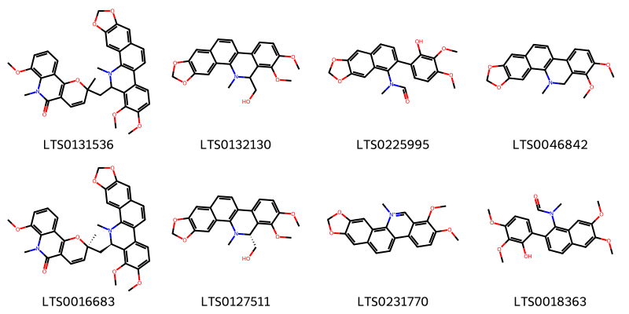{ width=100% }
    <figcaption>Hình ảnh cấu trúc hóa học của 8 hoạt chất thuộc nhóm Benzophenanthridine alkaloids gồm ['2-({17,18-dimethoxy-21-methyl-5,7-dioxa-21-azapentacyclo[11.8.0.0²,¹⁰.0⁴,⁸.0¹⁴,¹⁹]henicosa-1(13),2,4(8),9,11,14,16,18-octaen-20-yl}methyl)-7-methoxy-2,6-dimethylpyrano[3,2-c]quinolin-5-one (LTS0131536)', '{17,18-dimethoxy-21-methyl-5,7-dioxa-21-azapentacyclo[11.8.0.0²,¹⁰.0⁴,⁸.0¹⁴,¹⁹]henicosa-1(13),2,4(8),9,11,14,16,18-octaen-20-yl}methanol (LTS0132130)', 'n-[6-(2-hydroxy-3,4-dimethoxyphenyl)-2h-naphtho[2,3-d][1,3]dioxol-5-yl]-n-methylformamide (LTS0225995)', '17,18-dimethoxy-21-methyl-5,7-dioxa-21-azapentacyclo[11.8.0.0²,¹⁰.0⁴,⁸.0¹⁴,¹⁹]henicosa-1(13),2,4(8),9,11,14,16,18-octaene (LTS0046842)', '(2s)-2-{[(20r)-17,18-dimethoxy-21-methyl-5,7-dioxa-21-azapentacyclo[11.8.0.0²,¹⁰.0⁴,⁸.0¹⁴,¹⁹]henicosa-1(13),2,4(8),9,11,14,16,18-octaen-20-yl]methyl}-7-methoxy-2,6-dimethylpyrano[3,2-c]quinolin-5-one (LTS0016683)', '[(20r)-17,18-dimethoxy-21-methyl-5,7-dioxa-21-azapentacyclo[11.8.0.0²,¹⁰.0⁴,⁸.0¹⁴,¹⁹]henicosa-1(13),2,4(8),9,11,14,16,18-octaen-20-yl]methanol (LTS0127511)', 'chelerythrine (LTS0231770)', 'n-[2-(2-hydroxy-3,4-dimethoxyphenyl)-6,7-dimethoxynaphthalen-1-yl]-n-methylformamide (LTS0018363)'].</figcaption>
</figure>
#### Nhóm Carboxylic acids and derivatives
<figure markdown="span">
    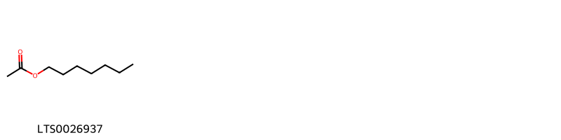{ width=100% }
    <figcaption>Hình ảnh cấu trúc hóa học của 1 hoạt chất thuộc nhóm Carboxylic acids and derivatives gồm ['heptyl acetate (LTS0026937)'].</figcaption>
</figure>
#### Nhóm Cinnamic acids and derivatives
<figure markdown="span">
    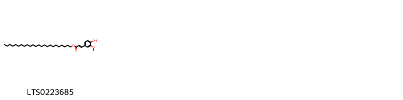{ width=100% }
    <figcaption>Hình ảnh cấu trúc hóa học của 1 hoạt chất thuộc nhóm Cinnamic acids and derivatives gồm ['tetracosyl (2e)-3-(4-hydroxy-3-methoxyphenyl)prop-2-enoate (LTS0223685)'].</figcaption>
</figure>
#### Nhóm Coumarins and derivatives
<figure markdown="span">
    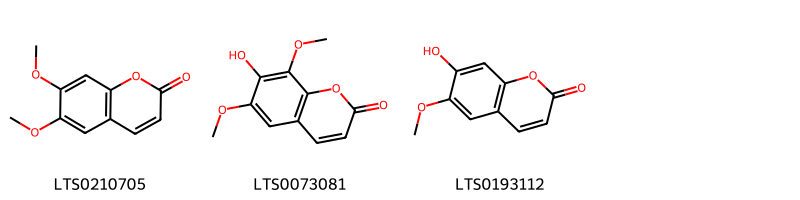{ width=100% }
    <figcaption>Hình ảnh cấu trúc hóa học của 3 hoạt chất thuộc nhóm Coumarins and derivatives gồm ['scoparone (LTS0210705)', 'isofraxidin (LTS0073081)', 'scopoletin (LTS0193112)'].</figcaption>
</figure>
#### Nhóm Fatty Acyls
<figure markdown="span">
    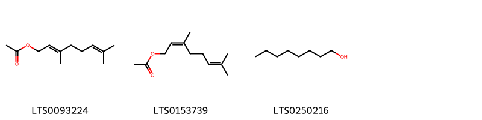{ width=100% }
    <figcaption>Hình ảnh cấu trúc hóa học của 3 hoạt chất thuộc nhóm Fatty Acyls gồm ['geranyl acetate (LTS0093224)', 'neryl acetate (LTS0153739)', 'octanol (LTS0250216)'].</figcaption>
</figure>
#### Nhóm Furanoid lignans
<figure markdown="span">
    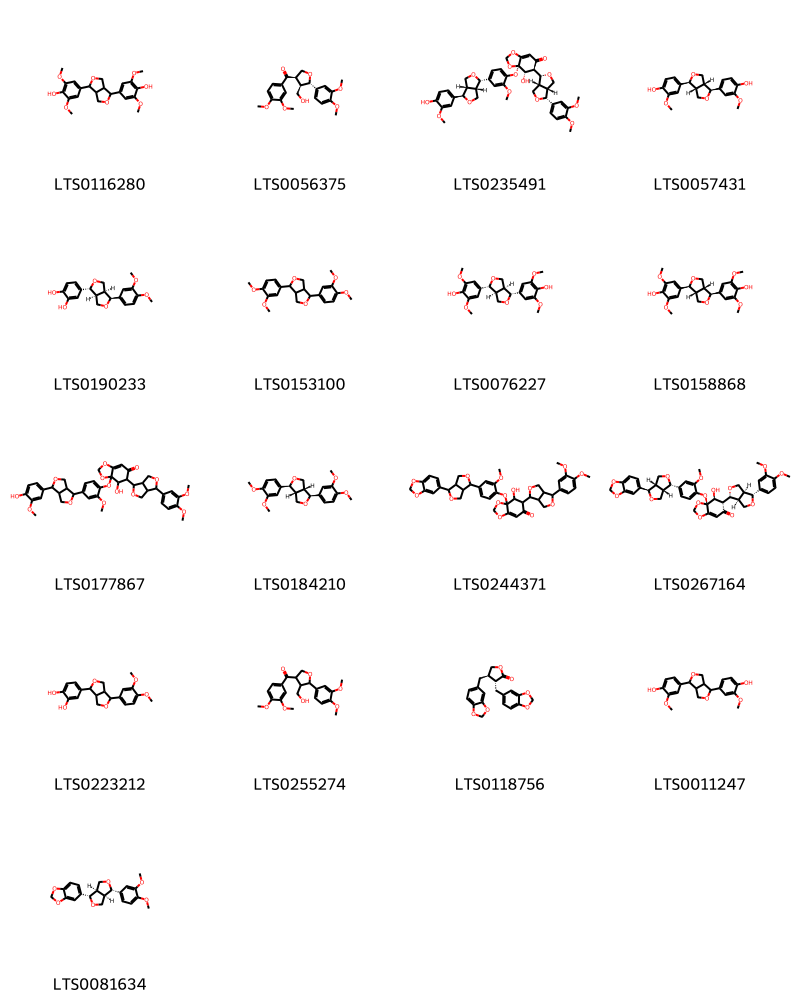{ width=100% }
    <figcaption>Hình ảnh cấu trúc hóa học của 17 hoạt chất thuộc nhóm Furanoid lignans gồm ['syringaresinol (LTS0116280)', '[(2s,3r,4r)-4-(3,4-dimethoxybenzoyl)-2-(3,4-dimethoxyphenyl)oxolan-3-yl]methanol (LTS0056375)', '(6r,7s,7ar)-6-[(1r,3ar,4r,6ar)-4-(3,4-dimethoxyphenyl)-hexahydrofuro[3,4-c]furan-1-yl]-7a-{4-[(1s,3as,4r,6as)-4-(4-hydroxy-3-methoxyphenyl)-hexahydrofuro[3,4-c]furan-1-yl]-2-methoxyphenoxy}-7-hydroxy-6,7-dihydro-2h-1,3-benzodioxol-5-one (LTS0235491)', 'pinoresinol (LTS0057431)', '4-[(1r,3as,4s,6as)-4-(3,4-dimethoxyphenyl)-hexahydrofuro[3,4-c]furan-1-yl]benzene-1,2-diol (LTS0190233)', '1,4-bis(3,4-dimethoxyphenyl)-hexahydrofuro[3,4-c]furan (LTS0153100)', '(-)-syringaresinol (LTS0076227)', '(+)-syringaresinol (LTS0158868)', '6-[4-(3,4-dimethoxyphenyl)-hexahydrofuro[3,4-c]furan-1-yl]-7-hydroxy-7a-{4-[4-(4-hydroxy-3-methoxyphenyl)-hexahydrofuro[3,4-c]furan-1-yl]-2-methoxyphenoxy}-6,7-dihydro-2h-1,3-benzodioxol-5-one (LTS0177867)', 'eudesmin (LTS0184210)', '7a-{4-[4-(2h-1,3-benzodioxol-5-yl)-hexahydrofuro[3,4-c]furan-1-yl]-2-methoxyphenoxy}-6-[4-(3,4-dimethoxyphenyl)-hexahydrofuro[3,4-c]furan-1-yl]-7-hydroxy-6,7-dihydro-2h-1,3-benzodioxol-5-one (LTS0244371)', '(6r,7s,7ar)-7a-{4-[(1s,3as,4r,6as)-4-(2h-1,3-benzodioxol-5-yl)-hexahydrofuro[3,4-c]furan-1-yl]-2-methoxyphenoxy}-6-[(1r,3as,4r,6as)-4-(3,4-dimethoxyphenyl)-hexahydrofuro[3,4-c]furan-1-yl]-7-hydroxy-6,7-dihydro-2h-1,3-benzodioxol-5-one (LTS0267164)', '4-[4-(3,4-dimethoxyphenyl)-hexahydrofuro[3,4-c]furan-1-yl]benzene-1,2-diol (LTS0223212)', '[4-(3,4-dimethoxybenzoyl)-2-(3,4-dimethoxyphenyl)oxolan-3-yl]methanol (LTS0255274)', 'hinokinin (LTS0118756)', 'pinoresinol (LTS0011247)', '5-[(1s,3ar,4s,6ar)-4-(3,4-dimethoxyphenyl)-hexahydrofuro[3,4-c]furan-1-yl]-2h-1,3-benzodioxole (LTS0081634)'].</figcaption>
</figure>
#### Nhóm Lignan lactones
<figure markdown="span">
    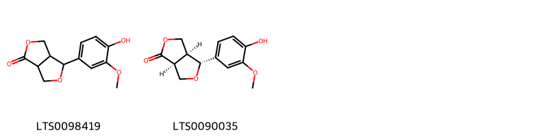{ width=100% }
    <figcaption>Hình ảnh cấu trúc hóa học của 2 hoạt chất thuộc nhóm Lignan lactones gồm ['4-(4-hydroxy-3-methoxyphenyl)-tetrahydro-3h-furo[3,4-c]furan-1-one (LTS0098419)', '(3as,4r,6as)-4-(4-hydroxy-3-methoxyphenyl)-tetrahydro-3h-furo[3,4-c]furan-1-one (LTS0090035)'].</figcaption>
</figure>
#### Nhóm Organooxygen compounds
<figure markdown="span">
    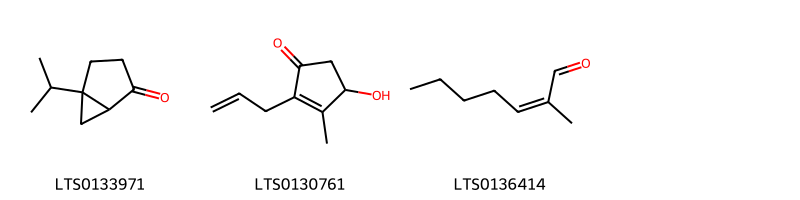{ width=100% }
    <figcaption>Hình ảnh cấu trúc hóa học của 3 hoạt chất thuộc nhóm Organooxygen compounds gồm ['sabinaketone (LTS0133971)', '4-hydroxy-3-methyl-2-(prop-2-en-1-yl)cyclopent-2-en-1-one (LTS0130761)', '2-methylhept-2-enal (LTS0136414)'].</figcaption>
</figure>
#### Nhóm Phenols
<figure markdown="span">
    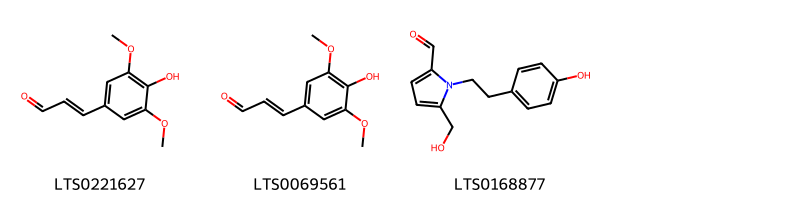{ width=100% }
    <figcaption>Hình ảnh cấu trúc hóa học của 3 hoạt chất thuộc nhóm Phenols gồm ['sinapyl aldehyde (LTS0221627)', 'sinapaldehyde (LTS0069561)', '5-(hydroxymethyl)-1-[2-(4-hydroxyphenyl)ethyl]pyrrole-2-carbaldehyde (LTS0168877)'].</figcaption>
</figure>
#### Nhóm Prenol lipids
<figure markdown="span">
    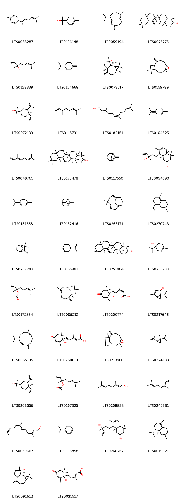{ width=100% }
    <figcaption>Hình ảnh cấu trúc hóa học của 42 hoạt chất thuộc nhóm Prenol lipids gồm ['zingiberene (LTS0085287)', 'terpineol (LTS0136148)', '(-)-germacrene d (LTS0059194)', 'β-amyrin (LTS0075776)', 'linalool, (+-)- (LTS0128839)', 'β phellandrene (LTS0124668)', '(1as,4as,7s,7ar,7bs)-1,1,7-trimethyl-4-methylidene-octahydrocyclopropa[e]azulen-7-ol (LTS0073517)', 'caryophyllene oxide (LTS0159789)', '2-[4-ethenyl-4-methyl-3-(prop-1-en-2-yl)cyclohexyl]propan-2-ol (LTS0072139)', 'α-myrcene (LTS0115731)', '(e,z)-farnesol (LTS0182151)', 'terpinolene (LTS0104525)', 'trans-β-ocimene (LTS0049765)', '(4ar,6ar,6bs,8ar,12ar,14ar,14br)-4,4,6a,6b,8a,11,11,14b-octamethyl-2,4a,5,6,7,8,9,10,12,12a,14,14a-dodecahydro-1h-picen-3-one (LTS0175478)', 'β-pinene (LTS0117550)', '(2s,4ar,8s,8as)-8-[(3s)-3-hydroxy-3-methylpent-4-en-1-yl]-4,4,7,8a-tetramethyl-1,2,3,4a,5,8-hexahydronaphthalen-2-ol (LTS0094190)', 'cymene (LTS0181568)', 'α pinene (LTS0132416)', 'humulene (LTS0263171)', '4-isopropyl-1,6-dimethyl-2,3,4,4a,7,8-hexahydronaphthalene (LTS0270743)', 'camphene (LTS0267242)', 'limonene,  (LTS0155981)', 'β-amyrin (LTS0251864)', '4-terpineol (LTS0253733)', 'linalyl formate (LTS0172354)', 'caryophyllene (LTS0085212)', 'abscisic acid (LTS0200774)', '1-isopropyl-4-methylbicyclo[3.1.0]hex-3-en-2-ol (LTS0217646)', '(1z,6z,8s)-8-isopropyl-1-methyl-5-methylidenecyclodeca-1,6-diene (LTS0065195)', '(s)-(+)-abscisic acid (LTS0260851)', 'β-caryophyllene oxide (LTS0213960)', 'sabinene (LTS0224133)', 'elemol (LTS0208556)', 'linalyl acetate (LTS0167325)', 'geraniol (LTS0258838)', 'β-ocimene (LTS0242381)', 'farnesol (LTS0059667)', 'terpinene (LTS0136858)', '8-(3-hydroxy-3-methylpent-4-en-1-yl)-4,4,7,8a-tetramethyl-1,2,3,4a,5,8-hexahydronaphthalen-2-ol (LTS0260267)', 'delta-cadinene (LTS0019321)', '(7ar)-1,1,7-trimethyl-4-methylidene-octahydrocyclopropa[e]azulen-7-ol (LTS0091612)', '5-(1-hydroxy-2,6,6-trimethyl-4-oxocyclohex-2-en-1-yl)-3-methylpenta-2,4-dienoic acid (LTS0021517)'].</figcaption>
</figure>
#### Nhóm Pyrans
<figure markdown="span">
    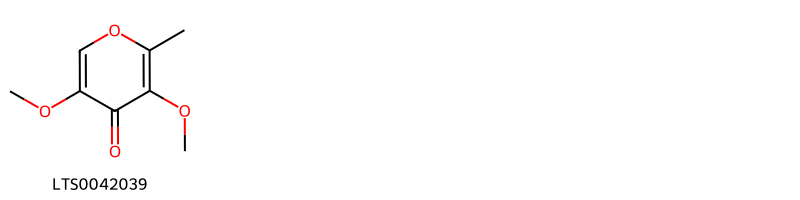{ width=100% }
    <figcaption>Hình ảnh cấu trúc hóa học của 1 hoạt chất thuộc nhóm Pyrans gồm ['3,5-dimethoxy-2-methylpyran-4-one (LTS0042039)'].</figcaption>
</figure>
#### Nhóm Quinolines and derivatives
<figure markdown="span">
    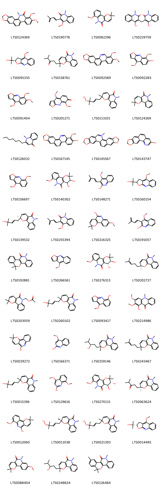{ width=100% }
    <figcaption>Hình ảnh cấu trúc hóa học của 47 hoạt chất thuộc nhóm Quinolines and derivatives gồm ['oxychelerythrine (LTS0124369)', '4-methoxy-1-methyl-3-[(1e)-3-methylbuta-1,3-dien-1-yl]quinolin-2-one (LTS0190776)', '7-methoxy-2,2,6-trimethylpyrano[3,2-c]quinolin-5-one (LTS0082296)', '4-hydroxy-3-[(4-hydroxy-1-methyl-2-oxoquinolin-3-yl)methyl]-1-methylquinolin-2-one (LTS0229759)', 'platydesmine (LTS0095335)', '2,6-dimethyl-2-(4-methyl-3-oxopentyl)pyrano[3,2-c]quinolin-5-one (LTS0158761)', 'norchelerythrine (LTS0092589)', 'haplopine (LTS0092283)', 'skimmianine (LTS0091404)', '4,8-dimethoxy-9h-furo[2,3-b]quinolin-7-one (LTS0201271)', '2-[(2e)-4-hydroperoxy-4-methylpent-2-en-1-yl]-2,6-dimethylpyrano[3,2-c]quinolin-5-one (LTS0113101)', 'n-methylflindersine (LTS0124269)', '2-heptyl-1-methylquinolin-4-one (LTS0126032)', 'decarine (LTS0167145)', '12-methyl-5,7,17,19-tetraoxa-12-azahexacyclo[11.11.0.0²,¹⁰.0⁴,⁸.0¹⁴,²².0¹⁶,²⁰]tetracosa-1(13),2(10),3,8,11,14(22),15,20,23-nonaen-12-ium (LTS0145567)', '13,15-dioxa-3-azatetracyclo[8.7.0.0²,⁷.0¹²,¹⁶]heptadeca-1(10),2(7),3,5,8,11,16-heptaen-5-ol (LTS0143747)', 'fagarine (LTS0156697)', '3,4-dihydroxy-7-methoxy-2,2,6-trimethyl-3h,4h-pyrano[3,2-c]quinolin-5-one (LTS0140302)', '4-methoxy-3-(3-methylbuta-1,3-dien-1-yl)quinolin-2-ol (LTS0148271)', '2-{4-methoxy-2h,3h-furo[2,3-b]quinolin-2-yl}propan-2-ol (LTS0160154)', '(2s)-2-[(2e)-4-hydroxy-4-methylpent-2-en-1-yl]-2,6-dimethylpyrano[3,2-c]quinolin-5-one (LTS0139532)', '4-methoxy-1-methyl-3-(3-methylbuta-1,3-dien-1-yl)quinolin-2-one (LTS0255394)', '8-methoxy-2,2-dimethylpyrano[3,2-c]quinolin-5-ol (LTS0216325)', '4-methoxy-3-[(1e)-3-methylbuta-1,3-dien-1-yl]quinolin-2-ol (LTS0191057)', '6,6,12-trimethylisochromeno[4,3-c]quinolin-11-one (LTS0192881)', 'dictamnine (LTS0266561)', '(3s,4r)-3,4-dihydroxy-7-methoxy-2,2,6-trimethyl-3h,4h-pyrano[3,2-c]quinolin-5-one (LTS0276313)', '(2s)-2,6-dimethyl-2-(4-methylpent-3-en-1-yl)pyrano[3,2-c]quinolin-5-one (LTS0202727)', '{2,2-dimethyl-5-oxopyrano[3,2-c]quinolin-6-yl}methyl acetate (LTS0203059)', '2-(4-hydroxy-4-methylpent-2-en-1-yl)-2,6-dimethylpyrano[3,2-c]quinolin-5-one (LTS0260102)', 'robustine (LTS0093417)', 'arborinine (LTS0214986)', 'flindersine (LTS0029273)', '4-methoxyquinolin-2-ol (LTS0166371)', '(2r)-2-[(3r)-3-hydroxy-4-methylpentyl]-2,6-dimethylpyrano[3,2-c]quinolin-5-one (LTS0259146)', '2,6-dimethyl-2-(4-methylpent-3-en-1-yl)pyrano[3,2-c]quinolin-5-one (LTS0243467)', '2-[(2e)-4-hydroxy-4-methylpent-2-en-1-yl]-2,6-dimethylpyrano[3,2-c]quinolin-5-one (LTS0015396)', '4,8-dimethoxyquinolin-2-ol (LTS0129616)', '(3r,4s)-3,4-dihydroxy-7-methoxy-2,2,6-trimethyl-3h,4h-pyrano[3,2-c]quinolin-5-one (LTS0270115)', '(2s)-2,6-dimethyl-2-(4-methyl-3-oxopentyl)pyrano[3,2-c]quinolin-5-one (LTS0063624)', '7-methoxy-2,2-dimethylpyrano[3,2-c]quinolin-5-ol (LTS0012060)', '(2r)-2-[(2e)-4-hydroperoxy-4-methylpent-2-en-1-yl]-2,6-dimethylpyrano[3,2-c]quinolin-5-one (LTS0011038)', '2-(4-hydroperoxy-4-methylpent-2-en-1-yl)-2,6-dimethylpyrano[3,2-c]quinolin-5-one (LTS0021393)', '2-[(2s)-4-methoxy-2h,3h-furo[2,3-b]quinolin-2-yl]propan-2-ol (LTS0014495)', '8-methoxy-2,2,6-trimethylpyrano[3,2-c]quinolin-5-one (LTS0088404)', '2-(3-hydroxy-4-methylpentyl)-2,6-dimethylpyrano[3,2-c]quinolin-5-one (LTS0248824)', '6,6,9,12-tetramethylisochromeno[4,3-c]quinolin-11-one (LTS0126484)'].</figcaption>
</figure>
#### Nhóm Steroids and steroid derivatives
<figure markdown="span">
    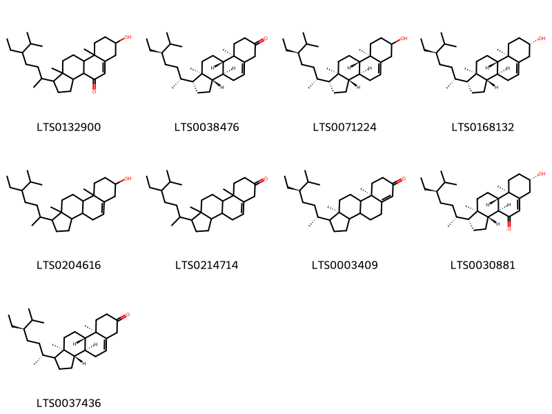{ width=100% }
    <figcaption>Hình ảnh cấu trúc hóa học của 9 hoạt chất thuộc nhóm Steroids and steroid derivatives gồm ['1-(5-ethyl-6-methylheptan-2-yl)-7-hydroxy-9a,11a-dimethyl-1h,2h,3h,3ah,3bh,6h,7h,8h,9h,9bh,10h,11h-cyclopenta[a]phenanthren-4-one (LTS0132900)', '(1r,3as,3bs,9ar,9bs,11ar)-1-[(2r,5r)-5-ethyl-6-methylheptan-2-yl]-9a,11a-dimethyl-1h,2h,3h,3ah,3bh,4h,6h,8h,9h,9bh,10h,11h-cyclopenta[a]phenanthren-7-one (LTS0038476)', 'stigmast-5-en-3-ol (LTS0071224)', 'sitosterol (LTS0168132)', 'stigmast-5-en-3-ol, (3β)- (LTS0204616)', '1-(5-ethyl-6-methylheptan-2-yl)-9a,11a-dimethyl-1h,2h,3h,3ah,3bh,4h,6h,8h,9h,9bh,10h,11h-cyclopenta[a]phenanthren-7-one (LTS0214714)', '(9ar,11ar)-1-[(2r,5r)-5-ethyl-6-methylheptan-2-yl]-9a,11a-dimethyl-1h,2h,3h,3ah,3bh,4h,5h,8h,9h,9bh,10h,11h-cyclopenta[a]phenanthren-7-one (LTS0003409)', '(1r,3as,3bs,7s,9ar,9bs,11ar)-1-[(2r,5r)-5-ethyl-6-methylheptan-2-yl]-7-hydroxy-9a,11a-dimethyl-1h,2h,3h,3ah,3bh,6h,7h,8h,9h,9bh,10h,11h-cyclopenta[a]phenanthren-4-one (LTS0030881)', '(3as,3bs,9ar,9bs,11ar)-1-[(2r,5r)-5-ethyl-6-methylheptan-2-yl]-9a,11a-dimethyl-1h,2h,3h,3ah,3bh,4h,6h,8h,9h,9bh,10h,11h-cyclopenta[a]phenanthren-7-one (LTS0037436)'].</figcaption>
</figure>
#### Nhóm Unsaturated hydrocarbons
<figure markdown="span">
    { width=100% }
    <figcaption>Hình ảnh cấu trúc hóa học của 1 hoạt chất thuộc nhóm Unsaturated hydrocarbons gồm ['α terpinene (LTS0232891)'].</figcaption>
</figure>

---

### Dược dân tộc học

Danh sách các quốc gia có sử dụng *Zanthoxylum simulans* trong điều trị các bệnh. 

| Country   | Disease   | Bệnh           |
|:----------|:----------|:---------------|
| China     | Vermifuge | Thuốc diệt sán |

---

---
## Zanthoxylum tetraermum
### Thông tin về thực vật

!!! info "Phân loại thực vật của *Zanthoxylum tetraspermum* từ GIBF:"
    - **Kingdom:** Plantae
    - **Phylum:** Tracheophyta
    - **Order:** Sapindales
    - **Family:** Rutaceae
    - **Genus:** Zanthoxylum
    - **Species:** *Zanthoxylum tetraspermum*

 

| Label (VI)   | Label (EN)   | Scientific Name      | Descriptions (VI)   | Descriptions (EN)   | Also Known As (VI)   | Also Known As (EN)   |
|:-------------|:-------------|:---------------------|:--------------------|:--------------------|:---------------------|:---------------------|
| N/A          | N/A          | Zanthoxylum simulans | loài thực vật       | species of plant    | ['']                 | ['']                 |

#### Phân bố trên thế giới

**Từ CSDL GIBF** nan, India, unknown or invalid, Sri Lanka

#### Phân bố tại Việt Nam

**Từ CSDL GIBF**: Không có ghi nhận ở Việt Nam

---
### Thành phần hóa học
        
- Theo cơ sở dữ liệu lotus: Từ loài *Zanthoxylum tetraspermum* đã phân lập và xác định được Chưa có hoạt chất nào được phân lập. hoạt chất thuộc về các nhóm Không có hoạt chất nào được phân lập. 

Không có hình ảnh nào được tạo ra

---

### Dược dân tộc học

Danh sách các quốc gia có sử dụng *Zanthoxylum tetraspermum* trong điều trị các bệnh. 

| Country   | Disease                          | Bệnh                         |
|:----------|:---------------------------------|:-----------------------------|
| Sri Lanka | Digestive, Stimulant, Astringent | Tiêu hóa, Kích thích, Làm se |

---

# Chi Citrus

??? note "Danh sách các dược liệu thuộc chi"
    
	 - *Citrus acida*
	 - *Citrus aurantifolia*
	 - *Citrus aurantiifolia*
	 - *Citrus aurantium*
	 - *Citrus bigaradia*
	 - *Citrus grandis*
	 - *Citrus hystrix*
	 - *Citrus limon*
	 - *Citrus maxima*
	 - *Citrus medica*
	 - *Citrus nobilis*
	 - *Citrus paradisi*
	 - *Citrus reticulata*
	 - *Citrus sinensis*

---
## Citrus acida
### Thông tin về thực vật

!!! info "Phân loại thực vật của *N/A* từ GIBF:"
    - **Kingdom:** Plantae
    - **Phylum:** Tracheophyta
    - **Order:** Sapindales
    - **Family:** Rutaceae
    - **Genus:** Citrus
    - **Species:** *N/A*

 

| Label (VI)   | Label (EN)   | Scientific Name   | Descriptions (VI)   | Descriptions (EN)              | Also Known As (VI)   | Also Known As (EN)   |
|:-------------|:-------------|:------------------|:--------------------|:-------------------------------|:---------------------|:---------------------|
| N/A          | N/A          | Citrus acida      |                     | species of fruit-bearing plant | ['']                 | ['']                 |

#### Phân bố trên thế giới

**Từ CSDL GIBF** Sri Lanka, Australia, Georgia, Guatemala, Argentina, Puerto Rico, Korea, Republic of, Chinese Taipei, Spain, Türkiye, Hungary, United States of America, Uruguay, Greece, South Africa, Hong Kong, Thailand, Brazil, Egypt, Switzerland, Mexico, China, Ecuador, Colombia, India, Malaysia, New Zealand, Nepal

#### Phân bố tại Việt Nam

**Từ CSDL GIBF**: Không có ghi nhận ở Việt Nam

---
### Thành phần hóa học
        
- Theo cơ sở dữ liệu lotus: Từ loài *N/A* đã phân lập và xác định được Chưa có hoạt chất nào được phân lập. hoạt chất thuộc về các nhóm Không có hoạt chất nào được phân lập. 

Không có hình ảnh nào được tạo ra

---

### Dược dân tộc học

Danh sách các quốc gia có sử dụng *N/A* trong điều trị các bệnh. 

| Country   | Disease   | Bệnh               |
|:----------|:----------|:-------------------|
| China     | Tonic     | (thuộc) trương lực |

---

---
## Citrus aurantifolia
### Thông tin về thực vật

!!! info "Phân loại thực vật của *Citrus aurantiifolia* từ GIBF:"
    - **Kingdom:** Plantae
    - **Phylum:** Tracheophyta
    - **Order:** Sapindales
    - **Family:** Rutaceae
    - **Genus:** Citrus
    - **Species:** *Citrus aurantiifolia*

 

| Label (VI)   | Label (EN)   | Scientific Name   | Descriptions (VI)   | Descriptions (EN)              | Also Known As (VI)   | Also Known As (EN)   |
|:-------------|:-------------|:------------------|:--------------------|:-------------------------------|:---------------------|:---------------------|
| N/A          | N/A          | Citrus acida      |                     | species of fruit-bearing plant | ['']                 | ['']                 |

#### Phân bố trên thế giới

**Từ CSDL GIBF** nan, Australia, Belgium, Cambodia, Gabon, Angola, Benin, Panama, Togo, Pakistan, Puerto Rico, Réunion, Nigeria, Spain, Bolivia (Plurinational State of), Türkiye, Honduras, Papua New Guinea, United States of America, Chile, Bonaire, Sint Eustatius and Saba, El Salvador, Greece, Belize, South Africa, Trinidad and Tobago, Uganda, Barbados, Thailand, Iran (Islamic Republic of), Brazil, Dominican Republic, Mexico, Peru, Singapore, Mayotte, Norfolk Island, Ecuador, French Polynesia, Seychelles, Colombia, Costa Rica, India, Indonesia, Antigua and Barbuda, Philippines, Malaysia, Nepal

#### Phân bố tại Việt Nam

**Từ CSDL GIBF**: Không có ghi nhận ở Việt Nam

---
### Thành phần hóa học
        
- Theo cơ sở dữ liệu lotus: Từ loài *Citrus aurantiifolia* đã phân lập và xác định được 83 hoạt chất thuộc về các nhóm Fatty Acyls, Flavonoids, Prenol lipids, Indoles and derivatives, Oxanes, Benzene and substituted derivatives, Unsaturated hydrocarbons, Heteroaromatic compounds, Organooxygen compounds. 

|    | chemicalTaxonomyClassyfireClass     |   smiles_count |
|---:|:------------------------------------|---------------:|
|  0 | Benzene and substituted derivatives |              7 |
|  1 | Fatty Acyls                         |              1 |
|  2 | Flavonoids                          |             25 |
|  3 | Heteroaromatic compounds            |              1 |
|  4 | Indoles and derivatives             |              1 |
|  5 | Organooxygen compounds              |              3 |
|  6 | Oxanes                              |              1 |
|  7 | Prenol lipids                       |             40 |
|  8 | Unsaturated hydrocarbons            |              4 |

#### Nhóm Benzene and substituted derivatives
<figure markdown="span">
    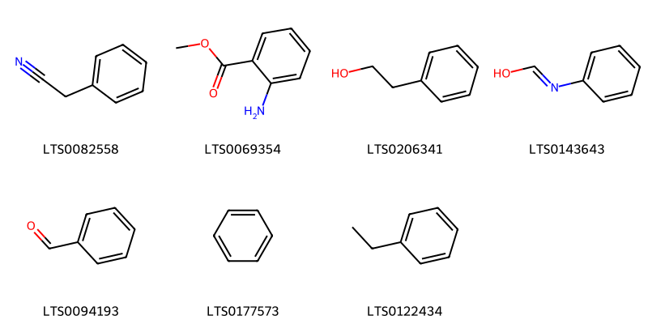{ width=100% }
    <figcaption>Hình ảnh cấu trúc hóa học của 7 hoạt chất thuộc nhóm Benzene and substituted derivatives gồm ['phenylacetonitrile (LTS0082558)', 'methyl anthranilate (LTS0069354)', '2-phenyl-ethanol (LTS0206341)', 'n-phenylcarboximidic acid (LTS0143643)', 'benzaldehyde (LTS0094193)', 'benzene (LTS0177573)', 'ethylbenzene (LTS0122434)'].</figcaption>
</figure>
#### Nhóm Fatty Acyls
<figure markdown="span">
    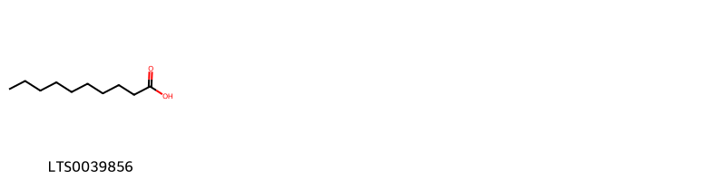{ width=100% }
    <figcaption>Hình ảnh cấu trúc hóa học của 1 hoạt chất thuộc nhóm Fatty Acyls gồm ['capric acid (LTS0039856)'].</figcaption>
</figure>
#### Nhóm Flavonoids
<figure markdown="span">
    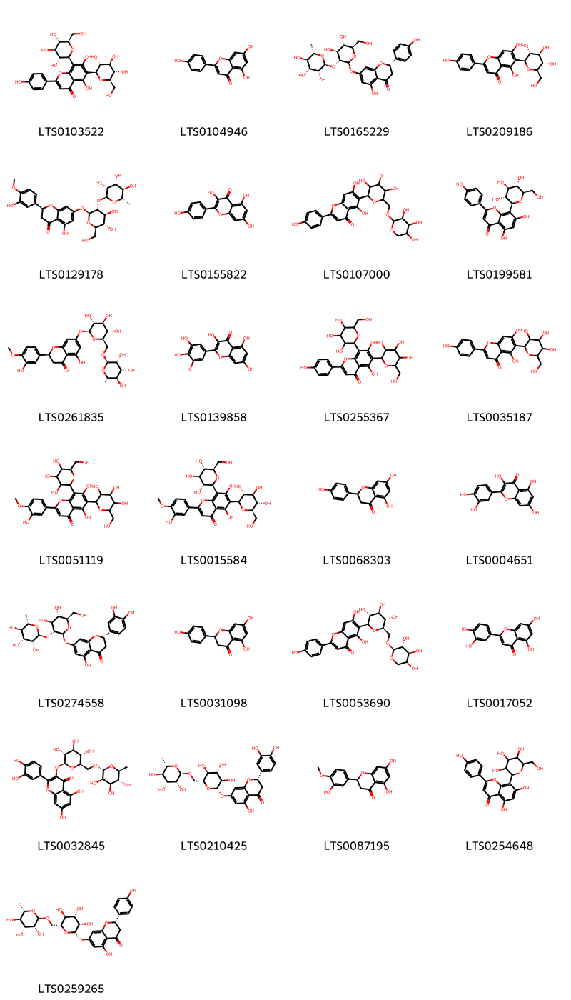{ width=100% }
    <figcaption>Hình ảnh cấu trúc hóa học của 25 hoạt chất thuộc nhóm Flavonoids gồm ['vicenin-2 (LTS0103522)', 'chamomile (LTS0104946)', 'naringin (LTS0165229)', 'isovitexin (LTS0209186)', 'neohesperidin (LTS0129178)', 'kaempherol (LTS0155822)', '5,7-dihydroxy-2-(4-hydroxyphenyl)-6-(3,4,5-trihydroxy-6-{[(3,4,5-trihydroxyoxan-2-yl)oxy]methyl}oxan-2-yl)chromen-4-one (LTS0107000)', 'vitexin (LTS0199581)', 'hesperidin (LTS0261835)', 'myricetin (LTS0139858)', '5,7-dihydroxy-2-(4-hydroxyphenyl)-6,8-bis[3,4,5-trihydroxy-6-(hydroxymethyl)oxan-2-yl]chromen-4-one (LTS0255367)', 'isovitexin (LTS0035187)', '5,7-dihydroxy-2-(3-hydroxy-4-methoxyphenyl)-6,8-bis[3,4,5-trihydroxy-6-(hydroxymethyl)oxan-2-yl]chromen-4-one (LTS0051119)', '5,7-dihydroxy-2-(3-hydroxy-4-methoxyphenyl)-6,8-bis[(2s,3r,4r,5s,6r)-3,4,5-trihydroxy-6-(hydroxymethyl)oxan-2-yl]chromen-4-one (LTS0015584)', 'asahina (LTS0068303)', 'quercetin (LTS0004651)', 'neoeriocitrin (LTS0274558)', 'naringenin (LTS0031098)', '5,7-dihydroxy-2-(4-hydroxyphenyl)-6-[(2s,3r,4r,5s,6r)-3,4,5-trihydroxy-6-({[(2s,3r,4s,5s)-3,4,5-trihydroxyoxan-2-yl]oxy}methyl)oxan-2-yl]chromen-4-one (LTS0053690)', 'luteolin (LTS0017052)', '3-rutinosyl quercetin (LTS0032845)', 'eriocitrin (LTS0210425)', 'hesperetin (LTS0087195)', 'vitexin (LTS0254648)', 'narirutin (LTS0259265)'].</figcaption>
</figure>
#### Nhóm Heteroaromatic compounds
<figure markdown="span">
    { width=100% }
    <figcaption>Hình ảnh cấu trúc hóa học của 1 hoạt chất thuộc nhóm Heteroaromatic compounds gồm ['silvan (LTS0020613)'].</figcaption>
</figure>
#### Nhóm Indoles and derivatives
<figure markdown="span">
    { width=100% }
    <figcaption>Hình ảnh cấu trúc hóa học của 1 hoạt chất thuộc nhóm Indoles and derivatives gồm ['indole (LTS0185357)'].</figcaption>
</figure>
#### Nhóm Organooxygen compounds
<figure markdown="span">
    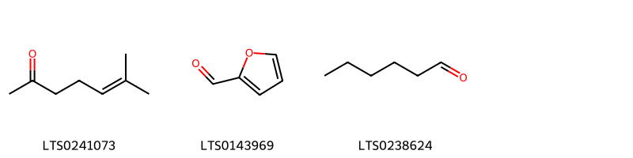{ width=100% }
    <figcaption>Hình ảnh cấu trúc hóa học của 3 hoạt chất thuộc nhóm Organooxygen compounds gồm ['6-methyl-5-hepten-2-one (LTS0241073)', 'bran oil (LTS0143969)', 'hexanal (LTS0238624)'].</figcaption>
</figure>
#### Nhóm Oxanes
<figure markdown="span">
    { width=100% }
    <figcaption>Hình ảnh cấu trúc hóa học của 1 hoạt chất thuộc nhóm Oxanes gồm ['1,8-cineole (LTS0166505)'].</figcaption>
</figure>
#### Nhóm Prenol lipids
<figure markdown="span">
    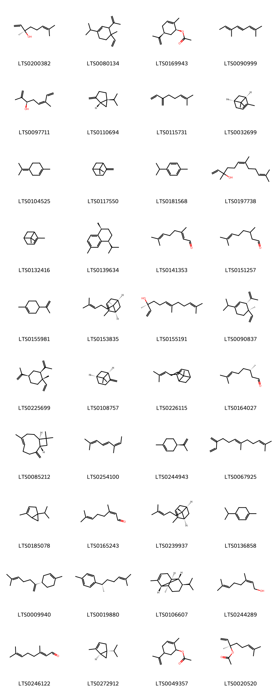{ width=100% }
    <figcaption>Hình ảnh cấu trúc hóa học của 40 hoạt chất thuộc nhóm Prenol lipids gồm ['(-)-linalool (LTS0200382)', '4-ethenyl-1-isopropyl-4-methyl-3-(prop-1-en-2-yl)cyclohex-1-ene (LTS0080134)', '(1s,5s)-carvyl acetate (LTS0169943)', 'allo-ocimene (LTS0090999)', '(3r,5z)-2,6-dimethylocta-1,5,7-trien-3-ol (LTS0097711)', '(+)-sabinene (LTS0110694)', 'α-myrcene (LTS0115731)', '(-)-α-pinene (LTS0032699)', 'terpinolene (LTS0104525)', 'β-pinene (LTS0117550)', 'cymene (LTS0181568)', 'nerolidol (LTS0197738)', 'α pinene (LTS0132416)', '(1s,4s)-4-isopropyl-1,6-dimethyl-1,2,3,4-tetrahydronaphthalene (LTS0139634)', '3,7-dimethyl-2,6-octadienal (LTS0141353)', 'citronella (LTS0151257)', 'limonene,  (LTS0155981)', '(-)-endo-α-bergamotene (LTS0153835)', 'nerolidol (LTS0155191)', 'elemene (LTS0090837)', 'β-elemene (LTS0225699)', '(-)-β-pinene (LTS0108757)', 'α-bergamotene (LTS0226115)', '(s)-(-)-citronellal (LTS0164027)', 'caryophyllene (LTS0085212)', '(4e,6z)-alloocimene (LTS0254100)', 'α-limonene (LTS0244943)', 'β-farnesene (LTS0067925)', 'α-thujene (LTS0185078)', 'neral (LTS0165243)', '(-)-trans-α-bergamotene (LTS0239937)', 'terpinene (LTS0136858)', '(-)-β-bisabolene (LTS0009940)', 'α-curcumene (LTS0019880)', '(1r,2s,6s,7s,8r)-8-isopropyl-1,3-dimethyltricyclo[4.4.0.0²,⁷]dec-3-ene (LTS0106607)', 'nerol (LTS0244289)', 'α-citral (LTS0246122)', '(+)-α-thujene (LTS0272912)', 'carvyl acetate (LTS0049357)', 'linalyl acetate (LTS0020520)'].</figcaption>
</figure>
#### Nhóm Unsaturated hydrocarbons
<figure markdown="span">
    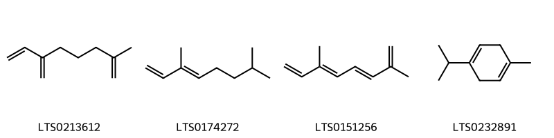{ width=100% }
    <figcaption>Hình ảnh cấu trúc hóa học của 4 hoạt chất thuộc nhóm Unsaturated hydrocarbons gồm ['2-methyl-6-methylideneocta-1,7-diene (LTS0213612)', '(3e)-3,7-dimethylocta-1,3-diene (LTS0174272)', 'cosmene (LTS0151256)', 'α terpinene (LTS0232891)'].</figcaption>
</figure>

---

### Dược dân tộc học

Danh sách các quốc gia có sử dụng *Citrus aurantiifolia* trong điều trị các bệnh. 

| Country            | Disease                                              | Bệnh                                                 |
|:-------------------|:-----------------------------------------------------|:-----------------------------------------------------|
| Dominican Republic | Refrigerant, Stomachic                               | Môi chất lạnh, Dạ dày                                |
| Elsewhere          | Antiseptic, Apertif, nan, Stomachic, Vermifuge, Soap | Khử trùng, Apertif, nan, Dạ dày, Vermifuge, Xà phòng |
| Haiti              | Purgative, Emetic                                    | Purgative, Emetic                                    |
| Mexico             | Vermifuge                                            | Thuốc diệt sán                                       |
| Trinidad           | Vermifuge, Vermifuge                                 | Vermifuge, Vermifuge                                 |

---

---
## Citrus aurantiifolia
### Thông tin về thực vật

!!! info "Phân loại thực vật của *Citrus aurantiifolia* từ GIBF:"
    - **Kingdom:** Plantae
    - **Phylum:** Tracheophyta
    - **Order:** Sapindales
    - **Family:** Rutaceae
    - **Genus:** Citrus
    - **Species:** *Citrus aurantiifolia*

 

| Label (VI)   | Label (EN)   | Scientific Name   | Descriptions (VI)   | Descriptions (EN)              | Also Known As (VI)   | Also Known As (EN)   |
|:-------------|:-------------|:------------------|:--------------------|:-------------------------------|:---------------------|:---------------------|
| N/A          | N/A          | Citrus acida      |                     | species of fruit-bearing plant | ['']                 | ['']                 |

#### Phân bố trên thế giới

**Từ CSDL GIBF** nan, Australia, Belgium, Cambodia, Gabon, Angola, Benin, Panama, Togo, Pakistan, Puerto Rico, Réunion, Nigeria, Spain, Bolivia (Plurinational State of), Türkiye, Honduras, Papua New Guinea, United States of America, Chile, Bonaire, Sint Eustatius and Saba, El Salvador, Greece, Belize, South Africa, Trinidad and Tobago, Uganda, Barbados, Thailand, Iran (Islamic Republic of), Brazil, Dominican Republic, Mexico, Peru, Singapore, Mayotte, Norfolk Island, Ecuador, French Polynesia, Seychelles, Colombia, Costa Rica, India, Indonesia, Antigua and Barbuda, Philippines, Malaysia, Nepal

#### Phân bố tại Việt Nam

**Từ CSDL GIBF**: Không có ghi nhận ở Việt Nam

---
### Thành phần hóa học
        
- Theo cơ sở dữ liệu lotus: Từ loài *Citrus aurantiifolia* đã phân lập và xác định được 126 hoạt chất thuộc về các nhóm Fatty Acyls, Flavonoids, Prenol lipids, Indoles and derivatives, Oxanes, Benzene and substituted derivatives, Unsaturated hydrocarbons, Heteroaromatic compounds, Organooxygen compounds, Dihydrofurans, Coumarins and derivatives, Imidazopyrimidines. 

|    | chemicalTaxonomyClassyfireClass     |   smiles_count |
|---:|:------------------------------------|---------------:|
|  0 | Benzene and substituted derivatives |              8 |
|  1 | Coumarins and derivatives           |              8 |
|  2 | Dihydrofurans                       |              1 |
|  3 | Fatty Acyls                         |              1 |
|  4 | Flavonoids                          |             31 |
|  5 | Heteroaromatic compounds            |              1 |
|  6 | Imidazopyrimidines                  |              1 |
|  7 | Indoles and derivatives             |              1 |
|  8 | Organooxygen compounds              |              4 |
|  9 | Oxanes                              |              1 |
| 10 | Prenol lipids                       |             64 |
| 11 | Unsaturated hydrocarbons            |              4 |

#### Nhóm Benzene and substituted derivatives
<figure markdown="span">
    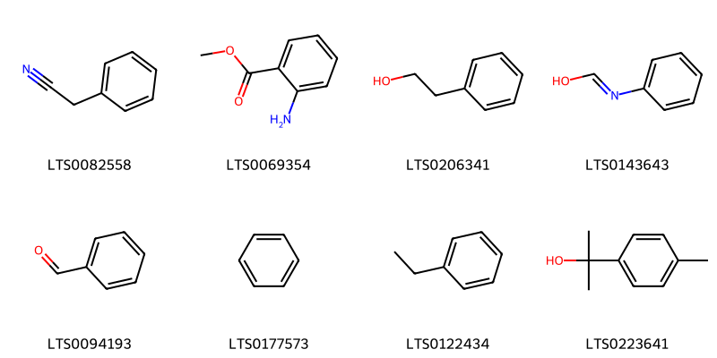{ width=100% }
    <figcaption>Hình ảnh cấu trúc hóa học của 8 hoạt chất thuộc nhóm Benzene and substituted derivatives gồm ['phenylacetonitrile (LTS0082558)', 'methyl anthranilate (LTS0069354)', '2-phenyl-ethanol (LTS0206341)', 'n-phenylcarboximidic acid (LTS0143643)', 'benzaldehyde (LTS0094193)', 'benzene (LTS0177573)', 'ethylbenzene (LTS0122434)', 'p-cymen-8-ol (LTS0223641)'].</figcaption>
</figure>
#### Nhóm Coumarins and derivatives
<figure markdown="span">
    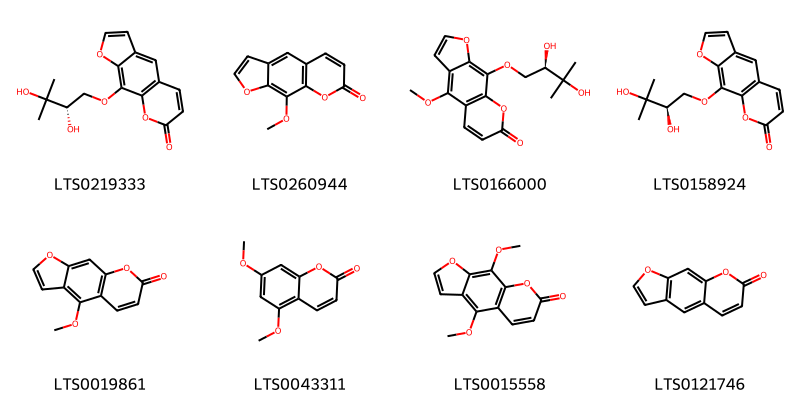{ width=100% }
    <figcaption>Hình ảnh cấu trúc hóa học của 8 hoạt chất thuộc nhóm Coumarins and derivatives gồm ['9-[(2s)-2,3-dihydroxy-3-methylbutoxy]furo[3,2-g]chromen-7-one (LTS0219333)', 'methoxsalen (LTS0260944)', 'byakangelicin (LTS0166000)', 'heraclenol (LTS0158924)', 'bergapten (LTS0019861)', 'limettin (LTS0043311)', 'isopimpinellin (LTS0015558)', 'psoralen (LTS0121746)'].</figcaption>
</figure>
#### Nhóm Dihydrofurans
<figure markdown="span">
    { width=100% }
    <figcaption>Hình ảnh cấu trúc hóa học của 1 hoạt chất thuộc nhóm Dihydrofurans gồm ['vitamin c (LTS0022555)'].</figcaption>
</figure>
#### Nhóm Fatty Acyls
<figure markdown="span">
    { width=100% }
    <figcaption>Hình ảnh cấu trúc hóa học của 1 hoạt chất thuộc nhóm Fatty Acyls gồm ['capric acid (LTS0039856)'].</figcaption>
</figure>
#### Nhóm Flavonoids
<figure markdown="span">
    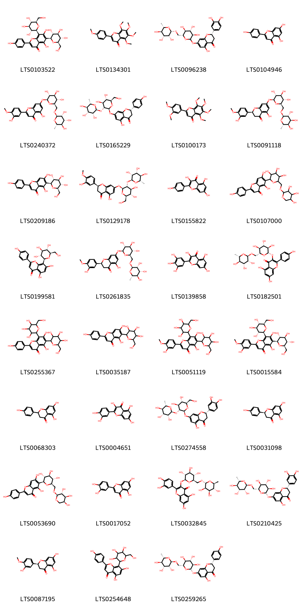{ width=100% }
    <figcaption>Hình ảnh cấu trúc hóa học của 31 hoạt chất thuộc nhóm Flavonoids gồm ['vicenin-2 (LTS0103522)', 'tangeretin (LTS0134301)', '(2s)-2-(3,4-dihydroxyphenyl)-5-hydroxy-7-{[(3r,4s,5s,6r)-3,4,5-trihydroxy-6-({[(2s,3r,4r,5r,6s)-3,4,5-trihydroxy-6-methyloxan-2-yl]oxy}methyl)oxan-2-yl]oxy}-2,3-dihydro-1-benzopyran-4-one (LTS0096238)', 'chamomile (LTS0104946)', 'diosmin (LTS0240372)', 'naringin (LTS0165229)', 'nobiletin (LTS0100173)', '(2s)-5-hydroxy-2-(3-hydroxy-4-methoxyphenyl)-7-{[(2s,3r,4s,5s,6r)-3,4,5-trihydroxy-6-({[(2r,3r,4s,5r,6s)-3,4,5-trihydroxy-6-methyloxan-2-yl]oxy}methyl)oxan-2-yl]oxy}-2,3-dihydro-1-benzopyran-4-one (LTS0091118)', 'isovitexin (LTS0209186)', 'neohesperidin (LTS0129178)', 'kaempherol (LTS0155822)', '5,7-dihydroxy-2-(4-hydroxyphenyl)-6-(3,4,5-trihydroxy-6-{[(3,4,5-trihydroxyoxan-2-yl)oxy]methyl}oxan-2-yl)chromen-4-one (LTS0107000)', 'vitexin (LTS0199581)', 'hesperidin (LTS0261835)', 'myricetin (LTS0139858)', 'nictoflorin (LTS0182501)', '5,7-dihydroxy-2-(4-hydroxyphenyl)-6,8-bis[3,4,5-trihydroxy-6-(hydroxymethyl)oxan-2-yl]chromen-4-one (LTS0255367)', 'isovitexin (LTS0035187)', '5,7-dihydroxy-2-(3-hydroxy-4-methoxyphenyl)-6,8-bis[3,4,5-trihydroxy-6-(hydroxymethyl)oxan-2-yl]chromen-4-one (LTS0051119)', '5,7-dihydroxy-2-(3-hydroxy-4-methoxyphenyl)-6,8-bis[(2s,3r,4r,5s,6r)-3,4,5-trihydroxy-6-(hydroxymethyl)oxan-2-yl]chromen-4-one (LTS0015584)', 'asahina (LTS0068303)', 'quercetin (LTS0004651)', 'neoeriocitrin (LTS0274558)', 'naringenin (LTS0031098)', '5,7-dihydroxy-2-(4-hydroxyphenyl)-6-[(2s,3r,4r,5s,6r)-3,4,5-trihydroxy-6-({[(2s,3r,4s,5s)-3,4,5-trihydroxyoxan-2-yl]oxy}methyl)oxan-2-yl]chromen-4-one (LTS0053690)', 'luteolin (LTS0017052)', '3-rutinosyl quercetin (LTS0032845)', 'eriocitrin (LTS0210425)', 'hesperetin (LTS0087195)', 'vitexin (LTS0254648)', 'narirutin (LTS0259265)'].</figcaption>
</figure>
#### Nhóm Heteroaromatic compounds
<figure markdown="span">
    { width=100% }
    <figcaption>Hình ảnh cấu trúc hóa học của 1 hoạt chất thuộc nhóm Heteroaromatic compounds gồm ['silvan (LTS0020613)'].</figcaption>
</figure>
#### Nhóm Imidazopyrimidines
<figure markdown="span">
    { width=100% }
    <figcaption>Hình ảnh cấu trúc hóa học của 1 hoạt chất thuộc nhóm Imidazopyrimidines gồm ['caffeine (LTS0075508)'].</figcaption>
</figure>
#### Nhóm Indoles and derivatives
<figure markdown="span">
    { width=100% }
    <figcaption>Hình ảnh cấu trúc hóa học của 1 hoạt chất thuộc nhóm Indoles and derivatives gồm ['indole (LTS0185357)'].</figcaption>
</figure>
#### Nhóm Organooxygen compounds
<figure markdown="span">
    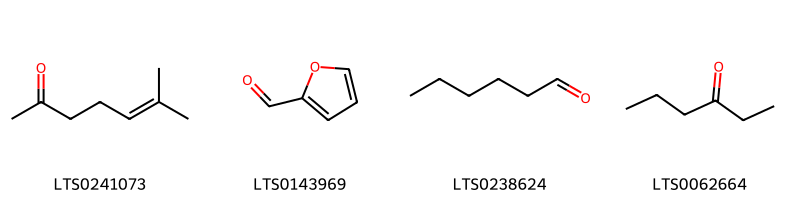{ width=100% }
    <figcaption>Hình ảnh cấu trúc hóa học của 4 hoạt chất thuộc nhóm Organooxygen compounds gồm ['6-methyl-5-hepten-2-one (LTS0241073)', 'bran oil (LTS0143969)', 'hexanal (LTS0238624)', '3-hexanone (LTS0062664)'].</figcaption>
</figure>
#### Nhóm Oxanes
<figure markdown="span">
    { width=100% }
    <figcaption>Hình ảnh cấu trúc hóa học của 1 hoạt chất thuộc nhóm Oxanes gồm ['1,8-cineole (LTS0166505)'].</figcaption>
</figure>
#### Nhóm Prenol lipids
<figure markdown="span">
    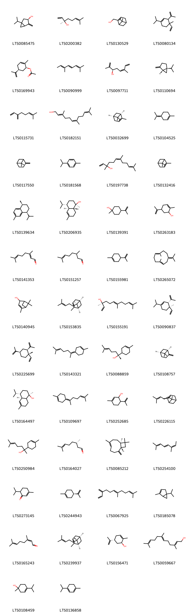{ width=100% }
    <figcaption>Hình ảnh cấu trúc hóa học của 64 hoạt chất thuộc nhóm Prenol lipids gồm ['sabinol (LTS0085475)', '(-)-linalool (LTS0200382)', 'myrtenol (LTS0130529)', '4-ethenyl-1-isopropyl-4-methyl-3-(prop-1-en-2-yl)cyclohex-1-ene (LTS0080134)', '(1s,5s)-carvyl acetate (LTS0169943)', 'allo-ocimene (LTS0090999)', '(3r,5z)-2,6-dimethylocta-1,5,7-trien-3-ol (LTS0097711)', '(+)-sabinene (LTS0110694)', 'α-myrcene (LTS0115731)', '(e,z)-farnesol (LTS0182151)', '(-)-α-pinene (LTS0032699)', 'terpinolene (LTS0104525)', 'β-pinene (LTS0117550)', 'cymene (LTS0181568)', 'nerolidol (LTS0197738)', 'α pinene (LTS0132416)', '(1s,4s)-4-isopropyl-1,6-dimethyl-1,2,3,4-tetrahydronaphthalene (LTS0139634)', 'α-cadinol (LTS0206935)', 'terpineols (LTS0139391)', 'carveol (LTS0263183)', '3,7-dimethyl-2,6-octadienal (LTS0141353)', 'citronella (LTS0151257)', 'limonene,  (LTS0155981)', 'germacrene b (LTS0265072)', 'verbenol (LTS0140945)', '(-)-endo-α-bergamotene (LTS0153835)', 'nerolidol (LTS0155191)', 'elemene (LTS0090837)', 'β-elemene (LTS0225699)', '(z)-γ-bisabolene (LTS0143321)', '(2r)-6-methyl-2-(4-methylcyclohex-3-en-1-yl)hept-5-en-2-ol (LTS0088859)', '(-)-β-pinene (LTS0108757)', '(1r,4s,4ar)-4-isopropyl-1,6-dimethyl-3,4,4a,7,8,8a-hexahydro-2h-naphthalen-1-ol (LTS0164497)', 'bisabolene (LTS0109697)', 'isopiperitenol (LTS0252685)', 'α-bergamotene (LTS0226115)', 'α-bisabolol (LTS0250984)', '(s)-(-)-citronellal (LTS0164027)', 'caryophyllene (LTS0085212)', '(4e,6z)-alloocimene (LTS0254100)', 'piperitone (LTS0273145)', 'α-limonene (LTS0244943)', 'β-farnesene (LTS0067925)', 'α-thujene (LTS0185078)', 'neral (LTS0165243)', '(-)-trans-α-bergamotene (LTS0239937)', '(-)-trans-carveol (LTS0156471)', 'farnesol (LTS0059667)', 'p-menth-3-en-1-ol (LTS0108459)', 'terpinene (LTS0136858)', '(-)-β-bisabolene (LTS0009940)', 'auraptene (LTS0058299)', '(3r)-6,6-dimethyl-2-methylidenebicyclo[3.1.1]heptan-3-ol (LTS0009265)', 'α-curcumene (LTS0019880)', '(1r,2s,6s,7s,8r)-8-isopropyl-1,3-dimethyltricyclo[4.4.0.0²,⁷]dec-3-ene (LTS0106607)', 'nerol (LTS0244289)', 'pinocarveol (LTS0090950)', 'citronellol, (+-)- (LTS0090925)', 'α-citral (LTS0246122)', '(+)-α-thujene (LTS0272912)', 'carvyl acetate (LTS0049357)', 'linalyl acetate (LTS0020520)', '(-)-cis-carveol (LTS0048903)', 'e,e-farnesal (LTS0118407)'].</figcaption>
</figure>
#### Nhóm Unsaturated hydrocarbons
<figure markdown="span">
    { width=100% }
    <figcaption>Hình ảnh cấu trúc hóa học của 4 hoạt chất thuộc nhóm Unsaturated hydrocarbons gồm ['2-methyl-6-methylideneocta-1,7-diene (LTS0213612)', '(3e)-3,7-dimethylocta-1,3-diene (LTS0174272)', 'cosmene (LTS0151256)', 'α terpinene (LTS0232891)'].</figcaption>
</figure>

---

### Dược dân tộc học

Danh sách các quốc gia có sử dụng *Citrus aurantiifolia* trong điều trị các bệnh. 

| Country      | Disease                                        | Bệnh                                                     |
|:-------------|:-----------------------------------------------|:---------------------------------------------------------|
| Elsewhere    | Styptic, Sudorific, Tonic, Antiseptic          | Styptic, Sudorific, Tonic, Khử trùng                     |
| Ghana        | Pediculicide                                   | Pediculicide                                             |
| Guatemala    | Antiseptic                                     | Khử trùng                                                |
| Iraq         | Carminative, Carminative, Stomachic, Stomachic | Carminative, Carminative, Dạ dày, Dạ dày                 |
| Nigeria      | Vermifuge                                      | Thuốc diệt sán                                           |
| Senegal      | Vermifuge                                      | Thuốc diệt sán                                           |
| Sierra Leone | Vermifuge                                      | Thuốc diệt sán                                           |
| Turkey       | Refrigerant, Stomachic                         | Môi chất lạnh, Dạ dày                                    |
| W Africa     | Vermifuge, Laxative, Collyrium, Refrigerant    | Máy tạo bọt, Thuốc nhuận tràng, Collyrium, Chất làm lạnh |

---

---
## Citrus aurantium
### Thông tin về thực vật

!!! info "Phân loại thực vật của *Citrus aurantium* từ GIBF:"
    - **Kingdom:** Plantae
    - **Phylum:** Tracheophyta
    - **Order:** Sapindales
    - **Family:** Rutaceae
    - **Genus:** Citrus
    - **Species:** *Citrus aurantium*

 

| Label (VI)   | Label (EN)   | Scientific Name   | Descriptions (VI)   | Descriptions (EN)              | Also Known As (VI)   | Also Known As (EN)   |
|:-------------|:-------------|:------------------|:--------------------|:-------------------------------|:---------------------|:---------------------|
| N/A          | N/A          | Citrus acida      |                     | species of fruit-bearing plant | ['']                 | ['']                 |

#### Phân bố trên thế giới

**Từ CSDL GIBF** nan, Italy, Australia, Argentina, Panama, Puerto Rico, Cyprus, Chinese Taipei, Spain, Portugal, Morocco, United States of America, Sweden, Chile, Greece, Trinidad and Tobago, South Africa, Germany, Martinique, Brazil, Cuba, Mexico, Dominican Republic, Peru, China, Ecuador, Haiti, Colombia, New Zealand, Ethiopia

#### Phân bố tại Việt Nam

**Từ CSDL GIBF**: Không có ghi nhận ở Việt Nam

---
### Thành phần hóa học
        
- Theo cơ sở dữ liệu lotus: Từ loài *Citrus aurantium* đã phân lập và xác định được 552 hoạt chất thuộc về các nhóm Benzodioxanes, Naphthalenes, Phenols, Naphthopyrans, Carboxylic acids and derivatives, Fatty Acyls, Indoles and derivatives, Cinnamic acids and derivatives, Dibenzylbutane lignans, Saturated hydrocarbons, Saccharolipids, Neoflavonoids, Prenol lipids, Quinolines and derivatives, Benzene and substituted derivatives, Naphthofurans, Organooxygen compounds, Thianes, Dihydrofurans, Furanoid lignans, Cyclobutane lignans, Flavonoids, Steroids and steroid derivatives, Unsaturated hydrocarbons, Lactones, Coumarins and derivatives, Benzopyrans, Imidazopyrimidines. 

|    | chemicalTaxonomyClassyfireClass     |   smiles_count |
|---:|:------------------------------------|---------------:|
|  0 | Benzene and substituted derivatives |             17 |
|  1 | Benzodioxanes                       |              2 |
|  2 | Benzopyrans                         |              1 |
|  3 | Carboxylic acids and derivatives    |              2 |
|  4 | Cinnamic acids and derivatives      |             10 |
|  5 | Coumarins and derivatives           |             82 |
|  6 | Cyclobutane lignans                 |              2 |
|  7 | Dibenzylbutane lignans              |              2 |
|  8 | Dihydrofurans                       |              1 |
|  9 | Fatty Acyls                         |             13 |
| 10 | Flavonoids                          |             65 |
| 11 | Furanoid lignans                    |              3 |
| 12 | Imidazopyrimidines                  |              4 |
| 13 | Indoles and derivatives             |              1 |
| 14 | Lactones                            |              1 |
| 15 | Naphthalenes                        |              1 |
| 16 | Naphthofurans                       |              1 |
| 17 | Naphthopyrans                       |              4 |
| 18 | Neoflavonoids                       |              2 |
| 19 | Organooxygen compounds              |             16 |
| 20 | Phenols                             |              2 |
| 21 | Prenol lipids                       |            183 |
| 22 | Quinolines and derivatives          |             80 |
| 23 | Saccharolipids                      |             10 |
| 24 | Saturated hydrocarbons              |              9 |
| 25 | Steroids and steroid derivatives    |             27 |
| 26 | Thianes                             |              2 |
| 27 | Unsaturated hydrocarbons            |              4 |

#### Nhóm Benzene and substituted derivatives
<figure markdown="span">
    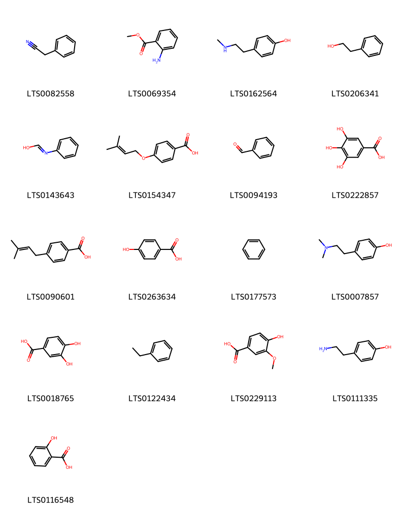{ width=100% }
    <figcaption>Hình ảnh cấu trúc hóa học của 17 hoạt chất thuộc nhóm Benzene and substituted derivatives gồm ['phenylacetonitrile (LTS0082558)', 'methyl anthranilate (LTS0069354)', 'n-methyltyramine (LTS0162564)', '2-phenyl-ethanol (LTS0206341)', 'n-phenylcarboximidic acid (LTS0143643)', '4-[(3-methylbut-2-en-1-yl)oxy]benzoic acid (LTS0154347)', 'benzaldehyde (LTS0094193)', 'galop (LTS0222857)', '4-(3-methylbut-2-en-1-yl)benzoic acid (LTS0090601)', 'p-hydroxybenzoic acid (LTS0263634)', 'benzene (LTS0177573)', 'hordenine (LTS0007857)', '3,4-dihydroxybenzoic acid (LTS0018765)', 'ethylbenzene (LTS0122434)', 'vanillic acid (LTS0229113)', 'tyramine (LTS0111335)', 'salicyclic acid (LTS0116548)'].</figcaption>
</figure>
#### Nhóm Benzodioxanes
<figure markdown="span">
    { width=100% }
    <figcaption>Hình ảnh cấu trúc hóa học của 2 hoạt chất thuộc nhóm Benzodioxanes gồm ['(6r,7r)-15-hydroxy-7-(4-hydroxy-3,5-dimethoxyphenyl)-6-(hydroxymethyl)-2,19,19-trimethyl-5,8,18-trioxa-2-azapentacyclo[12.8.0.0³,¹².0⁴,⁹.0¹⁷,²²]docosa-1(22),3,9,11,14,16,20-heptaen-13-one (LTS0178515)', '15-hydroxy-7-(4-hydroxy-3,5-dimethoxyphenyl)-6-(hydroxymethyl)-2,19,19-trimethyl-5,8,18-trioxa-2-azapentacyclo[12.8.0.0³,¹².0⁴,⁹.0¹⁷,²²]docosa-1(22),3,9,11,14,16,20-heptaen-13-one (LTS0251892)'].</figcaption>
</figure>
#### Nhóm Benzopyrans
<figure markdown="span">
    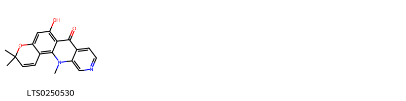{ width=100% }
    <figcaption>Hình ảnh cấu trúc hóa học của 1 hoạt chất thuộc nhóm Benzopyrans gồm ['11-hydroxy-2,2,5-trimethyl-1-oxa-5,7-diazatetraphen-10-one (LTS0250530)'].</figcaption>
</figure>
#### Nhóm Carboxylic acids and derivatives
<figure markdown="span">
    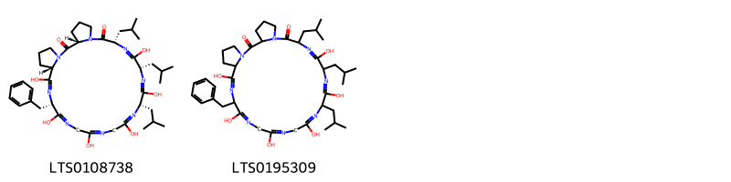{ width=100% }
    <figcaption>Hình ảnh cấu trúc hóa học của 2 hoạt chất thuộc nhóm Carboxylic acids and derivatives gồm ['(3s,9s,12s,15s,24s,27s)-24-benzyl-11,14,17,20,23,26-hexahydroxy-9,12,15-tris(2-methylpropyl)-1,7,10,13,16,19,22,25-octaazatricyclo[25.3.0.0³,⁷]triaconta-10,13,16,19,22,25-hexaene-2,8-dione (LTS0108738)', '24-benzyl-11,14,17,20,23,26-hexahydroxy-9,12,15-tris(2-methylpropyl)-1,7,10,13,16,19,22,25-octaazatricyclo[25.3.0.0³,⁷]triaconta-10,13,16,19,22,25-hexaene-2,8-dione (LTS0195309)'].</figcaption>
</figure>
#### Nhóm Cinnamic acids and derivatives
<figure markdown="span">
    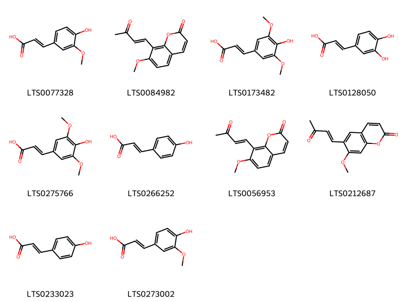{ width=100% }
    <figcaption>Hình ảnh cấu trúc hóa học của 10 hoạt chất thuộc nhóm Cinnamic acids and derivatives gồm ['ferulic acid (LTS0077328)', '7-methoxy-8-(3-oxobut-1-en-1-yl)chromen-2-one (LTS0084982)', 'sinapinate (LTS0173482)', '3,4-dihydroxycinnamic acid (LTS0128050)', 'sinapoyl alcohol (LTS0275766)', 'para-coumaric acid (LTS0266252)', '7-methoxy-8-[(1e)-3-oxobut-1-en-1-yl]chromen-2-one (LTS0056953)', '7-methoxy-6-(3-oxobut-1-en-1-yl)chromen-2-one (LTS0212687)', 'hydroxycinnamic acid (LTS0233023)', 'ferulic acid (LTS0273002)'].</figcaption>
</figure>
#### Nhóm Coumarins and derivatives
<figure markdown="span">
    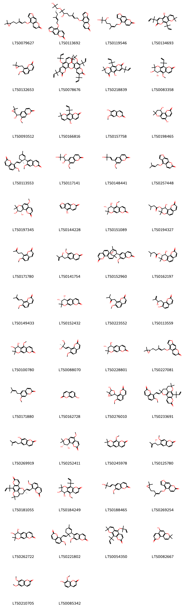{ width=100% }
    <figcaption>Hình ảnh cấu trúc hóa học của 82 hoạt chất thuộc nhóm Coumarins and derivatives gồm ['epoxybergamottin (LTS0079627)', 'paradisin a (LTS0113692)', '4-[(6,7-dihydroxy-3,7-dimethyloct-2-en-1-yl)oxy]furo[3,2-g]chromen-7-one (LTS0119546)', '5-hydroxy-8,8-dimethyl-3,10-bis(2-methylbut-3-en-2-yl)pyrano[3,2-g]chromen-2-one (LTS0134693)', '8-[(3,3-dimethyloxiran-2-yl)methyl]-7-methoxychromen-2-one (LTS0132653)', '10-{[2,2-dimethyl-7,10-bis(2-methylbut-3-en-2-yl)-8-oxopyrano[3,2-g]chromen-5-yl]oxy}-8,8-dimethyl-3-(2-methylbut-3-en-2-yl)-5-[(2-methylbut-3-en-2-yl)oxy]pyrano[3,2-g]chromen-2-one (LTS0078676)', '5-hydroxy-8,8-dimethyl-3,10-bis(2-methylbut-3-en-2-yl)-7h-pyrano[3,2-g]chromene-2,6-dione (LTS0218839)', '(6s,7r)-6,7-dihydroxy-5-methoxy-8,8-dimethyl-10-(2-methylbut-3-en-2-yl)-6h,7h-pyrano[3,2-g]chromen-2-one (LTS0083358)', '6-[(3,3-dimethyloxiran-2-yl)(hydroxy)methyl]-7-methoxychromen-2-one (LTS0093512)', 'nor-dentatin (LTS0166816)', 'isoscopoletin (LTS0157758)', '(10r)-5,10-dihydroxy-8,8-dimethyl-9h,10h-pyrano[2,3-h]chromen-2-one (LTS0198465)', '7-methoxy-6-[(1r,6r)-6-[(1e)-2-(7-methoxy-2-oxochromen-8-yl)ethenyl]-3,6-dimethylcyclohex-2-en-1-yl]chromen-2-one (LTS0113553)', '7-methoxy-6-(1,2,3-trihydroxy-3-methylbutyl)chromen-2-one (LTS0117141)', '6-(3-hydroxy-3-methylbut-1-en-1-yl)-7-methoxychromen-2-one (LTS0148441)', 'isoimperatorin (LTS0257448)', '(9r,10s)-9,10-dihydroxy-5-methoxy-8,8-dimethyl-9h,10h-pyrano[2,3-h]chromen-2-one (LTS0197345)', 'bergaptol (LTS0144228)', '(6s,7r)-6,7-dihydroxy-5-methoxy-8,8-dimethyl-6h,7h-pyrano[3,2-g]chromen-2-one (LTS0151089)', '10-hydroxy-8,8-dimethyl-2-oxo-9h,10h-pyrano[2,3-h]chromen-9-yl 3-methylbutanoate (LTS0194327)', '7-methoxy-8-(3-oxobutyl)chromen-2-one (LTS0171780)', '6-(2-hydroxy-3-methylbut-3-en-1-yl)-7-methoxychromen-2-one (LTS0141754)', '7-methoxy-6-{6-[(1z)-2-(7-methoxy-2-oxochromen-8-yl)ethenyl]-3,6-dimethylcyclohex-2-en-1-yl}chromen-2-one (LTS0152960)', '(9r,10s)-10-hydroxy-8,8-dimethyl-2-oxo-9h,10h-pyrano[2,3-h]chromen-9-yl 3-methylbutanoate (LTS0162197)', 'osthole (LTS0149433)', '(6r,7r)-6,7-dihydroxy-8,8-dimethyl-6h,7h-pyrano[3,2-g]chromen-2-one (LTS0152432)', '7-methoxy-8-(3-methyl-2-oxobutyl)chromen-2-one (LTS0223552)', '7-hydroxy-8-(2-hydroxy-3-methylbut-3-en-1-yl)chromen-2-one (LTS0113559)', '6,7-dihydroxy-5-methoxy-8,8-dimethyl-6h,7h-pyrano[3,2-g]chromen-2-one (LTS0100780)', '8-[(1e,3r)-3,4-dihydroxy-3-methylbut-1-en-1-yl]-7-methoxychromen-2-one (LTS0088070)', '(6s,7r)-6,7-dihydroxy-8,8-dimethyl-6h,7h-pyrano[3,2-g]chromen-2-one (LTS0228801)', '4-{[(2e)-5-[(2r)-3,3-dimethyloxiran-2-yl]-3-methylpent-2-en-1-yl]oxy}furo[3,2-g]chromen-7-one (LTS0227081)', 'suberosin (LTS0171880)', 'umbelliferone (LTS0162728)', '8-{4-hydroxy-5-methyl-3,6-dioxabicyclo[3.1.0]hexan-2-yl}-7-methoxychromen-2-one (LTS0276010)', '15-[2-(7-methoxy-2-oxochromen-8-yl)ethenyl]-11,11,15-trimethyl-8-(2-methylbut-3-en-2-yl)-6,10,16-trioxatetracyclo[7.7.1.0²,⁷.0¹³,¹⁷]heptadeca-1,3,7,9(17)-tetraen-5-one (LTS0233691)', 'demethylsuberosin (LTS0269919)', '(9s,10s)-9,10-dihydroxy-5-methoxy-8,8-dimethyl-9h,10h-pyrano[2,3-h]chromen-2-one (LTS0252411)', 'luvangetin (LTS0245978)', '6-[(2r)-2-hydroxy-3-methylbut-3-en-1-yl]-7-methoxychromen-2-one (LTS0125780)', '(13s,15r)-15-[(1e)-2-(7-methoxy-2-oxochromen-8-yl)ethenyl]-11,11,15-trimethyl-8-(2-methylbut-3-en-2-yl)-6,10,16-trioxatetracyclo[7.7.1.0²,⁷.0¹³,¹⁷]heptadeca-1,3,7,9(17)-tetraen-5-one (LTS0181055)', '6,7-dihydroxy-5-methoxy-8,8-dimethyl-10-(2-methylbut-3-en-2-yl)-6h,7h-pyrano[3,2-g]chromen-2-one (LTS0184249)', '6-[(1e)-3-hydroxy-3-methylbut-1-en-1-yl]-7-methoxychromen-2-one (LTS0188465)', '4-{[5-(3,3-dimethyloxiran-2-yl)-3-methylpent-2-en-1-yl]oxy}furo[3,2-g]chromen-7-one (LTS0269254)', '6,7-dihydroxy-8,8-dimethyl-6h,7h-pyrano[3,2-g]chromen-2-one (LTS0262722)', '7-methoxy-6-{6-[2-(7-methoxy-2-oxochromen-8-yl)ethenyl]-3,6-dimethylcyclohex-2-en-1-yl}chromen-2-one (LTS0221802)', '8,8-dimethyl-10-(2-methylbut-3-en-2-yl)-5-[(2-methylbut-3-en-2-yl)oxy]pyrano[3,2-g]chromen-2-one (LTS0054350)', '5-hydroxy-8,8-dimethylpyrano[2,3-f]chromen-2-one (LTS0082667)', 'scoparone (LTS0210705)', '7-hydroxy-8-methoxychromen-2-one (LTS0085342)', '(9s,10s)-10-({8,8-dimethyl-2-oxopyrano[2,3-f]chromen-5-yl}oxy)-9-hydroxy-8,8-dimethyl-9h,10h-pyrano[2,3-h]chromen-2-one (LTS0217314)', '7-methoxy-6-[(1e)-3-oxobut-1-en-1-yl]chromen-2-one (LTS0260657)', 'xanthyletin (LTS0016674)', '7-hydroxy-8-[(2r)-2-hydroxy-3-methylbut-3-en-1-yl]chromen-2-one (LTS0024905)', '5,10-dihydroxy-8,8-dimethyl-9h,10h-pyrano[2,3-h]chromen-2-one (LTS0228288)', '(6s,7s)-6,7-dihydroxy-5-methoxy-8,8-dimethyl-6h,7h-pyrano[3,2-g]chromen-2-one (LTS0141294)', '7-methoxy-2-oxochromene-6-carbaldehyde (LTS0027815)', 'bergapten (LTS0019861)', '6-[(2s)-3,3-dimethyloxirane-2-carbonyl]-7-methoxychromen-2-one (LTS0204101)', 'scopoletin (LTS0193112)', 'seselin (LTS0194066)', 'osthenol (LTS0259150)', 'limettin (LTS0043311)', '8-(3,4-dihydroxy-3-methylbut-1-en-1-yl)-7-methoxychromen-2-one (LTS0131251)', 'kinocoumarin (LTS0271412)', '9,10-dihydroxy-5-methoxy-8,8-dimethyl-9h,10h-pyrano[2,3-h]chromen-2-one (LTS0051588)', 'angelitriol (LTS0242228)', '7-methoxy-2-oxochromene-8-carbaldehyde (LTS0066932)', '7-hydroxy-2-oxochromene-6-carbaldehyde (LTS0016849)', '10-({8,8-dimethyl-2-oxopyrano[2,3-f]chromen-5-yl}oxy)-9-hydroxy-8,8-dimethyl-9h,10h-pyrano[2,3-h]chromen-2-one (LTS0003375)', '6-(3,3-dimethyloxirane-2-carbonyl)-7-methoxychromen-2-one (LTS0011844)', '4-{[(2e)-6-{[(6e)-3-hydroxy-2,6-dimethyl-8-({7-oxofuro[3,2-g]chromen-4-yl}oxy)oct-6-en-2-yl]oxy}-3,7-dimethylocta-2,7-dien-1-yl]oxy}furo[3,2-g]chromen-7-one (LTS0097952)', '7-{[(2e,6r)-6,7-dihydroxy-3,7-dimethyloct-2-en-1-yl]oxy}chromen-2-one (LTS0019953)', '5,6,7-trihydroxy-8,8-dimethyl-3,10-bis(2-methylbut-3-en-2-yl)-6h,7h-pyrano[3,2-g]chromen-2-one (LTS0074450)', '6-[(r)-[(2s)-3,3-dimethyloxiran-2-yl](hydroxy)methyl]-7-methoxychromen-2-one (LTS0006836)', 'xanthoxyletin (LTS0112626)', '8-[(1s,2s,4r,5s)-4-hydroxy-5-methyl-3,6-dioxabicyclo[3.1.0]hexan-2-yl]-7-methoxychromen-2-one (LTS0102601)', '5-hydroxy-2,2-dimethyl-6-(2-methylbut-3-en-2-yl)pyrano[2,3-h]chromen-8-one (LTS0024471)', '5-methoxy-8,8-dimethylpyrano[2,3-f]chromen-2-one (LTS0086567)', '(6s,7r)-5,6,7-trihydroxy-8,8-dimethyl-3,10-bis(2-methylbut-3-en-2-yl)-6h,7h-pyrano[3,2-g]chromen-2-one (LTS0232024)', '8-(2,3-dihydroxy-3-methylbutyl)-7-methoxychromen-2-one (LTS0247238)', '7-methoxy-2-oxochromene-6-carboxylic acid (LTS0106452)'].</figcaption>
</figure>
#### Nhóm Cyclobutane lignans
<figure markdown="span">
    { width=100% }
    <figcaption>Hình ảnh cấu trúc hóa học của 2 hoạt chất thuộc nhóm Cyclobutane lignans gồm ['8-[2,3-diacetyl-4-(7-methoxy-2-oxochromen-8-yl)cyclobutyl]-7-methoxychromen-2-one (LTS0261353)', '8-[(1s,2r,3s,4r)-2,3-diacetyl-4-(7-methoxy-2-oxochromen-8-yl)cyclobutyl]-7-methoxychromen-2-one (LTS0061374)'].</figcaption>
</figure>
#### Nhóm Dibenzylbutane lignans
<figure markdown="span">
    { width=100% }
    <figcaption>Hình ảnh cấu trúc hóa học của 2 hoạt chất thuộc nhóm Dibenzylbutane lignans gồm ['(2s,3r)-2,3-bis[(4-hydroxy-3-methoxyphenyl)(¹³c)methyl](1-¹³c)butane-1,4-diol (LTS0268699)', 'secoisolariciresinol (LTS0086727)'].</figcaption>
</figure>
#### Nhóm Dihydrofurans
<figure markdown="span">
    { width=100% }
    <figcaption>Hình ảnh cấu trúc hóa học của 1 hoạt chất thuộc nhóm Dihydrofurans gồm ['vitamin c (LTS0022555)'].</figcaption>
</figure>
#### Nhóm Fatty Acyls
<figure markdown="span">
    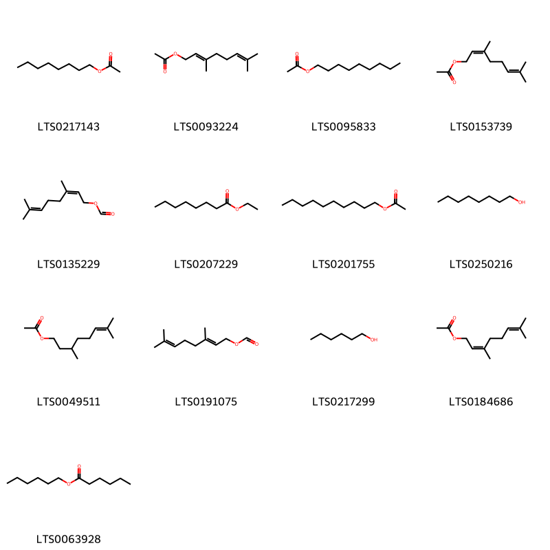{ width=100% }
    <figcaption>Hình ảnh cấu trúc hóa học của 13 hoạt chất thuộc nhóm Fatty Acyls gồm ['octyl acetate (LTS0217143)', 'geranyl acetate (LTS0093224)', 'nonyl acetate (LTS0095833)', 'neryl acetate (LTS0153739)', 'neryl formate (LTS0135229)', 'ethyl octanoate (LTS0207229)', 'decyl acetate (LTS0201755)', 'octanol (LTS0250216)', 'citronellyl acetate (LTS0049511)', 'geranyl formate (LTS0191075)', 'hexanol (LTS0217299)', '3,7-dimethylocta-2,6-dien-1-yl acetate (LTS0184686)', 'hexyl hexanoate (LTS0063928)'].</figcaption>
</figure>
#### Nhóm Flavonoids
<figure markdown="span">
    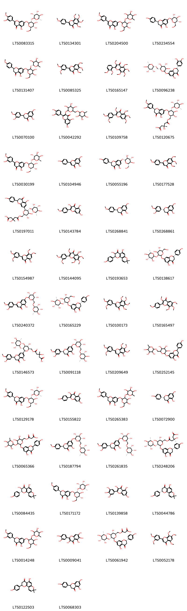{ width=100% }
    <figcaption>Hình ảnh cấu trúc hóa học của 65 hoạt chất thuộc nhóm Flavonoids gồm ['7-{[(2s,3r,4s,5s,6r)-4,5-dihydroxy-6-(hydroxymethyl)-3-{[(2s,3r,4r,5r,6s)-3,4,5-trihydroxy-6-methyloxan-2-yl]oxy}oxan-2-yl]oxy}-5-hydroxy-2-(3-hydroxy-4-methoxyphenyl)chromen-4-one (LTS0083315)', 'tangeretin (LTS0134301)', '7-{[4,5-dihydroxy-6-(hydroxymethyl)-3-{[(2s)-3,4,5-trihydroxy-6-methyloxan-2-yl]oxy}oxan-2-yl]oxy}-5-hydroxy-2-(3-hydroxy-4-methoxyphenyl)chromen-4-one (LTS0204500)', 'prunin (LTS0234554)', '7-{[4,5-dihydroxy-6-(hydroxymethyl)-3-{[(2r)-3,4,5-trihydroxy-6-methyloxan-2-yl]oxy}oxan-2-yl]oxy}-5-hydroxy-2-(4-methoxyphenyl)-2,3-dihydro-1-benzopyran-4-one (LTS0131407)', 'sinensetin (LTS0085325)', '2-(2,3-dimethoxyphenyl)-3,5,6,7,8-pentamethoxychromen-4-one (LTS0165147)', '(2s)-2-(3,4-dihydroxyphenyl)-5-hydroxy-7-{[(3r,4s,5s,6r)-3,4,5-trihydroxy-6-({[(2s,3r,4r,5r,6s)-3,4,5-trihydroxy-6-methyloxan-2-yl]oxy}methyl)oxan-2-yl]oxy}-2,3-dihydro-1-benzopyran-4-one (LTS0096238)', 'hesperetine (LTS0070100)', 'rutin (LTS0042292)', 'hexamethylquercetagetin (LTS0109758)', '(3r)-5-{[(2r,3r,4s,5r,6s)-3,4-dihydroxy-6-{[(2s)-5-hydroxy-2-(3-hydroxy-4-methoxyphenyl)-4-oxo-2,3-dihydro-1-benzopyran-7-yl]oxy}-5-{[(2s,3r,4r,5r,6s)-3,4,5-trihydroxy-6-methyloxan-2-yl]oxy}oxan-2-yl]methoxy}-3-hydroxy-3-methyl-5-oxopentanoic acid (LTS0120675)', '7-{[(2s,3r,4s,5s,6s)-4,5-dihydroxy-6-(hydroxymethyl)-3-{[(2s,3r,4s,5r,6r)-3,4,5-trihydroxy-6-methyloxan-2-yl]oxy}oxan-2-yl]oxy}-5-hydroxy-2-(3-hydroxy-4-methoxyphenyl)chromen-4-one (LTS0030199)', 'chamomile (LTS0104946)', '(2s)-5-hydroxy-2-(4-hydroxyphenyl)-7-{[(2r,3s,4r,5r,6s)-3,4,5-trihydroxy-6-(hydroxymethyl)oxan-2-yl]oxy}-2,3-dihydro-1-benzopyran-4-one (LTS0055196)', "4',5,6,7-tetramethoxyflavone (LTS0177528)", '5-{[(2r,3s,4s,5r,6s)-3,4-dihydroxy-6-[5-hydroxy-2-(4-hydroxyphenyl)-4-oxo-2,3-dihydro-1-benzopyran-7-yl]-5-{[(2s,3r,4r,5r,6s)-3,4,5-trihydroxy-6-methyloxan-2-yl]oxy}oxan-2-yl]methoxy}-3-hydroxy-3-methyl-5-oxopentanoic acid (LTS0197011)', 'kaempferide (LTS0143784)', 'isosakuranetin (LTS0268841)', '(2r)-5,7-dihydroxy-2-(3-hydroxy-4-methoxyphenyl)-2,3-dihydro-1-benzopyran-4-one (LTS0268861)', '2-(3,4-dimethoxyphenyl)-5-hydroxy-7,8-dimethoxychromen-4-one (LTS0154987)', '3-methoxynobiletin (LTS0144095)', '3,5-dihydroxy-2-(4-hydroxyphenyl)-8,8-dimethyl-2h,3h-pyrano[2,3-f]chromen-4-one (LTS0193653)', '(2s)-7-{[(2s,3s,4s,5s,6r)-4,5-dihydroxy-6-(hydroxymethyl)-3-{[(2s,3s,4r,5r,6s)-3,4,5-trihydroxy-6-methyloxan-2-yl]oxy}oxan-2-yl]oxy}-5-hydroxy-2-(4-hydroxyphenyl)-2,3-dihydro-1-benzopyran-4-one (LTS0138617)', 'diosmin (LTS0240372)', 'naringin (LTS0165229)', 'nobiletin (LTS0100173)', 'auranetin (LTS0165497)', '5-{[(2r,3s,4s,5r,6s)-3,4-dihydroxy-6-[5-hydroxy-2-(3-hydroxy-4-methoxyphenyl)-4-oxo-2,3-dihydro-1-benzopyran-7-yl]-5-{[(2s,3r,4r,5r,6s)-3,4,5-trihydroxy-6-methyloxan-2-yl]oxy}oxan-2-yl]methoxy}-3-hydroxy-3-methyl-5-oxopentanoic acid (LTS0146573)', '(2s)-5-hydroxy-2-(3-hydroxy-4-methoxyphenyl)-7-{[(2s,3r,4s,5s,6r)-3,4,5-trihydroxy-6-({[(2r,3r,4s,5r,6s)-3,4,5-trihydroxy-6-methyloxan-2-yl]oxy}methyl)oxan-2-yl]oxy}-2,3-dihydro-1-benzopyran-4-one (LTS0091118)', 'demethylnobiletin (LTS0209649)', '5-hydroxy-2-(4-hydroxyphenyl)-7-[(3,4,5-trihydroxy-6-{[(3,4,5-trihydroxy-6-methyloxan-2-yl)oxy]methyl}oxan-2-yl)oxy]-2,3-dihydro-1-benzopyran-4-one (LTS0252145)', 'neohesperidin (LTS0129178)', 'kaempherol (LTS0155822)', '7-{[4,5-dihydroxy-6-(hydroxymethyl)-3-[(3,4,5-trihydroxy-6-methyloxan-2-yl)oxy]oxan-2-yl]oxy}-5-hydroxy-2-(3-hydroxy-4-methoxyphenyl)-2,3-dihydro-1-benzopyran-4-one (LTS0265383)', '(-)-naringenin (LTS0072900)', '3-[(3,4-dihydroxy-6-{[5-hydroxy-2-(4-hydroxyphenyl)-4-oxo-2,3-dihydro-1-benzopyran-7-yl]oxy}-5-[(3,4,5-trihydroxy-6-methyloxan-2-yl)oxy]oxan-2-yl)methoxy]-3-oxopropanoic acid (LTS0065366)', '(2s)-5-hydroxy-2-(4-methoxyphenyl)-7-{[(2s,3r,4s,5s,6r)-3,4,5-trihydroxy-6-({[(2r,3r,4r,5r,6s)-3,4,5-trihydroxy-6-methyloxan-2-yl]oxy}methyl)oxan-2-yl]oxy}-2,3-dihydro-1-benzopyran-4-one (LTS0187794)', 'hesperidin (LTS0261835)', '(3r)-5-{[(2r,3s,4s,5r,6s)-3,4-dihydroxy-6-{[(2s)-5-hydroxy-2-(4-hydroxyphenyl)-4-oxo-2,3-dihydro-1-benzopyran-7-yl]oxy}-5-{[(2s,3r,4r,5r,6s)-3,4,5-trihydroxy-6-methyloxan-2-yl]oxy}oxan-2-yl]methoxy}-3-hydroxy-3-methyl-5-oxopentanoic acid (LTS0248206)', '(2r,3r)-3,5-dihydroxy-2-(4-hydroxyphenyl)-8,8-dimethyl-2h,3h-pyrano[2,3-f]chromen-4-one (LTS0084435)', 'poncirin (LTS0171172)', 'myricetin (LTS0139858)', '(2s)-5-hydroxy-2-(4-hydroxyphenyl)-8,8-dimethyl-2h,3h-pyrano[2,3-f]chromen-4-one (LTS0044786)', '7-{[4,5-dihydroxy-6-(hydroxymethyl)-3-{[(2s)-3,4,5-trihydroxy-6-methyloxan-2-yl]oxy}oxan-2-yl]oxy}-5-hydroxy-2-(3-hydroxy-4-methoxyphenyl)-2,3-dihydro-1-benzopyran-4-one (LTS0014248)', 'quercetagetin (LTS0009041)', '3-{[(2r,3s,4s,5r,6s)-3,4-dihydroxy-6-{[(2s)-5-hydroxy-2-(4-hydroxyphenyl)-4-oxo-2,3-dihydro-1-benzopyran-7-yl]oxy}-5-{[(2s,3r,4r,5r,6s)-3,4,5-trihydroxy-6-methyloxan-2-yl]oxy}oxan-2-yl]methoxy}-3-oxopropanoic acid (LTS0061942)', 'isosinensetin (LTS0052178)', 'citflavanone (LTS0122503)', 'asahina (LTS0068303)', 'quercetin (LTS0004651)', 'neoeriocitrin (LTS0274558)', 'naringenin (LTS0031098)', 'rhoifolin (LTS0029806)', 'hesperetin 7-o-glucoside (LTS0134734)', 'luteolin (LTS0017052)', '5-hydroxy-2-(4-hydroxyphenyl)-7-{[(2s,5s)-3,4,5-trihydroxy-6-({[(2r,5r)-3,4,5-trihydroxy-6-methyloxan-2-yl]oxy}methyl)oxan-2-yl]oxy}chromen-4-one (LTS0015495)', '3-rutinosyl quercetin (LTS0032845)', 'eriocitrin (LTS0210425)', 'hesperetin (LTS0087195)', '7-{[4,5-dihydroxy-6-(hydroxymethyl)-3-[(3,4,5-trihydroxy-6-methyloxan-2-yl)oxy]oxan-2-yl]oxy}-5-hydroxy-2-(3-hydroxy-4-methoxyphenyl)chromen-4-one (LTS0263548)', 'narirutin (LTS0259265)', 'apigenin trimethyl ether (LTS0044540)', '3-{[(2r,3s,4s,5r,6s)-3,4-dihydroxy-6-{[(2s)-5-hydroxy-4-oxo-2-(4-{[(2s,3r,4s,5s,6r)-3,4,5-trihydroxy-6-(hydroxymethyl)oxan-2-yl]oxy}phenyl)-2,3-dihydro-1-benzopyran-7-yl]oxy}-5-{[(2s,3r,4r,5r,6s)-3,4,5-trihydroxy-6-methyloxan-2-yl]oxy}oxan-2-yl]methoxy}-3-oxopropanoic acid (LTS0129645)', '(2s)-7-{[(2s,3r,4s,5s,6r)-4,5-dihydroxy-6-(hydroxymethyl)-3-{[(2s,3r,4r,5r,6s)-3,4,5-trihydroxy-6-methyloxan-2-yl]oxy}oxan-2-yl]oxy}-5-hydroxy-2-(4-{[(2s,3r,4s,5s,6r)-3,4,5-trihydroxy-6-(hydroxymethyl)oxan-2-yl]oxy}phenyl)-2,3-dihydro-1-benzopyran-4-one (LTS0243283)'].</figcaption>
</figure>
#### Nhóm Furanoid lignans
<figure markdown="span">
    { width=100% }
    <figcaption>Hình ảnh cấu trúc hóa học của 3 hoạt chất thuộc nhóm Furanoid lignans gồm ['pinoresinol (LTS0057431)', 'matairesinol (LTS0193475)', 'lariciresinol (LTS0010950)'].</figcaption>
</figure>
#### Nhóm Imidazopyrimidines
<figure markdown="span">
    { width=100% }
    <figcaption>Hình ảnh cấu trúc hóa học của 4 hoạt chất thuộc nhóm Imidazopyrimidines gồm ['caffeine (LTS0075508)', 'constant-t (LTS0100702)', 'p-xanthine (LTS0149000)', 'thesal (LTS0250246)'].</figcaption>
</figure>
#### Nhóm Indoles and derivatives
<figure markdown="span">
    { width=100% }
    <figcaption>Hình ảnh cấu trúc hóa học của 1 hoạt chất thuộc nhóm Indoles and derivatives gồm ['indole (LTS0185357)'].</figcaption>
</figure>
#### Nhóm Lactones
<figure markdown="span">
    { width=100% }
    <figcaption>Hình ảnh cấu trúc hóa học của 1 hoạt chất thuộc nhóm Lactones gồm ["(5'r,7'r)-5'-[(s)-furan-3-yl(hydroxy)methyl]-5',7',11',11'-tetramethyl-8',15'-dioxo-12',16'-dioxaspiro[oxirane-2,6'-tetracyclo[8.7.0.0¹,¹³.0²,⁷]heptadecane]-3-carboxylic acid (LTS0025169)"].</figcaption>
</figure>
#### Nhóm Naphthalenes
<figure markdown="span">
    { width=100% }
    <figcaption>Hình ảnh cấu trúc hóa học của 1 hoạt chất thuộc nhóm Naphthalenes gồm ['2-methoxy-8-(7-methoxy-2-oxochromen-8-yl)-6-methylnaphthalene-1,4-dione (LTS0219884)'].</figcaption>
</figure>
#### Nhóm Naphthofurans
<figure markdown="span">
    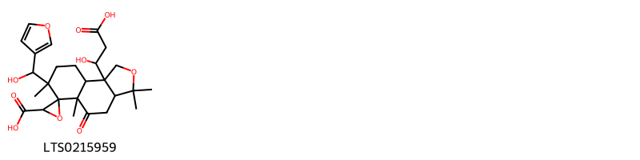{ width=100% }
    <figcaption>Hình ảnh cấu trúc hóa học của 1 hoạt chất thuộc nhóm Naphthofurans gồm ["9b-(2-carboxy-1-hydroxyethyl)-7-[furan-3-yl(hydroxy)methyl]-3,3,5a,7-tetramethyl-5-oxo-hexahydrospiro[naphtho[1,2-c]furan-6,2'-oxirane]-3'-carboxylic acid (LTS0215959)"].</figcaption>
</figure>
#### Nhóm Naphthopyrans
<figure markdown="span">
    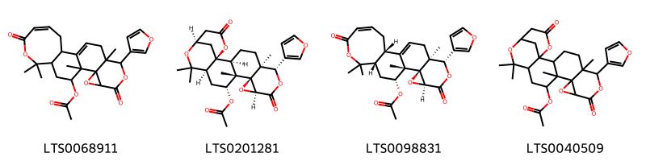{ width=100% }
    <figcaption>Hình ảnh cấu trúc hóa học của 4 hoạt chất thuộc nhóm Naphthopyrans gồm ['18-(furan-3-yl)-8,8,12,19-tetramethyl-6,16-dioxo-7,14,17-trioxapentacyclo[10.9.0.0²,⁹.0¹³,¹⁵.0¹³,¹⁹]henicosa-1(21),4-dien-11-yl acetate (LTS0068911)', '(1s,2s,5s,6s,9s,11r,12s,13r,15s,18r)-6-(furan-3-yl)-5,12,16,16-tetramethyl-8,20-dioxo-7,10,17,21-tetraoxahexacyclo[16.3.1.0¹,¹⁵.0²,¹².0⁵,¹¹.0⁹,¹¹]docosan-13-yl acetate (LTS0201281)', '(2s,4z,9s,11r,12s,13r,15s,18s,19s)-18-(furan-3-yl)-8,8,12,19-tetramethyl-6,16-dioxo-7,14,17-trioxapentacyclo[10.9.0.0²,⁹.0¹³,¹⁵.0¹³,¹⁹]henicosa-1(21),4-dien-11-yl acetate (LTS0098831)', '6-(furan-3-yl)-5,12,16,16-tetramethyl-8,20-dioxo-7,10,17,21-tetraoxahexacyclo[16.3.1.0¹,¹⁵.0²,¹².0⁵,¹¹.0⁹,¹¹]docosan-13-yl acetate (LTS0040509)'].</figcaption>
</figure>
#### Nhóm Neoflavonoids
<figure markdown="span">
    { width=100% }
    <figcaption>Hình ảnh cấu trúc hóa học của 2 hoạt chất thuộc nhóm Neoflavonoids gồm ['12-(6,11-dihydroxy-2,2,5-trimethyl-10-oxo-3,4-dihydro-1-oxa-5-azatetraphen-4-yl)-6,11-dihydroxy-2,2,5-trimethyl-1-oxa-5-azatetraphen-10-one (LTS0248692)', '12-[(4s)-6,11-dihydroxy-2,2,5-trimethyl-10-oxo-3,4-dihydro-1-oxa-5-azatetraphen-4-yl]-6,11-dihydroxy-2,2,5-trimethyl-1-oxa-5-azatetraphen-10-one (LTS0067009)'].</figcaption>
</figure>
#### Nhóm Organooxygen compounds
<figure markdown="span">
    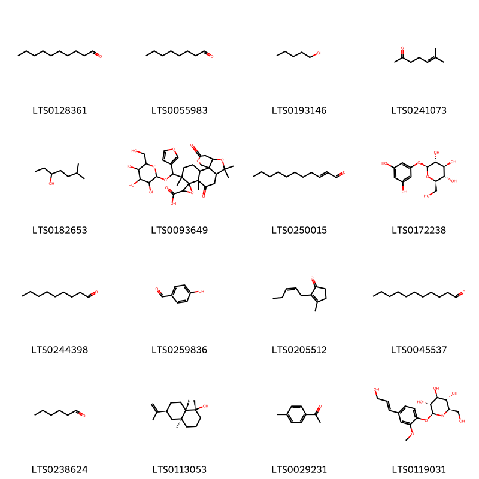{ width=100% }
    <figcaption>Hình ảnh cấu trúc hóa học của 16 hoạt chất thuộc nhóm Organooxygen compounds gồm ['decanal (LTS0128361)', 'octanal (LTS0055983)', 'amyl alcohol (LTS0193146)', '6-methyl-5-hepten-2-one (LTS0241073)', 'ethylisopentylcarbinol (LTS0182653)', "5'-[furan-3-yl({[3,4,5-trihydroxy-6-(hydroxymethyl)oxan-2-yl]oxy})methyl]-5',7',11',11'-tetramethyl-8',15'-dioxo-12',16'-dioxaspiro[oxirane-2,6'-tetracyclo[8.7.0.0¹,¹³.0²,⁷]heptadecane]-3-carboxylic acid (LTS0093649)", 'undecenal (LTS0250015)', '(2s,3r,4s,5s,6r)-2-(3,5-dihydroxyphenoxy)-6-(hydroxymethyl)oxane-3,4,5-triol (LTS0172238)', 'nonanal (LTS0244398)', 'p-hydroxybenzaldehyde (LTS0259836)', 'jasmone (LTS0205512)', 'aldehyde c11 (LTS0045537)', 'hexanal (LTS0238624)', '(1r,4as,6s,8as)-1,4a-dimethyl-6-(prop-1-en-2-yl)-octahydronaphthalen-1-ol (LTS0113053)', 'p-methylacetophenone (LTS0029231)', 'coniferin (LTS0119031)'].</figcaption>
</figure>
#### Nhóm Phenols
<figure markdown="span">
    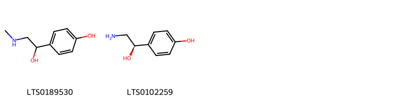{ width=100% }
    <figcaption>Hình ảnh cấu trúc hóa học của 2 hoạt chất thuộc nhóm Phenols gồm ['synephrine (LTS0189530)', 'norden (LTS0102259)'].</figcaption>
</figure>
#### Nhóm Prenol lipids
<figure markdown="span">
    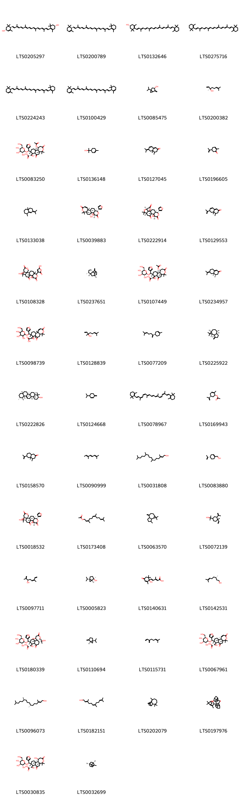{ width=100% }
    <figcaption>Hình ảnh cấu trúc hóa học của 183 hoạt chất thuộc nhóm Prenol lipids gồm ['carotenoid (LTS0205297)', '(+)-α-carotene (LTS0200789)', 'cryptoxanthin (LTS0132646)', 'β-carotene (LTS0275716)', 'α-carotene (LTS0224243)', 'epsilon-carotene (LTS0100429)', 'sabinol (LTS0085475)', '(-)-linalool (LTS0200382)', "(1s,3's,5ar,7ar,8r,9s,11ar,11br)-1-(acetyloxy)-9-[(s)-furan-3-yl({[(2r,3r,4s,5s,6r)-3,4,5-trihydroxy-6-(hydroxymethyl)oxan-2-yl]oxy})methyl]-5,5,7a,9,11b-pentamethyl-3,7-dioxo-hexahydro-1h-spiro[naphtho[2,1-c]oxepine-8,2'-oxirane]-3'-carboxylic acid (LTS0083250)", 'terpineol (LTS0136148)', '4,4a-dimethyl-6-(propan-2-ylidene)-4,5-dihydro-3h-naphthalen-2-one (LTS0127045)', 'carvone (LTS0196605)', '1,4a-dimethyl-7-(propan-2-ylidene)-1,2,3,4,5,6-hexahydronaphthalene (LTS0133038)', '(1s,2r,4s,7s,8s,11r,12r,18s,20r)-7-(furan-3-yl)-20-hydroxy-1,8,12,17,17-pentamethyl-3,6,16-trioxapentacyclo[9.9.0.0²,⁴.0²,⁸.0¹²,¹⁸]icos-13-ene-5,15-dione (LTS0039883)', '(1r,2r,7s,10s,13r,14r,16s,19s,20s)-19-(furan-3-yl)-9,9,13,20-tetramethyl-4,8,15,18-tetraoxahexacyclo[11.9.0.0²,⁷.0²,¹⁰.0¹⁴,¹⁶.0¹⁴,²⁰]docosane-5,12,17-trione (LTS0222914)', '4,4a-dimethyl-6-(prop-1-en-2-yl)-3,4,5,6-tetrahydronaphthalen-2-one (LTS0129553)', "4-hydroxy-11'-(5-hydroxy-2-oxo-5h-furan-3-yl)-5'-(2-hydroxypropan-2-yl)-2',10'-dimethyl-12',15'-dioxaspiro[oxane-3,6'-tetracyclo[8.5.0.0¹,¹⁴.0²,⁷]pentadecane]-3',6,13'-trione (LTS0108328)", '(1s,4r,5r,7r)-4,11,11-trimethyl-10-methylidenetricyclo[5.3.1.0¹,⁵]undecane (LTS0237651)', "(1r,3'r,5ar,7ar,9s,11ar,11br)-1-(acetyloxy)-9-[furan-3-yl({[(2r,3r,4s,5s,6r)-3,4,5-trihydroxy-6-(hydroxymethyl)oxan-2-yl]oxy})methyl]-5,5,7a,9,11b-pentamethyl-3,7-dioxo-hexahydro-1h-spiro[naphtho[2,1-c]oxepine-8,2'-oxirane]-3'-carboxylic acid (LTS0107449)", 'α-vetivone (LTS0234957)', "9-[furan-3-yl({[3,4,5-trihydroxy-6-(hydroxymethyl)oxan-2-yl]oxy})methyl]-5,5,7a,9,11b-pentamethyl-3,7-dioxo-6,10,11,11a-tetrahydro-5ah-spiro[naphtho[2,1-c]oxepine-8,2'-oxirane]-3'-carboxylic acid (LTS0098739)", 'linalool, (+-)- (LTS0128839)', '(r)-β-bisabolene (LTS0077209)', 'β-gurjunene (LTS0225922)', 'amyrin (LTS0222826)', 'β phellandrene (LTS0124668)', '1,3,3-trimethyl-2-[(1e,3z,5z,7e,9e,11e,13z,15z,17e)-3,7,12,16-tetramethyl-18-(2,6,6-trimethylcyclohex-1-en-1-yl)octadeca-1,3,5,7,9,11,13,15,17-nonaen-1-yl]cyclohex-1-ene (LTS0078967)', '(1s,5s)-carvyl acetate (LTS0169943)', '4,4a-dimethyl-6-(prop-1-en-2-yl)-octahydronaphthalen-2-one (LTS0158570)', 'allo-ocimene (LTS0090999)', 'phytol (LTS0031808)', '(-)-perillyl alcohol (LTS0083880)', 'ichangin (LTS0018532)', 'farnesyl acetate (LTS0173408)', '1,1,7-trimethyl-4-methylidene-octahydro-1ah-cyclopropa[e]azulene (LTS0063570)', '2-[4-ethenyl-4-methyl-3-(prop-1-en-2-yl)cyclohexyl]propan-2-ol (LTS0072139)', '(3r,5z)-2,6-dimethylocta-1,5,7-trien-3-ol (LTS0097711)', '4-thujanol (LTS0005823)', 'abscisic acid,  (LTS0140631)', '(-)-citronellol (LTS0142531)', "(2'r,3r,3''s,4s,4'ar,5'r,6's,8'ar)-6'-[(s)-furan-3-yl({[(2r,3r,4s,5s,6r)-3,4,5-trihydroxy-6-(hydroxymethyl)oxan-2-yl]oxy})methyl]-4-hydroxy-2'-(2-hydroxypropan-2-yl)-4'a,6'-dimethyl-4',6-dioxo-tetrahydro-2'h-dispiro[oxane-3,1'-naphthalene-5',2''-oxirane]-3''-carboxylic acid (LTS0180339)", '(+)-sabinene (LTS0110694)', 'α-myrcene (LTS0115731)', "(3's,5ar,7ar,8r,9s,11ar,11br)-9-[(s)-furan-3-yl({[(2r,3r,4s,5s,6r)-3,4,5-trihydroxy-6-(hydroxymethyl)oxan-2-yl]oxy})methyl]-5,5,7a,9,11b-pentamethyl-3,7-dioxo-6,10,11,11a-tetrahydro-5ah-spiro[naphtho[2,1-c]oxepine-8,2'-oxirane]-3'-carboxylic acid (LTS0067961)", 'phytol (LTS0096073)', '(e,z)-farnesol (LTS0182151)', 'longifolene (LTS0202079)', '4,6,6-trimethyl-3-(2,6,6-trimethyl-3-{2,6,6-trimethylbicyclo[3.1.1]hept-1-en-3-yl}bicyclo[3.1.1]hept-1-en-3-yl)bicyclo[3.1.1]hept-4-en-2-ol (LTS0197976)', "(1s,3's,5ar,7ar,8r,9s,11ar,11br)-9-[(s)-furan-3-yl({[(2r,3r,4s,5s,6r)-3,4,5-trihydroxy-6-(hydroxymethyl)oxan-2-yl]oxy})methyl]-1-hydroxy-5,5,7a,9,11b-pentamethyl-3,7-dioxo-hexahydro-1h-spiro[naphtho[2,1-c]oxepine-8,2'-oxirane]-3'-carboxylic acid (LTS0030835)", '(-)-α-pinene (LTS0032699)', '3,7-dimethyl-1,3,6-octatriene (LTS0172986)', 'terpinolene (LTS0104525)', '(1s,5r,7s,10r)-7-isopropyl-4,10-dimethyltricyclo[4.4.0.0¹,⁵]dec-3-ene (LTS0064715)', 'trans-β-ocimene (LTS0049765)', '(4ar,6ar,6bs,8ar,12ar,14ar,14br)-4,4,6a,6b,8a,11,11,14b-octamethyl-2,4a,5,6,7,8,9,10,12,12a,14,14a-dodecahydro-1h-picen-3-one (LTS0175478)', 'β-pinene (LTS0117550)', '7-(furan-3-yl)-1,8,12,17,17-pentamethyl-5,15-dioxo-3,6,16-trioxapentacyclo[9.9.0.0²,⁴.0²,⁸.0¹²,¹⁸]icos-13-en-20-yl acetate (LTS0117030)', 'cymene (LTS0181568)', 'lycopene (LTS0116567)', '(1r,2r,4s,7s,8s,11r,12r,13s,18r)-7-(furan-3-yl)-13-hydroxy-1,8,12,17,17-pentamethyl-3,6,16-trioxapentacyclo[9.9.0.0²,⁴.0²,⁸.0¹²,¹⁸]icosane-5,15,20-trione (LTS0177008)', '(+)-linalool (LTS0196043)', 'nerolidol (LTS0197738)', 'monoterpenes (LTS0106881)', 'α pinene (LTS0132416)', 'humulene (LTS0263171)', 'carveol (LTS0263183)', '3,7-dimethyl-2,6-octadienal (LTS0141353)', '4-isopropyl-1,6-dimethyl-2,3,4,4a,7,8-hexahydronaphthalene (LTS0270743)', 'limonin 17-β-d-glucopyranoside (LTS0198378)', '19-(2-hydroxy-5-oxo-2h-furan-3-yl)-9,9,13,20-tetramethyl-4,8,15,18-tetraoxahexacyclo[11.9.0.0²,⁷.0²,¹⁰.0¹⁴,¹⁶.0¹⁴,²⁰]docosane-5,12,17-trione (LTS0170388)', '(1r,2r,3r,6r)-3-ethenyl-3,7,7-trimethyl-2-(prop-1-en-2-yl)bicyclo[4.1.0]heptane (LTS0204053)', '(4r,4as)-4,4a-dimethyl-6-(propan-2-ylidene)-4,5-dihydro-3h-naphthalen-2-one (LTS0146485)', '(3r,6e)-nerolidol (LTS0145065)', '(4ar,6r,8ar)-4,8a-dimethyl-6-(prop-1-en-2-yl)-1,4a,5,6,7,8-hexahydronaphthalen-2-one (LTS0167720)', '4-isopropyl-1,6-dimethyl-3,4,4a,7,8,8a-hexahydronaphthalene (LTS0154650)', '4,4a-dimethyl-6-(prop-1-en-2-yl)-1,3,4,5,6,7-hexahydronaphthalen-2-one (LTS0147230)', '7-(furan-3-yl)-1,8,12,17,17-pentamethyl-3,6,16-trioxapentacyclo[9.9.0.0²,⁴.0²,⁸.0¹²,¹⁸]icos-13-ene-5,15,20-trione (LTS0163399)', 'limonin (LTS0143013)', 'citronella (LTS0151257)', 'camphene (LTS0267242)', '(4r,4as)-6-[(2r)-1,2-dihydroxypropan-2-yl]-4,4a-dimethyl-3,4,5,6,7,8-hexahydronaphthalen-2-one (LTS0140237)', '(6e)-2,6-dimethyl-10-methylidenedodeca-2,6-diene (LTS0154516)', 'limonene,  (LTS0155981)', '7-(furan-3-yl)-20-hydroxy-1,8,12,17,17-pentamethyl-3,6,16-trioxapentacyclo[9.9.0.0²,⁴.0²,⁸.0¹²,¹⁸]icos-13-ene-5,15-dione (LTS0159520)', '(5s)-4,11,11-trimethyl-10-methylidenetricyclo[5.3.1.0¹,⁵]undecane (LTS0153375)', 'nerolidol (LTS0155191)', 'β-amyrin (LTS0251864)', '7-[(3,7-dimethylocta-2,6-dien-1-yl)oxy]chromen-2-one (LTS0166429)', 'β-elemene (LTS0225699)', '(2s,7s)-3,3,7-trimethyl-8-methylidenetricyclo[5.4.0.0²,⁹]undecane (LTS0085446)', '(z)-γ-bisabolene (LTS0143321)', 'phellandrene (LTS0157173)', "9-[furan-3-yl({[3,4,5-trihydroxy-6-(hydroxymethyl)oxan-2-yl]oxy})methyl]-1-hydroxy-5,5,7a,9,11b-pentamethyl-3,7-dioxo-hexahydro-1h-spiro[naphtho[2,1-c]oxepine-8,2'-oxirane]-3'-carboxylic acid (LTS0099848)", '(2r)-6-methyl-2-(4-methylcyclohex-3-en-1-yl)hept-5-en-2-ol (LTS0088859)', 'β,β-carotene (LTS0168447)', '(-)-β-pinene (LTS0108757)', '1-p-menthene-8-thiol (LTS0161482)', '(4r,4as,8as)-4,4a-dimethyl-6-(propan-2-ylidene)-hexahydro-1h-naphthalen-2-one (LTS0128698)', '3-{[(2e)-3,7-dimethylocta-2,6-dien-1-yl]oxy}chromen-2-one (LTS0254886)', '4-terpineol (LTS0253733)', 'phytofluene (LTS0181914)', '6-(1,2-dihydroxypropan-2-yl)-4,4a-dimethyl-3,4,5,6,7,8-hexahydronaphthalen-2-one (LTS0093597)', 'α-bergamotene (LTS0226115)', "(1'r,2's,3s,4r,5'r,7'r,10's,11's,14's)-4-hydroxy-11'-[(5s)-5-hydroxy-2-oxo-5h-furan-3-yl]-5'-(2-hydroxypropan-2-yl)-2',10'-dimethyl-12',15'-dioxaspiro[oxane-3,6'-tetracyclo[8.5.0.0¹,¹⁴.0²,⁷]pentadecane]-3',6,13'-trione (LTS0250012)", '(4as,6r,8ar)-4,8a-dimethyl-6-(prop-1-en-2-yl)-1,4a,5,6,7,8-hexahydronaphthalen-2-one (LTS0187502)', 'α-thujene (LTS0176954)', '1,3,3-trimethyltricyclo[2.2.1.0²,⁶]heptane (LTS0252683)', '(4e,8e)-4,8,11,11-tetramethylcycloundeca-1,4,8-triene (LTS0118116)', '4-[(3,7-dimethylocta-2,6-dien-1-yl)oxy]furo[3,2-g]chromen-7-one (LTS0115355)', 'α-bisabolol (LTS0250984)', 'caryophyllene (LTS0085212)', '(4e,6z)-alloocimene (LTS0254100)', 'thujene (LTS0268450)', '4,4a-dimethyl-6-(propan-2-ylidene)-hexahydro-1h-naphthalen-2-one (LTS0272173)', 'piperitone (LTS0273145)', '(4as,6r,8as)-4,8a-dimethyl-6-(prop-1-en-2-yl)-1,4a,5,6,7,8-hexahydronaphthalen-2-one (LTS0068206)', '4,4,6a,6b,8a,11,12,14b-octamethyl-1,2,4a,5,6,7,8,9,10,11,12,12a,14,14a-tetradecahydropicen-3-one (LTS0264434)', 'α-limonene (LTS0244943)', 'limonin (LTS0207873)', 'β-farnesene (LTS0067925)', 'bergamottin (LTS0217096)', "6'-[furan-3-yl({[3,4,5-trihydroxy-6-(hydroxymethyl)oxan-2-yl]oxy})methyl]-4-hydroxy-2'-(2-hydroxypropan-2-yl)-4'a,6'-dimethyl-4',6-dioxo-tetrahydro-2'h-dispiro[oxane-3,1'-naphthalene-5',2''-oxirane]-3''-carboxylic acid (LTS0213918)", 'α-copaene (LTS0207598)', '1-methylidene-2-(prop-1-en-2-yl)cyclohexane (LTS0192345)', 'sabinene (LTS0224133)', 'nootkatone (LTS0027125)', '(1r,2r,8s,11s,12r,18s)-7-(furan-3-yl)-1,8,12,17,17-pentamethyl-5,15,20-trioxo-3,6,16-trioxapentacyclo[9.9.0.0²,⁴.0²,⁸.0¹²,¹⁸]icosan-13-yl acetate (LTS0234033)', 'α-thujene (LTS0185078)', '(1as,4as,7as,7br)-1,1,7-trimethyl-4-methylidene-octahydro-1ah-cyclopropa[e]azulene (LTS0160636)', 'elemol (LTS0208556)', "(1r,7ar,9s,11br)-1-(acetyloxy)-9-[(s)-furan-3-yl(hydroxy)methyl]-5,5,7a,9,11b-pentamethyl-3,7-dioxo-hexahydro-1h-spiro[naphtho[2,1-c]oxepine-8,2'-oxirane]-3'-carboxylic acid (LTS0156866)", '(-)-friedelin (LTS0041645)', 'cis-phytoene (LTS0239283)', 'neral (LTS0165243)', 'nootkatone (LTS0183338)', 'linalyl acetate (LTS0167325)', 'β-copaene (LTS0255787)', 'geraniol (LTS0258838)', 'β-ocimene (LTS0242381)', 'grapefruit mercaptan (LTS0253308)', "1-(acetyloxy)-9-[furan-3-yl({[3,4,5-trihydroxy-6-(hydroxymethyl)oxan-2-yl]oxy})methyl]-5,5,7a,9,11b-pentamethyl-3,7-dioxo-hexahydro-1h-spiro[naphtho[2,1-c]oxepine-8,2'-oxirane]-3'-carboxylic acid (LTS0020024)", '(1r,2s,7s,8s)-8-isopropyl-1,3-dimethyltricyclo[4.4.0.0²,⁷]dec-3-ene (LTS0190031)', 'phytoene (LTS0186029)', 'nerolidol isomers (LTS0007569)', 'farnesol (LTS0059667)', '(4ar,8ar)-4,8a-dimethyl-6-(propan-2-ylidene)-4a,5,7,8-tetrahydro-1h-naphthalen-2-one (LTS0011934)', "11'-(furan-3-yl)-4-hydroxy-5'-(2-hydroxypropan-2-yl)-2',10'-dimethyl-12',15'-dioxaspiro[oxane-3,6'-tetracyclo[8.5.0.0¹,¹⁴.0²,⁷]pentadecane]-3',6,13'-trione (LTS0039489)", 'gamma-muurolene (LTS0052920)', '7-(furan-3-yl)-1,8,12,17,17-pentamethyl-5,15,20-trioxo-3,6,16-trioxapentacyclo[9.9.0.0²,⁴.0²,⁸.0¹²,¹⁸]icosan-13-yl acetate (LTS0267734)', '4a-methyl-1-methylidene-7-(propan-2-ylidene)-hexahydro-2h-naphthalene (LTS0267398)', 'all-trans-phytofluene (LTS0269894)', 'terpinene (LTS0136858)', '(-)-β-bisabolene (LTS0009940)', 'auraptene (LTS0058299)', 'dihydronootkatone (LTS0007409)', 'caryophyllene (LTS0131870)', '(1r,2r,4s,7s,8s,11s,12r,18s)-7-(furan-3-yl)-1,8,12,17,17-pentamethyl-3,6,16-trioxapentacyclo[9.9.0.0²,⁴.0²,⁸.0¹²,¹⁸]icos-13-ene-5,15,20-trione (LTS0270227)', 'α-muurolene (LTS0022607)', '4,4a-dimethyl-6-(propan-2-ylidene)-4,5,7,8-tetrahydro-3h-naphthalen-2-one (LTS0068387)', '(7r)-1,4a-dimethyl-7-(prop-1-en-2-yl)-3,4,5,6,7,8-hexahydronaphthalen-2-one (LTS0266257)', '4-methyl-1-(6-methylhept-5-en-2-yl)cyclohex-3-en-1-ol (LTS0000924)', 'α-curcumene (LTS0019880)', 'fenchyl acetate (LTS0020694)', '(4r,4as,6r)-4,4a-dimethyl-6-(prop-1-en-2-yl)-1,3,4,5,6,7-hexahydronaphthalen-2-one (LTS0022461)', 'obacunone (LTS0261586)', 'perillylalcohol (LTS0009128)', '(1r,2r,7s,10r,13r,14r,16s,19r,20s)-19-[(2r)-2-hydroxy-5-oxo-2h-furan-3-yl]-9,9,13,20-tetramethyl-4,8,15,18-tetraoxahexacyclo[11.9.0.0²,⁷.0²,¹⁰.0¹⁴,¹⁶.0¹⁴,²⁰]docosane-5,12,17-trione (LTS0092833)', 'nerol (LTS0244289)', 'delta-cadinene (LTS0019321)', 'valencene (LTS0031707)', 'dehydronootkatone (LTS0034224)', 'citronellol, (+-)- (LTS0090925)', 'sabinene hydrate (LTS0236165)', '(1s,2r,4s,7s,8s,11r,12r,18s,20r)-7-(furan-3-yl)-1,8,12,17,17-pentamethyl-5,15-dioxo-3,6,16-trioxapentacyclo[9.9.0.0²,⁴.0²,⁸.0¹²,¹⁸]icos-13-en-20-yl acetate (LTS0020464)', 'zeta-carotene (LTS0007334)', 'valencene (LTS0110395)', 'β-bisabolol (LTS0115229)', 'carvone, (+)- (LTS0027671)', 'α-citral (LTS0246122)', '(-)-α-cubebene (LTS0042045)', '(+)-α-thujene (LTS0272912)', 'carvyl acetate (LTS0049357)', '(-)-β-cubebene (LTS0123697)'].</figcaption>
</figure>
#### Nhóm Quinolines and derivatives
<figure markdown="span">
    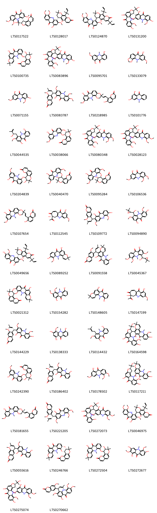{ width=100% }
    <figcaption>Hình ảnh cấu trúc hóa học của 80 hoạt chất thuộc nhóm Quinolines and derivatives gồm ['1-hydroxy-4-[(8r,9r)-8-(2-hydroxypropan-2-yl)-2-oxo-8h,9h-furo[2,3-h]chromen-9-yl]-3,5,6-trimethoxy-10-methylacridin-9-one (LTS0117522)', '1-hydroxy-4-[(4s)-5-hydroxy-2,2-dimethyl-10-(2-methylbut-3-en-2-yl)-8-oxo-3h,4h-pyrano[3,2-g]chromen-4-yl]-3,5,6-trimethoxy-10h-acridin-9-one (LTS0128017)', '1-hydroxy-4-[5-hydroxy-2,2-dimethyl-7,10-bis(2-methylbut-3-en-2-yl)-8-oxo-3h,4h-pyrano[3,2-g]chromen-4-yl]-3,5,6-trimethoxy-10h-acridin-9-one (LTS0124870)', '2-[(1s,2r)-5,9-dihydroxy-2-(2-hydroxypropan-2-yl)-10-methoxy-11-methyl-6-oxo-1h,2h-furo[2,3-c]acridin-1-yl]-1,6-dihydroxy-3,5-dimethoxy-10-methylacridin-9-one (LTS0131200)', '11-hydroxy-6-{[(9r,10r)-9-hydroxy-8,8-dimethyl-2-oxo-9h,10h-pyrano[2,3-h]chromen-10-yl]oxy}-2,2,5-trimethyl-1-oxa-5-azatetraphen-10-one (LTS0100735)', '2-[5,9-dihydroxy-2-(2-hydroxypropan-2-yl)-10-methoxy-11-methyl-6-oxo-1h,2h-furo[2,3-c]acridin-1-yl]-1,6-dihydroxy-3,5-dimethoxy-10-methylacridin-9-one (LTS0083896)', '1,5-dihydroxy-3-methoxy-10-methylacridin-9-one (LTS0095701)', '7-hydroxy-9-methoxy-11-methyl-2h-[1,3]dioxolo[4,5-c]acridin-6-one (LTS0133079)', '1,6-dihydroxy-3,5-dimethoxy-10-methylacridin-9-one (LTS0071155)', '1-hydroxy-3,5,6-trimethoxy-2-[(1r)-1-(7-methoxy-2-oxochromen-6-yl)-3-methylbut-2-en-1-yl]-10-methylacridin-9-one (LTS0083787)', '9-hydroxy-2-[(1e)-2-(7-hydroxy-2-oxochromen-8-yl)ethenyl]-7-methoxy-2,5-dimethyl-3h-1,4-dioxa-5-azatetraphen-10-one (LTS0218985)', '1,3-dihydroxy-n-methylacridone (LTS0101776)', '1,5-dihydroxy-4-[(2r)-2-hydroxy-3-methylbut-3-en-1-yl]-3-methoxy-10-methylacridin-9-one (LTS0044535)', '1,6-dihydroxy-5-{[(9s,10r)-9-hydroxy-8,8-dimethyl-2-oxo-9h,10h-pyrano[2,3-h]chromen-10-yl]oxy}-3-methoxy-10h-acridin-9-one (LTS0038066)', '2-[(1s,2r)-5,9-dihydroxy-2-(2-hydroxypropan-2-yl)-10-methoxy-11-methyl-6-oxo-1h,2h-furo[2,3-c]acridin-1-yl]-1-hydroxy-3,5,6-trimethoxy-10-methylacridin-9-one (LTS0080348)', '2-[5,9-dihydroxy-2-(2-hydroxypropan-2-yl)-10-methoxy-11-methyl-6-oxo-1h,2h-furo[2,3-c]acridin-1-yl]-1-hydroxy-3,5,6-trimethoxy-10h-acridin-9-one (LTS0028123)', '1-hydroxy-5-({9-hydroxy-8,8-dimethyl-2-oxo-9h,10h-pyrano[2,3-h]chromen-10-yl}oxy)-3-methoxy-10-methylacridin-9-one (LTS0204839)', '1-hydroxy-5-({9-hydroxy-8,8-dimethyl-2-oxo-9h,10h-pyrano[2,3-h]chromen-10-yl}oxy)-3,6-dimethoxy-10h-acridin-9-one (LTS0040470)', '1-hydroxy-5-{[(9s,10s)-9-hydroxy-8,8-dimethyl-2-oxo-9h,10h-pyrano[2,3-h]chromen-10-yl]oxy}-3,6-dimethoxy-10h-acridin-9-one (LTS0095284)', '1-hydroxy-3,5,6-trimethoxy-10h-acridin-9-one (LTS0106536)', '9-hydroxy-2-[2-(7-hydroxy-2-oxochromen-8-yl)ethenyl]-7-methoxy-2,5-dimethyl-3h-1,4-dioxa-5-azatetraphen-10-one (LTS0107654)', '(7r)-7-acetyl-1,7-dihydroxy-3-methoxy-5h,6h-cyclohepta[b]quinoline-8,11-dione (LTS0112545)', '1,6-dihydroxy-3,5-dimethoxy-2-[1-(7-methoxy-2-oxochromen-6-yl)-3-methylbut-2-en-1-yl]-10h-acridin-9-one (LTS0109772)', '4-[(3,3-dimethyloxiran-2-yl)(hydroxy)methyl]-1,6-dihydroxy-3,5-dimethoxy-10-methylacridin-9-one (LTS0094890)', '1,6-dihydroxy-4-[(4s)-5-hydroxy-2,2-dimethyl-7,10-bis(2-methylbut-3-en-2-yl)-8-oxo-3h,4h-pyrano[3,2-g]chromen-4-yl]-3,5-dimethoxy-10h-acridin-9-one (LTS0049656)', '7,11-dihydroxy-6-methoxy-2,2,5-trimethyl-1-oxa-5-azatetraphen-10-one (LTS0089252)', '6,11-dihydroxy-12-[1-(7-methoxy-2-oxochromen-6-yl)-3-methylbut-2-en-1-yl]-2,2,5-trimethyl-1-oxa-5-azatetraphen-10-one (LTS0091558)', '4-[(3,3-dimethyloxiran-2-yl)(hydroxy)methyl]-1-hydroxy-3,5,6-trimethoxy-10-methylacridin-9-one (LTS0045367)', '7,11-dihydroxy-6-({9-hydroxy-8,8-dimethyl-2-oxo-9h,10h-pyrano[2,3-h]chromen-10-yl}oxy)-2,2,5-trimethyl-1-oxa-5-azatetraphen-10-one (LTS0021312)', '1,5-dihydroxy-3,4-dimethoxy-10-methylacridin-9-one (LTS0154282)', '5-hydroxynoracronycine (LTS0148605)', '7-acetyl-1,7-dihydroxy-3-methoxy-5h,6h-cyclohepta[b]quinoline-8,11-dione (LTS0147199)', '1,6-dihydroxy-3,5-dimethoxy-2-[(1s)-1-(7-methoxy-2-oxochromen-6-yl)-3-methylbut-2-en-1-yl]-10-methylacridin-9-one (LTS0144229)', '1,3,5-trihydroxy-4-methoxy-10-methylacridin-9-one (LTS0138333)', '1,5-dihydroxy-3-methoxy-10-methyl-4-(3-methylbut-2-en-1-yl)acridin-9-one (LTS0114432)', '12-[5,9-dihydroxy-2-(2-hydroxypropan-2-yl)-10-methoxy-11-methyl-6-oxo-1h,2h-furo[2,3-c]acridin-1-yl]-7,11-dihydroxy-6-methoxy-2,2,5-trimethyl-1-oxa-5-azatetraphen-10-one (LTS0164598)', '1-hydroxy-5-{[(9s,10s)-9-hydroxy-8,8-dimethyl-2-oxo-9h,10h-pyrano[2,3-h]chromen-10-yl]oxy}-3-methoxy-10-methylacridin-9-one (LTS0242390)', '1,5-dihydroxy-3-methoxy-2-[(1s)-1-(7-methoxy-2-oxochromen-6-yl)-3-methylbut-2-en-1-yl]-10-methylacridin-9-one (LTS0186402)', '1-hydroxy-3,5,6-trimethoxy-10-methylacridin-9-one (LTS0178502)', '12-[(1s,2r)-5,9-dihydroxy-2-(2-hydroxypropan-2-yl)-10-methoxy-11-methyl-6-oxo-1h,2h-furo[2,3-c]acridin-1-yl]-7,11-dihydroxy-6-methoxy-2,2,5-trimethyl-1-oxa-5-azatetraphen-10-one (LTS0117211)', '(2r)-9-hydroxy-2-[(1e)-2-(7-hydroxy-2-oxochromen-8-yl)ethenyl]-7-methoxy-2,5-dimethyl-3h-1,4-dioxa-5-azatetraphen-10-one (LTS0181655)', '1-hydroxy-3,5,6-trimethoxy-2-[(1r)-1-(7-methoxy-2-oxochromen-6-yl)-3-methylbut-2-en-1-yl]-10h-acridin-9-one (LTS0221205)', '2-[5,10-dihydroxy-2-(2-hydroxypropan-2-yl)-11-methyl-6-oxo-1h,2h-furo[2,3-c]acridin-1-yl]-1-hydroxy-3,5,6-trimethoxy-10h-acridin-9-one (LTS0272073)', '1-hydroxy-4-[5-hydroxy-2,2-dimethyl-10-(2-methylbut-3-en-2-yl)-8-oxo-3h,4h-pyrano[3,2-g]chromen-4-yl]-3,5,6-trimethoxy-10h-acridin-9-one (LTS0046975)', '1,5-dihydroxy-3-methoxy-2-[1-(7-methoxy-2-oxochromen-6-yl)-3-methylbut-2-en-1-yl]-10-methylacridin-9-one (LTS0055616)', '11-hydroxy-6-{[(9s,10s)-9-hydroxy-8,8-dimethyl-2-oxo-9h,10h-pyrano[2,3-h]chromen-10-yl]oxy}-2,2,5-trimethyl-1-oxa-5-azatetraphen-10-one (LTS0246766)', '11-hydroxy-6-({9-hydroxy-8,8-dimethyl-2-oxo-9h,10h-pyrano[2,3-h]chromen-10-yl}oxy)-2,2,5-trimethyl-1-oxa-5-azatetraphen-10-one (LTS0272504)', '1,3,6-trihydroxy-2,5-dimethoxy-10-methylacridin-9-one (LTS0272677)', '2-[(1s,2r)-5,9-dihydroxy-2-(2-hydroxypropan-2-yl)-10-methoxy-11-methyl-6-oxo-1h,2h-furo[2,3-c]acridin-1-yl]-1-hydroxy-3,5,6-trimethoxy-10h-acridin-9-one (LTS0275074)', '1-hydroxy-3,5,6-trimethoxy-4-[1-(7-methoxy-2-oxochromen-6-yl)-3-methylbut-2-en-1-yl]-10h-acridin-9-one (LTS0270662)', '1,6-dihydroxy-5-({9-hydroxy-8,8-dimethyl-2-oxo-9h,10h-pyrano[2,3-h]chromen-10-yl}oxy)-3-methoxy-10-methylacridin-9-one (LTS0221114)', '2-[5,9-dihydroxy-2-(2-hydroxypropan-2-yl)-10-methoxy-11-methyl-6-oxo-1h,2h-furo[2,3-c]acridin-1-yl]-1-hydroxy-3,5,6-trimethoxy-10-methylacridin-9-one (LTS0233497)', '2-[(1s,2r)-5,10-dihydroxy-2-(2-hydroxypropan-2-yl)-11-methyl-6-oxo-1h,2h-furo[2,3-c]acridin-1-yl]-1-hydroxy-3,5,6-trimethoxy-10-methylacridin-9-one (LTS0224863)', '1-hydroxy-5-{[(9r,10r)-9-hydroxy-8,8-dimethyl-2-oxo-9h,10h-pyrano[2,3-h]chromen-10-yl]oxy}-3,6-dimethoxy-10h-acridin-9-one (LTS0094457)', '6,11-dihydroxy-12-[(1s)-1-(7-methoxy-2-oxochromen-6-yl)-3-methylbut-2-en-1-yl]-2,2,5-trimethyl-1-oxa-5-azatetraphen-10-one (LTS0162153)', '2-[5,10-dihydroxy-2-(2-hydroxypropan-2-yl)-11-methyl-6-oxo-1h,2h-furo[2,3-c]acridin-1-yl]-1-hydroxy-3,5,6-trimethoxy-10-methylacridin-9-one (LTS0233826)', '1,6-dihydroxy-3,5-dimethoxy-10h-acridin-9-one (LTS0186878)', '1,6-dihydroxy-3,5-dimethoxy-4-[1-(7-methoxy-2-oxochromen-6-yl)-3-methylbut-2-en-1-yl]-10h-acridin-9-one (LTS0060872)', '1,3,5-trihydroxy-10-methylacridin-9-one (LTS0255083)', '7,11-dihydroxy-6-{[(9s,10r)-9-hydroxy-8,8-dimethyl-2-oxo-9h,10h-pyrano[2,3-h]chromen-10-yl]oxy}-2,2,5-trimethyl-1-oxa-5-azatetraphen-10-one (LTS0039682)', '7,11-dihydroxy-6-methoxy-12-[(1s)-1-(7-methoxy-2-oxochromen-6-yl)-3-methylbut-2-en-1-yl]-2,2,5-trimethyl-1-oxa-5-azatetraphen-10-one (LTS0043957)', '1,6-dihydroxy-3,5-dimethoxy-10-methyl-4-(3-methylbut-2-en-1-yl)acridin-9-one (LTS0062190)', '1-hydroxy-4-[(4s)-5-hydroxy-2,2-dimethyl-7,10-bis(2-methylbut-3-en-2-yl)-8-oxo-3h,4h-pyrano[3,2-g]chromen-4-yl]-3,5,6-trimethoxy-10h-acridin-9-one (LTS0054870)', '1,5-dihydroxy-4-(2-hydroxy-3-methylbut-3-en-1-yl)-3-methoxy-10-methylacridin-9-one (LTS0039452)', '7,11-dihydroxy-6-methoxy-12-[1-(7-methoxy-2-oxochromen-6-yl)-3-methylbut-2-en-1-yl]-2,2,5-trimethyl-1-oxa-5-azatetraphen-10-one (LTS0007605)', '2-[(1s,2r)-5,10-dihydroxy-2-(2-hydroxypropan-2-yl)-11-methyl-6-oxo-1h,2h-furo[2,3-c]acridin-1-yl]-1-hydroxy-3,5,6-trimethoxy-10h-acridin-9-one (LTS0133118)', '1,6-dihydroxy-4-[5-hydroxy-2,2-dimethyl-7,10-bis(2-methylbut-3-en-2-yl)-8-oxo-3h,4h-pyrano[3,2-g]chromen-4-yl]-3,5-dimethoxy-10h-acridin-9-one (LTS0031207)', '5,9-dihydroxy-10-methoxy-11-methylfuro[2,3-c]acridin-6-one (LTS0063951)', '1,6-dihydroxy-5-({9-hydroxy-8,8-dimethyl-2-oxo-9h,10h-pyrano[2,3-h]chromen-10-yl}oxy)-3-methoxy-10h-acridin-9-one (LTS0013611)', '1,6-dihydroxy-3,5-dimethoxy-2-[(1s)-1-(7-methoxy-2-oxochromen-6-yl)-3-methylbut-2-en-1-yl]-10h-acridin-9-one (LTS0003737)', '1-hydroxy-4-[8-(2-hydroxypropan-2-yl)-2-oxo-8h,9h-furo[2,3-h]chromen-9-yl]-3,5,6-trimethoxy-10-methylacridin-9-one (LTS0011124)', '6,7,11-trihydroxy-2,2,5-trimethyl-1-oxa-5-azatetraphen-10-one (LTS0239460)', '1-hydroxy-3,5,6-trimethoxy-2-[1-(7-methoxy-2-oxochromen-6-yl)-3-methylbut-2-en-1-yl]-10h-acridin-9-one (LTS0017678)', '1,6-dihydroxy-3-methoxy-10-methylacridin-9-one (LTS0095886)', '1,6-dihydroxy-3,5-dimethoxy-2-[1-(7-methoxy-2-oxochromen-6-yl)-3-methylbut-2-en-1-yl]-10-methylacridin-9-one (LTS0025316)', '11-hydroxy-6,7-dimethoxy-2,2,5-trimethyl-1-oxa-5-azatetraphen-10-one (LTS0273038)', '1,6-dihydroxy-3,5-dimethoxy-4-[(1s)-1-(7-methoxy-2-oxochromen-6-yl)-3-methylbut-2-en-1-yl]-10h-acridin-9-one (LTS0034817)', '1-hydroxy-3,5,6-trimethoxy-4-[(1r)-1-(7-methoxy-2-oxochromen-6-yl)-3-methylbut-2-en-1-yl]-10h-acridin-9-one (LTS0017305)', '1-hydroxy-3,5,6-trimethoxy-2-[1-(7-methoxy-2-oxochromen-6-yl)-3-methylbut-2-en-1-yl]-10-methylacridin-9-one (LTS0107374)', '1,6-dihydroxy-5-{[(9s,10s)-9-hydroxy-8,8-dimethyl-2-oxo-9h,10h-pyrano[2,3-h]chromen-10-yl]oxy}-3-methoxy-10-methylacridin-9-one (LTS0129412)'].</figcaption>
</figure>
#### Nhóm Saccharolipids
<figure markdown="span">
    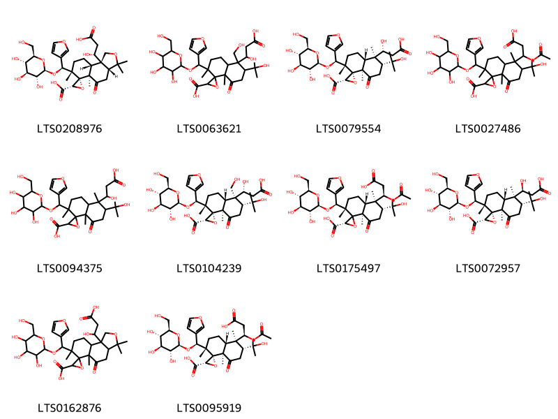{ width=100% }
    <figcaption>Hình ảnh cấu trúc hóa học của 10 hoạt chất thuộc nhóm Saccharolipids gồm ["(3's,3ar,5ar,6r,7s,9ar,9bs)-9b-[(1r)-2-carboxy-1-hydroxyethyl]-7-[(s)-furan-3-yl({[(2r,3r,4s,5s,6r)-3,4,5-trihydroxy-6-(hydroxymethyl)oxan-2-yl]oxy})methyl]-3,3,5a,7-tetramethyl-5-oxo-hexahydrospiro[naphtho[1,2-c]furan-6,2'-oxirane]-3'-carboxylic acid (LTS0208976)", "5-(2-carboxy-1-hydroxyethyl)-2-[furan-3-yl({[3,4,5-trihydroxy-6-(hydroxymethyl)oxan-2-yl]oxy})methyl]-5-(hydroxymethyl)-6-(2-hydroxypropan-2-yl)-2,8a-dimethyl-8-oxo-tetrahydro-3h-spiro[naphthalene-1,2'-oxirane]-3'-carboxylic acid (LTS0063621)", "(1r,2s,3's,4ar,5r,6r,8ar)-5-[(1r)-2-carboxy-1-hydroxyethyl]-2-[(s)-furan-3-yl({[(2r,3r,4s,5s,6r)-3,4,5-trihydroxy-6-(hydroxymethyl)oxan-2-yl]oxy})methyl]-6-(2-hydroxypropan-2-yl)-2,5,8a-trimethyl-8-oxo-tetrahydro-3h-spiro[naphthalene-1,2'-oxirane]-3'-carboxylic acid (LTS0079554)", "5-[1-(acetyloxy)-2-carboxyethyl]-2-[furan-3-yl({[3,4,5-trihydroxy-6-(hydroxymethyl)oxan-2-yl]oxy})methyl]-6-(2-hydroxypropan-2-yl)-2,5,8a-trimethyl-8-oxo-tetrahydro-3h-spiro[naphthalene-1,2'-oxirane]-3'-carboxylic acid (LTS0027486)", "5-(2-carboxy-1-hydroxyethyl)-2-[furan-3-yl({[3,4,5-trihydroxy-6-(hydroxymethyl)oxan-2-yl]oxy})methyl]-6-(2-hydroxypropan-2-yl)-2,5,8a-trimethyl-8-oxo-tetrahydro-3h-spiro[naphthalene-1,2'-oxirane]-3'-carboxylic acid (LTS0094375)", "(1r,2s,3's,4ar,5r,6r,8ar)-5-[(1r)-2-carboxy-1-hydroxyethyl]-2-[(s)-furan-3-yl({[(2r,3r,4s,5s,6r)-3,4,5-trihydroxy-6-(hydroxymethyl)oxan-2-yl]oxy})methyl]-5-(hydroxymethyl)-6-(2-hydroxypropan-2-yl)-2,8a-dimethyl-8-oxo-tetrahydro-3h-spiro[naphthalene-1,2'-oxirane]-3'-carboxylic acid (LTS0104239)", "(2s,3's,4ar,5r,6r,8ar)-5-[(1r)-1-(acetyloxy)-2-carboxyethyl]-2-[(s)-furan-3-yl({[(2r,3r,4s,5s,6r)-3,4,5-trihydroxy-6-(hydroxymethyl)oxan-2-yl]oxy})methyl]-6-(2-hydroxypropan-2-yl)-2,5,8a-trimethyl-8-oxo-tetrahydro-3h-spiro[naphthalene-1,2'-oxirane]-3'-carboxylic acid (LTS0175497)", "(1r,2s,3's,4ar,5r,6r,8ar)-5-[(1s)-2-carboxy-1-hydroxyethyl]-2-[(s)-furan-3-yl({[(2r,3r,4s,5s,6r)-3,4,5-trihydroxy-6-(hydroxymethyl)oxan-2-yl]oxy})methyl]-6-(2-hydroxypropan-2-yl)-2,5,8a-trimethyl-8-oxo-tetrahydro-3h-spiro[naphthalene-1,2'-oxirane]-3'-carboxylic acid (LTS0072957)", "9b-(2-carboxy-1-hydroxyethyl)-7-[furan-3-yl({[3,4,5-trihydroxy-6-(hydroxymethyl)oxan-2-yl]oxy})methyl]-3,3,5a,7-tetramethyl-5-oxo-hexahydrospiro[naphtho[1,2-c]furan-6,2'-oxirane]-3'-carboxylic acid (LTS0162876)", "(1r,2s,3's,4ar,5r,6r,8ar)-5-[(1r)-1-(acetyloxy)-2-carboxyethyl]-2-[(s)-furan-3-yl({[(2r,3r,4s,5s,6r)-3,4,5-trihydroxy-6-(hydroxymethyl)oxan-2-yl]oxy})methyl]-6-(2-hydroxypropan-2-yl)-2,5,8a-trimethyl-8-oxo-tetrahydro-3h-spiro[naphthalene-1,2'-oxirane]-3'-carboxylic acid (LTS0095919)"].</figcaption>
</figure>
#### Nhóm Saturated hydrocarbons
<figure markdown="span">
    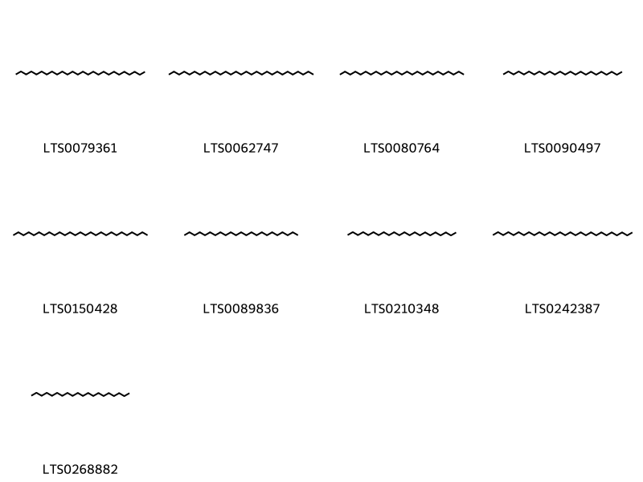{ width=100% }
    <figcaption>Hình ảnh cấu trúc hóa học của 9 hoạt chất thuộc nhóm Saturated hydrocarbons gồm ['hexacosane (LTS0079361)', 'nonacosane (LTS0062747)', 'pentacosane (LTS0080764)', 'tetracosane (LTS0090497)', 'heptacosane (LTS0150428)', 'tricosane (LTS0089836)', 'docosane (LTS0210348)', 'octacosane (LTS0242387)', 'eicosane (LTS0268882)'].</figcaption>
</figure>
#### Nhóm Steroids and steroid derivatives
<figure markdown="span">
    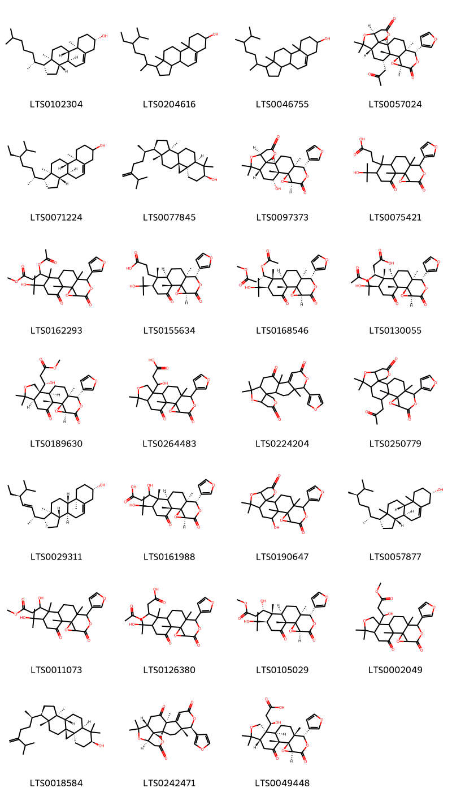{ width=100% }
    <figcaption>Hình ảnh cấu trúc hóa học của 27 hoạt chất thuộc nhóm Steroids and steroid derivatives gồm ['cholesterol (LTS0102304)', 'stigmast-5-en-3-ol, (3β)- (LTS0204616)', 'campesterol (LTS0046755)', '(1r,2r,7s,10s,12s,13r,14s,16s,19s,20s)-19-(furan-3-yl)-9,9,13,20-tetramethyl-12-(2-oxopropyl)-4,8,15,18-tetraoxahexacyclo[11.9.0.0²,⁷.0²,¹⁰.0¹⁴,¹⁶.0¹⁴,²⁰]docosane-5,17-dione (LTS0057024)', 'stigmast-5-en-3-ol (LTS0071224)', '24-methylene-cycloartanol (LTS0077845)', '(1r,2r,7s,10s,12r,13s,14r,16s,19s,20s)-19-(furan-3-yl)-12-hydroxy-9,9,13,20-tetramethyl-4,8,15,18-tetraoxahexacyclo[11.9.0.0²,⁷.0²,¹⁰.0¹⁴,¹⁶.0¹⁴,²⁰]docosane-5,17-dione (LTS0097373)', '3-[11-(furan-3-yl)-5-(2-hydroxypropan-2-yl)-2,6,10-trimethyl-3,13-dioxo-12,15-dioxatetracyclo[8.5.0.0¹,¹⁴.0²,⁷]pentadecan-6-yl]propanoic acid (LTS0075421)', 'methyl 3-(acetyloxy)-3-[11-(furan-3-yl)-5-(2-hydroxypropan-2-yl)-2,6,10-trimethyl-3,13-dioxo-12,15-dioxatetracyclo[8.5.0.0¹,¹⁴.0²,⁷]pentadecan-6-yl]propanoate (LTS0162293)', '3-[(1r,2r,5r,6r,7r,10s,11s,14s)-11-(furan-3-yl)-5-(2-hydroxypropan-2-yl)-2,6,10-trimethyl-3,13-dioxo-12,15-dioxatetracyclo[8.5.0.0¹,¹⁴.0²,⁷]pentadecan-6-yl]propanoic acid (LTS0155634)', 'methyl (3s)-3-(acetyloxy)-3-[(1r,2r,5r,6r,7r,10s,11s,14s)-11-(furan-3-yl)-5-(2-hydroxypropan-2-yl)-2,6,10-trimethyl-3,13-dioxo-12,15-dioxatetracyclo[8.5.0.0¹,¹⁴.0²,⁷]pentadecan-6-yl]propanoate (LTS0168546)', '(3s)-3-(acetyloxy)-3-[(1r,2r,5r,6r,7r,10s,11s,14s)-11-(furan-3-yl)-5-(2-hydroxypropan-2-yl)-2,6,10-trimethyl-3,13-dioxo-12,15-dioxatetracyclo[8.5.0.0¹,¹⁴.0²,⁷]pentadecan-6-yl]propanoic acid (LTS0130055)', 'methyl (3s)-3-[(1r,2r,4s,7s,8s,11r,12r,16r)-7-(furan-3-yl)-1,8,15,15-tetramethyl-5,18-dioxo-3,6,14-trioxapentacyclo[9.7.0.0²,⁴.0²,⁸.0¹²,¹⁶]octadecan-12-yl]-3-hydroxypropanoate (LTS0189630)', '3-[7-(furan-3-yl)-1,8,15,15-tetramethyl-5,18-dioxo-3,6,14-trioxapentacyclo[9.7.0.0²,⁴.0²,⁸.0¹²,¹⁶]octadecan-12-yl]-3-hydroxypropanoic acid (LTS0264483)', '18-(furan-3-yl)-9,9,13,19-tetramethyl-4,8,17-trioxapentacyclo[11.8.0.0²,⁷.0²,¹⁰.0¹⁴,¹⁹]henicos-14-ene-5,12,16-trione (LTS0224204)', '19-(furan-3-yl)-9,9,13,20-tetramethyl-12-(2-oxopropyl)-4,8,15,18-tetraoxahexacyclo[11.9.0.0²,⁷.0²,¹⁰.0¹⁴,¹⁶.0¹⁴,²⁰]docosane-5,17-dione (LTS0250779)', 'phytosterol (LTS0029311)', '3-[(1r,2r,5r,6r,7r,10s,11s,14s)-11-(furan-3-yl)-5-(2-hydroxypropan-2-yl)-2,6,10-trimethyl-3,13-dioxo-12,15-dioxatetracyclo[8.5.0.0¹,¹⁴.0²,⁷]pentadecan-6-yl]-3-hydroxypropanoic acid (LTS0161988)', '19-(furan-3-yl)-12-hydroxy-9,9,13,20-tetramethyl-4,8,15,18-tetraoxahexacyclo[11.9.0.0²,⁷.0²,¹⁰.0¹⁴,¹⁶.0¹⁴,²⁰]docosane-5,17-dione (LTS0190647)', '(1r,3as,3bs,7s,9bs)-1-[(2r,5r)-5,6-dimethylheptan-2-yl]-9a,11a-dimethyl-1h,2h,3h,3ah,3bh,4h,6h,7h,8h,9h,9bh,10h,11h-cyclopenta[a]phenanthren-7-ol (LTS0057877)', 'methyl 3-[11-(furan-3-yl)-5-(2-hydroxypropan-2-yl)-2,6,10-trimethyl-3,13-dioxo-12,15-dioxatetracyclo[8.5.0.0¹,¹⁴.0²,⁷]pentadecan-6-yl]-3-hydroxypropanoate (LTS0011073)', '3-(acetyloxy)-3-[11-(furan-3-yl)-5-(2-hydroxypropan-2-yl)-2,6,10-trimethyl-3,13-dioxo-12,15-dioxatetracyclo[8.5.0.0¹,¹⁴.0²,⁷]pentadecan-6-yl]propanoic acid (LTS0126380)', 'methyl (3s)-3-[(1r,2r,5r,6r,7r,10s,11s,14s)-11-(furan-3-yl)-5-(2-hydroxypropan-2-yl)-2,6,10-trimethyl-3,13-dioxo-12,15-dioxatetracyclo[8.5.0.0¹,¹⁴.0²,⁷]pentadecan-6-yl]-3-hydroxypropanoate (LTS0105029)', 'methyl 3-[7-(furan-3-yl)-1,8,15,15-tetramethyl-5,18-dioxo-3,6,14-trioxapentacyclo[9.7.0.0²,⁴.0²,⁸.0¹²,¹⁶]octadecan-12-yl]-3-hydroxypropanoate (LTS0002049)', '24-methylenecycloartanol (LTS0018584)', '(1r,2s,7r,10r,13r,18r,19r)-18-(furan-3-yl)-9,9,13,19-tetramethyl-4,8,17-trioxapentacyclo[11.8.0.0²,⁷.0²,¹⁰.0¹⁴,¹⁹]henicos-14-ene-5,12,16-trione (LTS0242471)', '(3r)-3-[(1r,2r,4s,7s,8r,11r,12s,16s)-7-(furan-3-yl)-1,8,15,15-tetramethyl-5,18-dioxo-3,6,14-trioxapentacyclo[9.7.0.0²,⁴.0²,⁸.0¹²,¹⁶]octadecan-12-yl]-3-hydroxypropanoic acid (LTS0049448)'].</figcaption>
</figure>
#### Nhóm Thianes
<figure markdown="span">
    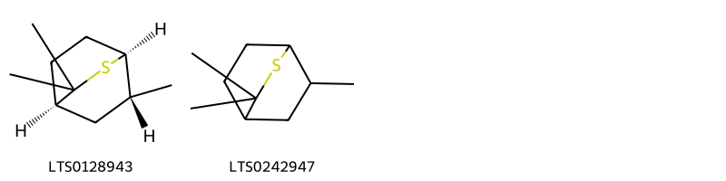{ width=100% }
    <figcaption>Hình ảnh cấu trúc hóa học của 2 hoạt chất thuộc nhóm Thianes gồm ['(1s,4r,6r)-3,3,6-trimethyl-2-thiabicyclo[2.2.2]octane (LTS0128943)', '3,3,6-trimethyl-2-thiabicyclo[2.2.2]octane (LTS0242947)'].</figcaption>
</figure>
#### Nhóm Unsaturated hydrocarbons
<figure markdown="span">
    { width=100% }
    <figcaption>Hình ảnh cấu trúc hóa học của 4 hoạt chất thuộc nhóm Unsaturated hydrocarbons gồm ['2-methyl-6-methylideneocta-1,7-diene (LTS0213612)', '(3e)-3,7-dimethylocta-1,3-diene (LTS0174272)', 'cosmene (LTS0151256)', 'α terpinene (LTS0232891)'].</figcaption>
</figure>

---

### Dược dân tộc học

Danh sách các quốc gia có sử dụng *Citrus aurantium* trong điều trị các bệnh. 

| Country            | Disease                                                                                                                                   | Bệnh                                                                                                                              |
|:-------------------|:------------------------------------------------------------------------------------------------------------------------------------------|:----------------------------------------------------------------------------------------------------------------------------------|
| China              | nan, Emmenagogue, Fungicide, Refrigerant, Sedative, Carminative, Stomachic, Vermifuge                                                     | nan, Emmenagogue, Thuốc diệt nấm, Chất làm lạnh, Thuốc an thần, Carminative, Dạ dày, Vermifuge                                    |
| Curacao            | Tranquilizer, Tranquilizer                                                                                                                | Thuốc an thần, Thuốc an thần                                                                                                      |
| Dominican Republic | Hemostat, Sudorific                                                                                                                       | Máy cầm máu, gây ngạt mồ hôi                                                                                                      |
| Elsewhere          | Antifertility, Antiseptic, Carminative, Carminative, Expectorant, Stimulant, Stomachic, Stomachic, Styptic, Tonic, Emmenagogue, Sudorific | Khử trùng, Khử trùng, Carminative, Carminative, Chất đờm, Chất kích thích, Dạ dày, Dạ dày, Styptic, Tonic, Emmenagogue, Sudorific |
| Haiti              | Laxative, Purgative, Antiseptic                                                                                                           | Thuốc nhuận tràng, thuốc tẩy, thuốc sát trùng                                                                                     |
| Mexico             | Tranquilizer, Apertif, Tonic                                                                                                              | Thuốc an thần, Apertif, Thuốc bổ                                                                                                  |
| Trinidad           | Expectorant, Purgative, Sedative                                                                                                          | Thuốc long đờm, thuốc tẩy, thuốc an thần                                                                                          |
| Turkey             | Apertif, Narcotic, Tonic, Antiseptic, Nervine, Sedative, Stomachic                                                                        | Apertif, Ma túy, Thuốc bổ, Sát trùng, Thần kinh, Thuốc an thần, Dạ dày                                                            |

---

---
## Citrus bigaradia
### Thông tin về thực vật

!!! info "Phân loại thực vật của *Citrus aurantium* từ GIBF:"
    - **Kingdom:** Plantae
    - **Phylum:** Tracheophyta
    - **Order:** Sapindales
    - **Family:** Rutaceae
    - **Genus:** Citrus
    - **Species:** *Citrus aurantium*

 

| Label (VI)   | Label (EN)   | Scientific Name   | Descriptions (VI)   | Descriptions (EN)              | Also Known As (VI)   | Also Known As (EN)   |
|:-------------|:-------------|:------------------|:--------------------|:-------------------------------|:---------------------|:---------------------|
| N/A          | N/A          | Citrus acida      |                     | species of fruit-bearing plant | ['']                 | ['']                 |

#### Phân bố trên thế giới

**Từ CSDL GIBF** nan, Brazil, Egypt, unknown or invalid, Congo, Democratic Republic of the, Mexico, France, Ethiopia

#### Phân bố tại Việt Nam

**Từ CSDL GIBF**: Không có ghi nhận ở Việt Nam

---
### Thành phần hóa học
        
- Theo cơ sở dữ liệu lotus: Từ loài *Citrus aurantium* đã phân lập và xác định được Chưa có hoạt chất nào được phân lập. hoạt chất thuộc về các nhóm Không có hoạt chất nào được phân lập. 

Không có hình ảnh nào được tạo ra

---

### Dược dân tộc học

Danh sách các quốc gia có sử dụng *Citrus aurantium* trong điều trị các bệnh. 

| Country   | Disease   | Bệnh               |
|:----------|:----------|:-------------------|
| Venezuela | Tonic     | (thuộc) trương lực |

---

---
## Citrus grandis
### Thông tin về thực vật

!!! info "Phân loại thực vật của *Citrus grandis* từ GIBF:"
    - **Kingdom:** Plantae
    - **Phylum:** Tracheophyta
    - **Order:** Sapindales
    - **Family:** Rutaceae
    - **Genus:** Citrus
    - **Species:** *Citrus grandis*

 

| Label (VI)   | Label (EN)   | Scientific Name   | Descriptions (VI)   | Descriptions (EN)   | Also Known As (VI)   | Also Known As (EN)   |
|:-------------|:-------------|:------------------|:--------------------|:--------------------|:---------------------|:---------------------|
| N/A          | N/A          | Citrus grandis    | loài thực vật       | species of plant    | ['']                 | ['']                 |

#### Phân bố trên thế giới

**Từ CSDL GIBF** Lao People’s Democratic Republic, Colombia, Chinese Taipei, India, United States of America, Viet Nam, Guinea, Malaysia, China

#### Phân bố tại Việt Nam

**Từ CSDL GIBF**: Không có ghi nhận ở Việt Nam

---
### Thành phần hóa học
        
- Theo cơ sở dữ liệu lotus: Từ loài *Citrus grandis* đã phân lập và xác định được 222 hoạt chất thuộc về các nhóm Benzodioxanes, Fatty Acyls, Naphthalenes, Flavonoids, Prenol lipids, Steroids and steroid derivatives, Quinolines and derivatives, Organonitrogen compounds, Benzene and substituted derivatives, Unsaturated hydrocarbons, Organooxygen compounds, Phenols, Coumarins and derivatives, Saturated hydrocarbons, Carboxylic acids and derivatives, Benzopyrans, Imidazopyrimidines. 

|    | chemicalTaxonomyClassyfireClass     |   smiles_count |
|---:|:------------------------------------|---------------:|
|  0 | Benzene and substituted derivatives |              3 |
|  1 | Benzodioxanes                       |              1 |
|  2 | Benzopyrans                         |              2 |
|  3 | Carboxylic acids and derivatives    |              2 |
|  4 | Coumarins and derivatives           |             28 |
|  5 | Fatty Acyls                         |             10 |
|  6 | Flavonoids                          |             35 |
|  7 | Imidazopyrimidines                  |              4 |
|  8 | Naphthalenes                        |              1 |
|  9 | Organonitrogen compounds            |              1 |
| 10 | Organooxygen compounds              |             10 |
| 11 | Phenols                             |              1 |
| 12 | Prenol lipids                       |             72 |
| 13 | Quinolines and derivatives          |             39 |
| 14 | Saturated hydrocarbons              |              3 |
| 15 | Steroids and steroid derivatives    |              6 |
| 16 | Unsaturated hydrocarbons            |              2 |

#### Nhóm Benzene and substituted derivatives
<figure markdown="span">
    { width=100% }
    <figcaption>Hình ảnh cấu trúc hóa học của 3 hoạt chất thuộc nhóm Benzene and substituted derivatives gồm ['methyl anthranilate (LTS0069354)', 'dimethyl anthranilate (LTS0093066)', 'veratric acid (LTS0151848)'].</figcaption>
</figure>
#### Nhóm Benzodioxanes
<figure markdown="span">
    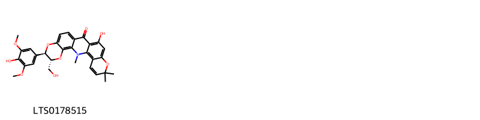{ width=100% }
    <figcaption>Hình ảnh cấu trúc hóa học của 1 hoạt chất thuộc nhóm Benzodioxanes gồm ['(6r,7r)-15-hydroxy-7-(4-hydroxy-3,5-dimethoxyphenyl)-6-(hydroxymethyl)-2,19,19-trimethyl-5,8,18-trioxa-2-azapentacyclo[12.8.0.0³,¹².0⁴,⁹.0¹⁷,²²]docosa-1(22),3,9,11,14,16,20-heptaen-13-one (LTS0178515)'].</figcaption>
</figure>
#### Nhóm Benzopyrans
<figure markdown="span">
    { width=100% }
    <figcaption>Hình ảnh cấu trúc hóa học của 2 hoạt chất thuộc nhóm Benzopyrans gồm ['2-hydroxy-7-(1-hydroxyethylidene)-10,15,15-trimethyl-16-oxa-10-azatetracyclo[9.8.0.0³,⁹.0¹²,¹⁷]nonadeca-1,3(9),4,11,13,17-hexaene-6,8,19-trione (LTS0262420)', '7-acetyl-6,19-dihydroxy-10,15,15-trimethyl-16-oxa-10-azatetracyclo[9.8.0.0³,⁹.0¹²,¹⁷]nonadeca-1(19),3(9),4,6,11,13,17-heptaene-2,8-dione (LTS0204895)'].</figcaption>
</figure>
#### Nhóm Carboxylic acids and derivatives
<figure markdown="span">
    { width=100% }
    <figcaption>Hình ảnh cấu trúc hóa học của 2 hoạt chất thuộc nhóm Carboxylic acids and derivatives gồm ['1,1-dimethylpyrrolidin-1-ium-2-carboxylate (LTS0052231)', 'stachydrine (LTS0190320)'].</figcaption>
</figure>
#### Nhóm Coumarins and derivatives
<figure markdown="span">
    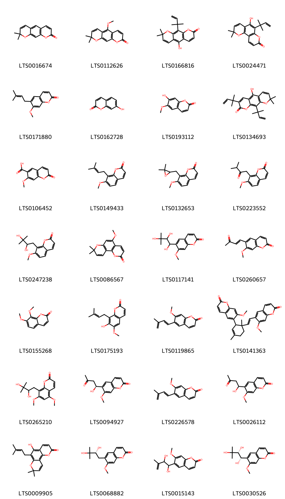{ width=100% }
    <figcaption>Hình ảnh cấu trúc hóa học của 28 hoạt chất thuộc nhóm Coumarins and derivatives gồm ['xanthyletin (LTS0016674)', 'xanthoxyletin (LTS0112626)', 'nor-dentatin (LTS0166816)', '5-hydroxy-2,2-dimethyl-6-(2-methylbut-3-en-2-yl)pyrano[2,3-h]chromen-8-one (LTS0024471)', 'suberosin (LTS0171880)', 'umbelliferone (LTS0162728)', 'scopoletin (LTS0193112)', '5-hydroxy-8,8-dimethyl-3,10-bis(2-methylbut-3-en-2-yl)pyrano[3,2-g]chromen-2-one (LTS0134693)', '7-methoxy-2-oxochromene-6-carboxylic acid (LTS0106452)', 'osthole (LTS0149433)', '8-[(3,3-dimethyloxiran-2-yl)methyl]-7-methoxychromen-2-one (LTS0132653)', '7-methoxy-8-(3-methyl-2-oxobutyl)chromen-2-one (LTS0223552)', '8-(2,3-dihydroxy-3-methylbutyl)-7-methoxychromen-2-one (LTS0247238)', '5-methoxy-8,8-dimethylpyrano[2,3-f]chromen-2-one (LTS0086567)', '7-methoxy-6-(1,2,3-trihydroxy-3-methylbutyl)chromen-2-one (LTS0117141)', '7-methoxy-6-[(1e)-3-oxobut-1-en-1-yl]chromen-2-one (LTS0260657)', '7,8-dimethoxychromen-2-one (LTS0155268)', '7-hydroxy-6-methoxy-8-(3-methylbut-2-en-1-yl)chromen-2-one (LTS0175193)', '7-methoxy-6-[(1e)-3-methylbuta-1,3-dien-1-yl]chromen-2-one (LTS0119865)', '7-methoxy-6-{6-[(1e)-2-(7-methoxy-2-oxochromen-6-yl)ethenyl]-3,6-dimethylcyclohex-2-en-1-yl}chromen-2-one (LTS0141363)', '8-(2,3-dihydroxy-3-methylbutyl)-5,7-dimethoxychromen-2-one (LTS0265210)', '6-[(1s)-1-hydroxy-3-oxobutyl]-7-methoxychromen-2-one (LTS0094927)', '7-methoxy-6-(3-methylbuta-1,3-dien-1-yl)chromen-2-one (LTS0226578)', '6-(1-hydroxy-3-oxobutyl)-7-methoxychromen-2-one (LTS0026112)', '5-hydroxy-8,8-dimethyl-6-(3-methylbut-2-en-1-yl)pyrano[2,3-f]chromen-2-one (LTS0009905)', '6-[(2r)-2,3-dihydroxy-3-methylbutyl]-7-methoxychromen-2-one (LTS0068882)', '6-(1,2-dihydroxy-3-methylbut-3-en-1-yl)-7-methoxychromen-2-one (LTS0015143)', '7-methoxy-6-[(1s,2r)-1,2,3-trihydroxy-3-methylbutyl]chromen-2-one (LTS0030526)'].</figcaption>
</figure>
#### Nhóm Fatty Acyls
<figure markdown="span">
    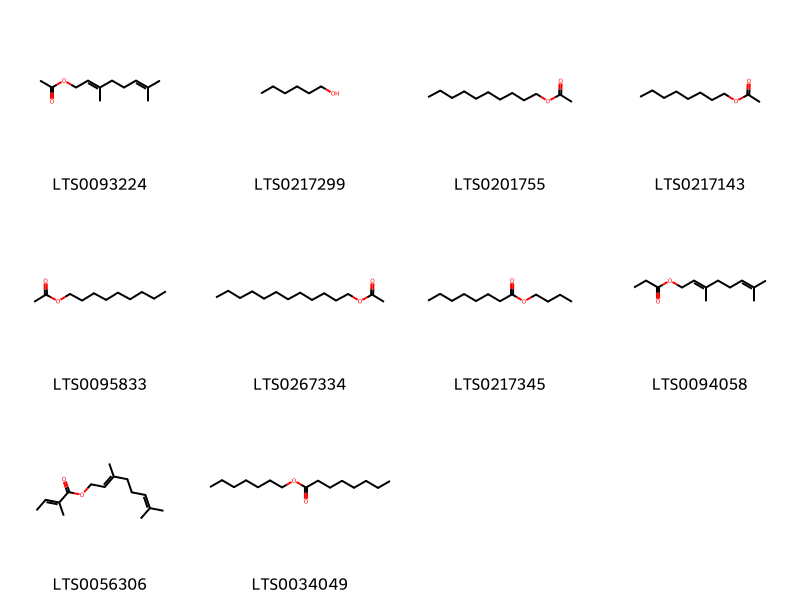{ width=100% }
    <figcaption>Hình ảnh cấu trúc hóa học của 10 hoạt chất thuộc nhóm Fatty Acyls gồm ['geranyl acetate (LTS0093224)', 'hexanol (LTS0217299)', 'decyl acetate (LTS0201755)', 'octyl acetate (LTS0217143)', 'nonyl acetate (LTS0095833)', 'lauryl acetate (LTS0267334)', 'butyl octanoate (LTS0217345)', 'geranyl propionate (LTS0094058)', 'geranyl tiglate (LTS0056306)', 'heptyl octanoate (LTS0034049)'].</figcaption>
</figure>
#### Nhóm Flavonoids
<figure markdown="span">
    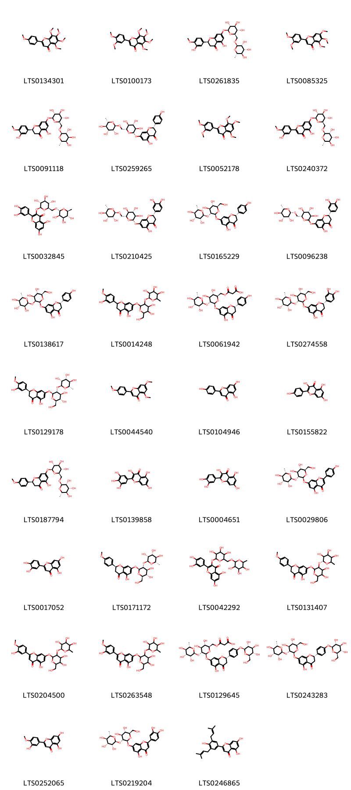{ width=100% }
    <figcaption>Hình ảnh cấu trúc hóa học của 35 hoạt chất thuộc nhóm Flavonoids gồm ['tangeretin (LTS0134301)', 'nobiletin (LTS0100173)', 'hesperidin (LTS0261835)', 'sinensetin (LTS0085325)', '(2s)-5-hydroxy-2-(3-hydroxy-4-methoxyphenyl)-7-{[(2s,3r,4s,5s,6r)-3,4,5-trihydroxy-6-({[(2r,3r,4s,5r,6s)-3,4,5-trihydroxy-6-methyloxan-2-yl]oxy}methyl)oxan-2-yl]oxy}-2,3-dihydro-1-benzopyran-4-one (LTS0091118)', 'narirutin (LTS0259265)', 'isosinensetin (LTS0052178)', 'diosmin (LTS0240372)', '3-rutinosyl quercetin (LTS0032845)', 'eriocitrin (LTS0210425)', 'naringin (LTS0165229)', '(2s)-2-(3,4-dihydroxyphenyl)-5-hydroxy-7-{[(3r,4s,5s,6r)-3,4,5-trihydroxy-6-({[(2s,3r,4r,5r,6s)-3,4,5-trihydroxy-6-methyloxan-2-yl]oxy}methyl)oxan-2-yl]oxy}-2,3-dihydro-1-benzopyran-4-one (LTS0096238)', '(2s)-7-{[(2s,3s,4s,5s,6r)-4,5-dihydroxy-6-(hydroxymethyl)-3-{[(2s,3s,4r,5r,6s)-3,4,5-trihydroxy-6-methyloxan-2-yl]oxy}oxan-2-yl]oxy}-5-hydroxy-2-(4-hydroxyphenyl)-2,3-dihydro-1-benzopyran-4-one (LTS0138617)', '7-{[4,5-dihydroxy-6-(hydroxymethyl)-3-{[(2s)-3,4,5-trihydroxy-6-methyloxan-2-yl]oxy}oxan-2-yl]oxy}-5-hydroxy-2-(3-hydroxy-4-methoxyphenyl)-2,3-dihydro-1-benzopyran-4-one (LTS0014248)', '3-{[(2r,3s,4s,5r,6s)-3,4-dihydroxy-6-{[(2s)-5-hydroxy-2-(4-hydroxyphenyl)-4-oxo-2,3-dihydro-1-benzopyran-7-yl]oxy}-5-{[(2s,3r,4r,5r,6s)-3,4,5-trihydroxy-6-methyloxan-2-yl]oxy}oxan-2-yl]methoxy}-3-oxopropanoic acid (LTS0061942)', 'neoeriocitrin (LTS0274558)', 'neohesperidin (LTS0129178)', 'apigenin trimethyl ether (LTS0044540)', 'chamomile (LTS0104946)', 'kaempherol (LTS0155822)', '(2s)-5-hydroxy-2-(4-methoxyphenyl)-7-{[(2s,3r,4s,5s,6r)-3,4,5-trihydroxy-6-({[(2r,3r,4r,5r,6s)-3,4,5-trihydroxy-6-methyloxan-2-yl]oxy}methyl)oxan-2-yl]oxy}-2,3-dihydro-1-benzopyran-4-one (LTS0187794)', 'myricetin (LTS0139858)', 'quercetin (LTS0004651)', 'rhoifolin (LTS0029806)', 'luteolin (LTS0017052)', 'poncirin (LTS0171172)', 'rutin (LTS0042292)', '7-{[4,5-dihydroxy-6-(hydroxymethyl)-3-{[(2r)-3,4,5-trihydroxy-6-methyloxan-2-yl]oxy}oxan-2-yl]oxy}-5-hydroxy-2-(4-methoxyphenyl)-2,3-dihydro-1-benzopyran-4-one (LTS0131407)', '7-{[4,5-dihydroxy-6-(hydroxymethyl)-3-{[(2s)-3,4,5-trihydroxy-6-methyloxan-2-yl]oxy}oxan-2-yl]oxy}-5-hydroxy-2-(3-hydroxy-4-methoxyphenyl)chromen-4-one (LTS0204500)', '7-{[4,5-dihydroxy-6-(hydroxymethyl)-3-[(3,4,5-trihydroxy-6-methyloxan-2-yl)oxy]oxan-2-yl]oxy}-5-hydroxy-2-(3-hydroxy-4-methoxyphenyl)chromen-4-one (LTS0263548)', '3-{[(2r,3s,4s,5r,6s)-3,4-dihydroxy-6-{[(2s)-5-hydroxy-4-oxo-2-(4-{[(2s,3r,4s,5s,6r)-3,4,5-trihydroxy-6-(hydroxymethyl)oxan-2-yl]oxy}phenyl)-2,3-dihydro-1-benzopyran-7-yl]oxy}-5-{[(2s,3r,4r,5r,6s)-3,4,5-trihydroxy-6-methyloxan-2-yl]oxy}oxan-2-yl]methoxy}-3-oxopropanoic acid (LTS0129645)', '(2s)-7-{[(2s,3r,4s,5s,6r)-4,5-dihydroxy-6-(hydroxymethyl)-3-{[(2s,3r,4r,5r,6s)-3,4,5-trihydroxy-6-methyloxan-2-yl]oxy}oxan-2-yl]oxy}-5-hydroxy-2-(4-{[(2s,3r,4s,5s,6r)-3,4,5-trihydroxy-6-(hydroxymethyl)oxan-2-yl]oxy}phenyl)-2,3-dihydro-1-benzopyran-4-one (LTS0243283)', 'diosmetin (LTS0252065)', 'lonicerin (LTS0219204)', 'honyucitrin (LTS0246865)'].</figcaption>
</figure>
#### Nhóm Imidazopyrimidines
<figure markdown="span">
    { width=100% }
    <figcaption>Hình ảnh cấu trúc hóa học của 4 hoạt chất thuộc nhóm Imidazopyrimidines gồm ['caffeine (LTS0075508)', 'constant-t (LTS0100702)', 'p-xanthine (LTS0149000)', 'thesal (LTS0250246)'].</figcaption>
</figure>
#### Nhóm Naphthalenes
<figure markdown="span">
    { width=100% }
    <figcaption>Hình ảnh cấu trúc hóa học của 1 hoạt chất thuộc nhóm Naphthalenes gồm ['2-methoxy-8-(7-methoxy-2-oxochromen-8-yl)-6-methylnaphthalene-1,4-dione (LTS0219884)'].</figcaption>
</figure>
#### Nhóm Organonitrogen compounds
<figure markdown="span">
    { width=100% }
    <figcaption>Hình ảnh cấu trúc hóa học của 1 hoạt chất thuộc nhóm Organonitrogen compounds gồm ['putrescine (LTS0238763)'].</figcaption>
</figure>
#### Nhóm Organooxygen compounds
<figure markdown="span">
    { width=100% }
    <figcaption>Hình ảnh cấu trúc hóa học của 10 hoạt chất thuộc nhóm Organooxygen compounds gồm ['decanal (LTS0128361)', '6-methyl-5-hepten-2-one (LTS0241073)', 'octanal (LTS0055983)', 'nonanal (LTS0244398)', 'hexanal (LTS0238624)', '(2s,3r,4s,5s,6r)-2-(3,5-dihydroxyphenoxy)-6-(hydroxymethyl)oxane-3,4,5-triol (LTS0172238)', 'aldehyde c11 (LTS0045537)', '(2r,3s,4s,5r,6s)-2-(hydroxymethyl)-6-[(2-methylbut-3-en-2-yl)oxy]oxane-3,4,5-triol (LTS0073684)', '2-(hydroxymethyl)-6-[(2-methylbut-3-en-2-yl)oxy]oxane-3,4,5-triol (LTS0002833)', 'undecenal (LTS0250015)'].</figcaption>
</figure>
#### Nhóm Phenols
<figure markdown="span">
    { width=100% }
    <figcaption>Hình ảnh cấu trúc hóa học của 1 hoạt chất thuộc nhóm Phenols gồm ['α-hydroquinone (LTS0063684)'].</figcaption>
</figure>
#### Nhóm Prenol lipids
<figure markdown="span">
    { width=100% }
    <figcaption>Hình ảnh cấu trúc hóa học của 72 hoạt chất thuộc nhóm Prenol lipids gồm ['limonene,  (LTS0155981)', 'limonin (LTS0207873)', '7-(furan-3-yl)-1,8,12,17,17-pentamethyl-5,15,20-trioxo-3,6,16-trioxapentacyclo[9.9.0.0²,⁴.0²,⁸.0¹²,¹⁸]icosan-13-yl acetate (LTS0267734)', 'α pinene (LTS0132416)', 'α-myrcene (LTS0115731)', 'cymene (LTS0181568)', 'β-pinene (LTS0117550)', '(1r,2r,8s,11s,12r,18s)-7-(furan-3-yl)-1,8,12,17,17-pentamethyl-5,15,20-trioxo-3,6,16-trioxapentacyclo[9.9.0.0²,⁴.0²,⁸.0¹²,¹⁸]icosan-13-yl acetate (LTS0234033)', 'terpinolene (LTS0104525)', 'caryophyllene (LTS0085212)', 'α-limonene (LTS0244943)', 'terpinene (LTS0136858)', 'auraptene (LTS0058299)', 'nerol (LTS0244289)', 'α-citral (LTS0246122)', 'terpineol (LTS0136148)', 'linalool, (+-)- (LTS0128839)', '(-)-α-pinene (LTS0032699)', 'β-elemene (LTS0225699)', '(-)-β-pinene (LTS0108757)', 'α-thujene (LTS0185078)', 'neral (LTS0165243)', '(+)-sabinene (LTS0110694)', '3,7-dimethyl-2,6-octadienal (LTS0141353)', 'limonin (LTS0143013)', 'geraniol (LTS0258838)', 'citronellol, (+-)- (LTS0090925)', '(-)-linalool (LTS0200382)', '4-terpineol (LTS0253733)', 'β-farnesene (LTS0067925)', 'obacunone (LTS0261586)', '(1s,5s)-carvyl acetate (LTS0169943)', 'allo-ocimene (LTS0090999)', '(3r,5z)-2,6-dimethylocta-1,5,7-trien-3-ol (LTS0097711)', '(4e,6z)-alloocimene (LTS0254100)', '(+)-α-thujene (LTS0272912)', 'carvyl acetate (LTS0049357)', 'ichangin (LTS0018532)', '2-[4-ethenyl-4-methyl-3-(prop-1-en-2-yl)cyclohexyl]propan-2-ol (LTS0072139)', 'camphene (LTS0267242)', 'elemol (LTS0208556)', '(-)-friedelin (LTS0041645)', 'nerolidol (LTS0197738)', 'humulene (LTS0263171)', 'nootkatone (LTS0183338)', 'valencene (LTS0031707)', 'valencene (LTS0110395)', "(1r,3'r,5ar,7ar,9s,11ar,11br)-1-(acetyloxy)-9-[furan-3-yl({[(2r,3r,4s,5s,6r)-3,4,5-trihydroxy-6-(hydroxymethyl)oxan-2-yl]oxy})methyl]-5,5,7a,9,11b-pentamethyl-3,7-dioxo-hexahydro-1h-spiro[naphtho[2,1-c]oxepine-8,2'-oxirane]-3'-carboxylic acid (LTS0107449)", 'nerolidol (LTS0155191)', '7-[(3,7-dimethylocta-2,6-dien-1-yl)oxy]chromen-2-one (LTS0166429)', 'α-curcumene (LTS0019880)', '3,7-dimethyl-2,6-octadien-1-ol (LTS0215566)', '4-isopropyl-1,6-dimethyl-2,3,4,4a,7,8-hexahydronaphthalene (LTS0270743)', 'delta-cadinene (LTS0019321)', '(+)-delta(3)-carene (LTS0250199)', 'α-copaene (LTS0207598)', 'nootkatone (LTS0027125)', '(1r,2s,7s,8s)-8-isopropyl-1,3-dimethyltricyclo[4.4.0.0²,⁷]dec-3-ene (LTS0190031)', '(3r,6e)-nerolidol (LTS0145065)', '4-isopropyl-1,6-dimethyl-3,4,4a,7,8,8a-hexahydronaphthalene (LTS0154650)', 'phytofluene (LTS0181914)', '(4e,8e)-4,8,11,11-tetramethylcycloundeca-1,4,8-triene (LTS0118116)', 'β-copaene (LTS0255787)', 'α-muurolene (LTS0022607)', 'zeta-carotene (LTS0007334)', "(1r,3'r,5ar,7ar,9s,11ar,11br)-1-(acetyloxy)-9-[furan-3-yl({[(2r,3r,4s,5s,6s)-3,4,5-trihydroxy-6-methoxyoxan-2-yl]oxy})methyl]-5,5,7a,9,11b-pentamethyl-3,7-dioxo-hexahydro-1h-spiro[naphtho[2,1-c]oxepine-8,2'-oxirane]-3'-carboxylic acid (LTS0268454)", 'perillaldehyde,  (LTS0028488)', "(2s,3's,4ar,5r,6r,8ar)-5-[(1r)-1-(acetyloxy)-2-carboxyethyl]-2-[furan-3-yl({[(2r,3r,4s,5s,6s)-3,4,5-trihydroxy-6-methoxyoxan-2-yl]oxy})methyl]-6-(2-hydroxypropan-2-yl)-2,5,8a-trimethyl-8-oxo-tetrahydro-3h-spiro[naphthalene-1,2'-oxirane]-3'-carboxylic acid (LTS0108161)", 'p-menth-1-en-9-ol (LTS0156989)', 'zeta-carotene (LTS0218266)', 'polyprenol (LTS0209244)', '(10e,12e,14e)-2,6,10,14,19,23,27,31-octamethyldotriaconta-2,6,10,12,14,16,18,22,26,30-decaene (LTS0022128)'].</figcaption>
</figure>
#### Nhóm Quinolines and derivatives
<figure markdown="span">
    { width=100% }
    <figcaption>Hình ảnh cấu trúc hóa học của 39 hoạt chất thuộc nhóm Quinolines and derivatives gồm ['7,11-dihydroxy-6-methoxy-2,2,5-trimethyl-1-oxa-5-azatetraphen-10-one (LTS0089252)', '1,5-dihydroxy-3,4-dimethoxy-10-methylacridin-9-one (LTS0154282)', '5-hydroxynoracronycine (LTS0148605)', '1,6-dihydroxy-3,5-dimethoxy-10-methylacridin-9-one (LTS0071155)', '1-hydroxy-3,5,6-trimethoxy-10-methylacridin-9-one (LTS0178502)', '6,7,11-trihydroxy-2,2,5-trimethyl-1-oxa-5-azatetraphen-10-one (LTS0239460)', '11-hydroxy-6,7-dimethoxy-2,2,5-trimethyl-1-oxa-5-azatetraphen-10-one (LTS0273038)', '1,6-dihydroxy-3,5-dimethoxy-10-methyl-4-(3-methylbut-2-en-1-yl)acridin-9-one (LTS0062190)', '1,5-dihydroxy-3-methoxy-10-methyl-4-(3-methylbut-2-en-1-yl)acridin-9-one (LTS0114432)', '2-[5,9-dihydroxy-2-(2-hydroxypropan-2-yl)-10-methoxy-11-methyl-6-oxo-1h,2h-furo[2,3-c]acridin-1-yl]-1,6-dihydroxy-3,5-dimethoxy-10-methylacridin-9-one (LTS0083896)', '2-[(1s,2r)-5,9-dihydroxy-2-(2-hydroxypropan-2-yl)-10-methoxy-11-methyl-6-oxo-1h,2h-furo[2,3-c]acridin-1-yl]-1-hydroxy-3,5,6-trimethoxy-10-methylacridin-9-one (LTS0080348)', '2-[5,9-dihydroxy-2-(2-hydroxypropan-2-yl)-10-methoxy-11-methyl-6-oxo-1h,2h-furo[2,3-c]acridin-1-yl]-1-hydroxy-3,5,6-trimethoxy-10h-acridin-9-one (LTS0028123)', '2-[5,10-dihydroxy-2-(2-hydroxypropan-2-yl)-11-methyl-6-oxo-1h,2h-furo[2,3-c]acridin-1-yl]-1-hydroxy-3,5,6-trimethoxy-10h-acridin-9-one (LTS0272073)', '2-[(1s,2r)-5,9-dihydroxy-2-(2-hydroxypropan-2-yl)-10-methoxy-11-methyl-6-oxo-1h,2h-furo[2,3-c]acridin-1-yl]-1-hydroxy-3,5,6-trimethoxy-10h-acridin-9-one (LTS0275074)', '2-[5,9-dihydroxy-2-(2-hydroxypropan-2-yl)-10-methoxy-11-methyl-6-oxo-1h,2h-furo[2,3-c]acridin-1-yl]-1-hydroxy-3,5,6-trimethoxy-10-methylacridin-9-one (LTS0233497)', '2-[(1s,2r)-5,10-dihydroxy-2-(2-hydroxypropan-2-yl)-11-methyl-6-oxo-1h,2h-furo[2,3-c]acridin-1-yl]-1-hydroxy-3,5,6-trimethoxy-10h-acridin-9-one (LTS0133118)', '1,3,6-trihydroxy-5-methoxy-10-methyl-4-(3-methylbut-2-en-1-yl)acridin-9-one (LTS0125444)', '1,6-dihydroxy-3-methoxy-10-methylacridin-9-one (LTS0095886)', '5,9-dihydroxy-10-methoxy-2,2,11-trimethyl-1-oxa-11-azatetracen-6-one (LTS0126219)', '1,3-dihydroxy-5,6-dimethoxy-10-methylacridin-9-one (LTS0175964)', '11-hydroxy-6-methoxy-2,2,5-trimethyl-1-oxa-5-azatetraphen-10-one (LTS0241855)', 'buntanine (LTS0260550)', '1,5-dihydroxy-3,6-dimethoxy-10-methylacridin-9-one (LTS0084131)', '4-methoxy-1-methyl-3-(3-methylbut-2-en-1-yl)quinolin-2-one (LTS0048124)', '6,11-dihydroxy-2-(hydroxymethyl)-2,5-dimethyl-1-oxa-5-azatetraphen-10-one (LTS0259557)', '4,7,8-trimethoxy-3-(3-methylbut-2-en-1-yl)quinolin-2-ol (LTS0178912)', '1,6-dihydroxy-4-[(2r)-2-hydroxy-3-methylbut-3-en-1-yl]-3,5-dimethoxy-10-methylacridin-9-one (LTS0205087)', '6,11-dihydroxy-4-(1-hydroxy-3,5,6-trimethoxy-9-oxo-10h-acridin-2-yl)-2,2,5-trimethyl-3,4-dihydro-1-oxa-5-azatetraphen-10-one (LTS0124409)', '1-hydroxy-3-methoxy-10-methylacridin-9-one (LTS0138349)', '11,12-dihydroxy-2,2-dimethyl-5h-1-oxa-5-azatetraphen-10-one (LTS0194286)', '(2s)-6,11-dihydroxy-2-(hydroxymethyl)-2,5-dimethyl-1-oxa-5-azatetraphen-10-one (LTS0196052)', '1,6-dihydroxy-4-(2-hydroxy-3-methylbut-3-en-1-yl)-3,5-dimethoxy-10-methylacridin-9-one (LTS0264761)', '(3s)-5-methoxy-2,2-dimethyl-3h,4h-pyrano[2,3-b]quinolin-3-ol (LTS0049636)', '1-hydroxy-3,5,6-trimethoxy-10-methyl-4-(3-methylbut-2-en-1-yl)acridin-9-one (LTS0135034)', '1,3,6-trihydroxy-5-methoxy-10-methylacridin-9-one (LTS0128223)', '(4s)-6,11-dihydroxy-4-(1-hydroxy-3,5,6-trimethoxy-9-oxo-10h-acridin-2-yl)-2,2,5-trimethyl-3,4-dihydro-1-oxa-5-azatetraphen-10-one (LTS0068294)', '1,3-dihydroxy-2,5,6-trimethoxy-10-methylacridin-9-one (LTS0028531)', '11-hydroxy-7-(1-hydroxyethylidene)-3-methoxy-5-methyl-4-(3-methylbut-2-en-1-yl)cyclohepta[b]quinoline-1,6,8-trione (LTS0053596)', '7-acetyl-1,8-dihydroxy-3-methoxy-5-methyl-4-(3-methylbut-2-en-1-yl)cyclohepta[b]quinoline-6,11-dione (LTS0012722)'].</figcaption>
</figure>
#### Nhóm Saturated hydrocarbons
<figure markdown="span">
    { width=100% }
    <figcaption>Hình ảnh cấu trúc hóa học của 3 hoạt chất thuộc nhóm Saturated hydrocarbons gồm ['nonacosane (LTS0062747)', 'pentacosane (LTS0080764)', 'triacontane (LTS0250709)'].</figcaption>
</figure>
#### Nhóm Steroids and steroid derivatives
<figure markdown="span">
    { width=100% }
    <figcaption>Hình ảnh cấu trúc hóa học của 6 hoạt chất thuộc nhóm Steroids and steroid derivatives gồm ['stigmast-5-en-3-ol (LTS0071224)', 'stigmast-5-en-3-ol, (3β)- (LTS0204616)', '3-(acetyloxy)-3-[11-(furan-3-yl)-5-(2-hydroxypropan-2-yl)-2,6,10-trimethyl-3,13-dioxo-12,15-dioxatetracyclo[8.5.0.0¹,¹⁴.0²,⁷]pentadecan-6-yl]propanoic acid (LTS0126380)', 'sitosterol (LTS0168132)', '18-(furan-3-yl)-9,9,13,19-tetramethyl-4,8,17-trioxapentacyclo[11.8.0.0²,⁷.0²,¹⁰.0¹⁴,¹⁹]henicos-14-ene-5,12,16-trione (LTS0224204)', 'sitogluside (LTS0201798)'].</figcaption>
</figure>
#### Nhóm Unsaturated hydrocarbons
<figure markdown="span">
    { width=100% }
    <figcaption>Hình ảnh cấu trúc hóa học của 2 hoạt chất thuộc nhóm Unsaturated hydrocarbons gồm ['2-methyl-6-methylideneocta-1,7-diene (LTS0213612)', '(3e)-3,7-dimethylocta-1,3-diene (LTS0174272)'].</figcaption>
</figure>

---

### Dược dân tộc học

Danh sách các quốc gia có sử dụng *Citrus grandis* trong điều trị các bệnh. 

| Country            | Disease                                                   | Bệnh                                                    |
|:-------------------|:----------------------------------------------------------|:--------------------------------------------------------|
| China              | Antivinous, Carminative, Stomachic, Cosmetic, Refrigerant | Kháng sinh, Carminative, Dạ dày, Mỹ phẩm, Chất làm lạnh |
| Dominican Republic | Apertif, Stomachic                                        | Khai vị, Dạ dày                                         |
| Haiti              | Antiseptic, Digestive, Tonic                              | Sát trùng, Tiêu hóa, Thuốc bổ                           |
| Turkey             | Digestive, Refrigerant                                    | Tiêu hóa, Môi chất lạnh                                 |

---

---
## Citrus hystrix
### Thông tin về thực vật

!!! info "Phân loại thực vật của *Citrus hystrix* từ GIBF:"
    - **Kingdom:** Plantae
    - **Phylum:** Tracheophyta
    - **Order:** Sapindales
    - **Family:** Rutaceae
    - **Genus:** Citrus
    - **Species:** *Citrus hystrix*

 

| Label (VI)   | Label (EN)   | Scientific Name   | Descriptions (VI)   | Descriptions (EN)   | Also Known As (VI)         | Also Known As (EN)                                                                                     |
|:-------------|:-------------|:------------------|:--------------------|:--------------------|:---------------------------|:-------------------------------------------------------------------------------------------------------|
| N/A          | N/A          | Citrus hystrix    | loài thực vật       | species of plant    | ['Chúc', 'Citrus hystrix'] | ['kaffir lime', 'makrut lime', 'Mauritius papeda', 'Thai lime', 'porcupine orange', 'Thai bai makrut'] |

#### Phân bố trên thế giới

**Từ CSDL GIBF** nan, American Samoa, Australia, Japan, Belgium, Cambodia, Lao People’s Democratic Republic, Wallis and Futuna, unknown or invalid, French Guiana, Réunion, Chinese Taipei, Papua New Guinea, United States of America, South Africa, Thailand, Guam, New Caledonia, Cuba, Mayotte, Singapore, Viet Nam, China, French Polynesia, Niue, Comoros, Madagascar, Seychelles, Colombia, Costa Rica, Vanuatu, Indonesia, Samoa, Philippines, Malaysia, New Zealand

#### Phân bố tại Việt Nam

**Từ CSDL GIBF**: Tay Bac, Bac Trung Bo, Dong Bac, Ninh Thuận

---
### Thành phần hóa học
        
- Theo cơ sở dữ liệu lotus: Từ loài *Citrus hystrix* đã phân lập và xác định được 88 hoạt chất thuộc về các nhóm Fatty Acyls, Flavonoids, Prenol lipids, Steroids and steroid derivatives, Indoles and derivatives, Benzene and substituted derivatives, Unsaturated hydrocarbons, Dihydrofurans, Organooxygen compounds, Heteroaromatic compounds, Saturated hydrocarbons, Coumarins and derivatives, Saccharolipids. 

|    | chemicalTaxonomyClassyfireClass     |   smiles_count |
|---:|:------------------------------------|---------------:|
|  0 | Benzene and substituted derivatives |              5 |
|  1 | Coumarins and derivatives           |              7 |
|  2 | Dihydrofurans                       |              1 |
|  3 | Fatty Acyls                         |              2 |
|  4 | Flavonoids                          |             11 |
|  5 | Heteroaromatic compounds            |              1 |
|  6 | Indoles and derivatives             |              1 |
|  7 | Organooxygen compounds              |              3 |
|  8 | Prenol lipids                       |             46 |
|  9 | Saccharolipids                      |              3 |
| 10 | Saturated hydrocarbons              |              1 |
| 11 | Steroids and steroid derivatives    |              4 |
| 12 | Unsaturated hydrocarbons            |              3 |

#### Nhóm Benzene and substituted derivatives
<figure markdown="span">
    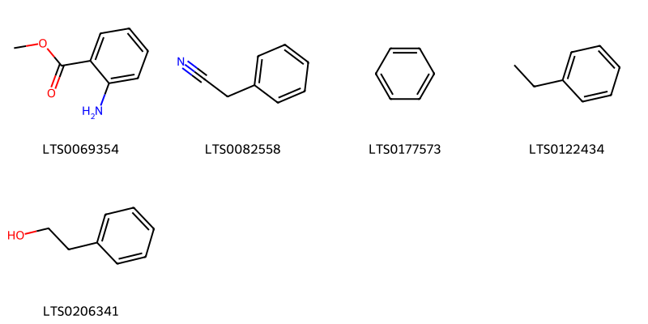{ width=100% }
    <figcaption>Hình ảnh cấu trúc hóa học của 5 hoạt chất thuộc nhóm Benzene and substituted derivatives gồm ['methyl anthranilate (LTS0069354)', 'phenylacetonitrile (LTS0082558)', 'benzene (LTS0177573)', 'ethylbenzene (LTS0122434)', '2-phenyl-ethanol (LTS0206341)'].</figcaption>
</figure>
#### Nhóm Coumarins and derivatives
<figure markdown="span">
    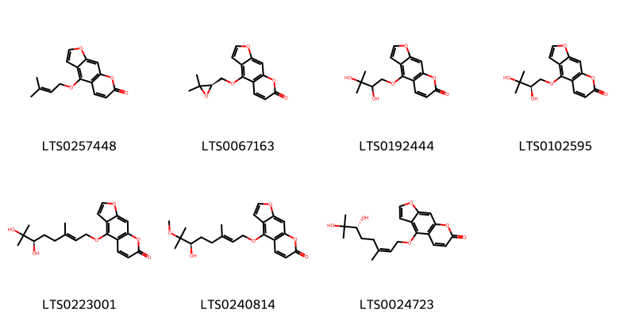{ width=100% }
    <figcaption>Hình ảnh cấu trúc hóa học của 7 hoạt chất thuộc nhóm Coumarins and derivatives gồm ['isoimperatorin (LTS0257448)', '(+)-oxypeucedanin (LTS0067163)', '4-(2,3-dihydroxy-3-methylbutoxy)furo[3,2-g]chromen-7-one (LTS0192444)', '(r)-oxypeucedanin hydrate (LTS0102595)', 'dihydroxybergamottin (LTS0223001)', '4-{[(2e,6r)-6-hydroxy-7-methoxy-3,7-dimethyloct-2-en-1-yl]oxy}furo[3,2-g]chromen-7-one (LTS0240814)', '4-{[(6r)-6,7-dihydroxy-3,7-dimethyloct-2-en-1-yl]oxy}furo[3,2-g]chromen-7-one (LTS0024723)'].</figcaption>
</figure>
#### Nhóm Dihydrofurans
<figure markdown="span">
    { width=100% }
    <figcaption>Hình ảnh cấu trúc hóa học của 1 hoạt chất thuộc nhóm Dihydrofurans gồm ['vitamin c (LTS0022555)'].</figcaption>
</figure>
#### Nhóm Fatty Acyls
<figure markdown="span">
    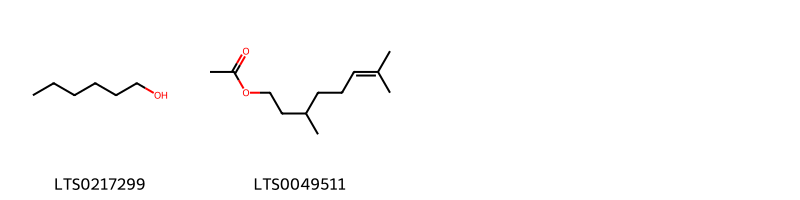{ width=100% }
    <figcaption>Hình ảnh cấu trúc hóa học của 2 hoạt chất thuộc nhóm Fatty Acyls gồm ['hexanol (LTS0217299)', 'citronellyl acetate (LTS0049511)'].</figcaption>
</figure>
#### Nhóm Flavonoids
<figure markdown="span">
    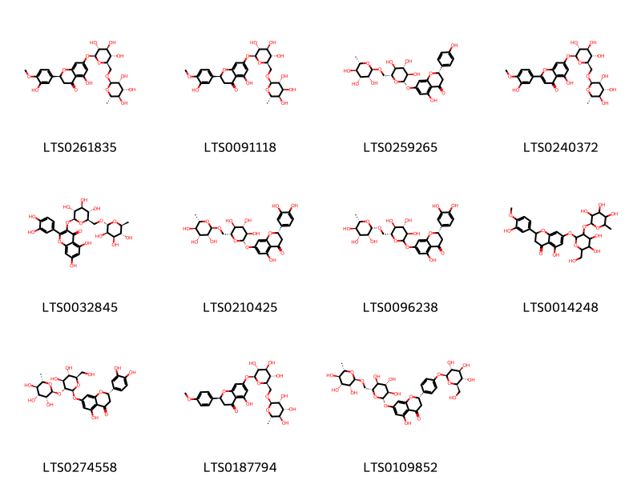{ width=100% }
    <figcaption>Hình ảnh cấu trúc hóa học của 11 hoạt chất thuộc nhóm Flavonoids gồm ['hesperidin (LTS0261835)', '(2s)-5-hydroxy-2-(3-hydroxy-4-methoxyphenyl)-7-{[(2s,3r,4s,5s,6r)-3,4,5-trihydroxy-6-({[(2r,3r,4s,5r,6s)-3,4,5-trihydroxy-6-methyloxan-2-yl]oxy}methyl)oxan-2-yl]oxy}-2,3-dihydro-1-benzopyran-4-one (LTS0091118)', 'narirutin (LTS0259265)', 'diosmin (LTS0240372)', '3-rutinosyl quercetin (LTS0032845)', 'eriocitrin (LTS0210425)', '(2s)-2-(3,4-dihydroxyphenyl)-5-hydroxy-7-{[(3r,4s,5s,6r)-3,4,5-trihydroxy-6-({[(2s,3r,4r,5r,6s)-3,4,5-trihydroxy-6-methyloxan-2-yl]oxy}methyl)oxan-2-yl]oxy}-2,3-dihydro-1-benzopyran-4-one (LTS0096238)', '7-{[4,5-dihydroxy-6-(hydroxymethyl)-3-{[(2s)-3,4,5-trihydroxy-6-methyloxan-2-yl]oxy}oxan-2-yl]oxy}-5-hydroxy-2-(3-hydroxy-4-methoxyphenyl)-2,3-dihydro-1-benzopyran-4-one (LTS0014248)', 'neoeriocitrin (LTS0274558)', '(2s)-5-hydroxy-2-(4-methoxyphenyl)-7-{[(2s,3r,4s,5s,6r)-3,4,5-trihydroxy-6-({[(2r,3r,4r,5r,6s)-3,4,5-trihydroxy-6-methyloxan-2-yl]oxy}methyl)oxan-2-yl]oxy}-2,3-dihydro-1-benzopyran-4-one (LTS0187794)', '(2s)-5-hydroxy-2-(4-{[(2s,3r,4s,5s,6r)-3,4,5-trihydroxy-6-(hydroxymethyl)oxan-2-yl]oxy}phenyl)-7-{[(2s,3r,4s,5s,6r)-3,4,5-trihydroxy-6-({[(2r,3r,4r,5r,6s)-3,4,5-trihydroxy-6-methyloxan-2-yl]oxy}methyl)oxan-2-yl]oxy}-2,3-dihydro-1-benzopyran-4-one (LTS0109852)'].</figcaption>
</figure>
#### Nhóm Heteroaromatic compounds
<figure markdown="span">
    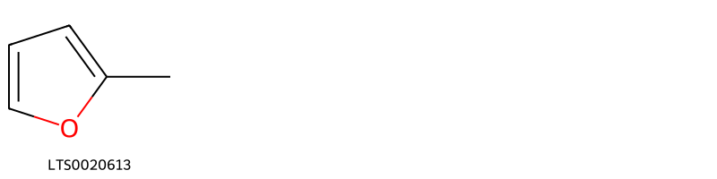{ width=100% }
    <figcaption>Hình ảnh cấu trúc hóa học của 1 hoạt chất thuộc nhóm Heteroaromatic compounds gồm ['silvan (LTS0020613)'].</figcaption>
</figure>
#### Nhóm Indoles and derivatives
<figure markdown="span">
    { width=100% }
    <figcaption>Hình ảnh cấu trúc hóa học của 1 hoạt chất thuộc nhóm Indoles and derivatives gồm ['indole (LTS0185357)'].</figcaption>
</figure>
#### Nhóm Organooxygen compounds
<figure markdown="span">
    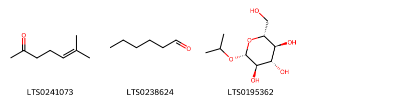{ width=100% }
    <figcaption>Hình ảnh cấu trúc hóa học của 3 hoạt chất thuộc nhóm Organooxygen compounds gồm ['6-methyl-5-hepten-2-one (LTS0241073)', 'hexanal (LTS0238624)', '(2r,3s,4s,5r,6r)-2-(hydroxymethyl)-6-isopropoxyoxane-3,4,5-triol (LTS0195362)'].</figcaption>
</figure>
#### Nhóm Prenol lipids
<figure markdown="span">
    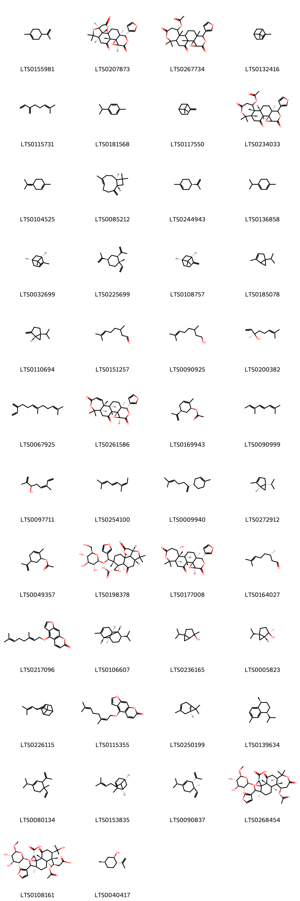{ width=100% }
    <figcaption>Hình ảnh cấu trúc hóa học của 46 hoạt chất thuộc nhóm Prenol lipids gồm ['limonene,  (LTS0155981)', 'limonin (LTS0207873)', '7-(furan-3-yl)-1,8,12,17,17-pentamethyl-5,15,20-trioxo-3,6,16-trioxapentacyclo[9.9.0.0²,⁴.0²,⁸.0¹²,¹⁸]icosan-13-yl acetate (LTS0267734)', 'α pinene (LTS0132416)', 'α-myrcene (LTS0115731)', 'cymene (LTS0181568)', 'β-pinene (LTS0117550)', '(1r,2r,8s,11s,12r,18s)-7-(furan-3-yl)-1,8,12,17,17-pentamethyl-5,15,20-trioxo-3,6,16-trioxapentacyclo[9.9.0.0²,⁴.0²,⁸.0¹²,¹⁸]icosan-13-yl acetate (LTS0234033)', 'terpinolene (LTS0104525)', 'caryophyllene (LTS0085212)', 'α-limonene (LTS0244943)', 'terpinene (LTS0136858)', '(-)-α-pinene (LTS0032699)', 'β-elemene (LTS0225699)', '(-)-β-pinene (LTS0108757)', 'α-thujene (LTS0185078)', '(+)-sabinene (LTS0110694)', 'citronella (LTS0151257)', 'citronellol, (+-)- (LTS0090925)', '(-)-linalool (LTS0200382)', 'β-farnesene (LTS0067925)', 'obacunone (LTS0261586)', '(1s,5s)-carvyl acetate (LTS0169943)', 'allo-ocimene (LTS0090999)', '(3r,5z)-2,6-dimethylocta-1,5,7-trien-3-ol (LTS0097711)', '(4e,6z)-alloocimene (LTS0254100)', '(-)-β-bisabolene (LTS0009940)', '(+)-α-thujene (LTS0272912)', 'carvyl acetate (LTS0049357)', 'limonin 17-β-d-glucopyranoside (LTS0198378)', '(1r,2r,4s,7s,8s,11r,12r,13s,18r)-7-(furan-3-yl)-13-hydroxy-1,8,12,17,17-pentamethyl-3,6,16-trioxapentacyclo[9.9.0.0²,⁴.0²,⁸.0¹²,¹⁸]icosane-5,15,20-trione (LTS0177008)', '(s)-(-)-citronellal (LTS0164027)', 'bergamottin (LTS0217096)', '(1r,2s,6s,7s,8r)-8-isopropyl-1,3-dimethyltricyclo[4.4.0.0²,⁷]dec-3-ene (LTS0106607)', 'sabinene hydrate (LTS0236165)', '4-thujanol (LTS0005823)', 'α-bergamotene (LTS0226115)', '4-[(3,7-dimethylocta-2,6-dien-1-yl)oxy]furo[3,2-g]chromen-7-one (LTS0115355)', '(+)-delta(3)-carene (LTS0250199)', '(1s,4s)-4-isopropyl-1,6-dimethyl-1,2,3,4-tetrahydronaphthalene (LTS0139634)', '4-ethenyl-1-isopropyl-4-methyl-3-(prop-1-en-2-yl)cyclohex-1-ene (LTS0080134)', '(-)-endo-α-bergamotene (LTS0153835)', 'elemene (LTS0090837)', "(1r,3'r,5ar,7ar,9s,11ar,11br)-1-(acetyloxy)-9-[furan-3-yl({[(2r,3r,4s,5s,6s)-3,4,5-trihydroxy-6-methoxyoxan-2-yl]oxy})methyl]-5,5,7a,9,11b-pentamethyl-3,7-dioxo-hexahydro-1h-spiro[naphtho[2,1-c]oxepine-8,2'-oxirane]-3'-carboxylic acid (LTS0268454)", "(2s,3's,4ar,5r,6r,8ar)-5-[(1r)-1-(acetyloxy)-2-carboxyethyl]-2-[furan-3-yl({[(2r,3r,4s,5s,6s)-3,4,5-trihydroxy-6-methoxyoxan-2-yl]oxy})methyl]-6-(2-hydroxypropan-2-yl)-2,5,8a-trimethyl-8-oxo-tetrahydro-3h-spiro[naphthalene-1,2'-oxirane]-3'-carboxylic acid (LTS0108161)", '(1r,2s,5r)-5-methyl-2-(prop-1-en-2-yl)cyclohexan-1-ol (LTS0040417)'].</figcaption>
</figure>
#### Nhóm Saccharolipids
<figure markdown="span">
    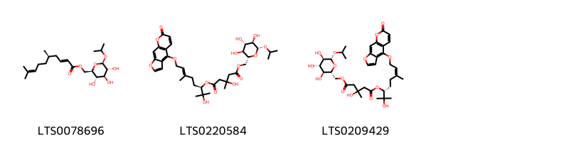{ width=100% }
    <figcaption>Hình ảnh cấu trúc hóa học của 3 hoạt chất thuộc nhóm Saccharolipids gồm ['citrusoside a (LTS0078696)', 'citrusoside b (LTS0220584)', '1-(3r)-2-hydroxy-2,6-dimethyl-8-({7-oxofuro[3,2-g]chromen-4-yl}oxy)oct-6-en-3-yl 5-[(2r,3s,4s,5r,6r)-3,4,5-trihydroxy-6-isopropoxyoxan-2-yl]methyl 3-hydroxy-3-methylpentanedioate (LTS0209429)'].</figcaption>
</figure>
#### Nhóm Saturated hydrocarbons
<figure markdown="span">
    { width=100% }
    <figcaption>Hình ảnh cấu trúc hóa học của 1 hoạt chất thuộc nhóm Saturated hydrocarbons gồm ['pentadecane (LTS0210146)'].</figcaption>
</figure>
#### Nhóm Steroids and steroid derivatives
<figure markdown="span">
    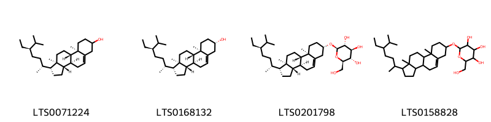{ width=100% }
    <figcaption>Hình ảnh cấu trúc hóa học của 4 hoạt chất thuộc nhóm Steroids and steroid derivatives gồm ['stigmast-5-en-3-ol (LTS0071224)', 'sitosterol (LTS0168132)', 'sitogluside (LTS0201798)', '2-{[1-(5-ethyl-6-methylheptan-2-yl)-9a,11a-dimethyl-1h,2h,3h,3ah,3bh,4h,6h,7h,8h,9h,9bh,10h,11h-cyclopenta[a]phenanthren-7-yl]oxy}-6-(hydroxymethyl)oxane-3,4,5-triol (LTS0158828)'].</figcaption>
</figure>
#### Nhóm Unsaturated hydrocarbons
<figure markdown="span">
    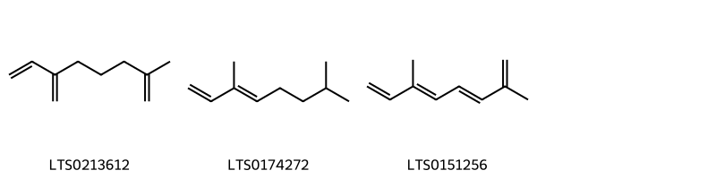{ width=100% }
    <figcaption>Hình ảnh cấu trúc hóa học của 3 hoạt chất thuộc nhóm Unsaturated hydrocarbons gồm ['2-methyl-6-methylideneocta-1,7-diene (LTS0213612)', '(3e)-3,7-dimethylocta-1,3-diene (LTS0174272)', 'cosmene (LTS0151256)'].</figcaption>
</figure>

---

### Dược dân tộc học

Danh sách các quốc gia có sử dụng *Citrus hystrix* trong điều trị các bệnh. 

| Country   | Disease          | Bệnh             |
|:----------|:-----------------|:-----------------|
| Malaya    | Tonic, Vermifuge | Tonic, Vermifuge |

---

---
## Citrus limon
### Thông tin về thực vật

!!! info "Phân loại thực vật của *Citrus limon* từ GIBF:"
    - **Kingdom:** Plantae
    - **Phylum:** Tracheophyta
    - **Order:** Sapindales
    - **Family:** Rutaceae
    - **Genus:** Citrus
    - **Species:** *Citrus limon*

 

| Label (VI)   | Label (EN)   | Scientific Name   | Descriptions (VI)   | Descriptions (EN)   | Also Known As (VI)         | Also Known As (EN)                                                                                     |
|:-------------|:-------------|:------------------|:--------------------|:--------------------|:---------------------------|:-------------------------------------------------------------------------------------------------------|
| N/A          | N/A          | Citrus hystrix    | loài thực vật       | species of plant    | ['Chúc', 'Citrus hystrix'] | ['kaffir lime', 'makrut lime', 'Mauritius papeda', 'Thai lime', 'porcupine orange', 'Thai bai makrut'] |

#### Phân bố trên thế giới

**Từ CSDL GIBF** Italy, Australia, Georgia, Panama, Puerto Rico, Cyprus, Chinese Taipei, Spain, Portugal, Algeria, United States of America, Sweden, Chile, El Salvador, Maldives, Greece, South Africa, Monaco, Brazil, Mexico, France, Ecuador, Colombia, Costa Rica, India, Burkina Faso, New Zealand

#### Phân bố tại Việt Nam

**Từ CSDL GIBF**: Không có ghi nhận ở Việt Nam

---
### Thành phần hóa học
        
- Theo cơ sở dữ liệu lotus: Từ loài *Citrus limon* đã phân lập và xác định được 505 hoạt chất thuộc về các nhóm Phenols, Naphthopyrans, Carboxylic acids and derivatives, Fatty Acyls, Indoles and derivatives, Cinnamic acids and derivatives, Oxanes, Dibenzylbutane lignans, Heteroaromatic compounds, Saturated hydrocarbons, Saccharolipids, Prenol lipids, Linear 1,3-diarylpropanoids, Quinolines and derivatives, Benzene and substituted derivatives, Dihydrofurans, Organooxygen compounds, Furanoid lignans, Lignan glycosides, Pyridines and derivatives, Cyclobutane lignans, Phenol ethers, Flavonoids, Steroids and steroid derivatives, Organonitrogen compounds, Unsaturated hydrocarbons, Lactones, Coumarins and derivatives, Imidazopyrimidines. 

|    | chemicalTaxonomyClassyfireClass     |   smiles_count |
|---:|:------------------------------------|---------------:|
|  0 | Benzene and substituted derivatives |             20 |
|  1 | Carboxylic acids and derivatives    |             12 |
|  2 | Cinnamic acids and derivatives      |              9 |
|  3 | Coumarins and derivatives           |             44 |
|  4 | Cyclobutane lignans                 |              2 |
|  5 | Dibenzylbutane lignans              |              2 |
|  6 | Dihydrofurans                       |              1 |
|  7 | Fatty Acyls                         |             30 |
|  8 | Flavonoids                          |            101 |
|  9 | Furanoid lignans                    |              3 |
| 10 | Heteroaromatic compounds            |              1 |
| 11 | Imidazopyrimidines                  |              4 |
| 12 | Indoles and derivatives             |              1 |
| 13 | Lactones                            |              3 |
| 14 | Lignan glycosides                   |              3 |
| 15 | Linear 1,3-diarylpropanoids         |              2 |
| 16 | Naphthopyrans                       |              4 |
| 17 | Organonitrogen compounds            |              4 |
| 18 | Organooxygen compounds              |             36 |
| 19 | Oxanes                              |              3 |
| 20 | Phenol ethers                       |              2 |
| 21 | Phenols                             |              6 |
| 22 | Prenol lipids                       |            159 |
| 23 | Pyridines and derivatives           |             16 |
| 24 | Quinolines and derivatives          |              5 |
| 25 | Saccharolipids                      |              2 |
| 26 | Saturated hydrocarbons              |              2 |
| 27 | Steroids and steroid derivatives    |             21 |
| 28 | Unsaturated hydrocarbons            |              7 |

#### Nhóm Benzene and substituted derivatives
<figure markdown="span">
    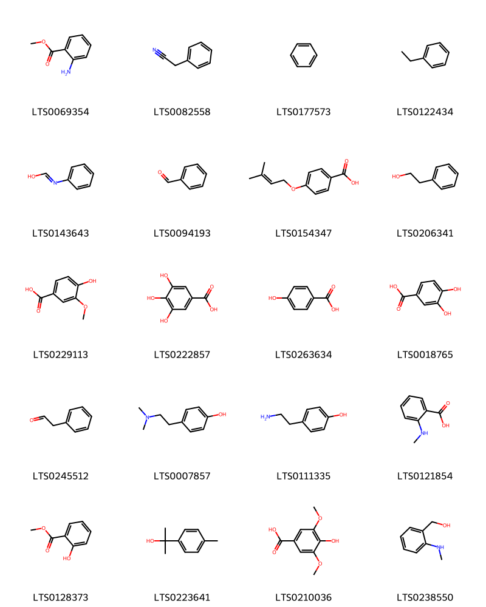{ width=100% }
    <figcaption>Hình ảnh cấu trúc hóa học của 20 hoạt chất thuộc nhóm Benzene and substituted derivatives gồm ['methyl anthranilate (LTS0069354)', 'phenylacetonitrile (LTS0082558)', 'benzene (LTS0177573)', 'ethylbenzene (LTS0122434)', 'n-phenylcarboximidic acid (LTS0143643)', 'benzaldehyde (LTS0094193)', '4-[(3-methylbut-2-en-1-yl)oxy]benzoic acid (LTS0154347)', '2-phenyl-ethanol (LTS0206341)', 'vanillic acid (LTS0229113)', 'galop (LTS0222857)', 'p-hydroxybenzoic acid (LTS0263634)', '3,4-dihydroxybenzoic acid (LTS0018765)', 'phenylacetaldehyde (LTS0245512)', 'hordenine (LTS0007857)', 'tyramine (LTS0111335)', 'n-methylanthranilic acid (LTS0121854)', 'methyl salicylate (LTS0128373)', 'p-cymen-8-ol (LTS0223641)', 'syringic acid (LTS0210036)', '[2-(methylamino)phenyl]methanol (LTS0238550)'].</figcaption>
</figure>
#### Nhóm Carboxylic acids and derivatives
<figure markdown="span">
    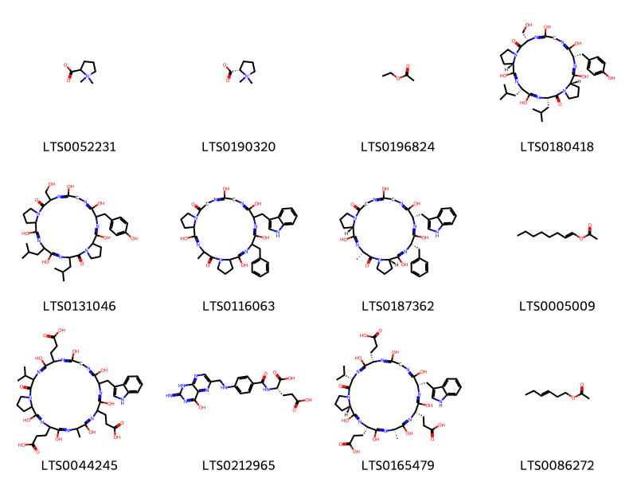{ width=100% }
    <figcaption>Hình ảnh cấu trúc hóa học của 12 hoạt chất thuộc nhóm Carboxylic acids and derivatives gồm ['1,1-dimethylpyrrolidin-1-ium-2-carboxylate (LTS0052231)', 'stachydrine (LTS0190320)', 'ethyl acetate (LTS0196824)', '(3s,6s,9s,15s,21s,24s)-5,8,17,20,23-pentahydroxy-15-(hydroxymethyl)-21-[(4-hydroxyphenyl)methyl]-3,6-bis(2-methylpropyl)-1,4,7,13,16,19,22-heptaazatricyclo[22.3.0.0⁹,¹³]heptacosa-4,7,16,19,22-pentaene-2,14-dione (LTS0180418)', '5,8,17,20,23-pentahydroxy-15-(hydroxymethyl)-21-[(4-hydroxyphenyl)methyl]-3,6-bis(2-methylpropyl)-1,4,7,13,16,19,22-heptaazatricyclo[22.3.0.0⁹,¹³]heptacosa-4,7,16,19,22-pentaene-2,14-dione (LTS0131046)', '21-benzyl-5,14,17,20,23-pentahydroxy-18-(1h-indol-3-ylmethyl)-3-methyl-1,4,10,13,16,19,22-heptaazatricyclo[22.3.0.0⁶,¹⁰]heptacosa-4,13,16,19,22-pentaene-2,11-dione (LTS0116063)', '(3s,6s,18s,21s,24s)-21-benzyl-5,14,17,20,23-pentahydroxy-18-(1h-indol-3-ylmethyl)-3-methyl-1,4,10,13,16,19,22-heptaazatricyclo[22.3.0.0⁶,¹⁰]heptacosa-4,13,16,19,22-pentaene-2,11-dione (LTS0187362)', 'oct-1-en-1-yl acetate (LTS0005009)', '3-[9,18-bis(2-carboxyethyl)-1,4,7,10,13,16,19-heptahydroxy-12-(1h-indol-3-ylmethyl)-21-isopropyl-6-methyl-22-oxo-3h,6h,9h,12h,15h,18h,21h,24h,25h,26h,26ah-pyrrolo[1,2-a]1,4,7,10,13,16,19,22-octaazacyclotetracosan-3-yl]propanoic acid (LTS0044245)', 'acid, folic (LTS0212965)', '3-[(3s,6s,9s,12s,18s,21s,26as)-3,9-bis(2-carboxyethyl)-1,4,7,10,13,16,19-heptahydroxy-12-(1h-indol-3-ylmethyl)-21-isopropyl-6-methyl-22-oxo-3h,6h,9h,12h,15h,18h,21h,24h,25h,26h,26ah-pyrrolo[1,2-a]1,4,7,10,13,16,19,22-octaazacyclotetracosan-18-yl]propanoic acid (LTS0165479)', '3-hexenyl acetate (LTS0086272)'].</figcaption>
</figure>
#### Nhóm Cinnamic acids and derivatives
<figure markdown="span">
    { width=100% }
    <figcaption>Hình ảnh cấu trúc hóa học của 9 hoạt chất thuộc nhóm Cinnamic acids and derivatives gồm ['hydroxycinnamic acid (LTS0233023)', 'ferulic acid (LTS0077328)', 'sinapinate (LTS0173482)', 'sinapoyl alcohol (LTS0275766)', 'para-coumaric acid (LTS0266252)', 'ferulic acid (LTS0273002)', '3,4-dihydroxycinnamic acid (LTS0128050)', 'cinnamic acid (LTS0128130)', 'phenylacrylic acid (LTS0097258)'].</figcaption>
</figure>
#### Nhóm Coumarins and derivatives
<figure markdown="span">
    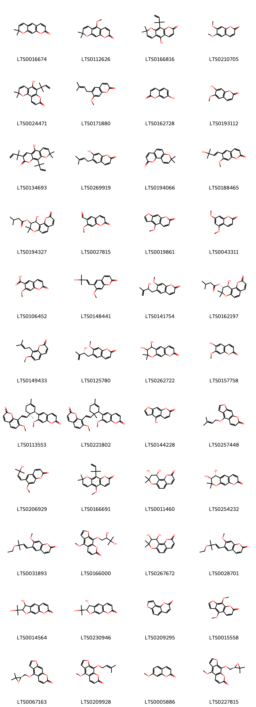{ width=100% }
    <figcaption>Hình ảnh cấu trúc hóa học của 44 hoạt chất thuộc nhóm Coumarins and derivatives gồm ['xanthyletin (LTS0016674)', 'xanthoxyletin (LTS0112626)', 'nor-dentatin (LTS0166816)', 'scoparone (LTS0210705)', '5-hydroxy-2,2-dimethyl-6-(2-methylbut-3-en-2-yl)pyrano[2,3-h]chromen-8-one (LTS0024471)', 'suberosin (LTS0171880)', 'umbelliferone (LTS0162728)', 'scopoletin (LTS0193112)', '5-hydroxy-8,8-dimethyl-3,10-bis(2-methylbut-3-en-2-yl)pyrano[3,2-g]chromen-2-one (LTS0134693)', 'demethylsuberosin (LTS0269919)', 'seselin (LTS0194066)', '6-[(1e)-3-hydroxy-3-methylbut-1-en-1-yl]-7-methoxychromen-2-one (LTS0188465)', '10-hydroxy-8,8-dimethyl-2-oxo-9h,10h-pyrano[2,3-h]chromen-9-yl 3-methylbutanoate (LTS0194327)', '7-methoxy-2-oxochromene-6-carbaldehyde (LTS0027815)', 'bergapten (LTS0019861)', 'limettin (LTS0043311)', '7-methoxy-2-oxochromene-6-carboxylic acid (LTS0106452)', '6-(3-hydroxy-3-methylbut-1-en-1-yl)-7-methoxychromen-2-one (LTS0148441)', '6-(2-hydroxy-3-methylbut-3-en-1-yl)-7-methoxychromen-2-one (LTS0141754)', '(9r,10s)-10-hydroxy-8,8-dimethyl-2-oxo-9h,10h-pyrano[2,3-h]chromen-9-yl 3-methylbutanoate (LTS0162197)', 'osthole (LTS0149433)', '6-[(2r)-2-hydroxy-3-methylbut-3-en-1-yl]-7-methoxychromen-2-one (LTS0125780)', '6,7-dihydroxy-8,8-dimethyl-6h,7h-pyrano[3,2-g]chromen-2-one (LTS0262722)', 'isoscopoletin (LTS0157758)', '7-methoxy-6-[(1r,6r)-6-[(1e)-2-(7-methoxy-2-oxochromen-8-yl)ethenyl]-3,6-dimethylcyclohex-2-en-1-yl]chromen-2-one (LTS0113553)', '7-methoxy-6-{6-[2-(7-methoxy-2-oxochromen-8-yl)ethenyl]-3,6-dimethylcyclohex-2-en-1-yl}chromen-2-one (LTS0221802)', 'bergaptol (LTS0144228)', 'isoimperatorin (LTS0257448)', '6-[(1z)-3-hydroxy-3-methylbut-1-en-1-yl]-7-methoxychromen-2-one (LTS0206929)', 'dentatin (LTS0166691)', '(9r,10s)-9,10-dihydroxy-8,8-dimethyl-9h,10h-pyrano[2,3-h]chromen-2-one (LTS0011460)', '(6r,7s)-6,7-dihydroxy-8,8-dimethyl-6h,7h-pyrano[3,2-g]chromen-2-one (LTS0254232)', '6-(3-ethoxy-3-methylbut-1-en-1-yl)-7-methoxychromen-2-one (LTS0031893)', 'byakangelicin (LTS0166000)', '9,10-dihydroxy-8,8-dimethyl-9h,10h-pyrano[2,3-h]chromen-2-one (LTS0267672)', '6-[(1e)-3-ethoxy-3-methylbut-1-en-1-yl]-7-methoxychromen-2-one (LTS0028701)', '3-hydroxy-2-(2-hydroxypropan-2-yl)-2h,3h-furo[3,2-g]chromen-7-one (LTS0014564)', '(2r,3r)-3-hydroxy-2-(2-hydroxypropan-2-yl)-2h,3h-furo[3,2-g]chromen-7-one (LTS0230946)', 'angelicin (LTS0209295)', 'isopimpinellin (LTS0015558)', '(+)-oxypeucedanin (LTS0067163)', 'phellopterin (LTS0209928)', 'methylumbelliferone (LTS0005886)', 'byakangelicol (LTS0227815)'].</figcaption>
</figure>
#### Nhóm Cyclobutane lignans
<figure markdown="span">
    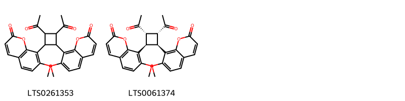{ width=100% }
    <figcaption>Hình ảnh cấu trúc hóa học của 2 hoạt chất thuộc nhóm Cyclobutane lignans gồm ['8-[2,3-diacetyl-4-(7-methoxy-2-oxochromen-8-yl)cyclobutyl]-7-methoxychromen-2-one (LTS0261353)', '8-[(1s,2r,3s,4r)-2,3-diacetyl-4-(7-methoxy-2-oxochromen-8-yl)cyclobutyl]-7-methoxychromen-2-one (LTS0061374)'].</figcaption>
</figure>
#### Nhóm Dibenzylbutane lignans
<figure markdown="span">
    { width=100% }
    <figcaption>Hình ảnh cấu trúc hóa học của 2 hoạt chất thuộc nhóm Dibenzylbutane lignans gồm ['(2s,3r)-2,3-bis[(4-hydroxy-3-methoxyphenyl)(¹³c)methyl](1-¹³c)butane-1,4-diol (LTS0268699)', 'secoisolariciresinol (LTS0086727)'].</figcaption>
</figure>
#### Nhóm Dihydrofurans
<figure markdown="span">
    { width=100% }
    <figcaption>Hình ảnh cấu trúc hóa học của 1 hoạt chất thuộc nhóm Dihydrofurans gồm ['vitamin c (LTS0022555)'].</figcaption>
</figure>
#### Nhóm Fatty Acyls
<figure markdown="span">
    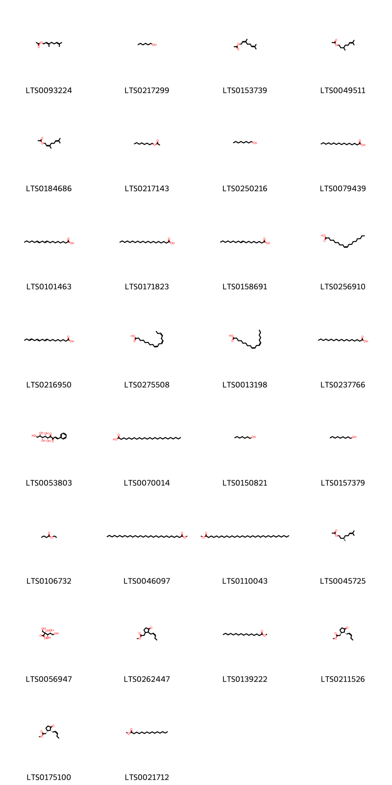{ width=100% }
    <figcaption>Hình ảnh cấu trúc hóa học của 30 hoạt chất thuộc nhóm Fatty Acyls gồm ['geranyl acetate (LTS0093224)', 'hexanol (LTS0217299)', 'neryl acetate (LTS0153739)', 'citronellyl acetate (LTS0049511)', '3,7-dimethylocta-2,6-dien-1-yl acetate (LTS0184686)', 'octyl acetate (LTS0217143)', 'octanol (LTS0250216)', 'palmitic acid (LTS0079439)', '9,12-octadecadienoic acid (LTS0101463)', 'arachidic acid (LTS0171823)', '9 octadecenoic acid (LTS0158691)', 'oleic acid (LTS0256910)', 'octadeca-9,12,15-trienoic acid (LTS0216950)', 'α-linolenic acid (LTS0275508)', 'linoleic (LTS0013198)', 'stearic acid (LTS0237766)', '(5r,6s,7r,8r)-5,6,7,8,9-pentahydroxy-1-phenylnon-1-ene-3,4-dione (LTS0053803)', 'pentacosanoic acid (LTS0070014)', 'heptanol (LTS0150821)', 'nonan-1-ol (LTS0157379)', 'ethyl butyrate (LTS0106732)', 'methyl triacontanoate (LTS0046097)', 'methyl tritriacontanoate (LTS0110043)', '(r)-citronellol acetate (LTS0045725)', '2-carboxy-d-arabinitol (LTS0056947)', 'methyl 2-{3-oxo-2-[(2z)-pent-2-en-1-yl]cyclopentyl}acetate (LTS0262447)', 'methyl palmitate (LTS0139222)', '(-)-methyl jasmonate (LTS0211526)', 'methyl 2-[(1s,2r)-3-oxo-2-[(2z)-pent-2-en-1-yl]cyclopentyl]acetate (LTS0175100)', 'methyl pentadecanoate (LTS0021712)'].</figcaption>
</figure>
#### Nhóm Flavonoids
<figure markdown="span">
    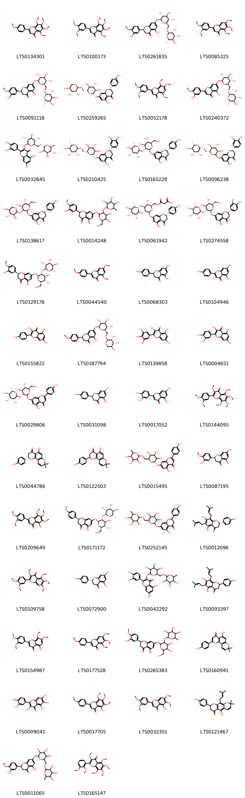{ width=100% }
    <figcaption>Hình ảnh cấu trúc hóa học của 101 hoạt chất thuộc nhóm Flavonoids gồm ['tangeretin (LTS0134301)', 'nobiletin (LTS0100173)', 'hesperidin (LTS0261835)', 'sinensetin (LTS0085325)', '(2s)-5-hydroxy-2-(3-hydroxy-4-methoxyphenyl)-7-{[(2s,3r,4s,5s,6r)-3,4,5-trihydroxy-6-({[(2r,3r,4s,5r,6s)-3,4,5-trihydroxy-6-methyloxan-2-yl]oxy}methyl)oxan-2-yl]oxy}-2,3-dihydro-1-benzopyran-4-one (LTS0091118)', 'narirutin (LTS0259265)', 'isosinensetin (LTS0052178)', 'diosmin (LTS0240372)', '3-rutinosyl quercetin (LTS0032845)', 'eriocitrin (LTS0210425)', 'naringin (LTS0165229)', '(2s)-2-(3,4-dihydroxyphenyl)-5-hydroxy-7-{[(3r,4s,5s,6r)-3,4,5-trihydroxy-6-({[(2s,3r,4r,5r,6s)-3,4,5-trihydroxy-6-methyloxan-2-yl]oxy}methyl)oxan-2-yl]oxy}-2,3-dihydro-1-benzopyran-4-one (LTS0096238)', '(2s)-7-{[(2s,3s,4s,5s,6r)-4,5-dihydroxy-6-(hydroxymethyl)-3-{[(2s,3s,4r,5r,6s)-3,4,5-trihydroxy-6-methyloxan-2-yl]oxy}oxan-2-yl]oxy}-5-hydroxy-2-(4-hydroxyphenyl)-2,3-dihydro-1-benzopyran-4-one (LTS0138617)', '7-{[4,5-dihydroxy-6-(hydroxymethyl)-3-{[(2s)-3,4,5-trihydroxy-6-methyloxan-2-yl]oxy}oxan-2-yl]oxy}-5-hydroxy-2-(3-hydroxy-4-methoxyphenyl)-2,3-dihydro-1-benzopyran-4-one (LTS0014248)', '3-{[(2r,3s,4s,5r,6s)-3,4-dihydroxy-6-{[(2s)-5-hydroxy-2-(4-hydroxyphenyl)-4-oxo-2,3-dihydro-1-benzopyran-7-yl]oxy}-5-{[(2s,3r,4r,5r,6s)-3,4,5-trihydroxy-6-methyloxan-2-yl]oxy}oxan-2-yl]methoxy}-3-oxopropanoic acid (LTS0061942)', 'neoeriocitrin (LTS0274558)', 'neohesperidin (LTS0129178)', 'apigenin trimethyl ether (LTS0044540)', 'asahina (LTS0068303)', 'chamomile (LTS0104946)', 'kaempherol (LTS0155822)', '(2s)-5-hydroxy-2-(4-methoxyphenyl)-7-{[(2s,3r,4s,5s,6r)-3,4,5-trihydroxy-6-({[(2r,3r,4r,5r,6s)-3,4,5-trihydroxy-6-methyloxan-2-yl]oxy}methyl)oxan-2-yl]oxy}-2,3-dihydro-1-benzopyran-4-one (LTS0187794)', 'myricetin (LTS0139858)', 'quercetin (LTS0004651)', 'rhoifolin (LTS0029806)', 'naringenin (LTS0031098)', 'luteolin (LTS0017052)', '3-methoxynobiletin (LTS0144095)', '(2s)-5-hydroxy-2-(4-hydroxyphenyl)-8,8-dimethyl-2h,3h-pyrano[2,3-f]chromen-4-one (LTS0044786)', 'citflavanone (LTS0122503)', '5-hydroxy-2-(4-hydroxyphenyl)-7-{[(2s,5s)-3,4,5-trihydroxy-6-({[(2r,5r)-3,4,5-trihydroxy-6-methyloxan-2-yl]oxy}methyl)oxan-2-yl]oxy}chromen-4-one (LTS0015495)', 'hesperetin (LTS0087195)', 'demethylnobiletin (LTS0209649)', 'poncirin (LTS0171172)', '5-hydroxy-2-(4-hydroxyphenyl)-7-[(3,4,5-trihydroxy-6-{[(3,4,5-trihydroxy-6-methyloxan-2-yl)oxy]methyl}oxan-2-yl)oxy]-2,3-dihydro-1-benzopyran-4-one (LTS0252145)', 'lonchocarpol a (LTS0012096)', 'hexamethylquercetagetin (LTS0109758)', '(-)-naringenin (LTS0072900)', 'rutin (LTS0042292)', '5,7-dihydroxy-2-(4-hydroxyphenyl)-6,8-bis(3-methylbut-2-en-1-yl)-2,3-dihydro-1-benzopyran-4-one (LTS0093397)', '2-(3,4-dimethoxyphenyl)-5-hydroxy-7,8-dimethoxychromen-4-one (LTS0154987)', "4',5,6,7-tetramethoxyflavone (LTS0177528)", '7-{[4,5-dihydroxy-6-(hydroxymethyl)-3-[(3,4,5-trihydroxy-6-methyloxan-2-yl)oxy]oxan-2-yl]oxy}-5-hydroxy-2-(3-hydroxy-4-methoxyphenyl)-2,3-dihydro-1-benzopyran-4-one (LTS0265383)', 'atalantoflavone (LTS0160941)', 'quercetagetin (LTS0009041)', 'gardenin b (LTS0017705)', '2-(3,4-dimethoxyphenyl)-5-hydroxy-6,7-dimethoxychromen-4-one (LTS0032351)', 'lupinifolin (LTS0121467)', 'hesperidin (LTS0011065)', '2-(2,3-dimethoxyphenyl)-3,5,6,7,8-pentamethoxychromen-4-one (LTS0165147)', 'gossypetin hexamethyl ether (LTS0135012)', 'cajaflavanone (LTS0108468)', '(2s)-5-hydroxy-2-(4-hydroxyphenyl)-8,8-dimethyl-10-(3-methylbut-2-en-1-yl)-2h,3h-pyrano[3,2-g]chromen-4-one (LTS0248998)', '(2s)-5-hydroxy-2-(4-hydroxyphenyl)-8,8-dimethyl-6-(3-methylbut-2-en-1-yl)-2h,3h-pyrano[2,3-f]chromen-4-one (LTS0210389)', 'phlorizin (LTS0198771)', '8-{[4,5-dihydroxy-6-(hydroxymethyl)-3-[(3,4,5-trihydroxyoxan-2-yl)oxy]oxan-2-yl]oxy}-5,7-dihydroxy-2-(4-hydroxyphenyl)chromen-4-one (LTS0125263)', '3,5-dihydroxy-2-(4-methoxyphenyl)-7-[(3,4,5-trihydroxy-6-methyloxan-2-yl)oxy]-2,3-dihydro-1-benzopyran-4-one (LTS0207880)', '2-(3,4-dimethoxyphenyl)-5,6,7,8-tetramethoxy-3-{[(2s,3r,4s,5s,6r)-3,4,5-trihydroxy-6-(hydroxymethyl)oxan-2-yl]oxy}chromen-4-one (LTS0074567)', '(3r)-5-{[(2r,3r,4s,5r,6s)-3,4-dihydroxy-6-{[(2s)-5-hydroxy-2-(3-hydroxy-4-methoxyphenyl)-4-oxo-2,3-dihydro-1-benzopyran-7-yl]oxy}-5-{[(2s,3r,4r,5r,6s)-3,4,5-trihydroxy-6-methyloxan-2-yl]oxy}oxan-2-yl]methoxy}-3-hydroxy-3-methyl-5-oxopentanoic acid (LTS0120675)', '3-{[(2s,3r,4r,5s,6r)-6-{[(2-carboxyacetyl)oxy]methyl}-3,4,5-trihydroxyoxan-2-yl]oxy}-2-(3,4-dihydroxyphenyl)-5,7-dihydroxy-1λ⁴-chromen-1-ylium (LTS0186341)', '5-{[(2r,3s,4s,5r,6s)-3,4-dihydroxy-6-[5-hydroxy-2-(4-hydroxyphenyl)-4-oxo-2,3-dihydro-1-benzopyran-7-yl]-5-{[(2s,3r,4r,5r,6s)-3,4,5-trihydroxy-6-methyloxan-2-yl]oxy}oxan-2-yl]methoxy}-3-hydroxy-3-methyl-5-oxopentanoic acid (LTS0197011)', '3-{[(2s,3r,4s,5s,6r)-6-{[(2-carboxyacetyl)oxy]methyl}-3,4,5-trihydroxyoxan-2-yl]oxy}-2-(3,4-dihydroxyphenyl)-5,7-dihydroxy-1λ⁴-chromen-1-ylium (LTS0142659)', 'chrysin (LTS0200644)', 'naringine (LTS0138800)', '5-{[(2r,3s,4s,5r,6s)-3,4-dihydroxy-6-[5-hydroxy-2-(3-hydroxy-4-methoxyphenyl)-4-oxo-2,3-dihydro-1-benzopyran-7-yl]-5-{[(2s,3r,4r,5r,6s)-3,4,5-trihydroxy-6-methyloxan-2-yl]oxy}oxan-2-yl]methoxy}-3-hydroxy-3-methyl-5-oxopentanoic acid (LTS0146573)', '(2s,3r)-3,5-dihydroxy-2-(4-methoxyphenyl)-7-{[(2r,3r,4r,5r,6s)-3,4,5-trihydroxy-6-methyloxan-2-yl]oxy}-2,3-dihydro-1-benzopyran-4-one (LTS0151486)', '5,7-dihydroxy-2-(3-hydroxy-4-methoxyphenyl)-3,8-bis({[3,4,5-trihydroxy-6-(hydroxymethyl)oxan-2-yl]oxy})chromen-4-one (LTS0086798)', 'isovitexin (LTS0209186)', '2-(3,4-dimethoxyphenyl)-5,6,7,8-tetramethoxy-3-{[3,4,5-trihydroxy-6-(hydroxymethyl)oxan-2-yl]oxy}chromen-4-one (LTS0245642)', '8-{[(2s,3r,4s,5s,6r)-4,5-dihydroxy-6-(hydroxymethyl)-3-{[(2s,3r,4s,5r)-3,4,5-trihydroxyoxan-2-yl]oxy}oxan-2-yl]oxy}-5,7-dihydroxy-2-(4-hydroxyphenyl)chromen-4-one (LTS0255490)', 'cyanidin 3-glucoside (LTS0217835)', '(2s,3r)-5-hydroxy-2-(4-hydroxy-3-methoxyphenyl)-7-methoxy-3-{[(2s,3r,4s,5s,6r)-3,4,5-trihydroxy-6-(hydroxymethyl)oxan-2-yl]oxy}-2,3-dihydro-1-benzopyran-4-one (LTS0267597)', 'galangin (LTS0210648)', '(3r)-5-{[(2r,3s,4s,5r,6s)-3,4-dihydroxy-6-{[(2s)-5-hydroxy-2-(4-hydroxyphenyl)-4-oxo-2,3-dihydro-1-benzopyran-7-yl]oxy}-5-{[(2s,3r,4r,5r,6s)-3,4,5-trihydroxy-6-methyloxan-2-yl]oxy}oxan-2-yl]methoxy}-3-hydroxy-3-methyl-5-oxopentanoic acid (LTS0248206)', '2-(3,4-dimethoxyphenyl)-6,7,8-trimethoxychromen-4-one (LTS0266569)', '5,7-dihydroxy-2-(4-hydroxyphenyl)-3,8-bis({[(2s,3r,4s,5s,6r)-3,4,5-trihydroxy-6-(hydroxymethyl)oxan-2-yl]oxy})chromen-4-one (LTS0226544)', '2-(3,4-dimethoxyphenyl)-5-hydroxy-3,6,7,8-tetramethoxychromen-4-one (LTS0235026)', '5-hydroxy-2-(4-methoxyphenyl)-7-[(3,4,5-trihydroxy-6-{[(3,4,5-trihydroxy-6-methyloxan-2-yl)oxy]methyl}oxan-2-yl)oxy]-2,3-dihydro-1-benzopyran-4-one (LTS0053955)', '5,7-dihydroxy-2-(4-hydroxyphenyl)-3,8-bis({[3,4,5-trihydroxy-6-(hydroxymethyl)oxan-2-yl]oxy})chromen-4-one (LTS0032795)', '5,7-dihydroxy-2-(3-hydroxy-4-methoxyphenyl)-8-{[(2r,3r,4s,5s,6r)-3,4,5-trihydroxy-6-(hydroxymethyl)oxan-2-yl]oxy}-3-{[(2s,3r,4s,5s,6r)-3,4,5-trihydroxy-6-(hydroxymethyl)oxan-2-yl]oxy}chromen-4-one (LTS0210064)', 'scutellarein (LTS0136843)', 'limocitrin (LTS0210192)', 'vicenin 2 (LTS0181160)', '5,7-dihydroxy-2-(4-hydroxy-3-methoxyphenyl)-8-methoxy-3-{[(2s,3r,4s,5s,6r)-3,4,5-trihydroxy-6-(hydroxymethyl)oxan-2-yl]oxy}chromen-4-one (LTS0048451)', '5,7-dihydroxy-2-(4-hydroxy-3-methoxyphenyl)-6,8-dimethoxy-3-{[(2s,3r,4s,5s,6r)-3,4,5-trihydroxy-6-(hydroxymethyl)oxan-2-yl]oxy}chromen-4-one (LTS0064831)', 'chrysoeriol (LTS0095766)', '5,7-dihydroxy-2-(3-hydroxy-4-methoxyphenyl)-6-[(2s,3r,4r,5s,6s)-3,4,5-trihydroxy-6-(hydroxymethyl)oxan-2-yl]chromen-4-one (LTS0177348)', '5,7-dihydroxy-2-(4-hydroxyphenyl)-6-[(2s,3r,4r,5s,6s)-3,4,5-trihydroxy-6-(hydroxymethyl)oxan-2-yl]-8-[(2s,3s,4r,5s,6s)-3,4,5-trihydroxy-6-(hydroxymethyl)oxan-2-yl]chromen-4-one (LTS0027343)', '(2s)-5-hydroxy-2-(3-hydroxy-4-methoxyphenyl)-6-{[(2s,3r,4s,5s,6r)-3,4,5-trihydroxy-6-({[(2r,3r,4r,5r,6s)-3,4,5-trihydroxy-6-methyloxan-2-yl]oxy}methyl)oxan-2-yl]oxy}-2,3-dihydro-1-benzopyran-4-one (LTS0118854)', '5,7-dihydroxy-2-(3-hydroxy-4-methoxyphenyl)-6-[(2s,3r,4r,5s,6r)-3,4,5-trihydroxy-6-(hydroxymethyl)oxan-2-yl]chromen-4-one (LTS0110160)', '5-hydroxy-2-(3-hydroxy-4-methoxyphenyl)-8-[(2r,3r,4r,5s,6r)-3,4,5-trihydroxy-6-(hydroxymethyl)oxan-2-yl]-6-[(2s,3r,4r,5s,6r)-3,4,5-trihydroxy-6-(hydroxymethyl)oxan-2-yl]chromen-4-one (LTS0149820)', '5,7-dihydroxy-2-(3-hydroxy-4-methoxyphenyl)-6,8-dimethoxy-3-{[(2s,3r,4r,5s,6r)-3,4,5-trihydroxy-6-(hydroxymethyl)oxan-2-yl]oxy}chromen-4-one (LTS0204800)', 'diosmine (LTS0271026)', 'eriodictyol (LTS0220769)', '2-(3,4-dihydroxyphenyl)-5-hydroxy-7-{[(2s,3r,4s,5s,6r)-3,4,5-trihydroxy-6-({[(2r,3r,4r,5r,6s)-3,4,5-trihydroxy-6-methyloxan-2-yl]oxy}methyl)oxan-2-yl]oxy}chromen-4-one (LTS0029226)', '5-hydroxy-2-(3-hydroxy-4-methoxyphenyl)-6,8-bis[3,4,5-trihydroxy-6-(hydroxymethyl)oxan-2-yl]chromen-4-one (LTS0068773)', '5-hydroxy-2-(4-hydroxyphenyl)-7-{[(2s,3r,4s,5s,6r)-3,4,5-trihydroxy-6-({[(2r,3r,4r,5r,6s)-3,4,5-trihydroxy-6-methyloxan-2-yl]oxy}methyl)oxan-2-yl]oxy}-2,3-dihydro-1-benzopyran-4-one (LTS0168244)', 'limocitrol (LTS0192546)', '5,7-dihydroxy-2-(3-hydroxy-4-methoxyphenyl)-6-[3,4,5-trihydroxy-6-(hydroxymethyl)oxan-2-yl]chromen-4-one (LTS0251019)', '5-hydroxy-2-(3-hydroxy-4-methoxyphenyl)-6-[(3,4,5-trihydroxy-6-{[(3,4,5-trihydroxy-6-methyloxan-2-yl)oxy]methyl}oxan-2-yl)oxy]-2,3-dihydro-1-benzopyran-4-one (LTS0124010)', '7-{[(2s,3r,4s,5s,6r)-4,5-dihydroxy-6-(hydroxymethyl)-3-{[(2s,3r,4r,5r,6s)-3,4,5-trihydroxy-6-methyloxan-2-yl]oxy}oxan-2-yl]oxy}-5-hydroxy-2-(4-hydroxyphenyl)-2,3-dihydro-1-benzopyran-4-one (LTS0017271)'].</figcaption>
</figure>
#### Nhóm Furanoid lignans
<figure markdown="span">
    { width=100% }
    <figcaption>Hình ảnh cấu trúc hóa học của 3 hoạt chất thuộc nhóm Furanoid lignans gồm ['matairesinol (LTS0193475)', 'pinoresinol (LTS0057431)', 'lariciresinol (LTS0010950)'].</figcaption>
</figure>
#### Nhóm Heteroaromatic compounds
<figure markdown="span">
    { width=100% }
    <figcaption>Hình ảnh cấu trúc hóa học của 1 hoạt chất thuộc nhóm Heteroaromatic compounds gồm ['silvan (LTS0020613)'].</figcaption>
</figure>
#### Nhóm Imidazopyrimidines
<figure markdown="span">
    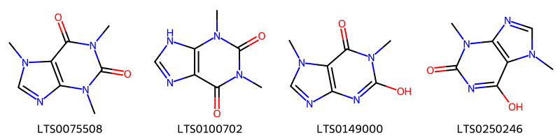{ width=100% }
    <figcaption>Hình ảnh cấu trúc hóa học của 4 hoạt chất thuộc nhóm Imidazopyrimidines gồm ['caffeine (LTS0075508)', 'constant-t (LTS0100702)', 'p-xanthine (LTS0149000)', 'thesal (LTS0250246)'].</figcaption>
</figure>
#### Nhóm Indoles and derivatives
<figure markdown="span">
    { width=100% }
    <figcaption>Hình ảnh cấu trúc hóa học của 1 hoạt chất thuộc nhóm Indoles and derivatives gồm ['indole (LTS0185357)'].</figcaption>
</figure>
#### Nhóm Lactones
<figure markdown="span">
    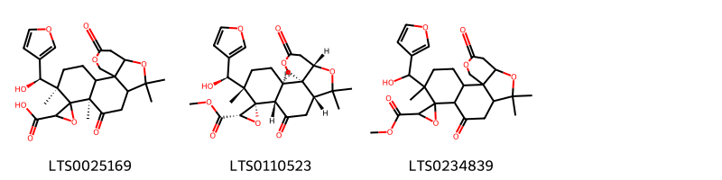{ width=100% }
    <figcaption>Hình ảnh cấu trúc hóa học của 3 hoạt chất thuộc nhóm Lactones gồm ["(5'r,7'r)-5'-[(s)-furan-3-yl(hydroxy)methyl]-5',7',11',11'-tetramethyl-8',15'-dioxo-12',16'-dioxaspiro[oxirane-2,6'-tetracyclo[8.7.0.0¹,¹³.0²,⁷]heptadecane]-3-carboxylic acid (LTS0025169)", "methyl (1'r,2s,2'r,3s,5's,7's,10'r,13's)-5'-[(s)-furan-3-yl(hydroxy)methyl]-5',11',11'-trimethyl-8',15'-dioxo-12',16'-dioxaspiro[oxirane-2,6'-tetracyclo[8.7.0.0¹,¹³.0²,⁷]heptadecane]-3-carboxylate (LTS0110523)", "methyl 5'-[furan-3-yl(hydroxy)methyl]-5',11',11'-trimethyl-8',15'-dioxo-12',16'-dioxaspiro[oxirane-2,6'-tetracyclo[8.7.0.0¹,¹³.0²,⁷]heptadecane]-3-carboxylate (LTS0234839)"].</figcaption>
</figure>
#### Nhóm Lignan glycosides
<figure markdown="span">
    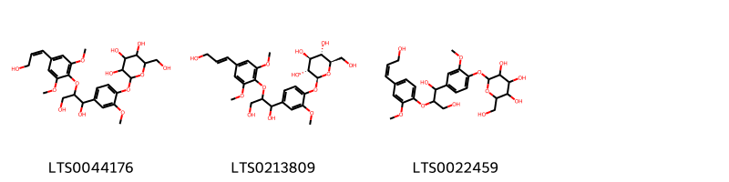{ width=100% }
    <figcaption>Hình ảnh cấu trúc hóa học của 3 hoạt chất thuộc nhóm Lignan glycosides gồm ['2-[4-(1,3-dihydroxy-2-{4-[(1z)-3-hydroxyprop-1-en-1-yl]-2,6-dimethoxyphenoxy}propyl)-2-methoxyphenoxy]-6-(hydroxymethyl)oxane-3,4,5-triol (LTS0044176)', '(2s,3r,4s,5s,6r)-2-[4-(1,3-dihydroxy-2-{4-[(1e)-3-hydroxyprop-1-en-1-yl]-2,6-dimethoxyphenoxy}propyl)-2-methoxyphenoxy]-6-(hydroxymethyl)oxane-3,4,5-triol (LTS0213809)', '2-[4-(1,3-dihydroxy-2-{4-[(1z)-3-hydroxyprop-1-en-1-yl]-2-methoxyphenoxy}propyl)-2-methoxyphenoxy]-6-(hydroxymethyl)oxane-3,4,5-triol (LTS0022459)'].</figcaption>
</figure>
#### Nhóm Linear 1_3-diarylpropanoids
<figure markdown="span">
    { width=100% }
    <figcaption>Hình ảnh cấu trúc hóa học của Không tìm thấy chú thích hoạt chất thuộc nhóm Linear 1_3-diarylpropanoids gồm Không tìm thấy chú thích.</figcaption>
</figure>
#### Nhóm Naphthopyrans
<figure markdown="span">
    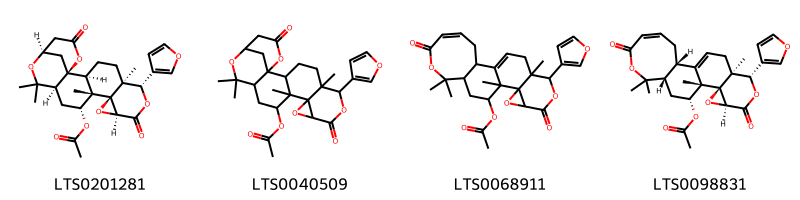{ width=100% }
    <figcaption>Hình ảnh cấu trúc hóa học của 4 hoạt chất thuộc nhóm Naphthopyrans gồm ['(1s,2s,5s,6s,9s,11r,12s,13r,15s,18r)-6-(furan-3-yl)-5,12,16,16-tetramethyl-8,20-dioxo-7,10,17,21-tetraoxahexacyclo[16.3.1.0¹,¹⁵.0²,¹².0⁵,¹¹.0⁹,¹¹]docosan-13-yl acetate (LTS0201281)', '6-(furan-3-yl)-5,12,16,16-tetramethyl-8,20-dioxo-7,10,17,21-tetraoxahexacyclo[16.3.1.0¹,¹⁵.0²,¹².0⁵,¹¹.0⁹,¹¹]docosan-13-yl acetate (LTS0040509)', '18-(furan-3-yl)-8,8,12,19-tetramethyl-6,16-dioxo-7,14,17-trioxapentacyclo[10.9.0.0²,⁹.0¹³,¹⁵.0¹³,¹⁹]henicosa-1(21),4-dien-11-yl acetate (LTS0068911)', '(2s,4z,9s,11r,12s,13r,15s,18s,19s)-18-(furan-3-yl)-8,8,12,19-tetramethyl-6,16-dioxo-7,14,17-trioxapentacyclo[10.9.0.0²,⁹.0¹³,¹⁵.0¹³,¹⁹]henicosa-1(21),4-dien-11-yl acetate (LTS0098831)'].</figcaption>
</figure>
#### Nhóm Organonitrogen compounds
<figure markdown="span">
    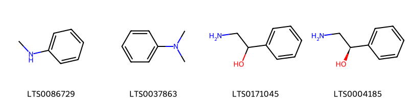{ width=100% }
    <figcaption>Hình ảnh cấu trúc hóa học của 4 hoạt chất thuộc nhóm Organonitrogen compounds gồm ['methylaniline (LTS0086729)', 'dimethylaniline (LTS0037863)', 'β phenylethanolamine (LTS0171045)', '(1r)-2-amino-1-phenylethanol (LTS0004185)'].</figcaption>
</figure>
#### Nhóm Organooxygen compounds
<figure markdown="span">
    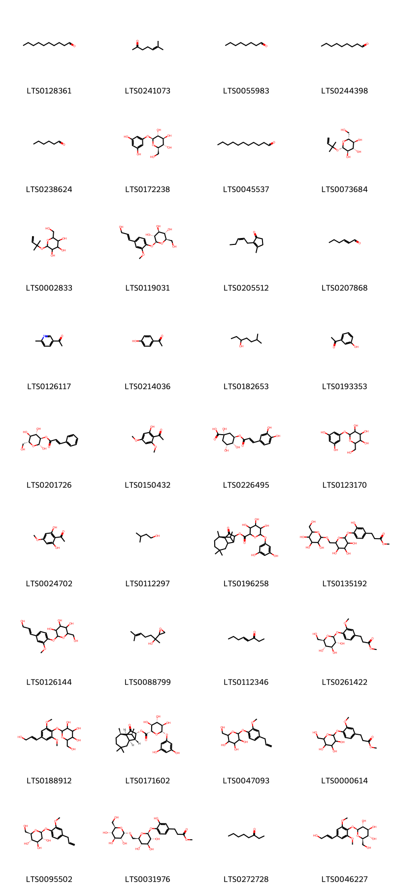{ width=100% }
    <figcaption>Hình ảnh cấu trúc hóa học của 36 hoạt chất thuộc nhóm Organooxygen compounds gồm ['decanal (LTS0128361)', '6-methyl-5-hepten-2-one (LTS0241073)', 'octanal (LTS0055983)', 'nonanal (LTS0244398)', 'hexanal (LTS0238624)', '(2s,3r,4s,5s,6r)-2-(3,5-dihydroxyphenoxy)-6-(hydroxymethyl)oxane-3,4,5-triol (LTS0172238)', 'aldehyde c11 (LTS0045537)', '(2r,3s,4s,5r,6s)-2-(hydroxymethyl)-6-[(2-methylbut-3-en-2-yl)oxy]oxane-3,4,5-triol (LTS0073684)', '2-(hydroxymethyl)-6-[(2-methylbut-3-en-2-yl)oxy]oxane-3,4,5-triol (LTS0002833)', 'coniferin (LTS0119031)', 'jasmone (LTS0205512)', '(e)-2-hexenal (LTS0207868)', '3-acetyl-6-methylpyridine (LTS0126117)', 'hydroxyacetophenone (LTS0214036)', 'ethylisopentylcarbinol (LTS0182653)', '3-hydroxyacetophenone (LTS0193353)', '(2r,3r,4s,5s,6r)-2,4,5-trihydroxy-6-(hydroxymethyl)oxan-3-yl (2e)-3-phenylprop-2-enoate (LTS0201726)', 'xanthoxylin (LTS0150432)', 'chlorogenic acid (LTS0226495)', '2-(3,5-dihydroxyphenoxy)-6-(hydroxymethyl)oxane-3,4,5-triol (LTS0123170)', 'phloretin (LTS0024702)', 'isoamyl alcohol (LTS0112297)', '4,4,7,8-tetramethyl-11-oxotricyclo[5.4.0.0²,⁹]undecan-10-yl 6-(3,5-dihydroxyphenoxy)-3,4,5-trihydroxyoxane-2-carboxylate (LTS0196258)', 'methyl 3-(3-hydroxy-4-{[3,4,5-trihydroxy-6-({[3,4,5-trihydroxy-6-(hydroxymethyl)oxan-2-yl]oxy}methyl)oxan-2-yl]oxy}phenyl)propanoate (LTS0135192)', '2-(hydroxymethyl)-6-[4-(3-hydroxyprop-1-en-1-yl)-2-methoxyphenoxy]oxane-3,4,5-triol (LTS0126144)', 'linalool dihydroepoxide (LTS0088799)', 'oct-4-en-3-one (LTS0112346)', 'methyl 3-(3-methoxy-4-{[(2s,3r,4s,5s,6r)-3,4,5-trihydroxy-6-(hydroxymethyl)oxan-2-yl]oxy}phenyl)propanoate (LTS0261422)', '2-(hydroxymethyl)-6-[4-(3-hydroxyprop-1-en-1-yl)-2,6-dimethoxyphenoxy]oxane-3,4,5-triol (LTS0188912)', '(1s,2r,7r,8s,9r,10r)-4,4,7,8-tetramethyl-11-oxotricyclo[5.4.0.0²,⁹]undecan-10-yl (2s,3s,4s,5r,6s)-6-(3,5-dihydroxyphenoxy)-3,4,5-trihydroxyoxane-2-carboxylate (LTS0171602)', '2-(hydroxymethyl)-6-[2-methoxy-4-(prop-2-en-1-yl)phenoxy]oxane-3,4,5-triol (LTS0047093)', 'methyl 3-(3-methoxy-4-{[3,4,5-trihydroxy-6-(hydroxymethyl)oxan-2-yl]oxy}phenyl)propanoate (LTS0000614)', 'eugenyl glucoside (LTS0095502)', 'methyl 3-(3-hydroxy-4-{[(2s,3r,4s,5s,6r)-3,4,5-trihydroxy-6-({[(2s,3r,4s,5s,6r)-3,4,5-trihydroxy-6-(hydroxymethyl)oxan-2-yl]oxy}methyl)oxan-2-yl]oxy}phenyl)propanoate (LTS0031976)', '3-octanone (LTS0272728)', 'syringin (LTS0046227)'].</figcaption>
</figure>
#### Nhóm Oxanes
<figure markdown="span">
    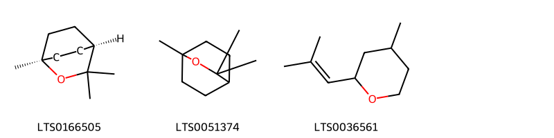{ width=100% }
    <figcaption>Hình ảnh cấu trúc hóa học của 3 hoạt chất thuộc nhóm Oxanes gồm ['1,8-cineole (LTS0166505)', 'eucalyptol (LTS0051374)', 'rose oxide (LTS0036561)'].</figcaption>
</figure>
#### Nhóm Phenol ethers
<figure markdown="span">
    { width=100% }
    <figcaption>Hình ảnh cấu trúc hóa học của 2 hoạt chất thuộc nhóm Phenol ethers gồm ['(2e)-2-(n-hydroxyimino)-1-{4-[(3-methylbut-2-en-1-yl)oxy]phenyl}ethanone (LTS0037054)', '(2z)-2-(n-hydroxyimino)-1-{4-[(3-methylbut-2-en-1-yl)oxy]phenyl}ethanone (LTS0121572)'].</figcaption>
</figure>
#### Nhóm Phenols
<figure markdown="span">
    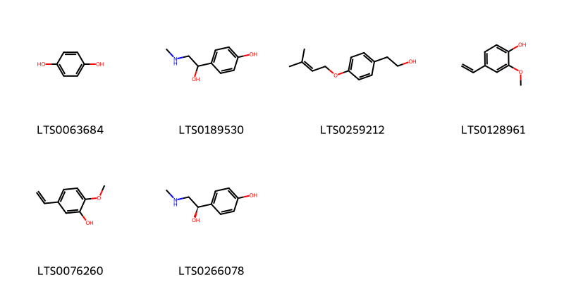{ width=100% }
    <figcaption>Hình ảnh cấu trúc hóa học của 6 hoạt chất thuộc nhóm Phenols gồm ['α-hydroquinone (LTS0063684)', 'synephrine (LTS0189530)', 'etrogol (LTS0259212)', '2-methoxy-4-vinyl-phenol (LTS0128961)', '5-ethenyl-2-methoxyphenol (LTS0076260)', '( )-synephrine (LTS0266078)'].</figcaption>
</figure>
#### Nhóm Prenol lipids
<figure markdown="span">
    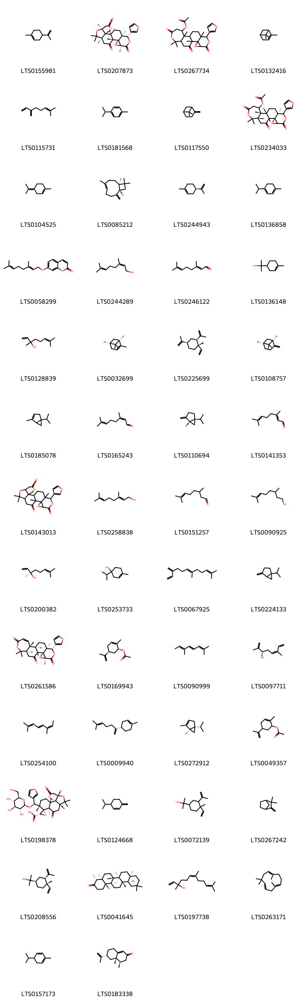{ width=100% }
    <figcaption>Hình ảnh cấu trúc hóa học của 159 hoạt chất thuộc nhóm Prenol lipids gồm ['limonene,  (LTS0155981)', 'limonin (LTS0207873)', '7-(furan-3-yl)-1,8,12,17,17-pentamethyl-5,15,20-trioxo-3,6,16-trioxapentacyclo[9.9.0.0²,⁴.0²,⁸.0¹²,¹⁸]icosan-13-yl acetate (LTS0267734)', 'α pinene (LTS0132416)', 'α-myrcene (LTS0115731)', 'cymene (LTS0181568)', 'β-pinene (LTS0117550)', '(1r,2r,8s,11s,12r,18s)-7-(furan-3-yl)-1,8,12,17,17-pentamethyl-5,15,20-trioxo-3,6,16-trioxapentacyclo[9.9.0.0²,⁴.0²,⁸.0¹²,¹⁸]icosan-13-yl acetate (LTS0234033)', 'terpinolene (LTS0104525)', 'caryophyllene (LTS0085212)', 'α-limonene (LTS0244943)', 'terpinene (LTS0136858)', 'auraptene (LTS0058299)', 'nerol (LTS0244289)', 'α-citral (LTS0246122)', 'terpineol (LTS0136148)', 'linalool, (+-)- (LTS0128839)', '(-)-α-pinene (LTS0032699)', 'β-elemene (LTS0225699)', '(-)-β-pinene (LTS0108757)', 'α-thujene (LTS0185078)', 'neral (LTS0165243)', '(+)-sabinene (LTS0110694)', '3,7-dimethyl-2,6-octadienal (LTS0141353)', 'limonin (LTS0143013)', 'geraniol (LTS0258838)', 'citronella (LTS0151257)', 'citronellol, (+-)- (LTS0090925)', '(-)-linalool (LTS0200382)', '4-terpineol (LTS0253733)', 'β-farnesene (LTS0067925)', 'sabinene (LTS0224133)', 'obacunone (LTS0261586)', '(1s,5s)-carvyl acetate (LTS0169943)', 'allo-ocimene (LTS0090999)', '(3r,5z)-2,6-dimethylocta-1,5,7-trien-3-ol (LTS0097711)', '(4e,6z)-alloocimene (LTS0254100)', '(-)-β-bisabolene (LTS0009940)', '(+)-α-thujene (LTS0272912)', 'carvyl acetate (LTS0049357)', 'limonin 17-β-d-glucopyranoside (LTS0198378)', 'β phellandrene (LTS0124668)', '2-[4-ethenyl-4-methyl-3-(prop-1-en-2-yl)cyclohexyl]propan-2-ol (LTS0072139)', 'camphene (LTS0267242)', 'elemol (LTS0208556)', '(-)-friedelin (LTS0041645)', 'nerolidol (LTS0197738)', 'humulene (LTS0263171)', 'phellandrene (LTS0157173)', 'nootkatone (LTS0183338)', 'caryophyllene (LTS0131870)', 'valencene (LTS0031707)', 'valencene (LTS0110395)', '(1r,2r,7s,10s,13r,14r,16s,19s,20s)-19-(furan-3-yl)-9,9,13,20-tetramethyl-4,8,15,18-tetraoxahexacyclo[11.9.0.0²,⁷.0²,¹⁰.0¹⁴,¹⁶.0¹⁴,²⁰]docosane-5,12,17-trione (LTS0222914)', "(1r,3'r,5ar,7ar,9s,11ar,11br)-1-(acetyloxy)-9-[furan-3-yl({[(2r,3r,4s,5s,6r)-3,4,5-trihydroxy-6-(hydroxymethyl)oxan-2-yl]oxy})methyl]-5,5,7a,9,11b-pentamethyl-3,7-dioxo-hexahydro-1h-spiro[naphtho[2,1-c]oxepine-8,2'-oxirane]-3'-carboxylic acid (LTS0107449)", 'nerolidol (LTS0155191)', 'cryptoxanthin (LTS0132646)', "(1r,7ar,9s,11br)-1-(acetyloxy)-9-[(s)-furan-3-yl(hydroxy)methyl]-5,5,7a,9,11b-pentamethyl-3,7-dioxo-hexahydro-1h-spiro[naphtho[2,1-c]oxepine-8,2'-oxirane]-3'-carboxylic acid (LTS0156866)", 'linalyl acetate (LTS0167325)', 'β-ocimene (LTS0242381)', 'α-curcumene (LTS0019880)', 'monoterpenes (LTS0106881)', '(s)-(-)-citronellal (LTS0164027)', 'bergamottin (LTS0217096)', 'all-trans-phytofluene (LTS0269894)', '(1r,2s,6s,7s,8r)-8-isopropyl-1,3-dimethyltricyclo[4.4.0.0²,⁷]dec-3-ene (LTS0106607)', 'sabinene hydrate (LTS0236165)', '(+)-α-carotene (LTS0200789)', '4-thujanol (LTS0005823)', 'trans-β-ocimene (LTS0049765)', '7-(furan-3-yl)-1,8,12,17,17-pentamethyl-5,15-dioxo-3,6,16-trioxapentacyclo[9.9.0.0²,⁴.0²,⁸.0¹²,¹⁸]icos-13-en-20-yl acetate (LTS0117030)', 'terpineols (LTS0139391)', 'α-bergamotene (LTS0226115)', '4-[(3,7-dimethylocta-2,6-dien-1-yl)oxy]furo[3,2-g]chromen-7-one (LTS0115355)', 'β-carotene (LTS0275716)', 'thymol (LTS0168527)', '(1s,2r,4s,7s,8s,11r,12r,18s,20r)-7-(furan-3-yl)-1,8,12,17,17-pentamethyl-5,15-dioxo-3,6,16-trioxapentacyclo[9.9.0.0²,⁴.0²,⁸.0¹²,¹⁸]icos-13-en-20-yl acetate (LTS0020464)', '3,7-dimethyl-2,6-octadien-1-ol (LTS0215566)', '4-isopropyl-1,6-dimethyl-2,3,4,4a,7,8-hexahydronaphthalene (LTS0270743)', 'α-thujene (LTS0176954)', 'phytoene (LTS0186029)', 'lily of valley (LTS0051762)', 'α-carotene (LTS0224243)', 'delta-cadinene (LTS0019321)', '(-)-β-cubebene (LTS0123697)', '(-)-perillyl alcohol (LTS0083880)', '(+)-linalool (LTS0196043)', '(+)-delta(3)-carene (LTS0250199)', 'nootkatone (LTS0027125)', 'perillylalcohol (LTS0009128)', 'friedelin (LTS0213494)', 'carvone, (+)- (LTS0027671)', 'violaxanthin (LTS0102265)', '(-)-limonene (LTS0205325)', '(1s,4s)-4-isopropyl-1,6-dimethyl-1,2,3,4-tetrahydronaphthalene (LTS0139634)', '7-(furan-3-yl)-1,8,12,17,17-pentamethyl-3,6,16-trioxapentacyclo[9.9.0.0²,⁴.0²,⁸.0¹²,¹⁸]icos-13-ene-5,15,20-trione (LTS0163399)', '(+)-4-terpineol (LTS0140257)', '(2r)-6-methyl-2-(4-methylcyclohex-3-en-1-yl)hept-5-en-2-ol (LTS0088859)', '(+)-gamma-cadinene (LTS0103949)', 'lupeol (LTS0256952)', 'α-bisabolol (LTS0250984)', 'gibberellin a19 (LTS0044672)', 'gibberellin a20 (LTS0041124)', '(-)-α-cubebene (LTS0042045)', '4-isopropyl-6-methyl-1-methylidene-3,4,4a,7,8,8a-hexahydro-2h-naphthalene (LTS0111070)', '(r)-β-bisabolene (LTS0077209)', '(r)-(+)-citronellal (LTS0175396)', 'camphor (LTS0091905)', '(5s)-1-isopropyl-4-methylidenebicyclo[3.1.0]hexane (LTS0129854)', '(-)-endo-α-bergamotene (LTS0153835)', '(6s,7ar)-2-[(2e,4e,6e,8e,10e,12e,14e)-15-[(6s,7ar)-6-hydroxy-4,4,7a-trimethyl-2,5,6,7-tetrahydro-1-benzofuran-2-yl]-6,11-dimethylhexadeca-2,4,6,8,10,12,14-heptaen-2-yl]-4,4,7a-trimethyl-2,5,6,7-tetrahydro-1-benzofuran-6-ol (LTS0151069)', '(6s,7ar)-2-[(2e,4e,6e,8e,10e,12e,14e,16e)-17-[(4r)-4-hydroxy-2,6,6-trimethylcyclohex-1-en-1-yl]-6,11,15-trimethylheptadeca-2,4,6,8,10,12,14,16-octaen-2-yl]-4,4,7a-trimethyl-2,5,6,7-tetrahydro-1-benzofuran-6-ol (LTS0100944)', '4-[(1e,3e,5e,7e,9e,11e,13e,15e)-16-(4,4,7a-trimethyl-2,5,6,7-tetrahydro-1-benzofuran-2-yl)-3,7,12-trimethylheptadeca-1,3,5,7,9,11,13,15-octaen-1-yl]-3,5,5-trimethylcyclohex-3-en-1-ol (LTS0070797)', '(-)-trans-α-bergamotene (LTS0239937)', '2-[(2z,4e,6e,8e,10e,12e,14e,16e)-17-{4-hydroxy-2,2,6-trimethyl-7-oxabicyclo[4.1.0]heptan-1-yl}-6,11,15-trimethylheptadeca-2,4,6,8,10,12,14,16-octaen-2-yl]-4,4,7a-trimethyl-2,5,6,7-tetrahydro-1-benzofuran-6-ol (LTS0193507)', '(+)-α-terpineol (LTS0258249)', '1,3,3-trimethyl-2-[(3e,5e,7e,9e,11e,13e,15e)-3,7,12,16-tetramethyl-18-(2,6,6-trimethylcyclohex-1-en-1-yl)octadeca-3,5,7,9,11,13,15-heptaen-1-yl]cyclohex-1-ene (LTS0222643)', '(1r,3s,6s)-6-[(1e,3e,5e,7e,9e,11e,13e)-15-hydroxy-3,7,12-trimethylpentadeca-1,3,5,7,9,11,13-heptaen-1-yl]-1,5,5-trimethyl-7-oxabicyclo[4.1.0]heptan-3-ol (LTS0115998)', '1,8a-dimethyl-7-(prop-1-en-2-yl)-2,6,7,8-tetrahydro-1h-naphthalene (LTS0133136)', 'nomilin (LTS0125101)', '6-[(1e,3z,5e,7z,9z,11z)-15-hydroxy-3,7,12-trimethylpentadeca-1,3,5,7,9,11-hexaen-1-yl]-1,5,5-trimethyl-7-oxabicyclo[4.1.0]heptan-3-ol (LTS0210878)', 'gibberellin a3 (LTS0185015)', '2-[(2z,4e,6e,8z,10e,12z)-14-hydroxy-6,11-dimethyltetradeca-2,4,6,8,10,12-hexaen-2-yl]-4,4,7a-trimethyl-hexahydro-1-benzofuran-6-ol (LTS0123085)', '(1r,2r,5s,8s,9s,10r,11r,13s)-5,13-dihydroxy-11-methyl-6-methylidene-16-oxo-15-oxapentacyclo[9.3.2.1⁵,⁸.0¹,¹⁰.0²,⁸]heptadecane-9-carboxylic acid (LTS0162322)', '(2r,6s,7ar)-2-[(2e,4e,6e,8e,10e,12e,14e)-15-[(2r,6s,7ar)-6-hydroxy-4,4,7a-trimethyl-2,5,6,7-tetrahydro-1-benzofuran-2-yl]-6,11-dimethylhexadeca-2,4,6,8,10,12,14-heptaen-2-yl]-4,4,7a-trimethyl-2,5,6,7-tetrahydro-1-benzofuran-6-ol (LTS0242547)', '(4s,4as)-4-isopropyl-1,6-dimethyl-2,3,4,4a,7,8-hexahydronaphthalene (LTS0208606)', 'borneol (LTS0264960)', 'bornyl acetate (LTS0060565)', 'flavoxanthin (LTS0174303)', '(1r,7r,8as)-1,8a-dimethyl-7-(prop-1-en-2-yl)-2,6,7,8-tetrahydro-1h-naphthalene (LTS0183545)', 'β-zeacarotene (LTS0232347)', 'gamma-muurolene (LTS0052920)', 'trans-β-terpineol (LTS0033955)', '(1ar,4as,7r,7as,7bs)-1,1,7-trimethyl-4-methylidene-octahydro-1ah-cyclopropa[e]azulene (LTS0028578)', '4,4a-dimethyl-6-(prop-1-en-2-yl)-3,4,5,6,7,8-hexahydro-2h-naphthalen-2-ol (LTS0008114)', '4-methyl-1-(6-methylhept-5-en-2-yl)cyclohex-3-en-1-ol (LTS0000924)', '2-[(3r,4ar,10as)-3,4a,7,7,10a-pentamethyl-octahydro-1h-naphtho[2,1-b]pyran-3-yl]ethanol (LTS0010763)', 'bicyclogermacrene (LTS0099340)', 'nootkatol (LTS0021355)', 'β-bisabolol (LTS0115229)', 'dihydrocarveol (LTS0111467)', 'neurosporene (LTS0117305)', '2-[(8e,10e,12e,14e)-15-(6-hydroxy-4,4,7a-trimethyl-2,5,6,7-tetrahydro-1-benzofuran-2-yl)-6,11-dimethylhexadeca-2,4,6,8,10,12,14-heptaen-2-yl]-4,4,7a-trimethyl-2,5,6,7-tetrahydro-1-benzofuran-6-ol (LTS0044878)', '(1r,2r,4s,7s,8s,11r,12r,13r,18r)-7-(furan-3-yl)-1,8,12,17,17-pentamethyl-5,15,20-trioxo-3,6,16-trioxapentacyclo[9.9.0.0²,⁴.0²,⁸.0¹²,¹⁸]icosan-13-yl acetate (LTS0157558)', 'β-caryophyllene oxide (LTS0213960)', 'gibberellin a1 (LTS0013777)', 'caryophyllene oxide (LTS0159789)', '8-geranyloxypsoralen (LTS0143946)', '9-[(3,7-dimethylocta-2,6-dien-1-yl)oxy]furo[3,2-g]chromen-7-one (LTS0268391)', '(-)-germacrene d (LTS0059194)', '5-geranyloxy-7-methoxycoumarin (LTS0081520)', '7,7-dimethyl-2-methylidenebicyclo[2.2.1]heptane (LTS0092282)', '(+)-endo-β-bergamotene (LTS0181243)', "(1's,2'r,3r,4s,5'r,7'r,10's,11's,14'r)-11'-(furan-3-yl)-4-hydroxy-2',10'-dimethyl-5'-(2-{[(2s,3r,4s,5s,6r)-3,4,5-trihydroxy-6-(hydroxymethyl)oxan-2-yl]oxy}propan-2-yl)-12',15'-dioxaspiro[oxane-3,6'-tetracyclo[8.5.0.0¹,¹⁴.0²,⁷]pentadecane]-3',6,13'-trione (LTS0275639)", "11'-(furan-3-yl)-4-hydroxy-2',10'-dimethyl-5'-(2-{[3,4,5-trihydroxy-6-(hydroxymethyl)oxan-2-yl]oxy}propan-2-yl)-12',15'-dioxaspiro[oxane-3,6'-tetracyclo[8.5.0.0¹,¹⁴.0²,⁷]pentadecane]-3',6,13'-trione (LTS0076072)", '(1z,6z,8s)-8-isopropyl-1-methyl-5-methylidenecyclodeca-1,6-diene (LTS0065195)', 'γ-terpineol (LTS0175059)', '4-{[(2z)-3,7-dimethylocta-2,6-dien-1-yl]oxy}furo[3,2-g]chromen-7-one (LTS0056004)', 'fenchone (LTS0126716)'].</figcaption>
</figure>
#### Nhóm Pyridines and derivatives
<figure markdown="span">
    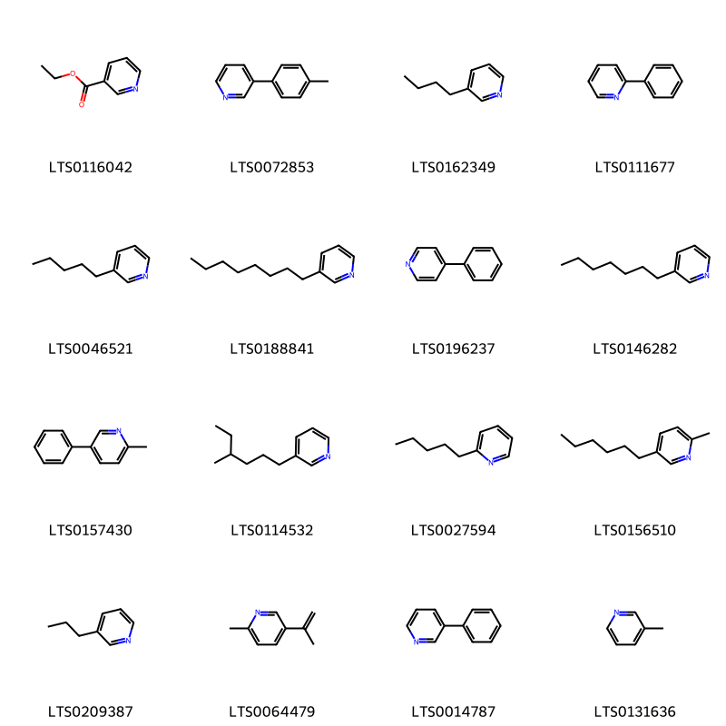{ width=100% }
    <figcaption>Hình ảnh cấu trúc hóa học của 16 hoạt chất thuộc nhóm Pyridines and derivatives gồm ['ethyl nicotinate (LTS0116042)', '3-(4-methylphenyl)pyridine (LTS0072853)', '3-butylpyridine (LTS0162349)', '2-phenylpyridine (LTS0111677)', '3-pentylpyridine (LTS0046521)', '3-octylpyridine (LTS0188841)', '4-phenylpyridine (LTS0196237)', '3-heptylpyridine (LTS0146282)', '2-methyl-5-phenylpyridine (LTS0157430)', '3-(4-methylhexyl)pyridine (LTS0114532)', '2-pentylpyridine (LTS0027594)', '5-hexyl-2-methylpyridine (LTS0156510)', '3-propylpyridine (LTS0209387)', '2-methyl-5-isopropenylpyridine (LTS0064479)', '3-phenylpyridine (LTS0014787)', '3-methylpyridine (LTS0131636)'].</figcaption>
</figure>
#### Nhóm Quinolines and derivatives
<figure markdown="span">
    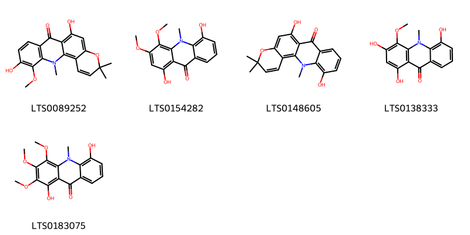{ width=100% }
    <figcaption>Hình ảnh cấu trúc hóa học của 5 hoạt chất thuộc nhóm Quinolines and derivatives gồm ['7,11-dihydroxy-6-methoxy-2,2,5-trimethyl-1-oxa-5-azatetraphen-10-one (LTS0089252)', '1,5-dihydroxy-3,4-dimethoxy-10-methylacridin-9-one (LTS0154282)', '5-hydroxynoracronycine (LTS0148605)', '1,3,5-trihydroxy-4-methoxy-10-methylacridin-9-one (LTS0138333)', 'citibrasine (LTS0183075)'].</figcaption>
</figure>
#### Nhóm Saccharolipids
<figure markdown="span">
    { width=100% }
    <figcaption>Hình ảnh cấu trúc hóa học của 2 hoạt chất thuộc nhóm Saccharolipids gồm ["(2s,3's,4ar,5r,6r,8ar)-5-[(1r)-1-(acetyloxy)-2-carboxyethyl]-2-[(s)-furan-3-yl({[(2r,3r,4s,5s,6r)-3,4,5-trihydroxy-6-(hydroxymethyl)oxan-2-yl]oxy})methyl]-6-(2-hydroxypropan-2-yl)-2,5,8a-trimethyl-8-oxo-tetrahydro-3h-spiro[naphthalene-1,2'-oxirane]-3'-carboxylic acid (LTS0175497)", "(1r,2s,3's,4ar,5r,6r,8ar)-5-[(1r)-1-(acetyloxy)-2-carboxyethyl]-2-[(s)-furan-3-yl({[(2r,3r,4s,5s,6r)-3,4,5-trihydroxy-6-(hydroxymethyl)oxan-2-yl]oxy})methyl]-6-(2-hydroxypropan-2-yl)-2,5,8a-trimethyl-8-oxo-tetrahydro-3h-spiro[naphthalene-1,2'-oxirane]-3'-carboxylic acid (LTS0095919)"].</figcaption>
</figure>
#### Nhóm Saturated hydrocarbons
<figure markdown="span">
    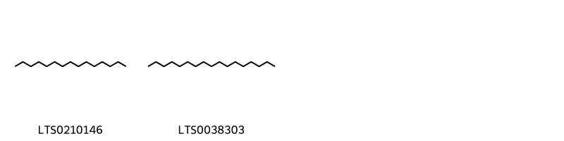{ width=100% }
    <figcaption>Hình ảnh cấu trúc hóa học của 2 hoạt chất thuộc nhóm Saturated hydrocarbons gồm ['pentadecane (LTS0210146)', 'heptadecane (LTS0038303)'].</figcaption>
</figure>
#### Nhóm Steroids and steroid derivatives
<figure markdown="span">
    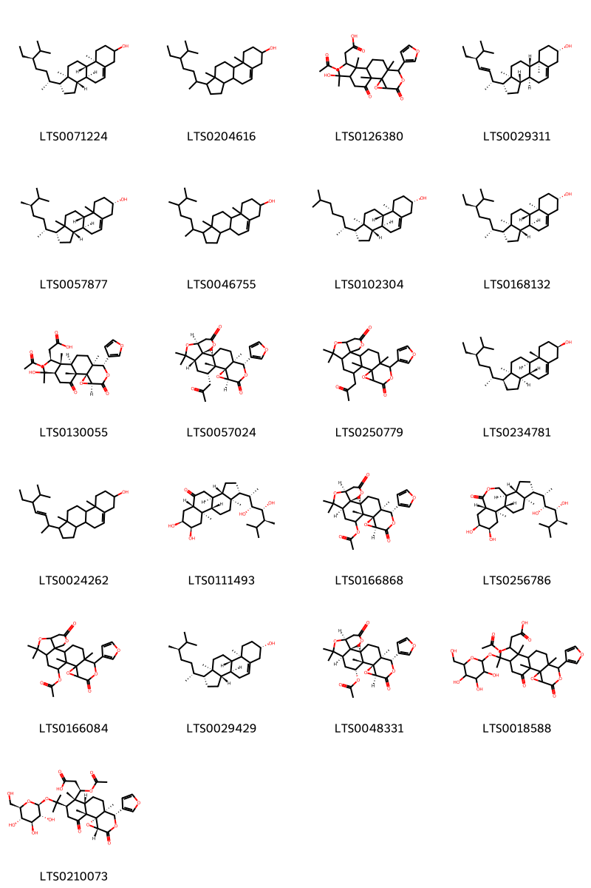{ width=100% }
    <figcaption>Hình ảnh cấu trúc hóa học của 21 hoạt chất thuộc nhóm Steroids and steroid derivatives gồm ['stigmast-5-en-3-ol (LTS0071224)', 'stigmast-5-en-3-ol, (3β)- (LTS0204616)', '3-(acetyloxy)-3-[11-(furan-3-yl)-5-(2-hydroxypropan-2-yl)-2,6,10-trimethyl-3,13-dioxo-12,15-dioxatetracyclo[8.5.0.0¹,¹⁴.0²,⁷]pentadecan-6-yl]propanoic acid (LTS0126380)', 'phytosterol (LTS0029311)', '(1r,3as,3bs,7s,9bs)-1-[(2r,5r)-5,6-dimethylheptan-2-yl]-9a,11a-dimethyl-1h,2h,3h,3ah,3bh,4h,6h,7h,8h,9h,9bh,10h,11h-cyclopenta[a]phenanthren-7-ol (LTS0057877)', 'campesterol (LTS0046755)', 'cholesterol (LTS0102304)', 'sitosterol (LTS0168132)', '(3s)-3-(acetyloxy)-3-[(1r,2r,5r,6r,7r,10s,11s,14s)-11-(furan-3-yl)-5-(2-hydroxypropan-2-yl)-2,6,10-trimethyl-3,13-dioxo-12,15-dioxatetracyclo[8.5.0.0¹,¹⁴.0²,⁷]pentadecan-6-yl]propanoic acid (LTS0130055)', '(1r,2r,7s,10s,12s,13r,14s,16s,19s,20s)-19-(furan-3-yl)-9,9,13,20-tetramethyl-12-(2-oxopropyl)-4,8,15,18-tetraoxahexacyclo[11.9.0.0²,⁷.0²,¹⁰.0¹⁴,¹⁶.0¹⁴,²⁰]docosane-5,17-dione (LTS0057024)', '19-(furan-3-yl)-9,9,13,20-tetramethyl-12-(2-oxopropyl)-4,8,15,18-tetraoxahexacyclo[11.9.0.0²,⁷.0²,¹⁰.0¹⁴,¹⁶.0¹⁴,²⁰]docosane-5,17-dione (LTS0250779)', '(1s,3ar,3br,7r,9as,9br,11ar)-1-[(2r,5r)-5-ethyl-6-methylheptan-2-yl]-9a,11a-dimethyl-1h,2h,3h,3ah,3bh,4h,6h,7h,8h,9h,9bh,10h,11h-cyclopenta[a]phenanthren-7-ol (LTS0234781)', 'stigmasterol (LTS0024262)', 'castasterone (LTS0111493)', '(1r,2r,7s,10r,13s,14r,16s,19s,20s)-19-(furan-3-yl)-9,9,13,20-tetramethyl-5,17-dioxo-4,8,15,18-tetraoxahexacyclo[11.9.0.0²,⁷.0²,¹⁰.0¹⁴,¹⁶.0¹⁴,²⁰]docosan-12-yl acetate (LTS0166868)', 'brassinolide (LTS0256786)', '19-(furan-3-yl)-9,9,13,20-tetramethyl-5,17-dioxo-4,8,15,18-tetraoxahexacyclo[11.9.0.0²,⁷.0²,¹⁰.0¹⁴,¹⁶.0¹⁴,²⁰]docosan-12-yl acetate (LTS0166084)', 'campesterol (LTS0029429)', '(1r,2r,7s,10r,12r,13s,14r,16s,19s,20s)-19-(furan-3-yl)-9,9,13,20-tetramethyl-5,17-dioxo-4,8,15,18-tetraoxahexacyclo[11.9.0.0²,⁷.0²,¹⁰.0¹⁴,¹⁶.0¹⁴,²⁰]docosan-12-yl acetate (LTS0048331)', '3-(acetyloxy)-3-[11-(furan-3-yl)-2,6,10-trimethyl-3,13-dioxo-5-(2-{[3,4,5-trihydroxy-6-(hydroxymethyl)oxan-2-yl]oxy}propan-2-yl)-12,15-dioxatetracyclo[8.5.0.0¹,¹⁴.0²,⁷]pentadecan-6-yl]propanoic acid (LTS0018588)', '(3r)-3-(acetyloxy)-3-[(1s,2r,5r,6r,7s,10s,11s,14r)-11-(furan-3-yl)-2,6,10-trimethyl-3,13-dioxo-5-(2-{[(2s,3r,4s,5s,6r)-3,4,5-trihydroxy-6-(hydroxymethyl)oxan-2-yl]oxy}propan-2-yl)-12,15-dioxatetracyclo[8.5.0.0¹,¹⁴.0²,⁷]pentadecan-6-yl]propanoic acid (LTS0210073)'].</figcaption>
</figure>
#### Nhóm Unsaturated hydrocarbons
<figure markdown="span">
    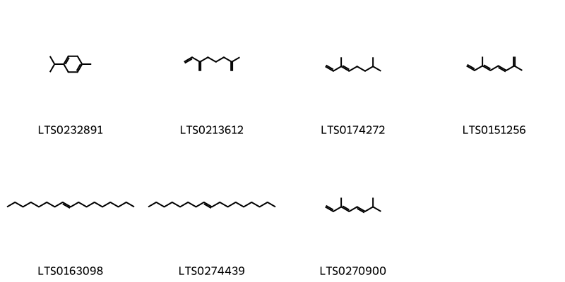{ width=100% }
    <figcaption>Hình ảnh cấu trúc hóa học của 7 hoạt chất thuộc nhóm Unsaturated hydrocarbons gồm ['α terpinene (LTS0232891)', '2-methyl-6-methylideneocta-1,7-diene (LTS0213612)', '(3e)-3,7-dimethylocta-1,3-diene (LTS0174272)', 'cosmene (LTS0151256)', 'heptadec-8-ene (LTS0163098)', '(8e)-heptadec-8-ene (LTS0274439)', '(3e,5e)-3,7-dimethylocta-1,3,5-triene (LTS0270900)'].</figcaption>
</figure>

---

### Dược dân tộc học

Danh sách các quốc gia có sử dụng *Citrus limon* trong điều trị các bệnh. 

| Country   | Disease                                                                                                  | Bệnh                                                                                                           |
|:----------|:---------------------------------------------------------------------------------------------------------|:---------------------------------------------------------------------------------------------------------------|
| Elsewhere | Carminative, Diaphoretic, Diuretic, Stimulant, Stomachic, Stomachic, Carminative, Rubefacient, Stimulant | Carminative, Diaphoretic, lợi tiểu, chất kích thích, dạ dày, dạ dày, Carminative, Rubefacient, chất kích thích |
| Kurdistan | Diaphoretic                                                                                              | Thuốc tràn dịch màng phổi                                                                                      |
| Turkey    | Digestive, Diuretic, Sedative, Tonic, Apertif                                                            | Tiêu hóa, lợi tiểu, an thần, thuốc bổ, khai vị                                                                 |
| ain       | Diuretic                                                                                                 | Thuốc lợi tiêu                                                                                                 |

---

---
## Citrus maxima
### Thông tin về thực vật

!!! info "Phân loại thực vật của *Citrus maxima* từ GIBF:"
    - **Kingdom:** Plantae
    - **Phylum:** Tracheophyta
    - **Order:** Sapindales
    - **Family:** Rutaceae
    - **Genus:** Citrus
    - **Species:** *Citrus maxima*

 

| Label (VI)   | Label (EN)   | Scientific Name   | Descriptions (VI)   | Descriptions (EN)   | Also Known As (VI)                                     | Also Known As (EN)                                  |
|:-------------|:-------------|:------------------|:--------------------|:--------------------|:-------------------------------------------------------|:----------------------------------------------------|
| N/A          | N/A          | Citrus maxima     | loài thực vật       | species of plant    | ['Citrus maxima', 'Citrus grandis', 'Bưởi ta', 'Bòng'] | ['pummelo', 'Citrus maxima', 'pommelo', 'shaddock'] |

#### Phân bố trên thế giới

**Từ CSDL GIBF** United Arab Emirates, Sri Lanka, Australia, Lao People’s Democratic Republic, Panama, Chinese Taipei, Türkiye, United States of America, South Africa, Hong Kong, Thailand, Brazil, New Caledonia, Dominica, Singapore, Viet Nam, China, Colombia, Costa Rica, India, Indonesia, Philippines, Malaysia

#### Phân bố tại Việt Nam

**Từ CSDL GIBF**: Thanh Hóa

---
### Thành phần hóa học
        
- Theo cơ sở dữ liệu lotus: Từ loài *Citrus maxima* đã phân lập và xác định được 222 hoạt chất thuộc về các nhóm Benzodioxanes, Fatty Acyls, Naphthalenes, Flavonoids, Prenol lipids, Steroids and steroid derivatives, Quinolines and derivatives, Organonitrogen compounds, Benzene and substituted derivatives, Unsaturated hydrocarbons, Organooxygen compounds, Phenols, Coumarins and derivatives, Saturated hydrocarbons, Carboxylic acids and derivatives, Benzopyrans, Imidazopyrimidines. 

|    | chemicalTaxonomyClassyfireClass     |   smiles_count |
|---:|:------------------------------------|---------------:|
|  0 | Benzene and substituted derivatives |              3 |
|  1 | Benzodioxanes                       |              1 |
|  2 | Benzopyrans                         |              2 |
|  3 | Carboxylic acids and derivatives    |              2 |
|  4 | Coumarins and derivatives           |             28 |
|  5 | Fatty Acyls                         |             10 |
|  6 | Flavonoids                          |             35 |
|  7 | Imidazopyrimidines                  |              4 |
|  8 | Naphthalenes                        |              1 |
|  9 | Organonitrogen compounds            |              1 |
| 10 | Organooxygen compounds              |             10 |
| 11 | Phenols                             |              1 |
| 12 | Prenol lipids                       |             72 |
| 13 | Quinolines and derivatives          |             39 |
| 14 | Saturated hydrocarbons              |              3 |
| 15 | Steroids and steroid derivatives    |              6 |
| 16 | Unsaturated hydrocarbons            |              2 |

#### Nhóm Benzene and substituted derivatives
<figure markdown="span">
    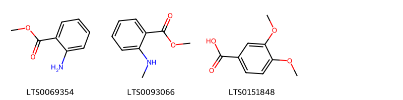{ width=100% }
    <figcaption>Hình ảnh cấu trúc hóa học của 3 hoạt chất thuộc nhóm Benzene and substituted derivatives gồm ['methyl anthranilate (LTS0069354)', 'dimethyl anthranilate (LTS0093066)', 'veratric acid (LTS0151848)'].</figcaption>
</figure>
#### Nhóm Benzodioxanes
<figure markdown="span">
    { width=100% }
    <figcaption>Hình ảnh cấu trúc hóa học của 1 hoạt chất thuộc nhóm Benzodioxanes gồm ['(6r,7r)-15-hydroxy-7-(4-hydroxy-3,5-dimethoxyphenyl)-6-(hydroxymethyl)-2,19,19-trimethyl-5,8,18-trioxa-2-azapentacyclo[12.8.0.0³,¹².0⁴,⁹.0¹⁷,²²]docosa-1(22),3,9,11,14,16,20-heptaen-13-one (LTS0178515)'].</figcaption>
</figure>
#### Nhóm Benzopyrans
<figure markdown="span">
    { width=100% }
    <figcaption>Hình ảnh cấu trúc hóa học của 2 hoạt chất thuộc nhóm Benzopyrans gồm ['2-hydroxy-7-(1-hydroxyethylidene)-10,15,15-trimethyl-16-oxa-10-azatetracyclo[9.8.0.0³,⁹.0¹²,¹⁷]nonadeca-1,3(9),4,11,13,17-hexaene-6,8,19-trione (LTS0262420)', '7-acetyl-6,19-dihydroxy-10,15,15-trimethyl-16-oxa-10-azatetracyclo[9.8.0.0³,⁹.0¹²,¹⁷]nonadeca-1(19),3(9),4,6,11,13,17-heptaene-2,8-dione (LTS0204895)'].</figcaption>
</figure>
#### Nhóm Carboxylic acids and derivatives
<figure markdown="span">
    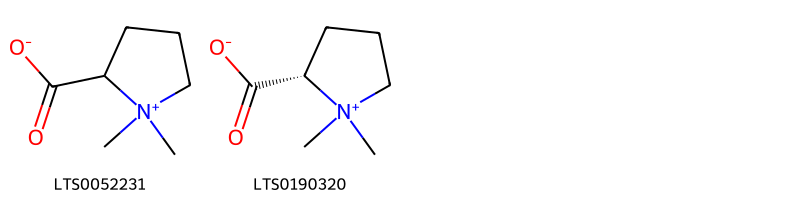{ width=100% }
    <figcaption>Hình ảnh cấu trúc hóa học của 2 hoạt chất thuộc nhóm Carboxylic acids and derivatives gồm ['1,1-dimethylpyrrolidin-1-ium-2-carboxylate (LTS0052231)', 'stachydrine (LTS0190320)'].</figcaption>
</figure>
#### Nhóm Coumarins and derivatives
<figure markdown="span">
    { width=100% }
    <figcaption>Hình ảnh cấu trúc hóa học của 28 hoạt chất thuộc nhóm Coumarins and derivatives gồm ['xanthyletin (LTS0016674)', 'xanthoxyletin (LTS0112626)', 'nor-dentatin (LTS0166816)', '5-hydroxy-2,2-dimethyl-6-(2-methylbut-3-en-2-yl)pyrano[2,3-h]chromen-8-one (LTS0024471)', 'suberosin (LTS0171880)', 'umbelliferone (LTS0162728)', 'scopoletin (LTS0193112)', '5-hydroxy-8,8-dimethyl-3,10-bis(2-methylbut-3-en-2-yl)pyrano[3,2-g]chromen-2-one (LTS0134693)', '7-methoxy-2-oxochromene-6-carboxylic acid (LTS0106452)', 'osthole (LTS0149433)', '8-[(3,3-dimethyloxiran-2-yl)methyl]-7-methoxychromen-2-one (LTS0132653)', '7-methoxy-8-(3-methyl-2-oxobutyl)chromen-2-one (LTS0223552)', '8-(2,3-dihydroxy-3-methylbutyl)-7-methoxychromen-2-one (LTS0247238)', '5-methoxy-8,8-dimethylpyrano[2,3-f]chromen-2-one (LTS0086567)', '7-methoxy-6-(1,2,3-trihydroxy-3-methylbutyl)chromen-2-one (LTS0117141)', '7-methoxy-6-[(1e)-3-oxobut-1-en-1-yl]chromen-2-one (LTS0260657)', '7,8-dimethoxychromen-2-one (LTS0155268)', '7-hydroxy-6-methoxy-8-(3-methylbut-2-en-1-yl)chromen-2-one (LTS0175193)', '7-methoxy-6-[(1e)-3-methylbuta-1,3-dien-1-yl]chromen-2-one (LTS0119865)', '7-methoxy-6-{6-[(1e)-2-(7-methoxy-2-oxochromen-6-yl)ethenyl]-3,6-dimethylcyclohex-2-en-1-yl}chromen-2-one (LTS0141363)', '8-(2,3-dihydroxy-3-methylbutyl)-5,7-dimethoxychromen-2-one (LTS0265210)', '6-[(1s)-1-hydroxy-3-oxobutyl]-7-methoxychromen-2-one (LTS0094927)', '7-methoxy-6-(3-methylbuta-1,3-dien-1-yl)chromen-2-one (LTS0226578)', '6-(1-hydroxy-3-oxobutyl)-7-methoxychromen-2-one (LTS0026112)', '5-hydroxy-8,8-dimethyl-6-(3-methylbut-2-en-1-yl)pyrano[2,3-f]chromen-2-one (LTS0009905)', '6-[(2r)-2,3-dihydroxy-3-methylbutyl]-7-methoxychromen-2-one (LTS0068882)', '6-(1,2-dihydroxy-3-methylbut-3-en-1-yl)-7-methoxychromen-2-one (LTS0015143)', '7-methoxy-6-[(1s,2r)-1,2,3-trihydroxy-3-methylbutyl]chromen-2-one (LTS0030526)'].</figcaption>
</figure>
#### Nhóm Fatty Acyls
<figure markdown="span">
    { width=100% }
    <figcaption>Hình ảnh cấu trúc hóa học của 10 hoạt chất thuộc nhóm Fatty Acyls gồm ['geranyl acetate (LTS0093224)', 'hexanol (LTS0217299)', 'decyl acetate (LTS0201755)', 'octyl acetate (LTS0217143)', 'nonyl acetate (LTS0095833)', 'lauryl acetate (LTS0267334)', 'butyl octanoate (LTS0217345)', 'geranyl propionate (LTS0094058)', 'geranyl tiglate (LTS0056306)', 'heptyl octanoate (LTS0034049)'].</figcaption>
</figure>
#### Nhóm Flavonoids
<figure markdown="span">
    { width=100% }
    <figcaption>Hình ảnh cấu trúc hóa học của 35 hoạt chất thuộc nhóm Flavonoids gồm ['tangeretin (LTS0134301)', 'nobiletin (LTS0100173)', 'hesperidin (LTS0261835)', 'sinensetin (LTS0085325)', '(2s)-5-hydroxy-2-(3-hydroxy-4-methoxyphenyl)-7-{[(2s,3r,4s,5s,6r)-3,4,5-trihydroxy-6-({[(2r,3r,4s,5r,6s)-3,4,5-trihydroxy-6-methyloxan-2-yl]oxy}methyl)oxan-2-yl]oxy}-2,3-dihydro-1-benzopyran-4-one (LTS0091118)', 'narirutin (LTS0259265)', 'isosinensetin (LTS0052178)', 'diosmin (LTS0240372)', '3-rutinosyl quercetin (LTS0032845)', 'eriocitrin (LTS0210425)', 'naringin (LTS0165229)', '(2s)-2-(3,4-dihydroxyphenyl)-5-hydroxy-7-{[(3r,4s,5s,6r)-3,4,5-trihydroxy-6-({[(2s,3r,4r,5r,6s)-3,4,5-trihydroxy-6-methyloxan-2-yl]oxy}methyl)oxan-2-yl]oxy}-2,3-dihydro-1-benzopyran-4-one (LTS0096238)', '(2s)-7-{[(2s,3s,4s,5s,6r)-4,5-dihydroxy-6-(hydroxymethyl)-3-{[(2s,3s,4r,5r,6s)-3,4,5-trihydroxy-6-methyloxan-2-yl]oxy}oxan-2-yl]oxy}-5-hydroxy-2-(4-hydroxyphenyl)-2,3-dihydro-1-benzopyran-4-one (LTS0138617)', '7-{[4,5-dihydroxy-6-(hydroxymethyl)-3-{[(2s)-3,4,5-trihydroxy-6-methyloxan-2-yl]oxy}oxan-2-yl]oxy}-5-hydroxy-2-(3-hydroxy-4-methoxyphenyl)-2,3-dihydro-1-benzopyran-4-one (LTS0014248)', '3-{[(2r,3s,4s,5r,6s)-3,4-dihydroxy-6-{[(2s)-5-hydroxy-2-(4-hydroxyphenyl)-4-oxo-2,3-dihydro-1-benzopyran-7-yl]oxy}-5-{[(2s,3r,4r,5r,6s)-3,4,5-trihydroxy-6-methyloxan-2-yl]oxy}oxan-2-yl]methoxy}-3-oxopropanoic acid (LTS0061942)', 'neoeriocitrin (LTS0274558)', 'neohesperidin (LTS0129178)', 'apigenin trimethyl ether (LTS0044540)', 'chamomile (LTS0104946)', 'kaempherol (LTS0155822)', '(2s)-5-hydroxy-2-(4-methoxyphenyl)-7-{[(2s,3r,4s,5s,6r)-3,4,5-trihydroxy-6-({[(2r,3r,4r,5r,6s)-3,4,5-trihydroxy-6-methyloxan-2-yl]oxy}methyl)oxan-2-yl]oxy}-2,3-dihydro-1-benzopyran-4-one (LTS0187794)', 'myricetin (LTS0139858)', 'quercetin (LTS0004651)', 'rhoifolin (LTS0029806)', 'luteolin (LTS0017052)', 'poncirin (LTS0171172)', 'rutin (LTS0042292)', '7-{[4,5-dihydroxy-6-(hydroxymethyl)-3-{[(2r)-3,4,5-trihydroxy-6-methyloxan-2-yl]oxy}oxan-2-yl]oxy}-5-hydroxy-2-(4-methoxyphenyl)-2,3-dihydro-1-benzopyran-4-one (LTS0131407)', '7-{[4,5-dihydroxy-6-(hydroxymethyl)-3-{[(2s)-3,4,5-trihydroxy-6-methyloxan-2-yl]oxy}oxan-2-yl]oxy}-5-hydroxy-2-(3-hydroxy-4-methoxyphenyl)chromen-4-one (LTS0204500)', '7-{[4,5-dihydroxy-6-(hydroxymethyl)-3-[(3,4,5-trihydroxy-6-methyloxan-2-yl)oxy]oxan-2-yl]oxy}-5-hydroxy-2-(3-hydroxy-4-methoxyphenyl)chromen-4-one (LTS0263548)', '3-{[(2r,3s,4s,5r,6s)-3,4-dihydroxy-6-{[(2s)-5-hydroxy-4-oxo-2-(4-{[(2s,3r,4s,5s,6r)-3,4,5-trihydroxy-6-(hydroxymethyl)oxan-2-yl]oxy}phenyl)-2,3-dihydro-1-benzopyran-7-yl]oxy}-5-{[(2s,3r,4r,5r,6s)-3,4,5-trihydroxy-6-methyloxan-2-yl]oxy}oxan-2-yl]methoxy}-3-oxopropanoic acid (LTS0129645)', '(2s)-7-{[(2s,3r,4s,5s,6r)-4,5-dihydroxy-6-(hydroxymethyl)-3-{[(2s,3r,4r,5r,6s)-3,4,5-trihydroxy-6-methyloxan-2-yl]oxy}oxan-2-yl]oxy}-5-hydroxy-2-(4-{[(2s,3r,4s,5s,6r)-3,4,5-trihydroxy-6-(hydroxymethyl)oxan-2-yl]oxy}phenyl)-2,3-dihydro-1-benzopyran-4-one (LTS0243283)', 'diosmetin (LTS0252065)', 'lonicerin (LTS0219204)', 'honyucitrin (LTS0246865)'].</figcaption>
</figure>
#### Nhóm Imidazopyrimidines
<figure markdown="span">
    { width=100% }
    <figcaption>Hình ảnh cấu trúc hóa học của 4 hoạt chất thuộc nhóm Imidazopyrimidines gồm ['caffeine (LTS0075508)', 'constant-t (LTS0100702)', 'p-xanthine (LTS0149000)', 'thesal (LTS0250246)'].</figcaption>
</figure>
#### Nhóm Naphthalenes
<figure markdown="span">
    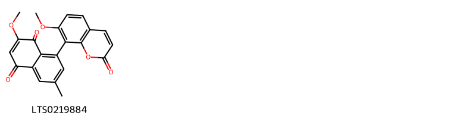{ width=100% }
    <figcaption>Hình ảnh cấu trúc hóa học của 1 hoạt chất thuộc nhóm Naphthalenes gồm ['2-methoxy-8-(7-methoxy-2-oxochromen-8-yl)-6-methylnaphthalene-1,4-dione (LTS0219884)'].</figcaption>
</figure>
#### Nhóm Organonitrogen compounds
<figure markdown="span">
    { width=100% }
    <figcaption>Hình ảnh cấu trúc hóa học của 1 hoạt chất thuộc nhóm Organonitrogen compounds gồm ['putrescine (LTS0238763)'].</figcaption>
</figure>
#### Nhóm Organooxygen compounds
<figure markdown="span">
    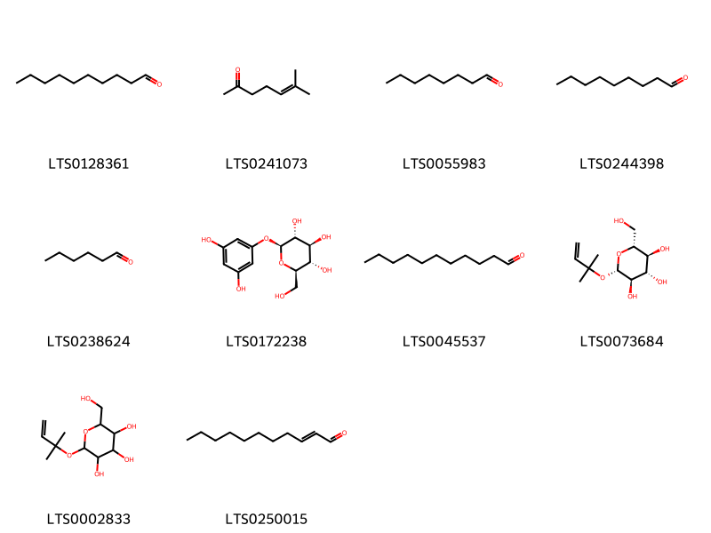{ width=100% }
    <figcaption>Hình ảnh cấu trúc hóa học của 10 hoạt chất thuộc nhóm Organooxygen compounds gồm ['decanal (LTS0128361)', '6-methyl-5-hepten-2-one (LTS0241073)', 'octanal (LTS0055983)', 'nonanal (LTS0244398)', 'hexanal (LTS0238624)', '(2s,3r,4s,5s,6r)-2-(3,5-dihydroxyphenoxy)-6-(hydroxymethyl)oxane-3,4,5-triol (LTS0172238)', 'aldehyde c11 (LTS0045537)', '(2r,3s,4s,5r,6s)-2-(hydroxymethyl)-6-[(2-methylbut-3-en-2-yl)oxy]oxane-3,4,5-triol (LTS0073684)', '2-(hydroxymethyl)-6-[(2-methylbut-3-en-2-yl)oxy]oxane-3,4,5-triol (LTS0002833)', 'undecenal (LTS0250015)'].</figcaption>
</figure>
#### Nhóm Phenols
<figure markdown="span">
    { width=100% }
    <figcaption>Hình ảnh cấu trúc hóa học của 1 hoạt chất thuộc nhóm Phenols gồm ['α-hydroquinone (LTS0063684)'].</figcaption>
</figure>
#### Nhóm Prenol lipids
<figure markdown="span">
    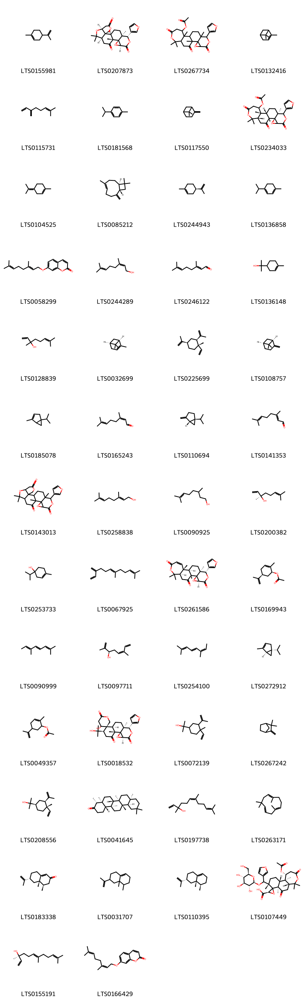{ width=100% }
    <figcaption>Hình ảnh cấu trúc hóa học của 72 hoạt chất thuộc nhóm Prenol lipids gồm ['limonene,  (LTS0155981)', 'limonin (LTS0207873)', '7-(furan-3-yl)-1,8,12,17,17-pentamethyl-5,15,20-trioxo-3,6,16-trioxapentacyclo[9.9.0.0²,⁴.0²,⁸.0¹²,¹⁸]icosan-13-yl acetate (LTS0267734)', 'α pinene (LTS0132416)', 'α-myrcene (LTS0115731)', 'cymene (LTS0181568)', 'β-pinene (LTS0117550)', '(1r,2r,8s,11s,12r,18s)-7-(furan-3-yl)-1,8,12,17,17-pentamethyl-5,15,20-trioxo-3,6,16-trioxapentacyclo[9.9.0.0²,⁴.0²,⁸.0¹²,¹⁸]icosan-13-yl acetate (LTS0234033)', 'terpinolene (LTS0104525)', 'caryophyllene (LTS0085212)', 'α-limonene (LTS0244943)', 'terpinene (LTS0136858)', 'auraptene (LTS0058299)', 'nerol (LTS0244289)', 'α-citral (LTS0246122)', 'terpineol (LTS0136148)', 'linalool, (+-)- (LTS0128839)', '(-)-α-pinene (LTS0032699)', 'β-elemene (LTS0225699)', '(-)-β-pinene (LTS0108757)', 'α-thujene (LTS0185078)', 'neral (LTS0165243)', '(+)-sabinene (LTS0110694)', '3,7-dimethyl-2,6-octadienal (LTS0141353)', 'limonin (LTS0143013)', 'geraniol (LTS0258838)', 'citronellol, (+-)- (LTS0090925)', '(-)-linalool (LTS0200382)', '4-terpineol (LTS0253733)', 'β-farnesene (LTS0067925)', 'obacunone (LTS0261586)', '(1s,5s)-carvyl acetate (LTS0169943)', 'allo-ocimene (LTS0090999)', '(3r,5z)-2,6-dimethylocta-1,5,7-trien-3-ol (LTS0097711)', '(4e,6z)-alloocimene (LTS0254100)', '(+)-α-thujene (LTS0272912)', 'carvyl acetate (LTS0049357)', 'ichangin (LTS0018532)', '2-[4-ethenyl-4-methyl-3-(prop-1-en-2-yl)cyclohexyl]propan-2-ol (LTS0072139)', 'camphene (LTS0267242)', 'elemol (LTS0208556)', '(-)-friedelin (LTS0041645)', 'nerolidol (LTS0197738)', 'humulene (LTS0263171)', 'nootkatone (LTS0183338)', 'valencene (LTS0031707)', 'valencene (LTS0110395)', "(1r,3'r,5ar,7ar,9s,11ar,11br)-1-(acetyloxy)-9-[furan-3-yl({[(2r,3r,4s,5s,6r)-3,4,5-trihydroxy-6-(hydroxymethyl)oxan-2-yl]oxy})methyl]-5,5,7a,9,11b-pentamethyl-3,7-dioxo-hexahydro-1h-spiro[naphtho[2,1-c]oxepine-8,2'-oxirane]-3'-carboxylic acid (LTS0107449)", 'nerolidol (LTS0155191)', '7-[(3,7-dimethylocta-2,6-dien-1-yl)oxy]chromen-2-one (LTS0166429)', 'α-curcumene (LTS0019880)', '3,7-dimethyl-2,6-octadien-1-ol (LTS0215566)', '4-isopropyl-1,6-dimethyl-2,3,4,4a,7,8-hexahydronaphthalene (LTS0270743)', 'delta-cadinene (LTS0019321)', '(+)-delta(3)-carene (LTS0250199)', 'α-copaene (LTS0207598)', 'nootkatone (LTS0027125)', '(1r,2s,7s,8s)-8-isopropyl-1,3-dimethyltricyclo[4.4.0.0²,⁷]dec-3-ene (LTS0190031)', '(3r,6e)-nerolidol (LTS0145065)', '4-isopropyl-1,6-dimethyl-3,4,4a,7,8,8a-hexahydronaphthalene (LTS0154650)', 'phytofluene (LTS0181914)', '(4e,8e)-4,8,11,11-tetramethylcycloundeca-1,4,8-triene (LTS0118116)', 'β-copaene (LTS0255787)', 'α-muurolene (LTS0022607)', 'zeta-carotene (LTS0007334)', "(1r,3'r,5ar,7ar,9s,11ar,11br)-1-(acetyloxy)-9-[furan-3-yl({[(2r,3r,4s,5s,6s)-3,4,5-trihydroxy-6-methoxyoxan-2-yl]oxy})methyl]-5,5,7a,9,11b-pentamethyl-3,7-dioxo-hexahydro-1h-spiro[naphtho[2,1-c]oxepine-8,2'-oxirane]-3'-carboxylic acid (LTS0268454)", 'perillaldehyde,  (LTS0028488)', "(2s,3's,4ar,5r,6r,8ar)-5-[(1r)-1-(acetyloxy)-2-carboxyethyl]-2-[furan-3-yl({[(2r,3r,4s,5s,6s)-3,4,5-trihydroxy-6-methoxyoxan-2-yl]oxy})methyl]-6-(2-hydroxypropan-2-yl)-2,5,8a-trimethyl-8-oxo-tetrahydro-3h-spiro[naphthalene-1,2'-oxirane]-3'-carboxylic acid (LTS0108161)", 'p-menth-1-en-9-ol (LTS0156989)', 'zeta-carotene (LTS0218266)', 'polyprenol (LTS0209244)', '(10e,12e,14e)-2,6,10,14,19,23,27,31-octamethyldotriaconta-2,6,10,12,14,16,18,22,26,30-decaene (LTS0022128)'].</figcaption>
</figure>
#### Nhóm Quinolines and derivatives
<figure markdown="span">
    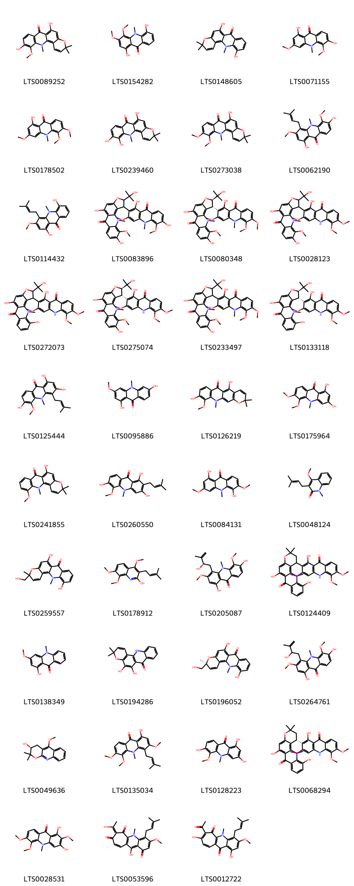{ width=100% }
    <figcaption>Hình ảnh cấu trúc hóa học của 39 hoạt chất thuộc nhóm Quinolines and derivatives gồm ['7,11-dihydroxy-6-methoxy-2,2,5-trimethyl-1-oxa-5-azatetraphen-10-one (LTS0089252)', '1,5-dihydroxy-3,4-dimethoxy-10-methylacridin-9-one (LTS0154282)', '5-hydroxynoracronycine (LTS0148605)', '1,6-dihydroxy-3,5-dimethoxy-10-methylacridin-9-one (LTS0071155)', '1-hydroxy-3,5,6-trimethoxy-10-methylacridin-9-one (LTS0178502)', '6,7,11-trihydroxy-2,2,5-trimethyl-1-oxa-5-azatetraphen-10-one (LTS0239460)', '11-hydroxy-6,7-dimethoxy-2,2,5-trimethyl-1-oxa-5-azatetraphen-10-one (LTS0273038)', '1,6-dihydroxy-3,5-dimethoxy-10-methyl-4-(3-methylbut-2-en-1-yl)acridin-9-one (LTS0062190)', '1,5-dihydroxy-3-methoxy-10-methyl-4-(3-methylbut-2-en-1-yl)acridin-9-one (LTS0114432)', '2-[5,9-dihydroxy-2-(2-hydroxypropan-2-yl)-10-methoxy-11-methyl-6-oxo-1h,2h-furo[2,3-c]acridin-1-yl]-1,6-dihydroxy-3,5-dimethoxy-10-methylacridin-9-one (LTS0083896)', '2-[(1s,2r)-5,9-dihydroxy-2-(2-hydroxypropan-2-yl)-10-methoxy-11-methyl-6-oxo-1h,2h-furo[2,3-c]acridin-1-yl]-1-hydroxy-3,5,6-trimethoxy-10-methylacridin-9-one (LTS0080348)', '2-[5,9-dihydroxy-2-(2-hydroxypropan-2-yl)-10-methoxy-11-methyl-6-oxo-1h,2h-furo[2,3-c]acridin-1-yl]-1-hydroxy-3,5,6-trimethoxy-10h-acridin-9-one (LTS0028123)', '2-[5,10-dihydroxy-2-(2-hydroxypropan-2-yl)-11-methyl-6-oxo-1h,2h-furo[2,3-c]acridin-1-yl]-1-hydroxy-3,5,6-trimethoxy-10h-acridin-9-one (LTS0272073)', '2-[(1s,2r)-5,9-dihydroxy-2-(2-hydroxypropan-2-yl)-10-methoxy-11-methyl-6-oxo-1h,2h-furo[2,3-c]acridin-1-yl]-1-hydroxy-3,5,6-trimethoxy-10h-acridin-9-one (LTS0275074)', '2-[5,9-dihydroxy-2-(2-hydroxypropan-2-yl)-10-methoxy-11-methyl-6-oxo-1h,2h-furo[2,3-c]acridin-1-yl]-1-hydroxy-3,5,6-trimethoxy-10-methylacridin-9-one (LTS0233497)', '2-[(1s,2r)-5,10-dihydroxy-2-(2-hydroxypropan-2-yl)-11-methyl-6-oxo-1h,2h-furo[2,3-c]acridin-1-yl]-1-hydroxy-3,5,6-trimethoxy-10h-acridin-9-one (LTS0133118)', '1,3,6-trihydroxy-5-methoxy-10-methyl-4-(3-methylbut-2-en-1-yl)acridin-9-one (LTS0125444)', '1,6-dihydroxy-3-methoxy-10-methylacridin-9-one (LTS0095886)', '5,9-dihydroxy-10-methoxy-2,2,11-trimethyl-1-oxa-11-azatetracen-6-one (LTS0126219)', '1,3-dihydroxy-5,6-dimethoxy-10-methylacridin-9-one (LTS0175964)', '11-hydroxy-6-methoxy-2,2,5-trimethyl-1-oxa-5-azatetraphen-10-one (LTS0241855)', 'buntanine (LTS0260550)', '1,5-dihydroxy-3,6-dimethoxy-10-methylacridin-9-one (LTS0084131)', '4-methoxy-1-methyl-3-(3-methylbut-2-en-1-yl)quinolin-2-one (LTS0048124)', '6,11-dihydroxy-2-(hydroxymethyl)-2,5-dimethyl-1-oxa-5-azatetraphen-10-one (LTS0259557)', '4,7,8-trimethoxy-3-(3-methylbut-2-en-1-yl)quinolin-2-ol (LTS0178912)', '1,6-dihydroxy-4-[(2r)-2-hydroxy-3-methylbut-3-en-1-yl]-3,5-dimethoxy-10-methylacridin-9-one (LTS0205087)', '6,11-dihydroxy-4-(1-hydroxy-3,5,6-trimethoxy-9-oxo-10h-acridin-2-yl)-2,2,5-trimethyl-3,4-dihydro-1-oxa-5-azatetraphen-10-one (LTS0124409)', '1-hydroxy-3-methoxy-10-methylacridin-9-one (LTS0138349)', '11,12-dihydroxy-2,2-dimethyl-5h-1-oxa-5-azatetraphen-10-one (LTS0194286)', '(2s)-6,11-dihydroxy-2-(hydroxymethyl)-2,5-dimethyl-1-oxa-5-azatetraphen-10-one (LTS0196052)', '1,6-dihydroxy-4-(2-hydroxy-3-methylbut-3-en-1-yl)-3,5-dimethoxy-10-methylacridin-9-one (LTS0264761)', '(3s)-5-methoxy-2,2-dimethyl-3h,4h-pyrano[2,3-b]quinolin-3-ol (LTS0049636)', '1-hydroxy-3,5,6-trimethoxy-10-methyl-4-(3-methylbut-2-en-1-yl)acridin-9-one (LTS0135034)', '1,3,6-trihydroxy-5-methoxy-10-methylacridin-9-one (LTS0128223)', '(4s)-6,11-dihydroxy-4-(1-hydroxy-3,5,6-trimethoxy-9-oxo-10h-acridin-2-yl)-2,2,5-trimethyl-3,4-dihydro-1-oxa-5-azatetraphen-10-one (LTS0068294)', '1,3-dihydroxy-2,5,6-trimethoxy-10-methylacridin-9-one (LTS0028531)', '11-hydroxy-7-(1-hydroxyethylidene)-3-methoxy-5-methyl-4-(3-methylbut-2-en-1-yl)cyclohepta[b]quinoline-1,6,8-trione (LTS0053596)', '7-acetyl-1,8-dihydroxy-3-methoxy-5-methyl-4-(3-methylbut-2-en-1-yl)cyclohepta[b]quinoline-6,11-dione (LTS0012722)'].</figcaption>
</figure>
#### Nhóm Saturated hydrocarbons
<figure markdown="span">
    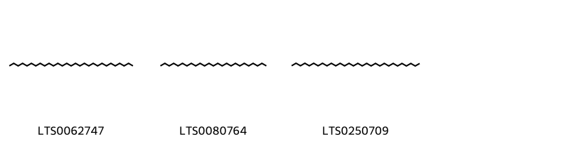{ width=100% }
    <figcaption>Hình ảnh cấu trúc hóa học của 3 hoạt chất thuộc nhóm Saturated hydrocarbons gồm ['nonacosane (LTS0062747)', 'pentacosane (LTS0080764)', 'triacontane (LTS0250709)'].</figcaption>
</figure>
#### Nhóm Steroids and steroid derivatives
<figure markdown="span">
    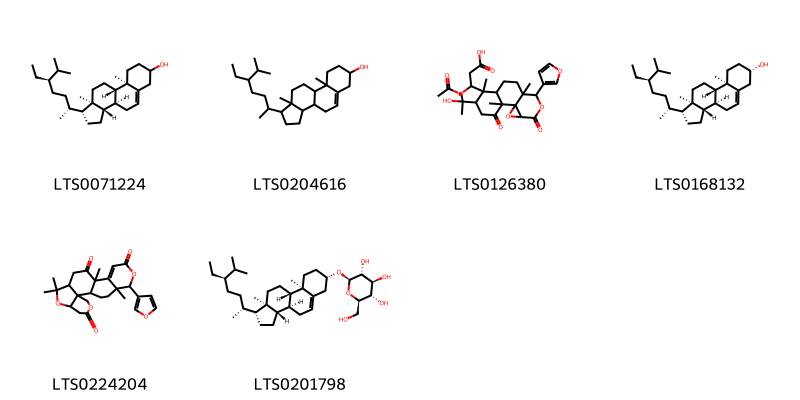{ width=100% }
    <figcaption>Hình ảnh cấu trúc hóa học của 6 hoạt chất thuộc nhóm Steroids and steroid derivatives gồm ['stigmast-5-en-3-ol (LTS0071224)', 'stigmast-5-en-3-ol, (3β)- (LTS0204616)', '3-(acetyloxy)-3-[11-(furan-3-yl)-5-(2-hydroxypropan-2-yl)-2,6,10-trimethyl-3,13-dioxo-12,15-dioxatetracyclo[8.5.0.0¹,¹⁴.0²,⁷]pentadecan-6-yl]propanoic acid (LTS0126380)', 'sitosterol (LTS0168132)', '18-(furan-3-yl)-9,9,13,19-tetramethyl-4,8,17-trioxapentacyclo[11.8.0.0²,⁷.0²,¹⁰.0¹⁴,¹⁹]henicos-14-ene-5,12,16-trione (LTS0224204)', 'sitogluside (LTS0201798)'].</figcaption>
</figure>
#### Nhóm Unsaturated hydrocarbons
<figure markdown="span">
    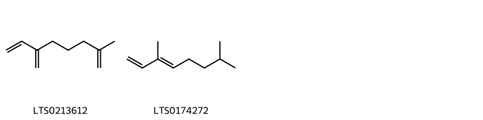{ width=100% }
    <figcaption>Hình ảnh cấu trúc hóa học của 2 hoạt chất thuộc nhóm Unsaturated hydrocarbons gồm ['2-methyl-6-methylideneocta-1,7-diene (LTS0213612)', '(3e)-3,7-dimethylocta-1,3-diene (LTS0174272)'].</figcaption>
</figure>

---

### Dược dân tộc học

Danh sách các quốc gia có sử dụng *Citrus maxima* trong điều trị các bệnh. 

| Country   | Disease     | Bệnh          |
|:----------|:------------|:--------------|
| Elsewhere | Refrigerant | Chất làm lạnh |

---

---
## Citrus medica
### Thông tin về thực vật

!!! info "Phân loại thực vật của *Citrus medica* từ GIBF:"
    - **Kingdom:** Plantae
    - **Phylum:** Tracheophyta
    - **Order:** Sapindales
    - **Family:** Rutaceae
    - **Genus:** Citrus
    - **Species:** *Citrus medica*

 

| Label (VI)   | Label (EN)   | Scientific Name   | Descriptions (VI)   | Descriptions (EN)       | Also Known As (VI)                                                     | Also Known As (EN)   |
|:-------------|:-------------|:------------------|:--------------------|:------------------------|:-----------------------------------------------------------------------|:---------------------|
| N/A          | N/A          | Citrus medica     | loài thực vật       | species of citrus plant | ['Citrus medica ssp. bajoura', 'Citrus medica', 'Citrus limonimedica'] | ['citron']           |

#### Phân bố trên thế giới

**Từ CSDL GIBF** nan, Sri Lanka, Italy, Australia, Japan, Belgium, Estonia, Benin, Norway, French Guiana, Pakistan, Réunion, Senegal, Nigeria, Spain, Portugal, Algeria, Bangladesh, Morocco, United States of America, Congo, Democratic Republic of the, Guinea, El Salvador, South Africa, Hong Kong, Brazil, Guyana, Bhutan, Peru, Mexico, France, Mayotte, Viet Nam, China, Ecuador, French Polynesia, Colombia, Costa Rica, India, Indonesia, Philippines, Cameroon, New Zealand, Nepal

#### Phân bố tại Việt Nam

**Từ CSDL GIBF**: Lang Son

---
### Thành phần hóa học
        
- Theo cơ sở dữ liệu lotus: Từ loài *Citrus medica* đã phân lập và xác định được 239 hoạt chất thuộc về các nhóm Fatty Acyls, Flavonoids, Prenol lipids, Steroids and steroid derivatives, Peptidomimetics, Cinnamic acids and derivatives, Benzene and substituted derivatives, Unsaturated hydrocarbons, Naphthofurans, Organooxygen compounds, Saccharolipids, Phenols, Coumarins and derivatives, Naphthopyrans, Furanoid lignans, Carboxylic acids and derivatives. 

|    | chemicalTaxonomyClassyfireClass     |   smiles_count |
|---:|:------------------------------------|---------------:|
|  0 | Benzene and substituted derivatives |              4 |
|  1 | Carboxylic acids and derivatives    |              6 |
|  2 | Cinnamic acids and derivatives      |              8 |
|  3 | Coumarins and derivatives           |             31 |
|  4 | Fatty Acyls                         |              4 |
|  5 | Flavonoids                          |             73 |
|  6 | Furanoid lignans                    |              2 |
|  7 | Naphthofurans                       |              1 |
|  8 | Naphthopyrans                       |              2 |
|  9 | Organooxygen compounds              |              4 |
| 10 | Peptidomimetics                     |              2 |
| 11 | Phenols                             |              1 |
| 12 | Prenol lipids                       |             71 |
| 13 | Saccharolipids                      |              1 |
| 14 | Steroids and steroid derivatives    |             26 |
| 15 | Unsaturated hydrocarbons            |              1 |

#### Nhóm Benzene and substituted derivatives
<figure markdown="span">
    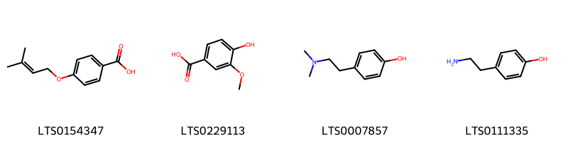{ width=100% }
    <figcaption>Hình ảnh cấu trúc hóa học của 4 hoạt chất thuộc nhóm Benzene and substituted derivatives gồm ['4-[(3-methylbut-2-en-1-yl)oxy]benzoic acid (LTS0154347)', 'vanillic acid (LTS0229113)', 'hordenine (LTS0007857)', 'tyramine (LTS0111335)'].</figcaption>
</figure>
#### Nhóm Carboxylic acids and derivatives
<figure markdown="span">
    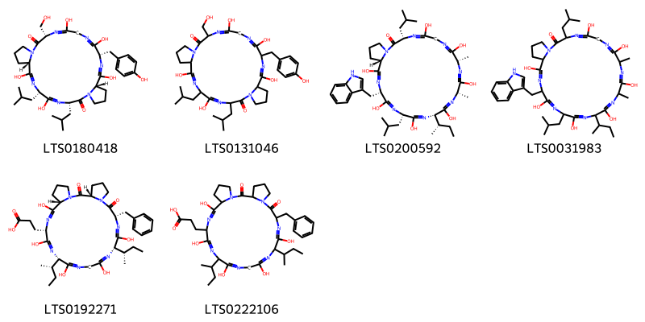{ width=100% }
    <figcaption>Hình ảnh cấu trúc hóa học của 6 hoạt chất thuộc nhóm Carboxylic acids and derivatives gồm ['(3s,6s,9s,15s,21s,24s)-5,8,17,20,23-pentahydroxy-15-(hydroxymethyl)-21-[(4-hydroxyphenyl)methyl]-3,6-bis(2-methylpropyl)-1,4,7,13,16,19,22-heptaazatricyclo[22.3.0.0⁹,¹³]heptacosa-4,7,16,19,22-pentaene-2,14-dione (LTS0180418)', '5,8,17,20,23-pentahydroxy-15-(hydroxymethyl)-21-[(4-hydroxyphenyl)methyl]-3,6-bis(2-methylpropyl)-1,4,7,13,16,19,22-heptaazatricyclo[22.3.0.0⁹,¹³]heptacosa-4,7,16,19,22-pentaene-2,14-dione (LTS0131046)', '(3s,6s,9s,12s,15s,21s,26as)-9-[(2s)-butan-2-yl]-1,4,7,10,13,16,19-heptahydroxy-3-(1h-indol-3-ylmethyl)-12,15-dimethyl-6,21-bis(2-methylpropyl)-3h,6h,9h,12h,15h,18h,21h,24h,25h,26h,26ah-pyrrolo[1,2-a]1,4,7,10,13,16,19,22-octaazacyclotetracosan-22-one (LTS0200592)', '1,4,7,10,13,16,19-heptahydroxy-3-(1h-indol-3-ylmethyl)-12,15-dimethyl-6,21-bis(2-methylpropyl)-9-(sec-butyl)-3h,6h,9h,12h,15h,18h,21h,24h,25h,26h,26ah-pyrrolo[1,2-a]1,4,7,10,13,16,19,22-octaazacyclotetracosan-22-one (LTS0031983)', '3-[(3s,9s,12s,18s,21s,24s)-9-benzyl-12,18-bis[(2s)-butan-2-yl]-11,14,17,20,23-pentahydroxy-2,8-dioxo-1,7,10,13,16,19,22-heptaazatricyclo[22.3.0.0³,⁷]heptacosa-10,13,16,19,22-pentaen-21-yl]propanoic acid (LTS0192271)', '3-[9-benzyl-11,14,17,20,23-pentahydroxy-2,8-dioxo-12,18-bis(sec-butyl)-1,7,10,13,16,19,22-heptaazatricyclo[22.3.0.0³,⁷]heptacosa-10,13,16,19,22-pentaen-21-yl]propanoic acid (LTS0222106)'].</figcaption>
</figure>
#### Nhóm Cinnamic acids and derivatives
<figure markdown="span">
    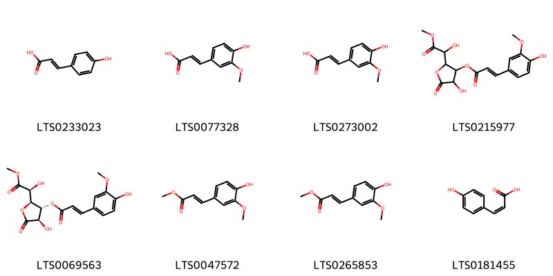{ width=100% }
    <figcaption>Hình ảnh cấu trúc hóa học của 8 hoạt chất thuộc nhóm Cinnamic acids and derivatives gồm ['hydroxycinnamic acid (LTS0233023)', 'ferulic acid (LTS0077328)', 'ferulic acid (LTS0273002)', '4-hydroxy-2-(1-hydroxy-2-methoxy-2-oxoethyl)-5-oxooxolan-3-yl 3-(4-hydroxy-3-methoxyphenyl)prop-2-enoate (LTS0215977)', '(2s,3r,4r)-4-hydroxy-2-[(1s)-1-hydroxy-2-methoxy-2-oxoethyl]-5-oxooxolan-3-yl (2e)-3-(4-hydroxy-3-methoxyphenyl)prop-2-enoate (LTS0069563)', 'methyl ferulate (LTS0047572)', 'methyl ferulate (LTS0265853)', 'cis-p-coumaric acid (LTS0181455)'].</figcaption>
</figure>
#### Nhóm Coumarins and derivatives
<figure markdown="span">
    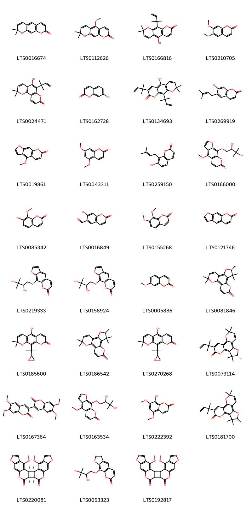{ width=100% }
    <figcaption>Hình ảnh cấu trúc hóa học của 31 hoạt chất thuộc nhóm Coumarins and derivatives gồm ['xanthyletin (LTS0016674)', 'xanthoxyletin (LTS0112626)', 'nor-dentatin (LTS0166816)', 'scoparone (LTS0210705)', '5-hydroxy-2,2-dimethyl-6-(2-methylbut-3-en-2-yl)pyrano[2,3-h]chromen-8-one (LTS0024471)', 'umbelliferone (LTS0162728)', '5-hydroxy-8,8-dimethyl-3,10-bis(2-methylbut-3-en-2-yl)pyrano[3,2-g]chromen-2-one (LTS0134693)', 'demethylsuberosin (LTS0269919)', 'bergapten (LTS0019861)', 'limettin (LTS0043311)', 'osthenol (LTS0259150)', 'byakangelicin (LTS0166000)', '7-hydroxy-8-methoxychromen-2-one (LTS0085342)', '7-hydroxy-2-oxochromene-6-carbaldehyde (LTS0016849)', '7,8-dimethoxychromen-2-one (LTS0155268)', 'psoralen (LTS0121746)', '9-[(2s)-2,3-dihydroxy-3-methylbutoxy]furo[3,2-g]chromen-7-one (LTS0219333)', 'heraclenol (LTS0158924)', 'methylumbelliferone (LTS0005886)', '(4s)-4,5,5,15,15-pentamethyl-3,8,14-trioxatetracyclo[11.4.0.0²,⁶.0⁷,¹²]heptadeca-1,6,10,12,16-pentaen-9-one (LTS0081846)', '5-hydroxy-8,8-dimethyl-10-{2-[(2s)-oxiran-2-yl]propan-2-yl}pyrano[3,2-g]chromen-2-one (LTS0185600)', '4,5,5,15,15-pentamethyl-3,8,14-trioxatetracyclo[11.4.0.0²,⁶.0⁷,¹²]heptadeca-1,6,10,12,16-pentaen-9-one (LTS0186542)', '5-hydroxy-8,8-dimethyl-10-[2-(oxiran-2-yl)propan-2-yl]pyrano[3,2-g]chromen-2-one (LTS0270268)', '(4r)-4,5,5,15,15-pentamethyl-10-(2-methylbut-3-en-2-yl)-3,8,14-trioxatetracyclo[11.4.0.0²,⁶.0⁷,¹²]heptadeca-1,6,10,12,16-pentaen-9-one (LTS0073114)', "6,6',7,7'-tetramethoxy-[3,3'-bichromene]-2,2'-dione (LTS0167364)", '9-(2,3-dihydroxy-3-methylbutoxy)-4-methoxyfuro[3,2-g]chromen-7-one (LTS0163534)', 'leptodactylone (LTS0222392)', '4,5,5,15,15-pentamethyl-10-(2-methylbut-3-en-2-yl)-3,8,14-trioxatetracyclo[11.4.0.0²,⁶.0⁷,¹²]heptadeca-1,6,10,12,16-pentaen-9-one (LTS0181700)', '(1r,2s,14s,15r)-4,25-dimethoxy-8,12,17,21-tetraoxaheptacyclo[13.11.0.0²,¹⁴.0³,¹¹.0⁵,⁹.0¹⁸,²⁶.0²⁰,²⁴]hexacosa-3(11),4,6,9,18(26),19,22,24-octaene-13,16-dione (LTS0220081)', '9-(2,3-dihydroxy-3-methylbutoxy)furo[3,2-g]chromen-7-one (LTS0053323)', '4,25-dimethoxy-8,12,17,21-tetraoxaheptacyclo[13.11.0.0²,¹⁴.0³,¹¹.0⁵,⁹.0¹⁸,²⁶.0²⁰,²⁴]hexacosa-3(11),4,6,9,18(26),19,22,24-octaene-13,16-dione (LTS0192817)'].</figcaption>
</figure>
#### Nhóm Fatty Acyls
<figure markdown="span">
    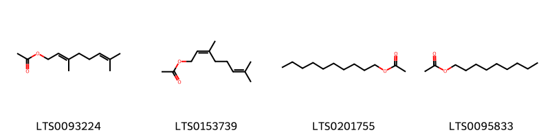{ width=100% }
    <figcaption>Hình ảnh cấu trúc hóa học của 4 hoạt chất thuộc nhóm Fatty Acyls gồm ['geranyl acetate (LTS0093224)', 'neryl acetate (LTS0153739)', 'decyl acetate (LTS0201755)', 'nonyl acetate (LTS0095833)'].</figcaption>
</figure>
#### Nhóm Flavonoids
<figure markdown="span">
    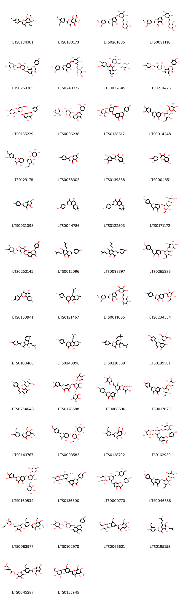{ width=100% }
    <figcaption>Hình ảnh cấu trúc hóa học của 73 hoạt chất thuộc nhóm Flavonoids gồm ['tangeretin (LTS0134301)', 'nobiletin (LTS0100173)', 'hesperidin (LTS0261835)', '(2s)-5-hydroxy-2-(3-hydroxy-4-methoxyphenyl)-7-{[(2s,3r,4s,5s,6r)-3,4,5-trihydroxy-6-({[(2r,3r,4s,5r,6s)-3,4,5-trihydroxy-6-methyloxan-2-yl]oxy}methyl)oxan-2-yl]oxy}-2,3-dihydro-1-benzopyran-4-one (LTS0091118)', 'narirutin (LTS0259265)', 'diosmin (LTS0240372)', '3-rutinosyl quercetin (LTS0032845)', 'eriocitrin (LTS0210425)', 'naringin (LTS0165229)', '(2s)-2-(3,4-dihydroxyphenyl)-5-hydroxy-7-{[(3r,4s,5s,6r)-3,4,5-trihydroxy-6-({[(2s,3r,4r,5r,6s)-3,4,5-trihydroxy-6-methyloxan-2-yl]oxy}methyl)oxan-2-yl]oxy}-2,3-dihydro-1-benzopyran-4-one (LTS0096238)', '(2s)-7-{[(2s,3s,4s,5s,6r)-4,5-dihydroxy-6-(hydroxymethyl)-3-{[(2s,3s,4r,5r,6s)-3,4,5-trihydroxy-6-methyloxan-2-yl]oxy}oxan-2-yl]oxy}-5-hydroxy-2-(4-hydroxyphenyl)-2,3-dihydro-1-benzopyran-4-one (LTS0138617)', '7-{[4,5-dihydroxy-6-(hydroxymethyl)-3-{[(2s)-3,4,5-trihydroxy-6-methyloxan-2-yl]oxy}oxan-2-yl]oxy}-5-hydroxy-2-(3-hydroxy-4-methoxyphenyl)-2,3-dihydro-1-benzopyran-4-one (LTS0014248)', 'neohesperidin (LTS0129178)', 'asahina (LTS0068303)', 'myricetin (LTS0139858)', 'quercetin (LTS0004651)', 'naringenin (LTS0031098)', '(2s)-5-hydroxy-2-(4-hydroxyphenyl)-8,8-dimethyl-2h,3h-pyrano[2,3-f]chromen-4-one (LTS0044786)', 'citflavanone (LTS0122503)', 'poncirin (LTS0171172)', '5-hydroxy-2-(4-hydroxyphenyl)-7-[(3,4,5-trihydroxy-6-{[(3,4,5-trihydroxy-6-methyloxan-2-yl)oxy]methyl}oxan-2-yl)oxy]-2,3-dihydro-1-benzopyran-4-one (LTS0252145)', 'lonchocarpol a (LTS0012096)', '5,7-dihydroxy-2-(4-hydroxyphenyl)-6,8-bis(3-methylbut-2-en-1-yl)-2,3-dihydro-1-benzopyran-4-one (LTS0093397)', '7-{[4,5-dihydroxy-6-(hydroxymethyl)-3-[(3,4,5-trihydroxy-6-methyloxan-2-yl)oxy]oxan-2-yl]oxy}-5-hydroxy-2-(3-hydroxy-4-methoxyphenyl)-2,3-dihydro-1-benzopyran-4-one (LTS0265383)', 'atalantoflavone (LTS0160941)', 'lupinifolin (LTS0121467)', 'hesperidin (LTS0011065)', 'prunin (LTS0234554)', 'cajaflavanone (LTS0108468)', '(2s)-5-hydroxy-2-(4-hydroxyphenyl)-8,8-dimethyl-10-(3-methylbut-2-en-1-yl)-2h,3h-pyrano[3,2-g]chromen-4-one (LTS0248998)', '(2s)-5-hydroxy-2-(4-hydroxyphenyl)-8,8-dimethyl-6-(3-methylbut-2-en-1-yl)-2h,3h-pyrano[2,3-f]chromen-4-one (LTS0210389)', 'vitexin (LTS0199581)', 'vitexin (LTS0254648)', '7-({4,5-dihydroxy-3-[(3,4,5-trihydroxy-6-methyloxan-2-yl)oxy]-6-{[(3,4,5-trihydroxy-6-methyloxan-2-yl)oxy]methyl}oxan-2-yl}oxy)-5-hydroxy-2-(3-hydroxy-4-methoxyphenyl)-2,3-dihydro-1-benzopyran-4-one (LTS0128688)', '7-({4,5-dihydroxy-3-[(3,4,5-trihydroxy-6-methyloxan-2-yl)oxy]-6-{[(3,4,5-trihydroxy-6-methyloxan-2-yl)oxy]methyl}oxan-2-yl}oxy)-5-hydroxy-2-(4-hydroxyphenyl)-2,3-dihydro-1-benzopyran-4-one (LTS0068696)', '(2s)-7-{[(2s,3s,4s,5s,6s)-4,5-dihydroxy-6-(hydroxymethyl)-3-{[(2s,3r,4s,5r,6s)-3,4,5-trihydroxy-6-methyloxan-2-yl]oxy}oxan-2-yl]oxy}-5-hydroxy-2-(4-methoxyphenyl)-2,3-dihydro-1-benzopyran-4-one (LTS0017823)', 'sudachitin (LTS0143767)', '(2s)-7-{[(2s,3s,4s,5s,6s)-4,5-dihydroxy-6-(hydroxymethyl)-3-{[(2s,3r,5r,6s)-3,4,5-trihydroxy-6-methyloxan-2-yl]oxy}oxan-2-yl]oxy}-5-hydroxy-2-(4-methoxyphenyl)-2,3-dihydro-1-benzopyran-4-one (LTS0093583)', '8-methoxycirsilineol (LTS0128792)', '(2r)-7-{[(2s,3r,4s,5s,6r)-4,5-dihydroxy-3-{[(2s,3s,4r,5r,6s)-3,4,5-trihydroxy-6-methyloxan-2-yl]oxy}-6-({[(2r,3s,4r,5r,6r)-3,4,5-trihydroxy-6-methyloxan-2-yl]oxy}methyl)oxan-2-yl]oxy}-5-hydroxy-2-(4-hydroxyphenyl)-2,3-dihydro-1-benzopyran-4-one (LTS0162939)', '(2s)-7-{[(2s,3r,4s,5s,6r)-4,5-dihydroxy-3-{[(2s,3r,4r,5r,6s)-3,4,5-trihydroxy-6-methyloxan-2-yl]oxy}-6-({[(2r,3r,4r,5r,6s)-3,4,5-trihydroxy-6-methyloxan-2-yl]oxy}methyl)oxan-2-yl]oxy}-5-hydroxy-2-(3-hydroxy-4-methoxyphenyl)-2,3-dihydro-1-benzopyran-4-one (LTS0160534)', '(2s)-7-{[(2s,3r,4s,5s,6s)-4,5-dihydroxy-6-(hydroxymethyl)-3-{[(2s,3r,4s,5r,6s)-3,4,5-trihydroxy-6-methyloxan-2-yl]oxy}oxan-2-yl]oxy}-5-hydroxy-2-(4-hydroxyphenyl)-2,3-dihydro-1-benzopyran-4-one (LTS0136300)', '(2s)-7-{[(2s,3r,4s,5s,6r)-4,5-dihydroxy-3-{[(2s,3r,4r,5r,6s)-3,4,5-trihydroxy-6-methyloxan-2-yl]oxy}-6-({[(2r,3r,4r,5r,6s)-3,4,5-trihydroxy-6-methyloxan-2-yl]oxy}methyl)oxan-2-yl]oxy}-5-hydroxy-2-(4-hydroxyphenyl)-2,3-dihydro-1-benzopyran-4-one (LTS0000770)', '7-{[4,5-dihydroxy-6-(hydroxymethyl)-3-[(3,4,5-trihydroxy-6-methyloxan-2-yl)oxy]oxan-2-yl]oxy}-5-hydroxy-2-(4-methoxyphenyl)-2,3-dihydro-1-benzopyran-4-one (LTS0046356)', '{6-[4-(5,7-dihydroxy-6,8-dimethoxy-4-oxochromen-2-yl)-2-methoxyphenoxy]-3,4,5-trihydroxyoxan-2-yl}methyl 4-(formyloxy)-3-hydroxy-3-methylbutanoate (LTS0083977)', '(2s)-5-hydroxy-2-(4-hydroxyphenyl)-7-{[(2s,3r,4s,5s,6r)-3,4,5-trihydroxy-6-({[(2r,3s,4r,5r,6r)-3,4,5-trihydroxy-6-methyloxan-2-yl]oxy}methyl)oxan-2-yl]oxy}-2,3-dihydro-1-benzopyran-4-one (LTS0102970)', '5,7-dihydroxy-6,8-dimethoxy-2-(3-methoxy-4-{[3,4,5-trihydroxy-6-(hydroxymethyl)oxan-2-yl]oxy}phenyl)chromen-4-one (LTS0066621)', '(2s)-5,7-dihydroxy-2-(4-hydroxy-3-methoxyphenyl)-6,8-bis(3-methylbut-2-en-1-yl)-2,3-dihydro-1-benzopyran-4-one (LTS0195158)', '5-({6-[4-(5,7-dihydroxy-4-oxo-2,3-dihydro-1-benzopyran-2-yl)-2-methoxyphenoxy]-3,4,5-trihydroxyoxan-2-yl}methoxy)-3-hydroxy-3-methyl-5-oxopentanoic acid (LTS0045287)', '5,7-dihydroxy-6,8-dimethoxy-2-(3-methoxy-4-{[(2s,3r,4s,5s,6r)-3,4,5-trihydroxy-6-(hydroxymethyl)oxan-2-yl]oxy}phenyl)chromen-4-one (LTS0155945)', '(3s)-5-{[(2r,3s,4s,5r,6s)-6-[4-(5,7-dihydroxy-6,8-dimethoxy-4-oxochromen-2-yl)-2-methoxyphenoxy]-3,4,5-trihydroxyoxan-2-yl]methoxy}-3-hydroxy-3-methyl-5-oxopentanoic acid (LTS0081187)', 'xanthomicrol (LTS0082722)', '(2s)-5-hydroxy-2-(3-hydroxy-4-methoxyphenyl)-7-{[(2s,3r,4s,5s,6s)-3,4,5-trihydroxy-6-({[(2r,3s,4r,5r,6s)-3,4,5-trihydroxy-6-methyloxan-2-yl]oxy}methyl)oxan-2-yl]oxy}-2,3-dihydro-1-benzopyran-4-one (LTS0214031)', '1,5-bis({6-[4-(5,7-dihydroxy-6,8-dimethoxy-4-oxochromen-2-yl)-2-methoxyphenoxy]-3,4,5-trihydroxyoxan-2-yl}methyl) 3-hydroxy-3-methylpentanedioate (LTS0170951)', 'jaceosidin (LTS0259681)', '(3,4,5-trihydroxy-6-{[5-hydroxy-2-(4-hydroxy-3-methoxyphenyl)-6,8-dimethoxy-4-oxochromen-7-yl]oxy}oxan-2-yl)methyl 4-(formyloxy)-3-hydroxy-3-methylbutanoate (LTS0119334)', 'desmethoxysudachitin (LTS0271991)', '(3s)-3-hydroxy-3-methyl-5-oxo-5-{[(2r,3s,4s,5r,6s)-3,4,5-trihydroxy-6-{[5-hydroxy-2-(4-hydroxyphenyl)-6,8-dimethoxy-4-oxochromen-7-yl]oxy}oxan-2-yl]methoxy}pentanoic acid (LTS0268092)', 'hiravanone (LTS0192275)', '(3s)-5-{[(2r,3s,4s,5r,6s)-6-{4-[(2s)-5,7-dihydroxy-4-oxo-2,3-dihydro-1-benzopyran-2-yl]-2-methoxyphenoxy}-3,4,5-trihydroxyoxan-2-yl]methoxy}-3-hydroxy-3-methyl-5-oxopentanoic acid (LTS0260715)', '1-[(2s,3s,4s,5s,6s)-6-[4-(5,7-dihydroxy-6,8-dimethoxy-4-oxochromen-2-yl)-2-methoxyphenoxy]-3,4,5-trihydroxyoxan-2-yl]methyl 5-[(2r,3s,4s,5r,6s)-3,4,5-trihydroxy-6-{[5-hydroxy-2-(4-hydroxy-3-methoxyphenyl)-6,8-dimethoxy-4-oxochromen-7-yl]oxy}oxan-2-yl]methyl (3r)-3-hydroxy-3-methylpentanedioate (LTS0204784)', '(2s)-5-hydroxy-2-(4-hydroxyphenyl)-7-{[(2s,3r,4s,5r,6r)-3,4,5-trihydroxy-6-(hydroxymethyl)oxan-2-yl]oxy}-2,3-dihydro-1-benzopyran-4-one (LTS0211993)', '5-hydroxy-2-(4-hydroxyphenyl)-7-{[3,4,5-trihydroxy-6-(hydroxymethyl)oxan-2-yl]oxy}-2,3-dihydro-1-benzopyran-4-one (LTS0207777)', '3-hydroxy-3-methyl-5-oxo-5-[(3,4,5-trihydroxy-6-{[5-hydroxy-2-(4-hydroxyphenyl)-6,8-dimethoxy-4-oxochromen-7-yl]oxy}oxan-2-yl)methoxy]pentanoic acid (LTS0172485)', '2-(3,4-dihydroxyphenyl)-5-hydroxy-7-[(3,4,5-trihydroxy-6-{[(3,4,5-trihydroxy-6-methyloxan-2-yl)oxy]methyl}oxan-2-yl)oxy]-2,3-dihydro-1-benzopyran-4-one (LTS0267373)', '(3r)-3-hydroxy-3-methyl-5-oxo-5-{[(2r,3s,4s,5r,6s)-3,4,5-trihydroxy-6-{[5-hydroxy-2-(4-hydroxy-3-methoxyphenyl)-6,8-dimethoxy-4-oxochromen-7-yl]oxy}oxan-2-yl]methoxy}pentanoic acid (LTS0130260)', '1-[(2r,3s,4s,5r,6s)-6-[4-(5,7-dihydroxy-6,8-dimethoxy-4-oxochromen-2-yl)-2-methoxyphenoxy]-3,4,5-trihydroxyoxan-2-yl]methyl 5-[(2r,3s,4s,5r,6s)-3,4,5-trihydroxy-6-{[5-hydroxy-2-(4-hydroxy-3-methoxyphenyl)-6,8-dimethoxy-4-oxochromen-7-yl]oxy}oxan-2-yl]methyl (3r)-3-hydroxy-3-methylpentanedioate (LTS0059859)', 'hispidulin (LTS0135598)', '1-{6-[4-(5,7-dihydroxy-6,8-dimethoxy-4-oxochromen-2-yl)-2-methoxyphenoxy]-3,4,5-trihydroxyoxan-2-yl}methyl 5-(3,4,5-trihydroxy-6-{[5-hydroxy-2-(4-hydroxy-3-methoxyphenyl)-6,8-dimethoxy-4-oxochromen-7-yl]oxy}oxan-2-yl)methyl 3-hydroxy-3-methylpentanedioate (LTS0015622)', '5-({6-[4-(5,7-dihydroxy-6,8-dimethoxy-4-oxochromen-2-yl)-2-methoxyphenoxy]-3,4,5-trihydroxyoxan-2-yl}methoxy)-3-hydroxy-3-methyl-5-oxopentanoic acid (LTS0011303)', '3-hydroxy-3-methyl-5-oxo-5-[(3,4,5-trihydroxy-6-{[5-hydroxy-2-(4-hydroxy-3-methoxyphenyl)-6,8-dimethoxy-4-oxochromen-7-yl]oxy}oxan-2-yl)methoxy]pentanoic acid (LTS0020495)', '(2r)-2-(3,4-dihydroxyphenyl)-5-hydroxy-7-{[(2s,3r,4s,5s,6r)-3,4,5-trihydroxy-6-({[(2r,3r,4s,5r,6r)-3,4,5-trihydroxy-6-methyloxan-2-yl]oxy}methyl)oxan-2-yl]oxy}-2,3-dihydro-1-benzopyran-4-one (LTS0268239)', '(2s)-7-{[(2s,3r,4s,5s,6r)-4,5-dihydroxy-6-(hydroxymethyl)-3-{[(2s,3r,4s,5r,6r)-3,4,5-trihydroxy-6-methyloxan-2-yl]oxy}oxan-2-yl]oxy}-5-hydroxy-2-(3-hydroxy-4-methoxyphenyl)-2,3-dihydro-1-benzopyran-4-one (LTS0120745)'].</figcaption>
</figure>
#### Nhóm Furanoid lignans
<figure markdown="span">
    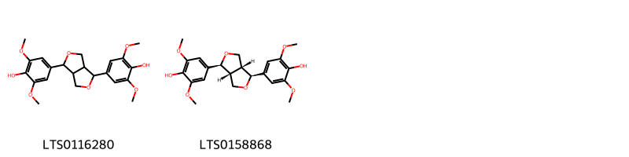{ width=100% }
    <figcaption>Hình ảnh cấu trúc hóa học của 2 hoạt chất thuộc nhóm Furanoid lignans gồm ['syringaresinol (LTS0116280)', '(+)-syringaresinol (LTS0158868)'].</figcaption>
</figure>
#### Nhóm Naphthofurans
<figure markdown="span">
    { width=100% }
    <figcaption>Hình ảnh cấu trúc hóa học của 1 hoạt chất thuộc nhóm Naphthofurans gồm ["9b-(2-carboxy-1-hydroxyethyl)-7-[furan-3-yl(hydroxy)methyl]-3,3,5a,7-tetramethyl-5-oxo-hexahydrospiro[naphtho[1,2-c]furan-6,2'-oxirane]-3'-carboxylic acid (LTS0215959)"].</figcaption>
</figure>
#### Nhóm Naphthopyrans
<figure markdown="span">
    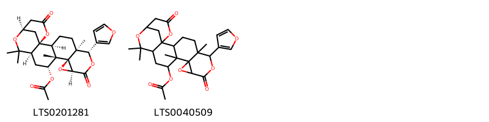{ width=100% }
    <figcaption>Hình ảnh cấu trúc hóa học của 2 hoạt chất thuộc nhóm Naphthopyrans gồm ['(1s,2s,5s,6s,9s,11r,12s,13r,15s,18r)-6-(furan-3-yl)-5,12,16,16-tetramethyl-8,20-dioxo-7,10,17,21-tetraoxahexacyclo[16.3.1.0¹,¹⁵.0²,¹².0⁵,¹¹.0⁹,¹¹]docosan-13-yl acetate (LTS0201281)', '6-(furan-3-yl)-5,12,16,16-tetramethyl-8,20-dioxo-7,10,17,21-tetraoxahexacyclo[16.3.1.0¹,¹⁵.0²,¹².0⁵,¹¹.0⁹,¹¹]docosan-13-yl acetate (LTS0040509)'].</figcaption>
</figure>
#### Nhóm Organooxygen compounds
<figure markdown="span">
    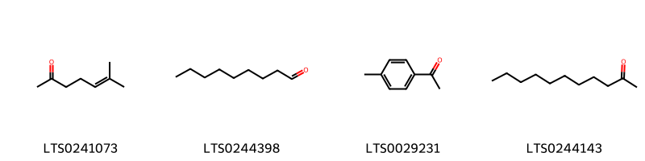{ width=100% }
    <figcaption>Hình ảnh cấu trúc hóa học của 4 hoạt chất thuộc nhóm Organooxygen compounds gồm ['6-methyl-5-hepten-2-one (LTS0241073)', 'nonanal (LTS0244398)', 'p-methylacetophenone (LTS0029231)', 'undecan-2-one (LTS0244143)'].</figcaption>
</figure>
#### Nhóm Peptidomimetics
<figure markdown="span">
    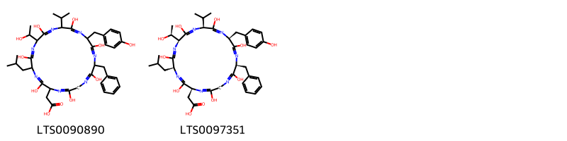{ width=100% }
    <figcaption>Hình ảnh cấu trúc hóa học của 2 hoạt chất thuộc nhóm Peptidomimetics gồm ['[17-benzyl-3,6,9,12,15,18,21-heptahydroxy-8-(1-hydroxyethyl)-14-[(4-hydroxyphenyl)methyl]-11-isopropyl-5-(2-methylpropyl)-1,4,7,10,13,16,19-heptaazacyclohenicosa-1(21),3,6,9,12,15,18-heptaen-2-yl]acetic acid (LTS0090890)', '[(2s,5s,8s,11s,14s,17s)-17-benzyl-3,6,9,12,15,18,21-heptahydroxy-8-[(1s)-1-hydroxyethyl]-14-[(4-hydroxyphenyl)methyl]-11-isopropyl-5-(2-methylpropyl)-1,4,7,10,13,16,19-heptaazacyclohenicosa-1(21),3,6,9,12,15,18-heptaen-2-yl]acetic acid (LTS0097351)'].</figcaption>
</figure>
#### Nhóm Phenols
<figure markdown="span">
    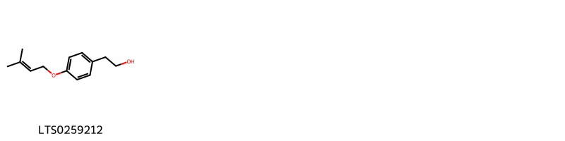{ width=100% }
    <figcaption>Hình ảnh cấu trúc hóa học của 1 hoạt chất thuộc nhóm Phenols gồm ['etrogol (LTS0259212)'].</figcaption>
</figure>
#### Nhóm Prenol lipids
<figure markdown="span">
    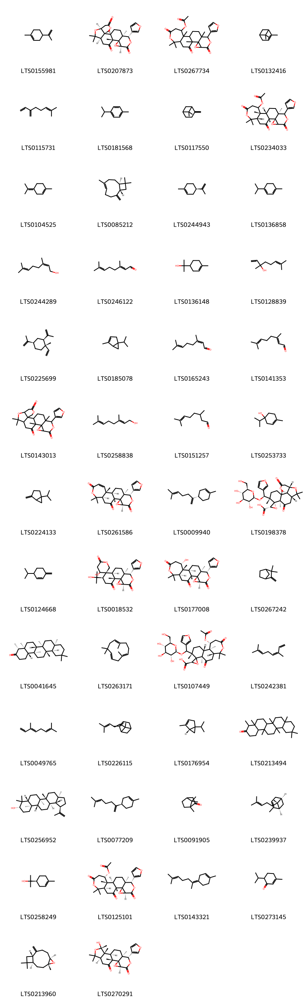{ width=100% }
    <figcaption>Hình ảnh cấu trúc hóa học của 71 hoạt chất thuộc nhóm Prenol lipids gồm ['limonene,  (LTS0155981)', 'limonin (LTS0207873)', '7-(furan-3-yl)-1,8,12,17,17-pentamethyl-5,15,20-trioxo-3,6,16-trioxapentacyclo[9.9.0.0²,⁴.0²,⁸.0¹²,¹⁸]icosan-13-yl acetate (LTS0267734)', 'α pinene (LTS0132416)', 'α-myrcene (LTS0115731)', 'cymene (LTS0181568)', 'β-pinene (LTS0117550)', '(1r,2r,8s,11s,12r,18s)-7-(furan-3-yl)-1,8,12,17,17-pentamethyl-5,15,20-trioxo-3,6,16-trioxapentacyclo[9.9.0.0²,⁴.0²,⁸.0¹²,¹⁸]icosan-13-yl acetate (LTS0234033)', 'terpinolene (LTS0104525)', 'caryophyllene (LTS0085212)', 'α-limonene (LTS0244943)', 'terpinene (LTS0136858)', 'nerol (LTS0244289)', 'α-citral (LTS0246122)', 'terpineol (LTS0136148)', 'linalool, (+-)- (LTS0128839)', 'β-elemene (LTS0225699)', 'α-thujene (LTS0185078)', 'neral (LTS0165243)', '3,7-dimethyl-2,6-octadienal (LTS0141353)', 'limonin (LTS0143013)', 'geraniol (LTS0258838)', 'citronella (LTS0151257)', '4-terpineol (LTS0253733)', 'sabinene (LTS0224133)', 'obacunone (LTS0261586)', '(-)-β-bisabolene (LTS0009940)', 'limonin 17-β-d-glucopyranoside (LTS0198378)', 'β phellandrene (LTS0124668)', 'ichangin (LTS0018532)', '(1r,2r,4s,7s,8s,11r,12r,13s,18r)-7-(furan-3-yl)-13-hydroxy-1,8,12,17,17-pentamethyl-3,6,16-trioxapentacyclo[9.9.0.0²,⁴.0²,⁸.0¹²,¹⁸]icosane-5,15,20-trione (LTS0177008)', 'camphene (LTS0267242)', '(-)-friedelin (LTS0041645)', 'humulene (LTS0263171)', "(1r,3'r,5ar,7ar,9s,11ar,11br)-1-(acetyloxy)-9-[furan-3-yl({[(2r,3r,4s,5s,6r)-3,4,5-trihydroxy-6-(hydroxymethyl)oxan-2-yl]oxy})methyl]-5,5,7a,9,11b-pentamethyl-3,7-dioxo-hexahydro-1h-spiro[naphtho[2,1-c]oxepine-8,2'-oxirane]-3'-carboxylic acid (LTS0107449)", 'β-ocimene (LTS0242381)', 'trans-β-ocimene (LTS0049765)', 'α-bergamotene (LTS0226115)', 'α-thujene (LTS0176954)', 'friedelin (LTS0213494)', 'lupeol (LTS0256952)', '(r)-β-bisabolene (LTS0077209)', 'camphor (LTS0091905)', '(-)-trans-α-bergamotene (LTS0239937)', '(+)-α-terpineol (LTS0258249)', 'nomilin (LTS0125101)', '(z)-γ-bisabolene (LTS0143321)', 'piperitone (LTS0273145)', 'β-caryophyllene oxide (LTS0213960)', '(1r,2r,4s,7s,8s,11r,12r,13s,16r)-7-(furan-3-yl)-13-hydroxy-1,8,12,13,15,15-hexamethyl-3,6,14-trioxapentacyclo[9.7.0.0²,⁴.0²,⁸.0¹²,¹⁶]octadecane-5,18-dione (LTS0270291)', 'caryophyllene oxide (LTS0159789)', 'bisabolene (LTS0109697)', '7-(2-hydroxy-5-oxo-2h-furan-3-yl)-1,8,12,17,17-pentamethyl-3,6,16-trioxapentacyclo[9.9.0.0²,⁴.0²,⁸.0¹²,¹⁸]icos-13-ene-5,15,20-trione (LTS0148979)', '(1s,2r,7s,10r,13r,14r,16s,19s,20s)-19-(furan-3-yl)-9,9,13,20-tetramethyl-4,8,15,18-tetraoxahexacyclo[11.9.0.0²,⁷.0²,¹⁰.0¹⁴,¹⁶.0¹⁴,²⁰]docosane-5,12,17-trione (LTS0254229)', '1,7-dimethyl-7-(4-methylpent-3-en-1-yl)bicyclo[2.2.1]heptan-2-ol (LTS0133882)', 'lupeol (LTS0088634)', '(1s,2s,4r)-limonene-1,2-diol (LTS0093422)', '(6s)-6-(2-hydroxypropan-2-yl)-3-methylcyclohex-2-en-1-one (LTS0092376)', '6-(2-hydroxypropan-2-yl)-3-methylcyclohex-2-en-1-one (LTS0094485)', '(1r,2r,4s,7r,8s,11r,12r,13s,18r)-13-hydroxy-7-[(5r)-5-hydroxy-2-oxo-5h-furan-3-yl]-1,8,12,17,17-pentamethyl-3,6,16-trioxapentacyclo[9.9.0.0²,⁴.0²,⁸.0¹²,¹⁸]icosane-5,15,20-trione (LTS0081954)', '13-hydroxy-7-(5-hydroxy-2-oxo-5h-furan-3-yl)-1,8,12,17,17-pentamethyl-3,6,16-trioxapentacyclo[9.9.0.0²,⁴.0²,⁸.0¹²,¹⁸]icosane-5,15,20-trione (LTS0081795)', '7-(5-hydroxy-2-oxo-5h-furan-3-yl)-1,8,12,17,17-pentamethyl-5,15,20-trioxo-3,6,16-trioxapentacyclo[9.9.0.0²,⁴.0²,⁸.0¹²,¹⁸]icosan-13-yl acetate (LTS0253397)', '(1r,2r,4s,7r,8s,11r,12r,18r)-7-[(5r)-5-hydroxy-2-oxo-5h-furan-3-yl]-1,8,12,17,17-pentamethyl-3,6,16-trioxapentacyclo[9.9.0.0²,⁴.0²,⁸.0¹²,¹⁸]icos-13-ene-5,15,20-trione (LTS0248045)', '[(1r,2r,4s,7s,8s,11r,12r,13s,16r)-7-(furan-3-yl)-1,8,12,15,15-pentamethyl-5,18-dioxo-3,6,14-trioxapentacyclo[9.7.0.0²,⁴.0²,⁸.0¹²,¹⁶]octadecan-13-yl]acetic acid (LTS0197169)', 'limonene-1,2-diol (LTS0269504)', '1-isopropyl-3a,5a,5b,8,8,11a-hexamethyl-hexadecahydrocyclopenta[a]chrysen-9-ol (LTS0190216)', '(1r,2r,4s,7r,8s,11r,12r,13s,18r)-7-[(5s)-5-hydroxy-2-oxo-5h-furan-3-yl]-1,8,12,17,17-pentamethyl-5,15,20-trioxo-3,6,16-trioxapentacyclo[9.9.0.0²,⁴.0²,⁸.0¹²,¹⁸]icosan-13-yl acetate (LTS0069265)', '(1as,4as,7s,7ar,7bs)-1,1,7-trimethyl-4-methylidene-octahydrocyclopropa[e]azulen-7-ol (LTS0073517)', 'β-ionone (LTS0155301)', '(1s,3ar,5ar,5br,7ar,9s,11ar,11br,13as,13bs)-1-isopropyl-3a,5a,5b,8,8,11a-hexamethyl-hexadecahydrocyclopenta[a]chrysen-9-ol (LTS0221009)', '(7ar)-1,1,7-trimethyl-4-methylidene-octahydrocyclopropa[e]azulen-7-ol (LTS0091612)'].</figcaption>
</figure>
#### Nhóm Saccharolipids
<figure markdown="span">
    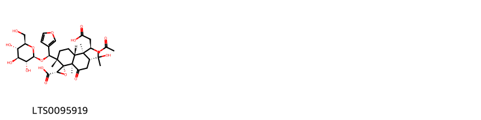{ width=100% }
    <figcaption>Hình ảnh cấu trúc hóa học của 1 hoạt chất thuộc nhóm Saccharolipids gồm ["(1r,2s,3's,4ar,5r,6r,8ar)-5-[(1r)-1-(acetyloxy)-2-carboxyethyl]-2-[(s)-furan-3-yl({[(2r,3r,4s,5s,6r)-3,4,5-trihydroxy-6-(hydroxymethyl)oxan-2-yl]oxy})methyl]-6-(2-hydroxypropan-2-yl)-2,5,8a-trimethyl-8-oxo-tetrahydro-3h-spiro[naphthalene-1,2'-oxirane]-3'-carboxylic acid (LTS0095919)"].</figcaption>
</figure>
#### Nhóm Steroids and steroid derivatives
<figure markdown="span">
    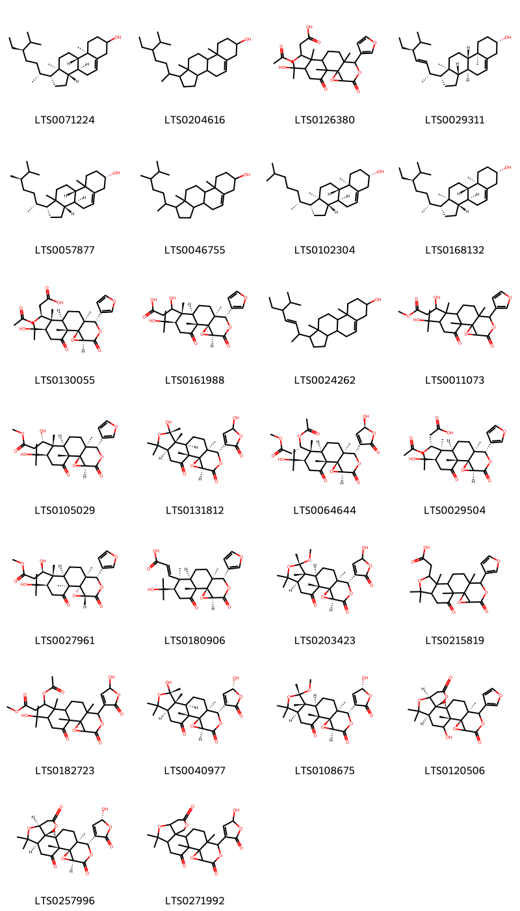{ width=100% }
    <figcaption>Hình ảnh cấu trúc hóa học của 26 hoạt chất thuộc nhóm Steroids and steroid derivatives gồm ['stigmast-5-en-3-ol (LTS0071224)', 'stigmast-5-en-3-ol, (3β)- (LTS0204616)', '3-(acetyloxy)-3-[11-(furan-3-yl)-5-(2-hydroxypropan-2-yl)-2,6,10-trimethyl-3,13-dioxo-12,15-dioxatetracyclo[8.5.0.0¹,¹⁴.0²,⁷]pentadecan-6-yl]propanoic acid (LTS0126380)', 'phytosterol (LTS0029311)', '(1r,3as,3bs,7s,9bs)-1-[(2r,5r)-5,6-dimethylheptan-2-yl]-9a,11a-dimethyl-1h,2h,3h,3ah,3bh,4h,6h,7h,8h,9h,9bh,10h,11h-cyclopenta[a]phenanthren-7-ol (LTS0057877)', 'campesterol (LTS0046755)', 'cholesterol (LTS0102304)', 'sitosterol (LTS0168132)', '(3s)-3-(acetyloxy)-3-[(1r,2r,5r,6r,7r,10s,11s,14s)-11-(furan-3-yl)-5-(2-hydroxypropan-2-yl)-2,6,10-trimethyl-3,13-dioxo-12,15-dioxatetracyclo[8.5.0.0¹,¹⁴.0²,⁷]pentadecan-6-yl]propanoic acid (LTS0130055)', '3-[(1r,2r,5r,6r,7r,10s,11s,14s)-11-(furan-3-yl)-5-(2-hydroxypropan-2-yl)-2,6,10-trimethyl-3,13-dioxo-12,15-dioxatetracyclo[8.5.0.0¹,¹⁴.0²,⁷]pentadecan-6-yl]-3-hydroxypropanoic acid (LTS0161988)', 'stigmasterol (LTS0024262)', 'methyl 3-[11-(furan-3-yl)-5-(2-hydroxypropan-2-yl)-2,6,10-trimethyl-3,13-dioxo-12,15-dioxatetracyclo[8.5.0.0¹,¹⁴.0²,⁷]pentadecan-6-yl]-3-hydroxypropanoate (LTS0011073)', 'methyl (3s)-3-[(1r,2r,5r,6r,7r,10s,11s,14s)-11-(furan-3-yl)-5-(2-hydroxypropan-2-yl)-2,6,10-trimethyl-3,13-dioxo-12,15-dioxatetracyclo[8.5.0.0¹,¹⁴.0²,⁷]pentadecan-6-yl]-3-hydroxypropanoate (LTS0105029)', '(1r,2r,4s,7r,8s,11r,12r,13s,16r)-13-hydroxy-7-(5-hydroxy-2-oxo-5h-furan-3-yl)-1,8,12,13,15,15-hexamethyl-3,6,14-trioxapentacyclo[9.7.0.0²,⁴.0²,⁸.0¹²,¹⁶]octadecane-5,18-dione (LTS0131812)', 'methyl (3s)-3-(acetyloxy)-3-[(1r,2r,5r,6r,7r,10s,11r,14s)-11-[(5s)-5-hydroxy-2-oxo-5h-furan-3-yl]-5-(2-hydroxypropan-2-yl)-2,6,10-trimethyl-3,13-dioxo-12,15-dioxatetracyclo[8.5.0.0¹,¹⁴.0²,⁷]pentadecan-6-yl]propanoate (LTS0064644)', '(3r)-3-(acetyloxy)-3-[(1r,2r,5r,6s,7r,10s,11s,14s)-11-(furan-3-yl)-5-(2-hydroxypropan-2-yl)-2,6,10-trimethyl-3,13-dioxo-12,15-dioxatetracyclo[8.5.0.0¹,¹⁴.0²,⁷]pentadecan-6-yl]propanoic acid (LTS0029504)', 'methyl (3r)-3-[(1s,2s,5r,6r,7r,10s,11s,14r)-11-(furan-3-yl)-5-(2-hydroxypropan-2-yl)-2,6,10-trimethyl-3,13-dioxo-12,15-dioxatetracyclo[8.5.0.0¹,¹⁴.0²,⁷]pentadecan-6-yl]-3-hydroxypropanoate (LTS0027961)', '(2e)-3-[(1r,2r,5r,6s,7r,10s,11s,14s)-11-(furan-3-yl)-5-(2-hydroxypropan-2-yl)-2,6,10-trimethyl-3,13-dioxo-12,15-dioxatetracyclo[8.5.0.0¹,¹⁴.0²,⁷]pentadecan-6-yl]prop-2-enoic acid (LTS0180906)', '(1r,2r,4s,7r,8s,11r,12r,13s,16r)-7-(5-hydroxy-2-oxo-5h-furan-3-yl)-13-methoxy-1,8,12,13,15,15-hexamethyl-3,6,14-trioxapentacyclo[9.7.0.0²,⁴.0²,⁸.0¹²,¹⁶]octadecane-5,18-dione (LTS0203423)', '[7-(furan-3-yl)-1,8,12,15,15-pentamethyl-5,18-dioxo-3,6,14-trioxapentacyclo[9.7.0.0²,⁴.0²,⁸.0¹²,¹⁶]octadecan-13-yl]acetic acid (LTS0215819)', 'methyl 3-(acetyloxy)-3-[11-(5-hydroxy-2-oxo-5h-furan-3-yl)-5-(2-hydroxypropan-2-yl)-2,6,10-trimethyl-3,13-dioxo-12,15-dioxatetracyclo[8.5.0.0¹,¹⁴.0²,⁷]pentadecan-6-yl]propanoate (LTS0182723)', '(1r,2r,4s,7r,8s,11r,12r,13s,16r)-13-hydroxy-7-[(5r)-5-hydroxy-2-oxo-5h-furan-3-yl]-1,8,12,13,15,15-hexamethyl-3,6,14-trioxapentacyclo[9.7.0.0²,⁴.0²,⁸.0¹²,¹⁶]octadecane-5,18-dione (LTS0040977)', '(1r,2r,4s,7r,8s,11r,12r,13s,16r)-7-[(5r)-5-hydroxy-2-oxo-5h-furan-3-yl]-13-methoxy-1,8,12,13,15,15-hexamethyl-3,6,14-trioxapentacyclo[9.7.0.0²,⁴.0²,⁸.0¹²,¹⁶]octadecane-5,18-dione (LTS0108675)', '(1r,2r,7s,10r,13s,14r,20s)-19-(furan-3-yl)-12-hydroxy-9,9,13,20-tetramethyl-4,8,15,18-tetraoxahexacyclo[11.9.0.0²,⁷.0²,¹⁰.0¹⁴,¹⁶.0¹⁴,²⁰]docosane-5,17-dione (LTS0120506)', '(1r,2r,7s,10r,13r,14r,16s,19r,20s)-19-[(5r)-5-hydroxy-2-oxo-5h-furan-3-yl]-9,9,13,20-tetramethyl-4,8,15,18-tetraoxahexacyclo[11.9.0.0²,⁷.0²,¹⁰.0¹⁴,¹⁶.0¹⁴,²⁰]docosane-5,12,17-trione (LTS0257996)', '19-(5-hydroxy-2-oxo-5h-furan-3-yl)-9,9,13,20-tetramethyl-4,8,15,18-tetraoxahexacyclo[11.9.0.0²,⁷.0²,¹⁰.0¹⁴,¹⁶.0¹⁴,²⁰]docosane-5,12,17-trione (LTS0271992)'].</figcaption>
</figure>
#### Nhóm Unsaturated hydrocarbons
<figure markdown="span">
    { width=100% }
    <figcaption>Hình ảnh cấu trúc hóa học của 1 hoạt chất thuộc nhóm Unsaturated hydrocarbons gồm ['α terpinene (LTS0232891)'].</figcaption>
</figure>

---

### Dược dân tộc học

Danh sách các quốc gia có sử dụng *Citrus medica* trong điều trị các bệnh. 

| Country   | Disease                                  | Bệnh                                                     |
|:----------|:-----------------------------------------|:---------------------------------------------------------|
| China     | Expectorant, Stimulant, Stomachic, Tonic | Thuốc long đờm, thuốc kích thích, thuốc dạ dày, thuốc bổ |
| Elsewhere | Astringent                               | Lam se da                                                |
| Iraq      | Refrigerant, Refrigerant                 | Môi chất lạnh, Môi chất lạnh                             |
| Java      | Aperient                                 | Aperient                                                 |
| Kurdistan | Astringent                               | Lam se da                                                |
| ain       | Stimulant                                | Chất kích thích                                          |

---

---
## Citrus nobilis
### Thông tin về thực vật

!!! info "Phân loại thực vật của *N/A* từ GIBF:"
    - **Kingdom:** Plantae
    - **Phylum:** Tracheophyta
    - **Order:** Sapindales
    - **Family:** Rutaceae
    - **Genus:** Citrus
    - **Species:** *N/A*

 

| Label (VI)   | Label (EN)   | Scientific Name   | Descriptions (VI)   | Descriptions (EN)   | Also Known As (VI)   | Also Known As (EN)   |
|:-------------|:-------------|:------------------|:--------------------|:--------------------|:---------------------|:---------------------|
| N/A          | N/A          | Citrus nobilis    |                     | species of plant    | ['']                 | ['']                 |

#### Phân bố trên thế giới

**Từ CSDL GIBF** Sri Lanka, Australia, Georgia, Guatemala, Argentina, Puerto Rico, Korea, Republic of, Chinese Taipei, Spain, Türkiye, Hungary, United States of America, Uruguay, Greece, South Africa, Hong Kong, Thailand, Brazil, Egypt, Switzerland, Mexico, China, Ecuador, Colombia, India, Malaysia, New Zealand, Nepal

#### Phân bố tại Việt Nam

**Từ CSDL GIBF**: Không có ghi nhận ở Việt Nam

---
### Thành phần hóa học
        
- Theo cơ sở dữ liệu lotus: Từ loài *N/A* đã phân lập và xác định được 33 hoạt chất thuộc về các nhóm Flavonoids, Prenol lipids, Linear 1,3-diarylpropanoids, Quinolines and derivatives, Organooxygen compounds, Phenols, Coumarins and derivatives, Benzopyrans. 

|    | chemicalTaxonomyClassyfireClass   |   smiles_count |
|---:|:----------------------------------|---------------:|
|  0 | Benzopyrans                       |              2 |
|  1 | Coumarins and derivatives         |              9 |
|  2 | Flavonoids                        |             11 |
|  3 | Linear 1,3-diarylpropanoids       |              2 |
|  4 | Organooxygen compounds            |              2 |
|  5 | Phenols                           |              1 |
|  6 | Prenol lipids                     |              3 |
|  7 | Quinolines and derivatives        |              3 |

#### Nhóm Benzopyrans
<figure markdown="span">
    { width=100% }
    <figcaption>Hình ảnh cấu trúc hóa học của 2 hoạt chất thuộc nhóm Benzopyrans gồm ['2-hydroxy-7-(1-hydroxyethylidene)-10,15,15-trimethyl-16-oxa-10-azatetracyclo[9.8.0.0³,⁹.0¹²,¹⁷]nonadeca-1,3(9),4,11,13,17-hexaene-6,8,19-trione (LTS0262420)', '7-acetyl-6,19-dihydroxy-10,15,15-trimethyl-16-oxa-10-azatetracyclo[9.8.0.0³,⁹.0¹²,¹⁷]nonadeca-1(19),3(9),4,6,11,13,17-heptaene-2,8-dione (LTS0204895)'].</figcaption>
</figure>
#### Nhóm Coumarins and derivatives
<figure markdown="span">
    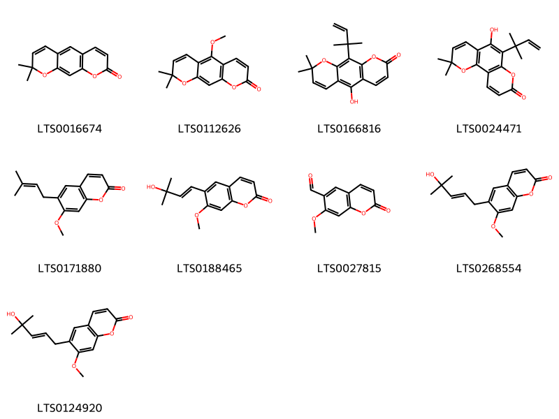{ width=100% }
    <figcaption>Hình ảnh cấu trúc hóa học của 9 hoạt chất thuộc nhóm Coumarins and derivatives gồm ['xanthyletin (LTS0016674)', 'xanthoxyletin (LTS0112626)', 'nor-dentatin (LTS0166816)', '5-hydroxy-2,2-dimethyl-6-(2-methylbut-3-en-2-yl)pyrano[2,3-h]chromen-8-one (LTS0024471)', 'suberosin (LTS0171880)', '6-[(1e)-3-hydroxy-3-methylbut-1-en-1-yl]-7-methoxychromen-2-one (LTS0188465)', '7-methoxy-2-oxochromene-6-carbaldehyde (LTS0027815)', '6-(4-hydroxy-4-methylpent-2-en-1-yl)-7-methoxychromen-2-one (LTS0268554)', '6-[(2e)-4-hydroxy-4-methylpent-2-en-1-yl]-7-methoxychromen-2-one (LTS0124920)'].</figcaption>
</figure>
#### Nhóm Flavonoids
<figure markdown="span">
    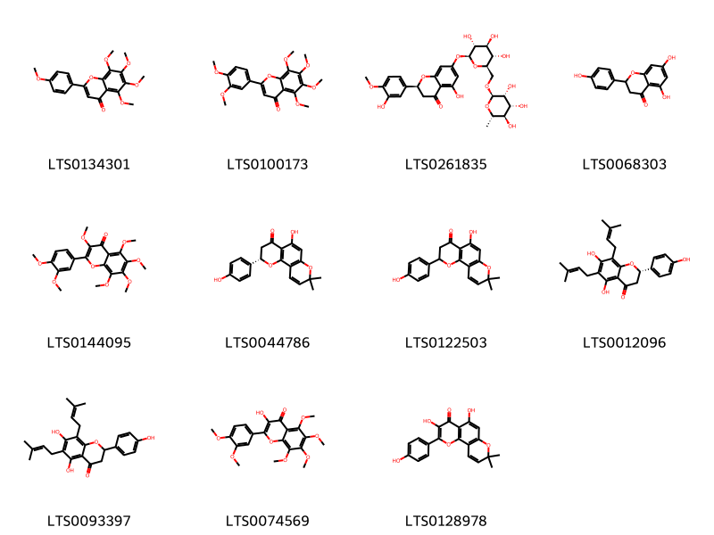{ width=100% }
    <figcaption>Hình ảnh cấu trúc hóa học của 11 hoạt chất thuộc nhóm Flavonoids gồm ['tangeretin (LTS0134301)', 'nobiletin (LTS0100173)', 'hesperidin (LTS0261835)', 'asahina (LTS0068303)', '3-methoxynobiletin (LTS0144095)', '(2s)-5-hydroxy-2-(4-hydroxyphenyl)-8,8-dimethyl-2h,3h-pyrano[2,3-f]chromen-4-one (LTS0044786)', 'citflavanone (LTS0122503)', 'lonchocarpol a (LTS0012096)', '5,7-dihydroxy-2-(4-hydroxyphenyl)-6,8-bis(3-methylbut-2-en-1-yl)-2,3-dihydro-1-benzopyran-4-one (LTS0093397)', 'natsudaidain (LTS0074569)', 'citrusinol (LTS0128978)'].</figcaption>
</figure>
#### Nhóm Linear 1_3-diarylpropanoids
<figure markdown="span">
    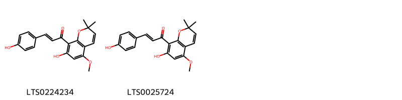{ width=100% }
    <figcaption>Hình ảnh cấu trúc hóa học của Không tìm thấy chú thích hoạt chất thuộc nhóm Linear 1_3-diarylpropanoids gồm Không tìm thấy chú thích.</figcaption>
</figure>
#### Nhóm Organooxygen compounds
<figure markdown="span">
    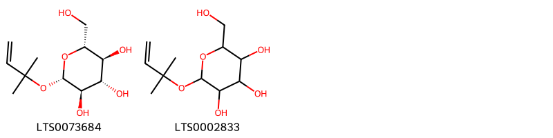{ width=100% }
    <figcaption>Hình ảnh cấu trúc hóa học của 2 hoạt chất thuộc nhóm Organooxygen compounds gồm ['(2r,3s,4s,5r,6s)-2-(hydroxymethyl)-6-[(2-methylbut-3-en-2-yl)oxy]oxane-3,4,5-triol (LTS0073684)', '2-(hydroxymethyl)-6-[(2-methylbut-3-en-2-yl)oxy]oxane-3,4,5-triol (LTS0002833)'].</figcaption>
</figure>
#### Nhóm Phenols
<figure markdown="span">
    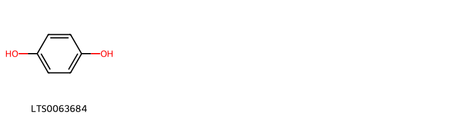{ width=100% }
    <figcaption>Hình ảnh cấu trúc hóa học của 1 hoạt chất thuộc nhóm Phenols gồm ['α-hydroquinone (LTS0063684)'].</figcaption>
</figure>
#### Nhóm Prenol lipids
<figure markdown="span">
    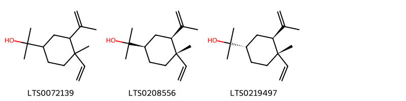{ width=100% }
    <figcaption>Hình ảnh cấu trúc hóa học của 3 hoạt chất thuộc nhóm Prenol lipids gồm ['2-[4-ethenyl-4-methyl-3-(prop-1-en-2-yl)cyclohexyl]propan-2-ol (LTS0072139)', 'elemol (LTS0208556)', '2-[(1s,3s,4s)-4-ethenyl-4-methyl-3-(prop-1-en-2-yl)cyclohexyl]propan-2-ol (LTS0219497)'].</figcaption>
</figure>
#### Nhóm Quinolines and derivatives
<figure markdown="span">
    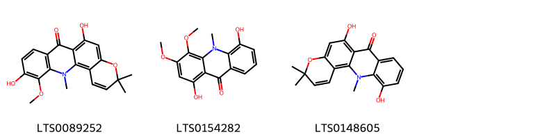{ width=100% }
    <figcaption>Hình ảnh cấu trúc hóa học của 3 hoạt chất thuộc nhóm Quinolines and derivatives gồm ['7,11-dihydroxy-6-methoxy-2,2,5-trimethyl-1-oxa-5-azatetraphen-10-one (LTS0089252)', '1,5-dihydroxy-3,4-dimethoxy-10-methylacridin-9-one (LTS0154282)', '5-hydroxynoracronycine (LTS0148605)'].</figcaption>
</figure>

---

### Dược dân tộc học

Danh sách các quốc gia có sử dụng *N/A* trong điều trị các bệnh. 

| Country   | Disease                                | Bệnh                         |
|:----------|:---------------------------------------|:-----------------------------|
| China     | Analgesic, Antitussive, Antiphlogistic | Giảm đau, Chống ho, Chống ho |

---

---
## Citrus paradisi
### Thông tin về thực vật

!!! info "Phân loại thực vật của *Citrus aurantium* từ GIBF:"
    - **Kingdom:** Plantae
    - **Phylum:** Tracheophyta
    - **Order:** Sapindales
    - **Family:** Rutaceae
    - **Genus:** Citrus
    - **Species:** *Citrus aurantium*

 

| Label (VI)   | Label (EN)   | Scientific Name   | Descriptions (VI)   | Descriptions (EN)     | Also Known As (VI)                                    | Also Known As (EN)       |
|:-------------|:-------------|:------------------|:--------------------|:----------------------|:------------------------------------------------------|:-------------------------|
| N/A          | N/A          | Citrus paradisi   | loài thực vật       | nothospecies of plant | ['Citrus paradisi', 'Citrus × paradisi', 'Bưởi đắng'] | ['the grapefruit plant'] |

#### Phân bố trên thế giới

**Từ CSDL GIBF** nan, Italy, Japan, Cook Islands, Belgium, Guatemala, Argentina, unknown or invalid, Israel, Canada, Puerto Rico, Senegal, Nigeria, Afghanistan, Spain, Bolivia (Plurinational State of), Azerbaijan, Portugal, Russian Federation, United States of America, Congo, Democratic Republic of the, Croatia, Belize, Suriname, Northern Mariana Islands, Brazil, Tonga, Cuba, Mayotte, Mexico, Peru, Dominica, Viet Nam, France, China, Ecuador, Seychelles, Iraq, Colombia, Costa Rica, India, New Zealand, Ethiopia

#### Phân bố tại Việt Nam

**Từ CSDL GIBF**: Bac Trung Bo

---
### Thành phần hóa học
        
- Theo cơ sở dữ liệu lotus: Từ loài *Citrus aurantium* đã phân lập và xác định được 412 hoạt chất thuộc về các nhóm Benzodioxanes, Naphthalenes, Naphthopyrans, Fatty Acyls, Indoles and derivatives, Cinnamic acids and derivatives, Dibenzylbutane lignans, Saccharolipids, Neoflavonoids, Prenol lipids, Quinolines and derivatives, Benzene and substituted derivatives, Dihydrofurans, Organooxygen compounds, Thianes, Furanoid lignans, Cyclobutane lignans, Flavonoids, Steroids and steroid derivatives, Unsaturated hydrocarbons, Lactones, Coumarins and derivatives, Benzopyrans, Imidazopyrimidines. 

|    | chemicalTaxonomyClassyfireClass     |   smiles_count |
|---:|:------------------------------------|---------------:|
|  0 | Benzene and substituted derivatives |             14 |
|  1 | Benzodioxanes                       |              2 |
|  2 | Benzopyrans                         |              1 |
|  3 | Cinnamic acids and derivatives      |             10 |
|  4 | Coumarins and derivatives           |             76 |
|  5 | Cyclobutane lignans                 |              2 |
|  6 | Dibenzylbutane lignans              |              2 |
|  7 | Dihydrofurans                       |              1 |
|  8 | Fatty Acyls                         |              5 |
|  9 | Flavonoids                          |             46 |
| 10 | Furanoid lignans                    |              3 |
| 11 | Imidazopyrimidines                  |              4 |
| 12 | Indoles and derivatives             |              1 |
| 13 | Lactones                            |              1 |
| 14 | Naphthalenes                        |              1 |
| 15 | Naphthopyrans                       |              4 |
| 16 | Neoflavonoids                       |              2 |
| 17 | Organooxygen compounds              |             12 |
| 18 | Prenol lipids                       |            117 |
| 19 | Quinolines and derivatives          |             80 |
| 20 | Saccharolipids                      |              1 |
| 21 | Steroids and steroid derivatives    |             18 |
| 22 | Thianes                             |              2 |
| 23 | Unsaturated hydrocarbons            |              4 |

#### Nhóm Benzene and substituted derivatives
<figure markdown="span">
    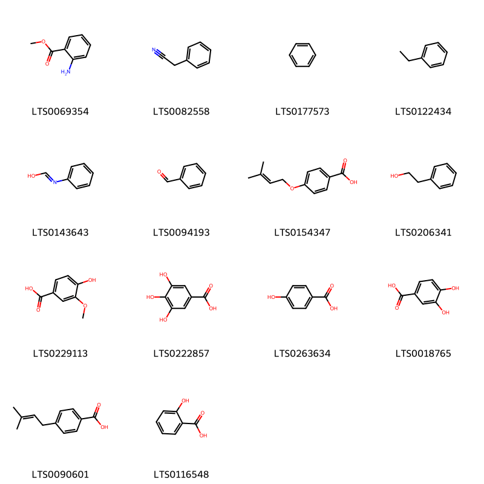{ width=100% }
    <figcaption>Hình ảnh cấu trúc hóa học của 14 hoạt chất thuộc nhóm Benzene and substituted derivatives gồm ['methyl anthranilate (LTS0069354)', 'phenylacetonitrile (LTS0082558)', 'benzene (LTS0177573)', 'ethylbenzene (LTS0122434)', 'n-phenylcarboximidic acid (LTS0143643)', 'benzaldehyde (LTS0094193)', '4-[(3-methylbut-2-en-1-yl)oxy]benzoic acid (LTS0154347)', '2-phenyl-ethanol (LTS0206341)', 'vanillic acid (LTS0229113)', 'galop (LTS0222857)', 'p-hydroxybenzoic acid (LTS0263634)', '3,4-dihydroxybenzoic acid (LTS0018765)', '4-(3-methylbut-2-en-1-yl)benzoic acid (LTS0090601)', 'salicyclic acid (LTS0116548)'].</figcaption>
</figure>
#### Nhóm Benzodioxanes
<figure markdown="span">
    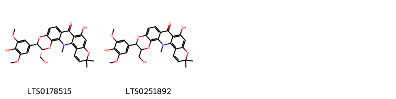{ width=100% }
    <figcaption>Hình ảnh cấu trúc hóa học của 2 hoạt chất thuộc nhóm Benzodioxanes gồm ['(6r,7r)-15-hydroxy-7-(4-hydroxy-3,5-dimethoxyphenyl)-6-(hydroxymethyl)-2,19,19-trimethyl-5,8,18-trioxa-2-azapentacyclo[12.8.0.0³,¹².0⁴,⁹.0¹⁷,²²]docosa-1(22),3,9,11,14,16,20-heptaen-13-one (LTS0178515)', '15-hydroxy-7-(4-hydroxy-3,5-dimethoxyphenyl)-6-(hydroxymethyl)-2,19,19-trimethyl-5,8,18-trioxa-2-azapentacyclo[12.8.0.0³,¹².0⁴,⁹.0¹⁷,²²]docosa-1(22),3,9,11,14,16,20-heptaen-13-one (LTS0251892)'].</figcaption>
</figure>
#### Nhóm Benzopyrans
<figure markdown="span">
    { width=100% }
    <figcaption>Hình ảnh cấu trúc hóa học của 1 hoạt chất thuộc nhóm Benzopyrans gồm ['11-hydroxy-2,2,5-trimethyl-1-oxa-5,7-diazatetraphen-10-one (LTS0250530)'].</figcaption>
</figure>
#### Nhóm Cinnamic acids and derivatives
<figure markdown="span">
    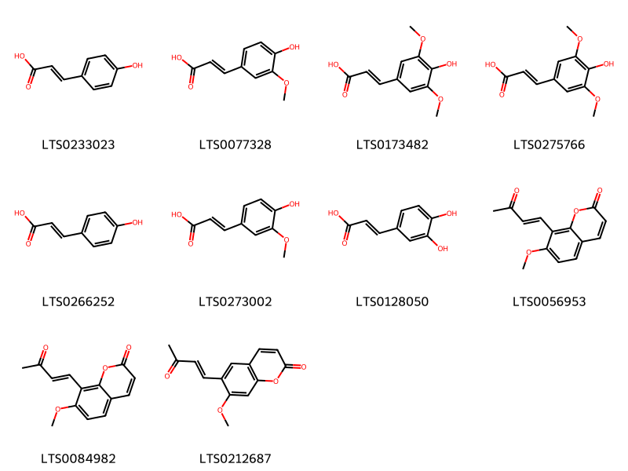{ width=100% }
    <figcaption>Hình ảnh cấu trúc hóa học của 10 hoạt chất thuộc nhóm Cinnamic acids and derivatives gồm ['hydroxycinnamic acid (LTS0233023)', 'ferulic acid (LTS0077328)', 'sinapinate (LTS0173482)', 'sinapoyl alcohol (LTS0275766)', 'para-coumaric acid (LTS0266252)', 'ferulic acid (LTS0273002)', '3,4-dihydroxycinnamic acid (LTS0128050)', '7-methoxy-8-[(1e)-3-oxobut-1-en-1-yl]chromen-2-one (LTS0056953)', '7-methoxy-8-(3-oxobut-1-en-1-yl)chromen-2-one (LTS0084982)', '7-methoxy-6-(3-oxobut-1-en-1-yl)chromen-2-one (LTS0212687)'].</figcaption>
</figure>
#### Nhóm Coumarins and derivatives
<figure markdown="span">
    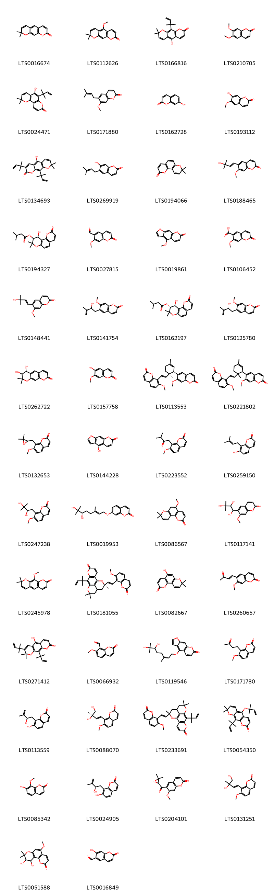{ width=100% }
    <figcaption>Hình ảnh cấu trúc hóa học của 76 hoạt chất thuộc nhóm Coumarins and derivatives gồm ['xanthyletin (LTS0016674)', 'xanthoxyletin (LTS0112626)', 'nor-dentatin (LTS0166816)', 'scoparone (LTS0210705)', '5-hydroxy-2,2-dimethyl-6-(2-methylbut-3-en-2-yl)pyrano[2,3-h]chromen-8-one (LTS0024471)', 'suberosin (LTS0171880)', 'umbelliferone (LTS0162728)', 'scopoletin (LTS0193112)', '5-hydroxy-8,8-dimethyl-3,10-bis(2-methylbut-3-en-2-yl)pyrano[3,2-g]chromen-2-one (LTS0134693)', 'demethylsuberosin (LTS0269919)', 'seselin (LTS0194066)', '6-[(1e)-3-hydroxy-3-methylbut-1-en-1-yl]-7-methoxychromen-2-one (LTS0188465)', '10-hydroxy-8,8-dimethyl-2-oxo-9h,10h-pyrano[2,3-h]chromen-9-yl 3-methylbutanoate (LTS0194327)', '7-methoxy-2-oxochromene-6-carbaldehyde (LTS0027815)', 'bergapten (LTS0019861)', '7-methoxy-2-oxochromene-6-carboxylic acid (LTS0106452)', '6-(3-hydroxy-3-methylbut-1-en-1-yl)-7-methoxychromen-2-one (LTS0148441)', '6-(2-hydroxy-3-methylbut-3-en-1-yl)-7-methoxychromen-2-one (LTS0141754)', '(9r,10s)-10-hydroxy-8,8-dimethyl-2-oxo-9h,10h-pyrano[2,3-h]chromen-9-yl 3-methylbutanoate (LTS0162197)', '6-[(2r)-2-hydroxy-3-methylbut-3-en-1-yl]-7-methoxychromen-2-one (LTS0125780)', '6,7-dihydroxy-8,8-dimethyl-6h,7h-pyrano[3,2-g]chromen-2-one (LTS0262722)', 'isoscopoletin (LTS0157758)', '7-methoxy-6-[(1r,6r)-6-[(1e)-2-(7-methoxy-2-oxochromen-8-yl)ethenyl]-3,6-dimethylcyclohex-2-en-1-yl]chromen-2-one (LTS0113553)', '7-methoxy-6-{6-[2-(7-methoxy-2-oxochromen-8-yl)ethenyl]-3,6-dimethylcyclohex-2-en-1-yl}chromen-2-one (LTS0221802)', '8-[(3,3-dimethyloxiran-2-yl)methyl]-7-methoxychromen-2-one (LTS0132653)', 'bergaptol (LTS0144228)', '7-methoxy-8-(3-methyl-2-oxobutyl)chromen-2-one (LTS0223552)', 'osthenol (LTS0259150)', '8-(2,3-dihydroxy-3-methylbutyl)-7-methoxychromen-2-one (LTS0247238)', '7-{[(2e,6r)-6,7-dihydroxy-3,7-dimethyloct-2-en-1-yl]oxy}chromen-2-one (LTS0019953)', '5-methoxy-8,8-dimethylpyrano[2,3-f]chromen-2-one (LTS0086567)', '7-methoxy-6-(1,2,3-trihydroxy-3-methylbutyl)chromen-2-one (LTS0117141)', 'luvangetin (LTS0245978)', '(13s,15r)-15-[(1e)-2-(7-methoxy-2-oxochromen-8-yl)ethenyl]-11,11,15-trimethyl-8-(2-methylbut-3-en-2-yl)-6,10,16-trioxatetracyclo[7.7.1.0²,⁷.0¹³,¹⁷]heptadeca-1,3,7,9(17)-tetraen-5-one (LTS0181055)', '5-hydroxy-8,8-dimethylpyrano[2,3-f]chromen-2-one (LTS0082667)', '7-methoxy-6-[(1e)-3-oxobut-1-en-1-yl]chromen-2-one (LTS0260657)', 'kinocoumarin (LTS0271412)', '7-methoxy-2-oxochromene-8-carbaldehyde (LTS0066932)', '4-[(6,7-dihydroxy-3,7-dimethyloct-2-en-1-yl)oxy]furo[3,2-g]chromen-7-one (LTS0119546)', '7-methoxy-8-(3-oxobutyl)chromen-2-one (LTS0171780)', '7-hydroxy-8-(2-hydroxy-3-methylbut-3-en-1-yl)chromen-2-one (LTS0113559)', '8-[(1e,3r)-3,4-dihydroxy-3-methylbut-1-en-1-yl]-7-methoxychromen-2-one (LTS0088070)', '15-[2-(7-methoxy-2-oxochromen-8-yl)ethenyl]-11,11,15-trimethyl-8-(2-methylbut-3-en-2-yl)-6,10,16-trioxatetracyclo[7.7.1.0²,⁷.0¹³,¹⁷]heptadeca-1,3,7,9(17)-tetraen-5-one (LTS0233691)', '8,8-dimethyl-10-(2-methylbut-3-en-2-yl)-5-[(2-methylbut-3-en-2-yl)oxy]pyrano[3,2-g]chromen-2-one (LTS0054350)', '7-hydroxy-8-methoxychromen-2-one (LTS0085342)', '7-hydroxy-8-[(2r)-2-hydroxy-3-methylbut-3-en-1-yl]chromen-2-one (LTS0024905)', '6-[(2s)-3,3-dimethyloxirane-2-carbonyl]-7-methoxychromen-2-one (LTS0204101)', '8-(3,4-dihydroxy-3-methylbut-1-en-1-yl)-7-methoxychromen-2-one (LTS0131251)', '9,10-dihydroxy-5-methoxy-8,8-dimethyl-9h,10h-pyrano[2,3-h]chromen-2-one (LTS0051588)', '7-hydroxy-2-oxochromene-6-carbaldehyde (LTS0016849)', '6-(3,3-dimethyloxirane-2-carbonyl)-7-methoxychromen-2-one (LTS0011844)', 'paradisin a (LTS0113692)', '10-{[2,2-dimethyl-7,10-bis(2-methylbut-3-en-2-yl)-8-oxopyrano[3,2-g]chromen-5-yl]oxy}-8,8-dimethyl-3-(2-methylbut-3-en-2-yl)-5-[(2-methylbut-3-en-2-yl)oxy]pyrano[3,2-g]chromen-2-one (LTS0078676)', '5-hydroxy-8,8-dimethyl-3,10-bis(2-methylbut-3-en-2-yl)-7h-pyrano[3,2-g]chromene-2,6-dione (LTS0218839)', '(6s,7r)-6,7-dihydroxy-5-methoxy-8,8-dimethyl-10-(2-methylbut-3-en-2-yl)-6h,7h-pyrano[3,2-g]chromen-2-one (LTS0083358)', '6-[(3,3-dimethyloxiran-2-yl)(hydroxy)methyl]-7-methoxychromen-2-one (LTS0093512)', '(10r)-5,10-dihydroxy-8,8-dimethyl-9h,10h-pyrano[2,3-h]chromen-2-one (LTS0198465)', '(9r,10s)-9,10-dihydroxy-5-methoxy-8,8-dimethyl-9h,10h-pyrano[2,3-h]chromen-2-one (LTS0197345)', '(6s,7r)-6,7-dihydroxy-5-methoxy-8,8-dimethyl-6h,7h-pyrano[3,2-g]chromen-2-one (LTS0151089)', '7-methoxy-6-{6-[(1z)-2-(7-methoxy-2-oxochromen-8-yl)ethenyl]-3,6-dimethylcyclohex-2-en-1-yl}chromen-2-one (LTS0152960)', '(6r,7r)-6,7-dihydroxy-8,8-dimethyl-6h,7h-pyrano[3,2-g]chromen-2-one (LTS0152432)', '6,7-dihydroxy-5-methoxy-8,8-dimethyl-6h,7h-pyrano[3,2-g]chromen-2-one (LTS0100780)', '(6s,7r)-6,7-dihydroxy-8,8-dimethyl-6h,7h-pyrano[3,2-g]chromen-2-one (LTS0228801)', '8-{4-hydroxy-5-methyl-3,6-dioxabicyclo[3.1.0]hexan-2-yl}-7-methoxychromen-2-one (LTS0276010)', '(9s,10s)-9,10-dihydroxy-5-methoxy-8,8-dimethyl-9h,10h-pyrano[2,3-h]chromen-2-one (LTS0252411)', '6,7-dihydroxy-5-methoxy-8,8-dimethyl-10-(2-methylbut-3-en-2-yl)-6h,7h-pyrano[3,2-g]chromen-2-one (LTS0184249)', '(9s,10s)-10-({8,8-dimethyl-2-oxopyrano[2,3-f]chromen-5-yl}oxy)-9-hydroxy-8,8-dimethyl-9h,10h-pyrano[2,3-h]chromen-2-one (LTS0217314)', '5,10-dihydroxy-8,8-dimethyl-9h,10h-pyrano[2,3-h]chromen-2-one (LTS0228288)', '(6s,7s)-6,7-dihydroxy-5-methoxy-8,8-dimethyl-6h,7h-pyrano[3,2-g]chromen-2-one (LTS0141294)', 'angelitriol (LTS0242228)', '10-({8,8-dimethyl-2-oxopyrano[2,3-f]chromen-5-yl}oxy)-9-hydroxy-8,8-dimethyl-9h,10h-pyrano[2,3-h]chromen-2-one (LTS0003375)', '4-{[(2e)-6-{[(6e)-3-hydroxy-2,6-dimethyl-8-({7-oxofuro[3,2-g]chromen-4-yl}oxy)oct-6-en-2-yl]oxy}-3,7-dimethylocta-2,7-dien-1-yl]oxy}furo[3,2-g]chromen-7-one (LTS0097952)', '5,6,7-trihydroxy-8,8-dimethyl-3,10-bis(2-methylbut-3-en-2-yl)-6h,7h-pyrano[3,2-g]chromen-2-one (LTS0074450)', '6-[(r)-[(2s)-3,3-dimethyloxiran-2-yl](hydroxy)methyl]-7-methoxychromen-2-one (LTS0006836)', '8-[(1s,2s,4r,5s)-4-hydroxy-5-methyl-3,6-dioxabicyclo[3.1.0]hexan-2-yl]-7-methoxychromen-2-one (LTS0102601)', '(6s,7r)-5,6,7-trihydroxy-8,8-dimethyl-3,10-bis(2-methylbut-3-en-2-yl)-6h,7h-pyrano[3,2-g]chromen-2-one (LTS0232024)'].</figcaption>
</figure>
#### Nhóm Cyclobutane lignans
<figure markdown="span">
    { width=100% }
    <figcaption>Hình ảnh cấu trúc hóa học của 2 hoạt chất thuộc nhóm Cyclobutane lignans gồm ['8-[2,3-diacetyl-4-(7-methoxy-2-oxochromen-8-yl)cyclobutyl]-7-methoxychromen-2-one (LTS0261353)', '8-[(1s,2r,3s,4r)-2,3-diacetyl-4-(7-methoxy-2-oxochromen-8-yl)cyclobutyl]-7-methoxychromen-2-one (LTS0061374)'].</figcaption>
</figure>
#### Nhóm Dibenzylbutane lignans
<figure markdown="span">
    { width=100% }
    <figcaption>Hình ảnh cấu trúc hóa học của 2 hoạt chất thuộc nhóm Dibenzylbutane lignans gồm ['(2s,3r)-2,3-bis[(4-hydroxy-3-methoxyphenyl)(¹³c)methyl](1-¹³c)butane-1,4-diol (LTS0268699)', 'secoisolariciresinol (LTS0086727)'].</figcaption>
</figure>
#### Nhóm Dihydrofurans
<figure markdown="span">
    { width=100% }
    <figcaption>Hình ảnh cấu trúc hóa học của 1 hoạt chất thuộc nhóm Dihydrofurans gồm ['vitamin c (LTS0022555)'].</figcaption>
</figure>
#### Nhóm Fatty Acyls
<figure markdown="span">
    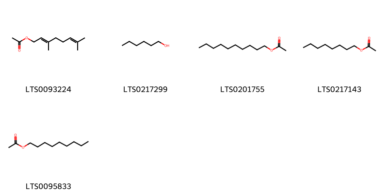{ width=100% }
    <figcaption>Hình ảnh cấu trúc hóa học của 5 hoạt chất thuộc nhóm Fatty Acyls gồm ['geranyl acetate (LTS0093224)', 'hexanol (LTS0217299)', 'decyl acetate (LTS0201755)', 'octyl acetate (LTS0217143)', 'nonyl acetate (LTS0095833)'].</figcaption>
</figure>
#### Nhóm Flavonoids
<figure markdown="span">
    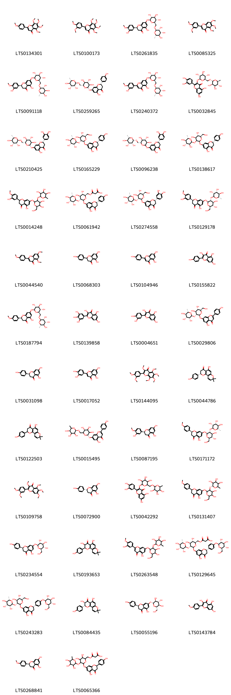{ width=100% }
    <figcaption>Hình ảnh cấu trúc hóa học của 46 hoạt chất thuộc nhóm Flavonoids gồm ['tangeretin (LTS0134301)', 'nobiletin (LTS0100173)', 'hesperidin (LTS0261835)', 'sinensetin (LTS0085325)', '(2s)-5-hydroxy-2-(3-hydroxy-4-methoxyphenyl)-7-{[(2s,3r,4s,5s,6r)-3,4,5-trihydroxy-6-({[(2r,3r,4s,5r,6s)-3,4,5-trihydroxy-6-methyloxan-2-yl]oxy}methyl)oxan-2-yl]oxy}-2,3-dihydro-1-benzopyran-4-one (LTS0091118)', 'narirutin (LTS0259265)', 'diosmin (LTS0240372)', '3-rutinosyl quercetin (LTS0032845)', 'eriocitrin (LTS0210425)', 'naringin (LTS0165229)', '(2s)-2-(3,4-dihydroxyphenyl)-5-hydroxy-7-{[(3r,4s,5s,6r)-3,4,5-trihydroxy-6-({[(2s,3r,4r,5r,6s)-3,4,5-trihydroxy-6-methyloxan-2-yl]oxy}methyl)oxan-2-yl]oxy}-2,3-dihydro-1-benzopyran-4-one (LTS0096238)', '(2s)-7-{[(2s,3s,4s,5s,6r)-4,5-dihydroxy-6-(hydroxymethyl)-3-{[(2s,3s,4r,5r,6s)-3,4,5-trihydroxy-6-methyloxan-2-yl]oxy}oxan-2-yl]oxy}-5-hydroxy-2-(4-hydroxyphenyl)-2,3-dihydro-1-benzopyran-4-one (LTS0138617)', '7-{[4,5-dihydroxy-6-(hydroxymethyl)-3-{[(2s)-3,4,5-trihydroxy-6-methyloxan-2-yl]oxy}oxan-2-yl]oxy}-5-hydroxy-2-(3-hydroxy-4-methoxyphenyl)-2,3-dihydro-1-benzopyran-4-one (LTS0014248)', '3-{[(2r,3s,4s,5r,6s)-3,4-dihydroxy-6-{[(2s)-5-hydroxy-2-(4-hydroxyphenyl)-4-oxo-2,3-dihydro-1-benzopyran-7-yl]oxy}-5-{[(2s,3r,4r,5r,6s)-3,4,5-trihydroxy-6-methyloxan-2-yl]oxy}oxan-2-yl]methoxy}-3-oxopropanoic acid (LTS0061942)', 'neoeriocitrin (LTS0274558)', 'neohesperidin (LTS0129178)', 'apigenin trimethyl ether (LTS0044540)', 'asahina (LTS0068303)', 'chamomile (LTS0104946)', 'kaempherol (LTS0155822)', '(2s)-5-hydroxy-2-(4-methoxyphenyl)-7-{[(2s,3r,4s,5s,6r)-3,4,5-trihydroxy-6-({[(2r,3r,4r,5r,6s)-3,4,5-trihydroxy-6-methyloxan-2-yl]oxy}methyl)oxan-2-yl]oxy}-2,3-dihydro-1-benzopyran-4-one (LTS0187794)', 'myricetin (LTS0139858)', 'quercetin (LTS0004651)', 'rhoifolin (LTS0029806)', 'naringenin (LTS0031098)', 'luteolin (LTS0017052)', '3-methoxynobiletin (LTS0144095)', '(2s)-5-hydroxy-2-(4-hydroxyphenyl)-8,8-dimethyl-2h,3h-pyrano[2,3-f]chromen-4-one (LTS0044786)', 'citflavanone (LTS0122503)', '5-hydroxy-2-(4-hydroxyphenyl)-7-{[(2s,5s)-3,4,5-trihydroxy-6-({[(2r,5r)-3,4,5-trihydroxy-6-methyloxan-2-yl]oxy}methyl)oxan-2-yl]oxy}chromen-4-one (LTS0015495)', 'hesperetin (LTS0087195)', 'poncirin (LTS0171172)', 'hexamethylquercetagetin (LTS0109758)', '(-)-naringenin (LTS0072900)', 'rutin (LTS0042292)', '7-{[4,5-dihydroxy-6-(hydroxymethyl)-3-{[(2r)-3,4,5-trihydroxy-6-methyloxan-2-yl]oxy}oxan-2-yl]oxy}-5-hydroxy-2-(4-methoxyphenyl)-2,3-dihydro-1-benzopyran-4-one (LTS0131407)', 'prunin (LTS0234554)', '3,5-dihydroxy-2-(4-hydroxyphenyl)-8,8-dimethyl-2h,3h-pyrano[2,3-f]chromen-4-one (LTS0193653)', '7-{[4,5-dihydroxy-6-(hydroxymethyl)-3-[(3,4,5-trihydroxy-6-methyloxan-2-yl)oxy]oxan-2-yl]oxy}-5-hydroxy-2-(3-hydroxy-4-methoxyphenyl)chromen-4-one (LTS0263548)', '3-{[(2r,3s,4s,5r,6s)-3,4-dihydroxy-6-{[(2s)-5-hydroxy-4-oxo-2-(4-{[(2s,3r,4s,5s,6r)-3,4,5-trihydroxy-6-(hydroxymethyl)oxan-2-yl]oxy}phenyl)-2,3-dihydro-1-benzopyran-7-yl]oxy}-5-{[(2s,3r,4r,5r,6s)-3,4,5-trihydroxy-6-methyloxan-2-yl]oxy}oxan-2-yl]methoxy}-3-oxopropanoic acid (LTS0129645)', '(2s)-7-{[(2s,3r,4s,5s,6r)-4,5-dihydroxy-6-(hydroxymethyl)-3-{[(2s,3r,4r,5r,6s)-3,4,5-trihydroxy-6-methyloxan-2-yl]oxy}oxan-2-yl]oxy}-5-hydroxy-2-(4-{[(2s,3r,4s,5s,6r)-3,4,5-trihydroxy-6-(hydroxymethyl)oxan-2-yl]oxy}phenyl)-2,3-dihydro-1-benzopyran-4-one (LTS0243283)', '(2r,3r)-3,5-dihydroxy-2-(4-hydroxyphenyl)-8,8-dimethyl-2h,3h-pyrano[2,3-f]chromen-4-one (LTS0084435)', '(2s)-5-hydroxy-2-(4-hydroxyphenyl)-7-{[(2r,3s,4r,5r,6s)-3,4,5-trihydroxy-6-(hydroxymethyl)oxan-2-yl]oxy}-2,3-dihydro-1-benzopyran-4-one (LTS0055196)', 'kaempferide (LTS0143784)', 'isosakuranetin (LTS0268841)', '3-[(3,4-dihydroxy-6-{[5-hydroxy-2-(4-hydroxyphenyl)-4-oxo-2,3-dihydro-1-benzopyran-7-yl]oxy}-5-[(3,4,5-trihydroxy-6-methyloxan-2-yl)oxy]oxan-2-yl)methoxy]-3-oxopropanoic acid (LTS0065366)'].</figcaption>
</figure>
#### Nhóm Furanoid lignans
<figure markdown="span">
    { width=100% }
    <figcaption>Hình ảnh cấu trúc hóa học của 3 hoạt chất thuộc nhóm Furanoid lignans gồm ['matairesinol (LTS0193475)', 'pinoresinol (LTS0057431)', 'lariciresinol (LTS0010950)'].</figcaption>
</figure>
#### Nhóm Imidazopyrimidines
<figure markdown="span">
    { width=100% }
    <figcaption>Hình ảnh cấu trúc hóa học của 4 hoạt chất thuộc nhóm Imidazopyrimidines gồm ['caffeine (LTS0075508)', 'constant-t (LTS0100702)', 'p-xanthine (LTS0149000)', 'thesal (LTS0250246)'].</figcaption>
</figure>
#### Nhóm Indoles and derivatives
<figure markdown="span">
    { width=100% }
    <figcaption>Hình ảnh cấu trúc hóa học của 1 hoạt chất thuộc nhóm Indoles and derivatives gồm ['indole (LTS0185357)'].</figcaption>
</figure>
#### Nhóm Lactones
<figure markdown="span">
    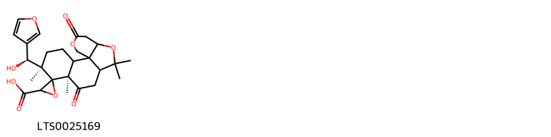{ width=100% }
    <figcaption>Hình ảnh cấu trúc hóa học của 1 hoạt chất thuộc nhóm Lactones gồm ["(5'r,7'r)-5'-[(s)-furan-3-yl(hydroxy)methyl]-5',7',11',11'-tetramethyl-8',15'-dioxo-12',16'-dioxaspiro[oxirane-2,6'-tetracyclo[8.7.0.0¹,¹³.0²,⁷]heptadecane]-3-carboxylic acid (LTS0025169)"].</figcaption>
</figure>
#### Nhóm Naphthalenes
<figure markdown="span">
    { width=100% }
    <figcaption>Hình ảnh cấu trúc hóa học của 1 hoạt chất thuộc nhóm Naphthalenes gồm ['2-methoxy-8-(7-methoxy-2-oxochromen-8-yl)-6-methylnaphthalene-1,4-dione (LTS0219884)'].</figcaption>
</figure>
#### Nhóm Naphthopyrans
<figure markdown="span">
    { width=100% }
    <figcaption>Hình ảnh cấu trúc hóa học của 4 hoạt chất thuộc nhóm Naphthopyrans gồm ['(1s,2s,5s,6s,9s,11r,12s,13r,15s,18r)-6-(furan-3-yl)-5,12,16,16-tetramethyl-8,20-dioxo-7,10,17,21-tetraoxahexacyclo[16.3.1.0¹,¹⁵.0²,¹².0⁵,¹¹.0⁹,¹¹]docosan-13-yl acetate (LTS0201281)', '6-(furan-3-yl)-5,12,16,16-tetramethyl-8,20-dioxo-7,10,17,21-tetraoxahexacyclo[16.3.1.0¹,¹⁵.0²,¹².0⁵,¹¹.0⁹,¹¹]docosan-13-yl acetate (LTS0040509)', '18-(furan-3-yl)-8,8,12,19-tetramethyl-6,16-dioxo-7,14,17-trioxapentacyclo[10.9.0.0²,⁹.0¹³,¹⁵.0¹³,¹⁹]henicosa-1(21),4-dien-11-yl acetate (LTS0068911)', '(2s,4z,9s,11r,12s,13r,15s,18s,19s)-18-(furan-3-yl)-8,8,12,19-tetramethyl-6,16-dioxo-7,14,17-trioxapentacyclo[10.9.0.0²,⁹.0¹³,¹⁵.0¹³,¹⁹]henicosa-1(21),4-dien-11-yl acetate (LTS0098831)'].</figcaption>
</figure>
#### Nhóm Neoflavonoids
<figure markdown="span">
    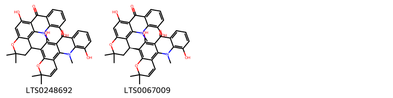{ width=100% }
    <figcaption>Hình ảnh cấu trúc hóa học của 2 hoạt chất thuộc nhóm Neoflavonoids gồm ['12-(6,11-dihydroxy-2,2,5-trimethyl-10-oxo-3,4-dihydro-1-oxa-5-azatetraphen-4-yl)-6,11-dihydroxy-2,2,5-trimethyl-1-oxa-5-azatetraphen-10-one (LTS0248692)', '12-[(4s)-6,11-dihydroxy-2,2,5-trimethyl-10-oxo-3,4-dihydro-1-oxa-5-azatetraphen-4-yl]-6,11-dihydroxy-2,2,5-trimethyl-1-oxa-5-azatetraphen-10-one (LTS0067009)'].</figcaption>
</figure>
#### Nhóm Organooxygen compounds
<figure markdown="span">
    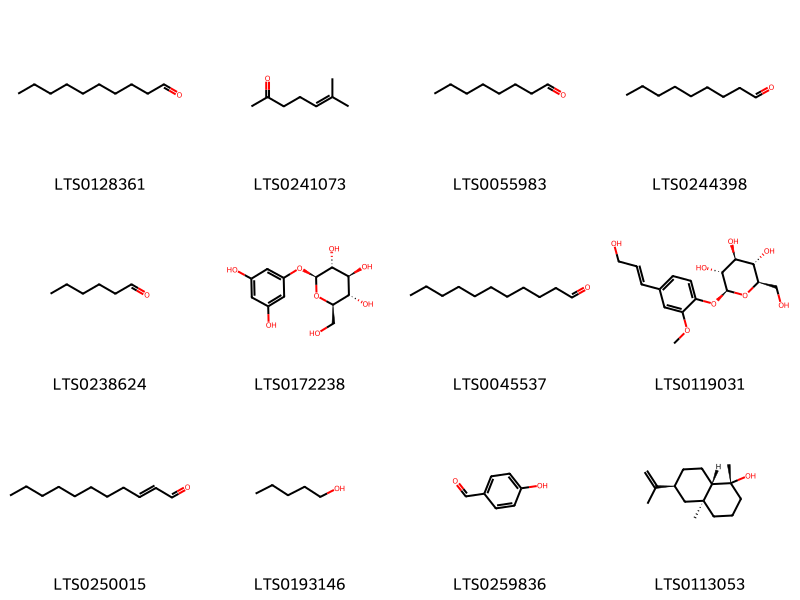{ width=100% }
    <figcaption>Hình ảnh cấu trúc hóa học của 12 hoạt chất thuộc nhóm Organooxygen compounds gồm ['decanal (LTS0128361)', '6-methyl-5-hepten-2-one (LTS0241073)', 'octanal (LTS0055983)', 'nonanal (LTS0244398)', 'hexanal (LTS0238624)', '(2s,3r,4s,5s,6r)-2-(3,5-dihydroxyphenoxy)-6-(hydroxymethyl)oxane-3,4,5-triol (LTS0172238)', 'aldehyde c11 (LTS0045537)', 'coniferin (LTS0119031)', 'undecenal (LTS0250015)', 'amyl alcohol (LTS0193146)', 'p-hydroxybenzaldehyde (LTS0259836)', '(1r,4as,6s,8as)-1,4a-dimethyl-6-(prop-1-en-2-yl)-octahydronaphthalen-1-ol (LTS0113053)'].</figcaption>
</figure>
#### Nhóm Prenol lipids
<figure markdown="span">
    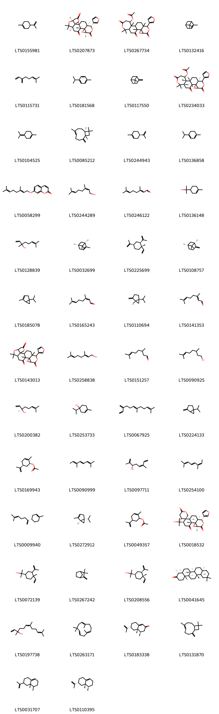{ width=100% }
    <figcaption>Hình ảnh cấu trúc hóa học của 117 hoạt chất thuộc nhóm Prenol lipids gồm ['limonene,  (LTS0155981)', 'limonin (LTS0207873)', '7-(furan-3-yl)-1,8,12,17,17-pentamethyl-5,15,20-trioxo-3,6,16-trioxapentacyclo[9.9.0.0²,⁴.0²,⁸.0¹²,¹⁸]icosan-13-yl acetate (LTS0267734)', 'α pinene (LTS0132416)', 'α-myrcene (LTS0115731)', 'cymene (LTS0181568)', 'β-pinene (LTS0117550)', '(1r,2r,8s,11s,12r,18s)-7-(furan-3-yl)-1,8,12,17,17-pentamethyl-5,15,20-trioxo-3,6,16-trioxapentacyclo[9.9.0.0²,⁴.0²,⁸.0¹²,¹⁸]icosan-13-yl acetate (LTS0234033)', 'terpinolene (LTS0104525)', 'caryophyllene (LTS0085212)', 'α-limonene (LTS0244943)', 'terpinene (LTS0136858)', 'auraptene (LTS0058299)', 'nerol (LTS0244289)', 'α-citral (LTS0246122)', 'terpineol (LTS0136148)', 'linalool, (+-)- (LTS0128839)', '(-)-α-pinene (LTS0032699)', 'β-elemene (LTS0225699)', '(-)-β-pinene (LTS0108757)', 'α-thujene (LTS0185078)', 'neral (LTS0165243)', '(+)-sabinene (LTS0110694)', '3,7-dimethyl-2,6-octadienal (LTS0141353)', 'limonin (LTS0143013)', 'geraniol (LTS0258838)', 'citronella (LTS0151257)', 'citronellol, (+-)- (LTS0090925)', '(-)-linalool (LTS0200382)', '4-terpineol (LTS0253733)', 'β-farnesene (LTS0067925)', 'sabinene (LTS0224133)', '(1s,5s)-carvyl acetate (LTS0169943)', 'allo-ocimene (LTS0090999)', '(3r,5z)-2,6-dimethylocta-1,5,7-trien-3-ol (LTS0097711)', '(4e,6z)-alloocimene (LTS0254100)', '(-)-β-bisabolene (LTS0009940)', '(+)-α-thujene (LTS0272912)', 'carvyl acetate (LTS0049357)', 'ichangin (LTS0018532)', '2-[4-ethenyl-4-methyl-3-(prop-1-en-2-yl)cyclohexyl]propan-2-ol (LTS0072139)', 'camphene (LTS0267242)', 'elemol (LTS0208556)', '(-)-friedelin (LTS0041645)', 'nerolidol (LTS0197738)', 'humulene (LTS0263171)', 'nootkatone (LTS0183338)', 'caryophyllene (LTS0131870)', 'valencene (LTS0031707)', 'valencene (LTS0110395)', '(1r,2r,7s,10s,13r,14r,16s,19s,20s)-19-(furan-3-yl)-9,9,13,20-tetramethyl-4,8,15,18-tetraoxahexacyclo[11.9.0.0²,⁷.0²,¹⁰.0¹⁴,¹⁶.0¹⁴,²⁰]docosane-5,12,17-trione (LTS0222914)', 'nerolidol (LTS0155191)', '7-[(3,7-dimethylocta-2,6-dien-1-yl)oxy]chromen-2-one (LTS0166429)', 'cryptoxanthin (LTS0132646)', "(1r,7ar,9s,11br)-1-(acetyloxy)-9-[(s)-furan-3-yl(hydroxy)methyl]-5,5,7a,9,11b-pentamethyl-3,7-dioxo-hexahydro-1h-spiro[naphtho[2,1-c]oxepine-8,2'-oxirane]-3'-carboxylic acid (LTS0156866)", 'α-curcumene (LTS0019880)', 'bergamottin (LTS0217096)', 'all-trans-phytofluene (LTS0269894)', 'sabinene hydrate (LTS0236165)', '(+)-α-carotene (LTS0200789)', '4-thujanol (LTS0005823)', '7-(furan-3-yl)-1,8,12,17,17-pentamethyl-5,15-dioxo-3,6,16-trioxapentacyclo[9.9.0.0²,⁴.0²,⁸.0¹²,¹⁸]icos-13-en-20-yl acetate (LTS0117030)', '4-[(3,7-dimethylocta-2,6-dien-1-yl)oxy]furo[3,2-g]chromen-7-one (LTS0115355)', 'β-carotene (LTS0275716)', '(1s,2r,4s,7s,8s,11r,12r,18s,20r)-7-(furan-3-yl)-1,8,12,17,17-pentamethyl-5,15-dioxo-3,6,16-trioxapentacyclo[9.9.0.0²,⁴.0²,⁸.0¹²,¹⁸]icos-13-en-20-yl acetate (LTS0020464)', '4-isopropyl-1,6-dimethyl-2,3,4,4a,7,8-hexahydronaphthalene (LTS0270743)', 'phytoene (LTS0186029)', 'α-carotene (LTS0224243)', 'delta-cadinene (LTS0019321)', '(-)-β-cubebene (LTS0123697)', 'α-copaene (LTS0207598)', 'nootkatone (LTS0027125)', '(1r,2s,7s,8s)-8-isopropyl-1,3-dimethyltricyclo[4.4.0.0²,⁷]dec-3-ene (LTS0190031)', '(3r,6e)-nerolidol (LTS0145065)', '7-(furan-3-yl)-1,8,12,17,17-pentamethyl-3,6,16-trioxapentacyclo[9.9.0.0²,⁴.0²,⁸.0¹²,¹⁸]icos-13-ene-5,15,20-trione (LTS0163399)', '4-isopropyl-1,6-dimethyl-3,4,4a,7,8,8a-hexahydronaphthalene (LTS0154650)', 'phytofluene (LTS0181914)', '(4e,8e)-4,8,11,11-tetramethylcycloundeca-1,4,8-triene (LTS0118116)', 'α-muurolene (LTS0022607)', 'zeta-carotene (LTS0007334)', 'carotenoid (LTS0205297)', 'amyrin (LTS0222826)', 'lycopene (LTS0116567)', '4,4a-dimethyl-6-(propan-2-ylidene)-4,5-dihydro-3h-naphthalen-2-one (LTS0127045)', '(1s,2r,4s,7s,8s,11r,12r,18s,20r)-7-(furan-3-yl)-20-hydroxy-1,8,12,17,17-pentamethyl-3,6,16-trioxapentacyclo[9.9.0.0²,⁴.0²,⁸.0¹²,¹⁸]icos-13-ene-5,15-dione (LTS0039883)', '4,4a-dimethyl-6-(prop-1-en-2-yl)-3,4,5,6-tetrahydronaphthalen-2-one (LTS0129553)', 'α-vetivone (LTS0234957)', 'β-gurjunene (LTS0225922)', '1,3,3-trimethyl-2-[(1e,3z,5z,7e,9e,11e,13z,15z,17e)-3,7,12,16-tetramethyl-18-(2,6,6-trimethylcyclohex-1-en-1-yl)octadeca-1,3,5,7,9,11,13,15,17-nonaen-1-yl]cyclohex-1-ene (LTS0078967)', '4,4a-dimethyl-6-(prop-1-en-2-yl)-octahydronaphthalen-2-one (LTS0158570)', '(4ar,6ar,6bs,8ar,12ar,14ar,14br)-4,4,6a,6b,8a,11,11,14b-octamethyl-2,4a,5,6,7,8,9,10,12,12a,14,14a-dodecahydro-1h-picen-3-one (LTS0175478)', '(4r,4as)-4,4a-dimethyl-6-(propan-2-ylidene)-4,5-dihydro-3h-naphthalen-2-one (LTS0146485)', '(4ar,6r,8ar)-4,8a-dimethyl-6-(prop-1-en-2-yl)-1,4a,5,6,7,8-hexahydronaphthalen-2-one (LTS0167720)', '4,4a-dimethyl-6-(prop-1-en-2-yl)-1,3,4,5,6,7-hexahydronaphthalen-2-one (LTS0147230)', '(4r,4as)-6-[(2r)-1,2-dihydroxypropan-2-yl]-4,4a-dimethyl-3,4,5,6,7,8-hexahydronaphthalen-2-one (LTS0140237)', '7-(furan-3-yl)-20-hydroxy-1,8,12,17,17-pentamethyl-3,6,16-trioxapentacyclo[9.9.0.0²,⁴.0²,⁸.0¹²,¹⁸]icos-13-ene-5,15-dione (LTS0159520)', 'β-amyrin (LTS0251864)', 'β,β-carotene (LTS0168447)', '1-p-menthene-8-thiol (LTS0161482)', '(4r,4as,8as)-4,4a-dimethyl-6-(propan-2-ylidene)-hexahydro-1h-naphthalen-2-one (LTS0128698)', '3-{[(2e)-3,7-dimethylocta-2,6-dien-1-yl]oxy}chromen-2-one (LTS0254886)', '6-(1,2-dihydroxypropan-2-yl)-4,4a-dimethyl-3,4,5,6,7,8-hexahydronaphthalen-2-one (LTS0093597)', '(4as,6r,8ar)-4,8a-dimethyl-6-(prop-1-en-2-yl)-1,4a,5,6,7,8-hexahydronaphthalen-2-one (LTS0187502)', '4,4a-dimethyl-6-(propan-2-ylidene)-hexahydro-1h-naphthalen-2-one (LTS0272173)', '(4as,6r,8as)-4,8a-dimethyl-6-(prop-1-en-2-yl)-1,4a,5,6,7,8-hexahydronaphthalen-2-one (LTS0068206)', '4,4,6a,6b,8a,11,12,14b-octamethyl-1,2,4a,5,6,7,8,9,10,11,12,12a,14,14a-tetradecahydropicen-3-one (LTS0264434)', 'cis-phytoene (LTS0239283)', 'grapefruit mercaptan (LTS0253308)', '(4ar,8ar)-4,8a-dimethyl-6-(propan-2-ylidene)-4a,5,7,8-tetrahydro-1h-naphthalen-2-one (LTS0011934)', "11'-(furan-3-yl)-4-hydroxy-5'-(2-hydroxypropan-2-yl)-2',10'-dimethyl-12',15'-dioxaspiro[oxane-3,6'-tetracyclo[8.5.0.0¹,¹⁴.0²,⁷]pentadecane]-3',6,13'-trione (LTS0039489)", 'dihydronootkatone (LTS0007409)', '(1r,2r,4s,7s,8s,11s,12r,18s)-7-(furan-3-yl)-1,8,12,17,17-pentamethyl-3,6,16-trioxapentacyclo[9.9.0.0²,⁴.0²,⁸.0¹²,¹⁸]icos-13-ene-5,15,20-trione (LTS0270227)', '4,4a-dimethyl-6-(propan-2-ylidene)-4,5,7,8-tetrahydro-3h-naphthalen-2-one (LTS0068387)', '(7r)-1,4a-dimethyl-7-(prop-1-en-2-yl)-3,4,5,6,7,8-hexahydronaphthalen-2-one (LTS0266257)', '(4r,4as,6r)-4,4a-dimethyl-6-(prop-1-en-2-yl)-1,3,4,5,6,7-hexahydronaphthalen-2-one (LTS0022461)', 'dehydronootkatone (LTS0034224)', 'epsilon-carotene (LTS0100429)'].</figcaption>
</figure>
#### Nhóm Quinolines and derivatives
<figure markdown="span">
    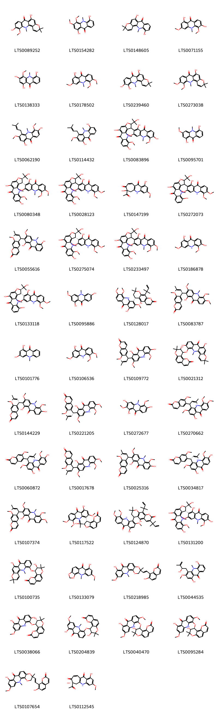{ width=100% }
    <figcaption>Hình ảnh cấu trúc hóa học của 80 hoạt chất thuộc nhóm Quinolines and derivatives gồm ['7,11-dihydroxy-6-methoxy-2,2,5-trimethyl-1-oxa-5-azatetraphen-10-one (LTS0089252)', '1,5-dihydroxy-3,4-dimethoxy-10-methylacridin-9-one (LTS0154282)', '5-hydroxynoracronycine (LTS0148605)', '1,6-dihydroxy-3,5-dimethoxy-10-methylacridin-9-one (LTS0071155)', '1,3,5-trihydroxy-4-methoxy-10-methylacridin-9-one (LTS0138333)', '1-hydroxy-3,5,6-trimethoxy-10-methylacridin-9-one (LTS0178502)', '6,7,11-trihydroxy-2,2,5-trimethyl-1-oxa-5-azatetraphen-10-one (LTS0239460)', '11-hydroxy-6,7-dimethoxy-2,2,5-trimethyl-1-oxa-5-azatetraphen-10-one (LTS0273038)', '1,6-dihydroxy-3,5-dimethoxy-10-methyl-4-(3-methylbut-2-en-1-yl)acridin-9-one (LTS0062190)', '1,5-dihydroxy-3-methoxy-10-methyl-4-(3-methylbut-2-en-1-yl)acridin-9-one (LTS0114432)', '2-[5,9-dihydroxy-2-(2-hydroxypropan-2-yl)-10-methoxy-11-methyl-6-oxo-1h,2h-furo[2,3-c]acridin-1-yl]-1,6-dihydroxy-3,5-dimethoxy-10-methylacridin-9-one (LTS0083896)', '1,5-dihydroxy-3-methoxy-10-methylacridin-9-one (LTS0095701)', '2-[(1s,2r)-5,9-dihydroxy-2-(2-hydroxypropan-2-yl)-10-methoxy-11-methyl-6-oxo-1h,2h-furo[2,3-c]acridin-1-yl]-1-hydroxy-3,5,6-trimethoxy-10-methylacridin-9-one (LTS0080348)', '2-[5,9-dihydroxy-2-(2-hydroxypropan-2-yl)-10-methoxy-11-methyl-6-oxo-1h,2h-furo[2,3-c]acridin-1-yl]-1-hydroxy-3,5,6-trimethoxy-10h-acridin-9-one (LTS0028123)', '7-acetyl-1,7-dihydroxy-3-methoxy-5h,6h-cyclohepta[b]quinoline-8,11-dione (LTS0147199)', '2-[5,10-dihydroxy-2-(2-hydroxypropan-2-yl)-11-methyl-6-oxo-1h,2h-furo[2,3-c]acridin-1-yl]-1-hydroxy-3,5,6-trimethoxy-10h-acridin-9-one (LTS0272073)', '1,5-dihydroxy-3-methoxy-2-[1-(7-methoxy-2-oxochromen-6-yl)-3-methylbut-2-en-1-yl]-10-methylacridin-9-one (LTS0055616)', '2-[(1s,2r)-5,9-dihydroxy-2-(2-hydroxypropan-2-yl)-10-methoxy-11-methyl-6-oxo-1h,2h-furo[2,3-c]acridin-1-yl]-1-hydroxy-3,5,6-trimethoxy-10h-acridin-9-one (LTS0275074)', '2-[5,9-dihydroxy-2-(2-hydroxypropan-2-yl)-10-methoxy-11-methyl-6-oxo-1h,2h-furo[2,3-c]acridin-1-yl]-1-hydroxy-3,5,6-trimethoxy-10-methylacridin-9-one (LTS0233497)', '1,6-dihydroxy-3,5-dimethoxy-10h-acridin-9-one (LTS0186878)', '2-[(1s,2r)-5,10-dihydroxy-2-(2-hydroxypropan-2-yl)-11-methyl-6-oxo-1h,2h-furo[2,3-c]acridin-1-yl]-1-hydroxy-3,5,6-trimethoxy-10h-acridin-9-one (LTS0133118)', '1,6-dihydroxy-3-methoxy-10-methylacridin-9-one (LTS0095886)', '1-hydroxy-4-[(4s)-5-hydroxy-2,2-dimethyl-10-(2-methylbut-3-en-2-yl)-8-oxo-3h,4h-pyrano[3,2-g]chromen-4-yl]-3,5,6-trimethoxy-10h-acridin-9-one (LTS0128017)', '1-hydroxy-3,5,6-trimethoxy-2-[(1r)-1-(7-methoxy-2-oxochromen-6-yl)-3-methylbut-2-en-1-yl]-10-methylacridin-9-one (LTS0083787)', '1,3-dihydroxy-n-methylacridone (LTS0101776)', '1-hydroxy-3,5,6-trimethoxy-10h-acridin-9-one (LTS0106536)', '1,6-dihydroxy-3,5-dimethoxy-2-[1-(7-methoxy-2-oxochromen-6-yl)-3-methylbut-2-en-1-yl]-10h-acridin-9-one (LTS0109772)', '7,11-dihydroxy-6-({9-hydroxy-8,8-dimethyl-2-oxo-9h,10h-pyrano[2,3-h]chromen-10-yl}oxy)-2,2,5-trimethyl-1-oxa-5-azatetraphen-10-one (LTS0021312)', '1,6-dihydroxy-3,5-dimethoxy-2-[(1s)-1-(7-methoxy-2-oxochromen-6-yl)-3-methylbut-2-en-1-yl]-10-methylacridin-9-one (LTS0144229)', '1-hydroxy-3,5,6-trimethoxy-2-[(1r)-1-(7-methoxy-2-oxochromen-6-yl)-3-methylbut-2-en-1-yl]-10h-acridin-9-one (LTS0221205)', '1,3,6-trihydroxy-2,5-dimethoxy-10-methylacridin-9-one (LTS0272677)', '1-hydroxy-3,5,6-trimethoxy-4-[1-(7-methoxy-2-oxochromen-6-yl)-3-methylbut-2-en-1-yl]-10h-acridin-9-one (LTS0270662)', '1,6-dihydroxy-3,5-dimethoxy-4-[1-(7-methoxy-2-oxochromen-6-yl)-3-methylbut-2-en-1-yl]-10h-acridin-9-one (LTS0060872)', '1-hydroxy-3,5,6-trimethoxy-2-[1-(7-methoxy-2-oxochromen-6-yl)-3-methylbut-2-en-1-yl]-10h-acridin-9-one (LTS0017678)', '1,6-dihydroxy-3,5-dimethoxy-2-[1-(7-methoxy-2-oxochromen-6-yl)-3-methylbut-2-en-1-yl]-10-methylacridin-9-one (LTS0025316)', '1,6-dihydroxy-3,5-dimethoxy-4-[(1s)-1-(7-methoxy-2-oxochromen-6-yl)-3-methylbut-2-en-1-yl]-10h-acridin-9-one (LTS0034817)', '1-hydroxy-3,5,6-trimethoxy-2-[1-(7-methoxy-2-oxochromen-6-yl)-3-methylbut-2-en-1-yl]-10-methylacridin-9-one (LTS0107374)', '1-hydroxy-4-[(8r,9r)-8-(2-hydroxypropan-2-yl)-2-oxo-8h,9h-furo[2,3-h]chromen-9-yl]-3,5,6-trimethoxy-10-methylacridin-9-one (LTS0117522)', '1-hydroxy-4-[5-hydroxy-2,2-dimethyl-7,10-bis(2-methylbut-3-en-2-yl)-8-oxo-3h,4h-pyrano[3,2-g]chromen-4-yl]-3,5,6-trimethoxy-10h-acridin-9-one (LTS0124870)', '2-[(1s,2r)-5,9-dihydroxy-2-(2-hydroxypropan-2-yl)-10-methoxy-11-methyl-6-oxo-1h,2h-furo[2,3-c]acridin-1-yl]-1,6-dihydroxy-3,5-dimethoxy-10-methylacridin-9-one (LTS0131200)', '11-hydroxy-6-{[(9r,10r)-9-hydroxy-8,8-dimethyl-2-oxo-9h,10h-pyrano[2,3-h]chromen-10-yl]oxy}-2,2,5-trimethyl-1-oxa-5-azatetraphen-10-one (LTS0100735)', '7-hydroxy-9-methoxy-11-methyl-2h-[1,3]dioxolo[4,5-c]acridin-6-one (LTS0133079)', '9-hydroxy-2-[(1e)-2-(7-hydroxy-2-oxochromen-8-yl)ethenyl]-7-methoxy-2,5-dimethyl-3h-1,4-dioxa-5-azatetraphen-10-one (LTS0218985)', '1,5-dihydroxy-4-[(2r)-2-hydroxy-3-methylbut-3-en-1-yl]-3-methoxy-10-methylacridin-9-one (LTS0044535)', '1,6-dihydroxy-5-{[(9s,10r)-9-hydroxy-8,8-dimethyl-2-oxo-9h,10h-pyrano[2,3-h]chromen-10-yl]oxy}-3-methoxy-10h-acridin-9-one (LTS0038066)', '1-hydroxy-5-({9-hydroxy-8,8-dimethyl-2-oxo-9h,10h-pyrano[2,3-h]chromen-10-yl}oxy)-3-methoxy-10-methylacridin-9-one (LTS0204839)', '1-hydroxy-5-({9-hydroxy-8,8-dimethyl-2-oxo-9h,10h-pyrano[2,3-h]chromen-10-yl}oxy)-3,6-dimethoxy-10h-acridin-9-one (LTS0040470)', '1-hydroxy-5-{[(9s,10s)-9-hydroxy-8,8-dimethyl-2-oxo-9h,10h-pyrano[2,3-h]chromen-10-yl]oxy}-3,6-dimethoxy-10h-acridin-9-one (LTS0095284)', '9-hydroxy-2-[2-(7-hydroxy-2-oxochromen-8-yl)ethenyl]-7-methoxy-2,5-dimethyl-3h-1,4-dioxa-5-azatetraphen-10-one (LTS0107654)', '(7r)-7-acetyl-1,7-dihydroxy-3-methoxy-5h,6h-cyclohepta[b]quinoline-8,11-dione (LTS0112545)', '4-[(3,3-dimethyloxiran-2-yl)(hydroxy)methyl]-1,6-dihydroxy-3,5-dimethoxy-10-methylacridin-9-one (LTS0094890)', '1,6-dihydroxy-4-[(4s)-5-hydroxy-2,2-dimethyl-7,10-bis(2-methylbut-3-en-2-yl)-8-oxo-3h,4h-pyrano[3,2-g]chromen-4-yl]-3,5-dimethoxy-10h-acridin-9-one (LTS0049656)', '6,11-dihydroxy-12-[1-(7-methoxy-2-oxochromen-6-yl)-3-methylbut-2-en-1-yl]-2,2,5-trimethyl-1-oxa-5-azatetraphen-10-one (LTS0091558)', '4-[(3,3-dimethyloxiran-2-yl)(hydroxy)methyl]-1-hydroxy-3,5,6-trimethoxy-10-methylacridin-9-one (LTS0045367)', '12-[5,9-dihydroxy-2-(2-hydroxypropan-2-yl)-10-methoxy-11-methyl-6-oxo-1h,2h-furo[2,3-c]acridin-1-yl]-7,11-dihydroxy-6-methoxy-2,2,5-trimethyl-1-oxa-5-azatetraphen-10-one (LTS0164598)', '1-hydroxy-5-{[(9s,10s)-9-hydroxy-8,8-dimethyl-2-oxo-9h,10h-pyrano[2,3-h]chromen-10-yl]oxy}-3-methoxy-10-methylacridin-9-one (LTS0242390)', '1,5-dihydroxy-3-methoxy-2-[(1s)-1-(7-methoxy-2-oxochromen-6-yl)-3-methylbut-2-en-1-yl]-10-methylacridin-9-one (LTS0186402)', '1,6-dihydroxy-5-{[(9s,10s)-9-hydroxy-8,8-dimethyl-2-oxo-9h,10h-pyrano[2,3-h]chromen-10-yl]oxy}-3-methoxy-10-methylacridin-9-one (LTS0129412)', '12-[(1s,2r)-5,9-dihydroxy-2-(2-hydroxypropan-2-yl)-10-methoxy-11-methyl-6-oxo-1h,2h-furo[2,3-c]acridin-1-yl]-7,11-dihydroxy-6-methoxy-2,2,5-trimethyl-1-oxa-5-azatetraphen-10-one (LTS0117211)', '(2r)-9-hydroxy-2-[(1e)-2-(7-hydroxy-2-oxochromen-8-yl)ethenyl]-7-methoxy-2,5-dimethyl-3h-1,4-dioxa-5-azatetraphen-10-one (LTS0181655)', '1-hydroxy-4-[5-hydroxy-2,2-dimethyl-10-(2-methylbut-3-en-2-yl)-8-oxo-3h,4h-pyrano[3,2-g]chromen-4-yl]-3,5,6-trimethoxy-10h-acridin-9-one (LTS0046975)', '11-hydroxy-6-{[(9s,10s)-9-hydroxy-8,8-dimethyl-2-oxo-9h,10h-pyrano[2,3-h]chromen-10-yl]oxy}-2,2,5-trimethyl-1-oxa-5-azatetraphen-10-one (LTS0246766)', '11-hydroxy-6-({9-hydroxy-8,8-dimethyl-2-oxo-9h,10h-pyrano[2,3-h]chromen-10-yl}oxy)-2,2,5-trimethyl-1-oxa-5-azatetraphen-10-one (LTS0272504)', '1,6-dihydroxy-5-({9-hydroxy-8,8-dimethyl-2-oxo-9h,10h-pyrano[2,3-h]chromen-10-yl}oxy)-3-methoxy-10-methylacridin-9-one (LTS0221114)', '2-[(1s,2r)-5,10-dihydroxy-2-(2-hydroxypropan-2-yl)-11-methyl-6-oxo-1h,2h-furo[2,3-c]acridin-1-yl]-1-hydroxy-3,5,6-trimethoxy-10-methylacridin-9-one (LTS0224863)', '1-hydroxy-5-{[(9r,10r)-9-hydroxy-8,8-dimethyl-2-oxo-9h,10h-pyrano[2,3-h]chromen-10-yl]oxy}-3,6-dimethoxy-10h-acridin-9-one (LTS0094457)', '6,11-dihydroxy-12-[(1s)-1-(7-methoxy-2-oxochromen-6-yl)-3-methylbut-2-en-1-yl]-2,2,5-trimethyl-1-oxa-5-azatetraphen-10-one (LTS0162153)', '2-[5,10-dihydroxy-2-(2-hydroxypropan-2-yl)-11-methyl-6-oxo-1h,2h-furo[2,3-c]acridin-1-yl]-1-hydroxy-3,5,6-trimethoxy-10-methylacridin-9-one (LTS0233826)', '1,3,5-trihydroxy-10-methylacridin-9-one (LTS0255083)', '7,11-dihydroxy-6-{[(9s,10r)-9-hydroxy-8,8-dimethyl-2-oxo-9h,10h-pyrano[2,3-h]chromen-10-yl]oxy}-2,2,5-trimethyl-1-oxa-5-azatetraphen-10-one (LTS0039682)', '7,11-dihydroxy-6-methoxy-12-[(1s)-1-(7-methoxy-2-oxochromen-6-yl)-3-methylbut-2-en-1-yl]-2,2,5-trimethyl-1-oxa-5-azatetraphen-10-one (LTS0043957)', '1-hydroxy-4-[(4s)-5-hydroxy-2,2-dimethyl-7,10-bis(2-methylbut-3-en-2-yl)-8-oxo-3h,4h-pyrano[3,2-g]chromen-4-yl]-3,5,6-trimethoxy-10h-acridin-9-one (LTS0054870)', '1,5-dihydroxy-4-(2-hydroxy-3-methylbut-3-en-1-yl)-3-methoxy-10-methylacridin-9-one (LTS0039452)', '7,11-dihydroxy-6-methoxy-12-[1-(7-methoxy-2-oxochromen-6-yl)-3-methylbut-2-en-1-yl]-2,2,5-trimethyl-1-oxa-5-azatetraphen-10-one (LTS0007605)', '1,6-dihydroxy-4-[5-hydroxy-2,2-dimethyl-7,10-bis(2-methylbut-3-en-2-yl)-8-oxo-3h,4h-pyrano[3,2-g]chromen-4-yl]-3,5-dimethoxy-10h-acridin-9-one (LTS0031207)', '5,9-dihydroxy-10-methoxy-11-methylfuro[2,3-c]acridin-6-one (LTS0063951)', '1,6-dihydroxy-5-({9-hydroxy-8,8-dimethyl-2-oxo-9h,10h-pyrano[2,3-h]chromen-10-yl}oxy)-3-methoxy-10h-acridin-9-one (LTS0013611)', '1,6-dihydroxy-3,5-dimethoxy-2-[(1s)-1-(7-methoxy-2-oxochromen-6-yl)-3-methylbut-2-en-1-yl]-10h-acridin-9-one (LTS0003737)', '1-hydroxy-4-[8-(2-hydroxypropan-2-yl)-2-oxo-8h,9h-furo[2,3-h]chromen-9-yl]-3,5,6-trimethoxy-10-methylacridin-9-one (LTS0011124)', '1-hydroxy-3,5,6-trimethoxy-4-[(1r)-1-(7-methoxy-2-oxochromen-6-yl)-3-methylbut-2-en-1-yl]-10h-acridin-9-one (LTS0017305)'].</figcaption>
</figure>
#### Nhóm Saccharolipids
<figure markdown="span">
    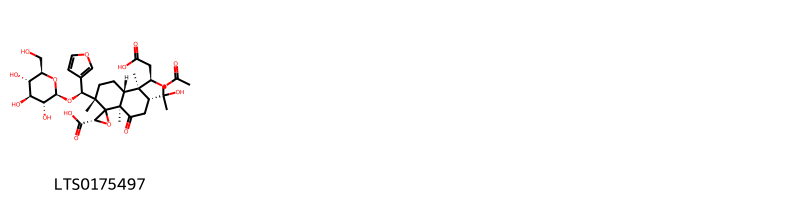{ width=100% }
    <figcaption>Hình ảnh cấu trúc hóa học của 1 hoạt chất thuộc nhóm Saccharolipids gồm ["(2s,3's,4ar,5r,6r,8ar)-5-[(1r)-1-(acetyloxy)-2-carboxyethyl]-2-[(s)-furan-3-yl({[(2r,3r,4s,5s,6r)-3,4,5-trihydroxy-6-(hydroxymethyl)oxan-2-yl]oxy})methyl]-6-(2-hydroxypropan-2-yl)-2,5,8a-trimethyl-8-oxo-tetrahydro-3h-spiro[naphthalene-1,2'-oxirane]-3'-carboxylic acid (LTS0175497)"].</figcaption>
</figure>
#### Nhóm Steroids and steroid derivatives
<figure markdown="span">
    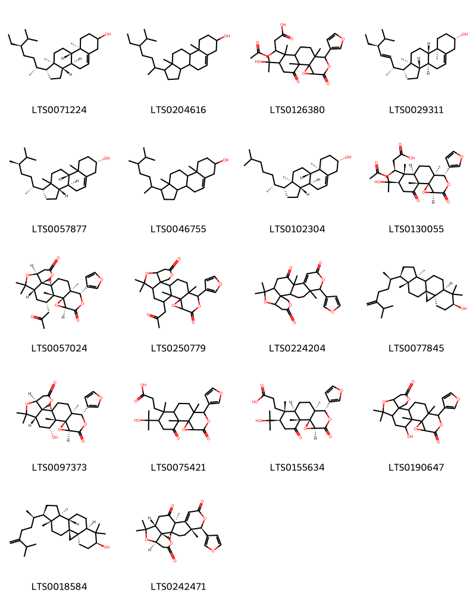{ width=100% }
    <figcaption>Hình ảnh cấu trúc hóa học của 18 hoạt chất thuộc nhóm Steroids and steroid derivatives gồm ['stigmast-5-en-3-ol (LTS0071224)', 'stigmast-5-en-3-ol, (3β)- (LTS0204616)', '3-(acetyloxy)-3-[11-(furan-3-yl)-5-(2-hydroxypropan-2-yl)-2,6,10-trimethyl-3,13-dioxo-12,15-dioxatetracyclo[8.5.0.0¹,¹⁴.0²,⁷]pentadecan-6-yl]propanoic acid (LTS0126380)', 'phytosterol (LTS0029311)', '(1r,3as,3bs,7s,9bs)-1-[(2r,5r)-5,6-dimethylheptan-2-yl]-9a,11a-dimethyl-1h,2h,3h,3ah,3bh,4h,6h,7h,8h,9h,9bh,10h,11h-cyclopenta[a]phenanthren-7-ol (LTS0057877)', 'campesterol (LTS0046755)', 'cholesterol (LTS0102304)', '(3s)-3-(acetyloxy)-3-[(1r,2r,5r,6r,7r,10s,11s,14s)-11-(furan-3-yl)-5-(2-hydroxypropan-2-yl)-2,6,10-trimethyl-3,13-dioxo-12,15-dioxatetracyclo[8.5.0.0¹,¹⁴.0²,⁷]pentadecan-6-yl]propanoic acid (LTS0130055)', '(1r,2r,7s,10s,12s,13r,14s,16s,19s,20s)-19-(furan-3-yl)-9,9,13,20-tetramethyl-12-(2-oxopropyl)-4,8,15,18-tetraoxahexacyclo[11.9.0.0²,⁷.0²,¹⁰.0¹⁴,¹⁶.0¹⁴,²⁰]docosane-5,17-dione (LTS0057024)', '19-(furan-3-yl)-9,9,13,20-tetramethyl-12-(2-oxopropyl)-4,8,15,18-tetraoxahexacyclo[11.9.0.0²,⁷.0²,¹⁰.0¹⁴,¹⁶.0¹⁴,²⁰]docosane-5,17-dione (LTS0250779)', '18-(furan-3-yl)-9,9,13,19-tetramethyl-4,8,17-trioxapentacyclo[11.8.0.0²,⁷.0²,¹⁰.0¹⁴,¹⁹]henicos-14-ene-5,12,16-trione (LTS0224204)', '24-methylene-cycloartanol (LTS0077845)', '(1r,2r,7s,10s,12r,13s,14r,16s,19s,20s)-19-(furan-3-yl)-12-hydroxy-9,9,13,20-tetramethyl-4,8,15,18-tetraoxahexacyclo[11.9.0.0²,⁷.0²,¹⁰.0¹⁴,¹⁶.0¹⁴,²⁰]docosane-5,17-dione (LTS0097373)', '3-[11-(furan-3-yl)-5-(2-hydroxypropan-2-yl)-2,6,10-trimethyl-3,13-dioxo-12,15-dioxatetracyclo[8.5.0.0¹,¹⁴.0²,⁷]pentadecan-6-yl]propanoic acid (LTS0075421)', '3-[(1r,2r,5r,6r,7r,10s,11s,14s)-11-(furan-3-yl)-5-(2-hydroxypropan-2-yl)-2,6,10-trimethyl-3,13-dioxo-12,15-dioxatetracyclo[8.5.0.0¹,¹⁴.0²,⁷]pentadecan-6-yl]propanoic acid (LTS0155634)', '19-(furan-3-yl)-12-hydroxy-9,9,13,20-tetramethyl-4,8,15,18-tetraoxahexacyclo[11.9.0.0²,⁷.0²,¹⁰.0¹⁴,¹⁶.0¹⁴,²⁰]docosane-5,17-dione (LTS0190647)', '24-methylenecycloartanol (LTS0018584)', '(1r,2s,7r,10r,13r,18r,19r)-18-(furan-3-yl)-9,9,13,19-tetramethyl-4,8,17-trioxapentacyclo[11.8.0.0²,⁷.0²,¹⁰.0¹⁴,¹⁹]henicos-14-ene-5,12,16-trione (LTS0242471)'].</figcaption>
</figure>
#### Nhóm Thianes
<figure markdown="span">
    { width=100% }
    <figcaption>Hình ảnh cấu trúc hóa học của 2 hoạt chất thuộc nhóm Thianes gồm ['(1s,4r,6r)-3,3,6-trimethyl-2-thiabicyclo[2.2.2]octane (LTS0128943)', '3,3,6-trimethyl-2-thiabicyclo[2.2.2]octane (LTS0242947)'].</figcaption>
</figure>
#### Nhóm Unsaturated hydrocarbons
<figure markdown="span">
    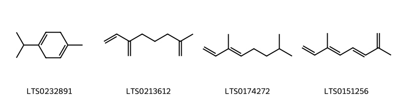{ width=100% }
    <figcaption>Hình ảnh cấu trúc hóa học của 4 hoạt chất thuộc nhóm Unsaturated hydrocarbons gồm ['α terpinene (LTS0232891)', '2-methyl-6-methylideneocta-1,7-diene (LTS0213612)', '(3e)-3,7-dimethylocta-1,3-diene (LTS0174272)', 'cosmene (LTS0151256)'].</figcaption>
</figure>

---

### Dược dân tộc học

Danh sách các quốc gia có sử dụng *Citrus aurantium* trong điều trị các bệnh. 

| Country   | Disease   | Bệnh     |
|:----------|:----------|:---------|
| Elsewhere | Soap      | Xà phòng |

---

---
## Citrus reticulata
### Thông tin về thực vật

!!! info "Phân loại thực vật của *Citrus reticulata* từ GIBF:"
    - **Kingdom:** Plantae
    - **Phylum:** Tracheophyta
    - **Order:** Sapindales
    - **Family:** Rutaceae
    - **Genus:** Citrus
    - **Species:** *Citrus reticulata*

 

| Label (VI)   | Label (EN)   | Scientific Name   | Descriptions (VI)   | Descriptions (EN)   | Also Known As (VI)   | Also Known As (EN)                                          |
|:-------------|:-------------|:------------------|:--------------------|:--------------------|:---------------------|:------------------------------------------------------------|
| N/A          | N/A          | Citrus reticulata | loài thực vật       | species of plant    | ['']                 | ['mandarin', 'Citrus reticulata', 'mandarine', 'tangerina'] |

#### Phân bố trên thế giới

**Từ CSDL GIBF** nan, Italy, Australia, Japan, Belgium, Angola, Benin, Nicaragua, Venezuela (Bolivarian Republic of), Canada, Réunion, Nigeria, Cyprus, Spain, Bolivia (Plurinational State of), Türkiye, Portugal, United States of America, Congo, Democratic Republic of the, Guinea, Croatia, El Salvador, Greece, Germany, Brazil, Bhutan, Mexico, France, Mayotte, Norfolk Island, Peru, China, French Polynesia, Niue, Madagascar, Seychelles, Colombia, Costa Rica, India, New Zealand

#### Phân bố tại Việt Nam

**Từ CSDL GIBF**: Không có ghi nhận ở Việt Nam

---
### Thành phần hóa học
        
- Theo cơ sở dữ liệu lotus: Từ loài *Citrus reticulata* đã phân lập và xác định được 402 hoạt chất thuộc về các nhóm Phenols, Naphthopyrans, Carboxylic acids and derivatives, Fatty Acyls, Indoles and derivatives, Oxanes, Saturated hydrocarbons, Saccharolipids, Prenol lipids, Linear 1,3-diarylpropanoids, Quinolines and derivatives, Benzene and substituted derivatives, Dihydrofurans, Organooxygen compounds, Cyclobutane lignans, Flavonoids, Steroids and steroid derivatives, Unsaturated hydrocarbons, Lactones, Coumarins and derivatives, Benzopyrans, Imidazopyrimidines. 

|    | chemicalTaxonomyClassyfireClass     |   smiles_count |
|---:|:------------------------------------|---------------:|
|  0 | Benzene and substituted derivatives |             14 |
|  1 | Benzopyrans                         |              2 |
|  2 | Carboxylic acids and derivatives    |             10 |
|  3 | Coumarins and derivatives           |             17 |
|  4 | Cyclobutane lignans                 |              2 |
|  5 | Dihydrofurans                       |              1 |
|  6 | Fatty Acyls                         |             19 |
|  7 | Flavonoids                          |             75 |
|  8 | Imidazopyrimidines                  |              1 |
|  9 | Indoles and derivatives             |              6 |
| 10 | Lactones                            |              1 |
| 11 | Linear 1,3-diarylpropanoids         |              2 |
| 12 | Naphthopyrans                       |              1 |
| 13 | Organooxygen compounds              |             18 |
| 14 | Oxanes                              |              1 |
| 15 | Phenols                             |              2 |
| 16 | Prenol lipids                       |            190 |
| 17 | Quinolines and derivatives          |             10 |
| 18 | Saccharolipids                      |              4 |
| 19 | Saturated hydrocarbons              |              2 |
| 20 | Steroids and steroid derivatives    |             18 |
| 21 | Unsaturated hydrocarbons            |              6 |

#### Nhóm Benzene and substituted derivatives
<figure markdown="span">
    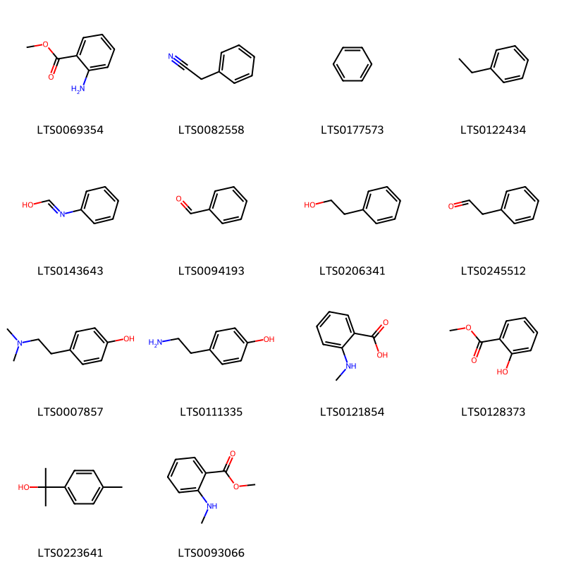{ width=100% }
    <figcaption>Hình ảnh cấu trúc hóa học của 14 hoạt chất thuộc nhóm Benzene and substituted derivatives gồm ['methyl anthranilate (LTS0069354)', 'phenylacetonitrile (LTS0082558)', 'benzene (LTS0177573)', 'ethylbenzene (LTS0122434)', 'n-phenylcarboximidic acid (LTS0143643)', 'benzaldehyde (LTS0094193)', '2-phenyl-ethanol (LTS0206341)', 'phenylacetaldehyde (LTS0245512)', 'hordenine (LTS0007857)', 'tyramine (LTS0111335)', 'n-methylanthranilic acid (LTS0121854)', 'methyl salicylate (LTS0128373)', 'p-cymen-8-ol (LTS0223641)', 'dimethyl anthranilate (LTS0093066)'].</figcaption>
</figure>
#### Nhóm Benzopyrans
<figure markdown="span">
    { width=100% }
    <figcaption>Hình ảnh cấu trúc hóa học của 2 hoạt chất thuộc nhóm Benzopyrans gồm ['2-hydroxy-7-(1-hydroxyethylidene)-10,15,15-trimethyl-16-oxa-10-azatetracyclo[9.8.0.0³,⁹.0¹²,¹⁷]nonadeca-1,3(9),4,11,13,17-hexaene-6,8,19-trione (LTS0262420)', '7-acetyl-6,19-dihydroxy-10,15,15-trimethyl-16-oxa-10-azatetracyclo[9.8.0.0³,⁹.0¹²,¹⁷]nonadeca-1(19),3(9),4,6,11,13,17-heptaene-2,8-dione (LTS0204895)'].</figcaption>
</figure>
#### Nhóm Carboxylic acids and derivatives
<figure markdown="span">
    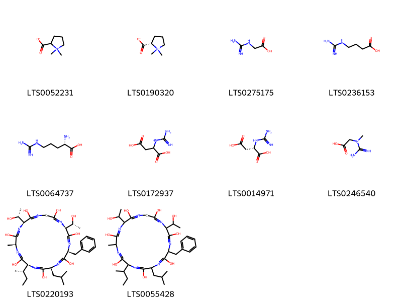{ width=100% }
    <figcaption>Hình ảnh cấu trúc hóa học của 10 hoạt chất thuộc nhóm Carboxylic acids and derivatives gồm ['1,1-dimethylpyrrolidin-1-ium-2-carboxylate (LTS0052231)', 'stachydrine (LTS0190320)', 'glycocyamine (LTS0275175)', '4-guanidinobutyric acid (LTS0236153)', 'l-arginine (LTS0064737)', 'guanidinosuccinic acid (LTS0172937)', 'n-amidino-l-aspartic acid (LTS0014971)', 'creatine (LTS0246540)', '(3s,6s,9s,12s,15s,18s)-15-benzyl-9-[(2s)-butan-2-yl]-3,18-bis[(1r)-1-hydroxyethyl]-6-methyl-12-(2-methylpropyl)-1,4,7,10,13,16,19-heptaazacyclohenicosa-1,4,7,10,13,16,19-heptaene-2,5,8,11,14,17,20-heptol (LTS0220193)', '15-benzyl-3,18-bis(1-hydroxyethyl)-6-methyl-12-(2-methylpropyl)-9-(sec-butyl)-1,4,7,10,13,16,19-heptaazacyclohenicosa-1,4,7,10,13,16,19-heptaene-2,5,8,11,14,17,20-heptol (LTS0055428)'].</figcaption>
</figure>
#### Nhóm Coumarins and derivatives
<figure markdown="span">
    { width=100% }
    <figcaption>Hình ảnh cấu trúc hóa học của 17 hoạt chất thuộc nhóm Coumarins and derivatives gồm ['xanthyletin (LTS0016674)', 'xanthoxyletin (LTS0112626)', 'nor-dentatin (LTS0166816)', 'scoparone (LTS0210705)', '5-hydroxy-2,2-dimethyl-6-(2-methylbut-3-en-2-yl)pyrano[2,3-h]chromen-8-one (LTS0024471)', 'suberosin (LTS0171880)', '5-hydroxy-8,8-dimethyl-3,10-bis(2-methylbut-3-en-2-yl)pyrano[3,2-g]chromen-2-one (LTS0134693)', '6-[(1e)-3-hydroxy-3-methylbut-1-en-1-yl]-7-methoxychromen-2-one (LTS0188465)', '7-methoxy-2-oxochromene-6-carbaldehyde (LTS0027815)', '6-(4-hydroxy-4-methylpent-2-en-1-yl)-7-methoxychromen-2-one (LTS0268554)', '2-(7-methoxy-2-oxochromen-8-yl)acetaldehyde (LTS0082344)', '6-[(2e)-4-hydroxy-4-methylpent-2-en-1-yl]-7-methoxychromen-2-one (LTS0124920)', '2-hydroxy-4-(7-methoxy-2-oxochromen-8-yl)-2-methylbut-3-en-1-yl 3-methylbutanoate (LTS0163745)', '(3e)-2-hydroxy-4-(7-methoxy-2-oxochromen-8-yl)-2-methylbut-3-en-1-yl 3-methylbutanoate (LTS0108073)', '(2r,3e)-2-hydroxy-4-(7-methoxy-2-oxochromen-8-yl)-2-methylbut-3-en-1-yl 3-methylbutanoate (LTS0214615)', '(9r,10s)-9-hydroxy-5,10-dimethoxy-8,8-dimethyl-9h,10h-pyrano[2,3-h]chromen-2-one (LTS0024835)', '9-hydroxy-5,10-dimethoxy-8,8-dimethyl-9h,10h-pyrano[2,3-h]chromen-2-one (LTS0243883)'].</figcaption>
</figure>
#### Nhóm Cyclobutane lignans
<figure markdown="span">
    { width=100% }
    <figcaption>Hình ảnh cấu trúc hóa học của 2 hoạt chất thuộc nhóm Cyclobutane lignans gồm ['8-[2,3-diacetyl-4-(7-methoxy-2-oxochromen-8-yl)cyclobutyl]-7-methoxychromen-2-one (LTS0261353)', '8-[(1s,2r,3s,4r)-2,3-diacetyl-4-(7-methoxy-2-oxochromen-8-yl)cyclobutyl]-7-methoxychromen-2-one (LTS0061374)'].</figcaption>
</figure>
#### Nhóm Dihydrofurans
<figure markdown="span">
    { width=100% }
    <figcaption>Hình ảnh cấu trúc hóa học của 1 hoạt chất thuộc nhóm Dihydrofurans gồm ['vitamin c (LTS0022555)'].</figcaption>
</figure>
#### Nhóm Fatty Acyls
<figure markdown="span">
    { width=100% }
    <figcaption>Hình ảnh cấu trúc hóa học của 19 hoạt chất thuộc nhóm Fatty Acyls gồm ['geranyl acetate (LTS0093224)', '3,7-dimethylocta-2,6-dien-1-yl acetate (LTS0184686)', 'decyl acetate (LTS0201755)', 'octanol (LTS0250216)', 'palmitic acid (LTS0079439)', '9,12-octadecadienoic acid (LTS0101463)', 'arachidic acid (LTS0171823)', '9 octadecenoic acid (LTS0158691)', 'oleic acid (LTS0256910)', 'octadeca-9,12,15-trienoic acid (LTS0216950)', 'α-linolenic acid (LTS0275508)', 'linoleic (LTS0013198)', 'stearic acid (LTS0237766)', '1-dodecanol (LTS0116183)', 'behenic acid (LTS0058784)', 'palmitoleic acid (LTS0261591)', 'myristic acid (LTS0102566)', 'hexacosanoic acid (LTS0240902)', 'lauric acid (LTS0051907)'].</figcaption>
</figure>
#### Nhóm Flavonoids
<figure markdown="span">
    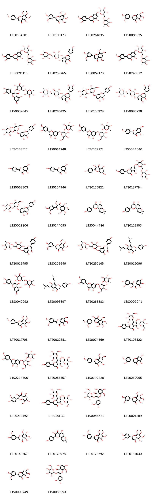{ width=100% }
    <figcaption>Hình ảnh cấu trúc hóa học của 75 hoạt chất thuộc nhóm Flavonoids gồm ['tangeretin (LTS0134301)', 'nobiletin (LTS0100173)', 'hesperidin (LTS0261835)', 'sinensetin (LTS0085325)', '(2s)-5-hydroxy-2-(3-hydroxy-4-methoxyphenyl)-7-{[(2s,3r,4s,5s,6r)-3,4,5-trihydroxy-6-({[(2r,3r,4s,5r,6s)-3,4,5-trihydroxy-6-methyloxan-2-yl]oxy}methyl)oxan-2-yl]oxy}-2,3-dihydro-1-benzopyran-4-one (LTS0091118)', 'narirutin (LTS0259265)', 'isosinensetin (LTS0052178)', 'diosmin (LTS0240372)', '3-rutinosyl quercetin (LTS0032845)', 'eriocitrin (LTS0210425)', 'naringin (LTS0165229)', '(2s)-2-(3,4-dihydroxyphenyl)-5-hydroxy-7-{[(3r,4s,5s,6r)-3,4,5-trihydroxy-6-({[(2s,3r,4r,5r,6s)-3,4,5-trihydroxy-6-methyloxan-2-yl]oxy}methyl)oxan-2-yl]oxy}-2,3-dihydro-1-benzopyran-4-one (LTS0096238)', '(2s)-7-{[(2s,3s,4s,5s,6r)-4,5-dihydroxy-6-(hydroxymethyl)-3-{[(2s,3s,4r,5r,6s)-3,4,5-trihydroxy-6-methyloxan-2-yl]oxy}oxan-2-yl]oxy}-5-hydroxy-2-(4-hydroxyphenyl)-2,3-dihydro-1-benzopyran-4-one (LTS0138617)', '7-{[4,5-dihydroxy-6-(hydroxymethyl)-3-{[(2s)-3,4,5-trihydroxy-6-methyloxan-2-yl]oxy}oxan-2-yl]oxy}-5-hydroxy-2-(3-hydroxy-4-methoxyphenyl)-2,3-dihydro-1-benzopyran-4-one (LTS0014248)', 'neohesperidin (LTS0129178)', 'apigenin trimethyl ether (LTS0044540)', 'asahina (LTS0068303)', 'chamomile (LTS0104946)', 'kaempherol (LTS0155822)', '(2s)-5-hydroxy-2-(4-methoxyphenyl)-7-{[(2s,3r,4s,5s,6r)-3,4,5-trihydroxy-6-({[(2r,3r,4r,5r,6s)-3,4,5-trihydroxy-6-methyloxan-2-yl]oxy}methyl)oxan-2-yl]oxy}-2,3-dihydro-1-benzopyran-4-one (LTS0187794)', 'rhoifolin (LTS0029806)', '3-methoxynobiletin (LTS0144095)', '(2s)-5-hydroxy-2-(4-hydroxyphenyl)-8,8-dimethyl-2h,3h-pyrano[2,3-f]chromen-4-one (LTS0044786)', 'citflavanone (LTS0122503)', '5-hydroxy-2-(4-hydroxyphenyl)-7-{[(2s,5s)-3,4,5-trihydroxy-6-({[(2r,5r)-3,4,5-trihydroxy-6-methyloxan-2-yl]oxy}methyl)oxan-2-yl]oxy}chromen-4-one (LTS0015495)', 'demethylnobiletin (LTS0209649)', '5-hydroxy-2-(4-hydroxyphenyl)-7-[(3,4,5-trihydroxy-6-{[(3,4,5-trihydroxy-6-methyloxan-2-yl)oxy]methyl}oxan-2-yl)oxy]-2,3-dihydro-1-benzopyran-4-one (LTS0252145)', 'lonchocarpol a (LTS0012096)', 'rutin (LTS0042292)', '5,7-dihydroxy-2-(4-hydroxyphenyl)-6,8-bis(3-methylbut-2-en-1-yl)-2,3-dihydro-1-benzopyran-4-one (LTS0093397)', '7-{[4,5-dihydroxy-6-(hydroxymethyl)-3-[(3,4,5-trihydroxy-6-methyloxan-2-yl)oxy]oxan-2-yl]oxy}-5-hydroxy-2-(3-hydroxy-4-methoxyphenyl)-2,3-dihydro-1-benzopyran-4-one (LTS0265383)', 'quercetagetin (LTS0009041)', 'gardenin b (LTS0017705)', '2-(3,4-dimethoxyphenyl)-5-hydroxy-6,7-dimethoxychromen-4-one (LTS0032351)', 'natsudaidain (LTS0074569)', 'vicenin-2 (LTS0103522)', '7-{[4,5-dihydroxy-6-(hydroxymethyl)-3-{[(2s)-3,4,5-trihydroxy-6-methyloxan-2-yl]oxy}oxan-2-yl]oxy}-5-hydroxy-2-(3-hydroxy-4-methoxyphenyl)chromen-4-one (LTS0204500)', '5,7-dihydroxy-2-(4-hydroxyphenyl)-6,8-bis[3,4,5-trihydroxy-6-(hydroxymethyl)oxan-2-yl]chromen-4-one (LTS0255367)', '6-demethoxytangeretin (LTS0140420)', 'diosmetin (LTS0252065)', 'limocitrin (LTS0210192)', 'vicenin 2 (LTS0181160)', '5,7-dihydroxy-2-(4-hydroxy-3-methoxyphenyl)-8-methoxy-3-{[(2s,3r,4s,5s,6r)-3,4,5-trihydroxy-6-(hydroxymethyl)oxan-2-yl]oxy}chromen-4-one (LTS0048451)', '2-(3,4-dimethoxyphenyl)-7-hydroxy-5,6,8-trimethoxychromen-4-one (LTS0021289)', 'sudachitin (LTS0143767)', 'citrusinol (LTS0128978)', '8-methoxycirsilineol (LTS0128792)', '2-(3-hydroxy-4-methoxyphenyl)-5,6,7,8-tetramethoxychromen-4-one (LTS0187030)', '2-(3,4-dimethoxyphenyl)-7-hydroxy-5,6-dimethoxychromen-4-one (LTS0009749)', '5,7-dihydroxy-2-(4-hydroxy-3-methoxyphenyl)-8-methoxy-3-{[3,4,5-trihydroxy-6-(hydroxymethyl)oxan-2-yl]oxy}chromen-4-one (LTS0056093)', '5,7-dihydroxy-2-(3-hydroxy-4-methoxyphenyl)-3-{[(2s,3r,4s,5s,6r)-3,4,5-trihydroxy-6-({[(2r,3r,4r,5r,6s)-3,4,5-trihydroxy-6-methyloxan-2-yl]oxy}methyl)oxan-2-yl]oxy}chromen-4-one (LTS0073565)', '5,7-dihydroxy-2-(4-hydroxyphenyl)-3,6-bis[(2s,3r,4r,5s,6r)-3,4,5-trihydroxy-6-(hydroxymethyl)oxan-2-yl]chromen-4-one (LTS0098024)', '2-(3,4-dihydroxy-5-methoxyphenyl)-5,7-dihydroxy-3-[(3,4,5-trihydroxy-6-{[(3,4,5-trihydroxy-6-methyloxan-2-yl)oxy]methyl}oxan-2-yl)oxy]chromen-4-one (LTS0201865)', 'haplogenin (LTS0106614)', '2-(3,4-dihydroxy-5-methoxyphenyl)-5,7-dihydroxy-3-{[(2s,3r,4s,5s,6r)-3,4,5-trihydroxy-6-({[(2r,3r,4r,5r,6s)-3,4,5-trihydroxy-6-methyloxan-2-yl]oxy}methyl)oxan-2-yl]oxy}chromen-4-one (LTS0025756)', 'cirsimaritin (LTS0146305)', '5,7-dihydroxy-2-(4-hydroxy-3-methoxyphenyl)-8-methoxy-3-[(3,4,5-trihydroxy-6-methyloxan-2-yl)oxy]chromen-4-one (LTS0141275)', '5,7-dihydroxy-2-(4-hydroxyphenyl)-3,6-bis[3,4,5-trihydroxy-6-(hydroxymethyl)oxan-2-yl]chromen-4-one (LTS0106245)', 'narcissin (LTS0177843)', 'corniculatusin (LTS0195081)', 'acacetin (LTS0020151)', '2-(3,4-dimethoxyphenyl)-6-hydroxy-3,5,7,8-tetramethoxychromen-4-one (LTS0210770)', '5,7-dihydroxy-2-(4-hydroxy-3-methoxyphenyl)-8-methoxy-3-{[(2s,3r,4r,5r,6s)-3,4,5-trihydroxy-6-methyloxan-2-yl]oxy}chromen-4-one (LTS0235065)', '2-(4-hydroxyphenyl)-3,6-dimethoxy-8,8-dimethylpyrano[2,3-h]chromen-4-one (LTS0075526)', 'eupatorin (LTS0073269)', '3-o-methylalnusin (LTS0177853)', '8-hydroxy-5,7-dimethoxy-2-(4-methoxyphenyl)chromen-4-one (LTS0139922)', 'salvigenin (LTS0020289)', '7-hydroxy-5,6,8-trimethoxy-2-(4-methoxyphenyl)chromen-4-one (LTS0048603)', '2-(4-hydroxyphenyl)-5,6,7,8-tetramethoxychromen-4-one (LTS0152316)', 'cirsilineol (LTS0092903)', '5-hydroxy-2-(4-hydroxyphenyl)-7,8-dimethoxychromen-4-one (LTS0162703)', '5-hydroxy-7,8-dimethoxy-2-(4-methoxyphenyl)chromen-4-one (LTS0252570)', 'gardenin d (LTS0004523)', 'linderoflavone b (LTS0243635)'].</figcaption>
</figure>
#### Nhóm Imidazopyrimidines
<figure markdown="span">
    { width=100% }
    <figcaption>Hình ảnh cấu trúc hóa học của 1 hoạt chất thuộc nhóm Imidazopyrimidines gồm ['caffeine (LTS0075508)'].</figcaption>
</figure>
#### Nhóm Indoles and derivatives
<figure markdown="span">
    { width=100% }
    <figcaption>Hình ảnh cấu trúc hóa học của 6 hoạt chất thuộc nhóm Indoles and derivatives gồm ['indole (LTS0185357)', 'β-indole-3-acetic acid (LTS0250222)', '2-(1h-indol-3-yl)acetamide (LTS0200504)', 'methyl indole-3-acetate (LTS0042788)', 'bufotenine (LTS0012048)', 'n-[2-(5-methoxy-1h-indol-3-yl)ethyl]ethanimidic acid (LTS0219322)'].</figcaption>
</figure>
#### Nhóm Lactones
<figure markdown="span">
    { width=100% }
    <figcaption>Hình ảnh cấu trúc hóa học của 1 hoạt chất thuộc nhóm Lactones gồm ["(5'r,7'r)-5'-[(s)-furan-3-yl(hydroxy)methyl]-5',7',11',11'-tetramethyl-8',15'-dioxo-12',16'-dioxaspiro[oxirane-2,6'-tetracyclo[8.7.0.0¹,¹³.0²,⁷]heptadecane]-3-carboxylic acid (LTS0025169)"].</figcaption>
</figure>
#### Nhóm Linear 1_3-diarylpropanoids
<figure markdown="span">
    { width=100% }
    <figcaption>Hình ảnh cấu trúc hóa học của Không tìm thấy chú thích hoạt chất thuộc nhóm Linear 1_3-diarylpropanoids gồm Không tìm thấy chú thích.</figcaption>
</figure>
#### Nhóm Naphthopyrans
<figure markdown="span">
    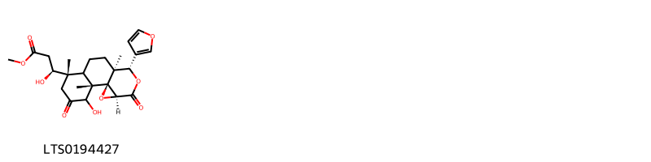{ width=100% }
    <figcaption>Hình ảnh cấu trúc hóa học của 1 hoạt chất thuộc nhóm Naphthopyrans gồm ['methyl (3s)-3-[(1r,2s,6s,10s,11s,14s)-11-(furan-3-yl)-3-hydroxy-2,6,10-trimethyl-4,13-dioxo-12,15-dioxatetracyclo[8.5.0.0¹,¹⁴.0²,⁷]pentadecan-6-yl]-3-hydroxypropanoate (LTS0194427)'].</figcaption>
</figure>
#### Nhóm Organooxygen compounds
<figure markdown="span">
    { width=100% }
    <figcaption>Hình ảnh cấu trúc hóa học của 18 hoạt chất thuộc nhóm Organooxygen compounds gồm ['decanal (LTS0128361)', '6-methyl-5-hepten-2-one (LTS0241073)', 'octanal (LTS0055983)', 'nonanal (LTS0244398)', 'aldehyde c11 (LTS0045537)', '(2r,3s,4s,5r,6s)-2-(hydroxymethyl)-6-[(2-methylbut-3-en-2-yl)oxy]oxane-3,4,5-triol (LTS0073684)', '2-(hydroxymethyl)-6-[(2-methylbut-3-en-2-yl)oxy]oxane-3,4,5-triol (LTS0002833)', 'jasmone (LTS0205512)', '2-methyl-6-{[3,4,5-trihydroxy-6-(2-phenylethoxy)oxan-2-yl]methoxy}oxane-3,4,5-triol (LTS0128924)', '(2r,3s,4s,5r,6r)-2-(hydroxymethyl)-6-(2-phenylethoxy)oxane-3,4,5-triol (LTS0170558)', 'β-d-galactopyranuronic acid (LTS0271461)', '2-(hydroxymethyl)-6-(2-phenylethoxy)oxane-3,4,5-triol (LTS0220789)', '(2s,3r,4s,5s,6r)-2-({3-[2-(dimethylamino)ethyl]-1h-indol-5-yl}oxy)-6-(hydroxymethyl)oxane-3,4,5-triol (LTS0264134)', '(2s,3r,4r,5r,6r)-2-methyl-6-{[(2r,3s,4s,5r,6r)-3,4,5-trihydroxy-6-(2-phenylethoxy)oxan-2-yl]methoxy}oxane-3,4,5-triol (LTS0182672)', '2-({3-[2-(dimethylamino)ethyl]-1h-indol-5-yl}oxy)-6-(hydroxymethyl)oxane-3,4,5-triol (LTS0244909)', 'heptanal (LTS0031416)', '3-hexanol (LTS0232984)', 'polyacetal (LTS0074049)'].</figcaption>
</figure>
#### Nhóm Oxanes
<figure markdown="span">
    { width=100% }
    <figcaption>Hình ảnh cấu trúc hóa học của 1 hoạt chất thuộc nhóm Oxanes gồm ['1,8-cineole (LTS0166505)'].</figcaption>
</figure>
#### Nhóm Phenols
<figure markdown="span">
    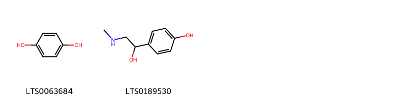{ width=100% }
    <figcaption>Hình ảnh cấu trúc hóa học của 2 hoạt chất thuộc nhóm Phenols gồm ['α-hydroquinone (LTS0063684)', 'synephrine (LTS0189530)'].</figcaption>
</figure>
#### Nhóm Prenol lipids
<figure markdown="span">
    { width=100% }
    <figcaption>Hình ảnh cấu trúc hóa học của 190 hoạt chất thuộc nhóm Prenol lipids gồm ['limonene,  (LTS0155981)', 'limonin (LTS0207873)', '7-(furan-3-yl)-1,8,12,17,17-pentamethyl-5,15,20-trioxo-3,6,16-trioxapentacyclo[9.9.0.0²,⁴.0²,⁸.0¹²,¹⁸]icosan-13-yl acetate (LTS0267734)', 'α pinene (LTS0132416)', 'α-myrcene (LTS0115731)', 'cymene (LTS0181568)', 'β-pinene (LTS0117550)', '(1r,2r,8s,11s,12r,18s)-7-(furan-3-yl)-1,8,12,17,17-pentamethyl-5,15,20-trioxo-3,6,16-trioxapentacyclo[9.9.0.0²,⁴.0²,⁸.0¹²,¹⁸]icosan-13-yl acetate (LTS0234033)', 'terpinolene (LTS0104525)', 'caryophyllene (LTS0085212)', 'α-limonene (LTS0244943)', 'terpinene (LTS0136858)', 'auraptene (LTS0058299)', 'nerol (LTS0244289)', 'α-citral (LTS0246122)', 'terpineol (LTS0136148)', 'linalool, (+-)- (LTS0128839)', '(-)-α-pinene (LTS0032699)', 'β-elemene (LTS0225699)', '(-)-β-pinene (LTS0108757)', 'α-thujene (LTS0185078)', 'neral (LTS0165243)', '(+)-sabinene (LTS0110694)', '3,7-dimethyl-2,6-octadienal (LTS0141353)', 'limonin (LTS0143013)', 'geraniol (LTS0258838)', 'citronella (LTS0151257)', 'citronellol, (+-)- (LTS0090925)', '(-)-linalool (LTS0200382)', '4-terpineol (LTS0253733)', 'β-farnesene (LTS0067925)', 'sabinene (LTS0224133)', 'obacunone (LTS0261586)', '(1s,5s)-carvyl acetate (LTS0169943)', 'allo-ocimene (LTS0090999)', '(3r,5z)-2,6-dimethylocta-1,5,7-trien-3-ol (LTS0097711)', '(4e,6z)-alloocimene (LTS0254100)', '(-)-β-bisabolene (LTS0009940)', '(+)-α-thujene (LTS0272912)', 'carvyl acetate (LTS0049357)', 'limonin 17-β-d-glucopyranoside (LTS0198378)', 'ichangin (LTS0018532)', '2-[4-ethenyl-4-methyl-3-(prop-1-en-2-yl)cyclohexyl]propan-2-ol (LTS0072139)', '(1r,2r,4s,7s,8s,11r,12r,13s,18r)-7-(furan-3-yl)-13-hydroxy-1,8,12,17,17-pentamethyl-3,6,16-trioxapentacyclo[9.9.0.0²,⁴.0²,⁸.0¹²,¹⁸]icosane-5,15,20-trione (LTS0177008)', 'camphene (LTS0267242)', 'elemol (LTS0208556)', '(-)-friedelin (LTS0041645)', 'nerolidol (LTS0197738)', 'humulene (LTS0263171)', 'phellandrene (LTS0157173)', "(1r,3'r,5ar,7ar,9s,11ar,11br)-1-(acetyloxy)-9-[furan-3-yl({[(2r,3r,4s,5s,6r)-3,4,5-trihydroxy-6-(hydroxymethyl)oxan-2-yl]oxy})methyl]-5,5,7a,9,11b-pentamethyl-3,7-dioxo-hexahydro-1h-spiro[naphtho[2,1-c]oxepine-8,2'-oxirane]-3'-carboxylic acid (LTS0107449)", 'nerolidol (LTS0155191)', 'cryptoxanthin (LTS0132646)', "(1r,7ar,9s,11br)-1-(acetyloxy)-9-[(s)-furan-3-yl(hydroxy)methyl]-5,5,7a,9,11b-pentamethyl-3,7-dioxo-hexahydro-1h-spiro[naphtho[2,1-c]oxepine-8,2'-oxirane]-3'-carboxylic acid (LTS0156866)", 'linalyl acetate (LTS0167325)', 'β-ocimene (LTS0242381)', 'α-curcumene (LTS0019880)', 'all-trans-phytofluene (LTS0269894)', 'sabinene hydrate (LTS0236165)', '(+)-α-carotene (LTS0200789)', 'trans-β-ocimene (LTS0049765)', 'β-carotene (LTS0275716)', 'thymol (LTS0168527)', '3,7-dimethyl-2,6-octadien-1-ol (LTS0215566)', 'α-thujene (LTS0176954)', 'lily of valley (LTS0051762)', '(+)-linalool (LTS0196043)', 'α-copaene (LTS0207598)', '(1r,2s,7s,8s)-8-isopropyl-1,3-dimethyltricyclo[4.4.0.0²,⁷]dec-3-ene (LTS0190031)', 'friedelin (LTS0213494)', 'violaxanthin (LTS0102265)', '(-)-limonene (LTS0205325)', '(1s,4s)-4-isopropyl-1,6-dimethyl-1,2,3,4-tetrahydronaphthalene (LTS0139634)', '7-(furan-3-yl)-1,8,12,17,17-pentamethyl-3,6,16-trioxapentacyclo[9.9.0.0²,⁴.0²,⁸.0¹²,¹⁸]icos-13-ene-5,15,20-trione (LTS0163399)', '(+)-gamma-cadinene (LTS0103949)', 'gibberellin a19 (LTS0044672)', 'gibberellin a20 (LTS0041124)', '4-isopropyl-6-methyl-1-methylidene-3,4,4a,7,8,8a-hexahydro-2h-naphthalene (LTS0111070)', '4-ethenyl-1-isopropyl-4-methyl-3-(prop-1-en-2-yl)cyclohex-1-ene (LTS0080134)', '(-)-citronellol (LTS0142531)', 'carveol (LTS0263183)', '(5s)-1-isopropyl-4-methylidenebicyclo[3.1.0]hexane (LTS0129854)', 'elemene (LTS0090837)', 'β-copaene (LTS0255787)', 'nomilin (LTS0125101)', 'lycopene (LTS0116567)', 'isopentenyl pyrophosphate (LTS0270004)', '(+)-α-pinene (LTS0211102)', 'perillaldehyde,  (LTS0028488)', 'geranyl diphosphate (LTS0051684)', "9-[furan-3-yl({[3,4,5-trihydroxy-6-(hydroxymethyl)oxan-2-yl]oxy})methyl]-5,5,7a,9,11b-pentamethyl-3,7-dioxo-6,10,11,11a-tetrahydro-5ah-spiro[naphtho[2,1-c]oxepine-8,2'-oxirane]-3'-carboxylic acid (LTS0098739)", '(6e)-2,6-dimethyl-10-methylidenedodeca-2,6-diene (LTS0154516)', 'gibberellin a1 (LTS0013777)', '4,11,11-trimethyl-8-methylidenebicyclo[7.2.0]undec-4-ene (LTS0256716)', 'β-selinene (LTS0096341)', '2-[(1s,3s,4s)-4-ethenyl-4-methyl-3-(prop-1-en-2-yl)cyclohexyl]propan-2-ol (LTS0219497)', 'β-elemene (LTS0260361)', '(-)-trans-carveol (LTS0156471)', 'farnesene (LTS0057150)', '4-(4-hydroxy-2,2,6-trimethyl-6-{[3,4,5-trihydroxy-6-(hydroxymethyl)oxan-2-yl]oxy}cyclohexylidene)but-3-en-2-one (LTS0193227)', 'gibberellin a25 (LTS0075482)', '1-ethenyl-1,2-dimethyl-2-(prop-1-en-2-yl)-4-(propan-2-ylidene)cyclohexane (LTS0102139)', '(1s,2s)-1-ethenyl-1-methyl-2-(prop-1-en-2-yl)-4-(propan-2-ylidene)cyclohexane (LTS0135613)', "(3'r,5as,7ar,8s,9s,11ar,11br)-9-[(s)-furan-3-yl({[(2r,3r,4s,5s,6r)-3,4,5-trihydroxy-6-(hydroxymethyl)oxan-2-yl]oxy})methyl]-5,5,7a,9,11b-pentamethyl-3,7-dioxo-6,10,11,11a-tetrahydro-5ah-spiro[naphtho[2,1-c]oxepine-8,2'-oxirane]-3'-carboxylic acid (LTS0075058)", '(-)-camphene (LTS0067556)', 'gibberellin a4 (LTS0029910)', '(-)-4-terpineol (LTS0111954)', 'gibberellin a53 (LTS0204462)', 'citroside b (LTS0127892)', '12-hydroxy-11-methyl-6-methylidene-16-oxo-15-oxapentacyclo[9.3.2.1⁵,⁸.0¹,¹⁰.0²,⁸]heptadecane-9-carboxylic acid (LTS0206002)', 'gibberellin a24 (LTS0193150)', '2,6,6-trimethyl-3,3-bis({2,6,6-trimethylbicyclo[3.1.1]hept-1-en-3-yl})bicyclo[3.1.1]hept-1-ene (LTS0141045)', '5,12-dihydroxy-11-methyl-6-methylidene-16-oxo-15-oxapentacyclo[9.3.2.1⁵,⁸.0¹,¹⁰.0²,⁸]heptadecane-9-carboxylic acid (LTS0230984)', '12-hydroxy-4,8-dimethyl-13-methylidenetetracyclo[10.2.1.0¹,⁹.0³,⁸]pentadecane-2,4-dicarboxylic acid (LTS0176089)', '5-hydroxy-11-methyl-6-methylidene-12-oxo-13-oxapentacyclo[9.3.3.1⁵,⁸.0¹,¹⁰.0²,⁸]octadecane-9-carboxylic acid (LTS0185226)', '(1r,2s,5s,8s,9s,10r,11s,12s)-5,12-dihydroxy-11-methyl-6-methylidene-16-oxo-15-oxapentacyclo[9.3.2.1⁵,⁸.0¹,¹⁰.0²,⁸]heptadecane-9-carboxylic acid (LTS0161788)', 'gibberellin a44 (LTS0078749)', 'tetramethylcyclohexanepropanol (LTS0232605)', '3,5,5-trimethyl-4-(3,7,12,16-tetramethylheptadeca-1,3,5,7,9,11,13,15-octaen-1-yl)cyclohex-3-en-1-ol (LTS0246981)', 'gibberellin a9 (LTS0243888)', "(1s,2s,3'r,4ar,5r,6r,8ar)-5-[(1s)-1-(acetyloxy)-3-methoxy-3-oxopropyl]-2-[(s)-furan-3-yl({[(2r,3r,4s,5s,6r)-3,4,5-trihydroxy-6-(hydroxymethyl)oxan-2-yl]oxy})methyl]-6-(2-hydroxypropan-2-yl)-2,5,8a-trimethyl-8-oxo-tetrahydro-3h-spiro[naphthalene-1,2'-oxirane]-3'-carboxylic acid (LTS0035730)", "5-[1-(acetyloxy)-3-methoxy-3-oxopropyl]-2-[furan-3-yl({[3,4,5-trihydroxy-6-(hydroxymethyl)oxan-2-yl]oxy})methyl]-6-(2-hydroxypropan-2-yl)-2,5,8a-trimethyl-8-oxo-tetrahydro-3h-spiro[naphthalene-1,2'-oxirane]-3'-carboxylic acid (LTS0008495)", '8-formyl-4-methyl-13-methylidenetetracyclo[10.2.1.0¹,⁹.0³,⁸]pentadecane-2,4-dicarboxylic acid (LTS0018915)', '(1s,2s,3s,4s,5s,8r,9r,12s)-8-formyl-5,12-dihydroxy-4-methyl-13-methylidenetetracyclo[10.2.1.0¹,⁹.0³,⁸]pentadecane-2,4-dicarboxylic acid (LTS0025469)', '8-formyl-5,12-dihydroxy-4-methyl-13-methylidenetetracyclo[10.2.1.0¹,⁹.0³,⁸]pentadecane-2,4-dicarboxylic acid (LTS0114398)', '(1r,2r,7s,10r,13r,14r,20s)-19-(2-hydroxy-5-oxo-2h-furan-3-yl)-9,9,13,20-tetramethyl-4,8,15,18-tetraoxahexacyclo[11.9.0.0²,⁷.0²,¹⁰.0¹⁴,¹⁶.0¹⁴,²⁰]docosane-5,12,17-trione (LTS0268674)', '(1s,2r,4s,7s,8s,11r,12r,13r,18r,20r)-7-(furan-3-yl)-20-hydroxy-1,8,12,17,17-pentamethyl-5,15,19-trioxo-3,6,16-trioxapentacyclo[9.9.0.0²,⁴.0²,⁸.0¹²,¹⁸]icosan-13-yl acetate (LTS0192729)', '1,5,5-trimethyl-6-[(1e,3e,5e,7e,9e)-3,7,12,16-tetramethyl-18-(2,6,6-trimethylcyclohex-1-en-1-yl)octadeca-1,3,5,7,9,11,13,15,17-nonaen-1-yl]-7-oxabicyclo[4.1.0]heptan-3-ol (LTS0172886)', '5-isopropyl-2-methylcyclohex-2-en-1-one (LTS0076097)', '7-(furan-3-yl)-20-hydroxy-1,8,12,17,17-pentamethyl-5,15,19-trioxo-3,6,16-trioxapentacyclo[9.9.0.0²,⁴.0²,⁸.0¹²,¹⁸]icosan-13-yl acetate (LTS0208652)', '3,5,5-trimethyl-4-[(1e,3e,5e,7e,9e)-3,7,12,16-tetramethyl-18-(2,6,6-trimethylcyclohex-1-en-1-yl)octadeca-1,3,5,7,9,11,13,15,17-nonaen-1-yl]cyclohex-3-en-1-ol (LTS0132454)', '(2r,7ar)-4,4,7a-trimethyl-2-[(2e,4e,6e,8e,10e,12e,14e,16e)-6,11,15-trimethyl-17-(2,6,6-trimethylcyclohex-1-en-1-yl)heptadeca-2,4,6,8,10,12,14,16-octaen-2-yl]-2,5,6,7-tetrahydro-1-benzofuran (LTS0080353)', '4-[18-(4-hydroxy-2,2,6-trimethylcyclohexyl)-3,7,12,16-tetramethyloctadeca-1,3,5,7,9,11,13,15,17-nonaen-1-yl]-3,5,5-trimethylcyclohex-3-en-1-ol (LTS0182319)', '(6e,8e,10e,12e,14e,16e,18e,22e,26e)-2,6,10,14,19,23,27,31-octamethyldotriaconta-2,6,8,10,12,14,16,18,22,26,30-undecaene (LTS0178208)', 'delta-carotene (LTS0070421)', '4-[(9e,11e,13e,15e,17e)-18-(4-hydroxy-2,6,6-trimethylcyclohex-1-en-1-yl)-3,7,12,16-tetramethyloctadeca-1,3,5,7,9,11,13,15,17-nonaen-1-yl]-3,5,5-trimethylcyclohex-3-en-1-ol (LTS0095534)', '2-[(2e,4e,6e,8e)-17-(4-hydroxy-2,6,6-trimethylcyclohex-1-en-1-yl)-6,11,15-trimethylheptadeca-2,4,6,8,10,12,14,16-octaen-2-yl]-4,4,7a-trimethyl-2,5,6,7-tetrahydro-1-benzofuran-6-ol (LTS0119891)', '(2s,6s,7ar)-2-[(2e,4e,6e,8e,10e,12e,14e)-17-[(1s,4s,6r)-4-hydroxy-2,2,6-trimethyl-7-oxabicyclo[4.1.0]heptan-1-yl]-6,11,15-trimethylheptadeca-2,4,6,8,10,12,14-heptaen-2-yl]-4,4,7a-trimethyl-2,5,6,7-tetrahydro-1-benzofuran-6-ol (LTS0182023)', '(s)-cryptoxanthin (LTS0148325)', '(r)-(-)-carvotanacetone (LTS0150094)', 'zeaxanthin (LTS0192928)', '(1r)-4-[(1e,3e,5e,7e,9e,11e,13e,15e,17e)-18-[(1r,4s,6r)-4-hydroxy-2,2,6-trimethylcyclohexyl]-3,7,12,16-tetramethyloctadeca-1,3,5,7,9,11,13,15,17-nonaen-1-yl]-3,5,5-trimethylcyclohex-3-en-1-ol (LTS0247041)', 'apocarotenal (LTS0146481)', '(1s,2r,4s)-1-[(1e,3e,5e,7e,9e,11e,13e,15e,17e)-18-[(4r)-4-hydroxy-2,6,6-trimethylcyclohex-1-en-1-yl]-3,7,12,16-tetramethyloctadeca-1,3,5,7,9,11,13,15,17-nonaen-1-yl]-2,6,6-trimethylcyclohexane-1,2,4-triol (LTS0151492)', '7-(furan-3-yl)-13,20-dihydroxy-1,8,12,17,17-pentamethyl-3,6,16-trioxapentacyclo[9.9.0.0²,⁴.0²,⁸.0¹²,¹⁸]icosane-5,15,19-trione (LTS0230515)', '(4r)-4-isopropylcyclohex-1-ene-1-carbaldehyde (LTS0231554)', '(1s,2r,4s)-1-[(1e,3e,5e,7e,9e,11e,13e,15e)-16-[(2r,6s,7ar)-6-hydroxy-4,4,7a-trimethyl-2,5,6,7-tetrahydro-1-benzofuran-2-yl]-3,7,12-trimethylheptadeca-1,3,5,7,9,11,13,15-octaen-1-yl]-2,6,6-trimethylcyclohexane-1,2,4-triol (LTS0158698)', '6-[(5e,7e,9e,11e,13e,15e,17e)-18-(4-hydroxy-2,6,6-trimethylcyclohex-1-en-1-yl)-3,7,12,16-tetramethyloctadeca-3,5,7,9,11,13,15,17-octaen-1-yl]-1,5,5-trimethyl-7-oxabicyclo[4.1.0]heptan-3-ol (LTS0159668)', '[(2r,3s,4s,5r,6s)-6-{[(2r,3s,4r,5r,6r)-6-{[(3s,6ar,6bs,8ar,11r,12s,12ar,14as,14br)-4,4,6a,6b,8a,11,12,14b-octamethyl-14-oxo-1,2,3,6,7,8,9,10,11,12,12a,14a-dodecahydropicen-3-yl]oxy}-4,5-dihydroxy-2-(hydroxymethyl)oxan-3-yl]oxy}-3,4,5-trihydroxyoxan-2-yl]methyl 3,4-dihydroxybenzoate (LTS0184290)', '3,5,5-trimethyl-4-[(9e,11e,13e,15e,17e)-3,7,12,16-tetramethyl-18-{2,2,6-trimethyl-7-oxabicyclo[4.1.0]heptan-1-yl}octadeca-1,3,5,7,9,11,13,15,17-nonaen-1-yl]cyclohex-3-en-1-ol (LTS0121645)', '(1r,3s,6s)-6-[(3e,5e,7e,9e,11e,13e,15e,17e)-18-[(4r)-4-hydroxy-2,6,6-trimethylcyclohex-1-en-1-yl]-3,7,12,16-tetramethyloctadeca-3,5,7,9,11,13,15,17-octaen-1-yl]-1,5,5-trimethyl-7-oxabicyclo[4.1.0]heptan-3-ol (LTS0105561)', 'phellandral (LTS0209940)', '3,5,5-trimethyl-4-[(1e,3e,5e,7e,9e)-3,7,12,16-tetramethyl-18-(2,6,6-trimethylcyclohex-2-en-1-yl)octadeca-1,3,5,7,9,11,13,15,17-nonaen-1-yl]cyclohex-3-en-1-ol (LTS0210642)', '(4e,6e,8e,10e,12e,14e,16e)-2,6,11,15-tetramethyl-17-(2,6,6-trimethylcyclohex-1-en-1-yl)heptadeca-2,4,6,8,10,12,14,16-octaenal (LTS0059203)', '(1r)-3,5,5-trimethyl-4-[(1e,3e,5e,7e,9e,11e,13e,15e,17e)-3,7,12,16-tetramethyl-18-[(1s,6r)-2,2,6-trimethyl-7-oxabicyclo[4.1.0]heptan-1-yl]octadeca-1,3,5,7,9,11,13,15,17-nonaen-1-yl]cyclohex-3-en-1-ol (LTS0053801)', '2-[(2e,4e,6e,8e,10e,12e)-17-{4-hydroxy-2,2,6-trimethyl-7-oxabicyclo[4.1.0]heptan-1-yl}-6,11,15-trimethylheptadeca-2,4,6,8,10,12,14-heptaen-2-yl]-4,4,7a-trimethyl-2,5,6,7-tetrahydro-1-benzofuran-6-ol (LTS0264417)', '(1s,2s,4r,7s,8s,11r,12s,13s,18r,20r)-7-(furan-3-yl)-13,20-dihydroxy-1,8,12,17,17-pentamethyl-3,6,16-trioxapentacyclo[9.9.0.0²,⁴.0²,⁸.0¹²,¹⁸]icosane-5,15,19-trione (LTS0081833)', '(1s,2s,5r)-5-isopropyl-2-methylbicyclo[3.1.0]hexan-2-ol (LTS0071189)', '6-[(9e,11e,13e,15e)-16-(6-hydroxy-4,4,7a-trimethyl-2,5,6,7-tetrahydro-1-benzofuran-2-yl)-3,7,12-trimethylheptadeca-1,3,5,7,9,11,13,15-octaen-1-ylidene]-1,5,5-trimethylcyclohexane-1,3-diol (LTS0233322)', '2,6,10,14,19,23,27,31-octamethyldotriaconta-2,6,8,10,12,14,16,18,20,22,24,26,30-tridecaene (LTS0219851)', 'α-sinensal (LTS0220235)', '(1r,3s)-6-[(3e,5e,7e,9e,11e,13e,15e)-16-[(2r,6s,7ar)-6-hydroxy-4,4,7a-trimethyl-2,5,6,7-tetrahydro-1-benzofuran-2-yl]-3,7,12-trimethylheptadeca-1,3,5,7,9,11,13,15-octaen-1-ylidene]-1,5,5-trimethylcyclohexane-1,3-diol (LTS0076274)', 'selinene (LTS0197809)', '(3s)-6-[(1e,3e,5e,7e,9e,11e,13e,15e,17e)-18-[(4r)-4-hydroxy-2,6,6-trimethylcyclohex-1-en-1-yl]-3,7,12,16-tetramethyloctadeca-1,3,5,7,9,11,13,15,17-nonaen-1-yl]-1,5,5-trimethyl-7-oxabicyclo[4.1.0]heptan-3-ol (LTS0209322)', 'sabinene hydrate (LTS0215494)', '1-[(1e,3e,5e,7e,9e)-18-(4-hydroxy-2,6,6-trimethylcyclohex-1-en-1-yl)-3,7,12,16-tetramethyloctadeca-1,3,5,7,9,11,13,15,17-nonaen-1-yl]-2,6,6-trimethylcyclohexane-1,2,4-triol (LTS0248546)', 'zeinoxanthin (LTS0058984)', '6-[(9e,11e,13e,15e,17e)-18-{4-hydroxy-2,2,6-trimethyl-7-oxabicyclo[4.1.0]heptan-1-yl}-3,7,12,16-tetramethyloctadeca-1,3,5,7,9,11,13,15,17-nonaen-1-yl]-1,5,5-trimethyl-7-oxabicyclo[4.1.0]heptan-3-ol (LTS0252861)', '(4e,6e,8e,10e,12e,14e,16e)-17-(4-hydroxy-2,6,6-trimethylcyclohex-1-en-1-yl)-2,6,11,15-tetramethylheptadeca-2,4,6,8,10,12,14,16-octaenal (LTS0186763)', '1,5,5-trimethyl-6-[(9e,11e,13e,15e,17e)-3,7,12,16-tetramethyl-18-(2,6,6-trimethylcyclohex-1-en-1-yl)octadeca-1,3,5,7,9,11,13,15,17-nonaen-1-yl]cyclohex-1-ene (LTS0265372)', '4,4,7a-trimethyl-2-[(2e,4e,6e,8e)-6,11,15-trimethyl-17-(2,6,6-trimethylcyclohex-1-en-1-yl)heptadeca-2,4,6,8,10,12,14,16-octaen-2-yl]-2,5,6,7-tetrahydro-1-benzofuran (LTS0002459)', 'delta-carotene (LTS0133990)', "(3s,5r,8r,3'r)-mutatoxanthin (LTS0245321)", '(1s,2r,4s,7s,8s,11r,12r,13r,18r,20r)-7-(furan-3-yl)-13,20-dihydroxy-1,8,12,17,17-pentamethyl-3,6,16-trioxapentacyclo[9.9.0.0²,⁴.0²,⁸.0¹²,¹⁸]icosane-5,15,19-trione (LTS0061954)', '2,6,10,14,19,23,27,31-octamethyldotriaconta-2,6,8,10,12,14,16,18,22,26,30-undecaene (LTS0003966)', 'neoxanthin (LTS0000701)', '(1s,3s,6r)-6-[(1e,3e,5e,7e,9e,11e,13e,15e,17e)-18-[(1r,4s,6s)-4-hydroxy-2,2,6-trimethyl-7-oxabicyclo[4.1.0]heptan-1-yl]-3,7,12,16-tetramethyloctadeca-1,3,5,7,9,11,13,15,17-nonaen-1-yl]-1,5,5-trimethyl-7-oxabicyclo[4.1.0]heptan-3-ol (LTS0059125)', '(1r)-3,5,5-trimethyl-4-[(1e,3e,5e,7e,9e,11e,13e)-3,7,12,16-tetramethylheptadeca-1,3,5,7,9,11,13,15-octaen-1-yl]cyclohex-3-en-1-ol (LTS0013700)', 'β-citraurin (LTS0011056)', '1-[(9e,11e,13e,15e)-16-(6-hydroxy-4,4,7a-trimethyl-2,5,6,7-tetrahydro-1-benzofuran-2-yl)-3,7,12-trimethylheptadeca-1,3,5,7,9,11,13,15-octaen-1-yl]-2,6,6-trimethylcyclohexane-1,2,4-triol (LTS0110672)', 'α-selinene (LTS0024564)', '[6-({6-[(4,4,6a,6b,8a,11,12,14b-octamethyl-14-oxo-1,2,3,6,7,8,9,10,11,12,12a,14a-dodecahydropicen-3-yl)oxy]-4,5-dihydroxy-2-(hydroxymethyl)oxan-3-yl}oxy)-3,4,5-trihydroxyoxan-2-yl]methyl 3,4-dihydroxybenzoate (LTS0017095)', '(4e)-5-[(1s)-1-hydroxy-2,6,6-trimethyl-4-oxocyclohex-2-en-1-yl]-3-methylpenta-2,4-dienoic acid (LTS0268716)', '6-[(3e,5e,7e,9e)-18-{4-hydroxy-2,2,6-trimethyl-7-oxabicyclo[4.1.0]heptan-1-yl}-3,7,12,16-tetramethyloctadeca-1,3,5,7,9,11,13,15,17-nonaen-1-ylidene]-1,5,5-trimethylcyclohexane-1,3-diol (LTS0114386)', '(1s,3s,6r)-6-[(3e,5e,7e,9e,11e,13e,15e,17e)-18-[(4r)-4-hydroxy-2,6,6-trimethylcyclohex-1-en-1-yl]-3,7,12,16-tetramethyloctadeca-3,5,7,9,11,13,15,17-octaen-1-yl]-1,5,5-trimethyl-7-oxabicyclo[4.1.0]heptan-3-ol (LTS0104241)', 'phytofluene (LTS0267709)', '(1r)-4-[(1e,3e,5e,7e,9e,11e,13e,15e,17e)-18-[(4r)-4-hydroxy-2,6,6-trimethylcyclohex-1-en-1-yl]-3,7,12,16-tetramethyloctadeca-1,3,5,7,9,11,13,15,17-nonaen-1-yl]-3,5,5-trimethylcyclohex-2-en-1-ol (LTS0035691)', 'methyl 2-[(1r,2r,4s,7s,8s,11r,12r,13s,16r,17s)-7-(furan-3-yl)-17-hydroxy-1,8,12,15,15-pentamethyl-5,18-dioxo-3,6,14-trioxapentacyclo[9.7.0.0²,⁴.0²,⁸.0¹²,¹⁶]octadecan-13-yl]acetate (LTS0047876)', '1,3,3-trimethyl-2-[(9e,11e,13e,15e,17e)-3,7,12,16-tetramethyl-18-(2,6,6-trimethylcyclohex-1-en-1-yl)octadeca-1,3,5,7,9,11,13,15,17-nonaen-1-yl]cyclohex-1-ene (LTS0110068)', '(1r,3s,6s)-1,5,5-trimethyl-6-[(1e,3e,5e,7e,9e,11e,13e,15e,17e)-3,7,12,16-tetramethyl-18-(2,6,6-trimethylcyclohex-1-en-1-yl)octadeca-1,3,5,7,9,11,13,15,17-nonaen-1-yl]-7-oxabicyclo[4.1.0]heptan-3-ol (LTS0091117)'].</figcaption>
</figure>
#### Nhóm Quinolines and derivatives
<figure markdown="span">
    { width=100% }
    <figcaption>Hình ảnh cấu trúc hóa học của 10 hoạt chất thuộc nhóm Quinolines and derivatives gồm ['7,11-dihydroxy-6-methoxy-2,2,5-trimethyl-1-oxa-5-azatetraphen-10-one (LTS0089252)', '1,5-dihydroxy-3,4-dimethoxy-10-methylacridin-9-one (LTS0154282)', '5-hydroxynoracronycine (LTS0148605)', '1,6-dihydroxy-3,5-dimethoxy-10-methylacridin-9-one (LTS0071155)', '1-hydroxy-3,5,6-trimethoxy-10-methylacridin-9-one (LTS0178502)', '6,7,11-trihydroxy-2,2,5-trimethyl-1-oxa-5-azatetraphen-10-one (LTS0239460)', '11-hydroxy-6,7-dimethoxy-2,2,5-trimethyl-1-oxa-5-azatetraphen-10-one (LTS0273038)', '7-acetyl-1,7-dihydroxy-3-methoxy-5h,6h-cyclohepta[b]quinoline-8,11-dione (LTS0147199)', '1,5-dihydroxy-3-methoxy-2-[1-(7-methoxy-2-oxochromen-6-yl)-3-methylbut-2-en-1-yl]-10-methylacridin-9-one (LTS0055616)', '1,3,6-trihydroxy-5-methoxy-10-methyl-4-(3-methylbut-2-en-1-yl)acridin-9-one (LTS0125444)'].</figcaption>
</figure>
#### Nhóm Saccharolipids
<figure markdown="span">
    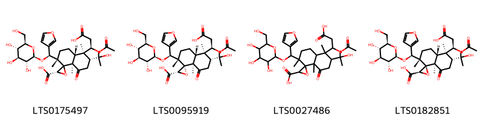{ width=100% }
    <figcaption>Hình ảnh cấu trúc hóa học của 4 hoạt chất thuộc nhóm Saccharolipids gồm ["(2s,3's,4ar,5r,6r,8ar)-5-[(1r)-1-(acetyloxy)-2-carboxyethyl]-2-[(s)-furan-3-yl({[(2r,3r,4s,5s,6r)-3,4,5-trihydroxy-6-(hydroxymethyl)oxan-2-yl]oxy})methyl]-6-(2-hydroxypropan-2-yl)-2,5,8a-trimethyl-8-oxo-tetrahydro-3h-spiro[naphthalene-1,2'-oxirane]-3'-carboxylic acid (LTS0175497)", "(1r,2s,3's,4ar,5r,6r,8ar)-5-[(1r)-1-(acetyloxy)-2-carboxyethyl]-2-[(s)-furan-3-yl({[(2r,3r,4s,5s,6r)-3,4,5-trihydroxy-6-(hydroxymethyl)oxan-2-yl]oxy})methyl]-6-(2-hydroxypropan-2-yl)-2,5,8a-trimethyl-8-oxo-tetrahydro-3h-spiro[naphthalene-1,2'-oxirane]-3'-carboxylic acid (LTS0095919)", "5-[1-(acetyloxy)-2-carboxyethyl]-2-[furan-3-yl({[3,4,5-trihydroxy-6-(hydroxymethyl)oxan-2-yl]oxy})methyl]-6-(2-hydroxypropan-2-yl)-2,5,8a-trimethyl-8-oxo-tetrahydro-3h-spiro[naphthalene-1,2'-oxirane]-3'-carboxylic acid (LTS0027486)", "(1s,2s,3'r,4ar,5r,6r,8ar)-5-[(1r)-1-(acetyloxy)-2-carboxyethyl]-2-[(s)-furan-3-yl({[(2r,3r,4s,5s,6r)-3,4,5-trihydroxy-6-(hydroxymethyl)oxan-2-yl]oxy})methyl]-6-(2-hydroxypropan-2-yl)-2,5,8a-trimethyl-8-oxo-tetrahydro-3h-spiro[naphthalene-1,2'-oxirane]-3'-carboxylic acid (LTS0182851)"].</figcaption>
</figure>
#### Nhóm Saturated hydrocarbons
<figure markdown="span">
    { width=100% }
    <figcaption>Hình ảnh cấu trúc hóa học của 2 hoạt chất thuộc nhóm Saturated hydrocarbons gồm ['pentadecane (LTS0210146)', 'heptadecane (LTS0038303)'].</figcaption>
</figure>
#### Nhóm Steroids and steroid derivatives
<figure markdown="span">
    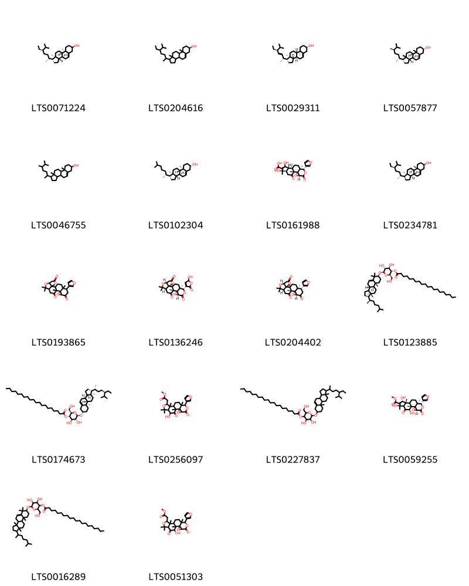{ width=100% }
    <figcaption>Hình ảnh cấu trúc hóa học của 18 hoạt chất thuộc nhóm Steroids and steroid derivatives gồm ['stigmast-5-en-3-ol (LTS0071224)', 'stigmast-5-en-3-ol, (3β)- (LTS0204616)', 'phytosterol (LTS0029311)', '(1r,3as,3bs,7s,9bs)-1-[(2r,5r)-5,6-dimethylheptan-2-yl]-9a,11a-dimethyl-1h,2h,3h,3ah,3bh,4h,6h,7h,8h,9h,9bh,10h,11h-cyclopenta[a]phenanthren-7-ol (LTS0057877)', 'campesterol (LTS0046755)', 'cholesterol (LTS0102304)', '3-[(1r,2r,5r,6r,7r,10s,11s,14s)-11-(furan-3-yl)-5-(2-hydroxypropan-2-yl)-2,6,10-trimethyl-3,13-dioxo-12,15-dioxatetracyclo[8.5.0.0¹,¹⁴.0²,⁷]pentadecan-6-yl]-3-hydroxypropanoic acid (LTS0161988)', '(1s,3ar,3br,7r,9as,9br,11ar)-1-[(2r,5r)-5-ethyl-6-methylheptan-2-yl]-9a,11a-dimethyl-1h,2h,3h,3ah,3bh,4h,6h,7h,8h,9h,9bh,10h,11h-cyclopenta[a]phenanthren-7-ol (LTS0234781)', '19-(furan-3-yl)-9,9,13,20-tetramethyl-4,8,15-trioxahexacyclo[11.9.0.0²,⁷.0²,¹⁰.0¹⁴,¹⁶.0¹⁴,²⁰]docosane-5,12,17-trione (LTS0193865)', '(1r,2r,7s,10r,13r,14r,16s,19r,20s)-19-(5-hydroxy-2-oxo-5h-furan-3-yl)-9,9,13,20-tetramethyl-4,8,15,18-tetraoxahexacyclo[11.9.0.0²,⁷.0²,¹⁰.0¹⁴,¹⁶.0¹⁴,²⁰]docosane-5,12,17-trione (LTS0136246)', '(1r,2r,7s,10r,13r,14r,16s,19s,20s)-19-(furan-3-yl)-9,9,13,20-tetramethyl-4,8,15-trioxahexacyclo[11.9.0.0²,⁷.0²,¹⁰.0¹⁴,¹⁶.0¹⁴,²⁰]docosane-5,12,17-trione (LTS0204402)', '(2r,3s,4r,5r,6r)-6-{[(1r,3as,3br,7s,9ar,9bs,11ar)-3a,6,6,9a,11a-pentamethyl-1-[(2r)-6-methylheptan-2-yl]-1h,2h,3h,3bh,4h,7h,8h,9h,9bh,10h,11h-cyclopenta[a]phenanthren-7-yl]oxy}-4,5-dihydroxy-2-(hydroxymethyl)oxan-3-yl icosanoate (LTS0123885)', '(2r,3s,4r,5r,6r)-6-{[(1r,3as,3bs,7s,9ar,9bs,11ar)-1-[(2r,5r)-5-ethyl-6-methylheptan-2-yl]-9a,11a-dimethyl-1h,2h,3h,3ah,3bh,4h,6h,7h,8h,9h,9bh,10h,11h-cyclopenta[a]phenanthren-7-yl]oxy}-4,5-dihydroxy-2-(hydroxymethyl)oxan-3-yl icosanoate (LTS0174673)', 'methyl 2-[7-(furan-3-yl)-17-hydroxy-1,8,12,15,15-pentamethyl-5,18-dioxo-3,6,14-trioxapentacyclo[9.7.0.0²,⁴.0²,⁸.0¹²,¹⁶]octadecan-13-yl]acetate (LTS0256097)', '6-{[1-(5-ethyl-6-methylheptan-2-yl)-9a,11a-dimethyl-1h,2h,3h,3ah,3bh,4h,6h,7h,8h,9h,9bh,10h,11h-cyclopenta[a]phenanthren-7-yl]oxy}-4,5-dihydroxy-2-(hydroxymethyl)oxan-3-yl icosanoate (LTS0227837)', 'methyl (3s)-3-[(1r,2s,3r,6r,10s,11s,14s)-11-(furan-3-yl)-3-hydroxy-5-(2-hydroxypropan-2-yl)-2,6,10-trimethyl-4,13-dioxo-12,15-dioxatetracyclo[8.5.0.0¹,¹⁴.0²,⁷]pentadecan-6-yl]-3-hydroxypropanoate (LTS0059255)', '6-{[3a,6,6,9a,11a-pentamethyl-1-(6-methylheptan-2-yl)-1h,2h,3h,3bh,4h,7h,8h,9h,9bh,10h,11h-cyclopenta[a]phenanthren-7-yl]oxy}-4,5-dihydroxy-2-(hydroxymethyl)oxan-3-yl icosanoate (LTS0016289)', 'methyl 2-[7-(furan-3-yl)-18-hydroxy-1,8,12,15,15-pentamethyl-5,17-dioxo-3,6,14-trioxapentacyclo[9.7.0.0²,⁴.0²,⁸.0¹²,¹⁶]octadecan-13-yl]acetate (LTS0051303)'].</figcaption>
</figure>
#### Nhóm Unsaturated hydrocarbons
<figure markdown="span">
    { width=100% }
    <figcaption>Hình ảnh cấu trúc hóa học của 6 hoạt chất thuộc nhóm Unsaturated hydrocarbons gồm ['α terpinene (LTS0232891)', '2-methyl-6-methylideneocta-1,7-diene (LTS0213612)', '(3e)-3,7-dimethylocta-1,3-diene (LTS0174272)', 'cosmene (LTS0151256)', 'heptadec-8-ene (LTS0163098)', '(8e)-heptadec-8-ene (LTS0274439)'].</figcaption>
</figure>

---

### Dược dân tộc học

Danh sách các quốc gia có sử dụng *Citrus reticulata* trong điều trị các bệnh. 

| Country   | Disease                                                                                                       | Bệnh                                                                                                               |
|:----------|:--------------------------------------------------------------------------------------------------------------|:-------------------------------------------------------------------------------------------------------------------|
| China     | Apertif, Carminative, Cosmetic, Digestive, Diuretic, Expectorant, Refrigerant, Stomachic, Digestive, Diuretic | Apertif, Carminative, Mỹ phẩm, Tiêu hóa, Thuốc lợi tiểu, Chất đờm, Chất làm lạnh, Dạ dày, Tiêu hóa, Thuốc lợi tiểu |
| Haiti     | Apertif, Sedative                                                                                             | Apertif, Thuốc an thần                                                                                             |

---

---
## Citrus sinensis
### Thông tin về thực vật

!!! info "Phân loại thực vật của *Citrus aurantium* từ GIBF:"
    - **Kingdom:** Plantae
    - **Phylum:** Tracheophyta
    - **Order:** Sapindales
    - **Family:** Rutaceae
    - **Genus:** Citrus
    - **Species:** *Citrus aurantium*

 

| Label (VI)   | Label (EN)   | Scientific Name   | Descriptions (VI)   | Descriptions (EN)   | Also Known As (VI)   | Also Known As (EN)                                          |
|:-------------|:-------------|:------------------|:--------------------|:--------------------|:---------------------|:------------------------------------------------------------|
| N/A          | N/A          | Citrus reticulata | loài thực vật       | species of plant    | ['']                 | ['mandarin', 'Citrus reticulata', 'mandarine', 'tangerina'] |

#### Phân bố trên thế giới

**Từ CSDL GIBF** Italy, Australia, Tanzania, United Republic of, Nigeria, Cyprus, Spain, Türkiye, Portugal, Morocco, United States of America, Chile, Guinea, Croatia, Greece, Iran (Islamic Republic of), Brazil, Peru, France, China, Ecuador, Iraq, Colombia, India, Cameroon

#### Phân bố tại Việt Nam

**Từ CSDL GIBF**: Không có ghi nhận ở Việt Nam

---
### Thành phần hóa học
        
- Theo cơ sở dữ liệu lotus: Từ loài *Citrus aurantium* đã phân lập và xác định được 372 hoạt chất thuộc về các nhóm Phenols, Naphthopyrans, Carboxylic acids and derivatives, Fatty Acyls, Cinnamic acids and derivatives, Dibenzylbutane lignans, Heteroaromatic compounds, Saturated hydrocarbons, Saccharolipids, Prenol lipids, Linear 1,3-diarylpropanoids, Quinolines and derivatives, Benzene and substituted derivatives, Dihydrofurans, Organooxygen compounds, Furanoid lignans, Pyridines and derivatives, Cyclobutane lignans, Phenol ethers, Flavonoids, Steroids and steroid derivatives, Organonitrogen compounds, Unsaturated hydrocarbons, Coumarins and derivatives, Imidazopyrimidines. 

|    | chemicalTaxonomyClassyfireClass     |   smiles_count |
|---:|:------------------------------------|---------------:|
|  0 | Benzene and substituted derivatives |             16 |
|  1 | Carboxylic acids and derivatives    |             11 |
|  2 | Cinnamic acids and derivatives      |              9 |
|  3 | Coumarins and derivatives           |             33 |
|  4 | Cyclobutane lignans                 |              2 |
|  5 | Dibenzylbutane lignans              |              2 |
|  6 | Dihydrofurans                       |              1 |
|  7 | Fatty Acyls                         |             22 |
|  8 | Flavonoids                          |             72 |
|  9 | Furanoid lignans                    |              3 |
| 10 | Heteroaromatic compounds            |              1 |
| 11 | Imidazopyrimidines                  |              1 |
| 12 | Linear 1,3-diarylpropanoids         |              2 |
| 13 | Naphthopyrans                       |              4 |
| 14 | Organonitrogen compounds            |              2 |
| 15 | Organooxygen compounds              |             21 |
| 16 | Phenol ethers                       |              2 |
| 17 | Phenols                             |              4 |
| 18 | Prenol lipids                       |            114 |
| 19 | Pyridines and derivatives           |             16 |
| 20 | Quinolines and derivatives          |              5 |
| 21 | Saccharolipids                      |              2 |
| 22 | Saturated hydrocarbons              |              2 |
| 23 | Steroids and steroid derivatives    |             19 |
| 24 | Unsaturated hydrocarbons            |              6 |

#### Nhóm Benzene and substituted derivatives
<figure markdown="span">
    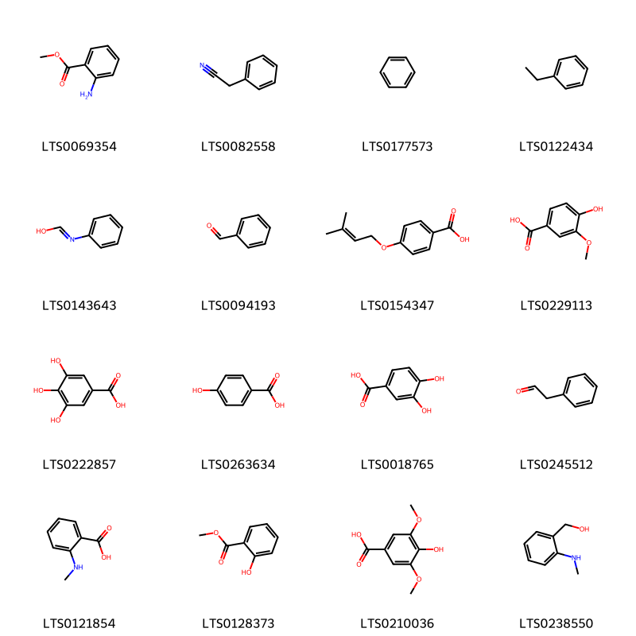{ width=100% }
    <figcaption>Hình ảnh cấu trúc hóa học của 16 hoạt chất thuộc nhóm Benzene and substituted derivatives gồm ['methyl anthranilate (LTS0069354)', 'phenylacetonitrile (LTS0082558)', 'benzene (LTS0177573)', 'ethylbenzene (LTS0122434)', 'n-phenylcarboximidic acid (LTS0143643)', 'benzaldehyde (LTS0094193)', '4-[(3-methylbut-2-en-1-yl)oxy]benzoic acid (LTS0154347)', 'vanillic acid (LTS0229113)', 'galop (LTS0222857)', 'p-hydroxybenzoic acid (LTS0263634)', '3,4-dihydroxybenzoic acid (LTS0018765)', 'phenylacetaldehyde (LTS0245512)', 'n-methylanthranilic acid (LTS0121854)', 'methyl salicylate (LTS0128373)', 'syringic acid (LTS0210036)', '[2-(methylamino)phenyl]methanol (LTS0238550)'].</figcaption>
</figure>
#### Nhóm Carboxylic acids and derivatives
<figure markdown="span">
    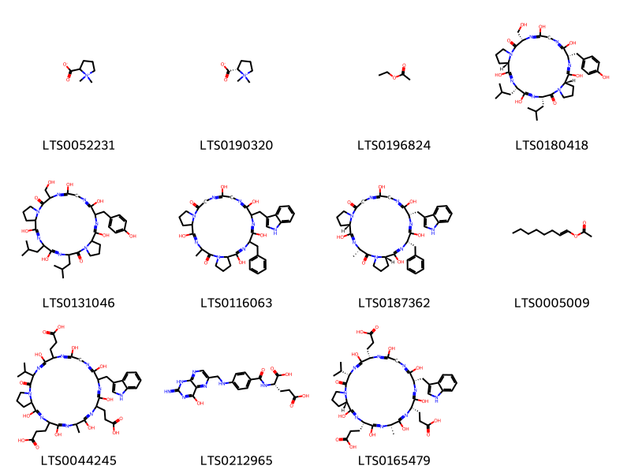{ width=100% }
    <figcaption>Hình ảnh cấu trúc hóa học của 11 hoạt chất thuộc nhóm Carboxylic acids and derivatives gồm ['1,1-dimethylpyrrolidin-1-ium-2-carboxylate (LTS0052231)', 'stachydrine (LTS0190320)', 'ethyl acetate (LTS0196824)', '(3s,6s,9s,15s,21s,24s)-5,8,17,20,23-pentahydroxy-15-(hydroxymethyl)-21-[(4-hydroxyphenyl)methyl]-3,6-bis(2-methylpropyl)-1,4,7,13,16,19,22-heptaazatricyclo[22.3.0.0⁹,¹³]heptacosa-4,7,16,19,22-pentaene-2,14-dione (LTS0180418)', '5,8,17,20,23-pentahydroxy-15-(hydroxymethyl)-21-[(4-hydroxyphenyl)methyl]-3,6-bis(2-methylpropyl)-1,4,7,13,16,19,22-heptaazatricyclo[22.3.0.0⁹,¹³]heptacosa-4,7,16,19,22-pentaene-2,14-dione (LTS0131046)', '21-benzyl-5,14,17,20,23-pentahydroxy-18-(1h-indol-3-ylmethyl)-3-methyl-1,4,10,13,16,19,22-heptaazatricyclo[22.3.0.0⁶,¹⁰]heptacosa-4,13,16,19,22-pentaene-2,11-dione (LTS0116063)', '(3s,6s,18s,21s,24s)-21-benzyl-5,14,17,20,23-pentahydroxy-18-(1h-indol-3-ylmethyl)-3-methyl-1,4,10,13,16,19,22-heptaazatricyclo[22.3.0.0⁶,¹⁰]heptacosa-4,13,16,19,22-pentaene-2,11-dione (LTS0187362)', 'oct-1-en-1-yl acetate (LTS0005009)', '3-[9,18-bis(2-carboxyethyl)-1,4,7,10,13,16,19-heptahydroxy-12-(1h-indol-3-ylmethyl)-21-isopropyl-6-methyl-22-oxo-3h,6h,9h,12h,15h,18h,21h,24h,25h,26h,26ah-pyrrolo[1,2-a]1,4,7,10,13,16,19,22-octaazacyclotetracosan-3-yl]propanoic acid (LTS0044245)', 'acid, folic (LTS0212965)', '3-[(3s,6s,9s,12s,18s,21s,26as)-3,9-bis(2-carboxyethyl)-1,4,7,10,13,16,19-heptahydroxy-12-(1h-indol-3-ylmethyl)-21-isopropyl-6-methyl-22-oxo-3h,6h,9h,12h,15h,18h,21h,24h,25h,26h,26ah-pyrrolo[1,2-a]1,4,7,10,13,16,19,22-octaazacyclotetracosan-18-yl]propanoic acid (LTS0165479)'].</figcaption>
</figure>
#### Nhóm Cinnamic acids and derivatives
<figure markdown="span">
    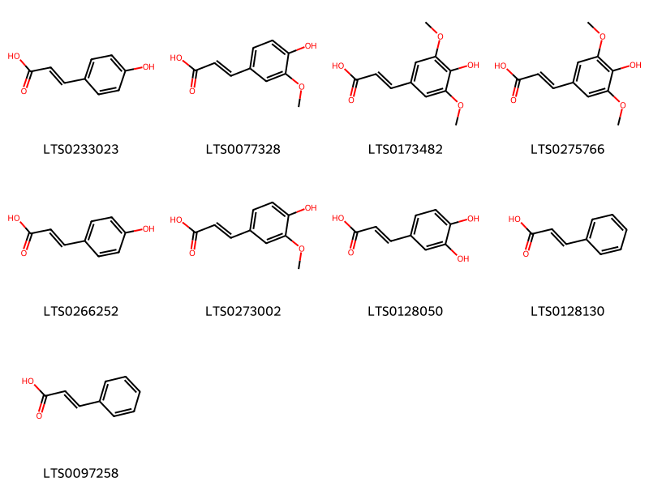{ width=100% }
    <figcaption>Hình ảnh cấu trúc hóa học của 9 hoạt chất thuộc nhóm Cinnamic acids and derivatives gồm ['hydroxycinnamic acid (LTS0233023)', 'ferulic acid (LTS0077328)', 'sinapinate (LTS0173482)', 'sinapoyl alcohol (LTS0275766)', 'para-coumaric acid (LTS0266252)', 'ferulic acid (LTS0273002)', '3,4-dihydroxycinnamic acid (LTS0128050)', 'cinnamic acid (LTS0128130)', 'phenylacrylic acid (LTS0097258)'].</figcaption>
</figure>
#### Nhóm Coumarins and derivatives
<figure markdown="span">
    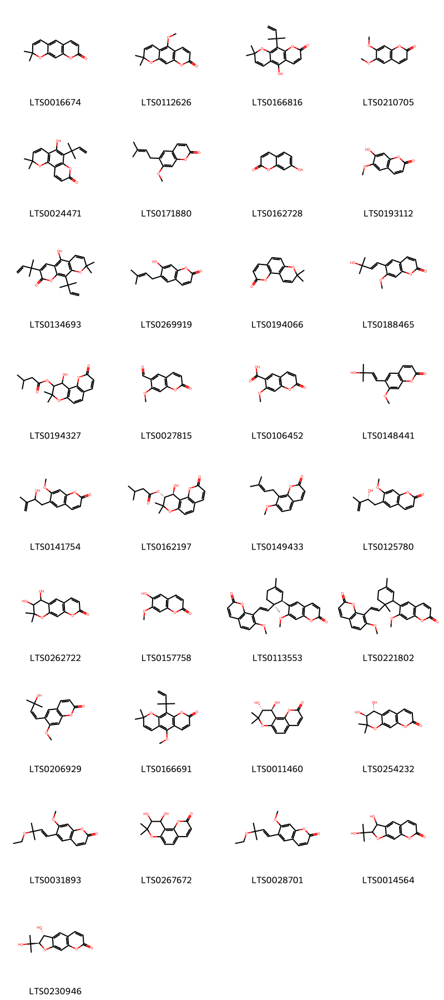{ width=100% }
    <figcaption>Hình ảnh cấu trúc hóa học của 33 hoạt chất thuộc nhóm Coumarins and derivatives gồm ['xanthyletin (LTS0016674)', 'xanthoxyletin (LTS0112626)', 'nor-dentatin (LTS0166816)', 'scoparone (LTS0210705)', '5-hydroxy-2,2-dimethyl-6-(2-methylbut-3-en-2-yl)pyrano[2,3-h]chromen-8-one (LTS0024471)', 'suberosin (LTS0171880)', 'umbelliferone (LTS0162728)', 'scopoletin (LTS0193112)', '5-hydroxy-8,8-dimethyl-3,10-bis(2-methylbut-3-en-2-yl)pyrano[3,2-g]chromen-2-one (LTS0134693)', 'demethylsuberosin (LTS0269919)', 'seselin (LTS0194066)', '6-[(1e)-3-hydroxy-3-methylbut-1-en-1-yl]-7-methoxychromen-2-one (LTS0188465)', '10-hydroxy-8,8-dimethyl-2-oxo-9h,10h-pyrano[2,3-h]chromen-9-yl 3-methylbutanoate (LTS0194327)', '7-methoxy-2-oxochromene-6-carbaldehyde (LTS0027815)', '7-methoxy-2-oxochromene-6-carboxylic acid (LTS0106452)', '6-(3-hydroxy-3-methylbut-1-en-1-yl)-7-methoxychromen-2-one (LTS0148441)', '6-(2-hydroxy-3-methylbut-3-en-1-yl)-7-methoxychromen-2-one (LTS0141754)', '(9r,10s)-10-hydroxy-8,8-dimethyl-2-oxo-9h,10h-pyrano[2,3-h]chromen-9-yl 3-methylbutanoate (LTS0162197)', 'osthole (LTS0149433)', '6-[(2r)-2-hydroxy-3-methylbut-3-en-1-yl]-7-methoxychromen-2-one (LTS0125780)', '6,7-dihydroxy-8,8-dimethyl-6h,7h-pyrano[3,2-g]chromen-2-one (LTS0262722)', 'isoscopoletin (LTS0157758)', '7-methoxy-6-[(1r,6r)-6-[(1e)-2-(7-methoxy-2-oxochromen-8-yl)ethenyl]-3,6-dimethylcyclohex-2-en-1-yl]chromen-2-one (LTS0113553)', '7-methoxy-6-{6-[2-(7-methoxy-2-oxochromen-8-yl)ethenyl]-3,6-dimethylcyclohex-2-en-1-yl}chromen-2-one (LTS0221802)', '6-[(1z)-3-hydroxy-3-methylbut-1-en-1-yl]-7-methoxychromen-2-one (LTS0206929)', 'dentatin (LTS0166691)', '(9r,10s)-9,10-dihydroxy-8,8-dimethyl-9h,10h-pyrano[2,3-h]chromen-2-one (LTS0011460)', '(6r,7s)-6,7-dihydroxy-8,8-dimethyl-6h,7h-pyrano[3,2-g]chromen-2-one (LTS0254232)', '6-(3-ethoxy-3-methylbut-1-en-1-yl)-7-methoxychromen-2-one (LTS0031893)', '9,10-dihydroxy-8,8-dimethyl-9h,10h-pyrano[2,3-h]chromen-2-one (LTS0267672)', '6-[(1e)-3-ethoxy-3-methylbut-1-en-1-yl]-7-methoxychromen-2-one (LTS0028701)', '3-hydroxy-2-(2-hydroxypropan-2-yl)-2h,3h-furo[3,2-g]chromen-7-one (LTS0014564)', '(2r,3r)-3-hydroxy-2-(2-hydroxypropan-2-yl)-2h,3h-furo[3,2-g]chromen-7-one (LTS0230946)'].</figcaption>
</figure>
#### Nhóm Cyclobutane lignans
<figure markdown="span">
    { width=100% }
    <figcaption>Hình ảnh cấu trúc hóa học của 2 hoạt chất thuộc nhóm Cyclobutane lignans gồm ['8-[2,3-diacetyl-4-(7-methoxy-2-oxochromen-8-yl)cyclobutyl]-7-methoxychromen-2-one (LTS0261353)', '8-[(1s,2r,3s,4r)-2,3-diacetyl-4-(7-methoxy-2-oxochromen-8-yl)cyclobutyl]-7-methoxychromen-2-one (LTS0061374)'].</figcaption>
</figure>
#### Nhóm Dibenzylbutane lignans
<figure markdown="span">
    { width=100% }
    <figcaption>Hình ảnh cấu trúc hóa học của 2 hoạt chất thuộc nhóm Dibenzylbutane lignans gồm ['(2s,3r)-2,3-bis[(4-hydroxy-3-methoxyphenyl)(¹³c)methyl](1-¹³c)butane-1,4-diol (LTS0268699)', 'secoisolariciresinol (LTS0086727)'].</figcaption>
</figure>
#### Nhóm Dihydrofurans
<figure markdown="span">
    { width=100% }
    <figcaption>Hình ảnh cấu trúc hóa học của 1 hoạt chất thuộc nhóm Dihydrofurans gồm ['vitamin c (LTS0022555)'].</figcaption>
</figure>
#### Nhóm Fatty Acyls
<figure markdown="span">
    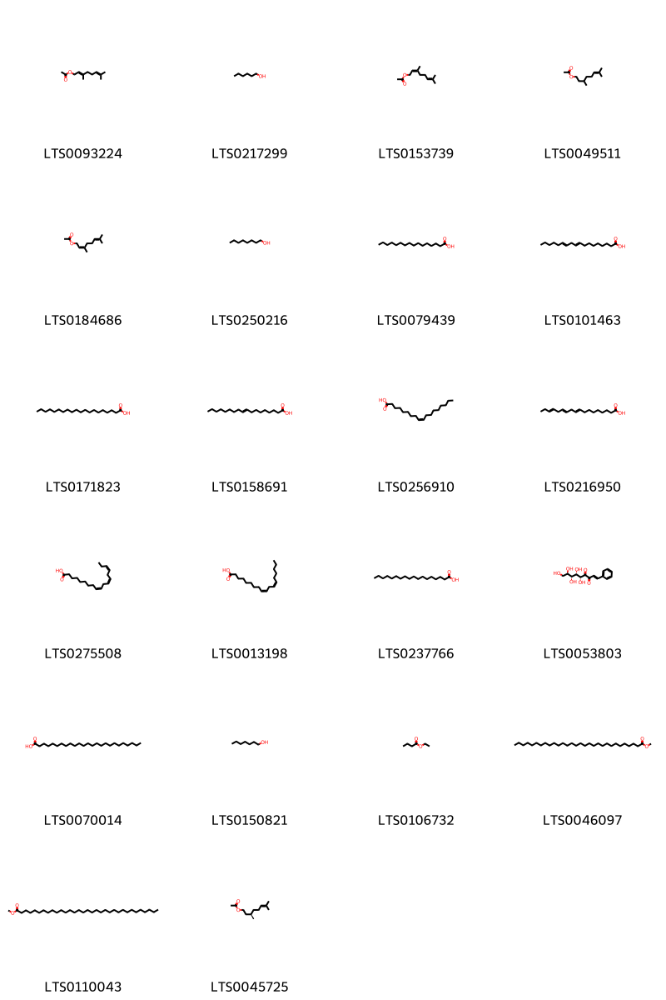{ width=100% }
    <figcaption>Hình ảnh cấu trúc hóa học của 22 hoạt chất thuộc nhóm Fatty Acyls gồm ['geranyl acetate (LTS0093224)', 'hexanol (LTS0217299)', 'neryl acetate (LTS0153739)', 'citronellyl acetate (LTS0049511)', '3,7-dimethylocta-2,6-dien-1-yl acetate (LTS0184686)', 'octanol (LTS0250216)', 'palmitic acid (LTS0079439)', '9,12-octadecadienoic acid (LTS0101463)', 'arachidic acid (LTS0171823)', '9 octadecenoic acid (LTS0158691)', 'oleic acid (LTS0256910)', 'octadeca-9,12,15-trienoic acid (LTS0216950)', 'α-linolenic acid (LTS0275508)', 'linoleic (LTS0013198)', 'stearic acid (LTS0237766)', '(5r,6s,7r,8r)-5,6,7,8,9-pentahydroxy-1-phenylnon-1-ene-3,4-dione (LTS0053803)', 'pentacosanoic acid (LTS0070014)', 'heptanol (LTS0150821)', 'ethyl butyrate (LTS0106732)', 'methyl triacontanoate (LTS0046097)', 'methyl tritriacontanoate (LTS0110043)', '(r)-citronellol acetate (LTS0045725)'].</figcaption>
</figure>
#### Nhóm Flavonoids
<figure markdown="span">
    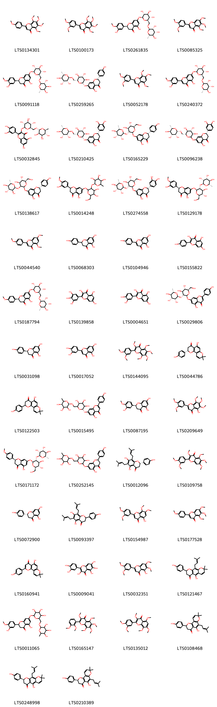{ width=100% }
    <figcaption>Hình ảnh cấu trúc hóa học của 72 hoạt chất thuộc nhóm Flavonoids gồm ['tangeretin (LTS0134301)', 'nobiletin (LTS0100173)', 'hesperidin (LTS0261835)', 'sinensetin (LTS0085325)', '(2s)-5-hydroxy-2-(3-hydroxy-4-methoxyphenyl)-7-{[(2s,3r,4s,5s,6r)-3,4,5-trihydroxy-6-({[(2r,3r,4s,5r,6s)-3,4,5-trihydroxy-6-methyloxan-2-yl]oxy}methyl)oxan-2-yl]oxy}-2,3-dihydro-1-benzopyran-4-one (LTS0091118)', 'narirutin (LTS0259265)', 'isosinensetin (LTS0052178)', 'diosmin (LTS0240372)', '3-rutinosyl quercetin (LTS0032845)', 'eriocitrin (LTS0210425)', 'naringin (LTS0165229)', '(2s)-2-(3,4-dihydroxyphenyl)-5-hydroxy-7-{[(3r,4s,5s,6r)-3,4,5-trihydroxy-6-({[(2s,3r,4r,5r,6s)-3,4,5-trihydroxy-6-methyloxan-2-yl]oxy}methyl)oxan-2-yl]oxy}-2,3-dihydro-1-benzopyran-4-one (LTS0096238)', '(2s)-7-{[(2s,3s,4s,5s,6r)-4,5-dihydroxy-6-(hydroxymethyl)-3-{[(2s,3s,4r,5r,6s)-3,4,5-trihydroxy-6-methyloxan-2-yl]oxy}oxan-2-yl]oxy}-5-hydroxy-2-(4-hydroxyphenyl)-2,3-dihydro-1-benzopyran-4-one (LTS0138617)', '7-{[4,5-dihydroxy-6-(hydroxymethyl)-3-{[(2s)-3,4,5-trihydroxy-6-methyloxan-2-yl]oxy}oxan-2-yl]oxy}-5-hydroxy-2-(3-hydroxy-4-methoxyphenyl)-2,3-dihydro-1-benzopyran-4-one (LTS0014248)', 'neoeriocitrin (LTS0274558)', 'neohesperidin (LTS0129178)', 'apigenin trimethyl ether (LTS0044540)', 'asahina (LTS0068303)', 'chamomile (LTS0104946)', 'kaempherol (LTS0155822)', '(2s)-5-hydroxy-2-(4-methoxyphenyl)-7-{[(2s,3r,4s,5s,6r)-3,4,5-trihydroxy-6-({[(2r,3r,4r,5r,6s)-3,4,5-trihydroxy-6-methyloxan-2-yl]oxy}methyl)oxan-2-yl]oxy}-2,3-dihydro-1-benzopyran-4-one (LTS0187794)', 'myricetin (LTS0139858)', 'quercetin (LTS0004651)', 'rhoifolin (LTS0029806)', 'naringenin (LTS0031098)', 'luteolin (LTS0017052)', '3-methoxynobiletin (LTS0144095)', '(2s)-5-hydroxy-2-(4-hydroxyphenyl)-8,8-dimethyl-2h,3h-pyrano[2,3-f]chromen-4-one (LTS0044786)', 'citflavanone (LTS0122503)', '5-hydroxy-2-(4-hydroxyphenyl)-7-{[(2s,5s)-3,4,5-trihydroxy-6-({[(2r,5r)-3,4,5-trihydroxy-6-methyloxan-2-yl]oxy}methyl)oxan-2-yl]oxy}chromen-4-one (LTS0015495)', 'hesperetin (LTS0087195)', 'demethylnobiletin (LTS0209649)', 'poncirin (LTS0171172)', '5-hydroxy-2-(4-hydroxyphenyl)-7-[(3,4,5-trihydroxy-6-{[(3,4,5-trihydroxy-6-methyloxan-2-yl)oxy]methyl}oxan-2-yl)oxy]-2,3-dihydro-1-benzopyran-4-one (LTS0252145)', 'lonchocarpol a (LTS0012096)', 'hexamethylquercetagetin (LTS0109758)', '(-)-naringenin (LTS0072900)', '5,7-dihydroxy-2-(4-hydroxyphenyl)-6,8-bis(3-methylbut-2-en-1-yl)-2,3-dihydro-1-benzopyran-4-one (LTS0093397)', '2-(3,4-dimethoxyphenyl)-5-hydroxy-7,8-dimethoxychromen-4-one (LTS0154987)', "4',5,6,7-tetramethoxyflavone (LTS0177528)", 'atalantoflavone (LTS0160941)', 'quercetagetin (LTS0009041)', '2-(3,4-dimethoxyphenyl)-5-hydroxy-6,7-dimethoxychromen-4-one (LTS0032351)', 'lupinifolin (LTS0121467)', 'hesperidin (LTS0011065)', '2-(2,3-dimethoxyphenyl)-3,5,6,7,8-pentamethoxychromen-4-one (LTS0165147)', 'gossypetin hexamethyl ether (LTS0135012)', 'cajaflavanone (LTS0108468)', '(2s)-5-hydroxy-2-(4-hydroxyphenyl)-8,8-dimethyl-10-(3-methylbut-2-en-1-yl)-2h,3h-pyrano[3,2-g]chromen-4-one (LTS0248998)', '(2s)-5-hydroxy-2-(4-hydroxyphenyl)-8,8-dimethyl-6-(3-methylbut-2-en-1-yl)-2h,3h-pyrano[2,3-f]chromen-4-one (LTS0210389)', 'phlorizin (LTS0198771)', '8-{[4,5-dihydroxy-6-(hydroxymethyl)-3-[(3,4,5-trihydroxyoxan-2-yl)oxy]oxan-2-yl]oxy}-5,7-dihydroxy-2-(4-hydroxyphenyl)chromen-4-one (LTS0125263)', '3,5-dihydroxy-2-(4-methoxyphenyl)-7-[(3,4,5-trihydroxy-6-methyloxan-2-yl)oxy]-2,3-dihydro-1-benzopyran-4-one (LTS0207880)', '2-(3,4-dimethoxyphenyl)-5,6,7,8-tetramethoxy-3-{[(2s,3r,4s,5s,6r)-3,4,5-trihydroxy-6-(hydroxymethyl)oxan-2-yl]oxy}chromen-4-one (LTS0074567)', '3-{[(2s,3r,4r,5s,6r)-6-{[(2-carboxyacetyl)oxy]methyl}-3,4,5-trihydroxyoxan-2-yl]oxy}-2-(3,4-dihydroxyphenyl)-5,7-dihydroxy-1λ⁴-chromen-1-ylium (LTS0186341)', '3-{[(2s,3r,4s,5s,6r)-6-{[(2-carboxyacetyl)oxy]methyl}-3,4,5-trihydroxyoxan-2-yl]oxy}-2-(3,4-dihydroxyphenyl)-5,7-dihydroxy-1λ⁴-chromen-1-ylium (LTS0142659)', 'chrysin (LTS0200644)', 'naringine (LTS0138800)', '(2s,3r)-3,5-dihydroxy-2-(4-methoxyphenyl)-7-{[(2r,3r,4r,5r,6s)-3,4,5-trihydroxy-6-methyloxan-2-yl]oxy}-2,3-dihydro-1-benzopyran-4-one (LTS0151486)', '5,7-dihydroxy-2-(3-hydroxy-4-methoxyphenyl)-3,8-bis({[3,4,5-trihydroxy-6-(hydroxymethyl)oxan-2-yl]oxy})chromen-4-one (LTS0086798)', '2-(3,4-dimethoxyphenyl)-5,6,7,8-tetramethoxy-3-{[3,4,5-trihydroxy-6-(hydroxymethyl)oxan-2-yl]oxy}chromen-4-one (LTS0245642)', '8-{[(2s,3r,4s,5s,6r)-4,5-dihydroxy-6-(hydroxymethyl)-3-{[(2s,3r,4s,5r)-3,4,5-trihydroxyoxan-2-yl]oxy}oxan-2-yl]oxy}-5,7-dihydroxy-2-(4-hydroxyphenyl)chromen-4-one (LTS0255490)', 'cyanidin 3-glucoside (LTS0217835)', '(2s,3r)-5-hydroxy-2-(4-hydroxy-3-methoxyphenyl)-7-methoxy-3-{[(2s,3r,4s,5s,6r)-3,4,5-trihydroxy-6-(hydroxymethyl)oxan-2-yl]oxy}-2,3-dihydro-1-benzopyran-4-one (LTS0267597)', 'galangin (LTS0210648)', '2-(3,4-dimethoxyphenyl)-6,7,8-trimethoxychromen-4-one (LTS0266569)', '5,7-dihydroxy-2-(4-hydroxyphenyl)-3,8-bis({[(2s,3r,4s,5s,6r)-3,4,5-trihydroxy-6-(hydroxymethyl)oxan-2-yl]oxy})chromen-4-one (LTS0226544)', '2-(3,4-dimethoxyphenyl)-5-hydroxy-3,6,7,8-tetramethoxychromen-4-one (LTS0235026)', '5-hydroxy-2-(4-methoxyphenyl)-7-[(3,4,5-trihydroxy-6-{[(3,4,5-trihydroxy-6-methyloxan-2-yl)oxy]methyl}oxan-2-yl)oxy]-2,3-dihydro-1-benzopyran-4-one (LTS0053955)', '5,7-dihydroxy-2-(4-hydroxyphenyl)-3,8-bis({[3,4,5-trihydroxy-6-(hydroxymethyl)oxan-2-yl]oxy})chromen-4-one (LTS0032795)', '5,7-dihydroxy-2-(3-hydroxy-4-methoxyphenyl)-8-{[(2r,3r,4s,5s,6r)-3,4,5-trihydroxy-6-(hydroxymethyl)oxan-2-yl]oxy}-3-{[(2s,3r,4s,5s,6r)-3,4,5-trihydroxy-6-(hydroxymethyl)oxan-2-yl]oxy}chromen-4-one (LTS0210064)', 'scutellarein (LTS0136843)'].</figcaption>
</figure>
#### Nhóm Furanoid lignans
<figure markdown="span">
    { width=100% }
    <figcaption>Hình ảnh cấu trúc hóa học của 3 hoạt chất thuộc nhóm Furanoid lignans gồm ['matairesinol (LTS0193475)', 'pinoresinol (LTS0057431)', 'lariciresinol (LTS0010950)'].</figcaption>
</figure>
#### Nhóm Heteroaromatic compounds
<figure markdown="span">
    { width=100% }
    <figcaption>Hình ảnh cấu trúc hóa học của 1 hoạt chất thuộc nhóm Heteroaromatic compounds gồm ['silvan (LTS0020613)'].</figcaption>
</figure>
#### Nhóm Imidazopyrimidines
<figure markdown="span">
    { width=100% }
    <figcaption>Hình ảnh cấu trúc hóa học của 1 hoạt chất thuộc nhóm Imidazopyrimidines gồm ['caffeine (LTS0075508)'].</figcaption>
</figure>
#### Nhóm Linear 1_3-diarylpropanoids
<figure markdown="span">
    { width=100% }
    <figcaption>Hình ảnh cấu trúc hóa học của Không tìm thấy chú thích hoạt chất thuộc nhóm Linear 1_3-diarylpropanoids gồm Không tìm thấy chú thích.</figcaption>
</figure>
#### Nhóm Naphthopyrans
<figure markdown="span">
    { width=100% }
    <figcaption>Hình ảnh cấu trúc hóa học của 4 hoạt chất thuộc nhóm Naphthopyrans gồm ['(1s,2s,5s,6s,9s,11r,12s,13r,15s,18r)-6-(furan-3-yl)-5,12,16,16-tetramethyl-8,20-dioxo-7,10,17,21-tetraoxahexacyclo[16.3.1.0¹,¹⁵.0²,¹².0⁵,¹¹.0⁹,¹¹]docosan-13-yl acetate (LTS0201281)', '6-(furan-3-yl)-5,12,16,16-tetramethyl-8,20-dioxo-7,10,17,21-tetraoxahexacyclo[16.3.1.0¹,¹⁵.0²,¹².0⁵,¹¹.0⁹,¹¹]docosan-13-yl acetate (LTS0040509)', '18-(furan-3-yl)-8,8,12,19-tetramethyl-6,16-dioxo-7,14,17-trioxapentacyclo[10.9.0.0²,⁹.0¹³,¹⁵.0¹³,¹⁹]henicosa-1(21),4-dien-11-yl acetate (LTS0068911)', '(2s,4z,9s,11r,12s,13r,15s,18s,19s)-18-(furan-3-yl)-8,8,12,19-tetramethyl-6,16-dioxo-7,14,17-trioxapentacyclo[10.9.0.0²,⁹.0¹³,¹⁵.0¹³,¹⁹]henicosa-1(21),4-dien-11-yl acetate (LTS0098831)'].</figcaption>
</figure>
#### Nhóm Organonitrogen compounds
<figure markdown="span">
    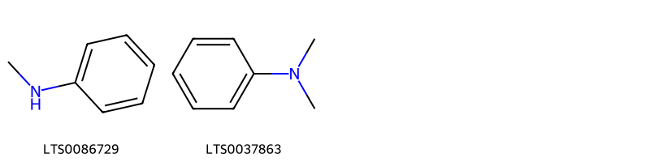{ width=100% }
    <figcaption>Hình ảnh cấu trúc hóa học của 2 hoạt chất thuộc nhóm Organonitrogen compounds gồm ['methylaniline (LTS0086729)', 'dimethylaniline (LTS0037863)'].</figcaption>
</figure>
#### Nhóm Organooxygen compounds
<figure markdown="span">
    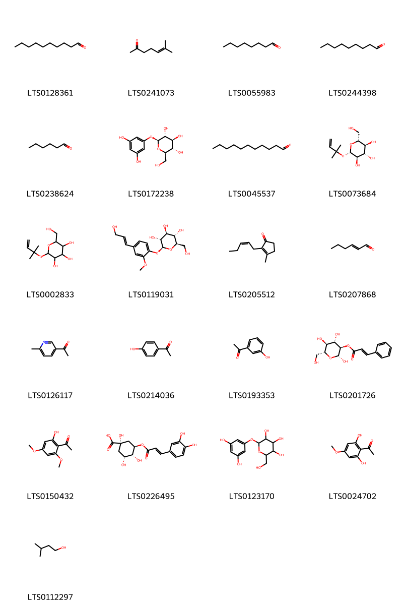{ width=100% }
    <figcaption>Hình ảnh cấu trúc hóa học của 21 hoạt chất thuộc nhóm Organooxygen compounds gồm ['decanal (LTS0128361)', '6-methyl-5-hepten-2-one (LTS0241073)', 'octanal (LTS0055983)', 'nonanal (LTS0244398)', 'hexanal (LTS0238624)', '(2s,3r,4s,5s,6r)-2-(3,5-dihydroxyphenoxy)-6-(hydroxymethyl)oxane-3,4,5-triol (LTS0172238)', 'aldehyde c11 (LTS0045537)', '(2r,3s,4s,5r,6s)-2-(hydroxymethyl)-6-[(2-methylbut-3-en-2-yl)oxy]oxane-3,4,5-triol (LTS0073684)', '2-(hydroxymethyl)-6-[(2-methylbut-3-en-2-yl)oxy]oxane-3,4,5-triol (LTS0002833)', 'coniferin (LTS0119031)', 'jasmone (LTS0205512)', '(e)-2-hexenal (LTS0207868)', '3-acetyl-6-methylpyridine (LTS0126117)', 'hydroxyacetophenone (LTS0214036)', '3-hydroxyacetophenone (LTS0193353)', '(2r,3r,4s,5s,6r)-2,4,5-trihydroxy-6-(hydroxymethyl)oxan-3-yl (2e)-3-phenylprop-2-enoate (LTS0201726)', 'xanthoxylin (LTS0150432)', 'chlorogenic acid (LTS0226495)', '2-(3,5-dihydroxyphenoxy)-6-(hydroxymethyl)oxane-3,4,5-triol (LTS0123170)', 'phloretin (LTS0024702)', 'isoamyl alcohol (LTS0112297)'].</figcaption>
</figure>
#### Nhóm Phenol ethers
<figure markdown="span">
    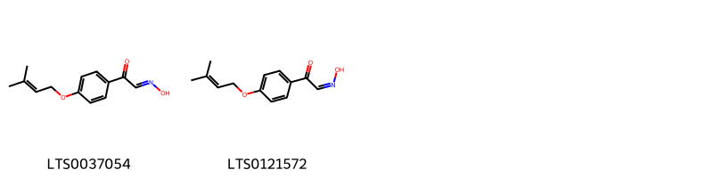{ width=100% }
    <figcaption>Hình ảnh cấu trúc hóa học của 2 hoạt chất thuộc nhóm Phenol ethers gồm ['(2e)-2-(n-hydroxyimino)-1-{4-[(3-methylbut-2-en-1-yl)oxy]phenyl}ethanone (LTS0037054)', '(2z)-2-(n-hydroxyimino)-1-{4-[(3-methylbut-2-en-1-yl)oxy]phenyl}ethanone (LTS0121572)'].</figcaption>
</figure>
#### Nhóm Phenols
<figure markdown="span">
    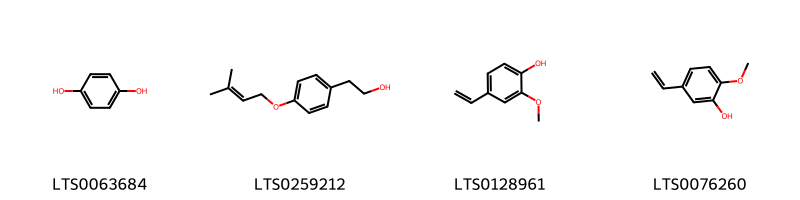{ width=100% }
    <figcaption>Hình ảnh cấu trúc hóa học của 4 hoạt chất thuộc nhóm Phenols gồm ['α-hydroquinone (LTS0063684)', 'etrogol (LTS0259212)', '2-methoxy-4-vinyl-phenol (LTS0128961)', '5-ethenyl-2-methoxyphenol (LTS0076260)'].</figcaption>
</figure>
#### Nhóm Prenol lipids
<figure markdown="span">
    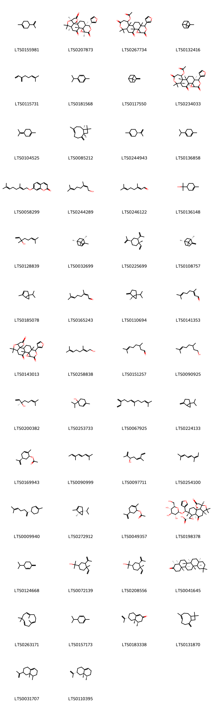{ width=100% }
    <figcaption>Hình ảnh cấu trúc hóa học của 114 hoạt chất thuộc nhóm Prenol lipids gồm ['limonene,  (LTS0155981)', 'limonin (LTS0207873)', '7-(furan-3-yl)-1,8,12,17,17-pentamethyl-5,15,20-trioxo-3,6,16-trioxapentacyclo[9.9.0.0²,⁴.0²,⁸.0¹²,¹⁸]icosan-13-yl acetate (LTS0267734)', 'α pinene (LTS0132416)', 'α-myrcene (LTS0115731)', 'cymene (LTS0181568)', 'β-pinene (LTS0117550)', '(1r,2r,8s,11s,12r,18s)-7-(furan-3-yl)-1,8,12,17,17-pentamethyl-5,15,20-trioxo-3,6,16-trioxapentacyclo[9.9.0.0²,⁴.0²,⁸.0¹²,¹⁸]icosan-13-yl acetate (LTS0234033)', 'terpinolene (LTS0104525)', 'caryophyllene (LTS0085212)', 'α-limonene (LTS0244943)', 'terpinene (LTS0136858)', 'auraptene (LTS0058299)', 'nerol (LTS0244289)', 'α-citral (LTS0246122)', 'terpineol (LTS0136148)', 'linalool, (+-)- (LTS0128839)', '(-)-α-pinene (LTS0032699)', 'β-elemene (LTS0225699)', '(-)-β-pinene (LTS0108757)', 'α-thujene (LTS0185078)', 'neral (LTS0165243)', '(+)-sabinene (LTS0110694)', '3,7-dimethyl-2,6-octadienal (LTS0141353)', 'limonin (LTS0143013)', 'geraniol (LTS0258838)', 'citronella (LTS0151257)', 'citronellol, (+-)- (LTS0090925)', '(-)-linalool (LTS0200382)', '4-terpineol (LTS0253733)', 'β-farnesene (LTS0067925)', 'sabinene (LTS0224133)', '(1s,5s)-carvyl acetate (LTS0169943)', 'allo-ocimene (LTS0090999)', '(3r,5z)-2,6-dimethylocta-1,5,7-trien-3-ol (LTS0097711)', '(4e,6z)-alloocimene (LTS0254100)', '(-)-β-bisabolene (LTS0009940)', '(+)-α-thujene (LTS0272912)', 'carvyl acetate (LTS0049357)', 'limonin 17-β-d-glucopyranoside (LTS0198378)', 'β phellandrene (LTS0124668)', '2-[4-ethenyl-4-methyl-3-(prop-1-en-2-yl)cyclohexyl]propan-2-ol (LTS0072139)', 'elemol (LTS0208556)', '(-)-friedelin (LTS0041645)', 'humulene (LTS0263171)', 'phellandrene (LTS0157173)', 'nootkatone (LTS0183338)', 'caryophyllene (LTS0131870)', 'valencene (LTS0031707)', 'valencene (LTS0110395)', '(1r,2r,7s,10s,13r,14r,16s,19s,20s)-19-(furan-3-yl)-9,9,13,20-tetramethyl-4,8,15,18-tetraoxahexacyclo[11.9.0.0²,⁷.0²,¹⁰.0¹⁴,¹⁶.0¹⁴,²⁰]docosane-5,12,17-trione (LTS0222914)', 'cryptoxanthin (LTS0132646)', "(1r,7ar,9s,11br)-1-(acetyloxy)-9-[(s)-furan-3-yl(hydroxy)methyl]-5,5,7a,9,11b-pentamethyl-3,7-dioxo-hexahydro-1h-spiro[naphtho[2,1-c]oxepine-8,2'-oxirane]-3'-carboxylic acid (LTS0156866)", 'linalyl acetate (LTS0167325)', 'β-ocimene (LTS0242381)', 'monoterpenes (LTS0106881)', '(s)-(-)-citronellal (LTS0164027)', 'all-trans-phytofluene (LTS0269894)', '(1r,2s,6s,7s,8r)-8-isopropyl-1,3-dimethyltricyclo[4.4.0.0²,⁷]dec-3-ene (LTS0106607)', 'sabinene hydrate (LTS0236165)', '(+)-α-carotene (LTS0200789)', '4-thujanol (LTS0005823)', '7-(furan-3-yl)-1,8,12,17,17-pentamethyl-5,15-dioxo-3,6,16-trioxapentacyclo[9.9.0.0²,⁴.0²,⁸.0¹²,¹⁸]icos-13-en-20-yl acetate (LTS0117030)', 'terpineols (LTS0139391)', 'β-carotene (LTS0275716)', 'thymol (LTS0168527)', '(1s,2r,4s,7s,8s,11r,12r,18s,20r)-7-(furan-3-yl)-1,8,12,17,17-pentamethyl-5,15-dioxo-3,6,16-trioxapentacyclo[9.9.0.0²,⁴.0²,⁸.0¹²,¹⁸]icos-13-en-20-yl acetate (LTS0020464)', 'phytoene (LTS0186029)', 'α-carotene (LTS0224243)', '(-)-β-cubebene (LTS0123697)', '(-)-perillyl alcohol (LTS0083880)', '(+)-delta(3)-carene (LTS0250199)', 'perillylalcohol (LTS0009128)', 'friedelin (LTS0213494)', 'carvone, (+)- (LTS0027671)', 'violaxanthin (LTS0102265)', '(+)-4-terpineol (LTS0140257)', '(+)-gamma-cadinene (LTS0103949)', 'lupeol (LTS0256952)', 'gibberellin a19 (LTS0044672)', 'gibberellin a20 (LTS0041124)', '(-)-α-cubebene (LTS0042045)', '4-isopropyl-6-methyl-1-methylidene-3,4,4a,7,8,8a-hexahydro-2h-naphthalene (LTS0111070)', 'camphor (LTS0091905)', '(5s)-1-isopropyl-4-methylidenebicyclo[3.1.0]hexane (LTS0129854)', '(6s,7ar)-2-[(2e,4e,6e,8e,10e,12e,14e)-15-[(6s,7ar)-6-hydroxy-4,4,7a-trimethyl-2,5,6,7-tetrahydro-1-benzofuran-2-yl]-6,11-dimethylhexadeca-2,4,6,8,10,12,14-heptaen-2-yl]-4,4,7a-trimethyl-2,5,6,7-tetrahydro-1-benzofuran-6-ol (LTS0151069)', '(6s,7ar)-2-[(2e,4e,6e,8e,10e,12e,14e,16e)-17-[(4r)-4-hydroxy-2,6,6-trimethylcyclohex-1-en-1-yl]-6,11,15-trimethylheptadeca-2,4,6,8,10,12,14,16-octaen-2-yl]-4,4,7a-trimethyl-2,5,6,7-tetrahydro-1-benzofuran-6-ol (LTS0100944)', '4-[(1e,3e,5e,7e,9e,11e,13e,15e)-16-(4,4,7a-trimethyl-2,5,6,7-tetrahydro-1-benzofuran-2-yl)-3,7,12-trimethylheptadeca-1,3,5,7,9,11,13,15-octaen-1-yl]-3,5,5-trimethylcyclohex-3-en-1-ol (LTS0070797)', '2-[(2z,4e,6e,8e,10e,12e,14e,16e)-17-{4-hydroxy-2,2,6-trimethyl-7-oxabicyclo[4.1.0]heptan-1-yl}-6,11,15-trimethylheptadeca-2,4,6,8,10,12,14,16-octaen-2-yl]-4,4,7a-trimethyl-2,5,6,7-tetrahydro-1-benzofuran-6-ol (LTS0193507)', '(+)-α-terpineol (LTS0258249)', '1,3,3-trimethyl-2-[(3e,5e,7e,9e,11e,13e,15e)-3,7,12,16-tetramethyl-18-(2,6,6-trimethylcyclohex-1-en-1-yl)octadeca-3,5,7,9,11,13,15-heptaen-1-yl]cyclohex-1-ene (LTS0222643)', '(1r,3s,6s)-6-[(1e,3e,5e,7e,9e,11e,13e)-15-hydroxy-3,7,12-trimethylpentadeca-1,3,5,7,9,11,13-heptaen-1-yl]-1,5,5-trimethyl-7-oxabicyclo[4.1.0]heptan-3-ol (LTS0115998)', '1,8a-dimethyl-7-(prop-1-en-2-yl)-2,6,7,8-tetrahydro-1h-naphthalene (LTS0133136)', '6-[(1e,3z,5e,7z,9z,11z)-15-hydroxy-3,7,12-trimethylpentadeca-1,3,5,7,9,11-hexaen-1-yl]-1,5,5-trimethyl-7-oxabicyclo[4.1.0]heptan-3-ol (LTS0210878)', 'gibberellin a3 (LTS0185015)', '2-[(2z,4e,6e,8z,10e,12z)-14-hydroxy-6,11-dimethyltetradeca-2,4,6,8,10,12-hexaen-2-yl]-4,4,7a-trimethyl-hexahydro-1-benzofuran-6-ol (LTS0123085)', '(1r,2r,5s,8s,9s,10r,11r,13s)-5,13-dihydroxy-11-methyl-6-methylidene-16-oxo-15-oxapentacyclo[9.3.2.1⁵,⁸.0¹,¹⁰.0²,⁸]heptadecane-9-carboxylic acid (LTS0162322)', '(2r,6s,7ar)-2-[(2e,4e,6e,8e,10e,12e,14e)-15-[(2r,6s,7ar)-6-hydroxy-4,4,7a-trimethyl-2,5,6,7-tetrahydro-1-benzofuran-2-yl]-6,11-dimethylhexadeca-2,4,6,8,10,12,14-heptaen-2-yl]-4,4,7a-trimethyl-2,5,6,7-tetrahydro-1-benzofuran-6-ol (LTS0242547)', '(4s,4as)-4-isopropyl-1,6-dimethyl-2,3,4,4a,7,8-hexahydronaphthalene (LTS0208606)', 'borneol (LTS0264960)', 'bornyl acetate (LTS0060565)', 'flavoxanthin (LTS0174303)', '(1r,7r,8as)-1,8a-dimethyl-7-(prop-1-en-2-yl)-2,6,7,8-tetrahydro-1h-naphthalene (LTS0183545)', 'β-zeacarotene (LTS0232347)', 'trans-β-terpineol (LTS0033955)', '(1ar,4as,7r,7as,7bs)-1,1,7-trimethyl-4-methylidene-octahydro-1ah-cyclopropa[e]azulene (LTS0028578)', '4,4a-dimethyl-6-(prop-1-en-2-yl)-3,4,5,6,7,8-hexahydro-2h-naphthalen-2-ol (LTS0008114)', '2-[(3r,4ar,10as)-3,4a,7,7,10a-pentamethyl-octahydro-1h-naphtho[2,1-b]pyran-3-yl]ethanol (LTS0010763)', 'bicyclogermacrene (LTS0099340)', 'nootkatol (LTS0021355)', 'dihydrocarveol (LTS0111467)', 'neurosporene (LTS0117305)', '2-[(8e,10e,12e,14e)-15-(6-hydroxy-4,4,7a-trimethyl-2,5,6,7-tetrahydro-1-benzofuran-2-yl)-6,11-dimethylhexadeca-2,4,6,8,10,12,14-heptaen-2-yl]-4,4,7a-trimethyl-2,5,6,7-tetrahydro-1-benzofuran-6-ol (LTS0044878)', 'citrus sinensis fruit extract (LTS0179788)'].</figcaption>
</figure>
#### Nhóm Pyridines and derivatives
<figure markdown="span">
    { width=100% }
    <figcaption>Hình ảnh cấu trúc hóa học của 16 hoạt chất thuộc nhóm Pyridines and derivatives gồm ['ethyl nicotinate (LTS0116042)', '3-(4-methylphenyl)pyridine (LTS0072853)', '3-butylpyridine (LTS0162349)', '2-phenylpyridine (LTS0111677)', '3-pentylpyridine (LTS0046521)', '3-octylpyridine (LTS0188841)', '4-phenylpyridine (LTS0196237)', '3-heptylpyridine (LTS0146282)', '2-methyl-5-phenylpyridine (LTS0157430)', '3-(4-methylhexyl)pyridine (LTS0114532)', '2-pentylpyridine (LTS0027594)', '5-hexyl-2-methylpyridine (LTS0156510)', '3-propylpyridine (LTS0209387)', '2-methyl-5-isopropenylpyridine (LTS0064479)', '3-phenylpyridine (LTS0014787)', '3-methylpyridine (LTS0131636)'].</figcaption>
</figure>
#### Nhóm Quinolines and derivatives
<figure markdown="span">
    { width=100% }
    <figcaption>Hình ảnh cấu trúc hóa học của 5 hoạt chất thuộc nhóm Quinolines and derivatives gồm ['7,11-dihydroxy-6-methoxy-2,2,5-trimethyl-1-oxa-5-azatetraphen-10-one (LTS0089252)', '1,5-dihydroxy-3,4-dimethoxy-10-methylacridin-9-one (LTS0154282)', '5-hydroxynoracronycine (LTS0148605)', '1,3,5-trihydroxy-4-methoxy-10-methylacridin-9-one (LTS0138333)', 'citibrasine (LTS0183075)'].</figcaption>
</figure>
#### Nhóm Saccharolipids
<figure markdown="span">
    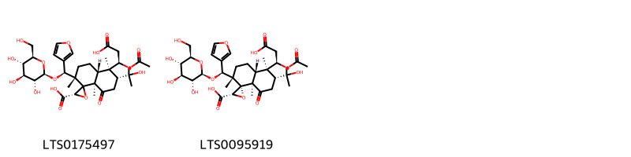{ width=100% }
    <figcaption>Hình ảnh cấu trúc hóa học của 2 hoạt chất thuộc nhóm Saccharolipids gồm ["(2s,3's,4ar,5r,6r,8ar)-5-[(1r)-1-(acetyloxy)-2-carboxyethyl]-2-[(s)-furan-3-yl({[(2r,3r,4s,5s,6r)-3,4,5-trihydroxy-6-(hydroxymethyl)oxan-2-yl]oxy})methyl]-6-(2-hydroxypropan-2-yl)-2,5,8a-trimethyl-8-oxo-tetrahydro-3h-spiro[naphthalene-1,2'-oxirane]-3'-carboxylic acid (LTS0175497)", "(1r,2s,3's,4ar,5r,6r,8ar)-5-[(1r)-1-(acetyloxy)-2-carboxyethyl]-2-[(s)-furan-3-yl({[(2r,3r,4s,5s,6r)-3,4,5-trihydroxy-6-(hydroxymethyl)oxan-2-yl]oxy})methyl]-6-(2-hydroxypropan-2-yl)-2,5,8a-trimethyl-8-oxo-tetrahydro-3h-spiro[naphthalene-1,2'-oxirane]-3'-carboxylic acid (LTS0095919)"].</figcaption>
</figure>
#### Nhóm Saturated hydrocarbons
<figure markdown="span">
    { width=100% }
    <figcaption>Hình ảnh cấu trúc hóa học của 2 hoạt chất thuộc nhóm Saturated hydrocarbons gồm ['pentadecane (LTS0210146)', 'heptadecane (LTS0038303)'].</figcaption>
</figure>
#### Nhóm Steroids and steroid derivatives
<figure markdown="span">
    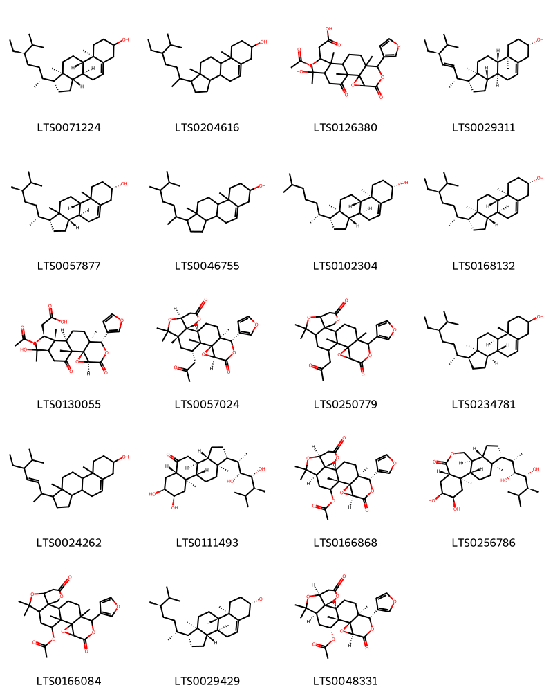{ width=100% }
    <figcaption>Hình ảnh cấu trúc hóa học của 19 hoạt chất thuộc nhóm Steroids and steroid derivatives gồm ['stigmast-5-en-3-ol (LTS0071224)', 'stigmast-5-en-3-ol, (3β)- (LTS0204616)', '3-(acetyloxy)-3-[11-(furan-3-yl)-5-(2-hydroxypropan-2-yl)-2,6,10-trimethyl-3,13-dioxo-12,15-dioxatetracyclo[8.5.0.0¹,¹⁴.0²,⁷]pentadecan-6-yl]propanoic acid (LTS0126380)', 'phytosterol (LTS0029311)', '(1r,3as,3bs,7s,9bs)-1-[(2r,5r)-5,6-dimethylheptan-2-yl]-9a,11a-dimethyl-1h,2h,3h,3ah,3bh,4h,6h,7h,8h,9h,9bh,10h,11h-cyclopenta[a]phenanthren-7-ol (LTS0057877)', 'campesterol (LTS0046755)', 'cholesterol (LTS0102304)', 'sitosterol (LTS0168132)', '(3s)-3-(acetyloxy)-3-[(1r,2r,5r,6r,7r,10s,11s,14s)-11-(furan-3-yl)-5-(2-hydroxypropan-2-yl)-2,6,10-trimethyl-3,13-dioxo-12,15-dioxatetracyclo[8.5.0.0¹,¹⁴.0²,⁷]pentadecan-6-yl]propanoic acid (LTS0130055)', '(1r,2r,7s,10s,12s,13r,14s,16s,19s,20s)-19-(furan-3-yl)-9,9,13,20-tetramethyl-12-(2-oxopropyl)-4,8,15,18-tetraoxahexacyclo[11.9.0.0²,⁷.0²,¹⁰.0¹⁴,¹⁶.0¹⁴,²⁰]docosane-5,17-dione (LTS0057024)', '19-(furan-3-yl)-9,9,13,20-tetramethyl-12-(2-oxopropyl)-4,8,15,18-tetraoxahexacyclo[11.9.0.0²,⁷.0²,¹⁰.0¹⁴,¹⁶.0¹⁴,²⁰]docosane-5,17-dione (LTS0250779)', '(1s,3ar,3br,7r,9as,9br,11ar)-1-[(2r,5r)-5-ethyl-6-methylheptan-2-yl]-9a,11a-dimethyl-1h,2h,3h,3ah,3bh,4h,6h,7h,8h,9h,9bh,10h,11h-cyclopenta[a]phenanthren-7-ol (LTS0234781)', 'stigmasterol (LTS0024262)', 'castasterone (LTS0111493)', '(1r,2r,7s,10r,13s,14r,16s,19s,20s)-19-(furan-3-yl)-9,9,13,20-tetramethyl-5,17-dioxo-4,8,15,18-tetraoxahexacyclo[11.9.0.0²,⁷.0²,¹⁰.0¹⁴,¹⁶.0¹⁴,²⁰]docosan-12-yl acetate (LTS0166868)', 'brassinolide (LTS0256786)', '19-(furan-3-yl)-9,9,13,20-tetramethyl-5,17-dioxo-4,8,15,18-tetraoxahexacyclo[11.9.0.0²,⁷.0²,¹⁰.0¹⁴,¹⁶.0¹⁴,²⁰]docosan-12-yl acetate (LTS0166084)', 'campesterol (LTS0029429)', '(1r,2r,7s,10r,12r,13s,14r,16s,19s,20s)-19-(furan-3-yl)-9,9,13,20-tetramethyl-5,17-dioxo-4,8,15,18-tetraoxahexacyclo[11.9.0.0²,⁷.0²,¹⁰.0¹⁴,¹⁶.0¹⁴,²⁰]docosan-12-yl acetate (LTS0048331)'].</figcaption>
</figure>
#### Nhóm Unsaturated hydrocarbons
<figure markdown="span">
    { width=100% }
    <figcaption>Hình ảnh cấu trúc hóa học của 6 hoạt chất thuộc nhóm Unsaturated hydrocarbons gồm ['α terpinene (LTS0232891)', '2-methyl-6-methylideneocta-1,7-diene (LTS0213612)', '(3e)-3,7-dimethylocta-1,3-diene (LTS0174272)', 'cosmene (LTS0151256)', 'heptadec-8-ene (LTS0163098)', '(8e)-heptadec-8-ene (LTS0274439)'].</figcaption>
</figure>

---

### Dược dân tộc học

Danh sách các quốc gia có sử dụng *Citrus aurantium* trong điều trị các bệnh. 

| Country            | Disease                                                           | Bệnh                                                                       |
|:-------------------|:------------------------------------------------------------------|:---------------------------------------------------------------------------|
| China              | Apertif, Expectorant                                              | Apertif, long đờm                                                          |
| Dominican Republic | Nervine                                                           | Thuốc an thần                                                              |
| Elsewhere          | Astringent, Carminative, Stomachic, Stomachic, Tonic, Expectorant | Chất làm se, Carminative, Dạ dày, Dạ dày, Tonic, Expectorant               |
| Haiti              | Sedative, Sudorific, Tonic                                        | Thuốc an thần, gây ngạt, thuốc bổ                                          |
| Trinidad           | Astringent, Expectorant, Stomachic, Vermifuge, Vermifuge          | Làm se, đờm, dạ dày, Vermifuge, Vermifuge                                  |
| Turkey             | Antiseptic, Perfume, Stimulant, Carminative, Sedative, Tonic      | Khử trùng, Nước hoa, Chất kích thích, Carminative, Thuốc an thần, Thuốc bổ |

---

# Chi Ptelea

??? note "Danh sách các dược liệu thuộc chi"
    
	 - *Ptelea trifoliata*

---
## Ptelea trifoliata
### Thông tin về thực vật

!!! info "Phân loại thực vật của *Ptelea trifoliata* từ GIBF:"
    - **Kingdom:** Plantae
    - **Phylum:** Tracheophyta
    - **Order:** Sapindales
    - **Family:** Rutaceae
    - **Genus:** Ptelea
    - **Species:** *Ptelea trifoliata*

 

| Label (VI)   | Label (EN)   | Scientific Name   | Descriptions (VI)   | Descriptions (EN)   | Also Known As (VI)   | Also Known As (EN)                                                                                                                                                                                                                                                            |
|:-------------|:-------------|:------------------|:--------------------|:--------------------|:---------------------|:------------------------------------------------------------------------------------------------------------------------------------------------------------------------------------------------------------------------------------------------------------------------------|
| N/A          | N/A          | Ptelea trifoliata | loài thực vật       | species of plant    | ['']                 | ['ague bark', 'Carolina shrub-trefoil', 'common hoptree', 'paleleaf hoptree', 'prairie-grub', 'prickaway anise', 'quinine tree', 'sang-tree', 'skunk bush', 'stinking ash', 'stinking prairie bush', 'swamp dogwood', 'wafer ash', 'water-ash', 'wingseed', 'woolly hoptree'] |

#### Phân bố trên thế giới

**Từ CSDL GIBF** United States of America, Canada

#### Phân bố tại Việt Nam

**Từ CSDL GIBF**: Không có ghi nhận ở Việt Nam

---
### Thành phần hóa học
        
- Theo cơ sở dữ liệu lotus: Từ loài *Ptelea trifoliata* đã phân lập và xác định được 30 hoạt chất thuộc về các nhóm Quinolines and derivatives, Furanoid lignans, Naphthalenes. 

|    | chemicalTaxonomyClassyfireClass   |   smiles_count |
|---:|:----------------------------------|---------------:|
|  0 | Furanoid lignans                  |              2 |
|  1 | Naphthalenes                      |              2 |
|  2 | Quinolines and derivatives        |             26 |

#### Nhóm Furanoid lignans
<figure markdown="span">
    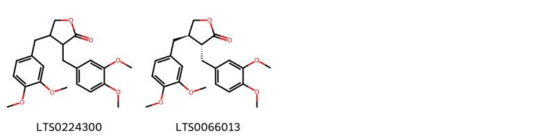{ width=100% }
    <figcaption>Hình ảnh cấu trúc hóa học của 2 hoạt chất thuộc nhóm Furanoid lignans gồm ['3,4-bis[(3,4-dimethoxyphenyl)methyl]oxolan-2-one (LTS0224300)', 'arctigenin methyl ether (LTS0066013)'].</figcaption>
</figure>
#### Nhóm Naphthalenes
<figure markdown="span">
    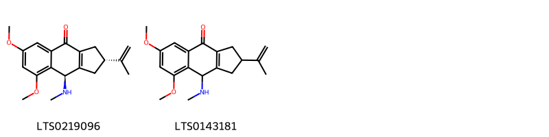{ width=100% }
    <figcaption>Hình ảnh cấu trúc hóa học của 2 hoạt chất thuộc nhóm Naphthalenes gồm ['(2r,9r)-6,8-dimethoxy-9-(methylamino)-2-(prop-1-en-2-yl)-1h,2h,3h,9h-cyclopenta[b]naphthalen-4-one (LTS0219096)', '6,8-dimethoxy-9-(methylamino)-2-(prop-1-en-2-yl)-1h,2h,3h,9h-cyclopenta[b]naphthalen-4-one (LTS0143181)'].</figcaption>
</figure>
#### Nhóm Quinolines and derivatives
<figure markdown="span">
    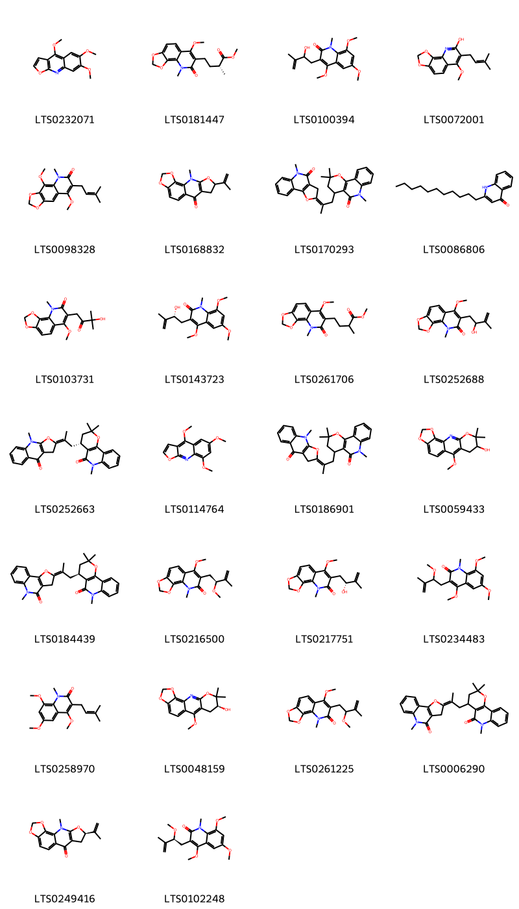{ width=100% }
    <figcaption>Hình ảnh cấu trúc hóa học của 26 hoạt chất thuộc nhóm Quinolines and derivatives gồm ['kokusaginine (LTS0232071)', 'methyl (2r)-4-{6-methoxy-9-methyl-8-oxo-2h-[1,3]dioxolo[4,5-h]quinolin-7-yl}-2-methylbutanoate (LTS0181447)', '3-(2-hydroxy-3-methylbut-3-en-1-yl)-4,6,8-trimethoxy-1-methylquinolin-2-one (LTS0100394)', '6-methoxy-7-(3-methylbut-2-en-1-yl)-2h-[1,3]dioxolo[4,5-h]quinolin-8-ol (LTS0072001)', '4,8-dimethoxy-5-methyl-7-(3-methylbut-2-en-1-yl)-2h-[1,3]dioxolo[4,5-g]quinolin-6-one (LTS0098328)', '16-methyl-13-(prop-1-en-2-yl)-3,5,14-trioxa-16-azatetracyclo[7.7.0.0²,⁶.0¹¹,¹⁵]hexadeca-1,6,8,11(15)-tetraen-10-one (LTS0168832)', '2,2,6-trimethyl-4-(2-{5-methyl-4-oxo-3h-furo[3,2-c]quinolin-2-ylidene}propyl)-3h,4h-pyrano[3,2-c]quinolin-5-one (LTS0170293)', '2-undecyl-1h-quinolin-4-one (LTS0086806)', '7-(3-hydroxy-3-methyl-2-oxobutyl)-6-methoxy-9-methyl-2h-[1,3]dioxolo[4,5-h]quinolin-8-one (LTS0103731)', '3-[(2r)-2-hydroxy-3-methylbut-3-en-1-yl]-4,6,8-trimethoxy-1-methylquinolin-2-one (LTS0143723)', 'methyl 4-{6-methoxy-9-methyl-8-oxo-2h-[1,3]dioxolo[4,5-h]quinolin-7-yl}-2-methylbutanoate (LTS0261706)', '7-(2-hydroxy-3-methylbut-3-en-1-yl)-6-methoxy-9-methyl-2h-[1,3]dioxolo[4,5-h]quinolin-8-one (LTS0252688)', '(4r)-2,2,6-trimethyl-4-{2-[(2e)-9-methyl-4-oxo-3h-furo[2,3-b]quinolin-2-ylidene]propyl}-3h,4h-pyrano[3,2-c]quinolin-5-one (LTS0252663)', 'maculosidine (LTS0114764)', '2,2,6-trimethyl-4-(2-{9-methyl-4-oxo-3h-furo[2,3-b]quinolin-2-ylidene}propyl)-3h,4h-pyrano[3,2-c]quinolin-5-one (LTS0186901)', '2-methoxy-6,6-dimethyl-7,12,14-trioxa-9-azatetracyclo[8.7.0.0³,⁸.0¹¹,¹⁵]heptadeca-1(17),2,8,10,15-pentaen-5-ol (LTS0059433)', '(4s)-2,2,6-trimethyl-4-{2-[(2e)-5-methyl-4-oxo-3h-furo[3,2-c]quinolin-2-ylidene]propyl}-3h,4h-pyrano[3,2-c]quinolin-5-one (LTS0184439)', '6-methoxy-7-[(2s)-2-methoxy-3-methylbut-3-en-1-yl]-9-methyl-2h-[1,3]dioxolo[4,5-h]quinolin-8-one (LTS0216500)', '7-[(2r)-2-hydroxy-3-methylbut-3-en-1-yl]-6-methoxy-9-methyl-2h-[1,3]dioxolo[4,5-h]quinolin-8-one (LTS0217751)', '4,6,8-trimethoxy-3-(2-methoxy-3-methylbut-3-en-1-yl)-1-methylquinolin-2-one (LTS0234483)', '4,6,8-trimethoxy-1-methyl-3-(3-methylbut-2-en-1-yl)quinolin-2-one (LTS0258970)', '(5s)-2-methoxy-6,6-dimethyl-7,12,14-trioxa-9-azatetracyclo[8.7.0.0³,⁸.0¹¹,¹⁵]heptadeca-1(17),2,8,10,15-pentaen-5-ol (LTS0048159)', '6-methoxy-7-(2-methoxy-3-methylbut-3-en-1-yl)-9-methyl-2h-[1,3]dioxolo[4,5-h]quinolin-8-one (LTS0261225)', '2,2,6-trimethyl-4-{2-[(2e)-5-methyl-4-oxo-3h-furo[3,2-c]quinolin-2-ylidene]propyl}-3h,4h-pyrano[3,2-c]quinolin-5-one (LTS0006290)', '(13r)-16-methyl-13-(prop-1-en-2-yl)-3,5,14-trioxa-16-azatetracyclo[7.7.0.0²,⁶.0¹¹,¹⁵]hexadeca-1,6,8,11(15)-tetraen-10-one (LTS0249416)', '4,6,8-trimethoxy-3-[(2s)-2-methoxy-3-methylbut-3-en-1-yl]-1-methylquinolin-2-one (LTS0102248)'].</figcaption>
</figure>

---

### Dược dân tộc học

Danh sách các quốc gia có sử dụng *Ptelea trifoliata* trong điều trị các bệnh. 

| Country   | Disease                                                                                                             | Bệnh                                                                                                                            |
|:----------|:--------------------------------------------------------------------------------------------------------------------|:--------------------------------------------------------------------------------------------------------------------------------|
| Elsewhere | Analgesic, Antiseptic, Decongestant, Digestive, nan, Stimulant, Stomachic, Tonic, Vermifuge, Vulnerary, Expectorant | Thuốc giảm đau, sát trùng, thuốc thông mũi, tiêu hóa, nan, chất kích thích, dạ dày, thuốc bổ, Vermifuge, Vulnerary, Expectorant |
| Mexico    | Tonic, Tonic, Vermifuge                                                                                             | Tonic, Tonic, Vermifuge                                                                                                         |
| Turkey    | Astringent, Tonic, Vermifuge                                                                                        | Chất làm se, Tonic, Vermifuge                                                                                                   |
| US        | Intoxicant, Tonic                                                                                                   | Intoxicant, Tonic                                                                                                               |

---

# Chi Murraya

??? note "Danh sách các dược liệu thuộc chi"
    
	 - *Murraya exotica*
	 - *Murraya koenigii*
	 - *Murraya paniculata*

---
## Murraya exotica
### Thông tin về thực vật

!!! info "Phân loại thực vật của *N/A* từ GIBF:"
    - **Kingdom:** Plantae
    - **Phylum:** Tracheophyta
    - **Order:** Sapindales
    - **Family:** N/A
    - **Genus:** N/A
    - **Species:** *N/A*

 

| Label (VI)   | Label (EN)   | Scientific Name   | Descriptions (VI)   | Descriptions (EN)   | Also Known As (VI)   | Also Known As (EN)   |
|:-------------|:-------------|:------------------|:--------------------|:--------------------|:---------------------|:---------------------|
| N/A          | N/A          | Murraya exotica   | loài thực vật       | species of plant    | ['']                 | ['']                 |

#### Phân bố trên thế giới

**Từ CSDL GIBF** Virgin Islands (U.S.), United Arab Emirates, Italy, Australia, Japan, Canada, French Guiana, Ukraine, Puerto Rico, Korea, Republic of, Kyrgyzstan, Chinese Taipei, Spain, Portugal, Russian Federation, United States of America, Finland, Uruguay, Chile, Saint Martin (French part), South Africa, Hong Kong, Germany, Thailand, Romania, Brazil, Switzerland, Austria, France, Mexico, United Kingdom of Great Britain and Northern Ireland, China, Ireland, Botswana, India, Indonesia, New Zealand

#### Phân bố tại Việt Nam

**Từ CSDL GIBF**: Không có ghi nhận ở Việt Nam

---
### Thành phần hóa học
        
- Theo cơ sở dữ liệu lotus: Từ loài *N/A* đã phân lập và xác định được 144 hoạt chất thuộc về các nhóm Flavonoids, Indoles and derivatives, Steroids and steroid derivatives, Prenol lipids, Isoflavonoids, Cinnamic acids and derivatives, Quinolines and derivatives, Linear 1,3-diarylpropanoids, Oxepanes, Benzofurans, Benzene and substituted derivatives, Dihydrofurans, Organooxygen compounds, Coumarins and derivatives, Imidazopyrimidines. 

|    | chemicalTaxonomyClassyfireClass     |   smiles_count |
|---:|:------------------------------------|---------------:|
|  0 | Benzene and substituted derivatives |              2 |
|  1 | Benzofurans                         |              1 |
|  2 | Cinnamic acids and derivatives      |              7 |
|  3 | Coumarins and derivatives           |             74 |
|  4 | Dihydrofurans                       |              1 |
|  5 | Flavonoids                          |             17 |
|  6 | Imidazopyrimidines                  |              1 |
|  7 | Indoles and derivatives             |              8 |
|  8 | Isoflavonoids                       |              1 |
|  9 | Linear 1,3-diarylpropanoids         |              4 |
| 10 | Organooxygen compounds              |              1 |
| 11 | Oxepanes                            |              3 |
| 12 | Prenol lipids                       |              3 |
| 13 | Quinolines and derivatives          |              1 |
| 14 | Steroids and steroid derivatives    |             16 |

#### Nhóm Benzene and substituted derivatives
<figure markdown="span">
    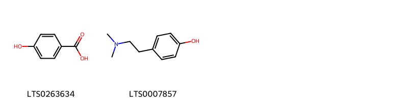{ width=100% }
    <figcaption>Hình ảnh cấu trúc hóa học của 2 hoạt chất thuộc nhóm Benzene and substituted derivatives gồm ['p-hydroxybenzoic acid (LTS0263634)', 'hordenine (LTS0007857)'].</figcaption>
</figure>
#### Nhóm Benzofurans
<figure markdown="span">
    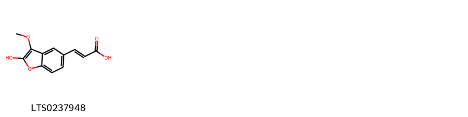{ width=100% }
    <figcaption>Hình ảnh cấu trúc hóa học của 1 hoạt chất thuộc nhóm Benzofurans gồm ['3-(2-hydroxy-3-methoxy-1-benzofuran-5-yl)prop-2-enoic acid (LTS0237948)'].</figcaption>
</figure>
#### Nhóm Cinnamic acids and derivatives
<figure markdown="span">
    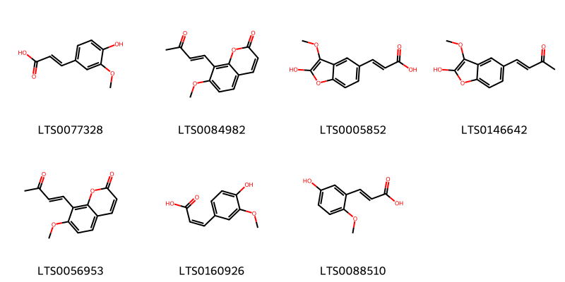{ width=100% }
    <figcaption>Hình ảnh cấu trúc hóa học của 7 hoạt chất thuộc nhóm Cinnamic acids and derivatives gồm ['ferulic acid (LTS0077328)', '7-methoxy-8-(3-oxobut-1-en-1-yl)chromen-2-one (LTS0084982)', '(2e)-3-(2-hydroxy-3-methoxy-1-benzofuran-5-yl)prop-2-enoic acid (LTS0005852)', '(3e)-4-(2-hydroxy-3-methoxy-1-benzofuran-5-yl)but-3-en-2-one (LTS0146642)', '7-methoxy-8-[(1e)-3-oxobut-1-en-1-yl]chromen-2-one (LTS0056953)', 'cis-ferulic acid (LTS0160926)', '3-(5-hydroxy-2-methoxyphenyl)prop-2-enoic acid (LTS0088510)'].</figcaption>
</figure>
#### Nhóm Coumarins and derivatives
<figure markdown="span">
    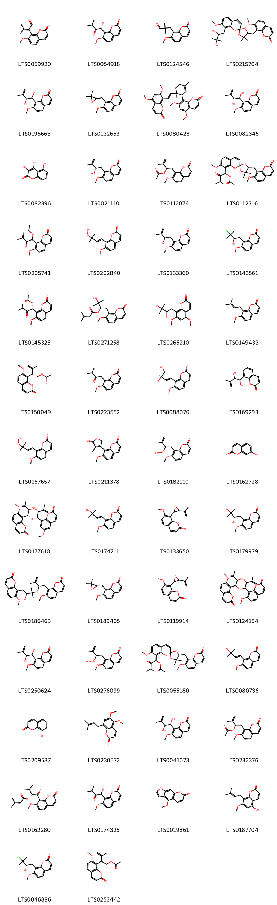{ width=100% }
    <figcaption>Hình ảnh cấu trúc hóa học của 74 hoạt chất thuộc nhóm Coumarins and derivatives gồm ['2-(7-methoxy-2-oxochromen-8-yl)-3-methylbut-2-enal (LTS0059920)', '8-[(1r)-1-hydroxy-3-methyl-2-oxobutyl]-7-methoxychromen-2-one (LTS0054918)', '3-(7-methoxy-2-oxochromen-8-yl)-2,2-dimethylpropanal (LTS0124546)', "8-[8-(2,3-dihydroxy-3-methylbutyl)-7-methoxy-4',4'-dimethylspiro[chromene-2,2'-[1,3]dioxolan]-5'-ylmethyl]-7-methoxychromen-2-one (LTS0215704)", '8-[(1s,2s)-1,2-dihydroxy-3-methylbut-3-en-1-yl]-7-methoxychromen-2-one (LTS0196663)', '8-[(3,3-dimethyloxiran-2-yl)methyl]-7-methoxychromen-2-one (LTS0132653)', '8-[(1r,6r)-6-[(1e)-2-(5,7-dimethoxy-2-oxochromen-8-yl)ethenyl]-3,6-dimethylcyclohex-2-en-1-yl]-5,7-dimethoxychromen-2-one (LTS0080428)', '8-[(1s,2r)-1,2-dihydroxy-3-methylbut-3-en-1-yl]-7-methoxychromen-2-one (LTS0082345)', '3,4,5-trihydroxychromen-2-one (LTS0082396)', '8-[(2s)-2-hydroxy-3-methylbut-3-en-1-yl]-7-methoxychromen-2-one (LTS0021110)', '1-(7-methoxy-2-oxochromen-8-yl)-3-methylbut-3-en-2-yl acetate (LTS0112074)', "(1r)-1-[(2r,5'r)-7-methoxy-5'-[(7-methoxy-2-oxochromen-8-yl)methyl]-4',4'-dimethylspiro[chromene-2,2'-[1,3]dioxolan]-8-yl]-3-methyl-2-oxobutyl acetate (LTS0112316)", '8-(1-ethoxy-2-hydroxy-3-methylbut-3-en-1-yl)-7-methoxychromen-2-one (LTS0205741)', '8-(3-hydroperoxy-3-methylbut-1-en-1-yl)-7-methoxychromen-2-one (LTS0202840)', '8-(2-hydroxy-3-methylbut-3-en-1-yl)-7-methoxychromen-2-one (LTS0133360)', '8-(3-chloro-2-hydroxy-3-methylbutyl)-7-methoxychromen-2-one (LTS0143561)', '(1r)-1-(7-methoxy-2-oxochromen-8-yl)-3-methyl-2-oxobutyl acetate (LTS0145325)', '(2s)-3-hydroxy-1-(7-methoxy-2-oxochromen-8-yl)-3-methylbutan-2-yl 3-methylbutanoate (LTS0271258)', '8-(2,3-dihydroxy-3-methylbutyl)-5,7-dimethoxychromen-2-one (LTS0265210)', 'osthole (LTS0149433)', '(2s)-2-(7-methoxy-2-oxochromen-8-yl)-3-methylbut-3-en-1-yl acetate (LTS0150049)', '7-methoxy-8-(3-methyl-2-oxobutyl)chromen-2-one (LTS0223552)', '8-[(1e,3r)-3,4-dihydroxy-3-methylbut-1-en-1-yl]-7-methoxychromen-2-one (LTS0088070)', '8-(1,2-dihydroxy-3-methylbut-3-en-1-yl)chromen-2-one (LTS0169293)', '8-[(1e)-3-hydroperoxy-3-methylbut-1-en-1-yl]-7-methoxychromen-2-one (LTS0167657)', '7-methoxy-8-(4-methyl-5-oxo-2h-furan-3-yl)chromen-2-one (LTS0211378)', '8-[(2s)-2-hydroperoxy-3-methylbut-3-en-1-yl]-7-methoxychromen-2-one (LTS0182110)', 'umbelliferone (LTS0162728)', '8-[(1r,2r)-2-hydroxy-1-{[(1s,2r)-2-hydroxy-1-(6-methoxy-2-oxochromen-8-yl)-3-methylbut-3-en-1-yl]oxy}-3-methylbut-3-en-1-yl]-7-methoxychromen-2-one (LTS0177610)', '8-[(1e)-3-hydroxy-3-methylbut-1-en-1-yl]-7-methoxychromen-2-one (LTS0174711)', 'phebalosin (LTS0133650)', '8-[(2s)-2,3-dihydroxy-3-methylbutyl]-7-methoxychromen-2-one (LTS0179979)', '8-[(2s)-2-{[(3s)-3-hydroxy-4-(7-methoxy-2-oxochromen-8-yl)-2-methylbutan-2-yl]oxy}-3-methylbut-3-en-1-yl]-7-methoxychromen-2-one (LTS0186463)', '8-{[(2s)-3,3-dimethyloxiran-2-yl]methyl}-7-methoxychromen-2-one (LTS0189405)', 'phebalosin (LTS0119914)', '8-(2-hydroxy-1-{[2-hydroxy-1-(7-methoxy-2-oxochromen-8-yl)-3-methylbut-3-en-1-yl]oxy}-3-methylbut-3-en-1-yl)-7-methoxychromen-2-one (LTS0124154)', '8-(1,2-dihydroxy-3-methylbut-3-en-1-yl)-7-methoxychromen-2-one (LTS0250624)', '8-(2-hydroperoxy-3-methylbut-3-en-1-yl)-7-methoxychromen-2-one (LTS0276099)', "(1r)-1-[(2s,5's)-7-methoxy-5'-[(7-methoxy-2-oxochromen-8-yl)methyl]-4',4'-dimethylspiro[chromene-2,2'-[1,3]dioxolan]-8-yl]-3-methyl-2-oxobutyl acetate (LTS0055180)", '8-(3-hydroxy-3-methylbut-1-en-1-yl)-7-methoxychromen-2-one (LTS0080736)', '8-hydroxycoumarin (LTS0209587)', '5,6-dimethoxy-8-(3-methylbut-2-en-1-yl)chromen-2-one (LTS0230572)', '8-[(1r,2s)-1,2-dihydroxy-3-methylbut-3-en-1-yl]-7-methoxychromen-2-one (LTS0041073)', '(2r)-1-(7-methoxy-2-oxochromen-8-yl)-3-methylbut-3-en-2-yl acetate (LTS0232376)', '(2r)-1-(7-methoxy-2-oxochromen-8-yl)-3-methyl-1-oxobutan-2-yl 3-methylbut-2-enoate (LTS0162280)', '8-(1-hydroxy-3-methyl-2-oxobutyl)-7-methoxychromen-2-one (LTS0174325)', 'bergapten (LTS0019861)', '5-hydroxy-7-methoxy-8-(3-methylbut-2-en-1-yl)chromen-2-one (LTS0187704)', '8-[(2s)-3-chloro-2-hydroxy-3-methylbutyl]-7-methoxychromen-2-one (LTS0046886)', '2-(7-methoxy-2-oxochromen-8-yl)-3-methylbut-3-en-1-yl acetate (LTS0253442)', '1-hydroxy-1-(7-methoxy-2-oxochromen-8-yl)-3-methylbutan-2-yl acetate (LTS0244622)', 'scopoletin (LTS0193112)', '1-(7-methoxy-2-oxochromen-8-yl)-3-methyl-1-oxobutan-2-yl 3-methylbut-2-enoate (LTS0054627)', '8-(3,4-dihydroxy-3-methylbut-1-en-1-yl)-7-methoxychromen-2-one (LTS0131251)', '3-hydroxy-1-(7-methoxy-2-oxochromen-8-yl)-3-methylbutan-2-yl 3-methylbutanoate (LTS0067284)', '1-(7-methoxy-2-oxochromen-8-yl)-3-methyl-2-oxobutyl acetate (LTS0060093)', "1-[(2s,5's)-7-methoxy-5'-[(7-methoxy-2-oxochromen-8-yl)methyl]-4',4'-dimethylspiro[chromene-2,2'-[1,3]dioxolan]-8-yl]-3-methyl-2-oxobutyl acetate (LTS0053710)", '8-(2-{[3-hydroxy-4-(7-methoxy-2-oxochromen-8-yl)-2-methylbutan-2-yl]oxy}-3-methylbut-3-en-1-yl)-7-methoxychromen-2-one (LTS0053192)', '8-{6-[2-(5,7-dimethoxy-2-oxochromen-8-yl)ethenyl]-3,6-dimethylcyclohex-2-en-1-yl}-5,7-dimethoxychromen-2-one (LTS0265355)', '7-methoxy-2-oxochromene-8-carbaldehyde (LTS0066932)', '8-[(1s,2s)-1-ethoxy-2-hydroxy-3-methylbut-3-en-1-yl]-7-methoxychromen-2-one (LTS0006592)', '1-hydroxy-1-(7-methoxy-2-oxochromen-8-yl)-3-methylbut-3-en-2-yl acetate (LTS0028526)', '4-hydroxy-1-[(7-methoxy-2-oxochromen-8-yl)oxy]-4-methylpentan-3-yl hexadecanoate (LTS0018074)', '(1r,2r)-1-hydroxy-1-(7-methoxy-2-oxochromen-8-yl)-3-methylbut-3-en-2-yl acetate (LTS0002038)', "8-[(2r,5'r)-8-[(2s)-2,3-dihydroxy-3-methylbutyl]-7-methoxy-4',4'-dimethylspiro[chromene-2,2'-[1,3]dioxolan]-5'-ylmethyl]-7-methoxychromen-2-one (LTS0010205)", '7-methoxy-8-[(1z)-3-methylbuta-1,3-dien-1-yl]chromen-2-one (LTS0230961)', '7-methoxy-8-(3-methyl-2-oxobut-3-en-1-yl)chromen-2-one (LTS0033892)', '7-methoxy-8-[(1e)-3-methylbuta-1,3-dien-1-yl]chromen-2-one (LTS0017241)', '7-methoxy-8-(3-methylbuta-1,3-dien-1-yl)chromen-2-one (LTS0254720)', '8-(2,3-dihydroxy-3-methylbutyl)-7-methoxychromen-2-one (LTS0247238)', "1-{7-methoxy-5'-[(7-methoxy-2-oxochromen-8-yl)methyl]-4',4'-dimethylspiro[chromene-2,2'-[1,3]dioxolan]-8-yl}-3-methyl-2-oxobutyl acetate (LTS0129121)", '8-[(1e)-3,4-dihydroxy-3-methylbut-1-en-1-yl]-7-methoxychromen-2-one (LTS0259991)', '5,7-dimethoxy-8-(3-methylbut-2-en-1-yl)chromen-2-one (LTS0122057)', '8-[(1r,2r)-2-hydroxy-1-{[(1s,2r)-2-hydroxy-1-(7-methoxy-2-oxochromen-8-yl)-3-methylbut-3-en-1-yl]oxy}-3-methylbut-3-en-1-yl]-7-methoxychromen-2-one (LTS0107615)'].</figcaption>
</figure>
#### Nhóm Dihydrofurans
<figure markdown="span">
    { width=100% }
    <figcaption>Hình ảnh cấu trúc hóa học của 1 hoạt chất thuộc nhóm Dihydrofurans gồm ['vitamin c (LTS0022555)'].</figcaption>
</figure>
#### Nhóm Flavonoids
<figure markdown="span">
    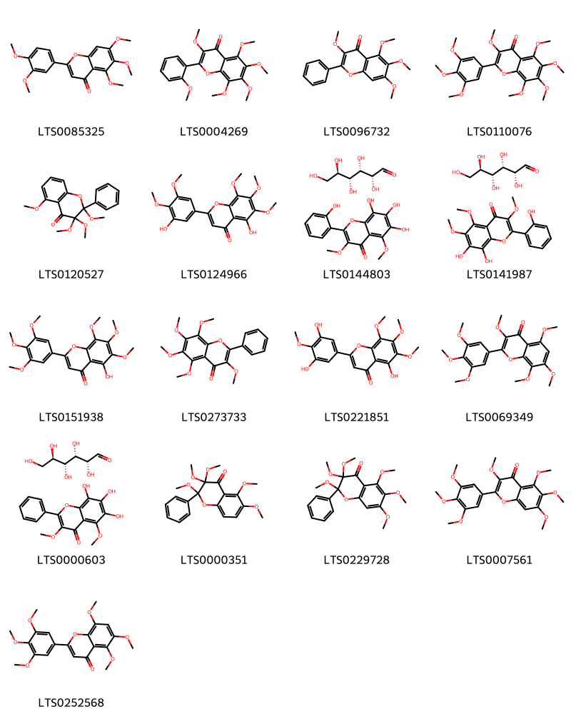{ width=100% }
    <figcaption>Hình ảnh cấu trúc hóa học của 17 hoạt chất thuộc nhóm Flavonoids gồm ['sinensetin (LTS0085325)', '3,5,6,7,8-pentamethoxy-2-(2-methoxyphenyl)chromen-4-one (LTS0004269)', '3,5,6,7-tetramethoxy-2-phenylchromen-4-one (LTS0096732)', 'exoticin (LTS0110076)', '2,3,3,5-tetramethoxy-2-phenyl-1-benzopyran-4-one (LTS0120527)', 'gardenin c (LTS0124966)', '(+)-glucose; 6,7,8-trihydroxy-2-(2-hydroxyphenyl)-3,5-dimethoxychromen-4-one (LTS0144803)', '(+)-glucose; 7,8-dihydroxy-2-(2-hydroxyphenyl)-3,5,6-trimethoxychromen-4-one (LTS0141987)', 'gardenin a (LTS0151938)', '3,5,6,7,8-pentamethoxy-2-phenylchromen-4-one (LTS0273733)', 'gardenin e (LTS0221851)', 'hibiscetin heptamethyl ether (LTS0069349)', '(+)-glucose; 6,7,8-trihydroxy-3,5-dimethoxy-2-phenylchromen-4-one (LTS0000603)', '2,3,3,5,6-pentamethoxy-2-phenyl-1-benzopyran-4-one (LTS0000351)', '2,3,3,5,6,7-hexamethoxy-2-phenyl-1-benzopyran-4-one (LTS0229728)', '3,5,6,7-tetramethoxy-2-(3,4,5-trimethoxyphenyl)chromen-4-one (LTS0007561)', '5,6,8-trimethoxy-2-(3,4,5-trimethoxyphenyl)chromen-4-one (LTS0252568)'].</figcaption>
</figure>
#### Nhóm Imidazopyrimidines
<figure markdown="span">
    { width=100% }
    <figcaption>Hình ảnh cấu trúc hóa học của 1 hoạt chất thuộc nhóm Imidazopyrimidines gồm ['caffeine (LTS0075508)'].</figcaption>
</figure>
#### Nhóm Indoles and derivatives
<figure markdown="span">
    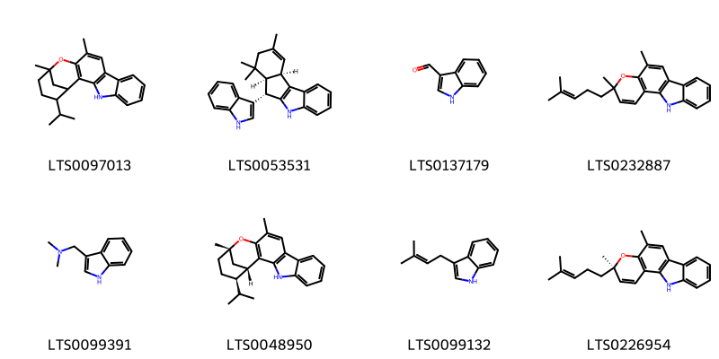{ width=100% }
    <figcaption>Hình ảnh cấu trúc hóa học của 8 hoạt chất thuộc nhóm Indoles and derivatives gồm ['19-isopropyl-13,16-dimethyl-15-oxa-4-azapentacyclo[14.3.1.0²,¹⁴.0³,¹¹.0⁵,¹⁰]icosa-2(14),3(11),5(10),6,8,12-hexaene (LTS0097013)', 'yuehchukene (LTS0053531)', 'indole-3-carboxaldehyde (LTS0137179)', 'mahanimbine (LTS0232887)', 'gramin (LTS0099391)', '(1s,16s,19r)-19-isopropyl-13,16-dimethyl-15-oxa-4-azapentacyclo[14.3.1.0²,¹⁴.0³,¹¹.0⁵,¹⁰]icosa-2(14),3(11),5(10),6,8,12-hexaene (LTS0048950)', '3-(3-methylbut-2-en-1-yl)-1h-indole (LTS0099132)', '(3r)-3,5-dimethyl-3-(4-methylpent-3-en-1-yl)-11h-pyrano[3,2-a]carbazole (LTS0226954)'].</figcaption>
</figure>
#### Nhóm Isoflavonoids
<figure markdown="span">
    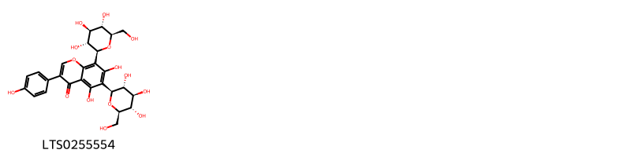{ width=100% }
    <figcaption>Hình ảnh cấu trúc hóa học của 1 hoạt chất thuộc nhóm Isoflavonoids gồm ['paniculatin (LTS0255554)'].</figcaption>
</figure>
#### Nhóm Linear 1_3-diarylpropanoids
<figure markdown="span">
    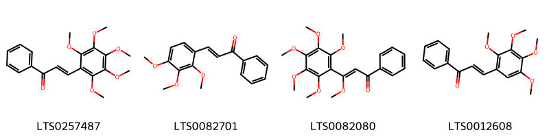{ width=100% }
    <figcaption>Hình ảnh cấu trúc hóa học của Không tìm thấy chú thích hoạt chất thuộc nhóm Linear 1_3-diarylpropanoids gồm Không tìm thấy chú thích.</figcaption>
</figure>
#### Nhóm Organooxygen compounds
<figure markdown="span">
    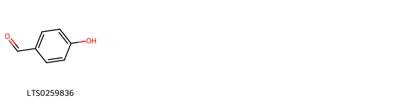{ width=100% }
    <figcaption>Hình ảnh cấu trúc hóa học của 1 hoạt chất thuộc nhóm Organooxygen compounds gồm ['p-hydroxybenzaldehyde (LTS0259836)'].</figcaption>
</figure>
#### Nhóm Oxepanes
<figure markdown="span">
    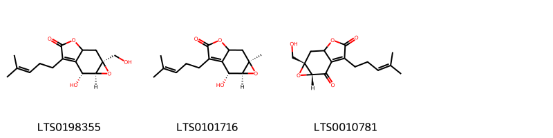{ width=100% }
    <figcaption>Hình ảnh cấu trúc hóa học của 3 hoạt chất thuộc nhóm Oxepanes gồm ['(2r,3s,5s)-2-hydroxy-5-(hydroxymethyl)-10-(4-methylpent-3-en-1-yl)-4,8-dioxatricyclo[5.3.0.0³,⁵]dec-1(10)-en-9-one (LTS0198355)', '(2r,3s,5r)-2-hydroxy-5-methyl-10-(4-methylpent-3-en-1-yl)-4,8-dioxatricyclo[5.3.0.0³,⁵]dec-1(10)-en-9-one (LTS0101716)', '(3r,5s)-5-(hydroxymethyl)-10-(4-methylpent-3-en-1-yl)-4,8-dioxatricyclo[5.3.0.0³,⁵]dec-1(10)-ene-2,9-dione (LTS0010781)'].</figcaption>
</figure>
#### Nhóm Prenol lipids
<figure markdown="span">
    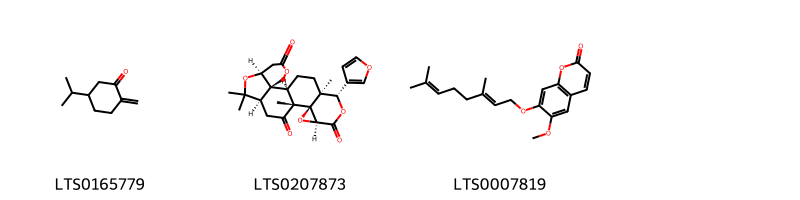{ width=100% }
    <figcaption>Hình ảnh cấu trúc hóa học của 3 hoạt chất thuộc nhóm Prenol lipids gồm ['5-isopropyl-2-methylidenecyclohexan-1-one (LTS0165779)', 'limonin (LTS0207873)', '7-{[(2e)-3,7-dimethylocta-2,6-dien-1-yl]oxy}-6-methoxychromen-2-one (LTS0007819)'].</figcaption>
</figure>
#### Nhóm Quinolines and derivatives
<figure markdown="span">
    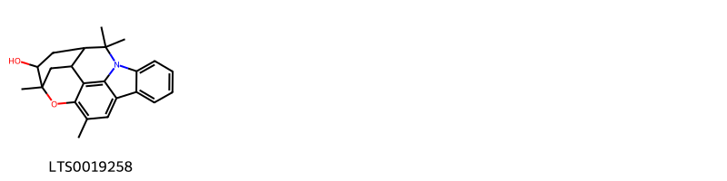{ width=100% }
    <figcaption>Hình ảnh cấu trúc hóa học của 1 hoạt chất thuộc nhóm Quinolines and derivatives gồm ['3,13,13,17-tetramethyl-21-oxa-12-azahexacyclo[10.7.1.1²,¹⁷.0⁵,²⁰.0⁶,¹¹.0¹⁴,¹⁹]henicosa-1,3,5(20),6(11),7,9-hexaen-16-ol (LTS0019258)'].</figcaption>
</figure>
#### Nhóm Steroids and steroid derivatives
<figure markdown="span">
    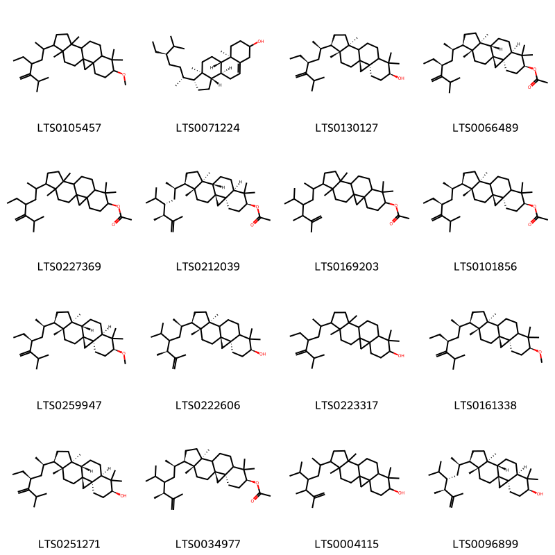{ width=100% }
    <figcaption>Hình ảnh cấu trúc hóa học của 16 hoạt chất thuộc nhóm Steroids and steroid derivatives gồm ['15-(4-ethyl-6-methyl-5-methylideneheptan-2-yl)-6-methoxy-7,7,12,16-tetramethylpentacyclo[9.7.0.0¹,³.0³,⁸.0¹²,¹⁶]octadecane (LTS0105457)', 'stigmast-5-en-3-ol (LTS0071224)', '(1s,3r,6s,12s,15r,16r)-15-[(2r,4s)-4-ethyl-6-methyl-5-methylideneheptan-2-yl]-7,7,12,16-tetramethylpentacyclo[9.7.0.0¹,³.0³,⁸.0¹²,¹⁶]octadecan-6-ol (LTS0130127)', '(1s,3r,6s,8r,11s,12s,15r,16r)-15-[(2r,4s)-4-ethyl-6-methyl-5-methylideneheptan-2-yl]-7,7,12,16-tetramethylpentacyclo[9.7.0.0¹,³.0³,⁸.0¹²,¹⁶]octadecan-6-yl acetate (LTS0066489)', '15-(4-ethyl-6-methyl-5-methylideneheptan-2-yl)-7,7,12,16-tetramethylpentacyclo[9.7.0.0¹,³.0³,⁸.0¹²,¹⁶]octadecan-6-yl acetate (LTS0227369)', '(1s,3r,6s,8r,11s,12s,15r,16r)-15-[(2r,4s,5s)-4-isopropyl-5,6-dimethylhept-6-en-2-yl]-7,7,12,16-tetramethylpentacyclo[9.7.0.0¹,³.0³,⁸.0¹²,¹⁶]octadecan-6-yl acetate (LTS0212039)', '15-(4-isopropyl-5,6-dimethylhept-6-en-2-yl)-7,7,12,16-tetramethylpentacyclo[9.7.0.0¹,³.0³,⁸.0¹²,¹⁶]octadecan-6-yl acetate (LTS0169203)', '(1s,3r,6s,12s,15r,16r)-15-[(2r,4s)-4-ethyl-6-methyl-5-methylideneheptan-2-yl]-7,7,12,16-tetramethylpentacyclo[9.7.0.0¹,³.0³,⁸.0¹²,¹⁶]octadecan-6-yl acetate (LTS0101856)', '(1s,3r,6s,8r,11s,12s,15r,16r)-15-[(2r,4s)-4-ethyl-6-methyl-5-methylideneheptan-2-yl]-6-methoxy-7,7,12,16-tetramethylpentacyclo[9.7.0.0¹,³.0³,⁸.0¹²,¹⁶]octadecane (LTS0259947)', '(1s,3r,6s,12s,15r,16r)-15-[(2r,5s)-4-isopropyl-5,6-dimethylhept-6-en-2-yl]-7,7,12,16-tetramethylpentacyclo[9.7.0.0¹,³.0³,⁸.0¹²,¹⁶]octadecan-6-ol (LTS0222606)', '15-(4-ethyl-6-methyl-5-methylideneheptan-2-yl)-7,7,12,16-tetramethylpentacyclo[9.7.0.0¹,³.0³,⁸.0¹²,¹⁶]octadecan-6-ol (LTS0223317)', '(1s,3r,6s,12s,15r,16r)-15-[(2r,4s)-4-ethyl-6-methyl-5-methylideneheptan-2-yl]-6-methoxy-7,7,12,16-tetramethylpentacyclo[9.7.0.0¹,³.0³,⁸.0¹²,¹⁶]octadecane (LTS0161338)', '(1s,3r,6s,8r,11s,12s,15r,16r)-15-[(2r,4s)-4-ethyl-6-methyl-5-methylideneheptan-2-yl]-7,7,12,16-tetramethylpentacyclo[9.7.0.0¹,³.0³,⁸.0¹²,¹⁶]octadecan-6-ol (LTS0251271)', '(1s,3r,6s,12s,15r,16r)-15-[(2r,5s)-4-isopropyl-5,6-dimethylhept-6-en-2-yl]-7,7,12,16-tetramethylpentacyclo[9.7.0.0¹,³.0³,⁸.0¹²,¹⁶]octadecan-6-yl acetate (LTS0034977)', '15-(4-isopropyl-5,6-dimethylhept-6-en-2-yl)-7,7,12,16-tetramethylpentacyclo[9.7.0.0¹,³.0³,⁸.0¹²,¹⁶]octadecan-6-ol (LTS0004115)', '(1s,3r,6s,8r,11s,12s,15r,16r)-15-[(2r,4s,5s)-4-isopropyl-5,6-dimethylhept-6-en-2-yl]-7,7,12,16-tetramethylpentacyclo[9.7.0.0¹,³.0³,⁸.0¹²,¹⁶]octadecan-6-ol (LTS0096899)'].</figcaption>
</figure>

---

### Dược dân tộc học

Danh sách các quốc gia có sử dụng *N/A* trong điều trị các bệnh. 

| Country   | Disease     | Bệnh               |
|:----------|:------------|:-------------------|
| English   | Taenicide   | Thuốc diệt cỏ      |
| French    | Tonic       | (thuộc) trương lực |
| India     | Refrigerant | Chất làm lạnh      |
| Malaysia  | Perfume     | Nước hoa           |
| Sanscrit  | Digestive   | tiêu               |
| anish     | Stomachic   | Sững sờ            |

---

---
## Murraya koenigii
### Thông tin về thực vật

!!! info "Phân loại thực vật của *Murraya koenigii* từ GIBF:"
    - **Kingdom:** Plantae
    - **Phylum:** Tracheophyta
    - **Order:** Sapindales
    - **Family:** Rutaceae
    - **Genus:** Murraya
    - **Species:** *Murraya koenigii*

 

| Label (VI)   | Label (EN)   | Scientific Name   | Descriptions (VI)   | Descriptions (EN)                            | Also Known As (VI)   | Also Known As (EN)   |
|:-------------|:-------------|:------------------|:--------------------|:---------------------------------------------|:---------------------|:---------------------|
| N/A          | N/A          | Murraya koenigii  |                     | Subtropical tree with leaves used culinarily | ['']                 | ['']                 |

#### Phân bố trên thế giới

**Từ CSDL GIBF** United Arab Emirates, South Africa, Hong Kong, Australia, Brazil, India, United States of America, Malaysia, Northern Mariana Islands, Nepal

#### Phân bố tại Việt Nam

**Từ CSDL GIBF**: Không có ghi nhận ở Việt Nam

---
### Thành phần hóa học
        
- Theo cơ sở dữ liệu lotus: Từ loài *Murraya koenigii* đã phân lập và xác định được 172 hoạt chất thuộc về các nhóm Indoles and derivatives, Steroids and steroid derivatives, Prenol lipids, Quinolines and derivatives, Glycerophospholipids, Diarylheptanoids, Benzofurans, Benzene and substituted derivatives, 2-arylbenzofuran flavonoids, Organic phosphoric acids and derivatives, Coumarins and derivatives. 

|    | chemicalTaxonomyClassyfireClass          |   smiles_count |
|---:|:-----------------------------------------|---------------:|
|  0 | 2-arylbenzofuran flavonoids              |              2 |
|  1 | Benzene and substituted derivatives      |              2 |
|  2 | Benzofurans                              |              2 |
|  3 | Coumarins and derivatives                |             35 |
|  4 | Diarylheptanoids                         |              1 |
|  5 | Glycerophospholipids                     |              3 |
|  6 | Indoles and derivatives                  |            101 |
|  7 | Organic phosphoric acids and derivatives |              1 |
|  8 | Prenol lipids                            |             12 |
|  9 | Quinolines and derivatives               |              6 |
| 10 | Steroids and steroid derivatives         |              7 |

#### Nhóm 2-arylbenzofuran flavonoids
<figure markdown="span">
    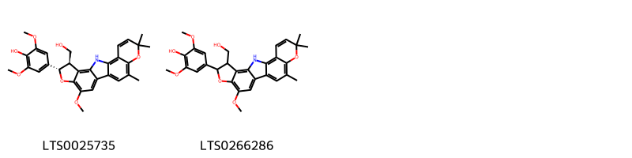{ width=100% }
    <figcaption>Hình ảnh cấu trúc hóa học của 2 hoạt chất thuộc nhóm 2-arylbenzofuran flavonoids gồm ['4-[(7s,8r)-8-(hydroxymethyl)-4-methoxy-16,16,19-trimethyl-6,17-dioxa-11-azapentacyclo[10.8.0.0²,¹⁰.0⁵,⁹.0¹³,¹⁸]icosa-1(12),2(10),3,5(9),13(18),14,19-heptaen-7-yl]-2,6-dimethoxyphenol (LTS0025735)', '4-[8-(hydroxymethyl)-4-methoxy-16,16,19-trimethyl-6,17-dioxa-11-azapentacyclo[10.8.0.0²,¹⁰.0⁵,⁹.0¹³,¹⁸]icosa-1(12),2(10),3,5(9),13(18),14,19-heptaen-7-yl]-2,6-dimethoxyphenol (LTS0266286)'].</figcaption>
</figure>
#### Nhóm Benzene and substituted derivatives
<figure markdown="span">
    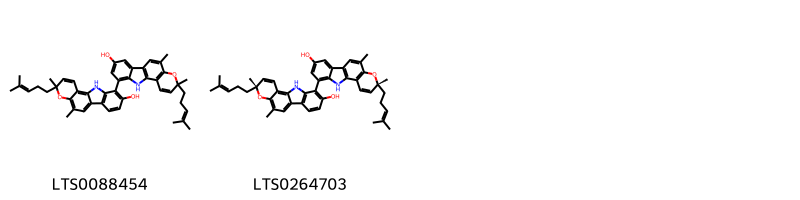{ width=100% }
    <figcaption>Hình ảnh cấu trúc hóa học của 2 hoạt chất thuộc nhóm Benzene and substituted derivatives gồm ['10-[9-hydroxy-3,5-dimethyl-3-(4-methylpent-3-en-1-yl)-11h-pyrano[3,2-a]carbazol-10-yl]-3,5-dimethyl-3-(4-methylpent-3-en-1-yl)-11h-pyrano[3,2-a]carbazol-8-ol (LTS0088454)', '(3r)-10-[(3r)-9-hydroxy-3,5-dimethyl-3-(4-methylpent-3-en-1-yl)-11h-pyrano[3,2-a]carbazol-10-yl]-3,5-dimethyl-3-(4-methylpent-3-en-1-yl)-11h-pyrano[3,2-a]carbazol-8-ol (LTS0264703)'].</figcaption>
</figure>
#### Nhóm Benzofurans
<figure markdown="span">
    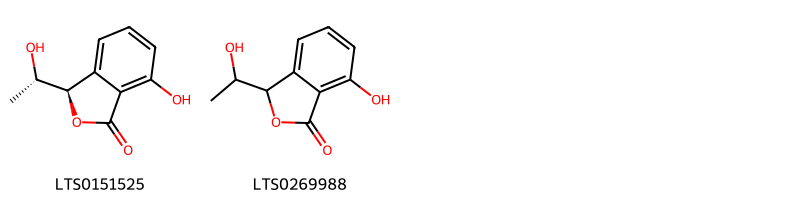{ width=100% }
    <figcaption>Hình ảnh cấu trúc hóa học của 2 hoạt chất thuộc nhóm Benzofurans gồm ['(3r)-7-hydroxy-3-[(1s)-1-hydroxyethyl]-3h-2-benzofuran-1-one (LTS0151525)', '7-hydroxy-3-(1-hydroxyethyl)-3h-2-benzofuran-1-one (LTS0269988)'].</figcaption>
</figure>
#### Nhóm Coumarins and derivatives
<figure markdown="span">
    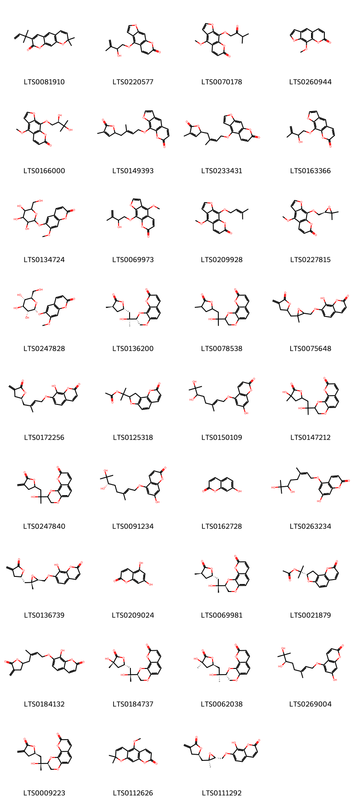{ width=100% }
    <figcaption>Hình ảnh cấu trúc hóa học của 35 hoạt chất thuộc nhóm Coumarins and derivatives gồm ['8,8-dimethyl-3-(2-methylbut-3-en-2-yl)pyrano[3,2-g]chromen-2-one (LTS0081910)', '4-[(2-hydroxy-3-methylbut-3-en-1-yl)oxy]furo[3,2-g]chromen-7-one (LTS0220577)', 'isobyakangelicol (LTS0070178)', 'methoxsalen (LTS0260944)', 'byakangelicin (LTS0166000)', '3-methyl-5-[(2e)-2-methyl-4-({7-oxofuro[3,2-g]chromen-9-yl}oxy)but-2-en-1-yl]-5h-furan-2-one (LTS0149393)', '3-methyl-5-[(2z)-2-methyl-4-({7-oxofuro[3,2-g]chromen-4-yl}oxy)but-2-en-1-yl]-5h-furan-2-one (LTS0233431)', '9-[(2-hydroxy-3-methylbut-3-en-1-yl)oxy]furo[3,2-g]chromen-7-one (LTS0163366)', '7-methoxy-6-{[3,4,5-trihydroxy-6-(hydroxymethyl)oxan-2-yl]oxy}chromen-2-one (LTS0134724)', 'neobyakangelicol (LTS0069973)', 'phellopterin (LTS0209928)', 'byakangelicol (LTS0227815)', '7-methoxy-6-{[(2r,3r,4s,5s,6r)-3,4,5-trihydroxy-6-(hydroxymethyl)oxan-2-yl]oxy}chromen-2-one (LTS0247828)', '(3r,5s)-5-[(2s)-2-hydroxy-2-[(2r)-9-oxo-2h,3h-[1,4]dioxino[2,3-h]chromen-2-yl]propyl]-3-methyloxolan-2-one (LTS0136200)', '5-(2-hydroxy-2-{9-oxo-2h,3h-[1,4]dioxino[2,3-h]chromen-2-yl}propyl)-3-methyloxolan-2-one (LTS0078538)', '8-hydroxy-7-({3-methyl-3-[(4-methylidene-5-oxooxolan-2-yl)methyl]oxiran-2-yl}methoxy)chromen-2-one (LTS0075648)', '8-hydroxy-7-{[(2e)-3-{[(2s)-4-methylidene-5-oxooxolan-2-yl]methyl}but-2-en-1-yl]oxy}chromen-2-one (LTS0172256)', '2-{2-oxo-8h,9h-furo[2,3-h]chromen-8-yl}propan-2-yl acetate (LTS0125318)', '5-{[(2e)-6,7-dihydroxy-3,7-dimethyloct-2-en-1-yl]oxy}-7-hydroxychromen-2-one (LTS0150109)', '3-hydroxy-5-(2-hydroxy-2-{9-oxo-2h,3h-[1,4]dioxino[2,3-h]chromen-2-yl}propyl)-3-methyloxolan-2-one (LTS0147212)', '5-(2-hydroxy-2-{9-oxo-2h,3h-[1,4]dioxino[2,3-h]chromen-2-yl}propyl)-3-methylideneoxolan-2-one (LTS0247840)', '5-{[(2e,6s)-6,7-dihydroxy-3,7-dimethyloct-2-en-1-yl]oxy}-7-hydroxychromen-2-one (LTS0091234)', 'umbelliferone (LTS0162728)', '5-[(6,7-dihydroxy-3,7-dimethyloct-2-en-1-yl)oxy]-7-hydroxychromen-2-one (LTS0263234)', '8-hydroxy-7-{[(2s,3s)-3-methyl-3-{[(2s)-4-methylidene-5-oxooxolan-2-yl]methyl}oxiran-2-yl]methoxy}chromen-2-one (LTS0136739)', '5,7-dihydroxychromen-2-one (LTS0209024)', '(3r,5s)-5-[(2r)-2-hydroxy-2-[(2s)-9-oxo-2h,3h-[1,4]dioxino[2,3-h]chromen-2-yl]propyl]-3-methyloxolan-2-one (LTS0069981)', '2-[(8s)-2-oxo-8h,9h-furo[2,3-h]chromen-8-yl]propan-2-yl acetate (LTS0021879)', '8-hydroxy-7-({3-[(4-methylidene-5-oxooxolan-2-yl)methyl]but-2-en-1-yl}oxy)chromen-2-one (LTS0184132)', '(3s,5r)-3-hydroxy-5-[(2r)-2-hydroxy-2-[(2s)-9-oxo-2h,3h-[1,4]dioxino[2,3-h]chromen-2-yl]propyl]-3-methyloxolan-2-one (LTS0184737)', '(3r,5s)-3-hydroxy-5-[(2s)-2-hydroxy-2-[(2r)-9-oxo-2h,3h-[1,4]dioxino[2,3-h]chromen-2-yl]propyl]-3-methyloxolan-2-one (LTS0062038)', '5-{[(2e,6r)-6,7-dihydroxy-3,7-dimethyloct-2-en-1-yl]oxy}-7-hydroxychromen-2-one (LTS0269004)', '(5r)-5-[(2r)-2-hydroxy-2-[(2s)-9-oxo-2h,3h-[1,4]dioxino[2,3-h]chromen-2-yl]propyl]-3-methylideneoxolan-2-one (LTS0009223)', 'xanthoxyletin (LTS0112626)', '8-hydroxy-7-{[(2r,3r)-3-methyl-3-{[(2r)-4-methylidene-5-oxooxolan-2-yl]methyl}oxiran-2-yl]methoxy}chromen-2-one (LTS0111292)'].</figcaption>
</figure>
#### Nhóm Diarylheptanoids
<figure markdown="span">
    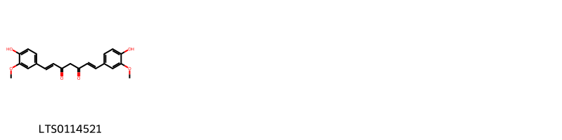{ width=100% }
    <figcaption>Hình ảnh cấu trúc hóa học của 1 hoạt chất thuộc nhóm Diarylheptanoids gồm ['curcumin (LTS0114521)'].</figcaption>
</figure>
#### Nhóm Glycerophospholipids
<figure markdown="span">
    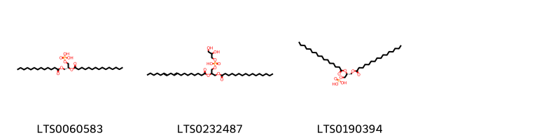{ width=100% }
    <figcaption>Hình ảnh cấu trúc hóa học của 3 hoạt chất thuộc nhóm Glycerophospholipids gồm ['(2r)-2-(pentadecanoyloxy)-3-(tridecanoyloxy)propoxyphosphonic acid (LTS0060583)', '2,3-dihydroxypropoxy(3-(hexadecanoyloxy)-2-[(9e,12e)-octadeca-9,12-dienoyloxy]propoxy)phosphinic acid (LTS0232487)', 'dipalmitoyl (LTS0190394)'].</figcaption>
</figure>
#### Nhóm Indoles and derivatives
<figure markdown="span">
    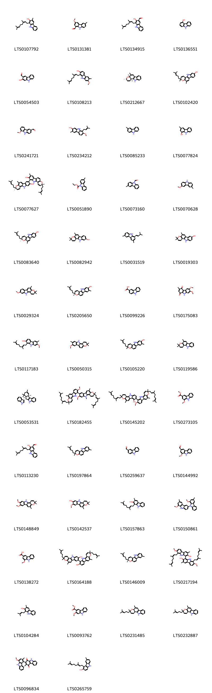{ width=100% }
    <figcaption>Hình ảnh cấu trúc hóa học của 101 hoạt chất thuộc nhóm Indoles and derivatives gồm ['1-(3,7-dimethylocta-2,6-dien-1-yl)-3-methyl-9h-carbazol-2-ol (LTS0107792)', '3-methoxy-6-methyl-9h-carbazole-1-carbaldehyde (LTS0131381)', '1-[(2z)-3,7-dimethylocta-2,6-dien-1-yl]-2-hydroxy-9h-carbazole-3-carbaldehyde (LTS0134915)', '4-hydroxycarbazole (LTS0136551)', '2-hydroxy-9h-carbazole-3-carbaldehyde (LTS0054503)', '1-(3,7-dimethylocta-2,6-dien-1-yl)-7-methoxy-6-methyl-9h-carbazol-2-ol (LTS0108213)', '(3s,4as,11br)-3,5-dimethyl-3h,4ah,11h,11bh-pyrano[3,2-a]carbazole (LTS0212667)', '3,5-dimethyl-3-(4-methylpent-3-en-1-yl)-11h-pyrano[3,2-a]carbazol-9-ol (LTS0102420)', '8-methoxy-9h-carbazole-3-carbaldehyde (LTS0241721)', '7-methoxy-3-methyl-8-(3-methylbut-2-en-1-yl)-9h-carbazol-2-ol (LTS0234212)', '3-methylcarbazole (LTS0085233)', '3-methyl-9h-carbazol-1-ol (LTS0077824)', '(3r)-10-[(3r)-9-hydroxy-3,5-dimethyl-3-(4-methylpent-3-en-1-yl)-11h-pyrano[3,2-a]carbazol-8-yl]-3,8-dimethyl-3-(4-methylpent-3-en-1-yl)-11h-pyrano[3,2-a]carbazol-9-ol (LTS0077627)', 'ethyl 3-methylcarbazole-9-carboxylate (LTS0051890)', '3-methylcarbazole-9-carbaldehyde (LTS0073160)', '3-methoxy-6-methyl-9h-carbazole (LTS0070628)', '(3s)-3,5-dimethyl-3-(4-methylpent-3-en-1-yl)-11h-pyrano[3,2-a]carbazol-9-ol (LTS0083640)', '3,3,5-trimethyl-11h-pyrano[3,2-a]carbazol-9-ol (LTS0082942)', '3,6-dimethyl-1-(3-methylbut-1-en-1-yl)-9h-carbazole (LTS0031519)', '3,3,5-trimethyl-11h-pyrano[3,2-a]carbazol-8-ol (LTS0019303)', '9-methoxy-3,3,5-trimethyl-11h-pyrano[3,2-a]carbazole (LTS0029324)', '(3r)-3,8-dimethyl-3-(4-methylpent-3-en-1-yl)-11h-pyrano[3,2-a]carbazol-9-ol (LTS0205650)', '9h-carbazole-3-carboxylic acid (LTS0099226)', '6,7-dimethoxy-3-methyl-9h-carbazole-1,4-dione (LTS0175083)', '1-[(2e)-3,7-dimethylocta-2,6-dien-1-yl]-7-methoxy-6-methyl-9h-carbazol-2-ol (LTS0117183)', '8-methoxy-3,3,9-trimethyl-11h-pyrano[3,2-a]carbazole (LTS0050315)', '3,8-dimethyl-3-(4-methylpent-3-en-1-yl)-11h-pyrano[3,2-a]carbazol-9-ol (LTS0105220)', 'girinimbine (LTS0119586)', 'yuehchukene (LTS0053531)', '3-[(2e)-3,7-dimethylocta-2,6-dien-1-yl]-8-{3-[(2e)-3,7-dimethylocta-2,6-dien-1-yl]-9-methoxy-3,5-dimethyl-11h-pyrano[3,2-a]carbazol-10-yl}-9-methoxy-3,5,11-trimethylpyrano[3,2-a]carbazole (LTS0182455)', '3-[(2e)-3,7-dimethylocta-2,6-dien-1-yl]-8-{3-[(2e)-3,7-dimethylocta-2,6-dien-1-yl]-9-methoxy-3,5-dimethyl-11h-pyrano[3,2-a]carbazol-10-yl}-3,5-dimethyl-11h-pyrano[3,2-a]carbazol-7-ol (LTS0145202)', 'methyl 1-methoxy-9h-carbazole-3-carboxylate (LTS0273105)', '1-(3,7-dimethylocta-2,6-dien-1-yl)-2-hydroxy-9h-carbazole-3-carbaldehyde (LTS0113230)', '3,8-dimethyl-3-(4-methylpent-3-en-1-yl)-11h-pyrano[3,2-a]carbazole (LTS0197864)', '9h-carbazole-3-carbaldehyde (LTS0259637)', 'murrayanine (LTS0144992)', '8,9-dimethoxy-3,3,5-trimethyl-11h-pyrano[3,2-a]carbazole (LTS0148849)', '8-methoxy-3,3,5-trimethyl-11h-pyrano[3,2-a]carbazol-9-ol (LTS0142537)', '1-[(2e)-3,7-dimethylocta-2,6-dien-1-yl]-3-methyl-9h-carbazol-2-ol (LTS0157863)', "1',8-dimethoxy-3',6-dimethyl-9h-3,9'-bicarbazole (LTS0150861)", '1-methoxy-9h-carbazole-3-carboxylic acid (LTS0138272)', '8-[9-hydroxy-3,5-dimethyl-3-(4-methylpent-3-en-1-yl)-11h-pyrano[3,2-a]carbazol-10-yl]-3,5-dimethyl-3-(4-methylpent-3-en-1-yl)-11h-pyrano[3,2-a]carbazol-9-ol (LTS0164188)', '(3r)-3,8-dimethyl-3-(4-methylpent-3-en-1-yl)-11h-pyrano[3,2-a]carbazole (LTS0146009)', "8,8'-bis(3,7-dimethylocta-2,6-dien-1-yl)-7,7'-dimethoxy-3,3'-dimethyl-9h,9'h-[1,1'-bicarbazole]-2,2'-diol (LTS0217194)", '3-methyl-1-(3-methylbut-2-en-1-yl)-9h-carbazol-2-ol (LTS0104284)', 'methyl 2-methoxy-9h-carbazole-3-carboxylate (LTS0093762)', '3,5-dimethyl-3-(4-methylpent-3-en-1-yl)-4ah,11h,11bh-pyrano[3,2-a]carbazole (LTS0231485)', 'mahanimbine (LTS0232887)', "1'-methoxy-3,3'-dimethyl-9h,9'h-[2,4'-bicarbazole]-1,4-dione (LTS0096834)", '4-[(2e)-3,7-dimethylocta-2,6-dien-1-yl]-6-methyl-9h-carbazol-3-ol (LTS0265759)', '(3s,4as,11br)-3,5-dimethyl-3-(4-methylpent-3-en-1-yl)-4ah,11h,11bh-pyrano[3,2-a]carbazole (LTS0267729)', '4-[(2z)-3,7-dimethylocta-2,6-dien-1-yl]-6-methyl-9h-carbazol-3-ol (LTS0058344)', '(3r)-9-methoxy-3,5-dimethyl-3-(4-methylpent-3-en-1-yl)-11h-pyrano[3,2-a]carbazole (LTS0258211)', '3,6-dimethyl-1-[(1e)-3-methylbut-1-en-1-yl]-9h-carbazole (LTS0066862)', '(1s,16s,19s)-13,16-dimethyl-19-(prop-1-en-2-yl)-15-oxa-4-azapentacyclo[14.3.1.0²,¹⁴.0³,¹¹.0⁵,¹⁰]icosa-2(14),3(11),5(10),6,8,12-hexaene (LTS0265627)', '3,3-dimethyl-11h-pyrano[3,2-a]carbazole-5-carbaldehyde (LTS0259902)', '10-{9-hydroxy-8-methoxy-3,3,5-trimethyl-11h-pyrano[3,2-a]carbazol-10-yl}-8-methoxy-3,3,5-trimethyl-11h-pyrano[3,2-a]carbazol-9-ol (LTS0269030)', '8,9-dimethoxy-3,3,5-trimethyl-11h-pyrano[3,2-a]carbazol-6-ol (LTS0093056)', '1-methoxy-3-methyl-9h-carbazole (LTS0072118)', '3,5-dimethyl-3h,4ah,11h,11bh-pyrano[3,2-a]carbazole (LTS0075151)', '1-[(2z)-3,7-dimethylocta-2,6-dien-1-yl]-3-methyl-9h-carbazol-2-ol (LTS0086110)', '8-methoxy-3,3,5-trimethyl-11h-pyrano[3,2-a]carbazole (LTS0183223)', '8-(3,7-dimethylocta-2,6-dien-1-yl)-7-methoxy-3-methyl-9h-carbazol-2-ol (LTS0148219)', '7-methoxy-3-methyl-8-(3-methylbut-2-en-1-yl)-9h-carbazole-1,4-dione (LTS0143872)', '10-methoxy-3,5-dimethyl-3-(4-methylpent-3-en-1-yl)-11h-pyrano[3,2-a]carbazole (LTS0178185)', "3,3'-dimethyl-9h,9'h-[2,2'-bicarbazole]-1,1',4,4'-tetrone (LTS0170469)", '8,10-dimethoxy-3,3,5-trimethyl-11h-pyrano[3,2-a]carbazole (LTS0238461)', "3,3'-dimethyl-9h,9'h-[1,1'-bicarbazole]-2,2'-diol (LTS0067828)", "1,1'-dimethoxy-3,3'-dimethyl-9h-4,9'-bicarbazole (LTS0043880)", '9-methoxy-3,5-dimethyl-3-(4-methylpent-3-en-1-yl)-11h-pyrano[3,2-a]carbazole (LTS0257689)', '(1-methoxy-9h-carbazol-3-yl)methanol (LTS0038757)', '13,16-dimethyl-19-(prop-1-en-2-yl)-15-oxa-4-azapentacyclo[14.3.1.0²,¹⁴.0³,¹¹.0⁵,¹⁰]icosa-2(14),3(11),5(10),6,8,12-hexaene (LTS0255223)', '(3r)-8-[(3r)-9-hydroxy-3,5-dimethyl-3-(4-methylpent-3-en-1-yl)-11h-pyrano[3,2-a]carbazol-10-yl]-3,5-dimethyl-3-(4-methylpent-3-en-1-yl)-11h-pyrano[3,2-a]carbazol-9-ol (LTS0258993)', '7-methoxy-3-methyl-9h-carbazole-1,4-dione (LTS0067002)', '10-[9-hydroxy-3,5-dimethyl-3-(4-methylpent-3-en-1-yl)-11h-pyrano[3,2-a]carbazol-8-yl]-3,8-dimethyl-3-(4-methylpent-3-en-1-yl)-11h-pyrano[3,2-a]carbazol-9-ol (LTS0260718)', '9-methoxy-3-{[(9-methoxycarbazol-3-yl)methoxy]methyl}carbazole (LTS0247553)', '8-[(2e)-3,7-dimethylocta-2,6-dien-1-yl]-7-methoxy-3-methyl-9h-carbazol-2-ol (LTS0266462)', '1-methoxy-4-[(1-methoxy-9h-carbazol-3-yl)methyl]-3-methyl-9h-carbazole (LTS0068546)', '(3r)-3,5-dimethyl-3-(4-methylpent-3-en-1-yl)-11h-pyrano[3,2-a]carbazol-9-ol (LTS0011889)', '4-(3,7-dimethylocta-2,6-dien-1-yl)-6-methyl-9h-carbazol-3-ol (LTS0004888)', "8,8'-bis[(2e)-3,7-dimethylocta-2,6-dien-1-yl]-7,7'-dimethoxy-3,3'-dimethyl-9h,9'h-[1,1'-bicarbazole]-2,2'-diol (LTS0112046)", "(e)-1'-methoxy-3,3'-dimethyl-[2,4'-bicarbazolylidene]-1,4-diol (LTS0110760)", '3-methyl-9h-carbazole-1,4-dione (LTS0030954)', '2-methoxy-9h-carbazole (LTS0241973)', '9h-carbazole (LTS0037890)', '1-[(2e)-3,7-dimethylocta-2,6-dien-1-yl]-2-hydroxy-9h-carbazole-3-carbaldehyde (LTS0111450)', '(3r)-3,5-dimethyl-3-(4-methylpent-3-en-1-yl)-11h-pyrano[3,2-a]carbazole (LTS0226954)', '3-[(2e)-3,7-dimethylocta-2,6-dien-1-yl]-7-{3-[(2e)-3,7-dimethylocta-2,6-dien-1-yl]-9-methoxy-3,5-dimethyl-11h-pyrano[3,2-a]carbazol-10-yl}-3,5-dimethyl-11h-pyrano[3,2-a]carbazol-8-ol (LTS0254738)', '9-methoxycarbazole-3-carbaldehyde (LTS0045098)', '2,7-dimethoxy-9h-carbazole-3-carbaldehyde (LTS0094044)', '1-[(1e,3s)-3,7-dimethylocta-1,6-dien-1-yl]-3-methyl-9h-carbazol-2-ol (LTS0197730)', '2-hydroxy-8-methoxy-1-(3-methylbut-2-en-1-yl)-9h-carbazole-3-carbaldehyde (LTS0043620)', '1-(3,7-dimethylocta-1,6-dien-1-yl)-3-methyl-9h-carbazol-2-ol (LTS0147971)', '7-methoxymurrayacine (LTS0146592)', '(2s)-1-methoxypropan-2-yl 2-(3-formylcarbazol-9-yl)acetate (LTS0102685)', '2-methoxy-9h-carbazole-3-carbaldehyde (LTS0187335)', 'siamenol (LTS0213272)', 'heptaphylline (LTS0215094)', '2-hydroxy-7-methoxy-9h-carbazole-3-carbaldehyde (LTS0021313)', '7-methoxyheptaphylline (LTS0241564)', '(2-methoxy-9h-carbazol-3-yl)methanol (LTS0052684)'].</figcaption>
</figure>
#### Nhóm Organic phosphoric acids and derivatives
<figure markdown="span">
    { width=100% }
    <figcaption>Hình ảnh cấu trúc hóa học của 1 hoạt chất thuộc nhóm Organic phosphoric acids and derivatives gồm ['o-phosphoethanolamine; bis(nonane) (LTS0249963)'].</figcaption>
</figure>
#### Nhóm Prenol lipids
<figure markdown="span">
    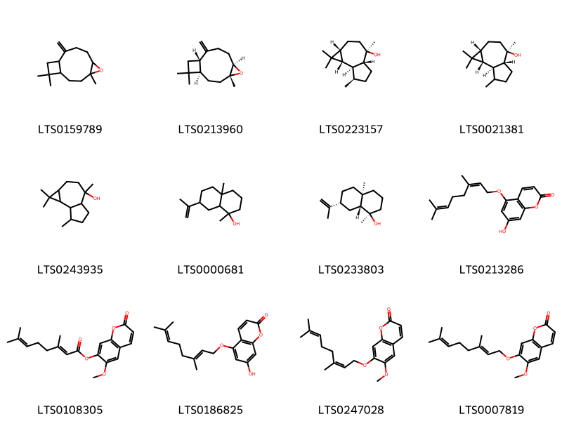{ width=100% }
    <figcaption>Hình ảnh cấu trúc hóa học của 12 hoạt chất thuộc nhóm Prenol lipids gồm ['caryophyllene oxide (LTS0159789)', 'β-caryophyllene oxide (LTS0213960)', 'globulol (LTS0223157)', '(1ar,4r,4ar,7as,7bs)-1,1,4,7-tetramethyl-octahydro-1ah-cyclopropa[e]azulen-4-ol (LTS0021381)', 'ledol (LTS0243935)', '1,4a-dimethyl-7-(prop-1-en-2-yl)-octahydronaphthalen-1-ol (LTS0000681)', '(1r,4ar,7r,8ar)-1,4a-dimethyl-7-(prop-1-en-2-yl)-octahydronaphthalen-1-ol (LTS0233803)', '5-[(3,7-dimethylocta-2,6-dien-1-yl)oxy]-7-hydroxychromen-2-one (LTS0213286)', '6-methoxy-2-oxochromen-7-yl (2e)-3,7-dimethylocta-2,6-dienoate (LTS0108305)', '5-{[(2e)-3,7-dimethylocta-2,6-dien-1-yl]oxy}-7-hydroxychromen-2-one (LTS0186825)', '7-[(3,7-dimethylocta-2,6-dien-1-yl)oxy]-6-methoxychromen-2-one (LTS0247028)', '7-{[(2e)-3,7-dimethylocta-2,6-dien-1-yl]oxy}-6-methoxychromen-2-one (LTS0007819)'].</figcaption>
</figure>
#### Nhóm Quinolines and derivatives
<figure markdown="span">
    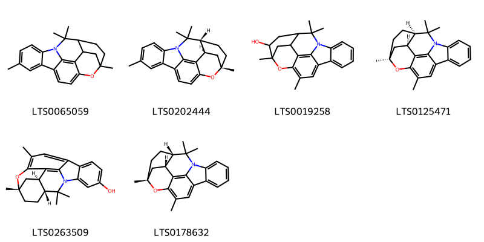{ width=100% }
    <figcaption>Hình ảnh cấu trúc hóa học của 6 hoạt chất thuộc nhóm Quinolines and derivatives gồm ['8,13,13,17-tetramethyl-21-oxa-12-azahexacyclo[10.7.1.1²,¹⁷.0⁵,²⁰.0⁶,¹¹.0¹⁴,¹⁹]henicosa-1,3,5(20),6(11),7,9-hexaene (LTS0065059)', '(14r,17s,19s)-8,13,13,17-tetramethyl-21-oxa-12-azahexacyclo[10.7.1.1²,¹⁷.0⁵,²⁰.0⁶,¹¹.0¹⁴,¹⁹]henicosa-1,3,5(20),6(11),7,9-hexaene (LTS0202444)', '3,13,13,17-tetramethyl-21-oxa-12-azahexacyclo[10.7.1.1²,¹⁷.0⁵,²⁰.0⁶,¹¹.0¹⁴,¹⁹]henicosa-1,3,5(20),6(11),7,9-hexaen-16-ol (LTS0019258)', '(14r,17s,19s)-3,13,13,17-tetramethyl-21-oxa-12-azahexacyclo[10.7.1.1²,¹⁷.0⁵,²⁰.0⁶,¹¹.0¹⁴,¹⁹]henicosa-1,3,5(20),6(11),7,9-hexaene (LTS0125471)', '(14r,17s,19r)-3,13,13,17-tetramethyl-21-oxa-12-azahexacyclo[10.7.1.1²,¹⁷.0⁵,²⁰.0⁶,¹¹.0¹⁴,¹⁹]henicosa-1,3,5(20),6(11),7,9-hexaen-9-ol (LTS0263509)', '(14s,17r,19r)-3,13,13,17-tetramethyl-21-oxa-12-azahexacyclo[10.7.1.1²,¹⁷.0⁵,²⁰.0⁶,¹¹.0¹⁴,¹⁹]henicosa-1,3,5(20),6(11),7,9-hexaene (LTS0178632)'].</figcaption>
</figure>
#### Nhóm Steroids and steroid derivatives
<figure markdown="span">
    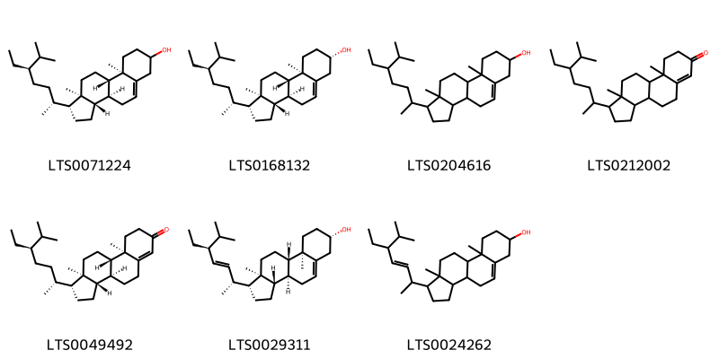{ width=100% }
    <figcaption>Hình ảnh cấu trúc hóa học của 7 hoạt chất thuộc nhóm Steroids and steroid derivatives gồm ['stigmast-5-en-3-ol (LTS0071224)', 'sitosterol (LTS0168132)', 'stigmast-5-en-3-ol, (3β)- (LTS0204616)', '1-(5-ethyl-6-methylheptan-2-yl)-9a,11a-dimethyl-1h,2h,3h,3ah,3bh,4h,5h,8h,9h,9bh,10h,11h-cyclopenta[a]phenanthren-7-one (LTS0212002)', 'β-sitostenone (LTS0049492)', 'phytosterol (LTS0029311)', 'stigmasterol (LTS0024262)'].</figcaption>
</figure>

---

### Dược dân tộc học

Danh sách các quốc gia có sử dụng *Murraya koenigii* trong điều trị các bệnh. 

| Country   | Disease                       | Bệnh                    |
|:----------|:------------------------------|:------------------------|
| Elsewhere | Carminative, Stomachic, Tonic | Sáng tạo, Dạ dày, Tonic |

---

---
## Murraya paniculata
### Thông tin về thực vật

!!! info "Phân loại thực vật của *Murraya paniculata* từ GIBF:"
    - **Kingdom:** Plantae
    - **Phylum:** Tracheophyta
    - **Order:** Sapindales
    - **Family:** Rutaceae
    - **Genus:** Murraya
    - **Species:** *Murraya paniculata*

 

| Label (VI)   | Label (EN)   | Scientific Name    | Descriptions (VI)   | Descriptions (EN)                       | Also Known As (VI)   | Also Known As (EN)                                                 |
|:-------------|:-------------|:-------------------|:--------------------|:----------------------------------------|:---------------------|:-------------------------------------------------------------------|
| N/A          | N/A          | Murraya paniculata |                     | species of plant in the family Rutaceae | ['']                 | ['orange jessamine', 'mock orange', 'china box', 'orange jasmine'] |

#### Phân bố trên thế giới

**Từ CSDL GIBF** Virgin Islands (U.S.), Australia, Japan, Benin, Pakistan, Puerto Rico, Chinese Taipei, Bangladesh, United States of America, South Africa, Hong Kong, Thailand, Brazil, Mexico, Dominican Republic, China, Niue, Colombia, Macao, India, Philippines, Malaysia

#### Phân bố tại Việt Nam

**Từ CSDL GIBF**: Không có ghi nhận ở Việt Nam

---
### Thành phần hóa học
        
- Theo cơ sở dữ liệu lotus: Từ loài *Murraya paniculata* đã phân lập và xác định được 290 hoạt chất thuộc về các nhóm Naphthalenes, Benzofurans, Carboxylic acids and derivatives, Indoles and derivatives, Cinnamic acids and derivatives, Prenol lipids, Linear 1,3-diarylpropanoids, Quinolines and derivatives, Benzene and substituted derivatives, Dihydrofurans, Organooxygen compounds, Flavonoids, Steroids and steroid derivatives, Isoflavonoids, Oxepanes, Coumarins and derivatives, Isoquinolines and derivatives, Imidazopyrimidines. 

|    | chemicalTaxonomyClassyfireClass     |   smiles_count |
|---:|:------------------------------------|---------------:|
|  0 | Benzene and substituted derivatives |              3 |
|  1 | Benzofurans                         |              2 |
|  2 | Carboxylic acids and derivatives    |              1 |
|  3 | Cinnamic acids and derivatives      |             17 |
|  4 | Coumarins and derivatives           |            157 |
|  5 | Dihydrofurans                       |              1 |
|  6 | Flavonoids                          |             37 |
|  7 | Imidazopyrimidines                  |              2 |
|  8 | Indoles and derivatives             |             23 |
|  9 | Isoflavonoids                       |              1 |
| 10 | Isoquinolines and derivatives       |              2 |
| 11 | Linear 1,3-diarylpropanoids         |              6 |
| 12 | Naphthalenes                        |              1 |
| 13 | Organooxygen compounds              |              1 |
| 14 | Oxepanes                            |              3 |
| 15 | Prenol lipids                       |              7 |
| 16 | Quinolines and derivatives          |              2 |
| 17 | Steroids and steroid derivatives    |             19 |

#### Nhóm Benzene and substituted derivatives
<figure markdown="span">
    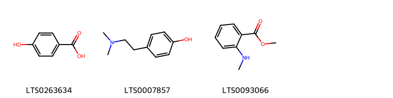{ width=100% }
    <figcaption>Hình ảnh cấu trúc hóa học của 3 hoạt chất thuộc nhóm Benzene and substituted derivatives gồm ['p-hydroxybenzoic acid (LTS0263634)', 'hordenine (LTS0007857)', 'dimethyl anthranilate (LTS0093066)'].</figcaption>
</figure>
#### Nhóm Benzofurans
<figure markdown="span">
    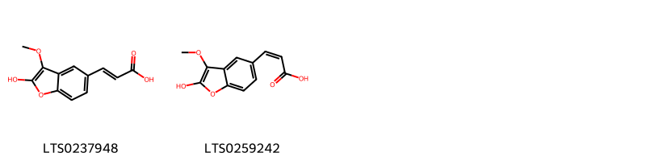{ width=100% }
    <figcaption>Hình ảnh cấu trúc hóa học của 2 hoạt chất thuộc nhóm Benzofurans gồm ['3-(2-hydroxy-3-methoxy-1-benzofuran-5-yl)prop-2-enoic acid (LTS0237948)', '(2z)-3-(2-hydroxy-3-methoxy-1-benzofuran-5-yl)prop-2-enoic acid (LTS0259242)'].</figcaption>
</figure>
#### Nhóm Carboxylic acids and derivatives
<figure markdown="span">
    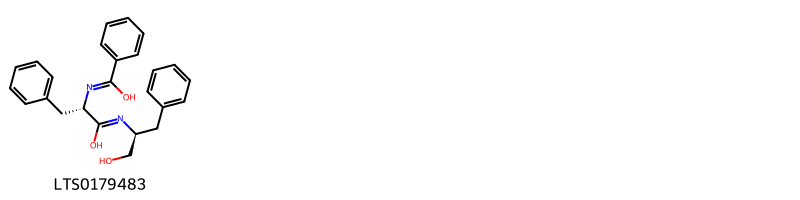{ width=100% }
    <figcaption>Hình ảnh cấu trúc hóa học của 1 hoạt chất thuộc nhóm Carboxylic acids and derivatives gồm ['(2s)-2-{[hydroxy(phenyl)methylidene]amino}-n-[(2s)-1-hydroxy-3-phenylpropan-2-yl]-3-phenylpropanimidic acid (LTS0179483)'].</figcaption>
</figure>
#### Nhóm Cinnamic acids and derivatives
<figure markdown="span">
    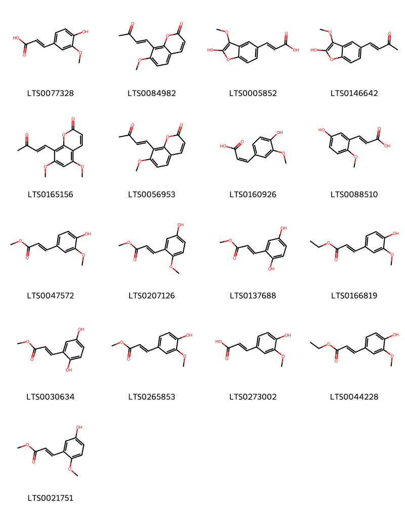{ width=100% }
    <figcaption>Hình ảnh cấu trúc hóa học của 17 hoạt chất thuộc nhóm Cinnamic acids and derivatives gồm ['ferulic acid (LTS0077328)', '7-methoxy-8-(3-oxobut-1-en-1-yl)chromen-2-one (LTS0084982)', '(2e)-3-(2-hydroxy-3-methoxy-1-benzofuran-5-yl)prop-2-enoic acid (LTS0005852)', '(3e)-4-(2-hydroxy-3-methoxy-1-benzofuran-5-yl)but-3-en-2-one (LTS0146642)', '5,7-dimethoxy-8-[(1e)-3-oxobut-1-en-1-yl]chromen-2-one (LTS0165156)', '7-methoxy-8-[(1e)-3-oxobut-1-en-1-yl]chromen-2-one (LTS0056953)', 'cis-ferulic acid (LTS0160926)', '3-(5-hydroxy-2-methoxyphenyl)prop-2-enoic acid (LTS0088510)', 'methyl ferulate (LTS0047572)', 'methyl 3-(5-hydroxy-2-methoxyphenyl)prop-2-enoate (LTS0207126)', 'methyl 3-(2,5-dihydroxyphenyl)prop-2-enoate (LTS0137688)', 'ethyl ferulate (LTS0166819)', 'methyl (2e)-3-(2,5-dihydroxyphenyl)prop-2-enoate (LTS0030634)', 'methyl ferulate (LTS0265853)', 'ferulic acid (LTS0273002)', 'ethyl ferulate (LTS0044228)', 'methyl (2e)-3-(5-hydroxy-2-methoxyphenyl)prop-2-enoate (LTS0021751)'].</figcaption>
</figure>
#### Nhóm Coumarins and derivatives
<figure markdown="span">
    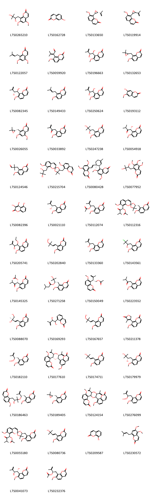{ width=100% }
    <figcaption>Hình ảnh cấu trúc hóa học của 157 hoạt chất thuộc nhóm Coumarins and derivatives gồm ['8-(2,3-dihydroxy-3-methylbutyl)-5,7-dimethoxychromen-2-one (LTS0265210)', 'umbelliferone (LTS0162728)', 'phebalosin (LTS0133650)', 'phebalosin (LTS0119914)', '5,7-dimethoxy-8-(3-methylbut-2-en-1-yl)chromen-2-one (LTS0122057)', '2-(7-methoxy-2-oxochromen-8-yl)-3-methylbut-2-enal (LTS0059920)', '8-[(1s,2s)-1,2-dihydroxy-3-methylbut-3-en-1-yl]-7-methoxychromen-2-one (LTS0196663)', '8-[(3,3-dimethyloxiran-2-yl)methyl]-7-methoxychromen-2-one (LTS0132653)', '8-[(1s,2r)-1,2-dihydroxy-3-methylbut-3-en-1-yl]-7-methoxychromen-2-one (LTS0082345)', 'osthole (LTS0149433)', '8-(1,2-dihydroxy-3-methylbut-3-en-1-yl)-7-methoxychromen-2-one (LTS0250624)', 'scopoletin (LTS0193112)', '8-{[(2s)-3,3-dimethyloxiran-2-yl]methyl}-5,7-dimethoxychromen-2-one (LTS0026055)', '7-methoxy-8-(3-methyl-2-oxobut-3-en-1-yl)chromen-2-one (LTS0033892)', '8-(2,3-dihydroxy-3-methylbutyl)-7-methoxychromen-2-one (LTS0247238)', '8-[(1r)-1-hydroxy-3-methyl-2-oxobutyl]-7-methoxychromen-2-one (LTS0054918)', '3-(7-methoxy-2-oxochromen-8-yl)-2,2-dimethylpropanal (LTS0124546)', "8-[8-(2,3-dihydroxy-3-methylbutyl)-7-methoxy-4',4'-dimethylspiro[chromene-2,2'-[1,3]dioxolan]-5'-ylmethyl]-7-methoxychromen-2-one (LTS0215704)", '8-[(1r,6r)-6-[(1e)-2-(5,7-dimethoxy-2-oxochromen-8-yl)ethenyl]-3,6-dimethylcyclohex-2-en-1-yl]-5,7-dimethoxychromen-2-one (LTS0080428)', '8-(2,3-dihydroxy-3-methylbutyl)-5,6,7-trimethoxychromen-2-one (LTS0077952)', '3,4,5-trihydroxychromen-2-one (LTS0082396)', '8-[(2s)-2-hydroxy-3-methylbut-3-en-1-yl]-7-methoxychromen-2-one (LTS0021110)', '1-(7-methoxy-2-oxochromen-8-yl)-3-methylbut-3-en-2-yl acetate (LTS0112074)', "(1r)-1-[(2r,5'r)-7-methoxy-5'-[(7-methoxy-2-oxochromen-8-yl)methyl]-4',4'-dimethylspiro[chromene-2,2'-[1,3]dioxolan]-8-yl]-3-methyl-2-oxobutyl acetate (LTS0112316)", '8-(1-ethoxy-2-hydroxy-3-methylbut-3-en-1-yl)-7-methoxychromen-2-one (LTS0205741)', '8-(3-hydroperoxy-3-methylbut-1-en-1-yl)-7-methoxychromen-2-one (LTS0202840)', '8-(2-hydroxy-3-methylbut-3-en-1-yl)-7-methoxychromen-2-one (LTS0133360)', '8-(3-chloro-2-hydroxy-3-methylbutyl)-7-methoxychromen-2-one (LTS0143561)', '(1r)-1-(7-methoxy-2-oxochromen-8-yl)-3-methyl-2-oxobutyl acetate (LTS0145325)', '(2s)-3-hydroxy-1-(7-methoxy-2-oxochromen-8-yl)-3-methylbutan-2-yl 3-methylbutanoate (LTS0271258)', '(2s)-2-(7-methoxy-2-oxochromen-8-yl)-3-methylbut-3-en-1-yl acetate (LTS0150049)', '7-methoxy-8-(3-methyl-2-oxobutyl)chromen-2-one (LTS0223552)', '8-[(1e,3r)-3,4-dihydroxy-3-methylbut-1-en-1-yl]-7-methoxychromen-2-one (LTS0088070)', '8-(1,2-dihydroxy-3-methylbut-3-en-1-yl)chromen-2-one (LTS0169293)', '8-[(1e)-3-hydroperoxy-3-methylbut-1-en-1-yl]-7-methoxychromen-2-one (LTS0167657)', '7-methoxy-8-(4-methyl-5-oxo-2h-furan-3-yl)chromen-2-one (LTS0211378)', '8-[(2s)-2-hydroperoxy-3-methylbut-3-en-1-yl]-7-methoxychromen-2-one (LTS0182110)', '8-[(1r,2r)-2-hydroxy-1-{[(1s,2r)-2-hydroxy-1-(6-methoxy-2-oxochromen-8-yl)-3-methylbut-3-en-1-yl]oxy}-3-methylbut-3-en-1-yl]-7-methoxychromen-2-one (LTS0177610)', '8-[(1e)-3-hydroxy-3-methylbut-1-en-1-yl]-7-methoxychromen-2-one (LTS0174711)', '8-[(2s)-2,3-dihydroxy-3-methylbutyl]-7-methoxychromen-2-one (LTS0179979)', '8-[(2s)-2-{[(3s)-3-hydroxy-4-(7-methoxy-2-oxochromen-8-yl)-2-methylbutan-2-yl]oxy}-3-methylbut-3-en-1-yl]-7-methoxychromen-2-one (LTS0186463)', '8-{[(2s)-3,3-dimethyloxiran-2-yl]methyl}-7-methoxychromen-2-one (LTS0189405)', '8-(2-hydroxy-1-{[2-hydroxy-1-(7-methoxy-2-oxochromen-8-yl)-3-methylbut-3-en-1-yl]oxy}-3-methylbut-3-en-1-yl)-7-methoxychromen-2-one (LTS0124154)', '8-(2-hydroperoxy-3-methylbut-3-en-1-yl)-7-methoxychromen-2-one (LTS0276099)', "(1r)-1-[(2s,5's)-7-methoxy-5'-[(7-methoxy-2-oxochromen-8-yl)methyl]-4',4'-dimethylspiro[chromene-2,2'-[1,3]dioxolan]-8-yl]-3-methyl-2-oxobutyl acetate (LTS0055180)", '8-(3-hydroxy-3-methylbut-1-en-1-yl)-7-methoxychromen-2-one (LTS0080736)', '8-hydroxycoumarin (LTS0209587)', '5,6-dimethoxy-8-(3-methylbut-2-en-1-yl)chromen-2-one (LTS0230572)', '8-[(1r,2s)-1,2-dihydroxy-3-methylbut-3-en-1-yl]-7-methoxychromen-2-one (LTS0041073)', '(2r)-1-(7-methoxy-2-oxochromen-8-yl)-3-methylbut-3-en-2-yl acetate (LTS0232376)', '8-(2-hydroxy-3-methylbut-3-en-1-yl)-5,7-dimethoxychromen-2-one (LTS0234369)', '(2r)-1-(7-methoxy-2-oxochromen-8-yl)-3-methyl-1-oxobutan-2-yl 3-methylbut-2-enoate (LTS0162280)', '8-(1-hydroxy-3-methyl-2-oxobutyl)-7-methoxychromen-2-one (LTS0174325)', 'bergapten (LTS0019861)', '5-hydroxy-7-methoxy-8-(3-methylbut-2-en-1-yl)chromen-2-one (LTS0187704)', '8-[(2s)-3-chloro-2-hydroxy-3-methylbutyl]-7-methoxychromen-2-one (LTS0046886)', '2-(7-methoxy-2-oxochromen-8-yl)-3-methylbut-3-en-1-yl acetate (LTS0253442)', '1-hydroxy-1-(7-methoxy-2-oxochromen-8-yl)-3-methylbutan-2-yl acetate (LTS0244622)', '1-(7-methoxy-2-oxochromen-8-yl)-3-methyl-1-oxobutan-2-yl 3-methylbut-2-enoate (LTS0054627)', '8-(3,4-dihydroxy-3-methylbut-1-en-1-yl)-7-methoxychromen-2-one (LTS0131251)', '3-hydroxy-1-(7-methoxy-2-oxochromen-8-yl)-3-methylbutan-2-yl 3-methylbutanoate (LTS0067284)', '1-(7-methoxy-2-oxochromen-8-yl)-3-methyl-2-oxobutyl acetate (LTS0060093)', "1-[(2s,5's)-7-methoxy-5'-[(7-methoxy-2-oxochromen-8-yl)methyl]-4',4'-dimethylspiro[chromene-2,2'-[1,3]dioxolan]-8-yl]-3-methyl-2-oxobutyl acetate (LTS0053710)", '8-(2-{[3-hydroxy-4-(7-methoxy-2-oxochromen-8-yl)-2-methylbutan-2-yl]oxy}-3-methylbut-3-en-1-yl)-7-methoxychromen-2-one (LTS0053192)', '8-{6-[2-(5,7-dimethoxy-2-oxochromen-8-yl)ethenyl]-3,6-dimethylcyclohex-2-en-1-yl}-5,7-dimethoxychromen-2-one (LTS0265355)', '7-methoxy-2-oxochromene-8-carbaldehyde (LTS0066932)', '8-[(1s,2s)-1-ethoxy-2-hydroxy-3-methylbut-3-en-1-yl]-7-methoxychromen-2-one (LTS0006592)', '1-hydroxy-1-(7-methoxy-2-oxochromen-8-yl)-3-methylbut-3-en-2-yl acetate (LTS0028526)', '4-hydroxy-1-[(7-methoxy-2-oxochromen-8-yl)oxy]-4-methylpentan-3-yl hexadecanoate (LTS0018074)', '(1r,2r)-1-hydroxy-1-(7-methoxy-2-oxochromen-8-yl)-3-methylbut-3-en-2-yl acetate (LTS0002038)', "8-[(2r,5'r)-8-[(2s)-2,3-dihydroxy-3-methylbutyl]-7-methoxy-4',4'-dimethylspiro[chromene-2,2'-[1,3]dioxolan]-5'-ylmethyl]-7-methoxychromen-2-one (LTS0010205)", '7-methoxy-8-[(1z)-3-methylbuta-1,3-dien-1-yl]chromen-2-one (LTS0230961)', '7-methoxy-8-[(1e)-3-methylbuta-1,3-dien-1-yl]chromen-2-one (LTS0017241)', '7-methoxy-8-(3-methylbuta-1,3-dien-1-yl)chromen-2-one (LTS0254720)', "1-{7-methoxy-5'-[(7-methoxy-2-oxochromen-8-yl)methyl]-4',4'-dimethylspiro[chromene-2,2'-[1,3]dioxolan]-8-yl}-3-methyl-2-oxobutyl acetate (LTS0129121)", '8-[(1e)-3,4-dihydroxy-3-methylbut-1-en-1-yl]-7-methoxychromen-2-one (LTS0259991)', '8-[(1r,2r)-2-hydroxy-1-{[(1s,2r)-2-hydroxy-1-(7-methoxy-2-oxochromen-8-yl)-3-methylbut-3-en-1-yl]oxy}-3-methylbut-3-en-1-yl]-7-methoxychromen-2-one (LTS0107615)', '(2e,4s)-4-hydroxy-4-(7-methoxy-2-oxochromen-8-yl)-2-methylbut-2-enal (LTS0136033)', '(2e)-3-(7-methoxy-2-oxochromen-8-yl)-2-methylbut-2-enal (LTS0218555)', '6-methoxy-7-{[(2r,3r,4s,5s,6r)-3,4,5-trihydroxy-6-(hydroxymethyl)oxan-2-yl]oxy}chromen-2-one (LTS0223406)', '8-[(1r,2s)-2-chloro-1-hydroxy-3-methylbut-3-en-1-yl]-7-methoxychromen-2-one (LTS0035668)', '1-hydroxy-1-(7-methoxy-2-oxochromen-8-yl)-3-methylbut-3-en-2-yl 3-methylbutanoate (LTS0134112)', '5,7-dimethoxy-8-(3-methyl-2-oxobutyl)chromen-2-one (LTS0134384)', '1-(5,7-dimethoxy-2-oxochromen-8-yl)-3-methylbut-3-en-2-yl 3-methylbutanoate (LTS0204856)', '8-[(1s,2r)-2-hydroxy-1-methoxy-3-methylbut-3-en-1-yl]-7-methoxychromen-2-one (LTS0074025)', '8-[(1r,2s)-1-chloro-2-hydroxy-3-methylbut-3-en-1-yl]-7-methoxychromen-2-one (LTS0124689)', '(1r)-1-(7-methoxy-2-oxochromen-8-yl)-3-methyl-2-oxobutyl 3-methylbut-2-enoate (LTS0071986)', '8-{6-[2-(5,7-dimethoxy-2-oxochromen-8-yl)ethenyl]-6-methylcyclohex-2-en-1-yl}-5,7-dimethoxychromen-2-one (LTS0080349)', '5,6,7-trimethoxy-8-(3-methyl-2-oxobutyl)chromen-2-one (LTS0064702)', '8-(3-ethoxy-2-hydroxy-3-methylbutyl)-7-methoxychromen-2-one (LTS0111274)', '8-{6-[(1e)-2-(5,7-dimethoxy-2-oxochromen-8-yl)ethenyl]-6-methylcyclohex-2-en-1-yl}-5,7-dimethoxychromen-2-one (LTS0036410)', '8-[(2s)-2-hydroxy-3-[(2-hydroxypropan-2-yl)oxy]-3-methylbutyl]-7-methoxychromen-2-one (LTS0179262)', '(2s)-2-(7-methoxy-2-oxochromen-8-yl)-3-methylbut-3-en-1-yl pyridine-3-carboxylate (LTS0104350)', '5,7-dimethoxy-8-(3-methylbuta-1,3-dien-1-yl)chromen-2-one (LTS0136377)', '8-(2-ethoxy-1-hydroxy-3-methylbut-3-en-1-yl)-7-methoxychromen-2-one (LTS0136101)', '(2s)-1-(5,7-dimethoxy-2-oxochromen-8-yl)-3-hydroxy-3-methylbutan-2-yl 3-methylbutanoate (LTS0142286)', '8-[(2s)-2,3-dihydroxy-3-methylbutyl]-5,7-dimethoxychromen-2-one (LTS0136136)', '3-(7-methoxy-2-oxochromen-8-yl)-2,2-dimethylpropanoic acid (LTS0191165)', '(1r,2r)-1-hydroxy-1-(7-methoxy-2-oxochromen-8-yl)-3-methylbut-3-en-2-yl 3-methylbutanoate (LTS0268453)', '8-[(4s,5s)-2,2-dimethyl-5-(prop-1-en-2-yl)-1,3-dioxolan-4-yl]-7-methoxychromen-2-one (LTS0273853)', '7-methoxy-8-({2-[1-(7-methoxy-2-oxochromen-8-yl)-2-methylpropan-2-yl]-5,5-dimethyl-1,3-dioxolan-4-yl}methyl)chromen-2-one (LTS0142159)', '1-(7-methoxy-2-oxochromen-8-yl)-3-methyl-2-oxobutyl 3-methylbutanoate (LTS0152687)', 'minumicrolin (LTS0121355)', '(2e)-4-hydroxy-4-(7-methoxy-2-oxochromen-8-yl)-2-methylbut-2-enal (LTS0147348)', '(2s)-2-(7-methoxy-2-oxochromen-8-yl)-3-methylbut-3-en-1-yl 3-methylbutanoate (LTS0100007)', '(2s)-1-(5,7-dimethoxy-2-oxochromen-8-yl)-3-methylbut-3-en-2-yl 3-methylbutanoate (LTS0162058)', '8-[(2s)-2-hydroxy-3-methoxy-2-methylbutyl]-5,7-dimethoxychromen-2-one (LTS0183401)', '8-[2,2-dimethyl-5-(prop-1-en-2-yl)-1,3-dioxolan-4-yl]-7-methoxychromen-2-one (LTS0183715)', '7-methoxy-8-[(2s,3s)-3-(prop-1-en-2-yl)oxiran-2-yl]chromen-2-one (LTS0125067)', '8-(1-chloro-2-hydroxy-3-methylbut-3-en-1-yl)-7-methoxychromen-2-one (LTS0090623)', 'scopolin (LTS0061811)', '6-methoxy-8,8-dimethylpyrano[2,3-h]chromen-2-one (LTS0213074)', '8-(hydroxymethyl)-5,7-dimethoxychromen-2-one (LTS0273650)', '4-(7-methoxy-2-oxochromen-8-yl)-2-methyl-3-oxobutan-2-yl 3-methylbutanoate (LTS0075653)', '8-{2-hydroxy-3-[(2-hydroxypropan-2-yl)oxy]-3-methylbutyl}-7-methoxychromen-2-one (LTS0181075)', '8-[(1r,2s)-2-hydroxy-1-methoxy-3-methylbut-3-en-1-yl]-7-methoxychromen-2-one (LTS0193315)', '8-[(2s)-2-hydroxy-3-methoxy-3-methylbutyl]-5,7-dimethoxychromen-2-one (LTS0068287)', '(2r)-2-(7-methoxy-2-oxochromen-8-yl)-3-methylbut-3-en-1-yl 3-methylbutanoate (LTS0234167)', '1-(5,7-dimethoxy-2-oxochromen-8-yl)-3-methyl-2-oxobutyl 3-methylbutanoate (LTS0208537)', '(1s,2s)-2-hydroxy-1-(7-methoxy-2-oxochromen-8-yl)-3-methylbut-3-en-1-yl (2r)-2-methyldecanoate (LTS0217359)', '2-(7-methoxy-2-oxochromen-8-yl)-3-methylbut-3-en-1-yl pyridine-3-carboxylate (LTS0216083)', '8-[(1s,6s)-6-[(1e)-2-(5,7-dimethoxy-2-oxochromen-8-yl)ethenyl]-6-methylcyclohex-2-en-1-yl]-5,7-dimethoxychromen-2-one (LTS0009870)', '3-(5,7-dimethoxy-2-oxochromen-8-yl)-2,2-dimethylpropanoic acid (LTS0224585)', '(1r,2s)-1-hydroxy-1-(7-methoxy-2-oxochromen-8-yl)-3-methylbut-3-en-2-yl acetate (LTS0007517)', '8-(2-chloro-1-hydroxy-3-methylbut-3-en-1-yl)-7-methoxychromen-2-one (LTS0019471)', '7-methoxy-8-(4-methyl-2-oxo-5h-furan-3-yl)chromen-2-one (LTS0162313)', '8-[(2r)-3-ethoxy-2-hydroxy-3-methylbutyl]-7-methoxychromen-2-one (LTS0229774)', '4-hydroxy-4-(7-methoxy-2-oxochromen-8-yl)-2-methylbut-2-enal (LTS0247306)', '3-(7-methoxy-2-oxochromen-8-yl)-2-methylbut-2-enal (LTS0249278)', '(2r)-1-(5,7-dimethoxy-2-oxochromen-8-yl)-3-methyl-1-oxobut-3-en-2-yl 3-methylbut-2-enoate (LTS0231404)', '3-hydroxy-1-(7-methoxy-2-oxochromen-8-yl)-3-methylbutan-2-yl formate (LTS0063008)', '8-[(2r)-2-hydroxy-3-methylbut-3-en-1-yl]-5,7-dimethoxychromen-2-one (LTS0036446)', '8-[(3,3-dimethyloxiran-2-yl)methyl]-5,7-dimethoxychromen-2-one (LTS0258983)', '6-methoxy-7-{[3,4,5-trihydroxy-6-(hydroxymethyl)oxan-2-yl]oxy}chromen-2-one (LTS0042457)', '8-(hydroxymethyl)-7-methoxychromen-2-one (LTS0243525)', '8-[(2s)-2-hydroxy-3-methylbut-3-en-1-yl]-5,7-dimethoxychromen-2-one (LTS0197393)', '5,7-dimethoxy-8-[(1z)-3-methylbuta-1,3-dien-1-yl]chromen-2-one (LTS0178110)', '(1r,2s)-1-hydroxy-1-(7-methoxy-2-oxochromen-8-yl)-3-methylbut-3-en-2-yl 3-methylbutanoate (LTS0261090)', '8-[(2s)-2-hydroxy-3-methoxy-3-methylbutyl]-7-methoxychromen-2-one (LTS0039846)', '2-(7-methoxy-2-oxochromen-8-yl)-3-methylbut-2-en-1-yl 3-methylbutanoate (LTS0065252)', '(2s)-3-hydroxy-1-(7-methoxy-2-oxochromen-8-yl)-3-methylbutan-2-yl formate (LTS0014701)', '8-{[(2r)-3,3-dimethyloxiran-2-yl]methyl}-5,7-dimethoxychromen-2-one (LTS0064167)', '2-(7-methoxy-2-oxochromen-8-yl)-3-methylbut-3-en-1-yl 3-methylbutanoate (LTS0007917)', '1-(5,7-dimethoxy-2-oxochromen-8-yl)-3-hydroxy-3-methylbutan-2-yl 3-methylbutanoate (LTS0014562)', '7-methoxy-8-[(1z)-3-oxobut-1-en-1-yl]chromen-2-one (LTS0094010)', '8-(2-hydroxy-3-methoxy-3-methylbutyl)-5,7-dimethoxychromen-2-one (LTS0091208)', '5,7-dimethoxy-8-(3-oxobut-1-en-1-yl)chromen-2-one (LTS0257110)', '(1r)-1-(5,7-dimethoxy-2-oxochromen-8-yl)-3-methyl-2-oxobutyl 3-methylbutanoate (LTS0012803)', '1-(7-methoxy-2-oxochromen-8-yl)-3-methyl-2-oxobutyl 3-methylbut-2-enoate (LTS0102746)', '1-(5,7-dimethoxy-2-oxochromen-8-yl)-3-methyl-1-oxobut-3-en-2-yl 3-methylbut-2-enoate (LTS0102668)', '8-[(2r)-2-hydroxy-3-methylbut-3-en-1-yl]-7-methoxychromen-2-one (LTS0103000)', '7-methoxy-8-{[(2s,4s)-2-[1-(7-methoxy-2-oxochromen-8-yl)-2-methylpropan-2-yl]-5,5-dimethyl-1,3-dioxolan-4-yl]methyl}chromen-2-one (LTS0135823)', '8-(2-hydroxy-3-methoxy-3-methylbutyl)-7-methoxychromen-2-one (LTS0040504)', '7-methoxy-8-(3-methyl-2-oxobutoxy)chromen-2-one (LTS0037703)', '(1s)-1-(7-methoxy-2-oxochromen-8-yl)-3-methyl-2-oxobutyl 3-methylbut-2-enoate (LTS0051169)', '(1r)-1-(7-methoxy-2-oxochromen-8-yl)-3-methyl-2-oxobutyl 3-methylbutanoate (LTS0225715)', '8-[(1s,2r)-2-ethoxy-1-hydroxy-3-methylbut-3-en-1-yl]-7-methoxychromen-2-one (LTS0116485)'].</figcaption>
</figure>
#### Nhóm Dihydrofurans
<figure markdown="span">
    { width=100% }
    <figcaption>Hình ảnh cấu trúc hóa học của 1 hoạt chất thuộc nhóm Dihydrofurans gồm ['vitamin c (LTS0022555)'].</figcaption>
</figure>
#### Nhóm Flavonoids
<figure markdown="span">
    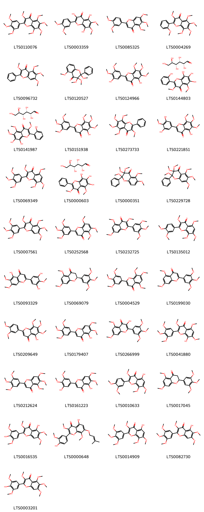{ width=100% }
    <figcaption>Hình ảnh cấu trúc hóa học của 37 hoạt chất thuộc nhóm Flavonoids gồm ['exoticin (LTS0110076)', '2-(3,4-dimethoxyphenyl)-3,5,8-trihydroxy-6,7-dimethoxychromen-4-one (LTS0003359)', 'sinensetin (LTS0085325)', '3,5,6,7,8-pentamethoxy-2-(2-methoxyphenyl)chromen-4-one (LTS0004269)', '3,5,6,7-tetramethoxy-2-phenylchromen-4-one (LTS0096732)', '2,3,3,5-tetramethoxy-2-phenyl-1-benzopyran-4-one (LTS0120527)', 'gardenin c (LTS0124966)', '(+)-glucose; 6,7,8-trihydroxy-2-(2-hydroxyphenyl)-3,5-dimethoxychromen-4-one (LTS0144803)', '(+)-glucose; 7,8-dihydroxy-2-(2-hydroxyphenyl)-3,5,6-trimethoxychromen-4-one (LTS0141987)', 'gardenin a (LTS0151938)', '3,5,6,7,8-pentamethoxy-2-phenylchromen-4-one (LTS0273733)', 'gardenin e (LTS0221851)', 'hibiscetin heptamethyl ether (LTS0069349)', '(+)-glucose; 6,7,8-trihydroxy-3,5-dimethoxy-2-phenylchromen-4-one (LTS0000603)', '2,3,3,5,6-pentamethoxy-2-phenyl-1-benzopyran-4-one (LTS0000351)', '2,3,3,5,6,7-hexamethoxy-2-phenyl-1-benzopyran-4-one (LTS0229728)', '3,5,6,7-tetramethoxy-2-(3,4,5-trimethoxyphenyl)chromen-4-one (LTS0007561)', '5,6,8-trimethoxy-2-(3,4,5-trimethoxyphenyl)chromen-4-one (LTS0252568)', 'myricetin hexamethyl ether (LTS0232725)', 'gossypetin hexamethyl ether (LTS0135012)', '2-(3,5-dihydroxy-4-methoxyphenyl)-5-hydroxy-6,7-dimethoxychromen-4-one (LTS0093329)', '(2s)-5,7-dimethoxy-2-(3,4,5-trimethoxyphenyl)-2,3-dihydro-1-benzopyran-4-one (LTS0069079)', 'bannamurpanisin (LTS0004529)', '5,7-dimethoxy-2-(3,4,5-trimethoxyphenyl)chromen-4-one (LTS0199030)', 'demethylnobiletin (LTS0209649)', 'umuhengerin (LTS0179407)', '3-hydroxy-5,7-dimethoxy-2-(3,4,5-trimethoxyphenyl)chromen-4-one (LTS0266999)', '8-hydroxy-3,5,7-trimethoxy-2-(3,4,5-trimethoxyphenyl)chromen-4-one (LTS0041880)', '5,6,7-trimethoxy-2-(3,4,5-trimethoxyphenyl)chromen-4-one (LTS0212624)', '5-hydroxy-2-(3-hydroxy-4,5-dimethoxyphenyl)-6,7-dimethoxychromen-4-one (LTS0161223)', '2-(3,4-dimethoxyphenyl)-5-hydroxy-3,7,8-trimethoxychromen-4-one (LTS0010633)', '5,7-dimethoxy-2-(3,4,5-trimethoxyphenyl)-2,3-dihydro-1-benzopyran-4-one (LTS0017045)', 'murrayanol (LTS0016535)', '5-hydroxy-2-(4-hydroxy-3-methoxyphenyl)-3,8-dimethoxy-7-[(3-methylbut-2-en-1-yl)oxy]chromen-4-one (LTS0000648)', '5-hydroxy-3,7,8-trimethoxy-2-(3,4,5-trimethoxyphenyl)chromen-4-one (LTS0014909)', '5-hydroxy-3,6,7-trimethoxy-2-(3,4,5-trimethoxyphenyl)chromen-4-one (LTS0082730)', '2-(4-hydroxy-3,5-dimethoxyphenyl)-3,5,6,7-tetramethoxychromen-4-one (LTS0003201)'].</figcaption>
</figure>
#### Nhóm Imidazopyrimidines
<figure markdown="span">
    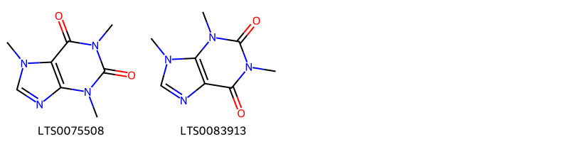{ width=100% }
    <figcaption>Hình ảnh cấu trúc hóa học của 2 hoạt chất thuộc nhóm Imidazopyrimidines gồm ['caffeine (LTS0075508)', 'isocaffeine (LTS0083913)'].</figcaption>
</figure>
#### Nhóm Indoles and derivatives
<figure markdown="span">
    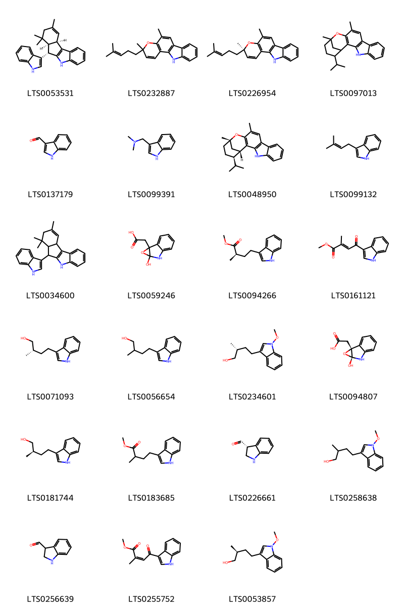{ width=100% }
    <figcaption>Hình ảnh cấu trúc hóa học của 23 hoạt chất thuộc nhóm Indoles and derivatives gồm ['yuehchukene (LTS0053531)', 'mahanimbine (LTS0232887)', '(3r)-3,5-dimethyl-3-(4-methylpent-3-en-1-yl)-11h-pyrano[3,2-a]carbazole (LTS0226954)', '19-isopropyl-13,16-dimethyl-15-oxa-4-azapentacyclo[14.3.1.0²,¹⁴.0³,¹¹.0⁵,¹⁰]icosa-2(14),3(11),5(10),6,8,12-hexaene (LTS0097013)', 'indole-3-carboxaldehyde (LTS0137179)', 'gramin (LTS0099391)', '(1s,16s,19r)-19-isopropyl-13,16-dimethyl-15-oxa-4-azapentacyclo[14.3.1.0²,¹⁴.0³,¹¹.0⁵,¹⁰]icosa-2(14),3(11),5(10),6,8,12-hexaene (LTS0048950)', '3-(3-methylbut-2-en-1-yl)-1h-indole (LTS0099132)', '3-{7,7,9-trimethyl-5h,6h,6ah,8h,10ah-indeno[2,1-b]indol-6-yl}-1h-indole (LTS0034600)', '{1a-hydroxy-2h-oxireno[2,3-b]indol-6b-yl}acetic acid (LTS0059246)', 'methyl (2r)-4-(1h-indol-3-yl)-2-methylbutanoate (LTS0094266)', 'methyl (2e)-4-(1h-indol-3-yl)-2-methyl-4-oxobut-2-enoate (LTS0161121)', '(2s)-4-(1h-indol-3-yl)-2-methylbutan-1-ol (LTS0071093)', '4-(1h-indol-3-yl)-2-methylbutan-1-ol (LTS0056654)', '(2r)-4-(1-methoxyindol-3-yl)-2-methylbutan-1-ol (LTS0234601)', '[(1ar,6br)-1a-hydroxy-2h-oxireno[2,3-b]indol-6b-yl]acetic acid (LTS0094807)', '(2r)-4-(1h-indol-3-yl)-2-methylbutan-1-ol (LTS0181744)', 'methyl 4-(1h-indol-3-yl)-2-methylbutanoate (LTS0183685)', '(3r)-2,3-dihydro-1h-indole-3-carbaldehyde (LTS0226661)', '4-(1-methoxyindol-3-yl)-2-methylbutan-1-ol (LTS0258638)', '2,3-dihydro-1h-indole-3-carbaldehyde (LTS0256639)', 'methyl 4-(1h-indol-3-yl)-2-methyl-4-oxobut-2-enoate (LTS0255752)', '(2s)-4-(1-methoxyindol-3-yl)-2-methylbutan-1-ol (LTS0053857)'].</figcaption>
</figure>
#### Nhóm Isoflavonoids
<figure markdown="span">
    { width=100% }
    <figcaption>Hình ảnh cấu trúc hóa học của 1 hoạt chất thuộc nhóm Isoflavonoids gồm ['paniculatin (LTS0255554)'].</figcaption>
</figure>
#### Nhóm Isoquinolines and derivatives
<figure markdown="span">
    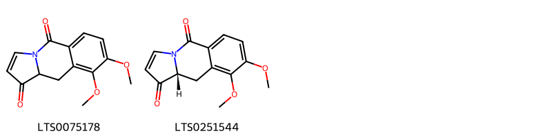{ width=100% }
    <figcaption>Hình ảnh cấu trúc hóa học của 2 hoạt chất thuộc nhóm Isoquinolines and derivatives gồm ['8,9-dimethoxy-10h,10ah-pyrrolo[1,2-b]isoquinoline-1,5-dione (LTS0075178)', '(10ar)-8,9-dimethoxy-10h,10ah-pyrrolo[1,2-b]isoquinoline-1,5-dione (LTS0251544)'].</figcaption>
</figure>
#### Nhóm Linear 1_3-diarylpropanoids
<figure markdown="span">
    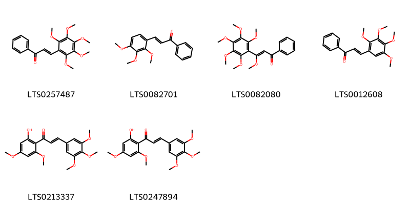{ width=100% }
    <figcaption>Hình ảnh cấu trúc hóa học của Không tìm thấy chú thích hoạt chất thuộc nhóm Linear 1_3-diarylpropanoids gồm Không tìm thấy chú thích.</figcaption>
</figure>
#### Nhóm Naphthalenes
<figure markdown="span">
    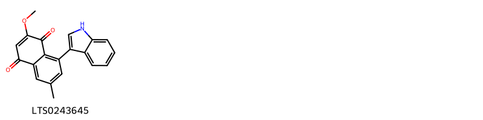{ width=100% }
    <figcaption>Hình ảnh cấu trúc hóa học của 1 hoạt chất thuộc nhóm Naphthalenes gồm ['8-(1h-indol-3-yl)-2-methoxy-6-methylnaphthalene-1,4-dione (LTS0243645)'].</figcaption>
</figure>
#### Nhóm Organooxygen compounds
<figure markdown="span">
    { width=100% }
    <figcaption>Hình ảnh cấu trúc hóa học của 1 hoạt chất thuộc nhóm Organooxygen compounds gồm ['p-hydroxybenzaldehyde (LTS0259836)'].</figcaption>
</figure>
#### Nhóm Oxepanes
<figure markdown="span">
    { width=100% }
    <figcaption>Hình ảnh cấu trúc hóa học của 3 hoạt chất thuộc nhóm Oxepanes gồm ['(2r,3s,5s)-2-hydroxy-5-(hydroxymethyl)-10-(4-methylpent-3-en-1-yl)-4,8-dioxatricyclo[5.3.0.0³,⁵]dec-1(10)-en-9-one (LTS0198355)', '(2r,3s,5r)-2-hydroxy-5-methyl-10-(4-methylpent-3-en-1-yl)-4,8-dioxatricyclo[5.3.0.0³,⁵]dec-1(10)-en-9-one (LTS0101716)', '(3r,5s)-5-(hydroxymethyl)-10-(4-methylpent-3-en-1-yl)-4,8-dioxatricyclo[5.3.0.0³,⁵]dec-1(10)-ene-2,9-dione (LTS0010781)'].</figcaption>
</figure>
#### Nhóm Prenol lipids
<figure markdown="span">
    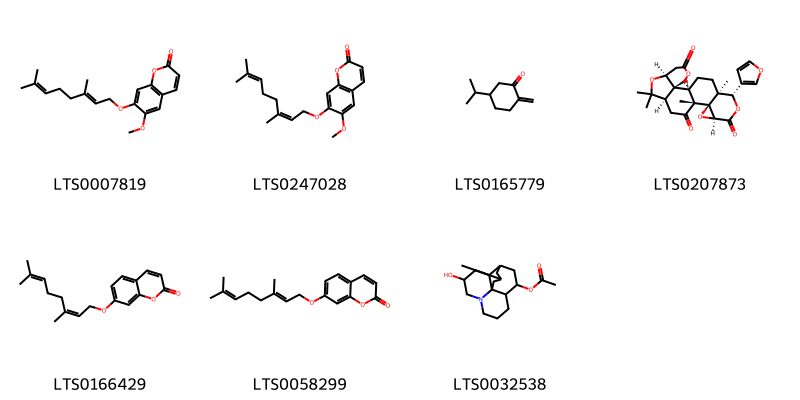{ width=100% }
    <figcaption>Hình ảnh cấu trúc hóa học của 7 hoạt chất thuộc nhóm Prenol lipids gồm ['7-{[(2e)-3,7-dimethylocta-2,6-dien-1-yl]oxy}-6-methoxychromen-2-one (LTS0007819)', '7-[(3,7-dimethylocta-2,6-dien-1-yl)oxy]-6-methoxychromen-2-one (LTS0247028)', '5-isopropyl-2-methylidenecyclohexan-1-one (LTS0165779)', 'limonin (LTS0207873)', '7-[(3,7-dimethylocta-2,6-dien-1-yl)oxy]chromen-2-one (LTS0166429)', 'auraptene (LTS0058299)', '4-hydroxy-15-methyl-6-azatetracyclo[8.6.0.0¹,⁶.0²,¹³]hexadecan-11-yl acetate (LTS0032538)'].</figcaption>
</figure>
#### Nhóm Quinolines and derivatives
<figure markdown="span">
    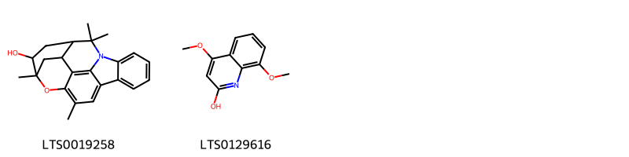{ width=100% }
    <figcaption>Hình ảnh cấu trúc hóa học của 2 hoạt chất thuộc nhóm Quinolines and derivatives gồm ['3,13,13,17-tetramethyl-21-oxa-12-azahexacyclo[10.7.1.1²,¹⁷.0⁵,²⁰.0⁶,¹¹.0¹⁴,¹⁹]henicosa-1,3,5(20),6(11),7,9-hexaen-16-ol (LTS0019258)', '4,8-dimethoxyquinolin-2-ol (LTS0129616)'].</figcaption>
</figure>
#### Nhóm Steroids and steroid derivatives
<figure markdown="span">
    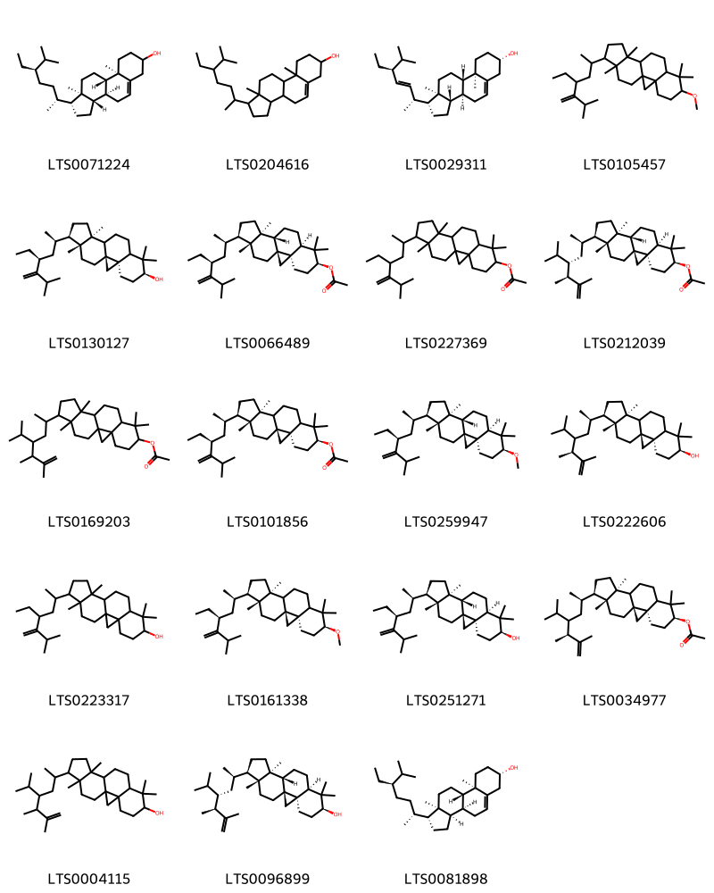{ width=100% }
    <figcaption>Hình ảnh cấu trúc hóa học của 19 hoạt chất thuộc nhóm Steroids and steroid derivatives gồm ['stigmast-5-en-3-ol (LTS0071224)', 'stigmast-5-en-3-ol, (3β)- (LTS0204616)', 'phytosterol (LTS0029311)', '15-(4-ethyl-6-methyl-5-methylideneheptan-2-yl)-6-methoxy-7,7,12,16-tetramethylpentacyclo[9.7.0.0¹,³.0³,⁸.0¹²,¹⁶]octadecane (LTS0105457)', '(1s,3r,6s,12s,15r,16r)-15-[(2r,4s)-4-ethyl-6-methyl-5-methylideneheptan-2-yl]-7,7,12,16-tetramethylpentacyclo[9.7.0.0¹,³.0³,⁸.0¹²,¹⁶]octadecan-6-ol (LTS0130127)', '(1s,3r,6s,8r,11s,12s,15r,16r)-15-[(2r,4s)-4-ethyl-6-methyl-5-methylideneheptan-2-yl]-7,7,12,16-tetramethylpentacyclo[9.7.0.0¹,³.0³,⁸.0¹²,¹⁶]octadecan-6-yl acetate (LTS0066489)', '15-(4-ethyl-6-methyl-5-methylideneheptan-2-yl)-7,7,12,16-tetramethylpentacyclo[9.7.0.0¹,³.0³,⁸.0¹²,¹⁶]octadecan-6-yl acetate (LTS0227369)', '(1s,3r,6s,8r,11s,12s,15r,16r)-15-[(2r,4s,5s)-4-isopropyl-5,6-dimethylhept-6-en-2-yl]-7,7,12,16-tetramethylpentacyclo[9.7.0.0¹,³.0³,⁸.0¹²,¹⁶]octadecan-6-yl acetate (LTS0212039)', '15-(4-isopropyl-5,6-dimethylhept-6-en-2-yl)-7,7,12,16-tetramethylpentacyclo[9.7.0.0¹,³.0³,⁸.0¹²,¹⁶]octadecan-6-yl acetate (LTS0169203)', '(1s,3r,6s,12s,15r,16r)-15-[(2r,4s)-4-ethyl-6-methyl-5-methylideneheptan-2-yl]-7,7,12,16-tetramethylpentacyclo[9.7.0.0¹,³.0³,⁸.0¹²,¹⁶]octadecan-6-yl acetate (LTS0101856)', '(1s,3r,6s,8r,11s,12s,15r,16r)-15-[(2r,4s)-4-ethyl-6-methyl-5-methylideneheptan-2-yl]-6-methoxy-7,7,12,16-tetramethylpentacyclo[9.7.0.0¹,³.0³,⁸.0¹²,¹⁶]octadecane (LTS0259947)', '(1s,3r,6s,12s,15r,16r)-15-[(2r,5s)-4-isopropyl-5,6-dimethylhept-6-en-2-yl]-7,7,12,16-tetramethylpentacyclo[9.7.0.0¹,³.0³,⁸.0¹²,¹⁶]octadecan-6-ol (LTS0222606)', '15-(4-ethyl-6-methyl-5-methylideneheptan-2-yl)-7,7,12,16-tetramethylpentacyclo[9.7.0.0¹,³.0³,⁸.0¹²,¹⁶]octadecan-6-ol (LTS0223317)', '(1s,3r,6s,12s,15r,16r)-15-[(2r,4s)-4-ethyl-6-methyl-5-methylideneheptan-2-yl]-6-methoxy-7,7,12,16-tetramethylpentacyclo[9.7.0.0¹,³.0³,⁸.0¹²,¹⁶]octadecane (LTS0161338)', '(1s,3r,6s,8r,11s,12s,15r,16r)-15-[(2r,4s)-4-ethyl-6-methyl-5-methylideneheptan-2-yl]-7,7,12,16-tetramethylpentacyclo[9.7.0.0¹,³.0³,⁸.0¹²,¹⁶]octadecan-6-ol (LTS0251271)', '(1s,3r,6s,12s,15r,16r)-15-[(2r,5s)-4-isopropyl-5,6-dimethylhept-6-en-2-yl]-7,7,12,16-tetramethylpentacyclo[9.7.0.0¹,³.0³,⁸.0¹²,¹⁶]octadecan-6-yl acetate (LTS0034977)', '15-(4-isopropyl-5,6-dimethylhept-6-en-2-yl)-7,7,12,16-tetramethylpentacyclo[9.7.0.0¹,³.0³,⁸.0¹²,¹⁶]octadecan-6-ol (LTS0004115)', '(1s,3r,6s,8r,11s,12s,15r,16r)-15-[(2r,4s,5s)-4-isopropyl-5,6-dimethylhept-6-en-2-yl]-7,7,12,16-tetramethylpentacyclo[9.7.0.0¹,³.0³,⁸.0¹²,¹⁶]octadecan-6-ol (LTS0096899)', '(1r,3ar,3bs,7s,9ar,9bs,11ar)-1-[(2r,5r)-5-ethyl-6-methylheptan-2-yl]-9a,11a-dimethyl-1h,2h,3h,3ah,3bh,4h,6h,7h,8h,9h,9bh,10h,11h-cyclopenta[a]phenanthren-7-ol (LTS0081898)'].</figcaption>
</figure>

---

### Dược dân tộc học

Danh sách các quốc gia có sử dụng *Murraya paniculata* trong điều trị các bệnh. 

| Country   | Disease                                | Bệnh                                             |
|:----------|:---------------------------------------|:-------------------------------------------------|
| Elsewhere | Astringent, nan, Dentifrice, Stimulant | Chất làm se, nan, kem đánh răng, chất kích thích |
| Malaya    | Cosmetic                               | Cosmetic                                         |

---

# Chi Euodia

??? note "Danh sách các dược liệu thuộc chi"
    
	 - *Euodia peekelii*

---
## Euodia peekelii
### Thông tin về thực vật

!!! info "Phân loại thực vật của *Melicope latifolia* từ GIBF:"
    - **Kingdom:** Plantae
    - **Phylum:** Tracheophyta
    - **Order:** Sapindales
    - **Family:** Rutaceae
    - **Genus:** Melicope
    - **Species:** *Melicope latifolia*

 

| Label (VI)   | Label (EN)   | Scientific Name    | Descriptions (VI)   | Descriptions (EN)                       | Also Known As (VI)   | Also Known As (EN)                                                 |
|:-------------|:-------------|:-------------------|:--------------------|:----------------------------------------|:---------------------|:-------------------------------------------------------------------|
| N/A          | N/A          | Murraya paniculata |                     | species of plant in the family Rutaceae | ['']                 | ['orange jessamine', 'mock orange', 'china box', 'orange jasmine'] |

#### Phân bố trên thế giới

**Từ CSDL GIBF** Virgin Islands (U.S.), Australia, Japan, Benin, Pakistan, Puerto Rico, Chinese Taipei, Bangladesh, United States of America, South Africa, Hong Kong, Thailand, Brazil, Mexico, Dominican Republic, China, Niue, Colombia, Macao, India, Philippines, Malaysia

#### Phân bố tại Việt Nam

**Từ CSDL GIBF**: Không có ghi nhận ở Việt Nam

---
### Thành phần hóa học
        
- Theo cơ sở dữ liệu lotus: Từ loài *Melicope latifolia* đã phân lập và xác định được Chưa có hoạt chất nào được phân lập. hoạt chất thuộc về các nhóm Không có hoạt chất nào được phân lập. 

Không có hình ảnh nào được tạo ra

---

### Dược dân tộc học

Danh sách các quốc gia có sử dụng *Melicope latifolia* trong điều trị các bệnh. 

| Country   | Disease   | Bệnh          |
|:----------|:----------|:--------------|
| Solomon I | Antidote  | Chất giải độc |

---

# Chi Cuaria

??? note "Danh sách các dược liệu thuộc chi"
    
	 - *Cuaria febrifuga*
	 - *Cuaria trifoliata*

---
## Cuaria febrifuga
### Thông tin về thực vật

!!! info "Phân loại thực vật của *N/A* từ GIBF:"
    - **Kingdom:** N/A
    - **Phylum:** N/A
    - **Order:** N/A
    - **Family:** N/A
    - **Genus:** N/A
    - **Species:** *N/A*

 

| Label (VI)   | Label (EN)   | Scientific Name    | Descriptions (VI)   | Descriptions (EN)                       | Also Known As (VI)   | Also Known As (EN)                                                 |
|:-------------|:-------------|:-------------------|:--------------------|:----------------------------------------|:---------------------|:-------------------------------------------------------------------|
| N/A          | N/A          | Murraya paniculata |                     | species of plant in the family Rutaceae | ['']                 | ['orange jessamine', 'mock orange', 'china box', 'orange jasmine'] |

#### Phân bố trên thế giới

**Từ CSDL GIBF** Không có kết quả phù hợp

#### Phân bố tại Việt Nam

**Từ CSDL GIBF**: Không có ghi nhận ở Việt Nam

---
### Thành phần hóa học
        
- Theo cơ sở dữ liệu lotus: Từ loài *N/A* đã phân lập và xác định được Chưa có hoạt chất nào được phân lập. hoạt chất thuộc về các nhóm Không có hoạt chất nào được phân lập. 

Không có hình ảnh nào được tạo ra

---

### Dược dân tộc học

Danh sách các quốc gia có sử dụng *N/A* trong điều trị các bệnh. 

| Country   | Disease   | Bệnh               |
|:----------|:----------|:-------------------|
| Elsewhere | Tonic     | (thuộc) trương lực |

---

---
## Cuaria trifoliata
### Thông tin về thực vật

!!! info "Phân loại thực vật của *N/A* từ GIBF:"
    - **Kingdom:** N/A
    - **Phylum:** N/A
    - **Order:** N/A
    - **Family:** N/A
    - **Genus:** N/A
    - **Species:** *N/A*

 

| Label (VI)   | Label (EN)   | Scientific Name    | Descriptions (VI)   | Descriptions (EN)                       | Also Known As (VI)   | Also Known As (EN)                                                 |
|:-------------|:-------------|:-------------------|:--------------------|:----------------------------------------|:---------------------|:-------------------------------------------------------------------|
| N/A          | N/A          | Murraya paniculata |                     | species of plant in the family Rutaceae | ['']                 | ['orange jessamine', 'mock orange', 'china box', 'orange jasmine'] |

#### Phân bố trên thế giới

**Từ CSDL GIBF** Không có kết quả phù hợp

#### Phân bố tại Việt Nam

**Từ CSDL GIBF**: Không có ghi nhận ở Việt Nam

---
### Thành phần hóa học
        
- Theo cơ sở dữ liệu lotus: Từ loài *N/A* đã phân lập và xác định được Chưa có hoạt chất nào được phân lập. hoạt chất thuộc về các nhóm Không có hoạt chất nào được phân lập. 

Không có hình ảnh nào được tạo ra

---

### Dược dân tộc học

Danh sách các quốc gia có sử dụng *N/A* trong điều trị các bệnh. 

| Country   | Disease                                                      | Bệnh                                                         |
|:----------|:-------------------------------------------------------------|:-------------------------------------------------------------|
| Turkey    | Apertif, Digestive, Tonic, Carminative, Stimulant, Stomachic | Apertif, Digestive, Tonic, Carminative, Stimulant, Stomachic |
| Venezuela | Tonic                                                        | (thuộc) trương lực                                           |

---

# Chi Correa

??? note "Danh sách các dược liệu thuộc chi"
    
	 - *Correa alba*

---
## Correa alba
### Thông tin về thực vật

!!! info "Phân loại thực vật của *Correa alba* từ GIBF:"
    - **Kingdom:** Plantae
    - **Phylum:** Tracheophyta
    - **Order:** Sapindales
    - **Family:** Rutaceae
    - **Genus:** Correa
    - **Species:** *Correa alba*

 

| Label (VI)   | Label (EN)   | Scientific Name   | Descriptions (VI)   | Descriptions (EN)   | Also Known As (VI)   | Also Known As (EN)   |
|:-------------|:-------------|:------------------|:--------------------|:--------------------|:---------------------|:---------------------|
| N/A          | N/A          | Correa alba       | loài thực vật       | species of plant    | ['']                 | ['']                 |

#### Phân bố trên thế giới

**Từ CSDL GIBF** nan, New Zealand, Australia

#### Phân bố tại Việt Nam

**Từ CSDL GIBF**: Không có ghi nhận ở Việt Nam

---
### Thành phần hóa học
        
- Theo cơ sở dữ liệu lotus: Từ loài *Correa alba* đã phân lập và xác định được Chưa có hoạt chất nào được phân lập. hoạt chất thuộc về các nhóm Không có hoạt chất nào được phân lập. 

Không có hình ảnh nào được tạo ra

---

### Dược dân tộc học

Danh sách các quốc gia có sử dụng *Correa alba* trong điều trị các bệnh. 

| Country   | Disease   | Bệnh               |
|:----------|:----------|:-------------------|
| Elsewhere | Tonic     | (thuộc) trương lực |

---

# Chi Clausena

??? note "Danh sách các dược liệu thuộc chi"
    
	 - *Clausena anisata*
	 - *Clausena excavata*
	 - *Clausena inaequalis*
	 - *Clausena lansium*

---
## Clausena anisata
### Thông tin về thực vật

!!! info "Phân loại thực vật của *Clausena anisata* từ GIBF:"
    - **Kingdom:** Plantae
    - **Phylum:** Tracheophyta
    - **Order:** Sapindales
    - **Family:** Rutaceae
    - **Genus:** Clausena
    - **Species:** *Clausena anisata*

 

| Label (VI)   | Label (EN)   | Scientific Name   | Descriptions (VI)   | Descriptions (EN)   | Also Known As (VI)   | Also Known As (EN)   |
|:-------------|:-------------|:------------------|:--------------------|:--------------------|:---------------------|:---------------------|
| N/A          | N/A          | Clausena anisata  | loài thực vật       | species of plant    | ['']                 | ['']                 |

#### Phân bố trên thế giới

**Từ CSDL GIBF** South Africa, Sao Tome and Principe, Mozambique, Burundi, India, Benin, Bangladesh, Viet Nam, Guinea, Kenya, Tanzania, United Republic of, Eswatini

#### Phân bố tại Việt Nam

**Từ CSDL GIBF**: Không có ghi nhận ở Việt Nam

---
### Thành phần hóa học
        
- Theo cơ sở dữ liệu lotus: Từ loài *Clausena anisata* đã phân lập và xác định được 84 hoạt chất thuộc về các nhóm Phenol ethers, Prenol lipids, Indoles and derivatives, Steroids and steroid derivatives, Cinnamic acids and derivatives, Quinolines and derivatives, Benzene and substituted derivatives, Coumarins and derivatives. 

|    | chemicalTaxonomyClassyfireClass     |   smiles_count |
|---:|:------------------------------------|---------------:|
|  0 | Benzene and substituted derivatives |              1 |
|  1 | Cinnamic acids and derivatives      |              1 |
|  2 | Coumarins and derivatives           |             38 |
|  3 | Indoles and derivatives             |             27 |
|  4 | Phenol ethers                       |              4 |
|  5 | Prenol lipids                       |              7 |
|  6 | Quinolines and derivatives          |              1 |
|  7 | Steroids and steroid derivatives    |              2 |

#### Nhóm Benzene and substituted derivatives
<figure markdown="span">
    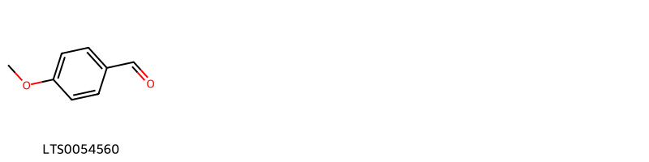{ width=100% }
    <figcaption>Hình ảnh cấu trúc hóa học của 1 hoạt chất thuộc nhóm Benzene and substituted derivatives gồm ['anisaldehyde (LTS0054560)'].</figcaption>
</figure>
#### Nhóm Cinnamic acids and derivatives
<figure markdown="span">
    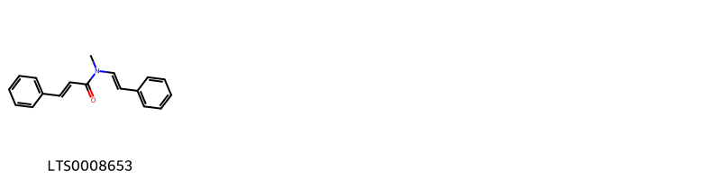{ width=100% }
    <figcaption>Hình ảnh cấu trúc hóa học của 1 hoạt chất thuộc nhóm Cinnamic acids and derivatives gồm ['(2e)-n-methyl-3-phenyl-n-[(1e)-2-phenylethenyl]prop-2-enamide (LTS0008653)'].</figcaption>
</figure>
#### Nhóm Coumarins and derivatives
<figure markdown="span">
    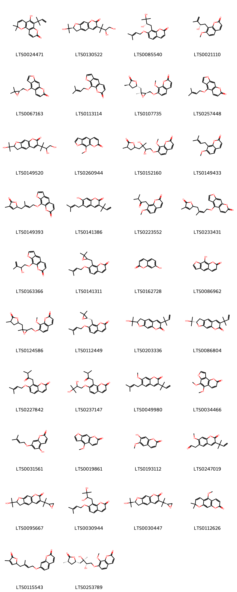{ width=100% }
    <figcaption>Hình ảnh cấu trúc hóa học của 38 hoạt chất thuộc nhóm Coumarins and derivatives gồm ['5-hydroxy-2,2-dimethyl-6-(2-methylbut-3-en-2-yl)pyrano[2,3-h]chromen-8-one (LTS0024471)', '(2s)-6-[(3s)-3,4-dihydroxy-2-methylbutan-2-yl]-2-(2-hydroxypropan-2-yl)-2h,3h-furo[3,2-g]chromen-7-one (LTS0130522)', '8-[(2s)-2,3-dihydroxy-3-methylbutyl]-7-[(3-methylbut-2-en-1-yl)oxy]chromen-2-one (LTS0085540)', '8-[(2s)-2-hydroxy-3-methylbut-3-en-1-yl]-7-methoxychromen-2-one (LTS0021110)', '(+)-oxypeucedanin (LTS0067163)', 'imperatorin (LTS0113114)', '8-methoxy-7-{[(2r,3s)-3-methyl-3-{[(2s,4r)-4-methyl-5-oxooxolan-2-yl]methyl}oxiran-2-yl]methoxy}chromen-2-one (LTS0107735)', 'isoimperatorin (LTS0257448)', '6-(3,4-dihydroxy-2-methylbutan-2-yl)-2-(2-hydroxypropan-2-yl)-2h,3h-furo[3,2-g]chromen-7-one (LTS0149520)', 'methoxsalen (LTS0260944)', '7-[2,3-dihydroxy-3-methyl-4-(4-methyl-5-oxooxolan-2-yl)butoxy]-8-methoxychromen-2-one (LTS0152160)', 'osthole (LTS0149433)', '3-methyl-5-[(2e)-2-methyl-4-({7-oxofuro[3,2-g]chromen-9-yl}oxy)but-2-en-1-yl]-5h-furan-2-one (LTS0149393)', '7-hydroxy-6-(3-methylbut-2-en-1-yl)-3-(2-methylbut-3-en-2-yl)chromen-2-one (LTS0141386)', '7-methoxy-8-(3-methyl-2-oxobutyl)chromen-2-one (LTS0223552)', '3-methyl-5-[(2z)-2-methyl-4-({7-oxofuro[3,2-g]chromen-4-yl}oxy)but-2-en-1-yl]-5h-furan-2-one (LTS0233431)', '9-[(2-hydroxy-3-methylbut-3-en-1-yl)oxy]furo[3,2-g]chromen-7-one (LTS0163366)', '8-[(3,3-dimethyloxiran-2-yl)methyl]-7-[(3-methylbut-2-en-1-yl)oxy]chromen-2-one (LTS0141311)', 'umbelliferone (LTS0162728)', 'xanthotoxol (LTS0086962)', '8-methoxy-7-({3-methyl-3-[(4-methyl-5-oxooxolan-2-yl)methyl]oxiran-2-yl}methoxy)chromen-2-one (LTS0124586)', '8-{[(2s)-3,3-dimethyloxiran-2-yl]methyl}-7-[(3-methylbut-2-en-1-yl)oxy]chromen-2-one (LTS0112449)', 'heliettin (LTS0203336)', '(+)-rutamarin alcohol (LTS0086804)', '8-(3-methyl-2-oxobutyl)-7-[(3-methylbut-2-en-1-yl)oxy]chromen-2-one (LTS0227842)', '7-(2,3-dihydroxy-3-methylbutoxy)-8-(3-methyl-2-oxobutyl)chromen-2-one (LTS0237147)', '7-methoxy-6-(3-methylbut-2-en-1-yl)-3-(2-methylbut-3-en-2-yl)chromen-2-one (LTS0049980)', 'pimpinellin (LTS0034466)', '5-hydroxy-7-[(3-methylbut-2-en-1-yl)oxy]chromen-2-one (LTS0031561)', 'bergapten (LTS0019861)', 'scopoletin (LTS0193112)', '2-[7-methoxy-3-(2-methylbut-3-en-2-yl)-2-oxochromen-6-yl]acetaldehyde (LTS0247019)', '2-(2-hydroxypropan-2-yl)-6-[2-(oxiran-2-yl)propan-2-yl]-2h,3h-furo[3,2-g]chromen-7-one (LTS0095667)', '8-(2,3-dihydroxy-3-methylbutyl)-7-[(3-methylbut-2-en-1-yl)oxy]chromen-2-one (LTS0030944)', '(2s)-2-(2-hydroxypropan-2-yl)-6-{2-[(2s)-oxiran-2-yl]propan-2-yl}-2h,3h-furo[3,2-g]chromen-7-one (LTS0030447)', 'xanthoxyletin (LTS0112626)', '7-{[(2e)-3-[(4-methyl-5-oxo-2h-furan-2-yl)methyl]but-2-en-1-yl]oxy}chromen-2-one (LTS0115543)', '7-[(2s,3r)-2,3-dihydroxy-3-methyl-4-[(2s,4s)-4-methyl-5-oxooxolan-2-yl]butoxy]-8-methoxychromen-2-one (LTS0253789)'].</figcaption>
</figure>
#### Nhóm Indoles and derivatives
<figure markdown="span">
    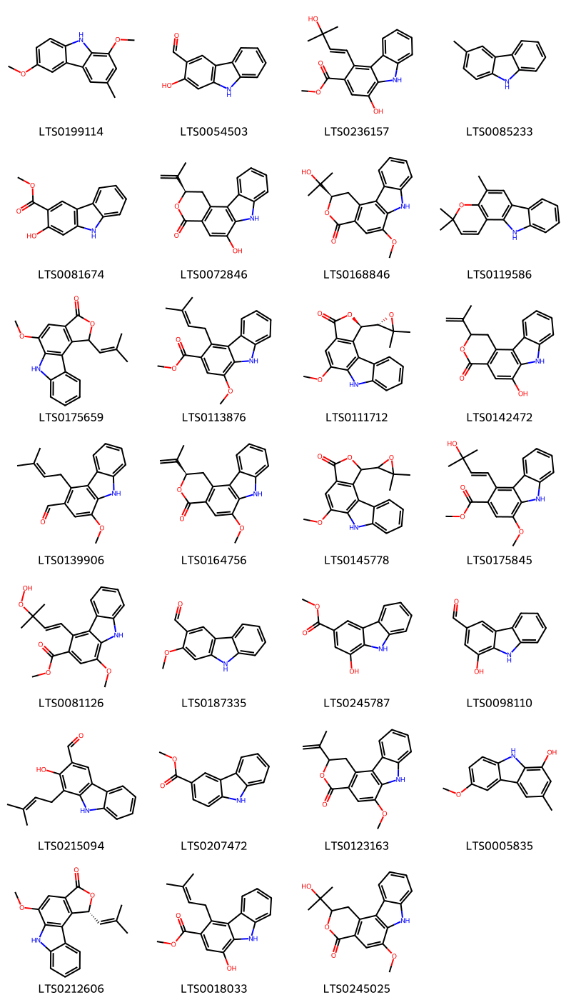{ width=100% }
    <figcaption>Hình ảnh cấu trúc hóa học của 27 hoạt chất thuộc nhóm Indoles and derivatives gồm ['1,6-dimethoxy-3-methyl-9h-carbazole (LTS0199114)', '2-hydroxy-9h-carbazole-3-carbaldehyde (LTS0054503)', 'methyl 1-hydroxy-4-[(1e)-3-hydroxy-3-methylbut-1-en-1-yl]-9h-carbazole-3-carboxylate (LTS0236157)', '3-methylcarbazole (LTS0085233)', 'methyl 2-hydroxy-9h-carbazole-3-carboxylate (LTS0081674)', '(2r)-6-hydroxy-2-(prop-1-en-2-yl)-1h,2h,7h-pyrano[3,4-c]carbazol-4-one (LTS0072846)', '(2r)-2-(2-hydroxypropan-2-yl)-6-methoxy-1h,2h,7h-pyrano[3,4-c]carbazol-4-one (LTS0168846)', 'girinimbine (LTS0119586)', '5-methoxy-1-(2-methylprop-1-en-1-yl)-1h,6h-furo[3,4-c]carbazol-3-one (LTS0175659)', 'methyl 1-methoxy-4-(3-methylbut-2-en-1-yl)-9h-carbazole-3-carboxylate (LTS0113876)', '(1r)-1-[(2s)-3,3-dimethyloxiran-2-yl]-5-methoxy-1h,6h-furo[3,4-c]carbazol-3-one (LTS0111712)', '6-hydroxy-2-(prop-1-en-2-yl)-1h,2h,7h-pyrano[3,4-c]carbazol-4-one (LTS0142472)', '1-methoxy-4-(3-methylbut-2-en-1-yl)-9h-carbazole-3-carbaldehyde (LTS0139906)', '(2r)-6-methoxy-2-(prop-1-en-2-yl)-1h,2h,7h-pyrano[3,4-c]carbazol-4-one (LTS0164756)', '1-(3,3-dimethyloxiran-2-yl)-5-methoxy-1h,6h-furo[3,4-c]carbazol-3-one (LTS0145778)', 'methyl 4-[(1e)-3-hydroxy-3-methylbut-1-en-1-yl]-1-methoxy-9h-carbazole-3-carboxylate (LTS0175845)', 'methyl 4-[(1e)-3-hydroperoxy-3-methylbut-1-en-1-yl]-1-methoxy-9h-carbazole-3-carboxylate (LTS0081126)', '2-methoxy-9h-carbazole-3-carbaldehyde (LTS0187335)', 'clausine e (LTS0245787)', 'o-demethylmurrayanine (LTS0098110)', 'heptaphylline (LTS0215094)', 'methyl 9h-carbazole-3-carboxylate (LTS0207472)', '6-methoxy-2-(prop-1-en-2-yl)-1h,2h,7h-pyrano[3,4-c]carbazol-4-one (LTS0123163)', '6-methoxy-3-methyl-9h-carbazol-1-ol (LTS0005835)', '(1r)-5-methoxy-1-(2-methylprop-1-en-1-yl)-1h,6h-furo[3,4-c]carbazol-3-one (LTS0212606)', 'methyl 1-hydroxy-4-(3-methylbut-2-en-1-yl)-9h-carbazole-3-carboxylate (LTS0018033)', '2-(2-hydroxypropan-2-yl)-6-methoxy-1h,2h,7h-pyrano[3,4-c]carbazol-4-one (LTS0245025)'].</figcaption>
</figure>
#### Nhóm Phenol ethers
<figure markdown="span">
    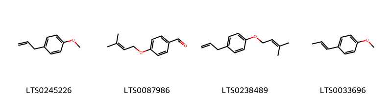{ width=100% }
    <figcaption>Hình ảnh cấu trúc hóa học của 4 hoạt chất thuộc nhóm Phenol ethers gồm ['tarragon (LTS0245226)', '4-[(3-methylbut-2-en-1-yl)oxy]benzaldehyde (LTS0087986)', '1-[(3-methylbut-2-en-1-yl)oxy]-4-(prop-2-en-1-yl)benzene (LTS0238489)', 'anethole (LTS0033696)'].</figcaption>
</figure>
#### Nhóm Prenol lipids
<figure markdown="span">
    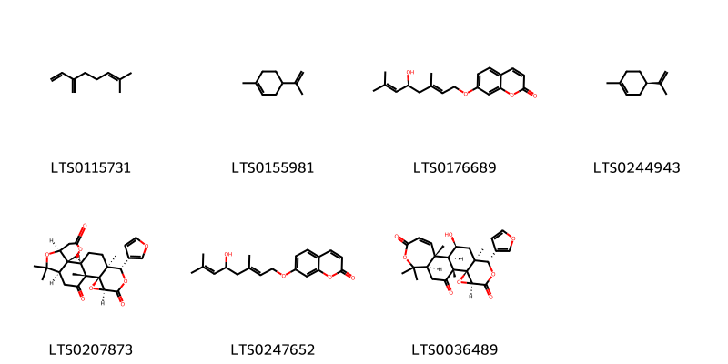{ width=100% }
    <figcaption>Hình ảnh cấu trúc hóa học của 7 hoạt chất thuộc nhóm Prenol lipids gồm ['α-myrcene (LTS0115731)', 'limonene,  (LTS0155981)', '7-{[(2e,5s)-5-hydroxy-3,7-dimethylocta-2,6-dien-1-yl]oxy}chromen-2-one (LTS0176689)', 'α-limonene (LTS0244943)', 'limonin (LTS0207873)', '7-{[(2e)-5-hydroxy-3,7-dimethylocta-2,6-dien-1-yl]oxy}chromen-2-one (LTS0247652)', 'zapoterin (LTS0036489)'].</figcaption>
</figure>
#### Nhóm Quinolines and derivatives
<figure markdown="span">
    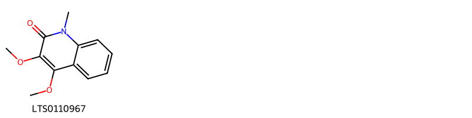{ width=100% }
    <figcaption>Hình ảnh cấu trúc hóa học của 1 hoạt chất thuộc nhóm Quinolines and derivatives gồm ['3,4-dimethoxy-1-methylquinolin-2-one (LTS0110967)'].</figcaption>
</figure>
#### Nhóm Steroids and steroid derivatives
<figure markdown="span">
    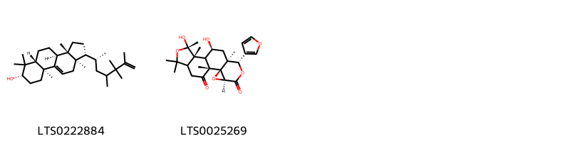{ width=100% }
    <figcaption>Hình ảnh cấu trúc hóa học của 2 hoạt chất thuộc nhóm Steroids and steroid derivatives gồm ['(1r,3as,3bs,5ar,7s,9as,11ar)-3a,6,6,9a,11a-pentamethyl-1-[(2r)-4,5,5,6-tetramethylhept-6-en-2-yl]-1h,2h,3h,3bh,4h,5h,5ah,7h,8h,9h,11h-cyclopenta[a]phenanthren-7-ol (LTS0222884)', '(1r,2r,4s,7s,8s,10s,12r,13s)-7-(furan-3-yl)-10,13-dihydroxy-1,8,12,13,15,15-hexamethyl-3,6,14-trioxapentacyclo[9.7.0.0²,⁴.0²,⁸.0¹²,¹⁶]octadecane-5,18-dione (LTS0025269)'].</figcaption>
</figure>

---

### Dược dân tộc học

Danh sách các quốc gia có sử dụng *Clausena anisata* trong điều trị các bệnh. 

| Country   | Disease                              | Bệnh                                        |
|:----------|:-------------------------------------|:--------------------------------------------|
| Africa    | Fumigant                             | chất hun khói (diệt côn trùng, vi sinh vật) |
| Elsewhere | Insecticide                          | Thuốc trừ sâu                               |
| Ghana     | Laxative                             | Nhuận trường                                |
| Nigeria   | Laxative, Vermifuge                  | Thuốc nhuận tràng, Vermifuge                |
| S Africa  | Cardiotonic, Parasiticide, Purgative | Cardiotonic, Parasiticide, Purgative        |

---

---
## Clausena excavata
### Thông tin về thực vật

!!! info "Phân loại thực vật của *Clausena excavata* từ GIBF:"
    - **Kingdom:** Plantae
    - **Phylum:** Tracheophyta
    - **Order:** Sapindales
    - **Family:** Rutaceae
    - **Genus:** Clausena
    - **Species:** *Clausena excavata*

 

| Label (VI)   | Label (EN)   | Scientific Name   | Descriptions (VI)   | Descriptions (EN)   | Also Known As (VI)                 | Also Known As (EN)   |
|:-------------|:-------------|:------------------|:--------------------|:--------------------|:-----------------------------------|:---------------------|
| N/A          | N/A          | Clausena excavata | loài thực vật       | species of plant    | ['Clausena excavata', 'châm châu'] | ['']                 |

#### Phân bố trên thế giới

**Từ CSDL GIBF** Christmas Island, Madagascar, Thailand, Seychelles, Australia, Chinese Taipei, Brazil, Indonesia, Bangladesh, Mexico, Singapore, Malaysia, China

#### Phân bố tại Việt Nam

**Từ CSDL GIBF**: Không có ghi nhận ở Việt Nam

---
### Thành phần hóa học
        
- Theo cơ sở dữ liệu lotus: Từ loài *Clausena excavata* đã phân lập và xác định được 263 hoạt chất thuộc về các nhóm Flavonoids, Prenol lipids, Indoles and derivatives, Steroids and steroid derivatives, Linear 1,3-diarylpropanoids, Cinnamic acids and derivatives, Tetrapyrroles and derivatives, Benzodioxoles, Benzene and substituted derivatives, Phenols, Coumarins and derivatives. 

|    | chemicalTaxonomyClassyfireClass     |   smiles_count |
|---:|:------------------------------------|---------------:|
|  0 | Benzene and substituted derivatives |              2 |
|  1 | Benzodioxoles                       |              1 |
|  2 | Cinnamic acids and derivatives      |              2 |
|  3 | Coumarins and derivatives           |            126 |
|  4 | Flavonoids                          |              6 |
|  5 | Indoles and derivatives             |             86 |
|  6 | Linear 1,3-diarylpropanoids         |              2 |
|  7 | Phenols                             |              1 |
|  8 | Prenol lipids                       |             27 |
|  9 | Steroids and steroid derivatives    |              9 |
| 10 | Tetrapyrroles and derivatives       |              1 |

#### Nhóm Benzene and substituted derivatives
<figure markdown="span">
    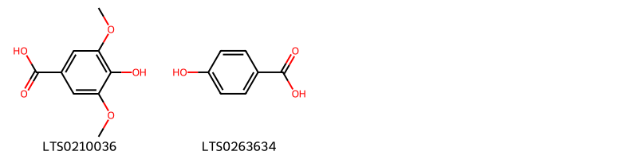{ width=100% }
    <figcaption>Hình ảnh cấu trúc hóa học của 2 hoạt chất thuộc nhóm Benzene and substituted derivatives gồm ['syringic acid (LTS0210036)', 'p-hydroxybenzoic acid (LTS0263634)'].</figcaption>
</figure>
#### Nhóm Benzodioxoles
<figure markdown="span">
    { width=100% }
    <figcaption>Hình ảnh cấu trúc hóa học của 1 hoạt chất thuộc nhóm Benzodioxoles gồm ['sassafras (LTS0136093)'].</figcaption>
</figure>
#### Nhóm Cinnamic acids and derivatives
<figure markdown="span">
    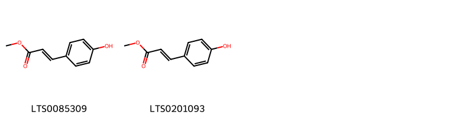{ width=100% }
    <figcaption>Hình ảnh cấu trúc hóa học của 2 hoạt chất thuộc nhóm Cinnamic acids and derivatives gồm ['methyl (2e)-3-(4-hydroxyphenyl)prop-2-enoate (LTS0085309)', 'methyl hydroxycinnamate (LTS0201093)'].</figcaption>
</figure>
#### Nhóm Coumarins and derivatives
<figure markdown="span">
    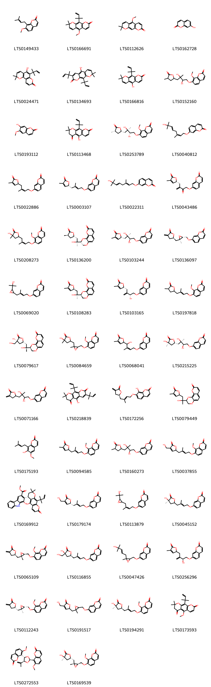{ width=100% }
    <figcaption>Hình ảnh cấu trúc hóa học của 126 hoạt chất thuộc nhóm Coumarins and derivatives gồm ['osthole (LTS0149433)', 'dentatin (LTS0166691)', 'xanthoxyletin (LTS0112626)', 'umbelliferone (LTS0162728)', '5-hydroxy-2,2-dimethyl-6-(2-methylbut-3-en-2-yl)pyrano[2,3-h]chromen-8-one (LTS0024471)', '5-hydroxy-8,8-dimethyl-3,10-bis(2-methylbut-3-en-2-yl)pyrano[3,2-g]chromen-2-one (LTS0134693)', 'nor-dentatin (LTS0166816)', '7-[2,3-dihydroxy-3-methyl-4-(4-methyl-5-oxooxolan-2-yl)butoxy]-8-methoxychromen-2-one (LTS0152160)', 'scopoletin (LTS0193112)', '5-hydroxy-8,8-dimethyl-10-(2-methylbut-3-en-2-yl)-7h-pyrano[3,2-g]chromene-2,6-dione (LTS0113468)', '7-[(2s,3r)-2,3-dihydroxy-3-methyl-4-[(2s,4s)-4-methyl-5-oxooxolan-2-yl]butoxy]-8-methoxychromen-2-one (LTS0253789)', '7-[(7-hydroxy-3,7-dimethylocta-2,5-dien-1-yl)oxy]chromen-2-one (LTS0040812)', '7-{[3-methyl-4-(4-methyl-5-oxo-2h-furan-2-yl)but-2-en-1-yl]oxy}chromen-2-one (LTS0022886)', '7-{[(2e)-3-{[(2r)-4-methyl-5-oxo-2h-furan-2-yl]methyl}but-2-en-1-yl]oxy}chromen-2-one (LTS0003107)', '7-{[(2e,5e)-7-hydroxy-3,7-dimethylocta-2,5-dien-1-yl]oxy}chromen-2-one (LTS0022311)', '7-[(3-{[(2r)-4-methyl-5-oxo-2h-furan-2-yl]methyl}-2-oxobut-3-en-1-yl)oxy]chromen-2-one (LTS0043486)', '7-{[4-(4-hydroxy-4-methyl-5-oxooxolan-2-yl)-3-methylbut-2-en-1-yl]oxy}-8-methoxychromen-2-one (LTS0208273)', '(3r,5s)-5-[(2s)-2-hydroxy-2-[(2r)-9-oxo-2h,3h-[1,4]dioxino[2,3-h]chromen-2-yl]propyl]-3-methyloxolan-2-one (LTS0136200)', '7-[(2r,3r)-2,3-dihydroxy-3-{[(2r)-4-methyl-5-oxo-2h-furan-2-yl]methyl}butoxy]chromen-2-one (LTS0103244)', '7-{[(2r,3r)-3-methyl-3-{[(2r)-4-methylidene-5-oxooxolan-2-yl]methyl}oxiran-2-yl]methoxy}chromen-2-one (LTS0136097)', '7-{[(2e)-4-[3-(2-hydroxypropan-2-yl)oxiran-2-yl]-3-methylbut-2-en-1-yl]oxy}chromen-2-one (LTS0069020)', '(5s)-5-[(2s)-2-hydroxy-2-[(2s)-9-oxo-2h,3h-[1,4]dioxino[2,3-h]chromen-2-yl]propyl]-3-methyl-5h-furan-2-one (LTS0108283)', '7-{[(2r)-2-hydroxy-3-{[(2r)-4-methyl-5-oxo-2h-furan-2-yl]methyl}but-3-en-1-yl]oxy}chromen-2-one (LTS0103165)', '8-methoxy-7-{[(2e)-3-methyl-4-(4-methyl-5-oxooxolan-2-yl)but-2-en-1-yl]oxy}chromen-2-one (LTS0197818)', '(3r,5r)-3-hydroxy-5-[(2r)-2-hydroxy-2-[(2s)-9-oxo-2h,3h-[1,4]dioxino[2,3-h]chromen-2-yl]propyl]-3-(hydroxymethyl)oxolan-2-one (LTS0079617)', '7-({3-[(4-hydroxy-4-methyl-5-oxooxolan-2-yl)methyl]-3-methyloxiran-2-yl}methoxy)-8-methoxychromen-2-one (LTS0084659)', '7-{[4-hydroxy-3-methyl-4-(4-methyl-5-oxo-2h-furan-2-yl)but-2-en-1-yl]oxy}chromen-2-one (LTS0068041)', '7-[(2r,3r)-2,3-dihydroxy-3-{[(2r,4r)-4-hydroxy-4-methyl-5-oxooxolan-2-yl]methyl}butoxy]chromen-2-one (LTS0215225)', '7-{2,3-dihydroxy-3-[(4-methylidene-5-oxooxolan-2-yl)methyl]butoxy}chromen-2-one (LTS0071166)', '5-hydroxy-8,8-dimethyl-3,10-bis(2-methylbut-3-en-2-yl)-7h-pyrano[3,2-g]chromene-2,6-dione (LTS0218839)', '8-hydroxy-7-{[(2e)-3-{[(2s)-4-methylidene-5-oxooxolan-2-yl]methyl}but-2-en-1-yl]oxy}chromen-2-one (LTS0172256)', '5-(2-hydroxy-2-{9-oxo-2h,3h-[1,4]dioxino[2,3-h]chromen-2-yl}propyl)-3-methyl-5h-furan-2-one (LTS0079449)', '7-hydroxy-6-methoxy-8-(3-methylbut-2-en-1-yl)chromen-2-one (LTS0175193)', '8-methoxy-7-{[(2e)-3-methyl-4-(4-methyl-5-oxo-2h-furan-2-yl)but-2-en-1-yl]oxy}chromen-2-one (LTS0094585)', '7-{2,3-dihydroxy-3-[(4-methyl-5-oxooxolan-2-yl)methyl]butoxy}chromen-2-one (LTS0160273)', '7-{[(2e)-4-[4-(hydroxymethyl)-5-oxo-2h-furan-2-yl]-3-methylbut-2-en-1-yl]oxy}-8-methoxychromen-2-one (LTS0037855)', 'methyl 1-hydroxy-2-[(4s)-5-hydroxy-2,2-dimethyl-10-(2-methylbut-3-en-2-yl)-8-oxo-3h,4h-pyrano[3,2-g]chromen-4-yl]-9h-carbazole-3-carboxylate (LTS0169912)', '7-{[(2e)-4-[(2r)-4-(hydroxymethyl)-5-oxo-2h-furan-2-yl]-3-methylbut-2-en-1-yl]oxy}chromen-2-one (LTS0179174)', '7-({4-[3-(2-hydroxypropan-2-yl)oxiran-2-yl]-3-methylbut-2-en-1-yl}oxy)chromen-2-one (LTS0113879)', '7-{[(2e)-4-[(4r)-4-hydroxy-4-methyl-5-oxooxolan-2-yl]-3-methylbut-2-en-1-yl]oxy}chromen-2-one (LTS0045152)', '8-methoxy-7-{[(2s,3s)-3-methyl-3-{[(2r)-4-methylidene-5-oxooxolan-2-yl]methyl}oxiran-2-yl]methoxy}chromen-2-one (LTS0065109)', '7-{[(2e)-4-[(2s,4s)-4-hydroxy-4-(hydroxymethyl)-5-oxooxolan-2-yl]-3-methylbut-2-en-1-yl]oxy}chromen-2-one (LTS0116855)', '7-{[3-(4-hydroxy-4-methylpent-2-en-1-yl)-3-methyloxiran-2-yl]methoxy}chromen-2-one (LTS0047426)', '7-{[(2s)-2-hydroxy-3-[(4-methyl-5-oxo-2h-furan-2-yl)methyl]but-3-en-1-yl]oxy}chromen-2-one (LTS0256296)', '8-methoxy-7-{[(2r,3r)-3-methyl-3-{[(2s)-4-methylidene-5-oxooxolan-2-yl]methyl}oxiran-2-yl]methoxy}chromen-2-one (LTS0112243)', '7-[(3-{[4-(hydroxymethyl)-5-oxo-2h-furan-2-yl]methyl}-3-methyloxiran-2-yl)methoxy]chromen-2-one (LTS0191517)', '7-{[(2e)-4-[(2s,4r)-4-hydroxy-4-methyl-5-oxooxolan-2-yl]-3-methylbut-2-en-1-yl]oxy}-8-methoxychromen-2-one (LTS0194291)', '5-methoxy-8,8-dimethyl-10-(2-methylbut-3-en-2-yl)-7h-pyrano[3,2-g]chromene-2,6-dione (LTS0173593)', '7-methoxy-8-[(2s,4s,5s)-4-(7-methoxy-2-oxochromen-8-yl)-5-(prop-1-en-2-yl)-1,3-dioxolan-2-yl]chromen-2-one (LTS0272553)', '7-{[(2r,3r)-3-{[(2s,4r)-4-hydroxy-4-methyl-5-oxooxolan-2-yl]methyl}-3-methyloxiran-2-yl]methoxy}-8-methoxychromen-2-one (LTS0169539)', '7-{[(2e)-4-[(2r,4r)-4-hydroxy-4-methyl-5-oxooxolan-2-yl]-3-methylbut-2-en-1-yl]oxy}chromen-2-one (LTS0171571)', '7-{[(2e)-3-methyl-4-[(2s,4r)-4-methyl-5-oxooxolan-2-yl]but-2-en-1-yl]oxy}chromen-2-one (LTS0146563)', '7-{[(2e,4s)-4-hydroxy-3-methyl-4-[(2r)-4-methyl-5-oxo-2h-furan-2-yl]but-2-en-1-yl]oxy}chromen-2-one (LTS0142813)', '(5r)-5-[(2r)-2-hydroxy-2-[(2r)-9-oxo-2h,3h-[1,4]dioxino[2,3-h]chromen-2-yl]propyl]-3-(hydroxymethyl)-5h-furan-2-one (LTS0140559)', '3-hydroxy-5-(2-hydroxy-2-{9-oxo-2h,3h-[1,4]dioxino[2,3-h]chromen-2-yl}propyl)-3-methyloxolan-2-one (LTS0147212)', '7-({3-[(2e)-4-hydroxy-4-methylpent-2-en-1-yl]-3-methyloxiran-2-yl}methoxy)chromen-2-one (LTS0142596)', '7-[(3-{[(2r)-4-(hydroxymethyl)-5-oxo-2h-furan-2-yl]methyl}-3-methyloxiran-2-yl)methoxy]chromen-2-one (LTS0151971)', '7-methoxy-8-[4-(7-methoxy-2-oxochromen-8-yl)-5-(prop-1-en-2-yl)-1,3-dioxolan-2-yl]chromen-2-one (LTS0157270)', '(7r)-5,7-dihydroxy-8,8-dimethyl-3,10-bis(2-methylbut-3-en-2-yl)-6h,7h-pyrano[3,2-g]chromen-2-one (LTS0147582)', '5-(2-hydroxy-2-{9-oxo-2h,3h-[1,4]dioxino[2,3-h]chromen-2-yl}propyl)-3-methylideneoxolan-2-one (LTS0247840)', '7-{[(2r,3s)-3-[(2e)-4-hydroxy-4-methylpent-2-en-1-yl]-3-methyloxiran-2-yl]methoxy}chromen-2-one (LTS0186268)', '5,7-dihydroxy-8,8-dimethyl-3,10-bis(2-methylbut-3-en-2-yl)-6h,7h-pyrano[3,2-g]chromen-2-one (LTS0169065)', '7-({4-[4-(hydroxymethyl)-5-oxo-2h-furan-2-yl]-3-methylbut-2-en-1-yl}oxy)chromen-2-one (LTS0232211)', '7-{[(2e)-4-[(2r,3s)-3-(2-hydroxypropan-2-yl)oxiran-2-yl]-3-methylbut-2-en-1-yl]oxy}chromen-2-one (LTS0119339)', 'methyl 1-hydroxy-2-[5-hydroxy-2,2-dimethyl-10-(2-methylbut-3-en-2-yl)-8-oxo-3h,4h-pyrano[3,2-g]chromen-4-yl]-9h-carbazole-3-carboxylate (LTS0184430)', '7-[(3-methyl-3-{[(2r)-4-methyl-5-oxo-2h-furan-2-yl]methyl}oxiran-2-yl)methoxy]chromen-2-one (LTS0204917)', '8-methoxy-7-({3-methyl-3-[(4-methylidene-5-oxooxolan-2-yl)methyl]oxiran-2-yl}methoxy)chromen-2-one (LTS0260768)', '8,8-dimethyl-10-(2-methylbut-3-en-2-yl)-5-[(2-methylbut-3-en-2-yl)oxy]pyrano[3,2-g]chromen-2-one (LTS0054350)', '7-{[(2r,3s)-3-methyl-3-{[(2s)-4-methylidene-5-oxooxolan-2-yl]methyl}oxiran-2-yl]methoxy}chromen-2-one (LTS0247644)', '7-{[(2e)-4-[(2s)-4-(hydroxymethyl)-5-oxo-2h-furan-2-yl]-3-methylbut-2-en-1-yl]oxy}chromen-2-one (LTS0190234)', '7-({3-[(4-hydroxy-4-methyl-5-oxooxolan-2-yl)methyl]-3-methyloxiran-2-yl}methoxy)chromen-2-one (LTS0204192)', '7-[(2r,3r)-2,3-dihydroxy-3-{[(2s,4r)-4-methyl-5-oxooxolan-2-yl]methyl}butoxy]chromen-2-one (LTS0210866)', '7-{[(2s,3s)-3-{[(2r,4s)-4-hydroxy-4-methyl-5-oxooxolan-2-yl]methyl}-3-methyloxiran-2-yl]methoxy}-8-methoxychromen-2-one (LTS0209003)', '7-{[(2e,4s)-4-hydroxy-3-methyl-4-[(2s,4r)-4-methyl-5-oxooxolan-2-yl]but-2-en-1-yl]oxy}chromen-2-one (LTS0212159)', '7-{[3-methyl-4-(4-methyl-5-oxooxolan-2-yl)but-2-en-1-yl]oxy}chromen-2-one (LTS0222402)', '8-hydroxy-7-{[(2e)-3-[(4-methylidene-5-oxooxolan-2-yl)methyl]but-2-en-1-yl]oxy}chromen-2-one (LTS0083717)', '7-{[(2e)-3-methyl-4-(4-methyl-5-oxooxolan-2-yl)but-2-en-1-yl]oxy}chromen-2-one (LTS0209443)', '8,8-dimethyl-7,10-bis(2-methylbut-3-en-2-yl)pyrano[3,2-g]chromen-2-one (LTS0088052)', '3-hydroxy-5-(2-hydroxy-2-{9-oxo-2h,3h-[1,4]dioxino[2,3-h]chromen-2-yl}propyl)-3-(hydroxymethyl)oxolan-2-one (LTS0221293)', '2-hydroxy-1-(7-methoxy-2-oxochromen-8-yl)-3-methylbut-3-en-1-yl 7-methoxy-2-oxochromene-8-carboxylate (LTS0082531)', '7-{[(2e)-4-hydroxy-3-methyl-4-(4-methyl-5-oxo-2h-furan-2-yl)but-2-en-1-yl]oxy}chromen-2-one (LTS0223961)', '7-{[(2e)-4-[(2r)-4-(hydroxymethyl)-5-oxo-2h-furan-2-yl]-3-methylbut-2-en-1-yl]oxy}-8-methoxychromen-2-one (LTS0216329)', '(1r,2s)-2-hydroxy-1-(7-methoxy-2-oxochromen-8-yl)-3-methylbut-3-en-1-yl 7-methoxy-2-oxochromene-8-carboxylate (LTS0048897)', '7-{[(2e)-4-(4-hydroxy-4-methyl-5-oxooxolan-2-yl)-3-methylbut-2-en-1-yl]oxy}chromen-2-one (LTS0229441)', 'xanthyletin (LTS0016674)', '7-{[4-hydroxy-3-methyl-4-(4-methyl-5-oxooxolan-2-yl)but-2-en-1-yl]oxy}chromen-2-one (LTS0029487)', '7-[(2r,3r)-2,3-dihydroxy-3-{[(2r)-4-methylidene-5-oxooxolan-2-yl]methyl}butoxy]chromen-2-one (LTS0172742)', '7-({3-methyl-3-[(4-methyl-5-oxooxolan-2-yl)methyl]oxiran-2-yl}methoxy)chromen-2-one (LTS0167313)', '7-{[(2e)-3-methyl-4-[(2r,4s)-4-methyl-5-oxooxolan-2-yl]but-2-en-1-yl]oxy}chromen-2-one (LTS0178222)', '7-({4-[4-(hydroxymethyl)-5-oxo-2h-furan-2-yl]-3-methylbut-2-en-1-yl}oxy)-8-methoxychromen-2-one (LTS0162860)', '7-{2,3-dihydroxy-3-[(4-hydroxy-4-methyl-5-oxooxolan-2-yl)methyl]butoxy}chromen-2-one (LTS0228966)', '7-{[(2e)-4-[(4r)-4-hydroxy-4-methyl-5-oxooxolan-2-yl]-3-methylbut-2-en-1-yl]oxy}-8-methoxychromen-2-one (LTS0166638)', '7-({4-[4-hydroxy-4-(hydroxymethyl)-5-oxooxolan-2-yl]-3-methylbut-2-en-1-yl}oxy)chromen-2-one (LTS0040532)', '7-{[(2s,3s)-3-methyl-3-{[(2s,4r)-4-methyl-5-oxooxolan-2-yl]methyl}oxiran-2-yl]methoxy}chromen-2-one (LTS0258436)', '8-methoxy-7-{[(2z)-3-methyl-4-[(2r)-4-methyl-5-oxo-2h-furan-2-yl]but-2-en-1-yl]oxy}chromen-2-one (LTS0044281)', '7-{[(2r,3s)-3-methyl-3-{[(2r)-4-methyl-5-oxo-2h-furan-2-yl]methyl}oxiran-2-yl]methoxy}chromen-2-one (LTS0242938)', '7-({3-[(4-methyl-5-oxo-2h-furan-2-yl)methyl]-2-oxobut-3-en-1-yl}oxy)chromen-2-one (LTS0255514)', '7-{[(2r,3s)-3-{[(2r,4r)-4-hydroxy-4-methyl-5-oxooxolan-2-yl]methyl}-3-methyloxiran-2-yl]methoxy}chromen-2-one (LTS0042593)', '7-{[(2r,3r)-3-{[(2r)-4-(hydroxymethyl)-5-oxo-2h-furan-2-yl]methyl}-3-methyloxiran-2-yl]methoxy}chromen-2-one (LTS0231367)', '7-{2,3-dihydroxy-3-[(4-methyl-5-oxo-2h-furan-2-yl)methyl]butoxy}chromen-2-one (LTS0175694)', '(3s,5r)-3-hydroxy-5-[(2r)-2-hydroxy-2-[(2s)-9-oxo-2h,3h-[1,4]dioxino[2,3-h]chromen-2-yl]propyl]-3-methyloxolan-2-one (LTS0184737)', '7-{[(2e)-4-[4-hydroxy-4-(hydroxymethyl)-5-oxooxolan-2-yl]-3-methylbut-2-en-1-yl]oxy}chromen-2-one (LTS0127474)', '(3r,5s)-3-hydroxy-5-[(2s)-2-hydroxy-2-[(2r)-9-oxo-2h,3h-[1,4]dioxino[2,3-h]chromen-2-yl]propyl]-3-methyloxolan-2-one (LTS0062038)', 'kinocoumarin (LTS0271412)', '7-{[(2e)-4-hydroxy-3-methyl-4-(4-methyl-5-oxooxolan-2-yl)but-2-en-1-yl]oxy}chromen-2-one (LTS0123688)', '7-methoxy-8-[(2r,4r,5r)-4-(7-methoxy-2-oxochromen-8-yl)-5-(prop-1-en-2-yl)-1,3-dioxolan-2-yl]chromen-2-one (LTS0266224)', '7-({2-hydroxy-3-[(4-methyl-5-oxo-2h-furan-2-yl)methyl]but-3-en-1-yl}oxy)chromen-2-one (LTS0054961)', '7-{[4-(4-hydroxy-4-methyl-5-oxooxolan-2-yl)-3-methylbut-2-en-1-yl]oxy}chromen-2-one (LTS0036553)', '7-{[(2e)-4-[(2r,4s)-4-hydroxy-4-methyl-5-oxooxolan-2-yl]-3-methylbut-2-en-1-yl]oxy}-8-methoxychromen-2-one (LTS0275907)', '7-{[(2e)-4-[4-(hydroxymethyl)-5-oxo-2h-furan-2-yl]-3-methylbut-2-en-1-yl]oxy}chromen-2-one (LTS0009285)', '7-{[(2e)-3-{[(2s)-4-methyl-5-oxo-2h-furan-2-yl]methyl}but-2-en-1-yl]oxy}chromen-2-one (LTS0034050)', '5-(2-hydroxy-2-{9-oxo-2h,3h-[1,4]dioxino[2,3-h]chromen-2-yl}propyl)-3-(hydroxymethyl)-5h-furan-2-one (LTS0131540)', '7-{[(2e)-4-[(2s)-4-(hydroxymethyl)-5-oxo-2h-furan-2-yl]-3-methylbut-2-en-1-yl]oxy}-8-methoxychromen-2-one (LTS0008026)', '7-({3-methyl-3-[(4-methylidene-5-oxooxolan-2-yl)methyl]oxiran-2-yl}methoxy)chromen-2-one (LTS0013795)', '(5s)-5-[(2r)-2-hydroxy-2-[(2r)-9-oxo-2h,3h-[1,4]dioxino[2,3-h]chromen-2-yl]propyl]-3-methyl-5h-furan-2-one (LTS0020995)', '7-{[(2e)-3-{[(2r)-4-methylidene-5-oxooxolan-2-yl]methyl}but-2-en-1-yl]oxy}chromen-2-one (LTS0092337)', '7-[(2s,3s)-2,3-dihydroxy-3-methyl-4-[(2s,4r)-4-methyl-5-oxooxolan-2-yl]butoxy]-8-methoxychromen-2-one (LTS0009918)', '(5r)-5-[(2r)-2-hydroxy-2-[(2s)-9-oxo-2h,3h-[1,4]dioxino[2,3-h]chromen-2-yl]propyl]-3-methylideneoxolan-2-one (LTS0009223)', '8-methoxy-7-{[3-methyl-4-(4-methyl-5-oxo-2h-furan-2-yl)but-2-en-1-yl]oxy}chromen-2-one (LTS0018889)', '7-[(2r,3s)-2,3-dihydroxy-3-{[(2s)-4-methylidene-5-oxooxolan-2-yl]methyl}butoxy]chromen-2-one (LTS0103584)', '7-{[(2r,3s)-3-{[(2s)-4-(hydroxymethyl)-5-oxo-2h-furan-2-yl]methyl}-3-methyloxiran-2-yl]methoxy}chromen-2-one (LTS0001945)', '(5r)-5-[(2r)-2-hydroxy-2-[(2s)-9-oxo-2h,3h-[1,4]dioxino[2,3-h]chromen-2-yl]propyl]-3-(hydroxymethyl)-5h-furan-2-one (LTS0029531)', '7-{[(2e)-4-[(2r,4s)-4-hydroxy-4-(hydroxymethyl)-5-oxooxolan-2-yl]-3-methylbut-2-en-1-yl]oxy}chromen-2-one (LTS0136085)', '7-{[(2r)-2-hydroxy-3-[(4-methyl-5-oxo-2h-furan-2-yl)methyl]but-3-en-1-yl]oxy}chromen-2-one (LTS0024444)', '7-({3-methyl-3-[(4-methyl-5-oxo-2h-furan-2-yl)methyl]oxiran-2-yl}methoxy)chromen-2-one (LTS0086898)', '7-({3-[(4-methylidene-5-oxooxolan-2-yl)methyl]but-2-en-1-yl}oxy)chromen-2-one (LTS0114557)'].</figcaption>
</figure>
#### Nhóm Flavonoids
<figure markdown="span">
    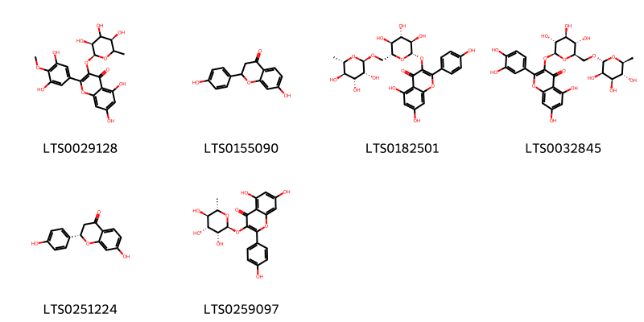{ width=100% }
    <figcaption>Hình ảnh cấu trúc hóa học của 6 hoạt chất thuộc nhóm Flavonoids gồm ['mearnsitrin (LTS0029128)', "7,4'-dihydroxyflavanone (LTS0155090)", 'nictoflorin (LTS0182501)', '3-rutinosyl quercetin (LTS0032845)', '5-deoxyflavanone (LTS0251224)', 'afzelin (LTS0259097)'].</figcaption>
</figure>
#### Nhóm Indoles and derivatives
<figure markdown="span">
    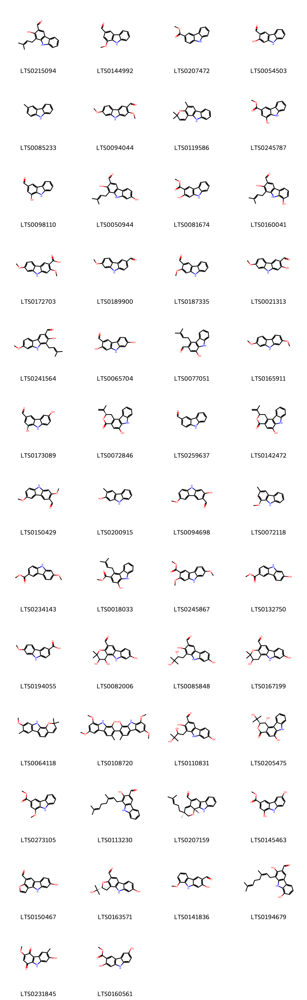{ width=100% }
    <figcaption>Hình ảnh cấu trúc hóa học của 86 hoạt chất thuộc nhóm Indoles and derivatives gồm ['heptaphylline (LTS0215094)', 'murrayanine (LTS0144992)', 'methyl 9h-carbazole-3-carboxylate (LTS0207472)', '2-hydroxy-9h-carbazole-3-carbaldehyde (LTS0054503)', '3-methylcarbazole (LTS0085233)', '2,7-dimethoxy-9h-carbazole-3-carbaldehyde (LTS0094044)', 'girinimbine (LTS0119586)', 'clausine e (LTS0245787)', 'o-demethylmurrayanine (LTS0098110)', '7-hydroxyheptaphylline (LTS0050944)', 'methyl 2-hydroxy-9h-carbazole-3-carboxylate (LTS0081674)', '2,8-dihydroxy-1-(3-methylbut-2-en-1-yl)-9h-carbazole-3-carbaldehyde (LTS0160041)', 'clausine k (LTS0172703)', '7-methoxy-9h-carbazole-3-carbaldehyde (LTS0189900)', '2-methoxy-9h-carbazole-3-carbaldehyde (LTS0187335)', '2-hydroxy-7-methoxy-9h-carbazole-3-carbaldehyde (LTS0021313)', '7-methoxyheptaphylline (LTS0241564)', 'clausine o (LTS0065704)', '1-hydroxy-4-(3-methylbut-2-en-1-yl)-9h-carbazole-3-carbaldehyde (LTS0077051)', '2,7-dimethoxy-9h-carbazole (LTS0165911)', '1,6-dihydroxy-9h-carbazole-3-carbaldehyde (LTS0173089)', '(2r)-6-hydroxy-2-(prop-1-en-2-yl)-1h,2h,7h-pyrano[3,4-c]carbazol-4-one (LTS0072846)', '9h-carbazole-3-carbaldehyde (LTS0259637)', '6-hydroxy-2-(prop-1-en-2-yl)-1h,2h,7h-pyrano[3,4-c]carbazol-4-one (LTS0142472)', '2,6-dimethoxy-9h-carbazole-3-carbaldehyde (LTS0150429)', '3-methyl-9h-carbazol-2-ol (LTS0200915)', 'lansine (LTS0094698)', '1-methoxy-3-methyl-9h-carbazole (LTS0072118)', 'methyl 7-methoxy-9h-carbazole-3-carboxylate (LTS0234143)', 'methyl 1-hydroxy-4-(3-methylbut-2-en-1-yl)-9h-carbazole-3-carboxylate (LTS0018033)', 'methyl 2,7-dimethoxy-9h-carbazole-3-carboxylate (LTS0245867)', 'methyl 7-hydroxy-9h-carbazole-3-carboxylate (LTS0132750)', '7-methoxy-9h-carbazole-3-carboxylic acid (LTS0194055)', '1,2,9-trihydroxy-3,3-dimethyl-1h,2h,11h-pyrano[3,2-a]carbazole-5-carbaldehyde (LTS0082006)', '1-[(2r)-2,3-dihydroxy-3-methylbutyl]-2,7-dihydroxy-9h-carbazole-3-carbaldehyde (LTS0085848)', '2,9-dihydroxy-3,3-dimethyl-1h,2h,11h-pyrano[3,2-a]carbazole-5-carbaldehyde (LTS0167199)', '9-methoxy-2,2,8-trimethyl-11h-pyrano[2,3-a]carbazole (LTS0064118)', "6,6',8,8'-tetramethoxy-3,3'-dimethyl-9h,9'h-[2,2'-bicarbazole]-1,1'-diol (LTS0108720)", '1-(2,3-dihydroxy-3-methylbutyl)-2,7-dihydroxy-9h-carbazole-3-carbaldehyde (LTS0110831)', '(1r,2r)-1,6-dihydroxy-2-(2-hydroxypropan-2-yl)-1h,2h,7h-pyrano[3,4-c]carbazol-4-one (LTS0205475)', 'methyl 1-methoxy-9h-carbazole-3-carboxylate (LTS0273105)', '1-(3,7-dimethylocta-2,6-dien-1-yl)-2-hydroxy-9h-carbazole-3-carbaldehyde (LTS0113230)', '(3s,11br)-3-methyl-3-(4-methylpent-3-en-1-yl)-2h,11h,11bh-pyrano[2,3-a]carbazole-5-carbaldehyde (LTS0207159)', 'methyl 1,6-dihydroxy-9h-carbazole-3-carboxylate (LTS0145463)', '8-hydroxy-10h-furo[3,2-a]carbazole-4-carbaldehyde (LTS0150467)', '(2r)-8-hydroxy-2-(2-hydroxypropan-2-yl)-1h,2h,10h-furo[3,2-a]carbazole-4-carbaldehyde (LTS0163571)', '2-hydroxy-8-methoxy-9h-carbazole-3-carbaldehyde (LTS0141836)', '1-(3,7-dimethylocta-2,6-dien-1-yl)-2,8-dihydroxy-9h-carbazole-3-carbaldehyde (LTS0194679)', '7-hydroxy-3-methoxy-6-methyl-9h-carbazole-1,4-dione (LTS0231845)', 'methyl 2,6-dihydroxy-9h-carbazole-3-carboxylate (LTS0160561)', '1,6-dihydroxy-2-(2-hydroxypropan-2-yl)-1h,2h,7h-pyrano[3,4-c]carbazol-4-one (LTS0171387)', 'methyl 2-methoxy-9h-carbazole-3-carboxylate (LTS0093762)', 'mahanimbine (LTS0232887)', '10-hydroxy-3,3-dimethyl-11h-pyrano[3,2-a]carbazole-5-carbaldehyde (LTS0087623)', '(2s)-8-hydroxy-2-(2-hydroxypropan-2-yl)-1h,2h,10h-furo[3,2-a]carbazole-4-carbaldehyde (LTS0189713)', '(2s)-2,9-dihydroxy-3,3-dimethyl-1h,2h,11h-pyrano[3,2-a]carbazole-5-carbaldehyde (LTS0241395)', '9-hydroxy-2,2-dimethyl-10-(3-methylbut-2-en-1-yl)-11h-pyrano[2,3-a]carbazole-8-carbaldehyde (LTS0182608)', '2,8-dihydroxy-9h-carbazole-3-carbaldehyde (LTS0079339)', '1-[(2s)-2,3-dihydroxy-3-methylbutyl]-2,7-dihydroxy-9h-carbazole-3-carbaldehyde (LTS0261417)', '2-hydroxy-1-[(2r)-2-hydroxy-3-methylbut-3-en-1-yl]-9h-carbazole-3-carbaldehyde (LTS0267940)', '(1r,2s)-1,2,9-trihydroxy-3,3-dimethyl-1h,2h,11h-pyrano[3,2-a]carbazole-5-carbaldehyde (LTS0077887)', '1-hydroxy-6-methoxy-9h-carbazole-3-carbaldehyde (LTS0239611)', '4,4,6-trimethyl-1h,2h,11h-pyrano[4,3-a]carbazole (LTS0088681)', '(1r,2s)-1,6-dihydroxy-2-(2-hydroxypropan-2-yl)-1h,2h,7h-pyrano[3,4-c]carbazol-4-one (LTS0222149)', '1-[(2r)-2,3-dihydroxy-3-methylbutyl]-2,8-dihydroxy-9h-carbazole-3-carbaldehyde (LTS0156537)', '3-methyl-3-(4-methylpent-3-en-1-yl)-2h,11h,11bh-pyrano[2,3-a]carbazole-5-carbaldehyde (LTS0238413)', '(2r)-2,9-dihydroxy-3,3-dimethyl-1h,2h,11h-pyrano[3,2-a]carbazole-5-carbaldehyde (LTS0251112)', '(1s,2s)-1,6-dihydroxy-2-(2-hydroxypropan-2-yl)-1h,2h,7h-pyrano[3,4-c]carbazol-4-one (LTS0256376)', '7-hydroxy-1-methoxy-9h-carbazole-3-carbaldehyde (LTS0049213)', '(2r)-6-hydroxy-2-(2-hydroxypropan-2-yl)-1h,2h,7h-pyrano[3,4-c]carbazol-4-one (LTS0111773)', '6-hydroxy-2-(2-hydroxypropan-2-yl)-7h-pyrano[3,4-c]carbazol-4-one (LTS0106967)', '2-hydroxy-6,8-dimethoxy-9h-carbazole-3-carbaldehyde (LTS0009998)', '1,7-dihydroxy-6-methoxy-9h-carbazole-3-carbaldehyde (LTS0025795)', '8-hydroxy-2-(2-hydroxypropan-2-yl)-1h,2h,10h-furo[3,2-a]carbazole-4-carbaldehyde (LTS0026780)', '6-hydroxy-2-(2-hydroxypropan-2-yl)-1h,2h,7h-pyrano[3,4-c]carbazol-4-one (LTS0022685)', 'methyl 1,7-dihydroxy-9h-carbazole-3-carboxylate (LTS0006106)', '1-[(2z)-3,7-dimethylocta-2,6-dien-1-yl]-2,8-dihydroxy-9h-carbazole-3-carbaldehyde (LTS0018339)', '1,7-dimethoxy-6-methyl-9h-carbazole (LTS0077225)', 'methyl 1-hydroxy-6-methoxy-9h-carbazole-3-carboxylate (LTS0032032)', '(1s,2r)-1,2,9-trihydroxy-3,3-dimethyl-1h,2h,11h-pyrano[3,2-a]carbazole-5-carbaldehyde (LTS0032264)', '1-(2,3-dihydroxy-3-methylbutyl)-2,8-dihydroxy-9h-carbazole-3-carbaldehyde (LTS0130457)', '(2s)-6-hydroxy-2-(2-hydroxypropan-2-yl)-1h,2h,7h-pyrano[3,4-c]carbazol-4-one (LTS0046344)', '2-hydroxy-1-(2-hydroxy-3-methylbut-3-en-1-yl)-9h-carbazole-3-carbaldehyde (LTS0035420)', '1-[(2e)-3,7-dimethylocta-2,6-dien-1-yl]-2-hydroxy-9h-carbazole-3-carbaldehyde (LTS0111450)', '(1s,2r)-1,6-dihydroxy-2-(2-hydroxypropan-2-yl)-1h,2h,7h-pyrano[3,4-c]carbazol-4-one (LTS0265144)', '9-hydroxy-2,2-dimethyl-11h-pyrano[2,3-a]carbazole-8-carbaldehyde (LTS0048819)'].</figcaption>
</figure>
#### Nhóm Linear 1_3-diarylpropanoids
<figure markdown="span">
    { width=100% }
    <figcaption>Hình ảnh cấu trúc hóa học của Không tìm thấy chú thích hoạt chất thuộc nhóm Linear 1_3-diarylpropanoids gồm Không tìm thấy chú thích.</figcaption>
</figure>
#### Nhóm Phenols
<figure markdown="span">
    { width=100% }
    <figcaption>Hình ảnh cấu trúc hóa học của 1 hoạt chất thuộc nhóm Phenols gồm ['syringaldehyde (LTS0201406)'].</figcaption>
</figure>
#### Nhóm Prenol lipids
<figure markdown="span">
    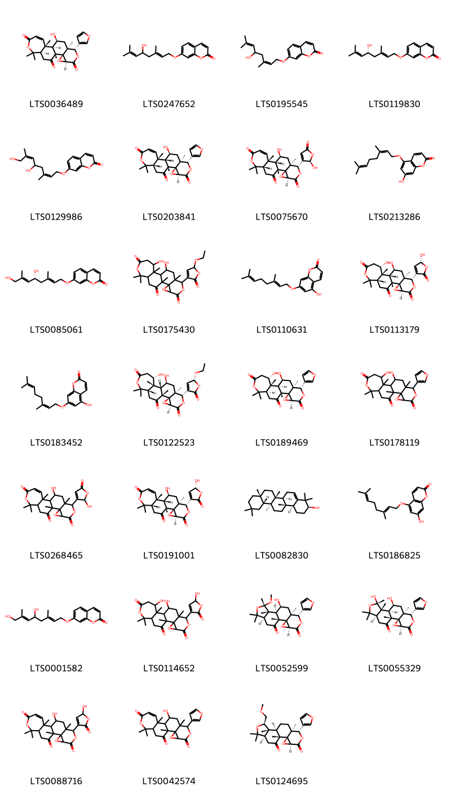{ width=100% }
    <figcaption>Hình ảnh cấu trúc hóa học của 27 hoạt chất thuộc nhóm Prenol lipids gồm ['zapoterin (LTS0036489)', '7-{[(2e)-5-hydroxy-3,7-dimethylocta-2,6-dien-1-yl]oxy}chromen-2-one (LTS0247652)', '7-[(5-hydroxy-3,7-dimethylocta-2,6-dien-1-yl)oxy]chromen-2-one (LTS0195545)', '7-{[(2e,5r)-5-hydroxy-3,7-dimethylocta-2,6-dien-1-yl]oxy}chromen-2-one (LTS0119830)', '7-[(5,8-dihydroxy-3,7-dimethylocta-2,6-dien-1-yl)oxy]chromen-2-one (LTS0129986)', '(1r,2r,4s,7s,8s,10s,11s,12r,18s)-7-(furan-3-yl)-10-hydroxy-1,8,12,17,17-pentamethyl-3,6,16-trioxapentacyclo[9.9.0.0²,⁴.0²,⁸.0¹²,¹⁸]icos-13-ene-5,15,20-trione (LTS0203841)', '(1r,2r,4s,7r,8s,10s,11s,12r,18s)-10-hydroxy-7-[(2r)-2-hydroxy-5-oxo-2h-furan-3-yl]-1,8,12,17,17-pentamethyl-3,6,16-trioxapentacyclo[9.9.0.0²,⁴.0²,⁸.0¹²,¹⁸]icos-13-ene-5,15,20-trione (LTS0075670)', '5-[(3,7-dimethylocta-2,6-dien-1-yl)oxy]-7-hydroxychromen-2-one (LTS0213286)', '7-{[(2e,5r,6e)-5,8-dihydroxy-3,7-dimethylocta-2,6-dien-1-yl]oxy}chromen-2-one (LTS0085061)', '7-(5-ethoxy-2-oxo-5h-furan-3-yl)-10,13-dihydroxy-1,8,12,17,17-pentamethyl-3,6,16-trioxapentacyclo[9.9.0.0²,⁴.0²,⁸.0¹²,¹⁸]icosane-5,15,20-trione (LTS0175430)', '7-{[(2e)-3,7-dimethylocta-2,6-dien-1-yl]oxy}-5-hydroxychromen-2-one (LTS0110631)', '(1r,2r,4s,7r,8s,10s,11s,12r,13s,18s)-10,13-dihydroxy-7-[(5r)-5-hydroxy-2-oxo-5h-furan-3-yl]-1,8,12,17,17-pentamethyl-3,6,16-trioxapentacyclo[9.9.0.0²,⁴.0²,⁸.0¹²,¹⁸]icosane-5,15,20-trione (LTS0113179)', '7-[(3,7-dimethylocta-2,6-dien-1-yl)oxy]-5-hydroxychromen-2-one (LTS0183452)', '(1r,2r,4s,7r,8s,10s,11s,12r,13s,18s)-7-[(5r)-5-ethoxy-2-oxo-5h-furan-3-yl]-10,13-dihydroxy-1,8,12,17,17-pentamethyl-3,6,16-trioxapentacyclo[9.9.0.0²,⁴.0²,⁸.0¹²,¹⁸]icosane-5,15,20-trione (LTS0122523)', '(1r,2r,4s,7s,8s,10s,11r,12r,13s,18r)-7-(furan-3-yl)-10,13-dihydroxy-1,8,12,17,17-pentamethyl-3,6,16-trioxapentacyclo[9.9.0.0²,⁴.0²,⁸.0¹²,¹⁸]icosane-5,15,20-trione (LTS0189469)', '7-(furan-3-yl)-10,13-dihydroxy-1,8,12,17,17-pentamethyl-3,6,16-trioxapentacyclo[9.9.0.0²,⁴.0²,⁸.0¹²,¹⁸]icosane-5,15,20-trione (LTS0178119)', '10-hydroxy-7-(2-hydroxy-5-oxo-2h-furan-3-yl)-1,8,12,17,17-pentamethyl-3,6,16-trioxapentacyclo[9.9.0.0²,⁴.0²,⁸.0¹²,¹⁸]icos-13-ene-5,15,20-trione (LTS0268465)', '(1r,2r,4s,7r,8s,10s,11s,12r,18s)-10-hydroxy-7-[(5r)-5-hydroxy-2-oxo-5h-furan-3-yl]-1,8,12,17,17-pentamethyl-3,6,16-trioxapentacyclo[9.9.0.0²,⁴.0²,⁸.0¹²,¹⁸]icos-13-ene-5,15,20-trione (LTS0191001)', 'glutinol (LTS0082830)', '5-{[(2e)-3,7-dimethylocta-2,6-dien-1-yl]oxy}-7-hydroxychromen-2-one (LTS0186825)', '7-{[(2e,6e)-5,8-dihydroxy-3,7-dimethylocta-2,6-dien-1-yl]oxy}chromen-2-one (LTS0001582)', '10,13-dihydroxy-7-(5-hydroxy-2-oxo-5h-furan-3-yl)-1,8,12,17,17-pentamethyl-3,6,16-trioxapentacyclo[9.9.0.0²,⁴.0²,⁸.0¹²,¹⁸]icosane-5,15,20-trione (LTS0114652)', '(1r,2r,4s,7s,8s,10s,11r,12r,13s,16r)-7-(furan-3-yl)-10-hydroxy-13-methoxy-1,8,12,13,15,15-hexamethyl-3,6,14-trioxapentacyclo[9.7.0.0²,⁴.0²,⁸.0¹²,¹⁶]octadecane-5,18-dione (LTS0052599)', '(1r,2r,4s,7s,8s,10s,11r,12r,13s,16r)-7-(furan-3-yl)-10,13-dihydroxy-1,8,12,13,15,15-hexamethyl-3,6,14-trioxapentacyclo[9.7.0.0²,⁴.0²,⁸.0¹²,¹⁶]octadecane-5,18-dione (LTS0055329)', '10-hydroxy-7-(5-hydroxy-2-oxo-5h-furan-3-yl)-1,8,12,17,17-pentamethyl-3,6,16-trioxapentacyclo[9.9.0.0²,⁴.0²,⁸.0¹²,¹⁸]icos-13-ene-5,15,20-trione (LTS0088716)', '7-(furan-3-yl)-10-hydroxy-1,8,12,17,17-pentamethyl-3,6,16-trioxapentacyclo[9.9.0.0²,⁴.0²,⁸.0¹²,¹⁸]icos-13-ene-5,15,20-trione (LTS0042574)', '(1r,2r,4s,7s,8s,11r,12r,13r,16r)-7-(furan-3-yl)-13-(methoxymethyl)-1,8,12,15,15-pentamethyl-3,6,14-trioxapentacyclo[9.7.0.0²,⁴.0²,⁸.0¹²,¹⁶]octadecane-5,18-dione (LTS0124695)'].</figcaption>
</figure>
#### Nhóm Steroids and steroid derivatives
<figure markdown="span">
    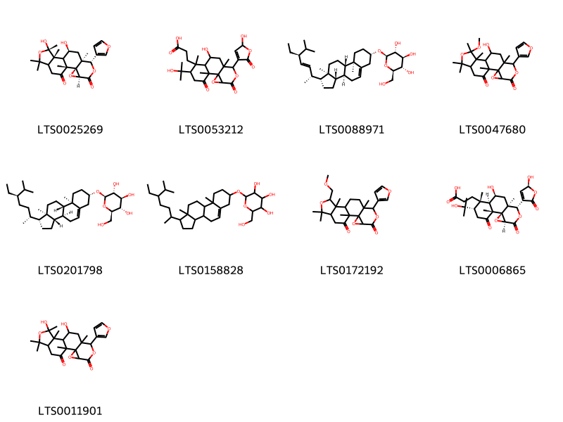{ width=100% }
    <figcaption>Hình ảnh cấu trúc hóa học của 9 hoạt chất thuộc nhóm Steroids and steroid derivatives gồm ['(1r,2r,4s,7s,8s,10s,12r,13s)-7-(furan-3-yl)-10,13-dihydroxy-1,8,12,13,15,15-hexamethyl-3,6,14-trioxapentacyclo[9.7.0.0²,⁴.0²,⁸.0¹²,¹⁶]octadecane-5,18-dione (LTS0025269)', '3-[8-hydroxy-11-(5-hydroxy-2-oxo-5h-furan-3-yl)-5-(2-hydroxypropan-2-yl)-2,6,10-trimethyl-3,13-dioxo-12,15-dioxatetracyclo[8.5.0.0¹,¹⁴.0²,⁷]pentadecan-6-yl]propanoic acid (LTS0053212)', '(2r,3r,4s,5s,6r)-2-{[(1r,3as,3bs,7s,9ar,9bs,11ar)-1-[(2r,3e,5s)-5-ethyl-6-methylhept-3-en-2-yl]-9a,11a-dimethyl-1h,2h,3h,3ah,3bh,4h,6h,7h,8h,9h,9bh,10h,11h-cyclopenta[a]phenanthren-7-yl]oxy}-6-(hydroxymethyl)oxane-3,4,5-triol (LTS0088971)', '7-(furan-3-yl)-10-hydroxy-13-methoxy-1,8,12,13,15,15-hexamethyl-3,6,14-trioxapentacyclo[9.7.0.0²,⁴.0²,⁸.0¹²,¹⁶]octadecane-5,18-dione (LTS0047680)', 'sitogluside (LTS0201798)', '2-{[1-(5-ethyl-6-methylheptan-2-yl)-9a,11a-dimethyl-1h,2h,3h,3ah,3bh,4h,6h,7h,8h,9h,9bh,10h,11h-cyclopenta[a]phenanthren-7-yl]oxy}-6-(hydroxymethyl)oxane-3,4,5-triol (LTS0158828)', '7-(furan-3-yl)-13-(methoxymethyl)-1,8,12,15,15-pentamethyl-3,6,14-trioxapentacyclo[9.7.0.0²,⁴.0²,⁸.0¹²,¹⁶]octadecane-5,18-dione (LTS0172192)', '3-[(1r,2r,5s,6r,7r,8s,10s,11r,14s)-8-hydroxy-11-[(5s)-5-hydroxy-2-oxo-5h-furan-3-yl]-5-(2-hydroxypropan-2-yl)-2,6,10-trimethyl-3,13-dioxo-12,15-dioxatetracyclo[8.5.0.0¹,¹⁴.0²,⁷]pentadecan-6-yl]propanoic acid (LTS0006865)', '7-(furan-3-yl)-10,13-dihydroxy-1,8,12,13,15,15-hexamethyl-3,6,14-trioxapentacyclo[9.7.0.0²,⁴.0²,⁸.0¹²,¹⁶]octadecane-5,18-dione (LTS0011901)'].</figcaption>
</figure>
#### Nhóm Tetrapyrroles and derivatives
<figure markdown="span">
    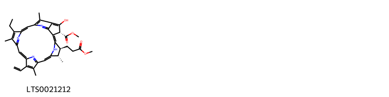{ width=100% }
    <figcaption>Hình ảnh cấu trúc hóa học của 1 hoạt chất thuộc nhóm Tetrapyrroles and derivatives gồm ['methyl (3r,21s,22s)-16-ethenyl-11-ethyl-4-hydroxy-22-(3-methoxy-3-oxopropyl)-12,17,21,26-tetramethyl-7,23,24,25-tetraazahexacyclo[18.2.1.1⁵,⁸.1¹⁰,¹³.1¹⁵,¹⁸.0²,⁶]hexacosa-1,4,6,8(26),9,11,13(25),14,16,18(24),19-undecaene-3-carboxylate (LTS0021212)'].</figcaption>
</figure>

---

### Dược dân tộc học

Danh sách các quốc gia có sử dụng *Clausena excavata* trong điều trị các bệnh. 

| Country   | Disease   | Bệnh           |
|:----------|:----------|:---------------|
| Elsewhere | Diuretic  | Thuốc lợi tiêu |
| Java      | Vermifuge | Thuốc diệt sán |

---

---
## Clausena inaequalis
### Thông tin về thực vật

!!! info "Phân loại thực vật của *Clausena anisata* từ GIBF:"
    - **Kingdom:** Plantae
    - **Phylum:** Tracheophyta
    - **Order:** Sapindales
    - **Family:** Rutaceae
    - **Genus:** Clausena
    - **Species:** *Clausena anisata*

 

| Label (VI)   | Label (EN)   | Scientific Name     | Descriptions (VI)   | Descriptions (EN)   | Also Known As (VI)   | Also Known As (EN)   |
|:-------------|:-------------|:--------------------|:--------------------|:--------------------|:---------------------|:---------------------|
| N/A          | N/A          | Clausena inaequalis |                     |                     | ['']                 | ['']                 |

#### Phân bố trên thế giới

**Từ CSDL GIBF** Christmas Island, Madagascar, Thailand, Seychelles, Australia, Chinese Taipei, Brazil, Indonesia, Bangladesh, Mexico, Singapore, Malaysia, China

#### Phân bố tại Việt Nam

**Từ CSDL GIBF**: Không có ghi nhận ở Việt Nam

---
### Thành phần hóa học
        
- Theo cơ sở dữ liệu lotus: Từ loài *Clausena anisata* đã phân lập và xác định được Chưa có hoạt chất nào được phân lập. hoạt chất thuộc về các nhóm Không có hoạt chất nào được phân lập. 

Không có hình ảnh nào được tạo ra

---

### Dược dân tộc học

Danh sách các quốc gia có sử dụng *Clausena anisata* trong điều trị các bệnh. 

| Country      | Disease   | Bệnh           |
|:-------------|:----------|:---------------|
| Africa(Zulu) | Vermifuge | Thuốc diệt sán |

---

---
## Clausena lansium
### Thông tin về thực vật

!!! info "Phân loại thực vật của *Clausena lansium* từ GIBF:"
    - **Kingdom:** Plantae
    - **Phylum:** Tracheophyta
    - **Order:** Sapindales
    - **Family:** Rutaceae
    - **Genus:** Clausena
    - **Species:** *Clausena lansium*

 

| Label (VI)   | Label (EN)   | Scientific Name   | Descriptions (VI)   | Descriptions (EN)   | Also Known As (VI)                          | Also Known As (EN)   |
|:-------------|:-------------|:------------------|:--------------------|:--------------------|:--------------------------------------------|:---------------------|
| N/A          | N/A          | Clausena lansium  | loài thực vật       | species of plant    | ['Quất bì', 'Hoàng bì', 'Clausena lansium'] | ['']                 |

#### Phân bố trên thế giới

**Từ CSDL GIBF** nan, Australia, Belgium, Lao People’s Democratic Republic, unknown or invalid, Norway, Chinese Taipei, Spain, Honduras, Bangladesh, United States of America, Hong Kong, Brazil, Viet Nam, China, Macao, India, Indonesia, Philippines, Malaysia, New Zealand

#### Phân bố tại Việt Nam

**Từ CSDL GIBF**: Thanh Hoa, Hải Phòng

---
### Thành phần hóa học
        
- Theo cơ sở dữ liệu lotus: Từ loài *Clausena lansium* đã phân lập và xác định được 103 hoạt chất thuộc về các nhóm Phenol ethers, Fatty Acyls, Pyrrolidines, Indoles and derivatives, Steroids and steroid derivatives, Prenol lipids, Cinnamic acids and derivatives, Benzene and substituted derivatives, Oxazinanes, Coumarins and derivatives. 

|    | chemicalTaxonomyClassyfireClass     |   smiles_count |
|---:|:------------------------------------|---------------:|
|  0 | Benzene and substituted derivatives |              5 |
|  1 | Cinnamic acids and derivatives      |              9 |
|  2 | Coumarins and derivatives           |             29 |
|  3 | Fatty Acyls                         |              2 |
|  4 | Indoles and derivatives             |             27 |
|  5 | Oxazinanes                          |              3 |
|  6 | Phenol ethers                       |              2 |
|  7 | Prenol lipids                       |              3 |
|  8 | Pyrrolidines                        |             17 |
|  9 | Steroids and steroid derivatives    |              5 |

#### Nhóm Benzene and substituted derivatives
<figure markdown="span">
    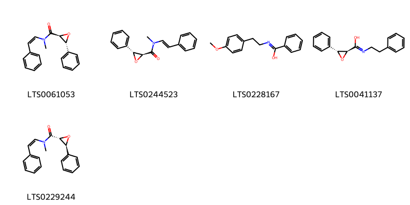{ width=100% }
    <figcaption>Hình ảnh cấu trúc hóa học của 5 hoạt chất thuộc nhóm Benzene and substituted derivatives gồm ['(2s,3r)-n-methyl-3-phenyl-n-[(1z)-2-phenylethenyl]oxirane-2-carboxamide (LTS0061053)', '(2s,3r)-n-methyl-3-phenyl-n-(2-phenylethenyl)oxirane-2-carboxamide (LTS0244523)', 'n-[2-(4-methoxyphenyl)ethyl]benzenecarboximidic acid (LTS0228167)', '(2s,3r)-3-phenyl-n-(2-phenylethyl)oxirane-2-carboximidic acid (LTS0041137)', '(2r,3s)-n-methyl-3-phenyl-n-[(1z)-2-phenylethenyl]oxirane-2-carboxamide (LTS0229244)'].</figcaption>
</figure>
#### Nhóm Cinnamic acids and derivatives
<figure markdown="span">
    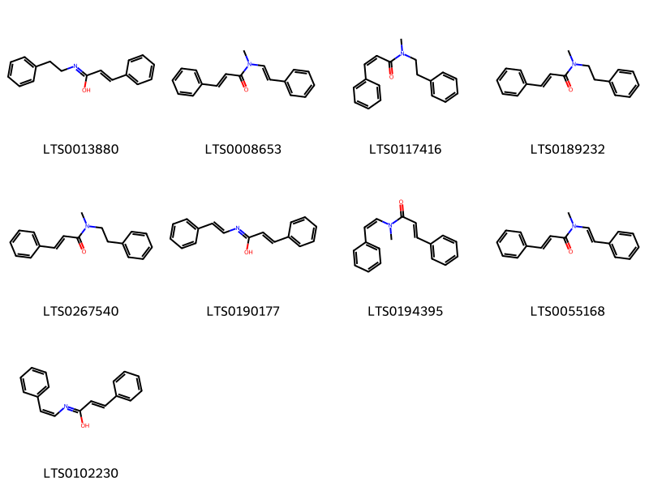{ width=100% }
    <figcaption>Hình ảnh cấu trúc hóa học của 9 hoạt chất thuộc nhóm Cinnamic acids and derivatives gồm ['(2e)-3-phenyl-n-(2-phenylethyl)prop-2-enimidic acid (LTS0013880)', '(2e)-n-methyl-3-phenyl-n-[(1e)-2-phenylethenyl]prop-2-enamide (LTS0008653)', '(2z)-n-methyl-3-phenyl-n-(2-phenylethyl)prop-2-enamide (LTS0117416)', '(2e)-n-methyl-3-phenyl-n-(2-phenylethyl)prop-2-enamide (LTS0189232)', 'n-methyl-3-phenyl-n-(2-phenylethyl)prop-2-enamide (LTS0267540)', '3-phenyl-n-(2-phenylethenyl)prop-2-enimidic acid (LTS0190177)', '(2e)-n-methyl-3-phenyl-n-[(1z)-2-phenylethenyl]prop-2-enamide (LTS0194395)', 'n-methyl-3-phenyl-n-(2-phenylethenyl)prop-2-enamide (LTS0055168)', '(z,2e)-3-phenyl-n-[(1z)-2-phenylethenyl]prop-2-enimidic acid (LTS0102230)'].</figcaption>
</figure>
#### Nhóm Coumarins and derivatives
<figure markdown="span">
    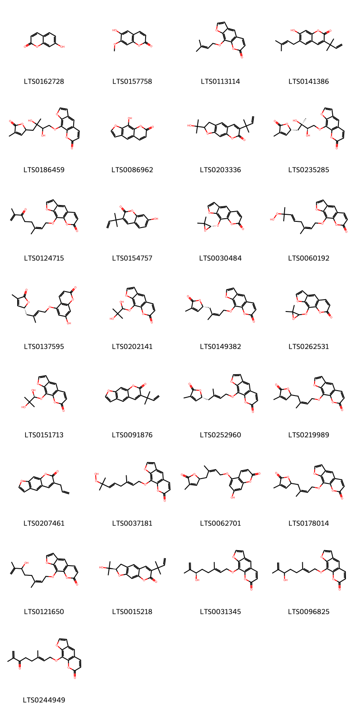{ width=100% }
    <figcaption>Hình ảnh cấu trúc hóa học của 29 hoạt chất thuộc nhóm Coumarins and derivatives gồm ['umbelliferone (LTS0162728)', 'isoscopoletin (LTS0157758)', 'imperatorin (LTS0113114)', '7-hydroxy-6-(3-methylbut-2-en-1-yl)-3-(2-methylbut-3-en-2-yl)chromen-2-one (LTS0141386)', '5-[2,3-dihydroxy-2-methyl-4-({7-oxofuro[3,2-g]chromen-9-yl}oxy)butyl]-3-methyl-5h-furan-2-one (LTS0186459)', 'xanthotoxol (LTS0086962)', 'heliettin (LTS0203336)', '(5r)-5-[(2r,3r)-2,3-dihydroxy-2-methyl-4-({7-oxofuro[3,2-g]chromen-9-yl}oxy)butyl]-3-methyl-5h-furan-2-one (LTS0235285)', '9-[(3,7-dimethyl-6-oxoocta-2,7-dien-1-yl)oxy]furo[3,2-g]chromen-7-one (LTS0124715)', '7-hydroxy-3-(2-methylbut-3-en-2-yl)chromen-2-one (LTS0154757)', '9-{[(2s)-3,3-dimethyloxiran-2-yl]oxy}furo[3,2-g]chromen-7-one (LTS0030484)', '9-[(7-hydroperoxy-3,7-dimethylocta-2,5-dien-1-yl)oxy]furo[3,2-g]chromen-7-one (LTS0060192)', '7-hydroxy-5-{[(2e)-3-{[(2r)-4-methyl-5-oxo-2h-furan-2-yl]methyl}but-2-en-1-yl]oxy}chromen-2-one (LTS0137595)', '9-(1,2-dihydroxy-2-methylpropoxy)furo[3,2-g]chromen-7-one (LTS0202141)', '(5r)-3-methyl-5-[(2z)-2-methyl-4-({7-oxofuro[3,2-g]chromen-9-yl}oxy)but-2-en-1-yl]-5h-furan-2-one (LTS0149382)', '9-[(3,3-dimethyloxiran-2-yl)oxy]furo[3,2-g]chromen-7-one (LTS0262531)', '9-[(1s)-1,2-dihydroxy-2-methylpropoxy]furo[3,2-g]chromen-7-one (LTS0151713)', 'chalepensin (LTS0091876)', '(5r)-3-methyl-5-[(2e)-2-methyl-4-({7-oxofuro[3,2-g]chromen-9-yl}oxy)but-2-en-1-yl]-5h-furan-2-one (LTS0252960)', '3-methyl-5-[(2z)-2-methyl-4-({7-oxofuro[3,2-g]chromen-9-yl}oxy)but-2-en-1-yl]-5h-furan-2-one (LTS0219989)', '6-(prop-2-en-1-yl)furo[3,2-g]chromen-7-one (LTS0207461)', '9-{[(2e,5e)-7-hydroperoxy-3,7-dimethylocta-2,5-dien-1-yl]oxy}furo[3,2-g]chromen-7-one (LTS0037181)', '7-hydroxy-5-{[3-methyl-4-(4-methyl-5-oxo-2h-furan-2-yl)but-2-en-1-yl]oxy}chromen-2-one (LTS0062701)', '3-methyl-5-[2-methyl-4-({7-oxofuro[3,2-g]chromen-9-yl}oxy)but-2-en-1-yl]-5h-furan-2-one (LTS0178014)', '9-[(6-hydroxy-3,7-dimethylocta-2,7-dien-1-yl)oxy]furo[3,2-g]chromen-7-one (LTS0121650)', '(2r)-2-(2-hydroxypropan-2-yl)-6-(2-methylbut-3-en-2-yl)-2h,3h-furo[3,2-g]chromen-7-one (LTS0015218)', '9-{[(2e,6r)-6-hydroxy-3,7-dimethylocta-2,7-dien-1-yl]oxy}furo[3,2-g]chromen-7-one (LTS0031345)', '9-{[(2e)-6-hydroxy-3,7-dimethylocta-2,7-dien-1-yl]oxy}furo[3,2-g]chromen-7-one (LTS0096825)', '9-{[(2e)-3,7-dimethyl-6-oxoocta-2,7-dien-1-yl]oxy}furo[3,2-g]chromen-7-one (LTS0244949)'].</figcaption>
</figure>
#### Nhóm Fatty Acyls
<figure markdown="span">
    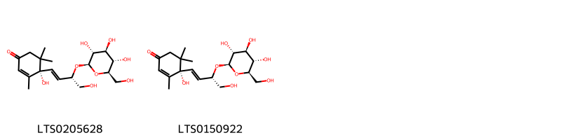{ width=100% }
    <figcaption>Hình ảnh cấu trúc hóa học của 2 hoạt chất thuộc nhóm Fatty Acyls gồm ['(4s)-4-hydroxy-4-[(1e,3s)-4-hydroxy-3-{[(2r,3r,4s,5s,6r)-3,4,5-trihydroxy-6-(hydroxymethyl)oxan-2-yl]oxy}but-1-en-1-yl]-3,5,5-trimethylcyclohex-2-en-1-one (LTS0205628)', '(4s)-4-hydroxy-4-[(3s)-4-hydroxy-3-{[(2r,3r,4s,5s,6r)-3,4,5-trihydroxy-6-(hydroxymethyl)oxan-2-yl]oxy}but-1-en-1-yl]-3,5,5-trimethylcyclohex-2-en-1-one (LTS0150922)'].</figcaption>
</figure>
#### Nhóm Indoles and derivatives
<figure markdown="span">
    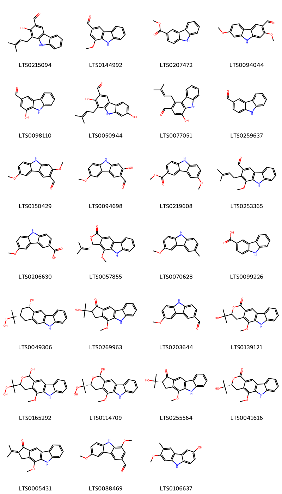{ width=100% }
    <figcaption>Hình ảnh cấu trúc hóa học của 27 hoạt chất thuộc nhóm Indoles and derivatives gồm ['heptaphylline (LTS0215094)', 'murrayanine (LTS0144992)', 'methyl 9h-carbazole-3-carboxylate (LTS0207472)', '2,7-dimethoxy-9h-carbazole-3-carbaldehyde (LTS0094044)', 'o-demethylmurrayanine (LTS0098110)', '7-hydroxyheptaphylline (LTS0050944)', '1-hydroxy-4-(3-methylbut-2-en-1-yl)-9h-carbazole-3-carbaldehyde (LTS0077051)', '9h-carbazole-3-carbaldehyde (LTS0259637)', '2,6-dimethoxy-9h-carbazole-3-carbaldehyde (LTS0150429)', 'lansine (LTS0094698)', 'methyl 6-methoxy-9h-carbazole-3-carboxylate (LTS0219608)', '1-methoxy-2-(3-methylbut-2-en-1-yl)-9h-carbazole-3-carbaldehyde (LTS0253365)', '6-methoxy-9h-carbazole-3-carboxylic acid (LTS0206630)', '(3s)-4-methoxy-3-(2-methylprop-1-en-1-yl)-3h,5h-furo[3,4-b]carbazol-1-one (LTS0057855)', '3-methoxy-6-methyl-9h-carbazole (LTS0070628)', '9h-carbazole-3-carboxylic acid (LTS0099226)', '(8s,10s)-8-(2-hydroperoxypropan-2-yl)-5h,7h,8h,9h,10h-cyclohexa[b]carbazol-10-ol (LTS0049306)', '2-(2-hydroxypropan-2-yl)-4-methoxy-2h,3h,5h-cyclopenta[b]carbazol-1-one (LTS0269963)', '6-methoxy-9h-carbazole-3-carbaldehyde (LTS0203644)', '3-(2-hydroxypropan-2-yl)-5-methoxy-3h,4h,6h-pyrano[4,3-b]carbazol-1-one (LTS0139121)', '3-(2-hydroperoxypropan-2-yl)-5-methoxy-1h,3h,4h,6h-pyrano[4,3-b]carbazol-1-ol (LTS0165292)', '(1r,3r)-3-(2-hydroperoxypropan-2-yl)-5-methoxy-1h,3h,4h,6h-pyrano[4,3-b]carbazol-1-ol (LTS0114709)', '(2r)-2-(2-hydroxypropan-2-yl)-4-methoxy-2h,3h,5h-cyclopenta[b]carbazol-1-one (LTS0255564)', '(3r)-3-(2-hydroxypropan-2-yl)-5-methoxy-3h,4h,6h-pyrano[4,3-b]carbazol-1-one (LTS0041616)', 'claulansine g (LTS0005431)', '1,6-dimethoxy-9h-carbazole-3-carbaldehyde (LTS0088469)', '7-methoxy-6-methyl-9h-carbazol-3-ol (LTS0106637)'].</figcaption>
</figure>
#### Nhóm Oxazinanes
<figure markdown="span">
    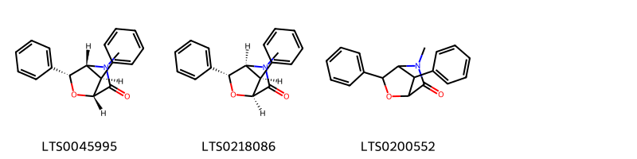{ width=100% }
    <figcaption>Hình ảnh cấu trúc hóa học của 3 hoạt chất thuộc nhóm Oxazinanes gồm ['(1r,3r,4r,7r)-5-methyl-3,7-diphenyl-2-oxa-5-azabicyclo[2.2.1]heptan-6-one (LTS0045995)', '(1s,3r,4s,7r)-5-methyl-3,7-diphenyl-2-oxa-5-azabicyclo[2.2.1]heptan-6-one (LTS0218086)', '5-methyl-3,7-diphenyl-2-oxa-5-azabicyclo[2.2.1]heptan-6-one (LTS0200552)'].</figcaption>
</figure>
#### Nhóm Phenol ethers
<figure markdown="span">
    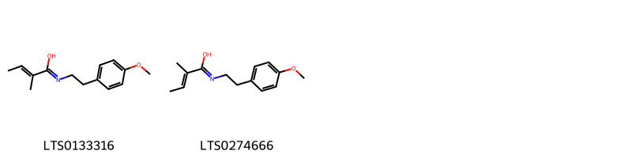{ width=100% }
    <figcaption>Hình ảnh cấu trúc hóa học của 2 hoạt chất thuộc nhóm Phenol ethers gồm ['(2e)-n-[2-(4-methoxyphenyl)ethyl]-2-methylbut-2-enimidic acid (LTS0133316)', 'n-[2-(4-methoxyphenyl)ethyl]-2-methylbut-2-enimidic acid (LTS0274666)'].</figcaption>
</figure>
#### Nhóm Prenol lipids
<figure markdown="span">
    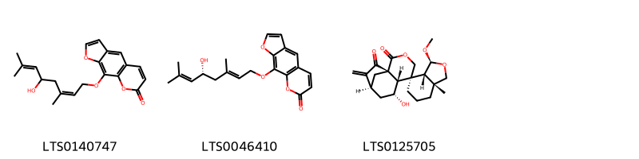{ width=100% }
    <figcaption>Hình ảnh cấu trúc hóa học của 3 hoạt chất thuộc nhóm Prenol lipids gồm ['9-[(5-hydroxy-3,7-dimethylocta-2,6-dien-1-yl)oxy]furo[3,2-g]chromen-7-one (LTS0140747)', '9-{[(2e,5r)-5-hydroxy-3,7-dimethylocta-2,6-dien-1-yl]oxy}furo[3,2-g]chromen-7-one (LTS0046410)', "(1's,3s,3ar,4r,6's,7'r,7ar,9's)-7'-hydroxy-3-methoxy-7a-methyl-10'-methylidene-hexahydro-3'-oxaspiro[2-benzofuran-4,5'-tricyclo[7.2.1.0¹,⁶]dodecane]-2',11'-dione (LTS0125705)"].</figcaption>
</figure>
#### Nhóm Pyrrolidines
<figure markdown="span">
    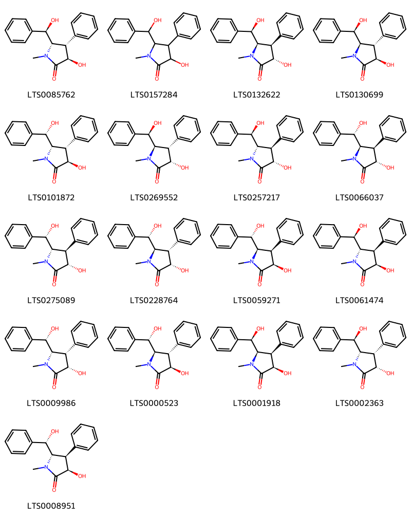{ width=100% }
    <figcaption>Hình ảnh cấu trúc hóa học của 17 hoạt chất thuộc nhóm Pyrrolidines gồm ['(3r,4s,5s)-3-hydroxy-5-[(r)-hydroxy(phenyl)methyl]-1-methyl-4-phenylpyrrolidin-2-one (LTS0085762)', '3-hydroxy-5-[hydroxy(phenyl)methyl]-1-methyl-4-phenylpyrrolidin-2-one (LTS0157284)', '(3s,4r,5r)-3-hydroxy-5-[(r)-hydroxy(phenyl)methyl]-1-methyl-4-phenylpyrrolidin-2-one (LTS0132622)', '(3r,4s,5r)-3-hydroxy-5-[(r)-hydroxy(phenyl)methyl]-1-methyl-4-phenylpyrrolidin-2-one (LTS0130699)', '(3r,4s,5s)-3-hydroxy-5-[(s)-hydroxy(phenyl)methyl]-1-methyl-4-phenylpyrrolidin-2-one (LTS0101872)', '(3s,4s,5r)-3-hydroxy-5-[(r)-hydroxy(phenyl)methyl]-1-methyl-4-phenylpyrrolidin-2-one (LTS0269552)', '(3s,4r,5s)-3-hydroxy-5-[(r)-hydroxy(phenyl)methyl]-1-methyl-4-phenylpyrrolidin-2-one (LTS0257217)', '(3s,4r,5r)-3-hydroxy-5-[(s)-hydroxy(phenyl)methyl]-1-methyl-4-phenylpyrrolidin-2-one (LTS0066037)', '(3s,4r,5s)-3-hydroxy-5-[(s)-hydroxy(phenyl)methyl]-1-methyl-4-phenylpyrrolidin-2-one (LTS0275089)', '(3s,4s,5r)-3-hydroxy-5-[(s)-hydroxy(phenyl)methyl]-1-methyl-4-phenylpyrrolidin-2-one (LTS0228764)', '(3r,4r,5r)-3-hydroxy-5-[(s)-hydroxy(phenyl)methyl]-1-methyl-4-phenylpyrrolidin-2-one (LTS0059271)', '(3r,4r,5s)-3-hydroxy-5-[(r)-hydroxy(phenyl)methyl]-1-methyl-4-phenylpyrrolidin-2-one (LTS0061474)', '(3s,4s,5s)-3-hydroxy-5-[(s)-hydroxy(phenyl)methyl]-1-methyl-4-phenylpyrrolidin-2-one (LTS0009986)', '(3r,4s,5r)-3-hydroxy-5-[(s)-hydroxy(phenyl)methyl]-1-methyl-4-phenylpyrrolidin-2-one (LTS0000523)', '(3r,4r,5r)-3-hydroxy-5-[(r)-hydroxy(phenyl)methyl]-1-methyl-4-phenylpyrrolidin-2-one (LTS0001918)', '(3s,4s,5s)-3-hydroxy-5-[(r)-hydroxy(phenyl)methyl]-1-methyl-4-phenylpyrrolidin-2-one (LTS0002363)', '(3r,4r,5s)-3-hydroxy-5-[(s)-hydroxy(phenyl)methyl]-1-methyl-4-phenylpyrrolidin-2-one (LTS0008951)'].</figcaption>
</figure>
#### Nhóm Steroids and steroid derivatives
<figure markdown="span">
    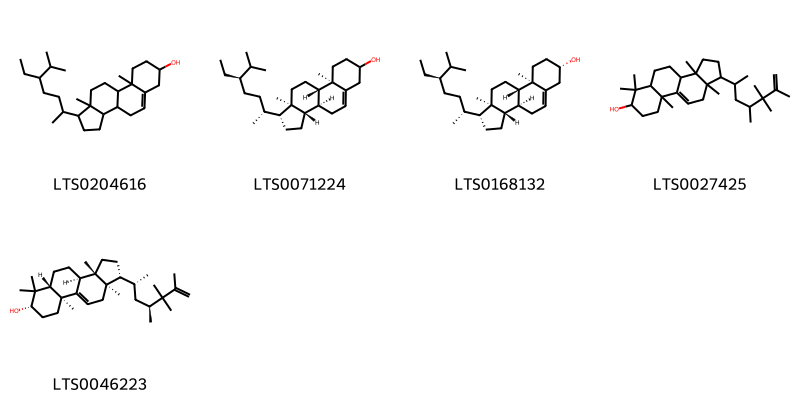{ width=100% }
    <figcaption>Hình ảnh cấu trúc hóa học của 5 hoạt chất thuộc nhóm Steroids and steroid derivatives gồm ['stigmast-5-en-3-ol, (3β)- (LTS0204616)', 'stigmast-5-en-3-ol (LTS0071224)', 'sitosterol (LTS0168132)', '3a,6,6,9a,11a-pentamethyl-1-(4,5,5,6-tetramethylhept-6-en-2-yl)-1h,2h,3h,3bh,4h,5h,5ah,7h,8h,9h,11h-cyclopenta[a]phenanthren-7-ol (LTS0027425)', '(1r,3as,3bs,5ar,7s,9as,11ar)-3a,6,6,9a,11a-pentamethyl-1-[(2r,4s)-4,5,5,6-tetramethylhept-6-en-2-yl]-1h,2h,3h,3bh,4h,5h,5ah,7h,8h,9h,11h-cyclopenta[a]phenanthren-7-ol (LTS0046223)'].</figcaption>
</figure>

---

### Dược dân tộc học

Danh sách các quốc gia có sử dụng *Clausena lansium* trong điều trị các bệnh. 

| Country   | Disease                           | Bệnh                             |
|:----------|:----------------------------------|:---------------------------------|
| China     | Refrigerant, Vermifuge, Stomachic | Môi chất lạnh, Vermifuge, Dạ dày |

---

# Chi Heerethusa

??? note "Danh sách các dược liệu thuộc chi"
    
	 - *Heerethusa crenulata*

---
## Heerethusa crenulata
### Thông tin về thực vật

!!! info "Phân loại thực vật của *N/A* từ GIBF:"
    - **Kingdom:** N/A
    - **Phylum:** N/A
    - **Order:** N/A
    - **Family:** N/A
    - **Genus:** N/A
    - **Species:** *N/A*

 

| Label (VI)   | Label (EN)   | Scientific Name   | Descriptions (VI)   | Descriptions (EN)   | Also Known As (VI)                          | Also Known As (EN)   |
|:-------------|:-------------|:------------------|:--------------------|:--------------------|:--------------------------------------------|:---------------------|
| N/A          | N/A          | Clausena lansium  | loài thực vật       | species of plant    | ['Quất bì', 'Hoàng bì', 'Clausena lansium'] | ['']                 |

#### Phân bố trên thế giới

**Từ CSDL GIBF** Không có kết quả phù hợp

#### Phân bố tại Việt Nam

**Từ CSDL GIBF**: Không có ghi nhận ở Việt Nam

---
### Thành phần hóa học
        
- Theo cơ sở dữ liệu lotus: Từ loài *N/A* đã phân lập và xác định được Chưa có hoạt chất nào được phân lập. hoạt chất thuộc về các nhóm Không có hoạt chất nào được phân lập. 

Không có hình ảnh nào được tạo ra

---

### Dược dân tộc học

Danh sách các quốc gia có sử dụng *N/A* trong điều trị các bệnh. 

| Country   | Disease                                          | Bệnh                                                 |
|:----------|:-------------------------------------------------|:-----------------------------------------------------|
| India     | Antidote, Purgative, Stomachic, Tonic, Sudorific | Thuốc giải độc, Luyện ngục, Dạ dày, Tonic, Sudorific |
| Java      | Soap                                             | Xà phòng                                             |

---

# Chi Orixa

??? note "Danh sách các dược liệu thuộc chi"
    
	 - *Orixa japonica*

---
## Orixa japonica
### Thông tin về thực vật

!!! info "Phân loại thực vật của *Orixa japonica* từ GIBF:"
    - **Kingdom:** Plantae
    - **Phylum:** Tracheophyta
    - **Order:** Sapindales
    - **Family:** Rutaceae
    - **Genus:** Orixa
    - **Species:** *Orixa japonica*

 

| Label (VI)   | Label (EN)   | Scientific Name   | Descriptions (VI)   | Descriptions (EN)   | Also Known As (VI)   | Also Known As (EN)                     |
|:-------------|:-------------|:------------------|:--------------------|:--------------------|:---------------------|:---------------------------------------|
| N/A          | N/A          | Orixa japonica    | loài thực vật       | species of plant    | ['']                 | ['East Asian orixa', 'Japanese orixa'] |

#### Phân bố trên thế giới

**Từ CSDL GIBF** nan, Japan, Czechia, Belgium, Korea, Republic of, United States of America, China

#### Phân bố tại Việt Nam

**Từ CSDL GIBF**: Không có ghi nhận ở Việt Nam

---
### Thành phần hóa học
        
- Theo cơ sở dữ liệu lotus: Từ loài *Orixa japonica* đã phân lập và xác định được 49 hoạt chất thuộc về các nhóm Flavonoids, Prenol lipids, Quinolines and derivatives, Lactones, Coumarins and derivatives, Protoberberine alkaloids and derivatives. 

|    | chemicalTaxonomyClassyfireClass          |   smiles_count |
|---:|:-----------------------------------------|---------------:|
|  0 | Coumarins and derivatives                |              6 |
|  1 | Flavonoids                               |              2 |
|  2 | Lactones                                 |              2 |
|  3 | Prenol lipids                            |              2 |
|  4 | Protoberberine alkaloids and derivatives |              1 |
|  5 | Quinolines and derivatives               |             36 |

#### Nhóm Coumarins and derivatives
<figure markdown="span">
    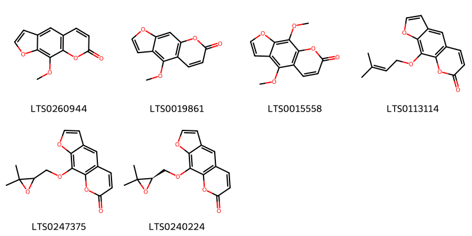{ width=100% }
    <figcaption>Hình ảnh cấu trúc hóa học của 6 hoạt chất thuộc nhóm Coumarins and derivatives gồm ['methoxsalen (LTS0260944)', 'bergapten (LTS0019861)', 'isopimpinellin (LTS0015558)', 'imperatorin (LTS0113114)', 'prangenin (LTS0247375)', 'heraclenin (LTS0240224)'].</figcaption>
</figure>
#### Nhóm Flavonoids
<figure markdown="span">
    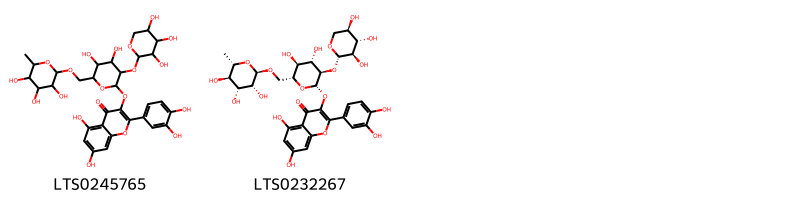{ width=100% }
    <figcaption>Hình ảnh cấu trúc hóa học của 2 hoạt chất thuộc nhóm Flavonoids gồm ['3-[(4,5-dihydroxy-6-{[(3,4,5-trihydroxy-6-methyloxan-2-yl)oxy]methyl}-3-[(3,4,5-trihydroxyoxan-2-yl)oxy]oxan-2-yl)oxy]-2-(3,4-dihydroxyphenyl)-5,7-dihydroxychromen-4-one (LTS0245765)', 'qxrg (LTS0232267)'].</figcaption>
</figure>
#### Nhóm Lactones
<figure markdown="span">
    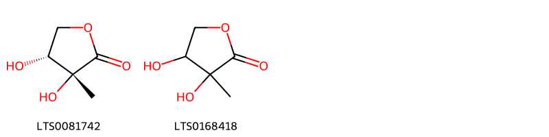{ width=100% }
    <figcaption>Hình ảnh cấu trúc hóa học của 2 hoạt chất thuộc nhóm Lactones gồm ['(3r,4r)-3,4-dihydroxy-3-methyloxolan-2-one (LTS0081742)', '3,4-dihydroxy-3-methyloxolan-2-one (LTS0168418)'].</figcaption>
</figure>
#### Nhóm Prenol lipids
<figure markdown="span">
    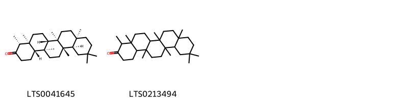{ width=100% }
    <figcaption>Hình ảnh cấu trúc hóa học của 2 hoạt chất thuộc nhóm Prenol lipids gồm ['(-)-friedelin (LTS0041645)', 'friedelin (LTS0213494)'].</figcaption>
</figure>
#### Nhóm Protoberberine alkaloids and derivatives
<figure markdown="span">
    { width=100% }
    <figcaption>Hình ảnh cấu trúc hóa học của 1 hoạt chất thuộc nhóm Protoberberine alkaloids and derivatives gồm ['berberine (LTS0101484)'].</figcaption>
</figure>
#### Nhóm Quinolines and derivatives
<figure markdown="span">
    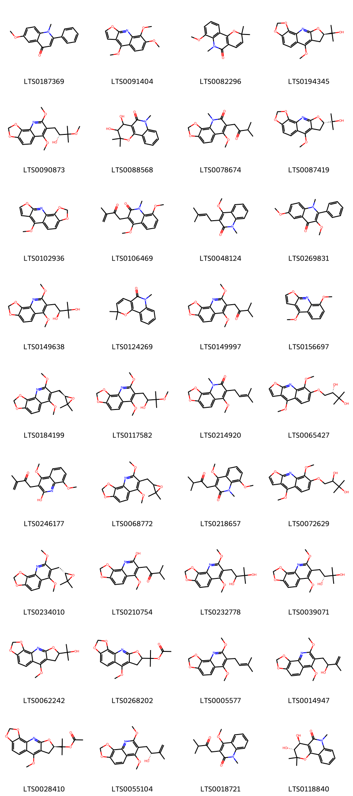{ width=100% }
    <figcaption>Hình ảnh cấu trúc hóa học của 36 hoạt chất thuộc nhóm Quinolines and derivatives gồm ['6-methoxy-1-methyl-2-phenylquinolin-4-one (LTS0187369)', 'skimmianine (LTS0091404)', '7-methoxy-2,2,6-trimethylpyrano[3,2-c]quinolin-5-one (LTS0082296)', '2-[(13r)-10-methoxy-3,5,14-trioxa-16-azatetracyclo[7.7.0.0²,⁶.0¹¹,¹⁵]hexadeca-1,6,8,10,15-pentaen-13-yl]propan-2-ol (LTS0194345)', '(2r)-1-{6,8-dimethoxy-2h-[1,3]dioxolo[4,5-h]quinolin-7-yl}-3-methoxy-3-methylbutan-2-ol (LTS0090873)', '3,4-dihydroxy-2,2,6-trimethyl-3h,4h-pyrano[3,2-c]quinolin-5-one (LTS0088568)', '6-methoxy-9-methyl-7-(3-methyl-2-oxobutyl)-2h-[1,3]dioxolo[4,5-h]quinolin-8-one (LTS0078674)', '2-[(13s)-10-methoxy-3,5,14-trioxa-16-azatetracyclo[7.7.0.0²,⁶.0¹¹,¹⁵]hexadeca-1,6,8,10,15-pentaen-13-yl]propan-2-ol (LTS0087419)', '10-methoxy-3,5,14-trioxa-16-azatetracyclo[7.7.0.0²,⁶.0¹¹,¹⁵]hexadeca-1,6,8,10,12,15-hexaene (LTS0102936)', '4,8-dimethoxy-1-methyl-3-(3-methyl-2-oxobut-3-en-1-yl)quinolin-2-one (LTS0106469)', '4-methoxy-1-methyl-3-(3-methylbut-2-en-1-yl)quinolin-2-one (LTS0048124)', 'japonine (LTS0269831)', '(2s)-1-{6,8-dimethoxy-2h-[1,3]dioxolo[4,5-h]quinolin-7-yl}-3-methylbutane-2,3-diol (LTS0149638)', 'n-methylflindersine (LTS0124269)', '1-{6,8-dimethoxy-2h-[1,3]dioxolo[4,5-h]quinolin-7-yl}-3-methylbutan-2-one (LTS0149997)', 'fagarine (LTS0156697)', '7-{[(2r)-3,3-dimethyloxiran-2-yl]methyl}-6,8-dimethoxy-2h-[1,3]dioxolo[4,5-h]quinoline (LTS0184199)', '1-{6,8-dimethoxy-2h-[1,3]dioxolo[4,5-h]quinolin-7-yl}-3-methoxy-3-methylbutan-2-ol (LTS0117582)', '6-methoxy-9-methyl-7-(3-methylbut-2-en-1-yl)-2h-[1,3]dioxolo[4,5-h]quinolin-8-one (LTS0214920)', '(2s)-1-({4,8-dimethoxyfuro[2,3-b]quinolin-7-yl}oxy)-3-methylbutane-2,3-diol (LTS0065427)', '1-(2-hydroxy-4,8-dimethoxyquinolin-3-yl)-3-methylbut-3-en-2-one (LTS0246177)', '7-[(3,3-dimethyloxiran-2-yl)methyl]-6,8-dimethoxy-2h-[1,3]dioxolo[4,5-h]quinoline (LTS0068772)', '4,8-dimethoxy-1-methyl-3-(3-methyl-2-oxobutyl)quinolin-2-one (LTS0218657)', 'evoxine (LTS0072629)', '7-{[(2s)-3,3-dimethyloxiran-2-yl]methyl}-6,8-dimethoxy-2h-[1,3]dioxolo[4,5-h]quinoline (LTS0234010)', '1-{8-hydroxy-6-methoxy-2h-[1,3]dioxolo[4,5-h]quinolin-7-yl}-3-methylbutan-2-one (LTS0210754)', '1-{6,8-dimethoxy-2h-[1,3]dioxolo[4,5-h]quinolin-7-yl}-3-methylbutane-2,3-diol (LTS0232778)', '(2r)-1-{6,8-dimethoxy-2h-[1,3]dioxolo[4,5-h]quinolin-7-yl}-3-methylbutane-2,3-diol (LTS0039071)', '2-{10-methoxy-3,5,14-trioxa-16-azatetracyclo[7.7.0.0²,⁶.0¹¹,¹⁵]hexadeca-1,6,8,10,15-pentaen-13-yl}propan-2-ol (LTS0062242)', '2-{10-methoxy-3,5,14-trioxa-16-azatetracyclo[7.7.0.0²,⁶.0¹¹,¹⁵]hexadeca-1,6,8,10,15-pentaen-13-yl}propan-2-yl acetate (LTS0268202)', '6,8-dimethoxy-7-(3-methylbut-2-en-1-yl)-2h-[1,3]dioxolo[4,5-h]quinoline (LTS0005577)', '1-{6,8-dimethoxy-2h-[1,3]dioxolo[4,5-h]quinolin-7-yl}-3-methylbut-3-en-2-ol (LTS0014947)', '2-[(13r)-10-methoxy-3,5,14-trioxa-16-azatetracyclo[7.7.0.0²,⁶.0¹¹,¹⁵]hexadeca-1,6,8,10,15-pentaen-13-yl]propan-2-yl acetate (LTS0028410)', '(2r)-1-{6,8-dimethoxy-2h-[1,3]dioxolo[4,5-h]quinolin-7-yl}-3-methylbut-3-en-2-ol (LTS0055104)', '4-methoxy-1-methyl-3-(3-methyl-2-oxobutyl)quinolin-2-one (LTS0018721)', '(3r,4s)-3,4-dihydroxy-2,2,6-trimethyl-3h,4h-pyrano[3,2-c]quinolin-5-one (LTS0118840)'].</figcaption>
</figure>

---

### Dược dân tộc học

Danh sách các quốc gia có sử dụng *Orixa japonica* trong điều trị các bệnh. 

| Country   | Disease   | Bệnh   |
|:----------|:----------|:-------|
| China     | Emetic    | Phôi   |

---

# Chi Raputia

??? note "Danh sách các dược liệu thuộc chi"
    
	 - *Raputia alba*
	 - *Raputia aromatica*
	 - *Raputia magnifica*

---
## Raputia alba
### Thông tin về thực vật

!!! info "Phân loại thực vật của *Neoraputia alba* từ GIBF:"
    - **Kingdom:** Plantae
    - **Phylum:** Tracheophyta
    - **Order:** Sapindales
    - **Family:** Rutaceae
    - **Genus:** Neoraputia
    - **Species:** *Neoraputia alba*

 

| Label (VI)   | Label (EN)   | Scientific Name   | Descriptions (VI)   | Descriptions (EN)   | Also Known As (VI)   | Also Known As (EN)   |
|:-------------|:-------------|:------------------|:--------------------|:--------------------|:---------------------|:---------------------|
| N/A          | N/A          | Raputia alba      |                     |                     | ['']                 | ['']                 |

#### Phân bố trên thế giới

**Từ CSDL GIBF** nan, Venezuela (Bolivarian Republic of), Brazil

#### Phân bố tại Việt Nam

**Từ CSDL GIBF**: Không có ghi nhận ở Việt Nam

---
### Thành phần hóa học
        
- Theo cơ sở dữ liệu lotus: Từ loài *Neoraputia alba* đã phân lập và xác định được 16 hoạt chất thuộc về các nhóm Flavonoids, Steroids and steroid derivatives, Benzene and substituted derivatives. 

|    | chemicalTaxonomyClassyfireClass     |   smiles_count |
|---:|:------------------------------------|---------------:|
|  0 | Benzene and substituted derivatives |              1 |
|  1 | Flavonoids                          |             12 |
|  2 | Steroids and steroid derivatives    |              3 |

#### Nhóm Benzene and substituted derivatives
<figure markdown="span">
    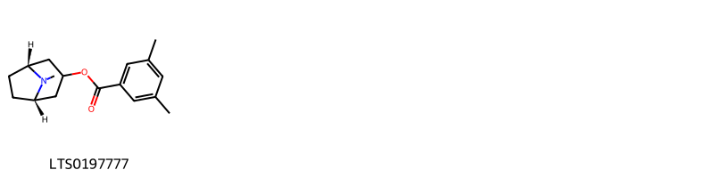{ width=100% }
    <figcaption>Hình ảnh cấu trúc hóa học của 1 hoạt chất thuộc nhóm Benzene and substituted derivatives gồm ['tropanserin (LTS0197777)'].</figcaption>
</figure>
#### Nhóm Flavonoids
<figure markdown="span">
    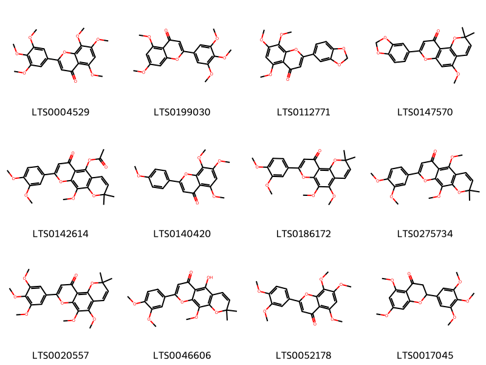{ width=100% }
    <figcaption>Hình ảnh cấu trúc hóa học của 12 hoạt chất thuộc nhóm Flavonoids gồm ['bannamurpanisin (LTS0004529)', '5,7-dimethoxy-2-(3,4,5-trimethoxyphenyl)chromen-4-one (LTS0199030)', '2-(2h-1,3-benzodioxol-5-yl)-5,7,8-trimethoxychromen-4-one (LTS0112771)', '8-(2h-1,3-benzodioxol-5-yl)-5-methoxy-2,2-dimethylpyrano[2,3-f]chromen-10-one (LTS0147570)', '8-(3,4-dimethoxyphenyl)-10-methoxy-2,2-dimethyl-6-oxopyrano[3,2-g]chromen-5-yl acetate (LTS0142614)', '6-demethoxytangeretin (LTS0140420)', '8-(3,4-dimethoxyphenyl)-5,6-dimethoxy-2,2-dimethylpyrano[2,3-f]chromen-10-one (LTS0186172)', '2-(3,4-dimethoxyphenyl)-5,10-dimethoxy-8,8-dimethylpyrano[3,2-g]chromen-4-one (LTS0275734)', '5,6-dimethoxy-2,2-dimethyl-8-(3,4,5-trimethoxyphenyl)pyrano[2,3-f]chromen-10-one (LTS0020557)', '2-(3,4-dimethoxyphenyl)-5-hydroxy-10-methoxy-8,8-dimethylpyrano[3,2-g]chromen-4-one (LTS0046606)', 'isosinensetin (LTS0052178)', '5,7-dimethoxy-2-(3,4,5-trimethoxyphenyl)-2,3-dihydro-1-benzopyran-4-one (LTS0017045)'].</figcaption>
</figure>
#### Nhóm Steroids and steroid derivatives
<figure markdown="span">
    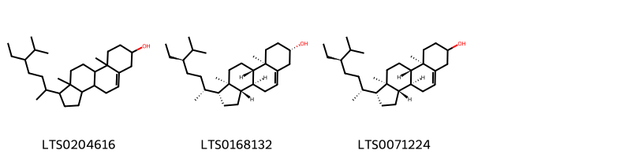{ width=100% }
    <figcaption>Hình ảnh cấu trúc hóa học của 3 hoạt chất thuộc nhóm Steroids and steroid derivatives gồm ['stigmast-5-en-3-ol, (3β)- (LTS0204616)', 'sitosterol (LTS0168132)', 'stigmast-5-en-3-ol (LTS0071224)'].</figcaption>
</figure>

---

### Dược dân tộc học

Danh sách các quốc gia có sử dụng *Neoraputia alba* trong điều trị các bệnh. 

| Country   | Disease   | Bệnh          |
|:----------|:----------|:--------------|
| Brazil    | Piscicide | Thuốc diệt cá |

---

---
## Raputia aromatica
### Thông tin về thực vật

!!! info "Phân loại thực vật của *Raputia aromatica* từ GIBF:"
    - **Kingdom:** Plantae
    - **Phylum:** Tracheophyta
    - **Order:** Sapindales
    - **Family:** Rutaceae
    - **Genus:** Raputia
    - **Species:** *Raputia aromatica*

 

| Label (VI)   | Label (EN)   | Scientific Name   | Descriptions (VI)   | Descriptions (EN)   | Also Known As (VI)   | Also Known As (EN)   |
|:-------------|:-------------|:------------------|:--------------------|:--------------------|:---------------------|:---------------------|
| N/A          | N/A          | Raputia aromatica | loài thực vật       | species of plant    | ['']                 | ['']                 |

#### Phân bố trên thế giới

**Từ CSDL GIBF** nan, Venezuela (Bolivarian Republic of), Brazil, French Guiana

#### Phân bố tại Việt Nam

**Từ CSDL GIBF**: Không có ghi nhận ở Việt Nam

---
### Thành phần hóa học
        
- Theo cơ sở dữ liệu lotus: Từ loài *Raputia aromatica* đã phân lập và xác định được Chưa có hoạt chất nào được phân lập. hoạt chất thuộc về các nhóm Không có hoạt chất nào được phân lập. 

Không có hình ảnh nào được tạo ra

---

### Dược dân tộc học

Danh sách các quốc gia có sử dụng *Raputia aromatica* trong điều trị các bệnh. 

| Country   | Disease   | Bệnh    |
|:----------|:----------|:--------|
| Brazil    | Stomachic | Sững sờ |

---

---
## Raputia magnifica
### Thông tin về thực vật

!!! info "Phân loại thực vật của *Neoraputia magnifica* từ GIBF:"
    - **Kingdom:** Plantae
    - **Phylum:** Tracheophyta
    - **Order:** Sapindales
    - **Family:** Rutaceae
    - **Genus:** Neoraputia
    - **Species:** *Neoraputia magnifica*

 

| Label (VI)   | Label (EN)   | Scientific Name   | Descriptions (VI)   | Descriptions (EN)   | Also Known As (VI)   | Also Known As (EN)   |
|:-------------|:-------------|:------------------|:--------------------|:--------------------|:---------------------|:---------------------|
| N/A          | N/A          | Raputia magnifica | loài thực vật       | species of plant    | ['']                 | ['']                 |

#### Phân bố trên thế giới

**Từ CSDL GIBF** nan, unknown or invalid, Brazil

#### Phân bố tại Việt Nam

**Từ CSDL GIBF**: Không có ghi nhận ở Việt Nam

---
### Thành phần hóa học
        
- Theo cơ sở dữ liệu lotus: Từ loài *Neoraputia magnifica* đã phân lập và xác định được 25 hoạt chất thuộc về các nhóm Flavonoids, Prenol lipids, Steroids and steroid derivatives, Linear 1,3-diarylpropanoids. 

|    | chemicalTaxonomyClassyfireClass   |   smiles_count |
|---:|:----------------------------------|---------------:|
|  0 | Flavonoids                        |             10 |
|  1 | Linear 1,3-diarylpropanoids       |              8 |
|  2 | Prenol lipids                     |              1 |
|  3 | Steroids and steroid derivatives  |              6 |

#### Nhóm Flavonoids
<figure markdown="span">
    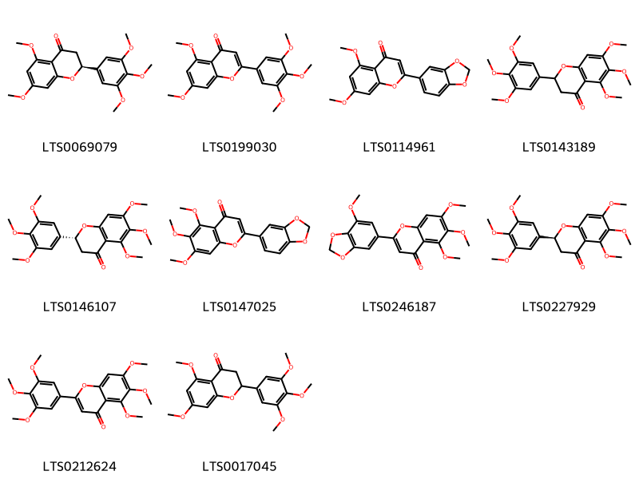{ width=100% }
    <figcaption>Hình ảnh cấu trúc hóa học của 10 hoạt chất thuộc nhóm Flavonoids gồm ['(2s)-5,7-dimethoxy-2-(3,4,5-trimethoxyphenyl)-2,3-dihydro-1-benzopyran-4-one (LTS0069079)', '5,7-dimethoxy-2-(3,4,5-trimethoxyphenyl)chromen-4-one (LTS0199030)', '2-(2h-1,3-benzodioxol-5-yl)-5,7-dimethoxychromen-4-one (LTS0114961)', '5,6,7-trimethoxy-2-(3,4,5-trimethoxyphenyl)-2,3-dihydro-1-benzopyran-4-one (LTS0143189)', '(2r)-5,6,7-trimethoxy-2-(3,4,5-trimethoxyphenyl)-2,3-dihydro-1-benzopyran-4-one (LTS0146107)', 'ageconyflavone a (LTS0147025)', '5,6,7-trimethoxy-2-(7-methoxy-2h-1,3-benzodioxol-5-yl)chromen-4-one (LTS0246187)', '(2s)-5,6,7-trimethoxy-2-(3,4,5-trimethoxyphenyl)-2,3-dihydro-1-benzopyran-4-one (LTS0227929)', '5,6,7-trimethoxy-2-(3,4,5-trimethoxyphenyl)chromen-4-one (LTS0212624)', '5,7-dimethoxy-2-(3,4,5-trimethoxyphenyl)-2,3-dihydro-1-benzopyran-4-one (LTS0017045)'].</figcaption>
</figure>
#### Nhóm Linear 1_3-diarylpropanoids
<figure markdown="span">
    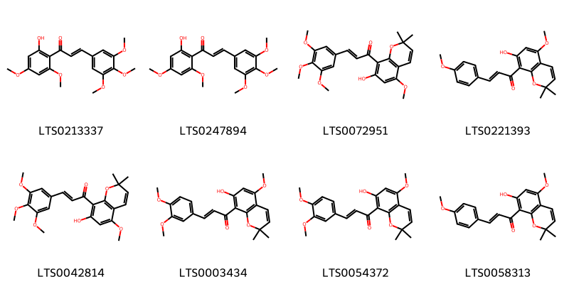{ width=100% }
    <figcaption>Hình ảnh cấu trúc hóa học của Không tìm thấy chú thích hoạt chất thuộc nhóm Linear 1_3-diarylpropanoids gồm Không tìm thấy chú thích.</figcaption>
</figure>
#### Nhóm Prenol lipids
<figure markdown="span">
    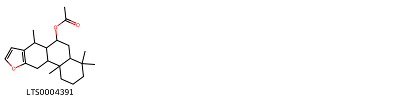{ width=100% }
    <figcaption>Hình ảnh cấu trúc hóa học của 1 hoạt chất thuộc nhóm Prenol lipids gồm ['4,4,7,11b-tetramethyl-1h,2h,3h,4ah,5h,6h,6ah,7h,11h,11ah-phenanthro[3,2-b]furan-6-yl acetate (LTS0004391)'].</figcaption>
</figure>
#### Nhóm Steroids and steroid derivatives
<figure markdown="span">
    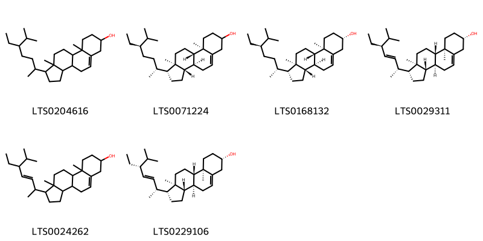{ width=100% }
    <figcaption>Hình ảnh cấu trúc hóa học của 6 hoạt chất thuộc nhóm Steroids and steroid derivatives gồm ['stigmast-5-en-3-ol, (3β)- (LTS0204616)', 'stigmast-5-en-3-ol (LTS0071224)', 'sitosterol (LTS0168132)', 'phytosterol (LTS0029311)', 'stigmasterol (LTS0024262)', 'poriferasterol (LTS0229106)'].</figcaption>
</figure>

---

### Dược dân tộc học

Danh sách các quốc gia có sử dụng *Neoraputia magnifica* trong điều trị các bệnh. 

| Country   | Disease   | Bệnh           |
|:----------|:----------|:---------------|
| Brazil    | Vermifuge | Thuốc diệt sán |

---

# Chi Evodia

??? note "Danh sách các dược liệu thuộc chi"
    
	 - *Evodia hortensis*
	 - *Evodia lepta*
	 - *Evodia lunu-ankenda*
	 - *Evodia lunu-enkenda*
	 - *Evodia officinalis*
	 - *Evodia roxburghiana*
	 - *Evodia rutaecarpa*
	 - *Evodia ruticarpa*
	 - *Evodia sambucina*

---
## Evodia hortensis
### Thông tin về thực vật

!!! info "Phân loại thực vật của *Euodia hortensis* từ GIBF:"
    - **Kingdom:** Plantae
    - **Phylum:** Tracheophyta
    - **Order:** Sapindales
    - **Family:** Rutaceae
    - **Genus:** Euodia
    - **Species:** *Euodia hortensis*

 

| Label (VI)   | Label (EN)   | Scientific Name   | Descriptions (VI)   | Descriptions (EN)   | Also Known As (VI)   | Also Known As (EN)   |
|:-------------|:-------------|:------------------|:--------------------|:--------------------|:---------------------|:---------------------|
| N/A          | N/A          | Evodia hortensis  | loài thực vật       | species of plant    | ['']                 | ['']                 |

#### Phân bố trên thế giới

**Từ CSDL GIBF** nan, Australia, Vanuatu, Tonga, Indonesia, United States of America

#### Phân bố tại Việt Nam

**Từ CSDL GIBF**: Không có ghi nhận ở Việt Nam

---
### Thành phần hóa học
        
- Theo cơ sở dữ liệu lotus: Từ loài *Euodia hortensis* đã phân lập và xác định được Chưa có hoạt chất nào được phân lập. hoạt chất thuộc về các nhóm Không có hoạt chất nào được phân lập. 

Không có hình ảnh nào được tạo ra

---

### Dược dân tộc học

Danh sách các quốc gia có sử dụng *Euodia hortensis* trong điều trị các bệnh. 

| Country   | Disease   | Bệnh         |
|:----------|:----------|:-------------|
| Tonga     | Laxative  | Nhuận trường |

---

---
## Evodia lepta
### Thông tin về thực vật

!!! info "Phân loại thực vật của *Melicope pteleifolia* từ GIBF:"
    - **Kingdom:** Plantae
    - **Phylum:** Tracheophyta
    - **Order:** Sapindales
    - **Family:** Rutaceae
    - **Genus:** Melicope
    - **Species:** *Melicope pteleifolia*

 

| Label (VI)   | Label (EN)   | Scientific Name   | Descriptions (VI)   | Descriptions (EN)   | Also Known As (VI)   | Also Known As (EN)   |
|:-------------|:-------------|:------------------|:--------------------|:--------------------|:---------------------|:---------------------|
| N/A          | N/A          | Evodia hortensis  | loài thực vật       | species of plant    | ['']                 | ['']                 |

#### Phân bố trên thế giới

**Từ CSDL GIBF** Thailand, Chinese Taipei, United States of America, Viet Nam, China

#### Phân bố tại Việt Nam

**Từ CSDL GIBF**: Không có ghi nhận ở Việt Nam

---
### Thành phần hóa học
        
- Theo cơ sở dữ liệu lotus: Từ loài *Melicope pteleifolia* đã phân lập và xác định được Chưa có hoạt chất nào được phân lập. hoạt chất thuộc về các nhóm Không có hoạt chất nào được phân lập. 

Không có hình ảnh nào được tạo ra

---

### Dược dân tộc học

Danh sách các quốc gia có sử dụng *Melicope pteleifolia* trong điều trị các bệnh. 

| Country   | Disease                 | Bệnh                    |
|:----------|:------------------------|:------------------------|
| China     | Alexiteric              | Alexiteric              |
| Elsewhere | Emmenagogue, nan, Tonic | Emmenagogue, nan, Tonic |

---

---
## Evodia lunuankenda
### Thông tin về thực vật

!!! info "Phân loại thực vật của *Melicope lunu-ankenda* từ GIBF:"
    - **Kingdom:** Plantae
    - **Phylum:** Tracheophyta
    - **Order:** Sapindales
    - **Family:** Rutaceae
    - **Genus:** Melicope
    - **Species:** *Melicope lunu-ankenda*

 

| Label (VI)   | Label (EN)   | Scientific Name   | Descriptions (VI)   | Descriptions (EN)   | Also Known As (VI)   | Also Known As (EN)   |
|:-------------|:-------------|:------------------|:--------------------|:--------------------|:---------------------|:---------------------|
| N/A          | N/A          | Evodia hortensis  | loài thực vật       | species of plant    | ['']                 | ['']                 |

#### Phân bố trên thế giới

**Từ CSDL GIBF** India, Chinese Taipei, China

#### Phân bố tại Việt Nam

**Từ CSDL GIBF**: Không có ghi nhận ở Việt Nam

---
### Thành phần hóa học
        
- Theo cơ sở dữ liệu lotus: Từ loài *Melicope lunu-ankenda* đã phân lập và xác định được Chưa có hoạt chất nào được phân lập. hoạt chất thuộc về các nhóm Không có hoạt chất nào được phân lập. 

Không có hình ảnh nào được tạo ra

---

### Dược dân tộc học

Danh sách các quốc gia có sử dụng *Melicope lunu-ankenda* trong điều trị các bệnh. 

| Country   | Disease            | Bệnh                  |
|:----------|:-------------------|:----------------------|
| Malaysia  | Emmenagogue, Tonic | Emmenagogue, Thuốc bổ |

---

---
## Evodia lunuenkenda
### Thông tin về thực vật

!!! info "Phân loại thực vật của *Melicope lunu-ankenda* từ GIBF:"
    - **Kingdom:** Plantae
    - **Phylum:** Tracheophyta
    - **Order:** Sapindales
    - **Family:** Rutaceae
    - **Genus:** Melicope
    - **Species:** *Melicope lunu-ankenda*

 

| Label (VI)   | Label (EN)   | Scientific Name   | Descriptions (VI)   | Descriptions (EN)   | Also Known As (VI)   | Also Known As (EN)   |
|:-------------|:-------------|:------------------|:--------------------|:--------------------|:---------------------|:---------------------|
| N/A          | N/A          | Evodia hortensis  | loài thực vật       | species of plant    | ['']                 | ['']                 |

#### Phân bố trên thế giới

**Từ CSDL GIBF** India, Chinese Taipei, China

#### Phân bố tại Việt Nam

**Từ CSDL GIBF**: Không có ghi nhận ở Việt Nam

---
### Thành phần hóa học
        
- Theo cơ sở dữ liệu lotus: Từ loài *Melicope lunu-ankenda* đã phân lập và xác định được Chưa có hoạt chất nào được phân lập. hoạt chất thuộc về các nhóm Không có hoạt chất nào được phân lập. 

Không có hình ảnh nào được tạo ra

---

### Dược dân tộc học

Danh sách các quốc gia có sử dụng *Melicope lunu-ankenda* trong điều trị các bệnh. 

| Country   | Disease            | Bệnh                  |
|:----------|:-------------------|:----------------------|
| Malaysia  | Emmenagogue, Tonic | Emmenagogue, Thuốc bổ |

---

---
## Evodia officinalis
### Thông tin về thực vật

!!! info "Phân loại thực vật của *Tetradium ruticarpum* từ GIBF:"
    - **Kingdom:** Plantae
    - **Phylum:** Tracheophyta
    - **Order:** Sapindales
    - **Family:** Rutaceae
    - **Genus:** Tetradium
    - **Species:** *Tetradium ruticarpum*

 

| Label (VI)   | Label (EN)   | Scientific Name   | Descriptions (VI)   | Descriptions (EN)   | Also Known As (VI)   | Also Known As (EN)   |
|:-------------|:-------------|:------------------|:--------------------|:--------------------|:---------------------|:---------------------|
| N/A          | N/A          | Evodia hortensis  | loài thực vật       | species of plant    | ['']                 | ['']                 |

#### Phân bố trên thế giới

**Từ CSDL GIBF** nan, Korea, Republic of, China

#### Phân bố tại Việt Nam

**Từ CSDL GIBF**: Không có ghi nhận ở Việt Nam

---
### Thành phần hóa học
        
- Theo cơ sở dữ liệu lotus: Từ loài *Tetradium ruticarpum* đã phân lập và xác định được Chưa có hoạt chất nào được phân lập. hoạt chất thuộc về các nhóm Không có hoạt chất nào được phân lập. 

Không có hình ảnh nào được tạo ra

---

### Dược dân tộc học

Danh sách các quốc gia có sử dụng *Tetradium ruticarpum* trong điều trị các bệnh. 

| Country   | Disease   | Bệnh    |
|:----------|:----------|:--------|
| Japan*    | Stomachic | Sững sờ |

---

---
## Evodia roxburghiana
### Thông tin về thực vật

!!! info "Phân loại thực vật của *Melicope lunu-ankenda* từ GIBF:"
    - **Kingdom:** Plantae
    - **Phylum:** Tracheophyta
    - **Order:** Sapindales
    - **Family:** Rutaceae
    - **Genus:** Melicope
    - **Species:** *Melicope lunu-ankenda*

 

| Label (VI)   | Label (EN)   | Scientific Name   | Descriptions (VI)   | Descriptions (EN)   | Also Known As (VI)   | Also Known As (EN)   |
|:-------------|:-------------|:------------------|:--------------------|:--------------------|:---------------------|:---------------------|
| N/A          | N/A          | Evodia hortensis  | loài thực vật       | species of plant    | ['']                 | ['']                 |

#### Phân bố trên thế giới

**Từ CSDL GIBF** nan, Sri Lanka, Fiji, Thailand, India, Malaysia

#### Phân bố tại Việt Nam

**Từ CSDL GIBF**: Không có ghi nhận ở Việt Nam

---
### Thành phần hóa học
        
- Theo cơ sở dữ liệu lotus: Từ loài *Melicope lunu-ankenda* đã phân lập và xác định được Chưa có hoạt chất nào được phân lập. hoạt chất thuộc về các nhóm Không có hoạt chất nào được phân lập. 

Không có hình ảnh nào được tạo ra

---

### Dược dân tộc học

Danh sách các quốc gia có sử dụng *Melicope lunu-ankenda* trong điều trị các bệnh. 

| Country   | Disease            | Bệnh                  |
|:----------|:-------------------|:----------------------|
| Malaya    | Emmenagogue, Tonic | Emmenagogue, Thuốc bổ |

---

---
## Evodia rutaecarpa
### Thông tin về thực vật

!!! info "Phân loại thực vật của *Tetradium ruticarpum* từ GIBF:"
    - **Kingdom:** Plantae
    - **Phylum:** Tracheophyta
    - **Order:** Sapindales
    - **Family:** Rutaceae
    - **Genus:** Tetradium
    - **Species:** *Tetradium ruticarpum*

 

| Label (VI)   | Label (EN)   | Scientific Name   | Descriptions (VI)   | Descriptions (EN)   | Also Known As (VI)   | Also Known As (EN)   |
|:-------------|:-------------|:------------------|:--------------------|:--------------------|:---------------------|:---------------------|
| N/A          | N/A          | Evodia hortensis  | loài thực vật       | species of plant    | ['']                 | ['']                 |

#### Phân bố trên thế giới

**Từ CSDL GIBF** Chinese Taipei, China, Japan

#### Phân bố tại Việt Nam

**Từ CSDL GIBF**: Không có ghi nhận ở Việt Nam

---
### Thành phần hóa học
        
- Theo cơ sở dữ liệu lotus: Từ loài *Tetradium ruticarpum* đã phân lập và xác định được Chưa có hoạt chất nào được phân lập. hoạt chất thuộc về các nhóm Không có hoạt chất nào được phân lập. 

Không có hình ảnh nào được tạo ra

---

### Dược dân tộc học

Danh sách các quốc gia có sử dụng *Tetradium ruticarpum* trong điều trị các bệnh. 

| Country   | Disease                                                                                                              | Bệnh                                                                                                                      |
|:----------|:---------------------------------------------------------------------------------------------------------------------|:--------------------------------------------------------------------------------------------------------------------------|
| China     | Astringent, Carminative, Stimulant, Stimulant, Stomachic, Stomachic, Suppository, Uterotonic, Vermifuge, Carminative | Chất làm se, Carminative, Chất kích thích, Chất kích thích, Dạ dày, Dạ dày, Thuốc đạn, Uterotonic, Vermifuge, Carminative |
| Chinese   | Carminative, Stimulant, Stomachic                                                                                    | Sáng tạo, Kích thích, Dạ dày                                                                                              |
| Elsewhere | nan                                                                                                                  | Ở đây                                                                                                                     |
| Japan*    | Stomachic                                                                                                            | Sững sờ                                                                                                                   |

---

---
## Evodia ruticarpa
### Thông tin về thực vật

!!! info "Phân loại thực vật của *Tetradium ruticarpum* từ GIBF:"
    - **Kingdom:** Plantae
    - **Phylum:** Tracheophyta
    - **Order:** Sapindales
    - **Family:** Rutaceae
    - **Genus:** Tetradium
    - **Species:** *Tetradium ruticarpum*

 

| Label (VI)   | Label (EN)   | Scientific Name   | Descriptions (VI)   | Descriptions (EN)   | Also Known As (VI)   | Also Known As (EN)   |
|:-------------|:-------------|:------------------|:--------------------|:--------------------|:---------------------|:---------------------|
| N/A          | N/A          | Evodia hortensis  | loài thực vật       | species of plant    | ['']                 | ['']                 |

#### Phân bố trên thế giới

**Từ CSDL GIBF** nan, Japan, Chinese Taipei, Austria, Malaysia, China

#### Phân bố tại Việt Nam

**Từ CSDL GIBF**: Không có ghi nhận ở Việt Nam

---
### Thành phần hóa học
        
- Theo cơ sở dữ liệu lotus: Từ loài *Tetradium ruticarpum* đã phân lập và xác định được Chưa có hoạt chất nào được phân lập. hoạt chất thuộc về các nhóm Không có hoạt chất nào được phân lập. 

Không có hình ảnh nào được tạo ra

---

### Dược dân tộc học

Danh sách các quốc gia có sử dụng *Tetradium ruticarpum* trong điều trị các bệnh. 

| Country   | Disease                           | Bệnh                         |
|:----------|:----------------------------------|:-----------------------------|
| Chinese   | Carminative, Stimulant, Stomachic | Sáng tạo, Kích thích, Dạ dày |

---

---
## Evodia sambucina
### Thông tin về thực vật

!!! info "Phân loại thực vật của *Tetradium sambucinum* từ GIBF:"
    - **Kingdom:** Plantae
    - **Phylum:** Tracheophyta
    - **Order:** Sapindales
    - **Family:** Rutaceae
    - **Genus:** Tetradium
    - **Species:** *Tetradium sambucinum*

 

| Label (VI)   | Label (EN)   | Scientific Name   | Descriptions (VI)   | Descriptions (EN)   | Also Known As (VI)   | Also Known As (EN)   |
|:-------------|:-------------|:------------------|:--------------------|:--------------------|:---------------------|:---------------------|
| N/A          | N/A          | Evodia hortensis  | loài thực vật       | species of plant    | ['']                 | ['']                 |

#### Phân bố trên thế giới

**Từ CSDL GIBF** nan, Japan, Chinese Taipei, Austria, Malaysia, China

#### Phân bố tại Việt Nam

**Từ CSDL GIBF**: Không có ghi nhận ở Việt Nam

---
### Thành phần hóa học
        
- Theo cơ sở dữ liệu lotus: Từ loài *Tetradium sambucinum* đã phân lập và xác định được Chưa có hoạt chất nào được phân lập. hoạt chất thuộc về các nhóm Không có hoạt chất nào được phân lập. 

Không có hình ảnh nào được tạo ra

---

### Dược dân tộc học

Danh sách các quốc gia có sử dụng *Tetradium sambucinum* trong điều trị các bệnh. 

| Country   | Disease   | Bệnh          |
|:----------|:----------|:--------------|
| Elsewhere | Vermicide | Chứng nói lập |

---

# Chi Paramignya

??? note "Danh sách các dược liệu thuộc chi"
    
	 - *Paramignya monophylla*

---
## Paramignya monophylla
### Thông tin về thực vật

!!! info "Phân loại thực vật của *Paramignya monophylla* từ GIBF:"
    - **Kingdom:** Plantae
    - **Phylum:** Tracheophyta
    - **Order:** Sapindales
    - **Family:** Rutaceae
    - **Genus:** Paramignya
    - **Species:** *Paramignya monophylla*

 

| Label (VI)   | Label (EN)   | Scientific Name       | Descriptions (VI)   | Descriptions (EN)   | Also Known As (VI)   | Also Known As (EN)   |
|:-------------|:-------------|:----------------------|:--------------------|:--------------------|:---------------------|:---------------------|
| N/A          | N/A          | Paramignya monophylla | loài thực vật       | species of plant    | ['']                 | ['']                 |

#### Phân bố trên thế giới

**Từ CSDL GIBF** nan, Sri Lanka, Lao People’s Democratic Republic, Brazil, Myanmar, Bhutan, India, Indonesia, unknown or invalid, United States of America, Nepal

#### Phân bố tại Việt Nam

**Từ CSDL GIBF**: Không có ghi nhận ở Việt Nam

---
### Thành phần hóa học
        
- Theo cơ sở dữ liệu lotus: Từ loài *Paramignya monophylla* đã phân lập và xác định được 20 hoạt chất thuộc về các nhóm Prenol lipids, Steroids and steroid derivatives, Coumarins and derivatives. 

|    | chemicalTaxonomyClassyfireClass   |   smiles_count |
|---:|:----------------------------------|---------------:|
|  0 | Coumarins and derivatives         |              4 |
|  1 | Prenol lipids                     |             14 |
|  2 | Steroids and steroid derivatives  |              2 |

#### Nhóm Coumarins and derivatives
<figure markdown="span">
    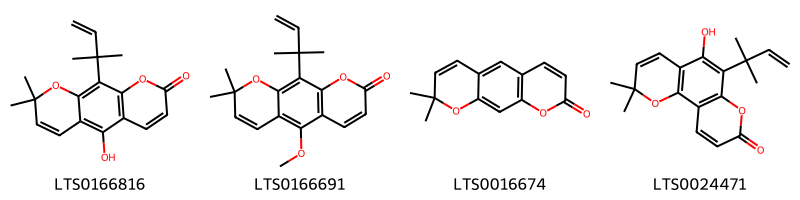{ width=100% }
    <figcaption>Hình ảnh cấu trúc hóa học của 4 hoạt chất thuộc nhóm Coumarins and derivatives gồm ['nor-dentatin (LTS0166816)', 'dentatin (LTS0166691)', 'xanthyletin (LTS0016674)', '5-hydroxy-2,2-dimethyl-6-(2-methylbut-3-en-2-yl)pyrano[2,3-h]chromen-8-one (LTS0024471)'].</figcaption>
</figure>
#### Nhóm Prenol lipids
<figure markdown="span">
    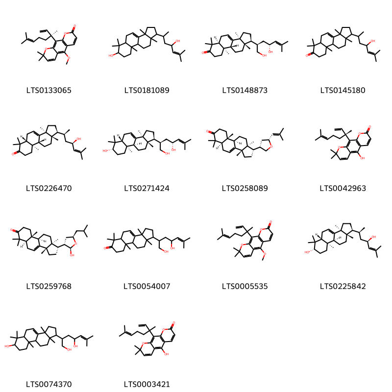{ width=100% }
    <figcaption>Hình ảnh cấu trúc hóa học của 14 hoạt chất thuộc nhóm Prenol lipids gồm ['10-[(3s)-3,7-dimethylocta-1,6-dien-3-yl]-5-methoxy-8,8-dimethylpyrano[3,2-g]chromen-2-one (LTS0133065)', '1-(4-hydroxy-6-methylhept-5-en-2-yl)-3a,6,6,9a,11a-pentamethyl-1h,2h,3h,5h,5ah,7h,8h,9h,9bh,10h,11h-cyclopenta[a]phenanthren-7-ol (LTS0181089)', '(1s,3as,5as,9ar,9br,11as)-1-[(2r,4r)-1,4-dihydroxy-6-methylhept-5-en-2-yl]-3a,6,6,9a,11a-pentamethyl-1h,2h,3h,5h,5ah,8h,9h,9bh,10h,11h-cyclopenta[a]phenanthren-7-one (LTS0148873)', '1-(4-hydroxy-6-methylhept-5-en-2-yl)-3a,6,6,9a,11a-pentamethyl-1h,2h,3h,5h,5ah,8h,9h,9bh,10h,11h-cyclopenta[a]phenanthren-7-one (LTS0145180)', '(1s,3as,5ar,9ar,9br,11as)-1-[(2s,4r)-4-hydroxy-6-methylhept-5-en-2-yl]-3a,6,6,9a,11a-pentamethyl-1h,2h,3h,5h,5ah,8h,9h,9bh,10h,11h-cyclopenta[a]phenanthren-7-one (LTS0226470)', '(2r,4r)-2-[(1s,3as,5ar,7s,9ar,9bs,11as)-7-hydroxy-3a,6,6,9a,11a-pentamethyl-1h,2h,3h,5h,5ah,7h,8h,9h,9bh,10h,11h-cyclopenta[a]phenanthren-1-yl]-6-methylhept-5-ene-1,4-diol (LTS0271424)', 'deoxyflindissone (LTS0258089)', '10-[(3r)-3,7-dimethylocta-1,6-dien-3-yl]-5-hydroxy-8,8-dimethylpyrano[3,2-g]chromen-2-one (LTS0042963)', '(1s,3as,5ar,9ar,9br,11as)-1-[(2r,3s,5r)-2-hydroxy-5-(2-methylpropyl)oxolan-3-yl]-3a,6,6,9a,11a-pentamethyl-1h,2h,3h,5h,5ah,8h,9h,9bh,10h,11h-cyclopenta[a]phenanthren-7-one (LTS0259768)', '1-(1,4-dihydroxy-6-methylhept-5-en-2-yl)-3a,6,6,9a,11a-pentamethyl-1h,2h,3h,5h,5ah,8h,9h,9bh,10h,11h-cyclopenta[a]phenanthren-7-one (LTS0054007)', '10-(3,7-dimethylocta-1,6-dien-3-yl)-5-methoxy-8,8-dimethylpyrano[3,2-g]chromen-2-one (LTS0005535)', '(1s,3as,5ar,7s,9ar,9bs,11as)-1-[(2s,4r)-4-hydroxy-6-methylhept-5-en-2-yl]-3a,6,6,9a,11a-pentamethyl-1h,2h,3h,5h,5ah,7h,8h,9h,9bh,10h,11h-cyclopenta[a]phenanthren-7-ol (LTS0225842)', '2-{7-hydroxy-3a,6,6,9a,11a-pentamethyl-1h,2h,3h,5h,5ah,7h,8h,9h,9bh,10h,11h-cyclopenta[a]phenanthren-1-yl}-6-methylhept-5-ene-1,4-diol (LTS0074370)', '10-(3,7-dimethylocta-1,6-dien-3-yl)-5-hydroxy-8,8-dimethylpyrano[3,2-g]chromen-2-one (LTS0003421)'].</figcaption>
</figure>
#### Nhóm Steroids and steroid derivatives
<figure markdown="span">
    { width=100% }
    <figcaption>Hình ảnh cấu trúc hóa học của 2 hoạt chất thuộc nhóm Steroids and steroid derivatives gồm ['stigmast-5-en-3-ol, (3β)- (LTS0204616)', 'stigmast-5-en-3-ol (LTS0071224)'].</figcaption>
</figure>

---

### Dược dân tộc học

Danh sách các quốc gia có sử dụng *Paramignya monophylla* trong điều trị các bệnh. 

| Country   | Disease   | Bệnh           |
|:----------|:----------|:---------------|
| Elsewhere | Diuretic  | Thuốc lợi tiêu |

---

# Chi Barosma

??? note "Danh sách các dược liệu thuộc chi"
    
	 - *Barosma betulina*
	 - *Barosma serratifolia*
	 - *Barosma serratioflia*

---
## Barosma betulina
### Thông tin về thực vật

!!! info "Phân loại thực vật của *Agathosma betulina* từ GIBF:"
    - **Kingdom:** Plantae
    - **Phylum:** Tracheophyta
    - **Order:** Sapindales
    - **Family:** Rutaceae
    - **Genus:** Agathosma
    - **Species:** *Agathosma betulina*

 

| Label (VI)   | Label (EN)   | Scientific Name   | Descriptions (VI)   | Descriptions (EN)   | Also Known As (VI)   | Also Known As (EN)   |
|:-------------|:-------------|:------------------|:--------------------|:--------------------|:---------------------|:---------------------|
| N/A          | N/A          | Barosma betulina  |                     |                     | ['']                 | ['']                 |

#### Phân bố trên thế giới

**Từ CSDL GIBF** nan, South Africa, United States of America

#### Phân bố tại Việt Nam

**Từ CSDL GIBF**: Không có ghi nhận ở Việt Nam

---
### Thành phần hóa học
        
- Theo cơ sở dữ liệu lotus: Từ loài *Agathosma betulina* đã phân lập và xác định được Chưa có hoạt chất nào được phân lập. hoạt chất thuộc về các nhóm Không có hoạt chất nào được phân lập. 

Không có hình ảnh nào được tạo ra

---

### Dược dân tộc học

Danh sách các quốc gia có sử dụng *Agathosma betulina* trong điều trị các bệnh. 

| Country   | Disease               | Bệnh                          |
|:----------|:----------------------|:------------------------------|
| Dutch     | Sudorific             | Ngạt thở                      |
| Elsewhere | Carminative, Diuretic | Carminative, lợi tiểu         |
| French    | Tonic                 | (thuộc) trương lực            |
| German    | Emollient, Stimulant  | Chất làm mềm, chất kích thích |
| Italian   | Stomachic             | Sững sờ                       |
| US        | Diuretic              | Thuốc lợi tiêu                |
| anish     | Antiseptic            | Khử trùng                     |

---

---
## Barosma serratifolia
### Thông tin về thực vật

!!! info "Phân loại thực vật của *N/A* từ GIBF:"
    - **Kingdom:** Plantae
    - **Phylum:** Tracheophyta
    - **Order:** Sapindales
    - **Family:** Rutaceae
    - **Genus:** Agathosma
    - **Species:** *N/A*

 

| Label (VI)   | Label (EN)   | Scientific Name      | Descriptions (VI)   | Descriptions (EN)   | Also Known As (VI)   | Also Known As (EN)   |
|:-------------|:-------------|:---------------------|:--------------------|:--------------------|:---------------------|:---------------------|
| N/A          | N/A          | Barosma serratifolia |                     |                     | ['']                 | ['']                 |

#### Phân bố trên thế giới

**Từ CSDL GIBF** South Africa

#### Phân bố tại Việt Nam

**Từ CSDL GIBF**: Không có ghi nhận ở Việt Nam

---
### Thành phần hóa học
        
- Theo cơ sở dữ liệu lotus: Từ loài *N/A* đã phân lập và xác định được Chưa có hoạt chất nào được phân lập. hoạt chất thuộc về các nhóm Không có hoạt chất nào được phân lập. 

Không có hình ảnh nào được tạo ra

---

### Dược dân tộc học

Danh sách các quốc gia có sử dụng *N/A* trong điều trị các bệnh. 

| Country   | Disease     | Bệnh                   |
|:----------|:------------|:-----------------------|
| Elsewhere | Carminative | Gây ô nhiễm môi trường |

---

---
## Barosma serratioflia
### Thông tin về thực vật

!!! info "Phân loại thực vật của *N/A* từ GIBF:"
    - **Kingdom:** Plantae
    - **Phylum:** Tracheophyta
    - **Order:** Sapindales
    - **Family:** Rutaceae
    - **Genus:** Agathosma
    - **Species:** *N/A*

 

| Label (VI)   | Label (EN)   | Scientific Name      | Descriptions (VI)   | Descriptions (EN)   | Also Known As (VI)   | Also Known As (EN)   |
|:-------------|:-------------|:---------------------|:--------------------|:--------------------|:---------------------|:---------------------|
| N/A          | N/A          | Barosma serratifolia |                     |                     | ['']                 | ['']                 |

#### Phân bố trên thế giới

**Từ CSDL GIBF** South Africa

#### Phân bố tại Việt Nam

**Từ CSDL GIBF**: Không có ghi nhận ở Việt Nam

---
### Thành phần hóa học
        
- Theo cơ sở dữ liệu lotus: Từ loài *N/A* đã phân lập và xác định được Chưa có hoạt chất nào được phân lập. hoạt chất thuộc về các nhóm Không có hoạt chất nào được phân lập. 

Không có hình ảnh nào được tạo ra

---

### Dược dân tộc học

Danh sách các quốc gia có sử dụng *N/A* trong điều trị các bệnh. 

| Country   | Disease   | Bệnh           |
|:----------|:----------|:---------------|
| Elsewhere | Diuretic  | Thuốc lợi tiêu |

---

# Chi Swinglea

??? note "Danh sách các dược liệu thuộc chi"
    
	 - *Swinglea glutinosa*

---
## Swinglea glutinosa
### Thông tin về thực vật

!!! info "Phân loại thực vật của *Swinglea glutinosa* từ GIBF:"
    - **Kingdom:** Plantae
    - **Phylum:** Tracheophyta
    - **Order:** Sapindales
    - **Family:** Rutaceae
    - **Genus:** Swinglea
    - **Species:** *Swinglea glutinosa*

 

| Label (VI)   | Label (EN)   | Scientific Name    | Descriptions (VI)   | Descriptions (EN)   | Also Known As (VI)   | Also Known As (EN)   |
|:-------------|:-------------|:-------------------|:--------------------|:--------------------|:---------------------|:---------------------|
| N/A          | N/A          | Swinglea glutinosa |                     | genus of plants     | ['']                 | ['']                 |

#### Phân bố trên thế giới

**Từ CSDL GIBF** Colombia

#### Phân bố tại Việt Nam

**Từ CSDL GIBF**: Không có ghi nhận ở Việt Nam

---
### Thành phần hóa học
        
- Theo cơ sở dữ liệu lotus: Từ loài *Swinglea glutinosa* đã phân lập và xác định được 41 hoạt chất thuộc về các nhóm Phenol ethers, Prenol lipids, Quinolines and derivatives, Cinnamic acids and derivatives, Benzene and substituted derivatives, Phenols, Coumarins and derivatives, Neoflavonoids. 

|    | chemicalTaxonomyClassyfireClass     |   smiles_count |
|---:|:------------------------------------|---------------:|
|  0 | Benzene and substituted derivatives |              5 |
|  1 | Cinnamic acids and derivatives      |              1 |
|  2 | Coumarins and derivatives           |              3 |
|  3 | Neoflavonoids                       |              1 |
|  4 | Phenol ethers                       |              2 |
|  5 | Phenols                             |              1 |
|  6 | Prenol lipids                       |              4 |
|  7 | Quinolines and derivatives          |             24 |

#### Nhóm Benzene and substituted derivatives
<figure markdown="span">
    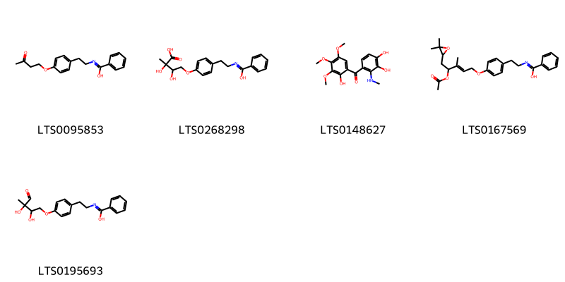{ width=100% }
    <figcaption>Hình ảnh cấu trúc hóa học của 5 hoạt chất thuộc nhóm Benzene and substituted derivatives gồm ['n-{2-[4-(3-oxobutoxy)phenyl]ethyl}benzenecarboximidic acid (LTS0095853)', '2,3-dihydroxy-4-[4-(2-{[hydroxy(phenyl)methylidene]amino}ethyl)phenoxy]-2-methylbutanoic acid (LTS0268298)', '4-(2-hydroxy-3,4,5-trimethoxybenzoyl)-3-(methylamino)benzene-1,2-diol (LTS0148627)', 'n-[2-(4-{[(2e)-4-(acetyloxy)-5-(3,3-dimethyloxiran-2-yl)-3-methylpent-2-en-1-yl]oxy}phenyl)ethyl]benzenecarboximidic acid (LTS0167569)', 'n-{2-[4-(2,3-dihydroxy-3-methyl-4-oxobutoxy)phenyl]ethyl}benzenecarboximidic acid (LTS0195693)'].</figcaption>
</figure>
#### Nhóm Cinnamic acids and derivatives
<figure markdown="span">
    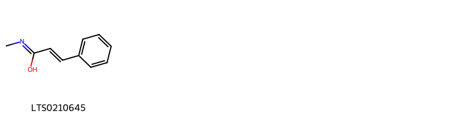{ width=100% }
    <figcaption>Hình ảnh cấu trúc hóa học của 1 hoạt chất thuộc nhóm Cinnamic acids and derivatives gồm ['n-methylcinnamamide (LTS0210645)'].</figcaption>
</figure>
#### Nhóm Coumarins and derivatives
<figure markdown="span">
    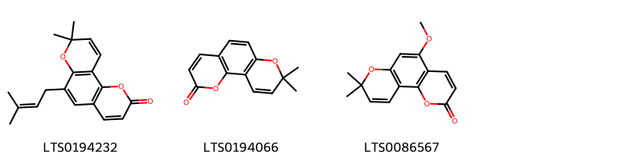{ width=100% }
    <figcaption>Hình ảnh cấu trúc hóa học của 3 hoạt chất thuộc nhóm Coumarins and derivatives gồm ['8,8-dimethyl-6-(3-methylbut-2-en-1-yl)pyrano[2,3-h]chromen-2-one (LTS0194232)', 'seselin (LTS0194066)', '5-methoxy-8,8-dimethylpyrano[2,3-f]chromen-2-one (LTS0086567)'].</figcaption>
</figure>
#### Nhóm Neoflavonoids
<figure markdown="span">
    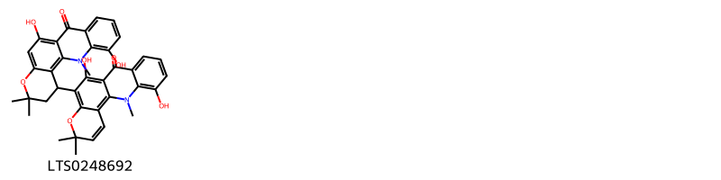{ width=100% }
    <figcaption>Hình ảnh cấu trúc hóa học của 1 hoạt chất thuộc nhóm Neoflavonoids gồm ['12-(6,11-dihydroxy-2,2,5-trimethyl-10-oxo-3,4-dihydro-1-oxa-5-azatetraphen-4-yl)-6,11-dihydroxy-2,2,5-trimethyl-1-oxa-5-azatetraphen-10-one (LTS0248692)'].</figcaption>
</figure>
#### Nhóm Phenol ethers
<figure markdown="span">
    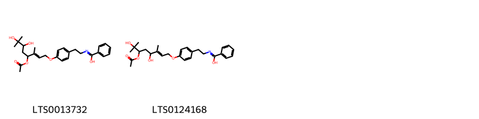{ width=100% }
    <figcaption>Hình ảnh cấu trúc hóa học của 2 hoạt chất thuộc nhóm Phenol ethers gồm ['n-[2-(4-{[(2e)-4-(acetyloxy)-6,7-dihydroxy-3,7-dimethyloct-2-en-1-yl]oxy}phenyl)ethyl]benzenecarboximidic acid (LTS0013732)', 'n-[2-(4-{[(2e)-6-(acetyloxy)-4,7-dihydroxy-3,7-dimethyloct-2-en-1-yl]oxy}phenyl)ethyl]benzenecarboximidic acid (LTS0124168)'].</figcaption>
</figure>
#### Nhóm Phenols
<figure markdown="span">
    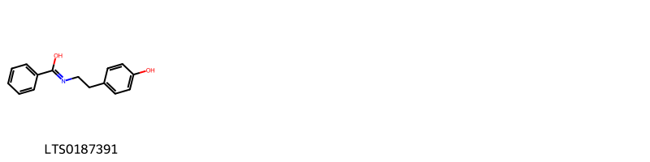{ width=100% }
    <figcaption>Hình ảnh cấu trúc hóa học của 1 hoạt chất thuộc nhóm Phenols gồm ['n-[2-(4-hydroxyphenyl)ethyl]benzenecarboximidic acid (LTS0187391)'].</figcaption>
</figure>
#### Nhóm Prenol lipids
<figure markdown="span">
    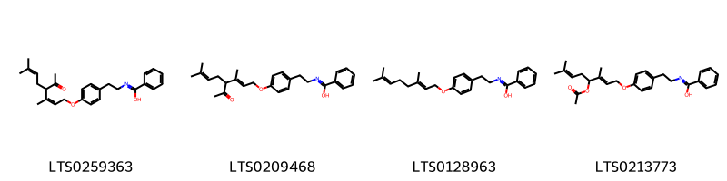{ width=100% }
    <figcaption>Hình ảnh cấu trúc hóa học của 4 hoạt chất thuộc nhóm Prenol lipids gồm ['n-[2-(4-{[3-methyl-4-(3-methylbut-2-en-1-yl)-5-oxohex-2-en-1-yl]oxy}phenyl)ethyl]benzenecarboximidic acid (LTS0259363)', 'n-[2-(4-{[(2e)-3-methyl-4-(3-methylbut-2-en-1-yl)-5-oxohex-2-en-1-yl]oxy}phenyl)ethyl]benzenecarboximidic acid (LTS0209468)', 'n-[2-(4-{[(2e)-3,7-dimethylocta-2,6-dien-1-yl]oxy}phenyl)ethyl]benzenecarboximidic acid (LTS0128963)', 'n-[2-(4-{[(2e)-4-(acetyloxy)-3,7-dimethylocta-2,6-dien-1-yl]oxy}phenyl)ethyl]benzenecarboximidic acid (LTS0213773)'].</figcaption>
</figure>
#### Nhóm Quinolines and derivatives
<figure markdown="span">
    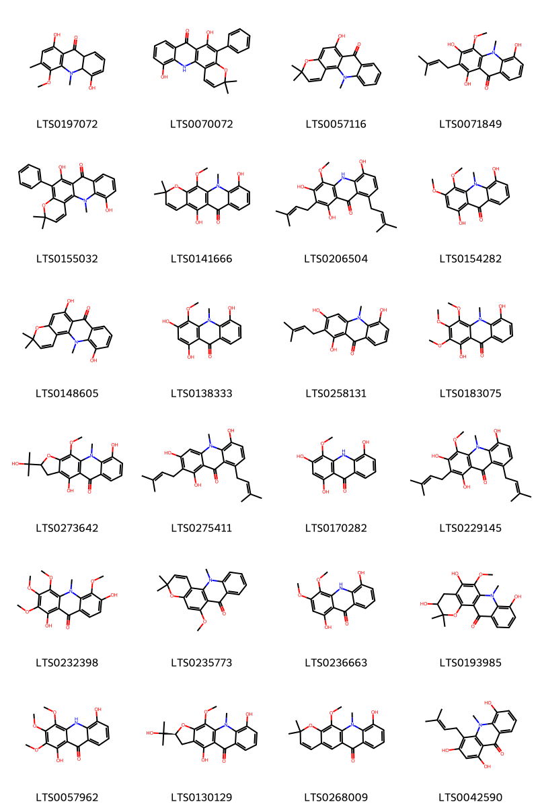{ width=100% }
    <figcaption>Hình ảnh cấu trúc hóa học của 24 hoạt chất thuộc nhóm Quinolines and derivatives gồm ['1,5-dihydroxy-4-methoxy-3,10-dimethyl-8a,10a-dihydroacridin-9-one (LTS0197072)', '6,11-dihydroxy-2,2-dimethyl-12-phenyl-5h-1-oxa-5-azatetraphen-10-one (LTS0070072)', '11-hydroxy-2,2,5-trimethyl-1-oxa-5-azatetraphen-10-one (LTS0057116)', '1,3,5-trihydroxy-4-methoxy-10-methyl-2-(3-methylbut-2-en-1-yl)acridin-9-one (LTS0071849)', '6,11-dihydroxy-2,2,5-trimethyl-12-phenyl-1-oxa-5-azatetraphen-10-one (LTS0155032)', '5,10-dihydroxy-12-methoxy-2,2,11-trimethyl-1-oxa-11-azatetracen-6-one (LTS0141666)', '1,3,5-trihydroxy-4-methoxy-2,8-bis(3-methylbut-2-en-1-yl)-10h-acridin-9-one (LTS0206504)', '1,5-dihydroxy-3,4-dimethoxy-10-methylacridin-9-one (LTS0154282)', '5-hydroxynoracronycine (LTS0148605)', '1,3,5-trihydroxy-4-methoxy-10-methylacridin-9-one (LTS0138333)', '1,3,5-trihydroxy-10-methyl-2-(3-methylbut-2-en-1-yl)acridin-9-one (LTS0258131)', 'citibrasine (LTS0183075)', '4,9-dihydroxy-2-(2-hydroxypropan-2-yl)-11-methoxy-10-methyl-2h,3h-furo[3,2-b]acridin-5-one (LTS0273642)', '1,3,5-trihydroxy-10-methyl-2,8-bis(3-methylbut-2-en-1-yl)acridin-9-one (LTS0275411)', '1,3,5-trihydroxy-4-methoxy-10h-acridin-9-one (LTS0170282)', '1,3,5-trihydroxy-4-methoxy-10-methyl-2,8-bis(3-methylbut-2-en-1-yl)acridin-9-one (LTS0229145)', '1,6-dihydroxy-2,3,4,5-tetramethoxy-10-methylacridin-9-one (LTS0232398)', 'acronycine (LTS0235773)', '1,5-dihydroxy-3,4-dimethoxy-10h-acridin-9-one (LTS0236663)', '3,5,8-trihydroxy-6-methoxy-2,2,7-trimethyl-3,4-dihydro-1-oxa-7-azatetraphen-12-one (LTS0193985)', '1,5-dihydroxy-2,3,4-trimethoxy-10h-acridin-9-one (LTS0057962)', '(2s)-4,9-dihydroxy-2-(2-hydroxypropan-2-yl)-11-methoxy-10-methyl-2h,3h-furo[3,2-b]acridin-5-one (LTS0130129)', '10-hydroxy-12-methoxy-2,2,11-trimethyl-1-oxa-11-azatetracen-6-one (LTS0268009)', '1,3,5-trihydroxy-10-methyl-4-(3-methylbut-2-en-1-yl)acridin-9-one (LTS0042590)'].</figcaption>
</figure>

---

### Dược dân tộc học

Danh sách các quốc gia có sử dụng *Swinglea glutinosa* trong điều trị các bệnh. 

| Country     | Disease   | Bệnh            |
|:------------|:----------|:----------------|
| Philippines | Acaricide | Thuốc diệt axit |

---

# Chi Pilocarpus

??? note "Danh sách các dược liệu thuộc chi"
    
	 - *Pilocarpus alvaradoi*
	 - *Pilocarpus jaborandi*
	 - *Pilocarpus microphyllus*

---
## Pilocarpus alvaradoi
### Thông tin về thực vật

!!! info "Phân loại thực vật của *Pilocarpus racemosus* từ GIBF:"
    - **Kingdom:** Plantae
    - **Phylum:** Tracheophyta
    - **Order:** Sapindales
    - **Family:** Rutaceae
    - **Genus:** Pilocarpus
    - **Species:** *Pilocarpus racemosus*

 

| Label (VI)   | Label (EN)   | Scientific Name      | Descriptions (VI)   | Descriptions (EN)   | Also Known As (VI)   | Also Known As (EN)   |
|:-------------|:-------------|:---------------------|:--------------------|:--------------------|:---------------------|:---------------------|
| N/A          | N/A          | Pilocarpus alvaradoi |                     |                     | ['']                 | ['']                 |

#### Phân bố trên thế giới

**Từ CSDL GIBF** Venezuela (Bolivarian Republic of), Brazil

#### Phân bố tại Việt Nam

**Từ CSDL GIBF**: Không có ghi nhận ở Việt Nam

---
### Thành phần hóa học
        
- Theo cơ sở dữ liệu lotus: Từ loài *Pilocarpus racemosus* đã phân lập và xác định được Chưa có hoạt chất nào được phân lập. hoạt chất thuộc về các nhóm Không có hoạt chất nào được phân lập. 

Không có hình ảnh nào được tạo ra

---

### Dược dân tộc học

Danh sách các quốc gia có sử dụng *Pilocarpus racemosus* trong điều trị các bệnh. 

| Country   | Disease   | Bệnh                  |
|:----------|:----------|:----------------------|
| Venezuela | Narcotic  | Thuốc gây ngủ, gây mê |

---

---
## Pilocarpus jaborandi
### Thông tin về thực vật

!!! info "Phân loại thực vật của *Pilocarpus jaborandi* từ GIBF:"
    - **Kingdom:** Plantae
    - **Phylum:** Tracheophyta
    - **Order:** Sapindales
    - **Family:** Rutaceae
    - **Genus:** Pilocarpus
    - **Species:** *Pilocarpus jaborandi*

 

| Label (VI)   | Label (EN)   | Scientific Name      | Descriptions (VI)   | Descriptions (EN)   | Also Known As (VI)   | Also Known As (EN)   |
|:-------------|:-------------|:---------------------|:--------------------|:--------------------|:---------------------|:---------------------|
| N/A          | N/A          | Pilocarpus jaborandi | loài thực vật       | species of plant    | ['']                 | ['']                 |

#### Phân bố trên thế giới

**Từ CSDL GIBF** nan, Brazil, United States of America

#### Phân bố tại Việt Nam

**Từ CSDL GIBF**: Không có ghi nhận ở Việt Nam

---
### Thành phần hóa học
        
- Theo cơ sở dữ liệu lotus: Từ loài *Pilocarpus jaborandi* đã phân lập và xác định được 27 hoạt chất thuộc về các nhóm Unsaturated hydrocarbons, Fatty Acyls, Prenol lipids, Organooxygen compounds. 

|    | chemicalTaxonomyClassyfireClass   |   smiles_count |
|---:|:----------------------------------|---------------:|
|  0 | Fatty Acyls                       |              1 |
|  1 | Organooxygen compounds            |              2 |
|  2 | Prenol lipids                     |             23 |
|  3 | Unsaturated hydrocarbons          |              1 |

#### Nhóm Fatty Acyls
<figure markdown="span">
    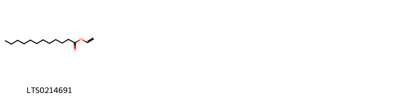{ width=100% }
    <figcaption>Hình ảnh cấu trúc hóa học của 1 hoạt chất thuộc nhóm Fatty Acyls gồm ['ethenyl dodecanoate (LTS0214691)'].</figcaption>
</figure>
#### Nhóm Organooxygen compounds
<figure markdown="span">
    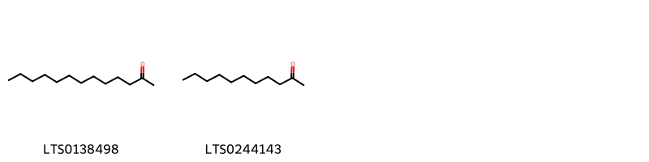{ width=100% }
    <figcaption>Hình ảnh cấu trúc hóa học của 2 hoạt chất thuộc nhóm Organooxygen compounds gồm ['2-tridecanone (LTS0138498)', 'undecan-2-one (LTS0244143)'].</figcaption>
</figure>
#### Nhóm Prenol lipids
<figure markdown="span">
    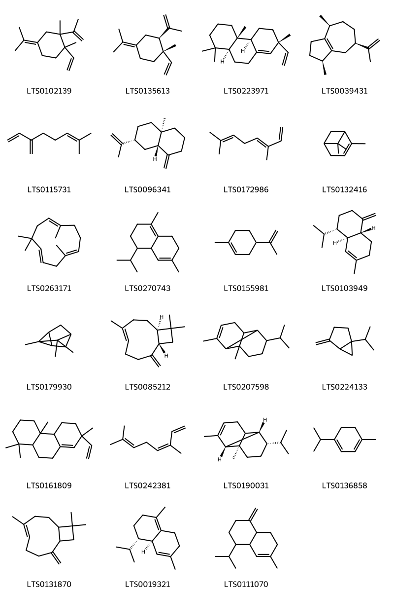{ width=100% }
    <figcaption>Hình ảnh cấu trúc hóa học của 23 hoạt chất thuộc nhóm Prenol lipids gồm ['1-ethenyl-1,2-dimethyl-2-(prop-1-en-2-yl)-4-(propan-2-ylidene)cyclohexane (LTS0102139)', '(1s,2s)-1-ethenyl-1-methyl-2-(prop-1-en-2-yl)-4-(propan-2-ylidene)cyclohexane (LTS0135613)', '(+)-sandaracopimaradiene (LTS0223971)', 'guaiene (LTS0039431)', 'α-myrcene (LTS0115731)', 'β-selinene (LTS0096341)', '3,7-dimethyl-1,3,6-octatriene (LTS0172986)', 'α pinene (LTS0132416)', 'humulene (LTS0263171)', '4-isopropyl-1,6-dimethyl-2,3,4,4a,7,8-hexahydronaphthalene (LTS0270743)', 'limonene,  (LTS0155981)', '(+)-gamma-cadinene (LTS0103949)', 'tricyclene (LTS0179930)', 'caryophyllene (LTS0085212)', 'α-copaene (LTS0207598)', 'sabinene (LTS0224133)', '7-ethenyl-1,1,4a,7-tetramethyl-3,4,4b,5,6,9,10,10a-octahydro-2h-phenanthrene (LTS0161809)', 'β-ocimene (LTS0242381)', '(1r,2s,7s,8s)-8-isopropyl-1,3-dimethyltricyclo[4.4.0.0²,⁷]dec-3-ene (LTS0190031)', 'terpinene (LTS0136858)', 'caryophyllene (LTS0131870)', 'delta-cadinene (LTS0019321)', '4-isopropyl-6-methyl-1-methylidene-3,4,4a,7,8,8a-hexahydro-2h-naphthalene (LTS0111070)'].</figcaption>
</figure>
#### Nhóm Unsaturated hydrocarbons
<figure markdown="span">
    { width=100% }
    <figcaption>Hình ảnh cấu trúc hóa học của 1 hoạt chất thuộc nhóm Unsaturated hydrocarbons gồm ['α terpinene (LTS0232891)'].</figcaption>
</figure>

---

### Dược dân tộc học

Danh sách các quốc gia có sử dụng *Pilocarpus jaborandi* trong điều trị các bệnh. 

| Country       | Disease             | Bệnh                         |
|:--------------|:--------------------|:-----------------------------|
| Brazil        | Diaphoretic, Emetic | Tràn dịch màng phổi, nôn mửa |
| Elsewhere     | Diaphoretic         | Thuốc tràn dịch màng phổi    |
| South America | Poison              | Chất độc                     |

---

---
## Pilocarpus microphyllus
### Thông tin về thực vật

!!! info "Phân loại thực vật của *Pilocarpus microphyllus* từ GIBF:"
    - **Kingdom:** Plantae
    - **Phylum:** Tracheophyta
    - **Order:** Sapindales
    - **Family:** Rutaceae
    - **Genus:** Pilocarpus
    - **Species:** *Pilocarpus microphyllus*

 

| Label (VI)   | Label (EN)   | Scientific Name         | Descriptions (VI)   | Descriptions (EN)   | Also Known As (VI)   | Also Known As (EN)   |
|:-------------|:-------------|:------------------------|:--------------------|:--------------------|:---------------------|:---------------------|
| N/A          | N/A          | Pilocarpus microphyllus | loài thực vật       | species of plant    | ['']                 | ['']                 |

#### Phân bố trên thế giới

**Từ CSDL GIBF** nan, Brazil

#### Phân bố tại Việt Nam

**Từ CSDL GIBF**: Không có ghi nhận ở Việt Nam

---
### Thành phần hóa học
        
- Theo cơ sở dữ liệu lotus: Từ loài *Pilocarpus microphyllus* đã phân lập và xác định được 22 hoạt chất thuộc về các nhóm Azoles, Prenol lipids, Organooxygen compounds. 

|    | chemicalTaxonomyClassyfireClass   |   smiles_count |
|---:|:----------------------------------|---------------:|
|  0 |                                   |              3 |
|  1 | Azoles                            |              1 |
|  2 | Organooxygen compounds            |              4 |
|  3 | Prenol lipids                     |             14 |

#### Nhóm 
<figure markdown="span">
    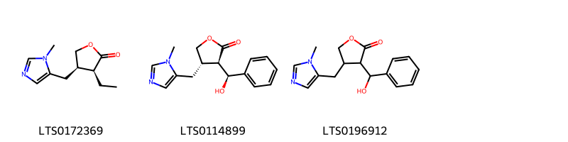{ width=100% }
    <figcaption>Hình ảnh cấu trúc hóa học của 3 hoạt chất thuộc nhóm  gồm ['pilocarpine (LTS0172369)', '(3r,4s)-3-[(s)-hydroxy(phenyl)methyl]-4-[(3-methylimidazol-4-yl)methyl]oxolan-2-one (LTS0114899)', 'isopilosine (LTS0196912)'].</figcaption>
</figure>
#### Nhóm Azoles
<figure markdown="span">
    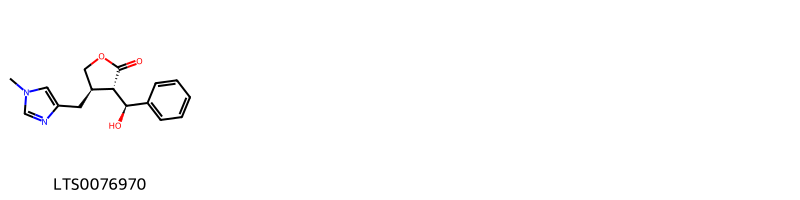{ width=100% }
    <figcaption>Hình ảnh cấu trúc hóa học của 1 hoạt chất thuộc nhóm Azoles gồm ['(3s,4r)-3-[(s)-hydroxy(phenyl)methyl]-4-[(1-methylimidazol-4-yl)methyl]oxolan-2-one (LTS0076970)'].</figcaption>
</figure>
#### Nhóm Organooxygen compounds
<figure markdown="span">
    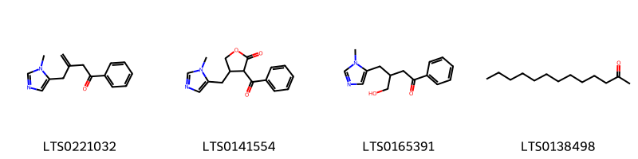{ width=100% }
    <figcaption>Hình ảnh cấu trúc hóa học của 4 hoạt chất thuộc nhóm Organooxygen compounds gồm ['3-[(3-methylimidazol-4-yl)methyl]-1-phenylbut-3-en-1-one (LTS0221032)', '3-benzoyl-4-[(3-methylimidazol-4-yl)methyl]oxolan-2-one (LTS0141554)', '4-hydroxy-3-[(3-methylimidazol-4-yl)methyl]-1-phenylbutan-1-one (LTS0165391)', '2-tridecanone (LTS0138498)'].</figcaption>
</figure>
#### Nhóm Prenol lipids
<figure markdown="span">
    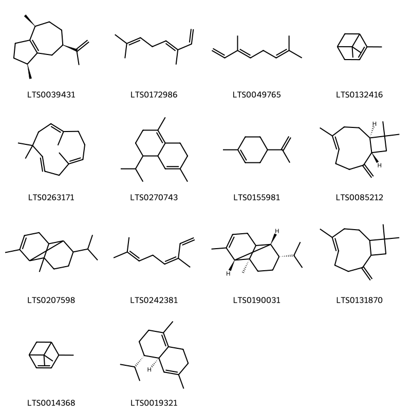{ width=100% }
    <figcaption>Hình ảnh cấu trúc hóa học của 14 hoạt chất thuộc nhóm Prenol lipids gồm ['guaiene (LTS0039431)', '3,7-dimethyl-1,3,6-octatriene (LTS0172986)', 'trans-β-ocimene (LTS0049765)', 'α pinene (LTS0132416)', 'humulene (LTS0263171)', '4-isopropyl-1,6-dimethyl-2,3,4,4a,7,8-hexahydronaphthalene (LTS0270743)', 'limonene,  (LTS0155981)', 'caryophyllene (LTS0085212)', 'α-copaene (LTS0207598)', 'β-ocimene (LTS0242381)', '(1r,2s,7s,8s)-8-isopropyl-1,3-dimethyltricyclo[4.4.0.0²,⁷]dec-3-ene (LTS0190031)', 'caryophyllene (LTS0131870)', '4,6,6-trimethylbicyclo[3.1.1]hept-2-ene (LTS0014368)', 'delta-cadinene (LTS0019321)'].</figcaption>
</figure>

---

### Dược dân tộc học

Danh sách các quốc gia có sử dụng *Pilocarpus microphyllus* trong điều trị các bệnh. 

| Country   | Disease                                                       | Bệnh                                                                                      |
|:----------|:--------------------------------------------------------------|:------------------------------------------------------------------------------------------|
| Brazil    | Stimulant, Diaphoretic, Expectorant                           | Chất kích thích, Diaphoretic, Expectorant                                                 |
| Turkey    | Expectorant, Stimulant, Sudorific, Cardiosedative, Sialogogue | Chất đờm, chất kích thích, chất gây ngạt, thuốc chống tim, chất kích thích tuyến nước bọt |

---

# Chi Dictamnus

??? note "Danh sách các dược liệu thuộc chi"
    
	 - *Dictamnus albus*
	 - *Dictamnus hianicus*

---
## Dictamnus albus
### Thông tin về thực vật

!!! info "Phân loại thực vật của *Dictamnus albus* từ GIBF:"
    - **Kingdom:** Plantae
    - **Phylum:** Tracheophyta
    - **Order:** Sapindales
    - **Family:** Rutaceae
    - **Genus:** Dictamnus
    - **Species:** *Dictamnus albus*

 

| Label (VI)   | Label (EN)   | Scientific Name   | Descriptions (VI)   | Descriptions (EN)   | Also Known As (VI)   | Also Known As (EN)                                                           |
|:-------------|:-------------|:------------------|:--------------------|:--------------------|:---------------------|:-----------------------------------------------------------------------------|
| N/A          | N/A          | Dictamnus albus   | loài thực vật       | species of plant    | ['']                 | ['Fraxinella', 'burning bush', 'false dittany', 'gasplant', 'white dittany'] |

#### Phân bố trên thế giới

**Từ CSDL GIBF** Ukraine, nan, Italy, Czechia, Germany, Romania, Slovakia, Georgia, Spain, Hungary, Switzerland, Russian Federation, Slovenia, Austria, France, Kazakhstan, Croatia, Greece

#### Phân bố tại Việt Nam

**Từ CSDL GIBF**: Không có ghi nhận ở Việt Nam

---
### Thành phần hóa học
        
- Theo cơ sở dữ liệu lotus: Từ loài *Dictamnus albus* đã phân lập và xác định được 71 hoạt chất thuộc về các nhóm Fatty Acyls, Flavonoids, Prenol lipids, Steroids and steroid derivatives, Quinolines and derivatives, Organooxygen compounds, Coumarins and derivatives, Isobenzofurans, Benzopyrans. 

|    | chemicalTaxonomyClassyfireClass   |   smiles_count |
|---:|:----------------------------------|---------------:|
|  0 | Benzopyrans                       |              2 |
|  1 | Coumarins and derivatives         |             10 |
|  2 | Fatty Acyls                       |             12 |
|  3 | Flavonoids                        |              5 |
|  4 | Isobenzofurans                    |              3 |
|  5 | Organooxygen compounds            |              1 |
|  6 | Prenol lipids                     |              9 |
|  7 | Quinolines and derivatives        |             18 |
|  8 | Steroids and steroid derivatives  |             11 |

#### Nhóm Benzopyrans
<figure markdown="span">
    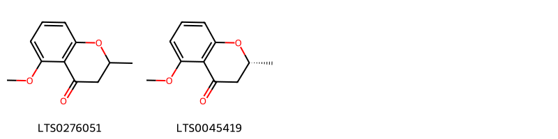{ width=100% }
    <figcaption>Hình ảnh cấu trúc hóa học của 2 hoạt chất thuộc nhóm Benzopyrans gồm ['5-methoxy-2-methyl-2,3-dihydro-1-benzopyran-4-one (LTS0276051)', '(2r)-5-methoxy-2-methyl-2,3-dihydro-1-benzopyran-4-one (LTS0045419)'].</figcaption>
</figure>
#### Nhóm Coumarins and derivatives
<figure markdown="span">
    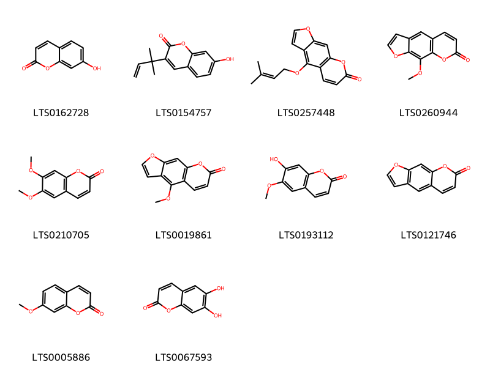{ width=100% }
    <figcaption>Hình ảnh cấu trúc hóa học của 10 hoạt chất thuộc nhóm Coumarins and derivatives gồm ['umbelliferone (LTS0162728)', '7-hydroxy-3-(2-methylbut-3-en-2-yl)chromen-2-one (LTS0154757)', 'isoimperatorin (LTS0257448)', 'methoxsalen (LTS0260944)', 'scoparone (LTS0210705)', 'bergapten (LTS0019861)', 'scopoletin (LTS0193112)', 'psoralen (LTS0121746)', 'methylumbelliferone (LTS0005886)', 'esculetin (LTS0067593)'].</figcaption>
</figure>
#### Nhóm Fatty Acyls
<figure markdown="span">
    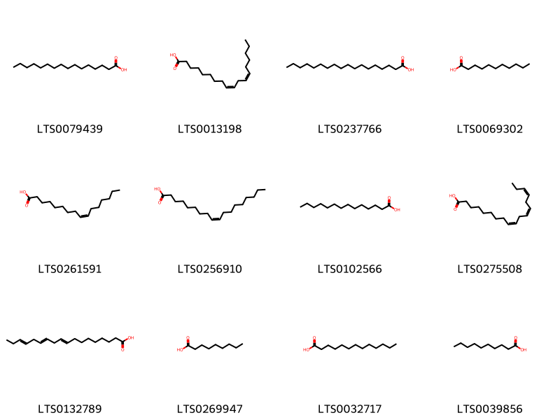{ width=100% }
    <figcaption>Hình ảnh cấu trúc hóa học của 12 hoạt chất thuộc nhóm Fatty Acyls gồm ['palmitic acid (LTS0079439)', 'linoleic (LTS0013198)', 'stearic acid (LTS0237766)', 'undecanoic acid (LTS0069302)', 'palmitoleic acid (LTS0261591)', 'oleic acid (LTS0256910)', 'myristic acid (LTS0102566)', 'α-linolenic acid (LTS0275508)', 'α linolenic acid (LTS0132789)', 'nonanoic acid (LTS0269947)', 'n-tridecanoic acid (LTS0032717)', 'capric acid (LTS0039856)'].</figcaption>
</figure>
#### Nhóm Flavonoids
<figure markdown="span">
    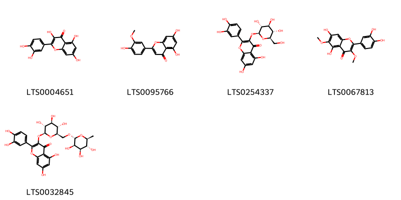{ width=100% }
    <figcaption>Hình ảnh cấu trúc hóa học của 5 hoạt chất thuộc nhóm Flavonoids gồm ['quercetin (LTS0004651)', 'chrysoeriol (LTS0095766)', 'isoquercetin (LTS0254337)', 'axillarin (LTS0067813)', '3-rutinosyl quercetin (LTS0032845)'].</figcaption>
</figure>
#### Nhóm Isobenzofurans
<figure markdown="span">
    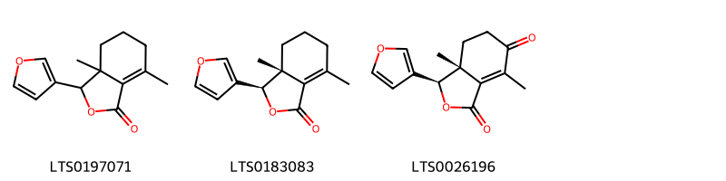{ width=100% }
    <figcaption>Hình ảnh cấu trúc hóa học của 3 hoạt chất thuộc nhóm Isobenzofurans gồm ['3-(furan-3-yl)-3a,7-dimethyl-3,4,5,6-tetrahydro-2-benzofuran-1-one (LTS0197071)', 'fraxinellone (LTS0183083)', 'fraxinellonone (LTS0026196)'].</figcaption>
</figure>
#### Nhóm Organooxygen compounds
<figure markdown="span">
    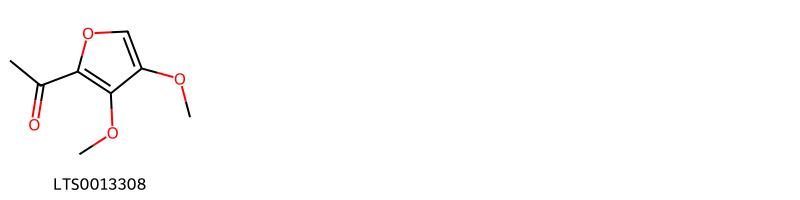{ width=100% }
    <figcaption>Hình ảnh cấu trúc hóa học của 1 hoạt chất thuộc nhóm Organooxygen compounds gồm ['1-(3,4-dimethoxyfuran-2-yl)ethanone (LTS0013308)'].</figcaption>
</figure>
#### Nhóm Prenol lipids
<figure markdown="span">
    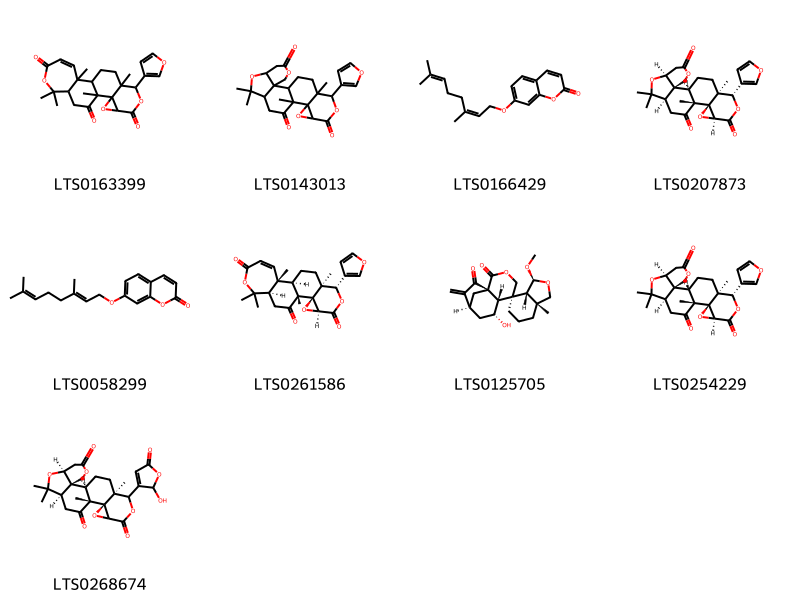{ width=100% }
    <figcaption>Hình ảnh cấu trúc hóa học của 9 hoạt chất thuộc nhóm Prenol lipids gồm ['7-(furan-3-yl)-1,8,12,17,17-pentamethyl-3,6,16-trioxapentacyclo[9.9.0.0²,⁴.0²,⁸.0¹²,¹⁸]icos-13-ene-5,15,20-trione (LTS0163399)', 'limonin (LTS0143013)', '7-[(3,7-dimethylocta-2,6-dien-1-yl)oxy]chromen-2-one (LTS0166429)', 'limonin (LTS0207873)', 'auraptene (LTS0058299)', 'obacunone (LTS0261586)', "(1's,3s,3ar,4r,6's,7'r,7ar,9's)-7'-hydroxy-3-methoxy-7a-methyl-10'-methylidene-hexahydro-3'-oxaspiro[2-benzofuran-4,5'-tricyclo[7.2.1.0¹,⁶]dodecane]-2',11'-dione (LTS0125705)", '(1s,2r,7s,10r,13r,14r,16s,19s,20s)-19-(furan-3-yl)-9,9,13,20-tetramethyl-4,8,15,18-tetraoxahexacyclo[11.9.0.0²,⁷.0²,¹⁰.0¹⁴,¹⁶.0¹⁴,²⁰]docosane-5,12,17-trione (LTS0254229)', '(1r,2r,7s,10r,13r,14r,20s)-19-(2-hydroxy-5-oxo-2h-furan-3-yl)-9,9,13,20-tetramethyl-4,8,15,18-tetraoxahexacyclo[11.9.0.0²,⁷.0²,¹⁰.0¹⁴,¹⁶.0¹⁴,²⁰]docosane-5,12,17-trione (LTS0268674)'].</figcaption>
</figure>
#### Nhóm Quinolines and derivatives
<figure markdown="span">
    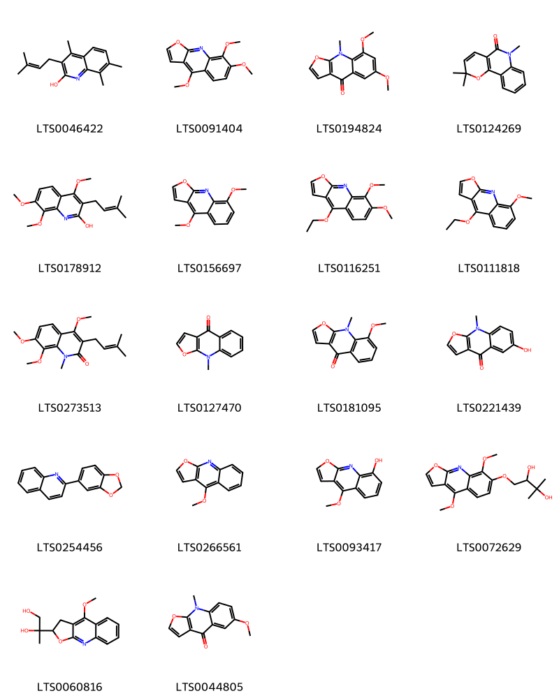{ width=100% }
    <figcaption>Hình ảnh cấu trúc hóa học của 18 hoạt chất thuộc nhóm Quinolines and derivatives gồm ['4,7,8-trimethyl-3-(3-methylbut-2-en-1-yl)quinolin-2-ol (LTS0046422)', 'skimmianine (LTS0091404)', '6,8-dimethoxy-9-methylfuro[2,3-b]quinolin-4-one (LTS0194824)', 'n-methylflindersine (LTS0124269)', '4,7,8-trimethoxy-3-(3-methylbut-2-en-1-yl)quinolin-2-ol (LTS0178912)', 'fagarine (LTS0156697)', '4-ethoxy-7,8-dimethoxyfuro[2,3-b]quinoline (LTS0116251)', '4-ethoxy-8-methoxyfuro[2,3-b]quinoline (LTS0111818)', '4,7,8-trimethoxy-1-methyl-3-(3-methylbut-2-en-1-yl)quinolin-2-one (LTS0273513)', 'isodictamnine (LTS0127470)', '8-methoxy-9-methylfuro[2,3-b]quinolin-4-one (LTS0181095)', '6-hydroxy-9-methylfuro[2,3-b]quinolin-4-one (LTS0221439)', 'dubamine (LTS0254456)', 'dictamnine (LTS0266561)', 'robustine (LTS0093417)', 'evoxine (LTS0072629)', 'dubinidine (LTS0060816)', '6-methoxy-9-methylfuro[2,3-b]quinolin-4-one (LTS0044805)'].</figcaption>
</figure>
#### Nhóm Steroids and steroid derivatives
<figure markdown="span">
    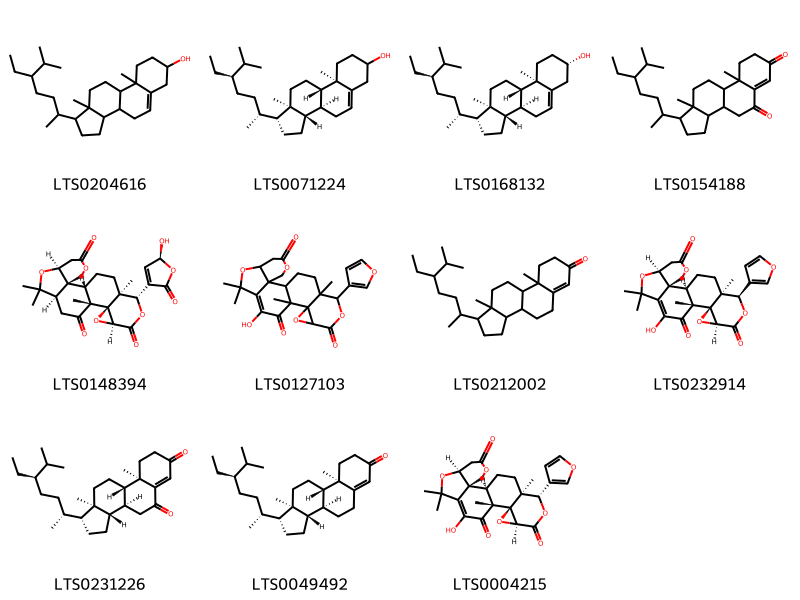{ width=100% }
    <figcaption>Hình ảnh cấu trúc hóa học của 11 hoạt chất thuộc nhóm Steroids and steroid derivatives gồm ['stigmast-5-en-3-ol, (3β)- (LTS0204616)', 'stigmast-5-en-3-ol (LTS0071224)', 'sitosterol (LTS0168132)', '1-(5-ethyl-6-methylheptan-2-yl)-9a,11a-dimethyl-1h,2h,3h,3ah,3bh,4h,8h,9h,9bh,10h,11h-cyclopenta[a]phenanthrene-5,7-dione (LTS0154188)', '(1s,2r,7s,10r,13r,14r,16s,19r,20s)-19-[(5s)-5-hydroxy-2-oxo-5h-furan-3-yl]-9,9,13,20-tetramethyl-4,8,15,18-tetraoxahexacyclo[11.9.0.0²,⁷.0²,¹⁰.0¹⁴,¹⁶.0¹⁴,²⁰]docosane-5,12,17-trione (LTS0148394)', '19-(furan-3-yl)-11-hydroxy-9,9,13,20-tetramethyl-4,8,15,18-tetraoxahexacyclo[11.9.0.0²,⁷.0²,¹⁰.0¹⁴,¹⁶.0¹⁴,²⁰]docos-10-ene-5,12,17-trione (LTS0127103)', '1-(5-ethyl-6-methylheptan-2-yl)-9a,11a-dimethyl-1h,2h,3h,3ah,3bh,4h,5h,8h,9h,9bh,10h,11h-cyclopenta[a]phenanthren-7-one (LTS0212002)', '(1r,2r,7s,13r,14r,16s,19r,20s)-19-(furan-3-yl)-11-hydroxy-9,9,13,20-tetramethyl-4,8,15,18-tetraoxahexacyclo[11.9.0.0²,⁷.0²,¹⁰.0¹⁴,¹⁶.0¹⁴,²⁰]docos-10-ene-5,12,17-trione (LTS0232914)', '(1r,3as,3bs,9ar,9bs,11ar)-1-[(2r,5r)-5-ethyl-6-methylheptan-2-yl]-9a,11a-dimethyl-1h,2h,3h,3ah,3bh,4h,8h,9h,9bh,10h,11h-cyclopenta[a]phenanthrene-5,7-dione (LTS0231226)', 'β-sitostenone (LTS0049492)', '(1r,2r,7s,13r,14r,16s,19s,20s)-19-(furan-3-yl)-11-hydroxy-9,9,13,20-tetramethyl-4,8,15,18-tetraoxahexacyclo[11.9.0.0²,⁷.0²,¹⁰.0¹⁴,¹⁶.0¹⁴,²⁰]docos-10-ene-5,12,17-trione (LTS0004215)'].</figcaption>
</figure>

---

### Dược dân tộc học

Danh sách các quốc gia có sử dụng *Dictamnus albus* trong điều trị các bệnh. 

| Country   | Disease                                                                | Bệnh                                                                         |
|:----------|:-----------------------------------------------------------------------|:-----------------------------------------------------------------------------|
| China     | Sedative, Antiseptic, Tonic                                            | Thuốc an thần, sát trùng, thuốc bổ                                           |
| Turkey    | Diuretic, Nervine, Sudorific, Tonic, Emmenagogue, Stomachic, Vermifuge | Thuốc lợi tiểu, Nervine, Sudorific, Tonic, Emmenagogue, Stomachic, Vermifuge |
| ain       | Abortifacient                                                          | Thuốc gây sẩy thai                                                           |

---

---
## Dictamnus hianicus
### Thông tin về thực vật

!!! info "Phân loại thực vật của *N/A* từ GIBF:"
    - **Kingdom:** Plantae
    - **Phylum:** Tracheophyta
    - **Order:** Sapindales
    - **Family:** Rutaceae
    - **Genus:** Dictamnus
    - **Species:** *N/A*

 

| Label (VI)   | Label (EN)   | Scientific Name   | Descriptions (VI)   | Descriptions (EN)   | Also Known As (VI)   | Also Known As (EN)                                                           |
|:-------------|:-------------|:------------------|:--------------------|:--------------------|:---------------------|:-----------------------------------------------------------------------------|
| N/A          | N/A          | Dictamnus albus   | loài thực vật       | species of plant    | ['']                 | ['Fraxinella', 'burning bush', 'false dittany', 'gasplant', 'white dittany'] |

#### Phân bố trên thế giới

**Từ CSDL GIBF** nan, Italy, Slovakia, Georgia, Ukraine, Korea, Republic of, Spain, Hungary, Russian Federation, Slovenia, Kazakhstan, Croatia, Greece, Czechia, Germany, Romania, Switzerland, Austria, France

#### Phân bố tại Việt Nam

**Từ CSDL GIBF**: Không có ghi nhận ở Việt Nam

---
### Thành phần hóa học
        
- Theo cơ sở dữ liệu lotus: Từ loài *N/A* đã phân lập và xác định được Chưa có hoạt chất nào được phân lập. hoạt chất thuộc về các nhóm Không có hoạt chất nào được phân lập. 

Không có hình ảnh nào được tạo ra

---

### Dược dân tộc học

Danh sách các quốc gia có sử dụng *N/A* trong điều trị các bệnh. 

| Country   | Disease       | Bệnh               |
|:----------|:--------------|:-------------------|
| ain       | Abortifacient | Thuốc gây sẩy thai |

---

# Chi Glycosmis

??? note "Danh sách các dược liệu thuộc chi"
    
	 - *Glycosmis pentaphylla*

---
## Glycosmis pentaphylla
### Thông tin về thực vật

!!! info "Phân loại thực vật của *Glycosmis pentaphylla* từ GIBF:"
    - **Kingdom:** Plantae
    - **Phylum:** Tracheophyta
    - **Order:** Sapindales
    - **Family:** Rutaceae
    - **Genus:** Glycosmis
    - **Species:** *Glycosmis pentaphylla*

 

| Label (VI)   | Label (EN)   | Scientific Name       | Descriptions (VI)   | Descriptions (EN)   | Also Known As (VI)   | Also Known As (EN)           |
|:-------------|:-------------|:----------------------|:--------------------|:--------------------|:---------------------|:-----------------------------|
| N/A          | N/A          | Glycosmis pentaphylla | loài thực vật       | species of plant    | ['']                 | ['gin berry', 'orangeberry'] |

#### Phân bố trên thế giới

**Từ CSDL GIBF** nan, Sri Lanka, Australia, Japan, Lao People’s Democratic Republic, Cambodia, Belgium, Myanmar, unknown or invalid, Chinese Taipei, Papua New Guinea, Bangladesh, United States of America, Thailand, Brazil, Cuba, Singapore, Viet Nam, China, India, Indonesia, Malaysia

#### Phân bố tại Việt Nam

**Từ CSDL GIBF**: Ninh Binh

---
### Thành phần hóa học
        
- Theo cơ sở dữ liệu lotus: Từ loài *Glycosmis pentaphylla* đã phân lập và xác định được 95 hoạt chất thuộc về các nhóm Flavonoids, Indoles and derivatives, Prenol lipids, Isoflavonoids, Steroids and steroid derivatives, Quinolines and derivatives, Benzene and substituted derivatives, 2-arylbenzofuran flavonoids, Diazanaphthalenes, Naphthofurans, Organooxygen compounds, Tannins. 

|    | chemicalTaxonomyClassyfireClass     |   smiles_count |
|---:|:------------------------------------|---------------:|
|  0 | 2-arylbenzofuran flavonoids         |              4 |
|  1 | Benzene and substituted derivatives |              2 |
|  2 | Diazanaphthalenes                   |              3 |
|  3 | Flavonoids                          |              1 |
|  4 | Indoles and derivatives             |             20 |
|  5 | Isoflavonoids                       |             20 |
|  6 | Naphthofurans                       |              2 |
|  7 | Organooxygen compounds              |              4 |
|  8 | Prenol lipids                       |              5 |
|  9 | Quinolines and derivatives          |             22 |
| 10 | Steroids and steroid derivatives    |              6 |
| 11 | Tannins                             |              6 |

#### Nhóm 2-arylbenzofuran flavonoids
<figure markdown="span">
    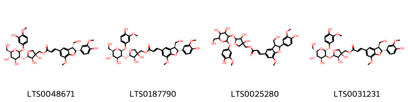{ width=100% }
    <figcaption>Hình ảnh cấu trúc hóa học của 4 hoạt chất thuộc nhóm 2-arylbenzofuran flavonoids gồm ['[(3s,4r,5s)-5-{[(2s,3r,4s,5s,6r)-4,5-dihydroxy-2-(3-hydroxy-4-methoxyphenoxy)-6-(hydroxymethyl)oxan-3-yl]oxy}-3,4-dihydroxyoxolan-3-yl]methyl (2e)-3-[(2r,3r)-2-(4-hydroxy-3-methoxyphenyl)-3-(hydroxymethyl)-7-methoxy-2,3-dihydro-1-benzofuran-5-yl]prop-2-enoate (LTS0048671)', '[(3s,4r,5s)-5-{[(2s,3r,4s,5s,6r)-4,5-dihydroxy-2-(4-hydroxy-3-methoxyphenoxy)-6-(hydroxymethyl)oxan-3-yl]oxy}-3,4-dihydroxyoxolan-3-yl]methyl (2e)-3-[(2r,3s)-2-(4-hydroxy-3-methoxyphenyl)-3-(hydroxymethyl)-7-methoxy-2,3-dihydro-1-benzofuran-5-yl]prop-2-enoate (LTS0187790)', '(5-{[4,5-dihydroxy-2-(4-hydroxy-3-methoxyphenoxy)-6-(hydroxymethyl)oxan-3-yl]oxy}-3,4-dihydroxyoxolan-3-yl)methyl 3-[2-(4-hydroxy-3-methoxyphenyl)-3-(hydroxymethyl)-7-methoxy-2,3-dihydro-1-benzofuran-5-yl]prop-2-enoate (LTS0025280)', '[(3s,4r,5r)-5-{[(2r,3s,4s,5s,6s)-4,5-dihydroxy-2-(4-hydroxy-3-methoxyphenoxy)-6-(hydroxymethyl)oxan-3-yl]oxy}-3,4-dihydroxyoxolan-3-yl]methyl (2e)-3-[(2r,3s)-2-(4-hydroxy-3-methoxyphenyl)-3-(hydroxymethyl)-7-methoxy-2,3-dihydro-1-benzofuran-5-yl]prop-2-enoate (LTS0031231)'].</figcaption>
</figure>
#### Nhóm Benzene and substituted derivatives
<figure markdown="span">
    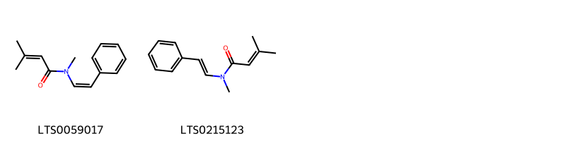{ width=100% }
    <figcaption>Hình ảnh cấu trúc hóa học của 2 hoạt chất thuộc nhóm Benzene and substituted derivatives gồm ['n,3-dimethyl-n-[(1z)-2-phenylethenyl]but-2-enamide (LTS0059017)', 'n,3-dimethyl-n-(2-phenylethenyl)but-2-enamide (LTS0215123)'].</figcaption>
</figure>
#### Nhóm Diazanaphthalenes
<figure markdown="span">
    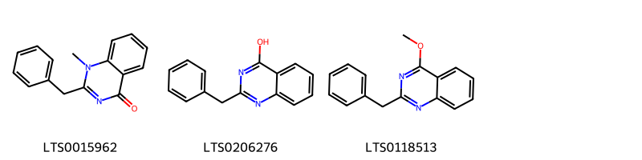{ width=100% }
    <figcaption>Hình ảnh cấu trúc hóa học của 3 hoạt chất thuộc nhóm Diazanaphthalenes gồm ['arborin (LTS0015962)', 'glycosminine (LTS0206276)', 'glycophymoline (LTS0118513)'].</figcaption>
</figure>
#### Nhóm Flavonoids
<figure markdown="span">
    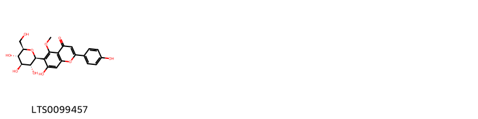{ width=100% }
    <figcaption>Hình ảnh cấu trúc hóa học của 1 hoạt chất thuộc nhóm Flavonoids gồm ['7-hydroxy-2-(4-hydroxyphenyl)-5-methoxy-6-[(2s,3r,4r,5s,6r)-3,4,5-trihydroxy-6-(hydroxymethyl)oxan-2-yl]chromen-4-one (LTS0099457)'].</figcaption>
</figure>
#### Nhóm Indoles and derivatives
<figure markdown="span">
    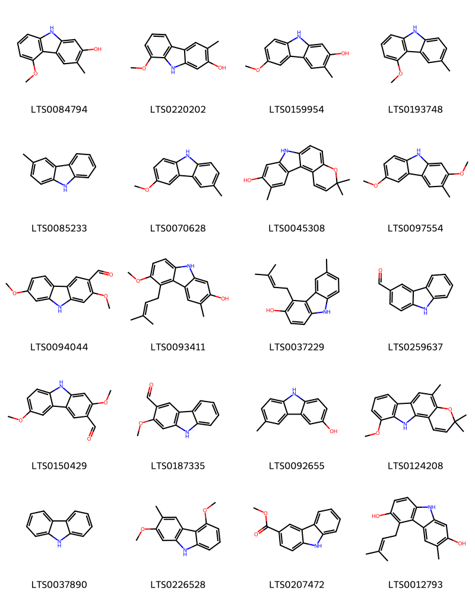{ width=100% }
    <figcaption>Hình ảnh cấu trúc hóa học của 20 hoạt chất thuộc nhóm Indoles and derivatives gồm ['5-methoxy-3-methyl-9h-carbazol-2-ol (LTS0084794)', '8-methoxy-3-methyl-9h-carbazol-2-ol (LTS0220202)', '6-methoxy-3-methyl-9h-carbazol-2-ol (LTS0159954)', '5-methoxy-3-methyl-9h-carbazole (LTS0193748)', '3-methylcarbazole (LTS0085233)', '3-methoxy-6-methyl-9h-carbazole (LTS0070628)', '3,3,10-trimethyl-7h-pyrano[2,3-c]carbazol-9-ol (LTS0045308)', '2,6-dimethoxy-3-methyl-9h-carbazole (LTS0097554)', '2,7-dimethoxy-9h-carbazole-3-carbaldehyde (LTS0094044)', '6-methoxy-3-methyl-5-(3-methylbut-2-en-1-yl)-9h-carbazol-2-ol (LTS0093411)', '6-methyl-4-(3-methylbut-2-en-1-yl)-9h-carbazol-3-ol (LTS0037229)', '9h-carbazole-3-carbaldehyde (LTS0259637)', '2,6-dimethoxy-9h-carbazole-3-carbaldehyde (LTS0150429)', '2-methoxy-9h-carbazole-3-carbaldehyde (LTS0187335)', '6-methyl-9h-carbazol-3-ol (LTS0092655)', '10-methoxy-3,3,5-trimethyl-11h-pyrano[3,2-a]carbazole (LTS0124208)', '9h-carbazole (LTS0037890)', '2,5-dimethoxy-3-methyl-9h-carbazole (LTS0226528)', 'methyl 9h-carbazole-3-carboxylate (LTS0207472)', '3-methyl-5-(3-methylbut-2-en-1-yl)-9h-carbazole-2,6-diol (LTS0012793)'].</figcaption>
</figure>
#### Nhóm Isoflavonoids
<figure markdown="span">
    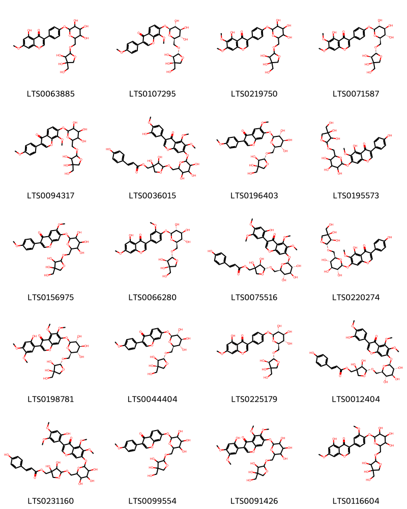{ width=100% }
    <figcaption>Hình ảnh cấu trúc hóa học của 20 hoạt chất thuộc nhóm Isoflavonoids gồm ['3-(4-{[6-({[3,4-dihydroxy-4-(hydroxymethyl)oxolan-2-yl]oxy}methyl)-3,4,5-trihydroxyoxan-2-yl]oxy}phenyl)-5-hydroxy-7-methoxychromen-4-one (LTS0063885)', '7-{[(2s,3r,4s,5s,6r)-6-({[(2r,3r,4r)-3,4-dihydroxy-4-(hydroxymethyl)oxolan-2-yl]oxy}methyl)-3,4,5-trihydroxyoxan-2-yl]oxy}-8-methoxy-3-(4-methoxyphenyl)chromen-4-one (LTS0107295)', '3-(4-{[6-({[3,4-dihydroxy-4-(hydroxymethyl)oxolan-2-yl]oxy}methyl)-3,4,5-trihydroxyoxan-2-yl]oxy}phenyl)-5-hydroxy-6,7-dimethoxychromen-4-one (LTS0219750)', '3-(4-{[(2s,3r,4s,5s,6r)-6-({[(2r,3r,4r)-3,4-dihydroxy-4-(hydroxymethyl)oxolan-2-yl]oxy}methyl)-3,4,5-trihydroxyoxan-2-yl]oxy}phenyl)-5-hydroxy-6,7-dimethoxychromen-4-one (LTS0071587)', '7-{[6-({[3,4-dihydroxy-4-(hydroxymethyl)oxolan-2-yl]oxy}methyl)-3,4,5-trihydroxyoxan-2-yl]oxy}-8-methoxy-3-(4-methoxyphenyl)chromen-4-one (LTS0094317)', '{3,4-dihydroxy-5-[(3,4,5-trihydroxy-6-{[3-(3-hydroxy-4-methoxyphenyl)-5,6-dimethoxy-4-oxochromen-7-yl]oxy}oxan-2-yl)methoxy]oxolan-3-yl}methyl 3-(4-hydroxyphenyl)prop-2-enoate (LTS0036015)', '7-{[(2s,3r,4s,5s,6r)-6-({[(2r,3r,4r)-3,4-dihydroxy-4-(hydroxymethyl)oxolan-2-yl]oxy}methyl)-3,4,5-trihydroxyoxan-2-yl]oxy}-6-methoxy-3-(4-methoxyphenyl)chromen-4-one (LTS0196403)', '7-{[6-({[3,4-dihydroxy-4-(hydroxymethyl)oxolan-2-yl]oxy}methyl)-3,4,5-trihydroxyoxan-2-yl]oxy}-5-hydroxy-3-(4-hydroxyphenyl)-6-methoxychromen-4-one (LTS0195573)', '7-{[6-({[3,4-dihydroxy-4-(hydroxymethyl)oxolan-2-yl]oxy}methyl)-3,4,5-trihydroxyoxan-2-yl]oxy}-6-methoxy-3-(4-methoxyphenyl)chromen-4-one (LTS0156975)', '3-(4-{[(2s,3r,4s,5s,6r)-6-({[(2r,3r,4r)-3,4-dihydroxy-4-(hydroxymethyl)oxolan-2-yl]oxy}methyl)-3,4,5-trihydroxyoxan-2-yl]oxy}-3-methoxyphenyl)-5-hydroxy-7-methoxychromen-4-one (LTS0066280)', '[(3s,4r,5r)-3,4-dihydroxy-5-{[(2r,3s,4s,5r,6s)-3,4,5-trihydroxy-6-{[3-(2-hydroxy-4,5-dimethoxyphenyl)-5,6-dimethoxy-4-oxochromen-7-yl]oxy}oxan-2-yl]methoxy}oxolan-3-yl]methyl (2e)-3-(4-hydroxyphenyl)prop-2-enoate (LTS0075516)', '7-{[(2s,3r,4s,5s,6r)-6-({[(2r,3r,4r)-3,4-dihydroxy-4-(hydroxymethyl)oxolan-2-yl]oxy}methyl)-3,4,5-trihydroxyoxan-2-yl]oxy}-5-hydroxy-3-(4-hydroxyphenyl)-6-methoxychromen-4-one (LTS0220274)', '7-{[(2s,3r,4s,5s,6r)-6-({[(2r,3r,4r)-3,4-dihydroxy-4-(hydroxymethyl)oxolan-2-yl]oxy}methyl)-3,4,5-trihydroxyoxan-2-yl]oxy}-3-(2-hydroxy-4,5-dimethoxyphenyl)-5,6-dimethoxychromen-4-one (LTS0198781)', '7-{[(2s,3r,4s,5s,6r)-6-({[(2r,3r,4r)-3,4-dihydroxy-4-(hydroxymethyl)oxolan-2-yl]oxy}methyl)-3,4,5-trihydroxyoxan-2-yl]oxy}-3-(4-methoxyphenyl)chromen-4-one (LTS0044404)', '3-(4-{[(2s,3r,4s,5s,6r)-6-({[(2r,3r,4r)-3,4-dihydroxy-4-(hydroxymethyl)oxolan-2-yl]oxy}methyl)-3,4,5-trihydroxyoxan-2-yl]oxy}phenyl)-5-hydroxy-7-methoxychromen-4-one (LTS0225179)', '[(3s,4r,5r)-3,4-dihydroxy-5-{[(2r,3s,4s,5r,6s)-3,4,5-trihydroxy-6-{[3-(3-hydroxy-4-methoxyphenyl)-5,6-dimethoxy-4-oxochromen-7-yl]oxy}oxan-2-yl]methoxy}oxolan-3-yl]methyl (2e)-3-(4-hydroxyphenyl)prop-2-enoate (LTS0012404)', '{3,4-dihydroxy-5-[(3,4,5-trihydroxy-6-{[3-(2-hydroxy-4,5-dimethoxyphenyl)-5,6-dimethoxy-4-oxochromen-7-yl]oxy}oxan-2-yl)methoxy]oxolan-3-yl}methyl 3-(4-hydroxyphenyl)prop-2-enoate (LTS0231160)', '7-{[6-({[3,4-dihydroxy-4-(hydroxymethyl)oxolan-2-yl]oxy}methyl)-3,4,5-trihydroxyoxan-2-yl]oxy}-3-(4-methoxyphenyl)chromen-4-one (LTS0099554)', '7-{[6-({[3,4-dihydroxy-4-(hydroxymethyl)oxolan-2-yl]oxy}methyl)-3,4,5-trihydroxyoxan-2-yl]oxy}-3-(2-hydroxy-4,5-dimethoxyphenyl)-5,6-dimethoxychromen-4-one (LTS0091426)', '3-(4-{[6-({[3,4-dihydroxy-4-(hydroxymethyl)oxolan-2-yl]oxy}methyl)-3,4,5-trihydroxyoxan-2-yl]oxy}-3-methoxyphenyl)-5-hydroxy-7-methoxychromen-4-one (LTS0116604)'].</figcaption>
</figure>
#### Nhóm Naphthofurans
<figure markdown="span">
    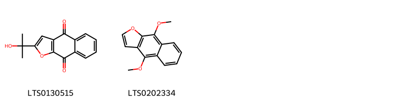{ width=100% }
    <figcaption>Hình ảnh cấu trúc hóa học của 2 hoạt chất thuộc nhóm Naphthofurans gồm ['2-(2-hydroxypropan-2-yl)naphtho[2,3-b]furan-4,9-dione (LTS0130515)', '4,9-dimethoxynaphtho[2,3-b]furan (LTS0202334)'].</figcaption>
</figure>
#### Nhóm Organooxygen compounds
<figure markdown="span">
    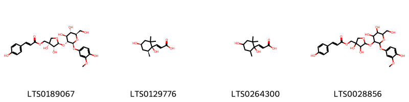{ width=100% }
    <figcaption>Hình ảnh cấu trúc hóa học của 4 hoạt chất thuộc nhóm Organooxygen compounds gồm ['[(3s,4r,5s)-5-{[(2s,3r,4s,5s,6r)-4,5-dihydroxy-2-(4-hydroxy-3-methoxyphenoxy)-6-(hydroxymethyl)oxan-3-yl]oxy}-3,4-dihydroxyoxolan-3-yl]methyl (2e)-3-(4-hydroxyphenyl)prop-2-enoate (LTS0189067)', '(2e)-3-[(1r,4r,6s)-1,4-dihydroxy-2,2,6-trimethylcyclohexyl]prop-2-enoic acid (LTS0129776)', '3-(1,4-dihydroxy-2,2,6-trimethylcyclohexyl)prop-2-enoic acid (LTS0264300)', '(5-{[4,5-dihydroxy-2-(4-hydroxy-3-methoxyphenoxy)-6-(hydroxymethyl)oxan-3-yl]oxy}-3,4-dihydroxyoxolan-3-yl)methyl 3-(4-hydroxyphenyl)prop-2-enoate (LTS0028856)'].</figcaption>
</figure>
#### Nhóm Prenol lipids
<figure markdown="span">
    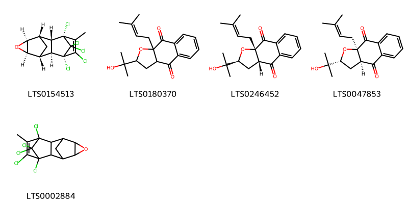{ width=100% }
    <figcaption>Hình ảnh cấu trúc hóa học của 5 hoạt chất thuộc nhóm Prenol lipids gồm ['(1r,2s,3s,6r,7s,8s,9s,11r)-3,4,6,13,13-pentachloro-5-methyl-10-oxapentacyclo[6.3.1.1³,⁶.0²,⁷.0⁹,¹¹]tridec-4-ene (LTS0154513)', '2-(2-hydroxypropan-2-yl)-9a-(3-methylbut-2-en-1-yl)-2h,3h,3ah-naphtho[2,3-b]furan-4,9-dione (LTS0180370)', '(2s,3ar,9as)-2-(2-hydroxypropan-2-yl)-9a-(3-methylbut-2-en-1-yl)-2h,3h,3ah-naphtho[2,3-b]furan-4,9-dione (LTS0246452)', '(2r,3as,9ar)-2-(2-hydroxypropan-2-yl)-9a-(3-methylbut-2-en-1-yl)-2h,3h,3ah-naphtho[2,3-b]furan-4,9-dione (LTS0047853)', '3,4,6,13,13-pentachloro-5-methyl-10-oxapentacyclo[6.3.1.1³,⁶.0²,⁷.0⁹,¹¹]tridec-4-ene (LTS0002884)'].</figcaption>
</figure>
#### Nhóm Quinolines and derivatives
<figure markdown="span">
    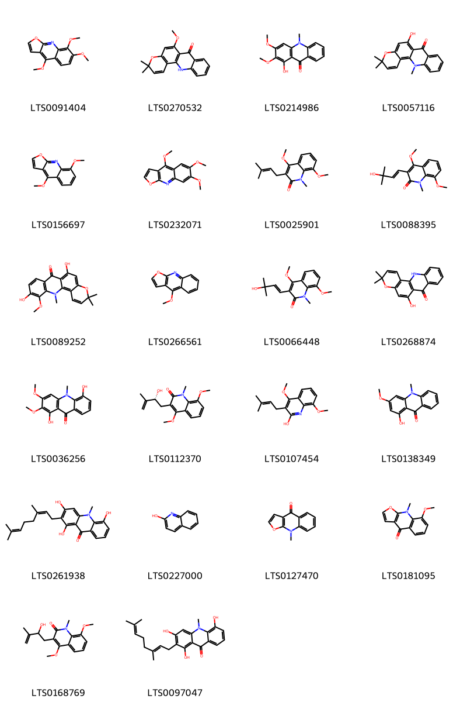{ width=100% }
    <figcaption>Hình ảnh cấu trúc hóa học của 22 hoạt chất thuộc nhóm Quinolines and derivatives gồm ['skimmianine (LTS0091404)', '11-methoxy-2,2-dimethyl-5h-1-oxa-5-azatetraphen-10-one (LTS0270532)', 'arborinine (LTS0214986)', '11-hydroxy-2,2,5-trimethyl-1-oxa-5-azatetraphen-10-one (LTS0057116)', 'fagarine (LTS0156697)', 'kokusaginine (LTS0232071)', '4,8-dimethoxy-1-methyl-3-(3-methylbut-2-en-1-yl)quinolin-2-one (LTS0025901)', '3-[(1e)-3-hydroxy-3-methylbut-1-en-1-yl]-4,8-dimethoxy-1-methylquinolin-2-one (LTS0088395)', '7,11-dihydroxy-6-methoxy-2,2,5-trimethyl-1-oxa-5-azatetraphen-10-one (LTS0089252)', 'dictamnine (LTS0266561)', '3-(3-hydroxy-3-methylbut-1-en-1-yl)-4,8-dimethoxy-1-methylquinolin-2-one (LTS0066448)', '11-hydroxy-2,2-dimethyl-5h-1-oxa-5-azatetraphen-10-one (LTS0268874)', '1,5-dihydroxy-2,3-dimethoxy-10-methylacridin-9-one (LTS0036256)', '3-[(2r)-2-hydroxy-3-methylbut-3-en-1-yl]-4,8-dimethoxy-1-methylquinolin-2-one (LTS0112370)', '4,8-dimethoxy-3-(3-methylbut-2-en-1-yl)quinolin-2-ol (LTS0107454)', '1-hydroxy-3-methoxy-10-methylacridin-9-one (LTS0138349)', '2-(3,7-dimethylocta-2,6-dien-1-yl)-1,3,5-trihydroxy-10-methylacridin-9-one (LTS0261938)', 'α-hydroxyquinoline (LTS0227000)', 'isodictamnine (LTS0127470)', '8-methoxy-9-methylfuro[2,3-b]quinolin-4-one (LTS0181095)', '3-(2-hydroxy-3-methylbut-3-en-1-yl)-4,8-dimethoxy-1-methylquinolin-2-one (LTS0168769)', '2-[(2e)-3,7-dimethylocta-2,6-dien-1-yl]-1,3,5-trihydroxy-10-methylacridin-9-one (LTS0097047)'].</figcaption>
</figure>
#### Nhóm Steroids and steroid derivatives
<figure markdown="span">
    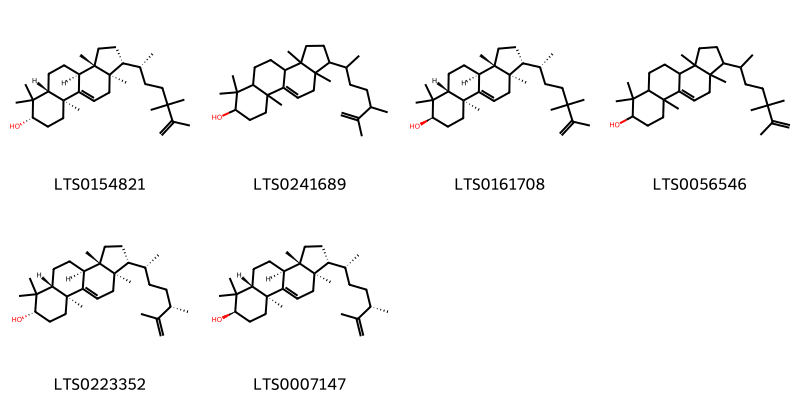{ width=100% }
    <figcaption>Hình ảnh cấu trúc hóa học của 6 hoạt chất thuộc nhóm Steroids and steroid derivatives gồm ['(1r,3as,3bs,5ar,7s,9as,11ar)-3a,6,6,9a,11a-pentamethyl-1-[(2r)-5,5,6-trimethylhept-6-en-2-yl]-1h,2h,3h,3bh,4h,5h,5ah,7h,8h,9h,11h-cyclopenta[a]phenanthren-7-ol (LTS0154821)', '1-(5,6-dimethylhept-6-en-2-yl)-3a,6,6,9a,11a-pentamethyl-1h,2h,3h,3bh,4h,5h,5ah,7h,8h,9h,11h-cyclopenta[a]phenanthren-7-ol (LTS0241689)', '(1r,3as,3bs,5ar,7r,9as,11ar)-3a,6,6,9a,11a-pentamethyl-1-[(2r)-5,5,6-trimethylhept-6-en-2-yl]-1h,2h,3h,3bh,4h,5h,5ah,7h,8h,9h,11h-cyclopenta[a]phenanthren-7-ol (LTS0161708)', '3a,6,6,9a,11a-pentamethyl-1-(5,5,6-trimethylhept-6-en-2-yl)-1h,2h,3h,3bh,4h,5h,5ah,7h,8h,9h,11h-cyclopenta[a]phenanthren-7-ol (LTS0056546)', '(1r,3as,3bs,5ar,7s,9as,11ar)-1-[(2r,5s)-5,6-dimethylhept-6-en-2-yl]-3a,6,6,9a,11a-pentamethyl-1h,2h,3h,3bh,4h,5h,5ah,7h,8h,9h,11h-cyclopenta[a]phenanthren-7-ol (LTS0223352)', '(1r,3as,3bs,5ar,7r,9as,11ar)-1-[(2r,5s)-5,6-dimethylhept-6-en-2-yl]-3a,6,6,9a,11a-pentamethyl-1h,2h,3h,3bh,4h,5h,5ah,7h,8h,9h,11h-cyclopenta[a]phenanthren-7-ol (LTS0007147)'].</figcaption>
</figure>
#### Nhóm Tannins
<figure markdown="span">
    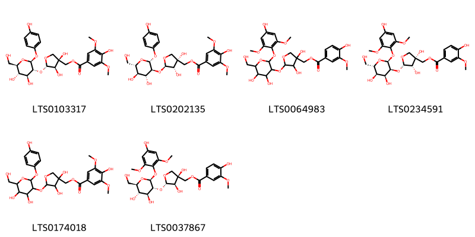{ width=100% }
    <figcaption>Hình ảnh cấu trúc hóa học của 6 hoạt chất thuộc nhóm Tannins gồm ['[(3s,4r,5s)-5-{[(2s,3r,4s,5s,6r)-4,5-dihydroxy-6-(hydroxymethyl)-2-(4-hydroxyphenoxy)oxan-3-yl]oxy}-3,4-dihydroxyoxolan-3-yl]methyl 4-hydroxy-3,5-dimethoxybenzoate (LTS0103317)', '[(3r,4s,5r)-5-{[(2r,3s,4r,5r,6s)-4,5-dihydroxy-6-(hydroxymethyl)-2-(4-hydroxyphenoxy)oxan-3-yl]oxy}-3,4-dihydroxyoxolan-3-yl]methyl 4-hydroxy-3,5-dimethoxybenzoate (LTS0202135)', '(5-{[4,5-dihydroxy-2-(4-hydroxy-2,6-dimethoxyphenoxy)-6-(hydroxymethyl)oxan-3-yl]oxy}-3,4-dihydroxyoxolan-3-yl)methyl 4-hydroxy-3-methoxybenzoate (LTS0064983)', '[(3r,4s,5s)-5-{[(2s,3s,4s,5r,6s)-4,5-dihydroxy-2-(4-hydroxy-2,6-dimethoxyphenoxy)-6-(hydroxymethyl)oxan-3-yl]oxy}-3,4-dihydroxyoxolan-3-yl]methyl 4-hydroxy-3-methoxybenzoate (LTS0234591)', '(5-{[4,5-dihydroxy-6-(hydroxymethyl)-2-(4-hydroxyphenoxy)oxan-3-yl]oxy}-3,4-dihydroxyoxolan-3-yl)methyl 4-hydroxy-3,5-dimethoxybenzoate (LTS0174018)', '[(3s,4r,5s)-5-{[(2s,3r,4s,5s,6r)-4,5-dihydroxy-2-(4-hydroxy-2,6-dimethoxyphenoxy)-6-(hydroxymethyl)oxan-3-yl]oxy}-3,4-dihydroxyoxolan-3-yl]methyl 4-hydroxy-3-methoxybenzoate (LTS0037867)'].</figcaption>
</figure>

---

### Dược dân tộc học

Danh sách các quốc gia có sử dụng *Glycosmis pentaphylla* trong điều trị các bệnh. 

| Country   | Disease    | Bệnh           |
|:----------|:-----------|:---------------|
| Elsewhere | Dentifrice | Kem đánh răng  |
| India     | Vermifuge  | Thuốc diệt sán |

---

# Chi Teclea

??? note "Danh sách các dược liệu thuộc chi"
    
	 - *Teclea verdooniana*

---
## Teclea verdooniana
### Thông tin về thực vật

!!! info "Phân loại thực vật của *Vepris verdoorniana* từ GIBF:"
    - **Kingdom:** Plantae
    - **Phylum:** Tracheophyta
    - **Order:** Sapindales
    - **Family:** Rutaceae
    - **Genus:** Vepris
    - **Species:** *Vepris verdoorniana*

 

| Label (VI)   | Label (EN)   | Scientific Name       | Descriptions (VI)   | Descriptions (EN)   | Also Known As (VI)   | Also Known As (EN)           |
|:-------------|:-------------|:----------------------|:--------------------|:--------------------|:---------------------|:-----------------------------|
| N/A          | N/A          | Glycosmis pentaphylla | loài thực vật       | species of plant    | ['']                 | ['gin berry', 'orangeberry'] |

#### Phân bố trên thế giới

**Từ CSDL GIBF** nan, Ghana, Liberia, Nigeria, Gabon, Côte d’Ivoire, Benin, Burkina Faso, Guinea, Cameroon, Sierra Leone, Togo

#### Phân bố tại Việt Nam

**Từ CSDL GIBF**: Không có ghi nhận ở Việt Nam

---
### Thành phần hóa học
        
- Theo cơ sở dữ liệu lotus: Từ loài *Vepris verdoorniana* đã phân lập và xác định được Chưa có hoạt chất nào được phân lập. hoạt chất thuộc về các nhóm Không có hoạt chất nào được phân lập. 

Không có hình ảnh nào được tạo ra

---

### Dược dân tộc học

Danh sách các quốc gia có sử dụng *Vepris verdoorniana* trong điều trị các bệnh. 

| Country   | Disease    | Bệnh          |
|:----------|:-----------|:--------------|
| Ghana     | Dentifrice | Kem đánh răng |

---

# Chi Chloroxylon

??? note "Danh sách các dược liệu thuộc chi"
    
	 - *Chloroxylon swietenia*

---
## Chloroxylon swietenia
### Thông tin về thực vật

!!! info "Phân loại thực vật của *Chloroxylon swietenia* từ GIBF:"
    - **Kingdom:** Plantae
    - **Phylum:** Tracheophyta
    - **Order:** Sapindales
    - **Family:** Rutaceae
    - **Genus:** Chloroxylon
    - **Species:** *Chloroxylon swietenia*

 

| Label (VI)   | Label (EN)   | Scientific Name       | Descriptions (VI)   | Descriptions (EN)   | Also Known As (VI)                                                 | Also Known As (EN)                            |
|:-------------|:-------------|:----------------------|:--------------------|:--------------------|:-------------------------------------------------------------------|:----------------------------------------------|
| N/A          | N/A          | Chloroxylon swietenia |                     | genus of plants     | ['Sơn tiêu Tích Lan', 'Sơn tiêu Đông Ấn', 'Chloroxylon swietenia'] | ['Ceylon satinwood', 'East Indian satinwood'] |

#### Phân bố trên thế giới

**Từ CSDL GIBF** nan, Sri Lanka, Nigeria, Cabo Verde, Angola, India, unknown or invalid, Indonesia, United States of America, Panama

#### Phân bố tại Việt Nam

**Từ CSDL GIBF**: Không có ghi nhận ở Việt Nam

---
### Thành phần hóa học
        
- Theo cơ sở dữ liệu lotus: Từ loài *Chloroxylon swietenia* đã phân lập và xác định được 4 hoạt chất thuộc về các nhóm Quinolines and derivatives, Coumarins and derivatives. 

|    | chemicalTaxonomyClassyfireClass   |   smiles_count |
|---:|:----------------------------------|---------------:|
|  0 | Coumarins and derivatives         |              2 |
|  1 | Quinolines and derivatives        |              2 |

#### Nhóm Coumarins and derivatives
<figure markdown="span">
    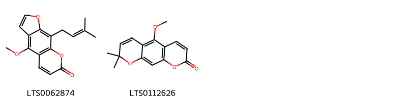{ width=100% }
    <figcaption>Hình ảnh cấu trúc hóa học của 2 hoạt chất thuộc nhóm Coumarins and derivatives gồm ['4-methoxy-9-(3-methylbut-2-en-1-yl)furo[3,2-g]chromen-7-one (LTS0062874)', 'xanthoxyletin (LTS0112626)'].</figcaption>
</figure>
#### Nhóm Quinolines and derivatives
<figure markdown="span">
    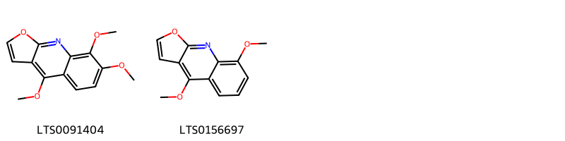{ width=100% }
    <figcaption>Hình ảnh cấu trúc hóa học của 2 hoạt chất thuộc nhóm Quinolines and derivatives gồm ['skimmianine (LTS0091404)', 'fagarine (LTS0156697)'].</figcaption>
</figure>

---

### Dược dân tộc học

Danh sách các quốc gia có sử dụng *Chloroxylon swietenia* trong điều trị các bệnh. 

| Country   | Disease    | Bệnh      |
|:----------|:-----------|:----------|
| Elsewhere | Astringent | Lam se da |
| Turkey    | Astringent | Lam se da |

---

# Chi Fagara

??? note "Danh sách các dược liệu thuộc chi"
    
	 - *Fagara chalybea*
	 - *Fagara chiloperone*
	 - *Fagara zanthoxyloides*

---
## Fagara chalybea
### Thông tin về thực vật

!!! info "Phân loại thực vật của *Zanthoxylum chalybaeum* từ GIBF:"
    - **Kingdom:** Plantae
    - **Phylum:** Tracheophyta
    - **Order:** Sapindales
    - **Family:** Rutaceae
    - **Genus:** Zanthoxylum
    - **Species:** *Zanthoxylum chalybaeum*

 

| Label (VI)   | Label (EN)   | Scientific Name       | Descriptions (VI)   | Descriptions (EN)   | Also Known As (VI)                                                 | Also Known As (EN)                            |
|:-------------|:-------------|:----------------------|:--------------------|:--------------------|:-------------------------------------------------------------------|:----------------------------------------------|
| N/A          | N/A          | Chloroxylon swietenia |                     | genus of plants     | ['Sơn tiêu Tích Lan', 'Sơn tiêu Đông Ấn', 'Chloroxylon swietenia'] | ['Ceylon satinwood', 'East Indian satinwood'] |

#### Phân bố trên thế giới

**Từ CSDL GIBF** nan, Botswana, Burundi, Kenya, Tanzania, United Republic of, Ethiopia

#### Phân bố tại Việt Nam

**Từ CSDL GIBF**: Không có ghi nhận ở Việt Nam

---
### Thành phần hóa học
        
- Theo cơ sở dữ liệu lotus: Từ loài *Zanthoxylum chalybaeum* đã phân lập và xác định được Chưa có hoạt chất nào được phân lập. hoạt chất thuộc về các nhóm Không có hoạt chất nào được phân lập. 

Không có hình ảnh nào được tạo ra

---

### Dược dân tộc học

Danh sách các quốc gia có sử dụng *Zanthoxylum chalybaeum* trong điều trị các bệnh. 

| Country         | Disease    | Bệnh          |
|:----------------|:-----------|:--------------|
| Africa(Swahili) | Dentifrice | Kem đánh răng |

---

---
## Fagara chiloperone
### Thông tin về thực vật

!!! info "Phân loại thực vật của *Zanthoxylum caribaeum* từ GIBF:"
    - **Kingdom:** Plantae
    - **Phylum:** Tracheophyta
    - **Order:** Sapindales
    - **Family:** Rutaceae
    - **Genus:** Zanthoxylum
    - **Species:** *Zanthoxylum caribaeum*

 

| Label (VI)   | Label (EN)   | Scientific Name    | Descriptions (VI)   | Descriptions (EN)   | Also Known As (VI)   | Also Known As (EN)   |
|:-------------|:-------------|:-------------------|:--------------------|:--------------------|:---------------------|:---------------------|
| N/A          | N/A          | Fagara chiloperone |                     |                     | ['']                 | ['']                 |

#### Phân bố trên thế giới

**Từ CSDL GIBF** nan, Brazil, Bolivia (Plurinational State of), Argentina, Paraguay

#### Phân bố tại Việt Nam

**Từ CSDL GIBF**: Không có ghi nhận ở Việt Nam

---
### Thành phần hóa học
        
- Theo cơ sở dữ liệu lotus: Từ loài *Zanthoxylum caribaeum* đã phân lập và xác định được Chưa có hoạt chất nào được phân lập. hoạt chất thuộc về các nhóm Không có hoạt chất nào được phân lập. 

Không có hình ảnh nào được tạo ra

---

### Dược dân tộc học

Danh sách các quốc gia có sử dụng *Zanthoxylum caribaeum* trong điều trị các bệnh. 

| Country   | Disease     | Bệnh        |
|:----------|:------------|:------------|
| Venezuela | Emmenagogue | Emmenagogue |

---

---
## Fagara zanthoxyloides
### Thông tin về thực vật

!!! info "Phân loại thực vật của *Zanthoxylum zanthoxyloides* từ GIBF:"
    - **Kingdom:** Plantae
    - **Phylum:** Tracheophyta
    - **Order:** Sapindales
    - **Family:** Rutaceae
    - **Genus:** Zanthoxylum
    - **Species:** *Zanthoxylum zanthoxyloides*

 

| Label (VI)   | Label (EN)   | Scientific Name       | Descriptions (VI)   | Descriptions (EN)   | Also Known As (VI)   | Also Known As (EN)   |
|:-------------|:-------------|:----------------------|:--------------------|:--------------------|:---------------------|:---------------------|
| N/A          | N/A          | Fagara zanthoxyloides | loài thực vật       | species of plant    | ['']                 | ['']                 |

#### Phân bố trên thế giới

**Từ CSDL GIBF** nan, Ghana, Mali, Senegal, Nigeria, Côte d’Ivoire, Brazil, Benin, Burkina Faso, Guinea, Cameroon, Togo

#### Phân bố tại Việt Nam

**Từ CSDL GIBF**: Không có ghi nhận ở Việt Nam

---
### Thành phần hóa học
        
- Theo cơ sở dữ liệu lotus: Từ loài *Zanthoxylum zanthoxyloides* đã phân lập và xác định được Chưa có hoạt chất nào được phân lập. hoạt chất thuộc về các nhóm Không có hoạt chất nào được phân lập. 

Không có hình ảnh nào được tạo ra

---

### Dược dân tộc học

Danh sách các quốc gia có sử dụng *Zanthoxylum zanthoxyloides* trong điều trị các bệnh. 

| Country     | Disease               | Bệnh                      |
|:------------|:----------------------|:--------------------------|
| Africa      | Vermifuge             | Thuốc diệt sán            |
| Guinea      | Narcotic              | Thuốc gây ngủ, gây mê     |
| Nigeria     | Narcotic              | Thuốc gây ngủ, gây mê     |
| Upper Volta | Analgesic, Antiseptic | Thuốc giảm đau, sát trùng |

---

# Chi Skimmia

??? note "Danh sách các dược liệu thuộc chi"
    
	 - *Skimmia arborescens*
	 - *Skimmia japonica*
	 - *Skimmia laurifolia*
	 - *Skimmia reevesiana*

---
## Skimmia arborescens
### Thông tin về thực vật

!!! info "Phân loại thực vật của *Skimmia arborescens* từ GIBF:"
    - **Kingdom:** Plantae
    - **Phylum:** Tracheophyta
    - **Order:** Sapindales
    - **Family:** Rutaceae
    - **Genus:** Skimmia
    - **Species:** *Skimmia arborescens*

 

| Label (VI)   | Label (EN)   | Scientific Name     | Descriptions (VI)   | Descriptions (EN)   | Also Known As (VI)   | Also Known As (EN)   |
|:-------------|:-------------|:--------------------|:--------------------|:--------------------|:---------------------|:---------------------|
| N/A          | N/A          | Skimmia arborescens | loài thực vật       | species of plant    | ['']                 | ['']                 |

#### Phân bố trên thế giới

**Từ CSDL GIBF** Lao People’s Democratic Republic, Myanmar, Bhutan, Viet Nam, China, Canada, Nepal

#### Phân bố tại Việt Nam

**Từ CSDL GIBF**: Lao Cai, Tỉnh Khánh Hòa, Kon Tum, Lai Chau, Ninh Thuan, Lam Dong

---
### Thành phần hóa học
        
- Theo cơ sở dữ liệu lotus: Từ loài *Skimmia arborescens* đã phân lập và xác định được 8 hoạt chất thuộc về các nhóm Steroids and steroid derivatives. 

|    | chemicalTaxonomyClassyfireClass   |   smiles_count |
|---:|:----------------------------------|---------------:|
|  0 | Steroids and steroid derivatives  |              8 |

#### Nhóm Steroids and steroid derivatives
<figure markdown="span">
    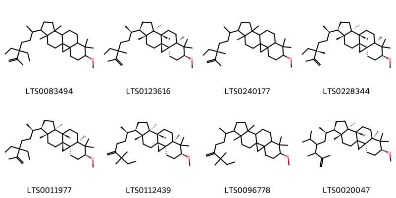{ width=100% }
    <figcaption>Hình ảnh cấu trúc hóa học của 8 hoạt chất thuộc nhóm Steroids and steroid derivatives gồm ['15-(5,5-diethyl-6-methylhept-6-en-2-yl)-6-methoxy-7,7,12,16-tetramethylpentacyclo[9.7.0.0¹,³.0³,⁸.0¹²,¹⁶]octadecane (LTS0083494)', '(1s,3r,6s,8r,11s,12s,15r,16r)-15-[(2r)-5-ethyl-5,6-dimethylhept-6-en-2-yl]-6-methoxy-7,7,12,16-tetramethylpentacyclo[9.7.0.0¹,³.0³,⁸.0¹²,¹⁶]octadecane (LTS0123616)', '15-(5-ethyl-5,6-dimethylhept-6-en-2-yl)-6-methoxy-7,7,12,16-tetramethylpentacyclo[9.7.0.0¹,³.0³,⁸.0¹²,¹⁶]octadecane (LTS0240177)', '(1s,3r,6s,8r,11s,12s,15r,16r)-15-[(2r,5r)-5-ethyl-5,6-dimethylhept-6-en-2-yl]-6-methoxy-7,7,12,16-tetramethylpentacyclo[9.7.0.0¹,³.0³,⁸.0¹²,¹⁶]octadecane (LTS0228344)', '(1s,3r,6s,8r,11s,12s,15r,16r)-15-[(2r)-5,5-diethyl-6-methylhept-6-en-2-yl]-6-methoxy-7,7,12,16-tetramethylpentacyclo[9.7.0.0¹,³.0³,⁸.0¹²,¹⁶]octadecane (LTS0011977)', '(1s,3r,6s,8r,11s,12s,15r,16r)-15-[(2r)-6,6-dimethyl-5-methylideneoctan-2-yl]-6-methoxy-7,7,12,16-tetramethylpentacyclo[9.7.0.0¹,³.0³,⁸.0¹²,¹⁶]octadecane (LTS0112439)', '15-(6,6-dimethyl-5-methylideneoctan-2-yl)-6-methoxy-7,7,12,16-tetramethylpentacyclo[9.7.0.0¹,³.0³,⁸.0¹²,¹⁶]octadecane (LTS0096778)', '(1s,3r,6s,8r,11s,12s,15r,16r)-15-[(2r)-4-isopropyl-5,6-dimethylhept-6-en-2-yl]-6-methoxy-7,7,12,16-tetramethylpentacyclo[9.7.0.0¹,³.0³,⁸.0¹²,¹⁶]octadecane (LTS0020047)'].</figcaption>
</figure>

---

### Dược dân tộc học

Danh sách các quốc gia có sử dụng *Skimmia arborescens* trong điều trị các bệnh. 

| Country   | Disease   | Bệnh     |
|:----------|:----------|:---------|
| Elsewhere | Poison    | Chất độc |

---

---
## Skimmia japonica
### Thông tin về thực vật

!!! info "Phân loại thực vật của *Skimmia japonica* từ GIBF:"
    - **Kingdom:** Plantae
    - **Phylum:** Tracheophyta
    - **Order:** Sapindales
    - **Family:** Rutaceae
    - **Genus:** Skimmia
    - **Species:** *Skimmia japonica*

 

| Label (VI)   | Label (EN)   | Scientific Name   | Descriptions (VI)   | Descriptions (EN)   | Also Known As (VI)   | Also Known As (EN)   |
|:-------------|:-------------|:------------------|:--------------------|:--------------------|:---------------------|:---------------------|
| N/A          | N/A          | Skimmia japonica  | loài thực vật       | species of plant    | ['']                 | ['Japanese skimmia'] |

#### Phân bố trên thế giới

**Từ CSDL GIBF** Netherlands, Japan, Germany, Belgium, Chinese Taipei, Ireland, Russian Federation, United States of America, Sweden, Poland, United Kingdom of Great Britain and Northern Ireland, Canada

#### Phân bố tại Việt Nam

**Từ CSDL GIBF**: Không có ghi nhận ở Việt Nam

---
### Thành phần hóa học
        
- Theo cơ sở dữ liệu lotus: Từ loài *Skimmia japonica* đã phân lập và xác định được 40 hoạt chất thuộc về các nhóm Prenol lipids, Steroids and steroid derivatives, Quinolines and derivatives, Coumarins and derivatives, Naphthopyrans. 

|    | chemicalTaxonomyClassyfireClass   |   smiles_count |
|---:|:----------------------------------|---------------:|
|  0 | Coumarins and derivatives         |             19 |
|  1 | Naphthopyrans                     |              1 |
|  2 | Prenol lipids                     |             12 |
|  3 | Quinolines and derivatives        |              3 |
|  4 | Steroids and steroid derivatives  |              4 |

#### Nhóm Coumarins and derivatives
<figure markdown="span">
    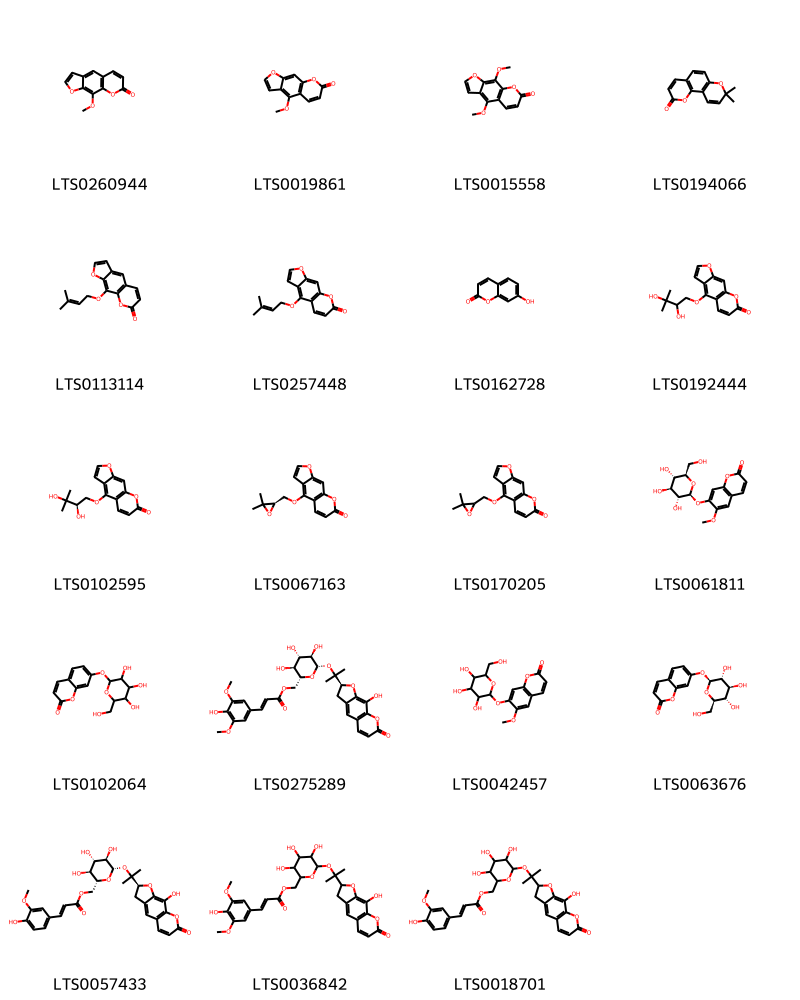{ width=100% }
    <figcaption>Hình ảnh cấu trúc hóa học của 19 hoạt chất thuộc nhóm Coumarins and derivatives gồm ['methoxsalen (LTS0260944)', 'bergapten (LTS0019861)', 'isopimpinellin (LTS0015558)', 'seselin (LTS0194066)', 'imperatorin (LTS0113114)', 'isoimperatorin (LTS0257448)', 'umbelliferone (LTS0162728)', '4-(2,3-dihydroxy-3-methylbutoxy)furo[3,2-g]chromen-7-one (LTS0192444)', '(r)-oxypeucedanin hydrate (LTS0102595)', '(+)-oxypeucedanin (LTS0067163)', '4-[(3,3-dimethyloxiran-2-yl)methoxy]furo[3,2-g]chromen-7-one (LTS0170205)', 'scopolin (LTS0061811)', 'skimmin (LTS0102064)', '[(2r,3s,4s,5r,6s)-3,4,5-trihydroxy-6-({2-[(2s)-9-hydroxy-7-oxo-2h,3h-furo[3,2-g]chromen-2-yl]propan-2-yl}oxy)oxan-2-yl]methyl (2e)-3-(4-hydroxy-3,5-dimethoxyphenyl)prop-2-enoate (LTS0275289)', '6-methoxy-7-{[3,4,5-trihydroxy-6-(hydroxymethyl)oxan-2-yl]oxy}chromen-2-one (LTS0042457)', 'skimmin (LTS0063676)', '[(2r,3s,4s,5r,6s)-3,4,5-trihydroxy-6-({2-[(2s)-9-hydroxy-7-oxo-2h,3h-furo[3,2-g]chromen-2-yl]propan-2-yl}oxy)oxan-2-yl]methyl (2e)-3-(4-hydroxy-3-methoxyphenyl)prop-2-enoate (LTS0057433)', '{3,4,5-trihydroxy-6-[(2-{9-hydroxy-7-oxo-2h,3h-furo[3,2-g]chromen-2-yl}propan-2-yl)oxy]oxan-2-yl}methyl 3-(4-hydroxy-3,5-dimethoxyphenyl)prop-2-enoate (LTS0036842)', '{3,4,5-trihydroxy-6-[(2-{9-hydroxy-7-oxo-2h,3h-furo[3,2-g]chromen-2-yl}propan-2-yl)oxy]oxan-2-yl}methyl 3-(4-hydroxy-3-methoxyphenyl)prop-2-enoate (LTS0018701)'].</figcaption>
</figure>
#### Nhóm Naphthopyrans
<figure markdown="span">
    { width=100% }
    <figcaption>Hình ảnh cấu trúc hóa học của 1 hoạt chất thuộc nhóm Naphthopyrans gồm ['methyl (3s)-3-[(1r,2s,6s,10s,11s,14s)-11-(furan-3-yl)-3-hydroxy-2,6,10-trimethyl-4,13-dioxo-12,15-dioxatetracyclo[8.5.0.0¹,¹⁴.0²,⁷]pentadecan-6-yl]-3-hydroxypropanoate (LTS0194427)'].</figcaption>
</figure>
#### Nhóm Prenol lipids
<figure markdown="span">
    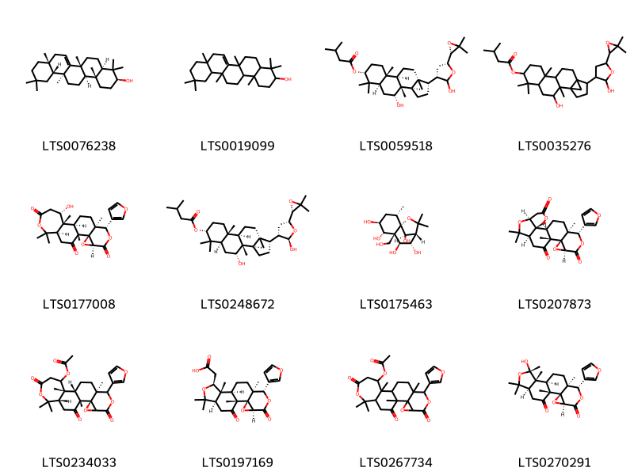{ width=100% }
    <figcaption>Hình ảnh cấu trúc hóa học của 12 hoạt chất thuộc nhóm Prenol lipids gồm ['alnulin (LTS0076238)', 'taraxerol (LTS0019099)', 'skimmiarepin a (LTS0059518)', '15-[5-(3,3-dimethyloxiran-2-yl)-2-hydroxyoxolan-3-yl]-3-hydroxy-2,6,6,10-tetramethylpentacyclo[12.3.1.0¹,¹⁴.0²,¹¹.0⁵,¹⁰]octadecan-7-yl 3-methylbutanoate (LTS0035276)', '(1r,2r,4s,7s,8s,11r,12r,13s,18r)-7-(furan-3-yl)-13-hydroxy-1,8,12,17,17-pentamethyl-3,6,16-trioxapentacyclo[9.9.0.0²,⁴.0²,⁸.0¹²,¹⁸]icosane-5,15,20-trione (LTS0177008)', '(1s,2r,3r,5r,7r,10s,11r,14r,15s)-15-[(2r,3s,5r)-5-[(2s)-3,3-dimethyloxiran-2-yl]-2-hydroxyoxolan-3-yl]-3-hydroxy-2,6,6,10-tetramethylpentacyclo[12.3.1.0¹,¹⁴.0²,¹¹.0⁵,¹⁰]octadecan-7-yl 3-methylbutanoate (LTS0248672)', '(1s,2s,4s,5s,6s,7s,8s,9r,12r)-6-(hydroxymethyl)-2,10,10-trimethyl-11-oxatricyclo[7.2.1.0¹,⁶]dodecane-4,5,7,8,12-pentol (LTS0175463)', 'limonin (LTS0207873)', '(1r,2r,8s,11s,12r,18s)-7-(furan-3-yl)-1,8,12,17,17-pentamethyl-5,15,20-trioxo-3,6,16-trioxapentacyclo[9.9.0.0²,⁴.0²,⁸.0¹²,¹⁸]icosan-13-yl acetate (LTS0234033)', '[(1r,2r,4s,7s,8s,11r,12r,13s,16r)-7-(furan-3-yl)-1,8,12,15,15-pentamethyl-5,18-dioxo-3,6,14-trioxapentacyclo[9.7.0.0²,⁴.0²,⁸.0¹²,¹⁶]octadecan-13-yl]acetic acid (LTS0197169)', '7-(furan-3-yl)-1,8,12,17,17-pentamethyl-5,15,20-trioxo-3,6,16-trioxapentacyclo[9.9.0.0²,⁴.0²,⁸.0¹²,¹⁸]icosan-13-yl acetate (LTS0267734)', '(1r,2r,4s,7s,8s,11r,12r,13s,16r)-7-(furan-3-yl)-13-hydroxy-1,8,12,13,15,15-hexamethyl-3,6,14-trioxapentacyclo[9.7.0.0²,⁴.0²,⁸.0¹²,¹⁶]octadecane-5,18-dione (LTS0270291)'].</figcaption>
</figure>
#### Nhóm Quinolines and derivatives
<figure markdown="span">
    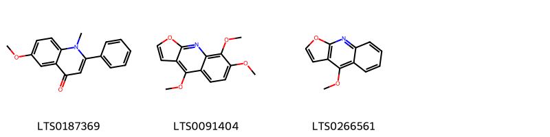{ width=100% }
    <figcaption>Hình ảnh cấu trúc hóa học của 3 hoạt chất thuộc nhóm Quinolines and derivatives gồm ['6-methoxy-1-methyl-2-phenylquinolin-4-one (LTS0187369)', 'skimmianine (LTS0091404)', 'dictamnine (LTS0266561)'].</figcaption>
</figure>
#### Nhóm Steroids and steroid derivatives
<figure markdown="span">
    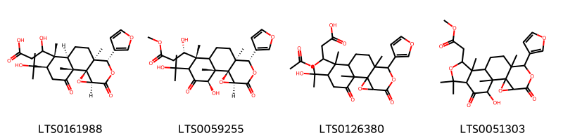{ width=100% }
    <figcaption>Hình ảnh cấu trúc hóa học của 4 hoạt chất thuộc nhóm Steroids and steroid derivatives gồm ['3-[(1r,2r,5r,6r,7r,10s,11s,14s)-11-(furan-3-yl)-5-(2-hydroxypropan-2-yl)-2,6,10-trimethyl-3,13-dioxo-12,15-dioxatetracyclo[8.5.0.0¹,¹⁴.0²,⁷]pentadecan-6-yl]-3-hydroxypropanoic acid (LTS0161988)', 'methyl (3s)-3-[(1r,2s,3r,6r,10s,11s,14s)-11-(furan-3-yl)-3-hydroxy-5-(2-hydroxypropan-2-yl)-2,6,10-trimethyl-4,13-dioxo-12,15-dioxatetracyclo[8.5.0.0¹,¹⁴.0²,⁷]pentadecan-6-yl]-3-hydroxypropanoate (LTS0059255)', '3-(acetyloxy)-3-[11-(furan-3-yl)-5-(2-hydroxypropan-2-yl)-2,6,10-trimethyl-3,13-dioxo-12,15-dioxatetracyclo[8.5.0.0¹,¹⁴.0²,⁷]pentadecan-6-yl]propanoic acid (LTS0126380)', 'methyl 2-[7-(furan-3-yl)-18-hydroxy-1,8,12,15,15-pentamethyl-5,17-dioxo-3,6,14-trioxapentacyclo[9.7.0.0²,⁴.0²,⁸.0¹²,¹⁶]octadecan-13-yl]acetate (LTS0051303)'].</figcaption>
</figure>

---

### Dược dân tộc học

Danh sách các quốc gia có sử dụng *Skimmia japonica* trong điều trị các bệnh. 

| Country   | Disease               | Bệnh                         |
|:----------|:----------------------|:-----------------------------|
| China     | Poison, Tonic, Poison | Chất độc, Thuốc bổ, Chất độc |

---

---
## Skimmia laurifolia
### Thông tin về thực vật

!!! info "Phân loại thực vật của *N/A* từ GIBF:"
    - **Kingdom:** Plantae
    - **Phylum:** Tracheophyta
    - **Order:** Sapindales
    - **Family:** Rutaceae
    - **Genus:** Skimmia
    - **Species:** *N/A*

 

| Label (VI)   | Label (EN)   | Scientific Name   | Descriptions (VI)   | Descriptions (EN)   | Also Known As (VI)   | Also Known As (EN)   |
|:-------------|:-------------|:------------------|:--------------------|:--------------------|:---------------------|:---------------------|
| N/A          | N/A          | Skimmia japonica  | loài thực vật       | species of plant    | ['']                 | ['Japanese skimmia'] |

#### Phân bố trên thế giới

**Từ CSDL GIBF** Netherlands, Japan, Germany, Belgium, Chinese Taipei, Ireland, Russian Federation, United States of America, Sweden, Poland, United Kingdom of Great Britain and Northern Ireland, Canada

#### Phân bố tại Việt Nam

**Từ CSDL GIBF**: Không có ghi nhận ở Việt Nam

---
### Thành phần hóa học
        
- Theo cơ sở dữ liệu lotus: Từ loài *N/A* đã phân lập và xác định được Chưa có hoạt chất nào được phân lập. hoạt chất thuộc về các nhóm Không có hoạt chất nào được phân lập. 

Không có hình ảnh nào được tạo ra

---

### Dược dân tộc học

Danh sách các quốc gia có sử dụng *N/A* trong điều trị các bệnh. 

| Country   | Disease   | Bệnh     |
|:----------|:----------|:---------|
| India     | Soap      | Xà phòng |

---

---
## Skimmia reevesiana
### Thông tin về thực vật

!!! info "Phân loại thực vật của *Skimmia reevesiana* từ GIBF:"
    - **Kingdom:** Plantae
    - **Phylum:** Tracheophyta
    - **Order:** Sapindales
    - **Family:** Rutaceae
    - **Genus:** Skimmia
    - **Species:** *Skimmia reevesiana*

 

| Label (VI)   | Label (EN)   | Scientific Name    | Descriptions (VI)   | Descriptions (EN)   | Also Known As (VI)   | Also Known As (EN)   |
|:-------------|:-------------|:-------------------|:--------------------|:--------------------|:---------------------|:---------------------|
| N/A          | N/A          | Skimmia reevesiana | loài thực vật       | species of plant    | ['']                 | ['']                 |

#### Phân bố trên thế giới

**Từ CSDL GIBF** nan, Netherlands, Japan, Belgium, Korea, Republic of, Chinese Taipei, Honduras, United States of America, Philippines, Viet Nam, China

#### Phân bố tại Việt Nam

**Từ CSDL GIBF**: Kon Tum

---
### Thành phần hóa học
        
- Theo cơ sở dữ liệu lotus: Từ loài *Skimmia reevesiana* đã phân lập và xác định được 17 hoạt chất thuộc về các nhóm Quinolines and derivatives, Prenol lipids, Coumarins and derivatives. 

|    | chemicalTaxonomyClassyfireClass   |   smiles_count |
|---:|:----------------------------------|---------------:|
|  0 | Coumarins and derivatives         |              8 |
|  1 | Prenol lipids                     |              1 |
|  2 | Quinolines and derivatives        |              8 |

#### Nhóm Coumarins and derivatives
<figure markdown="span">
    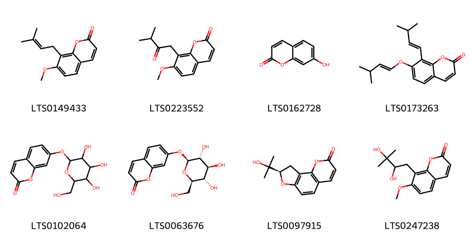{ width=100% }
    <figcaption>Hình ảnh cấu trúc hóa học của 8 hoạt chất thuộc nhóm Coumarins and derivatives gồm ['osthole (LTS0149433)', '7-methoxy-8-(3-methyl-2-oxobutyl)chromen-2-one (LTS0223552)', 'umbelliferone (LTS0162728)', '8-(3-methylbut-1-en-1-yl)-7-[(3-methylbut-1-en-1-yl)oxy]chromen-2-one (LTS0173263)', 'skimmin (LTS0102064)', 'skimmin (LTS0063676)', '(-)-columbianetin (LTS0097915)', '8-(2,3-dihydroxy-3-methylbutyl)-7-methoxychromen-2-one (LTS0247238)'].</figcaption>
</figure>
#### Nhóm Prenol lipids
<figure markdown="span">
    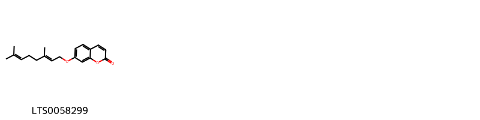{ width=100% }
    <figcaption>Hình ảnh cấu trúc hóa học của 1 hoạt chất thuộc nhóm Prenol lipids gồm ['auraptene (LTS0058299)'].</figcaption>
</figure>
#### Nhóm Quinolines and derivatives
<figure markdown="span">
    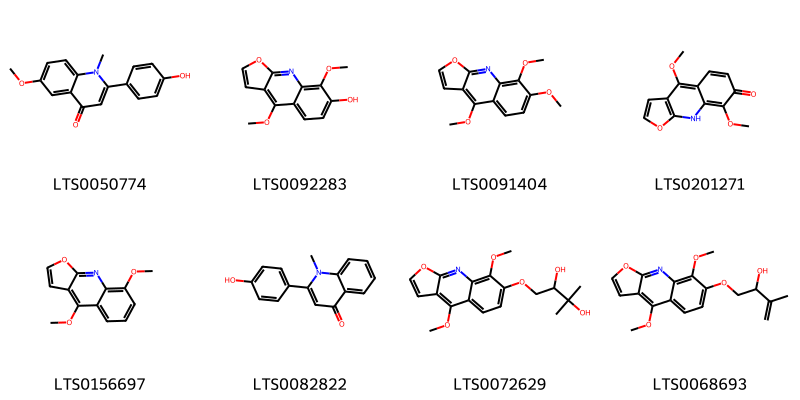{ width=100% }
    <figcaption>Hình ảnh cấu trúc hóa học của 8 hoạt chất thuộc nhóm Quinolines and derivatives gồm ['2-(4-hydroxyphenyl)-6-methoxy-1-methylquinolin-4-one (LTS0050774)', 'haplopine (LTS0092283)', 'skimmianine (LTS0091404)', '4,8-dimethoxy-9h-furo[2,3-b]quinolin-7-one (LTS0201271)', 'fagarine (LTS0156697)', '2-(4-hydroxyphenyl)-1-methylquinolin-4-one (LTS0082822)', 'evoxine (LTS0072629)', '1-({4,8-dimethoxyfuro[2,3-b]quinolin-7-yl}oxy)-3-methylbut-3-en-2-ol (LTS0068693)'].</figcaption>
</figure>

---

### Dược dân tộc học

Danh sách các quốc gia có sử dụng *Skimmia reevesiana* trong điều trị các bệnh. 

| Country   | Disease   | Bệnh     |
|:----------|:----------|:---------|
| China     | Poison    | Chất độc |

---

# Chi Triphasia

??? note "Danh sách các dược liệu thuộc chi"
    
	 - *Triphasia trifolia*

---
## Triphasia trifolia
### Thông tin về thực vật

!!! info "Phân loại thực vật của *Triphasia trifolia* từ GIBF:"
    - **Kingdom:** Plantae
    - **Phylum:** Tracheophyta
    - **Order:** Sapindales
    - **Family:** Rutaceae
    - **Genus:** Triphasia
    - **Species:** *Triphasia trifolia*

 

| Label (VI)   | Label (EN)   | Scientific Name    | Descriptions (VI)   | Descriptions (EN)   | Also Known As (VI)   | Also Known As (EN)   |
|:-------------|:-------------|:-------------------|:--------------------|:--------------------|:---------------------|:---------------------|
| N/A          | N/A          | Triphasia trifolia | loài thực vật       | species of plant    | ['']                 | ['']                 |

#### Phân bố trên thế giới

**Từ CSDL GIBF** Virgin Islands (U.S.), nan, Micronesia (Federated States of), Christmas Island, Guadeloupe, Belgium, Cocos (Keeling) Islands, Saint Lucia, unknown or invalid, Nicaragua, Virgin Islands (British), Norway, Venezuela (Bolivarian Republic of), French Guiana, Canada, Puerto Rico, Réunion, United States of America, Bonaire, Sint Eustatius and Saba, Timor-Leste, Solomon Islands, Maldives, Belize, Saint Martin (French part), Trinidad and Tobago, Barbados, Suriname, Saint Barthélemy, Martinique, Guam, Brazil, Sint Maarten (Dutch part), Cuba, Dominican Republic, Mexico, Viet Nam, Saint Kitts and Nevis, Seychelles, Colombia, Montserrat, India, Indonesia, Cayman Islands, Antigua and Barbuda, Philippines, Northern Mariana Islands

#### Phân bố tại Việt Nam

**Từ CSDL GIBF**: Không có ghi nhận ở Việt Nam

---
### Thành phần hóa học
        
- Theo cơ sở dữ liệu lotus: Từ loài *Triphasia trifolia* đã phân lập và xác định được 14 hoạt chất thuộc về các nhóm Prenol lipids, Coumarins and derivatives. 

|    | chemicalTaxonomyClassyfireClass   |   smiles_count |
|---:|:----------------------------------|---------------:|
|  0 | Coumarins and derivatives         |             10 |
|  1 | Prenol lipids                     |              4 |

#### Nhóm Coumarins and derivatives
<figure markdown="span">
    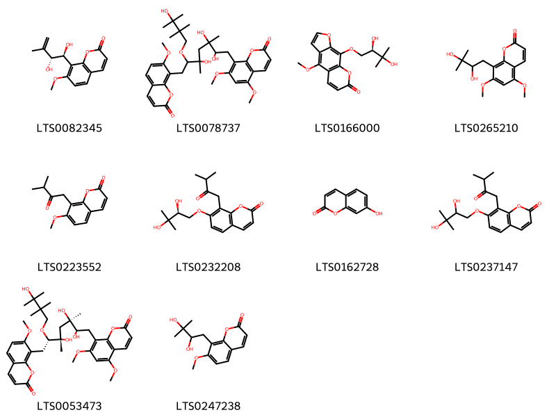{ width=100% }
    <figcaption>Hình ảnh cấu trúc hóa học của 10 hoạt chất thuộc nhóm Coumarins and derivatives gồm ['8-[(1s,2r)-1,2-dihydroxy-3-methylbut-3-en-1-yl]-7-methoxychromen-2-one (LTS0082345)', '5,7-dimethoxy-8-[2,3,5-trihydroxy-6-(3-hydroxy-2,2,3-trimethylbutoxy)-7-(7-methoxy-2-oxochromen-8-yl)-3,5-dimethylheptyl]chromen-2-one (LTS0078737)', 'byakangelicin (LTS0166000)', '8-(2,3-dihydroxy-3-methylbutyl)-5,7-dimethoxychromen-2-one (LTS0265210)', '7-methoxy-8-(3-methyl-2-oxobutyl)chromen-2-one (LTS0223552)', '7-[(2s)-2,3-dihydroxy-3-methylbutoxy]-8-(3-methyl-2-oxobutyl)chromen-2-one (LTS0232208)', 'umbelliferone (LTS0162728)', '7-(2,3-dihydroxy-3-methylbutoxy)-8-(3-methyl-2-oxobutyl)chromen-2-one (LTS0237147)', '5,7-dimethoxy-8-[(2r,3r,5s,6s)-2,3,5-trihydroxy-6-(3-hydroxy-2,2,3-trimethylbutoxy)-7-(7-methoxy-2-oxochromen-8-yl)-3,5-dimethylheptyl]chromen-2-one (LTS0053473)', '8-(2,3-dihydroxy-3-methylbutyl)-7-methoxychromen-2-one (LTS0247238)'].</figcaption>
</figure>
#### Nhóm Prenol lipids
<figure markdown="span">
    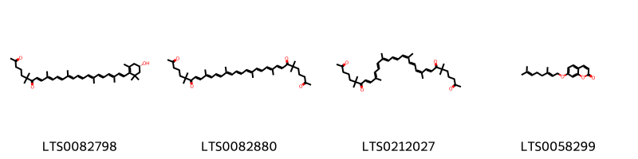{ width=100% }
    <figcaption>Hình ảnh cấu trúc hóa học của 4 hoạt chất thuộc nhóm Prenol lipids gồm ['(8e,10e,12e,14e,16e,18e,20e,22e,24e)-25-[(4s)-4-hydroxy-2,6,6-trimethylcyclohex-1-en-1-yl]-6,6,10,14,19,23-hexamethylpentacosa-8,10,12,14,16,18,20,22,24-nonaene-2,7-dione (LTS0082798)', '(8e,10e,12e,14e,16e,18e,20e,22e,24e)-6,6,10,14,19,23,27,27-octamethyldotriaconta-8,10,12,14,16,18,20,22,24-nonaene-2,7,26,31-tetrone (LTS0082880)', '6,6,10,14,19,23,27,27-octamethyldotriaconta-8,10,12,14,16,18,20,22,24-nonaene-2,7,26,31-tetrone (LTS0212027)', 'auraptene (LTS0058299)'].</figcaption>
</figure>

---

### Dược dân tộc học

Danh sách các quốc gia có sử dụng *Triphasia trifolia* trong điều trị các bệnh. 

| Country   | Disease   | Bệnh     |
|:----------|:----------|:---------|
| Java      | Cosmetic  | Cosmetic |

---

# Chi Thamnosma

??? note "Danh sách các dược liệu thuộc chi"
    
	 - *Thamnosma montana*

---
## Thamnosma montana
### Thông tin về thực vật

!!! info "Phân loại thực vật của *Thamnosma montana* từ GIBF:"
    - **Kingdom:** Plantae
    - **Phylum:** Tracheophyta
    - **Order:** Sapindales
    - **Family:** Rutaceae
    - **Genus:** Thamnosma
    - **Species:** *Thamnosma montana*

 

| Label (VI)   | Label (EN)   | Scientific Name   | Descriptions (VI)   | Descriptions (EN)   | Also Known As (VI)   | Also Known As (EN)   |
|:-------------|:-------------|:------------------|:--------------------|:--------------------|:---------------------|:---------------------|
| N/A          | N/A          | Thamnosma montana | loài thực vật       | species of plant    | ['']                 | ['']                 |

#### Phân bố trên thế giới

**Từ CSDL GIBF** United States of America, Mexico

#### Phân bố tại Việt Nam

**Từ CSDL GIBF**: Không có ghi nhận ở Việt Nam

---
### Thành phần hóa học
        
- Theo cơ sở dữ liệu lotus: Từ loài *Thamnosma montana* đã phân lập và xác định được 33 hoạt chất thuộc về các nhóm Quinolines and derivatives, Steroids and steroid derivatives, Coumarins and derivatives. 

|    | chemicalTaxonomyClassyfireClass   |   smiles_count |
|---:|:----------------------------------|---------------:|
|  0 | Coumarins and derivatives         |             10 |
|  1 | Quinolines and derivatives        |             21 |
|  2 | Steroids and steroid derivatives  |              2 |

#### Nhóm Coumarins and derivatives
<figure markdown="span">
    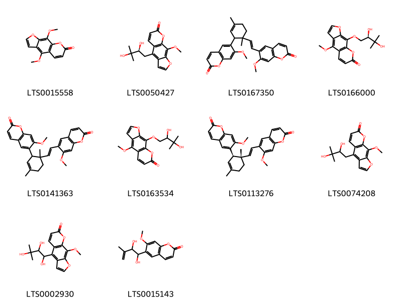{ width=100% }
    <figcaption>Hình ảnh cấu trúc hóa học của 10 hoạt chất thuộc nhóm Coumarins and derivatives gồm ['isopimpinellin (LTS0015558)', '4-[(2s)-2,3-dihydroxy-3-methylbutyl]-9-methoxyfuro[3,2-g]chromen-7-one (LTS0050427)', '7-methoxy-6-{6-[2-(7-methoxy-2-oxochromen-6-yl)ethenyl]-3,6-dimethylcyclohex-2-en-1-yl}chromen-2-one (LTS0167350)', 'byakangelicin (LTS0166000)', '7-methoxy-6-{6-[(1e)-2-(7-methoxy-2-oxochromen-6-yl)ethenyl]-3,6-dimethylcyclohex-2-en-1-yl}chromen-2-one (LTS0141363)', '9-(2,3-dihydroxy-3-methylbutoxy)-4-methoxyfuro[3,2-g]chromen-7-one (LTS0163534)', '7-methoxy-6-[(1r,6s)-6-[(1e)-2-(7-methoxy-2-oxochromen-6-yl)ethenyl]-3,6-dimethylcyclohex-2-en-1-yl]chromen-2-one (LTS0113276)', '4-(2,3-dihydroxy-3-methylbutyl)-9-methoxyfuro[3,2-g]chromen-7-one (LTS0074208)', '9-methoxy-4-(1,2,3-trihydroxy-3-methylbutyl)furo[3,2-g]chromen-7-one (LTS0002930)', '6-(1,2-dihydroxy-3-methylbut-3-en-1-yl)-7-methoxychromen-2-one (LTS0015143)'].</figcaption>
</figure>
#### Nhóm Quinolines and derivatives
<figure markdown="span">
    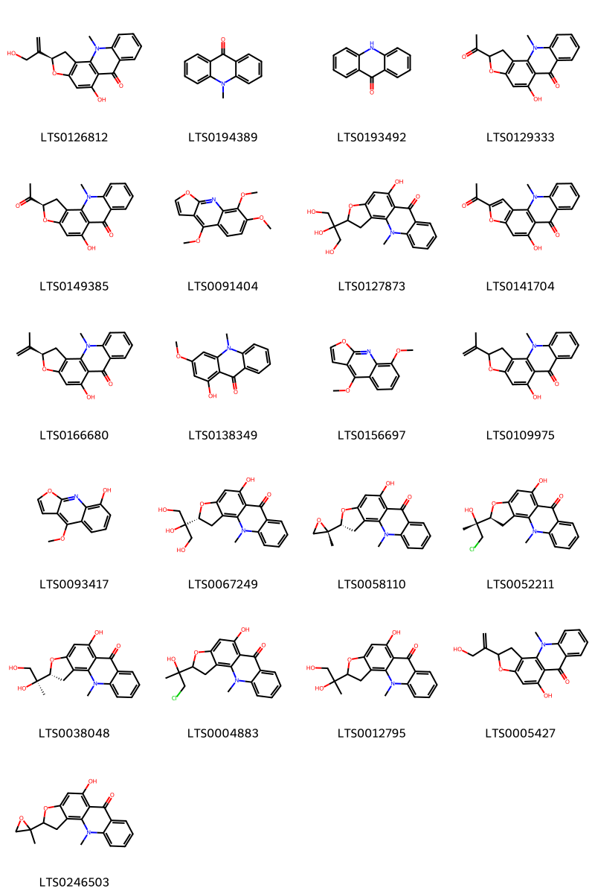{ width=100% }
    <figcaption>Hình ảnh cấu trúc hóa học của 21 hoạt chất thuộc nhóm Quinolines and derivatives gồm ['(2r)-5-hydroxy-2-(3-hydroxyprop-1-en-2-yl)-11-methyl-1h,2h-furo[2,3-c]acridin-6-one (LTS0126812)', '10-methylacridin-9-one (LTS0194389)', 'acridone (LTS0193492)', '2-acetyl-5-hydroxy-11-methyl-1h,2h-furo[2,3-c]acridin-6-one (LTS0129333)', '(2r)-2-acetyl-5-hydroxy-11-methyl-1h,2h-furo[2,3-c]acridin-6-one (LTS0149385)', 'skimmianine (LTS0091404)', '5-hydroxy-11-methyl-2-(1,2,3-trihydroxypropan-2-yl)-1h,2h-furo[2,3-c]acridin-6-one (LTS0127873)', '2-acetyl-5-hydroxy-11-methylfuro[2,3-c]acridin-6-one (LTS0141704)', '(2r)-5-hydroxy-11-methyl-2-(prop-1-en-2-yl)-1h,2h-furo[2,3-c]acridin-6-one (LTS0166680)', '1-hydroxy-3-methoxy-10-methylacridin-9-one (LTS0138349)', 'fagarine (LTS0156697)', 'rutacridone (LTS0109975)', 'robustine (LTS0093417)', '(2r)-5-hydroxy-11-methyl-2-(1,2,3-trihydroxypropan-2-yl)-1h,2h-furo[2,3-c]acridin-6-one (LTS0067249)', '(2r)-5-hydroxy-11-methyl-2-[(2s)-2-methyloxiran-2-yl]-1h,2h-furo[2,3-c]acridin-6-one (LTS0058110)', '(2s)-2-[(2r)-1-chloro-2-hydroxypropan-2-yl]-5-hydroxy-11-methyl-1h,2h-furo[2,3-c]acridin-6-one (LTS0052211)', '(2r)-2-[(2s)-1,2-dihydroxypropan-2-yl]-5-hydroxy-11-methyl-1h,2h-furo[2,3-c]acridin-6-one (LTS0038048)', '2-(1-chloro-2-hydroxypropan-2-yl)-5-hydroxy-11-methyl-1h,2h-furo[2,3-c]acridin-6-one (LTS0004883)', '2-(1,2-dihydroxypropan-2-yl)-5-hydroxy-11-methyl-1h,2h-furo[2,3-c]acridin-6-one (LTS0012795)', '5-hydroxy-2-(3-hydroxyprop-1-en-2-yl)-11-methyl-1h,2h-furo[2,3-c]acridin-6-one (LTS0005427)', 'rutacridone epoxide (LTS0246503)'].</figcaption>
</figure>
#### Nhóm Steroids and steroid derivatives
<figure markdown="span">
    { width=100% }
    <figcaption>Hình ảnh cấu trúc hóa học của 2 hoạt chất thuộc nhóm Steroids and steroid derivatives gồm ['stigmast-5-en-3-ol, (3β)- (LTS0204616)', '(1r,3ar,3br,7s,9ar,9br,11ar)-1-[(2r,5r)-5-ethyl-6-methylheptan-2-yl]-9a,11a-dimethyl-1h,2h,3h,3ah,3bh,4h,6h,7h,8h,9h,9bh,10h,11h-cyclopenta[a]phenanthren-7-ol (LTS0129695)'].</figcaption>
</figure>

---

### Dược dân tộc học

Danh sách các quốc gia có sử dụng *Thamnosma montana* trong điều trị các bệnh. 

| Country   | Disease   | Bệnh               |
|:----------|:----------|:-------------------|
| Mexico    | Tonic     | (thuộc) trương lực |

---

# Chi Aegle

??? note "Danh sách các dược liệu thuộc chi"
    
	 - *Aegle marmelos*

---
## Aegle marmelos
### Thông tin về thực vật

!!! info "Phân loại thực vật của *Aegle marmelos* từ GIBF:"
    - **Kingdom:** Plantae
    - **Phylum:** Tracheophyta
    - **Order:** Sapindales
    - **Family:** Rutaceae
    - **Genus:** Aegle
    - **Species:** *Aegle marmelos*

 

| Label (VI)   | Label (EN)   | Scientific Name   | Descriptions (VI)   | Descriptions (EN)                            | Also Known As (VI)   | Also Known As (EN)                                                                                                                         |
|:-------------|:-------------|:------------------|:--------------------|:---------------------------------------------|:---------------------|:-------------------------------------------------------------------------------------------------------------------------------------------|
| N/A          | N/A          | Aegle marmelos    |                     | species of tree, considered sacred by Hindus | ['']                 | ['Japanese bitter orange', 'Bengal quince', 'golden apple', 'stone apple', 'wood apple', 'bel fruit', 'bael fruit', 'bael fruit of India'] |

#### Phân bố trên thế giới

**Từ CSDL GIBF** India, Nepal, Sri Lanka

#### Phân bố tại Việt Nam

**Từ CSDL GIBF**: Không có ghi nhận ở Việt Nam

---
### Thành phần hóa học
        
- Theo cơ sở dữ liệu lotus: Từ loài *Aegle marmelos* đã phân lập và xác định được 168 hoạt chất thuộc về các nhóm Naphthalenes, Phenols, Anthracenes, Fatty Acyls, Cinnamic acids and derivatives, Prenol lipids, Organochlorides, Quinolines and derivatives, Benzene and substituted derivatives, Protopine alkaloids, Organooxygen compounds, Lignan glycosides, Furanoid lignans, Phenol ethers, Flavonoids, Steroids and steroid derivatives, Thioethers, Unsaturated hydrocarbons, Coumarins and derivatives, Benzopyrans. 

|    | chemicalTaxonomyClassyfireClass     |   smiles_count |
|---:|:------------------------------------|---------------:|
|  0 |                                     |              1 |
|  1 | Anthracenes                         |              2 |
|  2 | Benzene and substituted derivatives |             11 |
|  3 | Benzopyrans                         |              1 |
|  4 | Cinnamic acids and derivatives      |             13 |
|  5 | Coumarins and derivatives           |             49 |
|  6 | Fatty Acyls                         |             11 |
|  7 | Flavonoids                          |              1 |
|  8 | Furanoid lignans                    |              1 |
|  9 | Lignan glycosides                   |              6 |
| 10 | Naphthalenes                        |              1 |
| 11 | Organochlorides                     |              1 |
| 12 | Organooxygen compounds              |             21 |
| 13 | Phenol ethers                       |             10 |
| 14 | Phenols                             |              2 |
| 15 | Prenol lipids                       |             26 |
| 16 | Protopine alkaloids                 |              1 |
| 17 | Quinolines and derivatives          |              1 |
| 18 | Steroids and steroid derivatives    |              6 |
| 19 | Thioethers                          |              1 |
| 20 | Unsaturated hydrocarbons            |              1 |

#### Nhóm 
<figure markdown="span">
    { width=100% }
    <figcaption>Hình ảnh cấu trúc hóa học của 1 hoạt chất thuộc nhóm  gồm ['(1s,13s,15s,16s)-16-methoxy-5,7-dioxa-12-azapentacyclo[10.6.1.0²,¹⁰.0⁴,⁸.0¹³,¹⁸]nonadeca-2,4(8),9,17-tetraen-15-ol (LTS0165669)'].</figcaption>
</figure>
#### Nhóm Anthracenes
<figure markdown="span">
    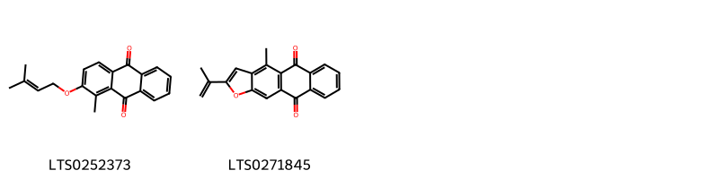{ width=100% }
    <figcaption>Hình ảnh cấu trúc hóa học của 2 hoạt chất thuộc nhóm Anthracenes gồm ['1-methyl-2-[(3-methylbut-2-en-1-yl)oxy]anthracene-9,10-dione (LTS0252373)', '4-methyl-2-(prop-1-en-2-yl)anthra[2,3-b]furan-5,10-dione (LTS0271845)'].</figcaption>
</figure>
#### Nhóm Benzene and substituted derivatives
<figure markdown="span">
    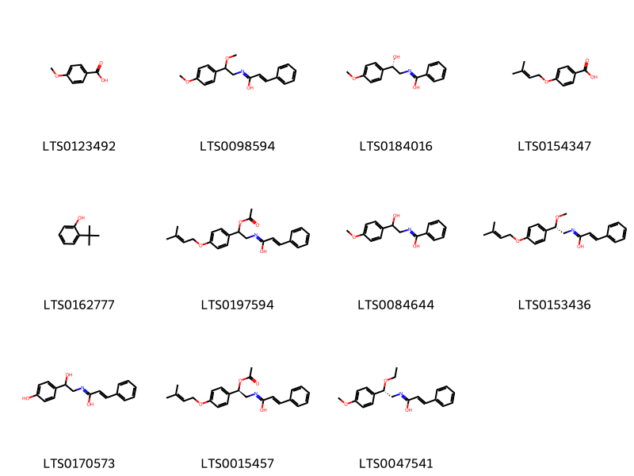{ width=100% }
    <figcaption>Hình ảnh cấu trúc hóa học của 11 hoạt chất thuộc nhóm Benzene and substituted derivatives gồm ['p-anisic acid (LTS0123492)', 'n-[2-methoxy-2-(4-methoxyphenyl)ethyl]-3-phenylprop-2-enimidic acid (LTS0098594)', 'n-[(2s)-2-hydroxy-2-(4-methoxyphenyl)ethyl]benzenecarboximidic acid (LTS0184016)', '4-[(3-methylbut-2-en-1-yl)oxy]benzoic acid (LTS0154347)', '2-tert-butylphenol (LTS0162777)', 'n-[2-(acetyloxy)-2-{4-[(3-methylbut-2-en-1-yl)oxy]phenyl}ethyl]-3-phenylprop-2-enimidic acid (LTS0197594)', 'n-[2-hydroxy-2-(4-methoxyphenyl)ethyl]benzenecarboximidic acid (LTS0084644)', '(2e)-n-[(2s)-2-methoxy-2-{4-[(3-methylbut-2-en-1-yl)oxy]phenyl}ethyl]-3-phenylprop-2-enimidic acid (LTS0153436)', 'n-[2-hydroxy-2-(4-hydroxyphenyl)ethyl]-3-phenylprop-2-enimidic acid (LTS0170573)', '(2e)-n-[(2r)-2-(acetyloxy)-2-{4-[(3-methylbut-2-en-1-yl)oxy]phenyl}ethyl]-3-phenylprop-2-enimidic acid (LTS0015457)', '(2e)-n-[(2s)-2-ethoxy-2-(4-methoxyphenyl)ethyl]-3-phenylprop-2-enimidic acid (LTS0047541)'].</figcaption>
</figure>
#### Nhóm Benzopyrans
<figure markdown="span">
    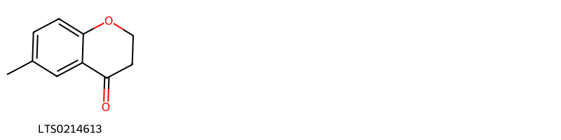{ width=100% }
    <figcaption>Hình ảnh cấu trúc hóa học của 1 hoạt chất thuộc nhóm Benzopyrans gồm ['6-methyl-2,3-dihydro-1-benzopyran-4-one (LTS0214613)'].</figcaption>
</figure>
#### Nhóm Cinnamic acids and derivatives
<figure markdown="span">
    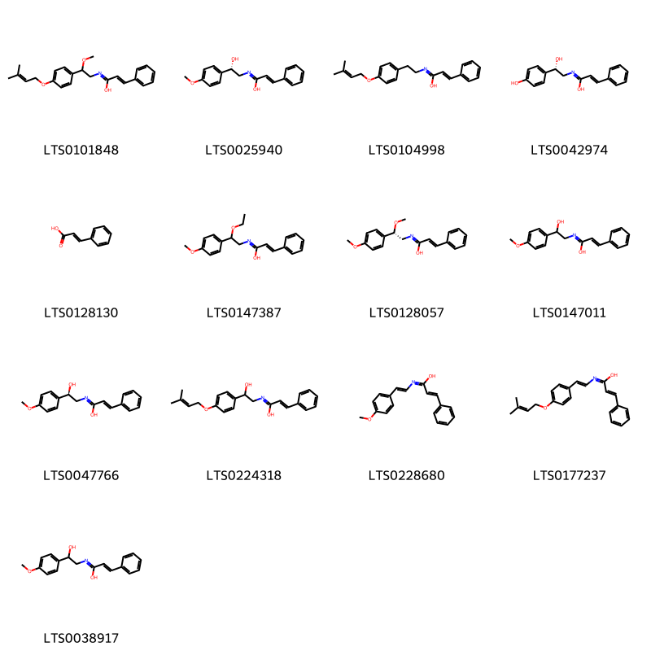{ width=100% }
    <figcaption>Hình ảnh cấu trúc hóa học của 13 hoạt chất thuộc nhóm Cinnamic acids and derivatives gồm ['n-(2-methoxy-2-{4-[(3-methylbut-2-en-1-yl)oxy]phenyl}ethyl)-3-phenylprop-2-enimidic acid (LTS0101848)', '(2e)-n-[(2s)-2-hydroxy-2-(4-methoxyphenyl)ethyl]-3-phenylprop-2-enimidic acid (LTS0025940)', '(2e)-n-(2-{4-[(3-methylbut-2-en-1-yl)oxy]phenyl}ethyl)-3-phenylprop-2-enimidic acid (LTS0104998)', '(2e)-n-[(2s)-2-hydroxy-2-(4-hydroxyphenyl)ethyl]-3-phenylprop-2-enimidic acid (LTS0042974)', 'cinnamic acid (LTS0128130)', 'n-[2-ethoxy-2-(4-methoxyphenyl)ethyl]-3-phenylprop-2-enimidic acid (LTS0147387)', '(2e)-n-[(2s)-2-methoxy-2-(4-methoxyphenyl)ethyl]-3-phenylprop-2-enimidic acid (LTS0128057)', 'n-[2-hydroxy-2-(4-methoxyphenyl)ethyl]-3-phenylprop-2-enimidic acid (LTS0147011)', '(2e)-n-[(2r)-2-hydroxy-2-(4-methoxyphenyl)ethyl]-3-phenylprop-2-enimidic acid (LTS0047766)', 'n-(2-hydroxy-2-{4-[(3-methylbut-2-en-1-yl)oxy]phenyl}ethyl)-3-phenylprop-2-enimidic acid (LTS0224318)', '(e,2e)-n-[(1e)-2-(4-methoxyphenyl)ethenyl]-3-phenylprop-2-enimidic acid (LTS0228680)', '(e,2e)-n-[(1e)-2-{4-[(3-methylbut-2-en-1-yl)oxy]phenyl}ethenyl]-3-phenylprop-2-enimidic acid (LTS0177237)', '(2e)-n-[2-hydroxy-2-(4-methoxyphenyl)ethyl]-3-phenylprop-2-enimidic acid (LTS0038917)'].</figcaption>
</figure>
#### Nhóm Coumarins and derivatives
<figure markdown="span">
    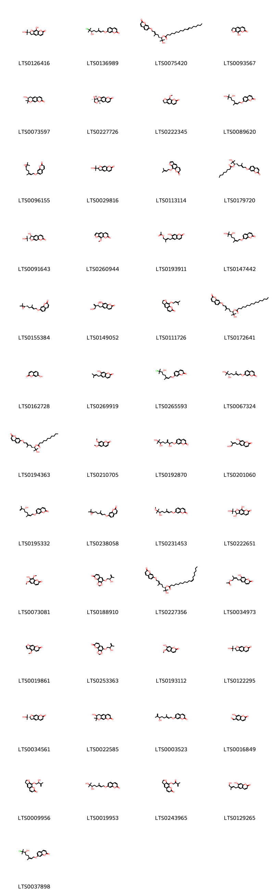{ width=100% }
    <figcaption>Hình ảnh cấu trúc hóa học của 49 hoạt chất thuộc nhóm Coumarins and derivatives gồm ['(2s)-9-hydroxy-2-(2-hydroxypropan-2-yl)-2h,3h-furo[3,2-g]chromen-7-one (LTS0126416)', '7-{[(2e,6r)-7-chloro-6-hydroxy-3,7-dimethyloct-2-en-1-yl]oxy}chromen-2-one (LTS0136989)', '(3r,6e)-2-hydroxy-2,6-dimethyl-8-[(2-oxochromen-7-yl)oxy]oct-6-en-3-yl octadec-11-enoate (LTS0075420)', '9-hydroxy-2h,3h-furo[3,2-g]chromen-7-one (LTS0093567)', 'decursinol (LTS0073597)', '(11r,14r,15s)-14-hydroxy-14-methyl-4,12,16-trioxatetracyclo[8.6.0.0³,⁸.0¹¹,¹⁵]hexadeca-1(10),2,6,8-tetraen-5-one (LTS0227726)', '9-methoxy-2h,3h-furo[3,2-g]chromen-7-one (LTS0222345)', '7-{[(6r)-6,7-dihydroxy-3,7-dimethyloct-2-en-1-yl]oxy}chromen-2-one (LTS0089620)', '7-{[5-(3,3-dimethyloxiran-2-yl)-3-methylpent-2-en-1-yl]oxy}chromen-2-one (LTS0096155)', 'marmesin (LTS0029816)', 'imperatorin (LTS0113114)', '(3r,6e)-2-hydroxy-2,6-dimethyl-8-[(2-oxochromen-7-yl)oxy]oct-6-en-3-yl octanoate (LTS0179720)', 'xanthoarnol (LTS0091643)', 'methoxsalen (LTS0260944)', '(2e)-4-(7-hydroxy-2-oxochromen-6-yl)-2-methylbut-2-en-1-yl acetate (LTS0193911)', '7-[(6,7-dihydroxy-3,7-dimethyloct-2-en-1-yl)oxy]chromen-2-one (LTS0147442)', '7-{[(2e)-5-[(2r)-3,3-dimethyloxiran-2-yl]-3-methylpent-2-en-1-yl]oxy}chromen-2-one (LTS0155384)', '6-[(2r)-2,4-dihydroxy-3-methylidenebutyl]-7-hydroxychromen-2-one (LTS0149052)', '9-[(3-methylbut-2-en-1-yl)oxy]-2h,3h-furo[3,2-g]chromen-7-one (LTS0111726)', '(3r,6e)-2-hydroxy-2,6-dimethyl-8-[(2-oxochromen-7-yl)oxy]oct-6-en-3-yl hexadecanoate (LTS0172641)', 'umbelliferone (LTS0162728)', 'demethylsuberosin (LTS0269919)', '7-{[(6r)-7-chloro-6-hydroxy-3,7-dimethyloct-2-en-1-yl]oxy}chromen-2-one (LTS0265593)', '7-{[(2e,6s)-6,7-dihydroxy-3,7-dimethyloct-2-en-1-yl]oxy}chromen-2-one (LTS0067324)', '(3r,6e)-2-hydroxy-2,6-dimethyl-8-[(2-oxochromen-7-yl)oxy]oct-6-en-3-yl undecanoate (LTS0194363)', 'scoparone (LTS0210705)', '7-[(2,6,7-trihydroxy-7-methyl-3-methylideneoctyl)oxy]chromen-2-one (LTS0192870)', '7-hydroxy-6-(4-hydroxy-3-methylbut-2-en-1-yl)chromen-2-one (LTS0201060)', '7-{[(6r)-6-hydroxy-3,7-dimethylocta-2,7-dien-1-yl]oxy}chromen-2-one (LTS0195332)', '7-{[(2e)-5-(3,3-dimethyloxiran-2-yl)-3-methylpent-2-en-1-yl]oxy}chromen-2-one (LTS0238058)', '7-{[(2e,6r)-6-hydroxy-7-methoxy-3,7-dimethyloct-2-en-1-yl]oxy}chromen-2-one (LTS0231453)', '(2s,3r)-3,9-dihydroxy-2-(2-hydroxypropan-2-yl)-2h,3h-furo[3,2-g]chromen-7-one (LTS0222651)', 'isofraxidin (LTS0073081)', '4-{[(2r)-2-hydroxy-3-methylbut-3-en-1-yl]oxy}-2h-[1,3]dioxolo[4,5-h]chromen-8-one (LTS0188910)', '(3r,6e)-2-hydroxy-2,6-dimethyl-8-[(2-oxochromen-7-yl)oxy]oct-6-en-3-yl (11z)-octadec-11-enoate (LTS0227356)', '4-(7-hydroxy-2-oxochromen-6-yl)-2-methylbut-2-en-1-yl acetate (LTS0034973)', 'bergapten (LTS0019861)', '4-[(2-hydroxy-3-methylbut-3-en-1-yl)oxy]-2h-[1,3]dioxolo[4,5-h]chromen-8-one (LTS0253363)', 'scopoletin (LTS0193112)', 'marmesin (LTS0122295)', '(-)-marmesin (LTS0034561)', '7-hydroxy-8,8-dimethyl-6h,7h-pyrano[3,2-g]chromen-2-one (LTS0022585)', '7-{[(2e,6r)-6-hydroxy-3,7-dimethylocta-2,7-dien-1-yl]oxy}chromen-2-one (LTS0003523)', '7-hydroxy-2-oxochromene-6-carbaldehyde (LTS0016849)', '9-{[(2s)-2-hydroxy-3-methylbut-3-en-1-yl]oxy}-2h,3h-furo[3,2-g]chromen-7-one (LTS0009956)', '7-{[(2e,6r)-6,7-dihydroxy-3,7-dimethyloct-2-en-1-yl]oxy}chromen-2-one (LTS0019953)', '9-[(3-methyl-2-oxobut-3-en-1-yl)oxy]-2h,3h-furo[3,2-g]chromen-7-one (LTS0243965)', '7-hydroxy-6-[(2e)-4-hydroxy-3-methylbut-2-en-1-yl]chromen-2-one (LTS0129265)', '7-[(7-chloro-6-hydroxy-3,7-dimethyloct-2-en-1-yl)oxy]chromen-2-one (LTS0037898)'].</figcaption>
</figure>
#### Nhóm Fatty Acyls
<figure markdown="span">
    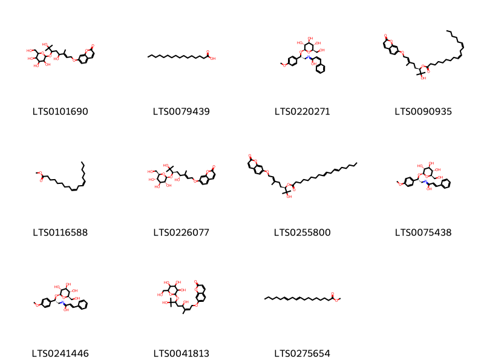{ width=100% }
    <figcaption>Hình ảnh cấu trúc hóa học của 11 hoạt chất thuộc nhóm Fatty Acyls gồm ['7-{[(2e)-4,7-dihydroxy-3,7-dimethyl-6-{[3,4,5-trihydroxy-6-(hydroxymethyl)oxan-2-yl]oxy}oct-2-en-1-yl]oxy}chromen-2-one (LTS0101690)', 'palmitic acid (LTS0079439)', '(2z)-n-[(2s)-2-(4-methoxyphenyl)-2-{[(2r,3r,4s,5s,6r)-3,4,5-trihydroxy-6-(hydroxymethyl)oxan-2-yl]oxy}ethyl]-3-phenylprop-2-enimidic acid (LTS0220271)', '(3r,6e)-2-hydroxy-2,6-dimethyl-8-[(2-oxochromen-7-yl)oxy]oct-6-en-3-yl (9z,12z)-octadeca-9,12-dienoate (LTS0090935)', 'methyl linoleate (LTS0116588)', '7-{[(2e,4r,6r)-4,7-dihydroxy-3,7-dimethyl-6-{[(2s,3r,4s,5s,6r)-3,4,5-trihydroxy-6-(hydroxymethyl)oxan-2-yl]oxy}oct-2-en-1-yl]oxy}chromen-2-one (LTS0226077)', '(3r,6e)-2-hydroxy-2,6-dimethyl-8-[(2-oxochromen-7-yl)oxy]oct-6-en-3-yl octadeca-9,12-dienoate (LTS0255800)', '(2e)-n-[(2s)-2-(4-methoxyphenyl)-2-{[(2r,3r,4s,5s,6r)-3,4,5-trihydroxy-6-(hydroxymethyl)oxan-2-yl]oxy}ethyl]-3-phenylprop-2-enimidic acid (LTS0075438)', 'n-[(2s)-2-(4-methoxyphenyl)-2-{[(2r,3r,4s,5s,6r)-3,4,5-trihydroxy-6-(hydroxymethyl)oxan-2-yl]oxy}ethyl]-3-phenylprop-2-enimidic acid (LTS0241446)', '7-[(4,7-dihydroxy-3,7-dimethyl-6-{[3,4,5-trihydroxy-6-(hydroxymethyl)oxan-2-yl]oxy}oct-2-en-1-yl)oxy]chromen-2-one (LTS0041813)', 'methyl octadeca-9,12-dienoate (LTS0275654)'].</figcaption>
</figure>
#### Nhóm Flavonoids
<figure markdown="span">
    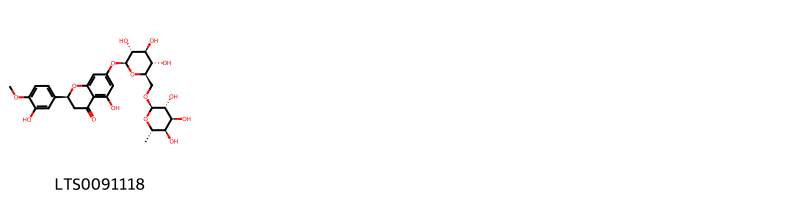{ width=100% }
    <figcaption>Hình ảnh cấu trúc hóa học của 1 hoạt chất thuộc nhóm Flavonoids gồm ['(2s)-5-hydroxy-2-(3-hydroxy-4-methoxyphenyl)-7-{[(2s,3r,4s,5s,6r)-3,4,5-trihydroxy-6-({[(2r,3r,4s,5r,6s)-3,4,5-trihydroxy-6-methyloxan-2-yl]oxy}methyl)oxan-2-yl]oxy}-2,3-dihydro-1-benzopyran-4-one (LTS0091118)'].</figcaption>
</figure>
#### Nhóm Furanoid lignans
<figure markdown="span">
    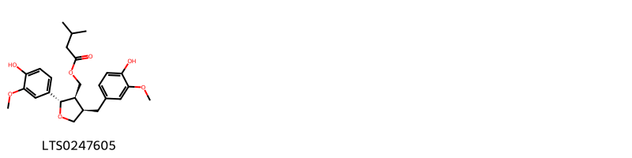{ width=100% }
    <figcaption>Hình ảnh cấu trúc hóa học của 1 hoạt chất thuộc nhóm Furanoid lignans gồm ['[(2s,3r,4r)-2-(4-hydroxy-3-methoxyphenyl)-4-[(4-hydroxy-3-methoxyphenyl)methyl]oxolan-3-yl]methyl 3-methylbutanoate (LTS0247605)'].</figcaption>
</figure>
#### Nhóm Lignan glycosides
<figure markdown="span">
    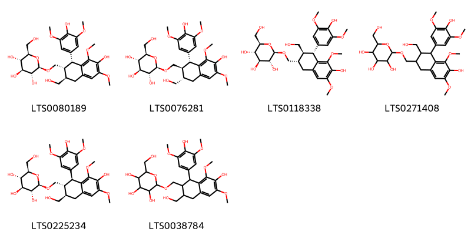{ width=100% }
    <figcaption>Hình ảnh cấu trúc hóa học của 6 hoạt chất thuộc nhóm Lignan glycosides gồm ['(2r,3r,4s,5s,6r)-2-{[(1r,2r,3r)-7-hydroxy-1-(4-hydroxy-3,5-dimethoxyphenyl)-3-(hydroxymethyl)-6,8-dimethoxy-1,2,3,4-tetrahydronaphthalen-2-yl]methoxy}-6-(hydroxymethyl)oxane-3,4,5-triol (LTS0080189)', '(2r,3r,4s,5s,6r)-2-{[(1r,2s,3s)-7-hydroxy-1-(4-hydroxy-3,5-dimethoxyphenyl)-3-(hydroxymethyl)-6,8-dimethoxy-1,2,3,4-tetrahydronaphthalen-2-yl]methoxy}-6-(hydroxymethyl)oxane-3,4,5-triol (LTS0076281)', '(2r,3r,4s,5s,6r)-2-{[(2s,3s,4r)-6-hydroxy-4-(4-hydroxy-3,5-dimethoxyphenyl)-3-(hydroxymethyl)-5,7-dimethoxy-1,2,3,4-tetrahydronaphthalen-2-yl]methoxy}-6-(hydroxymethyl)oxane-3,4,5-triol (LTS0118338)', '2-{[6-hydroxy-4-(4-hydroxy-3,5-dimethoxyphenyl)-3-(hydroxymethyl)-5,7-dimethoxy-1,2,3,4-tetrahydronaphthalen-2-yl]methoxy}-6-(hydroxymethyl)oxane-3,4,5-triol (LTS0271408)', '(2r,3r,4s,5s,6r)-2-{[(1s,2r,3r)-7-hydroxy-1-(4-hydroxy-3,5-dimethoxyphenyl)-3-(hydroxymethyl)-6,8-dimethoxy-1,2,3,4-tetrahydronaphthalen-2-yl]methoxy}-6-(hydroxymethyl)oxane-3,4,5-triol (LTS0225234)', '2-{[7-hydroxy-1-(4-hydroxy-3,5-dimethoxyphenyl)-3-(hydroxymethyl)-6,8-dimethoxy-1,2,3,4-tetrahydronaphthalen-2-yl]methoxy}-6-(hydroxymethyl)oxane-3,4,5-triol (LTS0038784)'].</figcaption>
</figure>
#### Nhóm Naphthalenes
<figure markdown="span">
    { width=100% }
    <figcaption>Hình ảnh cấu trúc hóa học của 1 hoạt chất thuộc nhóm Naphthalenes gồm ['plumbagin (LTS0212929)'].</figcaption>
</figure>
#### Nhóm Organochlorides
<figure markdown="span">
    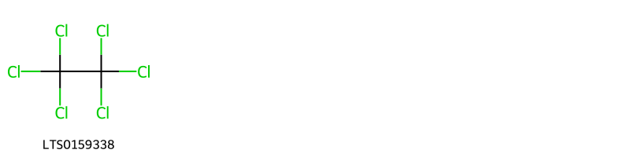{ width=100% }
    <figcaption>Hình ảnh cấu trúc hóa học của 1 hoạt chất thuộc nhóm Organochlorides gồm ['hexachloroethane (LTS0159338)'].</figcaption>
</figure>
#### Nhóm Organooxygen compounds
<figure markdown="span">
    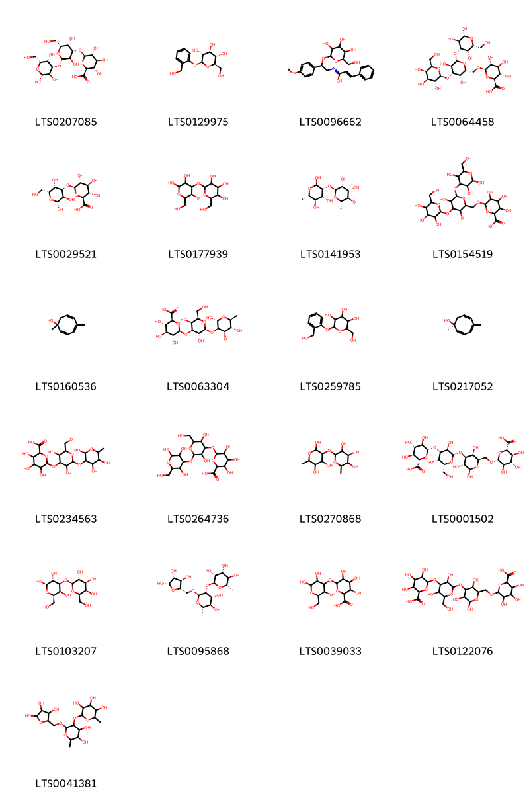{ width=100% }
    <figcaption>Hình ảnh cấu trúc hóa học của 21 hoạt chất thuộc nhóm Organooxygen compounds gồm ['(2s,3s,4s,5r,6r)-6-{[(2r,3s,4s,5r,6s)-3,5-dihydroxy-2-(hydroxymethyl)-6-{[(2r,3r,4s,5s,6r)-2,3,5-trihydroxy-6-(hydroxymethyl)oxan-4-yl]oxy}oxan-4-yl]oxy}-3,4,5-trihydroxyoxane-2-carboxylic acid (LTS0207085)', 'salicin (LTS0129975)', 'n-[2-(4-methoxyphenyl)-2-{[3,4,5-trihydroxy-6-(hydroxymethyl)oxan-2-yl]oxy}ethyl]-3-phenylprop-2-enimidic acid (LTS0096662)', '(2s,3s,4s,5r,6r)-6-{[(2r,3s,4s,5r,6s)-3,5-dihydroxy-4-{[(2s,3r,4s,5r,6r)-3,4,5-trihydroxy-6-(hydroxymethyl)oxan-2-yl]oxy}-6-{[(2r,3r,4s,5s,6r)-2,3,5-trihydroxy-6-(hydroxymethyl)oxan-4-yl]oxy}oxan-2-yl]methoxy}-3,4,5-trihydroxyoxane-2-carboxylic acid (LTS0064458)', '(2s,3s,4s,5r,6r)-3,4,5-trihydroxy-6-{[(2r,3r,4s,5s,6r)-2,3,5-trihydroxy-6-(hydroxymethyl)oxan-4-yl]oxy}oxane-2-carboxylic acid (LTS0029521)', 'galactose-α-1,3-galactose (LTS0177939)', '(2s,3r,4r,5r,6s)-2-methyl-6-{[(2r,3r,4r,5r,6s)-2,4,5-trihydroxy-6-methyloxan-3-yl]oxy}oxane-3,4,5-triol (LTS0141953)', '6-[(3,5-dihydroxy-4-{[3,4,5-trihydroxy-6-(hydroxymethyl)oxan-2-yl]oxy}-6-{[2,3,5-trihydroxy-6-(hydroxymethyl)oxan-4-yl]oxy}oxan-2-yl)methoxy]-3,4,5-trihydroxyoxane-2-carboxylic acid (LTS0154519)', '1,5-dimethylcycloocta-2,4,6-trien-1-ol (LTS0160536)', '(2s,3s,4s,5r,6r)-6-{[(2r,3s,4s,5r,6s)-3,5-dihydroxy-2-(hydroxymethyl)-6-{[(2r,3r,4r,5r,6s)-2,4,5-trihydroxy-6-methyloxan-3-yl]oxy}oxan-4-yl]oxy}-3,4,5-trihydroxyoxane-2-carboxylic acid (LTS0063304)', 'salicin (LTS0259785)', '(1s,2z,4z,6z)-1,5-dimethylcycloocta-2,4,6-trien-1-ol (LTS0217052)', '6-{[3,5-dihydroxy-2-(hydroxymethyl)-6-[(2,4,5-trihydroxy-6-methyloxan-3-yl)oxy]oxan-4-yl]oxy}-3,4,5-trihydroxyoxane-2-carboxylic acid (LTS0234563)', '6-{[3,5-dihydroxy-2-(hydroxymethyl)-6-{[2,3,5-trihydroxy-6-(hydroxymethyl)oxan-4-yl]oxy}oxan-4-yl]oxy}-3,4,5-trihydroxyoxane-2-carboxylic acid (LTS0264736)', '2-methyl-6-[(2,4,5-trihydroxy-6-methyloxan-3-yl)oxy]oxane-3,4,5-triol (LTS0270868)', '(2s,3s,4s,5r,6r)-6-{[(2r,3s,4s,5r,6r)-4-{[(2s,3r,4s,5s,6r)-4-{[(2r,3r,4s,5s,6s)-6-carboxy-3,4,5-trihydroxyoxan-2-yl]oxy}-3,5-dihydroxy-6-(hydroxymethyl)oxan-2-yl]oxy}-3,5,6-trihydroxyoxan-2-yl]methoxy}-3,4,5-trihydroxyoxane-2-carboxylic acid (LTS0001502)', '(2r,3r,4s,5s,6r)-6-(hydroxymethyl)-4-{[(2s,3r,4s,5r,6r)-3,4,5-trihydroxy-6-(hydroxymethyl)oxan-2-yl]oxy}oxane-2,3,5-triol (LTS0103207)', '(2s,3r,4r,5r,6s)-2-{[(2r,3r,4r,5r,6s)-4,5-dihydroxy-6-methyl-2-{[(2s,3r,4r,5s)-3,4,5-trihydroxyoxolan-2-yl]methoxy}oxan-3-yl]oxy}-6-methyloxane-3,4,5-triol (LTS0095868)', '3,4,5-trihydroxy-6-{[2,3,5-trihydroxy-6-(hydroxymethyl)oxan-4-yl]oxy}oxane-2-carboxylic acid (LTS0039033)', '6-{[4-({4-[(6-carboxy-3,4,5-trihydroxyoxan-2-yl)oxy]-3,5-dihydroxy-6-(hydroxymethyl)oxan-2-yl}oxy)-3,5,6-trihydroxyoxan-2-yl]methoxy}-3,4,5-trihydroxyoxane-2-carboxylic acid (LTS0122076)', '2-({4,5-dihydroxy-6-methyl-2-[(3,4,5-trihydroxyoxolan-2-yl)methoxy]oxan-3-yl}oxy)-6-methyloxane-3,4,5-triol (LTS0041381)'].</figcaption>
</figure>
#### Nhóm Phenol ethers
<figure markdown="span">
    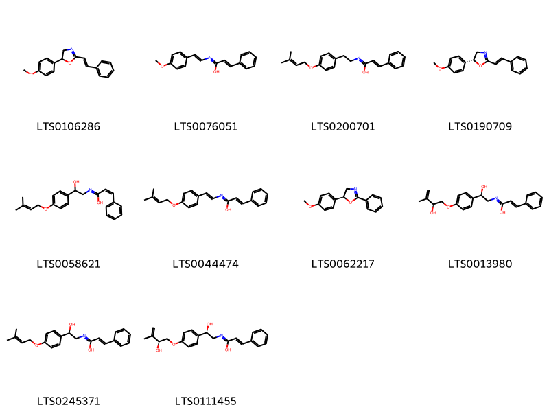{ width=100% }
    <figcaption>Hình ảnh cấu trúc hóa học của 10 hoạt chất thuộc nhóm Phenol ethers gồm ['5-(4-methoxyphenyl)-2-(2-phenylethenyl)-4,5-dihydro-1,3-oxazole (LTS0106286)', 'n-[2-(4-methoxyphenyl)ethenyl]-3-phenylprop-2-enimidic acid (LTS0076051)', 'n-(2-{4-[(3-methylbut-2-en-1-yl)oxy]phenyl}ethyl)-3-phenylprop-2-enimidic acid (LTS0200701)', '(5r)-5-(4-methoxyphenyl)-2-[(1e)-2-phenylethenyl]-4,5-dihydro-1,3-oxazole (LTS0190709)', '(2z)-n-(2-hydroxy-2-{4-[(3-methylbut-2-en-1-yl)oxy]phenyl}ethyl)-3-phenylprop-2-enimidic acid (LTS0058621)', 'n-(2-{4-[(3-methylbut-2-en-1-yl)oxy]phenyl}ethenyl)-3-phenylprop-2-enimidic acid (LTS0044474)', '(5s)-5-(4-methoxyphenyl)-2-phenyl-4,5-dihydro-1,3-oxazole (LTS0062217)', 'n-[(2r)-2-hydroxy-2-(4-{[(2s)-2-hydroxy-3-methylbut-3-en-1-yl]oxy}phenyl)ethyl]-3-phenylprop-2-enimidic acid (LTS0013980)', '(2e)-n-[(2r)-2-hydroxy-2-{4-[(3-methylbut-2-en-1-yl)oxy]phenyl}ethyl]-3-phenylprop-2-enimidic acid (LTS0245371)', '(2e)-n-[(2r)-2-hydroxy-2-(4-{[(2s)-2-hydroxy-3-methylbut-3-en-1-yl]oxy}phenyl)ethyl]-3-phenylprop-2-enimidic acid (LTS0111455)'].</figcaption>
</figure>
#### Nhóm Phenols
<figure markdown="span">
    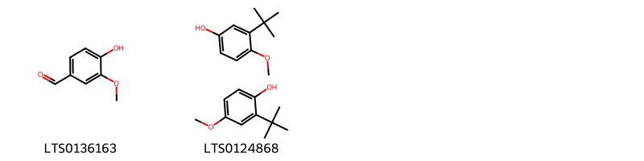{ width=100% }
    <figcaption>Hình ảnh cấu trúc hóa học của 2 hoạt chất thuộc nhóm Phenols gồm ['vanillin (LTS0136163)', 'butylated hydroxyanisole (LTS0124868)'].</figcaption>
</figure>
#### Nhóm Prenol lipids
<figure markdown="span">
    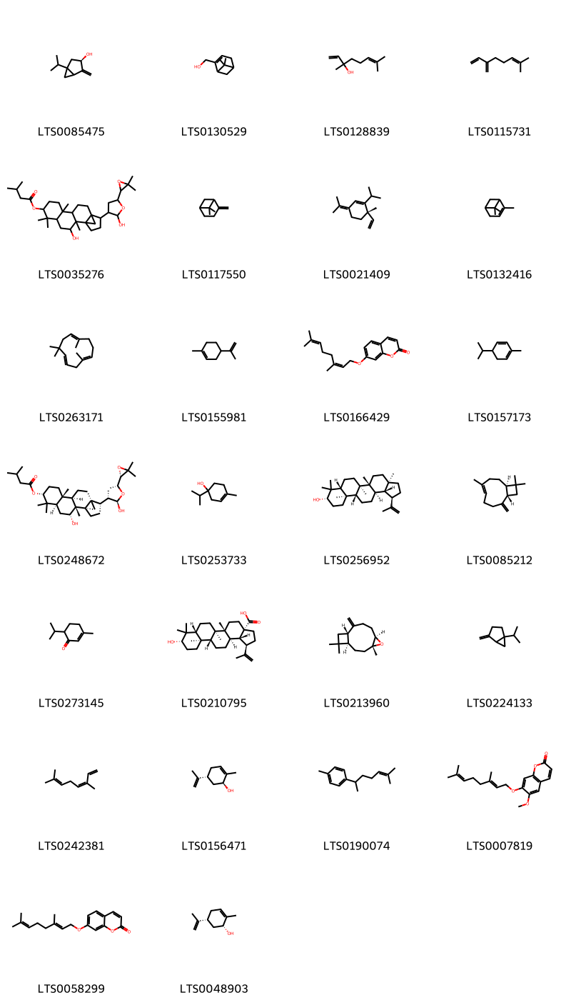{ width=100% }
    <figcaption>Hình ảnh cấu trúc hóa học của 26 hoạt chất thuộc nhóm Prenol lipids gồm ['sabinol (LTS0085475)', 'myrtenol (LTS0130529)', 'linalool, (+-)- (LTS0128839)', 'α-myrcene (LTS0115731)', '15-[5-(3,3-dimethyloxiran-2-yl)-2-hydroxyoxolan-3-yl]-3-hydroxy-2,6,6,10-tetramethylpentacyclo[12.3.1.0¹,¹⁴.0²,¹¹.0⁵,¹⁰]octadecan-7-yl 3-methylbutanoate (LTS0035276)', 'β-pinene (LTS0117550)', 'elemene (LTS0021409)', 'α pinene (LTS0132416)', 'humulene (LTS0263171)', 'limonene,  (LTS0155981)', '7-[(3,7-dimethylocta-2,6-dien-1-yl)oxy]chromen-2-one (LTS0166429)', 'phellandrene (LTS0157173)', '(1s,2r,3r,5r,7r,10s,11r,14r,15s)-15-[(2r,3s,5r)-5-[(2s)-3,3-dimethyloxiran-2-yl]-2-hydroxyoxolan-3-yl]-3-hydroxy-2,6,6,10-tetramethylpentacyclo[12.3.1.0¹,¹⁴.0²,¹¹.0⁵,¹⁰]octadecan-7-yl 3-methylbutanoate (LTS0248672)', '4-terpineol (LTS0253733)', 'lupeol (LTS0256952)', 'caryophyllene (LTS0085212)', 'piperitone (LTS0273145)', 'betulinic acid (LTS0210795)', 'β-caryophyllene oxide (LTS0213960)', 'sabinene (LTS0224133)', 'β-ocimene (LTS0242381)', '(-)-trans-carveol (LTS0156471)', 'curcumene (LTS0190074)', '7-{[(2e)-3,7-dimethylocta-2,6-dien-1-yl]oxy}-6-methoxychromen-2-one (LTS0007819)', 'auraptene (LTS0058299)', '(-)-cis-carveol (LTS0048903)'].</figcaption>
</figure>
#### Nhóm Protopine alkaloids
<figure markdown="span">
    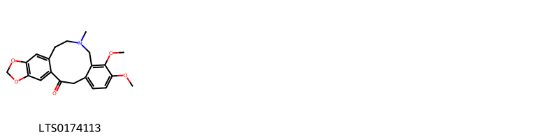{ width=100% }
    <figcaption>Hình ảnh cấu trúc hóa học của 1 hoạt chất thuộc nhóm Protopine alkaloids gồm ['β-allocryptopine (LTS0174113)'].</figcaption>
</figure>
#### Nhóm Quinolines and derivatives
<figure markdown="span">
    { width=100% }
    <figcaption>Hình ảnh cấu trúc hóa học của 1 hoạt chất thuộc nhóm Quinolines and derivatives gồm ['skimmianine (LTS0091404)'].</figcaption>
</figure>
#### Nhóm Steroids and steroid derivatives
<figure markdown="span">
    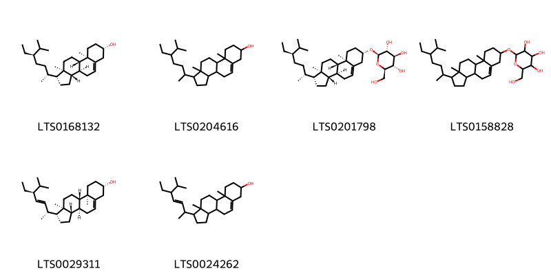{ width=100% }
    <figcaption>Hình ảnh cấu trúc hóa học của 6 hoạt chất thuộc nhóm Steroids and steroid derivatives gồm ['sitosterol (LTS0168132)', 'stigmast-5-en-3-ol, (3β)- (LTS0204616)', 'sitogluside (LTS0201798)', '2-{[1-(5-ethyl-6-methylheptan-2-yl)-9a,11a-dimethyl-1h,2h,3h,3ah,3bh,4h,6h,7h,8h,9h,9bh,10h,11h-cyclopenta[a]phenanthren-7-yl]oxy}-6-(hydroxymethyl)oxane-3,4,5-triol (LTS0158828)', 'phytosterol (LTS0029311)', 'stigmasterol (LTS0024262)'].</figcaption>
</figure>
#### Nhóm Thioethers
<figure markdown="span">
    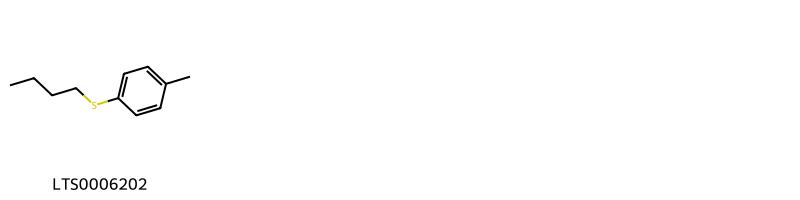{ width=100% }
    <figcaption>Hình ảnh cấu trúc hóa học của 1 hoạt chất thuộc nhóm Thioethers gồm ['1-(butylsulfanyl)-4-methylbenzene (LTS0006202)'].</figcaption>
</figure>
#### Nhóm Unsaturated hydrocarbons
<figure markdown="span">
    { width=100% }
    <figcaption>Hình ảnh cấu trúc hóa học của 1 hoạt chất thuộc nhóm Unsaturated hydrocarbons gồm ['α terpinene (LTS0232891)'].</figcaption>
</figure>

---

### Dược dân tộc học

Danh sách các quốc gia có sử dụng *Aegle marmelos* trong điều trị các bệnh. 

| Country       | Disease                                           | Bệnh                                            |
|:--------------|:--------------------------------------------------|:------------------------------------------------|
| Celebes       | Piscicide                                         | Thuốc diệt cá                                   |
| Elsewhere     | Astringent, Refrigerant, Stomachic                | Chất làm se, Chất làm lạnh, Dạ dày              |
| English       | Laxative                                          | Nhuận trường                                    |
| German        | Refrigerant                                       | Chất làm lạnh                                   |
| India         | Astringent, Digestive, Stomachic, Tonic, Laxative | Làm se, tiêu hóa, dạ dày, thuốc bổ, nhuận tràng |
| India(Santal) | Laxative                                          | Nhuận trường                                    |
| Java          | Abortifacient, Piscicide                          | Thuốc phá thai, Thuốc diệt côn trùng            |
| Turkey        | Astringent                                        | Lam se da                                       |

---

