!!! abstract "Tóm tắt"

    Họ Salicaceae gồm khoảng 2 chi và 16 loài được một số cộng đồng tại các quốc gia như Elsewhere, US(Amerindian), Kurdistan, Portuguese, India, Eurasia, US, English, Turkey, China, Iraq, US(Tewa), Mexico, India(Hindu), Europe sử dụng trong một số trường hợp QUERY LENGTH LIMIT EXCEEDED. MAX ALLOWED QUERY : 500 CHARS.

!!! info "DrDuke"

    James A. Duke sinh năm 1929-2017 là một nhà thực vật học người Mỹ. Đây là một trong những tác giả hàng đầu trong lĩnh vực dược dân tộc học với cuốn *CRC Handbook of Medicinal Herbs* và chính là người xây dựng lên cơ sở dữ liệu về hợp chất tự nhiên và dược dân tộc học tại Bộ nông nghiệp Hoa Kỳ. Các thông tin được đăng tải tại website [Dr. Duke's Phytochemical and Ethnobotanical Databases](https://phytochem.nal.usda.gov/). 
    Trong suốt thập niên 1970, ông lãnh đạo the Plant Taxonomy Laboratory, Plant Genetics and Germplasm Institute of the Agricultural Research Service, U.S. Department of Agriculture.
    Trong tài liệu này, các thông tin về dược dân tộc của các dược liệu được trích dẫn từ tài liệu của James A. Ducke với sự trợ giúp của phần mềm dịch thuật từ tiếng Anh sang tiếng Việt.
   

# Chi Populus

??? note "Danh sách các dược liệu thuộc chi"
    
	 - *Populus alba*
	 - *Populus balsamifera*
	 - *Populus ciliata*
	 - *Populus euphratica*
	 - *Populus nigra*
	 - *Populus suaveolens*
	 - *Populus tremula*
	 - *Populus tremuloides*
	 - *Populus wislizenii*

---
## Populus alba
### Thông tin về thực vật

!!! info "Phân loại thực vật của *Populus alba* từ GIBF:"
    - **Kingdom:** Plantae
    - **Phylum:** Tracheophyta
    - **Order:** Malpighiales
    - **Family:** Salicaceae
    - **Genus:** Populus
    - **Species:** *Populus alba*

 

| Label (VI)   | Label (EN)   | Scientific Name   | Descriptions (VI)   | Descriptions (EN)   | Also Known As (VI)   | Also Known As (EN)                                     |
|:-------------|:-------------|:------------------|:--------------------|:--------------------|:---------------------|:-------------------------------------------------------|
| N/A          | N/A          | Populus alba      | loài thực vật       | species of plant    | ['']                 | ['white poplar', 'silver poplar', 'silverleaf poplar'] |

#### Phân bố trên thế giới

**Từ CSDL GIBF** Georgia, Bosnia and Herzegovina, Spain, Germany, Chile, Austria, Australia, Albania, Serbia, Sweden, Uzbekistan, Poland, Canada, Belgium, Netherlands, Slovakia, Belarus, Hungary, Mexico, Switzerland, Argentina, United Kingdom of Great Britain and Northern Ireland, South Africa, Portugal, Morocco, France, Czechia, New Zealand, Russian Federation, United States of America, Italy, Ukraine

#### Phân bố tại Việt Nam

**Từ CSDL GIBF**: Không có ghi nhận ở Việt Nam

---
### Thành phần hóa học
        
- Theo cơ sở dữ liệu lotus: Từ loài *Populus alba* đã phân lập và xác định được 49 hoạt chất thuộc về các nhóm Organooxygen compounds, Flavonoids, Saturated hydrocarbons, Unsaturated hydrocarbons, Prenol lipids, Fatty Acyls, Purine nucleosides, Linear 1,3-diarylpropanoids, Phenylpropanoic acids, Cinnamic acids and derivatives, Benzene and substituted derivatives. 

|    | chemicalTaxonomyClassyfireClass     |   smiles_count |
|---:|:------------------------------------|---------------:|
|  0 | Benzene and substituted derivatives |              5 |
|  1 | Cinnamic acids and derivatives      |              5 |
|  2 | Fatty Acyls                         |              4 |
|  3 | Flavonoids                          |              6 |
|  4 | Linear 1,3-diarylpropanoids         |              1 |
|  5 | Organooxygen compounds              |              5 |
|  6 | Phenylpropanoic acids               |              2 |
|  7 | Prenol lipids                       |             10 |
|  8 | Purine nucleosides                  |              4 |
|  9 | Saturated hydrocarbons              |              4 |
| 10 | Unsaturated hydrocarbons            |              1 |

#### Nhóm Benzene and substituted derivatives
<figure markdown="span">
    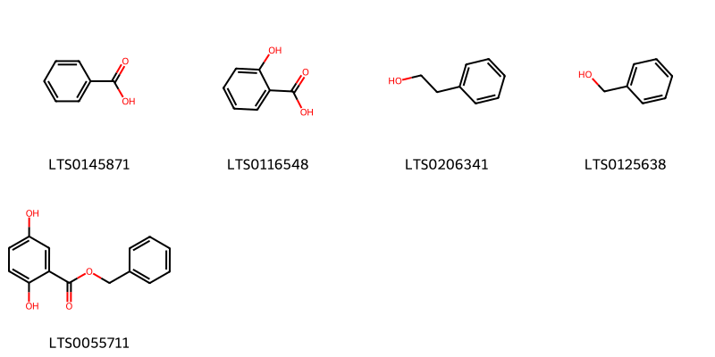{ width=100% }
    <figcaption>Hình ảnh cấu trúc hóa học của 5 hoạt chất thuộc nhóm Benzene and substituted derivatives gồm ['benzoic acid (LTS0145871)', 'salicyclic acid (LTS0116548)', '2-phenyl-ethanol (LTS0206341)', 'benzyl alcohol (LTS0125638)', 'benzyl 2,5-dihydroxybenzoate (LTS0055711)'].</figcaption>
</figure>
#### Nhóm Cinnamic acids and derivatives
<figure markdown="span">
    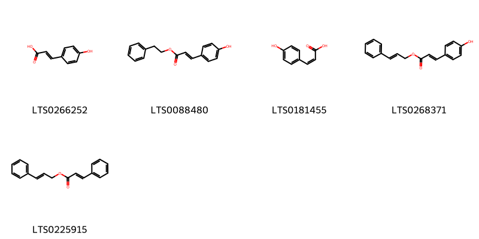{ width=100% }
    <figcaption>Hình ảnh cấu trúc hóa học của 5 hoạt chất thuộc nhóm Cinnamic acids and derivatives gồm ['para-coumaric acid (LTS0266252)', '2-phenylethyl (2e)-3-(4-hydroxyphenyl)prop-2-enoate (LTS0088480)', 'cis-p-coumaric acid (LTS0181455)', '(2e)-3-phenylprop-2-en-1-yl (2e)-3-(4-hydroxyphenyl)prop-2-enoate (LTS0268371)', 'cinnamyl cinnamate (LTS0225915)'].</figcaption>
</figure>
#### Nhóm Fatty Acyls
<figure markdown="span">
    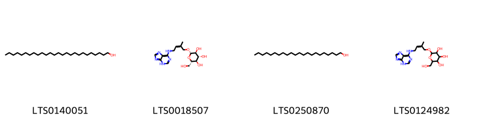{ width=100% }
    <figcaption>Hình ảnh cấu trúc hóa học của 4 hoạt chất thuộc nhóm Fatty Acyls gồm ['ceryl alcohol (LTS0140051)', '(2s,3r,4r,5s,6s)-2-(hydroxymethyl)-6-{[(2z)-2-methyl-4-(3h-purin-6-ylamino)but-2-en-1-yl]oxy}oxane-3,4,5-triol (LTS0018507)', 'docosanol (LTS0250870)', '2-(hydroxymethyl)-6-{[2-methyl-4-(3h-purin-6-ylamino)but-2-en-1-yl]oxy}oxane-3,4,5-triol (LTS0124982)'].</figcaption>
</figure>
#### Nhóm Flavonoids
<figure markdown="span">
    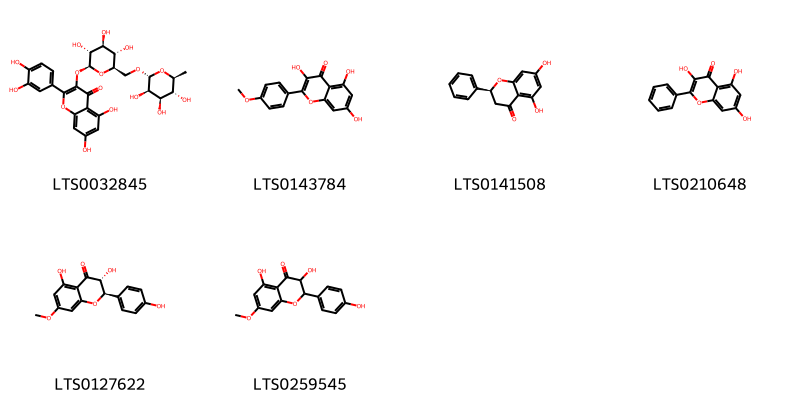{ width=100% }
    <figcaption>Hình ảnh cấu trúc hóa học của 6 hoạt chất thuộc nhóm Flavonoids gồm ['3-rutinosyl quercetin (LTS0032845)', 'kaempferide (LTS0143784)', 'pinocembrine (LTS0141508)', 'galangin (LTS0210648)', '(2r,3r)-3,5-dihydroxy-2-(4-hydroxyphenyl)-7-methoxy-2,3-dihydro-1-benzopyran-4-one (LTS0127622)', '3,5-dihydroxy-2-(4-hydroxyphenyl)-7-methoxy-2,3-dihydro-1-benzopyran-4-one (LTS0259545)'].</figcaption>
</figure>
#### Nhóm Linear 1_3-diarylpropanoids
<figure markdown="span">
    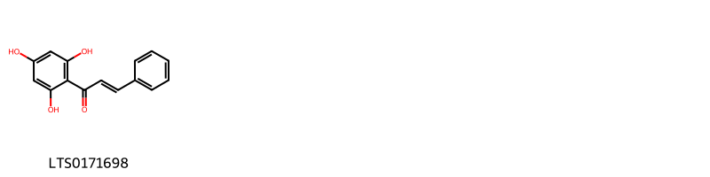{ width=100% }
    <figcaption>Hình ảnh cấu trúc hóa học của Không tìm thấy chú thích hoạt chất thuộc nhóm Linear 1_3-diarylpropanoids gồm Không tìm thấy chú thích.</figcaption>
</figure>
#### Nhóm Organooxygen compounds
<figure markdown="span">
    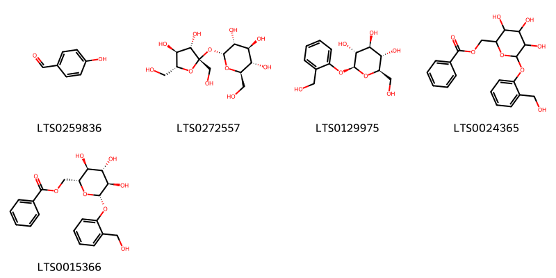{ width=100% }
    <figcaption>Hình ảnh cấu trúc hóa học của 5 hoạt chất thuộc nhóm Organooxygen compounds gồm ['p-hydroxybenzaldehyde (LTS0259836)', 'sucrose (LTS0272557)', 'salicin (LTS0129975)', 'populin (LTS0024365)', 'populin (LTS0015366)'].</figcaption>
</figure>
#### Nhóm Phenylpropanoic acids
<figure markdown="span">
    { width=100% }
    <figcaption>Hình ảnh cấu trúc hóa học của 2 hoạt chất thuộc nhóm Phenylpropanoic acids gồm ['3-phenylpropionic acid (LTS0121890)', '2-phenylpropionic acid (LTS0122325)'].</figcaption>
</figure>
#### Nhóm Prenol lipids
<figure markdown="span">
    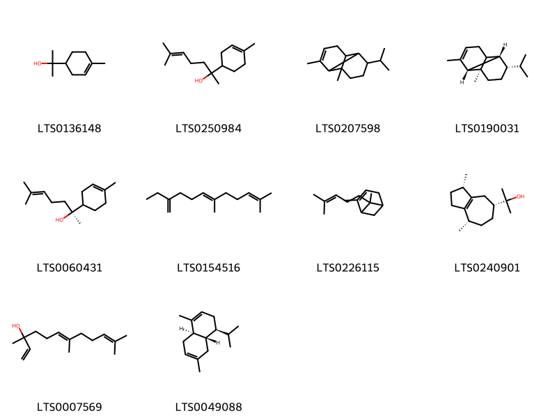{ width=100% }
    <figcaption>Hình ảnh cấu trúc hóa học của 10 hoạt chất thuộc nhóm Prenol lipids gồm ['terpineol (LTS0136148)', 'α-bisabolol (LTS0250984)', 'α-copaene (LTS0207598)', '(1r,2s,7s,8s)-8-isopropyl-1,3-dimethyltricyclo[4.4.0.0²,⁷]dec-3-ene (LTS0190031)', '(2s)-6-methyl-2-(4-methylcyclohex-3-en-1-yl)hept-5-en-2-ol (LTS0060431)', '(6e)-2,6-dimethyl-10-methylidenedodeca-2,6-diene (LTS0154516)', 'α-bergamotene (LTS0226115)', 'guaiol (LTS0240901)', 'nerolidol isomers (LTS0007569)', 'β-cadinene (LTS0049088)'].</figcaption>
</figure>
#### Nhóm Purine nucleosides
<figure markdown="span">
    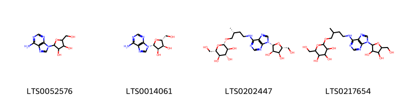{ width=100% }
    <figcaption>Hình ảnh cấu trúc hóa học của 4 hoạt chất thuộc nhóm Purine nucleosides gồm ['adenosine (LTS0052576)', 'adenosine (LTS0014061)', '(2s,3s,4r,5r,6s)-2-[(2r)-4-({9-[(2r,3r,4s,5r)-3,4-dihydroxy-5-(hydroxymethyl)oxolan-2-yl]purin-6-yl}amino)-2-methylbutoxy]-6-(hydroxymethyl)oxane-3,4,5-triol (LTS0202447)', '2-[4-({9-[3,4-dihydroxy-5-(hydroxymethyl)oxolan-2-yl]purin-6-yl}amino)-2-methylbutoxy]-6-(hydroxymethyl)oxane-3,4,5-triol (LTS0217654)'].</figcaption>
</figure>
#### Nhóm Saturated hydrocarbons
<figure markdown="span">
    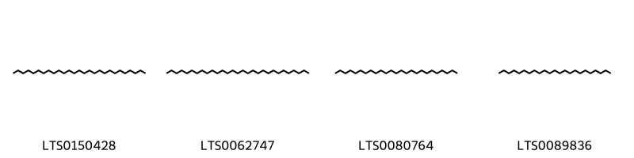{ width=100% }
    <figcaption>Hình ảnh cấu trúc hóa học của 4 hoạt chất thuộc nhóm Saturated hydrocarbons gồm ['heptacosane (LTS0150428)', 'nonacosane (LTS0062747)', 'pentacosane (LTS0080764)', 'tricosane (LTS0089836)'].</figcaption>
</figure>
#### Nhóm Unsaturated hydrocarbons
<figure markdown="span">
    { width=100% }
    <figcaption>Hình ảnh cấu trúc hóa học của 1 hoạt chất thuộc nhóm Unsaturated hydrocarbons gồm ['1-hexacosene (LTS0251620)'].</figcaption>
</figure>

---

### Dược dân tộc học

Danh sách các quốc gia có sử dụng *Populus alba* trong điều trị các bệnh. 

| Country   | Disease                     | Bệnh                                       |
|:----------|:----------------------------|:-------------------------------------------|
| China     | Antiseptic, Astringent      | Khử trùng, làm se                          |
| Elsewhere | Astringent, Tonic, Diuretic | Chất làm se, Thuốc bổ, Thuốc lợi tiểu      |
| Eurasia   | Tonic                       | (thuộc) trương lực                         |
| Turkey    | Diuretic, Tonic, Stimulant  | Thuốc lợi tiểu, thuốc bổ, thuốc kích thích |

---

---
## Populus balsamifera
### Thông tin về thực vật

!!! info "Phân loại thực vật của *Populus balsamifera* từ GIBF:"
    - **Kingdom:** Plantae
    - **Phylum:** Tracheophyta
    - **Order:** Malpighiales
    - **Family:** Salicaceae
    - **Genus:** Populus
    - **Species:** *Populus balsamifera*

 

| Label (VI)   | Label (EN)   | Scientific Name     | Descriptions (VI)   | Descriptions (EN)   | Also Known As (VI)   | Also Known As (EN)                                                                                           |
|:-------------|:-------------|:--------------------|:--------------------|:--------------------|:---------------------|:-------------------------------------------------------------------------------------------------------------|
| N/A          | N/A          | Populus balsamifera | loài thực vật       | species of plant    | ['']                 | ['balsam poplar', 'bam', 'hackmatack', 'bamtree', 'eastern balsam-poplar', 'tacamahac poplar', 'tacamahaca'] |

#### Phân bố trên thế giới

**Từ CSDL GIBF** Sweden, Lithuania, Czechia, Germany, Canada, Russian Federation, United States of America, Finland, Austria, Norway, Netherlands

#### Phân bố tại Việt Nam

**Từ CSDL GIBF**: Không có ghi nhận ở Việt Nam

---
### Thành phần hóa học
        
- Theo cơ sở dữ liệu lotus: Từ loài *Populus balsamifera* đã phân lập và xác định được 65 hoạt chất thuộc về các nhóm Organooxygen compounds, Flavonoids, Saturated hydrocarbons, Carboxylic acids and derivatives, Prenol lipids, Anthracenes, Fatty Acyls, Linear 1,3-diarylpropanoids, Phenols, Hydroxy acids and derivatives, Cinnamic acids and derivatives, Benzene and substituted derivatives. 

|    | chemicalTaxonomyClassyfireClass     |   smiles_count |
|---:|:------------------------------------|---------------:|
|  0 | Anthracenes                         |              1 |
|  1 | Benzene and substituted derivatives |              2 |
|  2 | Carboxylic acids and derivatives    |              1 |
|  3 | Cinnamic acids and derivatives      |              9 |
|  4 | Fatty Acyls                         |              6 |
|  5 | Flavonoids                          |             20 |
|  6 | Hydroxy acids and derivatives       |              1 |
|  7 | Linear 1,3-diarylpropanoids         |              3 |
|  8 | Organooxygen compounds              |             14 |
|  9 | Phenols                             |              1 |
| 10 | Prenol lipids                       |              4 |
| 11 | Saturated hydrocarbons              |              3 |

#### Nhóm Anthracenes
<figure markdown="span">
    { width=100% }
    <figcaption>Hình ảnh cấu trúc hóa học của 1 hoạt chất thuộc nhóm Anthracenes gồm ['2-chlorophyscion (LTS0252113)'].</figcaption>
</figure>
#### Nhóm Benzene and substituted derivatives
<figure markdown="span">
    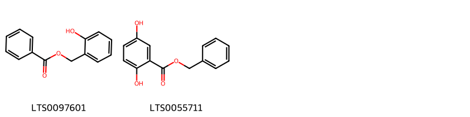{ width=100% }
    <figcaption>Hình ảnh cấu trúc hóa học của 2 hoạt chất thuộc nhóm Benzene and substituted derivatives gồm ['(2-hydroxyphenyl)methyl benzoate (LTS0097601)', 'benzyl 2,5-dihydroxybenzoate (LTS0055711)'].</figcaption>
</figure>
#### Nhóm Carboxylic acids and derivatives
<figure markdown="span">
    { width=100% }
    <figcaption>Hình ảnh cấu trúc hóa học của 1 hoạt chất thuộc nhóm Carboxylic acids and derivatives gồm ['citric acid (LTS0213921)'].</figcaption>
</figure>
#### Nhóm Cinnamic acids and derivatives
<figure markdown="span">
    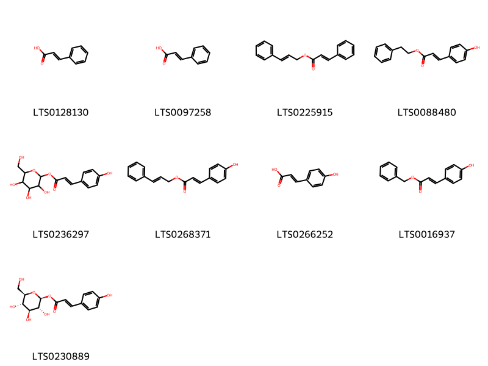{ width=100% }
    <figcaption>Hình ảnh cấu trúc hóa học của 9 hoạt chất thuộc nhóm Cinnamic acids and derivatives gồm ['cinnamic acid (LTS0128130)', 'phenylacrylic acid (LTS0097258)', 'cinnamyl cinnamate (LTS0225915)', '2-phenylethyl (2e)-3-(4-hydroxyphenyl)prop-2-enoate (LTS0088480)', '3,4,5-trihydroxy-6-(hydroxymethyl)oxan-2-yl 3-(4-hydroxyphenyl)prop-2-enoate (LTS0236297)', '(2e)-3-phenylprop-2-en-1-yl (2e)-3-(4-hydroxyphenyl)prop-2-enoate (LTS0268371)', 'para-coumaric acid (LTS0266252)', 'benzyl (2e)-3-(4-hydroxyphenyl)prop-2-enoate (LTS0016937)', 'p-coumaroyl-d-glucose (LTS0230889)'].</figcaption>
</figure>
#### Nhóm Fatty Acyls
<figure markdown="span">
    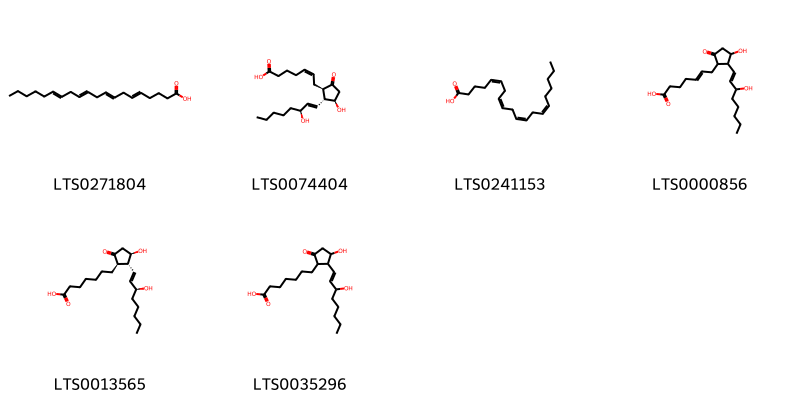{ width=100% }
    <figcaption>Hình ảnh cấu trúc hóa học của 6 hoạt chất thuộc nhóm Fatty Acyls gồm ['5,8,11,14-icosatetraenoic acid (LTS0271804)', 'dinoprostone (LTS0074404)', 'arachidonic acid (LTS0241153)', 'prostaglandin e2 (LTS0000856)', 'alprostadil (LTS0013565)', 'prostaglandin e1 (LTS0035296)'].</figcaption>
</figure>
#### Nhóm Flavonoids
<figure markdown="span">
    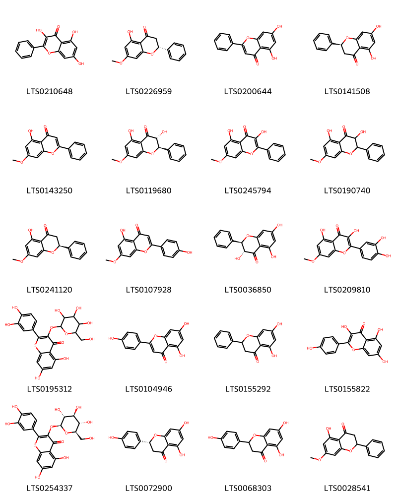{ width=100% }
    <figcaption>Hình ảnh cấu trúc hóa học của 20 hoạt chất thuộc nhóm Flavonoids gồm ['galangin (LTS0210648)', '(2r)-5-hydroxy-7-methoxy-2-phenyl-2,3-dihydro-1-benzopyran-4-one (LTS0226959)', 'chrysin (LTS0200644)', 'pinocembrine (LTS0141508)', 'tectochrysin (LTS0143250)', '(2r,3r)-3,5-dihydroxy-7-methoxy-2-phenyl-2,3-dihydro-1-benzopyran-4-one (LTS0119680)', 'izalpinin (LTS0245794)', '3,5-dihydroxy-7-methoxy-2-phenyl-2,3-dihydro-1-benzopyran-4-one (LTS0190740)', 'pinostrobin (LTS0241120)', 'genkwanin (LTS0107928)', 'pinobanksin (LTS0036850)', 'rhamnetin (LTS0209810)', '2-(3,4-dihydroxyphenyl)-5,7-dihydroxy-3-{[3,4,5-trihydroxy-6-(hydroxymethyl)oxan-2-yl]oxy}chromen-4-one (LTS0195312)', 'chamomile (LTS0104946)', 'pinocembrin (LTS0155292)', 'kaempherol (LTS0155822)', 'isoquercetin (LTS0254337)', '(-)-naringenin (LTS0072900)', 'asahina (LTS0068303)', 'pinostrobin (LTS0028541)'].</figcaption>
</figure>
#### Nhóm Hydroxy acids and derivatives
<figure markdown="span">
    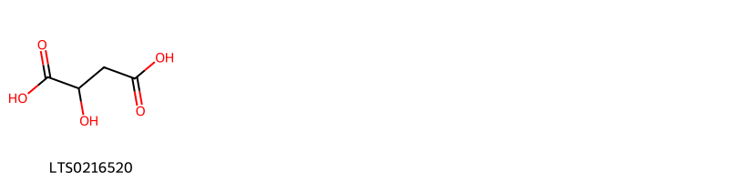{ width=100% }
    <figcaption>Hình ảnh cấu trúc hóa học của 1 hoạt chất thuộc nhóm Hydroxy acids and derivatives gồm ['malic acid (LTS0216520)'].</figcaption>
</figure>
#### Nhóm Linear 1_3-diarylpropanoids
<figure markdown="span">
    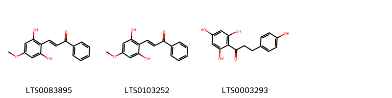{ width=100% }
    <figcaption>Hình ảnh cấu trúc hóa học của Không tìm thấy chú thích hoạt chất thuộc nhóm Linear 1_3-diarylpropanoids gồm Không tìm thấy chú thích.</figcaption>
</figure>
#### Nhóm Organooxygen compounds
<figure markdown="span">
    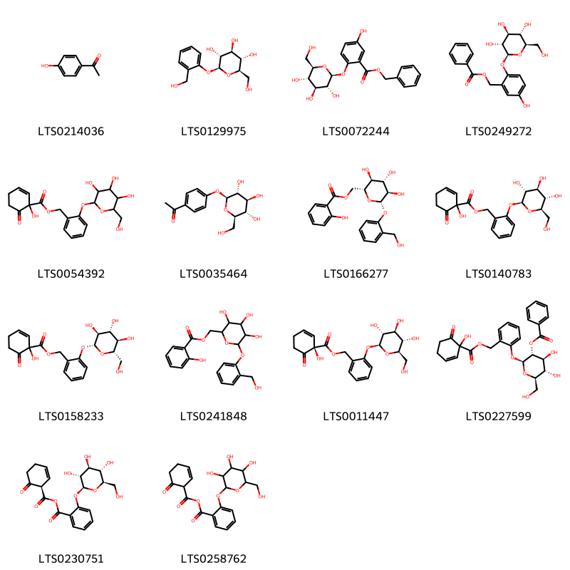{ width=100% }
    <figcaption>Hình ảnh cấu trúc hóa học của 14 hoạt chất thuộc nhóm Organooxygen compounds gồm ['hydroxyacetophenone (LTS0214036)', 'salicin (LTS0129975)', 'trichocarpin (LTS0072244)', 'salireposide (LTS0249272)', '(2-{[3,4,5-trihydroxy-6-(hydroxymethyl)oxan-2-yl]oxy}phenyl)methyl 1-hydroxy-6-oxocyclohex-2-ene-1-carboxylate (LTS0054392)', 'picein (LTS0035464)', '[(2r,3s,4s,5r,6s)-3,4,5-trihydroxy-6-[2-(hydroxymethyl)phenoxy]oxan-2-yl]methyl 2-hydroxybenzoate (LTS0166277)', 'salicortin (LTS0140783)', '(2-{[(2r,3s,4r,5r,6s)-3,4,5-trihydroxy-6-(hydroxymethyl)oxan-2-yl]oxy}phenyl)methyl 1-hydroxy-6-oxocyclohex-2-ene-1-carboxylate (LTS0158233)', '{3,4,5-trihydroxy-6-[2-(hydroxymethyl)phenoxy]oxan-2-yl}methyl 2-hydroxybenzoate (LTS0241848)', '(2-{[(2s,3r,4s,5s,6r)-3,4,5-trihydroxy-6-(hydroxymethyl)oxan-2-yl]oxy}phenyl)methyl (1r)-1-hydroxy-6-oxocyclohex-2-ene-1-carboxylate (LTS0011447)', 'tremulacin (LTS0227599)', '(1r)-6-oxocyclohex-2-ene-1-carbonyl 2-{[(2s,3r,4s,5s,6r)-3,4,5-trihydroxy-6-(hydroxymethyl)oxan-2-yl]oxy}benzoate (LTS0230751)', '6-oxocyclohex-2-ene-1-carbonyl 2-{[3,4,5-trihydroxy-6-(hydroxymethyl)oxan-2-yl]oxy}benzoate (LTS0258762)'].</figcaption>
</figure>
#### Nhóm Phenols
<figure markdown="span">
    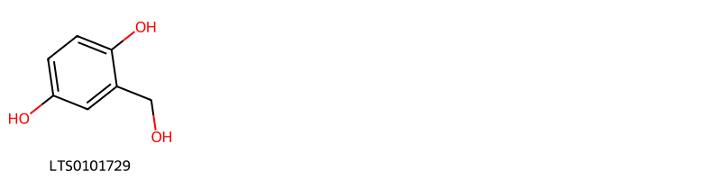{ width=100% }
    <figcaption>Hình ảnh cấu trúc hóa học của 1 hoạt chất thuộc nhóm Phenols gồm ['gentisyl alcohol (LTS0101729)'].</figcaption>
</figure>
#### Nhóm Prenol lipids
<figure markdown="span">
    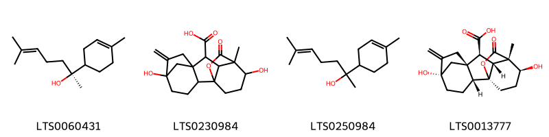{ width=100% }
    <figcaption>Hình ảnh cấu trúc hóa học của 4 hoạt chất thuộc nhóm Prenol lipids gồm ['(2s)-6-methyl-2-(4-methylcyclohex-3-en-1-yl)hept-5-en-2-ol (LTS0060431)', '5,12-dihydroxy-11-methyl-6-methylidene-16-oxo-15-oxapentacyclo[9.3.2.1⁵,⁸.0¹,¹⁰.0²,⁸]heptadecane-9-carboxylic acid (LTS0230984)', 'α-bisabolol (LTS0250984)', 'gibberellin a1 (LTS0013777)'].</figcaption>
</figure>
#### Nhóm Saturated hydrocarbons
<figure markdown="span">
    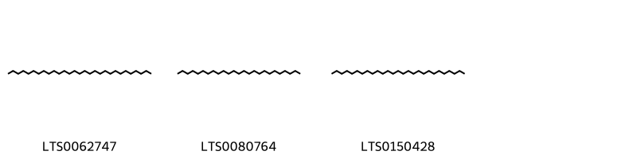{ width=100% }
    <figcaption>Hình ảnh cấu trúc hóa học của 3 hoạt chất thuộc nhóm Saturated hydrocarbons gồm ['nonacosane (LTS0062747)', 'pentacosane (LTS0080764)', 'heptacosane (LTS0150428)'].</figcaption>
</figure>

---

### Dược dân tộc học

Danh sách các quốc gia có sử dụng *Populus balsamifera* trong điều trị các bệnh. 

| Country   | Disease                                      | Bệnh                                                      |
|:----------|:---------------------------------------------|:----------------------------------------------------------|
| China     | Astringent, Parasiticide, Styptic, Vermifuge | Chất làm se, Thuốc diệt ký sinh trùng, Styptic, Vermifuge |
| US        | Expectorant, Stimulant                       | Chất đờm, chất kích thích                                 |

---

---
## Populus ciliata
### Thông tin về thực vật

!!! info "Phân loại thực vật của *Populus ciliata* từ GIBF:"
    - **Kingdom:** Plantae
    - **Phylum:** Tracheophyta
    - **Order:** Malpighiales
    - **Family:** Salicaceae
    - **Genus:** Populus
    - **Species:** *Populus ciliata*

 

| Label (VI)   | Label (EN)   | Scientific Name   | Descriptions (VI)   | Descriptions (EN)   | Also Known As (VI)   | Also Known As (EN)   |
|:-------------|:-------------|:------------------|:--------------------|:--------------------|:---------------------|:---------------------|
| N/A          | N/A          | Populus ciliata   | loài thực vật       | species of plant    | ['']                 | ['']                 |

#### Phân bố trên thế giới

**Từ CSDL GIBF** unknown or invalid, Pakistan, Bhutan, New Zealand, India, United States of America, China, Nepal

#### Phân bố tại Việt Nam

**Từ CSDL GIBF**: Không có ghi nhận ở Việt Nam

---
### Thành phần hóa học
        
- Theo cơ sở dữ liệu lotus: Từ loài *Populus ciliata* đã phân lập và xác định được 15 hoạt chất thuộc về các nhóm Organooxygen compounds, Cinnamic acids and derivatives, Benzene and substituted derivatives, Carboxylic acids and derivatives. 

|    | chemicalTaxonomyClassyfireClass     |   smiles_count |
|---:|:------------------------------------|---------------:|
|  0 | Benzene and substituted derivatives |              4 |
|  1 | Carboxylic acids and derivatives    |              2 |
|  2 | Cinnamic acids and derivatives      |              6 |
|  3 | Organooxygen compounds              |              3 |

#### Nhóm Benzene and substituted derivatives
<figure markdown="span">
    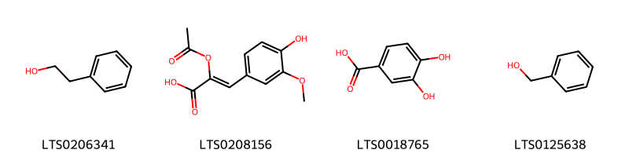{ width=100% }
    <figcaption>Hình ảnh cấu trúc hóa học của 4 hoạt chất thuộc nhóm Benzene and substituted derivatives gồm ['2-phenyl-ethanol (LTS0206341)', '(2z)-2-(acetyloxy)-3-(4-hydroxy-3-methoxyphenyl)prop-2-enoic acid (LTS0208156)', '3,4-dihydroxybenzoic acid (LTS0018765)', 'benzyl alcohol (LTS0125638)'].</figcaption>
</figure>
#### Nhóm Carboxylic acids and derivatives
<figure markdown="span">
    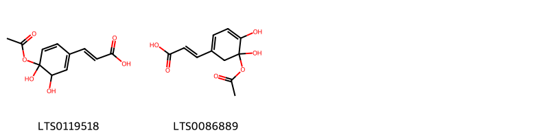{ width=100% }
    <figcaption>Hình ảnh cấu trúc hóa học của 2 hoạt chất thuộc nhóm Carboxylic acids and derivatives gồm ['(2e)-3-[4-(acetyloxy)-3,4-dihydroxycyclohexa-1,5-dien-1-yl]prop-2-enoic acid (LTS0119518)', '(2e)-3-[5-(acetyloxy)-4,5-dihydroxycyclohexa-1,3-dien-1-yl]prop-2-enoic acid (LTS0086889)'].</figcaption>
</figure>
#### Nhóm Cinnamic acids and derivatives
<figure markdown="span">
    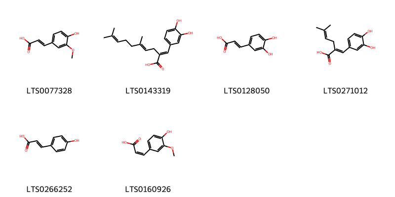{ width=100% }
    <figcaption>Hình ảnh cấu trúc hóa học của 6 hoạt chất thuộc nhóm Cinnamic acids and derivatives gồm ['ferulic acid (LTS0077328)', '(2e,4e)-2-[(3,4-dihydroxyphenyl)methylidene]-5,9-dimethyldeca-4,8-dienoic acid (LTS0143319)', '3,4-dihydroxycinnamic acid (LTS0128050)', '(2e)-2-[(3,4-dihydroxyphenyl)methylidene]-5-methylhex-4-enoic acid (LTS0271012)', 'para-coumaric acid (LTS0266252)', 'cis-ferulic acid (LTS0160926)'].</figcaption>
</figure>
#### Nhóm Organooxygen compounds
<figure markdown="span">
    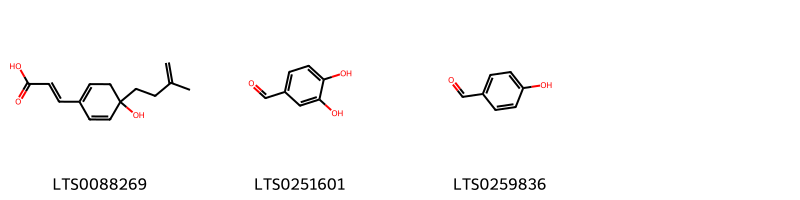{ width=100% }
    <figcaption>Hình ảnh cấu trúc hóa học của 3 hoạt chất thuộc nhóm Organooxygen compounds gồm ['(2e)-3-[4-hydroxy-4-(3-methylbut-3-en-1-yl)cyclohexa-1,5-dien-1-yl]prop-2-enoic acid (LTS0088269)', '3,4-dihydroxybenzaldehyde (LTS0251601)', 'p-hydroxybenzaldehyde (LTS0259836)'].</figcaption>
</figure>

---

### Dược dân tộc học

Danh sách các quốc gia có sử dụng *Populus ciliata* trong điều trị các bệnh. 

| Country      | Disease          | Bệnh                      |
|:-------------|:-----------------|:--------------------------|
| India(Hindu) | Stimulant, Tonic | Chất kích thích, Thuốc bổ |

---

---
## Populus euphratica
### Thông tin về thực vật

!!! info "Phân loại thực vật của *Populus euphratica* từ GIBF:"
    - **Kingdom:** Plantae
    - **Phylum:** Tracheophyta
    - **Order:** Malpighiales
    - **Family:** Salicaceae
    - **Genus:** Populus
    - **Species:** *Populus euphratica*

 

| Label (VI)   | Label (EN)   | Scientific Name    | Descriptions (VI)   | Descriptions (EN)   | Also Known As (VI)   | Also Known As (EN)   |
|:-------------|:-------------|:-------------------|:--------------------|:--------------------|:---------------------|:---------------------|
| N/A          | N/A          | Populus euphratica |                     | species of plant    | ['']                 | ['']                 |

#### Phân bố trên thế giới

**Từ CSDL GIBF** nan, Georgia, Spain, Pakistan, Uzbekistan, Mongolia, Kazakhstan, Iraq, Belgium, Türkiye, Kyrgyzstan, China, Iran (Islamic Republic of), Jordan, Morocco, Egypt, Algeria, Israel, Tajikistan

#### Phân bố tại Việt Nam

**Từ CSDL GIBF**: Không có ghi nhận ở Việt Nam

---
### Thành phần hóa học
        
- Theo cơ sở dữ liệu lotus: Từ loài *Populus euphratica* đã phân lập và xác định được 32 hoạt chất thuộc về các nhóm Organooxygen compounds, Fatty Acyls, Phenols, Cinnamic acids and derivatives, Steroids and steroid derivatives, Benzene and substituted derivatives. 

|    | chemicalTaxonomyClassyfireClass     |   smiles_count |
|---:|:------------------------------------|---------------:|
|  0 | Benzene and substituted derivatives |              6 |
|  1 | Cinnamic acids and derivatives      |              8 |
|  2 | Fatty Acyls                         |              2 |
|  3 | Organooxygen compounds              |              6 |
|  4 | Phenols                             |              8 |
|  5 | Steroids and steroid derivatives    |              2 |

#### Nhóm Benzene and substituted derivatives
<figure markdown="span">
    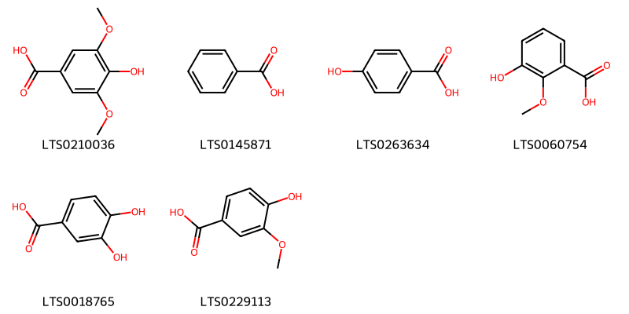{ width=100% }
    <figcaption>Hình ảnh cấu trúc hóa học của 6 hoạt chất thuộc nhóm Benzene and substituted derivatives gồm ['syringic acid (LTS0210036)', 'benzoic acid (LTS0145871)', 'p-hydroxybenzoic acid (LTS0263634)', '3-hydroxy-2-methoxybenzoic acid (LTS0060754)', '3,4-dihydroxybenzoic acid (LTS0018765)', 'vanillic acid (LTS0229113)'].</figcaption>
</figure>
#### Nhóm Cinnamic acids and derivatives
<figure markdown="span">
    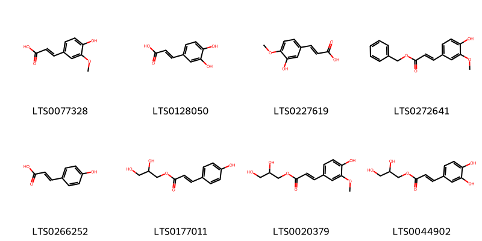{ width=100% }
    <figcaption>Hình ảnh cấu trúc hóa học của 8 hoạt chất thuộc nhóm Cinnamic acids and derivatives gồm ['ferulic acid (LTS0077328)', '3,4-dihydroxycinnamic acid (LTS0128050)', 'isoferulic acid (LTS0227619)', 'benzyl (2e)-3-(4-hydroxy-3-methoxyphenyl)prop-2-enoate (LTS0272641)', 'para-coumaric acid (LTS0266252)', '2,3-dihydroxypropyl (2e)-3-(4-hydroxyphenyl)prop-2-enoate (LTS0177011)', '2,3-dihydroxypropyl (2e)-3-(4-hydroxy-3-methoxyphenyl)prop-2-enoate (LTS0020379)', '2,3-dihydroxypropyl (2e)-3-(3,4-dihydroxyphenyl)prop-2-enoate (LTS0044902)'].</figcaption>
</figure>
#### Nhóm Fatty Acyls
<figure markdown="span">
    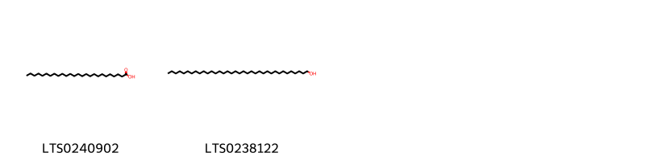{ width=100% }
    <figcaption>Hình ảnh cấu trúc hóa học của 2 hoạt chất thuộc nhóm Fatty Acyls gồm ['hexacosanoic acid (LTS0240902)', '1-hexatriacontanol (LTS0238122)'].</figcaption>
</figure>
#### Nhóm Organooxygen compounds
<figure markdown="span">
    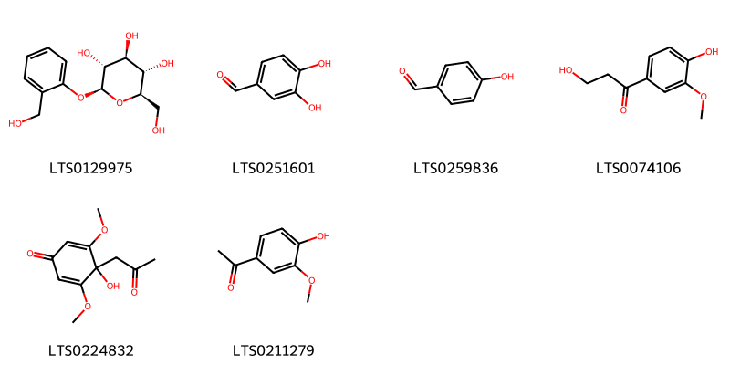{ width=100% }
    <figcaption>Hình ảnh cấu trúc hóa học của 6 hoạt chất thuộc nhóm Organooxygen compounds gồm ['salicin (LTS0129975)', '3,4-dihydroxybenzaldehyde (LTS0251601)', 'p-hydroxybenzaldehyde (LTS0259836)', '3-hydroxy-1-(4-hydroxy-3-methoxyphenyl)propan-1-one (LTS0074106)', '4-hydroxy-3,5-dimethoxy-4-(2-oxopropyl)cyclohexa-2,5-dien-1-one (LTS0224832)', 'apocynin (LTS0211279)'].</figcaption>
</figure>
#### Nhóm Phenols
<figure markdown="span">
    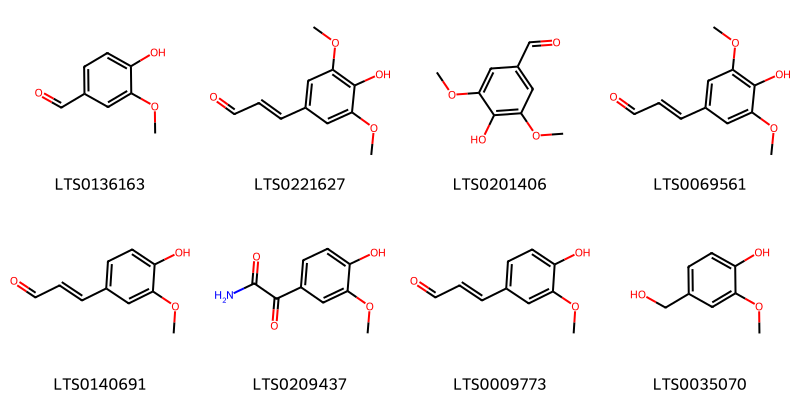{ width=100% }
    <figcaption>Hình ảnh cấu trúc hóa học của 8 hoạt chất thuộc nhóm Phenols gồm ['vanillin (LTS0136163)', 'sinapyl aldehyde (LTS0221627)', 'syringaldehyde (LTS0201406)', 'sinapaldehyde (LTS0069561)', 'coniferyl aldehyde (LTS0140691)', '2-(4-hydroxy-3-methoxyphenyl)-2-oxoacetamide (LTS0209437)', 'coniferaldehyde (LTS0009773)', 'vanillyl alcohol (LTS0035070)'].</figcaption>
</figure>
#### Nhóm Steroids and steroid derivatives
<figure markdown="span">
    { width=100% }
    <figcaption>Hình ảnh cấu trúc hóa học của 2 hoạt chất thuộc nhóm Steroids and steroid derivatives gồm ['sitosterol (LTS0168132)', 'stigmast-5-en-3-ol, (3β)- (LTS0204616)'].</figcaption>
</figure>

---

### Dược dân tộc học

Danh sách các quốc gia có sử dụng *Populus euphratica* trong điều trị các bệnh. 

| Country   | Disease              | Bệnh                 |
|:----------|:---------------------|:---------------------|
| Elsewhere | Dentifrice           | Kem đánh răng        |
| India     | Vermifuge, Vermifuge | Vermifuge, Vermifuge |

---

---
## Populus nigra
### Thông tin về thực vật

!!! info "Phân loại thực vật của *Populus nigra* từ GIBF:"
    - **Kingdom:** Plantae
    - **Phylum:** Tracheophyta
    - **Order:** Malpighiales
    - **Family:** Salicaceae
    - **Genus:** Populus
    - **Species:** *Populus nigra*

 

| Label (VI)   | Label (EN)   | Scientific Name   | Descriptions (VI)   | Descriptions (EN)   | Also Known As (VI)   | Also Known As (EN)                 |
|:-------------|:-------------|:------------------|:--------------------|:--------------------|:---------------------|:-----------------------------------|
| N/A          | N/A          | Populus nigra     | loài thực vật       | species of plant    | ['']                 | ['black poplar', 'black populars'] |

#### Phân bố trên thế giới

**Từ CSDL GIBF** Georgia, Bosnia and Herzegovina, Luxembourg, Spain, Germany, Chile, Austria, Australia, Sweden, Poland, Kazakhstan, Canada, Belgium, Netherlands, Slovakia, Belarus, Kyrgyzstan, Hungary, Ireland, Switzerland, United Kingdom of Great Britain and Northern Ireland, South Africa, France, Czechia, New Zealand, Romania, Bolivia (Plurinational State of), Russian Federation, United States of America, Italy, Croatia, Ukraine

#### Phân bố tại Việt Nam

**Từ CSDL GIBF**: Không có ghi nhận ở Việt Nam

---
### Thành phần hóa học
        
- Theo cơ sở dữ liệu lotus: Từ loài *Populus nigra* đã phân lập và xác định được 34 hoạt chất thuộc về các nhóm Organooxygen compounds, Flavonoids, Saturated hydrocarbons, Unsaturated hydrocarbons, Carboxylic acids and derivatives, Fatty Acyls, Cinnamic acids and derivatives, Steroids and steroid derivatives, Benzene and substituted derivatives. 

|    | chemicalTaxonomyClassyfireClass     |   smiles_count |
|---:|:------------------------------------|---------------:|
|  0 | Benzene and substituted derivatives |              1 |
|  1 | Carboxylic acids and derivatives    |              1 |
|  2 | Cinnamic acids and derivatives      |              8 |
|  3 | Fatty Acyls                         |              2 |
|  4 | Flavonoids                          |             13 |
|  5 | Organooxygen compounds              |              3 |
|  6 | Saturated hydrocarbons              |              3 |
|  7 | Steroids and steroid derivatives    |              2 |
|  8 | Unsaturated hydrocarbons            |              1 |

#### Nhóm Benzene and substituted derivatives
<figure markdown="span">
    { width=100% }
    <figcaption>Hình ảnh cấu trúc hóa học của 1 hoạt chất thuộc nhóm Benzene and substituted derivatives gồm ['benzoic acid (LTS0145871)'].</figcaption>
</figure>
#### Nhóm Carboxylic acids and derivatives
<figure markdown="span">
    { width=100% }
    <figcaption>Hình ảnh cấu trúc hóa học của 1 hoạt chất thuộc nhóm Carboxylic acids and derivatives gồm ['succinic acid (LTS0237204)'].</figcaption>
</figure>
#### Nhóm Cinnamic acids and derivatives
<figure markdown="span">
    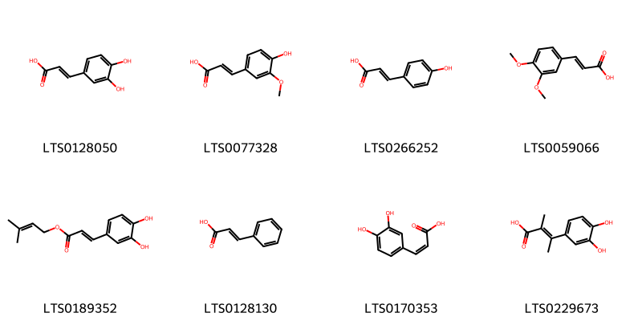{ width=100% }
    <figcaption>Hình ảnh cấu trúc hóa học của 8 hoạt chất thuộc nhóm Cinnamic acids and derivatives gồm ['3,4-dihydroxycinnamic acid (LTS0128050)', 'ferulic acid (LTS0077328)', 'para-coumaric acid (LTS0266252)', '3,4-dimethoxycinnamic acid (LTS0059066)', 'prenyl caffeate (LTS0189352)', 'cinnamic acid (LTS0128130)', 'caffeicacid (LTS0170353)', '(2e)-3-(3,4-dihydroxyphenyl)-2-methylbut-2-enoic acid (LTS0229673)'].</figcaption>
</figure>
#### Nhóm Fatty Acyls
<figure markdown="span">
    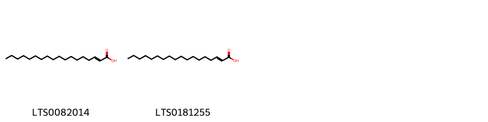{ width=100% }
    <figcaption>Hình ảnh cấu trúc hóa học của 2 hoạt chất thuộc nhóm Fatty Acyls gồm ['trans-2-octadecenoic acid (LTS0082014)', '2-octadecenoic acid (LTS0181255)'].</figcaption>
</figure>
#### Nhóm Flavonoids
<figure markdown="span">
    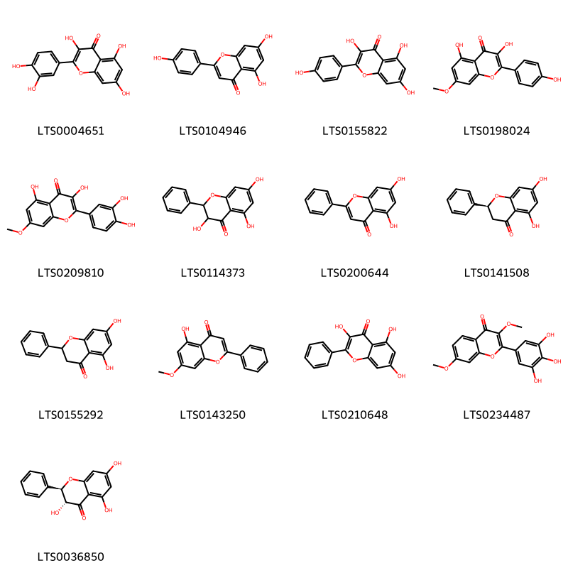{ width=100% }
    <figcaption>Hình ảnh cấu trúc hóa học của 13 hoạt chất thuộc nhóm Flavonoids gồm ['quercetin (LTS0004651)', 'chamomile (LTS0104946)', 'kaempherol (LTS0155822)', 'rhamnocitrin (LTS0198024)', 'rhamnetin (LTS0209810)', '3,5,7-trihydroxyflavanone (LTS0114373)', 'chrysin (LTS0200644)', 'pinocembrine (LTS0141508)', 'pinocembrin (LTS0155292)', 'tectochrysin (LTS0143250)', 'galangin (LTS0210648)', '3,7-dimethoxy-2-(3,4,5-trihydroxyphenyl)chromen-4-one (LTS0234487)', 'pinobanksin (LTS0036850)'].</figcaption>
</figure>
#### Nhóm Organooxygen compounds
<figure markdown="span">
    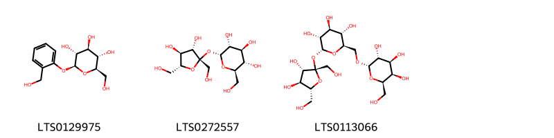{ width=100% }
    <figcaption>Hình ảnh cấu trúc hóa học của 3 hoạt chất thuộc nhóm Organooxygen compounds gồm ['salicin (LTS0129975)', 'sucrose (LTS0272557)', 'raffinose (LTS0113066)'].</figcaption>
</figure>
#### Nhóm Saturated hydrocarbons
<figure markdown="span">
    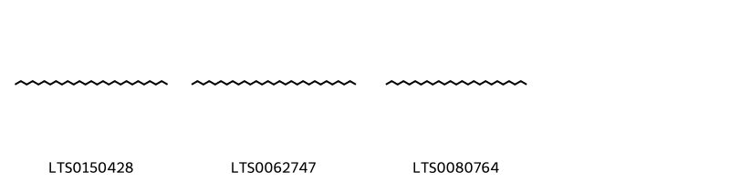{ width=100% }
    <figcaption>Hình ảnh cấu trúc hóa học của 3 hoạt chất thuộc nhóm Saturated hydrocarbons gồm ['heptacosane (LTS0150428)', 'nonacosane (LTS0062747)', 'pentacosane (LTS0080764)'].</figcaption>
</figure>
#### Nhóm Steroids and steroid derivatives
<figure markdown="span">
    { width=100% }
    <figcaption>Hình ảnh cấu trúc hóa học của 2 hoạt chất thuộc nhóm Steroids and steroid derivatives gồm ['stigmast-5-en-3-ol, (3β)- (LTS0204616)', 'stigmast-5-en-3-ol (LTS0071224)'].</figcaption>
</figure>
#### Nhóm Unsaturated hydrocarbons
<figure markdown="span">
    { width=100% }
    <figcaption>Hình ảnh cấu trúc hóa học của 1 hoạt chất thuộc nhóm Unsaturated hydrocarbons gồm ['1-hexacosene (LTS0251620)'].</figcaption>
</figure>

---

### Dược dân tộc học

Danh sách các quốc gia có sử dụng *Populus nigra* trong điều trị các bệnh. 

| Country   | Disease                               | Bệnh                                        |
|:----------|:--------------------------------------|:--------------------------------------------|
| Elsewhere | nan                                   | Ở đây                                       |
| Turkey    | Diuretic, Sudorific, Vulnerary, Tonic | Thuốc lợi tiểu, Sudorific, Vulnerary, Tonic |

---

---
## Populus suaveolens
### Thông tin về thực vật

!!! info "Phân loại thực vật của *Populus suaveolens* từ GIBF:"
    - **Kingdom:** Plantae
    - **Phylum:** Tracheophyta
    - **Order:** Malpighiales
    - **Family:** Salicaceae
    - **Genus:** Populus
    - **Species:** *Populus suaveolens*

 

| Label (VI)   | Label (EN)   | Scientific Name    | Descriptions (VI)   | Descriptions (EN)   | Also Known As (VI)   | Also Known As (EN)   |
|:-------------|:-------------|:-------------------|:--------------------|:--------------------|:---------------------|:---------------------|
| N/A          | N/A          | Populus suaveolens | loài thực vật       | species of plant    | ['']                 | ['']                 |

#### Phân bố trên thế giới

**Từ CSDL GIBF** United Kingdom of Great Britain and Northern Ireland, Japan, Mongolia, Estonia, Russian Federation, China

#### Phân bố tại Việt Nam

**Từ CSDL GIBF**: Không có ghi nhận ở Việt Nam

---
### Thành phần hóa học
        
- Theo cơ sở dữ liệu lotus: Từ loài *Populus suaveolens* đã phân lập và xác định được 20 hoạt chất thuộc về các nhóm Organooxygen compounds, Flavonoids, Linear 1,3-diarylpropanoids, Cinnamic acids and derivatives. 

|    | chemicalTaxonomyClassyfireClass   |   smiles_count |
|---:|:----------------------------------|---------------:|
|  0 | Cinnamic acids and derivatives    |              1 |
|  1 | Flavonoids                        |              9 |
|  2 | Linear 1,3-diarylpropanoids       |              3 |
|  3 | Organooxygen compounds            |              7 |

#### Nhóm Cinnamic acids and derivatives
<figure markdown="span">
    { width=100% }
    <figcaption>Hình ảnh cấu trúc hóa học của 1 hoạt chất thuộc nhóm Cinnamic acids and derivatives gồm ['3,4-dihydroxycinnamic acid (LTS0128050)'].</figcaption>
</figure>
#### Nhóm Flavonoids
<figure markdown="span">
    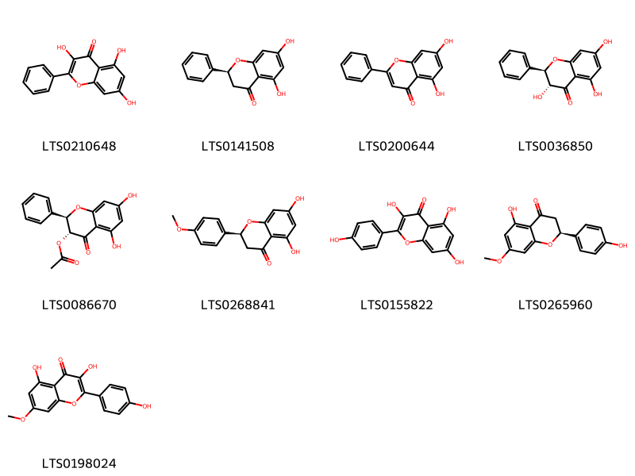{ width=100% }
    <figcaption>Hình ảnh cấu trúc hóa học của 9 hoạt chất thuộc nhóm Flavonoids gồm ['galangin (LTS0210648)', 'pinocembrine (LTS0141508)', 'chrysin (LTS0200644)', 'pinobanksin (LTS0036850)', 'pinobanksin-3-acetate (LTS0086670)', 'isosakuranetin (LTS0268841)', 'kaempherol (LTS0155822)', 'sakuranetin (LTS0265960)', 'rhamnocitrin (LTS0198024)'].</figcaption>
</figure>
#### Nhóm Linear 1_3-diarylpropanoids
<figure markdown="span">
    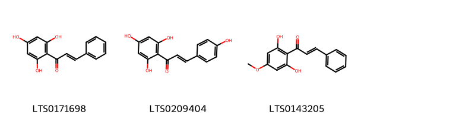{ width=100% }
    <figcaption>Hình ảnh cấu trúc hóa học của Không tìm thấy chú thích hoạt chất thuộc nhóm Linear 1_3-diarylpropanoids gồm Không tìm thấy chú thích.</figcaption>
</figure>
#### Nhóm Organooxygen compounds
<figure markdown="span">
    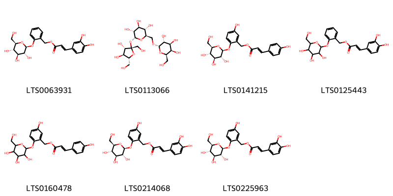{ width=100% }
    <figcaption>Hình ảnh cấu trúc hóa học của 7 hoạt chất thuộc nhóm Organooxygen compounds gồm ['(2-{[(2s,3r,4s,5s,6r)-3,4,5-trihydroxy-6-(hydroxymethyl)oxan-2-yl]oxy}phenyl)methyl (2e)-3-(3,4-dihydroxyphenyl)prop-2-enoate (LTS0063931)', 'raffinose (LTS0113066)', '(5-hydroxy-2-{[(2s,3r,4s,5s,6r)-3,4,5-trihydroxy-6-(hydroxymethyl)oxan-2-yl]oxy}phenyl)methyl (2e)-3-(4-hydroxyphenyl)prop-2-enoate (LTS0141215)', '(2-{[3,4,5-trihydroxy-6-(hydroxymethyl)oxan-2-yl]oxy}phenyl)methyl 3-(3,4-dihydroxyphenyl)prop-2-enoate (LTS0125443)', '(5-hydroxy-2-{[3,4,5-trihydroxy-6-(hydroxymethyl)oxan-2-yl]oxy}phenyl)methyl 3-(4-hydroxyphenyl)prop-2-enoate (LTS0160478)', '(5-hydroxy-2-{[(2s,3r,4s,5s,6r)-3,4,5-trihydroxy-6-(hydroxymethyl)oxan-2-yl]oxy}phenyl)methyl 3-(3,4-dihydroxyphenyl)prop-2-enoate (LTS0214068)', '(5-hydroxy-2-{[(2s,3r,4s,5s,6r)-3,4,5-trihydroxy-6-(hydroxymethyl)oxan-2-yl]oxy}phenyl)methyl (2e)-3-(3,4-dihydroxyphenyl)prop-2-enoate (LTS0225963)'].</figcaption>
</figure>

---

### Dược dân tộc học

Danh sách các quốc gia có sử dụng *Populus suaveolens* trong điều trị các bệnh. 

| Country   | Disease    | Bệnh      |
|:----------|:-----------|:----------|
| China     | Antiseptic | Khử trùng |

---

---
## Populus tremula
### Thông tin về thực vật

!!! info "Phân loại thực vật của *Populus tremula* từ GIBF:"
    - **Kingdom:** Plantae
    - **Phylum:** Tracheophyta
    - **Order:** Malpighiales
    - **Family:** Salicaceae
    - **Genus:** Populus
    - **Species:** *Populus tremula*

 

| Label (VI)   | Label (EN)   | Scientific Name   | Descriptions (VI)   | Descriptions (EN)   | Also Known As (VI)   | Also Known As (EN)                                                             |
|:-------------|:-------------|:------------------|:--------------------|:--------------------|:---------------------|:-------------------------------------------------------------------------------|
| N/A          | N/A          | Populus tremula   | loài thực vật       | species of plant    | ['']                 | ['aspen', 'quaking aspen', 'common aspen', 'Eurasian aspen', 'European aspen'] |

#### Phân bố trên thế giới

**Từ CSDL GIBF** Switzerland, Denmark, United Kingdom of Great Britain and Northern Ireland, Sweden, France, Poland, Germany, Russian Federation, Italy, Austria, Norway, Netherlands, Finland, Ukraine

#### Phân bố tại Việt Nam

**Từ CSDL GIBF**: Không có ghi nhận ở Việt Nam

---
### Thành phần hóa học
        
- Theo cơ sở dữ liệu lotus: Từ loài *Populus tremula* đã phân lập và xác định được 131 hoạt chất thuộc về các nhóm Furanoid lignans, Organonitrogen compounds, Carboxylic acids and derivatives, 2-arylbenzofuran flavonoids, Linear 1,3-diarylpropanoids, Dihydrofurans, Hydroxy acids and derivatives, Pyridines and derivatives, Lactones, Anthracenes, Keto acids and derivatives, Phenols, Cinnamic acids and derivatives, Organooxygen compounds, Diazines, Saturated hydrocarbons, Coumarins and derivatives, Fatty Acyls, Glycerophospholipids, Pyrrolines, Purine nucleotides, Flavonoids, Indoles and derivatives, Prenol lipids, Glycerolipids, Steroids and steroid derivatives, Benzene and substituted derivatives. 

|    | chemicalTaxonomyClassyfireClass     |   smiles_count |
|---:|:------------------------------------|---------------:|
|  0 | 2-arylbenzofuran flavonoids         |              1 |
|  1 | Anthracenes                         |              1 |
|  2 | Benzene and substituted derivatives |              4 |
|  3 | Carboxylic acids and derivatives    |             22 |
|  4 | Cinnamic acids and derivatives      |              6 |
|  5 | Coumarins and derivatives           |              1 |
|  6 | Diazines                            |              1 |
|  7 | Dihydrofurans                       |              1 |
|  8 | Fatty Acyls                         |             17 |
|  9 | Flavonoids                          |             16 |
| 10 | Furanoid lignans                    |              3 |
| 11 | Glycerolipids                       |              1 |
| 12 | Glycerophospholipids                |              2 |
| 13 | Hydroxy acids and derivatives       |              2 |
| 14 | Indoles and derivatives             |              1 |
| 15 | Keto acids and derivatives          |              2 |
| 16 | Lactones                            |              1 |
| 17 | Linear 1,3-diarylpropanoids         |              3 |
| 18 | Organonitrogen compounds            |              2 |
| 19 | Organooxygen compounds              |             23 |
| 20 | Phenols                             |              2 |
| 21 | Prenol lipids                       |              6 |
| 22 | Purine nucleotides                  |              1 |
| 23 | Pyridines and derivatives           |              1 |
| 24 | Pyrrolines                          |              1 |
| 25 | Saturated hydrocarbons              |              3 |
| 26 | Steroids and steroid derivatives    |              5 |

#### Nhóm 2-arylbenzofuran flavonoids
<figure markdown="span">
    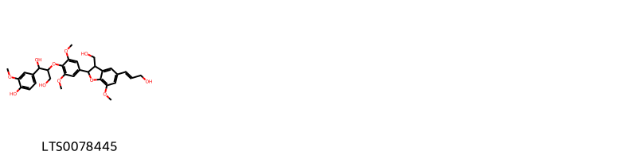{ width=100% }
    <figcaption>Hình ảnh cấu trúc hóa học của 1 hoạt chất thuộc nhóm 2-arylbenzofuran flavonoids gồm ['buddlenol b (LTS0078445)'].</figcaption>
</figure>
#### Nhóm Anthracenes
<figure markdown="span">
    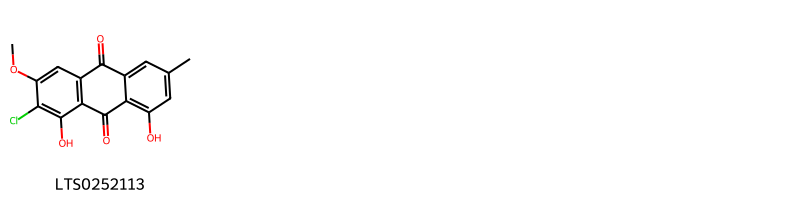{ width=100% }
    <figcaption>Hình ảnh cấu trúc hóa học của 1 hoạt chất thuộc nhóm Anthracenes gồm ['2-chlorophyscion (LTS0252113)'].</figcaption>
</figure>
#### Nhóm Benzene and substituted derivatives
<figure markdown="span">
    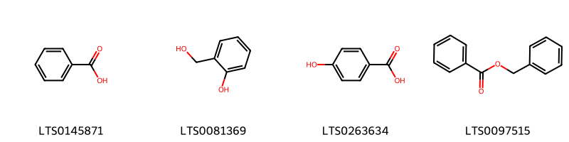{ width=100% }
    <figcaption>Hình ảnh cấu trúc hóa học của 4 hoạt chất thuộc nhóm Benzene and substituted derivatives gồm ['benzoic acid (LTS0145871)', 'saligenin (LTS0081369)', 'p-hydroxybenzoic acid (LTS0263634)', 'benzyl benzoate (LTS0097515)'].</figcaption>
</figure>
#### Nhóm Carboxylic acids and derivatives
<figure markdown="span">
    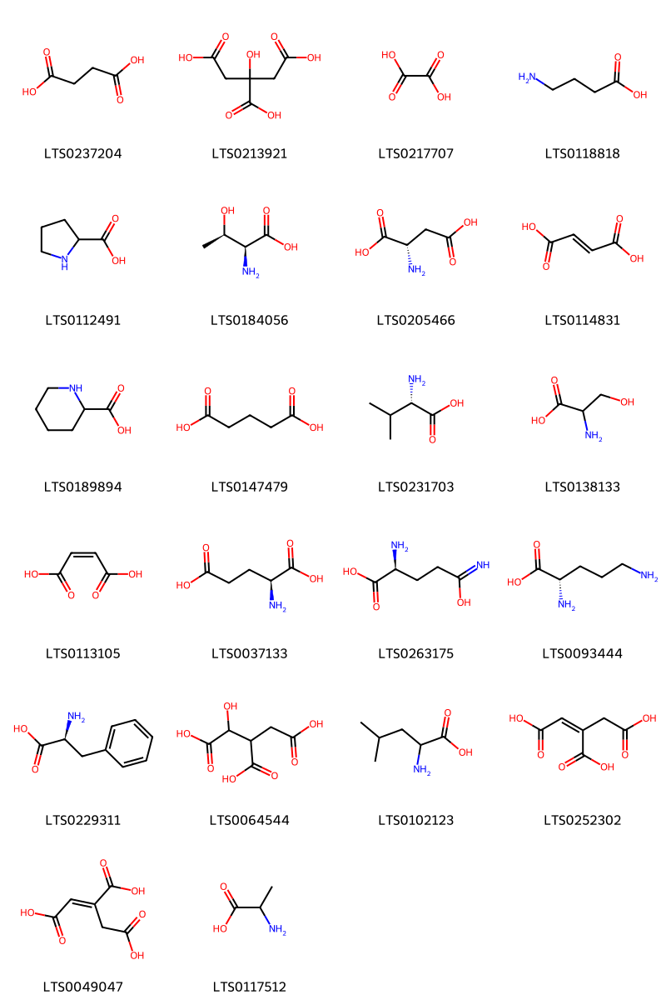{ width=100% }
    <figcaption>Hình ảnh cấu trúc hóa học của 22 hoạt chất thuộc nhóm Carboxylic acids and derivatives gồm ['succinic acid (LTS0237204)', 'citric acid (LTS0213921)', 'oxalic acid (LTS0217707)', 'gamma(amino)-butyric acid (LTS0118818)', 'proline (LTS0112491)', 'l-threonine (LTS0184056)', 'l-aspartic acid (LTS0205466)', 'fumaric acid (LTS0114831)', '(+,-)-pipecolic acid (LTS0189894)', 'glutaric acid (LTS0147479)', 'l-valine (LTS0231703)', 'serin (LTS0138133)', 'maleic acid (LTS0113105)', 'l-glutamic acid (LTS0037133)', 'l glutamine (LTS0263175)', 'l-ornithine (LTS0093444)', 'l-phenylalanine (LTS0229311)', 'isocitric acid (LTS0064544)', 'leucine (LTS0102123)', 'aconitate (LTS0252302)', 'trans-aconitic acid (LTS0049047)', 'alanine (LTS0117512)'].</figcaption>
</figure>
#### Nhóm Cinnamic acids and derivatives
<figure markdown="span">
    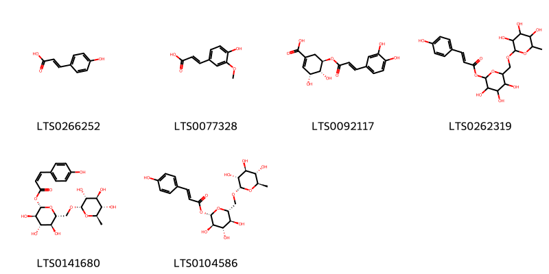{ width=100% }
    <figcaption>Hình ảnh cấu trúc hóa học của 6 hoạt chất thuộc nhóm Cinnamic acids and derivatives gồm ['para-coumaric acid (LTS0266252)', 'ferulic acid (LTS0077328)', '5-o-caffeoylshikimic acid (LTS0092117)', '3,4,5-trihydroxy-6-{[(3,4,5-trihydroxy-6-methyloxan-2-yl)oxy]methyl}oxan-2-yl 3-(4-hydroxyphenyl)prop-2-enoate (LTS0262319)', '(2s,3r,4s,5s,6r)-3,4,5-trihydroxy-6-({[(2s,3r,4s,5s,6r)-3,4,5-trihydroxy-6-methyloxan-2-yl]oxy}methyl)oxan-2-yl (2z)-3-(4-hydroxyphenyl)prop-2-enoate (LTS0141680)', '(2s,3r,4s,5s,6r)-3,4,5-trihydroxy-6-({[(2s,3r,4s,5s,6r)-3,4,5-trihydroxy-6-methyloxan-2-yl]oxy}methyl)oxan-2-yl (2e)-3-(4-hydroxyphenyl)prop-2-enoate (LTS0104586)'].</figcaption>
</figure>
#### Nhóm Coumarins and derivatives
<figure markdown="span">
    { width=100% }
    <figcaption>Hình ảnh cấu trúc hóa học của 1 hoạt chất thuộc nhóm Coumarins and derivatives gồm ['scopoletin (LTS0193112)'].</figcaption>
</figure>
#### Nhóm Diazines
<figure markdown="span">
    { width=100% }
    <figcaption>Hình ảnh cấu trúc hóa học của 1 hoạt chất thuộc nhóm Diazines gồm ['pirod (LTS0008205)'].</figcaption>
</figure>
#### Nhóm Dihydrofurans
<figure markdown="span">
    { width=100% }
    <figcaption>Hình ảnh cấu trúc hóa học của 1 hoạt chất thuộc nhóm Dihydrofurans gồm ['vitamin c (LTS0022555)'].</figcaption>
</figure>
#### Nhóm Fatty Acyls
<figure markdown="span">
    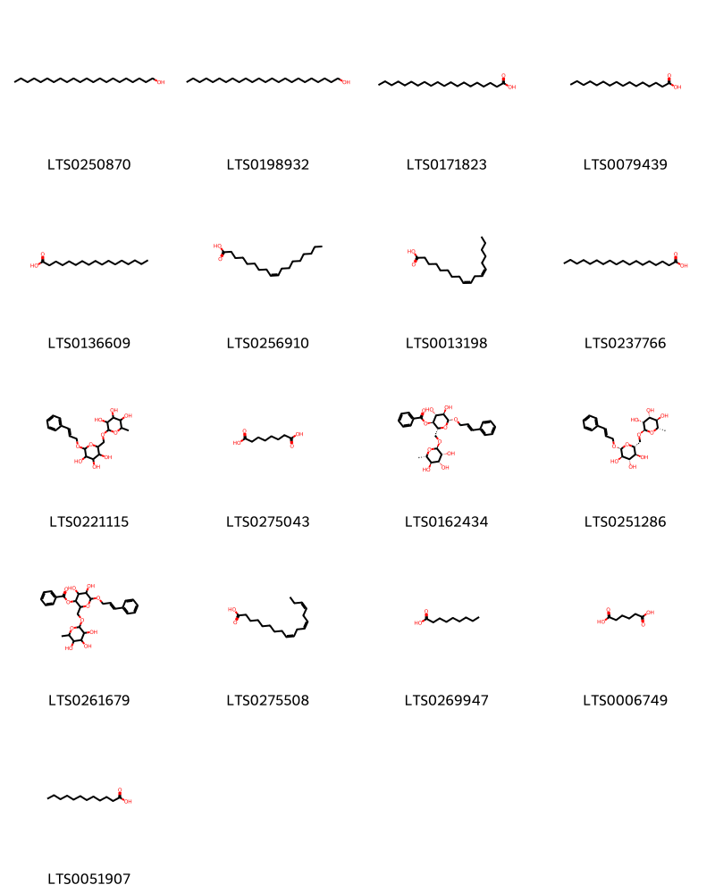{ width=100% }
    <figcaption>Hình ảnh cấu trúc hóa học của 17 hoạt chất thuộc nhóm Fatty Acyls gồm ['docosanol (LTS0250870)', '1-tetracosanol (LTS0198932)', 'arachidic acid (LTS0171823)', 'palmitic acid (LTS0079439)', 'heptadecanoic acid (LTS0136609)', 'oleic acid (LTS0256910)', 'linoleic (LTS0013198)', 'stearic acid (LTS0237766)', '2-methyl-6-({3,4,5-trihydroxy-6-[(3-phenylprop-2-en-1-yl)oxy]oxan-2-yl}methoxy)oxane-3,4,5-triol (LTS0221115)', 'suberic acid (LTS0275043)', '(2r,3s,4r,5r,6r)-4,5-dihydroxy-6-{[(2e)-3-phenylprop-2-en-1-yl]oxy}-2-({[(2r,3r,4r,5r,6s)-3,4,5-trihydroxy-6-methyloxan-2-yl]oxy}methyl)oxan-3-yl benzoate (LTS0162434)', '(2s,3r,4r,5r,6r)-2-methyl-6-{[(2r,3s,4s,5r,6r)-3,4,5-trihydroxy-6-{[(2e)-3-phenylprop-2-en-1-yl]oxy}oxan-2-yl]methoxy}oxane-3,4,5-triol (LTS0251286)', '4,5-dihydroxy-6-[(3-phenylprop-2-en-1-yl)oxy]-2-{[(3,4,5-trihydroxy-6-methyloxan-2-yl)oxy]methyl}oxan-3-yl benzoate (LTS0261679)', 'α-linolenic acid (LTS0275508)', 'nonanoic acid (LTS0269947)', 'adipic acid (LTS0006749)', 'lauric acid (LTS0051907)'].</figcaption>
</figure>
#### Nhóm Flavonoids
<figure markdown="span">
    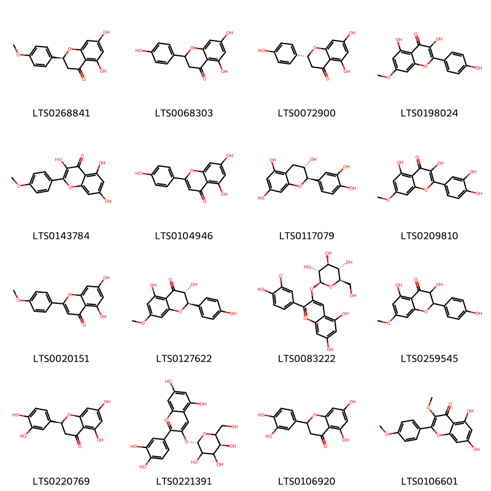{ width=100% }
    <figcaption>Hình ảnh cấu trúc hóa học của 16 hoạt chất thuộc nhóm Flavonoids gồm ['isosakuranetin (LTS0268841)', 'asahina (LTS0068303)', '(-)-naringenin (LTS0072900)', 'rhamnocitrin (LTS0198024)', 'kaempferide (LTS0143784)', 'chamomile (LTS0104946)', '(+)-catechol (LTS0117079)', 'rhamnetin (LTS0209810)', 'acacetin (LTS0020151)', '(2r,3r)-3,5-dihydroxy-2-(4-hydroxyphenyl)-7-methoxy-2,3-dihydro-1-benzopyran-4-one (LTS0127622)', '5,7-dihydroxy-2-(4-hydroxy-3-oxidophenyl)-3-{[(2s,3r,4s,5s,6r)-3,4,5-trihydroxy-6-(hydroxymethyl)oxan-2-yl]oxy}-1λ⁴-chromen-1-ylium (LTS0083222)', '3,5-dihydroxy-2-(4-hydroxyphenyl)-7-methoxy-2,3-dihydro-1-benzopyran-4-one (LTS0259545)', 'eriodictyol (LTS0220769)', 'chrysanthemin (LTS0221391)', '(+/-)-eriodictyol (LTS0106920)', 'ermanin (LTS0106601)'].</figcaption>
</figure>
#### Nhóm Furanoid lignans
<figure markdown="span">
    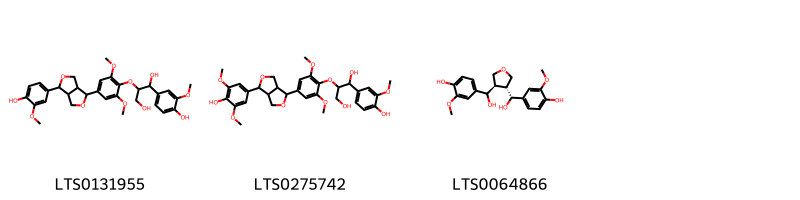{ width=100% }
    <figcaption>Hình ảnh cấu trúc hóa học của 3 hoạt chất thuộc nhóm Furanoid lignans gồm ['buddlenol e (LTS0131955)', 'buddlenol c (LTS0275742)', '4-{hydroxy[(3r,4r)-4-[hydroxy(4-hydroxy-3-methoxyphenyl)methyl]oxolan-3-yl]methyl}-2-methoxyphenol (LTS0064866)'].</figcaption>
</figure>
#### Nhóm Glycerolipids
<figure markdown="span">
    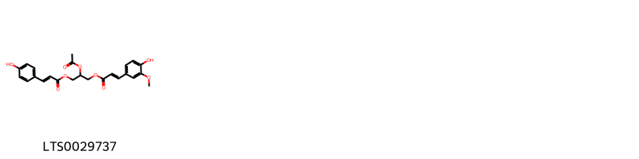{ width=100% }
    <figcaption>Hình ảnh cấu trúc hóa học của 1 hoạt chất thuộc nhóm Glycerolipids gồm ['2-(acetyloxy)-3-{[(2e)-3-(4-hydroxy-3-methoxyphenyl)prop-2-enoyl]oxy}propyl (2e)-3-(4-hydroxyphenyl)prop-2-enoate (LTS0029737)'].</figcaption>
</figure>
#### Nhóm Glycerophospholipids
<figure markdown="span">
    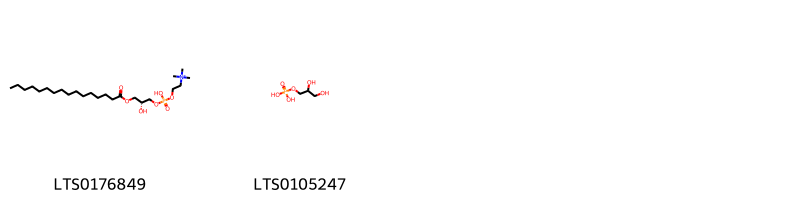{ width=100% }
    <figcaption>Hình ảnh cấu trúc hóa học của 2 hoạt chất thuộc nhóm Glycerophospholipids gồm ['(2r)-3-(hexadecanoyloxy)-2-hydroxypropoxy(2-(trimethylammonio)ethoxy)phosphinic acid (LTS0176849)', 'α-glycerophosphorate (LTS0105247)'].</figcaption>
</figure>
#### Nhóm Hydroxy acids and derivatives
<figure markdown="span">
    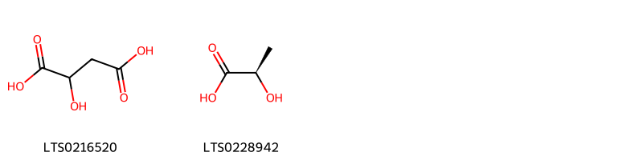{ width=100% }
    <figcaption>Hình ảnh cấu trúc hóa học của 2 hoạt chất thuộc nhóm Hydroxy acids and derivatives gồm ['malic acid (LTS0216520)', 'd-lactic acid (LTS0228942)'].</figcaption>
</figure>
#### Nhóm Indoles and derivatives
<figure markdown="span">
    { width=100% }
    <figcaption>Hình ảnh cấu trúc hóa học của 1 hoạt chất thuộc nhóm Indoles and derivatives gồm ['l-tryptophan (LTS0263809)'].</figcaption>
</figure>
#### Nhóm Keto acids and derivatives
<figure markdown="span">
    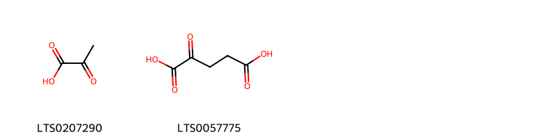{ width=100% }
    <figcaption>Hình ảnh cấu trúc hóa học của 2 hoạt chất thuộc nhóm Keto acids and derivatives gồm ['pyruvic acid (LTS0207290)', 'oxoglutarate (LTS0057775)'].</figcaption>
</figure>
#### Nhóm Lactones
<figure markdown="span">
    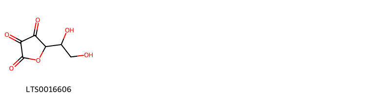{ width=100% }
    <figcaption>Hình ảnh cấu trúc hóa học của 1 hoạt chất thuộc nhóm Lactones gồm ['acid, dehydroascorbic (LTS0016606)'].</figcaption>
</figure>
#### Nhóm Linear 1_3-diarylpropanoids
<figure markdown="span">
    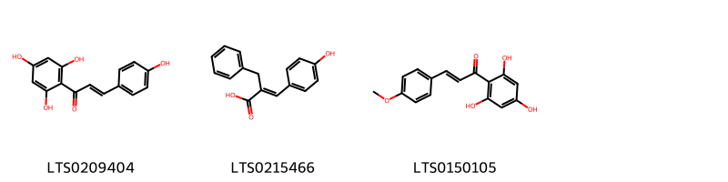{ width=100% }
    <figcaption>Hình ảnh cấu trúc hóa học của Không tìm thấy chú thích hoạt chất thuộc nhóm Linear 1_3-diarylpropanoids gồm Không tìm thấy chú thích.</figcaption>
</figure>
#### Nhóm Organonitrogen compounds
<figure markdown="span">
    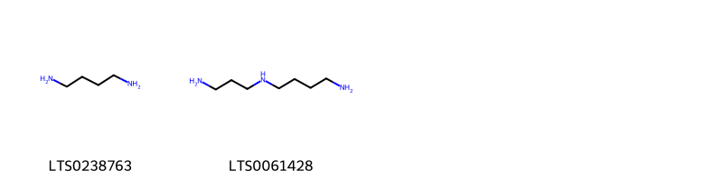{ width=100% }
    <figcaption>Hình ảnh cấu trúc hóa học của 2 hoạt chất thuộc nhóm Organonitrogen compounds gồm ['putrescine (LTS0238763)', 'spermidine (LTS0061428)'].</figcaption>
</figure>
#### Nhóm Organooxygen compounds
<figure markdown="span">
    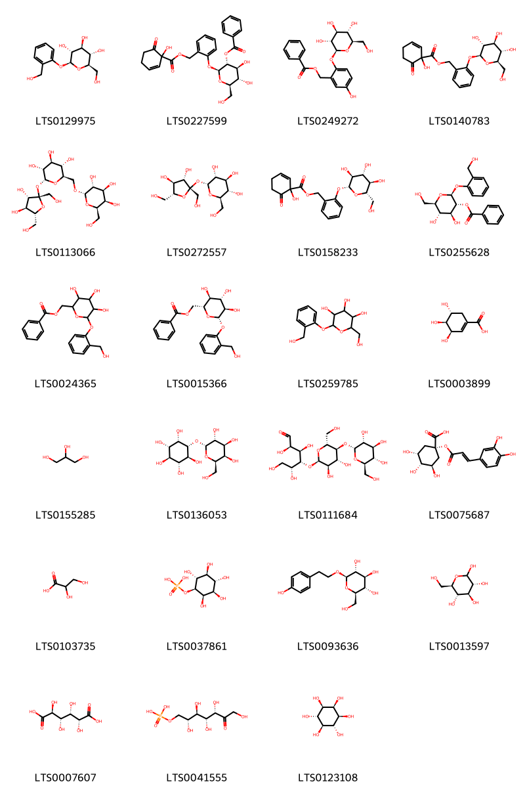{ width=100% }
    <figcaption>Hình ảnh cấu trúc hóa học của 23 hoạt chất thuộc nhóm Organooxygen compounds gồm ['salicin (LTS0129975)', 'tremulacin (LTS0227599)', 'salireposide (LTS0249272)', 'salicortin (LTS0140783)', 'raffinose (LTS0113066)', 'sucrose (LTS0272557)', '(2-{[(2r,3s,4r,5r,6s)-3,4,5-trihydroxy-6-(hydroxymethyl)oxan-2-yl]oxy}phenyl)methyl 1-hydroxy-6-oxocyclohex-2-ene-1-carboxylate (LTS0158233)', 'tremuloidin (LTS0255628)', 'populin (LTS0024365)', 'populin (LTS0015366)', 'salicin (LTS0259785)', '(-)-shikimate (LTS0003899)', 'glycerol (LTS0155285)', 'galactinol (LTS0136053)', 'd-maltotriose (LTS0111684)', '1-caffeoylquinic acid (LTS0075687)', 'glyceric acid (LTS0103735)', 'inositol 1-phosphate (LTS0037861)', 'salidroside (LTS0093636)', 'glucose (LTS0013597)', 'saccharic acid (LTS0007607)', 'sedoheptulose-7-phosphate (LTS0041555)', '(1r,2r,3s,4r,5s,6s)-cyclohexane-1,2,3,4,5,6-hexol (LTS0123108)'].</figcaption>
</figure>
#### Nhóm Phenols
<figure markdown="span">
    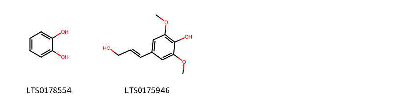{ width=100% }
    <figcaption>Hình ảnh cấu trúc hóa học của 2 hoạt chất thuộc nhóm Phenols gồm ['catechol (LTS0178554)', 'sinapyl alcohol (LTS0175946)'].</figcaption>
</figure>
#### Nhóm Prenol lipids
<figure markdown="span">
    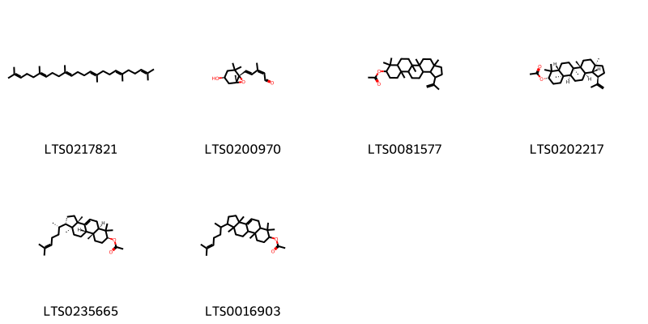{ width=100% }
    <figcaption>Hình ảnh cấu trúc hóa học của 6 hoạt chất thuộc nhóm Prenol lipids gồm ['squalene (LTS0217821)', 'xanthoxin (LTS0200970)', '3a,5a,5b,8,8,11a-hexamethyl-1-(prop-1-en-2-yl)-hexadecahydrocyclopenta[a]chrysen-9-yl acetate (LTS0081577)', '(1r,3ar,5ar,5br,7ar,9s,11ar,11bs,13ar,13br)-3a,5a,5b,8,8,11a-hexamethyl-1-(prop-1-en-2-yl)-hexadecahydrocyclopenta[a]chrysen-9-yl acetate (LTS0202217)', '(1s,3as,5ar,7s,9ar,9bs,11as)-3a,6,6,9a,11a-pentamethyl-1-[(2s)-6-methylhept-5-en-2-yl]-1h,2h,3h,5h,5ah,7h,8h,9h,9bh,10h,11h-cyclopenta[a]phenanthren-7-yl acetate (LTS0235665)', '3a,6,6,9a,11a-pentamethyl-1-(6-methylhept-5-en-2-yl)-1h,2h,3h,5h,5ah,7h,8h,9h,9bh,10h,11h-cyclopenta[a]phenanthren-7-yl acetate (LTS0016903)'].</figcaption>
</figure>
#### Nhóm Purine nucleotides
<figure markdown="span">
    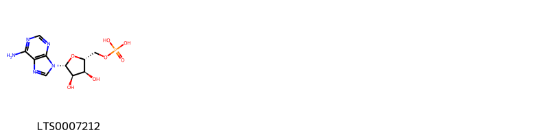{ width=100% }
    <figcaption>Hình ảnh cấu trúc hóa học của 1 hoạt chất thuộc nhóm Purine nucleotides gồm ['adenosine monophosphate (LTS0007212)'].</figcaption>
</figure>
#### Nhóm Pyridines and derivatives
<figure markdown="span">
    { width=100% }
    <figcaption>Hình ảnh cấu trúc hóa học của 1 hoạt chất thuộc nhóm Pyridines and derivatives gồm ['niacin (LTS0216673)'].</figcaption>
</figure>
#### Nhóm Pyrrolines
<figure markdown="span">
    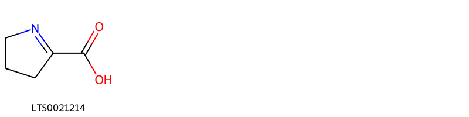{ width=100% }
    <figcaption>Hình ảnh cấu trúc hóa học của 1 hoạt chất thuộc nhóm Pyrrolines gồm ['1-pyrroline-2-carboxylic acid (LTS0021214)'].</figcaption>
</figure>
#### Nhóm Saturated hydrocarbons
<figure markdown="span">
    { width=100% }
    <figcaption>Hình ảnh cấu trúc hóa học của 3 hoạt chất thuộc nhóm Saturated hydrocarbons gồm ['nonacosane (LTS0062747)', 'pentacosane (LTS0080764)', 'heptacosane (LTS0150428)'].</figcaption>
</figure>
#### Nhóm Steroids and steroid derivatives
<figure markdown="span">
    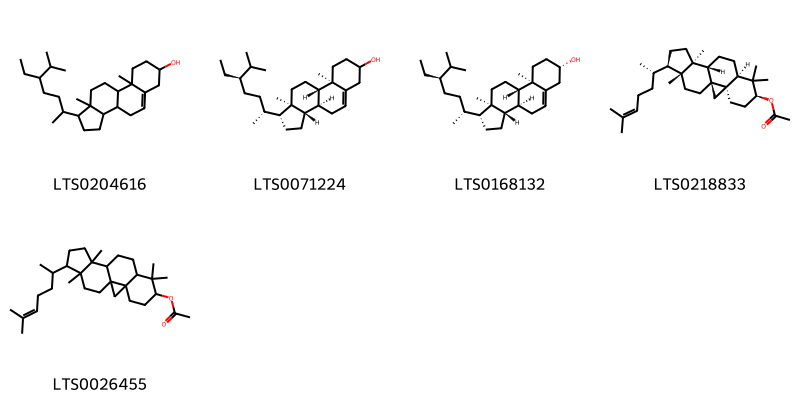{ width=100% }
    <figcaption>Hình ảnh cấu trúc hóa học của 5 hoạt chất thuộc nhóm Steroids and steroid derivatives gồm ['stigmast-5-en-3-ol, (3β)- (LTS0204616)', 'stigmast-5-en-3-ol (LTS0071224)', 'sitosterol (LTS0168132)', '(1s,3r,6s,8r,11s,12s,15r,16r)-7,7,12,16-tetramethyl-15-[(2s)-6-methylhept-5-en-2-yl]pentacyclo[9.7.0.0¹,³.0³,⁸.0¹²,¹⁶]octadecan-6-yl acetate (LTS0218833)', '7,7,12,16-tetramethyl-15-(6-methylhept-5-en-2-yl)pentacyclo[9.7.0.0¹,³.0³,⁸.0¹²,¹⁶]octadecan-6-yl acetate (LTS0026455)'].</figcaption>
</figure>

---

### Dược dân tộc học

Danh sách các quốc gia có sử dụng *Populus tremula* trong điều trị các bệnh. 

| Country   | Disease   | Bệnh           |
|:----------|:----------|:---------------|
| China     | Vermifuge | Thuốc diệt sán |

---

---
## Populus tremuloides
### Thông tin về thực vật

!!! info "Phân loại thực vật của *Populus tremuloides* từ GIBF:"
    - **Kingdom:** Plantae
    - **Phylum:** Tracheophyta
    - **Order:** Malpighiales
    - **Family:** Salicaceae
    - **Genus:** Populus
    - **Species:** *Populus tremuloides*

 

| Label (VI)   | Label (EN)   | Scientific Name     | Descriptions (VI)   | Descriptions (EN)                                                 | Also Known As (VI)               | Also Known As (EN)                                                                                                                               |
|:-------------|:-------------|:--------------------|:--------------------|:------------------------------------------------------------------|:---------------------------------|:-------------------------------------------------------------------------------------------------------------------------------------------------|
| N/A          | N/A          | Populus tremuloides |                     | species of deciduous tree native to cooler areas of North America | ['dương rung', 'cây dương rung'] | ['popple', 'white poplar', 'American aspen', 'golden aspen', 'mountain apen', 'quaking aspen', 'trembling aspen', 'trembling poplar', 'quakies'] |

#### Phân bố trên thế giới

**Từ CSDL GIBF** Canada, United States of America, Mexico

#### Phân bố tại Việt Nam

**Từ CSDL GIBF**: Không có ghi nhận ở Việt Nam

---
### Thành phần hóa học
        
- Theo cơ sở dữ liệu lotus: Từ loài *Populus tremuloides* đã phân lập và xác định được 103 hoạt chất thuộc về các nhóm Organooxygen compounds, Flavonoids, Saturated hydrocarbons, Unsaturated hydrocarbons, Prenol lipids, Fatty Acyls, Linear 1,3-diarylpropanoids, Phenols, Steroids and steroid derivatives, Cinnamic acids and derivatives, Benzene and substituted derivatives. 

|    | chemicalTaxonomyClassyfireClass     |   smiles_count |
|---:|:------------------------------------|---------------:|
|  0 | Benzene and substituted derivatives |              4 |
|  1 | Cinnamic acids and derivatives      |             17 |
|  2 | Fatty Acyls                         |             19 |
|  3 | Flavonoids                          |             18 |
|  4 | Linear 1,3-diarylpropanoids         |              6 |
|  5 | Organooxygen compounds              |             17 |
|  6 | Phenols                             |              2 |
|  7 | Prenol lipids                       |              7 |
|  8 | Saturated hydrocarbons              |              4 |
|  9 | Steroids and steroid derivatives    |              8 |
| 10 | Unsaturated hydrocarbons            |              1 |

#### Nhóm Benzene and substituted derivatives
<figure markdown="span">
    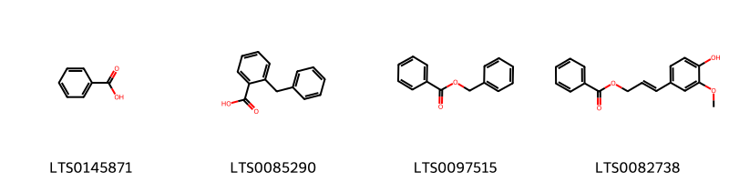{ width=100% }
    <figcaption>Hình ảnh cấu trúc hóa học của 4 hoạt chất thuộc nhóm Benzene and substituted derivatives gồm ['benzoic acid (LTS0145871)', '2-(phenylmethyl)benzoic acid (LTS0085290)', 'benzyl benzoate (LTS0097515)', 'coniferyl benzoate (LTS0082738)'].</figcaption>
</figure>
#### Nhóm Cinnamic acids and derivatives
<figure markdown="span">
    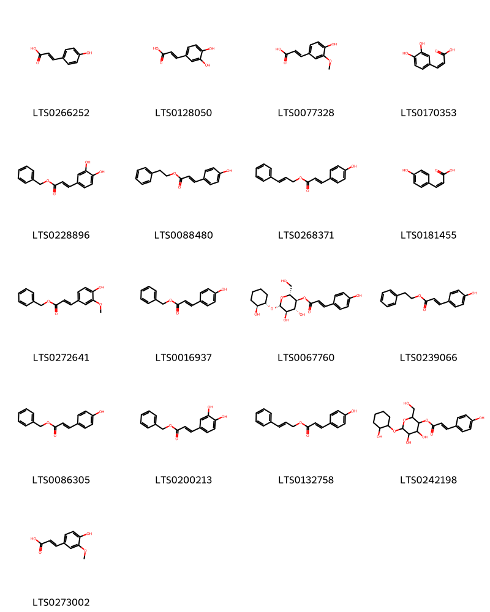{ width=100% }
    <figcaption>Hình ảnh cấu trúc hóa học của 17 hoạt chất thuộc nhóm Cinnamic acids and derivatives gồm ['para-coumaric acid (LTS0266252)', '3,4-dihydroxycinnamic acid (LTS0128050)', 'ferulic acid (LTS0077328)', 'caffeicacid (LTS0170353)', 'benzyl (2e)-3-(3,4-dihydroxyphenyl)prop-2-enoate (LTS0228896)', '2-phenylethyl (2e)-3-(4-hydroxyphenyl)prop-2-enoate (LTS0088480)', '(2e)-3-phenylprop-2-en-1-yl (2e)-3-(4-hydroxyphenyl)prop-2-enoate (LTS0268371)', 'cis-p-coumaric acid (LTS0181455)', 'benzyl (2e)-3-(4-hydroxy-3-methoxyphenyl)prop-2-enoate (LTS0272641)', 'benzyl (2e)-3-(4-hydroxyphenyl)prop-2-enoate (LTS0016937)', '(2r,3s,4r,5r,6r)-4,5-dihydroxy-6-{[(1s,2s)-2-hydroxycyclohexyl]oxy}-2-(hydroxymethyl)oxan-3-yl (2e)-3-(4-hydroxyphenyl)prop-2-enoate (LTS0067760)', '2-phenylethyl 3-(4-hydroxyphenyl)prop-2-enoate (LTS0239066)', 'benzyl 3-(4-hydroxyphenyl)prop-2-enoate (LTS0086305)', 'benzyl 3-(3,4-dihydroxyphenyl)prop-2-enoate (LTS0200213)', '3-phenylprop-2-en-1-yl 3-(4-hydroxyphenyl)prop-2-enoate (LTS0132758)', '4,5-dihydroxy-6-[(2-hydroxycyclohexyl)oxy]-2-(hydroxymethyl)oxan-3-yl 3-(4-hydroxyphenyl)prop-2-enoate (LTS0242198)', 'ferulic acid (LTS0273002)'].</figcaption>
</figure>
#### Nhóm Fatty Acyls
<figure markdown="span">
    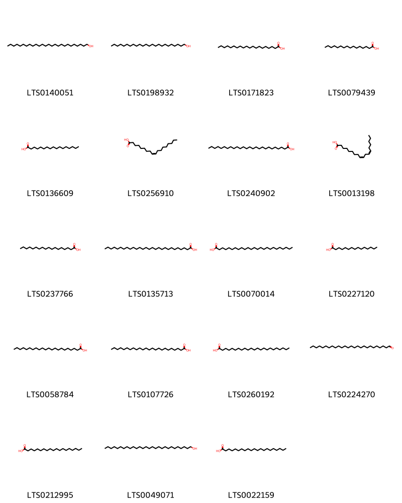{ width=100% }
    <figcaption>Hình ảnh cấu trúc hóa học của 19 hoạt chất thuộc nhóm Fatty Acyls gồm ['ceryl alcohol (LTS0140051)', '1-tetracosanol (LTS0198932)', 'arachidic acid (LTS0171823)', 'palmitic acid (LTS0079439)', 'heptadecanoic acid (LTS0136609)', 'oleic acid (LTS0256910)', 'hexacosanoic acid (LTS0240902)', 'linoleic (LTS0013198)', 'stearic acid (LTS0237766)', 'octacosanoic acid (LTS0135713)', 'pentacosanoic acid (LTS0070014)', 'pentadecanoic acid (LTS0227120)', 'behenic acid (LTS0058784)', 'lignoceric acid (LTS0107726)', 'tricosanoic acid (LTS0260192)', 'hexacosanal (LTS0224270)', 'nonadecanoic acid (LTS0212995)', 'octacosanol (LTS0049071)', 'heneicosanoic acid (LTS0022159)'].</figcaption>
</figure>
#### Nhóm Flavonoids
<figure markdown="span">
    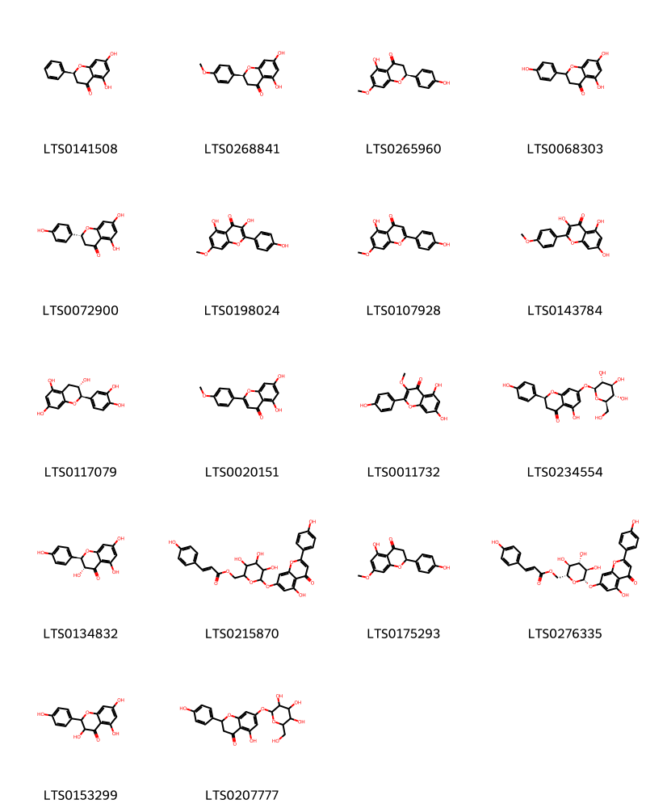{ width=100% }
    <figcaption>Hình ảnh cấu trúc hóa học của 18 hoạt chất thuộc nhóm Flavonoids gồm ['pinocembrine (LTS0141508)', 'isosakuranetin (LTS0268841)', 'sakuranetin (LTS0265960)', 'asahina (LTS0068303)', '(-)-naringenin (LTS0072900)', 'rhamnocitrin (LTS0198024)', 'genkwanin (LTS0107928)', 'kaempferide (LTS0143784)', '(+)-catechol (LTS0117079)', 'acacetin (LTS0020151)', 'isokaempferide (LTS0011732)', 'prunin (LTS0234554)', '(+)-dihydrokaempferol (LTS0134832)', '(3,4,5-trihydroxy-6-{[5-hydroxy-2-(4-hydroxyphenyl)-4-oxochromen-7-yl]oxy}oxan-2-yl)methyl 3-(4-hydroxyphenyl)prop-2-enoate (LTS0215870)', 'sakuranetin (LTS0175293)', 'echinacin (LTS0276335)', 'aromadendrin (LTS0153299)', '5-hydroxy-2-(4-hydroxyphenyl)-7-{[3,4,5-trihydroxy-6-(hydroxymethyl)oxan-2-yl]oxy}-2,3-dihydro-1-benzopyran-4-one (LTS0207777)'].</figcaption>
</figure>
#### Nhóm Linear 1_3-diarylpropanoids
<figure markdown="span">
    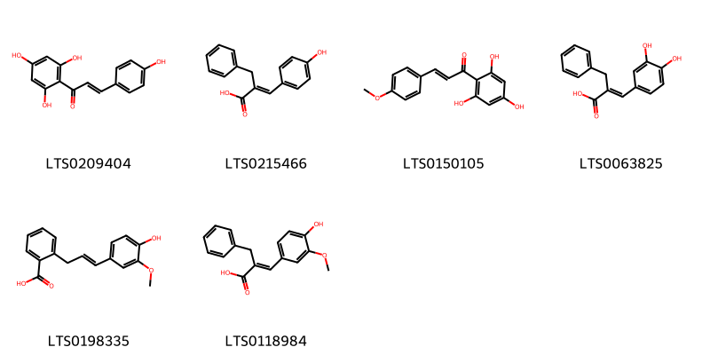{ width=100% }
    <figcaption>Hình ảnh cấu trúc hóa học của Không tìm thấy chú thích hoạt chất thuộc nhóm Linear 1_3-diarylpropanoids gồm Không tìm thấy chú thích.</figcaption>
</figure>
#### Nhóm Organooxygen compounds
<figure markdown="span">
    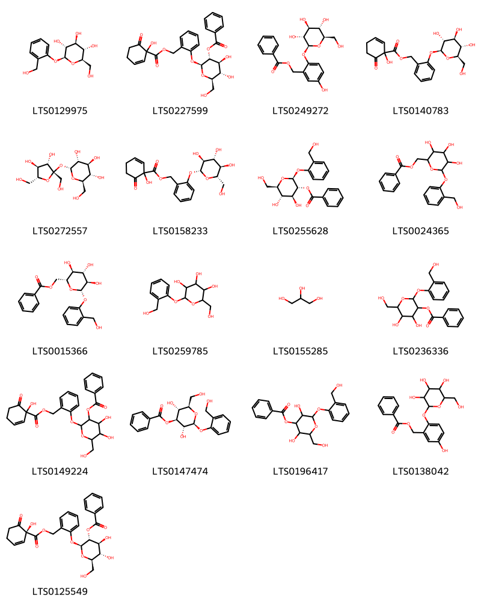{ width=100% }
    <figcaption>Hình ảnh cấu trúc hóa học của 17 hoạt chất thuộc nhóm Organooxygen compounds gồm ['salicin (LTS0129975)', 'tremulacin (LTS0227599)', 'salireposide (LTS0249272)', 'salicortin (LTS0140783)', 'sucrose (LTS0272557)', '(2-{[(2r,3s,4r,5r,6s)-3,4,5-trihydroxy-6-(hydroxymethyl)oxan-2-yl]oxy}phenyl)methyl 1-hydroxy-6-oxocyclohex-2-ene-1-carboxylate (LTS0158233)', 'tremuloidin (LTS0255628)', 'populin (LTS0024365)', 'populin (LTS0015366)', 'salicin (LTS0259785)', 'glycerol (LTS0155285)', '4,5-dihydroxy-6-(hydroxymethyl)-2-[2-(hydroxymethyl)phenoxy]oxan-3-yl benzoate (LTS0236336)', '4,5-dihydroxy-2-{2-[(1-hydroxy-6-oxocyclohex-2-ene-1-carbonyloxy)methyl]phenoxy}-6-(hydroxymethyl)oxan-3-yl benzoate (LTS0149224)', '(2r,3r,4s,5r,6s)-3,5-dihydroxy-2-(hydroxymethyl)-6-[2-(hydroxymethyl)phenoxy]oxan-4-yl benzoate (LTS0147474)', '3,5-dihydroxy-2-(hydroxymethyl)-6-[2-(hydroxymethyl)phenoxy]oxan-4-yl benzoate (LTS0196417)', '(5-hydroxy-2-{[3,4,5-trihydroxy-6-(hydroxymethyl)oxan-2-yl]oxy}phenyl)methyl benzoate (LTS0138042)', '(2s,3r,4s,5s,6r)-4,5-dihydroxy-2-(2-{[(1s)-1-hydroxy-6-oxocyclohex-2-ene-1-carbonyloxy]methyl}phenoxy)-6-(hydroxymethyl)oxan-3-yl benzoate (LTS0125549)'].</figcaption>
</figure>
#### Nhóm Phenols
<figure markdown="span">
    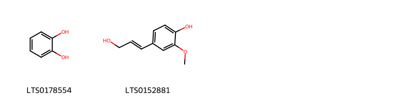{ width=100% }
    <figcaption>Hình ảnh cấu trúc hóa học của 2 hoạt chất thuộc nhóm Phenols gồm ['catechol (LTS0178554)', 'coniferyl alcohol (LTS0152881)'].</figcaption>
</figure>
#### Nhóm Prenol lipids
<figure markdown="span">
    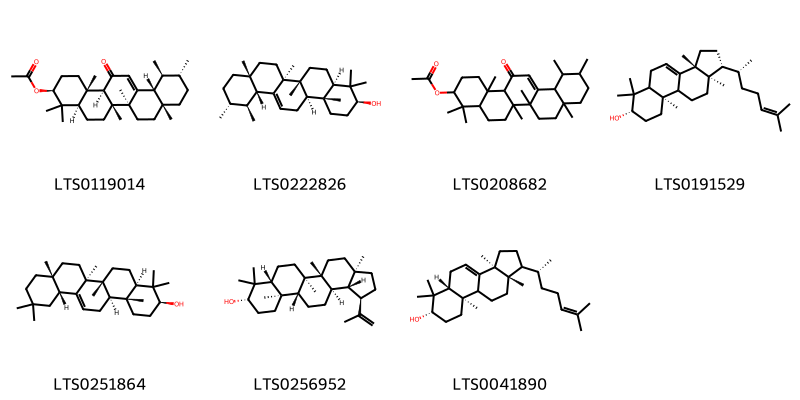{ width=100% }
    <figcaption>Hình ảnh cấu trúc hóa học của 7 hoạt chất thuộc nhóm Prenol lipids gồm ['(3s,4ar,6ar,6bs,8ar,11r,12s,12ar,14ar,14bs)-4,4,6a,6b,8a,11,12,14b-octamethyl-14-oxo-1,2,3,4a,5,6,7,8,9,10,11,12,12a,14a-tetradecahydropicen-3-yl acetate (LTS0119014)', 'amyrin (LTS0222826)', '4,4,6a,6b,8a,11,12,14b-octamethyl-14-oxo-1,2,3,4a,5,6,7,8,9,10,11,12,12a,14a-tetradecahydropicen-3-yl acetate (LTS0208682)', '(1r,3ar,7s,9ar,11ar)-3a,6,6,9a,11a-pentamethyl-1-[(2r)-6-methylhept-5-en-2-yl]-1h,2h,3h,5h,5ah,7h,8h,9h,9bh,10h,11h-cyclopenta[a]phenanthren-7-ol (LTS0191529)', 'β-amyrin (LTS0251864)', 'lupeol (LTS0256952)', '(3as,5ar,7s,9ar,11as)-3a,6,6,9a,11a-pentamethyl-1-[(2r)-6-methylhept-5-en-2-yl]-1h,2h,3h,5h,5ah,7h,8h,9h,9bh,10h,11h-cyclopenta[a]phenanthren-7-ol (LTS0041890)'].</figcaption>
</figure>
#### Nhóm Saturated hydrocarbons
<figure markdown="span">
    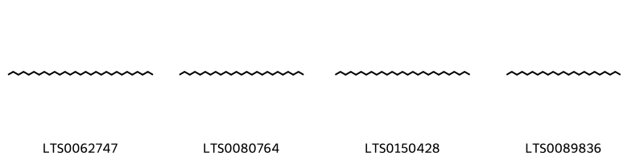{ width=100% }
    <figcaption>Hình ảnh cấu trúc hóa học của 4 hoạt chất thuộc nhóm Saturated hydrocarbons gồm ['nonacosane (LTS0062747)', 'pentacosane (LTS0080764)', 'heptacosane (LTS0150428)', 'tricosane (LTS0089836)'].</figcaption>
</figure>
#### Nhóm Steroids and steroid derivatives
<figure markdown="span">
    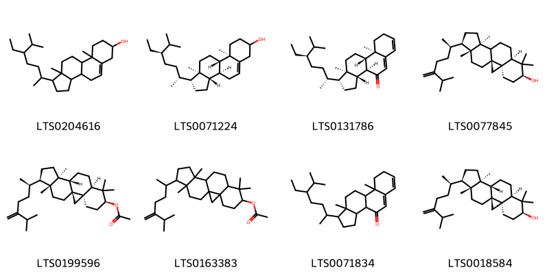{ width=100% }
    <figcaption>Hình ảnh cấu trúc hóa học của 8 hoạt chất thuộc nhóm Steroids and steroid derivatives gồm ['stigmast-5-en-3-ol, (3β)- (LTS0204616)', 'stigmast-5-en-3-ol (LTS0071224)', '(1r,3as,3bs,9ar,9bs,11ar)-1-[(2r,5r)-5-ethyl-6-methylheptan-2-yl]-9a,11a-dimethyl-1h,2h,3h,3ah,3bh,8h,9h,9bh,10h,11h-cyclopenta[a]phenanthren-4-one (LTS0131786)', '24-methylene-cycloartanol (LTS0077845)', '(1s,3r,6s,8r,11s,12s,15r,16r)-7,7,12,16-tetramethyl-15-[(2r)-6-methyl-5-methylideneheptan-2-yl]pentacyclo[9.7.0.0¹,³.0³,⁸.0¹²,¹⁶]octadecan-6-yl acetate (LTS0199596)', '7,7,12,16-tetramethyl-15-(6-methyl-5-methylideneheptan-2-yl)pentacyclo[9.7.0.0¹,³.0³,⁸.0¹²,¹⁶]octadecan-6-yl acetate (LTS0163383)', '1-(5-ethyl-6-methylheptan-2-yl)-9a,11a-dimethyl-1h,2h,3h,3ah,3bh,8h,9h,9bh,10h,11h-cyclopenta[a]phenanthren-4-one (LTS0071834)', '24-methylenecycloartanol (LTS0018584)'].</figcaption>
</figure>
#### Nhóm Unsaturated hydrocarbons
<figure markdown="span">
    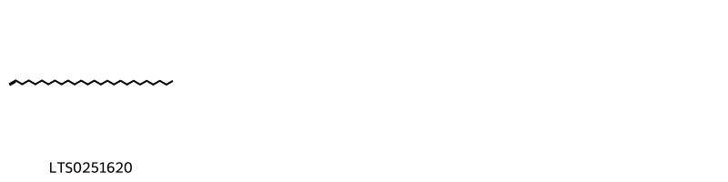{ width=100% }
    <figcaption>Hình ảnh cấu trúc hóa học của 1 hoạt chất thuộc nhóm Unsaturated hydrocarbons gồm ['1-hexacosene (LTS0251620)'].</figcaption>
</figure>

---

### Dược dân tộc học

Danh sách các quốc gia có sử dụng *Populus tremuloides* trong điều trị các bệnh. 

| Country   | Disease   | Bệnh               |
|:----------|:----------|:-------------------|
| US        | Tonic     | (thuộc) trương lực |

---

---
## Populus wislizenii
### Thông tin về thực vật

!!! info "Phân loại thực vật của *Populus deltoides* từ GIBF:"
    - **Kingdom:** Plantae
    - **Phylum:** Tracheophyta
    - **Order:** Malpighiales
    - **Family:** Salicaceae
    - **Genus:** Populus
    - **Species:** *Populus deltoides*

 

| Label (VI)   | Label (EN)   | Scientific Name     | Descriptions (VI)   | Descriptions (EN)                                                 | Also Known As (VI)               | Also Known As (EN)                                                                                                                               |
|:-------------|:-------------|:--------------------|:--------------------|:------------------------------------------------------------------|:---------------------------------|:-------------------------------------------------------------------------------------------------------------------------------------------------|
| N/A          | N/A          | Populus tremuloides |                     | species of deciduous tree native to cooler areas of North America | ['dương rung', 'cây dương rung'] | ['popple', 'white poplar', 'American aspen', 'golden aspen', 'mountain apen', 'quaking aspen', 'trembling aspen', 'trembling poplar', 'quakies'] |

#### Phân bố trên thế giới

**Từ CSDL GIBF** nan, unknown or invalid, South Africa, United States of America, Mexico

#### Phân bố tại Việt Nam

**Từ CSDL GIBF**: Không có ghi nhận ở Việt Nam

---
### Thành phần hóa học
        
- Theo cơ sở dữ liệu lotus: Từ loài *Populus deltoides* đã phân lập và xác định được Chưa có hoạt chất nào được phân lập. hoạt chất thuộc về các nhóm Không có hoạt chất nào được phân lập. 

Không có hình ảnh nào được tạo ra

---

### Dược dân tộc học

Danh sách các quốc gia có sử dụng *Populus deltoides* trong điều trị các bệnh. 

| Country   | Disease   | Bệnh                     |
|:----------|:----------|:-------------------------|
| US        | Poultice  | thuốc đắp, đắp thuốc cao |

---

# Chi Salix

??? note "Danh sách các dược liệu thuộc chi"
    
	 - *Salix alba*
	 - *Salix babylonica*
	 - *Salix caprea*
	 - *Salix fragilis*
	 - *Salix gilgiana*
	 - *Salix irrorata*
	 - *Salix koriyanagi*
	 - *Salix nigra*
	 - *Salix purpurea*

---
## Salix alba
### Thông tin về thực vật

!!! info "Phân loại thực vật của *N/A* từ GIBF:"
    - **Kingdom:** N/A
    - **Phylum:** N/A
    - **Order:** N/A
    - **Family:** N/A
    - **Genus:** N/A
    - **Species:** *N/A*

 

| Label (VI)   | Label (EN)   | Scientific Name   | Descriptions (VI)   | Descriptions (EN)   | Also Known As (VI)   | Also Known As (EN)                |
|:-------------|:-------------|:------------------|:--------------------|:--------------------|:---------------------|:----------------------------------|
| N/A          | N/A          | Salix alba        | loài thực vật       | species of plant    | ['']                 | ['golden willow', 'white willow'] |

#### Phân bố trên thế giới

**Từ CSDL GIBF** Không có kết quả phù hợp

#### Phân bố tại Việt Nam

**Từ CSDL GIBF**: Không có ghi nhận ở Việt Nam

---
### Thành phần hóa học
        
- Theo cơ sở dữ liệu lotus: Từ loài *N/A* đã phân lập và xác định được 28 hoạt chất thuộc về các nhóm Organooxygen compounds, Flavonoids, Carboxylic acids and derivatives, Fatty Acyls, Anthracenes, Cinnamic acids and derivatives, Benzene and substituted derivatives. 

|    | chemicalTaxonomyClassyfireClass     |   smiles_count |
|---:|:------------------------------------|---------------:|
|  0 | Anthracenes                         |              1 |
|  1 | Benzene and substituted derivatives |              2 |
|  2 | Carboxylic acids and derivatives    |              2 |
|  3 | Cinnamic acids and derivatives      |              1 |
|  4 | Fatty Acyls                         |              2 |
|  5 | Flavonoids                          |             11 |
|  6 | Organooxygen compounds              |              8 |

#### Nhóm Anthracenes
<figure markdown="span">
    { width=100% }
    <figcaption>Hình ảnh cấu trúc hóa học của 1 hoạt chất thuộc nhóm Anthracenes gồm ['2-chlorophyscion (LTS0252113)'].</figcaption>
</figure>
#### Nhóm Benzene and substituted derivatives
<figure markdown="span">
    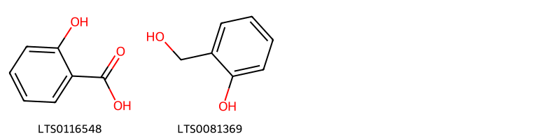{ width=100% }
    <figcaption>Hình ảnh cấu trúc hóa học của 2 hoạt chất thuộc nhóm Benzene and substituted derivatives gồm ['salicyclic acid (LTS0116548)', 'saligenin (LTS0081369)'].</figcaption>
</figure>
#### Nhóm Carboxylic acids and derivatives
<figure markdown="span">
    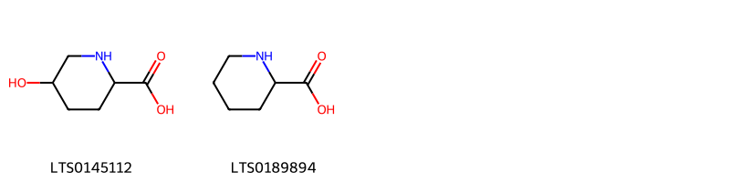{ width=100% }
    <figcaption>Hình ảnh cấu trúc hóa học của 2 hoạt chất thuộc nhóm Carboxylic acids and derivatives gồm ['5-hydroxypipecolic acid (LTS0145112)', '(+,-)-pipecolic acid (LTS0189894)'].</figcaption>
</figure>
#### Nhóm Cinnamic acids and derivatives
<figure markdown="span">
    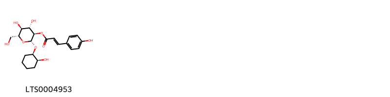{ width=100% }
    <figcaption>Hình ảnh cấu trúc hóa học của 1 hoạt chất thuộc nhóm Cinnamic acids and derivatives gồm ['grandidentatin (LTS0004953)'].</figcaption>
</figure>
#### Nhóm Fatty Acyls
<figure markdown="span">
    { width=100% }
    <figcaption>Hình ảnh cấu trúc hóa học của 2 hoạt chất thuộc nhóm Fatty Acyls gồm ['sachaliside (LTS0135981)', 'vimalin (LTS0142950)'].</figcaption>
</figure>
#### Nhóm Flavonoids
<figure markdown="span">
    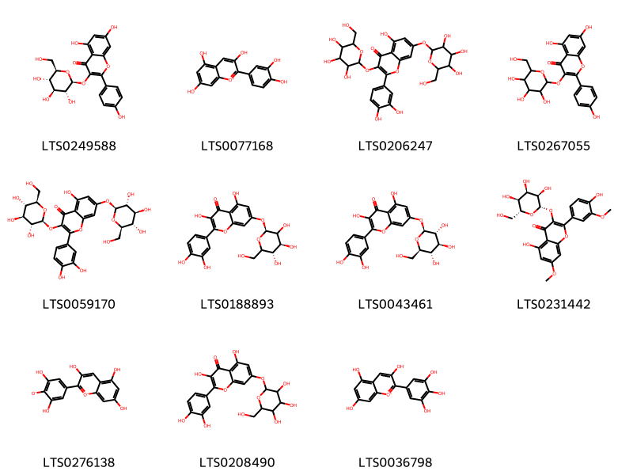{ width=100% }
    <figcaption>Hình ảnh cấu trúc hóa học của 11 hoạt chất thuộc nhóm Flavonoids gồm ['astragalin (LTS0249588)', 'cyanidin (LTS0077168)', '2-(3,4-dihydroxyphenyl)-5-hydroxy-3,7-bis({[3,4,5-trihydroxy-6-(hydroxymethyl)oxan-2-yl]oxy})chromen-4-one (LTS0206247)', 'trifolin (LTS0267055)', 'quercetin 3,7-diglucoside (LTS0059170)', 'quercimeritrin (LTS0188893)', 'quercimeritrin (LTS0043461)', '5-hydroxy-2-(4-hydroxy-3-methoxyphenyl)-7-methoxy-3-{[(2s,3r,4r,5s,6r)-3,4,5-trihydroxy-6-(hydroxymethyl)oxan-2-yl]oxy}chromen-4-one (LTS0231442)', '2-(3,5-dihydroxy-4-oxidophenyl)-3,5,7-trihydroxy-1λ⁴-chromen-1-ylium (LTS0276138)', 'quercimeritrin (LTS0208490)', 'delphinidin (LTS0036798)'].</figcaption>
</figure>
#### Nhóm Organooxygen compounds
<figure markdown="span">
    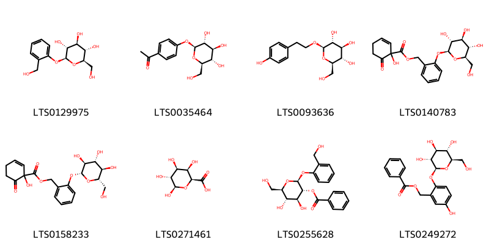{ width=100% }
    <figcaption>Hình ảnh cấu trúc hóa học của 8 hoạt chất thuộc nhóm Organooxygen compounds gồm ['salicin (LTS0129975)', 'picein (LTS0035464)', 'salidroside (LTS0093636)', 'salicortin (LTS0140783)', '(2-{[(2r,3s,4r,5r,6s)-3,4,5-trihydroxy-6-(hydroxymethyl)oxan-2-yl]oxy}phenyl)methyl 1-hydroxy-6-oxocyclohex-2-ene-1-carboxylate (LTS0158233)', 'β-d-galactopyranuronic acid (LTS0271461)', 'tremuloidin (LTS0255628)', 'salireposide (LTS0249272)'].</figcaption>
</figure>

---

### Dược dân tộc học

Danh sách các quốc gia có sử dụng *N/A* trong điều trị các bệnh. 

| Country   | Disease                | Bệnh               |
|:----------|:-----------------------|:-------------------|
| Elsewhere | Astringent             | Lam se da          |
| Europe    | Astringent             | Lam se da          |
| Turkey    | Antiseptic, Astringent | Khử trùng, làm se  |
| US        | Tonic                  | (thuộc) trương lực |

---

---
## Salix babylonica
### Thông tin về thực vật

!!! info "Phân loại thực vật của *Salix babylonica* từ GIBF:"
    - **Kingdom:** Plantae
    - **Phylum:** Tracheophyta
    - **Order:** Malpighiales
    - **Family:** Salicaceae
    - **Genus:** Salix
    - **Species:** *Salix babylonica*

 

| Label (VI)   | Label (EN)   | Scientific Name   | Descriptions (VI)   | Descriptions (EN)   | Also Known As (VI)   | Also Known As (EN)                   |
|:-------------|:-------------|:------------------|:--------------------|:--------------------|:---------------------|:-------------------------------------|
| N/A          | N/A          | Salix babylonica  |                     | species of willow   | ['']                 | ['weeping willow', 'Babylon willow'] |

#### Phân bố trên thế giới

**Từ CSDL GIBF** Denmark, Spain, Germany, Chile, Austria, Australia, Pakistan, Sweden, Poland, Canada, Kazakhstan, Belgium, Netherlands, Türkiye, Belarus, Japan, Mexico, China, Benin, Hong Kong, Switzerland, United Kingdom of Great Britain and Northern Ireland, South Africa, Portugal, France, New Zealand, Bolivia (Plurinational State of), Russian Federation, United States of America, Italy, Ukraine

#### Phân bố tại Việt Nam

**Từ CSDL GIBF**: Không có ghi nhận ở Việt Nam

---
### Thành phần hóa học
        
- Theo cơ sở dữ liệu lotus: Từ loài *Salix babylonica* đã phân lập và xác định được 56 hoạt chất thuộc về các nhóm Organooxygen compounds, Flavonoids, Prenol lipids, Carboxylic acids and derivatives, Fatty Acyls, Anthracenes, Cinnamic acids and derivatives, Steroids and steroid derivatives. 

|    | chemicalTaxonomyClassyfireClass   |   smiles_count |
|---:|:----------------------------------|---------------:|
|  0 | Anthracenes                       |              1 |
|  1 | Carboxylic acids and derivatives  |              2 |
|  2 | Cinnamic acids and derivatives    |              3 |
|  3 | Fatty Acyls                       |              3 |
|  4 | Flavonoids                        |             17 |
|  5 | Organooxygen compounds            |             15 |
|  6 | Prenol lipids                     |              4 |
|  7 | Steroids and steroid derivatives  |              3 |

#### Nhóm Anthracenes
<figure markdown="span">
    { width=100% }
    <figcaption>Hình ảnh cấu trúc hóa học của 1 hoạt chất thuộc nhóm Anthracenes gồm ['2-chlorophyscion (LTS0252113)'].</figcaption>
</figure>
#### Nhóm Carboxylic acids and derivatives
<figure markdown="span">
    { width=100% }
    <figcaption>Hình ảnh cấu trúc hóa học của 2 hoạt chất thuộc nhóm Carboxylic acids and derivatives gồm ['(+,-)-pipecolic acid (LTS0189894)', '5-hydroxypipecolic acid (LTS0145112)'].</figcaption>
</figure>
#### Nhóm Cinnamic acids and derivatives
<figure markdown="span">
    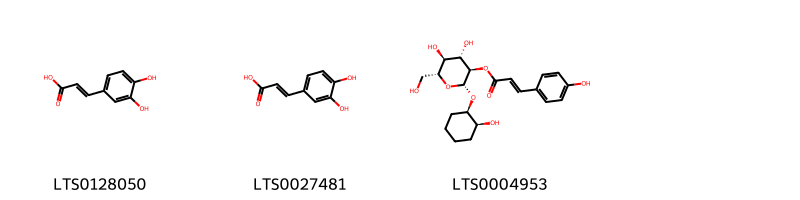{ width=100% }
    <figcaption>Hình ảnh cấu trúc hóa học của 3 hoạt chất thuộc nhóm Cinnamic acids and derivatives gồm ['3,4-dihydroxycinnamic acid (LTS0128050)', 'caffeic acid (LTS0027481)', 'grandidentatin (LTS0004953)'].</figcaption>
</figure>
#### Nhóm Fatty Acyls
<figure markdown="span">
    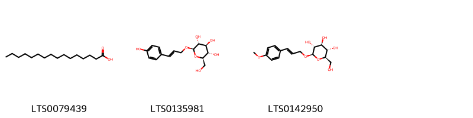{ width=100% }
    <figcaption>Hình ảnh cấu trúc hóa học của 3 hoạt chất thuộc nhóm Fatty Acyls gồm ['palmitic acid (LTS0079439)', 'sachaliside (LTS0135981)', 'vimalin (LTS0142950)'].</figcaption>
</figure>
#### Nhóm Flavonoids
<figure markdown="span">
    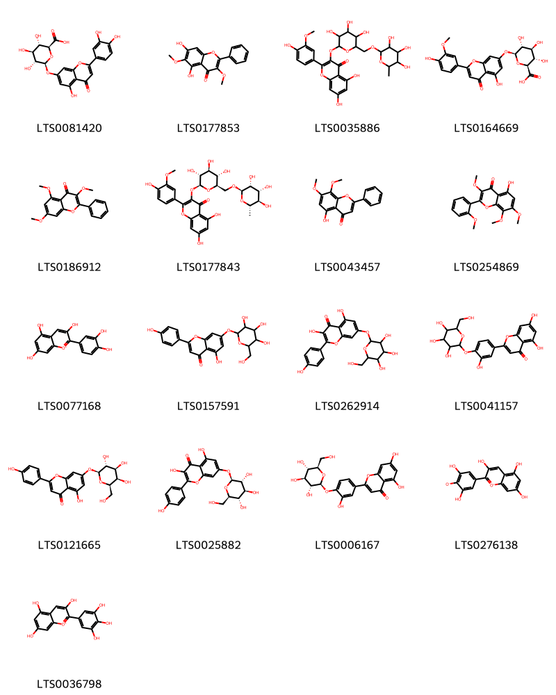{ width=100% }
    <figcaption>Hình ảnh cấu trúc hóa học của 17 hoạt chất thuộc nhóm Flavonoids gồm ['luteolin 7-o-glucuronide (LTS0081420)', '3-o-methylalnusin (LTS0177853)', '5,7-dihydroxy-2-(4-hydroxy-3-methoxyphenyl)-3-[(3,4,5-trihydroxy-6-{[(3,4,5-trihydroxy-6-methyloxan-2-yl)oxy]methyl}oxan-2-yl)oxy]chromen-4-one (LTS0035886)', '(2s,3s,4s,5r,6s)-3,4,5-trihydroxy-6-{[5-hydroxy-2-(4-hydroxy-3-methoxyphenyl)-4-oxochromen-7-yl]oxy}oxane-2-carboxylic acid (LTS0164669)', 'galangin trimethyl ether (LTS0186912)', 'narcissin (LTS0177843)', '7-o-methylwogonin (LTS0043457)', '5-hydroxy-3,7,8-trimethoxy-2-(2-methoxyphenyl)chromen-4-one (LTS0254869)', 'cyanidin (LTS0077168)', 'apigetrin (LTS0157591)', '3,5-dihydroxy-2-(4-hydroxyphenyl)-7-{[3,4,5-trihydroxy-6-(hydroxymethyl)oxan-2-yl]oxy}chromen-4-one (LTS0262914)', '5,7-dihydroxy-2-(3-hydroxy-4-{[3,4,5-trihydroxy-6-(hydroxymethyl)oxan-2-yl]oxy}phenyl)chromen-4-one (LTS0041157)', '5-hydroxy-2-(4-hydroxyphenyl)-7-{[(2s,3r,4s,5r,6r)-3,4,5-trihydroxy-6-(hydroxymethyl)oxan-2-yl]oxy}chromen-4-one (LTS0121665)', 'kaempferol 7-o-glucoside (LTS0025882)', '5,7-dihydroxy-2-(3-hydroxy-4-{[(2s,3r,4s,5s,6r)-3,4,5-trihydroxy-6-(hydroxymethyl)oxan-2-yl]oxy}phenyl)chromen-4-one (LTS0006167)', '2-(3,5-dihydroxy-4-oxidophenyl)-3,5,7-trihydroxy-1λ⁴-chromen-1-ylium (LTS0276138)', 'delphinidin (LTS0036798)'].</figcaption>
</figure>
#### Nhóm Organooxygen compounds
<figure markdown="span">
    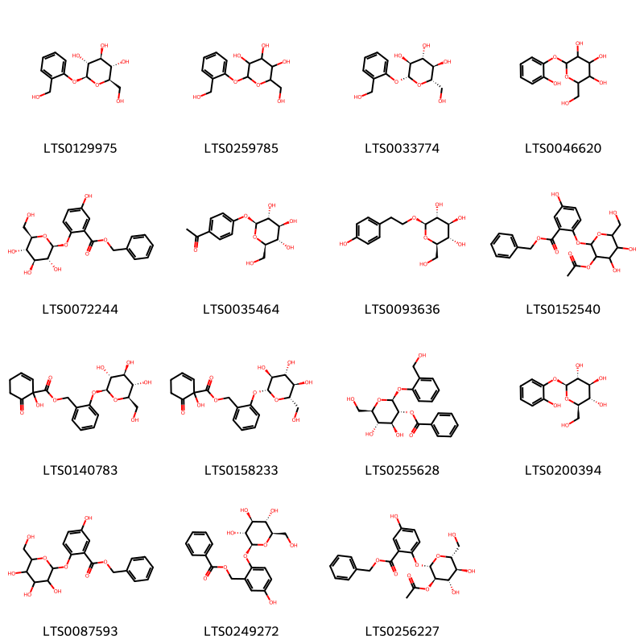{ width=100% }
    <figcaption>Hình ảnh cấu trúc hóa học của 15 hoạt chất thuộc nhóm Organooxygen compounds gồm ['salicin (LTS0129975)', 'salicin (LTS0259785)', '(2s,3r,4r,5s,6r)-2-(hydroxymethyl)-6-[2-(hydroxymethyl)phenoxy]oxane-3,4,5-triol (LTS0033774)', '2-(hydroxymethyl)-6-(2-hydroxyphenoxy)oxane-3,4,5-triol (LTS0046620)', 'trichocarpin (LTS0072244)', 'picein (LTS0035464)', 'salidroside (LTS0093636)', 'benzyl 2-{[3-(acetyloxy)-4,5-dihydroxy-6-(hydroxymethyl)oxan-2-yl]oxy}-5-hydroxybenzoate (LTS0152540)', 'salicortin (LTS0140783)', '(2-{[(2r,3s,4r,5r,6s)-3,4,5-trihydroxy-6-(hydroxymethyl)oxan-2-yl]oxy}phenyl)methyl 1-hydroxy-6-oxocyclohex-2-ene-1-carboxylate (LTS0158233)', 'tremuloidin (LTS0255628)', '(2r,3s,4s,5r,6s)-2-(hydroxymethyl)-6-(2-hydroxyphenoxy)oxane-3,4,5-triol (LTS0200394)', 'benzyl 5-hydroxy-2-{[3,4,5-trihydroxy-6-(hydroxymethyl)oxan-2-yl]oxy}benzoate (LTS0087593)', 'salireposide (LTS0249272)', 'benzyl 2-{[(2s,3r,4s,5s,6r)-3-(acetyloxy)-4,5-dihydroxy-6-(hydroxymethyl)oxan-2-yl]oxy}-5-hydroxybenzoate (LTS0256227)'].</figcaption>
</figure>
#### Nhóm Prenol lipids
<figure markdown="span">
    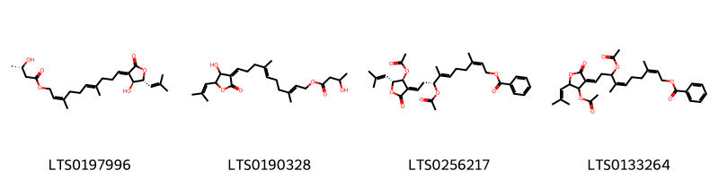{ width=100% }
    <figcaption>Hình ảnh cấu trúc hóa học của 4 hoạt chất thuộc nhóm Prenol lipids gồm ['(2z,6e)-10-[(3e,4s,5r)-4-hydroxy-5-(2-methylprop-1-en-1-yl)-2-oxooxolan-3-ylidene]-3,7-dimethyldeca-2,6-dien-1-yl (3s)-3-hydroxybutanoate (LTS0197996)', '10-[4-hydroxy-5-(2-methylprop-1-en-1-yl)-2-oxooxolan-3-ylidene]-3,7-dimethyldeca-2,6-dien-1-yl 3-hydroxybutanoate (LTS0190328)', '(3r,4e,8z)-1-[(3e,4s,5r)-4-(acetyloxy)-5-(2-methylprop-1-en-1-yl)-2-oxooxolan-3-ylidene]-10-[(e,z)-benzoyloxy]-4,8-dimethyldeca-4,8-dien-3-yl acetate (LTS0256217)', '1-[4-(acetyloxy)-5-(2-methylprop-1-en-1-yl)-2-oxooxolan-3-ylidene]-10-(benzoyloxy)-4,8-dimethyldeca-4,8-dien-3-yl acetate (LTS0133264)'].</figcaption>
</figure>
#### Nhóm Steroids and steroid derivatives
<figure markdown="span">
    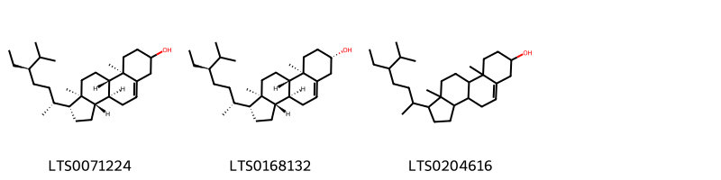{ width=100% }
    <figcaption>Hình ảnh cấu trúc hóa học của 3 hoạt chất thuộc nhóm Steroids and steroid derivatives gồm ['stigmast-5-en-3-ol (LTS0071224)', 'sitosterol (LTS0168132)', 'stigmast-5-en-3-ol, (3β)- (LTS0204616)'].</figcaption>
</figure>

---

### Dược dân tộc học

Danh sách các quốc gia có sử dụng *Salix babylonica* trong điều trị các bệnh. 

| Country    | Disease           | Bệnh                  |
|:-----------|:------------------|:----------------------|
| China      | Tonic             | (thuộc) trương lực    |
| Elsewhere  | Astringent, Tonic | Chất làm se, Thuốc bổ |
| English    | Antiseptic        | Khử trùng             |
| Kurdistan  | Antiseptic        | Khử trùng             |
| Portuguese | Vermifuge         | Thuốc diệt sán        |

---

---
## Salix caprea
### Thông tin về thực vật

!!! info "Phân loại thực vật của *Salix caprea* từ GIBF:"
    - **Kingdom:** Plantae
    - **Phylum:** Tracheophyta
    - **Order:** Malpighiales
    - **Family:** Salicaceae
    - **Genus:** Salix
    - **Species:** *Salix caprea*

 

| Label (VI)   | Label (EN)   | Scientific Name   | Descriptions (VI)   | Descriptions (EN)   | Also Known As (VI)   | Also Known As (EN)                                                                   |
|:-------------|:-------------|:------------------|:--------------------|:--------------------|:---------------------|:-------------------------------------------------------------------------------------|
| N/A          | N/A          | Salix caprea      | loài thực vật       | species of plant    | ['']                 | ['pussy willow', 'goat willow', 'great sallow', 'Ivan Spasov', 'Иван Петков Спасов'] |

#### Phân bố trên thế giới

**Từ CSDL GIBF** Denmark, Germany, Austria, Sweden, Poland, Slovakia, Netherlands, Finland, Lithuania, Ireland, Norway, Switzerland, United Kingdom of Great Britain and Northern Ireland, France, Czechia, New Zealand, Russian Federation, Italy, Croatia, Ukraine

#### Phân bố tại Việt Nam

**Từ CSDL GIBF**: Không có ghi nhận ở Việt Nam

---
### Thành phần hóa học
        
- Theo cơ sở dữ liệu lotus: Từ loài *Salix caprea* đã phân lập và xác định được 45 hoạt chất thuộc về các nhóm Organooxygen compounds, Flavonoids, Carboxylic acids and derivatives, Fatty Acyls, Anthracenes, Cinnamic acids and derivatives, Benzene and substituted derivatives. 

|    | chemicalTaxonomyClassyfireClass     |   smiles_count |
|---:|:------------------------------------|---------------:|
|  0 | Anthracenes                         |              1 |
|  1 | Benzene and substituted derivatives |              2 |
|  2 | Carboxylic acids and derivatives    |              2 |
|  3 | Cinnamic acids and derivatives      |              1 |
|  4 | Fatty Acyls                         |              2 |
|  5 | Flavonoids                          |             29 |
|  6 | Organooxygen compounds              |              7 |

#### Nhóm Anthracenes
<figure markdown="span">
    { width=100% }
    <figcaption>Hình ảnh cấu trúc hóa học của 1 hoạt chất thuộc nhóm Anthracenes gồm ['2-chlorophyscion (LTS0252113)'].</figcaption>
</figure>
#### Nhóm Benzene and substituted derivatives
<figure markdown="span">
    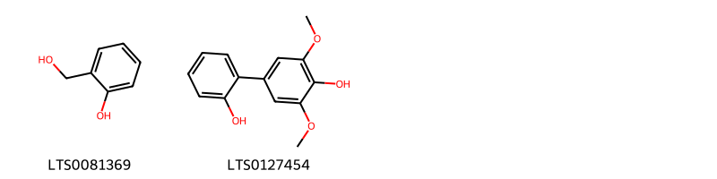{ width=100% }
    <figcaption>Hình ảnh cấu trúc hóa học của 2 hoạt chất thuộc nhóm Benzene and substituted derivatives gồm ['saligenin (LTS0081369)', "3',5'-dimethoxy-[1,1'-biphenyl]-2,4'-diol (LTS0127454)"].</figcaption>
</figure>
#### Nhóm Carboxylic acids and derivatives
<figure markdown="span">
    { width=100% }
    <figcaption>Hình ảnh cấu trúc hóa học của 2 hoạt chất thuộc nhóm Carboxylic acids and derivatives gồm ['(+,-)-pipecolic acid (LTS0189894)', '5-hydroxypipecolic acid (LTS0145112)'].</figcaption>
</figure>
#### Nhóm Cinnamic acids and derivatives
<figure markdown="span">
    { width=100% }
    <figcaption>Hình ảnh cấu trúc hóa học của 1 hoạt chất thuộc nhóm Cinnamic acids and derivatives gồm ['grandidentatin (LTS0004953)'].</figcaption>
</figure>
#### Nhóm Fatty Acyls
<figure markdown="span">
    { width=100% }
    <figcaption>Hình ảnh cấu trúc hóa học của 2 hoạt chất thuộc nhóm Fatty Acyls gồm ['sachaliside (LTS0135981)', 'vimalin (LTS0142950)'].</figcaption>
</figure>
#### Nhóm Flavonoids
<figure markdown="span">
    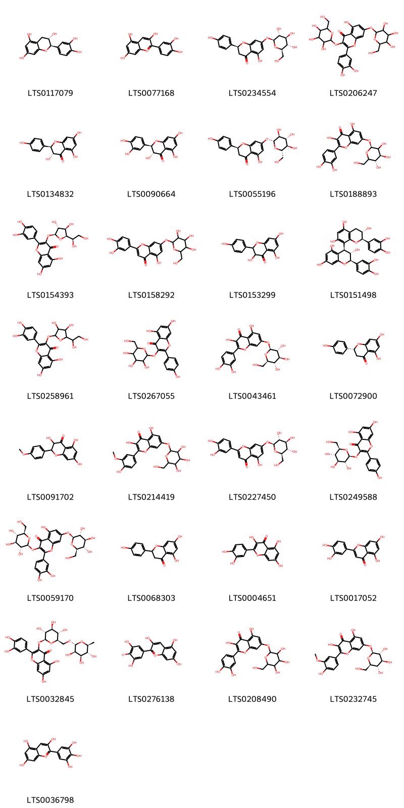{ width=100% }
    <figcaption>Hình ảnh cấu trúc hóa học của 29 hoạt chất thuộc nhóm Flavonoids gồm ['(+)-catechol (LTS0117079)', 'cyanidin (LTS0077168)', 'prunin (LTS0234554)', '2-(3,4-dihydroxyphenyl)-5-hydroxy-3,7-bis({[3,4,5-trihydroxy-6-(hydroxymethyl)oxan-2-yl]oxy})chromen-4-one (LTS0206247)', '(+)-dihydrokaempferol (LTS0134832)', '(+)-taxifolin (LTS0090664)', '(2s)-5-hydroxy-2-(4-hydroxyphenyl)-7-{[(2r,3s,4r,5r,6s)-3,4,5-trihydroxy-6-(hydroxymethyl)oxan-2-yl]oxy}-2,3-dihydro-1-benzopyran-4-one (LTS0055196)', 'quercimeritrin (LTS0188893)', 'quercetin-3-glucoside (LTS0154393)', '2-(3,4-dihydroxyphenyl)-5-hydroxy-7-{[3,4,5-trihydroxy-6-(hydroxymethyl)oxan-2-yl]oxy}chromen-4-one (LTS0158292)', 'aromadendrin (LTS0153299)', '(2r,3s,4s)-2-(3,4-dihydroxyphenyl)-4-[(2r,3s)-2-(3,4-dihydroxyphenyl)-3,5,7-trihydroxy-3,4-dihydro-2h-1-benzopyran-8-yl]-3,4-dihydro-2h-1-benzopyran-3,5,7-triol (LTS0151498)', '3-{[5-(1,2-dihydroxyethyl)-3,4-dihydroxyoxolan-2-yl]oxy}-2-(3,4-dihydroxyphenyl)-5,7-dihydroxychromen-4-one (LTS0258961)', 'trifolin (LTS0267055)', 'quercimeritrin (LTS0043461)', '(-)-naringenin (LTS0072900)', 'dihydrokaempferide (LTS0091702)', '3,5-dihydroxy-2-(4-hydroxy-3-methoxyphenyl)-7-{[3,4,5-trihydroxy-6-(hydroxymethyl)oxan-2-yl]oxy}chromen-4-one (LTS0214419)', 'luteolin 7-o-glucoside (LTS0227450)', 'astragalin (LTS0249588)', 'quercetin 3,7-diglucoside (LTS0059170)', 'asahina (LTS0068303)', 'quercetin (LTS0004651)', 'luteolin (LTS0017052)', '3-rutinosyl quercetin (LTS0032845)', '2-(3,5-dihydroxy-4-oxidophenyl)-3,5,7-trihydroxy-1λ⁴-chromen-1-ylium (LTS0276138)', 'quercimeritrin (LTS0208490)', '3,5-dihydroxy-2-(4-hydroxy-3-methoxyphenyl)-7-{[(2s,3r,4s,5s,6r)-3,4,5-trihydroxy-6-(hydroxymethyl)oxan-2-yl]oxy}chromen-4-one (LTS0232745)', 'delphinidin (LTS0036798)'].</figcaption>
</figure>
#### Nhóm Organooxygen compounds
<figure markdown="span">
    { width=100% }
    <figcaption>Hình ảnh cấu trúc hóa học của 7 hoạt chất thuộc nhóm Organooxygen compounds gồm ['salicin (LTS0129975)', 'picein (LTS0035464)', 'salidroside (LTS0093636)', 'salicortin (LTS0140783)', '(2-{[(2r,3s,4r,5r,6s)-3,4,5-trihydroxy-6-(hydroxymethyl)oxan-2-yl]oxy}phenyl)methyl 1-hydroxy-6-oxocyclohex-2-ene-1-carboxylate (LTS0158233)', 'tremuloidin (LTS0255628)', 'salireposide (LTS0249272)'].</figcaption>
</figure>

---

### Dược dân tộc học

Danh sách các quốc gia có sử dụng *Salix caprea* trong điều trị các bệnh. 

| Country   | Disease           | Bệnh                  |
|:----------|:------------------|:----------------------|
| Elsewhere | Astringent, Tonic | Chất làm se, Thuốc bổ |

---

---
## Salix fragilis
### Thông tin về thực vật

!!! info "Phân loại thực vật của *Salix fragilis* từ GIBF:"
    - **Kingdom:** Plantae
    - **Phylum:** Tracheophyta
    - **Order:** Malpighiales
    - **Family:** Salicaceae
    - **Genus:** Salix
    - **Species:** *Salix fragilis*

 

| Label (VI)   | Label (EN)   | Scientific Name   | Descriptions (VI)   | Descriptions (EN)   | Also Known As (VI)   | Also Known As (EN)                 |
|:-------------|:-------------|:------------------|:--------------------|:--------------------|:---------------------|:-----------------------------------|
| N/A          | N/A          | Salix fragilis    | loài thực vật       | species of plant    | ['']                 | ['brittle willow', 'crack willow'] |

#### Phân bố trên thế giới

**Từ CSDL GIBF** Denmark, Luxembourg, Spain, Germany, Austria, Australia, Sweden, Poland, Canada, Kazakhstan, Belgium, Belarus, Hungary, Estonia, Ireland, Norway, Switzerland, United Kingdom of Great Britain and Northern Ireland, South Africa, Latvia, France, Czechia, New Zealand, Russian Federation, United States of America, Ukraine

#### Phân bố tại Việt Nam

**Từ CSDL GIBF**: Không có ghi nhận ở Việt Nam

---
### Thành phần hóa học
        
- Theo cơ sở dữ liệu lotus: Từ loài *Salix fragilis* đã phân lập và xác định được 26 hoạt chất thuộc về các nhóm Organooxygen compounds, Flavonoids, Carboxylic acids and derivatives, Prenol lipids, Fatty Acyls, Anthracenes, Phenols, Cinnamic acids and derivatives, Benzene and substituted derivatives. 

|    | chemicalTaxonomyClassyfireClass     |   smiles_count |
|---:|:------------------------------------|---------------:|
|  0 | Anthracenes                         |              1 |
|  1 | Benzene and substituted derivatives |              1 |
|  2 | Carboxylic acids and derivatives    |              2 |
|  3 | Cinnamic acids and derivatives      |              1 |
|  4 | Fatty Acyls                         |              5 |
|  5 | Flavonoids                          |              3 |
|  6 | Organooxygen compounds              |              7 |
|  7 | Phenols                             |              1 |
|  8 | Prenol lipids                       |              4 |

#### Nhóm Anthracenes
<figure markdown="span">
    { width=100% }
    <figcaption>Hình ảnh cấu trúc hóa học của 1 hoạt chất thuộc nhóm Anthracenes gồm ['2-chlorophyscion (LTS0252113)'].</figcaption>
</figure>
#### Nhóm Benzene and substituted derivatives
<figure markdown="span">
    { width=100% }
    <figcaption>Hình ảnh cấu trúc hóa học của 1 hoạt chất thuộc nhóm Benzene and substituted derivatives gồm ['benzyl alcohol (LTS0125638)'].</figcaption>
</figure>
#### Nhóm Carboxylic acids and derivatives
<figure markdown="span">
    { width=100% }
    <figcaption>Hình ảnh cấu trúc hóa học của 2 hoạt chất thuộc nhóm Carboxylic acids and derivatives gồm ['(+,-)-pipecolic acid (LTS0189894)', '5-hydroxypipecolic acid (LTS0145112)'].</figcaption>
</figure>
#### Nhóm Cinnamic acids and derivatives
<figure markdown="span">
    { width=100% }
    <figcaption>Hình ảnh cấu trúc hóa học của 1 hoạt chất thuộc nhóm Cinnamic acids and derivatives gồm ['grandidentatin (LTS0004953)'].</figcaption>
</figure>
#### Nhóm Fatty Acyls
<figure markdown="span">
    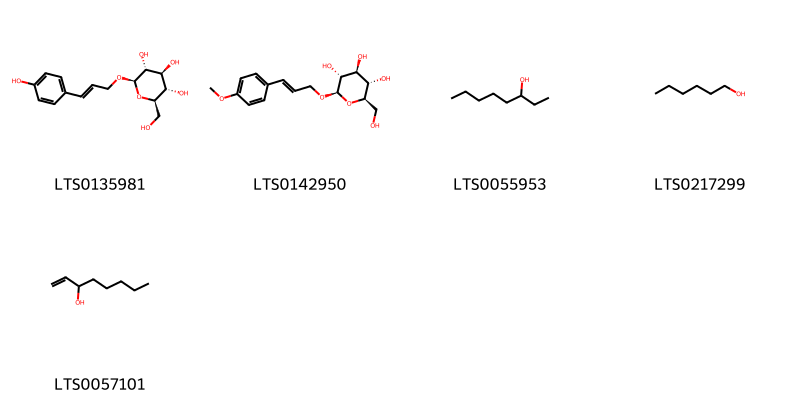{ width=100% }
    <figcaption>Hình ảnh cấu trúc hóa học của 5 hoạt chất thuộc nhóm Fatty Acyls gồm ['sachaliside (LTS0135981)', 'vimalin (LTS0142950)', '3-octanol (LTS0055953)', 'hexanol (LTS0217299)', '1-octen-3-ol (LTS0057101)'].</figcaption>
</figure>
#### Nhóm Flavonoids
<figure markdown="span">
    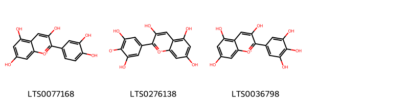{ width=100% }
    <figcaption>Hình ảnh cấu trúc hóa học của 3 hoạt chất thuộc nhóm Flavonoids gồm ['cyanidin (LTS0077168)', '2-(3,5-dihydroxy-4-oxidophenyl)-3,5,7-trihydroxy-1λ⁴-chromen-1-ylium (LTS0276138)', 'delphinidin (LTS0036798)'].</figcaption>
</figure>
#### Nhóm Organooxygen compounds
<figure markdown="span">
    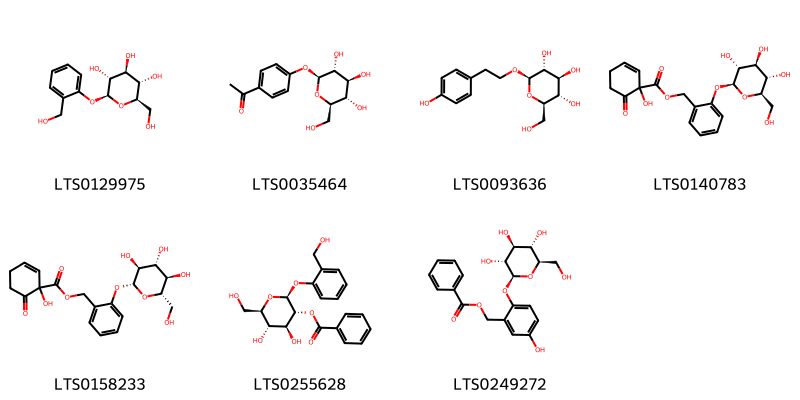{ width=100% }
    <figcaption>Hình ảnh cấu trúc hóa học của 7 hoạt chất thuộc nhóm Organooxygen compounds gồm ['salicin (LTS0129975)', 'picein (LTS0035464)', 'salidroside (LTS0093636)', 'salicortin (LTS0140783)', '(2-{[(2r,3s,4r,5r,6s)-3,4,5-trihydroxy-6-(hydroxymethyl)oxan-2-yl]oxy}phenyl)methyl 1-hydroxy-6-oxocyclohex-2-ene-1-carboxylate (LTS0158233)', 'tremuloidin (LTS0255628)', 'salireposide (LTS0249272)'].</figcaption>
</figure>
#### Nhóm Phenols
<figure markdown="span">
    { width=100% }
    <figcaption>Hình ảnh cấu trúc hóa học của 1 hoạt chất thuộc nhóm Phenols gồm ['eugenol (LTS0052342)'].</figcaption>
</figure>
#### Nhóm Prenol lipids
<figure markdown="span">
    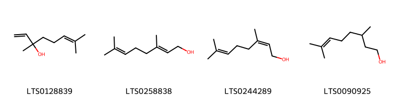{ width=100% }
    <figcaption>Hình ảnh cấu trúc hóa học của 4 hoạt chất thuộc nhóm Prenol lipids gồm ['linalool, (+-)- (LTS0128839)', 'geraniol (LTS0258838)', 'nerol (LTS0244289)', 'citronellol, (+-)- (LTS0090925)'].</figcaption>
</figure>

---

### Dược dân tộc học

Danh sách các quốc gia có sử dụng *Salix fragilis* trong điều trị các bệnh. 

| Country   | Disease    | Bệnh          |
|:----------|:-----------|:--------------|
| Iraq      | Astringent | Lam se da     |
| Turkey    | Sedative   | Thuốc an thần |

---

---
## Salix gilgiana
### Thông tin về thực vật

!!! info "Phân loại thực vật của *Salix gilgiana* từ GIBF:"
    - **Kingdom:** Plantae
    - **Phylum:** Tracheophyta
    - **Order:** Malpighiales
    - **Family:** Salicaceae
    - **Genus:** Salix
    - **Species:** *Salix gilgiana*

 

| Label (VI)   | Label (EN)   | Scientific Name   | Descriptions (VI)   | Descriptions (EN)   | Also Known As (VI)   | Also Known As (EN)   |
|:-------------|:-------------|:------------------|:--------------------|:--------------------|:---------------------|:---------------------|
| N/A          | N/A          | Salix gilgiana    | loài thực vật       | species of plant    | ['']                 | ['']                 |

#### Phân bố trên thế giới

**Từ CSDL GIBF** nan, Korea, Republic of, United States of America, Japan

#### Phân bố tại Việt Nam

**Từ CSDL GIBF**: Không có ghi nhận ở Việt Nam

---
### Thành phần hóa học
        
- Theo cơ sở dữ liệu lotus: Từ loài *Salix gilgiana* đã phân lập và xác định được 12 hoạt chất thuộc về các nhóm Flavonoids. 

|    | chemicalTaxonomyClassyfireClass   |   smiles_count |
|---:|:----------------------------------|---------------:|
|  0 | Flavonoids                        |             12 |

#### Nhóm Flavonoids
<figure markdown="span">
    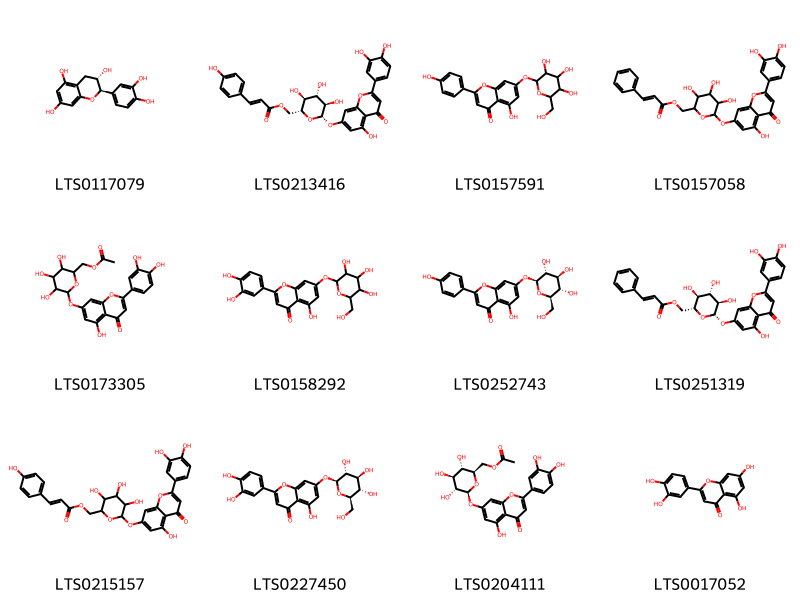{ width=100% }
    <figcaption>Hình ảnh cấu trúc hóa học của 12 hoạt chất thuộc nhóm Flavonoids gồm ['(+)-catechol (LTS0117079)', '[(2r,3s,4s,5r,6s)-6-{[2-(3,4-dihydroxyphenyl)-5-hydroxy-4-oxochromen-7-yl]oxy}-3,4,5-trihydroxyoxan-2-yl]methyl (2e)-3-(4-hydroxyphenyl)prop-2-enoate (LTS0213416)', 'apigetrin (LTS0157591)', '(6-{[2-(3,4-dihydroxyphenyl)-5-hydroxy-4-oxochromen-7-yl]oxy}-3,4,5-trihydroxyoxan-2-yl)methyl 3-phenylprop-2-enoate (LTS0157058)', '(6-{[2-(3,4-dihydroxyphenyl)-5-hydroxy-4-oxochromen-7-yl]oxy}-3,4,5-trihydroxyoxan-2-yl)methyl acetate (LTS0173305)', '2-(3,4-dihydroxyphenyl)-5-hydroxy-7-{[3,4,5-trihydroxy-6-(hydroxymethyl)oxan-2-yl]oxy}chromen-4-one (LTS0158292)', 'apigenin 7-o-β-glucoside (LTS0252743)', '[(2r,3s,4s,5r,6s)-6-{[2-(3,4-dihydroxyphenyl)-5-hydroxy-4-oxochromen-7-yl]oxy}-3,4,5-trihydroxyoxan-2-yl]methyl (2e)-3-phenylprop-2-enoate (LTS0251319)', '(6-{[2-(3,4-dihydroxyphenyl)-5-hydroxy-4-oxochromen-7-yl]oxy}-3,4,5-trihydroxyoxan-2-yl)methyl 3-(4-hydroxyphenyl)prop-2-enoate (LTS0215157)', 'luteolin 7-o-glucoside (LTS0227450)', '[(2r,3s,4s,5r,6s)-6-{[2-(3,4-dihydroxyphenyl)-5-hydroxy-4-oxochromen-7-yl]oxy}-3,4,5-trihydroxyoxan-2-yl]methyl acetate (LTS0204111)', 'luteolin (LTS0017052)'].</figcaption>
</figure>

---

### Dược dân tộc học

Danh sách các quốc gia có sử dụng *Salix gilgiana* trong điều trị các bệnh. 

| Country   | Disease       | Bệnh          |
|:----------|:--------------|:--------------|
| Elsewhere | nan, Diuretic | nan, lợi tiểu |

---

---
## Salix irrorata
### Thông tin về thực vật

!!! info "Phân loại thực vật của *Salix irrorata* từ GIBF:"
    - **Kingdom:** Plantae
    - **Phylum:** Tracheophyta
    - **Order:** Malpighiales
    - **Family:** Salicaceae
    - **Genus:** Salix
    - **Species:** *Salix irrorata*

 

| Label (VI)   | Label (EN)   | Scientific Name   | Descriptions (VI)   | Descriptions (EN)   | Also Known As (VI)   | Also Known As (EN)                                        |
|:-------------|:-------------|:------------------|:--------------------|:--------------------|:---------------------|:----------------------------------------------------------|
| N/A          | N/A          | Salix irrorata    | loài thực vật       | species of plant    | ['']                 | ['sandbar willow', 'blue-stem willow', 'dewystem willow'] |

#### Phân bố trên thế giới

**Từ CSDL GIBF** United Kingdom of Great Britain and Northern Ireland, Spain, United States of America, Netherlands, Belgium, Korea, Republic of

#### Phân bố tại Việt Nam

**Từ CSDL GIBF**: Không có ghi nhận ở Việt Nam

---
### Thành phần hóa học
        
- Theo cơ sở dữ liệu lotus: Từ loài *Salix irrorata* đã phân lập và xác định được Chưa có hoạt chất nào được phân lập. hoạt chất thuộc về các nhóm Không có hoạt chất nào được phân lập. 

Không có hình ảnh nào được tạo ra

---

### Dược dân tộc học

Danh sách các quốc gia có sử dụng *Salix irrorata* trong điều trị các bệnh. 

| Country   | Disease   | Bệnh     |
|:----------|:----------|:---------|
| US(Tewa)  | Cosmetic  | Cosmetic |

---

---
## Salix koriyanagi
### Thông tin về thực vật

!!! info "Phân loại thực vật của *Salix koriyanagi* từ GIBF:"
    - **Kingdom:** Plantae
    - **Phylum:** Tracheophyta
    - **Order:** Malpighiales
    - **Family:** Salicaceae
    - **Genus:** Salix
    - **Species:** *Salix koriyanagi*

 

| Label (VI)   | Label (EN)   | Scientific Name   | Descriptions (VI)   | Descriptions (EN)   | Also Known As (VI)   | Also Known As (EN)   |
|:-------------|:-------------|:------------------|:--------------------|:--------------------|:---------------------|:---------------------|
| N/A          | N/A          | Salix koriyanagi  | loài thực vật       | species of plant    | ['']                 | ['']                 |

#### Phân bố trên thế giới

**Từ CSDL GIBF** nan, Japan, Korea, Republic of

#### Phân bố tại Việt Nam

**Từ CSDL GIBF**: Không có ghi nhận ở Việt Nam

---
### Thành phần hóa học
        
- Theo cơ sở dữ liệu lotus: Từ loài *Salix koriyanagi* đã phân lập và xác định được 1 hoạt chất thuộc về các nhóm Organooxygen compounds. 

|    | chemicalTaxonomyClassyfireClass   |   smiles_count |
|---:|:----------------------------------|---------------:|
|  0 | Organooxygen compounds            |              1 |

#### Nhóm Organooxygen compounds
<figure markdown="span">
    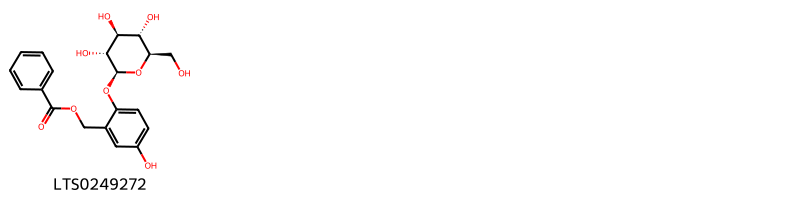{ width=100% }
    <figcaption>Hình ảnh cấu trúc hóa học của 1 hoạt chất thuộc nhóm Organooxygen compounds gồm ['salireposide (LTS0249272)'].</figcaption>
</figure>

---

### Dược dân tộc học

Danh sách các quốc gia có sử dụng *Salix koriyanagi* trong điều trị các bệnh. 

| Country   |   Disease | Bệnh   |
|:----------|----------:|:-------|
| Elsewhere |       nan | Ở đây  |

---

---
## Salix nigra
### Thông tin về thực vật

!!! info "Phân loại thực vật của *Salix nigra* từ GIBF:"
    - **Kingdom:** Plantae
    - **Phylum:** Tracheophyta
    - **Order:** Malpighiales
    - **Family:** Salicaceae
    - **Genus:** Salix
    - **Species:** *Salix nigra*

 

| Label (VI)   | Label (EN)   | Scientific Name   | Descriptions (VI)   | Descriptions (EN)   | Also Known As (VI)   | Also Known As (EN)   |
|:-------------|:-------------|:------------------|:--------------------|:--------------------|:---------------------|:---------------------|
| N/A          | N/A          | Salix nigra       | loài thực vật       | species of plant    | ['']                 | ['black willow']     |

#### Phân bố trên thế giới

**Từ CSDL GIBF** Australia, United States of America, Mexico

#### Phân bố tại Việt Nam

**Từ CSDL GIBF**: Không có ghi nhận ở Việt Nam

---
### Thành phần hóa học
        
- Theo cơ sở dữ liệu lotus: Từ loài *Salix nigra* đã phân lập và xác định được 1 hoạt chất thuộc về các nhóm Benzene and substituted derivatives. 

|    | chemicalTaxonomyClassyfireClass     |   smiles_count |
|---:|:------------------------------------|---------------:|
|  0 | Benzene and substituted derivatives |              1 |

#### Nhóm Benzene and substituted derivatives
<figure markdown="span">
    { width=100% }
    <figcaption>Hình ảnh cấu trúc hóa học của 1 hoạt chất thuộc nhóm Benzene and substituted derivatives gồm ['salicyclic acid (LTS0116548)'].</figcaption>
</figure>

---

### Dược dân tộc học

Danh sách các quốc gia có sử dụng *Salix nigra* trong điều trị các bệnh. 

| Country        | Disease                                                                                    | Bệnh                                                                                                   |
|:---------------|:-------------------------------------------------------------------------------------------|:-------------------------------------------------------------------------------------------------------|
| Mexico         | Anaphrodisiac, Carminative, Stimulant, Stimulant, Tonic, Tonic, Anaphrodisiac, Carminative | Anaphrodisiac, Carminative, Chất kích thích, Chất kích thích, Tonic, Tonic, Anaphrodisiac, Carminative |
| Turkey         | Astringent, Anaphrodisiac, Tonic, Sedative                                                 | Chất làm se, Anaphrodisiac, Thuốc bổ, Thuốc an thần                                                    |
| US             | Aphrodisiac                                                                                | Thuốc kích dục                                                                                         |
| US(Amerindian) | Sudorific                                                                                  | Ngạt thở                                                                                               |

---

---
## Salix purpurea
### Thông tin về thực vật

!!! info "Phân loại thực vật của *Salix purpurea* từ GIBF:"
    - **Kingdom:** Plantae
    - **Phylum:** Tracheophyta
    - **Order:** Malpighiales
    - **Family:** Salicaceae
    - **Genus:** Salix
    - **Species:** *Salix purpurea*

 

| Label (VI)   | Label (EN)   | Scientific Name   | Descriptions (VI)   | Descriptions (EN)   | Also Known As (VI)   | Also Known As (EN)                                      |
|:-------------|:-------------|:------------------|:--------------------|:--------------------|:---------------------|:--------------------------------------------------------|
| N/A          | N/A          | Salix purpurea    | loài thực vật       | species of plant    | ['']                 | ['purple osier', 'purple willow', 'purpleosier willow'] |

#### Phân bố trên thế giới

**Từ CSDL GIBF** Spain, Germany, Chile, Austria, Sweden, Poland, Netherlands, Slovenia, Hungary, Switzerland, United Kingdom of Great Britain and Northern Ireland, France, Czechia, New Zealand, Bolivia (Plurinational State of), Romania, United States of America, Italy, Croatia, Ukraine

#### Phân bố tại Việt Nam

**Từ CSDL GIBF**: Không có ghi nhận ở Việt Nam

---
### Thành phần hóa học
        
- Theo cơ sở dữ liệu lotus: Từ loài *Salix purpurea* đã phân lập và xác định được 33 hoạt chất thuộc về các nhóm Organooxygen compounds, Flavonoids, Carboxylic acids and derivatives, Fatty Acyls, Anthracenes, Cinnamic acids and derivatives. 

|    | chemicalTaxonomyClassyfireClass   |   smiles_count |
|---:|:----------------------------------|---------------:|
|  0 | Anthracenes                       |              1 |
|  1 | Carboxylic acids and derivatives  |              2 |
|  2 | Cinnamic acids and derivatives    |              2 |
|  3 | Fatty Acyls                       |              2 |
|  4 | Flavonoids                        |             13 |
|  5 | Organooxygen compounds            |             12 |

#### Nhóm Anthracenes
<figure markdown="span">
    { width=100% }
    <figcaption>Hình ảnh cấu trúc hóa học của 1 hoạt chất thuộc nhóm Anthracenes gồm ['2-chlorophyscion (LTS0252113)'].</figcaption>
</figure>
#### Nhóm Carboxylic acids and derivatives
<figure markdown="span">
    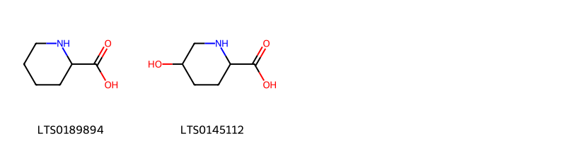{ width=100% }
    <figcaption>Hình ảnh cấu trúc hóa học của 2 hoạt chất thuộc nhóm Carboxylic acids and derivatives gồm ['(+,-)-pipecolic acid (LTS0189894)', '5-hydroxypipecolic acid (LTS0145112)'].</figcaption>
</figure>
#### Nhóm Cinnamic acids and derivatives
<figure markdown="span">
    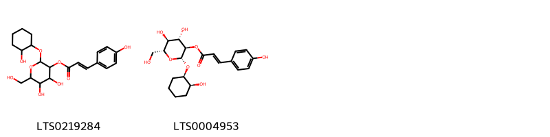{ width=100% }
    <figcaption>Hình ảnh cấu trúc hóa học của 2 hoạt chất thuộc nhóm Cinnamic acids and derivatives gồm ['4,5-dihydroxy-2-[(2-hydroxycyclohexyl)oxy]-6-(hydroxymethyl)oxan-3-yl 3-(4-hydroxyphenyl)prop-2-enoate (LTS0219284)', 'grandidentatin (LTS0004953)'].</figcaption>
</figure>
#### Nhóm Fatty Acyls
<figure markdown="span">
    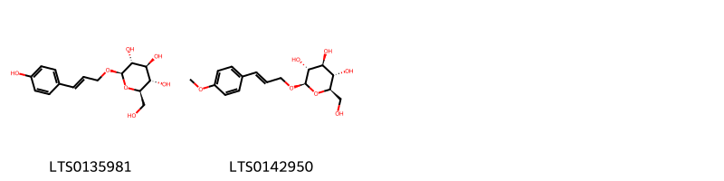{ width=100% }
    <figcaption>Hình ảnh cấu trúc hóa học của 2 hoạt chất thuộc nhóm Fatty Acyls gồm ['sachaliside (LTS0135981)', 'vimalin (LTS0142950)'].</figcaption>
</figure>
#### Nhóm Flavonoids
<figure markdown="span">
    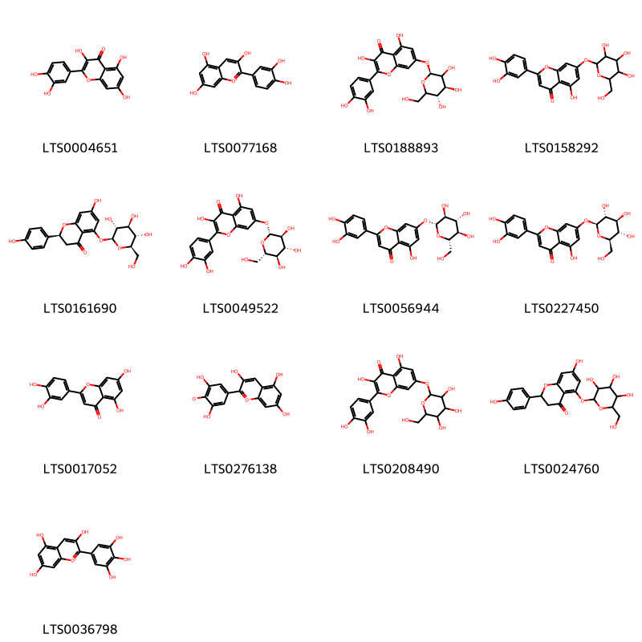{ width=100% }
    <figcaption>Hình ảnh cấu trúc hóa học của 13 hoạt chất thuộc nhóm Flavonoids gồm ['quercetin (LTS0004651)', 'cyanidin (LTS0077168)', 'quercimeritrin (LTS0188893)', '2-(3,4-dihydroxyphenyl)-5-hydroxy-7-{[3,4,5-trihydroxy-6-(hydroxymethyl)oxan-2-yl]oxy}chromen-4-one (LTS0158292)', '(2s)-7-hydroxy-2-(4-hydroxyphenyl)-5-{[(2s,3r,4s,5s,6r)-3,4,5-trihydroxy-6-(hydroxymethyl)oxan-2-yl]oxy}-2,3-dihydro-1-benzopyran-4-one (LTS0161690)', '2-(3,4-dihydroxyphenyl)-3,5-dihydroxy-7-{[(2r,3s,4r,5r,6s)-3,4,5-trihydroxy-6-(hydroxymethyl)oxan-2-yl]oxy}chromen-4-one (LTS0049522)', '2-(3,4-dihydroxyphenyl)-5-hydroxy-7-{[(2r,3s,4r,5r,6s)-3,4,5-trihydroxy-6-(hydroxymethyl)oxan-2-yl]oxy}chromen-4-one (LTS0056944)', 'luteolin 7-o-glucoside (LTS0227450)', 'luteolin (LTS0017052)', '2-(3,5-dihydroxy-4-oxidophenyl)-3,5,7-trihydroxy-1λ⁴-chromen-1-ylium (LTS0276138)', 'quercimeritrin (LTS0208490)', '7-hydroxy-2-(4-hydroxyphenyl)-5-{[3,4,5-trihydroxy-6-(hydroxymethyl)oxan-2-yl]oxy}-2,3-dihydro-1-benzopyran-4-one (LTS0024760)', 'delphinidin (LTS0036798)'].</figcaption>
</figure>
#### Nhóm Organooxygen compounds
<figure markdown="span">
    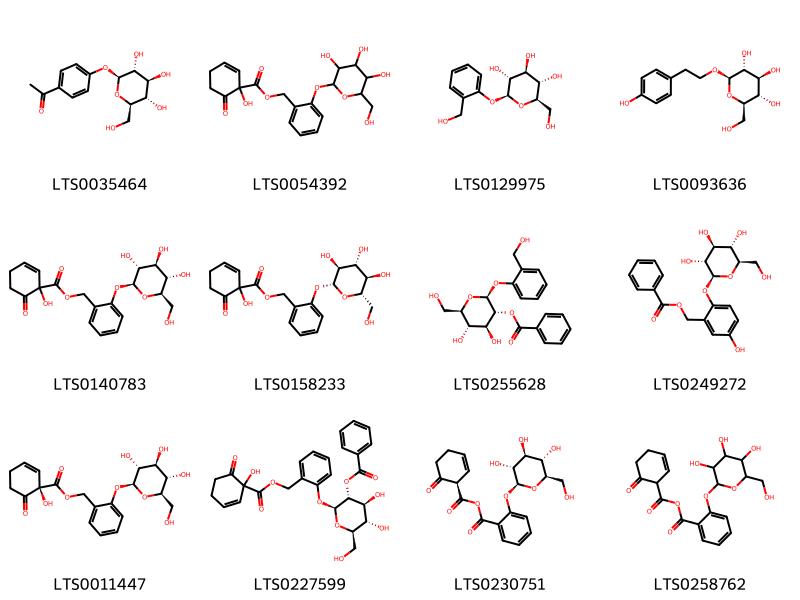{ width=100% }
    <figcaption>Hình ảnh cấu trúc hóa học của 12 hoạt chất thuộc nhóm Organooxygen compounds gồm ['picein (LTS0035464)', '(2-{[3,4,5-trihydroxy-6-(hydroxymethyl)oxan-2-yl]oxy}phenyl)methyl 1-hydroxy-6-oxocyclohex-2-ene-1-carboxylate (LTS0054392)', 'salicin (LTS0129975)', 'salidroside (LTS0093636)', 'salicortin (LTS0140783)', '(2-{[(2r,3s,4r,5r,6s)-3,4,5-trihydroxy-6-(hydroxymethyl)oxan-2-yl]oxy}phenyl)methyl 1-hydroxy-6-oxocyclohex-2-ene-1-carboxylate (LTS0158233)', 'tremuloidin (LTS0255628)', 'salireposide (LTS0249272)', '(2-{[(2s,3r,4s,5s,6r)-3,4,5-trihydroxy-6-(hydroxymethyl)oxan-2-yl]oxy}phenyl)methyl (1r)-1-hydroxy-6-oxocyclohex-2-ene-1-carboxylate (LTS0011447)', 'tremulacin (LTS0227599)', '(1r)-6-oxocyclohex-2-ene-1-carbonyl 2-{[(2s,3r,4s,5s,6r)-3,4,5-trihydroxy-6-(hydroxymethyl)oxan-2-yl]oxy}benzoate (LTS0230751)', '6-oxocyclohex-2-ene-1-carbonyl 2-{[3,4,5-trihydroxy-6-(hydroxymethyl)oxan-2-yl]oxy}benzoate (LTS0258762)'].</figcaption>
</figure>

---

### Dược dân tộc học

Danh sách các quốc gia có sử dụng *Salix purpurea* trong điều trị các bệnh. 

| Country   | Disease                  | Bệnh                            |
|:----------|:-------------------------|:--------------------------------|
| China     | Styptic                  | L.                              |
| Eurasia   | Tonic                    | (thuộc) trương lực              |
| Turkey    | Astringent, Tonic, Tonic | Chất làm se, Thuốc bổ, Thuốc bổ |

---

