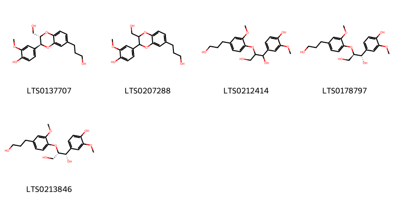
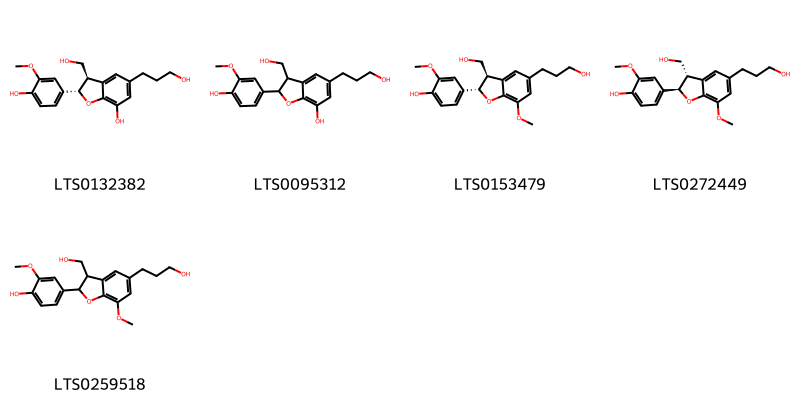
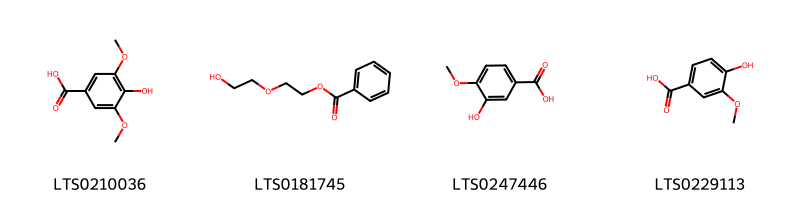
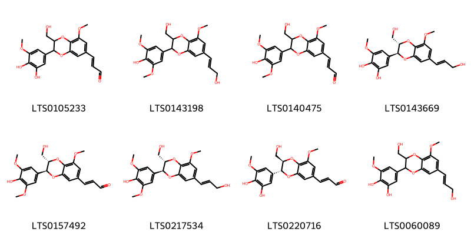
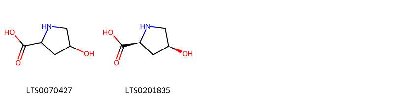
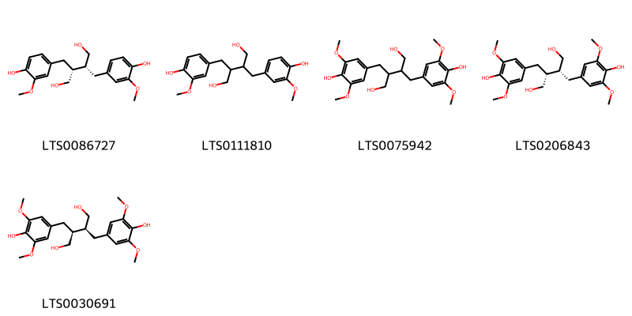
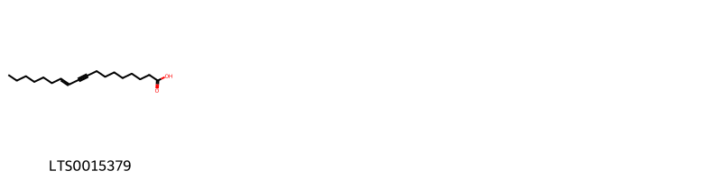
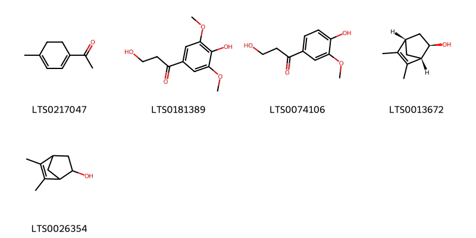
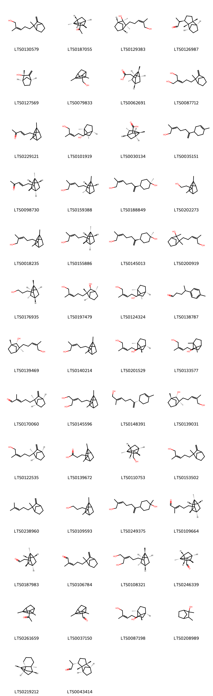
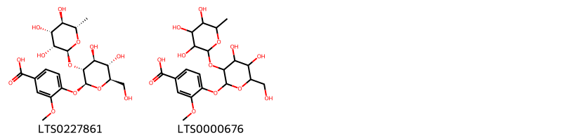

!!! abstract "Tóm tắt"

    Họ Santalaceae gồm khoảng 4 chi và 5 loài được một số cộng đồng tại các quốc gia như Turkey, India, Elsewhere, Java, China sử dụng trong một số trường hợp MYMEMORY WARNING: YOU USED ALL AVAILABLE FREE TRANSLATIONS FOR TODAY. NEXT AVAILABLE IN  06 HOURS 52 MINUTES 54 SECONDS VISIT HTTPS://MYMEMORY.TRANSLATED.NET/DOC/USAGELIMITS.PHP TO TRANSLATE MORE.

!!! info "DrDuke"

    James A. Duke sinh năm 1929-2017 là một nhà thực vật học người Mỹ. Đây là một trong những tác giả hàng đầu trong lĩnh vực dược dân tộc học với cuốn *CRC Handbook of Medicinal Herbs* và chính là người xây dựng lên cơ sở dữ liệu về hợp chất tự nhiên và dược dân tộc học tại Bộ nông nghiệp Hoa Kỳ. Các thông tin được đăng tải tại website [Dr. Duke's Phytochemical and Ethnobotanical Databases](https://phytochem.nal.usda.gov/). 
    Trong suốt thập niên 1970, ông lãnh đạo the Plant Taxonomy Laboratory, Plant Genetics and Germplasm Institute of the Agricultural Research Service, U.S. Department of Agriculture.
    Trong tài liệu này, các thông tin về dược dân tộc của các dược liệu được trích dẫn từ tài liệu của James A. Ducke với sự trợ giúp của phần mềm dịch thuật từ tiếng Anh sang tiếng Việt.
   

# Chi Eucarya

??? note "Danh sách các dược liệu thuộc chi"
    
	 - *Eucarya icata*

---
## Eucarya icata
### Thông tin về thực vật

!!! info "Phân loại thực vật của *N/A* từ GIBF:"
    - **Kingdom:** Plantae
    - **Phylum:** Tracheophyta
    - **Order:** Santalales
    - **Family:** Santalaceae
    - **Genus:** Santalum
    - **Species:** *N/A*

 

| Label (VI)   | Label (EN)   | Scientific Name     | Descriptions (VI)   | Descriptions (EN)   | Also Known As (VI)   | Also Known As (EN)   |
|:-------------|:-------------|:--------------------|:--------------------|:--------------------|:---------------------|:---------------------|
| N/A          | N/A          | Bruguiera conjugata | loài thực vật       | species of plant    | ['']                 | ['']                 |

#### Phân bố trên thế giới

**Từ CSDL GIBF** Australia

#### Phân bố tại Việt Nam

**Từ CSDL GIBF**: Không có ghi nhận ở Việt Nam

---
### Thành phần hóa học
        
- Theo cơ sở dữ liệu lotus: Từ loài *N/A* đã phân lập và xác định được Chưa có hoạt chất nào được phân lập. hoạt chất thuộc về các nhóm Không có hoạt chất nào được phân lập. 

Không có hình ảnh nào được tạo ra

---

### Dược dân tộc học

Danh sách các quốc gia có sử dụng *N/A* trong điều trị các bệnh. 

| Country   | Disease    | Bệnh                                                                                                                                                                                                |
|:----------|:-----------|:----------------------------------------------------------------------------------------------------------------------------------------------------------------------------------------------------|
| Elsewhere | Antiseptic | MYMEMORY WARNING: YOU USED ALL AVAILABLE FREE TRANSLATIONS FOR TODAY. NEXT AVAILABLE IN  06 HOURS 52 MINUTES 50 SECONDS VISIT HTTPS://MYMEMORY.TRANSLATED.NET/DOC/USAGELIMITS.PHP TO TRANSLATE MORE |

---

# Chi Pyrularia

??? note "Danh sách các dược liệu thuộc chi"
    
	 - *Pyrularia edulis*

---
## Pyrularia edulis
### Thông tin về thực vật

!!! info "Phân loại thực vật của *Pyrularia edulis* từ GIBF:"
    - **Kingdom:** Plantae
    - **Phylum:** Tracheophyta
    - **Order:** Santalales
    - **Family:** Cervantesiaceae
    - **Genus:** Pyrularia
    - **Species:** *Pyrularia edulis*

 

| Label (VI)   | Label (EN)   | Scientific Name   | Descriptions (VI)   | Descriptions (EN)   | Also Known As (VI)   | Also Known As (EN)   |
|:-------------|:-------------|:------------------|:--------------------|:--------------------|:---------------------|:---------------------|
| N/A          | N/A          | Pyrularia edulis  | loài thực vật       | species of plant    | ['']                 | ['']                 |

#### Phân bố trên thế giới

**Từ CSDL GIBF** nan, Myanmar, India, unknown or invalid, China, Nepal

#### Phân bố tại Việt Nam

**Từ CSDL GIBF**: Không có ghi nhận ở Việt Nam

---
### Thành phần hóa học
        
- Theo cơ sở dữ liệu lotus: Từ loài *Pyrularia edulis* đã phân lập và xác định được Chưa có hoạt chất nào được phân lập. hoạt chất thuộc về các nhóm Không có hoạt chất nào được phân lập. 

Không có hình ảnh nào được tạo ra

---

### Dược dân tộc học

Danh sách các quốc gia có sử dụng *Pyrularia edulis* trong điều trị các bệnh. 

| Country   | Disease   | Bệnh                                                                                                                                                                                                |
|:----------|:----------|:----------------------------------------------------------------------------------------------------------------------------------------------------------------------------------------------------|
| Elsewhere | Rennet    | MYMEMORY WARNING: YOU USED ALL AVAILABLE FREE TRANSLATIONS FOR TODAY. NEXT AVAILABLE IN  06 HOURS 52 MINUTES 23 SECONDS VISIT HTTPS://MYMEMORY.TRANSLATED.NET/DOC/USAGELIMITS.PHP TO TRANSLATE MORE |

---

# Chi Santalum

??? note "Danh sách các dược liệu thuộc chi"
    
	 - *Santalum album*

---
## Santalum album
### Thông tin về thực vật

!!! info "Phân loại thực vật của *Santalum album* từ GIBF:"
    - **Kingdom:** Plantae
    - **Phylum:** Tracheophyta
    - **Order:** Santalales
    - **Family:** Santalaceae
    - **Genus:** Santalum
    - **Species:** *Santalum album*

 

| Label (VI)   | Label (EN)   | Scientific Name   | Descriptions (VI)   | Descriptions (EN)   | Also Known As (VI)   | Also Known As (EN)   |
|:-------------|:-------------|:------------------|:--------------------|:--------------------|:---------------------|:---------------------|
| N/A          | N/A          | Santalum album    | loài thực vật       | species of plant    | ['']                 | ['Sandalwood']       |

#### Phân bố trên thế giới

**Từ CSDL GIBF** India, United States of America

#### Phân bố tại Việt Nam

**Từ CSDL GIBF**: Không có ghi nhận ở Việt Nam

---
### Thành phần hóa học
        
- Theo cơ sở dữ liệu lotus: Từ loài *Santalum album* đã phân lập và xác định được 121 hoạt chất thuộc về các nhóm Benzodioxanes, Fatty Acyls, Prenol lipids, Dibenzylbutane lignans, Benzene and substituted derivatives, 2-arylbenzofuran flavonoids, Organooxygen compounds, Tannins, Aryltetralin lignans, Furanoid lignans, Carboxylic acids and derivatives. 

|    | chemicalTaxonomyClassyfireClass     |   smiles_count |
|---:|:------------------------------------|---------------:|
|  0 |                                     |              5 |
|  1 | 2-arylbenzofuran flavonoids         |              5 |
|  2 | Aryltetralin lignans                |              2 |
|  3 | Benzene and substituted derivatives |              4 |
|  4 | Benzodioxanes                       |              8 |
|  5 | Carboxylic acids and derivatives    |              2 |
|  6 | Dibenzylbutane lignans              |              5 |
|  7 | Fatty Acyls                         |              1 |
|  8 | Furanoid lignans                    |              2 |
|  9 | Organooxygen compounds              |              5 |
| 10 | Prenol lipids                       |             80 |
| 11 | Tannins                             |              2 |

#### Nhóm 
<figure markdown="span">
    { width=100% }
    <figcaption>Hình ảnh cấu trúc hóa học của 5 hoạt chất thuộc nhóm  gồm ['4-[(2s,3s)-3-(hydroxymethyl)-7-(3-hydroxypropyl)-2,3-dihydro-1,4-benzodioxin-2-yl]-2-methoxyphenol (LTS0137707)', '4-[3-(hydroxymethyl)-7-(3-hydroxypropyl)-2,3-dihydro-1,4-benzodioxin-2-yl]-2-methoxyphenol (LTS0207288)', '1-(4-hydroxy-3-methoxyphenyl)-2-[4-(3-hydroxypropyl)-2-methoxyphenoxy]propane-1,3-diol (LTS0212414)', '(1s,2r)-1-(4-hydroxy-3-methoxyphenyl)-2-[4-(3-hydroxypropyl)-2-methoxyphenoxy]propane-1,3-diol (LTS0178797)', '(1s,2s)-1-(4-hydroxy-3-methoxyphenyl)-2-[4-(3-hydroxypropyl)-2-methoxyphenoxy]propane-1,3-diol (LTS0213846)'].</figcaption>
</figure>
#### Nhóm 2-arylbenzofuran flavonoids
<figure markdown="span">
    { width=100% }
    <figcaption>Hình ảnh cấu trúc hóa học của 5 hoạt chất thuộc nhóm 2-arylbenzofuran flavonoids gồm ['(2s,3r)-2-(4-hydroxy-3-methoxyphenyl)-3-(hydroxymethyl)-5-(3-hydroxypropyl)-2,3-dihydro-1-benzofuran-7-ol (LTS0132382)', '2-(4-hydroxy-3-methoxyphenyl)-3-(hydroxymethyl)-5-(3-hydroxypropyl)-2,3-dihydro-1-benzofuran-7-ol (LTS0095312)', '4-[(2s,3r)-3-(hydroxymethyl)-5-(3-hydroxypropyl)-7-methoxy-2,3-dihydro-1-benzofuran-2-yl]-2-methoxyphenol (LTS0153479)', '4-[(2r,3s)-3-(hydroxymethyl)-5-(3-hydroxypropyl)-7-methoxy-2,3-dihydro-1-benzofuran-2-yl]-2-methoxyphenol (LTS0272449)', '4-[3-(hydroxymethyl)-5-(3-hydroxypropyl)-7-methoxy-2,3-dihydro-1-benzofuran-2-yl]-2-methoxyphenol (LTS0259518)'].</figcaption>
</figure>
#### Nhóm Aryltetralin lignans
<figure markdown="span">
    { width=100% }
    <figcaption>Hình ảnh cấu trúc hóa học của 2 hoạt chất thuộc nhóm Aryltetralin lignans gồm ['(+)-lyoniresinol (LTS0206828)', '8-(4-hydroxy-3,5-dimethoxyphenyl)-6,7-bis(hydroxymethyl)-1,3-dimethoxy-5,6,7,8-tetrahydronaphthalen-2-ol (LTS0068427)'].</figcaption>
</figure>
#### Nhóm Benzene and substituted derivatives
<figure markdown="span">
    { width=100% }
    <figcaption>Hình ảnh cấu trúc hóa học của 4 hoạt chất thuộc nhóm Benzene and substituted derivatives gồm ['syringic acid (LTS0210036)', 'diethylene glycol monobenzoate (LTS0181745)', 'isovanillic acid (LTS0247446)', 'vanillic acid (LTS0229113)'].</figcaption>
</figure>
#### Nhóm Benzodioxanes
<figure markdown="span">
    { width=100% }
    <figcaption>Hình ảnh cấu trúc hóa học của 8 hoạt chất thuộc nhóm Benzodioxanes gồm ['3-[3-(3,4-dihydroxy-5-methoxyphenyl)-2-(hydroxymethyl)-8-methoxy-2,3-dihydro-1,4-benzodioxin-6-yl]prop-2-enal (LTS0105233)', '4-[3-(hydroxymethyl)-7-(3-hydroxyprop-1-en-1-yl)-5-methoxy-2,3-dihydro-1,4-benzodioxin-2-yl]-2,6-dimethoxyphenol (LTS0143198)', '3-[3-(4-hydroxy-3,5-dimethoxyphenyl)-2-(hydroxymethyl)-8-methoxy-2,3-dihydro-1,4-benzodioxin-6-yl]prop-2-enal (LTS0140475)', '5-[(2s,3s)-3-(hydroxymethyl)-7-[(1e)-3-hydroxyprop-1-en-1-yl]-5-methoxy-2,3-dihydro-1,4-benzodioxin-2-yl]-3-methoxybenzene-1,2-diol (LTS0143669)', '(2e)-3-[(2s,3s)-3-(4-hydroxy-3,5-dimethoxyphenyl)-2-(hydroxymethyl)-8-methoxy-2,3-dihydro-1,4-benzodioxin-6-yl]prop-2-enal (LTS0157492)', '4-[(2s,3s)-3-(hydroxymethyl)-7-[(1e)-3-hydroxyprop-1-en-1-yl]-5-methoxy-2,3-dihydro-1,4-benzodioxin-2-yl]-2,6-dimethoxyphenol (LTS0217534)', '(2e)-3-[(2r,3r)-3-(3,4-dihydroxy-5-methoxyphenyl)-2-(hydroxymethyl)-8-methoxy-2,3-dihydro-1,4-benzodioxin-6-yl]prop-2-enal (LTS0220716)', '5-[3-(hydroxymethyl)-7-(3-hydroxyprop-1-en-1-yl)-5-methoxy-2,3-dihydro-1,4-benzodioxin-2-yl]-3-methoxybenzene-1,2-diol (LTS0060089)'].</figcaption>
</figure>
#### Nhóm Carboxylic acids and derivatives
<figure markdown="span">
    { width=100% }
    <figcaption>Hình ảnh cấu trúc hóa học của 2 hoạt chất thuộc nhóm Carboxylic acids and derivatives gồm ['4-hydroxyproline (LTS0070427)', '4 hydroxyproline (LTS0201835)'].</figcaption>
</figure>
#### Nhóm Dibenzylbutane lignans
<figure markdown="span">
    { width=100% }
    <figcaption>Hình ảnh cấu trúc hóa học của 5 hoạt chất thuộc nhóm Dibenzylbutane lignans gồm ['secoisolariciresinol (LTS0086727)', 'secoisolariciresinol (LTS0111810)', '2,3-bis[(4-hydroxy-3,5-dimethoxyphenyl)methyl]butane-1,4-diol (LTS0075942)', '(2r,3r)-2,3-bis[(4-hydroxy-3,5-dimethoxyphenyl)methyl]butane-1,4-diol (LTS0206843)', '(2s,3s)-2,3-bis[(4-hydroxy-3,5-dimethoxyphenyl)methyl]butane-1,4-diol (LTS0030691)'].</figcaption>
</figure>
#### Nhóm Fatty Acyls
<figure markdown="span">
    { width=100% }
    <figcaption>Hình ảnh cấu trúc hóa học của 1 hoạt chất thuộc nhóm Fatty Acyls gồm ['ximenynic acid (LTS0015379)'].</figcaption>
</figure>
#### Nhóm Furanoid lignans
<figure markdown="span">
    { width=100% }
    <figcaption>Hình ảnh cấu trúc hóa học của 2 hoạt chất thuộc nhóm Furanoid lignans gồm ['syringaresinol (LTS0116280)', '(+)-syringaresinol (LTS0158868)'].</figcaption>
</figure>
#### Nhóm Organooxygen compounds
<figure markdown="span">
    { width=100% }
    <figcaption>Hình ảnh cấu trúc hóa học của 5 hoạt chất thuộc nhóm Organooxygen compounds gồm ['1-(4-methylcyclohexa-1,3-dien-1-yl)ethanone (LTS0217047)', '3-hydroxy-1-(4-hydroxy-3,5-dimethoxyphenyl)propan-1-one (LTS0181389)', '3-hydroxy-1-(4-hydroxy-3-methoxyphenyl)propan-1-one (LTS0074106)', '(1s,2r,4s)-5,6-dimethylbicyclo[2.2.1]hept-5-en-2-ol (LTS0013672)', '5,6-dimethylbicyclo[2.2.1]hept-5-en-2-ol (LTS0026354)'].</figcaption>
</figure>
#### Nhóm Prenol lipids
<figure markdown="span">
    { width=100% }
    <figcaption>Hình ảnh cấu trúc hóa học của 80 hoạt chất thuộc nhóm Prenol lipids gồm ['β-santalol (LTS0130579)', '1-[(1r,2s,3s,4r,6s)-2,3-dimethyltricyclo[2.2.1.0²,⁶]heptan-3-yl]ethanone (LTS0187055)', '(1s,2r,3s,4r)-3-[(3z)-5-hydroxy-4-methylpent-3-en-1-yl]-2,3-dimethylbicyclo[2.2.1]heptan-2-ol (LTS0129383)', '2-[(1r,2r,3r,6r,7s)-2,6-dimethyltricyclo[5.2.1.0²,⁶]decan-3-yl]propanal (LTS0126987)', '(1r,2s,4s)-2-methyl-3-methylidenebicyclo[2.2.1]heptan-2-ol (LTS0127569)', '{2,3-dimethyltricyclo[2.2.1.0²,⁶]heptan-3-yl}methanol (LTS0079833)', '[(1r,2r,3r,4r,6s)-2,3-dimethyltricyclo[2.2.1.0²,⁶]heptan-3-yl]acetic acid (LTS0062691)', '2-(3-{2-methyl-3-methylidenebicyclo[2.2.1]heptan-2-yl}propylidene)propane-1,3-diol (LTS0087712)', '5-{2,3-dimethyltricyclo[2.2.1.0²,⁶]heptan-3-yl}pent-3-en-2-one (LTS0229121)', '(1s,2s,4s,7r)-7-(5-hydroxy-4-methylpent-3-en-1-yl)-1,7-dimethylbicyclo[2.2.1]heptan-2-ol (LTS0101919)', '(1r,2r,3r,4r,6s)-2,3-dimethyltricyclo[2.2.1.0²,⁶]heptane-3-carboxylic acid (LTS0030134)', '2-methyl-6-(4-methylcyclohex-3-en-1-yl)hepta-2,6-dien-1-ol (LTS0035151)', '(3e)-5-[(1r,2s,3s,4r,6s)-2,3-dimethyltricyclo[2.2.1.0²,⁶]heptan-3-yl]pent-3-en-2-one (LTS0098730)', '5-[(1r,3r,6s)-2,3-dimethyltricyclo[2.2.1.0²,⁶]heptan-3-yl]-2-methylpent-2-en-1-ol (LTS0159388)', '(1s,4s)-4-(7-hydroxy-6-methylhepta-1,5-dien-2-yl)-1-methylcyclohexan-1-ol (LTS0188849)', '2-{2,3-dimethyltricyclo[2.2.1.0²,⁶]heptan-3-yl}ethanol (LTS0202273)', '5-{2,3-dimethyltricyclo[2.2.1.0²,⁶]heptan-3-yl}-2-methylpent-2-en-1-ol (LTS0018235)', '(2z)-2-methyl-5-[(1r,2s,3s,4r,6s)-2,3-dimethyltricyclo[2.2.1.0²,⁶]heptan-3-yl]pent-2-en-1-ol (LTS0155886)', '(1s,4s)-4-[(5z)-7-hydroxy-6-methylhepta-1,5-dien-2-yl]-1-methylcyclohexan-1-ol (LTS0145013)', '3-(5-hydroxy-4-methylpent-3-en-1-yl)-2,3-dimethylbicyclo[2.2.1]heptan-2-ol (LTS0200919)', '3-[(1r,2r,3r,4r,6s)-2,3-dimethyltricyclo[2.2.1.0²,⁶]heptan-3-yl]propan-1-ol (LTS0176935)', '(1s,2s,3s,4r)-3-[(3z)-5-hydroxy-4-methylpent-3-en-1-yl]-1,3-dimethylbicyclo[2.2.1]heptan-2-ol (LTS0197479)', '(1s,2s,4s,7r)-7-[(3z)-5-hydroxy-4-methylpent-3-en-1-yl]-1,7-dimethylbicyclo[2.2.1]heptan-2-ol (LTS0124324)', '4-(4-methylphenyl)pentanal (LTS0138787)', '(1s,2s,3s)-3-[(3z)-5-hydroxy-4-methylpent-3-en-1-yl]-1,3-dimethylbicyclo[2.2.1]heptan-2-ol (LTS0139469)', 'α-santalol (LTS0140214)', '(1s,2r,4s,7s)-7-(5-hydroxy-4-methylpent-3-en-1-yl)-1,7-dimethylbicyclo[2.2.1]heptan-2-ol (LTS0201529)', '7-(5-hydroxy-4-methylpent-3-en-1-yl)-1,7-dimethylbicyclo[2.2.1]heptan-2-ol (LTS0133577)', '(2e)-2-methyl-5-[(1r,2r,4s)-2-methyl-3-methylidenebicyclo[2.2.1]heptan-2-yl]pent-2-enal (LTS0170060)', '2-(3-{2,3-dimethyltricyclo[2.2.1.0²,⁶]heptan-3-yl}propylidene)propane-1,3-diol (LTS0145596)', '(2e)-2-methyl-6-[(1s)-4-methylcyclohex-3-en-1-yl]hepta-2,6-dien-1-ol (LTS0148391)', '(1s,2s,3s)-3-(5-hydroxy-4-methylpent-3-en-1-yl)-1,3-dimethylbicyclo[2.2.1]heptan-2-ol (LTS0139031)', '(2z)-2-methyl-5-[(1r,2r,4s)-2-methyl-3-methylidenebicyclo[2.2.1]heptan-2-yl]pent-2-en-1-ol (LTS0122535)', '3-{2,3-dimethyltricyclo[2.2.1.0²,⁶]heptan-3-yl}propanoic acid (LTS0139672)', '[(1r,2s,3s,4r,6s)-2,3-dimethyltricyclo[2.2.1.0²,⁶]heptan-3-yl]methanol (LTS0110753)', 'santalol (LTS0153502)', 'β-santalene (LTS0238960)', '3-{2,3-dimethyltricyclo[2.2.1.0²,⁶]heptan-3-yl}propan-1-ol (LTS0109593)', '4-(7-hydroxy-6-methylhepta-1,5-dien-2-yl)-1-methylcyclohexan-1-ol (LTS0249375)', '(2e)-2-methyl-5-[(1r,2s,3s,4r,6s)-2,3-dimethyltricyclo[2.2.1.0²,⁶]heptan-3-yl]pent-2-enal (LTS0109664)', '2-[(1r,2s,3s,4r,6s)-2,3-dimethyltricyclo[2.2.1.0²,⁶]heptan-3-yl]acetaldehyde (LTS0187983)', '2-methyl-5-{2-methyl-3-methylidenebicyclo[2.2.1]heptan-2-yl}pent-2-enal (LTS0106784)', '2-{3-[(1r,2r,3r,4r,6s)-2,3-dimethyltricyclo[2.2.1.0²,⁶]heptan-3-yl]propylidene}propane-1,3-diol (LTS0108321)', '(1r,2s,3s,4r,6s)-2,3-dimethyltricyclo[2.2.1.0²,⁶]heptane-3-carbaldehyde (LTS0246339)', '1-{2,3-dimethyltricyclo[2.2.1.0²,⁶]heptan-3-yl}ethanone (LTS0261659)', '2,3-dimethyltricyclo[2.2.1.0²,⁶]heptane-3-carbaldehyde (LTS0037150)', '(1s,2r,4s,7s)-7-[(3z)-5-hydroxy-4-methylpent-3-en-1-yl]-1,7-dimethylbicyclo[2.2.1]heptan-2-ol (LTS0087198)', '2,3-dimethylbicyclo[2.2.1]heptan-2-ol (LTS0208989)', '(1r,2r,7s,8r,10s)-7-methyltetracyclo[6.2.1.0²,⁷.0²,¹⁰]undecane (LTS0219212)', '2-[(1r,2r,3s,6r,7s)-2,6-dimethyltricyclo[5.2.1.0²,⁶]decan-3-yl]propanal (LTS0043414)', '2-{3-[(1r,2s,4s)-2-methyl-3-methylidenebicyclo[2.2.1]heptan-2-yl]propylidene}propane-1,3-diol (LTS0239397)', '(1r,2s,3s,4s)-2,3-dimethylbicyclo[2.2.1]heptan-2-ol (LTS0022042)', '(1r,2r,3r,4r,6s)-2,3-dimethyltricyclo[2.2.1.0²,⁶]heptane-3-carbaldehyde (LTS0231781)', '(2z)-2-methyl-6-[(1r)-4-methylcyclohex-3-en-1-yl]hepta-2,6-dien-1-ol (LTS0224724)', '2-methyl-5-[(1r,2r,4s)-2-methyl-3-methylidenebicyclo[2.2.1]heptan-2-yl]pent-2-en-1-ol (LTS0058905)', '4,4,6a,6b,8a,11,12,14b-octamethyl-2,3,4a,5,6,7,8,9,10,11,12,12a,14,14a-tetradecahydro-1h-picen-3-yl hexadecanoate (LTS0181514)', '(1s,2r,3s,4r)-3-(5-hydroxy-4-methylpent-3-en-1-yl)-2,3-dimethylbicyclo[2.2.1]heptan-2-ol (LTS0036968)', '3-[(1r,2r,3r,4r,6s)-2,3-dimethyltricyclo[2.2.1.0²,⁶]heptan-3-yl]propanoic acid (LTS0049058)', 'geraniol (LTS0258838)', 'α-santalol (LTS0160237)', '2-[(1r,2s,3s,4r,6s)-2,3-dimethyltricyclo[2.2.1.0²,⁶]heptan-3-yl]ethanol (LTS0066823)', '(2z)-5-[(3r)-2,3-dimethyltricyclo[2.2.1.0²,⁶]heptan-3-yl]-2-methylpent-2-en-1-ol (LTS0137857)', '[(1r,2s,3s,4r,6s)-2,3-dimethyltricyclo[2.2.1.0²,⁶]heptan-3-yl]acetic acid (LTS0275892)', '5-{2,3-dimethyltricyclo[2.2.1.0²,⁶]heptan-3-yl}-2-methylpentanoic acid (LTS0122562)', '3-(5-hydroxy-4-methylpent-3-en-1-yl)-1,3-dimethylbicyclo[2.2.1]heptan-2-ol (LTS0006551)', '(2e)-2-methyl-5-[(1r,2s,4s)-2-methyl-3-methylidenebicyclo[2.2.1]heptan-2-yl]pent-2-enal (LTS0001313)', '{2,3-dimethyltricyclo[2.2.1.0²,⁶]heptan-3-yl}acetic acid (LTS0020002)', '(2z)-5-[(1r,3s,6s)-2,3-dimethyltricyclo[2.2.1.0²,⁶]heptan-3-yl]-2-methylpent-2-en-1-ol (LTS0057819)', '7-methyltetracyclo[6.2.1.0²,⁷.0²,¹⁰]undecane (LTS0012371)', '2-methyl-6-(4-methylphenyl)hept-2-ene-1,6-diol (LTS0029007)', '2-methyl-3-methylidenebicyclo[2.2.1]heptan-2-ol (LTS0031096)', '(3s,4ar,6ar,6bs,8ar,11r,12s,12ar,14ar,14br)-4,4,6a,6b,8a,11,12,14b-octamethyl-2,3,4a,5,6,7,8,9,10,11,12,12a,14,14a-tetradecahydro-1h-picen-3-yl hexadecanoate (LTS0013204)', '2-[(1r,2r,3r,4r,6s)-2,3-dimethyltricyclo[2.2.1.0²,⁶]heptan-3-yl]ethanol (LTS0031538)', '(1r,2r,4s)-2-methyl-3-methylidene-2-(4-methylpent-3-en-1-yl)bicyclo[2.2.1]heptane (LTS0120610)', '(2z)-2-methyl-6-(4-methylphenyl)hept-2-ene-1,6-diol (LTS0248771)', 'β-santalol (LTS0131246)', '5-{2,3-dimethyltricyclo[2.2.1.0²,⁶]heptan-3-yl}-2-methylpent-2-enal (LTS0111665)', '(4r)-4-(4-methylphenyl)pentanal (LTS0263116)', '(1s,2s,4s,7s)-7-[(3z)-5-hydroxy-4-methylpent-3-en-1-yl]-1,7-dimethylbicyclo[2.2.1]heptan-2-ol (LTS0045676)', '(2z,6s)-2-methyl-6-(4-methylphenyl)hept-2-ene-1,6-diol (LTS0258612)'].</figcaption>
</figure>
#### Nhóm Tannins
<figure markdown="span">
    { width=100% }
    <figcaption>Hình ảnh cấu trúc hóa học của 2 hoạt chất thuộc nhóm Tannins gồm ['4-{[(2s,3r,4s,5s,6r)-4,5-dihydroxy-6-(hydroxymethyl)-3-{[(2s,3r,4r,5r,6s)-3,4,5-trihydroxy-6-methyloxan-2-yl]oxy}oxan-2-yl]oxy}-3-methoxybenzoic acid (LTS0227861)', '4-{[4,5-dihydroxy-6-(hydroxymethyl)-3-[(3,4,5-trihydroxy-6-methyloxan-2-yl)oxy]oxan-2-yl]oxy}-3-methoxybenzoic acid (LTS0000676)'].</figcaption>
</figure>

---

### Dược dân tộc học

Danh sách các quốc gia có sử dụng *Santalum album* trong điều trị các bệnh. 

| Country   | Disease                                               | Bệnh                                                                                                                                                                                                |
|:----------|:------------------------------------------------------|:----------------------------------------------------------------------------------------------------------------------------------------------------------------------------------------------------|
| China     | Analgesic, Carminative, Carminative, Stomachic        | MYMEMORY WARNING: YOU USED ALL AVAILABLE FREE TRANSLATIONS FOR TODAY. NEXT AVAILABLE IN  06 HOURS 51 MINUTES 56 SECONDS VISIT HTTPS://MYMEMORY.TRANSLATED.NET/DOC/USAGELIMITS.PHP TO TRANSLATE MORE |
| Elsewhere | Antiseptic                                            | MYMEMORY WARNING: YOU USED ALL AVAILABLE FREE TRANSLATIONS FOR TODAY. NEXT AVAILABLE IN  06 HOURS 51 MINUTES 52 SECONDS VISIT HTTPS://MYMEMORY.TRANSLATED.NET/DOC/USAGELIMITS.PHP TO TRANSLATE MORE |
| India     | Antiseptic, Cosmetic, Expectorant, Perfume, Stimulant | MYMEMORY WARNING: YOU USED ALL AVAILABLE FREE TRANSLATIONS FOR TODAY. NEXT AVAILABLE IN  06 HOURS 51 MINUTES 45 SECONDS VISIT HTTPS://MYMEMORY.TRANSLATED.NET/DOC/USAGELIMITS.PHP TO TRANSLATE MORE |
| Java      | Emmenagogue                                           | MYMEMORY WARNING: YOU USED ALL AVAILABLE FREE TRANSLATIONS FOR TODAY. NEXT AVAILABLE IN  06 HOURS 51 MINUTES 41 SECONDS VISIT HTTPS://MYMEMORY.TRANSLATED.NET/DOC/USAGELIMITS.PHP TO TRANSLATE MORE |
| Turkey    | Diuretic, Antiseptic, Fumigant                        | MYMEMORY WARNING: YOU USED ALL AVAILABLE FREE TRANSLATIONS FOR TODAY. NEXT AVAILABLE IN  06 HOURS 51 MINUTES 37 SECONDS VISIT HTTPS://MYMEMORY.TRANSLATED.NET/DOC/USAGELIMITS.PHP TO TRANSLATE MORE |

---

# Chi Osyris

??? note "Danh sách các dược liệu thuộc chi"
    
	 - *Osyris arborea*
	 - *Osyris wightiana*

---
## Osyris arborea
### Thông tin về thực vật

!!! info "Phân loại thực vật của *Osyris lanceolata* từ GIBF:"
    - **Kingdom:** Plantae
    - **Phylum:** Tracheophyta
    - **Order:** Santalales
    - **Family:** Santalaceae
    - **Genus:** Osyris
    - **Species:** *Osyris lanceolata*

 

| Label (VI)   | Label (EN)   | Scientific Name   | Descriptions (VI)   | Descriptions (EN)   | Also Known As (VI)   | Also Known As (EN)   |
|:-------------|:-------------|:------------------|:--------------------|:--------------------|:---------------------|:---------------------|
| N/A          | N/A          | Osyris arborea    | loài thực vật       | species of plant    | ['']                 | ['']                 |

#### Phân bố trên thế giới

**Từ CSDL GIBF** nan, Sri Lanka, Thailand, India, Nepal, China, Ethiopia

#### Phân bố tại Việt Nam

**Từ CSDL GIBF**: Không có ghi nhận ở Việt Nam

---
### Thành phần hóa học
        
- Theo cơ sở dữ liệu lotus: Từ loài *Osyris lanceolata* đã phân lập và xác định được Chưa có hoạt chất nào được phân lập. hoạt chất thuộc về các nhóm Không có hoạt chất nào được phân lập. 

Không có hình ảnh nào được tạo ra

---

### Dược dân tộc học

Danh sách các quốc gia có sử dụng *Osyris lanceolata* trong điều trị các bệnh. 

| Country   | Disease   | Bệnh                                                                                                                                                                                                |
|:----------|:----------|:----------------------------------------------------------------------------------------------------------------------------------------------------------------------------------------------------|
| India     | Emetic    | MYMEMORY WARNING: YOU USED ALL AVAILABLE FREE TRANSLATIONS FOR TODAY. NEXT AVAILABLE IN  06 HOURS 51 MINUTES 03 SECONDS VISIT HTTPS://MYMEMORY.TRANSLATED.NET/DOC/USAGELIMITS.PHP TO TRANSLATE MORE |

---

---
## Osyris wightiana
### Thông tin về thực vật

!!! info "Phân loại thực vật của *Osyris lanceolata* từ GIBF:"
    - **Kingdom:** Plantae
    - **Phylum:** Tracheophyta
    - **Order:** Santalales
    - **Family:** Santalaceae
    - **Genus:** Osyris
    - **Species:** *Osyris lanceolata*

 

| Label (VI)   | Label (EN)   | Scientific Name   | Descriptions (VI)   | Descriptions (EN)   | Also Known As (VI)   | Also Known As (EN)   |
|:-------------|:-------------|:------------------|:--------------------|:--------------------|:---------------------|:---------------------|
| N/A          | N/A          | Osyris wightiana  | loài thực vật       | species of plant    | ['']                 | ['']                 |

#### Phân bố trên thế giới

**Từ CSDL GIBF** nan, Sri Lanka, unknown or invalid, China, Nepal

#### Phân bố tại Việt Nam

**Từ CSDL GIBF**: Không có ghi nhận ở Việt Nam

---
### Thành phần hóa học
        
- Theo cơ sở dữ liệu lotus: Từ loài *Osyris lanceolata* đã phân lập và xác định được Chưa có hoạt chất nào được phân lập. hoạt chất thuộc về các nhóm Không có hoạt chất nào được phân lập. 

Không có hình ảnh nào được tạo ra

---

### Dược dân tộc học

Danh sách các quốc gia có sử dụng *Osyris lanceolata* trong điều trị các bệnh. 

| Country   | Disease   | Bệnh                                                                                                                                                                                                |
|:----------|:----------|:----------------------------------------------------------------------------------------------------------------------------------------------------------------------------------------------------|
| Elsewhere | Emetic    | MYMEMORY WARNING: YOU USED ALL AVAILABLE FREE TRANSLATIONS FOR TODAY. NEXT AVAILABLE IN  06 HOURS 50 MINUTES 41 SECONDS VISIT HTTPS://MYMEMORY.TRANSLATED.NET/DOC/USAGELIMITS.PHP TO TRANSLATE MORE |

---

