!!! abstract "Tóm tắt"

    Họ Sapindaceae gồm khoảng 25 chi và 42 loài được một số cộng đồng tại các quốc gia như Guiana(Arawak), Ghana, South America, Central African Republic, Australia, Guatemala, Mozambique, Dutch, India(Hindu), Sierra Leone, Java (Import), Nigeria, English, Sudan, Guiana(Carib), Guiana(Wapisiana), Asia, Borneo, Belize, Uganda, South Africa, Fiji, Malaya (Import), Brazil, French, Ivory Coast, Tonga, US, Hawaii, Mexico, Peru, Dominican Republic, Malaya, China, Trinidad, Haiti, Upper Volta, Iraq, German, Colombia, Panama(Cuna), Elsewhere, India, Java, Venezuela, Newguinea(Dani), Ethiopia sử dụng trong một số trường hợp QUERY LENGTH LIMIT EXCEEDED. MAX ALLOWED QUERY : 500 CHARS Thuốc diệt cá, Chất kích thích, Thuốc diệt côn trùng, Thuốc diệt cá, Xà phòng, Thuốc lợi tiểu, Emetic, Thuốc long đờm, Thuốc diệt cá, Thuốc bổ, Phương pháp thanh lọc, Taenifuge, Máy cầm máu, Chất độc, Kem đánh răng, Chất tạo ngọt, Chất làm se, Ma túy, Dạ dày, Vermifuge, Thuốc lợi tiểu, Gây ngạt thở, Cathartic, Thuốc diệt cá, Chất độc, Styptic, Thuốc bổ, Thuốc bổ, nan, Chất độc, Chất độc, Intoxicant, Chất làm se, Thuốc diệt côn trùng, Xà phòng, Thuốc bổ, Thuốc giải độc, Thuốc diệt cá, Vermifuge, Chất gây bọng mắt, Thuốc diệt cá, Thuốc đắp, Thuốc lợi tiểu, Môi chất lạnh, Chất độc, Thuốc diệt cá.

!!! info "DrDuke"

    James A. Duke sinh năm 1929-2017 là một nhà thực vật học người Mỹ. Đây là một trong những tác giả hàng đầu trong lĩnh vực dược dân tộc học với cuốn *CRC Handbook of Medicinal Herbs* và chính là người xây dựng lên cơ sở dữ liệu về hợp chất tự nhiên và dược dân tộc học tại Bộ nông nghiệp Hoa Kỳ. Các thông tin được đăng tải tại website [Dr. Duke's Phytochemical and Ethnobotanical Databases](https://phytochem.nal.usda.gov/). 
    Trong suốt thập niên 1970, ông lãnh đạo the Plant Taxonomy Laboratory, Plant Genetics and Germplasm Institute of the Agricultural Research Service, U.S. Department of Agriculture.
    Trong tài liệu này, các thông tin về dược dân tộc của các dược liệu được trích dẫn từ tài liệu của James A. Ducke với sự trợ giúp của phần mềm dịch thuật từ tiếng Anh sang tiếng Việt.
   

# Chi Ganophyllum

??? note "Danh sách các dược liệu thuộc chi"
    
	 - *Ganophyllum falcatum*

---
## Ganophyllum falcatum
### Thông tin về thực vật

!!! info "Phân loại thực vật của *Ganophyllum falcatum* từ GIBF:"
    - **Kingdom:** Plantae
    - **Phylum:** Tracheophyta
    - **Order:** Sapindales
    - **Family:** Sapindaceae
    - **Genus:** Ganophyllum
    - **Species:** *Ganophyllum falcatum*

 

| Label (VI)   | Label (EN)   | Scientific Name      | Descriptions (VI)   | Descriptions (EN)   | Also Known As (VI)   | Also Known As (EN)   |
|:-------------|:-------------|:---------------------|:--------------------|:--------------------|:---------------------|:---------------------|
| N/A          | N/A          | Ganophyllum falcatum |                     | species of plant    | ['']                 | ['']                 |

#### Phân bố trên thế giới

**Từ CSDL GIBF** Australia, Papua New Guinea, India, Indonesia, United States of America, Timor-Leste, Philippines, Malaysia

#### Phân bố tại Việt Nam

**Từ CSDL GIBF**: Không có ghi nhận ở Việt Nam

---
### Thành phần hóa học
        
- Theo cơ sở dữ liệu lotus: Từ loài *Ganophyllum falcatum* đã phân lập và xác định được Chưa có hoạt chất nào được phân lập. hoạt chất thuộc về các nhóm Không có hoạt chất nào được phân lập. 

Không có hình ảnh nào được tạo ra

---

### Dược dân tộc học

Danh sách các quốc gia có sử dụng *Ganophyllum falcatum* trong điều trị các bệnh. 

| Country   | Disease            | Bệnh                   |
|:----------|:-------------------|:-----------------------|
| India     | Pediculicide, Soap | Pediculicide, Xà phòng |

---

# Chi Cupania

??? note "Danh sách các dược liệu thuộc chi"
    
	 - *Cupania pseudorhus*

---
## Cupania pseudorhus
### Thông tin về thực vật

!!! info "Phân loại thực vật của *Jagera pseudorhus* từ GIBF:"
    - **Kingdom:** Plantae
    - **Phylum:** Tracheophyta
    - **Order:** Sapindales
    - **Family:** Sapindaceae
    - **Genus:** Jagera
    - **Species:** *Jagera pseudorhus*

 

| Label (VI)   | Label (EN)   | Scientific Name    | Descriptions (VI)   | Descriptions (EN)   | Also Known As (VI)   | Also Known As (EN)   |
|:-------------|:-------------|:-------------------|:--------------------|:--------------------|:---------------------|:---------------------|
| N/A          | N/A          | Cupania pseudorhus |                     |                     | ['']                 | ['']                 |

#### Phân bố trên thế giới

**Từ CSDL GIBF** Australia, Papua New Guinea, India, Indonesia, United States of America, Timor-Leste, Philippines, Malaysia

#### Phân bố tại Việt Nam

**Từ CSDL GIBF**: Không có ghi nhận ở Việt Nam

---
### Thành phần hóa học
        
- Theo cơ sở dữ liệu lotus: Từ loài *Jagera pseudorhus* đã phân lập và xác định được Chưa có hoạt chất nào được phân lập. hoạt chất thuộc về các nhóm Không có hoạt chất nào được phân lập. 

Không có hình ảnh nào được tạo ra

---

### Dược dân tộc học

Danh sách các quốc gia có sử dụng *Jagera pseudorhus* trong điều trị các bệnh. 

| Country   | Disease   | Bệnh          |
|:----------|:----------|:--------------|
| Australia | Piscicide | Thuốc diệt cá |

---

# Chi Schmidelia

??? note "Danh sách các dược liệu thuộc chi"
    
	 - *Schmidelia africana*

---
## Schmidelia africana
### Thông tin về thực vật

!!! info "Phân loại thực vật của *Allophylus africanus* từ GIBF:"
    - **Kingdom:** Plantae
    - **Phylum:** Tracheophyta
    - **Order:** Sapindales
    - **Family:** Sapindaceae
    - **Genus:** Allophylus
    - **Species:** *Allophylus africanus*

 

| Label (VI)   | Label (EN)   | Scientific Name     | Descriptions (VI)   | Descriptions (EN)   | Also Known As (VI)   | Also Known As (EN)   |
|:-------------|:-------------|:--------------------|:--------------------|:--------------------|:---------------------|:---------------------|
| N/A          | N/A          | Schmidelia africana |                     |                     | ['']                 | ['']                 |

#### Phân bố trên thế giới

**Từ CSDL GIBF** Australia, Papua New Guinea, India, Indonesia, United States of America, Timor-Leste, Philippines, Malaysia

#### Phân bố tại Việt Nam

**Từ CSDL GIBF**: Không có ghi nhận ở Việt Nam

---
### Thành phần hóa học
        
- Theo cơ sở dữ liệu lotus: Từ loài *Allophylus africanus* đã phân lập và xác định được Chưa có hoạt chất nào được phân lập. hoạt chất thuộc về các nhóm Không có hoạt chất nào được phân lập. 

Không có hình ảnh nào được tạo ra

---

### Dược dân tộc học

Danh sách các quốc gia có sử dụng *Allophylus africanus* trong điều trị các bệnh. 

| Country   | Disease   | Bệnh      |
|:----------|:----------|:----------|
| Ethiopia  | Taenifuge | Taenifuge |

---

# Chi Litchi

??? note "Danh sách các dược liệu thuộc chi"
    
	 - *Litchi chinensis*

---
## Litchi chinensis
### Thông tin về thực vật

!!! info "Phân loại thực vật của *Litchi chinensis* từ GIBF:"
    - **Kingdom:** Plantae
    - **Phylum:** Tracheophyta
    - **Order:** Sapindales
    - **Family:** Sapindaceae
    - **Genus:** Litchi
    - **Species:** *Litchi chinensis*

 

| Label (VI)   | Label (EN)   | Scientific Name   | Descriptions (VI)   | Descriptions (EN)   | Also Known As (VI)   | Also Known As (EN)             |
|:-------------|:-------------|:------------------|:--------------------|:--------------------|:---------------------|:-------------------------------|
| N/A          | N/A          | Litchi chinensis  | loài thực vật       | species of plant    | ['']                 | ['fruta del dragon', 'Lychee'] |

#### Phân bố trên thế giới

**Từ CSDL GIBF** South Africa, Réunion, Hong Kong, Australia, Madagascar, Chinese Taipei, Brazil, India, United States of America, Zimbabwe, Mexico, Peru, Viet Nam, China

#### Phân bố tại Việt Nam

**Từ CSDL GIBF**: Hà Nội

---
### Thành phần hóa học
        
- Theo cơ sở dữ liệu lotus: Từ loài *Litchi chinensis* đã phân lập và xác định được 82 hoạt chất thuộc về các nhóm Fatty Acyls, Flavonoids, Prenol lipids, Dibenzylbutane lignans, Benzene and substituted derivatives, Unsaturated hydrocarbons, Cinnamaldehydes, Dihydrofurans, Saturated hydrocarbons, Organooxygen compounds, Furanoid lignans, Carboxylic acids and derivatives, Benzothiazoles. 

|    | chemicalTaxonomyClassyfireClass     |   smiles_count |
|---:|:------------------------------------|---------------:|
|  0 | Benzene and substituted derivatives |              4 |
|  1 | Benzothiazoles                      |              1 |
|  2 | Carboxylic acids and derivatives    |              2 |
|  3 | Cinnamaldehydes                     |              2 |
|  4 | Dibenzylbutane lignans              |              2 |
|  5 | Dihydrofurans                       |              1 |
|  6 | Fatty Acyls                         |              7 |
|  7 | Flavonoids                          |             26 |
|  8 | Furanoid lignans                    |              1 |
|  9 | Organooxygen compounds              |              4 |
| 10 | Prenol lipids                       |             25 |
| 11 | Saturated hydrocarbons              |              3 |
| 12 | Unsaturated hydrocarbons            |              1 |

#### Nhóm Benzene and substituted derivatives
<figure markdown="span">
    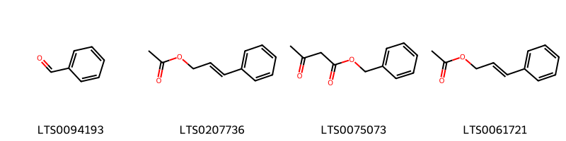{ width=100% }
    <figcaption>Hình ảnh cấu trúc hóa học của 4 hoạt chất thuộc nhóm Benzene and substituted derivatives gồm ['benzaldehyde (LTS0094193)', 'cinnamyl acetate (LTS0207736)', 'benzyl acetoacetate (LTS0075073)', '3-phenyl-2-propenyl acetate (LTS0061721)'].</figcaption>
</figure>
#### Nhóm Benzothiazoles
<figure markdown="span">
    { width=100% }
    <figcaption>Hình ảnh cấu trúc hóa học của 1 hoạt chất thuộc nhóm Benzothiazoles gồm ['benzothiazole (LTS0073984)'].</figcaption>
</figure>
#### Nhóm Carboxylic acids and derivatives
<figure markdown="span">
    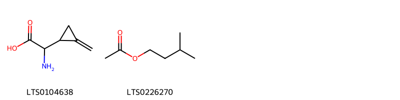{ width=100% }
    <figcaption>Hình ảnh cấu trúc hóa học của 2 hoạt chất thuộc nhóm Carboxylic acids and derivatives gồm ['amino(2-methylidenecyclopropyl)acetic acid (LTS0104638)', 'banana oil (LTS0226270)'].</figcaption>
</figure>
#### Nhóm Cinnamaldehydes
<figure markdown="span">
    { width=100% }
    <figcaption>Hình ảnh cấu trúc hóa học của 2 hoạt chất thuộc nhóm Cinnamaldehydes gồm ['3-phenyl-2-propenal (LTS0204346)', 'cinnamal (LTS0271313)'].</figcaption>
</figure>
#### Nhóm Dibenzylbutane lignans
<figure markdown="span">
    { width=100% }
    <figcaption>Hình ảnh cấu trúc hóa học của 2 hoạt chất thuộc nhóm Dibenzylbutane lignans gồm ['(2s,3r)-2,3-bis[(4-hydroxy-3-methoxyphenyl)(¹³c)methyl](1-¹³c)butane-1,4-diol (LTS0268699)', 'secoisolariciresinol (LTS0086727)'].</figcaption>
</figure>
#### Nhóm Dihydrofurans
<figure markdown="span">
    { width=100% }
    <figcaption>Hình ảnh cấu trúc hóa học của 1 hoạt chất thuộc nhóm Dihydrofurans gồm ['vitamin c (LTS0022555)'].</figcaption>
</figure>
#### Nhóm Fatty Acyls
<figure markdown="span">
    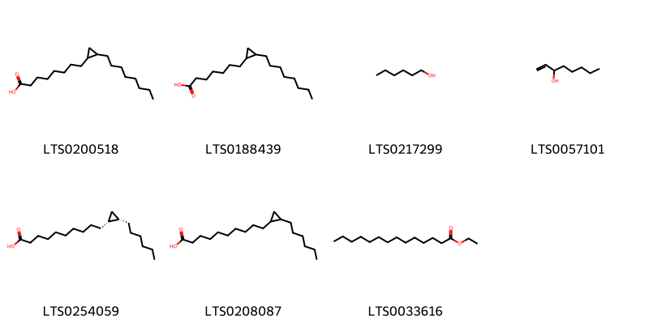{ width=100% }
    <figcaption>Hình ảnh cấu trúc hóa học của 7 hoạt chất thuộc nhóm Fatty Acyls gồm ['dihydrosterculic acid (LTS0200518)', '7-(2-octylcyclopropyl)heptanoic acid (LTS0188439)', 'hexanol (LTS0217299)', '1-octen-3-ol (LTS0057101)', 'lactobacillic acid (LTS0254059)', '11,12-methylenoctadecansaeure (LTS0208087)', 'ethylmyristate (LTS0033616)'].</figcaption>
</figure>
#### Nhóm Flavonoids
<figure markdown="span">
    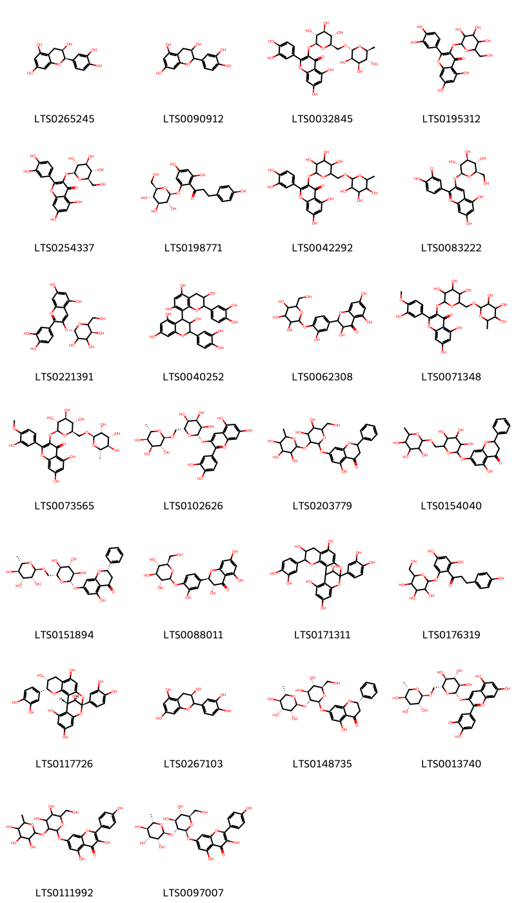{ width=100% }
    <figcaption>Hình ảnh cấu trúc hóa học của 26 hoạt chất thuộc nhóm Flavonoids gồm ['ent-epicatechin (LTS0265245)', 'catechol (LTS0090912)', '3-rutinosyl quercetin (LTS0032845)', '2-(3,4-dihydroxyphenyl)-5,7-dihydroxy-3-{[3,4,5-trihydroxy-6-(hydroxymethyl)oxan-2-yl]oxy}chromen-4-one (LTS0195312)', 'isoquercetin (LTS0254337)', 'phlorizin (LTS0198771)', 'rutin (LTS0042292)', '5,7-dihydroxy-2-(4-hydroxy-3-oxidophenyl)-3-{[(2s,3r,4s,5s,6r)-3,4,5-trihydroxy-6-(hydroxymethyl)oxan-2-yl]oxy}-1λ⁴-chromen-1-ylium (LTS0083222)', 'chrysanthemin (LTS0221391)', '2-(3,4-dihydroxyphenyl)-4-[2-(3,4-dihydroxyphenyl)-3,5,7-trihydroxy-3,4-dihydro-2h-1-benzopyran-8-yl]-3,4-dihydro-2h-1-benzopyran-3,5,7-triol (LTS0040252)', '3,5,7-trihydroxy-2-(3-hydroxy-4-{[3,4,5-trihydroxy-6-(hydroxymethyl)oxan-2-yl]oxy}phenyl)-2,3-dihydro-1-benzopyran-4-one (LTS0062308)', '5,7-dihydroxy-2-(3-hydroxy-4-methoxyphenyl)-3-[(3,4,5-trihydroxy-6-{[(3,4,5-trihydroxy-6-methyloxan-2-yl)oxy]methyl}oxan-2-yl)oxy]chromen-4-one (LTS0071348)', '5,7-dihydroxy-2-(3-hydroxy-4-methoxyphenyl)-3-{[(2s,3r,4s,5s,6r)-3,4,5-trihydroxy-6-({[(2r,3r,4r,5r,6s)-3,4,5-trihydroxy-6-methyloxan-2-yl]oxy}methyl)oxan-2-yl]oxy}chromen-4-one (LTS0073565)', '2-(3,4-dihydroxyphenyl)-5,7-dihydroxy-3-{[(2s,3r,4r,5s,6r)-3,4,5-trihydroxy-6-({[(2r,3r,4s,5r,6s)-3,4,5-trihydroxy-6-methyloxan-2-yl]oxy}methyl)oxan-2-yl]oxy}-1λ⁴-chromen-1-ylium (LTS0102626)', '7-{[4,5-dihydroxy-6-(hydroxymethyl)-3-[(3,4,5-trihydroxy-6-methyloxan-2-yl)oxy]oxan-2-yl]oxy}-5-hydroxy-2-phenyl-2,3-dihydro-1-benzopyran-4-one (LTS0203779)', '5-hydroxy-2-phenyl-7-[(3,4,5-trihydroxy-6-{[(3,4,5-trihydroxy-6-methyloxan-2-yl)oxy]methyl}oxan-2-yl)oxy]-2,3-dihydro-1-benzopyran-4-one (LTS0154040)', '(2s)-5-hydroxy-2-phenyl-7-{[(2s,3r,4s,5s,6r)-3,4,5-trihydroxy-6-({[(2r,3r,4r,5r,6s)-3,4,5-trihydroxy-6-methyloxan-2-yl]oxy}methyl)oxan-2-yl]oxy}-2,3-dihydro-1-benzopyran-4-one (LTS0151894)', "taxifolin 4'-glucoside (LTS0088011)", 'procyanidin a1 (LTS0171311)', 'phloridzin (LTS0176319)', 'proanthocyanidin a2 (LTS0117726)', '(3r)-2-(3,4-dihydroxyphenyl)-3,4-dihydro-2h-1-benzopyran-3,5,7-triol (LTS0267103)', '(2s)-7-{[(2s,3r,4s,5s,6r)-4,5-dihydroxy-6-(hydroxymethyl)-3-{[(2s,3r,4r,5r,6s)-3,4,5-trihydroxy-6-methyloxan-2-yl]oxy}oxan-2-yl]oxy}-5-hydroxy-2-phenyl-2,3-dihydro-1-benzopyran-4-one (LTS0148735)', '5,7-dihydroxy-2-(4-hydroxy-3-oxidophenyl)-3-{[(2s,3r,4s,5s,6r)-3,4,5-trihydroxy-6-({[(2r,3r,4r,5r,6s)-3,4,5-trihydroxy-6-methyloxan-2-yl]oxy}methyl)oxan-2-yl]oxy}-1λ⁴-chromen-1-ylium (LTS0013740)', '7-{[4,5-dihydroxy-6-(hydroxymethyl)-3-[(3,4,5-trihydroxy-6-methyloxan-2-yl)oxy]oxan-2-yl]oxy}-3,5-dihydroxy-2-(4-hydroxyphenyl)chromen-4-one (LTS0111992)', 'kaempferol 3-o-rutinoside (LTS0097007)'].</figcaption>
</figure>
#### Nhóm Furanoid lignans
<figure markdown="span">
    { width=100% }
    <figcaption>Hình ảnh cấu trúc hóa học của 1 hoạt chất thuộc nhóm Furanoid lignans gồm ['matairesinol (LTS0193475)'].</figcaption>
</figure>
#### Nhóm Organooxygen compounds
<figure markdown="span">
    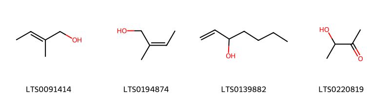{ width=100% }
    <figcaption>Hình ảnh cấu trúc hóa học của 4 hoạt chất thuộc nhóm Organooxygen compounds gồm ['(2e)-2-methylbut-2-en-1-ol (LTS0091414)', '2-methyl-2-butenol (LTS0194874)', '1-hepten-3-ol (LTS0139882)', 'acetoin (LTS0220819)'].</figcaption>
</figure>
#### Nhóm Prenol lipids
<figure markdown="span">
    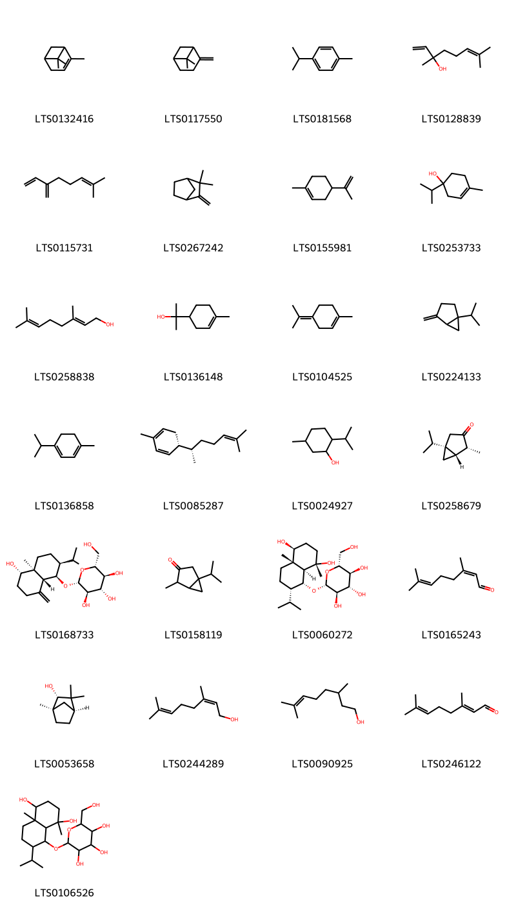{ width=100% }
    <figcaption>Hình ảnh cấu trúc hóa học của 25 hoạt chất thuộc nhóm Prenol lipids gồm ['α pinene (LTS0132416)', 'β-pinene (LTS0117550)', 'cymene (LTS0181568)', 'linalool, (+-)- (LTS0128839)', 'α-myrcene (LTS0115731)', 'camphene (LTS0267242)', 'limonene,  (LTS0155981)', '4-terpineol (LTS0253733)', 'geraniol (LTS0258838)', 'terpineol (LTS0136148)', 'terpinolene (LTS0104525)', 'sabinene (LTS0224133)', 'terpinene (LTS0136858)', 'zingiberene (LTS0085287)', 'menthol natural (LTS0024927)', '(1r,4r,5s)-thujan-3-one (LTS0258679)', '(2r,3r,4s,5s,6r)-2-{[(1r,2s,4as,5s,8ar)-5-hydroxy-2-isopropyl-4a-methyl-8-methylidene-octahydronaphthalen-1-yl]oxy}-6-(hydroxymethyl)oxane-3,4,5-triol (LTS0168733)', '3-isothujone (LTS0158119)', '(2r,3r,4s,5s,6r)-2-{[(1r,2s,4as,5s,8s,8ar)-5,8-dihydroxy-2-isopropyl-4a,8-dimethyl-octahydronaphthalen-1-yl]oxy}-6-(hydroxymethyl)oxane-3,4,5-triol (LTS0060272)', 'neral (LTS0165243)', '(1r,2s,4s)-1,3,3-trimethylbicyclo[2.2.1]heptan-2-ol (LTS0053658)', 'nerol (LTS0244289)', 'citronellol, (+-)- (LTS0090925)', 'α-citral (LTS0246122)', '2-[(5,8-dihydroxy-2-isopropyl-4a,8-dimethyl-octahydronaphthalen-1-yl)oxy]-6-(hydroxymethyl)oxane-3,4,5-triol (LTS0106526)'].</figcaption>
</figure>
#### Nhóm Saturated hydrocarbons
<figure markdown="span">
    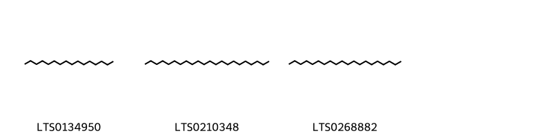{ width=100% }
    <figcaption>Hình ảnh cấu trúc hóa học của 3 hoạt chất thuộc nhóm Saturated hydrocarbons gồm ['cetane (LTS0134950)', 'docosane (LTS0210348)', 'eicosane (LTS0268882)'].</figcaption>
</figure>
#### Nhóm Unsaturated hydrocarbons
<figure markdown="span">
    { width=100% }
    <figcaption>Hình ảnh cấu trúc hóa học của 1 hoạt chất thuộc nhóm Unsaturated hydrocarbons gồm ['α terpinene (LTS0232891)'].</figcaption>
</figure>

---

### Dược dân tộc học

Danh sách các quốc gia có sử dụng *Litchi chinensis* trong điều trị các bệnh. 

| Country            | Disease                                   | Bệnh                                       |
|:-------------------|:------------------------------------------|:-------------------------------------------|
| China              | Antitussive, Astringent, Analgesic, Tonic | Thuốc chống ho, làm se, giảm đau, thuốc bổ |
| Dominican Republic | Tonic                                     | (thuộc) trương lực                         |
| Elsewhere          | Tonic                                     | (thuộc) trương lực                         |
| Haiti              | Astringent                                | Lam se da                                  |

---

# Chi Koelreuteria

??? note "Danh sách các dược liệu thuộc chi"
    
	 - *Koelreuteria paniculata*

---
## Koelreuteria paniculata
### Thông tin về thực vật

!!! info "Phân loại thực vật của *Koelreuteria paniculata* từ GIBF:"
    - **Kingdom:** Plantae
    - **Phylum:** Tracheophyta
    - **Order:** Sapindales
    - **Family:** Sapindaceae
    - **Genus:** Koelreuteria
    - **Species:** *Koelreuteria paniculata*

 

| Label (VI)   | Label (EN)   | Scientific Name         | Descriptions (VI)   | Descriptions (EN)   | Also Known As (VI)   | Also Known As (EN)                                                                                                  |
|:-------------|:-------------|:------------------------|:--------------------|:--------------------|:---------------------|:--------------------------------------------------------------------------------------------------------------------|
| N/A          | N/A          | Koelreuteria paniculata | loài thực vật       | species of plant    | ['']                 | ['varnish tree', 'goldenrain tree', 'China tree', 'pride of India', 'golden-rain tree', 'panicled goldenrain tree'] |

#### Phân bố trên thế giới

**Từ CSDL GIBF** Australia, Moldova, Republic of, Belgium, Georgia, Canada, Ukraine, Netherlands, Korea, Republic of, Spain, Hungary, Russian Federation, United States of America, Sweden, Bosnia and Herzegovina, Czechia, Germany, Romania, Brazil, Switzerland, Armenia, Mexico, France, Austria, United Kingdom of Great Britain and Northern Ireland, China, Serbia, New Zealand

#### Phân bố tại Việt Nam

**Từ CSDL GIBF**: Không có ghi nhận ở Việt Nam

---
### Thành phần hóa học
        
- Theo cơ sở dữ liệu lotus: Từ loài *Koelreuteria paniculata* đã phân lập và xác định được 11 hoạt chất thuộc về các nhóm Flavonoids, Tannins, Steroids and steroid derivatives, Benzene and substituted derivatives. 

|    | chemicalTaxonomyClassyfireClass     |   smiles_count |
|---:|:------------------------------------|---------------:|
|  0 | Benzene and substituted derivatives |              2 |
|  1 | Flavonoids                          |              6 |
|  2 | Steroids and steroid derivatives    |              2 |
|  3 | Tannins                             |              1 |

#### Nhóm Benzene and substituted derivatives
<figure markdown="span">
    { width=100% }
    <figcaption>Hình ảnh cấu trúc hóa học của 2 hoạt chất thuộc nhóm Benzene and substituted derivatives gồm ['galop (LTS0222857)', 'ethyl gallate (LTS0270645)'].</figcaption>
</figure>
#### Nhóm Flavonoids
<figure markdown="span">
    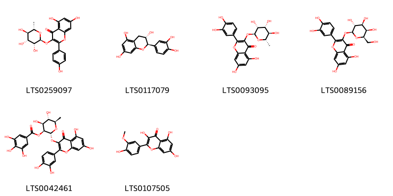{ width=100% }
    <figcaption>Hình ảnh cấu trúc hóa học của 6 hoạt chất thuộc nhóm Flavonoids gồm ['afzelin (LTS0259097)', '(+)-catechol (LTS0117079)', 'quercitrin (LTS0093095)', 'hyperoside (LTS0089156)', '(2r,3s,4s,5s,6r)-2-{[2-(3,4-dihydroxyphenyl)-5,7-dihydroxy-4-oxochromen-3-yl]oxy}-4,5-dihydroxy-6-methyloxan-3-yl 3,4,5-trihydroxybenzoate (LTS0042461)', 'isorhamnetin (LTS0107505)'].</figcaption>
</figure>
#### Nhóm Steroids and steroid derivatives
<figure markdown="span">
    { width=100% }
    <figcaption>Hình ảnh cấu trúc hóa học của 2 hoạt chất thuộc nhóm Steroids and steroid derivatives gồm ['stigmast-5-en-3-ol, (3β)- (LTS0204616)', 'sitogluside (LTS0201798)'].</figcaption>
</figure>
#### Nhóm Tannins
<figure markdown="span">
    { width=100% }
    <figcaption>Hình ảnh cấu trúc hóa học của 1 hoạt chất thuộc nhóm Tannins gồm ['ellagic acid (LTS0037297)'].</figcaption>
</figure>

---

### Dược dân tộc học

Danh sách các quốc gia có sử dụng *Koelreuteria paniculata* trong điều trị các bệnh. 

| Country   | Disease   | Bệnh      |
|:----------|:----------|:----------|
| China     | Collyrium | Collyrium |

---

# Chi Cardioermum

??? note "Danh sách các dược liệu thuộc chi"
    
	 - *Cardioermum grandiflorum*
	 - *Cardioermum halicacabum*
	 - *Cardioermum microcarpum*

---
## Cardioermum grandiflorum
### Thông tin về thực vật

!!! info "Phân loại thực vật của *N/A* từ GIBF:"
    - **Kingdom:** N/A
    - **Phylum:** N/A
    - **Order:** N/A
    - **Family:** N/A
    - **Genus:** N/A
    - **Species:** *N/A*

 

| Label (VI)   | Label (EN)   | Scientific Name         | Descriptions (VI)   | Descriptions (EN)   | Also Known As (VI)   | Also Known As (EN)                                                                                                  |
|:-------------|:-------------|:------------------------|:--------------------|:--------------------|:---------------------|:--------------------------------------------------------------------------------------------------------------------|
| N/A          | N/A          | Koelreuteria paniculata | loài thực vật       | species of plant    | ['']                 | ['varnish tree', 'goldenrain tree', 'China tree', 'pride of India', 'golden-rain tree', 'panicled goldenrain tree'] |

#### Phân bố trên thế giới

**Từ CSDL GIBF** Không có kết quả phù hợp

#### Phân bố tại Việt Nam

**Từ CSDL GIBF**: Không có ghi nhận ở Việt Nam

---
### Thành phần hóa học
        
- Theo cơ sở dữ liệu lotus: Từ loài *N/A* đã phân lập và xác định được Chưa có hoạt chất nào được phân lập. hoạt chất thuộc về các nhóm Không có hoạt chất nào được phân lập. 

Không có hình ảnh nào được tạo ra

---

### Dược dân tộc học

Danh sách các quốc gia có sử dụng *N/A* trong điều trị các bệnh. 

| Country     | Disease   | Bệnh      |
|:------------|:----------|:----------|
| Ghana       | Collyrium | Collyrium |
| Upper Volta | Purgative | Thuốc xổ  |

---

---
## Cardioermum halicacabum
### Thông tin về thực vật

!!! info "Phân loại thực vật của *N/A* từ GIBF:"
    - **Kingdom:** N/A
    - **Phylum:** N/A
    - **Order:** N/A
    - **Family:** N/A
    - **Genus:** N/A
    - **Species:** *N/A*

 

| Label (VI)   | Label (EN)   | Scientific Name         | Descriptions (VI)   | Descriptions (EN)   | Also Known As (VI)   | Also Known As (EN)                                                                                                  |
|:-------------|:-------------|:------------------------|:--------------------|:--------------------|:---------------------|:--------------------------------------------------------------------------------------------------------------------|
| N/A          | N/A          | Koelreuteria paniculata | loài thực vật       | species of plant    | ['']                 | ['varnish tree', 'goldenrain tree', 'China tree', 'pride of India', 'golden-rain tree', 'panicled goldenrain tree'] |

#### Phân bố trên thế giới

**Từ CSDL GIBF** Không có kết quả phù hợp

#### Phân bố tại Việt Nam

**Từ CSDL GIBF**: Không có ghi nhận ở Việt Nam

---
### Thành phần hóa học
        
- Theo cơ sở dữ liệu lotus: Từ loài *N/A* đã phân lập và xác định được Chưa có hoạt chất nào được phân lập. hoạt chất thuộc về các nhóm Không có hoạt chất nào được phân lập. 

Không có hình ảnh nào được tạo ra

---

### Dược dân tộc học

Danh sách các quốc gia có sử dụng *N/A* trong điều trị các bệnh. 

| Country   | Disease                                                                  | Bệnh                                                                                                        |
|:----------|:-------------------------------------------------------------------------|:------------------------------------------------------------------------------------------------------------|
| Elsewhere | Diaphoretic, Diaphoretic, Diuretic, Emetic, Laxative, Emmenagogue, Tonic | Thuốc lợi tiểu, Thuốc lợi tiểu, Thuốc lợi tiểu, Thuốc gây nôn, Thuốc nhuận tràng, Chất kích thích, Thuốc bổ |
| Haiti     | Diuretic, Refrigerant                                                    | Thuốc lợi tiểu, Chất làm lạnh                                                                               |
| Mexico    | Diuretic, Sudorific                                                      | Thuốc lợi tiểu, gây ngạt mồ hôi                                                                             |
| Sudan     | Laxative, Tonic, Emetic, Rubefacient, Stomachic                          | Thuốc nhuận tràng, Tonic, Emetic, Rubefacient, Stomachic                                                    |

---

---
## Cardioermum microcarpum
### Thông tin về thực vật

!!! info "Phân loại thực vật của *N/A* từ GIBF:"
    - **Kingdom:** N/A
    - **Phylum:** N/A
    - **Order:** N/A
    - **Family:** N/A
    - **Genus:** N/A
    - **Species:** *N/A*

 

| Label (VI)   | Label (EN)   | Scientific Name         | Descriptions (VI)   | Descriptions (EN)   | Also Known As (VI)   | Also Known As (EN)                                                                                                  |
|:-------------|:-------------|:------------------------|:--------------------|:--------------------|:---------------------|:--------------------------------------------------------------------------------------------------------------------|
| N/A          | N/A          | Koelreuteria paniculata | loài thực vật       | species of plant    | ['']                 | ['varnish tree', 'goldenrain tree', 'China tree', 'pride of India', 'golden-rain tree', 'panicled goldenrain tree'] |

#### Phân bố trên thế giới

**Từ CSDL GIBF** Không có kết quả phù hợp

#### Phân bố tại Việt Nam

**Từ CSDL GIBF**: Không có ghi nhận ở Việt Nam

---
### Thành phần hóa học
        
- Theo cơ sở dữ liệu lotus: Từ loài *N/A* đã phân lập và xác định được Chưa có hoạt chất nào được phân lập. hoạt chất thuộc về các nhóm Không có hoạt chất nào được phân lập. 

Không có hình ảnh nào được tạo ra

---

### Dược dân tộc học

Danh sách các quốc gia có sử dụng *N/A* trong điều trị các bệnh. 

| Country   |   Disease | Bệnh   |
|:----------|----------:|:-------|
| Elsewhere |       nan | Ở đây  |
| Trinidad  |       nan | Ở đây  |

---

# Chi Pappea

??? note "Danh sách các dược liệu thuộc chi"
    
	 - *Pappea capensis*

---
## Pappea capensis
### Thông tin về thực vật

!!! info "Phân loại thực vật của *Pappea capensis* từ GIBF:"
    - **Kingdom:** Plantae
    - **Phylum:** Tracheophyta
    - **Order:** Sapindales
    - **Family:** Sapindaceae
    - **Genus:** Pappea
    - **Species:** *Pappea capensis*

 

| Label (VI)   | Label (EN)   | Scientific Name   | Descriptions (VI)   | Descriptions (EN)    | Also Known As (VI)   | Also Known As (EN)   |
|:-------------|:-------------|:------------------|:--------------------|:---------------------|:---------------------|:---------------------|
| N/A          | N/A          | Pappea capensis   |                     | African tree species | ['']                 | ['Jacket-plum']      |

#### Phân bố trên thế giới

**Từ CSDL GIBF** South Africa, Namibia, Botswana, Zimbabwe, Eswatini

#### Phân bố tại Việt Nam

**Từ CSDL GIBF**: Không có ghi nhận ở Việt Nam

---
### Thành phần hóa học
        
- Theo cơ sở dữ liệu lotus: Từ loài *Pappea capensis* đã phân lập và xác định được Chưa có hoạt chất nào được phân lập. hoạt chất thuộc về các nhóm Không có hoạt chất nào được phân lập. 

Không có hình ảnh nào được tạo ra

---

### Dược dân tộc học

Danh sách các quốc gia có sử dụng *Pappea capensis* trong điều trị các bệnh. 

| Country      | Disease   | Bệnh     |
|:-------------|:----------|:---------|
| South Africa | Soap      | Xà phòng |

---

# Chi Euphoria

??? note "Danh sách các dược liệu thuộc chi"
    
	 - *Euphoria longan*
	 - *Euphoria longana*

---
## Euphoria longan
### Thông tin về thực vật

!!! info "Phân loại thực vật của *Dimocarpus longan* từ GIBF:"
    - **Kingdom:** Plantae
    - **Phylum:** Tracheophyta
    - **Order:** Sapindales
    - **Family:** Sapindaceae
    - **Genus:** Dimocarpus
    - **Species:** *Dimocarpus longan*

 

| Label (VI)   | Label (EN)   | Scientific Name   | Descriptions (VI)   | Descriptions (EN)   | Also Known As (VI)   | Also Known As (EN)   |
|:-------------|:-------------|:------------------|:--------------------|:--------------------|:---------------------|:---------------------|
| N/A          | N/A          | Euphoria longan   | loài thực vật       | species of plant    | ['']                 | ['']                 |

#### Phân bố trên thế giới

**Từ CSDL GIBF** nan, South Africa, Japan, Mauritius, Chinese Taipei, Portugal, India, United States of America, China

#### Phân bố tại Việt Nam

**Từ CSDL GIBF**: Không có ghi nhận ở Việt Nam

---
### Thành phần hóa học
        
- Theo cơ sở dữ liệu lotus: Từ loài *Dimocarpus longan* đã phân lập và xác định được 35 hoạt chất thuộc về các nhóm Fatty Acyls, Purine nucleotides, Prenol lipids, Pyrimidine nucleosides, Steroids and steroid derivatives, Sphingolipids, Purine nucleosides, Benzene and substituted derivatives, Organooxygen compounds, Tannins, Carboxylic acids and derivatives, Imidazopyrimidines. 

|    | chemicalTaxonomyClassyfireClass     |   smiles_count |
|---:|:------------------------------------|---------------:|
|  0 | Benzene and substituted derivatives |              2 |
|  1 | Carboxylic acids and derivatives    |              1 |
|  2 | Fatty Acyls                         |              2 |
|  3 | Imidazopyrimidines                  |              1 |
|  4 | Organooxygen compounds              |              1 |
|  5 | Prenol lipids                       |              4 |
|  6 | Purine nucleosides                  |              4 |
|  7 | Purine nucleotides                  |              4 |
|  8 | Pyrimidine nucleosides              |              4 |
|  9 | Sphingolipids                       |              2 |
| 10 | Steroids and steroid derivatives    |              4 |
| 11 | Tannins                             |              1 |

#### Nhóm Benzene and substituted derivatives
<figure markdown="span">
    { width=100% }
    <figcaption>Hình ảnh cấu trúc hóa học của 2 hoạt chất thuộc nhóm Benzene and substituted derivatives gồm ['galop (LTS0222857)', '3,4-dihydroxybenzoic acid (LTS0018765)'].</figcaption>
</figure>
#### Nhóm Carboxylic acids and derivatives
<figure markdown="span">
    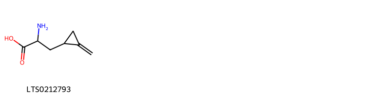{ width=100% }
    <figcaption>Hình ảnh cấu trúc hóa học của 1 hoạt chất thuộc nhóm Carboxylic acids and derivatives gồm ['hypoglycine a (LTS0212793)'].</figcaption>
</figure>
#### Nhóm Fatty Acyls
<figure markdown="span">
    { width=100% }
    <figcaption>Hình ảnh cấu trúc hóa học của 2 hoạt chất thuộc nhóm Fatty Acyls gồm ['dihydrosterculic acid (LTS0200518)', '16-hentriacontanol (LTS0203327)'].</figcaption>
</figure>
#### Nhóm Imidazopyrimidines
<figure markdown="span">
    { width=100% }
    <figcaption>Hình ảnh cấu trúc hóa học của 1 hoạt chất thuộc nhóm Imidazopyrimidines gồm ['leucon (LTS0114351)'].</figcaption>
</figure>
#### Nhóm Organooxygen compounds
<figure markdown="span">
    { width=100% }
    <figcaption>Hình ảnh cấu trúc hóa học của 1 hoạt chất thuộc nhóm Organooxygen compounds gồm ['sucrose (LTS0272557)'].</figcaption>
</figure>
#### Nhóm Prenol lipids
<figure markdown="span">
    { width=100% }
    <figcaption>Hình ảnh cấu trúc hóa học của 4 hoạt chất thuộc nhóm Prenol lipids gồm ['epi-friedelanol (LTS0114491)', '4,4a,6b,8a,11,11,12b,14a-octamethyl-hexadecahydropicen-3-ol (LTS0182128)', '(-)-friedelin (LTS0041645)', 'friedelin (LTS0213494)'].</figcaption>
</figure>
#### Nhóm Purine nucleosides
<figure markdown="span">
    { width=100% }
    <figcaption>Hình ảnh cấu trúc hóa học của 4 hoạt chất thuộc nhóm Purine nucleosides gồm ['inosine (LTS0117891)', 'adenosine (LTS0052576)', '(-)-inosine (LTS0273582)', 'adenosine (LTS0014061)'].</figcaption>
</figure>
#### Nhóm Purine nucleotides
<figure markdown="span">
    { width=100% }
    <figcaption>Hình ảnh cấu trúc hóa học của 4 hoạt chất thuộc nhóm Purine nucleotides gồm ['adenosine monophosphate (LTS0080280)', 'cyclic amp (LTS0171934)', 'cyclic adenosine monophosphate (LTS0260959)', 'adenosine monophosphate (LTS0007212)'].</figcaption>
</figure>
#### Nhóm Pyrimidine nucleosides
<figure markdown="span">
    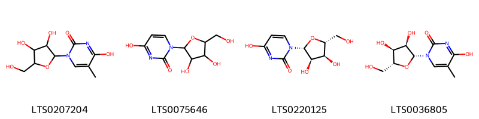{ width=100% }
    <figcaption>Hình ảnh cấu trúc hóa học của 4 hoạt chất thuộc nhóm Pyrimidine nucleosides gồm ['1-[3,4-dihydroxy-5-(hydroxymethyl)oxolan-2-yl]-4-hydroxy-5-methylpyrimidin-2-one (LTS0207204)', '1-[3,4-dihydroxy-5-(hydroxymethyl)oxolan-2-yl]-4-hydroxypyrimidin-2-one (LTS0075646)', 'uridine (LTS0220125)', '5-methyluridine (LTS0036805)'].</figcaption>
</figure>
#### Nhóm Sphingolipids
<figure markdown="span">
    { width=100% }
    <figcaption>Hình ảnh cấu trúc hóa học của 2 hoạt chất thuộc nhóm Sphingolipids gồm ['2-hydroxy-n-[(4z,8z)-3-hydroxy-1-{[3,4,5-trihydroxy-6-(hydroxymethyl)oxan-2-yl]oxy}octadeca-4,8-dien-2-yl]hexadecanimidic acid (LTS0176187)', '2-hydroxy-n-(3-hydroxy-1-{[3,4,5-trihydroxy-6-(hydroxymethyl)oxan-2-yl]oxy}octadeca-4,8-dien-2-yl)hexadecanimidic acid (LTS0121977)'].</figcaption>
</figure>
#### Nhóm Steroids and steroid derivatives
<figure markdown="span">
    { width=100% }
    <figcaption>Hình ảnh cấu trúc hóa học của 4 hoạt chất thuộc nhóm Steroids and steroid derivatives gồm ['stigmast-5-en-3-ol, (3β)- (LTS0204616)', 'stigmasterol (LTS0024262)', '(1r,3ar,3br,7s,9ar,9br,11ar)-1-[(2r,5r)-5-ethyl-6-methylheptan-2-yl]-9a,11a-dimethyl-1h,2h,3h,3ah,3bh,4h,6h,7h,8h,9h,9bh,10h,11h-cyclopenta[a]phenanthren-7-ol (LTS0129695)', '(1r,3ar,3br,7s,9ar,9br,11ar)-1-[(2s,3e,5s)-5-ethyl-6-methylhept-3-en-2-yl]-9a,11a-dimethyl-1h,2h,3h,3ah,3bh,4h,6h,7h,8h,9h,9bh,10h,11h-cyclopenta[a]phenanthren-7-ol (LTS0244733)'].</figcaption>
</figure>
#### Nhóm Tannins
<figure markdown="span">
    { width=100% }
    <figcaption>Hình ảnh cấu trúc hóa học của 1 hoạt chất thuộc nhóm Tannins gồm ['ellagic acid (LTS0037297)'].</figcaption>
</figure>

---

### Dược dân tộc học

Danh sách các quốc gia có sử dụng *Dimocarpus longan* trong điều trị các bệnh. 

| Country   | Disease                           | Bệnh                                   |
|:----------|:----------------------------------|:---------------------------------------|
| China     | Tonic                             | (thuộc) trương lực                     |
| India     | Refrigerant, Stomachic, Vermifuge | Môi chất lạnh, Dạ dày, Máy xay sinh tố |

---

---
## Euphoria longana
### Thông tin về thực vật

!!! info "Phân loại thực vật của *N/A* từ GIBF:"
    - **Kingdom:** Plantae
    - **Phylum:** Tracheophyta
    - **Order:** Sapindales
    - **Family:** Sapindaceae
    - **Genus:** N/A
    - **Species:** *N/A*

 

| Label (VI)   | Label (EN)   | Scientific Name   | Descriptions (VI)   | Descriptions (EN)   | Also Known As (VI)   | Also Known As (EN)   |
|:-------------|:-------------|:------------------|:--------------------|:--------------------|:---------------------|:---------------------|
| N/A          | N/A          | Euphoria longana  |                     |                     | ['']                 | ['']                 |

#### Phân bố trên thế giới

**Từ CSDL GIBF** Virgin Islands (U.S.), Italy, Australia, Argentina, Canada, Ukraine, Puerto Rico, Korea, Republic of, Kyrgyzstan, Chinese Taipei, Portugal, Russian Federation, United States of America, Sweden, Finland, Uruguay, Chile, South Africa, Germany, Brazil, Mexico, United Kingdom of Great Britain and Northern Ireland, China, Ireland, India, Indonesia, New Zealand

#### Phân bố tại Việt Nam

**Từ CSDL GIBF**: Không có ghi nhận ở Việt Nam

---
### Thành phần hóa học
        
- Theo cơ sở dữ liệu lotus: Từ loài *N/A* đã phân lập và xác định được 35 hoạt chất thuộc về các nhóm Fatty Acyls, Purine nucleotides, Prenol lipids, Pyrimidine nucleosides, Steroids and steroid derivatives, Sphingolipids, Purine nucleosides, Benzene and substituted derivatives, Organooxygen compounds, Tannins, Carboxylic acids and derivatives, Imidazopyrimidines. 

|    | chemicalTaxonomyClassyfireClass     |   smiles_count |
|---:|:------------------------------------|---------------:|
|  0 | Benzene and substituted derivatives |              2 |
|  1 | Carboxylic acids and derivatives    |              1 |
|  2 | Fatty Acyls                         |              2 |
|  3 | Imidazopyrimidines                  |              1 |
|  4 | Organooxygen compounds              |              1 |
|  5 | Prenol lipids                       |              4 |
|  6 | Purine nucleosides                  |              4 |
|  7 | Purine nucleotides                  |              4 |
|  8 | Pyrimidine nucleosides              |              4 |
|  9 | Sphingolipids                       |              2 |
| 10 | Steroids and steroid derivatives    |              4 |
| 11 | Tannins                             |              1 |

#### Nhóm Benzene and substituted derivatives
<figure markdown="span">
    { width=100% }
    <figcaption>Hình ảnh cấu trúc hóa học của 2 hoạt chất thuộc nhóm Benzene and substituted derivatives gồm ['galop (LTS0222857)', '3,4-dihydroxybenzoic acid (LTS0018765)'].</figcaption>
</figure>
#### Nhóm Carboxylic acids and derivatives
<figure markdown="span">
    { width=100% }
    <figcaption>Hình ảnh cấu trúc hóa học của 1 hoạt chất thuộc nhóm Carboxylic acids and derivatives gồm ['hypoglycine a (LTS0212793)'].</figcaption>
</figure>
#### Nhóm Fatty Acyls
<figure markdown="span">
    { width=100% }
    <figcaption>Hình ảnh cấu trúc hóa học của 2 hoạt chất thuộc nhóm Fatty Acyls gồm ['dihydrosterculic acid (LTS0200518)', '16-hentriacontanol (LTS0203327)'].</figcaption>
</figure>
#### Nhóm Imidazopyrimidines
<figure markdown="span">
    { width=100% }
    <figcaption>Hình ảnh cấu trúc hóa học của 1 hoạt chất thuộc nhóm Imidazopyrimidines gồm ['leucon (LTS0114351)'].</figcaption>
</figure>
#### Nhóm Organooxygen compounds
<figure markdown="span">
    { width=100% }
    <figcaption>Hình ảnh cấu trúc hóa học của 1 hoạt chất thuộc nhóm Organooxygen compounds gồm ['sucrose (LTS0272557)'].</figcaption>
</figure>
#### Nhóm Prenol lipids
<figure markdown="span">
    { width=100% }
    <figcaption>Hình ảnh cấu trúc hóa học của 4 hoạt chất thuộc nhóm Prenol lipids gồm ['epi-friedelanol (LTS0114491)', '4,4a,6b,8a,11,11,12b,14a-octamethyl-hexadecahydropicen-3-ol (LTS0182128)', '(-)-friedelin (LTS0041645)', 'friedelin (LTS0213494)'].</figcaption>
</figure>
#### Nhóm Purine nucleosides
<figure markdown="span">
    { width=100% }
    <figcaption>Hình ảnh cấu trúc hóa học của 4 hoạt chất thuộc nhóm Purine nucleosides gồm ['inosine (LTS0117891)', 'adenosine (LTS0052576)', '(-)-inosine (LTS0273582)', 'adenosine (LTS0014061)'].</figcaption>
</figure>
#### Nhóm Purine nucleotides
<figure markdown="span">
    { width=100% }
    <figcaption>Hình ảnh cấu trúc hóa học của 4 hoạt chất thuộc nhóm Purine nucleotides gồm ['adenosine monophosphate (LTS0080280)', 'cyclic amp (LTS0171934)', 'cyclic adenosine monophosphate (LTS0260959)', 'adenosine monophosphate (LTS0007212)'].</figcaption>
</figure>
#### Nhóm Pyrimidine nucleosides
<figure markdown="span">
    { width=100% }
    <figcaption>Hình ảnh cấu trúc hóa học của 4 hoạt chất thuộc nhóm Pyrimidine nucleosides gồm ['1-[3,4-dihydroxy-5-(hydroxymethyl)oxolan-2-yl]-4-hydroxy-5-methylpyrimidin-2-one (LTS0207204)', '1-[3,4-dihydroxy-5-(hydroxymethyl)oxolan-2-yl]-4-hydroxypyrimidin-2-one (LTS0075646)', 'uridine (LTS0220125)', '5-methyluridine (LTS0036805)'].</figcaption>
</figure>
#### Nhóm Sphingolipids
<figure markdown="span">
    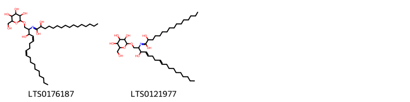{ width=100% }
    <figcaption>Hình ảnh cấu trúc hóa học của 2 hoạt chất thuộc nhóm Sphingolipids gồm ['2-hydroxy-n-[(4z,8z)-3-hydroxy-1-{[3,4,5-trihydroxy-6-(hydroxymethyl)oxan-2-yl]oxy}octadeca-4,8-dien-2-yl]hexadecanimidic acid (LTS0176187)', '2-hydroxy-n-(3-hydroxy-1-{[3,4,5-trihydroxy-6-(hydroxymethyl)oxan-2-yl]oxy}octadeca-4,8-dien-2-yl)hexadecanimidic acid (LTS0121977)'].</figcaption>
</figure>
#### Nhóm Steroids and steroid derivatives
<figure markdown="span">
    { width=100% }
    <figcaption>Hình ảnh cấu trúc hóa học của 4 hoạt chất thuộc nhóm Steroids and steroid derivatives gồm ['stigmast-5-en-3-ol, (3β)- (LTS0204616)', 'stigmasterol (LTS0024262)', '(1r,3ar,3br,7s,9ar,9br,11ar)-1-[(2r,5r)-5-ethyl-6-methylheptan-2-yl]-9a,11a-dimethyl-1h,2h,3h,3ah,3bh,4h,6h,7h,8h,9h,9bh,10h,11h-cyclopenta[a]phenanthren-7-ol (LTS0129695)', '(1r,3ar,3br,7s,9ar,9br,11ar)-1-[(2s,3e,5s)-5-ethyl-6-methylhept-3-en-2-yl]-9a,11a-dimethyl-1h,2h,3h,3ah,3bh,4h,6h,7h,8h,9h,9bh,10h,11h-cyclopenta[a]phenanthren-7-ol (LTS0244733)'].</figcaption>
</figure>
#### Nhóm Tannins
<figure markdown="span">
    { width=100% }
    <figcaption>Hình ảnh cấu trúc hóa học của 1 hoạt chất thuộc nhóm Tannins gồm ['ellagic acid (LTS0037297)'].</figcaption>
</figure>

---

### Dược dân tộc học

Danh sách các quốc gia có sử dụng *N/A* trong điều trị các bệnh. 

| Country   | Disease   | Bệnh               |
|:----------|:----------|:-------------------|
| Elsewhere | Tonic     | (thuộc) trương lực |

---

# Chi Dimocarpus

??? note "Danh sách các dược liệu thuộc chi"
    
	 - *Dimocarpus longan*

---
## Dimocarpus longan
### Thông tin về thực vật

!!! info "Phân loại thực vật của *Dimocarpus longan* từ GIBF:"
    - **Kingdom:** Plantae
    - **Phylum:** Tracheophyta
    - **Order:** Sapindales
    - **Family:** Sapindaceae
    - **Genus:** Dimocarpus
    - **Species:** *Dimocarpus longan*

 

| Label (VI)   | Label (EN)   | Scientific Name   | Descriptions (VI)   | Descriptions (EN)                                | Also Known As (VI)                             | Also Known As (EN)                                                     |
|:-------------|:-------------|:------------------|:--------------------|:-------------------------------------------------|:-----------------------------------------------|:-----------------------------------------------------------------------|
| N/A          | N/A          | Dimocarpus longan | loài cây nhiệt đới  | tropical tree species that produces edible fruit | ['long nhãn', 'Dimocarpus longan', 'cây nhãn'] | ['Dragonis eye', 'Dragonís eye', 'longan', 'Pailin Longan', 'Ta-ngen'] |

#### Phân bố trên thế giới

**Từ CSDL GIBF** nan, Réunion, Hong Kong, Thailand, Chinese Taipei, India, Indonesia, United States of America, Malaysia, China, French Guiana

#### Phân bố tại Việt Nam

**Từ CSDL GIBF**: Không có ghi nhận ở Việt Nam

---
### Thành phần hóa học
        
- Theo cơ sở dữ liệu lotus: Từ loài *Dimocarpus longan* đã phân lập và xác định được 46 hoạt chất thuộc về các nhóm Fatty Acyls, Purine nucleotides, Flavonoids, Prenol lipids, Pyrimidine nucleosides, Steroids and steroid derivatives, Sphingolipids, Purine nucleosides, Benzene and substituted derivatives, Organooxygen compounds, Tannins, Carboxylic acids and derivatives, Imidazopyrimidines. 

|    | chemicalTaxonomyClassyfireClass     |   smiles_count |
|---:|:------------------------------------|---------------:|
|  0 | Benzene and substituted derivatives |              4 |
|  1 | Carboxylic acids and derivatives    |              1 |
|  2 | Fatty Acyls                         |              2 |
|  3 | Flavonoids                          |              5 |
|  4 | Imidazopyrimidines                  |              1 |
|  5 | Organooxygen compounds              |              1 |
|  6 | Prenol lipids                       |              4 |
|  7 | Purine nucleosides                  |              4 |
|  8 | Purine nucleotides                  |              4 |
|  9 | Pyrimidine nucleosides              |              4 |
| 10 | Sphingolipids                       |              2 |
| 11 | Steroids and steroid derivatives    |              4 |
| 12 | Tannins                             |              1 |

#### Nhóm Benzene and substituted derivatives
<figure markdown="span">
    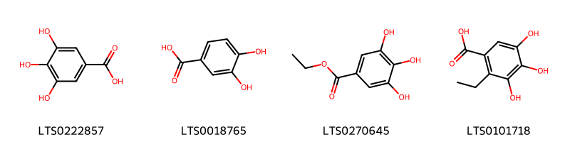{ width=100% }
    <figcaption>Hình ảnh cấu trúc hóa học của 4 hoạt chất thuộc nhóm Benzene and substituted derivatives gồm ['galop (LTS0222857)', '3,4-dihydroxybenzoic acid (LTS0018765)', 'ethyl gallate (LTS0270645)', '2-ethyl-3,4,5-trihydroxybenzoic acid (LTS0101718)'].</figcaption>
</figure>
#### Nhóm Carboxylic acids and derivatives
<figure markdown="span">
    { width=100% }
    <figcaption>Hình ảnh cấu trúc hóa học của 1 hoạt chất thuộc nhóm Carboxylic acids and derivatives gồm ['hypoglycine a (LTS0212793)'].</figcaption>
</figure>
#### Nhóm Fatty Acyls
<figure markdown="span">
    { width=100% }
    <figcaption>Hình ảnh cấu trúc hóa học của 2 hoạt chất thuộc nhóm Fatty Acyls gồm ['dihydrosterculic acid (LTS0200518)', '16-hentriacontanol (LTS0203327)'].</figcaption>
</figure>
#### Nhóm Flavonoids
<figure markdown="span">
    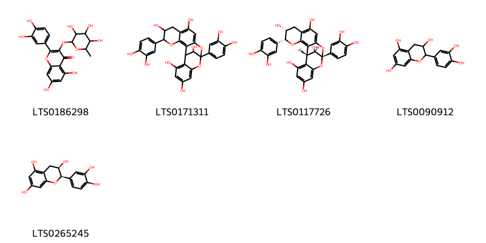{ width=100% }
    <figcaption>Hình ảnh cấu trúc hóa học của 5 hoạt chất thuộc nhóm Flavonoids gồm ['quercitrin (LTS0186298)', 'procyanidin a1 (LTS0171311)', 'proanthocyanidin a2 (LTS0117726)', 'catechol (LTS0090912)', 'ent-epicatechin (LTS0265245)'].</figcaption>
</figure>
#### Nhóm Imidazopyrimidines
<figure markdown="span">
    { width=100% }
    <figcaption>Hình ảnh cấu trúc hóa học của 1 hoạt chất thuộc nhóm Imidazopyrimidines gồm ['leucon (LTS0114351)'].</figcaption>
</figure>
#### Nhóm Organooxygen compounds
<figure markdown="span">
    { width=100% }
    <figcaption>Hình ảnh cấu trúc hóa học của 1 hoạt chất thuộc nhóm Organooxygen compounds gồm ['sucrose (LTS0272557)'].</figcaption>
</figure>
#### Nhóm Prenol lipids
<figure markdown="span">
    { width=100% }
    <figcaption>Hình ảnh cấu trúc hóa học của 4 hoạt chất thuộc nhóm Prenol lipids gồm ['epi-friedelanol (LTS0114491)', '4,4a,6b,8a,11,11,12b,14a-octamethyl-hexadecahydropicen-3-ol (LTS0182128)', '(-)-friedelin (LTS0041645)', 'friedelin (LTS0213494)'].</figcaption>
</figure>
#### Nhóm Purine nucleosides
<figure markdown="span">
    { width=100% }
    <figcaption>Hình ảnh cấu trúc hóa học của 4 hoạt chất thuộc nhóm Purine nucleosides gồm ['inosine (LTS0117891)', 'adenosine (LTS0052576)', '(-)-inosine (LTS0273582)', 'adenosine (LTS0014061)'].</figcaption>
</figure>
#### Nhóm Purine nucleotides
<figure markdown="span">
    { width=100% }
    <figcaption>Hình ảnh cấu trúc hóa học của 4 hoạt chất thuộc nhóm Purine nucleotides gồm ['adenosine monophosphate (LTS0080280)', 'cyclic amp (LTS0171934)', 'cyclic adenosine monophosphate (LTS0260959)', 'adenosine monophosphate (LTS0007212)'].</figcaption>
</figure>
#### Nhóm Pyrimidine nucleosides
<figure markdown="span">
    { width=100% }
    <figcaption>Hình ảnh cấu trúc hóa học của 4 hoạt chất thuộc nhóm Pyrimidine nucleosides gồm ['1-[3,4-dihydroxy-5-(hydroxymethyl)oxolan-2-yl]-4-hydroxy-5-methylpyrimidin-2-one (LTS0207204)', '1-[3,4-dihydroxy-5-(hydroxymethyl)oxolan-2-yl]-4-hydroxypyrimidin-2-one (LTS0075646)', 'uridine (LTS0220125)', '5-methyluridine (LTS0036805)'].</figcaption>
</figure>
#### Nhóm Sphingolipids
<figure markdown="span">
    { width=100% }
    <figcaption>Hình ảnh cấu trúc hóa học của 2 hoạt chất thuộc nhóm Sphingolipids gồm ['2-hydroxy-n-(3-hydroxy-1-{[3,4,5-trihydroxy-6-(hydroxymethyl)oxan-2-yl]oxy}octadeca-4,8-dien-2-yl)hexadecanimidic acid (LTS0121977)', '2-hydroxy-n-[(4z,8z)-3-hydroxy-1-{[3,4,5-trihydroxy-6-(hydroxymethyl)oxan-2-yl]oxy}octadeca-4,8-dien-2-yl]hexadecanimidic acid (LTS0176187)'].</figcaption>
</figure>
#### Nhóm Steroids and steroid derivatives
<figure markdown="span">
    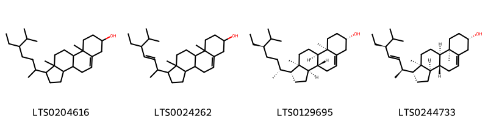{ width=100% }
    <figcaption>Hình ảnh cấu trúc hóa học của 4 hoạt chất thuộc nhóm Steroids and steroid derivatives gồm ['stigmast-5-en-3-ol, (3β)- (LTS0204616)', 'stigmasterol (LTS0024262)', '(1r,3ar,3br,7s,9ar,9br,11ar)-1-[(2r,5r)-5-ethyl-6-methylheptan-2-yl]-9a,11a-dimethyl-1h,2h,3h,3ah,3bh,4h,6h,7h,8h,9h,9bh,10h,11h-cyclopenta[a]phenanthren-7-ol (LTS0129695)', '(1r,3ar,3br,7s,9ar,9br,11ar)-1-[(2s,3e,5s)-5-ethyl-6-methylhept-3-en-2-yl]-9a,11a-dimethyl-1h,2h,3h,3ah,3bh,4h,6h,7h,8h,9h,9bh,10h,11h-cyclopenta[a]phenanthren-7-ol (LTS0244733)'].</figcaption>
</figure>
#### Nhóm Tannins
<figure markdown="span">
    { width=100% }
    <figcaption>Hình ảnh cấu trúc hóa học của 1 hoạt chất thuộc nhóm Tannins gồm ['ellagic acid (LTS0037297)'].</figcaption>
</figure>

---

### Dược dân tộc học

Danh sách các quốc gia có sử dụng *Dimocarpus longan* trong điều trị các bệnh. 

| Country   | Disease             | Bệnh                      |
|:----------|:--------------------|:--------------------------|
| China     | Vermifuge, Antidote | Vermifuge, Thuốc giải độc |

---

# Chi Pometia

??? note "Danh sách các dược liệu thuộc chi"
    
	 - *Pometia pinnata*

---
## Pometia pinnata
### Thông tin về thực vật

!!! info "Phân loại thực vật của *Pometia pinnata* từ GIBF:"
    - **Kingdom:** Plantae
    - **Phylum:** Tracheophyta
    - **Order:** Sapindales
    - **Family:** Sapindaceae
    - **Genus:** Pometia
    - **Species:** *Pometia pinnata*

 

| Label (VI)   | Label (EN)   | Scientific Name   | Descriptions (VI)   | Descriptions (EN)   | Also Known As (VI)   | Also Known As (EN)   |
|:-------------|:-------------|:------------------|:--------------------|:--------------------|:---------------------|:---------------------|
| N/A          | N/A          | Pometia pinnata   | loài thực vật       | species of plant    | ['']                 | ['']                 |

#### Phân bố trên thế giới

**Từ CSDL GIBF** nan, Sri Lanka, Australia, Lao People’s Democratic Republic, Benin, Chinese Taipei, Papua New Guinea, United States of America, Solomon Islands, Fiji, Thailand, Tonga, Singapore, China, French Polynesia, Vanuatu, India, Indonesia, Malaysia

#### Phân bố tại Việt Nam

**Từ CSDL GIBF**: Không có ghi nhận ở Việt Nam

---
### Thành phần hóa học
        
- Theo cơ sở dữ liệu lotus: Từ loài *Pometia pinnata* đã phân lập và xác định được Chưa có hoạt chất nào được phân lập. hoạt chất thuộc về các nhóm Không có hoạt chất nào được phân lập. 

Không có hình ảnh nào được tạo ra

---

### Dược dân tộc học

Danh sách các quốc gia có sử dụng *Pometia pinnata* trong điều trị các bệnh. 

| Country   | Disease   | Bệnh           |
|:----------|:----------|:---------------|
| Fiji      | Diuretic  | Thuốc lợi tiêu |
| Tonga     | Laxative  | Nhuận trường   |

---

# Chi Paullinia

??? note "Danh sách các dược liệu thuộc chi"
    
	 - *Paullinia alata*
	 - *Paullinia cupana*
	 - *Paullinia fuscescens*
	 - *Paullinia pinnata*
	 - *Paullinia scarlatina*
	 - *Paullinia yoco*

---
## Paullinia alata
### Thông tin về thực vật

!!! info "Phân loại thực vật của *Paullinia alata* từ GIBF:"
    - **Kingdom:** Plantae
    - **Phylum:** Tracheophyta
    - **Order:** Sapindales
    - **Family:** Sapindaceae
    - **Genus:** Paullinia
    - **Species:** *Paullinia alata*

 

| Label (VI)   | Label (EN)   | Scientific Name   | Descriptions (VI)   | Descriptions (EN)   | Also Known As (VI)   | Also Known As (EN)   |
|:-------------|:-------------|:------------------|:--------------------|:--------------------|:---------------------|:---------------------|
| N/A          | N/A          | Paullinia alata   |                     | species of plant    | ['']                 | ['']                 |

#### Phân bố trên thế giới

**Từ CSDL GIBF** Nicaragua, Ecuador, Suriname, Colombia, Brazil, Bolivia (Plurinational State of), Costa Rica, Peru

#### Phân bố tại Việt Nam

**Từ CSDL GIBF**: Không có ghi nhận ở Việt Nam

---
### Thành phần hóa học
        
- Theo cơ sở dữ liệu lotus: Từ loài *Paullinia alata* đã phân lập và xác định được Chưa có hoạt chất nào được phân lập. hoạt chất thuộc về các nhóm Không có hoạt chất nào được phân lập. 

Không có hình ảnh nào được tạo ra

---

### Dược dân tộc học

Danh sách các quốc gia có sử dụng *Paullinia alata* trong điều trị các bệnh. 

| Country   | Disease   | Bệnh          |
|:----------|:----------|:--------------|
| Peru      | Piscicide | Thuốc diệt cá |

---

---
## Paullinia cupana
### Thông tin về thực vật

!!! info "Phân loại thực vật của *Paullinia cupana* từ GIBF:"
    - **Kingdom:** Plantae
    - **Phylum:** Tracheophyta
    - **Order:** Sapindales
    - **Family:** Sapindaceae
    - **Genus:** Paullinia
    - **Species:** *Paullinia cupana*

 

| Label (VI)   | Label (EN)   | Scientific Name   | Descriptions (VI)   | Descriptions (EN)         | Also Known As (VI)   | Also Known As (EN)   |
|:-------------|:-------------|:------------------|:--------------------|:--------------------------|:---------------------|:---------------------|
| N/A          | N/A          | Paullinia cupana  | loài thực vật       | species of plant, guarana | ['']                 | ['Paullinia cupana'] |

#### Phân bố trên thế giới

**Từ CSDL GIBF** nan, Ecuador, Belgium, Martinique, Colombia, Brazil, Bolivia (Plurinational State of), Guyana, Costa Rica, United States of America, Peru, Norway, Venezuela (Bolivarian Republic of)

#### Phân bố tại Việt Nam

**Từ CSDL GIBF**: Không có ghi nhận ở Việt Nam

---
### Thành phần hóa học
        
- Theo cơ sở dữ liệu lotus: Từ loài *Paullinia cupana* đã phân lập và xác định được 28 hoạt chất thuộc về các nhóm Phenol ethers, Fatty Acyls, Flavonoids, Prenol lipids, Benzene and substituted derivatives, Imidazopyrimidines. 

|    | chemicalTaxonomyClassyfireClass     |   smiles_count |
|---:|:------------------------------------|---------------:|
|  0 | Benzene and substituted derivatives |              1 |
|  1 | Fatty Acyls                         |              2 |
|  2 | Flavonoids                          |             13 |
|  3 | Imidazopyrimidines                  |              3 |
|  4 | Phenol ethers                       |              3 |
|  5 | Prenol lipids                       |              6 |

#### Nhóm Benzene and substituted derivatives
<figure markdown="span">
    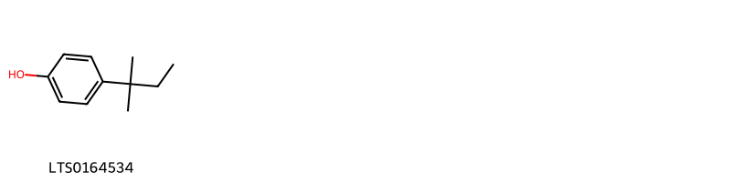{ width=100% }
    <figcaption>Hình ảnh cấu trúc hóa học của 1 hoạt chất thuộc nhóm Benzene and substituted derivatives gồm ['tert-amylphenol (LTS0164534)'].</figcaption>
</figure>
#### Nhóm Fatty Acyls
<figure markdown="span">
    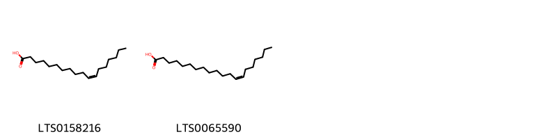{ width=100% }
    <figcaption>Hình ảnh cấu trúc hóa học của 2 hoạt chất thuộc nhóm Fatty Acyls gồm ['cis-vaccenic acid (LTS0158216)', 'paullinic acid (LTS0065590)'].</figcaption>
</figure>
#### Nhóm Flavonoids
<figure markdown="span">
    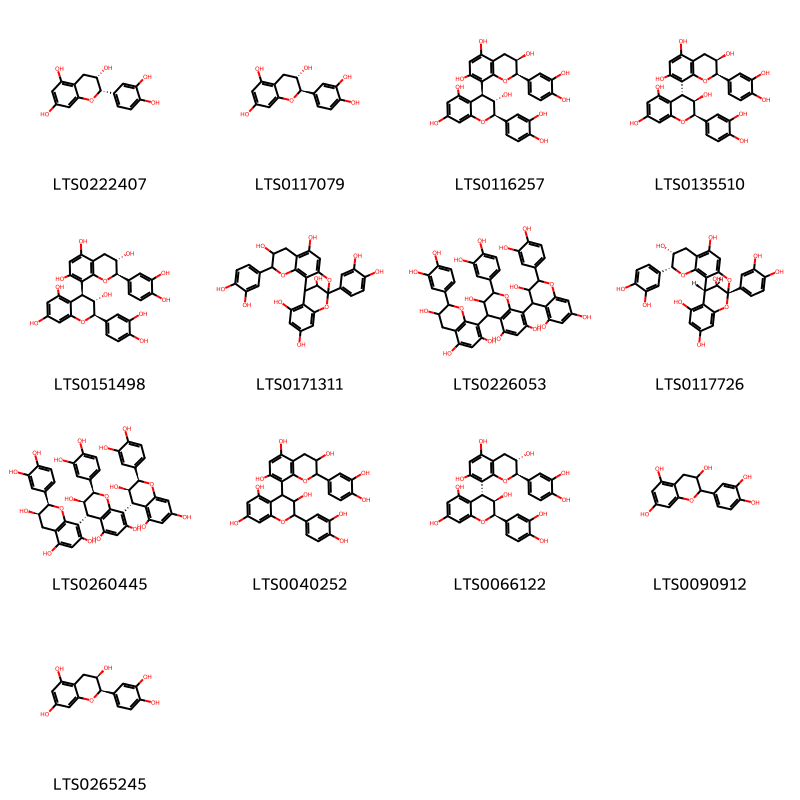{ width=100% }
    <figcaption>Hình ảnh cấu trúc hóa học của 13 hoạt chất thuộc nhóm Flavonoids gồm ['(+)-epicatechin (LTS0222407)', '(+)-catechol (LTS0117079)', '(2r,3s,4s)-2-(3,4-dihydroxyphenyl)-4-[(2r,3r)-2-(3,4-dihydroxyphenyl)-3,5,7-trihydroxy-3,4-dihydro-2h-1-benzopyran-8-yl]-3,4-dihydro-2h-1-benzopyran-3,5,7-triol (LTS0116257)', '(2r,3r,4r)-2-(3,4-dihydroxyphenyl)-4-[(2r,3r)-2-(3,4-dihydroxyphenyl)-3,5,7-trihydroxy-3,4-dihydro-2h-1-benzopyran-8-yl]-3,4-dihydro-2h-1-benzopyran-3,5,7-triol (LTS0135510)', '(2r,3s,4s)-2-(3,4-dihydroxyphenyl)-4-[(2r,3s)-2-(3,4-dihydroxyphenyl)-3,5,7-trihydroxy-3,4-dihydro-2h-1-benzopyran-8-yl]-3,4-dihydro-2h-1-benzopyran-3,5,7-triol (LTS0151498)', 'procyanidin a1 (LTS0171311)', 'procyanidin c2 (LTS0226053)', 'proanthocyanidin a2 (LTS0117726)', 'procyanidin c1 (LTS0260445)', '2-(3,4-dihydroxyphenyl)-4-[2-(3,4-dihydroxyphenyl)-3,5,7-trihydroxy-3,4-dihydro-2h-1-benzopyran-8-yl]-3,4-dihydro-2h-1-benzopyran-3,5,7-triol (LTS0040252)', '(2r,3r,4r)-2-(3,4-dihydroxyphenyl)-4-[(2r,3s)-2-(3,4-dihydroxyphenyl)-3,5,7-trihydroxy-3,4-dihydro-2h-1-benzopyran-8-yl]-3,4-dihydro-2h-1-benzopyran-3,5,7-triol (LTS0066122)', 'catechol (LTS0090912)', 'ent-epicatechin (LTS0265245)'].</figcaption>
</figure>
#### Nhóm Imidazopyrimidines
<figure markdown="span">
    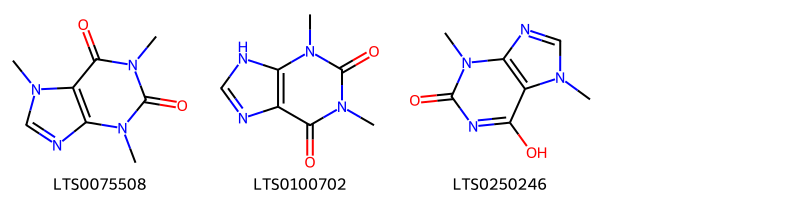{ width=100% }
    <figcaption>Hình ảnh cấu trúc hóa học của 3 hoạt chất thuộc nhóm Imidazopyrimidines gồm ['caffeine (LTS0075508)', 'constant-t (LTS0100702)', 'thesal (LTS0250246)'].</figcaption>
</figure>
#### Nhóm Phenol ethers
<figure markdown="span">
    { width=100% }
    <figcaption>Hình ảnh cấu trúc hóa học của 3 hoạt chất thuộc nhóm Phenol ethers gồm ['p-propenylanisole (LTS0177188)', 'tarragon (LTS0245226)', 'anethole (LTS0033696)'].</figcaption>
</figure>
#### Nhóm Prenol lipids
<figure markdown="span">
    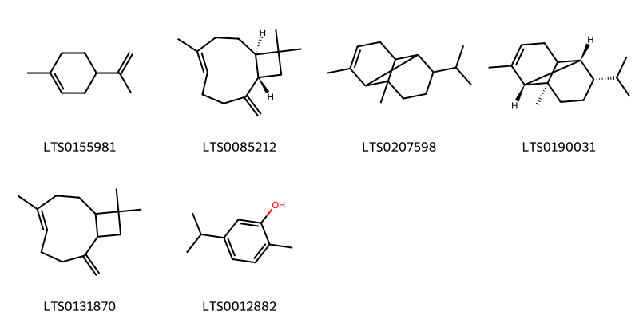{ width=100% }
    <figcaption>Hình ảnh cấu trúc hóa học của 6 hoạt chất thuộc nhóm Prenol lipids gồm ['limonene,  (LTS0155981)', 'caryophyllene (LTS0085212)', 'α-copaene (LTS0207598)', '(1r,2s,7s,8s)-8-isopropyl-1,3-dimethyltricyclo[4.4.0.0²,⁷]dec-3-ene (LTS0190031)', 'caryophyllene (LTS0131870)', 'carvacrol (LTS0012882)'].</figcaption>
</figure>

---

### Dược dân tộc học

Danh sách các quốc gia có sử dụng *Paullinia cupana* trong điều trị các bệnh. 

| Country       | Disease    | Bệnh               |
|:--------------|:-----------|:-------------------|
| Dutch         | Nervine    | Thuốc an thần      |
| English       | Astringent | Lam se da          |
| French        | Stimulant  | Chất kích thích    |
| German        | Tonic      | (thuộc) trương lực |
| Mexico        | Stimulant  | Chất kích thích    |
| South America | Intoxicant | chất gây độc       |

---

---
## Paullinia fuscescens
### Thông tin về thực vật

!!! info "Phân loại thực vật của *Paullinia fuscescens* từ GIBF:"
    - **Kingdom:** Plantae
    - **Phylum:** Tracheophyta
    - **Order:** Sapindales
    - **Family:** Sapindaceae
    - **Genus:** Paullinia
    - **Species:** *Paullinia fuscescens*

 

| Label (VI)   | Label (EN)   | Scientific Name      | Descriptions (VI)   | Descriptions (EN)   | Also Known As (VI)   | Also Known As (EN)   |
|:-------------|:-------------|:---------------------|:--------------------|:--------------------|:---------------------|:---------------------|
| N/A          | N/A          | Paullinia fuscescens | loài thực vật       | species of plant    | ['']                 | ['']                 |

#### Phân bố trên thế giới

**Từ CSDL GIBF** Nicaragua, Belize, Puerto Rico, Ecuador, Germany, Colombia, Guatemala, Costa Rica, United States of America, Cuba, Mexico, El Salvador, Venezuela (Bolivarian Republic of), Panama

#### Phân bố tại Việt Nam

**Từ CSDL GIBF**: Không có ghi nhận ở Việt Nam

---
### Thành phần hóa học
        
- Theo cơ sở dữ liệu lotus: Từ loài *Paullinia fuscescens* đã phân lập và xác định được Chưa có hoạt chất nào được phân lập. hoạt chất thuộc về các nhóm Không có hoạt chất nào được phân lập. 

Không có hình ảnh nào được tạo ra

---

### Dược dân tộc học

Danh sách các quốc gia có sử dụng *Paullinia fuscescens* trong điều trị các bệnh. 

| Country   | Disease           | Bệnh                      |
|:----------|:------------------|:--------------------------|
| Elsewhere | Piscicide         | Thuốc diệt cá             |
| Guatemala | Piscicide, Poison | Thuốc sát trùng, Chất độc |
| Mexico    | Piscicide, Poison | Thuốc sát trùng, Chất độc |

---

---
## Paullinia pinnata
### Thông tin về thực vật

!!! info "Phân loại thực vật của *Paullinia pinnata* từ GIBF:"
    - **Kingdom:** Plantae
    - **Phylum:** Tracheophyta
    - **Order:** Sapindales
    - **Family:** Sapindaceae
    - **Genus:** Paullinia
    - **Species:** *Paullinia pinnata*

 

| Label (VI)   | Label (EN)   | Scientific Name   | Descriptions (VI)   | Descriptions (EN)   | Also Known As (VI)   | Also Known As (EN)   |
|:-------------|:-------------|:------------------|:--------------------|:--------------------|:---------------------|:---------------------|
| N/A          | N/A          | Paullinia pinnata | loài thực vật       | species of plant    | ['']                 | ['']                 |

#### Phân bố trên thế giới

**Từ CSDL GIBF** nan, Ghana, Gabon, Argentina, Mozambique, Benin, French Guiana, Togo, Puerto Rico, Nigeria, Congo, Democratic Republic of the, Zimbabwe, Trinidad and Tobago, Martinique, Brazil, Côte d’Ivoire, Mexico, Mayotte, Dominican Republic, Madagascar, Costa Rica, Gambia, Cameroon

#### Phân bố tại Việt Nam

**Từ CSDL GIBF**: Không có ghi nhận ở Việt Nam

---
### Thành phần hóa học
        
- Theo cơ sở dữ liệu lotus: Từ loài *Paullinia pinnata* đã phân lập và xác định được 18 hoạt chất thuộc về các nhóm Fatty Acyls, Flavonoids, Prenol lipids, Steroids and steroid derivatives, Sphingolipids, Organooxygen compounds. 

|    | chemicalTaxonomyClassyfireClass   |   smiles_count |
|---:|:----------------------------------|---------------:|
|  0 | Fatty Acyls                       |              2 |
|  1 | Flavonoids                        |              6 |
|  2 | Organooxygen compounds            |              1 |
|  3 | Prenol lipids                     |              4 |
|  4 | Sphingolipids                     |              1 |
|  5 | Steroids and steroid derivatives  |              4 |

#### Nhóm Fatty Acyls
<figure markdown="span">
    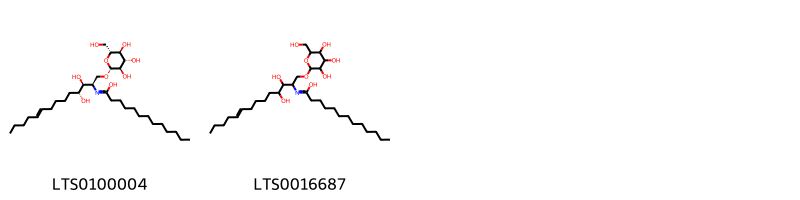{ width=100% }
    <figcaption>Hình ảnh cấu trúc hóa học của 2 hoạt chất thuộc nhóm Fatty Acyls gồm ['n-[(2r,3s,4r,9e)-3,4-dihydroxy-1-{[(2r,3r,4s,5s,6r)-3,4,5-trihydroxy-6-(hydroxymethyl)oxan-2-yl]oxy}tetradec-9-en-2-yl]tridecanimidic acid (LTS0100004)', 'n-(3,4-dihydroxy-1-{[3,4,5-trihydroxy-6-(hydroxymethyl)oxan-2-yl]oxy}tetradec-9-en-2-yl)tridecanimidic acid (LTS0016687)'].</figcaption>
</figure>
#### Nhóm Flavonoids
<figure markdown="span">
    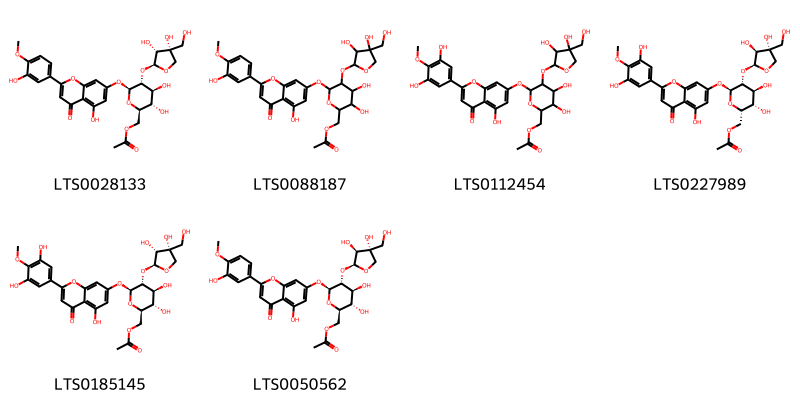{ width=100% }
    <figcaption>Hình ảnh cấu trúc hóa học của 6 hoạt chất thuộc nhóm Flavonoids gồm ['[(2r,3s,4s,5r,6s)-5-{[(2s,3r,4r)-3,4-dihydroxy-4-(hydroxymethyl)oxolan-2-yl]oxy}-3,4-dihydroxy-6-{[5-hydroxy-2-(3-hydroxy-4-methoxyphenyl)-4-oxochromen-7-yl]oxy}oxan-2-yl]methyl acetate (LTS0028133)', '(5-{[3,4-dihydroxy-4-(hydroxymethyl)oxolan-2-yl]oxy}-3,4-dihydroxy-6-{[5-hydroxy-2-(3-hydroxy-4-methoxyphenyl)-4-oxochromen-7-yl]oxy}oxan-2-yl)methyl acetate (LTS0088187)', '(5-{[3,4-dihydroxy-4-(hydroxymethyl)oxolan-2-yl]oxy}-6-{[2-(3,5-dihydroxy-4-methoxyphenyl)-5-hydroxy-4-oxochromen-7-yl]oxy}-3,4-dihydroxyoxan-2-yl)methyl acetate (LTS0112454)', '[(2s,3s,4s,5r,6s)-5-{[(2s,3s,4r)-3,4-dihydroxy-4-(hydroxymethyl)oxolan-2-yl]oxy}-6-{[2-(3,5-dihydroxy-4-methoxyphenyl)-5-hydroxy-4-oxochromen-7-yl]oxy}-3,4-dihydroxyoxan-2-yl]methyl acetate (LTS0227989)', '[(2r,3s,4s,5r,6s)-5-{[(2s,3r,4r)-3,4-dihydroxy-4-(hydroxymethyl)oxolan-2-yl]oxy}-6-{[2-(3,5-dihydroxy-4-methoxyphenyl)-5-hydroxy-4-oxochromen-7-yl]oxy}-3,4-dihydroxyoxan-2-yl]methyl acetate (LTS0185145)', '[(2r,3s,4s,5r,6s)-5-{[(2s,3s,4r)-3,4-dihydroxy-4-(hydroxymethyl)oxolan-2-yl]oxy}-3,4-dihydroxy-6-{[5-hydroxy-2-(3-hydroxy-4-methoxyphenyl)-4-oxochromen-7-yl]oxy}oxan-2-yl]methyl acetate (LTS0050562)'].</figcaption>
</figure>
#### Nhóm Organooxygen compounds
<figure markdown="span">
    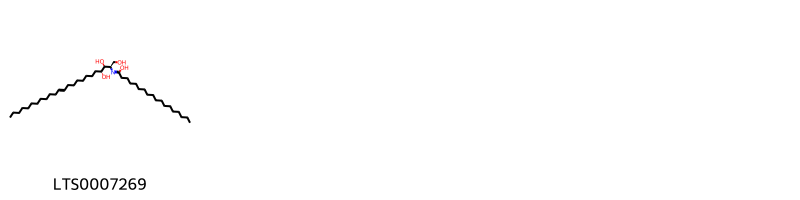{ width=100% }
    <figcaption>Hình ảnh cấu trúc hóa học của 1 hoạt chất thuộc nhóm Organooxygen compounds gồm ['n-[(2r,3s,4r,12e)-1,3,4-trihydroxytetracos-12-en-2-yl]octadecanimidic acid (LTS0007269)'].</figcaption>
</figure>
#### Nhóm Prenol lipids
<figure markdown="span">
    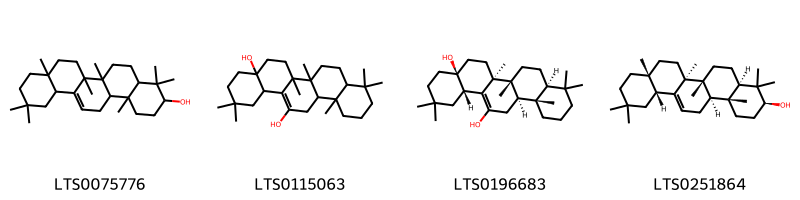{ width=100% }
    <figcaption>Hình ảnh cấu trúc hóa học của 4 hoạt chất thuộc nhóm Prenol lipids gồm ['β-amyrin (LTS0075776)', '2,2,6a,6b,9,9,12a-heptamethyl-1,3,4,5,6,7,8,8a,10,11,12,12b,13,14b-tetradecahydropicene-4a,14-diol (LTS0115063)', '(4as,6as,6br,8as,12as,12br,14bs)-2,2,6a,6b,9,9,12a-heptamethyl-1,3,4,5,6,7,8,8a,10,11,12,12b,13,14b-tetradecahydropicene-4a,14-diol (LTS0196683)', 'β-amyrin (LTS0251864)'].</figcaption>
</figure>
#### Nhóm Sphingolipids
<figure markdown="span">
    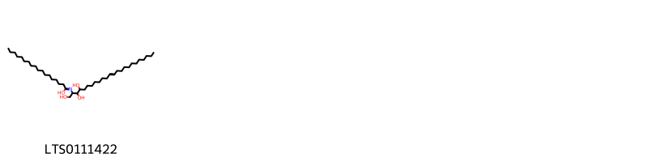{ width=100% }
    <figcaption>Hình ảnh cấu trúc hóa học của 1 hoạt chất thuộc nhóm Sphingolipids gồm ['n-(1,3,4-trihydroxytetracos-12-en-2-yl)octadecanimidic acid (LTS0111422)'].</figcaption>
</figure>
#### Nhóm Steroids and steroid derivatives
<figure markdown="span">
    { width=100% }
    <figcaption>Hình ảnh cấu trúc hóa học của 4 hoạt chất thuộc nhóm Steroids and steroid derivatives gồm ['stigmast-5-en-3-ol, (3β)- (LTS0204616)', 'sitosterol (LTS0168132)', 'sitogluside (LTS0201798)', '2-{[1-(5-ethyl-6-methylheptan-2-yl)-9a,11a-dimethyl-1h,2h,3h,3ah,3bh,4h,6h,7h,8h,9h,9bh,10h,11h-cyclopenta[a]phenanthren-7-yl]oxy}-6-(hydroxymethyl)oxane-3,4,5-triol (LTS0158828)'].</figcaption>
</figure>

---

### Dược dân tộc học

Danh sách các quốc gia có sử dụng *Paullinia pinnata* trong điều trị các bệnh. 

| Country                  | Disease                       | Bệnh                               |
|:-------------------------|:------------------------------|:-----------------------------------|
| Central African Republic | Emetic                        | Phôi                               |
| Dominican Republic       | Poison                        | Chất độc                           |
| Elsewhere                | Poison, Piscicide             | Chất độc, Piscicide                |
| Ghana                    | Hemostat, Poison, Dentifrice  | Hemostat, Poison, Dentifrice       |
| Mexico                   | Piscicide, Poison             | Thuốc sát trùng, Chất độc          |
| Nigeria                  | Vesicant                      | Chất gây bọng mắt                  |
| Sierra Leone             | Collyrium                     | Collyrium                          |
| Sudan                    | Narcotic, Piscicide, Poison   | Chất gây nghiện, Piscicide, Poison |
| Upper Volta              | Hemostat, Cicatrizant, Poison | Hemostat, Cicatrizant, Poison      |

---

---
## Paullinia scarlatina
### Thông tin về thực vật

!!! info "Phân loại thực vật của *Paullinia costata* từ GIBF:"
    - **Kingdom:** Plantae
    - **Phylum:** Tracheophyta
    - **Order:** Sapindales
    - **Family:** Sapindaceae
    - **Genus:** Paullinia
    - **Species:** *Paullinia costata*

 

| Label (VI)   | Label (EN)   | Scientific Name   | Descriptions (VI)   | Descriptions (EN)   | Also Known As (VI)   | Also Known As (EN)   |
|:-------------|:-------------|:------------------|:--------------------|:--------------------|:---------------------|:---------------------|
| N/A          | N/A          | Paullinia pinnata | loài thực vật       | species of plant    | ['']                 | ['']                 |

#### Phân bố trên thế giới

**Từ CSDL GIBF** nan, Ghana, Gabon, Argentina, Mozambique, Benin, French Guiana, Togo, Puerto Rico, Nigeria, Congo, Democratic Republic of the, Zimbabwe, Trinidad and Tobago, Martinique, Brazil, Côte d’Ivoire, Mexico, Mayotte, Dominican Republic, Madagascar, Costa Rica, Gambia, Cameroon

#### Phân bố tại Việt Nam

**Từ CSDL GIBF**: Không có ghi nhận ở Việt Nam

---
### Thành phần hóa học
        
- Theo cơ sở dữ liệu lotus: Từ loài *Paullinia costata* đã phân lập và xác định được Chưa có hoạt chất nào được phân lập. hoạt chất thuộc về các nhóm Không có hoạt chất nào được phân lập. 

Không có hình ảnh nào được tạo ra

---

### Dược dân tộc học

Danh sách các quốc gia có sử dụng *Paullinia costata* trong điều trị các bệnh. 

| Country   | Disease   | Bệnh          |
|:----------|:----------|:--------------|
| Guatemala | Piscicide | Thuốc diệt cá |

---

---
## Paullinia yoco
### Thông tin về thực vật

!!! info "Phân loại thực vật của *Paullinia yoco* từ GIBF:"
    - **Kingdom:** Plantae
    - **Phylum:** Tracheophyta
    - **Order:** Sapindales
    - **Family:** Sapindaceae
    - **Genus:** Paullinia
    - **Species:** *Paullinia yoco*

 

| Label (VI)   | Label (EN)   | Scientific Name   | Descriptions (VI)   | Descriptions (EN)   | Also Known As (VI)   | Also Known As (EN)   |
|:-------------|:-------------|:------------------|:--------------------|:--------------------|:---------------------|:---------------------|
| N/A          | N/A          | Paullinia yoco    |                     | species of plant    | ['']                 | ['']                 |

#### Phân bố trên thế giới

**Từ CSDL GIBF** nan, Ecuador, Colombia, Brazil, Peru

#### Phân bố tại Việt Nam

**Từ CSDL GIBF**: Không có ghi nhận ở Việt Nam

---
### Thành phần hóa học
        
- Theo cơ sở dữ liệu lotus: Từ loài *Paullinia yoco* đã phân lập và xác định được Chưa có hoạt chất nào được phân lập. hoạt chất thuộc về các nhóm Không có hoạt chất nào được phân lập. 

Không có hình ảnh nào được tạo ra

---

### Dược dân tộc học

Danh sách các quốc gia có sử dụng *Paullinia yoco* trong điều trị các bệnh. 

| Country   | Disease   | Bệnh            |
|:----------|:----------|:----------------|
| Colombia  | Stimulant | Chất kích thích |
| Elsewhere | Stimulant | Chất kích thích |

---

# Chi Talisia

??? note "Danh sách các dược liệu thuộc chi"
    
	 - *Talisia olivaeformis*

---
## Talisia olivaeformis
### Thông tin về thực vật

!!! info "Phân loại thực vật của *Melicoccus oliviformis* từ GIBF:"
    - **Kingdom:** Plantae
    - **Phylum:** Tracheophyta
    - **Order:** Sapindales
    - **Family:** Sapindaceae
    - **Genus:** Melicoccus
    - **Species:** *Melicoccus oliviformis*

 

| Label (VI)   | Label (EN)   | Scientific Name      | Descriptions (VI)   | Descriptions (EN)    | Also Known As (VI)   | Also Known As (EN)   |
|:-------------|:-------------|:---------------------|:--------------------|:---------------------|:---------------------|:---------------------|
| N/A          | N/A          | Talisia olivaeformis |                     | species of soapberry | ['']                 | ['T. olivaeformis']  |

#### Phân bố trên thế giới

**Từ CSDL GIBF** Nicaragua, Ecuador, Colombia, Brazil, Guatemala, Guyana, Peru, Mexico, El Salvador, Venezuela (Bolivarian Republic of)

#### Phân bố tại Việt Nam

**Từ CSDL GIBF**: Không có ghi nhận ở Việt Nam

---
### Thành phần hóa học
        
- Theo cơ sở dữ liệu lotus: Từ loài *Melicoccus oliviformis* đã phân lập và xác định được Chưa có hoạt chất nào được phân lập. hoạt chất thuộc về các nhóm Không có hoạt chất nào được phân lập. 

Không có hình ảnh nào được tạo ra

---

### Dược dân tộc học

Danh sách các quốc gia có sử dụng *Melicoccus oliviformis* trong điều trị các bệnh. 

| Country   | Disease               | Bệnh                       |
|:----------|:----------------------|:---------------------------|
| Venezuela | Refrigerant, Laxative | Môi chất lạnh, nhuận tràng |

---

# Chi Ungnadia

??? note "Danh sách các dược liệu thuộc chi"
    
	 - *Ungnadia eciosa*

---
## Ungnadia eciosa
### Thông tin về thực vật

!!! info "Phân loại thực vật của *N/A* từ GIBF:"
    - **Kingdom:** Plantae
    - **Phylum:** Tracheophyta
    - **Order:** Sapindales
    - **Family:** Sapindaceae
    - **Genus:** Ungnadia
    - **Species:** *N/A*

 

| Label (VI)   | Label (EN)   | Scientific Name      | Descriptions (VI)   | Descriptions (EN)    | Also Known As (VI)   | Also Known As (EN)   |
|:-------------|:-------------|:---------------------|:--------------------|:---------------------|:---------------------|:---------------------|
| N/A          | N/A          | Talisia olivaeformis |                     | species of soapberry | ['']                 | ['T. olivaeformis']  |

#### Phân bố trên thế giới

**Từ CSDL GIBF** United States of America, Mexico

#### Phân bố tại Việt Nam

**Từ CSDL GIBF**: Không có ghi nhận ở Việt Nam

---
### Thành phần hóa học
        
- Theo cơ sở dữ liệu lotus: Từ loài *N/A* đã phân lập và xác định được Chưa có hoạt chất nào được phân lập. hoạt chất thuộc về các nhóm Không có hoạt chất nào được phân lập. 

Không có hình ảnh nào được tạo ra

---

### Dược dân tộc học

Danh sách các quốc gia có sử dụng *N/A* trong điều trị các bệnh. 

| Country   | Disease              | Bệnh                       |
|:----------|:---------------------|:---------------------------|
| Mexico    | Hallucinogen, Poison | Chất gây ảo giác, Chất độc |
| US        | Emetic               | Phôi                       |

---

# Chi Matayba

??? note "Danh sách các dược liệu thuộc chi"
    
	 - *Matayba purgans*

---
## Matayba purgans
### Thông tin về thực vật

!!! info "Phân loại thực vật của *Matayba purgans* từ GIBF:"
    - **Kingdom:** Plantae
    - **Phylum:** Tracheophyta
    - **Order:** Sapindales
    - **Family:** Sapindaceae
    - **Genus:** Matayba
    - **Species:** *Matayba purgans*

 

| Label (VI)   | Label (EN)   | Scientific Name   | Descriptions (VI)   | Descriptions (EN)   | Also Known As (VI)   | Also Known As (EN)   |
|:-------------|:-------------|:------------------|:--------------------|:--------------------|:---------------------|:---------------------|
| N/A          | N/A          | Matayba purgans   | loài thực vật       | species of plant    | ['']                 | ['']                 |

#### Phân bố trên thế giới

**Từ CSDL GIBF** Ecuador, Colombia, Brazil, Bolivia (Plurinational State of), Guyana, Peru, French Guiana

#### Phân bố tại Việt Nam

**Từ CSDL GIBF**: Không có ghi nhận ở Việt Nam

---
### Thành phần hóa học
        
- Theo cơ sở dữ liệu lotus: Từ loài *Matayba purgans* đã phân lập và xác định được Chưa có hoạt chất nào được phân lập. hoạt chất thuộc về các nhóm Không có hoạt chất nào được phân lập. 

Không có hình ảnh nào được tạo ra

---

### Dược dân tộc học

Danh sách các quốc gia có sử dụng *Matayba purgans* trong điều trị các bệnh. 

| Country       | Disease   | Bệnh     |
|:--------------|:----------|:---------|
| South America | Purgative | Thuốc xổ |

---

# Chi Harpullia

??? note "Danh sách các dược liệu thuộc chi"
    
	 - *Harpullia arborea*

---
## Harpullia arborea
### Thông tin về thực vật

!!! info "Phân loại thực vật của *Harpullia arborea* từ GIBF:"
    - **Kingdom:** Plantae
    - **Phylum:** Tracheophyta
    - **Order:** Sapindales
    - **Family:** Sapindaceae
    - **Genus:** Harpullia
    - **Species:** *Harpullia arborea*

 

| Label (VI)   | Label (EN)   | Scientific Name   | Descriptions (VI)   | Descriptions (EN)   | Also Known As (VI)   | Also Known As (EN)                           |
|:-------------|:-------------|:------------------|:--------------------|:--------------------|:---------------------|:---------------------------------------------|
| N/A          | N/A          | Harpullia arborea | loài thực vật       | species of plant    | ['']                 | ['tulip-wood tree', 'tulipwood tree', 'uas'] |

#### Phân bố trên thế giới

**Từ CSDL GIBF** nan, Sri Lanka, Australia, Belgium, Lao People’s Democratic Republic, Papua New Guinea, United States of America, Timor-Leste, Solomon Islands, Fiji, Thailand, Brazil, Tonga, Vanuatu, India, Indonesia, Samoa, Philippines, Malaysia

#### Phân bố tại Việt Nam

**Từ CSDL GIBF**: Không có ghi nhận ở Việt Nam

---
### Thành phần hóa học
        
- Theo cơ sở dữ liệu lotus: Từ loài *Harpullia arborea* đã phân lập và xác định được 11 hoạt chất thuộc về các nhóm Prenol lipids, Organooxygen compounds, Steroids and steroid derivatives. 

|    | chemicalTaxonomyClassyfireClass   |   smiles_count |
|---:|:----------------------------------|---------------:|
|  0 | Organooxygen compounds            |              3 |
|  1 | Prenol lipids                     |              3 |
|  2 | Steroids and steroid derivatives  |              5 |

#### Nhóm Organooxygen compounds
<figure markdown="span">
    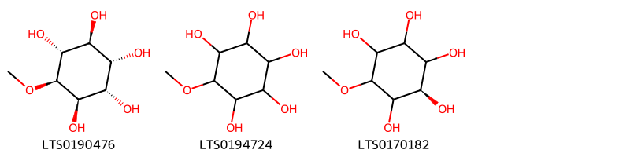{ width=100% }
    <figcaption>Hình ảnh cấu trúc hóa học của 3 hoạt chất thuộc nhóm Organooxygen compounds gồm ['(-)-quebrachitol (LTS0190476)', 'pinitol (LTS0194724)', '(2r)-6-methoxycyclohexane-1,2,3,4,5-pentol (LTS0170182)'].</figcaption>
</figure>
#### Nhóm Prenol lipids
<figure markdown="span">
    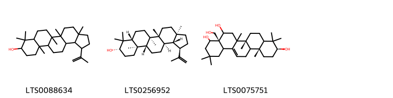{ width=100% }
    <figcaption>Hình ảnh cấu trúc hóa học của 3 hoạt chất thuộc nhóm Prenol lipids gồm ['lupeol (LTS0088634)', 'lupeol (LTS0256952)', '(3s,6ar,8as,14br)-8a-(hydroxymethyl)-4,4,6a,6b,11,11,14b-heptamethyl-1,2,3,4a,5,6,7,8,9,10,12,12a,14,14a-tetradecahydropicene-3,8,9-triol (LTS0075751)'].</figcaption>
</figure>
#### Nhóm Steroids and steroid derivatives
<figure markdown="span">
    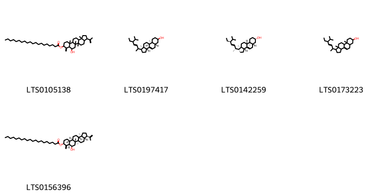{ width=100% }
    <figcaption>Hình ảnh cấu trúc hóa học của 5 hoạt chất thuộc nhóm Steroids and steroid derivatives gồm ['7-hydroxy-5a,5b,11a,13b-tetramethyl-8-methylidene-3-(prop-1-en-2-yl)-hexadecahydrocyclopenta[a]chrysen-9-yl icosanoate (LTS0105138)', '(3ar,5as,9as,9bs,11ar)-1-(5-ethyl-6-methylhept-3-en-2-yl)-9a,11a-dimethyl-1h,2h,3h,3ah,5h,5ah,6h,7h,8h,9h,9bh,10h,11h-cyclopenta[a]phenanthren-7-ol (LTS0197417)', 'chondrillasterol (LTS0142259)', '1-(5-ethyl-6-methylhept-3-en-2-yl)-9a,11a-dimethyl-1h,2h,3h,3ah,5h,5ah,6h,7h,8h,9h,9bh,10h,11h-cyclopenta[a]phenanthren-7-ol (LTS0173223)', '(3r,3as,5ar,5br,7r,7ar,9s,11ar,11br,13ar,13bs)-7-hydroxy-5a,5b,11a,13b-tetramethyl-8-methylidene-3-(prop-1-en-2-yl)-hexadecahydrocyclopenta[a]chrysen-9-yl icosanoate (LTS0156396)'].</figcaption>
</figure>

---

### Dược dân tộc học

Danh sách các quốc gia có sử dụng *Harpullia arborea* trong điều trị các bệnh. 

| Country   | Disease   | Bệnh          |
|:----------|:----------|:--------------|
| Borneo    | Poison    | Chất độc      |
| Elsewhere | Soap      | Xà phòng      |
| India     | Piscicide | Thuốc diệt cá |

---

# Chi Deinbollia

??? note "Danh sách các dược liệu thuộc chi"
    
	 - *Deinbollia pinnata*

---
## Deinbollia pinnata
### Thông tin về thực vật

!!! info "Phân loại thực vật của *Deinbollia pinnata* từ GIBF:"
    - **Kingdom:** Plantae
    - **Phylum:** Tracheophyta
    - **Order:** Sapindales
    - **Family:** Sapindaceae
    - **Genus:** Deinbollia
    - **Species:** *Deinbollia pinnata*

 

| Label (VI)   | Label (EN)   | Scientific Name    | Descriptions (VI)   | Descriptions (EN)   | Also Known As (VI)   | Also Known As (EN)   |
|:-------------|:-------------|:-------------------|:--------------------|:--------------------|:---------------------|:---------------------|
| N/A          | N/A          | Deinbollia pinnata | loài thực vật       | species of plant    | ['']                 | ['']                 |

#### Phân bố trên thế giới

**Từ CSDL GIBF** Guinea, Benin, Nigeria

#### Phân bố tại Việt Nam

**Từ CSDL GIBF**: Không có ghi nhận ở Việt Nam

---
### Thành phần hóa học
        
- Theo cơ sở dữ liệu lotus: Từ loài *Deinbollia pinnata* đã phân lập và xác định được Chưa có hoạt chất nào được phân lập. hoạt chất thuộc về các nhóm Không có hoạt chất nào được phân lập. 

Không có hình ảnh nào được tạo ra

---

### Dược dân tộc học

Danh sách các quốc gia có sử dụng *Deinbollia pinnata* trong điều trị các bệnh. 

| Country     | Disease     | Bệnh           |
|:------------|:------------|:---------------|
| Ivory Coast | Aphrodisiac | Thuốc kích dục |

---

# Chi Schleichera

??? note "Danh sách các dược liệu thuộc chi"
    
	 - *Schleichera oleosa*
	 - *Schleichera trijuga*

---
## Schleichera oleosa
### Thông tin về thực vật

!!! info "Phân loại thực vật của *Schleichera oleosa* từ GIBF:"
    - **Kingdom:** Plantae
    - **Phylum:** Tracheophyta
    - **Order:** Sapindales
    - **Family:** Sapindaceae
    - **Genus:** Schleichera
    - **Species:** *Schleichera oleosa*

 

| Label (VI)   | Label (EN)   | Scientific Name    | Descriptions (VI)   | Descriptions (EN)   | Also Known As (VI)   | Also Known As (EN)   |
|:-------------|:-------------|:-------------------|:--------------------|:--------------------|:---------------------|:---------------------|
| N/A          | N/A          | Schleichera oleosa | loài thực vật       | species of plant    | ['']                 | ['']                 |

#### Phân bố trên thế giới

**Từ CSDL GIBF** Sri Lanka, Australia, Thailand, Lao People’s Democratic Republic, Cambodia, Chinese Taipei, Myanmar, India, Indonesia, Bangladesh, United States of America, Timor-Leste, Viet Nam, China, Nepal

#### Phân bố tại Việt Nam

**Từ CSDL GIBF**: Dak Lak, An Giang

---
### Thành phần hóa học
        
- Theo cơ sở dữ liệu lotus: Từ loài *Schleichera oleosa* đã phân lập và xác định được 28 hoạt chất thuộc về các nhóm Fatty Acyls, Organooxygen compounds, Steroids and steroid derivatives, Benzene and substituted derivatives. 

|    | chemicalTaxonomyClassyfireClass     |   smiles_count |
|---:|:------------------------------------|---------------:|
|  0 | Benzene and substituted derivatives |              1 |
|  1 | Fatty Acyls                         |              1 |
|  2 | Organooxygen compounds              |              4 |
|  3 | Steroids and steroid derivatives    |             22 |

#### Nhóm Benzene and substituted derivatives
<figure markdown="span">
    { width=100% }
    <figcaption>Hình ảnh cấu trúc hóa học của 1 hoạt chất thuộc nhóm Benzene and substituted derivatives gồm ['methyl 3,4-dihydroxybenzoate (LTS0057841)'].</figcaption>
</figure>
#### Nhóm Fatty Acyls
<figure markdown="span">
    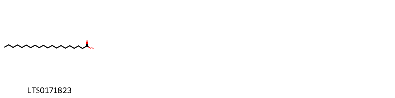{ width=100% }
    <figcaption>Hình ảnh cấu trúc hóa học của 1 hoạt chất thuộc nhóm Fatty Acyls gồm ['arachidic acid (LTS0171823)'].</figcaption>
</figure>
#### Nhóm Organooxygen compounds
<figure markdown="span">
    { width=100% }
    <figcaption>Hình ảnh cấu trúc hóa học của 4 hoạt chất thuộc nhóm Organooxygen compounds gồm ['(+)-glucose (LTS0262158)', 'keto-d-fructose (LTS0241114)', 'glucose (LTS0013597)', 'd-fructopyranose (LTS0259277)'].</figcaption>
</figure>
#### Nhóm Steroids and steroid derivatives
<figure markdown="span">
    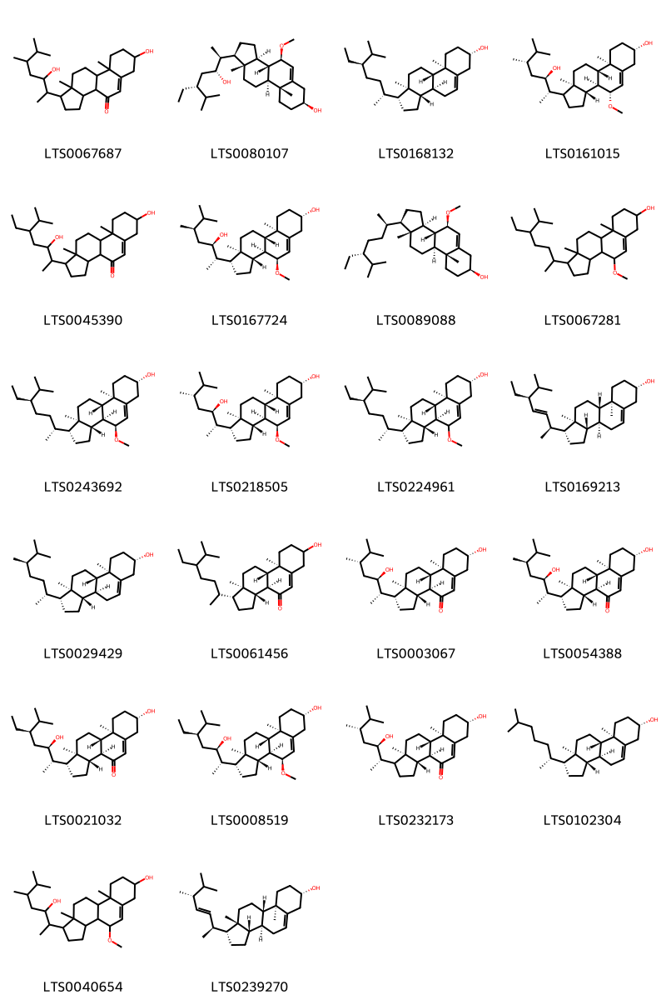{ width=100% }
    <figcaption>Hình ảnh cấu trúc hóa học của 22 hoạt chất thuộc nhóm Steroids and steroid derivatives gồm ['7-hydroxy-1-(3-hydroxy-5,6-dimethylheptan-2-yl)-9a,11a-dimethyl-1h,2h,3h,3ah,3bh,6h,7h,8h,9h,9bh,10h,11h-cyclopenta[a]phenanthren-4-one (LTS0067687)', '(1r,3as,3bs,4r,7s,9ar,9bs,11ar)-1-[(2s,3r,5r)-5-ethyl-3-hydroxy-6-methylheptan-2-yl]-4-methoxy-9a,11a-dimethyl-1h,2h,3h,3ah,3bh,4h,6h,7h,8h,9h,9bh,10h,11h-cyclopenta[a]phenanthren-7-ol (LTS0080107)', 'sitosterol (LTS0168132)', '(3as,3bs,4r,7s,9ar,9bs,11ar)-1-[(2s,3r,5s)-3-hydroxy-5,6-dimethylheptan-2-yl]-4-methoxy-9a,11a-dimethyl-1h,2h,3h,3ah,3bh,4h,6h,7h,8h,9h,9bh,10h,11h-cyclopenta[a]phenanthren-7-ol (LTS0161015)', '1-(5-ethyl-3-hydroxy-6-methylheptan-2-yl)-7-hydroxy-9a,11a-dimethyl-1h,2h,3h,3ah,3bh,6h,7h,8h,9h,9bh,10h,11h-cyclopenta[a]phenanthren-4-one (LTS0045390)', '(1r,3as,3bs,4s,7s,9ar,9bs,11ar)-1-[(2s,3r,5r)-3-hydroxy-5,6-dimethylheptan-2-yl]-4-methoxy-9a,11a-dimethyl-1h,2h,3h,3ah,3bh,4h,6h,7h,8h,9h,9bh,10h,11h-cyclopenta[a]phenanthren-7-ol (LTS0167724)', '(1r,3as,3bs,4r,7s,9ar,9bs,11ar)-1-[(2r,5r)-5-ethyl-6-methylheptan-2-yl]-4-methoxy-9a,11a-dimethyl-1h,2h,3h,3ah,3bh,4h,6h,7h,8h,9h,9bh,10h,11h-cyclopenta[a]phenanthren-7-ol (LTS0089088)', '1-(5-ethyl-6-methylheptan-2-yl)-4-methoxy-9a,11a-dimethyl-1h,2h,3h,3ah,3bh,4h,6h,7h,8h,9h,9bh,10h,11h-cyclopenta[a]phenanthren-7-ol (LTS0067281)', '(1r,3as,3bs,4s,7s,9ar,9bs,11ar)-1-[(2r,5r)-5-ethyl-6-methylheptan-2-yl]-4-methoxy-9a,11a-dimethyl-1h,2h,3h,3ah,3bh,4h,6h,7h,8h,9h,9bh,10h,11h-cyclopenta[a]phenanthren-7-ol (LTS0243692)', '(1r,3as,3bs,4s,7s,9ar,9bs,11ar)-1-[(2s,3r,5s)-3-hydroxy-5,6-dimethylheptan-2-yl]-4-methoxy-9a,11a-dimethyl-1h,2h,3h,3ah,3bh,4h,6h,7h,8h,9h,9bh,10h,11h-cyclopenta[a]phenanthren-7-ol (LTS0218505)', '(1r,3as,3bs,7s,9ar,9bs,11ar)-1-[(2r,5r)-5-ethyl-6-methylheptan-2-yl]-4-methoxy-9a,11a-dimethyl-1h,2h,3h,3ah,3bh,4h,6h,7h,8h,9h,9bh,10h,11h-cyclopenta[a]phenanthren-7-ol (LTS0224961)', '(1r,3as,3bs,7s,9ar,9bs,11ar)-1-[(2s,3e,5s)-5-ethyl-6-methylhept-3-en-2-yl]-9a,11a-dimethyl-1h,2h,3h,3ah,3bh,4h,6h,7h,8h,9h,9bh,10h,11h-cyclopenta[a]phenanthren-7-ol (LTS0169213)', 'campesterol (LTS0029429)', '(1r,3as,3bs,9ar,9bs,11ar)-1-(5-ethyl-6-methylheptan-2-yl)-7-hydroxy-9a,11a-dimethyl-1h,2h,3h,3ah,3bh,6h,7h,8h,9h,9bh,10h,11h-cyclopenta[a]phenanthren-4-one (LTS0061456)', '(1r,3as,3bs,7s,9ar,9bs,11ar)-7-hydroxy-1-[(2s,3r,5s)-3-hydroxy-5,6-dimethylheptan-2-yl]-9a,11a-dimethyl-1h,2h,3h,3ah,3bh,6h,7h,8h,9h,9bh,10h,11h-cyclopenta[a]phenanthren-4-one (LTS0003067)', '(1r,3as,3bs,7s,9ar,9bs,11ar)-7-hydroxy-1-[(2s,3r,5r)-3-hydroxy-5,6-dimethylheptan-2-yl]-9a,11a-dimethyl-1h,2h,3h,3ah,3bh,6h,7h,8h,9h,9bh,10h,11h-cyclopenta[a]phenanthren-4-one (LTS0054388)', '(1r,3as,3bs,7s,9ar,9bs,11ar)-1-[(2s,3r,5r)-5-ethyl-3-hydroxy-6-methylheptan-2-yl]-7-hydroxy-9a,11a-dimethyl-1h,2h,3h,3ah,3bh,6h,7h,8h,9h,9bh,10h,11h-cyclopenta[a]phenanthren-4-one (LTS0021032)', '(1r,3as,3bs,4s,7s,9ar,9bs,11ar)-1-[(2s,3r,5r)-5-ethyl-3-hydroxy-6-methylheptan-2-yl]-4-methoxy-9a,11a-dimethyl-1h,2h,3h,3ah,3bh,4h,6h,7h,8h,9h,9bh,10h,11h-cyclopenta[a]phenanthren-7-ol (LTS0008519)', '(3as,3bs,7s,9ar,9bs,11ar)-7-hydroxy-1-[(2s,3r,5s)-3-hydroxy-5,6-dimethylheptan-2-yl]-9a,11a-dimethyl-1h,2h,3h,3ah,3bh,6h,7h,8h,9h,9bh,10h,11h-cyclopenta[a]phenanthren-4-one (LTS0232173)', 'cholesterol (LTS0102304)', '1-(3-hydroxy-5,6-dimethylheptan-2-yl)-4-methoxy-9a,11a-dimethyl-1h,2h,3h,3ah,3bh,4h,6h,7h,8h,9h,9bh,10h,11h-cyclopenta[a]phenanthren-7-ol (LTS0040654)', '(1r,3as,3bs,7s,9ar,9bs,11as)-1-[(2s,3e,5r)-5,6-dimethylhept-3-en-2-yl]-9a,11a-dimethyl-1h,2h,3h,3ah,3bh,4h,6h,7h,8h,9h,9bh,10h,11h-cyclopenta[a]phenanthren-7-ol (LTS0239270)'].</figcaption>
</figure>

---

### Dược dân tộc học

Danh sách các quốc gia có sử dụng *Schleichera oleosa* trong điều trị các bệnh. 

| Country   | Disease                      | Bệnh                                          |
|:----------|:-----------------------------|:----------------------------------------------|
| Elsewhere | Soap, Larvicide, Refrigerant | Xà phòng, thuốc diệt côn trùng, chất làm lạnh |

---

---
## Schleichera trijuga
### Thông tin về thực vật

!!! info "Phân loại thực vật của *N/A* từ GIBF:"
    - **Kingdom:** Plantae
    - **Phylum:** Tracheophyta
    - **Order:** Sapindales
    - **Family:** Sapindaceae
    - **Genus:** N/A
    - **Species:** *N/A*

 

| Label (VI)   | Label (EN)   | Scientific Name     | Descriptions (VI)   | Descriptions (EN)   | Also Known As (VI)   | Also Known As (EN)   |
|:-------------|:-------------|:--------------------|:--------------------|:--------------------|:---------------------|:---------------------|
| N/A          | N/A          | Schleichera trijuga |                     |                     | ['']                 | ['']                 |

#### Phân bố trên thế giới

**Từ CSDL GIBF** Virgin Islands (U.S.), Italy, Australia, Argentina, Canada, Ukraine, Puerto Rico, Korea, Republic of, Kyrgyzstan, Chinese Taipei, Portugal, Russian Federation, United States of America, Sweden, Finland, Uruguay, Chile, South Africa, Germany, Brazil, Mexico, United Kingdom of Great Britain and Northern Ireland, China, Ireland, India, Indonesia, New Zealand

#### Phân bố tại Việt Nam

**Từ CSDL GIBF**: Không có ghi nhận ở Việt Nam

---
### Thành phần hóa học
        
- Theo cơ sở dữ liệu lotus: Từ loài *N/A* đã phân lập và xác định được 10 hoạt chất thuộc về các nhóm Fatty Acyls, Organooxygen compounds, Steroids and steroid derivatives. 

|    | chemicalTaxonomyClassyfireClass   |   smiles_count |
|---:|:----------------------------------|---------------:|
|  0 | Fatty Acyls                       |              1 |
|  1 | Organooxygen compounds            |              4 |
|  2 | Steroids and steroid derivatives  |              5 |

#### Nhóm Fatty Acyls
<figure markdown="span">
    { width=100% }
    <figcaption>Hình ảnh cấu trúc hóa học của 1 hoạt chất thuộc nhóm Fatty Acyls gồm ['arachidic acid (LTS0171823)'].</figcaption>
</figure>
#### Nhóm Organooxygen compounds
<figure markdown="span">
    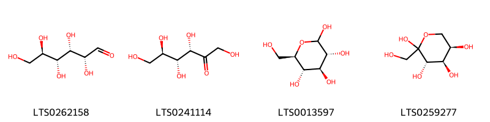{ width=100% }
    <figcaption>Hình ảnh cấu trúc hóa học của 4 hoạt chất thuộc nhóm Organooxygen compounds gồm ['(+)-glucose (LTS0262158)', 'keto-d-fructose (LTS0241114)', 'glucose (LTS0013597)', 'd-fructopyranose (LTS0259277)'].</figcaption>
</figure>
#### Nhóm Steroids and steroid derivatives
<figure markdown="span">
    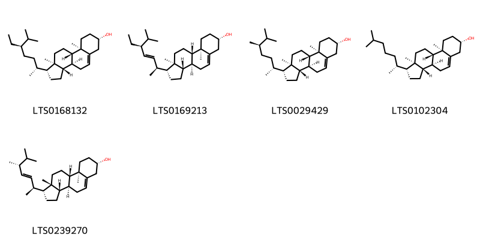{ width=100% }
    <figcaption>Hình ảnh cấu trúc hóa học của 5 hoạt chất thuộc nhóm Steroids and steroid derivatives gồm ['sitosterol (LTS0168132)', '(1r,3as,3bs,7s,9ar,9bs,11ar)-1-[(2s,3e,5s)-5-ethyl-6-methylhept-3-en-2-yl]-9a,11a-dimethyl-1h,2h,3h,3ah,3bh,4h,6h,7h,8h,9h,9bh,10h,11h-cyclopenta[a]phenanthren-7-ol (LTS0169213)', 'campesterol (LTS0029429)', 'cholesterol (LTS0102304)', '(1r,3as,3bs,7s,9ar,9bs,11as)-1-[(2s,3e,5r)-5,6-dimethylhept-3-en-2-yl]-9a,11a-dimethyl-1h,2h,3h,3ah,3bh,4h,6h,7h,8h,9h,9bh,10h,11h-cyclopenta[a]phenanthren-7-ol (LTS0239270)'].</figcaption>
</figure>

---

### Dược dân tộc học

Danh sách các quốc gia có sử dụng *N/A* trong điều trị các bệnh. 

| Country   | Disease   | Bệnh     |
|:----------|:----------|:---------|
| Asia      | Soap      | Xà phòng |

---

# Chi Dodonaea

??? note "Danh sách các dược liệu thuộc chi"
    
	 - *Dodonaea thunbergiana*
	 - *Dodonaea viscosa*

---
## Dodonaea thunbergiana
### Thông tin về thực vật

!!! info "Phân loại thực vật của *Dodonaea viscosa* từ GIBF:"
    - **Kingdom:** Plantae
    - **Phylum:** Tracheophyta
    - **Order:** Sapindales
    - **Family:** Sapindaceae
    - **Genus:** Dodonaea
    - **Species:** *Dodonaea viscosa*

 

| Label (VI)   | Label (EN)   | Scientific Name       | Descriptions (VI)   | Descriptions (EN)   | Also Known As (VI)   | Also Known As (EN)   |
|:-------------|:-------------|:----------------------|:--------------------|:--------------------|:---------------------|:---------------------|
| N/A          | N/A          | Dodonaea thunbergiana | loài thực vật       | species of plant    | ['']                 | ['']                 |

#### Phân bố trên thế giới

**Từ CSDL GIBF** nan, South Africa, Germany, Namibia, Spain, United States of America

#### Phân bố tại Việt Nam

**Từ CSDL GIBF**: Không có ghi nhận ở Việt Nam

---
### Thành phần hóa học
        
- Theo cơ sở dữ liệu lotus: Từ loài *Dodonaea viscosa* đã phân lập và xác định được Chưa có hoạt chất nào được phân lập. hoạt chất thuộc về các nhóm Không có hoạt chất nào được phân lập. 

Không có hình ảnh nào được tạo ra

---

### Dược dân tộc học

Danh sách các quốc gia có sử dụng *Dodonaea viscosa* trong điều trị các bệnh. 

| Country   | Disease   | Bệnh     |
|:----------|:----------|:---------|
| Elsewhere | Purgative | Thuốc xổ |

---

---
## Dodonaea viscosa
### Thông tin về thực vật

!!! info "Phân loại thực vật của *Dodonaea viscosa* từ GIBF:"
    - **Kingdom:** Plantae
    - **Phylum:** Tracheophyta
    - **Order:** Sapindales
    - **Family:** Sapindaceae
    - **Genus:** Dodonaea
    - **Species:** *Dodonaea viscosa*

 

| Label (VI)   | Label (EN)   | Scientific Name   | Descriptions (VI)   | Descriptions (EN)   | Also Known As (VI)   | Also Known As (EN)           |
|:-------------|:-------------|:------------------|:--------------------|:--------------------|:---------------------|:-----------------------------|
| N/A          | N/A          | Dodonaea viscosa  | loài thực vật       | species of plant    | ['']                 | ['Hop Bush', 'Hopseed bush'] |

#### Phân bố trên thế giới

**Từ CSDL GIBF** nan, Australia, Bermuda, Puerto Rico, Chinese Taipei, Malta, United States of America, Uruguay, South Africa, Turks and Caicos Islands, Guam, Brazil, New Caledonia, Mexico, Dominican Republic, Ecuador, Colombia, India, New Zealand

#### Phân bố tại Việt Nam

**Từ CSDL GIBF**: Không có ghi nhận ở Việt Nam

---
### Thành phần hóa học
        
- Theo cơ sở dữ liệu lotus: Từ loài *Dodonaea viscosa* đã phân lập và xác định được 92 hoạt chất thuộc về các nhóm Flavonoids, Prenol lipids, Steroids and steroid derivatives, Coumarinolignans, Cinnamic acids and derivatives, Dihydrofurans, Heteroaromatic compounds, Coumarins and derivatives. 

|    | chemicalTaxonomyClassyfireClass   |   smiles_count |
|---:|:----------------------------------|---------------:|
|  0 | Cinnamic acids and derivatives    |              2 |
|  1 | Coumarinolignans                  |              1 |
|  2 | Coumarins and derivatives         |              1 |
|  3 | Dihydrofurans                     |              3 |
|  4 | Flavonoids                        |             32 |
|  5 | Heteroaromatic compounds          |              2 |
|  6 | Prenol lipids                     |             42 |
|  7 | Steroids and steroid derivatives  |              5 |

#### Nhóm Cinnamic acids and derivatives
<figure markdown="span">
    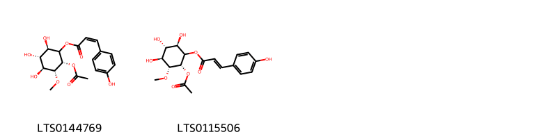{ width=100% }
    <figcaption>Hình ảnh cấu trúc hóa học của 2 hoạt chất thuộc nhóm Cinnamic acids and derivatives gồm ['(2r,3r,4s,5s,6r)-2-(acetyloxy)-4,5,6-trihydroxy-3-methoxycyclohexyl (2z)-3-(4-hydroxyphenyl)prop-2-enoate (LTS0144769)', '(2r,3r,4s,5s,6r)-2-(acetyloxy)-4,5,6-trihydroxy-3-methoxycyclohexyl (2e)-3-(4-hydroxyphenyl)prop-2-enoate (LTS0115506)'].</figcaption>
</figure>
#### Nhóm Coumarinolignans
<figure markdown="span">
    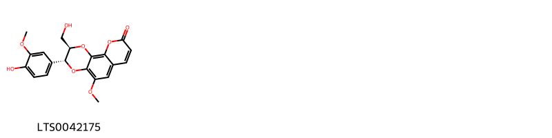{ width=100% }
    <figcaption>Hình ảnh cấu trúc hóa học của 1 hoạt chất thuộc nhóm Coumarinolignans gồm ['cleomiscosin a (LTS0042175)'].</figcaption>
</figure>
#### Nhóm Coumarins and derivatives
<figure markdown="span">
    { width=100% }
    <figcaption>Hình ảnh cấu trúc hóa học của 1 hoạt chất thuộc nhóm Coumarins and derivatives gồm ['scopoletin (LTS0193112)'].</figcaption>
</figure>
#### Nhóm Dihydrofurans
<figure markdown="span">
    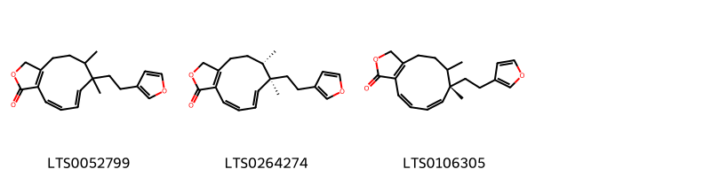{ width=100% }
    <figcaption>Hình ảnh cấu trúc hóa học của 3 hoạt chất thuộc nhóm Dihydrofurans gồm ['7-[2-(furan-3-yl)ethyl]-6,7-dimethyl-3h,4h,5h,6h-cyclodeca[c]furan-1-one (LTS0052799)', '(6s,7r)-7-[2-(furan-3-yl)ethyl]-6,7-dimethyl-3h,4h,5h,6h-cyclodeca[c]furan-1-one (LTS0264274)', '(7s)-7-[2-(furan-3-yl)ethyl]-6,7-dimethyl-3h,4h,5h,6h-cyclodeca[c]furan-1-one (LTS0106305)'].</figcaption>
</figure>
#### Nhóm Flavonoids
<figure markdown="span">
    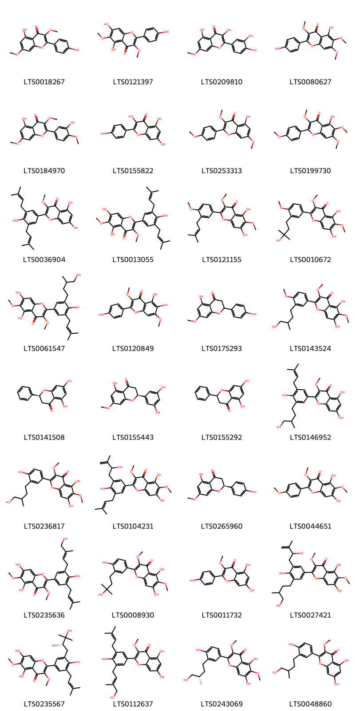{ width=100% }
    <figcaption>Hình ảnh cấu trúc hóa học của 32 hoạt chất thuộc nhóm Flavonoids gồm ['kumatakenin (LTS0018267)', '5,7-dihydroxy-2-(4-hydroxyphenyl)-3,6-dimethoxychromen-4-one (LTS0121397)', 'rhamnetin (LTS0209810)', 'penduletin (LTS0080627)', 'ayanin (LTS0184970)', 'kaempherol (LTS0155822)', '5-hydroxy-3,7-dimethoxy-2-(4-methoxyphenyl)chromen-4-one (LTS0253313)', "penduletin 4'-methyl ether (LTS0199730)", '5,7-dihydroxy-2-[4-hydroxy-3,5-bis(3-methylbut-2-en-1-yl)phenyl]-3-methoxychromen-4-one (LTS0036904)', '5,7-dihydroxy-2-[4-hydroxy-3,5-bis(3-methylbut-2-en-1-yl)phenyl]-3,6-dimethoxychromen-4-one (LTS0013055)', 'viscosol (LTS0121155)', "aliarin 4'-methyl ether (LTS0010672)", '5,7-dihydroxy-2-[4-hydroxy-3-(4-hydroxy-3-methylbutyl)-5-(3-methylbut-2-en-1-yl)phenyl]-3,6-dimethoxychromen-4-one (LTS0061547)', '5,6-dihydroxy-2-(4-hydroxyphenyl)-3,7-dimethoxychromen-4-one (LTS0120849)', 'sakuranetin (LTS0175293)', '5,7-dihydroxy-2-[3-(4-hydroxy-3-methylbutyl)-4-methoxyphenyl]-3,6-dimethoxychromen-4-one (LTS0143524)', 'pinocembrine (LTS0141508)', 'blumeatin (LTS0155443)', 'pinocembrin (LTS0155292)', 'dodoviscin h (LTS0146952)', '5,7-dihydroxy-2-[4-hydroxy-3-(4-hydroxy-3-methylbutyl)phenyl]-3,6-dimethoxychromen-4-one (LTS0236817)', 'dodoviscin b (LTS0104231)', 'sakuranetin (LTS0265960)', 'santin (LTS0044651)', 'dodoviscin g (LTS0235636)', 'aliarin (LTS0008930)', 'isokaempferide (LTS0011732)', 'dodoviscin a (LTS0027421)', '2-{3-[(2s)-2,3-dihydroxy-3-methylbutyl]-4-hydroxy-5-(3-methylbut-2-en-1-yl)phenyl}-5,7-dihydroxy-3,6-dimethoxychromen-4-one (LTS0235567)', 'dodoviscin e (LTS0112637)', '5,7-dihydroxy-2-{4-hydroxy-3-[(3s)-4-hydroxy-3-methylbutyl]phenyl}-3,6-dimethoxychromen-4-one (LTS0243069)', 'dodoviscin i (LTS0048860)'].</figcaption>
</figure>
#### Nhóm Heteroaromatic compounds
<figure markdown="span">
    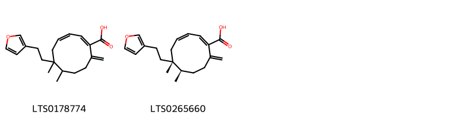{ width=100% }
    <figcaption>Hình ảnh cấu trúc hóa học của 2 hoạt chất thuộc nhóm Heteroaromatic compounds gồm ['6-[2-(furan-3-yl)ethyl]-6,7-dimethyl-10-methylidenecyclodeca-1,3-diene-1-carboxylic acid (LTS0178774)', '(1e,3z,6r,7r)-6-[2-(furan-3-yl)ethyl]-6,7-dimethyl-10-methylidenecyclodeca-1,3-diene-1-carboxylic acid (LTS0265660)'].</figcaption>
</figure>
#### Nhóm Prenol lipids
<figure markdown="span">
    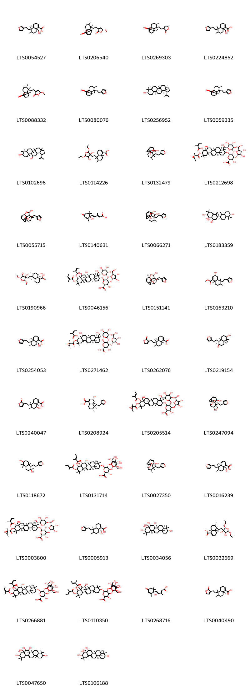{ width=100% }
    <figcaption>Hình ảnh cấu trúc hóa học của 42 hoạt chất thuộc nhóm Prenol lipids gồm ['(4ar,5s,6r,8as)-5-[2-(furan-3-yl)ethyl]-8a-(hydroxymethyl)-5,6-dimethyl-3,4,4a,6,7,8-hexahydronaphthalene-1-carboxylic acid (LTS0054527)', '(5r)-3-{2-[(6ar,7s,8r,10as)-7,8-dimethyl-3-oxo-1h,5h,6h,6ah,8h,9h,10h-naphtho[4,4a-c]furan-7-yl]ethyl}-5-methoxy-5h-furan-2-one (LTS0206540)', '3-{2-[(6ar,7s,8r,10as)-7,8-dimethyl-3-oxo-1h,5h,6h,6ah,8h,9h,10h-naphtho[4,4a-c]furan-7-yl]ethyl}-5h-furan-2-one (LTS0269303)', '5-[2-(furan-3-yl)ethyl]-8a-(hydroxymethyl)-5,6-dimethyl-3,4,4a,6,7,8-hexahydronaphthalene-1-carboxylic acid (LTS0224852)', '3-{2-[(6ar,7s,8r,10as)-7,8-dimethyl-3-oxo-1h,5h,6h,6ah,8h,9h,10h-naphtho[4,4a-c]furan-7-yl]ethyl}-5-methoxy-5h-furan-2-one (LTS0088332)', '7-[2-(furan-3-yl)ethyl]-7,8-dimethyl-1h,5h,6h,6ah,8h,9h,10h-naphtho[4,4a-c]furan-3-one (LTS0080076)', 'lupeol (LTS0256952)', '(6ar,7s,8r,10as)-7-[2-(furan-3-yl)ethyl]-7,8-dimethyl-1h,5h,6h,6ah,8h,9h,10h-naphtho[4,4a-c]furan-3-one (LTS0059335)', '3a,5a,5b,8,8,11a-hexamethyl-1-(prop-1-en-2-yl)-hexadecahydrocyclopenta[a]chrysene-9,12-diol (LTS0102698)', '5-[2-(2,5-diethoxy-3,4-dihydroxyoxolan-3-yl)ethyl]-5,6,8a-trimethyl-3,4,4a,6,7,8-hexahydronaphthalene-1-carboxylic acid (LTS0114226)', 'methyl 5-[2-(furan-3-yl)ethyl]-4-hydroxy-5,6-dimethyl-1h,4h,4ah,6h,7h,8h-cyclopropa[e]naphthalene-1a-carboxylate (LTS0132479)', '(2s,3s,4s,5r,6r)-6-{[(3s,4ar,6ar,6bs,8r,8ar,9r,10r,12as,14ar,14br)-10-(2,3-dimethyloxirane-2-carbonyloxy)-8-hydroxy-8a-(hydroxymethyl)-4,4,6a,6b,11,11,14b-heptamethyl-9-{[(2z)-2-methylbut-2-enoyl]oxy}-1,2,3,4a,5,6,7,8,9,10,12,12a,14,14a-tetradecahydropicen-3-yl]oxy}-4-{[(2s,3r,4r,5s)-3,4-dihydroxy-5-(hydroxymethyl)oxolan-2-yl]oxy}-3-hydroxy-5-{[(2s,3r,4s,5s,6r)-3,4,5-trihydroxy-6-(hydroxymethyl)oxan-2-yl]oxy}oxane-2-carboxylic acid (LTS0212698)', 'methyl 5-[2-(furan-3-yl)ethyl]-6-hydroxy-4-methyl-7-oxatetracyclo[6.4.1.0¹,¹¹.0⁵,¹³]tridec-9-ene-11-carboxylate (LTS0055715)', 'abscisic acid,  (LTS0140631)', 'methyl 5-[2-(furan-3-yl)ethyl]-4-hydroxy-5-(hydroxymethyl)-6-methyl-1h,4h,4ah,6h,7h,8h-cyclopropa[e]naphthalene-1a-carboxylate (LTS0066271)', '(3r,4r,4ar,5r,6as,6br,10s,12ar,14bs)-4a-(hydroxymethyl)-2,2,6a,6b,9,9,12a-heptamethyl-1,3,4,5,6,7,8,8a,10,11,12,12b,13,14b-tetradecahydropicene-3,4,5,10-tetrol (LTS0183359)', '(5s,6r,8s,8ar)-5-{2-[(2s,4s,5r)-3,4-dihydroxy-2,5-dimethoxyoxolan-3-yl]ethyl}-8-hydroxy-5,6,8a-trimethyl-3,4,4a,6,7,8-hexahydronaphthalene-1-carboxylic acid (LTS0190966)', '(2s,3s,4s,5r,6r)-6-{[(3s,4ar,6ar,6bs,7r,8s,8as,9r,10r,12as,14ar,14br)-7,8-dihydroxy-4,4,6a,6b,8a,11,11,14b-octamethyl-9,10-bis({[(2z)-2-methylbut-2-enoyl]oxy})-1,2,3,4a,5,6,7,8,9,10,12,12a,14,14a-tetradecahydropicen-3-yl]oxy}-4-{[(2s,3r,4r,5s)-3,4-dihydroxy-5-(hydroxymethyl)oxolan-2-yl]oxy}-3-hydroxy-5-{[(2s,3r,4s,5s,6r)-3,4,5-trihydroxy-6-(hydroxymethyl)oxan-2-yl]oxy}oxane-2-carboxylic acid (LTS0046156)', 'methyl (1r,4s,5s,6s,8r,11r,13r)-5-[2-(furan-3-yl)ethyl]-6-hydroxy-4-methyl-7-oxatetracyclo[6.4.1.0¹,¹¹.0⁵,¹³]tridec-9-ene-11-carboxylate (LTS0151141)', 'methyl 5-[2-(furan-3-yl)ethyl]-3-hydroxy-5,6,8a-trimethyl-3,4,4a,6,7,8-hexahydronaphthalene-1-carboxylate (LTS0163210)', '(4ar,5r,6r,8ar)-5-[2-(furan-3-yl)ethyl]-8a-(hydroxymethyl)-5,6-dimethyl-3,4,4a,6,7,8-hexahydronaphthalene-1-carboxylic acid (LTS0254053)', '(2s,3s,4s,5r,6r)-6-{[(3s,4ar,6ar,6bs,8r,8as,9r,10r,12as,14ar,14br)-10-[(2r,3s)-2,3-dimethyloxirane-2-carbonyloxy]-8-hydroxy-4,4,6a,6b,8a,11,11,14b-octamethyl-9-{[(2z)-2-methylbut-2-enoyl]oxy}-1,2,3,4a,5,6,7,8,9,10,12,12a,14,14a-tetradecahydropicen-3-yl]oxy}-4-{[(2s,3r,4r,5s)-3,4-dihydroxy-5-(hydroxymethyl)oxolan-2-yl]oxy}-3-hydroxy-5-{[(2s,3r,4s,5s,6r)-3,4,5-trihydroxy-6-(hydroxymethyl)oxan-2-yl]oxy}oxane-2-carboxylic acid (LTS0271462)', '(4ar,5s,6r,8ar)-5,6,8a-trimethyl-5-[2-(2-oxo-5h-furan-3-yl)ethyl]-3,4,4a,6,7,8-hexahydronaphthalene-1-carboxylic acid (LTS0262076)', '(2r,4ar,5s,6s,8as)-5-[2-(furan-3-yl)ethyl]-1,1,4a,6-tetramethyl-hexahydro-2h-naphthalene-2,6-diol (LTS0219154)', '(5s,6r,8s,8ar)-8-hydroxy-5,6,8a-trimethyl-5-[2-(2-oxo-5h-furan-3-yl)ethyl]-3,4,4a,6,7,8-hexahydronaphthalene-1-carboxylic acid (LTS0240047)', 'methyl (3r,4ar,5s,6r,8ar)-5-[2-(furan-3-yl)ethyl]-3-hydroxy-5,6,8a-trimethyl-3,4,4a,6,7,8-hexahydronaphthalene-1-carboxylate (LTS0208924)', '4-{[3,4-dihydroxy-5-(hydroxymethyl)oxolan-2-yl]oxy}-6-{[10-(2,3-dimethyloxirane-2-carbonyloxy)-8-hydroxy-8a-(hydroxymethyl)-4,4,6a,6b,11,11,14b-heptamethyl-9-[(2-methylbut-2-enoyl)oxy]-1,2,3,4a,5,6,7,8,9,10,12,12a,14,14a-tetradecahydropicen-3-yl]oxy}-3-hydroxy-5-{[3,4,5-trihydroxy-6-(hydroxymethyl)oxan-2-yl]oxy}oxane-2-carboxylic acid (LTS0205514)', 'methyl (1ar,4r,4ar,5s,6s,8ar)-5-[2-(furan-3-yl)ethyl]-4-hydroxy-5-(hydroxymethyl)-6-methyl-1h,4h,4ah,6h,7h,8h-cyclopropa[e]naphthalene-1a-carboxylate (LTS0247094)', '5-[2-(furan-3-yl)ethyl]-1,1,4a,6-tetramethyl-hexahydro-2h-naphthalene-2,6-diol (LTS0118672)', '(2s,3s,4s,5r,6r)-6-{[(3s,4ar,6ar,6bs,7r,8s,8ar,9r,10r,12as,14ar,14br)-7,8-dihydroxy-8a-(hydroxymethyl)-4,4,6a,6b,11,11,14b-heptamethyl-9,10-bis({[(2e)-2-methylbut-2-enoyl]oxy})-1,2,3,4a,5,6,7,8,9,10,12,12a,14,14a-tetradecahydropicen-3-yl]oxy}-4-{[(2s,3r,4r,5s)-3,4-dihydroxy-5-(hydroxymethyl)oxolan-2-yl]oxy}-3-hydroxy-5-{[(2s,3r,4s,5s,6r)-3,4,5-trihydroxy-6-(hydroxymethyl)oxan-2-yl]oxy}oxane-2-carboxylic acid (LTS0131714)', 'methyl (1ar,4r,4as,5r,6s,8ar)-5-[2-(furan-3-yl)ethyl]-4-hydroxy-5,6-dimethyl-1h,4h,4ah,6h,7h,8h-cyclopropa[e]naphthalene-1a-carboxylate (LTS0027350)', '(4ar,5s,6r,8as)-5-[2-(furan-3-yl)ethyl]-8a-(hydroxymethyl)-5,6-dimethyl-4a,6,7,8-tetrahydronaphthalene-1-carboxylic acid (LTS0016239)', '(2s,3s,4s,5r,6r)-6-{[(3s,4ar,6ar,6bs,8r,8ar,9r,10r,12as,14ar,14br)-10-[(2s,3r)-2,3-dimethyloxirane-2-carbonyloxy]-8-hydroxy-8a-(hydroxymethyl)-4,4,6a,6b,11,11,14b-heptamethyl-9-{[(2z)-2-methylbut-2-enoyl]oxy}-1,2,3,4a,5,6,7,8,9,10,12,12a,14,14a-tetradecahydropicen-3-yl]oxy}-4-{[(2s,3r,4r,5s)-3,4-dihydroxy-5-(hydroxymethyl)oxolan-2-yl]oxy}-3-hydroxy-5-{[(2s,3r,4s,5s,6r)-3,4,5-trihydroxy-6-(hydroxymethyl)oxan-2-yl]oxy}oxane-2-carboxylic acid (LTS0003800)', '(5s,8ar)-5-[2-(furan-3-yl)ethyl]-8a-(hydroxymethyl)-5,6-dimethyl-3,4,4a,6,7,8-hexahydronaphthalene-1-carboxylic acid (LTS0005913)', '(3r,4r,4as,5s,6r,6as,6br,8ar,10s,12ar,12br,14bs)-4a-(hydroxymethyl)-2,2,6a,6b,9,9,12a-heptamethyl-1,3,4,5,6,7,8,8a,10,11,12,12b,13,14b-tetradecahydropicene-3,4,5,6,10-pentol (LTS0034056)', '(4as,5r,6s,8as)-5-{2-[(2s,3r,4s,5r)-2,5-diethoxy-3,4-dihydroxyoxolan-3-yl]ethyl}-5,6,8a-trimethyl-3,4,4a,6,7,8-hexahydronaphthalene-1-carboxylic acid (LTS0032669)', '(2s,3s,4s,5r,6r)-6-{[(3s,4ar,6ar,6bs,7r,8s,8ar,9r,10r,12as,14ar,14br)-7,8-dihydroxy-8a-(hydroxymethyl)-4,4,6a,6b,11,11,14b-heptamethyl-9,10-bis({[(2z)-2-methylbut-2-enoyl]oxy})-1,2,3,4a,5,6,7,8,9,10,12,12a,14,14a-tetradecahydropicen-3-yl]oxy}-4-{[(2s,3r,4r,5s)-3,4-dihydroxy-5-(hydroxymethyl)oxolan-2-yl]oxy}-3-hydroxy-5-{[(2s,3r,4s,5s,6r)-3,4,5-trihydroxy-6-(hydroxymethyl)oxan-2-yl]oxy}oxane-2-carboxylic acid (LTS0266881)', '4-{[3,4-dihydroxy-5-(hydroxymethyl)oxolan-2-yl]oxy}-6-{[7,8-dihydroxy-8a-(hydroxymethyl)-4,4,6a,6b,11,11,14b-heptamethyl-9,10-bis[(2-methylbut-2-enoyl)oxy]-1,2,3,4a,5,6,7,8,9,10,12,12a,14,14a-tetradecahydropicen-3-yl]oxy}-3-hydroxy-5-{[3,4,5-trihydroxy-6-(hydroxymethyl)oxan-2-yl]oxy}oxane-2-carboxylic acid (LTS0110350)', '(4e)-5-[(1s)-1-hydroxy-2,6,6-trimethyl-4-oxocyclohex-2-en-1-yl]-3-methylpenta-2,4-dienoic acid (LTS0268716)', '5,6,8a-trimethyl-5-[2-(2-oxo-5h-furan-3-yl)ethyl]-3,4,4a,6,7,8-hexahydronaphthalene-1-carboxylic acid (LTS0040490)', '4a-(hydroxymethyl)-2,2,6a,6b,9,9,12a-heptamethyl-1,3,4,5,6,7,8,8a,10,11,12,12b,13,14b-tetradecahydropicene-3,4,5,6,10-pentol (LTS0047650)', 'theasapogenol b (LTS0106188)'].</figcaption>
</figure>
#### Nhóm Steroids and steroid derivatives
<figure markdown="span">
    { width=100% }
    <figcaption>Hình ảnh cấu trúc hóa học của 5 hoạt chất thuộc nhóm Steroids and steroid derivatives gồm ['stigmast-5-en-3-ol (LTS0071224)', 'stigmast-5-en-3-ol, (3β)- (LTS0204616)', 'sitogluside (LTS0201798)', '2-{[1-(5-ethyl-6-methylheptan-2-yl)-9a,11a-dimethyl-1h,2h,3h,3ah,3bh,4h,6h,7h,8h,9h,9bh,10h,11h-cyclopenta[a]phenanthren-7-yl]oxy}-6-(hydroxymethyl)oxane-3,4,5-triol (LTS0158828)', 'phytosterol (LTS0029311)'].</figcaption>
</figure>

---

### Dược dân tộc học

Danh sách các quốc gia có sử dụng *Dodonaea viscosa* trong điều trị các bệnh. 

| Country         | Disease                         | Bệnh                                     |
|:----------------|:--------------------------------|:-----------------------------------------|
| Elsewhere       | Piscicide, Dentifrice, Styptic  | Piscicide, Dentifrice, Styptic           |
| India           | Astringent, Piscicide           | Chất làm se, Piscicide                   |
| Iraq            | Piscicide, Stimulant, Sudorific | Thuốc trừ sâu, chất kích thích, gây ngạt |
| Newguinea(Dani) | Poultice                        | thuốc đắp, đắp thuốc cao                 |
| Peru            | Stimulant                       | Chất kích thích                          |

---

# Chi Nephelium

??? note "Danh sách các dược liệu thuộc chi"
    
	 - *Nephelium lappaceum*
	 - *Nephelium longana*
	 - *Nephelium mutabile*

---
## Nephelium lappaceum
### Thông tin về thực vật

!!! info "Phân loại thực vật của *Nephelium lappaceum* từ GIBF:"
    - **Kingdom:** Plantae
    - **Phylum:** Tracheophyta
    - **Order:** Sapindales
    - **Family:** Sapindaceae
    - **Genus:** Nephelium
    - **Species:** *Nephelium lappaceum*

 

| Label (VI)   | Label (EN)   | Scientific Name     | Descriptions (VI)   | Descriptions (EN)          | Also Known As (VI)   | Also Known As (EN)        |
|:-------------|:-------------|:--------------------|:--------------------|:---------------------------|:---------------------|:--------------------------|
| N/A          | N/A          | Nephelium lappaceum | loài thực vật       | species of plant, rambutan | ['']                 | ['Hairfruit', 'rambutan'] |

#### Phân bố trên thế giới

**Từ CSDL GIBF** nan, Sri Lanka, Australia, Lao People’s Democratic Republic, Guatemala, Panama, French Guiana, Puerto Rico, Chinese Taipei, United States of America, Thailand, Brazil, Mexico, Dominican Republic, Singapore, Viet Nam, China, United Kingdom of Great Britain and Northern Ireland, Ecuador, French Polynesia, Madagascar, Colombia, Costa Rica, India, Indonesia, Philippines, Malaysia, Brunei Darussalam

#### Phân bố tại Việt Nam

**Từ CSDL GIBF**: Không có ghi nhận ở Việt Nam

---
### Thành phần hóa học
        
- Theo cơ sở dữ liệu lotus: Từ loài *Nephelium lappaceum* đã phân lập và xác định được 19 hoạt chất thuộc về các nhóm Fatty Acyls, Flavonoids, Prenol lipids, Furofurans, Dihydrofurans, Tannins. 

|    | chemicalTaxonomyClassyfireClass   |   smiles_count |
|---:|:----------------------------------|---------------:|
|  0 | Dihydrofurans                     |              1 |
|  1 | Fatty Acyls                       |              4 |
|  2 | Flavonoids                        |              2 |
|  3 | Furofurans                        |              3 |
|  4 | Prenol lipids                     |              6 |
|  5 | Tannins                           |              3 |

#### Nhóm Dihydrofurans
<figure markdown="span">
    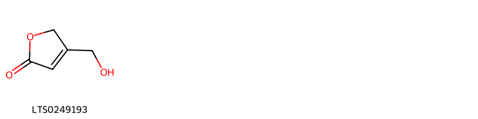{ width=100% }
    <figcaption>Hình ảnh cấu trúc hóa học của 1 hoạt chất thuộc nhóm Dihydrofurans gồm ['4-(hydroxymethyl)-5h-furan-2-one (LTS0249193)'].</figcaption>
</figure>
#### Nhóm Fatty Acyls
<figure markdown="span">
    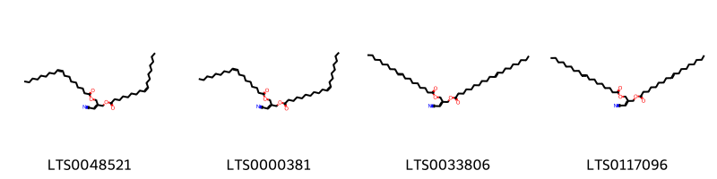{ width=100% }
    <figcaption>Hình ảnh cấu trúc hóa học của 4 hoạt chất thuộc nhóm Fatty Acyls gồm ['3-cyano-2-{[(9z)-octadec-9-enoyloxy]methyl}prop-2-en-1-yl (9z)-octadec-9-enoate (LTS0048521)', '(2z)-3-cyano-2-{[(9z)-octadec-9-enoyloxy]methyl}prop-2-en-1-yl (11z)-icos-11-enoate (LTS0000381)', '3-cyano-2-[(octadec-9-enoyloxy)methyl]prop-2-en-1-yl icos-11-enoate (LTS0033806)', '3-cyano-2-[(octadec-9-enoyloxy)methyl]prop-2-en-1-yl octadec-9-enoate (LTS0117096)'].</figcaption>
</figure>
#### Nhóm Flavonoids
<figure markdown="span">
    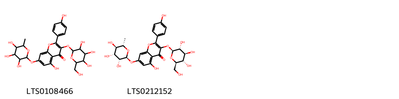{ width=100% }
    <figcaption>Hình ảnh cấu trúc hóa học của 2 hoạt chất thuộc nhóm Flavonoids gồm ['5-hydroxy-2-(4-hydroxyphenyl)-3-{[3,4,5-trihydroxy-6-(hydroxymethyl)oxan-2-yl]oxy}-7-[(3,4,5-trihydroxy-6-methyloxan-2-yl)oxy]chromen-4-one (LTS0108466)', '5-hydroxy-2-(4-hydroxyphenyl)-3-{[(2s,3r,4s,5s,6r)-3,4,5-trihydroxy-6-(hydroxymethyl)oxan-2-yl]oxy}-7-{[(2s,3r,4r,5r,6s)-3,4,5-trihydroxy-6-methyloxan-2-yl]oxy}chromen-4-one (LTS0212152)'].</figcaption>
</figure>
#### Nhóm Furofurans
<figure markdown="span">
    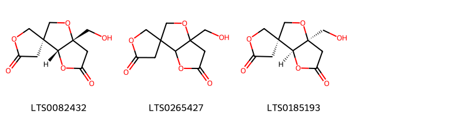{ width=100% }
    <figcaption>Hình ảnh cấu trúc hóa học của 3 hoạt chất thuộc nhóm Furofurans gồm ["(3r,3ar,6as)-6a-(hydroxymethyl)-dihydro-2h-spiro[furo[3,2-b]furan-3,3'-oxolane]-5,5'-dione (LTS0082432)", "6a-(hydroxymethyl)-dihydro-2h-spiro[furo[3,2-b]furan-3,3'-oxolane]-5,5'-dione (LTS0265427)", "(3r,3as,6ar)-6a-(hydroxymethyl)-dihydro-2h-spiro[furo[3,2-b]furan-3,3'-oxolane]-5,5'-dione (LTS0185193)"].</figcaption>
</figure>
#### Nhóm Prenol lipids
<figure markdown="span">
    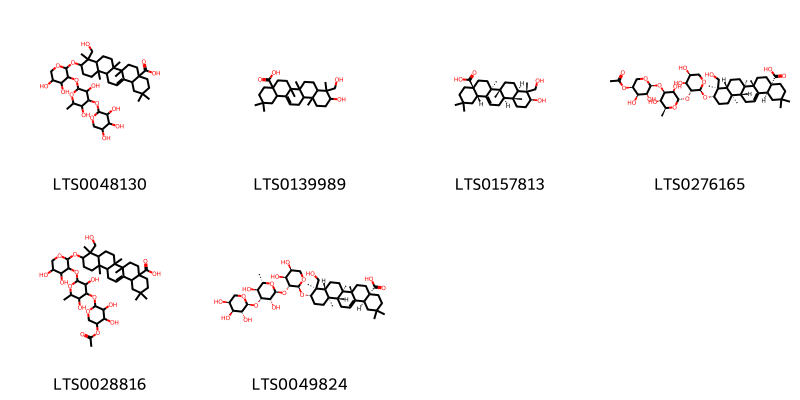{ width=100% }
    <figcaption>Hình ảnh cấu trúc hóa học của 6 hoạt chất thuộc nhóm Prenol lipids gồm ['10-{[3-({3,5-dihydroxy-6-methyl-4-[(3,4,5-trihydroxyoxan-2-yl)oxy]oxan-2-yl}oxy)-4,5-dihydroxyoxan-2-yl]oxy}-9-(hydroxymethyl)-2,2,6a,6b,9,12a-hexamethyl-1,3,4,5,6,7,8,8a,10,11,12,12b,13,14b-tetradecahydropicene-4a-carboxylic acid (LTS0048130)', '10-hydroxy-9-(hydroxymethyl)-2,2,6a,6b,9,12a-hexamethyl-1,3,4,5,6,7,8,8a,10,11,12,12b,13,14b-tetradecahydropicene-4a-carboxylic acid (LTS0139989)', 'hederagenin (LTS0157813)', '(4as,6as,6br,8ar,9r,10s,12ar,12br,14bs)-10-{[(2s,3r,4s,5s)-3-{[(2s,3r,4r,5s,6s)-4-{[(2s,3r,4r,5s)-5-(acetyloxy)-3,4-dihydroxyoxan-2-yl]oxy}-3,5-dihydroxy-6-methyloxan-2-yl]oxy}-4,5-dihydroxyoxan-2-yl]oxy}-9-(hydroxymethyl)-2,2,6a,6b,9,12a-hexamethyl-1,3,4,5,6,7,8,8a,10,11,12,12b,13,14b-tetradecahydropicene-4a-carboxylic acid (LTS0276165)', '10-({3-[(4-{[5-(acetyloxy)-3,4-dihydroxyoxan-2-yl]oxy}-3,5-dihydroxy-6-methyloxan-2-yl)oxy]-4,5-dihydroxyoxan-2-yl}oxy)-9-(hydroxymethyl)-2,2,6a,6b,9,12a-hexamethyl-1,3,4,5,6,7,8,8a,10,11,12,12b,13,14b-tetradecahydropicene-4a-carboxylic acid (LTS0028816)', '(4as,6as,6br,8ar,9r,10s,12ar,12br,14bs)-10-{[(2s,3r,4s,5s)-3-{[(2s,3r,4r,5s,6s)-3,5-dihydroxy-6-methyl-4-{[(2s,3r,4s,5s)-3,4,5-trihydroxyoxan-2-yl]oxy}oxan-2-yl]oxy}-4,5-dihydroxyoxan-2-yl]oxy}-9-(hydroxymethyl)-2,2,6a,6b,9,12a-hexamethyl-1,3,4,5,6,7,8,8a,10,11,12,12b,13,14b-tetradecahydropicene-4a-carboxylic acid (LTS0049824)'].</figcaption>
</figure>
#### Nhóm Tannins
<figure markdown="span">
    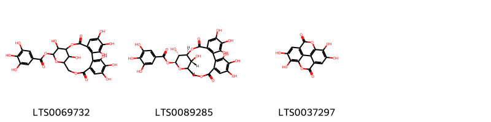{ width=100% }
    <figcaption>Hình ảnh cấu trúc hóa học của 3 hoạt chất thuộc nhóm Tannins gồm ['6,7,8,11,12,13,22,23-octahydroxy-3,16-dioxo-2,17,20-trioxatetracyclo[17.3.1.0⁴,⁹.0¹⁰,¹⁵]tricosa-4(9),5,7,10,12,14-hexaen-21-yl 3,4,5-trihydroxybenzoate (LTS0069732)', '(1s,19r,21s,22r,23r)-6,7,8,11,12,13,22,23-octahydroxy-3,16-dioxo-2,17,20-trioxatetracyclo[17.3.1.0⁴,⁹.0¹⁰,¹⁵]tricosa-4(9),5,7,10,12,14-hexaen-21-yl 3,4,5-trihydroxybenzoate (LTS0089285)', 'ellagic acid (LTS0037297)'].</figcaption>
</figure>

---

### Dược dân tộc học

Danh sách các quốc gia có sử dụng *Nephelium lappaceum* trong điều trị các bệnh. 

| Country   | Disease                                    | Bệnh                              |
|:----------|:-------------------------------------------|:----------------------------------|
| China     | Carminative                                | Gây ô nhiễm môi trường            |
| Elsewhere | Astringent, Narcotic, Stomachic, Vermifuge | Làm se, gây mê, dạ dày, Vermifuge |

---

---
## Nephelium longana
### Thông tin về thực vật

!!! info "Phân loại thực vật của *Dimocarpus longan* từ GIBF:"
    - **Kingdom:** Plantae
    - **Phylum:** Tracheophyta
    - **Order:** Sapindales
    - **Family:** Sapindaceae
    - **Genus:** Dimocarpus
    - **Species:** *Dimocarpus longan*

 

| Label (VI)   | Label (EN)   | Scientific Name   | Descriptions (VI)   | Descriptions (EN)   | Also Known As (VI)   | Also Known As (EN)   |
|:-------------|:-------------|:------------------|:--------------------|:--------------------|:---------------------|:---------------------|
| N/A          | N/A          | Nephelium longana | loài thực vật       | species of plant    | ['']                 | ['']                 |

#### Phân bố trên thế giới

**Từ CSDL GIBF** nan, Sri Lanka, Hong Kong, Japan, Brazil, Myanmar, India, Indonesia, unknown or invalid, Philippines, Singapore, El Salvador, China

#### Phân bố tại Việt Nam

**Từ CSDL GIBF**: Không có ghi nhận ở Việt Nam

---
### Thành phần hóa học
        
- Theo cơ sở dữ liệu lotus: Từ loài *Dimocarpus longan* đã phân lập và xác định được Chưa có hoạt chất nào được phân lập. hoạt chất thuộc về các nhóm Không có hoạt chất nào được phân lập. 

Không có hình ảnh nào được tạo ra

---

### Dược dân tộc học

Danh sách các quốc gia có sử dụng *Dimocarpus longan* trong điều trị các bệnh. 

| Country   | Disease               | Bệnh                  |
|:----------|:----------------------|:----------------------|
| China     | Styptic, Tonic, Tonic | Styptic, Tonic, Tonic |

---

---
## Nephelium mutabile
### Thông tin về thực vật

!!! info "Phân loại thực vật của *Nephelium ramboutan-ake* từ GIBF:"
    - **Kingdom:** Plantae
    - **Phylum:** Tracheophyta
    - **Order:** Sapindales
    - **Family:** Sapindaceae
    - **Genus:** Nephelium
    - **Species:** *Nephelium ramboutan-ake*

 

| Label (VI)   | Label (EN)   | Scientific Name    | Descriptions (VI)   | Descriptions (EN)   | Also Known As (VI)   | Also Known As (EN)   |
|:-------------|:-------------|:-------------------|:--------------------|:--------------------|:---------------------|:---------------------|
| N/A          | N/A          | Nephelium mutabile | loài thực vật       | species of plant    | ['']                 | ['']                 |

#### Phân bố trên thế giới

**Từ CSDL GIBF** nan, Brazil, Costa Rica, unknown or invalid, Indonesia, India, France, Philippines, Singapore, Malaysia, Venezuela (Bolivarian Republic of), China

#### Phân bố tại Việt Nam

**Từ CSDL GIBF**: Không có ghi nhận ở Việt Nam

---
### Thành phần hóa học
        
- Theo cơ sở dữ liệu lotus: Từ loài *Nephelium ramboutan-ake* đã phân lập và xác định được Chưa có hoạt chất nào được phân lập. hoạt chất thuộc về các nhóm Không có hoạt chất nào được phân lập. 

Không có hình ảnh nào được tạo ra

---

### Dược dân tộc học

Danh sách các quốc gia có sử dụng *Nephelium ramboutan-ake* trong điều trị các bệnh. 

| Country   | Disease   | Bệnh           |
|:----------|:----------|:---------------|
| Malaya    | Vermifuge | Thuốc diệt sán |

---

# Chi Blighia

??? note "Danh sách các dược liệu thuộc chi"
    
	 - *Blighia sapida*
	 - *Blighia unijugata*

---
## Blighia sapida
### Thông tin về thực vật

!!! info "Phân loại thực vật của *Blighia sapida* từ GIBF:"
    - **Kingdom:** Plantae
    - **Phylum:** Tracheophyta
    - **Order:** Sapindales
    - **Family:** Sapindaceae
    - **Genus:** Blighia
    - **Species:** *Blighia sapida*

 

| Label (VI)   | Label (EN)   | Scientific Name   | Descriptions (VI)   | Descriptions (EN)       | Also Known As (VI)   | Also Known As (EN)         |
|:-------------|:-------------|:------------------|:--------------------|:------------------------|:---------------------|:---------------------------|
| N/A          | N/A          | Blighia sapida    | loài thực vật       | species of plant, Ackee | ['Blighia sapida']   | ['Achee', 'Ackee', 'Ayee'] |

#### Phân bố trên thế giới

**Từ CSDL GIBF** Virgin Islands (U.S.), Ghana, Cook Islands, Gabon, Grenada, Saint Lucia, Benin, Sierra Leone, Togo, Puerto Rico, Nigeria, Honduras, Jamaica, United States of America, Bonaire, Sint Eustatius and Saba, Guinea, Liberia, Barbados, Turks and Caicos Islands, Martinique, Côte d’Ivoire, Bahamas, Guyana, Cuba, Dominican Republic, Singapore, Saint Kitts and Nevis, Haiti, Colombia, Montserrat, Costa Rica, Cayman Islands, Burkina Faso, Antigua and Barbuda, Cameroon

#### Phân bố tại Việt Nam

**Từ CSDL GIBF**: Không có ghi nhận ở Việt Nam

---
### Thành phần hóa học
        
- Theo cơ sở dữ liệu lotus: Từ loài *Blighia sapida* đã phân lập và xác định được 16 hoạt chất thuộc về các nhóm Carboxylic acids and derivatives, Prenol lipids. 

|    | chemicalTaxonomyClassyfireClass   |   smiles_count |
|---:|:----------------------------------|---------------:|
|  0 | Carboxylic acids and derivatives  |             13 |
|  1 | Prenol lipids                     |              3 |

#### Nhóm Carboxylic acids and derivatives
<figure markdown="span">
    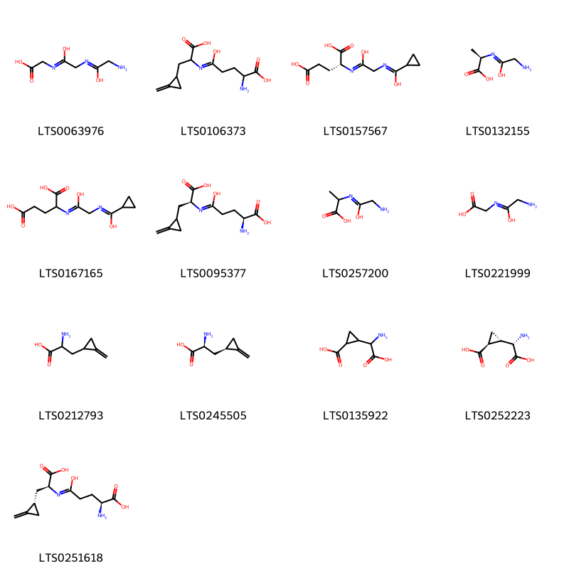{ width=100% }
    <figcaption>Hình ảnh cấu trúc hóa học của 13 hoạt chất thuộc nhóm Carboxylic acids and derivatives gồm ['({2-[(2-amino-1-hydroxyethylidene)amino]-1-hydroxyethylidene}amino)acetic acid (LTS0063976)', '2-amino-4-{[1-carboxy-2-(2-methylidenecyclopropyl)ethyl]-c-hydroxycarbonimidoyl}butanoic acid (LTS0106373)', '(2r)-2-[(2-{[cyclopropyl(hydroxy)methylidene]amino}-1-hydroxyethylidene)amino]pentanedioic acid (LTS0157567)', '(2r)-2-[(2-amino-1-hydroxyethylidene)amino]propanoic acid (LTS0132155)', '2-[(2-{[cyclopropyl(hydroxy)methylidene]amino}-1-hydroxyethylidene)amino]pentanedioic acid (LTS0167165)', '(2s)-2-amino-4-{[(1s)-1-carboxy-2-(2-methylidenecyclopropyl)ethyl]-c-hydroxycarbonimidoyl}butanoic acid (LTS0095377)', '2-[(2-amino-1-hydroxyethylidene)amino]propanoic acid (LTS0257200)', '[(2-amino-1-hydroxyethylidene)amino]acetic acid (LTS0221999)', 'hypoglycine a (LTS0212793)', 'hypoglycin a (LTS0245505)', '2-[amino(carboxy)methyl]cyclopropane-1-carboxylic acid (LTS0135922)', 'l-ccg-i (LTS0252223)', '(2s)-2-amino-4-{[(1s)-1-carboxy-2-[(1s)-2-methylidenecyclopropyl]ethyl]-c-hydroxycarbonimidoyl}butanoic acid (LTS0251618)'].</figcaption>
</figure>
#### Nhóm Prenol lipids
<figure markdown="span">
    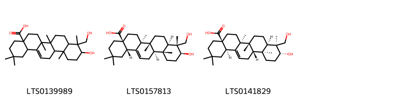{ width=100% }
    <figcaption>Hình ảnh cấu trúc hóa học của 3 hoạt chất thuộc nhóm Prenol lipids gồm ['10-hydroxy-9-(hydroxymethyl)-2,2,6a,6b,9,12a-hexamethyl-1,3,4,5,6,7,8,8a,10,11,12,12b,13,14b-tetradecahydropicene-4a-carboxylic acid (LTS0139989)', 'hederagenin (LTS0157813)', '(4as,6as,6br,8ar,9s,10r,12as,12bs,14br)-10-hydroxy-9-(hydroxymethyl)-2,2,6a,6b,9,12a-hexamethyl-1,3,4,5,6,7,8,8a,10,11,12,12b,13,14b-tetradecahydropicene-4a-carboxylic acid (LTS0141829)'].</figcaption>
</figure>

---

### Dược dân tộc học

Danh sách các quốc gia có sử dụng *Blighia sapida* trong điều trị các bệnh. 

| Country      | Disease                 | Bệnh                          |
|:-------------|:------------------------|:------------------------------|
| Elsewhere    | Poison, Piscicide, Soap | Chất độc, Piscicide, Xà phòng |
| Ghana        | Piscicide, Stimulant    | Chất diệt cá, chất kích thích |
| Guatemala    | Poison                  | Chất độc                      |
| Haiti        | Poison, Poison          | Chất độc, chất độc            |
| Ivory Coast  | Poison, Antiemetic      | Chất độc, Thuốc chống nôn     |
| Mozambique   | Antiemetic              | Chống nôn                     |
| Nigeria      | Piscicide               | Thuốc diệt cá                 |
| Sierra Leone | Piscicide               | Thuốc diệt cá                 |
| Upper Volta  | Antidote                | Chất giải độc                 |

---

---
## Blighia unijugata
### Thông tin về thực vật

!!! info "Phân loại thực vật của *Blighia unijugata* từ GIBF:"
    - **Kingdom:** Plantae
    - **Phylum:** Tracheophyta
    - **Order:** Sapindales
    - **Family:** Sapindaceae
    - **Genus:** Blighia
    - **Species:** *Blighia unijugata*

 

| Label (VI)   | Label (EN)   | Scientific Name   | Descriptions (VI)   | Descriptions (EN)   | Also Known As (VI)   | Also Known As (EN)   |
|:-------------|:-------------|:------------------|:--------------------|:--------------------|:---------------------|:---------------------|
| N/A          | N/A          | Blighia unijugata |                     | species of plant    | ['']                 | ['']                 |

#### Phân bố trên thế giới

**Từ CSDL GIBF** nan, South Africa, Ghana, Nigeria, Gabon, Kenya, Côte d’Ivoire, Mozambique, Benin, Congo, Congo, Democratic Republic of the, Guinea, Liberia, Tanzania, United Republic of, Cameroon, Togo

#### Phân bố tại Việt Nam

**Từ CSDL GIBF**: Không có ghi nhận ở Việt Nam

---
### Thành phần hóa học
        
- Theo cơ sở dữ liệu lotus: Từ loài *Blighia unijugata* đã phân lập và xác định được 4 hoạt chất thuộc về các nhóm Carboxylic acids and derivatives. 

|    | chemicalTaxonomyClassyfireClass   |   smiles_count |
|---:|:----------------------------------|---------------:|
|  0 | Carboxylic acids and derivatives  |              4 |

#### Nhóm Carboxylic acids and derivatives
<figure markdown="span">
    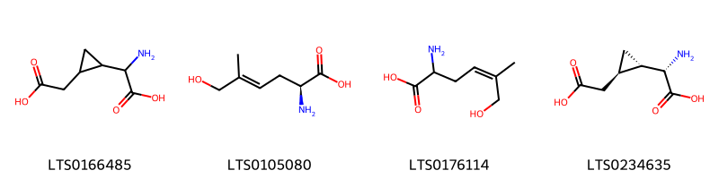{ width=100% }
    <figcaption>Hình ảnh cấu trúc hóa học của 4 hoạt chất thuộc nhóm Carboxylic acids and derivatives gồm ['amino[2-(carboxymethyl)cyclopropyl]acetic acid (LTS0166485)', '(2s,4e)-2-amino-6-hydroxy-5-methylhex-4-enoic acid (LTS0105080)', '2-amino-6-hydroxy-5-methylhex-4-enoic acid (LTS0176114)', '(s)-amino[(1s,2r)-2-(carboxymethyl)cyclopropyl]acetic acid (LTS0234635)'].</figcaption>
</figure>

---

### Dược dân tộc học

Danh sách các quốc gia có sử dụng *Blighia unijugata* trong điều trị các bệnh. 

| Country   | Disease                                                     | Bệnh                                                        |
|:----------|:------------------------------------------------------------|:------------------------------------------------------------|
| Ghana     | Hemostat, Piscicide, Purgative, Tonic, Tranquilizer, Emetic | Hemostat, Piscicide, Purgative, Tonic, Tranquilizer, Emetic |

---

# Chi Magonia

??? note "Danh sách các dược liệu thuộc chi"
    
	 - *Magonia pubescens*

---
## Magonia pubescens
### Thông tin về thực vật

!!! info "Phân loại thực vật của *Magonia pubescens* từ GIBF:"
    - **Kingdom:** Plantae
    - **Phylum:** Tracheophyta
    - **Order:** Sapindales
    - **Family:** Sapindaceae
    - **Genus:** Magonia
    - **Species:** *Magonia pubescens*

 

| Label (VI)   | Label (EN)   | Scientific Name   | Descriptions (VI)   | Descriptions (EN)   | Also Known As (VI)   | Also Known As (EN)   |
|:-------------|:-------------|:------------------|:--------------------|:--------------------|:---------------------|:---------------------|
| N/A          | N/A          | Magonia pubescens | loài thực vật       | species of plant    | ['']                 | ['']                 |

#### Phân bố trên thế giới

**Từ CSDL GIBF** Paraguay, Brazil, Bolivia (Plurinational State of)

#### Phân bố tại Việt Nam

**Từ CSDL GIBF**: Không có ghi nhận ở Việt Nam

---
### Thành phần hóa học
        
- Theo cơ sở dữ liệu lotus: Từ loài *Magonia pubescens* đã phân lập và xác định được 3 hoạt chất thuộc về các nhóm Organooxygen compounds. 

|    | chemicalTaxonomyClassyfireClass   |   smiles_count |
|---:|:----------------------------------|---------------:|
|  0 | Organooxygen compounds            |              3 |

#### Nhóm Organooxygen compounds
<figure markdown="span">
    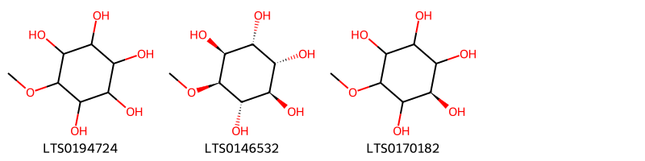{ width=100% }
    <figcaption>Hình ảnh cấu trúc hóa học của 3 hoạt chất thuộc nhóm Organooxygen compounds gồm ['pinitol (LTS0194724)', '1d-5-o-methyl-chiro-inositol (LTS0146532)', '(2r)-6-methoxycyclohexane-1,2,3,4,5-pentol (LTS0170182)'].</figcaption>
</figure>

---

### Dược dân tộc học

Danh sách các quốc gia có sử dụng *Magonia pubescens* trong điều trị các bệnh. 

| Country   | Disease   | Bệnh          |
|:----------|:----------|:--------------|
| Brazil    | Piscicide | Thuốc diệt cá |

---

# Chi Melicocca

??? note "Danh sách các dược liệu thuộc chi"
    
	 - *Melicocca bijuga*

---
## Melicocca bijuga
### Thông tin về thực vật

!!! info "Phân loại thực vật của *Melicoccus bijugatus* từ GIBF:"
    - **Kingdom:** Plantae
    - **Phylum:** Tracheophyta
    - **Order:** Sapindales
    - **Family:** Sapindaceae
    - **Genus:** Melicoccus
    - **Species:** *Melicoccus bijugatus*

 

| Label (VI)   | Label (EN)   | Scientific Name   | Descriptions (VI)   | Descriptions (EN)   | Also Known As (VI)   | Also Known As (EN)   |
|:-------------|:-------------|:------------------|:--------------------|:--------------------|:---------------------|:---------------------|
| N/A          | N/A          | Magonia pubescens | loài thực vật       | species of plant    | ['']                 | ['']                 |

#### Phân bố trên thế giới

**Từ CSDL GIBF** nan, Virgin Islands (U.S.), Puerto Rico, French Polynesia, Cook Islands, Martinique, Colombia, Bahamas, Côte d’Ivoire, unknown or invalid, Benin, Jamaica, Cuba, United States of America, Mexico, Cameroon, El Salvador, Venezuela (Bolivarian Republic of)

#### Phân bố tại Việt Nam

**Từ CSDL GIBF**: Không có ghi nhận ở Việt Nam

---
### Thành phần hóa học
        
- Theo cơ sở dữ liệu lotus: Từ loài *Melicoccus bijugatus* đã phân lập và xác định được Chưa có hoạt chất nào được phân lập. hoạt chất thuộc về các nhóm Không có hoạt chất nào được phân lập. 

Không có hình ảnh nào được tạo ra

---

### Dược dân tộc học

Danh sách các quốc gia có sử dụng *Melicoccus bijugatus* trong điều trị các bệnh. 

| Country   | Disease    | Bệnh      |
|:----------|:-----------|:----------|
| Venezuela | Astringent | Lam se da |

---

# Chi Lecaniodiscus

??? note "Danh sách các dược liệu thuộc chi"
    
	 - *Lecaniodiscus cupanioides*

---
## Lecaniodiscus cupanioides
### Thông tin về thực vật

!!! info "Phân loại thực vật của *Lecaniodiscus cupanioides* từ GIBF:"
    - **Kingdom:** Plantae
    - **Phylum:** Tracheophyta
    - **Order:** Sapindales
    - **Family:** Sapindaceae
    - **Genus:** Lecaniodiscus
    - **Species:** *Lecaniodiscus cupanioides*

 

| Label (VI)   | Label (EN)   | Scientific Name           | Descriptions (VI)   | Descriptions (EN)   | Also Known As (VI)   | Also Known As (EN)   |
|:-------------|:-------------|:--------------------------|:--------------------|:--------------------|:---------------------|:---------------------|
| N/A          | N/A          | Lecaniodiscus cupanioides |                     | species of plant    | ['']                 | ['']                 |

#### Phân bố trên thế giới

**Từ CSDL GIBF** Guinea, Benin, Nigeria

#### Phân bố tại Việt Nam

**Từ CSDL GIBF**: Không có ghi nhận ở Việt Nam

---
### Thành phần hóa học
        
- Theo cơ sở dữ liệu lotus: Từ loài *Lecaniodiscus cupanioides* đã phân lập và xác định được 7 hoạt chất thuộc về các nhóm Organooxygen compounds, Steroids and steroid derivatives. 

|    | chemicalTaxonomyClassyfireClass   |   smiles_count |
|---:|:----------------------------------|---------------:|
|  0 | Organooxygen compounds            |              5 |
|  1 | Steroids and steroid derivatives  |              2 |

#### Nhóm Organooxygen compounds
<figure markdown="span">
    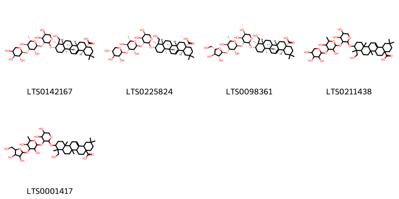{ width=100% }
    <figcaption>Hình ảnh cấu trúc hóa học của 5 hoạt chất thuộc nhóm Organooxygen compounds gồm ['(4ar,6as,6br,8ar,9r,10s,12ar,12bs,14bs)-10-{[(2s,3r,4s,5s)-3-{[(2s,3r,4r,5s,6s)-3,5-dihydroxy-6-methyl-4-{[(2s,3r,4s,5s)-3,4,5-trihydroxyoxan-2-yl]oxy}oxan-2-yl]oxy}-4,5-dihydroxyoxan-2-yl]oxy}-9-(hydroxymethyl)-2,2,6b,9,12a-pentamethyl-3,4,5,6,6a,7,8,8a,10,11,12,12b,13,14b-tetradecahydro-1h-picene-4a-carboxylic acid (LTS0142167)', '(4ar,6as,6br,8ar,9r,10s,12ar,12bs,14bs)-10-{[(2s,3r,4s,5s)-3-{[(2s,3r,4r,5s,6s)-3,5-dihydroxy-6-methyl-4-{[(2s,3r,4s,5r)-3,4,5-trihydroxyoxan-2-yl]oxy}oxan-2-yl]oxy}-4,5-dihydroxyoxan-2-yl]oxy}-9-(hydroxymethyl)-2,2,6b,9,12a-pentamethyl-3,4,5,6,6a,7,8,8a,10,11,12,12b,13,14b-tetradecahydro-1h-picene-4a-carboxylic acid (LTS0225824)', '(4ar,6as,6br,8ar,9r,10s,12ar,12bs,14bs)-10-{[(2s,3r,4s,5s)-3-{[(2s,3r,4r,5s,6s)-4-{[(2s,3r,4r,5s)-3,4-dihydroxy-5-(hydroxymethyl)oxolan-2-yl]oxy}-3,5-dihydroxy-6-methyloxan-2-yl]oxy}-4,5-dihydroxyoxan-2-yl]oxy}-9-(hydroxymethyl)-2,2,6b,9,12a-pentamethyl-3,4,5,6,6a,7,8,8a,10,11,12,12b,13,14b-tetradecahydro-1h-picene-4a-carboxylic acid (LTS0098361)', '10-{[3-({3,5-dihydroxy-6-methyl-4-[(3,4,5-trihydroxyoxan-2-yl)oxy]oxan-2-yl}oxy)-4,5-dihydroxyoxan-2-yl]oxy}-9-(hydroxymethyl)-2,2,6b,9,12a-pentamethyl-3,4,5,6,6a,7,8,8a,10,11,12,12b,13,14b-tetradecahydro-1h-picene-4a-carboxylic acid (LTS0211438)', '10-({3-[(4-{[3,4-dihydroxy-5-(hydroxymethyl)oxolan-2-yl]oxy}-3,5-dihydroxy-6-methyloxan-2-yl)oxy]-4,5-dihydroxyoxan-2-yl}oxy)-9-(hydroxymethyl)-2,2,6b,9,12a-pentamethyl-3,4,5,6,6a,7,8,8a,10,11,12,12b,13,14b-tetradecahydro-1h-picene-4a-carboxylic acid (LTS0001417)'].</figcaption>
</figure>
#### Nhóm Steroids and steroid derivatives
<figure markdown="span">
    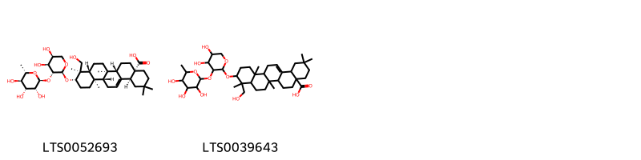{ width=100% }
    <figcaption>Hình ảnh cấu trúc hóa học của 2 hoạt chất thuộc nhóm Steroids and steroid derivatives gồm ['(4ar,6as,6br,8ar,9r,10s,12ar,12bs,14bs)-10-{[(2s,3r,4s,5s)-4,5-dihydroxy-3-{[(2s,3r,4r,5r,6s)-3,4,5-trihydroxy-6-methyloxan-2-yl]oxy}oxan-2-yl]oxy}-9-(hydroxymethyl)-2,2,6b,9,12a-pentamethyl-3,4,5,6,6a,7,8,8a,10,11,12,12b,13,14b-tetradecahydro-1h-picene-4a-carboxylic acid (LTS0052693)', '10-({4,5-dihydroxy-3-[(3,4,5-trihydroxy-6-methyloxan-2-yl)oxy]oxan-2-yl}oxy)-9-(hydroxymethyl)-2,2,6b,9,12a-pentamethyl-3,4,5,6,6a,7,8,8a,10,11,12,12b,13,14b-tetradecahydro-1h-picene-4a-carboxylic acid (LTS0039643)'].</figcaption>
</figure>

---

### Dược dân tộc học

Danh sách các quốc gia có sử dụng *Lecaniodiscus cupanioides* trong điều trị các bệnh. 

| Country   | Disease   | Bệnh          |
|:----------|:----------|:--------------|
| Elsewhere | Sweetener | tiền trà nước |
| Uganda    | Purgative | Thuốc xổ      |

---

# Chi Serjania

??? note "Danh sách các dược liệu thuộc chi"
    
	 - *Serjania goniocarpa*
	 - *Serjania mexicana*
	 - *Serjania paucidentata*
	 - *Serjania triquetra*

---
## Serjania goniocarpa
### Thông tin về thực vật

!!! info "Phân loại thực vật của *Serjania goniocarpa* từ GIBF:"
    - **Kingdom:** Plantae
    - **Phylum:** Tracheophyta
    - **Order:** Sapindales
    - **Family:** Sapindaceae
    - **Genus:** Serjania
    - **Species:** *Serjania goniocarpa*

 

| Label (VI)   | Label (EN)   | Scientific Name     | Descriptions (VI)   | Descriptions (EN)   | Also Known As (VI)   | Also Known As (EN)   |
|:-------------|:-------------|:--------------------|:--------------------|:--------------------|:---------------------|:---------------------|
| N/A          | N/A          | Serjania goniocarpa | loài thực vật       | species of plant    | ['']                 | ['']                 |

#### Phân bố trên thế giới

**Từ CSDL GIBF** Belize, Guatemala, Brazil, Spain, Costa Rica, Mexico, El Salvador

#### Phân bố tại Việt Nam

**Từ CSDL GIBF**: Không có ghi nhận ở Việt Nam

---
### Thành phần hóa học
        
- Theo cơ sở dữ liệu lotus: Từ loài *Serjania goniocarpa* đã phân lập và xác định được Chưa có hoạt chất nào được phân lập. hoạt chất thuộc về các nhóm Không có hoạt chất nào được phân lập. 

Không có hình ảnh nào được tạo ra

---

### Dược dân tộc học

Danh sách các quốc gia có sử dụng *Serjania goniocarpa* trong điều trị các bệnh. 

| Country   | Disease   | Bệnh          |
|:----------|:----------|:--------------|
| Belize    | Piscicide | Thuốc diệt cá |
| Mexico    | Piscicide | Thuốc diệt cá |

---

---
## Serjania mexicana
### Thông tin về thực vật

!!! info "Phân loại thực vật của *Serjania mexicana* từ GIBF:"
    - **Kingdom:** Plantae
    - **Phylum:** Tracheophyta
    - **Order:** Sapindales
    - **Family:** Sapindaceae
    - **Genus:** Serjania
    - **Species:** *Serjania mexicana*

 

| Label (VI)   | Label (EN)   | Scientific Name   | Descriptions (VI)   | Descriptions (EN)   | Also Known As (VI)   | Also Known As (EN)    |
|:-------------|:-------------|:------------------|:--------------------|:--------------------|:---------------------|:----------------------|
| N/A          | N/A          | Serjania mexicana | loài thực vật       | species of plant    | ['']                 | ['Serjania mexicana'] |

#### Phân bố trên thế giới

**Từ CSDL GIBF** Belize, Ecuador, Colombia, Brazil, Guatemala, Costa Rica, Jamaica, Nicaragua, Mexico, Panama

#### Phân bố tại Việt Nam

**Từ CSDL GIBF**: Không có ghi nhận ở Việt Nam

---
### Thành phần hóa học
        
- Theo cơ sở dữ liệu lotus: Từ loài *Serjania mexicana* đã phân lập và xác định được Chưa có hoạt chất nào được phân lập. hoạt chất thuộc về các nhóm Không có hoạt chất nào được phân lập. 

Không có hình ảnh nào được tạo ra

---

### Dược dân tộc học

Danh sách các quốc gia có sử dụng *Serjania mexicana* trong điều trị các bệnh. 

| Country   | Disease                                    | Bệnh                                       |
|:----------|:-------------------------------------------|:-------------------------------------------|
| Elsewhere | Piscicide                                  | Thuốc diệt cá                              |
| Mexico    | Piscicide, Piscicide, Piscicide, Piscicide | Piscicide, Piscicide, Piscicide, Piscicide |

---

---
## Serjania paucidentata
### Thông tin về thực vật

!!! info "Phân loại thực vật của *Serjania paucidentata* từ GIBF:"
    - **Kingdom:** Plantae
    - **Phylum:** Tracheophyta
    - **Order:** Sapindales
    - **Family:** Sapindaceae
    - **Genus:** Serjania
    - **Species:** *Serjania paucidentata*

 

| Label (VI)   | Label (EN)   | Scientific Name       | Descriptions (VI)   | Descriptions (EN)   | Also Known As (VI)   | Also Known As (EN)   |
|:-------------|:-------------|:----------------------|:--------------------|:--------------------|:---------------------|:---------------------|
| N/A          | N/A          | Serjania paucidentata | loài thực vật       | species of plant    | ['']                 | ['']                 |

#### Phân bố trên thế giới

**Từ CSDL GIBF** nan, Nicaragua, Trinidad and Tobago, Belize, Suriname, French Guiana, Colombia, Brazil, Bolivia (Plurinational State of), Guyana, Peru, Mexico, Panama

#### Phân bố tại Việt Nam

**Từ CSDL GIBF**: Không có ghi nhận ở Việt Nam

---
### Thành phần hóa học
        
- Theo cơ sở dữ liệu lotus: Từ loài *Serjania paucidentata* đã phân lập và xác định được Chưa có hoạt chất nào được phân lập. hoạt chất thuộc về các nhóm Không có hoạt chất nào được phân lập. 

Không có hình ảnh nào được tạo ra

---

### Dược dân tộc học

Danh sách các quốc gia có sử dụng *Serjania paucidentata* trong điều trị các bệnh. 

| Country           | Disease        | Bệnh               |
|:------------------|:---------------|:-------------------|
| Guiana(Arawak)    | Poison, Poison | Chất độc, chất độc |
| Guiana(Carib)     | Poison         | Chất độc           |
| Guiana(Wapisiana) | Poison         | Chất độc           |

---

---
## Serjania triquetra
### Thông tin về thực vật

!!! info "Phân loại thực vật của *Serjania triquetra* từ GIBF:"
    - **Kingdom:** Plantae
    - **Phylum:** Tracheophyta
    - **Order:** Sapindales
    - **Family:** Sapindaceae
    - **Genus:** Serjania
    - **Species:** *Serjania triquetra*

 

| Label (VI)   | Label (EN)   | Scientific Name    | Descriptions (VI)   | Descriptions (EN)   | Also Known As (VI)   | Also Known As (EN)   |
|:-------------|:-------------|:-------------------|:--------------------|:--------------------|:---------------------|:---------------------|
| N/A          | N/A          | Serjania triquetra | loài thực vật       | species of plant    | ['']                 | ['']                 |

#### Phân bố trên thế giới

**Từ CSDL GIBF** Guatemala, Costa Rica, Nicaragua, Mexico, El Salvador

#### Phân bố tại Việt Nam

**Từ CSDL GIBF**: Không có ghi nhận ở Việt Nam

---
### Thành phần hóa học
        
- Theo cơ sở dữ liệu lotus: Từ loài *Serjania triquetra* đã phân lập và xác định được 14 hoạt chất thuộc về các nhóm Prenol lipids. 

|    | chemicalTaxonomyClassyfireClass   |   smiles_count |
|---:|:----------------------------------|---------------:|
|  0 | Prenol lipids                     |             14 |

#### Nhóm Prenol lipids
<figure markdown="span">
    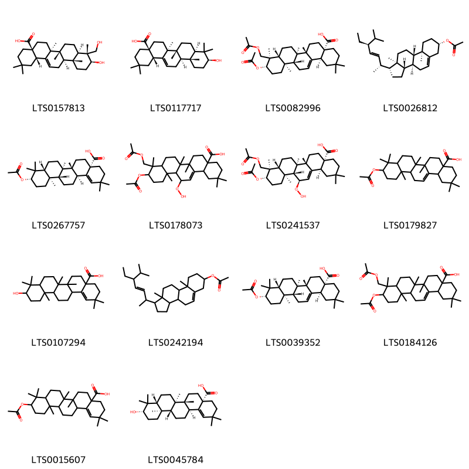{ width=100% }
    <figcaption>Hình ảnh cấu trúc hóa học của 14 hoạt chất thuộc nhóm Prenol lipids gồm ['hederagenin (LTS0157813)', 'oleanolic acid (LTS0117717)', 'hederagenin diacetate (LTS0082996)', 'stigmasteryl acetate (LTS0026812)', '(4as,6ar,6br,8ar,10s,12ar,12br,14as)-10-(acetyloxy)-2,2,6a,6b,9,9,12a-heptamethyl-3,4,5,6,7,8,8a,10,11,12,12b,13,14,14a-tetradecahydropicene-4a-carboxylic acid (LTS0267757)', '10-(acetyloxy)-9-[(acetyloxy)methyl]-13-hydroperoxy-2,2,6a,6b,9,12a-hexamethyl-1,3,4,5,6,7,8,8a,10,11,12,12b,13,14b-tetradecahydropicene-4a-carboxylic acid (LTS0178073)', '(4as,6as,6br,8ar,9r,10s,12as,12br,13r,14bs)-10-(acetyloxy)-9-[(acetyloxy)methyl]-13-hydroperoxy-2,2,6a,6b,9,12a-hexamethyl-1,3,4,5,6,7,8,8a,10,11,12,12b,13,14b-tetradecahydropicene-4a-carboxylic acid (LTS0241537)', '10-(acetyloxy)-2,2,6a,6b,9,9,12a-heptamethyl-1,3,4,5,6,7,8,8a,10,11,12,12b,13,14b-tetradecahydropicene-4a-carboxylic acid (LTS0179827)', '10-hydroxy-2,2,6a,6b,9,9,12a-heptamethyl-3,4,5,6,7,8,8a,10,11,12,12b,13,14,14a-tetradecahydropicene-4a-carboxylic acid (LTS0107294)', '1-(5-ethyl-6-methylhept-3-en-2-yl)-9a,11a-dimethyl-1h,2h,3h,3ah,3bh,4h,6h,7h,8h,9h,9bh,10h,11h-cyclopenta[a]phenanthren-7-yl acetate (LTS0242194)', '(4as,6as,6br,8ar,10s,12ar,12br,14bs)-10-(acetyloxy)-2,2,6a,6b,9,9,12a-heptamethyl-1,3,4,5,6,7,8,8a,10,11,12,12b,13,14b-tetradecahydropicene-4a-carboxylic acid (LTS0039352)', '10-(acetyloxy)-9-[(acetyloxy)methyl]-2,2,6a,6b,9,12a-hexamethyl-1,3,4,5,6,7,8,8a,10,11,12,12b,13,14b-tetradecahydropicene-4a-carboxylic acid (LTS0184126)', '10-(acetyloxy)-2,2,6a,6b,9,9,12a-heptamethyl-3,4,5,6,7,8,8a,10,11,12,12b,13,14,14a-tetradecahydropicene-4a-carboxylic acid (LTS0015607)', '(4as,6ar,6br,8ar,10s,12ar,12br,14as)-10-hydroxy-2,2,6a,6b,9,9,12a-heptamethyl-3,4,5,6,7,8,8a,10,11,12,12b,13,14,14a-tetradecahydropicene-4a-carboxylic acid (LTS0045784)'].</figcaption>
</figure>

---

### Dược dân tộc học

Danh sách các quốc gia có sử dụng *Serjania triquetra* trong điều trị các bệnh. 

| Country   | Disease   | Bệnh           |
|:----------|:----------|:---------------|
| Mexico    | Diuretic  | Thuốc lợi tiêu |

---

# Chi Sapindus

??? note "Danh sách các dược liệu thuộc chi"
    
	 - *Sapindus marginatus*
	 - *Sapindus mukorossi*
	 - *Sapindus oahuensis*
	 - *Sapindus rarak*
	 - *Sapindus saponaria*
	 - *Sapindus trifoliatus*

---
## Sapindus marginatus
### Thông tin về thực vật

!!! info "Phân loại thực vật của *Sapindus saponaria* từ GIBF:"
    - **Kingdom:** Plantae
    - **Phylum:** Tracheophyta
    - **Order:** Sapindales
    - **Family:** Sapindaceae
    - **Genus:** Sapindus
    - **Species:** *Sapindus saponaria*

 

| Label (VI)   | Label (EN)   | Scientific Name     | Descriptions (VI)   | Descriptions (EN)   | Also Known As (VI)   | Also Known As (EN)   |
|:-------------|:-------------|:--------------------|:--------------------|:--------------------|:---------------------|:---------------------|
| N/A          | N/A          | Sapindus marginatus | loài thực vật       | species of plant    | ['']                 | ['']                 |

#### Phân bố trên thế giới

**Từ CSDL GIBF** nan, South Africa, Trinidad and Tobago, Saint Kitts and Nevis, Guadeloupe, Korea, Republic of, Martinique, Brazil, Portugal, unknown or invalid, Jamaica, India, Cuba, United States of America, Mexico

#### Phân bố tại Việt Nam

**Từ CSDL GIBF**: Không có ghi nhận ở Việt Nam

---
### Thành phần hóa học
        
- Theo cơ sở dữ liệu lotus: Từ loài *Sapindus saponaria* đã phân lập và xác định được Chưa có hoạt chất nào được phân lập. hoạt chất thuộc về các nhóm Không có hoạt chất nào được phân lập. 

Không có hình ảnh nào được tạo ra

---

### Dược dân tộc học

Danh sách các quốc gia có sử dụng *Sapindus saponaria* trong điều trị các bệnh. 

| Country   | Disease   | Bệnh     |
|:----------|:----------|:---------|
| US        | Soap      | Xà phòng |

---

---
## Sapindus mukorossi
### Thông tin về thực vật

!!! info "Phân loại thực vật của *Sapindus mukorossi* từ GIBF:"
    - **Kingdom:** Plantae
    - **Phylum:** Tracheophyta
    - **Order:** Sapindales
    - **Family:** Sapindaceae
    - **Genus:** Sapindus
    - **Species:** *Sapindus mukorossi*

 

| Label (VI)   | Label (EN)   | Scientific Name    | Descriptions (VI)   | Descriptions (EN)   | Also Known As (VI)   | Also Known As (EN)                       |
|:-------------|:-------------|:-------------------|:--------------------|:--------------------|:---------------------|:-----------------------------------------|
| N/A          | N/A          | Sapindus mukorossi | loài thực vật       | species of plant    | ['']                 | ['Indian soapberry', 'ritha', 'washnut'] |

#### Phân bố trên thế giới

**Từ CSDL GIBF** Japan, Chinese Taipei, India, United States of America, France, China

#### Phân bố tại Việt Nam

**Từ CSDL GIBF**: Không có ghi nhận ở Việt Nam

---
### Thành phần hóa học
        
- Theo cơ sở dữ liệu lotus: Từ loài *Sapindus mukorossi* đã phân lập và xác định được 86 hoạt chất thuộc về các nhóm Prenol lipids, Organooxygen compounds. 

|    | chemicalTaxonomyClassyfireClass   |   smiles_count |
|---:|:----------------------------------|---------------:|
|  0 | Organooxygen compounds            |             10 |
|  1 | Prenol lipids                     |             76 |

#### Nhóm Organooxygen compounds
<figure markdown="span">
    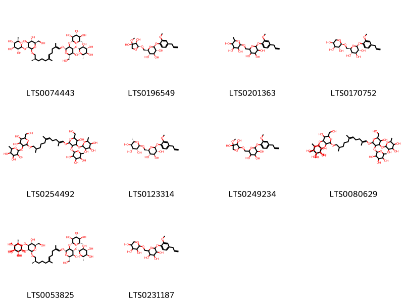{ width=100% }
    <figcaption>Hình ảnh cấu trúc hóa học của 10 hoạt chất thuộc nhóm Organooxygen compounds gồm ['(2r,3s,4r,5r,6s)-2-{[(2s,3s,4r,5s,6s)-2-{[(1e,5e,10r)-11-{[(2r,3r,4s,5s,6r)-4,5-dihydroxy-6-(hydroxymethyl)-3-{[(2s,3r,4s,5s,6r)-3,4,5-trihydroxy-6-methyloxan-2-yl]oxy}oxan-2-yl]oxy}-2,6,10-trimethylundeca-1,5-dien-1-yl]oxy}-5-hydroxy-6-(hydroxymethyl)-3-{[(2r,3s,4r,5r,6s)-3,4,5-trihydroxy-6-methyloxan-2-yl]oxy}oxan-4-yl]oxy}-6-methyloxane-3,4,5-triol (LTS0074443)', '(2r,3s,4s,5r,6s)-2-({[(2r,3s,4s)-3,4-dihydroxy-4-methoxyoxolan-2-yl]oxy}methyl)-6-[2-methoxy-4-(prop-2-en-1-yl)phenoxy]oxane-3,4,5-triol (LTS0196549)', '2-[2-methoxy-4-(prop-2-en-1-yl)phenoxy]-6-{[(3,4,5-trihydroxy-6-methyloxan-2-yl)oxy]methyl}oxane-3,4,5-triol (LTS0201363)', '(2s,3r,4s,5s,6r)-2-[2-methoxy-4-(prop-2-en-1-yl)phenoxy]-6-({[(2s,3r,4s,5s)-3,4,5-trihydroxyoxan-2-yl]oxy}methyl)oxane-3,4,5-triol (LTS0170752)', '2-({2-[(11-{[4,5-dihydroxy-6-(hydroxymethyl)-3-[(3,4,5-trihydroxy-6-methyloxan-2-yl)oxy]oxan-2-yl]oxy}-2,6,10-trimethylundeca-1,5-dien-1-yl)oxy]-5-hydroxy-6-(hydroxymethyl)-3-[(3,4,5-trihydroxy-6-methyloxan-2-yl)oxy]oxan-4-yl}oxy)-6-methyloxane-3,4,5-triol (LTS0254492)', '(2s,3r,4s,5s,6r)-2-[2-methoxy-4-(prop-2-en-1-yl)phenoxy]-6-({[(2r,3r,4r,5r,6s)-3,4,5-trihydroxy-6-methyloxan-2-yl]oxy}methyl)oxane-3,4,5-triol (LTS0123314)', '2-{[(3,4-dihydroxy-4-methoxyoxolan-2-yl)oxy]methyl}-6-[2-methoxy-4-(prop-2-en-1-yl)phenoxy]oxane-3,4,5-triol (LTS0249234)', '2-({3-hydroxy-6-[(11-{[5-hydroxy-6-(hydroxymethyl)-3,4-bis[(3,4,5-trihydroxy-6-methyloxan-2-yl)oxy]oxan-2-yl]oxy}-2,6,10-trimethylundeca-1,5-dien-1-yl)oxy]-2-(hydroxymethyl)-5-[(3,4,5-trihydroxy-6-methyloxan-2-yl)oxy]oxan-4-yl}oxy)-6-methyloxane-3,4,5-triol (LTS0080629)', '(2r,3s,4r,5r,6s)-2-{[(2s,3s,4r,5s,6s)-3-hydroxy-6-{[(1e,5e,10r)-11-{[(2r,3r,4s,5r,6r)-5-hydroxy-6-(hydroxymethyl)-4-{[(2r,3s,4r,5r,6s)-3,4,5-trihydroxy-6-methyloxan-2-yl]oxy}-3-{[(2s,3r,4s,5s,6r)-3,4,5-trihydroxy-6-methyloxan-2-yl]oxy}oxan-2-yl]oxy}-2,6,10-trimethylundeca-1,5-dien-1-yl]oxy}-2-(hydroxymethyl)-5-{[(2r,3s,4r,5r,6s)-3,4,5-trihydroxy-6-methyloxan-2-yl]oxy}oxan-4-yl]oxy}-6-methyloxane-3,4,5-triol (LTS0053825)', '2-[2-methoxy-4-(prop-2-en-1-yl)phenoxy]-6-{[(3,4,5-trihydroxyoxan-2-yl)oxy]methyl}oxane-3,4,5-triol (LTS0231187)'].</figcaption>
</figure>
#### Nhóm Prenol lipids
<figure markdown="span">
    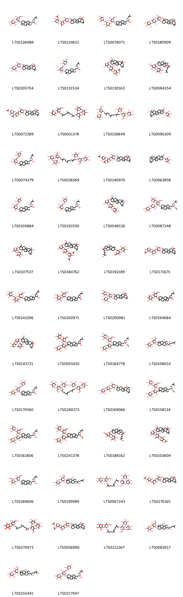{ width=100% }
    <figcaption>Hình ảnh cấu trúc hóa học của 76 hoạt chất thuộc nhóm Prenol lipids gồm ['(2s,3r,4r,5r,6s)-2-{[(2r,3r,4s,5s,6r)-2-{[(1s,3as,5ar,7s,9ar,9br,11as)-1-[(2r,3s,5s)-2-methoxy-5-(2-methylprop-1-en-1-yl)oxolan-3-yl]-3a,6,6,9a,11a-pentamethyl-1h,2h,3h,5h,5ah,7h,8h,9h,9bh,10h,11h-cyclopenta[a]phenanthren-7-yl]oxy}-4,5-dihydroxy-6-(hydroxymethyl)oxan-3-yl]oxy}-6-methyloxane-3,4,5-triol (LTS0126088)', '(4as,6as,6br,8ar,9r,10s,12ar,12br,14bs)-10-{[(2s,3r,4s,5s)-3-{[(2s,3r,4r,5s,6s)-4-{[(2s,3r,4s,5r)-3-(acetyloxy)-4,5-dihydroxyoxan-2-yl]oxy}-3,5-dihydroxy-6-methyloxan-2-yl]oxy}-4,5-dihydroxyoxan-2-yl]oxy}-9-(hydroxymethyl)-2,2,6a,6b,9,12a-hexamethyl-1,3,4,5,6,7,8,8a,10,11,12,12b,13,14b-tetradecahydropicene-4a-carboxylic acid (LTS0124621)', 'sapinmusaponin r (LTS0076071)', '(4as,6as,6br,8ar,9r,10s,12ar,12br,14bs)-10-{[(2s,3r,4s,5s)-3-{[(2s,3r,4r,5s,6s)-3,5-dihydroxy-6-methyl-4-{[(2s,3r,4s,5r)-3,4,5-trihydroxyoxan-2-yl]oxy}oxan-2-yl]oxy}-4,5-dihydroxyoxan-2-yl]oxy}-9-(hydroxymethyl)-2,2,6a,6b,9,12a-hexamethyl-1,3,4,5,6,7,8,8a,10,11,12,12b,13,14b-tetradecahydropicene-4a-carboxylic acid (LTS0180909)', '(4as,6as,6br,8ar,9r,10s,12ar,12br)-10-{[(2s,3r,4s,5s)-4,5-dihydroxy-3-{[(2s,3r,4r,5r,6s)-3,4,5-trihydroxy-6-methyloxan-2-yl]oxy}oxan-2-yl]oxy}-9-(hydroxymethyl)-2,2,6a,6b,9,12a-hexamethyl-1,3,4,5,6,7,8,8a,10,11,12,12b,13,14b-tetradecahydropicene-4a-carboxylic acid (LTS0205704)', '(2r,3r,4s,5s,6r)-2-{[(1s,3as,5ar,7s,9ar,9br,11as)-1-[(2r,3s,5s)-2-methoxy-5-(2-methylprop-1-en-1-yl)oxolan-3-yl]-3a,6,6,9a,11a-pentamethyl-1h,2h,3h,5h,5ah,7h,8h,9h,9bh,10h,11h-cyclopenta[a]phenanthren-7-yl]oxy}-6-({[(2s,3r,4r,5r,6s)-3,4,5-trihydroxy-6-methyloxan-2-yl]oxy}methyl)oxane-3,4,5-triol (LTS0131534)', '10-({3-[(4-{[3-(acetyloxy)-4,5-dihydroxyoxan-2-yl]oxy}-3,5-dihydroxy-6-methyloxan-2-yl)oxy]-4,5-dihydroxyoxan-2-yl}oxy)-9-(hydroxymethyl)-2,2,6a,6b,9,12a-hexamethyl-1,3,4,5,6,7,8,8a,10,11,12,12b,13,14b-tetradecahydropicene-4a-carboxylic acid (LTS0130163)', '2-[(2-{[1-(2,3-dihydroxy-6-methylhept-5-en-2-yl)-4-hydroxy-3a,3b,6,6,9a-pentamethyl-dodecahydro-1h-cyclopenta[a]phenanthren-7-yl]oxy}-4,5-dihydroxy-6-(hydroxymethyl)oxan-3-yl)oxy]-6-methyloxane-3,4,5-triol (LTS0084254)', '(4as,6as,6br,8ar,9r,10s,12ar,12br,14bs)-10-{[(2s,3r,4s,5s)-3-{[(2s,3r,4r,5s,6s)-4-{[(2s,3r,4s,5r)-3,5-bis(acetyloxy)-4-hydroxyoxan-2-yl]oxy}-3,5-dihydroxy-6-methyloxan-2-yl]oxy}-4,5-dihydroxyoxan-2-yl]oxy}-9-(hydroxymethyl)-2,2,6a,6b,9,12a-hexamethyl-1,3,4,5,6,7,8,8a,10,11,12,12b,13,14b-tetradecahydropicene-4a-carboxylic acid (LTS0072389)', '2-({2-[(11-{[4,5-dihydroxy-6-(hydroxymethyl)-3-[(3,4,5-trihydroxy-6-methyloxan-2-yl)oxy]oxan-2-yl]oxy}-2,6,10-trimethylundeca-1,5,9-trien-1-yl)oxy]-5-hydroxy-6-(hydroxymethyl)-3-[(3,4,5-trihydroxy-6-methyloxan-2-yl)oxy]oxan-4-yl}oxy)-6-methyloxane-3,4,5-triol (LTS0051378)', '(2s,3r,4r,5r,6s)-2-{[(2r,3r,4s,5r,6r)-2-{[(2e,6e,10e)-12-{[(2r,3r,4s,5s,6r)-4,5-dihydroxy-6-(hydroxymethyl)-3-{[(2s,3r,4r,5r,6s)-3,4,5-trihydroxy-6-methyloxan-2-yl]oxy}oxan-2-yl]oxy}-3,7,11-trimethyldodeca-2,6,10-trien-1-yl]oxy}-5-hydroxy-6-(hydroxymethyl)-3-{[(2s,3r,4r,5r,6s)-3,4,5-trihydroxy-6-methyloxan-2-yl]oxy}oxan-4-yl]oxy}-6-methyloxane-3,4,5-triol (LTS0158849)', 'hederagenin 3-o-arabinoside (LTS0090209)', '(2r,3r,4s,5s,6r)-2-{[(1s,3as,5ar,7s,9ar,9br,11as)-1-[(2s,3s,5s)-2-methoxy-5-(2-methylprop-1-en-1-yl)oxolan-3-yl]-3a,6,6,9a,11a-pentamethyl-1h,2h,3h,5h,5ah,7h,8h,9h,9bh,10h,11h-cyclopenta[a]phenanthren-7-yl]oxy}-6-({[(2r,3r,4r,5r,6s)-3,4,5-trihydroxy-6-methyloxan-2-yl]oxy}methyl)oxane-3,4,5-triol (LTS0074379)', '(2s,3r,4r,5r,6s)-2-{[(2r,3r,4s,5r,6r)-3-hydroxy-6-{[(2e,6e,10e)-12-{[(2r,3r,4s,5r,6r)-5-hydroxy-6-(hydroxymethyl)-3,4-bis({[(2s,3r,4r,5r,6s)-3,4,5-trihydroxy-6-methyloxan-2-yl]oxy})oxan-2-yl]oxy}-3,7,11-trimethyldodeca-2,6,10-trien-1-yl]oxy}-2-(hydroxymethyl)-5-{[(2s,3r,4r,5r,6s)-3,4,5-trihydroxy-6-methyloxan-2-yl]oxy}oxan-4-yl]oxy}-6-methyloxane-3,4,5-triol (LTS0036569)', '(4as,6as,6br,8ar,9r,10s,12ar,12br,14bs)-10-{[(2s,3r,4s,5s)-3-{[(2s,3r,4r,5s,6s)-4-{[(2s,3r,4s,5s)-3,5-bis(acetyloxy)-4-hydroxyoxan-2-yl]oxy}-3,5-dihydroxy-6-methyloxan-2-yl]oxy}-4,5-dihydroxyoxan-2-yl]oxy}-9-(hydroxymethyl)-2,2,6a,6b,9,12a-hexamethyl-1,3,4,5,6,7,8,8a,10,11,12,12b,13,14b-tetradecahydropicene-4a-carboxylic acid (LTS0140970)', '9-(hydroxymethyl)-2,2,6a,6b,9,12a-hexamethyl-10-[(3,4,5-trihydroxyoxan-2-yl)oxy]-1,3,4,5,6,7,8,8a,10,11,12,12b,13,14b-tetradecahydropicene-4a-carboxylic acid (LTS0062858)', '(2r,3r,4s,5s,6r)-2-{[(1s,3as,5ar,7s,9ar,9br,11as)-1-[(2r,3s,5s)-2-methoxy-5-(2-methylprop-1-en-1-yl)oxolan-3-yl]-3a,6,6,9a,11a-pentamethyl-1h,2h,3h,5h,5ah,7h,8h,9h,9bh,10h,11h-cyclopenta[a]phenanthren-7-yl]oxy}-6-({[(2r,3r,4r,5r,6s)-3,4,5-trihydroxy-6-methyloxan-2-yl]oxy}methyl)oxane-3,4,5-triol (LTS0105884)', '(2r,3r,4s,5s,6r)-2-{[(1s,3as,5ar,7s,9ar,9br,11as)-1-[(2s,3s,5s)-2-methoxy-5-(2-methylprop-1-en-1-yl)oxolan-3-yl]-3a,6,6,9a,11a-pentamethyl-1h,2h,3h,5h,5ah,7h,8h,9h,9bh,10h,11h-cyclopenta[a]phenanthren-7-yl]oxy}-6-({[(2s,3r,4r,5r,6s)-3,4,5-trihydroxy-6-methyloxan-2-yl]oxy}methyl)oxane-3,4,5-triol (LTS0192550)', '10-{[3-({3,5-dihydroxy-6-methyl-4-[(3,4,5-trihydroxyoxan-2-yl)oxy]oxan-2-yl}oxy)-4,5-dihydroxyoxan-2-yl]oxy}-9-(hydroxymethyl)-2,2,6a,6b,9,12a-hexamethyl-1,3,4,5,6,7,8,8a,10,11,12,12b,13,14b-tetradecahydropicene-4a-carboxylic acid (LTS0048130)', '(2s,3r,4s,5s)-2-{[(2r,3r,4s,5r,6r)-2-{[(1s,3as,5ar,7s,9ar,9br,11as)-1-[(2s,3s,5r)-2-ethoxy-5-(2-methylprop-1-en-1-yl)oxolan-3-yl]-3a,6,6,9a,11a-pentamethyl-1h,2h,3h,5h,5ah,7h,8h,9h,9bh,10h,11h-cyclopenta[a]phenanthren-7-yl]oxy}-3-{[(2s,3r,4r,5s,6s)-3,5-dihydroxy-6-methyl-4-{[(2s,3r,4s,5s)-3,4,5-trihydroxyoxan-2-yl]oxy}oxan-2-yl]oxy}-5-hydroxy-6-(hydroxymethyl)oxan-4-yl]oxy}oxane-3,4,5-triol (LTS0087348)', '10-({4,5-dihydroxy-3-[(3,4,5-trihydroxy-6-methyloxan-2-yl)oxy]oxan-2-yl}oxy)-9-(hydroxymethyl)-2,2,6a,6b,9,12a-hexamethyl-1,3,4,5,6,7,8,8a,10,11,12,12b,13,14b-tetradecahydropicene-4a-carboxylic acid (LTS0107537)', '10-({3-[(4-{[3,5-bis(acetyloxy)-4-hydroxyoxan-2-yl]oxy}-3,5-dihydroxy-6-methyloxan-2-yl)oxy]-4,5-dihydroxyoxan-2-yl}oxy)-9-(hydroxymethyl)-2,2,6a,6b,9,12a-hexamethyl-1,3,4,5,6,7,8,8a,10,11,12,12b,13,14b-tetradecahydropicene-4a-carboxylic acid (LTS0184762)', '2-[(4,5-dihydroxy-2-{[4-hydroxy-3a,3b,6,6,9a-pentamethyl-1-(2,3,6-trihydroxy-6-methylhept-4-en-2-yl)-dodecahydro-1h-cyclopenta[a]phenanthren-7-yl]oxy}-6-(hydroxymethyl)oxan-3-yl)oxy]-6-methyloxane-3,4,5-triol (LTS0192189)', '(4as,6as,6br,8ar,9r,10s,12ar,12br,14bs)-10-{[(2s,3r,4s,5s)-3-{[(2s,3r,4r,5s,6s)-4-{[(2s,3r,4s,5r)-4-(acetyloxy)-3,5-dihydroxyoxan-2-yl]oxy}-3,5-dihydroxy-6-methyloxan-2-yl]oxy}-4,5-dihydroxyoxan-2-yl]oxy}-9-(hydroxymethyl)-2,2,6a,6b,9,12a-hexamethyl-1,3,4,5,6,7,8,8a,10,11,12,12b,13,14b-tetradecahydropicene-4a-carboxylic acid (LTS0171675)', '2-{[4,5-dihydroxy-6-(hydroxymethyl)-2-({1-[2-methoxy-5-(2-methylprop-1-en-1-yl)oxolan-3-yl]-3a,6,6,9a,11a-pentamethyl-1h,2h,3h,5h,5ah,7h,8h,9h,9bh,10h,11h-cyclopenta[a]phenanthren-7-yl}oxy)oxan-3-yl]oxy}-6-{[(3,4,5-trihydroxy-6-methyloxan-2-yl)oxy]methyl}oxane-3,4,5-triol (LTS0141096)', '2-{[4,5-dihydroxy-6-(hydroxymethyl)-2-({1-[2-methoxy-5-(2-methylprop-1-en-1-yl)oxolan-3-yl]-3a,6,6,9a,11a-pentamethyl-1h,2h,3h,5h,5ah,7h,8h,9h,9bh,10h,11h-cyclopenta[a]phenanthren-7-yl}oxy)oxan-3-yl]oxy}-6-(hydroxymethyl)oxane-3,4,5-triol (LTS0200971)', '(4as,6as,6br,8ar,9r,10s,12ar,12br,14bs)-10-{[(2s,3r,4s,5s)-5-hydroxy-3-{[(2s,3r,4r,5r,6s)-3,4,5-trihydroxy-6-methyloxan-2-yl]oxy}-4-{[(2s,3r,4s,5r)-3,4,5-trihydroxyoxan-2-yl]oxy}oxan-2-yl]oxy}-9-(hydroxymethyl)-2,2,6a,6b,9,12a-hexamethyl-1,3,4,5,6,7,8,8a,10,11,12,12b,13,14b-tetradecahydropicene-4a-carboxylic acid (LTS0200981)', '2-{[4,5-dihydroxy-6-(hydroxymethyl)-2-({1-[2-methoxy-5-(2-methylprop-1-en-1-yl)oxolan-3-yl]-3a,6,6,9a,11a-pentamethyl-1h,2h,3h,5h,5ah,7h,8h,9h,9bh,10h,11h-cyclopenta[a]phenanthren-7-yl}oxy)oxan-3-yl]oxy}-6-methyloxane-3,4,5-triol (LTS0194684)', '10-({5-hydroxy-3-[(3,4,5-trihydroxy-6-methyloxan-2-yl)oxy]-4-[(3,4,5-trihydroxyoxan-2-yl)oxy]oxan-2-yl}oxy)-9-(hydroxymethyl)-2,2,6a,6b,9,12a-hexamethyl-1,3,4,5,6,7,8,8a,10,11,12,12b,13,14b-tetradecahydropicene-4a-carboxylic acid (LTS0143721)', '2-{[3-({3,5-dihydroxy-6-methyl-4-[(3,4,5-trihydroxyoxan-2-yl)oxy]oxan-2-yl}oxy)-5-hydroxy-6-(hydroxymethyl)-2-({1-[2-methoxy-5-(2-methylprop-1-en-1-yl)oxolan-3-yl]-3a,6,6,9a,11a-pentamethyl-1h,2h,3h,5h,5ah,7h,8h,9h,9bh,10h,11h-cyclopenta[a]phenanthren-7-yl}oxy)oxan-4-yl]oxy}-6-methyloxane-3,4,5-triol (LTS0093435)', '(2s,3r,4r,5r,6s)-2-{[(2r,3r,4s,5r,6r)-2-{[(1s,3as,5ar,7s,9ar,9br,11as)-1-[(2s,3s,5r)-2-ethoxy-5-(2-methylprop-1-en-1-yl)oxolan-3-yl]-3a,6,6,9a,11a-pentamethyl-1h,2h,3h,5h,5ah,7h,8h,9h,9bh,10h,11h-cyclopenta[a]phenanthren-7-yl]oxy}-3-{[(2s,3r,4r,5s,6s)-3,5-dihydroxy-6-methyl-4-{[(2s,3r,4s,5r)-3,4,5-trihydroxyoxan-2-yl]oxy}oxan-2-yl]oxy}-5-hydroxy-6-(hydroxymethyl)oxan-4-yl]oxy}-6-methyloxane-3,4,5-triol (LTS0164778)', '(2s,3r,4r,5r,6s)-2-{[(2r,3r,4s,5s,6r)-2-{[(1s,3ar,3br,4s,5ar,7s,9as,9br,11ar)-1-[(2s,3r)-2,3-dihydroxy-6-methylhept-5-en-2-yl]-4-hydroxy-3a,3b,6,6,9a-pentamethyl-dodecahydro-1h-cyclopenta[a]phenanthren-7-yl]oxy}-4,5-dihydroxy-6-(hydroxymethyl)oxan-3-yl]oxy}-6-methyloxane-3,4,5-triol (LTS0108014)', '(2r,3r,4r,5r,6s)-2-{[(2r,3s,4s,5r,6r)-6-{[(1s,3as,5ar,7s,9ar,9br,11as)-1-[(2r,3s,5s)-2-methoxy-5-(2-methylprop-1-en-1-yl)oxolan-3-yl]-3a,6,6,9a,11a-pentamethyl-1h,2h,3h,5h,5ah,7h,8h,9h,9bh,10h,11h-cyclopenta[a]phenanthren-7-yl]oxy}-3,4-dihydroxy-5-{[(2s,3r,4r,5r,6s)-3,4,5-trihydroxy-6-methyloxan-2-yl]oxy}oxan-2-yl]methoxy}-6-methyloxane-3,4,5-triol (LTS0170560)', '(2s,3r,4s,5s,6r)-2-{[(2r,3s,4r,5r,6r)-3-hydroxy-6-{[(2e,6e,11r)-12-{[(2s,3s,4r,5s,6s)-5-hydroxy-6-(hydroxymethyl)-3-{[(2s,3r,4s,5r,6r)-3,4,5-trihydroxy-6-methyloxan-2-yl]oxy}-4-{[(2s,3s,4s,5s,6s)-3,4,5-trihydroxy-6-methyloxan-2-yl]oxy}oxan-2-yl]oxy}-3,7,11-trimethyldodeca-2,6-dien-1-yl]oxy}-2-(hydroxymethyl)-5-{[(2s,3r,4s,5r,6r)-3,4,5-trihydroxy-6-methyloxan-2-yl]oxy}oxan-4-yl]oxy}-6-methyloxane-3,4,5-triol (LTS0240273)', '(4as,6br,9s,10s,12ar)-10-{[(2s,3r,4s,5s)-3-{[(2s,3r,4r,5s,6s)-3,5-dihydroxy-6-methyl-4-{[(2s,3r,4s,5r)-3,4,5-trihydroxyoxan-2-yl]oxy}oxan-2-yl]oxy}-4,5-dihydroxyoxan-2-yl]oxy}-9-(hydroxymethyl)-2,2,6a,6b,9,12a-hexamethyl-1,3,4,5,6,7,8,8a,10,11,12,12b,13,14b-tetradecahydropicene-4a-carboxylic acid (LTS0169066)', '(2s,3r,4r,5r,6s)-2-{[(2r,3r,4s,5r,6r)-2-{[(1s,3as,5ar,7s,9ar,9br,11as)-1-[(2s,3s,5r)-2-ethoxy-5-(2-methylprop-1-en-1-yl)oxolan-3-yl]-3a,6,6,9a,11a-pentamethyl-1h,2h,3h,5h,5ah,7h,8h,9h,9bh,10h,11h-cyclopenta[a]phenanthren-7-yl]oxy}-3-{[(2s,3r,4r,5s,6s)-3,5-dihydroxy-6-methyl-4-{[(2s,3r,4s,5s)-3,4,5-trihydroxyoxan-2-yl]oxy}oxan-2-yl]oxy}-5-hydroxy-6-(hydroxymethyl)oxan-4-yl]oxy}-6-methyloxane-3,4,5-triol (LTS0158134)', '(2s,3r,4r,5r,6s)-2-{[(2r,3r,4s,5r,6r)-2-{[(1s,3as,5ar,7s,9ar,9br,11as)-1-[(2s,3s,5r)-2-methoxy-5-(2-methylprop-1-en-1-yl)oxolan-3-yl]-3a,6,6,9a,11a-pentamethyl-1h,2h,3h,5h,5ah,7h,8h,9h,9bh,10h,11h-cyclopenta[a]phenanthren-7-yl]oxy}-3-{[(2s,3r,4r,5s,6s)-3,5-dihydroxy-6-methyl-4-{[(2s,3r,4s,5s)-3,4,5-trihydroxyoxan-2-yl]oxy}oxan-2-yl]oxy}-5-hydroxy-6-(hydroxymethyl)oxan-4-yl]oxy}-6-methyloxane-3,4,5-triol (LTS0161806)', '2-{[3-({3,5-dihydroxy-6-methyl-4-[(3,4,5-trihydroxyoxan-2-yl)oxy]oxan-2-yl}oxy)-2-({1-[2-ethoxy-5-(2-methylprop-1-en-1-yl)oxolan-3-yl]-3a,6,6,9a,11a-pentamethyl-1h,2h,3h,5h,5ah,7h,8h,9h,9bh,10h,11h-cyclopenta[a]phenanthren-7-yl}oxy)-5-hydroxy-6-(hydroxymethyl)oxan-4-yl]oxy}-6-methyloxane-3,4,5-triol (LTS0241378)', '2-[(2-{[1-(2,3-dihydroxy-6-methoxy-6-methylhept-4-en-2-yl)-4-hydroxy-3a,3b,6,6,9a-pentamethyl-dodecahydro-1h-cyclopenta[a]phenanthren-7-yl]oxy}-4,5-dihydroxy-6-(hydroxymethyl)oxan-3-yl)oxy]-6-methyloxane-3,4,5-triol (LTS0188162)', '10-({3-[(4-{[4-(acetyloxy)-3,5-dihydroxyoxan-2-yl]oxy}-3,5-dihydroxy-6-methyloxan-2-yl)oxy]-4,5-dihydroxyoxan-2-yl}oxy)-9-(hydroxymethyl)-2,2,6a,6b,9,12a-hexamethyl-1,3,4,5,6,7,8,8a,10,11,12,12b,13,14b-tetradecahydropicene-4a-carboxylic acid (LTS0103609)', 'sapinmusaponin q (LTS0189606)', '(2s,3r,4r,5r,6s)-2-{[(2r,3r,4s,5s,6r)-2-{[(1s,3ar,3br,4s,5ar,7s,9as,9br,11ar)-4-hydroxy-1-[(2s)-2-hydroxy-6-methylhept-5-en-2-yl]-3a,3b,6,6,9a-pentamethyl-dodecahydro-1h-cyclopenta[a]phenanthren-7-yl]oxy}-4,5-dihydroxy-6-(hydroxymethyl)oxan-3-yl]oxy}-6-methyloxane-3,4,5-triol (LTS0199989)', '(2r,3s,4r,5r,6s)-2-{[(2s,3s,4r,5s,6s)-2-{[(1e,5e,9z)-11-{[(2s,3s,4r,5r,6s)-4,5-dihydroxy-6-(hydroxymethyl)-3-{[(2r,3s,4r,5r,6s)-3,4,5-trihydroxy-6-methyloxan-2-yl]oxy}oxan-2-yl]oxy}-2,6,10-trimethylundeca-1,5,9-trien-1-yl]oxy}-5-hydroxy-6-(hydroxymethyl)-3-{[(2r,3s,4r,5r,6s)-3,4,5-trihydroxy-6-methyloxan-2-yl]oxy}oxan-4-yl]oxy}-6-methyloxane-3,4,5-triol (LTS0067243)', '(4as,6as,6br,8ar,9r,10s,12ar,12br,14bs)-10-{[(2s,3r,4s,5s)-3-{[(2s,3r,4r,5s,6s)-4-{[(2s,3r,4r,5s)-5-(acetyloxy)-3,4-dihydroxyoxan-2-yl]oxy}-3,5-dihydroxy-6-methyloxan-2-yl]oxy}-4,5-dihydroxyoxan-2-yl]oxy}-9-(hydroxymethyl)-2,2,6a,6b,9,12a-hexamethyl-1,3,4,5,6,7,8,8a,10,11,12,12b,13,14b-tetradecahydropicene-4a-carboxylic acid (LTS0276165)', '2-({3-hydroxy-6-[(11-{[5-hydroxy-6-(hydroxymethyl)-3,4-bis[(3,4,5-trihydroxy-6-methyloxan-2-yl)oxy]oxan-2-yl]oxy}-2,6,10-trimethylundeca-1,5,9-trien-1-yl)oxy]-2-(hydroxymethyl)-5-[(3,4,5-trihydroxy-6-methyloxan-2-yl)oxy]oxan-4-yl}oxy)-6-methyloxane-3,4,5-triol (LTS0270973)', '(4as,6as,6br,8ar,9r,10s,12ar,12br,14bs)-10-{[(2s,3r,4s,5s)-3-{[(2s,3r,4r,5s,6s)-4-{[(2s,3r,4r,5r)-4,5-bis(acetyloxy)-3-hydroxyoxan-2-yl]oxy}-3,5-dihydroxy-6-methyloxan-2-yl]oxy}-4,5-dihydroxyoxan-2-yl]oxy}-9-(hydroxymethyl)-2,2,6a,6b,9,12a-hexamethyl-1,3,4,5,6,7,8,8a,10,11,12,12b,13,14b-tetradecahydropicene-4a-carboxylic acid (LTS0056990)', '(2r,3s,4r,5r,6s)-2-{[(2s,3s,4r,5s,6s)-3-hydroxy-6-{[(1e,5e,9z)-11-{[(2s,3s,4r,5s,6s)-5-hydroxy-6-(hydroxymethyl)-3,4-bis({[(2r,3s,4r,5r,6s)-3,4,5-trihydroxy-6-methyloxan-2-yl]oxy})oxan-2-yl]oxy}-2,6,10-trimethylundeca-1,5,9-trien-1-yl]oxy}-2-(hydroxymethyl)-5-{[(2r,3s,4r,5r,6s)-3,4,5-trihydroxy-6-methyloxan-2-yl]oxy}oxan-4-yl]oxy}-6-methyloxane-3,4,5-triol (LTS0212267)', '(2s,3r,4r,5r,6s)-2-{[(2r,3r,4s,5s,6r)-2-{[(1s,3ar,3br,4s,5ar,7s,9as,9br,11ar)-4-hydroxy-1-[(2r)-2-hydroxy-6-methylhept-5-en-2-yl]-3a,3b,6,6,9a-pentamethyl-dodecahydro-1h-cyclopenta[a]phenanthren-7-yl]oxy}-4,5-dihydroxy-6-(hydroxymethyl)oxan-3-yl]oxy}-6-methyloxane-3,4,5-triol (LTS0083017)', '(2s,3r,4r,5r,6s)-2-{[(2r,3r,4s,5s,6r)-2-{[(1s,3ar,3br,4s,5ar,7s,9as,9br,11ar)-4-hydroxy-1-[(2r,4e)-2-hydroxy-6-methoxy-6-methylhept-4-en-2-yl]-3a,3b,6,6,9a-pentamethyl-dodecahydro-1h-cyclopenta[a]phenanthren-7-yl]oxy}-4,5-dihydroxy-6-(hydroxymethyl)oxan-3-yl]oxy}-6-methyloxane-3,4,5-triol (LTS0210441)', '(2r,3r,4r,5r,6s)-2-{[(2r,3s,4s,5r,6r)-6-{[(1s,3as,5ar,7s,9ar,9br,11as)-1-[(2s,3s,5s)-2-methoxy-5-(2-methylprop-1-en-1-yl)oxolan-3-yl]-3a,6,6,9a,11a-pentamethyl-1h,2h,3h,5h,5ah,7h,8h,9h,9bh,10h,11h-cyclopenta[a]phenanthren-7-yl]oxy}-3,4-dihydroxy-5-{[(2s,3r,4r,5r,6s)-3,4,5-trihydroxy-6-methyloxan-2-yl]oxy}oxan-2-yl]methoxy}-6-methyloxane-3,4,5-triol (LTS0217947)', '(4as,6as,6br,8ar,9r,10s,12ar,12br,14bs)-10-{[(2s,3r,4s,5s)-3-{[(2s,3r,4r,5s,6s)-4-{[(2s,3r,4s,5s)-4-(acetyloxy)-3,5-dihydroxyoxan-2-yl]oxy}-3,5-dihydroxy-6-methyloxan-2-yl]oxy}-4,5-dihydroxyoxan-2-yl]oxy}-9-(hydroxymethyl)-2,2,6a,6b,9,12a-hexamethyl-1,3,4,5,6,7,8,8a,10,11,12,12b,13,14b-tetradecahydropicene-4a-carboxylic acid (LTS0068048)', '(2r,3r,4s,5r,6r)-2-{[(2r,3s,4r,5r,6r)-2-{[(2e,6e,11r)-12-{[(2r,3r,4r,5r,6r)-4,5-dihydroxy-6-(hydroxymethyl)-3-{[(2r,3s,4r,5r,6s)-3,4,5-trihydroxy-6-methyloxan-2-yl]oxy}oxan-2-yl]oxy}-3,7,11-trimethyldodeca-2,6-dien-1-yl]oxy}-5-hydroxy-6-(hydroxymethyl)-3-{[(2r,3s,4r,5r,6s)-3,4,5-trihydroxy-6-methyloxan-2-yl]oxy}oxan-4-yl]oxy}-6-methyloxane-3,4,5-triol (LTS0062322)', '2-{[3-({3,5-dihydroxy-6-methyl-4-[(3,4,5-trihydroxyoxan-2-yl)oxy]oxan-2-yl}oxy)-5-hydroxy-6-(hydroxymethyl)-2-({1-[2-methoxy-5-(2-methylprop-1-en-1-yl)oxolan-3-yl]-3a,6,6,9a,11a-pentamethyl-1h,2h,3h,5h,5ah,7h,8h,9h,9bh,10h,11h-cyclopenta[a]phenanthren-7-yl}oxy)oxan-4-yl]oxy}oxane-3,4,5-triol (LTS0258966)', '2-({1-[2-methoxy-5-(2-methylprop-1-en-1-yl)oxolan-3-yl]-3a,6,6,9a,11a-pentamethyl-1h,2h,3h,5h,5ah,7h,8h,9h,9bh,10h,11h-cyclopenta[a]phenanthren-7-yl}oxy)-6-{[(3,4,5-trihydroxy-6-methyloxan-2-yl)oxy]methyl}oxane-3,4,5-triol (LTS0233263)', '(2s,3r,4r,5r,6s)-2-{[(2r,3r,4s,5s,6r)-2-{[(1s,3ar,3br,4s,5ar,7s,9as,9br,11ar)-1-[(2s,3s,4e)-2,3-dihydroxy-6-methoxy-6-methylhept-4-en-2-yl]-4-hydroxy-3a,3b,6,6,9a-pentamethyl-dodecahydro-1h-cyclopenta[a]phenanthren-7-yl]oxy}-4,5-dihydroxy-6-(hydroxymethyl)oxan-3-yl]oxy}-6-methyloxane-3,4,5-triol (LTS0242548)', '(2s,3r,4r,5r,6s)-2-{[(2r,3r,4s,5s,6r)-2-{[(1s,3ar,3br,4s,5ar,7s,9as,9br,11ar)-4-hydroxy-3a,3b,6,6,9a-pentamethyl-1-[(2s,3r,4s)-2,3,4-trihydroxy-6-methylhept-5-en-2-yl]-dodecahydro-1h-cyclopenta[a]phenanthren-7-yl]oxy}-4,5-dihydroxy-6-(hydroxymethyl)oxan-3-yl]oxy}-6-methyloxane-3,4,5-triol (LTS0243673)', '(4as,6as,6br,8ar,9r,10s,12ar,12br,14bs)-10-{[(2s,3r,4s,5s)-3-{[(2s,3r,4r,5s,6s)-4-{[(2s,3r,4s,5r)-3,4-bis(acetyloxy)-5-hydroxyoxan-2-yl]oxy}-3,5-dihydroxy-6-methyloxan-2-yl]oxy}-4,5-dihydroxyoxan-2-yl]oxy}-9-(hydroxymethyl)-2,2,6a,6b,9,12a-hexamethyl-1,3,4,5,6,7,8,8a,10,11,12,12b,13,14b-tetradecahydropicene-4a-carboxylic acid (LTS0229346)', '(4as,6as,6br,8ar,9r,10s,12ar,12br,14bs)-10-{[(2s,3r,4s,5s)-3-{[(2s,3r,4r,5s,6s)-4-{[(2s,3r,4r,5s)-4,5-bis(acetyloxy)-3-hydroxyoxan-2-yl]oxy}-3,5-dihydroxy-6-methyloxan-2-yl]oxy}-4,5-dihydroxyoxan-2-yl]oxy}-9-(hydroxymethyl)-2,2,6a,6b,9,12a-hexamethyl-1,3,4,5,6,7,8,8a,10,11,12,12b,13,14b-tetradecahydropicene-4a-carboxylic acid (LTS0065703)', '(2s,3r,4s,5s)-2-{[(2r,3r,4s,5r,6r)-2-{[(1s,3as,5ar,7s,9ar,9br,11as)-1-[(2s,3s,5r)-2-methoxy-5-(2-methylprop-1-en-1-yl)oxolan-3-yl]-3a,6,6,9a,11a-pentamethyl-1h,2h,3h,5h,5ah,7h,8h,9h,9bh,10h,11h-cyclopenta[a]phenanthren-7-yl]oxy}-3-{[(2s,3r,4r,5s,6s)-3,5-dihydroxy-6-methyl-4-{[(2s,3r,4s,5r)-3,4,5-trihydroxyoxan-2-yl]oxy}oxan-2-yl]oxy}-5-hydroxy-6-(hydroxymethyl)oxan-4-yl]oxy}oxane-3,4,5-triol (LTS0006302)', '2-({1-[2-ethoxy-5-(2-methylprop-1-en-1-yl)oxolan-3-yl]-3a,6,6,9a,11a-pentamethyl-1h,2h,3h,5h,5ah,7h,8h,9h,9bh,10h,11h-cyclopenta[a]phenanthren-7-yl}oxy)-6-{[(3,4,5-trihydroxy-6-methyloxan-2-yl)oxy]methyl}oxane-3,4,5-triol (LTS0012934)', '(2s,3r,4s,5s)-2-{[(2r,3r,4s,5r,6r)-2-{[(1s,3as,5ar,7s,9ar,9br,11as)-1-[(2s,3s,5r)-2-ethoxy-5-(2-methylprop-1-en-1-yl)oxolan-3-yl]-3a,6,6,9a,11a-pentamethyl-1h,2h,3h,5h,5ah,7h,8h,9h,9bh,10h,11h-cyclopenta[a]phenanthren-7-yl]oxy}-3-{[(2s,3r,4r,5s,6s)-3,5-dihydroxy-6-methyl-4-{[(2s,3r,4s,5r)-3,4,5-trihydroxyoxan-2-yl]oxy}oxan-2-yl]oxy}-5-hydroxy-6-(hydroxymethyl)oxan-4-yl]oxy}oxane-3,4,5-triol (LTS0016209)', 'α-hederin (LTS0024551)', '(2r,3r,4s,5s,6r)-2-{[(1s,3as,5ar,7s,9ar,9br,11as)-1-[(2s,3s,5r)-2-ethoxy-5-(2-methylprop-1-en-1-yl)oxolan-3-yl]-3a,6,6,9a,11a-pentamethyl-1h,2h,3h,5h,5ah,7h,8h,9h,9bh,10h,11h-cyclopenta[a]phenanthren-7-yl]oxy}-6-({[(2r,3r,4r,5r,6s)-3,4,5-trihydroxy-6-methyloxan-2-yl]oxy}methyl)oxane-3,4,5-triol (LTS0117393)', '(4as,6as,6br,8ar,9r,10s,12ar,12br,14bs)-10-{[(2s,3r,4s,5s)-3-{[(2s,3r,4r,5s,6s)-4-{[(2s,3r,4r,5r)-5-(acetyloxy)-3,4-dihydroxyoxan-2-yl]oxy}-3,5-dihydroxy-6-methyloxan-2-yl]oxy}-4,5-dihydroxyoxan-2-yl]oxy}-9-(hydroxymethyl)-2,2,6a,6b,9,12a-hexamethyl-1,3,4,5,6,7,8,8a,10,11,12,12b,13,14b-tetradecahydropicene-4a-carboxylic acid (LTS0225078)', '10-({3-[(4-{[3,4-bis(acetyloxy)-5-hydroxyoxan-2-yl]oxy}-3,5-dihydroxy-6-methyloxan-2-yl)oxy]-4,5-dihydroxyoxan-2-yl}oxy)-9-(hydroxymethyl)-2,2,6a,6b,9,12a-hexamethyl-1,3,4,5,6,7,8,8a,10,11,12,12b,13,14b-tetradecahydropicene-4a-carboxylic acid (LTS0235420)', '2-[(4,5-dihydroxy-2-{[4-hydroxy-3a,3b,6,6,9a-pentamethyl-1-(2,3,4-trihydroxy-6-methylhept-5-en-2-yl)-dodecahydro-1h-cyclopenta[a]phenanthren-7-yl]oxy}-6-(hydroxymethyl)oxan-3-yl)oxy]-6-methyloxane-3,4,5-triol (LTS0093452)', '10-({3-[(4-{[5-(acetyloxy)-3,4-dihydroxyoxan-2-yl]oxy}-3,5-dihydroxy-6-methyloxan-2-yl)oxy]-4,5-dihydroxyoxan-2-yl}oxy)-9-(hydroxymethyl)-2,2,6a,6b,9,12a-hexamethyl-1,3,4,5,6,7,8,8a,10,11,12,12b,13,14b-tetradecahydropicene-4a-carboxylic acid (LTS0028816)', '2-[(4,5-dihydroxy-2-{[4-hydroxy-1-(2-hydroxy-6-methoxy-6-methylhept-4-en-2-yl)-3a,3b,6,6,9a-pentamethyl-dodecahydro-1h-cyclopenta[a]phenanthren-7-yl]oxy}-6-(hydroxymethyl)oxan-3-yl)oxy]-6-methyloxane-3,4,5-triol (LTS0041972)', '2-{[3-({3,5-dihydroxy-6-methyl-4-[(3,4,5-trihydroxyoxan-2-yl)oxy]oxan-2-yl}oxy)-2-({1-[2-ethoxy-5-(2-methylprop-1-en-1-yl)oxolan-3-yl]-3a,6,6,9a,11a-pentamethyl-1h,2h,3h,5h,5ah,7h,8h,9h,9bh,10h,11h-cyclopenta[a]phenanthren-7-yl}oxy)-5-hydroxy-6-(hydroxymethyl)oxan-4-yl]oxy}oxane-3,4,5-triol (LTS0045991)', '(2s,3r,4r,5r,6s)-2-{[(2r,3r,4s,5s,6r)-2-{[(1s,3ar,3br,4s,5ar,7s,9as,9br,11ar)-4-hydroxy-3a,3b,6,6,9a-pentamethyl-1-[(2s,3s,4e)-2,3,6-trihydroxy-6-methylhept-4-en-2-yl]-dodecahydro-1h-cyclopenta[a]phenanthren-7-yl]oxy}-4,5-dihydroxy-6-(hydroxymethyl)oxan-3-yl]oxy}-6-methyloxane-3,4,5-triol (LTS0236251)', '2-{[3,4-dihydroxy-6-({1-[2-methoxy-5-(2-methylprop-1-en-1-yl)oxolan-3-yl]-3a,6,6,9a,11a-pentamethyl-1h,2h,3h,5h,5ah,7h,8h,9h,9bh,10h,11h-cyclopenta[a]phenanthren-7-yl}oxy)-5-[(3,4,5-trihydroxy-6-methyloxan-2-yl)oxy]oxan-2-yl]methoxy}-6-methyloxane-3,4,5-triol (LTS0252714)', '(2s,3r,4r,5r,6s)-2-{[(2r,3r,4s,5r,6r)-2-{[(1s,3as,5ar,7s,9ar,9br,11as)-1-[(2s,3s,5r)-2-methoxy-5-(2-methylprop-1-en-1-yl)oxolan-3-yl]-3a,6,6,9a,11a-pentamethyl-1h,2h,3h,5h,5ah,7h,8h,9h,9bh,10h,11h-cyclopenta[a]phenanthren-7-yl]oxy}-3-{[(2s,3r,4r,5s,6s)-3,5-dihydroxy-6-methyl-4-{[(2s,3r,4s,5r)-3,4,5-trihydroxyoxan-2-yl]oxy}oxan-2-yl]oxy}-5-hydroxy-6-(hydroxymethyl)oxan-4-yl]oxy}-6-methyloxane-3,4,5-triol (LTS0049238)', '10-({3-[(4-{[4,5-bis(acetyloxy)-3-hydroxyoxan-2-yl]oxy}-3,5-dihydroxy-6-methyloxan-2-yl)oxy]-4,5-dihydroxyoxan-2-yl}oxy)-9-(hydroxymethyl)-2,2,6a,6b,9,12a-hexamethyl-1,3,4,5,6,7,8,8a,10,11,12,12b,13,14b-tetradecahydropicene-4a-carboxylic acid (LTS0253587)', '(4as,6as,6br,8ar,9r,10s,12ar,12br,14bs)-10-{[(2s,3r,4s,5s)-3-{[(2s,3r,4r,5s,6s)-3,5-dihydroxy-6-methyl-4-{[(2s,3r,4s,5s)-3,4,5-trihydroxyoxan-2-yl]oxy}oxan-2-yl]oxy}-4,5-dihydroxyoxan-2-yl]oxy}-9-(hydroxymethyl)-2,2,6a,6b,9,12a-hexamethyl-1,3,4,5,6,7,8,8a,10,11,12,12b,13,14b-tetradecahydropicene-4a-carboxylic acid (LTS0049824)', '2-[(4,5-dihydroxy-2-{[4-hydroxy-1-(2-hydroxy-6-methylhept-5-en-2-yl)-3a,3b,6,6,9a-pentamethyl-dodecahydro-1h-cyclopenta[a]phenanthren-7-yl]oxy}-6-(hydroxymethyl)oxan-3-yl)oxy]-6-methyloxane-3,4,5-triol (LTS0229415)', '(2r,3r,4r,5r,6s)-2-{[(2r,3s,4s,5r,6r)-6-{[(1s,3as,5ar,7s,9ar,9br,11as)-1-[(2s,3s,5r)-2-methoxy-5-(2-methylprop-1-en-1-yl)oxolan-3-yl]-3a,6,6,9a,11a-pentamethyl-1h,2h,3h,5h,5ah,7h,8h,9h,9bh,10h,11h-cyclopenta[a]phenanthren-7-yl]oxy}-3,4-dihydroxy-5-{[(2s,3r,4r,5r,6s)-3,4,5-trihydroxy-6-methyloxan-2-yl]oxy}oxan-2-yl]methoxy}-6-methyloxane-3,4,5-triol (LTS0107178)'].</figcaption>
</figure>

---

### Dược dân tộc học

Danh sách các quốc gia có sử dụng *Sapindus mukorossi* trong điều trị các bệnh. 

| Country         | Disease                              | Bệnh                                  |
|:----------------|:-------------------------------------|:--------------------------------------|
| China           | Poison, Soap                         | Chất độc, xà phòng                    |
| Elsewhere       | Expectorant, Piscicide, Soap, Emetic | Chất đờm, Piscicide, Xà phòng, Emetic |
| India           | Piscicide                            | Thuốc diệt cá                         |
| Malaya (Import) | Pediculicide                         | Pediculicide                          |

---

---
## Sapindus oahuensis
### Thông tin về thực vật

!!! info "Phân loại thực vật của *Sapindus oahuensis* từ GIBF:"
    - **Kingdom:** Plantae
    - **Phylum:** Tracheophyta
    - **Order:** Sapindales
    - **Family:** Sapindaceae
    - **Genus:** Sapindus
    - **Species:** *Sapindus oahuensis*

 

| Label (VI)   | Label (EN)   | Scientific Name    | Descriptions (VI)   | Descriptions (EN)   | Also Known As (VI)   | Also Known As (EN)               |
|:-------------|:-------------|:-------------------|:--------------------|:--------------------|:---------------------|:---------------------------------|
| N/A          | N/A          | Sapindus oahuensis |                     | species of plant    | ['']                 | ['soapberry', 'Oʻahu soapberry'] |

#### Phân bố trên thế giới

**Từ CSDL GIBF** nan, United States of America

#### Phân bố tại Việt Nam

**Từ CSDL GIBF**: Không có ghi nhận ở Việt Nam

---
### Thành phần hóa học
        
- Theo cơ sở dữ liệu lotus: Từ loài *Sapindus oahuensis* đã phân lập và xác định được Chưa có hoạt chất nào được phân lập. hoạt chất thuộc về các nhóm Không có hoạt chất nào được phân lập. 

Không có hình ảnh nào được tạo ra

---

### Dược dân tộc học

Danh sách các quốc gia có sử dụng *Sapindus oahuensis* trong điều trị các bệnh. 

| Country   | Disease   | Bệnh          |
|:----------|:----------|:--------------|
| Hawaii    | Cathartic | thuốc tẩy nhẹ |

---

---
## Sapindus rarak
### Thông tin về thực vật

!!! info "Phân loại thực vật của *Sapindus rarak* từ GIBF:"
    - **Kingdom:** Plantae
    - **Phylum:** Tracheophyta
    - **Order:** Sapindales
    - **Family:** Sapindaceae
    - **Genus:** Sapindus
    - **Species:** *Sapindus rarak*

 

| Label (VI)   | Label (EN)   | Scientific Name   | Descriptions (VI)   | Descriptions (EN)   | Also Known As (VI)   | Also Known As (EN)   |
|:-------------|:-------------|:------------------|:--------------------|:--------------------|:---------------------|:---------------------|
| N/A          | N/A          | Sapindus rarak    | loài thực vật       | species of plant    | ['']                 | ['']                 |

#### Phân bố trên thế giới

**Từ CSDL GIBF** nan, Sri Lanka, Lao People’s Democratic Republic, Cambodia, Angola, Myanmar, unknown or invalid, United States of America, South Africa, Thailand, Bhutan, Peru, Viet Nam, China, French Polynesia, Seychelles, India, Indonesia, Malaysia, Nepal

#### Phân bố tại Việt Nam

**Từ CSDL GIBF**: Không có ghi nhận ở Việt Nam

---
### Thành phần hóa học
        
- Theo cơ sở dữ liệu lotus: Từ loài *Sapindus rarak* đã phân lập và xác định được 20 hoạt chất thuộc về các nhóm Prenol lipids. 

|    | chemicalTaxonomyClassyfireClass   |   smiles_count |
|---:|:----------------------------------|---------------:|
|  0 | Prenol lipids                     |             20 |

#### Nhóm Prenol lipids
<figure markdown="span">
    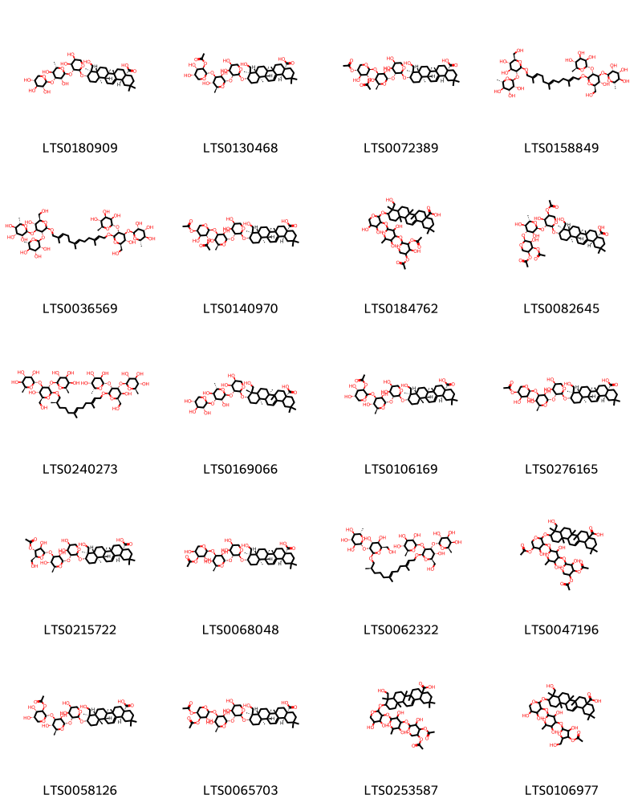{ width=100% }
    <figcaption>Hình ảnh cấu trúc hóa học của 20 hoạt chất thuộc nhóm Prenol lipids gồm ['(4as,6as,6br,8ar,9r,10s,12ar,12br,14bs)-10-{[(2s,3r,4s,5s)-3-{[(2s,3r,4r,5s,6s)-3,5-dihydroxy-6-methyl-4-{[(2s,3r,4s,5r)-3,4,5-trihydroxyoxan-2-yl]oxy}oxan-2-yl]oxy}-4,5-dihydroxyoxan-2-yl]oxy}-9-(hydroxymethyl)-2,2,6a,6b,9,12a-hexamethyl-1,3,4,5,6,7,8,8a,10,11,12,12b,13,14b-tetradecahydropicene-4a-carboxylic acid (LTS0180909)', '(4as,6as,6br,8ar,9r,10s,12ar,12br,14bs)-10-{[(2s,3r,4s,5s)-3-{[(2s,3r,4r,5s,6s)-4-{[(2s,3r,4s,5s)-3-(acetyloxy)-4,5-dihydroxyoxan-2-yl]oxy}-3,5-dihydroxy-6-methyloxan-2-yl]oxy}-4,5-dihydroxyoxan-2-yl]oxy}-9-(hydroxymethyl)-2,2,6a,6b,9,12a-hexamethyl-1,3,4,5,6,7,8,8a,10,11,12,12b,13,14b-tetradecahydropicene-4a-carboxylic acid (LTS0130468)', '(4as,6as,6br,8ar,9r,10s,12ar,12br,14bs)-10-{[(2s,3r,4s,5s)-3-{[(2s,3r,4r,5s,6s)-4-{[(2s,3r,4s,5r)-3,5-bis(acetyloxy)-4-hydroxyoxan-2-yl]oxy}-3,5-dihydroxy-6-methyloxan-2-yl]oxy}-4,5-dihydroxyoxan-2-yl]oxy}-9-(hydroxymethyl)-2,2,6a,6b,9,12a-hexamethyl-1,3,4,5,6,7,8,8a,10,11,12,12b,13,14b-tetradecahydropicene-4a-carboxylic acid (LTS0072389)', '(2s,3r,4r,5r,6s)-2-{[(2r,3r,4s,5r,6r)-2-{[(2e,6e,10e)-12-{[(2r,3r,4s,5s,6r)-4,5-dihydroxy-6-(hydroxymethyl)-3-{[(2s,3r,4r,5r,6s)-3,4,5-trihydroxy-6-methyloxan-2-yl]oxy}oxan-2-yl]oxy}-3,7,11-trimethyldodeca-2,6,10-trien-1-yl]oxy}-5-hydroxy-6-(hydroxymethyl)-3-{[(2s,3r,4r,5r,6s)-3,4,5-trihydroxy-6-methyloxan-2-yl]oxy}oxan-4-yl]oxy}-6-methyloxane-3,4,5-triol (LTS0158849)', '(2s,3r,4r,5r,6s)-2-{[(2r,3r,4s,5r,6r)-3-hydroxy-6-{[(2e,6e,10e)-12-{[(2r,3r,4s,5r,6r)-5-hydroxy-6-(hydroxymethyl)-3,4-bis({[(2s,3r,4r,5r,6s)-3,4,5-trihydroxy-6-methyloxan-2-yl]oxy})oxan-2-yl]oxy}-3,7,11-trimethyldodeca-2,6,10-trien-1-yl]oxy}-2-(hydroxymethyl)-5-{[(2s,3r,4r,5r,6s)-3,4,5-trihydroxy-6-methyloxan-2-yl]oxy}oxan-4-yl]oxy}-6-methyloxane-3,4,5-triol (LTS0036569)', '(4as,6as,6br,8ar,9r,10s,12ar,12br,14bs)-10-{[(2s,3r,4s,5s)-3-{[(2s,3r,4r,5s,6s)-4-{[(2s,3r,4s,5s)-3,5-bis(acetyloxy)-4-hydroxyoxan-2-yl]oxy}-3,5-dihydroxy-6-methyloxan-2-yl]oxy}-4,5-dihydroxyoxan-2-yl]oxy}-9-(hydroxymethyl)-2,2,6a,6b,9,12a-hexamethyl-1,3,4,5,6,7,8,8a,10,11,12,12b,13,14b-tetradecahydropicene-4a-carboxylic acid (LTS0140970)', '10-({3-[(4-{[3,5-bis(acetyloxy)-4-hydroxyoxan-2-yl]oxy}-3,5-dihydroxy-6-methyloxan-2-yl)oxy]-4,5-dihydroxyoxan-2-yl}oxy)-9-(hydroxymethyl)-2,2,6a,6b,9,12a-hexamethyl-1,3,4,5,6,7,8,8a,10,11,12,12b,13,14b-tetradecahydropicene-4a-carboxylic acid (LTS0184762)', '(4as,6as,6br,8ar,9r,10s,12ar,12br,14bs)-10-{[(2s,3r,4s,5s)-5-(acetyloxy)-3-{[(2s,3r,4r,5s,6s)-4-{[(2s,3r,4r,5s)-4,5-bis(acetyloxy)-3-hydroxyoxan-2-yl]oxy}-3,5-dihydroxy-6-methyloxan-2-yl]oxy}-4-hydroxyoxan-2-yl]oxy}-9-(hydroxymethyl)-2,2,6a,6b,9,12a-hexamethyl-1,3,4,5,6,7,8,8a,10,11,12,12b,13,14b-tetradecahydropicene-4a-carboxylic acid (LTS0082645)', '(2s,3r,4s,5s,6r)-2-{[(2r,3s,4r,5r,6r)-3-hydroxy-6-{[(2e,6e,11r)-12-{[(2s,3s,4r,5s,6s)-5-hydroxy-6-(hydroxymethyl)-3-{[(2s,3r,4s,5r,6r)-3,4,5-trihydroxy-6-methyloxan-2-yl]oxy}-4-{[(2s,3s,4s,5s,6s)-3,4,5-trihydroxy-6-methyloxan-2-yl]oxy}oxan-2-yl]oxy}-3,7,11-trimethyldodeca-2,6-dien-1-yl]oxy}-2-(hydroxymethyl)-5-{[(2s,3r,4s,5r,6r)-3,4,5-trihydroxy-6-methyloxan-2-yl]oxy}oxan-4-yl]oxy}-6-methyloxane-3,4,5-triol (LTS0240273)', '(4as,6br,9s,10s,12ar)-10-{[(2s,3r,4s,5s)-3-{[(2s,3r,4r,5s,6s)-3,5-dihydroxy-6-methyl-4-{[(2s,3r,4s,5r)-3,4,5-trihydroxyoxan-2-yl]oxy}oxan-2-yl]oxy}-4,5-dihydroxyoxan-2-yl]oxy}-9-(hydroxymethyl)-2,2,6a,6b,9,12a-hexamethyl-1,3,4,5,6,7,8,8a,10,11,12,12b,13,14b-tetradecahydropicene-4a-carboxylic acid (LTS0169066)', '(4as,6as,6br,8ar,9r,10s,12as,12br,14bs)-10-{[(2s,3r,4s,5s)-3-{[(2s,3r,4r,5s,6s)-4-{[(3r,4s,5s)-3-(acetyloxy)-4,5-dihydroxyoxan-2-yl]oxy}-3,5-dihydroxy-6-methyloxan-2-yl]oxy}-4,5-dihydroxyoxan-2-yl]oxy}-9-(hydroxymethyl)-2,2,6a,6b,9,12a-hexamethyl-1,3,4,5,6,7,8,8a,10,11,12,12b,13,14b-tetradecahydropicene-4a-carboxylic acid (LTS0106169)', '(4as,6as,6br,8ar,9r,10s,12ar,12br,14bs)-10-{[(2s,3r,4s,5s)-3-{[(2s,3r,4r,5s,6s)-4-{[(2s,3r,4r,5s)-5-(acetyloxy)-3,4-dihydroxyoxan-2-yl]oxy}-3,5-dihydroxy-6-methyloxan-2-yl]oxy}-4,5-dihydroxyoxan-2-yl]oxy}-9-(hydroxymethyl)-2,2,6a,6b,9,12a-hexamethyl-1,3,4,5,6,7,8,8a,10,11,12,12b,13,14b-tetradecahydropicene-4a-carboxylic acid (LTS0276165)', '(4as,6as,6br,8ar,9r,10s,12ar,12br,14bs)-10-{[(2s,3r,4s,5s)-3-{[(2s,3r,4r,5s,6s)-4-{[(2s,3r,4r,5s)-4-(acetyloxy)-3-hydroxy-5-(hydroxymethyl)oxolan-2-yl]oxy}-3,5-dihydroxy-6-methyloxan-2-yl]oxy}-4,5-dihydroxyoxan-2-yl]oxy}-9-(hydroxymethyl)-2,2,6a,6b,9,12a-hexamethyl-1,3,4,5,6,7,8,8a,10,11,12,12b,13,14b-tetradecahydropicene-4a-carboxylic acid (LTS0215722)', '(4as,6as,6br,8ar,9r,10s,12ar,12br,14bs)-10-{[(2s,3r,4s,5s)-3-{[(2s,3r,4r,5s,6s)-4-{[(2s,3r,4s,5s)-4-(acetyloxy)-3,5-dihydroxyoxan-2-yl]oxy}-3,5-dihydroxy-6-methyloxan-2-yl]oxy}-4,5-dihydroxyoxan-2-yl]oxy}-9-(hydroxymethyl)-2,2,6a,6b,9,12a-hexamethyl-1,3,4,5,6,7,8,8a,10,11,12,12b,13,14b-tetradecahydropicene-4a-carboxylic acid (LTS0068048)', '(2r,3r,4s,5r,6r)-2-{[(2r,3s,4r,5r,6r)-2-{[(2e,6e,11r)-12-{[(2r,3r,4r,5r,6r)-4,5-dihydroxy-6-(hydroxymethyl)-3-{[(2r,3s,4r,5r,6s)-3,4,5-trihydroxy-6-methyloxan-2-yl]oxy}oxan-2-yl]oxy}-3,7,11-trimethyldodeca-2,6-dien-1-yl]oxy}-5-hydroxy-6-(hydroxymethyl)-3-{[(2r,3s,4r,5r,6s)-3,4,5-trihydroxy-6-methyloxan-2-yl]oxy}oxan-4-yl]oxy}-6-methyloxane-3,4,5-triol (LTS0062322)', '10-{[5-(acetyloxy)-3-[(4-{[4,5-bis(acetyloxy)-3-hydroxyoxan-2-yl]oxy}-3,5-dihydroxy-6-methyloxan-2-yl)oxy]-4-hydroxyoxan-2-yl]oxy}-9-(hydroxymethyl)-2,2,6a,6b,9,12a-hexamethyl-1,3,4,5,6,7,8,8a,10,11,12,12b,13,14b-tetradecahydropicene-4a-carboxylic acid (LTS0047196)', '(4as,6as,6br,8ar,9r,10s,12as,12br,14bs)-10-{[(2s,3r,4s,5s)-3-{[(2s,3r,4r,5s,6s)-4-{[(2s,3r,4s,5s)-3-(acetyloxy)-4,5-dihydroxyoxan-2-yl]oxy}-3,5-dihydroxy-6-methyloxan-2-yl]oxy}-4,5-dihydroxyoxan-2-yl]oxy}-9-(hydroxymethyl)-2,2,6a,6b,9,12a-hexamethyl-1,3,4,5,6,7,8,8a,10,11,12,12b,13,14b-tetradecahydropicene-4a-carboxylic acid (LTS0058126)', '(4as,6as,6br,8ar,9r,10s,12ar,12br,14bs)-10-{[(2s,3r,4s,5s)-3-{[(2s,3r,4r,5s,6s)-4-{[(2s,3r,4r,5s)-4,5-bis(acetyloxy)-3-hydroxyoxan-2-yl]oxy}-3,5-dihydroxy-6-methyloxan-2-yl]oxy}-4,5-dihydroxyoxan-2-yl]oxy}-9-(hydroxymethyl)-2,2,6a,6b,9,12a-hexamethyl-1,3,4,5,6,7,8,8a,10,11,12,12b,13,14b-tetradecahydropicene-4a-carboxylic acid (LTS0065703)', '10-({3-[(4-{[4,5-bis(acetyloxy)-3-hydroxyoxan-2-yl]oxy}-3,5-dihydroxy-6-methyloxan-2-yl)oxy]-4,5-dihydroxyoxan-2-yl}oxy)-9-(hydroxymethyl)-2,2,6a,6b,9,12a-hexamethyl-1,3,4,5,6,7,8,8a,10,11,12,12b,13,14b-tetradecahydropicene-4a-carboxylic acid (LTS0253587)', '10-({3-[(4-{[4-(acetyloxy)-3-hydroxy-5-(hydroxymethyl)oxolan-2-yl]oxy}-3,5-dihydroxy-6-methyloxan-2-yl)oxy]-4,5-dihydroxyoxan-2-yl}oxy)-9-(hydroxymethyl)-2,2,6a,6b,9,12a-hexamethyl-1,3,4,5,6,7,8,8a,10,11,12,12b,13,14b-tetradecahydropicene-4a-carboxylic acid (LTS0106977)'].</figcaption>
</figure>

---

### Dược dân tộc học

Danh sách các quốc gia có sử dụng *Sapindus rarak* trong điều trị các bệnh. 

| Country         | Disease                      | Bệnh                               |
|:----------------|:-----------------------------|:-----------------------------------|
| China           | Soap                         | Xà phòng                           |
| Elsewhere       | Insecticide, Piscicide       | Thuốc trừ sâu, Piscicide           |
| Java            | Insecticide, Piscicide, Soap | Thuốc trừ sâu, Piscicide, Xà phòng |
| Java (Import)   | Insecticide                  | Thuốc trừ sâu                      |
| Malaya (Import) | Cosmetic                     | Cosmetic                           |

---

---
## Sapindus saponaria
### Thông tin về thực vật

!!! info "Phân loại thực vật của *Sapindus saponaria* từ GIBF:"
    - **Kingdom:** Plantae
    - **Phylum:** Tracheophyta
    - **Order:** Sapindales
    - **Family:** Sapindaceae
    - **Genus:** Sapindus
    - **Species:** *Sapindus saponaria*

 

| Label (VI)   | Label (EN)   | Scientific Name    | Descriptions (VI)   | Descriptions (EN)   | Also Known As (VI)   | Also Known As (EN)   |
|:-------------|:-------------|:-------------------|:--------------------|:--------------------|:---------------------|:---------------------|
| N/A          | N/A          | Sapindus saponaria |                     | species of plant    | ['']                 | ['']                 |

#### Phân bố trên thế giới

**Từ CSDL GIBF** Nicaragua, Ecuador, Puerto Rico, Panama, Mexico, Haiti, Colombia, Brazil, Guatemala, Argentina, Costa Rica, United States of America, Peru, Dominican Republic, El Salvador, Venezuela (Bolivarian Republic of), China, French Guiana

#### Phân bố tại Việt Nam

**Từ CSDL GIBF**: Không có ghi nhận ở Việt Nam

---
### Thành phần hóa học
        
- Theo cơ sở dữ liệu lotus: Từ loài *Sapindus saponaria* đã phân lập và xác định được 4 hoạt chất thuộc về các nhóm Prenol lipids, Organooxygen compounds. 

|    | chemicalTaxonomyClassyfireClass   |   smiles_count |
|---:|:----------------------------------|---------------:|
|  0 | Organooxygen compounds            |              2 |
|  1 | Prenol lipids                     |              2 |

#### Nhóm Organooxygen compounds
<figure markdown="span">
    { width=100% }
    <figcaption>Hình ảnh cấu trúc hóa học của 2 hoạt chất thuộc nhóm Organooxygen compounds gồm ['l(+)-tartaric acid (LTS0084538)', '(.+-.)-tartaric acid (LTS0061981)'].</figcaption>
</figure>
#### Nhóm Prenol lipids
<figure markdown="span">
    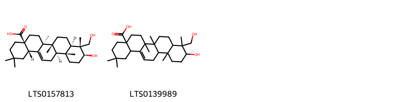{ width=100% }
    <figcaption>Hình ảnh cấu trúc hóa học của 2 hoạt chất thuộc nhóm Prenol lipids gồm ['hederagenin (LTS0157813)', '10-hydroxy-9-(hydroxymethyl)-2,2,6a,6b,9,12a-hexamethyl-1,3,4,5,6,7,8,8a,10,11,12,12b,13,14b-tetradecahydropicene-4a-carboxylic acid (LTS0139989)'].</figcaption>
</figure>

---

### Dược dân tộc học

Danh sách các quốc gia có sử dụng *Sapindus saponaria* trong điều trị các bệnh. 

| Country            | Disease                                                   | Bệnh                                                                                 |
|:-------------------|:----------------------------------------------------------|:-------------------------------------------------------------------------------------|
| Dominican Republic | Piscicide                                                 | Thuốc diệt cá                                                                        |
| Elsewhere          | Astringent, Insecticide, Soap, Tonic, Antidote, Piscicide | Chất làm se, Thuốc trừ sâu, Xà phòng, Thuốc bổ, Thuốc giải độc, Thuốc diệt côn trùng |
| Guatemala          | Soap                                                      | Xà phòng                                                                             |
| Haiti              | Soap                                                      | Xà phòng                                                                             |
| Mexico             | Piscicide, Soap                                           | Thuốc diệt cá, Xà phòng                                                              |
| Panama(Cuna)       | Soap                                                      | Xà phòng                                                                             |
| Venezuela          | Piscicide, Poison, Soap, Tonic, Astringent, Insecticide   | Thuốc trừ sâu, Chất độc, Xà phòng, Thuốc bổ, Chất làm se, Thuốc trừ sâu              |

---

---
## Sapindus trifoliatus
### Thông tin về thực vật

!!! info "Phân loại thực vật của *Sapindus trifoliatus* từ GIBF:"
    - **Kingdom:** Plantae
    - **Phylum:** Tracheophyta
    - **Order:** Sapindales
    - **Family:** Sapindaceae
    - **Genus:** Sapindus
    - **Species:** *Sapindus trifoliatus*

 

| Label (VI)   | Label (EN)   | Scientific Name      | Descriptions (VI)   | Descriptions (EN)   | Also Known As (VI)   | Also Known As (EN)   |
|:-------------|:-------------|:---------------------|:--------------------|:--------------------|:---------------------|:---------------------|
| N/A          | N/A          | Sapindus trifoliatus |                     | species of plant    | ['']                 | ['']                 |

#### Phân bố trên thế giới

**Từ CSDL GIBF** nan, Sri Lanka, Lao People’s Democratic Republic, Mauritius, Angola, Myanmar, unknown or invalid, Bermuda, Tanzania, United Republic of, Pakistan, Réunion, Nigeria, Korea, Republic of, Bangladesh, United States of America, Trinidad and Tobago, Thailand, Cuba, Viet Nam, Madagascar, India, Indonesia, Cameroon, Malaysia, Nepal

#### Phân bố tại Việt Nam

**Từ CSDL GIBF**: Hà Nội

---
### Thành phần hóa học
        
- Theo cơ sở dữ liệu lotus: Từ loài *Sapindus trifoliatus* đã phân lập và xác định được 20 hoạt chất thuộc về các nhóm Prenol lipids. 

|    | chemicalTaxonomyClassyfireClass   |   smiles_count |
|---:|:----------------------------------|---------------:|
|  0 | Prenol lipids                     |             20 |

#### Nhóm Prenol lipids
<figure markdown="span">
    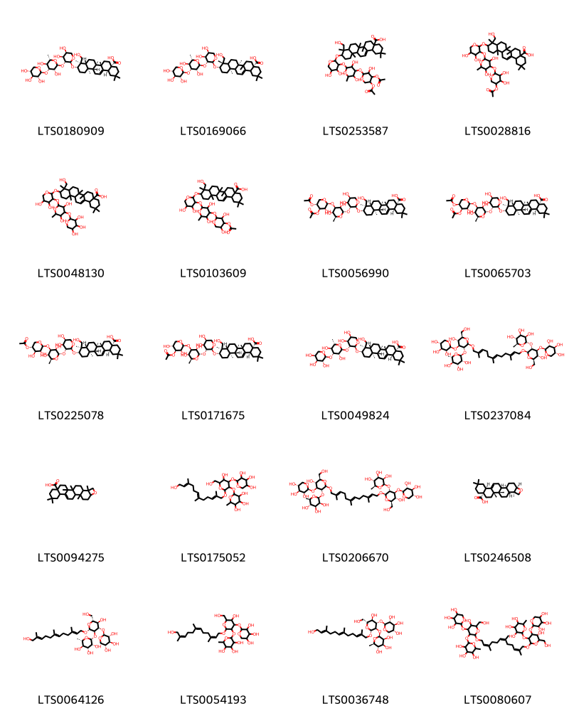{ width=100% }
    <figcaption>Hình ảnh cấu trúc hóa học của 20 hoạt chất thuộc nhóm Prenol lipids gồm ['(4as,6as,6br,8ar,9r,10s,12ar,12br,14bs)-10-{[(2s,3r,4s,5s)-3-{[(2s,3r,4r,5s,6s)-3,5-dihydroxy-6-methyl-4-{[(2s,3r,4s,5r)-3,4,5-trihydroxyoxan-2-yl]oxy}oxan-2-yl]oxy}-4,5-dihydroxyoxan-2-yl]oxy}-9-(hydroxymethyl)-2,2,6a,6b,9,12a-hexamethyl-1,3,4,5,6,7,8,8a,10,11,12,12b,13,14b-tetradecahydropicene-4a-carboxylic acid (LTS0180909)', '(4as,6br,9s,10s,12ar)-10-{[(2s,3r,4s,5s)-3-{[(2s,3r,4r,5s,6s)-3,5-dihydroxy-6-methyl-4-{[(2s,3r,4s,5r)-3,4,5-trihydroxyoxan-2-yl]oxy}oxan-2-yl]oxy}-4,5-dihydroxyoxan-2-yl]oxy}-9-(hydroxymethyl)-2,2,6a,6b,9,12a-hexamethyl-1,3,4,5,6,7,8,8a,10,11,12,12b,13,14b-tetradecahydropicene-4a-carboxylic acid (LTS0169066)', '10-({3-[(4-{[4,5-bis(acetyloxy)-3-hydroxyoxan-2-yl]oxy}-3,5-dihydroxy-6-methyloxan-2-yl)oxy]-4,5-dihydroxyoxan-2-yl}oxy)-9-(hydroxymethyl)-2,2,6a,6b,9,12a-hexamethyl-1,3,4,5,6,7,8,8a,10,11,12,12b,13,14b-tetradecahydropicene-4a-carboxylic acid (LTS0253587)', '10-({3-[(4-{[5-(acetyloxy)-3,4-dihydroxyoxan-2-yl]oxy}-3,5-dihydroxy-6-methyloxan-2-yl)oxy]-4,5-dihydroxyoxan-2-yl}oxy)-9-(hydroxymethyl)-2,2,6a,6b,9,12a-hexamethyl-1,3,4,5,6,7,8,8a,10,11,12,12b,13,14b-tetradecahydropicene-4a-carboxylic acid (LTS0028816)', '10-{[3-({3,5-dihydroxy-6-methyl-4-[(3,4,5-trihydroxyoxan-2-yl)oxy]oxan-2-yl}oxy)-4,5-dihydroxyoxan-2-yl]oxy}-9-(hydroxymethyl)-2,2,6a,6b,9,12a-hexamethyl-1,3,4,5,6,7,8,8a,10,11,12,12b,13,14b-tetradecahydropicene-4a-carboxylic acid (LTS0048130)', '10-({3-[(4-{[4-(acetyloxy)-3,5-dihydroxyoxan-2-yl]oxy}-3,5-dihydroxy-6-methyloxan-2-yl)oxy]-4,5-dihydroxyoxan-2-yl}oxy)-9-(hydroxymethyl)-2,2,6a,6b,9,12a-hexamethyl-1,3,4,5,6,7,8,8a,10,11,12,12b,13,14b-tetradecahydropicene-4a-carboxylic acid (LTS0103609)', '(4as,6as,6br,8ar,9r,10s,12ar,12br,14bs)-10-{[(2s,3r,4s,5s)-3-{[(2s,3r,4r,5s,6s)-4-{[(2s,3r,4r,5r)-4,5-bis(acetyloxy)-3-hydroxyoxan-2-yl]oxy}-3,5-dihydroxy-6-methyloxan-2-yl]oxy}-4,5-dihydroxyoxan-2-yl]oxy}-9-(hydroxymethyl)-2,2,6a,6b,9,12a-hexamethyl-1,3,4,5,6,7,8,8a,10,11,12,12b,13,14b-tetradecahydropicene-4a-carboxylic acid (LTS0056990)', '(4as,6as,6br,8ar,9r,10s,12ar,12br,14bs)-10-{[(2s,3r,4s,5s)-3-{[(2s,3r,4r,5s,6s)-4-{[(2s,3r,4r,5s)-4,5-bis(acetyloxy)-3-hydroxyoxan-2-yl]oxy}-3,5-dihydroxy-6-methyloxan-2-yl]oxy}-4,5-dihydroxyoxan-2-yl]oxy}-9-(hydroxymethyl)-2,2,6a,6b,9,12a-hexamethyl-1,3,4,5,6,7,8,8a,10,11,12,12b,13,14b-tetradecahydropicene-4a-carboxylic acid (LTS0065703)', '(4as,6as,6br,8ar,9r,10s,12ar,12br,14bs)-10-{[(2s,3r,4s,5s)-3-{[(2s,3r,4r,5s,6s)-4-{[(2s,3r,4r,5r)-5-(acetyloxy)-3,4-dihydroxyoxan-2-yl]oxy}-3,5-dihydroxy-6-methyloxan-2-yl]oxy}-4,5-dihydroxyoxan-2-yl]oxy}-9-(hydroxymethyl)-2,2,6a,6b,9,12a-hexamethyl-1,3,4,5,6,7,8,8a,10,11,12,12b,13,14b-tetradecahydropicene-4a-carboxylic acid (LTS0225078)', '(4as,6as,6br,8ar,9r,10s,12ar,12br,14bs)-10-{[(2s,3r,4s,5s)-3-{[(2s,3r,4r,5s,6s)-4-{[(2s,3r,4s,5r)-4-(acetyloxy)-3,5-dihydroxyoxan-2-yl]oxy}-3,5-dihydroxy-6-methyloxan-2-yl]oxy}-4,5-dihydroxyoxan-2-yl]oxy}-9-(hydroxymethyl)-2,2,6a,6b,9,12a-hexamethyl-1,3,4,5,6,7,8,8a,10,11,12,12b,13,14b-tetradecahydropicene-4a-carboxylic acid (LTS0171675)', '(4as,6as,6br,8ar,9r,10s,12ar,12br,14bs)-10-{[(2s,3r,4s,5s)-3-{[(2s,3r,4r,5s,6s)-3,5-dihydroxy-6-methyl-4-{[(2s,3r,4s,5s)-3,4,5-trihydroxyoxan-2-yl]oxy}oxan-2-yl]oxy}-4,5-dihydroxyoxan-2-yl]oxy}-9-(hydroxymethyl)-2,2,6a,6b,9,12a-hexamethyl-1,3,4,5,6,7,8,8a,10,11,12,12b,13,14b-tetradecahydropicene-4a-carboxylic acid (LTS0049824)', '(2s,3r,4r,5r,6s)-2-{[(2r,3r,4s,5r,6r)-5-hydroxy-2-{[(2e,6e,10e)-12-{[(2r,3r,4s,5r,6r)-5-hydroxy-6-(hydroxymethyl)-3-{[(2s,3r,4r,5r,6s)-3,4,5-trihydroxy-6-methyloxan-2-yl]oxy}-4-{[(2s,3r,4s,5r)-3,4,5-trihydroxyoxan-2-yl]oxy}oxan-2-yl]oxy}-3,7,11-trimethyldodeca-2,6,10-trien-1-yl]oxy}-6-(hydroxymethyl)-4-{[(2s,3r,4s,5r)-3,4,5-trihydroxyoxan-2-yl]oxy}oxan-3-yl]oxy}-6-methyloxane-3,4,5-triol (LTS0237084)', '2a,4a,4b,9,9,12b-hexamethyl-2h,2bh,3h,4h,5h,6h,7h,8h,10h,10ah,12h,12ah,13h,14h,14ah-piceno[3,4-b]oxete-6a-carboxylic acid (LTS0094275)', '2-({5-hydroxy-2-[(12-hydroxy-2,6,10-trimethyldodeca-2,6,10-trien-1-yl)oxy]-6-(hydroxymethyl)-4-[(3,4,5-trihydroxyoxan-2-yl)oxy]oxan-3-yl}oxy)-6-methyloxane-3,4,5-triol (LTS0175052)', '(2r,3r,4r,5r,6s)-2-{[(2r,3r,4s,5r,6r)-5-hydroxy-2-{[(2e,6e,10e)-12-{[(2r,3r,4s,5r,6r)-5-hydroxy-6-(hydroxymethyl)-3-{[(2s,3s,4s,5s,6r)-3,4,5-trihydroxy-6-methyloxan-2-yl]oxy}-4-{[(2s,3r,4s,5r)-3,4,5-trihydroxyoxan-2-yl]oxy}oxan-2-yl]oxy}-3,7,11-trimethyldodeca-2,6,10-trien-1-yl]oxy}-6-(hydroxymethyl)-4-{[(2s,3r,4s,5r)-3,4,5-trihydroxyoxan-2-yl]oxy}oxan-3-yl]oxy}-6-methyloxane-3,4,5-triol (LTS0206670)', '(2ar,2br,4as,4bs,6as,10as,12ar,12br,14ar)-2a,4a,4b,9,9,12b-hexamethyl-2h,2bh,3h,4h,5h,6h,7h,8h,10h,10ah,12h,12ah,13h,14h,14ah-piceno[3,4-b]oxete-6a-carboxylic acid (LTS0246508)', '(2r,3r,4r,5r,6s)-2-{[(2r,3r,4s,5r,6r)-5-hydroxy-2-{[(2e,6e,10e)-12-hydroxy-3,7,11-trimethyldodeca-2,6,10-trien-1-yl]oxy}-6-(hydroxymethyl)-4-{[(2s,3r,4s,5r)-3,4,5-trihydroxyoxan-2-yl]oxy}oxan-3-yl]oxy}-6-methyloxane-3,4,5-triol (LTS0064126)', '2-({5-hydroxy-2-[(12-hydroxy-3,7,11-trimethyldodeca-2,6,10-trien-1-yl)oxy]-6-(hydroxymethyl)-4-[(3,4,5-trihydroxyoxan-2-yl)oxy]oxan-3-yl}oxy)-6-methyloxane-3,4,5-triol (LTS0054193)', '(2s,3s,4s,5s,6r)-2-{[(2r,3r,4s,5r,6r)-5-hydroxy-2-{[(2e,6e,10e)-12-hydroxy-2,6,10-trimethyldodeca-2,6,10-trien-1-yl]oxy}-6-(hydroxymethyl)-4-{[(2s,3r,4s,5r)-3,4,5-trihydroxyoxan-2-yl]oxy}oxan-3-yl]oxy}-6-methyloxane-3,4,5-triol (LTS0036748)', '2-({5-hydroxy-2-[(12-{[5-hydroxy-6-(hydroxymethyl)-3-[(3,4,5-trihydroxy-6-methyloxan-2-yl)oxy]-4-[(3,4,5-trihydroxyoxan-2-yl)oxy]oxan-2-yl]oxy}-3,7,11-trimethyldodeca-2,6,10-trien-1-yl)oxy]-6-(hydroxymethyl)-4-[(3,4,5-trihydroxyoxan-2-yl)oxy]oxan-3-yl}oxy)-6-methyloxane-3,4,5-triol (LTS0080607)'].</figcaption>
</figure>

---

### Dược dân tộc học

Danh sách các quốc gia có sử dụng *Sapindus trifoliatus* trong điều trị các bệnh. 

| Country      | Disease                                            | Bệnh                                               |
|:-------------|:---------------------------------------------------|:---------------------------------------------------|
| Elsewhere    | Demulcent, Uterotonic, nan, Expectorant, Piscicide | Demulcent, Uterotonic, nan, Expectorant, Piscicide |
| India        | Piscicide, Soap                                    | Thuốc diệt cá, Xà phòng                            |
| India(Hindu) | Emetic, Expectorant, Piscicide, Tonic, Purgative   | Emetic, Expectorant, Piscicide, Tonic, Purgative   |

---

