!!! abstract "Tóm tắt"

    Họ Sapotaceae gồm khoảng 14 chi và 25 loài được một số cộng đồng tại các quốc gia như Trinidad, Thailand, Brazil, French, India(Santal), Ghana, New Hebrides, Venezuela, English, Mexico, Malaya, anish, Haiti, Elsewhere, Dominican Republic, Africa, India, Sudan, India(Ayurvedic) sử dụng trong một số trường hợp QUERY LENGTH LIMIT EXCEEDED. MAX ALLOWED QUERY : 500 CHARS.

!!! info "DrDuke"

    James A. Duke sinh năm 1929-2017 là một nhà thực vật học người Mỹ. Đây là một trong những tác giả hàng đầu trong lĩnh vực dược dân tộc học với cuốn *CRC Handbook of Medicinal Herbs* và chính là người xây dựng lên cơ sở dữ liệu về hợp chất tự nhiên và dược dân tộc học tại Bộ nông nghiệp Hoa Kỳ. Các thông tin được đăng tải tại website [Dr. Duke's Phytochemical and Ethnobotanical Databases](https://phytochem.nal.usda.gov/). 
    Trong suốt thập niên 1970, ông lãnh đạo the Plant Taxonomy Laboratory, Plant Genetics and Germplasm Institute of the Agricultural Research Service, U.S. Department of Agriculture.
    Trong tài liệu này, các thông tin về dược dân tộc của các dược liệu được trích dẫn từ tài liệu của James A. Ducke với sự trợ giúp của phần mềm dịch thuật từ tiếng Anh sang tiếng Việt.
   

# Chi Pouteria

??? note "Danh sách các dược liệu thuộc chi"
    
	 - *Pouteria domingensis*
	 - *Pouteria sapota*

---
## Pouteria domingensis
### Thông tin về thực vật

!!! info "Phân loại thực vật của *Pouteria domingensis* từ GIBF:"
    - **Kingdom:** Plantae
    - **Phylum:** Tracheophyta
    - **Order:** Ericales
    - **Family:** Sapotaceae
    - **Genus:** Pouteria
    - **Species:** *Pouteria domingensis*

 

| Label (VI)   | Label (EN)   | Scientific Name   | Descriptions (VI)   | Descriptions (EN)   | Also Known As (VI)   | Also Known As (EN)   |
|:-------------|:-------------|:------------------|:--------------------|:--------------------|:---------------------|:---------------------|
| N/A          | N/A          | Carica papaya     | loài thực vật       | species of plant    | ['Carica papaya']    | ['papaya tree']      |

#### Phân bố trên thế giới

**Từ CSDL GIBF** Haiti, nan, unknown or invalid, Dominican Republic, Panama, United States of America, Cuba, Bahamas

#### Phân bố tại Việt Nam

**Từ CSDL GIBF**: Không có ghi nhận ở Việt Nam

---
### Thành phần hóa học
        
- Theo cơ sở dữ liệu lotus: Từ loài *Pouteria domingensis* đã phân lập và xác định được Chưa có hoạt chất nào được phân lập. hoạt chất thuộc về các nhóm Không có hoạt chất nào được phân lập. 

Không có hình ảnh nào được tạo ra

---

### Dược dân tộc học

Danh sách các quốc gia có sử dụng *Pouteria domingensis* trong điều trị các bệnh. 

| Country   | Disease   | Bệnh                                                                                                                                                                                                |
|:----------|:----------|:----------------------------------------------------------------------------------------------------------------------------------------------------------------------------------------------------|
| Haiti     | Hypnotic  | MYMEMORY WARNING: YOU USED ALL AVAILABLE FREE TRANSLATIONS FOR TODAY. NEXT AVAILABLE IN  10 HOURS 57 MINUTES 11 SECONDS VISIT HTTPS://MYMEMORY.TRANSLATED.NET/DOC/USAGELIMITS.PHP TO TRANSLATE MORE |

---

---
## Pouteria sapota
### Thông tin về thực vật

!!! info "Phân loại thực vật của *Pouteria sapota* từ GIBF:"
    - **Kingdom:** Plantae
    - **Phylum:** Tracheophyta
    - **Order:** Ericales
    - **Family:** Sapotaceae
    - **Genus:** Pouteria
    - **Species:** *Pouteria sapota*

 

| Label (VI)   | Label (EN)   | Scientific Name   | Descriptions (VI)   | Descriptions (EN)                                    | Also Known As (VI)   | Also Known As (EN)                        |
|:-------------|:-------------|:------------------|:--------------------|:-----------------------------------------------------|:---------------------|:------------------------------------------|
| N/A          | N/A          | Pouteria sapota   |                     | species of tree native to Mexico and Central America | ['']                 | ['mamey sapote']                          |
| N/A          | N/A          | Pouteria sapota   |                     | type of fruit                                        | ['']                 | ['Mamey', 'Pouteria sapota', 'Red mamey'] |

#### Phân bố trên thế giới

**Từ CSDL GIBF** Cayman Islands, El Salvador, Guadeloupe, French Polynesia, Singapore, Guatemala, Haiti, Colombia, Venezuela (Bolivarian Republic of), Dominican Republic, Puerto Rico, Réunion, Mayotte, Cuba, Belgium, Belize, Nicaragua, Panama, Brazil, Mexico, China, Norway, Cook Islands, Bolivia (Plurinational State of), Costa Rica, Ecuador, United States of America

#### Phân bố tại Việt Nam

**Từ CSDL GIBF**: Không có ghi nhận ở Việt Nam

---
### Thành phần hóa học
        
- Theo cơ sở dữ liệu lotus: Từ loài *Pouteria sapota* đã phân lập và xác định được 7 hoạt chất thuộc về các nhóm Organooxygen compounds, Fatty Acyls. 

|    | chemicalTaxonomyClassyfireClass   |   smiles_count |
|---:|:----------------------------------|---------------:|
|  0 | Fatty Acyls                       |              1 |
|  1 | Organooxygen compounds            |              6 |

#### Nhóm Fatty Acyls
<figure markdown="span">
    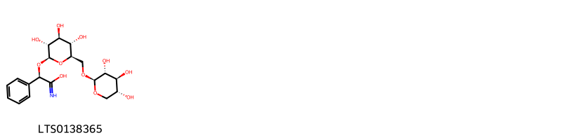{ width=100% }
    <figcaption>Hình ảnh cấu trúc hóa học của 1 hoạt chất thuộc nhóm Fatty Acyls gồm ['(2r)-2-phenyl-2-{[(2s,3r,4s,5s,6r)-3,4,5-trihydroxy-6-({[(2s,3r,4s,5r)-3,4,5-trihydroxyoxan-2-yl]oxy}methyl)oxan-2-yl]oxy}ethanimidic acid (LTS0138365)'].</figcaption>
</figure>
#### Nhóm Organooxygen compounds
<figure markdown="span">
    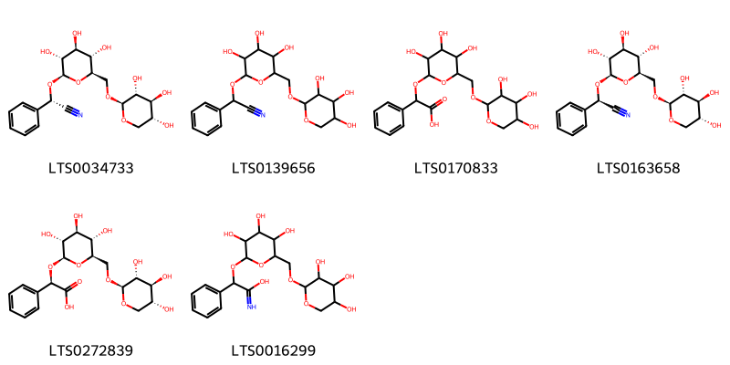{ width=100% }
    <figcaption>Hình ảnh cấu trúc hóa học của 6 hoạt chất thuộc nhóm Organooxygen compounds gồm ['(2s)-2-phenyl-2-{[(2r,3r,4s,5s,6r)-3,4,5-trihydroxy-6-({[(2s,3r,4s,5r)-3,4,5-trihydroxyoxan-2-yl]oxy}methyl)oxan-2-yl]oxy}acetonitrile (LTS0034733)', '2-phenyl-2-[(3,4,5-trihydroxy-6-{[(3,4,5-trihydroxyoxan-2-yl)oxy]methyl}oxan-2-yl)oxy]acetonitrile (LTS0139656)', 'phenyl[(3,4,5-trihydroxy-6-{[(3,4,5-trihydroxyoxan-2-yl)oxy]methyl}oxan-2-yl)oxy]acetic acid (LTS0170833)', 'lucumin (LTS0163658)', '(r)-phenyl({[(2s,3r,4s,5s,6r)-3,4,5-trihydroxy-6-({[(2s,3r,4s,5r)-3,4,5-trihydroxyoxan-2-yl]oxy}methyl)oxan-2-yl]oxy})acetic acid (LTS0272839)', '2-phenyl-2-[(3,4,5-trihydroxy-6-{[(3,4,5-trihydroxyoxan-2-yl)oxy]methyl}oxan-2-yl)oxy]ethanimidic acid (LTS0016299)'].</figcaption>
</figure>

---

### Dược dân tộc học

Danh sách các quốc gia có sử dụng *Pouteria sapota* trong điều trị các bệnh. 

| Country   | Disease                                                   | Bệnh                                                                                                                                                                                                |
|:----------|:----------------------------------------------------------|:----------------------------------------------------------------------------------------------------------------------------------------------------------------------------------------------------|
| Elsewhere | Diuretic                                                  | MYMEMORY WARNING: YOU USED ALL AVAILABLE FREE TRANSLATIONS FOR TODAY. NEXT AVAILABLE IN  10 HOURS 56 MINUTES 54 SECONDS VISIT HTTPS://MYMEMORY.TRANSLATED.NET/DOC/USAGELIMITS.PHP TO TRANSLATE MORE |
| Haiti     | Diuretic, Emetic, Vermifuge, Vermifuge, Diuretic, Cardiac | MYMEMORY WARNING: YOU USED ALL AVAILABLE FREE TRANSLATIONS FOR TODAY. NEXT AVAILABLE IN  10 HOURS 56 MINUTES 50 SECONDS VISIT HTTPS://MYMEMORY.TRANSLATED.NET/DOC/USAGELIMITS.PHP TO TRANSLATE MORE |
| Mexico    | Diuretic, Emetic, Vermifuge                               | MYMEMORY WARNING: YOU USED ALL AVAILABLE FREE TRANSLATIONS FOR TODAY. NEXT AVAILABLE IN  10 HOURS 56 MINUTES 47 SECONDS VISIT HTTPS://MYMEMORY.TRANSLATED.NET/DOC/USAGELIMITS.PHP TO TRANSLATE MORE |

---

# Chi Achras

??? note "Danh sách các dược liệu thuộc chi"
    
	 - *Achras zapota*

---
## Achras zapota
### Thông tin về thực vật

!!! info "Phân loại thực vật của *Manilkara zapota* từ GIBF:"
    - **Kingdom:** Plantae
    - **Phylum:** Tracheophyta
    - **Order:** Ericales
    - **Family:** Sapotaceae
    - **Genus:** Manilkara
    - **Species:** *Manilkara zapota*

 

| Label (VI)   | Label (EN)   | Scientific Name   | Descriptions (VI)   | Descriptions (EN)   | Also Known As (VI)   | Also Known As (EN)   |
|:-------------|:-------------|:------------------|:--------------------|:--------------------|:---------------------|:---------------------|
| N/A          | N/A          | Achras zapota     | loài thực vật       | species of plant    | ['']                 | ['']                 |

#### Phân bố trên thế giới

**Từ CSDL GIBF** nan, unknown or invalid, Jamaica, Guatemala, Indonesia, Colombia, Suriname, Dominican Republic, Venezuela (Bolivarian Republic of), Côte d’Ivoire, India, Belize, Panama, Brazil, Mexico, China, Chinese Taipei, Brunei Darussalam, Ecuador, United States of America, Saint Barthélemy

#### Phân bố tại Việt Nam

**Từ CSDL GIBF**: Không có ghi nhận ở Việt Nam

---
### Thành phần hóa học
        
- Theo cơ sở dữ liệu lotus: Từ loài *Manilkara zapota* đã phân lập và xác định được Chưa có hoạt chất nào được phân lập. hoạt chất thuộc về các nhóm Không có hoạt chất nào được phân lập. 

Không có hình ảnh nào được tạo ra

---

### Dược dân tộc học

Danh sách các quốc gia có sử dụng *Manilkara zapota* trong điều trị các bệnh. 

| Country   | Disease   | Bệnh                                                                                                                                                                                                |
|:----------|:----------|:----------------------------------------------------------------------------------------------------------------------------------------------------------------------------------------------------|
| Elsewhere | Diuretic  | MYMEMORY WARNING: YOU USED ALL AVAILABLE FREE TRANSLATIONS FOR TODAY. NEXT AVAILABLE IN  10 HOURS 56 MINUTES 18 SECONDS VISIT HTTPS://MYMEMORY.TRANSLATED.NET/DOC/USAGELIMITS.PHP TO TRANSLATE MORE |
| Trinidad  | Diuretic  | MYMEMORY WARNING: YOU USED ALL AVAILABLE FREE TRANSLATIONS FOR TODAY. NEXT AVAILABLE IN  10 HOURS 56 MINUTES 15 SECONDS VISIT HTTPS://MYMEMORY.TRANSLATED.NET/DOC/USAGELIMITS.PHP TO TRANSLATE MORE |

---

# Chi Madhuca

??? note "Danh sách các dược liệu thuộc chi"
    
	 - *Madhuca butyracea*
	 - *Madhuca indica*
	 - *Madhuca latifolia*
	 - *Madhuca longifolia*

---
## Madhuca butyracea
### Thông tin về thực vật

!!! info "Phân loại thực vật của *Diploknema butyracea* từ GIBF:"
    - **Kingdom:** Plantae
    - **Phylum:** Tracheophyta
    - **Order:** Ericales
    - **Family:** Sapotaceae
    - **Genus:** Diploknema
    - **Species:** *Diploknema butyracea*

 

| Label (VI)   | Label (EN)   | Scientific Name   | Descriptions (VI)   | Descriptions (EN)   | Also Known As (VI)   | Also Known As (EN)   |
|:-------------|:-------------|:------------------|:--------------------|:--------------------|:---------------------|:---------------------|
| N/A          | N/A          | Madhuca butyracea |                     |                     | ['']                 | ['']                 |

#### Phân bố trên thế giới

**Từ CSDL GIBF** nan, unknown or invalid, Jamaica, Guatemala, Indonesia, Colombia, Suriname, Dominican Republic, Venezuela (Bolivarian Republic of), Côte d’Ivoire, India, Belize, Panama, Brazil, Mexico, China, Chinese Taipei, Brunei Darussalam, Ecuador, United States of America, Saint Barthélemy

#### Phân bố tại Việt Nam

**Từ CSDL GIBF**: Không có ghi nhận ở Việt Nam

---
### Thành phần hóa học
        
- Theo cơ sở dữ liệu lotus: Từ loài *Diploknema butyracea* đã phân lập và xác định được Chưa có hoạt chất nào được phân lập. hoạt chất thuộc về các nhóm Không có hoạt chất nào được phân lập. 

Không có hình ảnh nào được tạo ra

---

### Dược dân tộc học

Danh sách các quốc gia có sử dụng *Diploknema butyracea* trong điều trị các bệnh. 

| Country          | Disease                                                                                                          | Bệnh                                                                                                                                                                                                |
|:-----------------|:-----------------------------------------------------------------------------------------------------------------|:----------------------------------------------------------------------------------------------------------------------------------------------------------------------------------------------------|
| India(Ayurvedic) | Aphrodisiac, Carminative, Emollient, Expectorant, Refrigerant, Stimulant, Tonic, Astringent, Demulcent, Laxative | MYMEMORY WARNING: YOU USED ALL AVAILABLE FREE TRANSLATIONS FOR TODAY. NEXT AVAILABLE IN  10 HOURS 55 MINUTES 50 SECONDS VISIT HTTPS://MYMEMORY.TRANSLATED.NET/DOC/USAGELIMITS.PHP TO TRANSLATE MORE |

---

---
## Madhuca indica
### Thông tin về thực vật

!!! info "Phân loại thực vật của *Madhuca longifolia* từ GIBF:"
    - **Kingdom:** Plantae
    - **Phylum:** Tracheophyta
    - **Order:** Ericales
    - **Family:** Sapotaceae
    - **Genus:** Madhuca
    - **Species:** *Madhuca longifolia*

 

| Label (VI)   | Label (EN)   | Scientific Name   | Descriptions (VI)   | Descriptions (EN)   | Also Known As (VI)   | Also Known As (EN)   |
|:-------------|:-------------|:------------------|:--------------------|:--------------------|:---------------------|:---------------------|
| N/A          | N/A          | Madhuca indica    | loài thực vật       | species of plant    | ['']                 | ['']                 |

#### Phân bố trên thế giới

**Từ CSDL GIBF** nan, Sri Lanka, United States of America, India

#### Phân bố tại Việt Nam

**Từ CSDL GIBF**: Không có ghi nhận ở Việt Nam

---
### Thành phần hóa học
        
- Theo cơ sở dữ liệu lotus: Từ loài *Madhuca longifolia* đã phân lập và xác định được Chưa có hoạt chất nào được phân lập. hoạt chất thuộc về các nhóm Không có hoạt chất nào được phân lập. 

Không có hình ảnh nào được tạo ra

---

### Dược dân tộc học

Danh sách các quốc gia có sử dụng *Madhuca longifolia* trong điều trị các bệnh. 

| Country       | Disease            | Bệnh                                                                                                                                                                                                |
|:--------------|:-------------------|:----------------------------------------------------------------------------------------------------------------------------------------------------------------------------------------------------|
| India(Santal) | Laxative, Antidote | MYMEMORY WARNING: YOU USED ALL AVAILABLE FREE TRANSLATIONS FOR TODAY. NEXT AVAILABLE IN  10 HOURS 55 MINUTES 27 SECONDS VISIT HTTPS://MYMEMORY.TRANSLATED.NET/DOC/USAGELIMITS.PHP TO TRANSLATE MORE |

---

---
## Madhuca latifolia
### Thông tin về thực vật

!!! info "Phân loại thực vật của *Madhuca longifolia* từ GIBF:"
    - **Kingdom:** Plantae
    - **Phylum:** Tracheophyta
    - **Order:** Ericales
    - **Family:** Sapotaceae
    - **Genus:** Madhuca
    - **Species:** *Madhuca longifolia*

 

| Label (VI)   | Label (EN)   | Scientific Name   | Descriptions (VI)   | Descriptions (EN)   | Also Known As (VI)   | Also Known As (EN)   |
|:-------------|:-------------|:------------------|:--------------------|:--------------------|:---------------------|:---------------------|
| N/A          | N/A          | Madhuca latifolia | loài thực vật       | species of plant    | ['']                 | ['']                 |

#### Phân bố trên thế giới

**Từ CSDL GIBF** nan, unknown or invalid, Suriname, Côte d’Ivoire, Mozambique, Mauritius, India, Réunion, Congo, Democratic Republic of the, Bangladesh

#### Phân bố tại Việt Nam

**Từ CSDL GIBF**: Không có ghi nhận ở Việt Nam

---
### Thành phần hóa học
        
- Theo cơ sở dữ liệu lotus: Từ loài *Madhuca longifolia* đã phân lập và xác định được Chưa có hoạt chất nào được phân lập. hoạt chất thuộc về các nhóm Không có hoạt chất nào được phân lập. 

Không có hình ảnh nào được tạo ra

---

### Dược dân tộc học

Danh sách các quốc gia có sử dụng *Madhuca longifolia* trong điều trị các bệnh. 

| Country          | Disease                               | Bệnh                                                                                                                                                                                                |
|:-----------------|:--------------------------------------|:----------------------------------------------------------------------------------------------------------------------------------------------------------------------------------------------------|
| India            | Intoxicant                            | MYMEMORY WARNING: YOU USED ALL AVAILABLE FREE TRANSLATIONS FOR TODAY. NEXT AVAILABLE IN  10 HOURS 55 MINUTES 06 SECONDS VISIT HTTPS://MYMEMORY.TRANSLATED.NET/DOC/USAGELIMITS.PHP TO TRANSLATE MORE |
| India(Ayurvedic) | Carminative, Expectorant, Refrigerant | MYMEMORY WARNING: YOU USED ALL AVAILABLE FREE TRANSLATIONS FOR TODAY. NEXT AVAILABLE IN  10 HOURS 55 MINUTES 03 SECONDS VISIT HTTPS://MYMEMORY.TRANSLATED.NET/DOC/USAGELIMITS.PHP TO TRANSLATE MORE |

---

---
## Madhuca longifolia
### Thông tin về thực vật

!!! info "Phân loại thực vật của *Madhuca longifolia* từ GIBF:"
    - **Kingdom:** Plantae
    - **Phylum:** Tracheophyta
    - **Order:** Ericales
    - **Family:** Sapotaceae
    - **Genus:** Madhuca
    - **Species:** *Madhuca longifolia*

 

| Label (VI)   | Label (EN)   | Scientific Name    | Descriptions (VI)   | Descriptions (EN)   | Also Known As (VI)   | Also Known As (EN)   |
|:-------------|:-------------|:-------------------|:--------------------|:--------------------|:---------------------|:---------------------|
| N/A          | N/A          | Madhuca longifolia | loài thực vật       | species of plant    | ['']                 | ['Madhuca']          |

#### Phân bố trên thế giới

**Từ CSDL GIBF** India

#### Phân bố tại Việt Nam

**Từ CSDL GIBF**: Không có ghi nhận ở Việt Nam

---
### Thành phần hóa học
        
- Theo cơ sở dữ liệu lotus: Từ loài *Madhuca longifolia* đã phân lập và xác định được 50 hoạt chất thuộc về các nhóm Flavonoids, Prenol lipids, Fatty Acyls, Isoflavonoids, Steroids and steroid derivatives. 

|    | chemicalTaxonomyClassyfireClass   |   smiles_count |
|---:|:----------------------------------|---------------:|
|  0 | Fatty Acyls                       |              1 |
|  1 | Flavonoids                        |              1 |
|  2 | Isoflavonoids                     |              3 |
|  3 | Prenol lipids                     |             43 |
|  4 | Steroids and steroid derivatives  |              2 |

#### Nhóm Fatty Acyls
<figure markdown="span">
    { width=100% }
    <figcaption>Hình ảnh cấu trúc hóa học của 1 hoạt chất thuộc nhóm Fatty Acyls gồm ['ceryl alcohol (LTS0140051)'].</figcaption>
</figure>
#### Nhóm Flavonoids
<figure markdown="span">
    { width=100% }
    <figcaption>Hình ảnh cấu trúc hóa học của 1 hoạt chất thuộc nhóm Flavonoids gồm ['myricetin (LTS0139858)'].</figcaption>
</figure>
#### Nhóm Isoflavonoids
<figure markdown="span">
    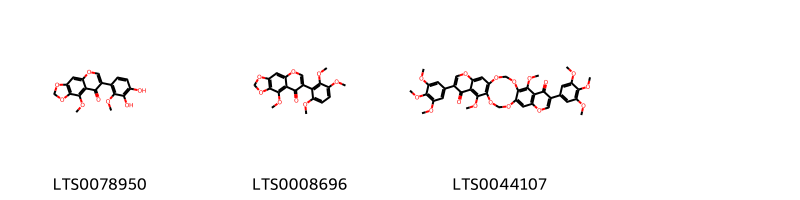{ width=100% }
    <figcaption>Hình ảnh cấu trúc hóa học của 3 hoạt chất thuộc nhóm Isoflavonoids gồm ['7-(3,4-dihydroxy-2-methoxyphenyl)-9-methoxy-2h-[1,3]dioxolo[4,5-g]chromen-8-one (LTS0078950)', '9-methoxy-7-(2,3,6-trimethoxyphenyl)-2h-[1,3]dioxolo[4,5-g]chromen-8-one (LTS0008696)', '13,26-dimethoxy-10,23-bis(3,4,5-trimethoxyphenyl)-2,4,8,15,17,21-hexaoxapentacyclo[16.8.0.0⁵,¹⁴.0⁷,¹².0²⁰,²⁵]hexacosa-1(18),5(14),6,9,12,19,22,25-octaene-11,24-dione (LTS0044107)'].</figcaption>
</figure>
#### Nhóm Prenol lipids
<figure markdown="span">
    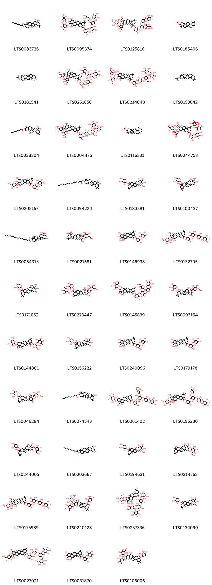{ width=100% }
    <figcaption>Hình ảnh cấu trúc hóa học của 43 hoạt chất thuộc nhóm Prenol lipids gồm ['(4as,6as,6br,8ar,10s,12as,12br,14bs)-2,2,6a,6b,9,9,12a-heptamethyl-10-(octanoyloxy)-13-oxo-3,4,5,6,7,8,8a,10,11,12,12b,14b-dodecahydro-1h-picene-4a-carboxylic acid (LTS0083726)', '(2s,3r,4s,5s)-3-{[(2s,3r,4r,5r,6s)-3-{[(2s,3r,4s,5r)-3-{[(2s,3r,4r)-3,4-dihydroxy-4-(hydroxymethyl)oxolan-2-yl]oxy}-5-hydroxy-4-{[(2s,3r,4r,5r,6s)-3,4,5-trihydroxy-6-methyloxan-2-yl]oxy}oxan-2-yl]oxy}-4,5-dihydroxy-6-methyloxan-2-yl]oxy}-4,5-dihydroxyoxan-2-yl (4as,6as,6br,8r,8ar,9r,10r,11s,12ar,12br,14br)-9-({[(2r,3r,4s,5s,6r)-3-{[(2s,3r,4r)-3,4-dihydroxy-4-(hydroxymethyl)oxolan-2-yl]oxy}-4,5-dihydroxy-6-(hydroxymethyl)oxan-2-yl]oxy}methyl)-8,10,11-trihydroxy-2,2,6a,6b,9,12a-hexamethyl-1,3,4,5,6,7,8,8a,10,11,12,12b,13,14b-tetradecahydropicene-4a-carboxylate (LTS0095374)', '(2s,3r,4r,5s)-3-{[(2s,3r,4r,5r,6s)-3-{[(2s,3r,4s,5r)-3-{[(2s,3r,4r)-3,4-dihydroxy-4-(hydroxymethyl)oxolan-2-yl]oxy}-5-hydroxy-4-{[(2s,3r,4r,5r,6s)-3,4,5-trihydroxy-6-methyloxan-2-yl]oxy}oxan-2-yl]oxy}-4,5-dihydroxy-6-methyloxan-2-yl]oxy}-4,5-dihydroxyoxan-2-yl (4as,6as,6br,8r,8ar,9r,10r,11s,12ar,12br,14bs)-10-{[(2r,3r,4s,5s,6r)-3-{[(2s,3r,4r)-3,4-dihydroxy-4-(hydroxymethyl)oxolan-2-yl]oxy}-4,5-dihydroxy-6-(hydroxymethyl)oxan-2-yl]oxy}-8,11-dihydroxy-9-(hydroxymethyl)-2,2,6a,6b,9,12a-hexamethyl-1,3,4,5,6,7,8,8a,10,11,12,12b,13,14b-tetradecahydropicene-4a-carboxylate (LTS0125816)', '4,4,6a,6b,8a,11,12,14b-octamethyl-2,3,4a,5,6,7,8,9,10,11,12,12a,14,14a-tetradecahydro-1h-picen-3-yl acetate (LTS0185406)', '(3s,4as,6ar,6bs,8ar,12ar,14ar,14br)-4,4,6a,6b,8a,11,11,14b-octamethyl-1,2,3,4a,5,6,7,8,9,10,12,12a,14,14a-tetradecahydropicen-3-yl acetate (LTS0181541)', '(2s,3r,4s,5s)-3-{[(2s,3r,4r,5r,6s)-4,5-dihydroxy-3-{[(2r,3r,4s,5r,6r)-4-hydroxy-6-(hydroxymethyl)-5-{[(2s,3r,4r,5r,6s)-3,4,5-trihydroxy-6-methyloxan-2-yl]oxy}-3-{[(2s,3r,4s,5r)-3,4,5-trihydroxyoxan-2-yl]oxy}oxan-2-yl]oxy}-6-methyloxan-2-yl]oxy}-4,5-dihydroxyoxan-2-yl (4as,6as,6br,8r,8ar,9r,10r,11s,12ar,12br,14bs)-10-{[(2r,3r,4s,5s,6r)-3-{[(2s,3r,4r)-3,4-dihydroxy-4-(hydroxymethyl)oxolan-2-yl]oxy}-4,5-dihydroxy-6-(hydroxymethyl)oxan-2-yl]oxy}-8,11-dihydroxy-9-(hydroxymethyl)-2,2,6a,6b,9,12a-hexamethyl-1,3,4,5,6,7,8,8a,10,11,12,12b,13,14b-tetradecahydropicene-4a-carboxylate (LTS0261656)', '(2s,3r,4s,5s)-3-{[(2s,3r,4r,5s,6s)-3,5-dihydroxy-4-{[(2s,3r,4s,5s,6r)-4-hydroxy-6-(hydroxymethyl)-5-{[(2s,3r,4r,5r,6s)-3,4,5-trihydroxy-6-methyloxan-2-yl]oxy}-3-{[(2s,3r,4s,5r)-3,4,5-trihydroxyoxan-2-yl]oxy}oxan-2-yl]oxy}-6-methyloxan-2-yl]oxy}-4,5-dihydroxyoxan-2-yl (4as,6as,6br,8r,8ar,9r,10r,11s,12ar,12br,14br)-9-({[(2r,3r,4s,5s,6r)-3-{[(2s,3r,4r)-3,4-dihydroxy-4-(hydroxymethyl)oxolan-2-yl]oxy}-4,5-dihydroxy-6-(hydroxymethyl)oxan-2-yl]oxy}methyl)-8,10,11-trihydroxy-2,2,6a,6b,9,12a-hexamethyl-1,3,4,5,6,7,8,8a,10,11,12,12b,13,14b-tetradecahydropicene-4a-carboxylate (LTS0214048)', '4,4,6a,6b,8a,11,11,14b-octamethyl-1,2,3,4a,5,6,7,8,9,10,12,12a,14,14a-tetradecahydropicen-3-yl acetate (LTS0153642)', '2,2,6a,6b,9,9,12a-heptamethyl-10-(octanoyloxy)-13-oxo-3,4,5,6,7,8,8a,10,11,12,12b,14b-dodecahydro-1h-picene-4a-carboxylic acid (LTS0028304)', 'madhucoside b (LTS0004475)', '(3s,4as,6ar,6bs,8ar,11r,12s,12as,14ar,14br)-4,4,6a,6b,8a,11,12,14b-octamethyl-2,3,4a,5,6,7,8,9,10,11,12,12a,14,14a-tetradecahydro-1h-picen-3-yl acetate (LTS0116331)', 'madhucoside a (LTS0244753)', '(2s,3s,4s,5s)-4,5-dihydroxy-3-{[(2s,3r,4s,5s,6r)-3,4,5-trihydroxy-6-methyloxan-2-yl]oxy}oxan-2-yl (4as,6as,6bs,8s,8ar,9r,10r,11r,12as,12br,14bs)-8,11-dihydroxy-9-(hydroxymethyl)-2,2,6a,6b,9,12a-hexamethyl-10-{[(2s,3s,4r,5r,6s)-3,4,5-trihydroxy-6-(hydroxymethyl)oxan-2-yl]oxy}-1,3,4,5,6,7,8,8a,10,11,12,12b,13,14b-tetradecahydropicene-4a-carboxylate (LTS0205167)', '10-(hexadecanoyloxy)-2,2,6a,6b,9,9,12a-heptamethyl-1,3,4,5,6,7,8,8a,10,11,12,12b,13,14b-tetradecahydropicene-4a-carboxylic acid (LTS0094224)', '(2s,3r,4s,5s)-3,4,5-trihydroxyoxan-2-yl (4as,6as,6br,8r,8ar,9r,10r,11s,12ar,12br,14bs)-8,10,11-trihydroxy-9-(hydroxymethyl)-2,2,6a,6b,9,12a-hexamethyl-1,3,4,5,6,7,8,8a,10,11,12,12b,13,14b-tetradecahydropicene-4a-carboxylate (LTS0183581)', '3,4,5-trihydroxyoxan-2-yl 8,10,11-trihydroxy-9-(hydroxymethyl)-2,2,6a,6b,9,12a-hexamethyl-1,3,4,5,6,7,8,8a,10,11,12,12b,13,14b-tetradecahydropicene-4a-carboxylate (LTS0100437)', '(4as,6as,6br,8ar,10s,12ar,12br,14bs)-10-(hexadecanoyloxy)-2,2,6a,6b,9,9,12a-heptamethyl-1,3,4,5,6,7,8,8a,10,11,12,12b,13,14b-tetradecahydropicene-4a-carboxylic acid (LTS0054313)', '(4as,6as,6br,8r,8ar,9r,10r,11s,12ar,12br,14bs)-8,11-dihydroxy-9-(hydroxymethyl)-2,2,6a,6b,9,12a-hexamethyl-10-{[(2r,3r,4s,5s,6r)-3,4,5-trihydroxy-6-(hydroxymethyl)oxan-2-yl]oxy}-1,3,4,5,6,7,8,8a,10,11,12,12b,13,14b-tetradecahydropicene-4a-carboxylic acid (LTS0021581)', '(2s,3r,4r,5r)-4,5-dihydroxy-3-{[(2s,3r,4r,5r,6s)-3,4,5-trihydroxy-6-methyloxan-2-yl]oxy}oxan-2-yl (4as,6as,6br,8r,8ar,9r,10r,11s,12ar,12br,14bs)-8,10,11-trihydroxy-9-(hydroxymethyl)-2,2,6a,6b,9,12a-hexamethyl-1,3,4,5,6,7,8,8a,10,11,12,12b,13,14b-tetradecahydropicene-4a-carboxylate (LTS0146938)', '(2s,3r,4r,5r)-3-{[(2s,3r,4s,5s,6s)-5-{[(2s,3r,4s,5r)-3,5-dihydroxy-4-{[(2s,3r,4r,5r,6s)-3,4,5-trihydroxy-6-methyloxan-2-yl]oxy}oxan-2-yl]oxy}-3,4-dihydroxy-6-methyloxan-2-yl]oxy}-4,5-dihydroxyoxan-2-yl (4as,6as,6br,8r,8ar,9r,10r,11s,12ar,12br,14bs)-8,11-dihydroxy-9-(hydroxymethyl)-2,2,6a,6b,9,12a-hexamethyl-10-{[(2r,3r,4s,5s,6r)-3,4,5-trihydroxy-6-(hydroxymethyl)oxan-2-yl]oxy}-1,3,4,5,6,7,8,8a,10,11,12,12b,13,14b-tetradecahydropicene-4a-carboxylate (LTS0132705)', '3,4,5-trihydroxyoxan-2-yl 8,10-dihydroxy-9-(hydroxymethyl)-2,2,6a,6b,9,12a-hexamethyl-11-oxo-3,4,5,6,7,8,8a,10,12,12b,13,14b-dodecahydro-1h-picene-4a-carboxylate (LTS0171052)', '4,5-dihydroxy-3-[(3,4,5-trihydroxy-6-methyloxan-2-yl)oxy]oxan-2-yl (4r,4ar,6as,6br,8r,8ar,9r,10r,11s,12ar,12br,14br)-8,11-dihydroxy-9-(hydroxymethyl)-2,2,4a,6a,6b,9,12a-heptamethyl-10-{[3,4,5-trihydroxy-6-(hydroxymethyl)oxan-2-yl]oxy}-1,3,4,5,6,7,8,8a,10,11,12,12b,13,14b-tetradecahydropicene-4-carboxylate (LTS0273447)', '3-[(4-{[3,4-dihydroxy-4-(hydroxymethyl)oxolan-2-yl]oxy}-5-({3,5-dihydroxy-4-[(3,4,5-trihydroxy-6-methyloxan-2-yl)oxy]oxan-2-yl}oxy)-3-hydroxy-6-methyloxan-2-yl)oxy]-4,5-dihydroxyoxan-2-yl 8,11-dihydroxy-9-(hydroxymethyl)-2,2,6a,6b,9,12a-hexamethyl-10-{[3,4,5-trihydroxy-6-(hydroxymethyl)oxan-2-yl]oxy}-1,3,4,5,6,7,8,8a,10,11,12,12b,13,14b-tetradecahydropicene-4a-carboxylate (LTS0145839)', '(2r,3s,4s,5s)-3,4,5-trihydroxyoxan-2-yl (4as,6as,6br,8r,8ar,9r,10r,12ar,12br,14bs)-8-hydroxy-9-(hydroxymethyl)-2,2,6a,6b,9,12a-hexamethyl-11-oxo-10-{[(2r,3r,4s,5s,6r)-3,4,5-trihydroxy-6-(hydroxymethyl)oxan-2-yl]oxy}-3,4,5,6,7,8,8a,10,12,12b,13,14b-dodecahydro-1h-picene-4a-carboxylate (LTS0093164)', '4,5-dihydroxy-3-[(3,4,5-trihydroxy-6-methyloxan-2-yl)oxy]oxan-2-yl 8,11-dihydroxy-9-(hydroxymethyl)-2,2,6a,6b,9,12a-hexamethyl-10-{[3,4,5-trihydroxy-6-(hydroxymethyl)oxan-2-yl]oxy}-1,3,4,5,6,7,8,8a,10,11,12,12b,13,14b-tetradecahydropicene-4a-carboxylate (LTS0144881)', '(2s,3r,4s,5s)-3,4,5-trihydroxyoxan-2-yl (4as,6as,6br,8r,8ar,9r,10r,12ar,12br,14bs)-8,10-dihydroxy-9-(hydroxymethyl)-2,2,6a,6b,9,12a-hexamethyl-11-oxo-3,4,5,6,7,8,8a,10,12,12b,13,14b-dodecahydro-1h-picene-4a-carboxylate (LTS0156222)', '(2s,3r,4s,5s)-4,5-dihydroxy-3-{[(2r,3r,4r,5r,6s)-3,4,5-trihydroxy-6-methyloxan-2-yl]oxy}oxan-2-yl (4as,6as,6br,8r,8ar,9r,10r,11s,12ar,12br,14bs)-8,10,11-trihydroxy-9-(hydroxymethyl)-2,2,6a,6b,9,12a-hexamethyl-1,3,4,5,6,7,8,8a,10,11,12,12b,13,14b-tetradecahydropicene-4a-carboxylate (LTS0240096)', '(2s,3r,4s,5s)-4,5-dihydroxy-3-{[(2s,3r,4r,5r,6s)-3,4,5-trihydroxy-6-methyloxan-2-yl]oxy}oxan-2-yl (4as,6as,6br,8r,8ar,9r,10r,11s,12ar,12br,14bs)-8,10,11-trihydroxy-9-(hydroxymethyl)-2,2,6a,6b,9,12a-hexamethyl-1,3,4,5,6,7,8,8a,10,11,12,12b,13,14b-tetradecahydropicene-4a-carboxylate (LTS0179178)', '(2s,3r,4s,5s)-3,4,5-trihydroxyoxan-2-yl (4as,6as,6br,8r,8ar,9r,10r,12ar,12br,14bs)-8-hydroxy-9-(hydroxymethyl)-2,2,6a,6b,9,12a-hexamethyl-11-oxo-10-{[(2s,3r,4s,5s,6r)-3,4,5-trihydroxy-6-(hydroxymethyl)oxan-2-yl]oxy}-3,4,5,6,7,8,8a,10,12,12b,13,14b-dodecahydro-1h-picene-4a-carboxylate (LTS0046284)', '8a-(hydroxymethyl)-4,4,6a,6b,11,11,14b-heptamethyl-1,2,3,4a,5,6,7,8,9,10,12,12a,14,14a-tetradecahydropicen-3-yl decanoate (LTS0274543)', '(2r,3r,4r,5r)-3-{[(2s,3r,4s,5r,6r)-4-{[(2s,3s,4s)-3,4-dihydroxy-4-(hydroxymethyl)oxolan-2-yl]oxy}-5-{[(2s,3r,4r,5r)-3,5-dihydroxy-4-{[(2r,3s,4s,5r,6s)-3,4,5-trihydroxy-6-methyloxan-2-yl]oxy}oxan-2-yl]oxy}-3-hydroxy-6-methyloxan-2-yl]oxy}-4,5-dihydroxyoxan-2-yl (4ar,6as,6bs,8s,8ar,9s,10s,11r,12ar,12br,14br)-8,11-dihydroxy-9-(hydroxymethyl)-2,2,6a,6b,9,12a-hexamethyl-10-{[(2r,3r,4r,5r,6s)-3,4,5-trihydroxy-6-(hydroxymethyl)oxan-2-yl]oxy}-1,3,4,5,6,7,8,8a,10,11,12,12b,13,14b-tetradecahydropicene-4a-carboxylate (LTS0261402)', '(2s,3r,4s,5s)-3-{[(2s,3r,4s,5s,6s)-4-{[(2s,3r,4r)-3,4-dihydroxy-4-(hydroxymethyl)oxolan-2-yl]oxy}-5-{[(2s,3r,4s,5r)-3,5-dihydroxy-4-{[(2s,3r,4r,5r,6s)-3,4,5-trihydroxy-6-methyloxan-2-yl]oxy}oxan-2-yl]oxy}-3-hydroxy-6-methyloxan-2-yl]oxy}-4,5-dihydroxyoxan-2-yl (4as,6as,6br,8r,8ar,9r,10r,11s,12ar,12br,14bs)-8,11-dihydroxy-9-(hydroxymethyl)-2,2,6a,6b,9,12a-hexamethyl-10-{[(2r,3r,4s,5s,6r)-3,4,5-trihydroxy-6-(hydroxymethyl)oxan-2-yl]oxy}-1,3,4,5,6,7,8,8a,10,11,12,12b,13,14b-tetradecahydropicene-4a-carboxylate (LTS0196280)', '3,4,5-trihydroxyoxan-2-yl 8-hydroxy-9-(hydroxymethyl)-2,2,6a,6b,9,12a-hexamethyl-11-oxo-10-{[3,4,5-trihydroxy-6-(hydroxymethyl)oxan-2-yl]oxy}-3,4,5,6,7,8,8a,10,12,12b,13,14b-dodecahydro-1h-picene-4a-carboxylate (LTS0244005)', '(3s,4ar,6ar,6bs,8as,12as,14ar,14br)-8a-(hydroxymethyl)-4,4,6a,6b,11,11,14b-heptamethyl-1,2,3,4a,5,6,7,8,9,10,12,12a,14,14a-tetradecahydropicen-3-yl decanoate (LTS0203667)', '(2s,3r,4r,5s)-3,4,5-trihydroxyoxan-2-yl (4as,6as,6br,8r,8ar,9r,10r,11s,12ar,12br,14bs)-8,10,11-trihydroxy-9-(hydroxymethyl)-2,2,6a,6b,9,12a-hexamethyl-1,3,4,5,6,7,8,8a,10,11,12,12b,13,14b-tetradecahydropicene-4a-carboxylate (LTS0194631)', '8,11-dihydroxy-9-(hydroxymethyl)-2,2,6a,6b,9,12a-hexamethyl-10-{[3,4,5-trihydroxy-6-(hydroxymethyl)oxan-2-yl]oxy}-1,3,4,5,6,7,8,8a,10,11,12,12b,13,14b-tetradecahydropicene-4a-carboxylic acid (LTS0214763)', '(2s,3r,4s,5s)-3-{[(2s,3r,4s,5r,6s)-5-{[(2s,3r,4s,5r)-3,5-dihydroxy-4-{[(2s,3r,4r,5r,6s)-3,4,5-trihydroxy-6-methyloxan-2-yl]oxy}oxan-2-yl]oxy}-3,4-dihydroxy-6-methyloxan-2-yl]oxy}-4,5-dihydroxyoxan-2-yl (4as,6as,6br,8r,8ar,9r,10r,11s,12ar,12br,14bs)-8,11-dihydroxy-9-(hydroxymethyl)-2,2,6a,6b,9,12a-hexamethyl-10-{[(2r,3r,4s,5s,6r)-3,4,5-trihydroxy-6-(hydroxymethyl)oxan-2-yl]oxy}-1,3,4,5,6,7,8,8a,10,11,12,12b,13,14b-tetradecahydropicene-4a-carboxylate (LTS0175989)', '(2s,3r,4s,5s)-3,4,5-trihydroxyoxan-2-yl (4as,6as,6br,8r,8ar,9r,10r,11s,12ar,12br,14bs)-8-hydroxy-9-(hydroxymethyl)-2,2,6a,6b,9,12a-hexamethyl-11-{[(2r,3r,4r,5r,6s)-3,4,5-trihydroxy-2,6-dimethyloxan-2-yl]oxy}-10-{[(2r,3r,4s,5s,6r)-3,4,5-trihydroxy-6-(hydroxymethyl)oxan-2-yl]oxy}-1,3,4,5,6,7,8,8a,10,11,12,12b,13,14b-tetradecahydropicene-4a-carboxylate (LTS0240128)', '(2r,3r,4s,5s)-3-{[(2s,3r,4r,5r,6r)-3,4-dihydroxy-5-{[(2r,3r,4r,5r)-3-hydroxy-5-{[(2s,3r,4r,5s,6r)-3,4,5-trihydroxy-6-(hydroxymethyl)oxan-2-yl]oxy}-4-{[(2s,3s,4r,5r,6s)-3,4,5-trihydroxy-6-methyloxan-2-yl]oxy}oxan-2-yl]oxy}-6-methyloxan-2-yl]oxy}-4,5-dihydroxyoxan-2-yl (4ar,6as,6br,8r,8as,9r,10r,11s,12ar,12br,14bs)-8,11-dihydroxy-9-(hydroxymethyl)-2,2,6a,6b,9,12a-hexamethyl-10-{[(2r,3s,4r,5s,6r)-3,4,5-trihydroxy-6-(hydroxymethyl)oxan-2-yl]oxy}-1,3,4,5,6,7,8,8a,10,11,12,12b,13,14b-tetradecahydropicene-4a-carboxylate (LTS0257336)', '(2r,3s,4s,5r)-3,4,5-trihydroxyoxan-2-yl (4as,6as,6br,8r,8ar,9r,10r,12ar,12br,14bs)-8,10-dihydroxy-9-(hydroxymethyl)-2,2,6a,6b,9,12a-hexamethyl-11-oxo-3,4,5,6,7,8,8a,10,12,12b,13,14b-dodecahydro-1h-picene-4a-carboxylate (LTS0134090)', '(2s,3r,4s,5s)-3-{[(2s,3r,4s,5r,6s)-3,4-dihydroxy-5-{[(2s,3r,4r,5r)-3-hydroxy-5-{[(2s,3r,4s,5s,6r)-3,4,5-trihydroxy-6-(hydroxymethyl)oxan-2-yl]oxy}-4-{[(2s,3r,4r,5r,6s)-3,4,5-trihydroxy-6-methyloxan-2-yl]oxy}oxan-2-yl]oxy}-6-methyloxan-2-yl]oxy}-4,5-dihydroxyoxan-2-yl (4as,6as,6br,8r,8ar,9r,10r,11s,12ar,12br,14bs)-8,11-dihydroxy-9-(hydroxymethyl)-2,2,6a,6b,9,12a-hexamethyl-10-{[(2r,3r,4s,5s,6r)-3,4,5-trihydroxy-6-(hydroxymethyl)oxan-2-yl]oxy}-1,3,4,5,6,7,8,8a,10,11,12,12b,13,14b-tetradecahydropicene-4a-carboxylate (LTS0027021)', '4,5-dihydroxy-3-[(3,4,5-trihydroxy-6-methyloxan-2-yl)oxy]oxan-2-yl 8,10,11-trihydroxy-9-(hydroxymethyl)-2,2,6a,6b,9,12a-hexamethyl-1,3,4,5,6,7,8,8a,10,11,12,12b,13,14b-tetradecahydropicene-4a-carboxylate (LTS0031870)', '3,4,5-trihydroxyoxan-2-yl 8-hydroxy-9-(hydroxymethyl)-2,2,6a,6b,9,12a-hexamethyl-11-[(3,4,5-trihydroxy-2,6-dimethyloxan-2-yl)oxy]-10-{[3,4,5-trihydroxy-6-(hydroxymethyl)oxan-2-yl]oxy}-1,3,4,5,6,7,8,8a,10,11,12,12b,13,14b-tetradecahydropicene-4a-carboxylate (LTS0106006)'].</figcaption>
</figure>
#### Nhóm Steroids and steroid derivatives
<figure markdown="span">
    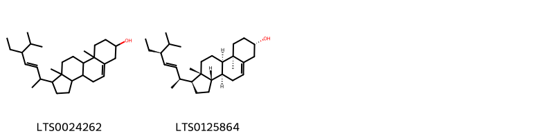{ width=100% }
    <figcaption>Hình ảnh cấu trúc hóa học của 2 hoạt chất thuộc nhóm Steroids and steroid derivatives gồm ['stigmasterol (LTS0024262)', '(1s,3as,3bs,7s,9ar,9br,11as)-1-[(2s,3e,5s)-5-ethyl-6-methylhept-3-en-2-yl]-9a,11a-dimethyl-1h,2h,3h,3ah,3bh,4h,6h,7h,8h,9h,9bh,10h,11h-cyclopenta[a]phenanthren-7-ol (LTS0125864)'].</figcaption>
</figure>

---

### Dược dân tộc học

Danh sách các quốc gia có sử dụng *Madhuca longifolia* trong điều trị các bệnh. 

| Country          | Disease                                                                                             | Bệnh                                                                                                                                                                                                |
|:-----------------|:----------------------------------------------------------------------------------------------------|:----------------------------------------------------------------------------------------------------------------------------------------------------------------------------------------------------|
| Elsewhere        | nan, Demulcent, Emetic, Piscicide, Emollient, Insecticide                                           | MYMEMORY WARNING: YOU USED ALL AVAILABLE FREE TRANSLATIONS FOR TODAY. NEXT AVAILABLE IN  10 HOURS 54 MINUTES 45 SECONDS VISIT HTTPS://MYMEMORY.TRANSLATED.NET/DOC/USAGELIMITS.PHP TO TRANSLATE MORE |
| India            | Soap                                                                                                | MYMEMORY WARNING: YOU USED ALL AVAILABLE FREE TRANSLATIONS FOR TODAY. NEXT AVAILABLE IN  10 HOURS 54 MINUTES 42 SECONDS VISIT HTTPS://MYMEMORY.TRANSLATED.NET/DOC/USAGELIMITS.PHP TO TRANSLATE MORE |
| India(Ayurvedic) | Astringent, Carminative, Demulcent, Emollient, Laxative, Stimulant, Expectorant, Refrigerant, Tonic | MYMEMORY WARNING: YOU USED ALL AVAILABLE FREE TRANSLATIONS FOR TODAY. NEXT AVAILABLE IN  10 HOURS 54 MINUTES 39 SECONDS VISIT HTTPS://MYMEMORY.TRANSLATED.NET/DOC/USAGELIMITS.PHP TO TRANSLATE MORE |

---

# Chi Synsepalum

??? note "Danh sách các dược liệu thuộc chi"
    
	 - *Synsepalum dulcificum*

---
## Synsepalum dulcificum
### Thông tin về thực vật

!!! info "Phân loại thực vật của *Synsepalum dulcificum* từ GIBF:"
    - **Kingdom:** Plantae
    - **Phylum:** Tracheophyta
    - **Order:** Ericales
    - **Family:** Sapotaceae
    - **Genus:** Synsepalum
    - **Species:** *Synsepalum dulcificum*

 

| Label (VI)   | Label (EN)   | Scientific Name       | Descriptions (VI)   | Descriptions (EN)                               | Also Known As (VI)               | Also Known As (EN)   |
|:-------------|:-------------|:----------------------|:--------------------|:------------------------------------------------|:---------------------------------|:---------------------|
| N/A          | N/A          | Synsepalum dulcificum |                     | miracle fruit, causes sour foods to taste sweet | ['Thần Kỳ (cây)', 'Cây thần kỳ'] | ['miracle fruit']    |

#### Phân bố trên thế giới

**Từ CSDL GIBF** Honduras, Viet Nam, Thailand, Philippines, Ghana, Cameroon, Gabon, Singapore, Indonesia, Colombia, Sri Lanka, Dominican Republic, Togo, Côte d’Ivoire, Puerto Rico, Malaysia, India, Nigeria, Belgium, Cambodia, Panama, Mexico, China, Benin, Chinese Taipei, Hong Kong, Costa Rica, Congo, Democratic Republic of the, Ecuador, United States of America

#### Phân bố tại Việt Nam

**Từ CSDL GIBF**: Hồ Chí Minh city

---
### Thành phần hóa học
        
- Theo cơ sở dữ liệu lotus: Từ loài *Synsepalum dulcificum* đã phân lập và xác định được 25 hoạt chất thuộc về các nhóm Lactones, Prenol lipids, Phenols, Cinnamic acids and derivatives, Steroids and steroid derivatives, Benzene and substituted derivatives. 

|    | chemicalTaxonomyClassyfireClass     |   smiles_count |
|---:|:------------------------------------|---------------:|
|  0 | Benzene and substituted derivatives |              5 |
|  1 | Cinnamic acids and derivatives      |              5 |
|  2 | Lactones                            |              2 |
|  3 | Phenols                             |              1 |
|  4 | Prenol lipids                       |              8 |
|  5 | Steroids and steroid derivatives    |              4 |

#### Nhóm Benzene and substituted derivatives
<figure markdown="span">
    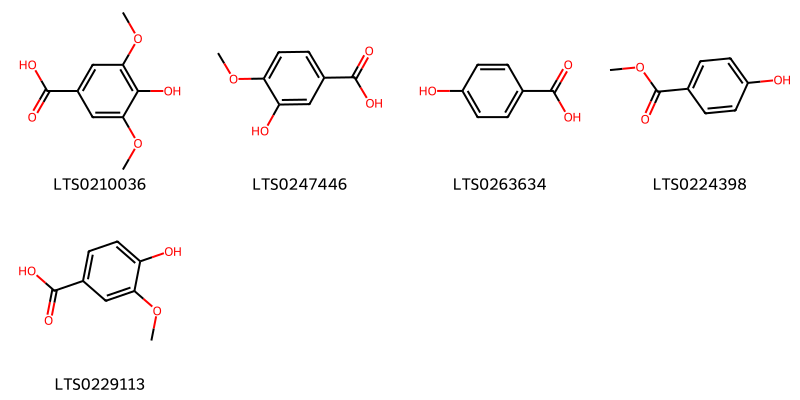{ width=100% }
    <figcaption>Hình ảnh cấu trúc hóa học của 5 hoạt chất thuộc nhóm Benzene and substituted derivatives gồm ['syringic acid (LTS0210036)', 'isovanillic acid (LTS0247446)', 'p-hydroxybenzoic acid (LTS0263634)', 'paraben (LTS0224398)', 'vanillic acid (LTS0229113)'].</figcaption>
</figure>
#### Nhóm Cinnamic acids and derivatives
<figure markdown="span">
    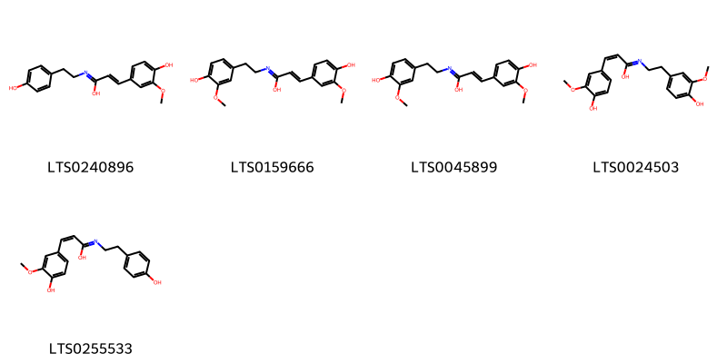{ width=100% }
    <figcaption>Hình ảnh cấu trúc hóa học của 5 hoạt chất thuộc nhóm Cinnamic acids and derivatives gồm ['3-(4-hydroxy-3-methoxyphenyl)-n-[2-(4-hydroxyphenyl)ethyl]prop-2-enimidic acid (LTS0240896)', '3-(4-hydroxy-3-methoxyphenyl)-n-[2-(4-hydroxy-3-methoxyphenyl)ethyl]prop-2-enimidic acid (LTS0159666)', '(2e)-3-(4-hydroxy-3-methoxyphenyl)-n-[2-(4-hydroxy-3-methoxyphenyl)ethyl]prop-2-enimidic acid (LTS0045899)', '(2z)-3-(4-hydroxy-3-methoxyphenyl)-n-[2-(4-hydroxy-3-methoxyphenyl)ethyl]prop-2-enimidic acid (LTS0024503)', '(2z)-3-(4-hydroxy-3-methoxyphenyl)-n-[2-(4-hydroxyphenyl)ethyl]prop-2-enimidic acid (LTS0255533)'].</figcaption>
</figure>
#### Nhóm Lactones
<figure markdown="span">
    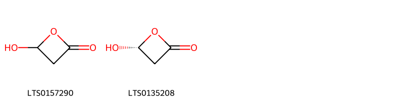{ width=100% }
    <figcaption>Hình ảnh cấu trúc hóa học của 2 hoạt chất thuộc nhóm Lactones gồm ['4-hydroxyoxetan-2-one (LTS0157290)', '(4r)-4-hydroxyoxetan-2-one (LTS0135208)'].</figcaption>
</figure>
#### Nhóm Phenols
<figure markdown="span">
    { width=100% }
    <figcaption>Hình ảnh cấu trúc hóa học của 1 hoạt chất thuộc nhóm Phenols gồm ['(2e)-3-(4-hydroxy-3-methoxyphenyl)-n-[2-(4-hydroxyphenyl)ethyl]prop-2-enimidic acid (LTS0187051)'].</figcaption>
</figure>
#### Nhóm Prenol lipids
<figure markdown="span">
    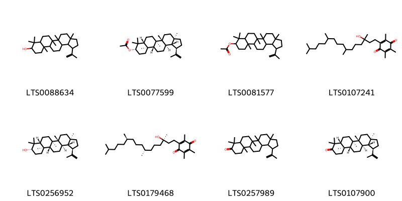{ width=100% }
    <figcaption>Hình ảnh cấu trúc hóa học của 8 hoạt chất thuộc nhóm Prenol lipids gồm ['lupeol (LTS0088634)', 'lupeol acetate (LTS0077599)', '3a,5a,5b,8,8,11a-hexamethyl-1-(prop-1-en-2-yl)-hexadecahydrocyclopenta[a]chrysen-9-yl acetate (LTS0081577)', 'tocoquinone (LTS0107241)', 'lupeol (LTS0256952)', 'α-tocopherylquinone (LTS0179468)', '3a,5a,5b,8,8,11a-hexamethyl-1-(prop-1-en-2-yl)-tetradecahydro-1h-cyclopenta[a]chrysen-9-one (LTS0257989)', 'lupenone (LTS0107900)'].</figcaption>
</figure>
#### Nhóm Steroids and steroid derivatives
<figure markdown="span">
    { width=100% }
    <figcaption>Hình ảnh cấu trúc hóa học của 4 hoạt chất thuộc nhóm Steroids and steroid derivatives gồm ['sitosterol (LTS0168132)', 'stigmast-5-en-3-ol, (3β)- (LTS0204616)', 'phytosterol (LTS0029311)', 'stigmasterol (LTS0024262)'].</figcaption>
</figure>

---

### Dược dân tộc học

Danh sách các quốc gia có sử dụng *Synsepalum dulcificum* trong điều trị các bệnh. 

| Country   | Disease   | Bệnh                                                                                                                                                                                                |
|:----------|:----------|:----------------------------------------------------------------------------------------------------------------------------------------------------------------------------------------------------|
| Ghana     | Sweetener | MYMEMORY WARNING: YOU USED ALL AVAILABLE FREE TRANSLATIONS FOR TODAY. NEXT AVAILABLE IN  10 HOURS 54 MINUTES 08 SECONDS VISIT HTTPS://MYMEMORY.TRANSLATED.NET/DOC/USAGELIMITS.PHP TO TRANSLATE MORE |

---

# Chi Manilkara

??? note "Danh sách các dược liệu thuộc chi"
    
	 - *Manilkara elengi*
	 - *Manilkara hexandra*
	 - *Manilkara kauki*
	 - *Manilkara zapota*

---
## Manilkara elengi
### Thông tin về thực vật

!!! info "Phân loại thực vật của *N/A* từ GIBF:"
    - **Kingdom:** Plantae
    - **Phylum:** Tracheophyta
    - **Order:** Ericales
    - **Family:** Sapotaceae
    - **Genus:** Manilkara
    - **Species:** *N/A*

 

| Label (VI)   | Label (EN)   | Scientific Name       | Descriptions (VI)   | Descriptions (EN)                               | Also Known As (VI)               | Also Known As (EN)   |
|:-------------|:-------------|:----------------------|:--------------------|:------------------------------------------------|:---------------------------------|:---------------------|
| N/A          | N/A          | Synsepalum dulcificum |                     | miracle fruit, causes sour foods to taste sweet | ['Thần Kỳ (cây)', 'Cây thần kỳ'] | ['miracle fruit']    |

#### Phân bố trên thế giới

**Từ CSDL GIBF** nan, Cayman Islands, Viet Nam, Thailand, Trinidad and Tobago, Gabon, Guatemala, Dominican Republic, Puerto Rico, India, Bahamas, Bonaire, Sint Eustatius and Saba, Belize, Brazil, Palau, Mexico, Hong Kong, South Africa, Costa Rica, New Caledonia, United States of America, Madagascar

#### Phân bố tại Việt Nam

**Từ CSDL GIBF**: Hải Phòng

---
### Thành phần hóa học
        
- Theo cơ sở dữ liệu lotus: Từ loài *N/A* đã phân lập và xác định được Chưa có hoạt chất nào được phân lập. hoạt chất thuộc về các nhóm Không có hoạt chất nào được phân lập. 

Không có hình ảnh nào được tạo ra

---

### Dược dân tộc học

Danh sách các quốc gia có sử dụng *N/A* trong điều trị các bệnh. 

| Country   | Disease   | Bệnh                                                                                                                                                                                                |
|:----------|:----------|:----------------------------------------------------------------------------------------------------------------------------------------------------------------------------------------------------|
| Malaya    | Tonic     | MYMEMORY WARNING: YOU USED ALL AVAILABLE FREE TRANSLATIONS FOR TODAY. NEXT AVAILABLE IN  10 HOURS 53 MINUTES 36 SECONDS VISIT HTTPS://MYMEMORY.TRANSLATED.NET/DOC/USAGELIMITS.PHP TO TRANSLATE MORE |

---

---
## Manilkara hexandra
### Thông tin về thực vật

!!! info "Phân loại thực vật của *Manilkara hexandra* từ GIBF:"
    - **Kingdom:** Plantae
    - **Phylum:** Tracheophyta
    - **Order:** Ericales
    - **Family:** Sapotaceae
    - **Genus:** Manilkara
    - **Species:** *Manilkara hexandra*

 

| Label (VI)   | Label (EN)   | Scientific Name    | Descriptions (VI)   | Descriptions (EN)   | Also Known As (VI)   | Also Known As (EN)   |
|:-------------|:-------------|:-------------------|:--------------------|:--------------------|:---------------------|:---------------------|
| N/A          | N/A          | Manilkara hexandra | loài thực vật       | species of plant    | ['']                 | ['']                 |

#### Phân bố trên thế giới

**Từ CSDL GIBF** nan, Viet Nam, unknown or invalid, Thailand, Sri Lanka, Myanmar, France, Egypt, India, United States of America, China, Cambodia, Indonesia

#### Phân bố tại Việt Nam

**Từ CSDL GIBF**: Ba Ria Vung Tau, Ba Ria - Vung Tau, Cochinchine, Dong Nai

---
### Thành phần hóa học
        
- Theo cơ sở dữ liệu lotus: Từ loài *Manilkara hexandra* đã phân lập và xác định được 22 hoạt chất thuộc về các nhóm Organooxygen compounds, Flavonoids, Prenol lipids, Phenols, Steroids and steroid derivatives. 

|    | chemicalTaxonomyClassyfireClass   |   smiles_count |
|---:|:----------------------------------|---------------:|
|  0 | Flavonoids                        |              1 |
|  1 | Organooxygen compounds            |              2 |
|  2 | Phenols                           |              2 |
|  3 | Prenol lipids                     |             10 |
|  4 | Steroids and steroid derivatives  |              7 |

#### Nhóm Flavonoids
<figure markdown="span">
    { width=100% }
    <figcaption>Hình ảnh cấu trúc hóa học của 1 hoạt chất thuộc nhóm Flavonoids gồm ['quercetin (LTS0004651)'].</figcaption>
</figure>
#### Nhóm Organooxygen compounds
<figure markdown="span">
    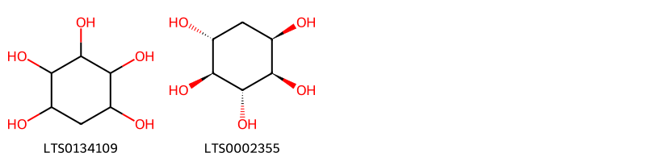{ width=100% }
    <figcaption>Hình ảnh cấu trúc hóa học của 2 hoạt chất thuộc nhóm Organooxygen compounds gồm ['d-quercitol (LTS0134109)', '(-)-viburnitol (LTS0002355)'].</figcaption>
</figure>
#### Nhóm Phenols
<figure markdown="span">
    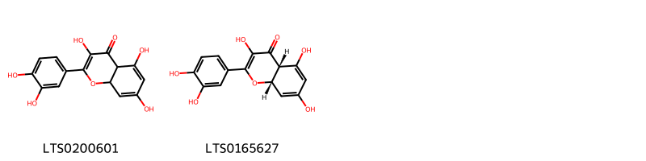{ width=100% }
    <figcaption>Hình ảnh cấu trúc hóa học của 2 hoạt chất thuộc nhóm Phenols gồm ['2-(3,4-dihydroxyphenyl)-3,5,7-trihydroxy-4a,8a-dihydrochromen-4-one (LTS0200601)', '(4as,8as)-2-(3,4-dihydroxyphenyl)-3,5,7-trihydroxy-4a,8a-dihydrochromen-4-one (LTS0165627)'].</figcaption>
</figure>
#### Nhóm Prenol lipids
<figure markdown="span">
    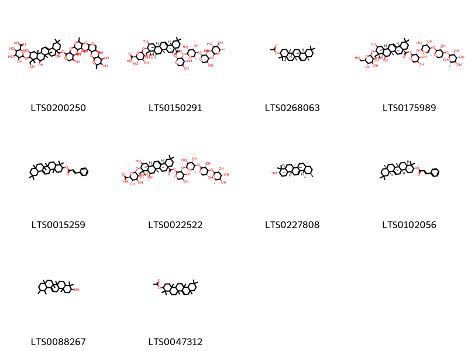{ width=100% }
    <figcaption>Hình ảnh cấu trúc hóa học của 10 hoạt chất thuộc nhóm Prenol lipids gồm ['6-[(8a-{[(3-{[5-({3,5-dihydroxy-4-[(3,4,5-trihydroxy-6-methyloxan-2-yl)oxy]oxan-2-yl}oxy)-3,4-dihydroxy-6-methyloxan-2-yl]oxy}-4,5-dihydroxyoxan-2-yl)oxy]carbonyl}-2,5,8-trihydroxy-4-(hydroxymethyl)-4,6a,6b,11,11,14b-hexamethyl-1,2,3,4a,5,6,7,8,9,10,12,12a,14,14a-tetradecahydropicen-3-yl)oxy]-3,4,5-trihydroxyoxane-2-carboxylic acid (LTS0200250)', '(2s,3s,4s,5r,6r)-6-{[(2s,3r,4r,4ar,5r,6ar,6bs,8r,8ar,12as,14ar,14br)-8a-({[(2s,3r,4s,5s)-3-{[(2s,3r,4s,5r,6s)-5-{[(2s,3r,4s,5r)-3,5-dihydroxy-4-{[(2s,3r,4r,5r,6s)-3,4,5-trihydroxy-6-methyloxan-2-yl]oxy}oxan-2-yl]oxy}-3,4-dihydroxy-6-methyloxan-2-yl]oxy}-4,5-dihydroxyoxan-2-yl]oxy}carbonyl)-2,5,8-trihydroxy-4-(hydroxymethyl)-4,6a,6b,11,11,14b-hexamethyl-1,2,3,4a,5,6,7,8,9,10,12,12a,14,14a-tetradecahydropicen-3-yl]oxy}-3,4,5-trihydroxyoxane-2-carboxylic acid (LTS0150291)', '(3s,4as,6ar,8ar,12as,12br,14as,14br)-4,4,6a,8a,11,11,12b,14b-octamethyl-1,2,3,4a,5,6,8,9,10,12,12a,13,14,14a-tetradecahydropicen-3-yl acetate (LTS0268063)', '(2s,3r,4s,5s)-3-{[(2s,3r,4s,5r,6s)-5-{[(2s,3r,4s,5r)-3,5-dihydroxy-4-{[(2s,3r,4r,5r,6s)-3,4,5-trihydroxy-6-methyloxan-2-yl]oxy}oxan-2-yl]oxy}-3,4-dihydroxy-6-methyloxan-2-yl]oxy}-4,5-dihydroxyoxan-2-yl (4as,6as,6br,8r,8ar,9r,10r,11s,12ar,12br,14bs)-8,11-dihydroxy-9-(hydroxymethyl)-2,2,6a,6b,9,12a-hexamethyl-10-{[(2r,3r,4s,5s,6r)-3,4,5-trihydroxy-6-(hydroxymethyl)oxan-2-yl]oxy}-1,3,4,5,6,7,8,8a,10,11,12,12b,13,14b-tetradecahydropicene-4a-carboxylate (LTS0175989)', '4,4,6a,6b,8a,11,11,14b-octamethyl-1,2,3,4a,5,6,7,8,9,10,12,12a,14,14a-tetradecahydropicen-3-yl 3-phenylprop-2-enoate (LTS0015259)', '(2s,3s,4s,5r,6r)-6-{[(2s,3r,4r,4ar,5r,6ar,6bs,8as,12as,14ar,14br)-8a-({[(2s,3r,4s,5s)-3-{[(2s,3r,4s,5r,6s)-5-{[(2s,3r,4s,5r)-3,5-dihydroxy-4-{[(2s,3r,4r,5r,6s)-3,4,5-trihydroxy-6-methyloxan-2-yl]oxy}oxan-2-yl]oxy}-3,4-dihydroxy-6-methyloxan-2-yl]oxy}-4,5-dihydroxyoxan-2-yl]oxy}carbonyl)-2,5-dihydroxy-4-(hydroxymethyl)-4,6a,6b,11,11,14b-hexamethyl-1,2,3,4a,5,6,7,8,9,10,12,12a,14,14a-tetradecahydropicen-3-yl]oxy}-3,4,5-trihydroxyoxane-2-carboxylic acid (LTS0022522)', '(3s,4as,6ar,6bs,8ar,11r,12s,12as,14ar,14br)-4,4,6a,6b,8a,11,12,14b-octamethyl-2,3,4a,5,6,7,8,9,10,11,12,12a,14,14a-tetradecahydro-1h-picen-3-ol (LTS0227808)', '(3s,4ar,6ar,6bs,8ar,12as,14ar,14bs)-4,4,6a,6b,8a,11,11,14b-octamethyl-1,2,3,4a,5,6,7,8,9,10,12,12a,14,14a-tetradecahydropicen-3-yl (2e)-3-phenylprop-2-enoate (LTS0102056)', 'α-amyrin (LTS0088267)', '4,4,6a,8a,11,11,12b,14b-octamethyl-1,2,3,4a,5,6,8,9,10,12,12a,13,14,14a-tetradecahydropicen-3-yl acetate (LTS0047312)'].</figcaption>
</figure>
#### Nhóm Steroids and steroid derivatives
<figure markdown="span">
    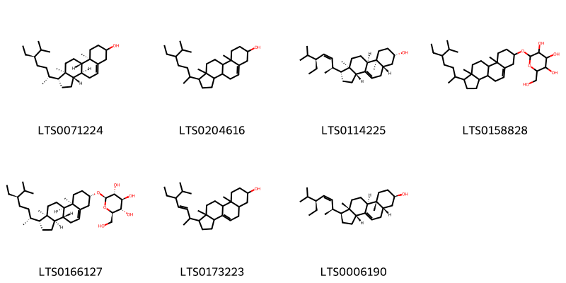{ width=100% }
    <figcaption>Hình ảnh cấu trúc hóa học của 7 hoạt chất thuộc nhóm Steroids and steroid derivatives gồm ['stigmast-5-en-3-ol (LTS0071224)', 'stigmast-5-en-3-ol, (3β)- (LTS0204616)', '(1r,3ar,5as,7s,9as,9bs,11ar)-1-[(2s,3z,5s)-5-ethyl-6-methylhept-3-en-2-yl]-9a,11a-dimethyl-1h,2h,3h,3ah,5h,5ah,6h,7h,8h,9h,9bh,10h,11h-cyclopenta[a]phenanthren-7-ol (LTS0114225)', '2-{[1-(5-ethyl-6-methylheptan-2-yl)-9a,11a-dimethyl-1h,2h,3h,3ah,3bh,4h,6h,7h,8h,9h,9bh,10h,11h-cyclopenta[a]phenanthren-7-yl]oxy}-6-(hydroxymethyl)oxane-3,4,5-triol (LTS0158828)', '(2r,3r,4s,5s,6r)-2-{[(1r,3ar,3br,7s,9ar,9br,11ar)-1-[(2r,5r)-5-ethyl-6-methylheptan-2-yl]-9a,11a-dimethyl-1h,2h,3h,3ah,3bh,4h,6h,7h,8h,9h,9bh,10h,11h-cyclopenta[a]phenanthren-7-yl]oxy}-6-(hydroxymethyl)oxane-3,4,5-triol (LTS0166127)', '1-(5-ethyl-6-methylhept-3-en-2-yl)-9a,11a-dimethyl-1h,2h,3h,3ah,5h,5ah,6h,7h,8h,9h,9bh,10h,11h-cyclopenta[a]phenanthren-7-ol (LTS0173223)', '(1s,3ar,5as,7r,9ar,9bs,11as)-1-[(2s,3z,5s)-5-ethyl-6-methylhept-3-en-2-yl]-9a,11a-dimethyl-1h,2h,3h,3ah,5h,5ah,6h,7h,8h,9h,9bh,10h,11h-cyclopenta[a]phenanthren-7-ol (LTS0006190)'].</figcaption>
</figure>

---

### Dược dân tộc học

Danh sách các quốc gia có sử dụng *Manilkara hexandra* trong điều trị các bệnh. 

| Country   | Disease                                 | Bệnh                                                                                                                                                                                                |
|:----------|:----------------------------------------|:----------------------------------------------------------------------------------------------------------------------------------------------------------------------------------------------------|
| Elsewhere | Demulcent, Tonic, Astringent, Emollient | MYMEMORY WARNING: YOU USED ALL AVAILABLE FREE TRANSLATIONS FOR TODAY. NEXT AVAILABLE IN  10 HOURS 53 MINUTES 10 SECONDS VISIT HTTPS://MYMEMORY.TRANSLATED.NET/DOC/USAGELIMITS.PHP TO TRANSLATE MORE |

---

---
## Manilkara kauki
### Thông tin về thực vật

!!! info "Phân loại thực vật của *Manilkara kauki* từ GIBF:"
    - **Kingdom:** Plantae
    - **Phylum:** Tracheophyta
    - **Order:** Ericales
    - **Family:** Sapotaceae
    - **Genus:** Manilkara
    - **Species:** *Manilkara kauki*

 

| Label (VI)   | Label (EN)   | Scientific Name   | Descriptions (VI)   | Descriptions (EN)   | Also Known As (VI)   | Also Known As (EN)   |
|:-------------|:-------------|:------------------|:--------------------|:--------------------|:---------------------|:---------------------|
| N/A          | N/A          | Manilkara kauki   | loài thực vật       | species of plant    | ['']                 | ['']                 |

#### Phân bố trên thế giới

**Từ CSDL GIBF** nan, Chinese Taipei, Thailand, British Indian Ocean Territory, Brazil, Malaysia, Papua New Guinea, Seychelles, United States of America, Singapore, Australia, Indonesia

#### Phân bố tại Việt Nam

**Từ CSDL GIBF**: Không có ghi nhận ở Việt Nam

---
### Thành phần hóa học
        
- Theo cơ sở dữ liệu lotus: Từ loài *Manilkara kauki* đã phân lập và xác định được 24 hoạt chất thuộc về các nhóm Steroids and steroid derivatives, Flavonoids, Prenol lipids. 

|    | chemicalTaxonomyClassyfireClass   |   smiles_count |
|---:|:----------------------------------|---------------:|
|  0 | Flavonoids                        |              3 |
|  1 | Prenol lipids                     |             19 |
|  2 | Steroids and steroid derivatives  |              2 |

#### Nhóm Flavonoids
<figure markdown="span">
    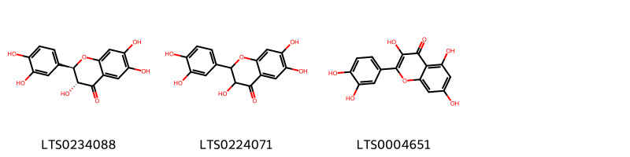{ width=100% }
    <figcaption>Hình ảnh cấu trúc hóa học của 3 hoạt chất thuộc nhóm Flavonoids gồm ['(2r,3r)-2-(3,4-dihydroxyphenyl)-3,6,7-trihydroxy-2,3-dihydro-1-benzopyran-4-one (LTS0234088)', '2-(3,4-dihydroxyphenyl)-3,6,7-trihydroxy-2,3-dihydro-1-benzopyran-4-one (LTS0224071)', 'quercetin (LTS0004651)'].</figcaption>
</figure>
#### Nhóm Prenol lipids
<figure markdown="span">
    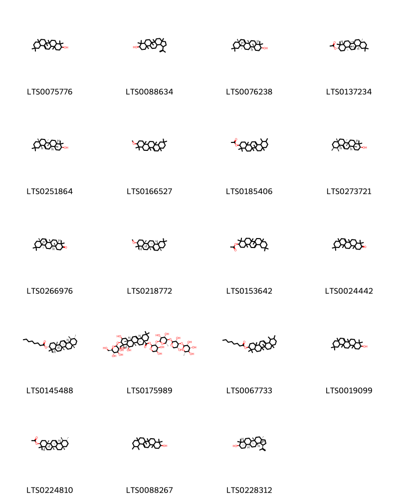{ width=100% }
    <figcaption>Hình ảnh cấu trúc hóa học của 19 hoạt chất thuộc nhóm Prenol lipids gồm ['β-amyrin (LTS0075776)', 'lupeol (LTS0088634)', 'alnulin (LTS0076238)', 'β-amyrin acetate (LTS0137234)', 'β-amyrin (LTS0251864)', '10-methoxy-2,2,4a,6b,9,9,12a,14a-octamethyl-1,3,4,5,7,8,8a,10,11,12,12b,13,14,14b-tetradecahydropicene (LTS0166527)', '4,4,6a,6b,8a,11,12,14b-octamethyl-2,3,4a,5,6,7,8,9,10,11,12,12a,14,14a-tetradecahydro-1h-picen-3-yl acetate (LTS0185406)', '(3s,4ar,6ar,6bs,8ar,11s,12s,12ar,14ar,14br)-4,4,6a,6b,8a,11,12,14b-octamethyl-2,3,4a,5,6,7,8,9,10,11,12,12a,14,14a-tetradecahydro-1h-picen-3-ol (LTS0273721)', 'taraxerone (LTS0266976)', '(4ar,6br,8ar,10s,12ar,12br,14as,14br)-10-methoxy-2,2,4a,6b,9,9,12a,14a-octamethyl-1,3,4,5,7,8,8a,10,11,12,12b,13,14,14b-tetradecahydropicene (LTS0218772)', '4,4,6a,6b,8a,11,11,14b-octamethyl-1,2,3,4a,5,6,7,8,9,10,12,12a,14,14a-tetradecahydropicen-3-yl acetate (LTS0153642)', '4,4,6a,8a,11,11,12b,14b-octamethyl-2,4a,5,6,8,9,10,12,12a,13,14,14a-dodecahydro-1h-picen-3-one (LTS0024442)', '(3r,4ar,6ar,6bs,8ar,11r,12s,12ar,14ar,14br)-4,4,6a,6b,8a,11,12,14b-octamethyl-2,3,4a,5,6,7,8,9,10,11,12,12a,14,14a-tetradecahydro-1h-picen-3-yl octanoate (LTS0145488)', '(2s,3r,4s,5s)-3-{[(2s,3r,4s,5r,6s)-5-{[(2s,3r,4s,5r)-3,5-dihydroxy-4-{[(2s,3r,4r,5r,6s)-3,4,5-trihydroxy-6-methyloxan-2-yl]oxy}oxan-2-yl]oxy}-3,4-dihydroxy-6-methyloxan-2-yl]oxy}-4,5-dihydroxyoxan-2-yl (4as,6as,6br,8r,8ar,9r,10r,11s,12ar,12br,14bs)-8,11-dihydroxy-9-(hydroxymethyl)-2,2,6a,6b,9,12a-hexamethyl-10-{[(2r,3r,4s,5s,6r)-3,4,5-trihydroxy-6-(hydroxymethyl)oxan-2-yl]oxy}-1,3,4,5,6,7,8,8a,10,11,12,12b,13,14b-tetradecahydropicene-4a-carboxylate (LTS0175989)', '4,4,6a,6b,8a,11,12,14b-octamethyl-2,3,4a,5,6,7,8,9,10,11,12,12a,14,14a-tetradecahydro-1h-picen-3-yl octanoate (LTS0067733)', 'taraxerol (LTS0019099)', 'α-amyrin acetate (LTS0224810)', 'α-amyrin (LTS0088267)', '(1r,3ar,5ar,5br,7ar,9r,11ar,11bs,13as,13br)-3a,5a,5b,8,8,11a-hexamethyl-1-(prop-1-en-2-yl)-hexadecahydrocyclopenta[a]chrysen-9-ol (LTS0228312)'].</figcaption>
</figure>
#### Nhóm Steroids and steroid derivatives
<figure markdown="span">
    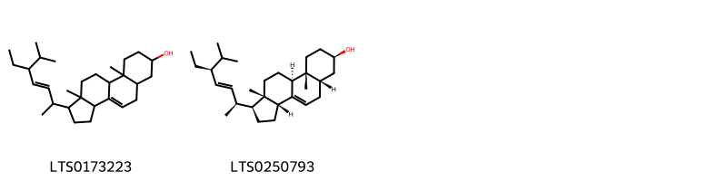{ width=100% }
    <figcaption>Hình ảnh cấu trúc hóa học của 2 hoạt chất thuộc nhóm Steroids and steroid derivatives gồm ['1-(5-ethyl-6-methylhept-3-en-2-yl)-9a,11a-dimethyl-1h,2h,3h,3ah,5h,5ah,6h,7h,8h,9h,9bh,10h,11h-cyclopenta[a]phenanthren-7-ol (LTS0173223)', '(1s,3ar,5as,7r,9ar,9bs,11as)-1-[(2s,3e,5s)-5-ethyl-6-methylhept-3-en-2-yl]-9a,11a-dimethyl-1h,2h,3h,3ah,5h,5ah,6h,7h,8h,9h,9bh,10h,11h-cyclopenta[a]phenanthren-7-ol (LTS0250793)'].</figcaption>
</figure>

---

### Dược dân tộc học

Danh sách các quốc gia có sử dụng *Manilkara kauki* trong điều trị các bệnh. 

| Country   | Disease           | Bệnh                                                                                                                                                                                                |
|:----------|:------------------|:----------------------------------------------------------------------------------------------------------------------------------------------------------------------------------------------------|
| Elsewhere | Astringent, Tonic | MYMEMORY WARNING: YOU USED ALL AVAILABLE FREE TRANSLATIONS FOR TODAY. NEXT AVAILABLE IN  10 HOURS 52 MINUTES 30 SECONDS VISIT HTTPS://MYMEMORY.TRANSLATED.NET/DOC/USAGELIMITS.PHP TO TRANSLATE MORE |
| Malaya    | Tonic, Vermifuge  | MYMEMORY WARNING: YOU USED ALL AVAILABLE FREE TRANSLATIONS FOR TODAY. NEXT AVAILABLE IN  10 HOURS 52 MINUTES 27 SECONDS VISIT HTTPS://MYMEMORY.TRANSLATED.NET/DOC/USAGELIMITS.PHP TO TRANSLATE MORE |

---

---
## Manilkara zapota
### Thông tin về thực vật

!!! info "Phân loại thực vật của *Manilkara zapota* từ GIBF:"
    - **Kingdom:** Plantae
    - **Phylum:** Tracheophyta
    - **Order:** Ericales
    - **Family:** Sapotaceae
    - **Genus:** Manilkara
    - **Species:** *Manilkara zapota*

 

| Label (VI)   | Label (EN)   | Scientific Name   | Descriptions (VI)                             | Descriptions (EN)   | Also Known As (VI)                            | Also Known As (EN)                                                                          |
|:-------------|:-------------|:------------------|:----------------------------------------------|:--------------------|:----------------------------------------------|:--------------------------------------------------------------------------------------------|
| N/A          | N/A          | Manilkara zapota  | Một loại cây ăn quả, có xuất xứ từ nước ngoài | evergreen tree      | ['Manilkara zapota', 'xa pô chê', 'lồng mứt'] | ['chicle', 'chico', 'sapodilla', 'naseberry', 'sapota', 'sapote', 'chicozapote', 'nispero'] |

#### Phân bố trên thế giới

**Từ CSDL GIBF** nan, Cayman Islands, Viet Nam, Thailand, Belize, Dominican Republic, Colombia, Barbados, India, United States of America, Mexico, Bahamas, Singapore, Bonaire, Sint Eustatius and Saba, Hong Kong, Guatemala

#### Phân bố tại Việt Nam

**Từ CSDL GIBF**: Hải Phòng

---
### Thành phần hóa học
        
- Theo cơ sở dữ liệu lotus: Từ loài *Manilkara zapota* đã phân lập và xác định được 39 hoạt chất thuộc về các nhóm Organooxygen compounds, Flavonoids, Saturated hydrocarbons, Prenol lipids, Phenol ethers, Benzene and substituted derivatives. 

|    | chemicalTaxonomyClassyfireClass     |   smiles_count |
|---:|:------------------------------------|---------------:|
|  0 | Benzene and substituted derivatives |              8 |
|  1 | Flavonoids                          |             13 |
|  2 | Organooxygen compounds              |             12 |
|  3 | Phenol ethers                       |              1 |
|  4 | Prenol lipids                       |              3 |
|  5 | Saturated hydrocarbons              |              2 |

#### Nhóm Benzene and substituted derivatives
<figure markdown="span">
    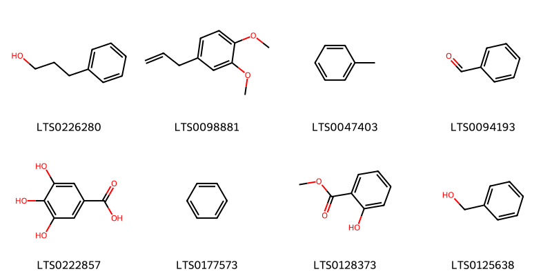{ width=100% }
    <figcaption>Hình ảnh cấu trúc hóa học của 8 hoạt chất thuộc nhóm Benzene and substituted derivatives gồm ['3-phenylpropanol (LTS0226280)', 'methyl eugenol (LTS0098881)', 'toluene (LTS0047403)', 'benzaldehyde (LTS0094193)', 'galop (LTS0222857)', 'benzene (LTS0177573)', 'methyl salicylate (LTS0128373)', 'benzyl alcohol (LTS0125638)'].</figcaption>
</figure>
#### Nhóm Flavonoids
<figure markdown="span">
    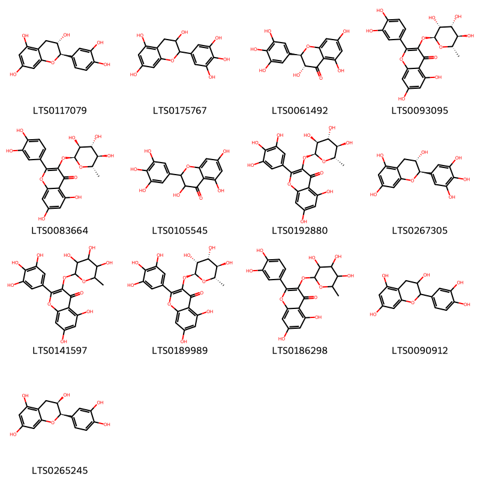{ width=100% }
    <figcaption>Hình ảnh cấu trúc hóa học của 13 hoạt chất thuộc nhóm Flavonoids gồm ['(+)-catechol (LTS0117079)', 'epigallocatechin (LTS0175767)', '(+)-dihydromyricetin (LTS0061492)', 'quercitrin (LTS0093095)', '2-(3,4-dihydroxyphenyl)-5,7-dihydroxy-3-{[(2s,3s,4r,5r,6s)-3,4,5-trihydroxy-6-methyloxan-2-yl]oxy}chromen-4-one (LTS0083664)', 'dihydromyricetin (LTS0105545)', '5,7-dihydroxy-3-{[(2s,3s,4r,5r,6s)-3,4,5-trihydroxy-6-methyloxan-2-yl]oxy}-2-(3,4,5-trihydroxyphenyl)chromen-4-one (LTS0192880)', 'gallocatechol (LTS0267305)', 'myricitrin (LTS0141597)', 'myricitrin (LTS0189989)', 'quercitrin (LTS0186298)', 'catechol (LTS0090912)', 'ent-epicatechin (LTS0265245)'].</figcaption>
</figure>
#### Nhóm Organooxygen compounds
<figure markdown="span">
    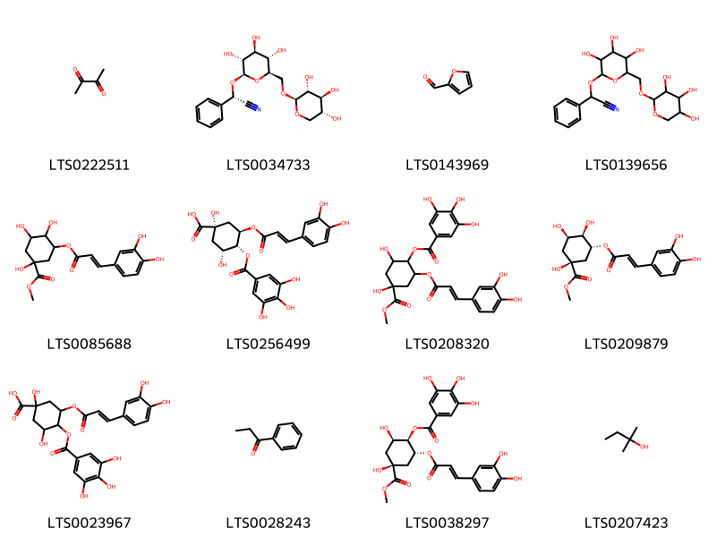{ width=100% }
    <figcaption>Hình ảnh cấu trúc hóa học của 12 hoạt chất thuộc nhóm Organooxygen compounds gồm ['diacetyl (LTS0222511)', '(2s)-2-phenyl-2-{[(2r,3r,4s,5s,6r)-3,4,5-trihydroxy-6-({[(2s,3r,4s,5r)-3,4,5-trihydroxyoxan-2-yl]oxy}methyl)oxan-2-yl]oxy}acetonitrile (LTS0034733)', 'bran oil (LTS0143969)', '2-phenyl-2-[(3,4,5-trihydroxy-6-{[(3,4,5-trihydroxyoxan-2-yl)oxy]methyl}oxan-2-yl)oxy]acetonitrile (LTS0139656)', 'methyl 3-{[3-(3,4-dihydroxyphenyl)prop-2-enoyl]oxy}-1,4,5-trihydroxycyclohexane-1-carboxylate (LTS0085688)', '4-galloylchlorogenic acid (LTS0256499)', '2-{[3-(3,4-dihydroxyphenyl)prop-2-enoyl]oxy}-4,6-dihydroxy-4-(methoxycarbonyl)cyclohexyl 3,4,5-trihydroxybenzoate (LTS0208320)', 'methyl chlorogenate (LTS0209879)', '3-{[3-(3,4-dihydroxyphenyl)prop-2-enoyl]oxy}-1,5-dihydroxy-4-(3,4,5-trihydroxybenzoyloxy)cyclohexane-1-carboxylic acid (LTS0023967)', 'propiophenone (LTS0028243)', '(1r,2r,4s,6r)-2-{[(2e)-3-(3,4-dihydroxyphenyl)prop-2-enoyl]oxy}-4,6-dihydroxy-4-(methoxycarbonyl)cyclohexyl 3,4,5-trihydroxybenzoate (LTS0038297)', '2-methyl-2-butanol (LTS0207423)'].</figcaption>
</figure>
#### Nhóm Phenol ethers
<figure markdown="span">
    { width=100% }
    <figcaption>Hình ảnh cấu trúc hóa học của 1 hoạt chất thuộc nhóm Phenol ethers gồm ['anisole (LTS0013639)'].</figcaption>
</figure>
#### Nhóm Prenol lipids
<figure markdown="span">
    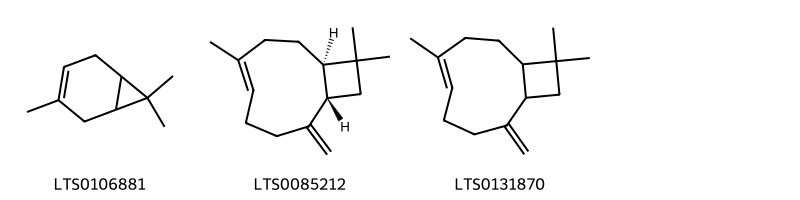{ width=100% }
    <figcaption>Hình ảnh cấu trúc hóa học của 3 hoạt chất thuộc nhóm Prenol lipids gồm ['monoterpenes (LTS0106881)', 'caryophyllene (LTS0085212)', 'caryophyllene (LTS0131870)'].</figcaption>
</figure>
#### Nhóm Saturated hydrocarbons
<figure markdown="span">
    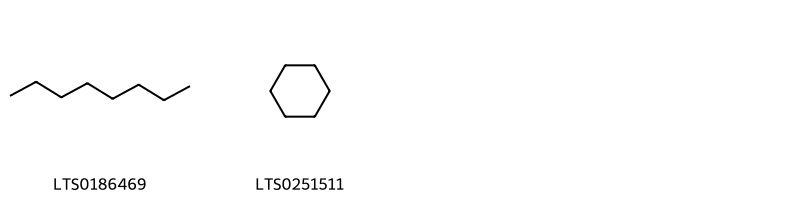{ width=100% }
    <figcaption>Hình ảnh cấu trúc hóa học của 2 hoạt chất thuộc nhóm Saturated hydrocarbons gồm ['octane (LTS0186469)', 'cyclohexane (LTS0251511)'].</figcaption>
</figure>

---

### Dược dân tộc học

Danh sách các quốc gia có sử dụng *Manilkara zapota* trong điều trị các bệnh. 

| Country   | Disease                           | Bệnh                                                                                                                                                                                                |
|:----------|:----------------------------------|:----------------------------------------------------------------------------------------------------------------------------------------------------------------------------------------------------|
| French    | Tonic                             | MYMEMORY WARNING: YOU USED ALL AVAILABLE FREE TRANSLATIONS FOR TODAY. NEXT AVAILABLE IN  10 HOURS 51 MINUTES 52 SECONDS VISIT HTTPS://MYMEMORY.TRANSLATED.NET/DOC/USAGELIMITS.PHP TO TRANSLATE MORE |
| Haiti     | Sedative                          | MYMEMORY WARNING: YOU USED ALL AVAILABLE FREE TRANSLATIONS FOR TODAY. NEXT AVAILABLE IN  10 HOURS 51 MINUTES 49 SECONDS VISIT HTTPS://MYMEMORY.TRANSLATED.NET/DOC/USAGELIMITS.PHP TO TRANSLATE MORE |
| India     | Diuretic                          | MYMEMORY WARNING: YOU USED ALL AVAILABLE FREE TRANSLATIONS FOR TODAY. NEXT AVAILABLE IN  10 HOURS 51 MINUTES 46 SECONDS VISIT HTTPS://MYMEMORY.TRANSLATED.NET/DOC/USAGELIMITS.PHP TO TRANSLATE MORE |
| Mexico    | Diuretic, Tonic, Emetic, Diuretic | MYMEMORY WARNING: YOU USED ALL AVAILABLE FREE TRANSLATIONS FOR TODAY. NEXT AVAILABLE IN  10 HOURS 51 MINUTES 43 SECONDS VISIT HTTPS://MYMEMORY.TRANSLATED.NET/DOC/USAGELIMITS.PHP TO TRANSLATE MORE |
| Venezuela | Astringent, Diuretic              | MYMEMORY WARNING: YOU USED ALL AVAILABLE FREE TRANSLATIONS FOR TODAY. NEXT AVAILABLE IN  10 HOURS 51 MINUTES 40 SECONDS VISIT HTTPS://MYMEMORY.TRANSLATED.NET/DOC/USAGELIMITS.PHP TO TRANSLATE MORE |

---

# Chi Xantolis

??? note "Danh sách các dược liệu thuộc chi"
    
	 - *Xantolis tomentosa*

---
## Xantolis tomentosa
### Thông tin về thực vật

!!! info "Phân loại thực vật của *Xantolis tomentosa* từ GIBF:"
    - **Kingdom:** Plantae
    - **Phylum:** Tracheophyta
    - **Order:** Ericales
    - **Family:** Sapotaceae
    - **Genus:** Xantolis
    - **Species:** *Xantolis tomentosa*

 

| Label (VI)   | Label (EN)   | Scientific Name    | Descriptions (VI)   | Descriptions (EN)   | Also Known As (VI)   | Also Known As (EN)   |
|:-------------|:-------------|:-------------------|:--------------------|:--------------------|:---------------------|:---------------------|
| N/A          | N/A          | Xantolis tomentosa | loài thực vật       | species of plant    | ['']                 | ['']                 |

#### Phân bố trên thế giới

**Từ CSDL GIBF** nan, Viet Nam, unknown or invalid, Thailand, Sri Lanka, Myanmar, Colombia, Dominica, Mongolia, India, Lao People’s Democratic Republic

#### Phân bố tại Việt Nam

**Từ CSDL GIBF**: Dong Nai

---
### Thành phần hóa học
        
- Theo cơ sở dữ liệu lotus: Từ loài *Xantolis tomentosa* đã phân lập và xác định được 1 hoạt chất thuộc về các nhóm Prenol lipids. 

|    | chemicalTaxonomyClassyfireClass   |   smiles_count |
|---:|:----------------------------------|---------------:|
|  0 | Prenol lipids                     |              1 |

#### Nhóm Prenol lipids
<figure markdown="span">
    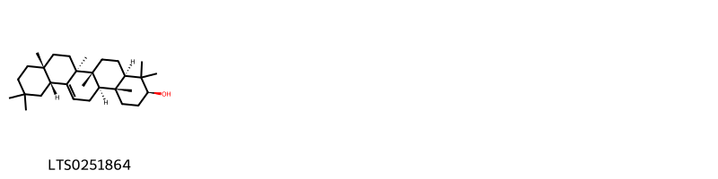{ width=100% }
    <figcaption>Hình ảnh cấu trúc hóa học của 1 hoạt chất thuộc nhóm Prenol lipids gồm ['β-amyrin (LTS0251864)'].</figcaption>
</figure>

---

### Dược dân tộc học

Danh sách các quốc gia có sử dụng *Xantolis tomentosa* trong điều trị các bệnh. 

| Country   | Disease    | Bệnh                                                                                                                                                                                                |
|:----------|:-----------|:----------------------------------------------------------------------------------------------------------------------------------------------------------------------------------------------------|
| India     | Astringent | MYMEMORY WARNING: YOU USED ALL AVAILABLE FREE TRANSLATIONS FOR TODAY. NEXT AVAILABLE IN  10 HOURS 51 MINUTES 07 SECONDS VISIT HTTPS://MYMEMORY.TRANSLATED.NET/DOC/USAGELIMITS.PHP TO TRANSLATE MORE |

---

# Chi Bumelia

??? note "Danh sách các dược liệu thuộc chi"
    
	 - *Bumelia iniflora*
	 - *Bumelia retusa*
	 - *Bumelia salicifolia*

---
## Bumelia iniflora
### Thông tin về thực vật

!!! info "Phân loại thực vật của *N/A* từ GIBF:"
    - **Kingdom:** Plantae
    - **Phylum:** Tracheophyta
    - **Order:** Ericales
    - **Family:** Sapotaceae
    - **Genus:** Sideroxylon
    - **Species:** *N/A*

 

| Label (VI)   | Label (EN)   | Scientific Name    | Descriptions (VI)   | Descriptions (EN)   | Also Known As (VI)   | Also Known As (EN)   |
|:-------------|:-------------|:-------------------|:--------------------|:--------------------|:---------------------|:---------------------|
| N/A          | N/A          | Xantolis tomentosa | loài thực vật       | species of plant    | ['']                 | ['']                 |

#### Phân bố trên thế giới

**Từ CSDL GIBF** nan, unknown or invalid, Trinidad and Tobago, Guatemala, Haiti, Turks and Caicos Islands, Colombia, Dominican Republic, Venezuela (Bolivarian Republic of), Puerto Rico, Bahamas, Cuba, Belize, Brazil, Mexico, Argentina, Paraguay, Costa Rica, United States of America

#### Phân bố tại Việt Nam

**Từ CSDL GIBF**: Không có ghi nhận ở Việt Nam

---
### Thành phần hóa học
        
- Theo cơ sở dữ liệu lotus: Từ loài *N/A* đã phân lập và xác định được Chưa có hoạt chất nào được phân lập. hoạt chất thuộc về các nhóm Không có hoạt chất nào được phân lập. 

Không có hình ảnh nào được tạo ra

---

### Dược dân tộc học

Danh sách các quốc gia có sử dụng *N/A* trong điều trị các bệnh. 

| Country   | Disease                  | Bệnh                                                                                                                                                                                                |
|:----------|:-------------------------|:----------------------------------------------------------------------------------------------------------------------------------------------------------------------------------------------------|
| Mexico    | Aphrodisiac, Aphrodisiac | MYMEMORY WARNING: YOU USED ALL AVAILABLE FREE TRANSLATIONS FOR TODAY. NEXT AVAILABLE IN  10 HOURS 50 MINUTES 38 SECONDS VISIT HTTPS://MYMEMORY.TRANSLATED.NET/DOC/USAGELIMITS.PHP TO TRANSLATE MORE |

---

---
## Bumelia retusa
### Thông tin về thực vật

!!! info "Phân loại thực vật của *N/A* từ GIBF:"
    - **Kingdom:** Plantae
    - **Phylum:** Tracheophyta
    - **Order:** Ericales
    - **Family:** Sapotaceae
    - **Genus:** Sideroxylon
    - **Species:** *N/A*

 

| Label (VI)   | Label (EN)   | Scientific Name    | Descriptions (VI)   | Descriptions (EN)   | Also Known As (VI)   | Also Known As (EN)   |
|:-------------|:-------------|:-------------------|:--------------------|:--------------------|:---------------------|:---------------------|
| N/A          | N/A          | Xantolis tomentosa | loài thực vật       | species of plant    | ['']                 | ['']                 |

#### Phân bố trên thế giới

**Từ CSDL GIBF** Haiti, Argentina, South Africa, Morocco, Brazil, Spain, Puerto Rico, United States of America, Mexico, Bahamas

#### Phân bố tại Việt Nam

**Từ CSDL GIBF**: Không có ghi nhận ở Việt Nam

---
### Thành phần hóa học
        
- Theo cơ sở dữ liệu lotus: Từ loài *N/A* đã phân lập và xác định được Chưa có hoạt chất nào được phân lập. hoạt chất thuộc về các nhóm Không có hoạt chất nào được phân lập. 

Không có hình ảnh nào được tạo ra

---

### Dược dân tộc học

Danh sách các quốc gia có sử dụng *N/A* trong điều trị các bệnh. 

| Country   | Disease                                     | Bệnh                                                                                                                                                                                                |
|:----------|:--------------------------------------------|:----------------------------------------------------------------------------------------------------------------------------------------------------------------------------------------------------|
| Mexico    | Hemostat, Insecticide, Pediculicide, Poison | MYMEMORY WARNING: YOU USED ALL AVAILABLE FREE TRANSLATIONS FOR TODAY. NEXT AVAILABLE IN  10 HOURS 50 MINUTES 12 SECONDS VISIT HTTPS://MYMEMORY.TRANSLATED.NET/DOC/USAGELIMITS.PHP TO TRANSLATE MORE |

---

---
## Bumelia salicifolia
### Thông tin về thực vật

!!! info "Phân loại thực vật của *Sideroxylon salicifolium* từ GIBF:"
    - **Kingdom:** Plantae
    - **Phylum:** Tracheophyta
    - **Order:** Ericales
    - **Family:** Sapotaceae
    - **Genus:** Sideroxylon
    - **Species:** *Sideroxylon salicifolium*

 

| Label (VI)   | Label (EN)   | Scientific Name     | Descriptions (VI)   | Descriptions (EN)   | Also Known As (VI)   | Also Known As (EN)   |
|:-------------|:-------------|:--------------------|:--------------------|:--------------------|:---------------------|:---------------------|
| N/A          | N/A          | Bumelia salicifolia |                     |                     | ['']                 | ['']                 |

#### Phân bố trên thế giới

**Từ CSDL GIBF** Haiti, nan, Turks and Caicos Islands, Dominican Republic, Puerto Rico, Bahamas, United States of America, Mexico, Cuba, Jamaica

#### Phân bố tại Việt Nam

**Từ CSDL GIBF**: Không có ghi nhận ở Việt Nam

---
### Thành phần hóa học
        
- Theo cơ sở dữ liệu lotus: Từ loài *Sideroxylon salicifolium* đã phân lập và xác định được Chưa có hoạt chất nào được phân lập. hoạt chất thuộc về các nhóm Không có hoạt chất nào được phân lập. 

Không có hình ảnh nào được tạo ra

---

### Dược dân tộc học

Danh sách các quốc gia có sử dụng *Sideroxylon salicifolium* trong điều trị các bệnh. 

| Country            | Disease   | Bệnh                                                                                                                                                                                                |
|:-------------------|:----------|:----------------------------------------------------------------------------------------------------------------------------------------------------------------------------------------------------|
| Dominican Republic | Diuretic  | MYMEMORY WARNING: YOU USED ALL AVAILABLE FREE TRANSLATIONS FOR TODAY. NEXT AVAILABLE IN  10 HOURS 49 MINUTES 40 SECONDS VISIT HTTPS://MYMEMORY.TRANSLATED.NET/DOC/USAGELIMITS.PHP TO TRANSLATE MORE |

---

# Chi Lucuma

??? note "Danh sách các dược liệu thuộc chi"
    
	 - *Lucuma glycyphloea*
	 - *Lucuma salicifolia*

---
## Lucuma glycyphloea
### Thông tin về thực vật

!!! info "Phân loại thực vật của *Pradosia lactescens* từ GIBF:"
    - **Kingdom:** Plantae
    - **Phylum:** Tracheophyta
    - **Order:** Ericales
    - **Family:** Sapotaceae
    - **Genus:** Pradosia
    - **Species:** *Pradosia lactescens*

 

| Label (VI)   | Label (EN)   | Scientific Name     | Descriptions (VI)   | Descriptions (EN)   | Also Known As (VI)   | Also Known As (EN)   |
|:-------------|:-------------|:--------------------|:--------------------|:--------------------|:---------------------|:---------------------|
| N/A          | N/A          | Bumelia salicifolia |                     |                     | ['']                 | ['']                 |

#### Phân bố trên thế giới

**Từ CSDL GIBF** Haiti, nan, Turks and Caicos Islands, Dominican Republic, Puerto Rico, Bahamas, United States of America, Mexico, Cuba, Jamaica

#### Phân bố tại Việt Nam

**Từ CSDL GIBF**: Không có ghi nhận ở Việt Nam

---
### Thành phần hóa học
        
- Theo cơ sở dữ liệu lotus: Từ loài *Pradosia lactescens* đã phân lập và xác định được Chưa có hoạt chất nào được phân lập. hoạt chất thuộc về các nhóm Không có hoạt chất nào được phân lập. 

Không có hình ảnh nào được tạo ra

---

### Dược dân tộc học

Danh sách các quốc gia có sử dụng *Pradosia lactescens* trong điều trị các bệnh. 

| Country   | Disease                     | Bệnh                                                                                                                                                                                                |
|:----------|:----------------------------|:----------------------------------------------------------------------------------------------------------------------------------------------------------------------------------------------------|
| Brazil    | Astringent, Hemostat, Tonic | MYMEMORY WARNING: YOU USED ALL AVAILABLE FREE TRANSLATIONS FOR TODAY. NEXT AVAILABLE IN  10 HOURS 49 MINUTES 18 SECONDS VISIT HTTPS://MYMEMORY.TRANSLATED.NET/DOC/USAGELIMITS.PHP TO TRANSLATE MORE |

---

---
## Lucuma salicifolia
### Thông tin về thực vật

!!! info "Phân loại thực vật của *Pouteria campechiana* từ GIBF:"
    - **Kingdom:** Plantae
    - **Phylum:** Tracheophyta
    - **Order:** Ericales
    - **Family:** Sapotaceae
    - **Genus:** Pouteria
    - **Species:** *Pouteria campechiana*

 

| Label (VI)   | Label (EN)   | Scientific Name    | Descriptions (VI)   | Descriptions (EN)   | Also Known As (VI)   | Also Known As (EN)   |
|:-------------|:-------------|:-------------------|:--------------------|:--------------------|:---------------------|:---------------------|
| N/A          | N/A          | Lucuma salicifolia | loài thực vật       | species of plant    | ['']                 | ['']                 |

#### Phân bố trên thế giới

**Từ CSDL GIBF** Congo, Democratic Republic of the, nan, Mexico, Panama

#### Phân bố tại Việt Nam

**Từ CSDL GIBF**: Không có ghi nhận ở Việt Nam

---
### Thành phần hóa học
        
- Theo cơ sở dữ liệu lotus: Từ loài *Pouteria campechiana* đã phân lập và xác định được Chưa có hoạt chất nào được phân lập. hoạt chất thuộc về các nhóm Không có hoạt chất nào được phân lập. 

Không có hình ảnh nào được tạo ra

---

### Dược dân tộc học

Danh sách các quốc gia có sử dụng *Pouteria campechiana* trong điều trị các bệnh. 

| Country   | Disease    | Bệnh                                                                                                                                                                                                |
|:----------|:-----------|:----------------------------------------------------------------------------------------------------------------------------------------------------------------------------------------------------|
| Elsewhere | Soporific  | MYMEMORY WARNING: YOU USED ALL AVAILABLE FREE TRANSLATIONS FOR TODAY. NEXT AVAILABLE IN  10 HOURS 48 MINUTES 55 SECONDS VISIT HTTPS://MYMEMORY.TRANSLATED.NET/DOC/USAGELIMITS.PHP TO TRANSLATE MORE |
| Mexico    | Intoxicant | MYMEMORY WARNING: YOU USED ALL AVAILABLE FREE TRANSLATIONS FOR TODAY. NEXT AVAILABLE IN  10 HOURS 48 MINUTES 52 SECONDS VISIT HTTPS://MYMEMORY.TRANSLATED.NET/DOC/USAGELIMITS.PHP TO TRANSLATE MORE |

---

# Chi Mimusops

??? note "Danh sách các dược liệu thuộc chi"
    
	 - *Mimusops djave*
	 - *Mimusops elengi*

---
## Mimusops djave
### Thông tin về thực vật

!!! info "Phân loại thực vật của *Baillonella toxisperma* từ GIBF:"
    - **Kingdom:** Plantae
    - **Phylum:** Tracheophyta
    - **Order:** Ericales
    - **Family:** Sapotaceae
    - **Genus:** Baillonella
    - **Species:** *Baillonella toxisperma*

 

| Label (VI)   | Label (EN)   | Scientific Name   | Descriptions (VI)   | Descriptions (EN)   | Also Known As (VI)   | Also Known As (EN)   |
|:-------------|:-------------|:------------------|:--------------------|:--------------------|:---------------------|:---------------------|
| N/A          | N/A          | Mimusops djave    |                     | species of plant    | ['']                 | ['']                 |

#### Phân bố trên thế giới

**Từ CSDL GIBF** Viet Nam, unknown or invalid, Thailand, Ghana, Philippines, Dominica, Trinidad and Tobago, Cameroon, Singapore, Australia, Indonesia, Sri Lanka, Malaysia, India, Réunion, Bangladesh, Cuba, Nigeria, Myanmar, Panama, Brazil, Montserrat, Angola

#### Phân bố tại Việt Nam

**Từ CSDL GIBF**: Không có ghi nhận ở Việt Nam

---
### Thành phần hóa học
        
- Theo cơ sở dữ liệu lotus: Từ loài *Baillonella toxisperma* đã phân lập và xác định được Chưa có hoạt chất nào được phân lập. hoạt chất thuộc về các nhóm Không có hoạt chất nào được phân lập. 

Không có hình ảnh nào được tạo ra

---

### Dược dân tộc học

Danh sách các quốc gia có sử dụng *Baillonella toxisperma* trong điều trị các bệnh. 

| Country   | Disease   | Bệnh                                                                                                                                                                                                |
|:----------|:----------|:----------------------------------------------------------------------------------------------------------------------------------------------------------------------------------------------------|
| Africa    | Poison    | MYMEMORY WARNING: YOU USED ALL AVAILABLE FREE TRANSLATIONS FOR TODAY. NEXT AVAILABLE IN  10 HOURS 48 MINUTES 27 SECONDS VISIT HTTPS://MYMEMORY.TRANSLATED.NET/DOC/USAGELIMITS.PHP TO TRANSLATE MORE |

---

---
## Mimusops elengi
### Thông tin về thực vật

!!! info "Phân loại thực vật của *Mimusops elengi* từ GIBF:"
    - **Kingdom:** Plantae
    - **Phylum:** Tracheophyta
    - **Order:** Ericales
    - **Family:** Sapotaceae
    - **Genus:** Mimusops
    - **Species:** *Mimusops elengi*

 

| Label (VI)   | Label (EN)   | Scientific Name   | Descriptions (VI)   | Descriptions (EN)   | Also Known As (VI)   | Also Known As (EN)                          |
|:-------------|:-------------|:------------------|:--------------------|:--------------------|:---------------------|:--------------------------------------------|
| N/A          | N/A          | Mimusops elengi   | loài thực vật       | species of plant    | ['Mimusops elengi']  | ['medlar', 'Bullet wood', 'Spanish cherry'] |

#### Phân bố trên thế giới

**Từ CSDL GIBF** Thailand, Maldives, Malaysia, India, New Caledonia, United States of America, Singapore, Australia, Indonesia

#### Phân bố tại Việt Nam

**Từ CSDL GIBF**: Không có ghi nhận ở Việt Nam

---
### Thành phần hóa học
        
- Theo cơ sở dữ liệu lotus: Từ loài *Mimusops elengi* đã phân lập và xác định được 79 hoạt chất thuộc về các nhóm Organooxygen compounds, Flavonoids, Saturated hydrocarbons, Tannins, Prenol lipids, Fatty Acyls, Steroids and steroid derivatives, Benzene and substituted derivatives. 

|    | chemicalTaxonomyClassyfireClass     |   smiles_count |
|---:|:------------------------------------|---------------:|
|  0 | Benzene and substituted derivatives |              2 |
|  1 | Fatty Acyls                         |              2 |
|  2 | Flavonoids                          |              1 |
|  3 | Organooxygen compounds              |              3 |
|  4 | Prenol lipids                       |             44 |
|  5 | Saturated hydrocarbons              |              1 |
|  6 | Steroids and steroid derivatives    |             14 |
|  7 | Tannins                             |             12 |

#### Nhóm Benzene and substituted derivatives
<figure markdown="span">
    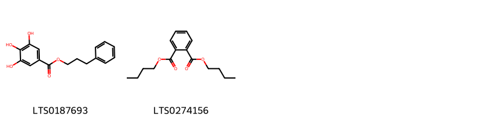{ width=100% }
    <figcaption>Hình ảnh cấu trúc hóa học của 2 hoạt chất thuộc nhóm Benzene and substituted derivatives gồm ['3-phenylpropyl 3,4,5-trihydroxybenzoate (LTS0187693)', 'dibutyl-phthalate (LTS0274156)'].</figcaption>
</figure>
#### Nhóm Fatty Acyls
<figure markdown="span">
    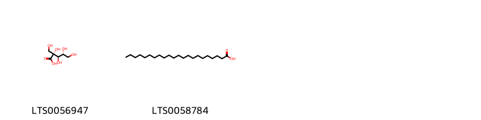{ width=100% }
    <figcaption>Hình ảnh cấu trúc hóa học của 2 hoạt chất thuộc nhóm Fatty Acyls gồm ['2-carboxy-d-arabinitol (LTS0056947)', 'behenic acid (LTS0058784)'].</figcaption>
</figure>
#### Nhóm Flavonoids
<figure markdown="span">
    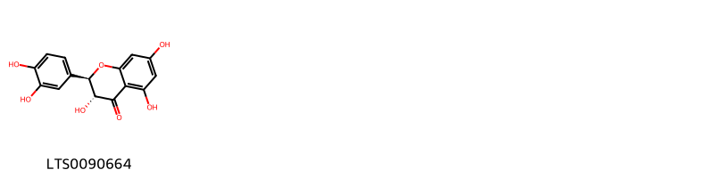{ width=100% }
    <figcaption>Hình ảnh cấu trúc hóa học của 1 hoạt chất thuộc nhóm Flavonoids gồm ['(+)-taxifolin (LTS0090664)'].</figcaption>
</figure>
#### Nhóm Organooxygen compounds
<figure markdown="span">
    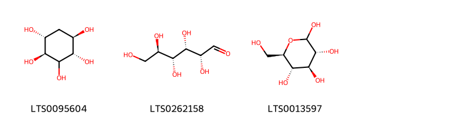{ width=100% }
    <figcaption>Hình ảnh cấu trúc hóa học của 3 hoạt chất thuộc nhóm Organooxygen compounds gồm ['quercitol (LTS0095604)', '(+)-glucose (LTS0262158)', 'glucose (LTS0013597)'].</figcaption>
</figure>
#### Nhóm Prenol lipids
<figure markdown="span">
    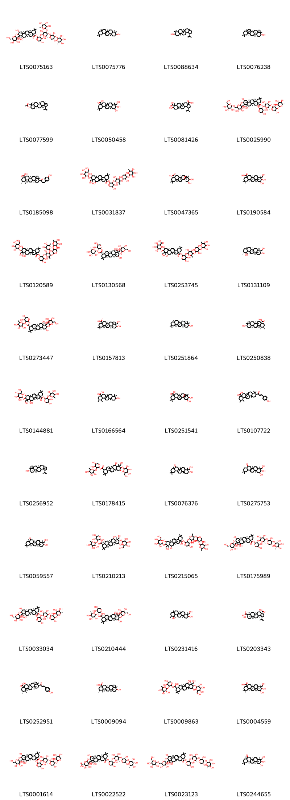{ width=100% }
    <figcaption>Hình ảnh cấu trúc hóa học của 44 hoạt chất thuộc nhóm Prenol lipids gồm ['(2s,3r,4s,5s)-3-{[(2s,3r,4s,5s,6s)-5-{[(2s,3r,4s,5r)-3,5-dihydroxy-4-{[(2s,3r,4r,5r,6s)-3,4,5-trihydroxy-6-methyloxan-2-yl]oxy}oxan-2-yl]oxy}-3-hydroxy-6-methyl-4-{[(2s,3r,4r,5r,6s)-3,4,5-trihydroxy-6-methyloxan-2-yl]oxy}oxan-2-yl]oxy}-4,5-dihydroxyoxan-2-yl (4as,6as,6br,8r,8ar,9r,10r,11s,12ar,12br,14bs)-8,11-dihydroxy-9-(hydroxymethyl)-2,2,6a,6b,9,12a-hexamethyl-10-{[(2r,3r,4s,5s,6r)-3,4,5-trihydroxy-6-(hydroxymethyl)oxan-2-yl]oxy}-1,3,4,5,6,7,8,8a,10,11,12,12b,13,14b-tetradecahydropicene-4a-carboxylate (LTS0075163)', 'β-amyrin (LTS0075776)', 'lupeol (LTS0088634)', 'alnulin (LTS0076238)', 'lupeol acetate (LTS0077599)', '10,11-dihydroxy-9-(hydroxymethyl)-2,2,6a,6b,9,12a-hexamethyl-1,3,4,5,6,7,10,11,12,12b,13,14b-dodecahydropicene-4a-carboxylic acid (LTS0050458)', '9-hydroxy-5a,5b,8,11a-tetramethyl-1-(prop-1-en-2-yl)-hexadecahydrocyclopenta[a]chrysene-3a,8-dicarboxylic acid (LTS0081426)', '(2s,3r,4s,5s)-3-{[(2s,3r,4s,5r,6s)-5-{[(2s,3r,4s,5r)-3,5-dihydroxy-4-{[(2s,3r,4r,5r,6s)-3,4,5-trihydroxy-6-methyloxan-2-yl]oxy}oxan-2-yl]oxy}-3,4-dihydroxy-6-methyloxan-2-yl]oxy}-4,5-dihydroxyoxan-2-yl (4ar,5r,6as,6br,8r,8ar,9r,10r,11s,12ar,12br,14bs)-5,8,11-trihydroxy-9-(hydroxymethyl)-2,2,6a,6b,9,12a-hexamethyl-10-{[(2r,3r,4s,5s,6r)-3,4,5-trihydroxy-6-({[(2r,3r,4s,5s,6r)-3,4,5-trihydroxy-6-(hydroxymethyl)oxan-2-yl]oxy}methyl)oxan-2-yl]oxy}-1,3,4,5,6,7,8,8a,10,11,12,12b,13,14b-tetradecahydropicene-4a-carboxylate (LTS0025990)', '(1s,2r,4as,6as,6br,8as,10s,12as,12br,14br)-10-[(2z)-3-(4-hydroxyphenyl)prop-2-enoyl]-1,2,6a,6b,9,9,12a-heptamethyl-2,3,4,5,6,7,8,8a,10,11,12,12b,13,14b-tetradecahydro-1h-picene-4a-carboxylic acid (LTS0185098)', '3-{[5-({3,5-dihydroxy-4-[(3,4,5-trihydroxy-6-methyloxan-2-yl)oxy]oxan-2-yl}oxy)-3,4-dihydroxy-6-methyloxan-2-yl]oxy}-4,5-dihydroxyoxan-2-yl 8,11-dihydroxy-9-(hydroxymethyl)-2,2,6a,6b,9,12a-hexamethyl-10-{[3,4,5-trihydroxy-6-(hydroxymethyl)oxan-2-yl]oxy}-1,3,4,5,6,7,8,8a,10,11,12,12b,13,14b-tetradecahydropicene-4a-carboxylate (LTS0031837)', '(1s,6s,11s,14r,15s,18r,19r,20r,21s)-20,21-dihydroxy-8,8,14,15,18,19-hexamethyl-23-oxahexacyclo[17.3.2.0¹,¹⁸.0²,¹⁵.0⁵,¹⁴.0⁶,¹¹]tetracosa-2,4-diene-11-carboxylic acid (LTS0047365)', '(4as,6as,6br,9r,10r,11s,12ar,12bs,14bs)-10,11-dihydroxy-9-(hydroxymethyl)-2,2,6a,6b,9,12a-hexamethyl-1,3,4,5,6,7,10,11,12,12b,13,14b-dodecahydropicene-4a-carboxylic acid (LTS0190584)', '3-{[5-({3,5-dihydroxy-4-[(3,4,5-trihydroxy-6-methyloxan-2-yl)oxy]oxan-2-yl}oxy)-3-hydroxy-6-methyl-4-[(3,4,5-trihydroxy-6-methyloxan-2-yl)oxy]oxan-2-yl]oxy}-4,5-dihydroxyoxan-2-yl 8,11-dihydroxy-9-(hydroxymethyl)-2,2,6a,6b,9,12a-hexamethyl-10-{[3,4,5-trihydroxy-6-(hydroxymethyl)oxan-2-yl]oxy}-1,3,4,5,6,7,8,8a,10,11,12,12b,13,14b-tetradecahydropicene-4a-carboxylate (LTS0120589)', '(2s,3r,4s,5s)-4,5-dihydroxy-3-{[(2s,3r,4r,5r,6s)-3,4,5-trihydroxy-6-methyloxan-2-yl]oxy}oxan-2-yl (4r,4ar,6as,6br,8r,8ar,9r,10r,11s,12ar,12br,14br)-8,11-dihydroxy-9-(hydroxymethyl)-2,2,6a,6b,9,12a-hexamethyl-10-{[(2r,3r,4s,5s,6r)-3,4,5-trihydroxy-6-(hydroxymethyl)oxan-2-yl]oxy}-3,4,4a,5,6,7,8,8a,10,11,12,12b,13,14b-tetradecahydro-1h-picene-4-carboxylate (LTS0130568)', '6-[(8a-{[(3-{[5-({3,5-dihydroxy-4-[(3,4,5-trihydroxy-6-methyloxan-2-yl)oxy]oxan-2-yl}oxy)-3,4-dihydroxy-6-methyloxan-2-yl]oxy}-4,5-dihydroxyoxan-2-yl)oxy]carbonyl}-2,5-dihydroxy-4-(hydroxymethyl)-4,6a,6b,11,11,14b-hexamethyl-1,2,3,4a,5,6,7,8,9,10,12,12a,14,14a-tetradecahydropicen-3-yl)oxy]-3,4,5-trihydroxyoxane-2-carboxylic acid (LTS0253745)', '(1r,2r,4ar,6as,6br,8ar,9r,10s,12ar,12br,14bs)-9-(hydroxymethyl)-1,2,4a,6a,6b,9,12a-heptamethyl-2,3,4,5,6,7,8,8a,10,11,12,12b,13,14b-tetradecahydropicene-1,10-diol (LTS0131109)', '4,5-dihydroxy-3-[(3,4,5-trihydroxy-6-methyloxan-2-yl)oxy]oxan-2-yl (4r,4ar,6as,6br,8r,8ar,9r,10r,11s,12ar,12br,14br)-8,11-dihydroxy-9-(hydroxymethyl)-2,2,4a,6a,6b,9,12a-heptamethyl-10-{[3,4,5-trihydroxy-6-(hydroxymethyl)oxan-2-yl]oxy}-1,3,4,5,6,7,8,8a,10,11,12,12b,13,14b-tetradecahydropicene-4-carboxylate (LTS0273447)', 'hederagenin (LTS0157813)', 'β-amyrin (LTS0251864)', 'ursolic acid (LTS0250838)', '4,5-dihydroxy-3-[(3,4,5-trihydroxy-6-methyloxan-2-yl)oxy]oxan-2-yl 8,11-dihydroxy-9-(hydroxymethyl)-2,2,6a,6b,9,12a-hexamethyl-10-{[3,4,5-trihydroxy-6-(hydroxymethyl)oxan-2-yl]oxy}-1,3,4,5,6,7,8,8a,10,11,12,12b,13,14b-tetradecahydropicene-4a-carboxylate (LTS0144881)', '10-hydroxy-1,2,6a,6b,9,9,12a-heptamethyl-2,3,4,5,6,7,8,8a,10,11,12,12b,13,14b-tetradecahydro-1h-picene-4a-carboxylic acid (LTS0166564)', '20,21-dihydroxy-8,8,14,15,18,19-hexamethyl-23-oxahexacyclo[17.3.2.0¹,¹⁸.0²,¹⁵.0⁵,¹⁴.0⁶,¹¹]tetracosa-2,4-diene-11-carboxylic acid (LTS0251541)', '10-[3-(4-hydroxyphenyl)prop-2-enoyl]-1,2,6a,6b,9,9,12a-heptamethyl-2,3,4,5,6,7,8,8a,10,11,12,12b,13,14b-tetradecahydro-1h-picene-4a-carboxylic acid (LTS0107722)', 'lupeol (LTS0256952)', '4,5-dihydroxy-3-[(3,4,5-trihydroxy-6-methyloxan-2-yl)oxy]oxan-2-yl 8,11-dihydroxy-9-(hydroxymethyl)-2,2,6a,6b,9,12a-hexamethyl-10-{[3,4,5-trihydroxy-6-(hydroxymethyl)oxan-2-yl]oxy}-3,4,4a,5,6,7,8,8a,10,11,12,12b,13,14b-tetradecahydro-1h-picene-4-carboxylate (LTS0178415)', '10-hydroxy-9-(hydroxymethyl)-2,2,4a,6a,6b,9,12a-heptamethyl-3,4,6,7,10,11,12,12b,13,14b-decahydro-1h-picen-5-one (LTS0076376)', '10,11-dihydroxy-9-(hydroxymethyl)-2,2,6a,6b,9,12a-hexamethyl-1,3,4,4a,6,7,10,11,12,12b,13,14b-dodecahydropicen-5-one (LTS0275753)', '(4as,6as,6br,9r,10s,12ar,12bs,14bs)-10-hydroxy-9-(hydroxymethyl)-2,2,4a,6a,6b,9,12a-heptamethyl-3,4,6,7,10,11,12,12b,13,14b-decahydro-1h-picen-5-one (LTS0059557)', '4,5-dihydroxy-3-[(3,4,5-trihydroxy-6-methyloxan-2-yl)oxy]oxan-2-yl (4r,4ar,5r,6as,6br,8r,9r,10r,11s,12ar,12br,14bs)-5,8,11-trihydroxy-9-(hydroxymethyl)-2,2,6a,6b,9,12a-hexamethyl-10-{[3,4,5-trihydroxy-6-(hydroxymethyl)oxan-2-yl]oxy}-3,4,4a,5,6,7,8,8a,10,11,12,12b,13,14b-tetradecahydro-1h-picene-4-carboxylate (LTS0210213)', '3-{[5-({3,5-dihydroxy-4-[(3,4,5-trihydroxy-6-methyloxan-2-yl)oxy]oxan-2-yl}oxy)-3,4-dihydroxy-6-methyloxan-2-yl]oxy}-4,5-dihydroxyoxan-2-yl 5,8,11-trihydroxy-9-(hydroxymethyl)-2,2,6a,6b,9,12a-hexamethyl-10-{[3,4,5-trihydroxy-6-(hydroxymethyl)oxan-2-yl]oxy}-1,3,4,5,6,7,8,8a,10,11,12,12b,13,14b-tetradecahydropicene-4a-carboxylate (LTS0215065)', '(2s,3r,4s,5s)-3-{[(2s,3r,4s,5r,6s)-5-{[(2s,3r,4s,5r)-3,5-dihydroxy-4-{[(2s,3r,4r,5r,6s)-3,4,5-trihydroxy-6-methyloxan-2-yl]oxy}oxan-2-yl]oxy}-3,4-dihydroxy-6-methyloxan-2-yl]oxy}-4,5-dihydroxyoxan-2-yl (4as,6as,6br,8r,8ar,9r,10r,11s,12ar,12br,14bs)-8,11-dihydroxy-9-(hydroxymethyl)-2,2,6a,6b,9,12a-hexamethyl-10-{[(2r,3r,4s,5s,6r)-3,4,5-trihydroxy-6-(hydroxymethyl)oxan-2-yl]oxy}-1,3,4,5,6,7,8,8a,10,11,12,12b,13,14b-tetradecahydropicene-4a-carboxylate (LTS0175989)', '(2s,3r,4s,5s)-3-{[(2s,3r,4s,5r,6s)-5-{[(2s,3r,4s,5r)-3,5-dihydroxy-4-{[(2s,3r,4r,5r,6s)-3,4,5-trihydroxy-6-methyloxan-2-yl]oxy}oxan-2-yl]oxy}-3,4-dihydroxy-6-methyloxan-2-yl]oxy}-4,5-dihydroxyoxan-2-yl (4ar,5r,6as,6br,8r,8ar,9r,10r,11s,12as,12br,14bs)-5,8,11-trihydroxy-9-(hydroxymethyl)-2,2,6a,6b,9,12a,12b,14b-octamethyl-10-{[(2r,3r,4s,5s,6r)-3,4,5-trihydroxy-6-(hydroxymethyl)oxan-2-yl]oxy}-1,3,4,5,6,7,8,8a,10,11,12,13-dodecahydropicene-4a-carboxylate (LTS0033034)', '(2s,3r,4s,5s)-4,5-dihydroxy-3-{[(2s,3r,4r,5r,6s)-3,4,5-trihydroxy-6-methyloxan-2-yl]oxy}oxan-2-yl (4r,4ar,5r,6as,6br,8r,8ar,9r,10r,11s,12ar,12br,14br)-5,8,11-trihydroxy-9-(hydroxymethyl)-2,2,6a,6b,9,12a-hexamethyl-10-{[(2r,3r,4s,5s,6r)-3,4,5-trihydroxy-6-(hydroxymethyl)oxan-2-yl]oxy}-3,4,4a,5,6,7,8,8a,10,11,12,12b,13,14b-tetradecahydro-1h-picene-4-carboxylate (LTS0210444)', '9-(hydroxymethyl)-1,2,4a,6a,6b,9,12a-heptamethyl-2,3,4,5,6,7,8,8a,10,11,12,12b,13,14b-tetradecahydropicene-1,10-diol (LTS0231416)', '(1r,3as,5ar,5br,7ar,8r,9s,11ar,11br,13ar,13br)-9-hydroxy-5a,5b,8,11a-tetramethyl-1-(prop-1-en-2-yl)-hexadecahydrocyclopenta[a]chrysene-3a,8-dicarboxylic acid (LTS0203343)', '(1s,2r,4as,6as,6br,8as,10s,12as,12br,14br)-10-[(2e)-3-(4-hydroxyphenyl)prop-2-enoyl]-1,2,6a,6b,9,9,12a-heptamethyl-2,3,4,5,6,7,8,8a,10,11,12,12b,13,14b-tetradecahydro-1h-picene-4a-carboxylic acid (LTS0252951)', '(1s,2r,4as,6as,6br,8ar,10s,12ar,12br,14br)-10-hydroxy-1,2,6a,6b,9,9,12a-heptamethyl-2,3,4,5,6,7,8,8a,10,11,12,12b,13,14b-tetradecahydro-1h-picene-4a-carboxylic acid (LTS0009094)', '4,5-dihydroxy-3-[(3,4,5-trihydroxy-6-methyloxan-2-yl)oxy]oxan-2-yl 5,8,11-trihydroxy-9-(hydroxymethyl)-2,2,6a,6b,9,12a-hexamethyl-10-{[3,4,5-trihydroxy-6-(hydroxymethyl)oxan-2-yl]oxy}-3,4,4a,5,6,7,8,8a,10,11,12,12b,13,14b-tetradecahydro-1h-picene-4-carboxylate (LTS0009863)', '(4as,6as,6br,9r,10r,11s,12as,12br,14bs)-10,11-dihydroxy-9-(hydroxymethyl)-2,2,6a,6b,9,12a-hexamethyl-1,3,4,5,6,7,10,11,12,12b,13,14b-dodecahydropicene-4a-carboxylic acid (LTS0004559)', '(2s,3r,4s,5s)-3-{[(2s,3r,4s,5r,6s)-5-{[(2s,3r,4s,5r)-3,5-dihydroxy-4-{[(2s,3r,4r,5r,6s)-3,4,5-trihydroxy-6-methyloxan-2-yl]oxy}oxan-2-yl]oxy}-3,4-dihydroxy-6-methyloxan-2-yl]oxy}-4,5-dihydroxyoxan-2-yl (4ar,5r,6as,6br,8r,8ar,9r,10r,11s,12ar,12br,14bs)-5,8,11-trihydroxy-9-(hydroxymethyl)-2,2,6a,6b,9,12a-hexamethyl-10-{[(2r,3r,4s,5s,6r)-3,4,5-trihydroxy-6-(hydroxymethyl)oxan-2-yl]oxy}-1,3,4,5,6,7,8,8a,10,11,12,12b,13,14b-tetradecahydropicene-4a-carboxylate (LTS0001614)', '(2s,3s,4s,5r,6r)-6-{[(2s,3r,4r,4ar,5r,6ar,6bs,8as,12as,14ar,14br)-8a-({[(2s,3r,4s,5s)-3-{[(2s,3r,4s,5r,6s)-5-{[(2s,3r,4s,5r)-3,5-dihydroxy-4-{[(2s,3r,4r,5r,6s)-3,4,5-trihydroxy-6-methyloxan-2-yl]oxy}oxan-2-yl]oxy}-3,4-dihydroxy-6-methyloxan-2-yl]oxy}-4,5-dihydroxyoxan-2-yl]oxy}carbonyl)-2,5-dihydroxy-4-(hydroxymethyl)-4,6a,6b,11,11,14b-hexamethyl-1,2,3,4a,5,6,7,8,9,10,12,12a,14,14a-tetradecahydropicen-3-yl]oxy}-3,4,5-trihydroxyoxane-2-carboxylic acid (LTS0022522)', '(2s,3r,4s,5s)-3-{[(2s,3r,4s,5r,6s)-5-{[(2s,3r,4s,5r)-3,5-dihydroxy-4-{[(2s,3r,4r,5r,6s)-3,4,5-trihydroxy-6-methyloxan-2-yl]oxy}oxan-2-yl]oxy}-3,4-dihydroxy-6-methyloxan-2-yl]oxy}-4,5-dihydroxyoxan-2-yl (4as,6as,6br,8r,8ar,9r,10r,11s,12ar,12br,14bs)-8,11-dihydroxy-9-(hydroxymethyl)-2,2,6a,6b,9,12a-hexamethyl-10-{[(2r,3r,4s,5s,6r)-3,4,5-trihydroxy-6-({[(2r,3r,4s,5s,6r)-3,4,5-trihydroxy-6-(hydroxymethyl)oxan-2-yl]oxy}methyl)oxan-2-yl]oxy}-1,3,4,5,6,7,8,8a,10,11,12,12b,13,14b-tetradecahydropicene-4a-carboxylate (LTS0023123)', '(4as,6as,6br,9r,10r,11s,12ar,12bs,14br)-10,11-dihydroxy-9-(hydroxymethyl)-2,2,6a,6b,9,12a-hexamethyl-1,3,4,4a,6,7,10,11,12,12b,13,14b-dodecahydropicen-5-one (LTS0244655)'].</figcaption>
</figure>
#### Nhóm Saturated hydrocarbons
<figure markdown="span">
    { width=100% }
    <figcaption>Hình ảnh cấu trúc hóa học của 1 hoạt chất thuộc nhóm Saturated hydrocarbons gồm ['hentriacontane (LTS0046415)'].</figcaption>
</figure>
#### Nhóm Steroids and steroid derivatives
<figure markdown="span">
    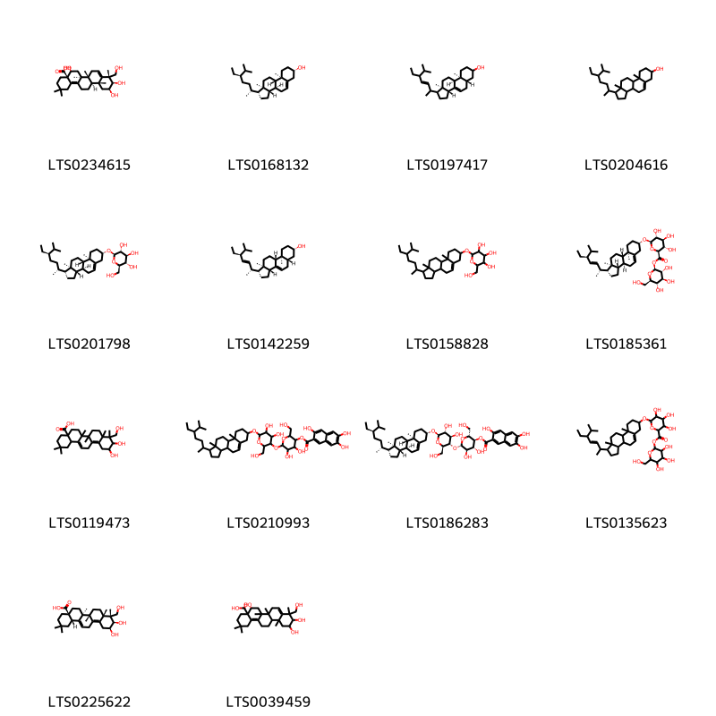{ width=100% }
    <figcaption>Hình ảnh cấu trúc hóa học của 14 hoạt chất thuộc nhóm Steroids and steroid derivatives gồm ['(4ar,5r,6as,6br,9r,10r,11s,12ar,12bs)-5,10,11-trihydroxy-9-(hydroxymethyl)-2,2,6a,6b,9,12a-hexamethyl-1,3,4,5,6,7,10,11,12,12b,13,14-dodecahydropicene-4a-carboxylic acid (LTS0234615)', 'sitosterol (LTS0168132)', '(3ar,5as,9as,9bs,11ar)-1-(5-ethyl-6-methylhept-3-en-2-yl)-9a,11a-dimethyl-1h,2h,3h,3ah,5h,5ah,6h,7h,8h,9h,9bh,10h,11h-cyclopenta[a]phenanthren-7-ol (LTS0197417)', 'stigmast-5-en-3-ol, (3β)- (LTS0204616)', 'sitogluside (LTS0201798)', 'chondrillasterol (LTS0142259)', '2-{[1-(5-ethyl-6-methylheptan-2-yl)-9a,11a-dimethyl-1h,2h,3h,3ah,3bh,4h,6h,7h,8h,9h,9bh,10h,11h-cyclopenta[a]phenanthren-7-yl]oxy}-6-(hydroxymethyl)oxane-3,4,5-triol (LTS0158828)', '(2s,3r,4s,5s,6r)-3,4,5-trihydroxy-6-(hydroxymethyl)oxan-2-yl (2s,3s,4s,5r,6r)-6-{[(1r,3as,3bs,7s,9ar,9bs,11ar)-1-[(2r,3e,5s)-5-ethyl-6-methylhept-3-en-2-yl]-9a,11a-dimethyl-1h,2h,3h,3ah,3bh,4h,6h,7h,8h,9h,9bh,10h,11h-cyclopenta[a]phenanthren-7-yl]oxy}-3,4,5-trihydroxyoxane-2-carboxylate (LTS0185361)', '10,11-dihydroxy-9-(hydroxymethyl)-2,2,6a,6b,8a,9-hexamethyl-1,3,4,5,6,7,8,10,11,12,13,14b-dodecahydropicene-4a-carboxylic acid (LTS0119473)', '6-[(6-{[1-(5-ethyl-6-methylheptan-2-yl)-9a,11a-dimethyl-1h,2h,3h,3ah,3bh,4h,6h,7h,8h,9h,9bh,10h,11h-cyclopenta[a]phenanthren-7-yl]oxy}-4,5-dihydroxy-2-(hydroxymethyl)oxan-3-yl)oxy]-4,5-dihydroxy-2-(hydroxymethyl)oxan-3-yl 3,6,7-trihydroxynaphthalene-2-carboxylate (LTS0210993)', '(2r,3s,4r,5r,6s)-6-{[(2r,3s,4r,5r,6r)-6-{[(1r,3as,3bs,7s,9ar,9bs,11ar)-1-[(2r,5r)-5-ethyl-6-methylheptan-2-yl]-9a,11a-dimethyl-1h,2h,3h,3ah,3bh,4h,6h,7h,8h,9h,9bh,10h,11h-cyclopenta[a]phenanthren-7-yl]oxy}-4,5-dihydroxy-2-(hydroxymethyl)oxan-3-yl]oxy}-4,5-dihydroxy-2-(hydroxymethyl)oxan-3-yl 3,6,7-trihydroxynaphthalene-2-carboxylate (LTS0186283)', '3,4,5-trihydroxy-6-(hydroxymethyl)oxan-2-yl 6-{[1-(5-ethyl-6-methylhept-3-en-2-yl)-9a,11a-dimethyl-1h,2h,3h,3ah,3bh,4h,6h,7h,8h,9h,9bh,10h,11h-cyclopenta[a]phenanthren-7-yl]oxy}-3,4,5-trihydroxyoxane-2-carboxylate (LTS0135623)', '(4as,6ar,6br,8as,9r,10r,11s,14bs)-10,11-dihydroxy-9-(hydroxymethyl)-2,2,6a,6b,8a,9-hexamethyl-1,3,4,5,6,7,8,10,11,12,13,14b-dodecahydropicene-4a-carboxylic acid (LTS0225622)', '5,10,11-trihydroxy-9-(hydroxymethyl)-2,2,6a,6b,9,12a-hexamethyl-1,3,4,5,6,7,10,11,12,12b,13,14-dodecahydropicene-4a-carboxylic acid (LTS0039459)'].</figcaption>
</figure>
#### Nhóm Tannins
<figure markdown="span">
    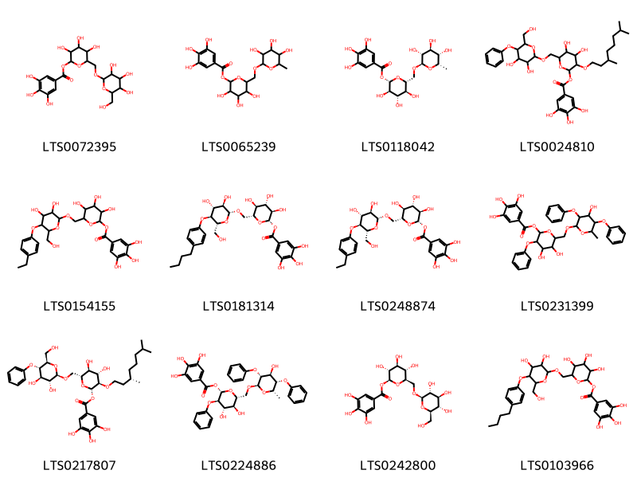{ width=100% }
    <figcaption>Hình ảnh cấu trúc hóa học của 12 hoạt chất thuộc nhóm Tannins gồm ['3,4,5-trihydroxy-6-({[3,4,5-trihydroxy-6-(hydroxymethyl)oxan-2-yl]oxy}methyl)oxan-2-yl 3,4,5-trihydroxybenzoate (LTS0072395)', '3,4,5-trihydroxy-6-{[(3,4,5-trihydroxy-6-methyloxan-2-yl)oxy]methyl}oxan-2-yl 3,4,5-trihydroxybenzoate (LTS0065239)', '(2s,3r,4s,5s,6r)-3,4,5-trihydroxy-6-({[(2r,3r,4s,5s,6s)-3,4,5-trihydroxy-6-methyloxan-2-yl]oxy}methyl)oxan-2-yl 3,4,5-trihydroxybenzoate (LTS0118042)', '6-({[3,4-dihydroxy-6-(hydroxymethyl)-5-phenoxyoxan-2-yl]oxy}methyl)-3-[(3,7-dimethyloctyl)oxy]-4,5-dihydroxyoxan-2-yl 3,4,5-trihydroxybenzoate (LTS0024810)', '6-({[5-(4-ethylphenoxy)-3,4-dihydroxy-6-(hydroxymethyl)oxan-2-yl]oxy}methyl)-3,4,5-trihydroxyoxan-2-yl 3,4,5-trihydroxybenzoate (LTS0154155)', '(2s,3r,4s,5s,6r)-6-({[(2r,3r,4r,5s,6r)-5-(4-butylphenoxy)-3,4-dihydroxy-6-(hydroxymethyl)oxan-2-yl]oxy}methyl)-3,4,5-trihydroxyoxan-2-yl 3,4,5-trihydroxybenzoate (LTS0181314)', '(2s,3r,4s,5s,6r)-6-({[(2r,3r,4r,5s,6r)-5-(4-ethylphenoxy)-3,4-dihydroxy-6-(hydroxymethyl)oxan-2-yl]oxy}methyl)-3,4,5-trihydroxyoxan-2-yl 3,4,5-trihydroxybenzoate (LTS0248874)', '4,5-dihydroxy-6-{[(4-hydroxy-6-methyl-3,5-diphenoxyoxan-2-yl)oxy]methyl}-3-phenoxyoxan-2-yl 3,4,5-trihydroxybenzoate (LTS0231399)', '(2s,3r,4s,5s,6r)-6-({[(2r,3r,4r,5s,6r)-3,4-dihydroxy-6-(hydroxymethyl)-5-phenoxyoxan-2-yl]oxy}methyl)-3-{[(3s)-3,7-dimethyloctyl]oxy}-4,5-dihydroxyoxan-2-yl 3,4,5-trihydroxybenzoate (LTS0217807)', '(2s,3r,4s,5s,6r)-4,5-dihydroxy-6-({[(2r,3r,4s,5s,6s)-4-hydroxy-6-methyl-3,5-diphenoxyoxan-2-yl]oxy}methyl)-3-phenoxyoxan-2-yl 3,4,5-trihydroxybenzoate (LTS0224886)', '(2s,3r,4s,5s,6r)-3,4,5-trihydroxy-6-({[(2r,3r,4s,5s,6r)-3,4,5-trihydroxy-6-(hydroxymethyl)oxan-2-yl]oxy}methyl)oxan-2-yl 3,4,5-trihydroxybenzoate (LTS0242800)', '6-({[5-(4-butylphenoxy)-3,4-dihydroxy-6-(hydroxymethyl)oxan-2-yl]oxy}methyl)-3,4,5-trihydroxyoxan-2-yl 3,4,5-trihydroxybenzoate (LTS0103966)'].</figcaption>
</figure>

---

### Dược dân tộc học

Danh sách các quốc gia có sử dụng *Mimusops elengi* trong điều trị các bệnh. 

| Country      | Disease                                            | Bệnh                                                                                                                                                                                                |
|:-------------|:---------------------------------------------------|:----------------------------------------------------------------------------------------------------------------------------------------------------------------------------------------------------|
| Brazil       | Astringent                                         | MYMEMORY WARNING: YOU USED ALL AVAILABLE FREE TRANSLATIONS FOR TODAY. NEXT AVAILABLE IN  10 HOURS 48 MINUTES 03 SECONDS VISIT HTTPS://MYMEMORY.TRANSLATED.NET/DOC/USAGELIMITS.PHP TO TRANSLATE MORE |
| Elsewhere    | Astringent, Laxative, Stimulant, Tonic, Dentifrice | MYMEMORY WARNING: YOU USED ALL AVAILABLE FREE TRANSLATIONS FOR TODAY. NEXT AVAILABLE IN  10 HOURS 48 MINUTES 01 SECONDS VISIT HTTPS://MYMEMORY.TRANSLATED.NET/DOC/USAGELIMITS.PHP TO TRANSLATE MORE |
| English      | Purgative                                          | MYMEMORY WARNING: YOU USED ALL AVAILABLE FREE TRANSLATIONS FOR TODAY. NEXT AVAILABLE IN  10 HOURS 47 MINUTES 58 SECONDS VISIT HTTPS://MYMEMORY.TRANSLATED.NET/DOC/USAGELIMITS.PHP TO TRANSLATE MORE |
| French       | Tonic                                              | MYMEMORY WARNING: YOU USED ALL AVAILABLE FREE TRANSLATIONS FOR TODAY. NEXT AVAILABLE IN  10 HOURS 47 MINUTES 55 SECONDS VISIT HTTPS://MYMEMORY.TRANSLATED.NET/DOC/USAGELIMITS.PHP TO TRANSLATE MORE |
| New Hebrides | Poison                                             | MYMEMORY WARNING: YOU USED ALL AVAILABLE FREE TRANSLATIONS FOR TODAY. NEXT AVAILABLE IN  10 HOURS 47 MINUTES 52 SECONDS VISIT HTTPS://MYMEMORY.TRANSLATED.NET/DOC/USAGELIMITS.PHP TO TRANSLATE MORE |
| Thailand     | Cosmetic, Cosmetic                                 | MYMEMORY WARNING: YOU USED ALL AVAILABLE FREE TRANSLATIONS FOR TODAY. NEXT AVAILABLE IN  10 HOURS 47 MINUTES 49 SECONDS VISIT HTTPS://MYMEMORY.TRANSLATED.NET/DOC/USAGELIMITS.PHP TO TRANSLATE MORE |

---

# Chi Butyroermum

??? note "Danh sách các dược liệu thuộc chi"
    
	 - *Butyroermum parkii*

---
## Butyroermum parkii
### Thông tin về thực vật

!!! info "Phân loại thực vật của *N/A* từ GIBF:"
    - **Kingdom:** N/A
    - **Phylum:** N/A
    - **Order:** N/A
    - **Family:** N/A
    - **Genus:** N/A
    - **Species:** *N/A*

 

| Label (VI)   | Label (EN)   | Scientific Name   | Descriptions (VI)   | Descriptions (EN)   | Also Known As (VI)   | Also Known As (EN)                          |
|:-------------|:-------------|:------------------|:--------------------|:--------------------|:---------------------|:--------------------------------------------|
| N/A          | N/A          | Mimusops elengi   | loài thực vật       | species of plant    | ['Mimusops elengi']  | ['medlar', 'Bullet wood', 'Spanish cherry'] |

#### Phân bố trên thế giới

**Từ CSDL GIBF** Không có kết quả phù hợp

#### Phân bố tại Việt Nam

**Từ CSDL GIBF**: Không có ghi nhận ở Việt Nam

---
### Thành phần hóa học
        
- Theo cơ sở dữ liệu lotus: Từ loài *N/A* đã phân lập và xác định được Chưa có hoạt chất nào được phân lập. hoạt chất thuộc về các nhóm Không có hoạt chất nào được phân lập. 

Không có hình ảnh nào được tạo ra

---

### Dược dân tộc học

Danh sách các quốc gia có sử dụng *N/A* trong điều trị các bệnh. 

| Country   | Disease   | Bệnh                                                                                                                                                                                                |
|:----------|:----------|:----------------------------------------------------------------------------------------------------------------------------------------------------------------------------------------------------|
| Sudan     | Soap      | MYMEMORY WARNING: YOU USED ALL AVAILABLE FREE TRANSLATIONS FOR TODAY. NEXT AVAILABLE IN  10 HOURS 47 MINUTES 13 SECONDS VISIT HTTPS://MYMEMORY.TRANSLATED.NET/DOC/USAGELIMITS.PHP TO TRANSLATE MORE |

---

# Chi Sideroxylon

??? note "Danh sách các dược liệu thuộc chi"
    
	 - *Sideroxylon angustifolium*
	 - *Sideroxylon dulcificum*
	 - *Sideroxylon inerme*
	 - *Sideroxylon obovatum*
	 - *Sideroxylon triflorum*

---
## Sideroxylon angustifolium
### Thông tin về thực vật

!!! info "Phân loại thực vật của *N/A* từ GIBF:"
    - **Kingdom:** Plantae
    - **Phylum:** Tracheophyta
    - **Order:** Ericales
    - **Family:** Sapotaceae
    - **Genus:** N/A
    - **Species:** *N/A*

 

| Label (VI)   | Label (EN)   | Scientific Name   | Descriptions (VI)   | Descriptions (EN)   | Also Known As (VI)   | Also Known As (EN)                          |
|:-------------|:-------------|:------------------|:--------------------|:--------------------|:---------------------|:--------------------------------------------|
| N/A          | N/A          | Mimusops elengi   | loài thực vật       | species of plant    | ['Mimusops elengi']  | ['medlar', 'Bullet wood', 'Spanish cherry'] |

#### Phân bố trên thế giới

**Từ CSDL GIBF** nan, Cayman Islands, Viet Nam, Thailand, Trinidad and Tobago, French Guiana, Kenya, Chile, Singapore, Australia, Jamaica, Haiti, Colombia, Sri Lanka, Dominican Republic, Maldives, Puerto Rico, Malaysia, India, Seychelles, Bahamas, Cuba, Bonaire, Sint Eustatius and Saba, Cambodia, Belize, Panama, Brazil, Palau, Mexico, Benin, Chinese Taipei, Uruguay, Argentina, South Africa, Morocco, Mozambique, New Zealand, New Caledonia, United States of America

#### Phân bố tại Việt Nam

**Từ CSDL GIBF**: Hải Phòng

---
### Thành phần hóa học
        
- Theo cơ sở dữ liệu lotus: Từ loài *N/A* đã phân lập và xác định được Chưa có hoạt chất nào được phân lập. hoạt chất thuộc về các nhóm Không có hoạt chất nào được phân lập. 

Không có hình ảnh nào được tạo ra

---

### Dược dân tộc học

Danh sách các quốc gia có sử dụng *N/A* trong điều trị các bệnh. 

| Country   | Disease   | Bệnh                                                                                                                                                                                                |
|:----------|:----------|:----------------------------------------------------------------------------------------------------------------------------------------------------------------------------------------------------|
| Mexico    | Rennet    | MYMEMORY WARNING: YOU USED ALL AVAILABLE FREE TRANSLATIONS FOR TODAY. NEXT AVAILABLE IN  10 HOURS 46 MINUTES 57 SECONDS VISIT HTTPS://MYMEMORY.TRANSLATED.NET/DOC/USAGELIMITS.PHP TO TRANSLATE MORE |

---

---
## Sideroxylon dulcificum
### Thông tin về thực vật

!!! info "Phân loại thực vật của *Synsepalum dulcificum* từ GIBF:"
    - **Kingdom:** Plantae
    - **Phylum:** Tracheophyta
    - **Order:** Ericales
    - **Family:** Sapotaceae
    - **Genus:** Synsepalum
    - **Species:** *Synsepalum dulcificum*

 

| Label (VI)   | Label (EN)   | Scientific Name        | Descriptions (VI)   | Descriptions (EN)   | Also Known As (VI)   | Also Known As (EN)   |
|:-------------|:-------------|:-----------------------|:--------------------|:--------------------|:---------------------|:---------------------|
| N/A          | N/A          | Sideroxylon dulcificum |                     | species of plant    | ['']                 | ['']                 |

#### Phân bố trên thế giới

**Từ CSDL GIBF** Ghana, Costa Rica

#### Phân bố tại Việt Nam

**Từ CSDL GIBF**: Không có ghi nhận ở Việt Nam

---
### Thành phần hóa học
        
- Theo cơ sở dữ liệu lotus: Từ loài *Synsepalum dulcificum* đã phân lập và xác định được Chưa có hoạt chất nào được phân lập. hoạt chất thuộc về các nhóm Không có hoạt chất nào được phân lập. 

Không có hình ảnh nào được tạo ra

---

### Dược dân tộc học

Danh sách các quốc gia có sử dụng *Synsepalum dulcificum* trong điều trị các bệnh. 

| Country   | Disease   | Bệnh                                                                                                                                                                                                |
|:----------|:----------|:----------------------------------------------------------------------------------------------------------------------------------------------------------------------------------------------------|
| Africa    | Sweetener | MYMEMORY WARNING: YOU USED ALL AVAILABLE FREE TRANSLATIONS FOR TODAY. NEXT AVAILABLE IN  10 HOURS 46 MINUTES 28 SECONDS VISIT HTTPS://MYMEMORY.TRANSLATED.NET/DOC/USAGELIMITS.PHP TO TRANSLATE MORE |

---

---
## Sideroxylon inerme
### Thông tin về thực vật

!!! info "Phân loại thực vật của *Sideroxylon inerme* từ GIBF:"
    - **Kingdom:** Plantae
    - **Phylum:** Tracheophyta
    - **Order:** Ericales
    - **Family:** Sapotaceae
    - **Genus:** Sideroxylon
    - **Species:** *Sideroxylon inerme*

 

| Label (VI)   | Label (EN)   | Scientific Name    | Descriptions (VI)   | Descriptions (EN)   | Also Known As (VI)   | Also Known As (EN)   |
|:-------------|:-------------|:-------------------|:--------------------|:--------------------|:---------------------|:---------------------|
| N/A          | N/A          | Sideroxylon inerme | loài thực vật       | species of plant    | ['']                 | ['white milkwood']   |

#### Phân bố trên thế giới

**Từ CSDL GIBF** Eswatini, South Africa

#### Phân bố tại Việt Nam

**Từ CSDL GIBF**: Không có ghi nhận ở Việt Nam

---
### Thành phần hóa học
        
- Theo cơ sở dữ liệu lotus: Từ loài *Sideroxylon inerme* đã phân lập và xác định được 2 hoạt chất thuộc về các nhóm Flavonoids. 

|    | chemicalTaxonomyClassyfireClass   |   smiles_count |
|---:|:----------------------------------|---------------:|
|  0 | Flavonoids                        |              2 |

#### Nhóm Flavonoids
<figure markdown="span">
    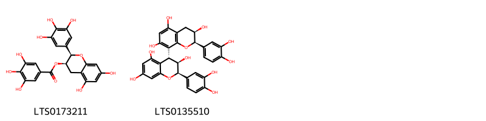{ width=100% }
    <figcaption>Hình ảnh cấu trúc hóa học của 2 hoạt chất thuộc nhóm Flavonoids gồm ['(-)-epigallocatechin gallate (LTS0173211)', '(2r,3r,4r)-2-(3,4-dihydroxyphenyl)-4-[(2r,3r)-2-(3,4-dihydroxyphenyl)-3,5,7-trihydroxy-3,4-dihydro-2h-1-benzopyran-8-yl]-3,4-dihydro-2h-1-benzopyran-3,5,7-triol (LTS0135510)'].</figcaption>
</figure>

---

### Dược dân tộc học

Danh sách các quốc gia có sử dụng *Sideroxylon inerme* trong điều trị các bệnh. 

| Country   | Disease    | Bệnh                                                                                                                                                                                                |
|:----------|:-----------|:----------------------------------------------------------------------------------------------------------------------------------------------------------------------------------------------------|
| Elsewhere | Astringent | MYMEMORY WARNING: YOU USED ALL AVAILABLE FREE TRANSLATIONS FOR TODAY. NEXT AVAILABLE IN  10 HOURS 46 MINUTES 06 SECONDS VISIT HTTPS://MYMEMORY.TRANSLATED.NET/DOC/USAGELIMITS.PHP TO TRANSLATE MORE |

---

---
## Sideroxylon obovatum
### Thông tin về thực vật

!!! info "Phân loại thực vật của *Sideroxylon obovatum* từ GIBF:"
    - **Kingdom:** Plantae
    - **Phylum:** Tracheophyta
    - **Order:** Ericales
    - **Family:** Sapotaceae
    - **Genus:** Sideroxylon
    - **Species:** *Sideroxylon obovatum*

 

| Label (VI)   | Label (EN)   | Scientific Name      | Descriptions (VI)   | Descriptions (EN)   | Also Known As (VI)   | Also Known As (EN)   |
|:-------------|:-------------|:---------------------|:--------------------|:--------------------|:---------------------|:---------------------|
| N/A          | N/A          | Sideroxylon obovatum | loài thực vật       | species of plant    | ['']                 | ['']                 |

#### Phân bố trên thế giới

**Từ CSDL GIBF** nan, unknown or invalid, Guadeloupe, Martinique, Jamaica, Haiti, Venezuela (Bolivarian Republic of), Dominican Republic, Puerto Rico, Cuba, Saint Kitts and Nevis, Anguilla, Bonaire, Sint Eustatius and Saba, Sint Maarten (Dutch part), Virgin Islands (U.S.), Virgin Islands (British), Aruba, Mexico, Curaçao, Saint Martin (French part), Saint Barthélemy

#### Phân bố tại Việt Nam

**Từ CSDL GIBF**: Không có ghi nhận ở Việt Nam

---
### Thành phần hóa học
        
- Theo cơ sở dữ liệu lotus: Từ loài *Sideroxylon obovatum* đã phân lập và xác định được Chưa có hoạt chất nào được phân lập. hoạt chất thuộc về các nhóm Không có hoạt chất nào được phân lập. 

Không có hình ảnh nào được tạo ra

---

### Dược dân tộc học

Danh sách các quốc gia có sử dụng *Sideroxylon obovatum* trong điều trị các bệnh. 

| Country   | Disease   | Bệnh                                                                                                                                                                                                |
|:----------|:----------|:----------------------------------------------------------------------------------------------------------------------------------------------------------------------------------------------------|
| anish     | Tonic     | MYMEMORY WARNING: YOU USED ALL AVAILABLE FREE TRANSLATIONS FOR TODAY. NEXT AVAILABLE IN  10 HOURS 45 MINUTES 31 SECONDS VISIT HTTPS://MYMEMORY.TRANSLATED.NET/DOC/USAGELIMITS.PHP TO TRANSLATE MORE |

---

---
## Sideroxylon triflorum
### Thông tin về thực vật

!!! info "Phân loại thực vật của *N/A* từ GIBF:"
    - **Kingdom:** Plantae
    - **Phylum:** Tracheophyta
    - **Order:** Ericales
    - **Family:** Sapotaceae
    - **Genus:** Sideroxylon
    - **Species:** *N/A*

 

| Label (VI)   | Label (EN)   | Scientific Name      | Descriptions (VI)   | Descriptions (EN)   | Also Known As (VI)   | Also Known As (EN)   |
|:-------------|:-------------|:---------------------|:--------------------|:--------------------|:---------------------|:---------------------|
| N/A          | N/A          | Sideroxylon obovatum | loài thực vật       | species of plant    | ['']                 | ['']                 |

#### Phân bố trên thế giới

**Từ CSDL GIBF** Haiti, Argentina, South Africa, Morocco, Brazil, Spain, Puerto Rico, United States of America, Mexico, Bahamas

#### Phân bố tại Việt Nam

**Từ CSDL GIBF**: Không có ghi nhận ở Việt Nam

---
### Thành phần hóa học
        
- Theo cơ sở dữ liệu lotus: Từ loài *N/A* đã phân lập và xác định được Chưa có hoạt chất nào được phân lập. hoạt chất thuộc về các nhóm Không có hoạt chất nào được phân lập. 

Không có hình ảnh nào được tạo ra

---

### Dược dân tộc học

Danh sách các quốc gia có sử dụng *N/A* trong điều trị các bệnh. 

| Country   | Disease          | Bệnh                                                                                                                                                                                                |
|:----------|:-----------------|:----------------------------------------------------------------------------------------------------------------------------------------------------------------------------------------------------|
| Haiti     | Stomachic, Tonic | MYMEMORY WARNING: YOU USED ALL AVAILABLE FREE TRANSLATIONS FOR TODAY. NEXT AVAILABLE IN  10 HOURS 45 MINUTES 07 SECONDS VISIT HTTPS://MYMEMORY.TRANSLATED.NET/DOC/USAGELIMITS.PHP TO TRANSLATE MORE |

---

# Chi Chrysophyllum

??? note "Danh sách các dược liệu thuộc chi"
    
	 - *Chrysophyllum cainito*
	 - *Chrysophyllum glycyphloeum*

---
## Chrysophyllum cainito
### Thông tin về thực vật

!!! info "Phân loại thực vật của *Chrysophyllum cainito* từ GIBF:"
    - **Kingdom:** Plantae
    - **Phylum:** Tracheophyta
    - **Order:** Ericales
    - **Family:** Sapotaceae
    - **Genus:** Chrysophyllum
    - **Species:** *Chrysophyllum cainito*

 

| Label (VI)   | Label (EN)   | Scientific Name       | Descriptions (VI)   | Descriptions (EN)   | Also Known As (VI)                          | Also Known As (EN)                                          |
|:-------------|:-------------|:----------------------|:--------------------|:--------------------|:--------------------------------------------|:------------------------------------------------------------|
| N/A          | N/A          | Chrysophyllum cainito | loài thực vật       | species of plant    | ['Chrysophyllum cainito', 'Achras caimito'] | ['Caimito', 'Star Apple', 'Aguay', 'Cainito', 'Milk Fruit'] |

#### Phân bố trên thế giới

**Từ CSDL GIBF** Honduras, Cayman Islands, Viet Nam, Thailand, El Salvador, Philippines, Dominica, French Polynesia, Guadeloupe, French Guiana, Trinidad and Tobago, Germany, Martinique, Australia, Jamaica, Indonesia, Colombia, Dominican Republic, Puerto Rico, Mauritius, India, Malaysia, Cambodia, Belize, Nicaragua, Panama, Brazil, Saint Lucia, Mexico, China, South Africa, Tanzania, United Republic of, Cook Islands, Costa Rica, Ecuador

#### Phân bố tại Việt Nam

**Từ CSDL GIBF**: Đồng Tháp, Hậu Giang

---
### Thành phần hóa học
        
- Theo cơ sở dữ liệu lotus: Từ loài *Chrysophyllum cainito* đã phân lập và xác định được 14 hoạt chất thuộc về các nhóm Flavonoids, Benzene and substituted derivatives. 

|    | chemicalTaxonomyClassyfireClass     |   smiles_count |
|---:|:------------------------------------|---------------:|
|  0 | Benzene and substituted derivatives |              1 |
|  1 | Flavonoids                          |             13 |

#### Nhóm Benzene and substituted derivatives
<figure markdown="span">
    { width=100% }
    <figcaption>Hình ảnh cấu trúc hóa học của 1 hoạt chất thuộc nhóm Benzene and substituted derivatives gồm ['galop (LTS0222857)'].</figcaption>
</figure>
#### Nhóm Flavonoids
<figure markdown="span">
    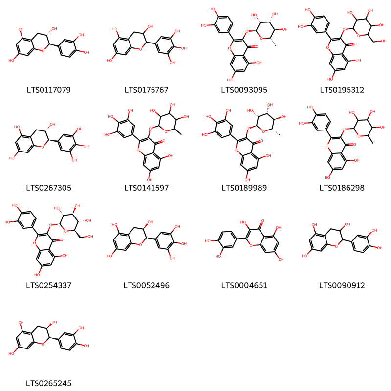{ width=100% }
    <figcaption>Hình ảnh cấu trúc hóa học của 13 hoạt chất thuộc nhóm Flavonoids gồm ['(+)-catechol (LTS0117079)', 'epigallocatechin (LTS0175767)', 'quercitrin (LTS0093095)', '2-(3,4-dihydroxyphenyl)-5,7-dihydroxy-3-{[3,4,5-trihydroxy-6-(hydroxymethyl)oxan-2-yl]oxy}chromen-4-one (LTS0195312)', 'gallocatechol (LTS0267305)', 'myricitrin (LTS0141597)', 'myricitrin (LTS0189989)', 'quercitrin (LTS0186298)', 'isoquercetin (LTS0254337)', 'epigallocatechin (LTS0052496)', 'quercetin (LTS0004651)', 'catechol (LTS0090912)', 'ent-epicatechin (LTS0265245)'].</figcaption>
</figure>

---

### Dược dân tộc học

Danh sách các quốc gia có sử dụng *Chrysophyllum cainito* trong điều trị các bệnh. 

| Country            | Disease                        | Bệnh                                                                                                                                                                                                |
|:-------------------|:-------------------------------|:----------------------------------------------------------------------------------------------------------------------------------------------------------------------------------------------------|
| Dominican Republic | Astringent                     | MYMEMORY WARNING: YOU USED ALL AVAILABLE FREE TRANSLATIONS FOR TODAY. NEXT AVAILABLE IN  10 HOURS 44 MINUTES 39 SECONDS VISIT HTTPS://MYMEMORY.TRANSLATED.NET/DOC/USAGELIMITS.PHP TO TRANSLATE MORE |
| Haiti              | Laxative                       | MYMEMORY WARNING: YOU USED ALL AVAILABLE FREE TRANSLATIONS FOR TODAY. NEXT AVAILABLE IN  10 HOURS 44 MINUTES 35 SECONDS VISIT HTTPS://MYMEMORY.TRANSLATED.NET/DOC/USAGELIMITS.PHP TO TRANSLATE MORE |
| Venezuela          | Astringent, Refrigerant, Tonic | MYMEMORY WARNING: YOU USED ALL AVAILABLE FREE TRANSLATIONS FOR TODAY. NEXT AVAILABLE IN  10 HOURS 44 MINUTES 28 SECONDS VISIT HTTPS://MYMEMORY.TRANSLATED.NET/DOC/USAGELIMITS.PHP TO TRANSLATE MORE |

---

---
## Chrysophyllum glycyphloeum
### Thông tin về thực vật

!!! info "Phân loại thực vật của *Pradosia lactescens* từ GIBF:"
    - **Kingdom:** Plantae
    - **Phylum:** Tracheophyta
    - **Order:** Ericales
    - **Family:** Sapotaceae
    - **Genus:** Pradosia
    - **Species:** *Pradosia lactescens*

 

| Label (VI)   | Label (EN)   | Scientific Name       | Descriptions (VI)   | Descriptions (EN)   | Also Known As (VI)                          | Also Known As (EN)                                          |
|:-------------|:-------------|:----------------------|:--------------------|:--------------------|:--------------------------------------------|:------------------------------------------------------------|
| N/A          | N/A          | Chrysophyllum cainito | loài thực vật       | species of plant    | ['Chrysophyllum cainito', 'Achras caimito'] | ['Caimito', 'Star Apple', 'Aguay', 'Cainito', 'Milk Fruit'] |

#### Phân bố trên thế giới

**Từ CSDL GIBF** Brazil

#### Phân bố tại Việt Nam

**Từ CSDL GIBF**: Không có ghi nhận ở Việt Nam

---
### Thành phần hóa học
        
- Theo cơ sở dữ liệu lotus: Từ loài *Pradosia lactescens* đã phân lập và xác định được Chưa có hoạt chất nào được phân lập. hoạt chất thuộc về các nhóm Không có hoạt chất nào được phân lập. 

Không có hình ảnh nào được tạo ra

---

### Dược dân tộc học

Danh sách các quốc gia có sử dụng *Pradosia lactescens* trong điều trị các bệnh. 

| Country   | Disease                 | Bệnh                                                                                                                                                                                                |
|:----------|:------------------------|:----------------------------------------------------------------------------------------------------------------------------------------------------------------------------------------------------|
| Elsewhere | Astringent, Expectorant | MYMEMORY WARNING: YOU USED ALL AVAILABLE FREE TRANSLATIONS FOR TODAY. NEXT AVAILABLE IN  10 HOURS 43 MINUTES 59 SECONDS VISIT HTTPS://MYMEMORY.TRANSLATED.NET/DOC/USAGELIMITS.PHP TO TRANSLATE MORE |

---

# Chi Palaquium

??? note "Danh sách các dược liệu thuộc chi"
    
	 - *Palaquium ellipticum*

---
## Palaquium ellipticum
### Thông tin về thực vật

!!! info "Phân loại thực vật của *Palaquium ellipticum* từ GIBF:"
    - **Kingdom:** Plantae
    - **Phylum:** Tracheophyta
    - **Order:** Ericales
    - **Family:** Sapotaceae
    - **Genus:** Palaquium
    - **Species:** *Palaquium ellipticum*

 

| Label (VI)   | Label (EN)   | Scientific Name      | Descriptions (VI)   | Descriptions (EN)   | Also Known As (VI)   | Also Known As (EN)   |
|:-------------|:-------------|:---------------------|:--------------------|:--------------------|:---------------------|:---------------------|
| N/A          | N/A          | Palaquium ellipticum | loài thực vật       | species of plant    | ['']                 | ['']                 |

#### Phân bố trên thế giới

**Từ CSDL GIBF** nan, India

#### Phân bố tại Việt Nam

**Từ CSDL GIBF**: Không có ghi nhận ở Việt Nam

---
### Thành phần hóa học
        
- Theo cơ sở dữ liệu lotus: Từ loài *Palaquium ellipticum* đã phân lập và xác định được Chưa có hoạt chất nào được phân lập. hoạt chất thuộc về các nhóm Không có hoạt chất nào được phân lập. 

Không có hình ảnh nào được tạo ra

---

### Dược dân tộc học

Danh sách các quốc gia có sử dụng *Palaquium ellipticum* trong điều trị các bệnh. 

| Country   | Disease   | Bệnh                                                                                                                                                                                                |
|:----------|:----------|:----------------------------------------------------------------------------------------------------------------------------------------------------------------------------------------------------|
| Elsewhere | Soap      | MYMEMORY WARNING: YOU USED ALL AVAILABLE FREE TRANSLATIONS FOR TODAY. NEXT AVAILABLE IN  10 HOURS 43 MINUTES 39 SECONDS VISIT HTTPS://MYMEMORY.TRANSLATED.NET/DOC/USAGELIMITS.PHP TO TRANSLATE MORE |

---

# Chi Diploknema

??? note "Danh sách các dược liệu thuộc chi"
    
	 - *Diploknema butyracea*

---
## Diploknema butyracea
### Thông tin về thực vật

!!! info "Phân loại thực vật của *Diploknema butyracea* từ GIBF:"
    - **Kingdom:** Plantae
    - **Phylum:** Tracheophyta
    - **Order:** Ericales
    - **Family:** Sapotaceae
    - **Genus:** Diploknema
    - **Species:** *Diploknema butyracea*

 

| Label (VI)   | Label (EN)   | Scientific Name      | Descriptions (VI)   | Descriptions (EN)   | Also Known As (VI)   | Also Known As (EN)   |
|:-------------|:-------------|:---------------------|:--------------------|:--------------------|:---------------------|:---------------------|
| N/A          | N/A          | Diploknema butyracea | loài thực vật       | species of plant    | ['']                 | ['']                 |

#### Phân bố trên thế giới

**Từ CSDL GIBF** nan, unknown or invalid, Bhutan, India, Gabon, Nepal, Indonesia

#### Phân bố tại Việt Nam

**Từ CSDL GIBF**: Không có ghi nhận ở Việt Nam

---
### Thành phần hóa học
        
- Theo cơ sở dữ liệu lotus: Từ loài *Diploknema butyracea* đã phân lập và xác định được 41 hoạt chất thuộc về các nhóm Flavonoids, Saturated hydrocarbons, Prenol lipids, Fatty Acyls, Steroids and steroid derivatives. 

|    | chemicalTaxonomyClassyfireClass   |   smiles_count |
|---:|:----------------------------------|---------------:|
|  0 | Fatty Acyls                       |              1 |
|  1 | Flavonoids                        |              4 |
|  2 | Prenol lipids                     |             30 |
|  3 | Saturated hydrocarbons            |              1 |
|  4 | Steroids and steroid derivatives  |              5 |

#### Nhóm Fatty Acyls
<figure markdown="span">
    { width=100% }
    <figcaption>Hình ảnh cấu trúc hóa học của 1 hoạt chất thuộc nhóm Fatty Acyls gồm ['ceryl alcohol (LTS0140051)'].</figcaption>
</figure>
#### Nhóm Flavonoids
<figure markdown="span">
    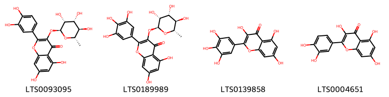{ width=100% }
    <figcaption>Hình ảnh cấu trúc hóa học của 4 hoạt chất thuộc nhóm Flavonoids gồm ['quercitrin (LTS0093095)', 'myricitrin (LTS0189989)', 'myricetin (LTS0139858)', 'quercetin (LTS0004651)'].</figcaption>
</figure>
#### Nhóm Prenol lipids
<figure markdown="span">
    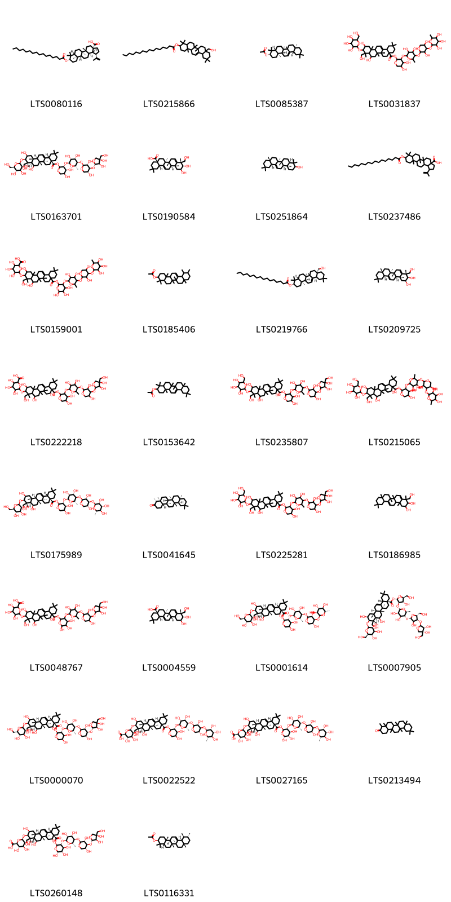{ width=100% }
    <figcaption>Hình ảnh cấu trúc hóa học của 30 hoạt chất thuộc nhóm Prenol lipids gồm ['(1r,3as,5ar,5br,7ar,9s,11ar,11br,13ar,13br)-9-(hexadecanoyloxy)-5a,5b,8,8,11a-pentamethyl-1-(prop-1-en-2-yl)-hexadecahydrocyclopenta[a]chrysene-3a-carboxylic acid (LTS0080116)', '8a-(hydroxymethyl)-4,4,6a,6b,11,11,14b-heptamethyl-1,2,3,4a,5,6,7,8,9,10,12,12a,14,14a-tetradecahydropicen-3-yl hexadecanoate (LTS0215866)', '(3s,4ar,6ar,6bs,8ar,12as,14ar,14br)-4,4,6a,6b,8a,11,11,14b-octamethyl-1,2,3,4a,5,6,7,8,9,10,12,12a,14,14a-tetradecahydropicen-3-yl acetate (LTS0085387)', '3-{[5-({3,5-dihydroxy-4-[(3,4,5-trihydroxy-6-methyloxan-2-yl)oxy]oxan-2-yl}oxy)-3,4-dihydroxy-6-methyloxan-2-yl]oxy}-4,5-dihydroxyoxan-2-yl 8,11-dihydroxy-9-(hydroxymethyl)-2,2,6a,6b,9,12a-hexamethyl-10-{[3,4,5-trihydroxy-6-(hydroxymethyl)oxan-2-yl]oxy}-1,3,4,5,6,7,8,8a,10,11,12,12b,13,14b-tetradecahydropicene-4a-carboxylate (LTS0031837)', '(2s,3r,4s,5s)-3-{[(2s,3r,4s,5r,6s)-5-{[(2s,3r,4s,5r)-4-{[(2s,3r,4r)-3,4-dihydroxy-4-(hydroxymethyl)oxolan-2-yl]oxy}-3,5-dihydroxyoxan-2-yl]oxy}-3,4-dihydroxy-6-methyloxan-2-yl]oxy}-4,5-dihydroxyoxan-2-yl (4as,6as,6br,8r,8ar,9r,10r,11s,12ar,12br,14bs)-8,11-dihydroxy-9-(hydroxymethyl)-2,2,6a,6b,9,12a-hexamethyl-10-{[(2r,3r,4s,5s,6r)-3,4,5-trihydroxy-6-(hydroxymethyl)oxan-2-yl]oxy}-1,3,4,5,6,7,8,8a,10,11,12,12b,13,14b-tetradecahydropicene-4a-carboxylate (LTS0163701)', '(4as,6as,6br,9r,10r,11s,12ar,12bs,14bs)-10,11-dihydroxy-9-(hydroxymethyl)-2,2,6a,6b,9,12a-hexamethyl-1,3,4,5,6,7,10,11,12,12b,13,14b-dodecahydropicene-4a-carboxylic acid (LTS0190584)', 'β-amyrin (LTS0251864)', '9-(hexadecanoyloxy)-5a,5b,8,8,11a-pentamethyl-1-(prop-1-en-2-yl)-hexadecahydrocyclopenta[a]chrysene-3a-carboxylic acid (LTS0237486)', '6-[(8a-{[(3-{[5-({3,5-dihydroxy-4-[(3,4,5-trihydroxy-6-methyloxan-2-yl)oxy]oxan-2-yl}oxy)-3,4-dihydroxy-6-methyloxan-2-yl]oxy}-4,5,6-trihydroxyoxan-2-yl)oxy]carbonyl}-2,5-dihydroxy-4-(hydroxymethyl)-4,6a,6b,11,11,14b-hexamethyl-1,2,3,4a,5,6,7,8,9,10,12,12a,14,14a-tetradecahydropicen-3-yl)oxy]-3,4,5-trihydroxyoxane-2-carboxylic acid (LTS0159001)', '4,4,6a,6b,8a,11,12,14b-octamethyl-2,3,4a,5,6,7,8,9,10,11,12,12a,14,14a-tetradecahydro-1h-picen-3-yl acetate (LTS0185406)', '(3s,4ar,6ar,6bs,8as,12as,14ar,14br)-8a-(hydroxymethyl)-4,4,6a,6b,11,11,14b-heptamethyl-1,2,3,4a,5,6,7,8,9,10,12,12a,14,14a-tetradecahydropicen-3-yl hexadecanoate (LTS0219766)', '(2s,3r,4r,6ar,6bs,8ar,12as,14as,14br)-4-(hydroxymethyl)-4,6a,6b,8a,11,11,14b-heptamethyl-1,2,3,6,7,8,9,10,12,12a,14,14a-dodecahydropicene-2,3-diol (LTS0209725)', '6-{[8a-({[3-({5-[(4-{[3,4-dihydroxy-4-(hydroxymethyl)oxolan-2-yl]oxy}-3,5-dihydroxyoxan-2-yl)oxy]-3,4-dihydroxy-6-methyloxan-2-yl}oxy)-4,5-dihydroxyoxan-2-yl]oxy}carbonyl)-2,5,8-trihydroxy-4-(hydroxymethyl)-4,6a,6b,11,11,14b-hexamethyl-1,2,3,4a,5,6,7,8,9,10,12,12a,14,14a-tetradecahydropicen-3-yl]oxy}-3,4,5-trihydroxyoxane-2-carboxylic acid (LTS0222218)', '4,4,6a,6b,8a,11,11,14b-octamethyl-1,2,3,4a,5,6,7,8,9,10,12,12a,14,14a-tetradecahydropicen-3-yl acetate (LTS0153642)', '3-({5-[(4-{[3,4-dihydroxy-4-(hydroxymethyl)oxolan-2-yl]oxy}-3,5-dihydroxyoxan-2-yl)oxy]-3,4-dihydroxy-6-methyloxan-2-yl}oxy)-4,5-dihydroxyoxan-2-yl 5,8,11-trihydroxy-9-(hydroxymethyl)-2,2,6a,6b,9,12a-hexamethyl-10-{[3,4,5-trihydroxy-6-(hydroxymethyl)oxan-2-yl]oxy}-1,3,4,5,6,7,8,8a,10,11,12,12b,13,14b-tetradecahydropicene-4a-carboxylate (LTS0235807)', '3-{[5-({3,5-dihydroxy-4-[(3,4,5-trihydroxy-6-methyloxan-2-yl)oxy]oxan-2-yl}oxy)-3,4-dihydroxy-6-methyloxan-2-yl]oxy}-4,5-dihydroxyoxan-2-yl 5,8,11-trihydroxy-9-(hydroxymethyl)-2,2,6a,6b,9,12a-hexamethyl-10-{[3,4,5-trihydroxy-6-(hydroxymethyl)oxan-2-yl]oxy}-1,3,4,5,6,7,8,8a,10,11,12,12b,13,14b-tetradecahydropicene-4a-carboxylate (LTS0215065)', '(2s,3r,4s,5s)-3-{[(2s,3r,4s,5r,6s)-5-{[(2s,3r,4s,5r)-3,5-dihydroxy-4-{[(2s,3r,4r,5r,6s)-3,4,5-trihydroxy-6-methyloxan-2-yl]oxy}oxan-2-yl]oxy}-3,4-dihydroxy-6-methyloxan-2-yl]oxy}-4,5-dihydroxyoxan-2-yl (4as,6as,6br,8r,8ar,9r,10r,11s,12ar,12br,14bs)-8,11-dihydroxy-9-(hydroxymethyl)-2,2,6a,6b,9,12a-hexamethyl-10-{[(2r,3r,4s,5s,6r)-3,4,5-trihydroxy-6-(hydroxymethyl)oxan-2-yl]oxy}-1,3,4,5,6,7,8,8a,10,11,12,12b,13,14b-tetradecahydropicene-4a-carboxylate (LTS0175989)', '(-)-friedelin (LTS0041645)', '3-({5-[(4-{[3,4-dihydroxy-4-(hydroxymethyl)oxolan-2-yl]oxy}-3,5-dihydroxyoxan-2-yl)oxy]-3,4-dihydroxy-6-methyloxan-2-yl}oxy)-4,5-dihydroxyoxan-2-yl 8,11-dihydroxy-9-(hydroxymethyl)-2,2,6a,6b,9,12a-hexamethyl-10-{[3,4,5-trihydroxy-6-(hydroxymethyl)oxan-2-yl]oxy}-1,3,4,5,6,7,8,8a,10,11,12,12b,13,14b-tetradecahydropicene-4a-carboxylate (LTS0225281)', '4-(hydroxymethyl)-4,6a,6b,8a,11,11,14b-heptamethyl-1,2,3,6,7,8,9,10,12,12a,14,14a-dodecahydropicene-2,3-diol (LTS0186985)', '6-{[8a-({[3-({5-[(4-{[3,4-dihydroxy-4-(hydroxymethyl)oxolan-2-yl]oxy}-3,5-dihydroxyoxan-2-yl)oxy]-3,4-dihydroxy-6-methyloxan-2-yl}oxy)-4,5,6-trihydroxyoxan-2-yl]oxy}carbonyl)-2,5,8-trihydroxy-4-(hydroxymethyl)-4,6a,6b,11,11,14b-hexamethyl-1,2,3,4a,5,6,7,8,9,10,12,12a,14,14a-tetradecahydropicen-3-yl]oxy}-3,4,5-trihydroxyoxane-2-carboxylic acid (LTS0048767)', '(4as,6as,6br,9r,10r,11s,12as,12br,14bs)-10,11-dihydroxy-9-(hydroxymethyl)-2,2,6a,6b,9,12a-hexamethyl-1,3,4,5,6,7,10,11,12,12b,13,14b-dodecahydropicene-4a-carboxylic acid (LTS0004559)', '(2s,3r,4s,5s)-3-{[(2s,3r,4s,5r,6s)-5-{[(2s,3r,4s,5r)-3,5-dihydroxy-4-{[(2s,3r,4r,5r,6s)-3,4,5-trihydroxy-6-methyloxan-2-yl]oxy}oxan-2-yl]oxy}-3,4-dihydroxy-6-methyloxan-2-yl]oxy}-4,5-dihydroxyoxan-2-yl (4ar,5r,6as,6br,8r,8ar,9r,10r,11s,12ar,12br,14bs)-5,8,11-trihydroxy-9-(hydroxymethyl)-2,2,6a,6b,9,12a-hexamethyl-10-{[(2r,3r,4s,5s,6r)-3,4,5-trihydroxy-6-(hydroxymethyl)oxan-2-yl]oxy}-1,3,4,5,6,7,8,8a,10,11,12,12b,13,14b-tetradecahydropicene-4a-carboxylate (LTS0001614)', '(2s,3r,4s,5s)-3-{[(2s,3r,4s,5r,6s)-5-{[(2s,3r,4r,5r)-4-{[(2s,3r,4r)-3,4-dihydroxy-4-(hydroxymethyl)oxolan-2-yl]oxy}-3-hydroxy-5-(hydroxymethyl)oxolan-2-yl]oxy}-3,4-dihydroxy-6-methyloxan-2-yl]oxy}-4-hydroxy-5-(hydroxymethyl)oxolan-2-yl (4as,6as,6br,8r,8ar,9r,10r,11s,12ar,12br,14bs)-8,11-dihydroxy-9-(hydroxymethyl)-2,2,6a,6b,9,12a-hexamethyl-10-{[(2r,3r,4s,5s,6r)-3,4,5-trihydroxy-6-(hydroxymethyl)oxan-2-yl]oxy}-1,3,4,5,6,7,8,8a,10,11,12,12b,13,14b-tetradecahydropicene-4a-carboxylate (LTS0007905)', '(2s,3r,4s,5s)-3-{[(2s,3r,4s,5r,6s)-5-{[(2s,3r,4s,5r)-4-{[(2s,3r,4r)-3,4-dihydroxy-4-(hydroxymethyl)oxolan-2-yl]oxy}-3,5-dihydroxyoxan-2-yl]oxy}-3,4-dihydroxy-6-methyloxan-2-yl]oxy}-4,5-dihydroxyoxan-2-yl (4ar,5r,6as,6br,8r,8ar,9r,10r,11s,12ar,12br,14bs)-5,8,11-trihydroxy-9-(hydroxymethyl)-2,2,6a,6b,9,12a-hexamethyl-10-{[(2r,3r,4s,5s,6r)-3,4,5-trihydroxy-6-(hydroxymethyl)oxan-2-yl]oxy}-1,3,4,5,6,7,8,8a,10,11,12,12b,13,14b-tetradecahydropicene-4a-carboxylate (LTS0000070)', '(2s,3s,4s,5r,6r)-6-{[(2s,3r,4r,4ar,5r,6ar,6bs,8as,12as,14ar,14br)-8a-({[(2s,3r,4s,5s)-3-{[(2s,3r,4s,5r,6s)-5-{[(2s,3r,4s,5r)-3,5-dihydroxy-4-{[(2s,3r,4r,5r,6s)-3,4,5-trihydroxy-6-methyloxan-2-yl]oxy}oxan-2-yl]oxy}-3,4-dihydroxy-6-methyloxan-2-yl]oxy}-4,5-dihydroxyoxan-2-yl]oxy}carbonyl)-2,5-dihydroxy-4-(hydroxymethyl)-4,6a,6b,11,11,14b-hexamethyl-1,2,3,4a,5,6,7,8,9,10,12,12a,14,14a-tetradecahydropicen-3-yl]oxy}-3,4,5-trihydroxyoxane-2-carboxylic acid (LTS0022522)', '(2s,3s,4s,5r,6r)-6-{[(2s,3r,4r,4as,5r,6ar,6bs,8as,12as,14ar,14br)-8a-({[(2s,3r,4s,5s,6r)-3-{[(2s,3r,4s,5r,6s)-5-{[(2s,3r,4s,5r)-3,5-dihydroxy-4-{[(2s,3r,4r,5r,6s)-3,4,5-trihydroxy-6-methyloxan-2-yl]oxy}oxan-2-yl]oxy}-3,4-dihydroxy-6-methyloxan-2-yl]oxy}-4,5,6-trihydroxyoxan-2-yl]oxy}carbonyl)-2,5-dihydroxy-4-(hydroxymethyl)-4,6a,6b,11,11,14b-hexamethyl-1,2,3,4a,5,6,7,8,9,10,12,12a,14,14a-tetradecahydropicen-3-yl]oxy}-3,4,5-trihydroxyoxane-2-carboxylic acid (LTS0027165)', 'friedelin (LTS0213494)', '(2s,3s,4s,5r,6r)-6-{[(2s,3r,4r,4as,5r,6ar,6bs,8r,8ar,12as,14ar,14br)-8a-({[(2s,3r,4s,5s,6r)-3-{[(2s,3r,4s,5r,6s)-5-{[(2s,3r,4s,5r)-4-{[(2s,3r,4r)-3,4-dihydroxy-4-(hydroxymethyl)oxolan-2-yl]oxy}-3,5-dihydroxyoxan-2-yl]oxy}-3,4-dihydroxy-6-methyloxan-2-yl]oxy}-4,5,6-trihydroxyoxan-2-yl]oxy}carbonyl)-2,5,8-trihydroxy-4-(hydroxymethyl)-4,6a,6b,11,11,14b-hexamethyl-1,2,3,4a,5,6,7,8,9,10,12,12a,14,14a-tetradecahydropicen-3-yl]oxy}-3,4,5-trihydroxyoxane-2-carboxylic acid (LTS0260148)', '(3s,4as,6ar,6bs,8ar,11r,12s,12as,14ar,14br)-4,4,6a,6b,8a,11,12,14b-octamethyl-2,3,4a,5,6,7,8,9,10,11,12,12a,14,14a-tetradecahydro-1h-picen-3-yl acetate (LTS0116331)'].</figcaption>
</figure>
#### Nhóm Saturated hydrocarbons
<figure markdown="span">
    { width=100% }
    <figcaption>Hình ảnh cấu trúc hóa học của 1 hoạt chất thuộc nhóm Saturated hydrocarbons gồm ['hentriacontane (LTS0046415)'].</figcaption>
</figure>
#### Nhóm Steroids and steroid derivatives
<figure markdown="span">
    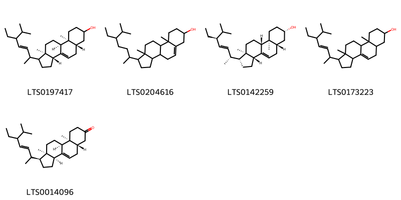{ width=100% }
    <figcaption>Hình ảnh cấu trúc hóa học của 5 hoạt chất thuộc nhóm Steroids and steroid derivatives gồm ['(3ar,5as,9as,9bs,11ar)-1-(5-ethyl-6-methylhept-3-en-2-yl)-9a,11a-dimethyl-1h,2h,3h,3ah,5h,5ah,6h,7h,8h,9h,9bh,10h,11h-cyclopenta[a]phenanthren-7-ol (LTS0197417)', 'stigmast-5-en-3-ol, (3β)- (LTS0204616)', 'chondrillasterol (LTS0142259)', '1-(5-ethyl-6-methylhept-3-en-2-yl)-9a,11a-dimethyl-1h,2h,3h,3ah,5h,5ah,6h,7h,8h,9h,9bh,10h,11h-cyclopenta[a]phenanthren-7-ol (LTS0173223)', '(1s,3as,5as,9as,9bs,11ar)-1-(5-ethyl-6-methylhept-3-en-2-yl)-9a,11a-dimethyl-1h,2h,3h,3ah,5h,5ah,6h,8h,9h,9bh,10h,11h-cyclopenta[a]phenanthren-7-one (LTS0014096)'].</figcaption>
</figure>

---

### Dược dân tộc học

Danh sách các quốc gia có sử dụng *Diploknema butyracea* trong điều trị các bệnh. 

| Country   | Disease                                 | Bệnh                                                                                                                                                                                                |
|:----------|:----------------------------------------|:----------------------------------------------------------------------------------------------------------------------------------------------------------------------------------------------------|
| India     | Soap, Piscicide, Insecticide, Vermifuge | MYMEMORY WARNING: YOU USED ALL AVAILABLE FREE TRANSLATIONS FOR TODAY. NEXT AVAILABLE IN  10 HOURS 43 MINUTES 12 SECONDS VISIT HTTPS://MYMEMORY.TRANSLATED.NET/DOC/USAGELIMITS.PHP TO TRANSLATE MORE |

---

