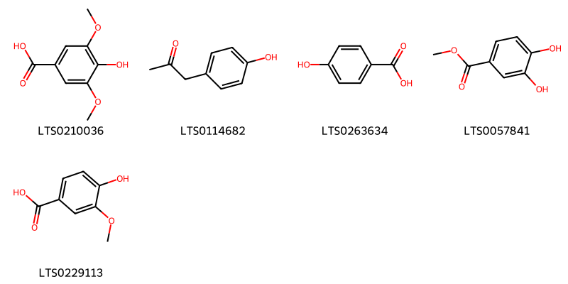
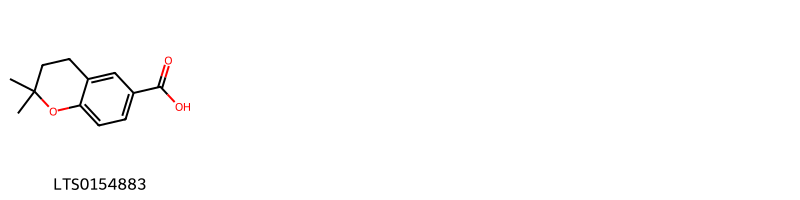
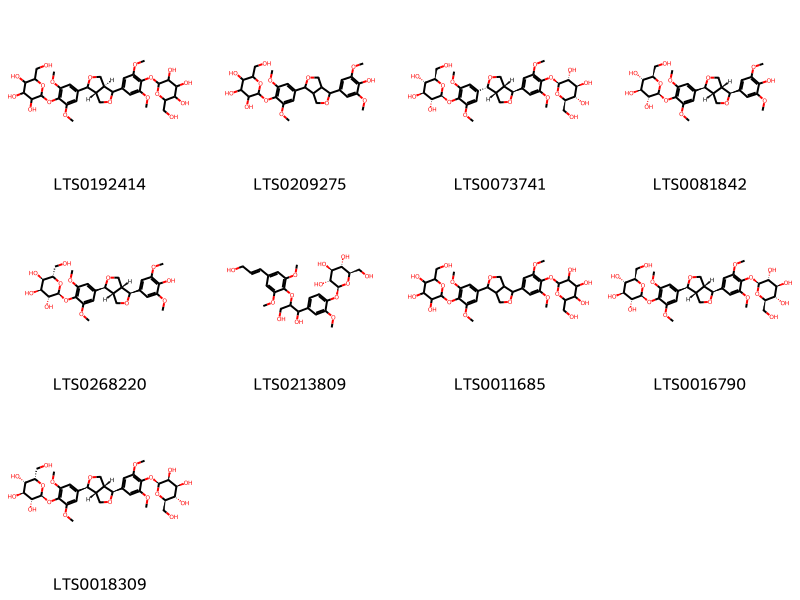
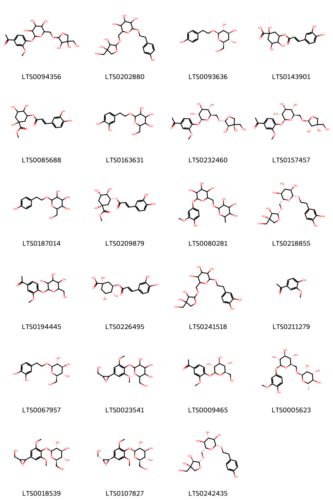
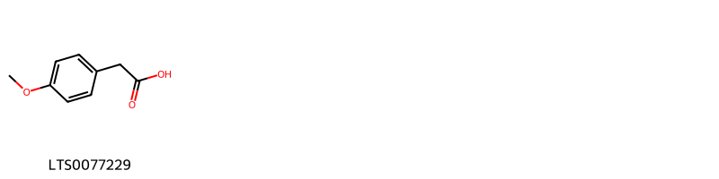
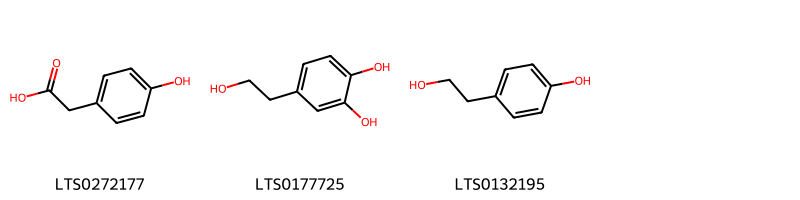
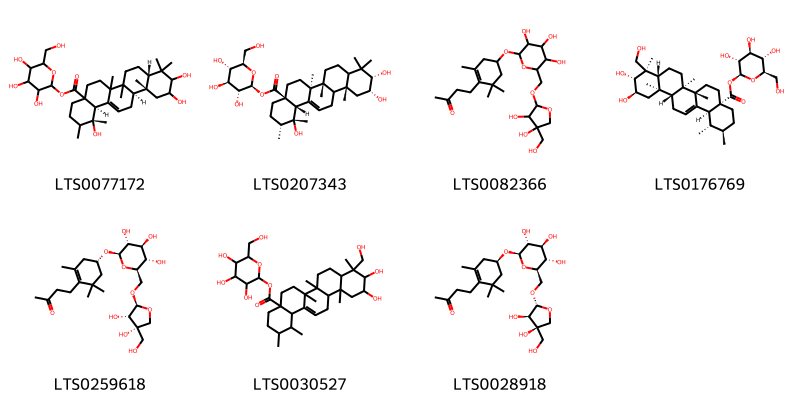
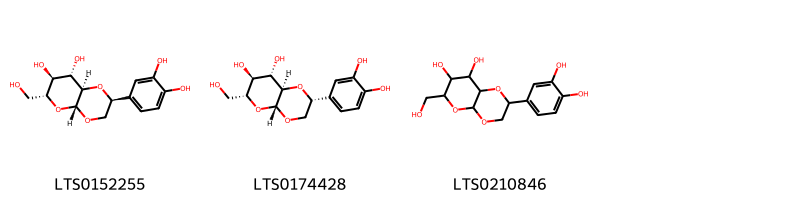
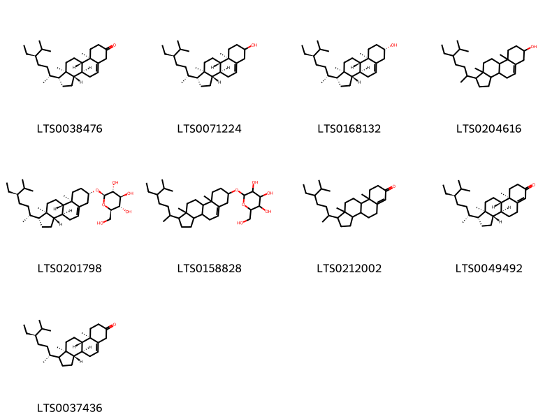
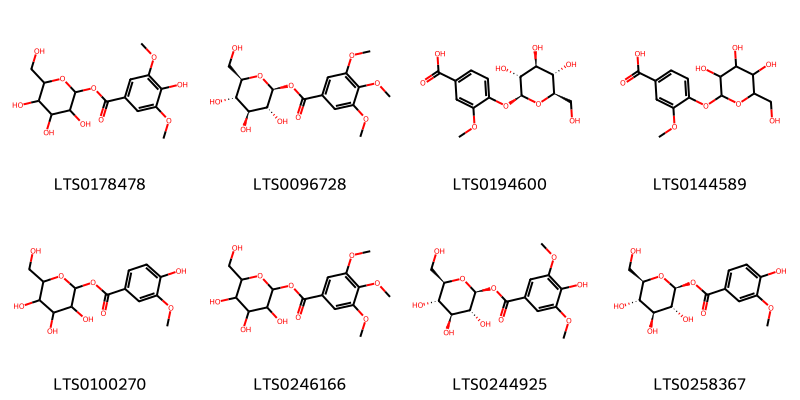

!!! abstract "Tóm tắt"

    Họ Sargentodoxaceae gồm khoảng 1 chi và 1 loài được một số cộng đồng tại các quốc gia như China sử dụng trong một số trường hợp Chất kích thích, Tonic, Vermifuge, Parasiticide.

!!! info "DrDuke"

    James A. Duke sinh năm 1929-2017 là một nhà thực vật học người Mỹ. Đây là một trong những tác giả hàng đầu trong lĩnh vực dược dân tộc học với cuốn *CRC Handbook of Medicinal Herbs* và chính là người xây dựng lên cơ sở dữ liệu về hợp chất tự nhiên và dược dân tộc học tại Bộ nông nghiệp Hoa Kỳ. Các thông tin được đăng tải tại website [Dr. Duke's Phytochemical and Ethnobotanical Databases](https://phytochem.nal.usda.gov/). 
    Trong suốt thập niên 1970, ông lãnh đạo the Plant Taxonomy Laboratory, Plant Genetics and Germplasm Institute of the Agricultural Research Service, U.S. Department of Agriculture.
    Trong tài liệu này, các thông tin về dược dân tộc của các dược liệu được trích dẫn từ tài liệu của James A. Ducke với sự trợ giúp của phần mềm dịch thuật từ tiếng Anh sang tiếng Việt.
   

# Chi Sargentodoxa

??? note "Danh sách các dược liệu thuộc chi"
    
	 - *Sargentodoxa cuneata*

---
## Sargentodoxa cuneata
### Thông tin về thực vật

!!! info "Phân loại thực vật của *Sargentodoxa cuneata* từ GIBF:"
    - **Kingdom:** Plantae
    - **Phylum:** Tracheophyta
    - **Order:** Ranunculales
    - **Family:** Lardizabalaceae
    - **Genus:** Sargentodoxa
    - **Species:** *Sargentodoxa cuneata*

 

| Label (VI)   | Label (EN)   | Scientific Name      | Descriptions (VI)   | Descriptions (EN)   | Also Known As (VI)   | Also Known As (EN)   |
|:-------------|:-------------|:---------------------|:--------------------|:--------------------|:---------------------|:---------------------|
| N/A          | N/A          | Sargentodoxa cuneata | loài thực vật       | species of plant    | ['']                 | ['']                 |

#### Phân bố trên thế giới

**Từ CSDL GIBF** Sri Lanka, China

#### Phân bố tại Việt Nam

**Từ CSDL GIBF**: Không có ghi nhận ở Việt Nam

---
### Thành phần hóa học
        
- Theo cơ sở dữ liệu lotus: Từ loài *Sargentodoxa cuneata* đã phân lập và xác định được 76 hoạt chất thuộc về các nhóm Phenol ethers, Prenol lipids, Steroids and steroid derivatives, Cinnamic acids and derivatives, Dibenzylbutane lignans, Pyranodioxins, Benzene and substituted derivatives, Organooxygen compounds, Tannins, Phenols, Lignan glycosides, Benzopyrans. 

|    | chemicalTaxonomyClassyfireClass     |   smiles_count |
|---:|:------------------------------------|---------------:|
|  0 | Benzene and substituted derivatives |              5 |
|  1 | Benzopyrans                         |              1 |
|  2 | Cinnamic acids and derivatives      |              4 |
|  3 | Dibenzylbutane lignans              |              2 |
|  4 | Lignan glycosides                   |              9 |
|  5 | Organooxygen compounds              |             23 |
|  6 | Phenol ethers                       |              1 |
|  7 | Phenols                             |              3 |
|  8 | Prenol lipids                       |              7 |
|  9 | Pyranodioxins                       |              3 |
| 10 | Steroids and steroid derivatives    |              9 |
| 11 | Tannins                             |              8 |

#### Nhóm Benzene and substituted derivatives
<figure markdown="span">
    { width=100% }
    <figcaption>Hình ảnh cấu trúc hóa học của 5 hoạt chất thuộc nhóm Benzene and substituted derivatives gồm ['syringic acid (LTS0210036)', 'p-hydroxyphenyl-1-propanone (LTS0114682)', 'p-hydroxybenzoic acid (LTS0263634)', 'methyl 3,4-dihydroxybenzoate (LTS0057841)', 'vanillic acid (LTS0229113)'].</figcaption>
</figure>
#### Nhóm Benzopyrans
<figure markdown="span">
    { width=100% }
    <figcaption>Hình ảnh cấu trúc hóa học của 1 hoạt chất thuộc nhóm Benzopyrans gồm ['2,2-dimethyl-3,4-dihydro-1-benzopyran-6-carboxylic acid (LTS0154883)'].</figcaption>
</figure>
#### Nhóm Cinnamic acids and derivatives
<figure markdown="span">
    { width=100% }
    <figcaption>Hình ảnh cấu trúc hóa học của 4 hoạt chất thuộc nhóm Cinnamic acids and derivatives gồm ['ferulic acid (LTS0077328)', 'para-coumaric acid (LTS0266252)', 'hydroxycinnamic acid (LTS0233023)', 'ferulic acid (LTS0273002)'].</figcaption>
</figure>
#### Nhóm Dibenzylbutane lignans
<figure markdown="span">
    { width=100% }
    <figcaption>Hình ảnh cấu trúc hóa học của 2 hoạt chất thuộc nhóm Dibenzylbutane lignans gồm ['secoisolariciresinol (LTS0086727)', 'secoisolariciresinol (LTS0111810)'].</figcaption>
</figure>
#### Nhóm Lignan glycosides
<figure markdown="span">
    { width=100% }
    <figcaption>Hình ảnh cấu trúc hóa học của 9 hoạt chất thuộc nhóm Lignan glycosides gồm ['2-{4-[(3as,6ar)-4-(3,5-dimethoxy-4-{[3,4,5-trihydroxy-6-(hydroxymethyl)oxan-2-yl]oxy}phenyl)-hexahydrofuro[3,4-c]furan-1-yl]-2,6-dimethoxyphenoxy}-6-(hydroxymethyl)oxane-3,4,5-triol (LTS0192414)', '2-{4-[4-(4-hydroxy-3,5-dimethoxyphenyl)-hexahydrofuro[3,4-c]furan-1-yl]-2,6-dimethoxyphenoxy}-6-(hydroxymethyl)oxane-3,4,5-triol (LTS0209275)', '(2s,3r,4s,5s,6r)-2-{4-[(1r,3ar,4s,6ar)-4-(3,5-dimethoxy-4-{[(2s,3r,4s,5s,6r)-3,4,5-trihydroxy-6-(hydroxymethyl)oxan-2-yl]oxy}phenyl)-hexahydrofuro[3,4-c]furan-1-yl]-2,6-dimethoxyphenoxy}-6-(hydroxymethyl)oxane-3,4,5-triol (LTS0073741)', 'acanthoside b (LTS0081842)', '(2s,3r,4s,5r,6s)-2-{4-[(1s,3ar,4s,6ar)-4-(4-hydroxy-3,5-dimethoxyphenyl)-hexahydrofuro[3,4-c]furan-1-yl]-2,6-dimethoxyphenoxy}-6-(hydroxymethyl)oxane-3,4,5-triol (LTS0268220)', '(2s,3r,4s,5s,6r)-2-[4-(1,3-dihydroxy-2-{4-[(1e)-3-hydroxyprop-1-en-1-yl]-2,6-dimethoxyphenoxy}propyl)-2-methoxyphenoxy]-6-(hydroxymethyl)oxane-3,4,5-triol (LTS0213809)', '2-{4-[4-(3,5-dimethoxy-4-{[3,4,5-trihydroxy-6-(hydroxymethyl)oxan-2-yl]oxy}phenyl)-hexahydrofuro[3,4-c]furan-1-yl]-2,6-dimethoxyphenoxy}-6-(hydroxymethyl)oxane-3,4,5-triol (LTS0011685)', 'liriodendrin (LTS0016790)', '(2s,3r,4s,5s,6s)-2-{4-[(1s,3ar,4s,6ar)-4-(3,5-dimethoxy-4-{[(2s,3s,4s,5s,6r)-3,4,5-trihydroxy-6-(hydroxymethyl)oxan-2-yl]oxy}phenyl)-hexahydrofuro[3,4-c]furan-1-yl]-2,6-dimethoxyphenoxy}-6-(hydroxymethyl)oxane-3,4,5-triol (LTS0018309)'].</figcaption>
</figure>
#### Nhóm Organooxygen compounds
<figure markdown="span">
    { width=100% }
    <figcaption>Hình ảnh cấu trúc hóa học của 23 hoạt chất thuộc nhóm Organooxygen compounds gồm ['1-(4-{[6-({[3,4-dihydroxy-4-(hydroxymethyl)oxolan-2-yl]oxy}methyl)-3,4,5-trihydroxyoxan-2-yl]oxy}-3-methoxyphenyl)ethanone (LTS0094356)', '2-({[3,4-dihydroxy-4-(hydroxymethyl)oxolan-2-yl]oxy}methyl)-6-[2-(4-hydroxyphenyl)ethoxy]oxane-3,4,5-triol (LTS0202880)', 'salidroside (LTS0093636)', '3-{[3-(3,4-dihydroxyphenyl)prop-2-enoyl]oxy}-1,4,5-trihydroxycyclohexane-1-carboxylic acid (LTS0143901)', 'methyl 3-{[3-(3,4-dihydroxyphenyl)prop-2-enoyl]oxy}-1,4,5-trihydroxycyclohexane-1-carboxylate (LTS0085688)', '2-[2-(3,4-dihydroxyphenyl)ethoxy]-6-(hydroxymethyl)oxane-3,4,5-triol (LTS0163631)', '1-(4-{[(2s,3r,4s,5s,6r)-6-({[(2r,3r,4r)-3,4-dihydroxy-4-(hydroxymethyl)oxolan-2-yl]oxy}methyl)-3,4,5-trihydroxyoxan-2-yl]oxy}-3-methoxyphenyl)ethanone (LTS0232460)', '1-(4-{[(2s,3r,4s,5s,6r)-6-({[(2s,3s,4s)-3,4-dihydroxy-4-(hydroxymethyl)oxolan-2-yl]oxy}methyl)-3,4,5-trihydroxyoxan-2-yl]oxy}-3-methoxyphenyl)ethanone (LTS0157457)', '2-(hydroxymethyl)-6-[2-(4-hydroxyphenyl)ethoxy]oxane-3,4,5-triol (LTS0187014)', 'methyl chlorogenate (LTS0209879)', '2-(4-hydroxy-3-methoxyphenoxy)-6-{[(3,4,5-trihydroxy-6-methyloxan-2-yl)oxy]methyl}oxane-3,4,5-triol (LTS0080281)', '(2r,3s,4s,5r,6r)-2-({[(2r,3r,4r)-3,4-dihydroxy-4-(hydroxymethyl)oxolan-2-yl]oxy}methyl)-6-[2-(3,4-dihydroxyphenyl)ethoxy]oxane-3,4,5-triol (LTS0218855)', '1-(3-methoxy-4-{[3,4,5-trihydroxy-6-(hydroxymethyl)oxan-2-yl]oxy}phenyl)ethanone (LTS0194445)', 'chlorogenic acid (LTS0226495)', '2-({[3,4-dihydroxy-4-(hydroxymethyl)oxolan-2-yl]oxy}methyl)-6-[2-(3,4-dihydroxyphenyl)ethoxy]oxane-3,4,5-triol (LTS0241518)', 'apocynin (LTS0211279)', '(2r,3r,4s,5s,6r)-2-[2-(3,4-dihydroxyphenyl)ethoxy]-6-(hydroxymethyl)oxane-3,4,5-triol (LTS0067957)', '2-(hydroxymethyl)-6-{4-[3-(hydroxymethyl)oxiran-2-yl]-2,6-dimethoxyphenoxy}oxane-3,4,5-triol (LTS0023541)', '1-(3-methoxy-4-{[(2s,3r,4s,5s,6r)-3,4,5-trihydroxy-6-(hydroxymethyl)oxan-2-yl]oxy}phenyl)ethanone (LTS0009465)', '(2s,3r,4s,5s,6r)-2-(4-hydroxy-3-methoxyphenoxy)-6-({[(2r,3r,4r,5r,6s)-3,4,5-trihydroxy-6-methyloxan-2-yl]oxy}methyl)oxane-3,4,5-triol (LTS0005623)', '(2r,3s,4s,5r,6s)-2-(hydroxymethyl)-6-{4-[3-(hydroxymethyl)oxiran-2-yl]-2,6-dimethoxyphenoxy}oxane-3,4,5-triol (LTS0018539)', '(2r,3s,4s,5r,6s)-2-(hydroxymethyl)-6-{4-[(2r,3r)-3-(hydroxymethyl)oxiran-2-yl]-2,6-dimethoxyphenoxy}oxane-3,4,5-triol (LTS0107827)', '(2r,3s,4s,5r,6r)-2-({[(2r,3r,4r)-3,4-dihydroxy-4-(hydroxymethyl)oxolan-2-yl]oxy}methyl)-6-[2-(4-hydroxyphenyl)ethoxy]oxane-3,4,5-triol (LTS0242435)'].</figcaption>
</figure>
#### Nhóm Phenol ethers
<figure markdown="span">
    { width=100% }
    <figcaption>Hình ảnh cấu trúc hóa học của 1 hoạt chất thuộc nhóm Phenol ethers gồm ['4-methoxyphenylacetic acid (LTS0077229)'].</figcaption>
</figure>
#### Nhóm Phenols
<figure markdown="span">
    { width=100% }
    <figcaption>Hình ảnh cấu trúc hóa học của 3 hoạt chất thuộc nhóm Phenols gồm ['4-hydroxyphenylacetic acid (LTS0272177)', 'hydroxytyrosol (LTS0177725)', 'tyrosol (LTS0132195)'].</figcaption>
</figure>
#### Nhóm Prenol lipids
<figure markdown="span">
    { width=100% }
    <figcaption>Hình ảnh cấu trúc hóa học của 7 hoạt chất thuộc nhóm Prenol lipids gồm ['3,4,5-trihydroxy-6-(hydroxymethyl)oxan-2-yl (1r,8as,12ar,12br,14br)-1,10,11-trihydroxy-1,2,6a,6b,9,9,12a-heptamethyl-2,3,4,5,6,7,8,8a,10,11,12,12b,13,14b-tetradecahydropicene-4a-carboxylate (LTS0077172)', '(2s,3r,4s,5s,6r)-3,4,5-trihydroxy-6-(hydroxymethyl)oxan-2-yl (1r,2r,4as,6as,6br,10s,11r,12ar,14bs)-1,10,11-trihydroxy-1,2,6a,6b,9,9,12a-heptamethyl-2,3,4,5,6,7,8,8a,10,11,12,12b,13,14b-tetradecahydropicene-4a-carboxylate (LTS0207343)', '4-(4-{[6-({[3,4-dihydroxy-4-(hydroxymethyl)oxolan-2-yl]oxy}methyl)-3,4,5-trihydroxyoxan-2-yl]oxy}-2,6,6-trimethylcyclohex-1-en-1-yl)butan-2-one (LTS0082366)', '(2s,3r,4s,5s,6r)-3,4,5-trihydroxy-6-(hydroxymethyl)oxan-2-yl (1s,2r,4as,6as,6br,8ar,9r,10r,11r,12ar,12br,14bs)-10,11-dihydroxy-9-(hydroxymethyl)-1,2,6a,6b,9,12a-hexamethyl-2,3,4,5,6,7,8,8a,10,11,12,12b,13,14b-tetradecahydro-1h-picene-4a-carboxylate (LTS0176769)', '4-[(4s)-4-{[(2r,3r,4s,5s,6r)-6-({[(2s,3s,4s)-3,4-dihydroxy-4-(hydroxymethyl)oxolan-2-yl]oxy}methyl)-3,4,5-trihydroxyoxan-2-yl]oxy}-2,6,6-trimethylcyclohex-1-en-1-yl]butan-2-one (LTS0259618)', '3,4,5-trihydroxy-6-(hydroxymethyl)oxan-2-yl 10,11-dihydroxy-9-(hydroxymethyl)-1,2,6a,6b,9,12a-hexamethyl-2,3,4,5,6,7,8,8a,10,11,12,12b,13,14b-tetradecahydro-1h-picene-4a-carboxylate (LTS0030527)', '4-[(4r)-4-{[(2r,3r,4s,5s,6r)-6-({[(2r,3r,4r)-3,4-dihydroxy-4-(hydroxymethyl)oxolan-2-yl]oxy}methyl)-3,4,5-trihydroxyoxan-2-yl]oxy}-2,6,6-trimethylcyclohex-1-en-1-yl]butan-2-one (LTS0028918)'].</figcaption>
</figure>
#### Nhóm Pyranodioxins
<figure markdown="span">
    { width=100% }
    <figcaption>Hình ảnh cấu trúc hóa học của 3 hoạt chất thuộc nhóm Pyranodioxins gồm ['(2s,4ar,6r,7s,8s,8ar)-2-(3,4-dihydroxyphenyl)-6-(hydroxymethyl)-hexahydro-2h-pyrano[2,3-b][1,4]dioxine-7,8-diol (LTS0152255)', '(2r,4ar,6r,7s,8s,8ar)-2-(3,4-dihydroxyphenyl)-6-(hydroxymethyl)-hexahydro-2h-pyrano[2,3-b][1,4]dioxine-7,8-diol (LTS0174428)', '2-(3,4-dihydroxyphenyl)-6-(hydroxymethyl)-hexahydro-2h-pyrano[2,3-b][1,4]dioxine-7,8-diol (LTS0210846)'].</figcaption>
</figure>
#### Nhóm Steroids and steroid derivatives
<figure markdown="span">
    { width=100% }
    <figcaption>Hình ảnh cấu trúc hóa học của 9 hoạt chất thuộc nhóm Steroids and steroid derivatives gồm ['(1r,3as,3bs,9ar,9bs,11ar)-1-[(2r,5r)-5-ethyl-6-methylheptan-2-yl]-9a,11a-dimethyl-1h,2h,3h,3ah,3bh,4h,6h,8h,9h,9bh,10h,11h-cyclopenta[a]phenanthren-7-one (LTS0038476)', 'stigmast-5-en-3-ol (LTS0071224)', 'sitosterol (LTS0168132)', 'stigmast-5-en-3-ol, (3β)- (LTS0204616)', 'sitogluside (LTS0201798)', '2-{[1-(5-ethyl-6-methylheptan-2-yl)-9a,11a-dimethyl-1h,2h,3h,3ah,3bh,4h,6h,7h,8h,9h,9bh,10h,11h-cyclopenta[a]phenanthren-7-yl]oxy}-6-(hydroxymethyl)oxane-3,4,5-triol (LTS0158828)', '1-(5-ethyl-6-methylheptan-2-yl)-9a,11a-dimethyl-1h,2h,3h,3ah,3bh,4h,5h,8h,9h,9bh,10h,11h-cyclopenta[a]phenanthren-7-one (LTS0212002)', 'β-sitostenone (LTS0049492)', '(3as,3bs,9ar,9bs,11ar)-1-[(2r,5r)-5-ethyl-6-methylheptan-2-yl]-9a,11a-dimethyl-1h,2h,3h,3ah,3bh,4h,6h,8h,9h,9bh,10h,11h-cyclopenta[a]phenanthren-7-one (LTS0037436)'].</figcaption>
</figure>
#### Nhóm Tannins
<figure markdown="span">
    { width=100% }
    <figcaption>Hình ảnh cấu trúc hóa học của 8 hoạt chất thuộc nhóm Tannins gồm ['3,4,5-trihydroxy-6-(hydroxymethyl)oxan-2-yl 4-hydroxy-3,5-dimethoxybenzoate (LTS0178478)', '(2s,3r,4s,5s,6r)-3,4,5-trihydroxy-6-(hydroxymethyl)oxan-2-yl 3,4,5-trimethoxybenzoate (LTS0096728)', '3-methoxy-4-{[(2s,3r,4s,5s,6r)-3,4,5-trihydroxy-6-(hydroxymethyl)oxan-2-yl]oxy}benzoic acid (LTS0194600)', '3-methoxy-4-{[3,4,5-trihydroxy-6-(hydroxymethyl)oxan-2-yl]oxy}benzoic acid (LTS0144589)', '3,4,5-trihydroxy-6-(hydroxymethyl)oxan-2-yl 4-hydroxy-3-methoxybenzoate (LTS0100270)', '3,4,5-trihydroxy-6-(hydroxymethyl)oxan-2-yl 3,4,5-trimethoxybenzoate (LTS0246166)', '(2s,3r,4s,5s,6r)-3,4,5-trihydroxy-6-(hydroxymethyl)oxan-2-yl 4-hydroxy-3,5-dimethoxybenzoate (LTS0244925)', '1-o-vanilloyl-β-d-glucose (LTS0258367)'].</figcaption>
</figure>

---

### Dược dân tộc học

Danh sách các quốc gia có sử dụng *Sargentodoxa cuneata* trong điều trị các bệnh. 

| Country   | Disease                                   | Bệnh                                            |
|:----------|:------------------------------------------|:------------------------------------------------|
| China     | Stimulant, Tonic, Vermifuge, Parasiticide | Chất kích thích, Tonic, Vermifuge, Parasiticide |

---

