!!! abstract "Tóm tắt"

    Họ Saururaceae gồm khoảng 2 chi và 4 loài được một số cộng đồng tại các quốc gia như Japan*, Japan, Indochina, Elsewhere, China, India, US sử dụng trong một số trường hợp MYMEMORY WARNING: YOU USED ALL AVAILABLE FREE TRANSLATIONS FOR TODAY. NEXT AVAILABLE IN  15 HOURS 03 MINUTES 47 SECONDS VISIT HTTPS://MYMEMORY.TRANSLATED.NET/DOC/USAGELIMITS.PHP TO TRANSLATE MORE.

!!! info "DrDuke"

    James A. Duke sinh năm 1929-2017 là một nhà thực vật học người Mỹ. Đây là một trong những tác giả hàng đầu trong lĩnh vực dược dân tộc học với cuốn *CRC Handbook of Medicinal Herbs* và chính là người xây dựng lên cơ sở dữ liệu về hợp chất tự nhiên và dược dân tộc học tại Bộ nông nghiệp Hoa Kỳ. Các thông tin được đăng tải tại website [Dr. Duke's Phytochemical and Ethnobotanical Databases](https://phytochem.nal.usda.gov/). 
    Trong suốt thập niên 1970, ông lãnh đạo the Plant Taxonomy Laboratory, Plant Genetics and Germplasm Institute of the Agricultural Research Service, U.S. Department of Agriculture.
    Trong tài liệu này, các thông tin về dược dân tộc của các dược liệu được trích dẫn từ tài liệu của James A. Ducke với sự trợ giúp của phần mềm dịch thuật từ tiếng Anh sang tiếng Việt.
   

# Chi Saururus

??? note "Danh sách các dược liệu thuộc chi"
    
	 - *Saururus cernuus*
	 - *Saururus chinensis*
	 - *Saururus loureiri*

---
## Saururus cernuus
### Thông tin về thực vật

!!! info "Phân loại thực vật của *Saururus cernuus* từ GIBF:"
    - **Kingdom:** Plantae
    - **Phylum:** Tracheophyta
    - **Order:** Piperales
    - **Family:** Saururaceae
    - **Genus:** Saururus
    - **Species:** *Saururus cernuus*

 

| Label (VI)   | Label (EN)   | Scientific Name   | Descriptions (VI)   | Descriptions (EN)   | Also Known As (VI)   | Also Known As (EN)                                                                |
|:-------------|:-------------|:------------------|:--------------------|:--------------------|:---------------------|:----------------------------------------------------------------------------------|
| N/A          | N/A          | Saururus cernuus  | loài thực vật       | species of plant    | ['']                 | ["dragon's tail", "lizard's tail", "lizard's-tail", 'swamp root', 'water-dragon'] |

#### Phân bố trên thế giới

**Từ CSDL GIBF** nan, Belgium, United States of America

#### Phân bố tại Việt Nam

**Từ CSDL GIBF**: Không có ghi nhận ở Việt Nam

---
### Thành phần hóa học
        
- Theo cơ sở dữ liệu lotus: Từ loài *Saururus cernuus* đã phân lập và xác định được 40 hoạt chất thuộc về các nhóm Dibenzylbutane lignans, Aryltetralin lignans, Aristolactams, Furanoid lignans, Prenol lipids, 2-arylbenzofuran flavonoids. 

|    | chemicalTaxonomyClassyfireClass   |   smiles_count |
|---:|:----------------------------------|---------------:|
|  0 | 2-arylbenzofuran flavonoids       |              3 |
|  1 | Aristolactams                     |              2 |
|  2 | Aryltetralin lignans              |              1 |
|  3 | Dibenzylbutane lignans            |             10 |
|  4 | Furanoid lignans                  |             22 |
|  5 | Prenol lipids                     |              2 |

#### Nhóm 2-arylbenzofuran flavonoids
<figure markdown="span">
    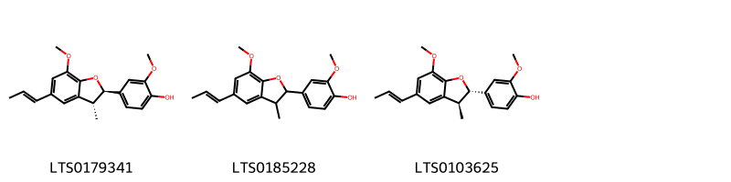{ width=100% }
    <figcaption>Hình ảnh cấu trúc hóa học của 3 hoạt chất thuộc nhóm 2-arylbenzofuran flavonoids gồm ['2-methoxy-4-[(2r,3r)-7-methoxy-3-methyl-5-[(1e)-prop-1-en-1-yl]-2,3-dihydro-1-benzofuran-2-yl]phenol (LTS0179341)', '2-methoxy-4-[7-methoxy-3-methyl-5-(prop-1-en-1-yl)-2,3-dihydro-1-benzofuran-2-yl]phenol (LTS0185228)', 'licarin a (LTS0103625)'].</figcaption>
</figure>
#### Nhóm Aristolactams
<figure markdown="span">
    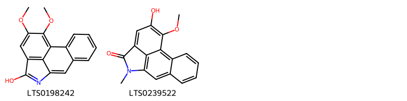{ width=100% }
    <figcaption>Hình ảnh cấu trúc hóa học của 2 hoạt chất thuộc nhóm Aristolactams gồm ['14,15-dimethoxy-10-azatetracyclo[7.6.1.0²,⁷.0¹²,¹⁶]hexadeca-1(16),2(7),3,5,8,10,12,14-octaen-11-ol (LTS0198242)', '14-hydroxy-15-methoxy-10-methyl-10-azatetracyclo[7.6.1.0²,⁷.0¹²,¹⁶]hexadeca-1(16),2(7),3,5,8,12,14-heptaen-11-one (LTS0239522)'].</figcaption>
</figure>
#### Nhóm Aryltetralin lignans
<figure markdown="span">
    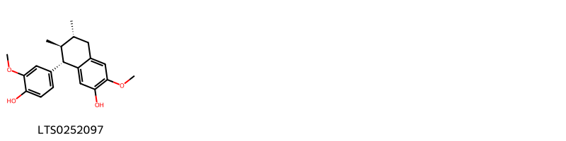{ width=100% }
    <figcaption>Hình ảnh cấu trúc hóa học của 1 hoạt chất thuộc nhóm Aryltetralin lignans gồm ['(+)-guaiacin (LTS0252097)'].</figcaption>
</figure>
#### Nhóm Dibenzylbutane lignans
<figure markdown="span">
    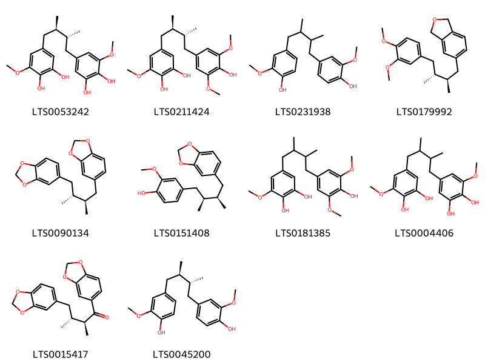{ width=100% }
    <figcaption>Hình ảnh cấu trúc hóa học của 10 hoạt chất thuộc nhóm Dibenzylbutane lignans gồm ['5-[(2r,3r)-4-(3,4-dihydroxy-5-methoxyphenyl)-2,3-dimethylbutyl]-3-methoxybenzene-1,2-diol (LTS0053242)', '5-[(2r,3r)-4-(4-hydroxy-3,5-dimethoxyphenyl)-2,3-dimethylbutyl]-3-methoxybenzene-1,2-diol (LTS0211424)', '4-[4-(4-hydroxy-3-methoxyphenyl)-2,3-dimethylbutyl]-2-methoxyphenol (LTS0231938)', '5-[(2r,3r)-4-(3,4-dimethoxyphenyl)-2,3-dimethylbutyl]-1,3-dihydro-2-benzofuran (LTS0179992)', '5-[(2r,3r)-4-(2h-1,3-benzodioxol-5-yl)-2,3-dimethylbutyl]-2h-1,3-benzodioxole (LTS0090134)', 'macelignan (LTS0151408)', '5-[4-(4-hydroxy-3,5-dimethoxyphenyl)-2,3-dimethylbutyl]-3-methoxybenzene-1,2-diol (LTS0181385)', '5-[4-(3,4-dihydroxy-5-methoxyphenyl)-2,3-dimethylbutyl]-3-methoxybenzene-1,2-diol (LTS0004406)', '(2s,3r)-1,4-bis(2h-1,3-benzodioxol-5-yl)-2,3-dimethylbutan-1-one (LTS0015417)', '(-)-dihydroguaiaretic acid (LTS0045200)'].</figcaption>
</figure>
#### Nhóm Furanoid lignans
<figure markdown="span">
    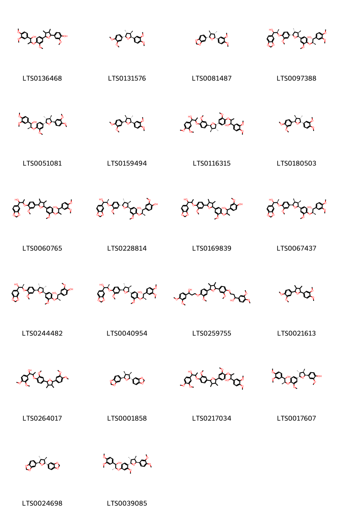{ width=100% }
    <figcaption>Hình ảnh cấu trúc hóa học của 22 hoạt chất thuộc nhóm Furanoid lignans gồm ['4-[5-(4-{[1-(3,4-dimethoxyphenyl)-1-hydroxypropan-2-yl]oxy}-3-methoxyphenyl)-3,4-dimethyloxolan-2-yl]-2-methoxyphenol (LTS0136468)', '(2s,3r,4r,5s)-2,5-bis(3,4-dimethoxyphenyl)-3,4-dimethyloxolane (LTS0131576)', '5-[(2s,3s,4s,5r)-5-(3,4-dimethoxyphenyl)-3,4-dimethyloxolan-2-yl]-2h-1,3-benzodioxole (LTS0081487)', 'manassantin b (LTS0097388)', '(1r,2s)-1-(3,4-dimethoxyphenyl)-2-{4-[(2s,3r,4r,5s)-5-(3,4-dimethoxyphenyl)-3,4-dimethyloxolan-2-yl]-2-methoxyphenoxy}propan-1-ol (LTS0051081)', '(+)-veraguensin (LTS0159494)', '1-(3,4-dimethoxyphenyl)-2-{4-[(2s,3r,4r,5s)-5-(4-{[1-(3,4-dimethoxyphenyl)-1-hydroxypropan-2-yl]oxy}-3-methoxyphenyl)-3,4-dimethyloxolan-2-yl]-2-methoxyphenoxy}propan-1-ol (LTS0116315)', 'saucernetin (LTS0180503)', '2-{4-[5-(4-{[1-(2h-1,3-benzodioxol-5-yl)-1-hydroxypropan-2-yl]oxy}-3-methoxyphenyl)-3,4-dimethyloxolan-2-yl]-2-methoxyphenoxy}-1-(3,4-dimethoxyphenyl)propan-1-ol (LTS0060765)', '4-[(1r,2r)-2-{4-[(2s,3r,4r,5s)-5-(4-{[(1r,2r)-1-(2h-1,3-benzodioxol-5-yl)-1-hydroxypropan-2-yl]oxy}-3-methoxyphenyl)-3,4-dimethyloxolan-2-yl]-2-methoxyphenoxy}-1-hydroxypropyl]-2-methoxyphenol (LTS0228814)', '4-(2-{4-[5-(4-{[1-(2h-1,3-benzodioxol-5-yl)-1-hydroxypropan-2-yl]oxy}-3-methoxyphenyl)-3,4-dimethyloxolan-2-yl]-2-methoxyphenoxy}-1-hydroxypropyl)-2-methoxyphenol (LTS0169839)', '(1r,2r)-2-{4-[(2s,3r,4s,5r)-5-(4-{[(1r,2r)-1-(2h-1,3-benzodioxol-5-yl)-1-hydroxypropan-2-yl]oxy}-3-methoxyphenyl)-3,4-dimethyloxolan-2-yl]-2-methoxyphenoxy}-1-(3,4-dimethoxyphenyl)propan-1-ol (LTS0067437)', '4-[(1r,2r)-2-{4-[(2s,3s,4r,5r)-5-(4-{[(1r,2r)-1-(2h-1,3-benzodioxol-5-yl)-1-hydroxypropan-2-yl]oxy}-3-methoxyphenyl)-3,4-dimethyloxolan-2-yl]-2-methoxyphenoxy}-1-hydroxypropyl]-2-methoxyphenol (LTS0244482)', '(1r,2r)-2-{4-[(2r,3r,4r,5r)-5-(4-{[(1r,2r)-1-(2h-1,3-benzodioxol-5-yl)-1-hydroxypropan-2-yl]oxy}-3-methoxyphenyl)-3,4-dimethyloxolan-2-yl]-2-methoxyphenoxy}-1-(3,4-dimethoxyphenyl)propan-1-ol (LTS0040954)', '1-(3,4-dimethoxyphenyl)-3-[4-(5-{4-[3-(3,4-dimethoxyphenyl)-3-hydroxypropoxy]-3-methoxyphenyl}-3,4-dimethyloxolan-2-yl)-2-methoxyphenoxy]propan-1-ol (LTS0259755)', '2,5-bis(3,4-dimethoxyphenyl)-3,4-dimethyloxolane (LTS0021613)', '1-(3,4-dimethoxyphenyl)-2-{4-[5-(3,4-dimethoxyphenyl)-3,4-dimethyloxolan-2-yl]-2-methoxyphenoxy}propan-1-ol (LTS0264017)', '5-[(2r,3s,4r,5r)-5-(2h-1,3-benzodioxol-5-yl)-3,4-dimethyloxolan-2-yl]-2h-1,3-benzodioxole (LTS0001858)', '1-(3,4-dimethoxyphenyl)-2-{4-[5-(4-{[1-(3,4-dimethoxyphenyl)-1-hydroxypropan-2-yl]oxy}-3-methoxyphenyl)-3,4-dimethyloxolan-2-yl]-2-methoxyphenoxy}propan-1-ol (LTS0217034)', '4-[(2s,3r,4r,5s)-5-(4-{[(1r,2s)-1-(3,4-dimethoxyphenyl)-1-hydroxypropan-2-yl]oxy}-3-methoxyphenyl)-3,4-dimethyloxolan-2-yl]-2-methoxyphenol (LTS0017607)', '(+)-galbacin (LTS0024698)', '(1r,2r)-1-(3,4-dimethoxyphenyl)-2-{4-[(2s,3r,4r,5s)-5-(3,4-dimethoxyphenyl)-3,4-dimethyloxolan-2-yl]-3-methoxyphenoxy}propan-1-ol (LTS0039085)'].</figcaption>
</figure>
#### Nhóm Prenol lipids
<figure markdown="span">
    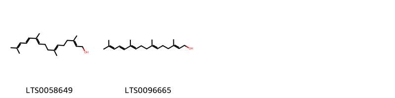{ width=100% }
    <figcaption>Hình ảnh cấu trúc hóa học của 2 hoạt chất thuộc nhóm Prenol lipids gồm ['3,7,11,15-tetramethylhexadeca-2,6,10,12,14-pentaen-1-ol (LTS0058649)', '(2e,6e,10e,12e)-3,7,11,15-tetramethylhexadeca-2,6,10,12,14-pentaen-1-ol (LTS0096665)'].</figcaption>
</figure>

---

### Dược dân tộc học

Danh sách các quốc gia có sử dụng *Saururus cernuus* trong điều trị các bệnh. 

| Country   | Disease              | Bệnh                                                                                                                                                                                                |
|:----------|:---------------------|:----------------------------------------------------------------------------------------------------------------------------------------------------------------------------------------------------|
| US        | Sedative, Astringent | MYMEMORY WARNING: YOU USED ALL AVAILABLE FREE TRANSLATIONS FOR TODAY. NEXT AVAILABLE IN  15 HOURS 03 MINUTES 44 SECONDS VISIT HTTPS://MYMEMORY.TRANSLATED.NET/DOC/USAGELIMITS.PHP TO TRANSLATE MORE |

---

---
## Saururus chinensis
### Thông tin về thực vật

!!! info "Phân loại thực vật của *Saururus chinensis* từ GIBF:"
    - **Kingdom:** Plantae
    - **Phylum:** Tracheophyta
    - **Order:** Piperales
    - **Family:** Saururaceae
    - **Genus:** Saururus
    - **Species:** *Saururus chinensis*

 

| Label (VI)   | Label (EN)   | Scientific Name    | Descriptions (VI)   | Descriptions (EN)   | Also Known As (VI)   | Also Known As (EN)   |
|:-------------|:-------------|:-------------------|:--------------------|:--------------------|:---------------------|:---------------------|
| N/A          | N/A          | Saururus chinensis |                     | species of plant    | ['']                 | ['']                 |

#### Phân bố trên thế giới

**Từ CSDL GIBF** nan, Hong Kong, Viet Nam, Japan, United States of America, Korea, Republic of, Belgium, Chinese Taipei, Malaysia, China

#### Phân bố tại Việt Nam

**Từ CSDL GIBF**: Ninh Bình

---
### Thành phần hóa học
        
- Theo cơ sở dữ liệu lotus: Từ loài *Saururus chinensis* đã phân lập và xác định được 169 hoạt chất thuộc về các nhóm Fatty Acyls, Benzene and substituted derivatives, Dibenzylbutane lignans, Flavonoids, Dibenzocyclooctadiene lignans, Anthracenes, Benzodioxoles, Glycerolipids, Phenols, Aryltetralin lignans, Organooxygen compounds, Aristolactams, Furanoid lignans, Prenol lipids, 2-arylbenzofuran flavonoids, Benzopyrans. 

|    | chemicalTaxonomyClassyfireClass     |   smiles_count |
|---:|:------------------------------------|---------------:|
|  0 |                                     |             13 |
|  1 | 2-arylbenzofuran flavonoids         |              2 |
|  2 | Anthracenes                         |              5 |
|  3 | Aristolactams                       |              3 |
|  4 | Aryltetralin lignans                |              1 |
|  5 | Benzene and substituted derivatives |              3 |
|  6 | Benzodioxoles                       |              1 |
|  7 | Benzopyrans                         |              8 |
|  8 | Dibenzocyclooctadiene lignans       |              2 |
|  9 | Dibenzylbutane lignans              |             31 |
| 10 | Fatty Acyls                         |              2 |
| 11 | Flavonoids                          |              4 |
| 12 | Furanoid lignans                    |             84 |
| 13 | Glycerolipids                       |              2 |
| 14 | Organooxygen compounds              |              2 |
| 15 | Phenols                             |              2 |
| 16 | Prenol lipids                       |              4 |

#### Nhóm 
<figure markdown="span">
    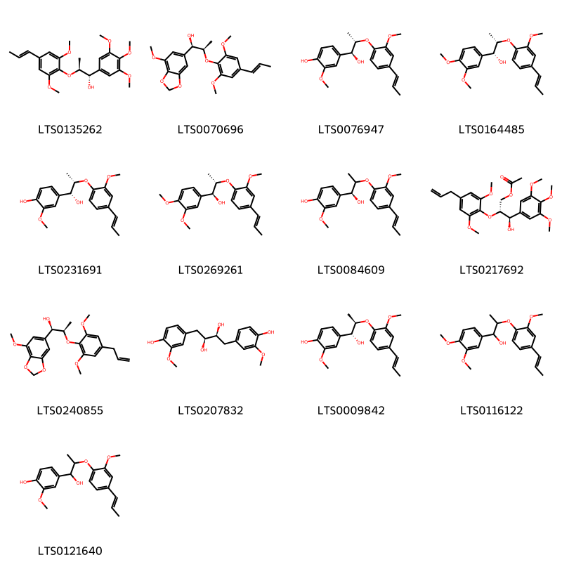{ width=100% }
    <figcaption>Hình ảnh cấu trúc hóa học của 13 hoạt chất thuộc nhóm  gồm ['(1s,2s)-2-{2,6-dimethoxy-4-[(1e)-prop-1-en-1-yl]phenoxy}-1-(3,4,5-trimethoxyphenyl)propan-1-ol (LTS0135262)', '(1r,2r)-2-{2,6-dimethoxy-4-[(1e)-prop-1-en-1-yl]phenoxy}-1-(7-methoxy-2h-1,3-benzodioxol-5-yl)propan-1-ol (LTS0070696)', '4-[(1s,2s)-1-hydroxy-2-{2-methoxy-4-[(1e)-prop-1-en-1-yl]phenoxy}propyl]-2-methoxyphenol (LTS0076947)', '(1r,2s)-1-(3,4-dimethoxyphenyl)-2-{2-methoxy-4-[(1e)-prop-1-en-1-yl]phenoxy}propan-1-ol (LTS0164485)', '4-[(1r,2s)-1-hydroxy-2-{2-methoxy-4-[(1e)-prop-1-en-1-yl]phenoxy}propyl]-2-methoxyphenol (LTS0231691)', '(1s,2s)-1-(3,4-dimethoxyphenyl)-2-{2-methoxy-4-[(1e)-prop-1-en-1-yl]phenoxy}propan-1-ol (LTS0269261)', '4-[(1s)-1-hydroxy-2-{2-methoxy-4-[(1e)-prop-1-en-1-yl]phenoxy}propyl]-2-methoxyphenol (LTS0084609)', '(2r,3r)-2-[2,6-dimethoxy-4-(prop-2-en-1-yl)phenoxy]-3-hydroxy-3-(3,4,5-trimethoxyphenyl)propyl acetate (LTS0217692)', '(1r,2r)-2-[2,6-dimethoxy-4-(prop-2-en-1-yl)phenoxy]-1-(7-methoxy-2h-1,3-benzodioxol-5-yl)propan-1-ol (LTS0240855)', '(2s,3s)-1,4-bis(4-hydroxy-3-methoxyphenyl)butane-2,3-diol (LTS0207832)', '4-[(1r,2r)-1-hydroxy-2-{2-methoxy-4-[(1e)-prop-1-en-1-yl]phenoxy}propyl]-2-methoxyphenol (LTS0009842)', '1-(3,4-dimethoxyphenyl)-2-[2-methoxy-4-(prop-1-en-1-yl)phenoxy]propan-1-ol (LTS0116122)', '4-{1-hydroxy-2-[2-methoxy-4-(prop-1-en-1-yl)phenoxy]propyl}-2-methoxyphenol (LTS0121640)'].</figcaption>
</figure>
#### Nhóm 2-arylbenzofuran flavonoids
<figure markdown="span">
    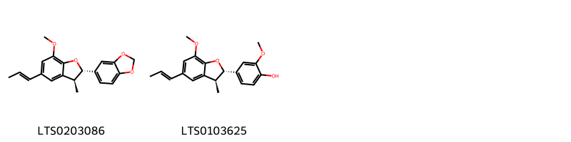{ width=100% }
    <figcaption>Hình ảnh cấu trúc hóa học của 2 hoạt chất thuộc nhóm 2-arylbenzofuran flavonoids gồm ['5-[(2s,3s)-7-methoxy-3-methyl-5-[(1e)-prop-1-en-1-yl]-2,3-dihydro-1-benzofuran-2-yl]-2h-1,3-benzodioxole (LTS0203086)', 'licarin a (LTS0103625)'].</figcaption>
</figure>
#### Nhóm Anthracenes
<figure markdown="span">
    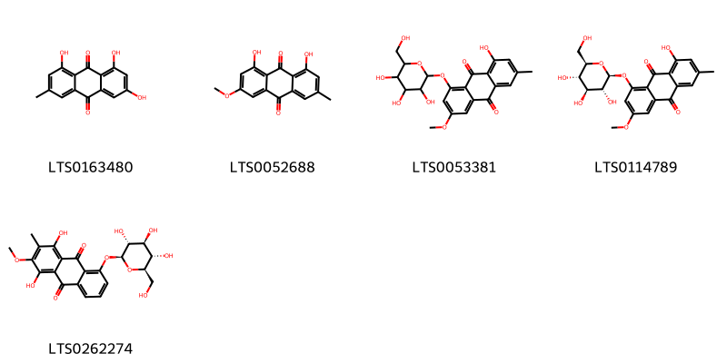{ width=100% }
    <figcaption>Hình ảnh cấu trúc hóa học của 5 hoạt chất thuộc nhóm Anthracenes gồm ['emodin (LTS0163480)', 'physcion (LTS0052688)', '1-hydroxy-6-methoxy-3-methyl-8-{[3,4,5-trihydroxy-6-(hydroxymethyl)oxan-2-yl]oxy}anthracene-9,10-dione (LTS0053381)', 'physcion 8-glucoside (LTS0114789)', '1,4-dihydroxy-2-methoxy-3-methyl-5-{[(2s,3r,4s,5s,6r)-3,4,5-trihydroxy-6-(hydroxymethyl)oxan-2-yl]oxy}anthracene-9,10-dione (LTS0262274)'].</figcaption>
</figure>
#### Nhóm Aristolactams
<figure markdown="span">
    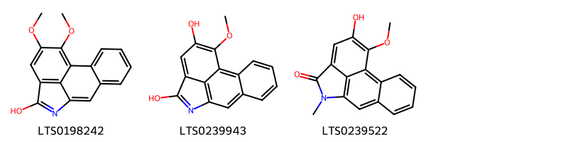{ width=100% }
    <figcaption>Hình ảnh cấu trúc hóa học của 3 hoạt chất thuộc nhóm Aristolactams gồm ['14,15-dimethoxy-10-azatetracyclo[7.6.1.0²,⁷.0¹²,¹⁶]hexadeca-1(16),2(7),3,5,8,10,12,14-octaen-11-ol (LTS0198242)', '15-methoxy-10-azatetracyclo[7.6.1.0²,⁷.0¹²,¹⁶]hexadeca-1(16),2(7),3,5,8,10,12,14-octaene-11,14-diol (LTS0239943)', '14-hydroxy-15-methoxy-10-methyl-10-azatetracyclo[7.6.1.0²,⁷.0¹²,¹⁶]hexadeca-1(16),2(7),3,5,8,12,14-heptaen-11-one (LTS0239522)'].</figcaption>
</figure>
#### Nhóm Aryltetralin lignans
<figure markdown="span">
    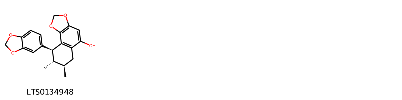{ width=100% }
    <figcaption>Hình ảnh cấu trúc hóa học của 1 hoạt chất thuộc nhóm Aryltetralin lignans gồm ['(7r,8s,9s)-9-(2h-1,3-benzodioxol-5-yl)-7,8-dimethyl-2h,6h,7h,8h,9h-naphtho[1,2-d][1,3]dioxol-5-ol (LTS0134948)'].</figcaption>
</figure>
#### Nhóm Benzene and substituted derivatives
<figure markdown="span">
    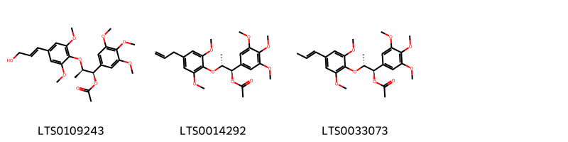{ width=100% }
    <figcaption>Hình ảnh cấu trúc hóa học của 3 hoạt chất thuộc nhóm Benzene and substituted derivatives gồm ['(1r,2r)-2-{4-[(1e)-3-hydroxyprop-1-en-1-yl]-2,6-dimethoxyphenoxy}-1-(3,4,5-trimethoxyphenyl)propyl acetate (LTS0109243)', '(1r,2r)-2-[2,6-dimethoxy-4-(prop-2-en-1-yl)phenoxy]-1-(3,4,5-trimethoxyphenyl)propyl acetate (LTS0014292)', '(1r,2r)-2-{2,6-dimethoxy-4-[(1e)-prop-1-en-1-yl]phenoxy}-1-(3,4,5-trimethoxyphenyl)propyl acetate (LTS0033073)'].</figcaption>
</figure>
#### Nhóm Benzodioxoles
<figure markdown="span">
    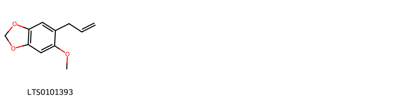{ width=100% }
    <figcaption>Hình ảnh cấu trúc hóa học của 1 hoạt chất thuộc nhóm Benzodioxoles gồm ['sarisan (LTS0101393)'].</figcaption>
</figure>
#### Nhóm Benzopyrans
<figure markdown="span">
    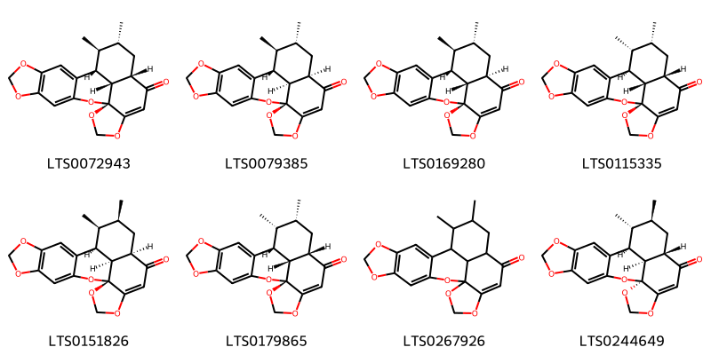{ width=100% }
    <figcaption>Hình ảnh cấu trúc hóa học của 8 hoạt chất thuộc nhóm Benzopyrans gồm ['(1s,12r,13s,14r,16s,23r)-13,14-dimethyl-2,6,8,20,22-pentaoxahexacyclo[10.10.1.0¹,¹⁹.0³,¹¹.0⁵,⁹.0¹⁶,²³]tricosa-3,5(9),10,18-tetraen-17-one (LTS0072943)', '(1s,12r,13s,14r,16r,23s)-13,14-dimethyl-2,6,8,20,22-pentaoxahexacyclo[10.10.1.0¹,¹⁹.0³,¹¹.0⁵,⁹.0¹⁶,²³]tricosa-3,5(9),10,18-tetraen-17-one (LTS0079385)', '(1s,12r,13s,14r,16r,23r)-13,14-dimethyl-2,6,8,20,22-pentaoxahexacyclo[10.10.1.0¹,¹⁹.0³,¹¹.0⁵,⁹.0¹⁶,²³]tricosa-3,5(9),10,18-tetraen-17-one (LTS0169280)', '(1s,12s,13r,14r,16s,23r)-13,14-dimethyl-2,6,8,20,22-pentaoxahexacyclo[10.10.1.0¹,¹⁹.0³,¹¹.0⁵,⁹.0¹⁶,²³]tricosa-3,5(9),10,18-tetraen-17-one (LTS0115335)', '(1s,12s,13s,14s,16r,23s)-13,14-dimethyl-2,6,8,20,22-pentaoxahexacyclo[10.10.1.0¹,¹⁹.0³,¹¹.0⁵,⁹.0¹⁶,²³]tricosa-3,5(9),10,18-tetraen-17-one (LTS0151826)', '(1s,12r,13r,14r,16s,23r)-13,14-dimethyl-2,6,8,20,22-pentaoxahexacyclo[10.10.1.0¹,¹⁹.0³,¹¹.0⁵,⁹.0¹⁶,²³]tricosa-3,5(9),10,18-tetraen-17-one (LTS0179865)', '13,14-dimethyl-2,6,8,20,22-pentaoxahexacyclo[10.10.1.0¹,¹⁹.0³,¹¹.0⁵,⁹.0¹⁶,²³]tricosa-3,5(9),10,18-tetraen-17-one (LTS0267926)', '(1r,12s,13r,14s,16s,23s)-13,14-dimethyl-2,6,8,20,22-pentaoxahexacyclo[10.10.1.0¹,¹⁹.0³,¹¹.0⁵,⁹.0¹⁶,²³]tricosa-3,5(9),10,18-tetraen-17-one (LTS0244649)'].</figcaption>
</figure>
#### Nhóm Dibenzocyclooctadiene lignans
<figure markdown="span">
    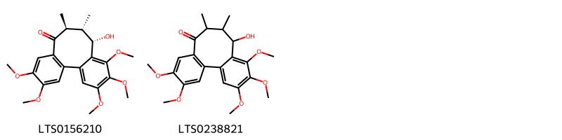{ width=100% }
    <figcaption>Hình ảnh cấu trúc hóa học của 2 hoạt chất thuộc nhóm Dibenzocyclooctadiene lignans gồm ['(9s,10s,11s)-11-hydroxy-4,5,13,14,15-pentamethoxy-9,10-dimethyltricyclo[10.4.0.0²,⁷]hexadeca-1(16),2(7),3,5,12,14-hexaen-8-one (LTS0156210)', '11-hydroxy-4,5,13,14,15-pentamethoxy-9,10-dimethyltricyclo[10.4.0.0²,⁷]hexadeca-1(16),2(7),3,5,12,14-hexaen-8-one (LTS0238821)'].</figcaption>
</figure>
#### Nhóm Dibenzylbutane lignans
<figure markdown="span">
    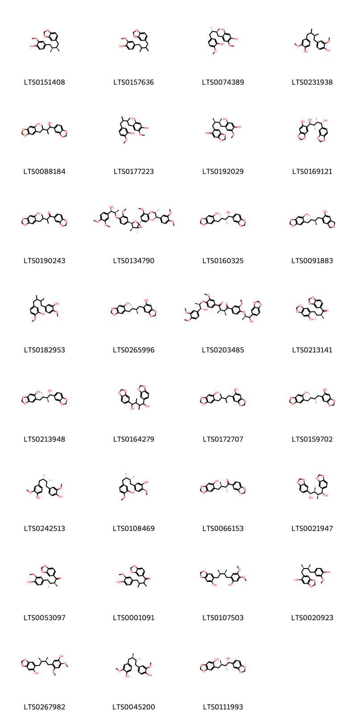{ width=100% }
    <figcaption>Hình ảnh cấu trúc hóa học của 31 hoạt chất thuộc nhóm Dibenzylbutane lignans gồm ['macelignan (LTS0151408)', 'macelignan (LTS0157636)', '4-[(2s,3s)-4-(3-hydroxy-4-methoxyphenyl)-2,3-dimethylbutyl]-6-methoxybenzene-1,3-diol (LTS0074389)', '4-[4-(4-hydroxy-3-methoxyphenyl)-2,3-dimethylbutyl]-2-methoxyphenol (LTS0231938)', 'saucerneol h (LTS0088184)', '4-[4-(3-hydroxy-4-methoxyphenyl)-2,3-dimethylbutyl]-6-methoxybenzene-1,3-diol (LTS0177223)', '4-[(2s,3r)-4-(6-hydroxy-2h-1,3-benzodioxol-5-yl)-2,3-dimethylbutyl]-6-methoxybenzene-1,3-diol (LTS0192029)', '(1s,2s,3s,4s)-1-(2h-1,3-benzodioxol-5-yl)-4-(6-hydroxy-2h-1,3-benzodioxol-5-yl)-2,3-dimethylbutane-1,4-diol (LTS0169121)', 'saucerneol g (LTS0190243)', '(1r,2r)-1-(3,4-dimethoxyphenyl)-2-{4-[(1s,3s,4s,5s)-1-(4-{[(1r,2r)-1-(3,4-dimethoxyphenyl)-1-hydroxypropan-2-yl]oxy}-3-methoxyphenyl)-4,5-dimethyl-2,6-dioxabicyclo[3.1.0]hexan-3-yl]-2-methoxyphenoxy}propan-1-ol (LTS0134790)', '6-[(2s,3r,4s)-4-(2h-1,3-benzodioxol-5-yl)-4-hydroxy-2,3-dimethylbutyl]-2h-1,3-benzodioxol-5-ol (LTS0160325)', '6-[(2s,3r)-4-(6-hydroxy-1,3-dihydro-2-benzofuran-5-yl)-2,3-dimethylbutyl]-2h-1,3-benzodioxol-5-ol (LTS0091883)', '5-[4-(3-hydroxy-4-methoxyphenyl)-2,3-dimethylbutyl]-2-methoxyphenol (LTS0182953)', '6-[(2s,3r)-4-(6-hydroxy-2h-1,3-benzodioxol-5-yl)-2,3-dimethylbutyl]-2h-1,3-benzodioxol-5-ol (LTS0265996)', '(2s,3r)-1-(4-{[(1r,2r)-1-(2h-1,3-benzodioxol-5-yl)-1-hydroxypropan-2-yl]oxy}-3-methoxyphenyl)-4-(4-{[(1r,2r)-1-(3,4-dimethoxyphenyl)-1-hydroxypropan-2-yl]oxy}-3-methoxyphenyl)-2,3-dimethylbutane-1,4-dione (LTS0203485)', '(2s,3r)-1-(2h-1,3-benzodioxol-5-yl)-4-(6-hydroxy-2h-1,3-benzodioxol-5-yl)-2,3-dimethylbutan-1-one (LTS0213141)', '6-[(2s,3s,4s)-4-(2h-1,3-benzodioxol-5-yl)-4-hydroxy-2,3-dimethylbutyl]-2h-1,3-benzodioxol-5-ol (LTS0213948)', 'saucerneol i (LTS0164279)', '6-[4-(6-hydroxy-2h-1,3-benzodioxol-5-yl)-2,3-dimethylbutyl]-2h-1,3-benzodioxol-5-ol (LTS0172707)', '6-[(2s,3s)-4-(6-hydroxy-2h-1,3-benzodioxol-5-yl)-2,3-dimethylbutyl]-2h-1,3-benzodioxol-5-ol (LTS0159702)', 'meso-dihydroguaiaretic acid (LTS0242513)', '5-[(2s,3r)-4-(3-hydroxy-4-methoxyphenyl)-2,3-dimethylbutyl]-2-methoxyphenol (LTS0108469)', '(2r,3r)-1-(2h-1,3-benzodioxol-5-yl)-4-(6-hydroxy-2h-1,3-benzodioxol-5-yl)-2,3-dimethylbutan-1-one (LTS0066153)', '(1s,2s,3s,4s)-1,4-bis(2h-1,3-benzodioxol-5-yl)-2,3-dimethylbutane-1,4-diol (LTS0021947)', '(2s,3r)-1-(2h-1,3-benzodioxol-5-yl)-4-(4-hydroxy-3-methoxyphenyl)-2,3-dimethylbutan-1-one (LTS0053097)', '1-(2h-1,3-benzodioxol-5-yl)-4-(4-hydroxy-3-methoxyphenyl)-2,3-dimethylbutan-1-one (LTS0001091)', '6-[(2r,3s)-4-(2-hydroxy-4,5-dimethoxyphenyl)-2,3-dimethylbutyl]-2h-1,3-benzodioxol-5-ol (LTS0107503)', '6-[(2r,3s)-4-(4-hydroxy-3-methoxyphenyl)-2,3-dimethylbutyl]-2h-1,3-benzodioxol-5-ol (LTS0020923)', '6-[(2r,3s)-4-(5-hydroxy-2,4-dimethoxyphenyl)-2,3-dimethylbutyl]-2h-1,3-benzodioxol-5-ol (LTS0267982)', '(-)-dihydroguaiaretic acid (LTS0045200)', '6-[(2r,3r,4s)-4-(2h-1,3-benzodioxol-5-yl)-4-hydroxy-2,3-dimethylbutyl]-2h-1,3-benzodioxol-5-ol (LTS0111993)'].</figcaption>
</figure>
#### Nhóm Fatty Acyls
<figure markdown="span">
    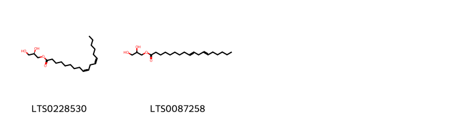{ width=100% }
    <figcaption>Hình ảnh cấu trúc hóa học của 2 hoạt chất thuộc nhóm Fatty Acyls gồm ['3-linoleoyl-sn-glycerol (LTS0228530)', '2,3-dihydroxypropyl octadeca-9,12-dienoate (LTS0087258)'].</figcaption>
</figure>
#### Nhóm Flavonoids
<figure markdown="span">
    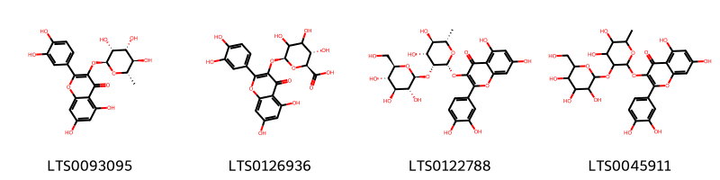{ width=100% }
    <figcaption>Hình ảnh cấu trúc hóa học của 4 hoạt chất thuộc nhóm Flavonoids gồm ['quercitrin (LTS0093095)', 'miquelianin (LTS0126936)', '3-{[(2r,3r,4r,5r,6s)-4,5-dihydroxy-6-methyl-3-{[(2s,3r,4s,5s,6r)-3,4,5-trihydroxy-6-(hydroxymethyl)oxan-2-yl]oxy}oxan-2-yl]oxy}-2-(3,4-dihydroxyphenyl)-5,7-dihydroxychromen-4-one (LTS0122788)', '3-[(4,5-dihydroxy-6-methyl-3-{[3,4,5-trihydroxy-6-(hydroxymethyl)oxan-2-yl]oxy}oxan-2-yl)oxy]-2-(3,4-dihydroxyphenyl)-5,7-dihydroxychromen-4-one (LTS0045911)'].</figcaption>
</figure>
#### Nhóm Furanoid lignans
<figure markdown="span">
    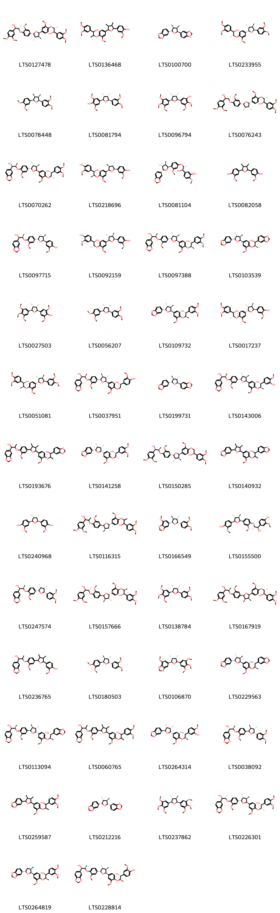{ width=100% }
    <figcaption>Hình ảnh cấu trúc hóa học của 84 hoạt chất thuộc nhóm Furanoid lignans gồm ['(1r,2s)-1-(3,4-dimethoxyphenyl)-2-{4-[(2r,3s,4s,5r)-5-(4-{[(1r,2r)-1-(3,4-dimethoxyphenyl)-1-hydroxypropan-2-yl]oxy}-3-methoxyphenyl)-3,4-dimethyloxolan-2-yl]-2-methoxyphenoxy}propan-1-ol (LTS0127478)', '4-[5-(4-{[1-(3,4-dimethoxyphenyl)-1-hydroxypropan-2-yl]oxy}-3-methoxyphenyl)-3,4-dimethyloxolan-2-yl]-2-methoxyphenol (LTS0136468)', '5-[(2s,3s,4r,5s)-5-(2h-1,3-benzodioxol-5-yl)-3,4-dimethyloxolan-2-yl]-2h-1,3-benzodioxole (LTS0100700)', '(1r,2r)-1-(3,4-dimethoxyphenyl)-2-{4-[(2s,3r,4r,5s)-5-(3,4-dimethoxyphenyl)-3,4-dimethyloxolan-2-yl]-2-methoxyphenoxy}propan-1-ol (LTS0233955)', '(2r,3s,4r,5s)-2,5-bis(3,4-dimethoxyphenyl)-3,4-dimethyloxolane (LTS0078448)', '4-[(2r,3r,4s,5s)-5-(3,4-dimethoxyphenyl)-3,4-dimethyloxolan-2-yl]-2,6-dimethoxyphenol (LTS0081794)', '5-[(2s,3s,4r,5r)-3,4-dimethyl-5-(3,4,5-trimethoxyphenyl)oxolan-2-yl]-2,3-dimethoxyphenol (LTS0096794)', '(1r,2s)-1-(3,4-dimethoxyphenyl)-2-{4-[(2r,3s,4r,5s)-5-(4-{[(1r,2r)-1-(3,4-dimethoxyphenyl)-1-hydroxypropan-2-yl]oxy}-3-methoxyphenyl)-3,4-dimethyloxolan-2-yl]-2-methoxyphenoxy}propan-1-ol (LTS0076243)', '(1r,2s)-2-{4-[(2s,3r,4r,5s)-5-(4-{[(1r,2r)-1-(2h-1,3-benzodioxol-5-yl)-1-hydroxypropan-2-yl]oxy}-3-methoxyphenyl)-3,4-dimethyloxolan-2-yl]-2-methoxyphenoxy}-1-(3,4-dimethoxyphenyl)propan-1-ol (LTS0070262)', '4-[(2s,3s,4s,5r)-5-(4-{[(1r,2s)-1-hydroxy-1-(4-hydroxy-3-methoxyphenyl)propan-2-yl]oxy}-3-methoxyphenyl)-3,4-dimethyloxolan-2-yl]-2-methoxyphenol (LTS0218696)', '5-[(1r,2r)-2-{4-[(2s,3r,4r,5s)-5-(2h-1,3-benzodioxol-5-yl)-3,4-dimethyloxolan-2-yl]-3-methoxyphenoxy}-1-hydroxypropyl]-2-methoxyphenol (LTS0081104)', '4-[5-(4-hydroxy-3-methoxyphenyl)-3,4-dimethyloxolan-2-yl]-2-methoxyphenol (LTS0082058)', '4-[(2s,3r,4r,5s)-5-(4-{[(1r,2r)-1-(2h-1,3-benzodioxol-5-yl)-1-hydroxypropan-2-yl]oxy}-3-methoxyphenyl)-3,4-dimethyloxolan-2-yl]-2-methoxyphenol (LTS0097715)', '4-[(2s,3r,4r,5r)-5-(4-{[(1r,2r)-1-hydroxy-1-(4-hydroxy-3-methoxyphenyl)propan-2-yl]oxy}-3-methoxyphenyl)-3,4-dimethyloxolan-2-yl]-2-methoxyphenol (LTS0092159)', 'manassantin b (LTS0097388)', '(1s,2r)-1-(2h-1,3-benzodioxol-5-yl)-2-{4-[(2s,3r,4r,5s)-5-(2h-1,3-benzodioxol-5-yl)-3,4-dimethyloxolan-2-yl]-2-methoxyphenoxy}propan-1-ol (LTS0103539)', '4-[(2s,3s,4r,5r)-3,4-dimethyl-5-(3,4,5-trimethoxyphenyl)oxolan-2-yl]-2,6-dimethoxyphenol (LTS0027503)', '(2r,3r,4s,5s)-2,5-bis(3,4-dimethoxyphenyl)-3,4-dimethyloxolane (LTS0056207)', '(1r,2r)-2-{4-[(2s,3r,4r,5s)-5-(2h-1,3-benzodioxol-5-yl)-3,4-dimethyloxolan-2-yl]-2-methoxyphenoxy}-1-(3,4-dimethoxyphenyl)propan-1-ol (LTS0109732)', '4-[(2s,3r,4r,5s)-5-(4-{[(1r,2r)-1-(3,4-dimethoxyphenyl)-1-hydroxypropan-2-yl]oxy}-3-methoxyphenyl)-3,4-dimethyloxolan-2-yl]-2-methoxyphenol (LTS0017237)', '(1r,2s)-1-(3,4-dimethoxyphenyl)-2-{4-[(2s,3r,4r,5s)-5-(3,4-dimethoxyphenyl)-3,4-dimethyloxolan-2-yl]-2-methoxyphenoxy}propan-1-ol (LTS0051081)', '4-[(1r,2s)-2-{4-[(2s,3s,4s,5s)-5-(4-{[(1r,2r)-1-(2h-1,3-benzodioxol-5-yl)-1-hydroxypropan-2-yl]oxy}-3-methoxyphenyl)-3,4-dimethyloxolan-2-yl]-2-methoxyphenoxy}-1-hydroxypropyl]-2-methoxyphenol (LTS0037951)', 'galbacin (LTS0199731)', '5-[(1r,2r)-2-{4-[(2s,3r,4r,5s)-5-(4-{[(1r,2r)-1-(2h-1,3-benzodioxol-5-yl)-1-hydroxypropan-2-yl]oxy}-3-methoxyphenyl)-3,4-dimethyloxolan-2-yl]-2-methoxyphenoxy}-1-hydroxypropyl]-2-methoxyphenol (LTS0143006)', '1-(2h-1,3-benzodioxol-5-yl)-2-{4-[5-(4-{[1-(2h-1,3-benzodioxol-5-yl)-1-hydroxypropan-2-yl]oxy}-3-methoxyphenyl)-3,4-dimethyloxolan-2-yl]-2-methoxyphenoxy}propan-1-ol (LTS0193676)', '(1r,2s)-2-{4-[(2r,3s,4r,5s)-5-(2h-1,3-benzodioxol-5-yl)-3,4-dimethyloxolan-2-yl]-2-methoxyphenoxy}-1-(3,4-dimethoxyphenyl)propan-1-ol (LTS0141258)', '(1r,2r)-1-(3,4-dimethoxyphenyl)-2-{4-[(2r,3s,4s,5r)-5-(4-{[(1r,2r)-1-(3,4-dimethoxyphenyl)-1-hydroxypropan-2-yl]oxy}-3-methoxyphenyl)-3,4-dimethyloxolan-2-yl]-2-methoxyphenoxy}propan-1-ol (LTS0150285)', '1-(2h-1,3-benzodioxol-5-yl)-2-{4-[5-(2h-1,3-benzodioxol-5-yl)-3,4-dimethyloxolan-2-yl]-2-methoxyphenoxy}propan-1-ol (LTS0140932)', '4-[(2s,3s,4r,5r)-5-(4-hydroxy-3-methoxyphenyl)-3,4-dimethyloxolan-2-yl]-2-methoxyphenol (LTS0240968)', '1-(3,4-dimethoxyphenyl)-2-{4-[(2s,3r,4r,5s)-5-(4-{[1-(3,4-dimethoxyphenyl)-1-hydroxypropan-2-yl]oxy}-3-methoxyphenyl)-3,4-dimethyloxolan-2-yl]-2-methoxyphenoxy}propan-1-ol (LTS0116315)', '6-[(2s,3s,4s,5r)-5-(3,4-dimethoxyphenyl)-3,4-dimethyloxolan-2-yl]-4-methoxy-2h-1,3-benzodioxole (LTS0166549)', '4-[(2r,3r,4r,5s)-5-(4-{[(1r,2s)-1-hydroxy-1-(4-hydroxy-3-methoxyphenyl)propan-2-yl]oxy}-3-methoxyphenyl)-3,4-dimethyloxolan-2-yl]-2-methoxyphenol (LTS0155500)', '(1r,2r)-1-(2h-1,3-benzodioxol-5-yl)-2-{4-[(2s,3r,4s,5r)-5-(3,4-dimethoxyphenyl)-3,4-dimethyloxolan-2-yl]-2-methoxyphenoxy}propan-1-ol (LTS0247574)', '(1r,2s)-1-(3,4-dimethoxyphenyl)-2-{4-[(2s,3r,4r,5s)-5-(4-{[(1r,2s)-1-(3,4-dimethoxyphenyl)-1-hydroxypropan-2-yl]oxy}-3-methoxyphenyl)-3,4-dimethyloxolan-2-yl]-2-methoxyphenoxy}propan-1-ol (LTS0157666)', '(2s,3s,4r,5r)-2-(3,4-dimethoxyphenyl)-3,4-dimethyl-5-(3,4,5-trimethoxyphenyl)oxolane (LTS0138784)', '(1r,2r)-1-(3,4-dimethoxyphenyl)-2-{4-[(2s,3r,4s,5r)-5-(4-{[(1r,2r)-1-(3,4-dimethoxyphenyl)-1-hydroxypropan-2-yl]oxy}-3-methoxyphenyl)-3,4-dimethyloxolan-2-yl]-2-methoxyphenoxy}propan-1-ol (LTS0167919)', '4-[5-(4-{[1-(2h-1,3-benzodioxol-5-yl)-1-hydroxypropan-2-yl]oxy}-3-methoxyphenyl)-3,4-dimethyloxolan-2-yl]-2-methoxyphenol (LTS0236765)', 'saucernetin (LTS0180503)', '6-[(2r,3r,4s,5s)-3,4-dimethyl-5-(3,4,5-trimethoxyphenyl)oxolan-2-yl]-4-methoxy-2h-1,3-benzodioxole (LTS0106870)', '(1r,2r)-1-(2h-1,3-benzodioxol-5-yl)-2-{4-[(2s,3r,4r,5s)-5-(2h-1,3-benzodioxol-5-yl)-3,4-dimethyloxolan-2-yl]-2-methoxyphenoxy}propan-1-ol (LTS0229563)', '(1r,2r)-1-(2h-1,3-benzodioxol-5-yl)-2-{4-[(2r,3s,4s,5r)-5-(4-{[(1r,2r)-1-(2h-1,3-benzodioxol-5-yl)-1-hydroxypropan-2-yl]oxy}-3-methoxyphenyl)-3,4-dimethyloxolan-2-yl]-2-methoxyphenoxy}propan-1-ol (LTS0113094)', '2-{4-[5-(4-{[1-(2h-1,3-benzodioxol-5-yl)-1-hydroxypropan-2-yl]oxy}-3-methoxyphenyl)-3,4-dimethyloxolan-2-yl]-2-methoxyphenoxy}-1-(3,4-dimethoxyphenyl)propan-1-ol (LTS0060765)', '5-[(1r,2r)-2-{4-[(2r,3s,4r,5r)-5-(2h-1,3-benzodioxol-5-yl)-3,4-dimethyloxolan-2-yl]-2-methoxyphenoxy}-1-hydroxypropyl]-2-methoxyphenol (LTS0264314)', '(1s,2r)-1-(2h-1,3-benzodioxol-5-yl)-2-{4-[(2r,3s,4s,5r)-5-(3,4-dimethoxyphenyl)-3,4-dimethyloxolan-2-yl]-2-methoxyphenoxy}propan-1-ol (LTS0038092)', '2-{4-[5-(2h-1,3-benzodioxol-5-yl)-3,4-dimethyloxolan-2-yl]-2-methoxyphenoxy}-1-(3,4-dimethoxyphenyl)propan-1-ol (LTS0259587)', '5-[(2s,3r,4r,5r)-5-(2h-1,3-benzodioxol-5-yl)-3,4-dimethyloxolan-2-yl]-2h-1,3-benzodioxole (LTS0212216)', '(2r,3r,4r,5s)-3,4-dimethyl-2,5-bis(3,4,5-trimethoxyphenyl)oxolane (LTS0237862)', '(1r,2s)-2-{4-[(2s,3r,4r,5s)-5-(4-{[(1r,2s)-1-(2h-1,3-benzodioxol-5-yl)-1-hydroxypropan-2-yl]oxy}-3-methoxyphenyl)-3,4-dimethyloxolan-2-yl]-2-methoxyphenoxy}-1-(3,4-dimethoxyphenyl)propan-1-ol (LTS0226301)', '(1s,2r)-2-{4-[(2s,3r,4r,5s)-5-(2h-1,3-benzodioxol-5-yl)-3,4-dimethyloxolan-2-yl]-2-methoxyphenoxy}-1-(3,4-dimethoxyphenyl)propan-1-ol (LTS0264819)', '4-[(1r,2r)-2-{4-[(2s,3r,4r,5s)-5-(4-{[(1r,2r)-1-(2h-1,3-benzodioxol-5-yl)-1-hydroxypropan-2-yl]oxy}-3-methoxyphenyl)-3,4-dimethyloxolan-2-yl]-2-methoxyphenoxy}-1-hydroxypropyl]-2-methoxyphenol (LTS0228814)', '1-(3,4-dimethoxyphenyl)-2-{4-[(2r,3r,4r,5s)-5-(3,4-dimethoxyphenyl)-3,4-dimethyloxolan-2-yl]-2-methoxyphenoxy}propan-1-ol (LTS0207560)', '(1r,2s)-1-(3,4-dimethoxyphenyl)-2-{4-[(2s,3r,4r,5s)-5-(4-{[(1r,2r)-1-(3,4-dimethoxyphenyl)-1-hydroxypropan-2-yl]oxy}-3-methoxyphenyl)-3,4-dimethyloxolan-2-yl]-2-methoxyphenoxy}propan-1-ol (LTS0145632)', '6-[(2r,3r,4s,5s)-5-(3,4-dimethoxyphenyl)-3,4-dimethyloxolan-2-yl]-4-methoxy-2h-1,3-benzodioxole (LTS0026323)', '4-[(2s,3r,4s,5s)-5-(4-{[(1s,2r)-1-hydroxy-1-(4-hydroxy-3-methoxyphenyl)propan-2-yl]oxy}-3-methoxyphenyl)-3,4-dimethyloxolan-2-yl]-2-methoxyphenol (LTS0227978)', '4-(2-{4-[5-(4-{[1-(2h-1,3-benzodioxol-5-yl)-1-hydroxypropan-2-yl]oxy}-3-methoxyphenyl)-3,4-dimethyloxolan-2-yl]-2-methoxyphenoxy}-1-hydroxypropyl)-2-methoxyphenol (LTS0169839)', '(1r,2s)-1-(2h-1,3-benzodioxol-5-yl)-2-{4-[(2s,3r,4s,5r)-5-(2h-1,3-benzodioxol-5-yl)-3,4-dimethyloxolan-2-yl]-2-methoxyphenoxy}propan-1-ol (LTS0241052)', '(1r,2s)-1-(3,4-dimethoxyphenyl)-2-{4-[(2s,3r,4s,5r)-5-(3,4-dimethoxyphenyl)-3,4-dimethyloxolan-2-yl]-2-methoxyphenoxy}propan-1-ol (LTS0034804)', '4-[(2s,3r,4s,5r)-5-(3,4-dimethoxyphenyl)-3,4-dimethyloxolan-2-yl]-2-methoxyphenol (LTS0048489)', '(1r,2r)-2-{4-[(2s,3r,4s,5r)-5-(4-{[(1r,2r)-1-(2h-1,3-benzodioxol-5-yl)-1-hydroxypropan-2-yl]oxy}-3-methoxyphenyl)-3,4-dimethyloxolan-2-yl]-2-methoxyphenoxy}-1-(3,4-dimethoxyphenyl)propan-1-ol (LTS0067437)', '4-[5-(4-{[1-hydroxy-1-(4-hydroxy-3-methoxyphenyl)propan-2-yl]oxy}-3-methoxyphenyl)-3,4-dimethyloxolan-2-yl]-2-methoxyphenol (LTS0016251)', '5-(2-{4-[5-(2h-1,3-benzodioxol-5-yl)-3,4-dimethyloxolan-2-yl]-2-methoxyphenoxy}-1-hydroxypropyl)-2-methoxyphenol (LTS0060698)', '4-(2-{4-[5-(4-{[1-(3,4-dimethoxyphenyl)-1-hydroxypropan-2-yl]oxy}-3-methoxyphenyl)-3,4-dimethyloxolan-2-yl]-2-methoxyphenoxy}-1-hydroxypropyl)-2-methoxyphenol (LTS0255929)', '(1r,2s)-1-(3,4-dimethoxyphenyl)-2-{4-[(2s,3r,4s,5s)-5-(4-{[(1r,2r)-1-(3,4-dimethoxyphenyl)-1-hydroxypropan-2-yl]oxy}-3-methoxyphenyl)-3,4-dimethyloxolan-2-yl]-2-methoxyphenoxy}propan-1-ol (LTS0009228)', '6-[3,4-dimethyl-5-(3,4,5-trimethoxyphenyl)oxolan-2-yl]-4-methoxy-2h-1,3-benzodioxole (LTS0122166)', '1-(3,4-dimethoxyphenyl)-3-[4-(5-{4-[3-(3,4-dimethoxyphenyl)-3-hydroxypropoxy]-3-methoxyphenyl}-3,4-dimethyloxolan-2-yl)-2-methoxyphenoxy]propan-1-ol (LTS0259755)', '2-{[(1r,2r)-1-(3,4-dimethoxyphenyl)-1-hydroxypropan-2-yl]oxy}-5-[(2s,3r,4r,5s)-5-(4-{[(1r,2r)-1-(3,4-dimethoxyphenyl)-1-hydroxypropan-2-yl]oxy}-3-methoxyphenyl)-3,4-dimethyloxolan-2-yl]phenol (LTS0033628)', '(1r,2r)-1-(3,4-dimethoxyphenyl)-2-{4-[(2r,3s,4s,5r)-5-(3,4-dimethoxyphenyl)-3,4-dimethyloxolan-2-yl]-2-methoxyphenoxy}propan-1-ol (LTS0031725)', '2,5-bis(3,4-dimethoxyphenyl)-3,4-dimethyloxolane (LTS0021613)', '1-(3,4-dimethoxyphenyl)-2-{4-[5-(3,4-dimethoxyphenyl)-3,4-dimethyloxolan-2-yl]-2-methoxyphenoxy}propan-1-ol (LTS0264017)', '(1s,2r)-1-(3,4-dimethoxyphenyl)-2-{4-[(2s,3r,4s,5r)-5-(4-{[(1s,2r)-1-(3,4-dimethoxyphenyl)-1-hydroxypropan-2-yl]oxy}-3-methoxyphenyl)-3,4-dimethyloxolan-2-yl]-2-methoxyphenoxy}propan-1-ol (LTS0011032)', '1-(2h-1,3-benzodioxol-5-yl)-2-{4-[5-(3,4-dimethoxyphenyl)-3,4-dimethyloxolan-2-yl]-2-methoxyphenoxy}propan-1-ol (LTS0027187)', '4-[(2s,3r,4r,5r)-5-(4-{[(1r,2s)-1-hydroxy-1-(4-hydroxy-3-methoxyphenyl)propan-2-yl]oxy}-3-methoxyphenyl)-3,4-dimethyloxolan-2-yl]-2-methoxyphenol (LTS0101307)', '1-(3,4-dimethoxyphenyl)-2-{4-[5-(4-{[1-(3,4-dimethoxyphenyl)-1-hydroxypropan-2-yl]oxy}-3-methoxyphenyl)-3,4-dimethyloxolan-2-yl]-2-methoxyphenoxy}propan-1-ol (LTS0217034)', '4-[(2s,3r,4r,5s)-5-(4-{[(1r,2s)-1-(3,4-dimethoxyphenyl)-1-hydroxypropan-2-yl]oxy}-3-methoxyphenyl)-3,4-dimethyloxolan-2-yl]-2-methoxyphenol (LTS0017607)', '4-[(1r,2s)-2-{4-[(2s,3r,4r,5s)-5-(4-{[(1r,2s)-1-(2h-1,3-benzodioxol-5-yl)-1-hydroxypropan-2-yl]oxy}-3-methoxyphenyl)-3,4-dimethyloxolan-2-yl]-2-methoxyphenoxy}-1-hydroxypropyl]-2-methoxyphenol (LTS0110198)', '5-[(1r,2r)-2-{4-[(2s,3r,4r,5s)-5-(2h-1,3-benzodioxol-5-yl)-3,4-dimethyloxolan-2-yl]-2-methoxyphenoxy}-1-hydroxypropyl]-2-methoxyphenol (LTS0033824)', '6-[(2r,3r,4s,5r)-3,4-dimethyl-5-(3,4,5-trimethoxyphenyl)oxolan-2-yl]-4-methoxy-2h-1,3-benzodioxole (LTS0095355)', '(1r,2s)-2-{4-[(2r,3r,4r,5r)-5-(4-{[(1r,2r)-1-(2h-1,3-benzodioxol-5-yl)-1-hydroxypropan-2-yl]oxy}-3-methoxyphenyl)-3,4-dimethyloxolan-2-yl]-2-methoxyphenoxy}-1-(3,4-dimethoxyphenyl)propan-1-ol (LTS0246675)', '5-[5-(2h-1,3-benzodioxol-5-yl)-3,4-dimethyloxolan-2-yl]-2h-1,3-benzodioxole (LTS0252710)', '(1r,2r)-2-{4-[(2r,3s,4s,5s)-5-(2h-1,3-benzodioxol-5-yl)-3,4-dimethyloxolan-2-yl]-2-methoxyphenoxy}-1-(3,4-dimethoxyphenyl)propan-1-ol (LTS0049665)', '4-[(1r,2s)-2-{4-[(2s,3r,4r,5s)-5-(4-{[(1r,2s)-1-(3,4-dimethoxyphenyl)-1-hydroxypropan-2-yl]oxy}-3-methoxyphenyl)-3,4-dimethyloxolan-2-yl]-2-methoxyphenoxy}-1-hydroxypropyl]-2-methoxyphenol (LTS0047571)', '5-[(1r,2s)-2-{4-[(2r,3s,4s,5s)-5-(2h-1,3-benzodioxol-5-yl)-3,4-dimethyloxolan-2-yl]-2-methoxyphenoxy}-1-hydroxypropyl]-2-methoxyphenol (LTS0225454)', '(1r,2r)-1-(3,4-dimethoxyphenyl)-2-{4-[(2s,3r,4r,5s)-5-(3,4-dimethoxyphenyl)-3,4-dimethyloxolan-2-yl]-3-methoxyphenoxy}propan-1-ol (LTS0039085)', "2-{4-[(2r,3s,4s,5r)-5-(4'-{[1-(2h-1,3-benzodioxol-5-yl)-1-hydroxypropan-2-yl]oxy}-2,3'-dimethoxy-[1,1'-biphenyl]-4-yl)-3,4-dimethyloxolan-2-yl]-2-methoxyphenoxy}-1-(3,4-dimethoxyphenyl)propan-1-ol (LTS0107536)"].</figcaption>
</figure>
#### Nhóm Glycerolipids
<figure markdown="span">
    { width=100% }
    <figcaption>Hình ảnh cấu trúc hóa học của 2 hoạt chất thuộc nhóm Glycerolipids gồm ['glyceryl stearate (LTS0073221)', '3-stearoyl-sn-glycerol (LTS0156323)'].</figcaption>
</figure>
#### Nhóm Organooxygen compounds
<figure markdown="span">
    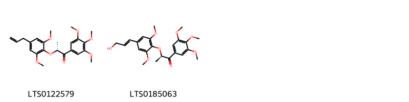{ width=100% }
    <figcaption>Hình ảnh cấu trúc hóa học của 2 hoạt chất thuộc nhóm Organooxygen compounds gồm ['(2r)-2-[2,6-dimethoxy-4-(prop-2-en-1-yl)phenoxy]-1-(3,4,5-trimethoxyphenyl)propan-1-one (LTS0122579)', '(2r)-2-{4-[(1e)-3-hydroxyprop-1-en-1-yl]-2,6-dimethoxyphenoxy}-1-(3,4,5-trimethoxyphenyl)propan-1-one (LTS0185063)'].</figcaption>
</figure>
#### Nhóm Phenols
<figure markdown="span">
    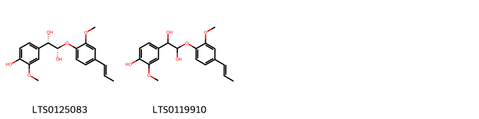{ width=100% }
    <figcaption>Hình ảnh cấu trúc hóa học của 2 hoạt chất thuộc nhóm Phenols gồm ['(1s,2s)-1-(4-hydroxy-3-methoxyphenyl)-2-{2-methoxy-4-[(1e)-prop-1-en-1-yl]phenoxy}ethane-1,2-diol (LTS0125083)', '1-(4-hydroxy-3-methoxyphenyl)-2-[2-methoxy-4-(prop-1-en-1-yl)phenoxy]ethane-1,2-diol (LTS0119910)'].</figcaption>
</figure>
#### Nhóm Prenol lipids
<figure markdown="span">
    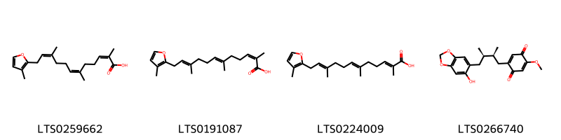{ width=100% }
    <figcaption>Hình ảnh cấu trúc hóa học của 4 hoạt chất thuộc nhóm Prenol lipids gồm ['2,6,10-trimethyl-12-(3-methylfuran-2-yl)dodeca-2,6,10-trienoic acid (LTS0259662)', '(2z,6e,10e)-2,6,10-trimethyl-12-(3-methylfuran-2-yl)dodeca-2,6,10-trienoic acid (LTS0191087)', '(2e,6e,10e)-2,6,10-trimethyl-12-(3-methylfuran-2-yl)dodeca-2,6,10-trienoic acid (LTS0224009)', '2-[(2s,3r)-4-(6-hydroxy-2h-1,3-benzodioxol-5-yl)-2,3-dimethylbutyl]-5-methoxycyclohexa-2,5-diene-1,4-dione (LTS0266740)'].</figcaption>
</figure>

---

### Dược dân tộc học

Danh sách các quốc gia có sử dụng *Saururus chinensis* trong điều trị các bệnh. 

| Country   | Disease                           | Bệnh                                                                                                                                                                                                |
|:----------|:----------------------------------|:----------------------------------------------------------------------------------------------------------------------------------------------------------------------------------------------------|
| China     | Diuretic, Refrigerant, Alexiteric | MYMEMORY WARNING: YOU USED ALL AVAILABLE FREE TRANSLATIONS FOR TODAY. NEXT AVAILABLE IN  15 HOURS 03 MINUTES 07 SECONDS VISIT HTTPS://MYMEMORY.TRANSLATED.NET/DOC/USAGELIMITS.PHP TO TRANSLATE MORE |
| Elsewhere | Diuretic                          | MYMEMORY WARNING: YOU USED ALL AVAILABLE FREE TRANSLATIONS FOR TODAY. NEXT AVAILABLE IN  15 HOURS 03 MINUTES 04 SECONDS VISIT HTTPS://MYMEMORY.TRANSLATED.NET/DOC/USAGELIMITS.PHP TO TRANSLATE MORE |

---

---
## Saururus loureiri
### Thông tin về thực vật

!!! info "Phân loại thực vật của *Saururus chinensis* từ GIBF:"
    - **Kingdom:** Plantae
    - **Phylum:** Tracheophyta
    - **Order:** Piperales
    - **Family:** Saururaceae
    - **Genus:** Saururus
    - **Species:** *Saururus chinensis*

 

| Label (VI)   | Label (EN)   | Scientific Name    | Descriptions (VI)   | Descriptions (EN)   | Also Known As (VI)   | Also Known As (EN)   |
|:-------------|:-------------|:-------------------|:--------------------|:--------------------|:---------------------|:---------------------|
| N/A          | N/A          | Saururus chinensis |                     | species of plant    | ['']                 | ['']                 |

#### Phân bố trên thế giới

**Từ CSDL GIBF** nan, Viet Nam, Japan, Indonesia, China, Germany

#### Phân bố tại Việt Nam

**Từ CSDL GIBF**: Không có ghi nhận ở Việt Nam

---
### Thành phần hóa học
        
- Theo cơ sở dữ liệu lotus: Từ loài *Saururus chinensis* đã phân lập và xác định được Chưa có hoạt chất nào được phân lập. hoạt chất thuộc về các nhóm Không có hoạt chất nào được phân lập. 

Không có hình ảnh nào được tạo ra

---

### Dược dân tộc học

Danh sách các quốc gia có sử dụng *Saururus chinensis* trong điều trị các bệnh. 

| Country   | Disease                | Bệnh                                                                                                                                                                                                |
|:----------|:-----------------------|:----------------------------------------------------------------------------------------------------------------------------------------------------------------------------------------------------|
| China     | Laxative, Parasiticide | MYMEMORY WARNING: YOU USED ALL AVAILABLE FREE TRANSLATIONS FOR TODAY. NEXT AVAILABLE IN  15 HOURS 02 MINUTES 29 SECONDS VISIT HTTPS://MYMEMORY.TRANSLATED.NET/DOC/USAGELIMITS.PHP TO TRANSLATE MORE |

---

# Chi Houttuynia

??? note "Danh sách các dược liệu thuộc chi"
    
	 - *Houttuynia cordata*

---
## Houttuynia cordata
### Thông tin về thực vật

!!! info "Phân loại thực vật của *Houttuynia cordata* từ GIBF:"
    - **Kingdom:** Plantae
    - **Phylum:** Tracheophyta
    - **Order:** Piperales
    - **Family:** Saururaceae
    - **Genus:** Houttuynia
    - **Species:** *Houttuynia cordata*

 

| Label (VI)   | Label (EN)   | Scientific Name    | Descriptions (VI)   | Descriptions (EN)   | Also Known As (VI)                                                                                 | Also Known As (EN)               |
|:-------------|:-------------|:-------------------|:--------------------|:--------------------|:---------------------------------------------------------------------------------------------------|:---------------------------------|
| N/A          | N/A          | Houttuynia cordata | loài thực vật       | species of plant    | ['Rau diếp cá', 'Rau dấp cá', 'Lá giấp', 'Houttuynia cordata', 'Diếp cá', 'Dấp cá', 'Cây giấp cá'] | ["Bishop's Weed", 'Lizard Tail'] |

#### Phân bố trên thế giới

**Từ CSDL GIBF** Hong Kong, Brazil, Viet Nam, United States of America, Japan, Macao, Belgium, Chinese Taipei, Costa Rica, China, Australia, Nepal, New Zealand, India, Germany, United Kingdom of Great Britain and Northern Ireland, Netherlands

#### Phân bố tại Việt Nam

**Từ CSDL GIBF**: Quảng Nam

---
### Thành phần hóa học
        
- Theo cơ sở dữ liệu lotus: Từ loài *Houttuynia cordata* đã phân lập và xác định được 156 hoạt chất thuộc về các nhóm Fatty Acyls, Unsaturated hydrocarbons, Carboxylic acids and derivatives, Phenols, Organooxygen compounds, Quinolines and derivatives, Polycyclic hydrocarbons, Aporphines, Benzene and substituted derivatives, Tannins, Cinnamic acids and derivatives, Steroids and steroid derivatives, Diazanaphthalenes, Furanoid lignans, Saturated hydrocarbons, Amaryllidaceae alkaloids, Heteroaromatic compounds, Flavonoids, Aristolactams, Prenol lipids, Epoxides, Indoles and derivatives. 

|    | chemicalTaxonomyClassyfireClass     |   smiles_count |
|---:|:------------------------------------|---------------:|
|  0 | Amaryllidaceae alkaloids            |              1 |
|  1 | Aporphines                          |              6 |
|  2 | Aristolactams                       |              4 |
|  3 | Benzene and substituted derivatives |              9 |
|  4 | Carboxylic acids and derivatives    |              1 |
|  5 | Cinnamic acids and derivatives      |              5 |
|  6 | Diazanaphthalenes                   |              2 |
|  7 | Epoxides                            |              2 |
|  8 | Fatty Acyls                         |             25 |
|  9 | Flavonoids                          |              8 |
| 10 | Furanoid lignans                    |              2 |
| 11 | Heteroaromatic compounds            |              1 |
| 12 | Indoles and derivatives             |              1 |
| 13 | Organooxygen compounds              |             17 |
| 14 | Phenols                             |              3 |
| 15 | Polycyclic hydrocarbons             |              2 |
| 16 | Prenol lipids                       |             46 |
| 17 | Quinolines and derivatives          |              1 |
| 18 | Saturated hydrocarbons              |              1 |
| 19 | Steroids and steroid derivatives    |             11 |
| 20 | Tannins                             |              2 |
| 21 | Unsaturated hydrocarbons            |              4 |

#### Nhóm Amaryllidaceae alkaloids
<figure markdown="span">
    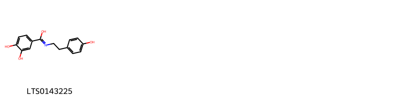{ width=100% }
    <figcaption>Hình ảnh cấu trúc hóa học của 1 hoạt chất thuộc nhóm Amaryllidaceae alkaloids gồm ['3,4-dihydroxy-n-[2-(4-hydroxyphenyl)ethyl]benzenecarboximidic acid (LTS0143225)'].</figcaption>
</figure>
#### Nhóm Aporphines
<figure markdown="span">
    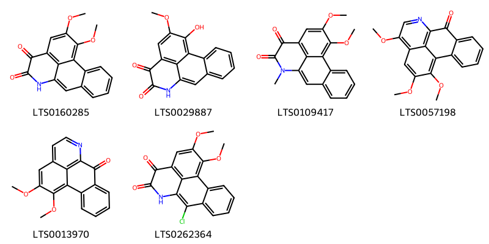{ width=100% }
    <figcaption>Hình ảnh cấu trúc hóa học của 6 hoạt chất thuộc nhóm Aporphines gồm ['15,16-dimethoxy-10-azatetracyclo[7.7.1.0²,⁷.0¹³,¹⁷]heptadeca-1(17),2(7),3,5,8,13,15-heptaene-11,12-dione (LTS0160285)', '16-hydroxy-15-methoxy-10-azatetracyclo[7.7.1.0²,⁷.0¹³,¹⁷]heptadeca-1(17),2(7),3,5,8,13,15-heptaene-11,12-dione (LTS0029887)', '15,16-dimethoxy-10-methyl-10-azatetracyclo[7.7.1.0²,⁷.0¹³,¹⁷]heptadeca-1(17),2(7),3,5,8,13,15-heptaene-11,12-dione (LTS0109417)', '12,15,16-trimethoxy-10-azatetracyclo[7.7.1.0²,⁷.0¹³,¹⁷]heptadeca-1(16),2,4,6,9(17),10,12,14-octaen-8-one (LTS0057198)', 'lysicamine (LTS0013970)', '8-chloro-15,16-dimethoxy-10-azatetracyclo[7.7.1.0²,⁷.0¹³,¹⁷]heptadeca-1(17),2(7),3,5,8,13,15-heptaene-11,12-dione (LTS0262364)'].</figcaption>
</figure>
#### Nhóm Aristolactams
<figure markdown="span">
    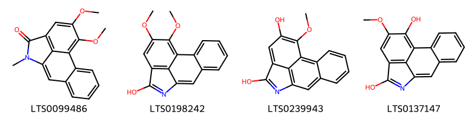{ width=100% }
    <figcaption>Hình ảnh cấu trúc hóa học của 4 hoạt chất thuộc nhóm Aristolactams gồm ['14,15-dimethoxy-10-methyl-10-azatetracyclo[7.6.1.0²,⁷.0¹²,¹⁶]hexadeca-1(16),2(7),3,5,8,12,14-heptaen-11-one (LTS0099486)', '14,15-dimethoxy-10-azatetracyclo[7.6.1.0²,⁷.0¹²,¹⁶]hexadeca-1(16),2(7),3,5,8,10,12,14-octaen-11-ol (LTS0198242)', '15-methoxy-10-azatetracyclo[7.6.1.0²,⁷.0¹²,¹⁶]hexadeca-1(16),2(7),3,5,8,10,12,14-octaene-11,14-diol (LTS0239943)', '14-methoxy-10-azatetracyclo[7.6.1.0²,⁷.0¹²,¹⁶]hexadeca-1(16),2(7),3,5,8,10,12,14-octaene-11,15-diol (LTS0137147)'].</figcaption>
</figure>
#### Nhóm Benzene and substituted derivatives
<figure markdown="span">
    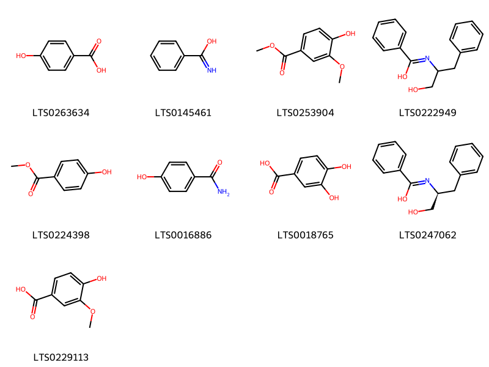{ width=100% }
    <figcaption>Hình ảnh cấu trúc hóa học của 9 hoạt chất thuộc nhóm Benzene and substituted derivatives gồm ['p-hydroxybenzoic acid (LTS0263634)', 'α-toluimidic acid (LTS0145461)', 'vanillate (LTS0253904)', 'n-(1-hydroxy-3-phenylpropan-2-yl)benzenecarboximidic acid (LTS0222949)', 'paraben (LTS0224398)', '4-hydroxybenzamide (LTS0016886)', '3,4-dihydroxybenzoic acid (LTS0018765)', 'n-[(2s)-1-hydroxy-3-phenylpropan-2-yl]benzenecarboximidic acid (LTS0247062)', 'vanillic acid (LTS0229113)'].</figcaption>
</figure>
#### Nhóm Carboxylic acids and derivatives
<figure markdown="span">
    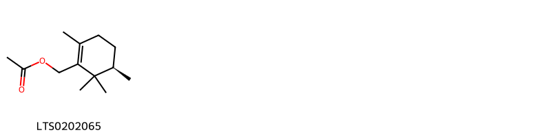{ width=100% }
    <figcaption>Hình ảnh cấu trúc hóa học của 1 hoạt chất thuộc nhóm Carboxylic acids and derivatives gồm ['[(5r)-2,5,6,6-tetramethylcyclohex-1-en-1-yl]methyl acetate (LTS0202065)'].</figcaption>
</figure>
#### Nhóm Cinnamic acids and derivatives
<figure markdown="span">
    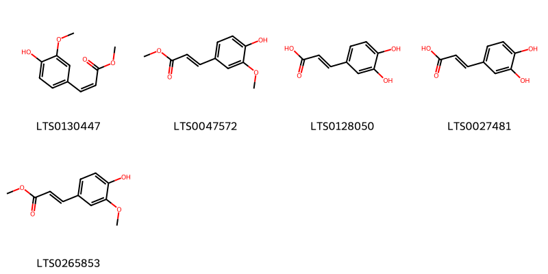{ width=100% }
    <figcaption>Hình ảnh cấu trúc hóa học của 5 hoạt chất thuộc nhóm Cinnamic acids and derivatives gồm ['(z)-methyl ferulate (LTS0130447)', 'methyl ferulate (LTS0047572)', '3,4-dihydroxycinnamic acid (LTS0128050)', 'caffeic acid (LTS0027481)', 'methyl ferulate (LTS0265853)'].</figcaption>
</figure>
#### Nhóm Diazanaphthalenes
<figure markdown="span">
    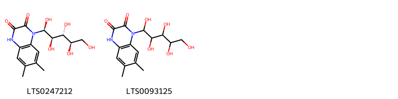{ width=100% }
    <figcaption>Hình ảnh cấu trúc hóa học của 2 hoạt chất thuộc nhóm Diazanaphthalenes gồm ['6,7-dimethyl-1-[(1s,2r,3r,4r)-1,2,3,4,5-pentahydroxypentyl]-4h-quinoxaline-2,3-dione (LTS0247212)', '6,7-dimethyl-1-(1,2,3,4,5-pentahydroxypentyl)-4h-quinoxaline-2,3-dione (LTS0093125)'].</figcaption>
</figure>
#### Nhóm Epoxides
<figure markdown="span">
    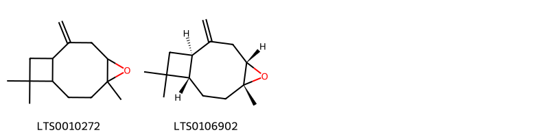{ width=100% }
    <figcaption>Hình ảnh cấu trúc hóa học của 2 hoạt chất thuộc nhóm Epoxides gồm ['6,10,10-trimethyl-2-methylidene-5-oxatricyclo[7.2.0.0⁴,⁶]undecane (LTS0010272)', '(1r,4s,6r,9s)-6,10,10-trimethyl-2-methylidene-5-oxatricyclo[7.2.0.0⁴,⁶]undecane (LTS0106902)'].</figcaption>
</figure>
#### Nhóm Fatty Acyls
<figure markdown="span">
    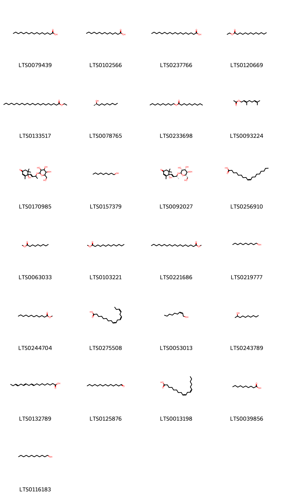{ width=100% }
    <figcaption>Hình ảnh cấu trúc hóa học của 25 hoạt chất thuộc nhóm Fatty Acyls gồm ['palmitic acid (LTS0079439)', 'myristic acid (LTS0102566)', 'stearic acid (LTS0237766)', 'ethyl tridecanoate (LTS0120669)', 'ethyl behenate (LTS0133517)', '(2r)-decan-2-ol (LTS0078765)', 'capryl caprate (LTS0233698)', 'geranyl acetate (LTS0093224)', '4-hydroxy-3,5,5-trimethyl-4-(3-{[3,4,5-trihydroxy-6-(hydroxymethyl)oxan-2-yl]oxy}but-1-en-1-yl)cyclohex-2-en-1-one (LTS0170985)', 'nonan-1-ol (LTS0157379)', '(4s)-4-hydroxy-3,5,5-trimethyl-4-[(1e,3r)-3-{[(2r,3r,4r,5r,6s)-3,4,5-trihydroxy-6-(hydroxymethyl)oxan-2-yl]oxy}but-1-en-1-yl]cyclohex-2-en-1-one (LTS0092027)', 'oleic acid (LTS0256910)', 'methyl nonanoate (ester) (LTS0063033)', 'methyl cocoate (LTS0103221)', 'methyl stearate (LTS0221686)', 'decanol (LTS0219777)', 'methyl laurate (LTS0244704)', 'α-linolenic acid (LTS0275508)', '(2z)-non-2-en-1-ol (LTS0053013)', 'decan-2-ol (LTS0243789)', 'α linolenic acid (LTS0132789)', 'tetradecanal (LTS0125876)', 'linoleic (LTS0013198)', 'capric acid (LTS0039856)', '1-dodecanol (LTS0116183)'].</figcaption>
</figure>
#### Nhóm Flavonoids
<figure markdown="span">
    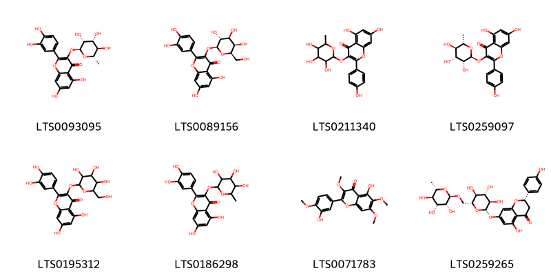{ width=100% }
    <figcaption>Hình ảnh cấu trúc hóa học của 8 hoạt chất thuộc nhóm Flavonoids gồm ['quercitrin (LTS0093095)', 'hyperoside (LTS0089156)', '5,7-dihydroxy-2-(4-hydroxyphenyl)-3-[(3,4,5-trihydroxy-6-methyloxan-2-yl)oxy]chromen-4-one (LTS0211340)', 'afzelin (LTS0259097)', '2-(3,4-dihydroxyphenyl)-5,7-dihydroxy-3-{[3,4,5-trihydroxy-6-(hydroxymethyl)oxan-2-yl]oxy}chromen-4-one (LTS0195312)', 'quercitrin (LTS0186298)', 'casticin (LTS0071783)', 'narirutin (LTS0259265)'].</figcaption>
</figure>
#### Nhóm Furanoid lignans
<figure markdown="span">
    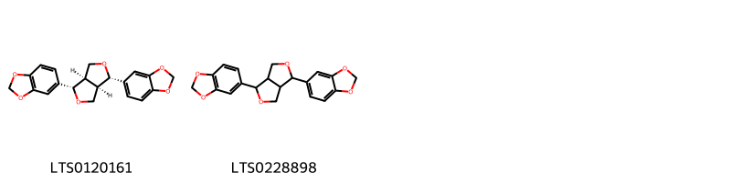{ width=100% }
    <figcaption>Hình ảnh cấu trúc hóa học của 2 hoạt chất thuộc nhóm Furanoid lignans gồm ['sesamin (LTS0120161)', 'sesamin (LTS0228898)'].</figcaption>
</figure>
#### Nhóm Heteroaromatic compounds
<figure markdown="span">
    { width=100% }
    <figcaption>Hình ảnh cấu trúc hóa học của 1 hoạt chất thuộc nhóm Heteroaromatic compounds gồm ['perillene (LTS0083458)'].</figcaption>
</figure>
#### Nhóm Indoles and derivatives
<figure markdown="span">
    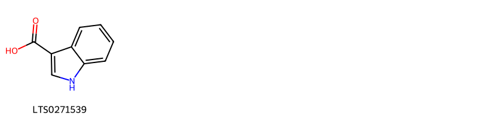{ width=100% }
    <figcaption>Hình ảnh cấu trúc hóa học của 1 hoạt chất thuộc nhóm Indoles and derivatives gồm ['indole - 3 carboxylic acid (LTS0271539)'].</figcaption>
</figure>
#### Nhóm Organooxygen compounds
<figure markdown="span">
    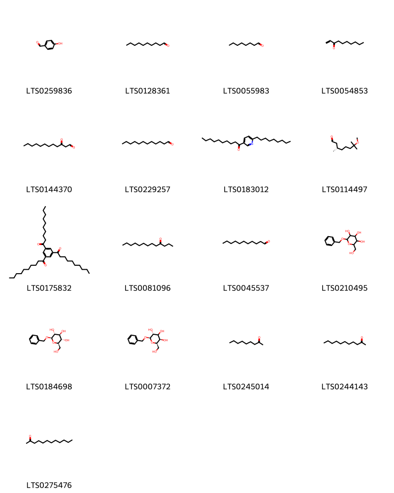{ width=100% }
    <figcaption>Hình ảnh cấu trúc hóa học của 17 hoạt chất thuộc nhóm Organooxygen compounds gồm ['p-hydroxybenzaldehyde (LTS0259836)', 'decanal (LTS0128361)', 'octanal (LTS0055983)', 'dec-1-en-3-one (LTS0054853)', 'decanoyl acetaldehyde (LTS0144370)', 'dodecanal (LTS0229257)', '1-(6-nonylpyridin-3-yl)decan-1-one (LTS0183012)', '(3s)-7-methoxy-3,7-dimethyloctanal (LTS0114497)', '1-[3,5-bis(decanoyl)phenyl]decan-1-one (LTS0175832)', 'tridecan-4-one (LTS0081096)', 'aldehyde c11 (LTS0045537)', 'benzyl glucopyranoside (LTS0210495)', 'benzyl β-d-glucoside (LTS0184698)', '(2r,3r,5r,6r)-2-(benzyloxy)-6-(hydroxymethyl)oxane-3,4,5-triol (LTS0007372)', '2-nonanone (LTS0245014)', 'undecan-2-one (LTS0244143)', 'lauron (LTS0275476)'].</figcaption>
</figure>
#### Nhóm Phenols
<figure markdown="span">
    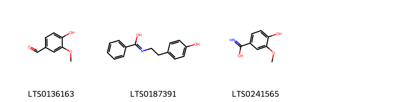{ width=100% }
    <figcaption>Hình ảnh cấu trúc hóa học của 3 hoạt chất thuộc nhóm Phenols gồm ['vanillin (LTS0136163)', 'n-[2-(4-hydroxyphenyl)ethyl]benzenecarboximidic acid (LTS0187391)', '4-hydroxy-3-methoxybenzenecarboximidic acid (LTS0241565)'].</figcaption>
</figure>
#### Nhóm Polycyclic hydrocarbons
<figure markdown="span">
    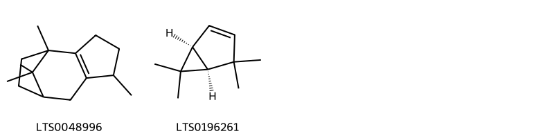{ width=100% }
    <figcaption>Hình ảnh cấu trúc hóa học của 2 hoạt chất thuộc nhóm Polycyclic hydrocarbons gồm ['1,5,11,11-tetramethyltricyclo[6.2.1.0²,⁶]undec-2(6)-ene (LTS0048996)', '(1s)-4,4,6,6-tetramethylbicyclo[3.1.0]hex-2-ene (LTS0196261)'].</figcaption>
</figure>
#### Nhóm Prenol lipids
<figure markdown="span">
    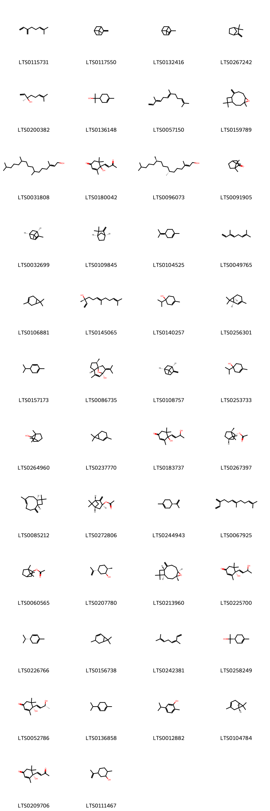{ width=100% }
    <figcaption>Hình ảnh cấu trúc hóa học của 46 hoạt chất thuộc nhóm Prenol lipids gồm ['α-myrcene (LTS0115731)', 'β-pinene (LTS0117550)', 'α pinene (LTS0132416)', 'camphene (LTS0267242)', '(-)-linalool (LTS0200382)', 'terpineol (LTS0136148)', 'farnesene (LTS0057150)', 'caryophyllene oxide (LTS0159789)', 'phytol (LTS0031808)', '4-hydroxy-3,5,5-trimethyl-4-(3-oxobut-1-en-1-yl)cyclohex-2-en-1-one (LTS0180042)', 'phytol (LTS0096073)', 'camphor (LTS0091905)', '(-)-α-pinene (LTS0032699)', '(+)-camphene (LTS0109845)', 'terpinolene (LTS0104525)', 'trans-β-ocimene (LTS0049765)', 'monoterpenes (LTS0106881)', '(3r,6e)-nerolidol (LTS0145065)', '(+)-4-terpineol (LTS0140257)', '(1r,6s)-3,7,7-trimethylbicyclo[4.1.0]hept-2-ene (LTS0256301)', 'phellandrene (LTS0157173)', '(1s,2r,5s,8r)-2,6-dimethyl-9-(propan-2-ylidene)-11-oxatricyclo[6.2.1.0¹,⁵]undec-6-en-8-ol (LTS0086735)', '(-)-β-pinene (LTS0108757)', '4-terpineol (LTS0253733)', 'borneol (LTS0264960)', '3,7,7-trimethylbicyclo[4.1.0]hept-2-ene (LTS0237770)', '4-hydroxy-4-(3-hydroxybut-1-en-1-yl)-3,5,5-trimethylcyclohex-2-en-1-one (LTS0183737)', '(-)-bornyl acetate (LTS0267397)', 'caryophyllene (LTS0085212)', '(1r,3s,5r)-6,6-dimethyl-2-methylidenebicyclo[3.1.1]heptan-3-yl acetate (LTS0272806)', 'α-limonene (LTS0244943)', 'β-farnesene (LTS0067925)', 'bornyl acetate (LTS0060565)', '(+)-neodihydrocarveol (LTS0207780)', 'β-caryophyllene oxide (LTS0213960)', '(4s)-4-hydroxy-4-(3-hydroxybut-1-en-1-yl)-3,5,5-trimethylcyclohex-2-en-1-one (LTS0225700)', '(-)-α-phellandrene (LTS0226766)', '4,7,7-trimethylbicyclo[4.1.0]hept-2-ene (LTS0156738)', 'β-ocimene (LTS0242381)', '(+)-α-terpineol (LTS0258249)', '(6s,9r)-vomifoliol (LTS0052786)', 'terpinene (LTS0136858)', 'carvacrol (LTS0012882)', '(-)-delta(3)-carene (LTS0104784)', 'dehydrovomifoliol (LTS0209706)', 'dihydrocarveol (LTS0111467)'].</figcaption>
</figure>
#### Nhóm Quinolines and derivatives
<figure markdown="span">
    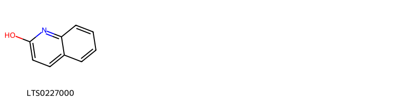{ width=100% }
    <figcaption>Hình ảnh cấu trúc hóa học của 1 hoạt chất thuộc nhóm Quinolines and derivatives gồm ['α-hydroxyquinoline (LTS0227000)'].</figcaption>
</figure>
#### Nhóm Saturated hydrocarbons
<figure markdown="span">
    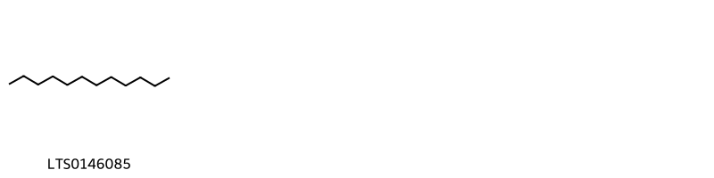{ width=100% }
    <figcaption>Hình ảnh cấu trúc hóa học của 1 hoạt chất thuộc nhóm Saturated hydrocarbons gồm ['dodecane (LTS0146085)'].</figcaption>
</figure>
#### Nhóm Steroids and steroid derivatives
<figure markdown="span">
    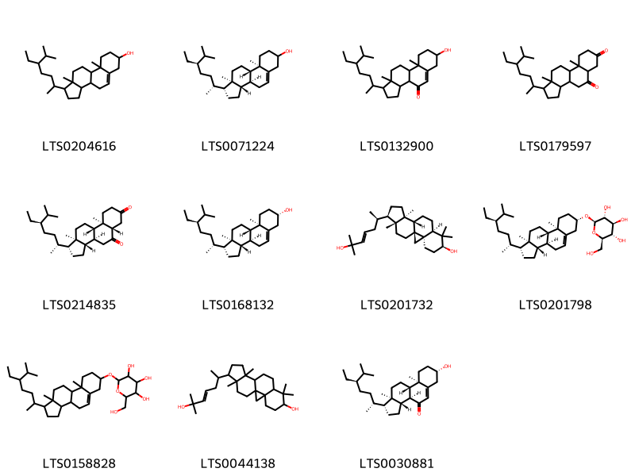{ width=100% }
    <figcaption>Hình ảnh cấu trúc hóa học của 11 hoạt chất thuộc nhóm Steroids and steroid derivatives gồm ['stigmast-5-en-3-ol, (3β)- (LTS0204616)', 'stigmast-5-en-3-ol (LTS0071224)', '1-(5-ethyl-6-methylheptan-2-yl)-7-hydroxy-9a,11a-dimethyl-1h,2h,3h,3ah,3bh,6h,7h,8h,9h,9bh,10h,11h-cyclopenta[a]phenanthren-4-one (LTS0132900)', '1-(5-ethyl-6-methylheptan-2-yl)-9a,11a-dimethyl-dodecahydro-1h-cyclopenta[a]phenanthrene-5,7-dione (LTS0179597)', '(1r,3as,3bs,5as,9ar,9bs,11ar)-1-[(2r,5r)-5-ethyl-6-methylheptan-2-yl]-9a,11a-dimethyl-dodecahydro-1h-cyclopenta[a]phenanthrene-5,7-dione (LTS0214835)', 'sitosterol (LTS0168132)', 'cycloart-23-ene-3β,25-diol (LTS0201732)', 'sitogluside (LTS0201798)', '2-{[1-(5-ethyl-6-methylheptan-2-yl)-9a,11a-dimethyl-1h,2h,3h,3ah,3bh,4h,6h,7h,8h,9h,9bh,10h,11h-cyclopenta[a]phenanthren-7-yl]oxy}-6-(hydroxymethyl)oxane-3,4,5-triol (LTS0158828)', '15-(6-hydroxy-6-methylhept-4-en-2-yl)-7,7,12,16-tetramethylpentacyclo[9.7.0.0¹,³.0³,⁸.0¹²,¹⁶]octadecan-6-ol (LTS0044138)', '(1r,3as,3bs,7s,9ar,9bs,11ar)-1-[(2r,5r)-5-ethyl-6-methylheptan-2-yl]-7-hydroxy-9a,11a-dimethyl-1h,2h,3h,3ah,3bh,6h,7h,8h,9h,9bh,10h,11h-cyclopenta[a]phenanthren-4-one (LTS0030881)'].</figcaption>
</figure>
#### Nhóm Tannins
<figure markdown="span">
    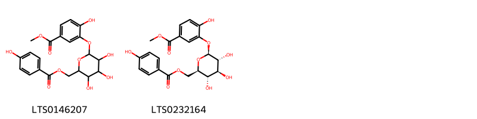{ width=100% }
    <figcaption>Hình ảnh cấu trúc hóa học của 2 hoạt chất thuộc nhóm Tannins gồm ['methyl 4-hydroxy-3-({3,4,5-trihydroxy-6-[(4-hydroxybenzoyloxy)methyl]oxan-2-yl}oxy)benzoate (LTS0146207)', 'methyl 4-hydroxy-3-{[(2s,3r,4s,5s,6r)-3,4,5-trihydroxy-6-[(4-hydroxybenzoyloxy)methyl]oxan-2-yl]oxy}benzoate (LTS0232164)'].</figcaption>
</figure>
#### Nhóm Unsaturated hydrocarbons
<figure markdown="span">
    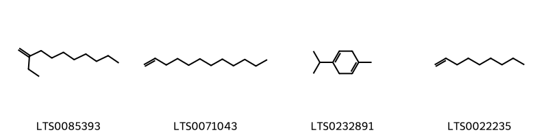{ width=100% }
    <figcaption>Hình ảnh cấu trúc hóa học của 4 hoạt chất thuộc nhóm Unsaturated hydrocarbons gồm ['3-methylideneundecane (LTS0085393)', '1-dodecene (LTS0071043)', 'α terpinene (LTS0232891)', 'nonene (LTS0022235)'].</figcaption>
</figure>

---

### Dược dân tộc học

Danh sách các quốc gia có sử dụng *Houttuynia cordata* trong điều trị các bệnh. 

| Country   | Disease                                                                            | Bệnh                                                                                                                                                                                                |
|:----------|:-----------------------------------------------------------------------------------|:----------------------------------------------------------------------------------------------------------------------------------------------------------------------------------------------------|
| China     | Alexiteric, Antiseptic, Astringent, Diuretic, Poison, Antidote, Vesicant, Diuretic | MYMEMORY WARNING: YOU USED ALL AVAILABLE FREE TRANSLATIONS FOR TODAY. NEXT AVAILABLE IN  15 HOURS 02 MINUTES 08 SECONDS VISIT HTTPS://MYMEMORY.TRANSLATED.NET/DOC/USAGELIMITS.PHP TO TRANSLATE MORE |
| Elsewhere | nan, Diuretic                                                                      | MYMEMORY WARNING: YOU USED ALL AVAILABLE FREE TRANSLATIONS FOR TODAY. NEXT AVAILABLE IN  15 HOURS 02 MINUTES 00 SECONDS VISIT HTTPS://MYMEMORY.TRANSLATED.NET/DOC/USAGELIMITS.PHP TO TRANSLATE MORE |
| India     | Diuretic                                                                           | MYMEMORY WARNING: YOU USED ALL AVAILABLE FREE TRANSLATIONS FOR TODAY. NEXT AVAILABLE IN  15 HOURS 01 MINUTES 52 SECONDS VISIT HTTPS://MYMEMORY.TRANSLATED.NET/DOC/USAGELIMITS.PHP TO TRANSLATE MORE |
| Indochina | Refrigerant, Emmenagogue                                                           | MYMEMORY WARNING: YOU USED ALL AVAILABLE FREE TRANSLATIONS FOR TODAY. NEXT AVAILABLE IN  15 HOURS 01 MINUTES 47 SECONDS VISIT HTTPS://MYMEMORY.TRANSLATED.NET/DOC/USAGELIMITS.PHP TO TRANSLATE MORE |
| Japan     | Diuretic, Suppurative                                                              | MYMEMORY WARNING: YOU USED ALL AVAILABLE FREE TRANSLATIONS FOR TODAY. NEXT AVAILABLE IN  15 HOURS 01 MINUTES 43 SECONDS VISIT HTTPS://MYMEMORY.TRANSLATED.NET/DOC/USAGELIMITS.PHP TO TRANSLATE MORE |
| Japan*    | Antidote, Aperient, Diuretic                                                       | MYMEMORY WARNING: YOU USED ALL AVAILABLE FREE TRANSLATIONS FOR TODAY. NEXT AVAILABLE IN  15 HOURS 01 MINUTES 39 SECONDS VISIT HTTPS://MYMEMORY.TRANSLATED.NET/DOC/USAGELIMITS.PHP TO TRANSLATE MORE |

---

