!!! abstract "Tóm tắt"

    Họ Schisandraceae gồm khoảng 2 chi và 6 loài được một số cộng đồng tại các quốc gia như Java, Japan*, Chinese, Elsewhere, China, Malaya (Import) sử dụng trong một số trường hợp MYMEMORY WARNING: YOU USED ALL AVAILABLE FREE TRANSLATIONS FOR TODAY. NEXT AVAILABLE IN  17 HOURS 07 MINUTES 10 SECONDS VISIT HTTPS://MYMEMORY.TRANSLATED.NET/DOC/USAGELIMITS.PHP TO TRANSLATE MORE.

!!! info "DrDuke"

    James A. Duke sinh năm 1929-2017 là một nhà thực vật học người Mỹ. Đây là một trong những tác giả hàng đầu trong lĩnh vực dược dân tộc học với cuốn *CRC Handbook of Medicinal Herbs* và chính là người xây dựng lên cơ sở dữ liệu về hợp chất tự nhiên và dược dân tộc học tại Bộ nông nghiệp Hoa Kỳ. Các thông tin được đăng tải tại website [Dr. Duke's Phytochemical and Ethnobotanical Databases](https://phytochem.nal.usda.gov/). 
    Trong suốt thập niên 1970, ông lãnh đạo the Plant Taxonomy Laboratory, Plant Genetics and Germplasm Institute of the Agricultural Research Service, U.S. Department of Agriculture.
    Trong tài liệu này, các thông tin về dược dân tộc của các dược liệu được trích dẫn từ tài liệu của James A. Ducke với sự trợ giúp của phần mềm dịch thuật từ tiếng Anh sang tiếng Việt.
   

# Chi Schisandra

??? note "Danh sách các dược liệu thuộc chi"
    
	 - *Schisandra chinensis*
	 - *Schisandra henanthera*

---
## Schisandra chinensis
### Thông tin về thực vật

!!! info "Phân loại thực vật của *Schisandra chinensis* từ GIBF:"
    - **Kingdom:** Plantae
    - **Phylum:** Tracheophyta
    - **Order:** Austrobaileyales
    - **Family:** Schisandraceae
    - **Genus:** Schisandra
    - **Species:** *Schisandra chinensis*

 

| Label (VI)   | Label (EN)   | Scientific Name      | Descriptions (VI)   | Descriptions (EN)   | Also Known As (VI)   | Also Known As (EN)                  |
|:-------------|:-------------|:---------------------|:--------------------|:--------------------|:---------------------|:------------------------------------|
| N/A          | N/A          | Schisandra chinensis | loài thực vật       | species of plant    | ['']                 | ['magnolia berry', 'magnolia-vine'] |

#### Phân bố trên thế giới

**Từ CSDL GIBF** Viet Nam, Belarus, Japan, Latvia, Russian Federation, China, Belgium, Korea, Republic of, Chinese Taipei

#### Phân bố tại Việt Nam

**Từ CSDL GIBF**: Không có ghi nhận ở Việt Nam

---
### Thành phần hóa học
        
- Theo cơ sở dữ liệu lotus: Từ loài *Schisandra chinensis* đã phân lập và xác định được 134 hoạt chất thuộc về các nhóm Organooxygen compounds, Indoles and derivatives, Flavonoids, Unsaturated hydrocarbons, Tannins, Amaryllidaceae alkaloids, Dibenzylbutane lignans, Prenol lipids, Carboxylic acids and derivatives, Fatty Acyls, Harmala alkaloids, Furofurans, Cinnamic acids and derivatives, Alkylhalophosphines, Steroids and steroid derivatives, Benzene and substituted derivatives. 

|    | chemicalTaxonomyClassyfireClass     |   smiles_count |
|---:|:------------------------------------|---------------:|
|  0 |                                     |              1 |
|  1 | Alkylhalophosphines                 |              1 |
|  2 | Amaryllidaceae alkaloids            |              1 |
|  3 | Benzene and substituted derivatives |              3 |
|  4 | Carboxylic acids and derivatives    |              4 |
|  5 | Cinnamic acids and derivatives      |              2 |
|  6 | Dibenzylbutane lignans              |              6 |
|  7 | Fatty Acyls                         |              2 |
|  8 | Flavonoids                          |              2 |
|  9 | Furofurans                          |              2 |
| 10 | Harmala alkaloids                   |              1 |
| 11 | Indoles and derivatives             |              2 |
| 12 | Organooxygen compounds              |              2 |
| 13 | Prenol lipids                       |             14 |
| 14 | Steroids and steroid derivatives    |              3 |
| 15 | Tannins                             |             83 |
| 16 | Unsaturated hydrocarbons            |              3 |

#### Nhóm 
<figure markdown="span">
    { width=100% }
    <figcaption>Hình ảnh cấu trúc hóa học của 1 hoạt chất thuộc nhóm  gồm ['tricyclo[10.4.0.0²,⁷]hexadeca-1(16),2,4,6,8,10,12,14-octaene (LTS0041270)'].</figcaption>
</figure>
#### Nhóm Alkylhalophosphines
<figure markdown="span">
    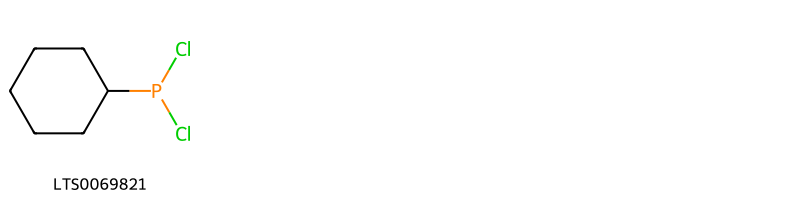{ width=100% }
    <figcaption>Hình ảnh cấu trúc hóa học của 1 hoạt chất thuộc nhóm Alkylhalophosphines gồm ['dichloro(cyclohexyl)phosphane (LTS0069821)'].</figcaption>
</figure>
#### Nhóm Amaryllidaceae alkaloids
<figure markdown="span">
    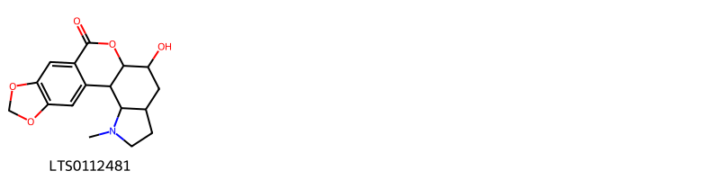{ width=100% }
    <figcaption>Hình ảnh cấu trúc hóa học của 1 hoạt chất thuộc nhóm Amaryllidaceae alkaloids gồm ['9-hydroxy-4-methyl-11,16,18-trioxa-4-azapentacyclo[11.7.0.0²,¹⁰.0³,⁷.0¹⁵,¹⁹]icosa-1(20),13,15(19)-trien-12-one (LTS0112481)'].</figcaption>
</figure>
#### Nhóm Benzene and substituted derivatives
<figure markdown="span">
    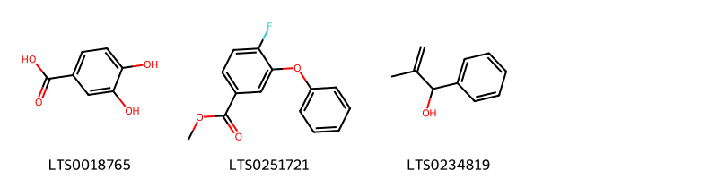{ width=100% }
    <figcaption>Hình ảnh cấu trúc hóa học của 3 hoạt chất thuộc nhóm Benzene and substituted derivatives gồm ['3,4-dihydroxybenzoic acid (LTS0018765)', 'methyl 4-fluoro-3-phenoxybenzoate (LTS0251721)', '2-methyl-1-phenylprop-2-en-1-ol (LTS0234819)'].</figcaption>
</figure>
#### Nhóm Carboxylic acids and derivatives
<figure markdown="span">
    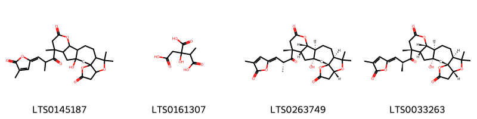{ width=100% }
    <figcaption>Hình ảnh cấu trúc hóa học của 4 hoạt chất thuộc nhóm Carboxylic acids and derivatives gồm ['1-hydroxy-9,9,18-trimethyl-18-[2-methyl-3-(4-methyl-5-oxofuran-2-ylidene)propanoyl]-4,8,15-trioxapentacyclo[11.7.0.0³,⁷.0³,¹⁰.0¹⁴,¹⁹]icosane-5,16-dione (LTS0145187)', 'methylcitric acid (LTS0161307)', '(1s,3r,7r,10s,13r,14s,18r,19r)-1-hydroxy-9,9,18-trimethyl-18-[(2r)-2-methyl-3-[(2z)-4-methyl-5-oxofuran-2-ylidene]propanoyl]-4,8,15-trioxapentacyclo[11.7.0.0³,⁷.0³,¹⁰.0¹⁴,¹⁹]icosane-5,16-dione (LTS0263749)', '(1s,3r,7r,10s,13r,14s,18r,19r)-1-hydroxy-9,9,18-trimethyl-18-[(2s)-2-methyl-3-[(2z)-4-methyl-5-oxofuran-2-ylidene]propanoyl]-4,8,15-trioxapentacyclo[11.7.0.0³,⁷.0³,¹⁰.0¹⁴,¹⁹]icosane-5,16-dione (LTS0033263)'].</figcaption>
</figure>
#### Nhóm Cinnamic acids and derivatives
<figure markdown="span">
    { width=100% }
    <figcaption>Hình ảnh cấu trúc hóa học của 2 hoạt chất thuộc nhóm Cinnamic acids and derivatives gồm ['cinnamic acid (LTS0128130)', 'phenylacrylic acid (LTS0097258)'].</figcaption>
</figure>
#### Nhóm Dibenzylbutane lignans
<figure markdown="span">
    { width=100% }
    <figcaption>Hình ảnh cấu trúc hóa học của 6 hoạt chất thuộc nhóm Dibenzylbutane lignans gồm ['macelignan (LTS0151408)', 'macelignan (LTS0157636)', 'nordihydroguaiaretic acid (LTS0102771)', '5-[4-(3-hydroxy-4,5-dimethoxyphenyl)-2,3-dimethylbutyl]-2,3-dimethoxyphenol (LTS0104636)', 'masoprocol (LTS0161715)', 'pregomisin (LTS0074893)'].</figcaption>
</figure>
#### Nhóm Fatty Acyls
<figure markdown="span">
    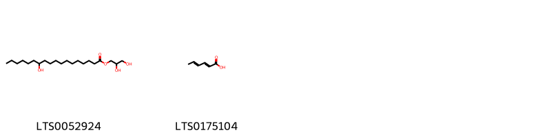{ width=100% }
    <figcaption>Hình ảnh cấu trúc hóa học của 2 hoạt chất thuộc nhóm Fatty Acyls gồm ['2,3-dihydroxypropyl 12-hydroxyoctadecanoate (LTS0052924)', 'sorbic acid (LTS0175104)'].</figcaption>
</figure>
#### Nhóm Flavonoids
<figure markdown="span">
    { width=100% }
    <figcaption>Hình ảnh cấu trúc hóa học của 2 hoạt chất thuộc nhóm Flavonoids gồm ['quercetin (LTS0004651)', 'kaempherol (LTS0155822)'].</figcaption>
</figure>
#### Nhóm Furofurans
<figure markdown="span">
    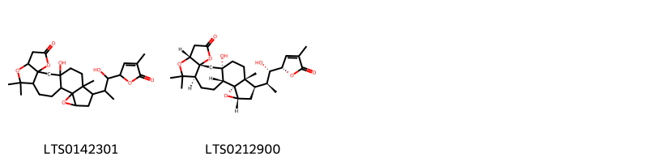{ width=100% }
    <figcaption>Hình ảnh cấu trúc hóa học của 2 hoạt chất thuộc nhóm Furofurans gồm ['1-hydroxy-18-[1-hydroxy-1-(4-methyl-5-oxo-2h-furan-2-yl)propan-2-yl]-9,9,19-trimethyl-4,8,15-trioxahexacyclo[11.8.0.0³,⁷.0³,¹⁰.0¹⁴,¹⁶.0¹⁴,¹⁹]henicosan-5-one (LTS0142301)', '(1s,3r,7r,10s,13r,14r,16s,18r,19r)-1-hydroxy-18-[(1s,2s)-1-hydroxy-1-[(2s)-4-methyl-5-oxo-2h-furan-2-yl]propan-2-yl]-9,9,19-trimethyl-4,8,15-trioxahexacyclo[11.8.0.0³,⁷.0³,¹⁰.0¹⁴,¹⁶.0¹⁴,¹⁹]henicosan-5-one (LTS0212900)'].</figcaption>
</figure>
#### Nhóm Harmala alkaloids
<figure markdown="span">
    { width=100% }
    <figcaption>Hình ảnh cấu trúc hóa học của 1 hoạt chất thuộc nhóm Harmala alkaloids gồm ['harmane (LTS0068205)'].</figcaption>
</figure>
#### Nhóm Indoles and derivatives
<figure markdown="span">
    { width=100% }
    <figcaption>Hình ảnh cấu trúc hóa học của 2 hoạt chất thuộc nhóm Indoles and derivatives gồm ['n-[2-(5-methoxy-1h-indol-3-yl)ethyl]ethanimidic acid (LTS0219322)', 'β-carboline (LTS0263207)'].</figcaption>
</figure>
#### Nhóm Organooxygen compounds
<figure markdown="span">
    { width=100% }
    <figcaption>Hình ảnh cấu trúc hóa học của 2 hoạt chất thuộc nhóm Organooxygen compounds gồm ['(3r,5r)-1,3,4,5-tetrahydroxycyclohexane-1-carboxylic acid (LTS0249267)', '4-(3-methoxy-4-{[3,4,5-trihydroxy-6-(hydroxymethyl)oxan-2-yl]oxy}phenyl)butan-2-one (LTS0215400)'].</figcaption>
</figure>
#### Nhóm Prenol lipids
<figure markdown="span">
    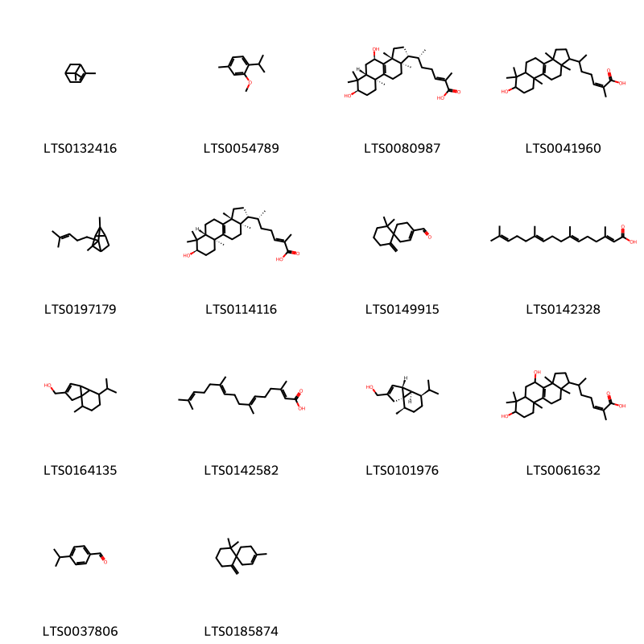{ width=100% }
    <figcaption>Hình ảnh cấu trúc hóa học của 14 hoạt chất thuộc nhóm Prenol lipids gồm ['α pinene (LTS0132416)', '2-isopropyl-5-methylanisole (LTS0054789)', '(2e,6r)-6-[(1r,3ar,4r,5ar,7r,9as,11ar)-4,7-dihydroxy-3a,6,6,9a,11a-pentamethyl-1h,2h,3h,4h,5h,5ah,7h,8h,9h,10h,11h-cyclopenta[a]phenanthren-1-yl]-2-methylhept-2-enoic acid (LTS0080987)', '6-{7-hydroxy-3a,6,6,9a,11a-pentamethyl-1h,2h,3h,4h,5h,5ah,7h,8h,9h,10h,11h-cyclopenta[a]phenanthren-1-yl}-2-methylhept-2-enoic acid (LTS0041960)', '1,7-dimethyl-7-(4-methylpent-3-en-1-yl)tricyclo[2.2.1.0²,⁶]heptane (LTS0197179)', '(2e,6r)-6-[(1r,3ar,5ar,7r,9as,11ar)-7-hydroxy-3a,6,6,9a,11a-pentamethyl-1h,2h,3h,4h,5h,5ah,7h,8h,9h,10h,11h-cyclopenta[a]phenanthren-1-yl]-2-methylhept-2-enoic acid (LTS0114116)', '7,7-dimethyl-11-methylidenespiro[5.5]undec-2-ene-3-carbaldehyde (LTS0149915)', '(2e,6e,10e)-3,7,11,15-tetramethylhexadeca-2,6,10,14-tetraenoic acid (LTS0142328)', '{7-isopropyl-10-methyltricyclo[4.4.0.0¹,⁵]dec-3-en-3-yl}methanol (LTS0164135)', '3,7,11,15-tetramethylhexadeca-2,6,10,14-tetraenoic acid (LTS0142582)', '[(1r,5r,6r,7r,10r)-7-isopropyl-10-methyltricyclo[4.4.0.0¹,⁵]dec-3-en-3-yl]methanol (LTS0101976)', '6-{4,7-dihydroxy-3a,6,6,9a,11a-pentamethyl-1h,2h,3h,4h,5h,5ah,7h,8h,9h,10h,11h-cyclopenta[a]phenanthren-1-yl}-2-methylhept-2-enoic acid (LTS0061632)', 'cuminaldehyde (LTS0037806)', 'β-chamigrene (LTS0185874)'].</figcaption>
</figure>
#### Nhóm Steroids and steroid derivatives
<figure markdown="span">
    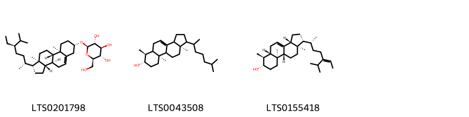{ width=100% }
    <figcaption>Hình ảnh cấu trúc hóa học của 3 hoạt chất thuộc nhóm Steroids and steroid derivatives gồm ['sitogluside (LTS0201798)', 'methostenol (LTS0043508)', '(z)-24-ethylidenelophenol (LTS0155418)'].</figcaption>
</figure>
#### Nhóm Tannins
<figure markdown="span">
    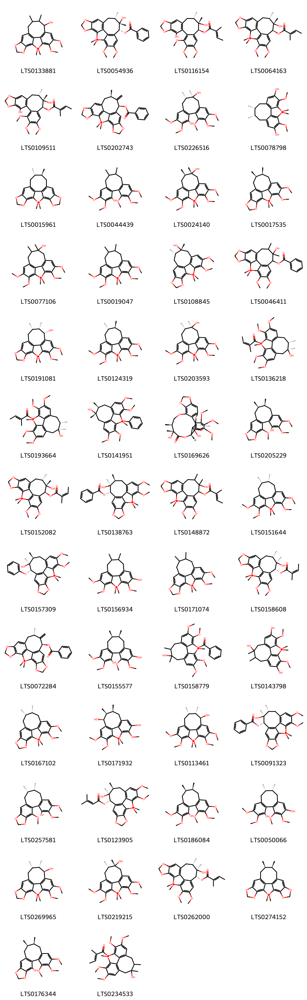{ width=100% }
    <figcaption>Hình ảnh cấu trúc hóa học của 83 hoạt chất thuộc nhóm Tannins gồm ['3,4,5,19-tetramethoxy-9,10-dimethyl-15,17-dioxatetracyclo[10.7.0.0²,⁷.0¹⁴,¹⁸]nonadeca-1(12),2(7),3,5,13,18-hexaen-8-ol (LTS0133881)', '(8r,9s,10s)-9-hydroxy-3,4,5,19-tetramethoxy-9,10-dimethyl-15,17-dioxatetracyclo[10.7.0.0²,⁷.0¹⁴,¹⁸]nonadeca-1(12),2(7),3,5,13,18-hexaen-8-yl benzoate (LTS0054936)', '(8s,9s,10s)-9,19-dihydroxy-3,4,5-trimethoxy-9,10-dimethyl-15,17-dioxatetracyclo[10.7.0.0²,⁷.0¹⁴,¹⁸]nonadeca-1(12),2,4,6,13,18-hexaen-8-yl 2-methylbut-2-enoate (LTS0116154)', '(8s,9s,10s)-9-hydroxy-3,4,5,19-tetramethoxy-9,10-dimethyl-15,17-dioxatetracyclo[10.7.0.0²,⁷.0¹⁴,¹⁸]nonadeca-1(12),2,4,6,13,18-hexaen-8-yl (2e)-2-methylbut-2-enoate (LTS0064163)', '(8s,9s,10s)-9,19-dihydroxy-3,4,5-trimethoxy-9,10-dimethyl-15,17-dioxatetracyclo[10.7.0.0²,⁷.0¹⁴,¹⁸]nonadeca-1(12),2,4,6,13,18-hexaen-8-yl (2e)-2-methylbut-2-enoate (LTS0109511)', '(11r,13r)-3,22-dimethoxy-13-methyl-12-methylidene-5,7,18,20-tetraoxapentacyclo[13.7.0.0²,¹⁰.0⁴,⁸.0¹⁷,²¹]docosa-1(22),2(10),3,8,15,17(21)-hexaen-11-yl benzoate (LTS0202743)', '(9s,10s)-4,5,14,15,16-pentamethoxy-9,10-dimethyltricyclo[10.4.0.0²,⁷]hexadeca-1(12),2(7),3,5,13,15-hexaene-3,10-diol (LTS0226516)', '(9s,10r)-3,4,15,16-tetramethoxy-9,10-dimethyltricyclo[10.4.0.0²,⁷]hexadeca-1(12),2,4,6,13,15-hexaene-5,14-diol (LTS0078798)', '(12s,13s)-3,22-dimethoxy-12,13-dimethyl-5,7,18,20-tetraoxapentacyclo[13.7.0.0²,¹⁰.0⁴,⁸.0¹⁷,²¹]docosa-1(15),2(10),3,8,16,21-hexaene (LTS0015961)', '4,5,14,15,16-pentamethoxy-9,10-dimethyltricyclo[10.4.0.0²,⁷]hexadeca-1(12),2(7),3,5,13,15-hexaen-3-ol (LTS0044439)', '(9r,10r)-3,4,5,14,15,16-hexamethoxy-9,10-dimethyltricyclo[10.4.0.0²,⁷]hexadeca-1(12),2(7),3,5,13,15-hexaen-9-ol (LTS0024140)', '(9s,10r)-3,4,5,19-tetramethoxy-9,10-dimethyl-15,17-dioxatetracyclo[10.7.0.0²,⁷.0¹⁴,¹⁸]nonadeca-1(12),2(7),3,5,13,18-hexaene (LTS0017535)', '3,4,5,14,15,16-hexamethoxy-9,10-dimethyltricyclo[10.4.0.0²,⁷]hexadeca-1(12),2(7),3,5,13,15-hexaen-9-ol (LTS0077106)', '3,4,5,14,15,16-hexamethoxy-9,10-dimethyltricyclo[10.4.0.0²,⁷]hexadeca-1(12),2(7),3,5,13,15-hexaene (LTS0019047)', '(9r,10s)-3,4,5,19-tetramethoxy-9,10-dimethyl-15,17-dioxatetracyclo[10.7.0.0²,⁷.0¹⁴,¹⁸]nonadeca-1(12),2(7),3,5,13,18-hexaen-9-ol (LTS0108845)', 'arisanschinin k (LTS0046411)', '(8s,9s,10s)-3,4,5,19-tetramethoxy-9,10-dimethyl-15,17-dioxatetracyclo[10.7.0.0²,⁷.0¹⁴,¹⁸]nonadeca-1(12),2(7),3,5,13,18-hexaen-8-ol (LTS0191081)', '(9s,10s)-3,4,5,14,15,16-hexamethoxy-9,10-dimethyltricyclo[10.4.0.0²,⁷]hexadeca-1(12),2(7),3,5,13,15-hexaene (LTS0124319)', '(9s,10s)-3,4,5,14,15,16-hexamethoxy-9,10-dimethyltricyclo[10.4.0.0²,⁷]hexadeca-1(12),2(7),3,5,13,15-hexaen-9-ol (LTS0203593)', '(9s,10s)-10-hydroxy-4,5,14,15,16-pentamethoxy-9,10-dimethyltricyclo[10.4.0.0²,⁷]hexadeca-1(12),2(7),3,5,13,15-hexaen-3-yl (2z)-2-methylbut-2-enoate (LTS0136218)', '(9s,10s)-10-hydroxy-4,5,14,15,16-pentamethoxy-9,10-dimethyltricyclo[10.4.0.0²,⁷]hexadeca-1(12),2(7),3,5,13,15-hexaen-3-yl (2e)-2-methylbut-2-enoate (LTS0193664)', '(9s,10s)-3,4,5,14,15-pentamethoxy-9,10-dimethyl-16-phenoxytricyclo[10.4.0.0²,⁷]hexadeca-1(12),2(7),3,5,13,15-hexaen-9-ol (LTS0141951)', '(11s,12r,15s,24s,25s)-12,25-dihydroxy-18,19,20-trimethoxy-11,12,24,25-tetramethyl-4,6,9,14-tetraoxapentacyclo[13.7.3.0³,⁷.0⁸,²².0¹⁶,²¹]pentacosa-1(22),2,7,16(21),17,19-hexaen-13-one (LTS0169626)', '(9s,10r)-4,5,19-trimethoxy-9,10-dimethyl-15,17-dioxatetracyclo[10.7.0.0²,⁷.0¹⁴,¹⁸]nonadeca-1(12),2(7),3,5,13,18-hexaen-3-ol (LTS0205229)', '(8s,9s,10s)-9-hydroxy-3,4,5,19-tetramethoxy-9,10-dimethyl-15,17-dioxatetracyclo[10.7.0.0²,⁷.0¹⁴,¹⁸]nonadeca-1(12),2,4,6,13,18-hexaen-8-yl (2z)-2-methylbut-2-enoate (LTS0152082)', '(9s,10s,11s)-10-hydroxy-3,4,5,19-tetramethoxy-9,10-dimethyl-15,17-dioxatetracyclo[10.7.0.0²,⁷.0¹⁴,¹⁸]nonadeca-1(12),2(7),3,5,13,18-hexaen-11-yl benzoate (LTS0138763)', '9-hydroxy-3,4,5,19-tetramethoxy-9,10-dimethyl-15,17-dioxatetracyclo[10.7.0.0²,⁷.0¹⁴,¹⁸]nonadeca-1(12),2,4,6,13,18-hexaen-8-yl 2-methylbut-2-enoate (LTS0148872)', '(9r,10s)-3,4,5,14,15,16-hexamethoxy-9,10-dimethyltricyclo[10.4.0.0²,⁷]hexadeca-1(12),2(7),3,5,13,15-hexaene (LTS0151644)', '(9s,10s,11s)-3,4,5,19-tetramethoxy-9,10-dimethyl-11-phenoxy-15,17-dioxatetracyclo[10.7.0.0²,⁷.0¹⁴,¹⁸]nonadeca-1(12),2(7),3,5,13,18-hexaen-10-ol (LTS0157309)', '3,4,14,15,16-pentamethoxy-9,10-dimethyltricyclo[10.4.0.0²,⁷]hexadeca-1(12),2(7),3,5,13,15-hexaen-5-ol (LTS0156934)', '3,4,5,19-tetramethoxy-9,10-dimethyl-15,17-dioxatetracyclo[10.7.0.0²,⁷.0¹⁴,¹⁸]nonadeca-1(12),2(7),3,5,13,18-hexaene (LTS0171074)', '(8r,9r,10s)-9-hydroxy-3,4,5,19-tetramethoxy-9,10-dimethyl-15,17-dioxatetracyclo[10.7.0.0²,⁷.0¹⁴,¹⁸]nonadeca-1(12),2,4,6,13,18-hexaen-8-yl (2z)-2-methylbut-2-enoate (LTS0158608)', '(11r,13s)-3,22-dimethoxy-13-methyl-12-methylidene-5,7,18,20-tetraoxapentacyclo[13.7.0.0²,¹⁰.0⁴,⁸.0¹⁷,²¹]docosa-1(22),2(10),3,8,15,17(21)-hexaen-11-yl benzoate (LTS0072284)', '(9r,10s)-4,5,15,16-tetramethoxy-9,10-dimethyltricyclo[10.4.0.0²,⁷]hexadeca-1(12),2(7),3,5,13,15-hexaene-3,14-diol (LTS0155577)', '10-hydroxy-4,5,14,15,16-pentamethoxy-9,10-dimethyltricyclo[10.4.0.0²,⁷]hexadeca-1(12),2(7),3,5,13,15-hexaen-3-yl benzoate (LTS0158779)', '3,4,15,16-tetramethoxy-9,10-dimethyltricyclo[10.4.0.0²,⁷]hexadeca-1(16),2(7),3,5,12,14-hexaene-5,9,14-triol (LTS0143798)', '(9r,10s)-3,4,5,19-tetramethoxy-9,10-dimethyl-15,17-dioxatetracyclo[10.7.0.0²,⁷.0¹⁴,¹⁸]nonadeca-1(12),2(7),3,5,13,18-hexaene (LTS0167102)', '(9s,10s,11s)-3,4,14,15,16-pentamethoxy-9,10-dimethyltricyclo[10.4.0.0²,⁷]hexadeca-1(12),2(7),3,5,13,15-hexaene-5,11-diol (LTS0171932)', '(8r,9s,10s)-3,4,5,14,15,16-hexamethoxy-9,10-dimethyltricyclo[10.4.0.0²,⁷]hexadeca-1(12),2(7),3,5,13,15-hexaen-8-ol (LTS0113461)', '(9r,10s,11s)-10-hydroxy-3,4,5,19-tetramethoxy-9,10-dimethyl-15,17-dioxatetracyclo[10.7.0.0²,⁷.0¹⁴,¹⁸]nonadeca-1(12),2(7),3,5,13,18-hexaen-11-yl benzoate (LTS0091323)', '(9r,10s)-4,5,19-trimethoxy-9,10-dimethyl-15,17-dioxatetracyclo[10.7.0.0²,⁷.0¹⁴,¹⁸]nonadeca-1(12),2(7),3,5,13,18-hexaen-3-ol (LTS0257581)', '(9s,10s,11s)-10-hydroxy-3,4,5,19-tetramethoxy-9,10-dimethyl-15,17-dioxatetracyclo[10.7.0.0²,⁷.0¹⁴,¹⁸]nonadeca-1(12),2(7),3,5,13,18-hexaen-11-yl 3-methylbut-2-enoate (LTS0123905)', '(9r,10s)-4,5,14,15,16-pentamethoxy-9,10-dimethyltricyclo[10.4.0.0²,⁷]hexadeca-1(12),2(7),3,5,13,15-hexaen-3-ol (LTS0186084)', '(9s,10r)-4,5,15,16-tetramethoxy-9,10-dimethyltricyclo[10.4.0.0²,⁷]hexadeca-1(12),2(7),3,5,13,15-hexaene-3,14-diol (LTS0050066)', '(8r,9s,10s)-3,4,5,19-tetramethoxy-9,10-dimethyl-15,17-dioxatetracyclo[10.7.0.0²,⁷.0¹⁴,¹⁸]nonadeca-1(12),2(7),3,5,13,18-hexaen-8-ol (LTS0269965)', '(9r,10s)-3,4,5,14,15,16-hexamethoxy-9,10-dimethyltricyclo[10.4.0.0²,⁷]hexadeca-1(12),2(7),3,5,13,15-hexaen-9-ol (LTS0219215)', '(8r,9r,10s)-9-hydroxy-3,4,5,19-tetramethoxy-9,10-dimethyl-15,17-dioxatetracyclo[10.7.0.0²,⁷.0¹⁴,¹⁸]nonadeca-1(12),2,4,6,13,18-hexaen-8-yl (2e)-2-methylbut-2-enoate (LTS0262000)', '(12r,13s)-3,22-dimethoxy-12,13-dimethyl-5,7,18,20-tetraoxapentacyclo[13.7.0.0²,¹⁰.0⁴,⁸.0¹⁷,²¹]docosa-1(15),2(10),3,8,16,21-hexaene (LTS0274152)', '(9s,10r)-3,4,5-trimethoxy-9,10-dimethyl-15,17-dioxatetracyclo[10.7.0.0²,⁷.0¹⁴,¹⁸]nonadeca-1(12),2(7),3,5,13,18-hexaen-19-ol (LTS0176344)', '10-hydroxy-4,5,14,15,16-pentamethoxy-9,10-dimethyltricyclo[10.4.0.0²,⁷]hexadeca-1(12),2(7),3,5,13,15-hexaen-3-yl 2-methylbut-2-enoate (LTS0234533)', '(11r,12r,15s,24s,25s)-12,25-dihydroxy-18,19,20-trimethoxy-11,12,24,25-tetramethyl-4,6,9,14-tetraoxapentacyclo[13.7.3.0³,⁷.0⁸,²².0¹⁶,²¹]pentacosa-1(22),2,7,16(21),17,19-hexaen-13-one (LTS0098250)', '(9s,10s,11r)-10-hydroxy-3,4,5,19-tetramethoxy-9,10-dimethyl-15,17-dioxatetracyclo[10.7.0.0²,⁷.0¹⁴,¹⁸]nonadeca-1(12),2(7),3,5,13,18-hexaen-11-yl benzoate (LTS0211946)', '(9s,10s)-10-hydroxy-4,5,14,15,16-pentamethoxy-9,10-dimethyltricyclo[10.4.0.0²,⁷]hexadeca-1(12),2(7),3,5,13,15-hexaen-3-yl benzoate (LTS0212603)', '(9r,10r)-3,4,5,14,15,16-hexamethoxy-9,10-dimethyltricyclo[10.4.0.0²,⁷]hexadeca-1(12),2(7),3,5,13,15-hexaene (LTS0276407)', '(9r,10r)-10-hydroxy-4,5,14,15,16-pentamethoxy-9,10-dimethyltricyclo[10.4.0.0²,⁷]hexadeca-1(12),2(7),3,5,13,15-hexaen-3-yl (2z)-2-methylbut-2-enoate (LTS0208030)', '(9r,10r,11r)-10-hydroxy-3,4,5,19-tetramethoxy-9,10-dimethyl-15,17-dioxatetracyclo[10.7.0.0²,⁷.0¹⁴,¹⁸]nonadeca-1(19),2(7),3,5,12,14(18)-hexaen-11-yl (2z)-2-methylbut-2-enoate (LTS0230782)', '(9s,10s)-3,4,5,19-tetramethoxy-9,10-dimethyl-15,17-dioxatetracyclo[10.7.0.0²,⁷.0¹⁴,¹⁸]nonadeca-1(12),2(7),3,5,13,18-hexaen-10-ol (LTS0028970)', '(8s,9s,10s)-9-hydroxy-3,4,5,19-tetramethoxy-9,10-dimethyl-15,17-dioxatetracyclo[10.7.0.0²,⁷.0¹⁴,¹⁸]nonadeca-1(12),2(7),3,5,13,18-hexaen-8-yl benzoate (LTS0237905)', '(9s,10s,11r)-3,4,5,19-tetramethoxy-9,10-dimethyl-15,17-dioxatetracyclo[10.7.0.0²,⁷.0¹⁴,¹⁸]nonadeca-1(12),2(7),3,5,13,18-hexaen-11-yl benzoate (LTS0023478)', '10-hydroxy-3,4,5,19-tetramethoxy-9,10-dimethyl-15,17-dioxatetracyclo[10.7.0.0²,⁷.0¹⁴,¹⁸]nonadeca-1(12),2(7),3,5,13,18-hexaen-11-yl benzoate (LTS0224562)', '(9s,10s,11s)-10-hydroxy-3,4,5,19-tetramethoxy-9,10-dimethyl-15,17-dioxatetracyclo[10.7.0.0²,⁷.0¹⁴,¹⁸]nonadeca-1(19),2(7),3,5,12,14(18)-hexaen-11-yl (2e)-2-methylbut-2-enoate (LTS0248361)', '12-hydroxy-18,19,20-trimethoxy-11,12,24,25-tetramethyl-4,6,9,14-tetraoxapentacyclo[13.7.3.0³,⁷.0⁸,²².0¹⁶,²¹]pentacosa-1(22),2,7,16(21),17,19-hexaen-13-one (LTS0044784)', '(9s,10s)-3,4,5,19-tetramethoxy-9,10-dimethyl-15,17-dioxatetracyclo[10.7.0.0²,⁷.0¹⁴,¹⁸]nonadeca-1(12),2,4,6,13,18-hexaen-8-yl (2e)-2-methylbut-2-enoate (LTS0247588)', '(8r,9s,10s)-9-hydroxy-3,4,5,19-tetramethoxy-9,10-dimethyl-15,17-dioxatetracyclo[10.7.0.0²,⁷.0¹⁴,¹⁸]nonadeca-1(12),2,4,6,13,18-hexaen-8-yl (2z)-2-methylbut-2-enoate (LTS0184539)', '4,5,15,16-tetramethoxy-9,10-dimethyltricyclo[10.4.0.0²,⁷]hexadeca-1(12),2(7),3,5,13,15-hexaene-3,14-diol (LTS0010542)', '4,5,19-trimethoxy-9,10-dimethyl-15,17-dioxatetracyclo[10.7.0.0²,⁷.0¹⁴,¹⁸]nonadeca-1(12),2(7),3,5,13,18-hexaen-3-ol (LTS0059781)', '12,25-dihydroxy-18,19,20-trimethoxy-11,12,24,25-tetramethyl-4,6,9,14-tetraoxapentacyclo[13.7.3.0³,⁷.0⁸,²².0¹⁶,²¹]pentacosa-1(22),2,7,16(21),17,19-hexaen-13-one (LTS0125997)', '10-hydroxy-3,4,5,19-tetramethoxy-9,10-dimethyl-15,17-dioxatetracyclo[10.7.0.0²,⁷.0¹⁴,¹⁸]nonadeca-1(19),2(7),3,5,12,14(18)-hexaen-11-yl 2-methylbut-2-enoate (LTS0261203)', '3,4,5-trimethoxy-9,10-dimethyl-15,17-dioxatetracyclo[10.7.0.0²,⁷.0¹⁴,¹⁸]nonadeca-1(12),2(7),3,5,13,18-hexaen-19-ol (LTS0007549)', '(11r,12r,15r,24s,25s)-12-hydroxy-18,19,20-trimethoxy-11,12,24,25-tetramethyl-4,6,9,14-tetraoxapentacyclo[13.7.3.0³,⁷.0⁸,²².0¹⁶,²¹]pentacosa-1(22),2,7,16(21),17,19-hexaen-13-one (LTS0013684)', '3,4,5,19-tetramethoxy-9,10-dimethyl-15,17-dioxatetracyclo[10.7.0.0²,⁷.0¹⁴,¹⁸]nonadeca-1(12),2(7),3,5,13,18-hexaen-11-yl benzoate (LTS0002284)', '(9s,10s)-3,4,5,19-tetramethoxy-9,10-dimethyl-15,17-dioxatetracyclo[10.7.0.0²,⁷.0¹⁴,¹⁸]nonadeca-1(12),2(7),3,5,13,18-hexaen-9-ol (LTS0012186)', '3,4,5,19-tetramethoxy-9,10-dimethyl-15,17-dioxatetracyclo[10.7.0.0²,⁷.0¹⁴,¹⁸]nonadeca-1(12),2(7),3,5,13,18-hexaen-9-ol (LTS0014805)', '(9r,10s)-10-hydroxy-4,5,14,15,16-pentamethoxy-9,10-dimethyltricyclo[10.4.0.0²,⁷]hexadeca-1(12),2(7),3,5,13,15-hexaen-3-yl benzoate (LTS0118433)', '(9s,10r)-4,5,14,15,16-pentamethoxy-9,10-dimethyltricyclo[10.4.0.0²,⁷]hexadeca-1(12),2(7),3,5,13,15-hexaen-3-ol (LTS0252762)', '(8s,9s,10r)-9-hydroxy-3,4,5,19-tetramethoxy-9,10-dimethyl-15,17-dioxatetracyclo[10.7.0.0²,⁷.0¹⁴,¹⁸]nonadeca-1(12),2,4,6,13,18-hexaen-8-yl (2z)-2-methylbut-2-enoate (LTS0027059)', '3,4,15,16-tetramethoxy-9,10-dimethyltricyclo[10.4.0.0²,⁷]hexadeca-1(12),2,4,6,13,15-hexaene-5,14-diol (LTS0244836)', '(9r,10r)-3,4,5,19-tetramethoxy-9,10-dimethyl-15,17-dioxatetracyclo[10.7.0.0²,⁷.0¹⁴,¹⁸]nonadeca-1(12),2(7),3,5,13,18-hexaen-9-ol (LTS0134549)', '(9s,10r)-3,4,14,15,16-pentamethoxy-9,10-dimethyltricyclo[10.4.0.0²,⁷]hexadeca-1(12),2(7),3,5,13,15-hexaen-5-ol (LTS0264164)', '3,22-dimethoxy-12,13-dimethyl-5,7,18,20-tetraoxapentacyclo[13.7.0.0²,¹⁰.0⁴,⁸.0¹⁷,²¹]docosa-1(15),2(10),3,8,16,21-hexaene (LTS0036125)', '3,22-dimethoxy-13-methyl-12-methylidene-5,7,18,20-tetraoxapentacyclo[13.7.0.0²,¹⁰.0⁴,⁸.0¹⁷,²¹]docosa-1(22),2(10),3,8,15,17(21)-hexaen-11-yl benzoate (LTS0039570)', '(9r,10r)-3,4,5,19-tetramethoxy-9,10-dimethyl-15,17-dioxatetracyclo[10.7.0.0²,⁷.0¹⁴,¹⁸]nonadeca-1(12),2(7),3,5,13,18-hexaene (LTS0048630)', '3,4,5,19-tetramethoxy-9,10-dimethyl-15,17-dioxatetracyclo[10.7.0.0²,⁷.0¹⁴,¹⁸]nonadeca-1(12),2(7),3,5,13,18-hexaen-10-ol (LTS0047827)'].</figcaption>
</figure>
#### Nhóm Unsaturated hydrocarbons
<figure markdown="span">
    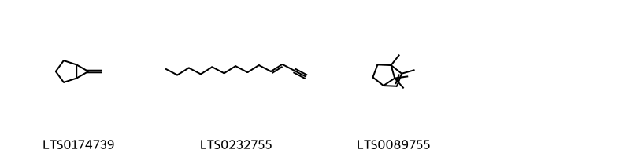{ width=100% }
    <figcaption>Hình ảnh cấu trúc hóa học của 3 hoạt chất thuộc nhóm Unsaturated hydrocarbons gồm ['6-methylidenebicyclo[3.1.0]hexane (LTS0174739)', 'tridec-3-en-1-yne (LTS0232755)', '1,2,7,7-tetramethylbicyclo[2.2.1]hept-2-ene (LTS0089755)'].</figcaption>
</figure>

---

### Dược dân tộc học

Danh sách các quốc gia có sử dụng *Schisandra chinensis* trong điều trị các bệnh. 

| Country         | Disease            | Bệnh                                                                                                                                                                                                |
|:----------------|:-------------------|:----------------------------------------------------------------------------------------------------------------------------------------------------------------------------------------------------|
| Elsewhere       | Vasodilator, nan   | MYMEMORY WARNING: YOU USED ALL AVAILABLE FREE TRANSLATIONS FOR TODAY. NEXT AVAILABLE IN  17 HOURS 07 MINUTES 07 SECONDS VISIT HTTPS://MYMEMORY.TRANSLATED.NET/DOC/USAGELIMITS.PHP TO TRANSLATE MORE |
| Japan*          | Antitussive, Tonic | MYMEMORY WARNING: YOU USED ALL AVAILABLE FREE TRANSLATIONS FOR TODAY. NEXT AVAILABLE IN  17 HOURS 07 MINUTES 05 SECONDS VISIT HTTPS://MYMEMORY.TRANSLATED.NET/DOC/USAGELIMITS.PHP TO TRANSLATE MORE |
| Malaya (Import) | Tonic              | MYMEMORY WARNING: YOU USED ALL AVAILABLE FREE TRANSLATIONS FOR TODAY. NEXT AVAILABLE IN  17 HOURS 07 MINUTES 03 SECONDS VISIT HTTPS://MYMEMORY.TRANSLATED.NET/DOC/USAGELIMITS.PHP TO TRANSLATE MORE |

---

---
## Schisandra henanthera
### Thông tin về thực vật

!!! info "Phân loại thực vật của *N/A* từ GIBF:"
    - **Kingdom:** Plantae
    - **Phylum:** Tracheophyta
    - **Order:** Austrobaileyales
    - **Family:** Schisandraceae
    - **Genus:** Schisandra
    - **Species:** *N/A*

 

| Label (VI)   | Label (EN)   | Scientific Name      | Descriptions (VI)   | Descriptions (EN)   | Also Known As (VI)   | Also Known As (EN)                  |
|:-------------|:-------------|:---------------------|:--------------------|:--------------------|:---------------------|:------------------------------------|
| N/A          | N/A          | Schisandra chinensis | loài thực vật       | species of plant    | ['']                 | ['magnolia berry', 'magnolia-vine'] |

#### Phân bố trên thế giới

**Từ CSDL GIBF** nan, Japan, India, Russian Federation, United States of America, China, Nepal, Korea, Republic of, Chinese Taipei

#### Phân bố tại Việt Nam

**Từ CSDL GIBF**: Không có ghi nhận ở Việt Nam

---
### Thành phần hóa học
        
- Theo cơ sở dữ liệu lotus: Từ loài *N/A* đã phân lập và xác định được Chưa có hoạt chất nào được phân lập. hoạt chất thuộc về các nhóm Không có hoạt chất nào được phân lập. 

Không có hình ảnh nào được tạo ra

---

### Dược dân tộc học

Danh sách các quốc gia có sử dụng *N/A* trong điều trị các bệnh. 

| Country   |   Disease | Bệnh                                                                                                                                                                                                |
|:----------|----------:|:----------------------------------------------------------------------------------------------------------------------------------------------------------------------------------------------------|
| Elsewhere |       nan | MYMEMORY WARNING: YOU USED ALL AVAILABLE FREE TRANSLATIONS FOR TODAY. NEXT AVAILABLE IN  17 HOURS 06 MINUTES 15 SECONDS VISIT HTTPS://MYMEMORY.TRANSLATED.NET/DOC/USAGELIMITS.PHP TO TRANSLATE MORE |

---

# Chi Kadsura

??? note "Danh sách các dược liệu thuộc chi"
    
	 - *Kadsura cauliflora*
	 - *Kadsura coccinea*
	 - *Kadsura japonica*
	 - *Kadsura peltigera*

---
## Kadsura cauliflora
### Thông tin về thực vật

!!! info "Phân loại thực vật của *Kadsura scandens* từ GIBF:"
    - **Kingdom:** Plantae
    - **Phylum:** Tracheophyta
    - **Order:** Austrobaileyales
    - **Family:** Schisandraceae
    - **Genus:** Kadsura
    - **Species:** *Kadsura scandens*

 

| Label (VI)   | Label (EN)   | Scientific Name    | Descriptions (VI)   | Descriptions (EN)   | Also Known As (VI)   | Also Known As (EN)   |
|:-------------|:-------------|:-------------------|:--------------------|:--------------------|:---------------------|:---------------------|
| N/A          | N/A          | Kadsura cauliflora |                     |                     | ['']                 | ['']                 |

#### Phân bố trên thế giới

**Từ CSDL GIBF** nan, Japan, India, Russian Federation, United States of America, China, Nepal, Korea, Republic of, Chinese Taipei

#### Phân bố tại Việt Nam

**Từ CSDL GIBF**: Không có ghi nhận ở Việt Nam

---
### Thành phần hóa học
        
- Theo cơ sở dữ liệu lotus: Từ loài *Kadsura scandens* đã phân lập và xác định được Chưa có hoạt chất nào được phân lập. hoạt chất thuộc về các nhóm Không có hoạt chất nào được phân lập. 

Không có hình ảnh nào được tạo ra

---

### Dược dân tộc học

Danh sách các quốc gia có sử dụng *Kadsura scandens* trong điều trị các bệnh. 

| Country   | Disease     | Bệnh                                                                                                                                                                                                |
|:----------|:------------|:----------------------------------------------------------------------------------------------------------------------------------------------------------------------------------------------------|
| Java      | Expectorant | MYMEMORY WARNING: YOU USED ALL AVAILABLE FREE TRANSLATIONS FOR TODAY. NEXT AVAILABLE IN  17 HOURS 05 MINUTES 53 SECONDS VISIT HTTPS://MYMEMORY.TRANSLATED.NET/DOC/USAGELIMITS.PHP TO TRANSLATE MORE |

---

---
## Kadsura coccinea
### Thông tin về thực vật

!!! info "Phân loại thực vật của *Kadsura coccinea* từ GIBF:"
    - **Kingdom:** Plantae
    - **Phylum:** Tracheophyta
    - **Order:** Austrobaileyales
    - **Family:** Schisandraceae
    - **Genus:** Kadsura
    - **Species:** *Kadsura coccinea*

 

| Label (VI)   | Label (EN)   | Scientific Name   | Descriptions (VI)   | Descriptions (EN)   | Also Known As (VI)   | Also Known As (EN)   |
|:-------------|:-------------|:------------------|:--------------------|:--------------------|:---------------------|:---------------------|
| N/A          | N/A          | Kadsura coccinea  | loài thực vật       | species of plant    | ['']                 | ['']                 |

#### Phân bố trên thế giới

**Từ CSDL GIBF** Viet Nam, nan, unknown or invalid, Thailand, United States of America, China, Hong Kong

#### Phân bố tại Việt Nam

**Từ CSDL GIBF**: Đăk Nông, Bac Kan, Lam Dong, Ninh Binh, Quang Binh, Thua Thien-Hue

---
### Thành phần hóa học
        
- Theo cơ sở dữ liệu lotus: Từ loài *Kadsura coccinea* đã phân lập và xác định được 334 hoạt chất thuộc về các nhóm Furopyrans, Tannins, Dibenzylbutane lignans, Prenol lipids, 2-arylbenzofuran flavonoids, Carboxylic acids and derivatives, Fatty Acyls, Naphthopyrans, Aryltetralin lignans, Furofurans, Benzodioxoles, Isocoumarans, Steroids and steroid derivatives, Benzene and substituted derivatives. 

|    | chemicalTaxonomyClassyfireClass     |   smiles_count |
|---:|:------------------------------------|---------------:|
|  0 | 2-arylbenzofuran flavonoids         |              2 |
|  1 | Aryltetralin lignans                |              6 |
|  2 | Benzene and substituted derivatives |              2 |
|  3 | Benzodioxoles                       |              2 |
|  4 | Carboxylic acids and derivatives    |             18 |
|  5 | Dibenzylbutane lignans              |              3 |
|  6 | Fatty Acyls                         |              4 |
|  7 | Furofurans                          |             17 |
|  8 | Furopyrans                          |              5 |
|  9 | Isocoumarans                        |              6 |
| 10 | Naphthopyrans                       |             13 |
| 11 | Prenol lipids                       |            133 |
| 12 | Steroids and steroid derivatives    |             18 |
| 13 | Tannins                             |            104 |

#### Nhóm 2-arylbenzofuran flavonoids
<figure markdown="span">
    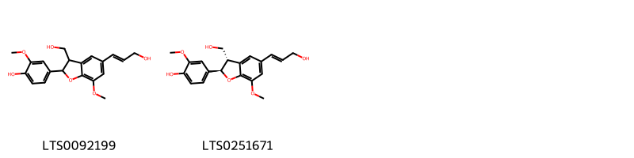{ width=100% }
    <figcaption>Hình ảnh cấu trúc hóa học của 2 hoạt chất thuộc nhóm 2-arylbenzofuran flavonoids gồm ['4-[3-(hydroxymethyl)-5-(3-hydroxyprop-1-en-1-yl)-7-methoxy-2,3-dihydro-1-benzofuran-2-yl]-2-methoxyphenol (LTS0092199)', '(-)-dehydrodiconiferyl alcohol (LTS0251671)'].</figcaption>
</figure>
#### Nhóm Aryltetralin lignans
<figure markdown="span">
    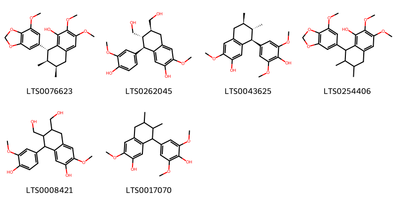{ width=100% }
    <figcaption>Hình ảnh cấu trúc hóa học của 6 hoạt chất thuộc nhóm Aryltetralin lignans gồm ['(6r,7r,8r)-2,3-dimethoxy-8-(7-methoxy-2h-1,3-benzodioxol-5-yl)-6,7-dimethyl-5,6,7,8-tetrahydronaphthalen-1-ol (LTS0076623)', '(6s,7s,8r)-8-(4-hydroxy-3-methoxyphenyl)-6,7-bis(hydroxymethyl)-3-methoxy-5,6,7,8-tetrahydronaphthalen-2-ol (LTS0262045)', '(6r,7s,8s)-8-(4-hydroxy-3,5-dimethoxyphenyl)-3-methoxy-6,7-dimethyl-5,6,7,8-tetrahydronaphthalen-2-ol (LTS0043625)', '2,3-dimethoxy-8-(7-methoxy-2h-1,3-benzodioxol-5-yl)-6,7-dimethyl-5,6,7,8-tetrahydronaphthalen-1-ol (LTS0254406)', '8-(4-hydroxy-3-methoxyphenyl)-6,7-bis(hydroxymethyl)-3-methoxy-5,6,7,8-tetrahydronaphthalen-2-ol (LTS0008421)', '8-(4-hydroxy-3,5-dimethoxyphenyl)-3-methoxy-6,7-dimethyl-5,6,7,8-tetrahydronaphthalen-2-ol (LTS0017070)'].</figcaption>
</figure>
#### Nhóm Benzene and substituted derivatives
<figure markdown="span">
    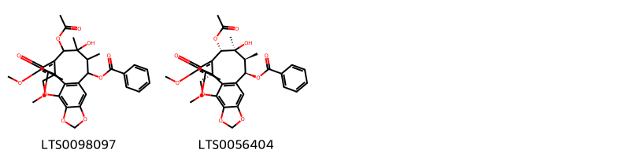{ width=100% }
    <figcaption>Hình ảnh cấu trúc hóa học của 2 hoạt chất thuộc nhóm Benzene and substituted derivatives gồm ['15-(acetyloxy)-14-hydroxy-19,20-dimethoxy-13,14-dimethyl-18-oxo-3,6,8-trioxapentacyclo[9.9.1.0¹,¹⁶.0⁴,²¹.0⁵,⁹]henicosa-4,9,11(21),16,19-pentaen-12-yl benzoate (LTS0098097)', '(1s,12r,13s,14s,15s)-15-(acetyloxy)-14-hydroxy-19,20-dimethoxy-13,14-dimethyl-18-oxo-3,6,8-trioxapentacyclo[9.9.1.0¹,¹⁶.0⁴,²¹.0⁵,⁹]henicosa-4,9,11(21),16,19-pentaen-12-yl benzoate (LTS0056404)'].</figcaption>
</figure>
#### Nhóm Benzodioxoles
<figure markdown="span">
    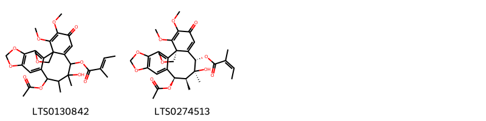{ width=100% }
    <figcaption>Hình ảnh cấu trúc hóa học của 2 hoạt chất thuộc nhóm Benzodioxoles gồm ['12-(acetyloxy)-14-hydroxy-19,20-dimethoxy-13,14-dimethyl-18-oxo-3,6,8-trioxapentacyclo[9.9.1.0¹,¹⁶.0⁴,²¹.0⁵,⁹]henicosa-4,9,11(21),16,19-pentaen-15-yl 2-methylbut-2-enoate (LTS0130842)', '(1s,12r,13s,14s,15s)-12-(acetyloxy)-14-hydroxy-19,20-dimethoxy-13,14-dimethyl-18-oxo-3,6,8-trioxapentacyclo[9.9.1.0¹,¹⁶.0⁴,²¹.0⁵,⁹]henicosa-4,9,11(21),16,19-pentaen-15-yl (2z)-2-methylbut-2-enoate (LTS0274513)'].</figcaption>
</figure>
#### Nhóm Carboxylic acids and derivatives
<figure markdown="span">
    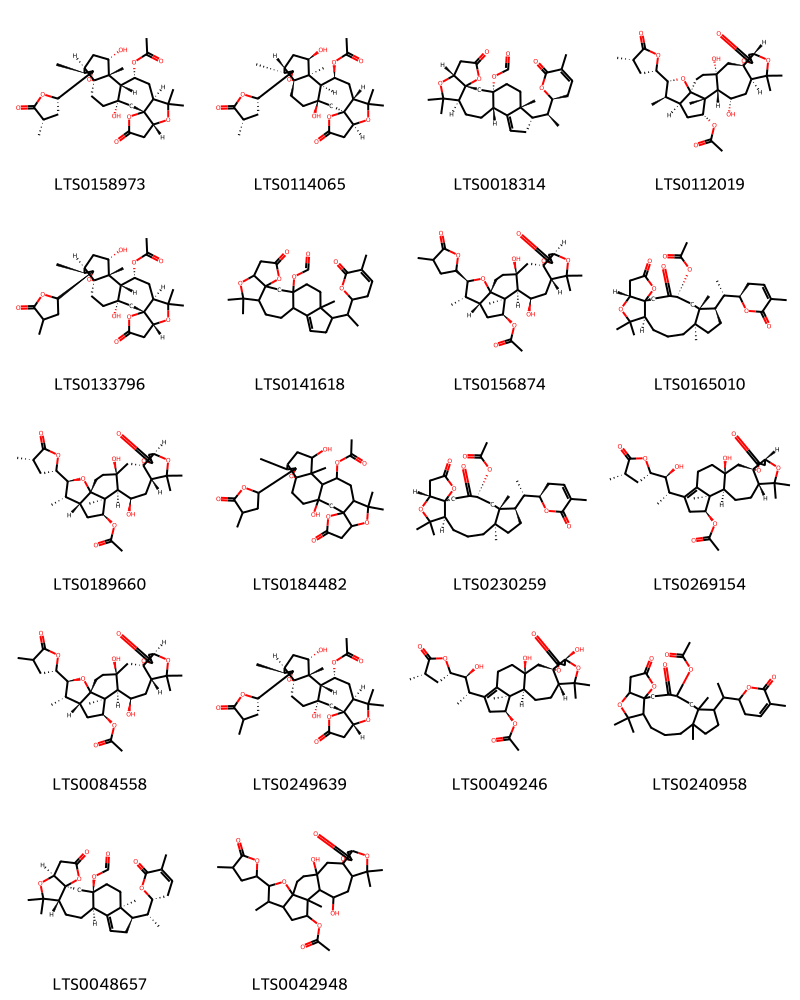{ width=100% }
    <figcaption>Hình ảnh cấu trúc hóa học của 18 hoạt chất thuộc nhóm Carboxylic acids and derivatives gồm ['(1s,3r,7r,10s,12r,13r,14s,15s,17r,18s,19s,21s)-1,15-dihydroxy-9,9,14,18-tetramethyl-19-[(2s,4s)-4-methyl-5-oxooxolan-2-yl]-5-oxo-4,8,20-trioxahexacyclo[11.10.0.0³,⁷.0³,¹⁰.0¹⁴,²¹.0¹⁷,²¹]tricosan-12-yl acetate (LTS0158973)', '(1r,3s,7s,10r,12s,13s,14r,15r,17s,18r,19r,21r)-1,15-dihydroxy-9,9,14,18-tetramethyl-19-[(2s,4s)-4-methyl-5-oxooxolan-2-yl]-5-oxo-4,8,20-trioxahexacyclo[11.10.0.0³,⁷.0³,¹⁰.0¹⁴,²¹.0¹⁷,²¹]tricosan-12-yl acetate (LTS0114065)', '(1s,3r,7r,10s,13s,17s,18r)-9,9,18-trimethyl-17-[(1s)-1-[(2s)-5-methyl-6-oxo-2,3-dihydropyran-2-yl]ethyl]-5-oxo-4,8-dioxapentacyclo[11.7.0.0³,⁷.0³,¹⁰.0¹⁴,¹⁸]icos-14-en-1-yl formate (LTS0018314)', '(1r,3s,7s,10r,12s,13s,14r,15r,17s,18r,19r,21r)-1,12-dihydroxy-9,9,14,18-tetramethyl-19-[(2s,4s)-4-methyl-5-oxooxolan-2-yl]-5-oxo-4,8,20-trioxahexacyclo[11.10.0.0³,⁷.0³,¹⁰.0¹⁴,²¹.0¹⁷,²¹]tricosan-15-yl acetate (LTS0112019)', '(1s,3r,7r,10s,12r,13r,14s,15s,17r,18s,19s,21s)-1,15-dihydroxy-9,9,14,18-tetramethyl-19-(4-methyl-5-oxooxolan-2-yl)-5-oxo-4,8,20-trioxahexacyclo[11.10.0.0³,⁷.0³,¹⁰.0¹⁴,²¹.0¹⁷,²¹]tricosan-12-yl acetate (LTS0133796)', '9,9,18-trimethyl-17-[1-(5-methyl-6-oxo-2,3-dihydropyran-2-yl)ethyl]-5-oxo-4,8-dioxapentacyclo[11.7.0.0³,⁷.0³,¹⁰.0¹⁴,¹⁸]icos-14-en-1-yl formate (LTS0141618)', '(1s,3r,7r,10s,12r,13r,14s,15s,17r,18s,19s,21s)-1,12-dihydroxy-9,9,14,18-tetramethyl-19-(4-methyl-5-oxooxolan-2-yl)-5-oxo-4,8,20-trioxahexacyclo[11.10.0.0³,⁷.0³,¹⁰.0¹⁴,²¹.0¹⁷,²¹]tricosan-15-yl acetate (LTS0156874)', '(1r,4r,6r,7r,10r,14s,17r)-6,10,15,15-tetramethyl-7-[(1s)-1-[(2r)-5-methyl-6-oxo-2,3-dihydropyran-2-yl]ethyl]-3,19-dioxo-16,20-dioxatetracyclo[12.6.0.0¹,¹⁷.0⁶,¹⁰]icosan-4-yl acetate (LTS0165010)', '(1s,3r,7r,10s,12r,13r,14s,15s,17r,18s,19s,21s)-1,12-dihydroxy-9,9,14,18-tetramethyl-19-[(2s,4s)-4-methyl-5-oxooxolan-2-yl]-5-oxo-4,8,20-trioxahexacyclo[11.10.0.0³,⁷.0³,¹⁰.0¹⁴,²¹.0¹⁷,²¹]tricosan-15-yl acetate (LTS0189660)', '1,15-dihydroxy-9,9,14,18-tetramethyl-19-(4-methyl-5-oxooxolan-2-yl)-5-oxo-4,8,20-trioxahexacyclo[11.10.0.0³,⁷.0³,¹⁰.0¹⁴,²¹.0¹⁷,²¹]tricosan-12-yl acetate (LTS0184482)', '(1s,4r,6r,7r,10r,14s,17r)-6,10,15,15-tetramethyl-7-[(1s)-1-[(2r)-5-methyl-6-oxo-2,3-dihydropyran-2-yl]ethyl]-3,19-dioxo-16,20-dioxatetracyclo[12.6.0.0¹,¹⁷.0⁶,¹⁰]icosan-4-yl acetate (LTS0230259)', '(1s,3r,7r,10s,13s,14r,15s)-1-hydroxy-17-[(1s,2s)-1-hydroxy-1-[(2s,4s)-4-methyl-5-oxooxolan-2-yl]propan-2-yl]-9,9,14-trimethyl-5-oxo-4,8-dioxapentacyclo[11.7.0.0³,⁷.0³,¹⁰.0¹⁴,¹⁸]icos-17-en-15-yl acetate (LTS0269154)', '(1s,3r,7r,10s,12r,13r,14s,15s,17r,18s,19s,21s)-1,12-dihydroxy-9,9,14,18-tetramethyl-19-[(2s)-4-methyl-5-oxooxolan-2-yl]-5-oxo-4,8,20-trioxahexacyclo[11.10.0.0³,⁷.0³,¹⁰.0¹⁴,²¹.0¹⁷,²¹]tricosan-15-yl acetate (LTS0084558)', '(1s,3r,7r,10s,12r,13r,14s,15s,17r,18s,19s,21s)-1,15-dihydroxy-9,9,14,18-tetramethyl-19-[(2s)-4-methyl-5-oxooxolan-2-yl]-5-oxo-4,8,20-trioxahexacyclo[11.10.0.0³,⁷.0³,¹⁰.0¹⁴,²¹.0¹⁷,²¹]tricosan-12-yl acetate (LTS0249639)', '(1s,3r,7r,10s,13s,14r,15s)-1,7-dihydroxy-17-[(1s,2s)-1-hydroxy-1-[(2s,4s)-4-methyl-5-oxooxolan-2-yl]propan-2-yl]-9,9,14-trimethyl-5-oxo-4,8-dioxapentacyclo[11.7.0.0³,⁷.0³,¹⁰.0¹⁴,¹⁸]icos-17-en-15-yl acetate (LTS0049246)', '6,10,15,15-tetramethyl-7-[1-(5-methyl-6-oxo-2,3-dihydropyran-2-yl)ethyl]-3,19-dioxo-16,20-dioxatetracyclo[12.6.0.0¹,¹⁷.0⁶,¹⁰]icosan-4-yl acetate (LTS0240958)', 'kadcoccilactone d (LTS0048657)', '1,12-dihydroxy-9,9,14,18-tetramethyl-19-(4-methyl-5-oxooxolan-2-yl)-5-oxo-4,8,20-trioxahexacyclo[11.10.0.0³,⁷.0³,¹⁰.0¹⁴,²¹.0¹⁷,²¹]tricosan-15-yl acetate (LTS0042948)'].</figcaption>
</figure>
#### Nhóm Dibenzylbutane lignans
<figure markdown="span">
    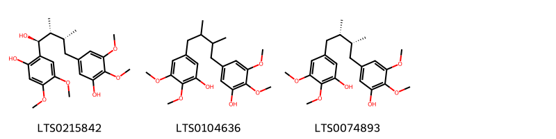{ width=100% }
    <figcaption>Hình ảnh cấu trúc hóa học của 3 hoạt chất thuộc nhóm Dibenzylbutane lignans gồm ['2-[(1s,2r,3r)-1-hydroxy-4-(3-hydroxy-4,5-dimethoxyphenyl)-2,3-dimethylbutyl]-4,5-dimethoxyphenol (LTS0215842)', '5-[4-(3-hydroxy-4,5-dimethoxyphenyl)-2,3-dimethylbutyl]-2,3-dimethoxyphenol (LTS0104636)', 'pregomisin (LTS0074893)'].</figcaption>
</figure>
#### Nhóm Fatty Acyls
<figure markdown="span">
    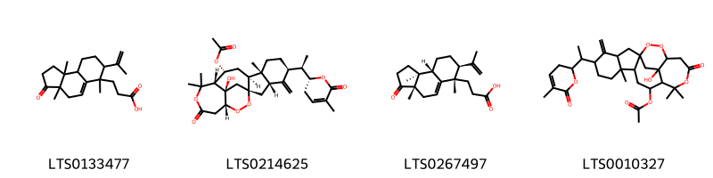{ width=100% }
    <figcaption>Hình ảnh cấu trúc hóa học của 4 hoạt chất thuộc nhóm Fatty Acyls gồm ['3-[3a,6,9b-trimethyl-3-oxo-7-(prop-1-en-2-yl)-1h,2h,4h,7h,8h,9h,9ah-cyclopenta[a]naphthalen-6-yl]propanoic acid (LTS0133477)', '(1r,3s,5s,8r,9s,11r,12r,17r,21r)-21-hydroxy-8,13,13-trimethyl-5-[(1r)-1-[(2r)-5-methyl-6-oxo-2,3-dihydropyran-2-yl]ethyl]-4-methylidene-15-oxo-14,18,19-trioxapentacyclo[10.7.2.0¹,⁹.0³,⁸.0¹⁷,²¹]henicosan-11-yl acetate (LTS0214625)', 'micranoic acid a (LTS0267497)', '21-hydroxy-8,13,13-trimethyl-5-[1-(5-methyl-6-oxo-2,3-dihydropyran-2-yl)ethyl]-4-methylidene-15-oxo-14,18,19-trioxapentacyclo[10.7.2.0¹,⁹.0³,⁸.0¹⁷,²¹]henicosan-11-yl acetate (LTS0010327)'].</figcaption>
</figure>
#### Nhóm Furofurans
<figure markdown="span">
    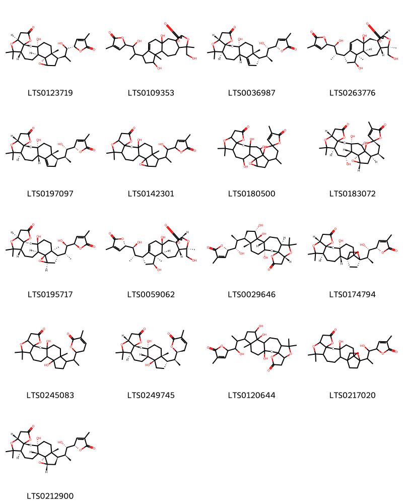{ width=100% }
    <figcaption>Hình ảnh cấu trúc hóa học của 17 hoạt chất thuộc nhóm Furofurans gồm ['(1s,3r,7s,10r,13s,14r,18r,19r)-1-hydroxy-18-{1-hydroxy-1-[(2s)-4-methyl-5-oxo-2h-furan-2-yl]propan-2-yl}-9,9,19-trimethyl-4,8,15-trioxahexacyclo[11.8.0.0³,⁷.0³,¹⁰.0¹⁴,¹⁶.0¹⁴,¹⁹]henicosan-5-one (LTS0123719)', '1,15-dihydroxy-17-[1-hydroxy-1-(4-methyl-5-oxo-2h-furan-2-yl)propan-2-yl]-9-(hydroxymethyl)-9,14-dimethyl-4,8-dioxapentacyclo[11.7.0.0³,⁷.0³,¹⁰.0¹⁴,¹⁸]icos-18-en-5-one (LTS0109353)', '(1s,3r,7r,10s,13s,17s,18r)-1-hydroxy-17-[(1s,2s)-1-hydroxy-1-[(2s)-4-methyl-5-oxo-2h-furan-2-yl]propan-2-yl]-9,9,18-trimethyl-4,8-dioxapentacyclo[11.7.0.0³,⁷.0³,¹⁰.0¹⁴,¹⁸]icos-14-en-5-one (LTS0036987)', '(1s,3r,7r,9r,10s,13s,14r,15s,17r)-1,15-dihydroxy-17-[(1s,2s)-1-hydroxy-1-[(2r)-4-methyl-5-oxo-2h-furan-2-yl]propan-2-yl]-9-(hydroxymethyl)-9,14-dimethyl-4,8-dioxapentacyclo[11.7.0.0³,⁷.0³,¹⁰.0¹⁴,¹⁸]icos-18-en-5-one (LTS0263776)', '(1s,3r,7r,10s,13s,17r,18r)-1-hydroxy-17-[(1s,2s)-1-hydroxy-1-[(2s)-4-methyl-5-oxo-2h-furan-2-yl]propan-2-yl]-9,9,18-trimethyl-4,8-dioxapentacyclo[11.7.0.0³,⁷.0³,¹⁰.0¹⁴,¹⁸]icos-14-en-5-one (LTS0197097)', '1-hydroxy-18-[1-hydroxy-1-(4-methyl-5-oxo-2h-furan-2-yl)propan-2-yl]-9,9,19-trimethyl-4,8,15-trioxahexacyclo[11.8.0.0³,⁷.0³,¹⁰.0¹⁴,¹⁶.0¹⁴,¹⁹]henicosan-5-one (LTS0142301)', "12',14',25'-trihydroxy-4,7',22',22'-tetramethyl-3',10',17',21'-tetraoxaspiro[furan-2,9'-heptacyclo[12.11.0.0²,⁴.0²,¹¹.0⁶,¹¹.0¹⁶,²⁰.0¹⁶,²³]pentacosane]-5,18'-dione (LTS0180500)", "(1'r,2s,2's,4's,6'r,7'r,11'r,12's,14's,16'r,20'r,23's,25'r)-12',14',25'-trihydroxy-4,7',22',22'-tetramethyl-3',10',17',21'-tetraoxaspiro[furan-2,9'-heptacyclo[12.11.0.0²,⁴.0²,¹¹.0⁶,¹¹.0¹⁶,²⁰.0¹⁶,²³]pentacosane]-5,18'-dione (LTS0183072)", '(1r,3s,7s,10r,13s,14s,16r,18s,19s)-1-hydroxy-18-[(1r,2r)-1-hydroxy-1-[(2r)-4-methyl-5-oxo-2h-furan-2-yl]propan-2-yl]-9,9,19-trimethyl-4,8,15-trioxahexacyclo[11.8.0.0³,⁷.0³,¹⁰.0¹⁴,¹⁶.0¹⁴,¹⁹]henicosan-5-one (LTS0195717)', '(1s,3r,7r,9r,10s,13s,14r,15s,17r)-1,15-dihydroxy-17-[(1s,2s)-1-hydroxy-1-[(2s)-4-methyl-5-oxo-2h-furan-2-yl]propan-2-yl]-9-(hydroxymethyl)-9,14-dimethyl-4,8-dioxapentacyclo[11.7.0.0³,⁷.0³,¹⁰.0¹⁴,¹⁸]icos-18-en-5-one (LTS0059062)', '(1s,3r,7r,10s,13r,14s,15s,17r,18r)-1,14,15-trihydroxy-17-[(1s,2s)-1-hydroxy-1-[(2s)-4-methyl-5-oxo-2h-furan-2-yl]propan-2-yl]-9,9,18-trimethyl-4,8-dioxapentacyclo[11.7.0.0³,⁷.0³,¹⁰.0¹⁴,¹⁸]icosan-5-one (LTS0029646)', 'kadcoccilactone g (LTS0174794)', '1,14-dihydroxy-9,9,18-trimethyl-17-[1-(5-methyl-6-oxo-2,3-dihydropyran-2-yl)ethyl]-4,8-dioxapentacyclo[11.7.0.0³,⁷.0³,¹⁰.0¹⁴,¹⁸]icosan-5-one (LTS0245083)', '(1s,3r,7r,10s,13r,14s,17s,18r)-1,14-dihydroxy-9,9,18-trimethyl-17-[(1s)-1-[(2s)-5-methyl-6-oxo-2,3-dihydropyran-2-yl]ethyl]-4,8-dioxapentacyclo[11.7.0.0³,⁷.0³,¹⁰.0¹⁴,¹⁸]icosan-5-one (LTS0249745)', '1,14,15-trihydroxy-17-[1-hydroxy-1-(4-methyl-5-oxo-2h-furan-2-yl)propan-2-yl]-9,9,18-trimethyl-4,8-dioxapentacyclo[11.7.0.0³,⁷.0³,¹⁰.0¹⁴,¹⁸]icosan-5-one (LTS0120644)', '14-hydroxy-18-[1-hydroxy-1-(4-methyl-5-oxo-2h-furan-2-yl)propan-2-yl]-6,6,17-trimethyl-7,11,19-trioxahexacyclo[16.2.2.0¹,¹⁷.0²,¹⁴.0⁵,¹².0⁸,¹²]docosan-10-one (LTS0217020)', '(1s,3r,7r,10s,13r,14r,16s,18r,19r)-1-hydroxy-18-[(1s,2s)-1-hydroxy-1-[(2s)-4-methyl-5-oxo-2h-furan-2-yl]propan-2-yl]-9,9,19-trimethyl-4,8,15-trioxahexacyclo[11.8.0.0³,⁷.0³,¹⁰.0¹⁴,¹⁶.0¹⁴,¹⁹]henicosan-5-one (LTS0212900)'].</figcaption>
</figure>
#### Nhóm Furopyrans
<figure markdown="span">
    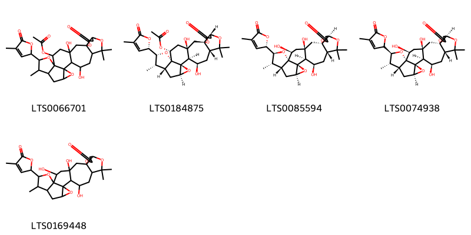{ width=100% }
    <figcaption>Hình ảnh cấu trúc hóa học của 5 hoạt chất thuộc nhóm Furopyrans gồm ['13,24-dihydroxy-7,21,21-trimethyl-8-(4-methyl-5-oxo-2h-furan-2-yl)-17-oxo-3,9,16,20-tetraoxaheptacyclo[11.11.0.0²,⁴.0²,¹⁰.0⁶,¹⁰.0¹⁵,¹⁹.0¹⁵,²²]tetracosan-11-yl acetate (LTS0066701)', '(1r,2s,4s,6r,7s,8r,10r,11r,13s,15r,19r,22s,24r)-13,24-dihydroxy-7,21,21-trimethyl-8-[(2s)-4-methyl-5-oxo-2h-furan-2-yl]-17-oxo-3,9,16,20-tetraoxaheptacyclo[11.11.0.0²,⁴.0²,¹⁰.0⁶,¹⁰.0¹⁵,¹⁹.0¹⁵,²²]tetracosan-11-yl acetate (LTS0184875)', '(1r,2s,4s,6r,7s,8s,10r,11s,13s,15r,19r,22s,24r)-11,13,24-trihydroxy-7,21,21-trimethyl-8-[(2s)-4-methyl-5-oxo-2h-furan-2-yl]-3,9,16,20-tetraoxaheptacyclo[11.11.0.0²,⁴.0²,¹⁰.0⁶,¹⁰.0¹⁵,¹⁹.0¹⁵,²²]tetracosan-17-one (LTS0085594)', '(1r,2s,4s,6r,7s,8s,10r,11s,13s,15r,19r,22s,24r)-11,13,24-trihydroxy-7,21,21-trimethyl-8-(4-methyl-5-oxo-2h-furan-2-yl)-3,9,16,20-tetraoxaheptacyclo[11.11.0.0²,⁴.0²,¹⁰.0⁶,¹⁰.0¹⁵,¹⁹.0¹⁵,²²]tetracosan-17-one (LTS0074938)', '11,13,24-trihydroxy-7,21,21-trimethyl-8-(4-methyl-5-oxo-2h-furan-2-yl)-3,9,16,20-tetraoxaheptacyclo[11.11.0.0²,⁴.0²,¹⁰.0⁶,¹⁰.0¹⁵,¹⁹.0¹⁵,²²]tetracosan-17-one (LTS0169448)'].</figcaption>
</figure>
#### Nhóm Isocoumarans
<figure markdown="span">
    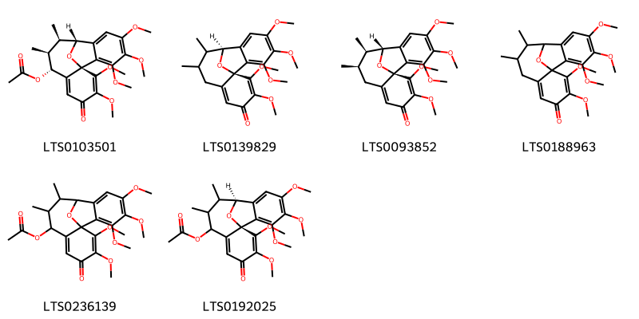{ width=100% }
    <figcaption>Hình ảnh cấu trúc hóa học của 6 hoạt chất thuộc nhóm Isocoumarans gồm ['(1s,7r,8s,9r,10r)-2,3,13,14,15-pentamethoxy-8,9-dimethyl-4-oxo-17-oxatetracyclo[8.6.1.0¹,⁶.0¹¹,¹⁶]heptadeca-2,5,11,13,15-pentaen-7-yl acetate (LTS0103501)', '(1s,10s)-2,3,13,14,15-pentamethoxy-8,9-dimethyl-17-oxatetracyclo[8.6.1.0¹,⁶.0¹¹,¹⁶]heptadeca-2,5,11,13,15-pentaen-4-one (LTS0139829)', '(1s,8r,9r,10r)-2,3,13,14,15-pentamethoxy-8,9-dimethyl-17-oxatetracyclo[8.6.1.0¹,⁶.0¹¹,¹⁶]heptadeca-2,5,11,13,15-pentaen-4-one (LTS0093852)', '2,3,13,14,15-pentamethoxy-8,9-dimethyl-17-oxatetracyclo[8.6.1.0¹,⁶.0¹¹,¹⁶]heptadeca-2,5,11,13,15-pentaen-4-one (LTS0188963)', '2,3,13,14,15-pentamethoxy-8,9-dimethyl-4-oxo-17-oxatetracyclo[8.6.1.0¹,⁶.0¹¹,¹⁶]heptadeca-2,5,11,13,15-pentaen-7-yl acetate (LTS0236139)', '(1s,10s)-2,3,13,14,15-pentamethoxy-8,9-dimethyl-4-oxo-17-oxatetracyclo[8.6.1.0¹,⁶.0¹¹,¹⁶]heptadeca-2,5,11,13,15-pentaen-7-yl acetate (LTS0192025)'].</figcaption>
</figure>
#### Nhóm Naphthopyrans
<figure markdown="span">
    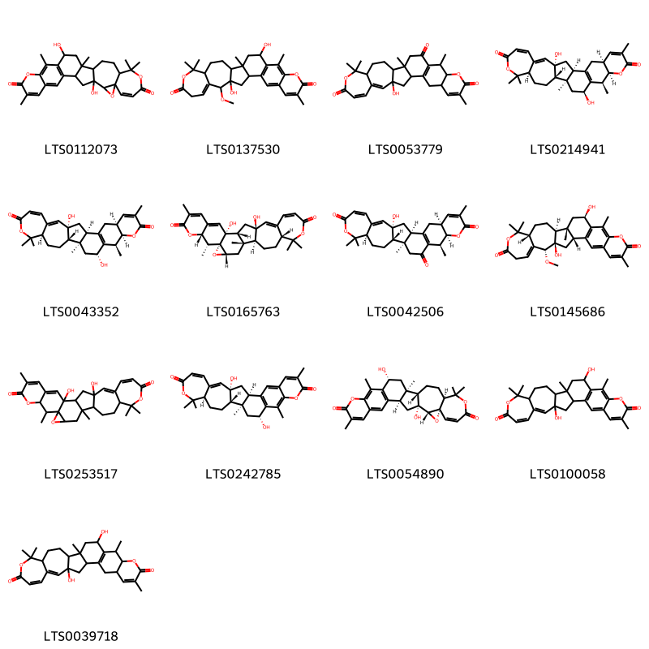{ width=100% }
    <figcaption>Hình ảnh cấu trúc hóa học của 13 hoạt chất thuộc nhóm Naphthopyrans gồm ['14,27-dihydroxy-1,6,6,21,25-pentamethyl-7,12,23-trioxaheptacyclo[14.12.0.0²,¹⁴.0⁵,¹¹.0¹¹,¹³.0¹⁷,²⁶.0¹⁹,²⁴]octacosa-9,17(26),18,20,24-pentaene-8,22-dione (LTS0112073)', '13,26-dihydroxy-12-methoxy-1,6,6,20,24-pentamethyl-7,22-dioxahexacyclo[13.12.0.0²,¹³.0⁵,¹¹.0¹⁶,²⁵.0¹⁸,²³]heptacosa-10,16(25),17,19,23-pentaene-8,21-dione (LTS0137530)', '13-hydroxy-1,6,6,20,24-pentamethyl-7,22-dioxahexacyclo[13.12.0.0²,¹³.0⁵,¹¹.0¹⁶,²⁵.0¹⁸,²³]heptacosa-9,11,16(25),19-tetraene-8,21,26-trione (LTS0053779)', '(1r,2s,5r,13s,15r,18s,23r,24s,26s)-13,26-dihydroxy-1,6,6,20,24-pentamethyl-7,22-dioxahexacyclo[13.12.0.0²,¹³.0⁵,¹¹.0¹⁶,²⁵.0¹⁸,²³]heptacosa-9,11,16(25),19-tetraene-8,21-dione (LTS0214941)', 'kadlongilactone a (LTS0043352)', '(1r,2r,9s,10r,11s,13s,15s,16s,19r,27s)-2,27-dihydroxy-6,10,15,20,20-pentamethyl-8,12,21-trioxaheptacyclo[13.13.0.0²,¹¹.0⁴,⁹.0¹¹,¹³.0¹⁶,²⁷.0¹⁹,²⁵]octacosa-3,5,23,25-tetraene-7,22-dione (LTS0165763)', 'kadlongilactone b (LTS0042506)', '(1r,2s,5r,12r,13r,15r,26r)-13,26-dihydroxy-12-methoxy-1,6,6,20,24-pentamethyl-7,22-dioxahexacyclo[13.12.0.0²,¹³.0⁵,¹¹.0¹⁶,²⁵.0¹⁸,²³]heptacosa-10,16(25),17,19,23-pentaene-8,21-dione (LTS0145686)', '2,27-dihydroxy-6,10,15,20,20-pentamethyl-8,12,21-trioxaheptacyclo[13.13.0.0²,¹¹.0⁴,⁹.0¹¹,¹³.0¹⁶,²⁷.0¹⁹,²⁵]octacosa-3,5,23,25-tetraene-7,22-dione (LTS0253517)', '(1r,2s,5r,13s,15r,26r)-13,26-dihydroxy-1,6,6,20,24-pentamethyl-7,22-dioxahexacyclo[13.12.0.0²,¹³.0⁵,¹¹.0¹⁶,²⁵.0¹⁸,²³]heptacosa-9,11,16(25),17,19,23-hexaene-8,21-dione (LTS0242785)', '(1r,2s,5s,11s,13r,14r,16r,27r)-14,27-dihydroxy-1,6,6,21,25-pentamethyl-7,12,23-trioxaheptacyclo[14.12.0.0²,¹⁴.0⁵,¹¹.0¹¹,¹³.0¹⁷,²⁶.0¹⁹,²⁴]octacosa-9,17(26),18,20,24-pentaene-8,22-dione (LTS0054890)', '13,26-dihydroxy-1,6,6,20,24-pentamethyl-7,22-dioxahexacyclo[13.12.0.0²,¹³.0⁵,¹¹.0¹⁶,²⁵.0¹⁸,²³]heptacosa-9,11,16(25),17,19,23-hexaene-8,21-dione (LTS0100058)', '13,26-dihydroxy-1,6,6,20,24-pentamethyl-7,22-dioxahexacyclo[13.12.0.0²,¹³.0⁵,¹¹.0¹⁶,²⁵.0¹⁸,²³]heptacosa-9,11,16(25),19-tetraene-8,21-dione (LTS0039718)'].</figcaption>
</figure>
#### Nhóm Prenol lipids
<figure markdown="span">
    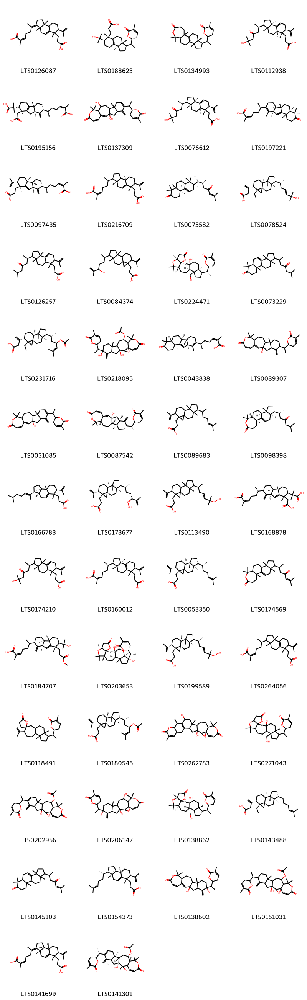{ width=100% }
    <figcaption>Hình ảnh cấu trúc hóa học của 133 hoạt chất thuộc nhóm Prenol lipids gồm ['6-[6-(2-carboxyethyl)-3a,6,9b-trimethyl-7-(prop-1-en-2-yl)-1h,2h,4h,7h,8h,9h,9ah-cyclopenta[a]naphthalen-3-ylidene]-2-methylhept-2-enoic acid (LTS0126087)', '3-[(3r,3ar,6s,7r,9br)-7-(2-hydroxypropan-2-yl)-3a,6,9b-trimethyl-3-[(1s)-1-[(2r)-5-methyl-6-oxo-2,3-dihydropyran-2-yl]ethyl]-1h,2h,3h,4h,5h,7h,8h,9h-cyclopenta[a]naphthalen-6-yl]propanoic acid (LTS0188623)', '2,7,7,12,16-pentamethyl-15-[1-(5-methyl-6-oxo-2,3-dihydropyran-2-yl)ethyl]-6-oxatetracyclo[9.7.0.0²,⁸.0¹²,¹⁶]octadec-1(11)-en-5-one (LTS0134993)', '3-[(3r,3ar,5as,6s,7s,9br)-3-[(2r)-6-hydroxy-6-methyl-4-oxoheptan-2-yl]-3a,6,9b-trimethyl-7-(prop-1-en-2-yl)-1h,2h,3h,4h,5h,5ah,7h,8h-cyclopenta[a]naphthalen-6-yl]propanoic acid (LTS0112938)', '(2z,6r)-6-[(2r,4ar,7r,8s,9as)-7-(1-carboxy-1-methylethyl)-8-(carboxymethyl)-4a,8-dimethyl-1-methylidene-2,3,4,5,6,7,9,9a-octahydrofluoren-2-yl]-2-methylhept-2-enoic acid (LTS0195156)', '1,10-dihydroxy-8,8,13-trimethyl-16-[1-(5-methyl-6-oxo-2,3-dihydropyran-2-yl)ethyl]-17-methylidene-7-oxatetracyclo[10.7.0.0³,⁹.0¹³,¹⁸]nonadeca-2,4,15-trien-6-one (LTS0137309)', '3-[(3r,3ar,5ar,6s,7s,9br)-3-[(2r)-6-hydroxy-6-methyl-4-oxoheptan-2-yl]-3a,6,9b-trimethyl-7-(prop-1-en-2-yl)-1h,2h,3h,4h,5h,5ah,7h,8h-cyclopenta[a]naphthalen-6-yl]propanoic acid (LTS0076612)', '(2z,6r)-6-[(4ar,6as,6bs,10ar,11bs)-4,4,6b,10,11b-pentamethyl-3-oxo-1h,2h,4ah,5h,6h,6ah,7h,8h,10ah-cyclohexa[a]fluoren-9-yl]-2-methylhept-2-enoic acid (LTS0197221)', '(2z,6r)-6-[(2r,4as,4bs,7s,8s,9as)-8-(2-carboxyethyl)-4a,8-dimethyl-1-methylidene-7-(prop-1-en-2-yl)-2,3,4,4b,5,6,7,9a-octahydrofluoren-2-yl]-2-methylhept-2-enoic acid (LTS0097435)', '(2z,6r)-6-[(3r,3ar,6s,9as,9bs)-6-(2-carboxyethyl)-3a,6,9b-trimethyl-7-(prop-1-en-2-yl)-1h,2h,3h,4h,7h,8h,9h,9ah-cyclopenta[a]naphthalen-3-yl]-2-methylhept-2-enoic acid (LTS0216709)', '(1r,3as,3bs,5ar,9as,11ar)-3a,6,6,9a,11a-pentamethyl-1-[(2r)-6-methyl-4-oxohept-5-en-2-yl]-1h,2h,3h,3bh,4h,5h,5ah,8h,9h,11h-cyclopenta[a]phenanthren-7-one (LTS0075582)', '3-[(1s,4r,5r,8s,9s,12s,13r)-13-ethyl-5-[(2r,4e)-6-hydroxy-6-methylhept-4-en-2-yl]-4,8-dimethyltetracyclo[7.5.0.0¹,¹³.0⁴,⁸]tetradecan-12-yl]but-3-enoic acid (LTS0078524)', '3-[3a,6,9b-trimethyl-3-(6-methyl-4-oxoheptan-2-yl)-7-(prop-1-en-2-yl)-1h,2h,3h,4h,5h,5ah,7h,8h-cyclopenta[a]naphthalen-6-yl]propanoic acid (LTS0126257)', '3-[5-(5-hydroxy-6-methylhept-6-en-2-yl)-4,8-dimethyl-12-(prop-1-en-2-yl)tetracyclo[7.5.0.0¹,¹³.0⁴,⁸]tetradecan-13-yl]propanoic acid (LTS0084374)', 'kadcoccilactone c (LTS0224471)', '3a,6,6,9a,11a-pentamethyl-1-(6-methyl-4-oxoheptan-2-yl)-1h,2h,3h,5h,5ah,8h,9h,9bh,10h,11h-cyclopenta[a]phenanthren-7-one (LTS0073229)', '3-[(1s,4r,5r,8s,9s,12s,13r)-5-[(2r)-4-(acetyloxy)-6-methylhept-5-en-2-yl]-13-ethyl-4,8-dimethyltetracyclo[7.5.0.0¹,¹³.0⁴,⁸]tetradecan-12-yl]but-3-enoic acid (LTS0231716)', '1,17-dihydroxy-9,9,14-trimethyl-17-[1-(5-methyl-6-oxo-2,3-dihydropyran-2-yl)ethyl]-18-methylidene-7-oxo-3,8-dioxapentacyclo[11.7.0.0²,⁴.0⁴,¹⁰.0¹⁴,¹⁹]icos-5-en-11-yl acetate (LTS0218095)', '(6r)-6-[(4ar,6as,6bs,10ar,11bs)-4,4,6b,10,11b-pentamethyl-3-oxo-1h,2h,4ah,5h,6h,6ah,7h,8h,10ah-cyclohexa[a]fluoren-9-yl]-2-methylhept-2-enoic acid (LTS0043838)', '1-hydroxy-8,8,13-trimethyl-16-[1-(5-methyl-6-oxo-2,3-dihydropyran-2-yl)ethyl]-17-methylidene-7-oxatetracyclo[10.7.0.0³,⁹.0¹³,¹⁸]nonadeca-2,4-dien-6-one (LTS0089307)', '1-hydroxy-8,8,13-trimethyl-16-[1-(5-methyl-6-oxo-2,3-dihydropyran-2-yl)ethyl]-17-methylidene-7-oxatetracyclo[10.7.0.0³,⁹.0¹³,¹⁸]nonadeca-2,4,15-trien-6-one (LTS0031085)', '(1s,9r,12s,13r,16s,18s)-1-hydroxy-8,8,13-trimethyl-16-[(1r)-1-[(2r)-5-methyl-6-oxo-2,3-dihydropyran-2-yl]ethyl]-17-methylidene-7-oxatetracyclo[10.7.0.0³,⁹.0¹³,¹⁸]nonadeca-2,4-dien-6-one (LTS0087542)', '3-[4,8-dimethyl-5-(6-methylhept-5-en-2-yl)-12-(prop-1-en-2-yl)tetracyclo[7.5.0.0¹,¹³.0⁴,⁸]tetradecan-13-yl]propanoic acid (LTS0089683)', '(2s,8r,11s,12r,15r,16r)-2,7,7,12-tetramethyl-15-[(2r)-6-methyl-4-oxoheptan-2-yl]-6-oxatetracyclo[9.7.0.0²,⁸.0¹²,¹⁶]octadec-1(18)-en-5-one (LTS0098398)', '3-[(3r,3ar,6s,7s,9as,9bs)-3a,6,9b-trimethyl-3-[(2e)-6-methylhept-2-en-2-yl]-7-(prop-1-en-2-yl)-1h,2h,3h,4h,7h,8h,9h,9ah-cyclopenta[a]naphthalen-6-yl]propanoic acid (LTS0166788)', '3-[(1s,4r,5r,8s,9s,12s,13r)-5-[(2r,5r)-5-hydroperoxy-6-methylhept-6-en-2-yl]-4,8-dimethyl-12-(prop-1-en-2-yl)tetracyclo[7.5.0.0¹,¹³.0⁴,⁸]tetradecan-13-yl]propanoic acid (LTS0178677)', '3-[5-(6-hydroperoxy-6-methylhept-4-en-2-yl)-4,8-dimethyl-12-(prop-1-en-2-yl)tetracyclo[7.5.0.0¹,¹³.0⁴,⁸]tetradecan-13-yl]propanoic acid (LTS0113490)', '(2z,6r)-6-[(2r,4as,4bs,7r,8s,9as)-7-(1-carboxy-1-methylethyl)-8-(carboxymethyl)-4a,8-dimethyl-1-methylidene-2,3,4,4b,5,6,7,9a-octahydrofluoren-2-yl]-2-methylhept-2-enoic acid (LTS0168878)', '3-[3-(6-hydroxy-6-methyl-4-oxoheptan-2-yl)-3a,6,9b-trimethyl-7-(prop-1-en-2-yl)-1h,2h,3h,4h,5h,5ah,7h,8h-cyclopenta[a]naphthalen-6-yl]propanoic acid (LTS0174210)', '(2z,6r)-6-[(3r,3ar,6s,7s,9br)-6-(2-carboxyethyl)-3a,6,9b-trimethyl-7-(prop-1-en-2-yl)-1h,2h,3h,4h,5h,7h,8h,9h-cyclopenta[a]naphthalen-3-yl]-2-methylhept-2-enoic acid (LTS0160012)', '3-[(1s,4r,5r,8s,9s,12s,13r)-4,8-dimethyl-5-[(2r)-6-methylhept-5-en-2-yl]-12-(prop-1-en-2-yl)tetracyclo[7.5.0.0¹,¹³.0⁴,⁸]tetradecan-13-yl]propanoic acid (LTS0053350)', '2,7,7,12,16-pentamethyl-15-(6-methyl-4-oxohept-5-en-2-yl)-6-oxatetracyclo[9.7.0.0²,⁸.0¹²,¹⁶]octadec-1(18)-en-5-one (LTS0174569)', '(2z,6r)-6-[(2r,4as,4bs,7r,8s,9as)-7-(2-hydroxypropan-2-yl)-8-(3-methoxy-3-oxopropyl)-4a,8-dimethyl-1-methylidene-2,3,4,4b,5,6,7,9a-octahydrofluoren-2-yl]-2-methylhept-2-enoic acid (LTS0184707)', '(1r,3s,7s,10r,13r,14r,17s,18r)-1,17-dihydroxy-9,9,14,18-tetramethyl-17-[(1s)-1-[(2r)-5-methyl-6-oxo-2,3-dihydropyran-2-yl]ethyl]-4,8-dioxapentacyclo[11.7.0.0³,⁷.0³,¹⁰.0¹⁴,¹⁸]icosan-5-one (LTS0203653)', '3-[(1s,4r,5r,8s,9s,12s,13r)-5-[(2r,4e)-6-hydroperoxy-6-methylhept-4-en-2-yl]-4,8-dimethyl-12-(prop-1-en-2-yl)tetracyclo[7.5.0.0¹,¹³.0⁴,⁸]tetradecan-13-yl]propanoic acid (LTS0199589)', '6-[6-(2-carboxyethyl)-3a,6,9b-trimethyl-7-(prop-1-en-2-yl)-1h,2h,3h,4h,5h,7h,8h,9h-cyclopenta[a]naphthalen-3-yl]-2-methylhept-2-enoic acid (LTS0264056)', "3a,10b-dimethyl-3-[1-(5-methyl-6-oxo-2,3-dihydropyran-2-yl)ethyl]-8-(prop-1-en-2-yl)-decahydro-1h-spiro[cyclohepta[e]indene-7,2'-oxolan]-5'-one (LTS0118491)", '3-[(1s,4r,5r,8s,9s,12s,13r)-5-[(2r,4r)-4-(acetyloxy)-6-methylhept-5-en-2-yl]-4,8-dimethyl-12-(prop-1-en-2-yl)tetracyclo[7.5.0.0¹,¹³.0⁴,⁸]tetradecan-13-yl]propanoic acid (LTS0180545)', '14,27-dihydroxy-1,6,6,21,25-pentamethyl-7,12,23-trioxaheptacyclo[14.12.0.0²,¹⁴.0⁵,¹¹.0¹¹,¹³.0¹⁷,²⁶.0¹⁹,²⁴]octacosa-9,17(26),20-triene-8,22-dione (LTS0262783)', '1-hydroxy-14-(hydroxymethyl)-9,9,18-trimethyl-17-[1-(5-methyl-6-oxo-2,3-dihydropyran-2-yl)ethyl]-4,8-dioxapentacyclo[11.7.0.0³,⁷.0³,¹⁰.0¹⁴,¹⁸]icosan-5-one (LTS0271043)', '1-hydroxy-9,9,14-trimethyl-17-[1-(5-methyl-6-oxo-2,3-dihydropyran-2-yl)ethyl]-18-methylidene-7-oxo-3,8-dioxapentacyclo[11.7.0.0²,⁴.0⁴,¹⁰.0¹⁴,¹⁹]icosa-5,16-dien-11-yl acetate (LTS0202956)', '1,11,17-trihydroxy-9,9,14-trimethyl-17-[1-(5-methyl-6-oxo-2,3-dihydropyran-2-yl)ethyl]-18-methylidene-3,8-dioxapentacyclo[11.7.0.0²,⁴.0⁴,¹⁰.0¹⁴,¹⁹]icos-5-en-7-one (LTS0206147)', '(1s,3r,7r,10s,13s,14r,17s,18r)-1-hydroxy-14-(hydroxymethyl)-9,9,18-trimethyl-17-[(1s)-1-[(2s)-5-methyl-6-oxo-2,3-dihydropyran-2-yl]ethyl]-4,8-dioxapentacyclo[11.7.0.0³,⁷.0³,¹⁰.0¹⁴,¹⁸]icosan-5-one (LTS0138862)', '3-[(1s,4r,5r,8s,9s,12s,13r)-13-ethyl-4,8-dimethyl-5-[(2r)-6-methylhept-5-en-2-yl]tetracyclo[7.5.0.0¹,¹³.0⁴,⁸]tetradecan-12-yl]but-3-enoic acid (LTS0143488)', '3a,6,6,9a,11a-pentamethyl-1-(6-methyl-4-oxohept-5-en-2-yl)-1h,2h,3h,5h,5ah,8h,9h,9bh,10h,11h-cyclopenta[a]phenanthren-7-one (LTS0145103)', '3-[(3r,3ar,6s,7s,9as,9bs)-3a,6,9b-trimethyl-3-[(2s)-6-methylhept-5-en-2-yl]-7-(prop-1-en-2-yl)-1h,2h,3h,4h,7h,8h,9h,9ah-cyclopenta[a]naphthalen-6-yl]propanoic acid (LTS0154373)', '1,16-dihydroxy-8,8,13-trimethyl-16-[1-(5-methyl-6-oxo-2,3-dihydropyran-2-yl)ethyl]-17-methylidene-7-oxatetracyclo[10.7.0.0³,⁹.0¹³,¹⁸]nonadeca-2,4-dien-6-one (LTS0138602)', '1-hydroxy-9,9,14-trimethyl-17-[1-(5-methyl-6-oxo-2,3-dihydropyran-2-yl)ethyl]-18-methylidene-7-oxo-3,8-dioxapentacyclo[11.7.0.0²,⁴.0⁴,¹⁰.0¹⁴,¹⁹]icos-5-en-11-yl acetate (LTS0151031)', 'kadsuracoccinic acid a (LTS0141699)', '(1r,2r,4s,10s,11r,13s,14r,19r)-1-hydroxy-9,9,14-trimethyl-17-[(1r)-1-[(2r)-5-methyl-6-oxo-2,3-dihydropyran-2-yl]ethyl]-18-methylidene-7-oxo-3,8-dioxapentacyclo[11.7.0.0²,⁴.0⁴,¹⁰.0¹⁴,¹⁹]icosa-5,16-dien-11-yl acetate (LTS0141301)', '(1s,9s,10r,12s,13r,16s,18s)-1-hydroxy-8,8,13-trimethyl-16-[(1r)-1-[(2r)-5-methyl-6-oxo-2,3-dihydropyran-2-yl]ethyl]-17-methylidene-6-oxo-7-oxatetracyclo[10.7.0.0³,⁹.0¹³,¹⁸]nonadeca-2,4-dien-10-yl acetate (LTS0151462)', '(2e,6s)-6-[(3r,3ar,6s,7s,9as,9bs)-6-(2-carboxyethyl)-3a,6,9b-trimethyl-7-(prop-1-en-2-yl)-1h,2h,3h,4h,7h,8h,9h,9ah-cyclopenta[a]naphthalen-3-yl]-2-methylhept-2-enoic acid (LTS0170958)', '1-hydroxy-8,8,13-trimethyl-16-[1-(5-methyl-6-oxo-2,3-dihydropyran-2-yl)ethyl]-17-methylidene-6-oxo-7-oxatetracyclo[10.7.0.0³,⁹.0¹³,¹⁸]nonadeca-2,4-dien-10-yl acetate (LTS0159428)', '1,11-dihydroxy-9,9,14-trimethyl-17-[1-(5-methyl-6-oxo-2,3-dihydropyran-2-yl)ethyl]-18-methylidene-3,8-dioxapentacyclo[11.7.0.0²,⁴.0⁴,¹⁰.0¹⁴,¹⁹]icosa-5,16-dien-7-one (LTS0117912)', '(1r,2r,4s,10s,13s,14r,19r)-1-hydroxy-9,9,14-trimethyl-17-[(1r)-1-[(2r)-5-methyl-6-oxo-2,3-dihydropyran-2-yl]ethyl]-18-methylidene-3,8-dioxapentacyclo[11.7.0.0²,⁴.0⁴,¹⁰.0¹⁴,¹⁹]icosa-5,16-dien-7-one (LTS0240079)', '6-[6-(2-carboxyethyl)-7-(2-hydroxypropan-2-yl)-3a,6,9b-trimethyl-1h,2h,3h,4h,5h,7h,8h,9h-cyclopenta[a]naphthalen-3-yl]-2-methylhept-2-enoic acid (LTS0102776)', '6-[(3ar,6s,9as,9bs)-6-(2-carboxyethyl)-3a,6,9b-trimethyl-7-(prop-1-en-2-yl)-1h,2h,3h,4h,7h,8h,9h,9ah-cyclopenta[a]naphthalen-3-yl]-2-methylhept-2-enoic acid (LTS0105440)', '3-[(1s,4r,5r,8s,9s,12s,13r)-13-ethyl-5-[(2r,4e)-6-hydroperoxy-6-methylhept-4-en-2-yl]-4,8-dimethyltetracyclo[7.5.0.0¹,¹³.0⁴,⁸]tetradecan-12-yl]but-3-eneperoxoic acid (LTS0139171)', '3-[(3r,3ar,5as,6s,7s,9br)-3-[(2r,5r)-5-hydroxy-6-methylhept-6-en-2-yl]-3a,6,9b-trimethyl-7-(prop-1-en-2-yl)-1h,2h,3h,4h,5h,5ah,7h,8h-cyclopenta[a]naphthalen-6-yl]propanoic acid (LTS0243471)', '(2z,6r)-6-[(5ar,7as,7bs,10r,11as,12bs)-5,5,7b,12b-tetramethyl-11-methylidene-3-oxo-1h,2h,5ah,6h,7h,7ah,8h,9h,10h,11ah-fluoreno[2,1-c]oxepin-10-yl]-2-methylhept-2-enoic acid (LTS0159207)', '(2e,5s,6s)-6-[(1r,3ar,5ar,9as,11ar)-3a,6,6,9a,11a-pentamethyl-7-oxo-1h,2h,3h,4h,5h,5ah,8h,9h,10h,11h-cyclopenta[a]phenanthren-1-yl]-5-(acetyloxy)-2-methylhept-2-enoic acid (LTS0156402)', '1-hydroxy-16-[1-(3-hydroxy-5-methyl-6-oxo-2,3-dihydropyran-2-yl)ethyl]-8,8,13-trimethyl-17-methylidene-7-oxatetracyclo[10.7.0.0³,⁹.0¹³,¹⁸]nonadeca-2,4,15-trien-6-one (LTS0169216)', '2,7,7,12,16-pentamethyl-15-(6-methyl-4-oxoheptan-2-yl)-6-oxatetracyclo[9.7.0.0²,⁸.0¹²,¹⁶]octadec-1(18)-en-5-one (LTS0132805)', '(1s,3r,7r,10s,13s,14s,17r,18s)-1,17-dihydroxy-9,9,14,18-tetramethyl-17-[(1r)-1-[(2s)-5-methyl-6-oxo-2,3-dihydropyran-2-yl]ethyl]-4,8-dioxapentacyclo[11.7.0.0³,⁷.0³,¹⁰.0¹⁴,¹⁸]icosan-5-one (LTS0176141)', '(2z,6r)-6-[(2r,4as,4bs,7r,8s,9as)-8-(2-carboxyethyl)-7-(2-hydroxypropan-2-yl)-4a,8-dimethyl-1-methylidene-2,3,4,4b,5,6,7,9a-octahydrofluoren-2-yl]-2-methylhept-2-enoic acid (LTS0186702)', '6-[6-(2-carboxyethyl)-3a,6,9b-trimethyl-7-(prop-1-en-2-yl)-1h,2h,3h,4h,7h,8h,9h,9ah-cyclopenta[a]naphthalen-3-yl]-2-methylhept-2-enoic acid (LTS0105706)', '6-{1-[10-hydroxy-2,6,10-trimethyl-11-(prop-1-en-2-yl)-14-oxatetracyclo[7.4.1.0¹,⁹.0²,⁶]tetradecan-5-yl]ethyl}-3-methyl-5,6-dihydropyran-2-one (LTS0163618)', '(1r,2s,5s,11s,13r,14r,16r,19s,24r,25s,27r)-14,27-dihydroxy-1,6,6,21,25-pentamethyl-7,12,23-trioxaheptacyclo[14.12.0.0²,¹⁴.0⁵,¹¹.0¹¹,¹³.0¹⁷,²⁶.0¹⁹,²⁴]octacosa-9,17(26),20-triene-8,22-dione (LTS0118502)', '1,17-dihydroxy-9,9,14,18-tetramethyl-17-[1-(5-methyl-6-oxo-2,3-dihydropyran-2-yl)ethyl]-4,8-dioxapentacyclo[11.7.0.0³,⁷.0³,¹⁰.0¹⁴,¹⁸]icosan-5-one (LTS0181297)', '3-[(1s,4r,5r,8s,9s,12s,13r)-5-[(2r)-4-[(2s)-3,3-dimethyloxiran-2-yl]butan-2-yl]-4,8-dimethyl-12-(prop-1-en-2-yl)tetracyclo[7.5.0.0¹,¹³.0⁴,⁸]tetradecan-13-yl]propanoic acid (LTS0245175)', 'seco-coccinic acid d (LTS0253996)', '3-[(3r,3ar,5as,6s,7s,9br)-3a,6,9b-trimethyl-3-[(2r)-6-methyl-4-oxohept-5-en-2-yl]-7-(prop-1-en-2-yl)-1h,2h,3h,4h,5h,5ah,7h,8h-cyclopenta[a]naphthalen-6-yl]propanoic acid (LTS0253869)', '(2z,6r)-6-[(3r,3ar,6s,7s,9as,9bs)-6-(2-carboxyethyl)-3a,6,9b-trimethyl-7-(prop-1-en-2-yl)-1h,2h,3h,4h,7h,8h,9h,9ah-cyclopenta[a]naphthalen-3-yl]-2-methylhept-2-enoic acid (LTS0248205)', '(2z)-6-{3a,6,6,9a,11a-pentamethyl-7-oxo-1h,2h,3h,3bh,4h,5h,5ah,8h,9h,11h-cyclopenta[a]phenanthren-1-yl}-2-methylhept-2-enoic acid (LTS0117689)', '(1s,9s,10r,12s,13r,16r,18r)-1,10,16-trihydroxy-8,8,13-trimethyl-16-[(1s)-1-[(2r)-5-methyl-6-oxo-2,3-dihydropyran-2-yl]ethyl]-17-methylidene-7-oxatetracyclo[10.7.0.0³,⁹.0¹³,¹⁸]nonadeca-2,4-dien-6-one (LTS0254350)', '3-[(3r,3ar,6s,7s,9as,9bs)-3a,6,9b-trimethyl-3-[(2z)-6-methylhept-2-en-2-yl]-7-(prop-1-en-2-yl)-1h,2h,3h,4h,7h,8h,9h,9ah-cyclopenta[a]naphthalen-6-yl]propanoic acid (LTS0254379)', '(1s,9r,12s,13r,18r)-1-hydroxy-16-[(1r)-1-[(2s,3s)-3-hydroxy-5-methyl-6-oxo-2,3-dihydropyran-2-yl]ethyl]-8,8,13-trimethyl-17-methylidene-7-oxatetracyclo[10.7.0.0³,⁹.0¹³,¹⁸]nonadeca-2,4,15-trien-6-one (LTS0204586)', '3-[(3r,3ar,5ar,6s,7s,9br)-3a,6,9b-trimethyl-3-[(2r)-6-methyl-4-oxoheptan-2-yl]-7-(prop-1-en-2-yl)-1h,2h,3h,4h,5h,5ah,7h,8h-cyclopenta[a]naphthalen-6-yl]propanoic acid (LTS0242656)', '3-[(1s,4r,5r,8s,9s,12s,13r)-5-[(2r,4r)-4-hydroxy-6-methylhept-5-en-2-yl]-4,8-dimethyl-12-(prop-1-en-2-yl)tetracyclo[7.5.0.0¹,¹³.0⁴,⁸]tetradecan-13-yl]propanoic acid (LTS0273328)', '3-[(3r,3ar,5as,6s,7s,9br)-3-[(2r,4e)-6-hydroxy-6-methylhept-4-en-2-yl]-3a,6,9b-trimethyl-7-(prop-1-en-2-yl)-1h,2h,3h,4h,5h,5ah,7h,8h-cyclopenta[a]naphthalen-6-yl]propanoic acid (LTS0261447)', '(2s,8r,11s,12s,15r,16r)-2,7,7,12,16-pentamethyl-15-[(2r)-6-methyl-4-oxoheptan-2-yl]-6-oxatetracyclo[9.7.0.0²,⁸.0¹²,¹⁶]octadec-1(18)-en-5-one (LTS0264581)', "(3r,3ar,5ar,7r,8s,10ar,10bs)-3a,10b-dimethyl-3-[(1s)-1-[(2s)-5-methyl-6-oxo-2,3-dihydropyran-2-yl]ethyl]-8-(prop-1-en-2-yl)-decahydro-1h-spiro[cyclohepta[e]indene-7,2'-oxolan]-5'-one (LTS0272436)", '3-{3a,6,9b-trimethyl-3-[1-(5-methyl-6-oxo-2,3-dihydropyran-2-yl)ethyl]-7-(prop-1-en-2-yl)-1h,2h,3h,4h,5h,7h,8h,9h-cyclopenta[a]naphthalen-6-yl}propanoic acid (LTS0078815)', '3-[3-(6-hydroxy-6-methylhept-4-en-2-yl)-3a,6,9b-trimethyl-7-(prop-1-en-2-yl)-1h,2h,3h,4h,5h,5ah,7h,8h-cyclopenta[a]naphthalen-6-yl]propanoic acid (LTS0070177)', '3a,6,6,9a,11a-pentamethyl-1-(6-methyl-4-oxohept-5-en-2-yl)-1h,2h,3h,3bh,4h,5h,5ah,8h,9h,11h-cyclopenta[a]phenanthren-7-one (LTS0211088)', '(2e,6r)-6-[(3r,3ar,6s,7s,9as,9bs)-6-(2-carboxyethyl)-3a,6,9b-trimethyl-7-(prop-1-en-2-yl)-1h,2h,3h,4h,7h,8h,9h,9ah-cyclopenta[a]naphthalen-3-yl]-2-methylhept-2-enoic acid (LTS0265617)', '3-{5-[4-(3,3-dimethyloxiran-2-yl)butan-2-yl]-4,8-dimethyl-12-(prop-1-en-2-yl)tetracyclo[7.5.0.0¹,¹³.0⁴,⁸]tetradecan-13-yl}propanoic acid (LTS0218437)', '(1s,3r,9r,12s,13s,16r,17r)-8,8,13,17-tetramethyl-16-[(1s)-1-[(2r)-5-methyl-6-oxo-2,3-dihydropyran-2-yl]ethyl]-7-oxapentacyclo[10.7.0.0¹,³.0³,⁹.0¹³,¹⁷]nonadecan-6-one (LTS0085115)', '(2z,6r)-6-[(3ar,6s,7s,9as,9bs)-6-(2-carboxyethyl)-3a,6,9b-trimethyl-7-(prop-1-en-2-yl)-1h,2h,3h,4h,7h,8h,9h,9ah-cyclopenta[a]naphthalen-3-yl]-2-methylhept-2-enoic acid (LTS0208159)', '(1s,3s,9s,10r,12s,13s,16s,17r)-10-hydroxy-16-[(1r)-1-hydroxy-1-[(2r)-5-methyl-6-oxo-2,3-dihydropyran-2-yl]ethyl]-8,8,13,17-tetramethyl-7-oxapentacyclo[10.7.0.0¹,³.0³,⁹.0¹³,¹⁷]nonadec-4-en-6-one (LTS0215997)', '6-{3a,6,6,9a,11a-pentamethyl-7-oxo-1h,2h,3h,4h,5h,5ah,8h,9h,10h,11h-cyclopenta[a]phenanthren-1-yl}-5-(acetyloxy)-2-methylhept-2-enoic acid (LTS0240715)', '3-{5-[4-(acetyloxy)-6-methylhept-5-en-2-yl]-4,8-dimethyl-12-(prop-1-en-2-yl)tetracyclo[7.5.0.0¹,¹³.0⁴,⁸]tetradecan-13-yl}propanoic acid (LTS0224513)', '3-[3a,6,9b-trimethyl-3-(6-methylhept-5-en-2-yl)-7-(prop-1-en-2-yl)-1h,2h,3h,4h,7h,8h,9h,9ah-cyclopenta[a]naphthalen-6-yl]propanoic acid (LTS0165023)', '3-[(1s,4r,5r,8s,9s,12s,13r)-5-[(2r,5r)-5-hydroxy-6-methylhept-6-en-2-yl]-4,8-dimethyl-12-(prop-1-en-2-yl)tetracyclo[7.5.0.0¹,¹³.0⁴,⁸]tetradecan-13-yl]propanoic acid (LTS0168531)', '(1s,9r,12s,13r,18r)-1-hydroxy-8,8,13-trimethyl-16-[(1r)-1-[(2r)-5-methyl-6-oxo-2,3-dihydropyran-2-yl]ethyl]-17-methylidene-7-oxatetracyclo[10.7.0.0³,⁹.0¹³,¹⁸]nonadeca-2,4,15-trien-6-one (LTS0225312)', '1,16-dihydroxy-8,8,13-trimethyl-16-[1-(5-methyl-6-oxo-2,3-dihydropyran-2-yl)ethyl]-17-methylidene-6-oxo-7-oxatetracyclo[10.7.0.0³,⁹.0¹³,¹⁸]nonadeca-2,4-dien-10-yl acetate (LTS0227767)', '(1r,2r,4s,10s,11r,13s,14r,17s,19s)-1-hydroxy-9,9,14-trimethyl-17-[(1r)-1-[(2r)-5-methyl-6-oxo-2,3-dihydropyran-2-yl]ethyl]-18-methylidene-7-oxo-3,8-dioxapentacyclo[11.7.0.0²,⁴.0⁴,¹⁰.0¹⁴,¹⁹]icos-5-en-11-yl acetate (LTS0168739)', '3-[5-(5-hydroperoxy-6-methylhept-6-en-2-yl)-4,8-dimethyl-12-(prop-1-en-2-yl)tetracyclo[7.5.0.0¹,¹³.0⁴,⁸]tetradecan-13-yl]propanoic acid (LTS0241783)', '(2s,8r,11s,12s,15r,16r)-2,7,7,12,16-pentamethyl-15-[(2r)-6-methyl-4-oxohept-5-en-2-yl]-6-oxatetracyclo[9.7.0.0²,⁸.0¹²,¹⁶]octadec-1(18)-en-5-one (LTS0175998)', '3-[(3r,3ar,6s,7s,9br)-3a,6,9b-trimethyl-3-[(1s)-1-[(2r)-5-methyl-6-oxo-2,3-dihydropyran-2-yl]ethyl]-7-(prop-1-en-2-yl)-1h,2h,3h,4h,5h,7h,8h,9h-cyclopenta[a]naphthalen-6-yl]propanoic acid (LTS0179096)', '10-hydroxy-16-[1-hydroxy-1-(5-methyl-6-oxo-2,3-dihydropyran-2-yl)ethyl]-8,8,13,17-tetramethyl-7-oxapentacyclo[10.7.0.0¹,³.0³,⁹.0¹³,¹⁷]nonadec-4-en-6-one (LTS0250092)', '(1s,9r,12s,13r,16r,18r)-1,16-dihydroxy-8,8,13-trimethyl-16-[(1s)-1-[(2r)-5-methyl-6-oxo-2,3-dihydropyran-2-yl]ethyl]-17-methylidene-7-oxatetracyclo[10.7.0.0³,⁹.0¹³,¹⁸]nonadeca-2,4-dien-6-one (LTS0043641)', '3-[(1s,4r,5r,8s,9s,12s,13r)-13-ethyl-5-[(2r)-4-hydroxy-6-methylhept-5-en-2-yl]-4,8-dimethyltetracyclo[7.5.0.0¹,¹³.0⁴,⁸]tetradecan-12-yl]but-3-enoic acid (LTS0184310)', '(2s,8r,12r,15r,16r)-2,7,7,12,16-pentamethyl-15-[(1s)-1-[(2r)-5-methyl-6-oxo-2,3-dihydropyran-2-yl]ethyl]-6-oxatetracyclo[9.7.0.0²,⁸.0¹²,¹⁶]octadec-1(11)-en-5-one (LTS0158413)', '(6s)-6-[(1s)-1-[(1s,2r,5r,6r,9s,10s,11s)-10-hydroxy-2,6,10-trimethyl-11-(prop-1-en-2-yl)-14-oxatetracyclo[7.4.1.0¹,⁹.0²,⁶]tetradecan-5-yl]ethyl]-3-methyl-5,6-dihydropyran-2-one (LTS0186536)', '1-hydroxy-8,8,13-trimethyl-16-[1-(5-methyl-6-oxo-2,3-dihydropyran-2-yl)ethyl]-17-methylidene-6-oxo-7-oxatetracyclo[10.7.0.0³,⁹.0¹³,¹⁸]nonadeca-2,4,15-trien-10-yl acetate (LTS0127788)', '3-[5-(6-hydroxy-6-methylhept-4-en-2-yl)-4,8-dimethyl-12-(prop-1-en-2-yl)tetracyclo[7.5.0.0¹,¹³.0⁴,⁸]tetradecan-13-yl]propanoic acid (LTS0067726)', '(2z,6r)-6-[(4ar,6ar,6br,9r,11bs)-10-formyl-6a-methoxy-4,4,6b,11b-tetramethyl-3-oxo-1h,2h,4ah,5h,6h,7h,8h,9h-cyclohexa[a]fluoren-9-yl]-2-methylhept-2-enoic acid (LTS0010165)', '(2z,6s)-6-[(3r,3ar,6s,7s,9as,9bs)-6-(2-carboxyethyl)-3a,6,9b-trimethyl-7-(prop-1-en-2-yl)-1h,2h,3h,4h,7h,8h,9h,9ah-cyclopenta[a]naphthalen-3-yl]-2-methylhept-2-enoic acid (LTS0258497)', '(1s,9s,10r,12s,13r,18r)-1,10-dihydroxy-8,8,13-trimethyl-16-[(1r)-1-[(2r)-5-methyl-6-oxo-2,3-dihydropyran-2-yl]ethyl]-17-methylidene-7-oxatetracyclo[10.7.0.0³,⁹.0¹³,¹⁸]nonadeca-2,4,15-trien-6-one (LTS0266278)', '(1r,2r,4s,10s,11r,13s,14r,17r,19r)-1,17-dihydroxy-9,9,14-trimethyl-17-[(1s)-1-[(2r)-5-methyl-6-oxo-2,3-dihydropyran-2-yl]ethyl]-18-methylidene-7-oxo-3,8-dioxapentacyclo[11.7.0.0²,⁴.0⁴,¹⁰.0¹⁴,¹⁹]icos-5-en-11-yl acetate (LTS0061415)', '(1s,9s,10r,12s,13r,16r,18r)-1,16-dihydroxy-8,8,13-trimethyl-16-[(1s)-1-[(2r)-5-methyl-6-oxo-2,3-dihydropyran-2-yl]ethyl]-17-methylidene-6-oxo-7-oxatetracyclo[10.7.0.0³,⁹.0¹³,¹⁸]nonadeca-2,4-dien-10-yl acetate (LTS0064436)', '3-[5-(4-hydroxy-6-methylhept-5-en-2-yl)-4,8-dimethyl-12-(prop-1-en-2-yl)tetracyclo[7.5.0.0¹,¹³.0⁴,⁸]tetradecan-13-yl]propanoic acid (LTS0133639)', '(1r,3as,3bs,5ar,9as,11ar)-3a,6,6,9a,11a-pentamethyl-1-[(2r)-6-methyl-4-oxoheptan-2-yl]-1h,2h,3h,3bh,4h,5h,5ah,8h,9h,11h-cyclopenta[a]phenanthren-7-one (LTS0011165)', '1,10,16-trihydroxy-8,8,13-trimethyl-16-[1-(5-methyl-6-oxo-2,3-dihydropyran-2-yl)ethyl]-17-methylidene-7-oxatetracyclo[10.7.0.0³,⁹.0¹³,¹⁸]nonadeca-2,4-dien-6-one (LTS0004229)', '(1r,2r,4s,10s,11r,13s,14r,17r,19r)-1,11,17-trihydroxy-9,9,14-trimethyl-17-[(1s)-1-[(2r)-5-methyl-6-oxo-2,3-dihydropyran-2-yl]ethyl]-18-methylidene-3,8-dioxapentacyclo[11.7.0.0²,⁴.0⁴,¹⁰.0¹⁴,¹⁹]icos-5-en-7-one (LTS0052813)', '3-[3a,6,9b-trimethyl-3-(6-methyl-4-oxohept-5-en-2-yl)-7-(prop-1-en-2-yl)-1h,2h,3h,4h,5h,5ah,7h,8h-cyclopenta[a]naphthalen-6-yl]propanoic acid (LTS0000416)', '(2z,6r)-6-[(2r,4as,4br,7s,8s,9ar)-8-(2-carboxyethyl)-9a-methoxy-4a,8-dimethyl-1-methylidene-7-(prop-1-en-2-yl)-3,4,4b,5,6,7-hexahydro-2h-fluoren-2-yl]-2-methylhept-2-enoic acid (LTS0011396)', 'methyl 3-[(3r,3ar,6s,7r,9br)-7-(2-hydroxypropan-2-yl)-3a,6,9b-trimethyl-3-[(1s)-1-[(2r)-5-methyl-6-oxo-2,3-dihydropyran-2-yl]ethyl]-1h,2h,3h,4h,5h,7h,8h,9h-cyclopenta[a]naphthalen-6-yl]propanoate (LTS0096350)', '(1r,3ar,5ar,9ar,9bs,11ar)-3a,6,6,9a,11a-pentamethyl-1-[(2r)-6-methyl-4-oxoheptan-2-yl]-1h,2h,3h,5h,5ah,8h,9h,9bh,10h,11h-cyclopenta[a]phenanthren-7-one (LTS0084744)', '3a,6,6,9a,11a-pentamethyl-1-(6-methyl-4-oxoheptan-2-yl)-1h,2h,3h,3bh,4h,5h,5ah,8h,9h,11h-cyclopenta[a]phenanthren-7-one (LTS0253181)', '(1r,2r,4s,10s,11r,13s,14r,19r)-1,11-dihydroxy-9,9,14-trimethyl-17-[(1r)-1-[(2r)-5-methyl-6-oxo-2,3-dihydropyran-2-yl]ethyl]-18-methylidene-3,8-dioxapentacyclo[11.7.0.0²,⁴.0⁴,¹⁰.0¹⁴,¹⁹]icosa-5,16-dien-7-one (LTS0033159)', '3-[(3r,3ar,7e,8r,10ar,10bs)-8-(2-hydroxypropan-2-yl)-3a,10b-dimethyl-3-[(1s)-1-[(2s)-5-methyl-6-oxo-2,3-dihydropyran-2-yl]ethyl]-1h,2h,3h,4h,6h,8h,9h,10h,10ah-cyclohepta[e]inden-7-ylidene]propanoic acid (LTS0106509)', 'methyl 3-[7-(2-hydroxypropan-2-yl)-3a,6,9b-trimethyl-3-[1-(5-methyl-6-oxo-2,3-dihydropyran-2-yl)ethyl]-1h,2h,3h,4h,5h,7h,8h,9h-cyclopenta[a]naphthalen-6-yl]propanoate (LTS0256028)', '3-[(3r,3ar,5ar,6s,7s,9br)-3a,6,9b-trimethyl-3-[(2r)-6-methyl-4-oxohept-5-en-2-yl]-7-(prop-1-en-2-yl)-1h,2h,3h,4h,5h,5ah,7h,8h-cyclopenta[a]naphthalen-6-yl]propanoic acid (LTS0131558)', '(1r,3ar,5ar,9ar,9bs,11ar)-3a,6,6,9a,11a-pentamethyl-1-[(2r)-6-methyl-4-oxohept-5-en-2-yl]-1h,2h,3h,5h,5ah,8h,9h,9bh,10h,11h-cyclopenta[a]phenanthren-7-one (LTS0037099)', '1-hydroxy-9,9,14-trimethyl-17-[1-(5-methyl-6-oxo-2,3-dihydropyran-2-yl)ethyl]-18-methylidene-3,8-dioxapentacyclo[11.7.0.0²,⁴.0⁴,¹⁰.0¹⁴,¹⁹]icosa-5,16-dien-7-one (LTS0106336)', '3-[7-(2-hydroxypropan-2-yl)-3a,6,9b-trimethyl-3-[1-(5-methyl-6-oxo-2,3-dihydropyran-2-yl)ethyl]-1h,2h,3h,4h,5h,7h,8h,9h-cyclopenta[a]naphthalen-6-yl]propanoic acid (LTS0097005)', '3-[(1s,4r,5r,8s,9s,12s,13r)-5-[(2r,4e)-6-hydroxy-6-methylhept-4-en-2-yl]-4,8-dimethyl-12-(prop-1-en-2-yl)tetracyclo[7.5.0.0¹,¹³.0⁴,⁸]tetradecan-13-yl]propanoic acid (LTS0233838)', '3-[3-(5-hydroxy-6-methylhept-6-en-2-yl)-3a,6,9b-trimethyl-7-(prop-1-en-2-yl)-1h,2h,3h,4h,5h,5ah,7h,8h-cyclopenta[a]naphthalen-6-yl]propanoic acid (LTS0017381)', '3-[8-(2-hydroxypropan-2-yl)-3a,10b-dimethyl-3-[1-(5-methyl-6-oxo-2,3-dihydropyran-2-yl)ethyl]-1h,2h,3h,4h,6h,8h,9h,10h,10ah-cyclohepta[e]inden-7-ylidene]propanoic acid (LTS0039036)', '(1s,9s,10r,12s,13r,18r)-1-hydroxy-8,8,13-trimethyl-16-[(1r)-1-[(2r)-5-methyl-6-oxo-2,3-dihydropyran-2-yl]ethyl]-17-methylidene-6-oxo-7-oxatetracyclo[10.7.0.0³,⁹.0¹³,¹⁸]nonadeca-2,4,15-trien-10-yl acetate (LTS0252115)', '(2z,6r)-6-[(3r,3ar,6s,7r,9br)-6-(2-carboxyethyl)-7-(2-hydroxypropan-2-yl)-3a,6,9b-trimethyl-1h,2h,3h,4h,5h,7h,8h,9h-cyclopenta[a]naphthalen-3-yl]-2-methylhept-2-enoic acid (LTS0044695)'].</figcaption>
</figure>
#### Nhóm Steroids and steroid derivatives
<figure markdown="span">
    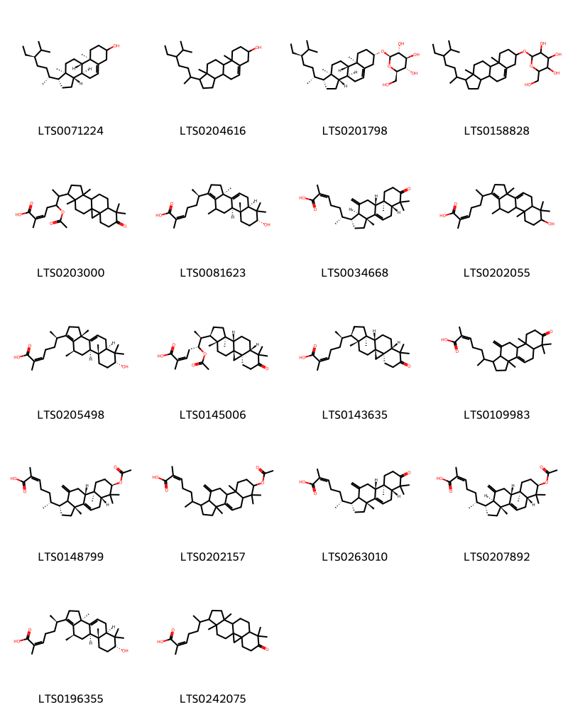{ width=100% }
    <figcaption>Hình ảnh cấu trúc hóa học của 18 hoạt chất thuộc nhóm Steroids and steroid derivatives gồm ['stigmast-5-en-3-ol (LTS0071224)', 'stigmast-5-en-3-ol, (3β)- (LTS0204616)', 'sitogluside (LTS0201798)', '2-{[1-(5-ethyl-6-methylheptan-2-yl)-9a,11a-dimethyl-1h,2h,3h,3ah,3bh,4h,6h,7h,8h,9h,9bh,10h,11h-cyclopenta[a]phenanthren-7-yl]oxy}-6-(hydroxymethyl)oxane-3,4,5-triol (LTS0158828)', '5-(acetyloxy)-2-methyl-6-{7,7,12,16-tetramethyl-6-oxopentacyclo[9.7.0.0¹,³.0³,⁸.0¹²,¹⁶]octadecan-15-yl}hept-2-enoic acid (LTS0203000)', '(2z,6r)-6-[(3as,5ar,7r,9ar,9br)-7-hydroxy-3a,6,6,9a,11-pentamethyl-2h,3h,5h,5ah,7h,8h,9h,9bh,10h,11h-cyclopenta[a]phenanthren-1-yl]-2-methylhept-2-enoic acid (LTS0081623)', '(2z,6r)-6-[(1r,3ar,5ar,9ar,9br,11as)-3a,6,6,9a-tetramethyl-11-methylidene-7-oxo-1h,2h,3h,5h,5ah,8h,9h,9bh,10h,11ah-cyclopenta[a]phenanthren-1-yl]-2-methylhept-2-enoic acid (LTS0034668)', '6-{7-hydroxy-3a,6,6,9a,11-pentamethyl-2h,3h,5h,5ah,7h,8h,9h,9bh,10h,11h-cyclopenta[a]phenanthren-1-yl}-2-methylhept-2-enoic acid (LTS0202055)', '(2z,6r)-6-[(3ar,5ar,7r,9ar,9br,11r)-7-hydroxy-3a,6,6,9a,11-pentamethyl-2h,3h,5h,5ah,7h,8h,9h,9bh,10h,11h-cyclopenta[a]phenanthren-1-yl]-2-methylhept-2-enoic acid (LTS0205498)', '(2z,5r,6s)-5-(acetyloxy)-2-methyl-6-[(1s,3r,8s,11s,12s,15r,16r)-7,7,12,16-tetramethyl-6-oxopentacyclo[9.7.0.0¹,³.0³,⁸.0¹²,¹⁶]octadecan-15-yl]hept-2-enoic acid (LTS0145006)', '(2z,6r)-2-methyl-6-[(1s,3r,8s,11s,12s,15r,16r)-7,7,12,16-tetramethyl-6-oxopentacyclo[9.7.0.0¹,³.0³,⁸.0¹²,¹⁶]octadecan-15-yl]hept-2-enoic acid (LTS0143635)', '6-{3a,6,6,9a-tetramethyl-11-methylidene-7-oxo-1h,2h,3h,5h,5ah,8h,9h,9bh,10h,11ah-cyclopenta[a]phenanthren-1-yl}-2-methylhept-2-enoic acid (LTS0109983)', '(2z,6r)-6-[(1r,3ar,5ar,7r,9ar,9br)-7-(acetyloxy)-3a,6,6,9a-tetramethyl-11-methylidene-1h,2h,3h,5h,5ah,7h,8h,9h,9bh,10h,11ah-cyclopenta[a]phenanthren-1-yl]-2-methylhept-2-enoic acid (LTS0148799)', '6-[7-(acetyloxy)-3a,6,6,9a-tetramethyl-11-methylidene-1h,2h,3h,5h,5ah,7h,8h,9h,9bh,10h,11ah-cyclopenta[a]phenanthren-1-yl]-2-methylhept-2-enoic acid (LTS0202157)', '(2z,6r)-6-[(1r,3ar,5ar,9ar,9br)-3a,6,6,9a-tetramethyl-11-methylidene-7-oxo-1h,2h,3h,5h,5ah,8h,9h,9bh,10h,11ah-cyclopenta[a]phenanthren-1-yl]-2-methylhept-2-enoic acid (LTS0263010)', '(2z,6r)-6-[(1r,3ar,5ar,7r,9ar,9br,11as)-7-(acetyloxy)-3a,6,6,9a-tetramethyl-11-methylidene-1h,2h,3h,5h,5ah,7h,8h,9h,9bh,10h,11ah-cyclopenta[a]phenanthren-1-yl]-2-methylhept-2-enoic acid (LTS0207892)', '(2z,6r)-6-[(3as,5ar,7r,9ar,9br,11r)-7-hydroxy-3a,6,6,9a,11-pentamethyl-2h,3h,5h,5ah,7h,8h,9h,9bh,10h,11h-cyclopenta[a]phenanthren-1-yl]-2-methylhept-2-enoic acid (LTS0196355)', '2-methyl-6-{7,7,12,16-tetramethyl-6-oxopentacyclo[9.7.0.0¹,³.0³,⁸.0¹²,¹⁶]octadecan-15-yl}hept-2-enoic acid (LTS0242075)'].</figcaption>
</figure>
#### Nhóm Tannins
<figure markdown="span">
    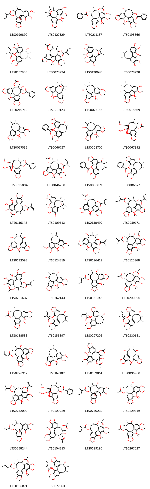{ width=100% }
    <figcaption>Hình ảnh cấu trúc hóa học của 104 hoạt chất thuộc nhóm Tannins gồm ['18,19-dimethoxy-13,14-dimethyl-20-oxo-3,6,8-trioxapentacyclo[9.9.1.0¹,¹⁶.0⁴,²¹.0⁵,⁹]henicosa-4(21),5(9),10,16,18-pentaen-12-yl 2-methylbutanoate (LTS0199892)', '(1s,17r,18r,19s)-9,12,13,14-tetramethoxy-18,19-dimethyl-5,7,20-trioxapentacyclo[15.2.1.0²,¹⁰.0⁴,⁸.0¹¹,¹⁶]icosa-2(10),3,8,11(16),12,14-hexaene (LTS0127529)', '(8r,9s,10r,11r)-8-(acetyloxy)-3,4,5,19-tetramethoxy-9,10-dimethyl-15,17-dioxatetracyclo[10.7.0.0²,⁷.0¹⁴,¹⁸]nonadeca-1(12),2(7),3,5,13,18-hexaen-11-yl benzoate (LTS0211137)', '(8r,9s,10r,11r)-11-hydroxy-3,4,5,19-tetramethoxy-9,10-dimethyl-15,17-dioxatetracyclo[10.7.0.0²,⁷.0¹⁴,¹⁸]nonadeca-1(12),2(7),3,5,13,18-hexaen-8-yl benzoate (LTS0195866)', '(9r,10r,11r)-11-hydroxy-4,5,19-trimethoxy-9,10-dimethyl-15,17-dioxatetracyclo[10.7.0.0²,⁷.0¹⁴,¹⁸]nonadeca-1(12),2(7),3,5,13,18-hexaen-3-yl 2-methylbutanoate (LTS0137938)', '11-(acetyloxy)-3,4,5,19-tetramethoxy-9,10-dimethyl-15,17-dioxatetracyclo[10.7.0.0²,⁷.0¹⁴,¹⁸]nonadeca-1(12),2,4,6,13,18-hexaen-8-yl 2-methylbut-2-enoate (LTS0078234)', '9,12,13-trimethoxy-18,19-dimethyl-5,7,20-trioxapentacyclo[15.2.1.0²,¹⁰.0⁴,⁸.0¹¹,¹⁶]icosa-2(10),3,8,11,13,15-hexaen-14-ol (LTS0190643)', '(9s,10r)-3,4,15,16-tetramethoxy-9,10-dimethyltricyclo[10.4.0.0²,⁷]hexadeca-1(12),2,4,6,13,15-hexaene-5,14-diol (LTS0078798)', '11-(acetyloxy)-9-hydroxy-3,4,5,19-tetramethoxy-9,10-dimethyl-15,17-dioxatetracyclo[10.7.0.0²,⁷.0¹⁴,¹⁸]nonadeca-1(12),2(7),3,5,13,18-hexaen-8-yl benzoate (LTS0210712)', '(1r,20s,21s,22r)-9,12-dimethoxy-21,22-dimethyl-5,7,14,16,23-pentaoxahexacyclo[18.2.1.0²,¹⁰.0⁴,⁸.0¹¹,¹⁹.0¹³,¹⁷]tricosa-2(10),3,8,11(19),12,17-hexaene (LTS0219123)', '(9r,10r,11r)-3,4,5,19-tetramethoxy-9,10-dimethyl-15,17-dioxatetracyclo[10.7.0.0²,⁷.0¹⁴,¹⁸]nonadeca-1(12),2(7),3,5,13,18-hexaen-11-ol (LTS0075156)', '(9r,10r,11r)-3,4,19-trimethoxy-9,10-dimethyl-15,17-dioxatetracyclo[10.7.0.0²,⁷.0¹⁴,¹⁸]nonadeca-1(12),2,4,6,13,18-hexaene-5,11-diol (LTS0018669)', '(9s,10r)-3,4,5,19-tetramethoxy-9,10-dimethyl-15,17-dioxatetracyclo[10.7.0.0²,⁷.0¹⁴,¹⁸]nonadeca-1(12),2(7),3,5,13,18-hexaene (LTS0017535)', '(9r,10r,11s)-11-hydroxy-4,5,19-trimethoxy-9,10-dimethyl-15,17-dioxatetracyclo[10.7.0.0²,⁷.0¹⁴,¹⁸]nonadeca-1(12),2(7),3,5,13,18-hexaen-3-yl benzoate (LTS0066727)', '(12s,13s)-3,22-dimethoxy-12,13-dimethyl-5,7,18,20-tetraoxapentacyclo[13.7.0.0²,¹⁰.0⁴,⁸.0¹⁷,²¹]docosa-1(15),2(10),3,8,16,21-hexaen-11-ol (LTS0203702)', '(1r,12r,13r,14r)-18,19-dimethoxy-13,14-dimethyl-20-oxo-3,6,8-trioxapentacyclo[9.9.1.0¹,¹⁶.0⁴,²¹.0⁵,⁹]henicosa-4,9,11(21),16,18-pentaen-12-yl acetate (LTS0067892)', '(12s,13s,14s)-18,19-dimethoxy-13,14-dimethyl-20-oxo-3,6,8-trioxapentacyclo[9.9.1.0¹,¹⁶.0⁴,²¹.0⁵,⁹]henicosa-4,9,11(21),16,18-pentaen-12-yl benzoate (LTS0095804)', '(8r,9s,10r,11r)-11-(acetyloxy)-3,4,5,19-tetramethoxy-9,10-dimethyl-15,17-dioxatetracyclo[10.7.0.0²,⁷.0¹⁴,¹⁸]nonadeca-1(12),2,4,6,13,18-hexaen-8-yl (2z)-2-methylbut-2-enoate (LTS0046230)', '11-hydroxy-4,5,19-trimethoxy-9,10-dimethyl-15,17-dioxatetracyclo[10.7.0.0²,⁷.0¹⁴,¹⁸]nonadeca-1(12),2(7),3,5,13,18-hexaen-3-yl benzoate (LTS0030871)', '(9r,10r,11r)-11-hydroxy-4,5,19-trimethoxy-9,10-dimethyl-15,17-dioxatetracyclo[10.7.0.0²,⁷.0¹⁴,¹⁸]nonadeca-1(12),2(7),3,5,13,18-hexaen-3-yl benzoate (LTS0086627)', '(8r,9s,10r,11r)-11-(acetyloxy)-14-hydroxy-3,4,5,15,16-pentamethoxy-9,10-dimethyltricyclo[10.4.0.0²,⁷]hexadeca-1(12),2,4,6,13,15-hexaen-8-yl (2z)-2-methylbut-2-enoate (LTS0116148)', '(1r,17s,18s,19r)-9,12,13-trimethoxy-18,19-dimethyl-5,7,20-trioxapentacyclo[15.2.1.0²,¹⁰.0⁴,⁸.0¹¹,¹⁶]icosa-2(10),3,8,11,13,15-hexaen-14-ol (LTS0109613)', '(8r,9s,10r,11r)-11-(acetyloxy)-3,4,5,19-tetramethoxy-9,10-dimethyl-15,17-dioxatetracyclo[10.7.0.0²,⁷.0¹⁴,¹⁸]nonadeca-1(12),2,4,6,13,18-hexaen-8-yl (2e)-2-methylbut-2-enoate (LTS0130492)', '3,22-dimethoxy-12,13-dimethyl-14-[(2-methylbut-2-enoyl)oxy]-5,7,18,20-tetraoxapentacyclo[13.7.0.0²,¹⁰.0⁴,⁸.0¹⁷,²¹]docosa-1(22),2(10),3,8,15,17(21)-hexaen-11-yl 2-methylbut-2-enoate (LTS0259171)', '14-hydroxy-3,22-dimethoxy-12,13-dimethyl-5,7,18,20-tetraoxapentacyclo[13.7.0.0²,¹⁰.0⁴,⁸.0¹⁷,²¹]docosa-1(15),2(10),3,8,16,21-hexaen-11-one (LTS0192593)', '(9s,10s)-3,4,5,14,15,16-hexamethoxy-9,10-dimethyltricyclo[10.4.0.0²,⁷]hexadeca-1(12),2(7),3,5,13,15-hexaene (LTS0124319)', '11-hydroxy-3,4,5,19-tetramethoxy-9,10-dimethyl-15,17-dioxatetracyclo[10.7.0.0²,⁷.0¹⁴,¹⁸]nonadeca-1(12),2,4,6,13,18-hexaen-8-yl 2-methylbut-2-enoate (LTS0126412)', '(8r,9s,10r,11r)-8-(acetyloxy)-3,4,5,19-tetramethoxy-9,10-dimethyl-15,17-dioxatetracyclo[10.7.0.0²,⁷.0¹⁴,¹⁸]nonadeca-1(12),2(7),3,5,13,18-hexaen-11-yl 2-methylpropanoate (LTS0125868)', '(8r,9s,10r,11r)-11-(acetyloxy)-14-hydroxy-3,4,5,15,16-pentamethoxy-9,10-dimethyltricyclo[10.4.0.0²,⁷]hexadeca-1(12),2,4,6,13,15-hexaen-8-yl 2-methylbut-2-enoate (LTS0202637)', '(8s,9s,10r,11r)-3,4,5,19-tetramethoxy-9,10-dimethyl-15,17-dioxatetracyclo[10.7.0.0²,⁷.0¹⁴,¹⁸]nonadeca-1(12),2(7),3,5,13,18-hexaene-8,11-diol (LTS0262143)', '14-hydroxy-3,22-dimethoxy-12,13-dimethyl-5,7,18,20-tetraoxapentacyclo[13.7.0.0²,¹⁰.0⁴,⁸.0¹⁷,²¹]docosa-1(15),2,4(8),9,16,21-hexaen-11-yl 2-methylbut-2-enoate (LTS0131045)', '(8r,9s,10r,11r)-8-(acetyloxy)-3,4,5,19-tetramethoxy-9,10-dimethyl-15,17-dioxatetracyclo[10.7.0.0²,⁷.0¹⁴,¹⁸]nonadeca-1(12),2(7),3,5,13,18-hexaen-11-yl acetate (LTS0200990)', '(9r,10r,11r)-3-hydroxy-4,5,19-trimethoxy-9,10-dimethyl-15,17-dioxatetracyclo[10.7.0.0²,⁷.0¹⁴,¹⁸]nonadeca-1(12),2(7),3,5,13,18-hexaen-11-yl acetate (LTS0138583)', '11-hydroxy-4,5,19-trimethoxy-9,10-dimethyl-15,17-dioxatetracyclo[10.7.0.0²,⁷.0¹⁴,¹⁸]nonadeca-1(12),2(7),3,5,13,18-hexaen-3-yl 2-methylbut-2-enoate (LTS0156897)', '(9r,10r,11r)-11-hydroxy-4,5,19-trimethoxy-9,10-dimethyl-15,17-dioxatetracyclo[10.7.0.0²,⁷.0¹⁴,¹⁸]nonadeca-1(12),2(7),3,5,13,18-hexaen-3-yl (2z)-2-methylbut-2-enoate (LTS0227206)', '(9r,10r,11r)-11-hydroxy-4,5,19-trimethoxy-9,10-dimethyl-15,17-dioxatetracyclo[10.7.0.0²,⁷.0¹⁴,¹⁸]nonadeca-1(12),2(7),3,5,13,18-hexaen-3-yl (2r)-2-methylbutanoate (LTS0230631)', '(11r,12s,13r,14r)-14-hydroxy-3,22-dimethoxy-12,13-dimethyl-5,7,18,20-tetraoxapentacyclo[13.7.0.0²,¹⁰.0⁴,⁸.0¹⁷,²¹]docosa-1(15),2,4(8),9,16,21-hexaen-11-yl (2z)-2-methylbut-2-enoate (LTS0228912)', '(9r,10s)-3,4,5,19-tetramethoxy-9,10-dimethyl-15,17-dioxatetracyclo[10.7.0.0²,⁷.0¹⁴,¹⁸]nonadeca-1(12),2(7),3,5,13,18-hexaene (LTS0167102)', '8-(acetyloxy)-9-hydroxy-3,4,5,19-tetramethoxy-9,10-dimethyl-15,17-dioxatetracyclo[10.7.0.0²,⁷.0¹⁴,¹⁸]nonadeca-1(12),2(7),3,5,13,18-hexaen-11-yl acetate (LTS0159861)', '(12s,13r,14r)-14-hydroxy-3,22-dimethoxy-12,13-dimethyl-5,7,18,20-tetraoxapentacyclo[13.7.0.0²,¹⁰.0⁴,⁸.0¹⁷,²¹]docosa-1(15),2(10),3,8,16,21-hexaen-11-one (LTS0096960)', '(8r,9s,10r,11r)-3,4,5,19-tetramethoxy-9,10-dimethyl-11-[(2-methylpropanoyl)oxy]-15,17-dioxatetracyclo[10.7.0.0²,⁷.0¹⁴,¹⁸]nonadeca-1(12),2,4,6,13,18-hexaen-8-yl (2z)-2-methylbut-2-enoate (LTS0252090)', '(1r,12r,13r,14r)-18,19-dimethoxy-13,14-dimethyl-20-oxo-3,6,8-trioxapentacyclo[9.9.1.0¹,¹⁶.0⁴,²¹.0⁵,⁹]henicosa-4,9,11(21),16,18-pentaen-12-yl benzoate (LTS0109229)', '15-hydroxy-18,19-dimethoxy-13,14-dimethyl-20-oxo-3,6,8-trioxapentacyclo[9.9.1.0¹,¹⁶.0⁴,²¹.0⁵,⁹]henicosa-4(21),5(9),10,16,18-pentaen-12-yl 2-methylbutanoate (LTS0270239)', '(8s,9s,10r,11r)-8-hydroxy-3,4,5,19-tetramethoxy-9,10-dimethyl-15,17-dioxatetracyclo[10.7.0.0²,⁷.0¹⁴,¹⁸]nonadeca-1(12),2(7),3,5,13,18-hexaen-11-yl acetate (LTS0229319)', '18,19-dimethoxy-13,14-dimethyl-20-oxo-3,6,8-trioxapentacyclo[9.9.1.0¹,¹⁶.0⁴,²¹.0⁵,⁹]henicosa-4(21),5(9),10,16,18-pentaen-12-yl propanoate (LTS0258244)', '(8r,9s,10r,11r)-8-(acetyloxy)-9-hydroxy-3,4,5,19-tetramethoxy-9,10-dimethyl-15,17-dioxatetracyclo[10.7.0.0²,⁷.0¹⁴,¹⁸]nonadeca-1(12),2(7),3,5,13,18-hexaen-11-yl acetate (LTS0104313)', '(8r,9s,10r,11r)-8-(acetyloxy)-3,4,5,19-tetramethoxy-9,10-dimethyl-15,17-dioxatetracyclo[10.7.0.0²,⁷.0¹⁴,¹⁸]nonadeca-1(19),2(7),3,5,12,14(18)-hexaen-11-yl 2-methylbutanoate (LTS0189190)', 'ananolignan b (LTS0267027)', '(8r,9s,10r,11r)-8-(acetyloxy)-3,4,5,19-tetramethoxy-9,10-dimethyl-15,17-dioxatetracyclo[10.7.0.0²,⁷.0¹⁴,¹⁸]nonadeca-1(19),2(7),3,5,12,14(18)-hexaen-11-yl butanoate (LTS0196871)', '11-hydroxy-4,5,19-trimethoxy-9,10-dimethyl-15,17-dioxatetracyclo[10.7.0.0²,⁷.0¹⁴,¹⁸]nonadeca-1(12),2(7),3,5,13,18-hexaen-3-yl 2-methylbutanoate (LTS0077363)', '(11r,12s,13r,14r)-14-hydroxy-3,22-dimethoxy-12,13-dimethyl-5,7,18,20-tetraoxapentacyclo[13.7.0.0²,¹⁰.0⁴,⁸.0¹⁷,²¹]docosa-1(15),2(10),3,8,16,21-hexaen-11-yl benzoate (LTS0252562)', '(11r,12r,13s,14r)-3,22-dimethoxy-12,13-dimethyl-14-{[(2e)-2-methylbut-2-enoyl]oxy}-5,7,18,20-tetraoxapentacyclo[13.7.0.0²,¹⁰.0⁴,⁸.0¹⁷,²¹]docosa-1(22),2(10),3,8,15,17(21)-hexaen-11-yl (2e)-2-methylbut-2-enoate (LTS0270838)', '(8s,9s,10r,11r)-11-hydroxy-3,4,5,19-tetramethoxy-9,10-dimethyl-15,17-dioxatetracyclo[10.7.0.0²,⁷.0¹⁴,¹⁸]nonadeca-1(12),2,4,6,13,18-hexaen-8-yl (2e)-2-methylbut-2-enoate (LTS0203461)', '(8r,9r,10s,11r)-11-(acetyloxy)-5-hydroxy-3,4,14,15,16-pentamethoxy-9,10-dimethyltricyclo[10.4.0.0²,⁷]hexadeca-1(12),2(7),3,5,13,15-hexaen-8-yl acetate (LTS0255942)', '(1r,12r,13r,14r)-18,19-dimethoxy-13,14-dimethyl-20-oxo-3,6,8-trioxapentacyclo[9.9.1.0¹,¹⁶.0⁴,²¹.0⁵,⁹]henicosa-4(21),5(9),10,16,18-pentaen-12-yl propanoate (LTS0197348)', '9,12-dimethoxy-21,22-dimethyl-5,7,14,16,23-pentaoxahexacyclo[18.2.1.0²,¹⁰.0⁴,⁸.0¹¹,¹⁹.0¹³,¹⁷]tricosa-2(10),3,8,11(19),12,17-hexaene (LTS0274007)', '(1r,12r,13r,14r)-18,19-dimethoxy-13,14-dimethyl-20-oxo-3,6,8-trioxapentacyclo[9.9.1.0¹,¹⁶.0⁴,²¹.0⁵,⁹]henicosa-4(21),5(9),10,16,18-pentaen-12-yl (2r)-2-methylbutanoate (LTS0243076)', '(11r,12r,13s,14s)-3,22-dimethoxy-12,13-dimethyl-5,7,18,20-tetraoxapentacyclo[13.7.0.0²,¹⁰.0⁴,⁸.0¹⁷,²¹]docosa-1(15),2(10),3,8,16,21-hexaene-11,14-diol (LTS0242789)', '5,6,9,10,11-pentamethoxy-15,16-dimethyl-17-oxatetracyclo[12.2.1.0²,⁷.0⁸,¹³]heptadeca-2(7),3,5,8(13),9,11-hexaen-4-ol (LTS0275566)', '(11r,12r,13s,14r)-3,22-dimethoxy-12,13-dimethyl-14-{[(2z)-2-methylbut-2-enoyl]oxy}-5,7,18,20-tetraoxapentacyclo[13.7.0.0²,¹⁰.0⁴,⁸.0¹⁷,²¹]docosa-1(22),2(10),3,8,15,17(21)-hexaen-11-yl (2e)-2-methylbut-2-enoate (LTS0065614)', '18,19-dimethoxy-13,14-dimethyl-20-oxo-3,6,8-trioxapentacyclo[9.9.1.0¹,¹⁶.0⁴,²¹.0⁵,⁹]henicosa-4,9,11(21),16,18-pentaen-12-yl benzoate (LTS0273142)', '(11r,12r,15s,24s,25s)-12,25-dihydroxy-18,19,20-trimethoxy-11,12,24,25-tetramethyl-4,6,9,14-tetraoxapentacyclo[13.7.3.0³,⁷.0⁸,²².0¹⁶,²¹]pentacosa-1(22),2,7,16(21),17,19-hexaen-13-one (LTS0098250)', '3,4,5,19-tetramethoxy-9,10-dimethyl-15,17-dioxatetracyclo[10.7.0.0²,⁷.0¹⁴,¹⁸]nonadeca-1(12),2(7),3,5,13,18-hexaen-11-ol (LTS0095517)', '(9r,10r,11r)-11-hydroxy-4,5,19-trimethoxy-9,10-dimethyl-15,17-dioxatetracyclo[10.7.0.0²,⁷.0¹⁴,¹⁸]nonadeca-1(12),2(7),3,5,13,18-hexaen-3-yl (2e)-2-methylbut-2-enoate (LTS0195987)', '(8s,9s,10s,11r)-11-(acetyloxy)-9-hydroxy-3,4,5,14,15,16-hexamethoxy-9,10-dimethyltricyclo[10.4.0.0²,⁷]hexadeca-1(12),2(7),3,5,13,15-hexaen-8-yl benzoate (LTS0230749)', '(9r,10s)-3,4,5-trimethoxy-9,10-dimethyl-15,17-dioxatetracyclo[10.7.0.0²,⁷.0¹⁴,¹⁸]nonadeca-1(12),2(7),3,5,13,18-hexaen-19-yl (2z)-2-methylbut-2-enoate (LTS0214360)', '(8r,9s,10r,11r)-11-hydroxy-3,4,5,19-tetramethoxy-9,10-dimethyl-15,17-dioxatetracyclo[10.7.0.0²,⁷.0¹⁴,¹⁸]nonadeca-1(12),2,4,6,13,18-hexaen-8-yl (2e)-2-methylbut-2-enoate (LTS0222645)', '(11r,12s,13r,14r)-14-(acetyloxy)-3,22-dimethoxy-12,13-dimethyl-5,7,18,20-tetraoxapentacyclo[13.7.0.0²,¹⁰.0⁴,⁸.0¹⁷,²¹]docosa-1(15),2,4(8),9,16,21-hexaen-11-yl (2z)-2-methylbut-2-enoate (LTS0215417)', '4,5,6,9,10,11-hexamethoxy-15,16-dimethyl-17-oxatetracyclo[12.2.1.0²,⁷.0⁸,¹³]heptadeca-2(7),3,5,8(13),9,11-hexaene (LTS0214450)', '(1r,17s,18s,19r)-9,12,13,14-tetramethoxy-18,19-dimethyl-5,7,20-trioxapentacyclo[15.2.1.0²,¹⁰.0⁴,⁸.0¹¹,¹⁶]icosa-2(10),3,8,11(16),12,14-hexaene (LTS0086529)', '(8s,9s,10r,11s)-8-(acetyloxy)-3,4,5,19-tetramethoxy-9,10-dimethyl-15,17-dioxatetracyclo[10.7.0.0²,⁷.0¹⁴,¹⁸]nonadeca-1(19),2(7),3,5,12,14(18)-hexaen-11-yl (2z)-2-methylbut-2-enoate (LTS0024586)', '(8r,9s,10r,11r)-11-(acetyloxy)-14-hydroxy-3,4,5,15,16-pentamethoxy-9,10-dimethyltricyclo[10.4.0.0²,⁷]hexadeca-1(12),2(7),3,5,13,15-hexaen-8-yl benzoate (LTS0231830)', '(8s,9s,10s,11r)-8-(acetyloxy)-9-hydroxy-3,4,5,19-tetramethoxy-9,10-dimethyl-15,17-dioxatetracyclo[10.7.0.0²,⁷.0¹⁴,¹⁸]nonadeca-1(12),2(7),3,5,13,18-hexaen-11-yl acetate (LTS0222376)', '(8r,9s,10r,11r)-11-(butanoyloxy)-3,4,5,19-tetramethoxy-9,10-dimethyl-15,17-dioxatetracyclo[10.7.0.0²,⁷.0¹⁴,¹⁸]nonadeca-1(12),2,4,6,13,18-hexaen-8-yl (2z)-2-methylbut-2-enoate (LTS0230604)', '9,12,13,14-tetramethoxy-18,19-dimethyl-5,7,20-trioxapentacyclo[15.2.1.0²,¹⁰.0⁴,⁸.0¹¹,¹⁶]icosa-2(10),3,8,11(16),12,14-hexaene (LTS0157088)', '11-(acetyloxy)-9-hydroxy-3,4,5,14,15,16-hexamethoxy-9,10-dimethyltricyclo[10.4.0.0²,⁷]hexadeca-1(12),2(7),3,5,13,15-hexaen-8-yl benzoate (LTS0184198)', '(1s,12r,13r,14s,15r)-15-hydroxy-18,19-dimethoxy-13,14-dimethyl-20-oxo-3,6,8-trioxapentacyclo[9.9.1.0¹,¹⁶.0⁴,²¹.0⁵,⁹]henicosa-4(21),5(9),10,16,18-pentaen-12-yl (2r)-2-methylbutanoate (LTS0006105)', '3,4,13,14,15-pentamethoxy-8,9-dimethyl-17-oxatetracyclo[8.6.1.0¹,⁶.0¹¹,¹⁶]heptadeca-3,5,11,13,15-pentaen-2-one (LTS0208906)', '(11r,12r,13s,14r)-3,22-dimethoxy-12,13-dimethyl-14-{[(2z)-2-methylbut-2-enoyl]oxy}-5,7,18,20-tetraoxapentacyclo[13.7.0.0²,¹⁰.0⁴,⁸.0¹⁷,²¹]docosa-1(22),2(10),3,8,15,17(21)-hexaen-11-yl (2z)-2-methylbut-2-enoate (LTS0167749)', '12-hydroxy-18,19,20-trimethoxy-11,12,24,25-tetramethyl-4,6,9,14-tetraoxapentacyclo[13.7.3.0³,⁷.0⁸,²².0¹⁶,²¹]pentacosa-1(22),2,7,16(21),17,19-hexaen-13-one (LTS0044784)', '3,22-dimethoxy-12,13-dimethyl-5,7,18,20-tetraoxapentacyclo[13.7.0.0²,¹⁰.0⁴,⁸.0¹⁷,²¹]docosa-1(15),2(10),3,8,16,21-hexaene-11,14-diol (LTS0206484)', '(9r,10r,11r)-3,4,5,19-tetramethoxy-9,10-dimethyl-15,17-dioxatetracyclo[10.7.0.0²,⁷.0¹⁴,¹⁸]nonadeca-1(12),2(7),3,5,13,18-hexaen-11-yl acetate (LTS0055131)', '(11s,12r,13r)-3,22-dimethoxy-12,13-dimethyl-5,7,18,20-tetraoxapentacyclo[13.7.0.0²,¹⁰.0⁴,⁸.0¹⁷,²¹]docosa-1(15),2(10),3,8,16,21-hexaen-11-ol (LTS0275142)', '(8r,9s,10r,11r)-11-hydroxy-3,4,5,19-tetramethoxy-9,10-dimethyl-15,17-dioxatetracyclo[10.7.0.0²,⁷.0¹⁴,¹⁸]nonadeca-1(12),2(7),3,5,13,18-hexaen-8-yl acetate (LTS0128867)', '12,25-dihydroxy-18,19,20-trimethoxy-11,12,24,25-tetramethyl-4,6,9,14-tetraoxapentacyclo[13.7.3.0³,⁷.0⁸,²².0¹⁶,²¹]pentacosa-1(22),2,7,16(21),17,19-hexaen-13-one (LTS0125997)', '3-hydroxy-4,5,19-trimethoxy-9,10-dimethyl-15,17-dioxatetracyclo[10.7.0.0²,⁷.0¹⁴,¹⁸]nonadeca-1(12),2(7),3,5,13,18-hexaen-11-yl acetate (LTS0006196)', '(1r,14s,15s,16r)-4,5,6,9,10,11-hexamethoxy-15,16-dimethyl-17-oxatetracyclo[12.2.1.0²,⁷.0⁸,¹³]heptadeca-2(7),3,5,8(13),9,11-hexaene (LTS0135877)', '(1s,14r,15r,16s)-5,6,9,10,11-pentamethoxy-15,16-dimethyl-17-oxatetracyclo[12.2.1.0²,⁷.0⁸,¹³]heptadeca-2(7),3,5,8(13),9,11-hexaen-4-ol (LTS0274335)', '(9r,10r,11s)-3,4,19-trimethoxy-9,10-dimethyl-15,17-dioxatetracyclo[10.7.0.0²,⁷.0¹⁴,¹⁸]nonadeca-1(12),2,4,6,13,18-hexaene-5,11-diol (LTS0004184)', '(8s,9s,10s,11r)-11-(acetyloxy)-9-hydroxy-3,4,5,19-tetramethoxy-9,10-dimethyl-15,17-dioxatetracyclo[10.7.0.0²,⁷.0¹⁴,¹⁸]nonadeca-1(12),2(7),3,5,13,18-hexaen-8-yl benzoate (LTS0004314)', '3,4,19-trimethoxy-9,10-dimethyl-15,17-dioxatetracyclo[10.7.0.0²,⁷.0¹⁴,¹⁸]nonadeca-1(12),2,4,6,13,18-hexaene-5,11-diol (LTS0271102)', '(11r,12r,15r,24s,25s)-12-hydroxy-18,19,20-trimethoxy-11,12,24,25-tetramethyl-4,6,9,14-tetraoxapentacyclo[13.7.3.0³,⁷.0⁸,²².0¹⁶,²¹]pentacosa-1(22),2,7,16(21),17,19-hexaen-13-one (LTS0013684)', '3,22-dimethoxy-12,13-dimethyl-5,7,18,20-tetraoxapentacyclo[13.7.0.0²,¹⁰.0⁴,⁸.0¹⁷,²¹]docosa-1(15),2(10),3,8,16,21-hexaen-11-ol (LTS0016331)', '14-hydroxy-3,22-dimethoxy-12,13-dimethyl-5,7,18,20-tetraoxapentacyclo[13.7.0.0²,¹⁰.0⁴,⁸.0¹⁷,²¹]docosa-1(15),2(10),3,8,16,21-hexaen-11-yl benzoate (LTS0002304)', '(9s,10s,11r)-3,4,5,19-tetramethoxy-9,10-dimethyl-15,17-dioxatetracyclo[10.7.0.0²,⁷.0¹⁴,¹⁸]nonadeca-1(12),2(7),3,5,13,18-hexaen-11-ol (LTS0227909)', '(8r,9s,10r,11r)-8-(acetyloxy)-3,4,5,19-tetramethoxy-9,10-dimethyl-15,17-dioxatetracyclo[10.7.0.0²,⁷.0¹⁴,¹⁸]nonadeca-1(19),2(7),3,5,12,14(18)-hexaen-11-yl propanoate (LTS0209067)', '(1s,8r,9r,10r)-3,4,13,14,15-pentamethoxy-8,9-dimethyl-17-oxatetracyclo[8.6.1.0¹,⁶.0¹¹,¹⁶]heptadeca-3,5,11,13,15-pentaen-2-one (LTS0103999)', '(8r,9s,10r,11r)-11-(butanoyloxy)-3,4,5,19-tetramethoxy-9,10-dimethyl-15,17-dioxatetracyclo[10.7.0.0²,⁷.0¹⁴,¹⁸]nonadeca-1(12),2,4,6,13,18-hexaen-8-yl 2-methylbut-2-enoate (LTS0021223)', '14-(acetyloxy)-3,22-dimethoxy-12,13-dimethyl-5,7,18,20-tetraoxapentacyclo[13.7.0.0²,¹⁰.0⁴,⁸.0¹⁷,²¹]docosa-1(15),2,4(8),9,16,21-hexaen-11-yl 2-methylbut-2-enoate (LTS0092662)', '(11r,12s,13s)-3,22-dimethoxy-12,13-dimethyl-5,7,18,20-tetraoxapentacyclo[13.7.0.0²,¹⁰.0⁴,⁸.0¹⁷,²¹]docosa-1(15),2(10),3,8,16,21-hexaen-11-ol (LTS0268520)', '(8r,9s,10r,11r)-11,14-dihydroxy-3,4,5,15,16-pentamethoxy-9,10-dimethyltricyclo[10.4.0.0²,⁷]hexadeca-1(12),2(7),3,5,13,15-hexaen-8-yl benzoate (LTS0048307)', '18,19-dimethoxy-13,14-dimethyl-20-oxo-3,6,8-trioxapentacyclo[9.9.1.0¹,¹⁶.0⁴,²¹.0⁵,⁹]henicosa-4,9,11(21),16,18-pentaen-12-yl acetate (LTS0045299)', '(8s,9s,10r,11s)-11-hydroxy-3,4,5,19-tetramethoxy-9,10-dimethyl-15,17-dioxatetracyclo[10.7.0.0²,⁷.0¹⁴,¹⁸]nonadeca-1(12),2,4,6,13,18-hexaen-8-yl (2e)-2-methylbut-2-enoate (LTS0051577)', '(12s,13r,14s)-14-hydroxy-3,22-dimethoxy-12,13-dimethyl-5,7,18,20-tetraoxapentacyclo[13.7.0.0²,¹⁰.0⁴,⁸.0¹⁷,²¹]docosa-1(15),2(10),3,8,16,21-hexaen-11-one (LTS0040345)'].</figcaption>
</figure>

---

### Dược dân tộc học

Danh sách các quốc gia có sử dụng *Kadsura coccinea* trong điều trị các bệnh. 

| Country   | Disease            | Bệnh                                                                                                                                                                                                |
|:----------|:-------------------|:----------------------------------------------------------------------------------------------------------------------------------------------------------------------------------------------------|
| Chinese   | Aphrodisiac, Tonic | MYMEMORY WARNING: YOU USED ALL AVAILABLE FREE TRANSLATIONS FOR TODAY. NEXT AVAILABLE IN  17 HOURS 05 MINUTES 37 SECONDS VISIT HTTPS://MYMEMORY.TRANSLATED.NET/DOC/USAGELIMITS.PHP TO TRANSLATE MORE |

---

---
## Kadsura japonica
### Thông tin về thực vật

!!! info "Phân loại thực vật của *Kadsura japonica* từ GIBF:"
    - **Kingdom:** Plantae
    - **Phylum:** Tracheophyta
    - **Order:** Austrobaileyales
    - **Family:** Schisandraceae
    - **Genus:** Kadsura
    - **Species:** *Kadsura japonica*

 

| Label (VI)   | Label (EN)   | Scientific Name   | Descriptions (VI)   | Descriptions (EN)   | Also Known As (VI)   | Also Known As (EN)   |
|:-------------|:-------------|:------------------|:--------------------|:--------------------|:---------------------|:---------------------|
| N/A          | N/A          | Kadsura japonica  | loài thực vật       | species of plant    | ['']                 | ['']                 |

#### Phân bố trên thế giới

**Từ CSDL GIBF** nan, Japan, United States of America, Belgium, Korea, Republic of, Chinese Taipei

#### Phân bố tại Việt Nam

**Từ CSDL GIBF**: Không có ghi nhận ở Việt Nam

---
### Thành phần hóa học
        
- Theo cơ sở dữ liệu lotus: Từ loài *Kadsura japonica* đã phân lập và xác định được 41 hoạt chất thuộc về các nhóm Tannins, Prenol lipids, Benzene and substituted derivatives, Benzodioxoles. 

|    | chemicalTaxonomyClassyfireClass     |   smiles_count |
|---:|:------------------------------------|---------------:|
|  0 | Benzene and substituted derivatives |              2 |
|  1 | Benzodioxoles                       |              6 |
|  2 | Prenol lipids                       |              5 |
|  3 | Tannins                             |             28 |

#### Nhóm Benzene and substituted derivatives
<figure markdown="span">
    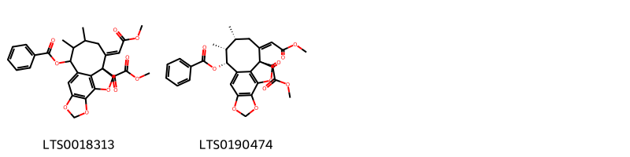{ width=100% }
    <figcaption>Hình ảnh cấu trúc hóa học của 2 hoạt chất thuộc nhóm Benzene and substituted derivatives gồm ['4-(2-methoxy-2-oxoacetyl)-5-(2-methoxy-2-oxoethylidene)-7,8-dimethyl-2,13,15-trioxatetracyclo[8.6.1.0⁴,¹⁷.0¹²,¹⁶]heptadeca-1(17),10,12(16)-trien-9-yl benzoate (LTS0018313)', '(4r,5z,7r,8r,9r)-4-(2-methoxy-2-oxoacetyl)-5-(2-methoxy-2-oxoethylidene)-7,8-dimethyl-2,13,15-trioxatetracyclo[8.6.1.0⁴,¹⁷.0¹²,¹⁶]heptadeca-1(17),10,12(16)-trien-9-yl benzoate (LTS0190474)'].</figcaption>
</figure>
#### Nhóm Benzodioxoles
<figure markdown="span">
    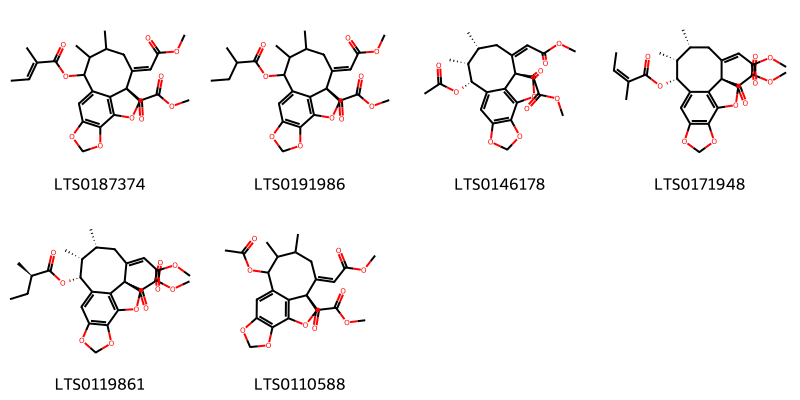{ width=100% }
    <figcaption>Hình ảnh cấu trúc hóa học của 6 hoạt chất thuộc nhóm Benzodioxoles gồm ['4-(2-methoxy-2-oxoacetyl)-5-(2-methoxy-2-oxoethylidene)-7,8-dimethyl-2,13,15-trioxatetracyclo[8.6.1.0⁴,¹⁷.0¹²,¹⁶]heptadeca-1(17),10,12(16)-trien-9-yl 2-methylbut-2-enoate (LTS0187374)', '4-(2-methoxy-2-oxoacetyl)-5-(2-methoxy-2-oxoethylidene)-7,8-dimethyl-2,13,15-trioxatetracyclo[8.6.1.0⁴,¹⁷.0¹²,¹⁶]heptadeca-1(17),10,12(16)-trien-9-yl 2-methylbutanoate (LTS0191986)', 'methyl 2-[(4r,5z,7r,8r,9r)-9-(acetyloxy)-5-(2-methoxy-2-oxoethylidene)-7,8-dimethyl-2,13,15-trioxatetracyclo[8.6.1.0⁴,¹⁷.0¹²,¹⁶]heptadeca-1(17),10,12(16)-trien-4-yl]-2-oxoacetate (LTS0146178)', '(4r,5z,7r,8r,9r)-4-(2-methoxy-2-oxoacetyl)-5-(2-methoxy-2-oxoethylidene)-7,8-dimethyl-2,13,15-trioxatetracyclo[8.6.1.0⁴,¹⁷.0¹²,¹⁶]heptadeca-1(17),10,12(16)-trien-9-yl (2z)-2-methylbut-2-enoate (LTS0171948)', '(4r,5z,7r,8r,9r)-4-(2-methoxy-2-oxoacetyl)-5-(2-methoxy-2-oxoethylidene)-7,8-dimethyl-2,13,15-trioxatetracyclo[8.6.1.0⁴,¹⁷.0¹²,¹⁶]heptadeca-1(17),10,12(16)-trien-9-yl (2r)-2-methylbutanoate (LTS0119861)', 'methyl 2-[9-(acetyloxy)-5-(2-methoxy-2-oxoethylidene)-7,8-dimethyl-2,13,15-trioxatetracyclo[8.6.1.0⁴,¹⁷.0¹²,¹⁶]heptadeca-1(17),10,12(16)-trien-4-yl]-2-oxoacetate (LTS0110588)'].</figcaption>
</figure>
#### Nhóm Prenol lipids
<figure markdown="span">
    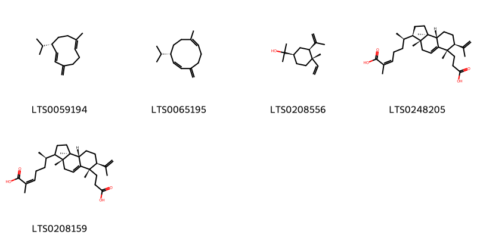{ width=100% }
    <figcaption>Hình ảnh cấu trúc hóa học của 5 hoạt chất thuộc nhóm Prenol lipids gồm ['(-)-germacrene d (LTS0059194)', '(1z,6z,8s)-8-isopropyl-1-methyl-5-methylidenecyclodeca-1,6-diene (LTS0065195)', 'elemol (LTS0208556)', '(2z,6r)-6-[(3r,3ar,6s,7s,9as,9bs)-6-(2-carboxyethyl)-3a,6,9b-trimethyl-7-(prop-1-en-2-yl)-1h,2h,3h,4h,7h,8h,9h,9ah-cyclopenta[a]naphthalen-3-yl]-2-methylhept-2-enoic acid (LTS0248205)', '(2z,6r)-6-[(3ar,6s,7s,9as,9bs)-6-(2-carboxyethyl)-3a,6,9b-trimethyl-7-(prop-1-en-2-yl)-1h,2h,3h,4h,7h,8h,9h,9ah-cyclopenta[a]naphthalen-3-yl]-2-methylhept-2-enoic acid (LTS0208159)'].</figcaption>
</figure>
#### Nhóm Tannins
<figure markdown="span">
    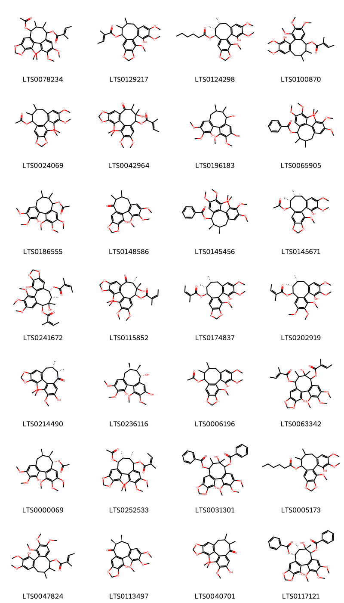{ width=100% }
    <figcaption>Hình ảnh cấu trúc hóa học của 28 hoạt chất thuộc nhóm Tannins gồm ['11-(acetyloxy)-3,4,5,19-tetramethoxy-9,10-dimethyl-15,17-dioxatetracyclo[10.7.0.0²,⁷.0¹⁴,¹⁸]nonadeca-1(12),2,4,6,13,18-hexaen-8-yl 2-methylbut-2-enoate (LTS0078234)', '3-hydroxy-4,5,19-trimethoxy-9,10-dimethyl-15,17-dioxatetracyclo[10.7.0.0²,⁷.0¹⁴,¹⁸]nonadeca-1(19),2(7),3,5,12,14(18)-hexaen-11-yl 2-methylbut-2-enoate (LTS0129217)', '(9r,10r,11s)-3-hydroxy-4,5,19-trimethoxy-9,10-dimethyl-15,17-dioxatetracyclo[10.7.0.0²,⁷.0¹⁴,¹⁸]nonadeca-1(19),2(7),3,5,12,14(18)-hexaen-11-yl hexanoate (LTS0124298)', '16-hydroxy-3,4,5,14,15-pentamethoxy-9,10-dimethyltricyclo[10.4.0.0²,⁷]hexadeca-1(12),2,4,6,13,15-hexaen-8-yl (2e)-2-methylbut-2-enoate (LTS0100870)', '3,4,5,19-tetramethoxy-9,10-dimethyl-15,17-dioxatetracyclo[10.7.0.0²,⁷.0¹⁴,¹⁸]nonadeca-1(12),2(7),3,5,13,18-hexaen-11-yl acetate (LTS0024069)', '9-hydroxy-3,4,5,19-tetramethoxy-9,10-dimethyl-11-oxo-15,17-dioxatetracyclo[10.7.0.0²,⁷.0¹⁴,¹⁸]nonadeca-1(12),2,4,6,13,18-hexaen-8-yl 2-methylbut-2-enoate (LTS0042964)', '4,5,15,16-tetramethoxy-9,10-dimethyltricyclo[10.4.0.0²,⁷]hexadeca-1(12),2(7),3,5,13,15-hexaene-3,11,14-triol (LTS0196183)', '3,4,5,14,15,16-hexamethoxy-9,10-dimethyltricyclo[10.4.0.0²,⁷]hexadeca-1(12),2(7),3,5,13,15-hexaen-8-yl benzoate (LTS0065905)', '16-hydroxy-3,4,5,14,15-pentamethoxy-9,10-dimethyltricyclo[10.4.0.0²,⁷]hexadeca-1(12),2(7),3,5,13,15-hexaen-8-yl acetate (LTS0186555)', '19-hydroxy-3,4,5-trimethoxy-9,10-dimethyl-15,17-dioxatetracyclo[10.7.0.0²,⁷.0¹⁴,¹⁸]nonadeca-1(12),2(7),3,5,13,18-hexaen-11-one (LTS0148586)', '(8r,9r,10r)-3,4,5,14,15,16-hexamethoxy-9,10-dimethyltricyclo[10.4.0.0²,⁷]hexadeca-1(12),2(7),3,5,13,15-hexaen-8-yl benzoate (LTS0145456)', '(9r,10r,11s)-3-hydroxy-4,5,19-trimethoxy-9,10-dimethyl-15,17-dioxatetracyclo[10.7.0.0²,⁷.0¹⁴,¹⁸]nonadeca-1(12),2(7),3,5,13,18-hexaen-11-yl acetate (LTS0145671)', '(8s,9s,10s,11r)-9,19-dihydroxy-3,4,5-trimethoxy-9,10-dimethyl-8-{[(2z)-2-methylbut-2-enoyl]oxy}-15,17-dioxatetracyclo[10.7.0.0²,⁷.0¹⁴,¹⁸]nonadeca-1(12),2,4,6,13,18-hexaen-11-yl (2z)-2-methylbut-2-enoate (LTS0241672)', '(8s,9s,10r)-9-hydroxy-3,4,5,19-tetramethoxy-9,10-dimethyl-11-oxo-15,17-dioxatetracyclo[10.7.0.0²,⁷.0¹⁴,¹⁸]nonadeca-1(12),2,4,6,13,18-hexaen-8-yl (2z)-2-methylbut-2-enoate (LTS0115852)', '(9r,10r,11s)-3-hydroxy-4,5,19-trimethoxy-9,10-dimethyl-15,17-dioxatetracyclo[10.7.0.0²,⁷.0¹⁴,¹⁸]nonadeca-1(19),2(7),3,5,12,14(18)-hexaen-11-yl (2z)-2-methylbut-2-enoate (LTS0174837)', '(8s,9r,10r)-16-hydroxy-3,4,5,14,15-pentamethoxy-9,10-dimethyltricyclo[10.4.0.0²,⁷]hexadeca-1(12),2,4,6,13,15-hexaen-8-yl (2z)-2-methylbut-2-enoate (LTS0202919)', '(9s,10s)-5-hydroxy-3,4,19-trimethoxy-9,10-dimethyl-15,17-dioxatetracyclo[10.7.0.0²,⁷.0¹⁴,¹⁸]nonadeca-1(12),2,4,6,13,18-hexaen-8-one (LTS0214490)', '(9r,10r,11s)-4,5,15,16-tetramethoxy-9,10-dimethyltricyclo[10.4.0.0²,⁷]hexadeca-1(12),2(7),3,5,13,15-hexaene-3,11,14-triol (LTS0236116)', '3-hydroxy-4,5,19-trimethoxy-9,10-dimethyl-15,17-dioxatetracyclo[10.7.0.0²,⁷.0¹⁴,¹⁸]nonadeca-1(12),2(7),3,5,13,18-hexaen-11-yl acetate (LTS0006196)', '9,19-dihydroxy-3,4,5-trimethoxy-9,10-dimethyl-11-[(2-methylbut-2-enoyl)oxy]-15,17-dioxatetracyclo[10.7.0.0²,⁷.0¹⁴,¹⁸]nonadeca-1(19),2(7),3,5,12,14(18)-hexaen-8-yl 2-methylbut-2-enoate (LTS0063342)', '(8s,9r,10r)-16-hydroxy-3,4,5,14,15-pentamethoxy-9,10-dimethyltricyclo[10.4.0.0²,⁷]hexadeca-1(12),2(7),3,5,13,15-hexaen-8-yl acetate (LTS0000069)', '(8r,9s,10r,11s)-11-(acetyloxy)-3,4,5,19-tetramethoxy-9,10-dimethyl-15,17-dioxatetracyclo[10.7.0.0²,⁷.0¹⁴,¹⁸]nonadeca-1(12),2,4,6,13,18-hexaen-8-yl (2z)-2-methylbut-2-enoate (LTS0252533)', '8-(benzoyloxy)-9,19-dihydroxy-3,4,5-trimethoxy-9,10-dimethyl-15,17-dioxatetracyclo[10.7.0.0²,⁷.0¹⁴,¹⁸]nonadeca-1(12),2(7),3,5,13,18-hexaen-11-yl benzoate (LTS0031301)', '3-hydroxy-4,5,19-trimethoxy-9,10-dimethyl-15,17-dioxatetracyclo[10.7.0.0²,⁷.0¹⁴,¹⁸]nonadeca-1(19),2(7),3,5,12,14(18)-hexaen-11-yl hexanoate (LTS0005173)', '16-hydroxy-3,4,5,14,15-pentamethoxy-9,10-dimethyltricyclo[10.4.0.0²,⁷]hexadeca-1(12),2,4,6,13,15-hexaen-8-yl 2-methylbut-2-enoate (LTS0047824)', '(9s,10s)-19-hydroxy-3,4,5-trimethoxy-9,10-dimethyl-15,17-dioxatetracyclo[10.7.0.0²,⁷.0¹⁴,¹⁸]nonadeca-1(12),2(7),3,5,13,18-hexaen-11-one (LTS0113497)', '5-hydroxy-3,4,19-trimethoxy-9,10-dimethyl-15,17-dioxatetracyclo[10.7.0.0²,⁷.0¹⁴,¹⁸]nonadeca-1(12),2,4,6,13,18-hexaen-8-one (LTS0040701)', '(8s,9s,10s,11r)-8-(benzoyloxy)-9,19-dihydroxy-3,4,5-trimethoxy-9,10-dimethyl-15,17-dioxatetracyclo[10.7.0.0²,⁷.0¹⁴,¹⁸]nonadeca-1(12),2(7),3,5,13,18-hexaen-11-yl benzoate (LTS0117121)'].</figcaption>
</figure>

---

### Dược dân tộc học

Danh sách các quốc gia có sử dụng *Kadsura japonica* trong điều trị các bệnh. 

| Country   | Disease   | Bệnh                                                                                                                                                                                                |
|:----------|:----------|:----------------------------------------------------------------------------------------------------------------------------------------------------------------------------------------------------|
| Elsewhere | Tonic     | MYMEMORY WARNING: YOU USED ALL AVAILABLE FREE TRANSLATIONS FOR TODAY. NEXT AVAILABLE IN  17 HOURS 04 MINUTES 54 SECONDS VISIT HTTPS://MYMEMORY.TRANSLATED.NET/DOC/USAGELIMITS.PHP TO TRANSLATE MORE |

---

---
## Kadsura peltigera
### Thông tin về thực vật

!!! info "Phân loại thực vật của *Kadsura longipedunculata* từ GIBF:"
    - **Kingdom:** Plantae
    - **Phylum:** Tracheophyta
    - **Order:** Austrobaileyales
    - **Family:** Schisandraceae
    - **Genus:** Kadsura
    - **Species:** *Kadsura longipedunculata*

 

| Label (VI)   | Label (EN)   | Scientific Name   | Descriptions (VI)   | Descriptions (EN)   | Also Known As (VI)   | Also Known As (EN)   |
|:-------------|:-------------|:------------------|:--------------------|:--------------------|:---------------------|:---------------------|
| N/A          | N/A          | Kadsura peltigera |                     |                     | ['']                 | ['']                 |

#### Phân bố trên thế giới

**Từ CSDL GIBF** China

#### Phân bố tại Việt Nam

**Từ CSDL GIBF**: Không có ghi nhận ở Việt Nam

---
### Thành phần hóa học
        
- Theo cơ sở dữ liệu lotus: Từ loài *Kadsura longipedunculata* đã phân lập và xác định được Chưa có hoạt chất nào được phân lập. hoạt chất thuộc về các nhóm Không có hoạt chất nào được phân lập. 

Không có hình ảnh nào được tạo ra

---

### Dược dân tộc học

Danh sách các quốc gia có sử dụng *Kadsura longipedunculata* trong điều trị các bệnh. 

| Country   | Disease     | Bệnh                                                                                                                                                                                                |
|:----------|:------------|:----------------------------------------------------------------------------------------------------------------------------------------------------------------------------------------------------|
| China     | Carminative | MYMEMORY WARNING: YOU USED ALL AVAILABLE FREE TRANSLATIONS FOR TODAY. NEXT AVAILABLE IN  17 HOURS 04 MINUTES 26 SECONDS VISIT HTTPS://MYMEMORY.TRANSLATED.NET/DOC/USAGELIMITS.PHP TO TRANSLATE MORE |

---

