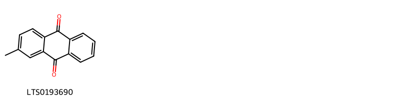
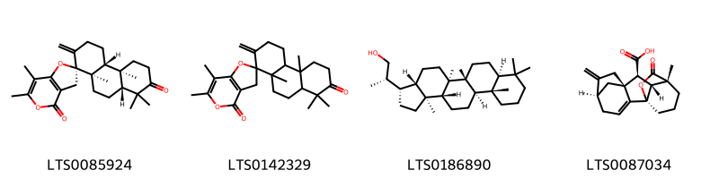
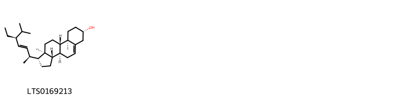
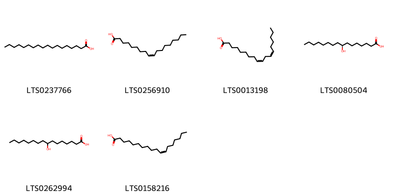
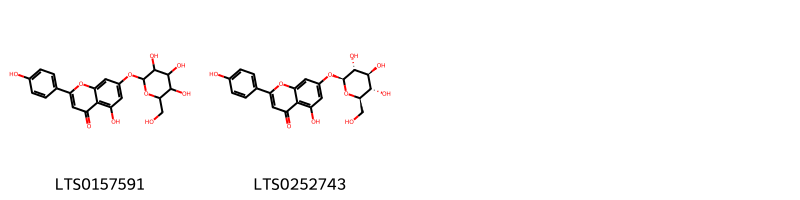
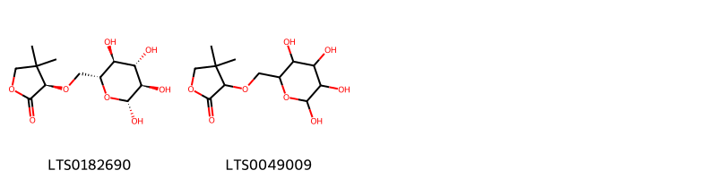
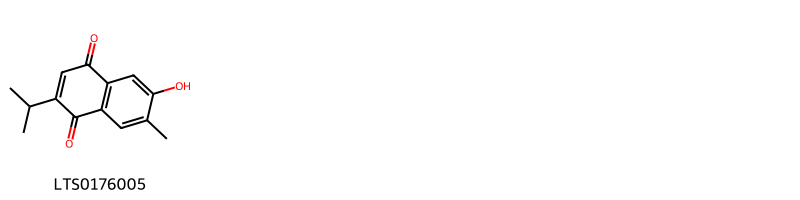
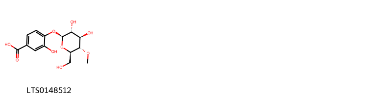
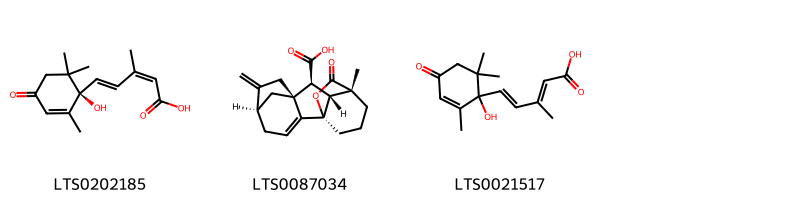
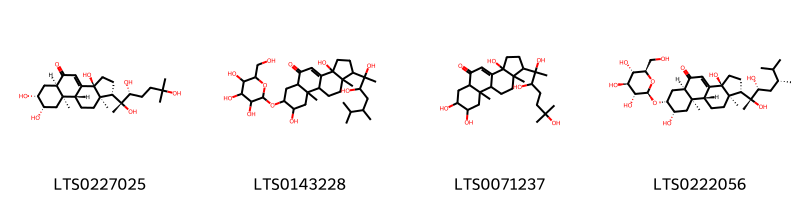

!!! abstract "Tóm tắt"

    Họ Schizaeaceae gồm khoảng 1 chi và 3 loài được một số cộng đồng tại các quốc gia như India(Santal), Elsewhere, China sử dụng trong một số trường hợp Thuốc nhuận tràng, Alexiteric, Antiphlogistic, Cathartic, Thuốc long đờm, Thuốc lợi tiểu, Thuốc lợi tiểu, Thuốc long đờm.

!!! info "DrDuke"

    James A. Duke sinh năm 1929-2017 là một nhà thực vật học người Mỹ. Đây là một trong những tác giả hàng đầu trong lĩnh vực dược dân tộc học với cuốn *CRC Handbook of Medicinal Herbs* và chính là người xây dựng lên cơ sở dữ liệu về hợp chất tự nhiên và dược dân tộc học tại Bộ nông nghiệp Hoa Kỳ. Các thông tin được đăng tải tại website [Dr. Duke's Phytochemical and Ethnobotanical Databases](https://phytochem.nal.usda.gov/). 
    Trong suốt thập niên 1970, ông lãnh đạo the Plant Taxonomy Laboratory, Plant Genetics and Germplasm Institute of the Agricultural Research Service, U.S. Department of Agriculture.
    Trong tài liệu này, các thông tin về dược dân tộc của các dược liệu được trích dẫn từ tài liệu của James A. Ducke với sự trợ giúp của phần mềm dịch thuật từ tiếng Anh sang tiếng Việt.
   

# Chi Lygodium

??? note "Danh sách các dược liệu thuộc chi"
    
	 - *Lygodium flexuosum*
	 - *Lygodium japonicum*
	 - *Lygodium pinnatifidum*

---
## Lygodium flexuosum
### Thông tin về thực vật

!!! info "Phân loại thực vật của *Lygodium flexuosum* từ GIBF:"
    - **Kingdom:** Plantae
    - **Phylum:** Tracheophyta
    - **Order:** Schizaeales
    - **Family:** Lygodiaceae
    - **Genus:** Lygodium
    - **Species:** *Lygodium flexuosum*

 

| Label (VI)   | Label (EN)   | Scientific Name    | Descriptions (VI)   | Descriptions (EN)   | Also Known As (VI)   | Also Known As (EN)   |
|:-------------|:-------------|:-------------------|:--------------------|:--------------------|:---------------------|:---------------------|
| N/A          | N/A          | Lygodium flexuosum | loài thực vật       | species of plant    | ['']                 | ['']                 |

#### Phân bố trên thế giới

**Từ CSDL GIBF** nan, Sri Lanka, Australia, Lao People’s Democratic Republic, Cambodia, Myanmar, Papua New Guinea, Timor-Leste, Fiji, Hong Kong, Thailand, Brazil, Bhutan, Singapore, Viet Nam, China, Macao, India, Indonesia, Philippines, Malaysia, Nepal

#### Phân bố tại Việt Nam

**Từ CSDL GIBF**: Đồng Tháp, Quang Tri (廣治省), Tay Ninh, Thanh Hoa (清化省), Lam Dong (林同省), Binh Phuoc (平福省), Tỉnh Kiến Giang

---
### Thành phần hóa học
        
- Theo cơ sở dữ liệu lotus: Từ loài *Lygodium flexuosum* đã phân lập và xác định được 8 hoạt chất thuộc về các nhóm Steroids and steroid derivatives, Flavonoids, Prenol lipids, Anthracenes. 

|    | chemicalTaxonomyClassyfireClass   |   smiles_count |
|---:|:----------------------------------|---------------:|
|  0 | Anthracenes                       |              1 |
|  1 | Flavonoids                        |              2 |
|  2 | Prenol lipids                     |              4 |
|  3 | Steroids and steroid derivatives  |              1 |

#### Nhóm Anthracenes
<figure markdown="span">
    { width=100% }
    <figcaption>Hình ảnh cấu trúc hóa học của 1 hoạt chất thuộc nhóm Anthracenes gồm ['2-methylanthraquinone (LTS0193690)'].</figcaption>
</figure>
#### Nhóm Flavonoids
<figure markdown="span">
    { width=100% }
    <figcaption>Hình ảnh cấu trúc hóa học của 2 hoạt chất thuộc nhóm Flavonoids gồm ['kaempherol (LTS0155822)', 'astragalin (LTS0249588)'].</figcaption>
</figure>
#### Nhóm Prenol lipids
<figure markdown="span">
    { width=100% }
    <figcaption>Hình ảnh cấu trúc hóa học của 4 hoạt chất thuộc nhóm Prenol lipids gồm ["(2s,4'ar,4'br,8'ar,10'ar)-4'b,6,7,8',8',10'a-hexamethyl-2'-methylidene-3',4',4'a,5',6',8'a,9',10'-octahydro-3h-spiro[furo[3,2-c]pyran-2,1'-phenanthrene]-4,7'-dione (LTS0085924)", "4'b,6,7,8',8',10'a-hexamethyl-2'-methylidene-3',4',4'a,5',6',8'a,9',10'-octahydro-3h-spiro[furo[3,2-c]pyran-2,1'-phenanthrene]-4,7'-dione (LTS0142329)", '(2s)-2-[(3s,3as,5ar,5br,7as,11as,11br,13ar,13bs)-5a,5b,8,8,11a,13b-hexamethyl-hexadecahydrocyclopenta[a]chrysen-3-yl]propan-1-ol (LTS0186890)', '(1s,5r,8s,9s,10r,11r)-11-methyl-6-methylidene-16-oxo-15-oxapentacyclo[9.3.2.1⁵,⁸.0¹,¹⁰.0²,⁸]heptadec-2-ene-9-carboxylic acid (LTS0087034)'].</figcaption>
</figure>
#### Nhóm Steroids and steroid derivatives
<figure markdown="span">
    { width=100% }
    <figcaption>Hình ảnh cấu trúc hóa học của 1 hoạt chất thuộc nhóm Steroids and steroid derivatives gồm ['(1r,3as,3bs,7s,9ar,9bs,11ar)-1-[(2s,3e,5s)-5-ethyl-6-methylhept-3-en-2-yl]-9a,11a-dimethyl-1h,2h,3h,3ah,3bh,4h,6h,7h,8h,9h,9bh,10h,11h-cyclopenta[a]phenanthren-7-ol (LTS0169213)'].</figcaption>
</figure>

---

### Dược dân tộc học

Danh sách các quốc gia có sử dụng *Lygodium flexuosum* trong điều trị các bệnh. 

| Country   | Disease     | Bệnh           |
|:----------|:------------|:---------------|
| Elsewhere | Expectorant | Thuốc long đàm |

---

---
## Lygodium japonicum
### Thông tin về thực vật

!!! info "Phân loại thực vật của *Lygodium japonicum* từ GIBF:"
    - **Kingdom:** Plantae
    - **Phylum:** Tracheophyta
    - **Order:** Schizaeales
    - **Family:** Lygodiaceae
    - **Genus:** Lygodium
    - **Species:** *Lygodium japonicum*

 

| Label (VI)   | Label (EN)   | Scientific Name    | Descriptions (VI)   | Descriptions (EN)   | Also Known As (VI)   | Also Known As (EN)         |
|:-------------|:-------------|:-------------------|:--------------------|:--------------------|:---------------------|:---------------------------|
| N/A          | N/A          | Lygodium japonicum | loài thực vật       | species of plant    | ['']                 | ['Japanese climbing fern'] |

#### Phân bố trên thế giới

**Từ CSDL GIBF** Puerto Rico, Australia, Japan, Chinese Taipei, Macao, United States of America, Singapore, China

#### Phân bố tại Việt Nam

**Từ CSDL GIBF**: Không có ghi nhận ở Việt Nam

---
### Thành phần hóa học
        
- Theo cơ sở dữ liệu lotus: Từ loài *Lygodium japonicum* đã phân lập và xác định được 19 hoạt chất thuộc về các nhóm Fatty Acyls, Naphthalenes, Flavonoids, Prenol lipids, Steroids and steroid derivatives, Lactones, Organooxygen compounds. 

|    | chemicalTaxonomyClassyfireClass   |   smiles_count |
|---:|:----------------------------------|---------------:|
|  0 | Fatty Acyls                       |              6 |
|  1 | Flavonoids                        |              2 |
|  2 | Lactones                          |              2 |
|  3 | Naphthalenes                      |              1 |
|  4 | Organooxygen compounds            |              1 |
|  5 | Prenol lipids                     |              3 |
|  6 | Steroids and steroid derivatives  |              4 |

#### Nhóm Fatty Acyls
<figure markdown="span">
    { width=100% }
    <figcaption>Hình ảnh cấu trúc hóa học của 6 hoạt chất thuộc nhóm Fatty Acyls gồm ['stearic acid (LTS0237766)', 'oleic acid (LTS0256910)', 'linoleic (LTS0013198)', '(8s)-8-hydroxyhexadecanoic acid (LTS0080504)', '8-hydroxyhexadecanoic acid (LTS0262994)', 'cis-vaccenic acid (LTS0158216)'].</figcaption>
</figure>
#### Nhóm Flavonoids
<figure markdown="span">
    { width=100% }
    <figcaption>Hình ảnh cấu trúc hóa học của 2 hoạt chất thuộc nhóm Flavonoids gồm ['apigetrin (LTS0157591)', 'apigenin 7-o-β-glucoside (LTS0252743)'].</figcaption>
</figure>
#### Nhóm Lactones
<figure markdown="span">
    { width=100% }
    <figcaption>Hình ảnh cấu trúc hóa học của 2 hoạt chất thuộc nhóm Lactones gồm ['(3r)-4,4-dimethyl-3-{[(2r,3s,4s,5r,6r)-3,4,5,6-tetrahydroxyoxan-2-yl]methoxy}oxolan-2-one (LTS0182690)', '4,4-dimethyl-3-[(3,4,5,6-tetrahydroxyoxan-2-yl)methoxy]oxolan-2-one (LTS0049009)'].</figcaption>
</figure>
#### Nhóm Naphthalenes
<figure markdown="span">
    { width=100% }
    <figcaption>Hình ảnh cấu trúc hóa học của 1 hoạt chất thuộc nhóm Naphthalenes gồm ['6-hydroxy-2-isopropyl-7-methylnaphthalene-1,4-dione (LTS0176005)'].</figcaption>
</figure>
#### Nhóm Organooxygen compounds
<figure markdown="span">
    { width=100% }
    <figcaption>Hình ảnh cấu trúc hóa học của 1 hoạt chất thuộc nhóm Organooxygen compounds gồm ['4-{[(2s,3r,4r,5s,6r)-3,4-dihydroxy-6-(hydroxymethyl)-5-methoxyoxan-2-yl]oxy}-3-hydroxybenzoic acid (LTS0148512)'].</figcaption>
</figure>
#### Nhóm Prenol lipids
<figure markdown="span">
    { width=100% }
    <figcaption>Hình ảnh cấu trúc hóa học của 3 hoạt chất thuộc nhóm Prenol lipids gồm ['(-)-abscisic acid (LTS0202185)', '(1s,5r,8s,9s,10r,11r)-11-methyl-6-methylidene-16-oxo-15-oxapentacyclo[9.3.2.1⁵,⁸.0¹,¹⁰.0²,⁸]heptadec-2-ene-9-carboxylic acid (LTS0087034)', '5-(1-hydroxy-2,6,6-trimethyl-4-oxocyclohex-2-en-1-yl)-3-methylpenta-2,4-dienoic acid (LTS0021517)'].</figcaption>
</figure>
#### Nhóm Steroids and steroid derivatives
<figure markdown="span">
    { width=100% }
    <figcaption>Hình ảnh cấu trúc hóa học của 4 hoạt chất thuộc nhóm Steroids and steroid derivatives gồm ['20-hydroxyecdysone (LTS0227025)', '1-(2,3-dihydroxy-5,6-dimethylheptan-2-yl)-3a,8-dihydroxy-9a,11a-dimethyl-7-{[3,4,5-trihydroxy-6-(hydroxymethyl)oxan-2-yl]oxy}-1h,2h,3h,5ah,6h,7h,8h,9h,9bh,10h,11h-cyclopenta[a]phenanthren-5-one (LTS0143228)', '3a,7,8-trihydroxy-9a,11a-dimethyl-1-(2,3,6-trihydroxy-6-methylheptan-2-yl)-1h,2h,3h,5ah,6h,7h,8h,9h,9bh,10h,11h-cyclopenta[a]phenanthren-5-one (LTS0071237)', '(1s,3as,5ar,7r,8s,9ar,9br,11ar)-1-[(2r,3r,5r)-2,3-dihydroxy-5,6-dimethylheptan-2-yl]-3a,8-dihydroxy-9a,11a-dimethyl-7-{[(2r,3r,4s,5s,6r)-3,4,5-trihydroxy-6-(hydroxymethyl)oxan-2-yl]oxy}-1h,2h,3h,5ah,6h,7h,8h,9h,9bh,10h,11h-cyclopenta[a]phenanthren-5-one (LTS0222056)'].</figcaption>
</figure>

---

### Dược dân tộc học

Danh sách các quốc gia có sử dụng *Lygodium japonicum* trong điều trị các bệnh. 

| Country   | Disease                                                                | Bệnh                                                                   |
|:----------|:-----------------------------------------------------------------------|:-----------------------------------------------------------------------|
| China     | Alexiteric, Antiphlogistic, Cathartic, Expectorant, Diuretic, Diuretic | Alexiteric, Antiphlogistic, Cathartic, Expectorant, lợi tiểu, lợi tiểu |
| Elsewhere | Expectorant                                                            | Thuốc long đàm                                                         |

---

---
## Lygodium pinnatifidum
### Thông tin về thực vật

!!! info "Phân loại thực vật của *N/A* từ GIBF:"
    - **Kingdom:** Plantae
    - **Phylum:** Tracheophyta
    - **Order:** Schizaeales
    - **Family:** Lygodiaceae
    - **Genus:** Lygodium
    - **Species:** *N/A*

 

| Label (VI)   | Label (EN)   | Scientific Name       | Descriptions (VI)   | Descriptions (EN)   | Also Known As (VI)   | Also Known As (EN)   |
|:-------------|:-------------|:----------------------|:--------------------|:--------------------|:---------------------|:---------------------|
| N/A          | N/A          | Lygodium pinnatifidum |                     | species of plant    | ['']                 | ['']                 |

#### Phân bố trên thế giới

**Từ CSDL GIBF** Australia, Japan, Argentina, Sierra Leone, Puerto Rico, Chinese Taipei, Honduras, United States of America, El Salvador, Fiji, Hong Kong, Thailand, Brazil, Mexico, Singapore, Viet Nam, China, Colombia, Macao, Costa Rica, New Zealand

#### Phân bố tại Việt Nam

**Từ CSDL GIBF**: An Giang, Đồng Tháp, Hồ Chí Minh city

---
### Thành phần hóa học
        
- Theo cơ sở dữ liệu lotus: Từ loài *N/A* đã phân lập và xác định được Chưa có hoạt chất nào được phân lập. hoạt chất thuộc về các nhóm Không có hoạt chất nào được phân lập. 

Không có hình ảnh nào được tạo ra

---

### Dược dân tộc học

Danh sách các quốc gia có sử dụng *N/A* trong điều trị các bệnh. 

| Country       | Disease   | Bệnh         |
|:--------------|:----------|:-------------|
| India(Santal) | Laxative  | Nhuận trường |

---

