!!! abstract "Tóm tắt"

    Họ Scrophulariaceae gồm khoảng 38 chi và 73 loài được một số cộng đồng tại các quốc gia như US(Blackfoot), US(Flathead), French, Philippines, Java, Upper Volta, Malaya, Europe, Haiti, ain, Dominican Republic, German, Kurdistan, Africa, Malaysia, India, Eurasia, US(Appalachia), US, Italian, Turkey, Iraq, Cambodia, Trinidad, Brazil, Hindu, Venezuela, Ethiopia, Japan*, Mexico, China, Nepal, Elsewhere, Romania, Paraguay, US(Amerindian), Lesotho sử dụng trong một số trường hợp QUERY LENGTH LIMIT EXCEEDED. MAX ALLOWED QUERY : 500 CHARS QUERY LENGTH LIMIT EXCEEDED. MAX ALLOWED QUERY : 500 CHARS QUERY LENGTH LIMIT EXCEEDED. MAX ALLOWED QUERY : 500 CHARS.

!!! info "DrDuke"

    James A. Duke sinh năm 1929-2017 là một nhà thực vật học người Mỹ. Đây là một trong những tác giả hàng đầu trong lĩnh vực dược dân tộc học với cuốn *CRC Handbook of Medicinal Herbs* và chính là người xây dựng lên cơ sở dữ liệu về hợp chất tự nhiên và dược dân tộc học tại Bộ nông nghiệp Hoa Kỳ. Các thông tin được đăng tải tại website [Dr. Duke's Phytochemical and Ethnobotanical Databases](https://phytochem.nal.usda.gov/). 
    Trong suốt thập niên 1970, ông lãnh đạo the Plant Taxonomy Laboratory, Plant Genetics and Germplasm Institute of the Agricultural Research Service, U.S. Department of Agriculture.
    Trong tài liệu này, các thông tin về dược dân tộc của các dược liệu được trích dẫn từ tài liệu của James A. Ducke với sự trợ giúp của phần mềm dịch thuật từ tiếng Anh sang tiếng Việt.
   

# Chi Angelonia

??? note "Danh sách các dược liệu thuộc chi"
    
	 - *Angelonia angustifolia*
	 - *Angelonia salicariaefolia*

---
## Angelonia angustifolia
### Thông tin về thực vật

!!! info "Phân loại thực vật của *Angelonia angustifolia* từ GIBF:"
    - **Kingdom:** Plantae
    - **Phylum:** Tracheophyta
    - **Order:** Lamiales
    - **Family:** Plantaginaceae
    - **Genus:** Angelonia
    - **Species:** *Angelonia angustifolia*

 

| Label (VI)   | Label (EN)   | Scientific Name        | Descriptions (VI)   | Descriptions (EN)   | Also Known As (VI)   | Also Known As (EN)   |
|:-------------|:-------------|:-----------------------|:--------------------|:--------------------|:---------------------|:---------------------|
| N/A          | N/A          | Angelonia angustifolia |                     | species of plant    | ['']                 | ['']                 |

#### Phân bố trên thế giới

**Từ CSDL GIBF** unknown or invalid, El Salvador, Guadeloupe, Dominica, French Polynesia, Germany, Australia, Jamaica, Korea, Republic of, Colombia, Dominican Republic, Malaysia, India, Cuba, Belize, Vanuatu, Nicaragua, Brazil, Panama, Palau, Mexico, Micronesia (Federated States of), Costa Rica, New Caledonia, Paraguay, Ecuador, United States of America

#### Phân bố tại Việt Nam

**Từ CSDL GIBF**: Không có ghi nhận ở Việt Nam

---
### Thành phần hóa học
        
- Theo cơ sở dữ liệu lotus: Từ loài *Angelonia angustifolia* đã phân lập và xác định được Chưa có hoạt chất nào được phân lập. hoạt chất thuộc về các nhóm Không có hoạt chất nào được phân lập. 

Không có hình ảnh nào được tạo ra

---

### Dược dân tộc học

Danh sách các quốc gia có sử dụng *Angelonia angustifolia* trong điều trị các bệnh. 

| Country   | Disease   | Bệnh                                                                                                                                                                                                |
|:----------|:----------|:----------------------------------------------------------------------------------------------------------------------------------------------------------------------------------------------------|
| Mexico    | Tonic     | MYMEMORY WARNING: YOU USED ALL AVAILABLE FREE TRANSLATIONS FOR TODAY. NEXT AVAILABLE IN  18 HOURS 00 MINUTES 11 SECONDS VISIT HTTPS://MYMEMORY.TRANSLATED.NET/DOC/USAGELIMITS.PHP TO TRANSLATE MORE |

---

---
## Angelonia salicariaefolia
### Thông tin về thực vật

!!! info "Phân loại thực vật của *Angelonia salicariifolia* từ GIBF:"
    - **Kingdom:** Plantae
    - **Phylum:** Tracheophyta
    - **Order:** Lamiales
    - **Family:** Plantaginaceae
    - **Genus:** Angelonia
    - **Species:** *Angelonia salicariifolia*

 

| Label (VI)   | Label (EN)   | Scientific Name        | Descriptions (VI)   | Descriptions (EN)   | Also Known As (VI)   | Also Known As (EN)   |
|:-------------|:-------------|:-----------------------|:--------------------|:--------------------|:---------------------|:---------------------|
| N/A          | N/A          | Angelonia angustifolia |                     | species of plant    | ['']                 | ['']                 |

#### Phân bố trên thế giới

**Từ CSDL GIBF** Timor-Leste, Colombia, Argentina, Venezuela (Bolivarian Republic of), Panama, Brazil, Australia, Malaysia, India, Papua New Guinea, Paraguay, United States of America, Madagascar, Wallis and Futuna, Benin, Hong Kong, Chinese Taipei

#### Phân bố tại Việt Nam

**Từ CSDL GIBF**: Không có ghi nhận ở Việt Nam

---
### Thành phần hóa học
        
- Theo cơ sở dữ liệu lotus: Từ loài *Angelonia salicariifolia* đã phân lập và xác định được Chưa có hoạt chất nào được phân lập. hoạt chất thuộc về các nhóm Không có hoạt chất nào được phân lập. 

Không có hình ảnh nào được tạo ra

---

### Dược dân tộc học

Danh sách các quốc gia có sử dụng *Angelonia salicariifolia* trong điều trị các bệnh. 

| Country   | Disease                | Bệnh                                                                                                                                                                                                |
|:----------|:-----------------------|:----------------------------------------------------------------------------------------------------------------------------------------------------------------------------------------------------|
| Venezuela | Sudorific, Diaphoretic | MYMEMORY WARNING: YOU USED ALL AVAILABLE FREE TRANSLATIONS FOR TODAY. NEXT AVAILABLE IN  17 HOURS 59 MINUTES 47 SECONDS VISIT HTTPS://MYMEMORY.TRANSLATED.NET/DOC/USAGELIMITS.PHP TO TRANSLATE MORE |

---

# Chi Linaria

??? note "Danh sách các dược liệu thuộc chi"
    
	 - *Linaria cymbalaria*
	 - *Linaria elatine*
	 - *Linaria vulgaris*

---
## Linaria cymbalaria
### Thông tin về thực vật

!!! info "Phân loại thực vật của *Cymbalaria muralis* từ GIBF:"
    - **Kingdom:** Plantae
    - **Phylum:** Tracheophyta
    - **Order:** Lamiales
    - **Family:** Plantaginaceae
    - **Genus:** Cymbalaria
    - **Species:** *Cymbalaria muralis*

 

| Label (VI)   | Label (EN)   | Scientific Name    | Descriptions (VI)   | Descriptions (EN)   | Also Known As (VI)   | Also Known As (EN)   |
|:-------------|:-------------|:-------------------|:--------------------|:--------------------|:---------------------|:---------------------|
| N/A          | N/A          | Linaria cymbalaria |                     | species of plant    | ['']                 | ['']                 |

#### Phân bố trên thế giới

**Từ CSDL GIBF** nan, unknown or invalid, Spain, Austria, Australia, Sweden, Poland, Canada, Belgium, Netherlands, Japan, Brazil, Mexico, Switzerland, United Kingdom of Great Britain and Northern Ireland, France, United States of America, Italy, Greece

#### Phân bố tại Việt Nam

**Từ CSDL GIBF**: Không có ghi nhận ở Việt Nam

---
### Thành phần hóa học
        
- Theo cơ sở dữ liệu lotus: Từ loài *Cymbalaria muralis* đã phân lập và xác định được Chưa có hoạt chất nào được phân lập. hoạt chất thuộc về các nhóm Không có hoạt chất nào được phân lập. 

Không có hình ảnh nào được tạo ra

---

### Dược dân tộc học

Danh sách các quốc gia có sử dụng *Cymbalaria muralis* trong điều trị các bệnh. 

| Country   | Disease   | Bệnh                                                                                                                                                                                                |
|:----------|:----------|:----------------------------------------------------------------------------------------------------------------------------------------------------------------------------------------------------|
| ain       | Tonic     | MYMEMORY WARNING: YOU USED ALL AVAILABLE FREE TRANSLATIONS FOR TODAY. NEXT AVAILABLE IN  17 HOURS 59 MINUTES 23 SECONDS VISIT HTTPS://MYMEMORY.TRANSLATED.NET/DOC/USAGELIMITS.PHP TO TRANSLATE MORE |

---

---
## Linaria elatine
### Thông tin về thực vật

!!! info "Phân loại thực vật của *N/A* từ GIBF:"
    - **Kingdom:** Plantae
    - **Phylum:** Tracheophyta
    - **Order:** Lamiales
    - **Family:** Plantaginaceae
    - **Genus:** Kickxia
    - **Species:** *N/A*

 

| Label (VI)   | Label (EN)   | Scientific Name    | Descriptions (VI)   | Descriptions (EN)   | Also Known As (VI)   | Also Known As (EN)   |
|:-------------|:-------------|:-------------------|:--------------------|:--------------------|:---------------------|:---------------------|
| N/A          | N/A          | Linaria cymbalaria |                     | species of plant    | ['']                 | ['']                 |

#### Phân bố trên thế giới

**Từ CSDL GIBF** Denmark, Luxembourg, Spain, Germany, Austria, Australia, Albania, Palestine, State of, Serbia, Sweden, Canada, Belgium, Netherlands, Türkiye, Kyrgyzstan, Lebanon, Hungary, Ireland, Switzerland, Uruguay, United Kingdom of Great Britain and Northern Ireland, South Africa, Portugal, Morocco, France, Gibraltar, Czechia, New Zealand, Russian Federation, United States of America, Algeria, Israel, Italy, Greece, Croatia

#### Phân bố tại Việt Nam

**Từ CSDL GIBF**: Không có ghi nhận ở Việt Nam

---
### Thành phần hóa học
        
- Theo cơ sở dữ liệu lotus: Từ loài *N/A* đã phân lập và xác định được Chưa có hoạt chất nào được phân lập. hoạt chất thuộc về các nhóm Không có hoạt chất nào được phân lập. 

Không có hình ảnh nào được tạo ra

---

### Dược dân tộc học

Danh sách các quốc gia có sử dụng *N/A* trong điều trị các bệnh. 

| Country   | Disease              | Bệnh                                                                                                                                                                                                |
|:----------|:---------------------|:----------------------------------------------------------------------------------------------------------------------------------------------------------------------------------------------------|
| Iraq      | Astringent, Hemostat | MYMEMORY WARNING: YOU USED ALL AVAILABLE FREE TRANSLATIONS FOR TODAY. NEXT AVAILABLE IN  17 HOURS 59 MINUTES 02 SECONDS VISIT HTTPS://MYMEMORY.TRANSLATED.NET/DOC/USAGELIMITS.PHP TO TRANSLATE MORE |

---

---
## Linaria vulgaris
### Thông tin về thực vật

!!! info "Phân loại thực vật của *Linaria vulgaris* từ GIBF:"
    - **Kingdom:** Plantae
    - **Phylum:** Tracheophyta
    - **Order:** Lamiales
    - **Family:** Plantaginaceae
    - **Genus:** Linaria
    - **Species:** *Linaria vulgaris*

 

| Label (VI)   | Label (EN)   | Scientific Name   | Descriptions (VI)   | Descriptions (EN)   | Also Known As (VI)   | Also Known As (EN)                     |
|:-------------|:-------------|:------------------|:--------------------|:--------------------|:---------------------|:---------------------------------------|
| N/A          | N/A          | Linaria vulgaris  | loài thực vật       | species of plant    | ['']                 | ['Common Toadflax', 'Yellow Toadflax'] |

#### Phân bố trên thế giới

**Từ CSDL GIBF** Denmark, Germany, Austria, Serbia, Sweden, Canada, Belgium, Finland, Netherlands, Hungary, Norway, Switzerland, Argentina, United Kingdom of Great Britain and Northern Ireland, South Africa, France, Czechia, New Zealand, Romania, Russian Federation, United States of America, Italy, Ukraine

#### Phân bố tại Việt Nam

**Từ CSDL GIBF**: Không có ghi nhận ở Việt Nam

---
### Thành phần hóa học
        
- Theo cơ sở dữ liệu lotus: Từ loài *Linaria vulgaris* đã phân lập và xác định được 42 hoạt chất thuộc về các nhóm Diazanaphthalenes, Organooxygen compounds, Flavonoids, Tannins, Organonitrogen compounds, Prenol lipids, Lignan glycosides, Carboxylic acids and derivatives, Cinnamic acids and derivatives, Steroids and steroid derivatives, Benzene and substituted derivatives. 

|    | chemicalTaxonomyClassyfireClass     |   smiles_count |
|---:|:------------------------------------|---------------:|
|  0 | Benzene and substituted derivatives |              1 |
|  1 | Carboxylic acids and derivatives    |              2 |
|  2 | Cinnamic acids and derivatives      |              3 |
|  3 | Diazanaphthalenes                   |              7 |
|  4 | Flavonoids                          |              5 |
|  5 | Lignan glycosides                   |              4 |
|  6 | Organonitrogen compounds            |              1 |
|  7 | Organooxygen compounds              |             13 |
|  8 | Prenol lipids                       |              3 |
|  9 | Steroids and steroid derivatives    |              2 |
| 10 | Tannins                             |              1 |

#### Nhóm Benzene and substituted derivatives
<figure markdown="span">
    { width=100% }
    <figcaption>Hình ảnh cấu trúc hóa học của 1 hoạt chất thuộc nhóm Benzene and substituted derivatives gồm ['benzaldehyde (LTS0094193)'].</figcaption>
</figure>
#### Nhóm Carboxylic acids and derivatives
<figure markdown="span">
    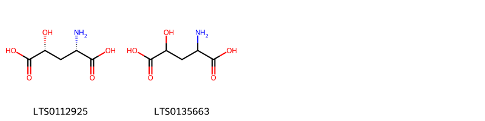{ width=100% }
    <figcaption>Hình ảnh cấu trúc hóa học của 2 hoạt chất thuộc nhóm Carboxylic acids and derivatives gồm ['(2s,4r)-2-amino-4-hydroxypentanedioic acid (LTS0112925)', 'hydroxyglutamic acid (LTS0135663)'].</figcaption>
</figure>
#### Nhóm Cinnamic acids and derivatives
<figure markdown="span">
    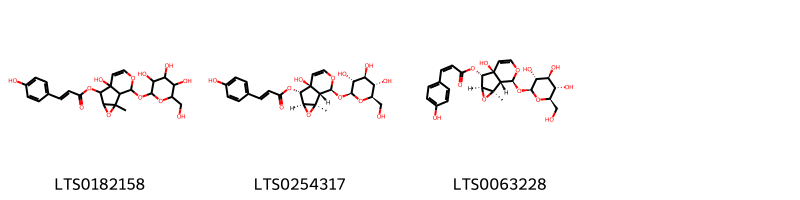{ width=100% }
    <figcaption>Hình ảnh cấu trúc hóa học của 3 hoạt chất thuộc nhóm Cinnamic acids and derivatives gồm ['6-hydroxy-2-methyl-10-{[3,4,5-trihydroxy-6-(hydroxymethyl)oxan-2-yl]oxy}-3,9-dioxatricyclo[4.4.0.0²,⁴]dec-7-en-5-yl 3-(4-hydroxyphenyl)prop-2-enoate (LTS0182158)', '(1s,2r,4s,5s,6s,10s)-6-hydroxy-2-methyl-10-{[(2s,3r,4s,5s,6r)-3,4,5-trihydroxy-6-(hydroxymethyl)oxan-2-yl]oxy}-3,9-dioxatricyclo[4.4.0.0²,⁴]dec-7-en-5-yl (2e)-3-(4-hydroxyphenyl)prop-2-enoate (LTS0254317)', '(1s,2r,4s,5s,6s,10s)-6-hydroxy-2-methyl-10-{[(2s,3r,4s,5s,6r)-3,4,5-trihydroxy-6-(hydroxymethyl)oxan-2-yl]oxy}-3,9-dioxatricyclo[4.4.0.0²,⁴]dec-7-en-5-yl (2z)-3-(4-hydroxyphenyl)prop-2-enoate (LTS0063228)'].</figcaption>
</figure>
#### Nhóm Diazanaphthalenes
<figure markdown="span">
    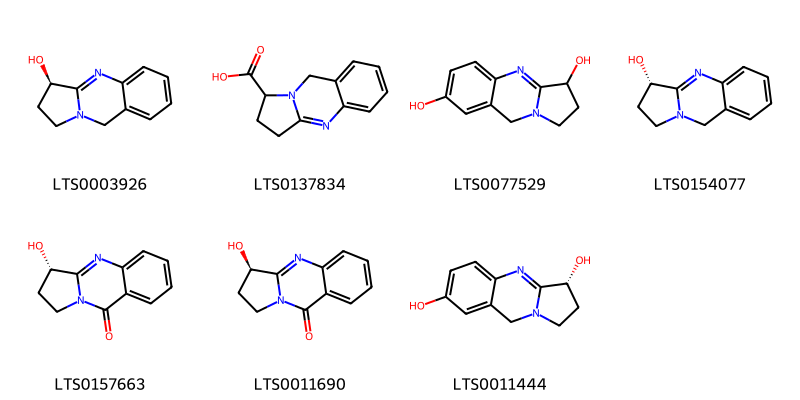{ width=100% }
    <figcaption>Hình ảnh cấu trúc hóa học của 7 hoạt chất thuộc nhóm Diazanaphthalenes gồm ['(+-)-vasicine (LTS0003926)', '1h,2h,3h,9h-pyrrolo[2,1-b]quinazoline-1-carboxylic acid (LTS0137834)', '1h,2h,3h,9h-pyrrolo[2,1-b]quinazoline-3,7-diol (LTS0077529)', '(-)-peganine (LTS0154077)', 'vasicinone (LTS0157663)', '(3r)-3-hydroxy-1h,2h,3h-pyrrolo[2,1-b]quinazolin-9-one (LTS0011690)', '(3r)-1h,2h,3h,9h-pyrrolo[2,1-b]quinazoline-3,7-diol (LTS0011444)'].</figcaption>
</figure>
#### Nhóm Flavonoids
<figure markdown="span">
    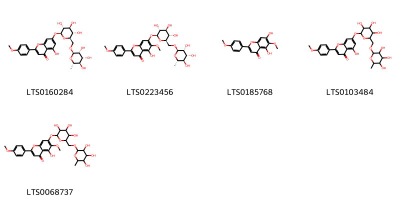{ width=100% }
    <figcaption>Hình ảnh cấu trúc hóa học của 5 hoạt chất thuộc nhóm Flavonoids gồm ['linarin (LTS0160284)', 'pectolinarin (LTS0223456)', 'pectolinarigenin (LTS0185768)', '5-hydroxy-2-(4-methoxyphenyl)-7-[(3,4,5-trihydroxy-6-{[(3,4,5-trihydroxy-6-methyloxan-2-yl)oxy]methyl}oxan-2-yl)oxy]chromen-4-one (LTS0103484)', '5-hydroxy-6-methoxy-2-(4-methoxyphenyl)-7-[(3,4,5-trihydroxy-6-{[(3,4,5-trihydroxy-6-methyloxan-2-yl)oxy]methyl}oxan-2-yl)oxy]chromen-4-one (LTS0068737)'].</figcaption>
</figure>
#### Nhóm Lignan glycosides
<figure markdown="span">
    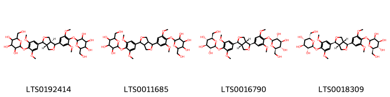{ width=100% }
    <figcaption>Hình ảnh cấu trúc hóa học của 4 hoạt chất thuộc nhóm Lignan glycosides gồm ['2-{4-[(3as,6ar)-4-(3,5-dimethoxy-4-{[3,4,5-trihydroxy-6-(hydroxymethyl)oxan-2-yl]oxy}phenyl)-hexahydrofuro[3,4-c]furan-1-yl]-2,6-dimethoxyphenoxy}-6-(hydroxymethyl)oxane-3,4,5-triol (LTS0192414)', '2-{4-[4-(3,5-dimethoxy-4-{[3,4,5-trihydroxy-6-(hydroxymethyl)oxan-2-yl]oxy}phenyl)-hexahydrofuro[3,4-c]furan-1-yl]-2,6-dimethoxyphenoxy}-6-(hydroxymethyl)oxane-3,4,5-triol (LTS0011685)', 'liriodendrin (LTS0016790)', '(2s,3r,4s,5s,6s)-2-{4-[(1s,3ar,4s,6ar)-4-(3,5-dimethoxy-4-{[(2s,3s,4s,5s,6r)-3,4,5-trihydroxy-6-(hydroxymethyl)oxan-2-yl]oxy}phenyl)-hexahydrofuro[3,4-c]furan-1-yl]-2,6-dimethoxyphenoxy}-6-(hydroxymethyl)oxane-3,4,5-triol (LTS0018309)'].</figcaption>
</figure>
#### Nhóm Organonitrogen compounds
<figure markdown="span">
    { width=100% }
    <figcaption>Hình ảnh cấu trúc hóa học của 1 hoạt chất thuộc nhóm Organonitrogen compounds gồm ['choline (LTS0170307)'].</figcaption>
</figure>
#### Nhóm Organooxygen compounds
<figure markdown="span">
    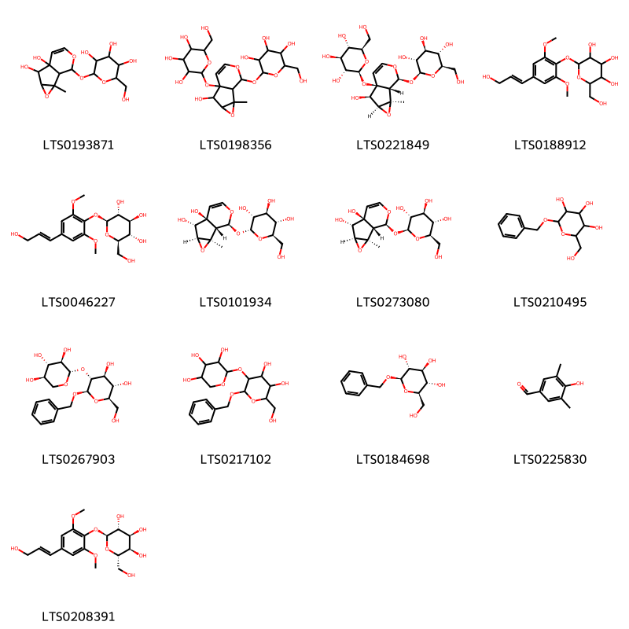{ width=100% }
    <figcaption>Hình ảnh cấu trúc hóa học của 13 hoạt chất thuộc nhóm Organooxygen compounds gồm ['2-({5,6-dihydroxy-2-methyl-3,9-dioxatricyclo[4.4.0.0²,⁴]dec-7-en-10-yl}oxy)-6-(hydroxymethyl)oxane-3,4,5-triol (LTS0193871)', '2-[(5-hydroxy-2-methyl-10-{[3,4,5-trihydroxy-6-(hydroxymethyl)oxan-2-yl]oxy}-3,9-dioxatricyclo[4.4.0.0²,⁴]dec-7-en-6-yl)oxy]-6-(hydroxymethyl)oxane-3,4,5-triol (LTS0198356)', '(2s,3r,4s,5s,6r)-2-{[(1r,2r,4s,5r,6s,10s)-5-hydroxy-2-methyl-10-{[(2s,3r,4s,5s,6r)-3,4,5-trihydroxy-6-(hydroxymethyl)oxan-2-yl]oxy}-3,9-dioxatricyclo[4.4.0.0²,⁴]dec-7-en-6-yl]oxy}-6-(hydroxymethyl)oxane-3,4,5-triol (LTS0221849)', '2-(hydroxymethyl)-6-[4-(3-hydroxyprop-1-en-1-yl)-2,6-dimethoxyphenoxy]oxane-3,4,5-triol (LTS0188912)', 'syringin (LTS0046227)', '(2r,3r,4s,5s,6r)-2-{[(1s,2r,4s,5s,6s,10s)-5,6-dihydroxy-2-methyl-3,9-dioxatricyclo[4.4.0.0²,⁴]dec-7-en-10-yl]oxy}-6-(hydroxymethyl)oxane-3,4,5-triol (LTS0101934)', 'procumbide (LTS0273080)', 'benzyl glucopyranoside (LTS0210495)', '(2s,3r,4s,5r)-2-{[(2r,3r,4s,5s,6r)-2-(benzyloxy)-4,5-dihydroxy-6-(hydroxymethyl)oxan-3-yl]oxy}oxane-3,4,5-triol (LTS0267903)', '2-{[2-(benzyloxy)-4,5-dihydroxy-6-(hydroxymethyl)oxan-3-yl]oxy}oxane-3,4,5-triol (LTS0217102)', 'benzyl β-d-glucoside (LTS0184698)', '4-hydroxy-3,5-dimethylbenzaldehyde (LTS0225830)', '(2s,3r,4s,5r,6s)-2-(hydroxymethyl)-6-{4-[(1e)-3-hydroxyprop-1-en-1-yl]-2,6-dimethoxyphenoxy}oxane-3,4,5-triol (LTS0208391)'].</figcaption>
</figure>
#### Nhóm Prenol lipids
<figure markdown="span">
    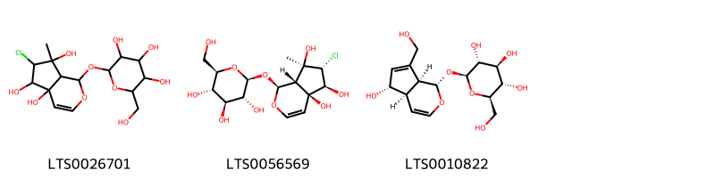{ width=100% }
    <figcaption>Hình ảnh cấu trúc hóa học của 3 hoạt chất thuộc nhóm Prenol lipids gồm ['2-({6-chloro-4a,5,7-trihydroxy-7-methyl-1h,5h,6h,7ah-cyclopenta[c]pyran-1-yl}oxy)-6-(hydroxymethyl)oxane-3,4,5-triol (LTS0026701)', '(2s,3r,4s,5s,6r)-2-{[(1s,4as,5s,6r,7r,7as)-6-chloro-4a,5,7-trihydroxy-7-methyl-1h,5h,6h,7ah-cyclopenta[c]pyran-1-yl]oxy}-6-(hydroxymethyl)oxane-3,4,5-triol (LTS0056569)', 'aucubin (LTS0010822)'].</figcaption>
</figure>
#### Nhóm Steroids and steroid derivatives
<figure markdown="span">
    { width=100% }
    <figcaption>Hình ảnh cấu trúc hóa học của 2 hoạt chất thuộc nhóm Steroids and steroid derivatives gồm ['stigmast-5-en-3-ol, (3β)- (LTS0204616)', 'sitogluside (LTS0201798)'].</figcaption>
</figure>
#### Nhóm Tannins
<figure markdown="span">
    { width=100% }
    <figcaption>Hình ảnh cấu trúc hóa học của 1 hoạt chất thuộc nhóm Tannins gồm ['3,5-dimethoxy-4-{[(2s,3r,4s,5s,6r)-3,4,5-trihydroxy-6-(hydroxymethyl)oxan-2-yl]oxy}benzoic acid (LTS0134620)'].</figcaption>
</figure>

---

### Dược dân tộc học

Danh sách các quốc gia có sử dụng *Linaria vulgaris* trong điều trị các bệnh. 

| Country   | Disease                                              | Bệnh                                                                                                                                                                                                |
|:----------|:-----------------------------------------------------|:----------------------------------------------------------------------------------------------------------------------------------------------------------------------------------------------------|
| Elsewhere | Diuretic                                             | MYMEMORY WARNING: YOU USED ALL AVAILABLE FREE TRANSLATIONS FOR TODAY. NEXT AVAILABLE IN  17 HOURS 58 MINUTES 39 SECONDS VISIT HTTPS://MYMEMORY.TRANSLATED.NET/DOC/USAGELIMITS.PHP TO TRANSLATE MORE |
| Turkey    | Astringent, Diuretic, Emollient, Vulnerary, Laxative | MYMEMORY WARNING: YOU USED ALL AVAILABLE FREE TRANSLATIONS FOR TODAY. NEXT AVAILABLE IN  17 HOURS 58 MINUTES 37 SECONDS VISIT HTTPS://MYMEMORY.TRANSLATED.NET/DOC/USAGELIMITS.PHP TO TRANSLATE MORE |

---

# Chi Lindernia

??? note "Danh sách các dược liệu thuộc chi"
    
	 - *Lindernia antipoda*
	 - *Lindernia cordifolia*
	 - *Lindernia crustacea*
	 - *Lindernia diffusa*
	 - *Lindernia japonica*
	 - *Lindernia oppositifolia*
	 - *Lindernia serrata*

---
## Lindernia antipoda
### Thông tin về thực vật

!!! info "Phân loại thực vật của *Bonnaya antipoda* từ GIBF:"
    - **Kingdom:** Plantae
    - **Phylum:** Tracheophyta
    - **Order:** Lamiales
    - **Family:** Linderniaceae
    - **Genus:** Bonnaya
    - **Species:** *Bonnaya antipoda*

 

| Label (VI)   | Label (EN)   | Scientific Name    | Descriptions (VI)   | Descriptions (EN)   | Also Known As (VI)   | Also Known As (EN)   |
|:-------------|:-------------|:-------------------|:--------------------|:--------------------|:---------------------|:---------------------|
| N/A          | N/A          | Lindernia antipoda | loài thực vật       | species of plant    | ['']                 | ['']                 |

#### Phân bố trên thế giới

**Từ CSDL GIBF** nan, Viet Nam, Timor-Leste, Thailand, Japan, Micronesia (Federated States of), French Guiana, Marshall Islands, Lao People’s Democratic Republic, Bangladesh, United States of America, China, Solomon Islands, Nepal, Netherlands, Korea, Republic of, Cambodia, Chinese Taipei

#### Phân bố tại Việt Nam

**Từ CSDL GIBF**: Ninh Binh, Ninh Thuan

---
### Thành phần hóa học
        
- Theo cơ sở dữ liệu lotus: Từ loài *Bonnaya antipoda* đã phân lập và xác định được Chưa có hoạt chất nào được phân lập. hoạt chất thuộc về các nhóm Không có hoạt chất nào được phân lập. 

Không có hình ảnh nào được tạo ra

---

### Dược dân tộc học

Danh sách các quốc gia có sử dụng *Bonnaya antipoda* trong điều trị các bệnh. 

| Country   | Disease   | Bệnh                                                                                                                                                                                                |
|:----------|:----------|:----------------------------------------------------------------------------------------------------------------------------------------------------------------------------------------------------|
| Elsewhere | Vermifuge | MYMEMORY WARNING: YOU USED ALL AVAILABLE FREE TRANSLATIONS FOR TODAY. NEXT AVAILABLE IN  17 HOURS 57 MINUTES 40 SECONDS VISIT HTTPS://MYMEMORY.TRANSLATED.NET/DOC/USAGELIMITS.PHP TO TRANSLATE MORE |
| Malaysia  | Vermifuge | MYMEMORY WARNING: YOU USED ALL AVAILABLE FREE TRANSLATIONS FOR TODAY. NEXT AVAILABLE IN  17 HOURS 57 MINUTES 38 SECONDS VISIT HTTPS://MYMEMORY.TRANSLATED.NET/DOC/USAGELIMITS.PHP TO TRANSLATE MORE |

---

---
## Lindernia cordifolia
### Thông tin về thực vật

!!! info "Phân loại thực vật của *Torenia anagallis* từ GIBF:"
    - **Kingdom:** Plantae
    - **Phylum:** Tracheophyta
    - **Order:** Lamiales
    - **Family:** Linderniaceae
    - **Genus:** Torenia
    - **Species:** *Torenia anagallis*

 

| Label (VI)   | Label (EN)   | Scientific Name      | Descriptions (VI)   | Descriptions (EN)   | Also Known As (VI)   | Also Known As (EN)   |
|:-------------|:-------------|:---------------------|:--------------------|:--------------------|:---------------------|:---------------------|
| N/A          | N/A          | Lindernia cordifolia | loài thực vật       | species of plant    | ['']                 | ['']                 |

#### Phân bố trên thế giới

**Từ CSDL GIBF** Viet Nam, India, China

#### Phân bố tại Việt Nam

**Từ CSDL GIBF**: 河内

---
### Thành phần hóa học
        
- Theo cơ sở dữ liệu lotus: Từ loài *Torenia anagallis* đã phân lập và xác định được Chưa có hoạt chất nào được phân lập. hoạt chất thuộc về các nhóm Không có hoạt chất nào được phân lập. 

Không có hình ảnh nào được tạo ra

---

### Dược dân tộc học

Danh sách các quốc gia có sử dụng *Torenia anagallis* trong điều trị các bệnh. 

| Country   | Disease   | Bệnh                                                                                                                                                                                                |
|:----------|:----------|:----------------------------------------------------------------------------------------------------------------------------------------------------------------------------------------------------|
| Malaysia  | Poultice  | MYMEMORY WARNING: YOU USED ALL AVAILABLE FREE TRANSLATIONS FOR TODAY. NEXT AVAILABLE IN  17 HOURS 57 MINUTES 18 SECONDS VISIT HTTPS://MYMEMORY.TRANSLATED.NET/DOC/USAGELIMITS.PHP TO TRANSLATE MORE |

---

---
## Lindernia crustacea
### Thông tin về thực vật

!!! info "Phân loại thực vật của *Torenia crustacea* từ GIBF:"
    - **Kingdom:** Plantae
    - **Phylum:** Tracheophyta
    - **Order:** Lamiales
    - **Family:** Linderniaceae
    - **Genus:** Torenia
    - **Species:** *Torenia crustacea*

 

| Label (VI)   | Label (EN)   | Scientific Name     | Descriptions (VI)   | Descriptions (EN)   | Also Known As (VI)   | Also Known As (EN)   |
|:-------------|:-------------|:--------------------|:--------------------|:--------------------|:---------------------|:---------------------|
| N/A          | N/A          | Lindernia crustacea | loài thực vật       | species of plant    | ['']                 | ['']                 |

#### Phân bố trên thế giới

**Từ CSDL GIBF** nan, Thailand, El Salvador, French Guiana, Lao People’s Democratic Republic, Gabon, Martinique, Jamaica, Korea, Republic of, Indonesia, Colombia, Puerto Rico, India, Nicaragua, Japan, Brazil, Myanmar, China, Tonga, Chinese Taipei, Cook Islands, Costa Rica, Ecuador, United States of America, Solomon Islands

#### Phân bố tại Việt Nam

**Từ CSDL GIBF**: Không có ghi nhận ở Việt Nam

---
### Thành phần hóa học
        
- Theo cơ sở dữ liệu lotus: Từ loài *Torenia crustacea* đã phân lập và xác định được Chưa có hoạt chất nào được phân lập. hoạt chất thuộc về các nhóm Không có hoạt chất nào được phân lập. 

Không có hình ảnh nào được tạo ra

---

### Dược dân tộc học

Danh sách các quốc gia có sử dụng *Torenia crustacea* trong điều trị các bệnh. 

| Country   | Disease   | Bệnh                                                                                                                                                                                                |
|:----------|:----------|:----------------------------------------------------------------------------------------------------------------------------------------------------------------------------------------------------|
| India     | Poultice  | MYMEMORY WARNING: YOU USED ALL AVAILABLE FREE TRANSLATIONS FOR TODAY. NEXT AVAILABLE IN  17 HOURS 57 MINUTES 00 SECONDS VISIT HTTPS://MYMEMORY.TRANSLATED.NET/DOC/USAGELIMITS.PHP TO TRANSLATE MORE |

---

---
## Lindernia diffusa
### Thông tin về thực vật

!!! info "Phân loại thực vật của *Vandellia diffusa* từ GIBF:"
    - **Kingdom:** Plantae
    - **Phylum:** Tracheophyta
    - **Order:** Lamiales
    - **Family:** Linderniaceae
    - **Genus:** Vandellia
    - **Species:** *Vandellia diffusa*

 

| Label (VI)   | Label (EN)   | Scientific Name   | Descriptions (VI)   | Descriptions (EN)   | Also Known As (VI)   | Also Known As (EN)    |
|:-------------|:-------------|:------------------|:--------------------|:--------------------|:---------------------|:----------------------|
| N/A          | N/A          | Lindernia diffusa | loài thực vật       | species of plant    | ['']                 | ['Lindernia diffusa'] |

#### Phân bố trên thế giới

**Từ CSDL GIBF** French Guiana, Burkina Faso, Gabon, Guatemala, Colombia, Togo, Suriname, Côte d’Ivoire, Puerto Rico, Sao Tome and Principe, Liberia, Nigeria, Netherlands, Nicaragua, Brazil, Peru, Equatorial Guinea, Mexico, Angola, Benin, Bolivia (Plurinational State of), Costa Rica, Ecuador, United States of America, Guinea

#### Phân bố tại Việt Nam

**Từ CSDL GIBF**: Không có ghi nhận ở Việt Nam

---
### Thành phần hóa học
        
- Theo cơ sở dữ liệu lotus: Từ loài *Vandellia diffusa* đã phân lập và xác định được Chưa có hoạt chất nào được phân lập. hoạt chất thuộc về các nhóm Không có hoạt chất nào được phân lập. 

Không có hình ảnh nào được tạo ra

---

### Dược dân tộc học

Danh sách các quốc gia có sử dụng *Vandellia diffusa* trong điều trị các bệnh. 

| Country   | Disease   | Bệnh                                                                                                                                                                                                |
|:----------|:----------|:----------------------------------------------------------------------------------------------------------------------------------------------------------------------------------------------------|
| Elsewhere | Emetic    | MYMEMORY WARNING: YOU USED ALL AVAILABLE FREE TRANSLATIONS FOR TODAY. NEXT AVAILABLE IN  17 HOURS 56 MINUTES 37 SECONDS VISIT HTTPS://MYMEMORY.TRANSLATED.NET/DOC/USAGELIMITS.PHP TO TRANSLATE MORE |

---

---
## Lindernia japonica
### Thông tin về thực vật

!!! info "Phân loại thực vật của *Mazus pumilus* từ GIBF:"
    - **Kingdom:** Plantae
    - **Phylum:** Tracheophyta
    - **Order:** Lamiales
    - **Family:** Mazaceae
    - **Genus:** Mazus
    - **Species:** *Mazus pumilus*

 

| Label (VI)   | Label (EN)   | Scientific Name    | Descriptions (VI)   | Descriptions (EN)   | Also Known As (VI)   | Also Known As (EN)   |
|:-------------|:-------------|:-------------------|:--------------------|:--------------------|:---------------------|:---------------------|
| N/A          | N/A          | Lindernia japonica | loài thực vật       | species of plant    | ['']                 | ['']                 |

#### Phân bố trên thế giới

**Từ CSDL GIBF** French Guiana, Burkina Faso, Gabon, Guatemala, Colombia, Togo, Suriname, Côte d’Ivoire, Puerto Rico, Sao Tome and Principe, Liberia, Nigeria, Netherlands, Nicaragua, Brazil, Peru, Equatorial Guinea, Mexico, Angola, Benin, Bolivia (Plurinational State of), Costa Rica, Ecuador, United States of America, Guinea

#### Phân bố tại Việt Nam

**Từ CSDL GIBF**: Không có ghi nhận ở Việt Nam

---
### Thành phần hóa học
        
- Theo cơ sở dữ liệu lotus: Từ loài *Mazus pumilus* đã phân lập và xác định được Chưa có hoạt chất nào được phân lập. hoạt chất thuộc về các nhóm Không có hoạt chất nào được phân lập. 

Không có hình ảnh nào được tạo ra

---

### Dược dân tộc học

Danh sách các quốc gia có sử dụng *Mazus pumilus* trong điều trị các bệnh. 

| Country   | Disease        | Bệnh                                                                                                                                                                                                |
|:----------|:---------------|:----------------------------------------------------------------------------------------------------------------------------------------------------------------------------------------------------|
| Cambodia  | Apertif, Tonic | MYMEMORY WARNING: YOU USED ALL AVAILABLE FREE TRANSLATIONS FOR TODAY. NEXT AVAILABLE IN  17 HOURS 56 MINUTES 08 SECONDS VISIT HTTPS://MYMEMORY.TRANSLATED.NET/DOC/USAGELIMITS.PHP TO TRANSLATE MORE |

---

---
## Lindernia oppositifolia
### Thông tin về thực vật

!!! info "Phân loại thực vật của *Bonnaya oppositifolia* từ GIBF:"
    - **Kingdom:** Plantae
    - **Phylum:** Tracheophyta
    - **Order:** Lamiales
    - **Family:** Linderniaceae
    - **Genus:** Bonnaya
    - **Species:** *Bonnaya oppositifolia*

 

| Label (VI)   | Label (EN)   | Scientific Name         | Descriptions (VI)   | Descriptions (EN)   | Also Known As (VI)   | Also Known As (EN)   |
|:-------------|:-------------|:------------------------|:--------------------|:--------------------|:---------------------|:---------------------|
| N/A          | N/A          | Lindernia oppositifolia |                     |                     | ['']                 | ['']                 |

#### Phân bố trên thế giới

**Từ CSDL GIBF** Viet Nam, nan, Sri Lanka, Thailand, India, Nepal

#### Phân bố tại Việt Nam

**Từ CSDL GIBF**: Không có ghi nhận ở Việt Nam

---
### Thành phần hóa học
        
- Theo cơ sở dữ liệu lotus: Từ loài *Bonnaya oppositifolia* đã phân lập và xác định được Chưa có hoạt chất nào được phân lập. hoạt chất thuộc về các nhóm Không có hoạt chất nào được phân lập. 

Không có hình ảnh nào được tạo ra

---

### Dược dân tộc học

Danh sách các quốc gia có sử dụng *Bonnaya oppositifolia* trong điều trị các bệnh. 

| Country   | Disease   | Bệnh                                                                                                                                                                                                |
|:----------|:----------|:----------------------------------------------------------------------------------------------------------------------------------------------------------------------------------------------------|
| India     | Larvicide | MYMEMORY WARNING: YOU USED ALL AVAILABLE FREE TRANSLATIONS FOR TODAY. NEXT AVAILABLE IN  17 HOURS 55 MINUTES 50 SECONDS VISIT HTTPS://MYMEMORY.TRANSLATED.NET/DOC/USAGELIMITS.PHP TO TRANSLATE MORE |

---

---
## Lindernia serrata
### Thông tin về thực vật

!!! info "Phân loại thực vật của *Bonnaya ciliata* từ GIBF:"
    - **Kingdom:** Plantae
    - **Phylum:** Tracheophyta
    - **Order:** Lamiales
    - **Family:** Linderniaceae
    - **Genus:** Bonnaya
    - **Species:** *Bonnaya ciliata*

 

| Label (VI)   | Label (EN)   | Scientific Name   | Descriptions (VI)   | Descriptions (EN)   | Also Known As (VI)   | Also Known As (EN)   |
|:-------------|:-------------|:------------------|:--------------------|:--------------------|:---------------------|:---------------------|
| N/A          | N/A          | Lindernia serrata |                     |                     | ['']                 | ['']                 |

#### Phân bố trên thế giới

**Từ CSDL GIBF** nan, Thailand, Myanmar, India, China, Indonesia

#### Phân bố tại Việt Nam

**Từ CSDL GIBF**: Không có ghi nhận ở Việt Nam

---
### Thành phần hóa học
        
- Theo cơ sở dữ liệu lotus: Từ loài *Bonnaya ciliata* đã phân lập và xác định được Chưa có hoạt chất nào được phân lập. hoạt chất thuộc về các nhóm Không có hoạt chất nào được phân lập. 

Không có hình ảnh nào được tạo ra

---

### Dược dân tộc học

Danh sách các quốc gia có sử dụng *Bonnaya ciliata* trong điều trị các bệnh. 

| Country   | Disease   | Bệnh                                                                                                                                                                                                |
|:----------|:----------|:----------------------------------------------------------------------------------------------------------------------------------------------------------------------------------------------------|
| Malaysia  | Tonic     | MYMEMORY WARNING: YOU USED ALL AVAILABLE FREE TRANSLATIONS FOR TODAY. NEXT AVAILABLE IN  17 HOURS 55 MINUTES 32 SECONDS VISIT HTTPS://MYMEMORY.TRANSLATED.NET/DOC/USAGELIMITS.PHP TO TRANSLATE MORE |

---

# Chi Paulownia

??? note "Danh sách các dược liệu thuộc chi"
    
	 - *Paulownia imperialis*
	 - *Paulownia tomentosa*

---
## Paulownia imperialis
### Thông tin về thực vật

!!! info "Phân loại thực vật của *Paulownia tomentosa* từ GIBF:"
    - **Kingdom:** Plantae
    - **Phylum:** Tracheophyta
    - **Order:** Lamiales
    - **Family:** Paulowniaceae
    - **Genus:** Paulownia
    - **Species:** *Paulownia tomentosa*

 

| Label (VI)   | Label (EN)   | Scientific Name      | Descriptions (VI)   | Descriptions (EN)   | Also Known As (VI)   | Also Known As (EN)   |
|:-------------|:-------------|:---------------------|:--------------------|:--------------------|:---------------------|:---------------------|
| N/A          | N/A          | Paulownia imperialis | loài thực vật       | species of plant    | ['']                 | ['']                 |

#### Phân bố trên thế giới

**Từ CSDL GIBF** nan, Switzerland, unknown or invalid, Portugal, Japan, Brazil, France, Spain, Poland, Germany, Bulgaria, United States of America, Italy, Austria, China, Netherlands

#### Phân bố tại Việt Nam

**Từ CSDL GIBF**: Không có ghi nhận ở Việt Nam

---
### Thành phần hóa học
        
- Theo cơ sở dữ liệu lotus: Từ loài *Paulownia tomentosa* đã phân lập và xác định được Chưa có hoạt chất nào được phân lập. hoạt chất thuộc về các nhóm Không có hoạt chất nào được phân lập. 

Không có hình ảnh nào được tạo ra

---

### Dược dân tộc học

Danh sách các quốc gia có sử dụng *Paulownia tomentosa* trong điều trị các bệnh. 

| Country   | Disease               | Bệnh                                                                                                                                                                                                |
|:----------|:----------------------|:----------------------------------------------------------------------------------------------------------------------------------------------------------------------------------------------------|
| China     | Vermifuge, Astringent | MYMEMORY WARNING: YOU USED ALL AVAILABLE FREE TRANSLATIONS FOR TODAY. NEXT AVAILABLE IN  17 HOURS 55 MINUTES 15 SECONDS VISIT HTTPS://MYMEMORY.TRANSLATED.NET/DOC/USAGELIMITS.PHP TO TRANSLATE MORE |

---

---
## Paulownia tomentosa
### Thông tin về thực vật

!!! info "Phân loại thực vật của *Paulownia tomentosa* từ GIBF:"
    - **Kingdom:** Plantae
    - **Phylum:** Tracheophyta
    - **Order:** Lamiales
    - **Family:** Paulowniaceae
    - **Genus:** Paulownia
    - **Species:** *Paulownia tomentosa*

 

| Label (VI)   | Label (EN)   | Scientific Name     | Descriptions (VI)   | Descriptions (EN)                                      | Also Known As (VI)   | Also Known As (EN)                                                                         |
|:-------------|:-------------|:--------------------|:--------------------|:-------------------------------------------------------|:---------------------|:-------------------------------------------------------------------------------------------|
| N/A          | N/A          | Paulownia tomentosa | Paulownia tomentosa | species of deciduous tree classified in its own family | ['']                 | ['Empress tree', 'Foxglove tree', 'Paulownia tree', 'Princess tree', 'Royal empress tree'] |

#### Phân bố trên thế giới

**Từ CSDL GIBF** Spain, Germany, Austria, Australia, Colombia, Uzbekistan, Belgium, Netherlands, Japan, Bulgaria, Switzerland, United Kingdom of Great Britain and Northern Ireland, France, Armenia, New Zealand, Russian Federation, United States of America, Italy, Greece

#### Phân bố tại Việt Nam

**Từ CSDL GIBF**: Không có ghi nhận ở Việt Nam

---
### Thành phần hóa học
        
- Theo cơ sở dữ liệu lotus: Từ loài *Paulownia tomentosa* đã phân lập và xác định được 191 hoạt chất thuộc về các nhóm Organooxygen compounds, Furanoid lignans, Flavonoids, Carboxylic acids and derivatives, Prenol lipids, Fatty Acyls, Glycerolipids, Benzodioxoles, Cinnamic acids and derivatives, Endocannabinoids. 

|    | chemicalTaxonomyClassyfireClass   |   smiles_count |
|---:|:----------------------------------|---------------:|
|  0 | Benzodioxoles                     |              2 |
|  1 | Carboxylic acids and derivatives  |             10 |
|  2 | Cinnamic acids and derivatives    |             14 |
|  3 | Endocannabinoids                  |             22 |
|  4 | Fatty Acyls                       |             26 |
|  5 | Flavonoids                        |            102 |
|  6 | Furanoid lignans                  |              3 |
|  7 | Glycerolipids                     |              2 |
|  8 | Organooxygen compounds            |              3 |
|  9 | Prenol lipids                     |              7 |

#### Nhóm Benzodioxoles
<figure markdown="span">
    { width=100% }
    <figcaption>Hình ảnh cấu trúc hóa học của 2 hoạt chất thuộc nhóm Benzodioxoles gồm ['sesamolin (LTS0079632)', 'sesamolin (LTS0276354)'].</figcaption>
</figure>
#### Nhóm Carboxylic acids and derivatives
<figure markdown="span">
    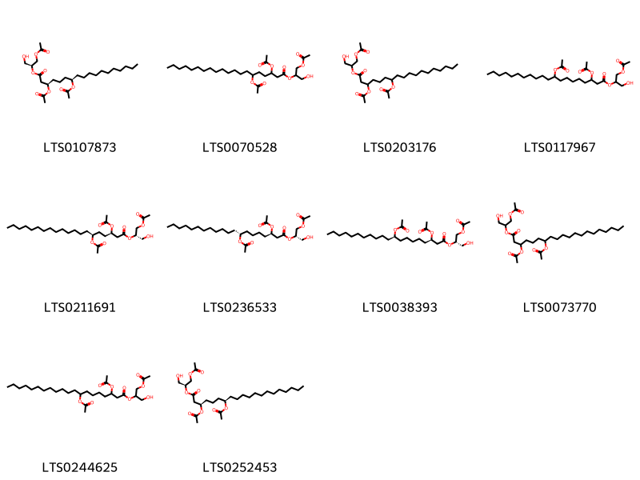{ width=100% }
    <figcaption>Hình ảnh cấu trúc hóa học của 10 hoạt chất thuộc nhóm Carboxylic acids and derivatives gồm ['(2s)-1-(acetyloxy)-3-hydroxypropan-2-yl (3r,7r)-3,7-bis(acetyloxy)octadecanoate (LTS0107873)', '1-(acetyloxy)-3-hydroxypropan-2-yl 3,6-bis(acetyloxy)icosanoate (LTS0070528)', '1-(acetyloxy)-3-hydroxypropan-2-yl 3,7-bis(acetyloxy)octadecanoate (LTS0203176)', '1-(acetyloxy)-3-hydroxypropan-2-yl 3,9-bis(acetyloxy)icosanoate (LTS0117967)', '(2s)-1-(acetyloxy)-3-hydroxypropan-2-yl (3r,6s)-3,6-bis(acetyloxy)icosanoate (LTS0211691)', '(2s)-1-(acetyloxy)-3-hydroxypropan-2-yl (3r,8r)-3,8-bis(acetyloxy)icosanoate (LTS0236533)', '(2s)-1-(acetyloxy)-3-hydroxypropan-2-yl (3r,9r)-3,9-bis(acetyloxy)icosanoate (LTS0038393)', '1-(acetyloxy)-3-hydroxypropan-2-yl 3,7-bis(acetyloxy)icosanoate (LTS0073770)', '1-(acetyloxy)-3-hydroxypropan-2-yl 3,8-bis(acetyloxy)icosanoate (LTS0244625)', '(2s)-1-(acetyloxy)-3-hydroxypropan-2-yl (3r,7r)-3,7-bis(acetyloxy)icosanoate (LTS0252453)'].</figcaption>
</figure>
#### Nhóm Cinnamic acids and derivatives
<figure markdown="span">
    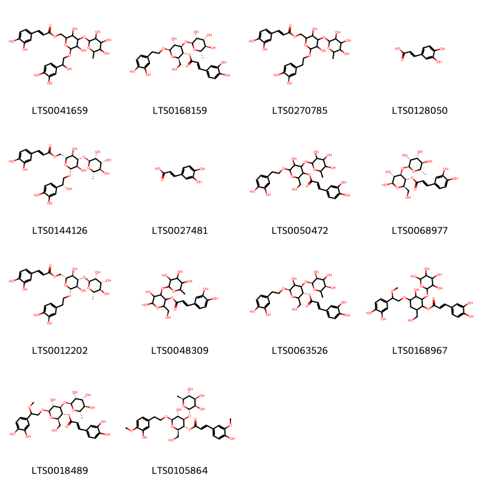{ width=100% }
    <figcaption>Hình ảnh cấu trúc hóa học của 14 hoạt chất thuộc nhóm Cinnamic acids and derivatives gồm ['{6-[2-(3,4-dihydroxyphenyl)-2-hydroxyethoxy]-3,5-dihydroxy-4-[(3,4,5-trihydroxy-6-methyloxan-2-yl)oxy]oxan-2-yl}methyl 3-(3,4-dihydroxyphenyl)prop-2-enoate (LTS0041659)', 'verbascoside (LTS0168159)', '{6-[2-(3,4-dihydroxyphenyl)ethoxy]-3,5-dihydroxy-4-[(3,4,5-trihydroxy-6-methyloxan-2-yl)oxy]oxan-2-yl}methyl 3-(3,4-dihydroxyphenyl)prop-2-enoate (LTS0270785)', '3,4-dihydroxycinnamic acid (LTS0128050)', '[(2r,3r,4s,5r,6r)-6-[(2r)-2-(3,4-dihydroxyphenyl)-2-hydroxyethoxy]-3,5-dihydroxy-4-{[(2s,3r,4r,5r,6s)-3,4,5-trihydroxy-6-methyloxan-2-yl]oxy}oxan-2-yl]methyl (2e)-3-(3,4-dihydroxyphenyl)prop-2-enoate (LTS0144126)', 'caffeic acid (LTS0027481)', '6-[2-(3,4-dihydroxyphenyl)ethoxy]-5-hydroxy-2-(hydroxymethyl)-4-[(3,4,5-trihydroxy-6-methyloxan-2-yl)oxy]oxan-3-yl 3-(3,4-dihydroxyphenyl)prop-2-enoate (LTS0050472)', '(2r,3r,4r,5r,6r)-5,6-dihydroxy-2-(hydroxymethyl)-4-{[(2s,3r,4r,5r,6s)-3,4,5-trihydroxy-6-methyloxan-2-yl]oxy}oxan-3-yl (2e)-3-(3,4-dihydroxyphenyl)prop-2-enoate (LTS0068977)', 'isoacteoside (LTS0012202)', '5,6-dihydroxy-2-(hydroxymethyl)-4-[(3,4,5-trihydroxy-6-methyloxan-2-yl)oxy]oxan-3-yl 3-(3,4-dihydroxyphenyl)prop-2-enoate (LTS0048309)', '(3r,4r,6r)-6-[2-(3,4-dihydroxyphenyl)ethoxy]-5-hydroxy-2-(hydroxymethyl)-4-{[(2s,3s,5r)-3,4,5-trihydroxy-6-methyloxan-2-yl]oxy}oxan-3-yl (2e)-3-(3,4-dihydroxyphenyl)prop-2-enoate (LTS0063526)', '4-[2-(3,4-dihydroxyphenyl)-2-methoxyethoxy]-3-hydroxy-6-(hydroxymethyl)-2-[(3,4,5,6-tetrahydroxyoxan-2-yl)oxy]cyclohexyl 3-(3,4-dihydroxyphenyl)prop-2-enoate (LTS0168967)', '(2r,3r,4r,5r,6r)-6-[2-(3,4-dihydroxyphenyl)-2-methoxyethoxy]-5-hydroxy-2-(hydroxymethyl)-4-{[(2s,3r,4r,5r,6s)-3,4,5-trihydroxy-6-methyloxan-2-yl]oxy}oxan-3-yl (2e)-3-(3,4-dihydroxyphenyl)prop-2-enoate (LTS0018489)', '(2r,3r,4r,5r,6r)-5-hydroxy-6-[2-(3-hydroxy-4-methoxyphenyl)ethoxy]-2-(hydroxymethyl)-4-{[(2s,3r,4r,5r,6s)-3,4,5-trihydroxy-6-methyloxan-2-yl]oxy}oxan-3-yl (2e)-3-(4-hydroxy-3-methoxyphenyl)prop-2-enoate (LTS0105864)'].</figcaption>
</figure>
#### Nhóm Endocannabinoids
<figure markdown="span">
    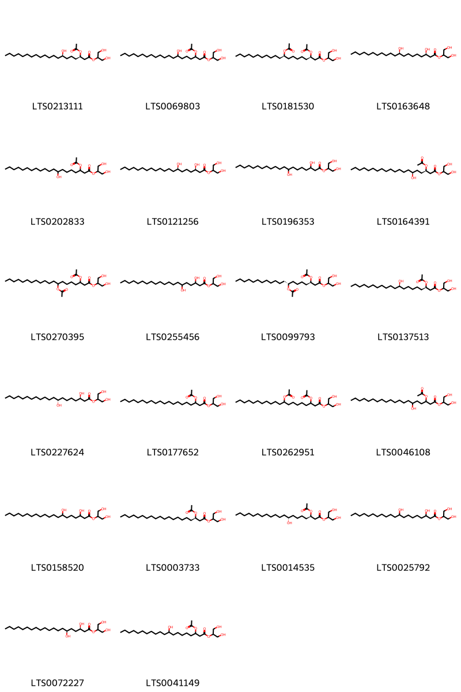{ width=100% }
    <figcaption>Hình ảnh cấu trúc hóa học của 22 hoạt chất thuộc nhóm Endocannabinoids gồm ['1,3-dihydroxypropan-2-yl (3r,7r)-3-(acetyloxy)-7-hydroxyicosanoate (LTS0213111)', '1,3-dihydroxypropan-2-yl 3-(acetyloxy)-7-hydroxyicosanoate (LTS0069803)', '1,3-dihydroxypropan-2-yl (3r,9r)-3,9-bis(acetyloxy)icosanoate (LTS0181530)', '1,3-dihydroxypropan-2-yl (3r,9r)-3,9-dihydroxyicosanoate (LTS0163648)', '1,3-dihydroxypropan-2-yl 3-(acetyloxy)-8-hydroxyicosanoate (LTS0202833)', '1,3-dihydroxypropan-2-yl (3r,7r)-3,7-dihydroxyicosanoate (LTS0121256)', '1,3-dihydroxypropan-2-yl 3,8-dihydroxyicosanoate (LTS0196353)', '1,3-dihydroxypropan-2-yl (3r,6s)-3-(acetyloxy)-6-hydroxyicosanoate (LTS0164391)', '1,3-dihydroxypropan-2-yl 3,8-bis(acetyloxy)icosanoate (LTS0270395)', '1,3-dihydroxypropan-2-yl 3,6-dihydroxyicosanoate (LTS0255456)', '1,3-dihydroxypropan-2-yl (3r,8r)-3,8-bis(acetyloxy)icosanoate (LTS0099793)', '1,3-dihydroxypropan-2-yl (3r,9r)-3-(acetyloxy)-9-hydroxyicosanoate (LTS0137513)', '1,3-dihydroxypropan-2-yl (3r,8r)-3,8-dihydroxyicosanoate (LTS0227624)', '1,3-dihydroxypropan-2-yl 3-(acetyloxy)icosanoate (LTS0177652)', '1,3-dihydroxypropan-2-yl 3,9-bis(acetyloxy)icosanoate (LTS0262951)', '1,3-dihydroxypropan-2-yl 3-(acetyloxy)-6-hydroxyicosanoate (LTS0046108)', '1,3-dihydroxypropan-2-yl 3,7-dihydroxyicosanoate (LTS0158520)', '1,3-dihydroxypropan-2-yl (3r)-3-(acetyloxy)icosanoate (LTS0003733)', '1,3-dihydroxypropan-2-yl (3r,8r)-3-(acetyloxy)-8-hydroxyicosanoate (LTS0014535)', '1,3-dihydroxypropan-2-yl 3,9-dihydroxyicosanoate (LTS0025792)', '1,3-dihydroxypropan-2-yl (3r,6s)-3,6-dihydroxyicosanoate (LTS0072227)', '1,3-dihydroxypropan-2-yl 3-(acetyloxy)-9-hydroxyicosanoate (LTS0041149)'].</figcaption>
</figure>
#### Nhóm Fatty Acyls
<figure markdown="span">
    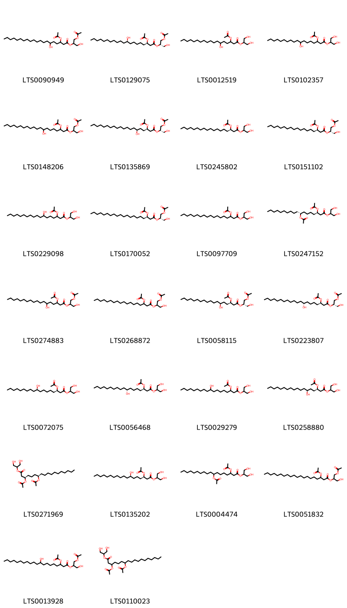{ width=100% }
    <figcaption>Hình ảnh cấu trúc hóa học của 26 hoạt chất thuộc nhóm Fatty Acyls gồm ['1-(acetyloxy)-3-hydroxypropan-2-yl 3-(acetyloxy)-6-hydroxyicosanoate (LTS0090949)', '(2s)-1-(acetyloxy)-3-hydroxypropan-2-yl (3r,9r)-3-(acetyloxy)-9-hydroxyicosanoate (LTS0129075)', '1,3-dihydroxypropan-2-yl 3-(acetyloxy)-6-hydroxyoctadecanoate (LTS0012519)', '1,3-dihydroxypropan-2-yl 3-(acetyloxy)-8-hydroxyoctadecanoate (LTS0102357)', '1-(acetyloxy)-3-hydroxypropan-2-yl 3-(acetyloxy)-8-hydroxyicosanoate (LTS0148206)', '(2s)-1-(acetyloxy)-3-hydroxypropan-2-yl (3r,6s)-3-(acetyloxy)-6-hydroxyicosanoate (LTS0135869)', '1,3-dihydroxypropan-2-yl (3r)-3-(acetyloxy)octadecanoate (LTS0245802)', '(2s)-1-(acetyloxy)-3-hydroxypropan-2-yl (3r)-3-(acetyloxy)octadecanoate (LTS0151102)', '1,3-dihydroxypropan-2-yl 3-(acetyloxy)-7-hydroxyoctadecanoate (LTS0229098)', '(2s)-1-(acetyloxy)-3-hydroxypropan-2-yl (3r)-3-(acetyloxy)icosanoate (LTS0170052)', '1,3-dihydroxypropan-2-yl 3-(acetyloxy)octadecanoate (LTS0097709)', '1,3-dihydroxypropan-2-yl (3r,8r)-3,8-bis(acetyloxy)octadecanoate (LTS0247152)', '1-(acetyloxy)-3-hydroxypropan-2-yl 3-(acetyloxy)-6-hydroxyoctadecanoate (LTS0274883)', '1-(acetyloxy)-3-hydroxypropan-2-yl 3-(acetyloxy)octadecanoate (LTS0268872)', '(2s)-1-(acetyloxy)-3-hydroxypropan-2-yl (3r,6s)-3-(acetyloxy)-6-hydroxyoctadecanoate (LTS0058115)', '(2s)-1-(acetyloxy)-3-hydroxypropan-2-yl (3r,8r)-3-(acetyloxy)-8-hydroxyicosanoate (LTS0223807)', '1,3-dihydroxypropan-2-yl (3r,9r)-3-(acetyloxy)-9-hydroxyoctadecanoate (LTS0072075)', '1,3-dihydroxypropan-2-yl (3r,8r)-3-(acetyloxy)-8-hydroxyoctadecanoate (LTS0056468)', '1,3-dihydroxypropan-2-yl 3-(acetyloxy)-9-hydroxyoctadecanoate (LTS0029279)', '1,3-dihydroxypropan-2-yl (3r,6s)-3-(acetyloxy)-6-hydroxyoctadecanoate (LTS0258880)', '1,3-dihydroxypropan-2-yl (3r,7r)-3,7-bis(acetyloxy)octadecanoate (LTS0271969)', '1,3-dihydroxypropan-2-yl (3r,7r)-3-(acetyloxy)-7-hydroxyoctadecanoate (LTS0135202)', '1,3-dihydroxypropan-2-yl 3,8-bis(acetyloxy)octadecanoate (LTS0004474)', '1-(acetyloxy)-3-hydroxypropan-2-yl 3-(acetyloxy)icosanoate (LTS0051832)', '1-(acetyloxy)-3-hydroxypropan-2-yl 3-(acetyloxy)-9-hydroxyicosanoate (LTS0013928)', '1,3-dihydroxypropan-2-yl 3,7-bis(acetyloxy)octadecanoate (LTS0110023)'].</figcaption>
</figure>
#### Nhóm Flavonoids
<figure markdown="span">
    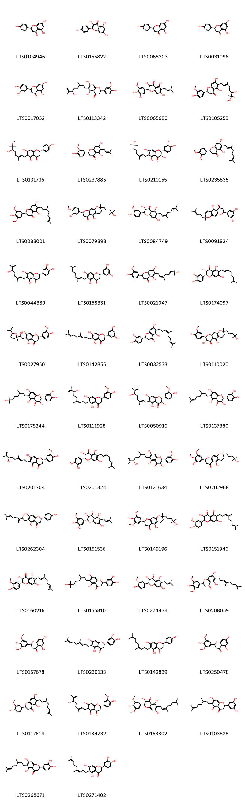{ width=100% }
    <figcaption>Hình ảnh cấu trúc hóa học của 102 hoạt chất thuộc nhóm Flavonoids gồm ['chamomile (LTS0104946)', 'kaempherol (LTS0155822)', 'asahina (LTS0068303)', 'naringenin (LTS0031098)', 'luteolin (LTS0017052)', '5,7-dihydroxy-6-(6-hydroxy-3,7-dimethylocta-2,7-dien-1-yl)-2-(4-hydroxy-3-methoxyphenyl)-2,3-dihydro-1-benzopyran-4-one (LTS0113342)', '2-(3,4-dihydroxy-5-methoxyphenyl)-3,5,7-trihydroxy-6-(3-methylbut-2-en-1-yl)-2,3-dihydro-1-benzopyran-4-one (LTS0065680)', '(2s)-5,7-dihydroxy-2-(4-hydroxy-3-methoxyphenyl)-6-[(2e)-6-hydroxy-7-methoxy-3,7-dimethyloct-2-en-1-yl]-2,3-dihydro-1-benzopyran-4-one (LTS0105253)', '(2s)-5,7-dihydroxy-6-[(2e)-6-hydroxy-7-methoxy-3,7-dimethyloct-2-en-1-yl]-2-(4-hydroxyphenyl)-2,3-dihydro-1-benzopyran-4-one (LTS0131736)', '(2s)-5,7-dihydroxy-2-(4-hydroxy-3-methoxyphenyl)-6-(3-methylbut-2-en-1-yl)-2,3-dihydro-1-benzopyran-4-one (LTS0237885)', '(2r,3r)-2-(3,4-dihydroxyphenyl)-3,5,7-trihydroxy-6-[(2e)-7-hydroxy-3,7-dimethyloct-2-en-1-yl]-2,3-dihydro-1-benzopyran-4-one (LTS0210155)', '(2s)-2-(3,4-dimethoxyphenyl)-6-[(2e)-3,7-dimethylocta-2,6-dien-1-yl]-5,7-dihydroxy-2,3-dihydro-1-benzopyran-4-one (LTS0235835)', '(2s)-6-[(2e)-3,7-dimethylocta-2,6-dien-1-yl]-5,7-dihydroxy-2-(4-hydroxy-3,5-dimethoxyphenyl)-2,3-dihydro-1-benzopyran-4-one (LTS0083001)', '(5s)-9-hydroxy-5-(3-hydroxy-4-methoxyphenyl)-13-(4-hydroxy-4-methylpentyl)-13-methyl-4,14-dioxatricyclo[8.4.0.0³,⁸]tetradeca-1,3(8),9-trien-7-one (LTS0079898)', '6-(3,7-dimethylocta-2,6-dien-1-yl)-3,5,7-trihydroxy-2-(4-hydroxy-3-methoxyphenyl)-2,3-dihydro-1-benzopyran-4-one (LTS0084749)', '(2s)-2-(3,5-dihydroxyphenyl)-5-hydroxy-8-methyl-8-(4-methylpent-3-en-1-yl)-2h,3h-pyrano[3,2-g]chromen-4-one (LTS0091824)', '(2s)-2-(3,4-dihydroxyphenyl)-5,7-dihydroxy-6-[(2e,6r)-6-hydroxy-3,7-dimethylocta-2,7-dien-1-yl]-2,3-dihydro-1-benzopyran-4-one (LTS0044389)', '(2s)-2-(3,5-dihydroxyphenyl)-6-[(2e)-3,7-dimethylocta-2,6-dien-1-yl]-5,7-dihydroxy-2,3-dihydro-1-benzopyran-4-one (LTS0158331)', '5,7-dihydroxy-6-(7-hydroxy-3,7-dimethylocta-2,5-dien-1-yl)-2-(4-hydroxy-3-methoxyphenyl)-2,3-dihydro-1-benzopyran-4-one (LTS0021047)', '(2s,3s)-6-[(2e)-3,7-dimethylocta-2,6-dien-1-yl]-3,5,7-trihydroxy-2-(4-hydroxy-3-methoxyphenyl)-2,3-dihydro-1-benzopyran-4-one (LTS0174097)', '(2s)-5,7-dihydroxy-6-{2-hydroxy-2-[2-methyl-5-(prop-1-en-2-yl)oxolan-2-yl]ethyl}-2-(4-hydroxy-3-methoxyphenyl)-2,3-dihydro-1-benzopyran-4-one (LTS0027950)', '(2s)-2-(3,5-dihydroxyphenyl)-6-[(3e)-4,8-dimethylnona-3,7-dien-1-yl]-5,7-dihydroxy-2,3-dihydro-1-benzopyran-4-one (LTS0142855)', '6-(4,8-dimethylnona-3,7-dien-1-yl)-5,7-dihydroxy-2-(4-hydroxy-3-methoxyphenyl)-2,3-dihydro-1-benzopyran-4-one (LTS0032533)', '(5r,6r)-6,9-dihydroxy-5-(4-hydroxy-3-methoxyphenyl)-13-(4-hydroxy-4-methylpentyl)-13-methyl-4,14-dioxatricyclo[8.4.0.0³,⁸]tetradeca-1(10),2,8-trien-7-one (LTS0110020)', '2-(3,4-dihydroxyphenyl)-3,5,7-trihydroxy-6-(7-hydroxy-3,7-dimethyloct-2-en-1-yl)-2,3-dihydro-1-benzopyran-4-one (LTS0175344)', '5,7-dihydroxy-2-(4-hydroxy-3-methoxyphenyl)-6-(7-hydroxy-4,8-dimethylnona-3,8-dien-1-yl)-2,3-dihydro-1-benzopyran-4-one (LTS0111928)', '(2r,3r)-3,5,7-trihydroxy-6-[(2e,6r)-6-hydroxy-3,7-dimethylocta-2,7-dien-1-yl]-2-(4-hydroxy-3-methoxyphenyl)-2,3-dihydro-1-benzopyran-4-one (LTS0050916)', '2-(3,4-dihydroxyphenyl)-6-(3,7-dimethylocta-2,6-dien-1-yl)-3,5,7-trihydroxy-2,3-dihydro-1-benzopyran-4-one (LTS0137880)', '(2s)-5,7-dihydroxy-2-(4-hydroxy-3-methoxyphenyl)-6-[(3e,7r)-7-hydroxy-4,8-dimethylnona-3,8-dien-1-yl]-2,3-dihydro-1-benzopyran-4-one (LTS0201704)', '(2r,3r)-6-[(2e)-3,7-dimethylocta-2,6-dien-1-yl]-3,5,7-trihydroxy-2-(3-hydroxy-4-methoxyphenyl)-2,3-dihydro-1-benzopyran-4-one (LTS0201324)', '(2r,3r)-3,5,7-trihydroxy-6-[(6r)-6-hydroxy-3,7-dimethylocta-2,7-dien-1-yl]-2-(4-hydroxy-3-methoxyphenyl)-2,3-dihydro-1-benzopyran-4-one (LTS0121634)', '(5s)-9-hydroxy-5-(3-hydroxy-4,5-dimethoxyphenyl)-13-(4-hydroxy-4-methylpentyl)-13-methyl-4,14-dioxatricyclo[8.4.0.0³,⁸]tetradeca-1,3(8),9-trien-7-one (LTS0202968)', '(2s)-5,7-dihydroxy-6-(2-hydroxy-7-methyl-3-methylideneoct-6-en-1-yl)-2-(4-hydroxyphenyl)-2,3-dihydro-1-benzopyran-4-one (LTS0262304)', '(2r,3r)-2-(3,4-dihydroxy-5-methoxyphenyl)-3,5,7-trihydroxy-6-(3-methylbut-2-en-1-yl)-2,3-dihydro-1-benzopyran-4-one (LTS0151536)', '(5s)-9-hydroxy-5-(4-hydroxy-3,5-dimethoxyphenyl)-13-(4-hydroxy-4-methylpentyl)-13-methyl-4,14-dioxatricyclo[8.4.0.0³,⁸]tetradeca-1,3(8),9-trien-7-one (LTS0149196)', '6-(4,8-dimethylnona-3,7-dien-1-yl)-3,5,7-trihydroxy-2-(4-hydroxy-3-methoxyphenyl)-2,3-dihydro-1-benzopyran-4-one (LTS0151946)', '(2r,3r)-6-[(2e)-3,7-dimethylocta-2,6-dien-1-yl]-3,5,7-trihydroxy-2-(4-hydroxy-3-methoxyphenyl)-2,3-dihydro-1-benzopyran-4-one (LTS0160216)', '2-(3,4-dihydroxyphenyl)-5,7-dihydroxy-6-(7-hydroxy-3,7-dimethyloct-2-en-1-yl)-2,3-dihydro-1-benzopyran-4-one (LTS0155810)', '3,5,7-trihydroxy-2-(4-hydroxy-3-methoxyphenyl)-6-(3-methylbut-2-en-1-yl)-2,3-dihydro-1-benzopyran-4-one (LTS0274434)', '(2s)-6-[(3e)-4,8-dimethylnona-3,7-dien-1-yl]-5,7-dihydroxy-2-(4-hydroxy-3,5-dimethoxyphenyl)-2,3-dihydro-1-benzopyran-4-one (LTS0208059)', '(2s)-5,7-dihydroxy-2-(4-hydroxy-3,5-dimethoxyphenyl)-2,3-dihydro-1-benzopyran-4-one (LTS0157678)', '(2s)-2-(3,4-dihydroxyphenyl)-6-[(3e)-4,8-dimethylnona-3,7-dien-1-yl]-5,7-dihydroxy-2,3-dihydro-1-benzopyran-4-one (LTS0230133)', '6-(4,8-dimethylnona-3,7-dien-1-yl)-5,7-dihydroxy-2-(4-hydroxyphenyl)-2,3-dihydro-1-benzopyran-4-one (LTS0142839)', '5,7-dihydroxy-2-(4-hydroxy-3,5-dimethoxyphenyl)-2,3-dihydro-1-benzopyran-4-one (LTS0250478)', '(2s)-6-[(2e)-3,7-dimethylocta-2,6-dien-1-yl]-5,7-dihydroxy-2-(4-hydroxy-3-methoxyphenyl)-2,3-dihydro-1-benzopyran-4-one (LTS0117614)', '(2s)-5,7-dihydroxy-6-[(2e,6r)-6-hydroxy-3,7-dimethylocta-2,7-dien-1-yl]-2-(4-hydroxy-3-methoxyphenyl)-2,3-dihydro-1-benzopyran-4-one (LTS0184232)', '(2r,3r)-6-(3,7-dimethylocta-2,6-dien-1-yl)-3,5,7-trihydroxy-2-(4-hydroxy-3,5-dimethoxyphenyl)-2,3-dihydro-1-benzopyran-4-one (LTS0163802)', '2-(3,5-dihydroxyphenyl)-6-(3,7-dimethylocta-2,6-dien-1-yl)-5,7-dihydroxy-2,3-dihydro-1-benzopyran-4-one (LTS0103828)', '(2s)-2-(3,4-dihydroxyphenyl)-6-(3,7-dimethylocta-2,6-dien-1-yl)-5,7-dihydroxy-2,3-dihydro-1-benzopyran-4-one (LTS0268671)', '2-(3,4-dihydroxyphenyl)-6-(4,8-dimethylnona-3,7-dien-1-yl)-5,7-dihydroxy-2,3-dihydro-1-benzopyran-4-one (LTS0271402)', '(2s)-6-(3,7-dimethylocta-2,6-dien-1-yl)-5,7-dihydroxy-2-(4-hydroxyphenyl)-2,3-dihydro-1-benzopyran-4-one (LTS0253774)', '5,7-dihydroxy-2-(4-hydroxy-3-methoxyphenyl)-6-(8-hydroxy-4,8-dimethylnona-3,6-dien-1-yl)-2,3-dihydro-1-benzopyran-4-one (LTS0275864)', '2-(3,4-dihydroxy-5-methoxyphenyl)-5,7-dihydroxy-6-(6-hydroxy-3,7-dimethylocta-2,7-dien-1-yl)-2,3-dihydro-1-benzopyran-4-one (LTS0100680)', 'tomentodiplacone b (LTS0214745)', '2-(3,4-dimethoxyphenyl)-6-(3,7-dimethylocta-2,6-dien-1-yl)-5,7-dihydroxy-2,3-dihydro-1-benzopyran-4-one (LTS0237531)', 'eriodictyol (LTS0220769)', '(12s)-8-hydroxy-12-(4-hydroxy-3-methoxyphenyl)-5-(2-hydroxy-6-methylhept-5-en-2-yl)-4,13-dioxatricyclo[7.4.0.0³,⁷]trideca-1(9),2,7-trien-10-one (LTS0082026)', '(3r)-2-(3,5-dihydroxy-4-methoxyphenyl)-6-[(2e)-3,7-dimethylocta-2,6-dien-1-yl]-3,5,7-trihydroxy-2,3-dihydro-1-benzopyran-4-one (LTS0209476)', '(2r,3r)-3,5,7-trihydroxy-6-[(2e)-6-hydroxy-3,7-dimethylocta-2,7-dien-1-yl]-2-(4-hydroxy-3-methoxyphenyl)-2,3-dihydro-1-benzopyran-4-one (LTS0154847)', '(2s)-6-[(3e)-4,8-dimethylnona-3,7-dien-1-yl]-5,7-dihydroxy-2-(4-hydroxyphenyl)-2,3-dihydro-1-benzopyran-4-one (LTS0227682)', '(2r,3r)-6-[(3e)-4,8-dimethylnona-3,7-dien-1-yl]-3,5,7-trihydroxy-2-(4-hydroxy-3-methoxyphenyl)-2,3-dihydro-1-benzopyran-4-one (LTS0041795)', '5,7-dihydroxy-2-(4-hydroxy-3,5-dimethoxyphenyl)-6-[(2e)-6-hydroxy-7-methoxy-3,7-dimethyloct-2-en-1-yl]-2,3-dihydro-1-benzopyran-4-one (LTS0025850)', '8-hydroxy-5-(2-hydroxy-6-methylhept-5-en-2-yl)-12-(4-hydroxyphenyl)-4,13-dioxatricyclo[7.4.0.0³,⁷]trideca-1,3(7),8-trien-10-one (LTS0188296)', '2-(3,5-dihydroxy-4-methoxyphenyl)-6-[(2e)-3,7-dimethylocta-2,6-dien-1-yl]-5,7-dihydroxy-2,3-dihydro-1-benzopyran-4-one (LTS0041535)', '(2s)-6-[(3e)-4,8-dimethylnona-3,7-dien-1-yl]-5,7-dihydroxy-2-(4-hydroxy-3-methoxyphenyl)-2,3-dihydro-1-benzopyran-4-one (LTS0027767)', '6-(3,7-dimethylocta-2,6-dien-1-yl)-5,7-dihydroxy-2-(4-hydroxy-3-methoxyphenyl)-2,3-dihydro-1-benzopyran-4-one (LTS0036901)', '6-(3,7-dimethylocta-2,6-dien-1-yl)-3,5,7-trihydroxy-2-(3-hydroxy-4-methoxyphenyl)-2,3-dihydro-1-benzopyran-4-one (LTS0194086)', '(2s)-5,7-dihydroxy-2-(4-hydroxy-3-methoxyphenyl)-6-(2-hydroxy-7-methyl-3-methylideneoct-6-en-1-yl)-2,3-dihydro-1-benzopyran-4-one (LTS0181685)', '(2r,3r)-2-(3,4-dihydroxyphenyl)-3,5,7-trihydroxy-6-[(2e,6r)-6-hydroxy-3,7-dimethylocta-2,7-dien-1-yl]-2,3-dihydro-1-benzopyran-4-one (LTS0196517)', '2-(3,4-dihydroxyphenyl)-6-(3,7-dimethylocta-2,6-dien-1-yl)-5,7-dihydroxy-2,3-dihydro-1-benzopyran-4-one (LTS0065276)', '(2s)-2-(3,4-dihydroxyphenyl)-5,7-dihydroxy-6-[(2e)-7-hydroxy-3,7-dimethyloct-2-en-1-yl]-2,3-dihydro-1-benzopyran-4-one (LTS0267813)', '(2s)-2-(3,4-dihydroxy-5-methoxyphenyl)-6-[(2e)-3,7-dimethylocta-2,6-dien-1-yl]-5,7-dihydroxy-2,3-dihydro-1-benzopyran-4-one (LTS0269515)', '6-[(2e)-6,7-dihydroxy-3,7-dimethyloct-2-en-1-yl]-5,7-dihydroxy-2-(4-hydroxy-3,5-dimethoxyphenyl)-2,3-dihydro-1-benzopyran-4-one (LTS0065312)', '2-(3,4-dihydroxyphenyl)-3,5,7-trihydroxy-6-(6-hydroxy-3,7-dimethylocta-2,7-dien-1-yl)-2,3-dihydro-1-benzopyran-4-one (LTS0065908)', '(5s)-5-(3,4-dihydroxyphenyl)-9-hydroxy-13-(4-hydroxy-4-methylpentyl)-13-methyl-4,14-dioxatricyclo[8.4.0.0³,⁸]tetradeca-1(10),2,8-trien-7-one (LTS0059321)', '(2r,3r)-3,5,7-trihydroxy-6-[(2e,6s)-6-hydroxy-3,7-dimethylocta-2,7-dien-1-yl]-2-(4-hydroxy-3-methoxyphenyl)-2,3-dihydro-1-benzopyran-4-one (LTS0274962)', '6-(3,7-dimethylocta-2,6-dien-1-yl)-5,7-dihydroxy-2-(4-hydroxyphenyl)-2,3-dihydro-1-benzopyran-4-one (LTS0062616)', '6-(3,7-dimethylocta-2,6-dien-1-yl)-5,7-dihydroxy-2-(3-hydroxy-4-methoxyphenyl)-2,3-dihydro-1-benzopyran-4-one (LTS0038456)', '(2s)-2-(3,5-dihydroxyphenyl)-6-(4,8-dimethylnona-3,7-dien-1-yl)-5,7-dihydroxy-2,3-dihydro-1-benzopyran-4-one (LTS0272561)', '(2r,3r)-6-[(2e)-3,7-dimethylocta-2,6-dien-1-yl]-3,5,7-trihydroxy-2-(4-hydroxy-3,5-dimethoxyphenyl)-2,3-dihydro-1-benzopyran-4-one (LTS0014808)', '(2s)-6-[(2e)-3,7-dimethylocta-2,6-dien-1-yl]-5,7-dihydroxy-2-(4-hydroxyphenyl)-2,3-dihydro-1-benzopyran-4-one (LTS0016846)', '2-(3,4-dihydroxy-5-methoxyphenyl)-6-(4,8-dimethylnona-3,7-dien-1-yl)-5,7-dihydroxy-2,3-dihydro-1-benzopyran-4-one (LTS0004998)', 'nymphaeol a (LTS0012906)', '(2s)-6-[(2e)-6,7-dihydroxy-3,7-dimethyloct-2-en-1-yl]-5,7-dihydroxy-2-(4-hydroxyphenyl)-2,3-dihydro-1-benzopyran-4-one (LTS0012237)', '(2s)-5,7-dihydroxy-2-(3,4,5-trimethoxyphenyl)-2,3-dihydro-1-benzopyran-4-one (LTS0084967)', 'tomentodiplacone (LTS0023786)', '(2s)-2-(3,4-dihydroxy-5-methoxyphenyl)-5,7-dihydroxy-6-[(2e,6r)-6-hydroxy-3,7-dimethylocta-2,7-dien-1-yl]-2,3-dihydro-1-benzopyran-4-one (LTS0091113)', '2-(3,4-dihydroxyphenyl)-5,7-dihydroxy-6-(6-hydroxy-3,7-dimethylocta-2,7-dien-1-yl)-2,3-dihydro-1-benzopyran-4-one (LTS0023216)', '(2r,3r)-3,5-dihydroxy-2-(4-hydroxy-3-methoxyphenyl)-8-methyl-8-(4-methylpent-3-en-1-yl)-2h,3h-pyrano[3,2-g]chromen-4-one (LTS0256094)', 'hesperetin (LTS0087195)', '2-(3,4-dihydroxy-5-methoxyphenyl)-6-(3,7-dimethylocta-2,6-dien-1-yl)-5,7-dihydroxy-2,3-dihydro-1-benzopyran-4-one (LTS0102322)', '6-[(2e)-3,7-dimethylocta-2,6-dien-1-yl]-5,7-dihydroxy-2-(4-hydroxy-3,5-dimethoxyphenyl)-2,3-dihydro-1-benzopyran-4-one (LTS0225950)', '(5s)-9,12-dihydroxy-5-(4-hydroxy-3-methoxyphenyl)-13-methyl-13-(4-methylpent-3-en-1-yl)-4,14-dioxatricyclo[8.4.0.0³,⁸]tetradeca-1,3(8),9-trien-7-one (LTS0275954)', '(2r,3r)-2-(3,4-dihydroxyphenyl)-6-[(2e)-3,7-dimethylocta-2,6-dien-1-yl]-3,5,7-trihydroxy-2,3-dihydro-1-benzopyran-4-one (LTS0033439)', '6-(4,8-dimethylnona-3,7-dien-1-yl)-5,7-dihydroxy-2-(4-hydroxy-3,5-dimethoxyphenyl)-2,3-dihydro-1-benzopyran-4-one (LTS0090064)', '(2s)-6-(6,7-dihydroxy-3,7-dimethyloct-2-en-1-yl)-5,7-dihydroxy-2-(4-hydroxyphenyl)-2,3-dihydro-1-benzopyran-4-one (LTS0099586)', '(2s)-6-[(2e)-3,7-dimethylocta-2,6-dien-1-yl]-5,7-dihydroxy-2-(3-hydroxy-4,5-dimethoxyphenyl)-2,3-dihydro-1-benzopyran-4-one (LTS0275512)', '(2s)-6-[(2e)-3,7-dimethylocta-2,6-dien-1-yl]-5,7-dihydroxy-2-(3-hydroxy-4-methoxyphenyl)-2,3-dihydro-1-benzopyran-4-one (LTS0026655)', '6-(3,7-dimethylocta-2,6-dien-1-yl)-5,7-dihydroxy-2-(4-hydroxy-3,5-dimethoxyphenyl)-2,3-dihydro-1-benzopyran-4-one (LTS0241675)', '(2s)-5,7-dihydroxy-2-(4-hydroxy-3-methoxyphenyl)-6-[(3e,6e)-8-hydroxy-4,8-dimethylnona-3,6-dien-1-yl]-2,3-dihydro-1-benzopyran-4-one (LTS0104855)', '(2r,3r)-3,5,7-trihydroxy-2-(4-hydroxy-3-methoxyphenyl)-6-(3-methylbut-2-en-1-yl)-2,3-dihydro-1-benzopyran-4-one (LTS0256693)', '(2s)-2-(3,4-dihydroxy-5-methoxyphenyl)-6-[(3e)-4,8-dimethylnona-3,7-dien-1-yl]-5,7-dihydroxy-2,3-dihydro-1-benzopyran-4-one (LTS0251753)'].</figcaption>
</figure>
#### Nhóm Furanoid lignans
<figure markdown="span">
    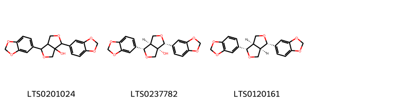{ width=100% }
    <figcaption>Hình ảnh cấu trúc hóa học của 3 hoạt chất thuộc nhóm Furanoid lignans gồm ['1,4-bis(2h-1,3-benzodioxol-5-yl)-tetrahydro-1h-furo[3,4-c]furan-3a-ol (LTS0201024)', '(1s,3as,4r,6ar)-1,4-bis(2h-1,3-benzodioxol-5-yl)-tetrahydro-1h-furo[3,4-c]furan-3a-ol (LTS0237782)', 'sesamin (LTS0120161)'].</figcaption>
</figure>
#### Nhóm Glycerolipids
<figure markdown="span">
    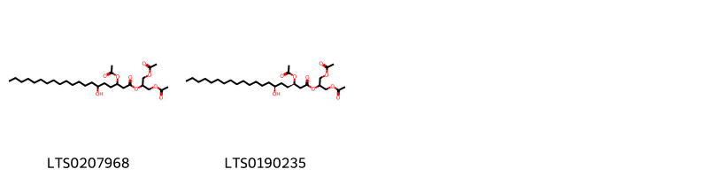{ width=100% }
    <figcaption>Hình ảnh cấu trúc hóa học của 2 hoạt chất thuộc nhóm Glycerolipids gồm ['1,3-bis(acetyloxy)propan-2-yl 3-(acetyloxy)-6-hydroxyicosanoate (LTS0207968)', '1,3-bis(acetyloxy)propan-2-yl (3r,6s)-3-(acetyloxy)-6-hydroxyicosanoate (LTS0190235)'].</figcaption>
</figure>
#### Nhóm Organooxygen compounds
<figure markdown="span">
    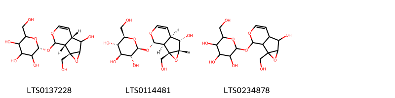{ width=100% }
    <figcaption>Hình ảnh cấu trúc hóa học của 3 hoạt chất thuộc nhóm Organooxygen compounds gồm ['(2r)-2-{[(1r,2s,6s)-5-hydroxy-2-(hydroxymethyl)-3,9-dioxatricyclo[4.4.0.0²,⁴]dec-7-en-10-yl]oxy}-6-(hydroxymethyl)oxane-3,4,5-triol (LTS0137228)', 'catalpol (LTS0114481)', 'catalpol (LTS0234878)'].</figcaption>
</figure>
#### Nhóm Prenol lipids
<figure markdown="span">
    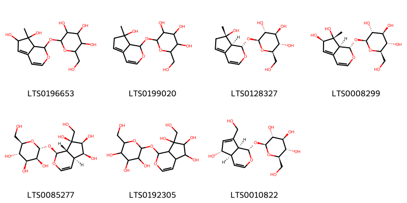{ width=100% }
    <figcaption>Hình ảnh cấu trúc hóa học của 7 hoạt chất thuộc nhóm Prenol lipids gồm ['2-({6,7-dihydroxy-7-methyl-1h,6h,7ah-cyclopenta[c]pyran-1-yl}oxy)-6-(hydroxymethyl)oxane-3,4,5-triol (LTS0196653)', '2-({7-hydroxy-7-methyl-1h,6h,7ah-cyclopenta[c]pyran-1-yl}oxy)-6-(hydroxymethyl)oxane-3,4,5-triol (LTS0199020)', '(2s,3r,4s,5s,6r)-2-{[(1s,7s,7as)-7-hydroxy-7-methyl-1h,6h,7ah-cyclopenta[c]pyran-1-yl]oxy}-6-(hydroxymethyl)oxane-3,4,5-triol (LTS0128327)', '(2s,3r,4s,5s,6r)-2-{[(1s,6r,7r,7as)-6,7-dihydroxy-7-methyl-1h,6h,7ah-cyclopenta[c]pyran-1-yl]oxy}-6-(hydroxymethyl)oxane-3,4,5-triol (LTS0008299)', '(2r,3s,4s,5s,6r)-2-{[(1s,4as,5s,6s,7s,7as)-5,6,7-trihydroxy-7-(hydroxymethyl)-1h,4ah,5h,6h,7ah-cyclopenta[c]pyran-1-yl]oxy}-6-(hydroxymethyl)oxane-3,4,5-triol (LTS0085277)', '2-(hydroxymethyl)-6-{[5,6,7-trihydroxy-7-(hydroxymethyl)-1h,4ah,5h,6h,7ah-cyclopenta[c]pyran-1-yl]oxy}oxane-3,4,5-triol (LTS0192305)', 'aucubin (LTS0010822)'].</figcaption>
</figure>

---

### Dược dân tộc học

Danh sách các quốc gia có sử dụng *Paulownia tomentosa* trong điều trị các bệnh. 

| Country   | Disease            | Bệnh                                                                                                                                                                                                |
|:----------|:-------------------|:----------------------------------------------------------------------------------------------------------------------------------------------------------------------------------------------------|
| Elsewhere | Astringent, Poison | MYMEMORY WARNING: YOU USED ALL AVAILABLE FREE TRANSLATIONS FOR TODAY. NEXT AVAILABLE IN  17 HOURS 54 MINUTES 53 SECONDS VISIT HTTPS://MYMEMORY.TRANSLATED.NET/DOC/USAGELIMITS.PHP TO TRANSLATE MORE |

---

# Chi Chelone

??? note "Danh sách các dược liệu thuộc chi"
    
	 - *Chelone glabra*

---
## Chelone glabra
### Thông tin về thực vật

!!! info "Phân loại thực vật của *Chelone glabra* từ GIBF:"
    - **Kingdom:** Plantae
    - **Phylum:** Tracheophyta
    - **Order:** Lamiales
    - **Family:** Plantaginaceae
    - **Genus:** Chelone
    - **Species:** *Chelone glabra*

 

| Label (VI)   | Label (EN)   | Scientific Name   | Descriptions (VI)   | Descriptions (EN)   | Also Known As (VI)   | Also Known As (EN)   |
|:-------------|:-------------|:------------------|:--------------------|:--------------------|:---------------------|:---------------------|
| N/A          | N/A          | Chelone glabra    | loài thực vật       | species of plant    | ['']                 | ['']                 |

#### Phân bố trên thế giới

**Từ CSDL GIBF** Canada, United States of America

#### Phân bố tại Việt Nam

**Từ CSDL GIBF**: Không có ghi nhận ở Việt Nam

---
### Thành phần hóa học
        
- Theo cơ sở dữ liệu lotus: Từ loài *Chelone glabra* đã phân lập và xác định được Chưa có hoạt chất nào được phân lập. hoạt chất thuộc về các nhóm Không có hoạt chất nào được phân lập. 

Không có hình ảnh nào được tạo ra

---

### Dược dân tộc học

Danh sách các quốc gia có sử dụng *Chelone glabra* trong điều trị các bệnh. 

| Country        | Disease                     | Bệnh                                                                                                                                                                                                |
|:---------------|:----------------------------|:----------------------------------------------------------------------------------------------------------------------------------------------------------------------------------------------------|
| Elsewhere      | Tonic, Cathartic, Vermifuge | MYMEMORY WARNING: YOU USED ALL AVAILABLE FREE TRANSLATIONS FOR TODAY. NEXT AVAILABLE IN  17 HOURS 54 MINUTES 02 SECONDS VISIT HTTPS://MYMEMORY.TRANSLATED.NET/DOC/USAGELIMITS.PHP TO TRANSLATE MORE |
| Turkey         | Laxative, Tonic, Vermifuge  | MYMEMORY WARNING: YOU USED ALL AVAILABLE FREE TRANSLATIONS FOR TODAY. NEXT AVAILABLE IN  17 HOURS 54 MINUTES 00 SECONDS VISIT HTTPS://MYMEMORY.TRANSLATED.NET/DOC/USAGELIMITS.PHP TO TRANSLATE MORE |
| US             | Laxative, Tonic, Vermifuge  | MYMEMORY WARNING: YOU USED ALL AVAILABLE FREE TRANSLATIONS FOR TODAY. NEXT AVAILABLE IN  17 HOURS 53 MINUTES 57 SECONDS VISIT HTTPS://MYMEMORY.TRANSLATED.NET/DOC/USAGELIMITS.PHP TO TRANSLATE MORE |
| US(Appalachia) | Laxative, Purgative, Tonic  | MYMEMORY WARNING: YOU USED ALL AVAILABLE FREE TRANSLATIONS FOR TODAY. NEXT AVAILABLE IN  17 HOURS 53 MINUTES 55 SECONDS VISIT HTTPS://MYMEMORY.TRANSLATED.NET/DOC/USAGELIMITS.PHP TO TRANSLATE MORE |

---

# Chi Verbascum

??? note "Danh sách các dược liệu thuộc chi"
    
	 - *Verbascum eciosum*
	 - *Verbascum lychnitis*
	 - *Verbascum phlomoides*
	 - *Verbascum sinaiticum*
	 - *Verbascum thapsus*

---
## Verbascum eciosum
### Thông tin về thực vật

!!! info "Phân loại thực vật của *N/A* từ GIBF:"
    - **Kingdom:** Plantae
    - **Phylum:** Tracheophyta
    - **Order:** Lamiales
    - **Family:** Scrophulariaceae
    - **Genus:** Verbascum
    - **Species:** *N/A*

 

| Label (VI)   | Label (EN)   | Scientific Name   | Descriptions (VI)   | Descriptions (EN)   | Also Known As (VI)   | Also Known As (EN)   |
|:-------------|:-------------|:------------------|:--------------------|:--------------------|:---------------------|:---------------------|
| N/A          | N/A          | Chelone glabra    | loài thực vật       | species of plant    | ['']                 | ['']                 |

#### Phân bố trên thế giới

**Từ CSDL GIBF** United Kingdom of Great Britain and Northern Ireland, Argentina, Portugal, South Africa, France, Spain, New Zealand, Canada, Chile, United States of America, Italy, Israel, Russian Federation, Austria, Algeria, Greece, Australia, Ecuador

#### Phân bố tại Việt Nam

**Từ CSDL GIBF**: Không có ghi nhận ở Việt Nam

---
### Thành phần hóa học
        
- Theo cơ sở dữ liệu lotus: Từ loài *N/A* đã phân lập và xác định được Chưa có hoạt chất nào được phân lập. hoạt chất thuộc về các nhóm Không có hoạt chất nào được phân lập. 

Không có hình ảnh nào được tạo ra

---

### Dược dân tộc học

Danh sách các quốc gia có sử dụng *N/A* trong điều trị các bệnh. 

| Country   | Disease   | Bệnh                                                                                                                                                                                                |
|:----------|:----------|:----------------------------------------------------------------------------------------------------------------------------------------------------------------------------------------------------|
| Romania   | Piscicide | MYMEMORY WARNING: YOU USED ALL AVAILABLE FREE TRANSLATIONS FOR TODAY. NEXT AVAILABLE IN  17 HOURS 53 MINUTES 29 SECONDS VISIT HTTPS://MYMEMORY.TRANSLATED.NET/DOC/USAGELIMITS.PHP TO TRANSLATE MORE |

---

---
## Verbascum lychnitis
### Thông tin về thực vật

!!! info "Phân loại thực vật của *Verbascum lychnitis* từ GIBF:"
    - **Kingdom:** Plantae
    - **Phylum:** Tracheophyta
    - **Order:** Lamiales
    - **Family:** Scrophulariaceae
    - **Genus:** Verbascum
    - **Species:** *Verbascum lychnitis*

 

| Label (VI)   | Label (EN)   | Scientific Name     | Descriptions (VI)   | Descriptions (EN)   | Also Known As (VI)   | Also Known As (EN)                |
|:-------------|:-------------|:--------------------|:--------------------|:--------------------|:---------------------|:----------------------------------|
| N/A          | N/A          | Verbascum lychnitis | loài thực vật       | species of plant    | ['']                 | ['velvet plant', 'white mullein'] |

#### Phân bố trên thế giới

**Từ CSDL GIBF** Switzerland, Belarus, United Kingdom of Great Britain and Northern Ireland, Serbia, Sweden, Slovakia, France, Spain, Czechia, Hungary, Romania, Germany, Russian Federation, Italy, Austria, Belgium, Netherlands, Ukraine

#### Phân bố tại Việt Nam

**Từ CSDL GIBF**: Không có ghi nhận ở Việt Nam

---
### Thành phần hóa học
        
- Theo cơ sở dữ liệu lotus: Từ loài *Verbascum lychnitis* đã phân lập và xác định được 20 hoạt chất thuộc về các nhóm Organooxygen compounds, Phenols, Prenol lipids, Flavonoids. 

|    | chemicalTaxonomyClassyfireClass   |   smiles_count |
|---:|:----------------------------------|---------------:|
|  0 | Flavonoids                        |              7 |
|  1 | Organooxygen compounds            |              5 |
|  2 | Phenols                           |              2 |
|  3 | Prenol lipids                     |              6 |

#### Nhóm Flavonoids
<figure markdown="span">
    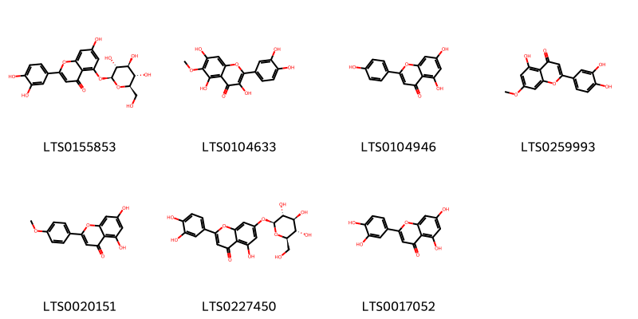{ width=100% }
    <figcaption>Hình ảnh cấu trúc hóa học của 7 hoạt chất thuộc nhóm Flavonoids gồm ['2-(3,4-dihydroxyphenyl)-7-hydroxy-5-{[(2s,3r,4s,5s,6r)-3,4,5-trihydroxy-6-(hydroxymethyl)oxan-2-yl]oxy}chromen-4-one (LTS0155853)', 'patuletin (LTS0104633)', 'chamomile (LTS0104946)', 'luteolin 7-methyl ether (LTS0259993)', 'acacetin (LTS0020151)', 'luteolin 7-o-glucoside (LTS0227450)', 'luteolin (LTS0017052)'].</figcaption>
</figure>
#### Nhóm Organooxygen compounds
<figure markdown="span">
    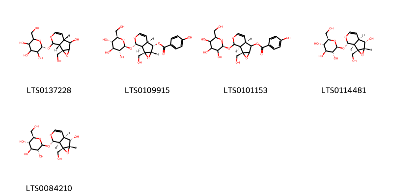{ width=100% }
    <figcaption>Hình ảnh cấu trúc hóa học của 5 hoạt chất thuộc nhóm Organooxygen compounds gồm ['(2r)-2-{[(1r,2s,6s)-5-hydroxy-2-(hydroxymethyl)-3,9-dioxatricyclo[4.4.0.0²,⁴]dec-7-en-10-yl]oxy}-6-(hydroxymethyl)oxane-3,4,5-triol (LTS0137228)', '(1s,2s,4s,5s,6r,10s)-2-(hydroxymethyl)-10-{[(2s,3r,4s,5s,6r)-3,4,5-trihydroxy-6-(hydroxymethyl)oxan-2-yl]oxy}-3,9-dioxatricyclo[4.4.0.0²,⁴]dec-7-en-5-yl 4-hydroxybenzoate (LTS0109915)', '(1s,2s,6r)-2-(hydroxymethyl)-10-{[(2s)-3,4,5-trihydroxy-6-(hydroxymethyl)oxan-2-yl]oxy}-3,9-dioxatricyclo[4.4.0.0²,⁴]dec-7-en-5-yl 4-hydroxybenzoate (LTS0101153)', 'catalpol (LTS0114481)', '(3r,4s,5s,6r)-2-{[(1s,2s,4s,5s,6r,10s)-5-hydroxy-2-(hydroxymethyl)-3,9-dioxatricyclo[4.4.0.0²,⁴]dec-7-en-10-yl]oxy}-6-(hydroxymethyl)oxane-3,4,5-triol (LTS0084210)'].</figcaption>
</figure>
#### Nhóm Phenols
<figure markdown="span">
    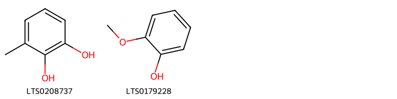{ width=100% }
    <figcaption>Hình ảnh cấu trúc hóa học của 2 hoạt chất thuộc nhóm Phenols gồm ['3-methyl-benzene-1,2-diol (LTS0208737)', 'guaiacol (LTS0179228)'].</figcaption>
</figure>
#### Nhóm Prenol lipids
<figure markdown="span">
    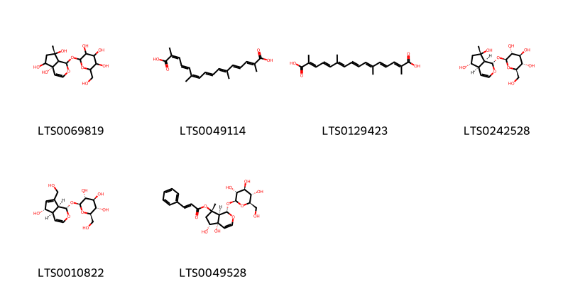{ width=100% }
    <figcaption>Hình ảnh cấu trúc hóa học của 6 hoạt chất thuộc nhóm Prenol lipids gồm ['2-{[(4as,7s)-4a,5,7-trihydroxy-7-methyl-1h,5h,6h,7ah-cyclopenta[c]pyran-1-yl]oxy}-6-(hydroxymethyl)oxane-3,4,5-triol (LTS0069819)', '(8e,10e,12e,14e)-2,6,11,15-tetramethylhexadeca-2,4,6,8,10,12,14-heptaenedioic acid (LTS0049114)', 'crocetin (LTS0129423)', '(2s,3r,4s,5s,6r)-2-{[(1s,4ar,5r,7s,7as)-5,7-dihydroxy-7-methyl-1h,4ah,5h,6h,7ah-cyclopenta[c]pyran-1-yl]oxy}-6-(hydroxymethyl)oxane-3,4,5-triol (LTS0242528)', 'aucubin (LTS0010822)', 'harpagoside (LTS0049528)'].</figcaption>
</figure>

---

### Dược dân tộc học

Danh sách các quốc gia có sử dụng *Verbascum lychnitis* trong điều trị các bệnh. 

| Country   | Disease   | Bệnh                                                                                                                                                                                                |
|:----------|:----------|:----------------------------------------------------------------------------------------------------------------------------------------------------------------------------------------------------|
| Europe    | Raticide  | MYMEMORY WARNING: YOU USED ALL AVAILABLE FREE TRANSLATIONS FOR TODAY. NEXT AVAILABLE IN  17 HOURS 53 MINUTES 04 SECONDS VISIT HTTPS://MYMEMORY.TRANSLATED.NET/DOC/USAGELIMITS.PHP TO TRANSLATE MORE |

---

---
## Verbascum phlomoides
### Thông tin về thực vật

!!! info "Phân loại thực vật của *Verbascum phlomoides* từ GIBF:"
    - **Kingdom:** Plantae
    - **Phylum:** Tracheophyta
    - **Order:** Lamiales
    - **Family:** Scrophulariaceae
    - **Genus:** Verbascum
    - **Species:** *Verbascum phlomoides*

 

| Label (VI)   | Label (EN)   | Scientific Name      | Descriptions (VI)   | Descriptions (EN)   | Also Known As (VI)   | Also Known As (EN)                                                             |
|:-------------|:-------------|:---------------------|:--------------------|:--------------------|:---------------------|:-------------------------------------------------------------------------------|
| N/A          | N/A          | Verbascum phlomoides | loài thực vật       | species of plant    | ['']                 | ['clasping-leaf mullein', 'orange mullein', 'woolly mullein', 'wooly mullein'] |

#### Phân bố trên thế giới

**Từ CSDL GIBF** nan, Germany, Austria, Sweden, Poland, Belgium, Slovakia, Netherlands, Slovenia, Lithuania, Hungary, Switzerland, United Kingdom of Great Britain and Northern Ireland, France, Czechia, Russian Federation, Ecuador, United States of America, Italy, Croatia, Ukraine

#### Phân bố tại Việt Nam

**Từ CSDL GIBF**: Không có ghi nhận ở Việt Nam

---
### Thành phần hóa học
        
- Theo cơ sở dữ liệu lotus: Từ loài *Verbascum phlomoides* đã phân lập và xác định được 40 hoạt chất thuộc về các nhóm Organooxygen compounds, Cinnamic acids and derivatives, Flavonoids, Prenol lipids. 

|    | chemicalTaxonomyClassyfireClass   |   smiles_count |
|---:|:----------------------------------|---------------:|
|  0 | Cinnamic acids and derivatives    |              7 |
|  1 | Flavonoids                        |             12 |
|  2 | Organooxygen compounds            |              4 |
|  3 | Prenol lipids                     |             17 |

#### Nhóm Cinnamic acids and derivatives
<figure markdown="span">
    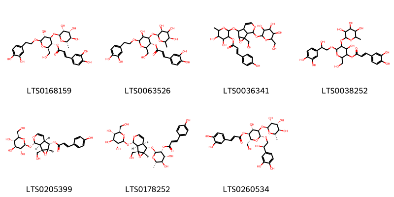{ width=100% }
    <figcaption>Hình ảnh cấu trúc hóa học của 7 hoạt chất thuộc nhóm Cinnamic acids and derivatives gồm ['verbascoside (LTS0168159)', '(3r,4r,6r)-6-[2-(3,4-dihydroxyphenyl)ethoxy]-5-hydroxy-2-(hydroxymethyl)-4-{[(2s,3s,5r)-3,4,5-trihydroxy-6-methyloxan-2-yl]oxy}oxan-3-yl (2e)-3-(3,4-dihydroxyphenyl)prop-2-enoate (LTS0063526)', '4,5-dihydroxy-2-{[2-(hydroxymethyl)-10-{[3,4,5-trihydroxy-6-(hydroxymethyl)oxan-2-yl]oxy}-3,9-dioxatricyclo[4.4.0.0²,⁴]dec-7-en-5-yl]oxy}-6-methyloxan-3-yl 3-(4-hydroxyphenyl)prop-2-enoate (LTS0036341)', '6-[2-(3,4-dihydroxyphenyl)-2-hydroxyethoxy]-4-hydroxy-2-(hydroxymethyl)-5-[(3,4,5-trihydroxy-6-methyloxan-2-yl)oxy]oxan-3-yl 3-(3,4-dihydroxyphenyl)prop-2-enoate (LTS0038252)', '(1s,2s,4s,5s,6r,10s)-2-(hydroxymethyl)-10-{[(2s,3r,4s,5s,6r)-3,4,5-trihydroxy-6-(hydroxymethyl)oxan-2-yl]oxy}-3,9-dioxatricyclo[4.4.0.0²,⁴]dec-7-en-5-yl (2e)-3-(4-hydroxyphenyl)prop-2-enoate (LTS0205399)', '(2s,3r,4r,5r,6s)-4,5-dihydroxy-2-{[(1s,2s,4s,5s,6r,10s)-2-(hydroxymethyl)-10-{[(2s,3r,4s,5s,6r)-3,4,5-trihydroxy-6-(hydroxymethyl)oxan-2-yl]oxy}-3,9-dioxatricyclo[4.4.0.0²,⁴]dec-7-en-5-yl]oxy}-6-methyloxan-3-yl (2e)-3-(4-hydroxyphenyl)prop-2-enoate (LTS0178252)', '(2r,3s,4s,5r,6r)-6-[(2r)-2-(3,4-dihydroxyphenyl)-2-hydroxyethoxy]-4-hydroxy-2-(hydroxymethyl)-5-{[(2s,3r,4r,5r,6s)-3,4,5-trihydroxy-6-methyloxan-2-yl]oxy}oxan-3-yl (2e)-3-(3,4-dihydroxyphenyl)prop-2-enoate (LTS0260534)'].</figcaption>
</figure>
#### Nhóm Flavonoids
<figure markdown="span">
    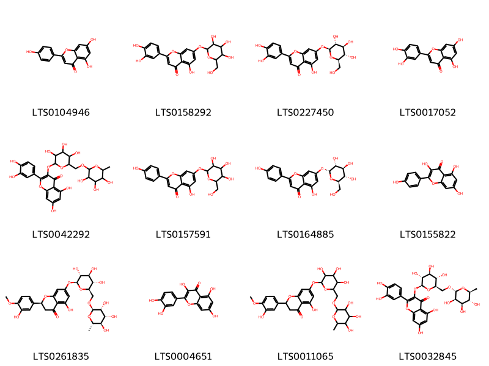{ width=100% }
    <figcaption>Hình ảnh cấu trúc hóa học của 12 hoạt chất thuộc nhóm Flavonoids gồm ['chamomile (LTS0104946)', '2-(3,4-dihydroxyphenyl)-5-hydroxy-7-{[3,4,5-trihydroxy-6-(hydroxymethyl)oxan-2-yl]oxy}chromen-4-one (LTS0158292)', 'luteolin 7-o-glucoside (LTS0227450)', 'luteolin (LTS0017052)', 'rutin (LTS0042292)', 'apigetrin (LTS0157591)', '5-hydroxy-2-(4-hydroxyphenyl)-7-{[(2r,3r,4s,5s,6r)-3,4,5-trihydroxy-6-(hydroxymethyl)oxan-2-yl]oxy}chromen-4-one (LTS0164885)', 'kaempherol (LTS0155822)', 'hesperidin (LTS0261835)', 'quercetin (LTS0004651)', 'hesperidin (LTS0011065)', '3-rutinosyl quercetin (LTS0032845)'].</figcaption>
</figure>
#### Nhóm Organooxygen compounds
<figure markdown="span">
    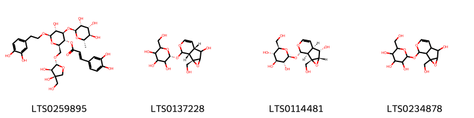{ width=100% }
    <figcaption>Hình ảnh cấu trúc hóa học của 4 hoạt chất thuộc nhóm Organooxygen compounds gồm ['(2r,3r,4r,5r,6r)-2-({[(2r,3r,4r)-3,4-dihydroxy-4-(hydroxymethyl)oxolan-2-yl]oxy}methyl)-6-[2-(3,4-dihydroxyphenyl)ethoxy]-5-hydroxy-4-{[(2s,3r,4r,5r,6s)-3,4,5-trihydroxy-6-methyloxan-2-yl]oxy}oxan-3-yl (2e)-3-(3,4-dihydroxyphenyl)prop-2-enoate (LTS0259895)', '(2r)-2-{[(1r,2s,6s)-5-hydroxy-2-(hydroxymethyl)-3,9-dioxatricyclo[4.4.0.0²,⁴]dec-7-en-10-yl]oxy}-6-(hydroxymethyl)oxane-3,4,5-triol (LTS0137228)', 'catalpol (LTS0114481)', 'catalpol (LTS0234878)'].</figcaption>
</figure>
#### Nhóm Prenol lipids
<figure markdown="span">
    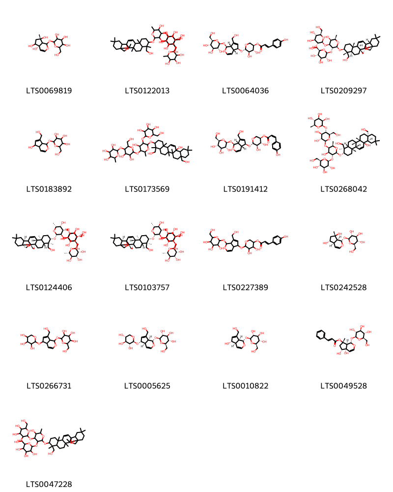{ width=100% }
    <figcaption>Hình ảnh cấu trúc hóa học của 17 hoạt chất thuộc nhóm Prenol lipids gồm ['2-{[(4as,7s)-4a,5,7-trihydroxy-7-methyl-1h,5h,6h,7ah-cyclopenta[c]pyran-1-yl]oxy}-6-(hydroxymethyl)oxane-3,4,5-triol (LTS0069819)', '2-({4,5-dihydroxy-6-[(3-hydroxy-6-{[9-(hydroxymethyl)-4,5,9,13,20,20-hexamethyl-24-oxahexacyclo[15.5.2.0¹,¹⁸.0⁴,¹⁷.0⁵,¹⁴.0⁸,¹³]tetracos-15-en-10-yl]oxy}-2-methyl-5-{[3,4,5-trihydroxy-6-(hydroxymethyl)oxan-2-yl]oxy}oxan-4-yl)oxy]-2-(hydroxymethyl)oxan-3-yl}oxy)-6-methyloxane-3,4,5-triol (LTS0122013)', '(3r,4r,5r,6s)-6-{[(1s,4ar,5s,7as)-7-(hydroxymethyl)-1-{[(2s,3r,4s,5s,6r)-3,4,5-trihydroxy-6-(hydroxymethyl)oxan-2-yl]oxy}-1h,4ah,5h,7ah-cyclopenta[c]pyran-5-yl]oxy}-4,5-dihydroxyoxan-3-yl (2e)-3-(4-hydroxyphenyl)prop-2-enoate (LTS0064036)', '(2s,3r,4s,5s,6r)-2-{[(2r,3r,4s,5s,6r)-5-hydroxy-2-{[(1s,4s,5r,8r,9r,10s,13s,14r,17s,18r)-9-(hydroxymethyl)-4,5,9,13,20,20-hexamethyl-24-oxahexacyclo[15.5.2.0¹,¹⁸.0⁴,¹⁷.0⁵,¹⁴.0⁸,¹³]tetracos-15-en-10-yl]oxy}-6-methyl-4-{[(2s,3r,4s,5s,6r)-3,4,5-trihydroxy-6-(hydroxymethyl)oxan-2-yl]oxy}oxan-3-yl]oxy}-6-(hydroxymethyl)oxane-3,4,5-triol (LTS0209297)', 'aucubin (LTS0183892)', '2-({6-[(6-{[12b-hydroxy-4,8a-bis(hydroxymethyl)-4,6a,6b,11,11,14b-hexamethyl-2,3,4a,5,6,7,8,9,10,12,12a,14a-dodecahydro-1h-picen-3-yl]oxy}-4-hydroxy-2-methyl-5-{[3,4,5-trihydroxy-6-(hydroxymethyl)oxan-2-yl]oxy}oxan-3-yl)oxy]-4,5-dihydroxy-2-(hydroxymethyl)oxan-3-yl}oxy)-6-methyloxane-3,4,5-triol (LTS0173569)', '(3r,4r,5r,6s)-6-{[(1s,4ar,5s,7as)-7-(hydroxymethyl)-1-{[(2s,3r,4s,5s,6r)-3,4,5-trihydroxy-6-(hydroxymethyl)oxan-2-yl]oxy}-1h,4ah,5h,7ah-cyclopenta[c]pyran-5-yl]oxy}-4,5-dihydroxyoxan-3-yl (2z)-3-(4-hydroxyphenyl)prop-2-enoate (LTS0191412)', '(2r,3r,4r,5r,6s)-2-{[(2r,3s,4r,5r,6s)-6-{[(2r,3r,4s,5r,6r)-6-{[(3s,4r,4ar,6as,6bs,8as,12ar,12br,14ar,14br)-12b-hydroxy-4,8a-bis(hydroxymethyl)-4,6a,6b,11,11,14b-hexamethyl-2,3,4a,5,6,7,8,9,10,12,12a,14a-dodecahydro-1h-picen-3-yl]oxy}-4-hydroxy-2-methyl-5-{[(2s,3r,4s,5s,6r)-3,4,5-trihydroxy-6-(hydroxymethyl)oxan-2-yl]oxy}oxan-3-yl]oxy}-4,5-dihydroxy-2-(hydroxymethyl)oxan-3-yl]oxy}-6-methyloxane-3,4,5-triol (LTS0268042)', '(2r,3r,4r,5r,6s)-2-{[(2r,3s,4r,5r,6s)-4,5-dihydroxy-6-{[(2r,3s,4s,5r,6r)-3-hydroxy-6-{[(1s,4s,5r,8r,9r,10s,13s,14r,17s,18r)-9-(hydroxymethyl)-4,5,9,13,20,20-hexamethyl-24-oxahexacyclo[15.5.2.0¹,¹⁸.0⁴,¹⁷.0⁵,¹⁴.0⁸,¹³]tetracos-15-en-10-yl]oxy}-2-methyl-5-{[(2s,3r,4s,5s,6r)-3,4,5-trihydroxy-6-(hydroxymethyl)oxan-2-yl]oxy}oxan-4-yl]oxy}-2-(hydroxymethyl)oxan-3-yl]oxy}-6-methyloxane-3,4,5-triol (LTS0124406)', '(2s,3r,4r,5r,6s)-2-{[(2r,3s,4r,5r,6s)-4,5-dihydroxy-6-{[(2r,3r,4s,5r,6r)-3-hydroxy-6-{[(4s,5r,8r,9r,10s,13s,14r,18r)-9-(hydroxymethyl)-4,5,9,13,20,20-hexamethyl-24-oxahexacyclo[15.5.2.0¹,¹⁸.0⁴,¹⁷.0⁵,¹⁴.0⁸,¹³]tetracos-15-en-10-yl]oxy}-2-methyl-5-{[(2s,3r,4r,6s)-3,4,5-trihydroxy-6-(hydroxymethyl)oxan-2-yl]oxy}oxan-4-yl]oxy}-2-(hydroxymethyl)oxan-3-yl]oxy}-6-methyloxane-3,4,5-triol (LTS0103757)', '4,5-dihydroxy-6-{[7-(hydroxymethyl)-1-{[3,4,5-trihydroxy-6-(hydroxymethyl)oxan-2-yl]oxy}-1h,4ah,5h,7ah-cyclopenta[c]pyran-5-yl]oxy}oxan-3-yl 3-(4-hydroxyphenyl)prop-2-enoate (LTS0227389)', '(2s,3r,4s,5s,6r)-2-{[(1s,4ar,5r,7s,7as)-5,7-dihydroxy-7-methyl-1h,4ah,5h,6h,7ah-cyclopenta[c]pyran-1-yl]oxy}-6-(hydroxymethyl)oxane-3,4,5-triol (LTS0242528)', '2-(hydroxymethyl)-6-{[7-(hydroxymethyl)-5-[(3,4,5-trihydroxyoxan-2-yl)oxy]-1h,4ah,5h,7ah-cyclopenta[c]pyran-1-yl]oxy}oxane-3,4,5-triol (LTS0266731)', '(2s,3r,4s,5s,6r)-2-{[(1s,4ar,5s,7as)-7-(hydroxymethyl)-5-{[(2s,3r,4s,5r)-3,4,5-trihydroxyoxan-2-yl]oxy}-1h,4ah,5h,7ah-cyclopenta[c]pyran-1-yl]oxy}-6-(hydroxymethyl)oxane-3,4,5-triol (LTS0005625)', 'aucubin (LTS0010822)', 'harpagoside (LTS0049528)', '2-[(5-hydroxy-2-{[9-(hydroxymethyl)-4,5,9,13,20,20-hexamethyl-24-oxahexacyclo[15.5.2.0¹,¹⁸.0⁴,¹⁷.0⁵,¹⁴.0⁸,¹³]tetracos-15-en-10-yl]oxy}-6-methyl-4-{[3,4,5-trihydroxy-6-(hydroxymethyl)oxan-2-yl]oxy}oxan-3-yl)oxy]-6-(hydroxymethyl)oxane-3,4,5-triol (LTS0047228)'].</figcaption>
</figure>

---

### Dược dân tộc học

Danh sách các quốc gia có sử dụng *Verbascum phlomoides* trong điều trị các bệnh. 

| Country   | Disease   | Bệnh                                                                                                                                                                                                |
|:----------|:----------|:----------------------------------------------------------------------------------------------------------------------------------------------------------------------------------------------------|
| Europe    | Piscicide | MYMEMORY WARNING: YOU USED ALL AVAILABLE FREE TRANSLATIONS FOR TODAY. NEXT AVAILABLE IN  17 HOURS 52 MINUTES 29 SECONDS VISIT HTTPS://MYMEMORY.TRANSLATED.NET/DOC/USAGELIMITS.PHP TO TRANSLATE MORE |

---

---
## Verbascum sinaiticum
### Thông tin về thực vật

!!! info "Phân loại thực vật của *Verbascum sinaiticum* từ GIBF:"
    - **Kingdom:** Plantae
    - **Phylum:** Tracheophyta
    - **Order:** Lamiales
    - **Family:** Scrophulariaceae
    - **Genus:** Verbascum
    - **Species:** *Verbascum sinaiticum*

 

| Label (VI)   | Label (EN)   | Scientific Name      | Descriptions (VI)   | Descriptions (EN)   | Also Known As (VI)   | Also Known As (EN)   |
|:-------------|:-------------|:---------------------|:--------------------|:--------------------|:---------------------|:---------------------|
| N/A          | N/A          | Verbascum sinaiticum | loài thực vật       | species of plant    | ['']                 | ['']                 |

#### Phân bố trên thế giới

**Từ CSDL GIBF** Eritrea, Somalia, Afghanistan, Kenya, Tunisia, Palestine, State of, Uzbekistan, Sudan, Oman, Kyrgyzstan, Yemen, Lebanon, Ethiopia, Jordan, Morocco, Syrian Arab Republic, Egypt, Israel, Saudi Arabia, Tajikistan

#### Phân bố tại Việt Nam

**Từ CSDL GIBF**: Không có ghi nhận ở Việt Nam

---
### Thành phần hóa học
        
- Theo cơ sở dữ liệu lotus: Từ loài *Verbascum sinaiticum* đã phân lập và xác định được 21 hoạt chất thuộc về các nhóm Flavonolignans, Prenol lipids, Flavonoids, Organooxygen compounds. 

|    | chemicalTaxonomyClassyfireClass   |   smiles_count |
|---:|:----------------------------------|---------------:|
|  0 | Flavonoids                        |              7 |
|  1 | Flavonolignans                    |              3 |
|  2 | Organooxygen compounds            |              1 |
|  3 | Prenol lipids                     |             10 |

#### Nhóm Flavonoids
<figure markdown="span">
    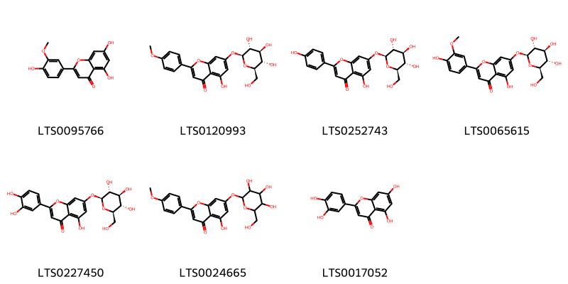{ width=100% }
    <figcaption>Hình ảnh cấu trúc hóa học của 7 hoạt chất thuộc nhóm Flavonoids gồm ['chrysoeriol (LTS0095766)', '5-hydroxy-2-(4-methoxyphenyl)-7-{[(2s,3r,4s,5s,6r)-3,4,5-trihydroxy-6-(hydroxymethyl)oxan-2-yl]oxy}chromen-4-one (LTS0120993)', 'apigenin 7-o-β-glucoside (LTS0252743)', '5-hydroxy-2-(4-hydroxy-3-methoxyphenyl)-7-{[(2s,3r,4s,5s,6r)-3,4,5-trihydroxy-6-(hydroxymethyl)oxan-2-yl]oxy}chromen-4-one (LTS0065615)', 'luteolin 7-o-glucoside (LTS0227450)', '5-hydroxy-2-(4-methoxyphenyl)-7-{[3,4,5-trihydroxy-6-(hydroxymethyl)oxan-2-yl]oxy}chromen-4-one (LTS0024665)', 'luteolin (LTS0017052)'].</figcaption>
</figure>
#### Nhóm Flavonolignans
<figure markdown="span">
    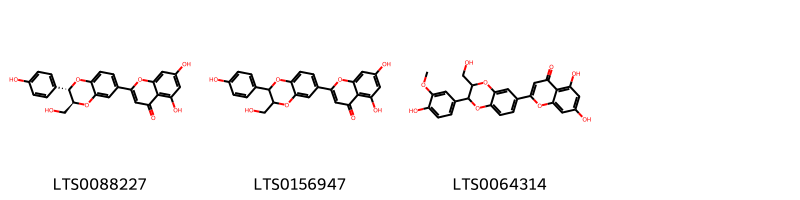{ width=100% }
    <figcaption>Hình ảnh cấu trúc hóa học của 3 hoạt chất thuộc nhóm Flavonolignans gồm ['sinaticin (LTS0088227)', '5,7-dihydroxy-2-[3-(hydroxymethyl)-2-(4-hydroxyphenyl)-2,3-dihydro-1,4-benzodioxin-6-yl]chromen-4-one (LTS0156947)', '5,7-dihydroxy-2-[2-(4-hydroxy-3-methoxyphenyl)-3-(hydroxymethyl)-2,3-dihydro-1,4-benzodioxin-6-yl]chromen-4-one (LTS0064314)'].</figcaption>
</figure>
#### Nhóm Organooxygen compounds
<figure markdown="span">
    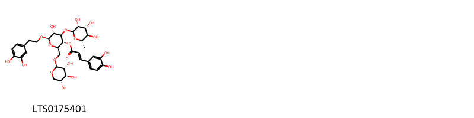{ width=100% }
    <figcaption>Hình ảnh cấu trúc hóa học của 1 hoạt chất thuộc nhóm Organooxygen compounds gồm ['(2r,3r,4r,5r,6r)-6-[2-(3,4-dihydroxyphenyl)ethoxy]-5-hydroxy-4-{[(3r,4r,5r,6s)-3,4,5-trihydroxy-6-methyloxan-2-yl]oxy}-2-({[(2s,3r,4s,5r)-3,4,5-trihydroxyoxan-2-yl]oxy}methyl)oxan-3-yl (2e)-3-(3,4-dihydroxyphenyl)prop-2-enoate (LTS0175401)'].</figcaption>
</figure>
#### Nhóm Prenol lipids
<figure markdown="span">
    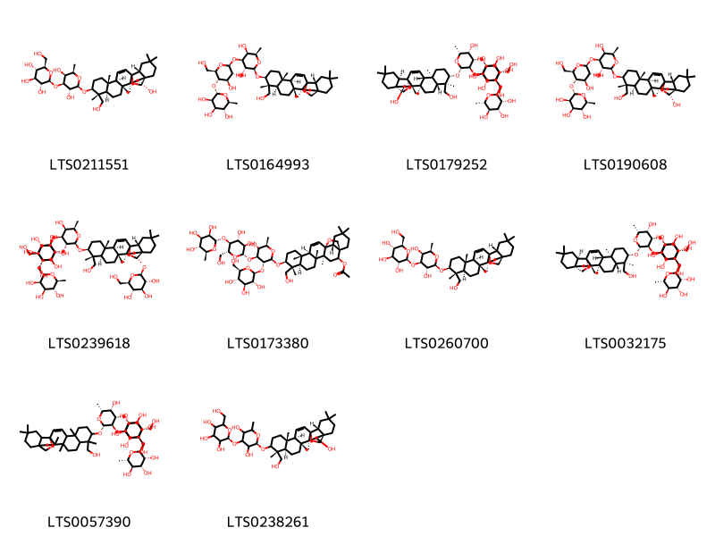{ width=100% }
    <figcaption>Hình ảnh cấu trúc hóa học của 10 hoạt chất thuộc nhóm Prenol lipids gồm ['saikosaponin a (LTS0211551)', '(2s,3r,4r,5r,6s)-2-{[(2r,3s,4r,5r,6s)-6-{[(2r,3r,4s,5s,6r)-3,5-dihydroxy-2-{[(1s,4s,5r,8r,9r,10s,13s,14r,17s,18r)-9-(hydroxymethyl)-4,5,9,13,20,20-hexamethyl-24-oxahexacyclo[15.5.2.0¹,¹⁸.0⁴,¹⁷.0⁵,¹⁴.0⁸,¹³]tetracos-15-en-10-yl]oxy}-6-methyloxan-4-yl]oxy}-4,5-dihydroxy-2-(hydroxymethyl)oxan-3-yl]oxy}-6-methyloxane-3,4,5-triol (LTS0164993)', '(2s,3r,4r,5r,6s)-2-{[(2r,3s,4r,5r,6s)-4,5-dihydroxy-6-{[(2r,3s,4s,5r,6r)-3-hydroxy-6-{[(1s,2s,4s,5r,8r,9r,10s,13s,14r,17s,18r)-2-hydroxy-9-(hydroxymethyl)-4,5,9,13,20,20-hexamethyl-24-oxahexacyclo[15.5.2.0¹,¹⁸.0⁴,¹⁷.0⁵,¹⁴.0⁸,¹³]tetracos-15-en-10-yl]oxy}-2-methyl-5-{[(2s,3r,4s,5s,6r)-3,4,5-trihydroxy-6-(hydroxymethyl)oxan-2-yl]oxy}oxan-4-yl]oxy}-2-(hydroxymethyl)oxan-3-yl]oxy}-6-methyloxane-3,4,5-triol (LTS0179252)', '(2s,3r,4r,5r,6s)-2-{[(2r,3s,4r,5r,6s)-6-{[(2r,3r,4s,5s,6r)-3,5-dihydroxy-2-{[(1s,2s,4s,5r,8r,9r,10s,13s,14r,17s,18r)-2-hydroxy-9-(hydroxymethyl)-4,5,9,13,20,20-hexamethyl-24-oxahexacyclo[15.5.2.0¹,¹⁸.0⁴,¹⁷.0⁵,¹⁴.0⁸,¹³]tetracos-15-en-10-yl]oxy}-6-methyloxan-4-yl]oxy}-4,5-dihydroxy-2-(hydroxymethyl)oxan-3-yl]oxy}-6-methyloxane-3,4,5-triol (LTS0190608)', '(2s,3r,4r,5r,6s)-2-{[(2r,3s,4r,5r,6s)-4,5-dihydroxy-6-{[(2r,3s,4s,5r,6r)-3-hydroxy-6-{[(1s,2s,4s,5r,8r,9r,10s,13s,14r,17s,18r)-9-(hydroxymethyl)-4,5,9,13,20,20-hexamethyl-2-{[(2r,3r,4s,5s,6r)-3,4,5-trihydroxy-6-(hydroxymethyl)oxan-2-yl]oxy}-24-oxahexacyclo[15.5.2.0¹,¹⁸.0⁴,¹⁷.0⁵,¹⁴.0⁸,¹³]tetracos-15-en-10-yl]oxy}-2-methyl-5-{[(2s,3r,4s,5s,6r)-3,4,5-trihydroxy-6-(hydroxymethyl)oxan-2-yl]oxy}oxan-4-yl]oxy}-2-(hydroxymethyl)oxan-3-yl]oxy}-6-methyloxane-3,4,5-triol (LTS0239618)', '(1s,2s,4s,5r,8r,9r,10s,13s,14r,17s,18r)-10-{[(2r,3r,4s,5s,6r)-4-{[(2s,3r,4r,5s,6r)-3,4-dihydroxy-6-(hydroxymethyl)-5-{[(2s,3r,4r,5r,6s)-3,4,5-trihydroxy-6-methyloxan-2-yl]oxy}oxan-2-yl]oxy}-5-hydroxy-6-methyl-3-{[(2s,3r,4s,5s,6r)-3,4,5-trihydroxy-6-(hydroxymethyl)oxan-2-yl]oxy}oxan-2-yl]oxy}-9-(hydroxymethyl)-4,5,9,13,20,20-hexamethyl-24-oxahexacyclo[15.5.2.0¹,¹⁸.0⁴,¹⁷.0⁵,¹⁴.0⁸,¹³]tetracos-15-en-2-yl acetate (LTS0173380)', '(2s,3r,4s,5s,6r)-2-{[(2r,3r,4s,5s,6r)-3,5-dihydroxy-2-{[(1s,4s,5r,8r,9r,10s,13s,14r,17s,18r)-9-(hydroxymethyl)-4,5,9,13,20,20-hexamethyl-24-oxahexacyclo[15.5.2.0¹,¹⁸.0⁴,¹⁷.0⁵,¹⁴.0⁸,¹³]tetracos-15-en-10-yl]oxy}-6-methyloxan-4-yl]oxy}-6-(hydroxymethyl)oxane-3,4,5-triol (LTS0260700)', '(2s,3r,4r,5r,6s)-2-{[(2r,3s,4r,5r,6s)-4,5-dihydroxy-6-{[(2r,3s,4s,5r,6r)-3-hydroxy-6-{[(1s,4s,5r,8r,9r,10s,13s,14r,17s,18r)-9-(hydroxymethyl)-4,5,9,13,20,20-hexamethyl-24-oxahexacyclo[15.5.2.0¹,¹⁸.0⁴,¹⁷.0⁵,¹⁴.0⁸,¹³]tetracos-15-en-10-yl]oxy}-2-methyl-5-{[(2s,3r,4s,5s,6r)-3,4,5-trihydroxy-6-(hydroxymethyl)oxan-2-yl]oxy}oxan-4-yl]oxy}-2-(hydroxymethyl)oxan-3-yl]oxy}-6-methyloxane-3,4,5-triol (LTS0032175)', '(2s,3r,4r,5r,6s)-2-{[(2r,3s,4r,5r,6s)-4,5-dihydroxy-6-{[(2r,3s,4s,5r,6r)-3-hydroxy-6-{[9-(hydroxymethyl)-4,5,9,13,20,20-hexamethyl-24-oxahexacyclo[15.5.2.0¹,¹⁸.0⁴,¹⁷.0⁵,¹⁴.0⁸,¹³]tetracos-15-en-10-yl]oxy}-2-methyl-5-{[(2s,3r,4s,5s,6r)-3,4,5-trihydroxy-6-(hydroxymethyl)oxan-2-yl]oxy}oxan-4-yl]oxy}-2-(hydroxymethyl)oxan-3-yl]oxy}-6-methyloxane-3,4,5-triol (LTS0057390)', '(2s)-2-{[(2r)-3,5-dihydroxy-2-{[(1s,4s,5r,8r,9r,13s,14r,17s,18r)-2-hydroxy-9-(hydroxymethyl)-4,5,9,13,20,20-hexamethyl-24-oxahexacyclo[15.5.2.0¹,¹⁸.0⁴,¹⁷.0⁵,¹⁴.0⁸,¹³]tetracos-15-en-10-yl]oxy}-6-methyloxan-4-yl]oxy}-6-(hydroxymethyl)oxane-3,4,5-triol (LTS0238261)'].</figcaption>
</figure>

---

### Dược dân tộc học

Danh sách các quốc gia có sử dụng *Verbascum sinaiticum* trong điều trị các bệnh. 

| Country   | Disease   | Bệnh                                                                                                                                                                                                |
|:----------|:----------|:----------------------------------------------------------------------------------------------------------------------------------------------------------------------------------------------------|
| Ethiopia  | Hemostat  | MYMEMORY WARNING: YOU USED ALL AVAILABLE FREE TRANSLATIONS FOR TODAY. NEXT AVAILABLE IN  17 HOURS 51 MINUTES 24 SECONDS VISIT HTTPS://MYMEMORY.TRANSLATED.NET/DOC/USAGELIMITS.PHP TO TRANSLATE MORE |

---

---
## Verbascum thapsus
### Thông tin về thực vật

!!! info "Phân loại thực vật của *Verbascum thapsus* từ GIBF:"
    - **Kingdom:** Plantae
    - **Phylum:** Tracheophyta
    - **Order:** Lamiales
    - **Family:** Scrophulariaceae
    - **Genus:** Verbascum
    - **Species:** *Verbascum thapsus*

 

| Label (VI)   | Label (EN)   | Scientific Name   | Descriptions (VI)   | Descriptions (EN)                    | Also Known As (VI)   | Also Known As (EN)                                       |
|:-------------|:-------------|:------------------|:--------------------|:-------------------------------------|:---------------------|:---------------------------------------------------------|
| N/A          | N/A          | Verbascum thapsus |                     | species of the plant genus Verbascum | ['']                 | ['mullein', 'common mullein', 'great mullein', 'mullen'] |

#### Phân bố trên thế giới

**Từ CSDL GIBF** United Kingdom of Great Britain and Northern Ireland, Argentina, France, Spain, New Zealand, Germany, Canada, Chile, United States of America, Russian Federation, Austria, Australia

#### Phân bố tại Việt Nam

**Từ CSDL GIBF**: Không có ghi nhận ở Việt Nam

---
### Thành phần hóa học
        
- Theo cơ sở dữ liệu lotus: Từ loài *Verbascum thapsus* đã phân lập và xác định được 110 hoạt chất thuộc về các nhóm Organooxygen compounds, Flavonoids, Tannins, 2-arylbenzofuran flavonoids, Prenol lipids, Cinnamic acids and derivatives, Steroids and steroid derivatives. 

|    | chemicalTaxonomyClassyfireClass   |   smiles_count |
|---:|:----------------------------------|---------------:|
|  0 | 2-arylbenzofuran flavonoids       |              9 |
|  1 | Cinnamic acids and derivatives    |             36 |
|  2 | Flavonoids                        |              1 |
|  3 | Organooxygen compounds            |             22 |
|  4 | Prenol lipids                     |             19 |
|  5 | Steroids and steroid derivatives  |             17 |
|  6 | Tannins                           |              6 |

#### Nhóm 2-arylbenzofuran flavonoids
<figure markdown="span">
    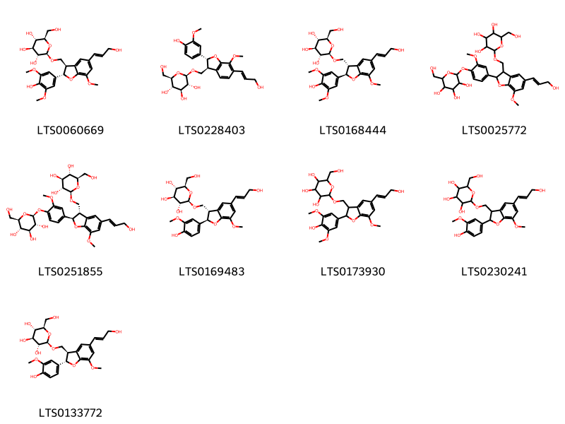{ width=100% }
    <figcaption>Hình ảnh cấu trúc hóa học của 9 hoạt chất thuộc nhóm 2-arylbenzofuran flavonoids gồm ['(2r,3r,4s,5s,6r)-2-{[(2s,3r)-2-(4-hydroxy-3,5-dimethoxyphenyl)-5-[(1e)-3-hydroxyprop-1-en-1-yl]-7-methoxy-2,3-dihydro-1-benzofuran-3-yl]methoxy}-6-(hydroxymethyl)oxane-3,4,5-triol (LTS0060669)', '(2r,3r,4s,5s,6r)-2-{[(2r,3s)-2-(4-hydroxy-3-methoxyphenyl)-6-[(1e)-3-hydroxyprop-1-en-1-yl]-7-methoxy-2,3-dihydro-1-benzofuran-3-yl]methoxy}-6-(hydroxymethyl)oxane-3,4,5-triol (LTS0228403)', '(2r,3r,4s,5s,6r)-2-{[(2r,3s)-2-(4-hydroxy-3,5-dimethoxyphenyl)-5-[(1e)-3-hydroxyprop-1-en-1-yl]-7-methoxy-2,3-dihydro-1-benzofuran-3-yl]methoxy}-6-(hydroxymethyl)oxane-3,4,5-triol (LTS0168444)', '2-(hydroxymethyl)-6-{[5-(3-hydroxyprop-1-en-1-yl)-7-methoxy-2-(3-methoxy-4-{[3,4,5-trihydroxy-6-(hydroxymethyl)oxan-2-yl]oxy}phenyl)-2,3-dihydro-1-benzofuran-3-yl]methoxy}oxane-3,4,5-triol (LTS0025772)', '(2r,3s,4s,5r,6r)-2-(hydroxymethyl)-6-{[(2r,3s)-5-[(1e)-3-hydroxyprop-1-en-1-yl]-7-methoxy-2-(3-methoxy-4-{[(2s,3r,4s,5s,6r)-3,4,5-trihydroxy-6-(hydroxymethyl)oxan-2-yl]oxy}phenyl)-2,3-dihydro-1-benzofuran-3-yl]methoxy}oxane-3,4,5-triol (LTS0251855)', '(2r,3r,4s,5s,6r)-2-{[(2r,3s)-2-(4-hydroxy-3-methoxyphenyl)-5-[(1e)-3-hydroxyprop-1-en-1-yl]-7-methoxy-2,3-dihydro-1-benzofuran-3-yl]methoxy}-6-(hydroxymethyl)oxane-3,4,5-triol (LTS0169483)', '2-{[2-(4-hydroxy-3,5-dimethoxyphenyl)-5-(3-hydroxyprop-1-en-1-yl)-7-methoxy-2,3-dihydro-1-benzofuran-3-yl]methoxy}-6-(hydroxymethyl)oxane-3,4,5-triol (LTS0173930)', '2-{[2-(4-hydroxy-3-methoxyphenyl)-5-(3-hydroxyprop-1-en-1-yl)-7-methoxy-2,3-dihydro-1-benzofuran-3-yl]methoxy}-6-(hydroxymethyl)oxane-3,4,5-triol (LTS0230241)', '(2r,3r,4s,5s,6r)-2-{[(2s,3r)-2-(4-hydroxy-3-methoxyphenyl)-5-[(1e)-3-hydroxyprop-1-en-1-yl]-7-methoxy-2,3-dihydro-1-benzofuran-3-yl]methoxy}-6-(hydroxymethyl)oxane-3,4,5-triol (LTS0133772)'].</figcaption>
</figure>
#### Nhóm Cinnamic acids and derivatives
<figure markdown="span">
    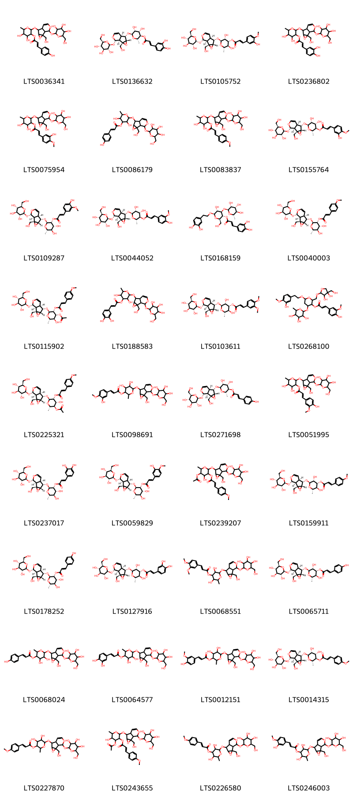{ width=100% }
    <figcaption>Hình ảnh cấu trúc hóa học của 36 hoạt chất thuộc nhóm Cinnamic acids and derivatives gồm ['4,5-dihydroxy-2-{[2-(hydroxymethyl)-10-{[3,4,5-trihydroxy-6-(hydroxymethyl)oxan-2-yl]oxy}-3,9-dioxatricyclo[4.4.0.0²,⁴]dec-7-en-5-yl]oxy}-6-methyloxan-3-yl 3-(4-hydroxyphenyl)prop-2-enoate (LTS0036341)', '(2s,3r,4s,5r,6s)-4,5-dihydroxy-6-{[(1s,2s,4s,5s,6r,10s)-2-(hydroxymethyl)-10-{[(2s,3r,4s,5s,6r)-3,4,5-trihydroxy-6-(hydroxymethyl)oxan-2-yl]oxy}-3,9-dioxatricyclo[4.4.0.0²,⁴]dec-7-en-5-yl]oxy}-2-methyloxan-3-yl (2e)-3-(3,4-dihydroxyphenyl)prop-2-enoate (LTS0136632)', '(2s,3r,4r,5s,6s)-3,5-dihydroxy-2-{[(1s,2s,4s,5s,6r,10s)-2-(hydroxymethyl)-10-{[(2r,3r,4s,5s,6r)-3,4,5-trihydroxy-6-(hydroxymethyl)oxan-2-yl]oxy}-3,9-dioxatricyclo[4.4.0.0²,⁴]dec-7-en-5-yl]oxy}-6-methyloxan-4-yl (2e)-3-(3-hydroxy-4-methoxyphenyl)prop-2-enoate (LTS0105752)', '4,5-dihydroxy-2-{[2-(hydroxymethyl)-10-{[3,4,5-trihydroxy-6-(hydroxymethyl)oxan-2-yl]oxy}-3,9-dioxatricyclo[4.4.0.0²,⁴]dec-7-en-5-yl]oxy}-6-methyloxan-3-yl 3-(3,4-dihydroxyphenyl)prop-2-enoate (LTS0236802)', '4,5-dihydroxy-2-{[2-(hydroxymethyl)-10-{[3,4,5-trihydroxy-6-(hydroxymethyl)oxan-2-yl]oxy}-3,9-dioxatricyclo[4.4.0.0²,⁴]dec-7-en-5-yl]oxy}-6-methyloxan-3-yl 3-(3-hydroxy-4-methoxyphenyl)prop-2-enoate (LTS0075954)', '3,5-dihydroxy-2-{[2-(hydroxymethyl)-10-{[3,4,5-trihydroxy-6-(hydroxymethyl)oxan-2-yl]oxy}-3,9-dioxatricyclo[4.4.0.0²,⁴]dec-7-en-5-yl]oxy}-6-methyloxan-4-yl 3-(4-hydroxyphenyl)prop-2-enoate (LTS0086179)', '4,5-dihydroxy-2-{[2-(hydroxymethyl)-10-{[3,4,5-trihydroxy-6-(hydroxymethyl)oxan-2-yl]oxy}-3,9-dioxatricyclo[4.4.0.0²,⁴]dec-7-en-5-yl]oxy}-6-methyloxan-3-yl 3-(4-methoxyphenyl)prop-2-enoate (LTS0083837)', '(2s,3r,4s,5r,6s)-4,5-dihydroxy-6-{[(1s,2s,4s,5s,6r,10s)-2-(hydroxymethyl)-10-{[(2s,3r,4s,5s,6r)-3,4,5-trihydroxy-6-(hydroxymethyl)oxan-2-yl]oxy}-3,9-dioxatricyclo[4.4.0.0²,⁴]dec-7-en-5-yl]oxy}-2-methyloxan-3-yl (2e)-3-(3-hydroxy-4-methoxyphenyl)prop-2-enoate (LTS0155764)', '(2s,3r,4r,5r,6s)-4,5-dihydroxy-2-{[(1s,2s,4s,5s,6r,10s)-2-(hydroxymethyl)-10-{[(2s,3r,4s,5s,6r)-3,4,5-trihydroxy-6-(hydroxymethyl)oxan-2-yl]oxy}-3,9-dioxatricyclo[4.4.0.0²,⁴]dec-7-en-5-yl]oxy}-6-methyloxan-3-yl (2e)-3-(4-hydroxy-3-methoxyphenyl)prop-2-enoate (LTS0109287)', '(2s,3r,4s,5r,6s)-4,5-dihydroxy-6-{[(1s,2s,4s,5s,6r,10s)-2-(hydroxymethyl)-10-{[(2s,3r,4s,5s,6r)-3,4,5-trihydroxy-6-(hydroxymethyl)oxan-2-yl]oxy}-3,9-dioxatricyclo[4.4.0.0²,⁴]dec-7-en-5-yl]oxy}-2-methyloxan-3-yl (2e)-3-(4-hydroxy-3-methoxyphenyl)prop-2-enoate (LTS0044052)', 'verbascoside (LTS0168159)', '(2s,3r,4r,5r,6s)-4,5-dihydroxy-2-{[(1s,2s,4s,5s,6r,10s)-2-(hydroxymethyl)-10-{[(2s,3r,4s,5s,6r)-3,4,5-trihydroxy-6-(hydroxymethyl)oxan-2-yl]oxy}-3,9-dioxatricyclo[4.4.0.0²,⁴]dec-7-en-5-yl]oxy}-6-methyloxan-3-yl (2e)-3-(4-methoxyphenyl)prop-2-enoate (LTS0040003)', '(2s,3r,4r,5s,6s)-4-(acetyloxy)-5-hydroxy-2-{[(1s,2s,4s,5s,6r,10s)-2-(hydroxymethyl)-10-{[(2s,3r,4s,5s,6r)-3,4,5-trihydroxy-6-(hydroxymethyl)oxan-2-yl]oxy}-3,9-dioxatricyclo[4.4.0.0²,⁴]dec-7-en-5-yl]oxy}-6-methyloxan-3-yl (2e)-3-(4-methoxyphenyl)prop-2-enoate (LTS0115902)', '3,5-dihydroxy-2-{[2-(hydroxymethyl)-10-{[3,4,5-trihydroxy-6-(hydroxymethyl)oxan-2-yl]oxy}-3,9-dioxatricyclo[4.4.0.0²,⁴]dec-7-en-5-yl]oxy}-6-methyloxan-4-yl 3-(3,4-dihydroxyphenyl)prop-2-enoate (LTS0188583)', '(2s,3r,4r,5s,6s)-3,5-dihydroxy-2-{[(1s,2s,4s,5s,6r,10s)-2-(hydroxymethyl)-10-{[(2s,3r,4s,5s,6r)-3,4,5-trihydroxy-6-(hydroxymethyl)oxan-2-yl]oxy}-3,9-dioxatricyclo[4.4.0.0²,⁴]dec-7-en-5-yl]oxy}-6-methyloxan-4-yl (2e)-3-(3,4-dimethoxyphenyl)prop-2-enoate (LTS0103611)', '2-({[3,4-dihydroxy-4-(hydroxymethyl)oxolan-2-yl]oxy}methyl)-6-[2-(3-hydroxy-4-methoxyphenyl)ethoxy]-4-[(3,4,5-trihydroxy-6-methyloxan-2-yl)oxy]oxan-3-yl 3-(4-hydroxy-3-methoxyphenyl)prop-2-enoate (LTS0268100)', '(2s,3r,4r,5r,6s)-5-(acetyloxy)-4-hydroxy-2-{[(1s,2s,4s,5s,6r,10s)-2-(hydroxymethyl)-10-{[(2s,3r,4s,5s,6r)-3,4,5-trihydroxy-6-(hydroxymethyl)oxan-2-yl]oxy}-3,9-dioxatricyclo[4.4.0.0²,⁴]dec-7-en-5-yl]oxy}-6-methyloxan-3-yl (2e)-3-(4-methoxyphenyl)prop-2-enoate (LTS0225321)', '4,5-dihydroxy-6-{[2-(hydroxymethyl)-10-{[3,4,5-trihydroxy-6-(hydroxymethyl)oxan-2-yl]oxy}-3,9-dioxatricyclo[4.4.0.0²,⁴]dec-7-en-5-yl]oxy}-2-methyloxan-3-yl 3-(3-hydroxy-4-methoxyphenyl)prop-2-enoate (LTS0098691)', '(2s,3r,4s,5r,6s)-4,5-dihydroxy-6-{[(1s,2s,4s,5s,6r,10s)-2-(hydroxymethyl)-10-{[(2s,3r,4s,5s,6r)-3,4,5-trihydroxy-6-(hydroxymethyl)oxan-2-yl]oxy}-3,9-dioxatricyclo[4.4.0.0²,⁴]dec-7-en-5-yl]oxy}-2-methyloxan-3-yl (2e)-3-(4-hydroxyphenyl)prop-2-enoate (LTS0271698)', '4,5-dihydroxy-2-{[2-(hydroxymethyl)-10-{[3,4,5-trihydroxy-6-(hydroxymethyl)oxan-2-yl]oxy}-3,9-dioxatricyclo[4.4.0.0²,⁴]dec-7-en-5-yl]oxy}-6-methyloxan-3-yl 3-(4-hydroxy-3-methoxyphenyl)prop-2-enoate (LTS0051995)', '(2s,3r,4r,5r,6s)-4,5-dihydroxy-2-{[(1s,2s,4s,5s,6r,10s)-2-(hydroxymethyl)-10-{[(2s,3r,4s,5s,6r)-3,4,5-trihydroxy-6-(hydroxymethyl)oxan-2-yl]oxy}-3,9-dioxatricyclo[4.4.0.0²,⁴]dec-7-en-5-yl]oxy}-6-methyloxan-3-yl (2e)-3-(3,4-dihydroxyphenyl)prop-2-enoate (LTS0237017)', '(2s,3r,4r,5r,6s)-4,5-dihydroxy-2-{[(1s,2s,4s,5s,6r,10s)-2-(hydroxymethyl)-10-{[(2s,3r,4s,5s,6r)-3,4,5-trihydroxy-6-(hydroxymethyl)oxan-2-yl]oxy}-3,9-dioxatricyclo[4.4.0.0²,⁴]dec-7-en-5-yl]oxy}-6-methyloxan-3-yl (2e)-3-(3-hydroxy-4-methoxyphenyl)prop-2-enoate (LTS0059829)', '5-(acetyloxy)-4-hydroxy-2-{[2-(hydroxymethyl)-10-{[3,4,5-trihydroxy-6-(hydroxymethyl)oxan-2-yl]oxy}-3,9-dioxatricyclo[4.4.0.0²,⁴]dec-7-en-5-yl]oxy}-6-methyloxan-3-yl 3-(4-methoxyphenyl)prop-2-enoate (LTS0239207)', '(2s,3r,4r,5s,6s)-3,5-dihydroxy-2-{[(1s,2s,4s,5s,6r,10s)-2-(hydroxymethyl)-10-{[(2s,3r,4s,5s,6r)-3,4,5-trihydroxy-6-(hydroxymethyl)oxan-2-yl]oxy}-3,9-dioxatricyclo[4.4.0.0²,⁴]dec-7-en-5-yl]oxy}-6-methyloxan-4-yl (2e)-3-(4-methoxyphenyl)prop-2-enoate (LTS0159911)', '(2s,3r,4r,5r,6s)-4,5-dihydroxy-2-{[(1s,2s,4s,5s,6r,10s)-2-(hydroxymethyl)-10-{[(2s,3r,4s,5s,6r)-3,4,5-trihydroxy-6-(hydroxymethyl)oxan-2-yl]oxy}-3,9-dioxatricyclo[4.4.0.0²,⁴]dec-7-en-5-yl]oxy}-6-methyloxan-3-yl (2e)-3-(4-hydroxyphenyl)prop-2-enoate (LTS0178252)', '(2s,3r,4r,5s,6s)-3,5-dihydroxy-2-{[(1s,2s,4s,5s,6r,10s)-2-(hydroxymethyl)-10-{[(2s,3r,4s,5s,6r)-3,4,5-trihydroxy-6-(hydroxymethyl)oxan-2-yl]oxy}-3,9-dioxatricyclo[4.4.0.0²,⁴]dec-7-en-5-yl]oxy}-6-methyloxan-4-yl (2e)-3-(3,4-dihydroxyphenyl)prop-2-enoate (LTS0127916)', '3,5-dihydroxy-2-{[2-(hydroxymethyl)-10-{[3,4,5-trihydroxy-6-(hydroxymethyl)oxan-2-yl]oxy}-3,9-dioxatricyclo[4.4.0.0²,⁴]dec-7-en-5-yl]oxy}-6-methyloxan-4-yl 3-(3,4-dimethoxyphenyl)prop-2-enoate (LTS0068551)', '(2s,3r,4r,5s,6s)-3,5-dihydroxy-2-{[(1s,2s,4s,5s,6r,10s)-2-(hydroxymethyl)-10-{[(2s,3r,4s,5s,6r)-3,4,5-trihydroxy-6-(hydroxymethyl)oxan-2-yl]oxy}-3,9-dioxatricyclo[4.4.0.0²,⁴]dec-7-en-5-yl]oxy}-6-methyloxan-4-yl (2e)-3-(4-hydroxyphenyl)prop-2-enoate (LTS0065711)', '4,5-dihydroxy-6-{[2-(hydroxymethyl)-10-{[3,4,5-trihydroxy-6-(hydroxymethyl)oxan-2-yl]oxy}-3,9-dioxatricyclo[4.4.0.0²,⁴]dec-7-en-5-yl]oxy}-2-methyloxan-3-yl 3-(4-hydroxyphenyl)prop-2-enoate (LTS0068024)', '4,5-dihydroxy-6-{[2-(hydroxymethyl)-10-{[3,4,5-trihydroxy-6-(hydroxymethyl)oxan-2-yl]oxy}-3,9-dioxatricyclo[4.4.0.0²,⁴]dec-7-en-5-yl]oxy}-2-methyloxan-3-yl 3-(3,4-dihydroxyphenyl)prop-2-enoate (LTS0064577)', '4,5-dihydroxy-6-{[2-(hydroxymethyl)-10-{[3,4,5-trihydroxy-6-(hydroxymethyl)oxan-2-yl]oxy}-3,9-dioxatricyclo[4.4.0.0²,⁴]dec-7-en-5-yl]oxy}-2-methyloxan-3-yl 3-(4-hydroxy-3-methoxyphenyl)prop-2-enoate (LTS0012151)', '(2s,3r,4s,5r,6s)-4,5-dihydroxy-6-{[(1s,2s,4s,5s,6r,10s)-2-(hydroxymethyl)-10-{[(2s,3r,4s,5s,6r)-3,4,5-trihydroxy-6-(hydroxymethyl)oxan-2-yl]oxy}-3,9-dioxatricyclo[4.4.0.0²,⁴]dec-7-en-5-yl]oxy}-2-methyloxan-3-yl (2e)-3-(4-methoxyphenyl)prop-2-enoate (LTS0014315)', '4,5-dihydroxy-6-{[2-(hydroxymethyl)-10-{[3,4,5-trihydroxy-6-(hydroxymethyl)oxan-2-yl]oxy}-3,9-dioxatricyclo[4.4.0.0²,⁴]dec-7-en-5-yl]oxy}-2-methyloxan-3-yl 3-(4-methoxyphenyl)prop-2-enoate (LTS0227870)', '4-(acetyloxy)-5-hydroxy-2-{[2-(hydroxymethyl)-10-{[3,4,5-trihydroxy-6-(hydroxymethyl)oxan-2-yl]oxy}-3,9-dioxatricyclo[4.4.0.0²,⁴]dec-7-en-5-yl]oxy}-6-methyloxan-3-yl 3-(4-methoxyphenyl)prop-2-enoate (LTS0243655)', '3,5-dihydroxy-2-{[2-(hydroxymethyl)-10-{[3,4,5-trihydroxy-6-(hydroxymethyl)oxan-2-yl]oxy}-3,9-dioxatricyclo[4.4.0.0²,⁴]dec-7-en-5-yl]oxy}-6-methyloxan-4-yl 3-(4-methoxyphenyl)prop-2-enoate (LTS0226580)', '3,5-dihydroxy-2-{[2-(hydroxymethyl)-10-{[3,4,5-trihydroxy-6-(hydroxymethyl)oxan-2-yl]oxy}-3,9-dioxatricyclo[4.4.0.0²,⁴]dec-7-en-5-yl]oxy}-6-methyloxan-4-yl 3-(3-hydroxy-4-methoxyphenyl)prop-2-enoate (LTS0246003)'].</figcaption>
</figure>
#### Nhóm Flavonoids
<figure markdown="span">
    { width=100% }
    <figcaption>Hình ảnh cấu trúc hóa học của 1 hoạt chất thuộc nhóm Flavonoids gồm ['isorhamnetin (LTS0107505)'].</figcaption>
</figure>
#### Nhóm Organooxygen compounds
<figure markdown="span">
    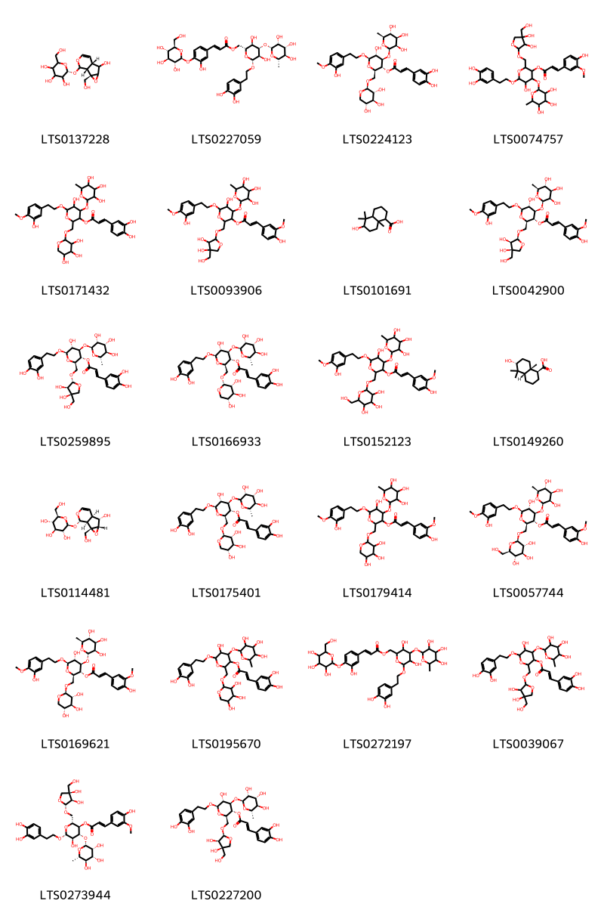{ width=100% }
    <figcaption>Hình ảnh cấu trúc hóa học của 22 hoạt chất thuộc nhóm Organooxygen compounds gồm ['(2r)-2-{[(1r,2s,6s)-5-hydroxy-2-(hydroxymethyl)-3,9-dioxatricyclo[4.4.0.0²,⁴]dec-7-en-10-yl]oxy}-6-(hydroxymethyl)oxane-3,4,5-triol (LTS0137228)', '[(2r,3r,4s,5r,6r)-6-[2-(3,4-dihydroxyphenyl)ethoxy]-3,5-dihydroxy-4-{[(2r,3r,4r,5r,6s)-3,4,5-trihydroxy-6-methyloxan-2-yl]oxy}oxan-2-yl]methyl (2e)-3-(3-hydroxy-4-{[(2s,3r,4s,5s,6r)-3,4,5-trihydroxy-6-(hydroxymethyl)oxan-2-yl]oxy}phenyl)prop-2-enoate (LTS0227059)', '(2r,3r,4r,5r,6r)-5-hydroxy-6-[2-(3-hydroxy-4-methoxyphenyl)ethoxy]-4-{[(2r,3r,4r,5r,6s)-3,4,5-trihydroxy-6-methyloxan-2-yl]oxy}-2-({[(2s,3r,4s,5r)-3,4,5-trihydroxyoxan-2-yl]oxy}methyl)oxan-3-yl (2e)-3-(3,4-dihydroxyphenyl)prop-2-enoate (LTS0224123)', '2-({[3,4-dihydroxy-4-(hydroxymethyl)oxolan-2-yl]oxy}methyl)-6-[2-(3,4-dihydroxyphenyl)ethoxy]-5-hydroxy-4-[(3,4,5-trihydroxy-6-methyloxan-2-yl)oxy]oxan-3-yl 3-(4-hydroxy-3-methoxyphenyl)prop-2-enoate (LTS0074757)', '5-hydroxy-6-[2-(3-hydroxy-4-methoxyphenyl)ethoxy]-4-[(3,4,5-trihydroxy-6-methyloxan-2-yl)oxy]-2-{[(3,4,5-trihydroxyoxan-2-yl)oxy]methyl}oxan-3-yl 3-(3,4-dihydroxyphenyl)prop-2-enoate (LTS0171432)', '2-({[3,4-dihydroxy-4-(hydroxymethyl)oxolan-2-yl]oxy}methyl)-5-hydroxy-6-[2-(3-hydroxy-4-methoxyphenyl)ethoxy]-4-[(3,4,5-trihydroxy-6-methyloxan-2-yl)oxy]oxan-3-yl 3-(4-hydroxy-3-methoxyphenyl)prop-2-enoate (LTS0093906)', '6-hydroxy-5,5,8a-trimethyl-octahydronaphthalene-1-carboxylic acid (LTS0101691)', '(2r,3r,4r,5r,6r)-2-({[(2s,3r,4r)-3,4-dihydroxy-4-(hydroxymethyl)oxolan-2-yl]oxy}methyl)-5-hydroxy-6-[2-(3-hydroxy-4-methoxyphenyl)ethoxy]-4-{[(2r,3r,4r,5r,6s)-3,4,5-trihydroxy-6-methyloxan-2-yl]oxy}oxan-3-yl (2e)-3-(4-hydroxy-3-methoxyphenyl)prop-2-enoate (LTS0042900)', '(2r,3r,4r,5r,6r)-2-({[(2r,3r,4r)-3,4-dihydroxy-4-(hydroxymethyl)oxolan-2-yl]oxy}methyl)-6-[2-(3,4-dihydroxyphenyl)ethoxy]-5-hydroxy-4-{[(2s,3r,4r,5r,6s)-3,4,5-trihydroxy-6-methyloxan-2-yl]oxy}oxan-3-yl (2e)-3-(3,4-dihydroxyphenyl)prop-2-enoate (LTS0259895)', '(2r,3r,4r,5r,6r)-6-[2-(3,4-dihydroxyphenyl)ethoxy]-5-hydroxy-4-{[(2s,3r,4r,5r,6s)-3,4,5-trihydroxy-6-methyloxan-2-yl]oxy}-2-({[(2r,3r,4s,5r)-3,4,5-trihydroxyoxan-2-yl]oxy}methyl)oxan-3-yl (2e)-3-(3,4-dihydroxyphenyl)prop-2-enoate (LTS0166933)', '5-hydroxy-6-[2-(3-hydroxy-4-methoxyphenyl)ethoxy]-2-({[3,4,5-trihydroxy-6-(hydroxymethyl)oxan-2-yl]oxy}methyl)-4-[(3,4,5-trihydroxy-6-methyloxan-2-yl)oxy]oxan-3-yl 3-(4-hydroxy-3-methoxyphenyl)prop-2-enoate (LTS0152123)', '(1s,4as,6r,8as)-6-hydroxy-5,5,8a-trimethyl-octahydronaphthalene-1-carboxylic acid (LTS0149260)', 'catalpol (LTS0114481)', '(2r,3r,4r,5r,6r)-6-[2-(3,4-dihydroxyphenyl)ethoxy]-5-hydroxy-4-{[(3r,4r,5r,6s)-3,4,5-trihydroxy-6-methyloxan-2-yl]oxy}-2-({[(2s,3r,4s,5r)-3,4,5-trihydroxyoxan-2-yl]oxy}methyl)oxan-3-yl (2e)-3-(3,4-dihydroxyphenyl)prop-2-enoate (LTS0175401)', '5-hydroxy-6-[2-(3-hydroxy-4-methoxyphenyl)ethoxy]-4-[(3,4,5-trihydroxy-6-methyloxan-2-yl)oxy]-2-{[(3,4,5-trihydroxyoxan-2-yl)oxy]methyl}oxan-3-yl 3-(4-hydroxy-3-methoxyphenyl)prop-2-enoate (LTS0179414)', '(2r,3r,4r,5r,6r)-5-hydroxy-6-[2-(3-hydroxy-4-methoxyphenyl)ethoxy]-2-({[(2r,3r,4s,5s,6r)-3,4,5-trihydroxy-6-(hydroxymethyl)oxan-2-yl]oxy}methyl)-4-{[(2r,3r,4r,5r,6s)-3,4,5-trihydroxy-6-methyloxan-2-yl]oxy}oxan-3-yl (2e)-3-(4-hydroxy-3-methoxyphenyl)prop-2-enoate (LTS0057744)', '(2r,3r,4r,5r,6r)-5-hydroxy-6-[2-(3-hydroxy-4-methoxyphenyl)ethoxy]-4-{[(2s,3r,4r,5r,6s)-3,4,5-trihydroxy-6-methyloxan-2-yl]oxy}-2-({[(2s,3r,4s,5r)-3,4,5-trihydroxyoxan-2-yl]oxy}methyl)oxan-3-yl (2e)-3-(4-hydroxy-3-methoxyphenyl)prop-2-enoate (LTS0169621)', '6-[2-(3,4-dihydroxyphenyl)ethoxy]-5-hydroxy-4-[(3,4,5-trihydroxy-6-methyloxan-2-yl)oxy]-2-{[(3,4,5-trihydroxyoxan-2-yl)oxy]methyl}oxan-3-yl 3-(3,4-dihydroxyphenyl)prop-2-enoate (LTS0195670)', '{6-[2-(3,4-dihydroxyphenyl)ethoxy]-3,5-dihydroxy-4-[(3,4,5-trihydroxy-6-methyloxan-2-yl)oxy]oxan-2-yl}methyl 3-(3-hydroxy-4-{[3,4,5-trihydroxy-6-(hydroxymethyl)oxan-2-yl]oxy}phenyl)prop-2-enoate (LTS0272197)', '2-({[3,4-dihydroxy-4-(hydroxymethyl)oxolan-2-yl]oxy}methyl)-6-[2-(3,4-dihydroxyphenyl)ethoxy]-5-hydroxy-4-[(3,4,5-trihydroxy-6-methyloxan-2-yl)oxy]oxan-3-yl 3-(3,4-dihydroxyphenyl)prop-2-enoate (LTS0039067)', '(2r,3r,4r,5r,6r)-2-({[(2r,3r,4r)-3,4-dihydroxy-4-(hydroxymethyl)oxolan-2-yl]oxy}methyl)-6-[2-(3,4-dihydroxyphenyl)ethoxy]-5-hydroxy-4-{[(2r,3r,4r,5r,6s)-3,4,5-trihydroxy-6-methyloxan-2-yl]oxy}oxan-3-yl (2e)-3-(4-hydroxy-3-methoxyphenyl)prop-2-enoate (LTS0273944)', '(2r,3r,4r,5r,6r)-2-({[(2s,3r,4r)-3,4-dihydroxy-4-(hydroxymethyl)oxolan-2-yl]oxy}methyl)-6-[2-(3,4-dihydroxyphenyl)ethoxy]-5-hydroxy-4-{[(2s,3r,4r,5r,6s)-3,4,5-trihydroxy-6-methyloxan-2-yl]oxy}oxan-3-yl (2e)-3-(3,4-dihydroxyphenyl)prop-2-enoate (LTS0227200)'].</figcaption>
</figure>
#### Nhóm Prenol lipids
<figure markdown="span">
    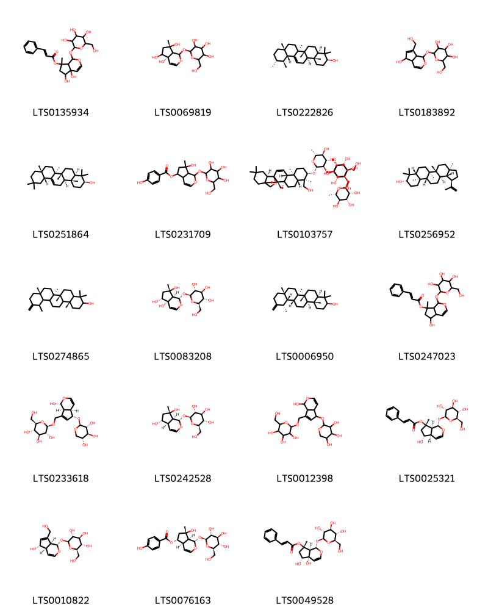{ width=100% }
    <figcaption>Hình ảnh cấu trúc hóa học của 19 hoạt chất thuộc nhóm Prenol lipids gồm ['4a,5-dihydroxy-7-methyl-1-{[3,4,5-trihydroxy-6-(hydroxymethyl)oxan-2-yl]oxy}-1h,5h,6h,7ah-cyclopenta[c]pyran-7-yl 3-phenylprop-2-enoate (LTS0135934)', '2-{[(4as,7s)-4a,5,7-trihydroxy-7-methyl-1h,5h,6h,7ah-cyclopenta[c]pyran-1-yl]oxy}-6-(hydroxymethyl)oxane-3,4,5-triol (LTS0069819)', 'amyrin (LTS0222826)', 'aucubin (LTS0183892)', 'β-amyrin (LTS0251864)', '7-hydroxy-7-methyl-1-{[3,4,5-trihydroxy-6-(hydroxymethyl)oxan-2-yl]oxy}-1h,4ah,5h,6h,7ah-cyclopenta[c]pyran-5-yl 4-hydroxybenzoate (LTS0231709)', '(2s,3r,4r,5r,6s)-2-{[(2r,3s,4r,5r,6s)-4,5-dihydroxy-6-{[(2r,3r,4s,5r,6r)-3-hydroxy-6-{[(4s,5r,8r,9r,10s,13s,14r,18r)-9-(hydroxymethyl)-4,5,9,13,20,20-hexamethyl-24-oxahexacyclo[15.5.2.0¹,¹⁸.0⁴,¹⁷.0⁵,¹⁴.0⁸,¹³]tetracos-15-en-10-yl]oxy}-2-methyl-5-{[(2s,3r,4r,6s)-3,4,5-trihydroxy-6-(hydroxymethyl)oxan-2-yl]oxy}oxan-4-yl]oxy}-2-(hydroxymethyl)oxan-3-yl]oxy}-6-methyloxane-3,4,5-triol (LTS0103757)', 'lupeol (LTS0256952)', '(6ar,6br,8ar,14br)-4,4,6a,6b,8a,12,14b-heptamethyl-11-methylidene-hexadecahydropicen-3-ol (LTS0274865)', 'harpagide (LTS0083208)', 'taraxasterol (LTS0006950)', '5-hydroxy-7-methyl-1-{[3,4,5-trihydroxy-6-(hydroxymethyl)oxan-2-yl]oxy}-1h,4ah,5h,6h,7ah-cyclopenta[c]pyran-7-yl 3-phenylprop-2-enoate (LTS0247023)', '(2r,3r,4s,5s,6r)-2-{[(1r,4ar,5s,7as)-1-hydroxy-5-{[(2s,3r,4s,5r)-3,4,5-trihydroxyoxan-2-yl]oxy}-1h,4ah,5h,7ah-cyclopenta[c]pyran-7-yl]methoxy}-6-(hydroxymethyl)oxane-3,4,5-triol (LTS0233618)', '(2s,3r,4s,5s,6r)-2-{[(1s,4ar,5r,7s,7as)-5,7-dihydroxy-7-methyl-1h,4ah,5h,6h,7ah-cyclopenta[c]pyran-1-yl]oxy}-6-(hydroxymethyl)oxane-3,4,5-triol (LTS0242528)', '2-({1-hydroxy-5-[(3,4,5-trihydroxyoxan-2-yl)oxy]-1h,4ah,5h,7ah-cyclopenta[c]pyran-7-yl}methoxy)-6-(hydroxymethyl)oxane-3,4,5-triol (LTS0012398)', '(1s,4ar,5r,7s,7as)-5-hydroxy-7-methyl-1-{[(2s,3r,4s,5s,6r)-3,4,5-trihydroxy-6-(hydroxymethyl)oxan-2-yl]oxy}-1h,4ah,5h,6h,7ah-cyclopenta[c]pyran-7-yl (2e)-3-phenylprop-2-enoate (LTS0025321)', 'aucubin (LTS0010822)', '(1s,4ar,5r,7s,7as)-7-hydroxy-7-methyl-1-{[(2s,3r,4s,5s,6r)-3,4,5-trihydroxy-6-(hydroxymethyl)oxan-2-yl]oxy}-1h,4ah,5h,6h,7ah-cyclopenta[c]pyran-5-yl 4-hydroxybenzoate (LTS0076163)', 'harpagoside (LTS0049528)'].</figcaption>
</figure>
#### Nhóm Steroids and steroid derivatives
<figure markdown="span">
    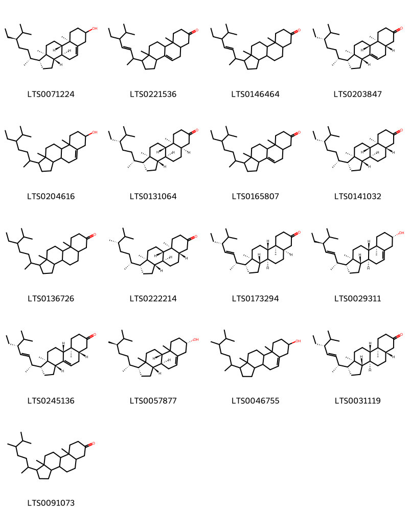{ width=100% }
    <figcaption>Hình ảnh cấu trúc hóa học của 17 hoạt chất thuộc nhóm Steroids and steroid derivatives gồm ['stigmast-5-en-3-ol (LTS0071224)', '1-(5-ethyl-6-methylhept-3-en-2-yl)-9a,11a-dimethyl-1h,2h,3h,3ah,5h,5ah,6h,8h,9h,9bh,10h,11h-cyclopenta[a]phenanthren-7-one (LTS0221536)', '1-(5-ethyl-6-methylhept-3-en-2-yl)-9a,11a-dimethyl-tetradecahydrocyclopenta[a]phenanthren-7-one (LTS0146464)', '(1r,3ar,5as,9as,9br,11ar)-1-[(2r,5s)-5-ethyl-6-methylheptan-2-yl]-9a,11a-dimethyl-1h,2h,3h,3ah,5h,5ah,6h,8h,9h,9bh,10h,11h-cyclopenta[a]phenanthren-7-one (LTS0203847)', 'stigmast-5-en-3-ol, (3β)- (LTS0204616)', '(1r,3as,3br,5ar,9as,9bs,11ar)-1-[(2r,5s)-5-ethyl-6-methylheptan-2-yl]-9a,11a-dimethyl-tetradecahydrocyclopenta[a]phenanthren-7-one (LTS0131064)', '1-(5-ethyl-6-methylheptan-2-yl)-9a,11a-dimethyl-1h,2h,3h,3ah,5h,5ah,6h,8h,9h,9bh,10h,11h-cyclopenta[a]phenanthren-7-one (LTS0165807)', '(1r,3as,3br,5as,9as,9bs,11ar)-1-[(2r,5s)-5-ethyl-6-methylheptan-2-yl]-9a,11a-dimethyl-tetradecahydrocyclopenta[a]phenanthren-7-one (LTS0141032)', '1-(5-ethyl-6-methylheptan-2-yl)-9a,11a-dimethyl-tetradecahydrocyclopenta[a]phenanthren-7-one (LTS0136726)', '(1r,3as,3br,5as,9as,9bs,11ar)-1-[(2r,5s)-5,6-dimethylheptan-2-yl]-9a,11a-dimethyl-tetradecahydrocyclopenta[a]phenanthren-7-one (LTS0222214)', '(1r,3as,3br,5ar,9as,9bs,11ar)-1-[(2r,3e,5r)-5-ethyl-6-methylhept-3-en-2-yl]-9a,11a-dimethyl-tetradecahydrocyclopenta[a]phenanthren-7-one (LTS0173294)', 'phytosterol (LTS0029311)', '(1r,3ar,5as,9as,9br,11ar)-1-[(2r,3e,5r)-5-ethyl-6-methylhept-3-en-2-yl]-9a,11a-dimethyl-1h,2h,3h,3ah,5h,5ah,6h,8h,9h,9bh,10h,11h-cyclopenta[a]phenanthren-7-one (LTS0245136)', '(1r,3as,3bs,7s,9bs)-1-[(2r,5r)-5,6-dimethylheptan-2-yl]-9a,11a-dimethyl-1h,2h,3h,3ah,3bh,4h,6h,7h,8h,9h,9bh,10h,11h-cyclopenta[a]phenanthren-7-ol (LTS0057877)', 'campesterol (LTS0046755)', '(1r,3as,3br,5as,9as,9bs,11ar)-1-[(2r,3e,5r)-5-ethyl-6-methylhept-3-en-2-yl]-9a,11a-dimethyl-tetradecahydrocyclopenta[a]phenanthren-7-one (LTS0031119)', '1-(5,6-dimethylheptan-2-yl)-9a,11a-dimethyl-tetradecahydrocyclopenta[a]phenanthren-7-one (LTS0091073)'].</figcaption>
</figure>
#### Nhóm Tannins
<figure markdown="span">
    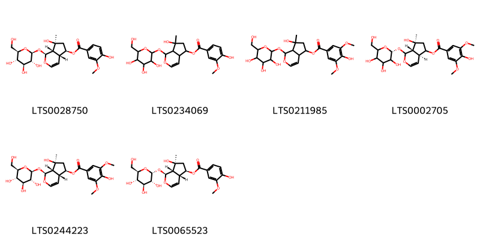{ width=100% }
    <figcaption>Hình ảnh cấu trúc hóa học của 6 hoạt chất thuộc nhóm Tannins gồm ['(1s,4ar,5r,7s,7as)-7-hydroxy-7-methyl-1-{[(2s,3r,4s,5s,6r)-3,4,5-trihydroxy-6-(hydroxymethyl)oxan-2-yl]oxy}-1h,4ah,5h,6h,7ah-cyclopenta[c]pyran-5-yl 4-hydroxy-3-methoxybenzoate (LTS0028750)', '7-hydroxy-7-methyl-1-{[3,4,5-trihydroxy-6-(hydroxymethyl)oxan-2-yl]oxy}-1h,4ah,5h,6h,7ah-cyclopenta[c]pyran-5-yl 4-hydroxy-3-methoxybenzoate (LTS0234069)', '7-hydroxy-7-methyl-1-{[3,4,5-trihydroxy-6-(hydroxymethyl)oxan-2-yl]oxy}-1h,4ah,5h,6h,7ah-cyclopenta[c]pyran-5-yl 4-hydroxy-3,5-dimethoxybenzoate (LTS0211985)', '(4as,7s,7as)-7-hydroxy-7-methyl-1-{[(2r)-3,4,5-trihydroxy-6-(hydroxymethyl)oxan-2-yl]oxy}-1h,4ah,5h,6h,7ah-cyclopenta[c]pyran-5-yl 4-hydroxy-3,5-dimethoxybenzoate (LTS0002705)', '(1s,4ar,5r,7s,7as)-7-hydroxy-7-methyl-1-{[(2s,3r,4s,5s,6r)-3,4,5-trihydroxy-6-(hydroxymethyl)oxan-2-yl]oxy}-1h,4ah,5h,6h,7ah-cyclopenta[c]pyran-5-yl 4-hydroxy-3,5-dimethoxybenzoate (LTS0244223)', '(1s,4ar,5r,7s,7as)-7-hydroxy-7-methyl-1-{[(2r,3r,4s,5s,6r)-3,4,5-trihydroxy-6-(hydroxymethyl)oxan-2-yl]oxy}-1h,4ah,5h,6h,7ah-cyclopenta[c]pyran-5-yl 4-hydroxy-3-methoxybenzoate (LTS0065523)'].</figcaption>
</figure>

---

### Dược dân tộc học

Danh sách các quốc gia có sử dụng *Verbascum thapsus* trong điều trị các bệnh. 

| Country   | Disease                                                                        | Bệnh                                                                                                                                                                                                |
|:----------|:-------------------------------------------------------------------------------|:----------------------------------------------------------------------------------------------------------------------------------------------------------------------------------------------------|
| Elsewhere | Demulcent, Piscicide, Cardiotonic                                              | MYMEMORY WARNING: YOU USED ALL AVAILABLE FREE TRANSLATIONS FOR TODAY. NEXT AVAILABLE IN  17 HOURS 50 MINUTES 50 SECONDS VISIT HTTPS://MYMEMORY.TRANSLATED.NET/DOC/USAGELIMITS.PHP TO TRANSLATE MORE |
| Eurasia   | Demulcent, Piscicide, Vulnerary, Poultice, Emollient                           | MYMEMORY WARNING: YOU USED ALL AVAILABLE FREE TRANSLATIONS FOR TODAY. NEXT AVAILABLE IN  17 HOURS 50 MINUTES 47 SECONDS VISIT HTTPS://MYMEMORY.TRANSLATED.NET/DOC/USAGELIMITS.PHP TO TRANSLATE MORE |
| India     | Aphrodisiac, Narcotic                                                          | MYMEMORY WARNING: YOU USED ALL AVAILABLE FREE TRANSLATIONS FOR TODAY. NEXT AVAILABLE IN  17 HOURS 50 MINUTES 44 SECONDS VISIT HTTPS://MYMEMORY.TRANSLATED.NET/DOC/USAGELIMITS.PHP TO TRANSLATE MORE |
| Turkey    | Diuretic, Emollient, Expectorant, Sudorific, Astringent, Demulcent, Antiseptic | MYMEMORY WARNING: YOU USED ALL AVAILABLE FREE TRANSLATIONS FOR TODAY. NEXT AVAILABLE IN  17 HOURS 50 MINUTES 42 SECONDS VISIT HTTPS://MYMEMORY.TRANSLATED.NET/DOC/USAGELIMITS.PHP TO TRANSLATE MORE |

---

# Chi Schweinfurthia

??? note "Danh sách các dược liệu thuộc chi"
    
	 - *Schweinfurthia haerocarpa*

---
## Schweinfurthia haerocarpa
### Thông tin về thực vật

!!! info "Phân loại thực vật của *N/A* từ GIBF:"
    - **Kingdom:** Plantae
    - **Phylum:** Tracheophyta
    - **Order:** Lamiales
    - **Family:** Plantaginaceae
    - **Genus:** Schweinfurthia
    - **Species:** *N/A*

 

| Label (VI)   | Label (EN)   | Scientific Name   | Descriptions (VI)   | Descriptions (EN)                    | Also Known As (VI)   | Also Known As (EN)                                       |
|:-------------|:-------------|:------------------|:--------------------|:-------------------------------------|:---------------------|:---------------------------------------------------------|
| N/A          | N/A          | Verbascum thapsus |                     | species of the plant genus Verbascum | ['']                 | ['mullein', 'common mullein', 'great mullein', 'mullen'] |

#### Phân bố trên thế giới

**Từ CSDL GIBF** Iran (Islamic Republic of), Pakistan, Somalia, Djibouti, Yemen, India, United Arab Emirates, Saudi Arabia, Oman

#### Phân bố tại Việt Nam

**Từ CSDL GIBF**: Không có ghi nhận ở Việt Nam

---
### Thành phần hóa học
        
- Theo cơ sở dữ liệu lotus: Từ loài *N/A* đã phân lập và xác định được Chưa có hoạt chất nào được phân lập. hoạt chất thuộc về các nhóm Không có hoạt chất nào được phân lập. 

Không có hình ảnh nào được tạo ra

---

### Dược dân tộc học

Danh sách các quốc gia có sử dụng *N/A* trong điều trị các bệnh. 

| Country   | Disease         | Bệnh                                                                                                                                                                                                |
|:----------|:----------------|:----------------------------------------------------------------------------------------------------------------------------------------------------------------------------------------------------|
| Elsewhere | Diuretic, Tonic | MYMEMORY WARNING: YOU USED ALL AVAILABLE FREE TRANSLATIONS FOR TODAY. NEXT AVAILABLE IN  17 HOURS 49 MINUTES 48 SECONDS VISIT HTTPS://MYMEMORY.TRANSLATED.NET/DOC/USAGELIMITS.PHP TO TRANSLATE MORE |

---

# Chi Striga

??? note "Danh sách các dược liệu thuộc chi"
    
	 - *Striga lutea*

---
## Striga lutea
### Thông tin về thực vật

!!! info "Phân loại thực vật của *Striga lutea* từ GIBF:"
    - **Kingdom:** Plantae
    - **Phylum:** Tracheophyta
    - **Order:** Lamiales
    - **Family:** Orobanchaceae
    - **Genus:** Striga
    - **Species:** *Striga lutea*

 

| Label (VI)   | Label (EN)   | Scientific Name   | Descriptions (VI)   | Descriptions (EN)   | Also Known As (VI)   | Also Known As (EN)   |
|:-------------|:-------------|:------------------|:--------------------|:--------------------|:---------------------|:---------------------|
| N/A          | N/A          | Striga lutea      | loài thực vật       | species of plant    | ['']                 | ['']                 |

#### Phân bố trên thế giới

**Từ CSDL GIBF** nan, Viet Nam, Malawi, Thailand, Namibia, Philippines, Senegal, Cameroon, Kenya, Gabon, Indonesia, Sri Lanka, British Indian Ocean Territory, Côte d’Ivoire, Malaysia, India, Liberia, Seychelles, Burundi, Uganda, Brazil, Palau, Ethiopia, China, Nepal, Angola, Chinese Taipei, South Africa, Tanzania, United Republic of, Mozambique, Papua New Guinea, United States of America, Zimbabwe, Guinea

#### Phân bố tại Việt Nam

**Từ CSDL GIBF**: Bắc Ninh

---
### Thành phần hóa học
        
- Theo cơ sở dữ liệu lotus: Từ loài *Striga lutea* đã phân lập và xác định được 5 hoạt chất thuộc về các nhóm Flavonoids, Steroids and steroid derivatives. 

|    | chemicalTaxonomyClassyfireClass   |   smiles_count |
|---:|:----------------------------------|---------------:|
|  0 | Flavonoids                        |              3 |
|  1 | Steroids and steroid derivatives  |              2 |

#### Nhóm Flavonoids
<figure markdown="span">
    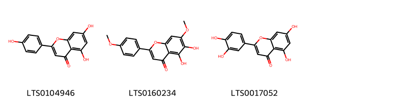{ width=100% }
    <figcaption>Hình ảnh cấu trúc hóa học của 3 hoạt chất thuộc nhóm Flavonoids gồm ['chamomile (LTS0104946)', 'ladanein (LTS0160234)', 'luteolin (LTS0017052)'].</figcaption>
</figure>
#### Nhóm Steroids and steroid derivatives
<figure markdown="span">
    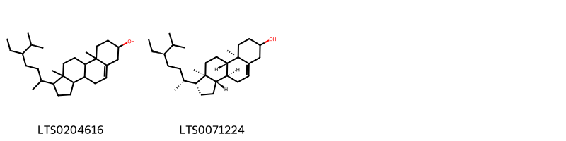{ width=100% }
    <figcaption>Hình ảnh cấu trúc hóa học của 2 hoạt chất thuộc nhóm Steroids and steroid derivatives gồm ['stigmast-5-en-3-ol, (3β)- (LTS0204616)', 'stigmast-5-en-3-ol (LTS0071224)'].</figcaption>
</figure>

---

### Dược dân tộc học

Danh sách các quốc gia có sử dụng *Striga lutea* trong điều trị các bệnh. 

| Country   | Disease   | Bệnh                                                                                                                                                                                                |
|:----------|:----------|:----------------------------------------------------------------------------------------------------------------------------------------------------------------------------------------------------|
| Elsewhere | Apertif   | MYMEMORY WARNING: YOU USED ALL AVAILABLE FREE TRANSLATIONS FOR TODAY. NEXT AVAILABLE IN  17 HOURS 49 MINUTES 23 SECONDS VISIT HTTPS://MYMEMORY.TRANSLATED.NET/DOC/USAGELIMITS.PHP TO TRANSLATE MORE |

---

# Chi Antirrhinum

??? note "Danh sách các dược liệu thuộc chi"
    
	 - *Antirrhinum cymbalaria*
	 - *Antirrhinum elatine*
	 - *Antirrhinum majus*
	 - *Antirrhinum orontium*

---
## Antirrhinum cymbalaria
### Thông tin về thực vật

!!! info "Phân loại thực vật của *N/A* từ GIBF:"
    - **Kingdom:** Plantae
    - **Phylum:** Tracheophyta
    - **Order:** Lamiales
    - **Family:** Plantaginaceae
    - **Genus:** N/A
    - **Species:** *N/A*

 

| Label (VI)   | Label (EN)   | Scientific Name        | Descriptions (VI)   | Descriptions (EN)   | Also Known As (VI)   | Also Known As (EN)   |
|:-------------|:-------------|:-----------------------|:--------------------|:--------------------|:---------------------|:---------------------|
| N/A          | N/A          | Antirrhinum cymbalaria |                     | species of plant    | ['']                 | ['']                 |

#### Phân bố trên thế giới

**Từ CSDL GIBF** Denmark, Luxembourg, Spain, Germany, Chile, Austria, Australia, Indonesia, India, Canada, Netherlands, Brazil, Mexico, Ireland, Chinese Taipei, Switzerland, Uruguay, United Kingdom of Great Britain and Northern Ireland, Argentina, Portugal, South Africa, France, New Zealand, Bolivia (Plurinational State of), Paraguay, Russian Federation, Ecuador, United States of America, Italy, Israel, Greece, Ukraine

#### Phân bố tại Việt Nam

**Từ CSDL GIBF**: Không có ghi nhận ở Việt Nam

---
### Thành phần hóa học
        
- Theo cơ sở dữ liệu lotus: Từ loài *N/A* đã phân lập và xác định được Chưa có hoạt chất nào được phân lập. hoạt chất thuộc về các nhóm Không có hoạt chất nào được phân lập. 

Không có hình ảnh nào được tạo ra

---

### Dược dân tộc học

Danh sách các quốc gia có sử dụng *N/A* trong điều trị các bệnh. 

| Country   | Disease                     | Bệnh                                                                                                                                                                                                |
|:----------|:----------------------------|:----------------------------------------------------------------------------------------------------------------------------------------------------------------------------------------------------|
| Turkey    | Astringent, Diuretic, Tonic | MYMEMORY WARNING: YOU USED ALL AVAILABLE FREE TRANSLATIONS FOR TODAY. NEXT AVAILABLE IN  17 HOURS 48 MINUTES 39 SECONDS VISIT HTTPS://MYMEMORY.TRANSLATED.NET/DOC/USAGELIMITS.PHP TO TRANSLATE MORE |

---

---
## Antirrhinum elatine
### Thông tin về thực vật

!!! info "Phân loại thực vật của *Kickxia elatine* từ GIBF:"
    - **Kingdom:** Plantae
    - **Phylum:** Tracheophyta
    - **Order:** Lamiales
    - **Family:** Plantaginaceae
    - **Genus:** Kickxia
    - **Species:** *Kickxia elatine*

 

| Label (VI)   | Label (EN)   | Scientific Name     | Descriptions (VI)   | Descriptions (EN)   | Also Known As (VI)   | Also Known As (EN)   |
|:-------------|:-------------|:--------------------|:--------------------|:--------------------|:---------------------|:---------------------|
| N/A          | N/A          | Antirrhinum elatine | loài thực vật       | species of plant    | ['']                 | ['']                 |

#### Phân bố trên thế giới

**Từ CSDL GIBF** nan, United Kingdom of Great Britain and Northern Ireland, Sweden, France, Spain, United States of America, Netherlands

#### Phân bố tại Việt Nam

**Từ CSDL GIBF**: Không có ghi nhận ở Việt Nam

---
### Thành phần hóa học
        
- Theo cơ sở dữ liệu lotus: Từ loài *Kickxia elatine* đã phân lập và xác định được Chưa có hoạt chất nào được phân lập. hoạt chất thuộc về các nhóm Không có hoạt chất nào được phân lập. 

Không có hình ảnh nào được tạo ra

---

### Dược dân tộc học

Danh sách các quốc gia có sử dụng *Kickxia elatine* trong điều trị các bệnh. 

| Country   | Disease    | Bệnh                                                                                                                                                                                                |
|:----------|:-----------|:----------------------------------------------------------------------------------------------------------------------------------------------------------------------------------------------------|
| French    | Hemostat   | MYMEMORY WARNING: YOU USED ALL AVAILABLE FREE TRANSLATIONS FOR TODAY. NEXT AVAILABLE IN  17 HOURS 48 MINUTES 17 SECONDS VISIT HTTPS://MYMEMORY.TRANSLATED.NET/DOC/USAGELIMITS.PHP TO TRANSLATE MORE |
| German    | Astringent | MYMEMORY WARNING: YOU USED ALL AVAILABLE FREE TRANSLATIONS FOR TODAY. NEXT AVAILABLE IN  17 HOURS 48 MINUTES 15 SECONDS VISIT HTTPS://MYMEMORY.TRANSLATED.NET/DOC/USAGELIMITS.PHP TO TRANSLATE MORE |

---

---
## Antirrhinum majus
### Thông tin về thực vật

!!! info "Phân loại thực vật của *Antirrhinum majus* từ GIBF:"
    - **Kingdom:** Plantae
    - **Phylum:** Tracheophyta
    - **Order:** Lamiales
    - **Family:** Plantaginaceae
    - **Genus:** Antirrhinum
    - **Species:** *Antirrhinum majus*

 

| Label (VI)   | Label (EN)   | Scientific Name   | Descriptions (VI)   | Descriptions (EN)   | Also Known As (VI)   | Also Known As (EN)   |
|:-------------|:-------------|:------------------|:--------------------|:--------------------|:---------------------|:---------------------|
| N/A          | N/A          | Antirrhinum majus | loài thực vật       | species of plant    | ['']                 | ['Snapdragons']      |

#### Phân bố trên thế giới

**Từ CSDL GIBF** Spain, Germany, Chile, Austria, Albania, Serbia, India, Canada, Bahamas, Belgium, Netherlands, Slovakia, Malta, Peru, Hungary, Mexico, Ireland, China, Nepal, Switzerland, United Kingdom of Great Britain and Northern Ireland, Argentina, Portugal, South Africa, France, New Zealand, Bolivia (Plurinational State of), United States of America, Italy, Algeria, Greece, Croatia

#### Phân bố tại Việt Nam

**Từ CSDL GIBF**: Không có ghi nhận ở Việt Nam

---
### Thành phần hóa học
        
- Theo cơ sở dữ liệu lotus: Từ loài *Antirrhinum majus* đã phân lập và xác định được 98 hoạt chất thuộc về các nhóm Diazanaphthalenes, Organooxygen compounds, Lactones, Flavonoids, Saturated hydrocarbons, Indoles and derivatives, Aurone flavonoids, Organonitrogen compounds, Carboxylic acids and derivatives, Prenol lipids, Fatty Acyls, Cinnamic acids and derivatives, Benzene and substituted derivatives. 

|    | chemicalTaxonomyClassyfireClass     |   smiles_count |
|---:|:------------------------------------|---------------:|
|  0 | Aurone flavonoids                   |              1 |
|  1 | Benzene and substituted derivatives |              1 |
|  2 | Carboxylic acids and derivatives    |             27 |
|  3 | Cinnamic acids and derivatives      |              3 |
|  4 | Diazanaphthalenes                   |              1 |
|  5 | Fatty Acyls                         |             18 |
|  6 | Flavonoids                          |             22 |
|  7 | Indoles and derivatives             |              2 |
|  8 | Lactones                            |              2 |
|  9 | Organonitrogen compounds            |              1 |
| 10 | Organooxygen compounds              |              9 |
| 11 | Prenol lipids                       |              4 |
| 12 | Saturated hydrocarbons              |              7 |

#### Nhóm Aurone flavonoids
<figure markdown="span">
    { width=100% }
    <figcaption>Hình ảnh cấu trúc hóa học của 1 hoạt chất thuộc nhóm Aurone flavonoids gồm ['aureusidin (LTS0260686)'].</figcaption>
</figure>
#### Nhóm Benzene and substituted derivatives
<figure markdown="span">
    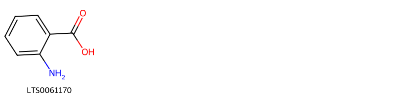{ width=100% }
    <figcaption>Hình ảnh cấu trúc hóa học của 1 hoạt chất thuộc nhóm Benzene and substituted derivatives gồm ['2-aminobenzoic acid (LTS0061170)'].</figcaption>
</figure>
#### Nhóm Carboxylic acids and derivatives
<figure markdown="span">
    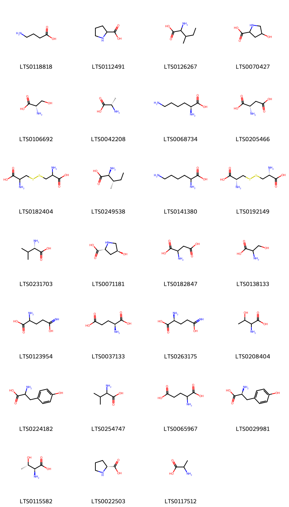{ width=100% }
    <figcaption>Hình ảnh cấu trúc hóa học của 27 hoạt chất thuộc nhóm Carboxylic acids and derivatives gồm ['gamma(amino)-butyric acid (LTS0118818)', 'proline (LTS0112491)', 'lisoleucine (LTS0126267)', '4-hydroxyproline (LTS0070427)', 'l-serine (LTS0106692)', 'l-alanine (LTS0042208)', 'l-lysine (LTS0068734)', 'l-aspartic acid (LTS0205466)', 'cystine (LTS0182404)', 'l-isoleucine (LTS0249538)', 'lysine (LTS0141380)', 'l-cystine (LTS0192149)', 'l-valine (LTS0231703)', 'trans-4-hydroxyproline (LTS0071181)', 'aspartic acid (LTS0182847)', 'serin (LTS0138133)', 'glutamine (LTS0123954)', 'l-glutamic acid (LTS0037133)', 'l glutamine (LTS0263175)', 'threonine(l) (LTS0208404)', 'tyrosin (LTS0224182)', 'valin (LTS0254747)', 'glutaminsaeure (LTS0065967)', 'l-tyrosine (LTS0029981)', 'l-allothreonine (LTS0115582)', 'd-proline (LTS0022503)', 'alanine (LTS0117512)'].</figcaption>
</figure>
#### Nhóm Cinnamic acids and derivatives
<figure markdown="span">
    { width=100% }
    <figcaption>Hình ảnh cấu trúc hóa học của 3 hoạt chất thuộc nhóm Cinnamic acids and derivatives gồm ['(3r,4r,6r)-6-[2-(3,4-dihydroxyphenyl)ethoxy]-5-hydroxy-2-(hydroxymethyl)-4-{[(2s,3s,5r)-3,4,5-trihydroxy-6-methyloxan-2-yl]oxy}oxan-3-yl (2e)-3-(3,4-dihydroxyphenyl)prop-2-enoate (LTS0063526)', 'verbascoside (LTS0168159)', '6-[2-(3,4-dihydroxyphenyl)ethoxy]-5-hydroxy-2-(hydroxymethyl)-4-[(3,4,5-trihydroxy-6-methyloxan-2-yl)oxy]oxan-3-yl 3-(3,4-dihydroxyphenyl)prop-2-enoate (LTS0050472)'].</figcaption>
</figure>
#### Nhóm Diazanaphthalenes
<figure markdown="span">
    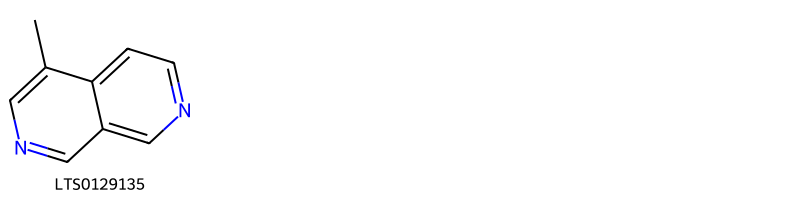{ width=100% }
    <figcaption>Hình ảnh cấu trúc hóa học của 1 hoạt chất thuộc nhóm Diazanaphthalenes gồm ['4-methyl-2,7-naphthyridine (LTS0129135)'].</figcaption>
</figure>
#### Nhóm Fatty Acyls
<figure markdown="span">
    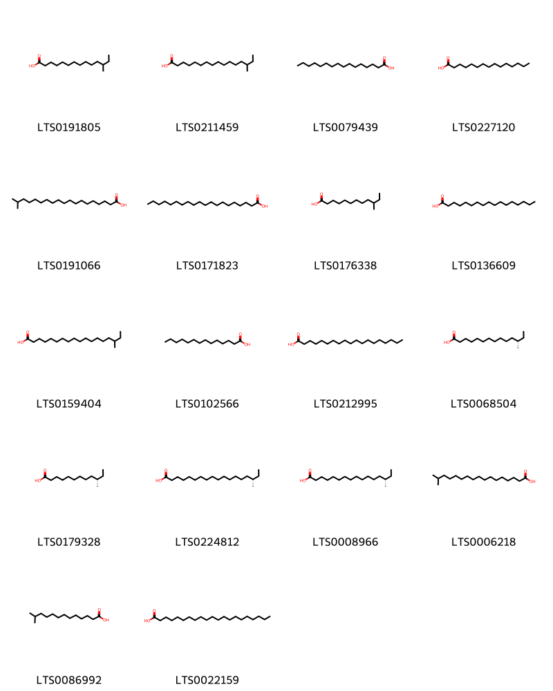{ width=100% }
    <figcaption>Hình ảnh cấu trúc hóa học của 18 hoạt chất thuộc nhóm Fatty Acyls gồm ['12-methyltetradecanoic acid (LTS0191805)', '14-methyl palmitic acid (LTS0211459)', 'palmitic acid (LTS0079439)', 'pentadecanoic acid (LTS0227120)', 'isoarachidic acid (LTS0191066)', 'arachidic acid (LTS0171823)', '10-methyldodecanoic acid (LTS0176338)', 'heptadecanoic acid (LTS0136609)', 'methyl stearic acid (LTS0159404)', 'myristic acid (LTS0102566)', 'nonadecanoic acid (LTS0212995)', '(12s)-12-methyltetradecanoic acid (LTS0068504)', '(10s)-10-methyldodecanoic acid (LTS0179328)', '(16s)-16-methyloctadecanoic acid (LTS0224812)', '(s)-14-methylhexadecanoic acid (LTS0008966)', '(+)-isostearic acid (LTS0006218)', '12-methyltridecanoic acid (LTS0086992)', 'heneicosanoic acid (LTS0022159)'].</figcaption>
</figure>
#### Nhóm Flavonoids
<figure markdown="span">
    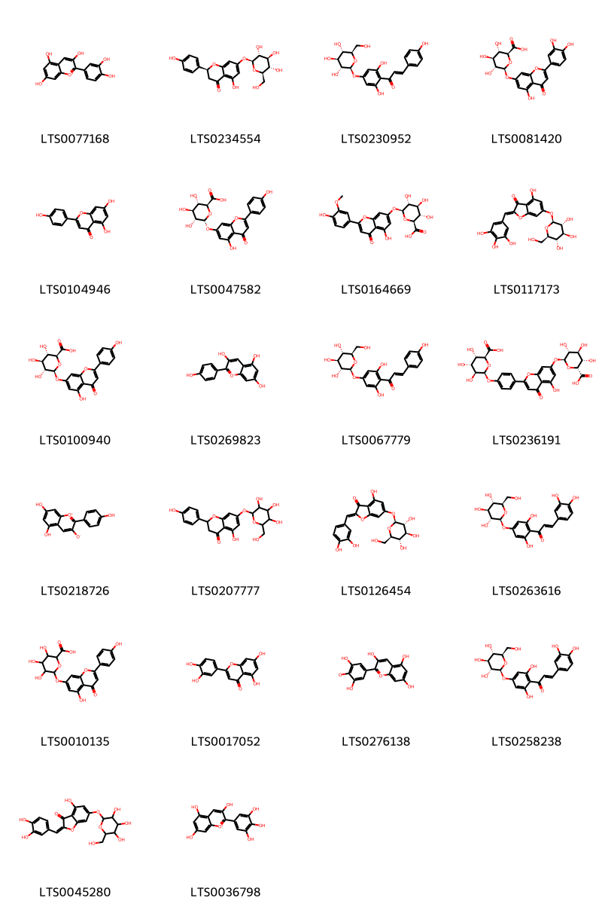{ width=100% }
    <figcaption>Hình ảnh cấu trúc hóa học của 22 hoạt chất thuộc nhóm Flavonoids gồm ['cyanidin (LTS0077168)', 'prunin (LTS0234554)', '1-(2,6-dihydroxy-4-{[(2s,3r,4s,5s,6r)-3,4,5-trihydroxy-6-(hydroxymethyl)oxan-2-yl]oxy}phenyl)-3-(4-hydroxyphenyl)prop-2-en-1-one (LTS0230952)', 'luteolin 7-o-glucuronide (LTS0081420)', 'chamomile (LTS0104946)', '(2s,3s,4s,5r,6r)-3,4,5-trihydroxy-6-{[5-hydroxy-2-(4-hydroxyphenyl)-4-oxochromen-7-yl]oxy}oxane-2-carboxylic acid (LTS0047582)', '(2s,3s,4s,5r,6s)-3,4,5-trihydroxy-6-{[5-hydroxy-2-(4-hydroxy-3-methoxyphenyl)-4-oxochromen-7-yl]oxy}oxane-2-carboxylic acid (LTS0164669)', 'bracteatin 6-o-glucoside (LTS0117173)', '(2s,3s,4s,5r,6s)-3,4,5-trihydroxy-6-{[5-hydroxy-2-(4-hydroxyphenyl)-4-oxochromen-7-yl]oxy}oxane-2-carboxylic acid (LTS0100940)', 'pelargonidin (LTS0269823)', "thc 4'-glucoside (LTS0067779)", '(2s,3s,4r,5s,6s)-6-[4-(7-{[(2s,3r,4s,5s,6r)-6-carboxy-3,4,5-trihydroxyoxan-2-yl]oxy}-5-hydroxy-4-oxochromen-2-yl)phenoxy]-3,4,5-trihydroxyoxane-2-carboxylic acid (LTS0236191)', '5,7-dihydroxy-2-(4-hydroxyphenyl)-1λ⁴-chromen-1-ylium-3-olate (LTS0218726)', '5-hydroxy-2-(4-hydroxyphenyl)-7-{[3,4,5-trihydroxy-6-(hydroxymethyl)oxan-2-yl]oxy}-2,3-dihydro-1-benzopyran-4-one (LTS0207777)', 'aureusidin 6-o-glucoside (LTS0126454)', "phc 4'-o-glucoside (LTS0263616)", '3,4,5-trihydroxy-6-{[5-hydroxy-2-(4-hydroxyphenyl)-4-oxochromen-7-yl]oxy}oxane-2-carboxylic acid (LTS0010135)', 'luteolin (LTS0017052)', '2-(3,5-dihydroxy-4-oxidophenyl)-3,5,7-trihydroxy-1λ⁴-chromen-1-ylium (LTS0276138)', '1-(2,6-dihydroxy-4-{[(2s,3r,4s,5s,6r)-3,4,5-trihydroxy-6-(hydroxymethyl)oxan-2-yl]oxy}phenyl)-3-(3,4-dihydroxyphenyl)prop-2-en-1-one (LTS0258238)', '2-[(3,4-dihydroxyphenyl)methylidene]-4-hydroxy-6-{[3,4,5-trihydroxy-6-(hydroxymethyl)oxan-2-yl]oxy}-1-benzofuran-3-one (LTS0045280)', 'delphinidin (LTS0036798)'].</figcaption>
</figure>
#### Nhóm Indoles and derivatives
<figure markdown="span">
    { width=100% }
    <figcaption>Hình ảnh cấu trúc hóa học của 2 hoạt chất thuộc nhóm Indoles and derivatives gồm ['l-tryptophan (LTS0263809)', 'optimax (LTS0014343)'].</figcaption>
</figure>
#### Nhóm Lactones
<figure markdown="span">
    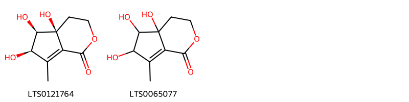{ width=100% }
    <figcaption>Hình ảnh cấu trúc hóa học của 2 hoạt chất thuộc nhóm Lactones gồm ['(4as,5r,6r)-4a,5,6-trihydroxy-7-methyl-3h,4h,5h,6h-cyclopenta[c]pyran-1-one (LTS0121764)', '4a,5,6-trihydroxy-7-methyl-3h,4h,5h,6h-cyclopenta[c]pyran-1-one (LTS0065077)'].</figcaption>
</figure>
#### Nhóm Organonitrogen compounds
<figure markdown="span">
    { width=100% }
    <figcaption>Hình ảnh cấu trúc hóa học của 1 hoạt chất thuộc nhóm Organonitrogen compounds gồm ['choline (LTS0170307)'].</figcaption>
</figure>
#### Nhóm Organooxygen compounds
<figure markdown="span">
    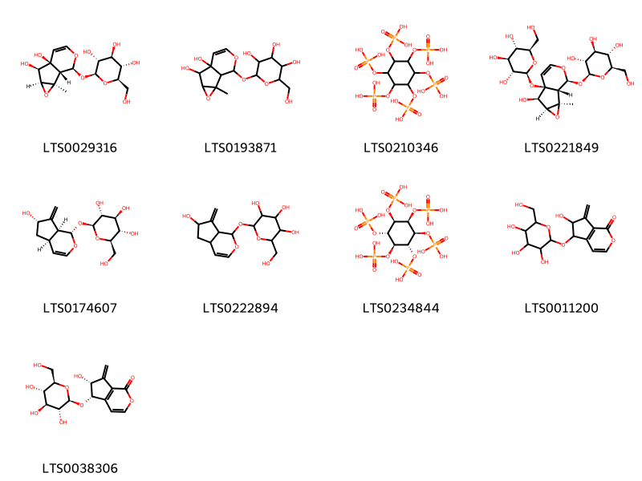{ width=100% }
    <figcaption>Hình ảnh cấu trúc hóa học của 9 hoạt chất thuộc nhóm Organooxygen compounds gồm ['antirrhinoside (LTS0029316)', '2-({5,6-dihydroxy-2-methyl-3,9-dioxatricyclo[4.4.0.0²,⁴]dec-7-en-10-yl}oxy)-6-(hydroxymethyl)oxane-3,4,5-triol (LTS0193871)', 'phytic acid (LTS0210346)', '(2s,3r,4s,5s,6r)-2-{[(1r,2r,4s,5r,6s,10s)-5-hydroxy-2-methyl-10-{[(2s,3r,4s,5s,6r)-3,4,5-trihydroxy-6-(hydroxymethyl)oxan-2-yl]oxy}-3,9-dioxatricyclo[4.4.0.0²,⁴]dec-7-en-6-yl]oxy}-6-(hydroxymethyl)oxane-3,4,5-triol (LTS0221849)', '(2s,3r,4s,5s,6r)-2-{[(1s,4ar,6s,7as)-6-hydroxy-7-methylidene-1h,4ah,5h,6h,7ah-cyclopenta[c]pyran-1-yl]oxy}-6-(hydroxymethyl)oxane-3,4,5-triol (LTS0174607)', '2-({6-hydroxy-7-methylidene-1h,4ah,5h,6h,7ah-cyclopenta[c]pyran-1-yl}oxy)-6-(hydroxymethyl)oxane-3,4,5-triol (LTS0222894)', '[(1r,2r,3s,4r,5s,6s)-2,3,4,5,6-pentakis(phosphonooxy)cyclohexyl]oxyphosphonic acid (LTS0234844)', '6-hydroxy-7-methylidene-5-{[3,4,5-trihydroxy-6-(hydroxymethyl)oxan-2-yl]oxy}-5h,6h-cyclopenta[c]pyran-1-one (LTS0011200)', '(5s,6r)-6-hydroxy-7-methylidene-5-{[(2r,3r,4s,5s,6r)-3,4,5-trihydroxy-6-(hydroxymethyl)oxan-2-yl]oxy}-5h,6h-cyclopenta[c]pyran-1-one (LTS0038306)'].</figcaption>
</figure>
#### Nhóm Prenol lipids
<figure markdown="span">
    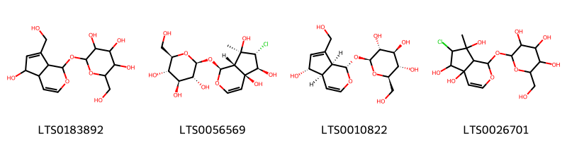{ width=100% }
    <figcaption>Hình ảnh cấu trúc hóa học của 4 hoạt chất thuộc nhóm Prenol lipids gồm ['aucubin (LTS0183892)', '(2s,3r,4s,5s,6r)-2-{[(1s,4as,5s,6r,7r,7as)-6-chloro-4a,5,7-trihydroxy-7-methyl-1h,5h,6h,7ah-cyclopenta[c]pyran-1-yl]oxy}-6-(hydroxymethyl)oxane-3,4,5-triol (LTS0056569)', 'aucubin (LTS0010822)', '2-({6-chloro-4a,5,7-trihydroxy-7-methyl-1h,5h,6h,7ah-cyclopenta[c]pyran-1-yl}oxy)-6-(hydroxymethyl)oxane-3,4,5-triol (LTS0026701)'].</figcaption>
</figure>
#### Nhóm Saturated hydrocarbons
<figure markdown="span">
    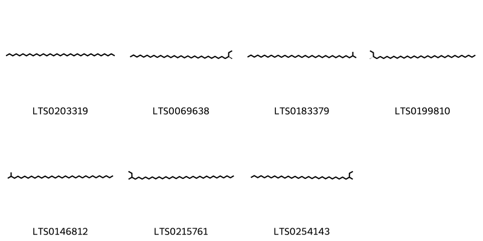{ width=100% }
    <figcaption>Hình ảnh cấu trúc hóa học của 7 hoạt chất thuộc nhóm Saturated hydrocarbons gồm ['tritriacontane (LTS0203319)', '(3r)-3-methyldotriacontane (LTS0069638)', '2-methyltritriacontane (LTS0183379)', '(3r)-3-methyltritriacontane (LTS0199810)', '2-methyldotriacontane (LTS0146812)', '3-methyltritriacontane (LTS0215761)', '3-methyldotriacontane (LTS0254143)'].</figcaption>
</figure>

---

### Dược dân tộc học

Danh sách các quốc gia có sử dụng *Antirrhinum majus* trong điều trị các bệnh. 

| Country   | Disease              | Bệnh                                                                                                                                                                                                |
|:----------|:---------------------|:----------------------------------------------------------------------------------------------------------------------------------------------------------------------------------------------------|
| Iraq      | Astringent, Diuretic | MYMEMORY WARNING: YOU USED ALL AVAILABLE FREE TRANSLATIONS FOR TODAY. NEXT AVAILABLE IN  17 HOURS 47 MINUTES 57 SECONDS VISIT HTTPS://MYMEMORY.TRANSLATED.NET/DOC/USAGELIMITS.PHP TO TRANSLATE MORE |
| Turkey    | Diuretic, Astringent | MYMEMORY WARNING: YOU USED ALL AVAILABLE FREE TRANSLATIONS FOR TODAY. NEXT AVAILABLE IN  17 HOURS 47 MINUTES 55 SECONDS VISIT HTTPS://MYMEMORY.TRANSLATED.NET/DOC/USAGELIMITS.PHP TO TRANSLATE MORE |

---

---
## Antirrhinum orontium
### Thông tin về thực vật

!!! info "Phân loại thực vật của *Misopates orontium* từ GIBF:"
    - **Kingdom:** Plantae
    - **Phylum:** Tracheophyta
    - **Order:** Lamiales
    - **Family:** Plantaginaceae
    - **Genus:** Misopates
    - **Species:** *Misopates orontium*

 

| Label (VI)   | Label (EN)   | Scientific Name      | Descriptions (VI)   | Descriptions (EN)   | Also Known As (VI)   | Also Known As (EN)   |
|:-------------|:-------------|:---------------------|:--------------------|:--------------------|:---------------------|:---------------------|
| N/A          | N/A          | Antirrhinum orontium | loài thực vật       | species of plant    | ['']                 | ['']                 |

#### Phân bố trên thế giới

**Từ CSDL GIBF** Japan, Brazil, France, Spain, New Zealand, Lebanon, Poland, Andorra, United States of America, Austria, Israel

#### Phân bố tại Việt Nam

**Từ CSDL GIBF**: Không có ghi nhận ở Việt Nam

---
### Thành phần hóa học
        
- Theo cơ sở dữ liệu lotus: Từ loài *Misopates orontium* đã phân lập và xác định được Chưa có hoạt chất nào được phân lập. hoạt chất thuộc về các nhóm Không có hoạt chất nào được phân lập. 

Không có hình ảnh nào được tạo ra

---

### Dược dân tộc học

Danh sách các quốc gia có sử dụng *Misopates orontium* trong điều trị các bệnh. 

| Country   | Disease              | Bệnh                                                                                                                                                                                                |
|:----------|:---------------------|:----------------------------------------------------------------------------------------------------------------------------------------------------------------------------------------------------|
| German    | Astringent           | MYMEMORY WARNING: YOU USED ALL AVAILABLE FREE TRANSLATIONS FOR TODAY. NEXT AVAILABLE IN  17 HOURS 46 MINUTES 15 SECONDS VISIT HTTPS://MYMEMORY.TRANSLATED.NET/DOC/USAGELIMITS.PHP TO TRANSLATE MORE |
| Italian   | Diuretic             | MYMEMORY WARNING: YOU USED ALL AVAILABLE FREE TRANSLATIONS FOR TODAY. NEXT AVAILABLE IN  17 HOURS 46 MINUTES 12 SECONDS VISIT HTTPS://MYMEMORY.TRANSLATED.NET/DOC/USAGELIMITS.PHP TO TRANSLATE MORE |
| Turkey    | Astringent, Diuretic | MYMEMORY WARNING: YOU USED ALL AVAILABLE FREE TRANSLATIONS FOR TODAY. NEXT AVAILABLE IN  17 HOURS 46 MINUTES 09 SECONDS VISIT HTTPS://MYMEMORY.TRANSLATED.NET/DOC/USAGELIMITS.PHP TO TRANSLATE MORE |

---

# Chi Capraria

??? note "Danh sách các dược liệu thuộc chi"
    
	 - *Capraria biflora*

---
## Capraria biflora
### Thông tin về thực vật

!!! info "Phân loại thực vật của *Capraria biflora* từ GIBF:"
    - **Kingdom:** Plantae
    - **Phylum:** Tracheophyta
    - **Order:** Lamiales
    - **Family:** Scrophulariaceae
    - **Genus:** Capraria
    - **Species:** *Capraria biflora*

 

| Label (VI)   | Label (EN)   | Scientific Name   | Descriptions (VI)   | Descriptions (EN)   | Also Known As (VI)   | Also Known As (EN)   |
|:-------------|:-------------|:------------------|:--------------------|:--------------------|:---------------------|:---------------------|
| N/A          | N/A          | Capraria biflora  | loài thực vật       | species of plant    | ['']                 | ['']                 |

#### Phân bố trên thế giới

**Từ CSDL GIBF** Cayman Islands, El Salvador, Guadeloupe, Ghana, Trinidad and Tobago, Martinique, Haiti, Turks and Caicos Islands, Venezuela (Bolivarian Republic of), Dominican Republic, Puerto Rico, Bahamas, Saint Kitts and Nevis, Cuba, Anguilla, Bonaire, Sint Eustatius and Saba, Virgin Islands (U.S.), Virgin Islands (British), Antigua and Barbuda, Belize, Brazil, Aruba, Mexico, Curaçao, Argentina, Ecuador, United States of America

#### Phân bố tại Việt Nam

**Từ CSDL GIBF**: Không có ghi nhận ở Việt Nam

---
### Thành phần hóa học
        
- Theo cơ sở dữ liệu lotus: Từ loài *Capraria biflora* đã phân lập và xác định được 8 hoạt chất thuộc về các nhóm Stilbenes, Organooxygen compounds, Lactones, Naphthalenes. 

|    | chemicalTaxonomyClassyfireClass   |   smiles_count |
|---:|:----------------------------------|---------------:|
|  0 | Lactones                          |              5 |
|  1 | Naphthalenes                      |              1 |
|  2 | Organooxygen compounds            |              1 |
|  3 | Stilbenes                         |              1 |

#### Nhóm Lactones
<figure markdown="span">
    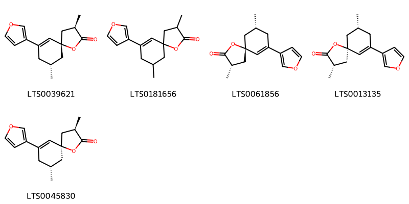{ width=100% }
    <figcaption>Hình ảnh cấu trúc hóa học của 5 hoạt chất thuộc nhóm Lactones gồm ['(3r,5s,9r)-7-(furan-3-yl)-3,9-dimethyl-1-oxaspiro[4.5]dec-6-en-2-one (LTS0039621)', '7-(furan-3-yl)-3,9-dimethyl-1-oxaspiro[4.5]dec-6-en-2-one (LTS0181656)', '(3s,5s,9r)-7-(furan-3-yl)-3,9-dimethyl-1-oxaspiro[4.5]dec-6-en-2-one (LTS0061856)', '(3s,5r,9r)-7-(furan-3-yl)-3,9-dimethyl-1-oxaspiro[4.5]dec-6-en-2-one (LTS0013135)', '(3r,5r,9r)-7-(furan-3-yl)-3,9-dimethyl-1-oxaspiro[4.5]dec-6-en-2-one (LTS0045830)'].</figcaption>
</figure>
#### Nhóm Naphthalenes
<figure markdown="span">
    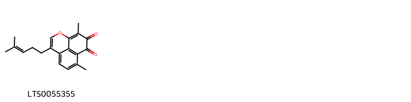{ width=100% }
    <figcaption>Hình ảnh cấu trúc hóa học của 1 hoạt chất thuộc nhóm Naphthalenes gồm ['8,12-dimethyl-4-(4-methylpent-3-en-1-yl)-2-oxatricyclo[7.3.1.0⁵,¹³]trideca-1(12),3,5(13),6,8-pentaene-10,11-dione (LTS0055355)'].</figcaption>
</figure>
#### Nhóm Organooxygen compounds
<figure markdown="span">
    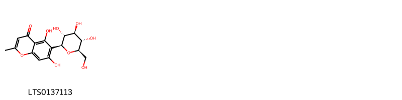{ width=100% }
    <figcaption>Hình ảnh cấu trúc hóa học của 1 hoạt chất thuộc nhóm Organooxygen compounds gồm ['biflorin (LTS0137113)'].</figcaption>
</figure>
#### Nhóm Stilbenes
<figure markdown="span">
    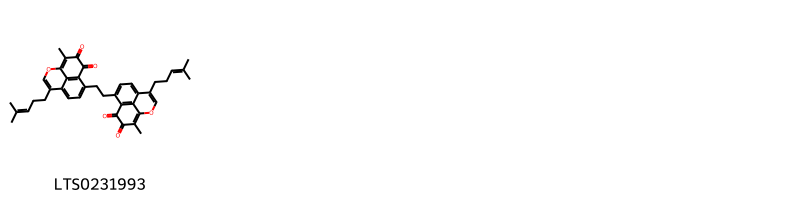{ width=100% }
    <figcaption>Hình ảnh cấu trúc hóa học của 1 hoạt chất thuộc nhóm Stilbenes gồm ['12-methyl-8-{2-[12-methyl-4-(4-methylpent-3-en-1-yl)-10,11-dioxo-2-oxatricyclo[7.3.1.0⁵,¹³]trideca-1(12),3,5,7,9(13)-pentaen-8-yl]ethyl}-4-(4-methylpent-3-en-1-yl)-2-oxatricyclo[7.3.1.0⁵,¹³]trideca-1(12),3,5(13),6,8-pentaene-10,11-dione (LTS0231993)'].</figcaption>
</figure>

---

### Dược dân tộc học

Danh sách các quốc gia có sử dụng *Capraria biflora* trong điều trị các bệnh. 

| Country            | Disease               | Bệnh                                                                                                                                                                                                |
|:-------------------|:----------------------|:----------------------------------------------------------------------------------------------------------------------------------------------------------------------------------------------------|
| Brazil             | Antibiotic            | MYMEMORY WARNING: YOU USED ALL AVAILABLE FREE TRANSLATIONS FOR TODAY. NEXT AVAILABLE IN  17 HOURS 45 MINUTES 47 SECONDS VISIT HTTPS://MYMEMORY.TRANSLATED.NET/DOC/USAGELIMITS.PHP TO TRANSLATE MORE |
| Dominican Republic | Diuretic, Emmenagogue | MYMEMORY WARNING: YOU USED ALL AVAILABLE FREE TRANSLATIONS FOR TODAY. NEXT AVAILABLE IN  17 HOURS 45 MINUTES 45 SECONDS VISIT HTTPS://MYMEMORY.TRANSLATED.NET/DOC/USAGELIMITS.PHP TO TRANSLATE MORE |
| Elsewhere          | Antiseptic            | MYMEMORY WARNING: YOU USED ALL AVAILABLE FREE TRANSLATIONS FOR TODAY. NEXT AVAILABLE IN  17 HOURS 45 MINUTES 42 SECONDS VISIT HTTPS://MYMEMORY.TRANSLATED.NET/DOC/USAGELIMITS.PHP TO TRANSLATE MORE |
| Haiti              | nan, Tonic            | MYMEMORY WARNING: YOU USED ALL AVAILABLE FREE TRANSLATIONS FOR TODAY. NEXT AVAILABLE IN  17 HOURS 45 MINUTES 40 SECONDS VISIT HTTPS://MYMEMORY.TRANSLATED.NET/DOC/USAGELIMITS.PHP TO TRANSLATE MORE |
| Mexico             | Stupefacient          | MYMEMORY WARNING: YOU USED ALL AVAILABLE FREE TRANSLATIONS FOR TODAY. NEXT AVAILABLE IN  17 HOURS 45 MINUTES 37 SECONDS VISIT HTTPS://MYMEMORY.TRANSLATED.NET/DOC/USAGELIMITS.PHP TO TRANSLATE MORE |
| Trinidad           | Antiseptic            | MYMEMORY WARNING: YOU USED ALL AVAILABLE FREE TRANSLATIONS FOR TODAY. NEXT AVAILABLE IN  17 HOURS 45 MINUTES 35 SECONDS VISIT HTTPS://MYMEMORY.TRANSLATED.NET/DOC/USAGELIMITS.PHP TO TRANSLATE MORE |

---

# Chi Veronica

??? note "Danh sách các dược liệu thuộc chi"
    
	 - *Veronica americana*
	 - *Veronica anagallis*
	 - *Veronica anagallis-aquatica*
	 - *Veronica arvensis*
	 - *Veronica beccabunga*
	 - *Veronica hederaefolia*
	 - *Veronica officinalis*
	 - *Veronica tenuifolia*
	 - *Veronica virginica*

---
## Veronica americana
### Thông tin về thực vật

!!! info "Phân loại thực vật của *Veronica americana* từ GIBF:"
    - **Kingdom:** Plantae
    - **Phylum:** Tracheophyta
    - **Order:** Lamiales
    - **Family:** Plantaginaceae
    - **Genus:** Veronica
    - **Species:** *Veronica americana*

 

| Label (VI)   | Label (EN)   | Scientific Name    | Descriptions (VI)   | Descriptions (EN)   | Also Known As (VI)   | Also Known As (EN)     |
|:-------------|:-------------|:-------------------|:--------------------|:--------------------|:---------------------|:-----------------------|
| N/A          | N/A          | Veronica americana |                     | species of plant    | ['']                 | ['American speedwell'] |

#### Phân bố trên thế giới

**Từ CSDL GIBF** Canada, New Zealand, United States of America, Russian Federation

#### Phân bố tại Việt Nam

**Từ CSDL GIBF**: Không có ghi nhận ở Việt Nam

---
### Thành phần hóa học
        
- Theo cơ sở dữ liệu lotus: Từ loài *Veronica americana* đã phân lập và xác định được Chưa có hoạt chất nào được phân lập. hoạt chất thuộc về các nhóm Không có hoạt chất nào được phân lập. 

Không có hình ảnh nào được tạo ra

---

### Dược dân tộc học

Danh sách các quốc gia có sử dụng *Veronica americana* trong điều trị các bệnh. 

| Country   | Disease   | Bệnh                                                                                                                                                                                                |
|:----------|:----------|:----------------------------------------------------------------------------------------------------------------------------------------------------------------------------------------------------|
| Elsewhere | Tonic     | MYMEMORY WARNING: YOU USED ALL AVAILABLE FREE TRANSLATIONS FOR TODAY. NEXT AVAILABLE IN  17 HOURS 45 MINUTES 11 SECONDS VISIT HTTPS://MYMEMORY.TRANSLATED.NET/DOC/USAGELIMITS.PHP TO TRANSLATE MORE |

---

---
## Veronica anagallis
### Thông tin về thực vật

!!! info "Phân loại thực vật của *Veronica anagallis* từ GIBF:"
    - **Kingdom:** Plantae
    - **Phylum:** Tracheophyta
    - **Order:** Lamiales
    - **Family:** Plantaginaceae
    - **Genus:** Veronica
    - **Species:** *Veronica anagallis*

 

| Label (VI)   | Label (EN)   | Scientific Name    | Descriptions (VI)   | Descriptions (EN)   | Also Known As (VI)   | Also Known As (EN)   |
|:-------------|:-------------|:-------------------|:--------------------|:--------------------|:---------------------|:---------------------|
| N/A          | N/A          | Veronica anagallis |                     |                     | ['']                 | ['']                 |

#### Phân bố trên thế giới

**Từ CSDL GIBF** nan, Spain, Germany, Korea, Republic of, Pakistan, Sweden, Poland, India, Turkmenistan, Belgium, Türkiye, Belarus, Japan, Lithuania, Estonia, China, Switzerland, United Kingdom of Great Britain and Northern Ireland, Argentina, Portugal, France, Czechia, Russian Federation, United States of America, Italy, Ukraine

#### Phân bố tại Việt Nam

**Từ CSDL GIBF**: Không có ghi nhận ở Việt Nam

---
### Thành phần hóa học
        
- Theo cơ sở dữ liệu lotus: Từ loài *Veronica anagallis* đã phân lập và xác định được 54 hoạt chất thuộc về các nhóm Organooxygen compounds, Tannins, Prenol lipids, Cinnamic acids and derivatives, Steroids and steroid derivatives. 

|    | chemicalTaxonomyClassyfireClass   |   smiles_count |
|---:|:----------------------------------|---------------:|
|  0 | Cinnamic acids and derivatives    |              8 |
|  1 | Organooxygen compounds            |             17 |
|  2 | Prenol lipids                     |             20 |
|  3 | Steroids and steroid derivatives  |              5 |
|  4 | Tannins                           |              4 |

#### Nhóm Cinnamic acids and derivatives
<figure markdown="span">
    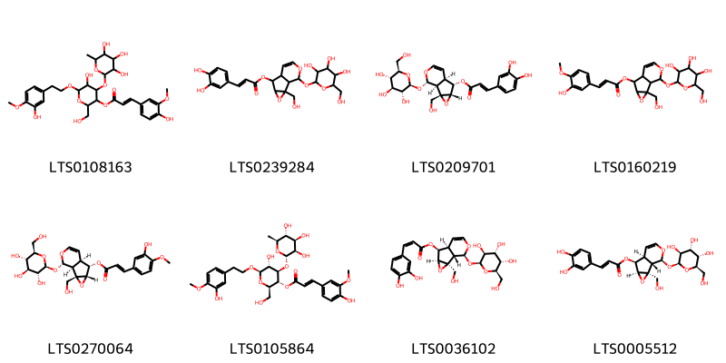{ width=100% }
    <figcaption>Hình ảnh cấu trúc hóa học của 8 hoạt chất thuộc nhóm Cinnamic acids and derivatives gồm ['5-hydroxy-6-[2-(3-hydroxy-4-methoxyphenyl)ethoxy]-2-(hydroxymethyl)-4-[(3,4,5-trihydroxy-6-methyloxan-2-yl)oxy]oxan-3-yl 3-(4-hydroxy-3-methoxyphenyl)prop-2-enoate (LTS0108163)', '2-(hydroxymethyl)-10-{[3,4,5-trihydroxy-6-(hydroxymethyl)oxan-2-yl]oxy}-3,9-dioxatricyclo[4.4.0.0²,⁴]dec-7-en-5-yl 3-(3,4-dihydroxyphenyl)prop-2-enoate (LTS0239284)', 'verminoside (LTS0209701)', '2-(hydroxymethyl)-10-{[3,4,5-trihydroxy-6-(hydroxymethyl)oxan-2-yl]oxy}-3,9-dioxatricyclo[4.4.0.0²,⁴]dec-7-en-5-yl 3-(3-hydroxy-4-methoxyphenyl)prop-2-enoate (LTS0160219)', 'minecoside (LTS0270064)', '(2r,3r,4r,5r,6r)-5-hydroxy-6-[2-(3-hydroxy-4-methoxyphenyl)ethoxy]-2-(hydroxymethyl)-4-{[(2s,3r,4r,5r,6s)-3,4,5-trihydroxy-6-methyloxan-2-yl]oxy}oxan-3-yl (2e)-3-(4-hydroxy-3-methoxyphenyl)prop-2-enoate (LTS0105864)', '(1s,2s,4s,5s,6s,10s)-2-(hydroxymethyl)-10-{[(2s,3s,4r,5s,6r)-3,4,5-trihydroxy-6-(hydroxymethyl)oxan-2-yl]oxy}-3,9-dioxatricyclo[4.4.0.0²,⁴]dec-7-en-5-yl (2z)-3-(3,4-dihydroxyphenyl)prop-2-enoate (LTS0036102)', '(1s,2s,4s,5s,6s,10s)-2-(hydroxymethyl)-10-{[(2s,3s,4r,5s,6r)-3,4,5-trihydroxy-6-(hydroxymethyl)oxan-2-yl]oxy}-3,9-dioxatricyclo[4.4.0.0²,⁴]dec-7-en-5-yl (2e)-3-(3,4-dihydroxyphenyl)prop-2-enoate (LTS0005512)'].</figcaption>
</figure>
#### Nhóm Organooxygen compounds
<figure markdown="span">
    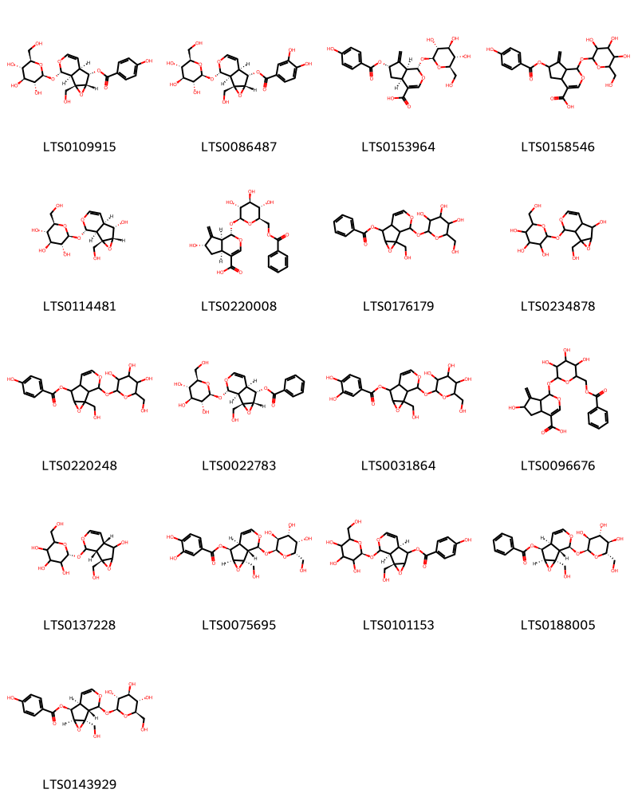{ width=100% }
    <figcaption>Hình ảnh cấu trúc hóa học của 17 hoạt chất thuộc nhóm Organooxygen compounds gồm ['(1s,2s,4s,5s,6r,10s)-2-(hydroxymethyl)-10-{[(2s,3r,4s,5s,6r)-3,4,5-trihydroxy-6-(hydroxymethyl)oxan-2-yl]oxy}-3,9-dioxatricyclo[4.4.0.0²,⁴]dec-7-en-5-yl 4-hydroxybenzoate (LTS0109915)', 'verproside (LTS0086487)', '(1s,4as,6s,7as)-6-(4-hydroxybenzoyloxy)-7-methylidene-1-{[(2s,3r,4s,5s,6r)-3,4,5-trihydroxy-6-(hydroxymethyl)oxan-2-yl]oxy}-1h,4ah,5h,6h,7ah-cyclopenta[c]pyran-4-carboxylic acid (LTS0153964)', '6-(4-hydroxybenzoyloxy)-7-methylidene-1-{[3,4,5-trihydroxy-6-(hydroxymethyl)oxan-2-yl]oxy}-1h,4ah,5h,6h,7ah-cyclopenta[c]pyran-4-carboxylic acid (LTS0158546)', 'catalpol (LTS0114481)', '(1s,4as,6s,7as)-1-{[(2s,3r,4s,5s,6r)-6-[(benzoyloxy)methyl]-3,4,5-trihydroxyoxan-2-yl]oxy}-6-hydroxy-7-methylidene-1h,4ah,5h,6h,7ah-cyclopenta[c]pyran-4-carboxylic acid (LTS0220008)', '2-(hydroxymethyl)-10-{[3,4,5-trihydroxy-6-(hydroxymethyl)oxan-2-yl]oxy}-3,9-dioxatricyclo[4.4.0.0²,⁴]dec-7-en-5-yl benzoate (LTS0176179)', 'catalpol (LTS0234878)', '2-(hydroxymethyl)-10-{[3,4,5-trihydroxy-6-(hydroxymethyl)oxan-2-yl]oxy}-3,9-dioxatricyclo[4.4.0.0²,⁴]dec-7-en-5-yl 4-hydroxybenzoate (LTS0220248)', '(1s,2s,4s,5s,6r,10s)-2-(hydroxymethyl)-10-{[(2s,3r,4s,5s,6r)-3,4,5-trihydroxy-6-(hydroxymethyl)oxan-2-yl]oxy}-3,9-dioxatricyclo[4.4.0.0²,⁴]dec-7-en-5-yl benzoate (LTS0022783)', '2-(hydroxymethyl)-10-{[3,4,5-trihydroxy-6-(hydroxymethyl)oxan-2-yl]oxy}-3,9-dioxatricyclo[4.4.0.0²,⁴]dec-7-en-5-yl 3,4-dihydroxybenzoate (LTS0031864)', '1-({6-[(benzoyloxy)methyl]-3,4,5-trihydroxyoxan-2-yl}oxy)-6-hydroxy-7-methylidene-1h,4ah,5h,6h,7ah-cyclopenta[c]pyran-4-carboxylic acid (LTS0096676)', '(2r)-2-{[(1r,2s,6s)-5-hydroxy-2-(hydroxymethyl)-3,9-dioxatricyclo[4.4.0.0²,⁴]dec-7-en-10-yl]oxy}-6-(hydroxymethyl)oxane-3,4,5-triol (LTS0137228)', '(1s,2s,4s,5s,6s,10s)-2-(hydroxymethyl)-10-{[(2s,3s,4r,5s,6s)-3,4,5-trihydroxy-6-(hydroxymethyl)oxan-2-yl]oxy}-3,9-dioxatricyclo[4.4.0.0²,⁴]dec-7-en-5-yl 3,4-dihydroxybenzoate (LTS0075695)', '(1s,2s,6r)-2-(hydroxymethyl)-10-{[(2s)-3,4,5-trihydroxy-6-(hydroxymethyl)oxan-2-yl]oxy}-3,9-dioxatricyclo[4.4.0.0²,⁴]dec-7-en-5-yl 4-hydroxybenzoate (LTS0101153)', '(1s,2s,4s,5s,6s,10s)-2-(hydroxymethyl)-10-{[(2s,3s,4r,5r,6s)-3,4,5-trihydroxy-6-(hydroxymethyl)oxan-2-yl]oxy}-3,9-dioxatricyclo[4.4.0.0²,⁴]dec-7-en-5-yl benzoate (LTS0188005)', '(1s,2s,4s,5s,6s,10s)-2-(hydroxymethyl)-10-{[(2s,3r,4s,5s,6r)-3,4,5-trihydroxy-6-(hydroxymethyl)oxan-2-yl]oxy}-3,9-dioxatricyclo[4.4.0.0²,⁴]dec-7-en-5-yl 4-hydroxybenzoate (LTS0143929)'].</figcaption>
</figure>
#### Nhóm Prenol lipids
<figure markdown="span">
    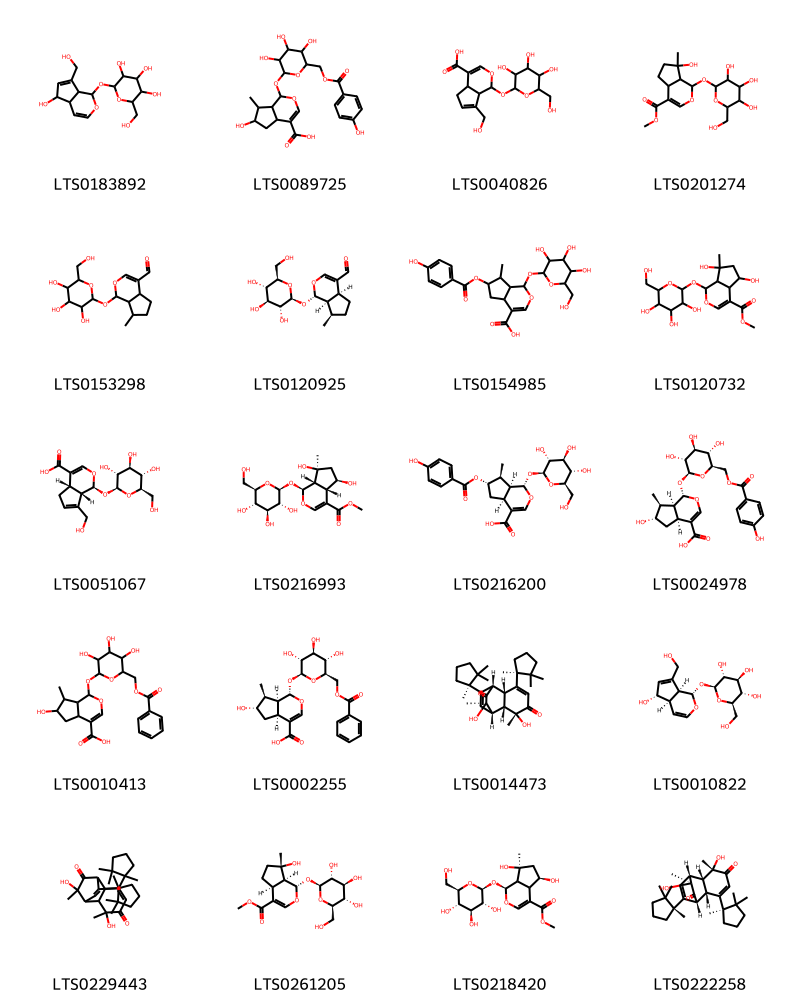{ width=100% }
    <figcaption>Hình ảnh cấu trúc hóa học của 20 hoạt chất thuộc nhóm Prenol lipids gồm ['aucubin (LTS0183892)', '6-hydroxy-7-methyl-1-({3,4,5-trihydroxy-6-[(4-hydroxybenzoyloxy)methyl]oxan-2-yl}oxy)-1h,4ah,5h,6h,7h,7ah-cyclopenta[c]pyran-4-carboxylic acid (LTS0089725)', '7-(hydroxymethyl)-1-{[3,4,5-trihydroxy-6-(hydroxymethyl)oxan-2-yl]oxy}-1h,4ah,5h,7ah-cyclopenta[c]pyran-4-carboxylic acid (LTS0040826)', 'methyl 7-hydroxy-7-methyl-1-{[3,4,5-trihydroxy-6-(hydroxymethyl)oxan-2-yl]oxy}-1h,4ah,5h,6h,7ah-cyclopenta[c]pyran-4-carboxylate (LTS0201274)', '7-methyl-1-{[3,4,5-trihydroxy-6-(hydroxymethyl)oxan-2-yl]oxy}-1h,4ah,5h,6h,7h,7ah-cyclopenta[c]pyran-4-carbaldehyde (LTS0153298)', 'boschnaloside (LTS0120925)', '6-(4-hydroxybenzoyloxy)-7-methyl-1-{[3,4,5-trihydroxy-6-(hydroxymethyl)oxan-2-yl]oxy}-1h,4ah,5h,6h,7h,7ah-cyclopenta[c]pyran-4-carboxylic acid (LTS0154985)', 'methyl 5,7-dihydroxy-7-methyl-1-{[3,4,5-trihydroxy-6-(hydroxymethyl)oxan-2-yl]oxy}-1h,4ah,5h,6h,7ah-cyclopenta[c]pyran-4-carboxylate (LTS0120732)', 'geniposidic acid (LTS0051067)', 'methyl (1s,4as,5r,7s,7as)-5,7-dihydroxy-7-methyl-1-{[(2s,3r,4s,5s,6r)-3,4,5-trihydroxy-6-(hydroxymethyl)oxan-2-yl]oxy}-1h,4ah,5h,6h,7ah-cyclopenta[c]pyran-4-carboxylate (LTS0216993)', '(1s,4as,6s,7s,7as)-6-(4-hydroxybenzoyloxy)-7-methyl-1-{[(2s,3r,4s,5s,6r)-3,4,5-trihydroxy-6-(hydroxymethyl)oxan-2-yl]oxy}-1h,4ah,5h,6h,7h,7ah-cyclopenta[c]pyran-4-carboxylic acid (LTS0216200)', '(1s,4as,6s,7s,7as)-6-hydroxy-7-methyl-1-{[(2s,3r,4s,5s,6r)-3,4,5-trihydroxy-6-[(4-hydroxybenzoyloxy)methyl]oxan-2-yl]oxy}-1h,4ah,5h,6h,7h,7ah-cyclopenta[c]pyran-4-carboxylic acid (LTS0024978)', '1-({6-[(benzoyloxy)methyl]-3,4,5-trihydroxyoxan-2-yl}oxy)-6-hydroxy-7-methyl-1h,4ah,5h,6h,7h,7ah-cyclopenta[c]pyran-4-carboxylic acid (LTS0010413)', '(1s,4as,6s,7s,7as)-1-{[(2s,3r,4s,5s,6r)-6-[(benzoyloxy)methyl]-3,4,5-trihydroxyoxan-2-yl]oxy}-6-hydroxy-7-methyl-1h,4ah,5h,6h,7h,7ah-cyclopenta[c]pyran-4-carboxylic acid (LTS0002255)', '(1s,2s,3r,7r,8s,10r)-3,10-dihydroxy-3,10-dimethyl-6,12-bis[(1s)-1,2,2-trimethylcyclopentyl]tricyclo[6.2.2.0²,⁷]dodeca-5,11-diene-4,9-dione (LTS0014473)', 'aucubin (LTS0010822)', '3,10-dihydroxy-3,10-dimethyl-6,12-bis(1,2,2-trimethylcyclopentyl)tricyclo[6.2.2.0²,⁷]dodeca-5,11-diene-4,9-dione (LTS0229443)', 'methyl (1s,4as,7s,7as)-7-hydroxy-7-methyl-1-{[(2s,3r,4s,5s,6r)-3,4,5-trihydroxy-6-(hydroxymethyl)oxan-2-yl]oxy}-1h,4ah,5h,6h,7ah-cyclopenta[c]pyran-4-carboxylate (LTS0261205)', 'methyl (1s,5r,7s)-5,7-dihydroxy-7-methyl-1-{[(2s,3r,4s,5s,6r)-3,4,5-trihydroxy-6-(hydroxymethyl)oxan-2-yl]oxy}-1h,4ah,5h,6h,7ah-cyclopenta[c]pyran-4-carboxylate (LTS0218420)', '(1r,2r,3s,7s,8r,10s)-3,10-dihydroxy-3,10-dimethyl-6,12-bis[(1r)-1,2,2-trimethylcyclopentyl]tricyclo[6.2.2.0²,⁷]dodeca-5,11-diene-4,9-dione (LTS0222258)'].</figcaption>
</figure>
#### Nhóm Steroids and steroid derivatives
<figure markdown="span">
    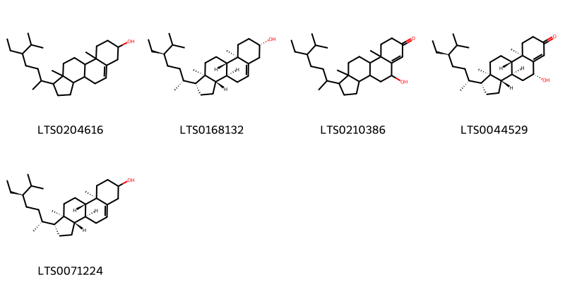{ width=100% }
    <figcaption>Hình ảnh cấu trúc hóa học của 5 hoạt chất thuộc nhóm Steroids and steroid derivatives gồm ['stigmast-5-en-3-ol, (3β)- (LTS0204616)', 'sitosterol (LTS0168132)', '1-(5-ethyl-6-methylheptan-2-yl)-5-hydroxy-9a,11a-dimethyl-1h,2h,3h,3ah,3bh,4h,5h,8h,9h,9bh,10h,11h-cyclopenta[a]phenanthren-7-one (LTS0210386)', '(1r,3as,3bs,5r,9ar,9bs,11ar)-1-[(2r,5r)-5-ethyl-6-methylheptan-2-yl]-5-hydroxy-9a,11a-dimethyl-1h,2h,3h,3ah,3bh,4h,5h,8h,9h,9bh,10h,11h-cyclopenta[a]phenanthren-7-one (LTS0044529)', 'stigmast-5-en-3-ol (LTS0071224)'].</figcaption>
</figure>
#### Nhóm Tannins
<figure markdown="span">
    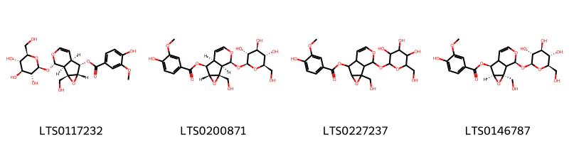{ width=100% }
    <figcaption>Hình ảnh cấu trúc hóa học của 4 hoạt chất thuộc nhóm Tannins gồm ['(1s,2s,4s,5s,6r,10s)-2-(hydroxymethyl)-10-{[(2s,3r,4s,5s,6r)-3,4,5-trihydroxy-6-(hydroxymethyl)oxan-2-yl]oxy}-3,9-dioxatricyclo[4.4.0.0²,⁴]dec-7-en-5-yl 4-hydroxy-3-methoxybenzoate (LTS0117232)', '(1r,2r,4r,5s,6s,10s)-2-(hydroxymethyl)-10-{[(2s,3r,4s,5s,6r)-3,4,5-trihydroxy-6-(hydroxymethyl)oxan-2-yl]oxy}-3,9-dioxatricyclo[4.4.0.0²,⁴]dec-7-en-5-yl 4-hydroxy-3-methoxybenzoate (LTS0200871)', 'picroside ii (LTS0227237)', '(2s,4s,5s,10s)-2-(hydroxymethyl)-10-{[(2s,3r,4s,5s,6r)-3,4,5-trihydroxy-6-(hydroxymethyl)oxan-2-yl]oxy}-3,9-dioxatricyclo[4.4.0.0²,⁴]dec-7-en-5-yl 4-hydroxy-3-methoxybenzoate (LTS0146787)'].</figcaption>
</figure>

---

### Dược dân tộc học

Danh sách các quốc gia có sử dụng *Veronica anagallis* trong điều trị các bệnh. 

| Country   | Disease   | Bệnh                                                                                                                                                                                                |
|:----------|:----------|:----------------------------------------------------------------------------------------------------------------------------------------------------------------------------------------------------|
| ain       | Diuretic  | MYMEMORY WARNING: YOU USED ALL AVAILABLE FREE TRANSLATIONS FOR TODAY. NEXT AVAILABLE IN  17 HOURS 44 MINUTES 47 SECONDS VISIT HTTPS://MYMEMORY.TRANSLATED.NET/DOC/USAGELIMITS.PHP TO TRANSLATE MORE |

---

---
## Veronica anagallisaquatica
### Thông tin về thực vật

!!! info "Phân loại thực vật của *Veronica anagallis-aquatica* từ GIBF:"
    - **Kingdom:** Plantae
    - **Phylum:** Tracheophyta
    - **Order:** Lamiales
    - **Family:** Plantaginaceae
    - **Genus:** Veronica
    - **Species:** *Veronica anagallis-aquatica*

 

| Label (VI)   | Label (EN)   | Scientific Name    | Descriptions (VI)   | Descriptions (EN)   | Also Known As (VI)   | Also Known As (EN)   |
|:-------------|:-------------|:-------------------|:--------------------|:--------------------|:---------------------|:---------------------|
| N/A          | N/A          | Veronica anagallis |                     |                     | ['']                 | ['']                 |

#### Phân bố trên thế giới

**Từ CSDL GIBF** Bosnia and Herzegovina, Namibia, Spain, Germany, Chile, Austria, Australia, Korea, Republic of, Montenegro, Japan, Peru, Greece, Mexico, Switzerland, Argentina, South Africa, Portugal, Syrian Arab Republic, France, Armenia, New Zealand, Bolivia (Plurinational State of), Cyprus, United States of America, Italy, Israel, Algeria, Lesotho, Croatia, Ukraine

#### Phân bố tại Việt Nam

**Từ CSDL GIBF**: Không có ghi nhận ở Việt Nam

---
### Thành phần hóa học
        
- Theo cơ sở dữ liệu lotus: Từ loài *Veronica anagallis-aquatica* đã phân lập và xác định được Chưa có hoạt chất nào được phân lập. hoạt chất thuộc về các nhóm Không có hoạt chất nào được phân lập. 

Không có hình ảnh nào được tạo ra

---

### Dược dân tộc học

Danh sách các quốc gia có sử dụng *Veronica anagallis-aquatica* trong điều trị các bệnh. 

| Country   | Disease           | Bệnh                                                                                                                                                                                                |
|:----------|:------------------|:----------------------------------------------------------------------------------------------------------------------------------------------------------------------------------------------------|
| Elsewhere | Apertif, Diuretic | MYMEMORY WARNING: YOU USED ALL AVAILABLE FREE TRANSLATIONS FOR TODAY. NEXT AVAILABLE IN  17 HOURS 43 MINUTES 57 SECONDS VISIT HTTPS://MYMEMORY.TRANSLATED.NET/DOC/USAGELIMITS.PHP TO TRANSLATE MORE |

---

---
## Veronica arvensis
### Thông tin về thực vật

!!! info "Phân loại thực vật của *Veronica arvensis* từ GIBF:"
    - **Kingdom:** Plantae
    - **Phylum:** Tracheophyta
    - **Order:** Lamiales
    - **Family:** Plantaginaceae
    - **Genus:** Veronica
    - **Species:** *Veronica arvensis*

 

| Label (VI)   | Label (EN)   | Scientific Name   | Descriptions (VI)   | Descriptions (EN)   | Also Known As (VI)   | Also Known As (EN)                     |
|:-------------|:-------------|:------------------|:--------------------|:--------------------|:---------------------|:---------------------------------------|
| N/A          | N/A          | Veronica arvensis |                     | species of plant    | ['']                 | ['common speedwell', 'wall speedwell'] |

#### Phân bố trên thế giới

**Từ CSDL GIBF** United Kingdom of Great Britain and Northern Ireland, Dominican Republic, Portugal, Australia, Spain, New Zealand, Poland, Germany, Ecuador, United States of America, Italy, Israel, Austria, Norway, Belgium, Netherlands

#### Phân bố tại Việt Nam

**Từ CSDL GIBF**: Không có ghi nhận ở Việt Nam

---
### Thành phần hóa học
        
- Theo cơ sở dữ liệu lotus: Từ loài *Veronica arvensis* đã phân lập và xác định được 2 hoạt chất thuộc về các nhóm Prenol lipids. 

|    | chemicalTaxonomyClassyfireClass   |   smiles_count |
|---:|:----------------------------------|---------------:|
|  0 | Prenol lipids                     |              2 |

#### Nhóm Prenol lipids
<figure markdown="span">
    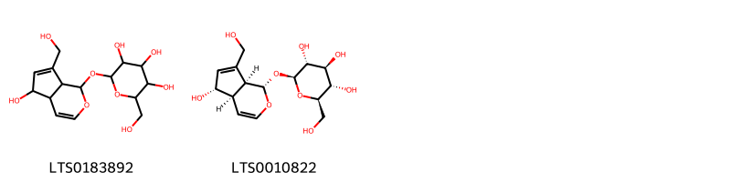{ width=100% }
    <figcaption>Hình ảnh cấu trúc hóa học của 2 hoạt chất thuộc nhóm Prenol lipids gồm ['aucubin (LTS0183892)', 'aucubin (LTS0010822)'].</figcaption>
</figure>

---

### Dược dân tộc học

Danh sách các quốc gia có sử dụng *Veronica arvensis* trong điều trị các bệnh. 

| Country   | Disease                                                                         | Bệnh                                                                                                                                                                                                |
|:----------|:--------------------------------------------------------------------------------|:----------------------------------------------------------------------------------------------------------------------------------------------------------------------------------------------------|
| Elsewhere | Diaphoretic, Diaphoretic, Diuretic, Diuretic, Expectorant, Apertif, Expectorant | MYMEMORY WARNING: YOU USED ALL AVAILABLE FREE TRANSLATIONS FOR TODAY. NEXT AVAILABLE IN  17 HOURS 43 MINUTES 34 SECONDS VISIT HTTPS://MYMEMORY.TRANSLATED.NET/DOC/USAGELIMITS.PHP TO TRANSLATE MORE |

---

---
## Veronica beccabunga
### Thông tin về thực vật

!!! info "Phân loại thực vật của *Veronica beccabunga* từ GIBF:"
    - **Kingdom:** Plantae
    - **Phylum:** Tracheophyta
    - **Order:** Lamiales
    - **Family:** Plantaginaceae
    - **Genus:** Veronica
    - **Species:** *Veronica beccabunga*

 

| Label (VI)   | Label (EN)   | Scientific Name     | Descriptions (VI)   | Descriptions (EN)   | Also Known As (VI)   | Also Known As (EN)   |
|:-------------|:-------------|:--------------------|:--------------------|:--------------------|:---------------------|:---------------------|
| N/A          | N/A          | Veronica beccabunga | loài thực vật       | species of plant    | ['']                 | ['Brooklime']        |

#### Phân bố trên thế giới

**Từ CSDL GIBF** Denmark, Luxembourg, Spain, Germany, Austria, Australia, Sweden, Poland, Montenegro, Belgium, Netherlands, Lithuania, Hungary, Ireland, Switzerland, United Kingdom of Great Britain and Northern Ireland, France, Czechia, Russian Federation, Croatia, Ukraine

#### Phân bố tại Việt Nam

**Từ CSDL GIBF**: Không có ghi nhận ở Việt Nam

---
### Thành phần hóa học
        
- Theo cơ sở dữ liệu lotus: Từ loài *Veronica beccabunga* đã phân lập và xác định được Chưa có hoạt chất nào được phân lập. hoạt chất thuộc về các nhóm Không có hoạt chất nào được phân lập. 

Không có hình ảnh nào được tạo ra

---

### Dược dân tộc học

Danh sách các quốc gia có sử dụng *Veronica beccabunga* trong điều trị các bệnh. 

| Country   | Disease                                               | Bệnh                                                                                                                                                                                                |
|:----------|:------------------------------------------------------|:----------------------------------------------------------------------------------------------------------------------------------------------------------------------------------------------------|
| Elsewhere | Apertif, Diuretic, Diuretic, Apertif                  | MYMEMORY WARNING: YOU USED ALL AVAILABLE FREE TRANSLATIONS FOR TODAY. NEXT AVAILABLE IN  17 HOURS 43 MINUTES 07 SECONDS VISIT HTTPS://MYMEMORY.TRANSLATED.NET/DOC/USAGELIMITS.PHP TO TRANSLATE MORE |
| Eurasia   | Diuretic                                              | MYMEMORY WARNING: YOU USED ALL AVAILABLE FREE TRANSLATIONS FOR TODAY. NEXT AVAILABLE IN  17 HOURS 43 MINUTES 04 SECONDS VISIT HTTPS://MYMEMORY.TRANSLATED.NET/DOC/USAGELIMITS.PHP TO TRANSLATE MORE |
| Iraq      | Emmenagogue, Expectorant, Sudorific, Vulnerary, Tonic | MYMEMORY WARNING: YOU USED ALL AVAILABLE FREE TRANSLATIONS FOR TODAY. NEXT AVAILABLE IN  17 HOURS 43 MINUTES 01 SECONDS VISIT HTTPS://MYMEMORY.TRANSLATED.NET/DOC/USAGELIMITS.PHP TO TRANSLATE MORE |
| Turkey    | Apertif, Diuretic                                     | MYMEMORY WARNING: YOU USED ALL AVAILABLE FREE TRANSLATIONS FOR TODAY. NEXT AVAILABLE IN  17 HOURS 42 MINUTES 58 SECONDS VISIT HTTPS://MYMEMORY.TRANSLATED.NET/DOC/USAGELIMITS.PHP TO TRANSLATE MORE |
| ain       | Diuretic                                              | MYMEMORY WARNING: YOU USED ALL AVAILABLE FREE TRANSLATIONS FOR TODAY. NEXT AVAILABLE IN  17 HOURS 42 MINUTES 56 SECONDS VISIT HTTPS://MYMEMORY.TRANSLATED.NET/DOC/USAGELIMITS.PHP TO TRANSLATE MORE |

---

---
## Veronica hederaefolia
### Thông tin về thực vật

!!! info "Phân loại thực vật của *Veronica hederifolia* từ GIBF:"
    - **Kingdom:** Plantae
    - **Phylum:** Tracheophyta
    - **Order:** Lamiales
    - **Family:** Plantaginaceae
    - **Genus:** Veronica
    - **Species:** *Veronica hederifolia*

 

| Label (VI)   | Label (EN)   | Scientific Name       | Descriptions (VI)   | Descriptions (EN)   | Also Known As (VI)   | Also Known As (EN)   |
|:-------------|:-------------|:----------------------|:--------------------|:--------------------|:---------------------|:---------------------|
| N/A          | N/A          | Veronica hederaefolia | loài thực vật       | species of plant    | ['']                 | ['']                 |

#### Phân bố trên thế giới

**Từ CSDL GIBF** nan, Spain, Germany, Austria, Serbia, Uzbekistan, Iraq, Belgium, Netherlands, Türkiye, Slovenia, Japan, Hungary, Bulgaria, Ireland, Switzerland, United Kingdom of Great Britain and Northern Ireland, Portugal, France, Czechia, Russian Federation, United States of America, Italy, Algeria, Ukraine

#### Phân bố tại Việt Nam

**Từ CSDL GIBF**: Không có ghi nhận ở Việt Nam

---
### Thành phần hóa học
        
- Theo cơ sở dữ liệu lotus: Từ loài *Veronica hederifolia* đã phân lập và xác định được 11 hoạt chất thuộc về các nhóm Tannins, Organooxygen compounds, Cinnamic acids and derivatives, Prenol lipids. 

|    | chemicalTaxonomyClassyfireClass   |   smiles_count |
|---:|:----------------------------------|---------------:|
|  0 | Cinnamic acids and derivatives    |              1 |
|  1 | Organooxygen compounds            |              6 |
|  2 | Prenol lipids                     |              1 |
|  3 | Tannins                           |              3 |

#### Nhóm Cinnamic acids and derivatives
<figure markdown="span">
    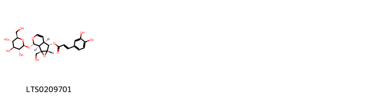{ width=100% }
    <figcaption>Hình ảnh cấu trúc hóa học của 1 hoạt chất thuộc nhóm Cinnamic acids and derivatives gồm ['verminoside (LTS0209701)'].</figcaption>
</figure>
#### Nhóm Organooxygen compounds
<figure markdown="span">
    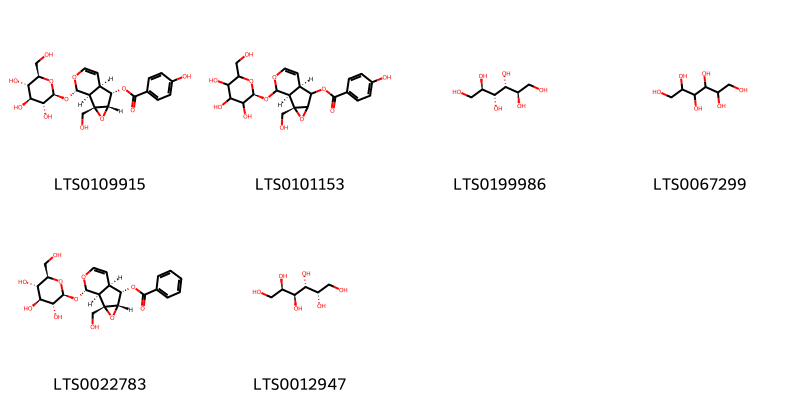{ width=100% }
    <figcaption>Hình ảnh cấu trúc hóa học của 6 hoạt chất thuộc nhóm Organooxygen compounds gồm ['(1s,2s,4s,5s,6r,10s)-2-(hydroxymethyl)-10-{[(2s,3r,4s,5s,6r)-3,4,5-trihydroxy-6-(hydroxymethyl)oxan-2-yl]oxy}-3,9-dioxatricyclo[4.4.0.0²,⁴]dec-7-en-5-yl 4-hydroxybenzoate (LTS0109915)', '(1s,2s,6r)-2-(hydroxymethyl)-10-{[(2s)-3,4,5-trihydroxy-6-(hydroxymethyl)oxan-2-yl]oxy}-3,9-dioxatricyclo[4.4.0.0²,⁴]dec-7-en-5-yl 4-hydroxybenzoate (LTS0101153)', 'mannitol (LTS0199986)', 'sorbo (LTS0067299)', '(1s,2s,4s,5s,6r,10s)-2-(hydroxymethyl)-10-{[(2s,3r,4s,5s,6r)-3,4,5-trihydroxy-6-(hydroxymethyl)oxan-2-yl]oxy}-3,9-dioxatricyclo[4.4.0.0²,⁴]dec-7-en-5-yl benzoate (LTS0022783)', 'galactitol (LTS0012947)'].</figcaption>
</figure>
#### Nhóm Prenol lipids
<figure markdown="span">
    { width=100% }
    <figcaption>Hình ảnh cấu trúc hóa học của 1 hoạt chất thuộc nhóm Prenol lipids gồm ['aucubin (LTS0010822)'].</figcaption>
</figure>
#### Nhóm Tannins
<figure markdown="span">
    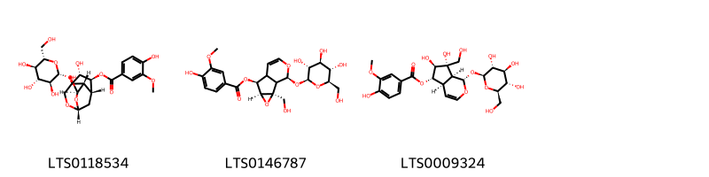{ width=100% }
    <figcaption>Hình ảnh cấu trúc hóa học của 3 hoạt chất thuộc nhóm Tannins gồm ['(1r,4s,5r,6s,7r,8s,9s)-4,5-dihydroxy-9-{[(2r,3s,4r,5r,6s)-3,4,5-trihydroxy-6-(hydroxymethyl)oxan-2-yl]oxy}-2,10-dioxatricyclo[5.3.1.0⁴,⁸]undecan-6-yl 4-hydroxy-3-methoxybenzoate (LTS0118534)', '(2s,4s,5s,10s)-2-(hydroxymethyl)-10-{[(2s,3r,4s,5s,6r)-3,4,5-trihydroxy-6-(hydroxymethyl)oxan-2-yl]oxy}-3,9-dioxatricyclo[4.4.0.0²,⁴]dec-7-en-5-yl 4-hydroxy-3-methoxybenzoate (LTS0146787)', '(1s,4ar,5s,6r,7s,7as)-6,7-dihydroxy-7-(hydroxymethyl)-1-{[(2s,3r,4s,5s,6r)-3,4,5-trihydroxy-6-(hydroxymethyl)oxan-2-yl]oxy}-1h,4ah,5h,6h,7ah-cyclopenta[c]pyran-5-yl 4-hydroxy-3-methoxybenzoate (LTS0009324)'].</figcaption>
</figure>

---

### Dược dân tộc học

Danh sách các quốc gia có sử dụng *Veronica hederifolia* trong điều trị các bệnh. 

| Country   | Disease                                                        | Bệnh                                                                                                                                                                                                |
|:----------|:---------------------------------------------------------------|:----------------------------------------------------------------------------------------------------------------------------------------------------------------------------------------------------|
| Elsewhere | Apertif, Diuretic, Expectorant, Apertif, Diaphoretic, Diuretic | MYMEMORY WARNING: YOU USED ALL AVAILABLE FREE TRANSLATIONS FOR TODAY. NEXT AVAILABLE IN  17 HOURS 42 MINUTES 35 SECONDS VISIT HTTPS://MYMEMORY.TRANSLATED.NET/DOC/USAGELIMITS.PHP TO TRANSLATE MORE |

---

---
## Veronica officinalis
### Thông tin về thực vật

!!! info "Phân loại thực vật của *Veronica officinalis* từ GIBF:"
    - **Kingdom:** Plantae
    - **Phylum:** Tracheophyta
    - **Order:** Lamiales
    - **Family:** Plantaginaceae
    - **Genus:** Veronica
    - **Species:** *Veronica officinalis*

 

| Label (VI)   | Label (EN)   | Scientific Name      | Descriptions (VI)   | Descriptions (EN)   | Also Known As (VI)   | Also Known As (EN)   |
|:-------------|:-------------|:---------------------|:--------------------|:--------------------|:---------------------|:---------------------|
| N/A          | N/A          | Veronica officinalis | loài thực vật       | species of plant    | ['']                 | ['Heath Speedwell']  |

#### Phân bố trên thế giới

**Từ CSDL GIBF** nan, Denmark, Spain, Germany, Austria, Sweden, Poland, Canada, Belgium, Netherlands, Slovakia, Belarus, Norway, Switzerland, United Kingdom of Great Britain and Northern Ireland, Portugal, France, Czechia, Russian Federation, United States of America, Italy, Ukraine

#### Phân bố tại Việt Nam

**Từ CSDL GIBF**: Không có ghi nhận ở Việt Nam

---
### Thành phần hóa học
        
- Theo cơ sở dữ liệu lotus: Từ loài *Veronica officinalis* đã phân lập và xác định được 22 hoạt chất thuộc về các nhóm Organooxygen compounds, Prenol lipids, Flavonoids, Cinnamic acids and derivatives. 

|    | chemicalTaxonomyClassyfireClass   |   smiles_count |
|---:|:----------------------------------|---------------:|
|  0 | Cinnamic acids and derivatives    |              6 |
|  1 | Flavonoids                        |              5 |
|  2 | Organooxygen compounds            |              6 |
|  3 | Prenol lipids                     |              5 |

#### Nhóm Cinnamic acids and derivatives
<figure markdown="span">
    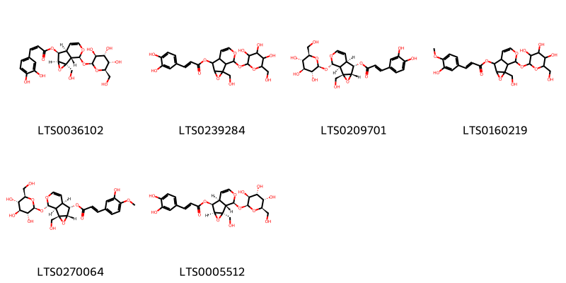{ width=100% }
    <figcaption>Hình ảnh cấu trúc hóa học của 6 hoạt chất thuộc nhóm Cinnamic acids and derivatives gồm ['(1s,2s,4s,5s,6s,10s)-2-(hydroxymethyl)-10-{[(2s,3s,4r,5s,6r)-3,4,5-trihydroxy-6-(hydroxymethyl)oxan-2-yl]oxy}-3,9-dioxatricyclo[4.4.0.0²,⁴]dec-7-en-5-yl (2z)-3-(3,4-dihydroxyphenyl)prop-2-enoate (LTS0036102)', '2-(hydroxymethyl)-10-{[3,4,5-trihydroxy-6-(hydroxymethyl)oxan-2-yl]oxy}-3,9-dioxatricyclo[4.4.0.0²,⁴]dec-7-en-5-yl 3-(3,4-dihydroxyphenyl)prop-2-enoate (LTS0239284)', 'verminoside (LTS0209701)', '2-(hydroxymethyl)-10-{[3,4,5-trihydroxy-6-(hydroxymethyl)oxan-2-yl]oxy}-3,9-dioxatricyclo[4.4.0.0²,⁴]dec-7-en-5-yl 3-(3-hydroxy-4-methoxyphenyl)prop-2-enoate (LTS0160219)', 'minecoside (LTS0270064)', '(1s,2s,4s,5s,6s,10s)-2-(hydroxymethyl)-10-{[(2s,3s,4r,5s,6r)-3,4,5-trihydroxy-6-(hydroxymethyl)oxan-2-yl]oxy}-3,9-dioxatricyclo[4.4.0.0²,⁴]dec-7-en-5-yl (2e)-3-(3,4-dihydroxyphenyl)prop-2-enoate (LTS0005512)'].</figcaption>
</figure>
#### Nhóm Flavonoids
<figure markdown="span">
    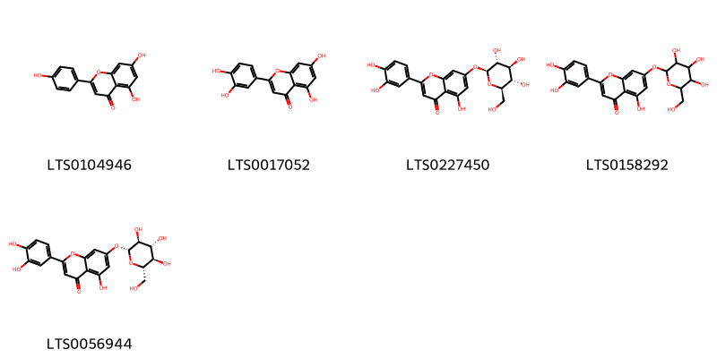{ width=100% }
    <figcaption>Hình ảnh cấu trúc hóa học của 5 hoạt chất thuộc nhóm Flavonoids gồm ['chamomile (LTS0104946)', 'luteolin (LTS0017052)', 'luteolin 7-o-glucoside (LTS0227450)', '2-(3,4-dihydroxyphenyl)-5-hydroxy-7-{[3,4,5-trihydroxy-6-(hydroxymethyl)oxan-2-yl]oxy}chromen-4-one (LTS0158292)', '2-(3,4-dihydroxyphenyl)-5-hydroxy-7-{[(2r,3s,4r,5r,6s)-3,4,5-trihydroxy-6-(hydroxymethyl)oxan-2-yl]oxy}chromen-4-one (LTS0056944)'].</figcaption>
</figure>
#### Nhóm Organooxygen compounds
<figure markdown="span">
    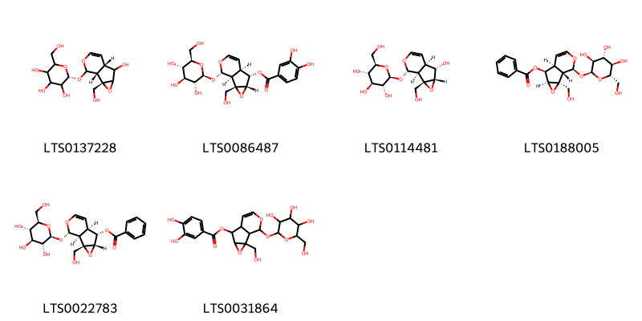{ width=100% }
    <figcaption>Hình ảnh cấu trúc hóa học của 6 hoạt chất thuộc nhóm Organooxygen compounds gồm ['(2r)-2-{[(1r,2s,6s)-5-hydroxy-2-(hydroxymethyl)-3,9-dioxatricyclo[4.4.0.0²,⁴]dec-7-en-10-yl]oxy}-6-(hydroxymethyl)oxane-3,4,5-triol (LTS0137228)', 'verproside (LTS0086487)', 'catalpol (LTS0114481)', '(1s,2s,4s,5s,6s,10s)-2-(hydroxymethyl)-10-{[(2s,3s,4r,5r,6s)-3,4,5-trihydroxy-6-(hydroxymethyl)oxan-2-yl]oxy}-3,9-dioxatricyclo[4.4.0.0²,⁴]dec-7-en-5-yl benzoate (LTS0188005)', '(1s,2s,4s,5s,6r,10s)-2-(hydroxymethyl)-10-{[(2s,3r,4s,5s,6r)-3,4,5-trihydroxy-6-(hydroxymethyl)oxan-2-yl]oxy}-3,9-dioxatricyclo[4.4.0.0²,⁴]dec-7-en-5-yl benzoate (LTS0022783)', '2-(hydroxymethyl)-10-{[3,4,5-trihydroxy-6-(hydroxymethyl)oxan-2-yl]oxy}-3,9-dioxatricyclo[4.4.0.0²,⁴]dec-7-en-5-yl 3,4-dihydroxybenzoate (LTS0031864)'].</figcaption>
</figure>
#### Nhóm Prenol lipids
<figure markdown="span">
    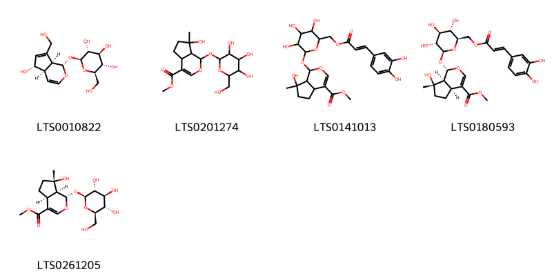{ width=100% }
    <figcaption>Hình ảnh cấu trúc hóa học của 5 hoạt chất thuộc nhóm Prenol lipids gồm ['aucubin (LTS0010822)', 'methyl 7-hydroxy-7-methyl-1-{[3,4,5-trihydroxy-6-(hydroxymethyl)oxan-2-yl]oxy}-1h,4ah,5h,6h,7ah-cyclopenta[c]pyran-4-carboxylate (LTS0201274)', 'methyl 1-{[6-({[3-(3,4-dihydroxyphenyl)prop-2-enoyl]oxy}methyl)-3,4,5-trihydroxyoxan-2-yl]oxy}-7-hydroxy-7-methyl-1h,4ah,5h,6h,7ah-cyclopenta[c]pyran-4-carboxylate (LTS0141013)', 'methyl (1s,4as,7s,7as)-1-{[(2s,3r,4s,5s,6r)-6-({[(2e)-3-(3,4-dihydroxyphenyl)prop-2-enoyl]oxy}methyl)-3,4,5-trihydroxyoxan-2-yl]oxy}-7-hydroxy-7-methyl-1h,4ah,5h,6h,7ah-cyclopenta[c]pyran-4-carboxylate (LTS0180593)', 'methyl (1s,4as,7s,7as)-7-hydroxy-7-methyl-1-{[(2s,3r,4s,5s,6r)-3,4,5-trihydroxy-6-(hydroxymethyl)oxan-2-yl]oxy}-1h,4ah,5h,6h,7ah-cyclopenta[c]pyran-4-carboxylate (LTS0261205)'].</figcaption>
</figure>

---

### Dược dân tộc học

Danh sách các quốc gia có sử dụng *Veronica officinalis* trong điều trị các bệnh. 

| Country   | Disease                                                                                                    | Bệnh                                                                                                                                                                                                |
|:----------|:-----------------------------------------------------------------------------------------------------------|:----------------------------------------------------------------------------------------------------------------------------------------------------------------------------------------------------|
| Eurasia   | Diuretic, Expectorant                                                                                      | MYMEMORY WARNING: YOU USED ALL AVAILABLE FREE TRANSLATIONS FOR TODAY. NEXT AVAILABLE IN  17 HOURS 42 MINUTES 10 SECONDS VISIT HTTPS://MYMEMORY.TRANSLATED.NET/DOC/USAGELIMITS.PHP TO TRANSLATE MORE |
| Turkey    | Astringent, Stomachic, Sudorific, Digestive, Emmenagogue, Tonic, Vulnerary, Apertif, Diuretic, Expectorant | MYMEMORY WARNING: YOU USED ALL AVAILABLE FREE TRANSLATIONS FOR TODAY. NEXT AVAILABLE IN  17 HOURS 42 MINUTES 07 SECONDS VISIT HTTPS://MYMEMORY.TRANSLATED.NET/DOC/USAGELIMITS.PHP TO TRANSLATE MORE |

---

---
## Veronica tenuifolia
### Thông tin về thực vật

!!! info "Phân loại thực vật của *Veronica tenuifolia* từ GIBF:"
    - **Kingdom:** Plantae
    - **Phylum:** Tracheophyta
    - **Order:** Lamiales
    - **Family:** Plantaginaceae
    - **Genus:** Veronica
    - **Species:** *Veronica tenuifolia*

 

| Label (VI)   | Label (EN)   | Scientific Name     | Descriptions (VI)   | Descriptions (EN)   | Also Known As (VI)   | Also Known As (EN)   |
|:-------------|:-------------|:--------------------|:--------------------|:--------------------|:---------------------|:---------------------|
| N/A          | N/A          | Veronica tenuifolia |                     | species of plant    | ['']                 | ['']                 |

#### Phân bố trên thế giới

**Từ CSDL GIBF** Spain

#### Phân bố tại Việt Nam

**Từ CSDL GIBF**: Không có ghi nhận ở Việt Nam

---
### Thành phần hóa học
        
- Theo cơ sở dữ liệu lotus: Từ loài *Veronica tenuifolia* đã phân lập và xác định được Chưa có hoạt chất nào được phân lập. hoạt chất thuộc về các nhóm Không có hoạt chất nào được phân lập. 

Không có hình ảnh nào được tạo ra

---

### Dược dân tộc học

Danh sách các quốc gia có sử dụng *Veronica tenuifolia* trong điều trị các bệnh. 

| Country   | Disease   | Bệnh                                                                                                                                                                                                |
|:----------|:----------|:----------------------------------------------------------------------------------------------------------------------------------------------------------------------------------------------------|
| ain       | Emetic    | MYMEMORY WARNING: YOU USED ALL AVAILABLE FREE TRANSLATIONS FOR TODAY. NEXT AVAILABLE IN  17 HOURS 41 MINUTES 30 SECONDS VISIT HTTPS://MYMEMORY.TRANSLATED.NET/DOC/USAGELIMITS.PHP TO TRANSLATE MORE |

---

---
## Veronica virginica
### Thông tin về thực vật

!!! info "Phân loại thực vật của *Veronicastrum virginicum* từ GIBF:"
    - **Kingdom:** Plantae
    - **Phylum:** Tracheophyta
    - **Order:** Lamiales
    - **Family:** Plantaginaceae
    - **Genus:** Veronicastrum
    - **Species:** *Veronicastrum virginicum*

 

| Label (VI)   | Label (EN)   | Scientific Name    | Descriptions (VI)   | Descriptions (EN)   | Also Known As (VI)   | Also Known As (EN)   |
|:-------------|:-------------|:-------------------|:--------------------|:--------------------|:---------------------|:---------------------|
| N/A          | N/A          | Veronica virginica | loài thực vật       | species of plant    | ['']                 | ['']                 |

#### Phân bố trên thế giới

**Từ CSDL GIBF** nan, unknown or invalid, Japan, Russian Federation, United States of America, China, Austria, Netherlands

#### Phân bố tại Việt Nam

**Từ CSDL GIBF**: Không có ghi nhận ở Việt Nam

---
### Thành phần hóa học
        
- Theo cơ sở dữ liệu lotus: Từ loài *Veronicastrum virginicum* đã phân lập và xác định được Chưa có hoạt chất nào được phân lập. hoạt chất thuộc về các nhóm Không có hoạt chất nào được phân lập. 

Không có hình ảnh nào được tạo ra

---

### Dược dân tộc học

Danh sách các quốc gia có sử dụng *Veronicastrum virginicum* trong điều trị các bệnh. 

| Country        | Disease                      | Bệnh                                                                                                                                                                                                |
|:---------------|:-----------------------------|:----------------------------------------------------------------------------------------------------------------------------------------------------------------------------------------------------|
| US(Amerindian) | Cathartic, Emetic, Purgative | MYMEMORY WARNING: YOU USED ALL AVAILABLE FREE TRANSLATIONS FOR TODAY. NEXT AVAILABLE IN  17 HOURS 41 MINUTES 08 SECONDS VISIT HTTPS://MYMEMORY.TRANSLATED.NET/DOC/USAGELIMITS.PHP TO TRANSLATE MORE |

---

# Chi Scrophularia

??? note "Danh sách các dược liệu thuộc chi"
    
	 - *Scrophularia aquatica*
	 - *Scrophularia buergeriana*
	 - *Scrophularia marilandica*
	 - *Scrophularia ningpoensis*
	 - *Scrophularia nodosa*
	 - *Scrophularia oldhami*

---
## Scrophularia aquatica
### Thông tin về thực vật

!!! info "Phân loại thực vật của *N/A* từ GIBF:"
    - **Kingdom:** Plantae
    - **Phylum:** Tracheophyta
    - **Order:** Lamiales
    - **Family:** Scrophulariaceae
    - **Genus:** Scrophularia
    - **Species:** *N/A*

 

| Label (VI)   | Label (EN)   | Scientific Name       | Descriptions (VI)   | Descriptions (EN)   | Also Known As (VI)   | Also Known As (EN)                 |
|:-------------|:-------------|:----------------------|:--------------------|:--------------------|:---------------------|:-----------------------------------|
| N/A          | N/A          | Scrophularia aquatica | loài thực vật       | species of plant    | ['']                 | ['Bishop-leaves', 'Water figwort'] |

#### Phân bố trên thế giới

**Từ CSDL GIBF** Georgia, Spain, Germany, Austria, United Arab Emirates, Palestine, State of, Dominican Republic, Sweden, Poland, Canada, Belgium, Netherlands, Yemen, Mexico, Norway, Switzerland, United Kingdom of Great Britain and Northern Ireland, Portugal, France, New Zealand, Russian Federation, United States of America, Italy, Israel, Greece, Ukraine

#### Phân bố tại Việt Nam

**Từ CSDL GIBF**: Không có ghi nhận ở Việt Nam

---
### Thành phần hóa học
        
- Theo cơ sở dữ liệu lotus: Từ loài *N/A* đã phân lập và xác định được Chưa có hoạt chất nào được phân lập. hoạt chất thuộc về các nhóm Không có hoạt chất nào được phân lập. 

Không có hình ảnh nào được tạo ra

---

### Dược dân tộc học

Danh sách các quốc gia có sử dụng *N/A* trong điều trị các bệnh. 

| Country   | Disease                               | Bệnh                                                                                                                                                                                                |
|:----------|:--------------------------------------|:----------------------------------------------------------------------------------------------------------------------------------------------------------------------------------------------------|
| Turkey    | Diuretic, Poison, Vulnerary, Narcotic | MYMEMORY WARNING: YOU USED ALL AVAILABLE FREE TRANSLATIONS FOR TODAY. NEXT AVAILABLE IN  17 HOURS 40 MINUTES 47 SECONDS VISIT HTTPS://MYMEMORY.TRANSLATED.NET/DOC/USAGELIMITS.PHP TO TRANSLATE MORE |

---

---
## Scrophularia buergeriana
### Thông tin về thực vật

!!! info "Phân loại thực vật của *Scrophularia buergeriana* từ GIBF:"
    - **Kingdom:** Plantae
    - **Phylum:** Tracheophyta
    - **Order:** Lamiales
    - **Family:** Scrophulariaceae
    - **Genus:** Scrophularia
    - **Species:** *Scrophularia buergeriana*

 

| Label (VI)   | Label (EN)   | Scientific Name          | Descriptions (VI)   | Descriptions (EN)   | Also Known As (VI)   | Also Known As (EN)   |
|:-------------|:-------------|:-------------------------|:--------------------|:--------------------|:---------------------|:---------------------|
| N/A          | N/A          | Scrophularia buergeriana |                     | species of plant    | ['']                 | ['']                 |

#### Phân bố trên thế giới

**Từ CSDL GIBF** nan, Japan, Russian Federation, China, Korea, Republic of, Chinese Taipei

#### Phân bố tại Việt Nam

**Từ CSDL GIBF**: Không có ghi nhận ở Việt Nam

---
### Thành phần hóa học
        
- Theo cơ sở dữ liệu lotus: Từ loài *Scrophularia buergeriana* đã phân lập và xác định được 56 hoạt chất thuộc về các nhóm Organooxygen compounds, Lactones, Prenol lipids, Phenols, Furofurans, Cinnamic acids and derivatives. 

|    | chemicalTaxonomyClassyfireClass   |   smiles_count |
|---:|:----------------------------------|---------------:|
|  0 | Cinnamic acids and derivatives    |             12 |
|  1 | Furofurans                        |              5 |
|  2 | Lactones                          |              2 |
|  3 | Organooxygen compounds            |              8 |
|  4 | Phenols                           |              2 |
|  5 | Prenol lipids                     |             27 |

#### Nhóm Cinnamic acids and derivatives
<figure markdown="span">
    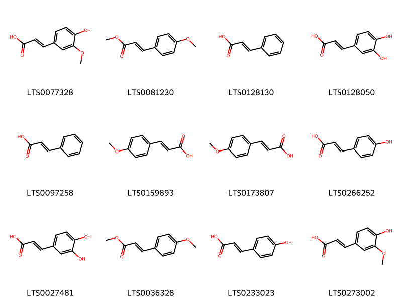{ width=100% }
    <figcaption>Hình ảnh cấu trúc hóa học của 12 hoạt chất thuộc nhóm Cinnamic acids and derivatives gồm ['ferulic acid (LTS0077328)', 'methyl 4-methoxycinnamate (LTS0081230)', 'cinnamic acid (LTS0128130)', '3,4-dihydroxycinnamic acid (LTS0128050)', 'phenylacrylic acid (LTS0097258)', 'p-methoxy-cinnamic acid (LTS0159893)', '4-methoxycinnamic acid (LTS0173807)', 'para-coumaric acid (LTS0266252)', 'caffeic acid (LTS0027481)', 'methyl 3-(4-methoxyphenyl)prop-2-enoate (LTS0036328)', 'hydroxycinnamic acid (LTS0233023)', 'ferulic acid (LTS0273002)'].</figcaption>
</figure>
#### Nhóm Furofurans
<figure markdown="span">
    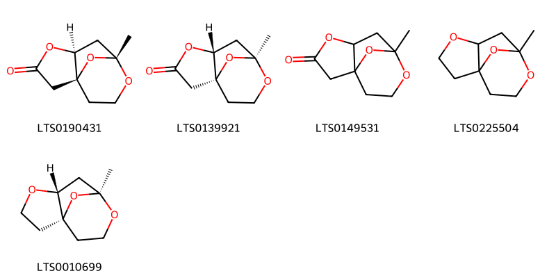{ width=100% }
    <figcaption>Hình ảnh cấu trúc hóa học của 5 hoạt chất thuộc nhóm Furofurans gồm ['(1s,5s,7r)-7-methyl-4,8,11-trioxatricyclo[5.3.1.0¹,⁵]undecan-3-one (LTS0190431)', '(1r,5r,7s)-7-methyl-4,8,11-trioxatricyclo[5.3.1.0¹,⁵]undecan-3-one (LTS0139921)', '7-methyl-4,8,11-trioxatricyclo[5.3.1.0¹,⁵]undecan-3-one (LTS0149531)', '7-methyl-4,8,11-trioxatricyclo[5.3.1.0¹,⁵]undecane (LTS0225504)', '(1s,5r,7s)-7-methyl-4,8,11-trioxatricyclo[5.3.1.0¹,⁵]undecane (LTS0010699)'].</figcaption>
</figure>
#### Nhóm Lactones
<figure markdown="span">
    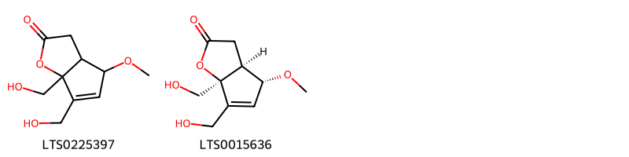{ width=100% }
    <figcaption>Hình ảnh cấu trúc hóa học của 2 hoạt chất thuộc nhóm Lactones gồm ['6,6a-bis(hydroxymethyl)-4-methoxy-3h,3ah,4h-cyclopenta[b]furan-2-one (LTS0225397)', '(3as,4r,6as)-6,6a-bis(hydroxymethyl)-4-methoxy-3h,3ah,4h-cyclopenta[b]furan-2-one (LTS0015636)'].</figcaption>
</figure>
#### Nhóm Organooxygen compounds
<figure markdown="span">
    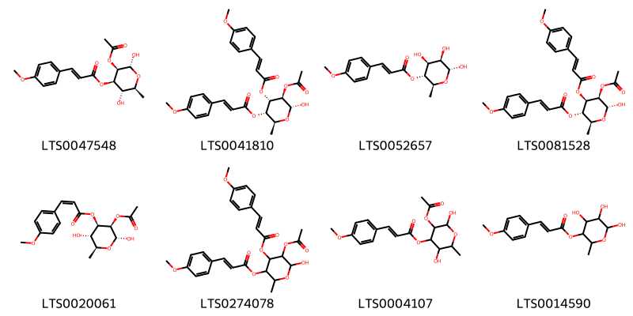{ width=100% }
    <figcaption>Hình ảnh cấu trúc hóa học của 8 hoạt chất thuộc nhóm Organooxygen compounds gồm ['(2r,3r,4r,5s,6s)-3-(acetyloxy)-2,5-dihydroxy-6-methyloxan-4-yl (2e)-3-(4-methoxyphenyl)prop-2-enoate (LTS0047548)', '(2s,3s,4s,5r,6r)-5-(acetyloxy)-6-hydroxy-4-{[(2e)-3-(4-methoxyphenyl)prop-2-enoyl]oxy}-2-methyloxan-3-yl (2e)-3-(4-methoxyphenyl)prop-2-enoate (LTS0041810)', '(2s,3r,4s,5r,6r)-4,5,6-trihydroxy-2-methyloxan-3-yl (2e)-3-(4-methoxyphenyl)prop-2-enoate (LTS0052657)', '(2s,3s,4r,5r,6r)-5-(acetyloxy)-6-hydroxy-4-{[(2e)-3-(4-methoxyphenyl)prop-2-enoyl]oxy}-2-methyloxan-3-yl (2e)-3-(4-methoxyphenyl)prop-2-enoate (LTS0081528)', '(2r,3r,4r,5s,6s)-3-(acetyloxy)-2,5-dihydroxy-6-methyloxan-4-yl (2z)-3-(4-methoxyphenyl)prop-2-enoate (LTS0020061)', '5-(acetyloxy)-6-hydroxy-4-{[3-(4-methoxyphenyl)prop-2-enoyl]oxy}-2-methyloxan-3-yl 3-(4-methoxyphenyl)prop-2-enoate (LTS0274078)', '3-(acetyloxy)-2,5-dihydroxy-6-methyloxan-4-yl 3-(4-methoxyphenyl)prop-2-enoate (LTS0004107)', '4,5,6-trihydroxy-2-methyloxan-3-yl 3-(4-methoxyphenyl)prop-2-enoate (LTS0014590)'].</figcaption>
</figure>
#### Nhóm Phenols
<figure markdown="span">
    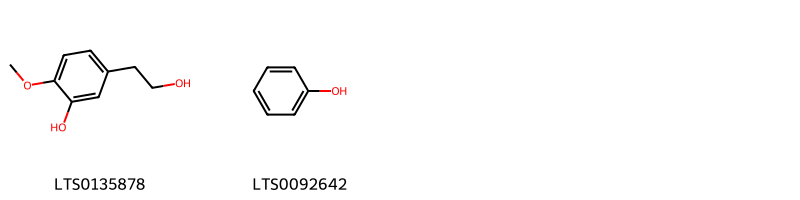{ width=100% }
    <figcaption>Hình ảnh cấu trúc hóa học của 2 hoạt chất thuộc nhóm Phenols gồm ['5-(2-hydroxyethyl)-2-methoxyphenol (LTS0135878)', 'phenol (LTS0092642)'].</figcaption>
</figure>
#### Nhóm Prenol lipids
<figure markdown="span">
    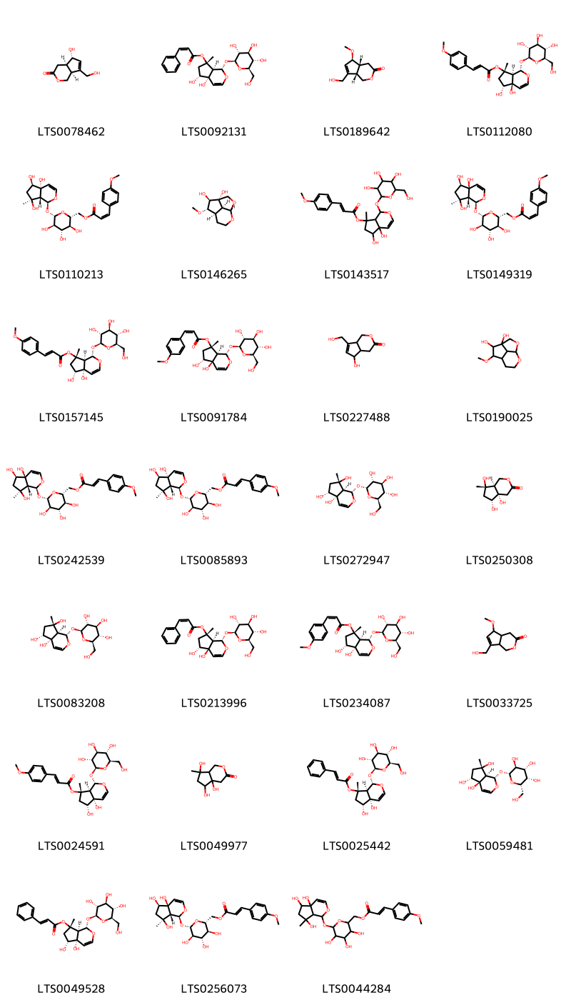{ width=100% }
    <figcaption>Hình ảnh cấu trúc hóa học của 27 hoạt chất thuộc nhóm Prenol lipids gồm ['(4ar,5s,7as)-5-hydroxy-7-(hydroxymethyl)-1h,4h,4ah,5h,7ah-cyclopenta[c]pyran-3-one (LTS0078462)', '(1s,4as,5r,7s,7as)-4a,5-dihydroxy-7-methyl-1-{[(2s,3r,4s,5s,6r)-3,4,5-trihydroxy-6-(hydroxymethyl)oxan-2-yl]oxy}-1h,5h,6h,7ah-cyclopenta[c]pyran-7-yl (2z)-3-phenylprop-2-enoate (LTS0092131)', '(4ar,5s,7as)-7-(hydroxymethyl)-5-methoxy-1h,4h,4ah,5h,7ah-cyclopenta[c]pyran-3-one (LTS0189642)', '(1s,4ar,5r,7s,7as)-4a,5-dihydroxy-7-methyl-1-{[(2s,3r,4s,5s,6r)-3,4,5-trihydroxy-6-(hydroxymethyl)oxan-2-yl]oxy}-1h,5h,6h,7ah-cyclopenta[c]pyran-7-yl (2e)-3-(4-methoxyphenyl)prop-2-enoate (LTS0112080)', '[(2r,3s,4s,5r,6s)-6-{[(1s,4ar,5r,7s,7ar)-4a,5,7-trihydroxy-7-methyl-1h,5h,6h,7ah-cyclopenta[c]pyran-1-yl]oxy}-3,4,5-trihydroxyoxan-2-yl]methyl (2z)-3-(4-methoxyphenyl)prop-2-enoate (LTS0110213)', '(1r,4s,5r,6s,7r,11s)-6-methoxy-2,10-dioxatricyclo[5.3.1.0⁴,¹¹]undecane-4,5-diol (LTS0146265)', '4a,5-dihydroxy-7-methyl-1-{[3,4,5-trihydroxy-6-(hydroxymethyl)oxan-2-yl]oxy}-1h,5h,6h,7ah-cyclopenta[c]pyran-7-yl 3-(4-methoxyphenyl)prop-2-enoate (LTS0143517)', '[(2r,3s,4s,5r,6s)-6-{[(1s,4as,5r,7s,7ar)-4a,5,7-trihydroxy-7-methyl-1h,5h,6h,7ah-cyclopenta[c]pyran-1-yl]oxy}-3,4,5-trihydroxyoxan-2-yl]methyl (2z)-3-(4-methoxyphenyl)prop-2-enoate (LTS0149319)', '(1s,4as,5r,7s,7as)-4a,5-dihydroxy-7-methyl-1-{[(2s,3r,4s,5s,6r)-3,4,5-trihydroxy-6-(hydroxymethyl)oxan-2-yl]oxy}-1h,5h,6h,7ah-cyclopenta[c]pyran-7-yl (2e)-3-(4-methoxyphenyl)prop-2-enoate (LTS0157145)', '(1s,4ar,5r,7s,7as)-4a,5-dihydroxy-7-methyl-1-{[(2s,3r,4s,5s,6r)-3,4,5-trihydroxy-6-(hydroxymethyl)oxan-2-yl]oxy}-1h,5h,6h,7ah-cyclopenta[c]pyran-7-yl (2z)-3-(4-methoxyphenyl)prop-2-enoate (LTS0091784)', '5-hydroxy-7-(hydroxymethyl)-1h,4h,4ah,5h,7ah-cyclopenta[c]pyran-3-one (LTS0227488)', '6-methoxy-2,10-dioxatricyclo[5.3.1.0⁴,¹¹]undecane-4,5-diol (LTS0190025)', '[(2r,3s,4s,5r,6s)-6-{[(1s,4as,5r,7s,7ar)-4a,5,7-trihydroxy-7-methyl-1h,5h,6h,7ah-cyclopenta[c]pyran-1-yl]oxy}-3,4,5-trihydroxyoxan-2-yl]methyl 3-(4-methoxyphenyl)prop-2-enoate (LTS0242539)', '[(2r,3s,4s,5r,6s)-6-{[(1s,4ar,5r,7s,7ar)-4a,5,7-trihydroxy-7-methyl-1h,5h,6h,7ah-cyclopenta[c]pyran-1-yl]oxy}-3,4,5-trihydroxyoxan-2-yl]methyl (2e)-3-(4-methoxyphenyl)prop-2-enoate (LTS0085893)', '(2r,3r,4s,5s,6r)-2-{[(1s,4as,5r,7s,7ar)-4a,5,7-trihydroxy-7-methyl-1h,5h,6h,7ah-cyclopenta[c]pyran-1-yl]oxy}-6-(hydroxymethyl)oxane-3,4,5-triol (LTS0272947)', '(4as,5r,7s,7ar)-4a,5,7-trihydroxy-7-methyl-tetrahydro-1h-cyclopenta[c]pyran-3-one (LTS0250308)', 'harpagide (LTS0083208)', '(1s,4ar,5r,7s,7as)-4a,5-dihydroxy-7-methyl-1-{[(2s,3r,4s,5s,6r)-3,4,5-trihydroxy-6-(hydroxymethyl)oxan-2-yl]oxy}-1h,5h,6h,7ah-cyclopenta[c]pyran-7-yl (2z)-3-phenylprop-2-enoate (LTS0213996)', '(1s,4as,5r,7s,7as)-4a,5-dihydroxy-7-methyl-1-{[(2s,3r,4s,5s,6r)-3,4,5-trihydroxy-6-(hydroxymethyl)oxan-2-yl]oxy}-1h,5h,6h,7ah-cyclopenta[c]pyran-7-yl (2z)-3-(4-methoxyphenyl)prop-2-enoate (LTS0234087)', '7-(hydroxymethyl)-5-methoxy-1h,4h,4ah,5h,7ah-cyclopenta[c]pyran-3-one (LTS0033725)', '(1s,4as,5r,7s,7as)-4a,5-dihydroxy-7-methyl-1-{[(2s,3r,4s,5s,6r)-3,4,5-trihydroxy-6-(hydroxymethyl)oxan-2-yl]oxy}-1h,5h,6h,7ah-cyclopenta[c]pyran-7-yl 3-(4-methoxyphenyl)prop-2-enoate (LTS0024591)', '4a,5,7-trihydroxy-7-methyl-tetrahydro-1h-cyclopenta[c]pyran-3-one (LTS0049977)', '(1s,4as,5r,7s,7as)-4a,5-dihydroxy-7-methyl-1-{[(2s,3r,4s,5s,6r)-3,4,5-trihydroxy-6-(hydroxymethyl)oxan-2-yl]oxy}-1h,5h,6h,7ah-cyclopenta[c]pyran-7-yl 3-phenylprop-2-enoate (LTS0025442)', '(2r,3s,4r,5s,6s)-2-{[(1s,4ar,5r,7s,7ar)-4a,5,7-trihydroxy-7-methyl-1h,5h,6h,7ah-cyclopenta[c]pyran-1-yl]oxy}-6-(hydroxymethyl)oxane-3,4,5-triol (LTS0059481)', 'harpagoside (LTS0049528)', '[(2r,3s,4s,5r,6s)-6-{[(1s,4as,5r,7s,7ar)-4a,5,7-trihydroxy-7-methyl-1h,5h,6h,7ah-cyclopenta[c]pyran-1-yl]oxy}-3,4,5-trihydroxyoxan-2-yl]methyl (2e)-3-(4-methoxyphenyl)prop-2-enoate (LTS0256073)', '[6-({4a,5,7-trihydroxy-7-methyl-1h,5h,6h,7ah-cyclopenta[c]pyran-1-yl}oxy)-3,4,5-trihydroxyoxan-2-yl]methyl 3-(4-methoxyphenyl)prop-2-enoate (LTS0044284)'].</figcaption>
</figure>

---

### Dược dân tộc học

Danh sách các quốc gia có sử dụng *Scrophularia buergeriana* trong điều trị các bệnh. 

| Country   | Disease             | Bệnh                                                                                                                                                                                                |
|:----------|:--------------------|:----------------------------------------------------------------------------------------------------------------------------------------------------------------------------------------------------|
| Elsewhere | nan, Antiphlogistic | MYMEMORY WARNING: YOU USED ALL AVAILABLE FREE TRANSLATIONS FOR TODAY. NEXT AVAILABLE IN  17 HOURS 40 MINUTES 21 SECONDS VISIT HTTPS://MYMEMORY.TRANSLATED.NET/DOC/USAGELIMITS.PHP TO TRANSLATE MORE |

---

---
## Scrophularia marilandica
### Thông tin về thực vật

!!! info "Phân loại thực vật của *Scrophularia marilandica* từ GIBF:"
    - **Kingdom:** Plantae
    - **Phylum:** Tracheophyta
    - **Order:** Lamiales
    - **Family:** Scrophulariaceae
    - **Genus:** Scrophularia
    - **Species:** *Scrophularia marilandica*

 

| Label (VI)   | Label (EN)   | Scientific Name          | Descriptions (VI)   | Descriptions (EN)          | Also Known As (VI)   | Also Known As (EN)                                                            |
|:-------------|:-------------|:-------------------------|:--------------------|:---------------------------|:---------------------|:------------------------------------------------------------------------------|
| N/A          | N/A          | Scrophularia marilandica | loài thực vật       | species of flowering plant | ['']                 | ["carpenter's square", 'eastern figwort', 'late figwort', 'Maryland figwort'] |

#### Phân bố trên thế giới

**Từ CSDL GIBF** Canada, United States of America

#### Phân bố tại Việt Nam

**Từ CSDL GIBF**: Không có ghi nhận ở Việt Nam

---
### Thành phần hóa học
        
- Theo cơ sở dữ liệu lotus: Từ loài *Scrophularia marilandica* đã phân lập và xác định được 9 hoạt chất thuộc về các nhóm Fatty Acyls. 

|    | chemicalTaxonomyClassyfireClass   |   smiles_count |
|---:|:----------------------------------|---------------:|
|  0 | Fatty Acyls                       |              9 |

#### Nhóm Fatty Acyls
<figure markdown="span">
    { width=100% }
    <figcaption>Hình ảnh cấu trúc hóa học của 9 hoạt chất thuộc nhóm Fatty Acyls gồm ['palmitic acid (LTS0079439)', 'gamma-linolenic acid (LTS0160094)', 'palmitoleic acid (LTS0261591)', 'arachidic acid (LTS0171823)', 'oleic acid (LTS0256910)', 'icosenoic acid (LTS0039770)', 'α-linolenic acid (LTS0275508)', 'linoleic (LTS0013198)', 'stearic acid (LTS0237766)'].</figcaption>
</figure>

---

### Dược dân tộc học

Danh sách các quốc gia có sử dụng *Scrophularia marilandica* trong điều trị các bệnh. 

| Country   | Disease                                                                    | Bệnh                                                                                                                                                                                                |
|:----------|:---------------------------------------------------------------------------|:----------------------------------------------------------------------------------------------------------------------------------------------------------------------------------------------------|
| US        | Diuretic, Emmenagogue, Emmenagogue, Tonic, Vermifuge, Sudorific, Vulnerary | MYMEMORY WARNING: YOU USED ALL AVAILABLE FREE TRANSLATIONS FOR TODAY. NEXT AVAILABLE IN  17 HOURS 39 MINUTES 49 SECONDS VISIT HTTPS://MYMEMORY.TRANSLATED.NET/DOC/USAGELIMITS.PHP TO TRANSLATE MORE |

---

---
## Scrophularia ningpoensis
### Thông tin về thực vật

!!! info "Phân loại thực vật của *Scrophularia ningpoensis* từ GIBF:"
    - **Kingdom:** Plantae
    - **Phylum:** Tracheophyta
    - **Order:** Lamiales
    - **Family:** Scrophulariaceae
    - **Genus:** Scrophularia
    - **Species:** *Scrophularia ningpoensis*

 

| Label (VI)   | Label (EN)   | Scientific Name          | Descriptions (VI)   | Descriptions (EN)   | Also Known As (VI)   | Also Known As (EN)   |
|:-------------|:-------------|:-------------------------|:--------------------|:--------------------|:---------------------|:---------------------|
| N/A          | N/A          | Scrophularia ningpoensis | loài thực vật       | species of plant    | ['']                 | ['']                 |

#### Phân bố trên thế giới

**Từ CSDL GIBF** Viet Nam, unknown or invalid, France, United States of America, China, Chinese Taipei

#### Phân bố tại Việt Nam

**Từ CSDL GIBF**: Thanh Hoa, 老挝

---
### Thành phần hóa học
        
- Theo cơ sở dữ liệu lotus: Từ loài *Scrophularia ningpoensis* đã phân lập và xác định được 87 hoạt chất thuộc về các nhóm Organooxygen compounds, Flavonoids, Indoles and derivatives, Prenol lipids, Fatty Acyls, Cinnamic acids and derivatives, Tetrahydrofurans, Steroids and steroid derivatives, Benzene and substituted derivatives. 

|    | chemicalTaxonomyClassyfireClass     |   smiles_count |
|---:|:------------------------------------|---------------:|
|  0 | Benzene and substituted derivatives |              2 |
|  1 | Cinnamic acids and derivatives      |             23 |
|  2 | Fatty Acyls                         |              2 |
|  3 | Flavonoids                          |              4 |
|  4 | Indoles and derivatives             |              1 |
|  5 | Organooxygen compounds              |             17 |
|  6 | Prenol lipids                       |             31 |
|  7 | Steroids and steroid derivatives    |              5 |
|  8 | Tetrahydrofurans                    |              2 |

#### Nhóm Benzene and substituted derivatives
<figure markdown="span">
    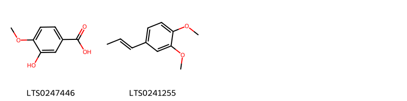{ width=100% }
    <figcaption>Hình ảnh cấu trúc hóa học của 2 hoạt chất thuộc nhóm Benzene and substituted derivatives gồm ['isovanillic acid (LTS0247446)', 'isoeugenyl methyl ether (LTS0241255)'].</figcaption>
</figure>
#### Nhóm Cinnamic acids and derivatives
<figure markdown="span">
    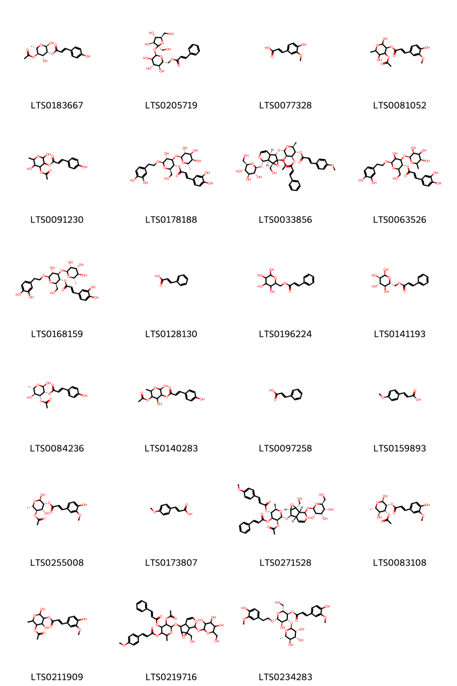{ width=100% }
    <figcaption>Hình ảnh cấu trúc hóa học của 23 hoạt chất thuộc nhóm Cinnamic acids and derivatives gồm ['(2r,3r,4r,5r,6s)-5-(acetyloxy)-2,4-dihydroxy-6-methyloxan-3-yl (2e)-3-(4-hydroxyphenyl)prop-2-enoate (LTS0183667)', '[(2r,3s,4s,5r,6r)-6-{[(2s,3s,4s,5r)-3,4-dihydroxy-2,5-bis(hydroxymethyl)oxolan-2-yl]oxy}-3,4,5-trihydroxyoxan-2-yl]methyl (2e)-3-phenylprop-2-enoate (LTS0205719)', 'ferulic acid (LTS0077328)', '4-(acetyloxy)-2,5-dihydroxy-6-methyloxan-3-yl 3-(4-hydroxy-3-methoxyphenyl)prop-2-enoate (LTS0081052)', '4-(acetyloxy)-2,5-dihydroxy-6-methyloxan-3-yl 3-(4-hydroxyphenyl)prop-2-enoate (LTS0091230)', '(2r,3r,4r,5r,6r)-6-[2-(3,4-dihydroxyphenyl)ethoxy]-5-hydroxy-2-(hydroxymethyl)-4-{[(2s,3r,4s,5r,6s)-3,4,5-trihydroxy-6-methyloxan-2-yl]oxy}oxan-3-yl (2e)-3-(3,4-dihydroxyphenyl)prop-2-enoate (LTS0178188)', '(2s,3s,4r,5r,6s)-5-(acetyloxy)-6-{[(1s,2s,4s,5s,6r,10s)-2-(hydroxymethyl)-10-{[(2s,3r,4s,5s,6r)-3,4,5-trihydroxy-6-(hydroxymethyl)oxan-2-yl]oxy}-3,9-dioxatricyclo[4.4.0.0²,⁴]dec-7-en-5-yl]oxy}-2-methyl-4-{[(2e)-3-phenylprop-2-enoyl]oxy}oxan-3-yl (2e)-3-(4-methoxyphenyl)prop-2-enoate (LTS0033856)', '(3r,4r,6r)-6-[2-(3,4-dihydroxyphenyl)ethoxy]-5-hydroxy-2-(hydroxymethyl)-4-{[(2s,3s,5r)-3,4,5-trihydroxy-6-methyloxan-2-yl]oxy}oxan-3-yl (2e)-3-(3,4-dihydroxyphenyl)prop-2-enoate (LTS0063526)', 'verbascoside (LTS0168159)', 'cinnamic acid (LTS0128130)', '(3,4,5,6-tetrahydroxyoxan-2-yl)methyl 3-phenylprop-2-enoate (LTS0196224)', '[(2r,3s,4s,5r,6s)-3,4,5,6-tetrahydroxyoxan-2-yl]methyl (2e)-3-phenylprop-2-enoate (LTS0141193)', '(2r,3r,4r,5s,6s)-4-(acetyloxy)-2,5-dihydroxy-6-methyloxan-3-yl (2e)-3-(4-hydroxyphenyl)prop-2-enoate (LTS0084236)', '5-(acetyloxy)-2,4-dihydroxy-6-methyloxan-3-yl 3-(4-hydroxyphenyl)prop-2-enoate (LTS0140283)', 'phenylacrylic acid (LTS0097258)', 'p-methoxy-cinnamic acid (LTS0159893)', '(2r,3r,4r,5r,6s)-5-(acetyloxy)-2,4-dihydroxy-6-methyloxan-3-yl (2e)-3-(4-hydroxy-3-methoxyphenyl)prop-2-enoate (LTS0255008)', '4-methoxycinnamic acid (LTS0173807)', '(2r,3r,4s,5s,6r)-5-(acetyloxy)-6-{[(1r,2r,4r,5r,6s,10r)-2-(hydroxymethyl)-10-{[(2r,3s,4s,5r,6s)-3,4,5-trihydroxy-6-(hydroxymethyl)oxan-2-yl]oxy}-3,9-dioxatricyclo[4.4.0.0²,⁴]dec-7-en-5-yl]oxy}-2-methyl-4-{[(2e)-3-phenylprop-2-enoyl]oxy}oxan-3-yl (2e)-3-(4-methoxyphenyl)prop-2-enoate (LTS0271528)', '(2r,3r,4r,5s,6s)-4-(acetyloxy)-2,5-dihydroxy-6-methyloxan-3-yl (2e)-3-(4-hydroxy-3-methoxyphenyl)prop-2-enoate (LTS0083108)', '5-(acetyloxy)-2,4-dihydroxy-6-methyloxan-3-yl 3-(4-hydroxy-3-methoxyphenyl)prop-2-enoate (LTS0211909)', '5-(acetyloxy)-6-{[2-(hydroxymethyl)-10-{[3,4,5-trihydroxy-6-(hydroxymethyl)oxan-2-yl]oxy}-3,9-dioxatricyclo[4.4.0.0²,⁴]dec-7-en-5-yl]oxy}-2-methyl-4-[(3-phenylprop-2-enoyl)oxy]oxan-3-yl 3-(4-methoxyphenyl)prop-2-enoate (LTS0219716)', '(2r,3r,4r,5r,6r)-5-hydroxy-6-[2-(4-hydroxy-3-methoxyphenyl)ethoxy]-2-(hydroxymethyl)-4-{[(2s,3r,4r,5r,6s)-3,4,5-trihydroxy-6-methyloxan-2-yl]oxy}oxan-3-yl (2e)-3-(4-hydroxy-3-methoxyphenyl)prop-2-enoate (LTS0234283)'].</figcaption>
</figure>
#### Nhóm Fatty Acyls
<figure markdown="span">
    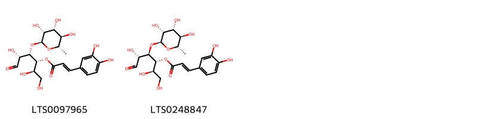{ width=100% }
    <figcaption>Hình ảnh cấu trúc hóa học của 2 hoạt chất thuộc nhóm Fatty Acyls gồm ['(2r,3r,4s,5r)-1,2,5-trihydroxy-6-oxo-4-{[(2s,3r,4r,5r,6s)-3,4,5-trihydroxy-6-methyloxan-2-yl]oxy}hexan-3-yl (2e)-3-(3,4-dihydroxyphenyl)prop-2-enoate (LTS0097965)', '(2r,3r,4r,5r)-1,2,5-trihydroxy-6-oxo-4-{[(2s,3r,4r,5r,6s)-3,4,5-trihydroxy-6-methyloxan-2-yl]oxy}hexan-3-yl (2e)-3-(3,4-dihydroxyphenyl)prop-2-enoate (LTS0248847)'].</figcaption>
</figure>
#### Nhóm Flavonoids
<figure markdown="span">
    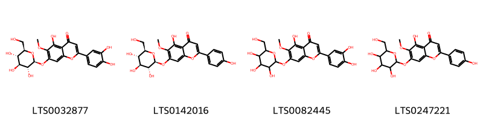{ width=100% }
    <figcaption>Hình ảnh cấu trúc hóa học của 4 hoạt chất thuộc nhóm Flavonoids gồm ['nepitrin (LTS0032877)', 'homoplantaginin (LTS0142016)', '2-(3,4-dihydroxyphenyl)-5-hydroxy-6-methoxy-7-{[3,4,5-trihydroxy-6-(hydroxymethyl)oxan-2-yl]oxy}chromen-4-one (LTS0082445)', '5-hydroxy-2-(4-hydroxyphenyl)-6-methoxy-7-{[3,4,5-trihydroxy-6-(hydroxymethyl)oxan-2-yl]oxy}chromen-4-one (LTS0247221)'].</figcaption>
</figure>
#### Nhóm Indoles and derivatives
<figure markdown="span">
    { width=100% }
    <figcaption>Hình ảnh cấu trúc hóa học của 1 hoạt chất thuộc nhóm Indoles and derivatives gồm ['n-[2-(5-methoxy-1h-indol-3-yl)ethyl]ethanimidic acid (LTS0219322)'].</figcaption>
</figure>
#### Nhóm Organooxygen compounds
<figure markdown="span">
    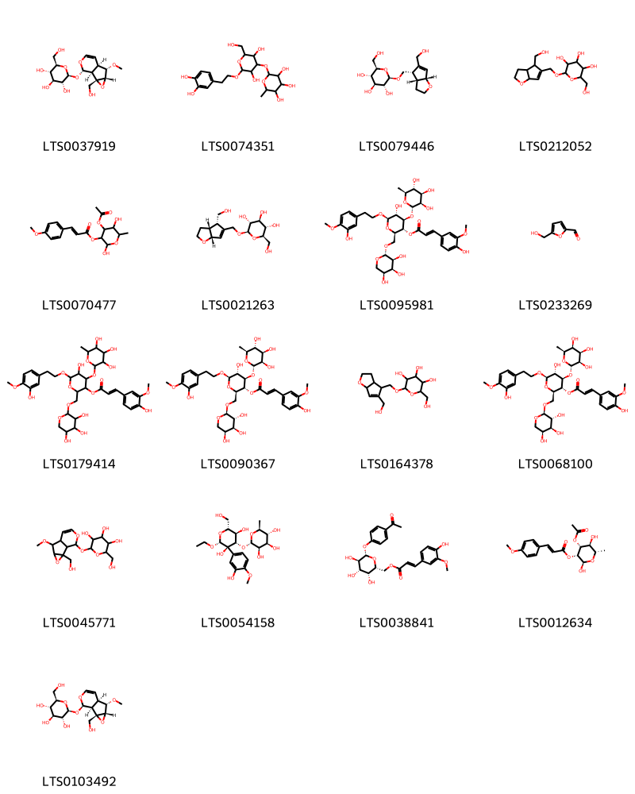{ width=100% }
    <figcaption>Hình ảnh cấu trúc hóa học của 17 hoạt chất thuộc nhóm Organooxygen compounds gồm ['(2r,3s,4s,5r,6s)-2-(hydroxymethyl)-6-{[(1s,2s,4s,5s,6r,10s)-2-(hydroxymethyl)-5-methoxy-3,9-dioxatricyclo[4.4.0.0²,⁴]dec-7-en-10-yl]oxy}oxane-3,4,5-triol (LTS0037919)', '2-({2-[2-(3,4-dihydroxyphenyl)ethoxy]-3,5-dihydroxy-6-(hydroxymethyl)oxan-4-yl}oxy)-6-methyloxane-3,4,5-triol (LTS0074351)', '(2r,3r,4s,5s,6r)-2-{[(3ar,4s,6ar)-5-(hydroxymethyl)-2h,3h,3ah,4h,6ah-cyclopenta[b]furan-4-yl]methoxy}-6-(hydroxymethyl)oxane-3,4,5-triol (LTS0079446)', '2-(hydroxymethyl)-6-{[4-(hydroxymethyl)-2h,3h,3ah,4h,6ah-cyclopenta[b]furan-5-yl]methoxy}oxane-3,4,5-triol (LTS0212052)', '4-(acetyloxy)-2,5-dihydroxy-6-methyloxan-3-yl 3-(4-methoxyphenyl)prop-2-enoate (LTS0070477)', '(2r,3r,4s,5s,6r)-2-{[(3ar,4s,6ar)-4-(hydroxymethyl)-2h,3h,3ah,4h,6ah-cyclopenta[b]furan-5-yl]methoxy}-6-(hydroxymethyl)oxane-3,4,5-triol (LTS0021263)', '(2r,3r,4r,5r,6r)-5-hydroxy-6-[2-(3-hydroxy-4-methoxyphenyl)ethoxy]-4-{[(2s,3r,4r,5r,6s)-3,4,5-trihydroxy-6-methyloxan-2-yl]oxy}-2-({[(2r,3s,4s,5s)-3,4,5-trihydroxyoxan-2-yl]oxy}methyl)oxan-3-yl (2e)-3-(4-hydroxy-3-methoxyphenyl)prop-2-enoate (LTS0095981)', 'hydroxymethylfurfural (LTS0233269)', '5-hydroxy-6-[2-(3-hydroxy-4-methoxyphenyl)ethoxy]-4-[(3,4,5-trihydroxy-6-methyloxan-2-yl)oxy]-2-{[(3,4,5-trihydroxyoxan-2-yl)oxy]methyl}oxan-3-yl 3-(4-hydroxy-3-methoxyphenyl)prop-2-enoate (LTS0179414)', 'angoroside c (LTS0090367)', '2-(hydroxymethyl)-6-{[5-(hydroxymethyl)-2h,3h,3ah,4h,6ah-cyclopenta[b]furan-4-yl]methoxy}oxane-3,4,5-triol (LTS0164378)', 'angoroside c (LTS0068100)', '2-(hydroxymethyl)-6-{[2-(hydroxymethyl)-5-methoxy-3,9-dioxatricyclo[4.4.0.0²,⁴]dec-7-en-10-yl]oxy}oxane-3,4,5-triol (LTS0045771)', '(2s,3r,4r,5r,6s)-2-{[(2r,3r,4s,5r,6r)-2-ethoxy-3,5-dihydroxy-3-(3-hydroxy-4-methoxyphenyl)-6-(hydroxymethyl)oxan-4-yl]oxy}-6-methyloxane-3,4,5-triol (LTS0054158)', '[(2r,3r,4s,5r,6s)-6-(4-acetylphenoxy)-3,4,5-trihydroxyoxan-2-yl]methyl (2e)-3-(4-hydroxy-3-methoxyphenyl)prop-2-enoate (LTS0038841)', '(2r,3r,4r,5s,6s)-4-(acetyloxy)-2,5-dihydroxy-6-methyloxan-3-yl (2e)-3-(4-methoxyphenyl)prop-2-enoate (LTS0012634)', '(2r,3s,4s,5r,6s)-2-(hydroxymethyl)-6-{[(1s,2s,4s,5s,6r,10r)-2-(hydroxymethyl)-5-methoxy-3,9-dioxatricyclo[4.4.0.0²,⁴]dec-7-en-10-yl]oxy}oxane-3,4,5-triol (LTS0103492)'].</figcaption>
</figure>
#### Nhóm Prenol lipids
<figure markdown="span">
    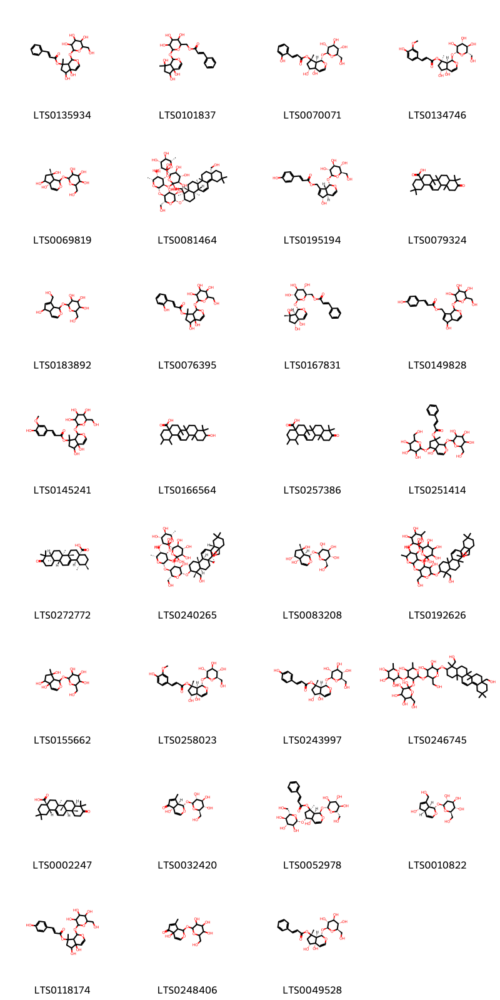{ width=100% }
    <figcaption>Hình ảnh cấu trúc hóa học của 31 hoạt chất thuộc nhóm Prenol lipids gồm ['4a,5-dihydroxy-7-methyl-1-{[3,4,5-trihydroxy-6-(hydroxymethyl)oxan-2-yl]oxy}-1h,5h,6h,7ah-cyclopenta[c]pyran-7-yl 3-phenylprop-2-enoate (LTS0135934)', '[6-({4a,5,7-trihydroxy-7-methyl-1h,5h,6h,7ah-cyclopenta[c]pyran-1-yl}oxy)-3,4,5-trihydroxyoxan-2-yl]methyl 3-phenylprop-2-enoate (LTS0101837)', '(1s,4as,5r,7s,7as)-4a,5-dihydroxy-7-methyl-1-{[(2s,3r,4s,5s,6r)-3,4,5-trihydroxy-6-(hydroxymethyl)oxan-2-yl]oxy}-1h,5h,6h,7ah-cyclopenta[c]pyran-7-yl (2e)-3-(2-hydroxyphenyl)prop-2-enoate (LTS0070071)', '(1r,4as,5r,7r,7as)-4a,5-dihydroxy-7-methyl-1-{[(2r,3s,4r,5r,6s)-3,4,5-trihydroxy-6-(hydroxymethyl)oxan-2-yl]oxy}-1h,5h,6h,7ah-cyclopenta[c]pyran-7-yl (2e)-3-(4-hydroxy-3-methoxyphenyl)prop-2-enoate (LTS0134746)', '2-{[(4as,7s)-4a,5,7-trihydroxy-7-methyl-1h,5h,6h,7ah-cyclopenta[c]pyran-1-yl]oxy}-6-(hydroxymethyl)oxane-3,4,5-triol (LTS0069819)', '(2r,3r,4s,5s,6r)-2-{[(2s,3r,4s,5s,6r)-2-{[(2r,3s,4r,5r,6r)-6-{[(3s,4r,4ar,6ar,6bs,8as,14ar,14bs)-4,8a-bis(hydroxymethyl)-4,6a,6b,11,11,14b-hexamethyl-1,2,3,4a,5,6,7,8,9,10,12,14a-dodecahydropicen-3-yl]oxy}-4,5-dihydroxy-2-(hydroxymethyl)oxan-3-yl]oxy}-5-hydroxy-6-methyl-4-{[(2s,3r,4r,5r,6s)-3,4,5-trihydroxy-6-methyloxan-2-yl]oxy}oxan-3-yl]oxy}-6-(hydroxymethyl)oxane-2,3,4,5-tetrol (LTS0081464)', '[(1s,4ar,5s,7ar)-5-hydroxy-1-{[(2s,3r,4s,5s,6r)-3,4,5-trihydroxy-6-(hydroxymethyl)oxan-2-yl]oxy}-1h,4ah,5h,7ah-cyclopenta[c]pyran-7-yl]methyl (2e)-3-(4-hydroxyphenyl)prop-2-enoate (LTS0195194)', '2,2,6a,6b,9,9,12a-heptamethyl-10-oxo-3,4,5,6,7,8,8a,11,12,12b,13,14b-dodecahydro-1h-picene-4a-carboxylic acid (LTS0079324)', 'aucubin (LTS0183892)', '4a,5-dihydroxy-7-methyl-1-{[3,4,5-trihydroxy-6-(hydroxymethyl)oxan-2-yl]oxy}-1h,5h,6h,7ah-cyclopenta[c]pyran-7-yl 3-(2-hydroxyphenyl)prop-2-enoate (LTS0076395)', '[(2r,3s,4s,5r,6s)-6-{[(1s,4as,5r,7s,7ar)-4a,5,7-trihydroxy-7-methyl-1h,5h,6h,7ah-cyclopenta[c]pyran-1-yl]oxy}-3,4,5-trihydroxyoxan-2-yl]methyl (2e)-3-phenylprop-2-enoate (LTS0167831)', '(5-hydroxy-1-{[3,4,5-trihydroxy-6-(hydroxymethyl)oxan-2-yl]oxy}-1h,4ah,5h,7ah-cyclopenta[c]pyran-7-yl)methyl 3-(4-hydroxyphenyl)prop-2-enoate (LTS0149828)', '4a,5-dihydroxy-7-methyl-1-{[3,4,5-trihydroxy-6-(hydroxymethyl)oxan-2-yl]oxy}-1h,5h,6h,7ah-cyclopenta[c]pyran-7-yl 3-(4-hydroxy-3-methoxyphenyl)prop-2-enoate (LTS0145241)', '10-hydroxy-1,2,6a,6b,9,9,12a-heptamethyl-2,3,4,5,6,7,8,8a,10,11,12,12b,13,14b-tetradecahydro-1h-picene-4a-carboxylic acid (LTS0166564)', '1,2,6a,6b,9,9,12a-heptamethyl-10-oxo-1,2,3,4,5,6,7,8,8a,11,12,12b,13,14b-tetradecahydropicene-4a-carboxylic acid (LTS0257386)', '4a-hydroxy-7-methyl-1,5-bis({[3,4,5-trihydroxy-6-(hydroxymethyl)oxan-2-yl]oxy})-1h,5h,6h,7ah-cyclopenta[c]pyran-7-yl 3-phenylprop-2-enoate (LTS0251414)', '(1s,2r,4as,6as,6br,8ar,12ar,12br,14bs)-1,2,6a,6b,9,9,12a-heptamethyl-10-oxo-1,2,3,4,5,6,7,8,8a,11,12,12b,13,14b-tetradecahydropicene-4a-carboxylic acid (LTS0272772)', '(2r,3r,4s,5s,6r)-2-{[(2s,3r,4s,5s,6r)-2-{[(2r,3s,4r,5r,6r)-4,5-dihydroxy-2-(hydroxymethyl)-6-{[(1s,4s,5r,8r,9r,10s,13s,14r,17s,18r)-9-(hydroxymethyl)-4,5,9,13,20,20-hexamethyl-24-oxahexacyclo[15.5.2.0¹,¹⁸.0⁴,¹⁷.0⁵,¹⁴.0⁸,¹³]tetracos-15-en-10-yl]oxy}oxan-3-yl]oxy}-5-hydroxy-6-methyl-4-{[(2s,3r,4r,5r,6s)-3,4,5-trihydroxy-6-methyloxan-2-yl]oxy}oxan-3-yl]oxy}-6-(hydroxymethyl)oxane-2,3,4,5-tetrol (LTS0240265)', 'harpagide (LTS0083208)', '2-[(2-{[4,5-dihydroxy-2-(hydroxymethyl)-6-{[9-(hydroxymethyl)-4,5,9,13,20,20-hexamethyl-24-oxahexacyclo[15.5.2.0¹,¹⁸.0⁴,¹⁷.0⁵,¹⁴.0⁸,¹³]tetracos-15-en-10-yl]oxy}oxan-3-yl]oxy}-5-hydroxy-6-methyl-4-[(3,4,5-trihydroxy-6-methyloxan-2-yl)oxy]oxan-3-yl)oxy]-6-(hydroxymethyl)oxane-2,3,4,5-tetrol (LTS0192626)', '2-({4a,5,7-trihydroxy-7-methyl-1h,5h,6h,7ah-cyclopenta[c]pyran-1-yl}oxy)-6-(hydroxymethyl)oxane-3,4,5-triol (LTS0155662)', '(1s,4as,5r,7s,7as)-4a,5-dihydroxy-7-methyl-1-{[(2s,3r,4s,5s,6r)-3,4,5-trihydroxy-6-(hydroxymethyl)oxan-2-yl]oxy}-1h,5h,6h,7ah-cyclopenta[c]pyran-7-yl (2e)-3-(4-hydroxy-3-methoxyphenyl)prop-2-enoate (LTS0258023)', '(1s,4as,5r,7s,7as)-4a,5-dihydroxy-7-methyl-1-{[(2s,3r,4s,5s,6r)-3,4,5-trihydroxy-6-(hydroxymethyl)oxan-2-yl]oxy}-1h,5h,6h,7ah-cyclopenta[c]pyran-7-yl (2e)-3-(4-hydroxyphenyl)prop-2-enoate (LTS0243997)', '2-({2-[(6-{[4,8a-bis(hydroxymethyl)-4,6a,6b,11,11,14b-hexamethyl-1,2,3,4a,5,6,7,8,9,10,12,14a-dodecahydropicen-3-yl]oxy}-4,5-dihydroxy-2-(hydroxymethyl)oxan-3-yl)oxy]-5-hydroxy-6-methyl-4-[(3,4,5-trihydroxy-6-methyloxan-2-yl)oxy]oxan-3-yl}oxy)-6-(hydroxymethyl)oxane-2,3,4,5-tetrol (LTS0246745)', '(4as,6as,6br,8ar,12ar,12br,14bs)-2,2,6a,6b,9,9,12a-heptamethyl-10-oxo-3,4,5,6,7,8,8a,11,12,12b,13,14b-dodecahydro-1h-picene-4a-carboxylic acid (LTS0002247)', '(1s,4as,7ar)-4a-hydroxy-7-methyl-1-{[(2s,3r,4s,5s,6r)-3,4,5-trihydroxy-6-(hydroxymethyl)oxan-2-yl]oxy}-1h,7ah-cyclopenta[c]pyran-5-one (LTS0032420)', '(1r,4as,5r,7r,7as)-4a-hydroxy-7-methyl-1,5-bis({[(2r,3s,4r,5r,6s)-3,4,5-trihydroxy-6-(hydroxymethyl)oxan-2-yl]oxy})-1h,5h,6h,7ah-cyclopenta[c]pyran-7-yl (2e)-3-phenylprop-2-enoate (LTS0052978)', 'aucubin (LTS0010822)', '4a,5-dihydroxy-7-methyl-1-{[3,4,5-trihydroxy-6-(hydroxymethyl)oxan-2-yl]oxy}-1h,5h,6h,7ah-cyclopenta[c]pyran-7-yl 3-(4-hydroxyphenyl)prop-2-enoate (LTS0118174)', '4a-hydroxy-7-methyl-1-{[3,4,5-trihydroxy-6-(hydroxymethyl)oxan-2-yl]oxy}-1h,7ah-cyclopenta[c]pyran-5-one (LTS0248406)', 'harpagoside (LTS0049528)'].</figcaption>
</figure>
#### Nhóm Steroids and steroid derivatives
<figure markdown="span">
    { width=100% }
    <figcaption>Hình ảnh cấu trúc hóa học của 5 hoạt chất thuộc nhóm Steroids and steroid derivatives gồm ['stigmast-5-en-3-ol (LTS0071224)', 'sitosterol (LTS0168132)', 'stigmast-5-en-3-ol, (3β)- (LTS0204616)', 'sitogluside (LTS0201798)', '2-{[1-(5-ethyl-6-methylheptan-2-yl)-9a,11a-dimethyl-1h,2h,3h,3ah,3bh,4h,6h,7h,8h,9h,9bh,10h,11h-cyclopenta[a]phenanthren-7-yl]oxy}-6-(hydroxymethyl)oxane-3,4,5-triol (LTS0158828)'].</figcaption>
</figure>
#### Nhóm Tetrahydrofurans
<figure markdown="span">
    { width=100% }
    <figcaption>Hình ảnh cấu trúc hóa học của 2 hoạt chất thuộc nhóm Tetrahydrofurans gồm ['[(3ar,4s,6ar)-5-(hydroxymethyl)-2h,3h,3ah,4h,6ah-cyclopenta[b]furan-4-yl]methanol (LTS0079844)', '[5-(hydroxymethyl)-2h,3h,3ah,4h,6ah-cyclopenta[b]furan-4-yl]methanol (LTS0162387)'].</figcaption>
</figure>

---

### Dược dân tộc học

Danh sách các quốc gia có sử dụng *Scrophularia ningpoensis* trong điều trị các bệnh. 

| Country   | Disease              | Bệnh                                                                                                                                                                                                |
|:----------|:---------------------|:----------------------------------------------------------------------------------------------------------------------------------------------------------------------------------------------------|
| China     | Laxative, Sialogogue | MYMEMORY WARNING: YOU USED ALL AVAILABLE FREE TRANSLATIONS FOR TODAY. NEXT AVAILABLE IN  17 HOURS 39 MINUTES 14 SECONDS VISIT HTTPS://MYMEMORY.TRANSLATED.NET/DOC/USAGELIMITS.PHP TO TRANSLATE MORE |
| Elsewhere | Antiphlogistic, nan  | MYMEMORY WARNING: YOU USED ALL AVAILABLE FREE TRANSLATIONS FOR TODAY. NEXT AVAILABLE IN  17 HOURS 39 MINUTES 12 SECONDS VISIT HTTPS://MYMEMORY.TRANSLATED.NET/DOC/USAGELIMITS.PHP TO TRANSLATE MORE |

---

---
## Scrophularia nodosa
### Thông tin về thực vật

!!! info "Phân loại thực vật của *Scrophularia nodosa* từ GIBF:"
    - **Kingdom:** Plantae
    - **Phylum:** Tracheophyta
    - **Order:** Lamiales
    - **Family:** Scrophulariaceae
    - **Genus:** Scrophularia
    - **Species:** *Scrophularia nodosa*

 

| Label (VI)   | Label (EN)   | Scientific Name     | Descriptions (VI)   | Descriptions (EN)   | Also Known As (VI)   | Also Known As (EN)   |
|:-------------|:-------------|:--------------------|:--------------------|:--------------------|:---------------------|:---------------------|
| N/A          | N/A          | Scrophularia nodosa | loài thực vật       | species of plant    | ['']                 | ['common figwort']   |

#### Phân bố trên thế giới

**Từ CSDL GIBF** Switzerland, United Kingdom of Great Britain and Northern Ireland, Denmark, Sweden, France, Czechia, Poland, Hungary, Germany, Russian Federation, Finland, Italy, Austria, Norway, Belgium, Netherlands, Ukraine

#### Phân bố tại Việt Nam

**Từ CSDL GIBF**: Không có ghi nhận ở Việt Nam

---
### Thành phần hóa học
        
- Theo cơ sở dữ liệu lotus: Từ loài *Scrophularia nodosa* đã phân lập và xác định được 92 hoạt chất thuộc về các nhóm Organooxygen compounds, Prenol lipids, Fatty Acyls, Cinnamic acids and derivatives, Steroids and steroid derivatives, Benzene and substituted derivatives. 

|    | chemicalTaxonomyClassyfireClass     |   smiles_count |
|---:|:------------------------------------|---------------:|
|  0 | Benzene and substituted derivatives |              3 |
|  1 | Cinnamic acids and derivatives      |             57 |
|  2 | Fatty Acyls                         |              5 |
|  3 | Organooxygen compounds              |             17 |
|  4 | Prenol lipids                       |              9 |
|  5 | Steroids and steroid derivatives    |              1 |

#### Nhóm Benzene and substituted derivatives
<figure markdown="span">
    { width=100% }
    <figcaption>Hình ảnh cấu trúc hóa học của 3 hoạt chất thuộc nhóm Benzene and substituted derivatives gồm ['p-hydroxybenzoic acid (LTS0263634)', '3,4-dihydroxybenzoic acid (LTS0018765)', 'vanillic acid (LTS0229113)'].</figcaption>
</figure>
#### Nhóm Cinnamic acids and derivatives
<figure markdown="span">
    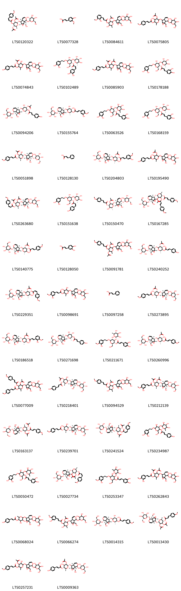{ width=100% }
    <figcaption>Hình ảnh cấu trúc hóa học của 57 hoạt chất thuộc nhóm Cinnamic acids and derivatives gồm ['(2s,3r,4r,5s,6s)-3,5-bis(acetyloxy)-2-{[(1s,2s,4s,5s,6s,10s)-2-(hydroxymethyl)-10-{[(2s,3r,4s,5r,6r)-3,4,5-trihydroxy-6-(hydroxymethyl)oxan-2-yl]oxy}-3,9-dioxatricyclo[4.4.0.0²,⁴]dec-7-en-5-yl]oxy}-6-methyloxan-4-yl (2z)-3-(4-methoxyphenyl)prop-2-enoate (LTS0120322)', 'ferulic acid (LTS0077328)', '3-(acetyloxy)-5-hydroxy-2-{[2-(hydroxymethyl)-10-{[3,4,5-trihydroxy-6-(hydroxymethyl)oxan-2-yl]oxy}-3,9-dioxatricyclo[4.4.0.0²,⁴]dec-7-en-5-yl]oxy}-6-methyloxan-4-yl 3-(2-hydroxy-3-methoxyphenyl)prop-2-enoate (LTS0084611)', '5-(acetyloxy)-4-hydroxy-6-{[2-(hydroxymethyl)-10-{[3,4,5-trihydroxy-6-(hydroxymethyl)oxan-2-yl]oxy}-3,9-dioxatricyclo[4.4.0.0²,⁴]dec-7-en-5-yl]oxy}-2-methyloxan-3-yl 3-(4-methoxyphenyl)prop-2-enoate (LTS0075805)', '4-(acetyloxy)-5-hydroxy-6-{[2-(hydroxymethyl)-10-{[3,4,5-trihydroxy-6-(hydroxymethyl)oxan-2-yl]oxy}-3,9-dioxatricyclo[4.4.0.0²,⁴]dec-7-en-5-yl]oxy}-2-methyloxan-3-yl 3-(4-hydroxyphenyl)prop-2-enoate (LTS0074843)', '(2r,3r,4r,5r,6r)-6-[2-(3,4-dihydroxyphenyl)ethoxy]-5-hydroxy-2-(hydroxymethyl)-4-{[(2s,3r,4r,5r,6s)-3,4,5-trihydroxy-6-methyloxan-2-yl]oxy}oxan-3-yl (2z)-3-(3,4-dihydroxyphenyl)prop-2-enoate (LTS0102489)', '4,5-bis(acetyloxy)-6-{[2-(hydroxymethyl)-10-{[3,4,5-trihydroxy-6-(hydroxymethyl)oxan-2-yl]oxy}-3,9-dioxatricyclo[4.4.0.0²,⁴]dec-7-en-5-yl]oxy}-2-methyloxan-3-yl 3-(4-methoxyphenyl)prop-2-enoate (LTS0085903)', '(2r,3r,4r,5r,6r)-6-[2-(3,4-dihydroxyphenyl)ethoxy]-5-hydroxy-2-(hydroxymethyl)-4-{[(2s,3r,4s,5r,6s)-3,4,5-trihydroxy-6-methyloxan-2-yl]oxy}oxan-3-yl (2e)-3-(3,4-dihydroxyphenyl)prop-2-enoate (LTS0178188)', '(2s,3s,4s,5r,6s)-4-(acetyloxy)-5-hydroxy-6-{[(1s,2s,4s,5s,6r,10s)-2-(hydroxymethyl)-10-{[(2s,3r,4s,5s,6r)-3,4,5-trihydroxy-6-(hydroxymethyl)oxan-2-yl]oxy}-3,9-dioxatricyclo[4.4.0.0²,⁴]dec-7-en-5-yl]oxy}-2-methyloxan-3-yl (2e)-3-(4-hydroxyphenyl)prop-2-enoate (LTS0094206)', '(2s,3r,4s,5r,6s)-4,5-dihydroxy-6-{[(1s,2s,4s,5s,6r,10s)-2-(hydroxymethyl)-10-{[(2s,3r,4s,5s,6r)-3,4,5-trihydroxy-6-(hydroxymethyl)oxan-2-yl]oxy}-3,9-dioxatricyclo[4.4.0.0²,⁴]dec-7-en-5-yl]oxy}-2-methyloxan-3-yl (2e)-3-(3-hydroxy-4-methoxyphenyl)prop-2-enoate (LTS0155764)', '(3r,4r,6r)-6-[2-(3,4-dihydroxyphenyl)ethoxy]-5-hydroxy-2-(hydroxymethyl)-4-{[(2s,3s,5r)-3,4,5-trihydroxy-6-methyloxan-2-yl]oxy}oxan-3-yl (2e)-3-(3,4-dihydroxyphenyl)prop-2-enoate (LTS0063526)', 'verbascoside (LTS0168159)', '(2s,3s,4s,5r,6s)-4-(acetyloxy)-5-hydroxy-6-{[(1r,2s,4s,5s,6s,10r)-2-(hydroxymethyl)-10-{[(2r,3s,4r,5s,6s)-3,4,5-trihydroxy-6-(hydroxymethyl)oxan-2-yl]oxy}-3,9-dioxatricyclo[4.4.0.0²,⁴]dec-7-en-5-yl]oxy}-2-methyloxan-3-yl (2e)-3-(4-methoxyphenyl)prop-2-enoate (LTS0051898)', 'cinnamic acid (LTS0128130)', '(2s,3r,4r,5s,6s)-3-(acetyloxy)-5-hydroxy-2-{[(1s,2s,4s,5s,6r,10s)-2-(hydroxymethyl)-10-{[(2s,3r,4s,5s,6r)-3,4,5-trihydroxy-6-(hydroxymethyl)oxan-2-yl]oxy}-3,9-dioxatricyclo[4.4.0.0²,⁴]dec-7-en-5-yl]oxy}-6-methyloxan-4-yl (2e)-3-(3-hydroxy-4-methoxyphenyl)prop-2-enoate (LTS0204803)', '5-(acetyloxy)-4-hydroxy-6-{[2-(hydroxymethyl)-10-{[3,4,5-trihydroxy-6-(hydroxymethyl)oxan-2-yl]oxy}-3,9-dioxatricyclo[4.4.0.0²,⁴]dec-7-en-5-yl]oxy}-2-methyloxan-3-yl 3-(4-hydroxyphenyl)prop-2-enoate (LTS0195490)', '(2s,3s,4r,5r,6s)-4,5-bis(acetyloxy)-6-{[(1s,2s,4s,5s,6s,10s)-2-(hydroxymethyl)-10-{[(2s,3r,4s,5r,6r)-3,4,5-trihydroxy-6-(hydroxymethyl)oxan-2-yl]oxy}-3,9-dioxatricyclo[4.4.0.0²,⁴]dec-7-en-5-yl]oxy}-2-methyloxan-3-yl (2z)-3-(4-methoxyphenyl)prop-2-enoate (LTS0263680)', '(2r,3r,4r,5r,6r)-6-[2-(3,4-dihydroxyphenyl)ethoxy]-5-hydroxy-2-(hydroxymethyl)-4-{[(2s,3r,4r,5r,6s)-3,4,5-trihydroxy-6-methyloxan-2-yl]oxy}oxan-3-yl (2z)-3-(4-hydroxyphenyl)prop-2-enoate (LTS0151638)', '(2r,3r,4s,5r,6r)-3-(acetyloxy)-5-hydroxy-2-{[(1r,2r,4r,5r,6s,10r)-2-(hydroxymethyl)-10-{[(2r,3s,4r,5r,6s)-3,4,5-trihydroxy-6-(hydroxymethyl)oxan-2-yl]oxy}-3,9-dioxatricyclo[4.4.0.0²,⁴]dec-7-en-5-yl]oxy}-6-methyloxan-4-yl (2e)-3-(4-methoxyphenyl)prop-2-enoate (LTS0150470)', '(2s,3s,4r,5r,6s)-5-(acetyloxy)-6-{[(1s,2s,4s,5s,6r,10s)-2-(hydroxymethyl)-10-{[(2s,3r,4s,5s,6r)-3,4,5-trihydroxy-6-(hydroxymethyl)oxan-2-yl]oxy}-3,9-dioxatricyclo[4.4.0.0²,⁴]dec-7-en-5-yl]oxy}-4-{[(2e)-3-(4-methoxyphenyl)prop-2-enoyl]oxy}-2-methyloxan-3-yl (2e)-3-(4-methoxyphenyl)prop-2-enoate (LTS0167285)', '(2s,3r,4r,5s,6s)-3-(acetyloxy)-5-hydroxy-2-{[(1s,2s,4s,5s,6r,10s)-2-(hydroxymethyl)-10-{[(2s,3r,4s,5s,6r)-3,4,5-trihydroxy-6-(hydroxymethyl)oxan-2-yl]oxy}-3,9-dioxatricyclo[4.4.0.0²,⁴]dec-7-en-5-yl]oxy}-6-methyloxan-4-yl (2e)-3-(4-methoxyphenyl)prop-2-enoate (LTS0140775)', '3,4-dihydroxycinnamic acid (LTS0128050)', '3,5-bis(acetyloxy)-2-{[2-(hydroxymethyl)-10-{[3,4,5-trihydroxy-6-(hydroxymethyl)oxan-2-yl]oxy}-3,9-dioxatricyclo[4.4.0.0²,⁴]dec-7-en-5-yl]oxy}-6-methyloxan-4-yl 3-(4-methoxyphenyl)prop-2-enoate (LTS0091781)', '(2s,3r,4r,5r,6s)-5-(acetyloxy)-4-hydroxy-6-{[(1s,2s,4s,5s,6r,10s)-2-(hydroxymethyl)-10-{[(2s,3r,4s,5s,6r)-3,4,5-trihydroxy-6-(hydroxymethyl)oxan-2-yl]oxy}-3,9-dioxatricyclo[4.4.0.0²,⁴]dec-7-en-5-yl]oxy}-2-methyloxan-3-yl (2e)-3-(4-hydroxyphenyl)prop-2-enoate (LTS0240252)', '(2s,3r,4r,5s,6s)-3-(acetyloxy)-5-hydroxy-2-{[(1s,2s,4s,5s,6r,10s)-2-(hydroxymethyl)-10-{[(2s,3r,4s,5s,6r)-3,4,5-trihydroxy-6-(hydroxymethyl)oxan-2-yl]oxy}-3,9-dioxatricyclo[4.4.0.0²,⁴]dec-7-en-5-yl]oxy}-6-methyloxan-4-yl (2z)-3-(4-methoxyphenyl)prop-2-enoate (LTS0229351)', '4,5-dihydroxy-6-{[2-(hydroxymethyl)-10-{[3,4,5-trihydroxy-6-(hydroxymethyl)oxan-2-yl]oxy}-3,9-dioxatricyclo[4.4.0.0²,⁴]dec-7-en-5-yl]oxy}-2-methyloxan-3-yl 3-(3-hydroxy-4-methoxyphenyl)prop-2-enoate (LTS0098691)', 'phenylacrylic acid (LTS0097258)', '(2s,3r,4s,5s,6r)-5-(acetyloxy)-4-hydroxy-6-{[(1r,2s,4s,5r,6s,10r)-2-(hydroxymethyl)-10-{[(2s,3s,4s,5s,6r)-3,4,5-trihydroxy-6-(hydroxymethyl)oxan-2-yl]oxy}-3,9-dioxatricyclo[4.4.0.0²,⁴]dec-7-en-5-yl]oxy}-2-methyloxan-3-yl (2e)-3-(4-methoxyphenyl)prop-2-enoate (LTS0273895)', '(2r,3s,4r,5s,6s)-3-(acetyloxy)-5-hydroxy-2-{[(1s,2s,4s,5s,6r,10r)-2-(hydroxymethyl)-10-{[(2s,3s,4r,5s,6r)-3,4,5-trihydroxy-6-(hydroxymethyl)oxan-2-yl]oxy}-3,9-dioxatricyclo[4.4.0.0²,⁴]dec-7-en-5-yl]oxy}-6-methyloxan-4-yl (2e)-3-(2-hydroxy-3-methoxyphenyl)prop-2-enoate (LTS0186518)', '(2s,3r,4s,5r,6s)-4,5-dihydroxy-6-{[(1s,2s,4s,5s,6r,10s)-2-(hydroxymethyl)-10-{[(2s,3r,4s,5s,6r)-3,4,5-trihydroxy-6-(hydroxymethyl)oxan-2-yl]oxy}-3,9-dioxatricyclo[4.4.0.0²,⁴]dec-7-en-5-yl]oxy}-2-methyloxan-3-yl (2e)-3-(4-hydroxyphenyl)prop-2-enoate (LTS0271698)', '(2r,3r,4r,5r,6r)-5-hydroxy-6-[2-(3-hydroxy-4-methoxyphenyl)ethoxy]-2-(hydroxymethyl)-4-{[(2s,3r,4r,5r,6s)-3,4,5-trihydroxy-6-methyloxan-2-yl]oxy}oxan-3-yl (2e)-3-(3,4-dihydroxyphenyl)prop-2-enoate (LTS0211671)', '(2s,3r,4r,5r,6s)-5-(acetyloxy)-4-hydroxy-6-{[(1s,2s,4s,5s,6r,10s)-2-(hydroxymethyl)-10-{[(2s,3r,4s,5s,6r)-3,4,5-trihydroxy-6-(hydroxymethyl)oxan-2-yl]oxy}-3,9-dioxatricyclo[4.4.0.0²,⁴]dec-7-en-5-yl]oxy}-2-methyloxan-3-yl (2e)-3-(4-methoxyphenyl)prop-2-enoate (LTS0260996)', '5-(acetyloxy)-6-{[2-(hydroxymethyl)-10-{[3,4,5-trihydroxy-6-(hydroxymethyl)oxan-2-yl]oxy}-3,9-dioxatricyclo[4.4.0.0²,⁴]dec-7-en-5-yl]oxy}-4-{[3-(4-methoxyphenyl)prop-2-enoyl]oxy}-2-methyloxan-3-yl 3-(4-methoxyphenyl)prop-2-enoate (LTS0077009)', '(2s,3s,4s,5r,6s)-4-(acetyloxy)-5-hydroxy-6-{[(1s,2s,4s,5s,6s,10s)-2-(hydroxymethyl)-10-{[(2s,3r,4s,5s,6r)-3,4,5-trihydroxy-6-(hydroxymethyl)oxan-2-yl]oxy}-3,9-dioxatricyclo[4.4.0.0²,⁴]dec-7-en-5-yl]oxy}-2-methyloxan-3-yl (2e)-3-(4-hydroxyphenyl)prop-2-enoate (LTS0218401)', '3-(acetyloxy)-5-hydroxy-2-{[2-(hydroxymethyl)-10-{[3,4,5-trihydroxy-6-(hydroxymethyl)oxan-2-yl]oxy}-3,9-dioxatricyclo[4.4.0.0²,⁴]dec-7-en-5-yl]oxy}-6-methyloxan-4-yl 3-(4-methoxyphenyl)prop-2-enoate (LTS0094529)', '(2s,3s,4r,5r,6s)-4,5-bis(acetyloxy)-6-{[(1s,2s,4s,5s,6s,10s)-2-(hydroxymethyl)-10-{[(2s,3r,4s,5r,6r)-3,4,5-trihydroxy-6-(hydroxymethyl)oxan-2-yl]oxy}-3,9-dioxatricyclo[4.4.0.0²,⁴]dec-7-en-5-yl]oxy}-2-methyloxan-3-yl (2e)-3-(3-hydroxy-4-methoxyphenyl)prop-2-enoate (LTS0212139)', '(2s,3r,4r,5s,6s)-3,5-bis(acetyloxy)-2-{[(1s,2s,4s,5s,6r,10s)-2-(hydroxymethyl)-10-{[(2s,3r,4s,5s,6r)-3,4,5-trihydroxy-6-(hydroxymethyl)oxan-2-yl]oxy}-3,9-dioxatricyclo[4.4.0.0²,⁴]dec-7-en-5-yl]oxy}-6-methyloxan-4-yl (2e)-3-(4-methoxyphenyl)prop-2-enoate (LTS0163137)', '(2s,3r,4s,5r,6s)-4,5-dihydroxy-6-{[(1s,2s,4s,5s,6s,10s)-2-(hydroxymethyl)-10-{[(2s,3r,4s,5r,6r)-3,4,5-trihydroxy-6-(hydroxymethyl)oxan-2-yl]oxy}-3,9-dioxatricyclo[4.4.0.0²,⁴]dec-7-en-5-yl]oxy}-2-methyloxan-3-yl (2e)-3-(4-methoxyphenyl)prop-2-enoate (LTS0239701)', '(2s,3r,4r,5s,6s)-3,5-bis(acetyloxy)-2-{[(1s,2s,4s,5s,6r,10s)-2-(hydroxymethyl)-10-{[(2s,3r,4s,5s,6r)-3,4,5-trihydroxy-6-(hydroxymethyl)oxan-2-yl]oxy}-3,9-dioxatricyclo[4.4.0.0²,⁴]dec-7-en-5-yl]oxy}-6-methyloxan-4-yl (2z)-3-(4-methoxyphenyl)prop-2-enoate (LTS0241524)', '6-[2-(3,4-dihydroxyphenyl)ethoxy]-5-hydroxy-2-(hydroxymethyl)-4-[(3,4,5-trihydroxy-6-methyloxan-2-yl)oxy]oxan-3-yl 3-(4-hydroxyphenyl)prop-2-enoate (LTS0234987)', '6-[2-(3,4-dihydroxyphenyl)ethoxy]-5-hydroxy-2-(hydroxymethyl)-4-[(3,4,5-trihydroxy-6-methyloxan-2-yl)oxy]oxan-3-yl 3-(3,4-dihydroxyphenyl)prop-2-enoate (LTS0050472)', '(2s,3s,4r,5r,6s)-4,5-bis(acetyloxy)-6-{[(1s,2s,4s,5s,6r,10s)-2-(hydroxymethyl)-10-{[(2s,3r,4s,5s,6r)-3,4,5-trihydroxy-6-(hydroxymethyl)oxan-2-yl]oxy}-3,9-dioxatricyclo[4.4.0.0²,⁴]dec-7-en-5-yl]oxy}-2-methyloxan-3-yl (2z)-3-(4-methoxyphenyl)prop-2-enoate (LTS0027734)', '5-hydroxy-6-[2-(3-hydroxy-4-methoxyphenyl)ethoxy]-2-(hydroxymethyl)-4-[(3,4,5-trihydroxy-6-methyloxan-2-yl)oxy]oxan-3-yl 3-(3,4-dihydroxyphenyl)prop-2-enoate (LTS0253347)', '4,5-bis(acetyloxy)-6-{[2-(hydroxymethyl)-10-{[3,4,5-trihydroxy-6-(hydroxymethyl)oxan-2-yl]oxy}-3,9-dioxatricyclo[4.4.0.0²,⁴]dec-7-en-5-yl]oxy}-2-methyloxan-3-yl 3-(3-hydroxy-4-methoxyphenyl)prop-2-enoate (LTS0262843)', '4,5-dihydroxy-6-{[2-(hydroxymethyl)-10-{[3,4,5-trihydroxy-6-(hydroxymethyl)oxan-2-yl]oxy}-3,9-dioxatricyclo[4.4.0.0²,⁴]dec-7-en-5-yl]oxy}-2-methyloxan-3-yl 3-(4-hydroxyphenyl)prop-2-enoate (LTS0068024)', '3-(acetyloxy)-5-hydroxy-2-{[2-(hydroxymethyl)-10-{[3,4,5-trihydroxy-6-(hydroxymethyl)oxan-2-yl]oxy}-3,9-dioxatricyclo[4.4.0.0²,⁴]dec-7-en-5-yl]oxy}-6-methyloxan-4-yl 3-(3-hydroxy-4-methoxyphenyl)prop-2-enoate (LTS0066274)', '(2s,3r,4s,5r,6s)-4,5-dihydroxy-6-{[(1s,2s,4s,5s,6r,10s)-2-(hydroxymethyl)-10-{[(2s,3r,4s,5s,6r)-3,4,5-trihydroxy-6-(hydroxymethyl)oxan-2-yl]oxy}-3,9-dioxatricyclo[4.4.0.0²,⁴]dec-7-en-5-yl]oxy}-2-methyloxan-3-yl (2e)-3-(4-methoxyphenyl)prop-2-enoate (LTS0014315)', '(2s,3s,4r,5r,6s)-4,5-bis(acetyloxy)-6-{[(1s,2s,4s,5s,6r,10s)-2-(hydroxymethyl)-10-{[(2s,3r,4s,5s,6r)-3,4,5-trihydroxy-6-(hydroxymethyl)oxan-2-yl]oxy}-3,9-dioxatricyclo[4.4.0.0²,⁴]dec-7-en-5-yl]oxy}-2-methyloxan-3-yl (2e)-3-(4-methoxyphenyl)prop-2-enoate (LTS0013430)', '4-(acetyloxy)-5-hydroxy-6-{[2-(hydroxymethyl)-10-{[3,4,5-trihydroxy-6-(hydroxymethyl)oxan-2-yl]oxy}-3,9-dioxatricyclo[4.4.0.0²,⁴]dec-7-en-5-yl]oxy}-2-methyloxan-3-yl 3-(4-methoxyphenyl)prop-2-enoate (LTS0257231)', '(2s,3r,4r,5r,6s)-5-(acetyloxy)-4-hydroxy-6-{[(1s,2s,4s,5s,6s,10s)-2-(hydroxymethyl)-10-{[(2s,3r,4s,5s,6r)-3,4,5-trihydroxy-6-(hydroxymethyl)oxan-2-yl]oxy}-3,9-dioxatricyclo[4.4.0.0²,⁴]dec-7-en-5-yl]oxy}-2-methyloxan-3-yl (2e)-3-(4-hydroxyphenyl)prop-2-enoate (LTS0009363)', '4,5-dihydroxy-6-{[2-(hydroxymethyl)-10-{[3,4,5-trihydroxy-6-(hydroxymethyl)oxan-2-yl]oxy}-3,9-dioxatricyclo[4.4.0.0²,⁴]dec-7-en-5-yl]oxy}-2-methyloxan-3-yl 3-(4-methoxyphenyl)prop-2-enoate (LTS0227870)', '(2s,3s,4r,5r,6s)-5-(acetyloxy)-6-{[(1s,2s,4s,5s,6s,10s)-2-(hydroxymethyl)-10-{[(2s,3r,4s,5r,6r)-3,4,5-trihydroxy-6-(hydroxymethyl)oxan-2-yl]oxy}-3,9-dioxatricyclo[4.4.0.0²,⁴]dec-7-en-5-yl]oxy}-4-{[(2e)-3-(4-methoxyphenyl)prop-2-enoyl]oxy}-2-methyloxan-3-yl (2e)-3-(4-methoxyphenyl)prop-2-enoate (LTS0027932)', '(2s,3s,4r,5r,6s)-5-(acetyloxy)-6-{[(2s,4s,5s,6s,10s)-2-(hydroxymethyl)-10-{[(2s,3r,4s,5r,6r)-3,4,5-trihydroxy-6-(hydroxymethyl)oxan-2-yl]oxy}-3,9-dioxatricyclo[4.4.0.0²,⁴]dec-7-en-5-yl]oxy}-4-{[(2e)-3-(4-methoxyphenyl)prop-2-enoyl]oxy}-2-methyloxan-3-yl (2e)-3-(4-methoxyphenyl)prop-2-enoate (LTS0022227)', '(2s,3s,4s,5r,6s)-4-(acetyloxy)-5-hydroxy-6-{[(1s,2s,4s,5s,6r,10s)-2-(hydroxymethyl)-10-{[(2s,3r,4s,5s,6r)-3,4,5-trihydroxy-6-(hydroxymethyl)oxan-2-yl]oxy}-3,9-dioxatricyclo[4.4.0.0²,⁴]dec-7-en-5-yl]oxy}-2-methyloxan-3-yl (2e)-3-(4-methoxyphenyl)prop-2-enoate (LTS0271836)', '(2s,3s,4r,5r,6s)-4,5-bis(acetyloxy)-6-{[(1s,2s,4s,5s,6r,10s)-2-(hydroxymethyl)-10-{[(2s,3r,4s,5s,6r)-3,4,5-trihydroxy-6-(hydroxymethyl)oxan-2-yl]oxy}-3,9-dioxatricyclo[4.4.0.0²,⁴]dec-7-en-5-yl]oxy}-2-methyloxan-3-yl (2e)-3-(3-hydroxy-4-methoxyphenyl)prop-2-enoate (LTS0126512)', '(2s,3r,4s,5r,6s)-4,5-dihydroxy-6-{[(1s,2s,4s,5s,6r,10s)-2-(hydroxymethyl)-10-{[(2s,3r,4s,5s,6r)-3,4,5-trihydroxy-6-(hydroxymethyl)oxan-2-yl]oxy}-3,9-dioxatricyclo[4.4.0.0²,⁴]dec-7-en-5-yl]oxy}-2-methyloxan-3-yl (2z)-3-(4-hydroxyphenyl)prop-2-enoate (LTS0241992)', '(2r,3s,4r,5r,6s)-4,5-bis(acetyloxy)-6-{[(1s,2s,4s,5s,6s,10r)-2-(hydroxymethyl)-10-{[(2s,3r,4s,5r,6r)-3,4,5-trihydroxy-6-(hydroxymethyl)oxan-2-yl]oxy}-3,9-dioxatricyclo[4.4.0.0²,⁴]dec-7-en-5-yl]oxy}-2-methyloxan-3-yl (2e)-3-(4-methoxyphenyl)prop-2-enoate (LTS0115537)'].</figcaption>
</figure>
#### Nhóm Fatty Acyls
<figure markdown="span">
    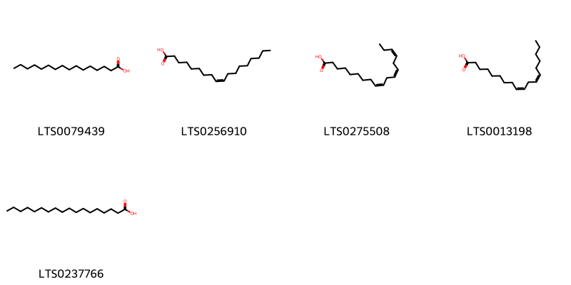{ width=100% }
    <figcaption>Hình ảnh cấu trúc hóa học của 5 hoạt chất thuộc nhóm Fatty Acyls gồm ['palmitic acid (LTS0079439)', 'oleic acid (LTS0256910)', 'α-linolenic acid (LTS0275508)', 'linoleic (LTS0013198)', 'stearic acid (LTS0237766)'].</figcaption>
</figure>
#### Nhóm Organooxygen compounds
<figure markdown="span">
    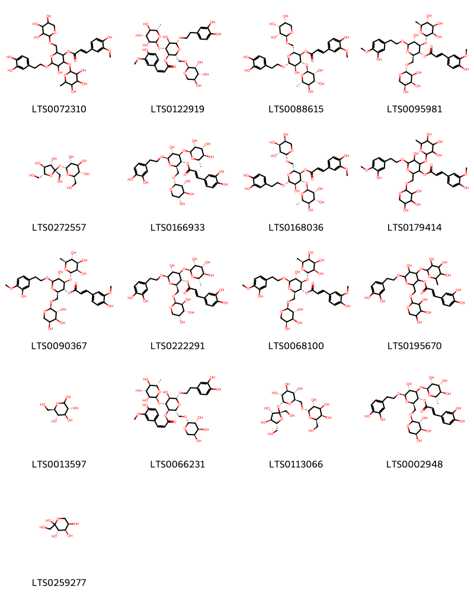{ width=100% }
    <figcaption>Hình ảnh cấu trúc hóa học của 17 hoạt chất thuộc nhóm Organooxygen compounds gồm ['6-[2-(3,4-dihydroxyphenyl)ethoxy]-5-hydroxy-4-[(3,4,5-trihydroxy-6-methyloxan-2-yl)oxy]-2-{[(3,4,5-trihydroxyoxan-2-yl)oxy]methyl}oxan-3-yl 3-(4-hydroxy-3-methoxyphenyl)prop-2-enoate (LTS0072310)', '(2r,3r,4r,5r,6r)-6-[2-(3,4-dihydroxyphenyl)ethoxy]-5-hydroxy-4-{[(2s,3r,4r,5r,6s)-3,4,5-trihydroxy-6-methyloxan-2-yl]oxy}-2-({[(2s,3r,4r,5s)-3,4,5-trihydroxyoxan-2-yl]oxy}methyl)oxan-3-yl (2z)-3-(4-hydroxy-3-methoxyphenyl)prop-2-enoate (LTS0122919)', '(2r,3r,4r,5r,6r)-6-[2-(3,4-dihydroxyphenyl)ethoxy]-5-hydroxy-4-{[(2s,3r,4r,5r,6s)-3,4,5-trihydroxy-6-methyloxan-2-yl]oxy}-2-({[(2s,3r,4r,5r)-3,4,5-trihydroxyoxan-2-yl]oxy}methyl)oxan-3-yl (2e)-3-(4-hydroxy-3-methoxyphenyl)prop-2-enoate (LTS0088615)', '(2r,3r,4r,5r,6r)-5-hydroxy-6-[2-(3-hydroxy-4-methoxyphenyl)ethoxy]-4-{[(2s,3r,4r,5r,6s)-3,4,5-trihydroxy-6-methyloxan-2-yl]oxy}-2-({[(2r,3s,4s,5s)-3,4,5-trihydroxyoxan-2-yl]oxy}methyl)oxan-3-yl (2e)-3-(4-hydroxy-3-methoxyphenyl)prop-2-enoate (LTS0095981)', 'sucrose (LTS0272557)', '(2r,3r,4r,5r,6r)-6-[2-(3,4-dihydroxyphenyl)ethoxy]-5-hydroxy-4-{[(2s,3r,4r,5r,6s)-3,4,5-trihydroxy-6-methyloxan-2-yl]oxy}-2-({[(2r,3r,4s,5r)-3,4,5-trihydroxyoxan-2-yl]oxy}methyl)oxan-3-yl (2e)-3-(3,4-dihydroxyphenyl)prop-2-enoate (LTS0166933)', '(2r,3r,4r,5r,6r)-6-[2-(3,4-dihydroxyphenyl)ethoxy]-5-hydroxy-4-{[(2s,3r,4r,5r,6s)-3,4,5-trihydroxy-6-methyloxan-2-yl]oxy}-2-({[(2r,3r,4s,5s)-3,4,5-trihydroxyoxan-2-yl]oxy}methyl)oxan-3-yl (2e)-3-(4-hydroxy-3-methoxyphenyl)prop-2-enoate (LTS0168036)', '5-hydroxy-6-[2-(3-hydroxy-4-methoxyphenyl)ethoxy]-4-[(3,4,5-trihydroxy-6-methyloxan-2-yl)oxy]-2-{[(3,4,5-trihydroxyoxan-2-yl)oxy]methyl}oxan-3-yl 3-(4-hydroxy-3-methoxyphenyl)prop-2-enoate (LTS0179414)', 'angoroside c (LTS0090367)', '(2r,3r,4r,5r,6r)-6-[2-(3,4-dihydroxyphenyl)ethoxy]-5-hydroxy-4-{[(2s,3r,4r,5r,6s)-3,4,5-trihydroxy-6-methyloxan-2-yl]oxy}-2-({[(2s,3s,4r,5r)-3,4,5-trihydroxyoxan-2-yl]oxy}methyl)oxan-3-yl (2e)-3-(3,4-dihydroxyphenyl)prop-2-enoate (LTS0222291)', 'angoroside c (LTS0068100)', '6-[2-(3,4-dihydroxyphenyl)ethoxy]-5-hydroxy-4-[(3,4,5-trihydroxy-6-methyloxan-2-yl)oxy]-2-{[(3,4,5-trihydroxyoxan-2-yl)oxy]methyl}oxan-3-yl 3-(3,4-dihydroxyphenyl)prop-2-enoate (LTS0195670)', 'glucose (LTS0013597)', '(2r,3r,4r,5r,6r)-6-[2-(3,4-dihydroxyphenyl)ethoxy]-5-hydroxy-4-{[(2s,3r,4r,5r,6s)-3,4,5-trihydroxy-6-methyloxan-2-yl]oxy}-2-({[(2r,3r,4s,5s)-3,4,5-trihydroxyoxan-2-yl]oxy}methyl)oxan-3-yl (2z)-3-(4-hydroxy-3-methoxyphenyl)prop-2-enoate (LTS0066231)', 'raffinose (LTS0113066)', '(2r,3r,4r,5r,6r)-6-[2-(3,4-dihydroxyphenyl)ethoxy]-5-hydroxy-4-{[(2s,3r,4r,5r,6s)-3,4,5-trihydroxy-6-methyloxan-2-yl]oxy}-2-({[(2s,3r,4s,5s)-3,4,5-trihydroxyoxan-2-yl]oxy}methyl)oxan-3-yl (2e)-3-(3,4-dihydroxyphenyl)prop-2-enoate (LTS0002948)', 'd-fructopyranose (LTS0259277)'].</figcaption>
</figure>
#### Nhóm Prenol lipids
<figure markdown="span">
    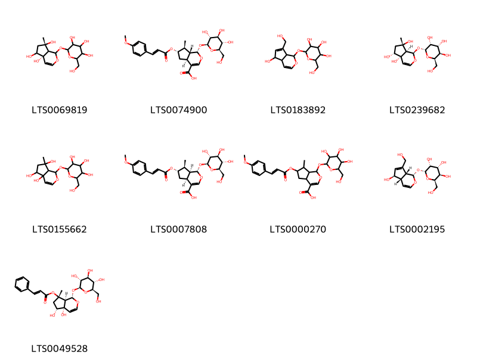{ width=100% }
    <figcaption>Hình ảnh cấu trúc hóa học của 9 hoạt chất thuộc nhóm Prenol lipids gồm ['2-{[(4as,7s)-4a,5,7-trihydroxy-7-methyl-1h,5h,6h,7ah-cyclopenta[c]pyran-1-yl]oxy}-6-(hydroxymethyl)oxane-3,4,5-triol (LTS0069819)', '(1s,4as,6s,7s,7ar)-6-{[(2e)-3-(4-methoxyphenyl)prop-2-enoyl]oxy}-7-methyl-1-{[(2s,3r,4s,5s,6r)-3,4,5-trihydroxy-6-(hydroxymethyl)oxan-2-yl]oxy}-1h,4ah,5h,6h,7h,7ah-cyclopenta[c]pyran-4-carboxylic acid (LTS0074900)', 'aucubin (LTS0183892)', '(2r,3r,4r,5r,6r)-2-{[(1r,4as,5r,7s,7ar)-4a,5,7-trihydroxy-7-methyl-1h,5h,6h,7ah-cyclopenta[c]pyran-1-yl]oxy}-6-(hydroxymethyl)oxane-3,4,5-triol (LTS0239682)', '2-({4a,5,7-trihydroxy-7-methyl-1h,5h,6h,7ah-cyclopenta[c]pyran-1-yl}oxy)-6-(hydroxymethyl)oxane-3,4,5-triol (LTS0155662)', '(1s,4as,6s,7s,7as)-6-{[(2e)-3-(4-methoxyphenyl)prop-2-enoyl]oxy}-7-methyl-1-{[(2s,3r,4s,5s,6r)-3,4,5-trihydroxy-6-(hydroxymethyl)oxan-2-yl]oxy}-1h,4ah,5h,6h,7h,7ah-cyclopenta[c]pyran-4-carboxylic acid (LTS0007808)', '6-{[3-(4-methoxyphenyl)prop-2-enoyl]oxy}-7-methyl-1-{[3,4,5-trihydroxy-6-(hydroxymethyl)oxan-2-yl]oxy}-1h,4ah,5h,6h,7h,7ah-cyclopenta[c]pyran-4-carboxylic acid (LTS0000270)', '(2r,3r,4r,5r,6r)-2-{[(1s,4as,5r,7ar)-5-hydroxy-7-(hydroxymethyl)-1h,4ah,5h,7ah-cyclopenta[c]pyran-1-yl]oxy}-6-(hydroxymethyl)oxane-3,4,5-triol (LTS0002195)', 'harpagoside (LTS0049528)'].</figcaption>
</figure>
#### Nhóm Steroids and steroid derivatives
<figure markdown="span">
    { width=100% }
    <figcaption>Hình ảnh cấu trúc hóa học của 1 hoạt chất thuộc nhóm Steroids and steroid derivatives gồm ['stigmast-5-en-3-ol, (3β)- (LTS0204616)'].</figcaption>
</figure>

---

### Dược dân tộc học

Danh sách các quốc gia có sử dụng *Scrophularia nodosa* trong điều trị các bệnh. 

| Country   | Disease                               | Bệnh                                                                                                                                                                                                |
|:----------|:--------------------------------------|:----------------------------------------------------------------------------------------------------------------------------------------------------------------------------------------------------|
| Europe    | Diuretic                              | MYMEMORY WARNING: YOU USED ALL AVAILABLE FREE TRANSLATIONS FOR TODAY. NEXT AVAILABLE IN  17 HOURS 38 MINUTES 02 SECONDS VISIT HTTPS://MYMEMORY.TRANSLATED.NET/DOC/USAGELIMITS.PHP TO TRANSLATE MORE |
| Turkey    | Diuretic, Poison, Narcotic, Vulnerary | MYMEMORY WARNING: YOU USED ALL AVAILABLE FREE TRANSLATIONS FOR TODAY. NEXT AVAILABLE IN  17 HOURS 37 MINUTES 59 SECONDS VISIT HTTPS://MYMEMORY.TRANSLATED.NET/DOC/USAGELIMITS.PHP TO TRANSLATE MORE |

---

---
## Scrophularia oldhami
### Thông tin về thực vật

!!! info "Phân loại thực vật của *Scrophularia buergeriana* từ GIBF:"
    - **Kingdom:** Plantae
    - **Phylum:** Tracheophyta
    - **Order:** Lamiales
    - **Family:** Scrophulariaceae
    - **Genus:** Scrophularia
    - **Species:** *Scrophularia buergeriana*

 

| Label (VI)   | Label (EN)   | Scientific Name     | Descriptions (VI)   | Descriptions (EN)   | Also Known As (VI)   | Also Known As (EN)   |
|:-------------|:-------------|:--------------------|:--------------------|:--------------------|:---------------------|:---------------------|
| N/A          | N/A          | Scrophularia nodosa | loài thực vật       | species of plant    | ['']                 | ['common figwort']   |

#### Phân bố trên thế giới

**Từ CSDL GIBF** nan, Japan, Singapore, China, Hong Kong, Chinese Taipei

#### Phân bố tại Việt Nam

**Từ CSDL GIBF**: Không có ghi nhận ở Việt Nam

---
### Thành phần hóa học
        
- Theo cơ sở dữ liệu lotus: Từ loài *Scrophularia buergeriana* đã phân lập và xác định được Chưa có hoạt chất nào được phân lập. hoạt chất thuộc về các nhóm Không có hoạt chất nào được phân lập. 

Không có hình ảnh nào được tạo ra

---

### Dược dân tộc học

Danh sách các quốc gia có sử dụng *Scrophularia buergeriana* trong điều trị các bệnh. 

| Country   | Disease                                                                | Bệnh                                                                                                                                                                                                |
|:----------|:-----------------------------------------------------------------------|:----------------------------------------------------------------------------------------------------------------------------------------------------------------------------------------------------|
| China     | Antiphlogistic, Cardiotonic, Diuretic, Refrigerant, Tonic, Vasodilator | MYMEMORY WARNING: YOU USED ALL AVAILABLE FREE TRANSLATIONS FOR TODAY. NEXT AVAILABLE IN  17 HOURS 36 MINUTES 52 SECONDS VISIT HTTPS://MYMEMORY.TRANSLATED.NET/DOC/USAGELIMITS.PHP TO TRANSLATE MORE |

---

# Chi Celsia

??? note "Danh sách các dược liệu thuộc chi"
    
	 - *Celsia coromandeliana*

---
## Celsia coromandeliana
### Thông tin về thực vật

!!! info "Phân loại thực vật của *Verbascum coromandelianum* từ GIBF:"
    - **Kingdom:** Plantae
    - **Phylum:** Tracheophyta
    - **Order:** Lamiales
    - **Family:** Scrophulariaceae
    - **Genus:** Verbascum
    - **Species:** *Verbascum coromandelianum*

 

| Label (VI)   | Label (EN)   | Scientific Name     | Descriptions (VI)   | Descriptions (EN)   | Also Known As (VI)   | Also Known As (EN)   |
|:-------------|:-------------|:--------------------|:--------------------|:--------------------|:---------------------|:---------------------|
| N/A          | N/A          | Scrophularia nodosa | loài thực vật       | species of plant    | ['']                 | ['common figwort']   |

#### Phân bố trên thế giới

**Từ CSDL GIBF** nan, Japan, Singapore, China, Hong Kong, Chinese Taipei

#### Phân bố tại Việt Nam

**Từ CSDL GIBF**: Không có ghi nhận ở Việt Nam

---
### Thành phần hóa học
        
- Theo cơ sở dữ liệu lotus: Từ loài *Verbascum coromandelianum* đã phân lập và xác định được Chưa có hoạt chất nào được phân lập. hoạt chất thuộc về các nhóm Không có hoạt chất nào được phân lập. 

Không có hình ảnh nào được tạo ra

---

### Dược dân tộc học

Danh sách các quốc gia có sử dụng *Verbascum coromandelianum* trong điều trị các bệnh. 

| Country   | Disease              | Bệnh                                                                                                                                                                                                |
|:----------|:---------------------|:----------------------------------------------------------------------------------------------------------------------------------------------------------------------------------------------------|
| Elsewhere | Sedative, Astringent | MYMEMORY WARNING: YOU USED ALL AVAILABLE FREE TRANSLATIONS FOR TODAY. NEXT AVAILABLE IN  17 HOURS 36 MINUTES 33 SECONDS VISIT HTTPS://MYMEMORY.TRANSLATED.NET/DOC/USAGELIMITS.PHP TO TRANSLATE MORE |

---

# Chi Botryopleuron

??? note "Danh sách các dược liệu thuộc chi"
    
	 - *Botryopleuron axillare*

---
## Botryopleuron axillare
### Thông tin về thực vật

!!! info "Phân loại thực vật của *Veronicastrum axillare* từ GIBF:"
    - **Kingdom:** Plantae
    - **Phylum:** Tracheophyta
    - **Order:** Lamiales
    - **Family:** Plantaginaceae
    - **Genus:** Veronicastrum
    - **Species:** *Veronicastrum axillare*

 

| Label (VI)   | Label (EN)   | Scientific Name        | Descriptions (VI)   | Descriptions (EN)   | Also Known As (VI)   | Also Known As (EN)   |
|:-------------|:-------------|:-----------------------|:--------------------|:--------------------|:---------------------|:---------------------|
| N/A          | N/A          | Botryopleuron axillare |                     |                     | ['']                 | ['']                 |

#### Phân bố trên thế giới

**Từ CSDL GIBF** Japan, China, Chinese Taipei

#### Phân bố tại Việt Nam

**Từ CSDL GIBF**: Không có ghi nhận ở Việt Nam

---
### Thành phần hóa học
        
- Theo cơ sở dữ liệu lotus: Từ loài *Veronicastrum axillare* đã phân lập và xác định được Chưa có hoạt chất nào được phân lập. hoạt chất thuộc về các nhóm Không có hoạt chất nào được phân lập. 

Không có hình ảnh nào được tạo ra

---

### Dược dân tộc học

Danh sách các quốc gia có sử dụng *Veronicastrum axillare* trong điều trị các bệnh. 

| Country   | Disease                 | Bệnh                                                                                                                                                                                                |
|:----------|:------------------------|:----------------------------------------------------------------------------------------------------------------------------------------------------------------------------------------------------|
| China     | Carminative, Detoxicant | MYMEMORY WARNING: YOU USED ALL AVAILABLE FREE TRANSLATIONS FOR TODAY. NEXT AVAILABLE IN  17 HOURS 36 MINUTES 15 SECONDS VISIT HTTPS://MYMEMORY.TRANSLATED.NET/DOC/USAGELIMITS.PHP TO TRANSLATE MORE |

---

# Chi Euphrasia

??? note "Danh sách các dược liệu thuộc chi"
    
	 - *Euphrasia officinalis*

---
## Euphrasia officinalis
### Thông tin về thực vật

!!! info "Phân loại thực vật của *Euphrasia officinalis* từ GIBF:"
    - **Kingdom:** Plantae
    - **Phylum:** Tracheophyta
    - **Order:** Lamiales
    - **Family:** Orobanchaceae
    - **Genus:** Euphrasia
    - **Species:** *Euphrasia officinalis*

 

| Label (VI)   | Label (EN)   | Scientific Name       | Descriptions (VI)   | Descriptions (EN)   | Also Known As (VI)   | Also Known As (EN)   |
|:-------------|:-------------|:----------------------|:--------------------|:--------------------|:---------------------|:---------------------|
| N/A          | N/A          | Euphrasia officinalis | loài thực vật       | species of plant    | ['']                 | ['eyebright']        |

#### Phân bố trên thế giới

**Từ CSDL GIBF** Denmark, Germany, Chile, Austria, Sweden, Belgium, Finland, Netherlands, Slovakia, Slovenia, Estonia, Ireland, Switzerland, Argentina, United Kingdom of Great Britain and Northern Ireland, France, Czechia, Russian Federation, Italy, Croatia

#### Phân bố tại Việt Nam

**Từ CSDL GIBF**: Không có ghi nhận ở Việt Nam

---
### Thành phần hóa học
        
- Theo cơ sở dữ liệu lotus: Từ loài *Euphrasia officinalis* đã phân lập và xác định được 16 hoạt chất thuộc về các nhóm Steroids and steroid derivatives, 2-arylbenzofuran flavonoids, Cinnamic acids and derivatives, Carboxylic acids and derivatives. 

|    | chemicalTaxonomyClassyfireClass   |   smiles_count |
|---:|:----------------------------------|---------------:|
|  0 | 2-arylbenzofuran flavonoids       |              2 |
|  1 | Carboxylic acids and derivatives  |              4 |
|  2 | Cinnamic acids and derivatives    |              6 |
|  3 | Steroids and steroid derivatives  |              4 |

#### Nhóm 2-arylbenzofuran flavonoids
<figure markdown="span">
    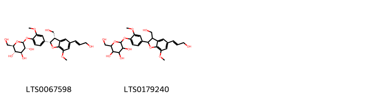{ width=100% }
    <figcaption>Hình ảnh cấu trúc hóa học của 2 hoạt chất thuộc nhóm 2-arylbenzofuran flavonoids gồm ['(2r,3s,4s,5r,6s)-2-(hydroxymethyl)-6-{4-[(2s,3s)-3-(hydroxymethyl)-5-[(1e)-3-hydroxyprop-1-en-1-yl]-7-methoxy-2,3-dihydro-1-benzofuran-2-yl]-2-methoxyphenoxy}oxane-3,4,5-triol (LTS0067598)', '2-(hydroxymethyl)-6-{4-[3-(hydroxymethyl)-5-(3-hydroxyprop-1-en-1-yl)-7-methoxy-2,3-dihydro-1-benzofuran-2-yl]-2-methoxyphenoxy}oxane-3,4,5-triol (LTS0179240)'].</figcaption>
</figure>
#### Nhóm Carboxylic acids and derivatives
<figure markdown="span">
    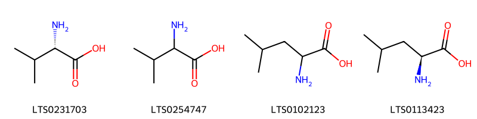{ width=100% }
    <figcaption>Hình ảnh cấu trúc hóa học của 4 hoạt chất thuộc nhóm Carboxylic acids and derivatives gồm ['l-valine (LTS0231703)', 'valin (LTS0254747)', 'leucine (LTS0102123)', 'l-leucine (LTS0113423)'].</figcaption>
</figure>
#### Nhóm Cinnamic acids and derivatives
<figure markdown="span">
    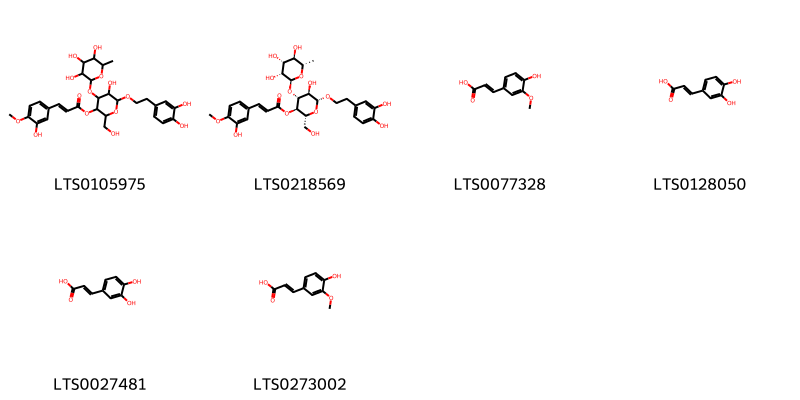{ width=100% }
    <figcaption>Hình ảnh cấu trúc hóa học của 6 hoạt chất thuộc nhóm Cinnamic acids and derivatives gồm ['6-[2-(3,4-dihydroxyphenyl)ethoxy]-5-hydroxy-2-(hydroxymethyl)-4-[(3,4,5-trihydroxy-6-methyloxan-2-yl)oxy]oxan-3-yl 3-(3-hydroxy-4-methoxyphenyl)prop-2-enoate (LTS0105975)', '(2r,3r,4r,5r,6r)-6-[2-(3,4-dihydroxyphenyl)ethoxy]-5-hydroxy-2-(hydroxymethyl)-4-{[(2s,3r,4r,5r,6s)-3,4,5-trihydroxy-6-methyloxan-2-yl]oxy}oxan-3-yl (2e)-3-(3-hydroxy-4-methoxyphenyl)prop-2-enoate (LTS0218569)', 'ferulic acid (LTS0077328)', '3,4-dihydroxycinnamic acid (LTS0128050)', 'caffeic acid (LTS0027481)', 'ferulic acid (LTS0273002)'].</figcaption>
</figure>
#### Nhóm Steroids and steroid derivatives
<figure markdown="span">
    { width=100% }
    <figcaption>Hình ảnh cấu trúc hóa học của 4 hoạt chất thuộc nhóm Steroids and steroid derivatives gồm ['stigmast-5-en-3-ol, (3β)- (LTS0204616)', 'stigmasterol (LTS0024262)', '(1r,3ar,3br,7s,9ar,9br,11ar)-1-[(2r,5r)-5-ethyl-6-methylheptan-2-yl]-9a,11a-dimethyl-1h,2h,3h,3ah,3bh,4h,6h,7h,8h,9h,9bh,10h,11h-cyclopenta[a]phenanthren-7-ol (LTS0129695)', '(1r,3ar,3br,7s,9ar,9br,11ar)-1-[(2s,3e,5s)-5-ethyl-6-methylhept-3-en-2-yl]-9a,11a-dimethyl-1h,2h,3h,3ah,3bh,4h,6h,7h,8h,9h,9bh,10h,11h-cyclopenta[a]phenanthren-7-ol (LTS0244733)'].</figcaption>
</figure>

---

### Dược dân tộc học

Danh sách các quốc gia có sử dụng *Euphrasia officinalis* trong điều trị các bệnh. 

| Country   | Disease                     | Bệnh                                                                                                                                                                                                |
|:----------|:----------------------------|:----------------------------------------------------------------------------------------------------------------------------------------------------------------------------------------------------|
| India     | Astringent, Tonic           | MYMEMORY WARNING: YOU USED ALL AVAILABLE FREE TRANSLATIONS FOR TODAY. NEXT AVAILABLE IN  17 HOURS 35 MINUTES 58 SECONDS VISIT HTTPS://MYMEMORY.TRANSLATED.NET/DOC/USAGELIMITS.PHP TO TRANSLATE MORE |
| Turkey    | Tonic, Laxative, Astringent | MYMEMORY WARNING: YOU USED ALL AVAILABLE FREE TRANSLATIONS FOR TODAY. NEXT AVAILABLE IN  17 HOURS 35 MINUTES 55 SECONDS VISIT HTTPS://MYMEMORY.TRANSLATED.NET/DOC/USAGELIMITS.PHP TO TRANSLATE MORE |

---

# Chi Harveya

??? note "Danh sách các dược liệu thuộc chi"
    
	 - *Harveya eciosa*

---
## Harveya eciosa
### Thông tin về thực vật

!!! info "Phân loại thực vật của *N/A* từ GIBF:"
    - **Kingdom:** N/A
    - **Phylum:** N/A
    - **Order:** N/A
    - **Family:** N/A
    - **Genus:** N/A
    - **Species:** *N/A*

 

| Label (VI)   | Label (EN)   | Scientific Name       | Descriptions (VI)   | Descriptions (EN)   | Also Known As (VI)   | Also Known As (EN)   |
|:-------------|:-------------|:----------------------|:--------------------|:--------------------|:---------------------|:---------------------|
| N/A          | N/A          | Euphrasia officinalis | loài thực vật       | species of plant    | ['']                 | ['eyebright']        |

#### Phân bố trên thế giới

**Từ CSDL GIBF** Không có kết quả phù hợp

#### Phân bố tại Việt Nam

**Từ CSDL GIBF**: Không có ghi nhận ở Việt Nam

---
### Thành phần hóa học
        
- Theo cơ sở dữ liệu lotus: Từ loài *N/A* đã phân lập và xác định được Chưa có hoạt chất nào được phân lập. hoạt chất thuộc về các nhóm Không có hoạt chất nào được phân lập. 

Không có hình ảnh nào được tạo ra

---

### Dược dân tộc học

Danh sách các quốc gia có sử dụng *N/A* trong điều trị các bệnh. 

| Country   | Disease   | Bệnh                                                                                                                                                                                                |
|:----------|:----------|:----------------------------------------------------------------------------------------------------------------------------------------------------------------------------------------------------|
| Lesotho   | Purgative | MYMEMORY WARNING: YOU USED ALL AVAILABLE FREE TRANSLATIONS FOR TODAY. NEXT AVAILABLE IN  17 HOURS 35 MINUTES 20 SECONDS VISIT HTTPS://MYMEMORY.TRANSLATED.NET/DOC/USAGELIMITS.PHP TO TRANSLATE MORE |

---

# Chi Lathraea

??? note "Danh sách các dược liệu thuộc chi"
    
	 - *Lathraea squamaria*

---
## Lathraea squamaria
### Thông tin về thực vật

!!! info "Phân loại thực vật của *Lathraea squamaria* từ GIBF:"
    - **Kingdom:** Plantae
    - **Phylum:** Tracheophyta
    - **Order:** Lamiales
    - **Family:** Orobanchaceae
    - **Genus:** Lathraea
    - **Species:** *Lathraea squamaria*

 

| Label (VI)   | Label (EN)   | Scientific Name    | Descriptions (VI)   | Descriptions (EN)   | Also Known As (VI)   | Also Known As (EN)   |
|:-------------|:-------------|:-------------------|:--------------------|:--------------------|:---------------------|:---------------------|
| N/A          | N/A          | Lathraea squamaria | loài thực vật       | species of plant    | ['']                 | ['']                 |

#### Phân bố trên thế giới

**Từ CSDL GIBF** Georgia, nan, Denmark, Spain, Germany, Austria, Serbia, Sweden, Poland, Belgium, Slovakia, Netherlands, Türkiye, Slovenia, Belarus, Hungary, Ireland, Switzerland, Moldova, Republic of, United Kingdom of Great Britain and Northern Ireland, France, Czechia, Romania, Russian Federation, Italy, Greece, Croatia, Ukraine

#### Phân bố tại Việt Nam

**Từ CSDL GIBF**: Không có ghi nhận ở Việt Nam

---
### Thành phần hóa học
        
- Theo cơ sở dữ liệu lotus: Từ loài *Lathraea squamaria* đã phân lập và xác định được 18 hoạt chất thuộc về các nhóm Steroids and steroid derivatives, Prenol lipids, Fatty Acyls. 

|    | chemicalTaxonomyClassyfireClass   |   smiles_count |
|---:|:----------------------------------|---------------:|
|  0 | Fatty Acyls                       |              7 |
|  1 | Prenol lipids                     |              9 |
|  2 | Steroids and steroid derivatives  |              2 |

#### Nhóm Fatty Acyls
<figure markdown="span">
    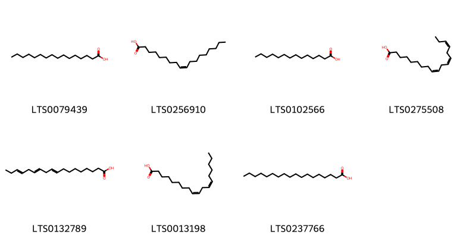{ width=100% }
    <figcaption>Hình ảnh cấu trúc hóa học của 7 hoạt chất thuộc nhóm Fatty Acyls gồm ['palmitic acid (LTS0079439)', 'oleic acid (LTS0256910)', 'myristic acid (LTS0102566)', 'α-linolenic acid (LTS0275508)', 'α linolenic acid (LTS0132789)', 'linoleic (LTS0013198)', 'stearic acid (LTS0237766)'].</figcaption>
</figure>
#### Nhóm Prenol lipids
<figure markdown="span">
    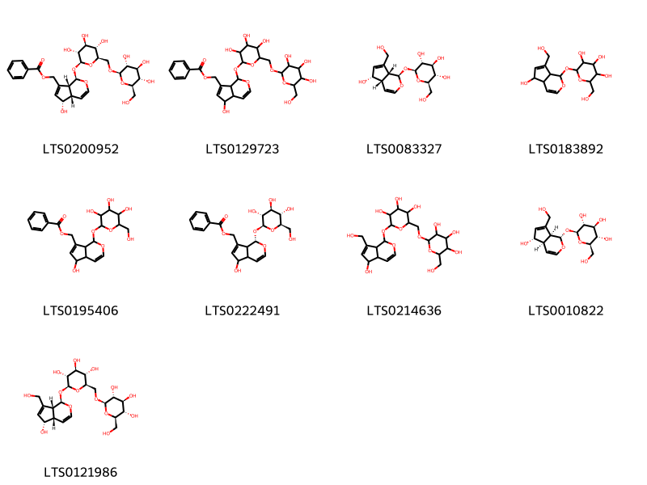{ width=100% }
    <figcaption>Hình ảnh cấu trúc hóa học của 9 hoạt chất thuộc nhóm Prenol lipids gồm ['[(1r,4as,5s,7ar)-5-hydroxy-1-{[(2s,3r,4s,5s,6r)-3,4,5-trihydroxy-6-({[(2r,3r,4s,5s,6r)-3,4,5-trihydroxy-6-(hydroxymethyl)oxan-2-yl]oxy}methyl)oxan-2-yl]oxy}-1h,4ah,5h,7ah-cyclopenta[c]pyran-7-yl]methyl benzoate (LTS0200952)', '(5-hydroxy-1-{[3,4,5-trihydroxy-6-({[3,4,5-trihydroxy-6-(hydroxymethyl)oxan-2-yl]oxy}methyl)oxan-2-yl]oxy}-1h,4ah,5h,7ah-cyclopenta[c]pyran-7-yl)methyl benzoate (LTS0129723)', '(2s,3r,4s,5s,6r)-2-{[(1r,4as,5s,7ar)-5-hydroxy-7-(hydroxymethyl)-1h,4ah,5h,7ah-cyclopenta[c]pyran-1-yl]oxy}-6-(hydroxymethyl)oxane-3,4,5-triol (LTS0083327)', 'aucubin (LTS0183892)', '(5-hydroxy-1-{[3,4,5-trihydroxy-6-(hydroxymethyl)oxan-2-yl]oxy}-1h,4ah,5h,7ah-cyclopenta[c]pyran-7-yl)methyl benzoate (LTS0195406)', '[(1s)-5-hydroxy-1-{[(2s,3r,4s,5s,6r)-3,4,5-trihydroxy-6-(hydroxymethyl)oxan-2-yl]oxy}-1h,4ah,5h,7ah-cyclopenta[c]pyran-7-yl]methyl benzoate (LTS0222491)', '2-{[5-hydroxy-7-(hydroxymethyl)-1h,4ah,5h,7ah-cyclopenta[c]pyran-1-yl]oxy}-6-({[3,4,5-trihydroxy-6-(hydroxymethyl)oxan-2-yl]oxy}methyl)oxane-3,4,5-triol (LTS0214636)', 'aucubin (LTS0010822)', '(2s,3r,4s,5s,6r)-2-{[(1r,4as,5s,7ar)-5-hydroxy-7-(hydroxymethyl)-1h,4ah,5h,7ah-cyclopenta[c]pyran-1-yl]oxy}-6-({[(2r,3r,4s,5s,6r)-3,4,5-trihydroxy-6-(hydroxymethyl)oxan-2-yl]oxy}methyl)oxane-3,4,5-triol (LTS0121986)'].</figcaption>
</figure>
#### Nhóm Steroids and steroid derivatives
<figure markdown="span">
    { width=100% }
    <figcaption>Hình ảnh cấu trúc hóa học của 2 hoạt chất thuộc nhóm Steroids and steroid derivatives gồm ['stigmast-5-en-3-ol (LTS0071224)', 'stigmast-5-en-3-ol, (3β)- (LTS0204616)'].</figcaption>
</figure>

---

### Dược dân tộc học

Danh sách các quốc gia có sử dụng *Lathraea squamaria* trong điều trị các bệnh. 

| Country   | Disease   | Bệnh                                                                                                                                                                                                |
|:----------|:----------|:----------------------------------------------------------------------------------------------------------------------------------------------------------------------------------------------------|
| Turkey    | Soporific | MYMEMORY WARNING: YOU USED ALL AVAILABLE FREE TRANSLATIONS FOR TODAY. NEXT AVAILABLE IN  17 HOURS 35 MINUTES 08 SECONDS VISIT HTTPS://MYMEMORY.TRANSLATED.NET/DOC/USAGELIMITS.PHP TO TRANSLATE MORE |
| ain       | Stimulant | MYMEMORY WARNING: YOU USED ALL AVAILABLE FREE TRANSLATIONS FOR TODAY. NEXT AVAILABLE IN  17 HOURS 35 MINUTES 05 SECONDS VISIT HTTPS://MYMEMORY.TRANSLATED.NET/DOC/USAGELIMITS.PHP TO TRANSLATE MORE |

---

# Chi Pedicularis

??? note "Danh sách các dược liệu thuộc chi"
    
	 - *Pedicularis pectinata*
	 - *Pedicularis sceptrum*
	 - *Pedicularis silvatica*
	 - *Pedicularis siphonantha*

---
## Pedicularis pectinata
### Thông tin về thực vật

!!! info "Phân loại thực vật của *Pedicularis pectinata* từ GIBF:"
    - **Kingdom:** Plantae
    - **Phylum:** Tracheophyta
    - **Order:** Lamiales
    - **Family:** Orobanchaceae
    - **Genus:** Pedicularis
    - **Species:** *Pedicularis pectinata*

 

| Label (VI)   | Label (EN)   | Scientific Name       | Descriptions (VI)   | Descriptions (EN)   | Also Known As (VI)   | Also Known As (EN)   |
|:-------------|:-------------|:----------------------|:--------------------|:--------------------|:---------------------|:---------------------|
| N/A          | N/A          | Pedicularis pectinata | loài thực vật       | species of plant    | ['']                 | ['']                 |

#### Phân bố trên thế giới

**Từ CSDL GIBF** nan, unknown or invalid, Pakistan, India, China, Nepal

#### Phân bố tại Việt Nam

**Từ CSDL GIBF**: Không có ghi nhận ở Việt Nam

---
### Thành phần hóa học
        
- Theo cơ sở dữ liệu lotus: Từ loài *Pedicularis pectinata* đã phân lập và xác định được 4 hoạt chất thuộc về các nhóm Prenol lipids. 

|    | chemicalTaxonomyClassyfireClass   |   smiles_count |
|---:|:----------------------------------|---------------:|
|  0 | Prenol lipids                     |              4 |

#### Nhóm Prenol lipids
<figure markdown="span">
    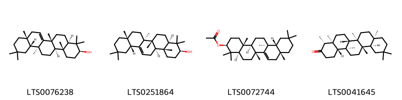{ width=100% }
    <figcaption>Hình ảnh cấu trúc hóa học của 4 hoạt chất thuộc nhóm Prenol lipids gồm ['alnulin (LTS0076238)', 'β-amyrin (LTS0251864)', '(3s,4ar,6ar,8ar,12ar,12bs,14ar,14br)-4,4,6a,8a,11,11,12b,14b-octamethyl-1,2,3,4a,5,6,8,9,10,12,12a,13,14,14a-tetradecahydropicen-3-yl acetate (LTS0072744)', '(-)-friedelin (LTS0041645)'].</figcaption>
</figure>

---

### Dược dân tộc học

Danh sách các quốc gia có sử dụng *Pedicularis pectinata* trong điều trị các bệnh. 

| Country   | Disease                        | Bệnh                                                                                                                                                                                                |
|:----------|:-------------------------------|:----------------------------------------------------------------------------------------------------------------------------------------------------------------------------------------------------|
| Elsewhere | Astringent, Hemostat, Diuretic | MYMEMORY WARNING: YOU USED ALL AVAILABLE FREE TRANSLATIONS FOR TODAY. NEXT AVAILABLE IN  17 HOURS 34 MINUTES 30 SECONDS VISIT HTTPS://MYMEMORY.TRANSLATED.NET/DOC/USAGELIMITS.PHP TO TRANSLATE MORE |

---

---
## Pedicularis sceptrum
### Thông tin về thực vật

!!! info "Phân loại thực vật của *Pedicularis sceptrum-carolinum* từ GIBF:"
    - **Kingdom:** Plantae
    - **Phylum:** Tracheophyta
    - **Order:** Lamiales
    - **Family:** Orobanchaceae
    - **Genus:** Pedicularis
    - **Species:** *Pedicularis sceptrum-carolinum*

 

| Label (VI)   | Label (EN)   | Scientific Name       | Descriptions (VI)   | Descriptions (EN)   | Also Known As (VI)   | Also Known As (EN)   |
|:-------------|:-------------|:----------------------|:--------------------|:--------------------|:---------------------|:---------------------|
| N/A          | N/A          | Pedicularis pectinata | loài thực vật       | species of plant    | ['']                 | ['']                 |

#### Phân bố trên thế giới

**Từ CSDL GIBF** nan, Sweden, Spain, Germany, Estonia, Russian Federation, Austria

#### Phân bố tại Việt Nam

**Từ CSDL GIBF**: Không có ghi nhận ở Việt Nam

---
### Thành phần hóa học
        
- Theo cơ sở dữ liệu lotus: Từ loài *Pedicularis sceptrum-carolinum* đã phân lập và xác định được Chưa có hoạt chất nào được phân lập. hoạt chất thuộc về các nhóm Không có hoạt chất nào được phân lập. 

Không có hình ảnh nào được tạo ra

---

### Dược dân tộc học

Danh sách các quốc gia có sử dụng *Pedicularis sceptrum-carolinum* trong điều trị các bệnh. 

| Country   | Disease     | Bệnh                                                                                                                                                                                                |
|:----------|:------------|:----------------------------------------------------------------------------------------------------------------------------------------------------------------------------------------------------|
| China     | Carminative | MYMEMORY WARNING: YOU USED ALL AVAILABLE FREE TRANSLATIONS FOR TODAY. NEXT AVAILABLE IN  17 HOURS 34 MINUTES 01 SECONDS VISIT HTTPS://MYMEMORY.TRANSLATED.NET/DOC/USAGELIMITS.PHP TO TRANSLATE MORE |

---

---
## Pedicularis silvatica
### Thông tin về thực vật

!!! info "Phân loại thực vật của *Pedicularis sylvatica* từ GIBF:"
    - **Kingdom:** Plantae
    - **Phylum:** Tracheophyta
    - **Order:** Lamiales
    - **Family:** Orobanchaceae
    - **Genus:** Pedicularis
    - **Species:** *Pedicularis sylvatica*

 

| Label (VI)   | Label (EN)   | Scientific Name       | Descriptions (VI)   | Descriptions (EN)   | Also Known As (VI)   | Also Known As (EN)   |
|:-------------|:-------------|:----------------------|:--------------------|:--------------------|:---------------------|:---------------------|
| N/A          | N/A          | Pedicularis pectinata | loài thực vật       | species of plant    | ['']                 | ['']                 |

#### Phân bố trên thế giới

**Từ CSDL GIBF** United Kingdom of Great Britain and Northern Ireland, Portugal, Sweden, France, Spain, Czechia, Germany, Ireland, Guernsey, Belgium, Netherlands

#### Phân bố tại Việt Nam

**Từ CSDL GIBF**: Không có ghi nhận ở Việt Nam

---
### Thành phần hóa học
        
- Theo cơ sở dữ liệu lotus: Từ loài *Pedicularis sylvatica* đã phân lập và xác định được Chưa có hoạt chất nào được phân lập. hoạt chất thuộc về các nhóm Không có hoạt chất nào được phân lập. 

Không có hình ảnh nào được tạo ra

---

### Dược dân tộc học

Danh sách các quốc gia có sử dụng *Pedicularis sylvatica* trong điều trị các bệnh. 

| Country   | Disease   | Bệnh                                                                                                                                                                                                |
|:----------|:----------|:----------------------------------------------------------------------------------------------------------------------------------------------------------------------------------------------------|
| Turkey    | Vulnerary | MYMEMORY WARNING: YOU USED ALL AVAILABLE FREE TRANSLATIONS FOR TODAY. NEXT AVAILABLE IN  17 HOURS 33 MINUTES 43 SECONDS VISIT HTTPS://MYMEMORY.TRANSLATED.NET/DOC/USAGELIMITS.PHP TO TRANSLATE MORE |

---

---
## Pedicularis siphonantha
### Thông tin về thực vật

!!! info "Phân loại thực vật của *Pedicularis siphonantha* từ GIBF:"
    - **Kingdom:** Plantae
    - **Phylum:** Tracheophyta
    - **Order:** Lamiales
    - **Family:** Orobanchaceae
    - **Genus:** Pedicularis
    - **Species:** *Pedicularis siphonantha*

 

| Label (VI)   | Label (EN)   | Scientific Name         | Descriptions (VI)   | Descriptions (EN)   | Also Known As (VI)   | Also Known As (EN)   |
|:-------------|:-------------|:------------------------|:--------------------|:--------------------|:---------------------|:---------------------|
| N/A          | N/A          | Pedicularis siphonantha | loài thực vật       | species of plant    | ['']                 | ['']                 |

#### Phân bố trên thế giới

**Từ CSDL GIBF** nan, Bhutan, India, China, Nepal

#### Phân bố tại Việt Nam

**Từ CSDL GIBF**: Không có ghi nhận ở Việt Nam

---
### Thành phần hóa học
        
- Theo cơ sở dữ liệu lotus: Từ loài *Pedicularis siphonantha* đã phân lập và xác định được Chưa có hoạt chất nào được phân lập. hoạt chất thuộc về các nhóm Không có hoạt chất nào được phân lập. 

Không có hình ảnh nào được tạo ra

---

### Dược dân tộc học

Danh sách các quốc gia có sử dụng *Pedicularis siphonantha* trong điều trị các bệnh. 

| Country   | Disease   | Bệnh                                                                                                                                                                                                |
|:----------|:----------|:----------------------------------------------------------------------------------------------------------------------------------------------------------------------------------------------------|
| Elsewhere | Diuretic  | MYMEMORY WARNING: YOU USED ALL AVAILABLE FREE TRANSLATIONS FOR TODAY. NEXT AVAILABLE IN  17 HOURS 33 MINUTES 21 SECONDS VISIT HTTPS://MYMEMORY.TRANSLATED.NET/DOC/USAGELIMITS.PHP TO TRANSLATE MORE |

---

# Chi Escobedia

??? note "Danh sách các dược liệu thuộc chi"
    
	 - *Escobedia linearis*

---
## Escobedia linearis
### Thông tin về thực vật

!!! info "Phân loại thực vật của *Escobedia laevis* từ GIBF:"
    - **Kingdom:** Plantae
    - **Phylum:** Tracheophyta
    - **Order:** Lamiales
    - **Family:** Orobanchaceae
    - **Genus:** Escobedia
    - **Species:** *Escobedia laevis*

 

| Label (VI)   | Label (EN)   | Scientific Name    | Descriptions (VI)   | Descriptions (EN)   | Also Known As (VI)   | Also Known As (EN)   |
|:-------------|:-------------|:-------------------|:--------------------|:--------------------|:---------------------|:---------------------|
| N/A          | N/A          | Escobedia linearis |                     |                     | ['']                 | ['']                 |

#### Phân bố trên thế giới

**Từ CSDL GIBF** nan, Mexico, Guatemala

#### Phân bố tại Việt Nam

**Từ CSDL GIBF**: Không có ghi nhận ở Việt Nam

---
### Thành phần hóa học
        
- Theo cơ sở dữ liệu lotus: Từ loài *Escobedia laevis* đã phân lập và xác định được Chưa có hoạt chất nào được phân lập. hoạt chất thuộc về các nhóm Không có hoạt chất nào được phân lập. 

Không có hình ảnh nào được tạo ra

---

### Dược dân tộc học

Danh sách các quốc gia có sử dụng *Escobedia laevis* trong điều trị các bệnh. 

| Country   | Disease   | Bệnh                                                                                                                                                                                                |
|:----------|:----------|:----------------------------------------------------------------------------------------------------------------------------------------------------------------------------------------------------|
| Mexico    | Pulicide  | MYMEMORY WARNING: YOU USED ALL AVAILABLE FREE TRANSLATIONS FOR TODAY. NEXT AVAILABLE IN  17 HOURS 32 MINUTES 59 SECONDS VISIT HTTPS://MYMEMORY.TRANSLATED.NET/DOC/USAGELIMITS.PHP TO TRANSLATE MORE |

---

# Chi Bacopa

??? note "Danh sách các dược liệu thuộc chi"
    
	 - *Bacopa monniera*
	 - *Bacopa monnieri*

---
## Bacopa monniera
### Thông tin về thực vật

!!! info "Phân loại thực vật của *Bacopa monniera* từ GIBF:"
    - **Kingdom:** Plantae
    - **Phylum:** Tracheophyta
    - **Order:** Lamiales
    - **Family:** Plantaginaceae
    - **Genus:** Bacopa
    - **Species:** *Bacopa monniera*

 

| Label (VI)   | Label (EN)   | Scientific Name   | Descriptions (VI)   | Descriptions (EN)   | Also Known As (VI)   | Also Known As (EN)   |
|:-------------|:-------------|:------------------|:--------------------|:--------------------|:---------------------|:---------------------|
| N/A          | N/A          | Bacopa monniera   |                     |                     | ['']                 | ['']                 |

#### Phân bố trên thế giới

**Từ CSDL GIBF** nan, unknown or invalid, Sri Lanka, Argentina, Brazil, Ecuador, United States of America, Mexico, Saudi Arabia, Australia

#### Phân bố tại Việt Nam

**Từ CSDL GIBF**: Không có ghi nhận ở Việt Nam

---
### Thành phần hóa học
        
- Theo cơ sở dữ liệu lotus: Từ loài *Bacopa monniera* đã phân lập và xác định được 78 hoạt chất thuộc về các nhóm Organooxygen compounds, Flavonoids, Glycerolipids, Prenol lipids, Fatty Acyls, Cinnamic acids and derivatives, Steroids and steroid derivatives. 

|    | chemicalTaxonomyClassyfireClass   |   smiles_count |
|---:|:----------------------------------|---------------:|
|  0 |                                   |              3 |
|  1 | Cinnamic acids and derivatives    |             10 |
|  2 | Fatty Acyls                       |              4 |
|  3 | Flavonoids                        |              2 |
|  4 | Glycerolipids                     |              2 |
|  5 | Organooxygen compounds            |              8 |
|  6 | Prenol lipids                     |             45 |
|  7 | Steroids and steroid derivatives  |              4 |

#### Nhóm 
<figure markdown="span">
    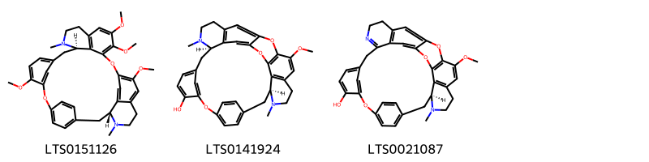{ width=100% }
    <figcaption>Hình ảnh cấu trúc hóa học của 3 hoạt chất thuộc nhóm  gồm ['(1r,14r)-9,20,21,25-tetramethoxy-15,30-dimethyl-7,23-dioxa-15,30-diazaheptacyclo[22.6.2.2³,⁶.1⁸,¹².1¹⁴,¹⁸.0²⁷,³¹.0²²,³³]hexatriaconta-3,5,8(34),9,11,18(33),19,21,24,26,31,35-dodecaene (LTS0151126)', '(8r,21s)-27-methoxy-7,22-dimethyl-15,29,31-trioxa-7,22-diazaoctacyclo[19.9.3.2¹⁶,¹⁹.1⁴,³⁰.1¹⁰,¹⁴.0³,⁸.0²⁵,³³.0²⁸,³²]heptatriaconta-1,3,10,12,14(37),16,18,25(33),26,28(32),30(34),35-dodecaen-13-ol (LTS0141924)', '(21s)-27-methoxy-22-methyl-15,29,31-trioxa-7,22-diazaoctacyclo[19.9.3.2¹⁶,¹⁹.1⁴,³⁰.1¹⁰,¹⁴.0³,⁸.0²⁵,³³.0²⁸,³²]heptatriaconta-1,3,7,10,12,14(37),16,18,25(33),26,28(32),30(34),35-tridecaen-13-ol (LTS0021087)'].</figcaption>
</figure>
#### Nhóm Cinnamic acids and derivatives
<figure markdown="span">
    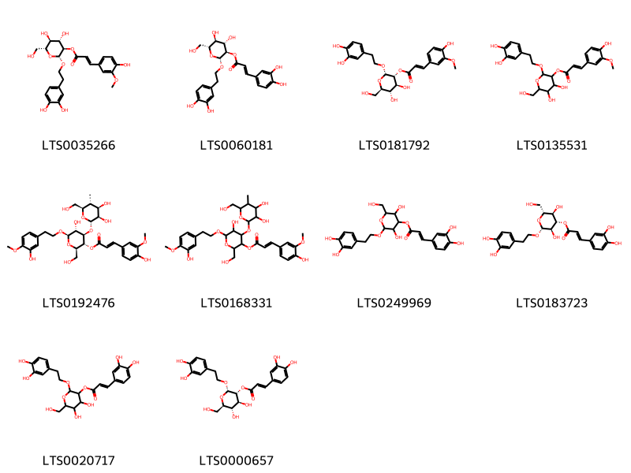{ width=100% }
    <figcaption>Hình ảnh cấu trúc hóa học của 10 hoạt chất thuộc nhóm Cinnamic acids and derivatives gồm ['(2r,3r,4s,5s,6r)-2-[2-(3,4-dihydroxyphenyl)ethoxy]-4,5-dihydroxy-6-(hydroxymethyl)oxan-3-yl (2e)-3-(4-hydroxy-3-methoxyphenyl)prop-2-enoate (LTS0035266)', '(2r,3r,4s,5s,6r)-2-[2-(3,4-dihydroxyphenyl)ethoxy]-4,5-dihydroxy-6-(hydroxymethyl)oxan-3-yl (2e)-3-(3,4-dihydroxyphenyl)prop-2-enoate (LTS0060181)', '(2s,3r,4s,5s,6r)-2-[2-(3,4-dihydroxyphenyl)ethoxy]-4,5-dihydroxy-6-(hydroxymethyl)oxan-3-yl (2e)-3-(4-hydroxy-3-methoxyphenyl)prop-2-enoate (LTS0181792)', '2-[2-(3,4-dihydroxyphenyl)ethoxy]-4,5-dihydroxy-6-(hydroxymethyl)oxan-3-yl 3-(4-hydroxy-3-methoxyphenyl)prop-2-enoate (LTS0135531)', '(2r,3r,4r,5r,6r)-4-{[(2s,3r,4r,5r,6r)-3,4-dihydroxy-6-(hydroxymethyl)-5-methyloxan-2-yl]oxy}-5-hydroxy-6-[2-(3-hydroxy-4-methoxyphenyl)ethoxy]-2-(hydroxymethyl)oxan-3-yl (2e)-3-(4-hydroxy-3-methoxyphenyl)prop-2-enoate (LTS0192476)', '4-{[3,4-dihydroxy-6-(hydroxymethyl)-5-methyloxan-2-yl]oxy}-5-hydroxy-6-[2-(3-hydroxy-4-methoxyphenyl)ethoxy]-2-(hydroxymethyl)oxan-3-yl 3-(4-hydroxy-3-methoxyphenyl)prop-2-enoate (LTS0168331)', '2-[2-(3,4-dihydroxyphenyl)ethoxy]-3,5-dihydroxy-6-(hydroxymethyl)oxan-4-yl 3-(3,4-dihydroxyphenyl)prop-2-enoate (LTS0249969)', '(2r,3r,4s,5r,6r)-2-[2-(3,4-dihydroxyphenyl)ethoxy]-3,5-dihydroxy-6-(hydroxymethyl)oxan-4-yl (2e)-3-(3,4-dihydroxyphenyl)prop-2-enoate (LTS0183723)', '2-[2-(3,4-dihydroxyphenyl)ethoxy]-4,5-dihydroxy-6-(hydroxymethyl)oxan-3-yl 3-(3,4-dihydroxyphenyl)prop-2-enoate (LTS0020717)', '(2s,3r,4s,5s,6r)-2-[2-(3,4-dihydroxyphenyl)ethoxy]-4,5-dihydroxy-6-(hydroxymethyl)oxan-3-yl (2e)-3-(3,4-dihydroxyphenyl)prop-2-enoate (LTS0000657)'].</figcaption>
</figure>
#### Nhóm Fatty Acyls
<figure markdown="span">
    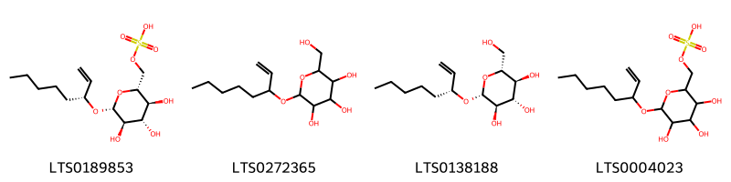{ width=100% }
    <figcaption>Hình ảnh cấu trúc hóa học của 4 hoạt chất thuộc nhóm Fatty Acyls gồm ['[(2r,3s,4s,5r,6r)-3,4,5-trihydroxy-6-[(3r)-oct-1-en-3-yloxy]oxan-2-yl]methoxysulfonic acid (LTS0189853)', '2-(hydroxymethyl)-6-(oct-1-en-3-yloxy)oxane-3,4,5-triol (LTS0272365)', '(2r,3s,4s,5r,6r)-2-(hydroxymethyl)-6-[(3r)-oct-1-en-3-yloxy]oxane-3,4,5-triol (LTS0138188)', '[3,4,5-trihydroxy-6-(oct-1-en-3-yloxy)oxan-2-yl]methoxysulfonic acid (LTS0004023)'].</figcaption>
</figure>
#### Nhóm Flavonoids
<figure markdown="span">
    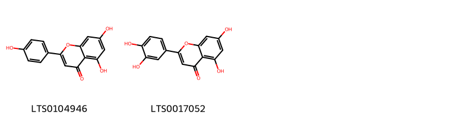{ width=100% }
    <figcaption>Hình ảnh cấu trúc hóa học của 2 hoạt chất thuộc nhóm Flavonoids gồm ['chamomile (LTS0104946)', 'luteolin (LTS0017052)'].</figcaption>
</figure>
#### Nhóm Glycerolipids
<figure markdown="span">
    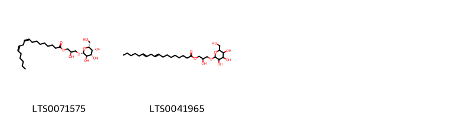{ width=100% }
    <figcaption>Hình ảnh cấu trúc hóa học của 2 hoạt chất thuộc nhóm Glycerolipids gồm ['(2r)-2-hydroxy-3-{[(2r,3r,4s,5r,6r)-3,4,5-trihydroxy-6-(hydroxymethyl)oxan-2-yl]oxy}propyl (9z,12z)-octadeca-9,12-dienoate (LTS0071575)', '2-hydroxy-3-{[3,4,5-trihydroxy-6-(hydroxymethyl)oxan-2-yl]oxy}propyl octadeca-9,12-dienoate (LTS0041965)'].</figcaption>
</figure>
#### Nhóm Organooxygen compounds
<figure markdown="span">
    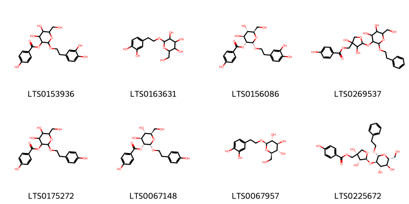{ width=100% }
    <figcaption>Hình ảnh cấu trúc hóa học của 8 hoạt chất thuộc nhóm Organooxygen compounds gồm ['2-[2-(3,4-dihydroxyphenyl)ethoxy]-4,5-dihydroxy-6-(hydroxymethyl)oxan-3-yl 4-hydroxybenzoate (LTS0153936)', '2-[2-(3,4-dihydroxyphenyl)ethoxy]-6-(hydroxymethyl)oxane-3,4,5-triol (LTS0163631)', '(2s,3r,4s,5s,6r)-2-[2-(3,4-dihydroxyphenyl)ethoxy]-4,5-dihydroxy-6-(hydroxymethyl)oxan-3-yl 4-hydroxybenzoate (LTS0156086)', '(5-{[4,5-dihydroxy-6-(hydroxymethyl)-2-(2-phenylethoxy)oxan-3-yl]oxy}-3,4-dihydroxyoxolan-3-yl)methyl 4-hydroxybenzoate (LTS0269537)', '4,5-dihydroxy-6-(hydroxymethyl)-2-[2-(4-hydroxyphenyl)ethoxy]oxan-3-yl 4-hydroxybenzoate (LTS0175272)', '(2s,3r,4s,5s,6r)-4,5-dihydroxy-6-(hydroxymethyl)-2-[2-(4-hydroxyphenyl)ethoxy]oxan-3-yl 4-hydroxybenzoate (LTS0067148)', '(2r,3r,4s,5s,6r)-2-[2-(3,4-dihydroxyphenyl)ethoxy]-6-(hydroxymethyl)oxane-3,4,5-triol (LTS0067957)', '[(3s,4r,5s)-5-{[(2r,3r,4s,5s,6r)-4,5-dihydroxy-6-(hydroxymethyl)-2-(2-phenylethoxy)oxan-3-yl]oxy}-3,4-dihydroxyoxolan-3-yl]methyl 4-hydroxybenzoate (LTS0225672)'].</figcaption>
</figure>
#### Nhóm Prenol lipids
<figure markdown="span">
    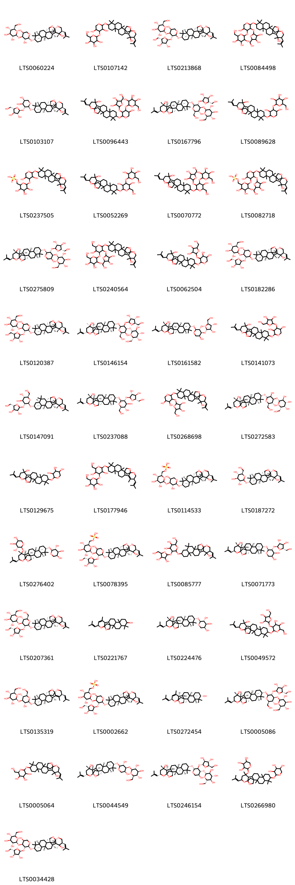{ width=100% }
    <figcaption>Hình ảnh cấu trúc hóa học của 45 hoạt chất thuộc nhóm Prenol lipids gồm ['(2s,3r,4s,5s,6r)-2-{[(2s,3r,4s,5s)-3,5-dihydroxy-2-{[(1s,2r,5r,7s,10r,11r,14r,15s,16s,17r,20r)-16-hydroxy-2,6,6,10,16-pentamethyl-17-(2-methylprop-1-en-1-yl)-19,21-dioxahexacyclo[18.2.1.0¹,¹⁴.0²,¹¹.0⁵,¹⁰.0¹⁵,²⁰]tricosan-7-yl]oxy}oxan-4-yl]oxy}-6-(hydroxymethyl)oxane-3,4,5-triol (LTS0060224)', '2-[(3,5-dihydroxy-2-{[16-hydroxy-2,6,6,10,16-pentamethyl-17-(2-methylprop-1-en-1-yl)-19,21-dioxahexacyclo[18.2.1.0¹,¹⁴.0²,¹¹.0⁵,¹⁰.0¹⁵,²⁰]tricosan-7-yl]oxy}oxan-4-yl)oxy]-6-(hydroxymethyl)oxane-3,4,5-triol (LTS0107142)', 'bascopasaponin c (LTS0213868)', '2-[(3-{[3,4-dihydroxy-5-(hydroxymethyl)oxolan-2-yl]oxy}-5-hydroxy-2-{[16-hydroxy-2,6,6,10,16-pentamethyl-17-(2-methylprop-1-en-1-yl)-19,21-dioxahexacyclo[18.2.1.0¹,¹⁴.0²,¹¹.0⁵,¹⁰.0¹⁵,²⁰]tricosan-7-yl]oxy}oxan-4-yl)oxy]-6-(hydroxymethyl)oxane-3,4,5-triol (LTS0084498)', '(3s,4s,5r,6s)-5-{[(2s,3r,4r,5s)-3,4-dihydroxy-5-(hydroxymethyl)oxolan-2-yl]oxy}-6-{[(1s,2r,5r,7s,10r,11r,14r,15s,16s,17r,20r)-16-hydroxy-2,6,6,10,16-pentamethyl-17-(2-methylprop-1-en-1-yl)-19,21-dioxahexacyclo[18.2.1.0¹,¹⁴.0²,¹¹.0⁵,¹⁰.0¹⁵,²⁰]tricosan-7-yl]oxy}oxane-3,4-diol (LTS0103107)', '2-[(3-{[3,4-dihydroxy-5-(hydroxymethyl)oxolan-2-yl]oxy}-5-hydroxy-2-{[16-hydroxy-2,6,6,10,16-pentamethyl-18-(2-methylprop-1-en-1-yl)-19,21-dioxahexacyclo[18.2.1.0¹,¹⁴.0²,¹¹.0⁵,¹⁰.0¹⁵,²⁰]tricosan-7-yl]oxy}oxan-4-yl)oxy]-6-(hydroxymethyl)oxane-3,4,5-triol (LTS0096443)', 'bacoside a3 (LTS0167796)', '2-[(3,5-dihydroxy-2-{[16-hydroxy-2,6,6,10,16-pentamethyl-18-(2-methylprop-1-en-1-yl)-19,21-dioxahexacyclo[18.2.1.0¹,¹⁴.0²,¹¹.0⁵,¹⁰.0¹⁵,²⁰]tricosan-7-yl]oxy}oxan-4-yl)oxy]-6-(hydroxymethyl)oxane-3,4,5-triol (LTS0089628)', '{6-[(3,5-dihydroxy-2-{[16-hydroxy-2,6,6,10,16-pentamethyl-17-(2-methylprop-1-en-1-yl)-19,21-dioxahexacyclo[18.2.1.0¹,¹⁴.0²,¹¹.0⁵,¹⁰.0¹⁵,²⁰]tricosan-7-yl]oxy}oxan-4-yl)oxy]-3,4,5-trihydroxyoxan-2-yl}methoxysulfonic acid (LTS0237505)', '2-[(3,5-dihydroxy-2-{[16-hydroxy-2,6,6,10,16-pentamethyl-18-(2-methylprop-1-en-1-yl)-19,21-dioxahexacyclo[18.2.1.0¹,¹⁴.0²,¹¹.0⁵,¹⁰.0¹⁵,²⁰]tricosan-7-yl]oxy}-6-(hydroxymethyl)oxan-4-yl)oxy]-6-(hydroxymethyl)oxane-3,4,5-triol (LTS0052269)', '2-[(3-{[3,4-dihydroxy-5-(hydroxymethyl)oxolan-2-yl]oxy}-5-hydroxy-2-{[16-hydroxy-2,6,6,10,16-pentamethyl-18-(2-methylprop-1-en-1-yl)-19,21-dioxahexacyclo[18.2.1.0¹,¹⁴.0²,¹¹.0⁵,¹⁰.0¹⁵,²⁰]tricosan-7-yl]oxy}-6-(hydroxymethyl)oxan-4-yl)oxy]-6-(hydroxymethyl)oxane-3,4,5-triol (LTS0070772)', '{6-[(3-{[3,4-dihydroxy-5-(hydroxymethyl)oxolan-2-yl]oxy}-5-hydroxy-2-{[16-hydroxy-2,6,6,10,16-pentamethyl-17-(2-methylprop-1-en-1-yl)-19,21-dioxahexacyclo[18.2.1.0¹,¹⁴.0²,¹¹.0⁵,¹⁰.0¹⁵,²⁰]tricosan-7-yl]oxy}oxan-4-yl)oxy]-3,4,5-trihydroxyoxan-2-yl}methoxysulfonic acid (LTS0082718)', 'bacopaside x (LTS0275809)', '2-[(3-{[3,4-dihydroxy-5-(hydroxymethyl)oxolan-2-yl]oxy}-5-hydroxy-2-{[16-hydroxy-2,6,6,10,16-pentamethyl-17-(2-methylprop-1-en-1-yl)-19,21-dioxahexacyclo[18.2.1.0¹,¹⁴.0²,¹¹.0⁵,¹⁰.0¹⁵,²⁰]tricosan-7-yl]oxy}-6-(hydroxymethyl)oxan-4-yl)oxy]-6-(hydroxymethyl)oxane-3,4,5-triol (LTS0240564)', '5-{[3,4-dihydroxy-5-(hydroxymethyl)oxolan-2-yl]oxy}-6-{[16-hydroxy-2,6,6,10,16-pentamethyl-18-(2-methylprop-1-en-1-yl)-19,21-dioxahexacyclo[18.2.1.0¹,¹⁴.0²,¹¹.0⁵,¹⁰.0¹⁵,²⁰]tricosan-7-yl]oxy}oxane-3,4-diol (LTS0062504)', '(2s,3r,4s,5s,6r)-2-{[(2s,3r,4s,5s)-3-{[(2s,3r,4r,5s)-3,4-dihydroxy-5-(hydroxymethyl)oxolan-2-yl]oxy}-5-hydroxy-2-{[(1s,2r,5r,7s,10r,11r,14s,15s,16s,17r,20r)-16-hydroxy-2,6,6,10,16-pentamethyl-17-(2-methylprop-1-en-1-yl)-19,21-dioxahexacyclo[18.2.1.0¹,¹⁴.0²,¹¹.0⁵,¹⁰.0¹⁵,²⁰]tricosan-7-yl]oxy}oxan-4-yl]oxy}-6-(hydroxymethyl)oxane-3,4,5-triol (LTS0182286)', '(2s,3r,4s,5s,6r)-2-{[(2s,3r,4s,5s)-3-{[(2s,3r,4r,5r)-3,4-dihydroxy-5-(hydroxymethyl)oxolan-2-yl]oxy}-5-hydroxy-2-{[(1s,2r,5r,7s,10r,11r,14r,15s,16s,17r,20r)-16-hydroxy-2,6,6,10,16-pentamethyl-17-(2-methylprop-1-en-1-yl)-19,21-dioxahexacyclo[18.2.1.0¹,¹⁴.0²,¹¹.0⁵,¹⁰.0¹⁵,²⁰]tricosan-7-yl]oxy}oxan-4-yl]oxy}-6-(hydroxymethyl)oxane-3,4,5-triol (LTS0120387)', '(2r,3s,4r,5s,6s)-2-{[(2r,3s,4r,5s,6r)-3-{[(2s,3r,4s,5r)-3,4-dihydroxy-5-(hydroxymethyl)oxolan-2-yl]oxy}-5-hydroxy-2-{[(1s,2s,5s,7s,10r,11r,14s,15r,16r,18s,20s)-16-hydroxy-2,6,6,10,16-pentamethyl-18-(2-methylprop-1-en-1-yl)-19,21-dioxahexacyclo[18.2.1.0¹,¹⁴.0²,¹¹.0⁵,¹⁰.0¹⁵,²⁰]tricosan-7-yl]oxy}-6-(hydroxymethyl)oxan-4-yl]oxy}-6-(hydroxymethyl)oxane-3,4,5-triol (LTS0146154)', '(2s,3r,4s,5s)-4-{[(2s,3r,4r,5s)-3,4-dihydroxy-5-(hydroxymethyl)oxolan-2-yl]oxy}-2-{[(1s,2r,5r,7s,10r,11r,14r,15s,16s,18r,20s)-16-hydroxy-2,6,6,10,16-pentamethyl-18-(2-methylprop-1-en-1-yl)-19,21-dioxahexacyclo[18.2.1.0¹,¹⁴.0²,¹¹.0⁵,¹⁰.0¹⁵,²⁰]tricosan-7-yl]oxy}oxane-3,5-diol (LTS0161582)', '4-{[3,4-dihydroxy-5-(hydroxymethyl)oxolan-2-yl]oxy}-2-{[16-hydroxy-2,6,6,10,16-pentamethyl-18-(2-methylprop-1-en-1-yl)-19,21-dioxahexacyclo[18.2.1.0¹,¹⁴.0²,¹¹.0⁵,¹⁰.0¹⁵,²⁰]tricosan-7-yl]oxy}oxane-3,5-diol (LTS0141073)', '(2r,3s,4s,5r,6r)-5-{[(2s,3r,4r,5s)-3,4-dihydroxy-5-(hydroxymethyl)oxolan-2-yl]oxy}-6-{[(1s,2r,5s,7s,10s,11r,14r,15s,16s,17r,20r)-16-hydroxy-2,4,4,10,16-pentamethyl-17-(2-methylprop-1-en-1-yl)-19,21-dioxahexacyclo[18.2.1.0¹,¹⁴.0²,¹¹.0⁵,¹⁰.0¹⁵,²⁰]tricosan-7-yl]oxy}-2-(hydroxymethyl)oxane-3,4-diol (LTS0147091)', '(2r,3s,4s,5r,6r)-5-{[(2s,3r,4r,5s)-3,4-dihydroxy-5-(hydroxymethyl)oxolan-2-yl]oxy}-6-{[(1s,2r,5r,7s,10r,11r,14r,15s,16s,18s,20s)-16-hydroxy-2,6,6,10,16-pentamethyl-18-(2-methylprop-1-en-1-yl)-19,21-dioxahexacyclo[18.2.1.0¹,¹⁴.0²,¹¹.0⁵,¹⁰.0¹⁵,²⁰]tricosan-7-yl]oxy}-2-(hydroxymethyl)oxane-3,4-diol (LTS0237088)', '5-{[3,4-dihydroxy-5-(hydroxymethyl)oxolan-2-yl]oxy}-6-{[16-hydroxy-2,6,6,10,16-pentamethyl-17-(2-methylprop-1-en-1-yl)-19,21-dioxahexacyclo[18.2.1.0¹,¹⁴.0²,¹¹.0⁵,¹⁰.0¹⁵,²⁰]tricosan-7-yl]oxy}oxane-3,4-diol (LTS0268698)', '(2r,3s,4r,5s,6s)-2-{[(2s,3s,4s,5r,6r)-3,5-dihydroxy-2-{[(1s,2s,5s,7s,10r,11r,14s,15r,16s,18s,20s)-16-hydroxy-2,6,6,10,16-pentamethyl-18-(2-methylprop-1-en-1-yl)-19,21-dioxahexacyclo[18.2.1.0¹,¹⁴.0²,¹¹.0⁵,¹⁰.0¹⁵,²⁰]tricosan-7-yl]oxy}-6-(hydroxymethyl)oxan-4-yl]oxy}-6-(hydroxymethyl)oxane-3,4,5-triol (LTS0272583)', '2-{[16-hydroxy-2,6,6,10,16-pentamethyl-18-(2-methylprop-1-en-1-yl)-19,21-dioxahexacyclo[18.2.1.0¹,¹⁴.0²,¹¹.0⁵,¹⁰.0¹⁵,²⁰]tricosan-7-yl]oxy}oxane-3,4,5-triol (LTS0129675)', '2-{[3,5-dihydroxy-2-(hydroxymethyl)-6-{[2,6,6,10,16-pentamethyl-17-(2-methylprop-1-en-1-yl)-19,21-dioxahexacyclo[18.2.1.0¹,¹⁴.0²,¹¹.0⁵,¹⁰.0¹⁵,²⁰]tricos-15-en-7-yl]oxy}oxan-4-yl]oxy}-6-(hydroxymethyl)oxane-3,4,5-triol (LTS0177946)', '[(2r,3s,4s,5r,6s)-6-{[(2s,3r,4s,5s)-3,5-dihydroxy-2-{[(1s,2r,5r,7s,10r,11r,14s,15s,16s,17r,20r)-16-hydroxy-2,6,6,10,16-pentamethyl-17-(2-methylprop-1-en-1-yl)-19,21-dioxahexacyclo[18.2.1.0¹,¹⁴.0²,¹¹.0⁵,¹⁰.0¹⁵,²⁰]tricosan-7-yl]oxy}oxan-4-yl]oxy}-3,4,5-trihydroxyoxan-2-yl]methoxysulfonic acid (LTS0114533)', '(2r,3r,4s,5s,6r)-2-{[(1s,2r,5r,7s,10r,11r,14r,15s,16s,17r,20r)-16-hydroxy-2,6,6,10,16-pentamethyl-17-(2-methylprop-1-en-1-yl)-19,21-dioxahexacyclo[18.2.1.0¹,¹⁴.0²,¹¹.0⁵,¹⁰.0¹⁵,²⁰]tricosan-7-yl]oxy}-6-(hydroxymethyl)oxane-3,4,5-triol (LTS0187272)', '(2s,3r,4s,5s)-2-{[(1s,2r,5r,7s,10r,11r,14r,15s,16s,18r,20s)-2,6,6,10,16-pentamethyl-18-(2-methylprop-1-en-1-yl)-7-{[(2s,3r,4s,5s)-3,4,5-trihydroxyoxan-2-yl]oxy}-19,21-dioxahexacyclo[18.2.1.0¹,¹⁴.0²,¹¹.0⁵,¹⁰.0¹⁵,²⁰]tricosan-16-yl]oxy}oxane-3,4,5-triol (LTS0276402)', '[(2r,3s,4s,5r,6s)-6-{[(2s,3r,4s,5s)-3-{[(2s,3r,4r,5s)-3,4-dihydroxy-5-(hydroxymethyl)oxolan-2-yl]oxy}-5-hydroxy-2-{[(1s,2r,5r,7s,10r,11r,14r,15s,16r,17r,20r)-16-hydroxy-2,6,6,10,16-pentamethyl-17-(2-methylprop-1-en-1-yl)-19,21-dioxahexacyclo[18.2.1.0¹,¹⁴.0²,¹¹.0⁵,¹⁰.0¹⁵,²⁰]tricosan-7-yl]oxy}oxan-4-yl]oxy}-3,4,5-trihydroxyoxan-2-yl]methoxysulfonic acid (LTS0078395)', '5-{[3,4-dihydroxy-5-(hydroxymethyl)oxolan-2-yl]oxy}-6-{[16-hydroxy-2,4,4,10,16-pentamethyl-17-(2-methylprop-1-en-1-yl)-19,21-dioxahexacyclo[18.2.1.0¹,¹⁴.0²,¹¹.0⁵,¹⁰.0¹⁵,²⁰]tricosan-7-yl]oxy}-2-(hydroxymethyl)oxane-3,4-diol (LTS0085777)', '(3s,4s,5r,6s)-5-{[(2s,3r,4r,5s)-3,4-dihydroxy-5-(hydroxymethyl)oxolan-2-yl]oxy}-6-{[(1s,2r,5r,7s,10r,11r,14s,15s,16s,18r,20s)-16-hydroxy-2,6,6,10,16-pentamethyl-18-(2-methylprop-1-en-1-yl)-19,21-dioxahexacyclo[18.2.1.0¹,¹⁴.0²,¹¹.0⁵,¹⁰.0¹⁵,²⁰]tricosan-7-yl]oxy}oxane-3,4-diol (LTS0071773)', '(2s,3r,4s,5s,6r)-2-{[(2r,3r,4s,5r,6r)-3-{[(2s,3r,4r,5s)-3,4-dihydroxy-5-(hydroxymethyl)oxolan-2-yl]oxy}-5-hydroxy-2-{[(1s,2r,5r,7s,10r,11r,14r,15s,16r,17r,20r)-16-hydroxy-2,6,6,10,16-pentamethyl-17-(2-methylprop-1-en-1-yl)-19,21-dioxahexacyclo[18.2.1.0¹,¹⁴.0²,¹¹.0⁵,¹⁰.0¹⁵,²⁰]tricosan-7-yl]oxy}-6-(hydroxymethyl)oxan-4-yl]oxy}-6-(hydroxymethyl)oxane-3,4,5-triol (LTS0207361)', '2,6,6,10,16-pentamethyl-18-(2-methylprop-1-en-1-yl)-19,21-dioxahexacyclo[18.2.1.0¹,¹⁴.0²,¹¹.0⁵,¹⁰.0¹⁵,²⁰]tricos-16-en-7-ol (LTS0221767)', '(2s,3r,4s,5s)-2-{[(1s,2r,5r,7s,10r,11r,14s,15s,16s,18r,20s)-16-hydroxy-2,6,6,10,16-pentamethyl-18-(2-methylprop-1-en-1-yl)-19,21-dioxahexacyclo[18.2.1.0¹,¹⁴.0²,¹¹.0⁵,¹⁰.0¹⁵,²⁰]tricosan-7-yl]oxy}oxane-3,4,5-triol (LTS0224476)', '5-{[3,4-dihydroxy-5-(hydroxymethyl)oxolan-2-yl]oxy}-6-{[16-hydroxy-2,6,6,10,16-pentamethyl-18-(2-methylprop-1-en-1-yl)-19,21-dioxahexacyclo[18.2.1.0¹,¹⁴.0²,¹¹.0⁵,¹⁰.0¹⁵,²⁰]tricosan-7-yl]oxy}-2-(hydroxymethyl)oxane-3,4-diol (LTS0049572)', '(2s,3r,4s,5s,6r)-2-{[(2r,3r,4s,5r,6r)-3,5-dihydroxy-2-(hydroxymethyl)-6-{[(1s,2r,5r,7s,10r,11r,14s,17s,20r)-2,6,6,10,16-pentamethyl-17-(2-methylprop-1-en-1-yl)-19,21-dioxahexacyclo[18.2.1.0¹,¹⁴.0²,¹¹.0⁵,¹⁰.0¹⁵,²⁰]tricos-15-en-7-yl]oxy}oxan-4-yl]oxy}-6-(hydroxymethyl)oxane-3,4,5-triol (LTS0135319)', '[(2r,3s,4s,5r,6s)-6-{[(2s,3r,4s,5s)-3-{[(2s,3r,4r,5s)-3,4-dihydroxy-5-(hydroxymethyl)oxolan-2-yl]oxy}-5-hydroxy-2-{[(1s,2r,5r,7s,10r,11r,14s,15s,16s,17r,20r)-16-hydroxy-2,6,6,10,16-pentamethyl-17-(2-methylprop-1-en-1-yl)-19,21-dioxahexacyclo[18.2.1.0¹,¹⁴.0²,¹¹.0⁵,¹⁰.0¹⁵,²⁰]tricosan-7-yl]oxy}oxan-4-yl]oxy}-3,4,5-trihydroxyoxan-2-yl]methoxysulfonic acid (LTS0002662)', '(1s,2r,5r,7s,10r,11r,14s,15r,18s,20s)-2,6,6,10,16-pentamethyl-18-(2-methylprop-1-en-1-yl)-19,21-dioxahexacyclo[18.2.1.0¹,¹⁴.0²,¹¹.0⁵,¹⁰.0¹⁵,²⁰]tricos-16-en-7-ol (LTS0272454)', '(2s,3r,4s,5s,6r)-2-{[(2r,3r,4s,5r,6r)-3-{[(2s,3r,4r,5s)-3,4-dihydroxy-5-(hydroxymethyl)oxolan-2-yl]oxy}-5-hydroxy-2-{[(1s,2r,5s,7s,10r,11r,14r,15s,16s,18r,20s)-16-hydroxy-2,6,6,10,16-pentamethyl-18-(2-methylprop-1-en-1-yl)-19,21-dioxahexacyclo[18.2.1.0¹,¹⁴.0²,¹¹.0⁵,¹⁰.0¹⁵,²⁰]tricosan-7-yl]oxy}-6-(hydroxymethyl)oxan-4-yl]oxy}-6-(hydroxymethyl)oxane-3,4,5-triol (LTS0005086)', '2-{[16-hydroxy-2,6,6,10,16-pentamethyl-17-(2-methylprop-1-en-1-yl)-19,21-dioxahexacyclo[18.2.1.0¹,¹⁴.0²,¹¹.0⁵,¹⁰.0¹⁵,²⁰]tricosan-7-yl]oxy}-6-(hydroxymethyl)oxane-3,4,5-triol (LTS0005064)', '(2s,3r,4s,5s,6r)-2-{[(2s,3r,4s,5s)-3,5-dihydroxy-2-{[(1s,2r,5r,7s,10r,11r,14r,15s,16s,18s,20s)-16-hydroxy-2,6,6,10,16-pentamethyl-18-(2-methylprop-1-en-1-yl)-19,21-dioxahexacyclo[18.2.1.0¹,¹⁴.0²,¹¹.0⁵,¹⁰.0¹⁵,²⁰]tricosan-7-yl]oxy}oxan-4-yl]oxy}-6-(hydroxymethyl)oxane-3,4,5-triol (LTS0044549)', '(2r,3s,4r,5r,6s)-2-{[(2r,3s,4r,5s)-3-{[(2r,3s,4s,5r)-3,4-dihydroxy-5-(hydroxymethyl)oxolan-2-yl]oxy}-5-hydroxy-2-{[(1s,2s,5s,7s,10r,11r,14s,15r,16s,18s,20s)-16-hydroxy-2,6,6,10,16-pentamethyl-18-(2-methylprop-1-en-1-yl)-19,21-dioxahexacyclo[18.2.1.0¹,¹⁴.0²,¹¹.0⁵,¹⁰.0¹⁵,²⁰]tricosan-7-yl]oxy}oxan-4-yl]oxy}-6-(hydroxymethyl)oxane-3,4,5-triol (LTS0246154)', '2-{[2,6,6,10,16-pentamethyl-18-(2-methylprop-1-en-1-yl)-7-[(3,4,5-trihydroxyoxan-2-yl)oxy]-19,21-dioxahexacyclo[18.2.1.0¹,¹⁴.0²,¹¹.0⁵,¹⁰.0¹⁵,²⁰]tricosan-16-yl]oxy}oxane-3,4,5-triol (LTS0266980)', '(2s,3r,4s,5s,6r)-2-{[(2s,3r,4s,5s)-3-{[(2s,3r,4r,5s)-3,4-dihydroxy-5-(hydroxymethyl)oxolan-2-yl]oxy}-5-hydroxy-2-{[(1s,2r,5r,7s,10r,11r,14r,15s,16r,17r,20r)-16-hydroxy-2,6,6,10,16-pentamethyl-17-(2-methylprop-1-en-1-yl)-19,21-dioxahexacyclo[18.2.1.0¹,¹⁴.0²,¹¹.0⁵,¹⁰.0¹⁵,²⁰]tricosan-7-yl]oxy}oxan-4-yl]oxy}-6-(hydroxymethyl)oxane-3,4,5-triol (LTS0034428)'].</figcaption>
</figure>
#### Nhóm Steroids and steroid derivatives
<figure markdown="span">
    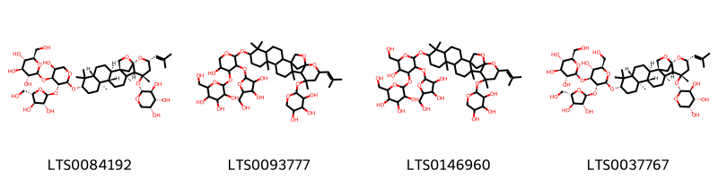{ width=100% }
    <figcaption>Hình ảnh cấu trúc hóa học của 4 hoạt chất thuộc nhóm Steroids and steroid derivatives gồm ['(2s,3r,4s,5s,6r)-2-{[(2s,3r,4s,5s)-3-{[(2s,3r,4r,5s)-3,4-dihydroxy-5-(hydroxymethyl)oxolan-2-yl]oxy}-5-hydroxy-2-{[(1r,2r,5r,7s,10r,11s,14r,15s,16s,18s,20s)-6,6,10,14,16-pentamethyl-18-(2-methylprop-1-en-1-yl)-16-{[(2r,3s,4r,5r)-3,4,5-trihydroxyoxan-2-yl]oxy}-19,21-dioxahexacyclo[18.2.1.0¹,¹⁴.0²,¹¹.0⁵,¹⁰.0¹⁵,²⁰]tricosan-7-yl]oxy}oxan-4-yl]oxy}-6-(hydroxymethyl)oxane-3,4,5-triol (LTS0084192)', '2-[(3-{[3,4-dihydroxy-5-(hydroxymethyl)oxolan-2-yl]oxy}-5-hydroxy-2-{[6,6,10,14,16-pentamethyl-18-(2-methylprop-1-en-1-yl)-16-[(3,4,5-trihydroxyoxan-2-yl)oxy]-19,21-dioxahexacyclo[18.2.1.0¹,¹⁴.0²,¹¹.0⁵,¹⁰.0¹⁵,²⁰]tricosan-7-yl]oxy}oxan-4-yl)oxy]-6-(hydroxymethyl)oxane-3,4,5-triol (LTS0093777)', '2-[(3-{[3,4-dihydroxy-5-(hydroxymethyl)oxolan-2-yl]oxy}-5-hydroxy-6-(hydroxymethyl)-2-{[6,6,10,14,16-pentamethyl-18-(2-methylprop-1-en-1-yl)-16-[(3,4,5-trihydroxyoxan-2-yl)oxy]-19,21-dioxahexacyclo[18.2.1.0¹,¹⁴.0²,¹¹.0⁵,¹⁰.0¹⁵,²⁰]tricosan-7-yl]oxy}oxan-4-yl)oxy]-6-(hydroxymethyl)oxane-3,4,5-triol (LTS0146960)', '(2s,3r,4s,5s,6r)-2-{[(2r,3r,4s,5r,6r)-3-{[(2s,3r,4r,5s)-3,4-dihydroxy-5-(hydroxymethyl)oxolan-2-yl]oxy}-5-hydroxy-6-(hydroxymethyl)-2-{[(1r,2r,5r,7s,10r,11s,14r,15s,16s,18s,20s)-6,6,10,14,16-pentamethyl-18-(2-methylprop-1-en-1-yl)-16-{[(2r,3s,4r,5r)-3,4,5-trihydroxyoxan-2-yl]oxy}-19,21-dioxahexacyclo[18.2.1.0¹,¹⁴.0²,¹¹.0⁵,¹⁰.0¹⁵,²⁰]tricosan-7-yl]oxy}oxan-4-yl]oxy}-6-(hydroxymethyl)oxane-3,4,5-triol (LTS0037767)'].</figcaption>
</figure>

---

### Dược dân tộc học

Danh sách các quốc gia có sử dụng *Bacopa monniera* trong điều trị các bệnh. 

| Country     | Disease                   | Bệnh                                                                                                                                                                                                |
|:------------|:--------------------------|:----------------------------------------------------------------------------------------------------------------------------------------------------------------------------------------------------|
| China       | Cardiotonic, Nervine      | MYMEMORY WARNING: YOU USED ALL AVAILABLE FREE TRANSLATIONS FOR TODAY. NEXT AVAILABLE IN  17 HOURS 32 MINUTES 41 SECONDS VISIT HTTPS://MYMEMORY.TRANSLATED.NET/DOC/USAGELIMITS.PHP TO TRANSLATE MORE |
| Elsewhere   | Tonic                     | MYMEMORY WARNING: YOU USED ALL AVAILABLE FREE TRANSLATIONS FOR TODAY. NEXT AVAILABLE IN  17 HOURS 32 MINUTES 38 SECONDS VISIT HTTPS://MYMEMORY.TRANSLATED.NET/DOC/USAGELIMITS.PHP TO TRANSLATE MORE |
| Hindu       | Nervine, Cardiac, Nervine | MYMEMORY WARNING: YOU USED ALL AVAILABLE FREE TRANSLATIONS FOR TODAY. NEXT AVAILABLE IN  17 HOURS 32 MINUTES 36 SECONDS VISIT HTTPS://MYMEMORY.TRANSLATED.NET/DOC/USAGELIMITS.PHP TO TRANSLATE MORE |
| India       | Poison                    | MYMEMORY WARNING: YOU USED ALL AVAILABLE FREE TRANSLATIONS FOR TODAY. NEXT AVAILABLE IN  17 HOURS 32 MINUTES 33 SECONDS VISIT HTTPS://MYMEMORY.TRANSLATED.NET/DOC/USAGELIMITS.PHP TO TRANSLATE MORE |
| Iraq        | Nervine, Tonic            | MYMEMORY WARNING: YOU USED ALL AVAILABLE FREE TRANSLATIONS FOR TODAY. NEXT AVAILABLE IN  17 HOURS 32 MINUTES 31 SECONDS VISIT HTTPS://MYMEMORY.TRANSLATED.NET/DOC/USAGELIMITS.PHP TO TRANSLATE MORE |
| Philippines | Diuretic                  | MYMEMORY WARNING: YOU USED ALL AVAILABLE FREE TRANSLATIONS FOR TODAY. NEXT AVAILABLE IN  17 HOURS 32 MINUTES 28 SECONDS VISIT HTTPS://MYMEMORY.TRANSLATED.NET/DOC/USAGELIMITS.PHP TO TRANSLATE MORE |

---

---
## Bacopa monnieri
### Thông tin về thực vật

!!! info "Phân loại thực vật của *Bacopa monnieri* từ GIBF:"
    - **Kingdom:** Plantae
    - **Phylum:** Tracheophyta
    - **Order:** Lamiales
    - **Family:** Plantaginaceae
    - **Genus:** Bacopa
    - **Species:** *Bacopa monnieri*

 

| Label (VI)   | Label (EN)   | Scientific Name   | Descriptions (VI)   | Descriptions (EN)   | Also Known As (VI)   | Also Known As (EN)                                                                                      |
|:-------------|:-------------|:------------------|:--------------------|:--------------------|:---------------------|:--------------------------------------------------------------------------------------------------------|
| N/A          | N/A          | Bacopa monnieri   | loài thực vật       | species of plant    | ['']                 | ['brahmi', 'herb of grace', 'Indian pennywort', 'thyme-leafed gratiola', 'water hyssop', 'waterhyssop'] |

#### Phân bố trên thế giới

**Từ CSDL GIBF** Thailand, Guadeloupe, Martinique, Australia, Sri Lanka, Dominican Republic, Puerto Rico, India, Saint Kitts and Nevis, Virgin Islands (U.S.), Sint Maarten (Dutch part), Brazil, Yemen, Peru, Mexico, China, Chinese Taipei, Hong Kong, Uruguay, Argentina, South Africa, United States of America, Saudi Arabia

#### Phân bố tại Việt Nam

**Từ CSDL GIBF**: Không có ghi nhận ở Việt Nam

---
### Thành phần hóa học
        
- Theo cơ sở dữ liệu lotus: Từ loài *Bacopa monnieri* đã phân lập và xác định được 94 hoạt chất thuộc về các nhóm Organooxygen compounds, Flavonoids, Benzofurans, Prenol lipids, Fatty Acyls, Steroids and steroid derivatives, Cinnamic acids and derivatives, Benzene and substituted derivatives. 

|    | chemicalTaxonomyClassyfireClass     |   smiles_count |
|---:|:------------------------------------|---------------:|
|  0 | Benzene and substituted derivatives |              2 |
|  1 | Benzofurans                         |              2 |
|  2 | Cinnamic acids and derivatives      |              4 |
|  3 | Fatty Acyls                         |              2 |
|  4 | Flavonoids                          |              5 |
|  5 | Organooxygen compounds              |              5 |
|  6 | Prenol lipids                       |             55 |
|  7 | Steroids and steroid derivatives    |             19 |

#### Nhóm Benzene and substituted derivatives
<figure markdown="span">
    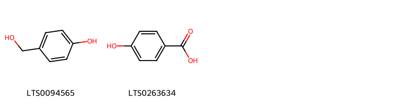{ width=100% }
    <figcaption>Hình ảnh cấu trúc hóa học của 2 hoạt chất thuộc nhóm Benzene and substituted derivatives gồm ['gastrodigenin (LTS0094565)', 'p-hydroxybenzoic acid (LTS0263634)'].</figcaption>
</figure>
#### Nhóm Benzofurans
<figure markdown="span">
    { width=100% }
    <figcaption>Hình ảnh cấu trúc hóa học của 2 hoạt chất thuộc nhóm Benzofurans gồm ['loliolide (LTS0254454)', 'loliolide (LTS0119422)'].</figcaption>
</figure>
#### Nhóm Cinnamic acids and derivatives
<figure markdown="span">
    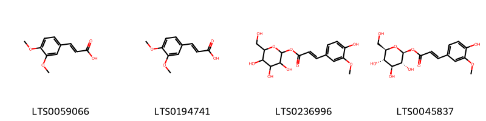{ width=100% }
    <figcaption>Hình ảnh cấu trúc hóa học của 4 hoạt chất thuộc nhóm Cinnamic acids and derivatives gồm ['3,4-dimethoxycinnamic acid (LTS0059066)', '3-(3,4-dimethoxyphenyl)prop-2-enoic acid (LTS0194741)', '3,4,5-trihydroxy-6-(hydroxymethyl)oxan-2-yl 3-(4-hydroxy-3-methoxyphenyl)prop-2-enoate (LTS0236996)', '1-o-feruloyl-β-d-glucose (LTS0045837)'].</figcaption>
</figure>
#### Nhóm Fatty Acyls
<figure markdown="span">
    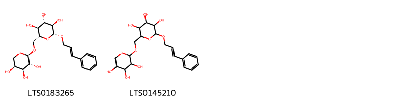{ width=100% }
    <figcaption>Hình ảnh cấu trúc hóa học của 2 hoạt chất thuộc nhóm Fatty Acyls gồm ['rosavin (LTS0183265)', '2-[(3-phenylprop-2-en-1-yl)oxy]-6-{[(3,4,5-trihydroxyoxan-2-yl)oxy]methyl}oxane-3,4,5-triol (LTS0145210)'].</figcaption>
</figure>
#### Nhóm Flavonoids
<figure markdown="span">
    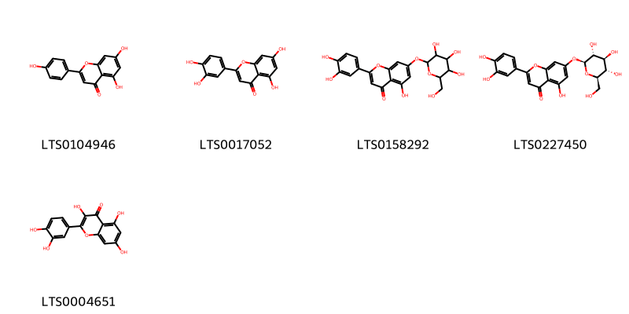{ width=100% }
    <figcaption>Hình ảnh cấu trúc hóa học của 5 hoạt chất thuộc nhóm Flavonoids gồm ['chamomile (LTS0104946)', 'luteolin (LTS0017052)', '2-(3,4-dihydroxyphenyl)-5-hydroxy-7-{[3,4,5-trihydroxy-6-(hydroxymethyl)oxan-2-yl]oxy}chromen-4-one (LTS0158292)', 'luteolin 7-o-glucoside (LTS0227450)', 'quercetin (LTS0004651)'].</figcaption>
</figure>
#### Nhóm Organooxygen compounds
<figure markdown="span">
    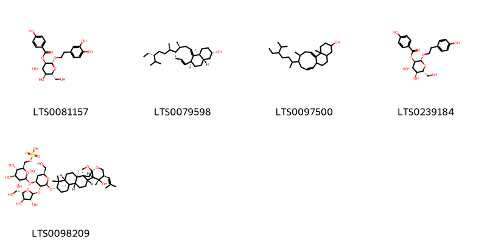{ width=100% }
    <figcaption>Hình ảnh cấu trúc hóa học của 5 hoạt chất thuộc nhóm Organooxygen compounds gồm ['(2r,3r,4s,5s,6r)-2-[2-(3,4-dihydroxyphenyl)ethoxy]-4,5-dihydroxy-6-(hydroxymethyl)oxan-3-yl 4-hydroxybenzoate (LTS0081157)', '(3s,4as,6as,10r,11s,13bs)-10-[(2r,5r)-5-ethyl-6-methylheptan-2-yl]-11,13b-dimethyl-1h,2h,3h,4h,4ah,5h,6h,6ah,9h,10h,11h,12h-cyclonona[a]naphthalen-3-ol (LTS0079598)', '10-(5-ethyl-6-methylheptan-2-yl)-11,13b-dimethyl-1h,2h,3h,4h,4ah,5h,6h,6ah,9h,10h,11h,12h-cyclonona[a]naphthalen-3-ol (LTS0097500)', '(2r,3r,4s,5s,6r)-4,5-dihydroxy-6-(hydroxymethyl)-2-[2-(4-hydroxyphenyl)ethoxy]oxan-3-yl 4-hydroxybenzoate (LTS0239184)', '[(2r,3s,4s,5r,6s)-6-{[(2r,3r,4s,5r,6r)-3-{[(2s,3r,4r,5s)-3,4-dihydroxy-5-(hydroxymethyl)oxolan-2-yl]oxy}-5-hydroxy-2-{[(1r,2r,5r,7s,10r,11r,14s,15s,16s,17r,20r)-16-hydroxy-2,6,6,10,16-pentamethyl-17-(2-methylprop-1-en-1-yl)-19,21-dioxahexacyclo[18.2.1.0¹,¹⁴.0²,¹¹.0⁵,¹⁰.0¹⁵,²⁰]tricosan-7-yl]oxy}-6-(hydroxymethyl)oxan-4-yl]oxy}-3,4,5-trihydroxyoxan-2-yl]methoxysulfonic acid (LTS0098209)'].</figcaption>
</figure>
#### Nhóm Prenol lipids
<figure markdown="span">
    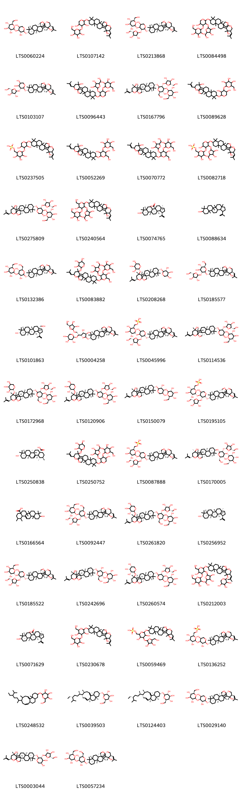{ width=100% }
    <figcaption>Hình ảnh cấu trúc hóa học của 55 hoạt chất thuộc nhóm Prenol lipids gồm ['(2s,3r,4s,5s,6r)-2-{[(2s,3r,4s,5s)-3,5-dihydroxy-2-{[(1s,2r,5r,7s,10r,11r,14r,15s,16s,17r,20r)-16-hydroxy-2,6,6,10,16-pentamethyl-17-(2-methylprop-1-en-1-yl)-19,21-dioxahexacyclo[18.2.1.0¹,¹⁴.0²,¹¹.0⁵,¹⁰.0¹⁵,²⁰]tricosan-7-yl]oxy}oxan-4-yl]oxy}-6-(hydroxymethyl)oxane-3,4,5-triol (LTS0060224)', '2-[(3,5-dihydroxy-2-{[16-hydroxy-2,6,6,10,16-pentamethyl-17-(2-methylprop-1-en-1-yl)-19,21-dioxahexacyclo[18.2.1.0¹,¹⁴.0²,¹¹.0⁵,¹⁰.0¹⁵,²⁰]tricosan-7-yl]oxy}oxan-4-yl)oxy]-6-(hydroxymethyl)oxane-3,4,5-triol (LTS0107142)', 'bascopasaponin c (LTS0213868)', '2-[(3-{[3,4-dihydroxy-5-(hydroxymethyl)oxolan-2-yl]oxy}-5-hydroxy-2-{[16-hydroxy-2,6,6,10,16-pentamethyl-17-(2-methylprop-1-en-1-yl)-19,21-dioxahexacyclo[18.2.1.0¹,¹⁴.0²,¹¹.0⁵,¹⁰.0¹⁵,²⁰]tricosan-7-yl]oxy}oxan-4-yl)oxy]-6-(hydroxymethyl)oxane-3,4,5-triol (LTS0084498)', '(3s,4s,5r,6s)-5-{[(2s,3r,4r,5s)-3,4-dihydroxy-5-(hydroxymethyl)oxolan-2-yl]oxy}-6-{[(1s,2r,5r,7s,10r,11r,14r,15s,16s,17r,20r)-16-hydroxy-2,6,6,10,16-pentamethyl-17-(2-methylprop-1-en-1-yl)-19,21-dioxahexacyclo[18.2.1.0¹,¹⁴.0²,¹¹.0⁵,¹⁰.0¹⁵,²⁰]tricosan-7-yl]oxy}oxane-3,4-diol (LTS0103107)', '2-[(3-{[3,4-dihydroxy-5-(hydroxymethyl)oxolan-2-yl]oxy}-5-hydroxy-2-{[16-hydroxy-2,6,6,10,16-pentamethyl-18-(2-methylprop-1-en-1-yl)-19,21-dioxahexacyclo[18.2.1.0¹,¹⁴.0²,¹¹.0⁵,¹⁰.0¹⁵,²⁰]tricosan-7-yl]oxy}oxan-4-yl)oxy]-6-(hydroxymethyl)oxane-3,4,5-triol (LTS0096443)', 'bacoside a3 (LTS0167796)', '2-[(3,5-dihydroxy-2-{[16-hydroxy-2,6,6,10,16-pentamethyl-18-(2-methylprop-1-en-1-yl)-19,21-dioxahexacyclo[18.2.1.0¹,¹⁴.0²,¹¹.0⁵,¹⁰.0¹⁵,²⁰]tricosan-7-yl]oxy}oxan-4-yl)oxy]-6-(hydroxymethyl)oxane-3,4,5-triol (LTS0089628)', '{6-[(3,5-dihydroxy-2-{[16-hydroxy-2,6,6,10,16-pentamethyl-17-(2-methylprop-1-en-1-yl)-19,21-dioxahexacyclo[18.2.1.0¹,¹⁴.0²,¹¹.0⁵,¹⁰.0¹⁵,²⁰]tricosan-7-yl]oxy}oxan-4-yl)oxy]-3,4,5-trihydroxyoxan-2-yl}methoxysulfonic acid (LTS0237505)', '2-[(3,5-dihydroxy-2-{[16-hydroxy-2,6,6,10,16-pentamethyl-18-(2-methylprop-1-en-1-yl)-19,21-dioxahexacyclo[18.2.1.0¹,¹⁴.0²,¹¹.0⁵,¹⁰.0¹⁵,²⁰]tricosan-7-yl]oxy}-6-(hydroxymethyl)oxan-4-yl)oxy]-6-(hydroxymethyl)oxane-3,4,5-triol (LTS0052269)', '2-[(3-{[3,4-dihydroxy-5-(hydroxymethyl)oxolan-2-yl]oxy}-5-hydroxy-2-{[16-hydroxy-2,6,6,10,16-pentamethyl-18-(2-methylprop-1-en-1-yl)-19,21-dioxahexacyclo[18.2.1.0¹,¹⁴.0²,¹¹.0⁵,¹⁰.0¹⁵,²⁰]tricosan-7-yl]oxy}-6-(hydroxymethyl)oxan-4-yl)oxy]-6-(hydroxymethyl)oxane-3,4,5-triol (LTS0070772)', '{6-[(3-{[3,4-dihydroxy-5-(hydroxymethyl)oxolan-2-yl]oxy}-5-hydroxy-2-{[16-hydroxy-2,6,6,10,16-pentamethyl-17-(2-methylprop-1-en-1-yl)-19,21-dioxahexacyclo[18.2.1.0¹,¹⁴.0²,¹¹.0⁵,¹⁰.0¹⁵,²⁰]tricosan-7-yl]oxy}oxan-4-yl)oxy]-3,4,5-trihydroxyoxan-2-yl}methoxysulfonic acid (LTS0082718)', 'bacopaside x (LTS0275809)', '2-[(3-{[3,4-dihydroxy-5-(hydroxymethyl)oxolan-2-yl]oxy}-5-hydroxy-2-{[16-hydroxy-2,6,6,10,16-pentamethyl-17-(2-methylprop-1-en-1-yl)-19,21-dioxahexacyclo[18.2.1.0¹,¹⁴.0²,¹¹.0⁵,¹⁰.0¹⁵,²⁰]tricosan-7-yl]oxy}-6-(hydroxymethyl)oxan-4-yl)oxy]-6-(hydroxymethyl)oxane-3,4,5-triol (LTS0240564)', '(1r,3ar,5as,5br,7ar,9r,11ar,11br,13ar,13bs)-9-hydroxy-3a,5b,8,8,11a-pentamethyl-1-(prop-1-en-2-yl)-hexadecahydrocyclopenta[a]chrysene-5a-carboxylic acid (LTS0074765)', 'lupeol (LTS0088634)', '(2s,3r,4s,5s,6r)-2-{[(2r,3r,4s,5r,6r)-3,5-dihydroxy-2-{[(1s,2r,5r,7s,10r,11r,14r,15s,16s,17r,20r)-16-hydroxy-2,6,6,10,16-pentamethyl-17-(2-methylprop-1-en-1-yl)-19,21-dioxahexacyclo[18.2.1.0¹,¹⁴.0²,¹¹.0⁵,¹⁰.0¹⁵,²⁰]tricosan-7-yl]oxy}-6-(hydroxymethyl)oxan-4-yl]oxy}-6-(hydroxymethyl)oxane-3,4,5-triol (LTS0132386)', '2-[(3-{[3,4-dihydroxy-5-(hydroxymethyl)oxolan-2-yl]oxy}-5-hydroxy-6-(hydroxymethyl)-2-{[2,6,6,10,16-pentamethyl-18-(2-methylprop-1-en-1-yl)-16-[(3,4,5-trihydroxyoxan-2-yl)oxy]-19,21-dioxahexacyclo[18.2.1.0¹,¹⁴.0²,¹¹.0⁵,¹⁰.0¹⁵,²⁰]tricosan-7-yl]oxy}oxan-4-yl)oxy]-6-(hydroxymethyl)oxane-3,4,5-triol (LTS0083882)', '(2r,3s,4s,5s)-2-{[(1s,2r,5r,7s,10r,11r,14r,15s,16s,18r,20s)-2,6,6,10,16-pentamethyl-18-(2-methylprop-1-en-1-yl)-7-{[(2s,3r,4s,5s)-3,4,5-trihydroxyoxan-2-yl]oxy}-19,21-dioxahexacyclo[18.2.1.0¹,¹⁴.0²,¹¹.0⁵,¹⁰.0¹⁵,²⁰]tricosan-16-yl]oxy}oxane-3,4,5-triol (LTS0208268)', '(2r,3s,4s,5r,6r)-5-{[(2s,3r,4r,5s)-3,4-dihydroxy-5-(hydroxymethyl)oxolan-2-yl]oxy}-6-{[(1s,2r,5r,7s,10r,11r,14r,15s,16s,17r,20r)-16-hydroxy-2,6,6,10,16-pentamethyl-17-(2-methylprop-1-en-1-yl)-19,21-dioxahexacyclo[18.2.1.0¹,¹⁴.0²,¹¹.0⁵,¹⁰.0¹⁵,²⁰]tricosan-7-yl]oxy}-2-(hydroxymethyl)oxane-3,4-diol (LTS0185577)', 'betulin (LTS0101863)', '(2s,3r,4s,5s)-2-[(1r)-2-{[(2s,3r,4s,5s)-3,4-dihydroxy-5-(hydroxymethyl)oxolan-2-yl]oxy}-1-[(2s,3r,4r,5s)-3,4-dihydroxy-5-{[(1s,2r,5r,7s,10r,11r,14r,15s,16s,17r,20r)-16-hydroxy-2,6,6,10,16-pentamethyl-17-(2-methylprop-1-en-1-yl)-19,21-dioxahexacyclo[18.2.1.0¹,¹⁴.0²,¹¹.0⁵,¹⁰.0¹⁵,²⁰]tricosan-7-yl]oxy}oxolan-2-yl]ethoxy]oxane-3,4,5-triol (LTS0004258)', '[(2r,3r,4s,5r,6r)-6-{[(2r,3r,4s,5s)-3-{[(2s,3s,4s,5s)-3,4-dihydroxy-5-(hydroxymethyl)oxolan-2-yl]oxy}-5-hydroxy-2-{[(1s,2r,5r,7s,10r,11r,14s,15s,16s,17r,20r)-16-hydroxy-2,6,6,10,16-pentamethyl-17-(2-methylprop-1-en-1-yl)-19,21-dioxahexacyclo[18.2.1.0¹,¹⁴.0²,¹¹.0⁵,¹⁰.0¹⁵,²⁰]tricosan-7-yl]oxy}oxan-4-yl]oxy}-3,4,5-trihydroxyoxan-2-yl]methoxysulfonic acid (LTS0045996)', '(2s,3r,4s,5s,6r)-2-{[(2s,3r,4s,5s)-3-{[(2s,3r,4r,5s)-3,4-dihydroxy-5-(hydroxymethyl)oxolan-2-yl]oxy}-5-hydroxy-2-{[(1r,2r,5r,7s,10r,11r,14s,15s,16s,20s)-16-hydroxy-2,6,6,10,16-pentamethyl-18-(2-methylprop-1-en-1-yl)-19,21-dioxahexacyclo[18.2.1.0¹,¹⁴.0²,¹¹.0⁵,¹⁰.0¹⁵,²⁰]tricosan-7-yl]oxy}oxan-4-yl]oxy}-6-(hydroxymethyl)oxane-3,4,5-triol (LTS0114536)', '(2s,3r,4s,5s,6r)-2-{[(2r,3r,4s,5r,6r)-3-{[(2s,3r,4r,5s)-3,4-dihydroxy-5-(hydroxymethyl)oxolan-2-yl]oxy}-5-hydroxy-6-(hydroxymethyl)-2-{[(1s,2r,5r,7s,10r,11r,14r,15s,16s,18r,20s)-2,6,6,10,16-pentamethyl-18-(2-methylprop-1-en-1-yl)-16-{[(2r,3s,4s,5s)-3,4,5-trihydroxyoxan-2-yl]oxy}-19,21-dioxahexacyclo[18.2.1.0¹,¹⁴.0²,¹¹.0⁵,¹⁰.0¹⁵,²⁰]tricosan-7-yl]oxy}oxan-4-yl]oxy}-6-(hydroxymethyl)oxane-3,4,5-triol (LTS0172968)', '(2s,3r,4s,5s,6r)-2-{[(2s,3r,4s,5s)-3-{[(2s,3r,4r,5s)-3,4-dihydroxy-5-(hydroxymethyl)oxolan-2-yl]oxy}-5-hydroxy-2-{[(1s,2r,5r,7s,10r,11r,14r,15s,16s,18r,20s)-2,6,6,10,16-pentamethyl-18-(2-methylprop-1-en-1-yl)-16-{[(2s,3r,4s,5s)-3,4,5-trihydroxyoxan-2-yl]oxy}-19,21-dioxahexacyclo[18.2.1.0¹,¹⁴.0²,¹¹.0⁵,¹⁰.0¹⁵,²⁰]tricosan-7-yl]oxy}oxan-4-yl]oxy}-6-(hydroxymethyl)oxane-3,4,5-triol (LTS0120906)', '(2s,3r,4s,5s,6r)-2-{[(2s,3r,4s,5s)-3,5-dihydroxy-2-{[(1s,2r,5r,7s,10r,11r,14r,15s,16s,18r,20s)-16-hydroxy-2,6,6,10,16-pentamethyl-18-(2-methylprop-1-en-1-yl)-19,21-dioxahexacyclo[18.2.1.0¹,¹⁴.0²,¹¹.0⁵,¹⁰.0¹⁵,²⁰]tricosan-7-yl]oxy}oxan-4-yl]oxy}-6-(hydroxymethyl)oxane-3,4,5-triol (LTS0150079)', '[(2r,3s,4s,5r,6r)-6-{[(2r,3r,4s,5s)-3-{[(2s,3r,4r,5s)-3,4-dihydroxy-5-(hydroxymethyl)oxolan-2-yl]oxy}-5-hydroxy-2-{[(1r,2r,5r,7s,10r,11r,14s,15s,16s,17r,20r)-16-hydroxy-2,6,6,10,16-pentamethyl-17-(2-methylprop-1-en-1-yl)-19,21-dioxahexacyclo[18.2.1.0¹,¹⁴.0²,¹¹.0⁵,¹⁰.0¹⁵,²⁰]tricosan-7-yl]oxy}oxan-4-yl]oxy}-3,4,5-trihydroxyoxan-2-yl]methoxysulfonic acid (LTS0195105)', 'ursolic acid (LTS0250838)', '2-[(3-{[3,4-dihydroxy-5-(hydroxymethyl)oxolan-2-yl]oxy}-5-hydroxy-2-{[2,6,6,10,16-pentamethyl-18-(2-methylprop-1-en-1-yl)-16-[(3,4,5-trihydroxyoxan-2-yl)oxy]-19,21-dioxahexacyclo[18.2.1.0¹,¹⁴.0²,¹¹.0⁵,¹⁰.0¹⁵,²⁰]tricosan-7-yl]oxy}oxan-4-yl)oxy]-6-(hydroxymethyl)oxane-3,4,5-triol (LTS0250752)', 'bacopaside i (LTS0087888)', '(2r,3r,4r,5r,6s)-2-{[(2s,3r,4s,5r,6s)-3-{[(2r,3s,4r,5s)-3,4-dihydroxy-5-(hydroxymethyl)oxolan-2-yl]oxy}-5-hydroxy-2-{[(1s,2r,5s,7r,10r,11s,14s,15s,16r,18s,20s)-16-hydroxy-2,6,6,10,16-pentamethyl-18-(2-methylprop-1-en-1-yl)-19,21-dioxahexacyclo[18.2.1.0¹,¹⁴.0²,¹¹.0⁵,¹⁰.0¹⁵,²⁰]tricosan-7-yl]oxy}-6-(hydroxymethyl)oxan-4-yl]oxy}-6-(hydroxymethyl)oxane-3,4,5-triol (LTS0170005)', '10-hydroxy-1,2,6a,6b,9,9,12a-heptamethyl-2,3,4,5,6,7,8,8a,10,11,12,12b,13,14b-tetradecahydro-1h-picene-4a-carboxylic acid (LTS0166564)', 'bacopaside ii (LTS0092447)', '(2s,3r,4s,5s,6r)-2-{[(2r,3r,4s,5r,6r)-3-{[(2s,3r,4r,5s)-3,4-dihydroxy-5-(hydroxymethyl)oxolan-2-yl]oxy}-5-hydroxy-6-(hydroxymethyl)-2-{[(1s,2r,5r,7s,10r,11r,14r,15s,16s,18r,20s)-2,6,6,10,16-pentamethyl-18-(2-methylprop-1-en-1-yl)-16-{[(2s,3r,4s,5s)-3,4,5-trihydroxyoxan-2-yl]oxy}-19,21-dioxahexacyclo[18.2.1.0¹,¹⁴.0²,¹¹.0⁵,¹⁰.0¹⁵,²⁰]tricosan-7-yl]oxy}oxan-4-yl]oxy}-6-(hydroxymethyl)oxane-3,4,5-triol (LTS0261820)', 'lupeol (LTS0256952)', '(2r,3r,4s,5r,6r)-2-{[(2r,3r,4s,5s)-3-{[(2s,3r,4r,5s)-3,4-dihydroxy-5-(hydroxymethyl)oxolan-2-yl]oxy}-5-hydroxy-2-{[(1r,2r,5r,7s,10r,11r,14s,15s,16s,17r,20r)-16-hydroxy-2,6,6,10,16-pentamethyl-17-(2-methylprop-1-en-1-yl)-19,21-dioxahexacyclo[18.2.1.0¹,¹⁴.0²,¹¹.0⁵,¹⁰.0¹⁵,²⁰]tricosan-7-yl]oxy}oxan-4-yl]oxy}-6-(hydroxymethyl)oxane-3,4,5-triol (LTS0185522)', '(2s,3r,4s,5s,6r)-2-{[(2r,3r,4s,5r,6r)-3,5-dihydroxy-2-{[(1s,2r,5r,7s,10r,11r,14r,15s,16s,18r,20s)-16-hydroxy-2,6,6,10,16-pentamethyl-18-(2-methylprop-1-en-1-yl)-19,21-dioxahexacyclo[18.2.1.0¹,¹⁴.0²,¹¹.0⁵,¹⁰.0¹⁵,²⁰]tricosan-7-yl]oxy}-6-(hydroxymethyl)oxan-4-yl]oxy}-6-(hydroxymethyl)oxane-3,4,5-triol (LTS0242696)', '(2s,3r,4s,5s,6r)-2-{[(2s,3r,4s,5s)-3-{[(2s,3r,4r,5s)-3,4-dihydroxy-5-(hydroxymethyl)oxolan-2-yl]oxy}-5-hydroxy-2-{[(1s,2r,5r,7s,10r,11r,14r,15r,16s,18r,20s)-2,6,6,10,16-pentamethyl-18-(2-methylprop-1-en-1-yl)-16-{[(2s,3r,4r,5r)-3,4,5-trihydroxyoxan-2-yl]oxy}-19,21-dioxahexacyclo[18.2.1.0¹,¹⁴.0²,¹¹.0⁵,¹⁰.0¹⁵,²⁰]tricosan-7-yl]oxy}oxan-4-yl]oxy}-6-(hydroxymethyl)oxane-3,4,5-triol (LTS0260574)', '2-[(3-{[3,4-dihydroxy-5-(hydroxymethyl)oxolan-2-yl]oxy}-5-hydroxy-6-(hydroxymethyl)-2-{[2,6,6,10,16-pentamethyl-17-(2-methylprop-1-en-1-yl)-16-[(3,4,5-trihydroxyoxan-2-yl)oxy]-19,21-dioxahexacyclo[18.2.1.0¹,¹⁴.0²,¹¹.0⁵,¹⁰.0¹⁵,²⁰]tricosan-7-yl]oxy}oxan-4-yl)oxy]-6-(hydroxymethyl)oxane-3,4,5-triol (LTS0212003)', '(1r,3ar,5as,5br,7ar,9r,11ar,11br,13ar,13br)-9-hydroxy-3a,5b,8,8,11a-pentamethyl-1-(prop-1-en-2-yl)-hexadecahydrocyclopenta[a]chrysene-5a-carboxylic acid (LTS0071629)', '2-[(3,5-dihydroxy-2-{[16-hydroxy-2,6,6,10,16-pentamethyl-17-(2-methylprop-1-en-1-yl)-19,21-dioxahexacyclo[18.2.1.0¹,¹⁴.0²,¹¹.0⁵,¹⁰.0¹⁵,²⁰]tricosan-7-yl]oxy}-6-(hydroxymethyl)oxan-4-yl)oxy]-6-(hydroxymethyl)oxane-3,4,5-triol (LTS0230678)', '(4-{[3,4-dihydroxy-5-(hydroxymethyl)oxolan-2-yl]oxy}-3,5-dihydroxy-6-{[16-hydroxy-2,6,6,10,16-pentamethyl-17-(2-methylprop-1-en-1-yl)-19,21-dioxahexacyclo[18.2.1.0¹,¹⁴.0²,¹¹.0⁵,¹⁰.0¹⁵,²⁰]tricosan-7-yl]oxy}oxan-2-yl)methoxysulfonic acid (LTS0059469)', '[(2r,3s,4s,5r,6s)-6-{[(2s,3r,4s,5s)-3,5-dihydroxy-2-{[(1s,2r,5r,7s,10r,11r,14r,15s,16s,17r,20r)-16-hydroxy-2,6,6,10,16-pentamethyl-17-(2-methylprop-1-en-1-yl)-19,21-dioxahexacyclo[18.2.1.0¹,¹⁴.0²,¹¹.0⁵,¹⁰.0¹⁵,²⁰]tricosan-7-yl]oxy}oxan-4-yl]oxy}-3,4,5-trihydroxyoxan-2-yl]methoxysulfonic acid (LTS0136252)', '2-{[10-(5-ethyl-6-methylheptan-2-yl)-11,13b-dimethyl-1h,2h,3h,4h,4ah,5h,6h,6ah,9h,10h,11h,12h-cyclonona[a]naphthalen-3-yl]oxy}-6-(hydroxymethyl)oxane-3,4,5-triol (LTS0248532)', '(2r,3r,4s,5s,6r)-2-{[(3s,4as,6as,10r,11s,13bs)-10-[(2r,5r)-5-ethyl-6-methylheptan-2-yl]-11,13b-dimethyl-1h,2h,3h,4h,4ah,5h,6h,6ah,9h,10h,11h,12h-cyclonona[a]naphthalen-3-yl]oxy}-6-(hydroxymethyl)oxane-3,4,5-triol (LTS0039503)', '(2r,3r,4s,5s,6r)-2-{[(3s,4ar,6as,10r,11s,13bs)-10-[(2r,5r)-5-ethyl-6-methylheptan-2-yl]-11,13b-dimethyl-1h,2h,3h,4h,4ah,5h,6h,6ah,9h,10h,11h,12h-cyclonona[a]naphthalen-3-yl]oxy}-6-(hydroxymethyl)oxane-3,4,5-triol (LTS0124403)', '(2s,3r,4s,5s,6r)-2-{[(2s,3r,4s,5s)-3,5-dihydroxy-2-{[(1s,2r,5r,7s,10r,11s,14s,15r,16s,17r,20r)-16-hydroxy-2,6,6,10,16-pentamethyl-17-(2-methylprop-1-en-1-yl)-19,21-dioxahexacyclo[18.2.1.0¹,¹⁴.0²,¹¹.0⁵,¹⁰.0¹⁵,²⁰]tricosan-7-yl]oxy}oxan-4-yl]oxy}-6-(hydroxymethyl)oxane-3,4,5-triol (LTS0029140)', '(3s,4s,5r,6s)-5-{[(2s,3r,4r,5s)-3,4-dihydroxy-5-(hydroxymethyl)oxolan-2-yl]oxy}-6-{[(1s,2r,5r,7s,10r,11r,14r,15s,16s,18r,20s)-16-hydroxy-2,6,6,10,16-pentamethyl-18-(2-methylprop-1-en-1-yl)-19,21-dioxahexacyclo[18.2.1.0¹,¹⁴.0²,¹¹.0⁵,¹⁰.0¹⁵,²⁰]tricosan-7-yl]oxy}oxane-3,4-diol (LTS0003044)', '(2s,3r,4s,5s,6r)-2-{[(2r,3r,4s,5r,6r)-3,5-dihydroxy-2-{[(1s,2r,5r,7s,10r,11r,14s,15r,16s,17r,20r)-16-hydroxy-2,6,6,10,16-pentamethyl-17-(2-methylprop-1-en-1-yl)-19,21-dioxahexacyclo[18.2.1.0¹,¹⁴.0²,¹¹.0⁵,¹⁰.0¹⁵,²⁰]tricosan-7-yl]oxy}-6-(hydroxymethyl)oxan-4-yl]oxy}-6-(hydroxymethyl)oxane-3,4,5-triol (LTS0057234)', '3a-(hydroxymethyl)-5a,5b,8,8,11a-pentamethyl-1-(prop-1-en-2-yl)-hexadecahydrocyclopenta[a]chrysen-9-ol (LTS0008250)', '(2s,3r,4s,5s)-4-{[(2s,3r,4r,5s)-3,4-dihydroxy-5-(hydroxymethyl)oxolan-2-yl]oxy}-2-{[(1s,2r,5r,7s,10r,11r,14r,15s,16s,17r,20r)-16-hydroxy-2,6,6,10,16-pentamethyl-17-(2-methylprop-1-en-1-yl)-19,21-dioxahexacyclo[18.2.1.0¹,¹⁴.0²,¹¹.0⁵,¹⁰.0¹⁵,²⁰]tricosan-7-yl]oxy}oxane-3,5-diol (LTS0014893)', '[(2r,3r,4s,5r,6r)-4-{[(2s,3r,4r,5s)-3,4-dihydroxy-5-(hydroxymethyl)oxolan-2-yl]oxy}-3,5-dihydroxy-6-{[(1s,2r,5r,7s,10r,11r,14r,15s,16s,17r,20r)-16-hydroxy-2,6,6,10,16-pentamethyl-17-(2-methylprop-1-en-1-yl)-19,21-dioxahexacyclo[18.2.1.0¹,¹⁴.0²,¹¹.0⁵,¹⁰.0¹⁵,²⁰]tricosan-7-yl]oxy}oxan-2-yl]methoxysulfonic acid (LTS0232897)', '9-hydroxy-3a,5b,8,8,11a-pentamethyl-1-(prop-1-en-2-yl)-hexadecahydrocyclopenta[a]chrysene-5a-carboxylic acid (LTS0106273)', '(2s,3r,4s,5s,6r)-2-{[(2r,3r,4s,5r,6r)-3-{[(2s,3r,4r,5s)-3,4-dihydroxy-5-(hydroxymethyl)oxolan-2-yl]oxy}-5-hydroxy-6-(hydroxymethyl)-2-{[(1s,2r,5r,7s,10r,11r,14r,15s,16s,17r,20r)-2,6,6,10,16-pentamethyl-17-(2-methylprop-1-en-1-yl)-16-{[(2s,3r,4s,5s)-3,4,5-trihydroxyoxan-2-yl]oxy}-19,21-dioxahexacyclo[18.2.1.0¹,¹⁴.0²,¹¹.0⁵,¹⁰.0¹⁵,²⁰]tricosan-7-yl]oxy}oxan-4-yl]oxy}-6-(hydroxymethyl)oxane-3,4,5-triol (LTS0051438)'].</figcaption>
</figure>
#### Nhóm Steroids and steroid derivatives
<figure markdown="span">
    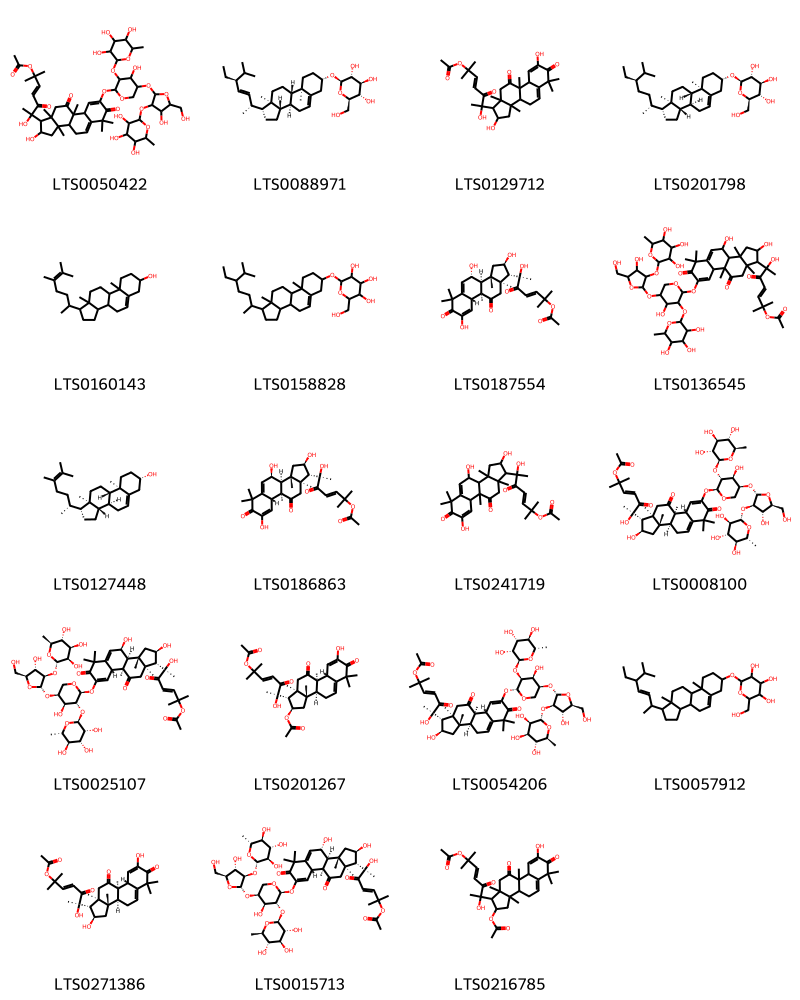{ width=100% }
    <figcaption>Hình ảnh cấu trúc hóa học của 19 hoạt chất thuộc nhóm Steroids and steroid derivatives gồm ['6-hydroxy-6-{2-hydroxy-8-[(4-hydroxy-5-{[4-hydroxy-5-(hydroxymethyl)-3-[(3,4,5-trihydroxy-6-methyloxan-2-yl)oxy]oxolan-2-yl]oxy}-3-[(3,4,5-trihydroxy-6-methyloxan-2-yl)oxy]oxan-2-yl)oxy]-3a,6,6,9b,11a-pentamethyl-7,10-dioxo-1h,2h,3h,3bh,4h,9ah,11h-cyclopenta[a]phenanthren-1-yl}-2-methyl-5-oxohept-3-en-2-yl acetate (LTS0050422)', '(2r,3r,4s,5s,6r)-2-{[(1r,3as,3bs,7s,9ar,9bs,11ar)-1-[(2r,3e,5s)-5-ethyl-6-methylhept-3-en-2-yl]-9a,11a-dimethyl-1h,2h,3h,3ah,3bh,4h,6h,7h,8h,9h,9bh,10h,11h-cyclopenta[a]phenanthren-7-yl]oxy}-6-(hydroxymethyl)oxane-3,4,5-triol (LTS0088971)', '6-{2,8-dihydroxy-3a,6,6,9b,11a-pentamethyl-7,10-dioxo-1h,2h,3h,3bh,4h,9ah,11h-cyclopenta[a]phenanthren-1-yl}-6-hydroxy-2-methyl-5-oxohept-3-en-2-yl acetate (LTS0129712)', 'sitogluside (LTS0201798)', '1-(5,6-dimethylhept-5-en-2-yl)-9a,11a-dimethyl-1h,2h,3h,3ah,3bh,4h,6h,7h,8h,9h,9bh,10h,11h-cyclopenta[a]phenanthren-7-ol (LTS0160143)', '2-{[1-(5-ethyl-6-methylheptan-2-yl)-9a,11a-dimethyl-1h,2h,3h,3ah,3bh,4h,6h,7h,8h,9h,9bh,10h,11h-cyclopenta[a]phenanthren-7-yl]oxy}-6-(hydroxymethyl)oxane-3,4,5-triol (LTS0158828)', '(3e,6r)-6-[(1r,2r,3as,3bs,4s,9ar,9bs,11ar)-2,4,8-trihydroxy-3a,6,6,9b,11a-pentamethyl-7,10-dioxo-1h,2h,3h,3bh,4h,9ah,11h-cyclopenta[a]phenanthren-1-yl]-6-hydroxy-2-methyl-5-oxohept-3-en-2-yl acetate (LTS0187554)', '6-{2,4-dihydroxy-8-[(4-hydroxy-5-{[4-hydroxy-5-(hydroxymethyl)-3-[(3,4,5-trihydroxy-6-methyloxan-2-yl)oxy]oxolan-2-yl]oxy}-3-[(3,4,5-trihydroxy-6-methyloxan-2-yl)oxy]oxan-2-yl)oxy]-3a,6,6,9b,11a-pentamethyl-7,10-dioxo-1h,2h,3h,3bh,4h,9ah,11h-cyclopenta[a]phenanthren-1-yl}-6-hydroxy-2-methyl-5-oxohept-3-en-2-yl acetate (LTS0136545)', '(1r,3as,3bs,7s,9ar,9bs,11ar)-1-[(2r)-5,6-dimethylhept-5-en-2-yl]-9a,11a-dimethyl-1h,2h,3h,3ah,3bh,4h,6h,7h,8h,9h,9bh,10h,11h-cyclopenta[a]phenanthren-7-ol (LTS0127448)', '(3e,6r)-6-[(1r,2r,3as,3bs,4r,9ar,9bs,11ar)-2,4,8-trihydroxy-3a,6,6,9b,11a-pentamethyl-7,10-dioxo-1h,2h,3h,3bh,4h,9ah,11h-cyclopenta[a]phenanthren-1-yl]-6-hydroxy-2-methyl-5-oxohept-3-en-2-yl acetate (LTS0186863)', '6-hydroxy-2-methyl-5-oxo-6-{2,4,8-trihydroxy-3a,6,6,9b,11a-pentamethyl-7,10-dioxo-1h,2h,3h,3bh,4h,9ah,11h-cyclopenta[a]phenanthren-1-yl}hept-3-en-2-yl acetate (LTS0241719)', '(3e,6r)-6-[(1r,2r,3as,3bs,9ar,9br,11ar)-2-hydroxy-8-{[(2s,3r,4s,5s)-4-hydroxy-5-{[(2s,3r,4s,5s)-4-hydroxy-5-(hydroxymethyl)-3-{[(2s,3r,4s,5s,6r)-3,4,5-trihydroxy-6-methyloxan-2-yl]oxy}oxolan-2-yl]oxy}-3-{[(2s,3r,4s,5s,6r)-3,4,5-trihydroxy-6-methyloxan-2-yl]oxy}oxan-2-yl]oxy}-3a,6,6,9b,11a-pentamethyl-7,10-dioxo-1h,2h,3h,3bh,4h,9ah,11h-cyclopenta[a]phenanthren-1-yl]-6-hydroxy-2-methyl-5-oxohept-3-en-2-yl acetate (LTS0008100)', '(3e,6r)-6-[(1r,2r,3as,3bs,4r,9ar,9bs,11ar)-2,4-dihydroxy-8-{[(2s,3r,4s,5s)-4-hydroxy-5-{[(2s,3r,4s,5s)-4-hydroxy-5-(hydroxymethyl)-3-{[(2s,3r,4r,5r,6s)-3,4,5-trihydroxy-6-methyloxan-2-yl]oxy}oxolan-2-yl]oxy}-3-{[(2s,3r,4r,5r,6s)-3,4,5-trihydroxy-6-methyloxan-2-yl]oxy}oxan-2-yl]oxy}-3a,6,6,9b,11a-pentamethyl-7,10-dioxo-1h,2h,3h,3bh,4h,9ah,11h-cyclopenta[a]phenanthren-1-yl]-6-hydroxy-2-methyl-5-oxohept-3-en-2-yl acetate (LTS0025107)', '(3e,6r)-6-[(1r,2r,3as,3bs,9ar,9br,11ar)-2-(acetyloxy)-8-hydroxy-3a,6,6,9b,11a-pentamethyl-7,10-dioxo-1h,2h,3h,3bh,4h,9ah,11h-cyclopenta[a]phenanthren-1-yl]-6-hydroxy-2-methyl-5-oxohept-3-en-2-yl acetate (LTS0201267)', '(3e,6r)-6-[(1r,2r,3as,3bs,9ar,9br,11ar)-2-hydroxy-8-{[(2r,3s,4s,5s)-4-hydroxy-5-{[(2s,3r,4s,5s)-4-hydroxy-5-(hydroxymethyl)-3-{[(2s,3r,4r,5r,6s)-3,4,5-trihydroxy-6-methyloxan-2-yl]oxy}oxolan-2-yl]oxy}-3-{[(2s,3r,4r,5r,6s)-3,4,5-trihydroxy-6-methyloxan-2-yl]oxy}oxan-2-yl]oxy}-3a,6,6,9b,11a-pentamethyl-7,10-dioxo-1h,2h,3h,3bh,4h,9ah,11h-cyclopenta[a]phenanthren-1-yl]-6-hydroxy-2-methyl-5-oxohept-3-en-2-yl acetate (LTS0054206)', '2-{[1-(5-ethyl-6-methylhept-3-en-2-yl)-9a,11a-dimethyl-1h,2h,3h,3ah,3bh,4h,6h,7h,8h,9h,9bh,10h,11h-cyclopenta[a]phenanthren-7-yl]oxy}-6-(hydroxymethyl)oxane-3,4,5-triol (LTS0057912)', 'α-elaterin (LTS0271386)', '(3e,6r)-6-[(1r,2r,3as,3bs,4s,9ar,9bs,11ar)-2,4-dihydroxy-8-{[(2s,3r,4s,5s)-4-hydroxy-5-{[(2s,3r,4s,5s)-4-hydroxy-5-(hydroxymethyl)-3-{[(2s,3r,4s,5s,6r)-3,4,5-trihydroxy-6-methyloxan-2-yl]oxy}oxolan-2-yl]oxy}-3-{[(2s,3r,4s,5s,6r)-3,4,5-trihydroxy-6-methyloxan-2-yl]oxy}oxan-2-yl]oxy}-3a,6,6,9b,11a-pentamethyl-7,10-dioxo-1h,2h,3h,3bh,4h,9ah,11h-cyclopenta[a]phenanthren-1-yl]-6-hydroxy-2-methyl-5-oxohept-3-en-2-yl acetate (LTS0015713)', '6-[2-(acetyloxy)-8-hydroxy-3a,6,6,9b,11a-pentamethyl-7,10-dioxo-1h,2h,3h,3bh,4h,9ah,11h-cyclopenta[a]phenanthren-1-yl]-6-hydroxy-2-methyl-5-oxohept-3-en-2-yl acetate (LTS0216785)'].</figcaption>
</figure>

---

### Dược dân tộc học

Danh sách các quốc gia có sử dụng *Bacopa monnieri* trong điều trị các bệnh. 

| Country   | Disease            | Bệnh                                                                                                                                                                                                |
|:----------|:-------------------|:----------------------------------------------------------------------------------------------------------------------------------------------------------------------------------------------------|
| India     | Aphrodisiac, Tonic | MYMEMORY WARNING: YOU USED ALL AVAILABLE FREE TRANSLATIONS FOR TODAY. NEXT AVAILABLE IN  17 HOURS 31 MINUTES 59 SECONDS VISIT HTTPS://MYMEMORY.TRANSLATED.NET/DOC/USAGELIMITS.PHP TO TRANSLATE MORE |

---

# Chi Leptandra

??? note "Danh sách các dược liệu thuộc chi"
    
	 - *Leptandra virginica*

---
## Leptandra virginica
### Thông tin về thực vật

!!! info "Phân loại thực vật của *Veronicastrum virginicum* từ GIBF:"
    - **Kingdom:** Plantae
    - **Phylum:** Tracheophyta
    - **Order:** Lamiales
    - **Family:** Plantaginaceae
    - **Genus:** Veronicastrum
    - **Species:** *Veronicastrum virginicum*

 

| Label (VI)   | Label (EN)   | Scientific Name   | Descriptions (VI)   | Descriptions (EN)   | Also Known As (VI)   | Also Known As (EN)                                                                                      |
|:-------------|:-------------|:------------------|:--------------------|:--------------------|:---------------------|:--------------------------------------------------------------------------------------------------------|
| N/A          | N/A          | Bacopa monnieri   | loài thực vật       | species of plant    | ['']                 | ['brahmi', 'herb of grace', 'Indian pennywort', 'thyme-leafed gratiola', 'water hyssop', 'waterhyssop'] |

#### Phân bố trên thế giới

**Từ CSDL GIBF** nan, unknown or invalid, Japan, Canada, United States of America

#### Phân bố tại Việt Nam

**Từ CSDL GIBF**: Không có ghi nhận ở Việt Nam

---
### Thành phần hóa học
        
- Theo cơ sở dữ liệu lotus: Từ loài *Veronicastrum virginicum* đã phân lập và xác định được Chưa có hoạt chất nào được phân lập. hoạt chất thuộc về các nhóm Không có hoạt chất nào được phân lập. 

Không có hình ảnh nào được tạo ra

---

### Dược dân tộc học

Danh sách các quốc gia có sử dụng *Veronicastrum virginicum* trong điều trị các bệnh. 

| Country   | Disease                                 | Bệnh                                                                                                                                                                                                |
|:----------|:----------------------------------------|:----------------------------------------------------------------------------------------------------------------------------------------------------------------------------------------------------|
| French    | Sudorific                               | MYMEMORY WARNING: YOU USED ALL AVAILABLE FREE TRANSLATIONS FOR TODAY. NEXT AVAILABLE IN  17 HOURS 30 MINUTES 54 SECONDS VISIT HTTPS://MYMEMORY.TRANSLATED.NET/DOC/USAGELIMITS.PHP TO TRANSLATE MORE |
| German    | Emetic                                  | MYMEMORY WARNING: YOU USED ALL AVAILABLE FREE TRANSLATIONS FOR TODAY. NEXT AVAILABLE IN  17 HOURS 30 MINUTES 51 SECONDS VISIT HTTPS://MYMEMORY.TRANSLATED.NET/DOC/USAGELIMITS.PHP TO TRANSLATE MORE |
| US        | Laxative, Cholagogue, Antiseptic, Tonic | MYMEMORY WARNING: YOU USED ALL AVAILABLE FREE TRANSLATIONS FOR TODAY. NEXT AVAILABLE IN  17 HOURS 30 MINUTES 49 SECONDS VISIT HTTPS://MYMEMORY.TRANSLATED.NET/DOC/USAGELIMITS.PHP TO TRANSLATE MORE |

---

# Chi Sutera

??? note "Danh sách các dược liệu thuộc chi"
    
	 - *Sutera p*

---
## Sutera p
### Thông tin về thực vật

!!! info "Phân loại thực vật của *N/A* từ GIBF:"
    - **Kingdom:** Plantae
    - **Phylum:** Tracheophyta
    - **Order:** Lamiales
    - **Family:** Scrophulariaceae
    - **Genus:** Sutera
    - **Species:** *N/A*

 

| Label (VI)   | Label (EN)   | Scientific Name   | Descriptions (VI)   | Descriptions (EN)   | Also Known As (VI)   | Also Known As (EN)                                                                                      |
|:-------------|:-------------|:------------------|:--------------------|:--------------------|:---------------------|:--------------------------------------------------------------------------------------------------------|
| N/A          | N/A          | Bacopa monnieri   | loài thực vật       | species of plant    | ['']                 | ['brahmi', 'herb of grace', 'Indian pennywort', 'thyme-leafed gratiola', 'water hyssop', 'waterhyssop'] |

#### Phân bố trên thế giới

**Từ CSDL GIBF** nan, unknown or invalid, United Kingdom of Great Britain and Northern Ireland, South Africa, Angola, Namibia, Tanzania, United Republic of, Poland, Mozambique, Eswatini, Estonia, United States of America, Zimbabwe, Zambia, Lesotho, Australia, Belgium

#### Phân bố tại Việt Nam

**Từ CSDL GIBF**: Không có ghi nhận ở Việt Nam

---
### Thành phần hóa học
        
- Theo cơ sở dữ liệu lotus: Từ loài *N/A* đã phân lập và xác định được Chưa có hoạt chất nào được phân lập. hoạt chất thuộc về các nhóm Không có hoạt chất nào được phân lập. 

Không có hình ảnh nào được tạo ra

---

### Dược dân tộc học

Danh sách các quốc gia có sử dụng *N/A* trong điều trị các bệnh. 

| Country   | Disease   | Bệnh                                                                                                                                                                                                |
|:----------|:----------|:----------------------------------------------------------------------------------------------------------------------------------------------------------------------------------------------------|
| Lesotho   | Soap      | MYMEMORY WARNING: YOU USED ALL AVAILABLE FREE TRANSLATIONS FOR TODAY. NEXT AVAILABLE IN  17 HOURS 30 MINUTES 30 SECONDS VISIT HTTPS://MYMEMORY.TRANSLATED.NET/DOC/USAGELIMITS.PHP TO TRANSLATE MORE |

---

# Chi Mazus

??? note "Danh sách các dược liệu thuộc chi"
    
	 - *Mazus japonicus*

---
## Mazus japonicus
### Thông tin về thực vật

!!! info "Phân loại thực vật của *N/A* từ GIBF:"
    - **Kingdom:** Plantae
    - **Phylum:** Tracheophyta
    - **Order:** Lamiales
    - **Family:** Mazaceae
    - **Genus:** Mazus
    - **Species:** *N/A*

 

| Label (VI)   | Label (EN)   | Scientific Name   | Descriptions (VI)   | Descriptions (EN)   | Also Known As (VI)   | Also Known As (EN)   |
|:-------------|:-------------|:------------------|:--------------------|:--------------------|:---------------------|:---------------------|
| N/A          | N/A          | Mazus japonicus   | loài thực vật       | species of plant    | ['']                 | ['']                 |

#### Phân bố trên thế giới

**Từ CSDL GIBF** Japan, Brazil, New Zealand, India, Macao, United States of America, China, Australia, Hong Kong, Chinese Taipei

#### Phân bố tại Việt Nam

**Từ CSDL GIBF**: Không có ghi nhận ở Việt Nam

---
### Thành phần hóa học
        
- Theo cơ sở dữ liệu lotus: Từ loài *N/A* đã phân lập và xác định được Chưa có hoạt chất nào được phân lập. hoạt chất thuộc về các nhóm Không có hoạt chất nào được phân lập. 

Không có hình ảnh nào được tạo ra

---

### Dược dân tộc học

Danh sách các quốc gia có sử dụng *N/A* trong điều trị các bệnh. 

| Country   | Disease        | Bệnh                                                                                                                                                                                                |
|:----------|:---------------|:----------------------------------------------------------------------------------------------------------------------------------------------------------------------------------------------------|
| Elsewhere | Apertif, Tonic | MYMEMORY WARNING: YOU USED ALL AVAILABLE FREE TRANSLATIONS FOR TODAY. NEXT AVAILABLE IN  17 HOURS 30 MINUTES 08 SECONDS VISIT HTTPS://MYMEMORY.TRANSLATED.NET/DOC/USAGELIMITS.PHP TO TRANSLATE MORE |

---

# Chi Rehmannia

??? note "Danh sách các dược liệu thuộc chi"
    
	 - *Rehmannia glutinosa*
	 - *Rehmannia lutea*

---
## Rehmannia glutinosa
### Thông tin về thực vật

!!! info "Phân loại thực vật của *Rehmannia glutinosa* từ GIBF:"
    - **Kingdom:** Plantae
    - **Phylum:** Tracheophyta
    - **Order:** Lamiales
    - **Family:** Rehmanniaceae
    - **Genus:** Rehmannia
    - **Species:** *Rehmannia glutinosa*

 

| Label (VI)   | Label (EN)   | Scientific Name     | Descriptions (VI)   | Descriptions (EN)   | Also Known As (VI)                  | Also Known As (EN)   |
|:-------------|:-------------|:--------------------|:--------------------|:--------------------|:------------------------------------|:---------------------|
| N/A          | N/A          | Rehmannia glutinosa | loài thực vật       | species of plant    | ['Sinh địa', 'Rehmannia glutinosa'] | ['']                 |

#### Phân bố trên thế giới

**Từ CSDL GIBF** nan, Sweden, Brazil, New Zealand, United States of America, China, Korea, Republic of

#### Phân bố tại Việt Nam

**Từ CSDL GIBF**: Không có ghi nhận ở Việt Nam

---
### Thành phần hóa học
        
- Theo cơ sở dữ liệu lotus: Từ loài *Rehmannia glutinosa* đã phân lập và xác định được 228 hoạt chất thuộc về các nhóm Oxanes, Oxepanes, Furans, Organonitrogen compounds, Carboxylic acids and derivatives, Epoxides, Dihydrofurans, Hydroxy acids and derivatives, Pyrans, Pyrimidine nucleosides, Lactones, Sphingolipids, Tannins, Cinnamic acids and derivatives, Organooxygen compounds, Diazines, Fatty Acyls, Indoles and derivatives, Prenol lipids, Naphthopyrans, Heteroaromatic compounds, Steroids and steroid derivatives. 

|    | chemicalTaxonomyClassyfireClass   |   smiles_count |
|---:|:----------------------------------|---------------:|
|  0 | Carboxylic acids and derivatives  |             10 |
|  1 | Cinnamic acids and derivatives    |             28 |
|  2 | Diazines                          |              1 |
|  3 | Dihydrofurans                     |              1 |
|  4 | Epoxides                          |              1 |
|  5 | Fatty Acyls                       |              7 |
|  6 | Furans                            |              2 |
|  7 | Heteroaromatic compounds          |              2 |
|  8 | Hydroxy acids and derivatives     |              1 |
|  9 | Indoles and derivatives           |              1 |
| 10 | Lactones                          |              3 |
| 11 | Naphthopyrans                     |              1 |
| 12 | Organonitrogen compounds          |              1 |
| 13 | Organooxygen compounds            |             61 |
| 14 | Oxanes                            |              2 |
| 15 | Oxepanes                          |              1 |
| 16 | Prenol lipids                     |             92 |
| 17 | Pyrans                            |              2 |
| 18 | Pyrimidine nucleosides            |              1 |
| 19 | Sphingolipids                     |              1 |
| 20 | Steroids and steroid derivatives  |              1 |
| 21 | Tannins                           |              5 |

#### Nhóm Carboxylic acids and derivatives
<figure markdown="span">
    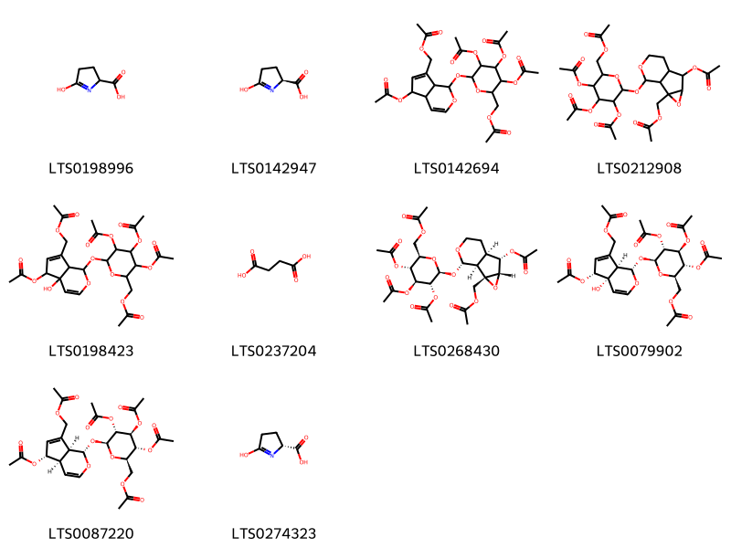{ width=100% }
    <figcaption>Hình ảnh cấu trúc hóa học của 10 hoạt chất thuộc nhóm Carboxylic acids and derivatives gồm ['pyroglutamic acid (LTS0198996)', 'pyroglutamic acid (LTS0142947)', '[5-(acetyloxy)-1-{[3,4,5-tris(acetyloxy)-6-[(acetyloxy)methyl]oxan-2-yl]oxy}-1h,4ah,5h,7ah-cyclopenta[c]pyran-7-yl]methyl acetate (LTS0142694)', '[5-(acetyloxy)-10-{[3,4,5-tris(acetyloxy)-6-[(acetyloxy)methyl]oxan-2-yl]oxy}-3,9-dioxatricyclo[4.4.0.0²,⁴]decan-2-yl]methyl acetate (LTS0212908)', '[5-(acetyloxy)-4a-hydroxy-1-{[3,4,5-tris(acetyloxy)-6-[(acetyloxy)methyl]oxan-2-yl]oxy}-1h,5h,7ah-cyclopenta[c]pyran-7-yl]methyl acetate (LTS0198423)', 'succinic acid (LTS0237204)', '[(1s,2s,4s,5s,6r,10s)-5-(acetyloxy)-10-{[(2s,3r,4s,5r,6r)-3,4,5-tris(acetyloxy)-6-[(acetyloxy)methyl]oxan-2-yl]oxy}-3,9-dioxatricyclo[4.4.0.0²,⁴]decan-2-yl]methyl acetate (LTS0268430)', '[(1s,4as,5r,7ar)-5-(acetyloxy)-4a-hydroxy-1-{[(2s,3r,4s,5r,6r)-3,4,5-tris(acetyloxy)-6-[(acetyloxy)methyl]oxan-2-yl]oxy}-1h,5h,7ah-cyclopenta[c]pyran-7-yl]methyl acetate (LTS0079902)', '[(1s,4ar,5s,7as)-5-(acetyloxy)-1-{[(2s,3r,4s,5r,6r)-3,4,5-tris(acetyloxy)-6-[(acetyloxy)methyl]oxan-2-yl]oxy}-1h,4ah,5h,7ah-cyclopenta[c]pyran-7-yl]methyl acetate (LTS0087220)', '(2r)-5-hydroxy-3,4-dihydro-2h-pyrrole-2-carboxylic acid (LTS0274323)'].</figcaption>
</figure>
#### Nhóm Cinnamic acids and derivatives
<figure markdown="span">
    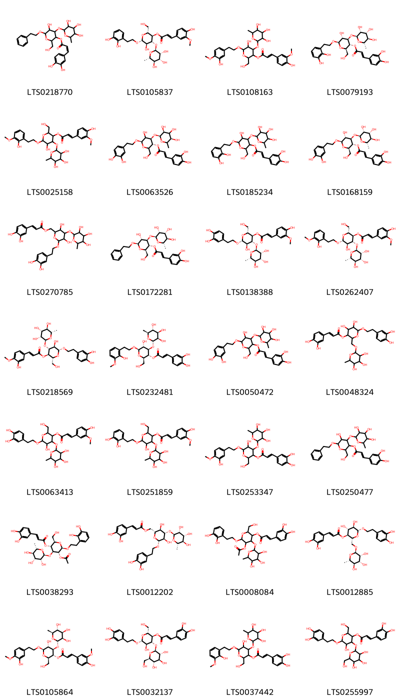{ width=100% }
    <figcaption>Hình ảnh cấu trúc hóa học của 28 hoạt chất thuộc nhóm Cinnamic acids and derivatives gồm ['5-hydroxy-2-(hydroxymethyl)-6-(2-phenylethoxy)-4-[(3,4,5-trihydroxy-6-methyloxan-2-yl)oxy]oxan-3-yl (2z)-3-(3,4-dihydroxyphenyl)prop-2-enoate (LTS0218770)', '(2r,3r,4r,5r,6r)-6-[2-(2,3-dihydroxyphenyl)ethoxy]-5-hydroxy-2-(hydroxymethyl)-4-{[(2s,3r,4r,5r,6s)-3,4,5-trihydroxy-6-methyloxan-2-yl]oxy}oxan-3-yl (2e)-3-(4-hydroxy-3-methoxyphenyl)prop-2-enoate (LTS0105837)', '5-hydroxy-6-[2-(3-hydroxy-4-methoxyphenyl)ethoxy]-2-(hydroxymethyl)-4-[(3,4,5-trihydroxy-6-methyloxan-2-yl)oxy]oxan-3-yl 3-(4-hydroxy-3-methoxyphenyl)prop-2-enoate (LTS0108163)', '(2r,3r,4r,5r,6r)-6-[2-(2,3-dihydroxyphenyl)ethoxy]-5-hydroxy-2-(hydroxymethyl)-4-{[(2s,3r,4r,5r,6s)-3,4,5-trihydroxy-6-methyloxan-2-yl]oxy}oxan-3-yl (2e)-3-(3,4-dihydroxyphenyl)prop-2-enoate (LTS0079193)', '5-hydroxy-6-[2-(2-hydroxy-3-methoxyphenyl)ethoxy]-2-(hydroxymethyl)-4-[(3,4,5-trihydroxy-6-methyloxan-2-yl)oxy]oxan-3-yl 3-(4-hydroxy-3-methoxyphenyl)prop-2-enoate (LTS0025158)', '(3r,4r,6r)-6-[2-(3,4-dihydroxyphenyl)ethoxy]-5-hydroxy-2-(hydroxymethyl)-4-{[(2s,3s,5r)-3,4,5-trihydroxy-6-methyloxan-2-yl]oxy}oxan-3-yl (2e)-3-(3,4-dihydroxyphenyl)prop-2-enoate (LTS0063526)', '6-[2-(2,3-dihydroxyphenyl)ethoxy]-5-hydroxy-2-(hydroxymethyl)-4-[(3,4,5-trihydroxy-6-methyloxan-2-yl)oxy]oxan-3-yl 3-(3,4-dihydroxyphenyl)prop-2-enoate (LTS0185234)', 'verbascoside (LTS0168159)', '{6-[2-(3,4-dihydroxyphenyl)ethoxy]-3,5-dihydroxy-4-[(3,4,5-trihydroxy-6-methyloxan-2-yl)oxy]oxan-2-yl}methyl 3-(3,4-dihydroxyphenyl)prop-2-enoate (LTS0270785)', '(2r,3r,4r,5r,6r)-5-hydroxy-2-(hydroxymethyl)-6-(2-phenylethoxy)-4-{[(2s,3r,4r,5r,6s)-3,4,5-trihydroxy-6-methyloxan-2-yl]oxy}oxan-3-yl (2e)-3-(3,4-dihydroxyphenyl)prop-2-enoate (LTS0172281)', '(2r,3r,4r,5r,6r)-6-[2-(3,4-dihydroxyphenyl)ethoxy]-5-hydroxy-2-(hydroxymethyl)-4-{[(2s,3r,4r,5r,6s)-3,4,5-trihydroxy-6-methyloxan-2-yl]oxy}oxan-3-yl (2e)-3-(4-hydroxy-3-methoxyphenyl)prop-2-enoate (LTS0138388)', '(2r,3r,4r,5r,6r)-5-hydroxy-6-[2-(2-hydroxy-3-methoxyphenyl)ethoxy]-2-(hydroxymethyl)-4-{[(2s,3r,4r,5r,6s)-3,4,5-trihydroxy-6-methyloxan-2-yl]oxy}oxan-3-yl (2e)-3-(4-hydroxy-3-methoxyphenyl)prop-2-enoate (LTS0262407)', '(2r,3r,4r,5r,6r)-6-[2-(3,4-dihydroxyphenyl)ethoxy]-5-hydroxy-2-(hydroxymethyl)-4-{[(2s,3r,4r,5r,6s)-3,4,5-trihydroxy-6-methyloxan-2-yl]oxy}oxan-3-yl (2e)-3-(3-hydroxy-4-methoxyphenyl)prop-2-enoate (LTS0218569)', '(2r,3r,4r,5r,6r)-5-hydroxy-6-[2-(2-hydroxy-3-methoxyphenyl)ethoxy]-2-(hydroxymethyl)-4-{[(2s,3r,4r,5r,6s)-3,4,5-trihydroxy-6-methyloxan-2-yl]oxy}oxan-3-yl (2e)-3-(3,4-dihydroxyphenyl)prop-2-enoate (LTS0232481)', '6-[2-(3,4-dihydroxyphenyl)ethoxy]-5-hydroxy-2-(hydroxymethyl)-4-[(3,4,5-trihydroxy-6-methyloxan-2-yl)oxy]oxan-3-yl 3-(3,4-dihydroxyphenyl)prop-2-enoate (LTS0050472)', '6-[2-(3,4-dihydroxyphenyl)ethoxy]-4,5-dihydroxy-2-{[(3,4,5-trihydroxy-6-methyloxan-2-yl)oxy]methyl}oxan-3-yl 3-(3,4-dihydroxyphenyl)prop-2-enoate (LTS0048324)', '6-[2-(3,4-dihydroxyphenyl)ethoxy]-5-hydroxy-2-(hydroxymethyl)-4-[(3,4,5-trihydroxy-6-methyloxan-2-yl)oxy]oxan-3-yl 3-(4-hydroxy-3-methoxyphenyl)prop-2-enoate (LTS0063413)', '6-[2-(2,3-dihydroxyphenyl)ethoxy]-5-hydroxy-2-(hydroxymethyl)-4-[(3,4,5-trihydroxy-6-methyloxan-2-yl)oxy]oxan-3-yl 3-(4-hydroxy-3-methoxyphenyl)prop-2-enoate (LTS0251859)', '5-hydroxy-6-[2-(3-hydroxy-4-methoxyphenyl)ethoxy]-2-(hydroxymethyl)-4-[(3,4,5-trihydroxy-6-methyloxan-2-yl)oxy]oxan-3-yl 3-(3,4-dihydroxyphenyl)prop-2-enoate (LTS0253347)', '5-hydroxy-2-(hydroxymethyl)-6-(2-phenylethoxy)-4-[(3,4,5-trihydroxy-6-methyloxan-2-yl)oxy]oxan-3-yl 3-(3,4-dihydroxyphenyl)prop-2-enoate (LTS0250477)', '(2r,3r,4s,5r,6r)-5-(acetyloxy)-6-[2-(2,3-dihydroxyphenyl)ethoxy]-2-(hydroxymethyl)-4-{[(2s,3r,4r,5r,6s)-3,4,5-trihydroxy-6-methyloxan-2-yl]oxy}oxan-3-yl (2e)-3-(3,4-dihydroxyphenyl)prop-2-enoate (LTS0038293)', 'isoacteoside (LTS0012202)', '5-(acetyloxy)-6-[2-(2,3-dihydroxyphenyl)ethoxy]-2-(hydroxymethyl)-4-[(3,4,5-trihydroxy-6-methyloxan-2-yl)oxy]oxan-3-yl 3-(3,4-dihydroxyphenyl)prop-2-enoate (LTS0008084)', 'forsythiaside (LTS0012885)', '(2r,3r,4r,5r,6r)-5-hydroxy-6-[2-(3-hydroxy-4-methoxyphenyl)ethoxy]-2-(hydroxymethyl)-4-{[(2s,3r,4r,5r,6s)-3,4,5-trihydroxy-6-methyloxan-2-yl]oxy}oxan-3-yl (2e)-3-(4-hydroxy-3-methoxyphenyl)prop-2-enoate (LTS0105864)', 'plantamajoside (LTS0032137)', '5-hydroxy-6-[2-(2-hydroxy-3-methoxyphenyl)ethoxy]-2-(hydroxymethyl)-4-[(3,4,5-trihydroxy-6-methyloxan-2-yl)oxy]oxan-3-yl 3-(3,4-dihydroxyphenyl)prop-2-enoate (LTS0037442)', '6-[2-(3,4-dihydroxyphenyl)ethoxy]-5-hydroxy-2-(hydroxymethyl)-4-{[3,4,5-trihydroxy-6-(hydroxymethyl)oxan-2-yl]oxy}oxan-3-yl 3-(3,4-dihydroxyphenyl)prop-2-enoate (LTS0255997)'].</figcaption>
</figure>
#### Nhóm Diazines
<figure markdown="span">
    { width=100% }
    <figcaption>Hình ảnh cấu trúc hóa học của 1 hoạt chất thuộc nhóm Diazines gồm ['pirod (LTS0008205)'].</figcaption>
</figure>
#### Nhóm Dihydrofurans
<figure markdown="span">
    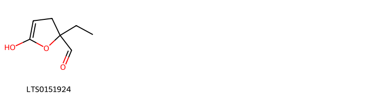{ width=100% }
    <figcaption>Hình ảnh cấu trúc hóa học của 1 hoạt chất thuộc nhóm Dihydrofurans gồm ['2-ethyl-5-hydroxy-3h-furan-2-carbaldehyde (LTS0151924)'].</figcaption>
</figure>
#### Nhóm Epoxides
<figure markdown="span">
    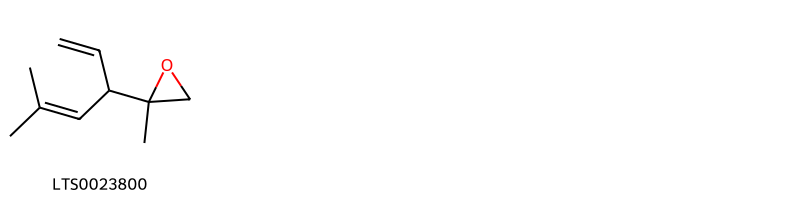{ width=100% }
    <figcaption>Hình ảnh cấu trúc hóa học của 1 hoạt chất thuộc nhóm Epoxides gồm ['2-methyl-2-(5-methylhexa-1,4-dien-3-yl)oxirane (LTS0023800)'].</figcaption>
</figure>
#### Nhóm Fatty Acyls
<figure markdown="span">
    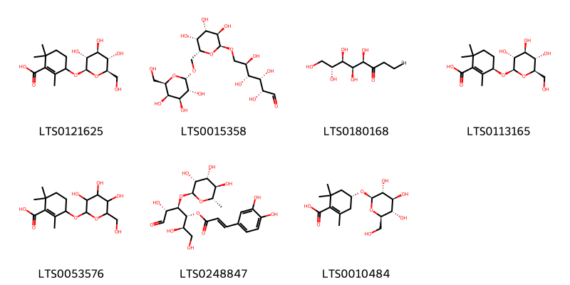{ width=100% }
    <figcaption>Hình ảnh cấu trúc hóa học của 7 hoạt chất thuộc nhóm Fatty Acyls gồm ['2,6,6-trimethyl-3-{[(2r,3r,4s,5s,6r)-3,4,5-trihydroxy-6-(hydroxymethyl)oxan-2-yl]oxy}cyclohex-1-ene-1-carboxylic acid (LTS0121625)', 'manninotriose (LTS0015358)', '(4r,5s,6r,7r)-4,5,6,7,8-pentahydroxy(1-²h₁)octan-3-one (LTS0180168)', '(3r)-2,6,6-trimethyl-3-{[(2r,3r,4s,5s,6r)-3,4,5-trihydroxy-6-(hydroxymethyl)oxan-2-yl]oxy}cyclohex-1-ene-1-carboxylic acid (LTS0113165)', '2,6,6-trimethyl-3-{[3,4,5-trihydroxy-6-(hydroxymethyl)oxan-2-yl]oxy}cyclohex-1-ene-1-carboxylic acid (LTS0053576)', '(2r,3r,4r,5r)-1,2,5-trihydroxy-6-oxo-4-{[(2s,3r,4r,5r,6s)-3,4,5-trihydroxy-6-methyloxan-2-yl]oxy}hexan-3-yl (2e)-3-(3,4-dihydroxyphenyl)prop-2-enoate (LTS0248847)', '(4r)-2,6,6-trimethyl-4-{[(2r,3r,4s,5s,6r)-3,4,5-trihydroxy-6-(hydroxymethyl)oxan-2-yl]oxy}cyclohex-1-ene-1-carboxylic acid (LTS0010484)'].</figcaption>
</figure>
#### Nhóm Furans
<figure markdown="span">
    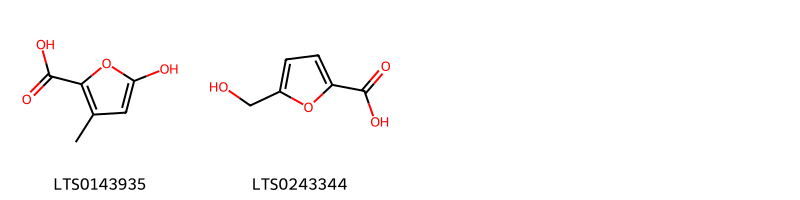{ width=100% }
    <figcaption>Hình ảnh cấu trúc hóa học của 2 hoạt chất thuộc nhóm Furans gồm ['5-hydroxy-3-methylfuran-2-carboxylic acid (LTS0143935)', '5-hydroxymethyl-2-furoic acid (LTS0243344)'].</figcaption>
</figure>
#### Nhóm Heteroaromatic compounds
<figure markdown="span">
    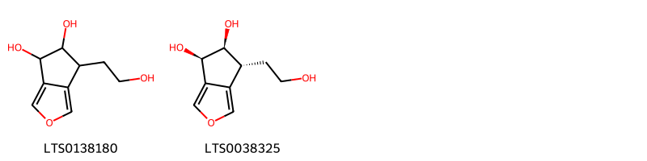{ width=100% }
    <figcaption>Hình ảnh cấu trúc hóa học của 2 hoạt chất thuộc nhóm Heteroaromatic compounds gồm ['6-(2-hydroxyethyl)-4h,5h,6h-cyclopenta[c]furan-4,5-diol (LTS0138180)', '(4r,5s,6r)-6-(2-hydroxyethyl)-4h,5h,6h-cyclopenta[c]furan-4,5-diol (LTS0038325)'].</figcaption>
</figure>
#### Nhóm Hydroxy acids and derivatives
<figure markdown="span">
    { width=100% }
    <figcaption>Hình ảnh cấu trúc hóa học của 1 hoạt chất thuộc nhóm Hydroxy acids and derivatives gồm ['(-)-malic acid (LTS0128885)'].</figcaption>
</figure>
#### Nhóm Indoles and derivatives
<figure markdown="span">
    { width=100% }
    <figcaption>Hình ảnh cấu trúc hóa học của 1 hoạt chất thuộc nhóm Indoles and derivatives gồm ['n-[2-(5-methoxy-1h-indol-3-yl)ethyl]ethanimidic acid (LTS0219322)'].</figcaption>
</figure>
#### Nhóm Lactones
<figure markdown="span">
    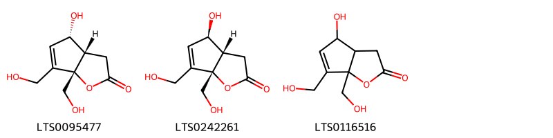{ width=100% }
    <figcaption>Hình ảnh cấu trúc hóa học của 3 hoạt chất thuộc nhóm Lactones gồm ['(3as,4s,6as)-4-hydroxy-6,6a-bis(hydroxymethyl)-3h,3ah,4h-cyclopenta[b]furan-2-one (LTS0095477)', '(3as,4r,6as)-4-hydroxy-6,6a-bis(hydroxymethyl)-3h,3ah,4h-cyclopenta[b]furan-2-one (LTS0242261)', '4-hydroxy-6,6a-bis(hydroxymethyl)-3h,3ah,4h-cyclopenta[b]furan-2-one (LTS0116516)'].</figcaption>
</figure>
#### Nhóm Naphthopyrans
<figure markdown="span">
    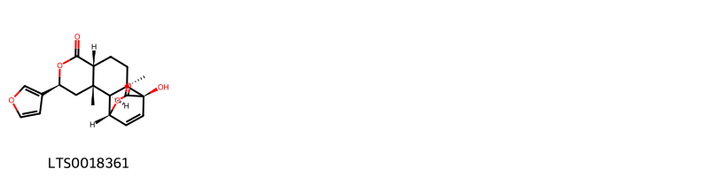{ width=100% }
    <figcaption>Hình ảnh cấu trúc hóa học của 1 hoạt chất thuộc nhóm Naphthopyrans gồm ['columbin (LTS0018361)'].</figcaption>
</figure>
#### Nhóm Organonitrogen compounds
<figure markdown="span">
    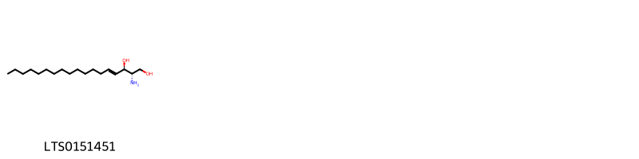{ width=100% }
    <figcaption>Hình ảnh cấu trúc hóa học của 1 hoạt chất thuộc nhóm Organonitrogen compounds gồm ['sphingosine (LTS0151451)'].</figcaption>
</figure>
#### Nhóm Organooxygen compounds
<figure markdown="span">
    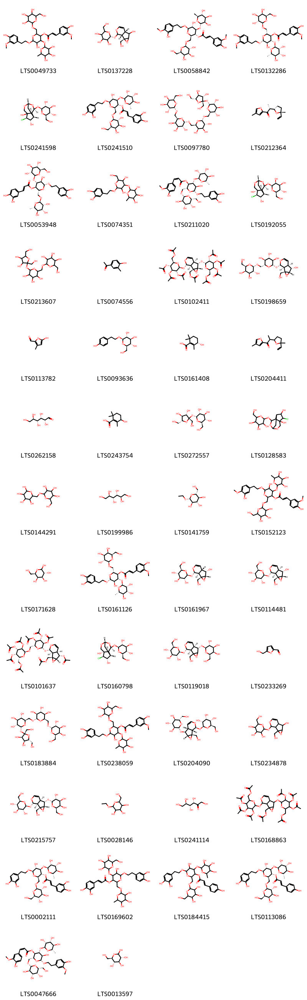{ width=100% }
    <figcaption>Hình ảnh cấu trúc hóa học của 61 hoạt chất thuộc nhóm Organooxygen compounds gồm ['5-hydroxy-6-[2-(4-hydroxy-3-methoxyphenyl)ethoxy]-2-({[3,4,5-trihydroxy-6-(hydroxymethyl)oxan-2-yl]oxy}methyl)-4-[(3,4,5-trihydroxy-6-methyloxan-2-yl)oxy]oxan-3-yl 3-(4-hydroxy-3-methoxyphenyl)prop-2-enoate (LTS0049733)', '(2r)-2-{[(1r,2s,6s)-5-hydroxy-2-(hydroxymethyl)-3,9-dioxatricyclo[4.4.0.0²,⁴]dec-7-en-10-yl]oxy}-6-(hydroxymethyl)oxane-3,4,5-triol (LTS0137228)', 'jionoside b1 (LTS0058842)', '(2r,3r,4r,5r,6r)-5-hydroxy-6-[2-(4-hydroxy-3-methoxyphenyl)ethoxy]-2-({[(2r,3r,4s,5r,6r)-3,4,5-trihydroxy-6-(hydroxymethyl)oxan-2-yl]oxy}methyl)-4-{[(2s,3r,4r,5r,6s)-3,4,5-trihydroxy-6-methyloxan-2-yl]oxy}oxan-3-yl (2e)-3-(4-hydroxy-3-methoxyphenyl)prop-2-enoate (LTS0132286)', '(2s,3r,4s,5s,6r)-2-{[(1r,5r,6s,7r,8s,9s)-5-chloro-4,6-dihydroxy-2,10-dioxatricyclo[5.3.1.0⁴,⁸]undecan-9-yl]oxy}-6-(hydroxymethyl)oxane-3,4,5-triol (LTS0241598)', 'purpureaside c (LTS0241510)', 'verbascose (LTS0097780)', '(2r)-2-[(2s,5r)-5-ethenyl-5-methyloxolan-2-yl]-1-(4-methylfuran-2-yl)propan-1-one (LTS0212364)', '(2r,3r,4r,5r,6r)-6-[2-(3,4-dihydroxyphenyl)ethoxy]-5-hydroxy-4-{[(2s,3r,4s,5s,6r)-3,4,5-trihydroxy-6-(hydroxymethyl)oxan-2-yl]oxy}-2-({[(2r,3r,4r,5r,6s)-3,4,5-trihydroxy-6-methyloxan-2-yl]oxy}methyl)oxan-3-yl (2e)-3-(3,4-dihydroxyphenyl)prop-2-enoate (LTS0053948)', '2-({2-[2-(3,4-dihydroxyphenyl)ethoxy]-3,5-dihydroxy-6-(hydroxymethyl)oxan-4-yl}oxy)-6-methyloxane-3,4,5-triol (LTS0074351)', '(2r,3r,4r,5r,6r)-6-[2-(3,4-dihydroxyphenyl)ethoxy]-5-hydroxy-2-({[(2r,3r,4s,5r,6r)-3,4,5-trihydroxy-6-(hydroxymethyl)oxan-2-yl]oxy}methyl)-4-{[(2s,3r,4r,5r,6s)-3,4,5-trihydroxy-6-methyloxan-2-yl]oxy}oxan-3-yl (2z)-3-(4-hydroxy-3-methoxyphenyl)prop-2-enoate (LTS0211020)', '(2s,3s,4s,5s,6r)-2-{[(1r,4s,5r,6s,7r,8s,9s)-5-chloro-4,6-dihydroxy-2,10-dioxatricyclo[5.3.1.0⁴,⁸]undecan-9-yl]oxy}-6-(hydroxymethyl)oxane-3,4,5-triol (LTS0192055)', '2-[(6-{[3,4-dihydroxy-2,5-bis(hydroxymethyl)oxolan-2-yl]oxy}-3,4,5-trihydroxyoxan-2-yl)methoxy]-6-(hydroxymethyl)oxane-3,4,5-triol (LTS0213607)', '1-(4-hydroxy-3-methylphenyl)ethanone (LTS0074556)', '[(1s,2s,4s,5s,6r,10s)-10-{[(2s,3r,4s,5r,6r)-3,4,5-tris(acetyloxy)-6-[(acetyloxy)methyl]oxan-2-yl]oxy}-5-{[(2s,3r,4s,5s,6r)-3,4,5-tris(acetyloxy)-6-[(acetyloxy)methyl]oxan-2-yl]oxy}-3,9-dioxatricyclo[4.4.0.0²,⁴]dec-7-en-2-yl]methyl acetate (LTS0102411)', '(2r,3r,4s,5r,6s)-2-(hydroxymethyl)-6-{[(2r,3s,4s,5r,6s)-3,4,5-trihydroxy-6-{[(1s,2s,4s,5s,6r,10s)-5-hydroxy-2-(hydroxymethyl)-3,9-dioxatricyclo[4.4.0.0²,⁴]dec-7-en-10-yl]oxy}oxan-2-yl]methoxy}oxane-3,4,5-triol (LTS0198659)', '5-hydroxy-3-methylfuran-2-carbaldehyde (LTS0113782)', 'salidroside (LTS0093636)', '(3s)-3-hydroxy-2,6,6-trimethylcyclohex-1-ene-1-carboxylic acid (LTS0161408)', '2-(5-ethenyl-5-methyloxolan-2-yl)-1-(4-methylfuran-2-yl)propan-1-one (LTS0204411)', '(+)-glucose (LTS0262158)', '3-hydroxy-2,6,6-trimethylcyclohex-1-ene-1-carboxylic acid (LTS0243754)', 'sucrose (LTS0272557)', '2-({5-chloro-4,6-dihydroxy-2,10-dioxatricyclo[5.3.1.0⁴,⁸]undecan-9-yl}oxy)-6-(hydroxymethyl)oxane-3,4,5-triol (LTS0128583)', 'polydextrose (LTS0144291)', 'mannitol (LTS0199986)', 'ethyl glucoside (LTS0141759)', '5-hydroxy-6-[2-(3-hydroxy-4-methoxyphenyl)ethoxy]-2-({[3,4,5-trihydroxy-6-(hydroxymethyl)oxan-2-yl]oxy}methyl)-4-[(3,4,5-trihydroxy-6-methyloxan-2-yl)oxy]oxan-3-yl 3-(4-hydroxy-3-methoxyphenyl)prop-2-enoate (LTS0152123)', 'galactose (LTS0171628)', '(2r,3r,4r,5r,6r)-6-[2-(3,4-dihydroxyphenyl)ethoxy]-5-hydroxy-2-({[(2r,3r,4s,5r,6r)-3,4,5-trihydroxy-6-(hydroxymethyl)oxan-2-yl]oxy}methyl)-4-{[(2s,3r,4r,5r,6s)-3,4,5-trihydroxy-6-methyloxan-2-yl]oxy}oxan-3-yl (2e)-3-(4-hydroxy-3-methoxyphenyl)prop-2-enoate (LTS0161126)', '(2s,3r,4s,5s,6r)-2-{[(1s,2s,4s,5s,6s,10s)-5-hydroxy-2-(hydroxymethyl)-3,9-dioxatricyclo[4.4.0.0²,⁴]dec-7-en-10-yl]oxy}-6-(hydroxymethyl)oxane-3,4,5-triol (LTS0161967)', 'catalpol (LTS0114481)', '[(1s,2s,4s,5s,6r,10s)-5-(acetyloxy)-10-{[(2s,3r,4s,5r,6r)-3,4,5-tris(acetyloxy)-6-({[(2s,3r,4s,5s,6r)-3,4,5-tris(acetyloxy)-6-[(acetyloxy)methyl]oxan-2-yl]oxy}methyl)oxan-2-yl]oxy}-3,9-dioxatricyclo[4.4.0.0²,⁴]dec-7-en-2-yl]methyl acetate (LTS0101637)', '(2s,3r,4s,5s,6r)-2-{[(1r,4s,5r,6s,7r,8s,9s)-5-chloro-4,6-dihydroxy-2,10-dioxatricyclo[5.3.1.0⁴,⁸]undecan-9-yl]oxy}-6-(hydroxymethyl)oxane-3,4,5-triol (LTS0160798)', '(2r,3s,4s,5r,6s)-2-(hydroxymethyl)-6-{[(1s,5s,6r,10s)-2-(hydroxymethyl)-5-{[(2r,3r,4s,5r,6r)-3,4,5-trihydroxy-6-(hydroxymethyl)oxan-2-yl]oxy}-3,9-dioxatricyclo[4.4.0.0²,⁴]dec-7-en-10-yl]oxy}oxane-3,4,5-triol (LTS0119018)', 'hydroxymethylfurfural (LTS0233269)', '(2r,3r,4s,5s,6r)-2-{[(2s,3r,4s,5r)-3,4-dihydroxy-2,5-bis(hydroxymethyl)oxolan-2-yl]oxy}-6-({[(2s,3s,4r,5r,6r)-3,4,5-trihydroxy-6-({[(2s,3r,4s,5r,6r)-3,4,5-trihydroxy-6-(hydroxymethyl)oxan-2-yl]oxy}methyl)oxan-2-yl]oxy}methyl)oxane-3,4,5-triol (LTS0183884)', '6-[2-(3,4-dihydroxyphenyl)ethoxy]-5-hydroxy-2-({[3,4,5-trihydroxy-6-(hydroxymethyl)oxan-2-yl]oxy}methyl)-4-[(3,4,5-trihydroxy-6-methyloxan-2-yl)oxy]oxan-3-yl 3-(4-hydroxy-3-methoxyphenyl)prop-2-enoate (LTS0238059)', '(2s,3r,4r,5s,6s)-2-(hydroxymethyl)-6-{[(1s,2r,4r,5s,6r,10s)-2-(hydroxymethyl)-10-{[(2s,3r,4r,5s,6r)-3,4,5-trihydroxy-6-(hydroxymethyl)oxan-2-yl]oxy}-3,9-dioxatricyclo[4.4.0.0²,⁴]dec-7-en-5-yl]oxy}oxane-3,4,5-triol (LTS0204090)', 'catalpol (LTS0234878)', '(2r,3s,4s,5r,6s)-2-(hydroxymethyl)-6-{[(1s,2s,4s,5s,6r,10s)-2-(hydroxymethyl)-5-{[(2s,3r,4s,5r,6r)-3,4,5-trihydroxy-6-(hydroxymethyl)oxan-2-yl]oxy}-3,9-dioxatricyclo[4.4.0.0²,⁴]dec-7-en-10-yl]oxy}oxane-3,4,5-triol (LTS0215757)', '�-d-galactopyranoside, ethyl (LTS0028146)', 'keto-d-fructose (LTS0241114)', '[5,10-bis({[3,4,5-tris(acetyloxy)-6-[(acetyloxy)methyl]oxan-2-yl]oxy})-3,9-dioxatricyclo[4.4.0.0²,⁴]dec-7-en-2-yl]methyl acetate (LTS0168863)', 'echinacoside (LTS0002111)', '6-[2-(3,4-dihydroxyphenyl)ethoxy]-5-hydroxy-4-{[3,4,5-trihydroxy-6-(hydroxymethyl)oxan-2-yl]oxy}-2-{[(3,4,5-trihydroxy-6-methyloxan-2-yl)oxy]methyl}oxan-3-yl 3-(3,4-dihydroxyphenyl)prop-2-enoate (LTS0169602)', '6-[2-(3,4-dihydroxyphenyl)ethoxy]-5-hydroxy-2-({[3,4,5-trihydroxy-6-(hydroxymethyl)oxan-2-yl]oxy}methyl)-4-[(3,4,5-trihydroxy-6-methyloxan-2-yl)oxy]oxan-3-yl 3-(4-hydroxyphenyl)prop-2-enoate (LTS0184415)', '(2r,3r,4r,5r,6r)-6-[2-(3,4-dihydroxyphenyl)ethoxy]-5-hydroxy-2-({[(2r,3r,4s,5r,6r)-3,4,5-trihydroxy-6-(hydroxymethyl)oxan-2-yl]oxy}methyl)-4-{[(2s,3r,4r,5r,6s)-3,4,5-trihydroxy-6-methyloxan-2-yl]oxy}oxan-3-yl (2e)-3-(4-hydroxyphenyl)prop-2-enoate (LTS0113086)', '(2r,3r,4r,5r,6r)-5-hydroxy-6-[2-(4-hydroxy-3-methoxyphenyl)ethoxy]-2-({[(2r,3r,4s,5r,6r)-3,4,5-trihydroxy-6-(hydroxymethyl)oxan-2-yl]oxy}methyl)-4-{[(2s,3r,4r,5r,6s)-3,4,5-trihydroxy-6-methyloxan-2-yl]oxy}oxan-3-yl (2z)-3-(4-hydroxy-3-methoxyphenyl)prop-2-enoate (LTS0047666)', 'glucose (LTS0013597)', 'aldehydo-d-galactose (LTS0128031)', '(2r,3r,4s,5s)-6-({[(2s,3r,4s,5r,6r)-3,4,5-trihydroxy-6-(hydroxymethyl)oxan-2-yl]oxy}methyl)oxane-2,3,4,5-tetrol (LTS0135576)', '(2s,3r,4s,5s,6r)-2-{[(1s,2s,4s,5s,6r,10s)-5-hydroxy-2-(hydroxymethyl)-3,9-dioxatricyclo[4.4.0.0²,⁴]decan-10-yl]oxy}-6-(hydroxymethyl)oxane-3,4,5-triol (LTS0001855)', 'stachyose (LTS0062089)', '[5-(acetyloxy)-10-{[3,4,5-tris(acetyloxy)-6-({[3,4,5-tris(acetyloxy)-6-[(acetyloxy)methyl]oxan-2-yl]oxy}methyl)oxan-2-yl]oxy}-3,9-dioxatricyclo[4.4.0.0²,⁴]dec-7-en-2-yl]methyl acetate (LTS0029604)', 'methyl (4ar,7as)-7-methylidene-1-[(3,4,5-trihydroxy-6-{[(3,4,5-trihydroxy-6-methyloxan-2-yl)oxy]methyl}oxan-2-yl)oxy]-1h,4ah,5h,6h,7ah-cyclopenta[c]pyran-4-carboxylate (LTS0032959)', '(2r,3r,4s,5r,6r)-2-(hydroxymethyl)-6-{[(2r,3s,4s,5r,6s)-3,4,5-trihydroxy-6-{[(1s,2s,4s,5s,6r,10s)-5-hydroxy-2-(hydroxymethyl)-3,9-dioxatricyclo[4.4.0.0²,⁴]dec-7-en-10-yl]oxy}oxan-2-yl]methoxy}oxane-3,4,5-triol (LTS0078329)', '(2s,3r,4r,5r,6s)-2-{[(1s,5s,6r,10s)-5-hydroxy-2-(hydroxymethyl)-3,9-dioxatricyclo[4.4.0.0²,⁴]dec-7-en-10-yl]oxy}-6-methyloxane-3,4,5-triol (LTS0030670)', 'raffinose (LTS0113066)', '6-[2-(3,4-dihydroxyphenyl)ethoxy]-5-hydroxy-2-({[3,4,5-trihydroxy-6-(hydroxymethyl)oxan-2-yl]oxy}methyl)-4-[(3,4,5-trihydroxy-6-methyloxan-2-yl)oxy]oxan-3-yl 3-(3,4-dihydroxyphenyl)prop-2-enoate (LTS0250978)', 'd-fructopyranose (LTS0259277)'].</figcaption>
</figure>
#### Nhóm Oxanes
<figure markdown="span">
    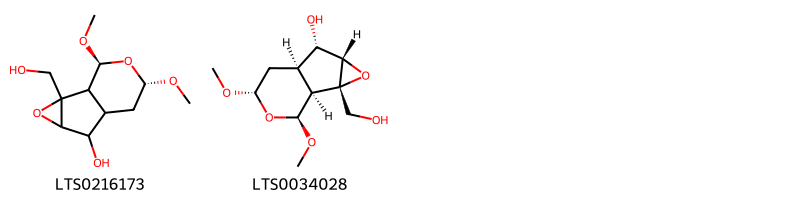{ width=100% }
    <figcaption>Hình ảnh cấu trúc hóa học của 2 hoạt chất thuộc nhóm Oxanes gồm ['(8s,10s)-2-(hydroxymethyl)-8,10-dimethoxy-3,9-dioxatricyclo[4.4.0.0²,⁴]decan-5-ol (LTS0216173)', '(1s,2s,4s,5s,6r,8s,10s)-2-(hydroxymethyl)-8,10-dimethoxy-3,9-dioxatricyclo[4.4.0.0²,⁴]decan-5-ol (LTS0034028)'].</figcaption>
</figure>
#### Nhóm Oxepanes
<figure markdown="span">
    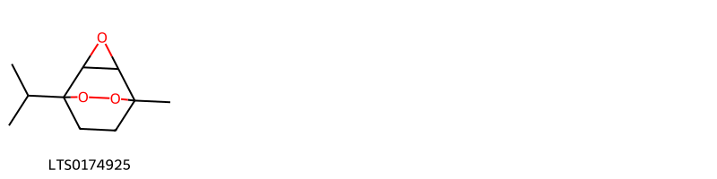{ width=100% }
    <figcaption>Hình ảnh cấu trúc hóa học của 1 hoạt chất thuộc nhóm Oxepanes gồm ['1-isopropyl-5-methyl-3,6,7-trioxatricyclo[3.2.2.0²,⁴]nonane (LTS0174925)'].</figcaption>
</figure>
#### Nhóm Prenol lipids
<figure markdown="span">
    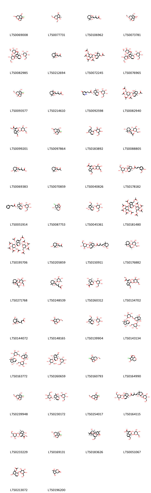{ width=100% }
    <figcaption>Hình ảnh cấu trúc hóa học của 92 hoạt chất thuộc nhóm Prenol lipids gồm ['5-chloro-2,10-dioxatricyclo[5.3.1.0⁴,¹¹]undecane-4,6,9-triol (LTS0069008)', '(1s,3r,7s)-1,3-dimethoxy-7-methyl-hexahydro-1h-cyclopenta[c]pyran-5,7-diol (LTS0077731)', '(2e,4e)-5-[(1r,2r)-1,2-dihydroxy-2,6,6-trimethylcyclohexyl]-3-methylpenta-2,4-dienoic acid (LTS0106962)', '(1s,4s,5r,6s,7r,9s,11s)-9-methoxy-2,10-dioxatricyclo[5.3.1.0⁴,¹¹]undecane-4,5,6-triol (LTS0073781)', '(2s,3r,4s,5r,6r)-2-{[(2s,3r,4r,5r,6r)-2-{[(1s,4as,5r,7as)-5-hydroxy-7-(hydroxymethyl)-1-{[(2r,3r,4r,5s,6r)-3,4,5-trihydroxy-6-(hydroxymethyl)oxan-2-yl]oxy}-1h,5h,7ah-cyclopenta[c]pyran-4a-yl]oxy}-4,5-dihydroxy-6-(hydroxymethyl)oxan-3-yl]oxy}-6-(hydroxymethyl)oxane-3,4,5-triol (LTS0082985)', '4-(1,2-dihydroxy-2,6,6-trimethylcyclohexyl)but-3-en-2-one (LTS0212694)', '[3,4,5-tris(acetyloxy)-6-{[5-(acetyloxy)-7-hydroxy-7-methyl-1h,4ah,5h,6h,7ah-cyclopenta[c]pyran-1-yl]oxy}oxan-2-yl]methyl acetate (LTS0072245)', '(2s,3r,4s,5s,6r)-2-{[(2r,3r,4s,5s,6r)-2-{[(1s,4as,5r,7ar)-5-hydroxy-7-(hydroxymethyl)-1-{[(2s,3r,4s,5s,6r)-3,4,5-trihydroxy-6-(hydroxymethyl)oxan-2-yl]oxy}-1h,5h,7ah-cyclopenta[c]pyran-4a-yl]oxy}-4,5-dihydroxy-6-(hydroxymethyl)oxan-3-yl]oxy}-6-(hydroxymethyl)oxane-3,4,5-triol (LTS0076965)', '(1s,4s,5r,6s,7r,9s,11s)-5-chloro-9-methoxy-2,10-dioxatricyclo[5.3.1.0⁴,¹¹]undecane-4,6-diol (LTS0093577)', '(2e,4e)-5-(1,2-dihydroxy-2,6,6-trimethylcyclohexyl)-3-methylpenta-2,4-dienoic acid (LTS0214610)', '(1s,4ar,5r,7s,7as)-7-hydroxy-7-methyl-1-{[(2s,3r,4s,5s,6r)-3,4,5-trihydroxy-6-(hydroxymethyl)oxan-2-yl]oxy}-1h,4ah,5h,6h,7ah-cyclopenta[c]pyran-5-yl 3-(4-oxo-1h-pyridin-2-yl)propanoate (LTS0092598)', '[(2r,3r,4s,5r,6s)-6-{[(1s,4ar,5s,7s,7as)-5-(acetyloxy)-7-hydroxy-7-methyl-1h,4ah,5h,6h,7ah-cyclopenta[c]pyran-1-yl]oxy}-3,4,5-tris(acetyloxy)oxan-2-yl]methyl acetate (LTS0082940)', 'geniposide (LTS0099201)', '(1s,4s,5r,6s,7r,11s)-5-chloro-2,10-dioxatricyclo[5.3.1.0⁴,¹¹]undecane-4,6,9-triol (LTS0097864)', 'aucubin (LTS0183892)', '(3e)-4-[(1r,3r,6r)-1,3-dihydroxy-2,2,6-trimethyl-6-{[(2s,3r,4s,5s,6r)-3,4,5-trihydroxy-6-(hydroxymethyl)oxan-2-yl]oxy}cyclohexyl]but-3-en-2-one (LTS0088805)', '(2e,4e)-3-methyl-5-[(1r,3s,6r)-1,3,6-trihydroxy-2,2,6-trimethylcyclohexyl]penta-2,4-dienoic acid (LTS0069383)', '(3e)-4-[(1r,2r)-1,2-dihydroxy-2,6,6-trimethylcyclohexyl]but-3-en-2-one (LTS0070859)', '7-(hydroxymethyl)-1-{[3,4,5-trihydroxy-6-(hydroxymethyl)oxan-2-yl]oxy}-1h,4ah,5h,7ah-cyclopenta[c]pyran-4-carboxylic acid (LTS0040826)', '(1s,4as,5r,7s,7as)-7-hydroxy-7-methyl-1-{[(2s,3r,4s,5s,6r)-3,4,5-trihydroxy-6-(hydroxymethyl)oxan-2-yl]oxy}-1h,4ah,5h,6h,7ah-cyclopenta[c]pyran-5-yl (2e)-3-(4-hydroxy-3-methoxyphenyl)prop-2-enoate (LTS0178182)', '(1s,4ar,5r,7s,7as)-7-hydroxy-7-methyl-1-{[(2s,3r,4s,5s,6r)-3,4,5-trihydroxy-6-(hydroxymethyl)oxan-2-yl]oxy}-1h,4ah,5h,6h,7ah-cyclopenta[c]pyran-5-yl (2e)-3-phenylprop-2-enoate (LTS0051914)', '(1r,4s,5r,6s,7r,11s)-5-chloro-2,10-dioxatricyclo[5.3.1.0⁴,¹¹]undecane-4,6-diol (LTS0087753)', '(2s,3r,4s,5s,6r)-2-{[(1s,4as,5r,7ar)-4a,5-dihydroxy-7-(hydroxymethyl)-1h,5h,7ah-cyclopenta[c]pyran-1-yl]oxy}-6-(hydroxymethyl)oxane-3,4,5-triol (LTS0045361)', '[5-(acetyloxy)-1,4a-bis({[3,4,5-tris(acetyloxy)-6-[(acetyloxy)methyl]oxan-2-yl]oxy})-1h,5h,7ah-cyclopenta[c]pyran-7-yl]methyl acetate (LTS0181480)', '[(1s,4as,5r,7ar)-5-(acetyloxy)-1,4a-bis({[(2s,3r,4s,5r,6r)-3,4,5-tris(acetyloxy)-6-[(acetyloxy)methyl]oxan-2-yl]oxy})-1h,5h,7ah-cyclopenta[c]pyran-7-yl]methyl acetate (LTS0195706)', '(3e)-4-[(1r,3s,6r)-1,3,6-trihydroxy-2,2,6-trimethylcyclohexyl]but-3-en-2-one (LTS0205859)', '(1s,4ar,5r,7s,7as)-7-hydroxy-7-methyl-1-{[(2s,3r,4s,5s,6r)-3,4,5-trihydroxy-6-(hydroxymethyl)oxan-2-yl]oxy}-1h,4ah,5h,6h,7ah-cyclopenta[c]pyran-5-yl (2e,4e)-5-[(1r,2r)-1,2-dihydroxy-2,6,6-trimethylcyclohexyl]-3-methylpenta-2,4-dienoate (LTS0150911)', 'rehmaionoside b (LTS0176882)', '2-{[2-hydroxy-2-(3-hydroxybut-1-en-1-yl)-1,3,3-trimethylcyclohexyl]oxy}-6-(hydroxymethyl)oxane-3,4,5-triol (LTS0271768)', '5-[(1r,6r)-1-hydroxy-2,2,6-trimethyl-6-{[(2s,3r,4s,5s,6r)-3,4,5-trihydroxy-6-methyloxan-2-yl]oxy}cyclohexyl]-3-methylpenta-2,4-dienoic acid (LTS0248539)', '(1s,4as,6s,7s,7as)-6-hydroxy-7-methyl-1-{[(2s,3r,4s,5s,6r)-3,4,5-trihydroxy-6-(hydroxymethyl)oxan-2-yl]oxy}-1h,4ah,5h,6h,7h,7ah-cyclopenta[c]pyran-4-carboxylic acid (LTS0260312)', 'methyl 7-(hydroxymethyl)-1-{[3,4,5-trihydroxy-6-(hydroxymethyl)oxan-2-yl]oxy}-1h,4ah,5h,7ah-cyclopenta[c]pyran-4-carboxylate (LTS0134702)', '3-methyl-5-(1,3,6-trihydroxy-2,2,6-trimethylcyclohexyl)penta-2,4-dienoic acid (LTS0144072)', '(4s,6s,9s)-9-methoxy-2,10-dioxatricyclo[5.3.1.0⁴,¹¹]undecane-4,5,6-triol (LTS0148165)', '(2r,3s,4r,5r,6s)-2-{[(1s,4as,5r,7ar)-5-hydroxy-7-(hydroxymethyl)-1h,4ah,5h,7ah-cyclopenta[c]pyran-1-yl]oxy}-6-(hydroxymethyl)oxane-3,4,5-triol (LTS0139904)', '(2s,3r,4s,5s,6r)-2-{[(1s,4ar,5r,7s,7as)-5,7-dihydroxy-7-methyl-1h,4ah,5h,6h,7ah-cyclopenta[c]pyran-1-yl]oxy}-6-({[(1r,3r,4as,5s,7r,7ar)-5,7-dihydroxy-7-methyl-1-{[(2s,3r,4s,5s,6r)-3,4,5-trihydroxy-6-(hydroxymethyl)oxan-2-yl]oxy}-hexahydro-1h-cyclopenta[c]pyran-3-yl]oxy}methyl)oxane-3,4,5-triol (LTS0143134)', '(2s,3r,4s,5s,6r)-2-{[(1s,4ar,5r,7s,7as)-5,7-dihydroxy-7-methyl-1h,4ah,5h,6h,7ah-cyclopenta[c]pyran-1-yl]oxy}-6-({[(1r,3s,4as,5s,7r,7ar)-5,7-dihydroxy-7-methyl-1-{[(2s,3r,4s,5s,6r)-3,4,5-trihydroxy-6-(hydroxymethyl)oxan-2-yl]oxy}-hexahydro-1h-cyclopenta[c]pyran-3-yl]oxy}methyl)oxane-3,4,5-triol (LTS0163772)', '(2s,3r,4s,5s,6r)-2-{[(1s,4as,5r,7ar)-5-hydroxy-7-(hydroxymethyl)-1-{[(2s,3r,4s,5s,6r)-3,4,5-trihydroxy-6-(hydroxymethyl)oxan-2-yl]oxy}-1h,5h,7ah-cyclopenta[c]pyran-4a-yl]oxy}-6-(hydroxymethyl)oxane-3,4,5-triol (LTS0260659)', '(4s,6s,9r)-5-chloro-9-methoxy-2,10-dioxatricyclo[5.3.1.0⁴,¹¹]undecane-4,6-diol (LTS0160793)', '5-chloro-2,10-dioxatricyclo[5.3.1.0⁴,¹¹]undecane-4,6-diol (LTS0164990)', '(1s,4s,5r,6s,7r,9r,11s)-5-chloro-9-methoxy-2,10-dioxatricyclo[5.3.1.0⁴,¹¹]undecane-4,6-diol (LTS0239948)', '(2r,3r,4s,5r,6r)-2-{[(1s,4ar,5r,7as)-7-hydroxy-7-methyl-1-{[(2s,3r,4s,5s,6r)-3,4,5-trihydroxy-6-(hydroxymethyl)oxan-2-yl]oxy}-1h,4ah,5h,6h,7ah-cyclopenta[c]pyran-5-yl]oxy}-6-(hydroxymethyl)oxane-3,4,5-triol (LTS0230172)', '5-chloro-9-methoxy-2,10-dioxatricyclo[5.3.1.0⁴,¹¹]undecane-4,6-diol (LTS0254017)', '(1s,4ar,5r,7s,7as)-7-hydroxy-7-methyl-1-{[(2s,3r,4s,5s,6r)-3,4,5-trihydroxy-6-(hydroxymethyl)oxan-2-yl]oxy}-1h,4ah,5h,6h,7ah-cyclopenta[c]pyran-5-yl (2e,4e)-5-[(1r,6r)-1-hydroxy-2,2,6-trimethyl-6-{[(2s,3r,4s,5s,6r)-3,4,5-trihydroxy-6-(hydroxymethyl)oxan-2-yl]oxy}cyclohexyl]-3-methylpenta-2,4-dienoate (LTS0164115)', 'methyl (1s,4as,5r,7s,7ar)-5-hydroxy-7-methyl-1-{[(2s,3r,4s,5s,6r)-3,4,5-trihydroxy-6-(hydroxymethyl)oxan-2-yl]oxy}-1h,4ah,5h,6h,7h,7ah-cyclopenta[c]pyran-4-carboxylate (LTS0233229)', '(1s,4s,5r,6s,7r,9s,11s)-5-chloro-2,10-dioxatricyclo[5.3.1.0⁴,¹¹]undecane-4,6,9-triol (LTS0169131)', 'phorbol (LTS0183626)', 'geniposidic acid (LTS0051067)', '5-hydroxy-7-methyl-1-{[3,4,5-trihydroxy-6-(hydroxymethyl)oxan-2-yl]oxy}-1h,4ah,5h,6h,7ah-cyclopenta[c]pyran-7-yl acetate (LTS0213072)', '5,7-dihydroxy-7-methyl-hexahydrocyclopenta[c]pyran-3-one (LTS0196200)', '(4ar,5r,7s,7ar)-5,7-dihydroxy-7-methyl-hexahydrocyclopenta[c]pyran-3-one (LTS0034887)', '2,10-dioxatricyclo[5.3.1.0⁴,¹¹]undecane-4,5,6-triol (LTS0203602)', '2-({5,7-dihydroxy-7-methyl-1h,4ah,5h,6h,7ah-cyclopenta[c]pyran-1-yl}oxy)-6-(hydroxymethyl)oxane-3,4,5-triol (LTS0221528)', '(2s,3r,4s,5s,6r)-2-{[(2s,3r,4s,5s,6r)-2-{[(1s,4as,5r,7ar)-5-hydroxy-7-(hydroxymethyl)-1-{[(2s,3r,4s,5s,6r)-3,4,5-trihydroxy-6-(hydroxymethyl)oxan-2-yl]oxy}-1h,5h,7ah-cyclopenta[c]pyran-4a-yl]oxy}-4,5-dihydroxy-6-(hydroxymethyl)oxan-3-yl]oxy}-6-(hydroxymethyl)oxane-3,4,5-triol (LTS0052321)', '(1r,4s,5r,6s,7r,11s)-2,10-dioxatricyclo[5.3.1.0⁴,¹¹]undecane-4,5,6-triol (LTS0217778)', '(1s,4s,5s,6s,7r,9s,11s)-5-chloro-9-methoxy-2,10-dioxatricyclo[5.3.1.0⁴,¹¹]undecane-4,6-diol (LTS0215574)', 'rehmaionoside c (LTS0238931)', 'methyl (4ar,7as)-7-(hydroxymethyl)-1-{[3,4,5-trihydroxy-6-(hydroxymethyl)oxan-2-yl]oxy}-1h,4ah,5h,7ah-cyclopenta[c]pyran-4-carboxylate (LTS0021217)', '(2s,3r,4s,5s,6r)-2-{[(1r,2r,4r)-2,4-dihydroxy-2-[(1e,3s)-3-hydroxybut-1-en-1-yl]-1,3,3-trimethylcyclohexyl]oxy}-6-(hydroxymethyl)oxane-3,4,5-triol (LTS0178257)', '4-(1-hydroxy-2,2,6-trimethyl-6-{[3,4,5-trihydroxy-6-(hydroxymethyl)oxan-2-yl]oxy}cyclohexyl)but-3-en-2-one (LTS0204057)', '(4s,6s,9s)-5-chloro-9-methoxy-2,10-dioxatricyclo[5.3.1.0⁴,¹¹]undecane-4,6-diol (LTS0161573)', '(2s,3r,4s,5s,6r)-2-{[(1s,4ar,5r,7s,7as)-5,7-dihydroxy-7-methyl-1h,4ah,5h,6h,7ah-cyclopenta[c]pyran-1-yl]oxy}-6-(hydroxymethyl)oxane-3,4,5-triol (LTS0242528)', 'leonuridine (LTS0243898)', 'rehmaionoside a (LTS0045245)', '2-[(4,5-dihydroxy-2-{[5-hydroxy-7-(hydroxymethyl)-1-{[3,4,5-trihydroxy-6-(hydroxymethyl)oxan-2-yl]oxy}-1h,5h,7ah-cyclopenta[c]pyran-4a-yl]oxy}-6-(hydroxymethyl)oxan-3-yl)oxy]-6-(hydroxymethyl)oxane-3,4,5-triol (LTS0007542)', '(2s,3r,4s,5s,6r)-2-{[(1r,2r,4r)-2,4-dihydroxy-2-[(3s)-3-hydroxybut-1-en-1-yl]-1,3,3-trimethylcyclohexyl]oxy}-6-(hydroxymethyl)oxane-3,4,5-triol (LTS0044100)', '(1s,3r,4ar,5r,7s,7as)-1,3-dimethoxy-7-methyl-hexahydro-1h-cyclopenta[c]pyran-5,7-diol (LTS0043610)', '(2r,3r,4s,5r,6r)-2-{[(1s,4ar,5r,7s,7as)-5-hydroxy-7-methyl-1-{[(2s,3r,4s,5s,6r)-3,4,5-trihydroxy-6-(hydroxymethyl)oxan-2-yl]oxy}-1h,4ah,5h,6h,7ah-cyclopenta[c]pyran-7-yl]oxy}-6-(hydroxymethyl)oxane-3,4,5-triol (LTS0003754)', '[(2r,3s,4s,5r,6r)-6-{[(1s,4ar,5s,7s,7as)-5-(acetyloxy)-7-methyl-1-{[(2s,3r,4s,5r,6r)-3,4,5-tris(acetyloxy)-6-[(acetyloxy)methyl]oxan-2-yl]oxy}-1h,4ah,5h,6h,7ah-cyclopenta[c]pyran-7-yl]oxy}-3,4,5-tris(acetyloxy)oxan-2-yl]methyl acetate (LTS0058016)', '(1s,4ar,5r,7s,7as)-5-hydroxy-7-methyl-1-{[(2s,3r,4s,5s,6r)-3,4,5-trihydroxy-6-(hydroxymethyl)oxan-2-yl]oxy}-1h,4ah,5h,6h,7ah-cyclopenta[c]pyran-7-yl acetate (LTS0129480)', '(1s,4ar,5r,7s,7as)-7-hydroxy-7-methyl-1-{[(2s,3r,4s,5s,6r)-3,4,5-trihydroxy-6-(hydroxymethyl)oxan-2-yl]oxy}-1h,4ah,5h,6h,7ah-cyclopenta[c]pyran-5-yl (2e)-3-(4-hydroxy-3-methoxyphenyl)prop-2-enoate (LTS0003164)', '7-hydroxy-7-methyl-1-{[3,4,5-trihydroxy-6-(hydroxymethyl)oxan-2-yl]oxy}-1h,4ah,5h,6h,7ah-cyclopenta[c]pyran-5-yl 3-methyl-5-(1,3,6-trihydroxy-2,2,6-trimethylcyclohexyl)penta-2,4-dienoate (LTS0271916)', '(1s,4ar,5r,7s,7as)-7-hydroxy-7-methyl-1-{[(2s,3r,4s,5s,6r)-3,4,5-trihydroxy-6-(hydroxymethyl)oxan-2-yl]oxy}-1h,4ah,5h,6h,7ah-cyclopenta[c]pyran-5-yl (2e)-3-[(2r,3s)-7-hydroxy-2-(4-hydroxy-3-methoxyphenyl)-3-(hydroxymethyl)-2,3-dihydro-1-benzofuran-5-yl]prop-2-enoate (LTS0063518)', '(2s,3r,4s,5s,6r)-2-{[(1s,4ar,7s,7as)-5,7-dihydroxy-7-methyl-1h,4ah,5h,6h,7ah-cyclopenta[c]pyran-1-yl]oxy}-6-(hydroxymethyl)oxane-3,4,5-triol (LTS0007100)', '(2e,4e)-5-[(1r,6r)-1-hydroxy-2,2,6-trimethyl-6-{[(2s,3r,4s,5s,6r)-3,4,5-trihydroxy-6-methyloxan-2-yl]oxy}cyclohexyl]-3-methylpenta-2,4-dienoic acid (LTS0273609)', '(1s,4ar,5r,7s,7as)-7-hydroxy-7-methyl-1-{[(2s,3r,4s,5s,6r)-3,4,5-trihydroxy-6-(hydroxymethyl)oxan-2-yl]oxy}-1h,4ah,5h,6h,7ah-cyclopenta[c]pyran-5-yl (2e,4e)-3-methyl-5-[(1r,3s,6r)-1,3,6-trihydroxy-2,2,6-trimethylcyclohexyl]penta-2,4-dienoate (LTS0022341)', '(1s,4ar,5r,7s,7as)-7-hydroxy-7-methyl-1-{[(2s,3r,4s,5s,6r)-3,4,5-trihydroxy-6-(hydroxymethyl)oxan-2-yl]oxy}-1h,4ah,5h,6h,7ah-cyclopenta[c]pyran-5-yl (2e,4e)-3-methyl-5-[(1r,2r,4s)-1,2,4-trihydroxy-2,6,6-trimethylcyclohexyl]penta-2,4-dienoate (LTS0000218)', '[3,4,5-tris(acetyloxy)-6-{[5-(acetyloxy)-7-methyl-7-{[3,4,5-tris(acetyloxy)-6-[(acetyloxy)methyl]oxan-2-yl]oxy}-1h,4ah,5h,6h,7ah-cyclopenta[c]pyran-1-yl]oxy}oxan-2-yl]methyl acetate (LTS0017059)', '(2s,3r,4s,5s,6r)-2-{[(1r,2r,4s)-2,4-dihydroxy-2-(5-hydroxy-3-methylpenta-1,3-dien-1-yl)-1,3,3-trimethylcyclohexyl]oxy}-6-(hydroxymethyl)oxane-3,4,5-triol (LTS0013012)', '(2r)-2-{[(2r)-2-{[(4as,7as)-5-hydroxy-7-(hydroxymethyl)-1-{[(2r)-3,4,5-trihydroxy-6-(hydroxymethyl)oxan-2-yl]oxy}-1h,5h,7ah-cyclopenta[c]pyran-4a-yl]oxy}-4,5-dihydroxy-6-(hydroxymethyl)oxan-3-yl]oxy}-6-(hydroxymethyl)oxane-3,4,5-triol (LTS0011573)', '2-{[5-hydroxy-7-(hydroxymethyl)-1-{[3,4,5-trihydroxy-6-(hydroxymethyl)oxan-2-yl]oxy}-1h,5h,7ah-cyclopenta[c]pyran-4a-yl]oxy}-6-(hydroxymethyl)oxane-3,4,5-triol (LTS0005469)', '4-(1,3,6-trihydroxy-2,2,6-trimethylcyclohexyl)but-3-en-2-one (LTS0000166)', 'aucubin (LTS0010822)', '5-(1,2-dihydroxy-2,6,6-trimethylcyclohexyl)-3-methylpenta-2,4-dienoic acid (LTS0236538)', '(2s,3s,4s,5s,6s)-2-{[(2s,3s,4s,5s,6r)-2-{[(1s,4ar,5r,7ar)-5-hydroxy-7-(hydroxymethyl)-1-{[(2r,3s,4s,5s,6r)-3,4,5-trihydroxy-6-(hydroxymethyl)oxan-2-yl]oxy}-1h,5h,7ah-cyclopenta[c]pyran-4a-yl]oxy}-4,5-dihydroxy-6-(hydroxymethyl)oxan-3-yl]oxy}-6-(hydroxymethyl)oxane-3,4,5-triol (LTS0232202)', '9-methoxy-2,10-dioxatricyclo[5.3.1.0⁴,¹¹]undecane-4,5,6-triol (LTS0003536)', '7-hydroxy-7-methyl-1-{[3,4,5-trihydroxy-6-(hydroxymethyl)oxan-2-yl]oxy}-1h,4ah,5h,6h,7ah-cyclopenta[c]pyran-5-yl 3-(4-hydroxy-3-methoxyphenyl)prop-2-enoate (LTS0000398)', '(2s,3r,4s,5s,6r)-2-{[(1r,2r)-2-hydroxy-2-[(1e)-3-hydroxybut-1-en-1-yl]-1,3,3-trimethylcyclohexyl]oxy}-6-(hydroxymethyl)oxane-3,4,5-triol (LTS0115958)', '(2r,3s,4r,5r,6s)-2-{[(1s,4as,5r,7ar)-5-hydroxy-7-(hydroxymethyl)-1-{[(2s,3r,4s,5s,6r)-3,4,5-trihydroxy-6-(hydroxymethyl)oxan-2-yl]oxy}-1h,5h,7ah-cyclopenta[c]pyran-4a-yl]oxy}-6-(hydroxymethyl)oxane-3,4,5-triol (LTS0257102)', '(1s,4ar,5r,7s,7as)-7-hydroxy-7-methyl-1-{[(2s,3r,4s,5s,6r)-3,4,5-trihydroxy-6-(hydroxymethyl)oxan-2-yl]oxy}-1h,4ah,5h,6h,7ah-cyclopenta[c]pyran-5-yl (2e,4e)-3-methyl-5-[(1r,2r,3r)-1,2,3-trihydroxy-2,6,6-trimethylcyclohexyl]penta-2,4-dienoate (LTS0118863)', '(1s,4ar,7s,7as)-5-hydroxy-7-methyl-1-{[(2s,3r,4s,5s,6r)-3,4,5-trihydroxy-6-(hydroxymethyl)oxan-2-yl]oxy}-1h,4ah,5h,6h,7ah-cyclopenta[c]pyran-7-yl acetate (LTS0037296)', '(2s,3r,4s,5s,6r)-2-{[(1r,2r,4s)-2,4-dihydroxy-2-[(1e,3e)-5-hydroxy-3-methylpenta-1,3-dien-1-yl]-1,3,3-trimethylcyclohexyl]oxy}-6-(hydroxymethyl)oxane-3,4,5-triol (LTS0249083)'].</figcaption>
</figure>
#### Nhóm Pyrans
<figure markdown="span">
    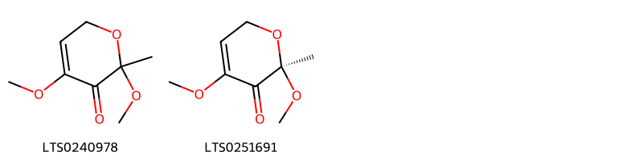{ width=100% }
    <figcaption>Hình ảnh cấu trúc hóa học của 2 hoạt chất thuộc nhóm Pyrans gồm ['2,4-dimethoxy-2-methyl-6h-pyran-3-one (LTS0240978)', '(2r)-2,4-dimethoxy-2-methyl-6h-pyran-3-one (LTS0251691)'].</figcaption>
</figure>
#### Nhóm Pyrimidine nucleosides
<figure markdown="span">
    { width=100% }
    <figcaption>Hình ảnh cấu trúc hóa học của 1 hoạt chất thuộc nhóm Pyrimidine nucleosides gồm ['uridine (LTS0220125)'].</figcaption>
</figure>
#### Nhóm Sphingolipids
<figure markdown="span">
    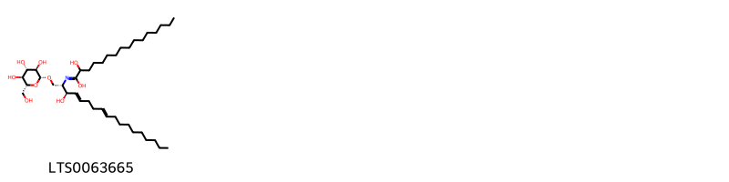{ width=100% }
    <figcaption>Hình ảnh cấu trúc hóa học của 1 hoạt chất thuộc nhóm Sphingolipids gồm ['2-hydroxy-n-[(2s,3r,4e,8e)-3-hydroxy-1-{[(2r,3r,4s,5s,6r)-3,4,5-trihydroxy-6-(hydroxymethyl)oxan-2-yl]oxy}octadeca-4,8-dien-2-yl]hexadecanimidic acid (LTS0063665)'].</figcaption>
</figure>
#### Nhóm Steroids and steroid derivatives
<figure markdown="span">
    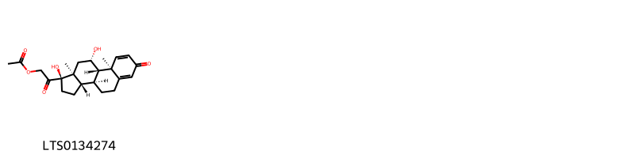{ width=100% }
    <figcaption>Hình ảnh cấu trúc hóa học của 1 hoạt chất thuộc nhóm Steroids and steroid derivatives gồm ['prednisolone acetate (LTS0134274)'].</figcaption>
</figure>
#### Nhóm Tannins
<figure markdown="span">
    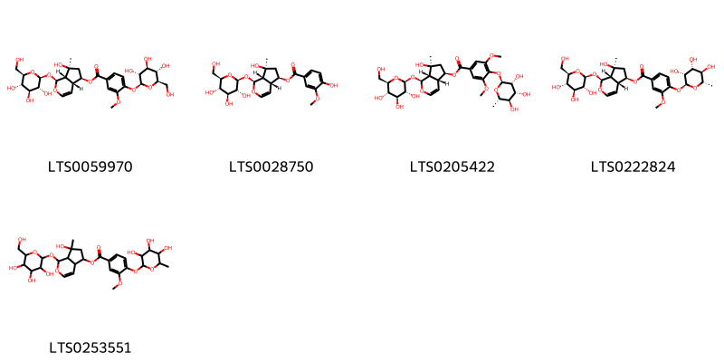{ width=100% }
    <figcaption>Hình ảnh cấu trúc hóa học của 5 hoạt chất thuộc nhóm Tannins gồm ['(1s,4ar,5r,7s,7as)-7-hydroxy-7-methyl-1-{[(2s,3r,4s,5s,6r)-3,4,5-trihydroxy-6-(hydroxymethyl)oxan-2-yl]oxy}-1h,4ah,5h,6h,7ah-cyclopenta[c]pyran-5-yl 3-methoxy-4-{[(2s,3r,4s,5s,6r)-3,4,5-trihydroxy-6-(hydroxymethyl)oxan-2-yl]oxy}benzoate (LTS0059970)', '(1s,4ar,5r,7s,7as)-7-hydroxy-7-methyl-1-{[(2s,3r,4s,5s,6r)-3,4,5-trihydroxy-6-(hydroxymethyl)oxan-2-yl]oxy}-1h,4ah,5h,6h,7ah-cyclopenta[c]pyran-5-yl 4-hydroxy-3-methoxybenzoate (LTS0028750)', '(1s,4ar,5r,7s,7as)-7-hydroxy-7-methyl-1-{[(2s,3r,4s,5s,6r)-3,4,5-trihydroxy-6-(hydroxymethyl)oxan-2-yl]oxy}-1h,4ah,5h,6h,7ah-cyclopenta[c]pyran-5-yl 3,5-dimethoxy-4-{[(2s,3r,4r,5r,6s)-3,4,5-trihydroxy-6-methyloxan-2-yl]oxy}benzoate (LTS0205422)', '(1s,4ar,5r,7s,7as)-7-hydroxy-7-methyl-1-{[(2s,3r,4s,5s,6r)-3,4,5-trihydroxy-6-(hydroxymethyl)oxan-2-yl]oxy}-1h,4ah,5h,6h,7ah-cyclopenta[c]pyran-5-yl 3-methoxy-4-{[(2s,3r,4r,5r,6s)-3,4,5-trihydroxy-6-methyloxan-2-yl]oxy}benzoate (LTS0222824)', '7-hydroxy-7-methyl-1-{[3,4,5-trihydroxy-6-(hydroxymethyl)oxan-2-yl]oxy}-1h,4ah,5h,6h,7ah-cyclopenta[c]pyran-5-yl 3-methoxy-4-[(3,4,5-trihydroxy-6-methyloxan-2-yl)oxy]benzoate (LTS0253551)'].</figcaption>
</figure>

---

### Dược dân tộc học

Danh sách các quốc gia có sử dụng *Rehmannia glutinosa* trong điều trị các bệnh. 

| Country   | Disease                                                                                                 | Bệnh                                                                                                                                                                                                |
|:----------|:--------------------------------------------------------------------------------------------------------|:----------------------------------------------------------------------------------------------------------------------------------------------------------------------------------------------------|
| China     | Cardiotonic, Diuretic, Refrigerant, Sialogogue, Tonic, Hemostat, Cardiotonic, Diuretic, Hemostat, Tonic | MYMEMORY WARNING: YOU USED ALL AVAILABLE FREE TRANSLATIONS FOR TODAY. NEXT AVAILABLE IN  17 HOURS 29 MINUTES 46 SECONDS VISIT HTTPS://MYMEMORY.TRANSLATED.NET/DOC/USAGELIMITS.PHP TO TRANSLATE MORE |
| Japan*    | Aperient, Aperient, nan, Tonic, Tonic, nan                                                              | MYMEMORY WARNING: YOU USED ALL AVAILABLE FREE TRANSLATIONS FOR TODAY. NEXT AVAILABLE IN  17 HOURS 29 MINUTES 44 SECONDS VISIT HTTPS://MYMEMORY.TRANSLATED.NET/DOC/USAGELIMITS.PHP TO TRANSLATE MORE |

---

---
## Rehmannia lutea
### Thông tin về thực vật

!!! info "Phân loại thực vật của *Rehmannia japonica* từ GIBF:"
    - **Kingdom:** Plantae
    - **Phylum:** Tracheophyta
    - **Order:** Lamiales
    - **Family:** Rehmanniaceae
    - **Genus:** Rehmannia
    - **Species:** *Rehmannia japonica*

 

| Label (VI)   | Label (EN)   | Scientific Name     | Descriptions (VI)   | Descriptions (EN)   | Also Known As (VI)                  | Also Known As (EN)   |
|:-------------|:-------------|:--------------------|:--------------------|:--------------------|:------------------------------------|:---------------------|
| N/A          | N/A          | Rehmannia glutinosa | loài thực vật       | species of plant    | ['Sinh địa', 'Rehmannia glutinosa'] | ['']                 |

#### Phân bố trên thế giới

**Từ CSDL GIBF** nan, Sweden, Brazil, New Zealand, United States of America, China, Korea, Republic of

#### Phân bố tại Việt Nam

**Từ CSDL GIBF**: Không có ghi nhận ở Việt Nam

---
### Thành phần hóa học
        
- Theo cơ sở dữ liệu lotus: Từ loài *Rehmannia japonica* đã phân lập và xác định được Chưa có hoạt chất nào được phân lập. hoạt chất thuộc về các nhóm Không có hoạt chất nào được phân lập. 

Không có hình ảnh nào được tạo ra

---

### Dược dân tộc học

Danh sách các quốc gia có sử dụng *Rehmannia japonica* trong điều trị các bệnh. 

| Country   | Disease   | Bệnh                                                                                                                                                                                                |
|:----------|:----------|:----------------------------------------------------------------------------------------------------------------------------------------------------------------------------------------------------|
| China     | Diuretic  | MYMEMORY WARNING: YOU USED ALL AVAILABLE FREE TRANSLATIONS FOR TODAY. NEXT AVAILABLE IN  17 HOURS 29 MINUTES 07 SECONDS VISIT HTTPS://MYMEMORY.TRANSLATED.NET/DOC/USAGELIMITS.PHP TO TRANSLATE MORE |

---

# Chi Veronicastrum

??? note "Danh sách các dược liệu thuộc chi"
    
	 - *Veronicastrum virginicum*

---
## Veronicastrum virginicum
### Thông tin về thực vật

!!! info "Phân loại thực vật của *Veronicastrum virginicum* từ GIBF:"
    - **Kingdom:** Plantae
    - **Phylum:** Tracheophyta
    - **Order:** Lamiales
    - **Family:** Plantaginaceae
    - **Genus:** Veronicastrum
    - **Species:** *Veronicastrum virginicum*

 

| Label (VI)   | Label (EN)   | Scientific Name          | Descriptions (VI)   | Descriptions (EN)   | Also Known As (VI)   | Also Known As (EN)   |
|:-------------|:-------------|:-------------------------|:--------------------|:--------------------|:---------------------|:---------------------|
| N/A          | N/A          | Veronicastrum virginicum | loài thực vật       | species of plant    | ['']                 | ['']                 |

#### Phân bố trên thế giới

**Từ CSDL GIBF** Canada, Denmark, United States of America, Sweden

#### Phân bố tại Việt Nam

**Từ CSDL GIBF**: Không có ghi nhận ở Việt Nam

---
### Thành phần hóa học
        
- Theo cơ sở dữ liệu lotus: Từ loài *Veronicastrum virginicum* đã phân lập và xác định được Chưa có hoạt chất nào được phân lập. hoạt chất thuộc về các nhóm Không có hoạt chất nào được phân lập. 

Không có hình ảnh nào được tạo ra

---

### Dược dân tộc học

Danh sách các quốc gia có sử dụng *Veronicastrum virginicum* trong điều trị các bệnh. 

| Country        | Disease           | Bệnh                                                                                                                                                                                                |
|:---------------|:------------------|:----------------------------------------------------------------------------------------------------------------------------------------------------------------------------------------------------|
| US(Amerindian) | Laxative, Emetic  | MYMEMORY WARNING: YOU USED ALL AVAILABLE FREE TRANSLATIONS FOR TODAY. NEXT AVAILABLE IN  17 HOURS 28 MINUTES 50 SECONDS VISIT HTTPS://MYMEMORY.TRANSLATED.NET/DOC/USAGELIMITS.PHP TO TRANSLATE MORE |
| US(Appalachia) | Emetic, Purgative | MYMEMORY WARNING: YOU USED ALL AVAILABLE FREE TRANSLATIONS FOR TODAY. NEXT AVAILABLE IN  17 HOURS 28 MINUTES 48 SECONDS VISIT HTTPS://MYMEMORY.TRANSLATED.NET/DOC/USAGELIMITS.PHP TO TRANSLATE MORE |

---

# Chi Besseya

??? note "Danh sách các dược liệu thuộc chi"
    
	 - *Besseya rubra*

---
## Besseya rubra
### Thông tin về thực vật

!!! info "Phân loại thực vật của *Synthyris rubra* từ GIBF:"
    - **Kingdom:** Plantae
    - **Phylum:** Tracheophyta
    - **Order:** Lamiales
    - **Family:** Plantaginaceae
    - **Genus:** Synthyris
    - **Species:** *Synthyris rubra*

 

| Label (VI)   | Label (EN)   | Scientific Name   | Descriptions (VI)   | Descriptions (EN)   | Also Known As (VI)   | Also Known As (EN)   |
|:-------------|:-------------|:------------------|:--------------------|:--------------------|:---------------------|:---------------------|
| N/A          | N/A          | Besseya rubra     | loài thực vật       | species of plant    | ['']                 | ['']                 |

#### Phân bố trên thế giới

**Từ CSDL GIBF** United States of America

#### Phân bố tại Việt Nam

**Từ CSDL GIBF**: Không có ghi nhận ở Việt Nam

---
### Thành phần hóa học
        
- Theo cơ sở dữ liệu lotus: Từ loài *Synthyris rubra* đã phân lập và xác định được Chưa có hoạt chất nào được phân lập. hoạt chất thuộc về các nhóm Không có hoạt chất nào được phân lập. 

Không có hình ảnh nào được tạo ra

---

### Dược dân tộc học

Danh sách các quốc gia có sử dụng *Synthyris rubra* trong điều trị các bệnh. 

| Country      | Disease   | Bệnh                                                                                                                                                                                                |
|:-------------|:----------|:----------------------------------------------------------------------------------------------------------------------------------------------------------------------------------------------------|
| US(Flathead) | Laxative  | MYMEMORY WARNING: YOU USED ALL AVAILABLE FREE TRANSLATIONS FOR TODAY. NEXT AVAILABLE IN  17 HOURS 28 MINUTES 25 SECONDS VISIT HTTPS://MYMEMORY.TRANSLATED.NET/DOC/USAGELIMITS.PHP TO TRANSLATE MORE |

---

# Chi Limnophila

??? note "Danh sách các dược liệu thuộc chi"
    
	 - *Limnophila aromatica*
	 - *Limnophila indica*
	 - *Limnophila rugosa*

---
## Limnophila aromatica
### Thông tin về thực vật

!!! info "Phân loại thực vật của *Limnophila aromatica* từ GIBF:"
    - **Kingdom:** Plantae
    - **Phylum:** Tracheophyta
    - **Order:** Lamiales
    - **Family:** Plantaginaceae
    - **Genus:** Limnophila
    - **Species:** *Limnophila aromatica*

 

| Label (VI)   | Label (EN)   | Scientific Name      | Descriptions (VI)   | Descriptions (EN)   | Also Known As (VI)                                                                           | Also Known As (EN)   |
|:-------------|:-------------|:---------------------|:--------------------|:--------------------|:---------------------------------------------------------------------------------------------|:---------------------|
| N/A          | N/A          | Limnophila aromatica | loài thực vật       | species of plant    | ['Ngổ om', 'Ngò om', 'Mò om', 'Limnophila chinensis var. aromatica', 'Limnophila aromatica'] | ['']                 |

#### Phân bố trên thế giới

**Từ CSDL GIBF** nan, French Guiana, Lao People’s Democratic Republic, Singapore, Australia, Korea, Republic of, Indonesia, Sri Lanka, Malaysia, Myanmar, Japan, Brazil, Palau, China, Hong Kong, Chinese Taipei, Macao, Papua New Guinea, United States of America

#### Phân bố tại Việt Nam

**Từ CSDL GIBF**: Không có ghi nhận ở Việt Nam

---
### Thành phần hóa học
        
- Theo cơ sở dữ liệu lotus: Từ loài *Limnophila aromatica* đã phân lập và xác định được Chưa có hoạt chất nào được phân lập. hoạt chất thuộc về các nhóm Không có hoạt chất nào được phân lập. 

Không có hình ảnh nào được tạo ra

---

### Dược dân tộc học

Danh sách các quốc gia có sử dụng *Limnophila aromatica* trong điều trị các bệnh. 

| Country   | Disease              | Bệnh                                                                                                                                                                                                |
|:----------|:---------------------|:----------------------------------------------------------------------------------------------------------------------------------------------------------------------------------------------------|
| Elsewhere | Antiseptic, Aperient | MYMEMORY WARNING: YOU USED ALL AVAILABLE FREE TRANSLATIONS FOR TODAY. NEXT AVAILABLE IN  17 HOURS 28 MINUTES 04 SECONDS VISIT HTTPS://MYMEMORY.TRANSLATED.NET/DOC/USAGELIMITS.PHP TO TRANSLATE MORE |
| India     | Expectorant          | MYMEMORY WARNING: YOU USED ALL AVAILABLE FREE TRANSLATIONS FOR TODAY. NEXT AVAILABLE IN  17 HOURS 28 MINUTES 01 SECONDS VISIT HTTPS://MYMEMORY.TRANSLATED.NET/DOC/USAGELIMITS.PHP TO TRANSLATE MORE |
| Java      | Carminative          | MYMEMORY WARNING: YOU USED ALL AVAILABLE FREE TRANSLATIONS FOR TODAY. NEXT AVAILABLE IN  17 HOURS 27 MINUTES 58 SECONDS VISIT HTTPS://MYMEMORY.TRANSLATED.NET/DOC/USAGELIMITS.PHP TO TRANSLATE MORE |
| Malaysia  | Poultice             | MYMEMORY WARNING: YOU USED ALL AVAILABLE FREE TRANSLATIONS FOR TODAY. NEXT AVAILABLE IN  17 HOURS 27 MINUTES 56 SECONDS VISIT HTTPS://MYMEMORY.TRANSLATED.NET/DOC/USAGELIMITS.PHP TO TRANSLATE MORE |

---

---
## Limnophila indica
### Thông tin về thực vật

!!! info "Phân loại thực vật của *Limnophila indica* từ GIBF:"
    - **Kingdom:** Plantae
    - **Phylum:** Tracheophyta
    - **Order:** Lamiales
    - **Family:** Plantaginaceae
    - **Genus:** Limnophila
    - **Species:** *Limnophila indica*

 

| Label (VI)   | Label (EN)   | Scientific Name   | Descriptions (VI)   | Descriptions (EN)   | Also Known As (VI)   | Also Known As (EN)   |
|:-------------|:-------------|:------------------|:--------------------|:--------------------|:---------------------|:---------------------|
| N/A          | N/A          | Limnophila indica | loài thực vật       | species of plant    | ['']                 | ['']                 |

#### Phân bố trên thế giới

**Từ CSDL GIBF** nan, Malawi, unknown or invalid, Thailand, Cameroon, Burkina Faso, Kenya, Australia, Korea, Republic of, Indonesia, Sri Lanka, India, Sudan, Nigeria, Japan, Myanmar, Ethiopia, China, Benin, Chinese Taipei, Botswana, South Africa, Tanzania, United Republic of, Mozambique, Papua New Guinea, United States of America, Italy, Zambia, Mali

#### Phân bố tại Việt Nam

**Từ CSDL GIBF**: Không có ghi nhận ở Việt Nam

---
### Thành phần hóa học
        
- Theo cơ sở dữ liệu lotus: Từ loài *Limnophila indica* đã phân lập và xác định được 10 hoạt chất thuộc về các nhóm Flavonolignans, Flavonoids. 

|    | chemicalTaxonomyClassyfireClass   |   smiles_count |
|---:|:----------------------------------|---------------:|
|  0 | Flavonoids                        |              9 |
|  1 | Flavonolignans                    |              1 |

#### Nhóm Flavonoids
<figure markdown="span">
    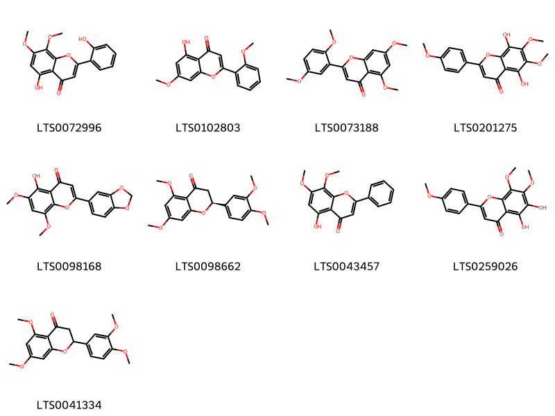{ width=100% }
    <figcaption>Hình ảnh cấu trúc hóa học của 9 hoạt chất thuộc nhóm Flavonoids gồm ['skullcapflavone i (LTS0072996)', '5-hydroxy-7-methoxy-2-(2-methoxyphenyl)chromen-4-one (LTS0102803)', '2-(2,5-dimethoxyphenyl)-5,7-dimethoxychromen-4-one (LTS0073188)', 'pedunculin (LTS0201275)', '2-(2h-1,3-benzodioxol-5-yl)-5-hydroxy-6,8-dimethoxychromen-4-one (LTS0098168)', '(2s)-2-(3,4-dimethoxyphenyl)-5,7-dimethoxy-2,3-dihydro-1-benzopyran-4-one (LTS0098662)', '7-o-methylwogonin (LTS0043457)', '5,6-dihydroxy-7,8-dimethoxy-2-(4-methoxyphenyl)chromen-4-one (LTS0259026)', '2-(3,4-dimethoxyphenyl)-5,7-dimethoxy-2,3-dihydro-1-benzopyran-4-one (LTS0041334)'].</figcaption>
</figure>
#### Nhóm Flavonolignans
<figure markdown="span">
    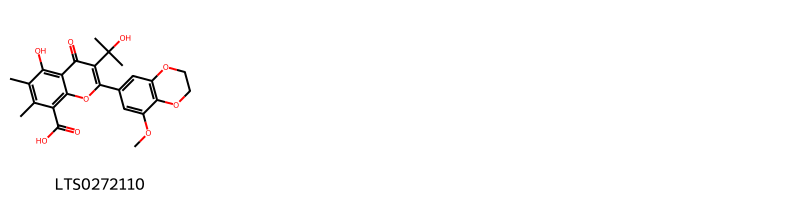{ width=100% }
    <figcaption>Hình ảnh cấu trúc hóa học của 1 hoạt chất thuộc nhóm Flavonolignans gồm ['5-hydroxy-3-(2-hydroxypropan-2-yl)-2-(8-methoxy-2,3-dihydro-1,4-benzodioxin-6-yl)-6,7-dimethyl-4-oxochromene-8-carboxylic acid (LTS0272110)'].</figcaption>
</figure>

---

### Dược dân tộc học

Danh sách các quốc gia có sử dụng *Limnophila indica* trong điều trị các bệnh. 

| Country   | Disease                 | Bệnh                                                                                                                                                                                                |
|:----------|:------------------------|:----------------------------------------------------------------------------------------------------------------------------------------------------------------------------------------------------|
| Elsewhere | Antiseptic, Carminative | MYMEMORY WARNING: YOU USED ALL AVAILABLE FREE TRANSLATIONS FOR TODAY. NEXT AVAILABLE IN  17 HOURS 27 MINUTES 35 SECONDS VISIT HTTPS://MYMEMORY.TRANSLATED.NET/DOC/USAGELIMITS.PHP TO TRANSLATE MORE |
| India     | Antiseptic              | MYMEMORY WARNING: YOU USED ALL AVAILABLE FREE TRANSLATIONS FOR TODAY. NEXT AVAILABLE IN  17 HOURS 27 MINUTES 32 SECONDS VISIT HTTPS://MYMEMORY.TRANSLATED.NET/DOC/USAGELIMITS.PHP TO TRANSLATE MORE |

---

---
## Limnophila rugosa
### Thông tin về thực vật

!!! info "Phân loại thực vật của *Limnophila rugosa* từ GIBF:"
    - **Kingdom:** Plantae
    - **Phylum:** Tracheophyta
    - **Order:** Lamiales
    - **Family:** Plantaginaceae
    - **Genus:** Limnophila
    - **Species:** *Limnophila rugosa*

 

| Label (VI)   | Label (EN)   | Scientific Name   | Descriptions (VI)   | Descriptions (EN)   | Also Known As (VI)   | Also Known As (EN)   |
|:-------------|:-------------|:------------------|:--------------------|:--------------------|:---------------------|:---------------------|
| N/A          | N/A          | Limnophila rugosa | loài thực vật       | species of plant    | ['']                 | ['']                 |

#### Phân bố trên thế giới

**Từ CSDL GIBF** unknown or invalid, Thailand, Japan, Myanmar, Philippines, Malaysia, India, French Guiana, Papua New Guinea, New Caledonia, Indonesia, Lao People’s Democratic Republic, Fiji, China, Guinea, Hong Kong, Chinese Taipei

#### Phân bố tại Việt Nam

**Từ CSDL GIBF**: Không có ghi nhận ở Việt Nam

---
### Thành phần hóa học
        
- Theo cơ sở dữ liệu lotus: Từ loài *Limnophila rugosa* đã phân lập và xác định được 7 hoạt chất thuộc về các nhóm Phenol ethers, Flavonoids, Benzene and substituted derivatives. 

|    | chemicalTaxonomyClassyfireClass     |   smiles_count |
|---:|:------------------------------------|---------------:|
|  0 | Benzene and substituted derivatives |              2 |
|  1 | Flavonoids                          |              2 |
|  2 | Phenol ethers                       |              3 |

#### Nhóm Benzene and substituted derivatives
<figure markdown="span">
    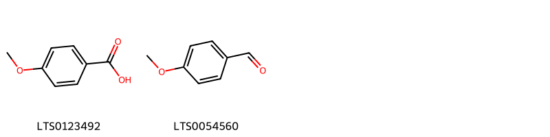{ width=100% }
    <figcaption>Hình ảnh cấu trúc hóa học của 2 hoạt chất thuộc nhóm Benzene and substituted derivatives gồm ['p-anisic acid (LTS0123492)', 'anisaldehyde (LTS0054560)'].</figcaption>
</figure>
#### Nhóm Flavonoids
<figure markdown="span">
    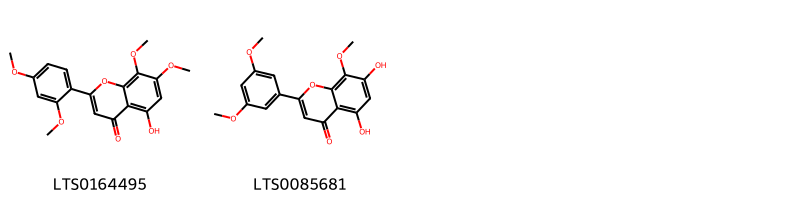{ width=100% }
    <figcaption>Hình ảnh cấu trúc hóa học của 2 hoạt chất thuộc nhóm Flavonoids gồm ['2-(2,4-dimethoxyphenyl)-5-hydroxy-7,8-dimethoxychromen-4-one (LTS0164495)', '2-(3,5-dimethoxyphenyl)-5,7-dihydroxy-8-methoxychromen-4-one (LTS0085681)'].</figcaption>
</figure>
#### Nhóm Phenol ethers
<figure markdown="span">
    { width=100% }
    <figcaption>Hình ảnh cấu trúc hóa học của 3 hoạt chất thuộc nhóm Phenol ethers gồm ['p-propenylanisole (LTS0177188)', 'tarragon (LTS0245226)', 'anethole (LTS0033696)'].</figcaption>
</figure>

---

### Dược dân tộc học

Danh sách các quốc gia có sử dụng *Limnophila rugosa* trong điều trị các bệnh. 

| Country     | Disease                    | Bệnh                                                                                                                                                                                                |
|:------------|:---------------------------|:----------------------------------------------------------------------------------------------------------------------------------------------------------------------------------------------------|
| Philippines | Diuretic, Stomachic, Tonic | MYMEMORY WARNING: YOU USED ALL AVAILABLE FREE TRANSLATIONS FOR TODAY. NEXT AVAILABLE IN  17 HOURS 27 MINUTES 10 SECONDS VISIT HTTPS://MYMEMORY.TRANSLATED.NET/DOC/USAGELIMITS.PHP TO TRANSLATE MORE |

---

# Chi Mimulus

??? note "Danh sách các dược liệu thuộc chi"
    
	 - *Mimulus moschatus*

---
## Mimulus moschatus
### Thông tin về thực vật

!!! info "Phân loại thực vật của *Mimulus moschatus* từ GIBF:"
    - **Kingdom:** Plantae
    - **Phylum:** Tracheophyta
    - **Order:** Lamiales
    - **Family:** Phrymaceae
    - **Genus:** Mimulus
    - **Species:** *Mimulus moschatus*

 

| Label (VI)   | Label (EN)   | Scientific Name   | Descriptions (VI)   | Descriptions (EN)   | Also Known As (VI)   | Also Known As (EN)   |
|:-------------|:-------------|:------------------|:--------------------|:--------------------|:---------------------|:---------------------|
| N/A          | N/A          | Mimulus moschatus | loài thực vật       | species of plant    | ['']                 | ['']                 |

#### Phân bố trên thế giới

**Từ CSDL GIBF** nan, United Kingdom of Great Britain and Northern Ireland, France, Spain, Poland, Germany, Canada, United States of America, Australia, Netherlands

#### Phân bố tại Việt Nam

**Từ CSDL GIBF**: Không có ghi nhận ở Việt Nam

---
### Thành phần hóa học
        
- Theo cơ sở dữ liệu lotus: Từ loài *Mimulus moschatus* đã phân lập và xác định được 1 hoạt chất thuộc về các nhóm Flavonoids. 

|    | chemicalTaxonomyClassyfireClass   |   smiles_count |
|---:|:----------------------------------|---------------:|
|  0 | Flavonoids                        |              1 |

#### Nhóm Flavonoids
<figure markdown="span">
    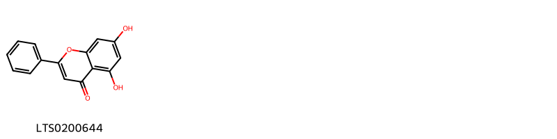{ width=100% }
    <figcaption>Hình ảnh cấu trúc hóa học của 1 hoạt chất thuộc nhóm Flavonoids gồm ['chrysin (LTS0200644)'].</figcaption>
</figure>

---

### Dược dân tộc học

Danh sách các quốc gia có sử dụng *Mimulus moschatus* trong điều trị các bệnh. 

| Country   | Disease   | Bệnh                                                                                                                                                                                                |
|:----------|:----------|:----------------------------------------------------------------------------------------------------------------------------------------------------------------------------------------------------|
| Elsewhere | Stimulant | MYMEMORY WARNING: YOU USED ALL AVAILABLE FREE TRANSLATIONS FOR TODAY. NEXT AVAILABLE IN  17 HOURS 26 MINUTES 46 SECONDS VISIT HTTPS://MYMEMORY.TRANSLATED.NET/DOC/USAGELIMITS.PHP TO TRANSLATE MORE |

---

# Chi Alectra

??? note "Danh sách các dược liệu thuộc chi"
    
	 - *Alectra parasitica*

---
## Alectra parasitica
### Thông tin về thực vật

!!! info "Phân loại thực vật của *Alectra parasitica* từ GIBF:"
    - **Kingdom:** Plantae
    - **Phylum:** Tracheophyta
    - **Order:** Lamiales
    - **Family:** Orobanchaceae
    - **Genus:** Alectra
    - **Species:** *Alectra parasitica*

 

| Label (VI)   | Label (EN)   | Scientific Name    | Descriptions (VI)   | Descriptions (EN)   | Also Known As (VI)   | Also Known As (EN)   |
|:-------------|:-------------|:-------------------|:--------------------|:--------------------|:---------------------|:---------------------|
| N/A          | N/A          | Alectra parasitica | loài thực vật       | species of plant    | ['']                 | ['']                 |

#### Phân bố trên thế giới

**Từ CSDL GIBF** nan, Eritrea, Somalia, Mozambique, Yemen, India, Ethiopia, Cameroon, Kenya, Zambia, Saudi Arabia, Oman

#### Phân bố tại Việt Nam

**Từ CSDL GIBF**: Không có ghi nhận ở Việt Nam

---
### Thành phần hóa học
        
- Theo cơ sở dữ liệu lotus: Từ loài *Alectra parasitica* đã phân lập và xác định được 1 hoạt chất thuộc về các nhóm . 

| chemicalTaxonomyClassyfireClass   | smiles_count   |
|-----------------------------------|----------------|

---

### Dược dân tộc học

Danh sách các quốc gia có sử dụng *Alectra parasitica* trong điều trị các bệnh. 

| Country   | Disease       | Bệnh                                                                                                                                                                                                |
|:----------|:--------------|:----------------------------------------------------------------------------------------------------------------------------------------------------------------------------------------------------|
| India     | nan, Laxative | MYMEMORY WARNING: YOU USED ALL AVAILABLE FREE TRANSLATIONS FOR TODAY. NEXT AVAILABLE IN  17 HOURS 26 MINUTES 23 SECONDS VISIT HTTPS://MYMEMORY.TRANSLATED.NET/DOC/USAGELIMITS.PHP TO TRANSLATE MORE |

---

# Chi Picrorhiza

??? note "Danh sách các dược liệu thuộc chi"
    
	 - *Picrorhiza kurroa*
	 - *Picrorhiza scrophulariaefolia*

---
## Picrorhiza kurroa
### Thông tin về thực vật

!!! info "Phân loại thực vật của *Picrorhiza kurroa* từ GIBF:"
    - **Kingdom:** Plantae
    - **Phylum:** Tracheophyta
    - **Order:** Lamiales
    - **Family:** Plantaginaceae
    - **Genus:** Picrorhiza
    - **Species:** *Picrorhiza kurroa*

 

| Label (VI)   | Label (EN)   | Scientific Name   | Descriptions (VI)   | Descriptions (EN)   | Also Known As (VI)   | Also Known As (EN)   |
|:-------------|:-------------|:------------------|:--------------------|:--------------------|:---------------------|:---------------------|
| N/A          | N/A          | Picrorhiza kurroa | loài thực vật       | species of plant    | ['']                 | ['']                 |

#### Phân bố trên thế giới

**Từ CSDL GIBF** nan, unknown or invalid, Pakistan, Bhutan, Spain, New Zealand, India, China, Nepal

#### Phân bố tại Việt Nam

**Từ CSDL GIBF**: Không có ghi nhận ở Việt Nam

---
### Thành phần hóa học
        
- Theo cơ sở dữ liệu lotus: Từ loài *Picrorhiza kurroa* đã phân lập và xác định được Chưa có hoạt chất nào được phân lập. hoạt chất thuộc về các nhóm Không có hoạt chất nào được phân lập. 

Không có hình ảnh nào được tạo ra

---

### Dược dân tộc học

Danh sách các quốc gia có sử dụng *Picrorhiza kurroa* trong điều trị các bệnh. 

| Country   | Disease                                         | Bệnh                                                                                                                                                                                                |
|:----------|:------------------------------------------------|:----------------------------------------------------------------------------------------------------------------------------------------------------------------------------------------------------|
| China     | Stomachic                                       | MYMEMORY WARNING: YOU USED ALL AVAILABLE FREE TRANSLATIONS FOR TODAY. NEXT AVAILABLE IN  17 HOURS 26 MINUTES 05 SECONDS VISIT HTTPS://MYMEMORY.TRANSLATED.NET/DOC/USAGELIMITS.PHP TO TRANSLATE MORE |
| Elsewhere | Cathartic, Cholagogue, Laxative, nan, Stomachic | MYMEMORY WARNING: YOU USED ALL AVAILABLE FREE TRANSLATIONS FOR TODAY. NEXT AVAILABLE IN  17 HOURS 26 MINUTES 03 SECONDS VISIT HTTPS://MYMEMORY.TRANSLATED.NET/DOC/USAGELIMITS.PHP TO TRANSLATE MORE |

---

---
## Picrorhiza scrophulariaefolia
### Thông tin về thực vật

!!! info "Phân loại thực vật của *N/A* từ GIBF:"
    - **Kingdom:** Plantae
    - **Phylum:** Tracheophyta
    - **Order:** Lamiales
    - **Family:** Plantaginaceae
    - **Genus:** Picrorhiza
    - **Species:** *N/A*

 

| Label (VI)   | Label (EN)   | Scientific Name   | Descriptions (VI)   | Descriptions (EN)   | Also Known As (VI)   | Also Known As (EN)   |
|:-------------|:-------------|:------------------|:--------------------|:--------------------|:---------------------|:---------------------|
| N/A          | N/A          | Picrorhiza kurroa | loài thực vật       | species of plant    | ['']                 | ['']                 |

#### Phân bố trên thế giới

**Từ CSDL GIBF** nan, unknown or invalid, Pakistan, Bhutan, Spain, India, United States of America, China, Nepal

#### Phân bố tại Việt Nam

**Từ CSDL GIBF**: Không có ghi nhận ở Việt Nam

---
### Thành phần hóa học
        
- Theo cơ sở dữ liệu lotus: Từ loài *N/A* đã phân lập và xác định được Chưa có hoạt chất nào được phân lập. hoạt chất thuộc về các nhóm Không có hoạt chất nào được phân lập. 

Không có hình ảnh nào được tạo ra

---

### Dược dân tộc học

Danh sách các quốc gia có sử dụng *N/A* trong điều trị các bệnh. 

| Country   | Disease                                         | Bệnh                                                                                                                                                                                                |
|:----------|:------------------------------------------------|:----------------------------------------------------------------------------------------------------------------------------------------------------------------------------------------------------|
| Elsewhere | Cathartic, Laxative, Stomachic, nan, Cholagogue | MYMEMORY WARNING: YOU USED ALL AVAILABLE FREE TRANSLATIONS FOR TODAY. NEXT AVAILABLE IN  17 HOURS 25 MINUTES 42 SECONDS VISIT HTTPS://MYMEMORY.TRANSLATED.NET/DOC/USAGELIMITS.PHP TO TRANSLATE MORE |

---

# Chi Manulea

??? note "Danh sách các dược liệu thuộc chi"
    
	 - *Manulea paniculata*

---
## Manulea paniculata
### Thông tin về thực vật

!!! info "Phân loại thực vật của *Manulea paniculata* từ GIBF:"
    - **Kingdom:** Plantae
    - **Phylum:** Tracheophyta
    - **Order:** Lamiales
    - **Family:** Scrophulariaceae
    - **Genus:** Manulea
    - **Species:** *Manulea paniculata*

 

| Label (VI)   | Label (EN)   | Scientific Name    | Descriptions (VI)   | Descriptions (EN)   | Also Known As (VI)   | Also Known As (EN)   |
|:-------------|:-------------|:-------------------|:--------------------|:--------------------|:---------------------|:---------------------|
| N/A          | N/A          | Manulea paniculata |                     | species of plant    | ['']                 | ['']                 |

#### Phân bố trên thế giới

**Từ CSDL GIBF** nan, Lesotho, unknown or invalid, South Africa

#### Phân bố tại Việt Nam

**Từ CSDL GIBF**: Không có ghi nhận ở Việt Nam

---
### Thành phần hóa học
        
- Theo cơ sở dữ liệu lotus: Từ loài *Manulea paniculata* đã phân lập và xác định được Chưa có hoạt chất nào được phân lập. hoạt chất thuộc về các nhóm Không có hoạt chất nào được phân lập. 

Không có hình ảnh nào được tạo ra

---

### Dược dân tộc học

Danh sách các quốc gia có sử dụng *Manulea paniculata* trong điều trị các bệnh. 

| Country   | Disease   | Bệnh                                                                                                                                                                                                |
|:----------|:----------|:----------------------------------------------------------------------------------------------------------------------------------------------------------------------------------------------------|
| Lesotho   | Emetic    | MYMEMORY WARNING: YOU USED ALL AVAILABLE FREE TRANSLATIONS FOR TODAY. NEXT AVAILABLE IN  17 HOURS 25 MINUTES 21 SECONDS VISIT HTTPS://MYMEMORY.TRANSLATED.NET/DOC/USAGELIMITS.PHP TO TRANSLATE MORE |

---

# Chi Stemodia

??? note "Danh sách các dược liệu thuộc chi"
    
	 - *Stemodia ericifolia*
	 - *Stemodia viscosa*

---
## Stemodia ericifolia
### Thông tin về thực vật

!!! info "Phân loại thực vật của *Stemodia ericifolia* từ GIBF:"
    - **Kingdom:** Plantae
    - **Phylum:** Tracheophyta
    - **Order:** Lamiales
    - **Family:** Plantaginaceae
    - **Genus:** Stemodia
    - **Species:** *Stemodia ericifolia*

 

| Label (VI)   | Label (EN)   | Scientific Name     | Descriptions (VI)   | Descriptions (EN)   | Also Known As (VI)   | Also Known As (EN)   |
|:-------------|:-------------|:--------------------|:--------------------|:--------------------|:---------------------|:---------------------|
| N/A          | N/A          | Stemodia ericifolia |                     | species of plant    | ['']                 | ['']                 |

#### Phân bố trên thế giới

**Từ CSDL GIBF** nan, Paraguay, Argentina, Brazil

#### Phân bố tại Việt Nam

**Từ CSDL GIBF**: Không có ghi nhận ở Việt Nam

---
### Thành phần hóa học
        
- Theo cơ sở dữ liệu lotus: Từ loài *Stemodia ericifolia* đã phân lập và xác định được Chưa có hoạt chất nào được phân lập. hoạt chất thuộc về các nhóm Không có hoạt chất nào được phân lập. 

Không có hình ảnh nào được tạo ra

---

### Dược dân tộc học

Danh sách các quốc gia có sử dụng *Stemodia ericifolia* trong điều trị các bệnh. 

| Country   | Disease       | Bệnh                                                                                                                                                                                                |
|:----------|:--------------|:----------------------------------------------------------------------------------------------------------------------------------------------------------------------------------------------------|
| Paraguay  | Contraceptive | MYMEMORY WARNING: YOU USED ALL AVAILABLE FREE TRANSLATIONS FOR TODAY. NEXT AVAILABLE IN  17 HOURS 25 MINUTES 04 SECONDS VISIT HTTPS://MYMEMORY.TRANSLATED.NET/DOC/USAGELIMITS.PHP TO TRANSLATE MORE |

---

---
## Stemodia viscosa
### Thông tin về thực vật

!!! info "Phân loại thực vật của *Stemodia viscosa* từ GIBF:"
    - **Kingdom:** Plantae
    - **Phylum:** Tracheophyta
    - **Order:** Lamiales
    - **Family:** Plantaginaceae
    - **Genus:** Stemodia
    - **Species:** *Stemodia viscosa*

 

| Label (VI)   | Label (EN)   | Scientific Name   | Descriptions (VI)   | Descriptions (EN)   | Also Known As (VI)   | Also Known As (EN)   |
|:-------------|:-------------|:------------------|:--------------------|:--------------------|:---------------------|:---------------------|
| N/A          | N/A          | Stemodia viscosa  | loài thực vật       | species of plant    | ['']                 | ['']                 |

#### Phân bố trên thế giới

**Từ CSDL GIBF** Sri Lanka, Australia, India

#### Phân bố tại Việt Nam

**Từ CSDL GIBF**: Không có ghi nhận ở Việt Nam

---
### Thành phần hóa học
        
- Theo cơ sở dữ liệu lotus: Từ loài *Stemodia viscosa* đã phân lập và xác định được Chưa có hoạt chất nào được phân lập. hoạt chất thuộc về các nhóm Không có hoạt chất nào được phân lập. 

Không có hình ảnh nào được tạo ra

---

### Dược dân tộc học

Danh sách các quốc gia có sử dụng *Stemodia viscosa* trong điều trị các bệnh. 

| Country   | Disease   | Bệnh                                                                                                                                                                                                |
|:----------|:----------|:----------------------------------------------------------------------------------------------------------------------------------------------------------------------------------------------------|
| Elsewhere | Demulcent | MYMEMORY WARNING: YOU USED ALL AVAILABLE FREE TRANSLATIONS FOR TODAY. NEXT AVAILABLE IN  17 HOURS 24 MINUTES 45 SECONDS VISIT HTTPS://MYMEMORY.TRANSLATED.NET/DOC/USAGELIMITS.PHP TO TRANSLATE MORE |

---

# Chi Gratiola

??? note "Danh sách các dược liệu thuộc chi"
    
	 - *Gratiola officinalis*

---
## Gratiola officinalis
### Thông tin về thực vật

!!! info "Phân loại thực vật của *Gratiola officinalis* từ GIBF:"
    - **Kingdom:** Plantae
    - **Phylum:** Tracheophyta
    - **Order:** Lamiales
    - **Family:** Plantaginaceae
    - **Genus:** Gratiola
    - **Species:** *Gratiola officinalis*

 

| Label (VI)   | Label (EN)   | Scientific Name      | Descriptions (VI)   | Descriptions (EN)   | Also Known As (VI)   | Also Known As (EN)   |
|:-------------|:-------------|:---------------------|:--------------------|:--------------------|:---------------------|:---------------------|
| N/A          | N/A          | Gratiola officinalis | loài thực vật       | species of plant    | ['']                 | ['']                 |

#### Phân bố trên thế giới

**Từ CSDL GIBF** nan, Spain, Germany, Austria, Poland, Montenegro, Kazakhstan, Slovakia, Netherlands, Türkiye, Slovenia, Belarus, Hungary, Bulgaria, Switzerland, Portugal, France, Czechia, Romania, Russian Federation, Italy, Greece, Croatia, Ukraine

#### Phân bố tại Việt Nam

**Từ CSDL GIBF**: Không có ghi nhận ở Việt Nam

---
### Thành phần hóa học
        
- Theo cơ sở dữ liệu lotus: Từ loài *Gratiola officinalis* đã phân lập và xác định được 65 hoạt chất thuộc về các nhóm Steroids and steroid derivatives, Organooxygen compounds, Flavonoids, Cinnamic acids and derivatives. 

|    | chemicalTaxonomyClassyfireClass   |   smiles_count |
|---:|:----------------------------------|---------------:|
|  0 | Cinnamic acids and derivatives    |              3 |
|  1 | Flavonoids                        |             38 |
|  2 | Organooxygen compounds            |              3 |
|  3 | Steroids and steroid derivatives  |             21 |

#### Nhóm Cinnamic acids and derivatives
<figure markdown="span">
    { width=100% }
    <figcaption>Hình ảnh cấu trúc hóa học của 3 hoạt chất thuộc nhóm Cinnamic acids and derivatives gồm ['(3r,4r,6r)-6-[2-(3,4-dihydroxyphenyl)ethoxy]-5-hydroxy-2-(hydroxymethyl)-4-{[(2s,3s,5r)-3,4,5-trihydroxy-6-methyloxan-2-yl]oxy}oxan-3-yl (2e)-3-(3,4-dihydroxyphenyl)prop-2-enoate (LTS0063526)', 'verbascoside (LTS0168159)', '6-[2-(3,4-dihydroxyphenyl)ethoxy]-5-hydroxy-2-(hydroxymethyl)-4-[(3,4,5-trihydroxy-6-methyloxan-2-yl)oxy]oxan-3-yl 3-(3,4-dihydroxyphenyl)prop-2-enoate (LTS0050472)'].</figcaption>
</figure>
#### Nhóm Flavonoids
<figure markdown="span">
    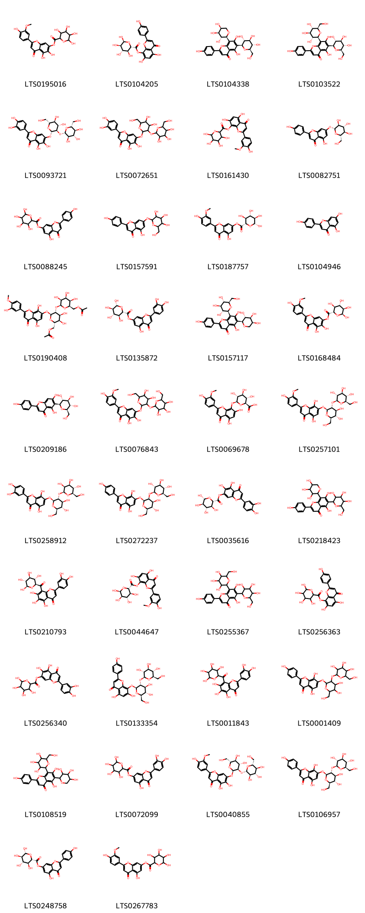{ width=100% }
    <figcaption>Hình ảnh cấu trúc hóa học của 38 hoạt chất thuộc nhóm Flavonoids gồm ['5,6-dihydroxy-2-(4-hydroxy-3-methoxyphenyl)-4-oxochromen-7-yl 3,4,5,6-tetrahydroxyoxane-2-carboxylate (LTS0195016)', '5,7-dihydroxy-2-(4-hydroxyphenyl)-4-oxochromen-8-yl (2s,3s,4s,5r,6s)-3,4,5,6-tetrahydroxyoxane-2-carboxylate (LTS0104205)', 'schaftoside (LTS0104338)', 'vicenin-2 (LTS0103522)', '7-{[(2s,3r,4s,5s,6r)-4,5-dihydroxy-6-(hydroxymethyl)-3-{[(2s,3r,4s,5s,6r)-3,4,5-trihydroxy-6-(hydroxymethyl)oxan-2-yl]oxy}oxan-2-yl]oxy}-2-(3,4-dihydroxyphenyl)-5,6-dihydroxychromen-4-one (LTS0093721)', '7-{[4,5-dihydroxy-6-(hydroxymethyl)-3-{[3,4,5-trihydroxy-6-(hydroxymethyl)oxan-2-yl]oxy}oxan-2-yl]oxy}-2-(3,4-dihydroxyphenyl)-5,6-dihydroxychromen-4-one (LTS0072651)', '5,7-dihydroxy-2-(4-hydroxy-3-methoxyphenyl)-4-oxochromen-8-yl 3,4,5,6-tetrahydroxyoxane-2-carboxylate (LTS0161430)', '5-hydroxy-2-(4-hydroxyphenyl)-7-{[(2r,3s,4r,5r,6s)-3,4,5-trihydroxy-6-(hydroxymethyl)oxan-2-yl]oxy}chromen-4-one (LTS0082751)', '5-hydroxy-2-(4-hydroxyphenyl)-4-oxochromen-7-yl 3,4,5,6-tetrahydroxyoxane-2-carboxylate (LTS0088245)', 'apigetrin (LTS0157591)', '5-hydroxy-2-(4-hydroxy-3-methoxyphenyl)-4-oxochromen-7-yl (2s,3s,4s,5r,6r)-3,4,5,6-tetrahydroxyoxane-2-carboxylate (LTS0187757)', 'chamomile (LTS0104946)', '[(2s,3r,4s,5r,6s)-5-{[(2s,3s,4s,5r,6r)-6-[(acetyloxy)methyl]-3,4,5-trihydroxyoxan-2-yl]oxy}-6-{[5,8-dihydroxy-2-(3-hydroxy-4-methoxyphenyl)-4-oxochromen-7-yl]oxy}-3,4-dihydroxyoxan-2-yl]methyl acetate (LTS0190408)', '2-(3,4-dihydroxyphenyl)-5-hydroxy-4-oxochromen-7-yl (2s,3s,4s,5r,6r)-3,4,5,6-tetrahydroxyoxane-2-carboxylate (LTS0135872)', 'isoschaftoside (LTS0157117)', '5,6-dihydroxy-2-(4-hydroxy-3-methoxyphenyl)-4-oxochromen-7-yl (2s,3s,4s,5r,6s)-3,4,5,6-tetrahydroxyoxane-2-carboxylate (LTS0168484)', 'isovitexin (LTS0209186)', '7-{[4,5-dihydroxy-6-(hydroxymethyl)-3-{[3,4,5-trihydroxy-6-(hydroxymethyl)oxan-2-yl]oxy}oxan-2-yl]oxy}-5,6-dihydroxy-2-(4-hydroxy-3-methoxyphenyl)chromen-4-one (LTS0076843)', '(2s,3s,4s,5r,6s)-6-{[5,7-dihydroxy-2-(4-hydroxy-3-methoxyphenyl)-4-oxochromen-8-yl]oxy}-3,4,5-trihydroxyoxane-2-carboxylic acid (LTS0069678)', '7-{[(2s,3r,4s,5s,6r)-4,5-dihydroxy-6-(hydroxymethyl)-3-{[(2s,3r,4s,5s,6r)-3,4,5-trihydroxy-6-(hydroxymethyl)oxan-2-yl]oxy}oxan-2-yl]oxy}-5,8-dihydroxy-2-(4-hydroxy-3-methoxyphenyl)chromen-4-one (LTS0257101)', '7-{[(2s,3r,4s,5s,6r)-4,5-dihydroxy-6-(hydroxymethyl)-3-{[(2s,3s,4s,5s,6r)-3,4,5-trihydroxy-6-(hydroxymethyl)oxan-2-yl]oxy}oxan-2-yl]oxy}-2-(3,4-dihydroxyphenyl)-5,8-dihydroxychromen-4-one (LTS0258912)', '7-{[(2s,3s,4s,5s,6r)-4,5-dihydroxy-6-(hydroxymethyl)-3-{[(2s,3r,4s,5s,6r)-3,4,5-trihydroxy-6-(hydroxymethyl)oxan-2-yl]oxy}oxan-2-yl]oxy}-5,8-dihydroxy-2-(4-hydroxyphenyl)chromen-4-one (LTS0272237)', '2-(3,4-dihydroxyphenyl)-5,6-dihydroxy-4-oxochromen-7-yl (2s,3s,4s,5r,6r)-3,4,5,6-tetrahydroxyoxane-2-carboxylate (LTS0035616)', '5,7-dihydroxy-2-(4-hydroxyphenyl)-6-[3,4,5-trihydroxy-6-(hydroxymethyl)oxan-2-yl]-8-(3,4,5-trihydroxyoxan-2-yl)chromen-4-one (LTS0218423)', '2-(3,4-dihydroxyphenyl)-5,6,7-trihydroxy-8-[(2s,3s,4s,5r,6r)-3,4,5,6-tetrahydroxyoxane-2-carbonyl]chromen-4-one (LTS0210793)', '5,7-dihydroxy-2-(4-hydroxy-3-methoxyphenyl)-4-oxochromen-8-yl (2s,3s,4s,5r,6s)-3,4,5,6-tetrahydroxyoxane-2-carboxylate (LTS0044647)', '5,7-dihydroxy-2-(4-hydroxyphenyl)-6,8-bis[3,4,5-trihydroxy-6-(hydroxymethyl)oxan-2-yl]chromen-4-one (LTS0255367)', '5,7-dihydroxy-2-(4-hydroxyphenyl)-4-oxochromen-8-yl 3,4,5,6-tetrahydroxyoxane-2-carboxylate (LTS0256363)', '2-(3,4-dihydroxyphenyl)-5,6-dihydroxy-4-oxochromen-7-yl 3,4,5,6-tetrahydroxyoxane-2-carboxylate (LTS0256340)', '8-{[(2s,3r,4s,5s,6r)-4,5-dihydroxy-6-(hydroxymethyl)-3-{[(2s,3r,4s,5s,6r)-3,4,5-trihydroxy-6-(hydroxymethyl)oxan-2-yl]oxy}oxan-2-yl]oxy}-5,7-dihydroxy-2-(4-hydroxyphenyl)chromen-4-one (LTS0133354)', '2-(3,4-dihydroxyphenyl)-5,6,7-trihydroxy-8-(3,4,5,6-tetrahydroxyoxane-2-carbonyl)chromen-4-one (LTS0011843)', '7-{[4,5-dihydroxy-6-(hydroxymethyl)-3-{[3,4,5-trihydroxy-6-(hydroxymethyl)oxan-2-yl]oxy}oxan-2-yl]oxy}-5,8-dihydroxy-2-(4-hydroxyphenyl)chromen-4-one (LTS0001409)', '5,7-dihydroxy-2-(4-hydroxyphenyl)-8-[3,4,5-trihydroxy-6-(hydroxymethyl)oxan-2-yl]-6-(3,4,5-trihydroxyoxan-2-yl)chromen-4-one (LTS0108519)', '2-(3,4-dihydroxyphenyl)-5-hydroxy-4-oxochromen-7-yl 3,4,5,6-tetrahydroxyoxane-2-carboxylate (LTS0072099)', '7-{[(2r,3r,4s,5s,6r)-4,5-dihydroxy-6-(hydroxymethyl)-3-{[(2s,3r,4s,5s,6r)-3,4,5-trihydroxy-6-(hydroxymethyl)oxan-2-yl]oxy}oxan-2-yl]oxy}-5,6-dihydroxy-2-(4-hydroxy-3-methoxyphenyl)chromen-4-one (LTS0040855)', '7-{[(2s,3r,4s,5s,6r)-4,5-dihydroxy-6-(hydroxymethyl)-3-{[(2s,3r,4s,5s,6r)-3,4,5-trihydroxy-6-(hydroxymethyl)oxan-2-yl]oxy}oxan-2-yl]oxy}-5,8-dihydroxy-2-(4-hydroxyphenyl)chromen-4-one (LTS0106957)', '5-hydroxy-2-(4-hydroxyphenyl)-4-oxochromen-7-yl (2s,3s,4s,5r,6r)-3,4,5,6-tetrahydroxyoxane-2-carboxylate (LTS0248758)', '5-hydroxy-2-(4-hydroxy-3-methoxyphenyl)-4-oxochromen-7-yl 3,4,5,6-tetrahydroxyoxane-2-carboxylate (LTS0267783)'].</figcaption>
</figure>
#### Nhóm Organooxygen compounds
<figure markdown="span">
    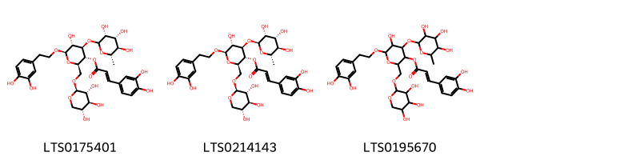{ width=100% }
    <figcaption>Hình ảnh cấu trúc hóa học của 3 hoạt chất thuộc nhóm Organooxygen compounds gồm ['(2r,3r,4r,5r,6r)-6-[2-(3,4-dihydroxyphenyl)ethoxy]-5-hydroxy-4-{[(3r,4r,5r,6s)-3,4,5-trihydroxy-6-methyloxan-2-yl]oxy}-2-({[(2s,3r,4s,5r)-3,4,5-trihydroxyoxan-2-yl]oxy}methyl)oxan-3-yl (2e)-3-(3,4-dihydroxyphenyl)prop-2-enoate (LTS0175401)', '(2r,3r,4r,5r,6r)-6-[2-(3,4-dihydroxyphenyl)ethoxy]-5-hydroxy-4-{[(2s,3r,4r,5r,6s)-3,4,5-trihydroxy-6-methyloxan-2-yl]oxy}-2-({[(2s,3r,4s,5r)-3,4,5-trihydroxyoxan-2-yl]oxy}methyl)oxan-3-yl (2e)-3-(3,4-dihydroxyphenyl)prop-2-enoate (LTS0214143)', '6-[2-(3,4-dihydroxyphenyl)ethoxy]-5-hydroxy-4-[(3,4,5-trihydroxy-6-methyloxan-2-yl)oxy]-2-{[(3,4,5-trihydroxyoxan-2-yl)oxy]methyl}oxan-3-yl 3-(3,4-dihydroxyphenyl)prop-2-enoate (LTS0195670)'].</figcaption>
</figure>
#### Nhóm Steroids and steroid derivatives
<figure markdown="span">
    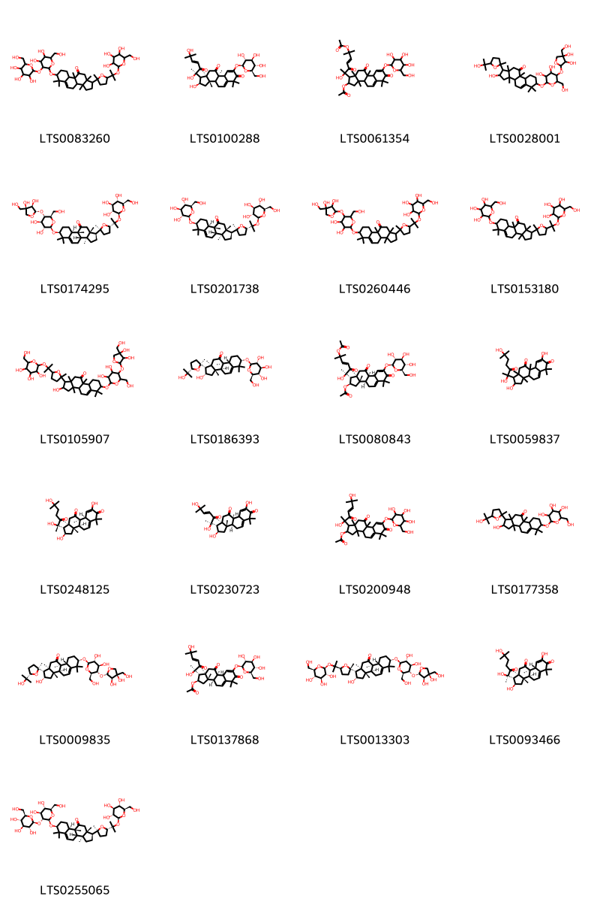{ width=100% }
    <figcaption>Hình ảnh cấu trúc hóa học của 21 hoạt chất thuộc nhóm Steroids and steroid derivatives gồm ['7-{[4,5-dihydroxy-6-(hydroxymethyl)-3-{[3,4,5-trihydroxy-6-(hydroxymethyl)oxan-2-yl]oxy}oxan-2-yl]oxy}-3a,6,6,9b,11a-pentamethyl-1-[2-methyl-5-(2-{[3,4,5-trihydroxy-6-(hydroxymethyl)oxan-2-yl]oxy}propan-2-yl)oxolan-2-yl]-1h,2h,3h,3bh,4h,7h,8h,9h,9ah,11h-cyclopenta[a]phenanthren-10-one (LTS0083260)', '(2r,3as,9br,11ar)-1-[(2r,4e)-2,6-dihydroxy-6-methyl-3-oxohept-4-en-2-yl]-2-hydroxy-3a,6,6,9b,11a-pentamethyl-8-{[(2s,3r,4s,5s,6r)-3,4,5-trihydroxy-6-(hydroxymethyl)oxan-2-yl]oxy}-1h,2h,3h,3bh,4h,9ah,11h-cyclopenta[a]phenanthrene-7,10-dione (LTS0100288)', '6-[2-(acetyloxy)-3a,6,6,9b,11a-pentamethyl-7,10-dioxo-8-{[3,4,5-trihydroxy-6-(hydroxymethyl)oxan-2-yl]oxy}-1h,2h,3h,3bh,4h,9ah,11h-cyclopenta[a]phenanthren-1-yl]-6-hydroxy-2-methyl-5-oxohept-3-en-2-yl acetate (LTS0061354)', '7-[(5-{[3,4-dihydroxy-4-(hydroxymethyl)oxolan-2-yl]oxy}-3,4-dihydroxy-6-(hydroxymethyl)oxan-2-yl)oxy]-2-hydroxy-1-[5-(2-hydroxypropan-2-yl)-2-methyloxolan-2-yl]-3a,6,6,9b,11a-pentamethyl-1h,2h,3h,3bh,4h,7h,8h,9h,9ah,11h-cyclopenta[a]phenanthren-10-one (LTS0028001)', '(1s,3as,3bs,7s,9ar,9br,11ar)-7-{[(2r,3r,4r,5s,6r)-5-{[(2s,3r,4r)-3,4-dihydroxy-4-(hydroxymethyl)oxolan-2-yl]oxy}-3,4-dihydroxy-6-(hydroxymethyl)oxan-2-yl]oxy}-3a,6,6,9b,11a-pentamethyl-1-[(2s,5s)-2-methyl-5-(2-{[(2s,3r,4s,5s,6r)-3,4,5-trihydroxy-6-(hydroxymethyl)oxan-2-yl]oxy}propan-2-yl)oxolan-2-yl]-1h,2h,3h,3bh,4h,7h,8h,9h,9ah,11h-cyclopenta[a]phenanthren-10-one (LTS0174295)', 'gratioside (LTS0201738)', '7-[(5-{[3,4-dihydroxy-4-(hydroxymethyl)oxolan-2-yl]oxy}-3,4-dihydroxy-6-(hydroxymethyl)oxan-2-yl)oxy]-3a,6,6,9b,11a-pentamethyl-1-[2-methyl-5-(2-{[3,4,5-trihydroxy-6-(hydroxymethyl)oxan-2-yl]oxy}propan-2-yl)oxolan-2-yl]-1h,2h,3h,3bh,4h,7h,8h,9h,9ah,11h-cyclopenta[a]phenanthren-10-one (LTS0260446)', '3a,6,6,9b,11a-pentamethyl-1-[2-methyl-5-(2-{[3,4,5-trihydroxy-6-(hydroxymethyl)oxan-2-yl]oxy}propan-2-yl)oxolan-2-yl]-7-{[3,4,5-trihydroxy-6-(hydroxymethyl)oxan-2-yl]oxy}-1h,2h,3h,3bh,4h,7h,8h,9h,9ah,11h-cyclopenta[a]phenanthren-10-one (LTS0153180)', '7-[(5-{[3,4-dihydroxy-4-(hydroxymethyl)oxolan-2-yl]oxy}-3,4-dihydroxy-6-(hydroxymethyl)oxan-2-yl)oxy]-2-hydroxy-3a,6,6,9b,11a-pentamethyl-1-[2-methyl-5-(2-{[3,4,5-trihydroxy-6-(hydroxymethyl)oxan-2-yl]oxy}propan-2-yl)oxolan-2-yl]-1h,2h,3h,3bh,4h,7h,8h,9h,9ah,11h-cyclopenta[a]phenanthren-10-one (LTS0105907)', '(1r,2s,3as,3bs,7s,9ar,9br,11ar)-2-hydroxy-1-[(2s,5s)-5-(2-hydroxypropan-2-yl)-2-methyloxolan-2-yl]-3a,6,6,9b,11a-pentamethyl-7-{[(2r,3r,4s,5s,6r)-3,4,5-trihydroxy-6-(hydroxymethyl)oxan-2-yl]oxy}-1h,2h,3h,3bh,4h,7h,8h,9h,9ah,11h-cyclopenta[a]phenanthren-10-one (LTS0186393)', '(3e,6r)-6-[(1r,2r,3as,3bs,9ar,9br,11ar)-2-(acetyloxy)-3a,6,6,9b,11a-pentamethyl-7,10-dioxo-8-{[(2s,3r,4s,5s,6r)-3,4,5-trihydroxy-6-(hydroxymethyl)oxan-2-yl]oxy}-1h,2h,3h,3bh,4h,9ah,11h-cyclopenta[a]phenanthren-1-yl]-6-hydroxy-2-methyl-5-oxohept-3-en-2-yl acetate (LTS0080843)', '1-(2,6-dihydroxy-6-methyl-3-oxoheptan-2-yl)-2,8-dihydroxy-3a,6,6,9b,11a-pentamethyl-1h,2h,3h,3bh,4h,9ah,11h-cyclopenta[a]phenanthrene-7,10-dione (LTS0059837)', '(1r,2r,3as,3bs,9as,9br,11ar)-1-[(2s)-2,6-dihydroxy-6-methyl-3-oxoheptan-2-yl]-2,8-dihydroxy-3a,6,6,9b,11a-pentamethyl-1h,2h,3h,3bh,4h,9ah,11h-cyclopenta[a]phenanthrene-7,10-dione (LTS0248125)', 'cucurbitacin (LTS0230723)', '1-(2,6-dihydroxy-6-methyl-3-oxohept-4-en-2-yl)-3a,6,6,9b,11a-pentamethyl-7,10-dioxo-8-{[3,4,5-trihydroxy-6-(hydroxymethyl)oxan-2-yl]oxy}-1h,2h,3h,3bh,4h,9ah,11h-cyclopenta[a]phenanthren-2-yl acetate (LTS0200948)', '2-hydroxy-1-[5-(2-hydroxypropan-2-yl)-2-methyloxolan-2-yl]-3a,6,6,9b,11a-pentamethyl-7-{[3,4,5-trihydroxy-6-(hydroxymethyl)oxan-2-yl]oxy}-1h,2h,3h,3bh,4h,7h,8h,9h,9ah,11h-cyclopenta[a]phenanthren-10-one (LTS0177358)', '(1r,2s,3as,3bs,7s,9ar,9br,11ar)-7-{[(2r,3r,4r,5s,6r)-5-{[(2s,3r,4r)-3,4-dihydroxy-4-(hydroxymethyl)oxolan-2-yl]oxy}-3,4-dihydroxy-6-(hydroxymethyl)oxan-2-yl]oxy}-2-hydroxy-1-[(2s,5s)-5-(2-hydroxypropan-2-yl)-2-methyloxolan-2-yl]-3a,6,6,9b,11a-pentamethyl-1h,2h,3h,3bh,4h,7h,8h,9h,9ah,11h-cyclopenta[a]phenanthren-10-one (LTS0009835)', '(1r,2r,3as,3bs,9ar,9br,11ar)-1-[(2r,4e)-2,6-dihydroxy-6-methyl-3-oxohept-4-en-2-yl]-3a,6,6,9b,11a-pentamethyl-7,10-dioxo-8-{[(2s,3r,4s,5s,6r)-3,4,5-trihydroxy-6-(hydroxymethyl)oxan-2-yl]oxy}-1h,2h,3h,3bh,4h,9ah,11h-cyclopenta[a]phenanthren-2-yl acetate (LTS0137868)', '(1r,2s,3as,3bs,7s,9ar,9br,11ar)-7-{[(2r,3r,4r,5s,6r)-5-{[(2s,3r,4r)-3,4-dihydroxy-4-(hydroxymethyl)oxolan-2-yl]oxy}-3,4-dihydroxy-6-(hydroxymethyl)oxan-2-yl]oxy}-2-hydroxy-3a,6,6,9b,11a-pentamethyl-1-[(2s,5s)-2-methyl-5-(2-{[(2s,3r,4s,5s,6r)-3,4,5-trihydroxy-6-(hydroxymethyl)oxan-2-yl]oxy}propan-2-yl)oxolan-2-yl]-1h,2h,3h,3bh,4h,7h,8h,9h,9ah,11h-cyclopenta[a]phenanthren-10-one (LTS0013303)', 'cucurbitacin l (LTS0093466)', '(1s,3as,3bs,7s,9ar,9br,11ar)-7-{[(2r,3r,4s,5s,6r)-4,5-dihydroxy-6-(hydroxymethyl)-3-{[(2s,3r,4s,5s,6r)-3,4,5-trihydroxy-6-(hydroxymethyl)oxan-2-yl]oxy}oxan-2-yl]oxy}-3a,6,6,9b,11a-pentamethyl-1-[(2s,5s)-2-methyl-5-(2-{[(2s,3r,4s,5s,6r)-3,4,5-trihydroxy-6-(hydroxymethyl)oxan-2-yl]oxy}propan-2-yl)oxolan-2-yl]-1h,2h,3h,3bh,4h,7h,8h,9h,9ah,11h-cyclopenta[a]phenanthren-10-one (LTS0255065)'].</figcaption>
</figure>

---

### Dược dân tộc học

Danh sách các quốc gia có sử dụng *Gratiola officinalis* trong điều trị các bệnh. 

| Country   | Disease                             | Bệnh                                                                                                                                                                                                |
|:----------|:------------------------------------|:----------------------------------------------------------------------------------------------------------------------------------------------------------------------------------------------------|
| Turkey    | Purgative, Diuretic, Emetic, Poison | MYMEMORY WARNING: YOU USED ALL AVAILABLE FREE TRANSLATIONS FOR TODAY. NEXT AVAILABLE IN  17 HOURS 24 MINUTES 24 SECONDS VISIT HTTPS://MYMEMORY.TRANSLATED.NET/DOC/USAGELIMITS.PHP TO TRANSLATE MORE |
| ain       | Purgative                           | MYMEMORY WARNING: YOU USED ALL AVAILABLE FREE TRANSLATIONS FOR TODAY. NEXT AVAILABLE IN  17 HOURS 24 MINUTES 21 SECONDS VISIT HTTPS://MYMEMORY.TRANSLATED.NET/DOC/USAGELIMITS.PHP TO TRANSLATE MORE |

---

# Chi Digitalis

??? note "Danh sách các dược liệu thuộc chi"
    
	 - *Digitalis lanata*
	 - *Digitalis lutea*
	 - *Digitalis obscura*
	 - *Digitalis purpurea*

---
## Digitalis lanata
### Thông tin về thực vật

!!! info "Phân loại thực vật của *Digitalis lanata* từ GIBF:"
    - **Kingdom:** Plantae
    - **Phylum:** Tracheophyta
    - **Order:** Lamiales
    - **Family:** Plantaginaceae
    - **Genus:** Digitalis
    - **Species:** *Digitalis lanata*

 

| Label (VI)   | Label (EN)   | Scientific Name   | Descriptions (VI)   | Descriptions (EN)   | Also Known As (VI)   | Also Known As (EN)   |
|:-------------|:-------------|:------------------|:--------------------|:--------------------|:---------------------|:---------------------|
| N/A          | N/A          | Digitalis lanata  | loài thực vật       | species of plant    | ['']                 | ['woolly foxglove']  |

#### Phân bố trên thế giới

**Từ CSDL GIBF** nan, Kosovo, Germany, Austria, Albania, Serbia, Sweden, India, Canada, Belgium, Netherlands, Türkiye, North Macedonia, Hungary, Bulgaria, Czechia, Romania, Russian Federation, United States of America, Greece, Croatia, Ukraine

#### Phân bố tại Việt Nam

**Từ CSDL GIBF**: Không có ghi nhận ở Việt Nam

---
### Thành phần hóa học
        
- Theo cơ sở dữ liệu lotus: Từ loài *Digitalis lanata* đã phân lập và xác định được 140 hoạt chất thuộc về các nhóm Organooxygen compounds, Flavonoids, Prenol lipids, Fatty Acyls, Anthracenes, Cinnamic acids and derivatives, Steroids and steroid derivatives, Pyridines and derivatives. 

|    | chemicalTaxonomyClassyfireClass   |   smiles_count |
|---:|:----------------------------------|---------------:|
|  0 | Anthracenes                       |              8 |
|  1 | Cinnamic acids and derivatives    |              8 |
|  2 | Fatty Acyls                       |              2 |
|  3 | Flavonoids                        |              8 |
|  4 | Organooxygen compounds            |              8 |
|  5 | Prenol lipids                     |             12 |
|  6 | Pyridines and derivatives         |              1 |
|  7 | Steroids and steroid derivatives  |             90 |

#### Nhóm Anthracenes
<figure markdown="span">
    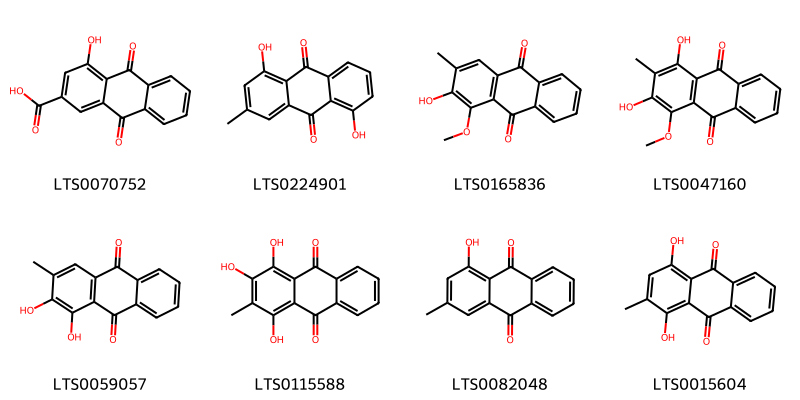{ width=100% }
    <figcaption>Hình ảnh cấu trúc hóa học của 8 hoạt chất thuộc nhóm Anthracenes gồm ['4-hydroxy-9,10-dioxoanthracene-2-carboxylic acid (LTS0070752)', '1,5-dihydroxy-3-methylanthracene-9,10-dione (LTS0224901)', '2-hydroxy-1-methoxy-3-methylanthracene-9,10-dione (LTS0165836)', '1,3-dihydroxy-4-methoxy-2-methylanthracene-9,10-dione (LTS0047160)', '1,2-dihydroxy-3-methylanthracene-9,10-dione (LTS0059057)', '1,2,4-trihydroxy-3-methylanthracene-9,10-dione (LTS0115588)', '1-hydroxy-3-methylanthracene-9,10-dione (LTS0082048)', '1,4-dihydroxy-2-methylanthracene-9,10-dione (LTS0015604)'].</figcaption>
</figure>
#### Nhóm Cinnamic acids and derivatives
<figure markdown="span">
    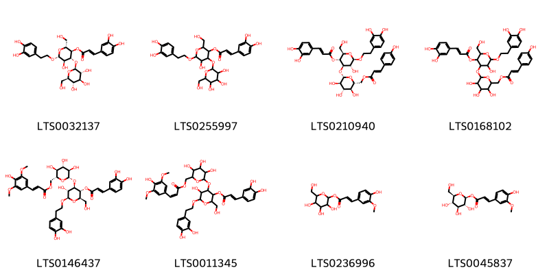{ width=100% }
    <figcaption>Hình ảnh cấu trúc hóa học của 8 hoạt chất thuộc nhóm Cinnamic acids and derivatives gồm ['plantamajoside (LTS0032137)', '6-[2-(3,4-dihydroxyphenyl)ethoxy]-5-hydroxy-2-(hydroxymethyl)-4-{[3,4,5-trihydroxy-6-(hydroxymethyl)oxan-2-yl]oxy}oxan-3-yl 3-(3,4-dihydroxyphenyl)prop-2-enoate (LTS0255997)', '[(2r,3s,4s,5r,6s)-6-{[(2r,3r,4r,5r,6r)-2-[2-(3,4-dihydroxyphenyl)ethoxy]-5-{[(2e)-3-(3,4-dihydroxyphenyl)prop-2-enoyl]oxy}-3-hydroxy-6-(hydroxymethyl)oxan-4-yl]oxy}-3,4,5-trihydroxyoxan-2-yl]methyl (2e)-3-(4-hydroxyphenyl)prop-2-enoate (LTS0210940)', '[6-({2-[2-(3,4-dihydroxyphenyl)ethoxy]-5-{[3-(3,4-dihydroxyphenyl)prop-2-enoyl]oxy}-3-hydroxy-6-(hydroxymethyl)oxan-4-yl}oxy)-3,4,5-trihydroxyoxan-2-yl]methyl 3-(4-hydroxyphenyl)prop-2-enoate (LTS0168102)', '[(2r,3s,4s,5r,6s)-6-{[(2r,3r,4r,5r,6r)-2-[2-(3,4-dihydroxyphenyl)ethoxy]-5-{[(2e)-3-(3,4-dihydroxyphenyl)prop-2-enoyl]oxy}-3-hydroxy-6-(hydroxymethyl)oxan-4-yl]oxy}-3,4,5-trihydroxyoxan-2-yl]methyl (2e)-3-(4-hydroxy-3,5-dimethoxyphenyl)prop-2-enoate (LTS0146437)', '[6-({2-[2-(3,4-dihydroxyphenyl)ethoxy]-5-{[3-(3,4-dihydroxyphenyl)prop-2-enoyl]oxy}-3-hydroxy-6-(hydroxymethyl)oxan-4-yl}oxy)-3,4,5-trihydroxyoxan-2-yl]methyl 3-(4-hydroxy-3,5-dimethoxyphenyl)prop-2-enoate (LTS0011345)', '3,4,5-trihydroxy-6-(hydroxymethyl)oxan-2-yl 3-(4-hydroxy-3-methoxyphenyl)prop-2-enoate (LTS0236996)', '1-o-feruloyl-β-d-glucose (LTS0045837)'].</figcaption>
</figure>
#### Nhóm Fatty Acyls
<figure markdown="span">
    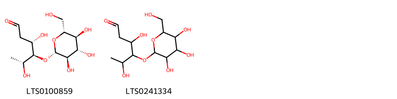{ width=100% }
    <figcaption>Hình ảnh cấu trúc hóa học của 2 hoạt chất thuộc nhóm Fatty Acyls gồm ['(3s,4s,5r)-3,5-dihydroxy-4-{[(2s,3r,4s,5s,6r)-3,4,5-trihydroxy-6-(hydroxymethyl)oxan-2-yl]oxy}hexanal (LTS0100859)', '3,5-dihydroxy-4-{[3,4,5-trihydroxy-6-(hydroxymethyl)oxan-2-yl]oxy}hexanal (LTS0241334)'].</figcaption>
</figure>
#### Nhóm Flavonoids
<figure markdown="span">
    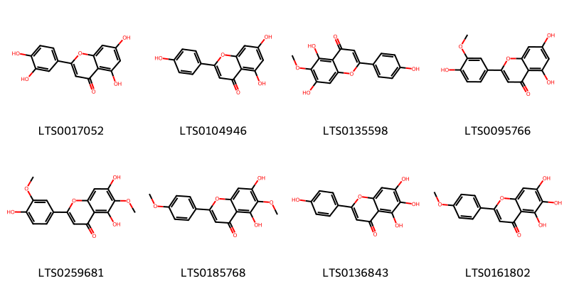{ width=100% }
    <figcaption>Hình ảnh cấu trúc hóa học của 8 hoạt chất thuộc nhóm Flavonoids gồm ['luteolin (LTS0017052)', 'chamomile (LTS0104946)', 'hispidulin (LTS0135598)', 'chrysoeriol (LTS0095766)', 'jaceosidin (LTS0259681)', 'pectolinarigenin (LTS0185768)', 'scutellarein (LTS0136843)', "scutellarein 4'-methyl ether (LTS0161802)"].</figcaption>
</figure>
#### Nhóm Organooxygen compounds
<figure markdown="span">
    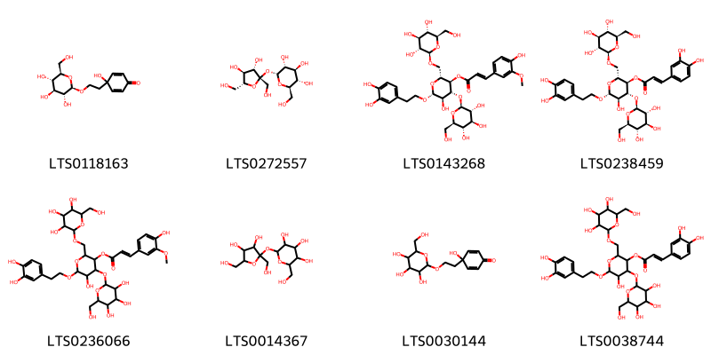{ width=100% }
    <figcaption>Hình ảnh cấu trúc hóa học của 8 hoạt chất thuộc nhóm Organooxygen compounds gồm ['4-hydroxy-4-(2-{[(2r,3r,4s,5s,6r)-3,4,5-trihydroxy-6-(hydroxymethyl)oxan-2-yl]oxy}ethyl)cyclohexa-2,5-dien-1-one (LTS0118163)', 'sucrose (LTS0272557)', '(2r,3r,4r,5r,6r)-6-[2-(3,4-dihydroxyphenyl)ethoxy]-5-hydroxy-4-{[(2s,3r,4s,5s,6r)-3,4,5-trihydroxy-6-(hydroxymethyl)oxan-2-yl]oxy}-2-({[(2r,3r,4s,5s,6r)-3,4,5-trihydroxy-6-(hydroxymethyl)oxan-2-yl]oxy}methyl)oxan-3-yl (2e)-3-(4-hydroxy-3-methoxyphenyl)prop-2-enoate (LTS0143268)', '(2r,3r,4r,5r,6r)-6-[2-(3,4-dihydroxyphenyl)ethoxy]-5-hydroxy-4-{[(2s,3r,4s,5s,6r)-3,4,5-trihydroxy-6-(hydroxymethyl)oxan-2-yl]oxy}-2-({[(2r,3r,4s,5s,6r)-3,4,5-trihydroxy-6-(hydroxymethyl)oxan-2-yl]oxy}methyl)oxan-3-yl (2e)-3-(3,4-dihydroxyphenyl)prop-2-enoate (LTS0238459)', '6-[2-(3,4-dihydroxyphenyl)ethoxy]-5-hydroxy-4-{[3,4,5-trihydroxy-6-(hydroxymethyl)oxan-2-yl]oxy}-2-({[3,4,5-trihydroxy-6-(hydroxymethyl)oxan-2-yl]oxy}methyl)oxan-3-yl 3-(4-hydroxy-3-methoxyphenyl)prop-2-enoate (LTS0236066)', 'granulated sugar (LTS0014367)', '4-hydroxy-4-(2-{[3,4,5-trihydroxy-6-(hydroxymethyl)oxan-2-yl]oxy}ethyl)cyclohexa-2,5-dien-1-one (LTS0030144)', '6-[2-(3,4-dihydroxyphenyl)ethoxy]-5-hydroxy-4-{[3,4,5-trihydroxy-6-(hydroxymethyl)oxan-2-yl]oxy}-2-({[3,4,5-trihydroxy-6-(hydroxymethyl)oxan-2-yl]oxy}methyl)oxan-3-yl 3-(3,4-dihydroxyphenyl)prop-2-enoate (LTS0038744)'].</figcaption>
</figure>
#### Nhóm Prenol lipids
<figure markdown="span">
    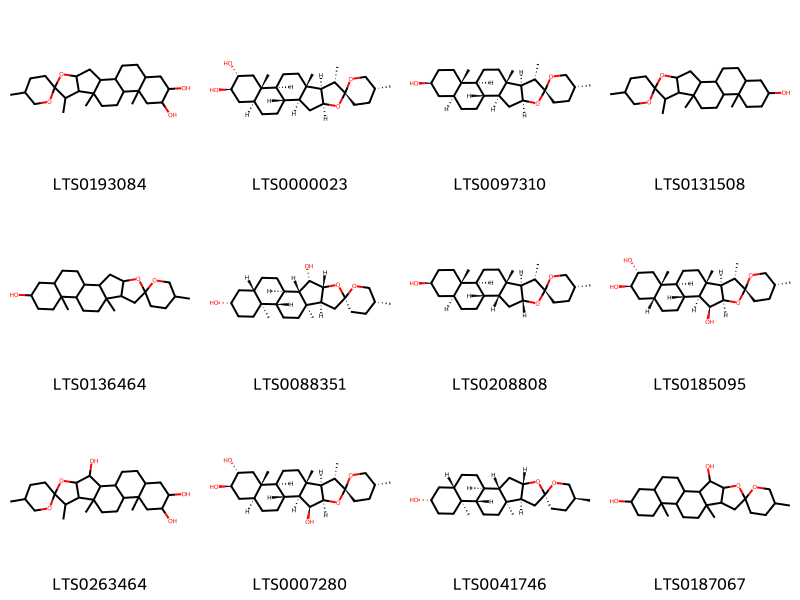{ width=100% }
    <figcaption>Hình ảnh cấu trúc hóa học của 12 hoạt chất thuộc nhóm Prenol lipids gồm ["5,7',9',13'-tetramethyl-5'-oxaspiro[oxane-2,6'-pentacyclo[10.8.0.0²,⁹.0⁴,⁸.0¹³,¹⁸]icosane]-15',16'-diol (LTS0193084)", 'gitogenin (LTS0000023)', 'tigogenin (LTS0097310)', 'tigogenin (LTS0131508)', "5,9',13'-trimethyl-5'-oxaspiro[oxane-2,6'-pentacyclo[10.8.0.0²,⁹.0⁴,⁸.0¹³,¹⁸]icosan]-16'-ol (LTS0136464)", "(1'r,2r,2's,3's,4'r,5r,8's,9'r,12's,13's,16's,18's)-5,9',13'-trimethyl-5'-oxaspiro[oxane-2,6'-pentacyclo[10.8.0.0²,⁹.0⁴,⁸.0¹³,¹⁸]icosane]-3',16'-diol (LTS0088351)", "(1'r,2r,2'r,4'r,5r,7's,8'r,9's,12's,13's,16's,18's)-5,7',9',13'-tetramethyl-5'-oxaspiro[oxane-2,6'-pentacyclo[10.8.0.0²,⁹.0⁴,⁸.0¹³,¹⁸]icosan]-16'-ol (LTS0208808)", "(1'r,2r,2's,3's,4'r,5r,7's,8'r,9's,12's,13's,15'r,16'r,18'r)-5,7',9',13'-tetramethyl-5'-oxaspiro[oxane-2,6'-pentacyclo[10.8.0.0²,⁹.0⁴,⁸.0¹³,¹⁸]icosane]-3',15',16'-triol (LTS0185095)", "5,7',9',13'-tetramethyl-5'-oxaspiro[oxane-2,6'-pentacyclo[10.8.0.0²,⁹.0⁴,⁸.0¹³,¹⁸]icosane]-3',15',16'-triol (LTS0263464)", 'digitogenin (LTS0007280)', "(1'r,2r,2's,4's,5s,8's,9's,12's,13's,16's,18's)-5,9',13'-trimethyl-5'-oxaspiro[oxane-2,6'-pentacyclo[10.8.0.0²,⁹.0⁴,⁸.0¹³,¹⁸]icosan]-16'-ol (LTS0041746)", "5,9',13'-trimethyl-5'-oxaspiro[oxane-2,6'-pentacyclo[10.8.0.0²,⁹.0⁴,⁸.0¹³,¹⁸]icosane]-3',16'-diol (LTS0187067)"].</figcaption>
</figure>
#### Nhóm Pyridines and derivatives
<figure markdown="span">
    { width=100% }
    <figcaption>Hình ảnh cấu trúc hóa học của 1 hoạt chất thuộc nhóm Pyridines and derivatives gồm ['niacin (LTS0216673)'].</figcaption>
</figure>
#### Nhóm Steroids and steroid derivatives
<figure markdown="span">
    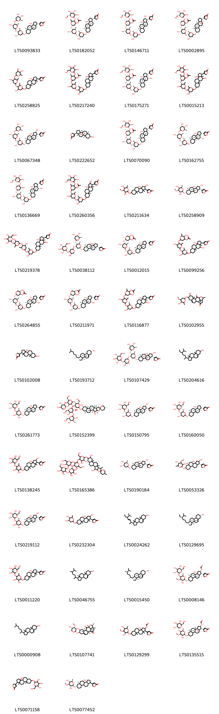{ width=100% }
    <figcaption>Hình ảnh cấu trúc hóa học của 90 hoạt chất thuộc nhóm Steroids and steroid derivatives gồm ['digitoxin (LTS0093833)', '(3r,4s,6s)-6-{[(2r,3s,4s,6s)-6-{[(2r,3s,4s,6r)-6-{[(1r,3as,3br,5ar,7s,9as,9bs,11ar)-3a-hydroxy-9a,11a-dimethyl-1-(5-oxo-2h-furan-3-yl)-tetradecahydrocyclopenta[a]phenanthren-7-yl]oxy}-4-hydroxy-2-methyloxan-3-yl]oxy}-4-hydroxy-2-methyloxan-3-yl]oxy}-2-methyl-3-{[(2s,3r,4s,5s,6r)-3,4,5-trihydroxy-6-(hydroxymethyl)oxan-2-yl]oxy}oxan-4-yl acetate (LTS0182052)', 'lanatoside b (LTS0146711)', '(2r,3r,4s,6s)-6-{[(2r,3s,4s,6s)-6-{[(2r,3s,4s,6r)-6-{[(1r,3as,3br,5as,7s,9as,9br,11ar)-3a-hydroxy-9a,11a-dimethyl-1-(5-oxo-2h-furan-3-yl)-tetradecahydrocyclopenta[a]phenanthren-7-yl]oxy}-4-hydroxy-2-methyloxan-3-yl]oxy}-4-hydroxy-2-methyloxan-3-yl]oxy}-2-methyl-3-{[(2s,3r,4s,5s,6r)-3,4,5-trihydroxy-6-(hydroxymethyl)oxan-2-yl]oxy}oxan-4-yl acetate (LTS0002895)', 'digitoxin (LTS0258825)', 'lanatoside-a (LTS0217240)', 'lanatoside c (LTS0175271)', 'lanatoside-c (LTS0015213)', 'gitoxin (LTS0067348)', 'digitoxigenin (LTS0222652)', 'lanatoside a (LTS0070090)', 'digoxin (LTS0162755)', 'deslanoside (LTS0136669)', '6-({6-[(6-{[2,3a-dihydroxy-9a,11a-dimethyl-1-(5-oxo-2h-furan-3-yl)-tetradecahydrocyclopenta[a]phenanthren-7-yl]oxy}-4-hydroxy-2-methyloxan-3-yl)oxy]-4-hydroxy-2-methyloxan-3-yl}oxy)-2-methyl-3-{[3,4,5-trihydroxy-6-(hydroxymethyl)oxan-2-yl]oxy}oxan-4-yl acetate (LTS0260356)', '4-{7-[(3,5-dihydroxy-4-methoxy-6-methyloxan-2-yl)oxy]-2,3a-dihydroxy-9a,11a-dimethyl-tetradecahydrocyclopenta[a]phenanthren-1-yl}-5h-furan-2-one (LTS0211634)', 'strospeside (LTS0258909)', '4-(3a,11-dihydroxy-7-{[4-hydroxy-5-({4-hydroxy-5-[(4-hydroxy-6-methyl-5-{[3,4,5-trihydroxy-6-(hydroxymethyl)oxan-2-yl]oxy}oxan-2-yl)oxy]-6-methyloxan-2-yl}oxy)-6-methyloxan-2-yl]oxy}-9a,11a-dimethyl-tetradecahydrocyclopenta[a]phenanthren-1-yl)-5h-furan-2-one (LTS0219378)', '4-[(1r,3br,5ar,7s,9as,9bs,11ar)-7-{[(2s,4s,5r,6r)-5-{[(2r,4s,5s,6r)-4,5-dihydroxy-6-methyloxan-2-yl]oxy}-4-{[(2r,4s,5r,6r)-5-hydroxy-6-methyl-4-{[(2r,3r,4s,5s,6r)-3,4,5-trihydroxy-6-(hydroxymethyl)oxan-2-yl]oxy}oxan-2-yl]oxy}-6-methyloxan-2-yl]oxy}-3a-hydroxy-9a,11a-dimethyl-tetradecahydrocyclopenta[a]phenanthren-1-yl]-5h-furan-2-one (LTS0038112)', 'acetyldigitoxin (LTS0012015)', 'digoxin ester derivative (LTS0099256)', 'α-acetyldigoxin (LTS0264855)', 'β-acetyldigoxin (LTS0211971)', 'digoxin,β-acetyl (LTS0116877)', '8-hydroxy-7-[(5-hydroxy-4-methoxy-6-methyloxan-2-yl)oxy]-10,15,19-trimethyl-14-oxapentacyclo[11.5.1.0²,¹¹.0⁵,¹⁰.0¹⁶,¹⁹]nonadec-4-ene-12,18-dione (LTS0102955)', 'digitoxigenin (LTS0102008)', '(1r,3ar,3br,7s,9ar,9br,11ar)-9a,11a-dimethyl-1-[(2r)-6-methylheptan-2-yl]-1h,2h,3h,3ah,3bh,4h,6h,7h,8h,9h,9bh,10h,11h-cyclopenta[a]phenanthren-7-ol (LTS0193712)', '4-[(1r,2s,3br,5ar,7s,9as,9bs,11ar)-7-{[(2s,4s,5r,6r)-5-{[(2r,4s,5s,6r)-4,5-dihydroxy-6-methyloxan-2-yl]oxy}-4-{[(2r,4s,5r,6r)-5-hydroxy-6-methyl-4-{[(2r,3r,4s,5s,6r)-3,4,5-trihydroxy-6-(hydroxymethyl)oxan-2-yl]oxy}oxan-2-yl]oxy}-6-methyloxan-2-yl]oxy}-2,3a-dihydroxy-9a,11a-dimethyl-tetradecahydrocyclopenta[a]phenanthren-1-yl]-5h-furan-2-one (LTS0107429)', 'stigmast-5-en-3-ol, (3β)- (LTS0204616)', '4-[(1r,3as,3br,5ar,7s,9as,9bs,11ar)-7-{[(2s,3r,4r,5r,6r)-3,4-dihydroxy-6-methyl-5-{[(2s,3r,4s,5s,6r)-3,4,5-trihydroxy-6-(hydroxymethyl)oxan-2-yl]oxy}oxan-2-yl]oxy}-3a-hydroxy-9a,11a-dimethyl-tetradecahydrocyclopenta[a]phenanthren-1-yl]-5h-furan-2-one (LTS0261773)', "(2s,3r,4s,5s,6r)-2-{[(2s,3r,4s,5s,6r)-2-{[(2s,3r,4s,5r,6r)-2-{[(2r,3r,4r,5r,6r)-4,5-dihydroxy-2-(hydroxymethyl)-6-[(1'r,2r,2's,3's,4'r,5r,7's,8'r,9's,12's,13's,15'r,16'r,18's)-5,7',9',13'-tetramethyl-5'-oxaspiro[oxane-2,6'-pentacyclo[10.8.0.0²,⁹.0⁴,⁸.0¹³,¹⁸]icosane]-3',15'-dioloxy]oxan-3-yl]oxy}-5-hydroxy-6-(hydroxymethyl)-4-{[(2s,3r,4s,5r)-3,4,5-trihydroxyoxan-2-yl]oxy}oxan-3-yl]oxy}-3,5-dihydroxy-6-(hydroxymethyl)oxan-4-yl]oxy}-6-(hydroxymethyl)oxane-3,4,5-triol (LTS0152399)", '4-[(1r,2s,3as,3br,5ar,7s,9as,9bs,11ar)-2,3a-dihydroxy-7-{[(2r,4s,5s,6r)-4-hydroxy-6-methyl-5-{[(2s,3r,4s,5s,6r)-3,4,5-trihydroxy-6-(hydroxymethyl)oxan-2-yl]oxy}oxan-2-yl]oxy}-9a,11a-dimethyl-tetradecahydrocyclopenta[a]phenanthren-1-yl]-5h-furan-2-one (LTS0150795)', '4-[(1r,3as,3br,5ar,7s,9as,9bs,11ar)-3a-hydroxy-7-{[(2r,4s,5s,6r)-4-hydroxy-6-methyl-5-{[(2s,3r,4s,5s,6r)-3,4,5-trihydroxy-6-(hydroxymethyl)oxan-2-yl]oxy}oxan-2-yl]oxy}-9a,11a-dimethyl-tetradecahydrocyclopenta[a]phenanthren-1-yl]-5h-furan-2-one (LTS0160050)', '4-{7-[(3,4-dihydroxy-6-methyl-5-{[3,4,5-trihydroxy-6-(hydroxymethyl)oxan-2-yl]oxy}oxan-2-yl)oxy]-2,3a-dihydroxy-9a,11a-dimethyl-tetradecahydrocyclopenta[a]phenanthren-1-yl}-5h-furan-2-one (LTS0138245)', 'digitonin (LTS0165386)', '4-[(1r,2s,3as,3br,5ar,7s,9as,9bs,11ar)-7-{[(2r,4s,5s,6r)-4,5-dihydroxy-6-methyloxan-2-yl]oxy}-2,3a-dihydroxy-9a,11a-dimethyl-tetradecahydrocyclopenta[a]phenanthren-1-yl]-5h-furan-2-one (LTS0190184)', '4-[(1r,3as,5ar,7r,9as,11ar)-7-{[(2r,5s)-3,5-dihydroxy-4-methoxy-6-methyloxan-2-yl]oxy}-2,3a-dihydroxy-9a,11a-dimethyl-tetradecahydrocyclopenta[a]phenanthren-1-yl]-5h-furan-2-one (LTS0053326)', '4-[(1r,2s,3as,3br,5ar,7s,9as,9bs,11ar)-7-{[(2r,3r,4r,5r,6r)-3,4-dihydroxy-6-methyl-5-{[(2s,3r,4s,5s,6r)-3,4,5-trihydroxy-6-(hydroxymethyl)oxan-2-yl]oxy}oxan-2-yl]oxy}-2,3a-dihydroxy-9a,11a-dimethyl-tetradecahydrocyclopenta[a]phenanthren-1-yl]-5h-furan-2-one (LTS0219112)', '4-{7-[(4,5-dihydroxy-6-methyloxan-2-yl)oxy]-2,3a-dihydroxy-9a,11a-dimethyl-tetradecahydrocyclopenta[a]phenanthren-1-yl}-5h-furan-2-one (LTS0232304)', 'stigmasterol (LTS0024262)', '(1r,3ar,3br,7s,9ar,9br,11ar)-1-[(2r,5r)-5-ethyl-6-methylheptan-2-yl]-9a,11a-dimethyl-1h,2h,3h,3ah,3bh,4h,6h,7h,8h,9h,9bh,10h,11h-cyclopenta[a]phenanthren-7-ol (LTS0129695)', '4-{7-[(3,4-dihydroxy-6-methyl-5-{[3,4,5-trihydroxy-6-(hydroxymethyl)oxan-2-yl]oxy}oxan-2-yl)oxy]-3a-hydroxy-9a,11a-dimethyl-tetradecahydrocyclopenta[a]phenanthren-1-yl}-5h-furan-2-one (LTS0011220)', 'campesterol (LTS0046755)', '(1r,3ar,3br,7s,9ar,9br,11ar)-1-[(2r,5r)-5,6-dimethylheptan-2-yl]-9a,11a-dimethyl-1h,2h,3h,3ah,3bh,4h,6h,7h,8h,9h,9bh,10h,11h-cyclopenta[a]phenanthren-7-ol (LTS0015450)', '(1r,2s,3as,3br,5ar,7s,9as,9bs,11ar)-3a-hydroxy-7-{[(2r,3r,4r,5s,6r)-3-hydroxy-4-methoxy-6-methyl-5-{[(2s,3r,4s,5s,6r)-3,4,5-trihydroxy-6-(hydroxymethyl)oxan-2-yl]oxy}oxan-2-yl]oxy}-9a,11a-dimethyl-1-(5-oxo-2h-furan-3-yl)-tetradecahydrocyclopenta[a]phenanthren-2-yl formate (LTS0008146)', 'epicholestrol (LTS0000908)', '(1r,2s,7r,8s,10r,11s,13r,15s,16r,19r)-8-hydroxy-7-{[(2s,4r,5s,6r)-5-hydroxy-4-methoxy-6-methyloxan-2-yl]oxy}-10,15,19-trimethyl-14-oxapentacyclo[11.5.1.0²,¹¹.0⁵,¹⁰.0¹⁶,¹⁹]nonadec-4-ene-12,18-dione (LTS0107741)', '7-[(3,5-dihydroxy-4-methoxy-6-methyloxan-2-yl)oxy]-3a-hydroxy-9a,11a-dimethyl-1-(5-oxo-2h-furan-3-yl)-tetradecahydrocyclopenta[a]phenanthren-2-yl formate (LTS0129299)', '(1r,2r,3as,3bs,5ar,7r,9as,9br,11ar)-3a-hydroxy-7-{[(2r,3r,4r,5s,6r)-3-hydroxy-4-methoxy-6-methyl-5-{[(2r,3r,4s,5s,6r)-3,4,5-trihydroxy-6-(hydroxymethyl)oxan-2-yl]oxy}oxan-2-yl]oxy}-9a,11a-dimethyl-1-(5-oxo-2h-furan-3-yl)-tetradecahydrocyclopenta[a]phenanthren-2-yl formate (LTS0135515)', 'desglucouzarin (LTS0071158)', '4-[(3as,5ar,7s,9as,11ar)-7-{[(2r,3r,4s,5s,6r)-3,5-dihydroxy-4-methoxy-6-methyloxan-2-yl]oxy}-3a-hydroxy-9a,11a-dimethyl-tetradecahydrocyclopenta[a]phenanthren-1-yl]-5h-furan-2-one (LTS0077452)', 'diginatin (LTS0161919)', '5-{7-[(3,4-dihydroxy-6-methyl-5-{[3,4,5-trihydroxy-6-(hydroxymethyl)oxan-2-yl]oxy}oxan-2-yl)oxy]-3a-hydroxy-9a,11a-dimethyl-tetradecahydrocyclopenta[a]phenanthren-1-yl}-3h-furan-2-one (LTS0183403)', '3a-hydroxy-7-[(3-hydroxy-4-methoxy-6-methyl-5-{[3,4,5-trihydroxy-6-(hydroxymethyl)oxan-2-yl]oxy}oxan-2-yl)oxy]-9a,11a-dimethyl-1-(5-oxo-2h-furan-3-yl)-tetradecahydrocyclopenta[a]phenanthren-2-yl formate (LTS0256889)', '(1r,2r,3br,5ar,7s,9as,9bs,11ar)-7-{[(2s,4s,5r,6r)-4,5-bis({[(2r,4s,5s,6r)-4,5-dihydroxy-6-methyloxan-2-yl]oxy})-6-methyloxan-2-yl]oxy}-3a-hydroxy-9a,11a-dimethyl-1-(5-oxo-2h-furan-3-yl)-tetradecahydrocyclopenta[a]phenanthren-2-yl acetate (LTS0150400)', '(2s,3r,4s,5r,6r)-2-{[(2s,3r,4s,5r,6r)-2-{[(2r,3r,4r,5r,6r)-6-{[(1r,2s,4s,6r,7s,8r,9s,12s,13s,15r,16r,18s)-6,15-dihydroxy-7,9,13-trimethyl-6-[(3r)-3-methyl-4-{[(2r,3r,4s,5s,6r)-3,4,5-trihydroxy-6-(hydroxymethyl)oxan-2-yl]oxy}butyl]-5-oxapentacyclo[10.8.0.0²,⁹.0⁴,⁸.0¹³,¹⁸]icosan-16-yl]oxy}-4,5-dihydroxy-2-(hydroxymethyl)oxan-3-yl]oxy}-5-hydroxy-6-(hydroxymethyl)-4-{[(2s,3r,4s,5r)-3,4,5-trihydroxyoxan-2-yl]oxy}oxan-3-yl]oxy}-6-(hydroxymethyl)oxane-3,4,5-triol (LTS0205336)', '5-[(1s,3as,3br,5ar,7s,9as,9bs,11ar)-7-{[(2r,3r,4r,5r,6r)-3,4-dihydroxy-6-methyl-5-{[(2s,3r,4s,5s,6r)-3,4,5-trihydroxy-6-(hydroxymethyl)oxan-2-yl]oxy}oxan-2-yl]oxy}-3a-hydroxy-9a,11a-dimethyl-tetradecahydrocyclopenta[a]phenanthren-1-yl]-3h-furan-2-one (LTS0276509)', '5-[(1r,2s,3as,3br,5ar,7s,9as,9bs,11ar)-2,3a-dihydroxy-7-{[(2r,4s,5s,6r)-4-hydroxy-6-methyl-5-{[(2s,3r,4s,5s,6r)-3,4,5-trihydroxy-6-(hydroxymethyl)oxan-2-yl]oxy}oxan-2-yl]oxy}-9a,11a-dimethyl-tetradecahydrocyclopenta[a]phenanthren-1-yl]-3h-furan-2-one (LTS0143138)', '4-[(1r,3as,3br,5ar,7s,9as,9bs,11ar)-3a-hydroxy-7-{[(2r,4s,5s,6r)-4-hydroxy-5-{[(2s,4s,5s,6r)-4-hydroxy-5-{[(2s,4s,5s,6r)-4-hydroxy-5-methoxy-6-methyloxan-2-yl]oxy}-6-methyloxan-2-yl]oxy}-6-methyloxan-2-yl]oxy}-9a,11a-dimethyl-tetradecahydrocyclopenta[a]phenanthren-1-yl]-5h-furan-2-one (LTS0275658)', '4-[(1r,3as,3br,5ar,7s,9as,9bs,11ar)-7-{[(2r,3r,4s,5r,6r)-3,4-dihydroxy-6-methyl-5-{[(2s,3r,4s,5s,6r)-3,4,5-trihydroxy-6-(hydroxymethyl)oxan-2-yl]oxy}oxan-2-yl]oxy}-3a-hydroxy-9a,11a-dimethyl-tetradecahydrocyclopenta[a]phenanthren-1-yl]-5h-furan-2-one (LTS0167022)', '4-[(1r,2r,3as,3bs,5ar,7r,9as,9br,11ar)-2,3a-dihydroxy-7-{[(2r,4s,5s,6r)-4-hydroxy-6-methyl-5-{[(2s,3r,4s,5s,6r)-3,4,5-trihydroxy-6-(hydroxymethyl)oxan-2-yl]oxy}oxan-2-yl]oxy}-9a,11a-dimethyl-tetradecahydrocyclopenta[a]phenanthren-1-yl]-5h-furan-2-one (LTS0154817)', 'lanatoside e (LTS0169826)', '(1r,3s,6r,8s,11s,12r,14r,16r)-7,7,12,16-tetramethyl-14-[(2r)-6-methyl-5-methylideneheptan-2-yl]pentacyclo[9.7.0.0¹,³.0³,⁸.0¹²,¹⁶]octadecan-6-ol (LTS0138537)', '2-({2-[(6-{[6,15-dihydroxy-7,9,13-trimethyl-6-(3-methyl-4-{[3,4,5-trihydroxy-6-(hydroxymethyl)oxan-2-yl]oxy}butyl)-5-oxapentacyclo[10.8.0.0²,⁹.0⁴,⁸.0¹³,¹⁸]icosan-16-yl]oxy}-4,5-dihydroxy-2-(hydroxymethyl)oxan-3-yl)oxy]-5-hydroxy-6-(hydroxymethyl)-4-[(3,4,5-trihydroxyoxan-2-yl)oxy]oxan-3-yl}oxy)-6-(hydroxymethyl)oxane-3,4,5-triol (LTS0187701)', '(1s,3r,6s,8s,11s,12s,15r,16r)-7,7,12,16-tetramethyl-15-[(2r)-6-methylhept-5-en-2-yl]pentacyclo[9.7.0.0¹,³.0³,⁸.0¹²,¹⁶]octadecan-6-ol (LTS0061645)', '4-{2,3a-dihydroxy-7-[(4-hydroxy-6-methyl-5-{[3,4,5-trihydroxy-6-(hydroxymethyl)oxan-2-yl]oxy}oxan-2-yl)oxy]-9a,11a-dimethyl-tetradecahydrocyclopenta[a]phenanthren-1-yl}-5h-furan-2-one (LTS0055943)', "(2s,3r,4s,5s,6r)-2-{[(2s,3r,4s,5r,6r)-2-{[(2s,3r,4s,5r,6r)-2-{[(2s,3s,4r,5r,6s)-4,5-dihydroxy-2-(hydroxymethyl)-6-[(1'r,2r,2's,3's,4'r,5r,7's,8'r,9's,12's,13's,15'r,16'r,18's)-5,7',9',13'-tetramethyl-5'-oxaspiro[oxane-2,6'-pentacyclo[10.8.0.0²,⁹.0⁴,⁸.0¹³,¹⁸]icosane]-3',15'-dioloxy]oxan-3-yl]oxy}-5-hydroxy-6-(hydroxymethyl)-4-{[(2r,3s,4r,5r)-3,4,5-trihydroxyoxan-2-yl]oxy}oxan-3-yl]oxy}-3,5-dihydroxy-6-(hydroxymethyl)oxan-4-yl]oxy}-6-(hydroxymethyl)oxane-3,4,5-triol (LTS0203552)", '(2r,3ar,3bs,7r,9ar,9bs,11ar)-2-[(2r,5e)-5-isopropylhept-5-en-2-yl]-9a,11a-dimethyl-1h,2h,3h,3ah,3bh,4h,6h,7h,8h,9h,9bh,10h,11h-cyclopenta[a]phenanthren-7-ol (LTS0201526)', 'verodoxin (LTS0222422)', '4-[(1s,3as,3br,5as,7s,9as,9bs,11ar)-7-{[(2s,3s,4s,5s,6s)-3,4-dihydroxy-6-methyl-5-{[(2r,3s,4r,5r,6s)-3,4,5-trihydroxy-6-(hydroxymethyl)oxan-2-yl]oxy}oxan-2-yl]oxy}-3a-hydroxy-9a,11a-dimethyl-tetradecahydrocyclopenta[a]phenanthren-1-yl]-5h-furan-2-one (LTS0165675)', '4-[(1r,3as,3br,5ar,7s,9as,9bs,11ar)-3a-hydroxy-7-{[(2r,3r,4s,5s,6r)-5-hydroxy-4-methoxy-6-methyl-3-{[(2s,3r,4s,5s,6r)-3,4,5-trihydroxy-6-(hydroxymethyl)oxan-2-yl]oxy}oxan-2-yl]oxy}-9a,11a-dimethyl-tetradecahydrocyclopenta[a]phenanthren-1-yl]-5h-furan-2-one (LTS0158350)', '3a-hydroxy-7-[(4-hydroxy-6-methyl-5-{[3,4,5-trihydroxy-6-(hydroxymethyl)oxan-2-yl]oxy}oxan-2-yl)oxy]-9a,11a-dimethyl-1-(5-oxo-2h-furan-3-yl)-tetradecahydrocyclopenta[a]phenanthren-2-yl formate (LTS0188908)', '(1r,2r,7r,8s,10r,11r,13r,15r,16r,19r)-8-hydroxy-7-{[(2s,4r,5s,6r)-5-hydroxy-4-methoxy-6-methyloxan-2-yl]oxy}-10,15,19-trimethyl-14-oxapentacyclo[11.5.1.0²,¹¹.0⁵,¹⁰.0¹⁶,¹⁹]nonadec-4-ene-12,18-dione (LTS0043216)', 'campesterol (LTS0029429)', '4-[(1r,3as,3br,5ar,7s,9as,9bs,11ar)-3a-hydroxy-7-{[(2r,3r,4r,5s,6r)-3-hydroxy-4-methoxy-6-methyl-5-{[(2s,3r,4s,5s,6r)-3,4,5-trihydroxy-6-(hydroxymethyl)oxan-2-yl]oxy}oxan-2-yl]oxy}-9a,11a-dimethyl-tetradecahydrocyclopenta[a]phenanthren-1-yl]-5h-furan-2-one (LTS0235240)', '(1r,3s,6r,8s,11s,12r,14r,16r)-7,7,12,16-tetramethyl-14-[(2s)-6-methylhept-5-en-2-yl]pentacyclo[9.7.0.0¹,³.0³,⁸.0¹²,¹⁶]octadecan-6-ol (LTS0060507)', '(1s,2s,3as,3bs,5ar,7r,9as,9br,11ar)-3a-hydroxy-7-{[(2r,4s,5s,6r)-4-hydroxy-6-methyl-5-{[(2s,3r,4s,5s,6r)-3,4,5-trihydroxy-6-(hydroxymethyl)oxan-2-yl]oxy}oxan-2-yl]oxy}-9a,11a-dimethyl-1-(5-oxo-2h-furan-3-yl)-tetradecahydrocyclopenta[a]phenanthren-2-yl formate (LTS0254767)', '4-{7-[(4,5-dihydroxy-6-methyl-3-{[3,4,5-trihydroxy-6-(hydroxymethyl)oxan-2-yl]oxy}oxan-2-yl)oxy]-3a-hydroxy-9a,11a-dimethyl-tetradecahydrocyclopenta[a]phenanthren-1-yl}-5h-furan-2-one (LTS0180506)', '(2r,3r,4s,6r)-6-{[(2r,3r,4s,6s)-6-{[(1r,2s,3br,5ar,7s,9as,9bs,11ar)-2-(formyloxy)-3a-hydroxy-9a,11a-dimethyl-1-(5-oxo-2h-furan-3-yl)-tetradecahydrocyclopenta[a]phenanthren-7-yl]oxy}-4-{[(2r,4s,5r,6r)-5-hydroxy-6-methyl-4-{[(2r,3r,4s,5s,6r)-3,4,5-trihydroxy-6-(hydroxymethyl)oxan-2-yl]oxy}oxan-2-yl]oxy}-2-methyloxan-3-yl]oxy}-3-hydroxy-2-methyloxan-4-yl acetate (LTS0047496)', 'cycloartenol (LTS0269561)', '4-[(1s,3as,3br,5as,7s,9as,9bs,11ar)-7-{[(2r,3r,4s,5r,6r)-4,5-dihydroxy-6-methyl-3-{[(2s,3r,4s,5s,6r)-3,4,5-trihydroxy-6-(hydroxymethyl)oxan-2-yl]oxy}oxan-2-yl]oxy}-3a-hydroxy-9a,11a-dimethyl-tetradecahydrocyclopenta[a]phenanthren-1-yl]-5h-furan-2-one (LTS0064630)', '5-{2,3a-dihydroxy-7-[(4-hydroxy-6-methyl-5-{[3,4,5-trihydroxy-6-(hydroxymethyl)oxan-2-yl]oxy}oxan-2-yl)oxy]-9a,11a-dimethyl-tetradecahydrocyclopenta[a]phenanthren-1-yl}-3h-furan-2-one (LTS0003304)', '4-[(3as,3br,5ar,9as,9br,11ar)-7-[(3,5-dihydroxy-4-methoxy-6-methyloxan-2-yl)oxy]-3a-hydroxy-9a,11a-dimethyl-tetradecahydrocyclopenta[a]phenanthren-1-yl]-5h-furan-2-one (LTS0003165)', 'metildigoxin (LTS0007578)', '7,7,12,16-tetramethyl-14-(6-methylhept-5-en-2-yl)pentacyclo[9.7.0.0¹,³.0³,⁸.0¹²,¹⁶]octadecan-6-ol (LTS0023304)', '(2r,3ar,3bs,7r,9ar,9bs,11ar)-2-[(2r)-5-isopropylhept-5-en-2-yl]-9a,11a-dimethyl-1h,2h,3h,3ah,3bh,4h,6h,7h,8h,9h,9bh,10h,11h-cyclopenta[a]phenanthren-7-ol (LTS0081536)', 'diginatin (LTS0258615)', '7,7,12,16-tetramethyl-14-(6-methyl-5-methylideneheptan-2-yl)pentacyclo[9.7.0.0¹,³.0³,⁸.0¹²,¹⁶]octadecan-6-ol (LTS0227817)', '4-[(1r,3as,3bs,5ar,7s,9as,9br,11ar)-3a-hydroxy-9a,11a-dimethyl-7-{[(2r,3r,4s,5s,6r)-3,4,5-trihydroxy-6-(hydroxymethyl)oxan-2-yl]oxy}-tetradecahydrocyclopenta[a]phenanthren-1-yl]-5h-furan-2-one (LTS0027590)', 'cholesterol (LTS0102304)', '(1r,3ar,3br,7s,9ar,9br,11ar)-1-[(2s,3e,5s)-5-ethyl-6-methylhept-3-en-2-yl]-9a,11a-dimethyl-1h,2h,3h,3ah,3bh,4h,6h,7h,8h,9h,9bh,10h,11h-cyclopenta[a]phenanthren-7-ol (LTS0244733)'].</figcaption>
</figure>

---

### Dược dân tộc học

Danh sách các quốc gia có sử dụng *Digitalis lanata* trong điều trị các bệnh. 

| Country   | Disease                                 | Bệnh                                                                                                                                                                                                |
|:----------|:----------------------------------------|:----------------------------------------------------------------------------------------------------------------------------------------------------------------------------------------------------|
| Elsewhere | Cardiotonic, Diuretic, Poison, Diuretic | MYMEMORY WARNING: YOU USED ALL AVAILABLE FREE TRANSLATIONS FOR TODAY. NEXT AVAILABLE IN  17 HOURS 23 MINUTES 45 SECONDS VISIT HTTPS://MYMEMORY.TRANSLATED.NET/DOC/USAGELIMITS.PHP TO TRANSLATE MORE |
| India     | Cardiotonic                             | MYMEMORY WARNING: YOU USED ALL AVAILABLE FREE TRANSLATIONS FOR TODAY. NEXT AVAILABLE IN  17 HOURS 23 MINUTES 42 SECONDS VISIT HTTPS://MYMEMORY.TRANSLATED.NET/DOC/USAGELIMITS.PHP TO TRANSLATE MORE |
| Iraq      | Diuretic, Tonic                         | MYMEMORY WARNING: YOU USED ALL AVAILABLE FREE TRANSLATIONS FOR TODAY. NEXT AVAILABLE IN  17 HOURS 23 MINUTES 40 SECONDS VISIT HTTPS://MYMEMORY.TRANSLATED.NET/DOC/USAGELIMITS.PHP TO TRANSLATE MORE |
| Nepal     | Tonic, Tonic                            | MYMEMORY WARNING: YOU USED ALL AVAILABLE FREE TRANSLATIONS FOR TODAY. NEXT AVAILABLE IN  17 HOURS 23 MINUTES 37 SECONDS VISIT HTTPS://MYMEMORY.TRANSLATED.NET/DOC/USAGELIMITS.PHP TO TRANSLATE MORE |
| Turkey    | Cardiotonic                             | MYMEMORY WARNING: YOU USED ALL AVAILABLE FREE TRANSLATIONS FOR TODAY. NEXT AVAILABLE IN  17 HOURS 23 MINUTES 34 SECONDS VISIT HTTPS://MYMEMORY.TRANSLATED.NET/DOC/USAGELIMITS.PHP TO TRANSLATE MORE |

---

---
## Digitalis lutea
### Thông tin về thực vật

!!! info "Phân loại thực vật của *Digitalis lutea* từ GIBF:"
    - **Kingdom:** Plantae
    - **Phylum:** Tracheophyta
    - **Order:** Lamiales
    - **Family:** Plantaginaceae
    - **Genus:** Digitalis
    - **Species:** *Digitalis lutea*

 

| Label (VI)   | Label (EN)   | Scientific Name   | Descriptions (VI)   | Descriptions (EN)   | Also Known As (VI)   | Also Known As (EN)   |
|:-------------|:-------------|:------------------|:--------------------|:--------------------|:---------------------|:---------------------|
| N/A          | N/A          | Digitalis lutea   | loài thực vật       | species of plant    | ['']                 | ['']                 |

#### Phân bố trên thế giới

**Từ CSDL GIBF** Switzerland, Denmark, United Kingdom of Great Britain and Northern Ireland, Sweden, Luxembourg, France, Spain, Germany, Andorra, Canada, United States of America, Italy, Austria, Norway, Belgium, Netherlands

#### Phân bố tại Việt Nam

**Từ CSDL GIBF**: Không có ghi nhận ở Việt Nam

---
### Thành phần hóa học
        
- Theo cơ sở dữ liệu lotus: Từ loài *Digitalis lutea* đã phân lập và xác định được 5 hoạt chất thuộc về các nhóm Prenol lipids, Steroids and steroid derivatives, Cinnamic acids and derivatives. 

|    | chemicalTaxonomyClassyfireClass   |   smiles_count |
|---:|:----------------------------------|---------------:|
|  0 | Cinnamic acids and derivatives    |              1 |
|  1 | Prenol lipids                     |              2 |
|  2 | Steroids and steroid derivatives  |              2 |

#### Nhóm Cinnamic acids and derivatives
<figure markdown="span">
    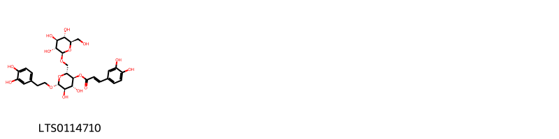{ width=100% }
    <figcaption>Hình ảnh cấu trúc hóa học của 1 hoạt chất thuộc nhóm Cinnamic acids and derivatives gồm ['(2r,3s,4r,5r,6r)-6-[2-(3,4-dihydroxyphenyl)ethoxy]-4,5-dihydroxy-2-({[(2r,3r,4s,5s,6r)-3,4,5-trihydroxy-6-(hydroxymethyl)oxan-2-yl]oxy}methyl)oxan-3-yl (2e)-3-(3,4-dihydroxyphenyl)prop-2-enoate (LTS0114710)'].</figcaption>
</figure>
#### Nhóm Prenol lipids
<figure markdown="span">
    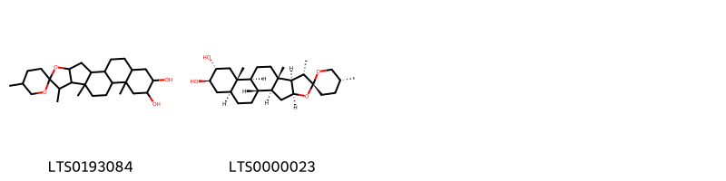{ width=100% }
    <figcaption>Hình ảnh cấu trúc hóa học của 2 hoạt chất thuộc nhóm Prenol lipids gồm ["5,7',9',13'-tetramethyl-5'-oxaspiro[oxane-2,6'-pentacyclo[10.8.0.0²,⁹.0⁴,⁸.0¹³,¹⁸]icosane]-15',16'-diol (LTS0193084)", 'gitogenin (LTS0000023)'].</figcaption>
</figure>
#### Nhóm Steroids and steroid derivatives
<figure markdown="span">
    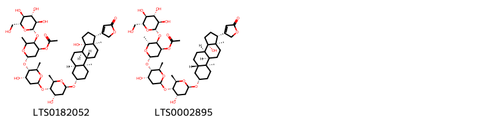{ width=100% }
    <figcaption>Hình ảnh cấu trúc hóa học của 2 hoạt chất thuộc nhóm Steroids and steroid derivatives gồm ['(3r,4s,6s)-6-{[(2r,3s,4s,6s)-6-{[(2r,3s,4s,6r)-6-{[(1r,3as,3br,5ar,7s,9as,9bs,11ar)-3a-hydroxy-9a,11a-dimethyl-1-(5-oxo-2h-furan-3-yl)-tetradecahydrocyclopenta[a]phenanthren-7-yl]oxy}-4-hydroxy-2-methyloxan-3-yl]oxy}-4-hydroxy-2-methyloxan-3-yl]oxy}-2-methyl-3-{[(2s,3r,4s,5s,6r)-3,4,5-trihydroxy-6-(hydroxymethyl)oxan-2-yl]oxy}oxan-4-yl acetate (LTS0182052)', '(2r,3r,4s,6s)-6-{[(2r,3s,4s,6s)-6-{[(2r,3s,4s,6r)-6-{[(1r,3as,3br,5as,7s,9as,9br,11ar)-3a-hydroxy-9a,11a-dimethyl-1-(5-oxo-2h-furan-3-yl)-tetradecahydrocyclopenta[a]phenanthren-7-yl]oxy}-4-hydroxy-2-methyloxan-3-yl]oxy}-4-hydroxy-2-methyloxan-3-yl]oxy}-2-methyl-3-{[(2s,3r,4s,5s,6r)-3,4,5-trihydroxy-6-(hydroxymethyl)oxan-2-yl]oxy}oxan-4-yl acetate (LTS0002895)'].</figcaption>
</figure>

---

### Dược dân tộc học

Danh sách các quốc gia có sử dụng *Digitalis lutea* trong điều trị các bệnh. 

| Country   | Disease                                                   | Bệnh                                                                                                                                                                                                |
|:----------|:----------------------------------------------------------|:----------------------------------------------------------------------------------------------------------------------------------------------------------------------------------------------------|
| Turkey    | Cardiotonic, Poison, Sedative, Stimulant, Tonic, Diuretic | MYMEMORY WARNING: YOU USED ALL AVAILABLE FREE TRANSLATIONS FOR TODAY. NEXT AVAILABLE IN  17 HOURS 22 MINUTES 49 SECONDS VISIT HTTPS://MYMEMORY.TRANSLATED.NET/DOC/USAGELIMITS.PHP TO TRANSLATE MORE |
| ain       | Cardiotonic                                               | MYMEMORY WARNING: YOU USED ALL AVAILABLE FREE TRANSLATIONS FOR TODAY. NEXT AVAILABLE IN  17 HOURS 22 MINUTES 46 SECONDS VISIT HTTPS://MYMEMORY.TRANSLATED.NET/DOC/USAGELIMITS.PHP TO TRANSLATE MORE |

---

---
## Digitalis obscura
### Thông tin về thực vật

!!! info "Phân loại thực vật của *Digitalis obscura* từ GIBF:"
    - **Kingdom:** Plantae
    - **Phylum:** Tracheophyta
    - **Order:** Lamiales
    - **Family:** Plantaginaceae
    - **Genus:** Digitalis
    - **Species:** *Digitalis obscura*

 

| Label (VI)   | Label (EN)   | Scientific Name   | Descriptions (VI)   | Descriptions (EN)   | Also Known As (VI)   | Also Known As (EN)   |
|:-------------|:-------------|:------------------|:--------------------|:--------------------|:---------------------|:---------------------|
| N/A          | N/A          | Digitalis obscura | loài thực vật       | species of plant    | ['']                 | ['']                 |

#### Phân bố trên thế giới

**Từ CSDL GIBF** Spain, Morocco

#### Phân bố tại Việt Nam

**Từ CSDL GIBF**: Không có ghi nhận ở Việt Nam

---
### Thành phần hóa học
        
- Theo cơ sở dữ liệu lotus: Từ loài *Digitalis obscura* đã phân lập và xác định được 18 hoạt chất thuộc về các nhóm Steroids and steroid derivatives. 

|    | chemicalTaxonomyClassyfireClass   |   smiles_count |
|---:|:----------------------------------|---------------:|
|  0 | Steroids and steroid derivatives  |             17 |

#### Nhóm Steroids and steroid derivatives
<figure markdown="span">
    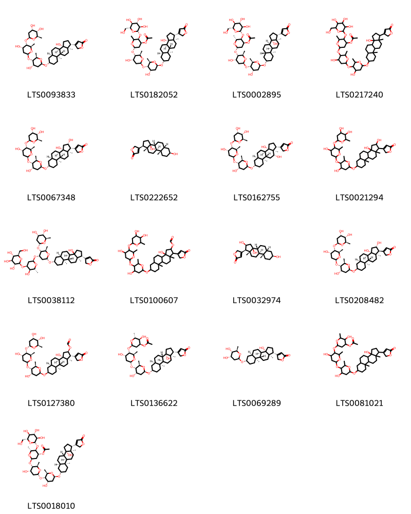{ width=100% }
    <figcaption>Hình ảnh cấu trúc hóa học của 17 hoạt chất thuộc nhóm Steroids and steroid derivatives gồm ['digitoxin (LTS0093833)', '(3r,4s,6s)-6-{[(2r,3s,4s,6s)-6-{[(2r,3s,4s,6r)-6-{[(1r,3as,3br,5ar,7s,9as,9bs,11ar)-3a-hydroxy-9a,11a-dimethyl-1-(5-oxo-2h-furan-3-yl)-tetradecahydrocyclopenta[a]phenanthren-7-yl]oxy}-4-hydroxy-2-methyloxan-3-yl]oxy}-4-hydroxy-2-methyloxan-3-yl]oxy}-2-methyl-3-{[(2s,3r,4s,5s,6r)-3,4,5-trihydroxy-6-(hydroxymethyl)oxan-2-yl]oxy}oxan-4-yl acetate (LTS0182052)', '(2r,3r,4s,6s)-6-{[(2r,3s,4s,6s)-6-{[(2r,3s,4s,6r)-6-{[(1r,3as,3br,5as,7s,9as,9br,11ar)-3a-hydroxy-9a,11a-dimethyl-1-(5-oxo-2h-furan-3-yl)-tetradecahydrocyclopenta[a]phenanthren-7-yl]oxy}-4-hydroxy-2-methyloxan-3-yl]oxy}-4-hydroxy-2-methyloxan-3-yl]oxy}-2-methyl-3-{[(2s,3r,4s,5s,6r)-3,4,5-trihydroxy-6-(hydroxymethyl)oxan-2-yl]oxy}oxan-4-yl acetate (LTS0002895)', 'lanatoside-a (LTS0217240)', 'gitoxin (LTS0067348)', 'digitoxigenin (LTS0222652)', 'digoxin (LTS0162755)', 'gitoxin (LTS0021294)', '4-[(1r,3br,5ar,7s,9as,9bs,11ar)-7-{[(2s,4s,5r,6r)-5-{[(2r,4s,5s,6r)-4,5-dihydroxy-6-methyloxan-2-yl]oxy}-4-{[(2r,4s,5r,6r)-5-hydroxy-6-methyl-4-{[(2r,3r,4s,5s,6r)-3,4,5-trihydroxy-6-(hydroxymethyl)oxan-2-yl]oxy}oxan-2-yl]oxy}-6-methyloxan-2-yl]oxy}-3a-hydroxy-9a,11a-dimethyl-tetradecahydrocyclopenta[a]phenanthren-1-yl]-5h-furan-2-one (LTS0038112)', 'gitaloxin (LTS0100607)', 'gitoxigenin (LTS0032974)', '4-[(1s,2s,3as,3br,5ar,7r,9as,9bs,11ar)-7-{[(2r,4s,5s,6r)-5-{[(2s,4s,5s,6r)-5-{[(2s,4s,5s,6r)-4,5-dihydroxy-6-methyloxan-2-yl]oxy}-4-hydroxy-6-methyloxan-2-yl]oxy}-4-hydroxy-6-methyloxan-2-yl]oxy}-2,3a-dihydroxy-9a,11a-dimethyl-tetradecahydrocyclopenta[a]phenanthren-1-yl]-5h-furan-2-one (LTS0208482)', '(1r,2r,3as,3br,5ar,7r,9as,9bs,11ar)-7-{[(2r,4s,5s,6r)-5-{[(2s,4s,5s,6r)-5-{[(2r,4s,5s,6r)-4,5-dihydroxy-6-methyloxan-2-yl]oxy}-4-hydroxy-6-methyloxan-2-yl]oxy}-4-hydroxy-6-methyloxan-2-yl]oxy}-3a-hydroxy-9a,11a-dimethyl-1-(5-oxo-2h-furan-3-yl)-tetradecahydrocyclopenta[a]phenanthren-2-yl formate (LTS0127380)', '(2r,3r,4s,6r)-6-{[(2r,3s,4s,6r)-6-{[(2r,3s,4s,6r)-6-{[(1r,3as,3bs,5ar,7s,9as,9br,11ar)-3a-hydroxy-9a,11a-dimethyl-1-(5-oxo-2h-furan-3-yl)-tetradecahydrocyclopenta[a]phenanthren-7-yl]oxy}-4-hydroxy-2-methyloxan-3-yl]oxy}-4-hydroxy-2-methyloxan-3-yl]oxy}-3-hydroxy-2-methyloxan-4-yl acetate (LTS0136622)', '4-[(1r,3as,3br,5ar,7s,9as,9bs,11ar)-7-{[(2r,4s,5s,6r)-4,5-dihydroxy-6-methyloxan-2-yl]oxy}-3a-hydroxy-9a,11a-dimethyl-tetradecahydrocyclopenta[a]phenanthren-1-yl]-5h-furan-2-one (LTS0069289)', '6-({6-[(6-{[3a-hydroxy-9a,11a-dimethyl-1-(5-oxo-2h-furan-3-yl)-tetradecahydrocyclopenta[a]phenanthren-7-yl]oxy}-4-hydroxy-2-methyloxan-3-yl)oxy]-4-hydroxy-2-methyloxan-3-yl}oxy)-3-hydroxy-2-methyloxan-4-yl acetate (LTS0081021)', '(2r,3r,4r,6r)-6-{[(2r,3s,4s,6r)-6-{[(2r,3s,4s,6r)-6-{[(1r,3as,3bs,5ar,7s,9as,9br,11ar)-3a-hydroxy-9a,11a-dimethyl-1-(5-oxo-2h-furan-3-yl)-tetradecahydrocyclopenta[a]phenanthren-7-yl]oxy}-4-hydroxy-2-methyloxan-3-yl]oxy}-4-hydroxy-2-methyloxan-3-yl]oxy}-2-methyl-3-{[(2s,3r,4s,5s,6r)-3,4,5-trihydroxy-6-(hydroxymethyl)oxan-2-yl]oxy}oxan-4-yl acetate (LTS0018010)'].</figcaption>
</figure>

---

### Dược dân tộc học

Danh sách các quốc gia có sử dụng *Digitalis obscura* trong điều trị các bệnh. 

| Country   | Disease     | Bệnh                                                                                                                                                                                                |
|:----------|:------------|:----------------------------------------------------------------------------------------------------------------------------------------------------------------------------------------------------|
| ain       | Cardiotonic | MYMEMORY WARNING: YOU USED ALL AVAILABLE FREE TRANSLATIONS FOR TODAY. NEXT AVAILABLE IN  17 HOURS 22 MINUTES 23 SECONDS VISIT HTTPS://MYMEMORY.TRANSLATED.NET/DOC/USAGELIMITS.PHP TO TRANSLATE MORE |

---

---
## Digitalis purpurea
### Thông tin về thực vật

!!! info "Phân loại thực vật của *Digitalis purpurea* từ GIBF:"
    - **Kingdom:** Plantae
    - **Phylum:** Tracheophyta
    - **Order:** Lamiales
    - **Family:** Plantaginaceae
    - **Genus:** Digitalis
    - **Species:** *Digitalis purpurea*

 

| Label (VI)   | Label (EN)   | Scientific Name    | Descriptions (VI)   | Descriptions (EN)                                  | Also Known As (VI)   | Also Known As (EN)          |
|:-------------|:-------------|:-------------------|:--------------------|:---------------------------------------------------|:---------------------|:----------------------------|
| N/A          | N/A          | Digitalis purpurea |                     | toxic flowering plant in the family Plantaginaceae | ['']                 | ['Fairy bells', 'Foxglove'] |

#### Phân bố trên thế giới

**Từ CSDL GIBF** Luxembourg, Spain, Germany, Chile, Australia, Colombia, Poland, Canada, Belgium, Netherlands, Ireland, Chinese Taipei, United Kingdom of Great Britain and Northern Ireland, Argentina, Portugal, France, Czechia, New Zealand, Bolivia (Plurinational State of), Ecuador, United States of America

#### Phân bố tại Việt Nam

**Từ CSDL GIBF**: Không có ghi nhận ở Việt Nam

---
### Thành phần hóa học
        
- Theo cơ sở dữ liệu lotus: Từ loài *Digitalis purpurea* đã phân lập và xác định được 213 hoạt chất thuộc về các nhóm Organooxygen compounds, Furanoid lignans, Benzofurans, Saturated hydrocarbons, Prenol lipids, Carboxylic acids and derivatives, Anthracenes, Fatty Acyls, Cinnamic acids and derivatives, Benzodioxoles, Hydroxy acids and derivatives, Steroids and steroid derivatives, Pyridines and derivatives. 

|    | chemicalTaxonomyClassyfireClass   |   smiles_count |
|---:|:----------------------------------|---------------:|
|  0 | Anthracenes                       |              5 |
|  1 | Benzodioxoles                     |              2 |
|  2 | Benzofurans                       |              2 |
|  3 | Carboxylic acids and derivatives  |              3 |
|  4 | Cinnamic acids and derivatives    |             20 |
|  5 | Fatty Acyls                       |              3 |
|  6 | Furanoid lignans                  |              1 |
|  7 | Hydroxy acids and derivatives     |              2 |
|  8 | Organooxygen compounds            |             13 |
|  9 | Prenol lipids                     |             12 |
| 10 | Pyridines and derivatives         |              1 |
| 11 | Saturated hydrocarbons            |             23 |
| 12 | Steroids and steroid derivatives  |            124 |

#### Nhóm Anthracenes
<figure markdown="span">
    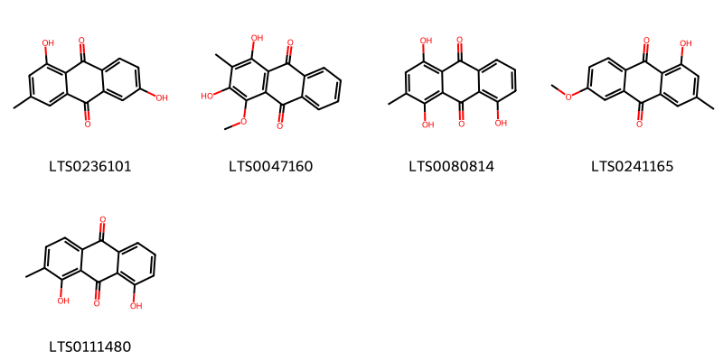{ width=100% }
    <figcaption>Hình ảnh cấu trúc hóa học của 5 hoạt chất thuộc nhóm Anthracenes gồm ['1,6-dihydroxy-3-methylanthracene-9,10-dione (LTS0236101)', '1,3-dihydroxy-4-methoxy-2-methylanthracene-9,10-dione (LTS0047160)', '1,4,8-trihydroxy-2-methylanthracene-9,10-dione (LTS0080814)', '1-hydroxy-6-methoxy-3-methylanthracene-9,10-dione (LTS0241165)', '1,8-dihydroxy-2-methylanthracene-9,10-dione (LTS0111480)'].</figcaption>
</figure>
#### Nhóm Benzodioxoles
<figure markdown="span">
    { width=100% }
    <figcaption>Hình ảnh cấu trúc hóa học của 2 hoạt chất thuộc nhóm Benzodioxoles gồm ['sesamolin (LTS0079632)', 'sesamolin (LTS0276354)'].</figcaption>
</figure>
#### Nhóm Benzofurans
<figure markdown="span">
    { width=100% }
    <figcaption>Hình ảnh cấu trúc hóa học của 2 hoạt chất thuộc nhóm Benzofurans gồm ['loliolide (LTS0254454)', 'loliolide (LTS0119422)'].</figcaption>
</figure>
#### Nhóm Carboxylic acids and derivatives
<figure markdown="span">
    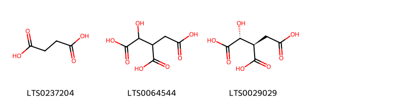{ width=100% }
    <figcaption>Hình ảnh cấu trúc hóa học của 3 hoạt chất thuộc nhóm Carboxylic acids and derivatives gồm ['succinic acid (LTS0237204)', 'isocitric acid (LTS0064544)', 'l-erythro-isocitric acid (LTS0029029)'].</figcaption>
</figure>
#### Nhóm Cinnamic acids and derivatives
<figure markdown="span">
    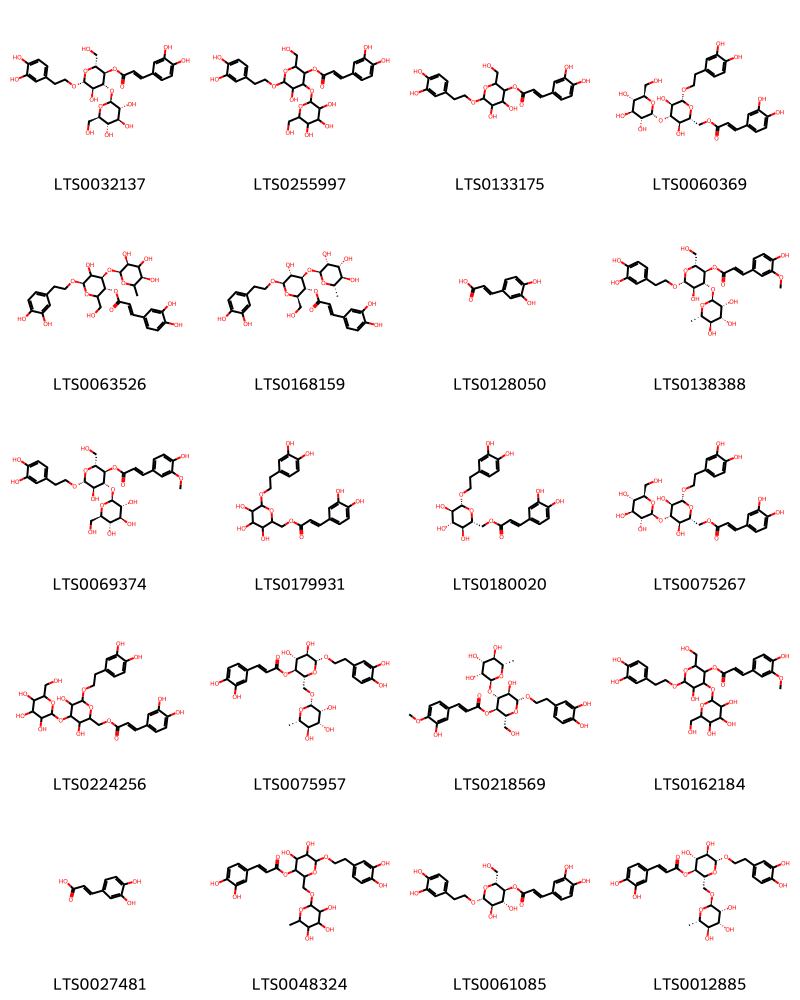{ width=100% }
    <figcaption>Hình ảnh cấu trúc hóa học của 20 hoạt chất thuộc nhóm Cinnamic acids and derivatives gồm ['plantamajoside (LTS0032137)', '6-[2-(3,4-dihydroxyphenyl)ethoxy]-5-hydroxy-2-(hydroxymethyl)-4-{[3,4,5-trihydroxy-6-(hydroxymethyl)oxan-2-yl]oxy}oxan-3-yl 3-(3,4-dihydroxyphenyl)prop-2-enoate (LTS0255997)', '6-[2-(3,4-dihydroxyphenyl)ethoxy]-4,5-dihydroxy-2-(hydroxymethyl)oxan-3-yl 3-(3,4-dihydroxyphenyl)prop-2-enoate (LTS0133175)', '[(2r,3r,4s,5r,6r)-6-[2-(3,4-dihydroxyphenyl)ethoxy]-3,5-dihydroxy-4-{[(2r,3r,4s,5s,6r)-3,4,5-trihydroxy-6-(hydroxymethyl)oxan-2-yl]oxy}oxan-2-yl]methyl (2e)-3-(3,4-dihydroxyphenyl)prop-2-enoate (LTS0060369)', '(3r,4r,6r)-6-[2-(3,4-dihydroxyphenyl)ethoxy]-5-hydroxy-2-(hydroxymethyl)-4-{[(2s,3s,5r)-3,4,5-trihydroxy-6-methyloxan-2-yl]oxy}oxan-3-yl (2e)-3-(3,4-dihydroxyphenyl)prop-2-enoate (LTS0063526)', 'verbascoside (LTS0168159)', '3,4-dihydroxycinnamic acid (LTS0128050)', '(2r,3r,4r,5r,6r)-6-[2-(3,4-dihydroxyphenyl)ethoxy]-5-hydroxy-2-(hydroxymethyl)-4-{[(2s,3r,4r,5r,6s)-3,4,5-trihydroxy-6-methyloxan-2-yl]oxy}oxan-3-yl (2e)-3-(4-hydroxy-3-methoxyphenyl)prop-2-enoate (LTS0138388)', '(2r,3r,4r,5r,6r)-6-[2-(3,4-dihydroxyphenyl)ethoxy]-5-hydroxy-2-(hydroxymethyl)-4-{[(2s,3r,4s,5s,6r)-3,4,5-trihydroxy-6-(hydroxymethyl)oxan-2-yl]oxy}oxan-3-yl (2e)-3-(4-hydroxy-3-methoxyphenyl)prop-2-enoate (LTS0069374)', '{6-[2-(3,4-dihydroxyphenyl)ethoxy]-3,4,5-trihydroxyoxan-2-yl}methyl 3-(3,4-dihydroxyphenyl)prop-2-enoate (LTS0179931)', 'calceolarioside b (LTS0180020)', '[(2r,3r,4s,5r,6r)-6-[2-(3,4-dihydroxyphenyl)ethoxy]-3,5-dihydroxy-4-{[(2s,3r,4s,5s,6r)-3,4,5-trihydroxy-6-(hydroxymethyl)oxan-2-yl]oxy}oxan-2-yl]methyl (2e)-3-(3,4-dihydroxyphenyl)prop-2-enoate (LTS0075267)', '{6-[2-(3,4-dihydroxyphenyl)ethoxy]-3,5-dihydroxy-4-{[3,4,5-trihydroxy-6-(hydroxymethyl)oxan-2-yl]oxy}oxan-2-yl}methyl 3-(3,4-dihydroxyphenyl)prop-2-enoate (LTS0224256)', '(2r,3s,4r,5r,6r)-6-[2-(3,4-dihydroxyphenyl)ethoxy]-4,5-dihydroxy-2-({[(2s,3r,4r,5r,6s)-3,4,5-trihydroxy-6-methyloxan-2-yl]oxy}methyl)oxan-3-yl (2e)-3-(3,4-dihydroxyphenyl)prop-2-enoate (LTS0075957)', '(2r,3r,4r,5r,6r)-6-[2-(3,4-dihydroxyphenyl)ethoxy]-5-hydroxy-2-(hydroxymethyl)-4-{[(2s,3r,4r,5r,6s)-3,4,5-trihydroxy-6-methyloxan-2-yl]oxy}oxan-3-yl (2e)-3-(3-hydroxy-4-methoxyphenyl)prop-2-enoate (LTS0218569)', '6-[2-(3,4-dihydroxyphenyl)ethoxy]-5-hydroxy-2-(hydroxymethyl)-4-{[3,4,5-trihydroxy-6-(hydroxymethyl)oxan-2-yl]oxy}oxan-3-yl 3-(4-hydroxy-3-methoxyphenyl)prop-2-enoate (LTS0162184)', 'caffeic acid (LTS0027481)', '6-[2-(3,4-dihydroxyphenyl)ethoxy]-4,5-dihydroxy-2-{[(3,4,5-trihydroxy-6-methyloxan-2-yl)oxy]methyl}oxan-3-yl 3-(3,4-dihydroxyphenyl)prop-2-enoate (LTS0048324)', '(2r,3s,4r,5r,6r)-6-[2-(3,4-dihydroxyphenyl)ethoxy]-4,5-dihydroxy-2-(hydroxymethyl)oxan-3-yl (2e)-3-(3,4-dihydroxyphenyl)prop-2-enoate (LTS0061085)', 'forsythiaside (LTS0012885)'].</figcaption>
</figure>
#### Nhóm Fatty Acyls
<figure markdown="span">
    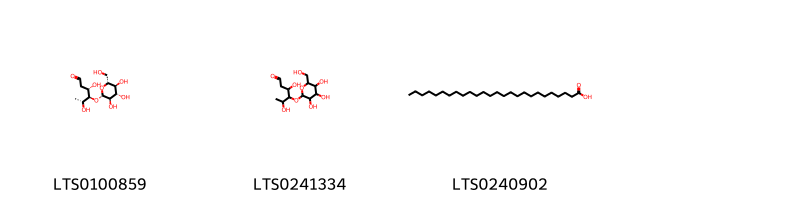{ width=100% }
    <figcaption>Hình ảnh cấu trúc hóa học của 3 hoạt chất thuộc nhóm Fatty Acyls gồm ['(3s,4s,5r)-3,5-dihydroxy-4-{[(2s,3r,4s,5s,6r)-3,4,5-trihydroxy-6-(hydroxymethyl)oxan-2-yl]oxy}hexanal (LTS0100859)', '3,5-dihydroxy-4-{[3,4,5-trihydroxy-6-(hydroxymethyl)oxan-2-yl]oxy}hexanal (LTS0241334)', 'hexacosanoic acid (LTS0240902)'].</figcaption>
</figure>
#### Nhóm Furanoid lignans
<figure markdown="span">
    { width=100% }
    <figcaption>Hình ảnh cấu trúc hóa học của 1 hoạt chất thuộc nhóm Furanoid lignans gồm ['sesamin (LTS0120161)'].</figcaption>
</figure>
#### Nhóm Hydroxy acids and derivatives
<figure markdown="span">
    { width=100% }
    <figcaption>Hình ảnh cấu trúc hóa học của 2 hoạt chất thuộc nhóm Hydroxy acids and derivatives gồm ['d-lactic acid (LTS0228942)', 'lactic acid (LTS0131933)'].</figcaption>
</figure>
#### Nhóm Organooxygen compounds
<figure markdown="span">
    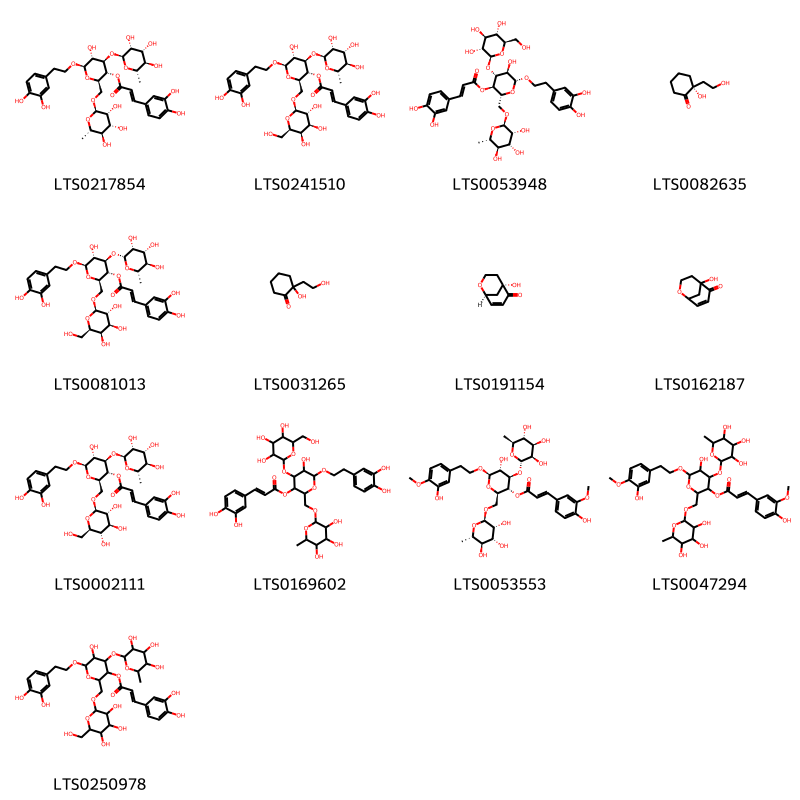{ width=100% }
    <figcaption>Hình ảnh cấu trúc hóa học của 13 hoạt chất thuộc nhóm Organooxygen compounds gồm ['(2r,3r,4r,5r,6r)-6-[2-(3,4-dihydroxyphenyl)ethoxy]-5-hydroxy-4-{[(2s,3r,4r,5r,6s)-3,4,5-trihydroxy-6-methyloxan-2-yl]oxy}-2-({[(2r,3r,4r,5r,6s)-3,4,5-trihydroxy-6-methyloxan-2-yl]oxy}methyl)oxan-3-yl (2e)-3-(3,4-dihydroxyphenyl)prop-2-enoate (LTS0217854)', 'purpureaside c (LTS0241510)', '(2r,3r,4r,5r,6r)-6-[2-(3,4-dihydroxyphenyl)ethoxy]-5-hydroxy-4-{[(2s,3r,4s,5s,6r)-3,4,5-trihydroxy-6-(hydroxymethyl)oxan-2-yl]oxy}-2-({[(2r,3r,4r,5r,6s)-3,4,5-trihydroxy-6-methyloxan-2-yl]oxy}methyl)oxan-3-yl (2e)-3-(3,4-dihydroxyphenyl)prop-2-enoate (LTS0053948)', '(2r)-2-hydroxy-2-(2-hydroxyethyl)cyclohexan-1-one (LTS0082635)', '(2r,3r,4r,5r,6r)-6-[2-(3,4-dihydroxyphenyl)ethoxy]-5-hydroxy-2-({[(2r,3r,4s,5r,6r)-3,4,5-trihydroxy-6-(hydroxymethyl)oxan-2-yl]oxy}methyl)-4-{[(2r,3r,4r,5r,6s)-3,4,5-trihydroxy-6-methyloxan-2-yl]oxy}oxan-3-yl (2e)-3-(3,4-dihydroxyphenyl)prop-2-enoate (LTS0081013)', '2-hydroxy-2-(2-hydroxyethyl)cyclohexan-1-one (LTS0031265)', '(1s,5s)-5-hydroxy-2-oxabicyclo[3.3.1]non-7-en-6-one (LTS0191154)', '5-hydroxy-2-oxabicyclo[3.3.1]non-7-en-6-one (LTS0162187)', 'echinacoside (LTS0002111)', '6-[2-(3,4-dihydroxyphenyl)ethoxy]-5-hydroxy-4-{[3,4,5-trihydroxy-6-(hydroxymethyl)oxan-2-yl]oxy}-2-{[(3,4,5-trihydroxy-6-methyloxan-2-yl)oxy]methyl}oxan-3-yl 3-(3,4-dihydroxyphenyl)prop-2-enoate (LTS0169602)', '(2r,3r,4r,5r,6r)-5-hydroxy-6-[2-(3-hydroxy-4-methoxyphenyl)ethoxy]-4-{[(2s,3r,4r,5r,6s)-3,4,5-trihydroxy-6-methyloxan-2-yl]oxy}-2-({[(2r,3r,4r,5r,6s)-3,4,5-trihydroxy-6-methyloxan-2-yl]oxy}methyl)oxan-3-yl (2e)-3-(4-hydroxy-3-methoxyphenyl)prop-2-enoate (LTS0053553)', '5-hydroxy-6-[2-(3-hydroxy-4-methoxyphenyl)ethoxy]-4-[(3,4,5-trihydroxy-6-methyloxan-2-yl)oxy]-2-{[(3,4,5-trihydroxy-6-methyloxan-2-yl)oxy]methyl}oxan-3-yl 3-(4-hydroxy-3-methoxyphenyl)prop-2-enoate (LTS0047294)', '6-[2-(3,4-dihydroxyphenyl)ethoxy]-5-hydroxy-2-({[3,4,5-trihydroxy-6-(hydroxymethyl)oxan-2-yl]oxy}methyl)-4-[(3,4,5-trihydroxy-6-methyloxan-2-yl)oxy]oxan-3-yl 3-(3,4-dihydroxyphenyl)prop-2-enoate (LTS0250978)'].</figcaption>
</figure>
#### Nhóm Prenol lipids
<figure markdown="span">
    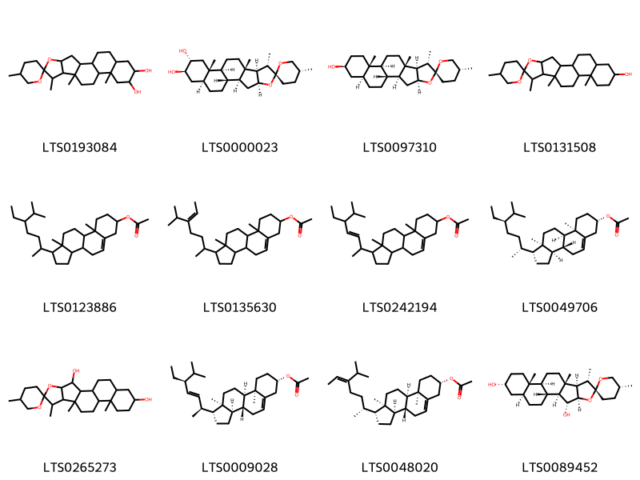{ width=100% }
    <figcaption>Hình ảnh cấu trúc hóa học của 12 hoạt chất thuộc nhóm Prenol lipids gồm ["5,7',9',13'-tetramethyl-5'-oxaspiro[oxane-2,6'-pentacyclo[10.8.0.0²,⁹.0⁴,⁸.0¹³,¹⁸]icosane]-15',16'-diol (LTS0193084)", 'gitogenin (LTS0000023)', 'tigogenin (LTS0097310)', 'tigogenin (LTS0131508)', '1-(5-ethyl-6-methylheptan-2-yl)-9a,11a-dimethyl-1h,2h,3h,3ah,3bh,4h,6h,7h,8h,9h,9bh,10h,11h-cyclopenta[a]phenanthren-7-yl acetate (LTS0123886)', '1-(5-isopropylhept-5-en-2-yl)-9a,11a-dimethyl-1h,2h,3h,3ah,3bh,4h,6h,7h,8h,9h,9bh,10h,11h-cyclopenta[a]phenanthren-7-yl acetate (LTS0135630)', '1-(5-ethyl-6-methylhept-3-en-2-yl)-9a,11a-dimethyl-1h,2h,3h,3ah,3bh,4h,6h,7h,8h,9h,9bh,10h,11h-cyclopenta[a]phenanthren-7-yl acetate (LTS0242194)', '(1r,3ar,3br,7s,9ar,9br,11ar)-1-[(2r,5r)-5-ethyl-6-methylheptan-2-yl]-9a,11a-dimethyl-1h,2h,3h,3ah,3bh,4h,6h,7h,8h,9h,9bh,10h,11h-cyclopenta[a]phenanthren-7-yl acetate (LTS0049706)', 'digalogenine (LTS0265273)', '(1r,3ar,3br,7s,9ar,9br,11ar)-1-[(2s,3e,5s)-5-ethyl-6-methylhept-3-en-2-yl]-9a,11a-dimethyl-1h,2h,3h,3ah,3bh,4h,6h,7h,8h,9h,9bh,10h,11h-cyclopenta[a]phenanthren-7-yl acetate (LTS0009028)', '(1r,3ar,3br,7s,9ar,9br,11ar)-1-[(2r,5e)-5-isopropylhept-5-en-2-yl]-9a,11a-dimethyl-1h,2h,3h,3ah,3bh,4h,6h,7h,8h,9h,9bh,10h,11h-cyclopenta[a]phenanthren-7-yl acetate (LTS0048020)', "(1'r,2r,2's,3'r,4'r,5r,7's,8'r,9's,12's,13's,16'r,18's)-5,7',9',13'-tetramethyl-5'-oxaspiro[oxane-2,6'-pentacyclo[10.8.0.0²,⁹.0⁴,⁸.0¹³,¹⁸]icosane]-3',16'-diol (LTS0089452)"].</figcaption>
</figure>
#### Nhóm Pyridines and derivatives
<figure markdown="span">
    { width=100% }
    <figcaption>Hình ảnh cấu trúc hóa học của 1 hoạt chất thuộc nhóm Pyridines and derivatives gồm ['niacin (LTS0216673)'].</figcaption>
</figure>
#### Nhóm Saturated hydrocarbons
<figure markdown="span">
    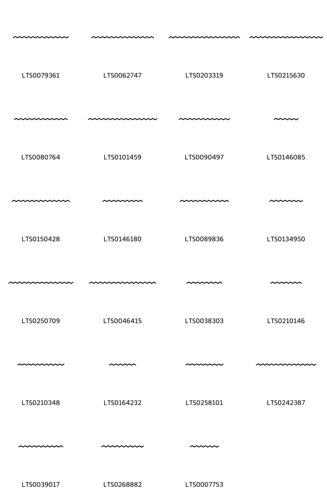{ width=100% }
    <figcaption>Hình ảnh cấu trúc hóa học của 23 hoạt chất thuộc nhóm Saturated hydrocarbons gồm ['hexacosane (LTS0079361)', 'nonacosane (LTS0062747)', 'tritriacontane (LTS0203319)', 'tetratriacontane (LTS0215630)', 'pentacosane (LTS0080764)', 'dotriacontane (LTS0101459)', 'tetracosane (LTS0090497)', 'dodecane (LTS0146085)', 'heptacosane (LTS0150428)', 'nonadecane (LTS0146180)', 'tricosane (LTS0089836)', 'cetane (LTS0134950)', 'triacontane (LTS0250709)', 'hentriacontane (LTS0046415)', 'heptadecane (LTS0038303)', 'pentadecane (LTS0210146)', 'docosane (LTS0210348)', 'tridecane (LTS0164232)', 'octadecane (LTS0258101)', 'octacosane (LTS0242387)', 'heneicosane (LTS0039017)', 'eicosane (LTS0268882)', 'tetradecane (LTS0007753)'].</figcaption>
</figure>
#### Nhóm Steroids and steroid derivatives
<figure markdown="span">
    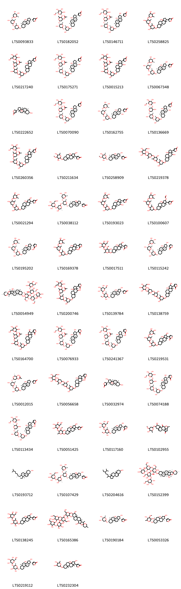{ width=100% }
    <figcaption>Hình ảnh cấu trúc hóa học của 124 hoạt chất thuộc nhóm Steroids and steroid derivatives gồm ['digitoxin (LTS0093833)', '(3r,4s,6s)-6-{[(2r,3s,4s,6s)-6-{[(2r,3s,4s,6r)-6-{[(1r,3as,3br,5ar,7s,9as,9bs,11ar)-3a-hydroxy-9a,11a-dimethyl-1-(5-oxo-2h-furan-3-yl)-tetradecahydrocyclopenta[a]phenanthren-7-yl]oxy}-4-hydroxy-2-methyloxan-3-yl]oxy}-4-hydroxy-2-methyloxan-3-yl]oxy}-2-methyl-3-{[(2s,3r,4s,5s,6r)-3,4,5-trihydroxy-6-(hydroxymethyl)oxan-2-yl]oxy}oxan-4-yl acetate (LTS0182052)', 'lanatoside b (LTS0146711)', 'digitoxin (LTS0258825)', 'lanatoside-a (LTS0217240)', 'lanatoside c (LTS0175271)', 'lanatoside-c (LTS0015213)', 'gitoxin (LTS0067348)', 'digitoxigenin (LTS0222652)', 'lanatoside a (LTS0070090)', 'digoxin (LTS0162755)', 'deslanoside (LTS0136669)', '6-({6-[(6-{[2,3a-dihydroxy-9a,11a-dimethyl-1-(5-oxo-2h-furan-3-yl)-tetradecahydrocyclopenta[a]phenanthren-7-yl]oxy}-4-hydroxy-2-methyloxan-3-yl)oxy]-4-hydroxy-2-methyloxan-3-yl}oxy)-2-methyl-3-{[3,4,5-trihydroxy-6-(hydroxymethyl)oxan-2-yl]oxy}oxan-4-yl acetate (LTS0260356)', '4-{7-[(3,5-dihydroxy-4-methoxy-6-methyloxan-2-yl)oxy]-2,3a-dihydroxy-9a,11a-dimethyl-tetradecahydrocyclopenta[a]phenanthren-1-yl}-5h-furan-2-one (LTS0211634)', 'strospeside (LTS0258909)', '4-(3a,11-dihydroxy-7-{[4-hydroxy-5-({4-hydroxy-5-[(4-hydroxy-6-methyl-5-{[3,4,5-trihydroxy-6-(hydroxymethyl)oxan-2-yl]oxy}oxan-2-yl)oxy]-6-methyloxan-2-yl}oxy)-6-methyloxan-2-yl]oxy}-9a,11a-dimethyl-tetradecahydrocyclopenta[a]phenanthren-1-yl)-5h-furan-2-one (LTS0219378)', 'gitoxin (LTS0021294)', '4-[(1r,3br,5ar,7s,9as,9bs,11ar)-7-{[(2s,4s,5r,6r)-5-{[(2r,4s,5s,6r)-4,5-dihydroxy-6-methyloxan-2-yl]oxy}-4-{[(2r,4s,5r,6r)-5-hydroxy-6-methyl-4-{[(2r,3r,4s,5s,6r)-3,4,5-trihydroxy-6-(hydroxymethyl)oxan-2-yl]oxy}oxan-2-yl]oxy}-6-methyloxan-2-yl]oxy}-3a-hydroxy-9a,11a-dimethyl-tetradecahydrocyclopenta[a]phenanthren-1-yl]-5h-furan-2-one (LTS0038112)', 'lanoxin (LTS0193023)', 'gitaloxin (LTS0100607)', '3-[(1s,3as,3br,5ar,7s,9as,9bs,11r,11as)-7-{[(2r,4s,5s,6r)-5-{[(2s,4s,5s,6r)-5-{[(2s,4s,5s,6r)-4,5-dihydroxy-6-methyloxan-2-yl]oxy}-4-hydroxy-6-methyloxan-2-yl]oxy}-4-hydroxy-6-methyloxan-2-yl]oxy}-3a,11-dihydroxy-9a,11a-dimethyl-tetradecahydrocyclopenta[a]phenanthren-1-yl]-5h-furan-2-one (LTS0195202)', '3-(7-{[5-({5-[(4,5-dihydroxy-6-methyloxan-2-yl)oxy]-4-hydroxy-6-methyloxan-2-yl}oxy)-4-hydroxy-6-methyloxan-2-yl]oxy}-3a,11-dihydroxy-9a,11a-dimethyl-tetradecahydrocyclopenta[a]phenanthren-1-yl)-5h-furan-2-one (LTS0169378)', '3-{2,3a-dihydroxy-7-[(3-hydroxy-4-methoxy-6-methyl-5-{[3,4,5-trihydroxy-6-(hydroxymethyl)oxan-2-yl]oxy}oxan-2-yl)oxy]-9a,11a-dimethyl-tetradecahydrocyclopenta[a]phenanthren-1-yl}-5h-furan-2-one (LTS0017511)', '3-[(1s,2s,3as,3br,5ar,7s,9as,9bs,11ar)-7-{[(2r,4s,5s,6r)-5-{[(2s,4s,5s,6r)-5-{[(2s,4s,5s,6r)-4,5-dihydroxy-6-methyloxan-2-yl]oxy}-4-hydroxy-6-methyloxan-2-yl]oxy}-4-hydroxy-6-methyloxan-2-yl]oxy}-2,3a-dihydroxy-9a,11a-dimethyl-tetradecahydrocyclopenta[a]phenanthren-1-yl]-5h-furan-2-one (LTS0115242)', "(2s,3s,4r,5r,6r)-2-{[(2r,3s,4r,5s,6s)-2-{[(2r,3r,4s,5r,6s)-2-{[(2r,3r,4r,5r,6r)-4,5-dihydroxy-2-(hydroxymethyl)-6-[(1's,2s,2'r,3's,4's,5r,7'r,8's,9'r,12's,13's,15's,16's,18'r)-5,7',9',13'-tetramethyl-5'-oxaspiro[oxane-2,6'-pentacyclo[10.8.0.0²,⁹.0⁴,⁸.0¹³,¹⁸]icosane]-3',15'-dioloxy]oxan-3-yl]oxy}-5-hydroxy-6-(hydroxymethyl)-4-{[(2s,3r,4r,5r)-3,4,5-trihydroxyoxan-2-yl]oxy}oxan-3-yl]oxy}-3,5-dihydroxy-6-(hydroxymethyl)oxan-4-yl]oxy}-6-(hydroxymethyl)oxane-3,4,5-triol (LTS0054949)", '6-({6-[(6-{[3a,11-dihydroxy-9a,11a-dimethyl-1-(2-oxo-5h-furan-3-yl)-tetradecahydrocyclopenta[a]phenanthren-7-yl]oxy}-4-hydroxy-2-methyloxan-3-yl)oxy]-4-hydroxy-2-methyloxan-3-yl}oxy)-2-methyl-3-{[3,4,5-trihydroxy-6-(hydroxymethyl)oxan-2-yl]oxy}oxan-4-yl acetate (LTS0200746)', 'digitalin (LTS0139784)', '3-(2,3a-dihydroxy-7-{[4-hydroxy-5-({4-hydroxy-5-[(4-hydroxy-6-methyl-5-{[3,4,5-trihydroxy-6-(hydroxymethyl)oxan-2-yl]oxy}oxan-2-yl)oxy]-6-methyloxan-2-yl}oxy)-6-methyloxan-2-yl]oxy}-9a,11a-dimethyl-tetradecahydrocyclopenta[a]phenanthren-1-yl)-5h-furan-2-one (LTS0138759)', '6-({6-[(6-{[2,3a-dihydroxy-9a,11a-dimethyl-1-(2-oxo-5h-furan-3-yl)-tetradecahydrocyclopenta[a]phenanthren-7-yl]oxy}-4-hydroxy-2-methyloxan-3-yl)oxy]-4-hydroxy-2-methyloxan-3-yl}oxy)-2-methyl-3-{[3,4,5-trihydroxy-6-(hydroxymethyl)oxan-2-yl]oxy}oxan-4-yl acetate (LTS0164700)', '(2r,3r,4s,6s)-6-{[(2r,3s,4s,6s)-6-{[(2r,3s,4s,6r)-6-{[(1r,2s,3as,3br,5ar,7s,9as,9bs,11ar)-2,3a-dihydroxy-9a,11a-dimethyl-1-(2-oxo-5h-furan-3-yl)-tetradecahydrocyclopenta[a]phenanthren-7-yl]oxy}-4-hydroxy-2-methyloxan-3-yl]oxy}-4-hydroxy-2-methyloxan-3-yl]oxy}-2-methyl-3-{[(2s,3r,4s,5s,6r)-3,4,5-trihydroxy-6-(hydroxymethyl)oxan-2-yl]oxy}oxan-4-yl acetate (LTS0076933)', '(2r,3r,4s,6s)-6-{[(2r,3s,4s,6s)-6-{[(2r,3s,4s,6r)-6-{[(1s,3as,3br,5ar,7s,9as,9bs,11r,11as)-3a,11-dihydroxy-9a,11a-dimethyl-1-(2-oxo-5h-furan-3-yl)-tetradecahydrocyclopenta[a]phenanthren-7-yl]oxy}-4-hydroxy-2-methyloxan-3-yl]oxy}-4-hydroxy-2-methyloxan-3-yl]oxy}-2-methyl-3-{[(2s,3r,4s,5s,6r)-3,4,5-trihydroxy-6-(hydroxymethyl)oxan-2-yl]oxy}oxan-4-yl acetate (LTS0241367)', '3-(7-{[5-({5-[(4,5-dihydroxy-6-methyloxan-2-yl)oxy]-4-hydroxy-6-methyloxan-2-yl}oxy)-4-hydroxy-6-methyloxan-2-yl]oxy}-2,3a-dihydroxy-9a,11a-dimethyl-tetradecahydrocyclopenta[a]phenanthren-1-yl)-5h-furan-2-one (LTS0219531)', 'acetyldigitoxin (LTS0012015)', '3-(3a,11-dihydroxy-7-{[4-hydroxy-5-({4-hydroxy-5-[(4-hydroxy-6-methyl-5-{[3,4,5-trihydroxy-6-(hydroxymethyl)oxan-2-yl]oxy}oxan-2-yl)oxy]-6-methyloxan-2-yl}oxy)-6-methyloxan-2-yl]oxy}-9a,11a-dimethyl-tetradecahydrocyclopenta[a]phenanthren-1-yl)-5h-furan-2-one (LTS0056658)', 'gitoxigenin (LTS0032974)', '3-[(1r,2s,3as,3br,5ar,7s,9as,9bs,11ar)-2,3a-dihydroxy-7-{[(2r,4s,5s,6r)-4-hydroxy-5-{[(2s,4s,5s,6r)-4-hydroxy-5-{[(2s,4s,5s,6r)-4-hydroxy-6-methyl-5-{[(2s,3r,4s,5s,6r)-3,4,5-trihydroxy-6-(hydroxymethyl)oxan-2-yl]oxy}oxan-2-yl]oxy}-6-methyloxan-2-yl]oxy}-6-methyloxan-2-yl]oxy}-9a,11a-dimethyl-tetradecahydrocyclopenta[a]phenanthren-1-yl]-5h-furan-2-one (LTS0074188)', '3-[(1r,3as,3br,5ar,7s,9as,9bs,11r,11as)-3a,11-dihydroxy-7-{[(2r,4s,5s,6r)-4-hydroxy-5-{[(2s,4s,5s,6r)-4-hydroxy-5-{[(2s,4s,5s,6r)-4-hydroxy-6-methyl-5-{[(2s,3r,4s,5s,6r)-3,4,5-trihydroxy-6-(hydroxymethyl)oxan-2-yl]oxy}oxan-2-yl]oxy}-6-methyloxan-2-yl]oxy}-6-methyloxan-2-yl]oxy}-9a,11a-dimethyl-tetradecahydrocyclopenta[a]phenanthren-1-yl]-5h-furan-2-one (LTS0113434)', '4-{2,3a-dihydroxy-7-[(3-hydroxy-4-methoxy-6-methyl-5-{[3,4,5-trihydroxy-6-(hydroxymethyl)oxan-2-yl]oxy}oxan-2-yl)oxy]-9a,11a-dimethyl-tetradecahydrocyclopenta[a]phenanthren-1-yl}-5h-furan-2-one (LTS0051425)', '3-[(1r,2s,3as,3br,5ar,7s,9as,9bs,11ar)-2,3a-dihydroxy-7-{[(2r,3r,4r,5s,6r)-3-hydroxy-4-methoxy-6-methyl-5-{[(2s,3r,4s,5s,6r)-3,4,5-trihydroxy-6-(hydroxymethyl)oxan-2-yl]oxy}oxan-2-yl]oxy}-9a,11a-dimethyl-tetradecahydrocyclopenta[a]phenanthren-1-yl]-5h-furan-2-one (LTS0117160)', '8-hydroxy-7-[(5-hydroxy-4-methoxy-6-methyloxan-2-yl)oxy]-10,15,19-trimethyl-14-oxapentacyclo[11.5.1.0²,¹¹.0⁵,¹⁰.0¹⁶,¹⁹]nonadec-4-ene-12,18-dione (LTS0102955)', '(1r,3ar,3br,7s,9ar,9br,11ar)-9a,11a-dimethyl-1-[(2r)-6-methylheptan-2-yl]-1h,2h,3h,3ah,3bh,4h,6h,7h,8h,9h,9bh,10h,11h-cyclopenta[a]phenanthren-7-ol (LTS0193712)', '4-[(1r,2s,3br,5ar,7s,9as,9bs,11ar)-7-{[(2s,4s,5r,6r)-5-{[(2r,4s,5s,6r)-4,5-dihydroxy-6-methyloxan-2-yl]oxy}-4-{[(2r,4s,5r,6r)-5-hydroxy-6-methyl-4-{[(2r,3r,4s,5s,6r)-3,4,5-trihydroxy-6-(hydroxymethyl)oxan-2-yl]oxy}oxan-2-yl]oxy}-6-methyloxan-2-yl]oxy}-2,3a-dihydroxy-9a,11a-dimethyl-tetradecahydrocyclopenta[a]phenanthren-1-yl]-5h-furan-2-one (LTS0107429)', 'stigmast-5-en-3-ol, (3β)- (LTS0204616)', "(2s,3r,4s,5s,6r)-2-{[(2s,3r,4s,5s,6r)-2-{[(2s,3r,4s,5r,6r)-2-{[(2r,3r,4r,5r,6r)-4,5-dihydroxy-2-(hydroxymethyl)-6-[(1'r,2r,2's,3's,4'r,5r,7's,8'r,9's,12's,13's,15'r,16'r,18's)-5,7',9',13'-tetramethyl-5'-oxaspiro[oxane-2,6'-pentacyclo[10.8.0.0²,⁹.0⁴,⁸.0¹³,¹⁸]icosane]-3',15'-dioloxy]oxan-3-yl]oxy}-5-hydroxy-6-(hydroxymethyl)-4-{[(2s,3r,4s,5r)-3,4,5-trihydroxyoxan-2-yl]oxy}oxan-3-yl]oxy}-3,5-dihydroxy-6-(hydroxymethyl)oxan-4-yl]oxy}-6-(hydroxymethyl)oxane-3,4,5-triol (LTS0152399)", '4-{7-[(3,4-dihydroxy-6-methyl-5-{[3,4,5-trihydroxy-6-(hydroxymethyl)oxan-2-yl]oxy}oxan-2-yl)oxy]-2,3a-dihydroxy-9a,11a-dimethyl-tetradecahydrocyclopenta[a]phenanthren-1-yl}-5h-furan-2-one (LTS0138245)', 'digitonin (LTS0165386)', '4-[(1r,2s,3as,3br,5ar,7s,9as,9bs,11ar)-7-{[(2r,4s,5s,6r)-4,5-dihydroxy-6-methyloxan-2-yl]oxy}-2,3a-dihydroxy-9a,11a-dimethyl-tetradecahydrocyclopenta[a]phenanthren-1-yl]-5h-furan-2-one (LTS0190184)', '4-[(1r,3as,5ar,7r,9as,11ar)-7-{[(2r,5s)-3,5-dihydroxy-4-methoxy-6-methyloxan-2-yl]oxy}-2,3a-dihydroxy-9a,11a-dimethyl-tetradecahydrocyclopenta[a]phenanthren-1-yl]-5h-furan-2-one (LTS0053326)', '4-[(1r,2s,3as,3br,5ar,7s,9as,9bs,11ar)-7-{[(2r,3r,4r,5r,6r)-3,4-dihydroxy-6-methyl-5-{[(2s,3r,4s,5s,6r)-3,4,5-trihydroxy-6-(hydroxymethyl)oxan-2-yl]oxy}oxan-2-yl]oxy}-2,3a-dihydroxy-9a,11a-dimethyl-tetradecahydrocyclopenta[a]phenanthren-1-yl]-5h-furan-2-one (LTS0219112)', '4-{7-[(4,5-dihydroxy-6-methyloxan-2-yl)oxy]-2,3a-dihydroxy-9a,11a-dimethyl-tetradecahydrocyclopenta[a]phenanthren-1-yl}-5h-furan-2-one (LTS0232304)', 'gitaloxin (LTS0228045)', 'stigmasterol (LTS0024262)', '4-{7-[(5-{[3,4-dihydroxy-6-(hydroxymethyl)-5-{[3,4,5-trihydroxy-6-(hydroxymethyl)oxan-2-yl]oxy}oxan-2-yl]oxy}-3-hydroxy-4-methoxy-6-methyloxan-2-yl)oxy]-2,3a-dihydroxy-9a,11a-dimethyl-tetradecahydrocyclopenta[a]phenanthren-1-yl}-5h-furan-2-one (LTS0268567)', '(1r,3ar,3br,7s,9ar,9br,11ar)-1-[(2r,5r)-5-ethyl-6-methylheptan-2-yl]-9a,11a-dimethyl-1h,2h,3h,3ah,3bh,4h,6h,7h,8h,9h,9bh,10h,11h-cyclopenta[a]phenanthren-7-ol (LTS0129695)', '4-{7-[(3,4-dihydroxy-6-methyl-5-{[3,4,5-trihydroxy-6-(hydroxymethyl)oxan-2-yl]oxy}oxan-2-yl)oxy]-3a-hydroxy-9a,11a-dimethyl-tetradecahydrocyclopenta[a]phenanthren-1-yl}-5h-furan-2-one (LTS0011220)', 'campesterol (LTS0046755)', '(1r,3ar,3br,7s,9ar,9br,11ar)-1-[(2r,5r)-5,6-dimethylheptan-2-yl]-9a,11a-dimethyl-1h,2h,3h,3ah,3bh,4h,6h,7h,8h,9h,9bh,10h,11h-cyclopenta[a]phenanthren-7-ol (LTS0015450)', 'epicholestrol (LTS0000908)', '(1r,2s,7r,8s,10r,11s,13r,15s,16r,19r)-8-hydroxy-7-{[(2s,4r,5s,6r)-5-hydroxy-4-methoxy-6-methyloxan-2-yl]oxy}-10,15,19-trimethyl-14-oxapentacyclo[11.5.1.0²,¹¹.0⁵,¹⁰.0¹⁶,¹⁹]nonadec-4-ene-12,18-dione (LTS0107741)', 'gitonin (LTS0117507)', '4-[(1r,3as,3br,5ar,7s,9as,9bs,11ar)-7-{[(2r,3r,4s,5s,6r)-3,5-dihydroxy-4-methoxy-6-methyloxan-2-yl]oxy}-3a-hydroxy-9a,11a-dimethyl-tetradecahydrocyclopenta[a]phenanthren-1-yl]-5h-furan-2-one (LTS0196909)', '(5r,6r)-6-[(1s,3as,5ar,7r,8s,9ar,9br,11ar)-3a,7,8-trihydroxy-9a,11a-dimethyl-5-oxo-1h,2h,3h,5ah,6h,7h,8h,9h,9bh,10h,11h-cyclopenta[a]phenanthren-1-yl]-5,6-dihydroxy-2-methylheptan-2-yl acetate (LTS0238867)', '4-[(1r,3as,5as,7s,9r,9ar,10r,11ar)-3a,5a,9,10-tetrahydroxy-9a-(hydroxymethyl)-11a-methyl-7-{[(2r,3r,4r,5r,6s)-3,4,5-trihydroxy-6-methyloxan-2-yl]oxy}-dodecahydro-1h-cyclopenta[a]phenanthren-1-yl]-5h-furan-2-one (LTS0128294)', '3-hydroxy-3-{7-hydroxy-9a,11a-dimethyl-tetradecahydro-1h-cyclopenta[a]phenanthren-1-yl}butanoic acid (LTS0197141)', 'cholesteryl acetate (LTS0080498)', "(2s,3r,4s,5s,6r)-2-{[(2s,3r,4s,5s,6r)-2-{[(2s,3r,4s,5r,6r)-2-{[(2r,3r,4r,5r,6r)-4,5-dihydroxy-2-(hydroxymethyl)-6-[(1'r,2r,2's,3's,4'r,5r,7's,8'r,9's,12'r,13's,15'r,16'r,18's)-5,7',9',13'-tetramethyl-5'-oxaspiro[oxane-2,6'-pentacyclo[10.8.0.0²,⁹.0⁴,⁸.0¹³,¹⁸]icosane]-3',15'-dioloxy]oxan-3-yl]oxy}-5-hydroxy-6-(hydroxymethyl)-4-{[(2s,3r,4s,5r)-3,4,5-trihydroxyoxan-2-yl]oxy}oxan-3-yl]oxy}-3,5-dihydroxy-6-(hydroxymethyl)oxan-4-yl]oxy}-6-(hydroxymethyl)oxane-3,4,5-triol (LTS0091125)", '6-{3a,7,8-trihydroxy-9a,11a-dimethyl-5-oxo-1h,2h,3h,5ah,6h,7h,8h,9h,9bh,10h,11h-cyclopenta[a]phenanthren-1-yl}-5,6-dihydroxy-2-methylheptan-2-yl acetate (LTS0090967)', '4-(2,3a-dihydroxy-7-{[4-hydroxy-5-({4-hydroxy-5-[(4-hydroxy-6-methyl-5-{[3,4,5-trihydroxy-6-(hydroxymethyl)oxan-2-yl]oxy}oxan-2-yl)oxy]-6-methyloxan-2-yl}oxy)-6-methyloxan-2-yl]oxy}-9a,11a-dimethyl-tetradecahydrocyclopenta[a]phenanthren-1-yl)-5h-furan-2-one (LTS0157256)', '1-[(1s,3as,3br,7s,9ar,9bs,11r,11as)-3a,7,11-trihydroxy-9a,11a-dimethyl-1h,2h,3h,3bh,4h,6h,7h,8h,9h,9bh,10h,11h-cyclopenta[a]phenanthren-1-yl]ethanone (LTS0040628)', "2-[(2-{[4,5-dihydroxy-2-(hydroxymethyl)-6-{5,7',9',13'-tetramethyl-5'-oxaspiro[oxane-2,6'-pentacyclo[10.8.0.0²,⁹.0⁴,⁸.0¹³,¹⁸]icosane]-3',15'-dioloxy}oxan-3-yl]oxy}-5-hydroxy-6-(hydroxymethyl)-4-[(3,4,5-trihydroxyoxan-2-yl)oxy]oxan-3-yl)oxy]-6-(hydroxymethyl)oxane-3,4,5-triol (LTS0120435)", '4-(3a-hydroxy-7-{[4-hydroxy-5-({4-hydroxy-5-[(4-hydroxy-6-methyl-5-{[3,4,5-trihydroxy-6-(hydroxymethyl)oxan-2-yl]oxy}oxan-2-yl)oxy]-6-methyloxan-2-yl}oxy)-6-methyloxan-2-yl]oxy}-9a,11a-dimethyl-tetradecahydrocyclopenta[a]phenanthren-1-yl)-5h-furan-2-one (LTS0050433)', '3a,6,9a,11a-tetramethyl-1-(6-methylhept-5-en-2-yl)-1h,2h,3h,4h,5h,5ah,6h,7h,8h,9h,10h,11h-cyclopenta[a]phenanthren-7-ol (LTS0103812)', '(1r,3ar,3br,7s,9ar,9br,11ar)-1-[(2r,5r)-5,6-dimethylheptan-2-yl]-9a,11a-dimethyl-1h,2h,3h,3ah,3bh,4h,6h,7h,8h,9h,9bh,10h,11h-cyclopenta[a]phenanthren-7-yl acetate (LTS0182426)', '(1r,2s,7s,10r,11s,13r,15s,16r,19r)-7-{[(2s,4r,5s,6r)-5-hydroxy-4-methoxy-6-methyloxan-2-yl]oxy}-10,15,19-trimethyl-14-oxapentacyclo[11.5.1.0²,¹¹.0⁵,¹⁰.0¹⁶,¹⁹]nonadec-4-ene-12,18-dione (LTS0143964)', '4-[(1s,3ar,3br,9as,9bs,11as)-9a,11a-dimethyl-tetradecahydro-1h-cyclopenta[a]phenanthren-1-yl]-5h-furan-2-one (LTS0193425)', '4-[(1r,3as,3br,5ar,7s,9as,9bs,11ar)-7-{[(2r,3r,4r,5r,6r)-3,4-dihydroxy-6-methyl-5-{[(2s,3r,4s,5s,6r)-3,4,5-trihydroxy-6-(hydroxymethyl)oxan-2-yl]oxy}oxan-2-yl]oxy}-3a-hydroxy-9a,11a-dimethyl-tetradecahydrocyclopenta[a]phenanthren-1-yl]-5h-furan-2-one (LTS0145228)', '4-{2,3a-dihydroxy-7-[(3-hydroxy-4-methoxy-6-methyl-5-{[3,4,5-trihydroxy-6-({[3,4,5-trihydroxy-6-(hydroxymethyl)oxan-2-yl]oxy}methyl)oxan-2-yl]oxy}oxan-2-yl)oxy]-9a,11a-dimethyl-tetradecahydrocyclopenta[a]phenanthren-1-yl}-5h-furan-2-one (LTS0230511)', '7,12,16-trimethyl-15-(6-methyl-5-methylideneheptan-2-yl)pentacyclo[9.7.0.0¹,³.0³,⁸.0¹²,¹⁶]octadecan-6-yl acetate (LTS0095008)', '6,9a,11a-trimethyl-1-(6-methyl-5-methylideneheptan-2-yl)-1h,2h,3h,3ah,5h,5ah,6h,7h,8h,9h,9bh,10h,11h-cyclopenta[a]phenanthren-7-ol (LTS0172153)', '(1r,3ar,5as,7s,9as,11ar)-3a,9a,11a-trimethyl-1-[(2r)-6-methyl-5-methylideneheptan-2-yl]-1h,2h,3h,4h,5h,5ah,6h,7h,8h,9h,10h,11h-cyclopenta[a]phenanthren-7-yl acetate (LTS0168669)', '4-{3a-hydroxy-9a,11a-dimethyl-7-[(3,4,5-trihydroxy-6-methyloxan-2-yl)oxy]-tetradecahydrocyclopenta[a]phenanthren-1-yl}-5h-furan-2-one (LTS0183916)', '(1s,3r,6s,7s,8r,11r,12s,15r,16r)-7,12,16-trimethyl-15-[(2r)-6-methyl-5-methylideneheptan-2-yl]pentacyclo[9.7.0.0¹,³.0³,⁸.0¹²,¹⁶]octadecan-6-yl acetate (LTS0180784)', '(1r,3ar,3br,7s,9ar,9br,11ar)-9a,11a-dimethyl-1-[(2r)-6-methyl-5-methylideneheptan-2-yl]-1h,2h,3h,3ah,3bh,4h,6h,7h,8h,9h,9bh,10h,11h-cyclopenta[a]phenanthren-7-yl acetate (LTS0197948)', '4-[(1r,3as,3br,5ar,7s,9as,9bs,11ar)-3a-hydroxy-7-{[(2r,4s,5s,6r)-4-hydroxy-5-{[(2s,4s,5s,6r)-4-hydroxy-5-{[(2s,4s,5s,6r)-4-hydroxy-6-methyl-5-{[(2s,3r,4s,5s,6r)-3,4,5-trihydroxy-6-(hydroxymethyl)oxan-2-yl]oxy}oxan-2-yl]oxy}-6-methyloxan-2-yl]oxy}-6-methyloxan-2-yl]oxy}-9a,11a-dimethyl-tetradecahydrocyclopenta[a]phenanthren-1-yl]-5h-furan-2-one (LTS0081039)', '(2r,3r)-2-[(1s,3as,5ar,7r,8s,9ar,9br,11ar)-3a,7,8-trihydroxy-9a,11a-dimethyl-5-oxo-1h,2h,3h,5ah,6h,7h,8h,9h,9bh,10h,11h-cyclopenta[a]phenanthren-1-yl]-2,6-dihydroxy-6-methylheptan-3-yl acetate (LTS0197787)', 'α-acetyldigoxin (LTS0081724)', '(1r,3as,5ar,6s,7s,9as,11ar)-3a,6,9a,11a-tetramethyl-1-[(2s)-6-methylhept-5-en-2-yl]-1h,2h,3h,4h,5h,5ah,6h,7h,8h,9h,10h,11h-cyclopenta[a]phenanthren-7-ol (LTS0207697)', '3a,7,8-trihydroxy-9a,11a-dimethyl-1-(2,3,6-trihydroxy-6-methylheptan-2-yl)-1h,2h,3h,5ah,6h,7h,8h,9h,9bh,10h,11h-cyclopenta[a]phenanthren-5-one (LTS0071237)', '(1s,3as,3br,7s,9ar,9bs,11ar)-1-[(2s,3e,5s)-5-ethyl-6-methylhept-3-en-2-yl]-9a,11a-dimethyl-1h,2h,3h,3ah,3bh,4h,6h,7h,8h,9h,9bh,10h,11h-cyclopenta[a]phenanthren-7-ol (LTS0073123)', '4-[(1r,2s,3as,3br,5ar,7s,9as,9bs,11ar)-2,3a-dihydroxy-7-{[(2r,3r,4r,5s,6r)-3-hydroxy-4-methoxy-6-methyl-5-{[(2s,3r,4s,5s,6r)-3,4,5-trihydroxy-6-({[(2r,3r,4s,5s,6r)-3,4,5-trihydroxy-6-(hydroxymethyl)oxan-2-yl]oxy}methyl)oxan-2-yl]oxy}oxan-2-yl]oxy}-9a,11a-dimethyl-tetradecahydrocyclopenta[a]phenanthren-1-yl]-5h-furan-2-one (LTS0219577)', '3a,9a,11a-trimethyl-1-(6-methyl-5-methylideneheptan-2-yl)-1h,2h,3h,4h,5h,5ah,6h,7h,8h,9h,10h,11h-cyclopenta[a]phenanthren-7-yl acetate (LTS0207362)', '(1r,3ar,5as,6s,7s,9as,9bs,11ar)-6,9a,11a-trimethyl-1-[(2r)-6-methyl-5-methylideneheptan-2-yl]-1h,2h,3h,3ah,5h,5ah,6h,7h,8h,9h,9bh,10h,11h-cyclopenta[a]phenanthren-7-ol (LTS0091855)', '4-[(1r,2s,3as,3br,5ar,7s,9as,9bs,11ar)-7-{[(2r,3r,4r,5s,6r)-5-{[(2s,3r,4r,5s,6r)-3,4-dihydroxy-6-(hydroxymethyl)-5-{[(2s,3r,4s,5s,6r)-3,4,5-trihydroxy-6-(hydroxymethyl)oxan-2-yl]oxy}oxan-2-yl]oxy}-3-hydroxy-4-methoxy-6-methyloxan-2-yl]oxy}-2,3a-dihydroxy-9a,11a-dimethyl-tetradecahydrocyclopenta[a]phenanthren-1-yl]-5h-furan-2-one (LTS0265636)', '(1s,3as,3br,7s,9ar,9bs,11ar)-1-acetyl-7-{[(2r,3r,4s,5s,6r)-3,5-dihydroxy-4-methoxy-6-methyloxan-2-yl]oxy}-3a-hydroxy-9a,11a-dimethyl-1h,2h,3bh,4h,6h,7h,8h,9h,9bh,11h-cyclopenta[a]phenanthrene-3,10-dione (LTS0221939)', '7,7,12,16-tetramethyl-15-(6-methyl-5-methylideneheptan-2-yl)pentacyclo[9.7.0.0¹,³.0³,⁸.0¹²,¹⁶]octadecan-6-ol (LTS0084326)', '4-[(1r,3as,3br,5ar,7s,9as,9bs,11ar)-3a-hydroxy-9a,11a-dimethyl-7-{[(2r,3r,4s,5r,6r)-3,4,5-trihydroxy-6-methyloxan-2-yl]oxy}-tetradecahydrocyclopenta[a]phenanthren-1-yl]-5h-furan-2-one (LTS0230169)', '4-[(1r,2s,3as,3br,5ar,7s,9as,9bs,11ar)-2,3a-dihydroxy-7-{[(2r,4s,5s,6r)-4-hydroxy-5-{[(2s,4s,5s,6r)-4-hydroxy-5-{[(2s,4s,5s,6r)-4-hydroxy-6-methyl-5-{[(2s,3r,4s,5s,6r)-3,4,5-trihydroxy-6-(hydroxymethyl)oxan-2-yl]oxy}oxan-2-yl]oxy}-6-methyloxan-2-yl]oxy}-6-methyloxan-2-yl]oxy}-9a,11a-dimethyl-tetradecahydrocyclopenta[a]phenanthren-1-yl]-5h-furan-2-one (LTS0220198)', '7-[(5-hydroxy-4-methoxy-6-methyloxan-2-yl)oxy]-10,15,19-trimethyl-14-oxapentacyclo[11.5.1.0²,¹¹.0⁵,¹⁰.0¹⁶,¹⁹]nonadec-4-ene-12,18-dione (LTS0220633)', '9a,11a-dimethyl-1-(6-methyl-5-methylideneheptan-2-yl)-1h,2h,3h,3ah,5h,5ah,6h,7h,8h,9h,9bh,10h,11h-cyclopenta[a]phenanthren-7-yl acetate (LTS0211208)', '1-acetyl-7-[(3,5-dihydroxy-4-methoxy-6-methyloxan-2-yl)oxy]-3a-hydroxy-9a,11a-dimethyl-1h,2h,3bh,4h,6h,7h,8h,9h,9bh,11h-cyclopenta[a]phenanthrene-3,10-dione (LTS0219522)', 'ethyl (3s)-3-[(1s,3as,3br,5ar,7s,9as,9bs,11as)-7-(acetyloxy)-9a,11a-dimethyl-tetradecahydro-1h-cyclopenta[a]phenanthren-1-yl]-3-hydroxybutanoate (LTS0231262)', '(1s,3r,6s,8s,11r,12s,15r,16r)-7,7,12,16-tetramethyl-15-[(2r)-6-methyl-5-methylideneheptan-2-yl]pentacyclo[9.7.0.0¹,³.0³,⁸.0¹²,¹⁶]octadecan-6-ol (LTS0040878)', '9a,11a-dimethyl-1-(6-methyl-5-methylideneheptan-2-yl)-1h,2h,3h,3ah,3bh,4h,6h,7h,8h,9h,9bh,10h,11h-cyclopenta[a]phenanthren-7-yl acetate (LTS0231831)', 'ethyl 3-[7-(acetyloxy)-9a,11a-dimethyl-tetradecahydro-1h-cyclopenta[a]phenanthren-1-yl]-3-hydroxybutanoate (LTS0237463)', '7-[(3,5-dihydroxy-4-methoxy-6-methyloxan-2-yl)oxy]-10,15,19-trimethyl-14-oxapentacyclo[11.5.1.0²,¹¹.0⁵,¹⁰.0¹⁶,¹⁹]nonadec-4-ene-12,18-dione (LTS0185627)', '(1r,2s,7s,10r,11s,13r,15s,16r,19r)-7-{[(2s,3r,4s,5s,6r)-3,5-dihydroxy-4-methoxy-6-methyloxan-2-yl]oxy}-10,15,19-trimethyl-14-oxapentacyclo[11.5.1.0²,¹¹.0⁵,¹⁰.0¹⁶,¹⁹]nonadec-4-ene-12,18-dione (LTS0251542)', '4-[(1s,2s,3ar,3br,5ar,7r,9as,9bs,11as)-7-{[(2r,3r,4s,5s,6r)-3,5-dihydroxy-4-methoxy-6-methyloxan-2-yl]oxy}-2,3a-dihydroxy-9a,11a-dimethyl-tetradecahydrocyclopenta[a]phenanthren-1-yl]-5h-furan-2-one (LTS0194627)', "(2s,3r,4s,5r,6r)-2-{[(2s,3r,4s,5r,6r)-2-{[(2r,3r,4r,5r,6r)-4,5-dihydroxy-2-(hydroxymethyl)-6-[(1'r,2r,2's,3's,4'r,5r,7's,8'r,9's,12'r,13's,15'r,16'r,18's)-5,7',9',13'-tetramethyl-5'-oxaspiro[oxane-2,6'-pentacyclo[10.8.0.0²,⁹.0⁴,⁸.0¹³,¹⁸]icosane]-3',15'-dioloxy]oxan-3-yl]oxy}-5-hydroxy-6-(hydroxymethyl)-4-{[(2s,3r,4s,5r)-3,4,5-trihydroxyoxan-2-yl]oxy}oxan-3-yl]oxy}-6-(hydroxymethyl)oxane-3,4,5-triol (LTS0195737)", '(3r)-3-[(1s,3as,3br,5ar,7s,9as,9bs,11as)-7-hydroxy-9a,11a-dimethyl-tetradecahydro-1h-cyclopenta[a]phenanthren-1-yl]-3-hydroxybutanoic acid (LTS0227341)', 'neriifolin (LTS0229598)', '1-{3a,7,11-trihydroxy-9a,11a-dimethyl-1h,2h,3h,3bh,4h,6h,7h,8h,9h,9bh,10h,11h-cyclopenta[a]phenanthren-1-yl}ethanone (LTS0119044)', '1-acetyl-7-[(3,5-dihydroxy-4-methoxy-6-methyloxan-2-yl)oxy]-1-hydroxy-9a,11a-dimethyl-2h,3ah,3bh,4h,6h,7h,8h,9h,9bh,11h-cyclopenta[a]phenanthrene-3,10-dione (LTS0136712)', '(1r,3as,3br,7r,9ar,9br,11as)-1-acetyl-7-{[(2s,3r,4s,5s,6r)-3,5-dihydroxy-4-methoxy-6-methyloxan-2-yl]oxy}-1-hydroxy-9a,11a-dimethyl-2h,3ah,3bh,4h,6h,7h,8h,9h,9bh,11h-cyclopenta[a]phenanthrene-3,10-dione (LTS0034688)', '2-{3a,7,8-trihydroxy-9a,11a-dimethyl-5-oxo-1h,2h,3h,5ah,6h,7h,8h,9h,9bh,10h,11h-cyclopenta[a]phenanthren-1-yl}-2,6-dihydroxy-6-methylheptan-3-yl acetate (LTS0042617)', '(1r,3ar,5as,6s,7s,9as,9br,11ar)-1-[(2r,5r)-5,6-dimethylheptan-2-yl]-6,9a,11a-trimethyl-1h,2h,3h,3ah,5h,5ah,6h,7h,8h,9h,9bh,10h,11h-cyclopenta[a]phenanthren-7-yl acetate (LTS0031913)', '(1r,2s,3as,3br,5ar,7s,9as,9bs,11ar)-3a-hydroxy-7-{[(2r,4s,5s,6r)-4-hydroxy-5-{[(2s,4s,5s,6r)-4-hydroxy-5-{[(2s,4s,5s,6r)-4-hydroxy-6-methyl-5-{[(2s,3r,4s,5s,6r)-3,4,5-trihydroxy-6-(hydroxymethyl)oxan-2-yl]oxy}oxan-2-yl]oxy}-6-methyloxan-2-yl]oxy}-6-methyloxan-2-yl]oxy}-9a,11a-dimethyl-1-(5-oxo-2h-furan-3-yl)-tetradecahydrocyclopenta[a]phenanthren-2-yl formate (LTS0028525)', '1-(5,6-dimethylheptan-2-yl)-9a,11a-dimethyl-1h,2h,3h,3ah,3bh,4h,6h,7h,8h,9h,9bh,10h,11h-cyclopenta[a]phenanthren-7-yl acetate (LTS0239510)', '20-hydroxyecdysone (LTS0227025)', '1-(5,6-dimethylheptan-2-yl)-6,9a,11a-trimethyl-1h,2h,3h,3ah,5h,5ah,6h,7h,8h,9h,9bh,10h,11h-cyclopenta[a]phenanthren-7-yl acetate (LTS0233166)', 'digoxigenin (LTS0074709)', '(1r,3ar,5ar,7s,9as,9br,11ar)-9a,11a-dimethyl-1-[(2r)-6-methyl-5-methylideneheptan-2-yl]-1h,2h,3h,3ah,5h,5ah,6h,7h,8h,9h,9bh,10h,11h-cyclopenta[a]phenanthren-7-yl acetate (LTS0258006)', '(1r,3ar,3br,7s,9ar,9br,11ar)-9a,11a-dimethyl-1-[(2r)-6-methylheptan-2-yl]-1h,2h,3h,3ah,3bh,4h,6h,7h,8h,9h,9bh,10h,11h-cyclopenta[a]phenanthren-7-yl acetate (LTS0049645)', '3a-hydroxy-7-{[4-hydroxy-5-({4-hydroxy-5-[(4-hydroxy-6-methyl-5-{[3,4,5-trihydroxy-6-(hydroxymethyl)oxan-2-yl]oxy}oxan-2-yl)oxy]-6-methyloxan-2-yl}oxy)-6-methyloxan-2-yl]oxy}-9a,11a-dimethyl-1-(5-oxo-2h-furan-3-yl)-tetradecahydrocyclopenta[a]phenanthren-2-yl formate (LTS0103872)', "2-[(2-{[4,5-dihydroxy-2-(hydroxymethyl)-6-{5,7',9',13'-tetramethyl-5'-oxaspiro[oxane-2,6'-pentacyclo[10.8.0.0²,⁹.0⁴,⁸.0¹³,¹⁸]icosan]-15'-oloxy}oxan-3-yl]oxy}-5-hydroxy-6-(hydroxymethyl)-4-[(3,4,5-trihydroxyoxan-2-yl)oxy]oxan-3-yl)oxy]-6-(hydroxymethyl)oxane-3,4,5-triol (LTS0246709)"].</figcaption>
</figure>

---

### Dược dân tộc học

Danh sách các quốc gia có sử dụng *Digitalis purpurea* trong điều trị các bệnh. 

| Country   | Disease                                                   | Bệnh                                                                                                                                                                                                |
|:----------|:----------------------------------------------------------|:----------------------------------------------------------------------------------------------------------------------------------------------------------------------------------------------------|
| Elsewhere | nan, Poison                                               | MYMEMORY WARNING: YOU USED ALL AVAILABLE FREE TRANSLATIONS FOR TODAY. NEXT AVAILABLE IN  17 HOURS 21 MINUTES 58 SECONDS VISIT HTTPS://MYMEMORY.TRANSLATED.NET/DOC/USAGELIMITS.PHP TO TRANSLATE MORE |
| India     | Cardiotonic                                               | MYMEMORY WARNING: YOU USED ALL AVAILABLE FREE TRANSLATIONS FOR TODAY. NEXT AVAILABLE IN  17 HOURS 21 MINUTES 56 SECONDS VISIT HTTPS://MYMEMORY.TRANSLATED.NET/DOC/USAGELIMITS.PHP TO TRANSLATE MORE |
| Iraq      | Poison                                                    | MYMEMORY WARNING: YOU USED ALL AVAILABLE FREE TRANSLATIONS FOR TODAY. NEXT AVAILABLE IN  17 HOURS 21 MINUTES 53 SECONDS VISIT HTTPS://MYMEMORY.TRANSLATED.NET/DOC/USAGELIMITS.PHP TO TRANSLATE MORE |
| Japan*    | Cardiotonic                                               | MYMEMORY WARNING: YOU USED ALL AVAILABLE FREE TRANSLATIONS FOR TODAY. NEXT AVAILABLE IN  17 HOURS 21 MINUTES 51 SECONDS VISIT HTTPS://MYMEMORY.TRANSLATED.NET/DOC/USAGELIMITS.PHP TO TRANSLATE MORE |
| Kurdistan | Cardiotonic                                               | MYMEMORY WARNING: YOU USED ALL AVAILABLE FREE TRANSLATIONS FOR TODAY. NEXT AVAILABLE IN  17 HOURS 21 MINUTES 48 SECONDS VISIT HTTPS://MYMEMORY.TRANSLATED.NET/DOC/USAGELIMITS.PHP TO TRANSLATE MORE |
| Nepal     | Tonic, Tonic                                              | MYMEMORY WARNING: YOU USED ALL AVAILABLE FREE TRANSLATIONS FOR TODAY. NEXT AVAILABLE IN  17 HOURS 21 MINUTES 46 SECONDS VISIT HTTPS://MYMEMORY.TRANSLATED.NET/DOC/USAGELIMITS.PHP TO TRANSLATE MORE |
| Turkey    | Cardiotonic, Diuretic, Poison, Sedative, Tonic, Stimulant | MYMEMORY WARNING: YOU USED ALL AVAILABLE FREE TRANSLATIONS FOR TODAY. NEXT AVAILABLE IN  17 HOURS 21 MINUTES 44 SECONDS VISIT HTTPS://MYMEMORY.TRANSLATED.NET/DOC/USAGELIMITS.PHP TO TRANSLATE MORE |
| US        | Cardiotonic                                               | MYMEMORY WARNING: YOU USED ALL AVAILABLE FREE TRANSLATIONS FOR TODAY. NEXT AVAILABLE IN  17 HOURS 21 MINUTES 42 SECONDS VISIT HTTPS://MYMEMORY.TRANSLATED.NET/DOC/USAGELIMITS.PHP TO TRANSLATE MORE |
| ain       | Cardiotonic                                               | MYMEMORY WARNING: YOU USED ALL AVAILABLE FREE TRANSLATIONS FOR TODAY. NEXT AVAILABLE IN  17 HOURS 21 MINUTES 39 SECONDS VISIT HTTPS://MYMEMORY.TRANSLATED.NET/DOC/USAGELIMITS.PHP TO TRANSLATE MORE |

---

# Chi Scoparia

??? note "Danh sách các dược liệu thuộc chi"
    
	 - *Scoparia dulcis*

---
## Scoparia dulcis
### Thông tin về thực vật

!!! info "Phân loại thực vật của *N/A* từ GIBF:"
    - **Kingdom:** N/A
    - **Phylum:** N/A
    - **Order:** N/A
    - **Family:** N/A
    - **Genus:** N/A
    - **Species:** *N/A*

 

| Label (VI)   | Label (EN)   | Scientific Name   | Descriptions (VI)   | Descriptions (EN)   | Also Known As (VI)   | Also Known As (EN)                           |
|:-------------|:-------------|:------------------|:--------------------|:--------------------|:---------------------|:---------------------------------------------|
| N/A          | N/A          | Scoparia dulcis   | loài thực vật       | species of plant    | ['']                 | ['Goatweed', 'Scoparia-weed', 'Sweet-broom'] |
| N/A          | N/A          | Scoparia dulcis   | loài côn trùng      | species of insect   | ['']                 | ['']                                         |

#### Phân bố trên thế giới

**Từ CSDL GIBF** Không có kết quả phù hợp

#### Phân bố tại Việt Nam

**Từ CSDL GIBF**: Không có ghi nhận ở Việt Nam

---
### Thành phần hóa học
        
- Theo cơ sở dữ liệu lotus: Từ loài *N/A* đã phân lập và xác định được 105 hoạt chất thuộc về các nhóm Organooxygen compounds, Flavonoids, Dibenzylbutane lignans, Prenol lipids, Aryltetralin lignans, Phenols, Cinnamic acids and derivatives, Benzoxazoles, Steroids and steroid derivatives. 

|    | chemicalTaxonomyClassyfireClass   |   smiles_count |
|---:|:----------------------------------|---------------:|
|  0 | Aryltetralin lignans              |              2 |
|  1 | Benzoxazoles                      |              2 |
|  2 | Cinnamic acids and derivatives    |              2 |
|  3 | Dibenzylbutane lignans            |              2 |
|  4 | Flavonoids                        |             41 |
|  5 | Organooxygen compounds            |              5 |
|  6 | Phenols                           |              2 |
|  7 | Prenol lipids                     |             48 |
|  8 | Steroids and steroid derivatives  |              1 |

#### Nhóm Aryltetralin lignans
<figure markdown="span">
    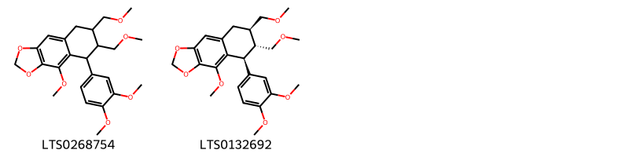{ width=100% }
    <figcaption>Hình ảnh cấu trúc hóa học của 2 hoạt chất thuộc nhóm Aryltetralin lignans gồm ['5-(3,4-dimethoxyphenyl)-4-methoxy-6,7-bis(methoxymethyl)-2h,5h,6h,7h,8h-naphtho[2,3-d][1,3]dioxole (LTS0268754)', '(5s,6r,7r)-5-(3,4-dimethoxyphenyl)-4-methoxy-6,7-bis(methoxymethyl)-2h,5h,6h,7h,8h-naphtho[2,3-d][1,3]dioxole (LTS0132692)'].</figcaption>
</figure>
#### Nhóm Benzoxazoles
<figure markdown="span">
    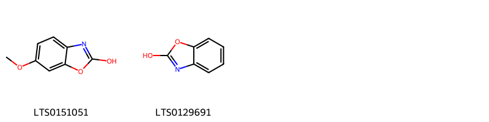{ width=100% }
    <figcaption>Hình ảnh cấu trúc hóa học của 2 hoạt chất thuộc nhóm Benzoxazoles gồm ['6-methoxy-1,3-benzoxazol-2-ol (LTS0151051)', '1,3-benzoxazol-2-ol (LTS0129691)'].</figcaption>
</figure>
#### Nhóm Cinnamic acids and derivatives
<figure markdown="span">
    { width=100% }
    <figcaption>Hình ảnh cấu trúc hóa học của 2 hoạt chất thuộc nhóm Cinnamic acids and derivatives gồm ['para-coumaric acid (LTS0266252)', 'hydroxycinnamic acid (LTS0233023)'].</figcaption>
</figure>
#### Nhóm Dibenzylbutane lignans
<figure markdown="span">
    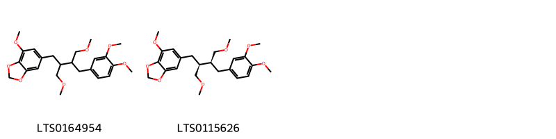{ width=100% }
    <figcaption>Hình ảnh cấu trúc hóa học của 2 hoạt chất thuộc nhóm Dibenzylbutane lignans gồm ['6-{3-[(3,4-dimethoxyphenyl)methyl]-4-methoxy-2-(methoxymethyl)butyl}-4-methoxy-2h-1,3-benzodioxole (LTS0164954)', '6-[(2s,3s)-3-[(3,4-dimethoxyphenyl)methyl]-4-methoxy-2-(methoxymethyl)butyl]-4-methoxy-2h-1,3-benzodioxole (LTS0115626)'].</figcaption>
</figure>
#### Nhóm Flavonoids
<figure markdown="span">
    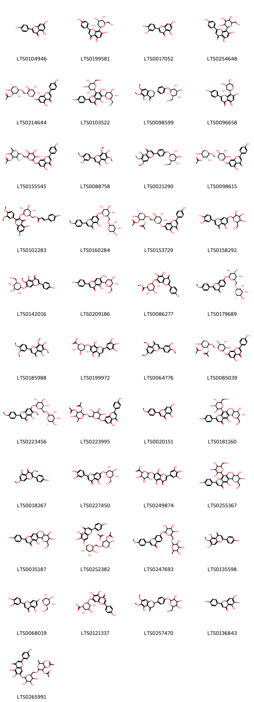{ width=100% }
    <figcaption>Hình ảnh cấu trúc hóa học của 41 hoạt chất thuộc nhóm Flavonoids gồm ['chamomile (LTS0104946)', 'vitexin (LTS0199581)', 'luteolin (LTS0017052)', 'vitexin (LTS0254648)', '(2s,3s,4s,5r,6r)-3,5-dihydroxy-2-methyl-6-{[(2s,3s,4s,5s,6s)-3,4,5-trihydroxy-6-{[5-hydroxy-2-(4-hydroxyphenyl)-4-oxochromen-7-yl]oxy}oxan-2-yl]methoxy}oxan-4-yl acetate (LTS0214644)', 'vicenin-2 (LTS0103522)', '(2s)-5-hydroxy-6,7-dimethoxy-2-(4-{[(2s,3r,4s,5s,6r)-3,4,5-trihydroxy-6-(hydroxymethyl)oxan-2-yl]oxy}phenyl)-2,3-dihydro-1-benzopyran-4-one (LTS0098599)', '5,7-dihydroxy-2-(4-hydroxyphenyl)-8-[(2s,3r,4s,5s)-3,4,5-trihydroxyoxan-2-yl]chromen-4-one (LTS0096658)', '3,5-dihydroxy-2-methyl-6-[(3,4,5-trihydroxy-6-{[5-hydroxy-2-(4-hydroxyphenyl)-4-oxochromen-7-yl]oxy}oxan-2-yl)methoxy]oxan-4-yl acetate (LTS0155545)', 'acerosin (LTS0088758)', '5-hydroxy-6,7-dimethoxy-2-(4-{[(2s,3r,4s,5s,6r)-3,4,5-trihydroxy-6-(hydroxymethyl)oxan-2-yl]oxy}phenyl)chromen-4-one (LTS0021290)', '(2s,3s,4r,5r,6r)-3,5-dihydroxy-2-methyl-6-{[(2r,3s,4s,5r,6s)-3,4,5-trihydroxy-6-{[5-hydroxy-2-(4-hydroxyphenyl)-4-oxochromen-7-yl]oxy}oxan-2-yl]methoxy}oxan-4-yl acetate (LTS0098615)', '[(2r,3s,4s,5r,6s)-6-{[2-(3,4-dimethoxyphenyl)-5,7-dihydroxy-4-oxochromen-3-yl]oxy}-3,4,5-trihydroxyoxan-2-yl]methyl (2e)-3-(4-hydroxyphenyl)prop-2-enoate (LTS0102283)', 'linarin (LTS0160284)', '(2r,3r,4s,5s,6s)-4-(acetyloxy)-5-hydroxy-6-methyl-2-{[(2s,3s,4s,5s,6s)-3,4,5-trihydroxy-6-{[5-hydroxy-2-(4-hydroxyphenyl)-4-oxochromen-7-yl]oxy}oxan-2-yl]methoxy}oxan-3-yl acetate (LTS0153729)', '2-(3,4-dihydroxyphenyl)-5-hydroxy-7-{[3,4,5-trihydroxy-6-(hydroxymethyl)oxan-2-yl]oxy}chromen-4-one (LTS0158292)', 'homoplantaginin (LTS0142016)', 'isovitexin (LTS0209186)', 'methyl (2s,3s,4s,5r,6s)-6-{[5,6-dihydroxy-2-(4-hydroxyphenyl)-4-oxochromen-7-yl]oxy}-3,4,5-trihydroxyoxane-2-carboxylate (LTS0086277)', '2-(4-methoxyphenyl)-7-{[(2s,3r,4s,5s,6r)-3,4,5-trihydroxy-6-({[(2s,3r,4r,5r,6s)-3,4,5-trihydroxy-6-methyloxan-2-yl]oxy}methyl)oxan-2-yl]oxy}chromen-4-one (LTS0179689)', 'hymenoxin (LTS0185988)', '(2s,3s,4s,5r,6s)-6-{[5,8-dihydroxy-4-oxo-2-(3,4,5-trihydroxyphenyl)chromen-7-yl]oxy}-3,4,5-trihydroxyoxane-2-carboxylic acid (LTS0199972)', '2-(3-hydroxy-4-methoxyphenyl)-5,7-dimethoxychromen-4-one (LTS0064776)', '(2r,3r,4r,5s,6s)-4-(acetyloxy)-5-hydroxy-6-methyl-2-{[(2r,3s,4s,5r,6s)-3,4,5-trihydroxy-6-{[5-hydroxy-2-(4-hydroxyphenyl)-4-oxochromen-7-yl]oxy}oxan-2-yl]methoxy}oxan-3-yl acetate (LTS0085039)', 'pectolinarin (LTS0223456)', '3-(acetyloxy)-5-hydroxy-6-methyl-2-[(3,4,5-trihydroxy-6-{[5-hydroxy-2-(4-hydroxyphenyl)-4-oxochromen-7-yl]oxy}oxan-2-yl)methoxy]oxan-4-yl acetate (LTS0223995)', 'acacetin (LTS0020151)', 'vicenin 2 (LTS0181160)', 'kumatakenin (LTS0018267)', 'luteolin 7-o-glucoside (LTS0227450)', '6-{[5,8-dihydroxy-4-oxo-2-(3,4,5-trihydroxyphenyl)chromen-7-yl]oxy}-3,4,5-trihydroxyoxane-2-carboxylic acid (LTS0249874)', '5,7-dihydroxy-2-(4-hydroxyphenyl)-6,8-bis[3,4,5-trihydroxy-6-(hydroxymethyl)oxan-2-yl]chromen-4-one (LTS0255367)', 'isovitexin (LTS0035187)', '(2r,3r,4s,5s,6s)-4-(acetyloxy)-2-{[(2s,3s,4s,5s,6s)-6-{[5,6-dihydroxy-2-(4-hydroxyphenyl)-4-oxochromen-7-yl]oxy}-3,4,5-trihydroxyoxan-2-yl]methoxy}-5-hydroxy-6-methyloxan-3-yl acetate (LTS0252382)', '2-(4-methoxyphenyl)-7-[(3,4,5-trihydroxy-6-{[(3,4,5-trihydroxy-6-methyloxan-2-yl)oxy]methyl}oxan-2-yl)oxy]chromen-4-one (LTS0247693)', 'hispidulin (LTS0135598)', '2-(3,4-dihydroxyphenyl)-5-hydroxy-7-{[(2r,3r,4s,5s,6r)-3,4,5-trihydroxy-6-(hydroxymethyl)oxan-2-yl]oxy}chromen-4-one (LTS0068019)', 'scutellarin (LTS0121337)', '5-hydroxy-6,7-dimethoxy-2-(4-{[3,4,5-trihydroxy-6-(hydroxymethyl)oxan-2-yl]oxy}phenyl)-2,3-dihydro-1-benzopyran-4-one (LTS0257470)', 'scutellarein (LTS0136843)', '3-(acetyloxy)-2-[(6-{[5,6-dihydroxy-2-(4-hydroxyphenyl)-4-oxochromen-7-yl]oxy}-3,4,5-trihydroxyoxan-2-yl)methoxy]-5-hydroxy-6-methyloxan-4-yl acetate (LTS0265991)'].</figcaption>
</figure>
#### Nhóm Organooxygen compounds
<figure markdown="span">
    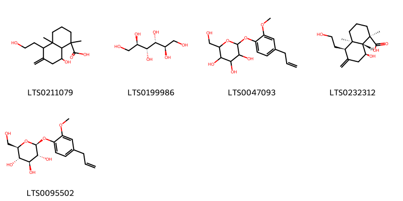{ width=100% }
    <figcaption>Hình ảnh cấu trúc hóa học của 5 hoạt chất thuộc nhóm Organooxygen compounds gồm ['8-hydroxy-5-(2-hydroxyethyl)-1,4a-dimethyl-6-methylidene-hexahydro-2h-naphthalene-1-carboxylic acid (LTS0211079)', 'mannitol (LTS0199986)', '2-(hydroxymethyl)-6-[2-methoxy-4-(prop-2-en-1-yl)phenoxy]oxane-3,4,5-triol (LTS0047093)', '(1r,4ar,5r,8s,8ar)-8-hydroxy-5-(2-hydroxyethyl)-1,4a-dimethyl-6-methylidene-hexahydro-2h-naphthalene-1-carboxylic acid (LTS0232312)', 'eugenyl glucoside (LTS0095502)'].</figcaption>
</figure>
#### Nhóm Phenols
<figure markdown="span">
    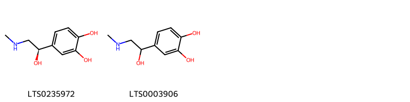{ width=100% }
    <figcaption>Hình ảnh cấu trúc hóa học của 2 hoạt chất thuộc nhóm Phenols gồm ['epinephrine (LTS0235972)', '(+-)-adrenaline (LTS0003906)'].</figcaption>
</figure>
#### Nhóm Prenol lipids
<figure markdown="span">
    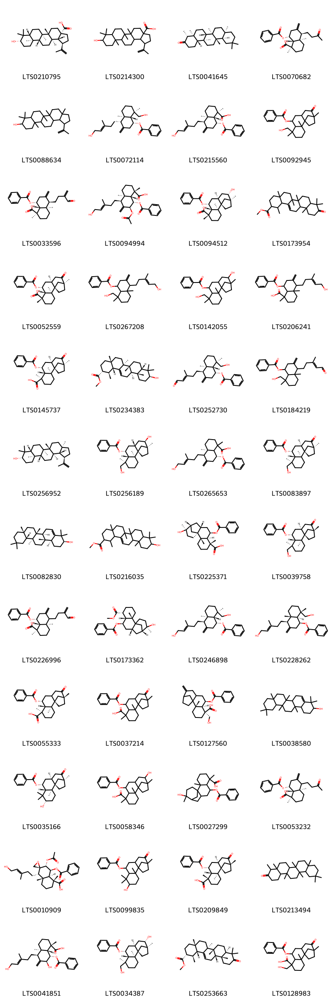{ width=100% }
    <figcaption>Hình ảnh cấu trúc hóa học của 48 hoạt chất thuộc nhóm Prenol lipids gồm ['betulinic acid (LTS0210795)', '9-hydroxy-5a,5b,8,8,11a-pentamethyl-1-(prop-1-en-2-yl)-hexadecahydrocyclopenta[a]chrysene-3a-carboxylic acid (LTS0214300)', '(-)-friedelin (LTS0041645)', '(1r,4ar,5r,8r,8ar)-8-(benzoyloxy)-1,4a-dimethyl-6-methylidene-5-(3-oxobutyl)-hexahydro-2h-naphthalene-1-carboxylic acid (LTS0070682)', 'lupeol (LTS0088634)', '(1r,4s,4ar,8r,8ar)-4-[(3e)-5-hydroxy-3-methylpent-3-en-1-yl]-8-(hydroxymethyl)-4a,8-dimethyl-3-methylidene-hexahydro-1h-naphthalen-1-yl benzoate (LTS0072114)', 'scoparic acid a (LTS0215560)', '6-(hydroxymethyl)-2,6,13-trimethyl-12-oxotetracyclo[11.2.1.0¹,¹⁰.0²,⁷]hexadecan-8-yl benzoate (LTS0092945)', '(1r,4ar,5r,8r,8ar)-8-(benzoyloxy)-1,4a-dimethyl-6-methylidene-5-(3-methylidene-4-oxobutyl)-hexahydro-2h-naphthalene-1-carboxylic acid (LTS0033596)', '(1s,4ar,5s,7s,8s,8ar)-7-(acetyloxy)-8-(benzoyloxy)-5-[(3e)-5-hydroxy-3-methylpent-3-en-1-yl]-1,4a-dimethyl-6-methylidene-hexahydro-2h-naphthalene-1-carboxylic acid (LTS0094994)', '(1s,2s,6s,7r,8r,10r,12s,13s)-8-(benzoyloxy)-12-hydroxy-2,6,13-trimethyltetracyclo[11.2.1.0¹,¹⁰.0²,⁷]hexadecane-6-carboxylic acid (LTS0094512)', 'methyl 1,4a,6a,6b,9,9,12a-heptamethyl-10-oxo-1,2,3,4,5,6,7,8,8a,11,12,12b,13,14b-tetradecahydropicene-2-carboxylate (LTS0173954)', '(1s,2s,6s,7r,8r,10s,13s)-8-(benzoyloxy)-2,6,13-trimethyl-12-oxotetracyclo[11.2.1.0¹,¹⁰.0²,⁷]hexadecane-6-carboxylic acid (LTS0052559)', '4-(5-hydroxy-3-methylpent-3-en-1-yl)-8-(hydroxymethyl)-4a,8-dimethyl-3-methylidene-hexahydro-1h-naphthalen-1-yl benzoate (LTS0267208)', '12-hydroxy-6-(hydroxymethyl)-2,6,13-trimethyltetracyclo[11.2.1.0¹,¹⁰.0²,⁷]hexadecan-8-yl benzoate (LTS0142055)', '8-(benzoyloxy)-5-(5-hydroxy-3-methylpent-3-en-1-yl)-1,4a-dimethyl-6-methylidene-hexahydro-2h-naphthalene-1-carboxylic acid (LTS0206241)', 'scopadulcic acid b (LTS0145737)', 'methyl (1r,2r,4ar,6as,6br,8as,10s,12ar,12br,14br)-10-hydroxy-1,4a,6a,6b,9,9,12a-heptamethyl-2,3,4,5,6,7,8,8a,10,11,12,12b,13,14b-tetradecahydro-1h-picene-2-carboxylate (LTS0234383)', '(1r,4r,4ar,8r,8ar)-8-(hydroxymethyl)-4a,8-dimethyl-4-[(3e)-3-methyl-5-oxopent-3-en-1-yl]-3-methylidene-hexahydro-1h-naphthalen-1-yl benzoate (LTS0252730)', '8-(hydroxymethyl)-4a,8-dimethyl-4-(3-methyl-5-oxopent-3-en-1-yl)-3-methylidene-hexahydro-1h-naphthalen-1-yl benzoate (LTS0184219)', 'lupeol (LTS0256952)', '(1s,2s,6r,7r,8r,10s,12r,13s)-12-hydroxy-6-(hydroxymethyl)-2,6,13-trimethyltetracyclo[11.2.1.0¹,¹⁰.0²,⁷]hexadecan-8-yl benzoate (LTS0256189)', '(4ar,8r)-8-(benzoyloxy)-5-[(3e)-5-hydroxy-3-methylpent-3-en-1-yl]-1,4a-dimethyl-6-methylidene-hexahydro-2h-naphthalene-1-carboxylic acid (LTS0265653)', '(1s,2s,6r,7r,8r,10s,13s)-6-(hydroxymethyl)-2,6,13-trimethyl-12-oxotetracyclo[11.2.1.0¹,¹⁰.0²,⁷]hexadecan-8-yl benzoate (LTS0083897)', 'glutinol (LTS0082830)', 'methyl 10-hydroxy-1,4a,6a,6b,9,9,12a-heptamethyl-2,3,4,5,6,7,8,8a,10,11,12,12b,13,14b-tetradecahydro-1h-picene-2-carboxylate (LTS0216035)', '(1s,2s,6r,7r,8r,10r,12r,13r)-8-(benzoyloxy)-13-hydroxy-2,6,13-trimethyltetracyclo[10.3.1.0¹,¹⁰.0²,⁷]hexadecane-6-carboxylic acid (LTS0225371)', '(1s,2s,6r,7r,8r,10s,13r)-6-(hydroxymethyl)-2,6,13-trimethyl-12-oxotetracyclo[11.2.1.0¹,¹⁰.0²,⁷]hexadecan-8-yl benzoate (LTS0039758)', '(1r,4ar,8r,8ar)-8-(benzoyloxy)-1,4a-dimethyl-6-methylidene-5-(3-methylidene-4-oxobutyl)-hexahydro-2h-naphthalene-1-carboxylic acid (LTS0226996)', 'methyl (2s,6r,7r,8r,10r,12r,13r)-8-(benzoyloxy)-13-hydroxy-2,13-dimethyltetracyclo[10.3.1.0¹,¹⁰.0²,⁷]hexadecane-6-carboxylate (LTS0173362)', '(1r,4r,4ar,8r,8ar)-4-[(3e)-5-hydroxy-3-methylpent-3-en-1-yl]-8-(hydroxymethyl)-4a,8-dimethyl-3-methylidene-hexahydro-1h-naphthalen-1-yl benzoate (LTS0246898)', '(1s,4r,4as,8s,8as)-4-[(3e)-5-hydroxy-3-methylpent-3-en-1-yl]-8-(hydroxymethyl)-4a,8-dimethyl-3-methylidene-hexahydro-1h-naphthalen-1-yl benzoate (LTS0228262)', '(1s,2s,6r,7r,8r,13r)-8-(benzoyloxy)-2,6,13-trimethyl-12-oxotetracyclo[11.2.1.0¹,¹⁰.0²,⁷]hexadecane-6-carboxylic acid (LTS0055333)', '8-(benzoyloxy)-2,6,13-trimethyl-12-oxotetracyclo[11.2.1.0¹,¹⁰.0²,⁷]hexadecane-6-carboxylic acid (LTS0037214)', '(2s,6s,7r,8r)-8-(benzoyloxy)-6-(hydroxymethyl)-2-methyl-12-methylidenetetracyclo[11.2.1.0¹,¹⁰.0²,⁷]hexadecane-6-carboxylic acid (LTS0127560)', '4,4,6b,8a,11,11,12b,14a-octamethyl-1,2,3,6,6a,7,8,9,10,12,12a,13,14,14b-tetradecahydropicen-3-ol (LTS0038580)', '(1s,2s,5s,7r,8r,10s,13s)-5-hydroxy-2,6,6,13-tetramethyl-12-oxotetracyclo[11.2.1.0¹,¹⁰.0²,⁷]hexadecan-8-yl benzoate (LTS0035166)', '8-(benzoyloxy)-12-hydroxy-2,6,13-trimethyltetracyclo[11.2.1.0¹,¹⁰.0²,⁷]hexadecane-6-carboxylic acid (LTS0058346)', '8-(benzoyloxy)-13-hydroxy-2,6,13-trimethyltetracyclo[10.3.1.0¹,¹⁰.0²,⁷]hexadecane-6-carboxylic acid (LTS0027299)', '(1r,4ar,8r,8ar)-8-(benzoyloxy)-1,4a-dimethyl-6-methylidene-5-(3-oxobutyl)-hexahydro-2h-naphthalene-1-carboxylic acid (LTS0053232)', "(1s,2r,3r,4s,4ar,5r,8as)-3-(acetyloxy)-4-(benzoyloxy)-1-[(3e)-5-hydroxy-3-methylpent-3-en-1-yl]-5,8a-dimethyl-hexahydro-1h-spiro[naphthalene-2,2'-oxirane]-5-carboxylic acid (LTS0010909)", '5-hydroxy-2,6,6,13-tetramethyl-12-oxotetracyclo[11.2.1.0¹,¹⁰.0²,⁷]hexadecan-8-yl benzoate (LTS0099835)', '(1s,2s,6s,7r,8r,10s,13r)-8-(benzoyloxy)-2,6,13-trimethyl-12-oxotetracyclo[11.2.1.0¹,¹⁰.0²,⁷]hexadecane-6-carboxylic acid (LTS0209849)', 'friedelin (LTS0213494)', '(1s,4ar,5s,7s,8s,8ar)-8-(benzoyloxy)-7-hydroxy-5-[(3e)-5-hydroxy-3-methylpent-3-en-1-yl]-1,4a-dimethyl-6-methylidene-hexahydro-2h-naphthalene-1-carboxylic acid (LTS0041851)', '(1s,2s,6r,7r,8r,10r,12s,13s)-12-hydroxy-6-(hydroxymethyl)-2,6,13-trimethyltetracyclo[11.2.1.0¹,¹⁰.0²,⁷]hexadecan-8-yl benzoate (LTS0034387)', 'methyl (1r,2r,4ar,6as,6br,8ar,12ar,12bs,14br)-1,4a,6a,6b,9,9,12a-heptamethyl-10-oxo-1,2,3,4,5,6,7,8,8a,11,12,12b,13,14b-tetradecahydropicene-2-carboxylate (LTS0253663)', '8-(benzoyloxy)-6-(hydroxymethyl)-2,13-dimethyl-12-oxotetracyclo[11.2.1.0¹,¹⁰.0²,⁷]hexadecane-6-carboxylic acid (LTS0128983)'].</figcaption>
</figure>
#### Nhóm Steroids and steroid derivatives
<figure markdown="span">
    { width=100% }
    <figcaption>Hình ảnh cấu trúc hóa học của 1 hoạt chất thuộc nhóm Steroids and steroid derivatives gồm ['stigmast-5-en-3-ol, (3β)- (LTS0204616)'].</figcaption>
</figure>

---

### Dược dân tộc học

Danh sách các quốc gia có sử dụng *N/A* trong điều trị các bệnh. 

| Country            | Disease                                                      | Bệnh                                                                                                                                                                                                |
|:-------------------|:-------------------------------------------------------------|:----------------------------------------------------------------------------------------------------------------------------------------------------------------------------------------------------|
| Africa             | Diuretic                                                     | MYMEMORY WARNING: YOU USED ALL AVAILABLE FREE TRANSLATIONS FOR TODAY. NEXT AVAILABLE IN  17 HOURS 21 MINUTES 01 SECONDS VISIT HTTPS://MYMEMORY.TRANSLATED.NET/DOC/USAGELIMITS.PHP TO TRANSLATE MORE |
| Dominican Republic | Astringent                                                   | MYMEMORY WARNING: YOU USED ALL AVAILABLE FREE TRANSLATIONS FOR TODAY. NEXT AVAILABLE IN  17 HOURS 20 MINUTES 59 SECONDS VISIT HTTPS://MYMEMORY.TRANSLATED.NET/DOC/USAGELIMITS.PHP TO TRANSLATE MORE |
| Elsewhere          | Diuretic, Emetic, Refrigerant                                | MYMEMORY WARNING: YOU USED ALL AVAILABLE FREE TRANSLATIONS FOR TODAY. NEXT AVAILABLE IN  17 HOURS 20 MINUTES 56 SECONDS VISIT HTTPS://MYMEMORY.TRANSLATED.NET/DOC/USAGELIMITS.PHP TO TRANSLATE MORE |
| Haiti              | Antiseptic, Diuretic, Emetic, Emetic, Antiseptic, Astringent | MYMEMORY WARNING: YOU USED ALL AVAILABLE FREE TRANSLATIONS FOR TODAY. NEXT AVAILABLE IN  17 HOURS 20 MINUTES 53 SECONDS VISIT HTTPS://MYMEMORY.TRANSLATED.NET/DOC/USAGELIMITS.PHP TO TRANSLATE MORE |
| Malaya             | Expectorant                                                  | MYMEMORY WARNING: YOU USED ALL AVAILABLE FREE TRANSLATIONS FOR TODAY. NEXT AVAILABLE IN  17 HOURS 20 MINUTES 51 SECONDS VISIT HTTPS://MYMEMORY.TRANSLATED.NET/DOC/USAGELIMITS.PHP TO TRANSLATE MORE |
| Paraguay           | Insecticide                                                  | MYMEMORY WARNING: YOU USED ALL AVAILABLE FREE TRANSLATIONS FOR TODAY. NEXT AVAILABLE IN  17 HOURS 20 MINUTES 48 SECONDS VISIT HTTPS://MYMEMORY.TRANSLATED.NET/DOC/USAGELIMITS.PHP TO TRANSLATE MORE |
| Trinidad           | Antidote                                                     | MYMEMORY WARNING: YOU USED ALL AVAILABLE FREE TRANSLATIONS FOR TODAY. NEXT AVAILABLE IN  17 HOURS 20 MINUTES 46 SECONDS VISIT HTTPS://MYMEMORY.TRANSLATED.NET/DOC/USAGELIMITS.PHP TO TRANSLATE MORE |
| Upper Volta        | Purgative                                                    | MYMEMORY WARNING: YOU USED ALL AVAILABLE FREE TRANSLATIONS FOR TODAY. NEXT AVAILABLE IN  17 HOURS 20 MINUTES 43 SECONDS VISIT HTTPS://MYMEMORY.TRANSLATED.NET/DOC/USAGELIMITS.PHP TO TRANSLATE MORE |
| Venezuela          | Astringent                                                   | MYMEMORY WARNING: YOU USED ALL AVAILABLE FREE TRANSLATIONS FOR TODAY. NEXT AVAILABLE IN  17 HOURS 20 MINUTES 41 SECONDS VISIT HTTPS://MYMEMORY.TRANSLATED.NET/DOC/USAGELIMITS.PHP TO TRANSLATE MORE |

---

# Chi Castilleja

??? note "Danh sách các dược liệu thuộc chi"
    
	 - *Castilleja canescens*

---
## Castilleja canescens
### Thông tin về thực vật

!!! info "Phân loại thực vật của *Castilleja tenuiflora* từ GIBF:"
    - **Kingdom:** Plantae
    - **Phylum:** Tracheophyta
    - **Order:** Lamiales
    - **Family:** Orobanchaceae
    - **Genus:** Castilleja
    - **Species:** *Castilleja tenuiflora*

 

| Label (VI)   | Label (EN)   | Scientific Name      | Descriptions (VI)   | Descriptions (EN)   | Also Known As (VI)   | Also Known As (EN)   |
|:-------------|:-------------|:---------------------|:--------------------|:--------------------|:---------------------|:---------------------|
| N/A          | N/A          | Castilleja canescens | loài thực vật       | species of plant    | ['']                 | ['']                 |

#### Phân bố trên thế giới

**Từ CSDL GIBF** nan, United States of America, Mexico, Guatemala

#### Phân bố tại Việt Nam

**Từ CSDL GIBF**: Không có ghi nhận ở Việt Nam

---
### Thành phần hóa học
        
- Theo cơ sở dữ liệu lotus: Từ loài *Castilleja tenuiflora* đã phân lập và xác định được Chưa có hoạt chất nào được phân lập. hoạt chất thuộc về các nhóm Không có hoạt chất nào được phân lập. 

Không có hình ảnh nào được tạo ra

---

### Dược dân tộc học

Danh sách các quốc gia có sử dụng *Castilleja tenuiflora* trong điều trị các bệnh. 

| Country   | Disease                      | Bệnh                                                                                                                                                                                                |
|:----------|:-----------------------------|:----------------------------------------------------------------------------------------------------------------------------------------------------------------------------------------------------|
| Mexico    | Poison, Sialogogue, Diuretic | MYMEMORY WARNING: YOU USED ALL AVAILABLE FREE TRANSLATIONS FOR TODAY. NEXT AVAILABLE IN  17 HOURS 19 MINUTES 59 SECONDS VISIT HTTPS://MYMEMORY.TRANSLATED.NET/DOC/USAGELIMITS.PHP TO TRANSLATE MORE |

---

# Chi Penstemon

??? note "Danh sách các dược liệu thuộc chi"
    
	 - *Penstemon acuminatus*

---
## Penstemon acuminatus
### Thông tin về thực vật

!!! info "Phân loại thực vật của *Penstemon acuminatus* từ GIBF:"
    - **Kingdom:** Plantae
    - **Phylum:** Tracheophyta
    - **Order:** Lamiales
    - **Family:** Plantaginaceae
    - **Genus:** Penstemon
    - **Species:** *Penstemon acuminatus*

 

| Label (VI)   | Label (EN)   | Scientific Name      | Descriptions (VI)   | Descriptions (EN)   | Also Known As (VI)   | Also Known As (EN)   |
|:-------------|:-------------|:---------------------|:--------------------|:--------------------|:---------------------|:---------------------|
| N/A          | N/A          | Penstemon acuminatus | loài thực vật       | species of plant    | ['']                 | ['']                 |

#### Phân bố trên thế giới

**Từ CSDL GIBF** nan, Canada, United States of America

#### Phân bố tại Việt Nam

**Từ CSDL GIBF**: Không có ghi nhận ở Việt Nam

---
### Thành phần hóa học
        
- Theo cơ sở dữ liệu lotus: Từ loài *Penstemon acuminatus* đã phân lập và xác định được 19 hoạt chất thuộc về các nhóm Organooxygen compounds, Prenol lipids. 

|    | chemicalTaxonomyClassyfireClass   |   smiles_count |
|---:|:----------------------------------|---------------:|
|  0 | Organooxygen compounds            |              6 |
|  1 | Prenol lipids                     |             12 |

#### Nhóm Organooxygen compounds
<figure markdown="span">
    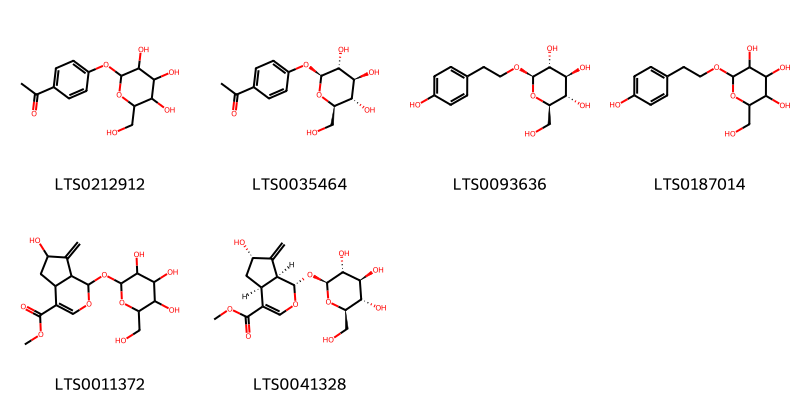{ width=100% }
    <figcaption>Hình ảnh cấu trúc hóa học của 6 hoạt chất thuộc nhóm Organooxygen compounds gồm ['picein (LTS0212912)', 'picein (LTS0035464)', 'salidroside (LTS0093636)', '2-(hydroxymethyl)-6-[2-(4-hydroxyphenyl)ethoxy]oxane-3,4,5-triol (LTS0187014)', 'methyl 6-hydroxy-7-methylidene-1-{[3,4,5-trihydroxy-6-(hydroxymethyl)oxan-2-yl]oxy}-1h,4ah,5h,6h,7ah-cyclopenta[c]pyran-4-carboxylate (LTS0011372)', 'methyl (1s,4as,6s,7as)-6-hydroxy-7-methylidene-1-{[(2s,3r,4s,5s,6r)-3,4,5-trihydroxy-6-(hydroxymethyl)oxan-2-yl]oxy}-1h,4ah,5h,6h,7ah-cyclopenta[c]pyran-4-carboxylate (LTS0041328)'].</figcaption>
</figure>
#### Nhóm Prenol lipids
<figure markdown="span">
    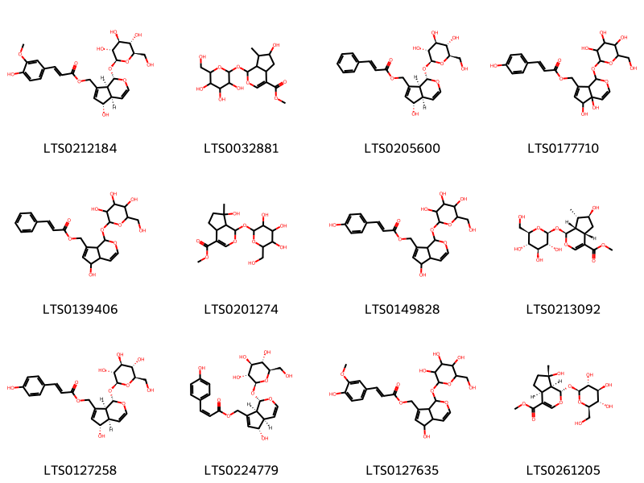{ width=100% }
    <figcaption>Hình ảnh cấu trúc hóa học của 12 hoạt chất thuộc nhóm Prenol lipids gồm ['[(1s,4ar,5s,7as)-5-hydroxy-1-{[(2s,3r,4s,5s,6r)-3,4,5-trihydroxy-6-(hydroxymethyl)oxan-2-yl]oxy}-1h,4ah,5h,7ah-cyclopenta[c]pyran-7-yl]methyl (2e)-3-(4-hydroxy-3-methoxyphenyl)prop-2-enoate (LTS0212184)', 'methyl 6-hydroxy-7-methyl-1-{[3,4,5-trihydroxy-6-(hydroxymethyl)oxan-2-yl]oxy}-1h,4ah,5h,6h,7h,7ah-cyclopenta[c]pyran-4-carboxylate (LTS0032881)', '[(1s,4ar,5s,7as)-5-hydroxy-1-{[(2s,3r,4s,5s,6r)-3,4,5-trihydroxy-6-(hydroxymethyl)oxan-2-yl]oxy}-1h,4ah,5h,7ah-cyclopenta[c]pyran-7-yl]methyl (2e)-3-phenylprop-2-enoate (LTS0205600)', '(4a,5-dihydroxy-1-{[3,4,5-trihydroxy-6-(hydroxymethyl)oxan-2-yl]oxy}-1h,5h,7ah-cyclopenta[c]pyran-7-yl)methyl 3-(4-hydroxyphenyl)prop-2-enoate (LTS0177710)', '(5-hydroxy-1-{[3,4,5-trihydroxy-6-(hydroxymethyl)oxan-2-yl]oxy}-1h,4ah,5h,7ah-cyclopenta[c]pyran-7-yl)methyl 3-phenylprop-2-enoate (LTS0139406)', 'methyl 7-hydroxy-7-methyl-1-{[3,4,5-trihydroxy-6-(hydroxymethyl)oxan-2-yl]oxy}-1h,4ah,5h,6h,7ah-cyclopenta[c]pyran-4-carboxylate (LTS0201274)', '(5-hydroxy-1-{[3,4,5-trihydroxy-6-(hydroxymethyl)oxan-2-yl]oxy}-1h,4ah,5h,7ah-cyclopenta[c]pyran-7-yl)methyl 3-(4-hydroxyphenyl)prop-2-enoate (LTS0149828)', 'methyl (1s,4as,6s,7s,7as)-6-hydroxy-7-methyl-1-{[(2s,3r,4s,5s,6r)-3,4,5-trihydroxy-6-(hydroxymethyl)oxan-2-yl]oxy}-1h,4ah,5h,6h,7h,7ah-cyclopenta[c]pyran-4-carboxylate (LTS0213092)', '[(1s,4ar,5s,7as)-5-hydroxy-1-{[(2s,3r,4s,5s,6r)-3,4,5-trihydroxy-6-(hydroxymethyl)oxan-2-yl]oxy}-1h,4ah,5h,7ah-cyclopenta[c]pyran-7-yl]methyl (2e)-3-(4-hydroxyphenyl)prop-2-enoate (LTS0127258)', '[(1s,4ar,5s,7as)-5-hydroxy-1-{[(2s,3r,4s,5s,6r)-3,4,5-trihydroxy-6-(hydroxymethyl)oxan-2-yl]oxy}-1h,4ah,5h,7ah-cyclopenta[c]pyran-7-yl]methyl (2z)-3-(4-hydroxyphenyl)prop-2-enoate (LTS0224779)', '(5-hydroxy-1-{[3,4,5-trihydroxy-6-(hydroxymethyl)oxan-2-yl]oxy}-1h,4ah,5h,7ah-cyclopenta[c]pyran-7-yl)methyl 3-(4-hydroxy-3-methoxyphenyl)prop-2-enoate (LTS0127635)', 'methyl (1s,4as,7s,7as)-7-hydroxy-7-methyl-1-{[(2s,3r,4s,5s,6r)-3,4,5-trihydroxy-6-(hydroxymethyl)oxan-2-yl]oxy}-1h,4ah,5h,6h,7ah-cyclopenta[c]pyran-4-carboxylate (LTS0261205)'].</figcaption>
</figure>

---

### Dược dân tộc học

Danh sách các quốc gia có sử dụng *Penstemon acuminatus* trong điều trị các bệnh. 

| Country       | Disease   | Bệnh                                                                                                                                                                                                |
|:--------------|:----------|:----------------------------------------------------------------------------------------------------------------------------------------------------------------------------------------------------|
| US(Blackfoot) | Laxative  | MYMEMORY WARNING: YOU USED ALL AVAILABLE FREE TRANSLATIONS FOR TODAY. NEXT AVAILABLE IN  17 HOURS 19 MINUTES 37 SECONDS VISIT HTTPS://MYMEMORY.TRANSLATED.NET/DOC/USAGELIMITS.PHP TO TRANSLATE MORE |

---

# Chi Rhinanthus

??? note "Danh sách các dược liệu thuộc chi"
    
	 - *Rhinanthus minor*

---
## Rhinanthus minor
### Thông tin về thực vật

!!! info "Phân loại thực vật của *Rhinanthus minor* từ GIBF:"
    - **Kingdom:** Plantae
    - **Phylum:** Tracheophyta
    - **Order:** Lamiales
    - **Family:** Orobanchaceae
    - **Genus:** Rhinanthus
    - **Species:** *Rhinanthus minor*

 

| Label (VI)   | Label (EN)   | Scientific Name   | Descriptions (VI)   | Descriptions (EN)   | Also Known As (VI)   | Also Known As (EN)                          |
|:-------------|:-------------|:------------------|:--------------------|:--------------------|:---------------------|:--------------------------------------------|
| N/A          | N/A          | Rhinanthus minor  | loài thực vật       | species of plant    | ['']                 | ['cockscomb', 'hayrattle', 'Yellow rattle'] |

#### Phân bố trên thế giới

**Từ CSDL GIBF** Slovenia, United Kingdom of Great Britain and Northern Ireland, Sweden, Slovakia, Luxembourg, Spain, Czechia, France, Hungary, Germany, Austria, Norway, Netherlands

#### Phân bố tại Việt Nam

**Từ CSDL GIBF**: Không có ghi nhận ở Việt Nam

---
### Thành phần hóa học
        
- Theo cơ sở dữ liệu lotus: Từ loài *Rhinanthus minor* đã phân lập và xác định được Chưa có hoạt chất nào được phân lập. hoạt chất thuộc về các nhóm Không có hoạt chất nào được phân lập. 

Không có hình ảnh nào được tạo ra

---

### Dược dân tộc học

Danh sách các quốc gia có sử dụng *Rhinanthus minor* trong điều trị các bệnh. 

| Country   | Disease                | Bệnh                                                                                                                                                                                                |
|:----------|:-----------------------|:----------------------------------------------------------------------------------------------------------------------------------------------------------------------------------------------------|
| Turkey    | Vulnerary, Insecticide | MYMEMORY WARNING: YOU USED ALL AVAILABLE FREE TRANSLATIONS FOR TODAY. NEXT AVAILABLE IN  17 HOURS 19 MINUTES 13 SECONDS VISIT HTTPS://MYMEMORY.TRANSLATED.NET/DOC/USAGELIMITS.PHP TO TRANSLATE MORE |

---

