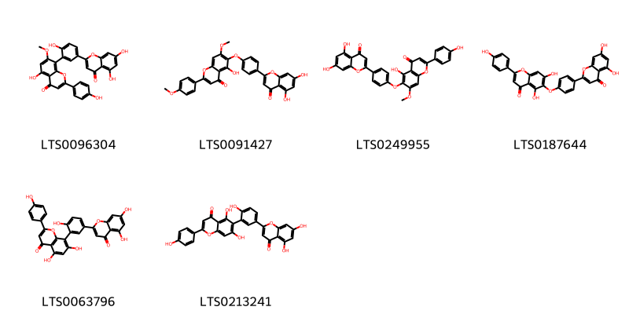
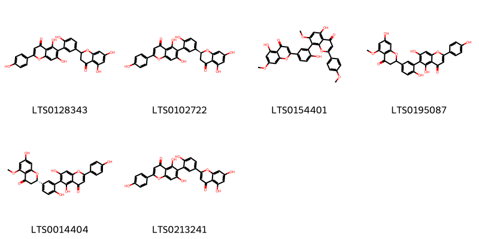
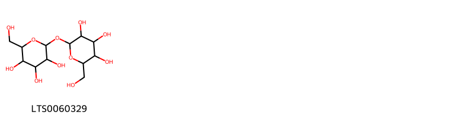
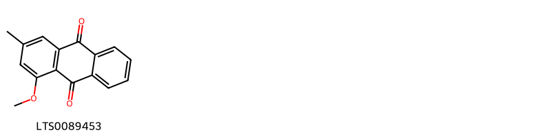
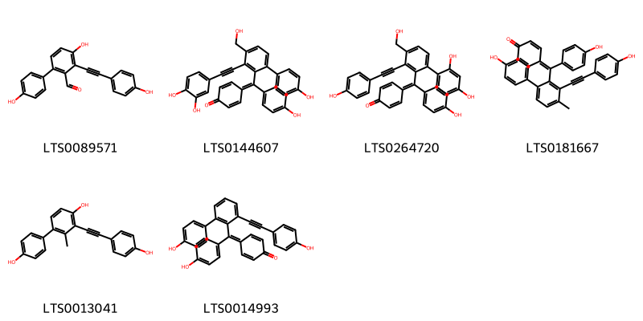
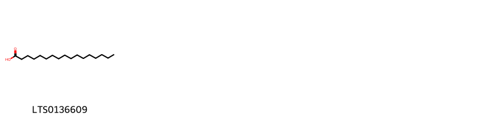
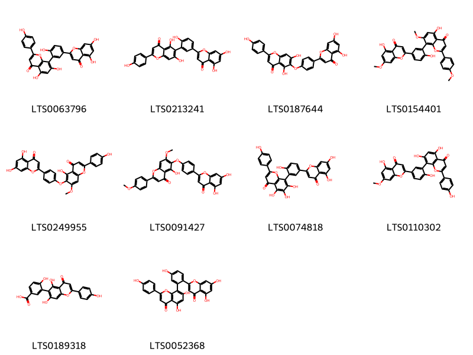
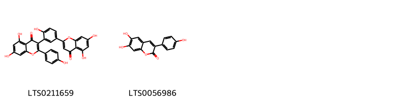
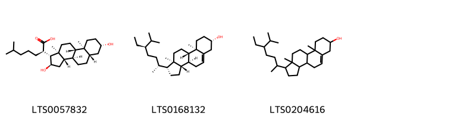

!!! abstract "Tóm tắt"

    Họ Selaginellaceae gồm khoảng 1 chi và 4 loài được một số cộng đồng tại các quốc gia như Mexico, ain, Elsewhere, China sử dụng trong một số trường hợp MYMEMORY WARNING: YOU USED ALL AVAILABLE FREE TRANSLATIONS FOR TODAY. NEXT AVAILABLE IN  14 HOURS 30 MINUTES 46 SECONDS VISIT HTTPS://MYMEMORY.TRANSLATED.NET/DOC/USAGELIMITS.PHP TO TRANSLATE MORE.

!!! info "DrDuke"

    James A. Duke sinh năm 1929-2017 là một nhà thực vật học người Mỹ. Đây là một trong những tác giả hàng đầu trong lĩnh vực dược dân tộc học với cuốn *CRC Handbook of Medicinal Herbs* và chính là người xây dựng lên cơ sở dữ liệu về hợp chất tự nhiên và dược dân tộc học tại Bộ nông nghiệp Hoa Kỳ. Các thông tin được đăng tải tại website [Dr. Duke's Phytochemical and Ethnobotanical Databases](https://phytochem.nal.usda.gov/). 
    Trong suốt thập niên 1970, ông lãnh đạo the Plant Taxonomy Laboratory, Plant Genetics and Germplasm Institute of the Agricultural Research Service, U.S. Department of Agriculture.
    Trong tài liệu này, các thông tin về dược dân tộc của các dược liệu được trích dẫn từ tài liệu của James A. Ducke với sự trợ giúp của phần mềm dịch thuật từ tiếng Anh sang tiếng Việt.
   

# Chi Selaginella

??? note "Danh sách các dược liệu thuộc chi"
    
	 - *Selaginella denticulata*
	 - *Selaginella lepidophylla*
	 - *Selaginella tamarascina*
	 - *Selaginella tamariscina*

---
## Selaginella denticulata
### Thông tin về thực vật

!!! info "Phân loại thực vật của *Selaginella denticulata* từ GIBF:"
    - **Kingdom:** Plantae
    - **Phylum:** Tracheophyta
    - **Order:** Selaginellales
    - **Family:** Selaginellaceae
    - **Genus:** Selaginella
    - **Species:** *Selaginella denticulata*

 

| Label (VI)   | Label (EN)   | Scientific Name         | Descriptions (VI)   | Descriptions (EN)   | Also Known As (VI)   | Also Known As (EN)   |
|:-------------|:-------------|:------------------------|:--------------------|:--------------------|:---------------------|:---------------------|
| N/A          | N/A          | Selaginella denticulata | loài thực vật       | species of plant    | ['']                 | ['']                 |

#### Phân bố trên thế giới

**Từ CSDL GIBF** Montenegro, Morocco, nan, Algeria, Portugal, Greece, Albania, Italy, Türkiye, Cyprus, Lebanon, France, Spain

#### Phân bố tại Việt Nam

**Từ CSDL GIBF**: Không có ghi nhận ở Việt Nam

---
### Thành phần hóa học
        
- Theo cơ sở dữ liệu lotus: Từ loài *Selaginella denticulata* đã phân lập và xác định được 6 hoạt chất thuộc về các nhóm Flavonoids. 

|    | chemicalTaxonomyClassyfireClass   |   smiles_count |
|---:|:----------------------------------|---------------:|
|  0 | Flavonoids                        |              6 |

#### Nhóm Flavonoids
<figure markdown="span">
    { width=100% }
    <figcaption>Hình ảnh cấu trúc hóa học của 6 hoạt chất thuộc nhóm Flavonoids gồm ['8-[5-(5,7-dihydroxy-4-oxochromen-2-yl)-2-hydroxyphenyl]-5-hydroxy-2-(4-hydroxyphenyl)-7-methoxychromen-4-one (LTS0096304)', '6-[4-(5,7-dihydroxy-4-oxochromen-2-yl)phenoxy]-5-hydroxy-7-methoxy-2-(4-methoxyphenyl)chromen-4-one (LTS0091427)', '6-[4-(5,7-dihydroxy-4-oxochromen-2-yl)phenoxy]-5-hydroxy-2-(4-hydroxyphenyl)-7-methoxychromen-4-one (LTS0249955)', 'hinokiflavone (LTS0187644)', 'amentoflavone (LTS0063796)', 'robustaflavone (LTS0213241)'].</figcaption>
</figure>

---

### Dược dân tộc học

Danh sách các quốc gia có sử dụng *Selaginella denticulata* trong điều trị các bệnh. 

| Country   | Disease   | Bệnh                                                                                                                                                                                                |
|:----------|:----------|:----------------------------------------------------------------------------------------------------------------------------------------------------------------------------------------------------|
| ain       | Vermifuge | MYMEMORY WARNING: YOU USED ALL AVAILABLE FREE TRANSLATIONS FOR TODAY. NEXT AVAILABLE IN  14 HOURS 30 MINUTES 41 SECONDS VISIT HTTPS://MYMEMORY.TRANSLATED.NET/DOC/USAGELIMITS.PHP TO TRANSLATE MORE |

---

---
## Selaginella lepidophylla
### Thông tin về thực vật

!!! info "Phân loại thực vật của *Selaginella lepidophylla* từ GIBF:"
    - **Kingdom:** Plantae
    - **Phylum:** Tracheophyta
    - **Order:** Selaginellales
    - **Family:** Selaginellaceae
    - **Genus:** Selaginella
    - **Species:** *Selaginella lepidophylla*

 

| Label (VI)   | Label (EN)   | Scientific Name          | Descriptions (VI)   | Descriptions (EN)   | Also Known As (VI)   | Also Known As (EN)   |
|:-------------|:-------------|:-------------------------|:--------------------|:--------------------|:---------------------|:---------------------|
| N/A          | N/A          | Selaginella lepidophylla | loài thực vật       | species of plant    | ['']                 | ['']                 |

#### Phân bố trên thế giới

**Từ CSDL GIBF** Mexico, Guatemala, United States of America

#### Phân bố tại Việt Nam

**Từ CSDL GIBF**: Không có ghi nhận ở Việt Nam

---
### Thành phần hóa học
        
- Theo cơ sở dữ liệu lotus: Từ loài *Selaginella lepidophylla* đã phân lập và xác định được 7 hoạt chất thuộc về các nhóm Organooxygen compounds, Flavonoids. 

|    | chemicalTaxonomyClassyfireClass   |   smiles_count |
|---:|:----------------------------------|---------------:|
|  0 | Flavonoids                        |              6 |
|  1 | Organooxygen compounds            |              1 |

#### Nhóm Flavonoids
<figure markdown="span">
    { width=100% }
    <figcaption>Hình ảnh cấu trúc hóa học của 6 hoạt chất thuộc nhóm Flavonoids gồm ['6-[5-(5,7-dihydroxy-4-oxo-2,3-dihydro-1-benzopyran-2-yl)-2-hydroxyphenyl]-5,7-dihydroxy-2-(4-hydroxyphenyl)chromen-4-one (LTS0128343)', '6-{5-[(2s)-5,7-dihydroxy-4-oxo-2,3-dihydro-1-benzopyran-2-yl]-2-hydroxyphenyl}-5,7-dihydroxy-2-(4-hydroxyphenyl)chromen-4-one (LTS0102722)', '5-hydroxy-8-[2-hydroxy-5-(5-hydroxy-7-methoxy-4-oxochromen-2-yl)phenyl]-7-methoxy-2-(4-methoxyphenyl)chromen-4-one (LTS0154401)', '5,7-dihydroxy-6-[2-hydroxy-5-(7-hydroxy-5-methoxy-4-oxo-2,3-dihydro-1-benzopyran-2-yl)phenyl]-2-(4-hydroxyphenyl)chromen-4-one (LTS0195087)', '5,7-dihydroxy-6-{2-hydroxy-5-[(2s)-7-hydroxy-5-methoxy-4-oxo-2,3-dihydro-1-benzopyran-2-yl]phenyl}-2-(4-hydroxyphenyl)chromen-4-one (LTS0014404)', 'robustaflavone (LTS0213241)'].</figcaption>
</figure>
#### Nhóm Organooxygen compounds
<figure markdown="span">
    { width=100% }
    <figcaption>Hình ảnh cấu trúc hóa học của 1 hoạt chất thuộc nhóm Organooxygen compounds gồm ['trehalose (LTS0060329)'].</figcaption>
</figure>

---

### Dược dân tộc học

Danh sách các quốc gia có sử dụng *Selaginella lepidophylla* trong điều trị các bệnh. 

| Country   | Disease            | Bệnh                                                                                                                                                                                                |
|:----------|:-------------------|:----------------------------------------------------------------------------------------------------------------------------------------------------------------------------------------------------|
| Mexico    | Diuretic, Diuretic | MYMEMORY WARNING: YOU USED ALL AVAILABLE FREE TRANSLATIONS FOR TODAY. NEXT AVAILABLE IN  14 HOURS 30 MINUTES 06 SECONDS VISIT HTTPS://MYMEMORY.TRANSLATED.NET/DOC/USAGELIMITS.PHP TO TRANSLATE MORE |

---

---
## Selaginella tamarascina
### Thông tin về thực vật

!!! info "Phân loại thực vật của *Selaginella tamariscina* từ GIBF:"
    - **Kingdom:** Plantae
    - **Phylum:** Tracheophyta
    - **Order:** Selaginellales
    - **Family:** Selaginellaceae
    - **Genus:** Selaginella
    - **Species:** *Selaginella tamariscina*

 

| Label (VI)   | Label (EN)   | Scientific Name          | Descriptions (VI)   | Descriptions (EN)   | Also Known As (VI)   | Also Known As (EN)   |
|:-------------|:-------------|:-------------------------|:--------------------|:--------------------|:---------------------|:---------------------|
| N/A          | N/A          | Selaginella lepidophylla | loài thực vật       | species of plant    | ['']                 | ['']                 |

#### Phân bố trên thế giới

**Từ CSDL GIBF** Hong Kong, Japan, Korea, Republic of, Indonesia, Chinese Taipei, Philippines, China, Russian Federation

#### Phân bố tại Việt Nam

**Từ CSDL GIBF**: Không có ghi nhận ở Việt Nam

---
### Thành phần hóa học
        
- Theo cơ sở dữ liệu lotus: Từ loài *Selaginella tamariscina* đã phân lập và xác định được Chưa có hoạt chất nào được phân lập. hoạt chất thuộc về các nhóm Không có hoạt chất nào được phân lập. 

Không có hình ảnh nào được tạo ra

---

### Dược dân tộc học

Danh sách các quốc gia có sử dụng *Selaginella tamariscina* trong điều trị các bệnh. 

| Country   | Disease                  | Bệnh                                                                                                                                                                                                |
|:----------|:-------------------------|:----------------------------------------------------------------------------------------------------------------------------------------------------------------------------------------------------|
| China     | Coagulant, Anticoagulant | MYMEMORY WARNING: YOU USED ALL AVAILABLE FREE TRANSLATIONS FOR TODAY. NEXT AVAILABLE IN  14 HOURS 29 MINUTES 40 SECONDS VISIT HTTPS://MYMEMORY.TRANSLATED.NET/DOC/USAGELIMITS.PHP TO TRANSLATE MORE |

---

---
## Selaginella tamariscina
### Thông tin về thực vật

!!! info "Phân loại thực vật của *Selaginella tamariscina* từ GIBF:"
    - **Kingdom:** Plantae
    - **Phylum:** Tracheophyta
    - **Order:** Selaginellales
    - **Family:** Selaginellaceae
    - **Genus:** Selaginella
    - **Species:** *Selaginella tamariscina*

 

| Label (VI)   | Label (EN)   | Scientific Name         | Descriptions (VI)   | Descriptions (EN)   | Also Known As (VI)                                      | Also Known As (EN)   |
|:-------------|:-------------|:------------------------|:--------------------|:--------------------|:--------------------------------------------------------|:---------------------|
| N/A          | N/A          | Selaginella tamariscina | loài thực vật       | species of plant    | ['Selaginella tamariscina', 'Quyển bá', 'Cây chân vịt'] | ['']                 |

#### Phân bố trên thế giới

**Từ CSDL GIBF** Hong Kong, Japan, Korea, Republic of, Indonesia, Chinese Taipei, Philippines, China, Russian Federation

#### Phân bố tại Việt Nam

**Từ CSDL GIBF**: Không có ghi nhận ở Việt Nam

---
### Thành phần hóa học
        
- Theo cơ sở dữ liệu lotus: Từ loài *Selaginella tamariscina* đã phân lập và xác định được 24 hoạt chất thuộc về các nhóm Fatty Acyls, Flavonoids, Anthracenes, Steroids and steroid derivatives, Organooxygen compounds, Isoflavonoids, Diarylheptanoids. 

|    | chemicalTaxonomyClassyfireClass   |   smiles_count |
|---:|:----------------------------------|---------------:|
|  0 | Anthracenes                       |              1 |
|  1 | Diarylheptanoids                  |              6 |
|  2 | Fatty Acyls                       |              1 |
|  3 | Flavonoids                        |             10 |
|  4 | Isoflavonoids                     |              2 |
|  5 | Organooxygen compounds            |              1 |
|  6 | Steroids and steroid derivatives  |              3 |

#### Nhóm Anthracenes
<figure markdown="span">
    { width=100% }
    <figcaption>Hình ảnh cấu trúc hóa học của 1 hoạt chất thuộc nhóm Anthracenes gồm ['1-methoxy-3-methylanthracene-9,10-dione (LTS0089453)'].</figcaption>
</figure>
#### Nhóm Diarylheptanoids
<figure markdown="span">
    { width=100% }
    <figcaption>Hình ảnh cấu trúc hóa học của 6 hoạt chất thuộc nhóm Diarylheptanoids gồm ["4,4'-dihydroxy-3-[2-(4-hydroxyphenyl)ethynyl]-[1,1'-biphenyl]-2-carbaldehyde (LTS0089571)", "4-({3-[2-(3,4-dihydroxyphenyl)ethynyl]-4'-hydroxy-4-(hydroxymethyl)-[1,1'-biphenyl]-2-yl}(4-hydroxyphenyl)methylidene)cyclohexa-2,5-dien-1-one (LTS0144607)", "4-{[2',4'-dihydroxy-4-(hydroxymethyl)-3-[2-(4-hydroxyphenyl)ethynyl]-[1,1'-biphenyl]-2-yl](4-hydroxyphenyl)methylidene}cyclohexa-2,5-dien-1-one (LTS0264720)", "4-({4'-hydroxy-3-[2-(4-hydroxyphenyl)ethynyl]-4-methyl-[1,1'-biphenyl]-2-yl}(4-hydroxyphenyl)methylidene)cyclohexa-2,5-dien-1-one (LTS0181667)", "3-[2-(4-hydroxyphenyl)ethynyl]-2-methyl-[1,1'-biphenyl]-4,4'-diol (LTS0013041)", "4-({4'-hydroxy-3-[2-(4-hydroxyphenyl)ethynyl]-[1,1'-biphenyl]-2-yl}(4-hydroxyphenyl)methylidene)cyclohexa-2,5-dien-1-one (LTS0014993)"].</figcaption>
</figure>
#### Nhóm Fatty Acyls
<figure markdown="span">
    { width=100% }
    <figcaption>Hình ảnh cấu trúc hóa học của 1 hoạt chất thuộc nhóm Fatty Acyls gồm ['heptadecanoic acid (LTS0136609)'].</figcaption>
</figure>
#### Nhóm Flavonoids
<figure markdown="span">
    { width=100% }
    <figcaption>Hình ảnh cấu trúc hóa học của 10 hoạt chất thuộc nhóm Flavonoids gồm ['amentoflavone (LTS0063796)', 'robustaflavone (LTS0213241)', 'hinokiflavone (LTS0187644)', '5-hydroxy-8-[2-hydroxy-5-(5-hydroxy-7-methoxy-4-oxochromen-2-yl)phenyl]-7-methoxy-2-(4-methoxyphenyl)chromen-4-one (LTS0154401)', '6-[4-(5,7-dihydroxy-4-oxochromen-2-yl)phenoxy]-5-hydroxy-2-(4-hydroxyphenyl)-7-methoxychromen-4-one (LTS0249955)', '6-[4-(5,7-dihydroxy-4-oxochromen-2-yl)phenoxy]-5-hydroxy-7-methoxy-2-(4-methoxyphenyl)chromen-4-one (LTS0091427)', '8-[5-(5,7-dihydroxy-4-oxochromen-2-yl)-2-hydroxyphenyl]-5,6,7-trihydroxy-2-(4-hydroxyphenyl)chromen-4-one (LTS0074818)', 'sequoiaflavone (LTS0110302)', '3-[5,7-dihydroxy-2-(4-hydroxyphenyl)-4-oxochromen-6-yl]-4-hydroxybenzoic acid (LTS0189318)', '8-[2-(5,7-dihydroxy-4-oxochromen-2-yl)-5-hydroxyphenyl]-5,7-dihydroxy-2-(4-hydroxyphenyl)chromen-4-one (LTS0052368)'].</figcaption>
</figure>
#### Nhóm Isoflavonoids
<figure markdown="span">
    { width=100% }
    <figcaption>Hình ảnh cấu trúc hóa học của 2 hoạt chất thuộc nhóm Isoflavonoids gồm ['3-[5-(5,7-dihydroxy-4-oxochromen-2-yl)-2-hydroxyphenyl]-5,7-dihydroxy-2-(4-hydroxyphenyl)chromen-4-one (LTS0211659)', '6,7-dihydroxy-3-(4-hydroxyphenyl)chromen-2-one (LTS0056986)'].</figcaption>
</figure>
#### Nhóm Organooxygen compounds
<figure markdown="span">
    { width=100% }
    <figcaption>Hình ảnh cấu trúc hóa học của 1 hoạt chất thuộc nhóm Organooxygen compounds gồm ['trehalose (LTS0060329)'].</figcaption>
</figure>
#### Nhóm Steroids and steroid derivatives
<figure markdown="span">
    { width=100% }
    <figcaption>Hình ảnh cấu trúc hóa học của 3 hoạt chất thuộc nhóm Steroids and steroid derivatives gồm ['(2r)-2-[(1r,2r,3as,3br,5as,7s,9as,9bs,11as)-2,7-dihydroxy-9a,11a-dimethyl-tetradecahydro-1h-cyclopenta[a]phenanthren-1-yl]-6-methylheptanoic acid (LTS0057832)', 'sitosterol (LTS0168132)', 'stigmast-5-en-3-ol, (3β)- (LTS0204616)'].</figcaption>
</figure>

---

### Dược dân tộc học

Danh sách các quốc gia có sử dụng *Selaginella tamariscina* trong điều trị các bệnh. 

| Country   | Disease              | Bệnh                                                                                                                                                                                                |
|:----------|:---------------------|:----------------------------------------------------------------------------------------------------------------------------------------------------------------------------------------------------|
| China     | Astringent, Hemostat | MYMEMORY WARNING: YOU USED ALL AVAILABLE FREE TRANSLATIONS FOR TODAY. NEXT AVAILABLE IN  14 HOURS 29 MINUTES 04 SECONDS VISIT HTTPS://MYMEMORY.TRANSLATED.NET/DOC/USAGELIMITS.PHP TO TRANSLATE MORE |
| Elsewhere | Diuretic, Hemostatic | MYMEMORY WARNING: YOU USED ALL AVAILABLE FREE TRANSLATIONS FOR TODAY. NEXT AVAILABLE IN  14 HOURS 29 MINUTES 00 SECONDS VISIT HTTPS://MYMEMORY.TRANSLATED.NET/DOC/USAGELIMITS.PHP TO TRANSLATE MORE |

---

