!!! abstract "Tóm tắt"

    Họ Simaroubaceae gồm khoảng 10 chi và 20 loài được một số cộng đồng tại các quốc gia như Chinese, Mexico, Japan*, New Guinea, Japan, Latin America, West Indies, Brazil, Malaysia, Haiti, China, Philippines, Ternate, Iraq, Java, Turkey, Panama, Salvador, India(Punjab), Venezuela, Solomon I, Indonesia, Elsewhere, Dominican Republic, Malaya, India, Caroline I, US sử dụng trong một số trường hợp QUERY LENGTH LIMIT EXCEEDED. MAX ALLOWED QUERY : 500 CHARS MYMEMORY WARNING: YOU USED ALL AVAILABLE FREE TRANSLATIONS FOR TODAY. NEXT AVAILABLE IN  07 HOURS 41 MINUTES 43 SECONDS VISIT HTTPS://MYMEMORY.TRANSLATED.NET/DOC/USAGELIMITS.PHP TO TRANSLATE MORE.

!!! info "DrDuke"

    James A. Duke sinh năm 1929-2017 là một nhà thực vật học người Mỹ. Đây là một trong những tác giả hàng đầu trong lĩnh vực dược dân tộc học với cuốn *CRC Handbook of Medicinal Herbs* và chính là người xây dựng lên cơ sở dữ liệu về hợp chất tự nhiên và dược dân tộc học tại Bộ nông nghiệp Hoa Kỳ. Các thông tin được đăng tải tại website [Dr. Duke's Phytochemical and Ethnobotanical Databases](https://phytochem.nal.usda.gov/). 
    Trong suốt thập niên 1970, ông lãnh đạo the Plant Taxonomy Laboratory, Plant Genetics and Germplasm Institute of the Agricultural Research Service, U.S. Department of Agriculture.
    Trong tài liệu này, các thông tin về dược dân tộc của các dược liệu được trích dẫn từ tài liệu của James A. Ducke với sự trợ giúp của phần mềm dịch thuật từ tiếng Anh sang tiếng Việt.
   

# Chi Picrasma

??? note "Danh sách các dược liệu thuộc chi"
    
	 - *Picrasma ailanthoides*
	 - *Picrasma excelsa*
	 - *Picrasma javanica*
	 - *Picrasma quassioides*

---
## Picrasma ailanthoides
### Thông tin về thực vật

!!! info "Phân loại thực vật của *Picrasma quassioides* từ GIBF:"
    - **Kingdom:** Plantae
    - **Phylum:** Tracheophyta
    - **Order:** Sapindales
    - **Family:** Simaroubaceae
    - **Genus:** Picrasma
    - **Species:** *Picrasma quassioides*

 

| Label (VI)   | Label (EN)   | Scientific Name       | Descriptions (VI)   | Descriptions (EN)   | Also Known As (VI)   | Also Known As (EN)   |
|:-------------|:-------------|:----------------------|:--------------------|:--------------------|:---------------------|:---------------------|
| N/A          | N/A          | Picrasma ailanthoides |                     | species of plant    | ['']                 | ['']                 |

#### Phân bố trên thế giới

**Từ CSDL GIBF** nan, Hong Kong, United States of America, Japan, China, Korea (Democratic People’s Republic of), unknown or invalid

#### Phân bố tại Việt Nam

**Từ CSDL GIBF**: Không có ghi nhận ở Việt Nam

---
### Thành phần hóa học
        
- Theo cơ sở dữ liệu lotus: Từ loài *Picrasma quassioides* đã phân lập và xác định được Chưa có hoạt chất nào được phân lập. hoạt chất thuộc về các nhóm Không có hoạt chất nào được phân lập. 

Không có hình ảnh nào được tạo ra

---

### Dược dân tộc học

Danh sách các quốc gia có sử dụng *Picrasma quassioides* trong điều trị các bệnh. 

| Country   | Disease   | Bệnh                                                                                                                                                                                                |
|:----------|:----------|:----------------------------------------------------------------------------------------------------------------------------------------------------------------------------------------------------|
| Japan*    | Stomachic | MYMEMORY WARNING: YOU USED ALL AVAILABLE FREE TRANSLATIONS FOR TODAY. NEXT AVAILABLE IN  07 HOURS 41 MINUTES 40 SECONDS VISIT HTTPS://MYMEMORY.TRANSLATED.NET/DOC/USAGELIMITS.PHP TO TRANSLATE MORE |

---

---
## Picrasma excelsa
### Thông tin về thực vật

!!! info "Phân loại thực vật của *Picrasma excelsa* từ GIBF:"
    - **Kingdom:** Plantae
    - **Phylum:** Tracheophyta
    - **Order:** Sapindales
    - **Family:** Simaroubaceae
    - **Genus:** Picrasma
    - **Species:** *Picrasma excelsa*

 

| Label (VI)   | Label (EN)   | Scientific Name   | Descriptions (VI)   | Descriptions (EN)   | Also Known As (VI)   | Also Known As (EN)   |
|:-------------|:-------------|:------------------|:--------------------|:--------------------|:---------------------|:---------------------|
| N/A          | N/A          | Picrasma excelsa  | loài thực vật       | species of plant    | ['']                 | ['']                 |

#### Phân bố trên thế giới

**Từ CSDL GIBF** nan, Brazil, Virgin Islands (British), Japan, Saint Kitts and Nevis, Guadeloupe, Barbados, Ecuador, Puerto Rico, United States of America, Jamaica, Virgin Islands (U.S.), Indonesia, Costa Rica, Saint Martin (French part), Colombia, Dominican Republic, unknown or invalid, Grenada, Dominica, El Salvador, Montserrat, Haiti, Panama, Nicaragua, Bonaire, Sint Eustatius and Saba, Martinique, Saint Vincent and the Grenadines, Peru, Bolivia (Plurinational State of), Guyana, Venezuela (Bolivarian Republic of)

#### Phân bố tại Việt Nam

**Từ CSDL GIBF**: Không có ghi nhận ở Việt Nam

---
### Thành phần hóa học
        
- Theo cơ sở dữ liệu lotus: Từ loài *Picrasma excelsa* đã phân lập và xác định được 4 hoạt chất thuộc về các nhóm Harmala alkaloids, Indolonaphthyridine alkaloids. 

|    | chemicalTaxonomyClassyfireClass   |   smiles_count |
|---:|:----------------------------------|---------------:|
|  0 | Harmala alkaloids                 |              1 |
|  1 | Indolonaphthyridine alkaloids     |              3 |

#### Nhóm Harmala alkaloids
<figure markdown="span">
    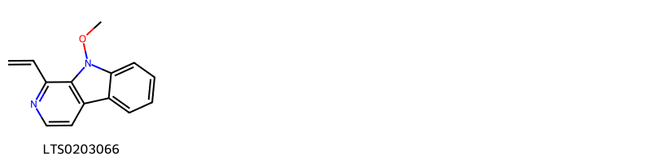{ width=100% }
    <figcaption>Hình ảnh cấu trúc hóa học của 1 hoạt chất thuộc nhóm Harmala alkaloids gồm ['n-methoxy-1-vinyl-β-carboline (LTS0203066)'].</figcaption>
</figure>
#### Nhóm Indolonaphthyridine alkaloids
<figure markdown="span">
    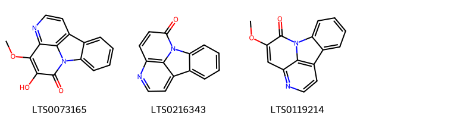{ width=100% }
    <figcaption>Hình ảnh cấu trúc hóa học của 3 hoạt chất thuộc nhóm Indolonaphthyridine alkaloids gồm ['nigakinone (LTS0073165)', 'canthin-6-one (LTS0216343)', '5-methoxycanthin-6-one (LTS0119214)'].</figcaption>
</figure>

---

### Dược dân tộc học

Danh sách các quốc gia có sử dụng *Picrasma excelsa* trong điều trị các bệnh. 

| Country     | Disease                                                                  | Bệnh                                                                                                                                                                                                |
|:------------|:-------------------------------------------------------------------------|:----------------------------------------------------------------------------------------------------------------------------------------------------------------------------------------------------|
| Elsewhere   | Insecticide, Tonic, Vermifuge, Stomachic                                 | MYMEMORY WARNING: YOU USED ALL AVAILABLE FREE TRANSLATIONS FOR TODAY. NEXT AVAILABLE IN  07 HOURS 41 MINUTES 22 SECONDS VISIT HTTPS://MYMEMORY.TRANSLATED.NET/DOC/USAGELIMITS.PHP TO TRANSLATE MORE |
| Turkey      | Insecticide, Narcotic, Piscicide, Stomachic, Tonic, Digestive, Vermifuge | MYMEMORY WARNING: YOU USED ALL AVAILABLE FREE TRANSLATIONS FOR TODAY. NEXT AVAILABLE IN  07 HOURS 41 MINUTES 19 SECONDS VISIT HTTPS://MYMEMORY.TRANSLATED.NET/DOC/USAGELIMITS.PHP TO TRANSLATE MORE |
| West Indies | Tonic, Vermifuge                                                         | MYMEMORY WARNING: YOU USED ALL AVAILABLE FREE TRANSLATIONS FOR TODAY. NEXT AVAILABLE IN  07 HOURS 41 MINUTES 17 SECONDS VISIT HTTPS://MYMEMORY.TRANSLATED.NET/DOC/USAGELIMITS.PHP TO TRANSLATE MORE |

---

---
## Picrasma javanica
### Thông tin về thực vật

!!! info "Phân loại thực vật của *Picrasma javanica* từ GIBF:"
    - **Kingdom:** Plantae
    - **Phylum:** Tracheophyta
    - **Order:** Sapindales
    - **Family:** Simaroubaceae
    - **Genus:** Picrasma
    - **Species:** *Picrasma javanica*

 

| Label (VI)   | Label (EN)   | Scientific Name   | Descriptions (VI)   | Descriptions (EN)   | Also Known As (VI)   | Also Known As (EN)   |
|:-------------|:-------------|:------------------|:--------------------|:--------------------|:---------------------|:---------------------|
| N/A          | N/A          | Picrasma javanica | loài thực vật       | species of plant    | ['']                 | ['']                 |

#### Phân bố trên thế giới

**Từ CSDL GIBF** Viet Nam, Bhutan, Indonesia, Malaysia, Bangladesh, Philippines, China, Myanmar, India, Solomon Islands, unknown or invalid, Papua New Guinea, Thailand

#### Phân bố tại Việt Nam

**Từ CSDL GIBF**: Không có ghi nhận ở Việt Nam

---
### Thành phần hóa học
        
- Theo cơ sở dữ liệu lotus: Từ loài *Picrasma javanica* đã phân lập và xác định được 95 hoạt chất thuộc về các nhóm Tannins, Coumarins and derivatives, Prenol lipids, Harmala alkaloids, Quinolizines, Indoles and derivatives. 

|    | chemicalTaxonomyClassyfireClass   |   smiles_count |
|---:|:----------------------------------|---------------:|
|  0 | Coumarins and derivatives         |              1 |
|  1 | Harmala alkaloids                 |              5 |
|  2 | Indoles and derivatives           |              1 |
|  3 | Prenol lipids                     |             77 |
|  4 | Quinolizines                      |              1 |
|  5 | Tannins                           |             10 |

#### Nhóm Coumarins and derivatives
<figure markdown="span">
    { width=100% }
    <figcaption>Hình ảnh cấu trúc hóa học của 1 hoạt chất thuộc nhóm Coumarins and derivatives gồm ['4-methoxy-2h-[1,3]dioxolo[4,5-h]chromen-8-one (LTS0074367)'].</figcaption>
</figure>
#### Nhóm Harmala alkaloids
<figure markdown="span">
    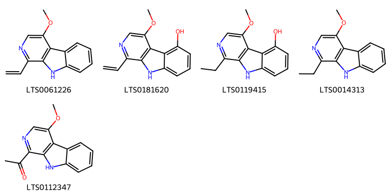{ width=100% }
    <figcaption>Hình ảnh cấu trúc hóa học của 5 hoạt chất thuộc nhóm Harmala alkaloids gồm ['1-ethenyl-4-methoxy-9h-pyrido[3,4-b]indole (LTS0061226)', '1-ethenyl-4-methoxy-9h-pyrido[3,4-b]indol-5-ol (LTS0181620)', '1-ethyl-4-methoxy-9h-pyrido[3,4-b]indol-5-ol (LTS0119415)', '1-ethyl-4-methoxy-9h-pyrido[3,4-b]indole (LTS0014313)', '1-{4-methoxy-9h-pyrido[3,4-b]indol-1-yl}ethanone (LTS0112347)'].</figcaption>
</figure>
#### Nhóm Indoles and derivatives
<figure markdown="span">
    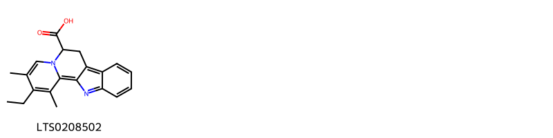{ width=100% }
    <figcaption>Hình ảnh cấu trúc hóa học của 1 hoạt chất thuộc nhóm Indoles and derivatives gồm ['2-ethyl-1,3-dimethyl-6h,7h-indolo[2,3-a]quinolizine-6-carboxylic acid (LTS0208502)'].</figcaption>
</figure>
#### Nhóm Prenol lipids
<figure markdown="span">
    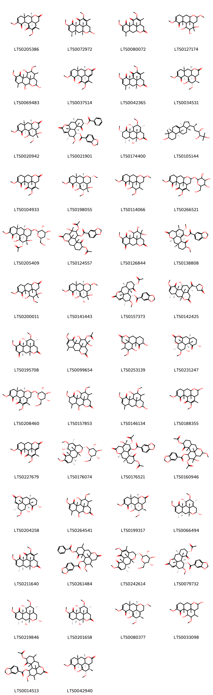{ width=100% }
    <figcaption>Hình ảnh cấu trúc hóa học của 77 hoạt chất thuộc nhóm Prenol lipids gồm ['(1s,2s,7r,9r,13r,17s)-4,15-dimethoxy-2,14,17-trimethyl-10-oxatetracyclo[7.7.1.0²,⁷.0¹³,¹⁷]heptadeca-4,14-diene-3,11,16-trione (LTS0205386)', '(2s,6r,7r,9r,13r,17s)-11-hydroxy-4,15-dimethoxy-2,6,14,17-tetramethyl-10-oxatetracyclo[7.7.1.0²,⁷.0¹³,¹⁷]heptadeca-4,14-diene-3,16-dione (LTS0072972)', 'quassin (LTS0080072)', '14,15,16-trihydroxy-4,11-dimethoxy-2,14,17-trimethyl-10-oxatetracyclo[7.7.1.0²,⁷.0¹³,¹⁷]heptadec-4-en-3-one (LTS0127174)', '8,11,16-trihydroxy-4,15-dimethoxy-2,6,14,17-tetramethyl-10-oxatetracyclo[7.7.1.0²,⁷.0¹³,¹⁷]heptadec-4-en-3-one (LTS0069483)', '(1s,2s,7r,9r,17r)-4,15-dimethoxy-2,14,17-trimethyl-10-oxatetracyclo[7.7.1.0²,⁷.0¹³,¹⁷]heptadeca-4,12,14-triene-3,11,16-trione (LTS0037514)', '(1r,2s,7s,9r,13r,17s)-4,15-dimethoxy-2,6,14,17-tetramethyl-10-oxatetracyclo[7.7.1.0²,⁷.0¹³,¹⁷]heptadeca-4,14-diene-3,11,16-trione (LTS0042365)', '(1s,2s,7r,9r,13r,14s,15s,16s,17s)-13,16-dihydroxy-4,15-dimethoxy-2,14,17-trimethyl-10-oxatetracyclo[7.7.1.0²,⁷.0¹³,¹⁷]heptadec-4-ene-3,11-dione (LTS0034531)', '(1s,2s,7r,9r,13r,14s,15r,16s,17r)-14,16-dihydroxy-4,15-dimethoxy-2,14,17-trimethyl-10-oxatetracyclo[7.7.1.0²,⁷.0¹³,¹⁷]heptadec-4-ene-3,11-dione (LTS0020942)', '(1s,2s,4s,7r,9r,13s,14r,16s,17s)-4-(benzoyloxy)-15-methoxy-2,14,17-trimethyl-3,11-dioxo-10-oxatetracyclo[7.7.1.0²,⁷.0¹³,¹⁷]heptadecan-16-yl 2h-1,3-benzodioxole-5-carboxylate (LTS0021901)', '(1s,2s,4s,6r,7s,8r,9s,13s,14r,15s,16s,17s)-8,16-dihydroxy-4,15-dimethoxy-2,6,14,17-tetramethyl-10-oxatetracyclo[7.7.1.0²,⁷.0¹³,¹⁷]heptadecane-3,11-dione (LTS0174400)', '(3s,4r,6s)-6-[(1s,3as,5ar,7r,9ar,9br,11as)-7-hydroxy-3a,6,6,9a,11a-pentamethyl-1h,2h,3h,5h,5ah,7h,8h,9h,9bh,10h,11h-cyclopenta[a]phenanthren-1-yl]-2-methylheptane-2,3,4-triol (LTS0105144)', '4,15-dimethoxy-2,14,17-trimethyl-10-oxatetracyclo[7.7.1.0²,⁷.0¹³,¹⁷]heptadeca-4,14-diene-3,11,16-trione (LTS0104933)', '(1s,2s,7r,9r,11s,13r,14s,15r,16s,17r)-14,16-dihydroxy-4,11,15-trimethoxy-2,14,17-trimethyl-10-oxatetracyclo[7.7.1.0²,⁷.0¹³,¹⁷]heptadec-4-en-3-one (LTS0198055)', '16-hydroxy-4,11,15-trimethoxy-2,14,17-trimethyl-10-oxatetracyclo[7.7.1.0²,⁷.0¹³,¹⁷]heptadec-4-en-3-one (LTS0114066)', '4,15-dimethoxy-2,14,17-trimethyl-11-{[3,4,5-trihydroxy-6-(hydroxymethyl)oxan-2-yl]oxy}-10-oxatetracyclo[7.7.1.0²,⁷.0¹³,¹⁷]heptadeca-4,14-diene-3,16-dione (LTS0266521)', '(1s,2s,7r,9r,11s,13r,14s,15r,16s,17r)-14,16-dihydroxy-4-methoxy-2,14,17-trimethyl-3-oxo-11-{[(2s,3r,4s,5s,6r)-3,4,5-trihydroxy-6-(hydroxymethyl)oxan-2-yl]oxy}-10-oxatetracyclo[7.7.1.0²,⁷.0¹³,¹⁷]heptadec-4-en-15-yl acetate (LTS0205409)', '4,15-bis(acetyloxy)-14-hydroxy-2,14,17-trimethyl-3,11-dioxo-10-oxatetracyclo[7.7.1.0²,⁷.0¹³,¹⁷]heptadecan-16-yl 2h-1,3-benzodioxole-5-carboxylate (LTS0124557)', '14,15,16-trihydroxy-4-methoxy-2,14,17-trimethyl-10-oxatetracyclo[7.7.1.0²,⁷.0¹³,¹⁷]heptadec-4-ene-3,6,11-trione (LTS0126844)', '(1s,2s,4s,7r,9r,13s,14r,15s,16s,17s)-4,15-dimethoxy-2,14,17-trimethyl-3,11-dioxo-10-oxatetracyclo[7.7.1.0²,⁷.0¹³,¹⁷]heptadecan-16-yl 2h-1,3-benzodioxole-5-carboxylate (LTS0138808)', '14,16-dihydroxy-4,15-dimethoxy-2,14,17-trimethyl-10-oxatetracyclo[7.7.1.0²,⁷.0¹³,¹⁷]heptadec-4-ene-3,11-dione (LTS0200011)', '(1s,2s,7r,9r,11r,13r,14s,15r,16s,17r)-14,15,16-trihydroxy-4,11-dimethoxy-2,14,17-trimethyl-10-oxatetracyclo[7.7.1.0²,⁷.0¹³,¹⁷]heptadec-4-en-3-one (LTS0141443)', '(2s,4s,7r,9r,13s,14r,15s,16s,17s)-4-(acetyloxy)-15-methoxy-2,14,17-trimethyl-3,11-dioxo-10-oxatetracyclo[7.7.1.0²,⁷.0¹³,¹⁷]heptadecan-16-yl 2h-1,3-benzodioxole-5-carboxylate (LTS0157373)', 'picrasin a (LTS0142425)', '(1s,2r,7r,9r,13s,14r,15s,16s,17s)-16-hydroxy-4,15-dimethoxy-2,14,17-trimethyl-10-oxatetracyclo[7.7.1.0²,⁷.0¹³,¹⁷]heptadec-4-ene-3,6,11-trione (LTS0195708)', '14,16-dihydroxy-4-methoxy-2,6,14,17-tetramethyl-3,11-dioxo-10-oxatetracyclo[7.7.1.0²,⁷.0¹³,¹⁷]heptadec-4-en-15-yl acetate (LTS0099654)', '4,13,16-trihydroxy-15-methoxy-2,14,17-trimethyl-10-oxatetracyclo[7.7.1.0²,⁷.0¹³,¹⁷]heptadecane-3,11-dione (LTS0253139)', '(1s,2s,4s,7r,9r,13r,14s,15s,16s,17s)-4,13,16-trihydroxy-15-methoxy-2,14,17-trimethyl-10-oxatetracyclo[7.7.1.0²,⁷.0¹³,¹⁷]heptadecane-3,11-dione (LTS0231247)', '(1s,2s,7r,9r,11s,13r,17s)-4,15-dimethoxy-2,14,17-trimethyl-11-{[(2s,3r,4s,5s,6r)-3,4,5-trihydroxy-6-(hydroxymethyl)oxan-2-yl]oxy}-10-oxatetracyclo[7.7.1.0²,⁷.0¹³,¹⁷]heptadeca-4,14-diene-3,16-dione (LTS0208460)', '8,16-dihydroxy-4,15-dimethoxy-2,6,14,17-tetramethyl-10-oxatetracyclo[7.7.1.0²,⁷.0¹³,¹⁷]heptadecane-3,11-dione (LTS0157853)', '11,16-dihydroxy-4,15-dimethoxy-2,6,14,17-tetramethyl-10-oxatetracyclo[7.7.1.0²,⁷.0¹³,¹⁷]heptadec-4-en-3-one (LTS0146134)', '11-hydroxy-4,15-dimethoxy-2,14,17-trimethyl-10-oxatetracyclo[7.7.1.0²,⁷.0¹³,¹⁷]heptadeca-4,14-diene-3,16-dione (LTS0188355)', '4,15-dimethoxy-2,14,17-trimethyl-10-oxatetracyclo[7.7.1.0²,⁷.0¹³,¹⁷]heptadeca-4,12,14-triene-3,11,16-trione (LTS0227679)', '(1s,2s,6s,7s,9r,11s,13s,14r,15s,16s,17s)-16-hydroxy-4,15-dimethoxy-2,6,14,17-tetramethyl-11-{[(2s,3r,4s,5s,6r)-3,4,5-trihydroxy-6-(hydroxymethyl)oxan-2-yl]oxy}-10-oxatetracyclo[7.7.1.0²,⁷.0¹³,¹⁷]heptadec-4-en-3-one (LTS0176074)', '(1s,2s,4s,7r,9r,13r,14s,15r,16s,17r)-4,15-bis(acetyloxy)-14-hydroxy-2,14,17-trimethyl-3,11-dioxo-10-oxatetracyclo[7.7.1.0²,⁷.0¹³,¹⁷]heptadecan-16-yl 2h-1,3-benzodioxole-5-carboxylate (LTS0176521)', '4,15-bis(acetyloxy)-14-hydroxy-11-methoxy-2,14,17-trimethyl-3-oxo-10-oxatetracyclo[7.7.1.0²,⁷.0¹³,¹⁷]heptadecan-16-yl 2h-1,3-benzodioxole-5-carboxylate (LTS0160946)', '(1s,2s,4s,7r,9r,13s,14r,15s,16s,17s)-4,16-dihydroxy-15-methoxy-2,14,17-trimethyl-10-oxatetracyclo[7.7.1.0²,⁷.0¹³,¹⁷]heptadecane-3,11-dione (LTS0204258)', '8,16-dihydroxy-4,15-dimethoxy-2,6,14,17-tetramethyl-10-oxatetracyclo[7.7.1.0²,⁷.0¹³,¹⁷]heptadec-4-ene-3,11-dione (LTS0264541)', '(1r,2s,7r,9r,13r,14s,15s,16s,17s)-13,16-dihydroxy-4,15-dimethoxy-2,14,17-trimethyl-10-oxatetracyclo[7.7.1.0²,⁷.0¹³,¹⁷]heptadec-4-ene-3,11-dione (LTS0199317)', '(1s,2s,6s,7s,9r,11r,13s,14r,15s,16s,17s)-11,16-dihydroxy-4,15-dimethoxy-2,6,14,17-tetramethyl-10-oxatetracyclo[7.7.1.0²,⁷.0¹³,¹⁷]heptadec-4-en-3-one (LTS0066494)', 'quassin (LTS0211640)', '4-(benzoyloxy)-15-methoxy-2,6,14,17-tetramethyl-3,11-dioxo-10-oxatetracyclo[7.7.1.0²,⁷.0¹³,¹⁷]heptadecan-16-yl 2h-1,3-benzodioxole-5-carboxylate (LTS0261484)', '(1s,2s,6s,7s,9r,11s,13r,17s)-4,15-dimethoxy-2,6,14,17-tetramethyl-11-{[(2s,3r,4s,5s,6r)-3,4,5-trihydroxy-6-(hydroxymethyl)oxan-2-yl]oxy}-10-oxatetracyclo[7.7.1.0²,⁷.0¹³,¹⁷]heptadeca-4,14-diene-3,16-dione (LTS0242614)', '(1s,2s,4s,7r,9r,13s,14r,15s,16s,17s)-4-(acetyloxy)-15-methoxy-2,14,17-trimethyl-3,11-dioxo-10-oxatetracyclo[7.7.1.0²,⁷.0¹³,¹⁷]heptadecan-16-yl 2h-1,3-benzodioxole-5-carboxylate (LTS0079732)', '(1s,2s,6s,7s,8r,9s,11r,13s,14r,15s,16s,17s)-8,11,16-trihydroxy-4,15-dimethoxy-2,6,14,17-tetramethyl-10-oxatetracyclo[7.7.1.0²,⁷.0¹³,¹⁷]heptadec-4-en-3-one (LTS0219846)', '(1s,2s,6s,7s,8r,9s,13s,14r,15s,16s,17s)-8,16-dihydroxy-4,15-dimethoxy-2,6,14,17-tetramethyl-10-oxatetracyclo[7.7.1.0²,⁷.0¹³,¹⁷]heptadec-4-ene-3,11-dione (LTS0201658)', '(1s,2s,7r,9r,11s,13s,14r,15s,16s,17s)-16-hydroxy-4,11,15-trimethoxy-2,14,17-trimethyl-10-oxatetracyclo[7.7.1.0²,⁷.0¹³,¹⁷]heptadec-4-en-3-one (LTS0080377)', '11,16-dihydroxy-4,15-dimethoxy-2,14,17-trimethyl-10-oxatetracyclo[7.7.1.0²,⁷.0¹³,¹⁷]heptadec-4-en-3-one (LTS0033098)', '4-(acetyloxy)-15-methoxy-2,6,14,17-tetramethyl-3,11-dioxo-10-oxatetracyclo[7.7.1.0²,⁷.0¹³,¹⁷]heptadecan-16-yl 2h-1,3-benzodioxole-5-carboxylate (LTS0014513)', '(1s,2s,7r,9r,13s,14r,15s,16s,17s)-16-hydroxy-4,15-dimethoxy-2,14,17-trimethyl-10-oxatetracyclo[7.7.1.0²,⁷.0¹³,¹⁷]heptadec-4-ene-3,11-dione (LTS0042940)', '4,16-dihydroxy-15-methoxy-2,14,17-trimethyl-10-oxatetracyclo[7.7.1.0²,⁷.0¹³,¹⁷]heptadecane-3,11-dione (LTS0182803)', '4-(acetyloxy)-15-methoxy-2,14,17-trimethyl-3,11-dioxo-10-oxatetracyclo[7.7.1.0²,⁷.0¹³,¹⁷]heptadecan-16-yl 2h-1,3-benzodioxole-5-carboxylate (LTS0187813)', '4-hydroxy-15-methoxy-2,14,17-trimethyl-3,11-dioxo-10-oxatetracyclo[7.7.1.0²,⁷.0¹³,¹⁷]heptadecan-16-yl 2h-1,3-benzodioxole-5-carboxylate (LTS0207650)', '(1s,2s,6s,7s,9r,13r,14s,15r,16s,17r)-14,16-dihydroxy-4-methoxy-2,6,14,17-tetramethyl-3,11-dioxo-10-oxatetracyclo[7.7.1.0²,⁷.0¹³,¹⁷]heptadec-4-en-15-yl acetate (LTS0204418)', '4,15-dimethoxy-2,14,17-trimethyl-3,11-dioxo-10-oxatetracyclo[7.7.1.0²,⁷.0¹³,¹⁷]heptadecan-16-yl 2h-1,3-benzodioxole-5-carboxylate (LTS0022320)', '(1s,2s,7r,9r,13r,17s)-11-hydroxy-4,15-dimethoxy-2,14,17-trimethyl-10-oxatetracyclo[7.7.1.0²,⁷.0¹³,¹⁷]heptadeca-4,14-diene-3,16-dione (LTS0140511)', '16-hydroxy-4,15-dimethoxy-2,6,14,17-tetramethyl-11-{[3,4,5-trihydroxy-6-(hydroxymethyl)oxan-2-yl]oxy}-10-oxatetracyclo[7.7.1.0²,⁷.0¹³,¹⁷]heptadec-4-en-3-one (LTS0206211)', '(1s,2s,7r,9r,11r,13r,17s)-11-hydroxy-4,15-dimethoxy-2,14,17-trimethyl-10-oxatetracyclo[7.7.1.0²,⁷.0¹³,¹⁷]heptadeca-4,14-diene-3,16-dione (LTS0250357)', '4-methoxy-2,6,14,17-tetramethyl-3-oxo-14-(5-oxooxolane-3-carbonyl)-11-{[3,4,5-trihydroxy-6-(hydroxymethyl)oxan-2-yl]oxy}-10-oxatetracyclo[7.7.1.0²,⁷.0¹³,¹⁷]heptadec-4-en-16-yl 2-methylbut-2-enoate (LTS0245937)', '(1s,2s,6s,7s,9r,13s,14r,15s,16s,17s)-11,16-dihydroxy-4,15-dimethoxy-2,6,14,17-tetramethyl-10-oxatetracyclo[7.7.1.0²,⁷.0¹³,¹⁷]heptadec-4-en-3-one (LTS0114138)', '16-hydroxy-4,15-dimethoxy-2,14,17-trimethyl-10-oxatetracyclo[7.7.1.0²,⁷.0¹³,¹⁷]heptadec-4-ene-3,6,11-trione (LTS0243378)', '(1s,2s,4s,7r,9r,11s,13r,14s,15r,16s,17r)-15-(acetyloxy)-16-(2h-1,3-benzodioxole-5-carbonyl)-14-hydroxy-2,14,17-trimethyl-3-oxo-11-{[(2s,3r,4s,5s,6r)-3,4,5-trihydroxy-6-(hydroxymethyl)oxan-2-yl]oxy}-10-oxatetracyclo[7.7.1.0²,⁷.0¹³,¹⁷]heptadecan-4-yl acetate (LTS0011719)', '(1s,2s,7r,9r,11s,13s,14r,15s,16s,17s)-16-hydroxy-4,15-dimethoxy-2,14,17-trimethyl-11-{[(2s,3r,4s,5s,6r)-3,4,5-trihydroxy-6-(hydroxymethyl)oxan-2-yl]oxy}-10-oxatetracyclo[7.7.1.0²,⁷.0¹³,¹⁷]heptadec-4-en-3-one (LTS0130267)', '(1s,2s,6s,7s,9r,11s,13r,17s)-4,15-dimethoxy-2,6,14,17-tetramethyl-11-{[3,4,5-trihydroxy-6-(hydroxymethyl)oxan-2-yl]oxy}-10-oxatetracyclo[7.7.1.0²,⁷.0¹³,¹⁷]heptadeca-4,14-diene-3,16-dione (LTS0006135)', '(1s,2s,4s,7r,9r,11s,13r,14s,15r,16s,17r)-4,15-bis(acetyloxy)-14-hydroxy-11-methoxy-2,14,17-trimethyl-3-oxo-10-oxatetracyclo[7.7.1.0²,⁷.0¹³,¹⁷]heptadecan-16-yl 2h-1,3-benzodioxole-5-carboxylate (LTS0018312)', '14,16-dihydroxy-4,15-dimethoxy-2,14,17-trimethyl-11-{[3,4,5-trihydroxy-6-(hydroxymethyl)oxan-2-yl]oxy}-10-oxatetracyclo[7.7.1.0²,⁷.0¹³,¹⁷]heptadec-4-en-3-one (LTS0005934)', '(1s,2s,6s,7s,9r,13r,14r,16r,17s)-16-hydroxy-4-methoxy-2,6,14,17-tetramethyl-14-[(3s)-5-oxooxolane-3-carbonyl]-10-oxatetracyclo[7.7.1.0²,⁷.0¹³,¹⁷]heptadec-4-ene-3,11-dione (LTS0012045)', '14,15,16-trihydroxy-4-methoxy-2,6,14,17-tetramethyl-11-{[3,4,5-trihydroxy-6-(hydroxymethyl)oxan-2-yl]oxy}-10-oxatetracyclo[7.7.1.0²,⁷.0¹³,¹⁷]heptadec-4-en-3-one (LTS0021560)', '(1s,2s,6s,7s,9r,11s,13r,14r,16r,17s)-4-methoxy-2,6,14,17-tetramethyl-3-oxo-14-[(3s)-5-oxooxolane-3-carbonyl]-11-{[(2s,3r,4s,5s,6r)-3,4,5-trihydroxy-6-(hydroxymethyl)oxan-2-yl]oxy}-10-oxatetracyclo[7.7.1.0²,⁷.0¹³,¹⁷]heptadec-4-en-16-yl (2e)-2-methylbut-2-enoate (LTS0016265)', '4,15-dimethoxy-2,6,14,17-tetramethyl-11-{[3,4,5-trihydroxy-6-(hydroxymethyl)oxan-2-yl]oxy}-10-oxatetracyclo[7.7.1.0²,⁷.0¹³,¹⁷]heptadeca-4,14-diene-3,16-dione (LTS0029609)', '13,16-dihydroxy-4,15-dimethoxy-2,14,17-trimethyl-10-oxatetracyclo[7.7.1.0²,⁷.0¹³,¹⁷]heptadec-4-ene-3,11-dione (LTS0099972)', '16-hydroxy-4,15-dimethoxy-2,14,17-trimethyl-10-oxatetracyclo[7.7.1.0²,⁷.0¹³,¹⁷]heptadec-4-ene-3,11-dione (LTS0042548)', '(1s,2s,7r,9r,11s,13r,14s,15r,16s,17r)-14,16-dihydroxy-4,15-dimethoxy-2,14,17-trimethyl-11-{[(2s,3r,4s,5s,6r)-3,4,5-trihydroxy-6-(hydroxymethyl)oxan-2-yl]oxy}-10-oxatetracyclo[7.7.1.0²,⁷.0¹³,¹⁷]heptadec-4-en-3-one (LTS0037078)', '14,16-dihydroxy-4,11,15-trimethoxy-2,14,17-trimethyl-10-oxatetracyclo[7.7.1.0²,⁷.0¹³,¹⁷]heptadec-4-en-3-one (LTS0092978)', '(1s,2r,7r,9r,13r,14s,15r,16s,17r)-14,15,16-trihydroxy-4-methoxy-2,14,17-trimethyl-10-oxatetracyclo[7.7.1.0²,⁷.0¹³,¹⁷]heptadec-4-ene-3,6,11-trione (LTS0125612)', '16-hydroxy-4,15-dimethoxy-2,14,17-trimethyl-11-{[3,4,5-trihydroxy-6-(hydroxymethyl)oxan-2-yl]oxy}-10-oxatetracyclo[7.7.1.0²,⁷.0¹³,¹⁷]heptadec-4-en-3-one (LTS0048180)', '16-hydroxy-4-methoxy-2,6,14,17-tetramethyl-14-(5-oxooxolane-3-carbonyl)-10-oxatetracyclo[7.7.1.0²,⁷.0¹³,¹⁷]heptadec-4-ene-3,11-dione (LTS0048376)'].</figcaption>
</figure>
#### Nhóm Quinolizines
<figure markdown="span">
    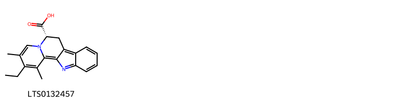{ width=100% }
    <figcaption>Hình ảnh cấu trúc hóa học của 1 hoạt chất thuộc nhóm Quinolizines gồm ['(6s)-2-ethyl-1,3-dimethyl-6h,7h-indolo[2,3-a]quinolizine-6-carboxylic acid (LTS0132457)'].</figcaption>
</figure>
#### Nhóm Tannins
<figure markdown="span">
    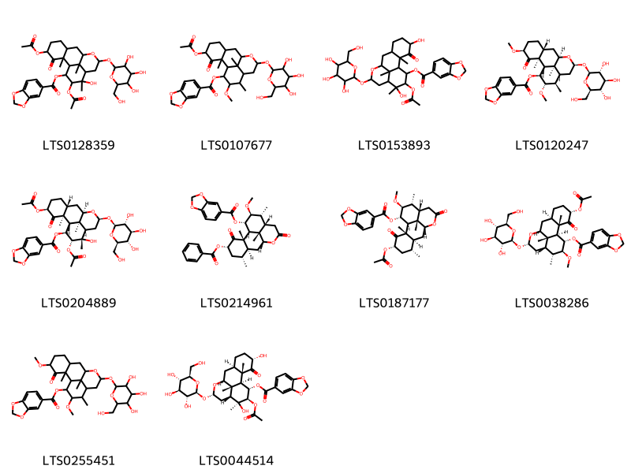{ width=100% }
    <figcaption>Hình ảnh cấu trúc hóa học của 10 hoạt chất thuộc nhóm Tannins gồm ['4,15-bis(acetyloxy)-14-hydroxy-2,14,17-trimethyl-3-oxo-11-{[3,4,5-trihydroxy-6-(hydroxymethyl)oxan-2-yl]oxy}-10-oxatetracyclo[7.7.1.0²,⁷.0¹³,¹⁷]heptadecan-16-yl 2h-1,3-benzodioxole-5-carboxylate (LTS0128359)', '4-(acetyloxy)-15-methoxy-2,14,17-trimethyl-3-oxo-11-{[3,4,5-trihydroxy-6-(hydroxymethyl)oxan-2-yl]oxy}-10-oxatetracyclo[7.7.1.0²,⁷.0¹³,¹⁷]heptadecan-16-yl 2h-1,3-benzodioxole-5-carboxylate (LTS0107677)', '15-(acetyloxy)-4,14-dihydroxy-2,14,17-trimethyl-3-oxo-11-{[3,4,5-trihydroxy-6-(hydroxymethyl)oxan-2-yl]oxy}-10-oxatetracyclo[7.7.1.0²,⁷.0¹³,¹⁷]heptadecan-16-yl 2h-1,3-benzodioxole-5-carboxylate (LTS0153893)', '(1s,2s,4s,7r,9r,11s,13s,14r,15s,16s,17s)-4,15-dimethoxy-2,14,17-trimethyl-3-oxo-11-{[(2s,3r,4s,5s,6r)-3,4,5-trihydroxy-6-(hydroxymethyl)oxan-2-yl]oxy}-10-oxatetracyclo[7.7.1.0²,⁷.0¹³,¹⁷]heptadecan-16-yl 2h-1,3-benzodioxole-5-carboxylate (LTS0120247)', '(1s,2s,4s,7r,9r,11s,13r,14s,15r,16s,17r)-4,15-bis(acetyloxy)-14-hydroxy-2,14,17-trimethyl-3-oxo-11-{[(2s,3r,4s,5s,6r)-3,4,5-trihydroxy-6-(hydroxymethyl)oxan-2-yl]oxy}-10-oxatetracyclo[7.7.1.0²,⁷.0¹³,¹⁷]heptadecan-16-yl 2h-1,3-benzodioxole-5-carboxylate (LTS0204889)', '(1s,2s,4s,6r,7s,9r,13s,14r,15s,16s,17s)-4-(benzoyloxy)-15-methoxy-2,6,14,17-tetramethyl-3,11-dioxo-10-oxatetracyclo[7.7.1.0²,⁷.0¹³,¹⁷]heptadecan-16-yl 2h-1,3-benzodioxole-5-carboxylate (LTS0214961)', '(1s,2s,4s,6r,7s,9r,13s,14r,15s,16s,17s)-4-(acetyloxy)-15-methoxy-2,6,14,17-tetramethyl-3,11-dioxo-10-oxatetracyclo[7.7.1.0²,⁷.0¹³,¹⁷]heptadecan-16-yl 2h-1,3-benzodioxole-5-carboxylate (LTS0187177)', '(1s,2s,4s,7r,9r,11s,13s,14r,15s,16s,17s)-4-(acetyloxy)-15-methoxy-2,14,17-trimethyl-3-oxo-11-{[(2s,3r,4s,5s,6r)-3,4,5-trihydroxy-6-(hydroxymethyl)oxan-2-yl]oxy}-10-oxatetracyclo[7.7.1.0²,⁷.0¹³,¹⁷]heptadecan-16-yl 2h-1,3-benzodioxole-5-carboxylate (LTS0038286)', '4,15-dimethoxy-2,14,17-trimethyl-3-oxo-11-{[3,4,5-trihydroxy-6-(hydroxymethyl)oxan-2-yl]oxy}-10-oxatetracyclo[7.7.1.0²,⁷.0¹³,¹⁷]heptadecan-16-yl 2h-1,3-benzodioxole-5-carboxylate (LTS0255451)', '(1s,2s,4s,7r,9r,11s,13r,14s,15r,16s,17r)-15-(acetyloxy)-4,14-dihydroxy-2,14,17-trimethyl-3-oxo-11-{[(2s,3r,4s,5s,6r)-3,4,5-trihydroxy-6-(hydroxymethyl)oxan-2-yl]oxy}-10-oxatetracyclo[7.7.1.0²,⁷.0¹³,¹⁷]heptadecan-16-yl 2h-1,3-benzodioxole-5-carboxylate (LTS0044514)'].</figcaption>
</figure>

---

### Dược dân tộc học

Danh sách các quốc gia có sử dụng *Picrasma javanica* trong điều trị các bệnh. 

| Country    | Disease   | Bệnh                                                                                                                                                                                                |
|:-----------|:----------|:----------------------------------------------------------------------------------------------------------------------------------------------------------------------------------------------------|
| India      | Larvicide | MYMEMORY WARNING: YOU USED ALL AVAILABLE FREE TRANSLATIONS FOR TODAY. NEXT AVAILABLE IN  07 HOURS 40 MINUTES 53 SECONDS VISIT HTTPS://MYMEMORY.TRANSLATED.NET/DOC/USAGELIMITS.PHP TO TRANSLATE MORE |
| New Guinea | Antidote  | MYMEMORY WARNING: YOU USED ALL AVAILABLE FREE TRANSLATIONS FOR TODAY. NEXT AVAILABLE IN  07 HOURS 40 MINUTES 51 SECONDS VISIT HTTPS://MYMEMORY.TRANSLATED.NET/DOC/USAGELIMITS.PHP TO TRANSLATE MORE |

---

---
## Picrasma quassioides
### Thông tin về thực vật

!!! info "Phân loại thực vật của *Picrasma quassioides* từ GIBF:"
    - **Kingdom:** Plantae
    - **Phylum:** Tracheophyta
    - **Order:** Sapindales
    - **Family:** Simaroubaceae
    - **Genus:** Picrasma
    - **Species:** *Picrasma quassioides*

 

| Label (VI)   | Label (EN)   | Scientific Name      | Descriptions (VI)   | Descriptions (EN)   | Also Known As (VI)   | Also Known As (EN)   |
|:-------------|:-------------|:---------------------|:--------------------|:--------------------|:---------------------|:---------------------|
| N/A          | N/A          | Picrasma quassioides | loài thực vật       | species of plant    | ['']                 | ['']                 |

#### Phân bố trên thế giới

**Từ CSDL GIBF** Hong Kong, United States of America, Japan, Korea, Republic of, Belgium, Chinese Taipei, China

#### Phân bố tại Việt Nam

**Từ CSDL GIBF**: Không có ghi nhận ở Việt Nam

---
### Thành phần hóa học
        
- Theo cơ sở dữ liệu lotus: Từ loài *Picrasma quassioides* đã phân lập và xác định được 225 hoạt chất thuộc về các nhóm Flavonoids, Tannins, Indolonaphthyridine alkaloids, Organooxygen compounds, Furanoid lignans, Prenol lipids, Harmala alkaloids, Lignan glycosides, Indoles and derivatives. 

|    | chemicalTaxonomyClassyfireClass   |   smiles_count |
|---:|:----------------------------------|---------------:|
|  0 | Flavonoids                        |              3 |
|  1 | Furanoid lignans                  |              2 |
|  2 | Harmala alkaloids                 |             55 |
|  3 | Indoles and derivatives           |              9 |
|  4 | Indolonaphthyridine alkaloids     |             17 |
|  5 | Lignan glycosides                 |              7 |
|  6 | Organooxygen compounds            |             18 |
|  7 | Prenol lipids                     |            113 |
|  8 | Tannins                           |              1 |

#### Nhóm Flavonoids
<figure markdown="span">
    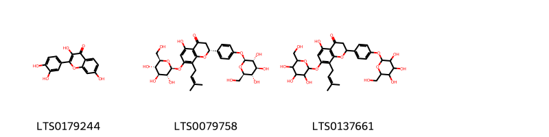{ width=100% }
    <figcaption>Hình ảnh cấu trúc hóa học của 3 hoạt chất thuộc nhóm Flavonoids gồm ["3,7,3',4'-tetrahydroxyflavone (LTS0179244)", '(2r)-5-hydroxy-8-(3-methylbut-2-en-1-yl)-7-{[(2s,3r,4s,5s,6r)-3,4,5-trihydroxy-6-(hydroxymethyl)oxan-2-yl]oxy}-2-(4-{[(2s,3r,4s,5s,6r)-3,4,5-trihydroxy-6-(hydroxymethyl)oxan-2-yl]oxy}phenyl)-2,3-dihydro-1-benzopyran-4-one (LTS0079758)', '5-hydroxy-8-(3-methylbut-2-en-1-yl)-7-{[3,4,5-trihydroxy-6-(hydroxymethyl)oxan-2-yl]oxy}-2-(4-{[3,4,5-trihydroxy-6-(hydroxymethyl)oxan-2-yl]oxy}phenyl)-2,3-dihydro-1-benzopyran-4-one (LTS0137661)'].</figcaption>
</figure>
#### Nhóm Furanoid lignans
<figure markdown="span">
    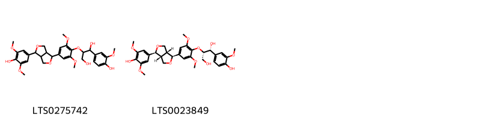{ width=100% }
    <figcaption>Hình ảnh cấu trúc hóa học của 2 hoạt chất thuộc nhóm Furanoid lignans gồm ['buddlenol c (LTS0275742)', '(1r,2s)-2-{4-[(1s,3ar,4s,6ar)-4-(4-hydroxy-3,5-dimethoxyphenyl)-hexahydrofuro[3,4-c]furan-1-yl]-2,6-dimethoxyphenoxy}-1-(4-hydroxy-3-methoxyphenyl)propane-1,3-diol (LTS0023849)'].</figcaption>
</figure>
#### Nhóm Harmala alkaloids
<figure markdown="span">
    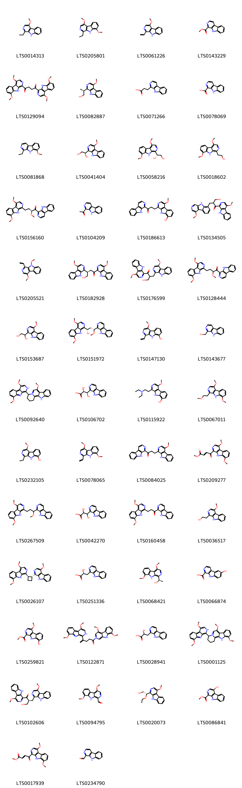{ width=100% }
    <figcaption>Hình ảnh cấu trúc hóa học của 55 hoạt chất thuộc nhóm Harmala alkaloids gồm ['1-ethyl-4-methoxy-9h-pyrido[3,4-b]indole (LTS0014313)', '1-ethyl-4,8-dimethoxy-9h-pyrido[3,4-b]indole (LTS0205801)', '1-ethenyl-4-methoxy-9h-pyrido[3,4-b]indole (LTS0061226)', 'methyl 9h-pyrido[3,4-b]indole-1-carboxylate (LTS0143229)', '1,4-bis({4,8-dimethoxy-9h-pyrido[3,4-b]indol-1-yl})butane-1,4-dione (LTS0129094)', '(2s)-2-{4-methoxy-9h-pyrido[3,4-b]indol-1-yl}propan-1-ol (LTS0082887)', '3-{9h-pyrido[3,4-b]indol-1-yl}propanoic acid (LTS0071266)', '9h-pyrido[3,4-b]indole-1-carboxylic acid (LTS0078069)', '1-ethyl-8-methoxy-9h-pyrido[3,4-b]indole (LTS0081868)', '(1r)-1-{4-methoxy-9h-pyrido[3,4-b]indol-1-yl}ethane-1,2-diol (LTS0041404)', '(1r)-1-{4,8-dimethoxy-9h-pyrido[3,4-b]indol-1-yl}ethane-1,2-diol (LTS0058216)', '2-{4,8-dimethoxy-9h-pyrido[3,4-b]indol-1-yl}ethanol (LTS0018602)', '(2s)-4-{4,8-dimethoxy-9h-pyrido[3,4-b]indol-1-yl}-2-methoxy-1-{9h-pyrido[3,4-b]indol-1-yl}butan-1-one (LTS0156160)', '1-acetyl-β-carboline (LTS0104209)', '3-{8-hydroxy-4-methoxy-9h-pyrido[3,4-b]indol-1-yl}-1-{9h-pyrido[3,4-b]indol-1-yl}propan-1-one (LTS0186613)', '3-hydroxy-1-{4-methoxy-9h-pyrido[3,4-b]indol-1-yl}-2-({4-methoxy-9h-pyrido[3,4-b]indol-8-yl}methyl)propan-1-one (LTS0134505)', '1-ethenyl-4,9-dimethoxypyrido[3,4-b]indole (LTS0205521)', '(3r)-4-hydroxy-1,3-bis({4-methoxy-9h-pyrido[3,4-b]indol-1-yl})butan-1-one (LTS0182928)', '3-hydroxy-1-{4-methoxy-9h-pyrido[3,4-b]indol-1-yl}-2-({4-methoxy-9h-pyrido[3,4-b]indol-1-yl}methyl)propan-1-one (LTS0176599)', 'picrasidine c (LTS0128444)', '1-{4-methoxy-9h-pyrido[3,4-b]indol-1-yl}ethane-1,2-diol (LTS0153687)', '(1s,3r)-1-{4,8-dimethoxy-9h-pyrido[3,4-b]indol-1-yl}-3-methoxy-3-{9h-pyrido[3,4-b]indol-1-yl}propan-1-ol (LTS0151972)', '1-ethenyl-4-methoxy-9h-pyrido[3,4-b]indol-8-ol (LTS0147130)', '9h-pyrido[3,4-b]indol-1-ylmethanol (LTS0143677)', '4-{4,8-dimethoxy-2h-pyrido[3,4-b]indol-1-yl}-7-methoxy-1h,2h,3h,4h,12h-5λ⁵-indolo[2,3-a]quinolizin-5-ylium (LTS0092640)', '(2s,3r)-2,3-dihydroxy-3-{9h-pyrido[3,4-b]indol-1-yl}propanoic acid (LTS0106702)', '1-[2-(diethylamino)ethyl]-4-methoxy-9h-pyrido[3,4-b]indol-8-ol (LTS0115922)', '4,8-dimethoxy-1-(2-methoxyethyl)-9h-pyrido[3,4-b]indole (LTS0067011)', '1-ethyl-4-methoxy-9h-pyrido[3,4-b]indol-8-ol (LTS0232105)', '1-ethenyl-4,8-dimethoxy-9h-pyrido[3,4-b]indole (LTS0078065)', '3-{4-methoxy-9h-pyrido[3,4-b]indol-1-yl}-1-{9h-pyrido[3,4-b]indol-1-yl}propan-1-one (LTS0084025)', 'methyl 4-{4,8-dimethoxy-9h-pyrido[3,4-b]indol-1-yl}-4-oxobut-2-enoate (LTS0209277)', '4,8-dimethoxy-1-(3-methoxy-3-{9h-pyrido[3,4-b]indol-1-yl}propyl)-9h-pyrido[3,4-b]indole (LTS0267509)', '2,3-dihydroxy-3-{9h-pyrido[3,4-b]indol-1-yl}propanoic acid (LTS0042270)', '3-{4,8-dimethoxy-9h-pyrido[3,4-b]indol-1-yl}-1-{9h-pyrido[3,4-b]indol-1-yl}propan-1-one (LTS0160458)', '2-{4-methoxy-9h-pyrido[3,4-b]indol-1-yl}ethanol (LTS0036517)', 'quassidine a (LTS0026107)', '(2s)-2-hydroxy-3-{9h-pyrido[3,4-b]indol-1-yl}propanoic acid (LTS0251336)', '(1r)-1-{4,8-dimethoxy-9h-pyrido[3,4-b]indol-1-yl}ethanol (LTS0068421)', '6-hydroxy-9h-pyrido[3,4-b]indole-1-carboxylic acid (LTS0066874)', 'methyl 8-hydroxy-4-methoxy-9h-pyrido[3,4-b]indole-1-carboxylate (LTS0259821)', '2-(4-{4,8-dimethoxy-2h-pyrido[3,4-b]indol-1-yl}pent-4-enoyl)-4,8-dimethoxy-9h-pyrido[3,4-b]indol-2-ium (LTS0122871)', '2-hydroxy-3-{9h-pyrido[3,4-b]indol-1-yl}propanoic acid (LTS0028941)', '4-{4,8-dimethoxy-2h-pyrido[3,4-b]indol-1-yl}-7,11-dimethoxy-1h,2h,3h,4h,12h-5λ⁵-indolo[2,3-a]quinolizin-5-ylium (LTS0001125)', '(2s)-3-hydroxy-1-{4-methoxy-9h-pyrido[3,4-b]indol-1-yl}-2-({4-methoxy-9h-pyrido[3,4-b]indol-1-yl}methyl)propan-1-one (LTS0102606)', '4,8-dimethoxy-9h-pyrido[3,4-b]indole-1-carbaldehyde (LTS0094795)', '(2s)-2-ethoxy-2-{4-methoxy-9h-pyrido[3,4-b]indol-1-yl}ethanol (LTS0020073)', 'methyl 4-hydroxy-9h-pyrido[3,4-b]indole-1-carboxylate (LTS0086841)', 'methyl (2e)-4-{4,8-dimethoxy-9h-pyrido[3,4-b]indol-1-yl}-4-oxobut-2-enoate (LTS0017939)', '9h-pyrido[3,4-b]indole-1-carbaldehyde (LTS0234790)', '4-methoxy-9h-pyrido[3,4-b]indole-1-carbaldehyde (LTS0267568)', '1-ethenyl-8-methoxy-9h-pyrido[3,4-b]indol-4-ol (LTS0036330)', '4-methoxy-1-methyl-9h-pyrido[3,4-b]indole (LTS0022963)', '1-(dimethoxymethyl)-9h-pyrido[3,4-b]indole (LTS0264674)', 'ethyl 9h-pyrido[3,4-b]indole-1-carboxylate (LTS0117358)'].</figcaption>
</figure>
#### Nhóm Indoles and derivatives
<figure markdown="span">
    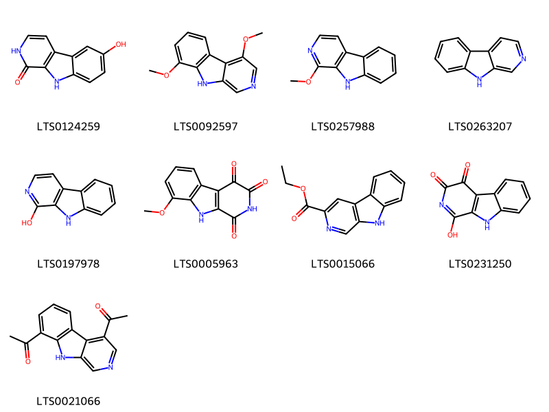{ width=100% }
    <figcaption>Hình ảnh cấu trúc hóa học của 9 hoạt chất thuộc nhóm Indoles and derivatives gồm ['6-hydroxy-2h,9h-pyrido[3,4-b]indol-1-one (LTS0124259)', '4,8-dimethoxy-9h-pyrido[3,4-b]indole (LTS0092597)', '1-methoxy-9h-pyrido[3,4-b]indole (LTS0257988)', 'β-carboline (LTS0263207)', '9h-pyrido[3,4-b]indol-1-ol (LTS0197978)', '8-methoxy-2h,9h-pyrido[3,4-b]indole-1,3,4-trione (LTS0005963)', 'ethyl 9h-pyrido[3,4-b]indole-3-carboxylate (LTS0015066)', '1-hydroxy-9h-pyrido[3,4-b]indole-3,4-dione (LTS0231250)', '1-{4-acetyl-9h-pyrido[3,4-b]indol-8-yl}ethanone (LTS0021066)'].</figcaption>
</figure>
#### Nhóm Indolonaphthyridine alkaloids
<figure markdown="span">
    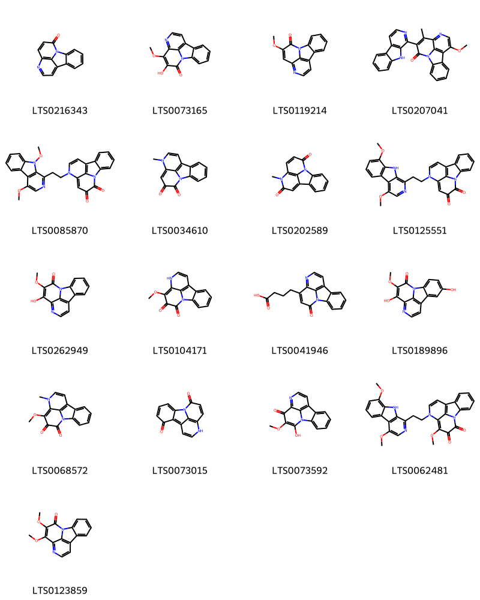{ width=100% }
    <figcaption>Hình ảnh cấu trúc hóa học của 17 hoạt chất thuộc nhóm Indolonaphthyridine alkaloids gồm ['canthin-6-one (LTS0216343)', 'nigakinone (LTS0073165)', '5-methoxycanthin-6-one (LTS0119214)', '8-methoxy-4-methyl-3-{9h-pyrido[3,4-b]indol-1-yl}-1,6-diazatetracyclo[7.6.1.0⁵,¹⁶.0¹⁰,¹⁵]hexadeca-3,5,7,9(16),10(15),11,13-heptaen-2-one (LTS0207041)', '6-(2-{4,9-dimethoxypyrido[3,4-b]indol-1-yl}ethyl)-1,6-diazatetracyclo[7.6.1.0⁵,¹⁶.0¹⁰,¹⁵]hexadeca-4,7,9(16),10(15),11,13-hexaene-2,3-dione (LTS0085870)', '6-methyl-1,6-diazatetracyclo[7.6.1.0⁵,¹⁶.0¹⁰,¹⁵]hexadeca-4,7,9(16),10(15),11,13-hexaene-2,3-dione (LTS0034610)', '6-methyl-1,6-diazatetracyclo[7.6.1.0⁵,¹⁶.0¹⁰,¹⁵]hexadeca-3,5(16),8,10(15),11,13-hexaene-2,7-dione (LTS0202589)', '6-(2-{4,8-dimethoxy-9h-pyrido[3,4-b]indol-1-yl}ethyl)-1,6-diazatetracyclo[7.6.1.0⁵,¹⁶.0¹⁰,¹⁵]hexadeca-4,7,9(16),10(15),11,13-hexaene-2,3-dione (LTS0125551)', '4-hydroxy-3-methoxy-1,6-diazatetracyclo[7.6.1.0⁵,¹⁶.0¹⁰,¹⁵]hexadeca-3,5,7,9(16),10(15),11,13-heptaen-2-one (LTS0262949)', '4-methoxy-1,6-diazatetracyclo[7.6.1.0⁵,¹⁶.0¹⁰,¹⁵]hexadeca-4,7,9(16),10(15),11,13-hexaene-2,3-dione (LTS0104171)', '4-{2-oxo-1,6-diazatetracyclo[7.6.1.0⁵,¹⁶.0¹⁰,¹⁵]hexadeca-3,5,7,9(16),10(15),11,13-heptaen-4-yl}butanoic acid (LTS0041946)', '4,12-dihydroxy-3-methoxy-1,6-diazatetracyclo[7.6.1.0⁵,¹⁶.0¹⁰,¹⁵]hexadeca-3,5,7,9(16),10(15),11,13-heptaen-2-one (LTS0189896)', '4-methoxy-6-methyl-1,6-diazatetracyclo[7.6.1.0⁵,¹⁶.0¹⁰,¹⁵]hexadeca-4,7,9(16),10(15),11,13-hexaene-2,3-dione (LTS0068572)', '1,6-diazatetracyclo[7.6.1.0⁵,¹⁶.0¹⁰,¹⁵]hexadeca-3,5(16),7,9,12,14-hexaene-2,11-dione (LTS0073015)', '2-hydroxy-3-methoxy-1,6-diazatetracyclo[7.6.1.0⁵,¹⁶.0¹⁰,¹⁵]hexadeca-2,5,7,9(16),10(15),11,13-heptaen-4-one (LTS0073592)', '6-(2-{4,8-dimethoxy-9h-pyrido[3,4-b]indol-1-yl}ethyl)-4-methoxy-1,6-diazatetracyclo[7.6.1.0⁵,¹⁶.0¹⁰,¹⁵]hexadeca-4,7,9(16),10(15),11,13-hexaene-2,3-dione (LTS0062481)', 'methyl nigakinone (LTS0123859)'].</figcaption>
</figure>
#### Nhóm Lignan glycosides
<figure markdown="span">
    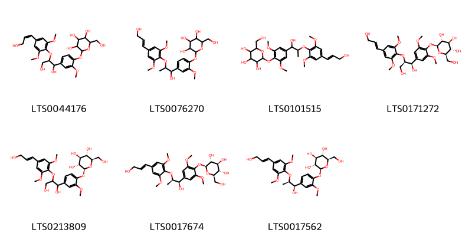{ width=100% }
    <figcaption>Hình ảnh cấu trúc hóa học của 7 hoạt chất thuộc nhóm Lignan glycosides gồm ['2-[4-(1,3-dihydroxy-2-{4-[(1z)-3-hydroxyprop-1-en-1-yl]-2,6-dimethoxyphenoxy}propyl)-2-methoxyphenoxy]-6-(hydroxymethyl)oxane-3,4,5-triol (LTS0044176)', '2-(4-{1-hydroxy-2-[4-(3-hydroxyprop-1-en-1-yl)-2,6-dimethoxyphenoxy]propyl}-2-methoxyphenoxy)-6-(hydroxymethyl)oxane-3,4,5-triol (LTS0076270)', '2-(4-{1-hydroxy-2-[4-(3-hydroxyprop-1-en-1-yl)-2,6-dimethoxyphenoxy]propyl}-2,6-dimethoxyphenoxy)-6-(hydroxymethyl)oxane-3,4,5-triol (LTS0101515)', '(2s,3r,4s,5s,6r)-2-{4-[(1r,2r)-1,3-dihydroxy-2-{4-[(1e)-3-hydroxyprop-1-en-1-yl]-2,6-dimethoxyphenoxy}propyl]-2,6-dimethoxyphenoxy}-6-(hydroxymethyl)oxane-3,4,5-triol (LTS0171272)', '(2s,3r,4s,5s,6r)-2-[4-(1,3-dihydroxy-2-{4-[(1e)-3-hydroxyprop-1-en-1-yl]-2,6-dimethoxyphenoxy}propyl)-2-methoxyphenoxy]-6-(hydroxymethyl)oxane-3,4,5-triol (LTS0213809)', '(2s,3r,4s,5s,6r)-2-{4-[(1r,2r)-1-hydroxy-2-{4-[(1e)-3-hydroxyprop-1-en-1-yl]-2,6-dimethoxyphenoxy}propyl]-2,6-dimethoxyphenoxy}-6-(hydroxymethyl)oxane-3,4,5-triol (LTS0017674)', '(2s,3r,4s,5s,6r)-2-{4-[(1r,2r)-1-hydroxy-2-{4-[(1e)-3-hydroxyprop-1-en-1-yl]-2,6-dimethoxyphenoxy}propyl]-2-methoxyphenoxy}-6-(hydroxymethyl)oxane-3,4,5-triol (LTS0017562)'].</figcaption>
</figure>
#### Nhóm Organooxygen compounds
<figure markdown="span">
    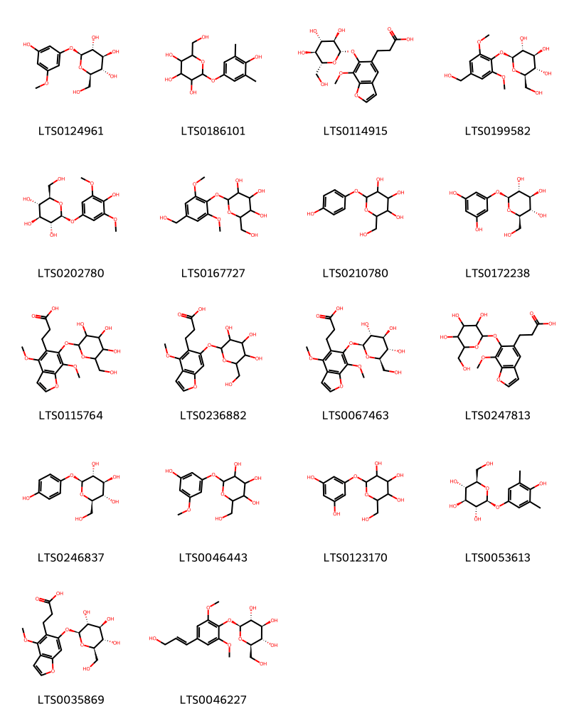{ width=100% }
    <figcaption>Hình ảnh cấu trúc hóa học của 18 hoạt chất thuộc nhóm Organooxygen compounds gồm ['(2s,3r,4s,5s,6r)-2-(3-hydroxy-5-methoxyphenoxy)-6-(hydroxymethyl)oxane-3,4,5-triol (LTS0124961)', '2-(4-hydroxy-3,5-dimethylphenoxy)-6-(hydroxymethyl)oxane-3,4,5-triol (LTS0186101)', '3-(7-methoxy-6-{[(2s,3r,4s,5s,6r)-3,4,5-trihydroxy-6-(hydroxymethyl)oxan-2-yl]oxy}-1-benzofuran-5-yl)propanoic acid (LTS0114915)', '(2r,3s,4s,5r,6s)-2-(hydroxymethyl)-6-[4-(hydroxymethyl)-2,6-dimethoxyphenoxy]oxane-3,4,5-triol (LTS0199582)', 'koaburaside (LTS0202780)', '2-(hydroxymethyl)-6-[4-(hydroxymethyl)-2,6-dimethoxyphenoxy]oxane-3,4,5-triol (LTS0167727)', 'arbutin (LTS0210780)', '(2s,3r,4s,5s,6r)-2-(3,5-dihydroxyphenoxy)-6-(hydroxymethyl)oxane-3,4,5-triol (LTS0172238)', '3-(4,7-dimethoxy-6-{[3,4,5-trihydroxy-6-(hydroxymethyl)oxan-2-yl]oxy}-1-benzofuran-5-yl)propanoic acid (LTS0115764)', '3-(4-methoxy-6-{[3,4,5-trihydroxy-6-(hydroxymethyl)oxan-2-yl]oxy}-1-benzofuran-5-yl)propanoic acid (LTS0236882)', '3-(4,7-dimethoxy-6-{[(2s,3r,4s,5s,6r)-3,4,5-trihydroxy-6-(hydroxymethyl)oxan-2-yl]oxy}-1-benzofuran-5-yl)propanoic acid (LTS0067463)', '3-(7-methoxy-6-{[3,4,5-trihydroxy-6-(hydroxymethyl)oxan-2-yl]oxy}-1-benzofuran-5-yl)propanoic acid (LTS0247813)', 'β-arbutin (LTS0246837)', '2-(3-hydroxy-5-methoxyphenoxy)-6-(hydroxymethyl)oxane-3,4,5-triol (LTS0046443)', '2-(3,5-dihydroxyphenoxy)-6-(hydroxymethyl)oxane-3,4,5-triol (LTS0123170)', '(2s,3r,4s,5s,6r)-2-(4-hydroxy-3,5-dimethylphenoxy)-6-(hydroxymethyl)oxane-3,4,5-triol (LTS0053613)', '3-(4-methoxy-6-{[(2s,3r,4s,5s,6r)-3,4,5-trihydroxy-6-(hydroxymethyl)oxan-2-yl]oxy}-1-benzofuran-5-yl)propanoic acid (LTS0035869)', 'syringin (LTS0046227)'].</figcaption>
</figure>
#### Nhóm Prenol lipids
<figure markdown="span">
    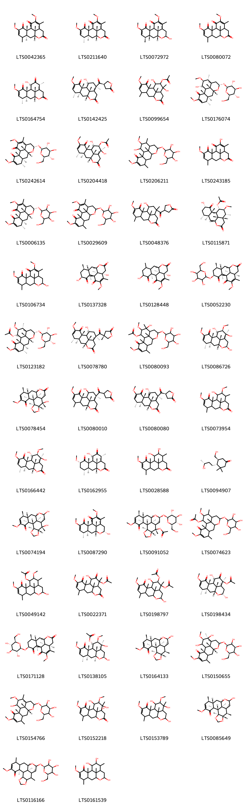{ width=100% }
    <figcaption>Hình ảnh cấu trúc hóa học của 113 hoạt chất thuộc nhóm Prenol lipids gồm ['(1r,2s,7s,9r,13r,17s)-4,15-dimethoxy-2,6,14,17-tetramethyl-10-oxatetracyclo[7.7.1.0²,⁷.0¹³,¹⁷]heptadeca-4,14-diene-3,11,16-trione (LTS0042365)', 'quassin (LTS0211640)', '(2s,6r,7r,9r,13r,17s)-11-hydroxy-4,15-dimethoxy-2,6,14,17-tetramethyl-10-oxatetracyclo[7.7.1.0²,⁷.0¹³,¹⁷]heptadeca-4,14-diene-3,16-dione (LTS0072972)', 'quassin (LTS0080072)', '(1s,2s,6s,7s,9r,13s,14r,16s,17s)-16-hydroxy-4-methoxy-2,6,14,17-tetramethyl-10-oxatetracyclo[7.7.1.0²,⁷.0¹³,¹⁷]heptadec-4-ene-3,11,15-trione (LTS0164754)', 'picrasin a (LTS0142425)', '14,16-dihydroxy-4-methoxy-2,6,14,17-tetramethyl-3,11-dioxo-10-oxatetracyclo[7.7.1.0²,⁷.0¹³,¹⁷]heptadec-4-en-15-yl acetate (LTS0099654)', '(1s,2s,6s,7s,9r,11s,13s,14r,15s,16s,17s)-16-hydroxy-4,15-dimethoxy-2,6,14,17-tetramethyl-11-{[(2s,3r,4s,5s,6r)-3,4,5-trihydroxy-6-(hydroxymethyl)oxan-2-yl]oxy}-10-oxatetracyclo[7.7.1.0²,⁷.0¹³,¹⁷]heptadec-4-en-3-one (LTS0176074)', '(1s,2s,6s,7s,9r,11s,13r,17s)-4,15-dimethoxy-2,6,14,17-tetramethyl-11-{[(2s,3r,4s,5s,6r)-3,4,5-trihydroxy-6-(hydroxymethyl)oxan-2-yl]oxy}-10-oxatetracyclo[7.7.1.0²,⁷.0¹³,¹⁷]heptadeca-4,14-diene-3,16-dione (LTS0242614)', '(1s,2s,6s,7s,9r,13r,14s,15r,16s,17r)-14,16-dihydroxy-4-methoxy-2,6,14,17-tetramethyl-3,11-dioxo-10-oxatetracyclo[7.7.1.0²,⁷.0¹³,¹⁷]heptadec-4-en-15-yl acetate (LTS0204418)', '16-hydroxy-4,15-dimethoxy-2,6,14,17-tetramethyl-11-{[3,4,5-trihydroxy-6-(hydroxymethyl)oxan-2-yl]oxy}-10-oxatetracyclo[7.7.1.0²,⁷.0¹³,¹⁷]heptadec-4-en-3-one (LTS0206211)', '15-hydroxy-4-methoxy-2,6,14,17-tetramethyl-10-oxatetracyclo[7.7.1.0²,⁷.0¹³,¹⁷]heptadeca-4,14-diene-3,11,16-trione (LTS0243185)', '(1s,2s,6s,7s,9r,11s,13r,17s)-4,15-dimethoxy-2,6,14,17-tetramethyl-11-{[3,4,5-trihydroxy-6-(hydroxymethyl)oxan-2-yl]oxy}-10-oxatetracyclo[7.7.1.0²,⁷.0¹³,¹⁷]heptadeca-4,14-diene-3,16-dione (LTS0006135)', '4,15-dimethoxy-2,6,14,17-tetramethyl-11-{[3,4,5-trihydroxy-6-(hydroxymethyl)oxan-2-yl]oxy}-10-oxatetracyclo[7.7.1.0²,⁷.0¹³,¹⁷]heptadeca-4,14-diene-3,16-dione (LTS0029609)', '16-hydroxy-4-methoxy-2,6,14,17-tetramethyl-14-(5-oxooxolane-3-carbonyl)-10-oxatetracyclo[7.7.1.0²,⁷.0¹³,¹⁷]heptadec-4-ene-3,11-dione (LTS0048376)', 'picrasin c (LTS0115871)', 'neoquassin (LTS0106734)', 'picrasin g (LTS0137328)', '(2s,9r,13s,17s)-4,13-dihydroxy-15-methoxy-2,6,14,17-tetramethyl-10-oxatetracyclo[7.7.1.0²,⁷.0¹³,¹⁷]heptadec-14-ene-3,11,16-trione (LTS0128448)', '(1s,2s,4s,6r,7s,9r,13r,17s)-15-methoxy-2,6,14,17-tetramethyl-4-{[3,4,5-trihydroxy-6-(hydroxymethyl)oxan-2-yl]oxy}-10-oxatetracyclo[7.7.1.0²,⁷.0¹³,¹⁷]heptadec-14-ene-3,11,16-trione (LTS0052230)', '(1s,2s,6s,7s,9r,11s,13s,14r,15s,16s,17s)-4,15-dimethoxy-2,6,14,17-tetramethyl-3-oxo-11-{[(2s,3r,4s,5s,6r)-3,4,5-trihydroxy-6-(hydroxymethyl)oxan-2-yl]oxy}-10-oxatetracyclo[7.7.1.0²,⁷.0¹³,¹⁷]heptadec-4-en-16-yl acetate (LTS0123182)', '(1s,2s,6s,7s,9r,13r,14r,16r,17s)-16-hydroxy-4-methoxy-2,6,14,17-tetramethyl-14-[(3r)-3-methyl-5-oxooxolane-3-carbonyl]-10-oxatetracyclo[7.7.1.0²,⁷.0¹³,¹⁷]heptadec-4-ene-3,11-dione (LTS0078780)', '14-hydroxy-4,15-dimethoxy-2,6,14,17-tetramethyl-3-oxo-11-{[3,4,5-trihydroxy-6-(hydroxymethyl)oxan-2-yl]oxy}-10-oxatetracyclo[7.7.1.0²,⁷.0¹³,¹⁷]heptadec-4-en-16-yl acetate (LTS0080093)', '(1s,2s,6s,7s,9r,11s,13r,14s,15r,16s,17r)-11,14,16-trihydroxy-4,15-dimethoxy-2,6,14,17-tetramethyl-10-oxatetracyclo[7.7.1.0²,⁷.0¹³,¹⁷]heptadec-4-en-3-one (LTS0086726)', '(1s,2s,6r,7s,8r,12r,14s,15s,19s,20r)-7-hydroxy-17-methoxy-7,15,19,20-tetramethyl-3,5,11-trioxapentacyclo[10.7.1.0²,⁶.0⁸,²⁰.0¹⁴,¹⁹]icos-16-ene-10,18-dione (LTS0078454)', '(2s,9r,13r,14r,17s)-16-hydroxy-4-methoxy-2,6,14,17-tetramethyl-14-(5-oxooxolane-3-carbonyl)-10-oxatetracyclo[7.7.1.0²,⁷.0¹³,¹⁷]heptadec-4-ene-3,11-dione (LTS0080010)', '(1r,2s,6s,7s,9r,13r,14r,16r,17s)-16-hydroxy-4-methoxy-2,6,14,17-tetramethyl-14-[(3r)-5-oxooxolane-3-carbonyl]-10-oxatetracyclo[7.7.1.0²,⁷.0¹³,¹⁷]heptadec-4-ene-3,11-dione (LTS0080080)', '16-hydroxy-4,15-dimethoxy-2,6,14,17-tetramethyl-10-oxatetracyclo[7.7.1.0²,⁷.0¹³,¹⁷]heptadec-4-ene-3,11-dione (LTS0073954)', 'nigakilactone f (LTS0166442)', '(1s,2s,4s,6r,7s,9r,13s,14r,16s,17s)-16-hydroxy-4-methoxy-2,6,14,17-tetramethyl-10-oxatetracyclo[7.7.1.0²,⁷.0¹³,¹⁷]heptadecane-3,11,15-trione (LTS0162955)', '15,16-dihydroxy-4-methoxy-2,6,14,17-tetramethyl-10-oxatetracyclo[7.7.1.0²,⁷.0¹³,¹⁷]heptadec-4-ene-3,11-dione (LTS0028588)', '(4r,5s)-4-[(3r)-3-hydroxybutyl]-5-(hydroxymethyl)-3,3-dimethylcyclohexan-1-one (LTS0094907)', '(1s,2s,6r,7s,8r,12r,14s,15s,19s,20r)-7,10-dihydroxy-17-methoxy-7,15,19,20-tetramethyl-3,5,11-trioxapentacyclo[10.7.1.0²,⁶.0⁸,²⁰.0¹⁴,¹⁹]icos-16-en-18-one (LTS0074194)', '(1r,2s,6s,7s,9r,11r,13r,17s)-11-hydroxy-4,15-dimethoxy-2,6,14,17-tetramethyl-10-oxatetracyclo[7.7.1.0²,⁷.0¹³,¹⁷]heptadeca-4,14-diene-3,16-dione (LTS0087290)', '(1s,2s,6r,7s,8r,10s,12r,14s,15s,19s,20r)-17-methoxy-7,15,19,20-tetramethyl-18-oxo-10-{[(2s,3r,4s,5s,6r)-3,4,5-trihydroxy-6-(hydroxymethyl)oxan-2-yl]oxy}-3,5,11-trioxapentacyclo[10.7.1.0²,⁶.0⁸,²⁰.0¹⁴,¹⁹]icos-16-en-7-yl acetate (LTS0091052)', '4,15-dimethoxy-2,6,14,17-tetramethyl-3-oxo-11-{[3,4,5-trihydroxy-6-(hydroxymethyl)oxan-2-yl]oxy}-10-oxatetracyclo[7.7.1.0²,⁷.0¹³,¹⁷]heptadec-4-en-16-yl acetate (LTS0074623)', '11-hydroxy-4,15-dimethoxy-2,6,14,17-tetramethyl-3-oxo-10-oxatetracyclo[7.7.1.0²,⁷.0¹³,¹⁷]heptadec-4-en-16-yl acetate (LTS0049142)', '16-hydroxy-4-methoxy-2,6,14,17-tetramethyl-3,11,15-trioxo-10-oxatetracyclo[7.7.1.0²,⁷.0¹³,¹⁷]heptadec-4-en-14-yl acetate (LTS0022371)', '15-(acetyloxy)-11,16-dihydroxy-4-methoxy-2,6,14,17-tetramethyl-3-oxo-10-oxatetracyclo[7.7.1.0²,⁷.0¹³,¹⁷]heptadec-4-en-14-yl acetate (LTS0198797)', '(1s,2s,6s,7s,9r,11r,13r,14s,16s,17r)-11,16-dihydroxy-4-methoxy-2,6,14,17-tetramethyl-3,15-dioxo-10-oxatetracyclo[7.7.1.0²,⁷.0¹³,¹⁷]heptadec-4-en-14-yl acetate (LTS0198434)', '(1s,2s,4s,6r,7s,9r,13r,17s)-15-methoxy-2,6,14,17-tetramethyl-4-{[(2s,3r,4s,5s,6r)-3,4,5-trihydroxy-6-(hydroxymethyl)oxan-2-yl]oxy}-10-oxatetracyclo[7.7.1.0²,⁷.0¹³,¹⁷]heptadec-14-ene-3,11,16-trione (LTS0171128)', '(1s,2s,6s,7s,9s,11s,13r,14s,15r,16s,17r)-11,14-dihydroxy-4,15-dimethoxy-2,6,14,17-tetramethyl-3-oxo-10-oxatetracyclo[7.7.1.0²,⁷.0¹³,¹⁷]heptadec-4-en-16-yl acetate (LTS0138105)', '(1s,2s,6s,7r,8s,10r,12r,14s,15s,19s,20s)-10-hydroxy-17-methoxy-7,15,19,20-tetramethyl-3,5,11-trioxapentacyclo[10.7.1.0²,⁶.0⁸,²⁰.0¹⁴,¹⁹]icos-16-en-18-one (LTS0164133)', '(2s,9r,13r,14s,15r,17r)-14,16-dihydroxy-4,15-dimethoxy-2,6,14,17-tetramethyl-11-{[(2s,4s,6r)-3,4,5-trihydroxy-6-(hydroxymethyl)oxan-2-yl]oxy}-10-oxatetracyclo[7.7.1.0²,⁷.0¹³,¹⁷]heptadec-4-en-3-one (LTS0150655)', '(2s,9r,13s,15s,17s)-16-hydroxy-4,15-dimethoxy-2,6,14,17-tetramethyl-11-{[(2s,4s,6r)-3,4,5-trihydroxy-6-(hydroxymethyl)oxan-2-yl]oxy}-10-oxatetracyclo[7.7.1.0²,⁷.0¹³,¹⁷]heptadec-4-en-3-one (LTS0154766)', '13,14,16-trihydroxy-4,15-dimethoxy-2,6,14,17-tetramethyl-10-oxatetracyclo[7.7.1.0²,⁷.0¹³,¹⁷]heptadec-4-ene-3,11-dione (LTS0152218)', '11,14,16-trihydroxy-4,15-dimethoxy-2,6,14,17-tetramethyl-10-oxatetracyclo[7.7.1.0²,⁷.0¹³,¹⁷]heptadec-4-en-3-one (LTS0153789)', '(1s,2s,6s,7r,8s,12r,14s,15s,19s,20s)-10-hydroxy-17-methoxy-7,15,19,20-tetramethyl-3,5,11-trioxapentacyclo[10.7.1.0²,⁶.0⁸,²⁰.0¹⁴,¹⁹]icos-16-en-18-one (LTS0085649)', '(8s,12r,19s,20s)-17-methoxy-7,15,19,20-tetramethyl-10-{[(2s,4s,6r)-3,4,5-trihydroxy-6-(hydroxymethyl)oxan-2-yl]oxy}-3,5,11-trioxapentacyclo[10.7.1.0²,⁶.0⁸,²⁰.0¹⁴,¹⁹]icos-16-en-18-one (LTS0116166)', '11,15,16-trihydroxy-4-methoxy-2,6,14,17-tetramethyl-10-oxatetracyclo[7.7.1.0²,⁷.0¹³,¹⁷]heptadec-4-en-3-one (LTS0161539)', '(7s,8r,12r,19s,20s)-8-hydroxy-17-methoxy-7,15,19,20-tetramethyl-3,5,11-trioxapentacyclo[10.7.1.0²,⁶.0⁸,²⁰.0¹⁴,¹⁹]icos-16-ene-10,18-dione (LTS0235635)', '7-hydroxy-17-methoxy-7,15,19,20-tetramethyl-3,5,11-trioxapentacyclo[10.7.1.0²,⁶.0⁸,²⁰.0¹⁴,¹⁹]icos-16-ene-10,18-dione (LTS0252421)', '4-hydroxy-15-methoxy-2,6,14,17-tetramethyl-10-oxatetracyclo[7.7.1.0²,⁷.0¹³,¹⁷]heptadeca-4,14-diene-3,11,16-trione (LTS0247633)', '(2s,9r,13s,14r,15s,17s)-11,15,16-trihydroxy-4-methoxy-2,6,14,17-tetramethyl-10-oxatetracyclo[7.7.1.0²,⁷.0¹³,¹⁷]heptadec-4-en-3-one (LTS0238154)', '(1s,2s,6s,7s,9r,11s,13r,14s,15r,16s,17r)-14-hydroxy-4,15-dimethoxy-2,6,14,17-tetramethyl-3-oxo-11-{[(2s,3r,4s,5s,6r)-3,4,5-trihydroxy-6-(hydroxymethyl)oxan-2-yl]oxy}-10-oxatetracyclo[7.7.1.0²,⁷.0¹³,¹⁷]heptadec-4-en-16-yl acetate (LTS0182834)', 'nigakilactone a (LTS0275988)', '(2s,9r,13s,14r,15s,17s)-11-hydroxy-4,15-dimethoxy-2,6,14,17-tetramethyl-3-oxo-10-oxatetracyclo[7.7.1.0²,⁷.0¹³,¹⁷]heptadec-4-en-16-yl acetate (LTS0157948)', '(1s,2s,6s,7s,9r,13r,17s)-4-hydroxy-15-methoxy-2,6,14,17-tetramethyl-10-oxatetracyclo[7.7.1.0²,⁷.0¹³,¹⁷]heptadeca-4,14-diene-3,11,16-trione (LTS0247622)', '4,15-dimethoxy-2,6,14,17-tetramethyl-3,11-dioxo-10-oxatetracyclo[7.7.1.0²,⁷.0¹³,¹⁷]heptadec-4-en-16-yl acetate (LTS0189598)', 'nigakilactone b (LTS0176765)', '15-(acetyloxy)-16-hydroxy-4-methoxy-2,6,14,17-tetramethyl-3,11-dioxo-10-oxatetracyclo[7.7.1.0²,⁷.0¹³,¹⁷]heptadec-4-en-14-yl acetate (LTS0177534)', '4-hydroxy-15-methoxy-2,6,14,17-tetramethyl-3,11-dioxo-10-oxatetracyclo[7.7.1.0²,⁷.0¹³,¹⁷]heptadecan-16-yl acetate (LTS0199910)', '(2s,9r,13r,14s,15r,17r)-14,16-dihydroxy-4,15-dimethoxy-2,6,14,17-tetramethyl-10-oxatetracyclo[7.7.1.0²,⁷.0¹³,¹⁷]heptadec-4-ene-3,11-dione (LTS0251095)', '4-(3-hydroxybutyl)-5-(hydroxymethyl)-3,3-dimethylcyclohexan-1-one (LTS0242735)', '(1s,2s,6s,7s,9r,13s,17s)-15-(hydroxymethyl)-4-methoxy-2,6,14,17-tetramethyl-10-oxatetracyclo[7.7.1.0²,⁷.0¹³,¹⁷]heptadeca-4,14-diene-3,11,16-trione (LTS0274675)', 'picrasin d (LTS0194674)', '(1s,2s,6s,7s,9r,11r,13r,14s,15r,16s,17r)-15-(acetyloxy)-11,16-dihydroxy-4-methoxy-2,6,14,17-tetramethyl-3-oxo-10-oxatetracyclo[7.7.1.0²,⁷.0¹³,¹⁷]heptadec-4-en-14-yl acetate (LTS0093511)', '(1s,2s,6s,7s,9r,13r,14s,15r,16s,17r)-15-(acetyloxy)-16-hydroxy-4-methoxy-2,6,14,17-tetramethyl-3,11-dioxo-10-oxatetracyclo[7.7.1.0²,⁷.0¹³,¹⁷]heptadec-4-en-14-yl acetate (LTS0214809)', '(1s,2s,6s,7s,9r,13r,14s,15r,16s,17r)-16-(acetyloxy)-14-hydroxy-4-methoxy-2,6,14,17-tetramethyl-3,11-dioxo-10-oxatetracyclo[7.7.1.0²,⁷.0¹³,¹⁷]heptadec-4-en-15-yl acetate (LTS0238853)', '(1s,2s,6s,7s,9r,11s,13r,14s,15r,16s,17r)-14,16-dihydroxy-4,15-dimethoxy-2,6,14,17-tetramethyl-11-{[(2s,3r,4s,5s,6r)-3,4,5-trihydroxy-6-(hydroxymethyl)oxan-2-yl]oxy}-10-oxatetracyclo[7.7.1.0²,⁷.0¹³,¹⁷]heptadec-4-en-3-one (LTS0232532)', '16-hydroxy-4-methoxy-2,6,14,17-tetramethyl-14-(3-methyl-5-oxooxolane-3-carbonyl)-10-oxatetracyclo[7.7.1.0²,⁷.0¹³,¹⁷]heptadec-4-ene-3,11-dione (LTS0190884)', 'nigakilactone c (LTS0220975)', '(1s,2s,6s,7s,9r,13r,14s,16s,17r)-16-hydroxy-4-methoxy-2,6,14,17-tetramethyl-3,11,15-trioxo-10-oxatetracyclo[7.7.1.0²,⁷.0¹³,¹⁷]heptadec-4-en-14-yl acetate (LTS0223848)', 'nigakilactone l (LTS0212663)', '11,16-dihydroxy-4-methoxy-2,6,14,17-tetramethyl-3,15-dioxo-10-oxatetracyclo[7.7.1.0²,⁷.0¹³,¹⁷]heptadec-4-en-14-yl acetate (LTS0239144)', '(2s,9r,11s,13r,14s,15s,17s)-11,14,15-trihydroxy-4-methoxy-2,6,14,17-tetramethyl-10-oxatetracyclo[7.7.1.0²,⁷.0¹³,¹⁷]heptadec-4-ene-3,16-dione (LTS0150535)', '(2s,9r,13r,14s,15r,17r)-15-(acetyloxy)-16-hydroxy-4-methoxy-2,6,14,17-tetramethyl-3,11-dioxo-10-oxatetracyclo[7.7.1.0²,⁷.0¹³,¹⁷]heptadec-4-en-14-yl acetate (LTS0164123)', 'nigakilactone e (LTS0148265)', 'picrasin b (LTS0218112)', 'picrasin e (LTS0248997)', '(1s,2s,6s,7r,8s,10s,12r,14s,15s,19s,20s)-17-methoxy-7,15,19,20-tetramethyl-10-{[(2s,3r,4s,5s,6r)-3,4,5-trihydroxy-6-(hydroxymethyl)oxan-2-yl]oxy}-3,5,11-trioxapentacyclo[10.7.1.0²,⁶.0⁸,²⁰.0¹⁴,¹⁹]icos-16-en-18-one (LTS0230659)', '14,16-dihydroxy-4-methoxy-2,6,14,17-tetramethyl-10-oxatetracyclo[7.7.1.0²,⁷.0¹³,¹⁷]heptadec-4-ene-3,11,15-trione (LTS0033588)', '(2s,9r,13s,14r,15s,17s)-16-hydroxy-4,15-dimethoxy-2,6,14,17-tetramethyl-10-oxatetracyclo[7.7.1.0²,⁷.0¹³,¹⁷]heptadec-4-ene-3,11-dione (LTS0161887)', '(2s,9r,13r,14s,15r,17r)-14-hydroxy-4,15-dimethoxy-2,6,14,17-tetramethyl-3-oxo-11-{[(2s,4s,6r)-3,4,5-trihydroxy-6-(hydroxymethyl)oxan-2-yl]oxy}-10-oxatetracyclo[7.7.1.0²,⁷.0¹³,¹⁷]heptadec-4-en-16-yl acetate (LTS0256297)', '(1s,2s,6s,7s,9r,13r,14s,15r,17s)-11,14,15-trihydroxy-4-methoxy-2,6,14,17-tetramethyl-10-oxatetracyclo[7.7.1.0²,⁷.0¹³,¹⁷]heptadec-4-ene-3,16-dione (LTS0182335)', '(2s,9r,13r,14s,15r,17r)-14-hydroxy-4,15-dimethoxy-2,6,14,17-tetramethyl-3,11-dioxo-10-oxatetracyclo[7.7.1.0²,⁷.0¹³,¹⁷]heptadec-4-en-16-yl acetate (LTS0255521)', '15-methoxy-2,6,14,17-tetramethyl-4-{[3,4,5-trihydroxy-6-(hydroxymethyl)oxan-2-yl]oxy}-10-oxatetracyclo[7.7.1.0²,⁷.0¹³,¹⁷]heptadec-14-ene-3,11,16-trione (LTS0056142)', '10-hydroxy-17-methoxy-7,15,19,20-tetramethyl-3,5,11-trioxapentacyclo[10.7.1.0²,⁶.0⁸,²⁰.0¹⁴,¹⁹]icos-16-en-18-one (LTS0055105)', '(1s,2s,6s,7r,8s,10s,12r,15s,19s,20s)-17-methoxy-7,15,19,20-tetramethyl-10-{[(2s,3r,4s,5s,6r)-3,4,5-trihydroxy-6-(hydroxymethyl)oxan-2-yl]oxy}-3,5,11-trioxapentacyclo[10.7.1.0²,⁶.0⁸,²⁰.0¹⁴,¹⁹]icos-16-en-18-one (LTS0039966)', 'nigakilactone h (LTS0267302)', '(1s,2s,6s,7s,9r,13r,17s)-15-hydroxy-4-methoxy-2,6,14,17-tetramethyl-10-oxatetracyclo[7.7.1.0²,⁷.0¹³,¹⁷]heptadeca-4,14-diene-3,11,16-trione (LTS0054952)', '(1s,2s,6s,7s,9r,13s,14r,15s,16s,17s)-11-hydroxy-4,15-dimethoxy-2,6,14,17-tetramethyl-3-oxo-10-oxatetracyclo[7.7.1.0²,⁷.0¹³,¹⁷]heptadec-4-en-16-yl acetate (LTS0002751)', '(7s,8r,12r,19s,20r)-7-hydroxy-17-methoxy-7,15,19,20-tetramethyl-3,5,11-trioxapentacyclo[10.7.1.0²,⁶.0⁸,²⁰.0¹⁴,¹⁹]icos-16-ene-10,18-dione (LTS0012264)', '(1s,2s,6s,7s,9r,11s,13s,14r,15s,16s,17s)-11-hydroxy-4,15-dimethoxy-2,6,14,17-tetramethyl-3-oxo-10-oxatetracyclo[7.7.1.0²,⁷.0¹³,¹⁷]heptadec-4-en-16-yl acetate (LTS0001145)', '17-methoxy-7,15,19,20-tetramethyl-10-{[3,4,5-trihydroxy-6-(hydroxymethyl)oxan-2-yl]oxy}-3,5,11-trioxapentacyclo[10.7.1.0²,⁶.0⁸,²⁰.0¹⁴,¹⁹]icos-16-en-18-one (LTS0022838)', 'β-neoquassin (LTS0002213)', '(7r,8s,12r,19s,20s)-17-methoxy-7,15,19,20-tetramethyl-3,5,11-trioxapentacyclo[10.7.1.0²,⁶.0⁸,²⁰.0¹⁴,¹⁹]icos-16-ene-10,18-dione (LTS0013822)', 'isoquassin (LTS0102736)', '16-(acetyloxy)-14-hydroxy-4-methoxy-2,6,14,17-tetramethyl-3,11-dioxo-10-oxatetracyclo[7.7.1.0²,⁷.0¹³,¹⁷]heptadec-4-en-15-yl acetate (LTS0032788)', '11,14-dihydroxy-4,15-dimethoxy-2,6,14,17-tetramethyl-3-oxo-10-oxatetracyclo[7.7.1.0²,⁷.0¹³,¹⁷]heptadec-4-en-16-yl acetate (LTS0113260)', '4-hydroxy-15-methoxy-2,6,14,17-tetramethyl-10-oxatetracyclo[7.7.1.0²,⁷.0¹³,¹⁷]heptadec-14-ene-3,11,16-trione (LTS0236417)', 'neoquassin (LTS0109090)', 'nigakihemiacetal a (LTS0029252)', '(1s,2s,6s,7s,9r,11s,13s,14r,15s,16s,17s)-11,15,16-trihydroxy-4-methoxy-2,6,14,17-tetramethyl-10-oxatetracyclo[7.7.1.0²,⁷.0¹³,¹⁷]heptadec-4-en-3-one (LTS0098520)', '14,16-dihydroxy-4,15-dimethoxy-2,6,14,17-tetramethyl-10-oxatetracyclo[7.7.1.0²,⁷.0¹³,¹⁷]heptadec-4-ene-3,11-dione (LTS0094320)', '(6s,8s,10s,12r,19s,20s)-10-hydroxy-17-methoxy-7,15,19,20-tetramethyl-3,5,11-trioxapentacyclo[10.7.1.0²,⁶.0⁸,²⁰.0¹⁴,¹⁹]icos-16-en-18-one (LTS0101925)', '(1s,2s,6s,7s,9r,13r,14s,15r,16s,17r)-11,14-dihydroxy-4,15-dimethoxy-2,6,14,17-tetramethyl-3-oxo-10-oxatetracyclo[7.7.1.0²,⁷.0¹³,¹⁷]heptadec-4-en-16-yl acetate (LTS0239877)', '16-hydroxy-4-methoxy-2,6,14,17-tetramethyl-10-oxatetracyclo[7.7.1.0²,⁷.0¹³,¹⁷]heptadecane-3,11,15-trione (LTS0006308)', '(6r,7s,8r,12r,19s,20r)-17-methoxy-7,15,19,20-tetramethyl-18-oxo-10-{[(2s,4s,6r)-3,4,5-trihydroxy-6-(hydroxymethyl)oxan-2-yl]oxy}-3,5,11-trioxapentacyclo[10.7.1.0²,⁶.0⁸,²⁰.0¹⁴,¹⁹]icos-16-en-7-yl acetate (LTS0129760)', '14,16-dihydroxy-4,15-dimethoxy-2,6,14,17-tetramethyl-11-{[3,4,5-trihydroxy-6-(hydroxymethyl)oxan-2-yl]oxy}-10-oxatetracyclo[7.7.1.0²,⁷.0¹³,¹⁷]heptadec-4-en-3-one (LTS0107317)', '(1s,2s,6s,7s,9r,11s,13s,14r,15s,16s,17s)-15,16-dihydroxy-4,11-dimethoxy-2,6,14,17-tetramethyl-10-oxatetracyclo[7.7.1.0²,⁷.0¹³,¹⁷]heptadec-4-en-3-one (LTS0244028)', '14-hydroxy-4,15-dimethoxy-2,6,14,17-tetramethyl-3,11-dioxo-10-oxatetracyclo[7.7.1.0²,⁷.0¹³,¹⁷]heptadec-4-en-16-yl acetate (LTS0048195)', '(1s,2s,6s,7s,9r,13r,14s,16s,17r)-14,16-dihydroxy-4-methoxy-2,6,14,17-tetramethyl-10-oxatetracyclo[7.7.1.0²,⁷.0¹³,¹⁷]heptadec-4-ene-3,11,15-trione (LTS0115346)'].</figcaption>
</figure>
#### Nhóm Tannins
<figure markdown="span">
    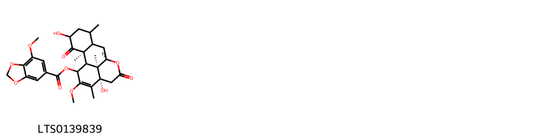{ width=100% }
    <figcaption>Hình ảnh cấu trúc hóa học của 1 hoạt chất thuộc nhóm Tannins gồm ['(2s,9r,13s,17s)-4,13-dihydroxy-15-methoxy-2,6,14,17-tetramethyl-3,11-dioxo-10-oxatetracyclo[7.7.1.0²,⁷.0¹³,¹⁷]heptadec-14-en-16-yl 7-methoxy-2h-1,3-benzodioxole-5-carboxylate (LTS0139839)'].</figcaption>
</figure>

---

### Dược dân tộc học

Danh sách các quốc gia có sử dụng *Picrasma quassioides* trong điều trị các bệnh. 

| Country       | Disease             | Bệnh                                                                                                                                                                                                |
|:--------------|:--------------------|:----------------------------------------------------------------------------------------------------------------------------------------------------------------------------------------------------|
| Elsewhere     | Pulicide, Stomachic | MYMEMORY WARNING: YOU USED ALL AVAILABLE FREE TRANSLATIONS FOR TODAY. NEXT AVAILABLE IN  07 HOURS 40 MINUTES 24 SECONDS VISIT HTTPS://MYMEMORY.TRANSLATED.NET/DOC/USAGELIMITS.PHP TO TRANSLATE MORE |
| India(Punjab) | Insecticide         | MYMEMORY WARNING: YOU USED ALL AVAILABLE FREE TRANSLATIONS FOR TODAY. NEXT AVAILABLE IN  07 HOURS 40 MINUTES 22 SECONDS VISIT HTTPS://MYMEMORY.TRANSLATED.NET/DOC/USAGELIMITS.PHP TO TRANSLATE MORE |
| Japan         | Insecticide         | MYMEMORY WARNING: YOU USED ALL AVAILABLE FREE TRANSLATIONS FOR TODAY. NEXT AVAILABLE IN  07 HOURS 40 MINUTES 20 SECONDS VISIT HTTPS://MYMEMORY.TRANSLATED.NET/DOC/USAGELIMITS.PHP TO TRANSLATE MORE |

---

# Chi Soulamea

??? note "Danh sách các dược liệu thuộc chi"
    
	 - *Soulamea soulameoides*

---
## Soulamea soulameoides
### Thông tin về thực vật

!!! info "Phân loại thực vật của *Amaroria soulameoides* từ GIBF:"
    - **Kingdom:** Plantae
    - **Phylum:** Tracheophyta
    - **Order:** Sapindales
    - **Family:** Simaroubaceae
    - **Genus:** Amaroria
    - **Species:** *Amaroria soulameoides*

 

| Label (VI)   | Label (EN)   | Scientific Name       | Descriptions (VI)   | Descriptions (EN)          | Also Known As (VI)   | Also Known As (EN)   |
|:-------------|:-------------|:----------------------|:--------------------|:---------------------------|:---------------------|:---------------------|
| N/A          | N/A          | Soulamea soulameoides |                     | species of flowering plant | ['']                 | ['']                 |

#### Phân bố trên thế giới

**Từ CSDL GIBF** nan, Micronesia (Federated States of), Cuba, unknown or invalid, Fiji

#### Phân bố tại Việt Nam

**Từ CSDL GIBF**: Không có ghi nhận ở Việt Nam

---
### Thành phần hóa học
        
- Theo cơ sở dữ liệu lotus: Từ loài *Amaroria soulameoides* đã phân lập và xác định được Chưa có hoạt chất nào được phân lập. hoạt chất thuộc về các nhóm Không có hoạt chất nào được phân lập. 

Không có hình ảnh nào được tạo ra

---

### Dược dân tộc học

Danh sách các quốc gia có sử dụng *Amaroria soulameoides* trong điều trị các bệnh. 

| Country    | Disease   | Bệnh                                                                                                                                                                                                |
|:-----------|:----------|:----------------------------------------------------------------------------------------------------------------------------------------------------------------------------------------------------|
| Caroline I | Poison    | MYMEMORY WARNING: YOU USED ALL AVAILABLE FREE TRANSLATIONS FOR TODAY. NEXT AVAILABLE IN  07 HOURS 39 MINUTES 48 SECONDS VISIT HTTPS://MYMEMORY.TRANSLATED.NET/DOC/USAGELIMITS.PHP TO TRANSLATE MORE |

---

# Chi Samadera

??? note "Danh sách các dược liệu thuộc chi"
    
	 - *Samadera indica*

---
## Samadera indica
### Thông tin về thực vật

!!! info "Phân loại thực vật của *Samadera indica* từ GIBF:"
    - **Kingdom:** Plantae
    - **Phylum:** Tracheophyta
    - **Order:** Sapindales
    - **Family:** Simaroubaceae
    - **Genus:** Samadera
    - **Species:** *Samadera indica*

 

| Label (VI)   | Label (EN)   | Scientific Name   | Descriptions (VI)   | Descriptions (EN)   | Also Known As (VI)   | Also Known As (EN)   |
|:-------------|:-------------|:------------------|:--------------------|:--------------------|:---------------------|:---------------------|
| N/A          | N/A          | Samadera indica   | loài thực vật       | species of plant    | ['']                 | ['']                 |

#### Phân bố trên thế giới

**Từ CSDL GIBF** Sri Lanka, nan, Vanuatu, Indonesia, Malaysia, Philippines, Mayotte, Palau, Myanmar, India, Solomon Islands, Papua New Guinea, Brunei Darussalam, Madagascar

#### Phân bố tại Việt Nam

**Từ CSDL GIBF**: Không có ghi nhận ở Việt Nam

---
### Thành phần hóa học
        
- Theo cơ sở dữ liệu lotus: Từ loài *Samadera indica* đã phân lập và xác định được 28 hoạt chất thuộc về các nhóm Tannins, Prenol lipids, Organooxygen compounds. 

|    | chemicalTaxonomyClassyfireClass   |   smiles_count |
|---:|:----------------------------------|---------------:|
|  0 | Organooxygen compounds            |              2 |
|  1 | Prenol lipids                     |             25 |
|  2 | Tannins                           |              1 |

#### Nhóm Organooxygen compounds
<figure markdown="span">
    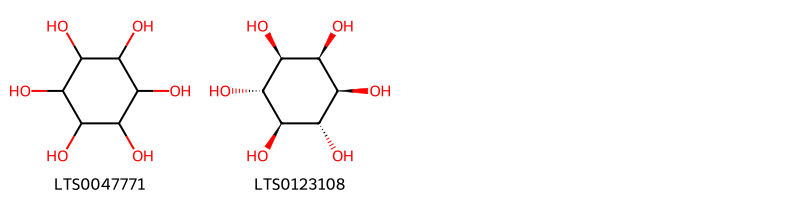{ width=100% }
    <figcaption>Hình ảnh cấu trúc hóa học của 2 hoạt chất thuộc nhóm Organooxygen compounds gồm ['(-)-inositol (LTS0047771)', '(1r,2r,3s,4r,5s,6s)-cyclohexane-1,2,3,4,5,6-hexol (LTS0123108)'].</figcaption>
</figure>
#### Nhóm Prenol lipids
<figure markdown="span">
    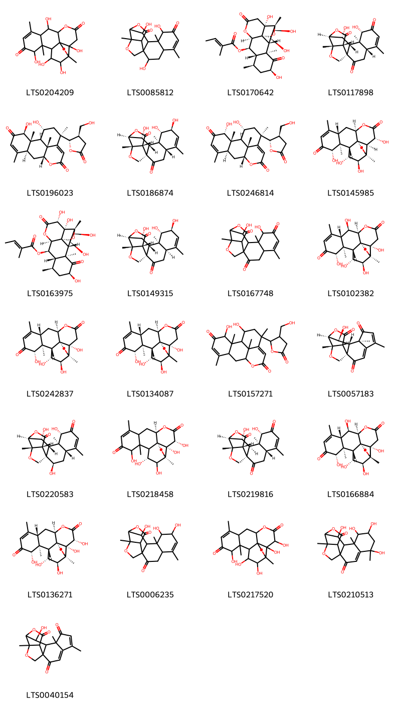{ width=100% }
    <figcaption>Hình ảnh cấu trúc hóa học của 25 hoạt chất thuộc nhóm Prenol lipids gồm ['2,7,12,15,16-pentahydroxy-9,13,17-trimethyl-5,18-dioxapentacyclo[12.5.0.0¹,⁶.0²,¹⁷.0⁸,¹³]nonadec-9-ene-4,11-dione (LTS0204209)', '9,12,18-trihydroxy-4,11,15-trimethyl-3,7-dioxapentacyclo[8.8.0.0¹,⁵.0⁴,⁸.0¹¹,¹⁶]octadec-14-ene-6,13-dione (LTS0085812)', '(1r,2s,6s,7r,8s,9r,11s,13s,14s,15r,16s,17r)-2,11,15,16-tetrahydroxy-9,13,17-trimethyl-4,12-dioxo-5,18-dioxapentacyclo[12.5.0.0¹,⁶.0²,¹⁷.0⁸,¹³]nonadecan-7-yl (2e)-2-methylbut-2-enoate (LTS0170642)', 'samaderine b (LTS0117898)', '(1r,2s,3s,7s,9r,14r,16r,17r)-3,16-dihydroxy-14-[(2s,3r)-3-(hydroxymethyl)-5-oxooxolan-2-yl]-2,6,14,17-tetramethyl-10-oxatetracyclo[7.7.1.0²,⁷.0¹³,¹⁷]heptadeca-5,12-diene-4,11-dione (LTS0196023)', 'samaderine c (LTS0186874)', '(1r,2s,3r,7s,9r,14r,16r,17r)-3,16-dihydroxy-14-[(2s,3r)-3-(hydroxymethyl)-5-oxooxolan-2-yl]-2,6,14,17-tetramethyl-10-oxatetracyclo[7.7.1.0²,⁷.0¹³,¹⁷]heptadeca-5,12-diene-4,11-dione (LTS0246814)', 'samaderine z (LTS0145985)', '(1r,2r,3r,6s,7r,8s,9r,11s,13s,14s,15r,16s,17r)-2,3,11,15,16-pentahydroxy-9,13,17-trimethyl-4,12-dioxo-5,18-dioxapentacyclo[12.5.0.0¹,⁶.0²,¹⁷.0⁸,¹³]nonadecan-7-yl (2e)-2-methylbut-2-enoate (LTS0163975)', '(1r,4s,5r,8s,9r,10r,11s,12s,13s,16r)-9,12,13-trihydroxy-4,11,15-trimethyl-3,7-dioxapentacyclo[8.8.0.0¹,⁵.0⁴,⁸.0¹¹,¹⁶]octadec-14-ene-6,18-dione (LTS0149315)', '9,12-dihydroxy-4,11,15-trimethyl-3,7-dioxapentacyclo[8.8.0.0¹,⁵.0⁴,⁸.0¹¹,¹⁶]octadec-14-ene-6,13,18-trione (LTS0167748)', '(1r,2s,6s,7r,8s,12s,13s,14r,15r,16s,17r)-2,7,12,15,16-pentahydroxy-9,13,17-trimethyl-5,18-dioxapentacyclo[12.5.0.0¹,⁶.0²,¹⁷.0⁸,¹³]nonadec-9-ene-4,11-dione (LTS0102382)', 'samaderine e (LTS0242837)', '(1r,2s,6r,8s,12s,13s,14r,15r,16s)-2,12,15,16-tetrahydroxy-9,13,17-trimethyl-5,18-dioxapentacyclo[12.5.0.0¹,⁶.0²,¹⁷.0⁸,¹³]nonadec-9-ene-4,11-dione (LTS0134087)', '3,16-dihydroxy-14-[3-(hydroxymethyl)-5-oxooxolan-2-yl]-2,6,14,17-tetramethyl-10-oxatetracyclo[7.7.1.0²,⁷.0¹³,¹⁷]heptadeca-5,12-diene-4,11-dione (LTS0157271)', 'samaderin a (LTS0057183)', '(1r,4s,5r,8s,9r,10r,11s,12s,16s,18r)-9,12,18-trihydroxy-4,11,15-trimethyl-3,7-dioxapentacyclo[8.8.0.0¹,⁵.0⁴,⁸.0¹¹,¹⁶]octadec-14-ene-6,13-dione (LTS0220583)', '(1r,2r,3r,6r,15r,17r)-2,3,12,15,16-pentahydroxy-9,13,17-trimethyl-5,18-dioxapentacyclo[12.5.0.0¹,⁶.0²,¹⁷.0⁸,¹³]nonadec-9-ene-4,11-dione (LTS0218458)', '(1r,4s,5r,8s,9r,10s,11s,12s,16s)-9,12-dihydroxy-4,11,15-trimethyl-3,7-dioxapentacyclo[8.8.0.0¹,⁵.0⁴,⁸.0¹¹,¹⁶]octadec-14-ene-6,13,18-trione (LTS0219816)', '(1r,2s,6s,7r,8s,12s,13s,14r,15r,16s,17s)-2,7,12,15,16-pentahydroxy-9,13,17-trimethyl-5,18-dioxapentacyclo[12.5.0.0¹,⁶.0²,¹⁷.0⁸,¹³]nonadec-9-ene-4,11-dione (LTS0166884)', 'bruceine d (LTS0136271)', '9,12,13-trihydroxy-4,11,15-trimethyl-3,7-dioxapentacyclo[8.8.0.0¹,⁵.0⁴,⁸.0¹¹,¹⁶]octadec-14-ene-6,18-dione (LTS0006235)', '2,3,12,15,16-pentahydroxy-9,13,17-trimethyl-5,18-dioxapentacyclo[12.5.0.0¹,⁶.0²,¹⁷.0⁸,¹³]nonadec-9-ene-4,11-dione (LTS0217520)', '9,12,13,15-tetrahydroxy-4,11,15-trimethyl-3,7-dioxapentacyclo[8.8.0.0¹,⁵.0⁴,⁸.0¹¹,¹⁶]octadec-16-ene-6,18-dione (LTS0210513)', '9-hydroxy-4,11,14-trimethyl-3,7-dioxapentacyclo[8.7.0.0¹,⁵.0⁴,⁸.0¹¹,¹⁵]heptadeca-13,15-diene-6,12,17-trione (LTS0040154)'].</figcaption>
</figure>
#### Nhóm Tannins
<figure markdown="span">
    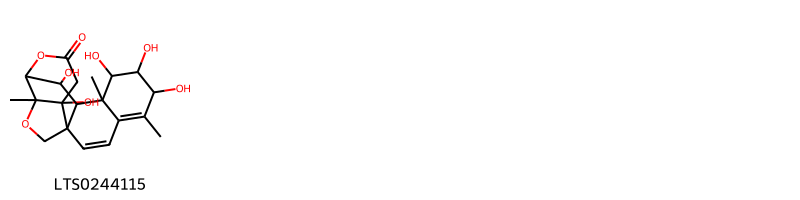{ width=100% }
    <figcaption>Hình ảnh cấu trúc hóa học của 1 hoạt chất thuộc nhóm Tannins gồm ['5,10,13,14,15-pentahydroxy-4,12,16-trimethyl-3,8-dioxapentacyclo[9.8.0.0¹,⁵.0⁴,⁹.0¹²,¹⁷]nonadeca-16,18-dien-7-one (LTS0244115)'].</figcaption>
</figure>

---

### Dược dân tộc học

Danh sách các quốc gia có sử dụng *Samadera indica* trong điều trị các bệnh. 

| Country   | Disease                        | Bệnh                                                                                                                                                                                                |
|:----------|:-------------------------------|:----------------------------------------------------------------------------------------------------------------------------------------------------------------------------------------------------|
| Indonesia | Emetic, Purgative, Termiticide | MYMEMORY WARNING: YOU USED ALL AVAILABLE FREE TRANSLATIONS FOR TODAY. NEXT AVAILABLE IN  07 HOURS 39 MINUTES 29 SECONDS VISIT HTTPS://MYMEMORY.TRANSLATED.NET/DOC/USAGELIMITS.PHP TO TRANSLATE MORE |
| Malaya    | Purgative, Emetic              | MYMEMORY WARNING: YOU USED ALL AVAILABLE FREE TRANSLATIONS FOR TODAY. NEXT AVAILABLE IN  07 HOURS 39 MINUTES 27 SECONDS VISIT HTTPS://MYMEMORY.TRANSLATED.NET/DOC/USAGELIMITS.PHP TO TRANSLATE MORE |
| Solomon I | Laxative, Pediculicide         | MYMEMORY WARNING: YOU USED ALL AVAILABLE FREE TRANSLATIONS FOR TODAY. NEXT AVAILABLE IN  07 HOURS 39 MINUTES 23 SECONDS VISIT HTTPS://MYMEMORY.TRANSLATED.NET/DOC/USAGELIMITS.PHP TO TRANSLATE MORE |

---

# Chi Brucea

??? note "Danh sách các dược liệu thuộc chi"
    
	 - *Brucea javanica*
	 - *Brucea sumatrana*

---
## Brucea javanica
### Thông tin về thực vật

!!! info "Phân loại thực vật của *Brucea javanica* từ GIBF:"
    - **Kingdom:** Plantae
    - **Phylum:** Tracheophyta
    - **Order:** Sapindales
    - **Family:** Simaroubaceae
    - **Genus:** Brucea
    - **Species:** *Brucea javanica*

 

| Label (VI)   | Label (EN)   | Scientific Name   | Descriptions (VI)   | Descriptions (EN)   | Also Known As (VI)   | Also Known As (EN)   |
|:-------------|:-------------|:------------------|:--------------------|:--------------------|:---------------------|:---------------------|
| N/A          | N/A          | Brucea javanica   | loài thực vật       | species of plant    | ['']                 | ['']                 |

#### Phân bố trên thế giới

**Từ CSDL GIBF** Sri Lanka, Hong Kong, Singapore, Viet Nam, United States of America, Japan, Korea, Republic of, Cambodia, Indonesia, Chinese Taipei, Malaysia, China, Australia, Thailand

#### Phân bố tại Việt Nam

**Từ CSDL GIBF**: Bình Định, Quảng Nam, Thừa Thiên - Huế

---
### Thành phần hóa học
        
- Theo cơ sở dữ liệu lotus: Từ loài *Brucea javanica* đã phân lập và xác định được 416 hoạt chất thuộc về các nhóm Fatty Acyls, Carboxylic acids and derivatives, Phenols, Organooxygen compounds, Lignan lactones, Strychnos alkaloids, Flavonolignans, Coumarinolignans, Naphthopyrans, Aryltetralin lignans, Lignan glycosides, Benzene and substituted derivatives, Cinnamic acids and derivatives, Steroids and steroid derivatives, Glycerolipids, Furanoid lignans, Harmala alkaloids, Benzopyrans, Linear 1,3-diarylpropanoids, Flavonoids, Benzodioxoles, Furopyrans, Indolonaphthyridine alkaloids, Prenol lipids, Aurone flavonoids. 

|    | chemicalTaxonomyClassyfireClass     |   smiles_count |
|---:|:------------------------------------|---------------:|
|  0 |                                     |              2 |
|  1 | Aryltetralin lignans                |              4 |
|  2 | Aurone flavonoids                   |              1 |
|  3 | Benzene and substituted derivatives |              6 |
|  4 | Benzodioxoles                       |              3 |
|  5 | Benzopyrans                         |              5 |
|  6 | Carboxylic acids and derivatives    |              2 |
|  7 | Cinnamic acids and derivatives      |              2 |
|  8 | Coumarinolignans                    |              7 |
|  9 | Fatty Acyls                         |              3 |
| 10 | Flavonoids                          |             24 |
| 11 | Flavonolignans                      |              2 |
| 12 | Furanoid lignans                    |              5 |
| 13 | Furopyrans                          |              3 |
| 14 | Glycerolipids                       |              2 |
| 15 | Harmala alkaloids                   |              1 |
| 16 | Indolonaphthyridine alkaloids       |             10 |
| 17 | Lignan glycosides                   |             22 |
| 18 | Lignan lactones                     |              2 |
| 19 | Linear 1,3-diarylpropanoids         |              2 |
| 20 | Naphthopyrans                       |             17 |
| 21 | Organooxygen compounds              |              8 |
| 22 | Phenols                             |              5 |
| 23 | Prenol lipids                       |            259 |
| 24 | Steroids and steroid derivatives    |             16 |
| 25 | Strychnos alkaloids                 |              1 |

#### Nhóm 
<figure markdown="span">
    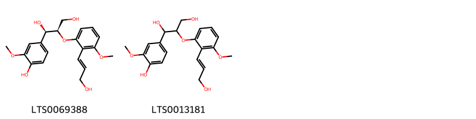{ width=100% }
    <figcaption>Hình ảnh cấu trúc hóa học của 2 hoạt chất thuộc nhóm  gồm ['(1r,2r)-1-(4-hydroxy-3-methoxyphenyl)-2-{2-[(1e)-3-hydroxyprop-1-en-1-yl]-3-methoxyphenoxy}propane-1,3-diol (LTS0069388)', '1-(4-hydroxy-3-methoxyphenyl)-2-[2-(3-hydroxyprop-1-en-1-yl)-3-methoxyphenoxy]propane-1,3-diol (LTS0013181)'].</figcaption>
</figure>
#### Nhóm Aryltetralin lignans
<figure markdown="span">
    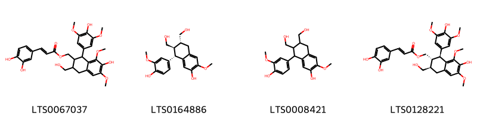{ width=100% }
    <figcaption>Hình ảnh cấu trúc hóa học của 4 hoạt chất thuộc nhóm Aryltetralin lignans gồm ['[7-hydroxy-1-(4-hydroxy-3,5-dimethoxyphenyl)-3-(hydroxymethyl)-6,8-dimethoxy-1,2,3,4-tetrahydronaphthalen-2-yl]methyl 3-(3,4-dihydroxyphenyl)prop-2-enoate (LTS0067037)', '(+)-isolariciresinol (LTS0164886)', '8-(4-hydroxy-3-methoxyphenyl)-6,7-bis(hydroxymethyl)-3-methoxy-5,6,7,8-tetrahydronaphthalen-2-ol (LTS0008421)', '[(1s,2r,3r)-7-hydroxy-1-(4-hydroxy-3,5-dimethoxyphenyl)-3-(hydroxymethyl)-6,8-dimethoxy-1,2,3,4-tetrahydronaphthalen-2-yl]methyl (2e)-3-(3,4-dihydroxyphenyl)prop-2-enoate (LTS0128221)'].</figcaption>
</figure>
#### Nhóm Aurone flavonoids
<figure markdown="span">
    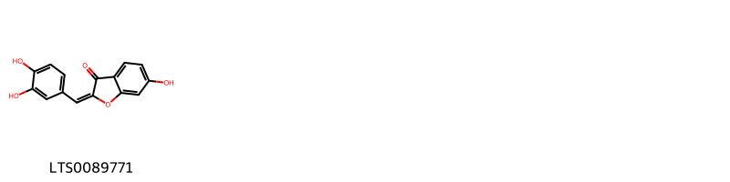{ width=100% }
    <figcaption>Hình ảnh cấu trúc hóa học của 1 hoạt chất thuộc nhóm Aurone flavonoids gồm ['sulfuretin (LTS0089771)'].</figcaption>
</figure>
#### Nhóm Benzene and substituted derivatives
<figure markdown="span">
    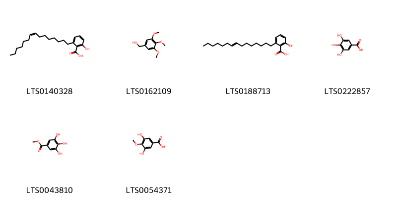{ width=100% }
    <figcaption>Hình ảnh cấu trúc hóa học của 6 hoạt chất thuộc nhóm Benzene and substituted derivatives gồm ['ginkgoic acid (LTS0140328)', '(3,4,5-trimethoxyphenyl)methanol (LTS0162109)', '2-hydroxy-6-(pentadec-8-en-1-yl)benzoic acid (LTS0188713)', 'galop (LTS0222857)', 'methyl gallate (LTS0043810)', '3,5-dihydroxy-4-methoxybenzoic acid (LTS0054371)'].</figcaption>
</figure>
#### Nhóm Benzodioxoles
<figure markdown="span">
    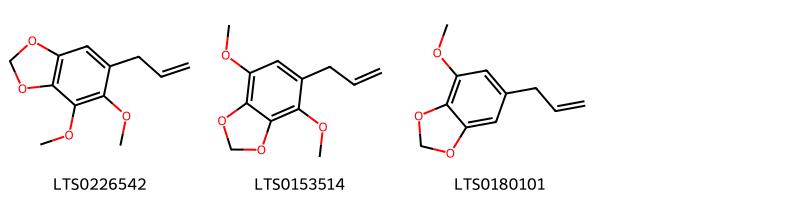{ width=100% }
    <figcaption>Hình ảnh cấu trúc hóa học của 3 hoạt chất thuộc nhóm Benzodioxoles gồm ['dillapiol (LTS0226542)', 'apiol (LTS0153514)', 'myristicin (LTS0180101)'].</figcaption>
</figure>
#### Nhóm Benzopyrans
<figure markdown="span">
    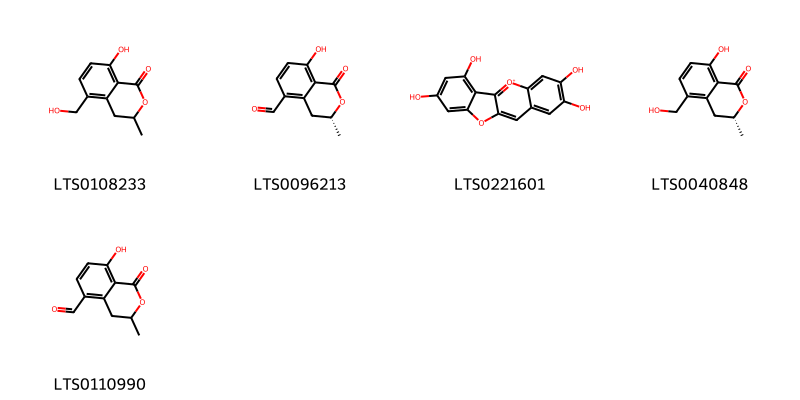{ width=100% }
    <figcaption>Hình ảnh cấu trúc hóa học của 5 hoạt chất thuộc nhóm Benzopyrans gồm ['8-hydroxy-5-(hydroxymethyl)-3-methyl-3,4-dihydro-2-benzopyran-1-one (LTS0108233)', '(3r)-8-hydroxy-3-methyl-1-oxo-3,4-dihydro-2-benzopyran-5-carbaldehyde (LTS0096213)', 'riccionidin a (LTS0221601)', '(3r)-8-hydroxy-5-(hydroxymethyl)-3-methyl-3,4-dihydro-2-benzopyran-1-one (LTS0040848)', '8-hydroxy-3-methyl-1-oxo-3,4-dihydro-2-benzopyran-5-carbaldehyde (LTS0110990)'].</figcaption>
</figure>
#### Nhóm Carboxylic acids and derivatives
<figure markdown="span">
    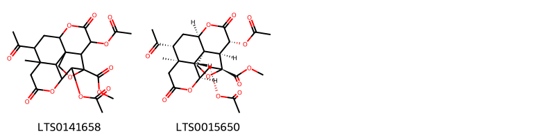{ width=100% }
    <figcaption>Hình ảnh cấu trúc hóa học của 2 hoạt chất thuộc nhóm Carboxylic acids and derivatives gồm ['methyl 11-acetyl-5,16-bis(acetyloxy)-10-methyl-8,15-dioxo-3,7,14-trioxapentacyclo[8.7.1.0¹,¹³.0⁴,¹⁷.0⁶,¹⁸]octadecane-4-carboxylate (LTS0141658)', 'methyl (1r,4s,5s,6s,10r,11r,13r,16r,17s,18r)-11-acetyl-5,16-bis(acetyloxy)-10-methyl-8,15-dioxo-3,7,14-trioxapentacyclo[8.7.1.0¹,¹³.0⁴,¹⁷.0⁶,¹⁸]octadecane-4-carboxylate (LTS0015650)'].</figcaption>
</figure>
#### Nhóm Cinnamic acids and derivatives
<figure markdown="span">
    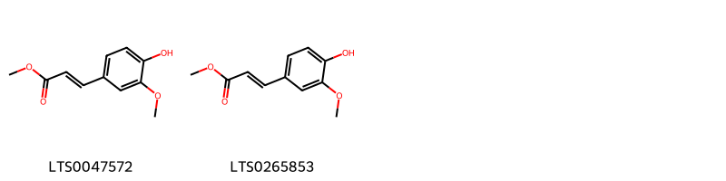{ width=100% }
    <figcaption>Hình ảnh cấu trúc hóa học của 2 hoạt chất thuộc nhóm Cinnamic acids and derivatives gồm ['methyl ferulate (LTS0047572)', 'methyl ferulate (LTS0265853)'].</figcaption>
</figure>
#### Nhóm Coumarinolignans
<figure markdown="span">
    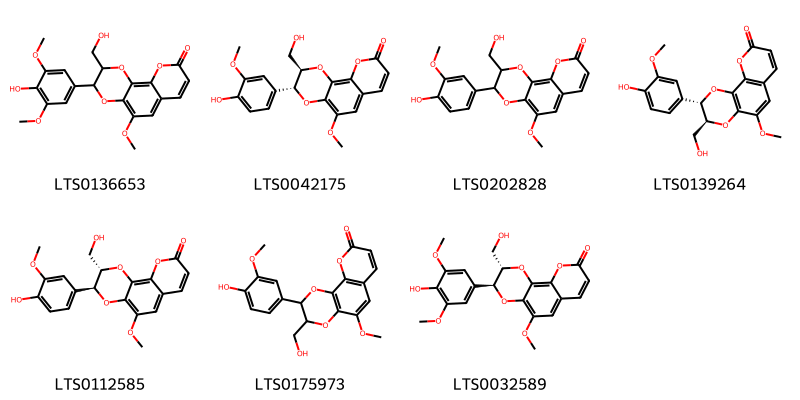{ width=100% }
    <figcaption>Hình ảnh cấu trúc hóa học của 7 hoạt chất thuộc nhóm Coumarinolignans gồm ['3-(4-hydroxy-3,5-dimethoxyphenyl)-2-(hydroxymethyl)-5-methoxy-2h,3h-[1,4]dioxino[2,3-h]chromen-9-one (LTS0136653)', 'cleomiscosin a (LTS0042175)', '3-(4-hydroxy-3-methoxyphenyl)-2-(hydroxymethyl)-5-methoxy-2h,3h-[1,4]dioxino[2,3-h]chromen-9-one (LTS0202828)', '(2s,3s)-2-(4-hydroxy-3-methoxyphenyl)-3-(hydroxymethyl)-5-methoxy-2h,3h-[1,4]dioxino[2,3-h]chromen-9-one (LTS0139264)', '(2s,3s)-3-(4-hydroxy-3-methoxyphenyl)-2-(hydroxymethyl)-5-methoxy-2h,3h-[1,4]dioxino[2,3-h]chromen-9-one (LTS0112585)', '2-(4-hydroxy-3-methoxyphenyl)-3-(hydroxymethyl)-5-methoxy-2h,3h-[1,4]dioxino[2,3-h]chromen-9-one (LTS0175973)', '(2s,3s)-3-(4-hydroxy-3,5-dimethoxyphenyl)-2-(hydroxymethyl)-5-methoxy-2h,3h-[1,4]dioxino[2,3-h]chromen-9-one (LTS0032589)'].</figcaption>
</figure>
#### Nhóm Fatty Acyls
<figure markdown="span">
    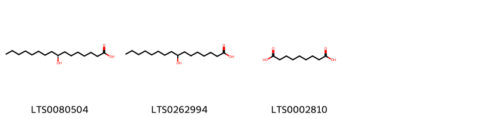{ width=100% }
    <figcaption>Hình ảnh cấu trúc hóa học của 3 hoạt chất thuộc nhóm Fatty Acyls gồm ['(8s)-8-hydroxyhexadecanoic acid (LTS0080504)', '8-hydroxyhexadecanoic acid (LTS0262994)', 'azelaic acid (LTS0002810)'].</figcaption>
</figure>
#### Nhóm Flavonoids
<figure markdown="span">
    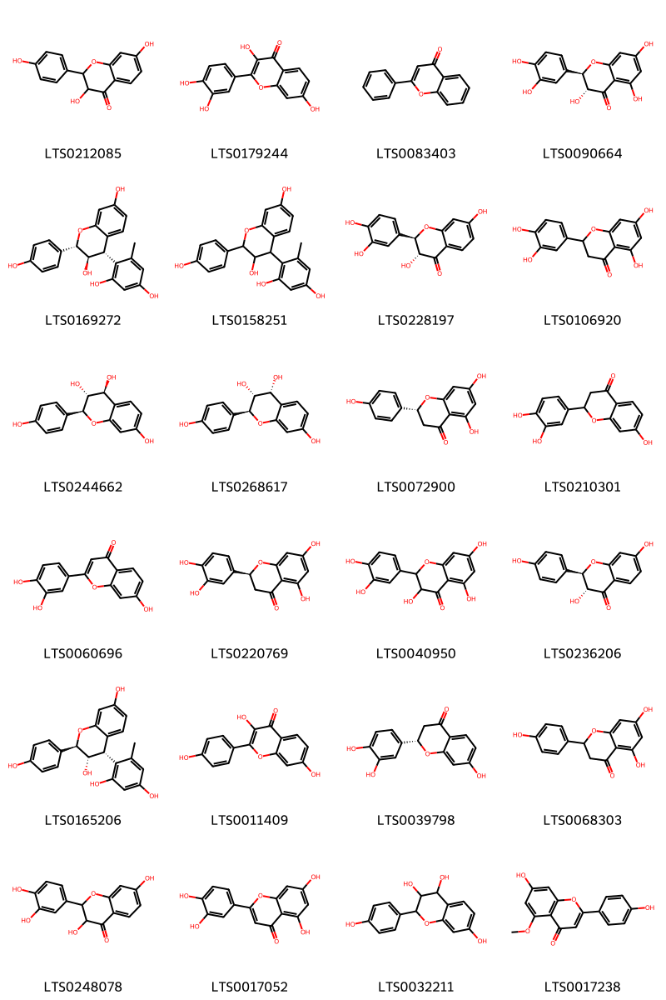{ width=100% }
    <figcaption>Hình ảnh cấu trúc hóa học của 24 hoạt chất thuộc nhóm Flavonoids gồm ["3,7,4'-trihydroxyflavanone (LTS0212085)", "3,7,3',4'-tetrahydroxyflavone (LTS0179244)", 'flavone (LTS0083403)', '(+)-taxifolin (LTS0090664)', '(2s,3r,4r)-4-(2,4-dihydroxy-6-methylphenyl)-2-(4-hydroxyphenyl)-3,4-dihydro-2h-1-benzopyran-3,7-diol (LTS0169272)', '4-(2,4-dihydroxy-6-methylphenyl)-2-(4-hydroxyphenyl)-3,4-dihydro-2h-1-benzopyran-3,7-diol (LTS0158251)', 'fustin (LTS0228197)', '(+/-)-eriodictyol (LTS0106920)', '(2s,3r,4s)-2-(4-hydroxyphenyl)-3,4-dihydro-2h-1-benzopyran-3,4,7-triol (LTS0244662)', '(2s,3r,4r)-2-(4-hydroxyphenyl)-3,4-dihydro-2h-1-benzopyran-3,4,7-triol (LTS0268617)', '(-)-naringenin (LTS0072900)', "7,3',4'-trihydroxyflavanone (LTS0210301)", "7,3',4'-trihydroxyflavone (LTS0060696)", 'eriodictyol (LTS0220769)', '2,3-dihydroquercetin (LTS0040950)', 'garbanzol (LTS0236206)', '(2r,3s,4r)-4-(2,4-dihydroxy-6-methylphenyl)-2-(4-hydroxyphenyl)-3,4-dihydro-2h-1-benzopyran-3,7-diol (LTS0165206)', "3,7,4'-trihydroxyflavone (LTS0011409)", 'butin (LTS0039798)', 'asahina (LTS0068303)', 'fustin (LTS0248078)', 'luteolin (LTS0017052)', '2-(4-hydroxyphenyl)-3,4-dihydro-2h-1-benzopyran-3,4,7-triol (LTS0032211)', 'thevetiaflavone (LTS0017238)'].</figcaption>
</figure>
#### Nhóm Flavonolignans
<figure markdown="span">
    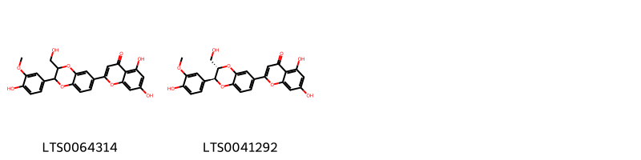{ width=100% }
    <figcaption>Hình ảnh cấu trúc hóa học của 2 hoạt chất thuộc nhóm Flavonolignans gồm ['5,7-dihydroxy-2-[2-(4-hydroxy-3-methoxyphenyl)-3-(hydroxymethyl)-2,3-dihydro-1,4-benzodioxin-6-yl]chromen-4-one (LTS0064314)', '5,7-dihydroxy-2-[(2s,3s)-2-(4-hydroxy-3-methoxyphenyl)-3-(hydroxymethyl)-2,3-dihydro-1,4-benzodioxin-6-yl]chromen-4-one (LTS0041292)'].</figcaption>
</figure>
#### Nhóm Furanoid lignans
<figure markdown="span">
    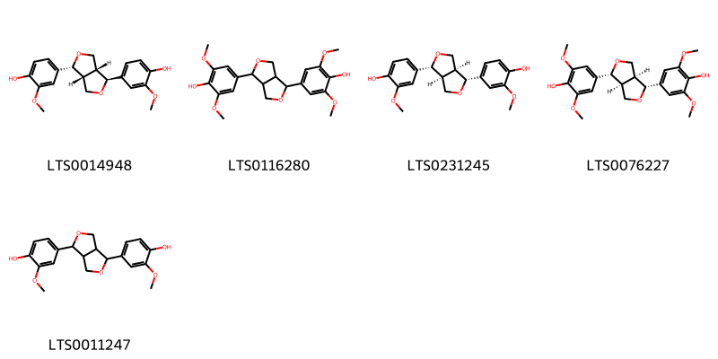{ width=100% }
    <figcaption>Hình ảnh cấu trúc hóa học của 5 hoạt chất thuộc nhóm Furanoid lignans gồm ['4-[(1s,3ar,4r,6ar)-4-(4-hydroxy-3-methoxyphenyl)-hexahydrofuro[3,4-c]furan-1-yl]-2-methoxyphenol (LTS0014948)', 'syringaresinol (LTS0116280)', '(-)-pinoresinol (LTS0231245)', '(-)-syringaresinol (LTS0076227)', 'pinoresinol (LTS0011247)'].</figcaption>
</figure>
#### Nhóm Furopyrans
<figure markdown="span">
    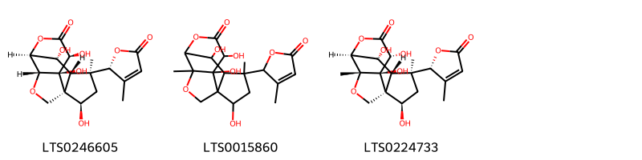{ width=100% }
    <figcaption>Hình ảnh cấu trúc hóa học của 3 hoạt chất thuộc nhóm Furopyrans gồm ['(1s,2r,3r,4s,6r,7r,10r,11r,12s)-2,6,11,12-tetrahydroxy-4-methyl-4-[(2r)-3-methyl-5-oxo-2h-furan-2-yl]-9,14-dioxatetracyclo[8.4.0.0³,⁷.0⁷,¹¹]tetradecan-13-one (LTS0246605)', '2,6,11,12-tetrahydroxy-4,10-dimethyl-4-(3-methyl-5-oxo-2h-furan-2-yl)-9,14-dioxatetracyclo[8.4.0.0³,⁷.0⁷,¹¹]tetradecan-13-one (LTS0015860)', '(1s,2r,3r,4s,6r,7r,10r,11r,12r)-2,6,11,12-tetrahydroxy-4,10-dimethyl-4-[(2r)-3-methyl-5-oxo-2h-furan-2-yl]-9,14-dioxatetracyclo[8.4.0.0³,⁷.0⁷,¹¹]tetradecan-13-one (LTS0224733)'].</figcaption>
</figure>
#### Nhóm Glycerolipids
<figure markdown="span">
    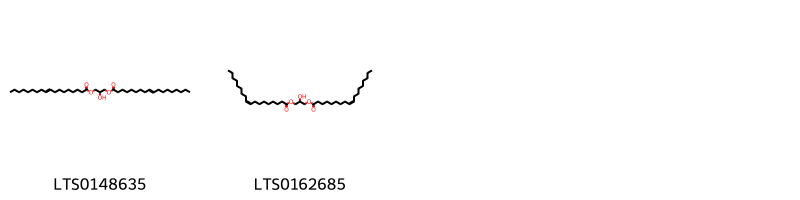{ width=100% }
    <figcaption>Hình ảnh cấu trúc hóa học của 2 hoạt chất thuộc nhóm Glycerolipids gồm ['2-hydroxy-3-(octadec-9-enoyloxy)propyl octadec-9-enoate (LTS0148635)', 'glyceryl 1,3-dioleate (LTS0162685)'].</figcaption>
</figure>
#### Nhóm Harmala alkaloids
<figure markdown="span">
    { width=100% }
    <figcaption>Hình ảnh cấu trúc hóa học của 1 hoạt chất thuộc nhóm Harmala alkaloids gồm ['flazin (LTS0143048)'].</figcaption>
</figure>
#### Nhóm Indolonaphthyridine alkaloids
<figure markdown="span">
    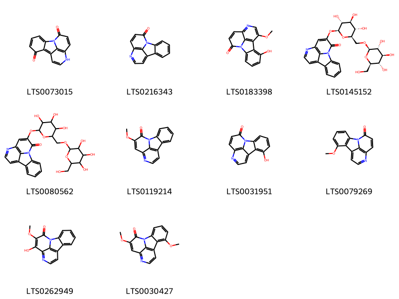{ width=100% }
    <figcaption>Hình ảnh cấu trúc hóa học của 10 hoạt chất thuộc nhóm Indolonaphthyridine alkaloids gồm ['1,6-diazatetracyclo[7.6.1.0⁵,¹⁶.0¹⁰,¹⁵]hexadeca-3,5(16),7,9,12,14-hexaene-2,11-dione (LTS0073015)', 'canthin-6-one (LTS0216343)', '11-hydroxy-8-methoxy-1,6-diazatetracyclo[7.6.1.0⁵,¹⁶.0¹⁰,¹⁵]hexadeca-3,5,7,9(16),10(15),11,13-heptaen-2-one (LTS0183398)', '3-{[(2s,3r,4s,5s,6r)-3,4,5-trihydroxy-6-({[(2r,3r,4s,5s,6r)-3,4,5-trihydroxy-6-(hydroxymethyl)oxan-2-yl]oxy}methyl)oxan-2-yl]oxy}-1,6-diazatetracyclo[7.6.1.0⁵,¹⁶.0¹⁰,¹⁵]hexadeca-3,5,7,9(16),10(15),11,13-heptaen-2-one (LTS0145152)', '3-{[3,4,5-trihydroxy-6-({[3,4,5-trihydroxy-6-(hydroxymethyl)oxan-2-yl]oxy}methyl)oxan-2-yl]oxy}-1,6-diazatetracyclo[7.6.1.0⁵,¹⁶.0¹⁰,¹⁵]hexadeca-3,5,7,9(16),10(15),11,13-heptaen-2-one (LTS0080562)', '5-methoxycanthin-6-one (LTS0119214)', '11-hydroxycanthin-6-one (LTS0031951)', '11-methoxy-1,6-diazatetracyclo[7.6.1.0⁵,¹⁶.0¹⁰,¹⁵]hexadeca-3,5,7,9(16),10(15),11,13-heptaen-2-one (LTS0079269)', '4-hydroxy-3-methoxy-1,6-diazatetracyclo[7.6.1.0⁵,¹⁶.0¹⁰,¹⁵]hexadeca-3,5,7,9(16),10(15),11,13-heptaen-2-one (LTS0262949)', '3,11-dimethoxy-1,6-diazatetracyclo[7.6.1.0⁵,¹⁶.0¹⁰,¹⁵]hexadeca-3,5,7,9(16),10(15),11,13-heptaen-2-one (LTS0030427)'].</figcaption>
</figure>
#### Nhóm Lignan glycosides
<figure markdown="span">
    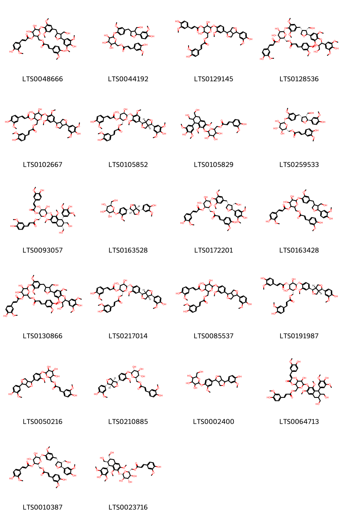{ width=100% }
    <figcaption>Hình ảnh cấu trúc hóa học của 22 hoạt chất thuộc nhóm Lignan glycosides gồm ['[4,5-dihydroxy-6-(4-{[5-(4-hydroxy-3,5-dimethoxyphenyl)-4-(hydroxymethyl)oxolan-3-yl]methyl}-2,6-dimethoxyphenoxy)-3-{[3-(4-hydroxy-3-methoxyphenyl)prop-2-enoyl]oxy}oxan-2-yl]methyl 3-(4-hydroxy-3-methoxyphenyl)prop-2-enoate (LTS0048666)', '[3,4,5-trihydroxy-6-(4-{[5-(4-hydroxy-3-methoxyphenyl)-4-(hydroxymethyl)oxolan-3-yl]methyl}-2-methoxyphenoxy)oxan-2-yl]methyl 3-(4-hydroxy-3-methoxyphenyl)prop-2-enoate (LTS0044192)', '(3,5-dihydroxy-6-{4-[4-(4-hydroxy-3-methoxyphenyl)-hexahydrofuro[3,4-c]furan-1-yl]-2-methoxyphenoxy}-4-{[3-(4-hydroxy-3-methoxyphenyl)prop-2-enoyl]oxy}oxan-2-yl)methyl 3-(4-hydroxy-3-methoxyphenyl)prop-2-enoate (LTS0129145)', '[(2r,3s,4r,5r,6s)-6-(4-{[(3r,4r,5s)-5-{4-[(1s,2r)-2,3-dihydroxy-1-(4-hydroxy-3,5-dimethoxyphenyl)propoxy]-3,5-dimethoxyphenyl}-4-(hydroxymethyl)oxolan-3-yl]methyl}-2,6-dimethoxyphenoxy)-4,5-dihydroxy-3-{[(2e)-3-(4-hydroxy-3-methoxyphenyl)prop-2-enoyl]oxy}oxan-2-yl]methyl (2e)-3-(4-hydroxy-3-methoxyphenyl)prop-2-enoate (LTS0128536)', '(4,5-dihydroxy-6-{4-[4-(4-hydroxy-3,5-dimethoxyphenyl)-hexahydrofuro[3,4-c]furan-1-yl]-2,6-dimethoxyphenoxy}-3-{[3-(4-hydroxy-3-methoxyphenyl)prop-2-enoyl]oxy}oxan-2-yl)methyl 3-(4-hydroxy-3-methoxyphenyl)prop-2-enoate (LTS0102667)', '[(2r,3s,4r,5r,6s)-6-{4-[(1r,3as,4r,6as)-4-(4-hydroxy-3,5-dimethoxyphenyl)-hexahydrofuro[3,4-c]furan-1-yl]-2,6-dimethoxyphenoxy}-4,5-dihydroxy-3-{[(2e)-3-(4-hydroxy-3-methoxyphenyl)prop-2-enoyl]oxy}oxan-2-yl]methyl (2e)-3-(4-hydroxy-3-methoxyphenyl)prop-2-enoate (LTS0105852)', '(3,4,5-trihydroxy-6-{[8-(4-hydroxy-3,5-dimethoxyphenyl)-6,7-bis(hydroxymethyl)-1,3-dimethoxy-5,6,7,8-tetrahydronaphthalen-2-yl]oxy}oxan-2-yl)methyl 3-(4-hydroxy-3-methoxyphenyl)prop-2-enoate (LTS0105829)', '[(2r,3s,4s,5r,6s)-3,4,5-trihydroxy-6-(4-{[(3r,4r,5s)-5-(4-hydroxy-3-methoxyphenyl)-4-(hydroxymethyl)oxolan-3-yl]methyl}-2-methoxyphenoxy)oxan-2-yl]methyl (2e)-3-(4-hydroxy-3-methoxyphenyl)prop-2-enoate (LTS0259533)', '[(2r,3s,4r,5r,6s)-4,5-dihydroxy-6-{[(6r,7r,8s)-8-(4-hydroxy-3,5-dimethoxyphenyl)-6,7-bis(hydroxymethyl)-1,3-dimethoxy-5,6,7,8-tetrahydronaphthalen-2-yl]oxy}-3-{[(2e)-3-(4-hydroxy-3-methoxyphenyl)prop-2-enoyl]oxy}oxan-2-yl]methyl (2e)-3-(4-hydroxy-3-methoxyphenyl)prop-2-enoate (LTS0093057)', '(-)-pinoresinol glucoside (LTS0163528)', '[(2r,3s,4r,5r,6s)-4,5-dihydroxy-6-(4-{[(3r,4r,5s)-5-(4-hydroxy-3,5-dimethoxyphenyl)-4-(hydroxymethyl)oxolan-3-yl]methyl}-2,6-dimethoxyphenoxy)-3-{[(2e)-3-(4-hydroxy-3-methoxyphenyl)prop-2-enoyl]oxy}oxan-2-yl]methyl (2e)-3-(4-hydroxy-3-methoxyphenyl)prop-2-enoate (LTS0172201)', '[4,5-dihydroxy-6-(4-{[5-(4-hydroxy-3-methoxyphenyl)-4-(hydroxymethyl)oxolan-3-yl]methyl}-2-methoxyphenoxy)-3-{[3-(4-hydroxy-3-methoxyphenyl)prop-2-enoyl]oxy}oxan-2-yl]methyl 3-(4-hydroxy-3-methoxyphenyl)prop-2-enoate (LTS0163428)', '(6-{4-[(5-{4-[2,3-dihydroxy-1-(4-hydroxy-3,5-dimethoxyphenyl)propoxy]-3,5-dimethoxyphenyl}-4-(hydroxymethyl)oxolan-3-yl)methyl]-2,6-dimethoxyphenoxy}-4,5-dihydroxy-3-{[3-(4-hydroxy-3-methoxyphenyl)prop-2-enoyl]oxy}oxan-2-yl)methyl 3-(4-hydroxy-3-methoxyphenyl)prop-2-enoate (LTS0130866)', '[(2r,3s,4r,5r,6s)-6-{4-[(1r,3as,4r,6as)-4-(4-hydroxy-3-methoxyphenyl)-hexahydrofuro[3,4-c]furan-1-yl]-2-methoxyphenoxy}-4,5-dihydroxy-3-{[(2e)-3-(4-hydroxy-3-methoxyphenyl)prop-2-enoyl]oxy}oxan-2-yl]methyl (2e)-3-(4-hydroxy-3-methoxyphenyl)prop-2-enoate (LTS0217014)', '(4,5-dihydroxy-6-{4-[4-(4-hydroxy-3-methoxyphenyl)-hexahydrofuro[3,4-c]furan-1-yl]-2-methoxyphenoxy}-3-{[3-(4-hydroxy-3-methoxyphenyl)prop-2-enoyl]oxy}oxan-2-yl)methyl 3-(4-hydroxy-3-methoxyphenyl)prop-2-enoate (LTS0085537)', '[(2r,3r,4s,5r,6s)-6-{4-[(1r,3as,4r,6as)-4-(4-hydroxy-3-methoxyphenyl)-hexahydrofuro[3,4-c]furan-1-yl]-2-methoxyphenoxy}-3,5-dihydroxy-4-{[(2e)-3-(4-hydroxy-3-methoxyphenyl)prop-2-enoyl]oxy}oxan-2-yl]methyl (2e)-3-(4-hydroxy-3-methoxyphenyl)prop-2-enoate (LTS0191987)', '(3,4,5-trihydroxy-6-{4-[4-(4-hydroxy-3-methoxyphenyl)-hexahydrofuro[3,4-c]furan-1-yl]-2-methoxyphenoxy}oxan-2-yl)methyl 3-(4-hydroxy-3-methoxyphenyl)prop-2-enoate (LTS0050216)', '[(2r,3s,4s,5r,6s)-6-{4-[(1r,3as,4r,6as)-4-(4-hydroxy-3-methoxyphenyl)-hexahydrofuro[3,4-c]furan-1-yl]-2-methoxyphenoxy}-3,4,5-trihydroxyoxan-2-yl]methyl (2e)-3-(4-hydroxy-3-methoxyphenyl)prop-2-enoate (LTS0210885)', '2-{4-[4-(4-hydroxy-3-methoxyphenyl)-hexahydrofuro[3,4-c]furan-1-yl]-2-methoxyphenoxy}-6-(hydroxymethyl)oxane-3,4,5-triol (LTS0002400)', '(4,5-dihydroxy-6-{[8-(4-hydroxy-3,5-dimethoxyphenyl)-6,7-bis(hydroxymethyl)-1,3-dimethoxy-5,6,7,8-tetrahydronaphthalen-2-yl]oxy}-3-{[3-(4-hydroxy-3-methoxyphenyl)prop-2-enoyl]oxy}oxan-2-yl)methyl 3-(4-hydroxy-3-methoxyphenyl)prop-2-enoate (LTS0064713)', '[(2r,3s,4r,5r,6s)-4,5-dihydroxy-6-(4-{[(3r,4r,5s)-5-(4-hydroxy-3-methoxyphenyl)-4-(hydroxymethyl)oxolan-3-yl]methyl}-2-methoxyphenoxy)-3-{[(2e)-3-(4-hydroxy-3-methoxyphenyl)prop-2-enoyl]oxy}oxan-2-yl]methyl (2e)-3-(4-hydroxy-3-methoxyphenyl)prop-2-enoate (LTS0010387)', '[(2r,3s,4s,5r,6s)-3,4,5-trihydroxy-6-{[(6r,7r,8s)-8-(4-hydroxy-3,5-dimethoxyphenyl)-6,7-bis(hydroxymethyl)-1,3-dimethoxy-5,6,7,8-tetrahydronaphthalen-2-yl]oxy}oxan-2-yl]methyl (2e)-3-(4-hydroxy-3-methoxyphenyl)prop-2-enoate (LTS0023716)'].</figcaption>
</figure>
#### Nhóm Lignan lactones
<figure markdown="span">
    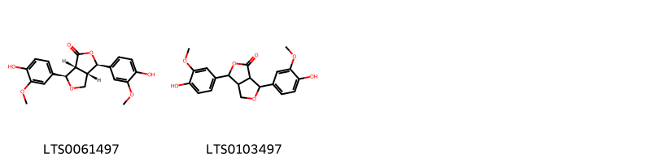{ width=100% }
    <figcaption>Hình ảnh cấu trúc hóa học của 2 hoạt chất thuộc nhóm Lignan lactones gồm ['(3r,3as,6r,6ar)-3,6-bis(4-hydroxy-3-methoxyphenyl)-tetrahydro-3h-furo[3,4-c]furan-1-one (LTS0061497)', '3,6-bis(4-hydroxy-3-methoxyphenyl)-tetrahydro-3h-furo[3,4-c]furan-1-one (LTS0103497)'].</figcaption>
</figure>
#### Nhóm Linear 1_3-diarylpropanoids
<figure markdown="span">
    { width=100% }
    <figcaption>Hình ảnh cấu trúc hóa học của Không tìm thấy chú thích hoạt chất thuộc nhóm Linear 1_3-diarylpropanoids gồm Không tìm thấy chú thích.</figcaption>
</figure>
#### Nhóm Naphthopyrans
<figure markdown="span">
    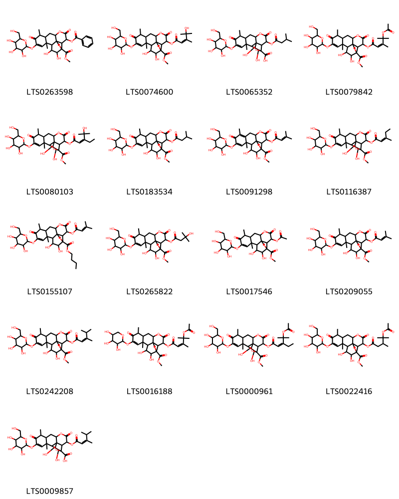{ width=100% }
    <figcaption>Hình ảnh cấu trúc hóa học của 17 hoạt chất thuộc nhóm Naphthopyrans gồm ['methyl 3-(benzoyloxy)-15,16-dihydroxy-9,13-dimethyl-4,10-dioxo-11-{[3,4,5-trihydroxy-6-(hydroxymethyl)oxan-2-yl]oxy}-5,18-dioxapentacyclo[12.5.0.0¹,⁶.0²,¹⁷.0⁸,¹³]nonadec-11-ene-17-carboxylate (LTS0263598)', 'methyl 15,16-dihydroxy-3-[(4-hydroxy-3,4-dimethylpent-2-enoyl)oxy]-9,13-dimethyl-4,10-dioxo-11-{[3,4,5-trihydroxy-6-(hydroxymethyl)oxan-2-yl]oxy}-5,18-dioxapentacyclo[12.5.0.0¹,⁶.0²,¹⁷.0⁸,¹³]nonadec-11-ene-17-carboxylate (LTS0074600)', '15,16-dihydroxy-9,13-dimethyl-3-[(3-methylbutanoyl)oxy]-4,10-dioxo-11-{[3,4,5-trihydroxy-6-(hydroxymethyl)oxan-2-yl]oxy}-5,18-dioxapentacyclo[12.5.0.0¹,⁶.0²,¹⁷.0⁸,¹³]nonadec-11-ene-17-carboxylic acid (LTS0065352)', 'methyl 3-{[4-(acetyloxy)-3,4-dimethylpent-2-enoyl]oxy}-15,16-dihydroxy-9,13-dimethyl-4,10-dioxo-11-{[3,4,5-trihydroxy-6-(hydroxymethyl)oxan-2-yl]oxy}-5,18-dioxapentacyclo[12.5.0.0¹,⁶.0²,¹⁷.0⁸,¹³]nonadec-11-ene-17-carboxylate (LTS0079842)', 'methyl 3-[(3-ethyl-4-hydroxy-4-methylpent-2-enoyl)oxy]-15,16-dihydroxy-9,13-dimethyl-4,10-dioxo-11-{[3,4,5-trihydroxy-6-(hydroxymethyl)oxan-2-yl]oxy}-5,18-dioxapentacyclo[12.5.0.0¹,⁶.0²,¹⁷.0⁸,¹³]nonadec-11-ene-17-carboxylate (LTS0080103)', 'methyl 15,16-dihydroxy-9,13-dimethyl-3-[(3-methylbutanoyl)oxy]-4,10-dioxo-11-{[3,4,5-trihydroxy-6-(hydroxymethyl)oxan-2-yl]oxy}-5,18-dioxapentacyclo[12.5.0.0¹,⁶.0²,¹⁷.0⁸,¹³]nonadec-11-ene-17-carboxylate (LTS0183534)', 'methyl 15,16-dihydroxy-9,13-dimethyl-3-[(3-methylbut-2-enoyl)oxy]-4,10-dioxo-11-{[3,4,5-trihydroxy-6-(hydroxymethyl)oxan-2-yl]oxy}-5,18-dioxapentacyclo[12.5.0.0¹,⁶.0²,¹⁷.0⁸,¹³]nonadeca-8,11-diene-17-carboxylate (LTS0091298)', 'methyl 15,16-dihydroxy-9,13-dimethyl-3-[(3-methylpent-2-enoyl)oxy]-4,10-dioxo-11-{[3,4,5-trihydroxy-6-(hydroxymethyl)oxan-2-yl]oxy}-5,18-dioxapentacyclo[12.5.0.0¹,⁶.0²,¹⁷.0⁸,¹³]nonadec-11-ene-17-carboxylate (LTS0116387)', 'butyl 15,16-dihydroxy-9,13-dimethyl-3-[(3-methylbut-2-enoyl)oxy]-4,10-dioxo-11-{[3,4,5-trihydroxy-6-(hydroxymethyl)oxan-2-yl]oxy}-5,18-dioxapentacyclo[12.5.0.0¹,⁶.0²,¹⁷.0⁸,¹³]nonadec-11-ene-17-carboxylate (LTS0155107)', 'methyl 15,16-dihydroxy-3-[(3-hydroxy-3-methylbutanoyl)oxy]-9,13-dimethyl-4,10-dioxo-11-{[3,4,5-trihydroxy-6-(hydroxymethyl)oxan-2-yl]oxy}-5,18-dioxapentacyclo[12.5.0.0¹,⁶.0²,¹⁷.0⁸,¹³]nonadec-11-ene-17-carboxylate (LTS0265822)', 'methyl 3-(acetyloxy)-15,16-dihydroxy-9,13-dimethyl-4,10-dioxo-11-{[3,4,5-trihydroxy-6-(hydroxymethyl)oxan-2-yl]oxy}-5,18-dioxapentacyclo[12.5.0.0¹,⁶.0²,¹⁷.0⁸,¹³]nonadec-11-ene-17-carboxylate (LTS0017546)', 'methyl 15,16-dihydroxy-9,13-dimethyl-3-[(3-methylbut-2-enoyl)oxy]-4,10-dioxo-11-{[3,4,5-trihydroxy-6-(hydroxymethyl)oxan-2-yl]oxy}-5,18-dioxapentacyclo[12.5.0.0¹,⁶.0²,¹⁷.0⁸,¹³]nonadec-11-ene-17-carboxylate (LTS0209055)', 'methyl 3-[(3,4-dimethylpent-2-enoyl)oxy]-15,16-dihydroxy-9,13-dimethyl-4,10-dioxo-11-{[3,4,5-trihydroxy-6-(hydroxymethyl)oxan-2-yl]oxy}-5,18-dioxapentacyclo[12.5.0.0¹,⁶.0²,¹⁷.0⁸,¹³]nonadec-11-ene-17-carboxylate (LTS0242208)', 'methyl 3-{[4-(acetyloxy)-3,4-dimethylpent-2-enoyl]oxy}-15,16-dihydroxy-9,13-dimethyl-4,10-dioxo-11-[(3,4,5-trihydroxyoxan-2-yl)oxy]-5,18-dioxapentacyclo[12.5.0.0¹,⁶.0²,¹⁷.0⁸,¹³]nonadec-11-ene-17-carboxylate (LTS0016188)', 'methyl 3-{[4-(acetyloxy)-3-ethyl-4-methylpent-2-enoyl]oxy}-15,16-dihydroxy-9,13-dimethyl-4,10-dioxo-11-{[3,4,5-trihydroxy-6-(hydroxymethyl)oxan-2-yl]oxy}-5,18-dioxapentacyclo[12.5.0.0¹,⁶.0²,¹⁷.0⁸,¹³]nonadec-11-ene-17-carboxylate (LTS0000961)', 'methyl 3-{[4-(acetyloxy)-3,4-dimethylpentanoyl]oxy}-15,16-dihydroxy-9,13-dimethyl-4,10-dioxo-11-{[3,4,5-trihydroxy-6-(hydroxymethyl)oxan-2-yl]oxy}-5,18-dioxapentacyclo[12.5.0.0¹,⁶.0²,¹⁷.0⁸,¹³]nonadec-11-ene-17-carboxylate (LTS0022416)', '3-[(3,4-dimethylpent-2-enoyl)oxy]-15,16-dihydroxy-9,13-dimethyl-4,10-dioxo-11-{[3,4,5-trihydroxy-6-(hydroxymethyl)oxan-2-yl]oxy}-5,18-dioxapentacyclo[12.5.0.0¹,⁶.0²,¹⁷.0⁸,¹³]nonadec-11-ene-17-carboxylic acid (LTS0009857)'].</figcaption>
</figure>
#### Nhóm Organooxygen compounds
<figure markdown="span">
    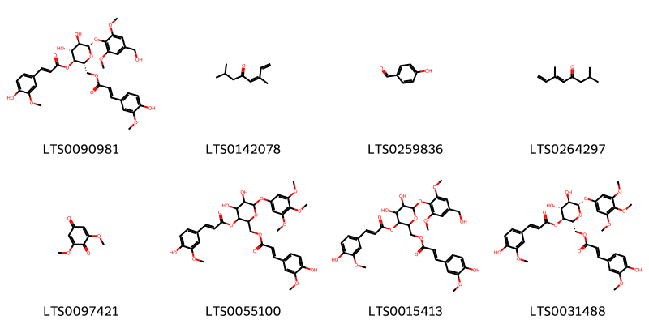{ width=100% }
    <figcaption>Hình ảnh cấu trúc hóa học của 8 hoạt chất thuộc nhóm Organooxygen compounds gồm ['[(2r,3s,4r,5r,6s)-4,5-dihydroxy-3-{[(2e)-3-(4-hydroxy-3-methoxyphenyl)prop-2-enoyl]oxy}-6-[4-(hydroxymethyl)-2,6-dimethoxyphenoxy]oxan-2-yl]methyl (2e)-3-(4-hydroxy-3-methoxyphenyl)prop-2-enoate (LTS0090981)', '(z)-tagetone (LTS0142078)', 'p-hydroxybenzaldehyde (LTS0259836)', '(e)-tagetone (LTS0264297)', '2,6-dimethoxy-1,4-benzoquinone (LTS0097421)', '(4,5-dihydroxy-3-{[3-(4-hydroxy-3-methoxyphenyl)prop-2-enoyl]oxy}-6-(3,4,5-trimethoxyphenoxy)oxan-2-yl)methyl 3-(4-hydroxy-3-methoxyphenyl)prop-2-enoate (LTS0055100)', '(4,5-dihydroxy-3-{[3-(4-hydroxy-3-methoxyphenyl)prop-2-enoyl]oxy}-6-[4-(hydroxymethyl)-2,6-dimethoxyphenoxy]oxan-2-yl)methyl 3-(4-hydroxy-3-methoxyphenyl)prop-2-enoate (LTS0015413)', '[(2r,3s,4r,5r,6s)-4,5-dihydroxy-3-{[(2e)-3-(4-hydroxy-3-methoxyphenyl)prop-2-enoyl]oxy}-6-(3,4,5-trimethoxyphenoxy)oxan-2-yl]methyl (2e)-3-(4-hydroxy-3-methoxyphenyl)prop-2-enoate (LTS0031488)'].</figcaption>
</figure>
#### Nhóm Phenols
<figure markdown="span">
    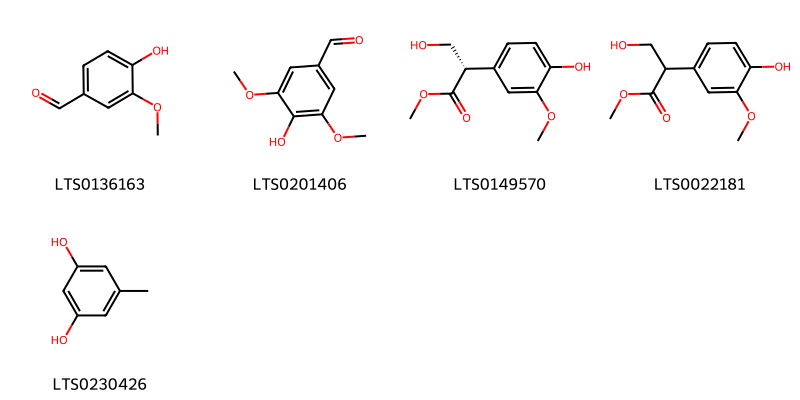{ width=100% }
    <figcaption>Hình ảnh cấu trúc hóa học của 5 hoạt chất thuộc nhóm Phenols gồm ['vanillin (LTS0136163)', 'syringaldehyde (LTS0201406)', 'methyl (2s)-3-hydroxy-2-(4-hydroxy-3-methoxyphenyl)propanoate (LTS0149570)', 'methyl 3-hydroxy-2-(4-hydroxy-3-methoxyphenyl)propanoate (LTS0022181)', 'orcinol (LTS0230426)'].</figcaption>
</figure>
#### Nhóm Prenol lipids
<figure markdown="span">
    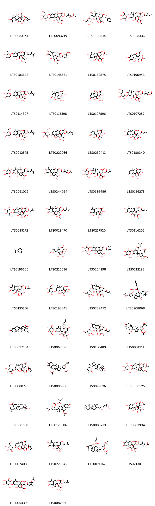{ width=100% }
    <figcaption>Hình ảnh cấu trúc hóa học của 259 hoạt chất thuộc nhóm Prenol lipids gồm ['methyl (1r,2r,6r,8s,13s,14s,17s)-10,15,16-trihydroxy-9,13-dimethyl-3-[(3-methylbut-2-enoyl)oxy]-4,11-dioxo-5,18-dioxapentacyclo[12.5.0.0¹,⁶.0²,¹⁷.0⁸,¹³]nonadec-9-ene-17-carboxylate (LTS0083741)', 'methyl (1r,2s,3r,6r,13s,15r,17s)-3-{[(2e)-4-(acetyloxy)-3,4-dimethylpent-2-enoyl]oxy}-15,16-dihydroxy-9,13-dimethyl-4,10-dioxo-11-{[(2s,3r,4s,5s,6r)-3,4,5-trihydroxy-6-(hydroxymethyl)oxan-2-yl]oxy}-5,18-dioxapentacyclo[12.5.0.0¹,⁶.0²,¹⁷.0⁸,¹³]nonadec-11-ene-17-carboxylate (LTS0093219)', 'methyl (1r,2s,3r,6r,8s,13s,14r,15r,16s)-3-(benzoyloxy)-15,16-dihydroxy-9,13-dimethyl-4,10-dioxo-11-{[(2s,3r,4s,5s,6r)-3,4,5-trihydroxy-6-(hydroxymethyl)oxan-2-yl]oxy}-5,18-dioxapentacyclo[12.5.0.0¹,⁶.0²,¹⁷.0⁸,¹³]nonadec-11-ene-17-carboxylate (LTS0090840)', 'methyl (1r,2s,3r,6r,8s,9s,13s,14r,15r,16s,17s)-3-{[(2e)-3,4-dimethylpent-2-enoyl]oxy}-15,16-dihydroxy-9,13-dimethyl-4,10-dioxo-11-{[3,4,5-trihydroxy-6-(hydroxymethyl)oxan-2-yl]oxy}-5,18-dioxapentacyclo[12.5.0.0¹,⁶.0²,¹⁷.0⁸,¹³]nonadec-11-ene-17-carboxylate (LTS0028336)', 'methyl (1r,2s,3r,6r,8s,9s,13s,14r,15r,16s)-3-{[(2e)-3,4-dimethylpent-2-enoyl]oxy}-15,16-dihydroxy-9,13-dimethyl-4,10-dioxo-11-{[(2s,3r,4s,5s,6r)-3,4,5-trihydroxy-6-(hydroxymethyl)oxan-2-yl]oxy}-5,18-dioxapentacyclo[12.5.0.0¹,⁶.0²,¹⁷.0⁸,¹³]nonadec-11-ene-17-carboxylate (LTS0103698)', 'methyl 3-{[4-(acetyloxy)-3,4-dimethylpent-2-enoyl]oxy}-11,15,16-trihydroxy-9,13-dimethyl-4,10-dioxo-5,18-dioxapentacyclo[12.5.0.0¹,⁶.0²,¹⁷.0⁸,¹³]nonadeca-8,11-diene-17-carboxylate (LTS0145531)', 'methyl 3-(acetyloxy)-10,15,16-trihydroxy-9,13-dimethyl-4,11-dioxo-5,18-dioxapentacyclo[12.5.0.0¹,⁶.0²,¹⁷.0⁸,¹³]nonadec-9-ene-17-carboxylate (LTS0182878)', 'methyl (1r,3r,8r,13s,14r,15r,16s,17s)-3-(acetyloxy)-10,15,16-trihydroxy-9,13-dimethyl-4,11-dioxo-5,18-dioxapentacyclo[12.5.0.0¹,⁶.0²,¹⁷.0⁸,¹³]nonadec-9-ene-17-carboxylate (LTS0196943)', 'methyl (1r,2s,6r,8s,9s,13s,14s,15r)-3-{[(2e)-3,4-dimethylpent-2-enoyl]oxy}-15,16-dihydroxy-9,13-dimethyl-4,12-dioxo-11-{[(2s,3r,4s,5s,6r)-3,4,5-trihydroxy-6-(hydroxymethyl)oxan-2-yl]oxy}-5,18-dioxapentacyclo[12.5.0.0¹,⁶.0²,¹⁷.0⁸,¹³]nonadec-10-ene-17-carboxylate (LTS0114307)', '(1r,2r,3r,6r,8s,12s,13s,14r,15r,16s,17r)-2,3,12,15,16-pentahydroxy-17-(hydroxymethyl)-9,13-dimethyl-5,18-dioxapentacyclo[12.5.0.0¹,⁶.0²,¹⁷.0⁸,¹³]nonadec-9-ene-4,11-dione (LTS0115598)', 'yadanziolide b (LTS0107896)', 'methyl (1r,2s,3r,6r,8s,13s,14r,15r,16s)-3-{[(2e)-4-(acetyloxy)-3,4-dimethylpent-2-enoyl]oxy}-15,16-dihydroxy-9,13-dimethyl-4,10-dioxo-11-{[(2s,3r,4s,5s,6r)-3,4,5-trihydroxy-6-(hydroxymethyl)oxan-2-yl]oxy}-5,18-dioxapentacyclo[12.5.0.0¹,⁶.0²,¹⁷.0⁸,¹³]nonadec-11-ene-17-carboxylate (LTS0107287)', 'methyl (1r,2s,3r,6r,8s,9s,13s,14s,15r,16s,17s)-3-{[(2e)-3,4-dimethylpent-2-enoyl]oxy}-15,16-dihydroxy-9,13-dimethyl-4,12-dioxo-11-{[(2s,3r,4s,5s,6r)-3,4,5-trihydroxy-6-(hydroxymethyl)oxan-2-yl]oxy}-5,18-dioxapentacyclo[12.5.0.0¹,⁶.0²,¹⁷.0⁸,¹³]nonadec-10-ene-17-carboxylate (LTS0212575)', 'methyl 3-{[(2e)-3,4-dimethylpent-2-enoyl]oxy}-15,16-dihydroxy-9,13-dimethyl-4,12-dioxo-11-{[3,4,5-trihydroxy-6-(hydroxymethyl)oxan-2-yl]oxy}-5,18-dioxapentacyclo[12.5.0.0¹,⁶.0²,¹⁷.0⁸,¹³]nonadec-10-ene-17-carboxylate (LTS0222266)', '(1r,2r,3r,6r,8s,12s,13s,14r,15r,16s,17s)-2,3,12,15,16-pentahydroxy-9,13,17-trimethyl-5,18-dioxapentacyclo[12.5.0.0¹,⁶.0²,¹⁷.0⁸,¹³]nonadec-9-ene-4,11-dione (LTS0232413)', 'brusatol (LTS0180340)', 'methyl (1r,2s,3r,6r,8r,13s,14r,15r,16s,17r)-3-{[(2e)-3,4-dimethylpent-2-enoyl]oxy}-15,16-dihydroxy-9,13-dimethyl-4,11-dioxo-10-{[(2s,3r,4s,5s,6r)-3,4,5-trihydroxy-6-(hydroxymethyl)oxan-2-yl]oxy}-5,18-dioxapentacyclo[12.5.0.0¹,⁶.0²,¹⁷.0⁸,¹³]nonadec-9-ene-17-carboxylate (LTS0061012)', 'methyl (1r,2s,3r,6r,13s,14r,15r,16s,17s)-3-{[(2e)-4-(acetyloxy)-3,4-dimethylpent-2-enoyl]oxy}-11,15,16-trihydroxy-9,13-dimethyl-4,10-dioxo-5,18-dioxapentacyclo[12.5.0.0¹,⁶.0²,¹⁷.0⁸,¹³]nonadeca-8,11-diene-17-carboxylate (LTS0244764)', 'methyl (1r,2s,3r,6r,8r,13s,14r,15r,16s)-15,16-dihydroxy-9,13-dimethyl-3-[(3-methylbut-2-enoyl)oxy]-4,11-dioxo-10-{[(2s,3r,4s,5s,6r)-3,4,5-trihydroxy-6-(hydroxymethyl)oxan-2-yl]oxy}-5,18-dioxapentacyclo[12.5.0.0¹,⁶.0²,¹⁷.0⁸,¹³]nonadec-9-ene-17-carboxylate (LTS0189486)', 'bruceine d (LTS0136271)', 'methyl (1r,2s,6r,8r,13s,14r,17s)-15,16-dihydroxy-9,13-dimethyl-3-[(3-methylbut-2-enoyl)oxy]-4,11-dioxo-10-{[3,4,5-trihydroxy-6-(hydroxymethyl)oxan-2-yl]oxy}-5,18-dioxapentacyclo[12.5.0.0¹,⁶.0²,¹⁷.0⁸,¹³]nonadec-9-ene-17-carboxylate (LTS0015172)', 'bruceantin (LTS0019470)', '2,3,12,15,16-pentahydroxy-9,13,17-trimethyl-5,18-dioxapentacyclo[12.5.0.0¹,⁶.0²,¹⁷.0⁸,¹³]nonadec-9-ene-4,11-dione (LTS0217520)', 'methyl 10,11,15,16-tetrahydroxy-9,13-dimethyl-3-[(3-methylbut-2-enoyl)oxy]-4-oxo-5,18-dioxapentacyclo[12.5.0.0¹,⁶.0²,¹⁷.0⁸,¹³]nonadecane-17-carboxylate (LTS0114205)', 'carvone (LTS0196605)', '(1r,2r,3r,6r,8s,9r,10r,11s,12r)-2,3,10,11-tetrahydroxy-8,12-dimethyl-8-[(2r)-3-methyl-5-oxo-2h-furan-2-yl]-5,13-dioxatetracyclo[7.5.0.0¹,⁶.0²,¹²]tetradecan-4-one (LTS0216036)', 'methyl 3-[(3,4-dimethylpent-2-enoyl)oxy]-15,16-dihydroxy-9,13-dimethyl-4,11-dioxo-10-{[3,4,5-trihydroxy-6-(hydroxymethyl)oxan-2-yl]oxy}-5,18-dioxapentacyclo[12.5.0.0¹,⁶.0²,¹⁷.0⁸,¹³]nonadec-9-ene-17-carboxylate (LTS0204198)', 'methyl 15,16-dihydroxy-9,13-dimethyl-7-(3-methylbut-2-enoyl)-4,11-dioxo-10-{[3,4,5-trihydroxy-6-(hydroxymethyl)oxan-2-yl]oxy}-5,18-dioxapentacyclo[12.5.0.0¹,⁶.0²,¹⁷.0⁸,¹³]nonadec-9-ene-17-carboxylate (LTS0212192)', '(1r,2s,3r,6r,8r,13s,14r,15r,16s,17r)-10,15,16-trihydroxy-9,13-dimethyl-3-[(3-methylbut-2-enoyl)oxy]-4,11-dioxo-5,18-dioxapentacyclo[12.5.0.0¹,⁶.0²,¹⁷.0⁸,¹³]nonadec-9-ene-17-carboxylic acid (LTS0125156)', '(1r,2r,3r,6r,8s,11s,12s,13s,14r,15r,16s,17r)-2,3,12,15,16-pentahydroxy-9,13,17-trimethyl-11-{[(2r,3r,4s,5s,6r)-3,4,5-trihydroxy-6-(hydroxymethyl)oxan-2-yl]oxy}-5,18-dioxapentacyclo[12.5.0.0¹,⁶.0²,¹⁷.0⁸,¹³]nonadec-9-en-4-one (LTS0193641)', 'methyl (1r,2s,3r,6r,8s,9s,13s,14r,15r,16s,17r)-15,16-dihydroxy-9,13-dimethyl-3-[(3-methylbut-2-enoyl)oxy]-4,10-dioxo-11-{[(2s,3r,4s,5s,6r)-3,4,5-trihydroxy-6-(hydroxymethyl)oxan-2-yl]oxy}-5,18-dioxapentacyclo[12.5.0.0¹,⁶.0²,¹⁷.0⁸,¹³]nonadec-11-ene-17-carboxylate (LTS0239472)', '1-[2-(acetyloxy)-5-(3,3-dimethyloxiran-2-yl)oxolan-3-yl]-4-hydroxy-3b,6,6,9a,11a-pentamethyl-7-oxo-1h,2h,4h,5h,5ah,9bh,10h,11h-cyclopenta[a]phenanthren-10-yl hexanoate (LTS0208068)', '2,2,6a,6b,9,9,12a-heptamethyl-10-oxo-4,5,6,7,8,8a,11,12,12b,13,14,14a-dodecahydro-3h-picene-4a-carboxylic acid (LTS0097134)', 'methyl (1r,2r,6s,7r,8r,13r,14r,15r,16s,17r)-15,16-dihydroxy-9,13-dimethyl-7-[(3-methylbut-2-enoyl)oxy]-4,11-dioxo-10-{[(2s,3r,4s,5s,6r)-3,4,5-trihydroxy-6-(hydroxymethyl)oxan-2-yl]oxy}-5,18-dioxapentacyclo[12.5.0.0¹,⁶.0²,¹⁷.0⁸,¹³]nonadec-9-ene-17-carboxylate (LTS0062098)', 'methyl (1r,2s,3r,6r,13s,14r,15r,16s,17s)-15,16-dihydroxy-9,13-dimethyl-3-[(3-methylbut-2-enoyl)oxy]-4,10-dioxo-11-{[(2s,3r,4s,5s,6r)-3,4,5-trihydroxy-6-(hydroxymethyl)oxan-2-yl]oxy}-5,18-dioxapentacyclo[12.5.0.0¹,⁶.0²,¹⁷.0⁸,¹³]nonadeca-8,11-diene-17-carboxylate (LTS0136489)', '3-[4-(acetyloxy)-3b,6,6,9a,11a-pentamethyl-7-oxo-1h,2h,4h,5h,5ah,8h,9h,9bh,10h,11h-cyclopenta[a]phenanthren-1-yl]-5-(3,3-dimethyloxiran-2-yl)oxolan-2-yl acetate (LTS0081311)', 'methyl (1r,2s,3r,6r,8s,9s,13s,14s,15r,16s,17s)-15,16-dihydroxy-9,13-dimethyl-3-[(3-methylbut-2-enoyl)oxy]-4,12-dioxo-11-{[(2s,3r,4s,5s,6r)-3,4,5-trihydroxy-6-(hydroxymethyl)oxan-2-yl]oxy}-5,18-dioxapentacyclo[12.5.0.0¹,⁶.0²,¹⁷.0⁸,¹³]nonadec-10-ene-17-carboxylate (LTS0080770)', '(2r)-3-[(1r,4r,5ar,9ar,9br,11as)-4-(acetyloxy)-3b,6,6,9a,11a-pentamethyl-7-oxo-1h,2h,4h,5h,5ah,9bh,10h,11h-cyclopenta[a]phenanthren-1-yl]-5-(3,3-dimethyloxiran-2-yl)oxolan-2-yl acetate (LTS0095988)', '(6s)-6-{1-[(1s,2s,5r,6r,9r,10r,13s,15s)-15-hydroxy-9,10,14,14-tetramethyl-16-oxapentacyclo[13.2.2.0¹,¹³.0²,¹⁰.0⁵,⁹]nonadecan-6-yl]ethenyl}-3-methyl-5,6-dihydropyran-2-one (LTS0079626)', 'methyl (1r,2s,3r,6r,8r,13s,14r,15r,16s)-3-(acetyloxy)-15,16-dihydroxy-9,13-dimethyl-4,11-dioxo-10-{[(2s,3r,4s,5s,6r)-3,4,5-trihydroxy-6-(hydroxymethyl)oxan-2-yl]oxy}-5,18-dioxapentacyclo[12.5.0.0¹,⁶.0²,¹⁷.0⁸,¹³]nonadec-9-ene-17-carboxylate (LTS0080525)', '(1s,2s,6s,11s,14s,15r,18r,20s)-20-hydroxy-8,8,14,15,19,19-hexamethyl-21-oxahexacyclo[18.2.2.0¹,¹⁸.0²,¹⁵.0⁵,¹⁴.0⁶,¹¹]tetracos-4-ene-11-carboxylic acid (LTS0071558)', '4-(acetyloxy)-1-[2-(acetyloxy)-5-(3,3-dimethyloxiran-2-yl)oxolan-3-yl]-3b,6,6,9a,11a-pentamethyl-7-oxo-1h,2h,4h,5h,5ah,9bh,10h,11h-cyclopenta[a]phenanthren-10-yl 2-methylbut-2-enoate (LTS0123506)', '(1s,3ar,3br,5ar,9ar,9br,11ar)-1-[(2r,4e)-6-hydroperoxy-2-hydroxy-6-methylhept-4-en-2-yl]-3a,3b,6,6,9a-pentamethyl-dodecahydrocyclopenta[a]phenanthren-7-one (LTS0085219)', 'methyl (1r,2s,3r,6r,8s,9s,13s,14r,15r,16s,17s)-3-(acetyloxy)-10,15,16-trihydroxy-9,13-dimethyl-4,11-dioxo-5,18-dioxapentacyclo[12.5.0.0¹,⁶.0²,¹⁷.0⁸,¹³]nonadecane-17-carboxylate (LTS0083994)', 'methyl (1r,2s,3r,6r,8s,9r,13s,14s,15r,16s,17s)-15,16-dihydroxy-9,13-dimethyl-3-[(3-methylbut-2-enoyl)oxy]-4,12-dioxo-11-{[(2s,3r,4s,5r,6r)-3,4,5-trihydroxy-6-(hydroxymethyl)oxan-2-yl]oxy}-5,18-dioxapentacyclo[12.5.0.0¹,⁶.0²,¹⁷.0⁸,¹³]nonadec-10-ene-17-carboxylate (LTS0074033)', '10,15,16-trihydroxy-9,13-dimethyl-3-[(3-methylbutanoyl)oxy]-4,11-dioxo-5,18-dioxapentacyclo[12.5.0.0¹,⁶.0²,¹⁷.0⁸,¹³]nonadec-9-ene-17-carboxylic acid (LTS0226642)', '(1s,3ar,3br,9s,9ar,9bs,10r,11as)-1-[(2r,3s,5s)-2-(acetyloxy)-5-[(2s)-3,3-dimethyloxiran-2-yl]oxolan-3-yl]-9-hydroxy-3a,6,6,9a,11a-pentamethyl-7-oxo-1h,2h,3h,3bh,4h,8h,9h,9bh,10h,11h-cyclopenta[a]phenanthren-10-yl (2e)-2-methylbut-2-enoate (LTS0071162)', 'methyl (1r,2s,3r,6r,8r,13s,14r,15r,16s,17r)-3-{[(2e)-4-(acetyloxy)-3,4-dimethylpent-2-enoyl]oxy}-10,15,16-trihydroxy-9,13-dimethyl-4,11-dioxo-5,18-dioxapentacyclo[12.5.0.0¹,⁶.0²,¹⁷.0⁸,¹³]nonadec-9-ene-17-carboxylate (LTS0213073)', 'methyl 3-{[4-(acetyloxy)-3,4-dimethylpent-2-enoyl]oxy}-15,16-dihydroxy-9,13-dimethyl-4,11-dioxo-10-{[3,4,5-trihydroxy-6-(hydroxymethyl)oxan-2-yl]oxy}-5,18-dioxapentacyclo[12.5.0.0¹,⁶.0²,¹⁷.0⁸,¹³]nonadec-9-ene-17-carboxylate (LTS0054395)', 'methyl 10,15,16-trihydroxy-9,13-dimethyl-3-[(3-methylbut-2-enoyl)oxy]-4,11-dioxo-5,18-dioxapentacyclo[12.5.0.0¹,⁶.0²,¹⁷.0⁸,¹³]nonadec-9-ene-17-carboxylate (LTS0082660)', '1-(2,5-dihydroxy-6-methylhept-6-en-2-yl)-3a,3b,6,6,9a-pentamethyl-dodecahydrocyclopenta[a]phenanthren-7-one (LTS0086382)', '17-(acetyloxy)-15,16-dihydroxy-9,13-dimethyl-4,11-dioxo-10-{[3,4,5-trihydroxy-6-(hydroxymethyl)oxan-2-yl]oxy}-5,18-dioxapentacyclo[12.5.0.0¹,⁶.0²,¹⁷.0⁸,¹³]nonadec-9-en-3-yl 3,4-dimethylpent-2-enoate (LTS0096703)', 'methyl (1r,2s,3r,6r,13s,15r,17s)-15,16-dihydroxy-9,13-dimethyl-3-[(3-methylbutanoyl)oxy]-4,10-dioxo-11-{[(2s,3r,4s,5s,6r)-3,4,5-trihydroxy-6-(hydroxymethyl)oxan-2-yl]oxy}-5,18-dioxapentacyclo[12.5.0.0¹,⁶.0²,¹⁷.0⁸,¹³]nonadec-11-ene-17-carboxylate (LTS0165525)', '4-(3,4-dihydroxybut-1-en-1-yl)-4-hydroxy-3,5,5-trimethylcyclohex-2-en-1-one (LTS0145784)', '(2e)-6-[(1r,2s,5r,6s,9r,10r,13r)-15-hydroxy-9,10,14,14-tetramethyl-16-oxapentacyclo[13.2.2.0¹,¹³.0²,¹⁰.0⁵,⁹]nonadecan-6-yl]-2-methylhepta-2,6-dienoic acid (LTS0095856)', 'methyl (1r,2s,3r,6r,13s,14r,15r,16s,17s)-11,15,16-trihydroxy-9,13-dimethyl-3-[(3-methylbutanoyl)oxy]-4,10-dioxo-5,18-dioxapentacyclo[12.5.0.0¹,⁶.0²,¹⁷.0⁸,¹³]nonadeca-8,11-diene-17-carboxylate (LTS0160627)', '(1s,3br,4r,5ar,9as,9br,10r,11as)-4-(acetyloxy)-1-[(2r,3s,5s)-2-(acetyloxy)-5-[(2s)-3,3-dimethyloxiran-2-yl]oxolan-3-yl]-3b,6,6,9a,11a-pentamethyl-7-oxo-1h,2h,4h,5h,5ah,9bh,10h,11h-cyclopenta[a]phenanthren-10-yl hexanoate (LTS0044943)', '2,2,6a,6b,9,9,12a-heptamethyl-10-oxo-3,4,5,6,7,8,8a,11,12,12b,13,14b-dodecahydro-1h-picene-4a-carboxylic acid (LTS0079324)', '(1r,2s,3r,6r,8s,9s,13s,14r,15r,16s,17s)-15,16-dihydroxy-9,13-dimethyl-3-[(3-methylbutanoyl)oxy]-4,10-dioxo-11-{[(2s,3r,4s,5s,6r)-3,4,5-trihydroxy-6-(hydroxymethyl)oxan-2-yl]oxy}-5,18-dioxapentacyclo[12.5.0.0¹,⁶.0²,¹⁷.0⁸,¹³]nonadec-11-ene-17-carboxylic acid (LTS0175468)', 'methyl (1r,2s,3r,6r,8s,9s,13s,14r,15r,16s,17s)-15,16-dihydroxy-3-{[(2e)-4-hydroxy-3,4-dimethylpent-2-enoyl]oxy}-9,13-dimethyl-4,10-dioxo-11-{[(2s,3r,4s,5s,6r)-3,4,5-trihydroxy-6-(hydroxymethyl)oxan-2-yl]oxy}-5,18-dioxapentacyclo[12.5.0.0¹,⁶.0²,¹⁷.0⁸,¹³]nonadec-11-ene-17-carboxylate (LTS0082626)', 'methyl (1r,2s,3r,6r,8s,9s,13s,14r,15r,16s,17s)-3-{[(2e)-3,4-dimethylpent-2-enoyl]oxy}-15,16-dihydroxy-9,13-dimethyl-4,10-dioxo-11-{[(2s,3r,4s,5s,6r)-3,4,5-trihydroxy-6-(hydroxymethyl)oxan-2-yl]oxy}-5,18-dioxapentacyclo[12.5.0.0¹,⁶.0²,¹⁷.0⁸,¹³]nonadec-11-ene-17-carboxylate (LTS0069369)', '1-[5-(3,3-dimethyloxiran-2-yl)-2-methoxyoxolan-3-yl]-3b,6,6,9a,11a-pentamethyl-7-oxo-1h,2h,4h,5h,5ah,9bh,10h,11h-cyclopenta[a]phenanthren-4-yl acetate (LTS0171135)', 'methyl (1r,2s,3r,6r,8r,13s,14r,15r,16s,17s)-3-(benzoyloxy)-15,16-dihydroxy-9,13-dimethyl-4,11-dioxo-10-{[(2s,3r,4s,5s,6r)-3,4,5-trihydroxy-6-(hydroxymethyl)oxan-2-yl]oxy}-5,18-dioxapentacyclo[12.5.0.0¹,⁶.0²,¹⁷.0⁸,¹³]nonadec-9-ene-17-carboxylate (LTS0172865)', 'methyl (1r,2s,3r,6r,8r,13s,14r,15r,16s,17s)-15,16-dihydroxy-3-{[(2e)-4-hydroxy-3,4-dimethylpent-2-enoyl]oxy}-9,13-dimethyl-4,11-dioxo-10-{[(2s,3r,4s,5s,6r)-3,4,5-trihydroxy-6-(hydroxymethyl)oxan-2-yl]oxy}-5,18-dioxapentacyclo[12.5.0.0¹,⁶.0²,¹⁷.0⁸,¹³]nonadec-9-ene-17-carboxylate (LTS0102349)', 'betulin (LTS0101863)', 'methyl 3-(acetyloxy)-12,15,16-trihydroxy-9,13-dimethyl-4-oxo-11-{[3,4,5-trihydroxy-6-(hydroxymethyl)oxan-2-yl]oxy}-5,18-dioxapentacyclo[12.5.0.0¹,⁶.0²,¹⁷.0⁸,¹³]nonadec-9-ene-17-carboxylate (LTS0144382)', '(1r,2s,3s,7s,9r,12r,13r,14r,15s,16r,17s)-3,12,13,14,15,16-hexahydroxy-2,6,14,17-tetramethyl-10-oxatetracyclo[7.7.1.0²,⁷.0¹³,¹⁷]heptadec-5-ene-4,11-dione (LTS0087150)', 'methyl (1r,2s,3r,6r,8s,9s,10s,11r,13s,14r,15r,16s,17s)-10,11,15,16-tetrahydroxy-9,13-dimethyl-3-[(3-methylbut-2-enoyl)oxy]-4-oxo-5,18-dioxapentacyclo[12.5.0.0¹,⁶.0²,¹⁷.0⁸,¹³]nonadecane-17-carboxylate (LTS0160441)', 'methyl (1r,2s,3r,6r,8r,13s,14r,15r,16s,17r)-10,15,16-trihydroxy-3-{[(2e)-4-hydroxy-3,4-dimethylpent-2-enoyl]oxy}-9,13-dimethyl-4,11-dioxo-5,18-dioxapentacyclo[12.5.0.0¹,⁶.0²,¹⁷.0⁸,¹³]nonadec-9-ene-17-carboxylate (LTS0100457)', '(1r,2r,3r,6r,8s,11s,12s,13s,14r,15r,16s,17r)-2,3,11,12,15,16-hexahydroxy-17-(hydroxymethyl)-9,13-dimethyl-5,18-dioxapentacyclo[12.5.0.0¹,⁶.0²,¹⁷.0⁸,¹³]nonadec-9-en-4-one (LTS0187377)', '10,15,16-trihydroxy-9,13-dimethyl-3-[(3-methylbut-2-enoyl)oxy]-4,11-dioxo-5,18-dioxapentacyclo[12.5.0.0¹,⁶.0²,¹⁷.0⁸,¹³]nonadec-9-ene-17-carboxylic acid (LTS0182753)', '(1s,3br,4r,5ar,9as,9br,10r,11as)-4-(acetyloxy)-1-[(2r,3s,5s)-2-(acetyloxy)-5-[(2s)-3,3-dimethyloxiran-2-yl]oxolan-3-yl]-3b,6,6,9a,11a-pentamethyl-7-oxo-1h,2h,4h,5h,5ah,9bh,10h,11h-cyclopenta[a]phenanthren-10-yl (2e)-2-methylbut-2-enoate (LTS0099031)', 'camphor (LTS0091905)', 'methyl 15,16-dihydroxy-9,13-dimethyl-3-[(3-methylbut-2-enoyl)oxy]-4,12-dioxo-11-{[3,4,5-trihydroxy-6-(hydroxymethyl)oxan-2-yl]oxy}-5,18-dioxapentacyclo[12.5.0.0¹,⁶.0²,¹⁷.0⁸,¹³]nonadec-10-ene-17-carboxylate (LTS0018751)', '3-{[4-(acetyloxy)-3,4-dimethylpent-2-enoyl]oxy}-10,15,16-trihydroxy-9,13-dimethyl-4,11-dioxo-5,18-dioxapentacyclo[12.5.0.0¹,⁶.0²,¹⁷.0⁸,¹³]nonadec-9-ene-17-carboxylic acid (LTS0111109)', '19-hydroxy-13,14,18,18-tetramethyl-7-(prop-1-en-2-yl)-20-oxahexacyclo[17.2.2.0¹,¹⁷.0²,¹⁴.0⁵,¹³.0⁶,¹⁰]tricosane-10-carboxylic acid (LTS0087989)', 'methyl 3-(acetyloxy)-15,16-dihydroxy-9,13-dimethyl-4,11-dioxo-10-{[3,4,5-trihydroxy-6-(hydroxymethyl)oxan-2-yl]oxy}-5,18-dioxapentacyclo[12.5.0.0¹,⁶.0²,¹⁷.0⁸,¹³]nonadec-9-ene-17-carboxylate (LTS0173033)', '(1r,2r,3r,6r,8s,12s,13s,14r,15r,16s,17r)-2,3,12,15,16,19-hexahydroxy-9,13,17-trimethyl-5,18-dioxapentacyclo[12.5.0.0¹,⁶.0²,¹⁷.0⁸,¹³]nonadec-9-ene-4,11-dione (LTS0192250)', 'methyl (1r,2s,3r,6r,8s,9s,13s,14r,15r,16s)-3-(acetyloxy)-15,16-dihydroxy-9,13-dimethyl-4,10-dioxo-11-{[(2s,3r,4s,5s,6r)-3,4,5-trihydroxy-6-(hydroxymethyl)oxan-2-yl]oxy}-5,18-dioxapentacyclo[12.5.0.0¹,⁶.0²,¹⁷.0⁸,¹³]nonadec-11-ene-17-carboxylate (LTS0091719)', 'methyl (1r,2s,3r,6r,8r,13s,14r,15r,16s)-10,15,16-trihydroxy-9,13-dimethyl-3-[(3-methylbutanoyl)oxy]-4,11-dioxo-5,18-dioxapentacyclo[12.5.0.0¹,⁶.0²,¹⁷.0⁸,¹³]nonadec-9-ene-17-carboxylate (LTS0158493)', 'methyl 4-{2-[2-(3,4-dihydroxyphenyl)ethoxy]-2-oxoethyl}-5-ethylidene-6-{[(2s,3r,4s,5s,6r)-3,4,5-trihydroxy-6-(hydroxymethyl)oxan-2-yl]oxy}-4,6-dihydropyran-3-carboxylate (LTS0106016)', 'methyl (4s,5e,6r)-5-ethylidene-4-{2-[2-(4-hydroxyphenyl)ethoxy]-2-oxoethyl}-6-{[(2s,3r,4s,5s,6r)-3,4,5-trihydroxy-6-(hydroxymethyl)oxan-2-yl]oxy}-4,6-dihydropyran-3-carboxylate (LTS0037871)', 'methyl (1r,2s,3r,6r,8s,11s,12s,13s,14r,15r,16s,17s)-3-(acetyloxy)-12,15,16-trihydroxy-9,13-dimethyl-4-oxo-11-{[(2r,3r,4s,5s,6r)-3,4,5-trihydroxy-6-(hydroxymethyl)oxan-2-yl]oxy}-5,18-dioxapentacyclo[12.5.0.0¹,⁶.0²,¹⁷.0⁸,¹³]nonadec-9-ene-17-carboxylate (LTS0189031)', 'methyl (1r,2s,3r,6r,8s,11s,12s,13s,14r,15r,16s,17s)-3-(acetyloxy)-11,12,15,16-tetrahydroxy-9,13-dimethyl-4-oxo-5,18-dioxapentacyclo[12.5.0.0¹,⁶.0²,¹⁷.0⁸,¹³]nonadec-9-ene-17-carboxylate (LTS0269290)', 'methyl 3-(benzoyloxy)-15,16-dihydroxy-9,13-dimethyl-4,11-dioxo-10-{[3,4,5-trihydroxy-6-(hydroxymethyl)oxan-2-yl]oxy}-5,18-dioxapentacyclo[12.5.0.0¹,⁶.0²,¹⁷.0⁸,¹³]nonadec-9-ene-17-carboxylate (LTS0149237)', 'methyl (1r,2s,3r,6r,8r,13s,14r,15r,16s,17s)-15,16-dihydroxy-9,13-dimethyl-3-[(3-methylbutanoyl)oxy]-4,11-dioxo-10-{[(2s,3r,4s,5s,6r)-3,4,5-trihydroxy-6-(hydroxymethyl)oxan-2-yl]oxy}-5,18-dioxapentacyclo[12.5.0.0¹,⁶.0²,¹⁷.0⁸,¹³]nonadec-9-ene-17-carboxylate (LTS0265105)', 'methyl (1r,2s,3r,6r,8r,13s,14r,15r,16s,17s)-10,15,16-trihydroxy-3-{[(2z)-4-hydroxy-3,4-dimethylpent-2-enoyl]oxy}-9,13-dimethyl-4,11-dioxo-5,18-dioxapentacyclo[12.5.0.0¹,⁶.0²,¹⁷.0⁸,¹³]nonadec-9-ene-17-carboxylate (LTS0154747)', 'cedrene (LTS0256646)', 'methyl (1r,2s,3r,6r,13s,15r,17s)-15,16-dihydroxy-9,13-dimethyl-3-[(3-methylbutanoyl)oxy]-4,11-dioxo-10-{[(2s,3r,4s,5s,6r)-3,4,5-trihydroxy-6-(hydroxymethyl)oxan-2-yl]oxy}-5,18-dioxapentacyclo[12.5.0.0¹,⁶.0²,¹⁷.0⁸,¹³]nonadec-9-ene-17-carboxylate (LTS0272416)', 'methyl (1r,2s,3r,6r,8r,13s,14r,15r,16s,17s)-10,15,16-trihydroxy-9,13-dimethyl-3-[(3-methylbutanoyl)oxy]-4,11-dioxo-5,18-dioxapentacyclo[12.5.0.0¹,⁶.0²,¹⁷.0⁸,¹³]nonadec-9-ene-17-carboxylate (LTS0140276)', 'bruceantinol (LTS0191649)', 'α-cadinol (LTS0206935)', 'humulene (LTS0263171)', 'methyl (1r,2s,3r,6r,8r,13s,14r,15r,16s)-10,15,16-trihydroxy-3-{[(2z)-4-hydroxy-3,4-dimethylpent-2-enoyl]oxy}-9,13-dimethyl-4,11-dioxo-5,18-dioxapentacyclo[12.5.0.0¹,⁶.0²,¹⁷.0⁸,¹³]nonadec-9-ene-17-carboxylate (LTS0191379)', 'methyl 3-(acetyloxy)-11,12,15,16-tetrahydroxy-9,13-dimethyl-4-oxo-5,18-dioxapentacyclo[12.5.0.0¹,⁶.0²,¹⁷.0⁸,¹³]nonadec-9-ene-17-carboxylate (LTS0202595)', 'methyl (1r,2s,3r,6r,8r,12s,13s,14r,15r,16s,17s)-12,15,16-trihydroxy-9,13-dimethyl-3-[(3-methylbutanoyl)oxy]-4,11-dioxo-10-{[(2s,3r,4s,5s,6r)-3,4,5-trihydroxy-6-(hydroxymethyl)oxan-2-yl]oxy}-5,18-dioxapentacyclo[12.5.0.0¹,⁶.0²,¹⁷.0⁸,¹³]nonadec-9-ene-17-carboxylate (LTS0265723)', 'methyl (1r,2s,3r,6r,8s,9s,10s,11r,13s,14r,15r,16s,17s)-10,15,16-trihydroxy-9,13-dimethyl-3-[(3-methylbut-2-enoyl)oxy]-4-oxo-11-{[(2r,3r,4s,5s,6r)-3,4,5-trihydroxy-6-(hydroxymethyl)oxan-2-yl]oxy}-5,18-dioxapentacyclo[12.5.0.0¹,⁶.0²,¹⁷.0⁸,¹³]nonadecane-17-carboxylate (LTS0202105)', '2,3,12,15,16,19-hexahydroxy-9,13,17-trimethyl-5,18-dioxapentacyclo[12.5.0.0¹,⁶.0²,¹⁷.0⁸,¹³]nonadec-9-ene-4,11-dione (LTS0149944)', '(1s,3ar,3br,5ar,9ar,9br,11ar)-1-[(2s,4e)-6-hydroperoxy-2-hydroxy-6-methylhept-4-en-2-yl]-3a,3b,6,6,9a-pentamethyl-dodecahydrocyclopenta[a]phenanthren-7-one (LTS0149890)', 'methyl (1r,2r,6r,7r,8r,13s,14r,15r,16s,17s)-15,16-dihydroxy-9,13-dimethyl-7-(3-methylbut-2-enoyl)-4,11-dioxo-10-{[(2s,3r,4s,5s,6r)-3,4,5-trihydroxy-6-(hydroxymethyl)oxan-2-yl]oxy}-5,18-dioxapentacyclo[12.5.0.0¹,⁶.0²,¹⁷.0⁸,¹³]nonadec-9-ene-17-carboxylate (LTS0199741)', 'methyl (1r,2s,3r,6r,8r,13s,14r,15r,16s,17s)-3-(benzoyloxy)-10,15,16-trihydroxy-9,13-dimethyl-4,11-dioxo-5,18-dioxapentacyclo[12.5.0.0¹,⁶.0²,¹⁷.0⁸,¹³]nonadec-9-ene-17-carboxylate (LTS0140899)', '(4as,6ar,6br,8r,8ar,12ar,12br,14as)-8-hydroxy-2,2,6a,6b,9,9,12a-heptamethyl-10-oxo-4,5,6,7,8,8a,11,12,12b,13,14,14a-dodecahydro-3h-picene-4a-carboxylic acid (LTS0143955)', '(1r,2s,3r,6r,8r,13s,14r,15r,16s,17r)-17-(acetyloxy)-15,16-dihydroxy-9,13-dimethyl-4,11-dioxo-10-{[(2s,3r,4s,5s,6r)-3,4,5-trihydroxy-6-(hydroxymethyl)oxan-2-yl]oxy}-5,18-dioxapentacyclo[12.5.0.0¹,⁶.0²,¹⁷.0⁸,¹³]nonadec-9-en-3-yl (2e)-3,4-dimethylpent-2-enoate (LTS0143887)', '(6s)-6-{1-[(1s,2s,5r,6s,9r,10r,13r,15s)-15-hydroxy-9,10,14,14-tetramethyl-16-oxapentacyclo[13.2.2.0¹,¹³.0²,¹⁰.0⁵,⁹]nonadecan-6-yl]ethenyl}-3-methyl-5,6-dihydropyran-2-one (LTS0163038)', '(1s,2s,5r,6r,7r,10s,13r,14r,17r,19s)-19-hydroxy-13,14,18,18-tetramethyl-7-(prop-1-en-2-yl)-20-oxahexacyclo[17.2.2.0¹,¹⁷.0²,¹⁴.0⁵,¹³.0⁶,¹⁰]tricosane-10-carboxylic acid (LTS0145468)', 'thujyl alcohol (LTS0143591)', 'camphene (LTS0267242)', 'methyl 3-[(3,4-dimethylpent-2-enoyl)oxy]-15,16-dihydroxy-9,13-dimethyl-4,12-dioxo-11-{[3,4,5-trihydroxy-6-(hydroxymethyl)oxan-2-yl]oxy}-5,18-dioxapentacyclo[12.5.0.0¹,⁶.0²,¹⁷.0⁸,¹³]nonadec-10-ene-17-carboxylate (LTS0153870)', 'limonene,  (LTS0155981)', 'bruceoside a (LTS0190451)', 'β-caryophyllen (LTS0141501)', 'methyl (1r,2s,3r,6r,8r,12s,13s,14r,15r,16s,17s)-12,15,16-trihydroxy-9,13-dimethyl-3-{[(2s)-2-methylbutanoyl]oxy}-4,11-dioxo-10-{[(2s,3r,4s,5s,6r)-3,4,5-trihydroxy-6-(hydroxymethyl)oxan-2-yl]oxy}-5,18-dioxapentacyclo[12.5.0.0¹,⁶.0²,¹⁷.0⁸,¹³]nonadec-9-ene-17-carboxylate (LTS0144597)', 'butyl (1r,2s,3r,6r,8s,9s,13s,14r,15r,16s,17r)-15,16-dihydroxy-9,13-dimethyl-3-[(3-methylbut-2-enoyl)oxy]-4,10-dioxo-11-{[(2s,3r,4s,5s,6r)-3,4,5-trihydroxy-6-(hydroxymethyl)oxan-2-yl]oxy}-5,18-dioxapentacyclo[12.5.0.0¹,⁶.0²,¹⁷.0⁸,¹³]nonadec-11-ene-17-carboxylate (LTS0147406)', 'methyl 11,15,16-trihydroxy-9,13-dimethyl-3-[(3-methylbut-2-enoyl)oxy]-4,10-dioxo-5,18-dioxapentacyclo[12.5.0.0¹,⁶.0²,¹⁷.0⁸,¹³]nonadeca-8,11-diene-17-carboxylate (LTS0262230)', '(2s)-2-[(1s,3as,5ar,9ar,9br,11as)-3a,6,6,9a,11a-pentamethyl-7-oxo-1h,2h,3h,5h,5ah,8h,9h,9bh,10h,11h-cyclopenta[a]phenanthren-1-yl]-6-methylhept-5-enoic acid (LTS0126248)', '(1r,2r,3r,6r,8s,10r,12r)-2,3,10,11-tetrahydroxy-8,12-dimethyl-8-(3-methyl-5-oxo-2h-furan-2-yl)-5,13-dioxatetracyclo[7.5.0.0¹,⁶.0²,¹²]tetradecan-4-one (LTS0152824)', '8-hydroxy-2,2,6a,6b,9,9,12a-heptamethyl-10-oxo-4,5,6,7,8,8a,11,12,12b,13,14,14a-dodecahydro-3h-picene-4a-carboxylic acid (LTS0152648)', 'methyl (1s,2r,3r,6r,8r,13s,14r,15r,16s,17s)-15,16-dihydroxy-9,13-dimethyl-3-[(3-methylbut-2-enoyl)oxy]-4,11-dioxo-10-{[(2s,3r,4s,5r,6r)-3,4,5-trihydroxy-6-(hydroxymethyl)oxan-2-yl]oxy}-5,18-dioxapentacyclo[12.5.0.0¹,⁶.0²,¹⁷.0⁸,¹³]nonadec-9-ene-17-carboxylate (LTS0103374)', 'methyl (1r,2s,3r,6r,13s,15r,17s)-3-(acetyloxy)-15,16-dihydroxy-9,13-dimethyl-4,11-dioxo-10-{[(2s,3r,4s,5s,6r)-3,4,5-trihydroxy-6-(hydroxymethyl)oxan-2-yl]oxy}-5,18-dioxapentacyclo[12.5.0.0¹,⁶.0²,¹⁷.0⁸,¹³]nonadec-9-ene-17-carboxylate (LTS0164056)', '4-(acetyloxy)-1-[2-(acetyloxy)-5-(3,3-dimethyloxiran-2-yl)oxolan-3-yl]-3b,6,6,9a,11a-pentamethyl-7-oxo-1h,2h,4h,5h,5ah,9bh,10h,11h-cyclopenta[a]phenanthren-10-yl hexanoate (LTS0164650)', 'methyl (1r,2s,3r,6r,8s,9s,13s,14r,15r,16s,17s)-15,16-dihydroxy-9,13-dimethyl-3-[(3-methylbutanoyl)oxy]-4,10-dioxo-11-{[(2s,3r,4s,5s,6r)-3,4,5-trihydroxy-6-(hydroxymethyl)oxan-2-yl]oxy}-5,18-dioxapentacyclo[12.5.0.0¹,⁶.0²,¹⁷.0⁸,¹³]nonadec-11-ene-17-carboxylate (LTS0157431)', 'methyl (1r,2s,3r,6r,8r,13s,14r,15r,16s,17s)-3-{[(2e)-3,4-dimethylpent-2-enoyl]oxy}-15,16-dihydroxy-9,13-dimethyl-4,11-dioxo-10-{[(2s,3r,4s,5s,6r)-3,4,5-trihydroxy-6-(hydroxymethyl)oxan-2-yl]oxy}-5,18-dioxapentacyclo[12.5.0.0¹,⁶.0²,¹⁷.0⁸,¹³]nonadec-9-ene-17-carboxylate (LTS0143356)', '1-[2-(acetyloxy)-5-(3,3-dimethyloxiran-2-yl)oxolan-3-yl]-9-hydroxy-3a,6,6,9a,11a-pentamethyl-7-oxo-1h,2h,3h,3bh,4h,8h,9h,9bh,10h,11h-cyclopenta[a]phenanthren-10-yl 2-methylbut-2-enoate (LTS0249972)', 'methyl (1r,2s,3r,6r,8s,9s,13s,14r,15r,16s,17s)-3-(benzoyloxy)-15,16-dihydroxy-9,13-dimethyl-4,10-dioxo-11-{[(2s,3r,4s,5s,6r)-3,4,5-trihydroxy-6-(hydroxymethyl)oxan-2-yl]oxy}-5,18-dioxapentacyclo[12.5.0.0¹,⁶.0²,¹⁷.0⁸,¹³]nonadec-11-ene-17-carboxylate (LTS0172744)', '(1s,3r)-1-isopropyl-4-methylidenebicyclo[3.1.0]hexan-3-ol (LTS0111134)', '(1r,2s,3r,6r,8r,13s,14r,15r,16s,17s)-3-{[(2e)-4-(acetyloxy)-3,4-dimethylpent-2-enoyl]oxy}-10,15,16-trihydroxy-9,13-dimethyl-4,11-dioxo-5,18-dioxapentacyclo[12.5.0.0¹,⁶.0²,¹⁷.0⁸,¹³]nonadec-9-ene-17-carboxylic acid (LTS0159157)', 'methyl (1r,2s,3r,6r,8s,9s,13s,14r,15r,16s,17s)-3-{[(2e)-3-ethyl-4-hydroxy-4-methylpent-2-enoyl]oxy}-15,16-dihydroxy-9,13-dimethyl-4,10-dioxo-11-{[(2s,3r,4s,5s,6r)-3,4,5-trihydroxy-6-(hydroxymethyl)oxan-2-yl]oxy}-5,18-dioxapentacyclo[12.5.0.0¹,⁶.0²,¹⁷.0⁸,¹³]nonadec-11-ene-17-carboxylate (LTS0249612)', 'methyl (1r,2s,3r,6r,8r,13s,14r,15r,16s)-3-{[(2e)-4-(acetyloxy)-3,4-dimethylpent-2-enoyl]oxy}-15,16-dihydroxy-9,13-dimethyl-4,11-dioxo-10-{[(2s,3r,4s,5s,6r)-3,4,5-trihydroxy-6-(hydroxymethyl)oxan-2-yl]oxy}-5,18-dioxapentacyclo[12.5.0.0¹,⁶.0²,¹⁷.0⁸,¹³]nonadec-9-ene-17-carboxylate (LTS0097623)', '(1r,4s,4ar)-4-isopropyl-1,6-dimethyl-3,4,4a,7,8,8a-hexahydro-2h-naphthalen-1-ol (LTS0164497)', '2,3,12,15,16-pentahydroxy-9,13,17-trimethyl-11-{[3,4,5-trihydroxy-6-(hydroxymethyl)oxan-2-yl]oxy}-5,18-dioxapentacyclo[12.5.0.0¹,⁶.0²,¹⁷.0⁸,¹³]nonadec-9-en-4-one (LTS0096889)', 'methyl (1r,2s,3r,6r,8s,11s,12s,13s,14r,15r,16s,17s)-11,12,15,16-tetrahydroxy-3-{[(2e)-4-hydroxy-3,4-dimethylpent-2-enoyl]oxy}-9,13-dimethyl-4-oxo-5,18-dioxapentacyclo[12.5.0.0¹,⁶.0²,¹⁷.0⁸,¹³]nonadec-9-ene-17-carboxylate (LTS0187990)', 'methyl 11,15,16-trihydroxy-9,13-dimethyl-3-[(3-methylbutanoyl)oxy]-4,10-dioxo-5,18-dioxapentacyclo[12.5.0.0¹,⁶.0²,¹⁷.0⁸,¹³]nonadeca-8,11-diene-17-carboxylate (LTS0271310)', '(1s,3ar,3br,5ar,9ar,9br,11ar)-1-[(2s,5r)-2,5-dihydroxy-6-methylhept-6-en-2-yl]-3a,3b,6,6,9a-pentamethyl-dodecahydrocyclopenta[a]phenanthren-7-one (LTS0177898)', '(1s,3br,4r,5ar,9s,9as,9br,10r,11as)-4-(acetyloxy)-1-[(2r,3s,5s)-5-[(2s)-3,3-dimethyloxiran-2-yl]-2-methoxyoxolan-3-yl]-9-hydroxy-3b,6,6,9a,11a-pentamethyl-7-oxo-1h,2h,4h,5h,5ah,8h,9h,9bh,10h,11h-cyclopenta[a]phenanthren-10-yl (2e)-2-methylbut-2-enoate (LTS0183844)', 'methyl (1r,2s,3r,6r,8s,11s,12s,13s,14r,15r,16s,17s)-12,15,16-trihydroxy-3-{[(2e)-4-hydroxy-3,4-dimethylpent-2-enoyl]oxy}-9,13-dimethyl-4-oxo-11-{[(2r,3r,4s,5r,6r)-3,4,5-trihydroxy-6-(hydroxymethyl)oxan-2-yl]oxy}-5,18-dioxapentacyclo[12.5.0.0¹,⁶.0²,¹⁷.0⁸,¹³]nonadec-9-ene-17-carboxylate (LTS0175379)', 'methyl 11,12,15,16-tetrahydroxy-3-[(4-hydroxy-3,4-dimethylpent-2-enoyl)oxy]-9,13-dimethyl-4-oxo-5,18-dioxapentacyclo[12.5.0.0¹,⁶.0²,¹⁷.0⁸,¹³]nonadec-9-ene-17-carboxylate (LTS0253358)', 'methyl (1r,2s,3r,6r,8s,9s,13s,14r,15r,16s,17s)-3-{[(3s)-4-(acetyloxy)-3,4-dimethylpentanoyl]oxy}-15,16-dihydroxy-9,13-dimethyl-4,10-dioxo-11-{[(2s,3r,4s,5s,6r)-3,4,5-trihydroxy-6-(hydroxymethyl)oxan-2-yl]oxy}-5,18-dioxapentacyclo[12.5.0.0¹,⁶.0²,¹⁷.0⁸,¹³]nonadec-11-ene-17-carboxylate (LTS0273623)', '3,7,15,16-tetrahydroxy-9,13,17-trimethyl-5,18-dioxapentacyclo[12.5.0.0¹,⁶.0²,¹⁷.0⁸,¹³]nonadec-9-ene-4,11-dione (LTS0107673)', '10-hydroxy-2,2,6a,6b,9,9,12a-heptamethyl-3,4,5,6,7,8,8a,10,11,12,12b,13,14,14a-tetradecahydropicene-4a-carboxylic acid (LTS0107294)', 'bruceine b (LTS0254228)', '3,12,13,14,15,16-hexahydroxy-2,6,14,17-tetramethyl-10-oxatetracyclo[7.7.1.0²,⁷.0¹³,¹⁷]heptadec-5-ene-4,11-dione (LTS0237068)', 'methyl (1r,2s,3r,6r,8s,9s,13s,14r,15r,16s,17s)-15,16-dihydroxy-3-[(3-hydroxy-3-methylbutanoyl)oxy]-9,13-dimethyl-4,10-dioxo-11-{[(2s,3r,4s,5s,6r)-3,4,5-trihydroxy-6-(hydroxymethyl)oxan-2-yl]oxy}-5,18-dioxapentacyclo[12.5.0.0¹,⁶.0²,¹⁷.0⁸,¹³]nonadec-11-ene-17-carboxylate (LTS0260170)', '(1s,3br,4r,5ar,9ar,9br,11as)-1-[(2s,3s,5r)-5-[(2s)-3,3-dimethyloxiran-2-yl]-2-methoxyoxolan-3-yl]-3b,6,6,9a,11a-pentamethyl-7-oxo-1h,2h,4h,5h,5ah,9bh,10h,11h-cyclopenta[a]phenanthren-4-yl acetate (LTS0247854)', '(1s,3br,4r,5ar,9ar,9br,11as)-1-[(2r,3s,5r)-5-[(2s)-3,3-dimethyloxiran-2-yl]-2-methoxyoxolan-3-yl]-3b,6,6,9a,11a-pentamethyl-7-oxo-1h,2h,4h,5h,5ah,9bh,10h,11h-cyclopenta[a]phenanthren-4-yl acetate (LTS0252148)', '1-isopropyl-4-methylbicyclo[3.1.0]hexan-2-ol (LTS0226328)', 'methyl (1r,2s,3r,6r,8r,13s,14r,15r,16s,17s)-3-(benzoyloxy)-15,16-dihydroxy-9,13-dimethyl-4,11-dioxo-10-{[(2r,3r,4s,5s,6r)-3,4,5-trihydroxy-6-(hydroxymethyl)oxan-2-yl]oxy}-5,18-dioxapentacyclo[12.5.0.0¹,⁶.0²,¹⁷.0⁸,¹³]nonadec-9-ene-17-carboxylate (LTS0253667)', '4-hydroxy-4-(3-hydroxybut-1-en-1-yl)-3,5,5-trimethylcyclohex-2-en-1-one (LTS0183737)', 'methyl (1r,2s,3r,6r,8s,9s,13s,14r,15r,16s,17s)-3-{[(2e)-4-(acetyloxy)-3,4-dimethylpent-2-enoyl]oxy}-15,16-dihydroxy-9,13-dimethyl-4,10-dioxo-11-{[(2s,3r,4s,5s,6r)-3,4,5-trihydroxy-6-(hydroxymethyl)oxan-2-yl]oxy}-5,18-dioxapentacyclo[12.5.0.0¹,⁶.0²,¹⁷.0⁸,¹³]nonadec-11-ene-17-carboxylate (LTS0184098)', 'methyl (1r,2s,3r,6r,13s,15r,17s)-15,16-dihydroxy-3-{[(2e)-4-hydroxy-3,4-dimethylpent-2-enoyl]oxy}-9,13-dimethyl-4,11-dioxo-10-{[(2s,3r,4s,5s,6r)-3,4,5-trihydroxy-6-(hydroxymethyl)oxan-2-yl]oxy}-5,18-dioxapentacyclo[12.5.0.0¹,⁶.0²,¹⁷.0⁸,¹³]nonadec-9-ene-17-carboxylate (LTS0120081)', '(1s,2r,3r,6r,8r,11s,12r,13r,14s,15s,16s,17s)-2,3,12,15,16-pentahydroxy-9,13,17-trimethyl-11-{[(2r,3r,4r,5s,6r)-3,4,5-trihydroxy-6-(hydroxymethyl)oxan-2-yl]oxy}-5,18-dioxapentacyclo[12.5.0.0¹,⁶.0²,¹⁷.0⁸,¹³]nonadec-9-en-4-one (LTS0251602)', 'methyl (1r,2s,3r,6r,8s,9s,13s,14s,15r,16s,17s)-15,16-dihydroxy-9,13-dimethyl-3-[(3-methylbutanoyl)oxy]-4,12-dioxo-11-{[(2s,3r,4s,5s,6r)-3,4,5-trihydroxy-6-(hydroxymethyl)oxan-2-yl]oxy}-5,18-dioxapentacyclo[12.5.0.0¹,⁶.0²,¹⁷.0⁸,¹³]nonadec-10-ene-17-carboxylate (LTS0187623)', 'methyl (1r,2s,3r,6r,8s,13s,14r,15r,16s,17s)-15,16-dihydroxy-9,13-dimethyl-3-[(3-methylbut-2-enoyl)oxy]-4,11-dioxo-10-{[(2s,3r,4s,5s,6r)-3,4,5-trihydroxy-6-(hydroxymethyl)oxan-2-yl]oxy}-5,18-dioxapentacyclo[12.5.0.0¹,⁶.0²,¹⁷.0⁸,¹³]nonadec-9-ene-17-carboxylate (LTS0194879)', '(1s,3br,4r,5ar,9as,9br,10r,11as)-1-[(2r,3s,5s)-2-(acetyloxy)-5-[(2s)-3,3-dimethyloxiran-2-yl]oxolan-3-yl]-4-hydroxy-3b,6,6,9a,11a-pentamethyl-7-oxo-1h,2h,4h,5h,5ah,9bh,10h,11h-cyclopenta[a]phenanthren-10-yl hexanoate (LTS0067159)', 'methyl (1r,2s,3r,6r,8s,9s,10s,13s,14r,15r,16s,17s)-10,15,16-trihydroxy-9,13-dimethyl-3-[(3-methylbut-2-enoyl)oxy]-4-oxo-11-{[(2s,3r,4s,5s,6r)-3,4,5-trihydroxy-6-(hydroxymethyl)oxan-2-yl]oxy}-5,18-dioxapentacyclo[12.5.0.0¹,⁶.0²,¹⁷.0⁸,¹³]nonadec-11-ene-17-carboxylate (LTS0076177)', 'methyl (1r,2s,3r,6r,8s,11s,12s,13s,14r,15r,16s,17s)-12,15,16-trihydroxy-9,13-dimethyl-3-[(3-methylbutanoyl)oxy]-4-oxo-11-{[(2r,3r,4s,5s,6r)-3,4,5-trihydroxy-6-(hydroxymethyl)oxan-2-yl]oxy}-5,18-dioxapentacyclo[12.5.0.0¹,⁶.0²,¹⁷.0⁸,¹³]nonadec-9-ene-17-carboxylate (LTS0268379)', 'methyl (1r,2s,3r,6r,8s,13s,14r,15r,16s,17s)-15,16-dihydroxy-3-{[(2e)-4-hydroxy-3,4-dimethylpent-2-enoyl]oxy}-9,13-dimethyl-4,11-dioxo-10-{[(2s,3r,4s,5s,6r)-3,4,5-trihydroxy-6-(hydroxymethyl)oxan-2-yl]oxy}-5,18-dioxapentacyclo[12.5.0.0¹,⁶.0²,¹⁷.0⁸,¹³]nonadec-9-ene-17-carboxylate (LTS0272853)', 'methyl (1r,2s,3r,6r,8s,11s,12s,13s,14r,15r,16s,17s)-12,15,16-trihydroxy-9,13-dimethyl-3-[(3-methylbut-2-enoyl)oxy]-4-oxo-11-{[(2r,3r,4s,5s,6r)-3,4,5-trihydroxy-6-(hydroxymethyl)oxan-2-yl]oxy}-5,18-dioxapentacyclo[12.5.0.0¹,⁶.0²,¹⁷.0⁸,¹³]nonadec-9-ene-17-carboxylate (LTS0253449)', '(1r,2r,3r,6r,8s,12s,13s,14r,15r,16s,17r,19s)-2,3,12,15,16,19-hexahydroxy-9,13,17-trimethyl-5,18-dioxapentacyclo[12.5.0.0¹,⁶.0²,¹⁷.0⁸,¹³]nonadec-9-ene-4,11-dione (LTS0054110)', '5a,5b,8,8,11a-pentamethyl-9-oxo-1-(prop-1-en-2-yl)-tetradecahydro-1h-cyclopenta[a]chrysene-3a-carboxylic acid (LTS0255379)', 'methyl 15,16-dihydroxy-9,13-dimethyl-3-[(3-methylbutanoyl)oxy]-4,11-dioxo-10-{[3,4,5-trihydroxy-6-(hydroxymethyl)oxan-2-yl]oxy}-5,18-dioxapentacyclo[12.5.0.0¹,⁶.0²,¹⁷.0⁸,¹³]nonadec-9-ene-17-carboxylate (LTS0194677)', '(4r,8ar)-4-isopropyl-1,6-dimethyl-3,4,4a,7,8,8a-hexahydronaphthalene (LTS0191845)', '(1r,2s,3r,6r,8s,9s,13s,14r,15r,16s)-3-{[(2e)-4-(acetyloxy)-3,4-dimethylpent-2-enoyl]oxy}-15,16-dihydroxy-9,13-dimethyl-4,10-dioxo-11-{[(2s,3r,4s,5s,6r)-3,4,5-trihydroxy-6-(hydroxymethyl)oxan-2-yl]oxy}-5,18-dioxapentacyclo[12.5.0.0¹,⁶.0²,¹⁷.0⁸,¹³]nonadec-11-ene-17-carboxylic acid (LTS0208541)', 'methyl (1r,2s,3r,6r,8r,13s,14r,15r,16s,17s)-3-{[(2e)-4-(acetyloxy)-3,4-dimethylpent-2-enoyl]oxy}-15,16-dihydroxy-9,13-dimethyl-4,11-dioxo-10-{[(2s,3r,4s,5s,6r)-3,4,5-trihydroxy-6-(hydroxymethyl)oxan-2-yl]oxy}-5,18-dioxapentacyclo[12.5.0.0¹,⁶.0²,¹⁷.0⁸,¹³]nonadec-9-ene-17-carboxylate (LTS0197791)', 'methyl (1r,2s,3r,6r,8s,13s,14r,15r,16s)-15,16-dihydroxy-3-{[(2e)-4-hydroxy-3,4-dimethylpent-2-enoyl]oxy}-9,13-dimethyl-4,10-dioxo-11-{[(2s,3r,4s,5s,6r)-3,4,5-trihydroxy-6-(hydroxymethyl)oxan-2-yl]oxy}-5,18-dioxapentacyclo[12.5.0.0¹,⁶.0²,¹⁷.0⁸,¹³]nonadec-11-ene-17-carboxylate (LTS0267356)', 'betulinic acid (LTS0210795)', '(1r,2r,3r,6r,8s,12s,13s,14r,15r,16s,17r,19s)-2,3,12,15,16,17,19-heptahydroxy-9,13-dimethyl-5,18-dioxapentacyclo[12.5.0.0¹,⁶.0²,¹⁷.0⁸,¹³]nonadec-9-ene-4,11-dione (LTS0067538)', 'methyl (1r,2s,3r,6r,8s,11s,12s,13s,14r,15r,16s,17s)-12,15,16-trihydroxy-9,13-dimethyl-3-[(3-methylbut-2-enoyl)oxy]-4-oxo-11-{[(2r,3r,4s,5r,6r)-3,4,5-trihydroxy-6-(hydroxymethyl)oxan-2-yl]oxy}-5,18-dioxapentacyclo[12.5.0.0¹,⁶.0²,¹⁷.0⁸,¹³]nonadec-9-ene-17-carboxylate (LTS0034892)', 'methyl (1r,2s,3r,6r,8r,13s,14r,15r,16s,17s)-10,15,16-trihydroxy-3-{[(2e)-4-hydroxy-3,4-dimethylpent-2-enoyl]oxy}-9,13-dimethyl-4,11-dioxo-5,18-dioxapentacyclo[12.5.0.0¹,⁶.0²,¹⁷.0⁸,¹³]nonadec-9-ene-17-carboxylate (LTS0244347)', 'methyl 15,16-dihydroxy-3-[(4-hydroxy-3,4-dimethylpent-2-enoyl)oxy]-9,13-dimethyl-4,11-dioxo-10-{[3,4,5-trihydroxy-6-(hydroxymethyl)oxan-2-yl]oxy}-5,18-dioxapentacyclo[12.5.0.0¹,⁶.0²,¹⁷.0⁸,¹³]nonadec-9-ene-17-carboxylate (LTS0202018)', '(4s)-4-[(1e,3s)-3,4-dihydroxybut-1-en-1-yl]-4-hydroxy-3,5,5-trimethylcyclohex-2-en-1-one (LTS0068167)', '(1r,2r,3r,6r,8s,11s,12s,13s,14r,15r,16s,17s)-2,3,11,12,15,16-hexahydroxy-9,13,17-trimethyl-5,18-dioxapentacyclo[12.5.0.0¹,⁶.0²,¹⁷.0⁸,¹³]nonadec-9-en-4-one (LTS0178342)', 'dipterocarpol (LTS0267069)', '3,17-dimethyl (1r,2r,3s,6r,8r,13s,14r,15r,16s)-10,15,16-trihydroxy-9,13-dimethyl-4,11-dioxo-5,18-dioxapentacyclo[12.5.0.0¹,⁶.0²,¹⁷.0⁸,¹³]nonadec-9-ene-3,17-dicarboxylate (LTS0223060)', 'levo-α-cedrene (LTS0222481)', '9-hydroxy-5a,5b,8,8,11a-pentamethyl-1-(prop-1-en-2-yl)-hexadecahydrocyclopenta[a]chrysene-3a-carboxylic acid (LTS0214300)', 'thujone (LTS0197087)', 'methyl (1r,2s,3r,6r,13s,15r,17s)-15,16-dihydroxy-3-{[(2e)-4-hydroxy-3,4-dimethylpent-2-enoyl]oxy}-9,13-dimethyl-4,10-dioxo-11-{[(2s,3r,4s,5s,6r)-3,4,5-trihydroxy-6-(hydroxymethyl)oxan-2-yl]oxy}-5,18-dioxapentacyclo[12.5.0.0¹,⁶.0²,¹⁷.0⁸,¹³]nonadec-11-ene-17-carboxylate (LTS0216749)', '3-[4-(acetyloxy)-3b,6,6,9a,11a-pentamethyl-7-oxo-1h,2h,4h,5h,5ah,9bh,10h,11h-cyclopenta[a]phenanthren-1-yl]-5-(3,3-dimethyloxiran-2-yl)oxolan-2-yl acetate (LTS0208791)', 'methyl 3-[(3,4-dimethylpent-2-enoyl)oxy]-10,15,16-trihydroxy-9,13-dimethyl-4,11-dioxo-5,18-dioxapentacyclo[12.5.0.0¹,⁶.0²,¹⁷.0⁸,¹³]nonadec-9-ene-17-carboxylate (LTS0211657)', '(1r,2s,3r,6r,8r,13s,14r,15r,16s,17s)-10,15,16-trihydroxy-9,13-dimethyl-3-[(3-methylbutanoyl)oxy]-4,11-dioxo-5,18-dioxapentacyclo[12.5.0.0¹,⁶.0²,¹⁷.0⁸,¹³]nonadec-9-ene-17-carboxylic acid (LTS0224487)', '(2e)-6-[(1s,2s,5r,6s,9r,10r,13r,15s)-15-hydroxy-9,10,14,14-tetramethyl-16-oxapentacyclo[13.2.2.0¹,¹³.0²,¹⁰.0⁵,⁹]nonadecan-6-yl]-2-methylhepta-2,6-dienoic acid (LTS0209530)', '(2r,3s,5r)-3-[(1s,3br,4r,5ar,9ar,9br,11as)-4-(acetyloxy)-3b,6,6,9a,11a-pentamethyl-7-oxo-1h,2h,4h,5h,5ah,8h,9h,9bh,10h,11h-cyclopenta[a]phenanthren-1-yl]-5-[(2s)-3,3-dimethyloxiran-2-yl]oxolan-2-yl acetate (LTS0228196)', 'methyl (1r,2s,3r,6r,8s,9s,13s,14r,15r,16s,17s)-3-{[(2e)-4-(acetyloxy)-3,4-dimethylpent-2-enoyl]oxy}-15,16-dihydroxy-9,13-dimethyl-4,10-dioxo-11-{[(2s,3r,4s,5r)-3,4,5-trihydroxyoxan-2-yl]oxy}-5,18-dioxapentacyclo[12.5.0.0¹,⁶.0²,¹⁷.0⁸,¹³]nonadec-11-ene-17-carboxylate (LTS0211091)', '(1r,2r,3r,6r,15r,17r)-2,3,12,15,16-pentahydroxy-9,13,17-trimethyl-5,18-dioxapentacyclo[12.5.0.0¹,⁶.0²,¹⁷.0⁸,¹³]nonadec-9-ene-4,11-dione (LTS0218458)', 'methyl (1r,2s,3r,6r,11s,12s,13s,17s)-3-(acetyloxy)-12,15,16-trihydroxy-9,13-dimethyl-4-oxo-11-{[(2r,3r,4s,5s,6r)-3,4,5-trihydroxy-6-(hydroxymethyl)oxan-2-yl]oxy}-5,18-dioxapentacyclo[12.5.0.0¹,⁶.0²,¹⁷.0⁸,¹³]nonadec-9-ene-17-carboxylate (LTS0221361)', '(1r,3as,5ar,5br,7ar,11ar,11br,13ar,13br)-5a,5b,8,8,11a-pentamethyl-9-oxo-1-(prop-1-en-2-yl)-tetradecahydro-1h-cyclopenta[a]chrysene-3a-carboxylic acid (LTS0229397)', 'thymol (LTS0168527)', '(4s)-4-hydroxy-4-(3-hydroxybut-1-en-1-yl)-3,5,5-trimethylcyclohex-2-en-1-one (LTS0225700)', 'methyl 10,15,16-trihydroxy-3-[(4-hydroxy-3,4-dimethylpent-2-enoyl)oxy]-9,13-dimethyl-4,11-dioxo-5,18-dioxapentacyclo[12.5.0.0¹,⁶.0²,¹⁷.0⁸,¹³]nonadec-9-ene-17-carboxylate (LTS0225962)', '2,3,10,11-tetrahydroxy-8,12-dimethyl-8-(3-methyl-5-oxo-2h-furan-2-yl)-5,13-dioxatetracyclo[7.5.0.0¹,⁶.0²,¹²]tetradecan-4-one (LTS0224645)', 'methyl 3-{[4-(acetyloxy)-3-ethyl-4-methylpent-2-enoyl]oxy}-15,16-dihydroxy-9,13-dimethyl-4,10-dioxo-11-{[2,4,5-trihydroxy-6-(hydroxymethyl)oxan-3-yl]oxy}-5,18-dioxapentacyclo[12.5.0.0¹,⁶.0²,¹⁷.0⁸,¹³]nonadec-11-ene-17-carboxylate (LTS0161303)', 'methyl (1r,2s,3r,6r,8r,13s,14r,15r,16s,17r)-10,15,16-trihydroxy-9,13-dimethyl-3-[(3-methylbutanoyl)oxy]-4,11-dioxo-5,18-dioxapentacyclo[12.5.0.0¹,⁶.0²,¹⁷.0⁸,¹³]nonadec-9-ene-17-carboxylate (LTS0141777)', 'methyl (1r,2s,3r,6r,8s,9s,13s,14r,15r,16s,17s)-15,16-dihydroxy-9,13-dimethyl-3-{[(2e)-3-methylpent-2-enoyl]oxy}-4,10-dioxo-11-{[(2s,3r,4s,5s,6r)-3,4,5-trihydroxy-6-(hydroxymethyl)oxan-2-yl]oxy}-5,18-dioxapentacyclo[12.5.0.0¹,⁶.0²,¹⁷.0⁸,¹³]nonadec-11-ene-17-carboxylate (LTS0035901)', 'oleanolic acid (LTS0141130)', 'bruceolide (LTS0235973)', 'methyl (1r,2s,3r,6r,8r,13s,14r,15r,16s)-15,16-dihydroxy-3-{[(2e)-4-hydroxy-3,4-dimethylpent-2-enoyl]oxy}-9,13-dimethyl-4,11-dioxo-10-{[(2s,3r,4s,5s,6r)-3,4,5-trihydroxy-6-(hydroxymethyl)oxan-2-yl]oxy}-5,18-dioxapentacyclo[12.5.0.0¹,⁶.0²,¹⁷.0⁸,¹³]nonadec-9-ene-17-carboxylate (LTS0178214)', 'methyl (1r,2s,3r,6r,8s,11s,12s,13s,14r,15r,16s,17s)-12,15,16-trihydroxy-3-{[(2e)-4-hydroxy-3,4-dimethylpent-2-enoyl]oxy}-9,13-dimethyl-4-oxo-11-{[(2r,3r,4s,5s,6r)-3,4,5-trihydroxy-6-(hydroxymethyl)oxan-2-yl]oxy}-5,18-dioxapentacyclo[12.5.0.0¹,⁶.0²,¹⁷.0⁸,¹³]nonadec-9-ene-17-carboxylate (LTS0044049)', '(1r,2s,3r,6s,7r,8r,13s,14s,15r,16r,17r)-3,7,15,16-tetrahydroxy-9,13,17-trimethyl-5,18-dioxapentacyclo[12.5.0.0¹,⁶.0²,¹⁷.0⁸,¹³]nonadec-9-ene-4,11-dione (LTS0019720)', '(1r,2r,3r,6r,8s,12s,13s,14r,15r,16s,17s)-2,3,12,15,16-pentahydroxy-17-(hydroxymethyl)-9,13-dimethyl-5,18-dioxapentacyclo[12.5.0.0¹,⁶.0²,¹⁷.0⁸,¹³]nonadec-9-ene-4,11-dione (LTS0250429)', 'methyl (1r,2s,3r,6r,13s,14r,15r,16s,17s)-11,15,16-trihydroxy-9,13-dimethyl-3-[(3-methylbut-2-enoyl)oxy]-4,10-dioxo-5,18-dioxapentacyclo[12.5.0.0¹,⁶.0²,¹⁷.0⁸,¹³]nonadeca-8,11-diene-17-carboxylate (LTS0050364)', 'α-cadinol (LTS0178794)', '(1s,3ar,3br,5ar,9ar,9br,11ar)-1-[(2s)-2,5-dihydroxy-6-methylhept-6-en-2-yl]-3a,3b,6,6,9a-pentamethyl-dodecahydrocyclopenta[a]phenanthren-7-one (LTS0250719)', '(1r,4r,5ar,9ar,9br,11as)-1-[(2s)-5-(3,3-dimethyloxiran-2-yl)-2-methoxyoxolan-3-yl]-3b,6,6,9a,11a-pentamethyl-7-oxo-1h,2h,4h,5h,5ah,9bh,10h,11h-cyclopenta[a]phenanthren-4-yl acetate (LTS0268302)', '(1r,2r,3r,6r,8s,11s,12s,13s,14r,15r,16s,17r)-2,3,11,12,15,16-hexahydroxy-9,13,17-trimethyl-5,18-dioxapentacyclo[12.5.0.0¹,⁶.0²,¹⁷.0⁸,¹³]nonadec-9-en-4-one (LTS0043116)', '(2r,3s,5r)-3-[(1s,3br,4r,5ar,9ar,9br,11as)-4-(acetyloxy)-3b,6,6,9a,11a-pentamethyl-7-oxo-1h,2h,4h,5h,5ah,9bh,10h,11h-cyclopenta[a]phenanthren-1-yl]-5-[(2s)-3,3-dimethyloxiran-2-yl]oxolan-2-yl acetate (LTS0252530)', '2,3,12,15,16,17,19-heptahydroxy-9,13-dimethyl-5,18-dioxapentacyclo[12.5.0.0¹,⁶.0²,¹⁷.0⁸,¹³]nonadec-9-ene-4,11-dione (LTS0061252)', '6-{15-hydroxy-9,10,14,14-tetramethyl-16-oxapentacyclo[13.2.2.0¹,¹³.0²,¹⁰.0⁵,⁹]nonadecan-6-yl}-2-methylhepta-2,6-dienoic acid (LTS0274768)', '6-(1-{15-hydroxy-9,10,14,14-tetramethyl-16-oxapentacyclo[13.2.2.0¹,¹³.0²,¹⁰.0⁵,⁹]nonadecan-6-yl}ethenyl)-3-methyl-5,6-dihydropyran-2-one (LTS0035485)', 'methyl (1r,2s,3s,6r,8s,13r,14r,15r,16r,17s)-3-{[(2e)-4-(acetyloxy)-3,4-dimethylpent-2-enoyl]oxy}-15,16-dihydroxy-9,13-dimethyl-4,11-dioxo-10-{[(2s,3r,4s,5s,6r)-3,4,5-trihydroxy-6-(hydroxymethyl)oxan-2-yl]oxy}-5,18-dioxapentacyclo[12.5.0.0¹,⁶.0²,¹⁷.0⁸,¹³]nonadec-9-ene-17-carboxylate (LTS0259460)', '(6s,9r)-vomifoliol (LTS0052786)', '(4as,6as,6br,8ar,12ar,12br,14bs)-2,2,6a,6b,9,9,12a-heptamethyl-10-oxo-3,4,5,6,7,8,8a,11,12,12b,13,14b-dodecahydro-1h-picene-4a-carboxylic acid (LTS0002247)', 'methyl (1r,2s,3r,6r,8r,13s,14r,15r,16s,17s)-15,16-dihydroxy-9,13-dimethyl-3-[(3-methylbut-2-enoyl)oxy]-4,11-dioxo-10-{[(2s,3r,4s,5s,6r)-3,4,5-trihydroxy-6-(hydroxymethyl)oxan-2-yl]oxy}-5,18-dioxapentacyclo[12.5.0.0¹,⁶.0²,¹⁷.0⁸,¹³]nonadec-9-ene-17-carboxylate (LTS0055846)', 'methyl 3-{[4-(acetyloxy)-3-ethyl-4-methylpent-2-enoyl]oxy}-15,16-dihydroxy-9,13-dimethyl-4,12-dioxo-11-{[3,4,5-trihydroxy-6-(hydroxymethyl)oxan-2-yl]oxy}-5,18-dioxapentacyclo[12.5.0.0¹,⁶.0²,¹⁷.0⁸,¹³]nonadec-10-ene-17-carboxylate (LTS0124207)', '(1s,2r,3r,6r,8r,11s,12r,13r,14s,15s,16s,17s)-2,3,12,15,16-pentahydroxy-9,13,17-trimethyl-11-{[(2r,3r,4r,5s)-3,4,5-trihydroxy-6-(hydroxymethyl)oxan-2-yl]oxy}-5,18-dioxapentacyclo[12.5.0.0¹,⁶.0²,¹⁷.0⁸,¹³]nonadec-9-en-4-one (LTS0062685)', 'methyl (1r,2s,3r,6r,8r,13s,14r,15r,16s,17s)-3-(acetyloxy)-15,16-dihydroxy-9,13-dimethyl-4,11-dioxo-10-{[(2s,3r,4s,5s,6r)-3,4,5-trihydroxy-6-(hydroxymethyl)oxan-2-yl]oxy}-5,18-dioxapentacyclo[12.5.0.0¹,⁶.0²,¹⁷.0⁸,¹³]nonadec-9-ene-17-carboxylate (LTS0270768)', 'methyl (1r,2s,3r,6r,8s,13s,14r,15r,16s)-3-(acetyloxy)-15,16-dihydroxy-9,13-dimethyl-4,10-dioxo-11-{[(2s,3r,4s,5s,6r)-3,4,5-trihydroxy-6-(hydroxymethyl)oxan-2-yl]oxy}-5,18-dioxapentacyclo[12.5.0.0¹,⁶.0²,¹⁷.0⁸,¹³]nonadec-11-ene-17-carboxylate (LTS0054149)', '20-hydroxy-8,8,14,15,19,19-hexamethyl-21-oxahexacyclo[18.2.2.0¹,¹⁸.0²,¹⁵.0⁵,¹⁴.0⁶,¹¹]tetracos-4-ene-11-carboxylic acid (LTS0011585)', 'methyl 2,7,12,15,16-pentahydroxy-9,13-dimethyl-4,11-dioxo-3-[(2,3,4,5,7-pentahydroxy-6-methylheptanoyl)oxy]-5,18-dioxapentacyclo[12.5.0.0¹,⁶.0²,¹⁷.0⁸,¹³]nonadec-9-ene-17-carboxylate (LTS0008307)', '(2e)-6-[(1r,2s,5r,6s,9r,10r,13r,15s)-15-hydroxy-9,10,14,14-tetramethyl-16-oxapentacyclo[13.2.2.0¹,¹³.0²,¹⁰.0⁵,⁹]nonadecan-6-yl]-2-methylhepta-2,6-dienoic acid (LTS0130466)', 'methyl (1r,2r,3s,6s,8r,11r,12r,13r,14r,15r,16s,17s)-12,15,16-trihydroxy-3-{[(2e)-4-hydroxy-3,4-dimethylpent-2-enoyl]oxy}-9,13-dimethyl-4-oxo-11-{[(2s,3r,4s,5r,6r)-3,4,5-trihydroxy-6-(hydroxymethyl)oxan-2-yl]oxy}-5,18-dioxapentacyclo[12.5.0.0¹,⁶.0²,¹⁷.0⁸,¹³]nonadec-9-ene-17-carboxylate (LTS0029879)', 'methyl 12,15,16-trihydroxy-3-[(4-hydroxy-3,4-dimethylpent-2-enoyl)oxy]-9,13-dimethyl-4-oxo-11-{[3,4,5-trihydroxy-6-(hydroxymethyl)oxan-2-yl]oxy}-5,18-dioxapentacyclo[12.5.0.0¹,⁶.0²,¹⁷.0⁸,¹³]nonadec-9-ene-17-carboxylate (LTS0060633)', 'methyl (1r,2r,6r,8r,13s,14s,17s)-15,16-dihydroxy-9,13-dimethyl-3-[(3-methylbutanoyl)oxy]-4,10-dioxo-11-{[3,4,5-trihydroxy-6-(hydroxymethyl)oxan-2-yl]oxy}-5,18-dioxapentacyclo[12.5.0.0¹,⁶.0²,¹⁷.0⁸,¹³]nonadec-11-ene-17-carboxylate (LTS0003054)', 'methyl 12,15,16-trihydroxy-9,13-dimethyl-3-[(3-methylbut-2-enoyl)oxy]-4-oxo-11-{[3,4,5-trihydroxy-6-(hydroxymethyl)oxan-2-yl]oxy}-5,18-dioxapentacyclo[12.5.0.0¹,⁶.0²,¹⁷.0⁸,¹³]nonadec-9-ene-17-carboxylate (LTS0013660)', 'methyl (1r,2s,3r,6r,13s,15r,17s)-15,16-dihydroxy-3-[(3-hydroxy-3-methylbutanoyl)oxy]-9,13-dimethyl-4,10-dioxo-11-{[(2s,3r,4s,5s,6r)-3,4,5-trihydroxy-6-(hydroxymethyl)oxan-2-yl]oxy}-5,18-dioxapentacyclo[12.5.0.0¹,⁶.0²,¹⁷.0⁸,¹³]nonadec-11-ene-17-carboxylate (LTS0013701)', 'methyl (1r,2s,3r,6r,13s,14r,15r,16s,17s)-3-(acetyloxy)-11,15,16-trihydroxy-9,13-dimethyl-4,10-dioxo-5,18-dioxapentacyclo[12.5.0.0¹,⁶.0²,¹⁷.0⁸,¹³]nonadeca-8,11-diene-17-carboxylate (LTS0012606)', 'moronic acid (LTS0007832)', '1-(6-hydroperoxy-2-hydroxy-6-methylhept-4-en-2-yl)-3a,3b,6,6,9a-pentamethyl-dodecahydrocyclopenta[a]phenanthren-7-one (LTS0013377)', '2-{3a,6,6,9a,11a-pentamethyl-7-oxo-1h,2h,3h,5h,5ah,8h,9h,9bh,10h,11h-cyclopenta[a]phenanthren-1-yl}-6-methylhept-5-enoic acid (LTS0015575)', 'methyl 12,15,16-trihydroxy-9,13-dimethyl-3-[(3-methylbutanoyl)oxy]-4-oxo-11-{[3,4,5-trihydroxy-6-(hydroxymethyl)oxan-2-yl]oxy}-5,18-dioxapentacyclo[12.5.0.0¹,⁶.0²,¹⁷.0⁸,¹³]nonadec-9-ene-17-carboxylate (LTS0013912)', '3a-(hydroxymethyl)-5a,5b,8,8,11a-pentamethyl-1-(prop-1-en-2-yl)-hexadecahydrocyclopenta[a]chrysen-9-ol (LTS0008250)', 'methyl (1r,2s,3r,6r,8s,9s,13s,14s,15r,16s,17s)-3-{[(2e)-4-(acetyloxy)-3-ethyl-4-methylpent-2-enoyl]oxy}-15,16-dihydroxy-9,13-dimethyl-4,12-dioxo-11-{[(2s,3r,4s,5s,6r)-3,4,5-trihydroxy-6-(hydroxymethyl)oxan-2-yl]oxy}-5,18-dioxapentacyclo[12.5.0.0¹,⁶.0²,¹⁷.0⁸,¹³]nonadec-10-ene-17-carboxylate (LTS0060280)', 'methyl (1r,2s,3r,6r,8s,9s,13s,14r,15r,16s,17s)-3-(acetyloxy)-15,16-dihydroxy-9,13-dimethyl-4,10-dioxo-11-{[(2s,3r,4s,5s,6r)-3,4,5-trihydroxy-6-(hydroxymethyl)oxan-2-yl]oxy}-5,18-dioxapentacyclo[12.5.0.0¹,⁶.0²,¹⁷.0⁸,¹³]nonadec-11-ene-17-carboxylate (LTS0007398)', '(1r,2r,3r,6r,8s,11s,12s,13s,14r,15r,16s,17s)-2,3,12,15,16-pentahydroxy-9,13,17-trimethyl-11-{[(2r,3r,4s,5s,6r)-3,4,5-trihydroxy-6-(hydroxymethyl)oxan-2-yl]oxy}-5,18-dioxapentacyclo[12.5.0.0¹,⁶.0²,¹⁷.0⁸,¹³]nonadec-9-en-4-one (LTS0013478)', '(1r,2s,3r,6r,8s,9s,13s,14r,15r,16s,17s)-15,16-dihydroxy-9,13-dimethyl-3-[(3-methylbutanoyl)oxy]-4,10-dioxo-11-{[3,4,5-trihydroxy-6-(hydroxymethyl)oxan-2-yl]oxy}-5,18-dioxapentacyclo[12.5.0.0¹,⁶.0²,¹⁷.0⁸,¹³]nonadec-11-ene-17-carboxylic acid (LTS0010331)', 'methyl 15,16-dihydroxy-9,13-dimethyl-3-[(3-methylbut-2-enoyl)oxy]-4,11-dioxo-10-{[3,4,5-trihydroxy-6-(hydroxymethyl)oxan-2-yl]oxy}-5,18-dioxapentacyclo[12.5.0.0¹,⁶.0²,¹⁷.0⁸,¹³]nonadec-9-ene-17-carboxylate (LTS0017046)', '2,3,11,12,15,16-hexahydroxy-9,13,17-trimethyl-5,18-dioxapentacyclo[12.5.0.0¹,⁶.0²,¹⁷.0⁸,¹³]nonadec-9-en-4-one (LTS0032088)', 'methyl (1r,2s,6r,13s,15r,17s)-3-{[(2e)-4-(acetyloxy)-3,4-dimethylpent-2-enoyl]oxy}-15,16-dihydroxy-9,13-dimethyl-4,11-dioxo-10-{[(2s,3r,4s,5s,6r)-3,4,5-trihydroxy-6-(hydroxymethyl)oxan-2-yl]oxy}-5,18-dioxapentacyclo[12.5.0.0¹,⁶.0²,¹⁷.0⁸,¹³]nonadec-9-ene-17-carboxylate (LTS0097960)', 'methyl (1r,2s,3r,6r,8s,9s,13s,14r,15r,16s,17s)-3-{[(2e)-4-(acetyloxy)-3-ethyl-4-methylpent-2-enoyl]oxy}-15,16-dihydroxy-9,13-dimethyl-4,10-dioxo-11-{[(2r,3r,4s,5s,6r)-2,4,5-trihydroxy-6-(hydroxymethyl)oxan-3-yl]oxy}-5,18-dioxapentacyclo[12.5.0.0¹,⁶.0²,¹⁷.0⁸,¹³]nonadec-11-ene-17-carboxylate (LTS0229159)', '2,3,12,15,16-pentahydroxy-17-(hydroxymethyl)-9,13-dimethyl-5,18-dioxapentacyclo[12.5.0.0¹,⁶.0²,¹⁷.0⁸,¹³]nonadec-9-ene-4,11-dione (LTS0018184)', 'methyl (2s,3r,6r,13s,15r,17s)-3-{[(2e)-4-(acetyloxy)-3,4-dimethylpent-2-enoyl]oxy}-15,16-dihydroxy-9,13-dimethyl-4,10-dioxo-11-{[(2s,3r,4s,5s,6r)-3,4,5-trihydroxy-6-(hydroxymethyl)oxan-2-yl]oxy}-5,18-dioxapentacyclo[12.5.0.0¹,⁶.0²,¹⁷.0⁸,¹³]nonadec-11-ene-17-carboxylate (LTS0236812)', 'methyl (1r,2s,3r,6r,8s,9s,13s,14r,15r,16s,17s)-15,16-dihydroxy-3-{[(2e)-4-hydroxy-3,4-dimethylpent-2-enoyl]oxy}-9,13-dimethyl-4,10-dioxo-11-{[(2s,3r,4s,5r,6r)-3,4,5-trihydroxy-6-(hydroxymethyl)oxan-2-yl]oxy}-5,18-dioxapentacyclo[12.5.0.0¹,⁶.0²,¹⁷.0⁸,¹³]nonadec-11-ene-17-carboxylate (LTS0274453)', 'methyl (1r,2s,3r,6r,8r,13s,14r,15r,16s)-3-(benzoyloxy)-10,15,16-trihydroxy-9,13-dimethyl-4,11-dioxo-5,18-dioxapentacyclo[12.5.0.0¹,⁶.0²,¹⁷.0⁸,¹³]nonadec-9-ene-17-carboxylate (LTS0215675)', 'cadinene (LTS0003360)', '3,17-dimethyl 10,15,16-trihydroxy-9,13-dimethyl-4,11-dioxo-5,18-dioxapentacyclo[12.5.0.0¹,⁶.0²,¹⁷.0⁸,¹³]nonadec-9-ene-3,17-dicarboxylate (LTS0087271)', '(1r,2s,3r,6r,8s,9s,13s,14r,15r,16s,17r)-15,16-dihydroxy-9,13-dimethyl-3-[(3-methylbut-2-enoyl)oxy]-4,10-dioxo-11-{[(2s,3r,4s,5s,6r)-3,4,5-trihydroxy-6-(hydroxymethyl)oxan-2-yl]oxy}-5,18-dioxapentacyclo[12.5.0.0¹,⁶.0²,¹⁷.0⁸,¹³]nonadec-11-ene-17-carboxylic acid (LTS0207707)', '2,3,11,12,15,16-hexahydroxy-17-(hydroxymethyl)-9,13-dimethyl-5,18-dioxapentacyclo[12.5.0.0¹,⁶.0²,¹⁷.0⁸,¹³]nonadec-9-en-4-one (LTS0244561)', 'methyl 3-{[4-(acetyloxy)-3,4-dimethylpent-2-enoyl]oxy}-10,15,16-trihydroxy-9,13-dimethyl-4,11-dioxo-5,18-dioxapentacyclo[12.5.0.0¹,⁶.0²,¹⁷.0⁸,¹³]nonadec-9-ene-17-carboxylate (LTS0026893)', '4-(acetyloxy)-1-[5-(3,3-dimethyloxiran-2-yl)-2-methoxyoxolan-3-yl]-9-hydroxy-3b,6,6,9a,11a-pentamethyl-7-oxo-1h,2h,4h,5h,5ah,8h,9h,9bh,10h,11h-cyclopenta[a]phenanthren-10-yl 2-methylbut-2-enoate (LTS0031153)', '(1r,2r,3r,6r,8s,12r,13s,14r,15r,16s,17r)-2,3,12,15,16-pentahydroxy-9,13,17-trimethyl-5,18-dioxapentacyclo[12.5.0.0¹,⁶.0²,¹⁷.0⁸,¹³]nonadec-9-ene-4,11-dione (LTS0128093)', 'carvone, (+)- (LTS0027671)', '(4as,6ar,6br,8ar,10s,12ar,12br,14as)-10-hydroxy-2,2,6a,6b,9,9,12a-heptamethyl-3,4,5,6,7,8,8a,10,11,12,12b,13,14,14a-tetradecahydropicene-4a-carboxylic acid (LTS0045784)', '1-(2-hydroxy-6-methylhept-5-en-2-yl)-3a,3b,6,6,9a-pentamethyl-dodecahydrocyclopenta[a]phenanthren-7-one (LTS0098475)', 'methyl 10,15,16-trihydroxy-9,13-dimethyl-3-[(3-methylbutanoyl)oxy]-4,11-dioxo-5,18-dioxapentacyclo[12.5.0.0¹,⁶.0²,¹⁷.0⁸,¹³]nonadec-9-ene-17-carboxylate (LTS0137376)', '(1r,2s,3r,6r,8s,9s,13s,14r,15r,16s,17r)-3-{[(2e)-3,4-dimethylpent-2-enoyl]oxy}-15,16-dihydroxy-9,13-dimethyl-4,10-dioxo-11-{[(2s,3r,4s,5s,6r)-3,4,5-trihydroxy-6-(hydroxymethyl)oxan-2-yl]oxy}-5,18-dioxapentacyclo[12.5.0.0¹,⁶.0²,¹⁷.0⁸,¹³]nonadec-11-ene-17-carboxylic acid (LTS0128025)', 'methyl 15,16-dihydroxy-9,13-dimethyl-3-[(3-methylbutanoyl)oxy]-4,12-dioxo-11-{[3,4,5-trihydroxy-6-(hydroxymethyl)oxan-2-yl]oxy}-5,18-dioxapentacyclo[12.5.0.0¹,⁶.0²,¹⁷.0⁸,¹³]nonadec-10-ene-17-carboxylate (LTS0124632)', 'methyl 10,15,16-trihydroxy-9,13-dimethyl-3-[(3-methylbut-2-enoyl)oxy]-4-oxo-11-{[3,4,5-trihydroxy-6-(hydroxymethyl)oxan-2-yl]oxy}-5,18-dioxapentacyclo[12.5.0.0¹,⁶.0²,¹⁷.0⁸,¹³]nonadecane-17-carboxylate (LTS0047088)', 'oleanolic acid (LTS0117717)', '2,3,7,12,15,16-hexahydroxy-17-(hydroxymethyl)-9,13-dimethyl-5,18-dioxapentacyclo[12.5.0.0¹,⁶.0²,¹⁷.0⁸,¹³]nonadec-9-ene-4,11-dione (LTS0021607)', 'methyl (1r,2s,3r,6r,8s,9s,13s,14r,15r,16s,17s)-3-{[(2e)-4-(acetyloxy)-3-ethyl-4-methylpent-2-enoyl]oxy}-15,16-dihydroxy-9,13-dimethyl-4,10-dioxo-11-{[(2s,3r,4s,5s,6r)-3,4,5-trihydroxy-6-(hydroxymethyl)oxan-2-yl]oxy}-5,18-dioxapentacyclo[12.5.0.0¹,⁶.0²,¹⁷.0⁸,¹³]nonadec-11-ene-17-carboxylate (LTS0035426)'].</figcaption>
</figure>
#### Nhóm Steroids and steroid derivatives
<figure markdown="span">
    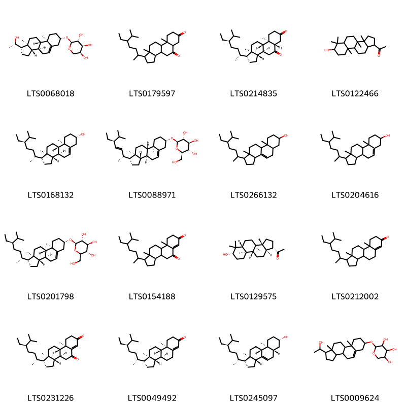{ width=100% }
    <figcaption>Hình ảnh cấu trúc hóa học của 16 hoạt chất thuộc nhóm Steroids and steroid derivatives gồm ['(2s,3r,4s,5s)-2-{[(1s,3as,3bs,7s,9ar,9bs,11as)-1-[(1s)-1-hydroxyethyl]-9a,11a-dimethyl-1h,2h,3h,3ah,3bh,4h,6h,7h,8h,9h,9bh,10h,11h-cyclopenta[a]phenanthren-7-yl]oxy}oxane-3,4,5-triol (LTS0068018)', '1-(5-ethyl-6-methylheptan-2-yl)-9a,11a-dimethyl-dodecahydro-1h-cyclopenta[a]phenanthrene-5,7-dione (LTS0179597)', '(1r,3as,3bs,5as,9ar,9bs,11ar)-1-[(2r,5r)-5-ethyl-6-methylheptan-2-yl]-9a,11a-dimethyl-dodecahydro-1h-cyclopenta[a]phenanthrene-5,7-dione (LTS0214835)', '1-{7-hydroxy-3a,3b,6,6,9a-pentamethyl-dodecahydro-1h-cyclopenta[a]phenanthren-1-yl}ethanone (LTS0122466)', 'sitosterol (LTS0168132)', '(2r,3r,4s,5s,6r)-2-{[(1r,3as,3bs,7s,9ar,9bs,11ar)-1-[(2r,3e,5s)-5-ethyl-6-methylhept-3-en-2-yl]-9a,11a-dimethyl-1h,2h,3h,3ah,3bh,4h,6h,7h,8h,9h,9bh,10h,11h-cyclopenta[a]phenanthren-7-yl]oxy}-6-(hydroxymethyl)oxane-3,4,5-triol (LTS0088971)', '1-(5-ethyl-6-methylheptan-2-yl)-9a,11a-dimethyl-1h,2h,3h,3ah,5h,5ah,6h,7h,8h,9h,9bh,10h,11h-cyclopenta[a]phenanthren-7-ol (LTS0266132)', 'stigmast-5-en-3-ol, (3β)- (LTS0204616)', 'sitogluside (LTS0201798)', '1-(5-ethyl-6-methylheptan-2-yl)-9a,11a-dimethyl-1h,2h,3h,3ah,3bh,4h,8h,9h,9bh,10h,11h-cyclopenta[a]phenanthrene-5,7-dione (LTS0154188)', '1-[(1s,3ar,3br,5ar,7s,9ar,9br,11ar)-7-hydroxy-3a,3b,6,6,9a-pentamethyl-dodecahydro-1h-cyclopenta[a]phenanthren-1-yl]ethanone (LTS0129575)', '1-(5-ethyl-6-methylheptan-2-yl)-9a,11a-dimethyl-1h,2h,3h,3ah,3bh,4h,5h,8h,9h,9bh,10h,11h-cyclopenta[a]phenanthren-7-one (LTS0212002)', '(1r,3as,3bs,9ar,9bs,11ar)-1-[(2r,5r)-5-ethyl-6-methylheptan-2-yl]-9a,11a-dimethyl-1h,2h,3h,3ah,3bh,4h,8h,9h,9bh,10h,11h-cyclopenta[a]phenanthrene-5,7-dione (LTS0231226)', 'β-sitostenone (LTS0049492)', '(3β,5α)-stigmast-7-en-3-ol (LTS0245097)', '2-{[1-(1-hydroxyethyl)-9a,11a-dimethyl-1h,2h,3h,3ah,3bh,4h,6h,7h,8h,9h,9bh,10h,11h-cyclopenta[a]phenanthren-7-yl]oxy}oxane-3,4,5-triol (LTS0009624)'].</figcaption>
</figure>
#### Nhóm Strychnos alkaloids
<figure markdown="span">
    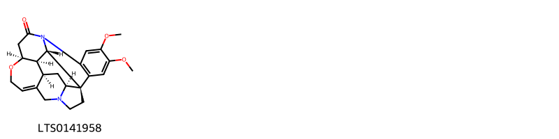{ width=100% }
    <figcaption>Hình ảnh cấu trúc hóa học của 1 hoạt chất thuộc nhóm Strychnos alkaloids gồm ['brucine (LTS0141958)'].</figcaption>
</figure>

---

### Dược dân tộc học

Danh sách các quốc gia có sử dụng *Brucea javanica* trong điều trị các bệnh. 

| Country   | Disease                                                                  | Bệnh                                                                                                                                                                                                |
|:----------|:-------------------------------------------------------------------------|:----------------------------------------------------------------------------------------------------------------------------------------------------------------------------------------------------|
| China     | Insecticide, Poison, Poison, Pulicide, Vermifuge, Insecticide, Vermifuge | MYMEMORY WARNING: YOU USED ALL AVAILABLE FREE TRANSLATIONS FOR TODAY. NEXT AVAILABLE IN  07 HOURS 38 MINUTES 58 SECONDS VISIT HTTPS://MYMEMORY.TRANSLATED.NET/DOC/USAGELIMITS.PHP TO TRANSLATE MORE |
| Chinese   | Vermifuge                                                                | MYMEMORY WARNING: YOU USED ALL AVAILABLE FREE TRANSLATIONS FOR TODAY. NEXT AVAILABLE IN  07 HOURS 38 MINUTES 56 SECONDS VISIT HTTPS://MYMEMORY.TRANSLATED.NET/DOC/USAGELIMITS.PHP TO TRANSLATE MORE |
| Elsewhere | Anticoagulant, Emetic, Nematicide, Cathartic                             | MYMEMORY WARNING: YOU USED ALL AVAILABLE FREE TRANSLATIONS FOR TODAY. NEXT AVAILABLE IN  07 HOURS 38 MINUTES 53 SECONDS VISIT HTTPS://MYMEMORY.TRANSLATED.NET/DOC/USAGELIMITS.PHP TO TRANSLATE MORE |

---

---
## Brucea sumatrana
### Thông tin về thực vật

!!! info "Phân loại thực vật của *Brucea javanica* từ GIBF:"
    - **Kingdom:** Plantae
    - **Phylum:** Tracheophyta
    - **Order:** Sapindales
    - **Family:** Simaroubaceae
    - **Genus:** Brucea
    - **Species:** *Brucea javanica*

 

| Label (VI)   | Label (EN)   | Scientific Name   | Descriptions (VI)   | Descriptions (EN)   | Also Known As (VI)   | Also Known As (EN)   |
|:-------------|:-------------|:------------------|:--------------------|:--------------------|:---------------------|:---------------------|
| N/A          | N/A          | Brucea sumatrana  |                     |                     | ['']                 | ['']                 |

#### Phân bố trên thế giới

**Từ CSDL GIBF** nan, Singapore, Congo, Democratic Republic of the, Viet Nam, Indonesia, Philippines, Chinese Taipei, China, Australia, India, unknown or invalid, Brunei Darussalam, France

#### Phân bố tại Việt Nam

**Từ CSDL GIBF**: Cochinchina

---
### Thành phần hóa học
        
- Theo cơ sở dữ liệu lotus: Từ loài *Brucea javanica* đã phân lập và xác định được Chưa có hoạt chất nào được phân lập. hoạt chất thuộc về các nhóm Không có hoạt chất nào được phân lập. 

Không có hình ảnh nào được tạo ra

---

### Dược dân tộc học

Danh sách các quốc gia có sử dụng *Brucea javanica* trong điều trị các bệnh. 

| Country   | Disease     | Bệnh                                                                                                                                                                                                |
|:----------|:------------|:----------------------------------------------------------------------------------------------------------------------------------------------------------------------------------------------------|
| Elsewhere | Insecticide | MYMEMORY WARNING: YOU USED ALL AVAILABLE FREE TRANSLATIONS FOR TODAY. NEXT AVAILABLE IN  07 HOURS 37 MINUTES 47 SECONDS VISIT HTTPS://MYMEMORY.TRANSLATED.NET/DOC/USAGELIMITS.PHP TO TRANSLATE MORE |
| US        | Stomachic   | MYMEMORY WARNING: YOU USED ALL AVAILABLE FREE TRANSLATIONS FOR TODAY. NEXT AVAILABLE IN  07 HOURS 37 MINUTES 39 SECONDS VISIT HTTPS://MYMEMORY.TRANSLATED.NET/DOC/USAGELIMITS.PHP TO TRANSLATE MORE |

---

# Chi Simaba

??? note "Danh sách các dược liệu thuộc chi"
    
	 - *Simaba cedron*
	 - *Simaba ferruginea*
	 - *Simaba glandsulifera*

---
## Simaba cedron
### Thông tin về thực vật

!!! info "Phân loại thực vật của *Homalolepis cedron* từ GIBF:"
    - **Kingdom:** Plantae
    - **Phylum:** Tracheophyta
    - **Order:** Sapindales
    - **Family:** Simaroubaceae
    - **Genus:** Homalolepis
    - **Species:** *Homalolepis cedron*

 

| Label (VI)   | Label (EN)   | Scientific Name   | Descriptions (VI)   | Descriptions (EN)   | Also Known As (VI)   | Also Known As (EN)   |
|:-------------|:-------------|:------------------|:--------------------|:--------------------|:---------------------|:---------------------|
| N/A          | N/A          | Simaba cedron     | loài thực vật       | species of plant    | ['']                 | ['']                 |

#### Phân bố trên thế giới

**Từ CSDL GIBF** Brazil, Bolivia (Plurinational State of), Costa Rica, Suriname, Colombia, French Guiana, Panama, Guyana, Venezuela (Bolivarian Republic of)

#### Phân bố tại Việt Nam

**Từ CSDL GIBF**: Không có ghi nhận ở Việt Nam

---
### Thành phần hóa học
        
- Theo cơ sở dữ liệu lotus: Từ loài *Homalolepis cedron* đã phân lập và xác định được 33 hoạt chất thuộc về các nhóm Prenol lipids, Lactones, Furopyrans. 

|    | chemicalTaxonomyClassyfireClass   |   smiles_count |
|---:|:----------------------------------|---------------:|
|  0 | Furopyrans                        |              1 |
|  1 | Lactones                          |              1 |
|  2 | Prenol lipids                     |             31 |

#### Nhóm Furopyrans
<figure markdown="span">
    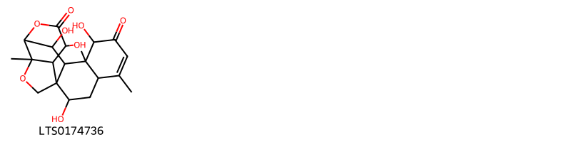{ width=100% }
    <figcaption>Hình ảnh cấu trúc hóa học của 1 hoạt chất thuộc nhóm Furopyrans gồm ['6,10,13,19-tetrahydroxy-4,12,16-trimethyl-3,8-dioxapentacyclo[9.8.0.0¹,⁵.0⁴,⁹.0¹²,¹⁷]nonadec-15-ene-7,14-dione (LTS0174736)'].</figcaption>
</figure>
#### Nhóm Lactones
<figure markdown="span">
    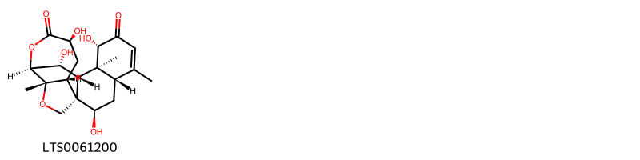{ width=100% }
    <figcaption>Hình ảnh cấu trúc hóa học của 1 hoạt chất thuộc nhóm Lactones gồm ['(1r,4s,5r,7s,10s,11r,12r,13s,14s,18s,20r)-7,11,14,20-tetrahydroxy-4,13,17-trimethyl-3,9-dioxapentacyclo[10.8.0.0¹,⁵.0⁴,¹⁰.0¹³,¹⁸]icos-16-ene-8,15-dione (LTS0061200)'].</figcaption>
</figure>
#### Nhóm Prenol lipids
<figure markdown="span">
    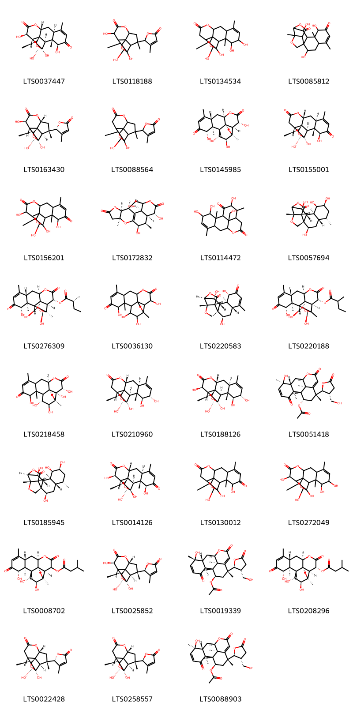{ width=100% }
    <figcaption>Hình ảnh cấu trúc hóa học của 31 hoạt chất thuộc nhóm Prenol lipids gồm ['glaucarubolone (LTS0037447)', '8,11,12-trihydroxy-3,10-dimethyl-3-(3-methyl-5-oxo-2h-furan-2-yl)-6,13-dioxatetracyclo[7.5.0.0¹,⁵.0²,¹²]tetradecan-7-one (LTS0118188)', '4,5,16,17-tetrahydroxy-6,14,18-trimethyl-3,10-dioxapentacyclo[9.8.0.0¹,⁷.0⁴,¹⁹.0¹³,¹⁸]nonadec-14-en-9-one (LTS0134534)', '9,12,18-trihydroxy-4,11,15-trimethyl-3,7-dioxapentacyclo[8.8.0.0¹,⁵.0⁴,⁸.0¹¹,¹⁶]octadec-14-ene-6,13-dione (LTS0085812)', '(1s,2r,3s,5r,8r,9s,10r,11r,12r)-8,11,12-trihydroxy-3,10-dimethyl-3-[(2r)-3-methyl-5-oxo-2h-furan-2-yl]-6,13-dioxatetracyclo[7.5.0.0¹,⁵.0²,¹²]tetradecan-7-one (LTS0163430)', '11,12-dihydroxy-3,10-dimethyl-3-(3-methyl-5-oxo-2h-furan-2-yl)-6,13-dioxatetracyclo[7.5.0.0¹,⁵.0²,¹²]tetradecan-7-one (LTS0088564)', 'samaderine z (LTS0145985)', 'chaparrinone (LTS0155001)', '4,5,8,17-tetrahydroxy-6,14,18-trimethyl-3,10-dioxapentacyclo[9.8.0.0¹,⁷.0⁴,¹⁹.0¹³,¹⁸]nonadec-14-ene-9,16-dione (LTS0156201)', '(1s,2s,6s,9r,10r,11s,12r,15r,16s)-9,12-dihydroxy-16-(hydroxymethyl)-1,6,10-trimethyl-3,7,14-trioxapentacyclo[13.2.1.0²,⁶.0⁸,¹⁷.0¹¹,¹⁶]octadec-8(17)-ene-4,13-dione (LTS0172832)', '3,4,15-trihydroxy-17-(hydroxymethyl)-2,6,14-trimethyl-10-oxatetracyclo[7.7.1.0²,⁷.0¹³,¹⁷]heptadec-5-ene-11,16-dione (LTS0114472)', '(1s,4s,5r,9s,10r,11s,12r,13s,15s,16s,18r)-9,12,13,18-tetrahydroxy-4,11,15-trimethyl-3,7-dioxapentacyclo[8.8.0.0¹,⁵.0⁴,⁸.0¹¹,¹⁶]octadecan-6-one (LTS0057694)', 'simalikalactone d (LTS0276309)', '3,12,15,16-tetrahydroxy-9,13,17-trimethyl-5,18-dioxapentacyclo[12.5.0.0¹,⁶.0²,¹⁷.0⁸,¹³]nonadec-9-ene-4,11-dione (LTS0036130)', '(1r,4s,5r,8s,9r,10r,11s,12s,16s,18r)-9,12,18-trihydroxy-4,11,15-trimethyl-3,7-dioxapentacyclo[8.8.0.0¹,⁵.0⁴,⁸.0¹¹,¹⁶]octadec-14-ene-6,13-dione (LTS0220583)', '(1r,2s,3r,6r,8s,12s,13s,14r,15r,16s)-12,15,16-trihydroxy-9,13,17-trimethyl-4,11-dioxo-5,18-dioxapentacyclo[12.5.0.0¹,⁶.0²,¹⁷.0⁸,¹³]nonadec-9-en-3-yl 2-methylbutanoate (LTS0220188)', '(1r,2r,3r,6r,15r,17r)-2,3,12,15,16-pentahydroxy-9,13,17-trimethyl-5,18-dioxapentacyclo[12.5.0.0¹,⁶.0²,¹⁷.0⁸,¹³]nonadec-9-ene-4,11-dione (LTS0218458)', 'chaparrin (LTS0210960)', '(1s,4r,5r,6r,7s,8r,11r,13s,16s,17s,18s,19r)-4,5,8,16,17-pentahydroxy-6,14,18-trimethyl-3,10-dioxapentacyclo[9.8.0.0¹,⁷.0⁴,¹⁹.0¹³,¹⁸]nonadec-14-en-9-one (LTS0188126)', '(1s,2r,6r,7r,9r,14r,16s,17r)-6-hydroxy-14-[(2s,3r)-3-(hydroxymethyl)-5-oxooxolan-2-yl]-2,6,14,17-tetramethyl-3,11-dioxo-10-oxatetracyclo[7.7.1.0²,⁷.0¹³,¹⁷]heptadeca-4,12-dien-16-yl acetate (LTS0051418)', '(1s,4s,5r,8s,9s,10r,11s,12r,13s,15s,16s,18r)-9,12,13,18-tetrahydroxy-4,11,15-trimethyl-3,7-dioxapentacyclo[8.8.0.0¹,⁵.0⁴,⁸.0¹¹,¹⁶]octadecan-6-one (LTS0185945)', '(1s,4s,5r,6r,7s,8r,11r,13s,17s,18s,19r)-4,5,8,17-tetrahydroxy-6,14,18-trimethyl-3,10-dioxapentacyclo[9.8.0.0¹,⁷.0⁴,¹⁹.0¹³,¹⁸]nonadec-14-ene-9,16-dione (LTS0014126)', '4,5,17-trihydroxy-6,14,18-trimethyl-3,10-dioxapentacyclo[9.8.0.0¹,⁷.0⁴,¹⁹.0¹³,¹⁸]nonadec-14-ene-9,16-dione (LTS0130012)', '4,5,8,16,17-pentahydroxy-6,14,18-trimethyl-3,10-dioxapentacyclo[9.8.0.0¹,⁷.0⁴,¹⁹.0¹³,¹⁸]nonadec-14-en-9-one (LTS0272049)', '(1r,2s,6r,8s,12s,13s,14r,15r,16s,17s)-12,15,16-trihydroxy-9,13,17-trimethyl-4,11-dioxo-5,18-dioxapentacyclo[12.5.0.0¹,⁶.0²,¹⁷.0⁸,¹³]nonadec-9-en-3-yl 3-methylbutanoate (LTS0008702)', '(1s,2r,3s,5r,8r,9s,10r,11r,12r)-8,11,12-trihydroxy-3,10-dimethyl-3-[(2s)-3-methyl-5-oxo-2h-furan-2-yl]-6,13-dioxatetracyclo[7.5.0.0¹,⁵.0²,¹²]tetradecan-7-one (LTS0025852)', '(1s,2r,6s,7r,9r,14r,16r,17r)-6-hydroxy-14-[(2s,3r)-3-(hydroxymethyl)-5-oxooxolan-2-yl]-2,6,14,17-tetramethyl-3,11-dioxo-10-oxatetracyclo[7.7.1.0²,⁷.0¹³,¹⁷]heptadeca-4,12-dien-16-yl acetate (LTS0019339)', '(1r,2s,3r,6r,8s,12s,13s,14r,15r,16s,17s)-12,15,16-trihydroxy-9,13,17-trimethyl-4,11-dioxo-5,18-dioxapentacyclo[12.5.0.0¹,⁶.0²,¹⁷.0⁸,¹³]nonadec-9-en-3-yl 3-methylbutanoate (LTS0208296)', '(1s,2r,3s,5r,9s,10r,11r,12r)-11,12-dihydroxy-3,10-dimethyl-3-[(2r)-3-methyl-5-oxo-2h-furan-2-yl]-6,13-dioxatetracyclo[7.5.0.0¹,⁵.0²,¹²]tetradecan-7-one (LTS0022428)', '(1s,2r,3s,5r,9s,10r,11r,12r)-11,12-dihydroxy-3,10-dimethyl-3-[(2s)-3-methyl-5-oxo-2h-furan-2-yl]-6,13-dioxatetracyclo[7.5.0.0¹,⁵.0²,¹²]tetradecan-7-one (LTS0258557)', '(1s,2r,6r,7r,9r,14r,16r,17r)-6-hydroxy-14-[(2s,3r)-3-(hydroxymethyl)-5-oxooxolan-2-yl]-2,6,14,17-tetramethyl-3,11-dioxo-10-oxatetracyclo[7.7.1.0²,⁷.0¹³,¹⁷]heptadeca-4,12-dien-16-yl acetate (LTS0088903)'].</figcaption>
</figure>

---

### Dược dân tộc học

Danh sách các quốc gia có sử dụng *Homalolepis cedron* trong điều trị các bệnh. 

| Country       | Disease                          | Bệnh                                                                                                                                                                                                |
|:--------------|:---------------------------------|:----------------------------------------------------------------------------------------------------------------------------------------------------------------------------------------------------|
| Latin America | Sedative, Tonic, Sedative, Tonic | MYMEMORY WARNING: YOU USED ALL AVAILABLE FREE TRANSLATIONS FOR TODAY. NEXT AVAILABLE IN  07 HOURS 36 MINUTES 49 SECONDS VISIT HTTPS://MYMEMORY.TRANSLATED.NET/DOC/USAGELIMITS.PHP TO TRANSLATE MORE |

---

---
## Simaba ferruginea
### Thông tin về thực vật

!!! info "Phân loại thực vật của *Homalolepis ferruginea* từ GIBF:"
    - **Kingdom:** Plantae
    - **Phylum:** Tracheophyta
    - **Order:** Sapindales
    - **Family:** Simaroubaceae
    - **Genus:** Homalolepis
    - **Species:** *Homalolepis ferruginea*

 

| Label (VI)   | Label (EN)   | Scientific Name   | Descriptions (VI)   | Descriptions (EN)   | Also Known As (VI)   | Also Known As (EN)   |
|:-------------|:-------------|:------------------|:--------------------|:--------------------|:---------------------|:---------------------|
| N/A          | N/A          | Simaba ferruginea | loài thực vật       | species of plant    | ['']                 | ['']                 |

#### Phân bố trên thế giới

**Từ CSDL GIBF** Colombia, nan, Brazil, Venezuela (Bolivarian Republic of)

#### Phân bố tại Việt Nam

**Từ CSDL GIBF**: Không có ghi nhận ở Việt Nam

---
### Thành phần hóa học
        
- Theo cơ sở dữ liệu lotus: Từ loài *Homalolepis ferruginea* đã phân lập và xác định được 1 hoạt chất thuộc về các nhóm Indolonaphthyridine alkaloids. 

|    | chemicalTaxonomyClassyfireClass   |   smiles_count |
|---:|:----------------------------------|---------------:|
|  0 | Indolonaphthyridine alkaloids     |              1 |

#### Nhóm Indolonaphthyridine alkaloids
<figure markdown="span">
    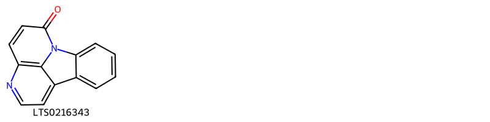{ width=100% }
    <figcaption>Hình ảnh cấu trúc hóa học của 1 hoạt chất thuộc nhóm Indolonaphthyridine alkaloids gồm ['canthin-6-one (LTS0216343)'].</figcaption>
</figure>

---

### Dược dân tộc học

Danh sách các quốc gia có sử dụng *Homalolepis ferruginea* trong điều trị các bệnh. 

| Country   | Disease   | Bệnh                                                                                                                                                                                                |
|:----------|:----------|:----------------------------------------------------------------------------------------------------------------------------------------------------------------------------------------------------|
| Venezuela | Tonic     | MYMEMORY WARNING: YOU USED ALL AVAILABLE FREE TRANSLATIONS FOR TODAY. NEXT AVAILABLE IN  07 HOURS 36 MINUTES 04 SECONDS VISIT HTTPS://MYMEMORY.TRANSLATED.NET/DOC/USAGELIMITS.PHP TO TRANSLATE MORE |

---

---
## Simaba glandsulifera
### Thông tin về thực vật

!!! info "Phân loại thực vật của *Homalolepis insignis* từ GIBF:"
    - **Kingdom:** Plantae
    - **Phylum:** Tracheophyta
    - **Order:** Sapindales
    - **Family:** Simaroubaceae
    - **Genus:** Homalolepis
    - **Species:** *Homalolepis insignis*

 

| Label (VI)   | Label (EN)   | Scientific Name   | Descriptions (VI)   | Descriptions (EN)   | Also Known As (VI)   | Also Known As (EN)   |
|:-------------|:-------------|:------------------|:--------------------|:--------------------|:---------------------|:---------------------|
| N/A          | N/A          | Simaba ferruginea | loài thực vật       | species of plant    | ['']                 | ['']                 |

#### Phân bố trên thế giới

**Từ CSDL GIBF** nan, Brazil

#### Phân bố tại Việt Nam

**Từ CSDL GIBF**: Không có ghi nhận ở Việt Nam

---
### Thành phần hóa học
        
- Theo cơ sở dữ liệu lotus: Từ loài *Homalolepis insignis* đã phân lập và xác định được Chưa có hoạt chất nào được phân lập. hoạt chất thuộc về các nhóm Không có hoạt chất nào được phân lập. 

Không có hình ảnh nào được tạo ra

---

### Dược dân tộc học

Danh sách các quốc gia có sử dụng *Homalolepis insignis* trong điều trị các bệnh. 

| Country   | Disease          | Bệnh                                                                                                                                                                                                |
|:----------|:-----------------|:----------------------------------------------------------------------------------------------------------------------------------------------------------------------------------------------------|
| Brazil    | Tonic, Vermifuge | MYMEMORY WARNING: YOU USED ALL AVAILABLE FREE TRANSLATIONS FOR TODAY. NEXT AVAILABLE IN  07 HOURS 35 MINUTES 21 SECONDS VISIT HTTPS://MYMEMORY.TRANSLATED.NET/DOC/USAGELIMITS.PHP TO TRANSLATE MORE |

---

# Chi Simarouba

??? note "Danh sách các dược liệu thuộc chi"
    
	 - *Simarouba glauca*

---
## Simarouba glauca
### Thông tin về thực vật

!!! info "Phân loại thực vật của *Simarouba glauca* từ GIBF:"
    - **Kingdom:** Plantae
    - **Phylum:** Tracheophyta
    - **Order:** Sapindales
    - **Family:** Simaroubaceae
    - **Genus:** Simarouba
    - **Species:** *Simarouba glauca*

 

| Label (VI)   | Label (EN)   | Scientific Name   | Descriptions (VI)   | Descriptions (EN)                        | Also Known As (VI)   | Also Known As (EN)   |
|:-------------|:-------------|:------------------|:--------------------|:-----------------------------------------|:---------------------|:---------------------|
| N/A          | N/A          | Simarouba glauca  |                     | Flowering tree that is native to Florida | ['']                 | ['']                 |

#### Phân bố trên thế giới

**Từ CSDL GIBF** Nicaragua, Mexico, Guatemala, United States of America, El Salvador, Haiti, Dominican Republic, India, Panama

#### Phân bố tại Việt Nam

**Từ CSDL GIBF**: Không có ghi nhận ở Việt Nam

---
### Thành phần hóa học
        
- Theo cơ sở dữ liệu lotus: Từ loài *Simarouba glauca* đã phân lập và xác định được 9 hoạt chất thuộc về các nhóm Prenol lipids, Indolonaphthyridine alkaloids. 

|    | chemicalTaxonomyClassyfireClass   |   smiles_count |
|---:|:----------------------------------|---------------:|
|  0 | Indolonaphthyridine alkaloids     |              1 |
|  1 | Prenol lipids                     |              7 |

#### Nhóm Indolonaphthyridine alkaloids
<figure markdown="span">
    { width=100% }
    <figcaption>Hình ảnh cấu trúc hóa học của 1 hoạt chất thuộc nhóm Indolonaphthyridine alkaloids gồm ['canthin-6-one (LTS0216343)'].</figcaption>
</figure>
#### Nhóm Prenol lipids
<figure markdown="span">
    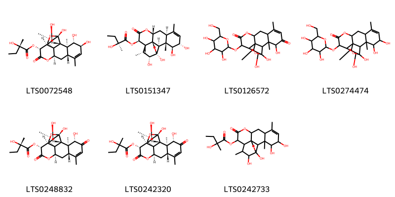{ width=100% }
    <figcaption>Hình ảnh cấu trúc hóa học của 7 hoạt chất thuộc nhóm Prenol lipids gồm ['glaucarubin (LTS0072548)', '(1s,4s,5r,6r,7s,8r,11r,13s,16s,17s,18s,19r)-4,5,16,17-tetrahydroxy-6,14,18-trimethyl-9-oxo-3,10-dioxapentacyclo[9.8.0.0¹,⁷.0⁴,¹⁹.0¹³,¹⁸]nonadec-14-en-8-yl (2s)-2-hydroxy-2-methylbutanoate (LTS0151347)', '4,5,17-trihydroxy-6,14,18-trimethyl-8-{[3,4,5-trihydroxy-6-(hydroxymethyl)oxan-2-yl]oxy}-3,10-dioxapentacyclo[9.8.0.0¹,⁷.0⁴,¹⁹.0¹³,¹⁸]nonadec-14-ene-9,16-dione (LTS0126572)', '4,5,16,17-tetrahydroxy-6,14,18-trimethyl-8-{[3,4,5-trihydroxy-6-(hydroxymethyl)oxan-2-yl]oxy}-3,10-dioxapentacyclo[9.8.0.0¹,⁷.0⁴,¹⁹.0¹³,¹⁸]nonadec-14-en-9-one (LTS0274474)', 'glaucarubinone (LTS0248832)', '(1s,4r,5r,6r,7s,8r,11r,13s,17s,18s,19r)-4,5,17-trihydroxy-6,14,18-trimethyl-9,16-dioxo-3,10-dioxapentacyclo[9.8.0.0¹,⁷.0⁴,¹⁹.0¹³,¹⁸]nonadec-14-en-8-yl 2-hydroxy-2-methylbutanoate (LTS0242320)', 'glaucarubin (LTS0242733)'].</figcaption>
</figure>

---

### Dược dân tộc học

Danh sách các quốc gia có sử dụng *Simarouba glauca* trong điều trị các bệnh. 

| Country   | Disease                                   | Bệnh                                                                                                                                                                                                |
|:----------|:------------------------------------------|:----------------------------------------------------------------------------------------------------------------------------------------------------------------------------------------------------|
| Elsewhere | Soap                                      | MYMEMORY WARNING: YOU USED ALL AVAILABLE FREE TRANSLATIONS FOR TODAY. NEXT AVAILABLE IN  07 HOURS 34 MINUTES 41 SECONDS VISIT HTTPS://MYMEMORY.TRANSLATED.NET/DOC/USAGELIMITS.PHP TO TRANSLATE MORE |
| Haiti     | Emetic, Emmenagogue, Sudorific, Purgative | MYMEMORY WARNING: YOU USED ALL AVAILABLE FREE TRANSLATIONS FOR TODAY. NEXT AVAILABLE IN  07 HOURS 34 MINUTES 33 SECONDS VISIT HTTPS://MYMEMORY.TRANSLATED.NET/DOC/USAGELIMITS.PHP TO TRANSLATE MORE |
| Salvador  | Stomachic, Intoxicant                     | MYMEMORY WARNING: YOU USED ALL AVAILABLE FREE TRANSLATIONS FOR TODAY. NEXT AVAILABLE IN  07 HOURS 34 MINUTES 28 SECONDS VISIT HTTPS://MYMEMORY.TRANSLATED.NET/DOC/USAGELIMITS.PHP TO TRANSLATE MORE |

---

# Chi Ailanthus

??? note "Danh sách các dược liệu thuộc chi"
    
	 - *Ailanthus altissima*
	 - *Ailanthus glandsulosa*
	 - *Ailanthus triphysa*

---
## Ailanthus altissima
### Thông tin về thực vật

!!! info "Phân loại thực vật của *Ailanthus altissima* từ GIBF:"
    - **Kingdom:** Plantae
    - **Phylum:** Tracheophyta
    - **Order:** Sapindales
    - **Family:** Simaroubaceae
    - **Genus:** Ailanthus
    - **Species:** *Ailanthus altissima*

 

| Label (VI)   | Label (EN)   | Scientific Name     | Descriptions (VI)   | Descriptions (EN)   | Also Known As (VI)   | Also Known As (EN)                                                                                                          |
|:-------------|:-------------|:--------------------|:--------------------|:--------------------|:---------------------|:----------------------------------------------------------------------------------------------------------------------------|
| N/A          | N/A          | Ailanthus altissima |                     | species of plant    | ['']                 | ['ailanthus', 'Ailanthus glandulosa Desf.', 'chouchun', 'Toxicodendron altissimum Mill.', 'Tree-of-Heaven', 'Varnish Tree'] |

#### Phân bố trên thế giới

**Từ CSDL GIBF** China, Israel, Chile, New Zealand, Türkiye, Spain, Netherlands, United States of America, Romania, Greece, Russian Federation, Croatia, Argentina, Palestine, State of, Canada, Germany, Austria, Hungary, Portugal, Ukraine, South Africa, Australia, Slovakia, Italy, Switzerland, Bulgaria, France

#### Phân bố tại Việt Nam

**Từ CSDL GIBF**: Không có ghi nhận ở Việt Nam

---
### Thành phần hóa học
        
- Theo cơ sở dữ liệu lotus: Từ loài *Ailanthus altissima* đã phân lập và xác định được 186 hoạt chất thuộc về các nhóm Fatty Acyls, Benzene and substituted derivatives, Flavonoids, Saccharolipids, Cinnamic acids and derivatives, Steroids and steroid derivatives, Coumarins and derivatives, Phenols, Naphthopyrans, Aryltetralin lignans, Indolonaphthyridine alkaloids, Phenylpropanoic acids, Organooxygen compounds, Furanoid lignans, Prenol lipids, Harmala alkaloids, Indoles and derivatives. 

|    | chemicalTaxonomyClassyfireClass     |   smiles_count |
|---:|:------------------------------------|---------------:|
|  0 | Aryltetralin lignans                |              2 |
|  1 | Benzene and substituted derivatives |              4 |
|  2 | Cinnamic acids and derivatives      |              2 |
|  3 | Coumarins and derivatives           |              9 |
|  4 | Fatty Acyls                         |              4 |
|  5 | Flavonoids                          |              9 |
|  6 | Furanoid lignans                    |              2 |
|  7 | Harmala alkaloids                   |             12 |
|  8 | Indoles and derivatives             |              1 |
|  9 | Indolonaphthyridine alkaloids       |              7 |
| 10 | Naphthopyrans                       |              5 |
| 11 | Organooxygen compounds              |              4 |
| 12 | Phenols                             |              3 |
| 13 | Phenylpropanoic acids               |              1 |
| 14 | Prenol lipids                       |            104 |
| 15 | Saccharolipids                      |              2 |
| 16 | Steroids and steroid derivatives    |             14 |

#### Nhóm Aryltetralin lignans
<figure markdown="span">
    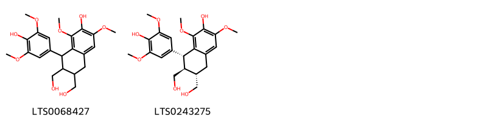{ width=100% }
    <figcaption>Hình ảnh cấu trúc hóa học của 2 hoạt chất thuộc nhóm Aryltetralin lignans gồm ['8-(4-hydroxy-3,5-dimethoxyphenyl)-6,7-bis(hydroxymethyl)-1,3-dimethoxy-5,6,7,8-tetrahydronaphthalen-2-ol (LTS0068427)', '(6s,7s,8r)-8-(4-hydroxy-3,5-dimethoxyphenyl)-6,7-bis(hydroxymethyl)-1,3-dimethoxy-5,6,7,8-tetrahydronaphthalen-2-ol (LTS0243275)'].</figcaption>
</figure>
#### Nhóm Benzene and substituted derivatives
<figure markdown="span">
    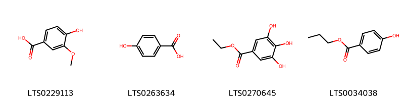{ width=100% }
    <figcaption>Hình ảnh cấu trúc hóa học của 4 hoạt chất thuộc nhóm Benzene and substituted derivatives gồm ['vanillic acid (LTS0229113)', 'p-hydroxybenzoic acid (LTS0263634)', 'ethyl gallate (LTS0270645)', 'propylparaben (LTS0034038)'].</figcaption>
</figure>
#### Nhóm Cinnamic acids and derivatives
<figure markdown="span">
    { width=100% }
    <figcaption>Hình ảnh cấu trúc hóa học của 2 hoạt chất thuộc nhóm Cinnamic acids and derivatives gồm ['ferulic acid (LTS0077328)', 'para-coumaric acid (LTS0266252)'].</figcaption>
</figure>
#### Nhóm Coumarins and derivatives
<figure markdown="span">
    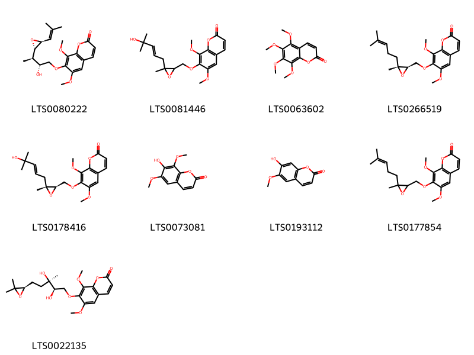{ width=100% }
    <figcaption>Hình ảnh cấu trúc hóa học của 9 hoạt chất thuộc nhóm Coumarins and derivatives gồm ['7-[(2r,3r)-2-hydroxy-3-[(2s,3s)-3-(2-methylprop-1-en-1-yl)oxiran-2-yl]butoxy]-6,8-dimethoxychromen-2-one (LTS0080222)', '7-{[3-(4-hydroxy-4-methylpent-2-en-1-yl)-3-methyloxiran-2-yl]methoxy}-6,8-dimethoxychromen-2-one (LTS0081446)', '5,6,7,8-tetramethoxychromen-2-one (LTS0063602)', '6,8-dimethoxy-7-{[(2r,3r)-3-methyl-3-(4-methylpent-3-en-1-yl)oxiran-2-yl]methoxy}chromen-2-one (LTS0266519)', '7-{[(2r,3r)-3-[(2e)-4-hydroxy-4-methylpent-2-en-1-yl]-3-methyloxiran-2-yl]methoxy}-6,8-dimethoxychromen-2-one (LTS0178416)', 'isofraxidin (LTS0073081)', 'scopoletin (LTS0193112)', '6,8-dimethoxy-7-{[3-methyl-3-(4-methylpent-3-en-1-yl)oxiran-2-yl]methoxy}chromen-2-one (LTS0177854)', '7-{[(2r,3r)-5-[(2r)-3,3-dimethyloxiran-2-yl]-2,3-dihydroxy-3-methylpentyl]oxy}-6,8-dimethoxychromen-2-one (LTS0022135)'].</figcaption>
</figure>
#### Nhóm Fatty Acyls
<figure markdown="span">
    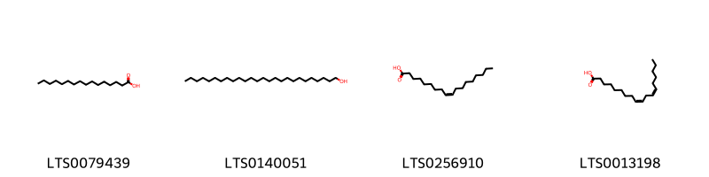{ width=100% }
    <figcaption>Hình ảnh cấu trúc hóa học của 4 hoạt chất thuộc nhóm Fatty Acyls gồm ['palmitic acid (LTS0079439)', 'ceryl alcohol (LTS0140051)', 'oleic acid (LTS0256910)', 'linoleic (LTS0013198)'].</figcaption>
</figure>
#### Nhóm Flavonoids
<figure markdown="span">
    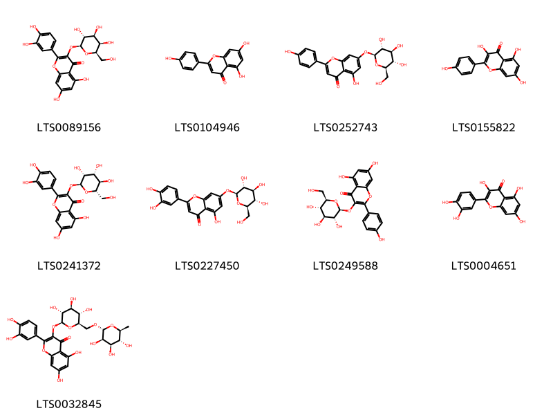{ width=100% }
    <figcaption>Hình ảnh cấu trúc hóa học của 9 hoạt chất thuộc nhóm Flavonoids gồm ['hyperoside (LTS0089156)', 'chamomile (LTS0104946)', 'apigenin 7-o-β-glucoside (LTS0252743)', 'kaempherol (LTS0155822)', '2-(3,4-dihydroxyphenyl)-5,7-dihydroxy-3-{[(2s,3r,4r,5r,6s)-3,4,5-trihydroxy-6-(hydroxymethyl)oxan-2-yl]oxy}chromen-4-one (LTS0241372)', 'luteolin 7-o-glucoside (LTS0227450)', 'astragalin (LTS0249588)', 'quercetin (LTS0004651)', '3-rutinosyl quercetin (LTS0032845)'].</figcaption>
</figure>
#### Nhóm Furanoid lignans
<figure markdown="span">
    { width=100% }
    <figcaption>Hình ảnh cấu trúc hóa học của 2 hoạt chất thuộc nhóm Furanoid lignans gồm ['syringaresinol (LTS0116280)', '(+)-syringaresinol (LTS0158868)'].</figcaption>
</figure>
#### Nhóm Harmala alkaloids
<figure markdown="span">
    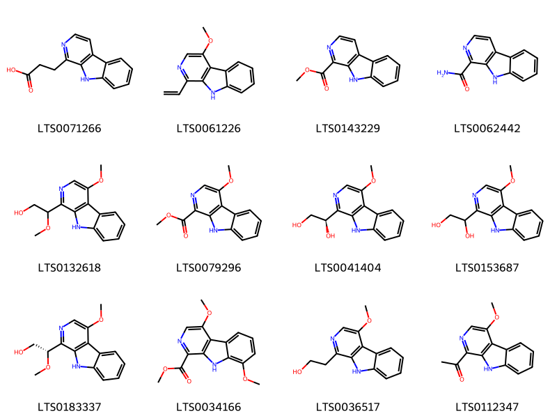{ width=100% }
    <figcaption>Hình ảnh cấu trúc hóa học của 12 hoạt chất thuộc nhóm Harmala alkaloids gồm ['3-{9h-pyrido[3,4-b]indol-1-yl}propanoic acid (LTS0071266)', '1-ethenyl-4-methoxy-9h-pyrido[3,4-b]indole (LTS0061226)', 'methyl 9h-pyrido[3,4-b]indole-1-carboxylate (LTS0143229)', '9h-pyrido[3,4-b]indole-1-carboxamide (LTS0062442)', '2-methoxy-2-{4-methoxy-9h-pyrido[3,4-b]indol-1-yl}ethanol (LTS0132618)', 'methyl 4-methoxy-9h-pyrido[3,4-b]indole-1-carboxylate (LTS0079296)', '(1r)-1-{4-methoxy-9h-pyrido[3,4-b]indol-1-yl}ethane-1,2-diol (LTS0041404)', '1-{4-methoxy-9h-pyrido[3,4-b]indol-1-yl}ethane-1,2-diol (LTS0153687)', '(2s)-2-methoxy-2-{4-methoxy-9h-pyrido[3,4-b]indol-1-yl}ethanol (LTS0183337)', 'methyl 4,8-dimethoxy-9h-pyrido[3,4-b]indole-1-carboxylate (LTS0034166)', '2-{4-methoxy-9h-pyrido[3,4-b]indol-1-yl}ethanol (LTS0036517)', '1-{4-methoxy-9h-pyrido[3,4-b]indol-1-yl}ethanone (LTS0112347)'].</figcaption>
</figure>
#### Nhóm Indoles and derivatives
<figure markdown="span">
    { width=100% }
    <figcaption>Hình ảnh cấu trúc hóa học của 1 hoạt chất thuộc nhóm Indoles and derivatives gồm ['β-carboline (LTS0263207)'].</figcaption>
</figure>
#### Nhóm Indolonaphthyridine alkaloids
<figure markdown="span">
    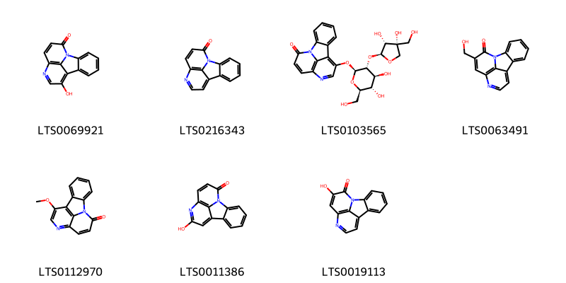{ width=100% }
    <figcaption>Hình ảnh cấu trúc hóa học của 7 hoạt chất thuộc nhóm Indolonaphthyridine alkaloids gồm ['8-hydroxy-1,6-diazatetracyclo[7.6.1.0⁵,¹⁶.0¹⁰,¹⁵]hexadeca-3,5,7,9(16),10(15),11,13-heptaen-2-one (LTS0069921)', 'canthin-6-one (LTS0216343)', '8-{[(2s,3r,4s,5s,6r)-3-{[(2s,3r,4r)-3,4-dihydroxy-4-(hydroxymethyl)oxolan-2-yl]oxy}-4,5-dihydroxy-6-(hydroxymethyl)oxan-2-yl]oxy}-1,6-diazatetracyclo[7.6.1.0⁵,¹⁶.0¹⁰,¹⁵]hexadeca-3,5,7,9(16),10(15),11,13-heptaen-2-one (LTS0103565)', '3-(hydroxymethyl)-1,6-diazatetracyclo[7.6.1.0⁵,¹⁶.0¹⁰,¹⁵]hexadeca-3,5,7,9(16),10(15),11,13-heptaen-2-one (LTS0063491)', '1-methoxycanthinone (LTS0112970)', '7-hydroxy-1,6-diazatetracyclo[7.6.1.0⁵,¹⁶.0¹⁰,¹⁵]hexadeca-3,5,7,9(16),10(15),11,13-heptaen-2-one (LTS0011386)', '3-hydroxy-1,6-diazatetracyclo[7.6.1.0⁵,¹⁶.0¹⁰,¹⁵]hexadeca-3,5,7,9(16),10(15),11,13-heptaen-2-one (LTS0019113)'].</figcaption>
</figure>
#### Nhóm Naphthopyrans
<figure markdown="span">
    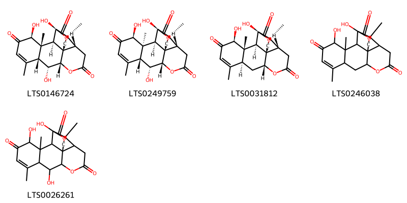{ width=100% }
    <figcaption>Hình ảnh cấu trúc hóa học của 5 hoạt chất thuộc nhóm Naphthopyrans gồm ['(1s,5r,6r,7s,11s,12r,13r,17s,18s,19r)-5,12,17-trihydroxy-6,14,18-trimethyl-3,10-dioxapentacyclo[9.8.0.0¹,⁷.0⁵,¹⁹.0¹³,¹⁸]nonadec-14-ene-4,9,16-trione (LTS0146724)', '(1s,5r,6r,7s,11s,12r,13r,17s,18r,19r)-5,12,17-trihydroxy-6,14,18-trimethyl-3,10-dioxapentacyclo[9.8.0.0¹,⁷.0⁵,¹⁹.0¹³,¹⁸]nonadec-14-ene-4,9,16-trione (LTS0249759)', '(1s,5r,6r,7s,11r,13s,17s,18s,19r)-5,17-dihydroxy-6,14,18-trimethyl-3,10-dioxapentacyclo[9.8.0.0¹,⁷.0⁵,¹⁹.0¹³,¹⁸]nonadec-14-ene-4,9,16-trione (LTS0031812)', '5,17-dihydroxy-6,14,18-trimethyl-3,10-dioxapentacyclo[9.8.0.0¹,⁷.0⁵,¹⁹.0¹³,¹⁸]nonadec-14-ene-4,9,16-trione (LTS0246038)', '5,12,17-trihydroxy-6,14,18-trimethyl-3,10-dioxapentacyclo[9.8.0.0¹,⁷.0⁵,¹⁹.0¹³,¹⁸]nonadec-14-ene-4,9,16-trione (LTS0026261)'].</figcaption>
</figure>
#### Nhóm Organooxygen compounds
<figure markdown="span">
    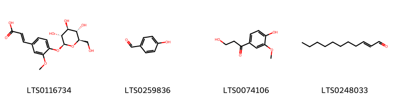{ width=100% }
    <figcaption>Hình ảnh cấu trúc hóa học của 4 hoạt chất thuộc nhóm Organooxygen compounds gồm ['(2e)-3-(3-methoxy-4-{[(2s,3r,4s,5s,6r)-3,4,5-trihydroxy-6-(hydroxymethyl)oxan-2-yl]oxy}phenyl)prop-2-enoic acid (LTS0116734)', 'p-hydroxybenzaldehyde (LTS0259836)', '3-hydroxy-1-(4-hydroxy-3-methoxyphenyl)propan-1-one (LTS0074106)', '(2e)-2-undecenal (LTS0248033)'].</figcaption>
</figure>
#### Nhóm Phenols
<figure markdown="span">
    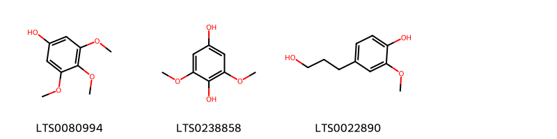{ width=100% }
    <figcaption>Hình ảnh cấu trúc hóa học của 3 hoạt chất thuộc nhóm Phenols gồm ['3,4,5-trimethoxyphenol (LTS0080994)', 'hydroquinone26dimethoxy (LTS0238858)', 'dihydroconiferyl alcohol (LTS0022890)'].</figcaption>
</figure>
#### Nhóm Phenylpropanoic acids
<figure markdown="span">
    { width=100% }
    <figcaption>Hình ảnh cấu trúc hóa học của 1 hoạt chất thuộc nhóm Phenylpropanoic acids gồm ['homovanillinic acid (LTS0187038)'].</figcaption>
</figure>
#### Nhóm Prenol lipids
<figure markdown="span">
    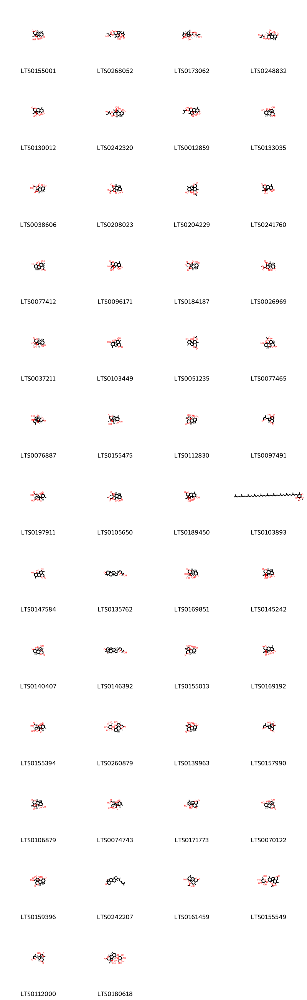{ width=100% }
    <figcaption>Hình ảnh cấu trúc hóa học của 104 hoạt chất thuộc nhóm Prenol lipids gồm ['chaparrinone (LTS0155001)', '11,12-dihydroxy-3,10-dimethyl-3-(3-methyl-5-oxo-2h-furan-2-yl)-7-oxo-6,13-dioxatetracyclo[7.5.0.0¹,⁵.0²,¹²]tetradecan-8-yl 2-hydroxy-2-methylbutanoate (LTS0268052)', '(1s,2r,3s,5r,8r,9s,10r,11r,12r)-11,12-dihydroxy-3,10-dimethyl-3-[(2s)-3-methyl-5-oxo-2h-furan-2-yl]-7-oxo-6,13-dioxatetracyclo[7.5.0.0¹,⁵.0²,¹²]tetradecan-8-yl (2s)-2-hydroxy-2-methylbutanoate (LTS0173062)', 'glaucarubinone (LTS0248832)', '4,5,17-trihydroxy-6,14,18-trimethyl-3,10-dioxapentacyclo[9.8.0.0¹,⁷.0⁴,¹⁹.0¹³,¹⁸]nonadec-14-ene-9,16-dione (LTS0130012)', '(1s,4r,5r,6r,7s,8r,11r,13s,17s,18s,19r)-4,5,17-trihydroxy-6,14,18-trimethyl-9,16-dioxo-3,10-dioxapentacyclo[9.8.0.0¹,⁷.0⁴,¹⁹.0¹³,¹⁸]nonadec-14-en-8-yl 2-hydroxy-2-methylbutanoate (LTS0242320)', '4,5,17-trihydroxy-6,14,18-trimethyl-9,16-dioxo-3,10-dioxapentacyclo[9.8.0.0¹,⁷.0⁴,¹⁹.0¹³,¹⁸]nonadec-14-en-8-yl 2-methylbutanoate (LTS0012859)', '(1s,2s,4s,6r,7s,9r,13s,14r,15s,17s)-4,15-dihydroxy-2,6,14,17-tetramethyl-10-oxatetracyclo[7.7.1.0²,⁷.0¹³,¹⁷]heptadecane-3,11,16-trione (LTS0133035)', '[(1s,5r,6s,7s,11s,13r,16r,17s)-7-hydroxy-6,10,16-trimethyl-4,8,15-trioxo-3,14-dioxatetracyclo[11.4.0.0¹,⁵.0⁶,¹¹]heptadec-9-en-17-yl]acetic acid (LTS0038606)', '[(1s,6s,7s,11r,13r,16s,17s)-7-hydroxy-6,10,16-trimethyl-4,8,15-trioxo-3,14-dioxatetracyclo[11.4.0.0¹,⁵.0⁶,¹¹]heptadec-9-en-17-yl]acetic acid (LTS0208023)', '4,16-dihydroxy-2,6,14,17-tetramethyl-3,11-dioxo-10-oxatetracyclo[7.7.1.0²,⁷.0¹³,¹⁷]heptadecan-15-yl acetate (LTS0204229)', '5,16,17-trihydroxy-14,18-dimethyl-6-methylidene-3,10-dioxapentacyclo[9.8.0.0¹,⁷.0⁴,¹⁹.0¹³,¹⁸]nonadec-14-en-9-one (LTS0241760)', '(1s,2s,4s,6r,7s,9r,13r,17s)-4,15-dihydroxy-2,6,14,17-tetramethyl-10-oxatetracyclo[7.7.1.0²,⁷.0¹³,¹⁷]heptadec-14-ene-3,11,16-trione (LTS0077412)', '5,6,17-trihydroxy-6,14,18-trimethyl-3,10-dioxapentacyclo[9.8.0.0¹,⁷.0⁴,¹⁹.0¹³,¹⁸]nonadec-14-ene-9,16-dione (LTS0096171)', '[(1s,5r,6s,7s,11r,13r,16s,17s)-7-hydroxy-6,10,16-trimethyl-4,8,15-trioxo-3,14-dioxatetracyclo[11.4.0.0¹,⁵.0⁶,¹¹]heptadec-9-en-17-yl]acetic acid (LTS0184187)', 'methyl (2r)-2-[(1s,5r,6s,7s,11s,13r,17r)-7-hydroxy-6,10-dimethyl-4,8,15-trioxo-3,14-dioxatetracyclo[11.4.0.0¹,⁵.0⁶,¹¹]heptadec-9-en-17-yl]propanoate (LTS0026969)', '(1r,4r,5s,6s,7r,11r,13s,17s,18s,19r)-5,6,17-trihydroxy-6,14,18-trimethyl-3,10-dioxapentacyclo[9.8.0.0¹,⁷.0⁴,¹⁹.0¹³,¹⁸]nonadec-14-ene-9,16-dione (LTS0037211)', '4,15-dihydroxy-2,6,14,17-tetramethyl-10-oxatetracyclo[7.7.1.0²,⁷.0¹³,¹⁷]heptadec-14-ene-3,11,16-trione (LTS0103449)', '4-hydroxy-2,6,14,17-tetramethyl-3,11,16-trioxo-10-oxatetracyclo[7.7.1.0²,⁷.0¹³,¹⁷]heptadecan-15-yl acetate (LTS0051235)', '(1s,2s,4s,6r,7s,9r,13s,14r,15r,16s,17s)-4,15-dihydroxy-2,6,14,17-tetramethyl-3,11-dioxo-10-oxatetracyclo[7.7.1.0²,⁷.0¹³,¹⁷]heptadecan-16-yl acetate (LTS0077465)', '(1s,2r,3r,7r,9r,13r,14r,15s,17s)-3,15-dihydroxy-17-(hydroxymethyl)-2,6,14-trimethyl-10-oxahexacyclo[7.7.1.0²,⁷.0³,¹⁵.0⁷,¹⁴.0¹³,¹⁷]heptadec-5-ene-4,11,16-trione (LTS0076887)', '(1s,4r,5r,6r,7s,11r,13s,16s,17s,18s,19r)-5,16,17-trihydroxy-6,14,18-trimethyl-3,10-dioxapentacyclo[9.8.0.0¹,⁷.0⁴,¹⁹.0¹³,¹⁸]nonadec-14-en-9-one (LTS0155475)', '(1s,4r,5s,7s,11r,13s,17s,18s,19s)-4,5,17-trihydroxy-14,18-dimethyl-6-methylidene-3,10-dioxapentacyclo[9.8.0.0¹,⁷.0⁴,¹⁹.0¹³,¹⁸]nonadec-14-ene-9,16-dione (LTS0112830)', '(2s,4r,8s,9r,12s)-11-hydroxy-12-(hydroxymethyl)-2,9-dimethyl-2-[(2s)-3-methyl-5-oxo-2h-furan-2-yl]-5-oxatricyclo[6.3.1.0⁴,¹²]dodec-1(11)-ene-6,10-dione (LTS0097491)', '(2r,3s)-3-[(1r,3s,7s,8r,10r)-10-hydroxy-2,13-dimethyl-4,11-dioxo-5,9-dioxatetracyclo[6.5.1.0²,¹⁰.0³,⁷]tetradec-12-en-7-yl]-2-methylpentanedioic acid (LTS0197911)', 'methyl 2-[(1s,5r,6s,7s,11s,13r,16r,17s)-7-hydroxy-6,10,16-trimethyl-4,8,15-trioxo-3,14-dioxatetracyclo[11.4.0.0¹,⁵.0⁶,¹¹]heptadec-9-en-17-yl]acetate (LTS0105650)', '4,5,16,17-tetrahydroxy-14,18-dimethyl-6-methylidene-3,10-dioxapentacyclo[9.8.0.0¹,⁷.0⁴,¹⁹.0¹³,¹⁸]nonadec-14-en-9-one (LTS0189450)', 'coenzyme q10 (LTS0103893)', '4,15-dihydroxy-2,6,14,17-tetramethyl-10-oxatetracyclo[7.7.1.0²,⁷.0¹³,¹⁷]heptadecane-3,11,16-trione (LTS0147584)', '1-[5-(2-hydroxypropan-2-yl)-2-methyloxolan-2-yl]-3a,3b,6,6,9a-pentamethyl-dodecahydrocyclopenta[a]phenanthren-7-one (LTS0135762)', '(1s,4r,5r,6s,7r,11r,13s,17s,18s,19r)-4,5,6,17-tetrahydroxy-6,14,18-trimethyl-3,10-dioxapentacyclo[9.8.0.0¹,⁷.0⁴,¹⁹.0¹³,¹⁸]nonadec-14-ene-9,16-dione (LTS0169851)', '(1s,4r,7r,11s,13r,18s,19s)-4,5,17-trihydroxy-14,18-dimethyl-6-methylidene-3,10-dioxapentacyclo[9.8.0.0¹,⁷.0⁴,¹⁹.0¹³,¹⁸]nonadec-14-ene-9,16-dione (LTS0145242)', '(1r,2s,3s,6r,7s,9r,13s,14r,15s,17s)-3,15-dihydroxy-2,6,14,17-tetramethyl-10-oxatetracyclo[7.7.1.0²,⁷.0¹³,¹⁷]heptadecane-4,11,16-trione (LTS0140407)', 'ocotillone (LTS0146392)', '(1s,4r,5s,7s,11r,13s,16s,17s,18s,19r)-4,5,16,17-tetrahydroxy-14,18-dimethyl-6-methylidene-3,10-dioxapentacyclo[9.8.0.0¹,⁷.0⁴,¹⁹.0¹³,¹⁸]nonadec-14-en-9-one (LTS0155013)', 'ailanthone (LTS0169192)', '(2r,3s)-3-[(1r,2r,3s,7s,8r,10r)-10-hydroxy-2,13-dimethyl-4,11-dioxo-5,9-dioxatetracyclo[6.5.1.0²,¹⁰.0³,⁷]tetradec-12-en-7-yl]-2-methylpentanedioic acid (LTS0155394)', '(1s,2s,4s,6r,7s,9r,13s,14r,15s,17s)-15-hydroxy-2,6,14,17-tetramethyl-4-{[(2s,3r,4s,5s,6r)-3,4,5-trihydroxy-6-(hydroxymethyl)oxan-2-yl]oxy}-10-oxatetracyclo[7.7.1.0²,⁷.0¹³,¹⁷]heptadecane-3,11,16-trione (LTS0260879)', 'ailanthone (LTS0139963)', '11-hydroxy-12-(hydroxymethyl)-2,9-dimethyl-2-(3-methyl-5-oxo-2h-furan-2-yl)-5-oxatricyclo[6.3.1.0⁴,¹²]dodec-1(11)-ene-6,10-dione (LTS0157990)', '(1s,4r,5r,7s,11r,13s,16s,17s,18s,19r)-5,16,17-trihydroxy-14,18-dimethyl-6-methylidene-3,10-dioxapentacyclo[9.8.0.0¹,⁷.0⁴,¹⁹.0¹³,¹⁸]nonadec-14-en-9-one (LTS0106879)', '(2r,3s)-3-[(1r,2s,3s,7s,8r,10r)-10-hydroxy-2,13-dimethyl-4,11-dioxo-5,9-dioxatetracyclo[6.5.1.0²,¹⁰.0³,⁷]tetradec-12-en-7-yl]-2-methylpentanedioic acid (LTS0074743)', '4,17,18-trihydroxy-7,15,19-trimethyl-3,6,11-trioxahexacyclo[10.8.0.0¹,⁸.0⁴,²⁰.0⁵,⁷.0¹⁴,¹⁹]icos-15-en-10-one (LTS0171773)', 'chaparrolide (LTS0070122)', '(1s,4r,5r,6r,7r,11r,13s,17s,18s,19r)-4,5,6,17-tetrahydroxy-6-(hydroxymethyl)-14,18-dimethyl-3,10-dioxapentacyclo[9.8.0.0¹,⁷.0⁴,¹⁹.0¹³,¹⁸]nonadec-14-ene-9,16-dione (LTS0159396)', 'cornusalterin d (LTS0242207)', '4,15-dihydroxy-2,6,14,17-tetramethyl-3,11-dioxo-10-oxatetracyclo[7.7.1.0²,⁷.0¹³,¹⁷]heptadecan-16-yl acetate (LTS0161459)', '2,6,14,17-tetramethyl-3,11,15-trioxo-4-{[3,4,5-trihydroxy-6-(hydroxymethyl)oxan-2-yl]oxy}-10-oxatetracyclo[7.7.1.0²,⁷.0¹³,¹⁷]heptadecan-16-yl acetate (LTS0155549)', '(2s,4r,12s)-11-hydroxy-12-(hydroxymethyl)-2,9-dimethyl-2-[(2s)-3-methyl-5-oxo-2h-furan-2-yl]-5-oxatricyclo[6.3.1.0⁴,¹²]dodec-1(11)-ene-6,10-dione (LTS0112000)', '(1s,4r,5r,6r,7s,11r,13s,16s,17s,18s,19r)-4,5,17-trihydroxy-6,14,18-trimethyl-16-{[(2r,3r,4s,5s,6r)-3,4,5-trihydroxy-6-(hydroxymethyl)oxan-2-yl]oxy}-3,10-dioxapentacyclo[9.8.0.0¹,⁷.0⁴,¹⁹.0¹³,¹⁸]nonadec-14-en-9-one (LTS0180618)', '3a,6,6,9a,11a-pentamethyl-1-(6-methylhepta-4,6-dien-2-yl)-1h,2h,3h,5h,5ah,8h,9h,9bh,10h,11h-cyclopenta[a]phenanthren-7-one (LTS0126054)', '[(1s,5r,6s,7r,11s,13r,16r,17s)-7-hydroxy-6,10,16-trimethyl-4,8,15-trioxo-3,14-dioxatetracyclo[11.4.0.0¹,⁵.0⁶,¹¹]heptadec-9-en-17-yl]acetic acid (LTS0159374)', '5,16,17-trihydroxy-6,14,18-trimethyl-3,10-dioxapentacyclo[9.8.0.0¹,⁷.0⁴,¹⁹.0¹³,¹⁸]nonadec-14-en-9-one (LTS0073430)', '(1s,3as,5ar,9ar,9br,11as)-1-[(2s,4r)-4-[(2s)-3,3-dimethyloxiran-2-yl]-4-hydroxybutan-2-yl]-3a,6,6,9a,11a-pentamethyl-1h,2h,3h,5h,5ah,8h,9h,9bh,10h,11h-cyclopenta[a]phenanthren-7-one (LTS0248938)', '(1s,2s,4s,6r,7s,9r,13s,14r,15r,16s,17s)-15,16-dihydroxy-2,6,14,17-tetramethyl-4-{[(2s,3r,4s,5s,6r)-3,4,5-trihydroxy-6-(hydroxymethyl)oxan-2-yl]oxy}-10-oxatetracyclo[7.7.1.0²,⁷.0¹³,¹⁷]heptadecane-3,11-dione (LTS0273229)', '4,16-dihydroxy-2,6,14,17-tetramethyl-10-oxatetracyclo[7.7.1.0²,⁷.0¹³,¹⁷]heptadecane-3,11,15-trione (LTS0263259)', '[(1s,5r,6s,7s,11r,13r,16r,17s)-7-hydroxy-6,10,16-trimethyl-4,8,15-trioxo-3,14-dioxatetracyclo[11.4.0.0¹,⁵.0⁶,¹¹]heptadec-9-en-17-yl]acetic acid (LTS0195720)', '(1s,4r,5r,6r,7s,11r,13s,14r,16s,17s,18s,19r)-4,5,16,17-tetrahydroxy-6,14,18-trimethyl-3,10-dioxapentacyclo[9.8.0.0¹,⁷.0⁴,¹⁹.0¹³,¹⁸]nonadecan-9-one (LTS0272161)', '(2s,4s,8s,9r,12s)-11-hydroxy-12-(hydroxymethyl)-2,9-dimethyl-2-[(2s)-3-methyl-5-oxo-2h-furan-2-yl]-5-oxatricyclo[6.3.1.0⁴,¹²]dodec-1(11)-ene-6,10-dione (LTS0062043)', '15-hydroxy-2,6,14,17-tetramethyl-4-{[3,4,5-trihydroxy-6-(hydroxymethyl)oxan-2-yl]oxy}-10-oxatetracyclo[7.7.1.0²,⁷.0¹³,¹⁷]heptadecane-3,11,16-trione (LTS0214915)', '(1s,2s,4s,6r,7s,9r,13s,14r,16s,17s)-16-hydroxy-2,6,14,17-tetramethyl-4-{[(2s,3r,4s,5s,6r)-3,4,5-trihydroxy-6-(hydroxymethyl)oxan-2-yl]oxy}-10-oxatetracyclo[7.7.1.0²,⁷.0¹³,¹⁷]heptadecane-3,11,15-trione (LTS0220987)', '[(1s,6s,7s,11s,13r,16r,17s)-7-hydroxy-6,10,16-trimethyl-4,8,15-trioxo-3,14-dioxatetracyclo[11.4.0.0¹,⁵.0⁶,¹¹]heptadec-9-en-17-yl]acetic acid (LTS0273979)', '(1s,4r,5r,7s,11s,12r,13s,17s,18s,19r)-4,5,12,17-tetrahydroxy-14,18-dimethyl-6-methylidene-3,10-dioxapentacyclo[9.8.0.0¹,⁷.0⁴,¹⁹.0¹³,¹⁸]nonadec-14-ene-9,16-dione (LTS0215936)', '5,17-dihydroxy-14,18-dimethyl-6-methylidene-3,10-dioxapentacyclo[9.8.0.0¹,⁷.0⁴,¹⁹.0¹³,¹⁸]nonadec-14-ene-9,16-dione (LTS0103547)', '4,5,16,17-tetrahydroxy-6,14,18-trimethyl-3,10-dioxapentacyclo[9.8.0.0¹,⁷.0⁴,¹⁹.0¹³,¹⁸]nonadecan-9-one (LTS0212172)', '{7-hydroxy-6,10,16-trimethyl-4,8,15-trioxo-3,14-dioxatetracyclo[11.4.0.0¹,⁵.0⁶,¹¹]heptadec-9-en-17-yl}acetic acid (LTS0264254)', '15,16-dihydroxy-2,6,14,17-tetramethyl-4-{[3,4,5-trihydroxy-6-(hydroxymethyl)oxan-2-yl]oxy}-10-oxatetracyclo[7.7.1.0²,⁷.0¹³,¹⁷]heptadecane-3,11-dione (LTS0212673)', '4-hydroxy-2,6,14,17-tetramethyl-3,11,15-trioxo-10-oxatetracyclo[7.7.1.0²,⁷.0¹³,¹⁷]heptadecan-16-yl acetate (LTS0217216)', '(1r,2r,3r,7s,9r,13r,14s,15r,17s)-3,15-dihydroxy-17-(hydroxymethyl)-2,6,14-trimethyl-10-oxahexacyclo[7.7.1.0²,⁷.0³,¹⁵.0⁷,¹⁴.0¹³,¹⁷]heptadec-5-ene-4,11,16-trione (LTS0023671)', '(1s,4r,5r,6r,7s,8r,11r,13s,17s,18s,19r)-5,17-dihydroxy-6,14,18-trimethyl-9,16-dioxo-3,10-dioxapentacyclo[9.8.0.0¹,⁷.0⁴,¹⁹.0¹³,¹⁸]nonadec-14-en-8-yl (2r)-2-methylbutanoate (LTS0235373)', '3,15,16-trihydroxy-17-(hydroxymethyl)-2,6,14-trimethyl-10-oxatetracyclo[7.7.1.0²,⁷.0¹³,¹⁷]heptadec-5-ene-4,11-dione (LTS0232762)', '(1s,2s,4s,6r,7s,9r,13s,14r,16s,17s)-2,6,14,17-tetramethyl-3,11,15-trioxo-4-{[(2s,3r,4s,5s,6r)-3,4,5-trihydroxy-6-(hydroxymethyl)oxan-2-yl]oxy}-10-oxatetracyclo[7.7.1.0²,⁷.0¹³,¹⁷]heptadecan-16-yl acetate (LTS0041658)', '(1s,4r,5r,7r,8r,12r,14s,17s,18s,19s,20r)-4,17,18-trihydroxy-7,15,19-trimethyl-3,6,11-trioxahexacyclo[10.8.0.0¹,⁸.0⁴,²⁰.0⁵,⁷.0¹⁴,¹⁹]icos-15-en-10-one (LTS0238478)', 'methyl (2r)-2-[(1s,5r,6s,7s,11s,13r,17s)-7-hydroxy-6,10-dimethyl-4,8,15-trioxo-3,14-dioxatetracyclo[11.4.0.0¹,⁵.0⁶,¹¹]heptadec-9-en-17-yl]propanoate (LTS0233494)', '(1r,2r,3r,7s,9r,13r,14s,15r,17s)-3,15-dihydroxy-17-(methoxymethyl)-2,6,14-trimethyl-10-oxahexacyclo[7.7.1.0²,⁷.0³,¹⁵.0⁷,¹⁴.0¹³,¹⁷]heptadec-5-ene-4,11,16-trione (LTS0024738)', '7-{[(2r,3r)-2,3-dihydroxy-3,7-dimethyloct-6-en-1-yl]oxy}-6,8-dimethoxychromen-2-one (LTS0157455)', '(1s,2s,4s,6r,7s,9r,13s,14r,15s,17s)-4-hydroxy-2,6,14,17-tetramethyl-3,11,16-trioxo-10-oxatetracyclo[7.7.1.0²,⁷.0¹³,¹⁷]heptadecan-15-yl acetate (LTS0066420)', 'methyl 2-{7-hydroxy-6,10,16-trimethyl-4,8,15-trioxo-3,14-dioxatetracyclo[11.4.0.0¹,⁵.0⁶,¹¹]heptadec-9-en-17-yl}acetate (LTS0210555)', '[(1s,6s,7s,11r,13r,16r,17s)-7-hydroxy-6,10,16-trimethyl-4,8,15-trioxo-3,14-dioxatetracyclo[11.4.0.0¹,⁵.0⁶,¹¹]heptadec-9-en-17-yl]acetic acid (LTS0192212)', '(1s,2s,4s,6r,7s,9r,13s,14r,15r,16s,17s)-4,16-dihydroxy-2,6,14,17-tetramethyl-3,11-dioxo-10-oxatetracyclo[7.7.1.0²,⁷.0¹³,¹⁷]heptadecan-15-yl acetate (LTS0053231)', '4,5,17-trihydroxy-6,14,18-trimethyl-16-{[3,4,5-trihydroxy-6-(hydroxymethyl)oxan-2-yl]oxy}-3,10-dioxapentacyclo[9.8.0.0¹,⁷.0⁴,¹⁹.0¹³,¹⁸]nonadec-14-en-9-one (LTS0194001)', 'amarolide (LTS0266380)', '(1s,4r,5r,7s,8r,11r,13s,16s,17s,18s,19r)-4,5,8,16,17-pentahydroxy-14,18-dimethyl-6-methylidene-3,10-dioxapentacyclo[9.8.0.0¹,⁷.0⁴,¹⁹.0¹³,¹⁸]nonadec-14-en-9-one (LTS0002902)', '(1s,2r,3r,7r,13r,14r,15s)-3,15-dihydroxy-17-(hydroxymethyl)-2,6,14-trimethyl-10-oxahexacyclo[7.7.1.0²,⁷.0³,¹⁵.0⁷,¹⁴.0¹³,¹⁷]heptadec-5-ene-4,11,16-trione (LTS0275420)', 'methyl 2-[(1s,6s,7s,11s,13r,16r,17s)-7-hydroxy-6,10,16-trimethyl-4,8,15-trioxo-3,14-dioxatetracyclo[11.4.0.0¹,⁵.0⁶,¹¹]heptadec-9-en-17-yl]acetate (LTS0004354)', '16-hydroxy-2,6,14,17-tetramethyl-4-{[3,4,5-trihydroxy-6-(hydroxymethyl)oxan-2-yl]oxy}-10-oxatetracyclo[7.7.1.0²,⁷.0¹³,¹⁷]heptadecane-3,11,15-trione (LTS0262191)', '4,5,8,16,17-pentahydroxy-14,18-dimethyl-6-methylidene-3,10-dioxapentacyclo[9.8.0.0¹,⁷.0⁴,¹⁹.0¹³,¹⁸]nonadec-14-en-9-one (LTS0031290)', '4,5,6,17-tetrahydroxy-6-(hydroxymethyl)-14,18-dimethyl-3,10-dioxapentacyclo[9.8.0.0¹,⁷.0⁴,¹⁹.0¹³,¹⁸]nonadec-14-ene-9,16-dione (LTS0015739)', '3,15-dihydroxy-2,6,14,17-tetramethyl-10-oxatetracyclo[7.7.1.0²,⁷.0¹³,¹⁷]heptadecane-4,11,16-trione (LTS0000043)', 'amarolide 11-acetate (LTS0058154)', '(1s,3ar,3br,5ar,9ar,9br,11ar)-1-[(2r)-2-hydroxy-6-methylhept-6-en-2-yl]-3a,3b,6,6,9a-pentamethyl-dodecahydrocyclopenta[a]phenanthren-7-one (LTS0005850)', '4,5,12,17-tetrahydroxy-14,18-dimethyl-6-methylidene-3,10-dioxapentacyclo[9.8.0.0¹,⁷.0⁴,¹⁹.0¹³,¹⁸]nonadec-14-ene-9,16-dione (LTS0016695)', '4,5,17-trihydroxy-14,18-dimethyl-6-methylidene-16-{[3,4,5-trihydroxy-6-(hydroxymethyl)oxan-2-yl]oxy}-3,10-dioxapentacyclo[9.8.0.0¹,⁷.0⁴,¹⁹.0¹³,¹⁸]nonadec-14-en-9-one (LTS0023191)', '(1r,5r,9r,10s,14r,15s,17s)-5-hydroxy-15-(hydroxymethyl)-2,9,17-trimethyl-6,13-dioxapentacyclo[12.3.1.0⁵,¹⁷.0⁷,¹⁶.0¹⁰,¹⁵]octadeca-2,7(16)-diene-4,8,12-trione (LTS0011458)', '5,17-dihydroxy-6,14,18-trimethyl-9,16-dioxo-3,10-dioxapentacyclo[9.8.0.0¹,⁷.0⁴,¹⁹.0¹³,¹⁸]nonadec-14-en-8-yl 2-methylbutanoate (LTS0110442)', '7-{[(2e)-3,7-dimethylocta-2,6-dien-1-yl]oxy}-6,8-dimethoxychromen-2-one (LTS0234522)', '(1r,2s,3s,7s,9r,13s,14r,15r,16r,17s)-3,15,16-trihydroxy-17-(hydroxymethyl)-2,6,14-trimethyl-10-oxatetracyclo[7.7.1.0²,⁷.0¹³,¹⁷]heptadec-5-ene-4,11-dione (LTS0001590)', '[(1s,6s,7r,11s,13r,16r,17s)-7-hydroxy-6,10,16-trimethyl-4,8,15-trioxo-3,14-dioxatetracyclo[11.4.0.0¹,⁵.0⁶,¹¹]heptadec-9-en-17-yl]acetic acid (LTS0133647)', '(1s,4r,5r,7s,11r,13s,17s,18s,19r)-5,17-dihydroxy-14,18-dimethyl-6-methylidene-3,10-dioxapentacyclo[9.8.0.0¹,⁷.0⁴,¹⁹.0¹³,¹⁸]nonadec-14-ene-9,16-dione (LTS0036687)', '(1s,4r,5r,7s,11r,13s,16s,17s,18s,19r)-4,5,16,17-tetrahydroxy-14,18-dimethyl-6-methylidene-3,10-dioxapentacyclo[9.8.0.0¹,⁷.0⁴,¹⁹.0¹³,¹⁸]nonadec-14-en-9-one (LTS0270552)', '(1s,4r,5r,7s,11r,13s,16s,17s,18s,19r)-4,5,17-trihydroxy-14,18-dimethyl-6-methylidene-16-{[(2r,3r,4s,5s,6r)-3,4,5-trihydroxy-6-(hydroxymethyl)oxan-2-yl]oxy}-3,10-dioxapentacyclo[9.8.0.0¹,⁷.0⁴,¹⁹.0¹³,¹⁸]nonadec-14-en-9-one (LTS0249489)', '5-hydroxy-15-(hydroxymethyl)-2,9,17-trimethyl-6,13-dioxapentacyclo[12.3.1.0⁵,¹⁷.0⁷,¹⁶.0¹⁰,¹⁵]octadeca-2,7(16)-diene-4,8,12-trione (LTS0040112)', '(1s,2s,4s,6r,7r,9r,13s,14r,16s,17s)-4,16-dihydroxy-2,6,14,17-tetramethyl-10-oxatetracyclo[7.7.1.0²,⁷.0¹³,¹⁷]heptadecane-3,11,15-trione (LTS0128987)', '3,15-dihydroxy-17-(methoxymethyl)-2,6,14-trimethyl-10-oxahexacyclo[7.7.1.0²,⁷.0³,¹⁵.0⁷,¹⁴.0¹³,¹⁷]heptadec-5-ene-4,11,16-trione (LTS0255833)'].</figcaption>
</figure>
#### Nhóm Saccharolipids
<figure markdown="span">
    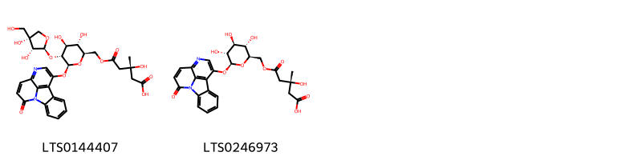{ width=100% }
    <figcaption>Hình ảnh cấu trúc hóa học của 2 hoạt chất thuộc nhóm Saccharolipids gồm ['(3r)-5-{[(2r,3s,4s,5r,6s)-5-{[(2s,3r,4r)-3,4-dihydroxy-4-(hydroxymethyl)oxolan-2-yl]oxy}-3,4-dihydroxy-6-({2-oxo-1,6-diazatetracyclo[7.6.1.0⁵,¹⁶.0¹⁰,¹⁵]hexadeca-3,5,7,9(16),10(15),11,13-heptaen-8-yl}oxy)oxan-2-yl]methoxy}-3-hydroxy-3-methyl-5-oxopentanoic acid (LTS0144407)', '(3r)-3-hydroxy-3-methyl-5-oxo-5-{[(2r,3s,4s,5r,6s)-3,4,5-trihydroxy-6-({2-oxo-1,6-diazatetracyclo[7.6.1.0⁵,¹⁶.0¹⁰,¹⁵]hexadeca-3,5,7,9(16),10(15),11,13-heptaen-8-yl}oxy)oxan-2-yl]methoxy}pentanoic acid (LTS0246973)'].</figcaption>
</figure>
#### Nhóm Steroids and steroid derivatives
<figure markdown="span">
    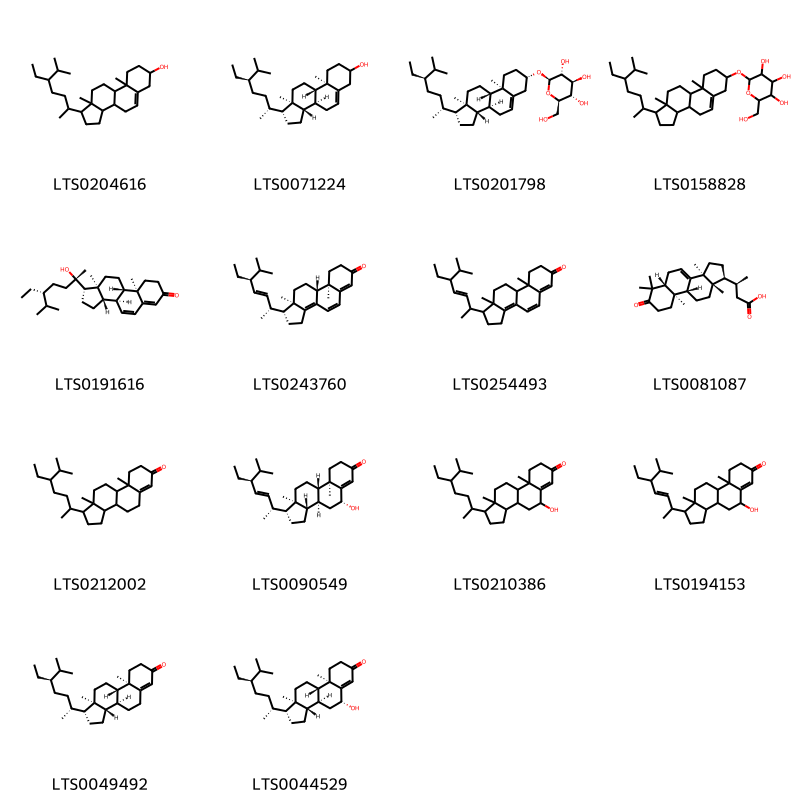{ width=100% }
    <figcaption>Hình ảnh cấu trúc hóa học của 14 hoạt chất thuộc nhóm Steroids and steroid derivatives gồm ['stigmast-5-en-3-ol, (3β)- (LTS0204616)', 'stigmast-5-en-3-ol (LTS0071224)', 'sitogluside (LTS0201798)', '2-{[1-(5-ethyl-6-methylheptan-2-yl)-9a,11a-dimethyl-1h,2h,3h,3ah,3bh,4h,6h,7h,8h,9h,9bh,10h,11h-cyclopenta[a]phenanthren-7-yl]oxy}-6-(hydroxymethyl)oxane-3,4,5-triol (LTS0158828)', '(1s,3as,3bs,9ar,9bs,11as)-1-[(2s,5r)-5-ethyl-2-hydroxy-6-methylheptan-2-yl]-9a,11a-dimethyl-1h,2h,3h,3ah,3bh,8h,9h,9bh,10h,11h-cyclopenta[a]phenanthren-7-one (LTS0191616)', '(1r,9ar,9br,11ar)-1-[(2r,3e,5s)-5-ethyl-6-methylhept-3-en-2-yl]-9a,11a-dimethyl-1h,2h,3h,8h,9h,9bh,10h,11h-cyclopenta[a]phenanthren-7-one (LTS0243760)', '1-(5-ethyl-6-methylhept-3-en-2-yl)-9a,11a-dimethyl-1h,2h,3h,8h,9h,9bh,10h,11h-cyclopenta[a]phenanthren-7-one (LTS0254493)', '(3s)-3-[(1s,3as,5ar,9ar,9br,11as)-3a,6,6,9a,11a-pentamethyl-7-oxo-1h,2h,3h,5h,5ah,8h,9h,9bh,10h,11h-cyclopenta[a]phenanthren-1-yl]butanoic acid (LTS0081087)', '1-(5-ethyl-6-methylheptan-2-yl)-9a,11a-dimethyl-1h,2h,3h,3ah,3bh,4h,5h,8h,9h,9bh,10h,11h-cyclopenta[a]phenanthren-7-one (LTS0212002)', '(1r,3as,3bs,5r,9ar,9bs,11ar)-1-[(2r,3e,5s)-5-ethyl-6-methylhept-3-en-2-yl]-5-hydroxy-9a,11a-dimethyl-1h,2h,3h,3ah,3bh,4h,5h,8h,9h,9bh,10h,11h-cyclopenta[a]phenanthren-7-one (LTS0090549)', '1-(5-ethyl-6-methylheptan-2-yl)-5-hydroxy-9a,11a-dimethyl-1h,2h,3h,3ah,3bh,4h,5h,8h,9h,9bh,10h,11h-cyclopenta[a]phenanthren-7-one (LTS0210386)', '1-(5-ethyl-6-methylhept-3-en-2-yl)-5-hydroxy-9a,11a-dimethyl-1h,2h,3h,3ah,3bh,4h,5h,8h,9h,9bh,10h,11h-cyclopenta[a]phenanthren-7-one (LTS0194153)', 'β-sitostenone (LTS0049492)', '(1r,3as,3bs,5r,9ar,9bs,11ar)-1-[(2r,5r)-5-ethyl-6-methylheptan-2-yl]-5-hydroxy-9a,11a-dimethyl-1h,2h,3h,3ah,3bh,4h,5h,8h,9h,9bh,10h,11h-cyclopenta[a]phenanthren-7-one (LTS0044529)'].</figcaption>
</figure>

---

### Dược dân tộc học

Danh sách các quốc gia có sử dụng *Ailanthus altissima* trong điều trị các bệnh. 

| Country   | Disease                                                                   | Bệnh                                                                                                                                                                                                |
|:----------|:--------------------------------------------------------------------------|:----------------------------------------------------------------------------------------------------------------------------------------------------------------------------------------------------|
| China     | Astringent, Vermifuge                                                     | MYMEMORY WARNING: YOU USED ALL AVAILABLE FREE TRANSLATIONS FOR TODAY. NEXT AVAILABLE IN  07 HOURS 33 MINUTES 48 SECONDS VISIT HTTPS://MYMEMORY.TRANSLATED.NET/DOC/USAGELIMITS.PHP TO TRANSLATE MORE |
| Elsewhere | nan, Protisticide, Taenifuge                                              | MYMEMORY WARNING: YOU USED ALL AVAILABLE FREE TRANSLATIONS FOR TODAY. NEXT AVAILABLE IN  07 HOURS 33 MINUTES 44 SECONDS VISIT HTTPS://MYMEMORY.TRANSLATED.NET/DOC/USAGELIMITS.PHP TO TRANSLATE MORE |
| Iraq      | Astringent, Cardiac, Cathartic, Vermifuge, Antiseptic, Depressant, Emetic | MYMEMORY WARNING: YOU USED ALL AVAILABLE FREE TRANSLATIONS FOR TODAY. NEXT AVAILABLE IN  07 HOURS 33 MINUTES 39 SECONDS VISIT HTTPS://MYMEMORY.TRANSLATED.NET/DOC/USAGELIMITS.PHP TO TRANSLATE MORE |
| Turkey    | Poison                                                                    | MYMEMORY WARNING: YOU USED ALL AVAILABLE FREE TRANSLATIONS FOR TODAY. NEXT AVAILABLE IN  07 HOURS 33 MINUTES 33 SECONDS VISIT HTTPS://MYMEMORY.TRANSLATED.NET/DOC/USAGELIMITS.PHP TO TRANSLATE MORE |

---

---
## Ailanthus glandsulosa
### Thông tin về thực vật

!!! info "Phân loại thực vật của *Ailanthus altissima* từ GIBF:"
    - **Kingdom:** Plantae
    - **Phylum:** Tracheophyta
    - **Order:** Sapindales
    - **Family:** Simaroubaceae
    - **Genus:** Ailanthus
    - **Species:** *Ailanthus altissima*

 

| Label (VI)   | Label (EN)   | Scientific Name     | Descriptions (VI)   | Descriptions (EN)   | Also Known As (VI)   | Also Known As (EN)                                                                                                          |
|:-------------|:-------------|:--------------------|:--------------------|:--------------------|:---------------------|:----------------------------------------------------------------------------------------------------------------------------|
| N/A          | N/A          | Ailanthus altissima |                     | species of plant    | ['']                 | ['ailanthus', 'Ailanthus glandulosa Desf.', 'chouchun', 'Toxicodendron altissimum Mill.', 'Tree-of-Heaven', 'Varnish Tree'] |

#### Phân bố trên thế giới

**Từ CSDL GIBF** nan, China, Israel, Chile, Slovenia, Türkiye, Spain, Netherlands, Poland, United States of America, Korea, Republic of, unknown or invalid, Belarus, Mexico, Algeria, Belgium, Iraq, Canada, Syrian Arab Republic, Germany, Austria, Hungary, Portugal, Ukraine, Italy, Switzerland, France

#### Phân bố tại Việt Nam

**Từ CSDL GIBF**: Không có ghi nhận ở Việt Nam

---
### Thành phần hóa học
        
- Theo cơ sở dữ liệu lotus: Từ loài *Ailanthus altissima* đã phân lập và xác định được Chưa có hoạt chất nào được phân lập. hoạt chất thuộc về các nhóm Không có hoạt chất nào được phân lập. 

Không có hình ảnh nào được tạo ra

---

### Dược dân tộc học

Danh sách các quốc gia có sử dụng *Ailanthus altissima* trong điều trị các bệnh. 

| Country   | Disease                                                                           | Bệnh                                                                                                                                                                                                |
|:----------|:----------------------------------------------------------------------------------|:----------------------------------------------------------------------------------------------------------------------------------------------------------------------------------------------------|
| Turkey    | Antiseptic, Astringent, Cardiac, Cathartic, Depressant, Poison, Vermifuge, Emetic | MYMEMORY WARNING: YOU USED ALL AVAILABLE FREE TRANSLATIONS FOR TODAY. NEXT AVAILABLE IN  07 HOURS 32 MINUTES 32 SECONDS VISIT HTTPS://MYMEMORY.TRANSLATED.NET/DOC/USAGELIMITS.PHP TO TRANSLATE MORE |

---

---
## Ailanthus triphysa
### Thông tin về thực vật

!!! info "Phân loại thực vật của *Ailanthus triphysa* từ GIBF:"
    - **Kingdom:** Plantae
    - **Phylum:** Tracheophyta
    - **Order:** Sapindales
    - **Family:** Simaroubaceae
    - **Genus:** Ailanthus
    - **Species:** *Ailanthus triphysa*

 

| Label (VI)   | Label (EN)   | Scientific Name    | Descriptions (VI)   | Descriptions (EN)   | Also Known As (VI)                                                            | Also Known As (EN)   |
|:-------------|:-------------|:-------------------|:--------------------|:--------------------|:------------------------------------------------------------------------------|:---------------------|
| N/A          | N/A          | Ailanthus triphysa | loài thực vật       | species of plant    | ['Ailanthus triphysa', 'Adenanthera triphysa', 'Ailanthus malabarica', 'Bút'] | ['']                 |

#### Phân bố trên thế giới

**Từ CSDL GIBF** Australia, Thailand, India

#### Phân bố tại Việt Nam

**Từ CSDL GIBF**: Không có ghi nhận ở Việt Nam

---
### Thành phần hóa học
        
- Theo cơ sở dữ liệu lotus: Từ loài *Ailanthus triphysa* đã phân lập và xác định được 37 hoạt chất thuộc về các nhóm Fatty Acyls, Benzene and substituted derivatives, Flavonoids, Coumarins and derivatives, Steroids and steroid derivatives, Glycerolipids, Indolonaphthyridine alkaloids, Organooxygen compounds, Prenol lipids, Harmala alkaloids, Indoles and derivatives. 

|    | chemicalTaxonomyClassyfireClass     |   smiles_count |
|---:|:------------------------------------|---------------:|
|  0 | Benzene and substituted derivatives |              2 |
|  1 | Coumarins and derivatives           |              1 |
|  2 | Fatty Acyls                         |              2 |
|  3 | Flavonoids                          |              1 |
|  4 | Glycerolipids                       |              1 |
|  5 | Harmala alkaloids                   |              9 |
|  6 | Indoles and derivatives             |              2 |
|  7 | Indolonaphthyridine alkaloids       |              2 |
|  8 | Organooxygen compounds              |              2 |
|  9 | Prenol lipids                       |             10 |
| 10 | Steroids and steroid derivatives    |              4 |

#### Nhóm Benzene and substituted derivatives
<figure markdown="span">
    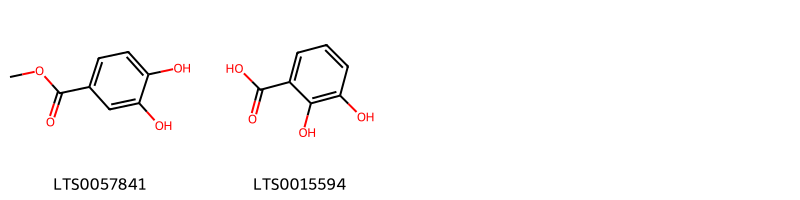{ width=100% }
    <figcaption>Hình ảnh cấu trúc hóa học của 2 hoạt chất thuộc nhóm Benzene and substituted derivatives gồm ['methyl 3,4-dihydroxybenzoate (LTS0057841)', '2,3-dihydroxy-benzoic acid (LTS0015594)'].</figcaption>
</figure>
#### Nhóm Coumarins and derivatives
<figure markdown="span">
    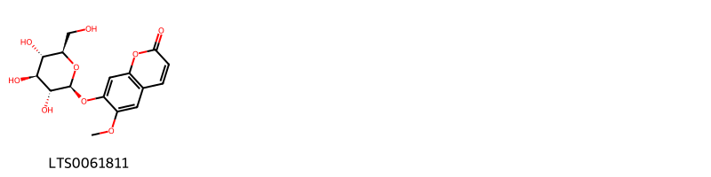{ width=100% }
    <figcaption>Hình ảnh cấu trúc hóa học của 1 hoạt chất thuộc nhóm Coumarins and derivatives gồm ['scopolin (LTS0061811)'].</figcaption>
</figure>
#### Nhóm Fatty Acyls
<figure markdown="span">
    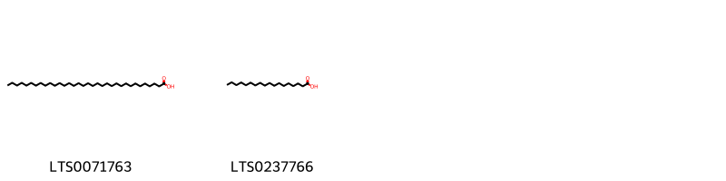{ width=100% }
    <figcaption>Hình ảnh cấu trúc hóa học của 2 hoạt chất thuộc nhóm Fatty Acyls gồm ['tetratriacontanoic acid (LTS0071763)', 'stearic acid (LTS0237766)'].</figcaption>
</figure>
#### Nhóm Flavonoids
<figure markdown="span">
    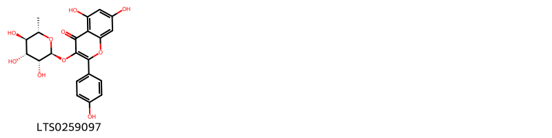{ width=100% }
    <figcaption>Hình ảnh cấu trúc hóa học của 1 hoạt chất thuộc nhóm Flavonoids gồm ['afzelin (LTS0259097)'].</figcaption>
</figure>
#### Nhóm Glycerolipids
<figure markdown="span">
    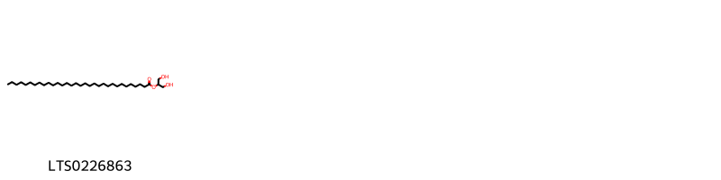{ width=100% }
    <figcaption>Hình ảnh cấu trúc hóa học của 1 hoạt chất thuộc nhóm Glycerolipids gồm ['1,3-dihydroxypropan-2-yl dotriacontanoate (LTS0226863)'].</figcaption>
</figure>
#### Nhóm Harmala alkaloids
<figure markdown="span">
    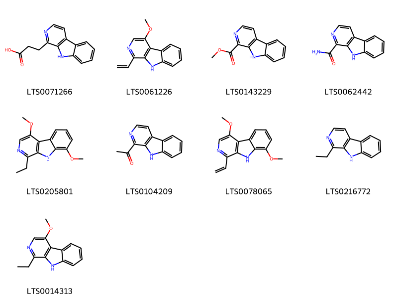{ width=100% }
    <figcaption>Hình ảnh cấu trúc hóa học của 9 hoạt chất thuộc nhóm Harmala alkaloids gồm ['3-{9h-pyrido[3,4-b]indol-1-yl}propanoic acid (LTS0071266)', '1-ethenyl-4-methoxy-9h-pyrido[3,4-b]indole (LTS0061226)', 'methyl 9h-pyrido[3,4-b]indole-1-carboxylate (LTS0143229)', '9h-pyrido[3,4-b]indole-1-carboxamide (LTS0062442)', '1-ethyl-4,8-dimethoxy-9h-pyrido[3,4-b]indole (LTS0205801)', '1-acetyl-β-carboline (LTS0104209)', '1-ethenyl-4,8-dimethoxy-9h-pyrido[3,4-b]indole (LTS0078065)', '1-ethyl-9h-pyrido[3,4-b]indole (LTS0216772)', '1-ethyl-4-methoxy-9h-pyrido[3,4-b]indole (LTS0014313)'].</figcaption>
</figure>
#### Nhóm Indoles and derivatives
<figure markdown="span">
    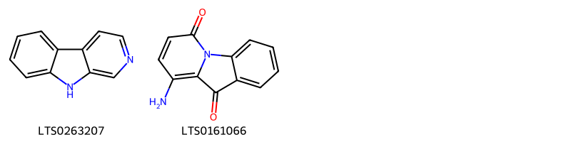{ width=100% }
    <figcaption>Hình ảnh cấu trúc hóa học của 2 hoạt chất thuộc nhóm Indoles and derivatives gồm ['β-carboline (LTS0263207)', '9-aminopyrido[1,2-a]indole-6,10-dione (LTS0161066)'].</figcaption>
</figure>
#### Nhóm Indolonaphthyridine alkaloids
<figure markdown="span">
    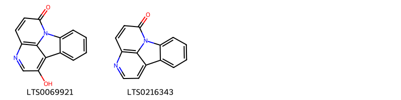{ width=100% }
    <figcaption>Hình ảnh cấu trúc hóa học của 2 hoạt chất thuộc nhóm Indolonaphthyridine alkaloids gồm ['8-hydroxy-1,6-diazatetracyclo[7.6.1.0⁵,¹⁶.0¹⁰,¹⁵]hexadeca-3,5,7,9(16),10(15),11,13-heptaen-2-one (LTS0069921)', 'canthin-6-one (LTS0216343)'].</figcaption>
</figure>
#### Nhóm Organooxygen compounds
<figure markdown="span">
    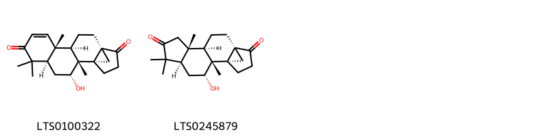{ width=100% }
    <figcaption>Hình ảnh cấu trúc hóa học của 2 hoạt chất thuộc nhóm Organooxygen compounds gồm ['(1r,2r,3r,5r,10r,11r,14s)-3-hydroxy-2,6,6,10-tetramethylpentacyclo[12.3.1.0¹,¹⁴.0²,¹¹.0⁵,¹⁰]octadec-8-ene-7,15-dione (LTS0100322)', '(1r,2r,3r,5r,9r,10r,13s)-3-hydroxy-2,6,6,9-tetramethylpentacyclo[11.3.1.0¹,¹³.0²,¹⁰.0⁵,⁹]heptadecane-7,14-dione (LTS0245879)'].</figcaption>
</figure>
#### Nhóm Prenol lipids
<figure markdown="span">
    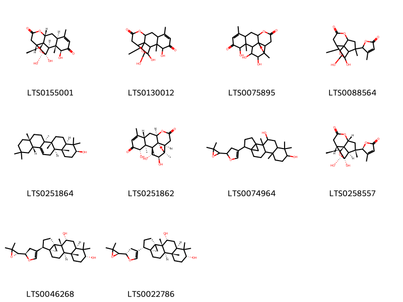{ width=100% }
    <figcaption>Hình ảnh cấu trúc hóa học của 10 hoạt chất thuộc nhóm Prenol lipids gồm ['chaparrinone (LTS0155001)', '4,5,17-trihydroxy-6,14,18-trimethyl-3,10-dioxapentacyclo[9.8.0.0¹,⁷.0⁴,¹⁹.0¹³,¹⁸]nonadec-14-ene-9,16-dione (LTS0130012)', '12,15,16-trihydroxy-9,13,17-trimethyl-5,18-dioxapentacyclo[12.5.0.0¹,⁶.0²,¹⁷.0⁸,¹³]nonadec-9-ene-4,11-dione (LTS0075895)', '11,12-dihydroxy-3,10-dimethyl-3-(3-methyl-5-oxo-2h-furan-2-yl)-6,13-dioxatetracyclo[7.5.0.0¹,⁵.0²,¹²]tetradecan-7-one (LTS0088564)', 'β-amyrin (LTS0251864)', 'samaderine y (LTS0251862)', '15-[5-(3,3-dimethyloxiran-2-yl)-4,5-dihydrofuran-3-yl]-2,6,6,10-tetramethylpentacyclo[12.3.1.0¹,¹⁴.0²,¹¹.0⁵,¹⁰]octadecane-3,7-diol (LTS0074964)', '(1s,2r,3s,5r,9s,10r,11r,12r)-11,12-dihydroxy-3,10-dimethyl-3-[(2s)-3-methyl-5-oxo-2h-furan-2-yl]-6,13-dioxatetracyclo[7.5.0.0¹,⁵.0²,¹²]tetradecan-7-one (LTS0258557)', '(1s,2r,3r,5r,7r,10s,11r,14r,15s)-15-[(5r)-5-[(2s)-3,3-dimethyloxiran-2-yl]-4,5-dihydrofuran-3-yl]-2,6,6,10-tetramethylpentacyclo[12.3.1.0¹,¹⁴.0²,¹¹.0⁵,¹⁰]octadecane-3,7-diol (LTS0046268)', '(1s,2r,3r,5r,7r,10s,11r,14r,15r)-15-[(5s)-5-[(2r)-3,3-dimethyloxiran-2-yl]-4,5-dihydrofuran-3-yl]-2,6,6,10-tetramethylpentacyclo[12.3.1.0¹,¹⁴.0²,¹¹.0⁵,¹⁰]octadecane-3,7-diol (LTS0022786)'].</figcaption>
</figure>
#### Nhóm Steroids and steroid derivatives
<figure markdown="span">
    { width=100% }
    <figcaption>Hình ảnh cấu trúc hóa học của 4 hoạt chất thuộc nhóm Steroids and steroid derivatives gồm ['stigmast-5-en-3-ol, (3β)- (LTS0204616)', 'stigmast-5-en-3-ol (LTS0071224)', 'sitogluside (LTS0201798)', '2-{[1-(5-ethyl-6-methylheptan-2-yl)-9a,11a-dimethyl-1h,2h,3h,3ah,3bh,4h,6h,7h,8h,9h,9bh,10h,11h-cyclopenta[a]phenanthren-7-yl]oxy}-6-(hydroxymethyl)oxane-3,4,5-triol (LTS0158828)'].</figcaption>
</figure>

---

### Dược dân tộc học

Danh sách các quốc gia có sử dụng *Ailanthus triphysa* trong điều trị các bệnh. 

| Country   | Disease   | Bệnh                                                                                                                                                                                                |
|:----------|:----------|:----------------------------------------------------------------------------------------------------------------------------------------------------------------------------------------------------|
| Java      | Tonic     | MYMEMORY WARNING: YOU USED ALL AVAILABLE FREE TRANSLATIONS FOR TODAY. NEXT AVAILABLE IN  07 HOURS 31 MINUTES 55 SECONDS VISIT HTTPS://MYMEMORY.TRANSLATED.NET/DOC/USAGELIMITS.PHP TO TRANSLATE MORE |

---

# Chi Castela

??? note "Danh sách các dược liệu thuộc chi"
    
	 - *Castela texana*
	 - *Castela tortuosa*

---
## Castela texana
### Thông tin về thực vật

!!! info "Phân loại thực vật của *Castela tortuosa* từ GIBF:"
    - **Kingdom:** Plantae
    - **Phylum:** Tracheophyta
    - **Order:** Sapindales
    - **Family:** Simaroubaceae
    - **Genus:** Castela
    - **Species:** *Castela tortuosa*

 

| Label (VI)   | Label (EN)   | Scientific Name   | Descriptions (VI)   | Descriptions (EN)   | Also Known As (VI)   | Also Known As (EN)   |
|:-------------|:-------------|:------------------|:--------------------|:--------------------|:---------------------|:---------------------|
| N/A          | N/A          | Castela texana    | loài thực vật       | species of plant    | ['']                 | ['']                 |

#### Phân bố trên thế giới

**Từ CSDL GIBF** Mexico, United States of America

#### Phân bố tại Việt Nam

**Từ CSDL GIBF**: Không có ghi nhận ở Việt Nam

---
### Thành phần hóa học
        
- Theo cơ sở dữ liệu lotus: Từ loài *Castela tortuosa* đã phân lập và xác định được 45 hoạt chất thuộc về các nhóm Benzodioxanes, Benzene and substituted derivatives, Coumarinolignans, Flavonoids, Azolidines, Organooxygen compounds, Azoles, Prenol lipids. 

|    | chemicalTaxonomyClassyfireClass     |   smiles_count |
|---:|:------------------------------------|---------------:|
|  0 |                                     |              1 |
|  1 | Azoles                              |              1 |
|  2 | Azolidines                          |              1 |
|  3 | Benzene and substituted derivatives |              1 |
|  4 | Benzodioxanes                       |              4 |
|  5 | Coumarinolignans                    |              4 |
|  6 | Flavonoids                          |              2 |
|  7 | Organooxygen compounds              |              4 |
|  8 | Prenol lipids                       |             26 |

#### Nhóm 
<figure markdown="span">
    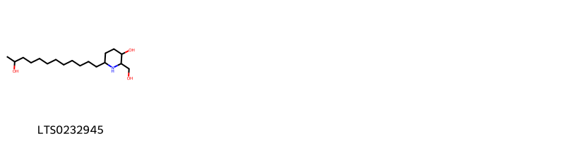{ width=100% }
    <figcaption>Hình ảnh cấu trúc hóa học của 1 hoạt chất thuộc nhóm  gồm ['prosopine (LTS0232945)'].</figcaption>
</figure>
#### Nhóm Azoles
<figure markdown="span">
    { width=100% }
    <figcaption>Hình ảnh cấu trúc hóa học của 1 hoạt chất thuộc nhóm Azoles gồm ['allantoin (LTS0106609)'].</figcaption>
</figure>
#### Nhóm Azolidines
<figure markdown="span">
    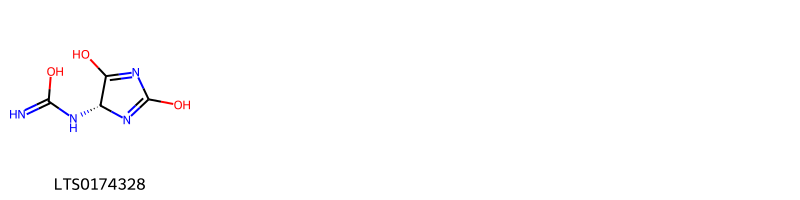{ width=100% }
    <figcaption>Hình ảnh cấu trúc hóa học của 1 hoạt chất thuộc nhóm Azolidines gồm ['n-[(4s)-2,5-dihydroxy-4h-imidazol-4-yl]carbamimidic acid (LTS0174328)'].</figcaption>
</figure>
#### Nhóm Benzene and substituted derivatives
<figure markdown="span">
    { width=100% }
    <figcaption>Hình ảnh cấu trúc hóa học của 1 hoạt chất thuộc nhóm Benzene and substituted derivatives gồm ['methyl gallate (LTS0043810)'].</figcaption>
</figure>
#### Nhóm Benzodioxanes
<figure markdown="span">
    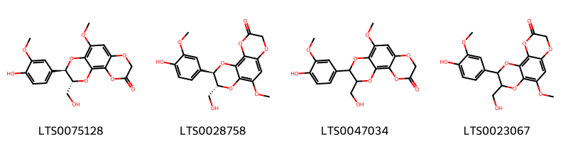{ width=100% }
    <figcaption>Hình ảnh cấu trúc hóa học của 4 hoạt chất thuộc nhóm Benzodioxanes gồm ['(12r,13r)-12-(4-hydroxy-3-methoxyphenyl)-13-(hydroxymethyl)-9-methoxy-3,6,11,14-tetraoxatricyclo[8.4.0.0²,⁷]tetradeca-1,7,9-trien-4-one (LTS0075128)', '(12r,13r)-13-(4-hydroxy-3-methoxyphenyl)-12-(hydroxymethyl)-9-methoxy-3,6,11,14-tetraoxatricyclo[8.4.0.0²,⁷]tetradeca-1,7,9-trien-4-one (LTS0028758)', '12-(4-hydroxy-3-methoxyphenyl)-13-(hydroxymethyl)-9-methoxy-3,6,11,14-tetraoxatricyclo[8.4.0.0²,⁷]tetradeca-1,7,9-trien-4-one (LTS0047034)', '13-(4-hydroxy-3-methoxyphenyl)-12-(hydroxymethyl)-9-methoxy-3,6,11,14-tetraoxatricyclo[8.4.0.0²,⁷]tetradeca-1,7,9-trien-4-one (LTS0023067)'].</figcaption>
</figure>
#### Nhóm Coumarinolignans
<figure markdown="span">
    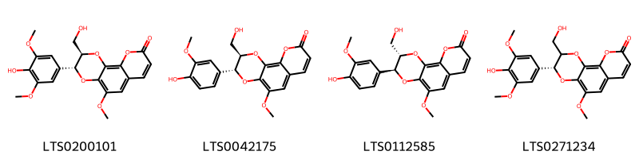{ width=100% }
    <figcaption>Hình ảnh cấu trúc hóa học của 4 hoạt chất thuộc nhóm Coumarinolignans gồm ['(2r,3r)-3-(4-hydroxy-3,5-dimethoxyphenyl)-2-(hydroxymethyl)-5-methoxy-2h,3h-[1,4]dioxino[2,3-h]chromen-9-one (LTS0200101)', 'cleomiscosin a (LTS0042175)', '(2s,3s)-3-(4-hydroxy-3-methoxyphenyl)-2-(hydroxymethyl)-5-methoxy-2h,3h-[1,4]dioxino[2,3-h]chromen-9-one (LTS0112585)', '(3r)-3-(4-hydroxy-3,5-dimethoxyphenyl)-2-(hydroxymethyl)-5-methoxy-2h,3h-[1,4]dioxino[2,3-h]chromen-9-one (LTS0271234)'].</figcaption>
</figure>
#### Nhóm Flavonoids
<figure markdown="span">
    { width=100% }
    <figcaption>Hình ảnh cấu trúc hóa học của 2 hoạt chất thuộc nhóm Flavonoids gồm ['fisetinidol (LTS0143893)', "3,7,3',4'-tetrahydroxyflavan (LTS0053622)"].</figcaption>
</figure>
#### Nhóm Organooxygen compounds
<figure markdown="span">
    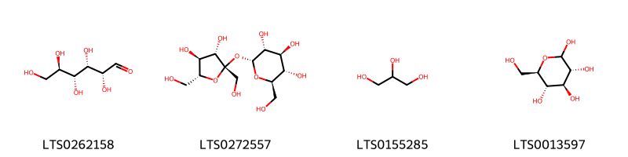{ width=100% }
    <figcaption>Hình ảnh cấu trúc hóa học của 4 hoạt chất thuộc nhóm Organooxygen compounds gồm ['(+)-glucose (LTS0262158)', 'sucrose (LTS0272557)', 'glycerol (LTS0155285)', 'glucose (LTS0013597)'].</figcaption>
</figure>
#### Nhóm Prenol lipids
<figure markdown="span">
    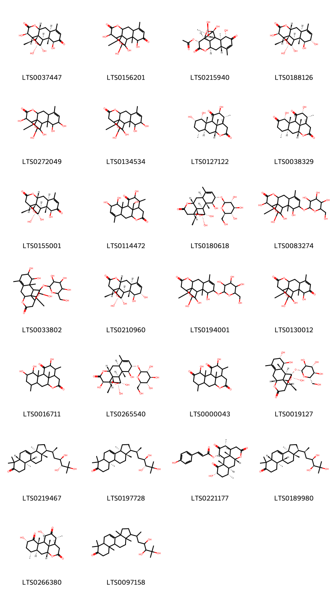{ width=100% }
    <figcaption>Hình ảnh cấu trúc hóa học của 26 hoạt chất thuộc nhóm Prenol lipids gồm ['glaucarubolone (LTS0037447)', '4,5,8,17-tetrahydroxy-6,14,18-trimethyl-3,10-dioxapentacyclo[9.8.0.0¹,⁷.0⁴,¹⁹.0¹³,¹⁸]nonadec-14-ene-9,16-dione (LTS0156201)', '(1s,4r,5r,6r,7s,8r,11r,13s,17s,18s,19r)-4,5,17-trihydroxy-6,14,18-trimethyl-9,16-dioxo-3,10-dioxapentacyclo[9.8.0.0¹,⁷.0⁴,¹⁹.0¹³,¹⁸]nonadec-14-en-8-yl acetate (LTS0215940)', '(1s,4r,5r,6r,7s,8r,11r,13s,16s,17s,18s,19r)-4,5,8,16,17-pentahydroxy-6,14,18-trimethyl-3,10-dioxapentacyclo[9.8.0.0¹,⁷.0⁴,¹⁹.0¹³,¹⁸]nonadec-14-en-9-one (LTS0188126)', '4,5,8,16,17-pentahydroxy-6,14,18-trimethyl-3,10-dioxapentacyclo[9.8.0.0¹,⁷.0⁴,¹⁹.0¹³,¹⁸]nonadec-14-en-9-one (LTS0272049)', '4,5,16,17-tetrahydroxy-6,14,18-trimethyl-3,10-dioxapentacyclo[9.8.0.0¹,⁷.0⁴,¹⁹.0¹³,¹⁸]nonadec-14-en-9-one (LTS0134534)', '(1r,2s,3r,4s,6r,7s,9r,13s,14r,15s,17s)-3,4,15-trihydroxy-2,6,14,17-tetramethyl-10-oxatetracyclo[7.7.1.0²,⁷.0¹³,¹⁷]heptadecane-11,16-dione (LTS0127122)', '(1r,2s,3r,6r,7s,9r,13s,14r,15r,17s)-3,15-dihydroxy-2,6,14,17-tetramethyl-10-oxatetracyclo[7.7.1.0²,⁷.0¹³,¹⁷]heptadecane-4,11,16-trione (LTS0038329)', 'chaparrinone (LTS0155001)', '3,4,15-trihydroxy-17-(hydroxymethyl)-2,6,14-trimethyl-10-oxatetracyclo[7.7.1.0²,⁷.0¹³,¹⁷]heptadec-5-ene-11,16-dione (LTS0114472)', '(1s,4r,5r,6r,7s,11r,13s,16s,17s,18s,19r)-4,5,17-trihydroxy-6,14,18-trimethyl-16-{[(2r,3r,4s,5s,6r)-3,4,5-trihydroxy-6-(hydroxymethyl)oxan-2-yl]oxy}-3,10-dioxapentacyclo[9.8.0.0¹,⁷.0⁴,¹⁹.0¹³,¹⁸]nonadec-14-en-9-one (LTS0180618)', '4,5,8,17-tetrahydroxy-6,14,18-trimethyl-16-{[3,4,5-trihydroxy-6-(hydroxymethyl)oxan-2-yl]oxy}-3,10-dioxapentacyclo[9.8.0.0¹,⁷.0⁴,¹⁹.0¹³,¹⁸]nonadec-14-en-9-one (LTS0083274)', '5,16,17-trihydroxy-6,14,18-trimethyl-4-{[3,4,5-trihydroxy-6-(hydroxymethyl)oxan-2-yl]oxy}-3,10-dioxapentacyclo[9.8.0.0¹,⁷.0⁴,¹⁹.0¹³,¹⁸]nonadec-13-en-9-one (LTS0033802)', 'chaparrin (LTS0210960)', '4,5,17-trihydroxy-6,14,18-trimethyl-16-{[3,4,5-trihydroxy-6-(hydroxymethyl)oxan-2-yl]oxy}-3,10-dioxapentacyclo[9.8.0.0¹,⁷.0⁴,¹⁹.0¹³,¹⁸]nonadec-14-en-9-one (LTS0194001)', '4,5,17-trihydroxy-6,14,18-trimethyl-3,10-dioxapentacyclo[9.8.0.0¹,⁷.0⁴,¹⁹.0¹³,¹⁸]nonadec-14-ene-9,16-dione (LTS0130012)', '3,4,15-trihydroxy-2,6,14,17-tetramethyl-10-oxatetracyclo[7.7.1.0²,⁷.0¹³,¹⁷]heptadecane-11,16-dione (LTS0016711)', '(1s,4r,5r,6r,7s,8r,11r,13s,16s,17s,18s,19r)-4,5,8,17-tetrahydroxy-6,14,18-trimethyl-16-{[(2r,3r,4s,5s,6r)-3,4,5-trihydroxy-6-(hydroxymethyl)oxan-2-yl]oxy}-3,10-dioxapentacyclo[9.8.0.0¹,⁷.0⁴,¹⁹.0¹³,¹⁸]nonadec-14-en-9-one (LTS0265540)', '3,15-dihydroxy-2,6,14,17-tetramethyl-10-oxatetracyclo[7.7.1.0²,⁷.0¹³,¹⁷]heptadecane-4,11,16-trione (LTS0000043)', '(1s,4s,5r,6r,7s,11r,16s,17s,18r,19r)-5,16,17-trihydroxy-6,14,18-trimethyl-4-{[(2r,3s,4r,5r,6s)-3,4,5-trihydroxy-6-(hydroxymethyl)oxan-2-yl]oxy}-3,10-dioxapentacyclo[9.8.0.0¹,⁷.0⁴,¹⁹.0¹³,¹⁸]nonadec-13-en-9-one (LTS0019127)', '(1s,3as,5ar,9ar,9br,11as)-3a,6,6,9a,11a-pentamethyl-1-[(2s,4r,5r)-4,5,6-trihydroxy-6-methylheptan-2-yl]-1h,2h,3h,5h,5ah,8h,9h,9bh,10h,11h-cyclopenta[a]phenanthren-7-one (LTS0219467)', '(1s,3as,9ar,11as)-3a,6,6,9a,11a-pentamethyl-1-[(2s,4r,5r)-4,5,6-trihydroxy-6-methylheptan-2-yl]-1h,2h,3h,5h,5ah,8h,9h,9bh,10h,11h-cyclopenta[a]phenanthren-7-one (LTS0197728)', '(1s,2s,4s,6r,7s,9r,13s,14r,16s,17s)-4-hydroxy-2,6,14,17-tetramethyl-3,11,15-trioxo-10-oxatetracyclo[7.7.1.0²,⁷.0¹³,¹⁷]heptadecan-16-yl (2e)-3-(4-hydroxyphenyl)prop-2-enoate (LTS0221177)', '(1s,3as,5ar,9ar,9br,11as)-3a,6,6,9a,11a-pentamethyl-1-[(2s,4r,5s)-4,5,6-trihydroxy-6-methylheptan-2-yl]-1h,2h,3h,5h,5ah,8h,9h,9bh,10h,11h-cyclopenta[a]phenanthren-7-one (LTS0189980)', 'amarolide (LTS0266380)', '3a,6,6,9a,11a-pentamethyl-1-(4,5,6-trihydroxy-6-methylheptan-2-yl)-1h,2h,3h,5h,5ah,8h,9h,9bh,10h,11h-cyclopenta[a]phenanthren-7-one (LTS0097158)'].</figcaption>
</figure>

---

### Dược dân tộc học

Danh sách các quốc gia có sử dụng *Castela tortuosa* trong điều trị các bệnh. 

| Country   | Disease           | Bệnh                                                                                                                                                                                                |
|:----------|:------------------|:----------------------------------------------------------------------------------------------------------------------------------------------------------------------------------------------------|
| Elsewhere | Astringent        | MYMEMORY WARNING: YOU USED ALL AVAILABLE FREE TRANSLATIONS FOR TODAY. NEXT AVAILABLE IN  07 HOURS 31 MINUTES 01 SECONDS VISIT HTTPS://MYMEMORY.TRANSLATED.NET/DOC/USAGELIMITS.PHP TO TRANSLATE MORE |
| Mexico    | Astringent, Tonic | MYMEMORY WARNING: YOU USED ALL AVAILABLE FREE TRANSLATIONS FOR TODAY. NEXT AVAILABLE IN  07 HOURS 30 MINUTES 58 SECONDS VISIT HTTPS://MYMEMORY.TRANSLATED.NET/DOC/USAGELIMITS.PHP TO TRANSLATE MORE |

---

---
## Castela tortuosa
### Thông tin về thực vật

!!! info "Phân loại thực vật của *Castela tortuosa* từ GIBF:"
    - **Kingdom:** Plantae
    - **Phylum:** Tracheophyta
    - **Order:** Sapindales
    - **Family:** Simaroubaceae
    - **Genus:** Castela
    - **Species:** *Castela tortuosa*

 

| Label (VI)   | Label (EN)   | Scientific Name   | Descriptions (VI)   | Descriptions (EN)   | Also Known As (VI)   | Also Known As (EN)   |
|:-------------|:-------------|:------------------|:--------------------|:--------------------|:---------------------|:---------------------|
| N/A          | N/A          | Castela tortuosa  | loài thực vật       | species of plant    | ['']                 | ['']                 |

#### Phân bố trên thế giới

**Từ CSDL GIBF** Mexico, United States of America

#### Phân bố tại Việt Nam

**Từ CSDL GIBF**: Không có ghi nhận ở Việt Nam

---
### Thành phần hóa học
        
- Theo cơ sở dữ liệu lotus: Từ loài *Castela tortuosa* đã phân lập và xác định được 29 hoạt chất thuộc về các nhóm Benzene and substituted derivatives, Flavonoids, Azolidines, Organooxygen compounds, Azoles, Prenol lipids. 

|    | chemicalTaxonomyClassyfireClass     |   smiles_count |
|---:|:------------------------------------|---------------:|
|  0 |                                     |              1 |
|  1 | Azoles                              |              1 |
|  2 | Azolidines                          |              1 |
|  3 | Benzene and substituted derivatives |              1 |
|  4 | Flavonoids                          |              2 |
|  5 | Organooxygen compounds              |              4 |
|  6 | Prenol lipids                       |             19 |

#### Nhóm 
<figure markdown="span">
    { width=100% }
    <figcaption>Hình ảnh cấu trúc hóa học của 1 hoạt chất thuộc nhóm  gồm ['prosopine (LTS0232945)'].</figcaption>
</figure>
#### Nhóm Azoles
<figure markdown="span">
    { width=100% }
    <figcaption>Hình ảnh cấu trúc hóa học của 1 hoạt chất thuộc nhóm Azoles gồm ['allantoin (LTS0106609)'].</figcaption>
</figure>
#### Nhóm Azolidines
<figure markdown="span">
    { width=100% }
    <figcaption>Hình ảnh cấu trúc hóa học của 1 hoạt chất thuộc nhóm Azolidines gồm ['n-[(4s)-2,5-dihydroxy-4h-imidazol-4-yl]carbamimidic acid (LTS0174328)'].</figcaption>
</figure>
#### Nhóm Benzene and substituted derivatives
<figure markdown="span">
    { width=100% }
    <figcaption>Hình ảnh cấu trúc hóa học của 1 hoạt chất thuộc nhóm Benzene and substituted derivatives gồm ['methyl gallate (LTS0043810)'].</figcaption>
</figure>
#### Nhóm Flavonoids
<figure markdown="span">
    { width=100% }
    <figcaption>Hình ảnh cấu trúc hóa học của 2 hoạt chất thuộc nhóm Flavonoids gồm ['fisetinidol (LTS0143893)', "3,7,3',4'-tetrahydroxyflavan (LTS0053622)"].</figcaption>
</figure>
#### Nhóm Organooxygen compounds
<figure markdown="span">
    { width=100% }
    <figcaption>Hình ảnh cấu trúc hóa học của 4 hoạt chất thuộc nhóm Organooxygen compounds gồm ['(+)-glucose (LTS0262158)', 'sucrose (LTS0272557)', 'glycerol (LTS0155285)', 'glucose (LTS0013597)'].</figcaption>
</figure>
#### Nhóm Prenol lipids
<figure markdown="span">
    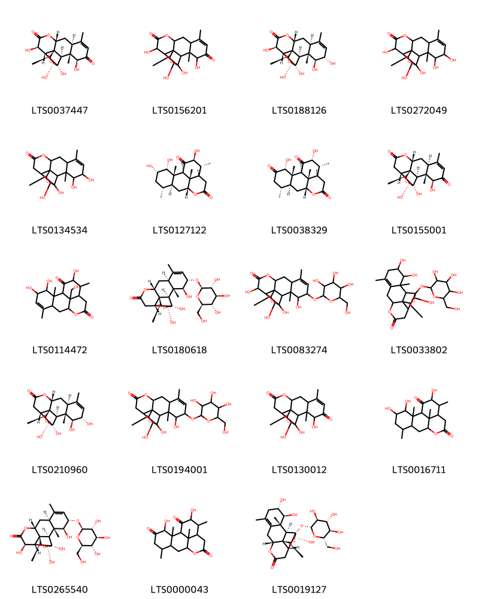{ width=100% }
    <figcaption>Hình ảnh cấu trúc hóa học của 19 hoạt chất thuộc nhóm Prenol lipids gồm ['glaucarubolone (LTS0037447)', '4,5,8,17-tetrahydroxy-6,14,18-trimethyl-3,10-dioxapentacyclo[9.8.0.0¹,⁷.0⁴,¹⁹.0¹³,¹⁸]nonadec-14-ene-9,16-dione (LTS0156201)', '(1s,4r,5r,6r,7s,8r,11r,13s,16s,17s,18s,19r)-4,5,8,16,17-pentahydroxy-6,14,18-trimethyl-3,10-dioxapentacyclo[9.8.0.0¹,⁷.0⁴,¹⁹.0¹³,¹⁸]nonadec-14-en-9-one (LTS0188126)', '4,5,8,16,17-pentahydroxy-6,14,18-trimethyl-3,10-dioxapentacyclo[9.8.0.0¹,⁷.0⁴,¹⁹.0¹³,¹⁸]nonadec-14-en-9-one (LTS0272049)', '4,5,16,17-tetrahydroxy-6,14,18-trimethyl-3,10-dioxapentacyclo[9.8.0.0¹,⁷.0⁴,¹⁹.0¹³,¹⁸]nonadec-14-en-9-one (LTS0134534)', '(1r,2s,3r,4s,6r,7s,9r,13s,14r,15s,17s)-3,4,15-trihydroxy-2,6,14,17-tetramethyl-10-oxatetracyclo[7.7.1.0²,⁷.0¹³,¹⁷]heptadecane-11,16-dione (LTS0127122)', '(1r,2s,3r,6r,7s,9r,13s,14r,15r,17s)-3,15-dihydroxy-2,6,14,17-tetramethyl-10-oxatetracyclo[7.7.1.0²,⁷.0¹³,¹⁷]heptadecane-4,11,16-trione (LTS0038329)', 'chaparrinone (LTS0155001)', '3,4,15-trihydroxy-17-(hydroxymethyl)-2,6,14-trimethyl-10-oxatetracyclo[7.7.1.0²,⁷.0¹³,¹⁷]heptadec-5-ene-11,16-dione (LTS0114472)', '(1s,4r,5r,6r,7s,11r,13s,16s,17s,18s,19r)-4,5,17-trihydroxy-6,14,18-trimethyl-16-{[(2r,3r,4s,5s,6r)-3,4,5-trihydroxy-6-(hydroxymethyl)oxan-2-yl]oxy}-3,10-dioxapentacyclo[9.8.0.0¹,⁷.0⁴,¹⁹.0¹³,¹⁸]nonadec-14-en-9-one (LTS0180618)', '4,5,8,17-tetrahydroxy-6,14,18-trimethyl-16-{[3,4,5-trihydroxy-6-(hydroxymethyl)oxan-2-yl]oxy}-3,10-dioxapentacyclo[9.8.0.0¹,⁷.0⁴,¹⁹.0¹³,¹⁸]nonadec-14-en-9-one (LTS0083274)', '5,16,17-trihydroxy-6,14,18-trimethyl-4-{[3,4,5-trihydroxy-6-(hydroxymethyl)oxan-2-yl]oxy}-3,10-dioxapentacyclo[9.8.0.0¹,⁷.0⁴,¹⁹.0¹³,¹⁸]nonadec-13-en-9-one (LTS0033802)', 'chaparrin (LTS0210960)', '4,5,17-trihydroxy-6,14,18-trimethyl-16-{[3,4,5-trihydroxy-6-(hydroxymethyl)oxan-2-yl]oxy}-3,10-dioxapentacyclo[9.8.0.0¹,⁷.0⁴,¹⁹.0¹³,¹⁸]nonadec-14-en-9-one (LTS0194001)', '4,5,17-trihydroxy-6,14,18-trimethyl-3,10-dioxapentacyclo[9.8.0.0¹,⁷.0⁴,¹⁹.0¹³,¹⁸]nonadec-14-ene-9,16-dione (LTS0130012)', '3,4,15-trihydroxy-2,6,14,17-tetramethyl-10-oxatetracyclo[7.7.1.0²,⁷.0¹³,¹⁷]heptadecane-11,16-dione (LTS0016711)', '(1s,4r,5r,6r,7s,8r,11r,13s,16s,17s,18s,19r)-4,5,8,17-tetrahydroxy-6,14,18-trimethyl-16-{[(2r,3r,4s,5s,6r)-3,4,5-trihydroxy-6-(hydroxymethyl)oxan-2-yl]oxy}-3,10-dioxapentacyclo[9.8.0.0¹,⁷.0⁴,¹⁹.0¹³,¹⁸]nonadec-14-en-9-one (LTS0265540)', '3,15-dihydroxy-2,6,14,17-tetramethyl-10-oxatetracyclo[7.7.1.0²,⁷.0¹³,¹⁷]heptadecane-4,11,16-trione (LTS0000043)', '(1s,4s,5r,6r,7s,11r,16s,17s,18r,19r)-5,16,17-trihydroxy-6,14,18-trimethyl-4-{[(2r,3s,4r,5r,6s)-3,4,5-trihydroxy-6-(hydroxymethyl)oxan-2-yl]oxy}-3,10-dioxapentacyclo[9.8.0.0¹,⁷.0⁴,¹⁹.0¹³,¹⁸]nonadec-13-en-9-one (LTS0019127)'].</figcaption>
</figure>

---

### Dược dân tộc học

Danh sách các quốc gia có sử dụng *Castela tortuosa* trong điều trị các bệnh. 

| Country   | Disease   | Bệnh                                                                                                                                                                                                |
|:----------|:----------|:----------------------------------------------------------------------------------------------------------------------------------------------------------------------------------------------------|
| Mexico    | Stomachic | MYMEMORY WARNING: YOU USED ALL AVAILABLE FREE TRANSLATIONS FOR TODAY. NEXT AVAILABLE IN  07 HOURS 30 MINUTES 20 SECONDS VISIT HTTPS://MYMEMORY.TRANSLATED.NET/DOC/USAGELIMITS.PHP TO TRANSLATE MORE |

---

# Chi Eurycoma

??? note "Danh sách các dược liệu thuộc chi"
    
	 - *Eurycoma longifolia*

---
## Eurycoma longifolia
### Thông tin về thực vật

!!! info "Phân loại thực vật của *Eurycoma longifolia* từ GIBF:"
    - **Kingdom:** Plantae
    - **Phylum:** Tracheophyta
    - **Order:** Sapindales
    - **Family:** Simaroubaceae
    - **Genus:** Eurycoma
    - **Species:** *Eurycoma longifolia*

 

| Label (VI)   | Label (EN)   | Scientific Name     | Descriptions (VI)   | Descriptions (EN)                              | Also Known As (VI)                                                                          | Also Known As (EN)          |
|:-------------|:-------------|:--------------------|:--------------------|:-----------------------------------------------|:--------------------------------------------------------------------------------------------|:----------------------------|
| N/A          | N/A          | Eurycoma longifolia |                     | species of flowering shrub native to Indochina | ['Mật nhơn', 'Mật nhân', 'Hậu phác nam', 'Eurycoma longifolia', 'Cây bá bệnh', 'Bách bệnh'] | ['longjack', 'tongkat ali'] |

#### Phân bố trên thế giới

**Từ CSDL GIBF** nan, Singapore, Viet Nam, Cambodia, Indonesia, Malaysia, Philippines, Myanmar, Brunei Darussalam, Thailand, Lao People’s Democratic Republic

#### Phân bố tại Việt Nam

**Từ CSDL GIBF**: Quảng Nam, Thừa Thiên - Huế, Đồng Nai, Thua Thien-Hue, Ninh Thuận, Khanh Hoa, Kon Tum, Quang Tri, Tay Ninh, Khánh Hòa, Hue Province, Dak Lak

---
### Thành phần hóa học
        
- Theo cơ sở dữ liệu lotus: Từ loài *Eurycoma longifolia* đã phân lập và xác định được 266 hoạt chất thuộc về các nhóm Fatty Acyls, Coumarins and derivatives, Phenols, Organooxygen compounds, Naphthopyrans, Stilbenes, Benzene and substituted derivatives, Oxolanes, Purine nucleosides, Coumarans, Steroids and steroid derivatives, Pyridines and derivatives, Furanoid lignans, Harmala alkaloids, Naphthofurans, Indolonaphthyridine alkaloids, Pyrimidine nucleosides, Prenol lipids, Indoles and derivatives. 

|    | chemicalTaxonomyClassyfireClass     |   smiles_count |
|---:|:------------------------------------|---------------:|
|  0 | Benzene and substituted derivatives |              9 |
|  1 | Coumarans                           |              2 |
|  2 | Coumarins and derivatives           |              4 |
|  3 | Fatty Acyls                         |              4 |
|  4 | Furanoid lignans                    |              2 |
|  5 | Harmala alkaloids                   |              5 |
|  6 | Indoles and derivatives             |              1 |
|  7 | Indolonaphthyridine alkaloids       |             45 |
|  8 | Naphthofurans                       |              2 |
|  9 | Naphthopyrans                       |              1 |
| 10 | Organooxygen compounds              |              7 |
| 11 | Oxolanes                            |              1 |
| 12 | Phenols                             |              3 |
| 13 | Prenol lipids                       |            118 |
| 14 | Purine nucleosides                  |              4 |
| 15 | Pyridines and derivatives           |              1 |
| 16 | Pyrimidine nucleosides              |              2 |
| 17 | Steroids and steroid derivatives    |             52 |
| 18 | Stilbenes                           |              2 |

#### Nhóm Benzene and substituted derivatives
<figure markdown="span">
    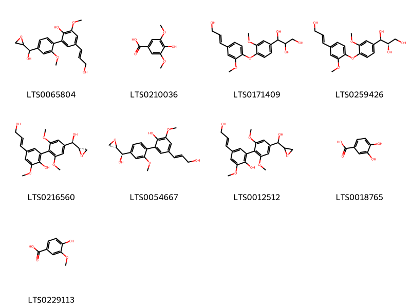{ width=100% }
    <figcaption>Hình ảnh cấu trúc hóa học của 9 hoạt chất thuộc nhóm Benzene and substituted derivatives gồm ["4'-[hydroxy(oxiran-2-yl)methyl]-5-(3-hydroxyprop-1-en-1-yl)-2',3-dimethoxy-[1,1'-biphenyl]-2-ol (LTS0065804)", 'syringic acid (LTS0210036)', '1-{4-[4-(3-hydroxyprop-1-en-1-yl)-2-methoxyphenoxy]-3-methoxyphenyl}propane-1,2,3-triol (LTS0171409)', '(1r,2r)-1-(4-{4-[(1e)-3-hydroxyprop-1-en-1-yl]-2-methoxyphenoxy}-3-methoxyphenyl)propane-1,2,3-triol (LTS0259426)', "4'-[(r)-hydroxy((2s)-oxiran-2-yl)methyl]-5-[(1e)-3-hydroxyprop-1-en-1-yl]-2',3,6'-trimethoxy-[1,1'-biphenyl]-2-ol (LTS0216560)", "4'-[(r)-hydroxy((2s)-oxiran-2-yl)methyl]-5-[(1e)-3-hydroxyprop-1-en-1-yl]-2',3-dimethoxy-[1,1'-biphenyl]-2-ol (LTS0054667)", "4'-[hydroxy(oxiran-2-yl)methyl]-5-(3-hydroxyprop-1-en-1-yl)-2',3,6'-trimethoxy-[1,1'-biphenyl]-2-ol (LTS0012512)", '3,4-dihydroxybenzoic acid (LTS0018765)', 'vanillic acid (LTS0229113)'].</figcaption>
</figure>
#### Nhóm Coumarans
<figure markdown="span">
    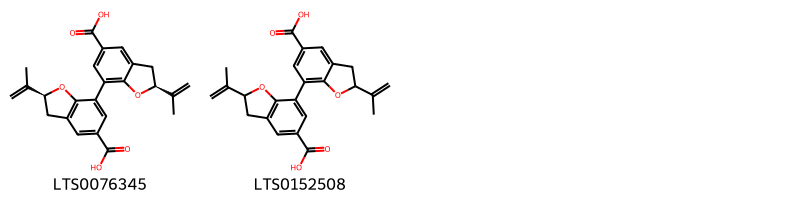{ width=100% }
    <figcaption>Hình ảnh cấu trúc hóa học của 2 hoạt chất thuộc nhóm Coumarans gồm ['(2s)-7-[(2s)-5-carboxy-2-(prop-1-en-2-yl)-2,3-dihydro-1-benzofuran-7-yl]-2-(prop-1-en-2-yl)-2,3-dihydro-1-benzofuran-5-carboxylic acid (LTS0076345)', '7-[5-carboxy-2-(prop-1-en-2-yl)-2,3-dihydro-1-benzofuran-7-yl]-2-(prop-1-en-2-yl)-2,3-dihydro-1-benzofuran-5-carboxylic acid (LTS0152508)'].</figcaption>
</figure>
#### Nhóm Coumarins and derivatives
<figure markdown="span">
    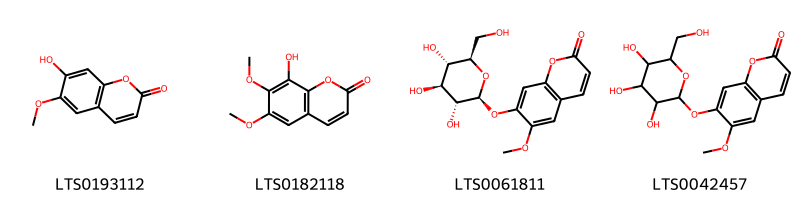{ width=100% }
    <figcaption>Hình ảnh cấu trúc hóa học của 4 hoạt chất thuộc nhóm Coumarins and derivatives gồm ['scopoletin (LTS0193112)', 'fraxidin (LTS0182118)', 'scopolin (LTS0061811)', '6-methoxy-7-{[3,4,5-trihydroxy-6-(hydroxymethyl)oxan-2-yl]oxy}chromen-2-one (LTS0042457)'].</figcaption>
</figure>
#### Nhóm Fatty Acyls
<figure markdown="span">
    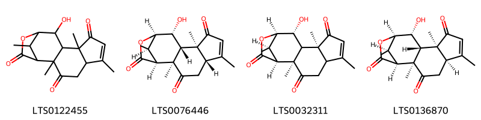{ width=100% }
    <figcaption>Hình ảnh cấu trúc hóa học của 4 hoạt chất thuộc nhóm Fatty Acyls gồm ['11-hydroxy-2,6,9,15-tetramethyl-13-oxatetracyclo[10.2.1.0²,¹⁰.0⁵,⁹]pentadec-6-ene-3,8,14-trione (LTS0122455)', '(1s,2r,5s,9s,10s,11r,12r,15r)-11-hydroxy-2,6,9,15-tetramethyl-13-oxatetracyclo[10.2.1.0²,¹⁰.0⁵,⁹]pentadec-6-ene-3,8,14-trione (LTS0076446)', '(1s,2r,9s,11r,12r,15r)-11-hydroxy-2,6,9,15-tetramethyl-13-oxatetracyclo[10.2.1.0²,¹⁰.0⁵,⁹]pentadec-6-ene-3,8,14-trione (LTS0032311)', '(1s,2r,5r,9s,10s,11r,12r,15r)-11-hydroxy-2,6,9,15-tetramethyl-13-oxatetracyclo[10.2.1.0²,¹⁰.0⁵,⁹]pentadec-6-ene-3,8,14-trione (LTS0136870)'].</figcaption>
</figure>
#### Nhóm Furanoid lignans
<figure markdown="span">
    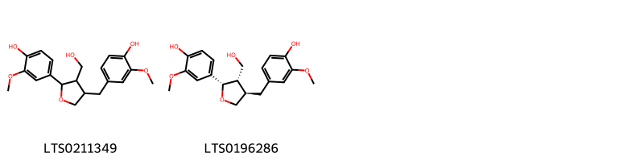{ width=100% }
    <figcaption>Hình ảnh cấu trúc hóa học của 2 hoạt chất thuộc nhóm Furanoid lignans gồm ['4-{4-[(4-hydroxy-3-methoxyphenyl)methyl]-3-(hydroxymethyl)oxolan-2-yl}-2-methoxyphenol (LTS0211349)', '4-[(2s,3s,4r)-4-[(4-hydroxy-3-methoxyphenyl)methyl]-3-(hydroxymethyl)oxolan-2-yl]-2-methoxyphenol (LTS0196286)'].</figcaption>
</figure>
#### Nhóm Harmala alkaloids
<figure markdown="span">
    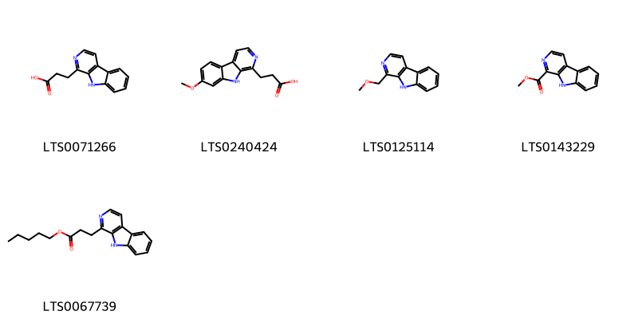{ width=100% }
    <figcaption>Hình ảnh cấu trúc hóa học của 5 hoạt chất thuộc nhóm Harmala alkaloids gồm ['3-{9h-pyrido[3,4-b]indol-1-yl}propanoic acid (LTS0071266)', '3-{7-methoxy-9h-pyrido[3,4-b]indol-1-yl}propanoic acid (LTS0240424)', '1-(methoxymethyl)-9h-pyrido[3,4-b]indole (LTS0125114)', 'methyl 9h-pyrido[3,4-b]indole-1-carboxylate (LTS0143229)', 'pentyl 3-{9h-pyrido[3,4-b]indol-1-yl}propanoate (LTS0067739)'].</figcaption>
</figure>
#### Nhóm Indoles and derivatives
<figure markdown="span">
    { width=100% }
    <figcaption>Hình ảnh cấu trúc hóa học của 1 hoạt chất thuộc nhóm Indoles and derivatives gồm ['β-carboline (LTS0263207)'].</figcaption>
</figure>
#### Nhóm Indolonaphthyridine alkaloids
<figure markdown="span">
    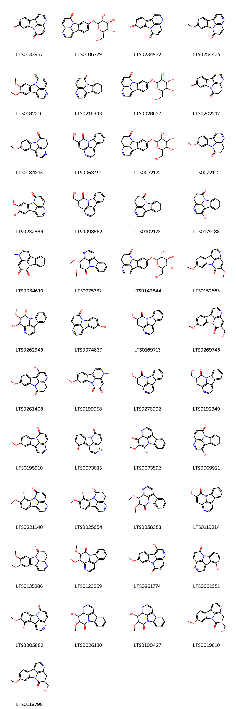{ width=100% }
    <figcaption>Hình ảnh cấu trúc hóa học của 45 hoạt chất thuộc nhóm Indolonaphthyridine alkaloids gồm ['9-hydroxycanthin-6-one (LTS0133957)', '13-{[(2s,3r,4s,5s,6r)-3,4,5-trihydroxy-6-(hydroxymethyl)oxan-2-yl]oxy}-1,6-diazatetracyclo[7.6.1.0⁵,¹⁶.0¹⁰,¹⁵]hexadeca-3,5,7,9(16),10(15),11,13-heptaen-2-one (LTS0106779)', '1,6-diazatetracyclo[7.6.1.0⁵,¹⁶.0¹⁰,¹⁵]hexadeca-3,5(16),7,9,11,14-hexaene-2,13-dione (LTS0234932)', '9-methoxycanthin-6-one (LTS0254425)', '12,13-dimethoxy-1,6-diazatetracyclo[7.6.1.0⁵,¹⁶.0¹⁰,¹⁵]hexadeca-3,5,7,9(16),10(15),11,13-heptaen-2-one (LTS0182216)', 'canthin-6-one (LTS0216343)', '13-{[3,4,5-trihydroxy-6-(hydroxymethyl)oxan-2-yl]oxy}-1,6-diazatetracyclo[7.6.1.0⁵,¹⁶.0¹⁰,¹⁵]hexadeca-3,5,7,9(16),10(15),11,13-heptaen-2-one (LTS0028637)', '13-hydroxy-1,6-diazatetracyclo[7.6.1.0⁵,¹⁶.0¹⁰,¹⁵]hexadeca-5,7,9(16),10(15),11,13-hexaen-2-one (LTS0202212)', '12-methoxy-1,6-diazatetracyclo[7.6.1.0⁵,¹⁶.0¹⁰,¹⁵]hexadeca-5,7,9(16),10(15),11,13-hexaen-2-one (LTS0184315)', '3-(hydroxymethyl)-1,6-diazatetracyclo[7.6.1.0⁵,¹⁶.0¹⁰,¹⁵]hexadeca-3,5,7,9(16),10(15),11,13-heptaen-2-one (LTS0063491)', '13-{[3,4,5-trihydroxy-6-(hydroxymethyl)oxan-2-yl]oxy}-1,6-diazatetracyclo[7.6.1.0⁵,¹⁶.0¹⁰,¹⁵]hexadeca-5,7,9(16),10(15),11,13-hexaen-2-one (LTS0072172)', '13-methoxy-1,6-diazatetracyclo[7.6.1.0⁵,¹⁶.0¹⁰,¹⁵]hexadeca-5,7,9(16),10(15),11,13-hexaen-2-one (LTS0222112)', '12-hydroxy-13-methoxy-1,6-diazatetracyclo[7.6.1.0⁵,¹⁶.0¹⁰,¹⁵]hexadeca-3,5,7,9(16),10(15),11,13-heptaen-2-one (LTS0232884)', '3-(hydroxymethyl)-1,6-diazatetracyclo[7.6.1.0⁵,¹⁶.0¹⁰,¹⁵]hexadeca-5,7,9(16),10(15),11,13-hexaen-2-one (LTS0098582)', '1,6-diazatetracyclo[7.6.1.0⁵,¹⁶.0¹⁰,¹⁵]hexadeca-5,7,9(16),10(15),11,13-hexaen-2-one (LTS0102173)', '8-hydroxy-1,6-diazatetracyclo[7.6.1.0⁵,¹⁶.0¹⁰,¹⁵]hexadeca-5,7,9(16),10(15),11,13-hexaen-2-one (LTS0179188)', '6-methyl-1,6-diazatetracyclo[7.6.1.0⁵,¹⁶.0¹⁰,¹⁵]hexadeca-4,7,9(16),10(15),11,13-hexaene-2,3-dione (LTS0034610)', '(3r,4r)-3,4-dimethoxy-1,6-diazatetracyclo[7.6.1.0⁵,¹⁶.0¹⁰,¹⁵]hexadeca-5,7,9(16),10(15),11,13-hexaen-2-one (LTS0275332)', '13-{[(2s,3r,4s,5s,6r)-3,4,5-trihydroxy-6-(hydroxymethyl)oxan-2-yl]oxy}-1,6-diazatetracyclo[7.6.1.0⁵,¹⁶.0¹⁰,¹⁵]hexadeca-5,7,9(16),10(15),11,13-hexaen-2-one (LTS0142844)', '3,13-dimethoxy-1,6-diazatetracyclo[7.6.1.0⁵,¹⁶.0¹⁰,¹⁵]hexadeca-3,5,7,9(16),10(15),11,13-heptaen-2-one (LTS0152663)', '4-hydroxy-3-methoxy-1,6-diazatetracyclo[7.6.1.0⁵,¹⁶.0¹⁰,¹⁵]hexadeca-3,5,7,9(16),10(15),11,13-heptaen-2-one (LTS0262949)', '10-hydroxycanthin-6-one (LTS0074837)', '(3r)-3-methoxy-1,6-diazatetracyclo[7.6.1.0⁵,¹⁶.0¹⁰,¹⁵]hexadeca-5,7,9(16),10(15),11,13-hexaen-2-one (LTS0169713)', '3-(hydroxymethyl)-13-methoxy-1,6-diazatetracyclo[7.6.1.0⁵,¹⁶.0¹⁰,¹⁵]hexadeca-3,5,7,9(16),10(15),11,13-heptaen-2-one (LTS0269745)', '8-hydroxy-13-methoxy-1,6-diazatetracyclo[7.6.1.0⁵,¹⁶.0¹⁰,¹⁵]hexadeca-5,7,9(16),10(15),11,13-hexaen-2-one (LTS0261408)', '13-methoxy-6-methyl-1,6-diazatetracyclo[7.6.1.0⁵,¹⁶.0¹⁰,¹⁵]hexadeca-4,7,9(16),10(15),11,13-hexaene-2,3-dione (LTS0199958)', '3-methoxy-1,6-diazatetracyclo[7.6.1.0⁵,¹⁶.0¹⁰,¹⁵]hexadeca-5,7,9(16),10(15),11,13-hexaen-2-one (LTS0276092)', '(3r)-3-(hydroxymethyl)-1,6-diazatetracyclo[7.6.1.0⁵,¹⁶.0¹⁰,¹⁵]hexadeca-5,7,9(16),10(15),11,13-hexaen-2-one (LTS0192349)', '12-methoxy-1,6-diazatetracyclo[7.6.1.0⁵,¹⁶.0¹⁰,¹⁵]hexadeca-3,5,7,9(16),10(15),11,13-heptaen-2-one (LTS0195910)', '1,6-diazatetracyclo[7.6.1.0⁵,¹⁶.0¹⁰,¹⁵]hexadeca-3,5(16),7,9,12,14-hexaene-2,11-dione (LTS0073015)', '2-hydroxy-3-methoxy-1,6-diazatetracyclo[7.6.1.0⁵,¹⁶.0¹⁰,¹⁵]hexadeca-2,5,7,9(16),10(15),11,13-heptaen-4-one (LTS0073592)', '8-hydroxy-1,6-diazatetracyclo[7.6.1.0⁵,¹⁶.0¹⁰,¹⁵]hexadeca-3,5,7,9(16),10(15),11,13-heptaen-2-one (LTS0069921)', '14-hydroxy-13-methoxy-1,6-diazatetracyclo[7.6.1.0⁵,¹⁶.0¹⁰,¹⁵]hexadeca-3,5,7,9(16),10(15),11,13-heptaen-2-one (LTS0221140)', '14-hydroxy-13-methoxy-1,6-diazatetracyclo[7.6.1.0⁵,¹⁶.0¹⁰,¹⁵]hexadeca-5,7,9(16),10(15),11,13-hexaen-2-one (LTS0025654)', '3,4-dimethoxy-1,6-diazatetracyclo[7.6.1.0⁵,¹⁶.0¹⁰,¹⁵]hexadeca-5,7,9(16),10(15),11,13-hexaen-2-one (LTS0058383)', '5-methoxycanthin-6-one (LTS0119214)', '12,13-dimethoxy-1,6-diazatetracyclo[7.6.1.0⁵,¹⁶.0¹⁰,¹⁵]hexadeca-5,7,9(16),10(15),11,13-hexaen-2-one (LTS0135286)', 'methyl nigakinone (LTS0123859)', '8-hydroxy-13-methoxy-1,6-diazatetracyclo[7.6.1.0⁵,¹⁶.0¹⁰,¹⁵]hexadeca-3,5,7,9(16),10(15),11,13-heptaen-2-one (LTS0261774)', '11-hydroxycanthin-6-one (LTS0031951)', '11-hydroxy-12-methoxy-1,6-diazatetracyclo[7.6.1.0⁵,¹⁶.0¹⁰,¹⁵]hexadeca-3,5,7,9(16),10(15),11,13-heptaen-2-one (LTS0005682)', '(3s,4s)-4-hydroxy-3-methoxy-1,6-diazatetracyclo[7.6.1.0⁵,¹⁶.0¹⁰,¹⁵]hexadeca-5,7,9(16),10(15),11,13-hexaen-2-one (LTS0026130)', '4-hydroxy-3-methoxy-1,6-diazatetracyclo[7.6.1.0⁵,¹⁶.0¹⁰,¹⁵]hexadeca-5,7,9(16),10(15),11,13-hexaen-2-one (LTS0100427)', '(3s)-3-(hydroxymethyl)-13-methoxy-1,6-diazatetracyclo[7.6.1.0⁵,¹⁶.0¹⁰,¹⁵]hexadeca-5,7,9(16),10(15),11,13-hexaen-2-one (LTS0019610)', '3-(hydroxymethyl)-13-methoxy-1,6-diazatetracyclo[7.6.1.0⁵,¹⁶.0¹⁰,¹⁵]hexadeca-5,7,9(16),10(15),11,13-hexaen-2-one (LTS0118790)'].</figcaption>
</figure>
#### Nhóm Naphthofurans
<figure markdown="span">
    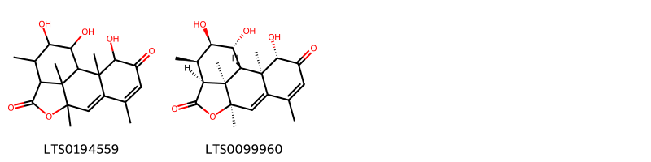{ width=100% }
    <figcaption>Hình ảnh cấu trúc hóa học của 2 hoạt chất thuộc nhóm Naphthofurans gồm ['3,14,15-trihydroxy-2,6,9,13,16-pentamethyl-10-oxatetracyclo[7.6.1.0²,⁷.0¹²,¹⁶]hexadeca-5,7-diene-4,11-dione (LTS0194559)', '(1r,2r,3s,9r,12s,13r,14r,15r,16r)-3,14,15-trihydroxy-2,6,9,13,16-pentamethyl-10-oxatetracyclo[7.6.1.0²,⁷.0¹²,¹⁶]hexadeca-5,7-diene-4,11-dione (LTS0099960)'].</figcaption>
</figure>
#### Nhóm Naphthopyrans
<figure markdown="span">
    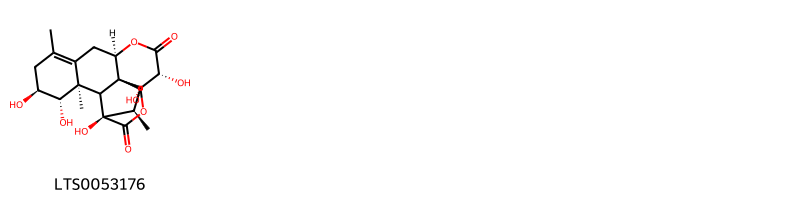{ width=100% }
    <figcaption>Hình ảnh cấu trúc hóa học của 1 hoạt chất thuộc nhóm Naphthopyrans gồm ['(1r,5s,6r,7r,8r,11r,16s,17s,18r)-5,7,8,16,17-pentahydroxy-6,14,18-trimethyl-3,10-dioxapentacyclo[9.8.0.0¹,⁷.0⁵,¹⁹.0¹³,¹⁸]nonadec-13-ene-4,9-dione (LTS0053176)'].</figcaption>
</figure>
#### Nhóm Organooxygen compounds
<figure markdown="span">
    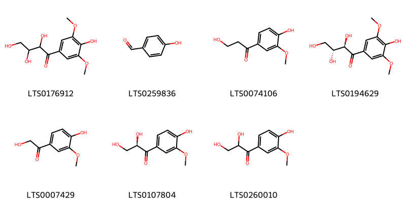{ width=100% }
    <figcaption>Hình ảnh cấu trúc hóa học của 7 hoạt chất thuộc nhóm Organooxygen compounds gồm ['2,3,4-trihydroxy-1-(4-hydroxy-3,5-dimethoxyphenyl)butan-1-one (LTS0176912)', 'p-hydroxybenzaldehyde (LTS0259836)', '3-hydroxy-1-(4-hydroxy-3-methoxyphenyl)propan-1-one (LTS0074106)', '(2r,3r)-2,3,4-trihydroxy-1-(4-hydroxy-3,5-dimethoxyphenyl)butan-1-one (LTS0194629)', '2-hydroxy-1-(4-hydroxy-3-methoxyphenyl)ethanone (LTS0007429)', '(2r)-2,3-dihydroxy-1-(4-hydroxy-3-methoxyphenyl)propan-1-one (LTS0107804)', '2,3-dihydroxy-1-(4-hydroxy-3-methoxyphenyl)propan-1-one (LTS0260010)'].</figcaption>
</figure>
#### Nhóm Oxolanes
<figure markdown="span">
    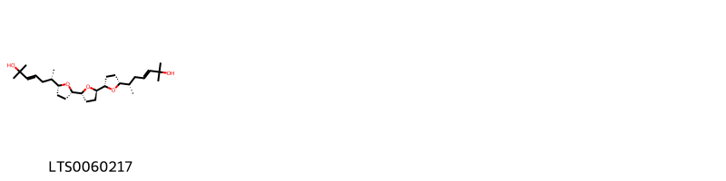{ width=100% }
    <figcaption>Hình ảnh cấu trúc hóa học của 1 hoạt chất thuộc nhóm Oxolanes gồm ["(3e,6s)-6-[(2r,5s)-5-[(2r,2's,5r,5'r)-5'-[(2s,4e)-6-hydroxy-6-methylhept-4-en-2-yl]-[2,2'-bioxolan]-5-yl]oxolan-2-yl]-2-methylhept-3-en-2-ol (LTS0060217)"].</figcaption>
</figure>
#### Nhóm Phenols
<figure markdown="span">
    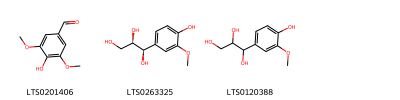{ width=100% }
    <figcaption>Hình ảnh cấu trúc hóa học của 3 hoạt chất thuộc nhóm Phenols gồm ['syringaldehyde (LTS0201406)', '(1r,2r)-1-(4-hydroxy-3-methoxyphenyl)propane-1,2,3-triol (LTS0263325)', 'guaiacylglycerol (LTS0120388)'].</figcaption>
</figure>
#### Nhóm Prenol lipids
<figure markdown="span">
    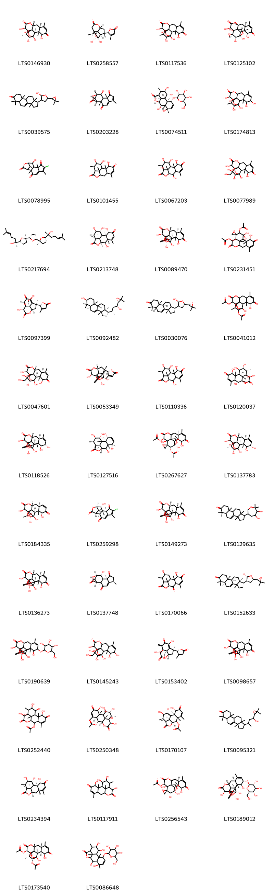{ width=100% }
    <figcaption>Hình ảnh cấu trúc hóa học của 118 hoạt chất thuộc nhóm Prenol lipids gồm ['(1r,4r,5r,6s,7r,8r,11r,13s,17s,18s,19r)-4,5,7,8,17-pentahydroxy-6,14,18-trimethyl-3,10-dioxapentacyclo[9.8.0.0¹,⁷.0⁴,¹⁹.0¹³,¹⁸]nonadec-14-ene-9,16-dione (LTS0146930)', '(1s,2r,3s,5r,9s,10r,11r,12r)-11,12-dihydroxy-3,10-dimethyl-3-[(2s)-3-methyl-5-oxo-2h-furan-2-yl]-6,13-dioxatetracyclo[7.5.0.0¹,⁵.0²,¹²]tetradecan-7-one (LTS0258557)', '4,5,7,8,17-pentahydroxy-6,14,18-trimethyl-3,10-dioxapentacyclo[9.8.0.0¹,⁷.0⁴,¹⁹.0¹³,¹⁸]nonadec-14-ene-9,16-dione (LTS0117536)', "(1'r,2r,4'r,5'r,7'r,8'r,11'r,13's,17's,18's,19'r)-4',5',7',8',17'-pentahydroxy-14',18'-dimethyl-3',10'-dioxaspiro[oxirane-2,6'-pentacyclo[9.8.0.0¹,⁷.0⁴,¹⁹.0¹³,¹⁸]nonadecan]-14'-ene-9',16'-dione (LTS0125102)", '1-[5-(3,3-dimethyloxiran-2-yl)-2-hydroxyoxolan-3-yl]-3a,6,6,9a,11a-pentamethyl-1h,2h,3h,5h,5ah,8h,9h,9bh,10h,11h-cyclopenta[a]phenanthren-7-one (LTS0039575)', '(1r,2s,9s,11s,12s,15s)-11-hydroxy-2,6,9,15-tetramethyl-13-oxatetracyclo[10.2.1.0²,¹⁰.0⁵,⁹]pentadeca-4,6-diene-3,8,14-trione (LTS0203228)', '(1s,2r,3r,6s,7s,8r,9s,12s,13r,14r,15r,16r)-6,8,14,15-tetrahydroxy-2,6,13,16-tetramethyl-3-{[(2r,3r,4s,5s,6r)-3,4,5-trihydroxy-6-(hydroxymethyl)oxan-2-yl]oxy}-10-oxatetracyclo[7.6.1.0²,⁷.0¹²,¹⁶]hexadec-4-en-11-one (LTS0074511)', '4,5,7,8,16,17-hexahydroxy-6,14,18-trimethyl-3,10-dioxapentacyclo[9.8.0.0¹,⁷.0⁴,¹⁹.0¹³,¹⁸]nonadec-14-en-9-one (LTS0174813)', '7-chloro-11-hydroxy-2,6,9,15-tetramethyl-13-oxatetracyclo[10.2.1.0²,¹⁰.0⁵,⁹]pentadeca-4,6-diene-3,8,14-trione (LTS0078995)', '3,14,15-trihydroxy-1,2,6,13,16-pentamethyl-10-oxatetracyclo[7.6.1.0²,⁷.0¹²,¹⁶]hexadec-5-ene-4,11-dione (LTS0101455)', '3,8,12,14,15-pentahydroxy-2,6,13,16-tetramethyl-10-oxatetracyclo[7.6.1.0²,⁷.0¹²,¹⁶]hexadec-5-ene-4,11-dione (LTS0067203)', '4,5,6,7,8,17-hexahydroxy-6-(hydroxymethyl)-14,18-dimethyl-3,10-dioxapentacyclo[9.8.0.0¹,⁷.0⁴,¹⁹.0¹³,¹⁸]nonadec-14-ene-9,16-dione (LTS0077989)', "(2s)-2-[(2r,5r)-5-[(2r,2's,5s,5's)-5'-[(2r)-2-hydroxy-6-methylhept-5-en-2-yl]-2'-methyl-[2,2'-bioxolan]-5-yl]-5-methyloxolan-2-yl]-6-methylhept-5-en-2-ol (LTS0217694)", '(1r,2s,3s,7s,8r,9s,12s,13r,14r,15r,16r)-3,8,14,15-tetrahydroxy-2,6,13,16-tetramethyl-10-oxatetracyclo[7.6.1.0²,⁷.0¹²,¹⁶]hexadec-5-ene-4,11-dione (LTS0213748)', 'eurycomanone (LTS0089470)', "8'-(acetyloxy)-4',7',17'-trihydroxy-14',18'-dimethyl-9',16'-dioxo-3',10'-dioxaspiro[oxirane-2,6'-pentacyclo[9.8.0.0¹,⁷.0⁴,¹⁹.0¹³,¹⁸]nonadecan]-14'-en-5'-yl acetate (LTS0231451)", '(2s,4r,7r,8r,9r,12r)-7,8,11-trihydroxy-12-(hydroxymethyl)-2,9-dimethyl-2-[(2r)-3-methyl-5-oxo-2h-furan-2-yl]-5-oxatricyclo[6.3.1.0⁴,¹²]dodec-1(11)-ene-6,10-dione (LTS0097399)', '(1s,3as,5ar,7s,9ar,9bs,11as)-1-[(2s,4r)-4-[(2s)-3,3-dimethyloxiran-2-yl]-4-hydroxybutan-2-yl]-3a,6,6,9a,11a-pentamethyl-1h,2h,3h,5h,5ah,7h,8h,9h,9bh,10h,11h-cyclopenta[a]phenanthren-7-ol (LTS0092482)', '(1s,3as,5as,9ar,9br,11as)-1-[(2s,3s,5r)-5-[(2s)-3,3-dimethyloxiran-2-yl]-2-hydroxyoxolan-3-yl]-3a,6,6,9a,11a-pentamethyl-1h,2h,3h,5h,5ah,8h,9h,9bh,10h,11h-cyclopenta[a]phenanthren-7-one (LTS0030076)', '8-(acetyloxy)-4,7,17-trihydroxy-6,14,18-trimethyl-9,16-dioxo-3,10-dioxapentacyclo[9.8.0.0¹,⁷.0⁴,¹⁹.0¹³,¹⁸]nonadec-14-en-5-yl acetate (LTS0041012)', '(1r,4r,5r,6r,7r,8r,11r,13s,17s,18s,19r)-4,5,6,7,8,17-hexahydroxy-6-(hydroxymethyl)-14,18-dimethyl-3,10-dioxapentacyclo[9.8.0.0¹,⁷.0⁴,¹⁹.0¹³,¹⁸]nonadec-14-ene-9,16-dione (LTS0047601)', '(1r,2r,3s,5r,8r,9r,11r,12r)-8,9,11,12-tetrahydroxy-3-methyl-3-[(2r)-3-methyl-5-oxo-2h-furan-2-yl]-10-methylidene-6,13-dioxatetracyclo[7.5.0.0¹,⁵.0²,¹²]tetradecan-7-one (LTS0053349)', '3,8,14,15-tetrahydroxy-2,6,13,16-tetramethyl-10-oxatetracyclo[7.6.1.0²,⁷.0¹²,¹⁶]hexadec-5-ene-4,11-dione (LTS0110336)', '(1r,2s,3s,7r,9r,12r,13r,14s,15r,16r,17s)-3,7,12,13,15,16-hexahydroxy-2,6,14,17-tetramethyl-10-oxatetracyclo[7.7.1.0²,⁷.0¹³,¹⁷]heptadec-5-ene-4,11-dione (LTS0120037)', '(5r,7r,8r,11r,13s,16s,17s,18s,19r)-4,5,7,8,16,17-hexahydroxy-14,18-dimethyl-6-methylidene-3,10-dioxapentacyclo[9.8.0.0¹,⁷.0⁴,¹⁹.0¹³,¹⁸]nonadec-14-en-9-one (LTS0118526)', '(1r,2r,3r,6r,7s,8r,9s,12s,13r,14r,15r,16r)-3,6,8,14,15-pentahydroxy-2,6,13,16-tetramethyl-10-oxatetracyclo[7.6.1.0²,⁷.0¹²,¹⁶]hexadec-4-en-11-one (LTS0127516)', "(1'r,2s,4'r,5'r,7'r,8'r,11'r,13's,17's,18's,19'r)-8'-(acetyloxy)-4',7',17'-trihydroxy-14',18'-dimethyl-9',16'-dioxo-3',10'-dioxaspiro[oxirane-2,6'-pentacyclo[9.8.0.0¹,⁷.0⁴,¹⁹.0¹³,¹⁸]nonadecan]-14'-en-5'-yl acetate (LTS0267627)", '(1r,4r,5r,6s,7r,8r,11r,13s,16s,17s,18s,19r)-4,5,7,8,16,17-hexahydroxy-6,14,18-trimethyl-3,10-dioxapentacyclo[9.8.0.0¹,⁷.0⁴,¹⁹.0¹³,¹⁸]nonadec-14-en-9-one (LTS0137783)', '(1r,4s,5r,6s,7r,8r,11r,13s,17s,18s,19r)-4,5,7,8,17-pentahydroxy-6,18-dimethyl-3,10-dioxapentacyclo[9.8.0.0¹,⁷.0⁴,¹⁹.0¹³,¹⁸]nonadec-14-ene-9,16-dione (LTS0184335)', '(1s,2r,9r,10s,11r,12r,15r)-7-chloro-11-hydroxy-2,6,9,15-tetramethyl-13-oxatetracyclo[10.2.1.0²,¹⁰.0⁵,⁹]pentadeca-4,6-diene-3,8,14-trione (LTS0259298)', '(1r,4r,7r,11s,13r,18s,19s)-4,5,7,8,17-pentahydroxy-14,18-dimethyl-6-methylidene-3,10-dioxapentacyclo[9.8.0.0¹,⁷.0⁴,¹⁹.0¹³,¹⁸]nonadec-14-ene-9,16-dione (LTS0149273)', '1-(5,6-dihydroxy-7,7-dimethyloxepan-3-yl)-3a,6,6,9a,11a-pentamethyl-1h,2h,3h,5h,5ah,8h,9h,9bh,10h,11h-cyclopenta[a]phenanthren-7-one (LTS0129635)', 'eurycomanone (LTS0136273)', '(1s,2r,6r,9r,11r,12r,15r)-11-hydroxy-2,6,9,15-tetramethyl-13-oxatetracyclo[10.2.1.0²,¹⁰.0⁵,⁹]pentadec-4-ene-3,8,14-trione (LTS0137748)', '3,14-dihydroxy-2,6,13,16-tetramethyl-10-oxatetracyclo[7.6.1.0²,⁷.0¹²,¹⁶]hexadec-5-ene-4,8,11-trione (LTS0170066)', '(1s,3as,5ar,9ar,9br,11as)-1-[(2r,3s,5r)-5-[(2s)-3,3-dimethyloxiran-2-yl]-2-hydroxyoxolan-3-yl]-3a,6,6,9a,11a-pentamethyl-1h,2h,3h,5h,5ah,8h,9h,9bh,10h,11h-cyclopenta[a]phenanthren-7-one (LTS0152633)', '4,5,7,8,17-pentahydroxy-14,18-dimethyl-6-methylidene-16-{[3,4,5-trihydroxy-6-(hydroxymethyl)oxan-2-yl]oxy}-3,10-dioxapentacyclo[9.8.0.0¹,⁷.0⁴,¹⁹.0¹³,¹⁸]nonadec-14-en-9-one (LTS0190639)', '4,5,6,7,8,16,17-heptahydroxy-6-(hydroxymethyl)-14,18-dimethyl-3,10-dioxapentacyclo[9.8.0.0¹,⁷.0⁴,¹⁹.0¹³,¹⁸]nonadec-14-en-9-one (LTS0145243)', '(2s,4r,7r,8s,12r)-7,8,11-trihydroxy-12-(hydroxymethyl)-2-methyl-2-[(2r)-3-methyl-5-oxo-2h-furan-2-yl]-9-methylidene-5-oxatricyclo[6.3.1.0⁴,¹²]dodec-1(11)-ene-6,10-dione (LTS0153402)', '4,5,7,8,17-pentahydroxy-14,18-dimethyl-6-methylidene-3,10-dioxapentacyclo[9.8.0.0¹,⁷.0⁴,¹⁹.0¹³,¹⁸]nonadec-14-ene-9,16-dione (LTS0098657)', '3,12,13,15,16-pentahydroxy-2,6,14,17-tetramethyl-4,11-dioxo-10-oxatetracyclo[7.7.1.0²,⁷.0¹³,¹⁷]heptadec-5-en-8-yl acetate (LTS0252440)', '(1r,2r,3s,7s,8r,9s,12r,13r,14s,15r,16r,17s)-3,12,13,15,16-pentahydroxy-2,6,14,17-tetramethyl-4,11-dioxo-10-oxatetracyclo[7.7.1.0²,⁷.0¹³,¹⁷]heptadec-5-en-8-yl acetate (LTS0250348)', '(1r,2r,3s,7s,8r,9s,12s,13r,14r,15r,16r)-3,14,15-trihydroxy-2,6,13,16-tetramethyl-4,11-dioxo-10-oxatetracyclo[7.6.1.0²,⁷.0¹²,¹⁶]hexadec-5-en-8-yl acetate (LTS0170107)', '1-[4-(3,3-dimethyloxiran-2-yl)-4-hydroxybutan-2-yl]-3a,6,6,9a,11a-pentamethyl-1h,2h,3h,5h,5ah,8h,9h,9bh,10h,11h-cyclopenta[a]phenanthren-7-one (LTS0095321)', '(1r,2s,3s,7s,9r,12s,13r,14r,15r,16s)-3,14,15-trihydroxy-1,2,6,13,16-pentamethyl-10-oxatetracyclo[7.6.1.0²,⁷.0¹²,¹⁶]hexadec-5-ene-4,11-dione (LTS0234394)', '3,12,15,16-tetrahydroxy-2,6,14,17-tetramethyl-10-oxatetracyclo[7.7.1.0²,⁷.0¹³,¹⁷]heptadec-5-ene-4,11-dione (LTS0117911)', "(1'r,2s,4'r,5'r,7'r,8'r,11'r,13's,17's,18's,19'r)-4',5',7',17'-tetrahydroxy-14',18'-dimethyl-9',16'-dioxo-3',10'-dioxaspiro[oxirane-2,6'-pentacyclo[9.8.0.0¹,⁷.0⁴,¹⁹.0¹³,¹⁸]nonadecan]-14'-en-8'-yl acetate (LTS0256543)", '(1r,4r,5r,7r,8r,11r,13s,16s,17s,18s,19r)-4,5,7,8,17-pentahydroxy-14,18-dimethyl-6-methylidene-16-{[(2r,3r,4s,5s,6r)-3,4,5-trihydroxy-6-(hydroxymethyl)oxan-2-yl]oxy}-3,10-dioxapentacyclo[9.8.0.0¹,⁷.0⁴,¹⁹.0¹³,¹⁸]nonadec-14-en-9-one (LTS0189012)', '(1r,4r,5r,6s,7r,8r,11r,13s,17s,18s,19r)-8-(acetyloxy)-4,7,17-trihydroxy-6,14,18-trimethyl-9,16-dioxo-3,10-dioxapentacyclo[9.8.0.0¹,⁷.0⁴,¹⁹.0¹³,¹⁸]nonadec-14-en-5-yl acetate (LTS0173540)', '6,8,14,15-tetrahydroxy-2,6,13,16-tetramethyl-3-{[3,4,5-trihydroxy-6-(hydroxymethyl)oxan-2-yl]oxy}-10-oxatetracyclo[7.6.1.0²,⁷.0¹²,¹⁶]hexadec-4-en-11-one (LTS0086648)', '(1r,2s,3s,7s,9r,13s,14r,15s,17s)-3,15-dihydroxy-2,6,14,17-tetramethyl-10-oxatetracyclo[7.7.1.0²,⁷.0¹³,¹⁷]heptadec-5-ene-4,11,16-trione (LTS0247389)', '4-(acetyloxy)-1,4-bis[5-(2-hydroxy-6-methylhept-5-en-2-yl)-2-methyloxolan-2-yl]butyl acetate (LTS0159549)', '4-hydroxy-1,4-bis[5-(2-hydroxy-6-methylhept-5-en-2-yl)-2-methyloxolan-2-yl]butyl acetate (LTS0185912)', '3,8,12,13,15,16-hexahydroxy-2,6,14,17-tetramethyl-10-oxatetracyclo[7.7.1.0²,⁷.0¹³,¹⁷]heptadec-5-ene-4,11-dione (LTS0223204)', '(1s,4r)-4-(acetyloxy)-1-[(2r,5r)-5-[(2s)-2-hydroxy-6-methylhept-5-en-2-yl]-2-methyloxolan-2-yl]-4-[(2s,5r)-5-[(2s)-2-hydroxy-6-methylhept-5-en-2-yl]-2-methyloxolan-2-yl]butyl acetate (LTS0268516)', "2-{5-[5'-(2-hydroxy-6-methylhept-5-en-2-yl)-2'-methyl-[2,2'-bioxolan]-5-yl]-5-methyloxolan-2-yl}-6-methylhept-5-en-2-ol (LTS0061152)", '(1r,3as,5ar,9ar,9bs,11as)-1-[(3s)-5-hydroxy-6-(2-hydroxypropan-2-yl)oxan-3-yl]-3a,6,6,9a,11a-pentamethyl-1h,2h,3h,5h,5ah,8h,9h,9bh,10h,11h-cyclopenta[a]phenanthren-7-one (LTS0074054)', '(1r,4r,5r,7r,8r,11r,13s,16s,17s,18s,19r)-4,5,7,8,16,17-hexahydroxy-14,18-dimethyl-6-methylidene-3,10-dioxapentacyclo[9.8.0.0¹,⁷.0⁴,¹⁹.0¹³,¹⁸]nonadec-14-en-9-one (LTS0273283)', '(1s,3as,5ar,9ar,9br,11as)-1-[(2s,4r)-4-[(2s)-3,3-dimethyloxiran-2-yl]-4-hydroxybutan-2-yl]-3a,6,6,9a,11a-pentamethyl-1h,2h,3h,5h,5ah,8h,9h,9bh,10h,11h-cyclopenta[a]phenanthren-7-one (LTS0248938)', '4,7,8,17-tetrahydroxy-6,14,18-trimethyl-9,16-dioxo-3,10-dioxapentacyclo[9.8.0.0¹,⁷.0⁴,¹⁹.0¹³,¹⁸]nonadec-14-en-5-yl acetate (LTS0270732)', "(1'r,2s,4'r,5'r,7'r,8'r,11'r,13's,17's,18's,19'r)-4',5',7',8',17'-pentahydroxy-14',18'-dimethyl-3',10'-dioxaspiro[oxirane-2,6'-pentacyclo[9.8.0.0¹,⁷.0⁴,¹⁹.0¹³,¹⁸]nonadecan]-14'-ene-9',16'-dione (LTS0056857)", '(1r,2s,3s,4s,7s,8r,9s,12s,13r,14r,15r,16r)-3,4,8,14,15-pentahydroxy-2,13,16-trimethyl-6-methylidene-10-oxatetracyclo[7.6.1.0²,⁷.0¹²,¹⁶]hexadecan-11-one (LTS0203308)', '7,8,10,11-tetrahydroxy-2,9,12-trimethyl-2-(3-methyl-5-oxo-2h-furan-2-yl)-5-oxatricyclo[6.3.1.0⁴,¹²]dodecan-6-one (LTS0217137)', '(1r,2s,3s,7s,9r,12r,13s,14r,15r,16r,17s)-3,12,15,16-tetrahydroxy-2,6,14,17-tetramethyl-10-oxatetracyclo[7.7.1.0²,⁷.0¹³,¹⁷]heptadec-5-ene-4,11-dione (LTS0085724)', '8,9,11,12-tetrahydroxy-3,10-dimethyl-3-(3-methyl-5-oxo-2h-furan-2-yl)-6,13-dioxatetracyclo[7.5.0.0¹,⁵.0²,¹²]tetradecan-7-one (LTS0216308)', '11-hydroxy-2,6,9,15-tetramethyl-13-oxatetracyclo[10.2.1.0²,¹⁰.0⁵,⁹]pentadec-4-ene-3,8,14-trione (LTS0098855)', '(1s,2r,9r,10s,11r,12r,15r)-11-hydroxy-2,6,9,15-tetramethyl-13-oxatetracyclo[10.2.1.0²,¹⁰.0⁵,⁹]pentadeca-4,6-diene-3,8,14-trione (LTS0220847)', '(1s,2s,3s,7s,8r,9s,12s,13r,14r,15r,16r)-3,8,14,15-tetrahydroxy-2,6,13,16-tetramethyl-10-oxatetracyclo[7.6.1.0²,⁷.0¹²,¹⁶]hexadec-5-ene-4,11-dione (LTS0207646)', "(3e,6r)-6-[(2r,5s)-5-[(2r,2's,5r,5'r)-5'-[(2r,4e)-6-hydroperoxy-2-hydroxy-6-methylhept-4-en-2-yl]-2'-methyl-[2,2'-bioxolan]-5-yl]-5-methyloxolan-2-yl]-2-methylhept-3-ene-2,6-diol (LTS0093503)", '(1s,3as,5ar,9ar,9br,11as)-1-[(3s,5r,6s)-5,6-dihydroxy-7,7-dimethyloxepan-3-yl]-3a,6,6,9a,11a-pentamethyl-1h,2h,3h,5h,5ah,8h,9h,9bh,10h,11h-cyclopenta[a]phenanthren-7-one (LTS0215285)', '(1r,2s,3s,7s,8r,9s,13r,14s,15r,16r)-3,8,14,15-tetrahydroxy-2,6,13,16-tetramethyl-10-oxatetracyclo[7.6.1.0²,⁷.0¹²,¹⁶]hexadec-5-ene-4,11-dione (LTS0230549)', '3,7,12,13,15,16-hexahydroxy-2,6,14,17-tetramethyl-10-oxatetracyclo[7.7.1.0²,⁷.0¹³,¹⁷]heptadec-5-ene-4,11-dione (LTS0208882)', "(3e,6s)-6-[(2r,5s)-5-[(2r,2's,5r,5'r)-5'-[(2s,4e)-6-hydroperoxy-2-hydroxy-6-methylhept-4-en-2-yl]-2'-methyl-[2,2'-bioxolan]-5-yl]-5-methyloxolan-2-yl]-2-methylhept-3-ene-2,6-diol (LTS0221732)", '(1r,4s,5r,6r,7r,8r,11r,13s,17s,18s,19r)-4,5,7,8,17-pentahydroxy-6,14,18-trimethyl-3,10-dioxapentacyclo[9.8.0.0¹,⁷.0⁴,¹⁹.0¹³,¹⁸]nonadec-14-ene-9,16-dione (LTS0182942)', '(1s,2r,6r,9r,10s,11r,12r,15r)-11-hydroxy-2,6,9,15-tetramethyl-13-oxatetracyclo[10.2.1.0²,¹⁰.0⁵,⁹]pentadec-4-ene-3,8,14-trione (LTS0029558)', '(1r,2s,3s,7s,9r,13s,14r,15r,17s)-3,15-dihydroxy-2,6,14,17-tetramethyl-10-oxatetracyclo[7.7.1.0²,⁷.0¹³,¹⁷]heptadec-5-ene-4,11,16-trione (LTS0017596)', '(1r,2s,9s,10r,11s,12s,15s)-7-chloro-11-hydroxy-2,6,9,15-tetramethyl-13-oxatetracyclo[10.2.1.0²,¹⁰.0⁵,⁹]pentadeca-4,6-diene-3,8,14-trione (LTS0063026)', 'methyl (1s,2r,8r,9r,10r,11r,12r,15r)-8,11-dihydroxy-2,6,9,15-tetramethyl-3,14-dioxo-13-oxatetracyclo[10.2.1.0²,¹⁰.0⁵,⁹]pentadeca-4,6-diene-8-carboxylate (LTS0232155)', '(1s,3as,5ar,9ar,9br,11as)-3a,6,6,9a,11a-pentamethyl-1-[(2s,4r,5s)-4,5,6-trihydroxy-6-methylheptan-2-yl]-1h,2h,3h,5h,5ah,8h,9h,9bh,10h,11h-cyclopenta[a]phenanthren-7-one (LTS0189980)', '(1s,4s,5s,6r,7r,8s,11s,13r,17r,18r,19s)-4,5,7,8,17-pentahydroxy-6,14,18-trimethyl-3,10-dioxapentacyclo[9.8.0.0¹,⁷.0⁴,¹⁹.0¹³,¹⁸]nonadec-14-ene-9,16-dione (LTS0067341)', '(1s,2s,3s,7r,9s,12s,13s,14s,16r)-3,14-dihydroxy-2,6,13,16-tetramethyl-10-oxatetracyclo[7.6.1.0²,⁷.0¹²,¹⁶]hexadec-5-ene-4,8,11-trione (LTS0241508)', "4',5',7',8',17'-pentahydroxy-14',18'-dimethyl-3',10'-dioxaspiro[oxirane-2,6'-pentacyclo[9.8.0.0¹,⁷.0⁴,¹⁹.0¹³,¹⁸]nonadecan]-14'-ene-9',16'-dione (LTS0062456)", '(1s,3as,5as,9ar,9br,11as)-1-[(3s,5r,6s)-5,6-dihydroxy-7,7-dimethyloxepan-3-yl]-3a,6,6,9a,11a-pentamethyl-1h,2h,3h,5h,5ah,8h,9h,9bh,10h,11h-cyclopenta[a]phenanthren-7-one (LTS0256502)', '(1r,2s,3s,7s,9r,12s,13r,14r,15r,16r)-3,14,15-trihydroxy-2,6,13,16-tetramethyl-10-oxatetracyclo[7.6.1.0²,⁷.0¹²,¹⁶]hexadec-5-ene-4,11-dione (LTS0191847)', '(1r,2s,3s,7s,8r,9s,12r,13s,14r,15r,16s)-3,8,12,14,15-pentahydroxy-2,6,13,16-tetramethyl-10-oxatetracyclo[7.6.1.0²,⁷.0¹²,¹⁶]hexadec-5-ene-4,11-dione (LTS0253703)', '(1r,2r,3r,6r,7s,8r,9s,12s,13r,14r,15r,16r)-6,8,14,15-tetrahydroxy-2,6,13,16-tetramethyl-3-{[(2r,3r,4s,5s,6r)-3,4,5-trihydroxy-6-(hydroxymethyl)oxan-2-yl]oxy}-10-oxatetracyclo[7.6.1.0²,⁷.0¹²,¹⁶]hexadec-4-en-11-one (LTS0256616)', '(3as,5ar,9ar,9br,11as)-1-[4-(3,3-dimethyloxiran-2-yl)-4-hydroxybutan-2-yl]-3a,6,6,9a,11a-pentamethyl-1h,2h,3h,5h,5ah,8h,9h,9bh,10h,11h-cyclopenta[a]phenanthren-7-one (LTS0274890)', '(1s,3as,5ar,7s,9ar,9br,11as)-1-[(2s,4r)-4-[(2s)-3,3-dimethyloxiran-2-yl]-4-hydroxybutan-2-yl]-3a,6,6,9a,11a-pentamethyl-1h,2h,3h,5h,5ah,7h,8h,9h,9bh,10h,11h-cyclopenta[a]phenanthren-7-ol (LTS0269481)', "4',5',7',17'-tetrahydroxy-14',18'-dimethyl-9',16'-dioxo-3',10'-dioxaspiro[oxirane-2,6'-pentacyclo[9.8.0.0¹,⁷.0⁴,¹⁹.0¹³,¹⁸]nonadecan]-14'-en-8'-yl acetate (LTS0011735)", '(1r,2s,3s,7s,9r,12r,13r,14s,15r,16r,17s)-3,12,13,15,16-pentahydroxy-2,6,14,17-tetramethyl-10-oxatetracyclo[7.7.1.0²,⁷.0¹³,¹⁷]heptadec-5-ene-4,11-dione (LTS0115850)', '(1r,2s,3s,7s,9r,12r,13r,14s,15r,16r,17s)-3,13,15,16-tetrahydroxy-2,6,14,17-tetramethyl-4,11-dioxo-10-oxatetracyclo[7.7.1.0²,⁷.0¹³,¹⁷]heptadec-5-en-12-yl acetate (LTS0123998)', '(1r,4r,5r,7r,8r,11r,13s,17s,18s,19r)-4,5,7,8,17-pentahydroxy-14,18-dimethyl-6-methylidene-3,10-dioxapentacyclo[9.8.0.0¹,⁷.0⁴,¹⁹.0¹³,¹⁸]nonadec-14-ene-9,16-dione (LTS0121207)', '(1r,4r,5r,6s,7r,8r,11r,13s,17s,18s,19r)-4,7,8,17-tetrahydroxy-6,14,18-trimethyl-9,16-dioxo-3,10-dioxapentacyclo[9.8.0.0¹,⁷.0⁴,¹⁹.0¹³,¹⁸]nonadec-14-en-5-yl acetate (LTS0260838)', '(1r,2r,3s,7s,8r,9s,12r,13s,14r,15r,16r,17s)-3,12,15,16-tetrahydroxy-2,6,14,17-tetramethyl-4,11-dioxo-10-oxatetracyclo[7.7.1.0²,⁷.0¹³,¹⁷]heptadec-5-en-8-yl acetate (LTS0063049)', '3,13,15,16-tetrahydroxy-2,6,14,17-tetramethyl-4,11-dioxo-10-oxatetracyclo[7.7.1.0²,⁷.0¹³,¹⁷]heptadec-5-en-12-yl acetate (LTS0015458)', '(1s,2s,3r,5s,8s,9s,10r,11s,12s)-8,9,11,12-tetrahydroxy-3,10-dimethyl-3-[(2r)-3-methyl-5-oxo-2h-furan-2-yl]-6,13-dioxatetracyclo[7.5.0.0¹,⁵.0²,¹²]tetradecan-7-one (LTS0032687)', "6-{5-[5'-(6-hydroperoxy-2-hydroxy-6-methylhept-4-en-2-yl)-2'-methyl-[2,2'-bioxolan]-5-yl]-5-methyloxolan-2-yl}-2-methylhept-3-ene-2,6-diol (LTS0010122)", '3,14,15-trihydroxy-2,6,13,16-tetramethyl-10-oxatetracyclo[7.6.1.0²,⁷.0¹²,¹⁶]hexadec-5-ene-4,11-dione (LTS0129805)', '(1s,3as,5as,9ar,9br,11as)-1-[(2s,4r)-4-[(2s)-3,3-dimethyloxiran-2-yl]-4-hydroxybutan-2-yl]-3a,6,6,9a,11a-pentamethyl-1h,2h,3h,5h,5ah,8h,9h,9bh,10h,11h-cyclopenta[a]phenanthren-7-one (LTS0005566)', "(1'r,2s,4's,5'r,7'r,8'r,11'r,13's,17's,18's,19'r)-4',5',7',8',17'-pentahydroxy-14',18'-dimethyl-3',10'-dioxaspiro[oxirane-2,6'-pentacyclo[9.8.0.0¹,⁷.0⁴,¹⁹.0¹³,¹⁸]nonadecan]-14'-ene-9',16'-dione (LTS0003405)", '(1s,3as,5as,9ar,9br,11as)-3a,6,6,9a,11a-pentamethyl-1-[(2s,4r,5s)-4,5,6-trihydroxy-6-methylheptan-2-yl]-1h,2h,3h,5h,5ah,8h,9h,9bh,10h,11h-cyclopenta[a]phenanthren-7-one (LTS0000660)', '3,12,13,15,16-pentahydroxy-2,6,14,17-tetramethyl-10-oxatetracyclo[7.7.1.0²,⁷.0¹³,¹⁷]heptadec-5-ene-4,11-dione (LTS0054526)', '3,14,15-trihydroxy-2,6,13,16-tetramethyl-4,11-dioxo-10-oxatetracyclo[7.6.1.0²,⁷.0¹²,¹⁶]hexadec-5-en-8-yl acetate (LTS0092696)', '3,15-dihydroxy-2,6,14,17-tetramethyl-10-oxatetracyclo[7.7.1.0²,⁷.0¹³,¹⁷]heptadec-5-ene-4,11,16-trione (LTS0025551)', '(1r,2s,4r,7r,8r,9s,10r,11r,12s)-7,8,10,11-tetrahydroxy-2,9,12-trimethyl-2-[(2r)-3-methyl-5-oxo-2h-furan-2-yl]-5-oxatricyclo[6.3.1.0⁴,¹²]dodecan-6-one (LTS0108866)', '(2s,4r,7r,8r,9s,12r)-7,8,11-trihydroxy-12-(hydroxymethyl)-2,9-dimethyl-2-[(2r)-3-methyl-5-oxo-2h-furan-2-yl]-5-oxatricyclo[6.3.1.0⁴,¹²]dodec-1(11)-ene-6,10-dione (LTS0241734)', '3a,6,6,9a,11a-pentamethyl-1-(4,5,6-trihydroxy-6-methylheptan-2-yl)-1h,2h,3h,5h,5ah,8h,9h,9bh,10h,11h-cyclopenta[a]phenanthren-7-one (LTS0097158)', '(1s,4s,5s,6r,7s,8s,11s,13r,17r,18r,19s)-4,5,7,8,17-pentahydroxy-6,14,18-trimethyl-3,10-dioxapentacyclo[9.8.0.0¹,⁷.0⁴,¹⁹.0¹³,¹⁸]nonadec-14-ene-9,16-dione (LTS0228534)', '11-hydroxy-2,6,9,15-tetramethyl-13-oxatetracyclo[10.2.1.0²,¹⁰.0⁵,⁹]pentadeca-4,6-diene-3,8,14-trione (LTS0246149)', '3,12,15,16-tetrahydroxy-2,6,14,17-tetramethyl-4,11-dioxo-10-oxatetracyclo[7.7.1.0²,⁷.0¹³,¹⁷]heptadec-5-en-8-yl acetate (LTS0109996)', '1-[4-(3,3-dimethyloxiran-2-yl)-4-hydroxybutan-2-yl]-3a,6,6,9a,11a-pentamethyl-1h,2h,3h,5h,5ah,7h,8h,9h,9bh,10h,11h-cyclopenta[a]phenanthren-7-ol (LTS0041689)', '4,5,7,8,16,17-hexahydroxy-14,18-dimethyl-6-methylidene-3,10-dioxapentacyclo[9.8.0.0¹,⁷.0⁴,¹⁹.0¹³,¹⁸]nonadec-14-en-9-one (LTS0037159)', '(1r,2s,3s,7s,8r,9s,12r,13r,14s,15r,16r,17s)-3,8,12,13,15,16-hexahydroxy-2,6,14,17-tetramethyl-10-oxatetracyclo[7.7.1.0²,⁷.0¹³,¹⁷]heptadec-5-ene-4,11-dione (LTS0091295)', '(1r,4r,5r,6r,7r,8r,11r,13s,16s,17s,18s,19r)-4,5,6,7,8,16,17-heptahydroxy-6-(hydroxymethyl)-14,18-dimethyl-3,10-dioxapentacyclo[9.8.0.0¹,⁷.0⁴,¹⁹.0¹³,¹⁸]nonadec-14-en-9-one (LTS0274084)', '(1s,4r)-4-hydroxy-1-[(2r,5r)-5-[(2s)-2-hydroxy-6-methylhept-5-en-2-yl]-2-methyloxolan-2-yl]-4-[(2s,5r)-5-[(2s)-2-hydroxy-6-methylhept-5-en-2-yl]-2-methyloxolan-2-yl]butyl acetate (LTS0126627)', '(1s,2r,3s,7s,8r,9s,12s,13r,14r,15r,16r)-3,14,15-trihydroxy-2,6,13,16-tetramethyl-4,11-dioxo-10-oxatetracyclo[7.6.1.0²,⁷.0¹²,¹⁶]hexadec-5-en-8-yl acetate (LTS0124471)', "(1'r,2s,5'r,7'r,8'r,11'r,13's,17's,18's,19'r)-4',5',7',8',17'-pentahydroxy-14',18'-dimethyl-3',10'-dioxaspiro[oxirane-2,6'-pentacyclo[9.8.0.0¹,⁷.0⁴,¹⁹.0¹³,¹⁸]nonadecan]-14'-ene-9',16'-dione (LTS0245932)", 'methyl 8,11-dihydroxy-2,6,9,15-tetramethyl-3,14-dioxo-13-oxatetracyclo[10.2.1.0²,¹⁰.0⁵,⁹]pentadeca-4,6-diene-8-carboxylate (LTS0265489)'].</figcaption>
</figure>
#### Nhóm Purine nucleosides
<figure markdown="span">
    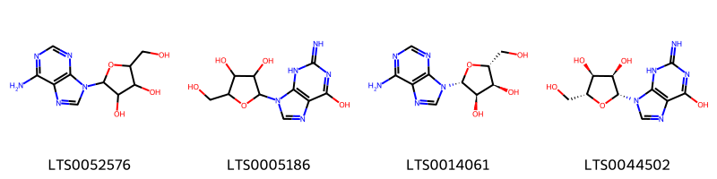{ width=100% }
    <figcaption>Hình ảnh cấu trúc hóa học của 4 hoạt chất thuộc nhóm Purine nucleosides gồm ['adenosine (LTS0052576)', '2-(6-hydroxy-2-imino-3h-purin-9-yl)-5-(hydroxymethyl)oxolane-3,4-diol (LTS0005186)', 'adenosine (LTS0014061)', 'ribonucleoside (LTS0044502)'].</figcaption>
</figure>
#### Nhóm Pyridines and derivatives
<figure markdown="span">
    { width=100% }
    <figcaption>Hình ảnh cấu trúc hóa học của 1 hoạt chất thuộc nhóm Pyridines and derivatives gồm ['niacin (LTS0216673)'].</figcaption>
</figure>
#### Nhóm Pyrimidine nucleosides
<figure markdown="span">
    { width=100% }
    <figcaption>Hình ảnh cấu trúc hóa học của 2 hoạt chất thuộc nhóm Pyrimidine nucleosides gồm ['thymidine (LTS0162810)', '4-hydroxy-1-[4-hydroxy-5-(hydroxymethyl)oxolan-2-yl]-5-methylpyrimidin-2-one (LTS0253531)'].</figcaption>
</figure>
#### Nhóm Steroids and steroid derivatives
<figure markdown="span">
    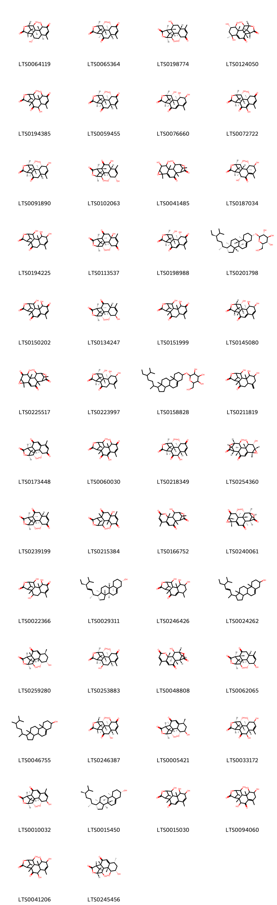{ width=100% }
    <figcaption>Hình ảnh cấu trúc hóa học của 52 hoạt chất thuộc nhóm Steroids and steroid derivatives gồm ['(1r,2s,3s,5r,9r,10r,11r,12s,13s,16s)-3,9,12-trihydroxy-2,6,10,16-tetramethyl-14-oxatetracyclo[11.2.1.0²,¹¹.0⁵,¹⁰]hexadec-6-ene-8,15-dione (LTS0064119)', '(2r,5s,9s,10s,11r,12r,13r,16r)-9,12-dihydroxy-2,6,10,16-tetramethyl-14-oxatetracyclo[11.2.1.0²,¹¹.0⁵,¹⁰]hexadec-6-ene-3,8,15-trione (LTS0065364)', '(1r,2r,3s,5r,9r,10r,11s,12r,13s,16r)-3,9,12-trihydroxy-2,6,10,16-tetramethyl-14-oxatetracyclo[11.2.1.0²,¹¹.0⁵,¹⁰]hexadec-6-ene-8,15-dione (LTS0198774)', '(1s,2r,6s,8s,9s,10r,12r,13r,16r)-6,8,9,12-tetrahydroxy-2,6,10,16-tetramethyl-14-oxatetracyclo[11.2.1.0²,¹¹.0⁵,¹⁰]hexadec-4-ene-3,15-dione (LTS0124050)', '4,9,12-trihydroxy-2,6,10,16-tetramethyl-14-oxatetracyclo[11.2.1.0²,¹¹.0⁵,¹⁰]hexadec-6-ene-3,8,15-trione (LTS0194385)', 'eurycomalactone (LTS0059455)', '(1s,2r,8s,9s,10r,11r,12r,13r,16r)-8,9,12-trihydroxy-2,6,10,16-tetramethyl-14-oxatetracyclo[11.2.1.0²,¹¹.0⁵,¹⁰]hexadeca-4,6-diene-3,15-dione (LTS0076660)', '(1s,2r,9s,10r,11r,12r,13r,16r)-4,9,12-trihydroxy-2,6,10,16-tetramethyl-14-oxatetracyclo[11.2.1.0²,¹¹.0⁵,¹⁰]hexadeca-4,6-diene-3,8,15-trione (LTS0072722)', '(1s,2r,5s,8s,9s,10s,11r,12r,13r,16r)-8,9,12-trihydroxy-2,6,10,16-tetramethyl-14-oxatetracyclo[11.2.1.0²,¹¹.0⁵,¹⁰]hexadec-6-ene-3,15-dione (LTS0091890)', '(1r,2r,4s,5r,8s,9r,10s,11s,12r,13s,16s)-4,8,9,12-tetrahydroxy-2,6,10,16-tetramethyl-14-oxatetracyclo[11.2.1.0²,¹¹.0⁵,¹⁰]hexadec-6-ene-3,15-dione (LTS0102063)', '9,10,13-trihydroxy-2,6,11,17-tetramethyl-7,15-dioxapentacyclo[12.2.1.0²,¹².0⁵,¹¹.0⁶,⁸]heptadec-4-ene-3,16-dione (LTS0041485)', '(1s,2r,3r,8s,9s,10r,11s,12r,13r,16r)-3,8,9,12-tetrahydroxy-2,6,10,16-tetramethyl-14-oxatetracyclo[11.2.1.0²,¹¹.0⁵,¹⁰]hexadec-5-ene-4,15-dione (LTS0187034)', '8,9,12-trihydroxy-2,6,10,16-tetramethyl-14-oxatetracyclo[11.2.1.0²,¹¹.0⁵,¹⁰]hexadec-6-ene-3,15-dione (LTS0194225)', '(1r,2s,5s,9r,10r,11s,12s,13s,16s)-5,9,12-trihydroxy-2,6,10,16-tetramethyl-14-oxatetracyclo[11.2.1.0²,¹¹.0⁵,¹⁰]hexadec-6-ene-3,8,15-trione (LTS0113537)', '(1s,2r,9s,10r,11r,12r,13r,16r)-9,12-dihydroxy-2,6,10,16-tetramethyl-14-oxatetracyclo[11.2.1.0²,¹¹.0⁵,¹⁰]hexadeca-4,6-diene-3,8,15-trione (LTS0198988)', 'sitogluside (LTS0201798)', '9,12-dihydroxy-2,6,10,16-tetramethyl-14-oxatetracyclo[11.2.1.0²,¹¹.0⁵,¹⁰]hexadeca-4,6-diene-3,8,15-trione (LTS0150202)', '(1r,2s,5r,8r,9r,10r,11s,12s,13s,16s)-8,9,12-trihydroxy-2,6,10,16-tetramethyl-14-oxatetracyclo[11.2.1.0²,¹¹.0⁵,¹⁰]hexadec-6-ene-3,15-dione (LTS0134247)', '9,12-dihydroxy-2,6,10,16-tetramethyl-14-oxatetracyclo[11.2.1.0²,¹¹.0⁵,¹⁰]hexadec-6-ene-3,8,15-trione (LTS0151999)', '(1r,2s,8s,9r,10r,11r,12r,13s,16r)-8,9,12-trihydroxy-2,6,10,16-tetramethyl-14-oxatetracyclo[11.2.1.0²,¹¹.0⁵,¹⁰]hexadeca-4,6-diene-3,15-dione (LTS0145080)', '10,13-dihydroxy-2,6,11,17-tetramethyl-7,15-dioxapentacyclo[12.2.1.0²,¹².0⁵,¹¹.0⁶,⁸]heptadec-4-ene-3,9,16-trione (LTS0225517)', '(1s,2r,8s,9s,10s,11r,12r,13r,16r)-8,9,12-trihydroxy-2,6,10,16-tetramethyl-14-oxatetracyclo[11.2.1.0²,¹¹.0⁵,¹⁰]hexadec-6-ene-3,15-dione (LTS0223997)', '2-{[1-(5-ethyl-6-methylheptan-2-yl)-9a,11a-dimethyl-1h,2h,3h,3ah,3bh,4h,6h,7h,8h,9h,9bh,10h,11h-cyclopenta[a]phenanthren-7-yl]oxy}-6-(hydroxymethyl)oxane-3,4,5-triol (LTS0158828)', '8,9,12-trihydroxy-2,10,16-trimethyl-6-methylidene-14-oxatetracyclo[11.2.1.0²,¹¹.0⁵,¹⁰]hexadecane-3,15-dione (LTS0211819)', '(1r,2s,9r,10s,11s,12s,13s,16s)-9,12-dihydroxy-2,6,10,16-tetramethyl-14-oxatetracyclo[11.2.1.0²,¹¹.0⁵,¹⁰]hexadeca-4,6-diene-3,8,15-trione (LTS0173448)', '4,9,12-trihydroxy-2,6,10,16-tetramethyl-14-oxatetracyclo[11.2.1.0²,¹¹.0⁵,¹⁰]hexadeca-4,6-diene-3,8,15-trione (LTS0060030)', '(1s,2r,4r,5s,9s,10r,11r,12r,13r,16r)-4,9,12-trihydroxy-2,6,10,16-tetramethyl-14-oxatetracyclo[11.2.1.0²,¹¹.0⁵,¹⁰]hexadec-6-ene-3,8,15-trione (LTS0218349)', '(1r,2s,6r,8s,9s,10r,11s,12s,13s,14s,17s)-9,10,13-trihydroxy-2,6,11,17-tetramethyl-7,15-dioxapentacyclo[12.2.1.0²,¹².0⁵,¹¹.0⁶,⁸]heptadec-4-ene-3,16-dione (LTS0254360)', '(1r,2s,5r,9r,10r,11s,12s,13s,16s)-9,12-dihydroxy-2,6,10,16-tetramethyl-14-oxatetracyclo[11.2.1.0²,¹¹.0⁵,¹⁰]hexadec-6-ene-3,8,15-trione (LTS0239199)', '5,9,12-trihydroxy-2,6,10,16-tetramethyl-14-oxatetracyclo[11.2.1.0²,¹¹.0⁵,¹⁰]hexadec-6-ene-3,8,15-trione (LTS0215384)', '12-hydroxy-2,6,10,16-tetramethyl-9,14-dioxatetracyclo[11.2.1.0²,¹¹.0⁵,¹⁰]hexadeca-4,6-diene-3,8,15-trione (LTS0166752)', '(1r,2s,6s,8s,10r,11s,12s,13s,14s,17s)-10,13-dihydroxy-2,6,11,17-tetramethyl-7,15-dioxapentacyclo[12.2.1.0²,¹².0⁵,¹¹.0⁶,⁸]heptadec-4-ene-3,9,16-trione (LTS0240061)', '3,9,12-trihydroxy-2,6,10,16-tetramethyl-14-oxatetracyclo[11.2.1.0²,¹¹.0⁵,¹⁰]hexadec-6-ene-8,15-dione (LTS0022366)', 'phytosterol (LTS0029311)', '8,9,12-trihydroxy-2,6,10,16-tetramethyl-14-oxatetracyclo[11.2.1.0²,¹¹.0⁵,¹⁰]hexadec-4-ene-3,15-dione (LTS0246426)', 'stigmasterol (LTS0024262)', '(1r,2r,6s,8s,9r,10r,11s,12r,13s,16s)-8,9,12-trihydroxy-2,6,10,16-tetramethyl-14-oxatetracyclo[11.2.1.0²,¹¹.0⁵,¹⁰]hexadec-4-ene-3,15-dione (LTS0259280)', '(1s,2r,3r,5s,9s,10s,11s,12r,13r,16r)-3,9,12-trihydroxy-2,6,10,16-tetramethyl-14-oxatetracyclo[11.2.1.0²,¹¹.0⁵,¹⁰]hexadec-6-ene-8,15-dione (LTS0253883)', '(1s,2r,10r,11r,12r,13r,16r)-12-hydroxy-2,6,10,16-tetramethyl-9,14-dioxatetracyclo[11.2.1.0²,¹¹.0⁵,¹⁰]hexadeca-4,6-diene-3,8,15-trione (LTS0048808)', '(1r,2r,5r,8r,9r,10r,11s,12r,13s,16s)-8,9,12-trihydroxy-2,6,10,16-tetramethyl-14-oxatetracyclo[11.2.1.0²,¹¹.0⁵,¹⁰]hexadec-6-ene-3,15-dione (LTS0062065)', 'campesterol (LTS0046755)', '(1r,2r,4s,5s,9r,10r,11r,12r,13s,16s)-4,9,12-trihydroxy-2,6,10,16-tetramethyl-14-oxatetracyclo[11.2.1.0²,¹¹.0⁵,¹⁰]hexadec-6-ene-3,8,15-trione (LTS0246387)', '(1r,2s,6s,8r,9r,10s,11s,12s,13s,16s)-8,9,12-trihydroxy-2,6,10,16-tetramethyl-14-oxatetracyclo[11.2.1.0²,¹¹.0⁵,¹⁰]hexadec-4-ene-3,15-dione (LTS0005421)', '(1s,2r,4r,5s,8s,9s,10r,11r,12r,13r,16r)-4,8,9,12-tetrahydroxy-2,6,10,16-tetramethyl-14-oxatetracyclo[11.2.1.0²,¹¹.0⁵,¹⁰]hexadec-6-ene-3,15-dione (LTS0033172)', '(1r,2s,8r,9r,10s,11s,12s,13s,16s)-8,9,12-trihydroxy-2,6,10,16-tetramethyl-14-oxatetracyclo[11.2.1.0²,¹¹.0⁵,¹⁰]hexadeca-4,6-diene-3,15-dione (LTS0010032)', '(1r,3ar,3br,7s,9ar,9br,11ar)-1-[(2r,5r)-5,6-dimethylheptan-2-yl]-9a,11a-dimethyl-1h,2h,3h,3ah,3bh,4h,6h,7h,8h,9h,9bh,10h,11h-cyclopenta[a]phenanthren-7-ol (LTS0015450)', '8,9,12-trihydroxy-2,6,10,16-tetramethyl-14-oxatetracyclo[11.2.1.0²,¹¹.0⁵,¹⁰]hexadeca-4,6-diene-3,15-dione (LTS0015030)', '3,8,9,12-tetrahydroxy-2,6,10,16-tetramethyl-14-oxatetracyclo[11.2.1.0²,¹¹.0⁵,¹⁰]hexadec-5-ene-4,15-dione (LTS0094060)', '4,8,9,12-tetrahydroxy-2,6,10,16-tetramethyl-14-oxatetracyclo[11.2.1.0²,¹¹.0⁵,¹⁰]hexadec-6-ene-3,15-dione (LTS0041206)', '(1s,2r,6r,8s,9s,10r,12r,13r,16r)-8,9,12-trihydroxy-2,6,10,16-tetramethyl-14-oxatetracyclo[11.2.1.0²,¹¹.0⁵,¹⁰]hexadec-4-ene-3,15-dione (LTS0245456)', '(1r,3ar,3br,7s,9ar,9br,11ar)-1-[(2s,3e,5s)-5-ethyl-6-methylhept-3-en-2-yl]-9a,11a-dimethyl-1h,2h,3h,3ah,3bh,4h,6h,7h,8h,9h,9bh,10h,11h-cyclopenta[a]phenanthren-7-ol (LTS0244733)', '(1r,2s,5r,8r,9r,10r,11s,12s,13s,16s)-8,9,12-trihydroxy-2,10,16-trimethyl-6-methylidene-14-oxatetracyclo[11.2.1.0²,¹¹.0⁵,¹⁰]hexadecane-3,15-dione (LTS0019666)'].</figcaption>
</figure>
#### Nhóm Stilbenes
<figure markdown="span">
    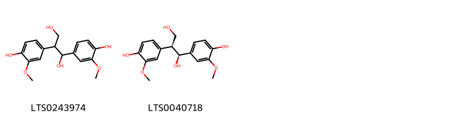{ width=100% }
    <figcaption>Hình ảnh cấu trúc hóa học của 2 hoạt chất thuộc nhóm Stilbenes gồm ['1,2-diguaiacylpropane-1,3-diol (LTS0243974)', '(1s,2s)-1,2-bis(4-hydroxy-3-methoxyphenyl)propane-1,3-diol (LTS0040718)'].</figcaption>
</figure>

---

### Dược dân tộc học

Danh sách các quốc gia có sử dụng *Eurycoma longifolia* trong điều trị các bệnh. 

| Country   | Disease   | Bệnh                                                                                                                                                                                                |
|:----------|:----------|:----------------------------------------------------------------------------------------------------------------------------------------------------------------------------------------------------|
| Malaysia  | Vermifuge | MYMEMORY WARNING: YOU USED ALL AVAILABLE FREE TRANSLATIONS FOR TODAY. NEXT AVAILABLE IN  07 HOURS 29 MINUTES 31 SECONDS VISIT HTTPS://MYMEMORY.TRANSLATED.NET/DOC/USAGELIMITS.PHP TO TRANSLATE MORE |

---

# Chi Quassia

??? note "Danh sách các dược liệu thuộc chi"
    
	 - *Quassia amara*
	 - *Quassia amara**
	 - *Quassia glauca*
	 - *Quassia indica*
	 - *Quassia versicolor*

---
## Quassia amara
### Thông tin về thực vật

!!! info "Phân loại thực vật của *Quassia amara* từ GIBF:"
    - **Kingdom:** Plantae
    - **Phylum:** Tracheophyta
    - **Order:** Sapindales
    - **Family:** Simaroubaceae
    - **Genus:** Quassia
    - **Species:** *Quassia amara*

 

| Label (VI)   | Label (EN)   | Scientific Name   | Descriptions (VI)   | Descriptions (EN)   | Also Known As (VI)   | Also Known As (EN)   |
|:-------------|:-------------|:------------------|:--------------------|:--------------------|:---------------------|:---------------------|
| N/A          | N/A          | Quassia amara     | loài thực vật       | species of plant    | ['']                 | ['']                 |

#### Phân bố trên thế giới

**Từ CSDL GIBF** Brazil, Guadeloupe, Barbados, Trinidad and Tobago, Thailand, Sri Lanka, Seychelles, Costa Rica, Colombia, Guyana, French Guiana, Mexico, Congo, Democratic Republic of the, El Salvador, Belgium, Panama, Belize, Nicaragua, Singapore, Martinique, Australia, India, Samoa

#### Phân bố tại Việt Nam

**Từ CSDL GIBF**: Không có ghi nhận ở Việt Nam

---
### Thành phần hóa học
        
- Theo cơ sở dữ liệu lotus: Từ loài *Quassia amara* đã phân lập và xác định được 36 hoạt chất thuộc về các nhóm Prenol lipids, Indolonaphthyridine alkaloids, Organooxygen compounds, Steroids and steroid derivatives. 

|    | chemicalTaxonomyClassyfireClass   |   smiles_count |
|---:|:----------------------------------|---------------:|
|  0 | Indolonaphthyridine alkaloids     |              2 |
|  1 | Organooxygen compounds            |              2 |
|  2 | Prenol lipids                     |             31 |
|  3 | Steroids and steroid derivatives  |              1 |

#### Nhóm Indolonaphthyridine alkaloids
<figure markdown="span">
    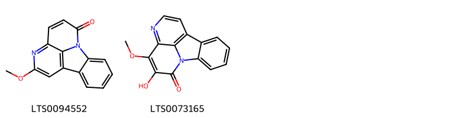{ width=100% }
    <figcaption>Hình ảnh cấu trúc hóa học của 2 hoạt chất thuộc nhóm Indolonaphthyridine alkaloids gồm ['7-methoxy-1,6-diazatetracyclo[7.6.1.0⁵,¹⁶.0¹⁰,¹⁵]hexadeca-3,5,7,9(16),10(15),11,13-heptaen-2-one (LTS0094552)', 'nigakinone (LTS0073165)'].</figcaption>
</figure>
#### Nhóm Organooxygen compounds
<figure markdown="span">
    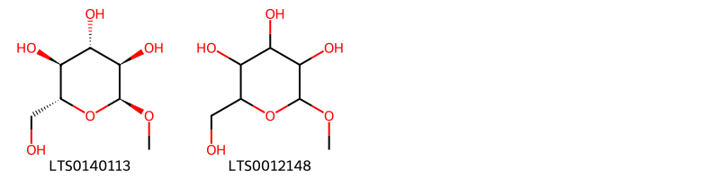{ width=100% }
    <figcaption>Hình ảnh cấu trúc hóa học của 2 hoạt chất thuộc nhóm Organooxygen compounds gồm ['methyl glucoside (LTS0140113)', 'methyl-α-d-mannoside (LTS0012148)'].</figcaption>
</figure>
#### Nhóm Prenol lipids
<figure markdown="span">
    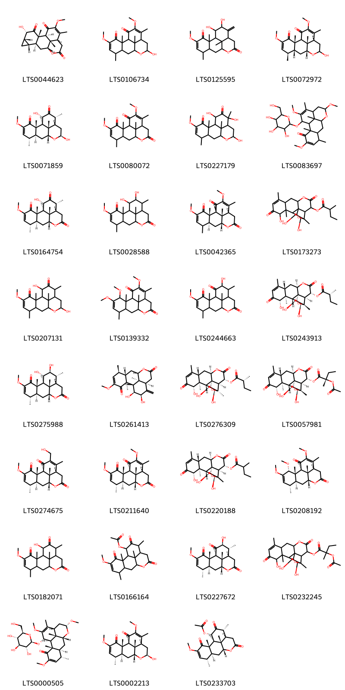{ width=100% }
    <figcaption>Hình ảnh cấu trúc hóa học của 31 hoạt chất thuộc nhóm Prenol lipids gồm ['(1s,2s,4s,5s,7s,8s,10r,14r,18s)-4-hydroxy-16-methoxy-2,15,18-trimethyl-11-oxapentacyclo[8.7.1.0²,⁸.0⁵,⁷.0¹⁴,¹⁸]octadec-15-ene-3,12,17-trione (LTS0044623)', 'neoquassin (LTS0106734)', '15,16-dihydroxy-4-methoxy-2,6,17-trimethyl-14-methylidene-10-oxatetracyclo[7.7.1.0²,⁷.0¹³,¹⁷]heptadec-4-ene-3,11-dione (LTS0125595)', '(2s,6r,7r,9r,13r,17s)-11-hydroxy-4,15-dimethoxy-2,6,14,17-tetramethyl-10-oxatetracyclo[7.7.1.0²,⁷.0¹³,¹⁷]heptadeca-4,14-diene-3,16-dione (LTS0072972)', '(1s,2s,6s,7s,9r,11s,13s,14r,16s,17s)-11,16-dihydroxy-4-methoxy-2,6,14,17-tetramethyl-10-oxatetracyclo[7.7.1.0²,⁷.0¹³,¹⁷]heptadec-4-ene-3,15-dione (LTS0071859)', 'quassin (LTS0080072)', '11,14,16-trihydroxy-4-methoxy-2,6,14,17-tetramethyl-10-oxatetracyclo[7.7.1.0²,⁷.0¹³,¹⁷]heptadec-4-ene-3,15-dione (LTS0227179)', '4,11,15-trimethoxy-2,6,14,17-tetramethyl-16-{[3,4,5-trihydroxy-6-(hydroxymethyl)oxan-2-yl]oxy}-10-oxatetracyclo[7.7.1.0²,⁷.0¹³,¹⁷]heptadeca-4,14-dien-3-one (LTS0083697)', '(1s,2s,6s,7s,9r,13s,14r,16s,17s)-16-hydroxy-4-methoxy-2,6,14,17-tetramethyl-10-oxatetracyclo[7.7.1.0²,⁷.0¹³,¹⁷]heptadec-4-ene-3,11,15-trione (LTS0164754)', '15,16-dihydroxy-4-methoxy-2,6,14,17-tetramethyl-10-oxatetracyclo[7.7.1.0²,⁷.0¹³,¹⁷]heptadec-4-ene-3,11-dione (LTS0028588)', '(1r,2s,7s,9r,13r,17s)-4,15-dimethoxy-2,6,14,17-tetramethyl-10-oxatetracyclo[7.7.1.0²,⁷.0¹³,¹⁷]heptadeca-4,14-diene-3,11,16-trione (LTS0042365)', '12,15,16-trihydroxy-9,13,17-trimethyl-4,11-dioxo-5,18-dioxapentacyclo[12.5.0.0¹,⁶.0²,¹⁷.0⁸,¹³]nonadec-9-en-3-yl 2-methylbutanoate (LTS0173273)', '11,16-dihydroxy-4-methoxy-2,6,14,17-tetramethyl-10-oxatetracyclo[7.7.1.0²,⁷.0¹³,¹⁷]heptadec-4-ene-3,15-dione (LTS0207131)', '3,4,15-trimethoxy-2,6,14,17-tetramethyl-10-oxatetracyclo[7.7.1.0²,⁷.0¹³,¹⁷]heptadeca-4,14-diene-11,16-dione (LTS0139332)', '15-hydroxy-4-methoxy-2,6,14,17-tetramethyl-10-oxatetracyclo[7.7.1.0²,⁷.0¹³,¹⁷]heptadec-4-ene-3,11,16-trione (LTS0244663)', '(1r,2s,3r,6r,8s,12s,13s,14r,15r,16s,17s)-12,15,16-trihydroxy-9,13,17-trimethyl-4,11-dioxo-5,18-dioxapentacyclo[12.5.0.0¹,⁶.0²,¹⁷.0⁸,¹³]nonadec-9-en-3-yl (2r)-2-methylbutanoate (LTS0243913)', 'nigakilactone a (LTS0275988)', '(1s,2s,6s,7s,9r,13s,15r,16s,17s)-15,16-dihydroxy-4-methoxy-2,6,17-trimethyl-14-methylidene-10-oxatetracyclo[7.7.1.0²,⁷.0¹³,¹⁷]heptadec-4-ene-3,11-dione (LTS0261413)', 'simalikalactone d (LTS0276309)', '(1r,2s,3r,6r,8s,12s,13s,14r,15r,16s,17s)-12,15,16-trihydroxy-9,13,17-trimethyl-4,11-dioxo-5,18-dioxapentacyclo[12.5.0.0¹,⁶.0²,¹⁷.0⁸,¹³]nonadec-9-en-3-yl (2s)-2-(acetyloxy)-2-methylbutanoate (LTS0057981)', '(1s,2s,6s,7s,9r,13s,17s)-15-(hydroxymethyl)-4-methoxy-2,6,14,17-tetramethyl-10-oxatetracyclo[7.7.1.0²,⁷.0¹³,¹⁷]heptadeca-4,14-diene-3,11,16-trione (LTS0274675)', 'quassin (LTS0211640)', '(1r,2s,3r,6r,8s,12s,13s,14r,15r,16s)-12,15,16-trihydroxy-9,13,17-trimethyl-4,11-dioxo-5,18-dioxapentacyclo[12.5.0.0¹,⁶.0²,¹⁷.0⁸,¹³]nonadec-9-en-3-yl 2-methylbutanoate (LTS0220188)', '(1s,2s,3r,6s,7s,9r,13r,17s)-3,4,15-trimethoxy-2,6,14,17-tetramethyl-10-oxatetracyclo[7.7.1.0²,⁷.0¹³,¹⁷]heptadeca-4,14-diene-11,16-dione (LTS0208192)', '16-hydroxy-4-methoxy-2,6,14,17-tetramethyl-10-oxatetracyclo[7.7.1.0²,⁷.0¹³,¹⁷]heptadec-4-ene-3,11,15-trione (LTS0182071)', '4-methoxy-2,6,14,17-tetramethyl-3,11,15-trioxo-10-oxatetracyclo[7.7.1.0²,⁷.0¹³,¹⁷]heptadec-4-en-16-yl acetate (LTS0166164)', '(1s,2s,6s,7s,9r,13s,14r,15s,17s)-15-hydroxy-4-methoxy-2,6,14,17-tetramethyl-10-oxatetracyclo[7.7.1.0²,⁷.0¹³,¹⁷]heptadec-4-ene-3,11,16-trione (LTS0227672)', '12,15,16-trihydroxy-9,13,17-trimethyl-4,11-dioxo-5,18-dioxapentacyclo[12.5.0.0¹,⁶.0²,¹⁷.0⁸,¹³]nonadec-9-en-3-yl 2-(acetyloxy)-2-methylbutanoate (LTS0232245)', '(1s,2s,6s,7s,9r,11r,13r,16s,17s)-4,11,15-trimethoxy-2,6,14,17-tetramethyl-16-{[(2s,3r,4s,5s,6r)-3,4,5-trihydroxy-6-(hydroxymethyl)oxan-2-yl]oxy}-10-oxatetracyclo[7.7.1.0²,⁷.0¹³,¹⁷]heptadeca-4,14-dien-3-one (LTS0000505)', 'β-neoquassin (LTS0002213)', '(1s,2s,6s,7s,9r,13s,14r,16s,17s)-4-methoxy-2,6,14,17-tetramethyl-3,11,15-trioxo-10-oxatetracyclo[7.7.1.0²,⁷.0¹³,¹⁷]heptadec-4-en-16-yl acetate (LTS0233703)'].</figcaption>
</figure>
#### Nhóm Steroids and steroid derivatives
<figure markdown="span">
    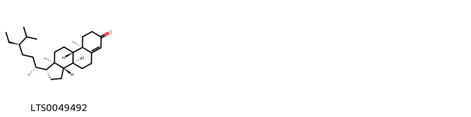{ width=100% }
    <figcaption>Hình ảnh cấu trúc hóa học của 1 hoạt chất thuộc nhóm Steroids and steroid derivatives gồm ['β-sitostenone (LTS0049492)'].</figcaption>
</figure>

---

### Dược dân tộc học

Danh sách các quốc gia có sử dụng *Quassia amara* trong điều trị các bệnh. 

| Country            | Disease                                  | Bệnh                                                                                                                                                                                                |
|:-------------------|:-----------------------------------------|:----------------------------------------------------------------------------------------------------------------------------------------------------------------------------------------------------|
| Dominican Republic | Tonic                                    | MYMEMORY WARNING: YOU USED ALL AVAILABLE FREE TRANSLATIONS FOR TODAY. NEXT AVAILABLE IN  07 HOURS 29 MINUTES 02 SECONDS VISIT HTTPS://MYMEMORY.TRANSLATED.NET/DOC/USAGELIMITS.PHP TO TRANSLATE MORE |
| Elsewhere          | Insecticide, Stomachic, Stomachic, Tonic | MYMEMORY WARNING: YOU USED ALL AVAILABLE FREE TRANSLATIONS FOR TODAY. NEXT AVAILABLE IN  07 HOURS 29 MINUTES 00 SECONDS VISIT HTTPS://MYMEMORY.TRANSLATED.NET/DOC/USAGELIMITS.PHP TO TRANSLATE MORE |
| Haiti              | Insecticide                              | MYMEMORY WARNING: YOU USED ALL AVAILABLE FREE TRANSLATIONS FOR TODAY. NEXT AVAILABLE IN  07 HOURS 28 MINUTES 57 SECONDS VISIT HTTPS://MYMEMORY.TRANSLATED.NET/DOC/USAGELIMITS.PHP TO TRANSLATE MORE |
| Latin America      | Insecticide, Stimulant, Stomachic, Tonic | MYMEMORY WARNING: YOU USED ALL AVAILABLE FREE TRANSLATIONS FOR TODAY. NEXT AVAILABLE IN  07 HOURS 28 MINUTES 55 SECONDS VISIT HTTPS://MYMEMORY.TRANSLATED.NET/DOC/USAGELIMITS.PHP TO TRANSLATE MORE |
| Mexico             | Stomachic, Tonic, Vermicide              | MYMEMORY WARNING: YOU USED ALL AVAILABLE FREE TRANSLATIONS FOR TODAY. NEXT AVAILABLE IN  07 HOURS 28 MINUTES 52 SECONDS VISIT HTTPS://MYMEMORY.TRANSLATED.NET/DOC/USAGELIMITS.PHP TO TRANSLATE MORE |
| Panama             | Vermifuge                                | MYMEMORY WARNING: YOU USED ALL AVAILABLE FREE TRANSLATIONS FOR TODAY. NEXT AVAILABLE IN  07 HOURS 28 MINUTES 50 SECONDS VISIT HTTPS://MYMEMORY.TRANSLATED.NET/DOC/USAGELIMITS.PHP TO TRANSLATE MORE |
| Turkey             | Digestive, Diuretic, Astringent, Tonic   | MYMEMORY WARNING: YOU USED ALL AVAILABLE FREE TRANSLATIONS FOR TODAY. NEXT AVAILABLE IN  07 HOURS 28 MINUTES 47 SECONDS VISIT HTTPS://MYMEMORY.TRANSLATED.NET/DOC/USAGELIMITS.PHP TO TRANSLATE MORE |
| US                 | Insecticide                              | MYMEMORY WARNING: YOU USED ALL AVAILABLE FREE TRANSLATIONS FOR TODAY. NEXT AVAILABLE IN  07 HOURS 28 MINUTES 45 SECONDS VISIT HTTPS://MYMEMORY.TRANSLATED.NET/DOC/USAGELIMITS.PHP TO TRANSLATE MORE |
| Venezuela          | Diuretic, Laxative, Tonic                | MYMEMORY WARNING: YOU USED ALL AVAILABLE FREE TRANSLATIONS FOR TODAY. NEXT AVAILABLE IN  07 HOURS 28 MINUTES 43 SECONDS VISIT HTTPS://MYMEMORY.TRANSLATED.NET/DOC/USAGELIMITS.PHP TO TRANSLATE MORE |

---

---
## Quassia amara
### Thông tin về thực vật

!!! info "Phân loại thực vật của *Quassia amara* từ GIBF:"
    - **Kingdom:** Plantae
    - **Phylum:** Tracheophyta
    - **Order:** Sapindales
    - **Family:** Simaroubaceae
    - **Genus:** Quassia
    - **Species:** *Quassia amara*

 

| Label (VI)   | Label (EN)   | Scientific Name   | Descriptions (VI)   | Descriptions (EN)   | Also Known As (VI)   | Also Known As (EN)   |
|:-------------|:-------------|:------------------|:--------------------|:--------------------|:---------------------|:---------------------|
| N/A          | N/A          | Quassia amara     | loài thực vật       | species of plant    | ['']                 | ['']                 |

#### Phân bố trên thế giới

**Từ CSDL GIBF** Brazil, Guadeloupe, Barbados, Trinidad and Tobago, Thailand, Sri Lanka, Seychelles, Costa Rica, Colombia, Guyana, French Guiana, Mexico, Congo, Democratic Republic of the, El Salvador, Belgium, Panama, Belize, Nicaragua, Singapore, Martinique, Australia, India, Samoa

#### Phân bố tại Việt Nam

**Từ CSDL GIBF**: Không có ghi nhận ở Việt Nam

---
### Thành phần hóa học
        
- Theo cơ sở dữ liệu lotus: Từ loài *Quassia amara* đã phân lập và xác định được 36 hoạt chất thuộc về các nhóm Prenol lipids, Indolonaphthyridine alkaloids, Organooxygen compounds, Steroids and steroid derivatives. 

|    | chemicalTaxonomyClassyfireClass   |   smiles_count |
|---:|:----------------------------------|---------------:|
|  0 | Indolonaphthyridine alkaloids     |              2 |
|  1 | Organooxygen compounds            |              2 |
|  2 | Prenol lipids                     |             31 |
|  3 | Steroids and steroid derivatives  |              1 |

#### Nhóm Indolonaphthyridine alkaloids
<figure markdown="span">
    { width=100% }
    <figcaption>Hình ảnh cấu trúc hóa học của 2 hoạt chất thuộc nhóm Indolonaphthyridine alkaloids gồm ['7-methoxy-1,6-diazatetracyclo[7.6.1.0⁵,¹⁶.0¹⁰,¹⁵]hexadeca-3,5,7,9(16),10(15),11,13-heptaen-2-one (LTS0094552)', 'nigakinone (LTS0073165)'].</figcaption>
</figure>
#### Nhóm Organooxygen compounds
<figure markdown="span">
    { width=100% }
    <figcaption>Hình ảnh cấu trúc hóa học của 2 hoạt chất thuộc nhóm Organooxygen compounds gồm ['methyl glucoside (LTS0140113)', 'methyl-α-d-mannoside (LTS0012148)'].</figcaption>
</figure>
#### Nhóm Prenol lipids
<figure markdown="span">
    { width=100% }
    <figcaption>Hình ảnh cấu trúc hóa học của 31 hoạt chất thuộc nhóm Prenol lipids gồm ['(1s,2s,4s,5s,7s,8s,10r,14r,18s)-4-hydroxy-16-methoxy-2,15,18-trimethyl-11-oxapentacyclo[8.7.1.0²,⁸.0⁵,⁷.0¹⁴,¹⁸]octadec-15-ene-3,12,17-trione (LTS0044623)', 'neoquassin (LTS0106734)', '15,16-dihydroxy-4-methoxy-2,6,17-trimethyl-14-methylidene-10-oxatetracyclo[7.7.1.0²,⁷.0¹³,¹⁷]heptadec-4-ene-3,11-dione (LTS0125595)', '(2s,6r,7r,9r,13r,17s)-11-hydroxy-4,15-dimethoxy-2,6,14,17-tetramethyl-10-oxatetracyclo[7.7.1.0²,⁷.0¹³,¹⁷]heptadeca-4,14-diene-3,16-dione (LTS0072972)', '(1s,2s,6s,7s,9r,11s,13s,14r,16s,17s)-11,16-dihydroxy-4-methoxy-2,6,14,17-tetramethyl-10-oxatetracyclo[7.7.1.0²,⁷.0¹³,¹⁷]heptadec-4-ene-3,15-dione (LTS0071859)', 'quassin (LTS0080072)', '11,14,16-trihydroxy-4-methoxy-2,6,14,17-tetramethyl-10-oxatetracyclo[7.7.1.0²,⁷.0¹³,¹⁷]heptadec-4-ene-3,15-dione (LTS0227179)', '4,11,15-trimethoxy-2,6,14,17-tetramethyl-16-{[3,4,5-trihydroxy-6-(hydroxymethyl)oxan-2-yl]oxy}-10-oxatetracyclo[7.7.1.0²,⁷.0¹³,¹⁷]heptadeca-4,14-dien-3-one (LTS0083697)', '(1s,2s,6s,7s,9r,13s,14r,16s,17s)-16-hydroxy-4-methoxy-2,6,14,17-tetramethyl-10-oxatetracyclo[7.7.1.0²,⁷.0¹³,¹⁷]heptadec-4-ene-3,11,15-trione (LTS0164754)', '15,16-dihydroxy-4-methoxy-2,6,14,17-tetramethyl-10-oxatetracyclo[7.7.1.0²,⁷.0¹³,¹⁷]heptadec-4-ene-3,11-dione (LTS0028588)', '(1r,2s,7s,9r,13r,17s)-4,15-dimethoxy-2,6,14,17-tetramethyl-10-oxatetracyclo[7.7.1.0²,⁷.0¹³,¹⁷]heptadeca-4,14-diene-3,11,16-trione (LTS0042365)', '12,15,16-trihydroxy-9,13,17-trimethyl-4,11-dioxo-5,18-dioxapentacyclo[12.5.0.0¹,⁶.0²,¹⁷.0⁸,¹³]nonadec-9-en-3-yl 2-methylbutanoate (LTS0173273)', '11,16-dihydroxy-4-methoxy-2,6,14,17-tetramethyl-10-oxatetracyclo[7.7.1.0²,⁷.0¹³,¹⁷]heptadec-4-ene-3,15-dione (LTS0207131)', '3,4,15-trimethoxy-2,6,14,17-tetramethyl-10-oxatetracyclo[7.7.1.0²,⁷.0¹³,¹⁷]heptadeca-4,14-diene-11,16-dione (LTS0139332)', '15-hydroxy-4-methoxy-2,6,14,17-tetramethyl-10-oxatetracyclo[7.7.1.0²,⁷.0¹³,¹⁷]heptadec-4-ene-3,11,16-trione (LTS0244663)', '(1r,2s,3r,6r,8s,12s,13s,14r,15r,16s,17s)-12,15,16-trihydroxy-9,13,17-trimethyl-4,11-dioxo-5,18-dioxapentacyclo[12.5.0.0¹,⁶.0²,¹⁷.0⁸,¹³]nonadec-9-en-3-yl (2r)-2-methylbutanoate (LTS0243913)', 'nigakilactone a (LTS0275988)', '(1s,2s,6s,7s,9r,13s,15r,16s,17s)-15,16-dihydroxy-4-methoxy-2,6,17-trimethyl-14-methylidene-10-oxatetracyclo[7.7.1.0²,⁷.0¹³,¹⁷]heptadec-4-ene-3,11-dione (LTS0261413)', 'simalikalactone d (LTS0276309)', '(1r,2s,3r,6r,8s,12s,13s,14r,15r,16s,17s)-12,15,16-trihydroxy-9,13,17-trimethyl-4,11-dioxo-5,18-dioxapentacyclo[12.5.0.0¹,⁶.0²,¹⁷.0⁸,¹³]nonadec-9-en-3-yl (2s)-2-(acetyloxy)-2-methylbutanoate (LTS0057981)', '(1s,2s,6s,7s,9r,13s,17s)-15-(hydroxymethyl)-4-methoxy-2,6,14,17-tetramethyl-10-oxatetracyclo[7.7.1.0²,⁷.0¹³,¹⁷]heptadeca-4,14-diene-3,11,16-trione (LTS0274675)', 'quassin (LTS0211640)', '(1r,2s,3r,6r,8s,12s,13s,14r,15r,16s)-12,15,16-trihydroxy-9,13,17-trimethyl-4,11-dioxo-5,18-dioxapentacyclo[12.5.0.0¹,⁶.0²,¹⁷.0⁸,¹³]nonadec-9-en-3-yl 2-methylbutanoate (LTS0220188)', '(1s,2s,3r,6s,7s,9r,13r,17s)-3,4,15-trimethoxy-2,6,14,17-tetramethyl-10-oxatetracyclo[7.7.1.0²,⁷.0¹³,¹⁷]heptadeca-4,14-diene-11,16-dione (LTS0208192)', '16-hydroxy-4-methoxy-2,6,14,17-tetramethyl-10-oxatetracyclo[7.7.1.0²,⁷.0¹³,¹⁷]heptadec-4-ene-3,11,15-trione (LTS0182071)', '4-methoxy-2,6,14,17-tetramethyl-3,11,15-trioxo-10-oxatetracyclo[7.7.1.0²,⁷.0¹³,¹⁷]heptadec-4-en-16-yl acetate (LTS0166164)', '(1s,2s,6s,7s,9r,13s,14r,15s,17s)-15-hydroxy-4-methoxy-2,6,14,17-tetramethyl-10-oxatetracyclo[7.7.1.0²,⁷.0¹³,¹⁷]heptadec-4-ene-3,11,16-trione (LTS0227672)', '12,15,16-trihydroxy-9,13,17-trimethyl-4,11-dioxo-5,18-dioxapentacyclo[12.5.0.0¹,⁶.0²,¹⁷.0⁸,¹³]nonadec-9-en-3-yl 2-(acetyloxy)-2-methylbutanoate (LTS0232245)', '(1s,2s,6s,7s,9r,11r,13r,16s,17s)-4,11,15-trimethoxy-2,6,14,17-tetramethyl-16-{[(2s,3r,4s,5s,6r)-3,4,5-trihydroxy-6-(hydroxymethyl)oxan-2-yl]oxy}-10-oxatetracyclo[7.7.1.0²,⁷.0¹³,¹⁷]heptadeca-4,14-dien-3-one (LTS0000505)', 'β-neoquassin (LTS0002213)', '(1s,2s,6s,7s,9r,13s,14r,16s,17s)-4-methoxy-2,6,14,17-tetramethyl-3,11,15-trioxo-10-oxatetracyclo[7.7.1.0²,⁷.0¹³,¹⁷]heptadec-4-en-16-yl acetate (LTS0233703)'].</figcaption>
</figure>
#### Nhóm Steroids and steroid derivatives
<figure markdown="span">
    { width=100% }
    <figcaption>Hình ảnh cấu trúc hóa học của 1 hoạt chất thuộc nhóm Steroids and steroid derivatives gồm ['β-sitostenone (LTS0049492)'].</figcaption>
</figure>

---

### Dược dân tộc học

Danh sách các quốc gia có sử dụng *Quassia amara* trong điều trị các bệnh. 

| Country   | Disease   | Bệnh                                                                                                                                                                                                |
|:----------|:----------|:----------------------------------------------------------------------------------------------------------------------------------------------------------------------------------------------------|
| Elsewhere | Vermifuge | MYMEMORY WARNING: YOU USED ALL AVAILABLE FREE TRANSLATIONS FOR TODAY. NEXT AVAILABLE IN  07 HOURS 28 MINUTES 17 SECONDS VISIT HTTPS://MYMEMORY.TRANSLATED.NET/DOC/USAGELIMITS.PHP TO TRANSLATE MORE |

---

---
## Quassia glauca
### Thông tin về thực vật

!!! info "Phân loại thực vật của *Simarouba glauca* từ GIBF:"
    - **Kingdom:** Plantae
    - **Phylum:** Tracheophyta
    - **Order:** Sapindales
    - **Family:** Simaroubaceae
    - **Genus:** Simarouba
    - **Species:** *Simarouba glauca*

 

| Label (VI)   | Label (EN)   | Scientific Name   | Descriptions (VI)   | Descriptions (EN)   | Also Known As (VI)   | Also Known As (EN)   |
|:-------------|:-------------|:------------------|:--------------------|:--------------------|:---------------------|:---------------------|
| N/A          | N/A          | Quassia glauca    |                     |                     | ['']                 | ['']                 |

#### Phân bố trên thế giới

**Từ CSDL GIBF** Brazil, Guadeloupe, Barbados, Trinidad and Tobago, Thailand, Sri Lanka, Seychelles, Costa Rica, Colombia, Guyana, French Guiana, Mexico, Congo, Democratic Republic of the, El Salvador, Belgium, Panama, Belize, Nicaragua, Singapore, Martinique, Australia, India, Samoa

#### Phân bố tại Việt Nam

**Từ CSDL GIBF**: Không có ghi nhận ở Việt Nam

---
### Thành phần hóa học
        
- Theo cơ sở dữ liệu lotus: Từ loài *Simarouba glauca* đã phân lập và xác định được Chưa có hoạt chất nào được phân lập. hoạt chất thuộc về các nhóm Không có hoạt chất nào được phân lập. 

Không có hình ảnh nào được tạo ra

---

### Dược dân tộc học

Danh sách các quốc gia có sử dụng *Simarouba glauca* trong điều trị các bệnh. 

| Country   | Disease            | Bệnh                                                                                                                                                                                                |
|:----------|:-------------------|:----------------------------------------------------------------------------------------------------------------------------------------------------------------------------------------------------|
| Haiti     | Apertif, Sudorific | MYMEMORY WARNING: YOU USED ALL AVAILABLE FREE TRANSLATIONS FOR TODAY. NEXT AVAILABLE IN  07 HOURS 27 MINUTES 53 SECONDS VISIT HTTPS://MYMEMORY.TRANSLATED.NET/DOC/USAGELIMITS.PHP TO TRANSLATE MORE |

---

---
## Quassia indica
### Thông tin về thực vật

!!! info "Phân loại thực vật của *Samadera indica* từ GIBF:"
    - **Kingdom:** Plantae
    - **Phylum:** Tracheophyta
    - **Order:** Sapindales
    - **Family:** Simaroubaceae
    - **Genus:** Samadera
    - **Species:** *Samadera indica*

 

| Label (VI)   | Label (EN)   | Scientific Name   | Descriptions (VI)   | Descriptions (EN)   | Also Known As (VI)   | Also Known As (EN)   |
|:-------------|:-------------|:------------------|:--------------------|:--------------------|:---------------------|:---------------------|
| N/A          | N/A          | Quassia indica    | loài thực vật       | species of plant    | ['']                 | ['']                 |

#### Phân bố trên thế giới

**Từ CSDL GIBF** Sri Lanka, Vanuatu, Indonesia, Malaysia, Philippines, Mayotte, Palau, Myanmar, India, Solomon Islands, unknown or invalid, Papua New Guinea, Madagascar

#### Phân bố tại Việt Nam

**Từ CSDL GIBF**: Không có ghi nhận ở Việt Nam

---
### Thành phần hóa học
        
- Theo cơ sở dữ liệu lotus: Từ loài *Samadera indica* đã phân lập và xác định được 61 hoạt chất thuộc về các nhóm Fatty Acyls, Tannins, Organooxygen compounds, Indolonaphthyridine alkaloids, Prenol lipids. 

|    | chemicalTaxonomyClassyfireClass   |   smiles_count |
|---:|:----------------------------------|---------------:|
|  0 | Fatty Acyls                       |              2 |
|  1 | Indolonaphthyridine alkaloids     |              1 |
|  2 | Organooxygen compounds            |              2 |
|  3 | Prenol lipids                     |             54 |
|  4 | Tannins                           |              2 |

#### Nhóm Fatty Acyls
<figure markdown="span">
    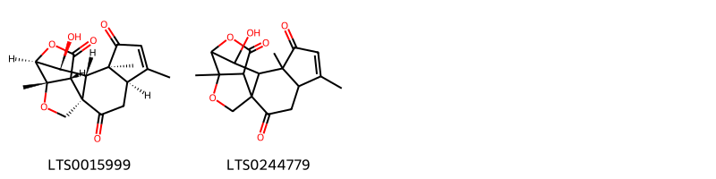{ width=100% }
    <figcaption>Hình ảnh cấu trúc hóa học của 2 hoạt chất thuộc nhóm Fatty Acyls gồm ['(1r,4s,5r,8s,9r,10r,11s,15r)-9-hydroxy-4,11,14-trimethyl-3,7-dioxapentacyclo[8.7.0.0¹,⁵.0⁴,⁸.0¹¹,¹⁵]heptadec-13-ene-6,12,17-trione (LTS0015999)', '9-hydroxy-4,11,14-trimethyl-3,7-dioxapentacyclo[8.7.0.0¹,⁵.0⁴,⁸.0¹¹,¹⁵]heptadec-13-ene-6,12,17-trione (LTS0244779)'].</figcaption>
</figure>
#### Nhóm Indolonaphthyridine alkaloids
<figure markdown="span">
    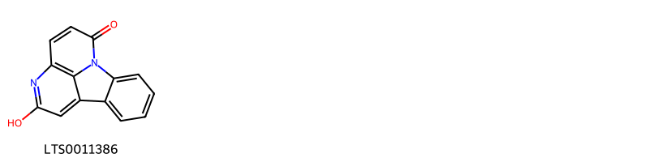{ width=100% }
    <figcaption>Hình ảnh cấu trúc hóa học của 1 hoạt chất thuộc nhóm Indolonaphthyridine alkaloids gồm ['7-hydroxy-1,6-diazatetracyclo[7.6.1.0⁵,¹⁶.0¹⁰,¹⁵]hexadeca-3,5,7,9(16),10(15),11,13-heptaen-2-one (LTS0011386)'].</figcaption>
</figure>
#### Nhóm Organooxygen compounds
<figure markdown="span">
    { width=100% }
    <figcaption>Hình ảnh cấu trúc hóa học của 2 hoạt chất thuộc nhóm Organooxygen compounds gồm ['(-)-inositol (LTS0047771)', '(1r,2r,3s,4r,5s,6s)-cyclohexane-1,2,3,4,5,6-hexol (LTS0123108)'].</figcaption>
</figure>
#### Nhóm Prenol lipids
<figure markdown="span">
    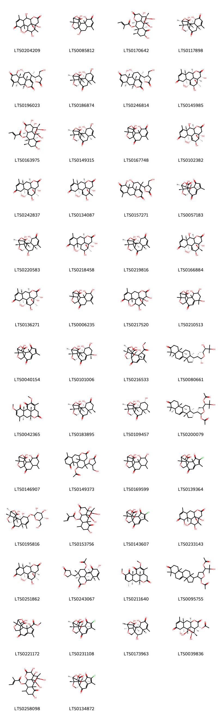{ width=100% }
    <figcaption>Hình ảnh cấu trúc hóa học của 54 hoạt chất thuộc nhóm Prenol lipids gồm ['2,7,12,15,16-pentahydroxy-9,13,17-trimethyl-5,18-dioxapentacyclo[12.5.0.0¹,⁶.0²,¹⁷.0⁸,¹³]nonadec-9-ene-4,11-dione (LTS0204209)', '9,12,18-trihydroxy-4,11,15-trimethyl-3,7-dioxapentacyclo[8.8.0.0¹,⁵.0⁴,⁸.0¹¹,¹⁶]octadec-14-ene-6,13-dione (LTS0085812)', '(1r,2s,6s,7r,8s,9r,11s,13s,14s,15r,16s,17r)-2,11,15,16-tetrahydroxy-9,13,17-trimethyl-4,12-dioxo-5,18-dioxapentacyclo[12.5.0.0¹,⁶.0²,¹⁷.0⁸,¹³]nonadecan-7-yl (2e)-2-methylbut-2-enoate (LTS0170642)', 'samaderine b (LTS0117898)', '(1r,2s,3s,7s,9r,14r,16r,17r)-3,16-dihydroxy-14-[(2s,3r)-3-(hydroxymethyl)-5-oxooxolan-2-yl]-2,6,14,17-tetramethyl-10-oxatetracyclo[7.7.1.0²,⁷.0¹³,¹⁷]heptadeca-5,12-diene-4,11-dione (LTS0196023)', 'samaderine c (LTS0186874)', '(1r,2s,3r,7s,9r,14r,16r,17r)-3,16-dihydroxy-14-[(2s,3r)-3-(hydroxymethyl)-5-oxooxolan-2-yl]-2,6,14,17-tetramethyl-10-oxatetracyclo[7.7.1.0²,⁷.0¹³,¹⁷]heptadeca-5,12-diene-4,11-dione (LTS0246814)', 'samaderine z (LTS0145985)', '(1r,2r,3r,6s,7r,8s,9r,11s,13s,14s,15r,16s,17r)-2,3,11,15,16-pentahydroxy-9,13,17-trimethyl-4,12-dioxo-5,18-dioxapentacyclo[12.5.0.0¹,⁶.0²,¹⁷.0⁸,¹³]nonadecan-7-yl (2e)-2-methylbut-2-enoate (LTS0163975)', '(1r,4s,5r,8s,9r,10r,11s,12s,13s,16r)-9,12,13-trihydroxy-4,11,15-trimethyl-3,7-dioxapentacyclo[8.8.0.0¹,⁵.0⁴,⁸.0¹¹,¹⁶]octadec-14-ene-6,18-dione (LTS0149315)', '9,12-dihydroxy-4,11,15-trimethyl-3,7-dioxapentacyclo[8.8.0.0¹,⁵.0⁴,⁸.0¹¹,¹⁶]octadec-14-ene-6,13,18-trione (LTS0167748)', '(1r,2s,6s,7r,8s,12s,13s,14r,15r,16s,17r)-2,7,12,15,16-pentahydroxy-9,13,17-trimethyl-5,18-dioxapentacyclo[12.5.0.0¹,⁶.0²,¹⁷.0⁸,¹³]nonadec-9-ene-4,11-dione (LTS0102382)', 'samaderine e (LTS0242837)', '(1r,2s,6r,8s,12s,13s,14r,15r,16s)-2,12,15,16-tetrahydroxy-9,13,17-trimethyl-5,18-dioxapentacyclo[12.5.0.0¹,⁶.0²,¹⁷.0⁸,¹³]nonadec-9-ene-4,11-dione (LTS0134087)', '3,16-dihydroxy-14-[3-(hydroxymethyl)-5-oxooxolan-2-yl]-2,6,14,17-tetramethyl-10-oxatetracyclo[7.7.1.0²,⁷.0¹³,¹⁷]heptadeca-5,12-diene-4,11-dione (LTS0157271)', 'samaderin a (LTS0057183)', '(1r,4s,5r,8s,9r,10r,11s,12s,16s,18r)-9,12,18-trihydroxy-4,11,15-trimethyl-3,7-dioxapentacyclo[8.8.0.0¹,⁵.0⁴,⁸.0¹¹,¹⁶]octadec-14-ene-6,13-dione (LTS0220583)', '(1r,2r,3r,6r,15r,17r)-2,3,12,15,16-pentahydroxy-9,13,17-trimethyl-5,18-dioxapentacyclo[12.5.0.0¹,⁶.0²,¹⁷.0⁸,¹³]nonadec-9-ene-4,11-dione (LTS0218458)', '(1r,4s,5r,8s,9r,10s,11s,12s,16s)-9,12-dihydroxy-4,11,15-trimethyl-3,7-dioxapentacyclo[8.8.0.0¹,⁵.0⁴,⁸.0¹¹,¹⁶]octadec-14-ene-6,13,18-trione (LTS0219816)', '(1r,2s,6s,7r,8s,12s,13s,14r,15r,16s,17s)-2,7,12,15,16-pentahydroxy-9,13,17-trimethyl-5,18-dioxapentacyclo[12.5.0.0¹,⁶.0²,¹⁷.0⁸,¹³]nonadec-9-ene-4,11-dione (LTS0166884)', 'bruceine d (LTS0136271)', '9,12,13-trihydroxy-4,11,15-trimethyl-3,7-dioxapentacyclo[8.8.0.0¹,⁵.0⁴,⁸.0¹¹,¹⁶]octadec-14-ene-6,18-dione (LTS0006235)', '2,3,12,15,16-pentahydroxy-9,13,17-trimethyl-5,18-dioxapentacyclo[12.5.0.0¹,⁶.0²,¹⁷.0⁸,¹³]nonadec-9-ene-4,11-dione (LTS0217520)', '9,12,13,15-tetrahydroxy-4,11,15-trimethyl-3,7-dioxapentacyclo[8.8.0.0¹,⁵.0⁴,⁸.0¹¹,¹⁶]octadec-16-ene-6,18-dione (LTS0210513)', '9-hydroxy-4,11,14-trimethyl-3,7-dioxapentacyclo[8.7.0.0¹,⁵.0⁴,⁸.0¹¹,¹⁵]heptadeca-13,15-diene-6,12,17-trione (LTS0040154)', '(1r,4s,5r,8s,9r,10r,11r,12s,13s,15s)-9,12,13,15-tetrahydroxy-4,11,15-trimethyl-3,7-dioxapentacyclo[8.8.0.0¹,⁵.0⁴,⁸.0¹¹,¹⁶]octadec-16-ene-6,18-dione (LTS0101006)', 'methyl (1r,4s,5r,8s,9r,10r,11s,12r)-9,12-dihydroxy-4,11,14-trimethyl-6,17-dioxo-3,7-dioxapentacyclo[8.7.0.0¹,⁵.0⁴,⁸.0¹¹,¹⁵]heptadeca-13,15-diene-12-carboxylate (LTS0216533)', '(1s,3as,5as,9ar,9br,11as)-1-[(2s,3s,5r)-5-[(1r)-1,2-dihydroxy-2-methylpropyl]-2-hydroxyoxolan-3-yl]-3a,6,6,9a,11a-pentamethyl-1h,2h,3h,5h,5ah,8h,9h,9bh,10h,11h-cyclopenta[a]phenanthren-7-one (LTS0080661)', '(1r,2s,7s,9r,13r,17s)-4,15-dimethoxy-2,6,14,17-tetramethyl-10-oxatetracyclo[7.7.1.0²,⁷.0¹³,¹⁷]heptadeca-4,14-diene-3,11,16-trione (LTS0042365)', '(1r,4s,5r,8s,9r,10r,11s,12s,15r,16s)-9,12-dihydroxy-4,11,15-trimethyl-3,7-dioxapentacyclo[8.8.0.0¹,⁵.0⁴,⁸.0¹¹,¹⁶]octadecane-6,13,18-trione (LTS0183895)', '(1r,4s,5r,8s,9r,10r,11s,12s,13r,15r,16s)-9,12,13-trihydroxy-4,11,15-trimethyl-3,7-dioxapentacyclo[8.8.0.0¹,⁵.0⁴,⁸.0¹¹,¹⁶]octadecane-6,18-dione (LTS0109457)', '(1r)-1-[(2s,4s,5s)-4-[(1s,3as,5ar,9ar,9br,11as)-3a,6,6,9a,11a-pentamethyl-7-oxo-1h,2h,3h,5h,5ah,8h,9h,9bh,10h,11h-cyclopenta[a]phenanthren-1-yl]-5-(acetyloxy)oxolan-2-yl]-2-hydroxy-2-methylpropyl acetate (LTS0200079)', '9,12-dihydroxy-4,11,15-trimethyl-3,7-dioxapentacyclo[8.8.0.0¹,⁵.0⁴,⁸.0¹¹,¹⁶]octadecane-6,13,18-trione (LTS0146907)', '14-[3-(hydroxymethyl)-5-oxooxolan-2-yl]-2,6,14,17-tetramethyl-3,11-dioxo-10-oxatetracyclo[7.7.1.0²,⁷.0¹³,¹⁷]heptadec-5-en-16-yl acetate (LTS0149373)', '9,12,13-trihydroxy-4,11,15-trimethyl-3,7-dioxapentacyclo[8.8.0.0¹,⁵.0⁴,⁸.0¹¹,¹⁶]octadecane-6,18-dione (LTS0169599)', '13-chloro-9-hydroxy-4,11,14-trimethyl-3,7-dioxapentacyclo[8.7.0.0¹,⁵.0⁴,⁸.0¹¹,¹⁵]heptadeca-13,15-diene-6,12,17-trione (LTS0139364)', '(1r,4s,5r,8s,9r,10r,11s,12s,13s,16s)-9,12-dihydroxy-4,11,15-trimethyl-13-{[(2r,3r,4s,5s,6r)-3,4,5-trihydroxy-6-(hydroxymethyl)oxan-2-yl]oxy}-3,7-dioxapentacyclo[8.8.0.0¹,⁵.0⁴,⁸.0¹¹,¹⁶]octadec-14-ene-6,18-dione (LTS0195816)', '2,11,15,16-tetrahydroxy-9,13,17-trimethyl-4,12-dioxo-5,18-dioxapentacyclo[12.5.0.0¹,⁶.0²,¹⁷.0⁸,¹³]nonadecan-7-yl 2-methylbut-2-enoate (LTS0153756)', '(1s,5s,9r,10r,11r)-13-chloro-9-hydroxy-4,11,14-trimethyl-3,7-dioxapentacyclo[8.7.0.0¹,⁵.0⁴,⁸.0¹¹,¹⁵]heptadeca-13,15-diene-6,12,17-trione (LTS0143607)', '2,12,15,16-tetrahydroxy-9,13,17-trimethyl-5,18-dioxapentacyclo[12.5.0.0¹,⁶.0²,¹⁷.0⁸,¹³]nonadec-9-ene-4,11-dione (LTS0233143)', 'samaderine y (LTS0251862)', '(1s,2s,4r,7s,9r,13s,14r,16r,17s)-4-hydroxy-2,6,14,17-tetramethyl-3,11-dioxo-14-{[(3r)-5-oxooxolan-3-yl]methyl}-10-oxatetracyclo[7.7.1.0²,⁷.0¹³,¹⁷]heptadec-5-en-16-yl acetate (LTS0243067)', 'quassin (LTS0211640)', '1-(4-{3a,6,6,9a,11a-pentamethyl-7-oxo-1h,2h,3h,5h,5ah,8h,9h,9bh,10h,11h-cyclopenta[a]phenanthren-1-yl}-5-(acetyloxy)oxolan-2-yl)-2-hydroxy-2-methylpropyl acetate (LTS0095755)', 'methyl 9,12-dihydroxy-4,11,14-trimethyl-6,17-dioxo-3,7-dioxapentacyclo[8.7.0.0¹,⁵.0⁴,⁸.0¹¹,¹⁵]heptadeca-13,15-diene-12-carboxylate (LTS0221172)', '(1s,4s,5s,8s,9r,10r,11r)-13-chloro-9-hydroxy-4,11,14-trimethyl-3,7-dioxapentacyclo[8.7.0.0¹,⁵.0⁴,⁸.0¹¹,¹⁵]heptadeca-13,15-diene-6,12,17-trione (LTS0231108)', '(1s,4r,5s,8r,9r,10s,11s,12r,16s,18r)-9,12,18-trihydroxy-4,11,15-trimethyl-3,7-dioxapentacyclo[8.8.0.0¹,⁵.0⁴,⁸.0¹¹,¹⁶]octadec-14-ene-6,13-dione (LTS0173963)', 'samaderine x (LTS0039836)', '2,3,11,15,16-pentahydroxy-9,13,17-trimethyl-4,12-dioxo-5,18-dioxapentacyclo[12.5.0.0¹,⁶.0²,¹⁷.0⁸,¹³]nonadecan-7-yl 2-methylbut-2-enoate (LTS0258098)', '(1r,4s,5r,8s,9r,10r,11r)-13-chloro-9-hydroxy-4,11,14-trimethyl-3,7-dioxapentacyclo[8.7.0.0¹,⁵.0⁴,⁸.0¹¹,¹⁵]heptadeca-13,15-diene-6,12,17-trione (LTS0134872)', '(1r,2r,3r,6s,7r,8s,12s,13s,14r,15r,16s,17r)-2,3,7,12,15,16-hexahydroxy-9,13,17-trimethyl-5,18-dioxapentacyclo[12.5.0.0¹,⁶.0²,¹⁷.0⁸,¹³]nonadec-9-ene-4,11-dione (LTS0236202)', '(1s,4r,5s,8r,9s,10s,11r,12s,16r)-9,12-dihydroxy-4,11,15-trimethyl-3,7-dioxapentacyclo[8.8.0.0¹,⁵.0⁴,⁸.0¹¹,¹⁶]octadec-14-ene-6,13,18-trione (LTS0000449)', 'methyl (1r,4s,5r,8s,9r,10r,11r,12r)-9,12-dihydroxy-4,11,14-trimethyl-6,17-dioxo-3,7-dioxapentacyclo[8.7.0.0¹,⁵.0⁴,⁸.0¹¹,¹⁵]heptadeca-13,15-diene-12-carboxylate (LTS0273690)', '1-[5-(1,2-dihydroxy-2-methylpropyl)-2-hydroxyoxolan-3-yl]-3a,6,6,9a,11a-pentamethyl-1h,2h,3h,5h,5ah,8h,9h,9bh,10h,11h-cyclopenta[a]phenanthren-7-one (LTS0230171)'].</figcaption>
</figure>
#### Nhóm Tannins
<figure markdown="span">
    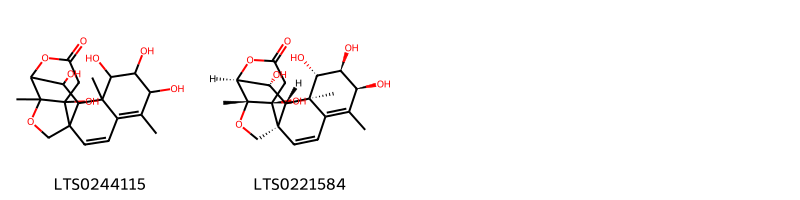{ width=100% }
    <figcaption>Hình ảnh cấu trúc hóa học của 2 hoạt chất thuộc nhóm Tannins gồm ['5,10,13,14,15-pentahydroxy-4,12,16-trimethyl-3,8-dioxapentacyclo[9.8.0.0¹,⁵.0⁴,⁹.0¹²,¹⁷]nonadeca-16,18-dien-7-one (LTS0244115)', '(1r,4r,5s,9s,10r,11r,12r,13s,14s,15s)-5,10,13,14,15-pentahydroxy-4,12,16-trimethyl-3,8-dioxapentacyclo[9.8.0.0¹,⁵.0⁴,⁹.0¹²,¹⁷]nonadeca-16,18-dien-7-one (LTS0221584)'].</figcaption>
</figure>

---

### Dược dân tộc học

Danh sách các quốc gia có sử dụng *Samadera indica* trong điều trị các bệnh. 

| Country     | Disease                                    | Bệnh                                                                                                                                                                                                |
|:------------|:-------------------------------------------|:----------------------------------------------------------------------------------------------------------------------------------------------------------------------------------------------------|
| Elsewhere   | Insecticide, Stomachic, Tonic, Emmenagogue | MYMEMORY WARNING: YOU USED ALL AVAILABLE FREE TRANSLATIONS FOR TODAY. NEXT AVAILABLE IN  07 HOURS 27 MINUTES 38 SECONDS VISIT HTTPS://MYMEMORY.TRANSLATED.NET/DOC/USAGELIMITS.PHP TO TRANSLATE MORE |
| Indonesia   | Emetic, Purgative                          | MYMEMORY WARNING: YOU USED ALL AVAILABLE FREE TRANSLATIONS FOR TODAY. NEXT AVAILABLE IN  07 HOURS 27 MINUTES 35 SECONDS VISIT HTTPS://MYMEMORY.TRANSLATED.NET/DOC/USAGELIMITS.PHP TO TRANSLATE MORE |
| Malaya      | Insecticide                                | MYMEMORY WARNING: YOU USED ALL AVAILABLE FREE TRANSLATIONS FOR TODAY. NEXT AVAILABLE IN  07 HOURS 27 MINUTES 33 SECONDS VISIT HTTPS://MYMEMORY.TRANSLATED.NET/DOC/USAGELIMITS.PHP TO TRANSLATE MORE |
| Philippines | Purgative                                  | MYMEMORY WARNING: YOU USED ALL AVAILABLE FREE TRANSLATIONS FOR TODAY. NEXT AVAILABLE IN  07 HOURS 27 MINUTES 30 SECONDS VISIT HTTPS://MYMEMORY.TRANSLATED.NET/DOC/USAGELIMITS.PHP TO TRANSLATE MORE |
| Ternate     | Tonic                                      | MYMEMORY WARNING: YOU USED ALL AVAILABLE FREE TRANSLATIONS FOR TODAY. NEXT AVAILABLE IN  07 HOURS 27 MINUTES 28 SECONDS VISIT HTTPS://MYMEMORY.TRANSLATED.NET/DOC/USAGELIMITS.PHP TO TRANSLATE MORE |

---

---
## Quassia versicolor
### Thông tin về thực vật

!!! info "Phân loại thực vật của *Simarouba versicolor* từ GIBF:"
    - **Kingdom:** Plantae
    - **Phylum:** Tracheophyta
    - **Order:** Sapindales
    - **Family:** Simaroubaceae
    - **Genus:** Simarouba
    - **Species:** *Simarouba versicolor*

 

| Label (VI)   | Label (EN)   | Scientific Name    | Descriptions (VI)   | Descriptions (EN)   | Also Known As (VI)   | Also Known As (EN)   |
|:-------------|:-------------|:-------------------|:--------------------|:--------------------|:---------------------|:---------------------|
| N/A          | N/A          | Quassia versicolor |                     | species of plant    | ['']                 | ['']                 |

#### Phân bố trên thế giới

**Từ CSDL GIBF** nan, Brazil

#### Phân bố tại Việt Nam

**Từ CSDL GIBF**: Không có ghi nhận ở Việt Nam

---
### Thành phần hóa học
        
- Theo cơ sở dữ liệu lotus: Từ loài *Simarouba versicolor* đã phân lập và xác định được Chưa có hoạt chất nào được phân lập. hoạt chất thuộc về các nhóm Không có hoạt chất nào được phân lập. 

Không có hình ảnh nào được tạo ra

---

### Dược dân tộc học

Danh sách các quốc gia có sử dụng *Simarouba versicolor* trong điều trị các bệnh. 

| Country   | Disease                | Bệnh                                                                                                                                                                                                |
|:----------|:-----------------------|:----------------------------------------------------------------------------------------------------------------------------------------------------------------------------------------------------|
| Brazil    | Vermifuge, Insecticide | MYMEMORY WARNING: YOU USED ALL AVAILABLE FREE TRANSLATIONS FOR TODAY. NEXT AVAILABLE IN  07 HOURS 27 MINUTES 03 SECONDS VISIT HTTPS://MYMEMORY.TRANSLATED.NET/DOC/USAGELIMITS.PHP TO TRANSLATE MORE |

---

