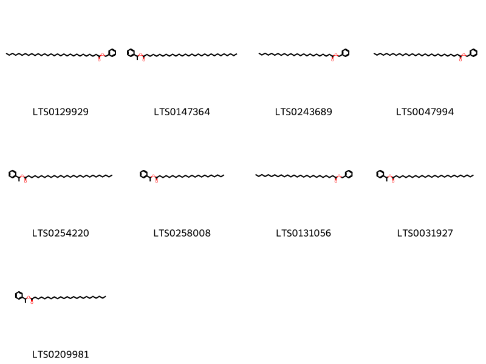
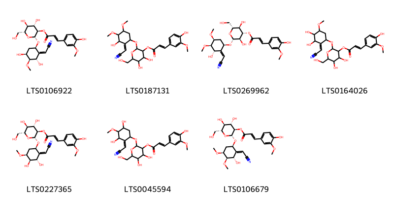
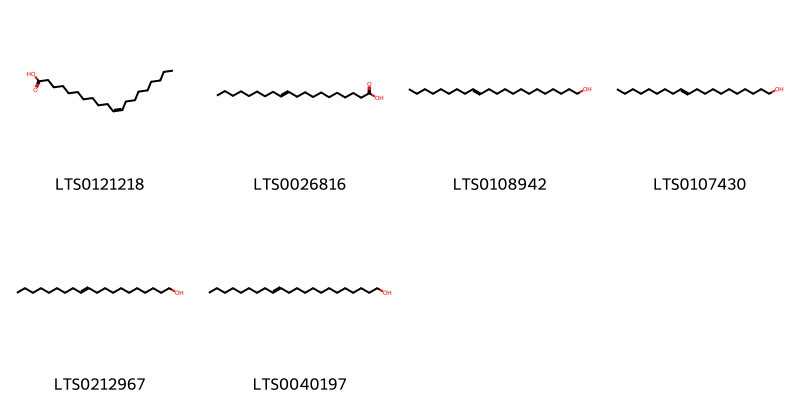
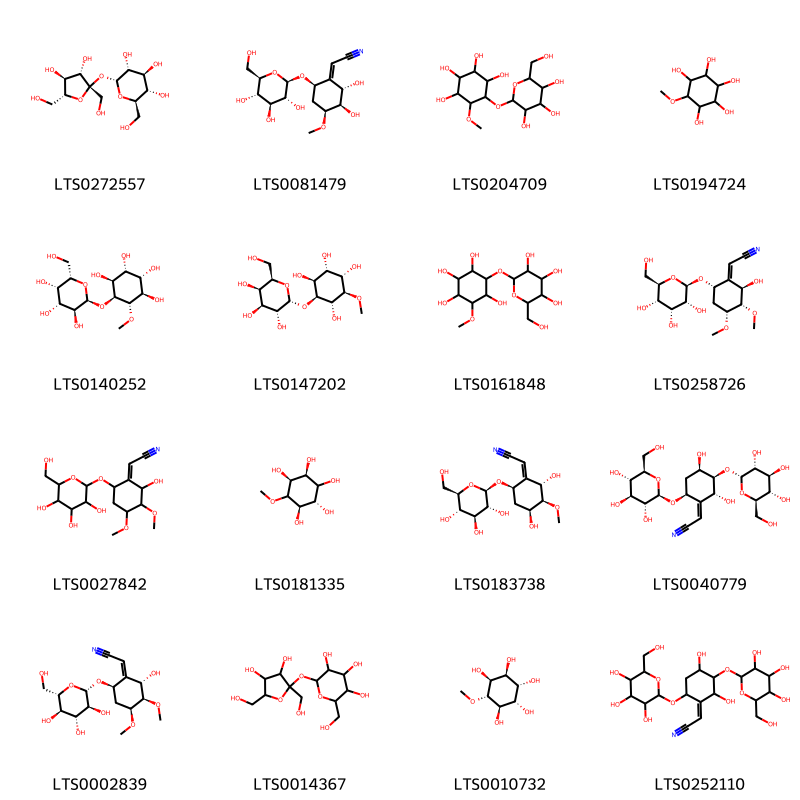

!!! abstract "Tóm tắt"

    Họ Simmondsiaceae gồm khoảng 1 chi và 1 loài được một số cộng đồng tại các quốc gia như Mexico(Seri) sử dụng trong một số trường hợp MYMEMORY WARNING: YOU USED ALL AVAILABLE FREE TRANSLATIONS FOR TODAY. NEXT AVAILABLE IN  07 HOURS 55 MINUTES 59 SECONDS VISIT HTTPS://MYMEMORY.TRANSLATED.NET/DOC/USAGELIMITS.PHP TO TRANSLATE MORE.

!!! info "DrDuke"

    James A. Duke sinh năm 1929-2017 là một nhà thực vật học người Mỹ. Đây là một trong những tác giả hàng đầu trong lĩnh vực dược dân tộc học với cuốn *CRC Handbook of Medicinal Herbs* và chính là người xây dựng lên cơ sở dữ liệu về hợp chất tự nhiên và dược dân tộc học tại Bộ nông nghiệp Hoa Kỳ. Các thông tin được đăng tải tại website [Dr. Duke's Phytochemical and Ethnobotanical Databases](https://phytochem.nal.usda.gov/). 
    Trong suốt thập niên 1970, ông lãnh đạo the Plant Taxonomy Laboratory, Plant Genetics and Germplasm Institute of the Agricultural Research Service, U.S. Department of Agriculture.
    Trong tài liệu này, các thông tin về dược dân tộc của các dược liệu được trích dẫn từ tài liệu của James A. Ducke với sự trợ giúp của phần mềm dịch thuật từ tiếng Anh sang tiếng Việt.
   

# Chi Simmondsia

??? note "Danh sách các dược liệu thuộc chi"
    
	 - *Simmondsia chinensis*

---
## Simmondsia chinensis
### Thông tin về thực vật

!!! info "Phân loại thực vật của *Simmondsia chinensis* từ GIBF:"
    - **Kingdom:** Plantae
    - **Phylum:** Tracheophyta
    - **Order:** Caryophyllales
    - **Family:** Simmondsiaceae
    - **Genus:** Simmondsia
    - **Species:** *Simmondsia chinensis*

 

| Label (VI)   | Label (EN)   | Scientific Name      | Descriptions (VI)   | Descriptions (EN)   | Also Known As (VI)   | Also Known As (EN)   |
|:-------------|:-------------|:---------------------|:--------------------|:--------------------|:---------------------|:---------------------|
| N/A          | N/A          | Simmondsia chinensis | loài thực vật       | species of plant    | ['']                 | ['jojoba']           |

#### Phân bố trên thế giới

**Từ CSDL GIBF** Mexico, United States of America

#### Phân bố tại Việt Nam

**Từ CSDL GIBF**: Không có ghi nhận ở Việt Nam

---
### Thành phần hóa học
        
- Theo cơ sở dữ liệu lotus: Từ loài *Simmondsia chinensis* đã phân lập và xác định được 39 hoạt chất thuộc về các nhóm Fatty Acyls, Benzene and substituted derivatives, Cinnamic acids and derivatives, Organooxygen compounds. 

|    | chemicalTaxonomyClassyfireClass     |   smiles_count |
|---:|:------------------------------------|---------------:|
|  0 | Benzene and substituted derivatives |              9 |
|  1 | Cinnamic acids and derivatives      |              7 |
|  2 | Fatty Acyls                         |              6 |
|  3 | Organooxygen compounds              |             16 |

#### Nhóm Benzene and substituted derivatives
<figure markdown="span">
    { width=100% }
    <figcaption>Hình ảnh cấu trúc hóa học của 9 hoạt chất thuộc nhóm Benzene and substituted derivatives gồm ['benzyl triacontanoate (LTS0129929)', '1-phenylethyl triacontanoate (LTS0147364)', 'benzyl tetracosanoate (LTS0243689)', 'benzyl octacosanoate (LTS0047994)', '1-phenylethyl octacosanoate (LTS0254220)', '1-phenylethyl docosanoate (LTS0258008)', 'benzyl hexacosanoate (LTS0131056)', '1-phenylethyl hexacosanoate (LTS0031927)', '1-phenylethyl tetracosanoate (LTS0209981)'].</figcaption>
</figure>
#### Nhóm Cinnamic acids and derivatives
<figure markdown="span">
    { width=100% }
    <figcaption>Hình ảnh cấu trúc hóa học của 7 hoạt chất thuộc nhóm Cinnamic acids and derivatives gồm ['(2r,3r,4s,5s,6r)-2-{[(1r,2z,3s,4s,5s)-2-(cyanomethylidene)-3,5-dihydroxy-4-methoxycyclohexyl]oxy}-4,5-dihydroxy-6-(hydroxymethyl)oxan-3-yl (2e)-3-(4-hydroxy-3-methoxyphenyl)prop-2-enoate (LTS0106922)', '2-{[(2e)-2-(cyanomethylidene)-3-hydroxy-4,5-dimethoxycyclohexyl]oxy}-4,5-dihydroxy-6-(hydroxymethyl)oxan-3-yl (2e)-3-(4-hydroxy-3-methoxyphenyl)prop-2-enoate (LTS0187131)', '(2r,3r,4s,5r,6r)-2-{[(1r,2e,3s,4r,5s)-2-(cyanomethylidene)-3-hydroxy-4,5-dimethoxycyclohexyl]oxy}-3,5-dihydroxy-6-(hydroxymethyl)oxan-4-yl (2e)-3-(4-hydroxy-3-methoxyphenyl)prop-2-enoate (LTS0269962)', '2-{[2-(cyanomethylidene)-3,4-dihydroxy-5-methoxycyclohexyl]oxy}-4,5-dihydroxy-6-(hydroxymethyl)oxan-3-yl 3-(4-hydroxy-3-methoxyphenyl)prop-2-enoate (LTS0164026)', '(2r,3r,4s,5s,6r)-2-{[(1r,2z,3s,4r,5s)-2-(cyanomethylidene)-3,4-dihydroxy-5-methoxycyclohexyl]oxy}-4,5-dihydroxy-6-(hydroxymethyl)oxan-3-yl (2e)-3-(4-hydroxy-3-methoxyphenyl)prop-2-enoate (LTS0227365)', '2-{[2-(cyanomethylidene)-3,5-dihydroxy-4-methoxycyclohexyl]oxy}-4,5-dihydroxy-6-(hydroxymethyl)oxan-3-yl 3-(4-hydroxy-3-methoxyphenyl)prop-2-enoate (LTS0045594)', '(2r,3r,4s,5s,6r)-2-{[(1r,2e,3s,4r,5s)-2-(cyanomethylidene)-3-hydroxy-4,5-dimethoxycyclohexyl]oxy}-4,5-dihydroxy-6-(hydroxymethyl)oxan-3-yl (2e)-3-(4-hydroxy-3-methoxyphenyl)prop-2-enoate (LTS0106679)'].</figcaption>
</figure>
#### Nhóm Fatty Acyls
<figure markdown="span">
    { width=100% }
    <figcaption>Hình ảnh cấu trúc hóa học của 6 hoạt chất thuộc nhóm Fatty Acyls gồm ['cis-11-eicosenoic acid (LTS0121218)', '11-eicosenoic acid (LTS0026816)', 'docos-13-en-1-ol (LTS0108942)', '(11e)-icos-11-en-1-ol (LTS0107430)', 'icos-11-en-1-ol (LTS0212967)', 'docos-13-en-1-ol (LTS0040197)'].</figcaption>
</figure>
#### Nhóm Organooxygen compounds
<figure markdown="span">
    { width=100% }
    <figcaption>Hình ảnh cấu trúc hóa học của 16 hoạt chất thuộc nhóm Organooxygen compounds gồm ['sucrose (LTS0272557)', '2-[(1e,2s,3r,4s,6r)-2,3-dihydroxy-4-methoxy-6-{[(2r,3r,4s,5s,6r)-3,4,5-trihydroxy-6-(hydroxymethyl)oxan-2-yl]oxy}cyclohexylidene]acetonitrile (LTS0081479)', '5-methoxy-6-{[3,4,5-trihydroxy-6-(hydroxymethyl)oxan-2-yl]oxy}cyclohexane-1,2,3,4-tetrol (LTS0204709)', 'pinitol (LTS0194724)', '(1s,2r,3s,4r,5s,6s)-5-methoxy-6-{[(2s,3s,4r,5s,6s)-3,4,5-trihydroxy-6-(hydroxymethyl)oxan-2-yl]oxy}cyclohexane-1,2,3,4-tetrol (LTS0140252)', '(1s,2r,3s,4r,5s,6s)-4-methoxy-6-{[(2r,3r,4s,5r,6r)-3,4,5-trihydroxy-6-(hydroxymethyl)oxan-2-yl]oxy}cyclohexane-1,2,3,5-tetrol (LTS0147202)', '4-methoxy-6-{[3,4,5-trihydroxy-6-(hydroxymethyl)oxan-2-yl]oxy}cyclohexane-1,2,3,5-tetrol (LTS0161848)', '2-[(1e,2r,3s,4r,6s)-2-hydroxy-3,4-dimethoxy-6-{[(2r,3r,4r,5s,6r)-3,4,5-trihydroxy-6-(hydroxymethyl)oxan-2-yl]oxy}cyclohexylidene]acetonitrile (LTS0258726)', '2-(2-hydroxy-3,4-dimethoxy-6-{[3,4,5-trihydroxy-6-(hydroxymethyl)oxan-2-yl]oxy}cyclohexylidene)acetonitrile (LTS0027842)', 'methylinositol (LTS0181335)', '2-[(1z,2s,3s,4s,6r)-2,4-dihydroxy-3-methoxy-6-{[(2r,3r,4s,5s,6r)-3,4,5-trihydroxy-6-(hydroxymethyl)oxan-2-yl]oxy}cyclohexylidene]acetonitrile (LTS0183738)', '2-[(1z,2r,3r,4r,6s)-2,4-dihydroxy-3,6-bis({[(2r,3r,4s,5s,6r)-3,4,5-trihydroxy-6-(hydroxymethyl)oxan-2-yl]oxy})cyclohexylidene]acetonitrile (LTS0040779)', '2-[(1z,2s,3r,4s,6r)-2-hydroxy-3,4-dimethoxy-6-{[(2s,3s,4r,5r,6s)-3,4,5-trihydroxy-6-(hydroxymethyl)oxan-2-yl]oxy}cyclohexylidene]acetonitrile (LTS0002839)', 'granulated sugar (LTS0014367)', 'pinit (LTS0010732)', '2-[2,4-dihydroxy-3,6-bis({[3,4,5-trihydroxy-6-(hydroxymethyl)oxan-2-yl]oxy})cyclohexylidene]acetonitrile (LTS0252110)'].</figcaption>
</figure>

---

### Dược dân tộc học

Danh sách các quốc gia có sử dụng *Simmondsia chinensis* trong điều trị các bệnh. 

| Country      | Disease   | Bệnh                                                                                                                                                                                                |
|:-------------|:----------|:----------------------------------------------------------------------------------------------------------------------------------------------------------------------------------------------------|
| Mexico(Seri) | Emetic    | MYMEMORY WARNING: YOU USED ALL AVAILABLE FREE TRANSLATIONS FOR TODAY. NEXT AVAILABLE IN  07 HOURS 55 MINUTES 57 SECONDS VISIT HTTPS://MYMEMORY.TRANSLATED.NET/DOC/USAGELIMITS.PHP TO TRANSLATE MORE |

---

