!!! abstract "Tóm tắt"

    Họ Smilacaceae gồm khoảng 2 chi và 22 loài được một số cộng đồng tại các quốc gia như Dutch, Honduras, Brazil, Ghana, English, Mexico, China, Malaya, anish, Guatemala, ain, Haiti, Elsewhere, Argentina, Dominican Republic, Malaysia, New Zealand, Egypt, India, Central America, W Africa sử dụng trong một số trường hợp Thuốc bổ, Thuốc tràn dịch màng phổi, Chất kích thích, Gây ngạt thở, Thuốc bổ, Thuốc kích thích tình dục, Thuốc tràn dịch màng phổi, Thuốc lợi tiểu, Thuốc kích thích tình dục, Gây ngạt thở, Có nguồn gốc cam thảo, Phương pháp thanh lọc, Thuốc bổ, Thuốc tràn dịch màng phổi, Chất kích thích, Demulcent, Thuốc lợi tiểu, Thuốc long đờm, Thuốc lợi tiểu, Dạ dày, Thuốc kích thích tình dục, Thuốc tràn dịch màng phổi, Chất kích thích, Thuốc diệt cá, Thuốc kích thích tình dục, Thuốc bổ, Thuốc giải độc, Chất làm se, Chất kích thích, Thuốc bổ, Thuốc bổ, Thuốc lợi tiểu, Chất kích thích, Gây ngạt thở, Có nguồn gốc cam thảo, Thuốc lợi tiểu, Thuốc lợi tiểu, Môi chất lạnh, Gây ngạt thở, Alexiteric, Thuốc lợi tiểu, Thuốc bổ, Abortifacient, Demulcent.

!!! info "DrDuke"

    James A. Duke sinh năm 1929-2017 là một nhà thực vật học người Mỹ. Đây là một trong những tác giả hàng đầu trong lĩnh vực dược dân tộc học với cuốn *CRC Handbook of Medicinal Herbs* và chính là người xây dựng lên cơ sở dữ liệu về hợp chất tự nhiên và dược dân tộc học tại Bộ nông nghiệp Hoa Kỳ. Các thông tin được đăng tải tại website [Dr. Duke's Phytochemical and Ethnobotanical Databases](https://phytochem.nal.usda.gov/). 
    Trong suốt thập niên 1970, ông lãnh đạo the Plant Taxonomy Laboratory, Plant Genetics and Germplasm Institute of the Agricultural Research Service, U.S. Department of Agriculture.
    Trong tài liệu này, các thông tin về dược dân tộc của các dược liệu được trích dẫn từ tài liệu của James A. Ducke với sự trợ giúp của phần mềm dịch thuật từ tiếng Anh sang tiếng Việt.
   

# Chi Rhipogonum

??? note "Danh sách các dược liệu thuộc chi"
    
	 - *Rhipogonum scandens*

---
## Rhipogonum scandens
### Thông tin về thực vật

!!! info "Phân loại thực vật của *Rhipogonum scandens* từ GIBF:"
    - **Kingdom:** Plantae
    - **Phylum:** Tracheophyta
    - **Order:** Liliales
    - **Family:** Ripogonaceae
    - **Genus:** Rhipogonum
    - **Species:** *Rhipogonum scandens*

 

| Label (VI)   | Label (EN)   | Scientific Name   | Descriptions (VI)   | Descriptions (EN)   | Also Known As (VI)   | Also Known As (EN)                                      |
|:-------------|:-------------|:------------------|:--------------------|:--------------------|:---------------------|:--------------------------------------------------------|
| N/A          | N/A          | Salix purpurea    | loài thực vật       | species of plant    | ['']                 | ['purple osier', 'purple willow', 'purpleosier willow'] |

#### Phân bố trên thế giới

**Từ CSDL GIBF** nan, New Zealand, Papua New Guinea, United States of America, Australia

#### Phân bố tại Việt Nam

**Từ CSDL GIBF**: Không có ghi nhận ở Việt Nam

---
### Thành phần hóa học
        
- Theo cơ sở dữ liệu lotus: Từ loài *Rhipogonum scandens* đã phân lập và xác định được Chưa có hoạt chất nào được phân lập. hoạt chất thuộc về các nhóm Không có hoạt chất nào được phân lập. 

Không có hình ảnh nào được tạo ra

---

### Dược dân tộc học

Danh sách các quốc gia có sử dụng *Rhipogonum scandens* trong điều trị các bệnh. 

| Country     | Disease                  | Bệnh                     |
|:------------|:-------------------------|:-------------------------|
| New Zealand | Abortifacient, Demulcent | Abortifacient, Demulcent |

---

# Chi Smilax

??? note "Danh sách các dược liệu thuộc chi"
    
	 - *Smilax aera*
	 - *Smilax aristolochiaefolia*
	 - *Smilax aristolochiifolia*
	 - *Smilax calophylla*
	 - *Smilax campestris*
	 - *Smilax china*
	 - *Smilax cordifolia*
	 - *Smilax glabra*
	 - *Smilax havanensis*
	 - *Smilax kraussiana*
	 - *Smilax lanceolatus*
	 - *Smilax medica*
	 - *Smilax mollis*
	 - *Smilax myosotiflora*
	 - *Smilax nipponica*
	 - *Smilax oblongifolia*
	 - *Smilax ornata*
	 - *Smilax populnea*
	 - *Smilax pseudochina*
	 - *Smilax regelii*
	 - *Smilax ruceana*

---
## Smilax aera
### Thông tin về thực vật

!!! info "Phân loại thực vật của *N/A* từ GIBF:"
    - **Kingdom:** N/A
    - **Phylum:** N/A
    - **Order:** N/A
    - **Family:** N/A
    - **Genus:** N/A
    - **Species:** *N/A*

 

| Label (VI)   | Label (EN)   | Scientific Name   | Descriptions (VI)   | Descriptions (EN)   | Also Known As (VI)   | Also Known As (EN)                                      |
|:-------------|:-------------|:------------------|:--------------------|:--------------------|:---------------------|:--------------------------------------------------------|
| N/A          | N/A          | Salix purpurea    | loài thực vật       | species of plant    | ['']                 | ['purple osier', 'purple willow', 'purpleosier willow'] |

#### Phân bố trên thế giới

**Từ CSDL GIBF** Không có kết quả phù hợp

#### Phân bố tại Việt Nam

**Từ CSDL GIBF**: Không có ghi nhận ở Việt Nam

---
### Thành phần hóa học
        
- Theo cơ sở dữ liệu lotus: Từ loài *N/A* đã phân lập và xác định được Chưa có hoạt chất nào được phân lập. hoạt chất thuộc về các nhóm Không có hoạt chất nào được phân lập. 

Không có hình ảnh nào được tạo ra

---

### Dược dân tộc học

Danh sách các quốc gia có sử dụng *N/A* trong điều trị các bệnh. 

| Country   | Disease   | Bệnh     |
|:----------|:----------|:---------|
| ain       | Sudorific | Ngạt thở |

---

---
## Smilax aristolochiaefolia
### Thông tin về thực vật

!!! info "Phân loại thực vật của *Smilax aristolochiifolia* từ GIBF:"
    - **Kingdom:** Plantae
    - **Phylum:** Tracheophyta
    - **Order:** Liliales
    - **Family:** Smilacaceae
    - **Genus:** Smilax
    - **Species:** *Smilax aristolochiifolia*

 

| Label (VI)   | Label (EN)   | Scientific Name   | Descriptions (VI)   | Descriptions (EN)   | Also Known As (VI)   | Also Known As (EN)                                      |
|:-------------|:-------------|:------------------|:--------------------|:--------------------|:---------------------|:--------------------------------------------------------|
| N/A          | N/A          | Salix purpurea    | loài thực vật       | species of plant    | ['']                 | ['purple osier', 'purple willow', 'purpleosier willow'] |

#### Phân bố trên thế giới

**Từ CSDL GIBF** El Salvador, Belize, Peru, Costa Rica, United States of America, Mexico, Guatemala

#### Phân bố tại Việt Nam

**Từ CSDL GIBF**: Không có ghi nhận ở Việt Nam

---
### Thành phần hóa học
        
- Theo cơ sở dữ liệu lotus: Từ loài *Smilax aristolochiifolia* đã phân lập và xác định được Chưa có hoạt chất nào được phân lập. hoạt chất thuộc về các nhóm Không có hoạt chất nào được phân lập. 

Không có hình ảnh nào được tạo ra

---

### Dược dân tộc học

Danh sách các quốc gia có sử dụng *Smilax aristolochiifolia* trong điều trị các bệnh. 

| Country   | Disease   | Bệnh     |
|:----------|:----------|:---------|
| Mexico    | Sudorific | Ngạt thở |

---

---
## Smilax aristolochiifolia
### Thông tin về thực vật

!!! info "Phân loại thực vật của *Smilax aristolochiifolia* từ GIBF:"
    - **Kingdom:** Plantae
    - **Phylum:** Tracheophyta
    - **Order:** Liliales
    - **Family:** Smilacaceae
    - **Genus:** Smilax
    - **Species:** *Smilax aristolochiifolia*

 

| Label (VI)   | Label (EN)   | Scientific Name          | Descriptions (VI)   | Descriptions (EN)   | Also Known As (VI)   | Also Known As (EN)   |
|:-------------|:-------------|:-------------------------|:--------------------|:--------------------|:---------------------|:---------------------|
| N/A          | N/A          | Smilax aristolochiifolia | loài thực vật       | species of plant    | ['']                 | ['']                 |

#### Phân bố trên thế giới

**Từ CSDL GIBF** El Salvador, Belize, Peru, Costa Rica, United States of America, Mexico, Guatemala

#### Phân bố tại Việt Nam

**Từ CSDL GIBF**: Không có ghi nhận ở Việt Nam

---
### Thành phần hóa học
        
- Theo cơ sở dữ liệu lotus: Từ loài *Smilax aristolochiifolia* đã phân lập và xác định được 16 hoạt chất thuộc về các nhóm Steroids and steroid derivatives. 

|    | chemicalTaxonomyClassyfireClass   |   smiles_count |
|---:|:----------------------------------|---------------:|
|  0 | Steroids and steroid derivatives  |             16 |

#### Nhóm Steroids and steroid derivatives
<figure markdown="span">
    { width=100% }
    <figcaption>Hình ảnh cấu trúc hóa học của 16 hoạt chất thuộc nhóm Steroids and steroid derivatives gồm ['(2r,3r,4s,5s,6r)-2-[(2s)-4-[(1r,2s,4s,6r,7s,8r,9s,12s,13s,16s,18r)-16-{[(2r,3r,4s,5s,6r)-4-hydroxy-3,5-bis({[(2s,3r,4s,5s,6r)-3,4,5-trihydroxy-6-(hydroxymethyl)oxan-2-yl]oxy})-6-({[(2r,3r,4s,5s,6r)-3,4,5-trihydroxy-6-(hydroxymethyl)oxan-2-yl]oxy}methyl)oxan-2-yl]oxy}-6-methoxy-7,9,13-trimethyl-5-oxapentacyclo[10.8.0.0²,⁹.0⁴,⁸.0¹³,¹⁸]icosan-6-yl]-2-methylbutoxy]-6-(hydroxymethyl)oxane-3,4,5-triol (LTS0217658)', "(2r,3s,4s,5r,6r)-2-(hydroxymethyl)-6-[(1'r,2r,2's,4's,5r,7's,8'r,9's,12's,13's,16's,18'r)-5,7',9',13'-tetramethyl-5'-oxaspiro[oxane-2,6'-pentacyclo[10.8.0.0²,⁹.0⁴,⁸.0¹³,¹⁸]icosane]oxy]oxane-3,4,5-triol (LTS0063003)", '(2r,3r,4s,5s,6r)-2-[(2r)-4-[(1r,2s,4s,6r,7s,8r,9s,12s,13s,16s,18r)-16-{[(2r,3r,4s,5s,6r)-4-hydroxy-3,5-bis({[(2s,3r,4s,5s,6r)-3,4,5-trihydroxy-6-(hydroxymethyl)oxan-2-yl]oxy})-6-({[(2r,3r,4s,5s,6r)-3,4,5-trihydroxy-6-(hydroxymethyl)oxan-2-yl]oxy}methyl)oxan-2-yl]oxy}-6-methoxy-7,9,13-trimethyl-5-oxapentacyclo[10.8.0.0²,⁹.0⁴,⁸.0¹³,¹⁸]icosan-6-yl]-2-methylbutoxy]-6-(hydroxymethyl)oxane-3,4,5-triol (LTS0223438)', "(2r,3r,4s,5s,6r)-2-{[(2r,3s,4s,5r,6r)-3,4-dihydroxy-6-[(1'r,2r,2's,4's,5r,7's,8'r,9's,12's,13's,16's,18'r)-5,7',9',13'-tetramethyl-5'-oxaspiro[oxane-2,6'-pentacyclo[10.8.0.0²,⁹.0⁴,⁸.0¹³,¹⁸]icosane]oxy]-5-{[(2s,3r,4s,5s,6r)-3,4,5-trihydroxy-6-(hydroxymethyl)oxan-2-yl]oxy}oxan-2-yl]methoxy}-6-(hydroxymethyl)oxane-3,4,5-triol (LTS0073495)", "2-[(4-hydroxy-6-{5,7',9',13'-tetramethyl-5'-oxaspiro[oxane-2,6'-pentacyclo[10.8.0.0²,⁹.0⁴,⁸.0¹³,¹⁸]icosane]oxy}-5-{[3,4,5-trihydroxy-6-(hydroxymethyl)oxan-2-yl]oxy}-3-[(3,4,5-trihydroxy-6-methyloxan-2-yl)oxy]oxan-2-yl)methoxy]-6-(hydroxymethyl)oxane-3,4,5-triol (LTS0102637)", "(2r,3r,4s,5s,6r)-2-{[(2r,3s,4r,5r,6r)-4,5-dihydroxy-6-[(1'r,2r,2's,4's,5r,7's,8'r,9's,12's,13's,16's,18'r)-5,7',9',13'-tetramethyl-5'-oxaspiro[oxane-2,6'-pentacyclo[10.8.0.0²,⁹.0⁴,⁸.0¹³,¹⁸]icosane]oxy]-3-{[(2s,3r,4s,5s,6r)-3,4,5-trihydroxy-6-(hydroxymethyl)oxan-2-yl]oxy}oxan-2-yl]methoxy}-6-(hydroxymethyl)oxane-3,4,5-triol (LTS0165155)", "2-[(4-hydroxy-6-{5,7',9',13'-tetramethyl-5'-oxaspiro[oxane-2,6'-pentacyclo[10.8.0.0²,⁹.0⁴,⁸.0¹³,¹⁸]icosane]oxy}-3,5-bis({[3,4,5-trihydroxy-6-(hydroxymethyl)oxan-2-yl]oxy})oxan-2-yl)methoxy]-6-(hydroxymethyl)oxane-3,4,5-triol (LTS0042221)", "2-{5,7',9',13'-tetramethyl-5'-oxaspiro[oxane-2,6'-pentacyclo[10.8.0.0²,⁹.0⁴,⁸.0¹³,¹⁸]icosane]oxy}-6-({[3,4,5-trihydroxy-6-(hydroxymethyl)oxan-2-yl]oxy}methyl)oxane-3,4,5-triol (LTS0069488)", "(2r,3r,4s,5s,6r)-2-{[(2r,3s,4s,5r,6r)-4-hydroxy-6-[(1'r,2r,2's,4's,5r,7's,8'r,9's,12's,13's,16's,18'r)-5,7',9',13'-tetramethyl-5'-oxaspiro[oxane-2,6'-pentacyclo[10.8.0.0²,⁹.0⁴,⁸.0¹³,¹⁸]icosane]oxy]-3,5-bis({[(2s,3r,4s,5s,6r)-3,4,5-trihydroxy-6-(hydroxymethyl)oxan-2-yl]oxy})oxan-2-yl]methoxy}-6-(hydroxymethyl)oxane-3,4,5-triol (LTS0038319)", "(2r,3r,4s,5r,6r)-2-{[(2r,3r,4s,5r,6r)-3,4-dihydroxy-6-[(1'r,2r,2's,4's,5r,7's,8'r,9's,12's,13's,16's,18'r)-5,7',9',13'-tetramethyl-5'-oxaspiro[oxane-2,6'-pentacyclo[10.8.0.0²,⁹.0⁴,⁸.0¹³,¹⁸]icosane]oxy]-5-{[(2s,3r,4s,5r,6r)-3,4,5-trihydroxy-6-(hydroxymethyl)oxan-2-yl]oxy}oxan-2-yl]methoxy}-6-(hydroxymethyl)oxane-3,4,5-triol (LTS0204394)", "2-[(3,4-dihydroxy-6-{5,7',9',13'-tetramethyl-5'-oxaspiro[oxane-2,6'-pentacyclo[10.8.0.0²,⁹.0⁴,⁸.0¹³,¹⁸]icosane]oxy}-5-{[3,4,5-trihydroxy-6-(hydroxymethyl)oxan-2-yl]oxy}oxan-2-yl)methoxy]-6-(hydroxymethyl)oxane-3,4,5-triol (LTS0153042)", "2-(hydroxymethyl)-6-{5,7',9',13'-tetramethyl-5'-oxaspiro[oxane-2,6'-pentacyclo[10.8.0.0²,⁹.0⁴,⁸.0¹³,¹⁸]icosane]oxy}oxane-3,4,5-triol (LTS0179971)", "(2r,3r,4s,5s,6r)-2-[(1'r,2r,2's,4's,5r,7's,8'r,9's,12's,13's,16's,18'r)-5,7',9',13'-tetramethyl-5'-oxaspiro[oxane-2,6'-pentacyclo[10.8.0.0²,⁹.0⁴,⁸.0¹³,¹⁸]icosane]oxy]-6-({[(2r,3r,4s,5s,6r)-3,4,5-trihydroxy-6-(hydroxymethyl)oxan-2-yl]oxy}methyl)oxane-3,4,5-triol (LTS0054739)", "(2s,3r,4r,5r,6s)-2-{[(2r,3s,4s,5r,6r)-4-hydroxy-6-[(1'r,2r,2's,4's,5r,7's,8'r,9's,12's,13's,16's,18'r)-5,7',9',13'-tetramethyl-5'-oxaspiro[oxane-2,6'-pentacyclo[10.8.0.0²,⁹.0⁴,⁸.0¹³,¹⁸]icosane]oxy]-5-{[(2s,3r,4s,5s,6r)-3,4,5-trihydroxy-6-(hydroxymethyl)oxan-2-yl]oxy}-2-({[(2r,3r,4s,5s,6r)-3,4,5-trihydroxy-6-(hydroxymethyl)oxan-2-yl]oxy}methyl)oxan-3-yl]oxy}-6-methyloxane-3,4,5-triol (LTS0218899)", '2-[4-(16-{[4-hydroxy-3,5-bis({[3,4,5-trihydroxy-6-(hydroxymethyl)oxan-2-yl]oxy})-6-({[3,4,5-trihydroxy-6-(hydroxymethyl)oxan-2-yl]oxy}methyl)oxan-2-yl]oxy}-6-methoxy-7,9,13-trimethyl-5-oxapentacyclo[10.8.0.0²,⁹.0⁴,⁸.0¹³,¹⁸]icosan-6-yl)-2-methylbutoxy]-6-(hydroxymethyl)oxane-3,4,5-triol (LTS0003890)', "2-[(4,5-dihydroxy-6-{5,7',9',13'-tetramethyl-5'-oxaspiro[oxane-2,6'-pentacyclo[10.8.0.0²,⁹.0⁴,⁸.0¹³,¹⁸]icosane]oxy}-3-{[3,4,5-trihydroxy-6-(hydroxymethyl)oxan-2-yl]oxy}oxan-2-yl)methoxy]-6-(hydroxymethyl)oxane-3,4,5-triol (LTS0029891)"].</figcaption>
</figure>

---

### Dược dân tộc học

Danh sách các quốc gia có sử dụng *Smilax aristolochiifolia* trong điều trị các bệnh. 

| Country   | Disease            | Bệnh                     |
|:----------|:-------------------|:-------------------------|
| Egypt     | Tonic, Diaphoretic | Thuốc bổ, Thuốc lợi tiểu |

---

---
## Smilax calophylla
### Thông tin về thực vật

!!! info "Phân loại thực vật của *Smilax calophylla* từ GIBF:"
    - **Kingdom:** Plantae
    - **Phylum:** Tracheophyta
    - **Order:** Liliales
    - **Family:** Smilacaceae
    - **Genus:** Smilax
    - **Species:** *Smilax calophylla*

 

| Label (VI)   | Label (EN)   | Scientific Name   | Descriptions (VI)   | Descriptions (EN)   | Also Known As (VI)   | Also Known As (EN)   |
|:-------------|:-------------|:------------------|:--------------------|:--------------------|:---------------------|:---------------------|
| N/A          | N/A          | Smilax calophylla | loài thực vật       | species of plant    | ['']                 | ['']                 |

#### Phân bố trên thế giới

**Từ CSDL GIBF** nan, Thailand, Malaysia, Papua New Guinea, Nigeria, Singapore, Australia, Indonesia

#### Phân bố tại Việt Nam

**Từ CSDL GIBF**: Không có ghi nhận ở Việt Nam

---
### Thành phần hóa học
        
- Theo cơ sở dữ liệu lotus: Từ loài *Smilax calophylla* đã phân lập và xác định được Chưa có hoạt chất nào được phân lập. hoạt chất thuộc về các nhóm Không có hoạt chất nào được phân lập. 

Không có hình ảnh nào được tạo ra

---

### Dược dân tộc học

Danh sách các quốc gia có sử dụng *Smilax calophylla* trong điều trị các bệnh. 

| Country   | Disease            | Bệnh                                |
|:----------|:-------------------|:------------------------------------|
| Malaya    | Tonic, Aphrodisiac | Thuốc bổ, kích thích tình dục       |
| Malaysia  | Aphrodisiac, Tonic | Thuốc kích thích tình dục, Thuốc bổ |

---

---
## Smilax campestris
### Thông tin về thực vật

!!! info "Phân loại thực vật của *Smilax campestris* từ GIBF:"
    - **Kingdom:** Plantae
    - **Phylum:** Tracheophyta
    - **Order:** Liliales
    - **Family:** Smilacaceae
    - **Genus:** Smilax
    - **Species:** *Smilax campestris*

 

| Label (VI)   | Label (EN)   | Scientific Name   | Descriptions (VI)   | Descriptions (EN)   | Also Known As (VI)   | Also Known As (EN)   |
|:-------------|:-------------|:------------------|:--------------------|:--------------------|:---------------------|:---------------------|
| N/A          | N/A          | Smilax campestris | loài thực vật       | species of plant    | ['']                 | ['']                 |

#### Phân bố trên thế giới

**Từ CSDL GIBF** Uruguay, Argentina, Brazil

#### Phân bố tại Việt Nam

**Từ CSDL GIBF**: Không có ghi nhận ở Việt Nam

---
### Thành phần hóa học
        
- Theo cơ sở dữ liệu lotus: Từ loài *Smilax campestris* đã phân lập và xác định được Chưa có hoạt chất nào được phân lập. hoạt chất thuộc về các nhóm Không có hoạt chất nào được phân lập. 

Không có hình ảnh nào được tạo ra

---

### Dược dân tộc học

Danh sách các quốc gia có sử dụng *Smilax campestris* trong điều trị các bệnh. 

| Country   | Disease               | Bệnh                     |
|:----------|:----------------------|:-------------------------|
| Argentina | Diaphoretic, Diuretic | Thuốc lợi tiểu, lợi tiểu |

---

---
## Smilax china
### Thông tin về thực vật

!!! info "Phân loại thực vật của *Smilax china* từ GIBF:"
    - **Kingdom:** Plantae
    - **Phylum:** Tracheophyta
    - **Order:** Liliales
    - **Family:** Smilacaceae
    - **Genus:** Smilax
    - **Species:** *Smilax china*

 

| Label (VI)   | Label (EN)   | Scientific Name   | Descriptions (VI)   | Descriptions (EN)   | Also Known As (VI)   | Also Known As (EN)   |
|:-------------|:-------------|:------------------|:--------------------|:--------------------|:---------------------|:---------------------|
| N/A          | N/A          | Smilax china      | loài thực vật       | species of plant    | ['']                 | ['']                 |

#### Phân bố trên thế giới

**Từ CSDL GIBF** Chinese Taipei, Japan, China, Korea, Republic of, Hong Kong

#### Phân bố tại Việt Nam

**Từ CSDL GIBF**: Không có ghi nhận ở Việt Nam

---
### Thành phần hóa học
        
- Theo cơ sở dữ liệu lotus: Từ loài *Smilax china* đã phân lập và xác định được 88 hoạt chất thuộc về các nhóm Flavonoids, 2-arylbenzofuran flavonoids, Carboxylic acids and derivatives, Prenol lipids, Sulfoxides, Cinnamic acids and derivatives, Steroids and steroid derivatives, Benzene and substituted derivatives. 

|    | chemicalTaxonomyClassyfireClass     |   smiles_count |
|---:|:------------------------------------|---------------:|
|  0 | 2-arylbenzofuran flavonoids         |              1 |
|  1 | Benzene and substituted derivatives |              1 |
|  2 | Carboxylic acids and derivatives    |             11 |
|  3 | Cinnamic acids and derivatives      |             17 |
|  4 | Flavonoids                          |             13 |
|  5 | Prenol lipids                       |              3 |
|  6 | Steroids and steroid derivatives    |             40 |
|  7 | Sulfoxides                          |              2 |

#### Nhóm 2-arylbenzofuran flavonoids
<figure markdown="span">
    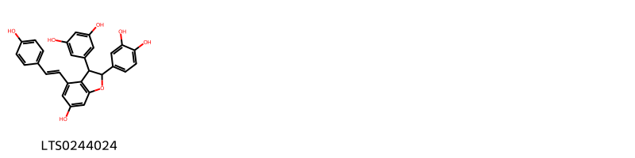{ width=100% }
    <figcaption>Hình ảnh cấu trúc hóa học của 1 hoạt chất thuộc nhóm 2-arylbenzofuran flavonoids gồm ['5-[2-(3,4-dihydroxyphenyl)-6-hydroxy-4-[(1e)-2-(4-hydroxyphenyl)ethenyl]-2,3-dihydro-1-benzofuran-3-yl]benzene-1,3-diol (LTS0244024)'].</figcaption>
</figure>
#### Nhóm Benzene and substituted derivatives
<figure markdown="span">
    { width=100% }
    <figcaption>Hình ảnh cấu trúc hóa học của 1 hoạt chất thuộc nhóm Benzene and substituted derivatives gồm ['vanillic acid (LTS0229113)'].</figcaption>
</figure>
#### Nhóm Carboxylic acids and derivatives
<figure markdown="span">
    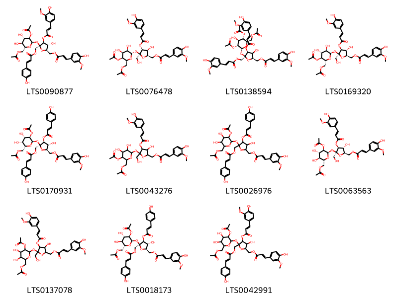{ width=100% }
    <figcaption>Hình ảnh cấu trúc hóa học của 11 hoạt chất thuộc nhóm Carboxylic acids and derivatives gồm ['[(2r,3r,4s,5s)-5-{[(2r,3r,4s,5s,6r)-3-(acetyloxy)-6-[(acetyloxy)methyl]-4,5-dihydroxyoxan-2-yl]oxy}-3-hydroxy-4-{[(2e)-3-(4-hydroxy-3-methoxyphenyl)prop-2-enoyl]oxy}-5-({[(2e)-3-(4-hydroxyphenyl)prop-2-enoyl]oxy}methyl)oxolan-2-yl]methyl (2e)-3-(4-hydroxy-3-methoxyphenyl)prop-2-enoate (LTS0090877)', '[(2r,3s,4r,5s)-5-{[(2s,3r,4s,5s,6s)-5-(acetyloxy)-6-[(acetyloxy)methyl]-3,4-dihydroxyoxan-2-yl]oxy}-3-hydroxy-4-{[(2e)-3-(4-hydroxy-3-methoxyphenyl)prop-2-enoyl]oxy}-5-(hydroxymethyl)oxolan-2-yl]methyl (2e)-3-(4-hydroxy-3-methoxyphenyl)prop-2-enoate (LTS0076478)', '[(2r,4s,5s)-5-{[(2r,3r,4s,5s,6r)-3,5-bis(acetyloxy)-6-[(acetyloxy)methyl]-4-hydroxyoxan-2-yl]oxy}-3-hydroxy-4-{[(2e)-3-(4-hydroxy-3-methoxyphenyl)prop-2-enoyl]oxy}-5-({[(2e)-3-(4-hydroxy-3-methoxyphenyl)prop-2-enoyl]oxy}methyl)oxolan-2-yl]methyl (2e)-3-(4-hydroxy-3-methoxyphenyl)prop-2-enoate (LTS0138594)', '[(2r,3r,4s,5s)-5-{[(2r,3r,4r,5s,6r)-5-(acetyloxy)-6-[(acetyloxy)methyl]-3,4-dihydroxyoxan-2-yl]oxy}-3-hydroxy-4-{[(2e)-3-(4-hydroxy-3-methoxyphenyl)prop-2-enoyl]oxy}-5-(hydroxymethyl)oxolan-2-yl]methyl (2e)-3-(4-hydroxy-3-methoxyphenyl)prop-2-enoate (LTS0169320)', '[(2r,3r,4s,5s)-5-{[(2r,3r,4s,5r,6r)-3-(acetyloxy)-6-[(acetyloxy)methyl]-4,5-dihydroxyoxan-2-yl]oxy}-3-hydroxy-4-{[(2e)-3-(4-hydroxyphenyl)prop-2-enoyl]oxy}-5-({[(2e)-3-(4-hydroxyphenyl)prop-2-enoyl]oxy}methyl)oxolan-2-yl]methyl (2e)-3-(4-hydroxy-3-methoxyphenyl)prop-2-enoate (LTS0170931)', '(5-{[5-(acetyloxy)-6-[(acetyloxy)methyl]-3,4-dihydroxyoxan-2-yl]oxy}-3-hydroxy-4-{[3-(4-hydroxy-3-methoxyphenyl)prop-2-enoyl]oxy}-5-(hydroxymethyl)oxolan-2-yl)methyl 3-(4-hydroxy-3-methoxyphenyl)prop-2-enoate (LTS0043276)', '(5-{[3-(acetyloxy)-6-[(acetyloxy)methyl]-4,5-dihydroxyoxan-2-yl]oxy}-3-hydroxy-4-{[3-(4-hydroxyphenyl)prop-2-enoyl]oxy}-5-({[3-(4-hydroxyphenyl)prop-2-enoyl]oxy}methyl)oxolan-2-yl)methyl 3-(4-hydroxy-3-methoxyphenyl)prop-2-enoate (LTS0026976)', '[(2r,3r,4s,5s)-5-{[(2r,3r,4s,5s,6r)-3-(acetyloxy)-6-[(acetyloxy)methyl]-4,5-dihydroxyoxan-2-yl]oxy}-3-hydroxy-4-{[(2e)-3-(4-hydroxy-3-methoxyphenyl)prop-2-enoyl]oxy}-5-(hydroxymethyl)oxolan-2-yl]methyl (2e)-3-(4-hydroxy-3-methoxyphenyl)prop-2-enoate (LTS0063563)', '(5-{[3-(acetyloxy)-6-[(acetyloxy)methyl]-4,5-dihydroxyoxan-2-yl]oxy}-3-hydroxy-4-{[3-(4-hydroxy-3-methoxyphenyl)prop-2-enoyl]oxy}-5-(hydroxymethyl)oxolan-2-yl)methyl 3-(4-hydroxy-3-methoxyphenyl)prop-2-enoate (LTS0137078)', '[(2r,3r,4s,5s)-5-{[(2r,3r,4s,5s,6r)-3-(acetyloxy)-6-[(acetyloxy)methyl]-4,5-dihydroxyoxan-2-yl]oxy}-3-hydroxy-4-{[(2e)-3-(4-hydroxyphenyl)prop-2-enoyl]oxy}-5-({[(2e)-3-(4-hydroxyphenyl)prop-2-enoyl]oxy}methyl)oxolan-2-yl]methyl (2e)-3-(4-hydroxy-3-methoxyphenyl)prop-2-enoate (LTS0018173)', '(5-{[3-(acetyloxy)-6-[(acetyloxy)methyl]-4,5-dihydroxyoxan-2-yl]oxy}-3-hydroxy-4-{[3-(4-hydroxy-3-methoxyphenyl)prop-2-enoyl]oxy}-5-({[3-(4-hydroxyphenyl)prop-2-enoyl]oxy}methyl)oxolan-2-yl)methyl 3-(4-hydroxy-3-methoxyphenyl)prop-2-enoate (LTS0042991)'].</figcaption>
</figure>
#### Nhóm Cinnamic acids and derivatives
<figure markdown="span">
    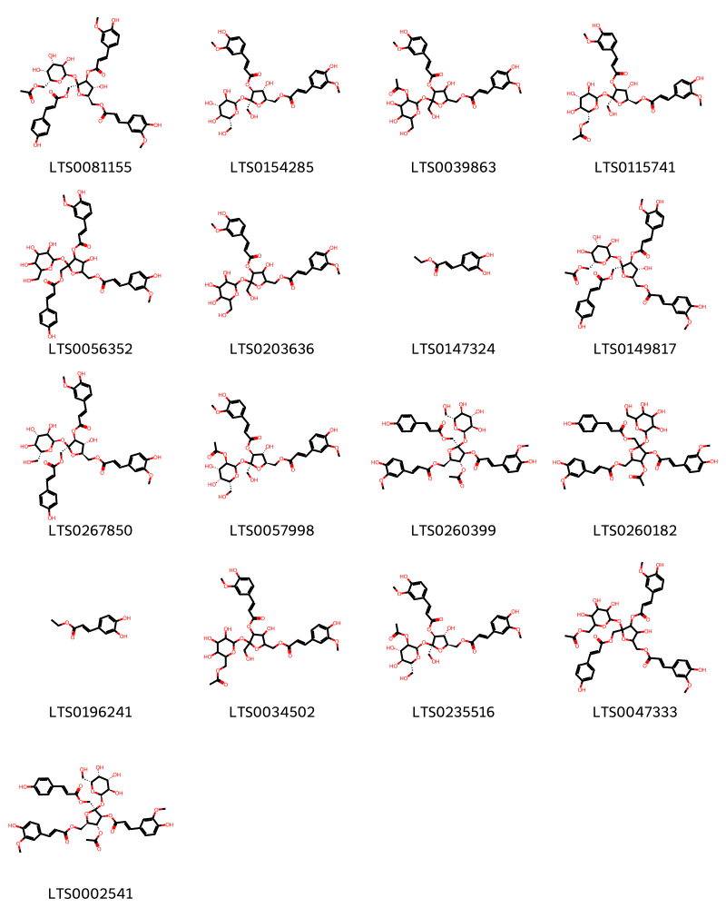{ width=100% }
    <figcaption>Hình ảnh cấu trúc hóa học của 17 hoạt chất thuộc nhóm Cinnamic acids and derivatives gồm ['[(2r,3r,4s,5s)-5-{[(2r,3r,4s,5r,6r)-6-[(acetyloxy)methyl]-3,4,5-trihydroxyoxan-2-yl]oxy}-3-hydroxy-4-{[(2e)-3-(4-hydroxy-3-methoxyphenyl)prop-2-enoyl]oxy}-5-({[(2e)-3-(4-hydroxyphenyl)prop-2-enoyl]oxy}methyl)oxolan-2-yl]methyl (2e)-3-(4-hydroxy-3-methoxyphenyl)prop-2-enoate (LTS0081155)', '[(2r,3r,4s,5s)-3-hydroxy-4-{[(2e)-3-(4-hydroxy-3-methoxyphenyl)prop-2-enoyl]oxy}-5-(hydroxymethyl)-5-{[(2r,3r,4s,5s,6r)-3,4,5-trihydroxy-6-(hydroxymethyl)oxan-2-yl]oxy}oxolan-2-yl]methyl (2e)-3-(4-hydroxy-3-methoxyphenyl)prop-2-enoate (LTS0154285)', '(5-{[3-(acetyloxy)-4,5-dihydroxy-6-(hydroxymethyl)oxan-2-yl]oxy}-3-hydroxy-4-{[3-(4-hydroxy-3-methoxyphenyl)prop-2-enoyl]oxy}-5-(hydroxymethyl)oxolan-2-yl)methyl 3-(4-hydroxy-3-methoxyphenyl)prop-2-enoate (LTS0039863)', '[(2r,3r,4s,5s)-5-{[(2r,3r,4s,5s,6r)-6-[(acetyloxy)methyl]-3,4,5-trihydroxyoxan-2-yl]oxy}-3-hydroxy-4-{[(2e)-3-(4-hydroxy-3-methoxyphenyl)prop-2-enoyl]oxy}-5-(hydroxymethyl)oxolan-2-yl]methyl (2e)-3-(4-hydroxy-3-methoxyphenyl)prop-2-enoate (LTS0115741)', '(3-hydroxy-4-{[3-(4-hydroxy-3-methoxyphenyl)prop-2-enoyl]oxy}-5-({[3-(4-hydroxyphenyl)prop-2-enoyl]oxy}methyl)-5-{[3,4,5-trihydroxy-6-(hydroxymethyl)oxan-2-yl]oxy}oxolan-2-yl)methyl 3-(4-hydroxy-3-methoxyphenyl)prop-2-enoate (LTS0056352)', '(3-hydroxy-4-{[3-(4-hydroxy-3-methoxyphenyl)prop-2-enoyl]oxy}-5-(hydroxymethyl)-5-{[3,4,5-trihydroxy-6-(hydroxymethyl)oxan-2-yl]oxy}oxolan-2-yl)methyl 3-(4-hydroxy-3-methoxyphenyl)prop-2-enoate (LTS0203636)', 'ethyl caffeate (LTS0147324)', '[(2r,3r,4s,5s)-5-{[(2r,3r,4s,5s,6r)-6-[(acetyloxy)methyl]-3,4,5-trihydroxyoxan-2-yl]oxy}-3-hydroxy-4-{[(2e)-3-(4-hydroxy-3-methoxyphenyl)prop-2-enoyl]oxy}-5-({[(2e)-3-(4-hydroxyphenyl)prop-2-enoyl]oxy}methyl)oxolan-2-yl]methyl (2e)-3-(4-hydroxy-3-methoxyphenyl)prop-2-enoate (LTS0149817)', '[(2r,3r,4s,5s)-3-hydroxy-4-{[(2e)-3-(4-hydroxy-3-methoxyphenyl)prop-2-enoyl]oxy}-5-({[(2e)-3-(4-hydroxyphenyl)prop-2-enoyl]oxy}methyl)-5-{[(2r,3r,4s,5s,6r)-3,4,5-trihydroxy-6-(hydroxymethyl)oxan-2-yl]oxy}oxolan-2-yl]methyl (2e)-3-(4-hydroxy-3-methoxyphenyl)prop-2-enoate (LTS0267850)', '[(2r,3r,4s,5s)-5-{[(2r,3r,4s,5r,6r)-3-(acetyloxy)-4,5-dihydroxy-6-(hydroxymethyl)oxan-2-yl]oxy}-3-hydroxy-4-{[(2e)-3-(4-hydroxy-3-methoxyphenyl)prop-2-enoyl]oxy}-5-(hydroxymethyl)oxolan-2-yl]methyl (2e)-3-(4-hydroxy-3-methoxyphenyl)prop-2-enoate (LTS0057998)', '[(2r,3r,4s,5s)-3-(acetyloxy)-4-{[(2e)-3-(4-hydroxy-3-methoxyphenyl)prop-2-enoyl]oxy}-5-({[(2e)-3-(4-hydroxyphenyl)prop-2-enoyl]oxy}methyl)-5-{[(2r,3r,4s,5s,6r)-3,4,5-trihydroxy-6-(hydroxymethyl)oxan-2-yl]oxy}oxolan-2-yl]methyl (2e)-3-(4-hydroxy-3-methoxyphenyl)prop-2-enoate (LTS0260399)', '[3-(acetyloxy)-4-{[3-(4-hydroxy-3-methoxyphenyl)prop-2-enoyl]oxy}-5-({[3-(4-hydroxyphenyl)prop-2-enoyl]oxy}methyl)-5-{[3,4,5-trihydroxy-6-(hydroxymethyl)oxan-2-yl]oxy}oxolan-2-yl]methyl 3-(4-hydroxy-3-methoxyphenyl)prop-2-enoate (LTS0260182)', 'ethyl 3-(3,4-dihydroxyphenyl)prop-2-enoate (LTS0196241)', '[5-({6-[(acetyloxy)methyl]-3,4,5-trihydroxyoxan-2-yl}oxy)-3-hydroxy-4-{[3-(4-hydroxy-3-methoxyphenyl)prop-2-enoyl]oxy}-5-(hydroxymethyl)oxolan-2-yl]methyl 3-(4-hydroxy-3-methoxyphenyl)prop-2-enoate (LTS0034502)', '[(2r,3r,4s,5s)-5-{[(2r,3r,4s,5s,6r)-3-(acetyloxy)-4,5-dihydroxy-6-(hydroxymethyl)oxan-2-yl]oxy}-3-hydroxy-4-{[(2e)-3-(4-hydroxy-3-methoxyphenyl)prop-2-enoyl]oxy}-5-(hydroxymethyl)oxolan-2-yl]methyl (2e)-3-(4-hydroxy-3-methoxyphenyl)prop-2-enoate (LTS0235516)', '[5-({6-[(acetyloxy)methyl]-3,4,5-trihydroxyoxan-2-yl}oxy)-3-hydroxy-4-{[3-(4-hydroxy-3-methoxyphenyl)prop-2-enoyl]oxy}-5-({[3-(4-hydroxyphenyl)prop-2-enoyl]oxy}methyl)oxolan-2-yl]methyl 3-(4-hydroxy-3-methoxyphenyl)prop-2-enoate (LTS0047333)', '[(2r,3r,4s,5s)-3-(acetyloxy)-4-{[(2e)-3-(4-hydroxy-3-methoxyphenyl)prop-2-enoyl]oxy}-5-({[(2e)-3-(4-hydroxyphenyl)prop-2-enoyl]oxy}methyl)-5-{[(2r,3r,4s,5r,6r)-3,4,5-trihydroxy-6-(hydroxymethyl)oxan-2-yl]oxy}oxolan-2-yl]methyl (2e)-3-(4-hydroxy-3-methoxyphenyl)prop-2-enoate (LTS0002541)'].</figcaption>
</figure>
#### Nhóm Flavonoids
<figure markdown="span">
    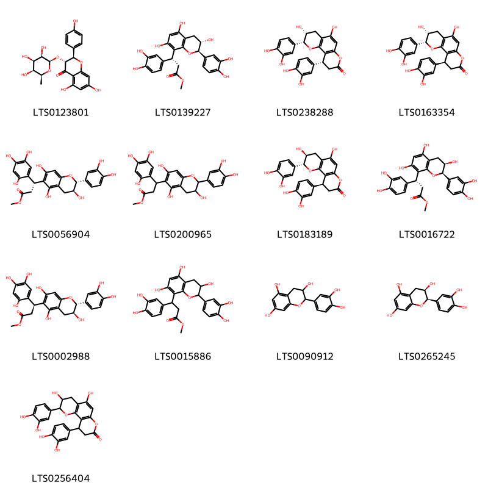{ width=100% }
    <figcaption>Hình ảnh cấu trúc hóa học của 13 hoạt chất thuộc nhóm Flavonoids gồm ['(2r,3r)-5,7-dihydroxy-2-(4-hydroxyphenyl)-3-{[(2r,3r,4r,5s,6s)-3,4,5-trihydroxy-6-methyloxan-2-yl]oxy}-2,3-dihydro-1-benzopyran-4-one (LTS0123801)', 'methyl (3r)-3-(3,4-dihydroxyphenyl)-3-[(2r,3s)-2-(3,4-dihydroxyphenyl)-3,5,7-trihydroxy-3,4-dihydro-2h-1-benzopyran-8-yl]propanoate (LTS0139227)', 'cinchonain ib (LTS0238288)', 'cinchonain-ib (LTS0163354)', 'methyl (3r)-3-[(2r,3s)-2-(3,4-dihydroxyphenyl)-3,5,7-trihydroxy-3,4-dihydro-2h-1-benzopyran-6-yl]-3-(2,4,5-trihydroxyphenyl)propanoate (LTS0056904)', 'methyl 3-[2-(3,4-dihydroxyphenyl)-3,5,7-trihydroxy-3,4-dihydro-2h-1-benzopyran-6-yl]-3-(2,4,5-trihydroxyphenyl)propanoate (LTS0200965)', '(4r,5s,14s)-4,14-bis(3,4-dihydroxyphenyl)-5,8-dihydroxy-3,11-dioxatricyclo[8.4.0.0²,⁷]tetradeca-1(10),2(7),8-trien-12-one (LTS0183189)', 'methyl (3r)-3-(3,4-dihydroxyphenyl)-3-[(2r,3r)-2-(3,4-dihydroxyphenyl)-3,5,7-trihydroxy-3,4-dihydro-2h-1-benzopyran-8-yl]propanoate (LTS0016722)', 'methyl (3s)-3-[(2r,3s)-2-(3,4-dihydroxyphenyl)-3,5,7-trihydroxy-3,4-dihydro-2h-1-benzopyran-6-yl]-3-(2,4,5-trihydroxyphenyl)propanoate (LTS0002988)', 'methyl 3-(3,4-dihydroxyphenyl)-3-[2-(3,4-dihydroxyphenyl)-3,5,7-trihydroxy-3,4-dihydro-2h-1-benzopyran-8-yl]propanoate (LTS0015886)', 'catechol (LTS0090912)', 'ent-epicatechin (LTS0265245)', '4,14-bis(3,4-dihydroxyphenyl)-5,8-dihydroxy-3,11-dioxatricyclo[8.4.0.0²,⁷]tetradeca-1(10),2(7),8-trien-12-one (LTS0256404)'].</figcaption>
</figure>
#### Nhóm Prenol lipids
<figure markdown="span">
    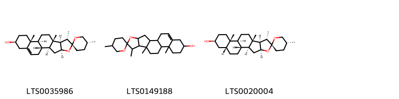{ width=100% }
    <figcaption>Hình ảnh cấu trúc hóa học của 3 hoạt chất thuộc nhóm Prenol lipids gồm ['diosgenin (LTS0035986)', 'diosgenin (LTS0149188)', 'smilagenin (LTS0020004)'].</figcaption>
</figure>
#### Nhóm Steroids and steroid derivatives
<figure markdown="span">
    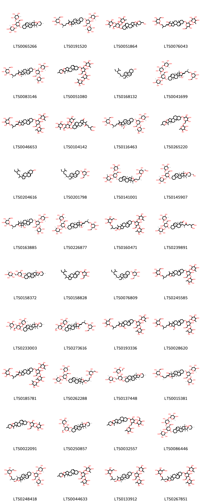{ width=100% }
    <figcaption>Hình ảnh cấu trúc hóa học của 40 hoạt chất thuộc nhóm Steroids and steroid derivatives gồm ["(2s,3r,4r,5r,6s)-2-{[(2r,3s,4s,5r,6r)-4-hydroxy-2-(hydroxymethyl)-6-[(1's,2r,2's,4's,5r,7's,8'r,9's,12's,13'r,16's)-5,7',9',13'-tetramethyl-5'-oxaspiro[oxane-2,6'-pentacyclo[10.8.0.0²,⁹.0⁴,⁸.0¹³,¹⁸]icosan]-18'-eneoxy]-5-{[(2s,3r,4r,5r,6s)-3,4,5-trihydroxy-6-methyloxan-2-yl]oxy}oxan-3-yl]oxy}-6-methyloxane-3,4,5-triol (LTS0065266)", '(2r,3r,4s,5s,6r)-2-[(2r)-4-[(1s,2s,4s,8s,9s,12s,13r,16s)-16-{[(2r,3r,4s,5s,6r)-4-hydroxy-6-(hydroxymethyl)-3,5-bis({[(2s,3r,4r,5r,6s)-3,4,5-trihydroxy-6-methyloxan-2-yl]oxy})oxan-2-yl]oxy}-7,9,13-trimethyl-5-oxapentacyclo[10.8.0.0²,⁹.0⁴,⁸.0¹³,¹⁸]icosa-6,18-dien-6-yl]-2-methylbutoxy]-6-(hydroxymethyl)oxane-3,4,5-triol (LTS0191520)', "2-{[4-hydroxy-2-(hydroxymethyl)-6-[5-(hydroxymethyl)-7',9',13'-trimethyl-5'-oxaspiro[oxane-2,6'-pentacyclo[10.8.0.0²,⁹.0⁴,⁸.0¹³,¹⁸]icosan]-18'-eneoxy]-5-[(3,4,5-trihydroxy-6-methyloxan-2-yl)oxy]oxan-3-yl]oxy}-6-methyloxane-3,4,5-triol (LTS0051864)", '2-[(4,5-dihydroxy-2-{[7-hydroxy-7,9,13-trimethyl-6-(3-methyl-4-{[3,4,5-trihydroxy-6-(hydroxymethyl)oxan-2-yl]oxy}butylidene)-5-oxapentacyclo[10.8.0.0²,⁹.0⁴,⁸.0¹³,¹⁸]icos-18-en-16-yl]oxy}-6-(hydroxymethyl)oxan-3-yl)oxy]-6-methyloxane-3,4,5-triol (LTS0076043)', '(2s,3s,4r,5r,6s)-2-[(2r)-4-[(1s,2s,4r,8r,9r,12r,13s,16r)-16-{[(2s,3s,4r,5r,6s)-4-hydroxy-6-(hydroxymethyl)-3,5-bis({[(2r,3s,4r,5r,6s)-3,4,5-trihydroxy-6-methyloxan-2-yl]oxy})oxan-2-yl]oxy}-7,9,13-trimethyl-5-oxapentacyclo[10.8.0.0²,⁹.0⁴,⁸.0¹³,¹⁸]icosa-6,18-dien-6-yl]-2-methylbutoxy]-6-(hydroxymethyl)oxane-3,4,5-triol (LTS0083146)', "2-[(4,5-dihydroxy-6-{[4-hydroxy-2-(hydroxymethyl)-6-{5,7',9',13'-tetramethyl-5'-oxaspiro[oxane-2,6'-pentacyclo[10.8.0.0²,⁹.0⁴,⁸.0¹³,¹⁸]icosan]-18'-eneoxy}-5-[(3,4,5-trihydroxy-6-methyloxan-2-yl)oxy]oxan-3-yl]oxy}-2-methyloxan-3-yl)oxy]-6-methyloxane-3,4,5-triol (LTS0051080)", 'sitosterol (LTS0168132)', '(2s,3r,4r,5r,6s)-2-{[(2r,3r,4s,5s,6r)-5-{[(2s,3r,4s,5r,6s)-3,4-dihydroxy-6-methyl-5-{[(2s,3r,4r,5r,6s)-3,4,5-trihydroxy-6-methyloxan-2-yl]oxy}oxan-2-yl]oxy}-4-hydroxy-2-{[(1s,2s,4s,6z,7s,8r,9s,12s,13r,16s)-7-hydroxy-7,9,13-trimethyl-6-[(3r)-3-methyl-4-{[(2r,3r,4s,5s,6r)-3,4,5-trihydroxy-6-(hydroxymethyl)oxan-2-yl]oxy}butylidene]-5-oxapentacyclo[10.8.0.0²,⁹.0⁴,⁸.0¹³,¹⁸]icos-18-en-16-yl]oxy}-6-(hydroxymethyl)oxan-3-yl]oxy}-6-methyloxane-3,4,5-triol (LTS0041699)', '2-[(4-hydroxy-6-{[7-hydroxy-7,9,13-trimethyl-6-(3-methyl-4-{[3,4,5-trihydroxy-6-(hydroxymethyl)oxan-2-yl]oxy}butylidene)-5-oxapentacyclo[10.8.0.0²,⁹.0⁴,⁸.0¹³,¹⁸]icos-18-en-16-yl]oxy}-2-(hydroxymethyl)-5-[(3,4,5-trihydroxy-6-methyloxan-2-yl)oxy]oxan-3-yl)oxy]-6-methyloxane-3,4,5-triol (LTS0046653)', '7-{[4-hydroxy-6-(hydroxymethyl)-3,5-bis[(3,4,5-trihydroxy-6-methyloxan-2-yl)oxy]oxan-2-yl]oxy}-1-[7-hydroxy-6-(hydroxymethyl)-3-oxoheptan-2-yl]-9a,11a-dimethyl-1h,3h,3ah,3bh,4h,6h,7h,8h,9h,9bh,10h,11h-cyclopenta[a]phenanthren-2-one (LTS0104142)', '(2s,3r,4r,5r,6s)-2-{[(2r,3s,4s,5r,6r)-4-hydroxy-2-(hydroxymethyl)-6-{[(1r,2s,3r,4r,8s,9s,12s,13r,16s)-3-methoxy-7,9,13-trimethyl-6-[(3r)-3-methyl-4-{[(2r,3r,4s,5s,6r)-3,4,5-trihydroxy-6-(hydroxymethyl)oxan-2-yl]oxy}butyl]-5-oxapentacyclo[10.8.0.0²,⁹.0⁴,⁸.0¹³,¹⁸]icosa-6,18-dien-16-yl]oxy}-5-{[(2s,3r,4r,5r,6s)-3,4,5-trihydroxy-6-methyloxan-2-yl]oxy}oxan-3-yl]oxy}-6-methyloxane-3,4,5-triol (LTS0116463)', "2-{5,7',9',13'-tetramethyl-5'-oxaspiro[oxane-2,6'-pentacyclo[10.8.0.0²,⁹.0⁴,⁸.0¹³,¹⁸]icosane]oxy}-6-{[(3,4,5-trihydroxy-6-methyloxan-2-yl)oxy]methyl}oxane-3,4,5-triol (LTS0265220)", 'stigmast-5-en-3-ol, (3β)- (LTS0204616)', 'sitogluside (LTS0201798)', '(2s,3r,4s,5r,6s)-2-{[(2r,3s,4s,5r,6s)-4-hydroxy-6-{[(1s,2s,4s,6r,7s,8r,9s,12s,13r,16s)-6-hydroxy-7,9,13-trimethyl-6-[(3r)-3-methyl-4-{[(2r,3s,4r,5s,6s)-3,4,5-trihydroxy-6-(hydroxymethyl)oxan-2-yl]oxy}butyl]-5-oxapentacyclo[10.8.0.0²,⁹.0⁴,⁸.0¹³,¹⁸]icos-18-en-16-yl]oxy}-2-(hydroxymethyl)-5-{[(2s,3r,4s,5r,6r)-3,4,5-trihydroxy-6-methyloxan-2-yl]oxy}oxan-3-yl]oxy}-6-methyloxane-3,4,5-triol (LTS0141001)', "(2s,3r,4r,5r,6s)-2-{[(2r,3s,4s,5r,6r)-4-hydroxy-2-(hydroxymethyl)-6-[(1's,2r,2's,4's,5s,7's,8'r,9's,12's,13'r,16's)-5-(hydroxymethyl)-7',9',13'-trimethyl-5'-oxaspiro[oxane-2,6'-pentacyclo[10.8.0.0²,⁹.0⁴,⁸.0¹³,¹⁸]icosan]-18'-eneoxy]-5-{[(2s,3r,4r,5r,6s)-3,4,5-trihydroxy-6-methyloxan-2-yl]oxy}oxan-3-yl]oxy}-6-methyloxane-3,4,5-triol (LTS0145907)", '(2r,3r,4s,5s,6r)-2-[(2r)-4-[(1r,2s,3r,4r,8s,9s,12s,13r,16s)-3-hydroxy-16-{[(2r,3r,4s,5s,6r)-4-hydroxy-6-(hydroxymethyl)-3,5-bis({[(2s,3r,4r,5r,6s)-3,4,5-trihydroxy-6-methyloxan-2-yl]oxy})oxan-2-yl]oxy}-7,9,13-trimethyl-5-oxapentacyclo[10.8.0.0²,⁹.0⁴,⁸.0¹³,¹⁸]icosa-6,18-dien-6-yl]-2-methylbutoxy]-6-(hydroxymethyl)oxane-3,4,5-triol (LTS0163885)', '(2s,3r,4r,5r,6s)-2-{[(2r,3s,4s,5r,6r)-4-hydroxy-6-{[(1s,2s,4s,6z,7s,8r,9s,12s,13r,16s)-7-hydroxy-7,9,13-trimethyl-6-[(3r)-3-methyl-4-{[(2r,3r,4s,5s,6r)-3,4,5-trihydroxy-6-(hydroxymethyl)oxan-2-yl]oxy}butylidene]-5-oxapentacyclo[10.8.0.0²,⁹.0⁴,⁸.0¹³,¹⁸]icos-18-en-16-yl]oxy}-2-(hydroxymethyl)-5-{[(2s,3r,4r,5r,6s)-3,4,5-trihydroxy-6-methyloxan-2-yl]oxy}oxan-3-yl]oxy}-6-methyloxane-3,4,5-triol (LTS0226877)', '2-[(4-hydroxy-6-{[6-hydroxy-7,9,13-trimethyl-6-(3-methyl-4-{[3,4,5-trihydroxy-6-(hydroxymethyl)oxan-2-yl]oxy}butyl)-5-oxapentacyclo[10.8.0.0²,⁹.0⁴,⁸.0¹³,¹⁸]icos-18-en-16-yl]oxy}-2-(hydroxymethyl)-5-[(3,4,5-trihydroxy-6-methyloxan-2-yl)oxy]oxan-3-yl)oxy]-6-methyloxane-3,4,5-triol (LTS0160471)', '(1r,3as,3bs,7s,9ar,9bs,11as)-7-{[(2r,3r,4s,5s,6r)-4-hydroxy-6-(hydroxymethyl)-3,5-bis({[(2s,3r,4r,5r,6s)-3,4,5-trihydroxy-6-methyloxan-2-yl]oxy})oxan-2-yl]oxy}-1-[(2s)-7-hydroxy-6-(hydroxymethyl)-3-oxoheptan-2-yl]-9a,11a-dimethyl-1h,3h,3ah,3bh,4h,6h,7h,8h,9h,9bh,10h,11h-cyclopenta[a]phenanthren-2-one (LTS0239891)', "(2s,3r,4r,5s,6s)-2-methyl-6-{[(2s,3r,4r,5s,6s)-3,4,5-trihydroxy-6-[(1'r,2r,2's,4'r,5r,7'r,8's,9'r,12's,13'r,16'r,18's)-5,7',9',13'-tetramethyl-5'-oxaspiro[oxane-2,6'-pentacyclo[10.8.0.0²,⁹.0⁴,⁸.0¹³,¹⁸]icosane]oxy]oxan-2-yl]methoxy}oxane-3,4,5-triol (LTS0158372)", '2-{[1-(5-ethyl-6-methylheptan-2-yl)-9a,11a-dimethyl-1h,2h,3h,3ah,3bh,4h,6h,7h,8h,9h,9bh,10h,11h-cyclopenta[a]phenanthren-7-yl]oxy}-6-(hydroxymethyl)oxane-3,4,5-triol (LTS0158828)', '(2r,3r,4s,5s,6s)-2-{[(1r,3as,3bs,7s,9ar,9bs,11ar)-1-[(2r,5r)-5-ethyl-6-methylheptan-2-yl]-9a,11a-dimethyl-1h,2h,3h,3ah,3bh,4h,6h,7h,8h,9h,9bh,10h,11h-cyclopenta[a]phenanthren-7-yl]oxy}-6-(hydroxymethyl)oxane-3,4,5-triol (LTS0076809)', '2-[4-(16-{[4-hydroxy-6-(hydroxymethyl)-3,5-bis[(3,4,5-trihydroxy-6-methyloxan-2-yl)oxy]oxan-2-yl]oxy}-7,9,13-trimethyl-5-oxapentacyclo[10.8.0.0²,⁹.0⁴,⁸.0¹³,¹⁸]icosa-6,18-dien-6-yl)-2-methylbutoxy]-6-(hydroxymethyl)oxane-3,4,5-triol (LTS0245585)', "(2s,3r,4r,5r,6s)-2-{[(2s,3s,4s,5r,6s)-4-hydroxy-2-(hydroxymethyl)-6-[(1's,2r,2's,4's,5r,7's,8'r,9's,12's,13'r,16's)-5,7',9',13'-tetramethyl-5'-oxaspiro[oxane-2,6'-pentacyclo[10.8.0.0²,⁹.0⁴,⁸.0¹³,¹⁸]icosan]-18'-eneoxy]-5-{[(2s,3r,4r,5r,6s)-3,4,5-trihydroxy-6-methyloxan-2-yl]oxy}oxan-3-yl]oxy}-6-methyloxane-3,4,5-triol (LTS0233003)", '(2s,3r,4r,5r,6s)-2-{[(2r,3r,4s,5s,6r)-4,5-dihydroxy-2-{[(1s,2s,4s,6z,7s,8r,9s,12s,13r,16s)-7-hydroxy-7,9,13-trimethyl-6-[(3r)-3-methyl-4-{[(2r,3r,4s,5s,6r)-3,4,5-trihydroxy-6-(hydroxymethyl)oxan-2-yl]oxy}butylidene]-5-oxapentacyclo[10.8.0.0²,⁹.0⁴,⁸.0¹³,¹⁸]icos-18-en-16-yl]oxy}-6-(hydroxymethyl)oxan-3-yl]oxy}-6-methyloxane-3,4,5-triol (LTS0273616)', '2-[4-(3-hydroxy-16-{[4-hydroxy-6-(hydroxymethyl)-3,5-bis[(3,4,5-trihydroxy-6-methyloxan-2-yl)oxy]oxan-2-yl]oxy}-7,9,13-trimethyl-5-oxapentacyclo[10.8.0.0²,⁹.0⁴,⁸.0¹³,¹⁸]icosa-6,18-dien-6-yl)-2-methylbutoxy]-6-(hydroxymethyl)oxane-3,4,5-triol (LTS0193336)', '2-[4-(16-{[4-hydroxy-6-(hydroxymethyl)-3,5-bis[(3,4,5-trihydroxy-6-methyloxan-2-yl)oxy]oxan-2-yl]oxy}-3-methoxy-7,9,13-trimethyl-5-oxapentacyclo[10.8.0.0²,⁹.0⁴,⁸.0¹³,¹⁸]icosa-6,18-dien-6-yl)-2-methylbutoxy]-6-(hydroxymethyl)oxane-3,4,5-triol (LTS0028620)', '2-({4,5-dihydroxy-6-[(4-hydroxy-6-{[7-hydroxy-7,9,13-trimethyl-6-(3-methyl-4-{[3,4,5-trihydroxy-6-(hydroxymethyl)oxan-2-yl]oxy}butylidene)-5-oxapentacyclo[10.8.0.0²,⁹.0⁴,⁸.0¹³,¹⁸]icos-18-en-16-yl]oxy}-2-(hydroxymethyl)-5-[(3,4,5-trihydroxy-6-methyloxan-2-yl)oxy]oxan-3-yl)oxy]-2-methyloxan-3-yl}oxy)-6-methyloxane-3,4,5-triol (LTS0185781)', 'protodioscin (LTS0262288)', "(2s,3s,4r,5r,6s)-2-{[(2s,3r,4s,5s,6s)-4,5-dihydroxy-6-[(1'r,2r,2's,4'r,5r,7'r,8's,9'r,12's,13'r,16'r,18's)-5,7',9',13'-tetramethyl-5'-oxaspiro[oxane-2,6'-pentacyclo[10.8.0.0²,⁹.0⁴,⁸.0¹³,¹⁸]icosane]oxy]-3-{[(2r,3s,4r,5r,6s)-3,4,5-trihydroxy-6-(hydroxymethyl)oxan-2-yl]oxy}oxan-2-yl]methoxy}-6-methyloxane-3,4,5-triol (LTS0137448)", '(2s,3r,4r,5r,6s)-2-{[(2r,3s,4s,5r,6r)-4-hydroxy-6-{[(1s,2s,4s,6z,7s,8r,9s,12s,13r,16s)-7-hydroxy-7,9,13-trimethyl-6-[(3s)-3-methyl-4-{[(2r,3r,4s,5s,6r)-3,4,5-trihydroxy-6-(hydroxymethyl)oxan-2-yl]oxy}butylidene]-5-oxapentacyclo[10.8.0.0²,⁹.0⁴,⁸.0¹³,¹⁸]icos-18-en-16-yl]oxy}-2-(hydroxymethyl)-5-{[(2s,3r,4r,5r,6s)-3,4,5-trihydroxy-6-methyloxan-2-yl]oxy}oxan-3-yl]oxy}-6-methyloxane-3,4,5-triol (LTS0015381)', "2-{[4,5-dihydroxy-2-(hydroxymethyl)-6-{5,7',9',13'-tetramethyl-5'-oxaspiro[oxane-2,6'-pentacyclo[10.8.0.0²,⁹.0⁴,⁸.0¹³,¹⁸]icosan]-18'-eneoxy}oxan-3-yl]oxy}-6-methyloxane-3,4,5-triol (LTS0022091)", "(2s,3r,4r,5r,6s)-2-{[(2r,3s,4r,5r,6r)-4,5-dihydroxy-2-(hydroxymethyl)-6-[(1's,2r,2's,4's,5r,7's,8'r,9's,12's,13'r,16's)-5,7',9',13'-tetramethyl-5'-oxaspiro[oxane-2,6'-pentacyclo[10.8.0.0²,⁹.0⁴,⁸.0¹³,¹⁸]icosan]-18'-eneoxy]oxan-3-yl]oxy}-6-methyloxane-3,4,5-triol (LTS0250857)", "2-[(4,5-dihydroxy-6-{5,7',9',13'-tetramethyl-5'-oxaspiro[oxane-2,6'-pentacyclo[10.8.0.0²,⁹.0⁴,⁸.0¹³,¹⁸]icosane]oxy}-3-{[3,4,5-trihydroxy-6-(hydroxymethyl)oxan-2-yl]oxy}oxan-2-yl)methoxy]-6-methyloxane-3,4,5-triol (LTS0032557)", "(2s,3r,4r,5r,6s)-2-{[(2r,3r,4s,5s,6r)-5-{[(2s,3r,4s,5r,6s)-3,4-dihydroxy-6-methyl-5-{[(2s,3r,4r,5r,6s)-3,4,5-trihydroxy-6-methyloxan-2-yl]oxy}oxan-2-yl]oxy}-4-hydroxy-6-(hydroxymethyl)-2-[(1's,2r,2's,4's,5r,7's,8'r,9's,12's,13'r,16's)-5,7',9',13'-tetramethyl-5'-oxaspiro[oxane-2,6'-pentacyclo[10.8.0.0²,⁹.0⁴,⁸.0¹³,¹⁸]icosan]-18'-eneoxy]oxan-3-yl]oxy}-6-methyloxane-3,4,5-triol (LTS0086446)", 'methylprotodioscin (LTS0248418)', "2-{[4-hydroxy-2-(hydroxymethyl)-6-{5,7',9',13'-tetramethyl-5'-oxaspiro[oxane-2,6'-pentacyclo[10.8.0.0²,⁹.0⁴,⁸.0¹³,¹⁸]icosan]-18'-eneoxy}-5-[(3,4,5-trihydroxy-6-methyloxan-2-yl)oxy]oxan-3-yl]oxy}-6-methyloxane-3,4,5-triol (LTS0044633)", '2-{4-[(1r,2r,4r,6r,8s,9s,12r,13r)-16-{[(2s)-4-hydroxy-6-(hydroxymethyl)-3,5-bis({[(2r)-3,4,5-trihydroxy-6-methyloxan-2-yl]oxy})oxan-2-yl]oxy}-6-methoxy-7,9,13-trimethyl-5-oxapentacyclo[10.8.0.0²,⁹.0⁴,⁸.0¹³,¹⁸]icos-18-en-6-yl]-2-methylbutoxy}-6-(hydroxymethyl)oxane-3,4,5-triol (LTS0133912)', '2-[4-(16-{[4-hydroxy-6-(hydroxymethyl)-3,5-bis[(3,4,5-trihydroxy-6-methyloxan-2-yl)oxy]oxan-2-yl]oxy}-6-methoxy-7,9,13-trimethyl-5-oxapentacyclo[10.8.0.0²,⁹.0⁴,⁸.0¹³,¹⁸]icos-18-en-6-yl)-2-methylbutoxy]-6-(hydroxymethyl)oxane-3,4,5-triol (LTS0267851)'].</figcaption>
</figure>
#### Nhóm Sulfoxides
<figure markdown="span">
    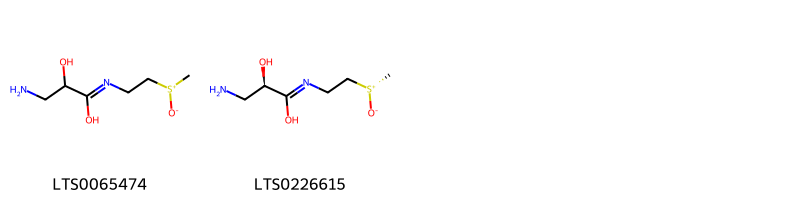{ width=100% }
    <figcaption>Hình ảnh cấu trúc hóa học của 2 hoạt chất thuộc nhóm Sulfoxides gồm ['3-amino-2-hydroxy-n-(2-methanesulfinylethyl)propanimidic acid (LTS0065474)', '(2r)-3-amino-2-hydroxy-n-{2-[(s)-methanesulfinyl]ethyl}propanimidic acid (LTS0226615)'].</figcaption>
</figure>

---

### Dược dân tộc học

Danh sách các quốc gia có sử dụng *Smilax china* trong điều trị các bệnh. 

| Country   | Disease                                                                              | Bệnh                                                                             |
|:----------|:-------------------------------------------------------------------------------------|:---------------------------------------------------------------------------------|
| China     | Carminative, Diuretic, Diuretic, Refrigerant, Sudorific, Alexiteric, Diuretic, Tonic | Carminative, lợi tiểu, lợi tiểu, lạnh, Sudorific, Alexiteric, lợi tiểu, thuốc bổ |
| Dutch     | Demulcent                                                                            | dịu, giảm kích thích                                                             |
| Egypt     | Sudorific                                                                            | Ngạt thở                                                                         |
| Elsewhere | Antidote                                                                             | Chất giải độc                                                                    |
| English   | Aphrodisiac                                                                          | Thuốc kích dục                                                                   |
| India     | Aphrodisiac, Diaphoretic, Stimulant                                                  | Thuốc kích thích tình dục, Diaphoretic, Chất kích thích                          |
| Malaya    | Aphrodisiac, Tonic                                                                   | Thuốc kích thích tình dục, Thuốc bổ                                              |
| anish     | Stimulant                                                                            | Chất kích thích                                                                  |

---

---
## Smilax cordifolia
### Thông tin về thực vật

!!! info "Phân loại thực vật của *Smilax cordifolia* từ GIBF:"
    - **Kingdom:** Plantae
    - **Phylum:** Tracheophyta
    - **Order:** Liliales
    - **Family:** Smilacaceae
    - **Genus:** Smilax
    - **Species:** *Smilax cordifolia*

 

| Label (VI)   | Label (EN)   | Scientific Name   | Descriptions (VI)   | Descriptions (EN)   | Also Known As (VI)   | Also Known As (EN)   |
|:-------------|:-------------|:------------------|:--------------------|:--------------------|:---------------------|:---------------------|
| N/A          | N/A          | Smilax cordifolia | loài thực vật       | species of plant    | ['']                 | ['']                 |

#### Phân bố trên thế giới

**Từ CSDL GIBF** nan, Uruguay, United States of America, Mexico, Jamaica

#### Phân bố tại Việt Nam

**Từ CSDL GIBF**: Không có ghi nhận ở Việt Nam

---
### Thành phần hóa học
        
- Theo cơ sở dữ liệu lotus: Từ loài *Smilax cordifolia* đã phân lập và xác định được Chưa có hoạt chất nào được phân lập. hoạt chất thuộc về các nhóm Không có hoạt chất nào được phân lập. 

Không có hình ảnh nào được tạo ra

---

### Dược dân tộc học

Danh sách các quốc gia có sử dụng *Smilax cordifolia* trong điều trị các bệnh. 

| Country   | Disease                        | Bệnh                                             |
|:----------|:-------------------------------|:-------------------------------------------------|
| Mexico    | Diuretic, Stimulant, Sudorific | Thuốc lợi tiểu, chất kích thích, gây ngạt mồ hôi |

---

---
## Smilax glabra
### Thông tin về thực vật

!!! info "Phân loại thực vật của *Smilax glabra* từ GIBF:"
    - **Kingdom:** Plantae
    - **Phylum:** Tracheophyta
    - **Order:** Liliales
    - **Family:** Smilacaceae
    - **Genus:** Smilax
    - **Species:** *Smilax glabra*

 

| Label (VI)   | Label (EN)   | Scientific Name   | Descriptions (VI)   | Descriptions (EN)   | Also Known As (VI)   | Also Known As (EN)   |
|:-------------|:-------------|:------------------|:--------------------|:--------------------|:---------------------|:---------------------|
| N/A          | N/A          | Smilax glabra     | loài thực vật       | species of plant    | ['']                 | ['']                 |

#### Phân bố trên thế giới

**Từ CSDL GIBF** Viet Nam, nan, Chinese Taipei, Thailand, Macao, Lao People’s Democratic Republic, China, Belgium, Cambodia, Hong Kong

#### Phân bố tại Việt Nam

**Từ CSDL GIBF**: Tỉnh Kiến Giang

---
### Thành phần hóa học
        
- Theo cơ sở dữ liệu lotus: Từ loài *Smilax glabra* đã phân lập và xác định được 50 hoạt chất thuộc về các nhóm Stilbenes, Organooxygen compounds, Flavonoids, Carboxylic acids and derivatives, Lignan glycosides, Fatty Acyls, Isoflavonoids, Cinnamic acids and derivatives. 

|    | chemicalTaxonomyClassyfireClass   |   smiles_count |
|---:|:----------------------------------|---------------:|
|  0 | Carboxylic acids and derivatives  |             18 |
|  1 | Cinnamic acids and derivatives    |              2 |
|  2 | Fatty Acyls                       |              2 |
|  3 | Flavonoids                        |             12 |
|  4 | Isoflavonoids                     |              1 |
|  5 | Lignan glycosides                 |              2 |
|  6 | Organooxygen compounds            |              8 |
|  7 | Stilbenes                         |              4 |

#### Nhóm Carboxylic acids and derivatives
<figure markdown="span">
    { width=100% }
    <figcaption>Hình ảnh cấu trúc hóa học của 18 hoạt chất thuộc nhóm Carboxylic acids and derivatives gồm ['[(2r,3r,4s,5s)-5-{[(2r,3s,4s,5s,6r)-3,5-bis(acetyloxy)-6-[(acetyloxy)methyl]-4-hydroxyoxan-2-yl]oxy}-3-hydroxy-4-{[(2e)-3-(4-hydroxy-3-methoxyphenyl)prop-2-enoyl]oxy}-5-({[(2e)-3-(4-hydroxyphenyl)prop-2-enoyl]oxy}methyl)oxolan-2-yl]methyl (2e)-3-(4-hydroxy-3-methoxyphenyl)prop-2-enoate (LTS0112786)', '(5-{[3,5-bis(acetyloxy)-6-[(acetyloxy)methyl]-4-hydroxyoxan-2-yl]oxy}-3-hydroxy-4-{[3-(4-hydroxy-3-methoxyphenyl)prop-2-enoyl]oxy}-5-({[3-(4-hydroxyphenyl)prop-2-enoyl]oxy}methyl)oxolan-2-yl)methyl 3-(4-hydroxy-3-methoxyphenyl)prop-2-enoate (LTS0129720)', '[(2r,3r,4s,5s)-5-{[(2r,4s,5s,6r)-3,5-bis(acetyloxy)-6-[(acetyloxy)methyl]-4-hydroxyoxan-2-yl]oxy}-3-hydroxy-4-{[(2e)-3-(4-hydroxy-3-methoxyphenyl)prop-2-enoyl]oxy}-5-({[(2e)-3-(4-hydroxyphenyl)prop-2-enoyl]oxy}methyl)oxolan-2-yl]methyl (2e)-3-(4-hydroxy-3-methoxyphenyl)prop-2-enoate (LTS0131229)', '[(2r,3r,4s,5s)-5-{[(2r,3r,4s,5s,6r)-3-(acetyloxy)-6-[(acetyloxy)methyl]-4,5-dihydroxyoxan-2-yl]oxy}-3-hydroxy-4-{[(2e)-3-(4-hydroxy-3-methoxyphenyl)prop-2-enoyl]oxy}-5-({[(2e)-3-(4-hydroxyphenyl)prop-2-enoyl]oxy}methyl)oxolan-2-yl]methyl (2e)-3-(4-hydroxy-3-methoxyphenyl)prop-2-enoate (LTS0090877)', '[(2s,3s,4r,5r)-5-{[(2s,3r,4r,5r,6s)-3-(acetyloxy)-6-[(acetyloxy)methyl]-4,5-dihydroxyoxan-2-yl]oxy}-3-hydroxy-4-{[(2e)-3-(4-hydroxy-3-methoxyphenyl)prop-2-enoyl]oxy}-5-({[(2e)-3-(4-hydroxy-3-methoxyphenyl)prop-2-enoyl]oxy}methyl)oxolan-2-yl]methyl (2e)-3-(4-hydroxy-3-methoxyphenyl)prop-2-enoate (LTS0220969)', '[(2r,3r,4s,5s)-5-{[(2r,3r,4s,5s,6r)-3-(acetyloxy)-6-[(acetyloxy)methyl]-4,5-dihydroxyoxan-2-yl]oxy}-3-hydroxy-4-{[(2e)-3-(4-hydroxy-3-methoxyphenyl)prop-2-enoyl]oxy}-5-({[(2e)-3-(4-hydroxy-3-methoxyphenyl)prop-2-enoyl]oxy}methyl)oxolan-2-yl]methyl (2e)-3-(4-hydroxy-3-methoxyphenyl)prop-2-enoate (LTS0073253)', '[(2s,3s,4s,5r)-5-{[(2r,3r,4s,5s,6s)-3,5-bis(acetyloxy)-6-[(acetyloxy)methyl]-4-hydroxyoxan-2-yl]oxy}-3-hydroxy-4-{[(2e)-3-(4-hydroxy-3-methoxyphenyl)prop-2-enoyl]oxy}-5-({[(2e)-3-(4-hydroxy-3-methoxyphenyl)prop-2-enoyl]oxy}methyl)oxolan-2-yl]methyl (2e)-3-(4-hydroxy-3-methoxyphenyl)prop-2-enoate (LTS0096169)', '(5-{[4-(acetyloxy)-6-[(acetyloxy)methyl]-3,5-dihydroxyoxan-2-yl]oxy}-3-hydroxy-4-{[3-(4-hydroxy-3-methoxyphenyl)prop-2-enoyl]oxy}-5-(hydroxymethyl)oxolan-2-yl)methyl 3-(4-hydroxy-3-methoxyphenyl)prop-2-enoate (LTS0093877)', '[(2r,3r,4s,5s)-5-{[(2r,3r,4s,5s,6r)-3,5-bis(acetyloxy)-6-[(acetyloxy)methyl]-4-hydroxyoxan-2-yl]oxy}-3-hydroxy-4-{[(2z)-3-(4-hydroxy-3-methoxyphenyl)prop-2-enoyl]oxy}-5-({[(2e)-3-(4-hydroxyphenyl)prop-2-enoyl]oxy}methyl)oxolan-2-yl]methyl (2e)-3-(4-hydroxy-3-methoxyphenyl)prop-2-enoate (LTS0151590)', '[(2r,4s,5s)-5-{[(2r,3r,4s,5s,6r)-3,5-bis(acetyloxy)-6-[(acetyloxy)methyl]-4-hydroxyoxan-2-yl]oxy}-3-hydroxy-4-{[(2e)-3-(4-hydroxy-3-methoxyphenyl)prop-2-enoyl]oxy}-5-({[(2e)-3-(4-hydroxy-3-methoxyphenyl)prop-2-enoyl]oxy}methyl)oxolan-2-yl]methyl (2e)-3-(4-hydroxy-3-methoxyphenyl)prop-2-enoate (LTS0138594)', '(5-{[3,5-bis(acetyloxy)-6-[(acetyloxy)methyl]-4-hydroxyoxan-2-yl]oxy}-3-hydroxy-4-{[3-(4-hydroxy-3-methoxyphenyl)prop-2-enoyl]oxy}-5-({[3-(4-hydroxy-3-methoxyphenyl)prop-2-enoyl]oxy}methyl)oxolan-2-yl)methyl 3-(4-hydroxy-3-methoxyphenyl)prop-2-enoate (LTS0038309)', '[(2r,3r,4s,5s)-5-{[(2r,3r,4s,5r,6r)-4-(acetyloxy)-6-[(acetyloxy)methyl]-3,5-dihydroxyoxan-2-yl]oxy}-3-hydroxy-4-{[(2e)-3-(4-hydroxy-3-methoxyphenyl)prop-2-enoyl]oxy}-5-(hydroxymethyl)oxolan-2-yl]methyl (2e)-3-(4-hydroxy-3-methoxyphenyl)prop-2-enoate (LTS0207347)', '[(2r,3r,4s,5s)-5-{[(2r,3r,4s,5s,6r)-3,5-bis(acetyloxy)-6-[(acetyloxy)methyl]-4-hydroxyoxan-2-yl]oxy}-3-hydroxy-4-{[(2e)-3-(4-hydroxy-3-methoxyphenyl)prop-2-enoyl]oxy}-5-({[(2e)-3-(4-hydroxyphenyl)prop-2-enoyl]oxy}methyl)oxolan-2-yl]methyl (2e)-3-(4-hydroxy-3-methoxyphenyl)prop-2-enoate (LTS0026802)', '[(2r,3r,4s,5s)-5-{[(2r,3r,4s,5s,6r)-3,5-bis(acetyloxy)-6-[(acetyloxy)methyl]-4-hydroxyoxan-2-yl]oxy}-3-hydroxy-4-{[(2e)-3-(4-hydroxy-3-methoxyphenyl)prop-2-enoyl]oxy}-5-({[(2e)-3-(4-hydroxy-3-methoxyphenyl)prop-2-enoyl]oxy}methyl)oxolan-2-yl]methyl (2e)-3-(4-hydroxy-3-methoxyphenyl)prop-2-enoate (LTS0255766)', '[(2r,3r,4s,5s)-5-{[(2r,3r,4s,5s,6r)-3,5-bis(acetyloxy)-6-[(acetyloxy)methyl]-4-hydroxyoxan-2-yl]oxy}-3-hydroxy-4-{[(2e)-3-(4-hydroxy-3-methoxyphenyl)prop-2-enoyl]oxy}-5-(hydroxymethyl)oxolan-2-yl]methyl (2e)-3-(4-hydroxy-3-methoxyphenyl)prop-2-enoate (LTS0063635)', '(5-{[3,5-bis(acetyloxy)-6-[(acetyloxy)methyl]-4-hydroxyoxan-2-yl]oxy}-3-hydroxy-4-{[3-(4-hydroxy-3-methoxyphenyl)prop-2-enoyl]oxy}-5-(hydroxymethyl)oxolan-2-yl)methyl 3-(4-hydroxy-3-methoxyphenyl)prop-2-enoate (LTS0014565)', '(5-{[3-(acetyloxy)-6-[(acetyloxy)methyl]-4,5-dihydroxyoxan-2-yl]oxy}-3-hydroxy-4-{[3-(4-hydroxy-3-methoxyphenyl)prop-2-enoyl]oxy}-5-({[3-(4-hydroxy-3-methoxyphenyl)prop-2-enoyl]oxy}methyl)oxolan-2-yl)methyl 3-(4-hydroxy-3-methoxyphenyl)prop-2-enoate (LTS0000477)', '(5-{[3-(acetyloxy)-6-[(acetyloxy)methyl]-4,5-dihydroxyoxan-2-yl]oxy}-3-hydroxy-4-{[3-(4-hydroxy-3-methoxyphenyl)prop-2-enoyl]oxy}-5-({[3-(4-hydroxyphenyl)prop-2-enoyl]oxy}methyl)oxolan-2-yl)methyl 3-(4-hydroxy-3-methoxyphenyl)prop-2-enoate (LTS0042991)'].</figcaption>
</figure>
#### Nhóm Cinnamic acids and derivatives
<figure markdown="span">
    { width=100% }
    <figcaption>Hình ảnh cấu trúc hóa học của 2 hoạt chất thuộc nhóm Cinnamic acids and derivatives gồm ['[(2r,3r,4s,5s)-3-hydroxy-4-{[(2e)-3-(4-hydroxy-3-methoxyphenyl)prop-2-enoyl]oxy}-5-(hydroxymethyl)-5-{[(2r,3r,4s,5s,6r)-3,4,5-trihydroxy-6-(hydroxymethyl)oxan-2-yl]oxy}oxolan-2-yl]methyl (2e)-3-(4-hydroxy-3-methoxyphenyl)prop-2-enoate (LTS0154285)', '(3-hydroxy-4-{[3-(4-hydroxy-3-methoxyphenyl)prop-2-enoyl]oxy}-5-(hydroxymethyl)-5-{[3,4,5-trihydroxy-6-(hydroxymethyl)oxan-2-yl]oxy}oxolan-2-yl)methyl 3-(4-hydroxy-3-methoxyphenyl)prop-2-enoate (LTS0203636)'].</figcaption>
</figure>
#### Nhóm Fatty Acyls
<figure markdown="span">
    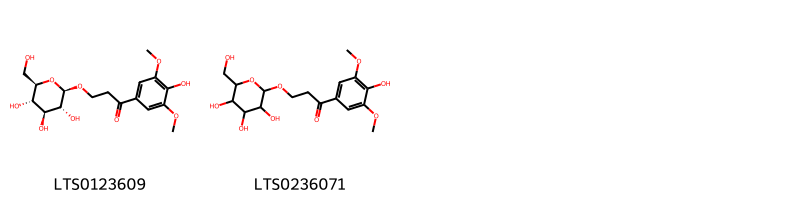{ width=100% }
    <figcaption>Hình ảnh cấu trúc hóa học của 2 hoạt chất thuộc nhóm Fatty Acyls gồm ['1-(4-hydroxy-3,5-dimethoxyphenyl)-3-{[(2r,3r,4s,5s,6r)-3,4,5-trihydroxy-6-(hydroxymethyl)oxan-2-yl]oxy}propan-1-one (LTS0123609)', '1-(4-hydroxy-3,5-dimethoxyphenyl)-3-{[3,4,5-trihydroxy-6-(hydroxymethyl)oxan-2-yl]oxy}propan-1-one (LTS0236071)'].</figcaption>
</figure>
#### Nhóm Flavonoids
<figure markdown="span">
    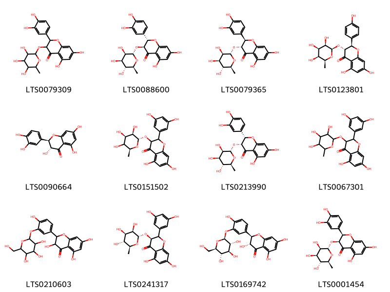{ width=100% }
    <figcaption>Hình ảnh cấu trúc hóa học của 12 hoạt chất thuộc nhóm Flavonoids gồm ['astilbin (LTS0079309)', 'isoastilbin (LTS0088600)', 'astilbin (LTS0079365)', '(2r,3r)-5,7-dihydroxy-2-(4-hydroxyphenyl)-3-{[(2r,3r,4r,5s,6s)-3,4,5-trihydroxy-6-methyloxan-2-yl]oxy}-2,3-dihydro-1-benzopyran-4-one (LTS0123801)', '(+)-taxifolin (LTS0090664)', '2-(3,5-dihydroxyphenyl)-5,7-dihydroxy-3-{[(2s,3r,4r,6s)-3,4,5-trihydroxy-6-methyloxan-2-yl]oxy}-2,3-dihydro-1-benzopyran-4-one (LTS0151502)', '(2s,3r)-2-(3,4-dihydroxyphenyl)-5,7-dihydroxy-3-{[(2s,3r,4r,5r,6s)-3,4,5-trihydroxy-6-methyloxan-2-yl]oxy}-2,3-dihydro-1-benzopyran-4-one (LTS0213990)', '2-(3,5-dihydroxyphenyl)-5,7-dihydroxy-3-[(3,4,5-trihydroxy-6-methyloxan-2-yl)oxy]-2,3-dihydro-1-benzopyran-4-one (LTS0067301)', '3,5,7-trihydroxy-2-(4-hydroxy-3-{[3,4,5-trihydroxy-6-(hydroxymethyl)oxan-2-yl]oxy}phenyl)-2,3-dihydro-1-benzopyran-4-one (LTS0210603)', 'smitilbin (LTS0241317)', "taxifolin 3'-glucoside (LTS0169742)", '(2r,3s)-2-(3,4-dihydroxyphenyl)-5,7-dihydroxy-3-{[(2s,3r,4r,5r,6s)-3,4,5-trihydroxy-6-methyloxan-2-yl]oxy}-2,3-dihydro-1-benzopyran-4-one (LTS0001454)'].</figcaption>
</figure>
#### Nhóm Isoflavonoids
<figure markdown="span">
    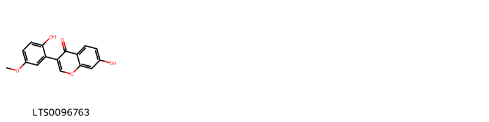{ width=100% }
    <figcaption>Hình ảnh cấu trúc hóa học của 1 hoạt chất thuộc nhóm Isoflavonoids gồm ['7-hydroxy-3-(2-hydroxy-5-methoxyphenyl)chromen-4-one (LTS0096763)'].</figcaption>
</figure>
#### Nhóm Lignan glycosides
<figure markdown="span">
    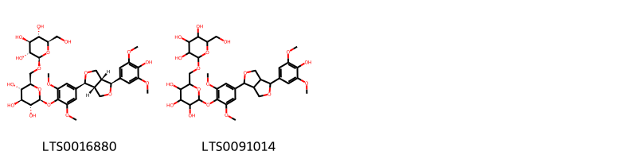{ width=100% }
    <figcaption>Hình ảnh cấu trúc hóa học của 2 hoạt chất thuộc nhóm Lignan glycosides gồm ['(2s,3r,4s,5s,6r)-2-{4-[(1s,3ar,4s,6ar)-4-(4-hydroxy-3,5-dimethoxyphenyl)-hexahydrofuro[3,4-c]furan-1-yl]-2,6-dimethoxyphenoxy}-6-({[(2r,3r,4s,5s,6r)-3,4,5-trihydroxy-6-(hydroxymethyl)oxan-2-yl]oxy}methyl)oxane-3,4,5-triol (LTS0016880)', '2-{4-[4-(4-hydroxy-3,5-dimethoxyphenyl)-hexahydrofuro[3,4-c]furan-1-yl]-2,6-dimethoxyphenoxy}-6-({[3,4,5-trihydroxy-6-(hydroxymethyl)oxan-2-yl]oxy}methyl)oxane-3,4,5-triol (LTS0091014)'].</figcaption>
</figure>
#### Nhóm Organooxygen compounds
<figure markdown="span">
    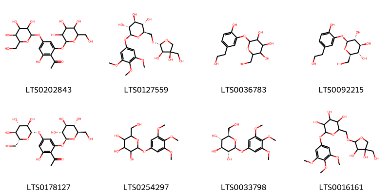{ width=100% }
    <figcaption>Hình ảnh cấu trúc hóa học của 8 hoạt chất thuộc nhóm Organooxygen compounds gồm ['1-[2-hydroxy-4,6-bis({[3,4,5-trihydroxy-6-(hydroxymethyl)oxan-2-yl]oxy})phenyl]ethanone (LTS0202843)', '(2r,3s,4s,5r,6s)-2-({[(2r,3r,4r)-3,4-dihydroxy-4-(hydroxymethyl)oxolan-2-yl]oxy}methyl)-6-(3,4,5-trimethoxyphenoxy)oxane-3,4,5-triol (LTS0127559)', '2-[2-hydroxy-5-(2-hydroxyethyl)phenoxy]-6-(hydroxymethyl)oxane-3,4,5-triol (LTS0036783)', '3-hydroxytyrosol 3-o-glucoside (LTS0092215)', '1-[2-hydroxy-4,6-bis({[(2s,3r,4s,5s,6r)-3,4,5-trihydroxy-6-(hydroxymethyl)oxan-2-yl]oxy})phenyl]ethanone (LTS0178127)', '2-(hydroxymethyl)-6-(3,4,5-trimethoxyphenoxy)oxane-3,4,5-triol (LTS0254297)', 'koaburside (LTS0033798)', '2-({[3,4-dihydroxy-4-(hydroxymethyl)oxolan-2-yl]oxy}methyl)-6-(3,4,5-trimethoxyphenoxy)oxane-3,4,5-triol (LTS0016161)'].</figcaption>
</figure>
#### Nhóm Stilbenes
<figure markdown="span">
    { width=100% }
    <figcaption>Hình ảnh cấu trúc hóa học của 4 hoạt chất thuộc nhóm Stilbenes gồm ['piceid (LTS0180235)', 'tocilizumab (LTS0196778)', 'resveratrol (LTS0256677)', '2-{3-hydroxy-5-[2-(4-hydroxyphenyl)ethenyl]phenoxy}-6-(hydroxymethyl)oxane-3,4,5-triol (LTS0012830)'].</figcaption>
</figure>

---

### Dược dân tộc học

Danh sách các quốc gia có sử dụng *Smilax glabra* trong điều trị các bệnh. 

| Country   | Disease   | Bệnh          |
|:----------|:----------|:--------------|
| China     | Antidote  | Chất giải độc |

---

---
## Smilax havanensis
### Thông tin về thực vật

!!! info "Phân loại thực vật của *Smilax havanensis* từ GIBF:"
    - **Kingdom:** Plantae
    - **Phylum:** Tracheophyta
    - **Order:** Liliales
    - **Family:** Smilacaceae
    - **Genus:** Smilax
    - **Species:** *Smilax havanensis*

 

| Label (VI)   | Label (EN)   | Scientific Name   | Descriptions (VI)   | Descriptions (EN)   | Also Known As (VI)   | Also Known As (EN)   |
|:-------------|:-------------|:------------------|:--------------------|:--------------------|:---------------------|:---------------------|
| N/A          | N/A          | Smilax havanensis |                     | species of plant    | ['']                 | ['']                 |

#### Phân bố trên thế giới

**Từ CSDL GIBF** Haiti, Cayman Islands, Turks and Caicos Islands, nan, Dominican Republic, Panama, United States of America, Cuba, Bahamas, Jamaica

#### Phân bố tại Việt Nam

**Từ CSDL GIBF**: Không có ghi nhận ở Việt Nam

---
### Thành phần hóa học
        
- Theo cơ sở dữ liệu lotus: Từ loài *Smilax havanensis* đã phân lập và xác định được Chưa có hoạt chất nào được phân lập. hoạt chất thuộc về các nhóm Không có hoạt chất nào được phân lập. 

Không có hình ảnh nào được tạo ra

---

### Dược dân tộc học

Danh sách các quốc gia có sử dụng *Smilax havanensis* trong điều trị các bệnh. 

| Country            | Disease     | Bệnh                      |
|:-------------------|:------------|:--------------------------|
| Dominican Republic | Antidote    | Chất giải độc             |
| Haiti              | Diaphoretic | Thuốc tràn dịch màng phổi |

---

---
## Smilax kraussiana
### Thông tin về thực vật

!!! info "Phân loại thực vật của *Smilax anceps* từ GIBF:"
    - **Kingdom:** Plantae
    - **Phylum:** Tracheophyta
    - **Order:** Liliales
    - **Family:** Smilacaceae
    - **Genus:** Smilax
    - **Species:** *Smilax anceps*

 

| Label (VI)   | Label (EN)   | Scientific Name   | Descriptions (VI)   | Descriptions (EN)   | Also Known As (VI)   | Also Known As (EN)   |
|:-------------|:-------------|:------------------|:--------------------|:--------------------|:---------------------|:---------------------|
| N/A          | N/A          | Smilax kraussiana | loài thực vật       | species of plant    | ['']                 | ['']                 |

#### Phân bố trên thế giới

**Từ CSDL GIBF** Togo, Ghana, Côte d’Ivoire, Central African Republic, Cameroon, Congo, Democratic Republic of the, Nigeria, Gabon, Equatorial Guinea, Zambia, Guinea, Benin, Madagascar

#### Phân bố tại Việt Nam

**Từ CSDL GIBF**: Không có ghi nhận ở Việt Nam

---
### Thành phần hóa học
        
- Theo cơ sở dữ liệu lotus: Từ loài *Smilax anceps* đã phân lập và xác định được Chưa có hoạt chất nào được phân lập. hoạt chất thuộc về các nhóm Không có hoạt chất nào được phân lập. 

Không có hình ảnh nào được tạo ra

---

### Dược dân tộc học

Danh sách các quốc gia có sử dụng *Smilax anceps* trong điều trị các bệnh. 

| Country   | Disease   | Bệnh           |
|:----------|:----------|:---------------|
| Ghana     | Stomachic | Sững sờ        |
| W Africa  | Diuretic  | Thuốc lợi tiêu |

---

---
## Smilax lanceolatus
### Thông tin về thực vật

!!! info "Phân loại thực vật của *Smilax lanceolata* từ GIBF:"
    - **Kingdom:** Plantae
    - **Phylum:** Tracheophyta
    - **Order:** Liliales
    - **Family:** Smilacaceae
    - **Genus:** Smilax
    - **Species:** *Smilax lanceolata*

 

| Label (VI)   | Label (EN)   | Scientific Name   | Descriptions (VI)   | Descriptions (EN)   | Also Known As (VI)   | Also Known As (EN)   |
|:-------------|:-------------|:------------------|:--------------------|:--------------------|:---------------------|:---------------------|
| N/A          | N/A          | Smilax kraussiana | loài thực vật       | species of plant    | ['']                 | ['']                 |

#### Phân bố trên thế giới

**Từ CSDL GIBF** nan, Thailand, Cuba, United States of America, Mexico, China

#### Phân bố tại Việt Nam

**Từ CSDL GIBF**: Không có ghi nhận ở Việt Nam

---
### Thành phần hóa học
        
- Theo cơ sở dữ liệu lotus: Từ loài *Smilax lanceolata* đã phân lập và xác định được Chưa có hoạt chất nào được phân lập. hoạt chất thuộc về các nhóm Không có hoạt chất nào được phân lập. 

Không có hình ảnh nào được tạo ra

---

### Dược dân tộc học

Danh sách các quốc gia có sử dụng *Smilax lanceolata* trong điều trị các bệnh. 

| Country            | Disease     | Bệnh                      |
|:-------------------|:------------|:--------------------------|
| Dominican Republic | Diaphoretic | Thuốc tràn dịch màng phổi |
| Haiti              | Antidote    | Chất giải độc             |

---

---
## Smilax medica
### Thông tin về thực vật

!!! info "Phân loại thực vật của *Smilax medica* từ GIBF:"
    - **Kingdom:** Plantae
    - **Phylum:** Tracheophyta
    - **Order:** Liliales
    - **Family:** Smilacaceae
    - **Genus:** Smilax
    - **Species:** *Smilax medica*

 

| Label (VI)   | Label (EN)   | Scientific Name   | Descriptions (VI)   | Descriptions (EN)   | Also Known As (VI)   | Also Known As (EN)   |
|:-------------|:-------------|:------------------|:--------------------|:--------------------|:---------------------|:---------------------|
| N/A          | N/A          | Smilax medica     | loài thực vật       | species of plant    | ['']                 | ['']                 |

#### Phân bố trên thế giới

**Từ CSDL GIBF** nan, Mexico, Brazil

#### Phân bố tại Việt Nam

**Từ CSDL GIBF**: Không có ghi nhận ở Việt Nam

---
### Thành phần hóa học
        
- Theo cơ sở dữ liệu lotus: Từ loài *Smilax medica* đã phân lập và xác định được 16 hoạt chất thuộc về các nhóm Steroids and steroid derivatives. 

|    | chemicalTaxonomyClassyfireClass   |   smiles_count |
|---:|:----------------------------------|---------------:|
|  0 | Steroids and steroid derivatives  |             16 |

#### Nhóm Steroids and steroid derivatives
<figure markdown="span">
    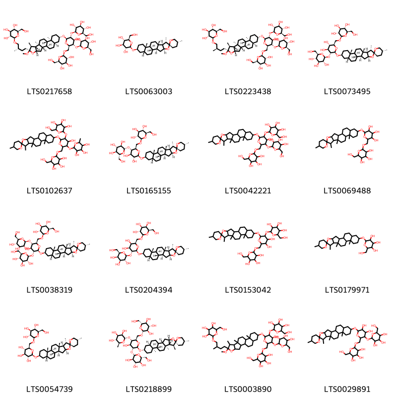{ width=100% }
    <figcaption>Hình ảnh cấu trúc hóa học của 16 hoạt chất thuộc nhóm Steroids and steroid derivatives gồm ['(2r,3r,4s,5s,6r)-2-[(2s)-4-[(1r,2s,4s,6r,7s,8r,9s,12s,13s,16s,18r)-16-{[(2r,3r,4s,5s,6r)-4-hydroxy-3,5-bis({[(2s,3r,4s,5s,6r)-3,4,5-trihydroxy-6-(hydroxymethyl)oxan-2-yl]oxy})-6-({[(2r,3r,4s,5s,6r)-3,4,5-trihydroxy-6-(hydroxymethyl)oxan-2-yl]oxy}methyl)oxan-2-yl]oxy}-6-methoxy-7,9,13-trimethyl-5-oxapentacyclo[10.8.0.0²,⁹.0⁴,⁸.0¹³,¹⁸]icosan-6-yl]-2-methylbutoxy]-6-(hydroxymethyl)oxane-3,4,5-triol (LTS0217658)', "(2r,3s,4s,5r,6r)-2-(hydroxymethyl)-6-[(1'r,2r,2's,4's,5r,7's,8'r,9's,12's,13's,16's,18'r)-5,7',9',13'-tetramethyl-5'-oxaspiro[oxane-2,6'-pentacyclo[10.8.0.0²,⁹.0⁴,⁸.0¹³,¹⁸]icosane]oxy]oxane-3,4,5-triol (LTS0063003)", '(2r,3r,4s,5s,6r)-2-[(2r)-4-[(1r,2s,4s,6r,7s,8r,9s,12s,13s,16s,18r)-16-{[(2r,3r,4s,5s,6r)-4-hydroxy-3,5-bis({[(2s,3r,4s,5s,6r)-3,4,5-trihydroxy-6-(hydroxymethyl)oxan-2-yl]oxy})-6-({[(2r,3r,4s,5s,6r)-3,4,5-trihydroxy-6-(hydroxymethyl)oxan-2-yl]oxy}methyl)oxan-2-yl]oxy}-6-methoxy-7,9,13-trimethyl-5-oxapentacyclo[10.8.0.0²,⁹.0⁴,⁸.0¹³,¹⁸]icosan-6-yl]-2-methylbutoxy]-6-(hydroxymethyl)oxane-3,4,5-triol (LTS0223438)', "(2r,3r,4s,5s,6r)-2-{[(2r,3s,4s,5r,6r)-3,4-dihydroxy-6-[(1'r,2r,2's,4's,5r,7's,8'r,9's,12's,13's,16's,18'r)-5,7',9',13'-tetramethyl-5'-oxaspiro[oxane-2,6'-pentacyclo[10.8.0.0²,⁹.0⁴,⁸.0¹³,¹⁸]icosane]oxy]-5-{[(2s,3r,4s,5s,6r)-3,4,5-trihydroxy-6-(hydroxymethyl)oxan-2-yl]oxy}oxan-2-yl]methoxy}-6-(hydroxymethyl)oxane-3,4,5-triol (LTS0073495)", "2-[(4-hydroxy-6-{5,7',9',13'-tetramethyl-5'-oxaspiro[oxane-2,6'-pentacyclo[10.8.0.0²,⁹.0⁴,⁸.0¹³,¹⁸]icosane]oxy}-5-{[3,4,5-trihydroxy-6-(hydroxymethyl)oxan-2-yl]oxy}-3-[(3,4,5-trihydroxy-6-methyloxan-2-yl)oxy]oxan-2-yl)methoxy]-6-(hydroxymethyl)oxane-3,4,5-triol (LTS0102637)", "(2r,3r,4s,5s,6r)-2-{[(2r,3s,4r,5r,6r)-4,5-dihydroxy-6-[(1'r,2r,2's,4's,5r,7's,8'r,9's,12's,13's,16's,18'r)-5,7',9',13'-tetramethyl-5'-oxaspiro[oxane-2,6'-pentacyclo[10.8.0.0²,⁹.0⁴,⁸.0¹³,¹⁸]icosane]oxy]-3-{[(2s,3r,4s,5s,6r)-3,4,5-trihydroxy-6-(hydroxymethyl)oxan-2-yl]oxy}oxan-2-yl]methoxy}-6-(hydroxymethyl)oxane-3,4,5-triol (LTS0165155)", "2-[(4-hydroxy-6-{5,7',9',13'-tetramethyl-5'-oxaspiro[oxane-2,6'-pentacyclo[10.8.0.0²,⁹.0⁴,⁸.0¹³,¹⁸]icosane]oxy}-3,5-bis({[3,4,5-trihydroxy-6-(hydroxymethyl)oxan-2-yl]oxy})oxan-2-yl)methoxy]-6-(hydroxymethyl)oxane-3,4,5-triol (LTS0042221)", "2-{5,7',9',13'-tetramethyl-5'-oxaspiro[oxane-2,6'-pentacyclo[10.8.0.0²,⁹.0⁴,⁸.0¹³,¹⁸]icosane]oxy}-6-({[3,4,5-trihydroxy-6-(hydroxymethyl)oxan-2-yl]oxy}methyl)oxane-3,4,5-triol (LTS0069488)", "(2r,3r,4s,5s,6r)-2-{[(2r,3s,4s,5r,6r)-4-hydroxy-6-[(1'r,2r,2's,4's,5r,7's,8'r,9's,12's,13's,16's,18'r)-5,7',9',13'-tetramethyl-5'-oxaspiro[oxane-2,6'-pentacyclo[10.8.0.0²,⁹.0⁴,⁸.0¹³,¹⁸]icosane]oxy]-3,5-bis({[(2s,3r,4s,5s,6r)-3,4,5-trihydroxy-6-(hydroxymethyl)oxan-2-yl]oxy})oxan-2-yl]methoxy}-6-(hydroxymethyl)oxane-3,4,5-triol (LTS0038319)", "(2r,3r,4s,5r,6r)-2-{[(2r,3r,4s,5r,6r)-3,4-dihydroxy-6-[(1'r,2r,2's,4's,5r,7's,8'r,9's,12's,13's,16's,18'r)-5,7',9',13'-tetramethyl-5'-oxaspiro[oxane-2,6'-pentacyclo[10.8.0.0²,⁹.0⁴,⁸.0¹³,¹⁸]icosane]oxy]-5-{[(2s,3r,4s,5r,6r)-3,4,5-trihydroxy-6-(hydroxymethyl)oxan-2-yl]oxy}oxan-2-yl]methoxy}-6-(hydroxymethyl)oxane-3,4,5-triol (LTS0204394)", "2-[(3,4-dihydroxy-6-{5,7',9',13'-tetramethyl-5'-oxaspiro[oxane-2,6'-pentacyclo[10.8.0.0²,⁹.0⁴,⁸.0¹³,¹⁸]icosane]oxy}-5-{[3,4,5-trihydroxy-6-(hydroxymethyl)oxan-2-yl]oxy}oxan-2-yl)methoxy]-6-(hydroxymethyl)oxane-3,4,5-triol (LTS0153042)", "2-(hydroxymethyl)-6-{5,7',9',13'-tetramethyl-5'-oxaspiro[oxane-2,6'-pentacyclo[10.8.0.0²,⁹.0⁴,⁸.0¹³,¹⁸]icosane]oxy}oxane-3,4,5-triol (LTS0179971)", "(2r,3r,4s,5s,6r)-2-[(1'r,2r,2's,4's,5r,7's,8'r,9's,12's,13's,16's,18'r)-5,7',9',13'-tetramethyl-5'-oxaspiro[oxane-2,6'-pentacyclo[10.8.0.0²,⁹.0⁴,⁸.0¹³,¹⁸]icosane]oxy]-6-({[(2r,3r,4s,5s,6r)-3,4,5-trihydroxy-6-(hydroxymethyl)oxan-2-yl]oxy}methyl)oxane-3,4,5-triol (LTS0054739)", "(2s,3r,4r,5r,6s)-2-{[(2r,3s,4s,5r,6r)-4-hydroxy-6-[(1'r,2r,2's,4's,5r,7's,8'r,9's,12's,13's,16's,18'r)-5,7',9',13'-tetramethyl-5'-oxaspiro[oxane-2,6'-pentacyclo[10.8.0.0²,⁹.0⁴,⁸.0¹³,¹⁸]icosane]oxy]-5-{[(2s,3r,4s,5s,6r)-3,4,5-trihydroxy-6-(hydroxymethyl)oxan-2-yl]oxy}-2-({[(2r,3r,4s,5s,6r)-3,4,5-trihydroxy-6-(hydroxymethyl)oxan-2-yl]oxy}methyl)oxan-3-yl]oxy}-6-methyloxane-3,4,5-triol (LTS0218899)", '2-[4-(16-{[4-hydroxy-3,5-bis({[3,4,5-trihydroxy-6-(hydroxymethyl)oxan-2-yl]oxy})-6-({[3,4,5-trihydroxy-6-(hydroxymethyl)oxan-2-yl]oxy}methyl)oxan-2-yl]oxy}-6-methoxy-7,9,13-trimethyl-5-oxapentacyclo[10.8.0.0²,⁹.0⁴,⁸.0¹³,¹⁸]icosan-6-yl)-2-methylbutoxy]-6-(hydroxymethyl)oxane-3,4,5-triol (LTS0003890)', "2-[(4,5-dihydroxy-6-{5,7',9',13'-tetramethyl-5'-oxaspiro[oxane-2,6'-pentacyclo[10.8.0.0²,⁹.0⁴,⁸.0¹³,¹⁸]icosane]oxy}-3-{[3,4,5-trihydroxy-6-(hydroxymethyl)oxan-2-yl]oxy}oxan-2-yl)methoxy]-6-(hydroxymethyl)oxane-3,4,5-triol (LTS0029891)"].</figcaption>
</figure>

---

### Dược dân tộc học

Danh sách các quốc gia có sử dụng *Smilax medica* trong điều trị các bệnh. 

| Country   | Disease              | Bệnh                          |
|:----------|:---------------------|:------------------------------|
| Elsewhere | Antidote             | Chất giải độc                 |
| Mexico    | Stimulant, Sudorific | Chất kích thích, gây ngạt thở |

---

---
## Smilax mollis
### Thông tin về thực vật

!!! info "Phân loại thực vật của *Smilax mollis* từ GIBF:"
    - **Kingdom:** Plantae
    - **Phylum:** Tracheophyta
    - **Order:** Liliales
    - **Family:** Smilacaceae
    - **Genus:** Smilax
    - **Species:** *Smilax mollis*

 

| Label (VI)   | Label (EN)   | Scientific Name   | Descriptions (VI)   | Descriptions (EN)   | Also Known As (VI)   | Also Known As (EN)   |
|:-------------|:-------------|:------------------|:--------------------|:--------------------|:---------------------|:---------------------|
| N/A          | N/A          | Smilax mollis     | loài thực vật       | species of plant    | ['']                 | ['']                 |

#### Phân bố trên thế giới

**Từ CSDL GIBF** Colombia, Belize, Nicaragua, Panama, Costa Rica, Mexico, Guatemala

#### Phân bố tại Việt Nam

**Từ CSDL GIBF**: Không có ghi nhận ở Việt Nam

---
### Thành phần hóa học
        
- Theo cơ sở dữ liệu lotus: Từ loài *Smilax mollis* đã phân lập và xác định được Chưa có hoạt chất nào được phân lập. hoạt chất thuộc về các nhóm Không có hoạt chất nào được phân lập. 

Không có hình ảnh nào được tạo ra

---

### Dược dân tộc học

Danh sách các quốc gia có sử dụng *Smilax mollis* trong điều trị các bệnh. 

| Country   | Disease   | Bệnh          |
|:----------|:----------|:--------------|
| Elsewhere | Piscicide | Thuốc diệt cá |
| Honduras  | Piscicide | Thuốc diệt cá |

---

---
## Smilax myosotiflora
### Thông tin về thực vật

!!! info "Phân loại thực vật của *Smilax myosotiflora* từ GIBF:"
    - **Kingdom:** Plantae
    - **Phylum:** Tracheophyta
    - **Order:** Liliales
    - **Family:** Smilacaceae
    - **Genus:** Smilax
    - **Species:** *Smilax myosotiflora*

 

| Label (VI)   | Label (EN)   | Scientific Name     | Descriptions (VI)   | Descriptions (EN)   | Also Known As (VI)   | Also Known As (EN)   |
|:-------------|:-------------|:--------------------|:--------------------|:--------------------|:---------------------|:---------------------|
| N/A          | N/A          | Smilax myosotiflora | loài thực vật       | species of plant    | ['']                 | ['']                 |

#### Phân bố trên thế giới

**Từ CSDL GIBF** nan, unknown or invalid, Thailand, Myanmar, Malaysia, Singapore, Indonesia

#### Phân bố tại Việt Nam

**Từ CSDL GIBF**: Không có ghi nhận ở Việt Nam

---
### Thành phần hóa học
        
- Theo cơ sở dữ liệu lotus: Từ loài *Smilax myosotiflora* đã phân lập và xác định được Chưa có hoạt chất nào được phân lập. hoạt chất thuộc về các nhóm Không có hoạt chất nào được phân lập. 

Không có hình ảnh nào được tạo ra

---

### Dược dân tộc học

Danh sách các quốc gia có sử dụng *Smilax myosotiflora* trong điều trị các bệnh. 

| Country   | Disease     | Bệnh           |
|:----------|:------------|:---------------|
| Malaya    | Aphrodisiac | Thuốc kích dục |
| Malaysia  | Aphrodisiac | Thuốc kích dục |

---

---
## Smilax nipponica
### Thông tin về thực vật

!!! info "Phân loại thực vật của *Smilax nipponica* từ GIBF:"
    - **Kingdom:** Plantae
    - **Phylum:** Tracheophyta
    - **Order:** Liliales
    - **Family:** Smilacaceae
    - **Genus:** Smilax
    - **Species:** *Smilax nipponica*

 

| Label (VI)   | Label (EN)   | Scientific Name   | Descriptions (VI)   | Descriptions (EN)   | Also Known As (VI)   | Also Known As (EN)   |
|:-------------|:-------------|:------------------|:--------------------|:--------------------|:---------------------|:---------------------|
| N/A          | N/A          | Smilax nipponica  | loài thực vật       | species of plant    | ['']                 | ['']                 |

#### Phân bố trên thế giới

**Từ CSDL GIBF** Japan, Korea, Republic of, China, Chinese Taipei

#### Phân bố tại Việt Nam

**Từ CSDL GIBF**: Không có ghi nhận ở Việt Nam

---
### Thành phần hóa học
        
- Theo cơ sở dữ liệu lotus: Từ loài *Smilax nipponica* đã phân lập và xác định được Chưa có hoạt chất nào được phân lập. hoạt chất thuộc về các nhóm Không có hoạt chất nào được phân lập. 

Không có hình ảnh nào được tạo ra

---

### Dược dân tộc học

Danh sách các quốc gia có sử dụng *Smilax nipponica* trong điều trị các bệnh. 

| Country   | Disease     | Bệnh                   |
|:----------|:------------|:-----------------------|
| China     | Carminative | Gây ô nhiễm môi trường |

---

---
## Smilax oblongifolia
### Thông tin về thực vật

!!! info "Phân loại thực vật của *Smilax oblongifolia* từ GIBF:"
    - **Kingdom:** Plantae
    - **Phylum:** Tracheophyta
    - **Order:** Liliales
    - **Family:** Smilacaceae
    - **Genus:** Smilax
    - **Species:** *Smilax oblongifolia*

 

| Label (VI)   | Label (EN)   | Scientific Name     | Descriptions (VI)   | Descriptions (EN)   | Also Known As (VI)   | Also Known As (EN)   |
|:-------------|:-------------|:--------------------|:--------------------|:--------------------|:---------------------|:---------------------|
| N/A          | N/A          | Smilax oblongifolia | loài thực vật       | species of plant    | ['']                 | ['']                 |

#### Phân bố trên thế giới

**Từ CSDL GIBF** nan, Brazil

#### Phân bố tại Việt Nam

**Từ CSDL GIBF**: Không có ghi nhận ở Việt Nam

---
### Thành phần hóa học
        
- Theo cơ sở dữ liệu lotus: Từ loài *Smilax oblongifolia* đã phân lập và xác định được Chưa có hoạt chất nào được phân lập. hoạt chất thuộc về các nhóm Không có hoạt chất nào được phân lập. 

Không có hình ảnh nào được tạo ra

---

### Dược dân tộc học

Danh sách các quốc gia có sử dụng *Smilax oblongifolia* trong điều trị các bệnh. 

| Country   | Disease          | Bệnh                 |
|:----------|:-----------------|:---------------------|
| Brazil    | Purgative, Tonic | Luyện ngục, Thuốc bổ |

---

---
## Smilax ornata
### Thông tin về thực vật

!!! info "Phân loại thực vật của *Smilax ornata* từ GIBF:"
    - **Kingdom:** Plantae
    - **Phylum:** Tracheophyta
    - **Order:** Liliales
    - **Family:** Smilacaceae
    - **Genus:** Smilax
    - **Species:** *Smilax ornata*

 

| Label (VI)   | Label (EN)   | Scientific Name   | Descriptions (VI)   | Descriptions (EN)   | Also Known As (VI)   | Also Known As (EN)   |
|:-------------|:-------------|:------------------|:--------------------|:--------------------|:---------------------|:---------------------|
| N/A          | N/A          | Smilax ornata     | loài thực vật       | species of plant    | ['']                 | ['']                 |

#### Phân bố trên thế giới

**Từ CSDL GIBF** nan, Honduras, unknown or invalid, United Kingdom of Great Britain and Northern Ireland, El Salvador, Belize, Nicaragua, Brazil, Venezuela (Bolivarian Republic of), Peru, Costa Rica, Russian Federation, United States of America, Mexico, Jamaica, Solomon Islands, Guatemala

#### Phân bố tại Việt Nam

**Từ CSDL GIBF**: Không có ghi nhận ở Việt Nam

---
### Thành phần hóa học
        
- Theo cơ sở dữ liệu lotus: Từ loài *Smilax ornata* đã phân lập và xác định được 4 hoạt chất thuộc về các nhóm Prenol lipids, Steroids and steroid derivatives. 

|    | chemicalTaxonomyClassyfireClass   |   smiles_count |
|---:|:----------------------------------|---------------:|
|  0 | Prenol lipids                     |              2 |
|  1 | Steroids and steroid derivatives  |              2 |

#### Nhóm Prenol lipids
<figure markdown="span">
    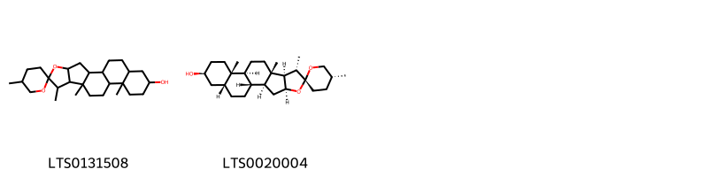{ width=100% }
    <figcaption>Hình ảnh cấu trúc hóa học của 2 hoạt chất thuộc nhóm Prenol lipids gồm ['tigogenin (LTS0131508)', 'smilagenin (LTS0020004)'].</figcaption>
</figure>
#### Nhóm Steroids and steroid derivatives
<figure markdown="span">
    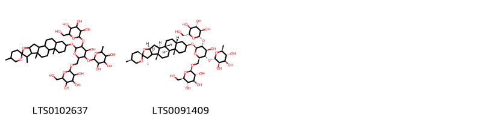{ width=100% }
    <figcaption>Hình ảnh cấu trúc hóa học của 2 hoạt chất thuộc nhóm Steroids and steroid derivatives gồm ["2-[(4-hydroxy-6-{5,7',9',13'-tetramethyl-5'-oxaspiro[oxane-2,6'-pentacyclo[10.8.0.0²,⁹.0⁴,⁸.0¹³,¹⁸]icosane]oxy}-5-{[3,4,5-trihydroxy-6-(hydroxymethyl)oxan-2-yl]oxy}-3-[(3,4,5-trihydroxy-6-methyloxan-2-yl)oxy]oxan-2-yl)methoxy]-6-(hydroxymethyl)oxane-3,4,5-triol (LTS0102637)", 'smilacin (LTS0091409)'].</figcaption>
</figure>

---

### Dược dân tộc học

Danh sách các quốc gia có sử dụng *Smilax ornata* trong điều trị các bệnh. 

| Country         | Disease   | Bệnh               |
|:----------------|:----------|:-------------------|
| Central America | Tonic     | (thuộc) trương lực |

---

---
## Smilax populnea
### Thông tin về thực vật

!!! info "Phân loại thực vật của *Smilax populnea* từ GIBF:"
    - **Kingdom:** Plantae
    - **Phylum:** Tracheophyta
    - **Order:** Liliales
    - **Family:** Smilacaceae
    - **Genus:** Smilax
    - **Species:** *Smilax populnea*

 

| Label (VI)   | Label (EN)   | Scientific Name   | Descriptions (VI)   | Descriptions (EN)   | Also Known As (VI)   | Also Known As (EN)   |
|:-------------|:-------------|:------------------|:--------------------|:--------------------|:---------------------|:---------------------|
| N/A          | N/A          | Smilax populnea   | loài thực vật       | species of plant    | ['']                 | ['']                 |

#### Phân bố trên thế giới

**Từ CSDL GIBF** Haiti, nan, Dominican Republic, Dominica, Cuba, Jamaica

#### Phân bố tại Việt Nam

**Từ CSDL GIBF**: Không có ghi nhận ở Việt Nam

---
### Thành phần hóa học
        
- Theo cơ sở dữ liệu lotus: Từ loài *Smilax populnea* đã phân lập và xác định được Chưa có hoạt chất nào được phân lập. hoạt chất thuộc về các nhóm Không có hoạt chất nào được phân lập. 

Không có hình ảnh nào được tạo ra

---

### Dược dân tộc học

Danh sách các quốc gia có sử dụng *Smilax populnea* trong điều trị các bệnh. 

| Country            | Disease               | Bệnh                           |
|:-------------------|:----------------------|:-------------------------------|
| Dominican Republic | Diuretic, Expectorant | Thuốc lợi tiểu, thuốc long đờm |

---

---
## Smilax pseudochina
### Thông tin về thực vật

!!! info "Phân loại thực vật của *Smilax pseudochina* từ GIBF:"
    - **Kingdom:** Plantae
    - **Phylum:** Tracheophyta
    - **Order:** Liliales
    - **Family:** Smilacaceae
    - **Genus:** Smilax
    - **Species:** *Smilax pseudochina*

 

| Label (VI)   | Label (EN)   | Scientific Name    | Descriptions (VI)   | Descriptions (EN)   | Also Known As (VI)   | Also Known As (EN)   |
|:-------------|:-------------|:-------------------|:--------------------|:--------------------|:---------------------|:---------------------|
| N/A          | N/A          | Smilax pseudochina | loài thực vật       | species of plant    | ['']                 | ['']                 |

#### Phân bố trên thế giới

**Từ CSDL GIBF** nan, United States of America

#### Phân bố tại Việt Nam

**Từ CSDL GIBF**: Không có ghi nhận ở Việt Nam

---
### Thành phần hóa học
        
- Theo cơ sở dữ liệu lotus: Từ loài *Smilax pseudochina* đã phân lập và xác định được Chưa có hoạt chất nào được phân lập. hoạt chất thuộc về các nhóm Không có hoạt chất nào được phân lập. 

Không có hình ảnh nào được tạo ra

---

### Dược dân tộc học

Danh sách các quốc gia có sử dụng *Smilax pseudochina* trong điều trị các bệnh. 

| Country   | Disease                      | Bệnh                                   |
|:----------|:-----------------------------|:---------------------------------------|
| China     | Astringent, Stimulant, Tonic | Chất làm se, Chất kích thích, Thuốc bổ |

---

---
## Smilax regelii
### Thông tin về thực vật

!!! info "Phân loại thực vật của *Smilax ornata* từ GIBF:"
    - **Kingdom:** Plantae
    - **Phylum:** Tracheophyta
    - **Order:** Liliales
    - **Family:** Smilacaceae
    - **Genus:** Smilax
    - **Species:** *Smilax ornata*

 

| Label (VI)   | Label (EN)   | Scientific Name   | Descriptions (VI)   | Descriptions (EN)   | Also Known As (VI)   | Also Known As (EN)   |
|:-------------|:-------------|:------------------|:--------------------|:--------------------|:---------------------|:---------------------|
| N/A          | N/A          | Smilax regelii    | loài thực vật       | species of plant    | ['']                 | ['Sarsaparilla']     |

#### Phân bố trên thế giới

**Từ CSDL GIBF** nan, Honduras, unknown or invalid, El Salvador, Belize, Nicaragua, Costa Rica, United States of America, Mexico, Guatemala

#### Phân bố tại Việt Nam

**Từ CSDL GIBF**: Không có ghi nhận ở Việt Nam

---
### Thành phần hóa học
        
- Theo cơ sở dữ liệu lotus: Từ loài *Smilax ornata* đã phân lập và xác định được Chưa có hoạt chất nào được phân lập. hoạt chất thuộc về các nhóm Không có hoạt chất nào được phân lập. 

Không có hình ảnh nào được tạo ra

---

### Dược dân tộc học

Danh sách các quốc gia có sử dụng *Smilax ornata* trong điều trị các bệnh. 

| Country         | Disease              | Bệnh                          |
|:----------------|:---------------------|:------------------------------|
| Central America | Tonic                | (thuộc) trương lực            |
| Guatemala       | Stimulant, Sudorific | Chất kích thích, gây ngạt thở |

---

---
## Smilax ruceana
### Thông tin về thực vật

!!! info "Phân loại thực vật của *N/A* từ GIBF:"
    - **Kingdom:** N/A
    - **Phylum:** N/A
    - **Order:** N/A
    - **Family:** N/A
    - **Genus:** N/A
    - **Species:** *N/A*

 

| Label (VI)   | Label (EN)   | Scientific Name   | Descriptions (VI)   | Descriptions (EN)   | Also Known As (VI)   | Also Known As (EN)   |
|:-------------|:-------------|:------------------|:--------------------|:--------------------|:---------------------|:---------------------|
| N/A          | N/A          | Smilax regelii    | loài thực vật       | species of plant    | ['']                 | ['Sarsaparilla']     |

#### Phân bố trên thế giới

**Từ CSDL GIBF** Không có kết quả phù hợp

#### Phân bố tại Việt Nam

**Từ CSDL GIBF**: Không có ghi nhận ở Việt Nam

---
### Thành phần hóa học
        
- Theo cơ sở dữ liệu lotus: Từ loài *N/A* đã phân lập và xác định được Chưa có hoạt chất nào được phân lập. hoạt chất thuộc về các nhóm Không có hoạt chất nào được phân lập. 

Không có hình ảnh nào được tạo ra

---

### Dược dân tộc học

Danh sách các quốc gia có sử dụng *N/A* trong điều trị các bệnh. 

| Country   | Disease   | Bệnh               |
|:----------|:----------|:-------------------|
| Brazil    | Tonic     | (thuộc) trương lực |

---

