!!! abstract "Tóm tắt"

    Họ Solanaceae gồm khoảng 20 chi và 104 loài được một số cộng đồng tại các quốc gia như Africa, South America, Australia, Salvador, Japan, Solomon I, Argentina, US(Appalachia), Philippines, Dutch, India(Hindu), Brazil(Jamamadi), Italian, US(Pamunkey), Mexico(Kickapoo), US(Navajo), Ecuador(Jivaro), Pakistan, Afghanistan, US(Amerindian), Sudan, English, South Africa(Zulu), Lesotho, ain, Ethiopia, Mozambique(Tsonga), Asia, Paraguay, Africa(Swahili), Turkey, Portuguese, UK, India(Ayurvedic), Brazil, Egypt, Malagasy, Caroline I, French, West Indies, US, Dominican Republic, Mexico, Peru, Eurasia, Malaya, China, Trinidad, US(Huskenaw), Europe, anish, Haiti, Colombia, Iraq, German, Chinese, Upper Volta, Elsewhere, India, Java, Venezuela, Japan*, Latin America, Mediterranean, Cameroon, Mexico(Amerindian), Nepal sử dụng trong một số trường hợp QUERY LENGTH LIMIT EXCEEDED. MAX ALLOWED QUERY : 500 CHARS QUERY LENGTH LIMIT EXCEEDED. MAX ALLOWED QUERY : 500 CHARS QUERY LENGTH LIMIT EXCEEDED. MAX ALLOWED QUERY : 500 CHARS QUERY LENGTH LIMIT EXCEEDED. MAX ALLOWED QUERY : 500 CHARS QUERY LENGTH LIMIT EXCEEDED. MAX ALLOWED QUERY : 500 CHARS.

!!! info "DrDuke"

    James A. Duke sinh năm 1929-2017 là một nhà thực vật học người Mỹ. Đây là một trong những tác giả hàng đầu trong lĩnh vực dược dân tộc học với cuốn *CRC Handbook of Medicinal Herbs* và chính là người xây dựng lên cơ sở dữ liệu về hợp chất tự nhiên và dược dân tộc học tại Bộ nông nghiệp Hoa Kỳ. Các thông tin được đăng tải tại website [Dr. Duke's Phytochemical and Ethnobotanical Databases](https://phytochem.nal.usda.gov/). 
    Trong suốt thập niên 1970, ông lãnh đạo the Plant Taxonomy Laboratory, Plant Genetics and Germplasm Institute of the Agricultural Research Service, U.S. Department of Agriculture.
    Trong tài liệu này, các thông tin về dược dân tộc của các dược liệu được trích dẫn từ tài liệu của James A. Ducke với sự trợ giúp của phần mềm dịch thuật từ tiếng Anh sang tiếng Việt.
   

# Chi Nicotiana

??? note "Danh sách các dược liệu thuộc chi"
    
	 - *Nicotiana glauca*
	 - *Nicotiana rustica*
	 - *Nicotiana tabacum*

---
## Nicotiana glauca
### Thông tin về thực vật

!!! info "Phân loại thực vật của *Nicotiana glauca* từ GIBF:"
    - **Kingdom:** Plantae
    - **Phylum:** Tracheophyta
    - **Order:** Solanales
    - **Family:** Solanaceae
    - **Genus:** Nicotiana
    - **Species:** *Nicotiana glauca*

 

| Label (VI)   | Label (EN)   | Scientific Name   | Descriptions (VI)   | Descriptions (EN)   | Also Known As (VI)   | Also Known As (EN)   |
|:-------------|:-------------|:------------------|:--------------------|:--------------------|:---------------------|:---------------------|
| N/A          | N/A          | Nicotiana glauca  | loài thực vật       | species of plant    | ['']                 | ['']                 |

#### Phân bố trên thế giới

**Từ CSDL GIBF** Italy, Australia, Argentina, Israel, Namibia, Spain, Bolivia (Plurinational State of), Portugal, Morocco, United States of America, Uruguay, Chile, Greece, South Africa, Mexico, France, Cabo Verde, Kenya, Ethiopia

#### Phân bố tại Việt Nam

**Từ CSDL GIBF**: Không có ghi nhận ở Việt Nam

---
### Thành phần hóa học
        
- Theo cơ sở dữ liệu lotus: Từ loài *Nicotiana glauca* đã phân lập và xác định được 21 hoạt chất thuộc về các nhóm Phenol ethers, Flavonoids, Steroids and steroid derivatives, Cinnamic acids and derivatives, Organonitrogen compounds, Coumarins and derivatives, Carboxylic acids and derivatives, Pyridines and derivatives. 

|    | chemicalTaxonomyClassyfireClass   |   smiles_count |
|---:|:----------------------------------|---------------:|
|  0 |                                   |              3 |
|  1 | Carboxylic acids and derivatives  |              4 |
|  2 | Cinnamic acids and derivatives    |              1 |
|  3 | Coumarins and derivatives         |              1 |
|  4 | Flavonoids                        |              1 |
|  5 | Organonitrogen compounds          |              1 |
|  6 | Phenol ethers                     |              1 |
|  7 | Pyridines and derivatives         |              5 |
|  8 | Steroids and steroid derivatives  |              4 |

#### Nhóm 
<figure markdown="span">
    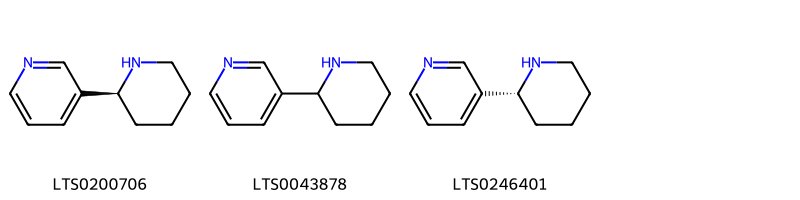{ width=100% }
    <figcaption>Hình ảnh cấu trúc hóa học của 3 hoạt chất thuộc nhóm  gồm ['(-)-anabasine (LTS0200706)', 'anabasine (LTS0043878)', '3-[(2r)-2-piperidinyl]pyridine (LTS0246401)'].</figcaption>
</figure>
#### Nhóm Carboxylic acids and derivatives
<figure markdown="span">
    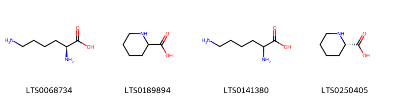{ width=100% }
    <figcaption>Hình ảnh cấu trúc hóa học của 4 hoạt chất thuộc nhóm Carboxylic acids and derivatives gồm ['l-lysine (LTS0068734)', '(+,-)-pipecolic acid (LTS0189894)', 'lysine (LTS0141380)', '(-)-pipecolic acid (LTS0250405)'].</figcaption>
</figure>
#### Nhóm Cinnamic acids and derivatives
<figure markdown="span">
    { width=100% }
    <figcaption>Hình ảnh cấu trúc hóa học của 1 hoạt chất thuộc nhóm Cinnamic acids and derivatives gồm ['(2e)-n-(2-aminoethyl)-3-(4-methoxyphenyl)prop-2-enimidic acid (LTS0100298)'].</figcaption>
</figure>
#### Nhóm Coumarins and derivatives
<figure markdown="span">
    { width=100% }
    <figcaption>Hình ảnh cấu trúc hóa học của 1 hoạt chất thuộc nhóm Coumarins and derivatives gồm ['scopoletin (LTS0193112)'].</figcaption>
</figure>
#### Nhóm Flavonoids
<figure markdown="span">
    { width=100% }
    <figcaption>Hình ảnh cấu trúc hóa học của 1 hoạt chất thuộc nhóm Flavonoids gồm ['3-rutinosyl quercetin (LTS0032845)'].</figcaption>
</figure>
#### Nhóm Organonitrogen compounds
<figure markdown="span">
    { width=100% }
    <figcaption>Hình ảnh cấu trúc hóa học của 1 hoạt chất thuộc nhóm Organonitrogen compounds gồm ['anatabine (LTS0002359)'].</figcaption>
</figure>
#### Nhóm Phenol ethers
<figure markdown="span">
    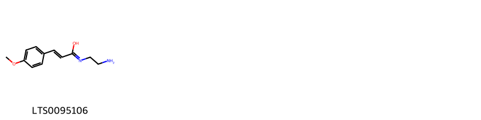{ width=100% }
    <figcaption>Hình ảnh cấu trúc hóa học của 1 hoạt chất thuộc nhóm Phenol ethers gồm ['n-(2-aminoethyl)-3-(4-methoxyphenyl)prop-2-enimidic acid (LTS0095106)'].</figcaption>
</figure>
#### Nhóm Pyridines and derivatives
<figure markdown="span">
    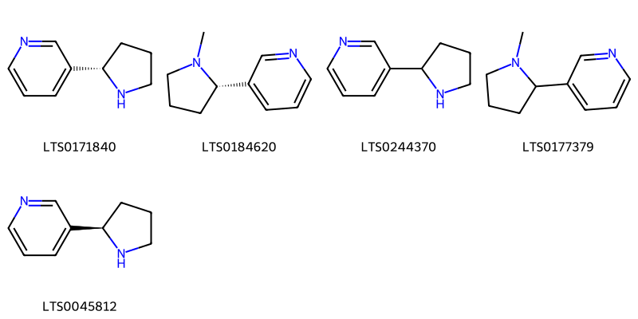{ width=100% }
    <figcaption>Hình ảnh cấu trúc hóa học của 5 hoạt chất thuộc nhóm Pyridines and derivatives gồm ['nornicotine (LTS0171840)', '(-)-nicotine (LTS0184620)', '(+-)-nornicotine (LTS0244370)', 'nicotine (LTS0177379)', '(+)-nornicotine (LTS0045812)'].</figcaption>
</figure>
#### Nhóm Steroids and steroid derivatives
<figure markdown="span">
    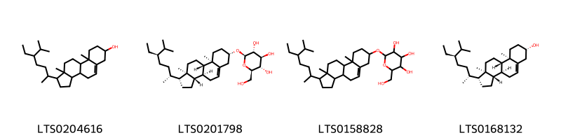{ width=100% }
    <figcaption>Hình ảnh cấu trúc hóa học của 4 hoạt chất thuộc nhóm Steroids and steroid derivatives gồm ['stigmast-5-en-3-ol, (3β)- (LTS0204616)', 'sitogluside (LTS0201798)', '2-{[1-(5-ethyl-6-methylheptan-2-yl)-9a,11a-dimethyl-1h,2h,3h,3ah,3bh,4h,6h,7h,8h,9h,9bh,10h,11h-cyclopenta[a]phenanthren-7-yl]oxy}-6-(hydroxymethyl)oxane-3,4,5-triol (LTS0158828)', 'sitosterol (LTS0168132)'].</figcaption>
</figure>

---

### Dược dân tộc học

Danh sách các quốc gia có sử dụng *Nicotiana glauca* trong điều trị các bệnh. 

| Country   | Disease     | Bệnh                     |
|:----------|:------------|:-------------------------|
| Ethiopia  | Hirudicide  | Thuốc diệt cỏ Hirudicide |
| Mexico    | Poison      | Chất độc                 |
| US        | Insecticide | Thuốc trừ sâu            |

---

---
## Nicotiana rustica
### Thông tin về thực vật

!!! info "Phân loại thực vật của *Nicotiana rustica* từ GIBF:"
    - **Kingdom:** Plantae
    - **Phylum:** Tracheophyta
    - **Order:** Solanales
    - **Family:** Solanaceae
    - **Genus:** Nicotiana
    - **Species:** *Nicotiana rustica*

 

| Label (VI)   | Label (EN)   | Scientific Name   | Descriptions (VI)   | Descriptions (EN)   | Also Known As (VI)   | Also Known As (EN)   |
|:-------------|:-------------|:------------------|:--------------------|:--------------------|:---------------------|:---------------------|
| N/A          | N/A          | Nicotiana rustica |                     | species of plant    | ['']                 | ['mahorka']          |

#### Phân bố trên thế giới

**Từ CSDL GIBF** Italy, Belgium, Slovakia, Canada, Ukraine, Pakistan, Denmark, Netherlands, Lithuania, Belarus, Spain, Hungary, Russian Federation, United States of America, Sweden, Finland, Chile, Croatia, Czechia, Germany, Switzerland, Peru, Austria, France, Saint Helena, Ascension and Tristan da Cunha, Mexico, Ecuador, Colombia, India

#### Phân bố tại Việt Nam

**Từ CSDL GIBF**: Không có ghi nhận ở Việt Nam

---
### Thành phần hóa học
        
- Theo cơ sở dữ liệu lotus: Từ loài *Nicotiana rustica* đã phân lập và xác định được 29 hoạt chất thuộc về các nhóm Fatty Acyls, Flavonoids, Prenol lipids, Tetralins, Organonitrogen compounds, Pyridines and derivatives. 

|    | chemicalTaxonomyClassyfireClass   |   smiles_count |
|---:|:----------------------------------|---------------:|
|  0 |                                   |              2 |
|  1 | Fatty Acyls                       |              2 |
|  2 | Flavonoids                        |              1 |
|  3 | Organonitrogen compounds          |              1 |
|  4 | Prenol lipids                     |             10 |
|  5 | Pyridines and derivatives         |              5 |
|  6 | Tetralins                         |              8 |

#### Nhóm 
<figure markdown="span">
    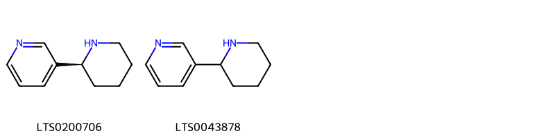{ width=100% }
    <figcaption>Hình ảnh cấu trúc hóa học của 2 hoạt chất thuộc nhóm  gồm ['(-)-anabasine (LTS0200706)', 'anabasine (LTS0043878)'].</figcaption>
</figure>
#### Nhóm Fatty Acyls
<figure markdown="span">
    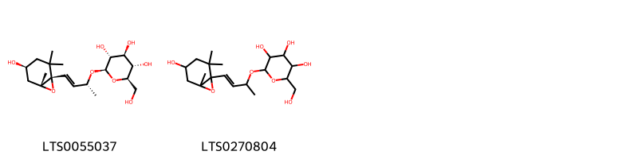{ width=100% }
    <figcaption>Hình ảnh cấu trúc hóa học của 2 hoạt chất thuộc nhóm Fatty Acyls gồm ['(2r,3r,4s,5s,6r)-2-{[(2r,3e)-4-[(1s,4s,6r)-4-hydroxy-2,2,6-trimethyl-7-oxabicyclo[4.1.0]heptan-1-yl]but-3-en-2-yl]oxy}-6-(hydroxymethyl)oxane-3,4,5-triol (LTS0055037)', '2-[(4-{4-hydroxy-2,2,6-trimethyl-7-oxabicyclo[4.1.0]heptan-1-yl}but-3-en-2-yl)oxy]-6-(hydroxymethyl)oxane-3,4,5-triol (LTS0270804)'].</figcaption>
</figure>
#### Nhóm Flavonoids
<figure markdown="span">
    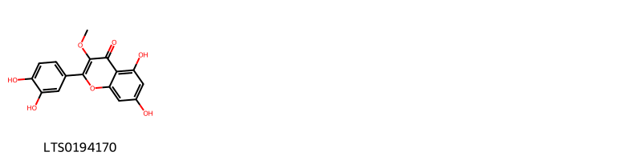{ width=100% }
    <figcaption>Hình ảnh cấu trúc hóa học của 1 hoạt chất thuộc nhóm Flavonoids gồm ['quercetin 3-methyl ether (LTS0194170)'].</figcaption>
</figure>
#### Nhóm Organonitrogen compounds
<figure markdown="span">
    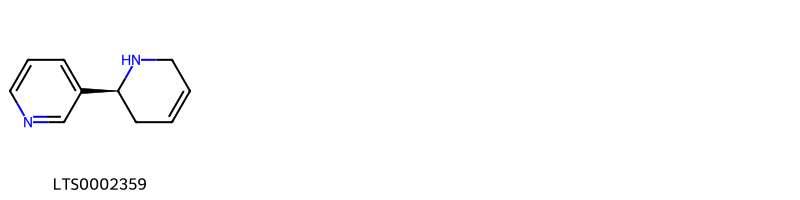{ width=100% }
    <figcaption>Hình ảnh cấu trúc hóa học của 1 hoạt chất thuộc nhóm Organonitrogen compounds gồm ['anatabine (LTS0002359)'].</figcaption>
</figure>
#### Nhóm Prenol lipids
<figure markdown="span">
    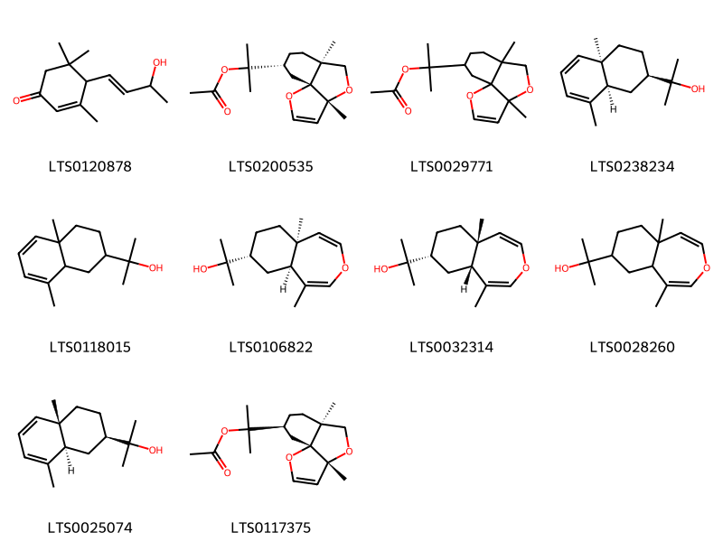{ width=100% }
    <figcaption>Hình ảnh cấu trúc hóa học của 10 hoạt chất thuộc nhóm Prenol lipids gồm ['4-[(1e)-3-hydroxybut-1-en-1-yl]-3,5,5-trimethylcyclohex-2-en-1-one (LTS0120878)', 'phytuberin (LTS0200535)', '2-{5,8-dimethyl-2,6-dioxatricyclo[6.4.0.0¹,⁵]dodec-3-en-11-yl}propan-2-yl acetate (LTS0029771)', 'occidentalol (LTS0238234)', '2-(4a,8-dimethyl-2,3,4,8a-tetrahydro-1h-naphthalen-2-yl)propan-2-ol (LTS0118015)', '2-[(5as,7r,9ar)-5,9a-dimethyl-6,7,8,9-tetrahydro-5ah-3-benzoxepin-7-yl]propan-2-ol (LTS0106822)', 'occidiol (LTS0032314)', '2-(5,9a-dimethyl-6,7,8,9-tetrahydro-5ah-3-benzoxepin-7-yl)propan-2-ol (LTS0028260)', '2-[(2r,4as,8as)-4a,8-dimethyl-2,3,4,8a-tetrahydro-1h-naphthalen-2-yl]propan-2-ol (LTS0025074)', '2-[(1r,5r,8s,11s)-5,8-dimethyl-2,6-dioxatricyclo[6.4.0.0¹,⁵]dodec-3-en-11-yl]propan-2-yl acetate (LTS0117375)'].</figcaption>
</figure>
#### Nhóm Pyridines and derivatives
<figure markdown="span">
    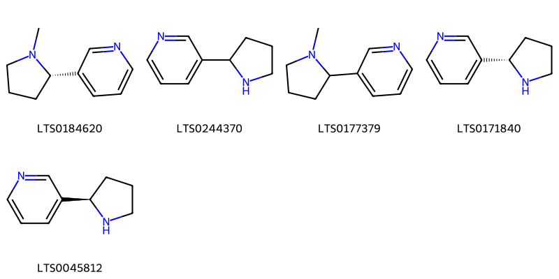{ width=100% }
    <figcaption>Hình ảnh cấu trúc hóa học của 5 hoạt chất thuộc nhóm Pyridines and derivatives gồm ['(-)-nicotine (LTS0184620)', '(+-)-nornicotine (LTS0244370)', 'nicotine (LTS0177379)', 'nornicotine (LTS0171840)', '(+)-nornicotine (LTS0045812)'].</figcaption>
</figure>
#### Nhóm Tetralins
<figure markdown="span">
    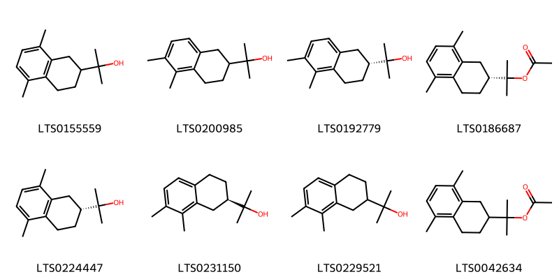{ width=100% }
    <figcaption>Hình ảnh cấu trúc hóa học của 8 hoạt chất thuộc nhóm Tetralins gồm ['2-(5,8-dimethyl-1,2,3,4-tetrahydronaphthalen-2-yl)propan-2-ol (LTS0155559)', '2-(5,6-dimethyl-1,2,3,4-tetrahydronaphthalen-2-yl)propan-2-ol (LTS0200985)', '2-[(2r)-5,6-dimethyl-1,2,3,4-tetrahydronaphthalen-2-yl]propan-2-ol (LTS0192779)', '2-[(2r)-5,8-dimethyl-1,2,3,4-tetrahydronaphthalen-2-yl]propan-2-yl acetate (LTS0186687)', '2-[(2r)-5,8-dimethyl-1,2,3,4-tetrahydronaphthalen-2-yl]propan-2-ol (LTS0224447)', '2-[(2r)-7,8-dimethyl-1,2,3,4-tetrahydronaphthalen-2-yl]propan-2-ol (LTS0231150)', '2-(7,8-dimethyl-1,2,3,4-tetrahydronaphthalen-2-yl)propan-2-ol (LTS0229521)', '2-(5,8-dimethyl-1,2,3,4-tetrahydronaphthalen-2-yl)propan-2-yl acetate (LTS0042634)'].</figcaption>
</figure>

---

### Dược dân tộc học

Danh sách các quốc gia có sử dụng *Nicotiana rustica* trong điều trị các bệnh. 

| Country        | Disease     | Bệnh                  |
|:---------------|:------------|:----------------------|
| US             | Insecticide | Thuốc trừ sâu         |
| US(Appalachia) | Narcotic    | Thuốc gây ngủ, gây mê |

---

---
## Nicotiana tabacum
### Thông tin về thực vật

!!! info "Phân loại thực vật của *Nicotiana tabacum* từ GIBF:"
    - **Kingdom:** Plantae
    - **Phylum:** Tracheophyta
    - **Order:** Solanales
    - **Family:** Solanaceae
    - **Genus:** Nicotiana
    - **Species:** *Nicotiana tabacum*

 

| Label (VI)   | Label (EN)   | Scientific Name   | Descriptions (VI)   | Descriptions (EN)   | Also Known As (VI)   | Also Known As (EN)                |
|:-------------|:-------------|:------------------|:--------------------|:--------------------|:---------------------|:----------------------------------|
| N/A          | N/A          | Nicotiana tabacum | loài thực vật       | species of plant    | ['']                 | ['Tobacco', 'cultivated tobacco'] |

#### Phân bố trên thế giới

**Từ CSDL GIBF** Australia, Guadeloupe, Belgium, Cook Islands, Argentina, Saint Lucia, Benin, Tanzania, United Republic of, Denmark, Puerto Rico, Netherlands, Réunion, Senegal, Nigeria, Chinese Taipei, Spain, Bolivia (Plurinational State of), Portugal, Jamaica, United States of America, Sweden, Chile, Uruguay, Croatia, El Salvador, Saint Martin (French part), South Africa, Germany, Brazil, Switzerland, Cuba, Mexico, France, Peru, Norfolk Island, Austria, China, Ecuador, Saint Kitts and Nevis, Cabo Verde, Colombia, Costa Rica, India, Indonesia, New Zealand, Nepal

#### Phân bố tại Việt Nam

**Từ CSDL GIBF**: Không có ghi nhận ở Việt Nam

---
### Thành phần hóa học
        
- Theo cơ sở dữ liệu lotus: Từ loài *Nicotiana tabacum* đã phân lập và xác định được 404 hoạt chất thuộc về các nhóm Benzodioxanes, Harmala alkaloids, Tetralins, Benzofurans, Hydroxy acids and derivatives, Phenols, Pyrrolines, Carboxylic acids and derivatives, Fatty Acyls, Indoles and derivatives, Pyrrolidines, Cinnamic acids and derivatives, Heteroaromatic compounds, Glycerolipids, Prenol lipids, Tetrahydrofurans, Benzene and substituted derivatives, Dihydrofurans, Organooxygen compounds, Pyridines and derivatives, Pyrenes, Flavonoids, Steroids and steroid derivatives, Benzodioxoles, Organonitrogen compounds, Lactones, Keto acids and derivatives, Oxazinanes, Coumarins and derivatives. 

|    | chemicalTaxonomyClassyfireClass     |   smiles_count |
|---:|:------------------------------------|---------------:|
|  0 |                                     |             10 |
|  1 | Benzene and substituted derivatives |              5 |
|  2 | Benzodioxanes                       |              1 |
|  3 | Benzodioxoles                       |              1 |
|  4 | Benzofurans                         |              2 |
|  5 | Carboxylic acids and derivatives    |             29 |
|  6 | Cinnamic acids and derivatives      |              3 |
|  7 | Coumarins and derivatives           |              3 |
|  8 | Dihydrofurans                       |              6 |
|  9 | Fatty Acyls                         |             51 |
| 10 | Flavonoids                          |              2 |
| 11 | Glycerolipids                       |              3 |
| 12 | Harmala alkaloids                   |              2 |
| 13 | Heteroaromatic compounds            |              6 |
| 14 | Hydroxy acids and derivatives       |              2 |
| 15 | Indoles and derivatives             |              5 |
| 16 | Keto acids and derivatives          |              6 |
| 17 | Lactones                            |              5 |
| 18 | Organonitrogen compounds            |              6 |
| 19 | Organooxygen compounds              |             66 |
| 20 | Oxazinanes                          |              1 |
| 21 | Phenols                             |              4 |
| 22 | Prenol lipids                       |            116 |
| 23 | Pyrenes                             |              1 |
| 24 | Pyridines and derivatives           |             30 |
| 25 | Pyrrolidines                        |              3 |
| 26 | Pyrrolines                          |              1 |
| 27 | Steroids and steroid derivatives    |             31 |
| 28 | Tetrahydrofurans                    |              2 |
| 29 | Tetralins                           |              1 |

#### Nhóm 
<figure markdown="span">
    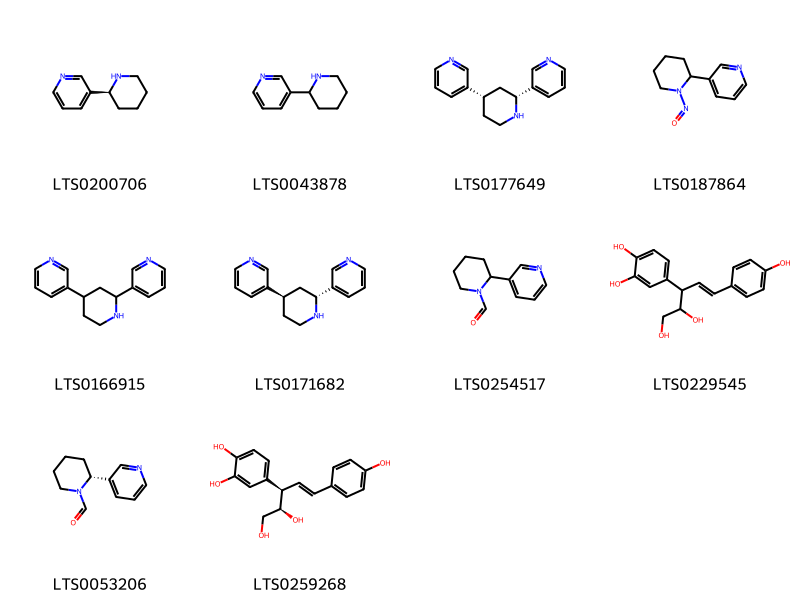{ width=100% }
    <figcaption>Hình ảnh cấu trúc hóa học của 10 hoạt chất thuộc nhóm  gồm ['(-)-anabasine (LTS0200706)', 'anabasine (LTS0043878)', '3-[(2r,4s)-2-(pyridin-3-yl)piperidin-4-yl]pyridine (LTS0177649)', "n'-nitrosoanabasine (LTS0187864)", '3-[2-(pyridin-3-yl)piperidin-4-yl]pyridine (LTS0166915)', '3-[(2r,4r)-2-(pyridin-3-yl)piperidin-4-yl]pyridine (LTS0171682)', '2-(pyridin-3-yl)piperidine-1-carbaldehyde (LTS0254517)', '4-[4,5-dihydroxy-1-(4-hydroxyphenyl)pent-1-en-3-yl]benzene-1,2-diol (LTS0229545)', '(2r)-2-(pyridin-3-yl)piperidine-1-carbaldehyde (LTS0053206)', '4-[(1e,3r,4r)-4,5-dihydroxy-1-(4-hydroxyphenyl)pent-1-en-3-yl]benzene-1,2-diol (LTS0259268)'].</figcaption>
</figure>
#### Nhóm Benzene and substituted derivatives
<figure markdown="span">
    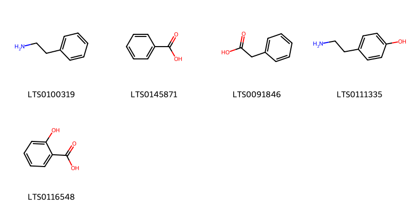{ width=100% }
    <figcaption>Hình ảnh cấu trúc hóa học của 5 hoạt chất thuộc nhóm Benzene and substituted derivatives gồm ['2-phenylethylamine (LTS0100319)', 'benzoic acid (LTS0145871)', 'ω-phenylacetic acid (LTS0091846)', 'tyramine (LTS0111335)', 'salicyclic acid (LTS0116548)'].</figcaption>
</figure>
#### Nhóm Benzodioxanes
<figure markdown="span">
    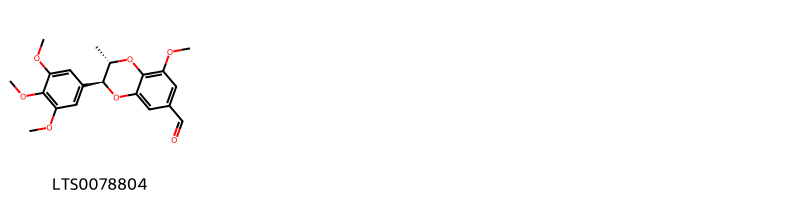{ width=100% }
    <figcaption>Hình ảnh cấu trúc hóa học của 1 hoạt chất thuộc nhóm Benzodioxanes gồm ['(2s,3s)-8-methoxy-2-methyl-3-(3,4,5-trimethoxyphenyl)-2,3-dihydro-1,4-benzodioxine-6-carbaldehyde (LTS0078804)'].</figcaption>
</figure>
#### Nhóm Benzodioxoles
<figure markdown="span">
    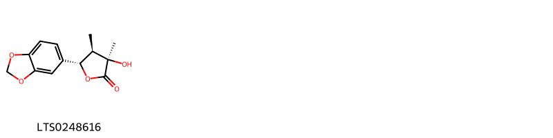{ width=100% }
    <figcaption>Hình ảnh cấu trúc hóa học của 1 hoạt chất thuộc nhóm Benzodioxoles gồm ['(3r,4r,5s)-5-(2h-1,3-benzodioxol-5-yl)-3-hydroxy-3,4-dimethyloxolan-2-one (LTS0248616)'].</figcaption>
</figure>
#### Nhóm Benzofurans
<figure markdown="span">
    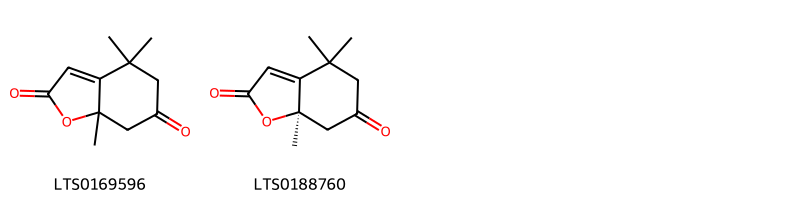{ width=100% }
    <figcaption>Hình ảnh cấu trúc hóa học của 2 hoạt chất thuộc nhóm Benzofurans gồm ['4,4,7a-trimethyl-5,7-dihydro-1-benzofuran-2,6-dione (LTS0169596)', '(7ar)-4,4,7a-trimethyl-5,7-dihydro-1-benzofuran-2,6-dione (LTS0188760)'].</figcaption>
</figure>
#### Nhóm Carboxylic acids and derivatives
<figure markdown="span">
    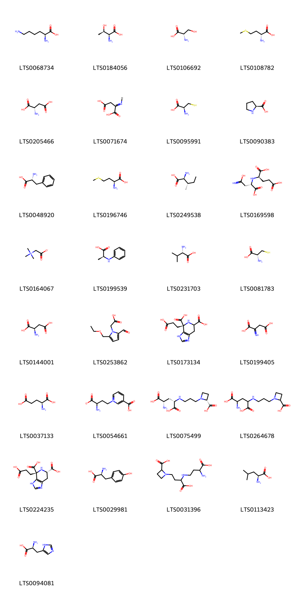{ width=100% }
    <figcaption>Hình ảnh cấu trúc hóa học của 29 hoạt chất thuộc nhóm Carboxylic acids and derivatives gồm ['l-lysine (LTS0068734)', 'l-threonine (LTS0184056)', 'l-serine (LTS0106692)', 'd-methionine (LTS0108782)', 'l-aspartic acid (LTS0205466)', 'iminosuccinic acid (LTS0071674)', 'd-cysteine (LTS0095991)', 'l-proline (LTS0090383)', 'd-phenylalanine (LTS0048920)', 'l-methionine (LTS0196746)', 'l-isoleucine (LTS0249538)', '(2r)-2-{[(1s)-1-carboxy-2-(c-hydroxycarbonimidoyl)ethyl]amino}pentanedioic acid (LTS0169598)', 'bet (LTS0164067)', '(2s)-2-(phenylamino)propanoic acid (LTS0199539)', 'l-valine (LTS0231703)', 'l-cysteine (LTS0081783)', 'd-aspartic acid (LTS0144001)', '[2-(ethoxymethyl)-5-formylpyrrol-1-yl]acetic acid (LTS0253862)', '(4r)-4-(2-carboxyethyl)-3h,5h,6h,7h-imidazo[4,5-c]pyridine-4,6-dicarboxylic acid (LTS0173134)', 'iminosuccinic acid (LTS0199405)', 'l-glutamic acid (LTS0037133)', '1-(3-amino-3-carboxylatopropyl)-3-carboxypyridin-1-ium (LTS0054661)', '(2s,4s)-2-amino-4-({3-[(2r)-2-carboxyazetidin-1-yl]propyl}amino)pentanedioic acid (LTS0075499)', '2-amino-4-{[3-(2-carboxyazetidin-1-yl)propyl]amino}pentanedioic acid (LTS0264678)', 'mikimopine (LTS0224235)', 'l-tyrosine (LTS0029981)', 'nicotianamine (LTS0031396)', 'l-leucine (LTS0113423)', 'l-histidine (LTS0094081)'].</figcaption>
</figure>
#### Nhóm Cinnamic acids and derivatives
<figure markdown="span">
    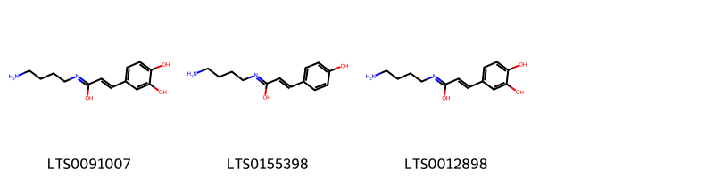{ width=100% }
    <figcaption>Hình ảnh cấu trúc hóa học của 3 hoạt chất thuộc nhóm Cinnamic acids and derivatives gồm ['n-(4-aminobutyl)-3-(3,4-dihydroxyphenyl)prop-2-enimidic acid (LTS0091007)', '(2e)-n-(4-aminobutyl)-3-(4-hydroxyphenyl)prop-2-enimidic acid (LTS0155398)', '(2e)-n-(4-aminobutyl)-3-(3,4-dihydroxyphenyl)prop-2-enimidic acid (LTS0012898)'].</figcaption>
</figure>
#### Nhóm Coumarins and derivatives
<figure markdown="span">
    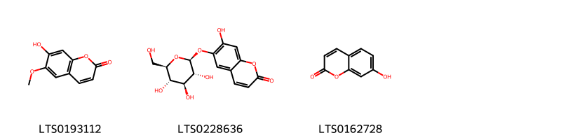{ width=100% }
    <figcaption>Hình ảnh cấu trúc hóa học của 3 hoạt chất thuộc nhóm Coumarins and derivatives gồm ['scopoletin (LTS0193112)', 'esculin (LTS0228636)', 'umbelliferone (LTS0162728)'].</figcaption>
</figure>
#### Nhóm Dihydrofurans
<figure markdown="span">
    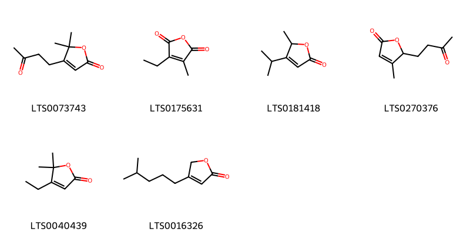{ width=100% }
    <figcaption>Hình ảnh cấu trúc hóa học của 6 hoạt chất thuộc nhóm Dihydrofurans gồm ['5,5-dimethyl-4-(3-oxobutyl)furan-2-one (LTS0073743)', '3-ethyl-4-methylfuran-2,5-dione (LTS0175631)', '3-isopropyl-2-penten-4-olide (LTS0181418)', '4-methyl-5-(3-oxobutyl)-5h-furan-2-one (LTS0270376)', '4-ethyl-5,5-dimethylfuran-2-one (LTS0040439)', '4-(4-methylpentyl)-5h-furan-2-one (LTS0016326)'].</figcaption>
</figure>
#### Nhóm Fatty Acyls
<figure markdown="span">
    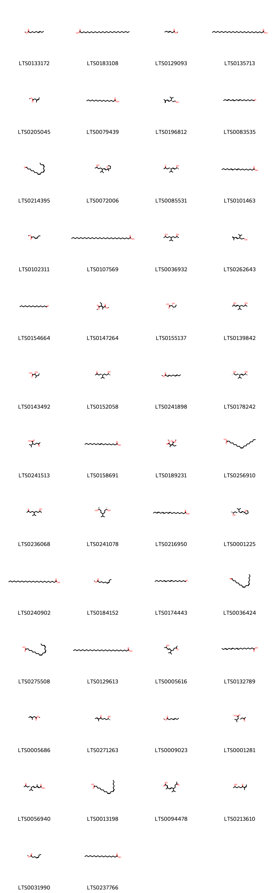{ width=100% }
    <figcaption>Hình ảnh cấu trúc hóa học của 51 hoạt chất thuộc nhóm Fatty Acyls gồm ['methyl non-6-enoate (LTS0133172)', 'heptacosanoic acid (LTS0183108)', 'methyl hex-3-enoate (LTS0129093)', 'octacosanoic acid (LTS0135713)', 'methyl 3-methylpent-3-enoate (LTS0205045)', 'palmitic acid (LTS0079439)', '(3r,4e)-3-isopropyl-6-methylhepta-4,6-dien-1-ol (LTS0196812)', 'heptadeca-8,11,14-trienal (LTS0083535)', '(8z,11z,14z)-heptadecatrienal (LTS0214395)', '5-isopropyl-7-(2-methyloxolan-2-yl)hept-6-en-2-ol (LTS0072006)', '(5r,6e,8s)-8-hydroxy-5-isopropylnon-6-en-2-one (LTS0085531)', '9,12-octadecadienoic acid (LTS0101463)', '(3z)-methyl 3-hexenoate (LTS0102311)', 'lacceroic acid (LTS0107569)', '5-isopropylnonane-2,8-diol (LTS0036932)', '3-isopropyl-6-methylhepta-4,6-dien-1-ol (LTS0262643)', 'pentadecanal (LTS0154664)', '1,4-dimethyl 2-ethyl-3-methylbut-2-enedioate (LTS0147264)', 'hmva (LTS0155137)', '5-isopropylnon-3-ene-2,8-diol (LTS0139842)', '2-hydroxy-3-methylvaleric acid (LTS0143492)', '(5r,8s)-8-hydroxy-5-isopropylnonan-2-one (LTS0152058)', 'methyl nona-2,6-dienoate (LTS0241898)', '(2s,3e,5r,8s)-5-isopropylnon-3-ene-2,8-diol (LTS0178242)', '2-isopropyl-5-oxohexanoic acid (LTS0241513)', '9 octadecenoic acid (LTS0158691)', '1,4-dimethyl (2z)-2-ethyl-3-methylbut-2-enedioate (LTS0189231)', 'oleic acid (LTS0256910)', '8-hydroxy-5-isopropylnonan-2-one (LTS0236068)', '(2s,8s)-5-isopropylnonane-2,8-diol (LTS0241078)', 'octadeca-9,12,15-trienoic acid (LTS0216950)', '(2s,5r,6e)-5-isopropyl-7-[(2s)-2-methyloxolan-2-yl]hept-6-en-2-ol (LTS0001225)', 'hexacosanoic acid (LTS0240902)', 'methyl (6z)-non-6-enoate (LTS0184152)', 'heptadeca-8,11-dienal (LTS0174443)', '(8z,11z)-heptadeca-8,11-dienal (LTS0036424)', 'α-linolenic acid (LTS0275508)', 'triacontanoic acid (LTS0129613)', '8-hydroxy-5-isopropylnon-6-en-2-one (LTS0005616)', 'α linolenic acid (LTS0132789)', 'methyl (3e)-3-methylpent-3-enoate (LTS0005686)', '(2e,8s)-8-hydroxy-3-methylnon-2-en-4-one (LTS0271263)', 'methyl hept-4-enoate (LTS0009023)', '(2r)-2-isopropyl-5-oxohexanoic acid (LTS0001281)', '(2e,4e,6s)-6-isopropyl-3-methyl-9-oxodeca-2,4-dienoic acid (LTS0056940)', 'linoleic (LTS0013198)', '6-isopropyl-3-methyl-9-oxodeca-2,4-dienoic acid (LTS0094478)', '8-hydroxy-3-methylnon-2-en-4-one (LTS0213610)', 'methyl (4z)-hept-4-enoate (LTS0031990)', 'stearic acid (LTS0237766)', 'methyl (2e,6z)-nona-2,6-dienoate (LTS0044874)'].</figcaption>
</figure>
#### Nhóm Flavonoids
<figure markdown="span">
    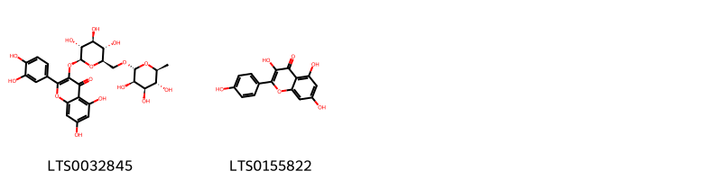{ width=100% }
    <figcaption>Hình ảnh cấu trúc hóa học của 2 hoạt chất thuộc nhóm Flavonoids gồm ['3-rutinosyl quercetin (LTS0032845)', 'kaempherol (LTS0155822)'].</figcaption>
</figure>
#### Nhóm Glycerolipids
<figure markdown="span">
    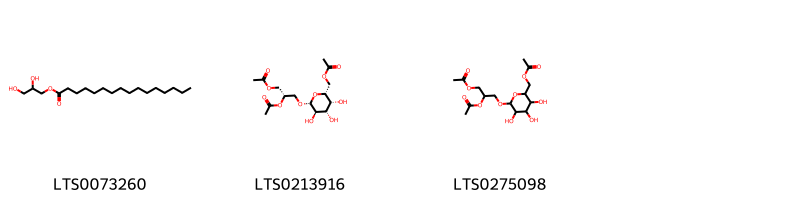{ width=100% }
    <figcaption>Hình ảnh cấu trúc hóa học của 3 hoạt chất thuộc nhóm Glycerolipids gồm ['glyceryl palmitate (LTS0073260)', '(2s)-1-(acetyloxy)-3-{[(2r,3r,4s,5r,6r)-6-[(acetyloxy)methyl]-3,4,5-trihydroxyoxan-2-yl]oxy}propan-2-yl acetate (LTS0213916)', '1-(acetyloxy)-3-({6-[(acetyloxy)methyl]-3,4,5-trihydroxyoxan-2-yl}oxy)propan-2-yl acetate (LTS0275098)'].</figcaption>
</figure>
#### Nhóm Harmala alkaloids
<figure markdown="span">
    { width=100% }
    <figcaption>Hình ảnh cấu trúc hóa học của 2 hoạt chất thuộc nhóm Harmala alkaloids gồm ['harmane (LTS0068205)', '1-methyl-3h,4h,9h-pyrido[3,4-b]indole (LTS0027115)'].</figcaption>
</figure>
#### Nhóm Heteroaromatic compounds
<figure markdown="span">
    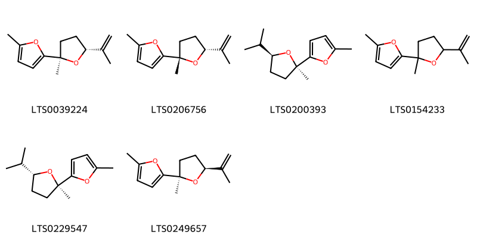{ width=100% }
    <figcaption>Hình ảnh cấu trúc hóa học của 6 hoạt chất thuộc nhóm Heteroaromatic compounds gồm ['2-methyl-5-[(2r,5r)-2-methyl-5-(prop-1-en-2-yl)oxolan-2-yl]furan (LTS0039224)', '2-methyl-5-[(2s,5r)-2-methyl-5-(prop-1-en-2-yl)oxolan-2-yl]furan (LTS0206756)', '2-[(2r,5s)-5-isopropyl-2-methyloxolan-2-yl]-5-methylfuran (LTS0200393)', '2-methyl-5-[2-methyl-5-(prop-1-en-2-yl)oxolan-2-yl]furan (LTS0154233)', '2-[(2r,5r)-5-isopropyl-2-methyloxolan-2-yl]-5-methylfuran (LTS0229547)', '2-methyl-5-[(2r,5s)-2-methyl-5-(prop-1-en-2-yl)oxolan-2-yl]furan (LTS0249657)'].</figcaption>
</figure>
#### Nhóm Hydroxy acids and derivatives
<figure markdown="span">
    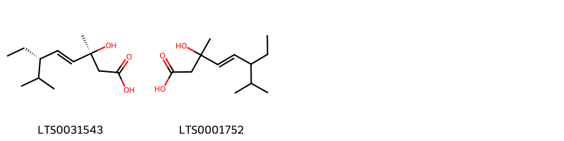{ width=100% }
    <figcaption>Hình ảnh cấu trúc hóa học của 2 hoạt chất thuộc nhóm Hydroxy acids and derivatives gồm ['(3s,4e,6s)-6-ethyl-3-hydroxy-3,7-dimethyloct-4-enoic acid (LTS0031543)', '6-ethyl-3-hydroxy-3,7-dimethyloct-4-enoic acid (LTS0001752)'].</figcaption>
</figure>
#### Nhóm Indoles and derivatives
<figure markdown="span">
    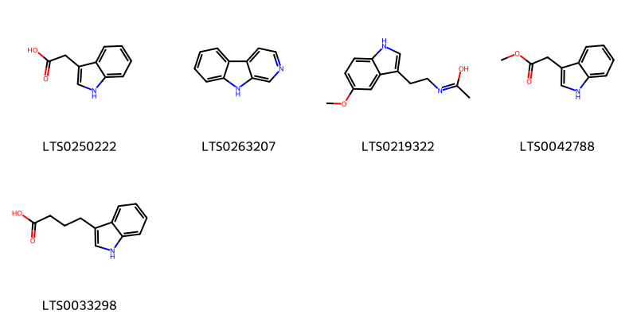{ width=100% }
    <figcaption>Hình ảnh cấu trúc hóa học của 5 hoạt chất thuộc nhóm Indoles and derivatives gồm ['β-indole-3-acetic acid (LTS0250222)', 'β-carboline (LTS0263207)', 'n-[2-(5-methoxy-1h-indol-3-yl)ethyl]ethanimidic acid (LTS0219322)', 'methyl indole-3-acetate (LTS0042788)', '3-indolebutyric acid (LTS0033298)'].</figcaption>
</figure>
#### Nhóm Keto acids and derivatives
<figure markdown="span">
    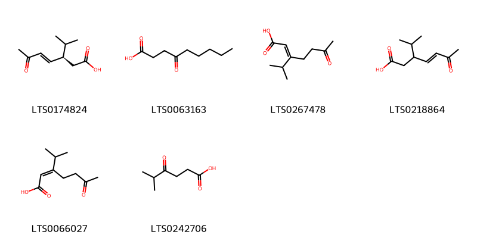{ width=100% }
    <figcaption>Hình ảnh cấu trúc hóa học của 6 hoạt chất thuộc nhóm Keto acids and derivatives gồm ['(3r,4e)-3-isopropyl-6-oxohept-4-enoic acid (LTS0174824)', '4-oxononanoic acid (LTS0063163)', '3-isopropyl-6-oxohept-2-enoic acid (LTS0267478)', '3-isopropyl-6-oxohept-4-enoic acid (LTS0218864)', '(2e)-3-isopropyl-6-oxohept-2-enoic acid (LTS0066027)', '5-methyl-4-oxohexanoic acid (LTS0242706)'].</figcaption>
</figure>
#### Nhóm Lactones
<figure markdown="span">
    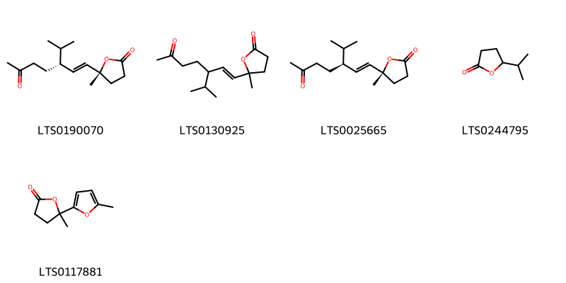{ width=100% }
    <figcaption>Hình ảnh cấu trúc hóa học của 5 hoạt chất thuộc nhóm Lactones gồm ['(5r)-5-[(1e,3r)-3-isopropyl-6-oxohept-1-en-1-yl]-5-methyloxolan-2-one (LTS0190070)', '5-(3-isopropyl-6-oxohept-1-en-1-yl)-5-methyloxolan-2-one (LTS0130925)', '(5r)-5-[(1e,3s)-3-isopropyl-6-oxohept-1-en-1-yl]-5-methyloxolan-2-one (LTS0025665)', '5-methyl-4-hexanolide (LTS0244795)', '5-methyl-5-(5-methylfuran-2-yl)oxolan-2-one (LTS0117881)'].</figcaption>
</figure>
#### Nhóm Organonitrogen compounds
<figure markdown="span">
    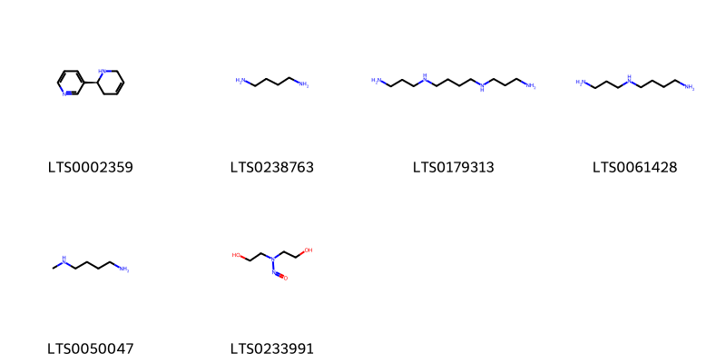{ width=100% }
    <figcaption>Hình ảnh cấu trúc hóa học của 6 hoạt chất thuộc nhóm Organonitrogen compounds gồm ['anatabine (LTS0002359)', 'putrescine (LTS0238763)', 'spermine (LTS0179313)', 'spermidine (LTS0061428)', 'n-methylputrescine (LTS0050047)', 'n-nitrosodiethanolamine (LTS0233991)'].</figcaption>
</figure>
#### Nhóm Organooxygen compounds
<figure markdown="span">
    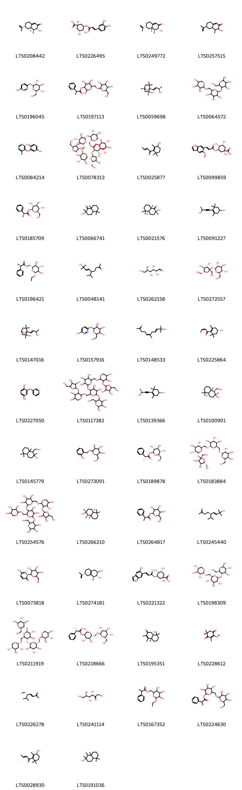{ width=100% }
    <figcaption>Hình ảnh cấu trúc hóa học của 66 hoạt chất thuộc nhóm Organooxygen compounds gồm ['(3r,4s,4ar,6r)-3-hydroxy-4-methyl-6-(prop-1-en-2-yl)-4,4a,5,6,7,8-hexahydro-3h-naphthalen-2-one (LTS0208442)', 'chlorogenic acid (LTS0226495)', 'glutinosone (LTS0249772)', '3-hydroxy-4-methyl-6-(prop-1-en-2-yl)-4,4a,5,6,7,8-hexahydro-3h-naphthalen-2-one (LTS0257515)', '(2r,3s,4s,5r,6s)-2-(hydroxymethyl)-6-[(6-hydroxypyridazin-3-yl)oxy]oxane-3,4,5-triol (LTS0196045)', '2,4,5-trihydroxy-6-({[3,4,5-trihydroxy-6-(hydroxymethyl)oxan-2-yl]oxy}methyl)oxan-3-yl 2-phenylpropanoate (LTS0197113)', '(1r,2r,4s)-1-[(1e,3r)-3-hydroxybut-1-en-1-yl]-2,6,6-trimethyl-7-oxabicyclo[2.2.1]heptan-2-ol (LTS0059698)', '6-(hydroxymethyl)-5-[(3,4,5-trihydroxy-6-{[(3,4,5-trihydroxyoxan-2-yl)oxy]methyl}oxan-2-yl)oxy]oxane-2,3,4-triol (LTS0064572)', '2-[(4-methylpyridin-3-yl)oxy]benzene-1,4-diol (LTS0084214)', '(2r,3s,4s,5r,6s)-2-({[(2r,3r,4s,5r)-3-{[(2s,3r,4r,5s)-3,4-dihydroxy-5-(hydroxymethyl)oxolan-2-yl]oxy}-4,5-dihydroxyoxan-2-yl]oxy}methyl)-6-{[(2r,3s,4r,5r,6s)-2-({[(2r,3r,4s,5r)-3-{[(2s,3r,4r,5s)-3,4-dihydroxy-5-(hydroxymethyl)oxolan-2-yl]oxy}-4,5-dihydroxyoxan-2-yl]oxy}methyl)-4,5-dihydroxy-6-{[(2r,3s,4r,5r,6r)-4,5,6-trihydroxy-2-(hydroxymethyl)oxan-3-yl]oxy}oxan-3-yl]oxy}oxane-3,4,5-triol (LTS0078313)', '1-(3-hydroxy-2,6,6-trimethylcyclohex-1-en-1-yl)but-2-en-1-one (LTS0025877)', '(1s,3r,4r,5r)-1,3,4-trihydroxy-5-{[3-(5-methoxy-1-benzofuran-6-yl)prop-2-enoyl]oxy}cyclohexane-1-carboxylic acid (LTS0099859)', '(2s,3r,4s,5s,6r)-3,4,5-trihydroxy-6-(hydroxymethyl)oxan-2-yl (2s)-2-phenylpropanoate (LTS0185709)', '2-hydroxy-2,5,5,8a-tetramethyl-hexahydronaphthalen-1-one (LTS0066741)', '(2r,4as,8as)-2-hydroxy-2,5,5,8a-tetramethyl-hexahydronaphthalen-1-one (LTS0021576)', '4-(3-hydroxybut-1-yn-1-yl)-3,5,5-trimethylcyclohex-3-en-1-ol (LTS0091227)', '[(2r,3s,4s,5r,6r)-6-ethoxy-3,4,5-trihydroxyoxan-2-yl]methyl (2r)-2-phenylpropanoate (LTS0196421)', '8-hydroxy-5-isopropyl-8-methylnon-6-en-2-one (LTS0048141)', '(+)-glucose (LTS0262158)', 'sucrose (LTS0272557)', '1-(3-hydroxybut-1-en-1-yl)-2,6,6-trimethyl-7-oxabicyclo[2.2.1]heptan-2-ol (LTS0147016)', '2-(hydroxymethyl)-6-[(6-hydroxypyridazin-3-yl)oxy]oxane-3,4,5-triol (LTS0157916)', '10-hydroxy-6,10-dimethylundeca-5,8-dien-2-one (LTS0148533)', '(2z)-1-[(4s)-4-hydroxy-2,6,6-trimethylcyclohex-1-en-1-yl]but-2-en-1-one (LTS0225864)', '2-(pyridin-3-yloxy)benzene-1,4-diol (LTS0227050)', '2-{[(3-{[3,4-dihydroxy-5-(hydroxymethyl)oxolan-2-yl]oxy}-4,5-dihydroxyoxan-2-yl)oxy]methyl}-6-[(2-{[(3-{[3,4-dihydroxy-5-(hydroxymethyl)oxolan-2-yl]oxy}-4,5-dihydroxyoxan-2-yl)oxy]methyl}-4,5-dihydroxy-6-{[4,5,6-trihydroxy-2-(hydroxymethyl)oxan-3-yl]oxy}oxan-3-yl)oxy]oxane-3,4,5-triol (LTS0117382)', '(1s)-4-[(3s)-3-hydroxybut-1-yn-1-yl]-3,5,5-trimethylcyclohex-3-en-1-ol (LTS0139366)', '(1s,2r,4as,8as)-1-(hydroxymethyl)-2,5,5,8a-tetramethyl-hexahydro-1h-naphthalen-2-ol (LTS0100901)', '1-(hydroxymethyl)-2,5,5,8a-tetramethyl-hexahydro-1h-naphthalen-2-ol (LTS0145779)', '2-(hydroxymethyl)-6-[(2-hydroxyphenyl)methoxy]oxane-3,4,5-triol (LTS0273091)', '(2s,3r,4s,5s,6r)-3,4,5-trihydroxy-6-(hydroxymethyl)oxan-2-yl (2r)-2-phenylpropanoate (LTS0189878)', '(2r,3r,4s,5s,6r)-2-{[(2s,3r,4s,5r)-3,4-dihydroxy-2,5-bis(hydroxymethyl)oxolan-2-yl]oxy}-6-({[(2s,3s,4r,5r,6r)-3,4,5-trihydroxy-6-({[(2s,3r,4s,5r,6r)-3,4,5-trihydroxy-6-(hydroxymethyl)oxan-2-yl]oxy}methyl)oxan-2-yl]oxy}methyl)oxane-3,4,5-triol (LTS0183884)', '2-{[(3-{[3,4-dihydroxy-5-(hydroxymethyl)oxolan-2-yl]oxy}-4,5-dihydroxyoxan-2-yl)oxy]methyl}-6-[(4,5-dihydroxy-6-{[4,5,6-trihydroxy-2-(hydroxymethyl)oxan-3-yl]oxy}-2-{[(3,4,5-trihydroxyoxan-2-yl)oxy]methyl}oxan-3-yl)oxy]oxane-3,4,5-triol (LTS0254576)', '(1r,2r,4as,8as)-1,2,5,5,8a-pentamethyl-hexahydro-1h-naphthalen-2-ol (LTS0266210)', '3,4,5-trihydroxy-6-(hydroxymethyl)oxan-2-yl 2-phenylpropanoate (LTS0264817)', '(5r,6e)-8-hydroxy-5-isopropyl-8-methylnon-6-en-2-one (LTS0245440)', '6-hydroxy-2-[3,4,5-trihydroxy-6-(hydroxymethyl)oxan-2-yl]pyridazin-3-one (LTS0073818)', 'rishitin (LTS0274181)', '(1s,3r,4r,5r)-1,3,4-trihydroxy-5-{[3-(5-hydroxy-1-benzofuran-6-yl)prop-2-enoyl]oxy}cyclohexane-1-carboxylic acid (LTS0221322)', '(2r,3r,4r,5s,6r)-6-(hydroxymethyl)-5-{[(2s,3r,4s,5s,6r)-3,4,5-trihydroxy-6-({[(2r,3r,4s,5r)-3,4,5-trihydroxyoxan-2-yl]oxy}methyl)oxan-2-yl]oxy}oxane-2,3,4-triol (LTS0198309)', '(2r,3r,4r,5s,6r)-5-{[(2s,3r,4r,5s,6r)-3,4-dihydroxy-5-{[(2s,3r,4s,5s,6r)-3,4,5-trihydroxy-6-({[(2r,3r,4s,5r)-3,4,5-trihydroxyoxan-2-yl]oxy}methyl)oxan-2-yl]oxy}-6-({[(2r,3r,4s,5r)-3,4,5-trihydroxyoxan-2-yl]oxy}methyl)oxan-2-yl]oxy}-6-(hydroxymethyl)oxane-2,3,4-triol (LTS0211919)', '(2r,3r,4s,5s,6r)-2,4,5-trihydroxy-6-({[(2r,3r,4s,5s,6r)-3,4,5-trihydroxy-6-(hydroxymethyl)oxan-2-yl]oxy}methyl)oxan-3-yl (2s)-2-phenylpropanoate (LTS0218666)', '(4as,8as)-3,4,4a,8,8-pentamethyl-5,6,7,8a-tetrahydro-1h-naphthalen-2-one (LTS0195351)', '2-methoxy-3,5,5-trimethylcyclohex-2-ene-1,4-dione (LTS0228612)', '(3e,5s)-5-ethyl-6-methylhept-3-en-2-one (LTS0226278)', 'keto-d-fructose (LTS0241114)', '(6-ethoxy-3,4,5-trihydroxyoxan-2-yl)methyl 2-phenylpropanoate (LTS0167352)', '3,4,5-trihydroxy-6-({[3,4,5-trihydroxy-6-(hydroxymethyl)oxan-2-yl]oxy}methyl)oxan-2-yl 2-phenylpropanoate (LTS0224630)', '(2e)-1-[(3s)-3-hydroxy-2,6,6-trimethylcyclohex-1-en-1-yl]but-2-en-1-one (LTS0028930)', '1,2,5,5,8a-pentamethyl-hexahydro-1h-naphthalen-2-ol (LTS0191036)', '[(4s)-4-methyl-4-[(1s)-1-methyl-2-methylidenecyclopentyl]cyclohex-1-en-1-yl]methanol (LTS0044932)', '(3r,4s,5s,6r)-3,4,5-trihydroxy-6-(hydroxymethyl)oxan-2-yl 2-hydroxybenzoate (LTS0130300)', 'glucose (LTS0013597)', '(2r,3s,4s,5r,6s)-2-({[(2r,3r,4s,5r)-3-{[(2s,3r,4r,5s)-3,4-dihydroxy-5-(hydroxymethyl)oxolan-2-yl]oxy}-4,5-dihydroxyoxan-2-yl]oxy}methyl)-6-{[(2r,3s,4r,5r,6s)-4,5-dihydroxy-6-{[(2r,3s,4r,5r,6r)-4,5,6-trihydroxy-2-(hydroxymethyl)oxan-3-yl]oxy}-2-({[(2r,3r,4s,5r)-3,4,5-trihydroxyoxan-2-yl]oxy}methyl)oxan-3-yl]oxy}oxane-3,4,5-triol (LTS0008436)', 'stachyose (LTS0062089)', '(5e,8e)-10-hydroxy-6,10-dimethylundeca-5,8-dien-2-one (LTS0002798)', '(1s,3r,4r,5r)-1,3,4-trihydroxy-5-{[(2e)-3-(5-methoxy-1-benzofuran-6-yl)prop-2-enoyl]oxy}cyclohexane-1-carboxylic acid (LTS0020572)', 'raffinose (LTS0113066)', 'acetosyringone (LTS0017449)', '5-ethyl-6-methylhept-3-en-2-one (LTS0028274)', '6-hydroxy-2-[(2r,3r,4s,5s,6r)-3,4,5-trihydroxy-6-(hydroxymethyl)oxan-2-yl]pyridazin-3-one (LTS0100557)', '5-({3,4-dihydroxy-5-[(3,4,5-trihydroxy-6-{[(3,4,5-trihydroxyoxan-2-yl)oxy]methyl}oxan-2-yl)oxy]-6-{[(3,4,5-trihydroxyoxan-2-yl)oxy]methyl}oxan-2-yl}oxy)-6-(hydroxymethyl)oxane-2,3,4-triol (LTS0023246)', '(1s,3r,4r,5r)-1,3,4-trihydroxy-5-{[(2e)-3-(5-hydroxy-1-benzofuran-6-yl)prop-2-enoyl]oxy}cyclohexane-1-carboxylic acid (LTS0099574)', '(2s,3r,4s,5s,6r)-3,4,5-trihydroxy-6-({[(2r,3r,4s,5s,6r)-3,4,5-trihydroxy-6-(hydroxymethyl)oxan-2-yl]oxy}methyl)oxan-2-yl (2s)-2-phenylpropanoate (LTS0262043)', '1-methyl-7-(prop-1-en-2-yl)-1,2,3,4,5,6,7,8-octahydronaphthalene-2,3-diol (LTS0028730)', 'd-fructopyranose (LTS0259277)'].</figcaption>
</figure>
#### Nhóm Oxazinanes
<figure markdown="span">
    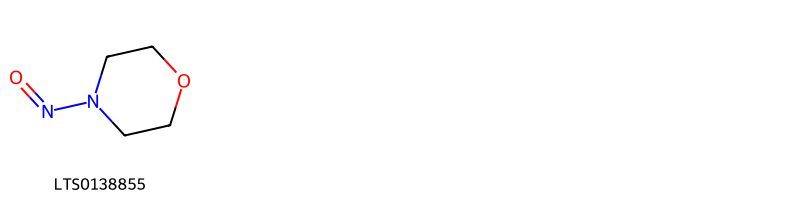{ width=100% }
    <figcaption>Hình ảnh cấu trúc hóa học của 1 hoạt chất thuộc nhóm Oxazinanes gồm ['n-nitrosomorpholine (LTS0138855)'].</figcaption>
</figure>
#### Nhóm Phenols
<figure markdown="span">
    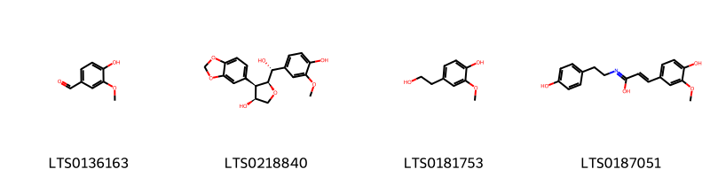{ width=100% }
    <figcaption>Hình ảnh cấu trúc hóa học của 4 hoạt chất thuộc nhóm Phenols gồm ['vanillin (LTS0136163)', '(3s,4r,5s)-4-(2h-1,3-benzodioxol-5-yl)-5-[(r)-hydroxy(4-hydroxy-3-methoxyphenyl)methyl]oxolan-3-ol (LTS0218840)', 'homovanillyl alcohol (LTS0181753)', '(2e)-3-(4-hydroxy-3-methoxyphenyl)-n-[2-(4-hydroxyphenyl)ethyl]prop-2-enimidic acid (LTS0187051)'].</figcaption>
</figure>
#### Nhóm Prenol lipids
<figure markdown="span">
    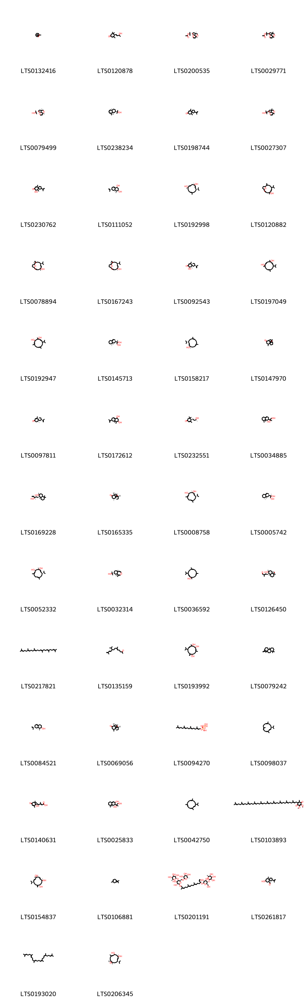{ width=100% }
    <figcaption>Hình ảnh cấu trúc hóa học của 116 hoạt chất thuộc nhóm Prenol lipids gồm ['α pinene (LTS0132416)', '4-[(1e)-3-hydroxybut-1-en-1-yl]-3,5,5-trimethylcyclohex-2-en-1-one (LTS0120878)', 'phytuberin (LTS0200535)', '2-{5,8-dimethyl-2,6-dioxatricyclo[6.4.0.0¹,⁵]dodec-3-en-11-yl}propan-2-yl acetate (LTS0029771)', 'phytuberol (LTS0079499)', 'occidentalol (LTS0238234)', '6,10-dimethyl-2-(prop-1-en-2-yl)spiro[4.5]dec-6-en-8-one (LTS0198744)', '2-{5,8-dimethyl-2,6-dioxatricyclo[6.4.0.0¹,⁵]dodec-3-en-11-yl}propan-2-ol (LTS0027307)', '9-hydroxy-6,10-dimethyl-2-(prop-1-en-2-yl)spiro[4.5]dec-6-en-8-one (LTS0230762)', 'capsidiol (LTS0111052)', '(1s,2e,5r,6e,8s,11z)-8-isopropyl-1,5,11-trimethylcyclotetradeca-2,6,11-triene-1,5-diol (LTS0192998)', '8-isopropyl-1,5-dimethyl-11-methylidene-15-oxabicyclo[10.2.1]pentadeca-2,6-dien-5-ol (LTS0120882)', '(1s,2z,5r,6e,8s,12r)-8-isopropyl-1,5-dimethyl-11-methylidene-15-oxabicyclo[10.2.1]pentadeca-2,6-dien-5-ol (LTS0078894)', '(1s,2z,5s,6e,8s,12r)-8-isopropyl-1,5-dimethyl-11-methylidene-15-oxabicyclo[10.2.1]pentadeca-2,6-dien-5-ol (LTS0167243)', '(2r,5s,9r,10s)-9-hydroxy-6,10-dimethyl-2-(prop-1-en-2-yl)spiro[4.5]dec-6-en-8-one (LTS0092543)', '8-isopropyl-1,5,11-trimethylcyclotetradeca-2,6,11-triene-1,5-diol (LTS0197049)', '12-isopropyl-1,5,9-trimethylcyclotetradeca-4,8,13-triene-1,3-diol (LTS0192947)', 'debneyol (LTS0145713)', 'cembratrienol (LTS0158217)', '5,10,11-trimethyltetracyclo[5.3.1.1¹,⁴.0⁵,¹¹]dodecan-8-one (LTS0147970)', 'solavetivone (LTS0097811)', '4,4a-dimethyl-6-(prop-1-en-2-yl)-2,3,4,5,6,7-hexahydro-1h-naphthalene-1,3-diol (LTS0172612)', '(4r)-4-[(3r)-3-hydroxybutyl]-3,5,5-trimethylcyclohex-2-en-1-one (LTS0232551)', '2-(8,8a-dimethyl-2,3,5,6,7,8-hexahydro-1h-naphthalen-2-yl)propane-1,2-diol (LTS0034885)', 'sclareol (LTS0169228)', '(1s,4r,5s,7s,10r,11s)-5,10,11-trimethyltetracyclo[5.3.1.1¹,⁴.0⁵,¹¹]dodecan-8-one (LTS0165335)', '(1r,3r,4e,8e,12s,13e)-12-isopropyl-1,5,9-trimethylcyclotetradeca-4,8,13-triene-1,3-diol (LTS0008758)', '(2r)-2-[(2r,8r,8ar)-8,8a-dimethyl-2,3,5,6,7,8-hexahydro-1h-naphthalen-2-yl]propane-1,2-diol (LTS0005742)', 'cembra-2,7,11-triene-4,6-diol (LTS0052332)', 'occidiol (LTS0032314)', '4-isopropyl-1,7,11-trimethylcyclotetradeca-2,7,11-trien-1-ol (LTS0036592)', '(2e)-4-[(1r,2r,4as,8as)-2-hydroxy-2,5,5,8a-tetramethyl-hexahydro-1h-naphthalen-1-yl]-2-methylbut-2-enal (LTS0126450)', 'squalene (LTS0217821)', '9-isopropyl-6,12-dimethyltrideca-5,10,12-trien-2-one (LTS0135159)', '12-isopropyl-1,5-dimethyl-9-methylidenecyclotetradeca-4,13-diene-1,3,8-triol (LTS0193992)', '5,5,9-trimethyl-14-methylidenetetracyclo[11.2.1.0¹,¹⁰.0⁴,⁹]hexadecane (LTS0079242)', '1-deoxycapsidiol (LTS0084521)', '(1r,4r,5r,7s,11r)-5,10,11-trimethyltetracyclo[5.3.1.1¹,⁴.0⁵,¹¹]dodecan-8-one (LTS0069056)', 'geranylgeranyl diphosphate (LTS0094270)', '(1e,3z,6e,10z,14s)-14-isopropyl-3,7,11-trimethylcyclotetradeca-1,3,6,10-tetraene (LTS0098037)', 'abscisic acid,  (LTS0140631)', '2-(3-hydroxy-8,8a-dimethyl-2,3,5,6,7,8-hexahydro-1h-naphthalen-2-yl)propane-1,2-diol (LTS0025833)', '(1e)-14-isopropyl-3,7,11-trimethylcyclotetradeca-1,3,6,10-tetraene (LTS0042750)', 'coenzyme q10 (LTS0103893)', '(1s,4s,5e,8r,9e,11s)-11-isopropyl-4,8-dimethyl-14-methylidenecyclotetradeca-5,9-diene-1,4,8-triol (LTS0154837)', 'monoterpenes (LTS0106881)', '(2r,3r,4r,5r,6s)-2-{[(2r,3s,4r,5r,6r)-6-{[(2z,6e,10e,14s)-14-{[(2s,3r,4r,5s,6r)-3,4-dihydroxy-6-(hydroxymethyl)-5-{[(2s,3r,4r,5r,6s)-3,4,5-trihydroxy-6-methyloxan-2-yl]oxy}oxan-2-yl]oxy}-2,6,10,14-tetramethylhexadeca-2,6,10,15-tetraen-1-yl]oxy}-4,5-dihydroxy-3-{[(2s,3r,4r,5r,6s)-3,4,5-trihydroxy-6-methyloxan-2-yl]oxy}oxan-2-yl]methoxy}-6-methyloxane-3,4,5-triol (LTS0201191)', '8-hydroxy-10-methyl-2-(prop-1-en-2-yl)spiro[4.5]decane-6-carbaldehyde (LTS0261817)', '2,6,10,15,19,23-hexamethyltetracosa-2,6,10,14,18,22-hexaene (LTS0193020)', '(1s,4e,6s,8r,9e,11s,14s)-11-isopropyl-4,8,14-trimethyl-15-oxabicyclo[12.1.0]pentadeca-4,9-diene-6,8-diol (LTS0206345)', '(1r,4s,9s,10r,13s)-5,5,9-trimethyl-14-methylidenetetracyclo[11.2.1.0¹,¹⁰.0⁴,⁹]hexadecane (LTS0140860)', '4-isopropyl-1,6-dimethyl-2,3,4,4a,7,8-hexahydronaphthalene (LTS0270743)', '(2r,5s,10s)-6,10-dimethyl-2-(prop-1-en-2-yl)spiro[4.5]dec-6-en-8-one (LTS0154151)', '2,5,5,8a-tetramethyl-1-(3-methylpenta-2,4-dien-1-yl)-hexahydro-1h-naphthalene-2,3-diol (LTS0147429)', '(1s,2r,3r,4ar,8ar)-2,5,5,8a-tetramethyl-1-[(2z)-3-methylpenta-2,4-dien-1-yl]-hexahydro-1h-naphthalene-2,3-diol (LTS0148878)', '(1r,2e,5r,6e,8s,12s)-8-isopropyl-1,5-dimethyl-11-methylidene-15-oxabicyclo[10.2.1]pentadeca-2,6-dien-5-ol (LTS0216402)', '{[(2e)-5-[(1s,4ar,8as)-5,5,8a-trimethyl-2-methylidene-hexahydro-1h-naphthalen-1-yl]-3-methylpent-2-en-1-yl]oxy(hydroxy)phosphoryl}oxyphosphonic acid (LTS0162063)', 'β-amyrin (LTS0251864)', '6,10-dimethyl-2-(prop-1-en-2-yl)-9-{[3,4,5-trihydroxy-6-(hydroxymethyl)oxan-2-yl]oxy}spiro[4.5]dec-6-en-8-one (LTS0160127)', '1,8a-dimethyl-7-(prop-1-en-2-yl)-2,3,4,6,7,8-hexahydro-1h-naphthalen-2-ol (LTS0171458)', '(2r)-2-[(2s,8r,8ar)-8,8a-dimethyl-2,3,5,6,7,8-hexahydro-1h-naphthalen-2-yl]propane-1,2-diol (LTS0164221)', '2-(5-hydroxy-8,8a-dimethyl-2,3,5,6,7,8-hexahydro-1h-naphthalen-2-yl)propane-1,2-diol (LTS0098387)', 'cis-abienol (LTS0209885)', '(1r,2e,5s,6e,8s,10e,12s)-8-isopropyl-1,5,11-trimethyl-15-oxabicyclo[10.2.1]pentadeca-2,6,10-trien-5-ol (LTS0273858)', '(5r)-5-(2-hydroxypropan-2-yl)-2-methylcyclohex-2-en-1-one (LTS0131757)', '3,7,7-trimethylbicyclo[4.1.0]hept-2-ene (LTS0237770)', '(+)-gamma-cadinene (LTS0103949)', '(1s,3r,4e,8r,12s,13e)-12-isopropyl-1,5-dimethyl-9-methylidenecyclotetradeca-4,13-diene-1,3,8-triol (LTS0174132)', '7,11,15-trimethyl-3-methylidenehexadeca-1,6,10,14-tetraene (LTS0105998)', '12-isopropyl-1,5,9-trimethylcyclotetradeca-4,7,13-triene-1,3,9-triol (LTS0175597)', '(4e)-4-[(2s,3s)-2,3-dihydroxybutylidene]-3,5,5-trimethylcyclohex-2-en-1-one (LTS0093461)', '2-({6-[(14-{[3,4-dihydroxy-6-(hydroxymethyl)-5-[(3,4,5-trihydroxy-6-methyloxan-2-yl)oxy]oxan-2-yl]oxy}-2,6,10,14-tetramethylhexadeca-2,6,10,15-tetraen-1-yl)oxy]-3,4-dihydroxy-5-{[3,4,5-trihydroxy-6-(hydroxymethyl)oxan-2-yl]oxy}oxan-2-yl}methoxy)-6-methyloxane-3,4,5-triol (LTS0160078)', '(6e,10e)-7,11,15-trimethyl-3-methylidenehexadeca-1,6,10,14-tetraene (LTS0195865)', '1-[(3r,3ar,6ar,7s,9ar,9bs)-7-isopropyl-5,9a-dimethyl-1h,2h,3h,3ah,4h,6ah,7h,8h,9h,9bh-cyclopenta[e]azulen-3-yl]ethanone (LTS0076414)', '(5e,9e,13e,17e,21e,25e,29e)-6,10,14,18,22,26,30,34-octamethylpentatriaconta-5,9,13,17,21,25,29,33-octaen-2-one (LTS0275096)', '1-{7-isopropyl-5,9a-dimethyl-1h,2h,3h,3ah,4h,6ah,7h,8h,9h,9bh-cyclopenta[e]azulen-3-yl}ethanone (LTS0262639)', '2,5,5,8a-tetramethyl-1-(3-methylpenta-2,4-dien-1-yl)-hexahydro-1h-naphthalen-2-ol (LTS0215109)', '11-isopropyl-4,8-dimethyl-14-methylidenecyclotetradeca-5,9-diene-1,4,8-triol (LTS0276119)', '4-(2-hydroxy-2,5,5,8a-tetramethyl-hexahydro-1h-naphthalen-1-yl)-2-methylbut-2-enal (LTS0216319)', 'abscisic acid (LTS0200774)', '(2r,3r,4r,5r,6s)-2-{[(2r,3s,4s,5r,6r)-6-{[(2z,6e,10e,14s)-14-{[(2s,3r,4r,5s,6r)-3,4-dihydroxy-6-(hydroxymethyl)-5-{[(2s,3r,4r,5r,6s)-3,4,5-trihydroxy-6-methyloxan-2-yl]oxy}oxan-2-yl]oxy}-2,6,10,14-tetramethylhexadeca-2,6,10,15-tetraen-1-yl]oxy}-3,4-dihydroxy-5-{[(2s,3r,4s,5s,6r)-3,4,5-trihydroxy-6-(hydroxymethyl)oxan-2-yl]oxy}oxan-2-yl]methoxy}-6-methyloxane-3,4,5-triol (LTS0222427)', 'sclareol (LTS0267021)', '(2r,5s,9s,10s)-6,10-dimethyl-2-(prop-1-en-2-yl)-9-{[(2s,3r,4s,5s,6r)-3,4,5-trihydroxy-6-(hydroxymethyl)oxan-2-yl]oxy}spiro[4.5]dec-6-en-8-one (LTS0072029)', '(1s,3r,4e,7e,9s,12s,13e)-12-isopropyl-1,5,9-trimethylcyclotetradeca-4,7,13-triene-1,3,9-triol (LTS0255359)', '8-isopropyl-1,5,11-trimethyl-15-oxabicyclo[10.2.1]pentadeca-2,6,10-trien-5-ol (LTS0040819)', '(1s,3r,4e,7e,9r,12s,13e)-12-isopropyl-1,5,9-trimethylcyclotetradeca-4,7,13-triene-1,3,9-triol (LTS0231833)', '(1r,3r,4z,8z,12s,13z)-12-isopropyl-1,5,9-trimethylcyclotetradeca-4,8,13-triene-1,3-diol (LTS0248055)', 'methyl (2z,4e)-5-[(1s)-1-hydroxy-2,6,6-trimethyl-4-oxocyclohex-2-en-1-yl]-3-methylpenta-2,4-dienoate (LTS0049853)', '(4z)-4-[(2s,3s)-2,3-dihydroxybutylidene]-3,5,5-trimethylcyclohex-2-en-1-one (LTS0019010)', '(1r,3r,4e,8s,12s,13e)-12-isopropyl-1,5-dimethyl-9-methylidenecyclotetradeca-4,13-diene-1,3,8-triol (LTS0198203)', '(1r,3r,4e,7e,9s,12s,13e)-12-isopropyl-1,5,9-trimethylcyclotetradeca-4,7,13-triene-1,3,9-triol (LTS0051436)', '(2r)-2-[(2r,5r,8r,8ar)-5-hydroxy-8,8a-dimethyl-2,3,5,6,7,8-hexahydro-1h-naphthalen-2-yl]propane-1,2-diol (LTS0135983)', 'lubimin (LTS0266258)', 'methyl (4e)-5-(1-hydroxy-2,6,6-trimethyl-4-oxocyclohex-2-en-1-yl)-3-methylpenta-2,4-dienoate (LTS0033103)', '(1s,4e,6s,8s,9e,11s,14s)-11-isopropyl-4,8,14-trimethyl-15-oxabicyclo[12.1.0]pentadeca-4,9-diene-6,8-diol (LTS0029113)', '(2z,4e)-3-methyl-5-[(1s)-2,6,6-trimethyl-4-oxo-1-{[(2s,3r,4s,5s,6r)-3,4,5-trihydroxy-6-(hydroxymethyl)oxan-2-yl]oxy}cyclohex-2-en-1-yl]penta-2,4-dienoic acid (LTS0246478)', 'lubimin (LTS0014941)', '(1s,3r,4z,8z,12s,13z)-12-isopropyl-1,5,9-trimethylcyclotetradeca-4,8,13-triene-1,3-diol (LTS0007922)', '(5e,9r,10e)-9-isopropyl-6,12-dimethyltrideca-5,10,12-trien-2-one (LTS0024771)', 'solanesol (LTS0055124)', '2-({6-[(14-{[3,4-dihydroxy-6-(hydroxymethyl)-5-[(3,4,5-trihydroxy-6-methyloxan-2-yl)oxy]oxan-2-yl]oxy}-2,6,10,14-tetramethylhexadeca-2,6,10,15-tetraen-1-yl)oxy]-4,5-dihydroxy-3-[(3,4,5-trihydroxy-6-methyloxan-2-yl)oxy]oxan-2-yl}methoxy)-6-methyloxane-3,4,5-triol (LTS0008919)', '3-methyl-5-(2,6,6-trimethyl-4-oxo-1-{[3,4,5-trihydroxy-6-(hydroxymethyl)oxan-2-yl]oxy}cyclohex-2-en-1-yl)penta-2,4-dienoic acid (LTS0010840)', '(2r,5s,9r,10s)-6,10-dimethyl-2-(prop-1-en-2-yl)-9-{[(2s,3r,4s,5s,6r)-3,4,5-trihydroxy-6-(hydroxymethyl)oxan-2-yl]oxy}spiro[4.5]dec-6-en-8-one (LTS0267005)', '(+)-5-epi-aristolochene (LTS0019915)', '(1r,2e,5r,6e,8s,10e,12s)-8-isopropyl-1,5,11-trimethyl-15-oxabicyclo[10.2.1]pentadeca-2,6,10-trien-5-ol (LTS0011327)', 'delta-cadinene (LTS0019321)', '(2r)-2-[(2s,3r,8r,8ar)-3-hydroxy-8,8a-dimethyl-2,3,5,6,7,8-hexahydro-1h-naphthalen-2-yl]propane-1,2-diol (LTS0095145)', '(1r,3r,4e,7e,9r,12s,13e)-12-isopropyl-1,5,9-trimethylcyclotetradeca-4,7,13-triene-1,3,9-triol (LTS0033145)', '11-isopropyl-4,8,14-trimethyl-15-oxabicyclo[12.1.0]pentadeca-4,9-diene-6,8-diol (LTS0226413)', '1,8a-dimethyl-7-(prop-1-en-2-yl)-2,3,4,6,7,8-hexahydro-1h-naphthalene (LTS0031001)', '4-(2,3-dihydroxybutylidene)-3,5,5-trimethylcyclohex-2-en-1-one (LTS0111582)', '(4e)-5-[(1s)-1-hydroxy-2,6,6-trimethyl-4-oxocyclohex-2-en-1-yl]-3-methylpenta-2,4-dienoic acid (LTS0268716)', '4-isopropyl-6-methyl-1-methylidene-3,4,4a,7,8,8a-hexahydro-2h-naphthalene (LTS0111070)', '5-(1-hydroxy-2,6,6-trimethyl-4-oxocyclohex-2-en-1-yl)-3-methylpenta-2,4-dienoic acid (LTS0021517)', '6,10,14,18,22,26,30,34-octamethylpentatriaconta-5,9,13,17,21,25,29,33-octaen-2-one (LTS0255289)', '(1r,2r,4as,8ar)-2,5,5,8a-tetramethyl-1-[(2z)-3-methylpenta-2,4-dien-1-yl]-hexahydro-1h-naphthalen-2-ol (LTS0109698)'].</figcaption>
</figure>
#### Nhóm Pyrenes
<figure markdown="span">
    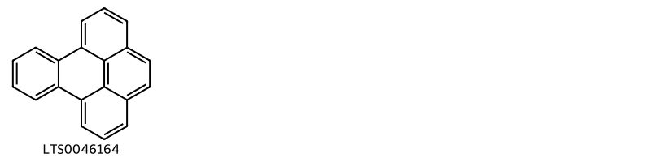{ width=100% }
    <figcaption>Hình ảnh cấu trúc hóa học của 1 hoạt chất thuộc nhóm Pyrenes gồm ['benzo(e)pyrene (LTS0046164)'].</figcaption>
</figure>
#### Nhóm Pyridines and derivatives
<figure markdown="span">
    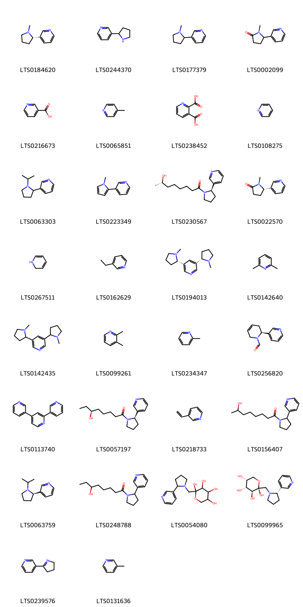{ width=100% }
    <figcaption>Hình ảnh cấu trúc hóa học của 30 hoạt chất thuộc nhóm Pyridines and derivatives gồm ['(-)-nicotine (LTS0184620)', '(+-)-nornicotine (LTS0244370)', 'nicotine (LTS0177379)', 'cotinine (LTS0002099)', 'niacin (LTS0216673)', '4-methylpyridine (LTS0065851)', 'quinolinic acid (LTS0238452)', 'pyridine (LTS0108275)', '3-(1-isopropylpyrrolidin-2-yl)pyridine (LTS0063303)', 'β-nicotyrine (LTS0223349)', '(7s)-7-hydroxy-1-[(2r)-2-(pyridin-3-yl)pyrrolidin-1-yl]octan-1-one (LTS0230567)', 'cotinine (LTS0022570)', '1,2-dihydropyridine (LTS0267511)', '3-ethylpyridine (LTS0162629)', '3,5-bis[(2s)-1-methylpyrrolidin-2-yl]pyridine (LTS0194013)', 'lutidine (LTS0142640)', '3,5-bis(1-methylpyrrolidin-2-yl)pyridine (LTS0142435)', '2,3-lutidine (LTS0099261)', 'α-methylpyridine (LTS0234347)', "(2s)-3,6-dihydro-2h-[2,3'-bipyridine]-1-carbaldehyde (LTS0256820)", 'nicotelline (LTS0113740)', '(6s)-6-hydroxy-1-[(2r)-2-(pyridin-3-yl)pyrrolidin-1-yl]octan-1-one (LTS0057197)', '3-vinylpyridine (LTS0218733)', '7-hydroxy-1-[2-(pyridin-3-yl)pyrrolidin-1-yl]octan-1-one (LTS0156407)', '3-[(2r)-1-isopropylpyrrolidin-2-yl]pyridine (LTS0063759)', '6-hydroxy-1-[2-(pyridin-3-yl)pyrrolidin-1-yl]octan-1-one (LTS0248788)', '2-{[2-(pyridin-3-yl)pyrrolidin-1-yl]methyl}oxane-2,3,4,5-tetrol (LTS0054080)', '(2r,3s,4r,5r)-2-{[(2s)-2-(pyridin-3-yl)pyrrolidin-1-yl]methyl}oxane-2,3,4,5-tetrol (LTS0099965)', 'myosmine (LTS0239576)', '3-methylpyridine (LTS0131636)'].</figcaption>
</figure>
#### Nhóm Pyrrolidines
<figure markdown="span">
    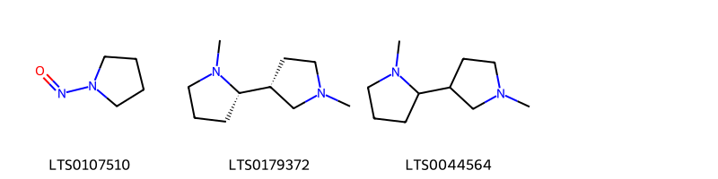{ width=100% }
    <figcaption>Hình ảnh cấu trúc hóa học của 3 hoạt chất thuộc nhóm Pyrrolidines gồm ['n-nitrosopyrrolidine (LTS0107510)', "(2s,3'r)-1,1'-dimethyl-2,3'-bipyrrolidine (LTS0179372)", "1,1'-dimethyl-2,3'-bipyrrolidine (LTS0044564)"].</figcaption>
</figure>
#### Nhóm Pyrrolines
<figure markdown="span">
    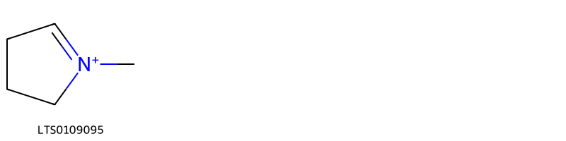{ width=100% }
    <figcaption>Hình ảnh cấu trúc hóa học của 1 hoạt chất thuộc nhóm Pyrrolines gồm ['n-methylpyrrolinium (LTS0109095)'].</figcaption>
</figure>
#### Nhóm Steroids and steroid derivatives
<figure markdown="span">
    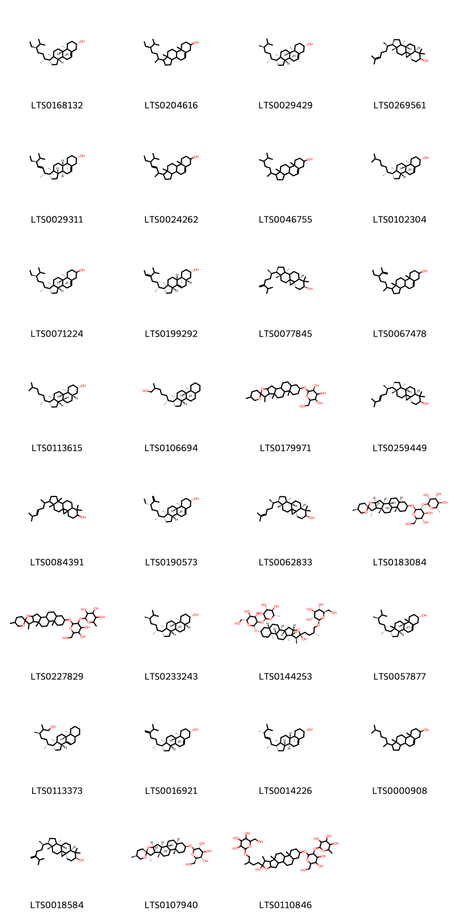{ width=100% }
    <figcaption>Hình ảnh cấu trúc hóa học của 31 hoạt chất thuộc nhóm Steroids and steroid derivatives gồm ['sitosterol (LTS0168132)', 'stigmast-5-en-3-ol, (3β)- (LTS0204616)', 'campesterol (LTS0029429)', 'cycloartenol (LTS0269561)', 'phytosterol (LTS0029311)', 'stigmasterol (LTS0024262)', 'campesterol (LTS0046755)', 'cholesterol (LTS0102304)', 'stigmast-5-en-3-ol (LTS0071224)', 'delta7-avenasterol (LTS0199292)', '24-methylene-cycloartanol (LTS0077845)', '1-(5-ethyl-6-methylhept-6-en-2-yl)-9a,11a-dimethyl-1h,2h,3h,3ah,3bh,4h,6h,7h,8h,9h,9bh,10h,11h-cyclopenta[a]phenanthren-7-ol (LTS0067478)', '(1r,3as,3bs,5as,7s,9as,9bs,11ar)-9a,11a-dimethyl-1-[(2r)-6-methylheptan-2-yl]-tetradecahydro-1h-cyclopenta[a]phenanthren-7-ol (LTS0113615)', '(6r)-6-[(1r,3as,3br,9as,9bs,11ar)-9a,11a-dimethyl-tetradecahydro-1h-cyclopenta[a]phenanthren-1-yl]-2-methylheptan-1-ol (LTS0106694)', "2-(hydroxymethyl)-6-{5,7',9',13'-tetramethyl-5'-oxaspiro[oxane-2,6'-pentacyclo[10.8.0.0²,⁹.0⁴,⁸.0¹³,¹⁸]icosane]oxy}oxane-3,4,5-triol (LTS0179971)", '(1s,3r,6s,8r,11s,12s,15s,16r)-7,7,12,16-tetramethyl-15-[(2r,4e)-6-methylhept-4-en-2-yl]pentacyclo[9.7.0.0¹,³.0³,⁸.0¹²,¹⁶]octadecan-6-ol (LTS0259449)', '7,7,12,16-tetramethyl-15-(6-methylhept-4-en-2-yl)pentacyclo[9.7.0.0¹,³.0³,⁸.0¹²,¹⁶]octadecan-6-ol (LTS0084391)', '(1r,3as,3bs,7s,9ar,9bs,11ar)-1-[(2r,5s)-5-ethyl-6-methylhept-6-en-2-yl]-9a,11a-dimethyl-1h,2h,3h,3ah,3bh,4h,6h,7h,8h,9h,9bh,10h,11h-cyclopenta[a]phenanthren-7-ol (LTS0190573)', '(3r,6s,8r,11s,12s,15r,16r)-7,7,12,16-tetramethyl-15-[(2r)-6-methylhept-5-en-2-yl]pentacyclo[9.7.0.0¹,³.0³,⁸.0¹²,¹⁶]octadecan-6-ol (LTS0062833)', "(2s,3r,4r,5r,6s)-2-{[(2r,3r,4s,5s,6r)-4,5-dihydroxy-6-(hydroxymethyl)-2-[(1'r,2r,2's,4's,5s,7's,8'r,9's,12's,13's,16's,18's)-5,7',9',13'-tetramethyl-5'-oxaspiro[oxane-2,6'-pentacyclo[10.8.0.0²,⁹.0⁴,⁸.0¹³,¹⁸]icosane]oxy]oxan-3-yl]oxy}-6-methyloxane-3,4,5-triol (LTS0183084)", "2-{[4,5-dihydroxy-6-(hydroxymethyl)-2-{5,7',9',13'-tetramethyl-5'-oxaspiro[oxane-2,6'-pentacyclo[10.8.0.0²,⁹.0⁴,⁸.0¹³,¹⁸]icosane]oxy}oxan-3-yl]oxy}-6-methyloxane-3,4,5-triol (LTS0227829)", 'campestanol (LTS0233243)', '(2s,3r,4r,5r,6s)-2-{[(2r,3r,4s,5s,6r)-4,5-dihydroxy-2-{[(1r,2s,4s,6r,7s,8r,9s,12s,13s,16s,18s)-6-hydroxy-7,9,13-trimethyl-6-[(3r)-3-methyl-4-{[(2r,3r,4s,5s,6r)-3,4,5-trihydroxy-6-(hydroxymethyl)oxan-2-yl]oxy}butyl]-5-oxapentacyclo[10.8.0.0²,⁹.0⁴,⁸.0¹³,¹⁸]icosan-16-yl]oxy}-6-(hydroxymethyl)oxan-3-yl]oxy}-6-methyloxane-3,4,5-triol (LTS0144253)', '(1r,3as,3bs,7s,9bs)-1-[(2r,5r)-5,6-dimethylheptan-2-yl]-9a,11a-dimethyl-1h,2h,3h,3ah,3bh,4h,6h,7h,8h,9h,9bh,10h,11h-cyclopenta[a]phenanthren-7-ol (LTS0057877)', '(3r,6r)-6-[(1r,3ar,9as,9br,11ar)-9a,11a-dimethyl-1h,2h,3h,3ah,5h,5ah,6h,7h,8h,9h,9bh,10h,11h-cyclopenta[a]phenanthren-1-yl]-2,3-dimethylheptan-1-ol (LTS0113373)', '24-methylenecholesterol (LTS0016921)', 'brassicasterol (LTS0014226)', 'epicholestrol (LTS0000908)', '24-methylenecycloartanol (LTS0018584)', "(2r,3s,4s,5r,6r)-2-(hydroxymethyl)-6-[(1'r,2r,2's,4's,5s,7's,8'r,9's,12's,13's,16's,18's)-5,7',9',13'-tetramethyl-5'-oxaspiro[oxane-2,6'-pentacyclo[10.8.0.0²,⁹.0⁴,⁸.0¹³,¹⁸]icosane]oxy]oxane-3,4,5-triol (LTS0107940)", '2-[(4,5-dihydroxy-2-{[6-hydroxy-7,9,13-trimethyl-6-(3-methyl-4-{[3,4,5-trihydroxy-6-(hydroxymethyl)oxan-2-yl]oxy}butyl)-5-oxapentacyclo[10.8.0.0²,⁹.0⁴,⁸.0¹³,¹⁸]icosan-16-yl]oxy}-6-(hydroxymethyl)oxan-3-yl)oxy]-6-methyloxane-3,4,5-triol (LTS0110846)'].</figcaption>
</figure>
#### Nhóm Tetrahydrofurans
<figure markdown="span">
    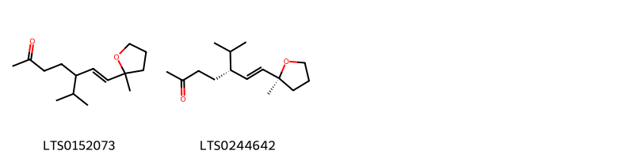{ width=100% }
    <figcaption>Hình ảnh cấu trúc hóa học của 2 hoạt chất thuộc nhóm Tetrahydrofurans gồm ['5-isopropyl-7-(2-methyloxolan-2-yl)hept-6-en-2-one (LTS0152073)', '(5r,6e)-5-isopropyl-7-[(2s)-2-methyloxolan-2-yl]hept-6-en-2-one (LTS0244642)'].</figcaption>
</figure>
#### Nhóm Tetralins
<figure markdown="span">
    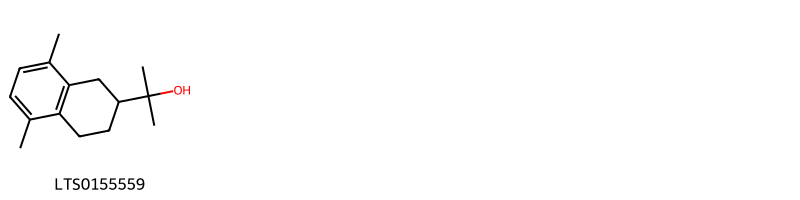{ width=100% }
    <figcaption>Hình ảnh cấu trúc hóa học của 1 hoạt chất thuộc nhóm Tetralins gồm ['2-(5,8-dimethyl-1,2,3,4-tetrahydronaphthalen-2-yl)propan-2-ol (LTS0155559)'].</figcaption>
</figure>

---

### Dược dân tộc học

Danh sách các quốc gia có sử dụng *Nicotiana tabacum* trong điều trị các bệnh. 

| Country            | Disease                                                                                                                | Bệnh                                                                                                                                                                                     |
|:-------------------|:-----------------------------------------------------------------------------------------------------------------------|:-----------------------------------------------------------------------------------------------------------------------------------------------------------------------------------------|
| Brazil(Jamamadi)   | Intoxicant                                                                                                             | chất gây độc                                                                                                                                                                             |
| China              | Piscicide, Poison, Insecticide, Parasiticide                                                                           | Piscicide, Poison, Insecticide, Parasiticide                                                                                                                                             |
| Dominican Republic | Narcotic                                                                                                               | Thuốc gây ngủ, gây mê                                                                                                                                                                    |
| Ecuador(Jivaro)    | Hallucinogen                                                                                                           | Thuốc gây ảo giác                                                                                                                                                                        |
| Elsewhere          | Insecticide, Poison, Sedative, Vermifuge, Hallucinogen, Narcotic                                                       | Thuốc diệt côn trùng, Chất độc, Thuốc an thần, Vermifuge, Hallucinogen, Ma túy                                                                                                           |
| Haiti              | Diuretic, Parasiticide, Pediculicide, Insecticide, Purgative                                                           | Thuốc lợi tiểu, Thuốc diệt ký sinh trùng, Thuốc diệt côn trùng, Thuốc tẩy                                                                                                                |
| Iraq               | Sedative                                                                                                               | Thuốc an thần                                                                                                                                                                            |
| Mexico(Kickapoo)   | Pediculicide                                                                                                           | Pediculicide                                                                                                                                                                             |
| Turkey             | Expectorant, Insecticide, Parasiticide, Diuretic, Discutient, Emetic, Laxative, Narcotic, Poison, Sedative, Sialogogue | Thuốc long đờm, Thuốc diệt côn trùng, Thuốc diệt ký sinh trùng, Thuốc lợi tiểu, Thuốc phân biệt, Thuốc gây nôn, Thuốc nhuận tràng, Thuốc gây mê, Chất độc, Thuốc an thần, Thuốc nước bọt |
| UK                 | Sedative                                                                                                               | Thuốc an thần                                                                                                                                                                            |
| US                 | Insecticide, Poison                                                                                                    | Thuốc diệt côn trùng, chất độc                                                                                                                                                           |
| Venezuela          | nan, Dentifrice, Narcotic                                                                                              | nan, Dentifrice, Narcotic                                                                                                                                                                |

---

# Chi Schwenkia

??? note "Danh sách các dược liệu thuộc chi"
    
	 - *Schwenkia americana*

---
## Schwenkia americana
### Thông tin về thực vật

!!! info "Phân loại thực vật của *Schwenckia americana* từ GIBF:"
    - **Kingdom:** Plantae
    - **Phylum:** Tracheophyta
    - **Order:** Solanales
    - **Family:** Solanaceae
    - **Genus:** Schwenckia
    - **Species:** *Schwenckia americana*

 

| Label (VI)   | Label (EN)   | Scientific Name     | Descriptions (VI)   | Descriptions (EN)   | Also Known As (VI)   | Also Known As (EN)   |
|:-------------|:-------------|:--------------------|:--------------------|:--------------------|:---------------------|:---------------------|
| N/A          | N/A          | Schwenkia americana |                     | species of plant    | ['']                 | ['']                 |

#### Phân bố trên thế giới

**Từ CSDL GIBF** Belize, Mali, Brazil, Argentina, Honduras, Cameroon, Benin, Mexico, Paraguay, Venezuela (Bolivarian Republic of), Panama

#### Phân bố tại Việt Nam

**Từ CSDL GIBF**: Không có ghi nhận ở Việt Nam

---
### Thành phần hóa học
        
- Theo cơ sở dữ liệu lotus: Từ loài *Schwenckia americana* đã phân lập và xác định được Chưa có hoạt chất nào được phân lập. hoạt chất thuộc về các nhóm Không có hoạt chất nào được phân lập. 

Không có hình ảnh nào được tạo ra

---

### Dược dân tộc học

Danh sách các quốc gia có sử dụng *Schwenckia americana* trong điều trị các bệnh. 

| Country   | Disease   | Bệnh          |
|:----------|:----------|:--------------|
| Sudan     | Piscicide | Thuốc diệt cá |

---

# Chi Withania

??? note "Danh sách các dược liệu thuộc chi"
    
	 - *Withania coagulans*
	 - *Withania somnifera*

---
## Withania coagulans
### Thông tin về thực vật

!!! info "Phân loại thực vật của *Withania coagulans* từ GIBF:"
    - **Kingdom:** Plantae
    - **Phylum:** Tracheophyta
    - **Order:** Solanales
    - **Family:** Solanaceae
    - **Genus:** Withania
    - **Species:** *Withania coagulans*

 

| Label (VI)   | Label (EN)   | Scientific Name    | Descriptions (VI)   | Descriptions (EN)   | Also Known As (VI)   | Also Known As (EN)   |
|:-------------|:-------------|:-------------------|:--------------------|:--------------------|:---------------------|:---------------------|
| N/A          | N/A          | Withania coagulans |                     | species of plant    | ['']                 | ['']                 |

#### Phân bố trên thế giới

**Từ CSDL GIBF** nan, Pakistan, United Arab Emirates, Australia, Iran (Islamic Republic of), Afghanistan, Myanmar, India, unknown or invalid, United States of America, Yemen, Nepal

#### Phân bố tại Việt Nam

**Từ CSDL GIBF**: Không có ghi nhận ở Việt Nam

---
### Thành phần hóa học
        
- Theo cơ sở dữ liệu lotus: Từ loài *Withania coagulans* đã phân lập và xác định được 83 hoạt chất thuộc về các nhóm Lignan glycosides, Steroids and steroid derivatives. 

|    | chemicalTaxonomyClassyfireClass   |   smiles_count |
|---:|:----------------------------------|---------------:|
|  0 | Lignan glycosides                 |              2 |
|  1 | Steroids and steroid derivatives  |             81 |

#### Nhóm Lignan glycosides
<figure markdown="span">
    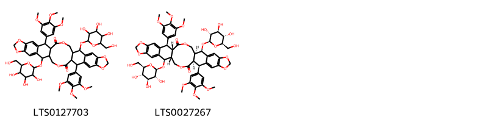{ width=100% }
    <figcaption>Hình ảnh cấu trúc hóa học của 2 hoạt chất thuộc nhóm Lignan glycosides gồm ['6,22-bis({[3,4,5-trihydroxy-6-(hydroxymethyl)oxan-2-yl]oxy})-16,32-bis(3,4,5-trimethoxyphenyl)-3,10,12,19,26,28-hexaoxaheptacyclo[19.11.0.0⁵,¹⁷.0⁷,¹⁵.0⁹,¹³.0²³,³¹.0²⁵,²⁹]dotriaconta-7,9(13),14,23,25(29),30-hexaene-2,18-dione (LTS0127703)', '(1r,5r,6r,16r,17s,21s,22r,32r)-6,22-bis({[(2r,3r,4s,5s,6r)-3,4,5-trihydroxy-6-(hydroxymethyl)oxan-2-yl]oxy})-16,32-bis(3,4,5-trimethoxyphenyl)-3,10,12,19,26,28-hexaoxaheptacyclo[19.11.0.0⁵,¹⁷.0⁷,¹⁵.0⁹,¹³.0²³,³¹.0²⁵,²⁹]dotriaconta-7,9(13),14,23,25(29),30-hexaene-2,18-dione (LTS0027267)'].</figcaption>
</figure>
#### Nhóm Steroids and steroid derivatives
<figure markdown="span">
    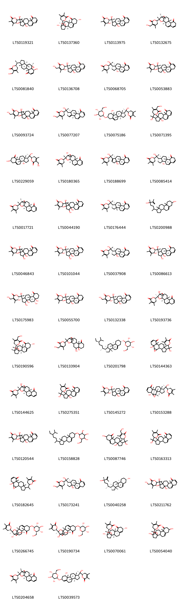{ width=100% }
    <figcaption>Hình ảnh cấu trúc hóa học của 81 hoạt chất thuộc nhóm Steroids and steroid derivatives gồm ['6-(1-{1,3a-dihydroxy-9a,11a-dimethyl-9-oxo-2h,3h,3bh,4h,8h,9bh,10h,11h-cyclopenta[a]phenanthren-1-yl}-1-hydroxyethyl)-3,4-dimethyl-5,6-dihydropyran-2-one (LTS0119321)', '(1r,2r,7r,10r,11s,14r,15s,16r)-16-[(2r)-4,5-dimethyl-6-oxo-2,3-dihydropyran-2-yl]-7,15-dihydroxy-10,14,16-trimethyl-17-oxapentacyclo[13.2.2.0¹,¹⁴.0²,¹¹.0⁵,¹⁰]nonadec-4-en-9-one (LTS0137360)', '(6r)-6-[(1s)-1-[(1s,3ar,3br,9ar,9bs,11as)-1,3a-dihydroxy-9a,11a-dimethyl-9-oxo-2h,3h,3bh,4h,6h,9bh,10h,11h-cyclopenta[a]phenanthren-1-yl]-1-hydroxyethyl]-3,4-dimethyl-5,6-dihydropyran-2-one (LTS0113975)', '(1r,2r,10r,11s,14r,15s,16s)-16-[(2r)-5-(hydroxymethyl)-4-methyl-6-oxo-2,3-dihydropyran-2-yl]-10,14,16-trimethyl-17-oxapentacyclo[13.2.2.0¹,¹⁴.0²,¹¹.0⁵,¹⁰]nonadeca-4,6-dien-9-one (LTS0132675)', 'withaferin a (LTS0081840)', '(6r)-6-[(1s)-1-[(1s,3ar,3br,9ar,9bs,11as)-1,3a-dihydroxy-9a,11a-dimethyl-9-oxo-2h,3h,3bh,4h,8h,9bh,10h,11h-cyclopenta[a]phenanthren-1-yl]-1-hydroxyethyl]-3-(hydroxymethyl)-4-methyl-5,6-dihydropyran-2-one (LTS0136708)', '(6r)-6-[(1r)-1-[(1s,3as,3br,9ar,9bs,11ar)-3a-hydroxy-9a,11a-dimethyl-9-oxo-1h,2h,3h,3bh,4h,6h,9bh,10h,11h-cyclopenta[a]phenanthren-1-yl]-1-hydroxyethyl]-3,4-dimethyl-5,6-dihydropyran-2-one (LTS0068705)', '(6r)-6-[(1s)-1-[(1r,3ar,3br,9ar,9bs,11as)-1,3a-dihydroxy-9a,11a-dimethyl-9-oxo-2h,3h,3bh,4h,6h,9bh,10h,11h-cyclopenta[a]phenanthren-1-yl]-1-hydroxyethyl]-3,4-dimethyl-5,6-dihydropyran-2-one (LTS0053883)', '6-(1-{1,3a-dihydroxy-9a,11a-dimethyl-9-oxo-2h,3h,3bh,4h,8h,9bh,10h,11h-cyclopenta[a]phenanthren-1-yl}-1-hydroxyethyl)-3-(hydroxymethyl)-4-methyl-5,6-dihydropyran-2-one (LTS0093724)', '(6r)-6-[(1r)-1-[(1s,3br,9ar,9bs,11ar)-9a,11a-dimethyl-9-oxo-1h,2h,3bh,4h,6h,9bh,10h,11h-cyclopenta[a]phenanthren-1-yl]-1-hydroxyethyl]-3-(hydroxymethyl)-4-methyl-5,6-dihydropyran-2-one (LTS0077207)', '(6r)-6-[(1r)-1-[(1s,3as,3bs,7r,9s,9ar,9bs,11as)-9-hydroxy-9a,11a-dimethyl-7-{[(2r,3r,4s,5s,6r)-3,4,5-trihydroxy-6-(hydroxymethyl)oxan-2-yl]oxy}-1h,2h,3h,3ah,3bh,4h,6h,7h,8h,9h,9bh,10h,11h-cyclopenta[a]phenanthren-1-yl]-1-hydroxyethyl]-3,4-dimethyl-5,6-dihydropyran-2-one (LTS0075186)', '6-(1-{3a-hydroxy-9a,11a-dimethyl-9-oxo-1h,2h,3h,3bh,4h,8h,9bh,10h,11h-cyclopenta[a]phenanthren-1-yl}-1-hydroxyethyl)-3-(hydroxymethyl)-4-methyl-5,6-dihydropyran-2-one (LTS0071395)', '(6r)-6-[(1r)-1-[(1s,3ar,3br,7r,9ar,9bs,11ar)-3a,7-dihydroxy-9a,11a-dimethyl-9-oxo-1h,2h,3h,3bh,4h,6h,7h,8h,9bh,10h,11h-cyclopenta[a]phenanthren-1-yl]-1-hydroxyethyl]-3-(hydroxymethyl)-4-methyl-5,6-dihydropyran-2-one (LTS0229059)', '(1r,2r,10r,11s,14r,15r,16r)-16-[(2r)-4,5-dimethyl-6-oxo-2,3-dihydropyran-2-yl]-15-hydroxy-10,14,16-trimethyl-17-oxapentacyclo[13.2.2.0¹,¹⁴.0²,¹¹.0⁵,¹⁰]nonadeca-4,7-dien-9-one (LTS0180365)', '(6r)-6-[(1r)-1-[(3ar,3br,9ar,9bs,11ar)-3a-hydroxy-9a,11a-dimethyl-9-oxo-3h,3bh,4h,6h,9bh,10h,11h-cyclopenta[a]phenanthren-1-yl]-1-hydroxyethyl]-3,4-dimethyl-5,6-dihydropyran-2-one (LTS0188699)', '(6r)-6-[(1r)-1-[(1s,3as,3br,9ar,9bs,11ar)-3a-hydroxy-9a,11a-dimethyl-9-oxo-1h,2h,3h,3bh,4h,8h,9bh,10h,11h-cyclopenta[a]phenanthren-1-yl]-1-hydroxyethyl]-3,4-dimethyl-5,6-dihydropyran-2-one (LTS0085414)', '(1r,2r,10r,11s,14r,15s,16s)-16-[(2r)-4,5-dimethyl-6-oxo-2,3-dihydropyran-2-yl]-10,14,16-trimethyl-17-oxapentacyclo[13.2.2.0¹,¹⁴.0²,¹¹.0⁵,¹⁰]nonadeca-4,7-dien-9-one (LTS0017721)', '6-(1-{1,3,3a-trihydroxy-9a,11a-dimethyl-9-oxo-2h,3h,3bh,4h,8h,9bh,10h,11h-cyclopenta[a]phenanthren-1-yl}-1-hydroxyethyl)-3,4-dimethyl-5,6-dihydropyran-2-one (LTS0044190)', '(6r)-6-[(1r)-1-[(1s,3as,3bs,9ar,9bs,11as)-9a,11a-dimethyl-9-oxo-1h,2h,3h,3ah,3bh,4h,6h,9bh,10h,11h-cyclopenta[a]phenanthren-1-yl]-1-hydroxyethyl]-3,4-dimethyl-5,6-dihydropyran-2-one (LTS0176444)', '6-{7-hydroxy-9a,11a-dimethyl-1h,2h,3h,3ah,3bh,4h,6h,7h,8h,9h,9bh,10h,11h-cyclopenta[a]phenanthren-1-yl}-2,3-dimethylhept-1-en-3-ol (LTS0200988)', '6-(1-{1,3,3a-trihydroxy-9a,11a-dimethyl-9-oxo-2h,3h,3bh,4h,6h,9bh,10h,11h-cyclopenta[a]phenanthren-1-yl}-1-hydroxyethyl)-3,4-dimethyl-5,6-dihydropyran-2-one (LTS0046843)', 'coagulanolide (LTS0101044)', '(6r)-6-[(1r)-1-[(1s,3ar,3br,9ar,9bs,11ar)-3a-hydroxy-9a,11a-dimethyl-9-oxo-1h,2h,3h,3bh,4h,8h,9bh,10h,11h-cyclopenta[a]phenanthren-1-yl]-1-hydroxyethyl]-3,4-dimethyl-5,6-dihydropyran-2-one (LTS0037908)', '(6r)-6-[(1s)-1-[(1s,3s,3ar,3br,9ar,9bs,11as)-1,3,3a-trihydroxy-9a,11a-dimethyl-9-oxo-2h,3h,3bh,4h,8h,9bh,10h,11h-cyclopenta[a]phenanthren-1-yl]-1-hydroxyethyl]-3,4-dimethyl-5,6-dihydropyran-2-one (LTS0086613)', '(6s)-6-[(1s)-1-[(1s,3s,3ar,3br,5r,5ar,9ar,9bs,11as)-1,3,3a,5,5a-pentahydroxy-9a,11a-dimethyl-9-oxo-decahydro-2h-cyclopenta[a]phenanthren-1-yl]-1-hydroxyethyl]-3-(hydroxymethyl)-4-methyl-5,6-dihydropyran-2-one (LTS0175983)', '(6r)-6-[(1s)-1-[(1r,3ar,3br,9ar,9bs,11as)-1,3a-dihydroxy-9a,11a-dimethyl-9-oxo-2h,3h,3bh,4h,8h,9bh,10h,11h-cyclopenta[a]phenanthren-1-yl]-1-hydroxyethyl]-3,4-dimethyl-5,6-dihydropyran-2-one (LTS0055700)', '(6r)-6-[(1s)-1-[(1s,3ar,3br,9ar,9bs,11as)-1,3a-dihydroxy-9a,11a-dimethyl-9-oxo-2h,3h,3bh,4h,6h,9bh,10h,11h-cyclopenta[a]phenanthren-1-yl]-1-hydroxyethyl]-3-(hydroxymethyl)-4-methyl-5,6-dihydropyran-2-one (LTS0132338)', '(1r,2r,10r,11s,14r,15s,16s)-16-[(2r)-4,5-dimethyl-6-oxo-2,3-dihydropyran-2-yl]-15-hydroxy-10,14,16-trimethyl-17-oxapentacyclo[13.2.2.0¹,¹⁴.0²,¹¹.0⁵,¹⁰]nonadeca-4,7-dien-9-one (LTS0193736)', '(1r,2r,7r,10r,11s,14r,15s,16r)-7-hydroxy-16-[(2r)-5-(hydroxymethyl)-4-methyl-6-oxo-2,3-dihydropyran-2-yl]-10,14,16-trimethyl-17-oxapentacyclo[13.2.2.0¹,¹⁴.0²,¹¹.0⁵,¹⁰]nonadec-4-en-9-one (LTS0190596)', '4,5-dihydroxy-16-[5-(hydroxymethyl)-4-methyl-6-oxo-2,3-dihydropyran-2-yl]-10,14,16-trimethyl-17-oxapentacyclo[13.2.2.0¹,¹⁴.0²,¹¹.0⁵,¹⁰]nonadecan-9-one (LTS0133904)', 'sitogluside (LTS0201798)', '15-[1-(4,5-dimethyl-6-oxo-2,3-dihydropyran-2-yl)-1-hydroxyethyl]-5-hydroxy-10,14-dimethyl-3-oxapentacyclo[9.7.0.0²,⁴.0⁵,¹⁰.0¹⁴,¹⁸]octadec-7-en-9-one (LTS0144363)', '(1r,2r,10r,11s,14r,15s,16r)-16-[(2r)-4,5-dimethyl-6-oxo-2,3-dihydropyran-2-yl]-15-hydroxy-10,14,16-trimethyl-17-oxapentacyclo[13.2.2.0¹,¹⁴.0²,¹¹.0⁵,¹⁰]nonadeca-4,6-dien-9-one (LTS0144625)', '6-(1-{3a-hydroxy-9a,11a-dimethyl-9-oxo-1h,2h,3h,3bh,4h,8h,9bh,10h,11h-cyclopenta[a]phenanthren-1-yl}-1-hydroxyethyl)-3,4-dimethyl-5,6-dihydropyran-2-one (LTS0275351)', 'withanolide f (LTS0145272)', 'withanolide a (LTS0153288)', '6-(1-{1,3a-dihydroxy-9a,11a-dimethyl-9-oxo-2h,3h,3bh,4h,6h,9bh,10h,11h-cyclopenta[a]phenanthren-1-yl}-1-hydroxyethyl)-3,4-dimethyl-5,6-dihydropyran-2-one (LTS0120544)', '2-{[1-(5-ethyl-6-methylheptan-2-yl)-9a,11a-dimethyl-1h,2h,3h,3ah,3bh,4h,6h,7h,8h,9h,9bh,10h,11h-cyclopenta[a]phenanthren-7-yl]oxy}-6-(hydroxymethyl)oxane-3,4,5-triol (LTS0158828)', '6-(1-{3a,7-dihydroxy-9a,11a-dimethyl-9-oxo-1h,2h,3h,3bh,4h,6h,7h,8h,9bh,10h,11h-cyclopenta[a]phenanthren-1-yl}-1-hydroxyethyl)-3-(hydroxymethyl)-4-methyl-5,6-dihydropyran-2-one (LTS0087746)', '6-(1-{9a,11a-dimethyl-9-oxo-1h,2h,3h,3ah,3bh,4h,6h,9bh,10h,11h-cyclopenta[a]phenanthren-1-yl}-1-hydroxyethyl)-3,4-dimethyl-5,6-dihydropyran-2-one (LTS0163313)', '15-[1-(4,5-dimethyl-6-oxo-2,3-dihydropyran-2-yl)ethyl]-5-hydroxy-10,14-dimethyl-3-oxapentacyclo[9.7.0.0²,⁴.0⁵,¹⁰.0¹⁴,¹⁸]octadec-7-en-9-one (LTS0182645)', '(6r)-6-[(1r)-1-[(1s,3ar,3br,9ar,9bs,11ar)-3a-hydroxy-9a,11a-dimethyl-9-oxo-1h,2h,3h,3bh,4h,6h,9bh,10h,11h-cyclopenta[a]phenanthren-1-yl]-1-hydroxyethyl]-3-(hydroxymethyl)-4-methyl-5,6-dihydropyran-2-one (LTS0173241)', '(3s,6r)-6-[(1r,3as,3bs,7s,9ar,9bs,11ar)-7-hydroxy-9a,11a-dimethyl-1h,2h,3h,3ah,3bh,4h,6h,7h,8h,9h,9bh,10h,11h-cyclopenta[a]phenanthren-1-yl]-2,3-dimethylhept-1-en-3-ol (LTS0040258)', '6-(1-{1,3a-dihydroxy-9a,11a-dimethyl-9-oxo-2h,3h,3bh,4h,6h,9bh,10h,11h-cyclopenta[a]phenanthren-1-yl}-1-hydroxyethyl)-3-(hydroxymethyl)-4-methyl-5,6-dihydropyran-2-one (LTS0211762)', '(1r,2r,7r,10r,11s,14r,15s,16r,18s)-16-[(2r)-4,5-dimethyl-6-oxo-2,3-dihydropyran-2-yl]-15,18-dihydroxy-10,14,16-trimethyl-7-{[(2r,3r,4s,5s,6r)-3,4,5-trihydroxy-6-(hydroxymethyl)oxan-2-yl]oxy}-17-oxapentacyclo[13.2.2.0¹,¹⁴.0²,¹¹.0⁵,¹⁰]nonadec-4-en-9-one (LTS0266745)', '(1r,2r,7r,10r,11s,14r,15r,16r,18s)-16-[(2r)-4,5-dimethyl-6-oxo-2,3-dihydropyran-2-yl]-15,18-dihydroxy-10,14,16-trimethyl-7-{[(2r,3r,4s,5s,6r)-3,4,5-trihydroxy-6-(hydroxymethyl)oxan-2-yl]oxy}-17-oxapentacyclo[13.2.2.0¹,¹⁴.0²,¹¹.0⁵,¹⁰]nonadec-4-en-9-one (LTS0190734)', '(1r,2r,7s,10r,11s,14r,15s,16s)-16-[(2r)-4,5-dimethyl-6-oxo-2,3-dihydropyran-2-yl]-7,15-dihydroxy-10,14,16-trimethyl-17-oxapentacyclo[13.2.2.0¹,¹⁴.0²,¹¹.0⁵,¹⁰]nonadec-5-en-9-one (LTS0070061)', '16-(4,5-dimethyl-6-oxo-2,3-dihydropyran-2-yl)-7,15-dihydroxy-10,14,16-trimethyl-17-oxapentacyclo[13.2.2.0¹,¹⁴.0²,¹¹.0⁵,¹⁰]nonadec-4-en-9-one (LTS0054040)', '(1r,2r,10r,11s,14r,15r,16s)-16-[(2r)-4,5-dimethyl-6-oxo-2,3-dihydropyran-2-yl]-10,14,16-trimethyl-17-oxapentacyclo[13.2.2.0¹,¹⁴.0²,¹¹.0⁵,¹⁰]nonadeca-4,6-dien-9-one (LTS0204658)', '(6r)-6-[(1r)-1-[(1s,3as,3bs,7s,9s,9ar,9bs,11as)-9-hydroxy-9a,11a-dimethyl-7-{[(2r,3r,4s,5s,6r)-3,4,5-trihydroxy-6-(hydroxymethyl)oxan-2-yl]oxy}-1h,2h,3h,3ah,3bh,4h,5h,7h,8h,9h,9bh,10h,11h-cyclopenta[a]phenanthren-1-yl]-1-hydroxyethyl]-3,4-dimethyl-5,6-dihydropyran-2-one (LTS0039573)', 'withanolide b (LTS0218560)', '16-(4,5-dimethyl-6-oxo-2,3-dihydropyran-2-yl)-15,18-dihydroxy-10,14,16-trimethyl-7-{[3,4,5-trihydroxy-6-(hydroxymethyl)oxan-2-yl]oxy}-17-oxapentacyclo[13.2.2.0¹,¹⁴.0²,¹¹.0⁵,¹⁰]nonadec-4-en-9-one (LTS0085384)', '(6r)-6-[(1r)-1-[(1s,3ar,3br,7r,9ar,9bs,11ar)-3a-hydroxy-9a,11a-dimethyl-9-oxo-7-{[(2r,3r,4s,5s,6r)-3,4,5-trihydroxy-6-(hydroxymethyl)oxan-2-yl]oxy}-1h,2h,3h,3bh,4h,6h,7h,8h,9bh,10h,11h-cyclopenta[a]phenanthren-1-yl]-1-hydroxyethyl]-3,4-dimethyl-5,6-dihydropyran-2-one (LTS0229073)', '(6r)-6-[(1s)-1-[(1r,3as,3bs,9ar,9bs,11as)-1-hydroxy-9a,11a-dimethyl-9-oxo-2h,3h,3ah,3bh,4h,6h,9bh,10h,11h-cyclopenta[a]phenanthren-1-yl]-1-hydroxyethyl]-3-(hydroxymethyl)-4-methyl-5,6-dihydropyran-2-one (LTS0208112)', '(6r)-6-[(1r)-1-[(1s,3br,7r,9ar,9bs,11ar)-9a,11a-dimethyl-9-oxo-7-{[(2r,3r,4s,5s,6r)-3,4,5-trihydroxy-6-(hydroxymethyl)oxan-2-yl]oxy}-1h,2h,3bh,4h,6h,7h,8h,9bh,10h,11h-cyclopenta[a]phenanthren-1-yl]-1-hydroxyethyl]-3-(hydroxymethyl)-4-methyl-5,6-dihydropyran-2-one (LTS0226187)', 'coagulin h (LTS0223677)', '6-(1-{1,3a,7-trihydroxy-9a,11a-dimethyl-9-oxo-2h,3h,3bh,4h,6h,7h,8h,9bh,10h,11h-cyclopenta[a]phenanthren-1-yl}-1-hydroxyethyl)-3,4-dimethyl-5,6-dihydropyran-2-one (LTS0023463)', '(6r)-6-[(1r)-1-[(1s,3ar,3br,9ar,9bs,11ar)-3a-hydroxy-9a,11a-dimethyl-9-oxo-1h,2h,3h,3bh,4h,8h,9bh,10h,11h-cyclopenta[a]phenanthren-1-yl]-1-hydroxyethyl]-3-(hydroxymethyl)-4-methyl-5,6-dihydropyran-2-one (LTS0223913)', '6-(1-{1,3,3a,5,5a-pentahydroxy-9a,11a-dimethyl-9-oxo-decahydro-2h-cyclopenta[a]phenanthren-1-yl}-1-hydroxyethyl)-3-(hydroxymethyl)-4-methyl-5,6-dihydropyran-2-one (LTS0210434)', '(1r,2r,10r,11s,14r,15s,16s)-16-[(2r)-5-(hydroxymethyl)-4-methyl-6-oxo-2,3-dihydropyran-2-yl]-10,14,16-trimethyl-17-oxapentacyclo[13.2.2.0¹,¹⁴.0²,¹¹.0⁵,¹⁰]nonadeca-4,7-dien-9-one (LTS0189366)', '6-[1-(9a,11a-dimethyl-9-oxo-7-{[3,4,5-trihydroxy-6-(hydroxymethyl)oxan-2-yl]oxy}-1h,2h,3bh,4h,6h,7h,8h,9bh,10h,11h-cyclopenta[a]phenanthren-1-yl)-1-hydroxyethyl]-3-(hydroxymethyl)-4-methyl-5,6-dihydropyran-2-one (LTS0237078)', '6-[1-hydroxy-1-(9-hydroxy-9a,11a-dimethyl-7-{[3,4,5-trihydroxy-6-(hydroxymethyl)oxan-2-yl]oxy}-1h,2h,3h,3ah,3bh,4h,6h,7h,8h,9h,9bh,10h,11h-cyclopenta[a]phenanthren-1-yl)ethyl]-3,4-dimethyl-5,6-dihydropyran-2-one (LTS0014354)', '(1r,2r,4r,5r,10r,11s,14r,15r,16s)-16-[(2r)-4,5-dimethyl-6-oxo-2,3-dihydropyran-2-yl]-4,5,15-trihydroxy-10,14,16-trimethyl-17-oxapentacyclo[13.2.2.0¹,¹⁴.0²,¹¹.0⁵,¹⁰]nonadec-7-en-9-one (LTS0168823)', '(6r)-6-[(1s)-1-[(1r,3br,9ar,9bs,11as)-1-hydroxy-9a,11a-dimethyl-9-oxo-2h,3bh,4h,6h,9bh,10h,11h-cyclopenta[a]phenanthren-1-yl]-1-hydroxyethyl]-3-(hydroxymethyl)-4-methyl-5,6-dihydropyran-2-one (LTS0040242)', '(6s)-6-[(1s)-1-[(1s,3ar,3br,7r,9ar,9bs,11as)-1,3a,7-trihydroxy-9a,11a-dimethyl-9-oxo-2h,3h,3bh,4h,6h,7h,8h,9bh,10h,11h-cyclopenta[a]phenanthren-1-yl]-1-hydroxyethyl]-3,4-dimethyl-5,6-dihydropyran-2-one (LTS0064985)', '(6r)-6-[(1s)-1-[(1s,3ar,3br,7r,9ar,9bs,11as)-1,3a-dihydroxy-9a,11a-dimethyl-9-oxo-7-{[(2r,3r,4s,5s,6r)-3,4,5-trihydroxy-6-(hydroxymethyl)oxan-2-yl]oxy}-2h,3h,3bh,4h,6h,7h,8h,9bh,10h,11h-cyclopenta[a]phenanthren-1-yl]-1-hydroxyethyl]-3,4-dimethyl-5,6-dihydropyran-2-one (LTS0177802)', '(1r,2r,7r,10r,11s,14r,15r,16r)-16-[(2r)-4,5-dimethyl-6-oxo-2,3-dihydropyran-2-yl]-7,15-dihydroxy-10,14,16-trimethyl-17-oxapentacyclo[13.2.2.0¹,¹⁴.0²,¹¹.0⁵,¹⁰]nonadec-4-en-9-one (LTS0052422)', '(1r,2r,4r,5r,10r,11s,14r,15s,16s)-4,5-dihydroxy-16-[(2r)-5-(hydroxymethyl)-4-methyl-6-oxo-2,3-dihydropyran-2-yl]-10,14,16-trimethyl-17-oxapentacyclo[13.2.2.0¹,¹⁴.0²,¹¹.0⁵,¹⁰]nonadecan-9-one (LTS0230312)', '(6r)-6-[(1r)-1-[(1s,3br,7s,9ar,9bs,11ar)-9a,11a-dimethyl-9-oxo-7-{[(2r,3r,4s,5s,6r)-3,4,5-trihydroxy-6-(hydroxymethyl)oxan-2-yl]oxy}-1h,2h,3bh,4h,5h,7h,8h,9bh,10h,11h-cyclopenta[a]phenanthren-1-yl]-1-hydroxyethyl]-3-(hydroxymethyl)-4-methyl-5,6-dihydropyran-2-one (LTS0275567)', '(6r)-6-[(1s)-1-[(1r,3as,3br,9ar,9bs,11as)-1,3a-dihydroxy-9a,11a-dimethyl-9-oxo-2h,3h,3bh,4h,8h,9bh,10h,11h-cyclopenta[a]phenanthren-1-yl]-1-hydroxyethyl]-3,4-dimethyl-5,6-dihydropyran-2-one (LTS0122883)', '(6r)-6-[(1s)-1-[(1r,3ar,3br,9ar,9bs,11as)-1,3a-dihydroxy-9a,11a-dimethyl-9-oxo-2h,3h,3bh,4h,6h,9bh,10h,11h-cyclopenta[a]phenanthren-1-yl]-1-hydroxyethyl]-3-(hydroxymethyl)-4-methyl-5,6-dihydropyran-2-one (LTS0001407)', 'withacoagin (LTS0003161)', '(6r)-6-[(1r)-1-[(1s,3ar,3br,9ar,9bs,11ar)-3a-hydroxy-9a,11a-dimethyl-9-oxo-1h,2h,3h,3bh,4h,6h,9bh,10h,11h-cyclopenta[a]phenanthren-1-yl]-1-hydroxyethyl]-3,4-dimethyl-5,6-dihydropyran-2-one (LTS0018571)', '6-[1-(1,3a-dihydroxy-9a,11a-dimethyl-9-oxo-7-{[3,4,5-trihydroxy-6-(hydroxymethyl)oxan-2-yl]oxy}-2h,3h,3bh,4h,6h,7h,8h,9bh,10h,11h-cyclopenta[a]phenanthren-1-yl)-1-hydroxyethyl]-3,4-dimethyl-5,6-dihydropyran-2-one (LTS0000403)', '6-(1-{3a-hydroxy-9a,11a-dimethyl-9-oxo-1h,2h,3h,3bh,4h,6h,9bh,10h,11h-cyclopenta[a]phenanthren-1-yl}-1-hydroxyethyl)-3,4-dimethyl-5,6-dihydropyran-2-one (LTS0019442)', '6-hydroxy-15-{1-[5-(hydroxymethyl)-4-methyl-6-oxo-2,3-dihydropyran-2-yl]ethyl}-2,16-dimethyl-8-oxapentacyclo[9.7.0.0²,⁷.0⁷,⁹.0¹²,¹⁶]octadec-4-en-3-one (LTS0228735)', '(1r,2r,10r,11s,14r,15r,16r)-15-hydroxy-16-[(2r)-5-(hydroxymethyl)-4-methyl-6-oxo-2,3-dihydropyran-2-yl]-10,14,16-trimethyl-17-oxapentacyclo[13.2.2.0¹,¹⁴.0²,¹¹.0⁵,¹⁰]nonadeca-4,7-dien-9-one (LTS0135377)', '16-(4,5-dimethyl-6-oxo-2,3-dihydropyran-2-yl)-15-hydroxy-10,14,16-trimethyl-17-oxapentacyclo[13.2.2.0¹,¹⁴.0²,¹¹.0⁵,¹⁰]nonadeca-4,6-dien-9-one (LTS0271488)', '(1r,2r,7r,10r,11s,14r,15s,16r)-16-[(2r)-4,5-dimethyl-6-oxo-2,3-dihydropyran-2-yl]-10,14,16-trimethyl-7-{[(2r,3r,4s,5s,6r)-3,4,5-trihydroxy-6-(hydroxymethyl)oxan-2-yl]oxy}-17-oxapentacyclo[13.2.2.0¹,¹⁴.0²,¹¹.0⁵,¹⁰]nonadec-4-en-9-one (LTS0044586)', '6-(1-{5a-hydroxy-9a,11a-dimethyl-9-oxo-1h,2h,3h,3ah,3bh,6h,9bh,10h,11h-cyclopenta[a]phenanthren-1-yl}-1-hydroxyethyl)-3,4-dimethyl-5,6-dihydropyran-2-one (LTS0018686)', '(1r,2r,4r,5r,10r,11s,14r,15r,16s)-4,5-dihydroxy-16-[(2r)-5-(hydroxymethyl)-4-methyl-6-oxo-2,3-dihydropyran-2-yl]-10,14,16-trimethyl-17-oxapentacyclo[13.2.2.0¹,¹⁴.0²,¹¹.0⁵,¹⁰]nonadecan-9-one (LTS0039884)'].</figcaption>
</figure>

---

### Dược dân tộc học

Danh sách các quốc gia có sử dụng *Withania coagulans* trong điều trị các bệnh. 

| Country   | Disease                                | Bệnh                                                         |
|:----------|:---------------------------------------|:-------------------------------------------------------------|
| Elsewhere | Dentifrice, Emetic, Sedative, Diuretic | Kem đánh răng, thuốc lợi tiểu, thuốc an thần, thuốc lợi tiểu |
| India     | Rennet, Rennet                         | Rennet, Rennet                                               |

---

---
## Withania somnifera
### Thông tin về thực vật

!!! info "Phân loại thực vật của *Withania somnifera* từ GIBF:"
    - **Kingdom:** Plantae
    - **Phylum:** Tracheophyta
    - **Order:** Solanales
    - **Family:** Solanaceae
    - **Genus:** Withania
    - **Species:** *Withania somnifera*

 

| Label (VI)   | Label (EN)   | Scientific Name    | Descriptions (VI)   | Descriptions (EN)   | Also Known As (VI)     | Also Known As (EN)                                                                    |
|:-------------|:-------------|:-------------------|:--------------------|:--------------------|:-----------------------|:--------------------------------------------------------------------------------------|
| N/A          | N/A          | Withania somnifera | loài thực vật       | species of plant    | ['Withania somnifera'] | ['Ashwagandha', 'Indian ginseng', 'ashwaganda', 'ooison gooseberry', 'winter cherry'] |

#### Phân bố trên thế giới

**Từ CSDL GIBF** United Arab Emirates, Australia, Somalia, Palestine, State of, Jordan, Tanzania, United Republic of, Israel, Pakistan, Réunion, Cyprus, Namibia, Spain, Morocco, United States of America, Ethiopia, Zimbabwe, Greece, Saudi Arabia, South Africa, Oman, Brazil, Egypt, Eswatini, India, Djibouti, Kenya, Nepal

#### Phân bố tại Việt Nam

**Từ CSDL GIBF**: Không có ghi nhận ở Việt Nam

---
### Thành phần hóa học
        
- Theo cơ sở dữ liệu lotus: Từ loài *Withania somnifera* đã phân lập và xác định được 329 hoạt chất thuộc về các nhóm Fatty Acyls, Flavonoids, Prenol lipids, Steroids and steroid derivatives, Azoles, Organonitrogen compounds, Piperidines, Dioxanes, Tropane alkaloids, Organooxygen compounds, Saturated hydrocarbons, Coumarins and derivatives, Carboxylic acids and derivatives. 

|    | chemicalTaxonomyClassyfireClass   |   smiles_count |
|---:|:----------------------------------|---------------:|
|  0 |                                   |              3 |
|  1 | Azoles                            |              1 |
|  2 | Carboxylic acids and derivatives  |              7 |
|  3 | Coumarins and derivatives         |              2 |
|  4 | Dioxanes                          |              2 |
|  5 | Fatty Acyls                       |              4 |
|  6 | Flavonoids                        |              9 |
|  7 | Organonitrogen compounds          |              1 |
|  8 | Organooxygen compounds            |             41 |
|  9 | Piperidines                       |              3 |
| 10 | Prenol lipids                     |              4 |
| 11 | Saturated hydrocarbons            |              2 |
| 12 | Steroids and steroid derivatives  |            245 |
| 13 | Tropane alkaloids                 |              4 |

#### Nhóm 
<figure markdown="span">
    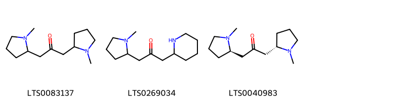{ width=100% }
    <figcaption>Hình ảnh cấu trúc hóa học của 3 hoạt chất thuộc nhóm  gồm ['cuskhygrine (LTS0083137)', '1-(1-methylpyrrolidin-2-yl)-3-(piperidin-2-yl)propan-2-one (LTS0269034)', 'cuscohygrine (LTS0040983)'].</figcaption>
</figure>
#### Nhóm Azoles
<figure markdown="span">
    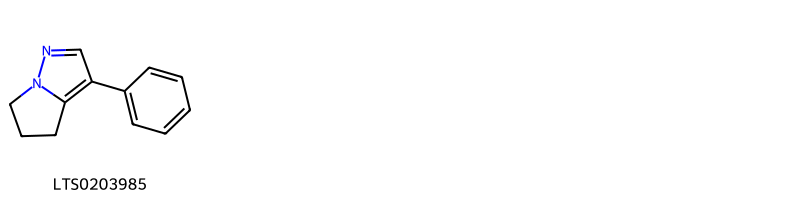{ width=100% }
    <figcaption>Hình ảnh cấu trúc hóa học của 1 hoạt chất thuộc nhóm Azoles gồm ['withasomnine (LTS0203985)'].</figcaption>
</figure>
#### Nhóm Carboxylic acids and derivatives
<figure markdown="span">
    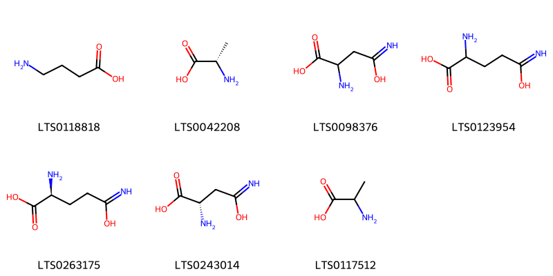{ width=100% }
    <figcaption>Hình ảnh cấu trúc hóa học của 7 hoạt chất thuộc nhóm Carboxylic acids and derivatives gồm ['gamma(amino)-butyric acid (LTS0118818)', 'l-alanine (LTS0042208)', 'asparagine (LTS0098376)', 'glutamine (LTS0123954)', 'l glutamine (LTS0263175)', 'aspartamate (LTS0243014)', 'alanine (LTS0117512)'].</figcaption>
</figure>
#### Nhóm Coumarins and derivatives
<figure markdown="span">
    { width=100% }
    <figcaption>Hình ảnh cấu trúc hóa học của 2 hoạt chất thuộc nhóm Coumarins and derivatives gồm ['scopoletin (LTS0193112)', 'esculetin (LTS0067593)'].</figcaption>
</figure>
#### Nhóm Dioxanes
<figure markdown="span">
    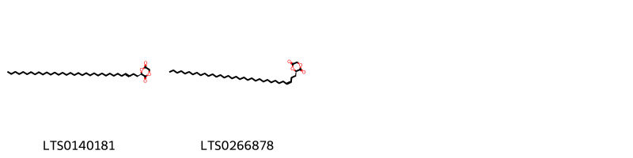{ width=100% }
    <figcaption>Hình ảnh cấu trúc hóa học của 2 hoạt chất thuộc nhóm Dioxanes gồm ['(3r)-3-(tetratriacont-3-en-1-yl)-1,4-dioxane-2,5-dione (LTS0140181)', '(3r)-3-[(3z)-tetratriacont-3-en-1-yl]-1,4-dioxane-2,5-dione (LTS0266878)'].</figcaption>
</figure>
#### Nhóm Fatty Acyls
<figure markdown="span">
    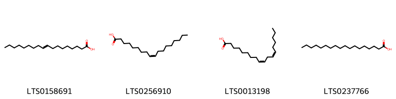{ width=100% }
    <figcaption>Hình ảnh cấu trúc hóa học của 4 hoạt chất thuộc nhóm Fatty Acyls gồm ['9 octadecenoic acid (LTS0158691)', 'oleic acid (LTS0256910)', 'linoleic (LTS0013198)', 'stearic acid (LTS0237766)'].</figcaption>
</figure>
#### Nhóm Flavonoids
<figure markdown="span">
    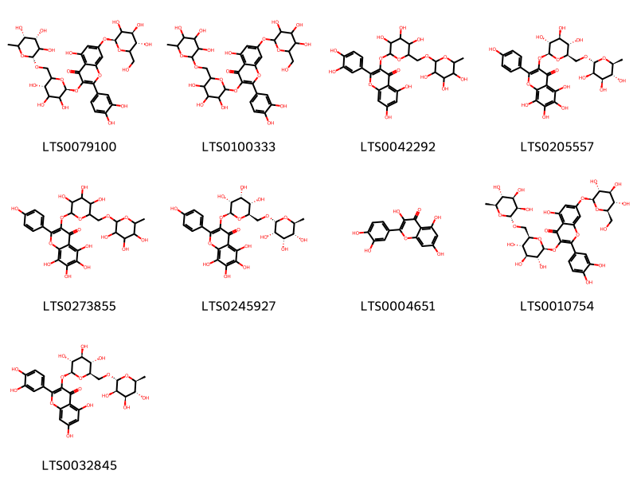{ width=100% }
    <figcaption>Hình ảnh cấu trúc hóa học của 9 hoạt chất thuộc nhóm Flavonoids gồm ['2-(3,4-dihydroxyphenyl)-5-hydroxy-7-{[(2s,4s,5s)-3,4,5-trihydroxy-6-(hydroxymethyl)oxan-2-yl]oxy}-3-{[(2s,5s)-3,4,5-trihydroxy-6-({[(2r,4s,5r)-3,4,5-trihydroxy-6-methyloxan-2-yl]oxy}methyl)oxan-2-yl]oxy}chromen-4-one (LTS0079100)', '2-(3,4-dihydroxyphenyl)-5-hydroxy-7-{[3,4,5-trihydroxy-6-(hydroxymethyl)oxan-2-yl]oxy}-3-[(3,4,5-trihydroxy-6-{[(3,4,5-trihydroxy-6-methyloxan-2-yl)oxy]methyl}oxan-2-yl)oxy]chromen-4-one (LTS0100333)', 'rutin (LTS0042292)', '5,6,7,8-tetrahydroxy-2-(4-hydroxyphenyl)-3-{[(2s,3r,4s,5s,6r)-3,4,5-trihydroxy-6-({[(2r,3r,4r,5r,6s)-3,4,5-trihydroxy-6-methyloxan-2-yl]oxy}methyl)oxan-2-yl]oxy}chromen-4-one (LTS0205557)', '5,6,7,8-tetrahydroxy-2-(4-hydroxyphenyl)-3-[(3,4,5-trihydroxy-6-{[(3,4,5-trihydroxy-6-methyloxan-2-yl)oxy]methyl}oxan-2-yl)oxy]chromen-4-one (LTS0273855)', '5,6,7,8-tetrahydroxy-2-(4-hydroxyphenyl)-3-{[(2s,3r,4r,5s,6r)-3,4,5-trihydroxy-6-({[(2r,3s,4s,5r,6s)-3,4,5-trihydroxy-6-methyloxan-2-yl]oxy}methyl)oxan-2-yl]oxy}chromen-4-one (LTS0245927)', 'quercetin (LTS0004651)', '2-(3,4-dihydroxyphenyl)-5-hydroxy-7-{[(2s,3r,4s,5s,6r)-3,4,5-trihydroxy-6-(hydroxymethyl)oxan-2-yl]oxy}-3-{[(2s,3r,4s,5s,6r)-3,4,5-trihydroxy-6-({[(2r,3r,4r,5r,6s)-3,4,5-trihydroxy-6-methyloxan-2-yl]oxy}methyl)oxan-2-yl]oxy}chromen-4-one (LTS0010754)', '3-rutinosyl quercetin (LTS0032845)'].</figcaption>
</figure>
#### Nhóm Organonitrogen compounds
<figure markdown="span">
    { width=100% }
    <figcaption>Hình ảnh cấu trúc hóa học của 1 hoạt chất thuộc nhóm Organonitrogen compounds gồm ['choline (LTS0170307)'].</figcaption>
</figure>
#### Nhóm Organooxygen compounds
<figure markdown="span">
    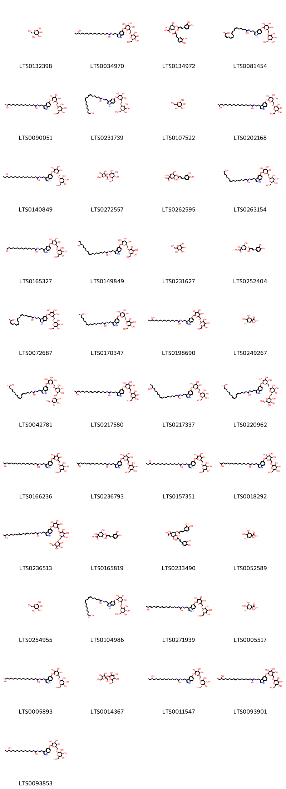{ width=100% }
    <figcaption>Hình ảnh cấu trúc hóa học của 41 hoạt chất thuộc nhóm Organooxygen compounds gồm ['α-glucose (LTS0132398)', '(16s)-16-hydroxy-n-[2-(5-{[(2s,3r,4s,5s,6r)-3,4,5-trihydroxy-6-({[(2r,3r,4s,5s,6r)-3,4,5-trihydroxy-6-(hydroxymethyl)oxan-2-yl]oxy}methyl)oxan-2-yl]oxy}-1h-indol-3-yl)ethyl]octadecanimidic acid (LTS0034970)', '3,4-dicaffeoylquinic acid (LTS0134972)', '(6z,9z,12z,15z,17r)-17-hydroxy-n-[2-(5-{[(2s,3s,4r,5s,6r)-3,4,5-trihydroxy-6-({[(2r,3s,4r,5s,6s)-3,4,5-trihydroxy-6-(hydroxymethyl)oxan-2-yl]oxy}methyl)oxan-2-yl]oxy}-1h-indol-3-yl)ethyl]octadeca-6,9,12,15-tetraenimidic acid (LTS0081454)', '(15s)-15-hydroxy-n-[2-(5-{[(2s,3r,4s,5s,6r)-3,4,5-trihydroxy-6-({[(2r,3r,4s,5s,6r)-3,4,5-trihydroxy-6-(hydroxymethyl)oxan-2-yl]oxy}methyl)oxan-2-yl]oxy}-1h-indol-3-yl)ethyl]hexadecanimidic acid (LTS0090051)', '(6z,9z,17r)-17-hydroxy-n-[2-(5-{[(2s,3r,4s,5s,6r)-3,4,5-trihydroxy-6-({[(2r,3r,4s,5s,6r)-3,4,5-trihydroxy-6-(hydroxymethyl)oxan-2-yl]oxy}methyl)oxan-2-yl]oxy}-1h-indol-3-yl)ethyl]octadeca-6,9-dienimidic acid (LTS0231739)', 'β-d-glucose (LTS0107522)', '(17s)-17-hydroxy-n-[2-(5-{[(2s,3r,4s,5s,6r)-3,4,5-trihydroxy-6-({[(2r,3r,4s,5s,6r)-3,4,5-trihydroxy-6-(hydroxymethyl)oxan-2-yl]oxy}methyl)oxan-2-yl]oxy}-1h-indol-3-yl)ethyl]octadecanimidic acid (LTS0202168)', '(16s)-16-hydroxy-n-[2-(5-{[(2s,3s,4s,5s,6s)-3,4,5-trihydroxy-6-({[(2r,3s,4r,5s,6r)-3,4,5-trihydroxy-6-(hydroxymethyl)oxan-2-yl]oxy}methyl)oxan-2-yl]oxy}-1h-indol-3-yl)ethyl]octadecanimidic acid (LTS0140849)', 'sucrose (LTS0272557)', '4-{[3-(3,4-dihydroxyphenyl)prop-2-enoyl]oxy}-1,3,5-trihydroxycyclohexane-1-carboxylic acid (LTS0262595)', '(9z,15s)-15-hydroxy-n-[2-(5-{[(2s,3r,4s,5s,6r)-3,4,5-trihydroxy-6-({[(2r,3r,4s,5s,6r)-3,4,5-trihydroxy-6-(hydroxymethyl)oxan-2-yl]oxy}methyl)oxan-2-yl]oxy}-1h-indol-3-yl)ethyl]hexadec-9-enimidic acid (LTS0263154)', '(15r)-15-hydroxy-n-[2-(5-{[(2s,3s,4r,5s,6r)-3,4,5-trihydroxy-6-({[(2r,3s,4s,5s,6r)-3,4,5-trihydroxy-6-(hydroxymethyl)oxan-2-yl]oxy}methyl)oxan-2-yl]oxy}-1h-indol-3-yl)ethyl]hexadecanimidic acid (LTS0165327)', '(9z,16s)-16-hydroxy-n-[2-(5-{[(2s,3s,4r,5s,6r)-3,4,5-trihydroxy-6-({[(2r,3s,4s,5s,6r)-3,4,5-trihydroxy-6-(hydroxymethyl)oxan-2-yl]oxy}methyl)oxan-2-yl]oxy}-1h-indol-3-yl)ethyl]octadec-9-enimidic acid (LTS0149849)', 'd-galactose (LTS0231627)', 'cryptochlorogenic acid (LTS0252404)', '(6z,9z,12z,15z,17r)-17-hydroxy-n-[2-(5-{[(2s,3r,4s,5s,6r)-3,4,5-trihydroxy-6-({[(2r,3r,4s,5s,6r)-3,4,5-trihydroxy-6-(hydroxymethyl)oxan-2-yl]oxy}methyl)oxan-2-yl]oxy}-1h-indol-3-yl)ethyl]octadeca-6,9,12,15-tetraenimidic acid (LTS0072687)', '(9z,15r)-15-hydroxy-n-[2-(5-{[(2s,3s,4r,5s,6s)-3,4,5-trihydroxy-6-({[(2r,3s,4s,5s,6r)-3,4,5-trihydroxy-6-(hydroxymethyl)oxan-2-yl]oxy}methyl)oxan-2-yl]oxy}-1h-indol-3-yl)ethyl]hexadec-9-enimidic acid (LTS0170347)', '14-hydroxy-n-[2-(5-{[3,4,5-trihydroxy-6-({[3,4,5-trihydroxy-6-(hydroxymethyl)oxan-2-yl]oxy}methyl)oxan-2-yl]oxy}-1h-indol-3-yl)ethyl]hexadecanimidic acid (LTS0198690)', '(3r,5r)-1,3,4,5-tetrahydroxycyclohexane-1-carboxylic acid (LTS0249267)', '(6z,9z,17s)-17-hydroxy-n-[2-(5-{[(2s,3s,4s,5s,6s)-3,4,5-trihydroxy-6-({[(2r,3s,4s,5s,6s)-3,4,5-trihydroxy-6-({[(2r,3s,4r,5s,6s)-3,4,5-trihydroxy-6-(hydroxymethyl)oxan-2-yl]oxy}methyl)oxan-2-yl]oxy}methyl)oxan-2-yl]oxy}-1h-indol-3-yl)ethyl]octadeca-6,9-dienimidic acid (LTS0042781)', '17-hydroxy-n-[2-(5-{[3,4,5-trihydroxy-6-({[3,4,5-trihydroxy-6-(hydroxymethyl)oxan-2-yl]oxy}methyl)oxan-2-yl]oxy}-1h-indol-3-yl)ethyl]octadeca-6,9-dienimidic acid (LTS0217580)', '(9z,16s)-16-hydroxy-n-[2-(5-{[(2s,3r,4s,5s,6r)-3,4,5-trihydroxy-6-({[(2r,3r,4s,5s,6r)-3,4,5-trihydroxy-6-(hydroxymethyl)oxan-2-yl]oxy}methyl)oxan-2-yl]oxy}-1h-indol-3-yl)ethyl]octadec-9-enimidic acid (LTS0217337)', '(6z,9z,17s)-17-hydroxy-n-[2-(5-{[(2s,3r,4s,5s,6r)-3,4,5-trihydroxy-6-({[(2r,3r,4s,5s,6r)-3,4,5-trihydroxy-6-({[(2r,3r,4s,5s,6r)-3,4,5-trihydroxy-6-(hydroxymethyl)oxan-2-yl]oxy}methyl)oxan-2-yl]oxy}methyl)oxan-2-yl]oxy}-1h-indol-3-yl)ethyl]octadeca-6,9-dienimidic acid (LTS0220962)', '17-hydroxy-n-[2-(5-{[3,4,5-trihydroxy-6-({[3,4,5-trihydroxy-6-(hydroxymethyl)oxan-2-yl]oxy}methyl)oxan-2-yl]oxy}-1h-indol-3-yl)ethyl]octadecanimidic acid (LTS0166236)', '15-hydroxy-n-[2-(5-{[3,4,5-trihydroxy-6-({[3,4,5-trihydroxy-6-(hydroxymethyl)oxan-2-yl]oxy}methyl)oxan-2-yl]oxy}-1h-indol-3-yl)ethyl]hexadec-9-enimidic acid (LTS0236793)', '16-hydroxy-n-[2-(5-{[3,4,5-trihydroxy-6-({[3,4,5-trihydroxy-6-(hydroxymethyl)oxan-2-yl]oxy}methyl)oxan-2-yl]oxy}-1h-indol-3-yl)ethyl]octadecanimidic acid (LTS0157351)', '15-hydroxy-n-[2-(5-{[3,4,5-trihydroxy-6-({[3,4,5-trihydroxy-6-(hydroxymethyl)oxan-2-yl]oxy}methyl)oxan-2-yl]oxy}-1h-indol-3-yl)ethyl]hexadecanimidic acid (LTS0018292)', '17-hydroxy-n-[2-(5-{[3,4,5-trihydroxy-6-({[3,4,5-trihydroxy-6-({[3,4,5-trihydroxy-6-(hydroxymethyl)oxan-2-yl]oxy}methyl)oxan-2-yl]oxy}methyl)oxan-2-yl]oxy}-1h-indol-3-yl)ethyl]octadeca-6,9-dienimidic acid (LTS0236513)', '(3r,5r)-4-{[(2e)-3-(3,4-dihydroxyphenyl)prop-2-enoyl]oxy}-1,3,5-trihydroxycyclohexane-1-carboxylic acid (LTS0165819)', '3,4-bis({[3-(3,4-dihydroxyphenyl)prop-2-enoyl]oxy})-1,5-dihydroxycyclohexane-1-carboxylic acid (LTS0233490)', 'quinic acid (LTS0052589)', 'galactose (LTS0254955)', '(6z,9z,17s)-17-hydroxy-n-[2-(5-{[(2s,3s,4s,5s,6r)-3,4,5-trihydroxy-6-({[(2r,3s,4r,5s,6r)-3,4,5-trihydroxy-6-(hydroxymethyl)oxan-2-yl]oxy}methyl)oxan-2-yl]oxy}-1h-indol-3-yl)ethyl]octadeca-6,9-dienimidic acid (LTS0104986)', '17-hydroxy-n-[2-(5-{[3,4,5-trihydroxy-6-({[3,4,5-trihydroxy-6-(hydroxymethyl)oxan-2-yl]oxy}methyl)oxan-2-yl]oxy}-1h-indol-3-yl)ethyl]octadeca-6,9,12,15-tetraenimidic acid (LTS0271939)', '(-)-quinic acid (LTS0005517)', '(17r)-17-hydroxy-n-[2-(5-{[(2s,3s,4s,5s,6r)-3,4,5-trihydroxy-6-({[(2r,3s,4r,5s,6r)-3,4,5-trihydroxy-6-(hydroxymethyl)oxan-2-yl]oxy}methyl)oxan-2-yl]oxy}-1h-indol-3-yl)ethyl]octadecanimidic acid (LTS0005893)', 'granulated sugar (LTS0014367)', '(14r)-14-hydroxy-n-[2-(5-{[(2s,3s,4s,5s,6r)-3,4,5-trihydroxy-6-({[(2r,3s,4s,5s,6s)-3,4,5-trihydroxy-6-(hydroxymethyl)oxan-2-yl]oxy}methyl)oxan-2-yl]oxy}-1h-indol-3-yl)ethyl]hexadecanimidic acid (LTS0011547)', '16-hydroxy-n-[2-(5-{[3,4,5-trihydroxy-6-({[3,4,5-trihydroxy-6-(hydroxymethyl)oxan-2-yl]oxy}methyl)oxan-2-yl]oxy}-1h-indol-3-yl)ethyl]octadec-9-enimidic acid (LTS0093901)', '(14s)-14-hydroxy-n-[2-(5-{[(2s,3r,4s,5s,6r)-3,4,5-trihydroxy-6-({[(2r,3r,4s,5s,6r)-3,4,5-trihydroxy-6-(hydroxymethyl)oxan-2-yl]oxy}methyl)oxan-2-yl]oxy}-1h-indol-3-yl)ethyl]hexadecanimidic acid (LTS0093853)'].</figcaption>
</figure>
#### Nhóm Piperidines
<figure markdown="span">
    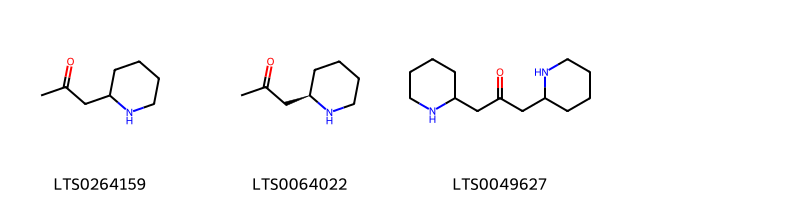{ width=100% }
    <figcaption>Hình ảnh cấu trúc hóa học của 3 hoạt chất thuộc nhóm Piperidines gồm ['pelletierine (LTS0264159)', '(r)-1-(2-piperidyl)acetone (LTS0064022)', '1,3-bis(piperidin-2-yl)propan-2-one (LTS0049627)'].</figcaption>
</figure>
#### Nhóm Prenol lipids
<figure markdown="span">
    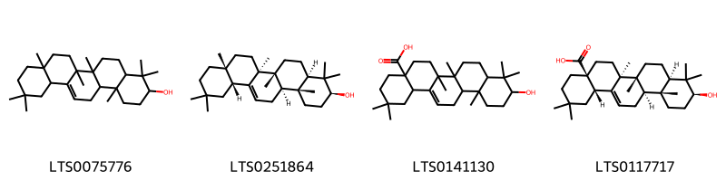{ width=100% }
    <figcaption>Hình ảnh cấu trúc hóa học của 4 hoạt chất thuộc nhóm Prenol lipids gồm ['β-amyrin (LTS0075776)', 'β-amyrin (LTS0251864)', 'oleanolic acid (LTS0141130)', 'oleanolic acid (LTS0117717)'].</figcaption>
</figure>
#### Nhóm Saturated hydrocarbons
<figure markdown="span">
    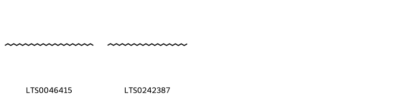{ width=100% }
    <figcaption>Hình ảnh cấu trúc hóa học của 2 hoạt chất thuộc nhóm Saturated hydrocarbons gồm ['hentriacontane (LTS0046415)', 'octacosane (LTS0242387)'].</figcaption>
</figure>
#### Nhóm Steroids and steroid derivatives
<figure markdown="span">
    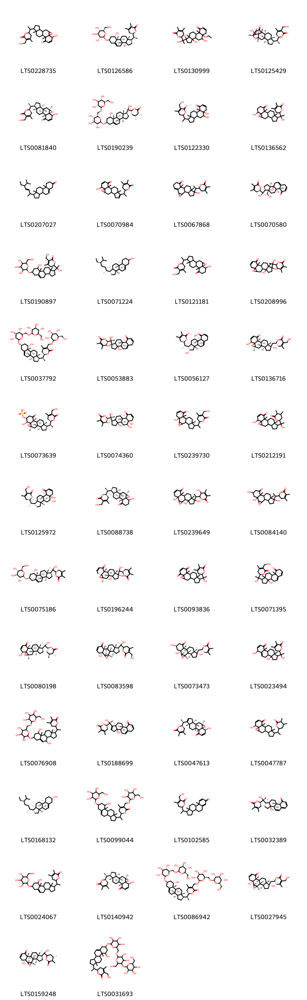{ width=100% }
    <figcaption>Hình ảnh cấu trúc hóa học của 245 hoạt chất thuộc nhóm Steroids and steroid derivatives gồm ['6-hydroxy-15-{1-[5-(hydroxymethyl)-4-methyl-6-oxo-2,3-dihydropyran-2-yl]ethyl}-2,16-dimethyl-8-oxapentacyclo[9.7.0.0²,⁷.0⁷,⁹.0¹²,¹⁶]octadec-4-en-3-one (LTS0228735)', '(6r)-6-[(1s)-1-[(1r,3as,3bs,7r,9s,9ar,9bs,11as)-9-hydroxy-9a,11a-dimethyl-7-{[(2r,3r,4s,5s,6r)-3,4,5-trihydroxy-6-(hydroxymethyl)oxan-2-yl]oxy}-1h,2h,3h,3ah,3bh,4h,6h,7h,8h,9h,9bh,10h,11h-cyclopenta[a]phenanthren-1-yl]ethyl]-3,4-dimethyl-5,6-dihydropyran-2-one (LTS0126586)', '6-(1-{5a-ethoxy-1,3a,5-trihydroxy-9a,11a-dimethyl-9-oxo-2h,3h,3bh,4h,5h,6h,9bh,10h,11h-cyclopenta[a]phenanthren-1-yl}-1-hydroxyethyl)-3,4-dimethyl-5,6-dihydropyran-2-one (LTS0130999)', '(1s,3s,4s,7r,8s,11s,12r,15r,16s,17r)-16,17-dihydroxy-7-[(1s)-1-[(2r)-5-(hydroxymethyl)-4-methyl-6-oxo-2,3-dihydropyran-2-yl]ethyl]-8,12-dimethyl-18-oxapentacyclo[13.2.1.0³,¹¹.0⁴,⁸.0¹²,¹⁷]octadecan-13-one (LTS0125429)', 'withaferin a (LTS0081840)', '(3r,4r,6r)-6-[(1r)-1-[(1s,3as,3bs,7r,9s,9ar,9bs,11as)-9-hydroxy-9a,11a-dimethyl-7-{[(2r,3r,4s,5s,6r)-3,4,5-trihydroxy-6-({[(2r,3r,4s,5s,6r)-3,4,5-trihydroxy-6-(hydroxymethyl)oxan-2-yl]oxy}methyl)oxan-2-yl]oxy}-1h,2h,3h,3ah,3bh,4h,6h,7h,8h,9h,9bh,10h,11h-cyclopenta[a]phenanthren-1-yl]-1-hydroxyethyl]-3,4-dimethyloxan-2-one (LTS0190239)', '6-(1-{5,5a-dihydroxy-9a,11a-dimethyl-9-oxo-1h,2h,3h,3ah,3bh,4h,5h,6h,9bh,10h,11h-cyclopenta[a]phenanthren-1-yl}ethyl)-3-(hydroxymethyl)-4-methyl-5,6-dihydropyran-2-one (LTS0122330)', '15-[1-(4,5-dimethyl-6-oxo-2,3-dihydropyran-2-yl)-1-hydroxyethyl]-6-hydroxy-2,16-dimethyl-8-oxapentacyclo[9.7.0.0²,⁷.0⁷,⁹.0¹²,¹⁶]octadecan-3-one (LTS0136562)', '1-(5-ethyl-6-methylhept-3-en-2-yl)-9a,11a-dimethyl-1h,2h,3h,3ah,3bh,4h,6h,8h,9h,9bh,10h,11h-cyclopenta[a]phenanthren-7-one (LTS0207027)', '15-[1-(4,5-dimethyl-6-oxo-2,3-dihydropyran-2-yl)ethyl]-6-hydroxy-2,16-dimethyl-8-oxapentacyclo[9.7.0.0²,⁷.0⁷,⁹.0¹²,¹⁶]octadeca-4,14-dien-3-one (LTS0070984)', '15-[1-(4,5-dimethyl-6-oxo-2,3-dihydropyran-2-yl)ethyl]-15-hydroxy-10,14-dimethyl-3-oxapentacyclo[9.7.0.0²,⁴.0⁵,¹⁰.0¹⁴,¹⁸]octadec-5-en-9-one (LTS0067868)', '(6r)-6-[(1r)-1-[(1s,3ar,3br,9ar,9br,11ar)-3b-hydroxy-11a-(hydroxymethyl)-9a-methyl-9-oxo-1h,2h,3h,3ah,4h,6h,9bh,10h,11h-cyclopenta[a]phenanthren-1-yl]-1-hydroxyethyl]-3,4-dimethyl-5,6-dihydropyran-2-one (LTS0070580)', '6-[1-hydroxy-1-(9-hydroxy-9a,11a-dimethyl-7-{[3,4,5-trihydroxy-6-(hydroxymethyl)oxan-2-yl]oxy}-1h,2h,3h,3ah,3bh,4h,6h,7h,8h,9h,9bh,10h,11h-cyclopenta[a]phenanthren-1-yl)ethyl]-3-(hydroxymethyl)-4-methyl-5,6-dihydropyran-2-one (LTS0190897)', 'stigmast-5-en-3-ol (LTS0071224)', '6-hydroxy-15-{1-[5-(hydroxymethyl)-4-methyl-6-oxo-2,3-dihydropyran-2-yl]ethyl}-2,16-dimethyl-8-oxapentacyclo[9.7.0.0²,⁷.0⁷,⁹.0¹²,¹⁶]octadecan-3-one (LTS0121181)', '15-[1-(4,5-dimethyl-6-oxo-2,3-dihydropyran-2-yl)-1-hydroxyethyl]-12,15-dihydroxy-2,16-dimethyl-8-oxapentacyclo[9.7.0.0²,⁷.0⁷,⁹.0¹²,¹⁶]octadec-4-en-3-one (LTS0208996)', '(6r)-6-[(1s)-1-[(1r,3as,3bs,7r,9s,9ar,9bs,11as)-9-hydroxy-9a,11a-dimethyl-7-{[(2r,3r,4s,5s,6r)-3,4,5-trihydroxy-6-({[(2r,3r,4s,5s,6r)-3,4,5-trihydroxy-6-(hydroxymethyl)oxan-2-yl]oxy}methyl)oxan-2-yl]oxy}-1h,2h,3h,3ah,3bh,4h,6h,7h,8h,9h,9bh,10h,11h-cyclopenta[a]phenanthren-1-yl]ethyl]-4-methyl-3-({[(2r,3r,4s,5s,6r)-3,4,5-trihydroxy-6-(hydroxymethyl)oxan-2-yl]oxy}methyl)-5,6-dihydropyran-2-one (LTS0037792)', '(6r)-6-[(1s)-1-[(1r,3ar,3br,9ar,9bs,11as)-1,3a-dihydroxy-9a,11a-dimethyl-9-oxo-2h,3h,3bh,4h,6h,9bh,10h,11h-cyclopenta[a]phenanthren-1-yl]-1-hydroxyethyl]-3,4-dimethyl-5,6-dihydropyran-2-one (LTS0053883)', '(6r)-6-[(1s)-1-[(1r,2s,3ar,3br,9ar,9bs,10s,11ar)-2,3b,10-trihydroxy-9a,11a-dimethyl-9-oxo-1h,2h,3h,3ah,4h,6h,9bh,10h,11h-cyclopenta[a]phenanthren-1-yl]ethyl]-3,4-dimethyl-5,6-dihydropyran-2-one (LTS0056127)', '(1s,2r,6s,7r,9r,11s,12s,15s,16s)-6,15-dihydroxy-15-[(1r)-1-[(2r)-5-(hydroxymethyl)-4-methyl-6-oxo-2,3-dihydropyran-2-yl]ethyl]-2,16-dimethyl-8-oxapentacyclo[9.7.0.0²,⁷.0⁷,⁹.0¹²,¹⁶]octadec-4-en-3-one (LTS0136716)', '[(1s,2r,5s,6s,7r,9r,11s,12s,15r,16s)-6-hydroxy-15-[(1s)-1-[(2r)-5-(hydroxymethyl)-4-methyl-6-oxo-2,3-dihydropyran-2-yl]ethyl]-2,16-dimethyl-3-oxo-8-oxapentacyclo[9.7.0.0²,⁷.0⁷,⁹.0¹²,¹⁶]octadecan-5-yl]oxidanesulfonic acid (LTS0073639)', '(6r)-6-[(1s)-1-[(1s,3ar,3br,5s,5as,9ar,9bs,11as)-1,3a,5,5a-tetrahydroxy-9a,11a-dimethyl-9-oxo-2h,3h,3bh,4h,5h,6h,9bh,10h,11h-cyclopenta[a]phenanthren-1-yl]-1-hydroxyethyl]-3,4-dimethyl-5,6-dihydropyran-2-one (LTS0074360)', '5-hydroxy-15-{1-[5-(hydroxymethyl)-4-methyl-6-oxo-2,3-dihydropyran-2-yl]ethyl}-10,14-dimethyl-3-oxapentacyclo[9.7.0.0²,⁴.0⁵,¹⁰.0¹⁴,¹⁸]octadec-7-en-9-one (LTS0239730)', '15-[1-(4,5-dimethyl-6-oxooxan-2-yl)-1-hydroxyethyl]-6-hydroxy-2,16-dimethyl-8-oxapentacyclo[9.7.0.0²,⁷.0⁷,⁹.0¹²,¹⁶]octadec-4-en-3-one (LTS0212191)', '(6r)-6-[(1s)-1-[(1r,3as,3bs,5r,5ar,9ar,9bs,11as)-5,5a-dihydroxy-9a,11a-dimethyl-9-oxo-1h,2h,3h,3ah,3bh,4h,5h,6h,9bh,10h,11h-cyclopenta[a]phenanthren-1-yl]ethyl]-3-(hydroxymethyl)-4-methyl-5,6-dihydropyran-2-one (LTS0125972)', '(1s,2r,6s,7r,9r,11s,12s,15r,16r)-6-hydroxy-15-[(1s)-1-[(2r)-5-(hydroxymethyl)-4-methyl-6-oxo-2,3-dihydropyran-2-yl]ethyl]-2,16-dimethyl-8-oxapentacyclo[9.7.0.0²,⁷.0⁷,⁹.0¹²,¹⁶]octadecan-3-one (LTS0088738)', '5,15,18-trihydroxy-15-[1-(3-hydroxy-4,5-dimethyl-6-oxo-2,3-dihydropyran-2-yl)ethyl]-10,14-dimethyl-3-oxapentacyclo[9.7.0.0²,⁴.0⁵,¹⁰.0¹⁴,¹⁸]octadec-7-en-9-one (LTS0239649)', '15-[1-(4,5-dimethyl-6-oxo-2,3-dihydropyran-2-yl)ethyl]-5,7,15-trihydroxy-10,14-dimethyl-3-oxapentacyclo[9.7.0.0²,⁴.0⁵,¹⁰.0¹⁴,¹⁸]octadecan-9-one (LTS0084140)', '(6r)-6-[(1r)-1-[(1s,3as,3bs,7r,9s,9ar,9bs,11as)-9-hydroxy-9a,11a-dimethyl-7-{[(2r,3r,4s,5s,6r)-3,4,5-trihydroxy-6-(hydroxymethyl)oxan-2-yl]oxy}-1h,2h,3h,3ah,3bh,4h,6h,7h,8h,9h,9bh,10h,11h-cyclopenta[a]phenanthren-1-yl]-1-hydroxyethyl]-3,4-dimethyl-5,6-dihydropyran-2-one (LTS0075186)', '(1s,2r,7s,9r,11r,12r,15s,16s)-15-[(1s)-1-[(2r)-4,5-dimethyl-6-oxo-2,3-dihydropyran-2-yl]-1-hydroxyethyl]-12,15-dihydroxy-2,16-dimethyl-8-oxapentacyclo[9.7.0.0²,⁷.0⁷,⁹.0¹²,¹⁶]octadec-4-en-3-one (LTS0196244)', '15-[1-(4,5-dimethyl-6-oxo-2,3-dihydropyran-2-yl)-1-hydroxyethyl]-2,16-dimethyl-8-oxapentacyclo[9.7.0.0²,⁷.0⁷,⁹.0¹²,¹⁶]octadec-4-ene-3,6-dione (LTS0093836)', '6-(1-{3a-hydroxy-9a,11a-dimethyl-9-oxo-1h,2h,3h,3bh,4h,8h,9bh,10h,11h-cyclopenta[a]phenanthren-1-yl}-1-hydroxyethyl)-3-(hydroxymethyl)-4-methyl-5,6-dihydropyran-2-one (LTS0071395)', '(1s,2r,6s,7r,9r,11s,12s,15s,16s)-15-[(1r)-1-[(2r,4s,5r)-4,5-dimethyl-6-oxooxan-2-yl]-1-hydroxyethyl]-6-hydroxy-2,16-dimethyl-8-oxapentacyclo[9.7.0.0²,⁷.0⁷,⁹.0¹²,¹⁶]octadec-4-en-3-one (LTS0080198)', '(1s,2s,4s,5r,10r,11s,14s,15s,18s)-5-hydroxy-15-[(1r)-1-hydroxy-1-[5-(hydroxymethyl)-4-methyl-6-oxo-2,3-dihydropyran-2-yl]ethyl]-10,14-dimethyl-3-oxapentacyclo[9.7.0.0²,⁴.0⁵,¹⁰.0¹⁴,¹⁸]octadec-7-en-9-one (LTS0083598)', '(1s,2s,4s,5r,7r,10r,11s,14s,15s,18s)-15-[(1r)-1-[(2r)-4,5-dimethyl-6-oxo-2,3-dihydropyran-2-yl]ethyl]-5,7,15-trihydroxy-10,14-dimethyl-3-oxapentacyclo[9.7.0.0²,⁴.0⁵,¹⁰.0¹⁴,¹⁸]octadecan-9-one (LTS0073473)', '6-(1-{3a,6-dihydroxy-9a,11a-dimethyl-9-oxo-1h,2h,3h,3bh,4h,6h,9bh,10h,11h-cyclopenta[a]phenanthren-1-yl}-1-hydroxyethyl)-3,4-dimethyl-5,6-dihydropyran-2-one (LTS0023494)', '6-[1-(4,9-dihydroxy-9a,11a-dimethyl-7-{[3,4,5-trihydroxy-6-({[3,4,5-trihydroxy-6-(hydroxymethyl)oxan-2-yl]oxy}methyl)oxan-2-yl]oxy}-1h,2h,3h,3ah,3bh,4h,6h,7h,8h,9h,9bh,10h,11h-cyclopenta[a]phenanthren-1-yl)ethyl]-3,4-dimethyl-5,6-dihydropyran-2-one (LTS0076908)', '(6r)-6-[(1r)-1-[(3ar,3br,9ar,9bs,11ar)-3a-hydroxy-9a,11a-dimethyl-9-oxo-3h,3bh,4h,6h,9bh,10h,11h-cyclopenta[a]phenanthren-1-yl]-1-hydroxyethyl]-3,4-dimethyl-5,6-dihydropyran-2-one (LTS0188699)', '(1s,2r,6s,7r,9r,11s,12s,16s)-15-[(1s)-1-[(2r)-4,5-dimethyl-6-oxo-2,3-dihydropyran-2-yl]ethyl]-6-hydroxy-2,11,16-trimethyl-8-oxapentacyclo[9.7.0.0²,⁷.0⁷,⁹.0¹²,¹⁶]octadeca-4,14-dien-3-one (LTS0047613)', '15-[1-(4,5-dimethyl-6-oxooxan-2-yl)ethyl]-6-hydroxy-2,16-dimethyl-8-oxapentacyclo[9.7.0.0²,⁷.0⁷,⁹.0¹²,¹⁶]octadec-4-en-3-one (LTS0047787)', 'sitosterol (LTS0168132)', '6-[1-(9-hydroxy-9a,11a-dimethyl-7-{[3,4,5-trihydroxy-6-(hydroxymethyl)oxan-2-yl]oxy}-1h,2h,3h,3ah,3bh,4h,6h,7h,8h,9h,9bh,10h,11h-cyclopenta[a]phenanthren-1-yl)ethyl]-4-methyl-3-({[3,4,5-trihydroxy-6-(hydroxymethyl)oxan-2-yl]oxy}methyl)-5,6-dihydropyran-2-one (LTS0099044)', '6-(1-{9a,11a-dimethyl-7-oxo-1h,2h,3h,3ah,3bh,4h,5h,9bh,10h,11h-cyclopenta[a]phenanthren-1-yl}ethyl)-3-(hydroxymethyl)-4-methyl-5,6-dihydropyran-2-one (LTS0102585)', '(6r)-6-[(1r)-1-[(1s,3ar,3br,9ar,9bs,11ar)-3a-hydroxy-9a,11a-dimethyl-9-oxo-1h,2h,3h,3bh,9bh,10h,11h-cyclopenta[a]phenanthren-1-yl]-1-hydroxyethyl]-3,4-dimethyl-5,6-dihydropyran-2-one (LTS0032389)', '6-[1-(9-hydroxy-9a,11a-dimethyl-7-{[3,4,5-trihydroxy-6-(hydroxymethyl)oxan-2-yl]oxy}-1h,2h,3h,3ah,3bh,4h,6h,7h,8h,9h,9bh,10h,11h-cyclopenta[a]phenanthren-1-yl)ethyl]-3,4-dimethyl-5,6-dihydropyran-2-one (LTS0024067)', '(1s,2r,6s,7r,9r,11s,12s,15r,16s)-15-[(1s)-1-[(2r)-4,5-dimethyl-6-oxo-2,3-dihydropyran-2-yl]ethyl]-6-hydroxy-2,16-dimethyl-8-oxapentacyclo[9.7.0.0²,⁷.0⁷,⁹.0¹²,¹⁶]octadec-4-en-3-one (LTS0140942)', '(6r)-6-[(1s)-1-[(1r,3as,3bs,7r,9s,9ar,9bs,11as)-9-hydroxy-9a,11a-dimethyl-7-{[(2r,3r,4s,5s,6r)-3,4,5-trihydroxy-6-({[(2r,3r,4s,5s,6r)-3,4,5-trihydroxy-6-(hydroxymethyl)oxan-2-yl]oxy}methyl)oxan-2-yl]oxy}-1h,2h,3h,3ah,3bh,4h,6h,7h,8h,9h,9bh,10h,11h-cyclopenta[a]phenanthren-1-yl]ethyl]-4-methyl-3-({[(2r,3r,4s,5s,6r)-3,4,5-trihydroxy-6-({[(2r,3r,4s,5s,6r)-3,4,5-trihydroxy-6-(hydroxymethyl)oxan-2-yl]oxy}methyl)oxan-2-yl]oxy}methyl)-5,6-dihydropyran-2-one (LTS0086942)', '27-hydroxywithanone (LTS0027945)', '(1s,2s,4s,5r,10r,11s,14s,15s,18s)-15-[(1r)-1-[(4s)-4,5-dimethyl-6-oxooxan-2-yl]-1-hydroxyethyl]-5-hydroxy-10,14-dimethyl-3-oxapentacyclo[9.7.0.0²,⁴.0⁵,¹⁰.0¹⁴,¹⁸]octadec-7-en-9-one (LTS0159248)', '6-[1-(7-{[6-({[3,4-dihydroxy-6-(hydroxymethyl)-5-{[3,4,5-trihydroxy-6-(hydroxymethyl)oxan-2-yl]oxy}oxan-2-yl]oxy}methyl)-3,4,5-trihydroxyoxan-2-yl]oxy}-9-hydroxy-9a,11a-dimethyl-1h,2h,3h,3ah,3bh,4h,6h,7h,8h,9h,9bh,10h,11h-cyclopenta[a]phenanthren-1-yl)ethyl]-3-(hydroxymethyl)-4-methyl-5,6-dihydropyran-2-one (LTS0031693)', '(6r)-6-[(1s)-1-[(1s,3ar,3br,5r,5ar,9as,9bs,11as)-5a-chloro-1,3a,5-trihydroxy-9a,11a-dimethyl-9-oxo-2h,3h,3bh,4h,5h,6h,9bh,10h,11h-cyclopenta[a]phenanthren-1-yl]-1-hydroxyethyl]-3,4-dimethyl-5,6-dihydropyran-2-one (LTS0039826)', '(1s,2s,4s,5r,10r,11s,14s,15s,18s)-15-[(1s)-1-[(2r)-4,5-dimethyl-6-oxo-2,3-dihydropyran-2-yl]-1-hydroxyethyl]-5-hydroxy-10,14-dimethyl-3-oxapentacyclo[9.7.0.0²,⁴.0⁵,¹⁰.0¹⁴,¹⁸]octadec-7-en-9-one (LTS0164394)', '(1r,3as,3br,5as,9as,9bs,11ar)-1-[(2r,5r)-5-ethyl-6-methylheptan-2-yl]-9a,11a-dimethyl-tetradecahydrocyclopenta[a]phenanthren-7-one (LTS0110913)', '15-[1-(4,5-dimethyl-6-oxooxan-2-yl)-1-hydroxyethyl]-5-hydroxy-10,14-dimethyl-3-oxapentacyclo[9.7.0.0²,⁴.0⁵,¹⁰.0¹⁴,¹⁸]octadec-7-en-9-one (LTS0104927)', '6-(1-{1,6-dihydroxy-9a,11a-dimethyl-9-oxo-2h,3h,4h,6h,9bh,10h,11h-cyclopenta[a]phenanthren-1-yl}ethyl)-3,4-dimethyl-5,6-dihydropyran-2-one (LTS0176649)', '6-[1-(9-hydroxy-9a,11a-dimethyl-7-{[3,4,5-trihydroxy-6-({[3,4,5-trihydroxy-6-(hydroxymethyl)oxan-2-yl]oxy}methyl)oxan-2-yl]oxy}-1h,2h,3h,3ah,3bh,4h,6h,7h,8h,9h,9bh,10h,11h-cyclopenta[a]phenanthren-1-yl)ethyl]-4-methyl-3-{[(3,4,5,6-tetrahydroxyoxan-2-yl)methoxy]methyl}-5,6-dihydropyran-2-one (LTS0087021)', '(6r)-6-[(1r)-1-[(1s,3ar,3br,9ar,9bs,11ar)-3a-hydroxy-9a,11a-dimethyl-9-oxo-1h,2h,3h,3bh,4h,8h,9bh,10h,11h-cyclopenta[a]phenanthren-1-yl]-1-hydroxyethyl]-3,4-dimethyl-5,6-dihydropyran-2-one (LTS0037908)', '(2r,3r,4s,5s,6r)-2-{[(1r,3as,3bs,7s,9ar,9bs,11ar)-1-[(2r,3e,5s)-5-ethyl-6-methylhept-3-en-2-yl]-9a,11a-dimethyl-1h,2h,3h,3ah,3bh,4h,6h,7h,8h,9h,9bh,10h,11h-cyclopenta[a]phenanthren-7-yl]oxy}-6-(hydroxymethyl)oxane-3,4,5-triol (LTS0088971)', '6,15-dihydroxy-15-{1-[5-(hydroxymethyl)-4-methyl-6-oxo-2,3-dihydropyran-2-yl]ethyl}-2,16-dimethyl-8-oxapentacyclo[9.7.0.0²,⁷.0⁷,⁹.0¹²,¹⁶]octadec-4-en-3-one (LTS0056132)', '6-(1-{5-[(5a,6-dihydroxy-1-{1-[5-(hydroxymethyl)-4-methyl-6-oxo-2,3-dihydropyran-2-yl]ethyl}-9a,11a-dimethyl-9-oxo-1h,2h,3h,3ah,3bh,4h,5h,6h,9bh,10h,11h-cyclopenta[a]phenanthren-5-yl)sulfanyl]-5a,6-dihydroxy-9a,11a-dimethyl-9-oxo-1h,2h,3h,3ah,3bh,4h,5h,6h,9bh,10h,11h-cyclopenta[a]phenanthren-1-yl}ethyl)-3-(hydroxymethyl)-4-methyl-5,6-dihydropyran-2-one (LTS0104201)', 'withanolide d (LTS0185704)', '6-(1-{3a-hydroxy-9a,11a-dimethyl-9-oxo-1h,2h,3h,3bh,4h,6h,9bh,10h,11h-cyclopenta[a]phenanthren-1-yl}-1-hydroxyethyl)-3-(hydroxymethyl)-4-methyl-5,6-dihydropyran-2-one (LTS0196641)', '(1s,2s,4s,5r,10r,11s,14s,15s,18s)-15-[(1r)-1-[(2r,4s,5r)-4,5-dimethyl-6-oxooxan-2-yl]-1-hydroxyethyl]-5-hydroxy-10,14-dimethyl-3-oxapentacyclo[9.7.0.0²,⁴.0⁵,¹⁰.0¹⁴,¹⁸]octadec-7-en-9-one (LTS0153006)', '(1s,2r,7s,9r,11r,12r,15r,16s)-15-[(1s)-1-[(2r)-4,5-dimethyl-6-oxo-2,3-dihydropyran-2-yl]-1-hydroxyethyl]-12,15-dihydroxy-2,16-dimethyl-8-oxapentacyclo[9.7.0.0²,⁷.0⁷,⁹.0¹²,¹⁶]octadec-4-en-3-one (LTS0153798)', '(6s)-6-[(1r)-1-[(1s,6s,9ar,9bs,11as)-1,6-dihydroxy-9a,11a-dimethyl-9-oxo-2h,3h,4h,6h,9bh,10h,11h-cyclopenta[a]phenanthren-1-yl]ethyl]-3,4-dimethyl-5,6-dihydropyran-2-one (LTS0206640)', '(1s,2s,4s,5r,10r,11s,14r,15s,18r)-5,15,18-trihydroxy-15-[(1r)-1-[(2s,3s)-3-hydroxy-4,5-dimethyl-6-oxo-2,3-dihydropyran-2-yl]ethyl]-10,14-dimethyl-3-oxapentacyclo[9.7.0.0²,⁴.0⁵,¹⁰.0¹⁴,¹⁸]octadec-7-en-9-one (LTS0198637)', 'stigmast-5-en-3-ol, (3β)- (LTS0204616)', '15-[1-(4,5-dimethyl-6-oxo-2,3-dihydropyran-2-yl)-1-hydroxyethyl]-6,15-dihydroxy-2,16-dimethyl-8-oxapentacyclo[9.7.0.0²,⁷.0⁷,⁹.0¹²,¹⁶]octadec-4-en-3-one (LTS0185983)', '(1s,2r,5s,6s,7r,9r,11s,12s,15s,16s)-15-[(1r)-1-[(2r,4s,5r)-4,5-dimethyl-6-oxooxan-2-yl]-1-hydroxyethyl]-6-hydroxy-5-methoxy-2,16-dimethyl-8-oxapentacyclo[9.7.0.0²,⁷.0⁷,⁹.0¹²,¹⁶]octadecan-3-one (LTS0144522)', '5,15-dihydroxy-15-{1-[5-(hydroxymethyl)-4-methyl-6-oxo-2,3-dihydropyran-2-yl]ethyl}-10,14-dimethyl-3-oxapentacyclo[9.7.0.0²,⁴.0⁵,¹⁰.0¹⁴,¹⁸]octadec-7-en-9-one (LTS0191599)', '6-(1-{5-ethoxy-1,3a,5a-trihydroxy-9a,11a-dimethyl-9-oxo-2h,3h,3bh,4h,5h,6h,9bh,10h,11h-cyclopenta[a]phenanthren-1-yl}-1-hydroxyethyl)-3,4-dimethyl-5,6-dihydropyran-2-one (LTS0138559)', '(1r,2r,6s,7r,9r,11r,12s,15s,16s)-15-[(1r)-1-[(2r)-4,5-dimethyl-6-oxo-2,3-dihydropyran-2-yl]-1-hydroxyethyl]-6-hydroxy-2,16-dimethyl-8-oxapentacyclo[9.7.0.0²,⁷.0⁷,⁹.0¹²,¹⁶]octadec-4-en-3-one (LTS0139248)', '(1s,2r,7r,9s,10s,11s,12s,15r,16s)-15-[(1s)-1-[(2r)-4,5-dimethyl-6-oxo-2,3-dihydropyran-2-yl]-1-hydroxyethyl]-10,15-dihydroxy-2,16-dimethyl-8-oxapentacyclo[9.7.0.0²,⁷.0⁷,⁹.0¹²,¹⁶]octadec-4-en-3-one (LTS0194497)', '6-(1-{3a-hydroxy-9a,11a-dimethyl-9-oxo-1h,2h,3h,3bh,4h,5h,9bh,10h,11h-cyclopenta[a]phenanthren-1-yl}-1-hydroxyethyl)-3,4-dimethyl-5,6-dihydropyran-2-one (LTS0190373)', '(6r)-6-[(1s)-1-[(1s,2s,4s,5r,7s,9s,10s,11s,14r,15r,18s)-5,9-dihydroxy-10,14-dimethyl-7-{[(2r,3r,4s,5s,6r)-3,4,5-trihydroxy-6-(hydroxymethyl)oxan-2-yl]oxy}-3-oxapentacyclo[9.7.0.0²,⁴.0⁵,¹⁰.0¹⁴,¹⁸]octadecan-15-yl]ethyl]-3,4-dimethyl-5,6-dihydropyran-2-one (LTS0191080)', '3,4-dimethyl-6-(1-{5,7,9-trihydroxy-10,14-dimethyl-3-oxapentacyclo[9.7.0.0²,⁴.0⁵,¹⁰.0¹⁴,¹⁸]octadecan-15-yl}ethyl)-5,6-dihydropyran-2-one (LTS0142561)', '(1r,2r,6s,7r,9r,11r,12s,15s,16s)-6-hydroxy-15-[(1r)-1-hydroxy-1-[(2s)-5-(hydroxymethyl)-4-methyl-6-oxo-2,3-dihydropyran-2-yl]ethyl]-2,16-dimethyl-8-oxapentacyclo[9.7.0.0²,⁷.0⁷,⁹.0¹²,¹⁶]octadec-4-en-3-one (LTS0243587)', '(1s,2r,6s,7r,9r,11r,12r,15s,16r)-15-[(1r)-1-[(2s)-4,5-dimethyl-6-oxo-2,3-dihydropyran-2-yl]-1-hydroxyethyl]-6,12-dihydroxy-2,16-dimethyl-8-oxapentacyclo[9.7.0.0²,⁷.0⁷,⁹.0¹²,¹⁶]octadec-4-en-3-one (LTS0200004)', '6-(1-{6-hydroxy-9a,11a-dimethyl-9-oxo-1h,2h,3h,3ah,3bh,4h,6h,9bh,10h,11h-cyclopenta[a]phenanthren-1-yl}ethyl)-3-(hydroxymethyl)-4-methyl-5,6-dihydropyran-2-one (LTS0172222)', 'sitogluside (LTS0201798)', '(1s,2r,7s,9r,11r,12r,15s,16s)-15-[(1s)-1-[(2s)-4,5-dimethyl-6-oxo-2,3-dihydropyran-2-yl]-1-hydroxyethyl]-12,15-dihydroxy-2,16-dimethyl-8-oxapentacyclo[9.7.0.0²,⁷.0⁷,⁹.0¹²,¹⁶]octadec-4-en-3-one (LTS0145021)', 'withanone (LTS0144069)', 'ergosterol (LTS0171131)', '15-[1-(4,5-dimethyl-6-oxo-2,3-dihydropyran-2-yl)-1-hydroxyethyl]-5-hydroxy-10,14-dimethyl-3-oxapentacyclo[9.7.0.0²,⁴.0⁵,¹⁰.0¹⁴,¹⁸]octadec-7-en-9-one (LTS0144363)', '(6r)-3-(hydroxymethyl)-4-methyl-6-[(1s)-1-[(1s,2s,3s,5s,6s,7r,9r,11s,12s,14s,15r,16s)-3,6,14-trihydroxy-2,16-dimethyl-5-{[(2r,3r,4s,5s,6r)-3,4,5-trihydroxy-6-(hydroxymethyl)oxan-2-yl]oxy}-8-oxapentacyclo[9.7.0.0²,⁷.0⁷,⁹.0¹²,¹⁶]octadecan-15-yl]ethyl]-5,6-dihydropyran-2-one (LTS0145441)', '(6r)-6-[(1r)-1-[(1s,3as,3bs,7r,9s,9ar,9bs,11as)-7,9-dihydroxy-9a,11a-dimethyl-1h,2h,3h,3ah,3bh,4h,6h,7h,8h,9h,9bh,10h,11h-cyclopenta[a]phenanthren-1-yl]-1-hydroxyethyl]-3,4-dimethyl-5,6-dihydropyran-2-one (LTS0147241)', '6-[1-(5,9-dihydroxy-10,14-dimethyl-7-{[3,4,5-trihydroxy-6-({[3,4,5-trihydroxy-6-(hydroxymethyl)oxan-2-yl]oxy}methyl)oxan-2-yl]oxy}-3-oxapentacyclo[9.7.0.0²,⁴.0⁵,¹⁰.0¹⁴,¹⁸]octadecan-15-yl)ethyl]-3,4-dimethyl-5,6-dihydropyran-2-one (LTS0169540)', '(6r)-6-[(1s)-1-[(1s,2s,4s,5r,7s,9s,10s,11s,14r,15r,18s)-5,9-dihydroxy-10,14-dimethyl-7-{[(2r,3r,4s,5s,6r)-3,4,5-trihydroxy-6-({[(2r,3r,4s,5s,6r)-3,4,5-trihydroxy-6-(hydroxymethyl)oxan-2-yl]oxy}methyl)oxan-2-yl]oxy}-3-oxapentacyclo[9.7.0.0²,⁴.0⁵,¹⁰.0¹⁴,¹⁸]octadecan-15-yl]ethyl]-3,4-dimethyl-5,6-dihydropyran-2-one (LTS0142051)', '6-(1-{3a-hydroxy-9a,11a-dimethyl-9-oxo-1h,2h,3h,3bh,4h,8h,9bh,10h,11h-cyclopenta[a]phenanthren-1-yl}-1-hydroxyethyl)-3,4-dimethyl-5,6-dihydropyran-2-one (LTS0275351)', '6-[1-hydroxy-1-(9-hydroxy-9a,11a-dimethyl-7-{[3,4,5-trihydroxy-6-({[3,4,5-trihydroxy-6-(hydroxymethyl)oxan-2-yl]oxy}methyl)oxan-2-yl]oxy}-1h,2h,3h,3ah,3bh,4h,6h,7h,8h,9h,9bh,10h,11h-cyclopenta[a]phenanthren-1-yl)ethyl]-3,4-dimethyl-5,6-dihydropyran-2-one (LTS0163064)', 'withastramonolide (LTS0162509)', '(1s,2r,4r,5r,10r,11s,14r,15s,18r)-15-[(1r)-1-[(2r)-4,5-dimethyl-6-oxo-2,3-dihydropyran-2-yl]ethyl]-5,15,18-trihydroxy-10,14-dimethyl-3-oxapentacyclo[9.7.0.0²,⁴.0⁵,¹⁰.0¹⁴,¹⁸]octadec-7-en-9-one (LTS0155947)', '6-[1-(9-hydroxy-9a,11a-dimethyl-7-{[3,4,5-trihydroxy-6-({[3,4,5-trihydroxy-6-(hydroxymethyl)oxan-2-yl]oxy}methyl)oxan-2-yl]oxy}-1h,2h,3h,3ah,3bh,4h,6h,7h,8h,9h,9bh,10h,11h-cyclopenta[a]phenanthren-1-yl)ethyl]-4-methyl-3-({[3,4,5-trihydroxy-6-({[3,4,5-trihydroxy-6-(hydroxymethyl)oxan-2-yl]oxy}methyl)oxan-2-yl]oxy}methyl)-5,6-dihydropyran-2-one (LTS0142565)', '6-(2,2-dimethyl-3-oxocyclopropoxy)-15-{1-[5-(hydroxymethyl)-4-methyl-6-oxo-2,3-dihydropyran-2-yl]ethyl}-2,16-dimethyl-8-oxapentacyclo[9.7.0.0²,⁷.0⁷,⁹.0¹²,¹⁶]octadecan-3-one (LTS0155441)', '(6r)-6-[(1s)-1-[(1r,3as,3bs,5s,5ar,6s,9ar,9bs,11as)-5,5a,6-trihydroxy-9a,11a-dimethyl-9-oxo-dodecahydro-1h-cyclopenta[a]phenanthren-1-yl]ethyl]-3-(hydroxymethyl)-4-methyl-5,6-dihydropyran-2-one (LTS0154463)', '(1s,2r,6s,7r,9r,11s,12s,16s)-15-[(1s)-1-[(2r)-4,5-dimethyl-6-oxo-2,3-dihydropyran-2-yl]ethyl]-6-hydroxy-2,16-dimethyl-8-oxapentacyclo[9.7.0.0²,⁷.0⁷,⁹.0¹²,¹⁶]octadeca-4,14-dien-3-one (LTS0154136)', 'withanolide a (LTS0153288)', '(1s,2r,6s,7r,9r,11s,12s,15r,16s)-6-hydroxy-15-[(1r)-1-[(2r)-5-(hydroxymethyl)-4-methyl-6-oxo-2,3-dihydropyran-2-yl]ethyl]-2,16-dimethyl-8-oxapentacyclo[9.7.0.0²,⁷.0⁷,⁹.0¹²,¹⁶]octadec-4-en-3-one (LTS0153063)', '(1r,3as,3bs,9ar,9bs,11ar)-1-[(2r,3e,5s)-5-ethyl-6-methylhept-3-en-2-yl]-9a,11a-dimethyl-1h,2h,3h,3ah,3bh,4h,6h,8h,9h,9bh,10h,11h-cyclopenta[a]phenanthren-7-one (LTS0161389)', '6-(1-{5,5a,6-trihydroxy-9a,11a-dimethyl-9-oxo-1h,2h,3h,3ah,3bh,4h,5h,6h,9bh,10h,11h-cyclopenta[a]phenanthren-1-yl}ethyl)-3-(hydroxymethyl)-4-methyl-5,6-dihydropyran-2-one (LTS0231506)', '(1s,2s,6s,7s,9s,11r,12r,15s,16s)-15-[(1r)-1-[(2r,4s,5r)-4,5-dimethyl-6-oxooxan-2-yl]-1-hydroxyethyl]-6-hydroxy-2,16-dimethyl-8-oxapentacyclo[9.7.0.0²,⁷.0⁷,⁹.0¹²,¹⁶]octadec-4-en-3-one (LTS0162303)', '(1s,2s,4s,5r,10r,11s,14s,15s,18s)-15-[(1r)-1-[(2r,4r,5s)-4,5-dimethyl-6-oxooxan-2-yl]-1-hydroxyethyl]-5-hydroxy-10,14-dimethyl-3-oxapentacyclo[9.7.0.0²,⁴.0⁵,¹⁰.0¹⁴,¹⁸]octadec-7-en-9-one (LTS0102362)', '6-(1-{1,3a-dihydroxy-9a,11a-dimethyl-9-oxo-2h,3h,3bh,4h,6h,9bh,10h,11h-cyclopenta[a]phenanthren-1-yl}-1-hydroxyethyl)-3,4-dimethyl-5,6-dihydropyran-2-one (LTS0120544)', 'sitoindoside ix (LTS0233378)', '[(6s)-6-[(1r)-1-[(1s,2r,6s,7s,9r,11s,12s,15s,16s)-6-(acetyloxy)-2,16-dimethyl-3-oxo-8-oxapentacyclo[9.7.0.0²,⁷.0⁷,⁹.0¹²,¹⁶]octadec-4-en-15-yl]-1-hydroxyethyl]-4-methyl-2-oxo-5,6-dihydropyran-3-yl]methyl acetate (LTS0161027)', '(6r)-6-[(1s)-1-[(1s,2s,3s,6s,7r,9r,11s,12s,15r,16s)-3,6-dihydroxy-2,16-dimethyl-8-oxapentacyclo[9.7.0.0²,⁷.0⁷,⁹.0¹²,¹⁶]octadec-4-en-15-yl]ethyl]-3-(hydroxymethyl)-4-methyl-5,6-dihydropyran-2-one (LTS0234175)', '(6r)-6-[(1s)-1-[(1r,3as,3bs,5s,5as,6s,9ar,9bs,11as)-5,5a,6-trihydroxy-9a,11a-dimethyl-9-oxo-1h,2h,3h,3ah,3bh,4h,5h,6h,9bh,10h,11h-cyclopenta[a]phenanthren-1-yl]ethyl]-3-(hydroxymethyl)-4-methyl-5,6-dihydropyran-2-one (LTS0096464)', '(1s,2s,4s,5r,10r,11s,14s,15s,18r)-15-[(1r)-1-[(2r)-4,5-dimethyl-6-oxo-2,3-dihydropyran-2-yl]ethyl]-5,15-dihydroxy-10,14-dimethyl-3-oxapentacyclo[9.7.0.0²,⁴.0⁵,¹⁰.0¹⁴,¹⁸]octadec-7-en-9-one (LTS0168145)', '(1s,2r,5s,6s,7r,9r,11s,12s,15r,16s)-6-hydroxy-15-[(1s)-1-[(2r)-5-(hydroxymethyl)-4-methyl-6-oxo-2,3-dihydropyran-2-yl]ethyl]-5-methoxy-2,16-dimethyl-8-oxapentacyclo[9.7.0.0²,⁷.0⁷,⁹.0¹²,¹⁶]octadecan-3-one (LTS0084949)', '6-(1-{5,5a,6-trihydroxy-9a,11a-dimethyl-9-oxo-dodecahydro-1h-cyclopenta[a]phenanthren-1-yl}ethyl)-3-(hydroxymethyl)-4-methyl-5,6-dihydropyran-2-one (LTS0075643)', '2-{[1-(5-ethyl-6-methylheptan-2-yl)-9a,11a-dimethyl-1h,2h,3h,3ah,3bh,4h,6h,7h,8h,9h,9bh,10h,11h-cyclopenta[a]phenanthren-7-yl]oxy}-6-(hydroxymethyl)oxane-3,4,5-triol (LTS0158828)', '6-(1-{3a-hydroxy-9a,11a-dimethyl-9-oxo-1h,2h,3h,3bh,9bh,10h,11h-cyclopenta[a]phenanthren-1-yl}-1-hydroxyethyl)-3,4-dimethyl-5,6-dihydropyran-2-one (LTS0156454)', '6-(1-{3,6-dihydroxy-2,16-dimethyl-8-oxapentacyclo[9.7.0.0²,⁷.0⁷,⁹.0¹²,¹⁶]octadec-4-en-15-yl}ethyl)-3-(hydroxymethyl)-4-methyl-5,6-dihydropyran-2-one (LTS0096702)', '(1r,2s,4r,5r,10r,11r,14r,15r,18r)-15-[(1s)-1-[(2r)-4,5-dimethyl-6-oxo-2,3-dihydropyran-2-yl]ethyl]-1,5-dihydroxy-10,14-dimethyl-3-oxapentacyclo[9.7.0.0²,⁴.0⁵,¹⁰.0¹⁴,¹⁸]octadec-7-en-9-one (LTS0135279)', '(6r)-6-[(1s)-1-[(1r,3as,3bs,5s,5ar,6s,9ar,9bs,11ar)-5-{[(1r,3as,3bs,5r,5ar,6s,9ar,9bs,11ar)-5a,6-dihydroxy-1-[(1s)-1-[(2r)-5-(hydroxymethyl)-4-methyl-6-oxo-2,3-dihydropyran-2-yl]ethyl]-9a,11a-dimethyl-9-oxo-1h,2h,3h,3ah,3bh,4h,5h,6h,9bh,10h,11h-cyclopenta[a]phenanthren-5-yl]sulfanyl}-5a,6-dihydroxy-9a,11a-dimethyl-9-oxo-1h,2h,3h,3ah,3bh,4h,5h,6h,9bh,10h,11h-cyclopenta[a]phenanthren-1-yl]ethyl]-3-(hydroxymethyl)-4-methyl-5,6-dihydropyran-2-one (LTS0242064)', '(2r,3r,4s,5s,6s)-2-{[(1r,3as,3bs,7s,9ar,9bs,11ar)-1-[(2r,5r)-5-ethyl-6-methylheptan-2-yl]-9a,11a-dimethyl-1h,2h,3h,3ah,3bh,4h,6h,7h,8h,9h,9bh,10h,11h-cyclopenta[a]phenanthren-7-yl]oxy}-6-(hydroxymethyl)oxane-3,4,5-triol (LTS0076809)', '6-(1-{5-chloro-5a,6-dihydroxy-9a,11a-dimethyl-9-oxo-1h,2h,3h,3ah,3bh,4h,5h,6h,9bh,10h,11h-cyclopenta[a]phenanthren-1-yl}ethyl)-3-(hydroxymethyl)-4-methyl-5,6-dihydropyran-2-one (LTS0144104)', '1-(5-ethyl-6-methylheptan-2-yl)-9a,11a-dimethyl-tetradecahydrocyclopenta[a]phenanthren-7-one (LTS0136726)', '(6r)-6-[(1s)-1-[(1s,2s,4s,5r,7s,9s,10s,11s,14r,15r,18s)-5,9-dihydroxy-10,14-dimethyl-7-{[(2r,3r,4s,5s,6r)-3,4,5-trihydroxy-6-({[(2r,3r,4s,5s,6r)-3,4,5-trihydroxy-6-(hydroxymethyl)oxan-2-yl]oxy}methyl)oxan-2-yl]oxy}-3-oxapentacyclo[9.7.0.0²,⁴.0⁵,¹⁰.0¹⁴,¹⁸]octadecan-15-yl]ethyl]-3-(hydroxymethyl)-4-methyl-5,6-dihydropyran-2-one (LTS0102365)', '(1s,2r,6s,7s,9r,11s,12s,15r,16s)-6-[(1r)-2,2-dimethyl-3-oxocyclopropoxy]-15-[(1s)-1-[(2r)-5-(hydroxymethyl)-4-methyl-6-oxo-2,3-dihydropyran-2-yl]ethyl]-2,16-dimethyl-8-oxapentacyclo[9.7.0.0²,⁷.0⁷,⁹.0¹²,¹⁶]octadecan-3-one (LTS0270011)', '15-[1-(4,5-dimethyl-6-oxo-2,3-dihydropyran-2-yl)ethyl]-5-hydroxy-10,14-dimethyl-3-oxapentacyclo[9.7.0.0²,⁴.0⁵,¹⁰.0¹⁴,¹⁸]octadec-7-en-9-one (LTS0182645)', '6-(1-{5a-chloro-1,3a,5-trihydroxy-9a,11a-dimethyl-9-oxo-2h,3h,3bh,4h,5h,6h,9bh,10h,11h-cyclopenta[a]phenanthren-1-yl}-1-hydroxyethyl)-3,4-dimethyl-5,6-dihydropyran-2-one (LTS0227547)', '[(1s,2s,4s,5r,7r,10s,11r,14s,15s,18r)-15-[(1r)-1-[(2s)-4,5-dimethyl-6-oxo-2,3-dihydropyran-2-yl]ethyl]-5,15-dihydroxy-10,14-dimethyl-9-oxo-3-oxapentacyclo[9.7.0.0²,⁴.0⁵,¹⁰.0¹⁴,¹⁸]octadecan-7-yl]oxidanesulfonic acid (LTS0238793)', '(15z)-15-[1-(4,5-dimethyl-6-oxo-2,3-dihydropyran-2-yl)ethylidene]-5-hydroxy-10,14-dimethyl-9-oxo-3-oxapentacyclo[9.7.0.0²,⁴.0⁵,¹⁰.0¹⁴,¹⁸]octadec-7-en-16-yl acetate (LTS0183406)', 'withanoside iv (LTS0169109)', '6-(1-{5-chloro-1,3a,5a-trihydroxy-9a,11a-dimethyl-9-oxo-2h,3h,3bh,4h,5h,6h,9bh,10h,11h-cyclopenta[a]phenanthren-1-yl}-1-hydroxyethyl)-3,4-dimethyl-5,6-dihydropyran-2-one (LTS0107690)', '(1s,2s,4s,5r,7r,10r,11s,14s,15s,18s)-15-[(1r)-1-[(2r)-4,5-dimethyl-6-oxo-2,3-dihydropyran-2-yl]-1-hydroxyethyl]-5,7-dihydroxy-10,14-dimethyl-3-oxapentacyclo[9.7.0.0²,⁴.0⁵,¹⁰.0¹⁴,¹⁸]octadecan-9-one (LTS0168926)', '5-hydroxy-15-{1-hydroxy-1-[5-(hydroxymethyl)-4-methyl-6-oxo-2,3-dihydropyran-2-yl]ethyl}-10,14-dimethyl-3-oxapentacyclo[9.7.0.0²,⁴.0⁵,¹⁰.0¹⁴,¹⁸]octadec-7-en-9-one (LTS0160400)', '(1s,2r,6s,7s,9r,11r,12r,15s,16r)-15-[(1r)-1-[(2s)-4,5-dimethyl-6-oxo-2,3-dihydropyran-2-yl]-1-hydroxyethyl]-12-hydroxy-2,16-dimethyl-3-oxo-8-oxapentacyclo[9.7.0.0²,⁷.0⁷,⁹.0¹²,¹⁶]octadec-4-en-6-yl acetate (LTS0119604)', '(6r)-6-[(1r)-1-[(1s,3ar,3br,9ar,9bs,11ar)-3a-hydroxy-9a,11a-dimethyl-9-oxo-1h,2h,3h,3bh,4h,6h,9bh,10h,11h-cyclopenta[a]phenanthren-1-yl]-1-hydroxyethyl]-3-(hydroxymethyl)-4-methyl-5,6-dihydropyran-2-one (LTS0173241)', '(1s,2r,6s,7r,9r,11s,12s,15r,16s)-6-hydroxy-15-[(1s)-1-[(2s)-5-(hydroxymethyl)-4-methyl-6-oxo-2,3-dihydropyran-2-yl]ethyl]-2,16-dimethyl-8-oxapentacyclo[9.7.0.0²,⁷.0⁷,⁹.0¹²,¹⁶]octadec-4-en-3-one (LTS0117022)', '11-[1-(4,5-dimethyl-6-oxo-2,3-dihydropyran-2-yl)-1-hydroxyethyl]-18-hydroxy-6,10-dimethyl-17-oxapentacyclo[14.1.1.0¹,⁶.0⁷,¹⁵.0¹⁰,¹⁴]octadec-3-en-5-one (LTS0114748)', '(1s,2r,6s,7r,9r,11s,12s,15r,16s)-15-[(1s)-1-[(2s,4s,5r)-4,5-dimethyl-6-oxooxan-2-yl]ethyl]-6-hydroxy-2,16-dimethyl-8-oxapentacyclo[9.7.0.0²,⁷.0⁷,⁹.0¹²,¹⁶]octadec-4-en-3-one (LTS0251002)', '(6s)-6-[(1r)-1-[(1s,3as,3bs,5s,5ar,6s,9ar,9bs,11as)-5-chloro-5a,6-dihydroxy-9a,11a-dimethyl-9-oxo-1h,2h,3h,3ah,3bh,4h,5h,6h,9bh,10h,11h-cyclopenta[a]phenanthren-1-yl]-1-hydroxyethyl]-3,4-dimethyl-5,6-dihydropyran-2-one (LTS0205028)', '6-(1-{7,9-dihydroxy-9a,11a-dimethyl-1h,2h,3h,3ah,3bh,4h,6h,7h,8h,9h,9bh,10h,11h-cyclopenta[a]phenanthren-1-yl}ethyl)-3-(hydroxymethyl)-4-methyl-5,6-dihydropyran-2-one (LTS0223665)', '[(1s,2s,4s,5r,7r,10r,11s,14s,15s,18s)-15-[(1r)-1-[(2r)-4,5-dimethyl-6-oxo-2,3-dihydropyran-2-yl]ethyl]-5,15-dihydroxy-10,14-dimethyl-9-oxo-3-oxapentacyclo[9.7.0.0²,⁴.0⁵,¹⁰.0¹⁴,¹⁸]octadecan-7-yl]oxidanesulfonic acid (LTS0271649)', '5,13-dihydroxy-15-{1-[5-(hydroxymethyl)-4-methyl-6-oxo-2,3-dihydropyran-2-yl]ethyl}-10,14-dimethyl-3-oxapentacyclo[9.7.0.0²,⁴.0⁵,¹⁰.0¹⁴,¹⁸]octadec-7-en-9-one (LTS0264296)', '{15-[1-(4,5-dimethyl-6-oxo-2,3-dihydropyran-2-yl)ethyl]-5,15-dihydroxy-10,14-dimethyl-9-oxo-3-oxapentacyclo[9.7.0.0²,⁴.0⁵,¹⁰.0¹⁴,¹⁸]octadecan-7-yl}oxidanesulfonic acid (LTS0221900)', '(1s,2s,4r,10r,11s,14s,15r,18s)-15-[(1s)-1-[(2r)-4,5-dimethyl-6-oxo-2,3-dihydropyran-2-yl]ethyl]-15-hydroxy-10,14-dimethyl-3-oxapentacyclo[9.7.0.0²,⁴.0⁵,¹⁰.0¹⁴,¹⁸]octadec-5-en-9-one (LTS0260470)', '6-[1-(9-hydroxy-9a,11a-dimethyl-7-{[3,4,5-trihydroxy-6-(hydroxymethyl)oxan-2-yl]oxy}-1h,2h,3h,3ah,3bh,4h,6h,7h,8h,9h,9bh,10h,11h-cyclopenta[a]phenanthren-1-yl)ethyl]-3-(hydroxymethyl)-4-methyl-5,6-dihydropyran-2-one (LTS0190500)', '15-[1-(4,5-dimethyl-6-oxo-2,3-dihydropyran-2-yl)-1-hydroxyethyl]-15-hydroxy-2,16-dimethyl-3-oxo-8-oxapentacyclo[9.7.0.0²,⁷.0⁷,⁹.0¹²,¹⁶]octadec-4-en-6-yl acetate (LTS0192906)', '(1s,2s,4s,5r,10r,11s,14r,15s,18s)-15-[(1r)-1-[(2r)-4,5-dimethyl-6-oxo-2,3-dihydropyran-2-yl]ethyl]-5,15,18-trihydroxy-10,14-dimethyl-3-oxapentacyclo[9.7.0.0²,⁴.0⁵,¹⁰.0¹⁴,¹⁸]octadec-7-en-9-one (LTS0264857)', '15-[1-(4,5-dimethyl-6-oxo-2,3-dihydropyran-2-yl)ethyl]-6-hydroxy-2,11,16-trimethyl-8-oxapentacyclo[9.7.0.0²,⁷.0⁷,⁹.0¹²,¹⁶]octadeca-4,14-dien-3-one (LTS0191880)', '(1s,2r,6s,7r,9r,11s,12s,15r,16s)-15-[(1s)-1-[(2s)-4,5-dimethyl-6-oxo-2,3-dihydropyran-2-yl]ethyl]-6-hydroxy-2,16-dimethyl-8-oxapentacyclo[9.7.0.0²,⁷.0⁷,⁹.0¹²,¹⁶]octadec-4-en-3-one (LTS0062707)', 'tubocapsanolide f (LTS0073428)', '(6r)-6-[(1s)-1-[(1r,3as,3bs,7r,9s,9ar,9bs,11as)-7,9-dihydroxy-9a,11a-dimethyl-1h,2h,3h,3ah,3bh,4h,6h,7h,8h,9h,9bh,10h,11h-cyclopenta[a]phenanthren-1-yl]ethyl]-3-(hydroxymethyl)-4-methyl-5,6-dihydropyran-2-one (LTS0272646)', 'withanoside vi (LTS0216606)', '15-[1-(4,5-dimethyl-6-oxo-2,3-dihydropyran-2-yl)ethyl]-6,15-dihydroxy-2,16-dimethyl-8-oxapentacyclo[9.7.0.0²,⁷.0⁷,⁹.0¹²,¹⁶]octadec-4-en-3-one (LTS0095642)', 'withanolide b (LTS0218560)', '6-(1-{9a,9b,11a-trimethyl-7-oxo-1h,2h,3h,3ah,3bh,4h,5h,10h,11h-cyclopenta[a]phenanthren-1-yl}ethyl)-3-(hydroxymethyl)-4-methyl-5,6-dihydropyran-2-one (LTS0235450)', '6-[1-(5,9-dihydroxy-10,14-dimethyl-7-{[3,4,5-trihydroxy-6-(hydroxymethyl)oxan-2-yl]oxy}-3-oxapentacyclo[9.7.0.0²,⁴.0⁵,¹⁰.0¹⁴,¹⁸]octadecan-15-yl)ethyl]-3-(hydroxymethyl)-4-methyl-5,6-dihydropyran-2-one (LTS0071832)', '(1s,2r,5s,6s,7r,9r,11s,12s,15r,16s)-5,6-dihydroxy-2,16-dimethyl-15-[(1s)-1-[(2r)-4-methyl-6-oxo-5-({[(2r,3r,4s,5s,6r)-3,4,5-trihydroxy-6-(hydroxymethyl)oxan-2-yl]oxy}methyl)-2,3-dihydropyran-2-yl]ethyl]-8-oxapentacyclo[9.7.0.0²,⁷.0⁷,⁹.0¹²,¹⁶]octadecan-3-one (LTS0215193)', '15-[1-(4,5-dimethyl-6-oxooxan-2-yl)-1-hydroxyethyl]-6-hydroxy-5-methoxy-2,16-dimethyl-8-oxapentacyclo[9.7.0.0²,⁷.0⁷,⁹.0¹²,¹⁶]octadecan-3-one (LTS0198261)', '(1r,2r,4r,6s,7s,9s,10s,11r)-6-[(1r)-1-[(2r)-4,5-dimethyl-6-oxo-2,3-dihydropyran-2-yl]ethyl]-1,9-dihydroxy-7,11-dimethyl-5-oxapentacyclo[8.8.0.0²,⁷.0⁴,⁶.0¹¹,¹⁶]octadeca-13,16-dien-12-one (LTS0069095)', '6-[1-(5,9-dihydroxy-10,14-dimethyl-7-{[3,4,5-trihydroxy-6-(hydroxymethyl)oxan-2-yl]oxy}-3-oxapentacyclo[9.7.0.0²,⁴.0⁵,¹⁰.0¹⁴,¹⁸]octadecan-15-yl)ethyl]-3,4-dimethyl-5,6-dihydropyran-2-one (LTS0091005)', '15-{1-[5-(hydroxymethyl)-4-methyl-6-oxo-2,3-dihydropyran-2-yl]ethyl}-2,16-dimethyl-8-oxapentacyclo[9.7.0.0²,⁷.0⁷,⁹.0¹²,¹⁶]octadecan-3-one (LTS0213249)', '6-hydroxy-15-{1-[5-(hydroxymethyl)-4-methyl-6-oxo-2,3-dihydropyran-2-yl]ethyl}-5-methoxy-2,16-dimethyl-8-oxapentacyclo[9.7.0.0²,⁷.0⁷,⁹.0¹²,¹⁶]octadecan-3-one (LTS0084511)', '6-[1-(9-hydroxy-9a,11a-dimethyl-7-{[3,4,5-trihydroxy-6-({[3,4,5-trihydroxy-6-(hydroxymethyl)oxan-2-yl]oxy}methyl)oxan-2-yl]oxy}-1h,2h,3h,3ah,3bh,4h,6h,7h,8h,9h,9bh,10h,11h-cyclopenta[a]phenanthren-1-yl)ethyl]-3-(hydroxymethyl)-4-methyl-5,6-dihydropyran-2-one (LTS0055230)', '2,3-dihydrowithaferin a (LTS0207519)', '(6r)-6-[(1s)-1-[(1s,3ar,3br,5r,5ar,9ar,9bs,11as)-1,3a,5,5a-tetrahydroxy-9a,11a-dimethyl-9-oxo-2h,3h,3bh,4h,5h,6h,9bh,10h,11h-cyclopenta[a]phenanthren-1-yl]-1-hydroxyethyl]-3,4-dimethyl-5,6-dihydropyran-2-one (LTS0087870)', 'withanoside v (LTS0217394)', '(6r)-6-[(1s)-1-[(1r,3as,3bs,5s,5ar,6s,9ar,9bs,11as)-5-chloro-5a,6-dihydroxy-9a,11a-dimethyl-9-oxo-1h,2h,3h,3ah,3bh,4h,5h,6h,9bh,10h,11h-cyclopenta[a]phenanthren-1-yl]ethyl]-3-(hydroxymethyl)-4-methyl-5,6-dihydropyran-2-one (LTS0182010)', '(6r)-6-[(1r)-1-[(1s,3ar,3br,9ar,9bs,11ar)-3a-hydroxy-9a,11a-dimethyl-9-oxo-1h,2h,3h,3bh,4h,8h,9bh,10h,11h-cyclopenta[a]phenanthren-1-yl]-1-hydroxyethyl]-3-(hydroxymethyl)-4-methyl-5,6-dihydropyran-2-one (LTS0223913)', '(1r,2r,7s,9r,11s,12r,15s,16s)-15-[(1r)-1-[(2r)-4,5-dimethyl-6-oxo-2,3-dihydropyran-2-yl]-1-hydroxyethyl]-2,16-dimethyl-8-oxapentacyclo[9.7.0.0²,⁷.0⁷,⁹.0¹²,¹⁶]octadec-4-ene-3,6-dione (LTS0241349)', '6-hydroxy-2,16-dimethyl-15-{1-[4-methyl-6-oxo-5-({[3,4,5-trihydroxy-6-(hydroxymethyl)oxan-2-yl]oxy}methyl)-2,3-dihydropyran-2-yl]ethyl}-8-oxapentacyclo[9.7.0.0²,⁷.0⁷,⁹.0¹²,¹⁶]octadec-4-en-3-one (LTS0186460)', '(1s,2s,4s,5r,10r,11s,14s,15z,16s,18s)-15-{1-[(2r)-4,5-dimethyl-6-oxo-2,3-dihydropyran-2-yl]ethylidene}-5-hydroxy-10,14-dimethyl-9-oxo-3-oxapentacyclo[9.7.0.0²,⁴.0⁵,¹⁰.0¹⁴,¹⁸]octadec-7-en-16-yl acetate (LTS0021394)', '5,6-dihydroxy-16-{1-[5-(hydroxymethyl)-4-methyl-6-oxo-2,3-dihydropyran-2-yl]ethyl}-2,17-dimethyl-8,13-dioxahexacyclo[9.8.0.0²,⁷.0⁷,⁹.0¹²,¹⁴.0¹²,¹⁷]nonadecan-3-one (LTS0226362)', '(1s,2r,5s,6s,7r,9r,11r,12r,14s,16r,17r)-5,6-dihydroxy-16-[(1s)-1-[(2r)-5-(hydroxymethyl)-4-methyl-6-oxo-2,3-dihydropyran-2-yl]ethyl]-2,17-dimethyl-8,13-dioxahexacyclo[9.8.0.0²,⁷.0⁷,⁹.0¹²,¹⁴.0¹²,¹⁷]nonadecan-3-one (LTS0046950)', '6-[1-hydroxy-1-(9-hydroxy-9a,11a-dimethyl-7-{[3,4,5-trihydroxy-6-(hydroxymethyl)oxan-2-yl]oxy}-1h,2h,3h,3ah,3bh,4h,6h,7h,8h,9h,9bh,10h,11h-cyclopenta[a]phenanthren-1-yl)ethyl]-3,4-dimethyl-5,6-dihydropyran-2-one (LTS0014354)', '(6r)-6-[(1r)-1-[(1s,3as,3bs,7r,9s,9ar,9bs,11as)-9-hydroxy-9a,11a-dimethyl-7-{[(2r,3r,4s,5s,6r)-3,4,5-trihydroxy-6-(hydroxymethyl)oxan-2-yl]oxy}-1h,2h,3h,3ah,3bh,4h,6h,7h,8h,9h,9bh,10h,11h-cyclopenta[a]phenanthren-1-yl]-1-hydroxyethyl]-3-(hydroxymethyl)-4-methyl-5,6-dihydropyran-2-one (LTS0000988)', '(1r,3as,3bs,7s,9ar,9bs,11ar)-1-[(2s,3e,5s)-5-ethyl-6-methylhept-3-en-2-yl]-9a,11a-dimethyl-1h,2h,3h,3ah,3bh,4h,6h,7h,8h,9h,9bh,10h,11h-cyclopenta[a]phenanthren-7-ol (LTS0169213)', '6-[1-(9-hydroxy-9a,11a-dimethyl-7-{[3,4,5-trihydroxy-6-({[3,4,5-trihydroxy-6-(hydroxymethyl)oxan-2-yl]oxy}methyl)oxan-2-yl]oxy}-1h,2h,3h,3ah,3bh,4h,6h,7h,8h,9h,9bh,10h,11h-cyclopenta[a]phenanthren-1-yl)ethyl]-3,4-dimethyl-5,6-dihydropyran-2-one (LTS0204452)', '(6r)-6-[(1s)-1-[(1s,3ar,3br,5r,5ar,9ar,9bs,11as)-5-ethoxy-1,3a,5a-trihydroxy-9a,11a-dimethyl-9-oxo-2h,3h,3bh,4h,5h,6h,9bh,10h,11h-cyclopenta[a]phenanthren-1-yl]-1-hydroxyethyl]-3,4-dimethyl-5,6-dihydropyran-2-one (LTS0064392)', '(1r,6r,7s,10s,11s,14s,15s,16s,18s)-11-[(1r)-1-[(2r)-4,5-dimethyl-6-oxo-2,3-dihydropyran-2-yl]-1-hydroxyethyl]-18-hydroxy-6,10-dimethyl-17-oxapentacyclo[14.1.1.0¹,⁶.0⁷,¹⁵.0¹⁰,¹⁴]octadec-3-en-5-one (LTS0171419)', '15-[1-(4,5-dimethyl-6-oxo-2,3-dihydropyran-2-yl)-1-hydroxyethyl]-5,7-dihydroxy-10,14-dimethyl-3-oxapentacyclo[9.7.0.0²,⁴.0⁵,¹⁰.0¹⁴,¹⁸]octadecan-9-one (LTS0022082)', '1-(5,6-dimethylhept-3-en-2-yl)-9a,11a-dimethyl-1h,2h,3h,3ah,6h,7h,8h,9h,9bh,10h,11h-cyclopenta[a]phenanthren-7-ol (LTS0029174)', '5,6-dihydroxy-15-{1-[5-(hydroxymethyl)-4-methyl-6-oxo-2,3-dihydropyran-2-yl]ethyl}-2,16-dimethyl-8-oxapentacyclo[9.7.0.0²,⁷.0⁷,⁹.0¹²,¹⁶]octadecan-3-one (LTS0257565)', '(6r)-3,4-dimethyl-6-[(1s)-1-[(1s,2s,4s,5r,7s,9s,10s,11s,14r,15r,18s)-5,7,9-trihydroxy-10,14-dimethyl-3-oxapentacyclo[9.7.0.0²,⁴.0⁵,¹⁰.0¹⁴,¹⁸]octadecan-15-yl]ethyl]-5,6-dihydropyran-2-one (LTS0251215)', 'phytosterol (LTS0029311)', '(6r)-6-[(1s)-1-[(1s,3ar,3br,5r,5ar,9ar,9bs,11as)-5a-ethoxy-1,3a,5-trihydroxy-9a,11a-dimethyl-9-oxo-2h,3h,3bh,4h,5h,6h,9bh,10h,11h-cyclopenta[a]phenanthren-1-yl]-1-hydroxyethyl]-3,4-dimethyl-5,6-dihydropyran-2-one (LTS0195214)', '(1s,2s,4s,5r,10r,11s,14s,15r,18s)-15-[(1r)-1-[(2r)-4,5-dimethyl-6-oxo-2,3-dihydropyran-2-yl]ethyl]-5,15-dihydroxy-10,14-dimethyl-3-oxapentacyclo[9.7.0.0²,⁴.0⁵,¹⁰.0¹⁴,¹⁸]octadec-7-en-9-one (LTS0160102)', 'stigmasterol (LTS0024262)', '(1s,2s,4s,5r,10r,11s,14s,15s,18s)-5-hydroxy-15-[(1r)-1-hydroxy-1-[(2r)-5-(hydroxymethyl)-4-methyl-6-oxo-2,3-dihydropyran-2-yl]ethyl]-10,14-dimethyl-3-oxapentacyclo[9.7.0.0²,⁴.0⁵,¹⁰.0¹⁴,¹⁸]octadec-7-en-9-one (LTS0244328)', '16,17-dihydroxy-7-{1-[5-(hydroxymethyl)-4-methyl-6-oxo-2,3-dihydropyran-2-yl]ethyl}-8,12-dimethyl-18-oxapentacyclo[13.2.1.0³,¹¹.0⁴,⁸.0¹²,¹⁷]octadecan-13-one (LTS0041437)', '15-[1-(4,5-dimethyl-6-oxo-2,3-dihydropyran-2-yl)-1-hydroxyethyl]-10,15-dihydroxy-2,16-dimethyl-8-oxapentacyclo[9.7.0.0²,⁷.0⁷,⁹.0¹²,¹⁶]octadec-4-en-3-one (LTS0226632)', '(6-{1-[6-(acetyloxy)-2,16-dimethyl-3-oxo-8-oxapentacyclo[9.7.0.0²,⁷.0⁷,⁹.0¹²,¹⁶]octadec-4-en-15-yl]-1-hydroxyethyl}-4-methyl-2-oxo-5,6-dihydropyran-3-yl)methyl acetate (LTS0246903)', '6-(1-{1,5,5a-trihydroxy-9a,11a-dimethyl-9-oxo-2h,3h,3ah,3bh,4h,5h,6h,9bh,10h,11h-cyclopenta[a]phenanthren-1-yl}-1-hydroxyethyl)-3,4-dimethyl-5,6-dihydropyran-2-one (LTS0256902)', '(6r)-6-[(1s)-1-[(1r,3as,3bs,9as,9bs,11as)-9a,9b,11a-trimethyl-7-oxo-1h,2h,3h,3ah,3bh,4h,5h,10h,11h-cyclopenta[a]phenanthren-1-yl]ethyl]-3-(hydroxymethyl)-4-methyl-5,6-dihydropyran-2-one (LTS0058548)', '15-[1-(4,5-dimethyl-6-oxo-2,3-dihydropyran-2-yl)-1-hydroxyethyl]-6,12-dihydroxy-2,16-dimethyl-8-oxapentacyclo[9.7.0.0²,⁷.0⁷,⁹.0¹²,¹⁶]octadec-4-en-3-one (LTS0016974)', '(1s,2r,6s,7s,9r,11s,12s,15r,16s)-15-[(1s)-1-[(2s)-4,5-dimethyl-6-oxo-2,3-dihydropyran-2-yl]-1-hydroxyethyl]-15-hydroxy-2,16-dimethyl-3-oxo-8-oxapentacyclo[9.7.0.0²,⁷.0⁷,⁹.0¹²,¹⁶]octadec-4-en-6-yl acetate (LTS0270629)', '6-[1-(9-hydroxy-9a,11a-dimethyl-7-{[3,4,5-trihydroxy-6-({[3,4,5-trihydroxy-6-(hydroxymethyl)oxan-2-yl]oxy}methyl)oxan-2-yl]oxy}-1h,2h,3h,3ah,3bh,4h,6h,7h,8h,9h,9bh,10h,11h-cyclopenta[a]phenanthren-1-yl)ethyl]-4-methyl-3-({[3,4,5-trihydroxy-6-(hydroxymethyl)oxan-2-yl]oxy}methyl)-5,6-dihydropyran-2-one (LTS0271810)', '(1s,2r,6s,7r,9r,11r,12r,15r,16s)-15-[(1r)-1-[(2r)-4,5-dimethyl-6-oxo-2,3-dihydropyran-2-yl]-1-hydroxyethyl]-6-hydroxy-2,16-dimethyl-8-oxapentacyclo[9.7.0.0²,⁷.0⁷,⁹.0¹²,¹⁶]octadecan-3-one (LTS0010048)', '(6r)-6-[(1r)-1-[(1s,3ar,3br,9ar,9bs,11ar)-3a-hydroxy-9a,11a-dimethyl-9-oxo-1h,2h,3h,3bh,4h,5h,9bh,10h,11h-cyclopenta[a]phenanthren-1-yl]-1-hydroxyethyl]-3,4-dimethyl-5,6-dihydropyran-2-one (LTS0125874)', 'viscosalactone b (LTS0051965)', '2-{[1-(5-ethyl-6-methylhept-3-en-2-yl)-9a,11a-dimethyl-1h,2h,3h,3ah,3bh,4h,6h,7h,8h,9h,9bh,10h,11h-cyclopenta[a]phenanthren-7-yl]oxy}-6-(hydroxymethyl)oxane-3,4,5-triol (LTS0057912)', '15-[1-(4,5-dimethyl-6-oxo-2,3-dihydropyran-2-yl)-1-hydroxyethyl]-6-hydroxy-2,16-dimethyl-8-oxapentacyclo[9.7.0.0²,⁷.0⁷,⁹.0¹²,¹⁶]octadec-4-en-3-one (LTS0273793)', '6-[1-hydroxy-1-(9-hydroxy-9a,11a-dimethyl-7-{[3,4,5-trihydroxy-6-({[3,4,5-trihydroxy-6-(hydroxymethyl)oxan-2-yl]oxy}methyl)oxan-2-yl]oxy}-1h,2h,3h,3ah,3bh,4h,6h,7h,8h,9h,9bh,10h,11h-cyclopenta[a]phenanthren-1-yl)ethyl]-3,4-dimethyloxan-2-one (LTS0008225)', '(6s)-6-[(1s)-1-[(1r,3as,3bs,9ar,9bs,11as)-9a,11a-dimethyl-7-oxo-1h,2h,3h,3ah,3bh,4h,5h,9bh,10h,11h-cyclopenta[a]phenanthren-1-yl]ethyl]-3-(hydroxymethyl)-4-methyl-5,6-dihydropyran-2-one (LTS0121456)', '(1s,2r,6r,7r,9r,11s,12s,15s,16r)-6-hydroxy-15-[(1s)-1-[(2r)-5-(hydroxymethyl)-4-methyl-6-oxo-2,3-dihydropyran-2-yl]ethyl]-2,16-dimethyl-8-oxapentacyclo[9.7.0.0²,⁷.0⁷,⁹.0¹²,¹⁶]octadec-4-en-3-one (LTS0003947)', '15-[1-(3-hydroxy-4,5-dimethyl-6-oxo-2,3-dihydropyran-2-yl)ethyl]-10,14-dimethyl-3-oxapentacyclo[9.7.0.0²,⁴.0⁵,¹⁰.0¹⁴,¹⁸]octadec-7-en-9-one (LTS0063797)', '(1s,2s,4s,5r,10r,11s,14r,15s,18r)-15-[(1r)-1-[(2r)-4,5-dimethyl-6-oxo-2,3-dihydropyran-2-yl]ethyl]-5,15,18-trihydroxy-10,14-dimethyl-3-oxapentacyclo[9.7.0.0²,⁴.0⁵,¹⁰.0¹⁴,¹⁸]octadec-7-en-9-one (LTS0135442)', '6-(1-{7,9-dihydroxy-9a,11a-dimethyl-1h,2h,3h,3ah,3bh,4h,6h,7h,8h,9h,9bh,10h,11h-cyclopenta[a]phenanthren-1-yl}-1-hydroxyethyl)-3,4-dimethyl-5,6-dihydropyran-2-one (LTS0104274)', '(1s,2s,6r,7s,9s,11r,12r,15s,16s)-15-[(1r)-1-[(2r)-4,5-dimethyl-6-oxo-2,3-dihydropyran-2-yl]-1-hydroxyethyl]-6-hydroxy-2,16-dimethyl-8-oxapentacyclo[9.7.0.0²,⁷.0⁷,⁹.0¹²,¹⁶]octadec-4-en-3-one (LTS0010381)', 'withacoagin (LTS0003161)', '(1s,2r,6s,7r,9r,11s,12s,15r,16s)-15-[(1s)-1-[(2r,4r,5s)-4,5-dimethyl-6-oxooxan-2-yl]ethyl]-6-hydroxy-2,16-dimethyl-8-oxapentacyclo[9.7.0.0²,⁷.0⁷,⁹.0¹²,¹⁶]octadec-4-en-3-one (LTS0133313)', '6-(1-{1,3a-dihydroxy-9a,11a-dimethyl-9-oxo-2h,3h,3bh,4h,5h,9bh,10h,11h-cyclopenta[a]phenanthren-1-yl}-1-hydroxyethyl)-3,4-dimethyl-5,6-dihydropyran-2-one (LTS0275930)', '(6r)-6-[(1s)-1-[(1r,3as,3bs,7r,9s,9ar,9bs,11as)-7-{[(2r,3r,4s,5s,6r)-6-({[(2r,3r,4r,5s,6r)-3,4-dihydroxy-6-(hydroxymethyl)-5-{[(2s,3r,4s,5s,6r)-3,4,5-trihydroxy-6-(hydroxymethyl)oxan-2-yl]oxy}oxan-2-yl]oxy}methyl)-3,4,5-trihydroxyoxan-2-yl]oxy}-9-hydroxy-9a,11a-dimethyl-1h,2h,3h,3ah,3bh,4h,6h,7h,8h,9h,9bh,10h,11h-cyclopenta[a]phenanthren-1-yl]ethyl]-3-(hydroxymethyl)-4-methyl-5,6-dihydropyran-2-one (LTS0013374)', '6-(1-{1,3a,5,5a-tetrahydroxy-9a,11a-dimethyl-9-oxo-2h,3h,3bh,4h,5h,6h,9bh,10h,11h-cyclopenta[a]phenanthren-1-yl}-1-hydroxyethyl)-3,4-dimethyl-5,6-dihydropyran-2-one (LTS0008576)', '(6r)-6-[(1r)-1-[(1s,3ar,3br,9ar,9bs,11ar)-3a-hydroxy-9a,11a-dimethyl-9-oxo-1h,2h,3h,3bh,4h,6h,9bh,10h,11h-cyclopenta[a]phenanthren-1-yl]-1-hydroxyethyl]-3,4-dimethyl-5,6-dihydropyran-2-one (LTS0018571)', '5,6-dihydroxy-2,16-dimethyl-15-{1-[4-methyl-6-oxo-5-({[3,4,5-trihydroxy-6-(hydroxymethyl)oxan-2-yl]oxy}methyl)-2,3-dihydropyran-2-yl]ethyl}-8-oxapentacyclo[9.7.0.0²,⁷.0⁷,⁹.0¹²,¹⁶]octadecan-3-one (LTS0000741)', '(1s,2r,6s,7r,9r,11s,12s,15s,16s)-6-hydroxy-15-[(1r)-1-hydroxy-1-[(2r)-5-(hydroxymethyl)-4-methyl-6-oxo-2,3-dihydropyran-2-yl]ethyl]-2,16-dimethyl-8-oxapentacyclo[9.7.0.0²,⁷.0⁷,⁹.0¹²,¹⁶]octadec-4-en-3-one (LTS0009967)', '(6s)-6-[(1s)-1-[(1s,3ar,3br,5s,5as,9ar,9bs,11as)-5-chloro-1,3a,5a-trihydroxy-9a,11a-dimethyl-9-oxo-2h,3h,3bh,4h,5h,6h,9bh,10h,11h-cyclopenta[a]phenanthren-1-yl]-1-hydroxyethyl]-3,4-dimethyl-5,6-dihydropyran-2-one (LTS0009401)', '(1s,2s,4r,5s,10r,11s,14r,15r,18s)-15-[(1r)-1-[(2s,3s)-3-hydroxy-4,5-dimethyl-6-oxo-2,3-dihydropyran-2-yl]ethyl]-10,14-dimethyl-3-oxapentacyclo[9.7.0.0²,⁴.0⁵,¹⁰.0¹⁴,¹⁸]octadec-7-en-9-one (LTS0002442)', '(1s,2r,7s,9r,11s,12s,15r,16s)-15-[(1s)-1-[(2r)-5-(hydroxymethyl)-4-methyl-6-oxo-2,3-dihydropyran-2-yl]ethyl]-2,16-dimethyl-8-oxapentacyclo[9.7.0.0²,⁷.0⁷,⁹.0¹²,¹⁶]octadecan-3-one (LTS0001809)', '(6r)-6-[(1s)-1-[(1s,3as,3bs,5r,5ar,9ar,9bs,11as)-1,5,5a-trihydroxy-9a,11a-dimethyl-9-oxo-2h,3h,3ah,3bh,4h,5h,6h,9bh,10h,11h-cyclopenta[a]phenanthren-1-yl]-1-hydroxyethyl]-3,4-dimethyl-5,6-dihydropyran-2-one (LTS0222457)', '6-hydroxy-15-{1-hydroxy-1-[5-(hydroxymethyl)-4-methyl-6-oxo-2,3-dihydropyran-2-yl]ethyl}-2,16-dimethyl-8-oxapentacyclo[9.7.0.0²,⁷.0⁷,⁹.0¹²,¹⁶]octadec-4-en-3-one (LTS0024414)', '15-hydroxy-6-{1-[5-(hydroxymethyl)-4-methyl-6-oxo-2,3-dihydropyran-2-yl]ethyl}-7,11-dimethyl-3-oxapentacyclo[8.8.0.0²,⁴.0²,⁷.0¹¹,¹⁶]octadec-13-en-12-one (LTS0024026)', '6-(1-{5-chloro-5a,6-dihydroxy-9a,11a-dimethyl-9-oxo-1h,2h,3h,3ah,3bh,4h,5h,6h,9bh,10h,11h-cyclopenta[a]phenanthren-1-yl}-1-hydroxyethyl)-3,4-dimethyl-5,6-dihydropyran-2-one (LTS0009527)', '(3,4,5-trihydroxy-6-{[6-(1-{6-hydroxy-2,16-dimethyl-3-oxo-8-oxapentacyclo[9.7.0.0²,⁷.0⁷,⁹.0¹²,¹⁶]octadec-4-en-15-yl}ethyl)-4-methyl-2-oxo-5,6-dihydropyran-3-yl]methoxy}oxan-2-yl)methyl hexadecanoate (LTS0025816)', '(6s)-6-[(1s)-1-[(1s,3ar,3br,5r,5ar,9as,9br,11as)-5a-chloro-1,3a,5-trihydroxy-9a,11a-dimethyl-9-oxo-2h,3h,3bh,4h,5h,6h,9bh,10h,11h-cyclopenta[a]phenanthren-1-yl]-1-hydroxyethyl]-3,4-dimethyl-5,6-dihydropyran-2-one (LTS0114427)', '(6r)-6-[(1s)-1-[(1r,3as,3bs,6s,9ar,9bs,11as)-6-hydroxy-9a,11a-dimethyl-9-oxo-1h,2h,3h,3ah,3bh,4h,6h,9bh,10h,11h-cyclopenta[a]phenanthren-1-yl]ethyl]-3-(hydroxymethyl)-4-methyl-5,6-dihydropyran-2-one (LTS0026960)', '15-[1-(4,5-dimethyl-6-oxo-2,3-dihydropyran-2-yl)ethyl]-5,15,18-trihydroxy-10,14-dimethyl-3-oxapentacyclo[9.7.0.0²,⁴.0⁵,¹⁰.0¹⁴,¹⁸]octadec-7-en-9-one (LTS0019932)', '6-(1-{3a-hydroxy-9a,11a-dimethyl-9-oxo-1h,2h,3h,3bh,4h,6h,9bh,10h,11h-cyclopenta[a]phenanthren-1-yl}-1-hydroxyethyl)-3,4-dimethyl-5,6-dihydropyran-2-one (LTS0019442)', '(6-hydroxy-15-{1-[5-(hydroxymethyl)-4-methyl-6-oxo-2,3-dihydropyran-2-yl]ethyl}-2,16-dimethyl-3-oxo-8-oxapentacyclo[9.7.0.0²,⁷.0⁷,⁹.0¹²,¹⁶]octadecan-5-yl)oxidanesulfonic acid (LTS0249440)', '(6s)-6-[(1s)-1-[(1r,3as,3bs,5s,5ar,6s,9ar,9bs,11as)-5-{[(1r,3as,3bs,5s,5ar,6s,9ar,9bs,11as)-5a,6-dihydroxy-1-[(1s)-1-[(2s)-5-(hydroxymethyl)-4-methyl-6-oxo-2,3-dihydropyran-2-yl]ethyl]-9a,11a-dimethyl-9-oxo-1h,2h,3h,3ah,3bh,4h,5h,6h,9bh,10h,11h-cyclopenta[a]phenanthren-5-yl]sulfanyl}-5a,6-dihydroxy-9a,11a-dimethyl-9-oxo-1h,2h,3h,3ah,3bh,4h,5h,6h,9bh,10h,11h-cyclopenta[a]phenanthren-1-yl]ethyl]-3-(hydroxymethyl)-4-methyl-5,6-dihydropyran-2-one (LTS0102343)', '(6r)-6-[(1r)-1-[(1s,3as,3bs,5s,5ar,6s,9ar,9bs,11as)-5-chloro-5a,6-dihydroxy-9a,11a-dimethyl-9-oxo-1h,2h,3h,3ah,3bh,4h,5h,6h,9bh,10h,11h-cyclopenta[a]phenanthren-1-yl]-1-hydroxyethyl]-3,4-dimethyl-5,6-dihydropyran-2-one (LTS0031395)', '(6r)-6-[(1r)-1-[(1s,3ar,3br,6s,9ar,9bs,11ar)-3a,6-dihydroxy-9a,11a-dimethyl-9-oxo-1h,2h,3h,3bh,4h,6h,9bh,10h,11h-cyclopenta[a]phenanthren-1-yl]-1-hydroxyethyl]-3,4-dimethyl-5,6-dihydropyran-2-one (LTS0034057)', '6-(1-{3a-hydroxy-9a,11a-dimethyl-9-oxo-3h,3bh,4h,6h,9bh,10h,11h-cyclopenta[a]phenanthren-1-yl}-1-hydroxyethyl)-3,4-dimethyl-5,6-dihydropyran-2-one (LTS0089020)', '6-[1-(5,9-dihydroxy-10,14-dimethyl-7-{[3,4,5-trihydroxy-6-({[3,4,5-trihydroxy-6-(hydroxymethyl)oxan-2-yl]oxy}methyl)oxan-2-yl]oxy}-3-oxapentacyclo[9.7.0.0²,⁴.0⁵,¹⁰.0¹⁴,¹⁸]octadecan-15-yl)ethyl]-3-(hydroxymethyl)-4-methyl-5,6-dihydropyran-2-one (LTS0238952)', '(1r,2r,6s,7r,9r,11r,12s,15r,16s)-15-[(1s)-1-[(2r)-4,5-dimethyl-6-oxo-2,3-dihydropyran-2-yl]-1-hydroxyethyl]-6,15-dihydroxy-2,16-dimethyl-8-oxapentacyclo[9.7.0.0²,⁷.0⁷,⁹.0¹²,¹⁶]octadec-4-en-3-one (LTS0017682)', '6-[(1r)-1-[(1s,3as,5as,9ar,9bs,11ar)-3a,5a-dihydroxy-9a,11a-dimethyl-9-oxo-1h,2h,3h,5h,6h,9bh,10h,11h-cyclopenta[a]phenanthren-1-yl]-1-hydroxyethyl]-3,4-dimethyl-5,6-dihydropyran-2-one (LTS0025775)', 'physagulin-d (LTS0026208)', '3-(hydroxymethyl)-4-methyl-6-[1-(3,6,14-trihydroxy-2,16-dimethyl-5-{[3,4,5-trihydroxy-6-(hydroxymethyl)oxan-2-yl]oxy}-8-oxapentacyclo[9.7.0.0²,⁷.0⁷,⁹.0¹²,¹⁶]octadecan-15-yl)ethyl]-5,6-dihydropyran-2-one (LTS0112035)', '(6r)-6-[(1s)-1-[(1s,2s,4s,5r,7s,9s,10s,11s,14r,15r,18s)-5,9-dihydroxy-10,14-dimethyl-7-{[(2r,3r,4s,5s,6r)-3,4,5-trihydroxy-6-(hydroxymethyl)oxan-2-yl]oxy}-3-oxapentacyclo[9.7.0.0²,⁴.0⁵,¹⁰.0¹⁴,¹⁸]octadecan-15-yl]ethyl]-3-(hydroxymethyl)-4-methyl-5,6-dihydropyran-2-one (LTS0136668)', '15-[1-(4,5-dimethyl-6-oxo-2,3-dihydropyran-2-yl)-1-hydroxyethyl]-12-hydroxy-2,16-dimethyl-3-oxo-8-oxapentacyclo[9.7.0.0²,⁷.0⁷,⁹.0¹²,¹⁶]octadec-4-en-6-yl acetate (LTS0036316)', '(6r)-6-[(1s)-1-[(1r,3as,3bs,7r,9s,9ar,9bs,11as)-9-hydroxy-9a,11a-dimethyl-7-{[(2r,3r,4s,5s,6r)-3,4,5-trihydroxy-6-(hydroxymethyl)oxan-2-yl]oxy}-1h,2h,3h,3ah,3bh,4h,6h,7h,8h,9h,9bh,10h,11h-cyclopenta[a]phenanthren-1-yl]ethyl]-4-methyl-3-({[(2r,3r,4s,5s,6r)-3,4,5-trihydroxy-6-(hydroxymethyl)oxan-2-yl]oxy}methyl)-5,6-dihydropyran-2-one (LTS0237182)', '(6r)-6-[(1s)-1-[(1r,3as,3bs,4s,7r,9s,9ar,9bs,11ar)-4,9-dihydroxy-9a,11a-dimethyl-7-{[(2r,3r,4s,5s,6r)-3,4,5-trihydroxy-6-({[(2r,3r,4s,5s,6r)-3,4,5-trihydroxy-6-(hydroxymethyl)oxan-2-yl]oxy}methyl)oxan-2-yl]oxy}-1h,2h,3h,3ah,3bh,4h,6h,7h,8h,9h,9bh,10h,11h-cyclopenta[a]phenanthren-1-yl]ethyl]-3,4-dimethyl-5,6-dihydropyran-2-one (LTS0120681)', '(6s)-6-[(1s)-1-[(1r,3ar,3br,9ar,9bs,11as)-1,3a-dihydroxy-9a,11a-dimethyl-9-oxo-2h,3h,3bh,4h,5h,9bh,10h,11h-cyclopenta[a]phenanthren-1-yl]-1-hydroxyethyl]-3,4-dimethyl-5,6-dihydropyran-2-one (LTS0035094)', '6-(1-{5a-hydroxy-9a,11a-dimethyl-9-oxo-1h,2h,3h,3ah,3bh,6h,9bh,10h,11h-cyclopenta[a]phenanthren-1-yl}-1-hydroxyethyl)-3,4-dimethyl-5,6-dihydropyran-2-one (LTS0018686)', '15-[1-(4,5-dimethyl-6-oxo-2,3-dihydropyran-2-yl)ethyl]-5,15-dihydroxy-10,14-dimethyl-3-oxapentacyclo[9.7.0.0²,⁴.0⁵,¹⁰.0¹⁴,¹⁸]octadec-7-en-9-one (LTS0106762)', '(1r,2r,4s,6r,7r,10s,11r,15s,16r)-15-hydroxy-6-[(1s)-1-[(2r)-5-(hydroxymethyl)-4-methyl-6-oxo-2,3-dihydropyran-2-yl]ethyl]-7,11-dimethyl-3-oxapentacyclo[8.8.0.0²,⁴.0²,⁷.0¹¹,¹⁶]octadec-13-en-12-one (LTS0019721)', '(6r)-6-[(1s)-1-[(1r,3as,3bs,5s,5ar,6s,9ar,9bs,11as)-5-{[(1r,3as,3bs,5s,5ar,6s,9ar,9bs,11as)-5a,6-dihydroxy-1-[(1s)-1-[(2r)-5-(hydroxymethyl)-4-methyl-6-oxo-2,3-dihydropyran-2-yl]ethyl]-9a,11a-dimethyl-9-oxo-1h,2h,3h,3ah,3bh,4h,5h,6h,9bh,10h,11h-cyclopenta[a]phenanthren-5-yl]sulfanyl}-5a,6-dihydroxy-9a,11a-dimethyl-9-oxo-1h,2h,3h,3ah,3bh,4h,5h,6h,9bh,10h,11h-cyclopenta[a]phenanthren-1-yl]ethyl]-3-(hydroxymethyl)-4-methyl-5,6-dihydropyran-2-one (LTS0051182)', '(1s,2s,4s,5r,10r,11s,14r,15r,18s)-5-hydroxy-15-[(1s)-1-[(2r)-5-(hydroxymethyl)-4-methyl-6-oxo-2,3-dihydropyran-2-yl]ethyl]-10,14-dimethyl-3-oxapentacyclo[9.7.0.0²,⁴.0⁵,¹⁰.0¹⁴,¹⁸]octadec-7-en-9-one (LTS0038821)', '(6r)-6-[(1r)-1-[(1s,3as,3bs,4s,9ar,9bs,11ar)-4-hydroxy-11a-(hydroxymethyl)-9a-methyl-9-oxo-1h,2h,3h,3ah,3bh,4h,5h,9bh,10h,11h-cyclopenta[a]phenanthren-1-yl]-1-hydroxyethyl]-3-(hydroxymethyl)-4-methyl-5,6-dihydropyran-2-one (LTS0255561)', '15-[1-(4,5-dimethyl-6-oxo-2,3-dihydropyran-2-yl)ethyl]-6-hydroxy-2,16-dimethyl-8-oxapentacyclo[9.7.0.0²,⁷.0⁷,⁹.0¹²,¹⁶]octadec-4-en-3-one (LTS0251312)'].</figcaption>
</figure>
#### Nhóm Tropane alkaloids
<figure markdown="span">
    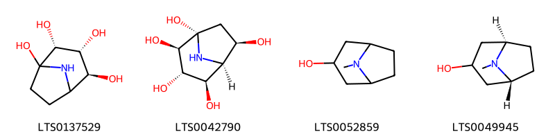{ width=100% }
    <figcaption>Hình ảnh cấu trúc hóa học của 4 hoạt chất thuộc nhóm Tropane alkaloids gồm ['calystegin b2 (LTS0137529)', '(1s,2r,3s,4r,5s,6r)-8-azabicyclo[3.2.1]octane-1,2,3,4,6-pentol (LTS0042790)', 'tropin (LTS0052859)', '(1r,5r)-8-methyl-8-azabicyclo[3.2.1]octan-3-ol (LTS0049945)'].</figcaption>
</figure>

---

### Dược dân tộc học

Danh sách các quốc gia có sử dụng *Withania somnifera* trong điều trị các bệnh. 

| Country          | Disease                              | Bệnh                                     |
|:-----------------|:-------------------------------------|:-----------------------------------------|
| Afghanistan      | Pediculicide                         | Pediculicide                             |
| Africa           | Diuretic, Narcotic                   | Thuốc lợi tiểu, Thuốc gây ngủ            |
| Asia             | Poison                               | Chất độc                                 |
| Elsewhere        | Rennet, Sedative, nan, nan           | Rennet, Thuốc an thần, nan, nan          |
| India            | Fungicide                            | Thuốc diệt nấm                           |
| India(Ayurvedic) | Sedative                             | Thuốc an thần                            |
| Iraq             | Sedative, Diuretic, Narcotic         | Thuốc an thần, lợi tiểu, ma túy          |
| Pakistan         | Abortifacient, Contraceptive, Poison | Ngừa thai, Ngừa thai, Ngộ độc            |
| Sudan            | Diuretic, Tonic, Rennet, Rennet      | Thuốc lợi tiểu, Thuốc bổ, Rennet, Rennet |
| ain              | Narcotic                             | Thuốc gây ngủ, gây mê                    |

---

# Chi Scopolia

??? note "Danh sách các dược liệu thuộc chi"
    
	 - *Scopolia anomala*
	 - *Scopolia carniolica*
	 - *Scopolia japonica*

---
## Scopolia anomala
### Thông tin về thực vật

!!! info "Phân loại thực vật của *Anisodus stramoniifolius* từ GIBF:"
    - **Kingdom:** Plantae
    - **Phylum:** Tracheophyta
    - **Order:** Solanales
    - **Family:** Solanaceae
    - **Genus:** Anisodus
    - **Species:** *Anisodus stramoniifolius*

 

| Label (VI)   | Label (EN)   | Scientific Name   | Descriptions (VI)   | Descriptions (EN)   | Also Known As (VI)   | Also Known As (EN)   |
|:-------------|:-------------|:------------------|:--------------------|:--------------------|:---------------------|:---------------------|
| N/A          | N/A          | Scopolia anomala  |                     |                     | ['']                 | ['']                 |

#### Phân bố trên thế giới

**Từ CSDL GIBF** nan, unknown or invalid, Netherlands

#### Phân bố tại Việt Nam

**Từ CSDL GIBF**: Không có ghi nhận ở Việt Nam

---
### Thành phần hóa học
        
- Theo cơ sở dữ liệu lotus: Từ loài *Anisodus stramoniifolius* đã phân lập và xác định được Chưa có hoạt chất nào được phân lập. hoạt chất thuộc về các nhóm Không có hoạt chất nào được phân lập. 

Không có hình ảnh nào được tạo ra

---

### Dược dân tộc học

Danh sách các quốc gia có sử dụng *Anisodus stramoniifolius* trong điều trị các bệnh. 

| Country      | Disease   | Bệnh               |
|:-------------|:----------|:-------------------|
| Elsewhere    | Mydriatic | Thuốc giãn đồng-tử |
| India(Hindu) | Mydriatic | Thuốc giãn đồng-tử |

---

---
## Scopolia carniolica
### Thông tin về thực vật

!!! info "Phân loại thực vật của *Scopolia carniolica* từ GIBF:"
    - **Kingdom:** Plantae
    - **Phylum:** Tracheophyta
    - **Order:** Solanales
    - **Family:** Solanaceae
    - **Genus:** Scopolia
    - **Species:** *Scopolia carniolica*

 

| Label (VI)   | Label (EN)   | Scientific Name     | Descriptions (VI)   | Descriptions (EN)   | Also Known As (VI)   | Also Known As (EN)   |
|:-------------|:-------------|:--------------------|:--------------------|:--------------------|:---------------------|:---------------------|
| N/A          | N/A          | Scopolia carniolica | loài thực vật       | species of plant    | ['']                 | ['']                 |

#### Phân bố trên thế giới

**Từ CSDL GIBF** Italy, Slovakia, Georgia, Latvia, Norway, Ukraine, Denmark, Netherlands, Lithuania, Hungary, Russian Federation, Sweden, Finland, Slovenia, Croatia, Czechia, Germany, Romania, Austria, Poland

#### Phân bố tại Việt Nam

**Từ CSDL GIBF**: Không có ghi nhận ở Việt Nam

---
### Thành phần hóa học
        
- Theo cơ sở dữ liệu lotus: Từ loài *Scopolia carniolica* đã phân lập và xác định được 12 hoạt chất thuộc về các nhóm Hydroxy acids and derivatives, Tropane alkaloids. 

|    | chemicalTaxonomyClassyfireClass   |   smiles_count |
|---:|:----------------------------------|---------------:|
|  0 |                                   |              2 |
|  1 | Hydroxy acids and derivatives     |              2 |
|  2 | Tropane alkaloids                 |              8 |

#### Nhóm 
<figure markdown="span">
    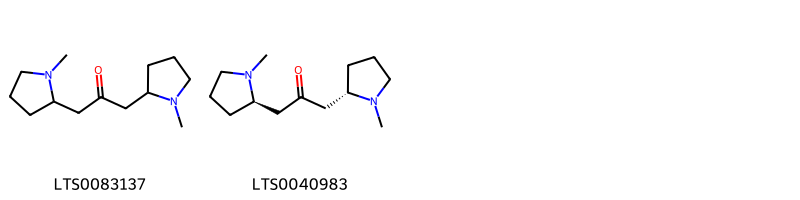{ width=100% }
    <figcaption>Hình ảnh cấu trúc hóa học của 2 hoạt chất thuộc nhóm  gồm ['cuskhygrine (LTS0083137)', 'cuscohygrine (LTS0040983)'].</figcaption>
</figure>
#### Nhóm Hydroxy acids and derivatives
<figure markdown="span">
    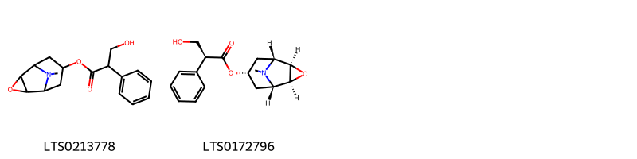{ width=100% }
    <figcaption>Hình ảnh cấu trúc hóa học của 2 hoạt chất thuộc nhóm Hydroxy acids and derivatives gồm ['buscopan (LTS0213778)', 'scopolamine (LTS0172796)'].</figcaption>
</figure>
#### Nhóm Tropane alkaloids
<figure markdown="span">
    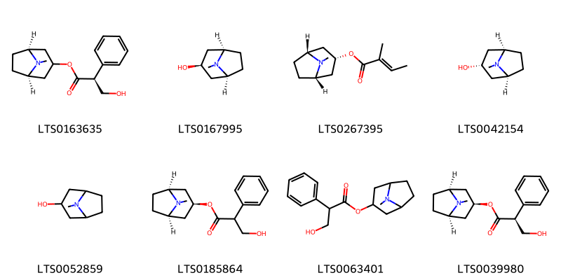{ width=100% }
    <figcaption>Hình ảnh cấu trúc hóa học của 8 hoạt chất thuộc nhóm Tropane alkaloids gồm ['hyoscyamine, its salts and derivatives (LTS0163635)', 'tropine (LTS0167995)', 'tropigline (LTS0267395)', 'pseudotropine (LTS0042154)', 'tropin (LTS0052859)', 'atropine (LTS0185864)', '()-hyoscyamine (LTS0063401)', 'hyoscyamine (LTS0039980)'].</figcaption>
</figure>

---

### Dược dân tộc học

Danh sách các quốc gia có sử dụng *Scopolia carniolica* trong điều trị các bệnh. 

| Country   | Disease                      | Bệnh                             |
|:----------|:-----------------------------|:---------------------------------|
| Dutch     | Diuretic                     | Thuốc lợi tiêu                   |
| English   | Sedative, Mydriatic          | Thuốc an thần, Mydriatic         |
| Eurasia   | Hypnotic, Narcotic, Sedative | Thôi miên, Ma túy, Thuốc an thần |
| French    | Poison                       | Chất độc                         |
| German    | Narcotic                     | Thuốc gây ngủ, gây mê            |

---

---
## Scopolia japonica
### Thông tin về thực vật

!!! info "Phân loại thực vật của *Scopolia japonica* từ GIBF:"
    - **Kingdom:** Plantae
    - **Phylum:** Tracheophyta
    - **Order:** Solanales
    - **Family:** Solanaceae
    - **Genus:** Scopolia
    - **Species:** *Scopolia japonica*

 

| Label (VI)   | Label (EN)   | Scientific Name   | Descriptions (VI)   | Descriptions (EN)   | Also Known As (VI)   | Also Known As (EN)   |
|:-------------|:-------------|:------------------|:--------------------|:--------------------|:---------------------|:---------------------|
| N/A          | N/A          | Scopolia japonica | loài thực vật       | species of plant    | ['']                 | ['']                 |

#### Phân bố trên thế giới

**Từ CSDL GIBF** nan, Belgium, Korea, Republic of, Japan

#### Phân bố tại Việt Nam

**Từ CSDL GIBF**: Không có ghi nhận ở Việt Nam

---
### Thành phần hóa học
        
- Theo cơ sở dữ liệu lotus: Từ loài *Scopolia japonica* đã phân lập và xác định được 21 hoạt chất thuộc về các nhóm Hydroxy acids and derivatives, Tropane alkaloids, Steroids and steroid derivatives, Coumarins and derivatives. 

|    | chemicalTaxonomyClassyfireClass   |   smiles_count |
|---:|:----------------------------------|---------------:|
|  0 | Coumarins and derivatives         |              1 |
|  1 | Hydroxy acids and derivatives     |              4 |
|  2 | Steroids and steroid derivatives  |              6 |
|  3 | Tropane alkaloids                 |             10 |

#### Nhóm Coumarins and derivatives
<figure markdown="span">
    { width=100% }
    <figcaption>Hình ảnh cấu trúc hóa học của 1 hoạt chất thuộc nhóm Coumarins and derivatives gồm ['scopoletin (LTS0193112)'].</figcaption>
</figure>
#### Nhóm Hydroxy acids and derivatives
<figure markdown="span">
    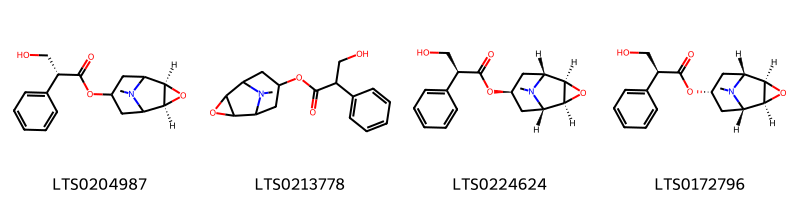{ width=100% }
    <figcaption>Hình ảnh cấu trúc hóa học của 4 hoạt chất thuộc nhóm Hydroxy acids and derivatives gồm ['(2r,4s)-9-methyl-3-oxa-9-azatricyclo[3.3.1.0²,⁴]nonan-7-yl (2r)-3-hydroxy-2-phenylpropanoate (LTS0204987)', 'buscopan (LTS0213778)', '(1r,2r,4s,5s,7s)-9-methyl-3-oxa-9-azatricyclo[3.3.1.0²,⁴]nonan-7-yl (2s)-3-hydroxy-2-phenylpropanoate (LTS0224624)', 'scopolamine (LTS0172796)'].</figcaption>
</figure>
#### Nhóm Steroids and steroid derivatives
<figure markdown="span">
    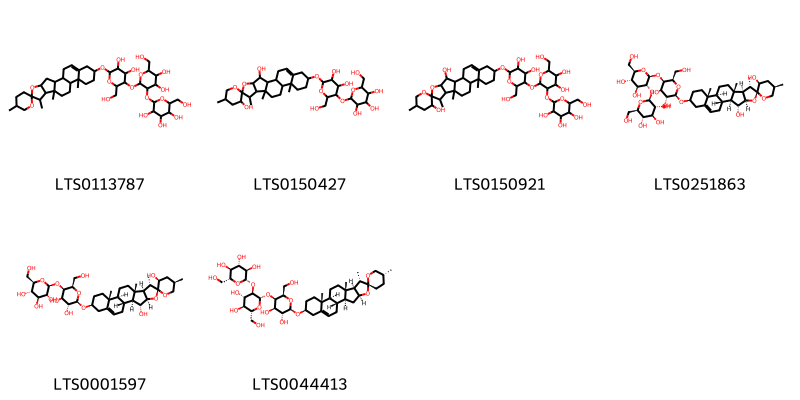{ width=100% }
    <figcaption>Hình ảnh cấu trúc hóa học của 6 hoạt chất thuộc nhóm Steroids and steroid derivatives gồm ["2-[(2-{[4,5-dihydroxy-2-(hydroxymethyl)-6-{5,7',9',13'-tetramethyl-5'-oxaspiro[oxane-2,6'-pentacyclo[10.8.0.0²,⁹.0⁴,⁸.0¹³,¹⁸]icosan]-18'-eneoxy}oxan-3-yl]oxy}-4,5-dihydroxy-6-(hydroxymethyl)oxan-3-yl)oxy]-6-(hydroxymethyl)oxane-3,4,5-triol (LTS0113787)", 'scopoloside ii (LTS0150427)', 'scopoloside i (LTS0150921)', "(2s,3r,4s,5s,6r)-2-{[(2s,3r,4s,5s,6r)-2-{[(2r,3r,4r,5r,6r)-4,5-dihydroxy-2-(hydroxymethyl)-6-[(1'r,2s,2's,3s,3'r,4'r,5r,7's,8'r,9's,12's,13'r,16's)-5,7',9',13'-tetramethyl-5'-oxaspiro[oxane-2,6'-pentacyclo[10.8.0.0²,⁹.0⁴,⁸.0¹³,¹⁸]icosan]-18'-ene-3,3'-dioloxy]oxan-3-yl]oxy}-4,5-dihydroxy-6-(hydroxymethyl)oxan-3-yl]oxy}-6-(hydroxymethyl)oxane-3,4,5-triol (LTS0251863)", "(2s,3r,4s,5s,6r)-2-{[(2r,3r,4r,5r,6r)-4,5-dihydroxy-2-(hydroxymethyl)-6-[(1'r,2s,2's,3s,3'r,4'r,5r,7's,8'r,9's,12's,13'r,16's)-5,7',9',13'-tetramethyl-5'-oxaspiro[oxane-2,6'-pentacyclo[10.8.0.0²,⁹.0⁴,⁸.0¹³,¹⁸]icosan]-18'-ene-3,3'-dioloxy]oxan-3-yl]oxy}-6-(hydroxymethyl)oxane-3,4,5-triol (LTS0001597)", "(2s,3r,4s,5s,6r)-2-{[(2s,3r,4s,5s,6r)-2-{[(2r,3r,4r,5r,6r)-4,5-dihydroxy-2-(hydroxymethyl)-6-[(1's,2r,2's,4's,5r,7's,8'r,9's,12's,13'r,16's)-5,7',9',13'-tetramethyl-5'-oxaspiro[oxane-2,6'-pentacyclo[10.8.0.0²,⁹.0⁴,⁸.0¹³,¹⁸]icosan]-18'-eneoxy]oxan-3-yl]oxy}-4,5-dihydroxy-6-(hydroxymethyl)oxan-3-yl]oxy}-6-(hydroxymethyl)oxane-3,4,5-triol (LTS0044413)"].</figcaption>
</figure>
#### Nhóm Tropane alkaloids
<figure markdown="span">
    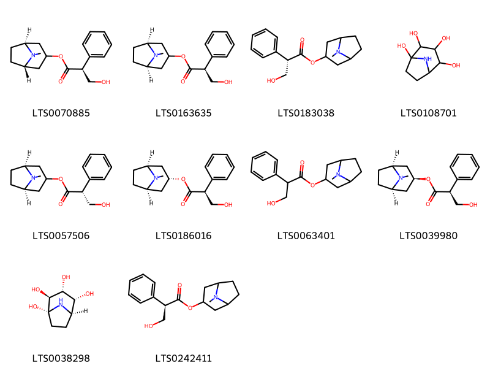{ width=100% }
    <figcaption>Hình ảnh cấu trúc hóa học của 10 hoạt chất thuộc nhóm Tropane alkaloids gồm ['(1s,5s)-8-methyl-8-azabicyclo[3.2.1]octan-3-yl (2s)-3-hydroxy-2-phenylpropanoate (LTS0070885)', 'hyoscyamine, its salts and derivatives (LTS0163635)', 'hyoscyamine (LTS0183038)', '8-azabicyclo[3.2.1]octane-1,2,3,4-tetrol (LTS0108701)', '(1r,5s)-8-methyl-8-azabicyclo[3.2.1]octan-3-yl (2r)-3-hydroxy-2-phenylpropanoate (LTS0057506)', 'l-hyoscyamine (LTS0186016)', '()-hyoscyamine (LTS0063401)', 'hyoscyamine (LTS0039980)', '(1r,2s,3r,4r,5r)-8-azabicyclo[3.2.1]octane-1,2,3,4-tetrol (LTS0038298)', '8-methyl-8-azabicyclo[3.2.1]octan-3-yl (2r)-3-hydroxy-2-phenylpropanoate (LTS0242411)'].</figcaption>
</figure>

---

### Dược dân tộc học

Danh sách các quốc gia có sử dụng *Scopolia japonica* trong điều trị các bệnh. 

| Country   | Disease                                             | Bệnh                                                                           |
|:----------|:----------------------------------------------------|:-------------------------------------------------------------------------------|
| China     | Diuretic, Parasiticide, Poison, Hallucinogen, Tonic | Thuốc lợi tiểu, Thuốc diệt ký sinh trùng, Chất độc, Chất gây ảo giác, Thuốc bổ |
| English   | Sedative                                            | Thuốc an thần                                                                  |
| Japan     | Mydriatic, Sedative                                 | Mydriatic, An thần                                                             |

---

# Chi Nicandra

??? note "Danh sách các dược liệu thuộc chi"
    
	 - *Nicandra physalodes*

---
## Nicandra physalodes
### Thông tin về thực vật

!!! info "Phân loại thực vật của *Nicandra physalodes* từ GIBF:"
    - **Kingdom:** Plantae
    - **Phylum:** Tracheophyta
    - **Order:** Solanales
    - **Family:** Solanaceae
    - **Genus:** Nicandra
    - **Species:** *Nicandra physalodes*

 

| Label (VI)   | Label (EN)   | Scientific Name     | Descriptions (VI)   | Descriptions (EN)   | Also Known As (VI)   | Also Known As (EN)   |
|:-------------|:-------------|:--------------------|:--------------------|:--------------------|:---------------------|:---------------------|
| N/A          | N/A          | Nicandra physalodes | loài thực vật       | species of plant    | ['']                 | ['']                 |

#### Phân bố trên thế giới

**Từ CSDL GIBF** Australia, Belgium, Guatemala, Angola, Argentina, Rwanda, Tanzania, United Republic of, Israel, Malawi, Zambia, Netherlands, Chinese Taipei, Spain, Bolivia (Plurinational State of), Portugal, Russian Federation, United States of America, Congo, Democratic Republic of the, Sweden, Chile, Zimbabwe, South Africa, Thailand, Germany, Brazil, Peru, Mexico, Austria, France, China, United Kingdom of Great Britain and Northern Ireland, Ecuador, Madagascar, Cabo Verde, Colombia, Indonesia, Kenya, Cameroon, New Zealand, Ethiopia

#### Phân bố tại Việt Nam

**Từ CSDL GIBF**: Không có ghi nhận ở Việt Nam

---
### Thành phần hóa học
        
- Theo cơ sở dữ liệu lotus: Từ loài *Nicandra physalodes* đã phân lập và xác định được 4 hoạt chất thuộc về các nhóm Tropane alkaloids, Organooxygen compounds. 

|    | chemicalTaxonomyClassyfireClass   |   smiles_count |
|---:|:----------------------------------|---------------:|
|  0 | Organooxygen compounds            |              2 |
|  1 | Tropane alkaloids                 |              2 |

#### Nhóm Organooxygen compounds
<figure markdown="span">
    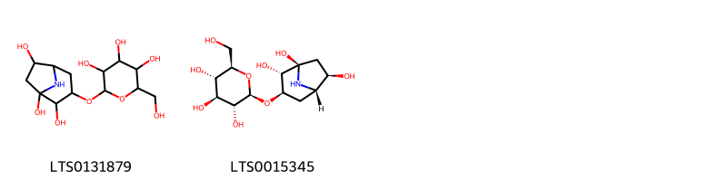{ width=100% }
    <figcaption>Hình ảnh cấu trúc hóa học của 2 hoạt chất thuộc nhóm Organooxygen compounds gồm ['3-{[3,4,5-trihydroxy-6-(hydroxymethyl)oxan-2-yl]oxy}-8-azabicyclo[3.2.1]octane-1,2,6-triol (LTS0131879)', '(1r,2s,3r,5s,6r)-3-{[(2r,3r,4s,5s,6r)-3,4,5-trihydroxy-6-(hydroxymethyl)oxan-2-yl]oxy}-8-azabicyclo[3.2.1]octane-1,2,6-triol (LTS0015345)'].</figcaption>
</figure>
#### Nhóm Tropane alkaloids
<figure markdown="span">
    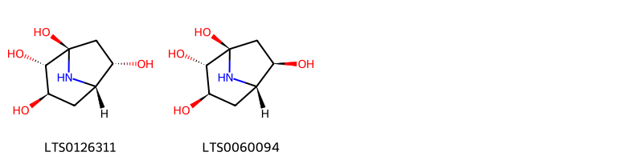{ width=100% }
    <figcaption>Hình ảnh cấu trúc hóa học của 2 hoạt chất thuộc nhóm Tropane alkaloids gồm ['(1r,2s,3r,5s,6s)-8-azabicyclo[3.2.1]octane-1,2,3,6-tetrol (LTS0126311)', '(1r,2s,3r,5s,6r)-8-azabicyclo[3.2.1]octane-1,2,3,6-tetrol (LTS0060094)'].</figcaption>
</figure>

---

### Dược dân tộc học

Danh sách các quốc gia có sử dụng *Nicandra physalodes* trong điều trị các bệnh. 

| Country   | Disease                                     | Bệnh                                                |
|:----------|:--------------------------------------------|:----------------------------------------------------|
| Elsewhere | Diuretic, Insecticide, Mydriatic, Vermifuge | Thuốc lợi tiểu, Thuốc trừ sâu, Mydriatic, Vermifuge |
| Malagasy  | Pediculicide                                | Pediculicide                                        |
| US        | Poison                                      | Chất độc                                            |

---

# Chi Physalis

??? note "Danh sách các dược liệu thuộc chi"
    
	 - *Physalis alkekengi*
	 - *Physalis angulata*
	 - *Physalis minima*
	 - *Physalis pubescens*

---
## Physalis alkekengi
### Thông tin về thực vật

!!! info "Phân loại thực vật của *N/A* từ GIBF:"
    - **Kingdom:** Plantae
    - **Phylum:** Tracheophyta
    - **Order:** Solanales
    - **Family:** Solanaceae
    - **Genus:** N/A
    - **Species:** *N/A*

 

| Label (VI)   | Label (EN)   | Scientific Name       | Descriptions (VI)   | Descriptions (EN)                                          | Also Known As (VI)        | Also Known As (EN)                                                                                                                                                                             |
|:-------------|:-------------|:----------------------|:--------------------|:-----------------------------------------------------------|:--------------------------|:-----------------------------------------------------------------------------------------------------------------------------------------------------------------------------------------------|
| N/A          | N/A          | Physalis alkekengi    | loài thực vật       | species of plant with bright red or orange papery covering | ['Alkekengi officinarum'] | ['winter cherry', 'bladder cherry', 'Physalis alkekengii', 'alchechengi berry', 'Japanese-lantern', 'Klabuster cherry', 'Chinese lantern', 'Alkekengi officinarum', 'strawberry groundcherry'] |
| N/A          | N/A          | Alkekengi officinarum | loài thực vật       | species of plant with bright red or orange papery covering | ['Alkekengi officinarum'] | ['winter cherry', 'bladder cherry', 'Physalis alkekengii', 'alchechengi berry', 'Japanese-lantern', 'Klabuster cherry', 'Chinese lantern', 'Alkekengi officinarum', 'strawberry groundcherry'] |

#### Phân bố trên thế giới

**Từ CSDL GIBF** Australia, Japan, Argentina, Palestine, State of, Israel, Canada, Luxembourg, Cyprus, Chinese Taipei, Spain, Bolivia (Plurinational State of), Türkiye, Portugal, Morocco, United States of America, Uruguay, Chile, Greece, South Africa, Thailand, Brazil, Mexico, France, Peru, Viet Nam, United Kingdom of Great Britain and Northern Ireland, Ecuador, Indonesia, New Zealand

#### Phân bố tại Việt Nam

**Từ CSDL GIBF**: Lâm Đồng

---
### Thành phần hóa học
        
- Theo cơ sở dữ liệu lotus: Từ loài *N/A* đã phân lập và xác định được 98 hoạt chất thuộc về các nhóm Prenol lipids, Steroids and steroid derivatives, Oxepanes, Tropane alkaloids, Organooxygen compounds, Carboxylic acids and derivatives. 

|    | chemicalTaxonomyClassyfireClass   |   smiles_count |
|---:|:----------------------------------|---------------:|
|  0 |                                   |              3 |
|  1 | Carboxylic acids and derivatives  |              1 |
|  2 | Organooxygen compounds            |              4 |
|  3 | Oxepanes                          |              2 |
|  4 | Prenol lipids                     |             16 |
|  5 | Steroids and steroid derivatives  |             59 |
|  6 | Tropane alkaloids                 |             13 |

#### Nhóm 
<figure markdown="span">
    { width=100% }
    <figcaption>Hình ảnh cấu trúc hóa học của 3 hoạt chất thuộc nhóm  gồm ['cuskhygrine (LTS0083137)', '1-[1-methyl-5-(2-oxopropyl)pyrrolidin-2-yl]-3-(1-methylpyrrolidin-2-yl)propan-2-one (LTS0207899)', '1,3-bis[(2r)-1-methylpyrrolidin-2-yl]propan-2-one (LTS0179198)'].</figcaption>
</figure>
#### Nhóm Carboxylic acids and derivatives
<figure markdown="span">
    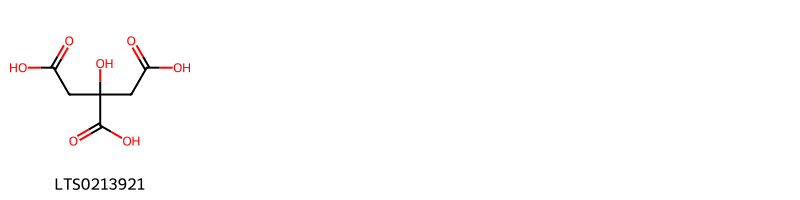{ width=100% }
    <figcaption>Hình ảnh cấu trúc hóa học của 1 hoạt chất thuộc nhóm Carboxylic acids and derivatives gồm ['citric acid (LTS0213921)'].</figcaption>
</figure>
#### Nhóm Organooxygen compounds
<figure markdown="span">
    { width=100% }
    <figcaption>Hình ảnh cấu trúc hóa học của 4 hoạt chất thuộc nhóm Organooxygen compounds gồm ['7-aminocycloheptane-1,2,4-triol (LTS0216625)', '(1r,2r,4r,7s)-7-aminocycloheptane-1,2,4-triol (LTS0153581)', '1-(3-hydroxyprop-1-en-2-yl)-4,8-dimethylspiro[4.5]dec-7-en-6-one (LTS0127986)', '(1s,4r,5r)-1-(3-hydroxyprop-1-en-2-yl)-4,8-dimethylspiro[4.5]dec-7-en-6-one (LTS0039613)'].</figcaption>
</figure>
#### Nhóm Oxepanes
<figure markdown="span">
    { width=100% }
    <figcaption>Hình ảnh cấu trúc hóa học của 2 hoạt chất thuộc nhóm Oxepanes gồm ['(3e)-4-[(1s,4s,6r)-4-hydroxy-2,2,6-trimethyl-7-oxabicyclo[4.1.0]heptan-1-yl]but-3-en-2-one (LTS0081174)', '4-{4-hydroxy-2,2,6-trimethyl-7-oxabicyclo[4.1.0]heptan-1-yl}but-3-en-2-one (LTS0273299)'].</figcaption>
</figure>
#### Nhóm Prenol lipids
<figure markdown="span">
    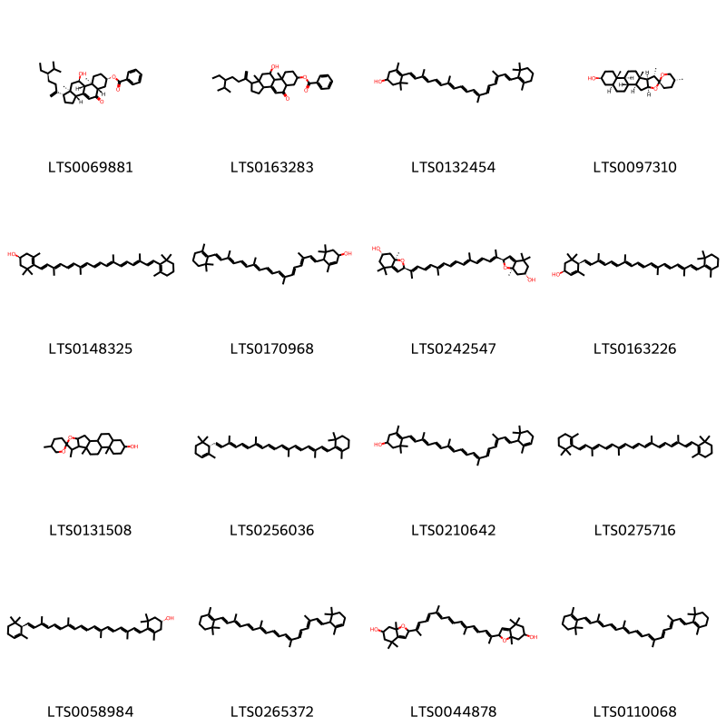{ width=100% }
    <figcaption>Hình ảnh cấu trúc hóa học của 16 hoạt chất thuộc nhóm Prenol lipids gồm ['(1r,3ar,5as,7s,9ar,9br,10r,11ar)-1-[(5r)-5-ethyl-6-methylhept-1-en-2-yl]-10-hydroxy-9a,11a-dimethyl-5-oxo-1h,2h,3h,3ah,5ah,6h,7h,8h,9h,9bh,10h,11h-cyclopenta[a]phenanthren-7-yl benzoate (LTS0069881)', '1-(5-ethyl-6-methylhept-1-en-2-yl)-10-hydroxy-9a,11a-dimethyl-5-oxo-1h,2h,3h,3ah,5ah,6h,7h,8h,9h,9bh,10h,11h-cyclopenta[a]phenanthren-7-yl benzoate (LTS0163283)', '3,5,5-trimethyl-4-[(1e,3e,5e,7e,9e)-3,7,12,16-tetramethyl-18-(2,6,6-trimethylcyclohex-1-en-1-yl)octadeca-1,3,5,7,9,11,13,15,17-nonaen-1-yl]cyclohex-3-en-1-ol (LTS0132454)', 'tigogenin (LTS0097310)', '(s)-cryptoxanthin (LTS0148325)', '3,5,5-trimethyl-4-[(9e,11e,13e,15e,17e)-3,7,12,16-tetramethyl-18-(2,6,6-trimethylcyclohex-1-en-1-yl)octadeca-1,3,5,7,9,11,13,15,17-nonaen-1-yl]cyclohex-2-en-1-ol (LTS0170968)', '(2r,6s,7ar)-2-[(2e,4e,6e,8e,10e,12e,14e)-15-[(2r,6s,7ar)-6-hydroxy-4,4,7a-trimethyl-2,5,6,7-tetrahydro-1-benzofuran-2-yl]-6,11-dimethylhexadeca-2,4,6,8,10,12,14-heptaen-2-yl]-4,4,7a-trimethyl-2,5,6,7-tetrahydro-1-benzofuran-6-ol (LTS0242547)', '(1s,4r)-3,5,5-trimethyl-4-[(1e,3e,5e,7e,9e,11e,13e,15e,17e)-3,7,12,16-tetramethyl-18-(2,6,6-trimethylcyclohex-1-en-1-yl)octadeca-1,3,5,7,9,11,13,15,17-nonaen-1-yl]cyclohex-2-en-1-ol (LTS0163226)', 'tigogenin (LTS0131508)', "(6's)-β,epsilon-carotene (LTS0256036)", '3,5,5-trimethyl-4-[(1e,3e,5e,7e,9e)-3,7,12,16-tetramethyl-18-(2,6,6-trimethylcyclohex-2-en-1-yl)octadeca-1,3,5,7,9,11,13,15,17-nonaen-1-yl]cyclohex-3-en-1-ol (LTS0210642)', 'β-carotene (LTS0275716)', 'zeinoxanthin (LTS0058984)', '1,5,5-trimethyl-6-[(9e,11e,13e,15e,17e)-3,7,12,16-tetramethyl-18-(2,6,6-trimethylcyclohex-1-en-1-yl)octadeca-1,3,5,7,9,11,13,15,17-nonaen-1-yl]cyclohex-1-ene (LTS0265372)', '2-[(8e,10e,12e,14e)-15-(6-hydroxy-4,4,7a-trimethyl-2,5,6,7-tetrahydro-1-benzofuran-2-yl)-6,11-dimethylhexadeca-2,4,6,8,10,12,14-heptaen-2-yl]-4,4,7a-trimethyl-2,5,6,7-tetrahydro-1-benzofuran-6-ol (LTS0044878)', '1,3,3-trimethyl-2-[(9e,11e,13e,15e,17e)-3,7,12,16-tetramethyl-18-(2,6,6-trimethylcyclohex-1-en-1-yl)octadeca-1,3,5,7,9,11,13,15,17-nonaen-1-yl]cyclohex-1-ene (LTS0110068)'].</figcaption>
</figure>
#### Nhóm Steroids and steroid derivatives
<figure markdown="span">
    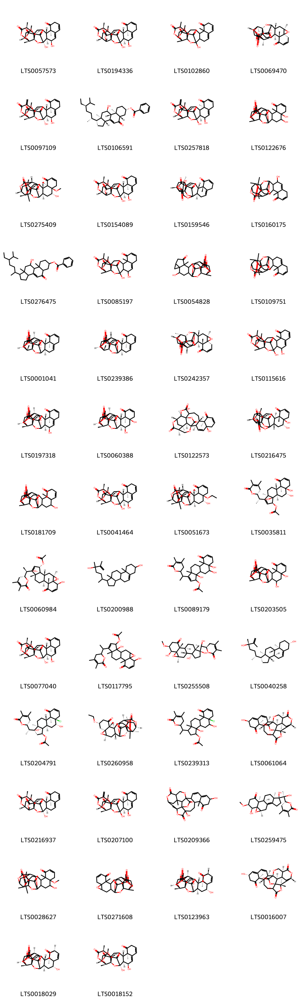{ width=100% }
    <figcaption>Hình ảnh cấu trúc hóa học của 59 hoạt chất thuộc nhóm Steroids and steroid derivatives gồm ['(1s,2r,3r,5r,6s,7r,14r,15s,18s,21s,22r,25s)-5,7,18-trihydroxy-1,14,21,25-tetramethyl-4,20,23-trioxaheptacyclo[20.3.1.1²,⁵.0³,¹⁸.0³,²¹.0⁶,¹⁵.0⁹,¹⁴]heptacosa-8,10-diene-13,19,24,27-tetrone (LTS0057573)', '(1s,2s,3r,5s,6s,7r,14r,15s,18r,21s,22r,25s)-5,7,18-trihydroxy-1,14,21,25-tetramethyl-4,20,23-trioxaheptacyclo[20.3.1.1²,⁵.0³,¹⁸.0³,²¹.0⁶,¹⁵.0⁹,¹⁴]heptacosa-8,11-diene-13,19,24,27-tetrone (LTS0194336)', '5,18-dihydroxy-1,14,21,25-tetramethyl-4,20,23-trioxaheptacyclo[20.3.1.1²,⁵.0³,¹⁸.0³,²¹.0⁶,¹⁵.0⁹,¹⁴]heptacosa-8,10-diene-13,19,24,27-tetrone (LTS0102860)', '(1s,2r,4r,6s,11r,12s,15r,18s,19r,20r,21s,23r,26r)-15-hydroxy-11,18,21-trimethyl-5,17,24,28,29-pentaoxanonacyclo[17.9.1.1¹,²⁰.0²,¹².0⁴,⁶.0⁶,¹¹.0¹⁵,¹⁹.0¹⁸,²³.0²¹,²⁶]triacont-8-ene-10,16,25,30-tetrone (LTS0069470)', '(1s,2s,3r,5r,6s,7r,14r,15s,18s,21s,22r)-5,7,18-trihydroxy-1,14,21-trimethyl-25-methylidene-4,20,23-trioxaheptacyclo[20.3.1.1²,⁵.0³,¹⁸.0³,²¹.0⁶,¹⁵.0⁹,¹⁴]heptacosa-8,11-diene-13,19,24,27-tetrone (LTS0097109)', '(1r,3ar,5as,7s,9ar,9br,10r,11ar)-1-[(2r,5r)-5-ethyl-6-methylheptan-2-yl]-10-hydroxy-9a,11a-dimethyl-5-oxo-1h,2h,3h,3ah,5ah,6h,7h,8h,9h,9bh,10h,11h-cyclopenta[a]phenanthren-7-yl benzoate (LTS0106591)', '(1s,2s,5s,6s,14r,22r)-5,7,18-trihydroxy-1,14,21-trimethyl-25-methylidene-4,20,23-trioxaheptacyclo[20.3.1.1²,⁵.0³,¹⁸.0³,²¹.0⁶,¹⁵.0⁹,¹⁴]heptacosa-8,11-diene-13,19,24,27-tetrone (LTS0257818)', '5,14,15-trihydroxy-2,9,26-trimethyl-3,19,23,28-tetraoxaoctacyclo[16.9.1.1¹⁸,²⁷.0¹,⁵.0²,²⁴.0⁸,¹⁷.0⁹,¹⁴.0²¹,²⁶]nonacos-11-ene-4,10,22,29-tetrone (LTS0122676)', '(1r,2s,5r,8s,9r,14r,15r,17r,18r,21s,24r,26s,27s)-5,15-dihydroxy-14-methoxy-2,9,26-trimethyl-3,19,23,28-tetraoxaoctacyclo[16.9.1.1¹⁸,²⁷.0¹,⁵.0²,²⁴.0⁸,¹⁷.0⁹,¹⁴.0²¹,²⁶]nonacos-11-ene-4,10,22,29-tetrone (LTS0275409)', '(1s,2s,3r,5s,6s,7r,14r,15s,18r,21s,22r,25s)-5,7,18-trihydroxy-1,14,21,25-tetramethyl-4,20,23-trioxaheptacyclo[20.3.1.1²,⁵.0³,¹⁸.0³,²¹.0⁶,¹⁵.0⁹,¹⁴]heptacosa-8,10-diene-13,19,24,27-tetrone (LTS0154089)', '(5s,8s,9s,17r,21s,24s,26s,27s)-5-hydroxy-2,9,26-trimethyl-3,19,23,28-tetraoxaoctacyclo[16.9.1.1¹⁸,²⁷.0¹,⁵.0²,²⁴.0⁸,¹⁷.0⁹,¹⁴.0²¹,²⁶]nonacosa-11,14-diene-4,10,22,29-tetrone (LTS0159546)', '5,16-dihydroxy-2,9,26-trimethyl-3,19,23,28-tetraoxaoctacyclo[16.9.1.1¹⁸,²⁷.0¹,⁵.0²,²⁴.0⁸,¹⁷.0⁹,¹⁴.0²¹,²⁶]nonacosa-11,14-diene-4,10,22,29-tetrone (LTS0160175)', '1-(5-ethyl-6-methylheptan-2-yl)-10-hydroxy-9a,11a-dimethyl-5-oxo-1h,2h,3h,3ah,5ah,6h,7h,8h,9h,9bh,10h,11h-cyclopenta[a]phenanthren-7-yl benzoate (LTS0276475)', '5,7,18-trihydroxy-1,14,21,25-tetramethyl-4,20,23-trioxaheptacyclo[20.3.1.1²,⁵.0³,¹⁸.0³,²¹.0⁶,¹⁵.0⁹,¹⁴]heptacosa-8,11-diene-13,19,24,27-tetrone (LTS0085197)', '4,14-dihydroxy-10,17,20-trimethyl-16,23,27,28-tetraoxanonacyclo[16.9.1.1¹,¹⁹.0²,¹¹.0⁵,⁷.0⁵,¹⁰.0¹⁴,¹⁸.0¹⁷,²².0²⁰,²⁵]nonacosane-9,15,24,29-tetrone (LTS0054828)', 'physalin b (LTS0109751)', '(1r,2s,5r,8s,9r,17r,18r,21s,24r,26s,27s)-5-hydroxy-2,9,26-trimethyl-3,19,23,28-tetraoxaoctacyclo[16.9.1.1¹⁸,²⁷.0¹,⁵.0²,²⁴.0⁸,¹⁷.0⁹,¹⁴.0²¹,²⁶]nonacosa-11,14-diene-4,10,22,29-tetrone (LTS0001041)', '(1r,2s,5r,8s,9r,17r,18s,21r,24r,26s,27s)-5-hydroxy-2,9,26-trimethyl-3,19,23,28-tetraoxaoctacyclo[16.9.1.1¹⁸,²⁷.0¹,⁵.0²,²⁴.0⁸,¹⁷.0⁹,¹⁴.0²¹,²⁶]nonacosa-12,14-diene-4,10,22,29-tetrone (LTS0239386)', 'physalin f (LTS0242357)', '5,7,18-trihydroxy-1,14,21,25-tetramethyl-4,20,23-trioxaheptacyclo[20.3.1.1²,⁵.0³,¹⁸.0³,²¹.0⁶,¹⁵.0⁹,¹⁴]heptacosa-8,10-diene-13,19,24,27-tetrone (LTS0115616)', '(1r,2s,5s,8s,9r,16r,17s,18r,21s,24r,26s,27s)-5,16-dihydroxy-2,9,26-trimethyl-3,19,23,28-tetraoxaoctacyclo[16.9.1.1¹⁸,²⁷.0¹,⁵.0²,²⁴.0⁸,¹⁷.0⁹,¹⁴.0²¹,²⁶]nonacosa-11,14-diene-4,10,22,29-tetrone (LTS0197318)', '(1r,2s,5s,8s,9r,14s,16r,17s,18r,21s,24r,26s,27s)-5,14,16-trihydroxy-2,9,26-trimethyl-3,19,23,28-tetraoxaoctacyclo[16.9.1.1¹⁸,²⁷.0¹,⁵.0²,²⁴.0⁸,¹⁷.0⁹,¹⁴.0²¹,²⁶]nonacos-11-ene-4,10,22,29-tetrone (LTS0060388)', '(1r,2r,5r,8s,9r,14s,17r,18s,21s,24s,26s,27s)-5,14-dihydroxy-2,9,26-trimethyl-3,19,23,28-tetraoxaoctacyclo[16.9.2.0¹,⁵.0²,²⁴.0⁸,¹⁷.0⁹,¹⁴.0¹⁸,²⁷.0²¹,²⁶]nonacosa-11,15-diene-4,10,22,29-tetrone (LTS0122573)', '(5r,8r,9s,14r,15r,17s,21r,24s,26r,27s)-5,14,15-trihydroxy-2,9,26-trimethyl-3,19,23,28-tetraoxaoctacyclo[16.9.1.1¹⁸,²⁷.0¹,⁵.0²,²⁴.0⁸,¹⁷.0⁹,¹⁴.0²¹,²⁶]nonacos-11-ene-4,10,22,29-tetrone (LTS0216475)', '2,19-dihydroxy-13,16,23-trimethyl-6,10,17,26,27,30-hexaoxanonacyclo[23.2.2.1⁵,¹⁴.1⁵,¹⁵.0¹,²³.0⁴,²².0⁸,¹³.0¹¹,¹⁶.0¹⁵,¹⁹]hentriacont-28-ene-9,18,24,31-tetrone (LTS0181709)', '(1s,2s,3r,5s,6s,7r,14r,15s,18s,21s,22r,25s)-5,7,18-trihydroxy-1,14,21,25-tetramethyl-4,20,23-trioxaheptacyclo[20.3.1.1²,⁵.0³,¹⁸.0³,²¹.0⁶,¹⁵.0⁹,¹⁴]heptacosa-8,10-diene-13,19,24,27-tetrone (LTS0041464)', '(1r,2s,5r,8s,9r,14r,15r,17r,18r,21s,24r,26s,27s)-14-ethoxy-5,15-dihydroxy-2,9,26-trimethyl-3,19,23,28-tetraoxaoctacyclo[16.9.1.1¹⁸,²⁷.0¹,⁵.0²,²⁴.0⁸,¹⁷.0⁹,¹⁴.0²¹,²⁶]nonacos-11-ene-4,10,22,29-tetrone (LTS0051673)', '(3s,3ar,3br,5r,5ar,9ar,9bs,11ar)-1-[(1s)-1-[(2r)-4,5-dimethyl-6-oxo-2,3-dihydropyran-2-yl]ethyl]-3a,5,5a-trihydroxy-9a,11a-dimethyl-9-oxo-3h,3bh,4h,5h,6h,9bh,10h,11h-cyclopenta[a]phenanthren-3-yl acetate (LTS0035811)', '(1s,2r,6s,7r,9r,11r,12r,13s,16r)-15-[(1s)-1-[(2r)-4,5-dimethyl-6-oxo-2,3-dihydropyran-2-yl]ethyl]-6,12-dihydroxy-2,16-dimethyl-3-oxo-8-oxapentacyclo[9.7.0.0²,⁷.0⁷,⁹.0¹²,¹⁶]octadeca-4,14-dien-13-yl acetate (LTS0060984)', '6-{7-hydroxy-9a,11a-dimethyl-1h,2h,3h,3ah,3bh,4h,6h,7h,8h,9h,9bh,10h,11h-cyclopenta[a]phenanthren-1-yl}-2,3-dimethylhept-1-en-3-ol (LTS0200988)', '1-[1-(4,5-dimethyl-6-oxo-2,3-dihydropyran-2-yl)ethyl]-3a,5,5a-trihydroxy-9a,11a-dimethyl-9-oxo-3h,3bh,4h,5h,6h,9bh,10h,11h-cyclopenta[a]phenanthren-3-yl acetate (LTS0089179)', '5,14,16-trihydroxy-2,9,26-trimethyl-3,19,23,28-tetraoxaoctacyclo[16.9.1.1¹⁸,²⁷.0¹,⁵.0²,²⁴.0⁸,¹⁷.0⁹,¹⁴.0²¹,²⁶]nonacos-11-ene-4,10,22,29-tetrone (LTS0203505)', '(1s,2s,3r,5r,6s,7r,14r,15s,18s,21s,22r,25s)-5,7,18-trihydroxy-1,14,21,25-tetramethyl-4,20,23-trioxaheptacyclo[20.3.1.1²,⁵.0³,¹⁸.0³,²¹.0⁶,¹⁵.0⁹,¹⁴]heptacosa-8,11-diene-13,19,24,27-tetrone (LTS0077040)', '15-[1-(4,5-dimethyl-6-oxo-2,3-dihydropyran-2-yl)ethyl]-6,12-dihydroxy-2,16-dimethyl-3-oxo-8-oxapentacyclo[9.7.0.0²,⁷.0⁷,⁹.0¹²,¹⁶]octadeca-4,14-dien-13-yl acetate (LTS0117795)', '(1s,2r,5s,6s,7r,9r,11r,12r,15s,16s)-15-[(1s)-1-[(2r)-4,5-dimethyl-6-oxo-2,3-dihydropyran-2-yl]-1-hydroxyethyl]-6,12,15-trihydroxy-5-methoxy-2,16-dimethyl-8-oxapentacyclo[9.7.0.0²,⁷.0⁷,⁹.0¹²,¹⁶]octadecan-3-one (LTS0255508)', '(3s,6r)-6-[(1r,3as,3bs,7s,9ar,9bs,11ar)-7-hydroxy-9a,11a-dimethyl-1h,2h,3h,3ah,3bh,4h,6h,7h,8h,9h,9bh,10h,11h-cyclopenta[a]phenanthren-1-yl]-2,3-dimethylhept-1-en-3-ol (LTS0040258)', '(1r,3s,3as,3br,5r,5ar,9as,9bs,11ar)-5a-chloro-1-[(1s)-1-[(2r)-4,5-dimethyl-6-oxo-2,3-dihydropyran-2-yl]ethyl]-3a,5-dihydroxy-9a,11a-dimethyl-9-oxo-1h,2h,3h,3bh,4h,5h,6h,9bh,10h,11h-cyclopenta[a]phenanthren-3-yl acetate (LTS0204791)', '(1r,2r,4r,6s,8s,11r,12s,15r,18s,19r,20s,21s,23r,26s)-8-ethoxy-15-hydroxy-11,18,21-trimethyl-5,17,24,28,29-pentaoxanonacyclo[17.9.1.1¹,²⁰.0²,¹².0⁴,⁶.0⁶,¹¹.0¹⁵,¹⁹.0¹⁸,²³.0²¹,²⁶]triacontane-10,16,25,30-tetrone (LTS0260958)', '5a-chloro-1-[1-(4,5-dimethyl-6-oxo-2,3-dihydropyran-2-yl)ethyl]-3a,5-dihydroxy-9a,11a-dimethyl-9-oxo-1h,2h,3h,3bh,4h,5h,6h,9bh,10h,11h-cyclopenta[a]phenanthren-3-yl acetate (LTS0239313)', '(1r,2s,5r,8s,9r,12r,17r,18s,21s,24s,26s,27s)-5,12-dihydroxy-2,9,26-trimethyl-3,19,23,28-tetraoxaoctacyclo[16.9.2.0¹,⁵.0²,²⁴.0⁸,¹⁷.0⁹,¹⁴.0¹⁸,²⁷.0²¹,²⁶]nonacosa-13,15-diene-4,10,22,29-tetrone (LTS0061064)', '(1s,2s,3r,5r,6r,14r,15s,18r,21s,22r,25s)-5,18-dihydroxy-1,14,21,25-tetramethyl-4,20,23-trioxaheptacyclo[20.3.1.1²,⁵.0³,¹⁸.0³,²¹.0⁶,¹⁵.0⁹,¹⁴]heptacosa-8,10-diene-13,19,24,27-tetrone (LTS0216937)', '(1s,2s,3r,5s,6s,7r,14r,15s,18s,21s,22r)-5,7,18-trihydroxy-1,14,21-trimethyl-25-methylidene-4,20,23-trioxaheptacyclo[20.3.1.1²,⁵.0³,¹⁸.0³,²¹.0⁶,¹⁵.0⁹,¹⁴]heptacosa-8,11-diene-13,19,24,27-tetrone (LTS0207100)', '5,12-dihydroxy-2,9,26-trimethyl-3,19,23,28-tetraoxaoctacyclo[16.9.2.0¹,⁵.0²,²⁴.0⁸,¹⁷.0⁹,¹⁴.0¹⁸,²⁷.0²¹,²⁶]nonacosa-13,15-diene-4,10,22,29-tetrone (LTS0209366)', '(1s,2s,5s,6s,7r,9r,15s,16r)-15-[(1s)-1-[(2r)-4,5-dimethyl-6-oxo-2,3-dihydropyran-2-yl]-1-hydroxyethyl]-6,15-dihydroxy-5-methoxy-2,16-dimethyl-8-oxapentacyclo[9.7.0.0²,⁷.0⁷,⁹.0¹²,¹⁶]octadec-11-en-3-one (LTS0259475)', '5,15-dihydroxy-14-methoxy-2,9,26-trimethyl-3,19,23,28-tetraoxaoctacyclo[16.9.1.1¹⁸,²⁷.0¹,⁵.0²,²⁴.0⁸,¹⁷.0⁹,¹⁴.0²¹,²⁶]nonacos-11-ene-4,10,22,29-tetrone (LTS0028627)', '15-hydroxy-11,18,21-trimethyl-5,17,24,28,29-pentaoxanonacyclo[17.9.1.1¹,²⁰.0²,¹².0⁴,⁶.0⁶,¹¹.0¹⁵,¹⁹.0¹⁸,²³.0²¹,²⁶]triacont-8-ene-10,16,25,30-tetrone (LTS0271608)', '(1s,2r,4r,5r,8s,11r,13s,14s,15r,16s,19s,22s,23r,25r)-2,19-dihydroxy-13,16,23-trimethyl-6,10,17,26,27,30-hexaoxanonacyclo[23.2.2.1⁵,¹⁴.1⁵,¹⁵.0¹,²³.0⁴,²².0⁸,¹³.0¹¹,¹⁶.0¹⁵,¹⁹]hentriacont-28-ene-9,18,24,31-tetrone (LTS0123963)', '(1r,2s,5r,8s,9r,12s,17r,18s,21s,24s,26s,27s)-5,12-dihydroxy-2,9,26-trimethyl-3,19,23,28-tetraoxaoctacyclo[16.9.2.0¹,⁵.0²,²⁴.0⁸,¹⁷.0⁹,¹⁴.0¹⁸,²⁷.0²¹,²⁶]nonacosa-13,15-diene-4,10,22,29-tetrone (LTS0016007)', '(1r,2r,4r,5r,8s,11r,13s,14s,15r,16s,19s,22s,23r,25s)-2,19-dihydroxy-13,16,23-trimethyl-6,10,17,26,27,30-hexaoxanonacyclo[23.2.2.1⁵,¹⁴.1⁵,¹⁵.0¹,²³.0⁴,²².0⁸,¹³.0¹¹,¹⁶.0¹⁵,¹⁹]hentriacont-28-ene-9,18,24,31-tetrone (LTS0018029)', '(1s,2s,3r,5r,6s,7r,14r,15s,18s,21s,22r,25s)-5,7,18-trihydroxy-1,14,21,25-tetramethyl-4,20,23-trioxaheptacyclo[20.3.1.1²,⁵.0³,¹⁸.0³,²¹.0⁶,¹⁵.0⁹,¹⁴]heptacosa-8,10-diene-13,19,24,27-tetrone (LTS0018152)', '(1r,2r,4r,5r,7s,10r,11s,14r,17s,18r,19s,20s,22r,25s)-4,14-dihydroxy-10,17,20-trimethyl-16,23,27,28-tetraoxanonacyclo[16.9.1.1¹,¹⁹.0²,¹¹.0⁵,⁷.0⁵,¹⁰.0¹⁴,¹⁸.0¹⁷,²².0²⁰,²⁵]nonacosane-9,15,24,29-tetrone (LTS0014717)', '8-ethoxy-15-hydroxy-11,18,21-trimethyl-5,17,24,28,29-pentaoxanonacyclo[17.9.1.1¹,²⁰.0²,¹².0⁴,⁶.0⁶,¹¹.0¹⁵,¹⁹.0¹⁸,²³.0²¹,²⁶]triacontane-10,16,25,30-tetrone (LTS0000442)', '5,7,18-trihydroxy-1,14,21-trimethyl-25-methylidene-4,20,23-trioxaheptacyclo[20.3.1.1²,⁵.0³,¹⁸.0³,²¹.0⁶,¹⁵.0⁹,¹⁴]heptacosa-8,11-diene-13,19,24,27-tetrone (LTS0095002)', '(1r,2r,4r,6s,11r,12s,15r,18s,19r,20s,21s,23r,26s)-15-hydroxy-11,18,21-trimethyl-5,17,24,28,29-pentaoxanonacyclo[17.9.1.1¹,²⁰.0²,¹².0⁴,⁶.0⁶,¹¹.0¹⁵,¹⁹.0¹⁸,²³.0²¹,²⁶]triacont-8-ene-10,16,25,30-tetrone (LTS0217306)', '(1s,3s,3as,3br,5r,5ar,9ar,9bs,11ar)-1-[(1s)-1-[(2r)-4,5-dimethyl-6-oxo-2,3-dihydropyran-2-yl]ethyl]-3a,5,5a-trihydroxy-9a,11a-dimethyl-9-oxo-1h,2h,3h,3bh,4h,5h,6h,9bh,10h,11h-cyclopenta[a]phenanthren-3-yl acetate (LTS0019317)', '15-[1-(4,5-dimethyl-6-oxo-2,3-dihydropyran-2-yl)-1-hydroxyethyl]-6,15-dihydroxy-5-methoxy-2,16-dimethyl-8-oxapentacyclo[9.7.0.0²,⁷.0⁷,⁹.0¹²,¹⁶]octadec-11-en-3-one (LTS0017601)', '1-[1-(4,5-dimethyl-6-oxo-2,3-dihydropyran-2-yl)ethyl]-3a,5,5a-trihydroxy-9a,11a-dimethyl-9-oxo-1h,2h,3h,3bh,4h,5h,6h,9bh,10h,11h-cyclopenta[a]phenanthren-3-yl acetate (LTS0118736)', '14-ethoxy-5,15-dihydroxy-2,9,26-trimethyl-3,19,23,28-tetraoxaoctacyclo[16.9.1.1¹⁸,²⁷.0¹,⁵.0²,²⁴.0⁸,¹⁷.0⁹,¹⁴.0²¹,²⁶]nonacos-11-ene-4,10,22,29-tetrone (LTS0231788)', '5,14-dihydroxy-2,9,26-trimethyl-3,19,23,28-tetraoxaoctacyclo[16.9.2.0¹,⁵.0²,²⁴.0⁸,¹⁷.0⁹,¹⁴.0¹⁸,²⁷.0²¹,²⁶]nonacosa-11,15-diene-4,10,22,29-tetrone (LTS0090724)'].</figcaption>
</figure>
#### Nhóm Tropane alkaloids
<figure markdown="span">
    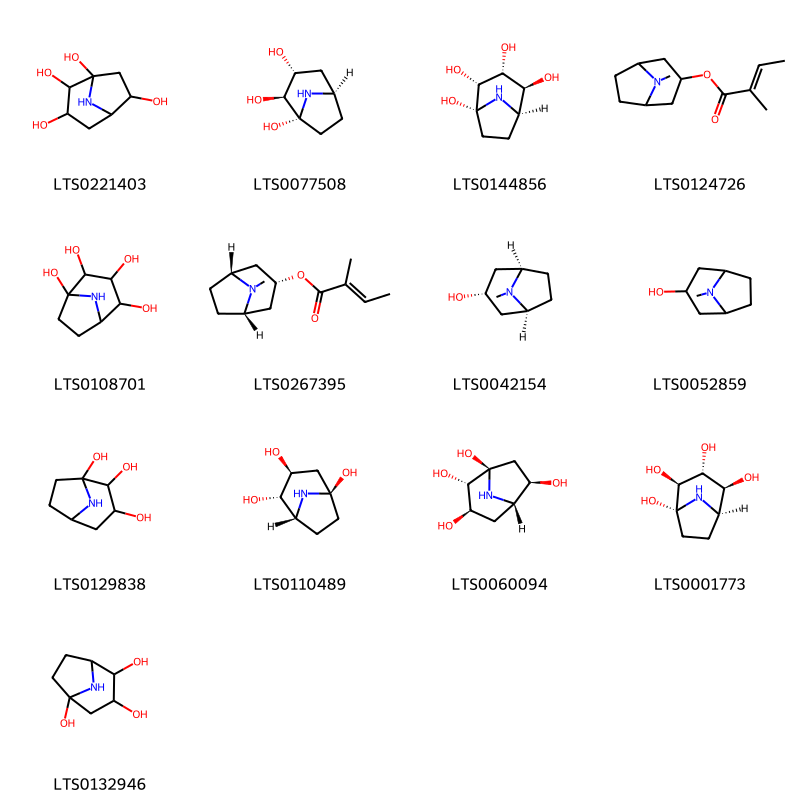{ width=100% }
    <figcaption>Hình ảnh cấu trúc hóa học của 13 hoạt chất thuộc nhóm Tropane alkaloids gồm ['8-azabicyclo[3.2.1]octane-1,2,3,6-tetrol (LTS0221403)', '(1r,2s,3r,5r)-8-azabicyclo[3.2.1]octane-1,2,3-triol (LTS0077508)', '(1r,2r,3r,4s,5r)-8-azabicyclo[3.2.1]octane-1,2,3,4-tetrol (LTS0144856)', '8-methyl-8-azabicyclo[3.2.1]octan-3-yl 2-methylbut-2-enoate (LTS0124726)', '8-azabicyclo[3.2.1]octane-1,2,3,4-tetrol (LTS0108701)', 'tropigline (LTS0267395)', 'pseudotropine (LTS0042154)', 'tropin (LTS0052859)', '8-azabicyclo[3.2.1]octane-1,2,3-triol (LTS0129838)', '(1r,3s,4s,5r)-8-azabicyclo[3.2.1]octane-1,3,4-triol (LTS0110489)', '(1r,2s,3r,5s,6r)-8-azabicyclo[3.2.1]octane-1,2,3,6-tetrol (LTS0060094)', '(1r,2s,3r,4s,5r)-8-azabicyclo[3.2.1]octane-1,2,3,4-tetrol (LTS0001773)', '8-azabicyclo[3.2.1]octane-1,3,4-triol (LTS0132946)'].</figcaption>
</figure>

---

### Dược dân tộc học

Danh sách các quốc gia có sử dụng *N/A* trong điều trị các bệnh. 

| Country   | Disease                                   | Bệnh                                                              |
|:----------|:------------------------------------------|:------------------------------------------------------------------|
| China     | Diuretic, Expectorant, Laxative, Diuretic | Thuốc lợi tiểu, thuốc long đờm, thuốc nhuận tràng, thuốc lợi tiểu |
| Elsewhere | Vermifuge                                 | Thuốc diệt sán                                                    |
| Eurasia   | Diuretic                                  | Thuốc lợi tiêu                                                    |
| Turkey    | Diuretic, Stimulant, Aperient             | Thuốc lợi tiểu, Thuốc kích thích, Aperient                        |
| ain       | Diuretic                                  | Thuốc lợi tiêu                                                    |

---

---
## Physalis angulata
### Thông tin về thực vật

!!! info "Phân loại thực vật của *Physalis angulata* từ GIBF:"
    - **Kingdom:** Plantae
    - **Phylum:** Tracheophyta
    - **Order:** Solanales
    - **Family:** Solanaceae
    - **Genus:** Physalis
    - **Species:** *Physalis angulata*

 

| Label (VI)   | Label (EN)   | Scientific Name   | Descriptions (VI)   | Descriptions (EN)          | Also Known As (VI)   | Also Known As (EN)                                                                 |
|:-------------|:-------------|:------------------|:--------------------|:---------------------------|:---------------------|:-----------------------------------------------------------------------------------|
| N/A          | N/A          | Physalis angulata | Giống loài thực vật | species of flowering plant | ['']                 | ['cutleaf groundcherry', 'cut-leaved ground-cherry', 'lance-leaved ground-cherry'] |

#### Phân bố trên thế giới

**Từ CSDL GIBF** Virgin Islands (U.S.), United Arab Emirates, Sri Lanka, Australia, Japan, Cambodia, Angola, Argentina, Benin, Tanzania, United Republic of, Yemen, French Guiana, Panama, Pakistan, Puerto Rico, Nigeria, Chinese Taipei, Bolivia (Plurinational State of), Honduras, Bangladesh, United States of America, Uruguay, Maldives, South Africa, Hong Kong, Thailand, Brazil, Peru, Dominican Republic, Singapore, Viet Nam, Qatar, China, Ecuador, Iraq, Colombia, Kenya, Montserrat, India, Indonesia, Antigua and Barbuda, Philippines, Malaysia, Brunei Darussalam

#### Phân bố tại Việt Nam

**Từ CSDL GIBF**: Quảng Bình

---
### Thành phần hóa học
        
- Theo cơ sở dữ liệu lotus: Từ loài *Physalis angulata* đã phân lập và xác định được 132 hoạt chất thuộc về các nhóm Flavonoids, Carboxylic acids and derivatives, Steroids and steroid derivatives. 

|    | chemicalTaxonomyClassyfireClass   |   smiles_count |
|---:|:----------------------------------|---------------:|
|  0 |                                   |              1 |
|  1 | Carboxylic acids and derivatives  |              3 |
|  2 | Flavonoids                        |              6 |
|  3 | Steroids and steroid derivatives  |            122 |

#### Nhóm 
<figure markdown="span">
    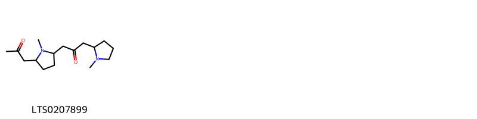{ width=100% }
    <figcaption>Hình ảnh cấu trúc hóa học của 1 hoạt chất thuộc nhóm  gồm ['1-[1-methyl-5-(2-oxopropyl)pyrrolidin-2-yl]-3-(1-methylpyrrolidin-2-yl)propan-2-one (LTS0207899)'].</figcaption>
</figure>
#### Nhóm Carboxylic acids and derivatives
<figure markdown="span">
    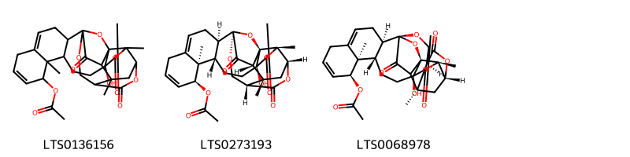{ width=100% }
    <figcaption>Hình ảnh cấu trúc hóa học của 3 hoạt chất thuộc nhóm Carboxylic acids and derivatives gồm ['5-hydroxy-2,9,26-trimethyl-4,22,29-trioxo-3,19,23,28-tetraoxaoctacyclo[16.9.1.1¹⁸,²⁷.0¹,⁵.0²,²⁴.0⁸,¹⁷.0⁹,¹⁴.0²¹,²⁶]nonacosa-11,14-dien-10-yl acetate (LTS0136156)', '(1r,2s,5s,8s,9r,10s,17r,18r,21s,24r,26s,27s)-5-hydroxy-2,9,26-trimethyl-4,22,29-trioxo-3,19,23,28-tetraoxaoctacyclo[16.9.1.1¹⁸,²⁷.0¹,⁵.0²,²⁴.0⁸,¹⁷.0⁹,¹⁴.0²¹,²⁶]nonacosa-11,14-dien-10-yl acetate (LTS0273193)', '(1r,2s,5s,8s,9r,10s,17r,18s,21s,24r,26s)-5-hydroxy-2,9,26-trimethyl-4,22,29-trioxo-3,19,23,28-tetraoxaoctacyclo[16.9.1.1¹⁸,²⁷.0¹,⁵.0²,²⁴.0⁸,¹⁷.0⁹,¹⁴.0²¹,²⁶]nonacosa-11,14-dien-10-yl acetate (LTS0068978)'].</figcaption>
</figure>
#### Nhóm Flavonoids
<figure markdown="span">
    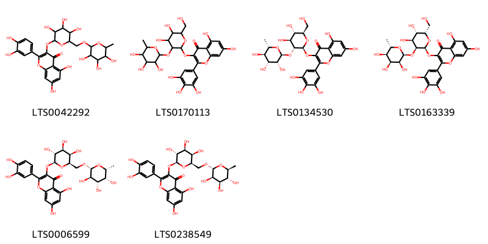{ width=100% }
    <figcaption>Hình ảnh cấu trúc hóa học của 6 hoạt chất thuộc nhóm Flavonoids gồm ['rutin (LTS0042292)', '3-{[4,5-dihydroxy-6-(hydroxymethyl)-3-[(3,4,5-trihydroxy-6-methyloxan-2-yl)oxy]oxan-2-yl]oxy}-5,7-dihydroxy-2-(3,4,5-trihydroxyphenyl)chromen-4-one (LTS0170113)', '3-{[(2s,3r,4s,5s,6r)-4,5-dihydroxy-6-(hydroxymethyl)-3-{[(2s,3r,4r,5r,6s)-3,4,5-trihydroxy-6-methyloxan-2-yl]oxy}oxan-2-yl]oxy}-5,7-dihydroxy-2-(3,4,5-trihydroxyphenyl)chromen-4-one (LTS0134530)', '3-{[(2s,3s,4s,5s,6s)-4,5-dihydroxy-6-(hydroxymethyl)-3-{[(2s,3s,4s,5r,6s)-3,4,5-trihydroxy-6-methyloxan-2-yl]oxy}oxan-2-yl]oxy}-5,7-dihydroxy-2-(3,4,5-trihydroxyphenyl)chromen-4-one (LTS0163339)', '2-(3,4-dihydroxyphenyl)-5,7-dihydroxy-3-{[(2s,3r,4s,5r,6r)-3,4,5-trihydroxy-6-({[(2r,3r,4s,5r,6r)-3,4,5-trihydroxy-6-methyloxan-2-yl]oxy}methyl)oxan-2-yl]oxy}chromen-4-one (LTS0006599)', '2-(3,4-dihydroxyphenyl)-5,7-dihydroxy-3-{[(2s,3r,4s,5r,6r)-3,4,5-trihydroxy-6-({[(2r,3r,4r,5r,6s)-3,4,5-trihydroxy-6-methyloxan-2-yl]oxy}methyl)oxan-2-yl]oxy}chromen-4-one (LTS0238549)'].</figcaption>
</figure>
#### Nhóm Steroids and steroid derivatives
<figure markdown="span">
    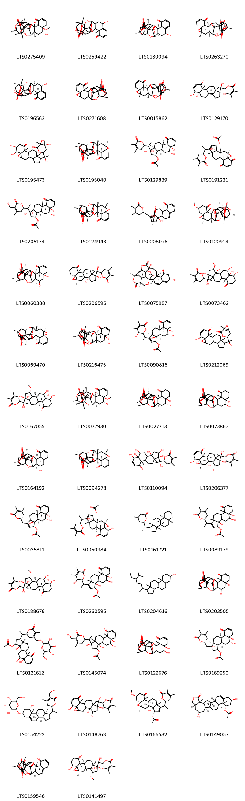{ width=100% }
    <figcaption>Hình ảnh cấu trúc hóa học của 122 hoạt chất thuộc nhóm Steroids and steroid derivatives gồm ['(1r,2s,5r,8s,9r,14r,15r,17r,18r,21s,24r,26s,27s)-5,15-dihydroxy-14-methoxy-2,9,26-trimethyl-3,19,23,28-tetraoxaoctacyclo[16.9.1.1¹⁸,²⁷.0¹,⁵.0²,²⁴.0⁸,¹⁷.0⁹,¹⁴.0²¹,²⁶]nonacos-11-ene-4,10,22,29-tetrone (LTS0275409)', '5,15-dihydroxy-2,9,26-trimethyl-3,19,23,28-tetraoxaoctacyclo[16.9.1.1¹⁸,²⁷.0¹,⁵.0²,²⁴.0⁸,¹⁷.0⁹,¹⁴.0²¹,²⁶]nonacosa-11,13-diene-4,10,22,29-tetrone (LTS0269422)', '(1r,2s,5r,8s,9r,15s,17r,18r,21s,24r,26s,27s)-5,15-dihydroxy-2,9,26-trimethyl-3,19,23,28-tetraoxaoctacyclo[16.9.1.1¹⁸,²⁷.0¹,⁵.0²,²⁴.0⁸,¹⁷.0⁹,¹⁴.0²¹,²⁶]nonacosa-11,13-diene-4,10,22,29-tetrone (LTS0180094)', '(1r,2r,4r,6s,11r,12s,15r,18s,19r,20s,21r,23r,26s)-15-hydroxy-11,18,21-trimethyl-5,17,24,28,29-pentaoxanonacyclo[17.9.1.1¹,²⁰.0²,¹².0⁴,⁶.0⁶,¹¹.0¹⁵,¹⁹.0¹⁸,²³.0²¹,²⁶]triacont-8-ene-10,16,25,30-tetrone (LTS0263270)', '(1r,2s,5r,8s,15s,17r,26s,27s)-5,15-dihydroxy-2,9,26-trimethyl-3,19,23,28-tetraoxaoctacyclo[16.9.1.1¹⁸,²⁷.0¹,⁵.0²,²⁴.0⁸,¹⁷.0⁹,¹⁴.0²¹,²⁶]nonacosa-11,13-diene-4,10,22,29-tetrone (LTS0196563)', '15-hydroxy-11,18,21-trimethyl-5,17,24,28,29-pentaoxanonacyclo[17.9.1.1¹,²⁰.0²,¹².0⁴,⁶.0⁶,¹¹.0¹⁵,¹⁹.0¹⁸,²³.0²¹,²⁶]triacont-8-ene-10,16,25,30-tetrone (LTS0271608)', '(1r,2r,4s,6r,11r,12s,15r,18s,19r,20s,21r,23r,26s)-15-hydroxy-11,18,21-trimethyl-5,17,24,28,29-pentaoxanonacyclo[17.9.1.1¹,²⁰.0²,¹².0⁴,⁶.0⁶,¹¹.0¹⁵,¹⁹.0¹⁸,²³.0²¹,²⁶]triacont-8-ene-10,16,25,30-tetrone (LTS0015862)', '(6r)-6-[(1s)-1-[(1r,5as,6s,9ar,9bs,11as)-1,5a,6-trihydroxy-9a,11a-dimethyl-9-oxo-2h,3h,4h,5h,6h,9bh,10h,11h-cyclopenta[a]phenanthren-1-yl]-1-hydroxyethyl]-3,4-dimethyl-5,6-dihydropyran-2-one (LTS0129170)', '15-[1-(4,5-dihydroxy-4,5-dimethyl-6-oxooxan-2-yl)-1-hydroxyethyl]-5,6-dihydroxy-2,16-dimethyl-8-oxapentacyclo[9.7.0.0²,⁷.0⁷,⁹.0¹²,¹⁶]octadecan-3-one (LTS0195473)', '(1r,2r,4r,6s,11r,12r,15r,18r,19r,20s,21s,23r,26s)-15-hydroxy-11,18,21-trimethyl-5,17,24,28,29-pentaoxanonacyclo[17.9.1.1¹,²⁰.0²,¹².0⁴,⁶.0⁶,¹¹.0¹⁵,¹⁹.0¹⁸,²³.0²¹,²⁶]triacont-8-ene-10,16,25,30-tetrone (LTS0195040)', '(1r,3s,3as,3br,5r,5ar,9ar,9bs,11ar)-1-[(1r)-1-[(2r)-4,5-dimethyl-6-oxo-2,3-dihydropyran-2-yl]ethyl]-1,3a,5,5a-tetrahydroxy-9a,11a-dimethyl-9-oxo-2h,3h,3bh,4h,5h,6h,9bh,10h,11h-cyclopenta[a]phenanthren-3-yl acetate (LTS0129839)', '(1s,2r,7s,9r,11r,12r,13s,16r)-15-[(1s)-1-[(2r)-4,5-dimethyl-6-oxo-2,3-dihydropyran-2-yl]ethyl]-12-hydroxy-2,16-dimethyl-3,6-dioxo-8-oxapentacyclo[9.7.0.0²,⁷.0⁷,⁹.0¹²,¹⁶]octadeca-4,14-dien-13-yl acetate (LTS0191221)', '(1r,3s,3as,3br,5r,5ar,9ar,9bs,11ar)-1,3a,5,5a-tetrahydroxy-1-[(1r)-1-[(2r)-5-(hydroxymethyl)-4-methyl-6-oxo-2,3-dihydropyran-2-yl]ethyl]-9a,11a-dimethyl-9-oxo-2h,3h,3bh,4h,5h,6h,9bh,10h,11h-cyclopenta[a]phenanthren-3-yl acetate (LTS0205174)', '(1r,2r,4s,6r,11r,12r,15r,18r,19r,20s,21s,23r,26s)-15-hydroxy-11,18,21-trimethyl-5,17,24,28,29-pentaoxanonacyclo[17.9.1.1¹,²⁰.0²,¹².0⁴,⁶.0⁶,¹¹.0¹⁵,¹⁹.0¹⁸,²³.0²¹,²⁶]triacont-8-ene-10,16,25,30-tetrone (LTS0124943)', '(13r)-6-(4,5-dimethyl-6-oxo-2,3-dihydropyran-2-yl)-2-hydroxy-6,13-dimethyl-7-oxapentacyclo[10.8.0.0²,⁹.0⁵,⁹.0¹³,¹⁸]icosa-15,18-diene-8,14-dione (LTS0208076)', '(1r,2r,4r,6s,8s,11r,12s,15s,18s,19r,20s,21s,23r,26s)-15-hydroxy-8-methoxy-11,18,21-trimethyl-5,17,24,28,29-pentaoxanonacyclo[17.9.1.1¹,²⁰.0²,¹².0⁴,⁶.0⁶,¹¹.0¹⁵,¹⁹.0¹⁸,²³.0²¹,²⁶]triacontane-10,16,25,30-tetrone (LTS0120914)', '(1r,2s,5s,8s,9r,14s,16r,17s,18r,21s,24r,26s,27s)-5,14,16-trihydroxy-2,9,26-trimethyl-3,19,23,28-tetraoxaoctacyclo[16.9.1.1¹⁸,²⁷.0¹,⁵.0²,²⁴.0⁸,¹⁷.0⁹,¹⁴.0²¹,²⁶]nonacos-11-ene-4,10,22,29-tetrone (LTS0060388)', '(1s,2r,7s,9r,11r,12r,15s,16s)-15-[(1s)-1-[(2r)-4,5-dimethyl-6-oxo-2,3-dihydropyran-2-yl]-1-hydroxyethyl]-12,15-dihydroxy-2,16-dimethyl-8-oxapentacyclo[9.7.0.0²,⁷.0⁷,⁹.0¹²,¹⁶]octadecan-3-one (LTS0206596)', '(1r,2s,8s,9r,12s,17s,18s,21s,24r,26r,27s)-5,12-dihydroxy-2,9,26-trimethyl-3,19,23,28-tetraoxaoctacyclo[16.9.2.0¹,⁵.0²,²⁴.0⁸,¹⁷.0⁹,¹⁴.0¹⁸,²⁷.0²¹,²⁶]nonacosa-13,15-diene-4,10,22,29-tetrone (LTS0075987)', '6-(1-{1,3a,5,5a,6-pentahydroxy-3-methoxy-9a,11a-dimethyl-9-oxo-decahydro-2h-cyclopenta[a]phenanthren-1-yl}-1-hydroxyethyl)-3,4-dimethyl-5,6-dihydropyran-2-one (LTS0073462)', '(1s,2r,4r,6s,11r,12s,15r,18s,19r,20r,21s,23r,26r)-15-hydroxy-11,18,21-trimethyl-5,17,24,28,29-pentaoxanonacyclo[17.9.1.1¹,²⁰.0²,¹².0⁴,⁶.0⁶,¹¹.0¹⁵,¹⁹.0¹⁸,²³.0²¹,²⁶]triacont-8-ene-10,16,25,30-tetrone (LTS0069470)', '(5r,8r,9s,14r,15r,17s,21r,24s,26r,27s)-5,14,15-trihydroxy-2,9,26-trimethyl-3,19,23,28-tetraoxaoctacyclo[16.9.1.1¹⁸,²⁷.0¹,⁵.0²,²⁴.0⁸,¹⁷.0⁹,¹⁴.0²¹,²⁶]nonacos-11-ene-4,10,22,29-tetrone (LTS0216475)', '(3s,3ar,3br,5r,5ar,9ar,9bs,11ar)-3a,5,5a-trihydroxy-1-[(1s)-1-[(2s,3s)-3-hydroxy-4,5-dimethyl-6-oxo-2,3-dihydropyran-2-yl]ethyl]-9a,11a-dimethyl-9-oxo-3h,3bh,4h,5h,6h,9bh,10h,11h-cyclopenta[a]phenanthren-3-yl acetate (LTS0090816)', '15-(1-{1,6-dimethyl-2-oxo-3,7-dioxabicyclo[4.1.0]heptan-4-yl}-1-hydroxyethyl)-6-hydroxy-2,16-dimethyl-8-oxapentacyclo[9.7.0.0²,⁷.0⁷,⁹.0¹²,¹⁶]octadec-4-en-3-one (LTS0212069)', '(6r)-6-[(1r)-1-[(1s,3s,3ar,3br,5r,5as,6s,9ar,9bs,11ar)-1,3a,5,5a,6-pentahydroxy-3-methoxy-9a,11a-dimethyl-9-oxo-decahydro-2h-cyclopenta[a]phenanthren-1-yl]-1-hydroxyethyl]-3,4-dimethyl-5,6-dihydropyran-2-one (LTS0167055)', '(1r,2s,5s,8s,9r,14r,15r,17r,18r,21s,24r,26s,27s)-5,15-dihydroxy-14-methoxy-2,9,26-trimethyl-3,19,23,28-tetraoxaoctacyclo[16.9.1.1¹⁸,²⁷.0¹,⁵.0²,²⁴.0⁸,¹⁷.0⁹,¹⁴.0²¹,²⁶]nonacos-11-ene-4,10,22,29-tetrone (LTS0077930)', '(1r,2s,5s,8s,9r,14r,15r,17r,21s,24r,26s,27s)-5,14,15-trihydroxy-2,9,26-trimethyl-3,19,23,28-tetraoxaoctacyclo[16.9.1.1¹⁸,²⁷.0¹,⁵.0²,²⁴.0⁸,¹⁷.0⁹,¹⁴.0²¹,²⁶]nonacosane-4,10,22,29-tetrone (LTS0027713)', '5,14,15-trihydroxy-2,9,26-trimethyl-3,19,23,28-tetraoxaoctacyclo[16.9.1.1¹⁸,²⁷.0¹,⁵.0²,²⁴.0⁸,¹⁷.0⁹,¹⁴.0²¹,²⁶]nonacosane-4,10,22,29-tetrone (LTS0073863)', '(1r,2s,5s,8r,9r,16s,17s,18r,21s,24r,26s,27s)-5,16-dihydroxy-2,9,26-trimethyl-3,19,23,28-tetraoxaoctacyclo[16.9.1.1¹⁸,²⁷.0¹,⁵.0²,²⁴.0⁸,¹⁷.0⁹,¹⁴.0²¹,²⁶]nonacosa-11,14-diene-4,10,22,29-tetrone (LTS0164192)', '(1s,2r,4s,6r,11r,12s,15s,18s,19r,21s,23r,26s)-15-hydroxy-11,18,21-trimethyl-5,17,24,28,29-pentaoxanonacyclo[17.9.1.1¹,²⁰.0²,¹².0⁴,⁶.0⁶,¹¹.0¹⁵,¹⁹.0¹⁸,²³.0²¹,²⁶]triacont-8-ene-10,16,25,30-tetrone (LTS0094278)', '6-(1-{1,2,3a,5,5a,6-hexahydroxy-9a,11a-dimethyl-9-oxo-2h,3h,3bh,4h,5h,6h,9bh,10h,11h-cyclopenta[a]phenanthren-1-yl}-1-hydroxyethyl)-3,4-dimethyl-5,6-dihydropyran-2-one (LTS0110094)', '(1s,2r,6s,7r,9r,11r,12r,13s,15s,16s)-15-[(1r)-1-[(2r)-4,5-dimethyl-6-oxo-2,3-dihydropyran-2-yl]-1-hydroxyethyl]-6,12,13,15-tetrahydroxy-2,16-dimethyl-8-oxapentacyclo[9.7.0.0²,⁷.0⁷,⁹.0¹²,¹⁶]octadec-4-en-3-one (LTS0206377)', '(3s,3ar,3br,5r,5ar,9ar,9bs,11ar)-1-[(1s)-1-[(2r)-4,5-dimethyl-6-oxo-2,3-dihydropyran-2-yl]ethyl]-3a,5,5a-trihydroxy-9a,11a-dimethyl-9-oxo-3h,3bh,4h,5h,6h,9bh,10h,11h-cyclopenta[a]phenanthren-3-yl acetate (LTS0035811)', '(1s,2r,6s,7r,9r,11r,12r,13s,16r)-15-[(1s)-1-[(2r)-4,5-dimethyl-6-oxo-2,3-dihydropyran-2-yl]ethyl]-6,12-dihydroxy-2,16-dimethyl-3-oxo-8-oxapentacyclo[9.7.0.0²,⁷.0⁷,⁹.0¹²,¹⁶]octadeca-4,14-dien-13-yl acetate (LTS0060984)', '(3s,4r,6r)-6-[(1s)-1-[(1r,3as,3bs,5ar,9as,9bs,11ar)-9a,11a-dimethyl-tetradecahydro-1h-cyclopenta[a]phenanthren-1-yl]ethyl]-3,4-dimethyloxan-2-one (LTS0161721)', '1-[1-(4,5-dimethyl-6-oxo-2,3-dihydropyran-2-yl)ethyl]-3a,5,5a-trihydroxy-9a,11a-dimethyl-9-oxo-3h,3bh,4h,5h,6h,9bh,10h,11h-cyclopenta[a]phenanthren-3-yl acetate (LTS0089179)', '(6r)-6-[(1s)-1-[(1s,3s,3ar,3br,5r,5as,6s,9ar,9bs,11as)-1,3a,5,5a,6-pentahydroxy-3-methoxy-9a,11a-dimethyl-9-oxo-decahydro-2h-cyclopenta[a]phenanthren-1-yl]-1-hydroxyethyl]-3,4-dimethyl-5,6-dihydropyran-2-one (LTS0188676)', '3a,5,5a-trihydroxy-1-[1-(3-hydroxy-4,5-dimethyl-6-oxo-2,3-dihydropyran-2-yl)ethyl]-9a,11a-dimethyl-9-oxo-3h,3bh,4h,5h,6h,9bh,10h,11h-cyclopenta[a]phenanthren-3-yl acetate (LTS0260595)', 'stigmast-5-en-3-ol, (3β)- (LTS0204616)', '5,14,16-trihydroxy-2,9,26-trimethyl-3,19,23,28-tetraoxaoctacyclo[16.9.1.1¹⁸,²⁷.0¹,⁵.0²,²⁴.0⁸,¹⁷.0⁹,¹⁴.0²¹,²⁶]nonacos-11-ene-4,10,22,29-tetrone (LTS0203505)', '3a,5,5a-trihydroxy-9a,11a-dimethyl-1-{1-[5-methyl-6-oxo-4-({[3,4,5-trihydroxy-6-(hydroxymethyl)oxan-2-yl]oxy}methyl)-2,3-dihydropyran-2-yl]ethyl}-9-oxo-3h,3bh,4h,5h,6h,9bh,10h,11h-cyclopenta[a]phenanthren-3-yl acetate (LTS0121612)', '1,3a,5,5a-tetrahydroxy-1-{1-[5-(hydroxymethyl)-4-methyl-6-oxo-2,3-dihydropyran-2-yl]ethyl}-9a,11a-dimethyl-9-oxo-2h,3h,3bh,4h,5h,6h,9bh,10h,11h-cyclopenta[a]phenanthren-3-yl acetate (LTS0145074)', '5,14,15-trihydroxy-2,9,26-trimethyl-3,19,23,28-tetraoxaoctacyclo[16.9.1.1¹⁸,²⁷.0¹,⁵.0²,²⁴.0⁸,¹⁷.0⁹,¹⁴.0²¹,²⁶]nonacos-11-ene-4,10,22,29-tetrone (LTS0122676)', '(1r,3s,3as,3br,5r,5ar,9ar,9bs,11ar)-1-[(1s)-1-[(2r)-4,5-dimethyl-6-oxo-2,3-dihydropyran-2-yl]ethyl]-3a,5,5a-trihydroxy-9a,11a-dimethyl-9-oxo-1h,2h,3h,3bh,4h,5h,6h,9bh,10h,11h-cyclopenta[a]phenanthren-3-yl acetate (LTS0169250)', '(6r)-6-[(1s)-1-[(1r,3as,3bs,7r,9s,9ar,9bs,11ar)-9-hydroxy-9a,11a-dimethyl-7-{[(2r,3r,4s,5s,6r)-3,4,5-trihydroxy-6-(hydroxymethyl)oxan-2-yl]oxy}-1h,2h,3h,3ah,3bh,4h,6h,7h,8h,9h,9bh,10h,11h-cyclopenta[a]phenanthren-1-yl]ethyl]-3-(hydroxymethyl)-4-methyl-5,6-dihydropyran-2-one (LTS0154222)', '15-[1-(4,5-dimethyl-6-oxo-2,3-dihydropyran-2-yl)-1-hydroxyethyl]-6,12,13,15-tetrahydroxy-2,16-dimethyl-8-oxapentacyclo[9.7.0.0²,⁷.0⁷,⁹.0¹²,¹⁶]octadec-4-en-3-one (LTS0148763)', '(1s,2r,5r,7s,9r,11r,12r,13s,16r)-15-[(1s)-1-[(2r)-4,5-dimethyl-6-oxo-2,3-dihydropyran-2-yl]ethyl]-12-hydroxy-5-methoxy-2,16-dimethyl-3-oxo-8-oxapentacyclo[9.7.0.0²,⁷.0⁷,⁹.0¹²,¹⁶]octadec-14-en-13-yl acetate (LTS0166582)', '(1s,2s,7r,9s,10r,11s,14s,15r,16s,17r,19s,23r)-7,17-dihydroxy-10,14,16,23-tetramethyl-22-oxo-21-oxahexacyclo[12.11.0.0²,¹¹.0⁵,¹⁰.0¹⁵,²⁴.0¹⁹,²³]pentacos-4-en-9-yl acetate (LTS0149057)', '(5s,8s,9s,17r,21s,24s,26s,27s)-5-hydroxy-2,9,26-trimethyl-3,19,23,28-tetraoxaoctacyclo[16.9.1.1¹⁸,²⁷.0¹,⁵.0²,²⁴.0⁸,¹⁷.0⁹,¹⁴.0²¹,²⁶]nonacosa-11,14-diene-4,10,22,29-tetrone (LTS0159546)', '(1s,2r,6s,7r,9r,11r,12r,13s,15s,16s)-15-[(1s)-1-[(2r)-4,5-dimethyl-6-oxo-2,3-dihydropyran-2-yl]-1-hydroxyethyl]-6,12,15-trihydroxy-13-methoxy-2,16-dimethyl-8-oxapentacyclo[9.7.0.0²,⁷.0⁷,⁹.0¹²,¹⁶]octadecan-3-one (LTS0141497)', '15-[1-(4,5-dimethyl-6-oxo-2,3-dihydropyran-2-yl)-1-hydroxyethyl]-6,12,15-trihydroxy-13-methoxy-2,16-dimethyl-8-oxapentacyclo[9.7.0.0²,⁷.0⁷,⁹.0¹²,¹⁶]octadecan-3-one (LTS0138909)', '(1s,2r,7s,9r,11r,12r,16r)-15-[(1r)-1-[(2r)-4,5-dimethyl-6-oxo-2,3-dihydropyran-2-yl]-1-hydroxyethyl]-12-hydroxy-2,16-dimethyl-8-oxapentacyclo[9.7.0.0²,⁷.0⁷,⁹.0¹²,¹⁶]octadec-14-en-3-one (LTS0163537)', '16-chloro-6-[1-(4,5-dimethyl-6-oxo-2,3-dihydropyran-2-yl)ethyl]-2,17-dihydroxy-7,11-dimethyl-12-oxo-5-oxapentacyclo[8.8.0.0²,⁷.0⁴,⁶.0¹¹,¹⁶]octadec-13-en-3-yl acetate (LTS0093894)', '(1r,2r,4r,6s,8s,11r,12s,15s,18s,19r,20s,21r,23r,26s)-15-hydroxy-8-methoxy-11,18,21-trimethyl-5,17,24,28,29-pentaoxanonacyclo[17.9.1.1¹,²⁰.0²,¹².0⁴,⁶.0⁶,¹¹.0¹⁵,¹⁹.0¹⁸,²³.0²¹,²⁶]triacontane-10,16,25,30-tetrone (LTS0163368)', '16-[1-(4,5-dimethyl-6-oxo-2,3-dihydropyran-2-yl)ethyl]-12-hydroxy-2,17-dimethyl-3-oxo-8,15-dioxahexacyclo[9.8.0.0²,⁷.0⁷,⁹.0¹²,¹⁷.0¹⁴,¹⁶]nonadec-4-en-13-yl acetate (LTS0162650)', '(1s,3ar,3br,7r,9as,9br,11ar)-1-[(2r,5r)-5-ethyl-6-methylheptan-2-yl]-9a,11a-dimethyl-1h,2h,3h,3ah,3bh,4h,6h,7h,8h,9h,9bh,10h,11h-cyclopenta[a]phenanthren-7-ol (LTS0234781)', '5,16-dihydroxy-2,9,26-trimethyl-3,19,23,28-tetraoxaoctacyclo[16.9.1.1¹⁸,²⁷.0¹,⁵.0²,²⁴.0⁸,¹⁷.0⁹,¹⁴.0²¹,²⁶]nonacosa-11,14-diene-4,10,22,29-tetrone (LTS0160175)', '(1s,2r,4r,6s,8s,11r,12s,15s,18s,19r,21s,23r,26s)-15-hydroxy-8-methoxy-11,18,21-trimethyl-5,17,24,28,29-pentaoxanonacyclo[17.9.1.1¹,²⁰.0²,¹².0⁴,⁶.0⁶,¹¹.0¹⁵,¹⁹.0¹⁸,²³.0²¹,²⁶]triacontane-10,16,25,30-tetrone (LTS0130702)', '(1s,2r,6s,7r,9r,11r,12s,13s,14s,16r,17s)-16-[(1r)-1-[(2r)-4,5-dimethyl-6-oxo-2,3-dihydropyran-2-yl]ethyl]-6,12-dihydroxy-2,17-dimethyl-3-oxo-8,15-dioxahexacyclo[9.8.0.0²,⁷.0⁷,⁹.0¹²,¹⁷.0¹⁴,¹⁶]nonadec-4-en-13-yl acetate (LTS0110300)', '(1r,2s,3s,4s,6r,7s,10s,11r,16r,17r)-2,16,17-trihydroxy-7,11-dimethyl-6-[(1r)-1-[(2r)-5-methyl-6-oxo-4-({[(2r,3r,4s,5s,6r)-3,4,5-trihydroxy-6-(hydroxymethyl)oxan-2-yl]oxy}methyl)-2,3-dihydropyran-2-yl]ethyl]-12-oxo-5-oxapentacyclo[8.8.0.0²,⁷.0⁴,⁶.0¹¹,¹⁶]octadec-13-en-3-yl acetate (LTS0112893)', '(1r,2s,5s,8s,9r,16s,17s,18r,21s,24r,26s,27s)-5,16-dihydroxy-2,9,26-trimethyl-3,19,23,28-tetraoxaoctacyclo[16.9.1.1¹⁸,²⁷.0¹,⁵.0²,²⁴.0⁸,¹⁷.0⁹,¹⁴.0²¹,²⁶]nonacosa-11,14-diene-4,10,22,29-tetrone (LTS0246543)', '15-[1-(4,5-dimethyl-6-oxo-2,3-dihydropyran-2-yl)ethyl]-6,12-dihydroxy-2,16-dimethyl-3-oxo-8-oxapentacyclo[9.7.0.0²,⁷.0⁷,⁹.0¹²,¹⁶]octadeca-4,14-dien-13-yl acetate (LTS0117795)', '(1r,2s,3s,4s,6r,7s,10s,11r,16r,17r)-6-[(1r)-1-[(2r)-4,5-dimethyl-6-oxo-2,3-dihydropyran-2-yl]ethyl]-2,16,17-trihydroxy-7,11-dimethyl-12-oxo-5-oxapentacyclo[8.8.0.0²,⁷.0⁴,⁶.0¹¹,¹⁶]octadec-13-en-3-yl acetate (LTS0093340)', '15-[1-(4,5-dimethyl-6-oxooxan-2-yl)ethyl]-5,18-dihydroxy-10,14-dimethyl-3-oxapentacyclo[9.7.0.0²,⁴.0⁵,¹⁰.0¹⁴,¹⁸]octadec-7-en-9-one (LTS0173414)', '(1r,2s,5r,8s,9r,15s,17r,18s,21s,24r,26s,27r)-5,15-dihydroxy-2,9,26-trimethyl-3,19,23,28-tetraoxaoctacyclo[16.9.1.1¹⁸,²⁷.0¹,⁵.0²,²⁴.0⁸,¹⁷.0⁹,¹⁴.0²¹,²⁶]nonacosa-11,13-diene-4,10,22,29-tetrone (LTS0260759)', '(1s,2s,7r,9s,10r,11s,14s,15r,16s,17r,19r,23r,24s)-7,17-dihydroxy-10,14,16,23-tetramethyl-22-oxo-21-oxahexacyclo[12.11.0.0²,¹¹.0⁵,¹⁰.0¹⁵,²⁴.0¹⁹,²³]pentacos-4-en-9-yl acetate (LTS0058619)', '(3s,3ar,3br,5r,5ar,9ar,9bs,11ar)-3a,5,5a-trihydroxy-9a,11a-dimethyl-1-[(1s)-1-[(2r)-5-methyl-6-oxo-4-({[(2r,3r,4s,5s,6r)-3,4,5-trihydroxy-6-(hydroxymethyl)oxan-2-yl]oxy}methyl)-2,3-dihydropyran-2-yl]ethyl]-9-oxo-3h,3bh,4h,5h,6h,9bh,10h,11h-cyclopenta[a]phenanthren-3-yl acetate (LTS0246232)', '6-[1-(9-hydroxy-9a,11a-dimethyl-7-{[3,4,5-trihydroxy-6-(hydroxymethyl)oxan-2-yl]oxy}-1h,2h,3h,3ah,3bh,4h,6h,7h,8h,9h,9bh,10h,11h-cyclopenta[a]phenanthren-1-yl)ethyl]-3-(hydroxymethyl)-4-methyl-5,6-dihydropyran-2-one (LTS0190500)', '15-[1-(4,5-dimethyl-6-oxo-2,3-dihydropyran-2-yl)-1-hydroxyethyl]-12,15-dihydroxy-2,16-dimethyl-8-oxapentacyclo[9.7.0.0²,⁷.0⁷,⁹.0¹²,¹⁶]octadecan-3-one (LTS0178410)', '15-[1-(4,5-dimethyl-6-oxo-2,3-dihydropyran-2-yl)-1-hydroxyethyl]-12-hydroxy-2,16-dimethyl-8-oxapentacyclo[9.7.0.0²,⁷.0⁷,⁹.0¹²,¹⁶]octadec-14-en-3-one (LTS0270437)', '(1s,2r,5r,7s,9r,11r,12r,14s,15r,16s)-15-[(1r)-1-[(2r)-4,5-dimethyl-6-oxo-2,3-dihydropyran-2-yl]-1-hydroxyethyl]-12,14,15-trihydroxy-5-methoxy-2,16-dimethyl-8-oxapentacyclo[9.7.0.0²,⁷.0⁷,⁹.0¹²,¹⁶]octadecan-3-one (LTS0274692)', '7,17-dihydroxy-10,14,16,23-tetramethyl-22-oxo-21-oxahexacyclo[12.11.0.0²,¹¹.0⁵,¹⁰.0¹⁵,²⁴.0¹⁹,²³]pentacos-4-en-9-yl acetate (LTS0222727)', 'physalin d (LTS0274877)', '(1s,2r,7s,9r,11r,12s,13s,14s,16r,17s)-16-[(1r)-1-[(2r)-4,5-dimethyl-6-oxo-2,3-dihydropyran-2-yl]ethyl]-12-hydroxy-2,17-dimethyl-3-oxo-8,15-dioxahexacyclo[9.8.0.0²,⁷.0⁷,⁹.0¹²,¹⁷.0¹⁴,¹⁶]nonadec-4-en-13-yl acetate (LTS0079241)', '16-[1-(4,5-dimethyl-6-oxo-2,3-dihydropyran-2-yl)ethyl]-6,12-dihydroxy-2,17-dimethyl-3-oxo-8,15-dioxahexacyclo[9.8.0.0²,⁷.0⁷,⁹.0¹²,¹⁷.0¹⁴,¹⁶]nonadec-4-en-13-yl acetate (LTS0260714)', '5,12-dihydroxy-2,9,26-trimethyl-3,19,23,28-tetraoxaoctacyclo[16.9.2.0¹,⁵.0²,²⁴.0⁸,¹⁷.0⁹,¹⁴.0¹⁸,²⁷.0²¹,²⁶]nonacosa-13,15-diene-4,10,22,29-tetrone (LTS0209366)', '6-[1-(4,5-dimethyl-6-oxo-2,3-dihydropyran-2-yl)ethyl]-2,16,17-trihydroxy-7,11-dimethyl-12-oxo-5-oxapentacyclo[8.8.0.0²,⁷.0⁴,⁶.0¹¹,¹⁶]octadec-13-en-3-yl acetate (LTS0262202)', '15-[1-(4,5-dimethyl-6-oxooxan-2-yl)-1-hydroxyethyl]-5,18-dihydroxy-10,14-dimethyl-3-oxapentacyclo[9.7.0.0²,⁴.0⁵,¹⁰.0¹⁴,¹⁸]octadec-7-en-9-one (LTS0210825)', '(1r,2s,5s,8s,9r,14r,15r,17r,18r,21s,24r,26s,27s)-5,14,15-trihydroxy-2,9,26-trimethyl-3,19,23,28-tetraoxaoctacyclo[16.9.1.1¹⁸,²⁷.0¹,⁵.0²,²⁴.0⁸,¹⁷.0⁹,¹⁴.0²¹,²⁶]nonacosane-4,10,22,29-tetrone (LTS0263930)', '(1r,2s,3s,4s,6r,7s,10s,11s,16r,17r)-16-chloro-6-[(1r)-1-[(2r)-4,5-dimethyl-6-oxo-2,3-dihydropyran-2-yl]ethyl]-2,17-dihydroxy-7,11-dimethyl-12-oxo-5-oxapentacyclo[8.8.0.0²,⁷.0⁴,⁶.0¹¹,¹⁶]octadec-13-en-3-yl acetate (LTS0171958)', '5a-chloro-1-[1-(4,5-dimethyl-6-oxo-2,3-dihydropyran-2-yl)ethyl]-3a,5-dihydroxy-9a,11a-dimethyl-9-oxo-3h,3bh,4h,5h,6h,9bh,10h,11h-cyclopenta[a]phenanthren-3-yl acetate (LTS0235818)', '15-[1-(4,5-dimethyl-6-oxo-2,3-dihydropyran-2-yl)ethyl]-12-hydroxy-5-methoxy-2,16-dimethyl-3-oxo-8-oxapentacyclo[9.7.0.0²,⁷.0⁷,⁹.0¹²,¹⁶]octadec-14-en-13-yl acetate (LTS0032836)', '(1r,2s,5r,8s,9r,14r,15r,17r,18r,21s,24r,26s,27s)-5,14,15-trihydroxy-2,9,26-trimethyl-3,19,23,28-tetraoxaoctacyclo[16.9.1.1¹⁸,²⁷.0¹,⁵.0²,²⁴.0⁸,¹⁷.0⁹,¹⁴.0²¹,²⁶]nonacos-11-ene-4,10,22,29-tetrone (LTS0159097)', '(1r,2r,5s,6r,9s,12s,13r)-6-[(2r)-4,5-dimethyl-6-oxo-2,3-dihydropyran-2-yl]-2-hydroxy-6,13-dimethyl-7-oxapentacyclo[10.8.0.0²,⁹.0⁵,⁹.0¹³,¹⁸]icosa-15,18-diene-8,14-dione (LTS0068062)', '15-hydroxy-8-methoxy-11,18,21-trimethyl-5,17,24,28,29-pentaoxanonacyclo[17.9.1.1¹,²⁰.0²,¹².0⁴,⁶.0⁶,¹¹.0¹⁵,¹⁹.0¹⁸,²³.0²¹,²⁶]triacontane-10,16,25,30-tetrone (LTS0182697)', '(6s)-6-[(1s)-1-[(1r,5ar,6s,9ar,9bs,11as)-1,5a,6-trihydroxy-9a,11a-dimethyl-9-oxo-2h,3h,4h,5h,6h,9bh,10h,11h-cyclopenta[a]phenanthren-1-yl]-1-hydroxyethyl]-3,4-dimethyl-5,6-dihydropyran-2-one (LTS0029829)', '4,15-dihydroxy-11,18,21-trimethyl-6,17,24,28,29-pentaoxanonacyclo[17.9.1.1¹,²⁰.0²,¹².0⁵,⁷.0⁵,¹¹.0¹⁵,¹⁹.0¹⁸,²³.0²¹,²⁶]triacont-8-ene-10,16,25,30-tetrone (LTS0254668)', '(1s,2r,6s,7s,9r,11r,12r,15s,16s)-15-[(1r)-1-[(2r)-4,5-dimethyl-6-oxo-2,3-dihydropyran-2-yl]-1-hydroxyethyl]-12,15-dihydroxy-6-methoxy-2,16-dimethyl-8-oxapentacyclo[9.7.0.0²,⁷.0⁷,⁹.0¹²,¹⁶]octadec-4-en-3-one (LTS0246752)', '5,15-dihydroxy-14-methoxy-2,9,26-trimethyl-3,19,23,28-tetraoxaoctacyclo[16.9.1.1¹⁸,²⁷.0¹,⁵.0²,²⁴.0⁸,¹⁷.0⁹,¹⁴.0²¹,²⁶]nonacos-11-ene-4,10,22,29-tetrone (LTS0028627)', '(6r)-6-[(1s)-1-[(1r,2s,3ar,3br,5r,5ar,6s,9ar,9bs,11as)-1,2,3a,5,5a,6-hexahydroxy-9a,11a-dimethyl-9-oxo-2h,3h,3bh,4h,5h,6h,9bh,10h,11h-cyclopenta[a]phenanthren-1-yl]-1-hydroxyethyl]-3,4-dimethyl-5,6-dihydropyran-2-one (LTS0050879)', '(1s,2r,5s,6s,7r,9r,11s,12s,15s,16s)-15-[(1r)-1-[(2s,4r)-4,5-dihydroxy-4,5-dimethyl-6-oxooxan-2-yl]-1-hydroxyethyl]-5,6-dihydroxy-2,16-dimethyl-8-oxapentacyclo[9.7.0.0²,⁷.0⁷,⁹.0¹²,¹⁶]octadecan-3-one (LTS0248786)', '(1r,2r,6s,7r,9r,11r,12s,13s,14s,16r,17s)-16-[(1r)-1-[(2r)-4,5-dimethyl-6-oxo-2,3-dihydropyran-2-yl]ethyl]-6,12-dihydroxy-2,17-dimethyl-3-oxo-8,15-dioxahexacyclo[9.8.0.0²,⁷.0⁷,⁹.0¹²,¹⁷.0¹⁴,¹⁶]nonadec-4-en-13-yl acetate (LTS0249751)', '2,16,17-trihydroxy-7,11-dimethyl-6-{1-[5-methyl-6-oxo-4-({[3,4,5-trihydroxy-6-(hydroxymethyl)oxan-2-yl]oxy}methyl)-2,3-dihydropyran-2-yl]ethyl}-12-oxo-5-oxapentacyclo[8.8.0.0²,⁷.0⁴,⁶.0¹¹,¹⁶]octadec-13-en-3-yl acetate (LTS0259358)', '(1s,2r,6s,7r,9r,11r,12r,13s,15s,16s)-15-[(1s)-1-[(2r)-4,5-dimethyl-6-oxo-2,3-dihydropyran-2-yl]-1-hydroxyethyl]-6,12,13,15-tetrahydroxy-2,16-dimethyl-8-oxapentacyclo[9.7.0.0²,⁷.0⁷,⁹.0¹²,¹⁶]octadec-4-en-3-one (LTS0183153)', '(1s,2s,4s,5r,10r,11s,14r,15r,18r)-15-[(1s)-1-[(2r,4s,5r)-4,5-dimethyl-6-oxooxan-2-yl]ethyl]-5,18-dihydroxy-10,14-dimethyl-3-oxapentacyclo[9.7.0.0²,⁴.0⁵,¹⁰.0¹⁴,¹⁸]octadec-7-en-9-one (LTS0242084)', '(1r,2s,5s,8s,9r,12s,17s,18s,21s,24r,26r,27s)-5,12-dihydroxy-2,9,26-trimethyl-3,19,23,28-tetraoxaoctacyclo[16.9.2.0¹,⁵.0²,²⁴.0⁸,¹⁷.0⁹,¹⁴.0¹⁸,²⁷.0²¹,²⁶]nonacosa-13,15-diene-4,10,22,29-tetrone (LTS0062238)', '(1s,2s,4s,5r,10r,11r,14s,15r,18s)-15-[(1s)-1-[(2r)-4,5-dimethyl-6-oxo-2,3-dihydropyran-2-yl]-1-hydroxyethyl]-5,15-dihydroxy-10,14-dimethyl-3-oxapentacyclo[9.7.0.0²,⁴.0⁵,¹⁰.0¹⁴,¹⁸]octadec-7-en-9-one (LTS0244158)', 'physalin b (LTS0109751)', '15-[1-(4,5-dimethyl-6-oxo-2,3-dihydropyran-2-yl)-1-hydroxyethyl]-12,14,15-trihydroxy-5-methoxy-2,16-dimethyl-8-oxapentacyclo[9.7.0.0²,⁷.0⁷,⁹.0¹²,¹⁶]octadecan-3-one (LTS0053687)', '15-[1-(4,5-dimethyl-6-oxo-2,3-dihydropyran-2-yl)ethyl]-12-hydroxy-2,16-dimethyl-3,6-dioxo-8-oxapentacyclo[9.7.0.0²,⁷.0⁷,⁹.0¹²,¹⁶]octadeca-4,14-dien-13-yl acetate (LTS0065461)', '6-(1-{1,5a,6-trihydroxy-9a,11a-dimethyl-9-oxo-2h,3h,4h,5h,6h,9bh,10h,11h-cyclopenta[a]phenanthren-1-yl}-1-hydroxyethyl)-3,4-dimethyl-5,6-dihydropyran-2-one (LTS0016312)', '1-[1-(4,5-dimethyl-6-oxo-2,3-dihydropyran-2-yl)ethyl]-1,3a,5,5a-tetrahydroxy-9a,11a-dimethyl-9-oxo-2h,3h,3bh,4h,5h,6h,9bh,10h,11h-cyclopenta[a]phenanthren-3-yl acetate (LTS0015160)', '15-[1-(4,5-dimethyl-6-oxo-2,3-dihydropyran-2-yl)-1-hydroxyethyl]-5,15-dihydroxy-10,14-dimethyl-3-oxapentacyclo[9.7.0.0²,⁴.0⁵,¹⁰.0¹⁴,¹⁸]octadec-7-en-9-one (LTS0271135)', '(1r,2s,5r,8s,9r,17r,18r,21s,24r,26s,27s)-5-hydroxy-2,9,26-trimethyl-3,19,23,28-tetraoxaoctacyclo[16.9.1.1¹⁸,²⁷.0¹,⁵.0²,²⁴.0⁸,¹⁷.0⁹,¹⁴.0²¹,²⁶]nonacosa-11,14-diene-4,10,22,29-tetrone (LTS0001041)', '(1s,2r,5r,7s,9r,11r,12r,14s,15r,16s)-15-[(1s)-1-[(2r)-4,5-dimethyl-6-oxo-2,3-dihydropyran-2-yl]-1-hydroxyethyl]-12,14,15-trihydroxy-5-methoxy-2,16-dimethyl-8-oxapentacyclo[9.7.0.0²,⁷.0⁷,⁹.0¹²,¹⁶]octadecan-3-one (LTS0008828)', '(1s,2r,6s,7s,9r,11r,12r,15s,16s)-15-[(1s)-1-[(2r)-4,5-dimethyl-6-oxo-2,3-dihydropyran-2-yl]-1-hydroxyethyl]-12,15-dihydroxy-6-methoxy-2,16-dimethyl-8-oxapentacyclo[9.7.0.0²,⁷.0⁷,⁹.0¹²,¹⁶]octadecan-3-one (LTS0239724)', '(1r,2r,4r,6s,11r,12s,15r,18s,19r,20s,21s,23r,26s)-15-hydroxy-11,18,21-trimethyl-5,17,24,28,29-pentaoxanonacyclo[17.9.1.1¹,²⁰.0²,¹².0⁴,⁶.0⁶,¹¹.0¹⁵,¹⁹.0¹⁸,²³.0²¹,²⁶]triacont-8-ene-10,16,25,30-tetrone (LTS0217306)', '6,19-dihydroxy-12-methoxy-1,15,22,26-tetramethyl-4,21,24-trioxaheptacyclo[21.3.1.0²,⁶.0³,¹⁹.0³,²².0⁷,¹⁶.0¹⁰,¹⁵]heptacosa-8,10-diene-5,14,20,25-tetrone (LTS0116303)', '(1s,2r,7s,9r,11r,12r,16r)-15-[(1r)-1-[(2s)-4,5-dimethyl-6-oxo-2,3-dihydropyran-2-yl]-1-hydroxyethyl]-12-hydroxy-2,16-dimethyl-8-oxapentacyclo[9.7.0.0²,⁷.0⁷,⁹.0¹²,¹⁶]octadeca-4,14-dien-3-one (LTS0137827)', '15-[1-(4,5-dimethyl-6-oxo-2,3-dihydropyran-2-yl)ethyl]-12-hydroxy-2,16-dimethyl-3-oxo-8-oxapentacyclo[9.7.0.0²,⁷.0⁷,⁹.0¹²,¹⁶]octadeca-4,14-dien-13-yl acetate (LTS0030380)', '(1s,2r,7s,9r,11r,12r,13s,16r)-15-[(1s)-1-[(2r)-4,5-dimethyl-6-oxo-2,3-dihydropyran-2-yl]ethyl]-12-hydroxy-2,16-dimethyl-3-oxo-8-oxapentacyclo[9.7.0.0²,⁷.0⁷,⁹.0¹²,¹⁶]octadeca-4,14-dien-13-yl acetate (LTS0235837)', '(6r)-6-[(1r)-1-[(1r,2s,3ar,3br,5r,5ar,6s,9ar,9bs,11as)-1,2,3a,5,5a,6-hexahydroxy-9a,11a-dimethyl-9-oxo-2h,3h,3bh,4h,5h,6h,9bh,10h,11h-cyclopenta[a]phenanthren-1-yl]-1-hydroxyethyl]-3,4-dimethyl-5,6-dihydropyran-2-one (LTS0094487)', 'physagulin-d (LTS0026208)', '1-[1-(4,5-dimethyl-6-oxo-2,3-dihydropyran-2-yl)ethyl]-3a,5,5a-trihydroxy-9a,11a-dimethyl-9-oxo-1h,2h,3h,3bh,4h,5h,6h,9bh,10h,11h-cyclopenta[a]phenanthren-3-yl acetate (LTS0118736)', 'physalin f (LTS0242357)', '(1r,2r,4s,5r,7r,11r,12s,15s,18s,19r,20s,21s,23r,26s)-4,15-dihydroxy-11,18,21-trimethyl-6,17,24,28,29-pentaoxanonacyclo[17.9.1.1¹,²⁰.0²,¹².0⁵,⁷.0⁵,¹¹.0¹⁵,¹⁹.0¹⁸,²³.0²¹,²⁶]triacont-8-ene-10,16,25,30-tetrone (LTS0050556)', '(1s,2s,7r,9s,10r,11s,14s,15s,16s,17r,19r,23r,24s)-7,17-dihydroxy-10,14,16,23-tetramethyl-22-oxo-21-oxahexacyclo[12.11.0.0²,¹¹.0⁵,¹⁰.0¹⁵,²⁴.0¹⁹,²³]pentacos-4-en-9-yl acetate (LTS0267202)', '(1s,2r,6s,7r,9r,11s,12s,15s,16s)-15-[(1r)-1-[(1s,4r,6s)-1,6-dimethyl-2-oxo-3,7-dioxabicyclo[4.1.0]heptan-4-yl]-1-hydroxyethyl]-6-hydroxy-2,16-dimethyl-8-oxapentacyclo[9.7.0.0²,⁷.0⁷,⁹.0¹²,¹⁶]octadec-4-en-3-one (LTS0018453)', '(1s,2s,4s,5r,10r,11s,14r,15s,18r)-15-[(1r)-1-[(2r,4s,5r)-4,5-dimethyl-6-oxooxan-2-yl]-1-hydroxyethyl]-5,18-dihydroxy-10,14-dimethyl-3-oxapentacyclo[9.7.0.0²,⁴.0⁵,¹⁰.0¹⁴,¹⁸]octadec-7-en-9-one (LTS0045657)', '(1s,2r,6s,7r,9r,11r,12r,13s,15s,16r)-15-[(1r)-1-[(2r)-4,5-dimethyl-6-oxo-2,3-dihydropyran-2-yl]-1-hydroxyethyl]-6,12,15-trihydroxy-13-methoxy-2,16-dimethyl-8-oxapentacyclo[9.7.0.0²,⁷.0⁷,⁹.0¹²,¹⁶]octadecan-3-one (LTS0108463)', '(1r,2r,5s,6s,7r,9r,11r,12r,15s,16s)-15-[(1r)-1-[(2s,4s,5r)-4,5-dihydroxy-4,5-dimethyl-6-oxooxan-2-yl]-1-hydroxyethyl]-5,6-dihydroxy-2,16-dimethyl-8-oxapentacyclo[9.7.0.0²,⁷.0⁷,⁹.0¹²,¹⁶]octadecan-3-one (LTS0049490)', '15-[1-(4,5-dimethyl-6-oxo-2,3-dihydropyran-2-yl)-1-hydroxyethyl]-12,15-dihydroxy-6-methoxy-2,16-dimethyl-8-oxapentacyclo[9.7.0.0²,⁷.0⁷,⁹.0¹²,¹⁶]octadecan-3-one (LTS0047233)'].</figcaption>
</figure>

---

### Dược dân tộc học

Danh sách các quốc gia có sử dụng *Physalis angulata* trong điều trị các bệnh. 

| Country     | Disease               | Bệnh                     |
|:------------|:----------------------|:-------------------------|
| China       | Expectorant, Diuretic | Thuốc long đờm, lợi tiểu |
| Elsewhere   | Antiseptic, Narcotic  | Khử trùng, Ma túy        |
| Haiti       | Diuretic              | Thuốc lợi tiêu           |
| Japan       | Antidote, Diuretic    | Thuốc giải độc, lợi tiểu |
| Trinidad    | Antiseptic            | Khử trùng                |
| Upper Volta | Analgesic             | Thuốc đau nhức           |

---

---
## Physalis minima
### Thông tin về thực vật

!!! info "Phân loại thực vật của *Physalis angulata* từ GIBF:"
    - **Kingdom:** Plantae
    - **Phylum:** Tracheophyta
    - **Order:** Solanales
    - **Family:** Solanaceae
    - **Genus:** Physalis
    - **Species:** *Physalis angulata*

 

| Label (VI)   | Label (EN)   | Scientific Name   | Descriptions (VI)   | Descriptions (EN)   | Also Known As (VI)   | Also Known As (EN)     |
|:-------------|:-------------|:------------------|:--------------------|:--------------------|:---------------------|:-----------------------|
| N/A          | N/A          | Physalis minima   | loài thực vật       | species of plant    | ['']                 | ['Pygmy groundcherry'] |

#### Phân bố trên thế giới

**Từ CSDL GIBF** United Arab Emirates, Australia, Wallis and Futuna, Cambodia, Lao People’s Democratic Republic, Benin, Yemen, Pakistan, Zambia, Nigeria, Chinese Taipei, Papua New Guinea, Bangladesh, United States of America, Congo, Democratic Republic of the, Guinea, Solomon Islands, Oman, Thailand, Martinique, Brazil, Mexico, Peru, China, Madagascar, India, Indonesia, Malaysia

#### Phân bố tại Việt Nam

**Từ CSDL GIBF**: Không có ghi nhận ở Việt Nam

---
### Thành phần hóa học
        
- Theo cơ sở dữ liệu lotus: Từ loài *Physalis angulata* đã phân lập và xác định được 126 hoạt chất thuộc về các nhóm Flavonoids, Prenol lipids, Steroids and steroid derivatives, Oxepanes, Tropane alkaloids, Organooxygen compounds, Carboxylic acids and derivatives. 

|    | chemicalTaxonomyClassyfireClass   |   smiles_count |
|---:|:----------------------------------|---------------:|
|  0 |                                   |              3 |
|  1 | Carboxylic acids and derivatives  |              1 |
|  2 | Flavonoids                        |              4 |
|  3 | Organooxygen compounds            |              4 |
|  4 | Oxepanes                          |              2 |
|  5 | Prenol lipids                     |             16 |
|  6 | Steroids and steroid derivatives  |             83 |
|  7 | Tropane alkaloids                 |             13 |

#### Nhóm 
<figure markdown="span">
    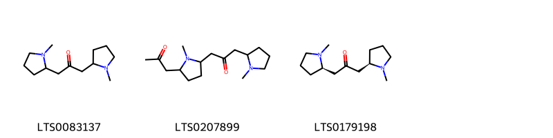{ width=100% }
    <figcaption>Hình ảnh cấu trúc hóa học của 3 hoạt chất thuộc nhóm  gồm ['cuskhygrine (LTS0083137)', '1-[1-methyl-5-(2-oxopropyl)pyrrolidin-2-yl]-3-(1-methylpyrrolidin-2-yl)propan-2-one (LTS0207899)', '1,3-bis[(2r)-1-methylpyrrolidin-2-yl]propan-2-one (LTS0179198)'].</figcaption>
</figure>
#### Nhóm Carboxylic acids and derivatives
<figure markdown="span">
    { width=100% }
    <figcaption>Hình ảnh cấu trúc hóa học của 1 hoạt chất thuộc nhóm Carboxylic acids and derivatives gồm ['citric acid (LTS0213921)'].</figcaption>
</figure>
#### Nhóm Flavonoids
<figure markdown="span">
    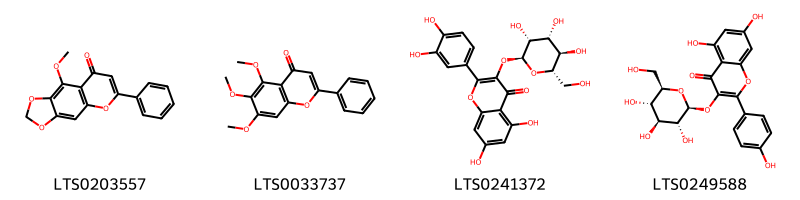{ width=100% }
    <figcaption>Hình ảnh cấu trúc hóa học của 4 hoạt chất thuộc nhóm Flavonoids gồm ['9-methoxy-6-phenyl-2h-[1,3]dioxolo[4,5-g]chromen-8-one (LTS0203557)', '5,6,7-trimethoxyflavone (LTS0033737)', '2-(3,4-dihydroxyphenyl)-5,7-dihydroxy-3-{[(2s,3r,4r,5r,6s)-3,4,5-trihydroxy-6-(hydroxymethyl)oxan-2-yl]oxy}chromen-4-one (LTS0241372)', 'astragalin (LTS0249588)'].</figcaption>
</figure>
#### Nhóm Organooxygen compounds
<figure markdown="span">
    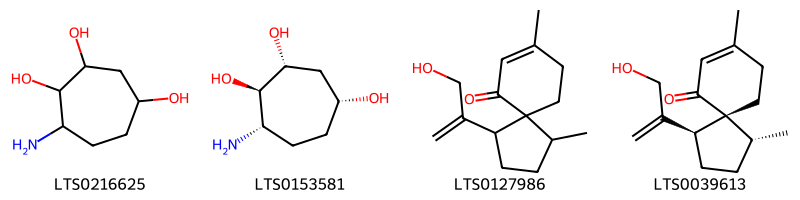{ width=100% }
    <figcaption>Hình ảnh cấu trúc hóa học của 4 hoạt chất thuộc nhóm Organooxygen compounds gồm ['7-aminocycloheptane-1,2,4-triol (LTS0216625)', '(1r,2r,4r,7s)-7-aminocycloheptane-1,2,4-triol (LTS0153581)', '1-(3-hydroxyprop-1-en-2-yl)-4,8-dimethylspiro[4.5]dec-7-en-6-one (LTS0127986)', '(1s,4r,5r)-1-(3-hydroxyprop-1-en-2-yl)-4,8-dimethylspiro[4.5]dec-7-en-6-one (LTS0039613)'].</figcaption>
</figure>
#### Nhóm Oxepanes
<figure markdown="span">
    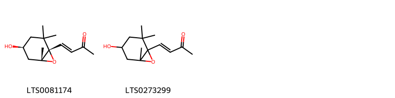{ width=100% }
    <figcaption>Hình ảnh cấu trúc hóa học của 2 hoạt chất thuộc nhóm Oxepanes gồm ['(3e)-4-[(1s,4s,6r)-4-hydroxy-2,2,6-trimethyl-7-oxabicyclo[4.1.0]heptan-1-yl]but-3-en-2-one (LTS0081174)', '4-{4-hydroxy-2,2,6-trimethyl-7-oxabicyclo[4.1.0]heptan-1-yl}but-3-en-2-one (LTS0273299)'].</figcaption>
</figure>
#### Nhóm Prenol lipids
<figure markdown="span">
    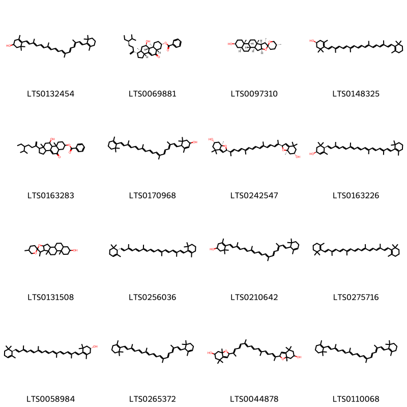{ width=100% }
    <figcaption>Hình ảnh cấu trúc hóa học của 16 hoạt chất thuộc nhóm Prenol lipids gồm ['3,5,5-trimethyl-4-[(1e,3e,5e,7e,9e)-3,7,12,16-tetramethyl-18-(2,6,6-trimethylcyclohex-1-en-1-yl)octadeca-1,3,5,7,9,11,13,15,17-nonaen-1-yl]cyclohex-3-en-1-ol (LTS0132454)', '(1r,3ar,5as,7s,9ar,9br,10r,11ar)-1-[(5r)-5-ethyl-6-methylhept-1-en-2-yl]-10-hydroxy-9a,11a-dimethyl-5-oxo-1h,2h,3h,3ah,5ah,6h,7h,8h,9h,9bh,10h,11h-cyclopenta[a]phenanthren-7-yl benzoate (LTS0069881)', 'tigogenin (LTS0097310)', '(s)-cryptoxanthin (LTS0148325)', '1-(5-ethyl-6-methylhept-1-en-2-yl)-10-hydroxy-9a,11a-dimethyl-5-oxo-1h,2h,3h,3ah,5ah,6h,7h,8h,9h,9bh,10h,11h-cyclopenta[a]phenanthren-7-yl benzoate (LTS0163283)', '3,5,5-trimethyl-4-[(9e,11e,13e,15e,17e)-3,7,12,16-tetramethyl-18-(2,6,6-trimethylcyclohex-1-en-1-yl)octadeca-1,3,5,7,9,11,13,15,17-nonaen-1-yl]cyclohex-2-en-1-ol (LTS0170968)', '(2r,6s,7ar)-2-[(2e,4e,6e,8e,10e,12e,14e)-15-[(2r,6s,7ar)-6-hydroxy-4,4,7a-trimethyl-2,5,6,7-tetrahydro-1-benzofuran-2-yl]-6,11-dimethylhexadeca-2,4,6,8,10,12,14-heptaen-2-yl]-4,4,7a-trimethyl-2,5,6,7-tetrahydro-1-benzofuran-6-ol (LTS0242547)', '(1s,4r)-3,5,5-trimethyl-4-[(1e,3e,5e,7e,9e,11e,13e,15e,17e)-3,7,12,16-tetramethyl-18-(2,6,6-trimethylcyclohex-1-en-1-yl)octadeca-1,3,5,7,9,11,13,15,17-nonaen-1-yl]cyclohex-2-en-1-ol (LTS0163226)', 'tigogenin (LTS0131508)', "(6's)-β,epsilon-carotene (LTS0256036)", '3,5,5-trimethyl-4-[(1e,3e,5e,7e,9e)-3,7,12,16-tetramethyl-18-(2,6,6-trimethylcyclohex-2-en-1-yl)octadeca-1,3,5,7,9,11,13,15,17-nonaen-1-yl]cyclohex-3-en-1-ol (LTS0210642)', 'β-carotene (LTS0275716)', 'zeinoxanthin (LTS0058984)', '1,5,5-trimethyl-6-[(9e,11e,13e,15e,17e)-3,7,12,16-tetramethyl-18-(2,6,6-trimethylcyclohex-1-en-1-yl)octadeca-1,3,5,7,9,11,13,15,17-nonaen-1-yl]cyclohex-1-ene (LTS0265372)', '2-[(8e,10e,12e,14e)-15-(6-hydroxy-4,4,7a-trimethyl-2,5,6,7-tetrahydro-1-benzofuran-2-yl)-6,11-dimethylhexadeca-2,4,6,8,10,12,14-heptaen-2-yl]-4,4,7a-trimethyl-2,5,6,7-tetrahydro-1-benzofuran-6-ol (LTS0044878)', '1,3,3-trimethyl-2-[(9e,11e,13e,15e,17e)-3,7,12,16-tetramethyl-18-(2,6,6-trimethylcyclohex-1-en-1-yl)octadeca-1,3,5,7,9,11,13,15,17-nonaen-1-yl]cyclohex-1-ene (LTS0110068)'].</figcaption>
</figure>
#### Nhóm Steroids and steroid derivatives
<figure markdown="span">
    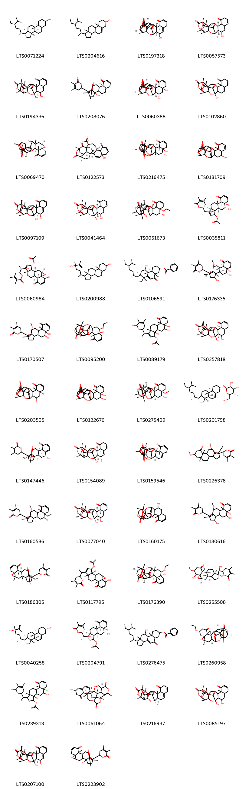{ width=100% }
    <figcaption>Hình ảnh cấu trúc hóa học của 83 hoạt chất thuộc nhóm Steroids and steroid derivatives gồm ['stigmast-5-en-3-ol (LTS0071224)', 'stigmast-5-en-3-ol, (3β)- (LTS0204616)', '(1r,2s,5s,8s,9r,16r,17s,18r,21s,24r,26s,27s)-5,16-dihydroxy-2,9,26-trimethyl-3,19,23,28-tetraoxaoctacyclo[16.9.1.1¹⁸,²⁷.0¹,⁵.0²,²⁴.0⁸,¹⁷.0⁹,¹⁴.0²¹,²⁶]nonacosa-11,14-diene-4,10,22,29-tetrone (LTS0197318)', '(1s,2r,3r,5r,6s,7r,14r,15s,18s,21s,22r,25s)-5,7,18-trihydroxy-1,14,21,25-tetramethyl-4,20,23-trioxaheptacyclo[20.3.1.1²,⁵.0³,¹⁸.0³,²¹.0⁶,¹⁵.0⁹,¹⁴]heptacosa-8,10-diene-13,19,24,27-tetrone (LTS0057573)', '(1s,2s,3r,5s,6s,7r,14r,15s,18r,21s,22r,25s)-5,7,18-trihydroxy-1,14,21,25-tetramethyl-4,20,23-trioxaheptacyclo[20.3.1.1²,⁵.0³,¹⁸.0³,²¹.0⁶,¹⁵.0⁹,¹⁴]heptacosa-8,11-diene-13,19,24,27-tetrone (LTS0194336)', '(13r)-6-(4,5-dimethyl-6-oxo-2,3-dihydropyran-2-yl)-2-hydroxy-6,13-dimethyl-7-oxapentacyclo[10.8.0.0²,⁹.0⁵,⁹.0¹³,¹⁸]icosa-15,18-diene-8,14-dione (LTS0208076)', '(1r,2s,5s,8s,9r,14s,16r,17s,18r,21s,24r,26s,27s)-5,14,16-trihydroxy-2,9,26-trimethyl-3,19,23,28-tetraoxaoctacyclo[16.9.1.1¹⁸,²⁷.0¹,⁵.0²,²⁴.0⁸,¹⁷.0⁹,¹⁴.0²¹,²⁶]nonacos-11-ene-4,10,22,29-tetrone (LTS0060388)', '5,18-dihydroxy-1,14,21,25-tetramethyl-4,20,23-trioxaheptacyclo[20.3.1.1²,⁵.0³,¹⁸.0³,²¹.0⁶,¹⁵.0⁹,¹⁴]heptacosa-8,10-diene-13,19,24,27-tetrone (LTS0102860)', '(1s,2r,4r,6s,11r,12s,15r,18s,19r,20r,21s,23r,26r)-15-hydroxy-11,18,21-trimethyl-5,17,24,28,29-pentaoxanonacyclo[17.9.1.1¹,²⁰.0²,¹².0⁴,⁶.0⁶,¹¹.0¹⁵,¹⁹.0¹⁸,²³.0²¹,²⁶]triacont-8-ene-10,16,25,30-tetrone (LTS0069470)', '(1r,2r,5r,8s,9r,14s,17r,18s,21s,24s,26s,27s)-5,14-dihydroxy-2,9,26-trimethyl-3,19,23,28-tetraoxaoctacyclo[16.9.2.0¹,⁵.0²,²⁴.0⁸,¹⁷.0⁹,¹⁴.0¹⁸,²⁷.0²¹,²⁶]nonacosa-11,15-diene-4,10,22,29-tetrone (LTS0122573)', '(5r,8r,9s,14r,15r,17s,21r,24s,26r,27s)-5,14,15-trihydroxy-2,9,26-trimethyl-3,19,23,28-tetraoxaoctacyclo[16.9.1.1¹⁸,²⁷.0¹,⁵.0²,²⁴.0⁸,¹⁷.0⁹,¹⁴.0²¹,²⁶]nonacos-11-ene-4,10,22,29-tetrone (LTS0216475)', '2,19-dihydroxy-13,16,23-trimethyl-6,10,17,26,27,30-hexaoxanonacyclo[23.2.2.1⁵,¹⁴.1⁵,¹⁵.0¹,²³.0⁴,²².0⁸,¹³.0¹¹,¹⁶.0¹⁵,¹⁹]hentriacont-28-ene-9,18,24,31-tetrone (LTS0181709)', '(1s,2s,3r,5r,6s,7r,14r,15s,18s,21s,22r)-5,7,18-trihydroxy-1,14,21-trimethyl-25-methylidene-4,20,23-trioxaheptacyclo[20.3.1.1²,⁵.0³,¹⁸.0³,²¹.0⁶,¹⁵.0⁹,¹⁴]heptacosa-8,11-diene-13,19,24,27-tetrone (LTS0097109)', '(1s,2s,3r,5s,6s,7r,14r,15s,18s,21s,22r,25s)-5,7,18-trihydroxy-1,14,21,25-tetramethyl-4,20,23-trioxaheptacyclo[20.3.1.1²,⁵.0³,¹⁸.0³,²¹.0⁶,¹⁵.0⁹,¹⁴]heptacosa-8,10-diene-13,19,24,27-tetrone (LTS0041464)', '(1r,2s,5r,8s,9r,14r,15r,17r,18r,21s,24r,26s,27s)-14-ethoxy-5,15-dihydroxy-2,9,26-trimethyl-3,19,23,28-tetraoxaoctacyclo[16.9.1.1¹⁸,²⁷.0¹,⁵.0²,²⁴.0⁸,¹⁷.0⁹,¹⁴.0²¹,²⁶]nonacos-11-ene-4,10,22,29-tetrone (LTS0051673)', '(3s,3ar,3br,5r,5ar,9ar,9bs,11ar)-1-[(1s)-1-[(2r)-4,5-dimethyl-6-oxo-2,3-dihydropyran-2-yl]ethyl]-3a,5,5a-trihydroxy-9a,11a-dimethyl-9-oxo-3h,3bh,4h,5h,6h,9bh,10h,11h-cyclopenta[a]phenanthren-3-yl acetate (LTS0035811)', '(1s,2r,6s,7r,9r,11r,12r,13s,16r)-15-[(1s)-1-[(2r)-4,5-dimethyl-6-oxo-2,3-dihydropyran-2-yl]ethyl]-6,12-dihydroxy-2,16-dimethyl-3-oxo-8-oxapentacyclo[9.7.0.0²,⁷.0⁷,⁹.0¹²,¹⁶]octadeca-4,14-dien-13-yl acetate (LTS0060984)', '6-{7-hydroxy-9a,11a-dimethyl-1h,2h,3h,3ah,3bh,4h,6h,7h,8h,9h,9bh,10h,11h-cyclopenta[a]phenanthren-1-yl}-2,3-dimethylhept-1-en-3-ol (LTS0200988)', '(1r,3ar,5as,7s,9ar,9br,10r,11ar)-1-[(2r,5r)-5-ethyl-6-methylheptan-2-yl]-10-hydroxy-9a,11a-dimethyl-5-oxo-1h,2h,3h,3ah,5ah,6h,7h,8h,9h,9bh,10h,11h-cyclopenta[a]phenanthren-7-yl benzoate (LTS0106591)', '(1r,2s,3s,5s,6r,8s,9r,12s,13r,18r,19r)-6-[(2r)-4,5-dimethyl-6-oxo-2,3-dihydropyran-2-yl]-3,18,19-trihydroxy-8-methoxy-6,13-dimethyl-7-oxapentacyclo[10.8.0.0²,⁹.0⁵,⁹.0¹³,¹⁸]icos-15-en-14-one (LTS0176335)', '6-(4,5-dimethyl-6-oxo-2,3-dihydropyran-2-yl)-18,19-dihydroxy-8-methoxy-6,13-dimethyl-7-oxapentacyclo[10.8.0.0²,⁹.0⁵,⁹.0¹³,¹⁸]icos-15-en-14-one (LTS0170507)', '15-ethoxy-5,14-dihydroxy-2,9,26-trimethyl-3,19,23,28-tetraoxaoctacyclo[16.9.1.1¹⁸,²⁷.0¹,⁵.0²,²⁴.0⁸,¹⁷.0⁹,¹⁴.0²¹,²⁶]nonacos-11-ene-4,10,22,29-tetrone (LTS0095200)', '1-[1-(4,5-dimethyl-6-oxo-2,3-dihydropyran-2-yl)ethyl]-3a,5,5a-trihydroxy-9a,11a-dimethyl-9-oxo-3h,3bh,4h,5h,6h,9bh,10h,11h-cyclopenta[a]phenanthren-3-yl acetate (LTS0089179)', '(1s,2s,5s,6s,14r,22r)-5,7,18-trihydroxy-1,14,21-trimethyl-25-methylidene-4,20,23-trioxaheptacyclo[20.3.1.1²,⁵.0³,¹⁸.0³,²¹.0⁶,¹⁵.0⁹,¹⁴]heptacosa-8,11-diene-13,19,24,27-tetrone (LTS0257818)', '5,14,16-trihydroxy-2,9,26-trimethyl-3,19,23,28-tetraoxaoctacyclo[16.9.1.1¹⁸,²⁷.0¹,⁵.0²,²⁴.0⁸,¹⁷.0⁹,¹⁴.0²¹,²⁶]nonacos-11-ene-4,10,22,29-tetrone (LTS0203505)', '5,14,15-trihydroxy-2,9,26-trimethyl-3,19,23,28-tetraoxaoctacyclo[16.9.1.1¹⁸,²⁷.0¹,⁵.0²,²⁴.0⁸,¹⁷.0⁹,¹⁴.0²¹,²⁶]nonacos-11-ene-4,10,22,29-tetrone (LTS0122676)', '(1r,2s,5r,8s,9r,14r,15r,17r,18r,21s,24r,26s,27s)-5,15-dihydroxy-14-methoxy-2,9,26-trimethyl-3,19,23,28-tetraoxaoctacyclo[16.9.1.1¹⁸,²⁷.0¹,⁵.0²,²⁴.0⁸,¹⁷.0⁹,¹⁴.0²¹,²⁶]nonacos-11-ene-4,10,22,29-tetrone (LTS0275409)', 'sitogluside (LTS0201798)', '(1r,2r,5s,6r,9s,12s,13r,19r)-6-[(2r)-4,5-dimethyl-6-oxo-2,3-dihydropyran-2-yl]-2,19-dihydroxy-6,13-dimethyl-7-oxapentacyclo[10.8.0.0²,⁹.0⁵,⁹.0¹³,¹⁸]icosa-15,17-diene-8,14-dione (LTS0147446)', '(1s,2s,3r,5s,6s,7r,14r,15s,18r,21s,22r,25s)-5,7,18-trihydroxy-1,14,21,25-tetramethyl-4,20,23-trioxaheptacyclo[20.3.1.1²,⁵.0³,¹⁸.0³,²¹.0⁶,¹⁵.0⁹,¹⁴]heptacosa-8,10-diene-13,19,24,27-tetrone (LTS0154089)', '(5s,8s,9s,17r,21s,24s,26s,27s)-5-hydroxy-2,9,26-trimethyl-3,19,23,28-tetraoxaoctacyclo[16.9.1.1¹⁸,²⁷.0¹,⁵.0²,²⁴.0⁸,¹⁷.0⁹,¹⁴.0²¹,²⁶]nonacosa-11,14-diene-4,10,22,29-tetrone (LTS0159546)', '6-(4,5-dimethyl-6-oxo-2,3-dihydropyran-2-yl)-8,16-dimethoxy-6,13-dimethyl-7,19-dioxahexacyclo[10.9.0.0²,⁹.0⁵,⁹.0¹³,¹⁸.0¹⁸,²⁰]henicosan-14-one (LTS0226378)', '6-(4,5-dimethyl-6-oxo-2,3-dihydropyran-2-yl)-19-hydroxy-8,18-dimethoxy-6,13-dimethyl-7-oxapentacyclo[10.8.0.0²,⁹.0⁵,⁹.0¹³,¹⁸]icos-15-en-14-one (LTS0160586)', '(1s,2s,3r,5r,6s,7r,14r,15s,18s,21s,22r,25s)-5,7,18-trihydroxy-1,14,21,25-tetramethyl-4,20,23-trioxaheptacyclo[20.3.1.1²,⁵.0³,¹⁸.0³,²¹.0⁶,¹⁵.0⁹,¹⁴]heptacosa-8,11-diene-13,19,24,27-tetrone (LTS0077040)', '5,16-dihydroxy-2,9,26-trimethyl-3,19,23,28-tetraoxaoctacyclo[16.9.1.1¹⁸,²⁷.0¹,⁵.0²,²⁴.0⁸,¹⁷.0⁹,¹⁴.0²¹,²⁶]nonacosa-11,14-diene-4,10,22,29-tetrone (LTS0160175)', '6-(4,5-dimethyl-6-oxo-2,3-dihydropyran-2-yl)-3,18,19-trihydroxy-8-methoxy-6,13-dimethyl-7-oxapentacyclo[10.8.0.0²,⁹.0⁵,⁹.0¹³,¹⁸]icos-15-en-14-one (LTS0180616)', '(1r,2r,5s,6r,9s,12s,13r,18r,20s)-6-[(2r)-4,5-dimethyl-6-oxo-2,3-dihydropyran-2-yl]-2-hydroxy-6,13-dimethyl-7,19-dioxahexacyclo[10.9.0.0²,⁹.0⁵,⁹.0¹³,¹⁸.0¹⁸,²⁰]henicos-15-ene-8,14-dione (LTS0186305)', '15-[1-(4,5-dimethyl-6-oxo-2,3-dihydropyran-2-yl)ethyl]-6,12-dihydroxy-2,16-dimethyl-3-oxo-8-oxapentacyclo[9.7.0.0²,⁷.0⁷,⁹.0¹²,¹⁶]octadeca-4,14-dien-13-yl acetate (LTS0117795)', '(1r,2r,5s,8s,9r,14r,15r,17r,18r,21s,24r,26s,27s)-15-ethoxy-5,14-dihydroxy-2,9,26-trimethyl-3,19,23,28-tetraoxaoctacyclo[16.9.1.1¹⁸,²⁷.0¹,⁵.0²,²⁴.0⁸,¹⁷.0⁹,¹⁴.0²¹,²⁶]nonacos-11-ene-4,10,22,29-tetrone (LTS0176390)', '(1s,2r,5s,6s,7r,9r,11r,12r,15s,16s)-15-[(1s)-1-[(2r)-4,5-dimethyl-6-oxo-2,3-dihydropyran-2-yl]-1-hydroxyethyl]-6,12,15-trihydroxy-5-methoxy-2,16-dimethyl-8-oxapentacyclo[9.7.0.0²,⁷.0⁷,⁹.0¹²,¹⁶]octadecan-3-one (LTS0255508)', '(3s,6r)-6-[(1r,3as,3bs,7s,9ar,9bs,11ar)-7-hydroxy-9a,11a-dimethyl-1h,2h,3h,3ah,3bh,4h,6h,7h,8h,9h,9bh,10h,11h-cyclopenta[a]phenanthren-1-yl]-2,3-dimethylhept-1-en-3-ol (LTS0040258)', '(1r,3s,3as,3br,5r,5ar,9as,9bs,11ar)-5a-chloro-1-[(1s)-1-[(2r)-4,5-dimethyl-6-oxo-2,3-dihydropyran-2-yl]ethyl]-3a,5-dihydroxy-9a,11a-dimethyl-9-oxo-1h,2h,3h,3bh,4h,5h,6h,9bh,10h,11h-cyclopenta[a]phenanthren-3-yl acetate (LTS0204791)', '1-(5-ethyl-6-methylheptan-2-yl)-10-hydroxy-9a,11a-dimethyl-5-oxo-1h,2h,3h,3ah,5ah,6h,7h,8h,9h,9bh,10h,11h-cyclopenta[a]phenanthren-7-yl benzoate (LTS0276475)', '(1r,2r,4r,6s,8s,11r,12s,15r,18s,19r,20s,21s,23r,26s)-8-ethoxy-15-hydroxy-11,18,21-trimethyl-5,17,24,28,29-pentaoxanonacyclo[17.9.1.1¹,²⁰.0²,¹².0⁴,⁶.0⁶,¹¹.0¹⁵,¹⁹.0¹⁸,²³.0²¹,²⁶]triacontane-10,16,25,30-tetrone (LTS0260958)', '5a-chloro-1-[1-(4,5-dimethyl-6-oxo-2,3-dihydropyran-2-yl)ethyl]-3a,5-dihydroxy-9a,11a-dimethyl-9-oxo-1h,2h,3h,3bh,4h,5h,6h,9bh,10h,11h-cyclopenta[a]phenanthren-3-yl acetate (LTS0239313)', '(1r,2s,5r,8s,9r,12r,17r,18s,21s,24s,26s,27s)-5,12-dihydroxy-2,9,26-trimethyl-3,19,23,28-tetraoxaoctacyclo[16.9.2.0¹,⁵.0²,²⁴.0⁸,¹⁷.0⁹,¹⁴.0¹⁸,²⁷.0²¹,²⁶]nonacosa-13,15-diene-4,10,22,29-tetrone (LTS0061064)', '(1s,2s,3r,5r,6r,14r,15s,18r,21s,22r,25s)-5,18-dihydroxy-1,14,21,25-tetramethyl-4,20,23-trioxaheptacyclo[20.3.1.1²,⁵.0³,¹⁸.0³,²¹.0⁶,¹⁵.0⁹,¹⁴]heptacosa-8,10-diene-13,19,24,27-tetrone (LTS0216937)', '5,7,18-trihydroxy-1,14,21,25-tetramethyl-4,20,23-trioxaheptacyclo[20.3.1.1²,⁵.0³,¹⁸.0³,²¹.0⁶,¹⁵.0⁹,¹⁴]heptacosa-8,11-diene-13,19,24,27-tetrone (LTS0085197)', '(1s,2s,3r,5s,6s,7r,14r,15s,18s,21s,22r)-5,7,18-trihydroxy-1,14,21-trimethyl-25-methylidene-4,20,23-trioxaheptacyclo[20.3.1.1²,⁵.0³,¹⁸.0³,²¹.0⁶,¹⁵.0⁹,¹⁴]heptacosa-8,11-diene-13,19,24,27-tetrone (LTS0207100)', '6-(4,5-dimethyl-6-oxo-2,3-dihydropyran-2-yl)-2-hydroxy-6,13-dimethyl-7,19-dioxahexacyclo[10.9.0.0²,⁹.0⁵,⁹.0¹³,¹⁸.0¹⁸,²⁰]henicos-15-ene-8,14-dione (LTS0223902)', '(1s,2s,5s,6r,8s,9r,12s,13r,18r,19r)-6-[(2r)-4,5-dimethyl-6-oxo-2,3-dihydropyran-2-yl]-18,19-dihydroxy-8-methoxy-6,13-dimethyl-7-oxapentacyclo[10.8.0.0²,⁹.0⁵,⁹.0¹³,¹⁸]icos-15-en-14-one (LTS0052963)', '5,12-dihydroxy-2,9,26-trimethyl-3,19,23,28-tetraoxaoctacyclo[16.9.2.0¹,⁵.0²,²⁴.0⁸,¹⁷.0⁹,¹⁴.0¹⁸,²⁷.0²¹,²⁶]nonacosa-13,15-diene-4,10,22,29-tetrone (LTS0209366)', '(1s,2s,5s,6s,7r,9r,15s,16r)-15-[(1s)-1-[(2r)-4,5-dimethyl-6-oxo-2,3-dihydropyran-2-yl]-1-hydroxyethyl]-6,15-dihydroxy-5-methoxy-2,16-dimethyl-8-oxapentacyclo[9.7.0.0²,⁷.0⁷,⁹.0¹²,¹⁶]octadec-11-en-3-one (LTS0259475)', '(1r,2s,5r,8s,9r,14r,15r,17r,18r,21s,24r,26s,27s)-5,14,15-trihydroxy-2,9,26-trimethyl-3,19,23,28-tetraoxaoctacyclo[16.9.1.1¹⁸,²⁷.0¹,⁵.0²,²⁴.0⁸,¹⁷.0⁹,¹⁴.0²¹,²⁶]nonacos-11-ene-4,10,22,29-tetrone (LTS0159097)', '(1r,2r,5s,6r,9s,12s,13r)-6-[(2r)-4,5-dimethyl-6-oxo-2,3-dihydropyran-2-yl]-2-hydroxy-6,13-dimethyl-7-oxapentacyclo[10.8.0.0²,⁹.0⁵,⁹.0¹³,¹⁸]icosa-15,18-diene-8,14-dione (LTS0068062)', '6-(4,5-dimethyl-6-oxo-2,3-dihydropyran-2-yl)-2,19-dihydroxy-6,13-dimethyl-7-oxapentacyclo[10.8.0.0²,⁹.0⁵,⁹.0¹³,¹⁸]icosa-15,17-diene-8,14-dione (LTS0066272)', '5,15-dihydroxy-14-methoxy-2,9,26-trimethyl-3,19,23,28-tetraoxaoctacyclo[16.9.1.1¹⁸,²⁷.0¹,⁵.0²,²⁴.0⁸,¹⁷.0⁹,¹⁴.0²¹,²⁶]nonacos-11-ene-4,10,22,29-tetrone (LTS0028627)', '(1r,2r,5s,6r,9s,12s,13r)-6-[(2r)-4,5-dimethyl-6-oxo-2,3-dihydropyran-2-yl]-2-hydroxy-6,13-dimethyl-7-oxapentacyclo[10.8.0.0²,⁹.0⁵,⁹.0¹³,¹⁸]icosa-16,18-diene-8,14-dione (LTS0243971)', '(1s,2s,5s,6r,8s,9r,12s,13r,18r,19r)-6-[(2r)-4,5-dimethyl-6-oxo-2,3-dihydropyran-2-yl]-19-hydroxy-8,18-dimethoxy-6,13-dimethyl-7-oxapentacyclo[10.8.0.0²,⁹.0⁵,⁹.0¹³,¹⁸]icos-15-en-14-one (LTS0260141)', '15-hydroxy-11,18,21-trimethyl-5,17,24,28,29-pentaoxanonacyclo[17.9.1.1¹,²⁰.0²,¹².0⁴,⁶.0⁶,¹¹.0¹⁵,¹⁹.0¹⁸,²³.0²¹,²⁶]triacont-8-ene-10,16,25,30-tetrone (LTS0271608)', '4,14-dihydroxy-10,17,20-trimethyl-16,23,27,28-tetraoxanonacyclo[16.9.1.1¹,¹⁹.0²,¹¹.0⁵,⁷.0⁵,¹⁰.0¹⁴,¹⁸.0¹⁷,²².0²⁰,²⁵]nonacosane-9,15,24,29-tetrone (LTS0054828)', '(1s,2s,5s,6r,8s,9r,12s,13r,16r,18s,20r)-6-[(2r)-4,5-dimethyl-6-oxo-2,3-dihydropyran-2-yl]-8,16-dimethoxy-6,13-dimethyl-7,19-dioxahexacyclo[10.9.0.0²,⁹.0⁵,⁹.0¹³,¹⁸.0¹⁸,²⁰]henicosan-14-one (LTS0063349)', '(1r,2r,4r,6s,11r,12s,15s,18s,19r,20s,21s,23s,26s)-15-hydroxy-11,18,21-trimethyl-5,17,24,28,29-pentaoxanonacyclo[17.9.1.1¹,²⁰.0²,¹².0⁴,⁶.0⁶,¹¹.0¹⁵,¹⁹.0¹⁸,²³.0²¹,²⁶]triacont-8-ene-10,16,25,30-tetrone (LTS0272778)', 'physalin b (LTS0109751)', '(1s,2r,4r,5r,8s,11r,13s,14s,15r,16s,19s,22s,23r,25r)-2,19-dihydroxy-13,16,23-trimethyl-6,10,17,26,27,30-hexaoxanonacyclo[23.2.2.1⁵,¹⁴.1⁵,¹⁵.0¹,²³.0⁴,²².0⁸,¹³.0¹¹,¹⁶.0¹⁵,¹⁹]hentriacont-28-ene-9,18,24,31-tetrone (LTS0123963)', '(1r,2s,5r,8s,9r,17r,18r,21s,24r,26s,27s)-5-hydroxy-2,9,26-trimethyl-3,19,23,28-tetraoxaoctacyclo[16.9.1.1¹⁸,²⁷.0¹,⁵.0²,²⁴.0⁸,¹⁷.0⁹,¹⁴.0²¹,²⁶]nonacosa-11,14-diene-4,10,22,29-tetrone (LTS0001041)', '(1r,2s,5r,8s,9r,12s,17r,18s,21s,24s,26s,27s)-5,12-dihydroxy-2,9,26-trimethyl-3,19,23,28-tetraoxaoctacyclo[16.9.2.0¹,⁵.0²,²⁴.0⁸,¹⁷.0⁹,¹⁴.0¹⁸,²⁷.0²¹,²⁶]nonacosa-13,15-diene-4,10,22,29-tetrone (LTS0016007)', '(1r,2r,4r,5r,8s,11r,13s,14s,15r,16s,19s,22s,23r,25s)-2,19-dihydroxy-13,16,23-trimethyl-6,10,17,26,27,30-hexaoxanonacyclo[23.2.2.1⁵,¹⁴.1⁵,¹⁵.0¹,²³.0⁴,²².0⁸,¹³.0¹¹,¹⁶.0¹⁵,¹⁹]hentriacont-28-ene-9,18,24,31-tetrone (LTS0018029)', '(1s,2s,3r,5r,6s,7r,14r,15s,18s,21s,22r,25s)-5,7,18-trihydroxy-1,14,21,25-tetramethyl-4,20,23-trioxaheptacyclo[20.3.1.1²,⁵.0³,¹⁸.0³,²¹.0⁶,¹⁵.0⁹,¹⁴]heptacosa-8,10-diene-13,19,24,27-tetrone (LTS0018152)', '(1r,2r,4r,5r,7s,10r,11s,14r,17s,18r,19s,20s,22r,25s)-4,14-dihydroxy-10,17,20-trimethyl-16,23,27,28-tetraoxanonacyclo[16.9.1.1¹,¹⁹.0²,¹¹.0⁵,⁷.0⁵,¹⁰.0¹⁴,¹⁸.0¹⁷,²².0²⁰,²⁵]nonacosane-9,15,24,29-tetrone (LTS0014717)', '8-ethoxy-15-hydroxy-11,18,21-trimethyl-5,17,24,28,29-pentaoxanonacyclo[17.9.1.1¹,²⁰.0²,¹².0⁴,⁶.0⁶,¹¹.0¹⁵,¹⁹.0¹⁸,²³.0²¹,²⁶]triacontane-10,16,25,30-tetrone (LTS0000442)', '(1r,2s,5r,8r,9r,14r,15r,17s,18r,21s,24r,26s,27s)-5,14,15-trihydroxy-2,9,26-trimethyl-3,19,23,28-tetraoxaoctacyclo[16.9.1.1¹⁸,²⁷.0¹,⁵.0²,²⁴.0⁸,¹⁷.0⁹,¹⁴.0²¹,²⁶]nonacos-11-ene-4,10,22,29-tetrone (LTS0009294)', '5,7,18-trihydroxy-1,14,21-trimethyl-25-methylidene-4,20,23-trioxaheptacyclo[20.3.1.1²,⁵.0³,¹⁸.0³,²¹.0⁶,¹⁵.0⁹,¹⁴]heptacosa-8,11-diene-13,19,24,27-tetrone (LTS0095002)', '(1r,2r,4r,6s,11r,12s,15r,18s,19r,20s,21s,23r,26s)-15-hydroxy-11,18,21-trimethyl-5,17,24,28,29-pentaoxanonacyclo[17.9.1.1¹,²⁰.0²,¹².0⁴,⁶.0⁶,¹¹.0¹⁵,¹⁹.0¹⁸,²³.0²¹,²⁶]triacont-8-ene-10,16,25,30-tetrone (LTS0217306)', '(1s,3s,3as,3br,5r,5ar,9ar,9bs,11ar)-1-[(1s)-1-[(2r)-4,5-dimethyl-6-oxo-2,3-dihydropyran-2-yl]ethyl]-3a,5,5a-trihydroxy-9a,11a-dimethyl-9-oxo-1h,2h,3h,3bh,4h,5h,6h,9bh,10h,11h-cyclopenta[a]phenanthren-3-yl acetate (LTS0019317)', '(1r,2s,5r,8s,9r,17r,18s,21r,24r,26s,27s)-5-hydroxy-2,9,26-trimethyl-3,19,23,28-tetraoxaoctacyclo[16.9.1.1¹⁸,²⁷.0¹,⁵.0²,²⁴.0⁸,¹⁷.0⁹,¹⁴.0²¹,²⁶]nonacosa-12,14-diene-4,10,22,29-tetrone (LTS0239386)', '15-[1-(4,5-dimethyl-6-oxo-2,3-dihydropyran-2-yl)-1-hydroxyethyl]-6,15-dihydroxy-5-methoxy-2,16-dimethyl-8-oxapentacyclo[9.7.0.0²,⁷.0⁷,⁹.0¹²,¹⁶]octadec-11-en-3-one (LTS0017601)', '1-[1-(4,5-dimethyl-6-oxo-2,3-dihydropyran-2-yl)ethyl]-3a,5,5a-trihydroxy-9a,11a-dimethyl-9-oxo-1h,2h,3h,3bh,4h,5h,6h,9bh,10h,11h-cyclopenta[a]phenanthren-3-yl acetate (LTS0118736)', '14-ethoxy-5,15-dihydroxy-2,9,26-trimethyl-3,19,23,28-tetraoxaoctacyclo[16.9.1.1¹⁸,²⁷.0¹,⁵.0²,²⁴.0⁸,¹⁷.0⁹,¹⁴.0²¹,²⁶]nonacos-11-ene-4,10,22,29-tetrone (LTS0231788)', '(1r,2r,5s,8s,9r,14r,15r,17r,18r,21s,24s,26s,27s)-5,14,15-trihydroxy-2,9,26-trimethyl-3,19,23,28-tetraoxaoctacyclo[16.9.1.1¹⁸,²⁷.0¹,⁵.0²,²⁴.0⁸,¹⁷.0⁹,¹⁴.0²¹,²⁶]nonacos-11-ene-4,10,22,29-tetrone (LTS0120268)', 'physalin f (LTS0242357)', '5,14-dihydroxy-2,9,26-trimethyl-3,19,23,28-tetraoxaoctacyclo[16.9.2.0¹,⁵.0²,²⁴.0⁸,¹⁷.0⁹,¹⁴.0¹⁸,²⁷.0²¹,²⁶]nonacosa-11,15-diene-4,10,22,29-tetrone (LTS0090724)', '5,7,18-trihydroxy-1,14,21,25-tetramethyl-4,20,23-trioxaheptacyclo[20.3.1.1²,⁵.0³,¹⁸.0³,²¹.0⁶,¹⁵.0⁹,¹⁴]heptacosa-8,10-diene-13,19,24,27-tetrone (LTS0115616)'].</figcaption>
</figure>
#### Nhóm Tropane alkaloids
<figure markdown="span">
    { width=100% }
    <figcaption>Hình ảnh cấu trúc hóa học của 13 hoạt chất thuộc nhóm Tropane alkaloids gồm ['8-azabicyclo[3.2.1]octane-1,2,3,6-tetrol (LTS0221403)', '(1r,2s,3r,5r)-8-azabicyclo[3.2.1]octane-1,2,3-triol (LTS0077508)', '(1r,2r,3r,4s,5r)-8-azabicyclo[3.2.1]octane-1,2,3,4-tetrol (LTS0144856)', '8-methyl-8-azabicyclo[3.2.1]octan-3-yl 2-methylbut-2-enoate (LTS0124726)', '8-azabicyclo[3.2.1]octane-1,2,3,4-tetrol (LTS0108701)', 'tropigline (LTS0267395)', 'pseudotropine (LTS0042154)', 'tropin (LTS0052859)', '8-azabicyclo[3.2.1]octane-1,2,3-triol (LTS0129838)', '(1r,3s,4s,5r)-8-azabicyclo[3.2.1]octane-1,3,4-triol (LTS0110489)', '(1r,2s,3r,5s,6r)-8-azabicyclo[3.2.1]octane-1,2,3,6-tetrol (LTS0060094)', '(1r,2s,3r,4s,5r)-8-azabicyclo[3.2.1]octane-1,2,3,4-tetrol (LTS0001773)', '8-azabicyclo[3.2.1]octane-1,3,4-triol (LTS0132946)'].</figcaption>
</figure>

---

### Dược dân tộc học

Danh sách các quốc gia có sử dụng *Physalis angulata* trong điều trị các bệnh. 

| Country    | Disease                    | Bệnh                                            |
|:-----------|:---------------------------|:------------------------------------------------|
| Caroline I | Intoxicant                 | chất gây độc                                    |
| Elsewhere  | Purgative, Tonic, Diuretic | Phương pháp thanh lọc, thuốc bổ, thuốc lợi tiểu |
| Java       | Vermifuge                  | Thuốc diệt sán                                  |
| Malaya     | Diuretic                   | Thuốc lợi tiêu                                  |

---

---
## Physalis pubescens
### Thông tin về thực vật

!!! info "Phân loại thực vật của *Physalis pubescens* từ GIBF:"
    - **Kingdom:** Plantae
    - **Phylum:** Tracheophyta
    - **Order:** Solanales
    - **Family:** Solanaceae
    - **Genus:** Physalis
    - **Species:** *Physalis pubescens*

 

| Label (VI)   | Label (EN)   | Scientific Name    | Descriptions (VI)   | Descriptions (EN)   | Also Known As (VI)   | Also Known As (EN)        |
|:-------------|:-------------|:-------------------|:--------------------|:--------------------|:---------------------|:--------------------------|
| N/A          | N/A          | Physalis pubescens | loài thực vật       | species of plant    | ['']                 | ['Physalis pubescens L.'] |

#### Phân bố trên thế giới

**Từ CSDL GIBF** nan, Japan, Guadeloupe, Argentina, Panama, Canada, French Guiana, Chinese Taipei, Honduras, United States of America, Bonaire, Sint Eustatius and Saba, Maldives, Belize, Czechia, Brazil, Dominica, Mexico, China, Curaçao, Ecuador, Costa Rica, India

#### Phân bố tại Việt Nam

**Từ CSDL GIBF**: Không có ghi nhận ở Việt Nam

---
### Thành phần hóa học
        
- Theo cơ sở dữ liệu lotus: Từ loài *Physalis pubescens* đã phân lập và xác định được 15 hoạt chất thuộc về các nhóm Prenol lipids, Steroids and steroid derivatives. 

|    | chemicalTaxonomyClassyfireClass   |   smiles_count |
|---:|:----------------------------------|---------------:|
|  0 |                                   |              1 |
|  1 | Prenol lipids                     |              1 |
|  2 | Steroids and steroid derivatives  |             13 |

#### Nhóm 
<figure markdown="span">
    { width=100% }
    <figcaption>Hình ảnh cấu trúc hóa học của 1 hoạt chất thuộc nhóm  gồm ['1-[1-methyl-5-(2-oxopropyl)pyrrolidin-2-yl]-3-(1-methylpyrrolidin-2-yl)propan-2-one (LTS0207899)'].</figcaption>
</figure>
#### Nhóm Prenol lipids
<figure markdown="span">
    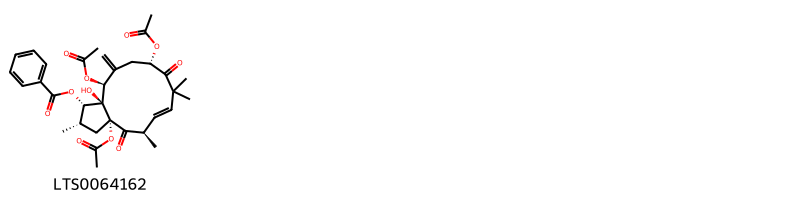{ width=100% }
    <figcaption>Hình ảnh cấu trúc hóa học của 1 hoạt chất thuộc nhóm Prenol lipids gồm ['(1s,2s,3ar,5r,10s,13s,13as)-3a,10,13-tris(acetyloxy)-13a-hydroxy-2,5,8,8-tetramethyl-12-methylidene-4,9-dioxo-1h,2h,3h,5h,10h,11h,13h-cyclopenta[12]annulen-1-yl benzoate (LTS0064162)'].</figcaption>
</figure>
#### Nhóm Steroids and steroid derivatives
<figure markdown="span">
    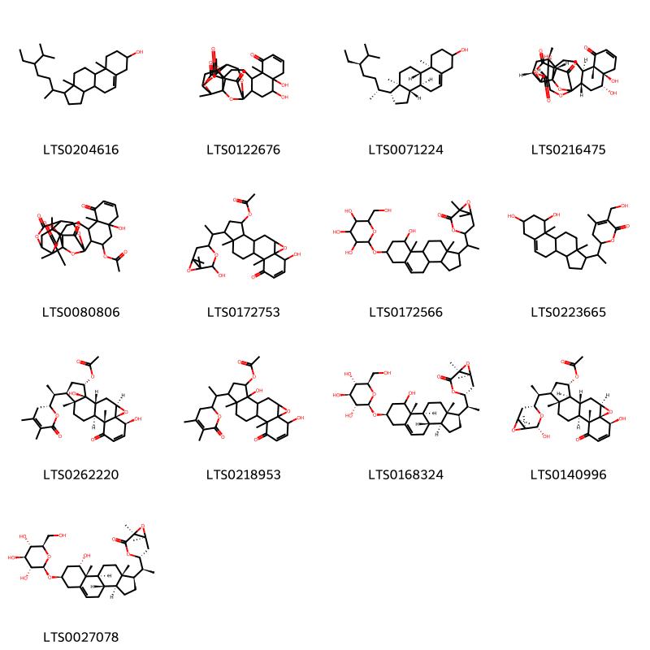{ width=100% }
    <figcaption>Hình ảnh cấu trúc hóa học của 13 hoạt chất thuộc nhóm Steroids and steroid derivatives gồm ['stigmast-5-en-3-ol, (3β)- (LTS0204616)', '5,14,15-trihydroxy-2,9,26-trimethyl-3,19,23,28-tetraoxaoctacyclo[16.9.1.1¹⁸,²⁷.0¹,⁵.0²,²⁴.0⁸,¹⁷.0⁹,¹⁴.0²¹,²⁶]nonacos-11-ene-4,10,22,29-tetrone (LTS0122676)', 'stigmast-5-en-3-ol (LTS0071224)', '(5r,8r,9s,14r,15r,17s,21r,24s,26r,27s)-5,14,15-trihydroxy-2,9,26-trimethyl-3,19,23,28-tetraoxaoctacyclo[16.9.1.1¹⁸,²⁷.0¹,⁵.0²,²⁴.0⁸,¹⁷.0⁹,¹⁴.0²¹,²⁶]nonacos-11-ene-4,10,22,29-tetrone (LTS0216475)', '5,14-dihydroxy-2,9,26-trimethyl-4,10,22,29-tetraoxo-3,19,23,28-tetraoxaoctacyclo[16.9.1.1¹⁸,²⁷.0¹,⁵.0²,²⁴.0⁸,¹⁷.0⁹,¹⁴.0²¹,²⁶]nonacos-11-en-16-yl acetate (LTS0080806)', '6-hydroxy-15-(1-{2-hydroxy-1,6-dimethyl-3,7-dioxabicyclo[4.1.0]heptan-4-yl}ethyl)-2,16-dimethyl-3-oxo-8-oxapentacyclo[9.7.0.0²,⁷.0⁷,⁹.0¹²,¹⁶]octadec-4-en-13-yl acetate (LTS0172753)', '4-[1-(9-hydroxy-9a,11a-dimethyl-7-{[3,4,5-trihydroxy-6-(hydroxymethyl)oxan-2-yl]oxy}-1h,2h,3h,3ah,3bh,4h,6h,7h,8h,9h,9bh,10h,11h-cyclopenta[a]phenanthren-1-yl)ethyl]-1,6-dimethyl-3,7-dioxabicyclo[4.1.0]heptan-2-one (LTS0172566)', '6-(1-{7,9-dihydroxy-9a,11a-dimethyl-1h,2h,3h,3ah,3bh,4h,6h,7h,8h,9h,9bh,10h,11h-cyclopenta[a]phenanthren-1-yl}ethyl)-3-(hydroxymethyl)-4-methyl-5,6-dihydropyran-2-one (LTS0223665)', '(1s,2r,6s,7r,9r,11r,12s,13s,15r,16r)-15-[(1s)-1-[(2r)-4,5-dimethyl-6-oxo-2,3-dihydropyran-2-yl]ethyl]-6,12-dihydroxy-2,16-dimethyl-3-oxo-8-oxapentacyclo[9.7.0.0²,⁷.0⁷,⁹.0¹²,¹⁶]octadec-4-en-13-yl acetate (LTS0262220)', '15-[1-(4,5-dimethyl-6-oxo-2,3-dihydropyran-2-yl)ethyl]-6,12-dihydroxy-2,16-dimethyl-3-oxo-8-oxapentacyclo[9.7.0.0²,⁷.0⁷,⁹.0¹²,¹⁶]octadec-4-en-13-yl acetate (LTS0218953)', '(1s,4r,6s)-4-[(1s)-1-[(1r,3as,3bs,7r,9ar,9bs,11as)-9-hydroxy-9a,11a-dimethyl-7-{[(2r,3r,4s,5s,6r)-3,4,5-trihydroxy-6-(hydroxymethyl)oxan-2-yl]oxy}-1h,2h,3h,3ah,3bh,4h,6h,7h,8h,9h,9bh,10h,11h-cyclopenta[a]phenanthren-1-yl]ethyl]-1,6-dimethyl-3,7-dioxabicyclo[4.1.0]heptan-2-one (LTS0168324)', '(1s,2r,6s,7r,9r,11r,12s,13s,15r,16r)-6-hydroxy-15-[(1s)-1-[(1s,2s,4r,6s)-2-hydroxy-1,6-dimethyl-3,7-dioxabicyclo[4.1.0]heptan-4-yl]ethyl]-2,16-dimethyl-3-oxo-8-oxapentacyclo[9.7.0.0²,⁷.0⁷,⁹.0¹²,¹⁶]octadec-4-en-13-yl acetate (LTS0140996)', '(1s,4r,6s)-4-[(1s)-1-[(1r,3as,3bs,7r,9s,9ar,9bs,11as)-9-hydroxy-9a,11a-dimethyl-7-{[(2r,3r,4s,5s,6r)-3,4,5-trihydroxy-6-(hydroxymethyl)oxan-2-yl]oxy}-1h,2h,3h,3ah,3bh,4h,6h,7h,8h,9h,9bh,10h,11h-cyclopenta[a]phenanthren-1-yl]ethyl]-1,6-dimethyl-3,7-dioxabicyclo[4.1.0]heptan-2-one (LTS0027078)'].</figcaption>
</figure>

---

### Dược dân tộc học

Danh sách các quốc gia có sử dụng *Physalis pubescens* trong điều trị các bệnh. 

| Country   | Disease                       | Bệnh                                           |
|:----------|:------------------------------|:-----------------------------------------------|
| China     | Diuretic, Sedative, Vermifuge | Thuốc lợi tiểu, thuốc an thần, thuốc diệt giun |

---

# Chi Physochlaina

??? note "Danh sách các dược liệu thuộc chi"
    
	 - *Physochlaina praealta*

---
## Physochlaina praealta
### Thông tin về thực vật

!!! info "Phân loại thực vật của *Physochlaina praealta* từ GIBF:"
    - **Kingdom:** Plantae
    - **Phylum:** Tracheophyta
    - **Order:** Solanales
    - **Family:** Solanaceae
    - **Genus:** Physochlaina
    - **Species:** *Physochlaina praealta*

 

| Label (VI)   | Label (EN)   | Scientific Name       | Descriptions (VI)   | Descriptions (EN)   | Also Known As (VI)   | Also Known As (EN)   |
|:-------------|:-------------|:----------------------|:--------------------|:--------------------|:---------------------|:---------------------|
| N/A          | N/A          | Physochlaina praealta | loài thực vật       | species of plant    | ['']                 | ['']                 |

#### Phân bố trên thế giới

**Từ CSDL GIBF** nan, Pakistan, United Kingdom of Great Britain and Northern Ireland, India, unknown or invalid, China, Nepal

#### Phân bố tại Việt Nam

**Từ CSDL GIBF**: Không có ghi nhận ở Việt Nam

---
### Thành phần hóa học
        
- Theo cơ sở dữ liệu lotus: Từ loài *Physochlaina praealta* đã phân lập và xác định được Chưa có hoạt chất nào được phân lập. hoạt chất thuộc về các nhóm Không có hoạt chất nào được phân lập. 

Không có hình ảnh nào được tạo ra

---

### Dược dân tộc học

Danh sách các quốc gia có sử dụng *Physochlaina praealta* trong điều trị các bệnh. 

| Country   | Disease                                | Bệnh                                   |
|:----------|:---------------------------------------|:---------------------------------------|
| Elsewhere | Mydriatic, Narcotic, Poison, Vermifuge | Mydriatic, Narcotic, Poison, Vermifuge |

---

# Chi Fabiana

??? note "Danh sách các dược liệu thuộc chi"
    
	 - *Fabiana imbricata*

---
## Fabiana imbricata
### Thông tin về thực vật

!!! info "Phân loại thực vật của *Fabiana imbricata* từ GIBF:"
    - **Kingdom:** Plantae
    - **Phylum:** Tracheophyta
    - **Order:** Solanales
    - **Family:** Solanaceae
    - **Genus:** Fabiana
    - **Species:** *Fabiana imbricata*

 

| Label (VI)   | Label (EN)   | Scientific Name   | Descriptions (VI)   | Descriptions (EN)   | Also Known As (VI)   | Also Known As (EN)   |
|:-------------|:-------------|:------------------|:--------------------|:--------------------|:---------------------|:---------------------|
| N/A          | N/A          | Fabiana imbricata | loài thực vật       | species of plant    | ['']                 | ['']                 |

#### Phân bố trên thế giới

**Từ CSDL GIBF** Chile, United States of America, Argentina

#### Phân bố tại Việt Nam

**Từ CSDL GIBF**: Không có ghi nhận ở Việt Nam

---
### Thành phần hóa học
        
- Theo cơ sở dữ liệu lotus: Từ loài *Fabiana imbricata* đã phân lập và xác định được 52 hoạt chất thuộc về các nhóm Fatty Acyls, Flavonoids, Prenol lipids, Quinolines and derivatives, Oxanes, Organooxygen compounds, Coumarins and derivatives. 

|    | chemicalTaxonomyClassyfireClass   |   smiles_count |
|---:|:----------------------------------|---------------:|
|  0 | Coumarins and derivatives         |              1 |
|  1 | Fatty Acyls                       |              1 |
|  2 | Flavonoids                        |              2 |
|  3 | Organooxygen compounds            |              5 |
|  4 | Oxanes                            |              2 |
|  5 | Prenol lipids                     |             38 |
|  6 | Quinolines and derivatives        |              3 |

#### Nhóm Coumarins and derivatives
<figure markdown="span">
    { width=100% }
    <figcaption>Hình ảnh cấu trúc hóa học của 1 hoạt chất thuộc nhóm Coumarins and derivatives gồm ['scopoletin (LTS0193112)'].</figcaption>
</figure>
#### Nhóm Fatty Acyls
<figure markdown="span">
    { width=100% }
    <figcaption>Hình ảnh cấu trúc hóa học của 1 hoạt chất thuộc nhóm Fatty Acyls gồm ['arachidic acid (LTS0171823)'].</figcaption>
</figure>
#### Nhóm Flavonoids
<figure markdown="span">
    { width=100% }
    <figcaption>Hình ảnh cấu trúc hóa học của 2 hoạt chất thuộc nhóm Flavonoids gồm ['rutin (LTS0042292)', '3-rutinosyl quercetin (LTS0032845)'].</figcaption>
</figure>
#### Nhóm Organooxygen compounds
<figure markdown="span">
    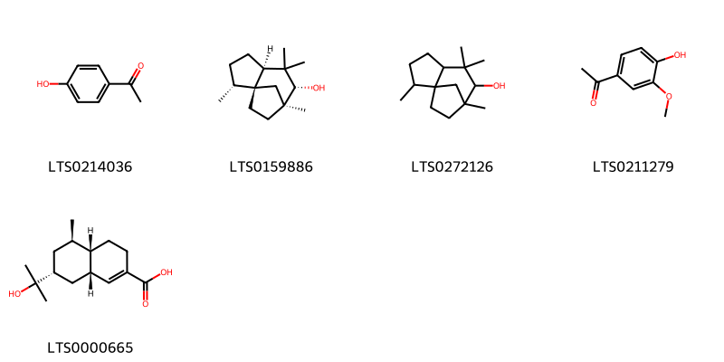{ width=100% }
    <figcaption>Hình ảnh cấu trúc hóa học của 5 hoạt chất thuộc nhóm Organooxygen compounds gồm ['hydroxyacetophenone (LTS0214036)', '(1r,2r,5r,7r,8s)-2,6,6,8-tetramethyltricyclo[6.2.1.0¹,⁵]undecan-7-ol (LTS0159886)', '2,6,6,8-tetramethyltricyclo[6.2.1.0¹,⁵]undecan-7-ol (LTS0272126)', 'apocynin (LTS0211279)', '(4as,5r,7r,8ar)-7-(2-hydroxypropan-2-yl)-5-methyl-3,4,4a,5,6,7,8,8a-octahydronaphthalene-2-carboxylic acid (LTS0000665)'].</figcaption>
</figure>
#### Nhóm Oxanes
<figure markdown="span">
    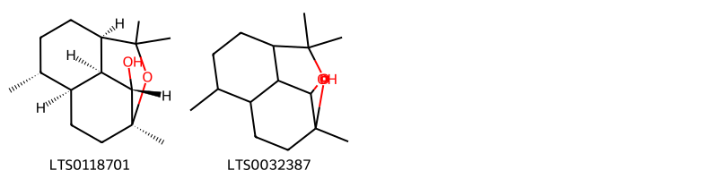{ width=100% }
    <figcaption>Hình ảnh cấu trúc hóa học của 2 hoạt chất thuộc nhóm Oxanes gồm ['(1s,4r,7r,8s,9s,10s)-1,3,3,7-tetramethyl-2-oxatricyclo[6.2.2.0⁴,⁹]dodecan-10-ol (LTS0118701)', '1,3,3,7-tetramethyl-2-oxatricyclo[6.2.2.0⁴,⁹]dodecan-10-ol (LTS0032387)'].</figcaption>
</figure>
#### Nhóm Prenol lipids
<figure markdown="span">
    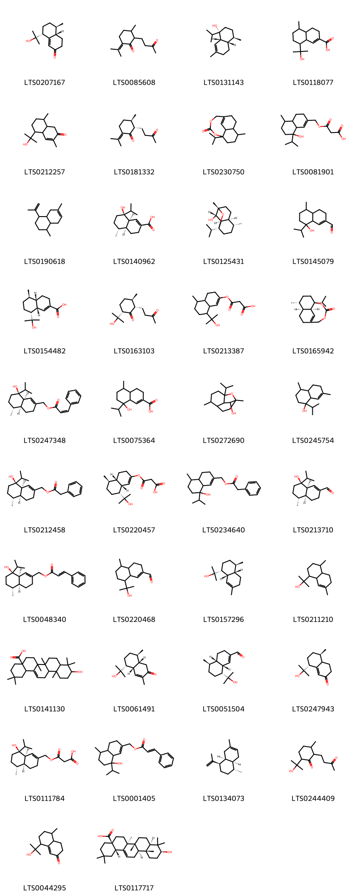{ width=100% }
    <figcaption>Hình ảnh cấu trúc hóa học của 38 hoạt chất thuộc nhóm Prenol lipids gồm ['(4as,5r,8r)-8-(2-hydroxypropan-2-yl)-5-methyl-4,4a,5,6,7,8-hexahydro-3h-naphthalen-2-one (LTS0207167)', '3-methyl-2-(3-oxobutyl)-6-(propan-2-ylidene)cyclohexan-1-one (LTS0085608)', '(1s,4r,4as,8ar)-1-isopropyl-4,7-dimethyl-3,4,4a,5,6,8a-hexahydro-2h-naphthalen-1-ol (LTS0131143)', '8-(2-hydroxypropan-2-yl)-5-methyl-3,4,4a,5,6,7,8,8a-octahydronaphthalene-2-carboxylic acid (LTS0118077)', '5-(2-hydroxypropan-2-yl)-3,8-dimethyl-4a,5,6,7,8,8a-hexahydro-1h-naphthalen-2-one (LTS0212257)', '(2s,3r)-3-methyl-2-(3-oxobutyl)-6-(propan-2-ylidene)cyclohexan-1-one (LTS0181332)', '8-isopropyl-5-methyl-9,11-dioxatricyclo[6.4.2.0⁴,¹⁴]tetradec-1(13)-en-10-one (LTS0230750)', '3-[(8-hydroxy-8-isopropyl-5-methyl-4,4a,5,6,7,8a-hexahydro-3h-naphthalen-2-yl)methoxy]-3-oxopropanoic acid (LTS0081901)', '1,6-dimethyl-4-(prop-1-en-2-yl)-1,2,3,4,4a,5,8,8a-octahydronaphthalene (LTS0190618)', '(4as,5r,8s,8ar)-8-hydroxy-8-isopropyl-5-methyl-4,4a,5,6,7,8a-hexahydro-3h-naphthalene-2-carboxylic acid (LTS0140962)', '(1s,4s,5r,8s,9r,10s)-8-isopropyl-1,5-dimethyl-11-oxatricyclo[6.2.1.0⁴,⁹]undecan-10-ol (LTS0125431)', '8-hydroxy-8-isopropyl-5-methyl-4,4a,5,6,7,8a-hexahydro-3h-naphthalene-2-carbaldehyde (LTS0145079)', '(4as,5r,8r,8ar)-8-(2-hydroxypropan-2-yl)-5-methyl-3,4,4a,5,6,7,8,8a-octahydronaphthalene-2-carboxylic acid (LTS0154482)', '(2s,3r,6s)-6-(2-hydroxypropan-2-yl)-3-methyl-2-(3-oxobutyl)cyclohexan-1-one (LTS0163103)', '3-{[8-(2-hydroxypropan-2-yl)-5-methyl-3,4,4a,5,6,7,8,8a-octahydronaphthalen-2-yl]oxy}-3-oxopropanoic acid (LTS0213387)', '(4s,5r,8s,14r)-8-isopropyl-5-methyl-9,11-dioxatricyclo[6.4.2.0⁴,¹⁴]tetradec-1(13)-en-10-one (LTS0165942)', '[(4as,5r,8s,8ar)-8-hydroxy-8-isopropyl-5-methyl-4,4a,5,6,7,8a-hexahydro-3h-naphthalen-2-yl]methyl (2z)-3-phenylprop-2-enoate (LTS0247348)', '8-hydroxy-8-isopropyl-5-methyl-4,4a,5,6,7,8a-hexahydro-3h-naphthalene-2-carboxylic acid (LTS0075364)', '8-isopropyl-1,5-dimethyl-11-oxatricyclo[6.2.1.0⁴,⁹]undecan-10-ol (LTS0272690)', '1-isopropyl-4,7-dimethyl-3,4,4a,5,6,8a-hexahydro-2h-naphthalen-1-ol (LTS0245754)', '[(4as,5r,8s,8ar)-8-hydroxy-8-isopropyl-5-methyl-4,4a,5,6,7,8a-hexahydro-3h-naphthalen-2-yl]methyl 2-phenylacetate (LTS0212458)', '3-{[(4as,5r,8r,8ar)-8-(2-hydroxypropan-2-yl)-5-methyl-3,4,4a,5,6,7,8,8a-octahydronaphthalen-2-yl]oxy}-3-oxopropanoic acid (LTS0220457)', '(8-hydroxy-8-isopropyl-5-methyl-4,4a,5,6,7,8a-hexahydro-3h-naphthalen-2-yl)methyl 2-phenylacetate (LTS0234640)', '(4as,5r,8s,8ar)-8-hydroxy-8-isopropyl-5-methyl-4,4a,5,6,7,8a-hexahydro-3h-naphthalene-2-carbaldehyde (LTS0213710)', '[(4as,5r,8s,8ar)-8-hydroxy-8-isopropyl-5-methyl-4,4a,5,6,7,8a-hexahydro-3h-naphthalen-2-yl]methyl (2e)-3-phenylprop-2-enoate (LTS0048340)', '8-(2-hydroxypropan-2-yl)-5-methyl-3,4,4a,5,6,7,8,8a-octahydronaphthalene-2-carbaldehyde (LTS0220468)', '2-[(1r,4r,4as,8ar)-4,7-dimethyl-1,2,3,4,4a,5,6,8a-octahydronaphthalen-1-yl]propan-2-ol (LTS0157296)', '2-(4,7-dimethyl-1,2,3,4,4a,5,6,8a-octahydronaphthalen-1-yl)propan-2-ol (LTS0211210)', 'oleanolic acid (LTS0141130)', '(4ar,5r,8r,8as)-5-(2-hydroxypropan-2-yl)-3,8-dimethyl-4a,5,6,7,8,8a-hexahydro-1h-naphthalen-2-one (LTS0061491)', '(4as,5r,8r,8ar)-8-(2-hydroxypropan-2-yl)-5-methyl-3,4,4a,5,6,7,8,8a-octahydronaphthalene-2-carbaldehyde (LTS0051504)', '(5r,8r)-8-(2-hydroxypropan-2-yl)-5-methyl-4,4a,5,6,7,8-hexahydro-3h-naphthalen-2-one (LTS0247943)', '3-{[(4as,5r,8s,8ar)-8-hydroxy-8-isopropyl-5-methyl-4,4a,5,6,7,8a-hexahydro-3h-naphthalen-2-yl]methoxy}-3-oxopropanoic acid (LTS0111784)', '(8-hydroxy-8-isopropyl-5-methyl-4,4a,5,6,7,8a-hexahydro-3h-naphthalen-2-yl)methyl 3-phenylprop-2-enoate (LTS0001405)', '(1r,4r,4as,8as)-1,6-dimethyl-4-(prop-1-en-2-yl)-1,2,3,4,4a,5,8,8a-octahydronaphthalene (LTS0134073)', '6-(2-hydroxypropan-2-yl)-3-methyl-2-(3-oxobutyl)cyclohexan-1-one (LTS0244409)', '8-(2-hydroxypropan-2-yl)-5-methyl-4,4a,5,6,7,8-hexahydro-3h-naphthalen-2-one (LTS0044295)', 'oleanolic acid (LTS0117717)'].</figcaption>
</figure>
#### Nhóm Quinolines and derivatives
<figure markdown="span">
    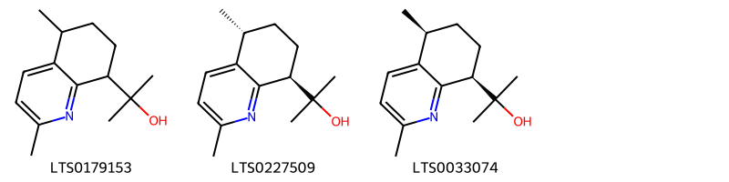{ width=100% }
    <figcaption>Hình ảnh cấu trúc hóa học của 3 hoạt chất thuộc nhóm Quinolines and derivatives gồm ['2-(2,5-dimethyl-5,6,7,8-tetrahydroquinolin-8-yl)propan-2-ol (LTS0179153)', '2-[(5r,8r)-2,5-dimethyl-5,6,7,8-tetrahydroquinolin-8-yl]propan-2-ol (LTS0227509)', 'fabianine (LTS0033074)'].</figcaption>
</figure>

---

### Dược dân tộc học

Danh sách các quốc gia có sử dụng *Fabiana imbricata* trong điều trị các bệnh. 

| Country   | Disease                    | Bệnh                                       |
|:----------|:---------------------------|:-------------------------------------------|
| Dutch     | Stimulant                  | Chất kích thích                            |
| Elsewhere | Diuretic, Stimulant, Tonic | Thuốc lợi tiểu, thuốc kích thích, thuốc bổ |
| German    | Tonic                      | (thuộc) trương lực                         |
| US        | Diuretic                   | Thuốc lợi tiêu                             |

---

# Chi Atropa

??? note "Danh sách các dược liệu thuộc chi"
    
	 - *Atropa acuminata*
	 - *Atropa baetica*
	 - *Atropa bella-donna*
	 - *Atropa belladona*
	 - *Atropa belladonna*

---
## Atropa acuminata
### Thông tin về thực vật

!!! info "Phân loại thực vật của *Atropa acuminata* từ GIBF:"
    - **Kingdom:** Plantae
    - **Phylum:** Tracheophyta
    - **Order:** Solanales
    - **Family:** Solanaceae
    - **Genus:** Atropa
    - **Species:** *Atropa acuminata*

 

| Label (VI)   | Label (EN)   | Scientific Name   | Descriptions (VI)   | Descriptions (EN)   | Also Known As (VI)   | Also Known As (EN)   |
|:-------------|:-------------|:------------------|:--------------------|:--------------------|:---------------------|:---------------------|
| N/A          | N/A          | Atropa acuminata  | loài thực vật       | species of plant    | ['']                 | ['']                 |

#### Phân bố trên thế giới

**Từ CSDL GIBF** nan, Pakistan, Panama, Iran (Islamic Republic of), Myanmar, India, unknown or invalid, United States of America, Austria, France, Norway, Canada

#### Phân bố tại Việt Nam

**Từ CSDL GIBF**: Không có ghi nhận ở Việt Nam

---
### Thành phần hóa học
        
- Theo cơ sở dữ liệu lotus: Từ loài *Atropa acuminata* đã phân lập và xác định được 9 hoạt chất thuộc về các nhóm Prenol lipids, Steroids and steroid derivatives, Cinnamic acids and derivatives, Organonitrogen compounds, Tropane alkaloids. 

|    | chemicalTaxonomyClassyfireClass   |   smiles_count |
|---:|:----------------------------------|---------------:|
|  0 | Cinnamic acids and derivatives    |              1 |
|  1 | Organonitrogen compounds          |              1 |
|  2 | Prenol lipids                     |              1 |
|  3 | Steroids and steroid derivatives  |              2 |
|  4 | Tropane alkaloids                 |              4 |

#### Nhóm Cinnamic acids and derivatives
<figure markdown="span">
    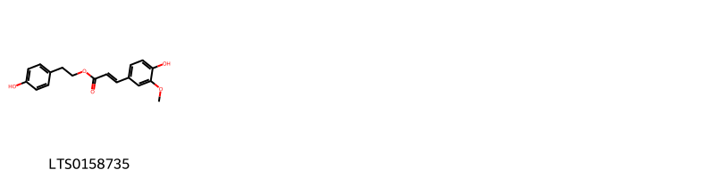{ width=100% }
    <figcaption>Hình ảnh cấu trúc hóa học của 1 hoạt chất thuộc nhóm Cinnamic acids and derivatives gồm ['2-(4-hydroxyphenyl)ethyl (2e)-3-(4-hydroxy-3-methoxyphenyl)prop-2-enoate (LTS0158735)'].</figcaption>
</figure>
#### Nhóm Organonitrogen compounds
<figure markdown="span">
    { width=100% }
    <figcaption>Hình ảnh cấu trúc hóa học của 1 hoạt chất thuộc nhóm Organonitrogen compounds gồm ['putrescine (LTS0238763)'].</figcaption>
</figure>
#### Nhóm Prenol lipids
<figure markdown="span">
    { width=100% }
    <figcaption>Hình ảnh cấu trúc hóa học của 1 hoạt chất thuộc nhóm Prenol lipids gồm ['oleanolic acid (LTS0117717)'].</figcaption>
</figure>
#### Nhóm Steroids and steroid derivatives
<figure markdown="span">
    { width=100% }
    <figcaption>Hình ảnh cấu trúc hóa học của 2 hoạt chất thuộc nhóm Steroids and steroid derivatives gồm ['sitogluside (LTS0201798)', '2-{[1-(5-ethyl-6-methylheptan-2-yl)-9a,11a-dimethyl-1h,2h,3h,3ah,3bh,4h,6h,7h,8h,9h,9bh,10h,11h-cyclopenta[a]phenanthren-7-yl]oxy}-6-(hydroxymethyl)oxane-3,4,5-triol (LTS0158828)'].</figcaption>
</figure>
#### Nhóm Tropane alkaloids
<figure markdown="span">
    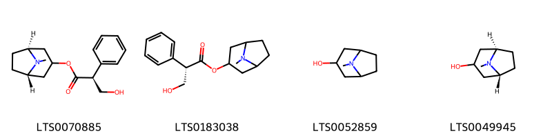{ width=100% }
    <figcaption>Hình ảnh cấu trúc hóa học của 4 hoạt chất thuộc nhóm Tropane alkaloids gồm ['(1s,5s)-8-methyl-8-azabicyclo[3.2.1]octan-3-yl (2s)-3-hydroxy-2-phenylpropanoate (LTS0070885)', 'hyoscyamine (LTS0183038)', 'tropin (LTS0052859)', '(1r,5r)-8-methyl-8-azabicyclo[3.2.1]octan-3-ol (LTS0049945)'].</figcaption>
</figure>

---

### Dược dân tộc học

Danh sách các quốc gia có sử dụng *Atropa acuminata* trong điều trị các bệnh. 

| Country   | Disease                                 | Bệnh                                         |
|:----------|:----------------------------------------|:---------------------------------------------|
| Elsewhere | Diuretic, Mydriatic, Narcotic, Sedative | Thuốc lợi tiểu, Mydriatic, Narcotic, An thần |

---

---
## Atropa baetica
### Thông tin về thực vật

!!! info "Phân loại thực vật của *Atropa baetica* từ GIBF:"
    - **Kingdom:** Plantae
    - **Phylum:** Tracheophyta
    - **Order:** Solanales
    - **Family:** Solanaceae
    - **Genus:** Atropa
    - **Species:** *Atropa baetica*

 

| Label (VI)   | Label (EN)   | Scientific Name   | Descriptions (VI)   | Descriptions (EN)   | Also Known As (VI)   | Also Known As (EN)   |
|:-------------|:-------------|:------------------|:--------------------|:--------------------|:---------------------|:---------------------|
| N/A          | N/A          | Atropa baetica    | loài thực vật       | species of plant    | ['']                 | ['']                 |

#### Phân bố trên thế giới

**Từ CSDL GIBF** nan, Spain, Morocco, Mexico, France

#### Phân bố tại Việt Nam

**Từ CSDL GIBF**: Không có ghi nhận ở Việt Nam

---
### Thành phần hóa học
        
- Theo cơ sở dữ liệu lotus: Từ loài *Atropa baetica* đã phân lập và xác định được 2 hoạt chất thuộc về các nhóm Hydroxy acids and derivatives, Tropane alkaloids. 

|    | chemicalTaxonomyClassyfireClass   |   smiles_count |
|---:|:----------------------------------|---------------:|
|  0 | Hydroxy acids and derivatives     |              1 |
|  1 | Tropane alkaloids                 |              1 |

#### Nhóm Hydroxy acids and derivatives
<figure markdown="span">
    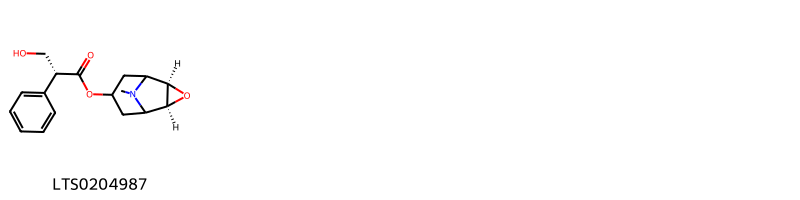{ width=100% }
    <figcaption>Hình ảnh cấu trúc hóa học của 1 hoạt chất thuộc nhóm Hydroxy acids and derivatives gồm ['(2r,4s)-9-methyl-3-oxa-9-azatricyclo[3.3.1.0²,⁴]nonan-7-yl (2r)-3-hydroxy-2-phenylpropanoate (LTS0204987)'].</figcaption>
</figure>
#### Nhóm Tropane alkaloids
<figure markdown="span">
    { width=100% }
    <figcaption>Hình ảnh cấu trúc hóa học của 1 hoạt chất thuộc nhóm Tropane alkaloids gồm ['atropine (LTS0065918)'].</figcaption>
</figure>

---

### Dược dân tộc học

Danh sách các quốc gia có sử dụng *Atropa baetica* trong điều trị các bệnh. 

| Country   | Disease   | Bệnh     |
|:----------|:----------|:---------|
| ain       | Poison    | Chất độc |

---

---
## Atropa belladonna
### Thông tin về thực vật

!!! info "Phân loại thực vật của *Atropa belladonna* từ GIBF:"
    - **Kingdom:** Plantae
    - **Phylum:** Tracheophyta
    - **Order:** Solanales
    - **Family:** Solanaceae
    - **Genus:** Atropa
    - **Species:** *Atropa belladonna*

 

| Label (VI)   | Label (EN)   | Scientific Name   | Descriptions (VI)   | Descriptions (EN)   | Also Known As (VI)   | Also Known As (EN)   |
|:-------------|:-------------|:------------------|:--------------------|:--------------------|:---------------------|:---------------------|
| N/A          | N/A          | Atropa baetica    | loài thực vật       | species of plant    | ['']                 | ['']                 |

#### Phân bố trên thế giới

**Từ CSDL GIBF** Netherlands, Italy, Czechia, Germany, Slovakia, Belgium, Luxembourg, Spain, Hungary, Serbia, Switzerland, Russian Federation, Austria, France, Slovenia, Croatia, United Kingdom of Great Britain and Northern Ireland

#### Phân bố tại Việt Nam

**Từ CSDL GIBF**: Không có ghi nhận ở Việt Nam

---
### Thành phần hóa học
        
- Theo cơ sở dữ liệu lotus: Từ loài *Atropa belladonna* đã phân lập và xác định được 29 hoạt chất thuộc về các nhóm Yohimbine alkaloids, Pyrrolidines, Organonitrogen compounds, Benzene and substituted derivatives, Hydroxy acids and derivatives, Tropane alkaloids, Cephalotaxus alkaloids, Organooxygen compounds, Coumarins and derivatives. 

|    | chemicalTaxonomyClassyfireClass     |   smiles_count |
|---:|:------------------------------------|---------------:|
|  0 |                                     |              5 |
|  1 | Benzene and substituted derivatives |              1 |
|  2 | Cephalotaxus alkaloids              |              1 |
|  3 | Coumarins and derivatives           |              1 |
|  4 | Hydroxy acids and derivatives       |              2 |
|  5 | Organonitrogen compounds            |              1 |
|  6 | Organooxygen compounds              |              1 |
|  7 | Pyrrolidines                        |              1 |
|  8 | Tropane alkaloids                   |             15 |
|  9 | Yohimbine alkaloids                 |              1 |

#### Nhóm 
<figure markdown="span">
    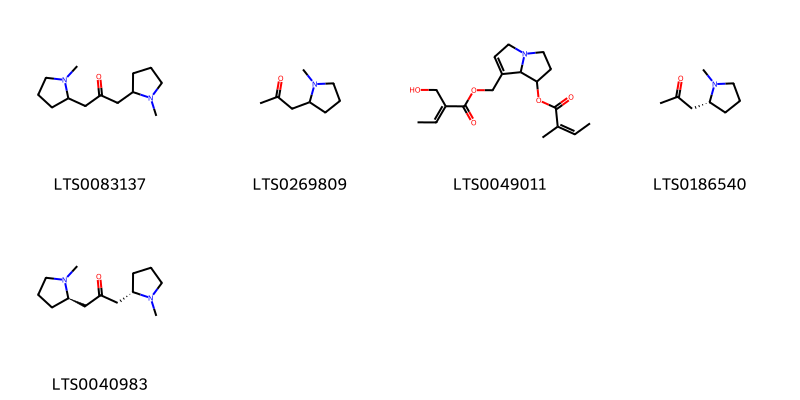{ width=100% }
    <figcaption>Hình ảnh cấu trúc hóa học của 5 hoạt chất thuộc nhóm  gồm ['cuskhygrine (LTS0083137)', 'hygrine (LTS0269809)', '(7-{[(2z)-2-methylbut-2-enoyl]oxy}-5,6,7,7a-tetrahydro-3h-pyrrolizin-1-yl)methyl (2e)-2-(hydroxymethyl)but-2-enoate (LTS0049011)', '(+)-hygrine (LTS0186540)', 'cuscohygrine (LTS0040983)'].</figcaption>
</figure>
#### Nhóm Benzene and substituted derivatives
<figure markdown="span">
    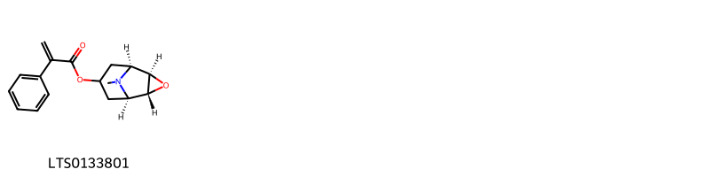{ width=100% }
    <figcaption>Hình ảnh cấu trúc hóa học của 1 hoạt chất thuộc nhóm Benzene and substituted derivatives gồm ['(1r,2r,4r,5s)-9-methyl-3-oxa-9-azatricyclo[3.3.1.0²,⁴]nonan-7-yl 2-phenylprop-2-enoate (LTS0133801)'].</figcaption>
</figure>
#### Nhóm Cephalotaxus alkaloids
<figure markdown="span">
    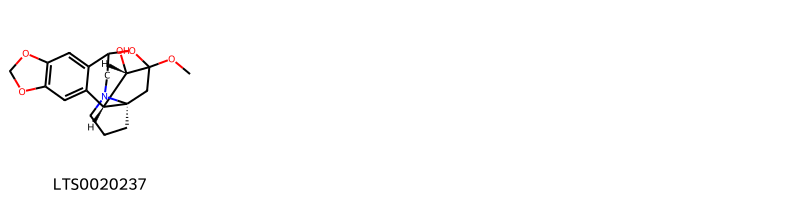{ width=100% }
    <figcaption>Hình ảnh cấu trúc hóa học của 1 hoạt chất thuộc nhóm Cephalotaxus alkaloids gồm ['(11s,12s,15s)-13-methoxy-5,7,21-trioxa-19-azahexacyclo[11.7.1.0²,¹⁰.0⁴,⁸.0¹¹,¹⁵.0¹⁵,¹⁹]henicosa-2,4(8),9-trien-12-ol (LTS0020237)'].</figcaption>
</figure>
#### Nhóm Coumarins and derivatives
<figure markdown="span">
    { width=100% }
    <figcaption>Hình ảnh cấu trúc hóa học của 1 hoạt chất thuộc nhóm Coumarins and derivatives gồm ['scopoletin (LTS0193112)'].</figcaption>
</figure>
#### Nhóm Hydroxy acids and derivatives
<figure markdown="span">
    { width=100% }
    <figcaption>Hình ảnh cấu trúc hóa học của 2 hoạt chất thuộc nhóm Hydroxy acids and derivatives gồm ['(2r,4s)-9-methyl-3-oxa-9-azatricyclo[3.3.1.0²,⁴]nonan-7-yl (2r)-3-hydroxy-2-phenylpropanoate (LTS0204987)', 'scopolamine (LTS0172796)'].</figcaption>
</figure>
#### Nhóm Organonitrogen compounds
<figure markdown="span">
    { width=100% }
    <figcaption>Hình ảnh cấu trúc hóa học của 1 hoạt chất thuộc nhóm Organonitrogen compounds gồm ['putrescine (LTS0238763)'].</figcaption>
</figure>
#### Nhóm Organooxygen compounds
<figure markdown="span">
    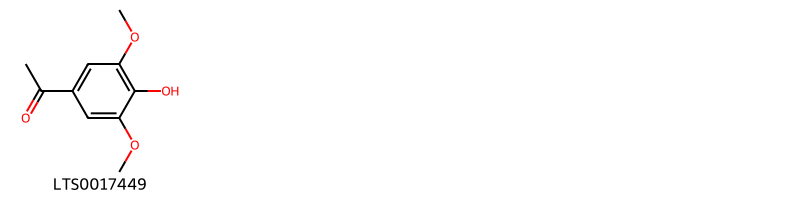{ width=100% }
    <figcaption>Hình ảnh cấu trúc hóa học của 1 hoạt chất thuộc nhóm Organooxygen compounds gồm ['acetosyringone (LTS0017449)'].</figcaption>
</figure>
#### Nhóm Pyrrolidines
<figure markdown="span">
    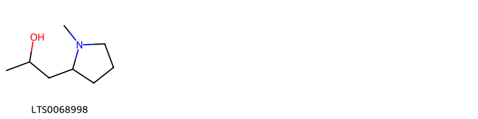{ width=100% }
    <figcaption>Hình ảnh cấu trúc hóa học của 1 hoạt chất thuộc nhóm Pyrrolidines gồm ['1-(1-methylpyrrolidin-2-yl)propan-2-ol (LTS0068998)'].</figcaption>
</figure>
#### Nhóm Tropane alkaloids
<figure markdown="span">
    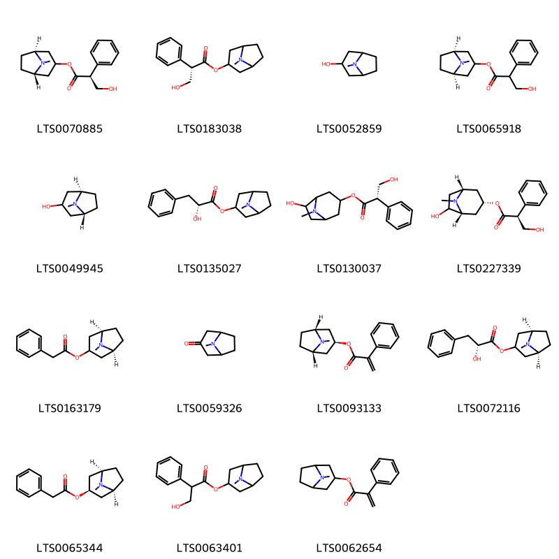{ width=100% }
    <figcaption>Hình ảnh cấu trúc hóa học của 15 hoạt chất thuộc nhóm Tropane alkaloids gồm ['(1s,5s)-8-methyl-8-azabicyclo[3.2.1]octan-3-yl (2s)-3-hydroxy-2-phenylpropanoate (LTS0070885)', 'hyoscyamine (LTS0183038)', 'tropin (LTS0052859)', 'atropine (LTS0065918)', '(1r,5r)-8-methyl-8-azabicyclo[3.2.1]octan-3-ol (LTS0049945)', 'littorine (LTS0135027)', '6-hydroxy-8-methyl-8-azabicyclo[3.2.1]octan-3-yl (2s)-3-hydroxy-2-phenylpropanoate (LTS0130037)', '6-hydroxyhyoscyamine (LTS0227339)', '(1r,5s)-8-methyl-8-azabicyclo[3.2.1]octan-3-yl 2-phenylacetate (LTS0163179)', 'tropanone (LTS0059326)', '(1r,3r,5s)-8-methyl-8-azabicyclo[3.2.1]octan-3-yl 2-phenylprop-2-enoate (LTS0093133)', '(1r,5s)-8-methyl-8-azabicyclo[3.2.1]octan-3-yl (2r)-2-hydroxy-3-phenylpropanoate (LTS0072116)', '(1r,3r,5s)-8-methyl-8-azabicyclo[3.2.1]octan-3-yl 2-phenylacetate (LTS0065344)', '()-hyoscyamine (LTS0063401)', 'apoatropine (LTS0062654)'].</figcaption>
</figure>
#### Nhóm Yohimbine alkaloids
<figure markdown="span">
    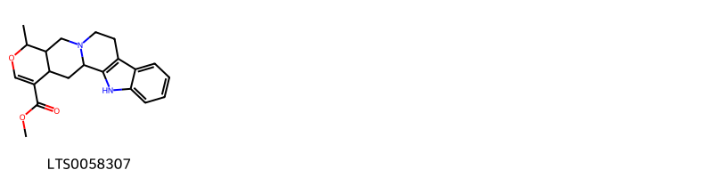{ width=100% }
    <figcaption>Hình ảnh cấu trúc hóa học của 1 hoạt chất thuộc nhóm Yohimbine alkaloids gồm ['ajmalicine (LTS0058307)'].</figcaption>
</figure>

---

### Dược dân tộc học

Danh sách các quốc gia có sử dụng *Atropa belladonna* trong điều trị các bệnh. 

| Country   | Disease   | Bệnh     |
|:----------|:----------|:---------|
| US        | Poison    | Chất độc |

---

---
## Atropa belladona
### Thông tin về thực vật

!!! info "Phân loại thực vật của *Atropa belladonna* từ GIBF:"
    - **Kingdom:** Plantae
    - **Phylum:** Tracheophyta
    - **Order:** Solanales
    - **Family:** Solanaceae
    - **Genus:** Atropa
    - **Species:** *Atropa belladonna*

 

| Label (VI)   | Label (EN)   | Scientific Name   | Descriptions (VI)   | Descriptions (EN)   | Also Known As (VI)   | Also Known As (EN)   |
|:-------------|:-------------|:------------------|:--------------------|:--------------------|:---------------------|:---------------------|
| N/A          | N/A          | Atropa baetica    | loài thực vật       | species of plant    | ['']                 | ['']                 |

#### Phân bố trên thế giới

**Từ CSDL GIBF** Netherlands, Italy, Czechia, Germany, Slovakia, Belgium, Luxembourg, Spain, Hungary, Serbia, Switzerland, Russian Federation, Austria, France, Slovenia, Croatia, United Kingdom of Great Britain and Northern Ireland

#### Phân bố tại Việt Nam

**Từ CSDL GIBF**: Không có ghi nhận ở Việt Nam

---
### Thành phần hóa học
        
- Theo cơ sở dữ liệu lotus: Từ loài *Atropa belladonna* đã phân lập và xác định được Chưa có hoạt chất nào được phân lập. hoạt chất thuộc về các nhóm Không có hoạt chất nào được phân lập. 

Không có hình ảnh nào được tạo ra

---

### Dược dân tộc học

Danh sách các quốc gia có sử dụng *Atropa belladonna* trong điều trị các bệnh. 

| Country   | Disease   | Bệnh     |
|:----------|:----------|:---------|
| ain       | Poison    | Chất độc |

---

---
## Atropa belladonna
### Thông tin về thực vật

!!! info "Phân loại thực vật của *Atropa belladonna* từ GIBF:"
    - **Kingdom:** Plantae
    - **Phylum:** Tracheophyta
    - **Order:** Solanales
    - **Family:** Solanaceae
    - **Genus:** Atropa
    - **Species:** *Atropa belladonna*

 

| Label (VI)   | Label (EN)   | Scientific Name   | Descriptions (VI)   | Descriptions (EN)   | Also Known As (VI)   | Also Known As (EN)   |
|:-------------|:-------------|:------------------|:--------------------|:--------------------|:---------------------|:---------------------|
| N/A          | N/A          | Atropa baetica    | loài thực vật       | species of plant    | ['']                 | ['']                 |

#### Phân bố trên thế giới

**Từ CSDL GIBF** Netherlands, Italy, Czechia, Germany, Slovakia, Belgium, Luxembourg, Spain, Hungary, Serbia, Switzerland, Russian Federation, Austria, France, Slovenia, Croatia, United Kingdom of Great Britain and Northern Ireland

#### Phân bố tại Việt Nam

**Từ CSDL GIBF**: Không có ghi nhận ở Việt Nam

---
### Thành phần hóa học
        
- Theo cơ sở dữ liệu lotus: Từ loài *Atropa belladonna* đã phân lập và xác định được 29 hoạt chất thuộc về các nhóm Yohimbine alkaloids, Pyrrolidines, Organonitrogen compounds, Benzene and substituted derivatives, Hydroxy acids and derivatives, Tropane alkaloids, Cephalotaxus alkaloids, Organooxygen compounds, Coumarins and derivatives. 

|    | chemicalTaxonomyClassyfireClass     |   smiles_count |
|---:|:------------------------------------|---------------:|
|  0 |                                     |              5 |
|  1 | Benzene and substituted derivatives |              1 |
|  2 | Cephalotaxus alkaloids              |              1 |
|  3 | Coumarins and derivatives           |              1 |
|  4 | Hydroxy acids and derivatives       |              2 |
|  5 | Organonitrogen compounds            |              1 |
|  6 | Organooxygen compounds              |              1 |
|  7 | Pyrrolidines                        |              1 |
|  8 | Tropane alkaloids                   |             15 |
|  9 | Yohimbine alkaloids                 |              1 |

#### Nhóm 
<figure markdown="span">
    { width=100% }
    <figcaption>Hình ảnh cấu trúc hóa học của 5 hoạt chất thuộc nhóm  gồm ['cuskhygrine (LTS0083137)', 'hygrine (LTS0269809)', '(7-{[(2z)-2-methylbut-2-enoyl]oxy}-5,6,7,7a-tetrahydro-3h-pyrrolizin-1-yl)methyl (2e)-2-(hydroxymethyl)but-2-enoate (LTS0049011)', '(+)-hygrine (LTS0186540)', 'cuscohygrine (LTS0040983)'].</figcaption>
</figure>
#### Nhóm Benzene and substituted derivatives
<figure markdown="span">
    { width=100% }
    <figcaption>Hình ảnh cấu trúc hóa học của 1 hoạt chất thuộc nhóm Benzene and substituted derivatives gồm ['(1r,2r,4r,5s)-9-methyl-3-oxa-9-azatricyclo[3.3.1.0²,⁴]nonan-7-yl 2-phenylprop-2-enoate (LTS0133801)'].</figcaption>
</figure>
#### Nhóm Cephalotaxus alkaloids
<figure markdown="span">
    { width=100% }
    <figcaption>Hình ảnh cấu trúc hóa học của 1 hoạt chất thuộc nhóm Cephalotaxus alkaloids gồm ['(11s,12s,15s)-13-methoxy-5,7,21-trioxa-19-azahexacyclo[11.7.1.0²,¹⁰.0⁴,⁸.0¹¹,¹⁵.0¹⁵,¹⁹]henicosa-2,4(8),9-trien-12-ol (LTS0020237)'].</figcaption>
</figure>
#### Nhóm Coumarins and derivatives
<figure markdown="span">
    { width=100% }
    <figcaption>Hình ảnh cấu trúc hóa học của 1 hoạt chất thuộc nhóm Coumarins and derivatives gồm ['scopoletin (LTS0193112)'].</figcaption>
</figure>
#### Nhóm Hydroxy acids and derivatives
<figure markdown="span">
    { width=100% }
    <figcaption>Hình ảnh cấu trúc hóa học của 2 hoạt chất thuộc nhóm Hydroxy acids and derivatives gồm ['(2r,4s)-9-methyl-3-oxa-9-azatricyclo[3.3.1.0²,⁴]nonan-7-yl (2r)-3-hydroxy-2-phenylpropanoate (LTS0204987)', 'scopolamine (LTS0172796)'].</figcaption>
</figure>
#### Nhóm Organonitrogen compounds
<figure markdown="span">
    { width=100% }
    <figcaption>Hình ảnh cấu trúc hóa học của 1 hoạt chất thuộc nhóm Organonitrogen compounds gồm ['putrescine (LTS0238763)'].</figcaption>
</figure>
#### Nhóm Organooxygen compounds
<figure markdown="span">
    { width=100% }
    <figcaption>Hình ảnh cấu trúc hóa học của 1 hoạt chất thuộc nhóm Organooxygen compounds gồm ['acetosyringone (LTS0017449)'].</figcaption>
</figure>
#### Nhóm Pyrrolidines
<figure markdown="span">
    { width=100% }
    <figcaption>Hình ảnh cấu trúc hóa học của 1 hoạt chất thuộc nhóm Pyrrolidines gồm ['1-(1-methylpyrrolidin-2-yl)propan-2-ol (LTS0068998)'].</figcaption>
</figure>
#### Nhóm Tropane alkaloids
<figure markdown="span">
    { width=100% }
    <figcaption>Hình ảnh cấu trúc hóa học của 15 hoạt chất thuộc nhóm Tropane alkaloids gồm ['(1s,5s)-8-methyl-8-azabicyclo[3.2.1]octan-3-yl (2s)-3-hydroxy-2-phenylpropanoate (LTS0070885)', 'hyoscyamine (LTS0183038)', 'tropin (LTS0052859)', 'atropine (LTS0065918)', '(1r,5r)-8-methyl-8-azabicyclo[3.2.1]octan-3-ol (LTS0049945)', 'littorine (LTS0135027)', '6-hydroxy-8-methyl-8-azabicyclo[3.2.1]octan-3-yl (2s)-3-hydroxy-2-phenylpropanoate (LTS0130037)', '6-hydroxyhyoscyamine (LTS0227339)', '(1r,5s)-8-methyl-8-azabicyclo[3.2.1]octan-3-yl 2-phenylacetate (LTS0163179)', 'tropanone (LTS0059326)', '(1r,3r,5s)-8-methyl-8-azabicyclo[3.2.1]octan-3-yl 2-phenylprop-2-enoate (LTS0093133)', '(1r,5s)-8-methyl-8-azabicyclo[3.2.1]octan-3-yl (2r)-2-hydroxy-3-phenylpropanoate (LTS0072116)', '(1r,3r,5s)-8-methyl-8-azabicyclo[3.2.1]octan-3-yl 2-phenylacetate (LTS0065344)', '()-hyoscyamine (LTS0063401)', 'apoatropine (LTS0062654)'].</figcaption>
</figure>
#### Nhóm Yohimbine alkaloids
<figure markdown="span">
    { width=100% }
    <figcaption>Hình ảnh cấu trúc hóa học của 1 hoạt chất thuộc nhóm Yohimbine alkaloids gồm ['ajmalicine (LTS0058307)'].</figcaption>
</figure>

---

### Dược dân tộc học

Danh sách các quốc gia có sử dụng *Atropa belladonna* trong điều trị các bệnh. 

| Country   | Disease                                                                         | Bệnh                                                                                                              |
|:----------|:--------------------------------------------------------------------------------|:------------------------------------------------------------------------------------------------------------------|
| Elsewhere | Antidote, Narcotic, Sedative, Sedative, Stimulant, Stimulant, Mydriatic, Poison | Thuốc giải độc, Thuốc gây mê, Thuốc an thần, Thuốc an thần, Chất kích thích, Chất kích thích, Mydriatic, Chất độc |
| Europe    | Poison                                                                          | Chất độc                                                                                                          |
| Haiti     | Poison                                                                          | Chất độc                                                                                                          |
| Nepal     | Narcotic, Sedative, Sedative, Narcotic                                          | Thuốc gây nghiện, Thuốc an thần, Thuốc an thần, Thuốc gây nghiện                                                  |
| Turkey    | Mydriatic, Narcotic, Poison, Sedative, Diuretic, Nervine                        | Mydriatic, Narcotic, Poison, An thần, Lợi tiểu, Thần kinh                                                         |
| UK        | Poison, Sedative                                                                | Chất độc, Thuốc an thần                                                                                           |

---

# Chi Solanum

??? note "Danh sách các dược liệu thuộc chi"
    
	 - *Solanum aculeatissimum*
	 - *Solanum aethiopicum*
	 - *Solanum alternato-pinnatum*
	 - *Solanum amazonicum*
	 - *Solanum capense*
	 - *Solanum carolinense*
	 - *Solanum ciliatum*
	 - *Solanum coagulans*
	 - *Solanum diversifolium*
	 - *Solanum dubium*
	 - *Solanum dulcamara*
	 - *Solanum ectabile*
	 - *Solanum elaeagnifolium*
	 - *Solanum elaegnifolium*
	 - *Solanum eleagnifolium*
	 - *Solanum erianthum*
	 - *Solanum esuriale*
	 - *Solanum ferox*
	 - *Solanum hindsianum*
	 - *Solanum hirtum*
	 - *Solanum hypomalacophyllum*
	 - *Solanum incanum*
	 - *Solanum indicum*
	 - *Solanum insidiosum*
	 - *Solanum irale*
	 - *Solanum jasminoides*
	 - *Solanum khasianum*
	 - *Solanum lyratum*
	 - *Solanum malacoxylon*
	 - *Solanum mammosum*
	 - *Solanum melongena*
	 - *Solanum nigrum*
	 - *Solanum pseudocapsicum*
	 - *Solanum saponaceum*
	 - *Solanum sarmentosum*
	 - *Solanum seaforthianum*
	 - *Solanum sisymbrifolium*
	 - *Solanum sisymbriifolium*
	 - *Solanum sodomeum*
	 - *Solanum supinum*
	 - *Solanum surattense*
	 - *Solanum surettense*
	 - *Solanum torvum*
	 - *Solanum tuberosum*
	 - *Solanum verbascifolium*
	 - *Solanum wendlandii*

---
## Solanum aculeatissimum
### Thông tin về thực vật

!!! info "Phân loại thực vật của *Solanum aculeatissimum* từ GIBF:"
    - **Kingdom:** Plantae
    - **Phylum:** Tracheophyta
    - **Order:** Solanales
    - **Family:** Solanaceae
    - **Genus:** Solanum
    - **Species:** *Solanum aculeatissimum*

 

| Label (VI)   | Label (EN)   | Scientific Name        | Descriptions (VI)   | Descriptions (EN)   | Also Known As (VI)   | Also Known As (EN)   |
|:-------------|:-------------|:-----------------------|:--------------------|:--------------------|:---------------------|:---------------------|
| N/A          | N/A          | Solanum aculeatissimum | loài thực vật       | species of plant    | ['']                 | ['']                 |

#### Phân bố trên thế giới

**Từ CSDL GIBF** nan, Gabon, Angola, Myanmar, Mozambique, Tanzania, United Republic of, Malawi, United States of America, Congo, Democratic Republic of the, Uruguay, Guinea, Zimbabwe, South Africa, Brazil, Côte d’Ivoire, Eswatini, China, Equatorial Guinea, India, Kenya, Nepal

#### Phân bố tại Việt Nam

**Từ CSDL GIBF**: Không có ghi nhận ở Việt Nam

---
### Thành phần hóa học
        
- Theo cơ sở dữ liệu lotus: Từ loài *Solanum aculeatissimum* đã phân lập và xác định được 41 hoạt chất thuộc về các nhóm Cinnamic acids and derivatives, Prenol lipids, Steroids and steroid derivatives, Phenols. 

|    | chemicalTaxonomyClassyfireClass   |   smiles_count |
|---:|:----------------------------------|---------------:|
|  0 | Cinnamic acids and derivatives    |              3 |
|  1 | Phenols                           |              1 |
|  2 | Prenol lipids                     |              6 |
|  3 | Steroids and steroid derivatives  |             31 |

#### Nhóm Cinnamic acids and derivatives
<figure markdown="span">
    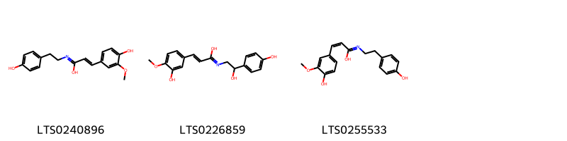{ width=100% }
    <figcaption>Hình ảnh cấu trúc hóa học của 3 hoạt chất thuộc nhóm Cinnamic acids and derivatives gồm ['3-(4-hydroxy-3-methoxyphenyl)-n-[2-(4-hydroxyphenyl)ethyl]prop-2-enimidic acid (LTS0240896)', '(2e)-n-[2-hydroxy-2-(4-hydroxyphenyl)ethyl]-3-(3-hydroxy-4-methoxyphenyl)prop-2-enimidic acid (LTS0226859)', '(2z)-3-(4-hydroxy-3-methoxyphenyl)-n-[2-(4-hydroxyphenyl)ethyl]prop-2-enimidic acid (LTS0255533)'].</figcaption>
</figure>
#### Nhóm Phenols
<figure markdown="span">
    { width=100% }
    <figcaption>Hình ảnh cấu trúc hóa học của 1 hoạt chất thuộc nhóm Phenols gồm ['(2e)-3-(4-hydroxy-3-methoxyphenyl)-n-[2-(4-hydroxyphenyl)ethyl]prop-2-enimidic acid (LTS0187051)'].</figcaption>
</figure>
#### Nhóm Prenol lipids
<figure markdown="span">
    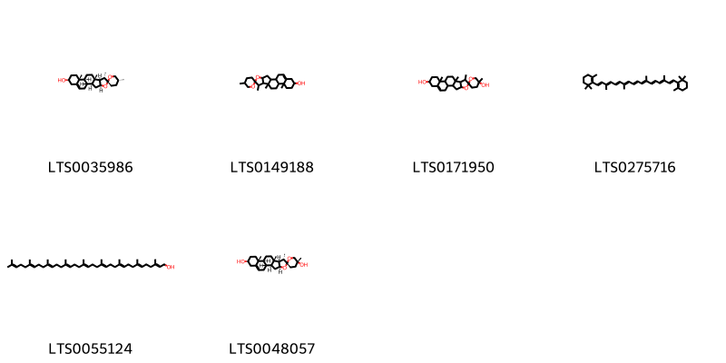{ width=100% }
    <figcaption>Hình ảnh cấu trúc hóa học của 6 hoạt chất thuộc nhóm Prenol lipids gồm ['diosgenin (LTS0035986)', 'diosgenin (LTS0149188)', "5,7',9',13'-tetramethyl-5'-oxaspiro[oxane-2,6'-pentacyclo[10.8.0.0²,⁹.0⁴,⁸.0¹³,¹⁸]icosan]-18'-ene-5,16'-diol (LTS0171950)", 'β-carotene (LTS0275716)', 'solanesol (LTS0055124)', "(1's,2r,2's,4's,5r,7's,8'r,9's,12's,13'r,16's)-5,7',9',13'-tetramethyl-5'-oxaspiro[oxane-2,6'-pentacyclo[10.8.0.0²,⁹.0⁴,⁸.0¹³,¹⁸]icosan]-18'-ene-5,16'-diol (LTS0048057)"].</figcaption>
</figure>
#### Nhóm Steroids and steroid derivatives
<figure markdown="span">
    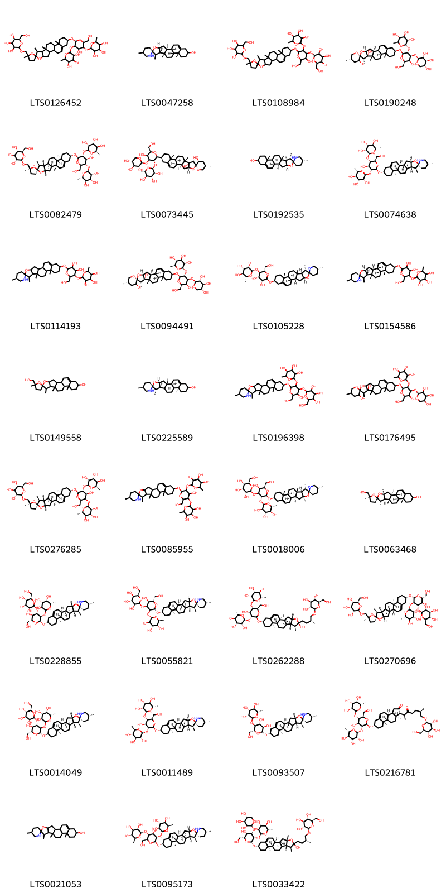{ width=100% }
    <figcaption>Hình ảnh cấu trúc hóa học của 31 hoạt chất thuộc nhóm Steroids and steroid derivatives gồm ["2-{[4-hydroxy-2-(hydroxymethyl)-6-[5,7',9',13'-tetramethyl-5-({[3,4,5-trihydroxy-6-(hydroxymethyl)oxan-2-yl]oxy}methyl)-5'-oxaspiro[oxolane-2,6'-pentacyclo[10.8.0.0²,⁹.0⁴,⁸.0¹³,¹⁸]icosan]-18'-eneoxy]-5-[(3,4,5-trihydroxy-6-methyloxan-2-yl)oxy]oxan-3-yl]oxy}-6-methyloxane-3,4,5-triol (LTS0126452)", "(1s,2s,4s,6r,8s,9s,12r,13r)-5',7,9,13-tetramethyl-5-oxaspiro[pentacyclo[10.8.0.0²,⁹.0⁴,⁸.0¹³,¹⁸]icosane-6,2'-piperidin]-18-en-16-ol (LTS0047258)", "2-{[5-hydroxy-6-(hydroxymethyl)-2-[5,7',9',13'-tetramethyl-5-({[3,4,5-trihydroxy-6-(hydroxymethyl)oxan-2-yl]oxy}methyl)-5'-oxaspiro[oxolane-2,6'-pentacyclo[10.8.0.0²,⁹.0⁴,⁸.0¹³,¹⁸]icosan]-18'-eneoxy]-4-{[3,4,5-trihydroxy-6-(hydroxymethyl)oxan-2-yl]oxy}oxan-3-yl]oxy}-6-methyloxane-3,4,5-triol (LTS0108984)", "(2s,3r,4r,5r,6s)-2-{[(2r,3r,4s,5s,6r)-5-hydroxy-6-(hydroxymethyl)-2-[(2s,2's,3s,4's,5s,7's,8's,9's,12's,13'r,16's)-5,7',9',13'-tetramethyl-5'-oxaspiro[oxane-2,6'-pentacyclo[10.8.0.0²,⁹.0⁴,⁸.0¹³,¹⁸]icosan]-18'-ene-3,8'-dioloxy]-4-{[(2s,3r,4s,5r)-3,4,5-trihydroxyoxan-2-yl]oxy}oxan-3-yl]oxy}-6-methyloxane-3,4,5-triol (LTS0190248)", "(2s,3r,4r,5r,6s)-2-{[(2r,3s,4s,5r,6r)-4-hydroxy-2-(hydroxymethyl)-6-[(1's,2s,2's,4's,5s,7's,8'r,9's,12's,13'r,16's)-5,7',9',13'-tetramethyl-5-({[(2r,3r,4s,5s,6r)-3,4,5-trihydroxy-6-(hydroxymethyl)oxan-2-yl]oxy}methyl)-5'-oxaspiro[oxolane-2,6'-pentacyclo[10.8.0.0²,⁹.0⁴,⁸.0¹³,¹⁸]icosan]-18'-eneoxy]-5-{[(2s,3r,4r,5r,6s)-3,4,5-trihydroxy-6-methyloxan-2-yl]oxy}oxan-3-yl]oxy}-6-methyloxane-3,4,5-triol (LTS0082479)", "(2s,3r,4r,5r,6s)-2-{[(2s,3s,4s,5s,6r)-2-[(1'r,2s,2's,3s,4's,5s,7's,8's,9's,12's,13'r,16's)-3,8'-dihydroxy-5,7',9',13'-tetramethyl-5'-oxaspiro[oxane-2,6'-pentacyclo[10.8.0.0²,⁹.0⁴,⁸.0¹³,¹⁸]icosan]-18'-en-16'-yl]-5-hydroxy-6-(hydroxymethyl)-4-{[(2s,3r,4s,5r)-3,4,5-trihydroxyoxan-2-yl]oxy}oxan-3-yl]oxy}-6-methyloxane-3,4,5-triol (LTS0073445)", 'solasodine (LTS0192535)', 'solamargine (LTS0074638)', "2-{[4,5-dihydroxy-2-(hydroxymethyl)-6-{5',7,9,13-tetramethyl-5-oxaspiro[pentacyclo[10.8.0.0²,⁹.0⁴,⁸.0¹³,¹⁸]icosane-6,2'-piperidin]-18-eneoxy}oxan-3-yl]oxy}-6-methyloxane-3,4,5-triol (LTS0114193)", "(2s,3r,4r,5r,6s)-2-{[(2r,3r,4s,5s,6r)-5-hydroxy-6-(hydroxymethyl)-2-[(1'r,2s,2's,3s,4's,5s,7's,8's,9's,12's,13'r,16's)-5,7',9',13'-tetramethyl-5'-oxaspiro[oxane-2,6'-pentacyclo[10.8.0.0²,⁹.0⁴,⁸.0¹³,¹⁸]icosan]-18'-ene-3,8'-dioloxy]-4-{[(2s,3r,4s,5r)-3,4,5-trihydroxyoxan-2-yl]oxy}oxan-3-yl]oxy}-6-methyloxane-3,4,5-triol (LTS0094491)", "(2s,3r,4s,5s,6r)-2-{[(2s,3r,4s,5r,6r)-4,5-dihydroxy-2-(hydroxymethyl)-6-[(1s,2s,4s,5'r,7s,8r,9s,12s,13r,16s)-5',7,9,13-tetramethyl-5-oxaspiro[pentacyclo[10.8.0.0²,⁹.0⁴,⁸.0¹³,¹⁸]icosane-6,2'-piperidin]-18-eneoxy]oxan-3-yl]oxy}-6-methyloxane-3,4,5-triol (LTS0105228)", "2-{[4,5-dihydroxy-2-(hydroxymethyl)-6-[(1s,2s,4s,6r,8s,9s,12r,13r)-5',7,9,13-tetramethyl-5-oxaspiro[pentacyclo[10.8.0.0²,⁹.0⁴,⁸.0¹³,¹⁸]icosane-6,2'-piperidin]-18-eneoxy]oxan-3-yl]oxy}-6-methyloxane-3,4,5-triol (LTS0154586)", "5-(hydroxymethyl)-5,7',9',13'-tetramethyl-5'-oxaspiro[oxolane-2,6'-pentacyclo[10.8.0.0²,⁹.0⁴,⁸.0¹³,¹⁸]icosan]-18'-en-16'-ol (LTS0149558)", "(1r,2r,4r,5's,6r,7s,8r,9r,12s,13s,16s)-5',7,9,13-tetramethyl-5-oxaspiro[pentacyclo[10.8.0.0²,⁹.0⁴,⁸.0¹³,¹⁸]icosane-6,2'-piperidin]-18-en-16-ol (LTS0225589)", "2-{[3-hydroxy-2-(hydroxymethyl)-6-{5',7,9,13-tetramethyl-5-oxaspiro[pentacyclo[10.8.0.0²,⁹.0⁴,⁸.0¹³,¹⁸]icosane-6,2'-piperidin]-18-eneoxy}-5-[(3,4,5-trihydroxy-6-methyloxan-2-yl)oxy]oxan-4-yl]oxy}-6-(hydroxymethyl)oxane-3,4,5-triol (LTS0196398)", "2-{[5-hydroxy-6-(hydroxymethyl)-2-{5,7',9',13'-tetramethyl-5'-oxaspiro[oxane-2,6'-pentacyclo[10.8.0.0²,⁹.0⁴,⁸.0¹³,¹⁸]icosan]-18'-ene-3,8'-dioloxy}-4-[(3,4,5-trihydroxyoxan-2-yl)oxy]oxan-3-yl]oxy}-6-methyloxane-3,4,5-triol (LTS0176495)", "(2s,3r,4r,5r,6s)-2-{[(2r,3r,4s,5r,6r)-4-hydroxy-2-(hydroxymethyl)-6-[(1's,2s,2's,4's,5s,7's,8'r,9's,12's,13'r,16's)-5,7',9',13'-tetramethyl-5-({[(2r,3r,4s,5s,6r)-3,4,5-trihydroxy-6-(hydroxymethyl)oxan-2-yl]oxy}methyl)-5'-oxaspiro[oxolane-2,6'-pentacyclo[10.8.0.0²,⁹.0⁴,⁸.0¹³,¹⁸]icosan]-18'-eneoxy]-5-{[(2s,3r,4r,5r,6s)-3,4,5-trihydroxy-6-methyloxan-2-yl]oxy}oxan-3-yl]oxy}-6-methyloxane-3,4,5-triol (LTS0276285)", "2-{[4-hydroxy-2-(hydroxymethyl)-6-{5',7,9,13-tetramethyl-5-oxaspiro[pentacyclo[10.8.0.0²,⁹.0⁴,⁸.0¹³,¹⁸]icosane-6,2'-piperidin]-18-eneoxy}-5-[(3,4,5-trihydroxy-6-methyloxan-2-yl)oxy]oxan-3-yl]oxy}-6-methyloxane-3,4,5-triol (LTS0085955)", "(2s,3r,4s,5s,6r)-2-{[(2r,3s,4s,5r,6r)-3-hydroxy-2-(hydroxymethyl)-6-[(1s,2s,4s,5'r,6r,7s,8r,9s,12s,13r,16s)-5',7,9,13-tetramethyl-5-oxaspiro[pentacyclo[10.8.0.0²,⁹.0⁴,⁸.0¹³,¹⁸]icosane-6,2'-piperidin]-18-eneoxy]-5-{[(2r,3r,4s,5s,6r)-3,4,5-trihydroxy-6-methyloxan-2-yl]oxy}oxan-4-yl]oxy}-6-(hydroxymethyl)oxane-3,4,5-triol (LTS0018006)", 'nuatigenin (LTS0063468)', "(2s,3r,4r,5r,6s)-2-{[(2r,3r,4s,5s,6r)-5-hydroxy-6-(hydroxymethyl)-2-[(1s,2s,4s,5'r,6r,7s,8r,9s,12s,13r,16s)-5',7,9,13-tetramethyl-5-oxaspiro[pentacyclo[10.8.0.0²,⁹.0⁴,⁸.0¹³,¹⁸]icosane-6,2'-piperidin]-18-eneoxy]-4-{[(2s,3r,4s,5s,6r)-3,4,5-trihydroxy-6-(hydroxymethyl)oxan-2-yl]oxy}oxan-3-yl]oxy}-6-methyloxane-3,4,5-triol (LTS0228855)", "(2s,3r,4s,5r,6s)-2-{[(2s,3s,4s,5s,6s)-5-hydroxy-6-(hydroxymethyl)-2-[(1s,2s,4s,5'r,6r,7s,8r,9s,12s,13r,16s)-5',7,9,13-tetramethyl-5-oxaspiro[pentacyclo[10.8.0.0²,⁹.0⁴,⁸.0¹³,¹⁸]icosane-6,2'-piperidin]-18-eneoxy]-4-{[(2s,3s,4s,5r,6r)-3,4,5-trihydroxy-6-(hydroxymethyl)oxan-2-yl]oxy}oxan-3-yl]oxy}-6-methyloxane-3,4,5-triol (LTS0055821)", 'protodioscin (LTS0262288)', "(2s,3r,4r,5r,6s)-2-{[(2r,3r,4s,5s,6r)-5-hydroxy-6-(hydroxymethyl)-2-[(1's,2s,2's,4's,5s,7's,8'r,9's,12's,13'r,16's)-5,7',9',13'-tetramethyl-5-({[(2r,3r,4s,5s,6r)-3,4,5-trihydroxy-6-(hydroxymethyl)oxan-2-yl]oxy}methyl)-5'-oxaspiro[oxolane-2,6'-pentacyclo[10.8.0.0²,⁹.0⁴,⁸.0¹³,¹⁸]icosan]-18'-eneoxy]-4-{[(2s,3r,4s,5s,6r)-3,4,5-trihydroxy-6-(hydroxymethyl)oxan-2-yl]oxy}oxan-3-yl]oxy}-6-methyloxane-3,4,5-triol (LTS0270696)", "(2s,3r,4r,5r,6s)-2-{[(2r,4s,5s,6r)-5-hydroxy-6-(hydroxymethyl)-2-[(1s,2s,4s,5'r,6r,7s,8r,9s,12s,13r,16s)-5',7,9,13-tetramethyl-5-oxaspiro[pentacyclo[10.8.0.0²,⁹.0⁴,⁸.0¹³,¹⁸]icosane-6,2'-piperidin]-18-eneoxy]-4-{[(2s,3r,4s,5s,6r)-3,4,5-trihydroxy-6-(hydroxymethyl)oxan-2-yl]oxy}oxan-3-yl]oxy}-6-methyloxane-3,4,5-triol (LTS0014049)", "(2s,3r,4r,5r,6s)-2-{[(2r,3s,4s,5r,6r)-4-hydroxy-2-(hydroxymethyl)-6-[(1s,2s,4s,5'r,6r,7s,8r,9s,12s,13r,16s)-5',7,9,13-tetramethyl-5-oxaspiro[pentacyclo[10.8.0.0²,⁹.0⁴,⁸.0¹³,¹⁸]icosane-6,2'-piperidin]-18-eneoxy]-5-{[(2r,3r,4s,5s,6r)-3,4,5-trihydroxy-6-methyloxan-2-yl]oxy}oxan-3-yl]oxy}-6-methyloxane-3,4,5-triol (LTS0011489)", "(2s,3r,4r,5r,6s)-2-{[(2r,3s,4r,5r,6r)-4,5-dihydroxy-2-(hydroxymethyl)-6-[(1s,2s,4s,5'r,6r,7s,8r,9s,12s,13r,16s)-5',7,9,13-tetramethyl-5-oxaspiro[pentacyclo[10.8.0.0²,⁹.0⁴,⁸.0¹³,¹⁸]icosane-6,2'-piperidin]-18-eneoxy]oxan-3-yl]oxy}-6-methyloxane-3,4,5-triol (LTS0093507)", '(2s,6r)-2-[(1r,3as,3bs,7s,9ar,9bs,11as)-7-{[(2r,3r,4s,5s,6r)-4-hydroxy-6-(hydroxymethyl)-3,5-bis({[(2s,3r,4r,5r,6s)-3,4,5-trihydroxy-6-methyloxan-2-yl]oxy})oxan-2-yl]oxy}-9a,11a-dimethyl-2-oxo-1h,3h,3ah,3bh,4h,6h,7h,8h,9h,9bh,10h,11h-cyclopenta[a]phenanthren-1-yl]-6-methyl-7-{[(2r,3r,4s,5s,6r)-3,4,5-trihydroxy-6-(hydroxymethyl)oxan-2-yl]oxy}heptan-3-one (LTS0216781)', 'solassodine (LTS0021053)', "(2s,3r,4r,5r,6s)-2-{[(2s,3r,4s,5r,6s)-4-hydroxy-2-(hydroxymethyl)-6-[(1s,2s,4s,5'r,6r,7s,8r,9s,12s,13r,16s)-5',7,9,13-tetramethyl-5-oxaspiro[pentacyclo[10.8.0.0²,⁹.0⁴,⁸.0¹³,¹⁸]icosane-6,2'-piperidin]-18-eneoxy]-5-{[(2s,3r,4r,5r,6r)-3,4,5-trihydroxy-6-methyloxan-2-yl]oxy}oxan-3-yl]oxy}-6-methyloxane-3,4,5-triol (LTS0095173)", '(2s,3r,4r,5r,6s)-2-{[(2r,3r,4s,5s,6r)-5-hydroxy-2-{[(1s,2s,4s,7s,8r,9s,12s,13r,16s)-6-hydroxy-7,9,13-trimethyl-6-[(3r)-3-methyl-4-{[(2r,3r,4s,5s,6r)-3,4,5-trihydroxy-6-(hydroxymethyl)oxan-2-yl]oxy}butyl]-5-oxapentacyclo[10.8.0.0²,⁹.0⁴,⁸.0¹³,¹⁸]icos-18-en-16-yl]oxy}-6-(hydroxymethyl)-4-{[(2s,3r,4s,5r)-3,4,5-trihydroxyoxan-2-yl]oxy}oxan-3-yl]oxy}-6-methyloxane-3,4,5-triol (LTS0033422)'].</figcaption>
</figure>

---

### Dược dân tộc học

Danh sách các quốc gia có sử dụng *Solanum aculeatissimum* trong điều trị các bệnh. 

| Country   | Disease   | Bệnh     |
|:----------|:----------|:---------|
| Elsewhere | Poison    | Chất độc |
| India     | nan       | Ở đây    |

---

---
## Solanum aethiopicum
### Thông tin về thực vật

!!! info "Phân loại thực vật của *Solanum aethiopicum* từ GIBF:"
    - **Kingdom:** Plantae
    - **Phylum:** Tracheophyta
    - **Order:** Solanales
    - **Family:** Solanaceae
    - **Genus:** Solanum
    - **Species:** *Solanum aethiopicum*

 

| Label (VI)   | Label (EN)   | Scientific Name     | Descriptions (VI)   | Descriptions (EN)   | Also Known As (VI)   | Also Known As (EN)   |
|:-------------|:-------------|:--------------------|:--------------------|:--------------------|:---------------------|:---------------------|
| N/A          | N/A          | Solanum aethiopicum |                     | species of plant    | ['']                 | ['']                 |

#### Phân bố trên thế giới

**Từ CSDL GIBF** Ghana, Belgium, Angola, Benin, Tanzania, United Republic of, Togo, Denmark, Netherlands, Senegal, Nigeria, Chinese Taipei, United States of America, Congo, Democratic Republic of the, Sweden, Uganda, Brazil, Armenia, France, China, Gambia, India, Cameroon

#### Phân bố tại Việt Nam

**Từ CSDL GIBF**: Không có ghi nhận ở Việt Nam

---
### Thành phần hóa học
        
- Theo cơ sở dữ liệu lotus: Từ loài *Solanum aethiopicum* đã phân lập và xác định được 80 hoạt chất thuộc về các nhóm Fatty Acyls, Flavonoids, Prenol lipids, Steroids and steroid derivatives, Organooxygen compounds, Coumarins and derivatives. 

|    | chemicalTaxonomyClassyfireClass   |   smiles_count |
|---:|:----------------------------------|---------------:|
|  0 | Coumarins and derivatives         |              3 |
|  1 | Fatty Acyls                       |              3 |
|  2 | Flavonoids                        |              1 |
|  3 | Organooxygen compounds            |              6 |
|  4 | Prenol lipids                     |             16 |
|  5 | Steroids and steroid derivatives  |             51 |

#### Nhóm Coumarins and derivatives
<figure markdown="span">
    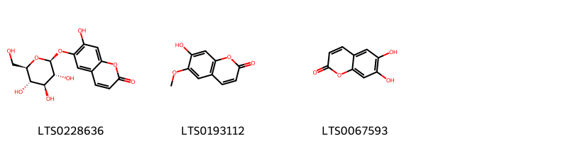{ width=100% }
    <figcaption>Hình ảnh cấu trúc hóa học của 3 hoạt chất thuộc nhóm Coumarins and derivatives gồm ['esculin (LTS0228636)', 'scopoletin (LTS0193112)', 'esculetin (LTS0067593)'].</figcaption>
</figure>
#### Nhóm Fatty Acyls
<figure markdown="span">
    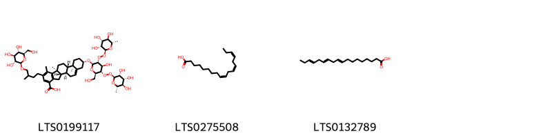{ width=100% }
    <figcaption>Hình ảnh cấu trúc hóa học của 3 hoạt chất thuộc nhóm Fatty Acyls gồm ['(2s,4ar,4bs,6as,11as,11br)-2-{[(2r,3r,4s,5s,6r)-4-hydroxy-6-(hydroxymethyl)-3,5-bis({[(2s,3r,4r,5r,6s)-3,4,5-trihydroxy-6-methyloxan-2-yl]peroxy})oxan-2-yl]oxy}-4a,6a,7-trimethyl-8-(3-methyl-4-{[(2r,3r,4s,5s,6r)-3,4,5-trihydroxy-6-(hydroxymethyl)oxan-2-yl]oxy}butyl)-1h,2h,3h,4h,4bh,5h,6h,11h,11ah,11bh,12h-indeno[2,1-a]phenanthrene-10-carboxylic acid (LTS0199117)', 'α-linolenic acid (LTS0275508)', 'α linolenic acid (LTS0132789)'].</figcaption>
</figure>
#### Nhóm Flavonoids
<figure markdown="span">
    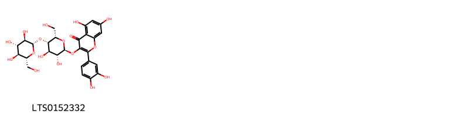{ width=100% }
    <figcaption>Hình ảnh cấu trúc hóa học của 1 hoạt chất thuộc nhóm Flavonoids gồm ['3-{[(2s,3r,4r,5s,6s)-3,4-dihydroxy-6-(hydroxymethyl)-5-{[(2s,3r,4s,5s,6r)-3,4,5-trihydroxy-6-(hydroxymethyl)oxan-2-yl]oxy}oxan-2-yl]oxy}-2-(3,4-dihydroxyphenyl)-5,7-dihydroxychromen-4-one (LTS0152332)'].</figcaption>
</figure>
#### Nhóm Organooxygen compounds
<figure markdown="span">
    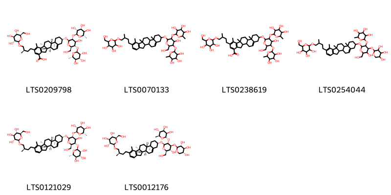{ width=100% }
    <figcaption>Hình ảnh cấu trúc hóa học của 6 hoạt chất thuộc nhóm Organooxygen compounds gồm ['(2s,4ar,4bs,6as,11as,11br)-2-{[(2r,3r,4s,5s,6r)-4-hydroxy-6-(hydroxymethyl)-3,5-bis({[(2s,3r,4r,5r,6s)-3,4,5-trihydroxy-6-methyloxan-2-yl]oxy})oxan-2-yl]oxy}-4a,6a,7-trimethyl-8-[(3r)-3-methyl-4-{[(2r,3r,4s,5s,6r)-3,4,5-trihydroxy-6-(hydroxymethyl)oxan-2-yl]oxy}butyl]-1h,2h,3h,4h,4bh,5h,6h,11h,11ah,11bh,12h-indeno[2,1-a]phenanthrene-10-carboxylic acid (LTS0209798)', '2-[4-(2-{[4-hydroxy-6-(hydroxymethyl)-3,5-bis[(3,4,5-trihydroxy-6-methyloxan-2-yl)oxy]oxan-2-yl]oxy}-4a,6a,7-trimethyl-1h,2h,3h,4h,4bh,5h,6h,11h,11ah,11bh,12h-indeno[2,1-a]phenanthren-8-yl)-2-methylbutoxy]-6-(hydroxymethyl)oxane-3,4,5-triol (LTS0070133)', '2-{[4-hydroxy-6-(hydroxymethyl)-3,5-bis[(3,4,5-trihydroxy-6-methyloxan-2-yl)oxy]oxan-2-yl]oxy}-4a,6a,7-trimethyl-8-(3-methyl-4-{[3,4,5-trihydroxy-6-(hydroxymethyl)oxan-2-yl]oxy}butyl)-1h,2h,3h,4h,4bh,5h,6h,11h,11ah,11bh,12h-indeno[2,1-a]phenanthrene-10-carboxylic acid (LTS0238619)', '2-[4-(2-{[5-hydroxy-6-(hydroxymethyl)-3-[(3,4,5-trihydroxy-6-methyloxan-2-yl)oxy]-4-[(3,4,5-trihydroxyoxan-2-yl)oxy]oxan-2-yl]oxy}-4a,6a,7-trimethyl-1h,2h,3h,4h,4bh,5h,6h,11h,11ah,11bh,12h-indeno[2,1-a]phenanthren-8-yl)-2-methylbutoxy]-6-(hydroxymethyl)oxane-3,4,5-triol (LTS0254044)', '(2r,3r,4s,5s,6r)-2-[(2r)-4-[(2s,4ar,4bs,6as,11as,11br)-2-{[(2r,3r,4s,5s,6r)-4-hydroxy-6-(hydroxymethyl)-3,5-bis({[(2s,3r,4r,5r,6s)-3,4,5-trihydroxy-6-methyloxan-2-yl]oxy})oxan-2-yl]oxy}-4a,6a,7-trimethyl-1h,2h,3h,4h,4bh,5h,6h,11h,11ah,11bh,12h-indeno[2,1-a]phenanthren-8-yl]-2-methylbutoxy]-6-(hydroxymethyl)oxane-3,4,5-triol (LTS0121029)', '(2r,3r,4s,5s,6r)-2-[(2r)-4-[(2s,4ar,4bs,6as,11as,11br)-2-{[(2r,3r,4s,5r,6r)-5-hydroxy-6-(hydroxymethyl)-3-{[(2s,3r,4r,5r,6s)-3,4,5-trihydroxy-6-methyloxan-2-yl]oxy}-4-{[(2s,3r,4s,5r)-3,4,5-trihydroxyoxan-2-yl]oxy}oxan-2-yl]oxy}-4a,6a,7-trimethyl-1h,2h,3h,4h,4bh,5h,6h,11h,11ah,11bh,12h-indeno[2,1-a]phenanthren-8-yl]-2-methylbutoxy]-6-(hydroxymethyl)oxane-3,4,5-triol (LTS0012176)'].</figcaption>
</figure>
#### Nhóm Prenol lipids
<figure markdown="span">
    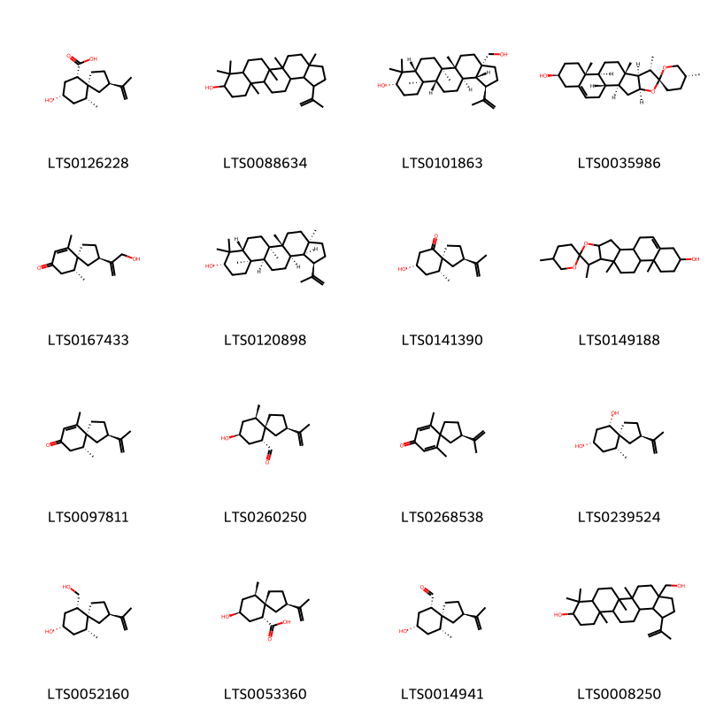{ width=100% }
    <figcaption>Hình ảnh cấu trúc hóa học của 16 hoạt chất thuộc nhóm Prenol lipids gồm ['(2r,5s,6s,8s,10r)-8-hydroxy-10-methyl-2-(prop-1-en-2-yl)spiro[4.5]decane-6-carboxylic acid (LTS0126228)', 'lupeol (LTS0088634)', 'betulin (LTS0101863)', 'diosgenin (LTS0035986)', '(2r,5s,10r)-2-(3-hydroxyprop-1-en-2-yl)-6,10-dimethylspiro[4.5]dec-6-en-8-one (LTS0167433)', '(1r,3ar,5ar,5br,7ar,9s,11ar,11bs,13ar,13bs)-3a,5a,5b,8,8,11a-hexamethyl-1-(prop-1-en-2-yl)-hexadecahydrocyclopenta[a]chrysen-9-ol (LTS0120898)', '(2r,5s,8s,10r)-8-hydroxy-10-methyl-2-(prop-1-en-2-yl)spiro[4.5]decan-6-one (LTS0141390)', 'diosgenin (LTS0149188)', 'solavetivone (LTS0097811)', '(2r,5s,6r,8s,10r)-8-hydroxy-10-methyl-2-(prop-1-en-2-yl)spiro[4.5]decane-6-carbaldehyde (LTS0260250)', '(2r)-6,10-dimethyl-2-(prop-1-en-2-yl)spiro[4.5]deca-6,9-dien-8-one (LTS0268538)', '(2r,5s,6s,8s,10r)-10-methyl-2-(prop-1-en-2-yl)spiro[4.5]decane-6,8-diol (LTS0239524)', 'lubiminol (LTS0052160)', '(2r,5s,6r,8s,10r)-8-hydroxy-10-methyl-2-(prop-1-en-2-yl)spiro[4.5]decane-6-carboxylic acid (LTS0053360)', 'lubimin (LTS0014941)', '3a-(hydroxymethyl)-5a,5b,8,8,11a-pentamethyl-1-(prop-1-en-2-yl)-hexadecahydrocyclopenta[a]chrysen-9-ol (LTS0008250)'].</figcaption>
</figure>
#### Nhóm Steroids and steroid derivatives
<figure markdown="span">
    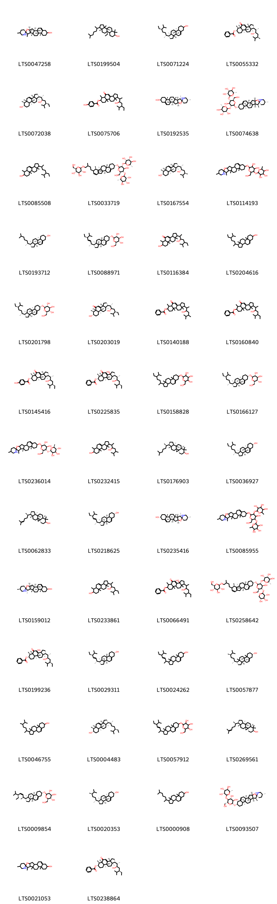{ width=100% }
    <figcaption>Hình ảnh cấu trúc hóa học của 51 hoạt chất thuộc nhóm Steroids and steroid derivatives gồm ["(1s,2s,4s,6r,8s,9s,12r,13r)-5',7,9,13-tetramethyl-5-oxaspiro[pentacyclo[10.8.0.0²,⁹.0⁴,⁸.0¹³,¹⁸]icosane-6,2'-piperidin]-18-en-16-ol (LTS0047258)", '(3br,7s,9bs,11ar)-9b-ethyl-3a,6,6,11a-tetramethyl-1-(6-methylheptan-2-yl)-dodecahydro-1h-cyclopenta[a]phenanthren-7-ol (LTS0199504)', 'stigmast-5-en-3-ol (LTS0071224)', '(1r,3ar,5as,6s,7s,9ar,9br,11ar)-1-[(2s,3s,5r)-3-hydroxy-5,6-dimethylheptan-2-yl]-6,9a,11a-trimethyl-5-oxo-1h,2h,3h,3ah,5ah,6h,7h,8h,9h,9bh,10h,11h-cyclopenta[a]phenanthren-7-yl benzoate (LTS0055332)', '(1r,3ar,5as,6s,7s,9as,9br,11ar)-1-[(2s,3r,5r)-5-ethyl-3-hydroxy-6-methylheptan-2-yl]-6,9a,11a-trimethyl-1h,2h,3h,3ah,5h,5ah,6h,7h,8h,9h,9bh,10h,11h-cyclopenta[a]phenanthren-7-ol (LTS0072038)', '1-(5-ethyl-3-hydroxy-6-methylheptan-2-yl)-6,9a,11a-trimethyl-5-oxo-1h,2h,3h,3ah,5ah,6h,7h,8h,9h,9bh,10h,11h-cyclopenta[a]phenanthren-7-yl 4-hydroxybenzoate (LTS0075706)', 'solasodine (LTS0192535)', 'solamargine (LTS0074638)', '1-(5-ethyl-6-methylheptan-2-yl)-6,9a,11a-trimethyl-1h,2h,3h,3ah,5h,5ah,6h,7h,8h,9h,9bh,10h,11h-cyclopenta[a]phenanthren-7-ol (LTS0085508)', '(2s,3r,4r,5r,6s)-2-{[(2r,3s,4s,5r,6r)-6-{[(2s,4ar,4bs,6as,7r,11as,11br)-4a,6a,7-trimethyl-8-(3-methyl-4-{[(2r,3r,4s,5s,6r)-3,4,5-trihydroxy-6-(hydroxymethyl)oxan-2-yl]oxy}butyl)-1h,2h,3h,4h,4bh,5h,6h,7h,8h,11h,11ah,11bh,12h-indeno[2,1-a]phenanthren-2-yl]oxy}-4-hydroxy-2-(hydroxymethyl)-5-{[(2s,3r,4r,5r,6s)-3,4,5-trihydroxy-6-methyloxan-2-yl]oxy}oxan-3-yl]oxy}-6-methyloxane-3,4,5-triol (LTS0033719)', '(1r,3ar,5as,6s,7s,9as,9br,11ar)-1-[(2s,3s,5r)-3-hydroxy-5,6-dimethylheptan-2-yl]-6,9a,11a-trimethyl-1h,2h,3h,3ah,5h,5ah,6h,7h,8h,9h,9bh,10h,11h-cyclopenta[a]phenanthren-7-ol (LTS0167554)', "2-{[4,5-dihydroxy-2-(hydroxymethyl)-6-{5',7,9,13-tetramethyl-5-oxaspiro[pentacyclo[10.8.0.0²,⁹.0⁴,⁸.0¹³,¹⁸]icosane-6,2'-piperidin]-18-eneoxy}oxan-3-yl]oxy}-6-methyloxane-3,4,5-triol (LTS0114193)", '(1r,3ar,3br,7s,9ar,9br,11ar)-9a,11a-dimethyl-1-[(2r)-6-methylheptan-2-yl]-1h,2h,3h,3ah,3bh,4h,6h,7h,8h,9h,9bh,10h,11h-cyclopenta[a]phenanthren-7-ol (LTS0193712)', '(2r,3r,4s,5s,6r)-2-{[(1r,3as,3bs,7s,9ar,9bs,11ar)-1-[(2r,3e,5s)-5-ethyl-6-methylhept-3-en-2-yl]-9a,11a-dimethyl-1h,2h,3h,3ah,3bh,4h,6h,7h,8h,9h,9bh,10h,11h-cyclopenta[a]phenanthren-7-yl]oxy}-6-(hydroxymethyl)oxane-3,4,5-triol (LTS0088971)', '1-(5-ethyl-3-hydroxy-6-methylheptan-2-yl)-7-hydroxy-6,9a,11a-trimethyl-1h,2h,3h,3ah,5ah,6h,7h,8h,9h,9bh,10h,11h-cyclopenta[a]phenanthren-5-one (LTS0116384)', 'stigmast-5-en-3-ol, (3β)- (LTS0204616)', 'sitogluside (LTS0201798)', '(1r,3ar,5as,6s,7s,9ar,9br,11ar)-1-[(2s,3r,5r)-5-ethyl-3-hydroxy-6-methylheptan-2-yl]-7-hydroxy-6,9a,11a-trimethyl-1h,2h,3h,3ah,5ah,6h,7h,8h,9h,9bh,10h,11h-cyclopenta[a]phenanthren-5-one (LTS0203019)', '1-(3-hydroxy-5,6-dimethylheptan-2-yl)-6,9a,11a-trimethyl-5-oxo-1h,2h,3h,3ah,5ah,6h,7h,8h,9h,9bh,10h,11h-cyclopenta[a]phenanthren-7-yl benzoate (LTS0140188)', '1-(5-ethyl-3-hydroxy-6-methylheptan-2-yl)-6,9a,11a-trimethyl-5-oxo-1h,2h,3h,3ah,5ah,6h,7h,8h,9h,9bh,10h,11h-cyclopenta[a]phenanthren-7-yl benzoate (LTS0160840)', '(1r,3ar,5as,6s,7s,9ar,9br,11ar)-1-[(2s,3r,5r)-5-ethyl-3-hydroxy-6-methylheptan-2-yl]-6,9a,11a-trimethyl-5-oxo-1h,2h,3h,3ah,5ah,6h,7h,8h,9h,9bh,10h,11h-cyclopenta[a]phenanthren-7-yl 4-hydroxybenzoate (LTS0145416)', '(1r,3as,5as,6s,7s,9ar,9br,11ar)-1-[(2s,3r,5r)-5-ethyl-3-hydroxy-6-methylheptan-2-yl]-3a-hydroxy-6,9a,11a-trimethyl-5-oxo-1h,2h,3h,5ah,6h,7h,8h,9h,9bh,10h,11h-cyclopenta[a]phenanthren-7-yl benzoate (LTS0225835)', '2-{[1-(5-ethyl-6-methylheptan-2-yl)-9a,11a-dimethyl-1h,2h,3h,3ah,3bh,4h,6h,7h,8h,9h,9bh,10h,11h-cyclopenta[a]phenanthren-7-yl]oxy}-6-(hydroxymethyl)oxane-3,4,5-triol (LTS0158828)', '(2r,3r,4s,5s,6r)-2-{[(1r,3ar,3br,7s,9ar,9br,11ar)-1-[(2r,5r)-5-ethyl-6-methylheptan-2-yl]-9a,11a-dimethyl-1h,2h,3h,3ah,3bh,4h,6h,7h,8h,9h,9bh,10h,11h-cyclopenta[a]phenanthren-7-yl]oxy}-6-(hydroxymethyl)oxane-3,4,5-triol (LTS0166127)', "(2s,3r,4r,5r,6s)-2-{[(2r,3s,4r,5r,6r)-4,5-dihydroxy-2-(hydroxymethyl)-6-[(9s,13r,16s)-5',7,9,13-tetramethyl-5-oxaspiro[pentacyclo[10.8.0.0²,⁹.0⁴,⁸.0¹³,¹⁸]icosane-6,2'-piperidin]-18-eneoxy]oxan-3-yl]oxy}-6-methyloxane-3,4,5-triol (LTS0236014)", '1-(3-hydroxy-5,6-dimethylheptan-2-yl)-6,9a,11a-trimethyl-1h,2h,3h,3ah,5h,5ah,6h,7h,8h,9h,9bh,10h,11h-cyclopenta[a]phenanthren-7-ol (LTS0232415)', 'cycloartanol (LTS0176903)', '(1s,3ar,3br,7s,9ar,9bs,11ar)-1-[(2r,5r)-5-ethyl-6-methylheptan-2-yl]-9a,11a-dimethyl-1h,2h,3h,3ah,3bh,4h,6h,7h,8h,9h,9bh,10h,11h-cyclopenta[a]phenanthren-7-ol (LTS0036927)', '(3r,6s,8r,11s,12s,15r,16r)-7,7,12,16-tetramethyl-15-[(2r)-6-methylhept-5-en-2-yl]pentacyclo[9.7.0.0¹,³.0³,⁸.0¹²,¹⁶]octadecan-6-ol (LTS0062833)', '(1r,3ar,3br,7s,9ar,9br,11ar)-1-[(2r,3e,5s)-5-ethyl-6-methylhept-3-en-2-yl]-9a,11a-dimethyl-1h,2h,3h,3ah,3bh,4h,6h,7h,8h,9h,9bh,10h,11h-cyclopenta[a]phenanthren-7-ol (LTS0218625)', "(1r,2r,4s,5'r,6r,7s,8s,9s,12s,13r,16r)-5',7,9,13-tetramethyl-5-oxaspiro[pentacyclo[10.8.0.0²,⁹.0⁴,⁸.0¹³,¹⁸]icosane-6,2'-piperidin]-18-en-16-ol (LTS0235416)", "2-{[4-hydroxy-2-(hydroxymethyl)-6-{5',7,9,13-tetramethyl-5-oxaspiro[pentacyclo[10.8.0.0²,⁹.0⁴,⁸.0¹³,¹⁸]icosane-6,2'-piperidin]-18-eneoxy}-5-[(3,4,5-trihydroxy-6-methyloxan-2-yl)oxy]oxan-3-yl]oxy}-6-methyloxane-3,4,5-triol (LTS0085955)", "(1s,2s,4s,5's,6r,7s,8r,9s,12s,13r,16s)-5',7,9,13-tetramethyl-5-oxaspiro[pentacyclo[10.8.0.0²,⁹.0⁴,⁸.0¹³,¹⁸]icosane-6,2'-piperidin]-18-en-16-ol (LTS0159012)", '1-(5-ethyl-3-hydroxy-6-methylheptan-2-yl)-6,9a,11a-trimethyl-1h,2h,3h,3ah,5h,5ah,6h,7h,8h,9h,9bh,10h,11h-cyclopenta[a]phenanthren-7-ol (LTS0233861)', '1-(5-ethyl-3-hydroxy-6-methylheptan-2-yl)-3a-hydroxy-6,9a,11a-trimethyl-5-oxo-1h,2h,3h,5ah,6h,7h,8h,9h,9bh,10h,11h-cyclopenta[a]phenanthren-7-yl benzoate (LTS0066491)', '(2s,3r,4r,5r,6s)-2-{[(2r,3r,4s,5s,6r)-2-{[(2s,4ar,4bs,6as,7r,11as,11br)-4a,6a,7-trimethyl-8-(3-methyl-4-{[(2r,3r,4s,5s,6r)-3,4,5-trihydroxy-6-(hydroxymethyl)oxan-2-yl]oxy}butyl)-1h,2h,3h,4h,4bh,5h,6h,7h,8h,11h,11ah,11bh,12h-indeno[2,1-a]phenanthren-2-yl]oxy}-4-hydroxy-6-(hydroxymethyl)-5-{[(2s,3r,4s,5r)-3,4,5-trihydroxyoxan-2-yl]oxy}oxan-3-yl]oxy}-6-methyloxane-3,4,5-triol (LTS0258642)', '(1r,3ar,5as,6s,7s,9ar,9br,11ar)-1-[(2s,3r,5r)-5-ethyl-3-hydroxy-6-methylheptan-2-yl]-3a-hydroxy-6,9a,11a-trimethyl-5-oxo-1h,2h,3h,5ah,6h,7h,8h,9h,9bh,10h,11h-cyclopenta[a]phenanthren-7-yl benzoate (LTS0199236)', 'phytosterol (LTS0029311)', 'stigmasterol (LTS0024262)', '(1r,3as,3bs,7s,9bs)-1-[(2r,5r)-5,6-dimethylheptan-2-yl]-9a,11a-dimethyl-1h,2h,3h,3ah,3bh,4h,6h,7h,8h,9h,9bh,10h,11h-cyclopenta[a]phenanthren-7-ol (LTS0057877)', 'campesterol (LTS0046755)', '(1r,3ar,5as,6s,7s,9as,9br,11ar)-1-[(2r,5r)-5-ethyl-6-methylheptan-2-yl]-6,9a,11a-trimethyl-1h,2h,3h,3ah,5h,5ah,6h,7h,8h,9h,9bh,10h,11h-cyclopenta[a]phenanthren-7-ol (LTS0004483)', '2-{[1-(5-ethyl-6-methylhept-3-en-2-yl)-9a,11a-dimethyl-1h,2h,3h,3ah,3bh,4h,6h,7h,8h,9h,9bh,10h,11h-cyclopenta[a]phenanthren-7-yl]oxy}-6-(hydroxymethyl)oxane-3,4,5-triol (LTS0057912)', 'cycloartenol (LTS0269561)', '(2r,3r,4s,5s,6r)-2-{[(1r,3ar,3br,7s,9ar,9br,11ar)-1-[(2s,3z,5s)-5-ethyl-6-methylhept-3-en-2-yl]-9a,11a-dimethyl-1h,2h,3h,3ah,3bh,4h,6h,7h,8h,9h,9bh,10h,11h-cyclopenta[a]phenanthren-7-yl]oxy}-6-(hydroxymethyl)oxane-3,4,5-triol (LTS0009854)', '(1s,3ar,3br,7s,9ar,9bs,11ar)-1-[(2r,5r)-5,6-dimethylheptan-2-yl]-9a,11a-dimethyl-1h,2h,3h,3ah,3bh,4h,6h,7h,8h,9h,9bh,10h,11h-cyclopenta[a]phenanthren-7-ol (LTS0020353)', 'epicholestrol (LTS0000908)', "(2s,3r,4r,5r,6s)-2-{[(2r,3s,4r,5r,6r)-4,5-dihydroxy-2-(hydroxymethyl)-6-[(1s,2s,4s,5'r,6r,7s,8r,9s,12s,13r,16s)-5',7,9,13-tetramethyl-5-oxaspiro[pentacyclo[10.8.0.0²,⁹.0⁴,⁸.0¹³,¹⁸]icosane-6,2'-piperidin]-18-eneoxy]oxan-3-yl]oxy}-6-methyloxane-3,4,5-triol (LTS0093507)", 'solassodine (LTS0021053)', '(1r,3ar,5as,6s,7s,9ar,9br,11ar)-1-[(2s,3r,5r)-5-ethyl-3-hydroxy-6-methylheptan-2-yl]-6,9a,11a-trimethyl-5-oxo-1h,2h,3h,3ah,5ah,6h,7h,8h,9h,9bh,10h,11h-cyclopenta[a]phenanthren-7-yl benzoate (LTS0238864)', 'cholesterol (LTS0102304)'].</figcaption>
</figure>

---

### Dược dân tộc học

Danh sách các quốc gia có sử dụng *Solanum aethiopicum* trong điều trị các bệnh. 

| Country   | Disease     | Bệnh                   |
|:----------|:------------|:-----------------------|
| Sudan     | Carminative | Gây ô nhiễm môi trường |

---

---
## Solanum alternatopinnatum
### Thông tin về thực vật

!!! info "Phân loại thực vật của *Solanum alternatopinnatum* từ GIBF:"
    - **Kingdom:** Plantae
    - **Phylum:** Tracheophyta
    - **Order:** Solanales
    - **Family:** Solanaceae
    - **Genus:** Solanum
    - **Species:** *Solanum alternatopinnatum*

 

| Label (VI)   | Label (EN)   | Scientific Name           | Descriptions (VI)   | Descriptions (EN)   | Also Known As (VI)   | Also Known As (EN)   |
|:-------------|:-------------|:--------------------------|:--------------------|:--------------------|:---------------------|:---------------------|
| N/A          | N/A          | Solanum alternatopinnatum | loài thực vật       | species of plant    | ['']                 | ['']                 |

#### Phân bố trên thế giới

**Từ CSDL GIBF** nan, Colombia, Brazil, Argentina, Peru, Paraguay

#### Phân bố tại Việt Nam

**Từ CSDL GIBF**: Không có ghi nhận ở Việt Nam

---
### Thành phần hóa học
        
- Theo cơ sở dữ liệu lotus: Từ loài *Solanum alternatopinnatum* đã phân lập và xác định được Chưa có hoạt chất nào được phân lập. hoạt chất thuộc về các nhóm Không có hoạt chất nào được phân lập. 

Không có hình ảnh nào được tạo ra

---

### Dược dân tộc học

Danh sách các quốc gia có sử dụng *Solanum alternatopinnatum* trong điều trị các bệnh. 

| Country       | Disease            | Bệnh                |
|:--------------|:-------------------|:--------------------|
| South America | Narcotic, Diuretic | Thuốc ngủ, lợi tiểu |

---

---
## Solanum amazonicum
### Thông tin về thực vật

!!! info "Phân loại thực vật của *N/A* từ GIBF:"
    - **Kingdom:** Plantae
    - **Phylum:** Tracheophyta
    - **Order:** Solanales
    - **Family:** Solanaceae
    - **Genus:** Solanum
    - **Species:** *N/A*

 

| Label (VI)   | Label (EN)   | Scientific Name           | Descriptions (VI)   | Descriptions (EN)   | Also Known As (VI)   | Also Known As (EN)   |
|:-------------|:-------------|:--------------------------|:--------------------|:--------------------|:---------------------|:---------------------|
| N/A          | N/A          | Solanum alternatopinnatum | loài thực vật       | species of plant    | ['']                 | ['']                 |

#### Phân bố trên thế giới

**Từ CSDL GIBF** Australia, Japan, Argentina, Palestine, State of, Israel, Canada, Puerto Rico, Luxembourg, Cyprus, Chinese Taipei, Spain, Türkiye, Portugal, United States of America, Uruguay, Chile, Greece, South Africa, Montenegro, Thailand, Brazil, Mexico, France, Peru, Viet Nam, United Kingdom of Great Britain and Northern Ireland, Ecuador, Colombia, Costa Rica, India, Indonesia, New Zealand

#### Phân bố tại Việt Nam

**Từ CSDL GIBF**: Lâm Đồng

---
### Thành phần hóa học
        
- Theo cơ sở dữ liệu lotus: Từ loài *N/A* đã phân lập và xác định được Chưa có hoạt chất nào được phân lập. hoạt chất thuộc về các nhóm Không có hoạt chất nào được phân lập. 

Không có hình ảnh nào được tạo ra

---

### Dược dân tộc học

Danh sách các quốc gia có sử dụng *N/A* trong điều trị các bệnh. 

| Country   | Disease   | Bệnh       |
|:----------|:----------|:-----------|
| Mexico    | Rennet    | Dạ múi khế |

---

---
## Solanum capense
### Thông tin về thực vật

!!! info "Phân loại thực vật của *Solanum capense* từ GIBF:"
    - **Kingdom:** Plantae
    - **Phylum:** Tracheophyta
    - **Order:** Solanales
    - **Family:** Solanaceae
    - **Genus:** Solanum
    - **Species:** *Solanum capense*

 

| Label (VI)   | Label (EN)   | Scientific Name   | Descriptions (VI)   | Descriptions (EN)   | Also Known As (VI)   | Also Known As (EN)   |
|:-------------|:-------------|:------------------|:--------------------|:--------------------|:---------------------|:---------------------|
| N/A          | N/A          | Solanum capense   | loài thực vật       | species of plant    | ['']                 | ['']                 |

#### Phân bố trên thế giới

**Từ CSDL GIBF** nan, South Africa, Namibia, Afghanistan, Mozambique, Costa Rica, Botswana, Eswatini, Saudi Arabia

#### Phân bố tại Việt Nam

**Từ CSDL GIBF**: Không có ghi nhận ở Việt Nam

---
### Thành phần hóa học
        
- Theo cơ sở dữ liệu lotus: Từ loài *Solanum capense* đã phân lập và xác định được Chưa có hoạt chất nào được phân lập. hoạt chất thuộc về các nhóm Không có hoạt chất nào được phân lập. 

Không có hình ảnh nào được tạo ra

---

### Dược dân tộc học

Danh sách các quốc gia có sử dụng *Solanum capense* trong điều trị các bệnh. 

| Country   | Disease   | Bệnh       |
|:----------|:----------|:-----------|
| Lesotho   | Rennet    | Dạ múi khế |

---

---
## Solanum carolinense
### Thông tin về thực vật

!!! info "Phân loại thực vật của *Solanum carolinense* từ GIBF:"
    - **Kingdom:** Plantae
    - **Phylum:** Tracheophyta
    - **Order:** Solanales
    - **Family:** Solanaceae
    - **Genus:** Solanum
    - **Species:** *Solanum carolinense*

 

| Label (VI)   | Label (EN)   | Scientific Name     | Descriptions (VI)   | Descriptions (EN)   | Also Known As (VI)   | Also Known As (EN)   |
|:-------------|:-------------|:--------------------|:--------------------|:--------------------|:---------------------|:---------------------|
| N/A          | N/A          | Solanum carolinense | loài thực vật       | species of plant    | ['']                 | ['']                 |

#### Phân bố trên thế giới

**Từ CSDL GIBF** Portugal, Korea, Republic of, United States of America, Japan

#### Phân bố tại Việt Nam

**Từ CSDL GIBF**: Không có ghi nhận ở Việt Nam

---
### Thành phần hóa học
        
- Theo cơ sở dữ liệu lotus: Từ loài *Solanum carolinense* đã phân lập và xác định được 8 hoạt chất thuộc về các nhóm Organonitrogen compounds, Organooxygen compounds, Steroids and steroid derivatives. 

|    | chemicalTaxonomyClassyfireClass   |   smiles_count |
|---:|:----------------------------------|---------------:|
|  0 | Organonitrogen compounds          |              1 |
|  1 | Organooxygen compounds            |              3 |
|  2 | Steroids and steroid derivatives  |              4 |

#### Nhóm Organonitrogen compounds
<figure markdown="span">
    { width=100% }
    <figcaption>Hình ảnh cấu trúc hóa học của 1 hoạt chất thuộc nhóm Organonitrogen compounds gồm ['(4-{[4-(dimethylamino)butyl]amino}butyl)dimethylamine (LTS0073100)'].</figcaption>
</figure>
#### Nhóm Organooxygen compounds
<figure markdown="span">
    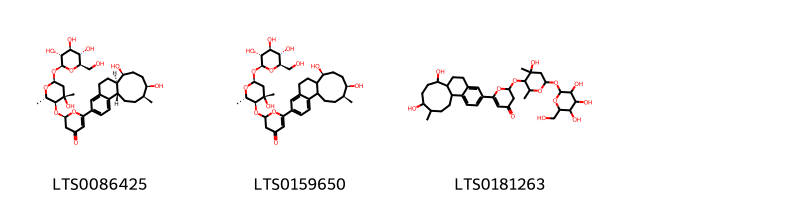{ width=100% }
    <figcaption>Hình ảnh cấu trúc hóa học của 3 hoạt chất thuộc nhóm Organooxygen compounds gồm ['(6s)-2-[(6ar,7s,10r,11s,13as)-7,10-dihydroxy-11-methyl-5h,6h,6ah,7h,8h,9h,10h,11h,12h,13h,13ah-cyclonona[a]naphthalen-3-yl]-6-{[(2s,3s,4s,6s)-4-hydroxy-2,4-dimethyl-6-{[(2s,3r,4s,5s,6r)-3,4,5-trihydroxy-6-(hydroxymethyl)oxan-2-yl]oxy}oxan-3-yl]oxy}-5,6-dihydropyran-4-one (LTS0086425)', '2-[(7s,10r,11s)-7,10-dihydroxy-11-methyl-5h,6h,6ah,7h,8h,9h,10h,11h,12h,13h,13ah-cyclonona[a]naphthalen-3-yl]-6-{[(2s,3s,4s,6s)-4-hydroxy-2,4-dimethyl-6-{[(2s,3r,4s,5s,6r)-3,4,5-trihydroxy-6-(hydroxymethyl)oxan-2-yl]oxy}oxan-3-yl]oxy}-5,6-dihydropyran-4-one (LTS0159650)', '2-{7,10-dihydroxy-11-methyl-5h,6h,6ah,7h,8h,9h,10h,11h,12h,13h,13ah-cyclonona[a]naphthalen-3-yl}-6-[(4-hydroxy-2,4-dimethyl-6-{[3,4,5-trihydroxy-6-(hydroxymethyl)oxan-2-yl]oxy}oxan-3-yl)oxy]-5,6-dihydropyran-4-one (LTS0181263)'].</figcaption>
</figure>
#### Nhóm Steroids and steroid derivatives
<figure markdown="span">
    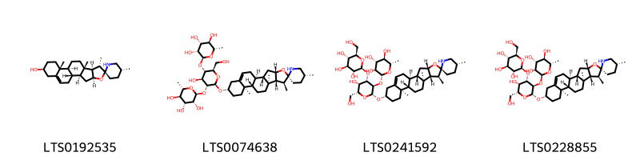{ width=100% }
    <figcaption>Hình ảnh cấu trúc hóa học của 4 hoạt chất thuộc nhóm Steroids and steroid derivatives gồm ['solasodine (LTS0192535)', 'solamargine (LTS0074638)', "(2r,3r,4r,5r,6s)-2-{[(2r,3r,4s,5s,6r)-5-hydroxy-6-(hydroxymethyl)-2-[(1s,2s,4s,5'r,6s,7s,8r,9s,12s,13r,16s)-5',7,9,13-tetramethyl-5-oxaspiro[pentacyclo[10.8.0.0²,⁹.0⁴,⁸.0¹³,¹⁸]icosane-6,2'-piperidin]-18-eneoxy]-4-{[(2s,3r,4s,5s,6r)-3,4,5-trihydroxy-6-(hydroxymethyl)oxan-2-yl]oxy}oxan-3-yl]oxy}-6-methyloxane-3,4,5-triol (LTS0241592)", "(2s,3r,4r,5r,6s)-2-{[(2r,3r,4s,5s,6r)-5-hydroxy-6-(hydroxymethyl)-2-[(1s,2s,4s,5'r,6r,7s,8r,9s,12s,13r,16s)-5',7,9,13-tetramethyl-5-oxaspiro[pentacyclo[10.8.0.0²,⁹.0⁴,⁸.0¹³,¹⁸]icosane-6,2'-piperidin]-18-eneoxy]-4-{[(2s,3r,4s,5s,6r)-3,4,5-trihydroxy-6-(hydroxymethyl)oxan-2-yl]oxy}oxan-3-yl]oxy}-6-methyloxane-3,4,5-triol (LTS0228855)"].</figcaption>
</figure>

---

### Dược dân tộc học

Danh sách các quốc gia có sử dụng *Solanum carolinense* trong điều trị các bệnh. 

| Country   | Disease                                | Bệnh                                                         |
|:----------|:---------------------------------------|:-------------------------------------------------------------|
| Dutch     | Sedative                               | Thuốc an thần                                                |
| Elsewhere | nan                                    | Ở đây                                                        |
| Turkey    | Diuretic, Sedative                     | Thuốc lợi tiểu, thuốc an thần                                |
| US        | Diuretic, Sedative, Sedative, Diuretic | Thuốc lợi tiểu, Thuốc an thần, Thuốc an thần, Thuốc lợi tiểu |

---

---
## Solanum ciliatum
### Thông tin về thực vật

!!! info "Phân loại thực vật của *N/A* từ GIBF:"
    - **Kingdom:** Plantae
    - **Phylum:** Tracheophyta
    - **Order:** Solanales
    - **Family:** Solanaceae
    - **Genus:** N/A
    - **Species:** *N/A*

 

| Label (VI)   | Label (EN)   | Scientific Name   | Descriptions (VI)   | Descriptions (EN)   | Also Known As (VI)   | Also Known As (EN)   |
|:-------------|:-------------|:------------------|:--------------------|:--------------------|:---------------------|:---------------------|
| N/A          | N/A          | Solanum ciliatum  |                     |                     | ['']                 | ['']                 |

#### Phân bố trên thế giới

**Từ CSDL GIBF** Australia, Japan, Argentina, Palestine, State of, Israel, Canada, Luxembourg, Cyprus, Chinese Taipei, Spain, Bolivia (Plurinational State of), Türkiye, Portugal, Morocco, United States of America, Uruguay, Chile, Greece, South Africa, Thailand, Brazil, Mexico, France, Peru, Viet Nam, United Kingdom of Great Britain and Northern Ireland, Ecuador, Indonesia, New Zealand

#### Phân bố tại Việt Nam

**Từ CSDL GIBF**: Lâm Đồng

---
### Thành phần hóa học
        
- Theo cơ sở dữ liệu lotus: Từ loài *N/A* đã phân lập và xác định được 17 hoạt chất thuộc về các nhóm Steroids and steroid derivatives. 

|    | chemicalTaxonomyClassyfireClass   |   smiles_count |
|---:|:----------------------------------|---------------:|
|  0 | Steroids and steroid derivatives  |             17 |

#### Nhóm Steroids and steroid derivatives
<figure markdown="span">
    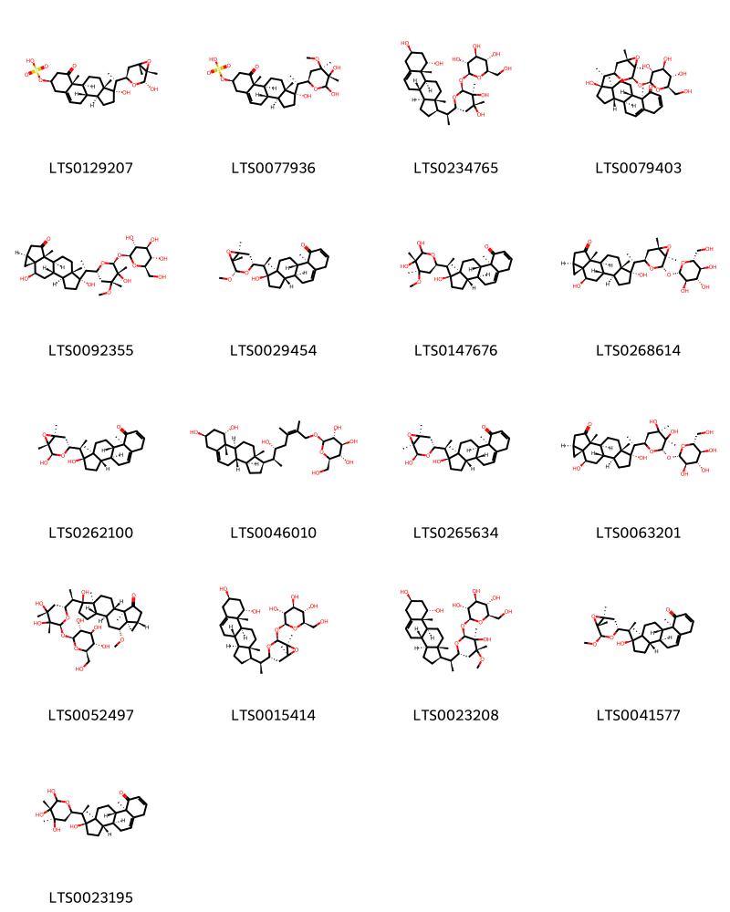{ width=100% }
    <figcaption>Hình ảnh cấu trúc hóa học của 17 hoạt chất thuộc nhóm Steroids and steroid derivatives gồm ['[(1s,3as,3bs,7r,9ar,9bs,11as)-1-hydroxy-1-[(1r)-1-[(1s,2r,4r,6s)-2-hydroxy-1,6-dimethyl-3,7-dioxabicyclo[4.1.0]heptan-4-yl]ethyl]-9a,11a-dimethyl-9-oxo-2h,3h,3ah,3bh,4h,6h,7h,8h,9bh,10h,11h-cyclopenta[a]phenanthren-7-yl]oxidanesulfonic acid (LTS0129207)', '[(1s,3as,3bs,7r,9ar,9bs,11as)-1-[(1r)-1-[(2r,4r,5s)-5,6-dihydroxy-4-methoxy-4,5-dimethyloxan-2-yl]ethyl]-1-hydroxy-9a,11a-dimethyl-9-oxo-2h,3h,3ah,3bh,4h,6h,7h,8h,9bh,10h,11h-cyclopenta[a]phenanthren-7-yl]oxidanesulfonic acid (LTS0077936)', '(2s,3r,4s,5s,6r)-2-{[(2s,3s,4r,6r)-6-[(1s)-1-[(1r,3as,3bs,7r,9s,9ar,9bs,11as)-7,9-dihydroxy-9a,11a-dimethyl-1h,2h,3h,3ah,3bh,4h,6h,7h,8h,9h,9bh,10h,11h-cyclopenta[a]phenanthren-1-yl]ethyl]-3,4-dihydroxy-3,4-dimethyloxan-2-yl]oxy}-6-(hydroxymethyl)oxane-3,4,5-triol (LTS0234765)', '(1s,3as,3bs,9ar,9bs,11as)-1-[(1r)-1-[(1r,2r,4r,6s)-1,6-dimethyl-2-{[(2s,3r,4s,5s,6r)-3,4,5-trihydroxy-6-(hydroxymethyl)oxan-2-yl]oxy}-3,7-dioxabicyclo[4.1.0]heptan-4-yl]ethyl]-1-hydroxy-9a,11a-dimethyl-2h,3h,3ah,3bh,4h,6h,9bh,10h,11h-cyclopenta[a]phenanthren-9-one (LTS0079403)', '(1s,2r,5s,7r,8r,10s,11s,14s,15s)-8,14-dihydroxy-14-[(1r)-1-[(2r,4r,5r,6s)-5-hydroxy-4-methoxy-4,5-dimethyl-6-{[(2s,3r,4s,5s,6r)-3,4,5-trihydroxy-6-(hydroxymethyl)oxan-2-yl]oxy}oxan-2-yl]ethyl]-2,15-dimethylpentacyclo[8.7.0.0²,⁷.0⁵,⁷.0¹¹,¹⁵]heptadecan-3-one (LTS0092355)', '(1s,3as,3bs,9ar,9bs,11as)-1-hydroxy-1-[(1r)-1-[(1r,2s,4r,6s)-2-methoxy-1,6-dimethyl-3,7-dioxabicyclo[4.1.0]heptan-4-yl]ethyl]-9a,11a-dimethyl-2h,3h,3ah,3bh,4h,6h,9bh,10h,11h-cyclopenta[a]phenanthren-9-one (LTS0029454)', '(1s,3as,3bs,9ar,9bs,11as)-1-[(1r)-1-[(2r,4r,5s)-5,6-dihydroxy-4-methoxy-4,5-dimethyloxan-2-yl]ethyl]-1-hydroxy-9a,11a-dimethyl-2h,3h,3ah,3bh,4h,6h,9bh,10h,11h-cyclopenta[a]phenanthren-9-one (LTS0147676)', '(1s,2r,5s,7r,8r,10s,11s,14s,15s)-14-[(1r)-1-[(1r,2s,4r,6s)-1,6-dimethyl-2-{[(2s,3r,4s,5s,6r)-3,4,5-trihydroxy-6-(hydroxymethyl)oxan-2-yl]oxy}-3,7-dioxabicyclo[4.1.0]heptan-4-yl]ethyl]-8,14-dihydroxy-2,15-dimethylpentacyclo[8.7.0.0²,⁷.0⁵,⁷.0¹¹,¹⁵]heptadecan-3-one (LTS0268614)', '(1s,3as,3bs,9ar,9bs,11as)-1-hydroxy-1-[(1r)-1-[(1r,2r,4r,6s)-2-hydroxy-1,6-dimethyl-3,7-dioxabicyclo[4.1.0]heptan-4-yl]ethyl]-9a,11a-dimethyl-2h,3h,3ah,3bh,4h,6h,9bh,10h,11h-cyclopenta[a]phenanthren-9-one (LTS0262100)', '(2r,3r,4s,5s,6r)-2-{[(2z,5r,6s)-6-[(1r,3as,3bs,7r,9s,9ar,9bs,11as)-7,9-dihydroxy-9a,11a-dimethyl-1h,2h,3h,3ah,3bh,4h,6h,7h,8h,9h,9bh,10h,11h-cyclopenta[a]phenanthren-1-yl]-5-hydroxy-2,3-dimethylhept-2-en-1-yl]oxy}-6-(hydroxymethyl)oxane-3,4,5-triol (LTS0046010)', '(1s,3as,3br,9ar,9br,11as)-1-hydroxy-1-[(1r)-1-[(1s,2r,4r,6s)-2-hydroxy-1,6-dimethyl-3,7-dioxabicyclo[4.1.0]heptan-4-yl]ethyl]-9a,11a-dimethyl-2h,3h,3ah,3bh,4h,6h,9bh,10h,11h-cyclopenta[a]phenanthren-9-one (LTS0265634)', '(1s,2r,5s,7r,8r,10s,11s,14s,15s)-14-[(1r)-1-[(2r,4r,5r,6s)-4,5-dihydroxy-4,5-dimethyl-6-{[(2s,3r,4s,5s,6r)-3,4,5-trihydroxy-6-(hydroxymethyl)oxan-2-yl]oxy}oxan-2-yl]ethyl]-8,14-dihydroxy-2,15-dimethylpentacyclo[8.7.0.0²,⁷.0⁵,⁷.0¹¹,¹⁵]heptadecan-3-one (LTS0063201)', '(1s,2r,5s,7r,8r,10s,11s,14s,15s)-14-[(1r)-1-[(2r,4r,5r,6s)-4,5-dihydroxy-4,5-dimethyl-6-{[(2s,3r,4s,5s,6r)-3,4,5-trihydroxy-6-(hydroxymethyl)oxan-2-yl]oxy}oxan-2-yl]ethyl]-14-hydroxy-8-methoxy-2,15-dimethylpentacyclo[8.7.0.0²,⁷.0⁵,⁷.0¹¹,¹⁵]heptadecan-3-one (LTS0052497)', '(2s,3r,4s,5s,6r)-2-{[(1s,2s,4r,6s)-4-[(1s)-1-[(1r,3as,3bs,7r,9s,9ar,9bs,11as)-7,9-dihydroxy-9a,11a-dimethyl-1h,2h,3h,3ah,3bh,4h,6h,7h,8h,9h,9bh,10h,11h-cyclopenta[a]phenanthren-1-yl]ethyl]-1,6-dimethyl-3,7-dioxabicyclo[4.1.0]heptan-2-yl]oxy}-6-(hydroxymethyl)oxane-3,4,5-triol (LTS0015414)', '(2s,3r,4s,5s,6r)-2-{[(2s,3s,4r,6r)-6-[(1s)-1-[(1r,3as,3bs,7r,9s,9ar,9bs,11as)-7,9-dihydroxy-9a,11a-dimethyl-1h,2h,3h,3ah,3bh,4h,6h,7h,8h,9h,9bh,10h,11h-cyclopenta[a]phenanthren-1-yl]ethyl]-3-hydroxy-4-methoxy-3,4-dimethyloxan-2-yl]oxy}-6-(hydroxymethyl)oxane-3,4,5-triol (LTS0023208)', '(1s,3as,3bs,9ar,9bs,11as)-1-hydroxy-1-[(1r)-1-[(1r,2r,4r,6s)-2-methoxy-1,6-dimethyl-3,7-dioxabicyclo[4.1.0]heptan-4-yl]ethyl]-9a,11a-dimethyl-2h,3h,3ah,3bh,4h,6h,9bh,10h,11h-cyclopenta[a]phenanthren-9-one (LTS0041577)', '(1s,3as,3bs,9ar,9bs,11as)-1-hydroxy-9a,11a-dimethyl-1-[(1r)-1-[(2r,4r,5s)-4,5,6-trihydroxy-4,5-dimethyloxan-2-yl]ethyl]-2h,3h,3ah,3bh,4h,6h,9bh,10h,11h-cyclopenta[a]phenanthren-9-one (LTS0023195)'].</figcaption>
</figure>

---

### Dược dân tộc học

Danh sách các quốc gia có sử dụng *N/A* trong điều trị các bệnh. 

| Country     | Disease   | Bệnh     |
|:------------|:----------|:---------|
| West Indies | Poison    | Chất độc |

---

---
## Solanum coagulans
### Thông tin về thực vật

!!! info "Phân loại thực vật của *Solanum coagulans* từ GIBF:"
    - **Kingdom:** Plantae
    - **Phylum:** Tracheophyta
    - **Order:** Solanales
    - **Family:** Solanaceae
    - **Genus:** Solanum
    - **Species:** *Solanum coagulans*

 

| Label (VI)   | Label (EN)   | Scientific Name   | Descriptions (VI)   | Descriptions (EN)   | Also Known As (VI)   | Also Known As (EN)   |
|:-------------|:-------------|:------------------|:--------------------|:--------------------|:---------------------|:---------------------|
| N/A          | N/A          | Solanum coagulans | loài thực vật       | species of plant    | ['']                 | ['']                 |

#### Phân bố trên thế giới

**Từ CSDL GIBF** nan, United Arab Emirates, Oman, Eritrea, Chad, Tanzania, United Republic of, Sudan, Somalia, Egypt, unknown or invalid, Viet Nam, Saudi Arabia, China, Kenya, Dominican Republic, Malaysia, Yemen, Ethiopia

#### Phân bố tại Việt Nam

**Từ CSDL GIBF**: Ha Tinh, Hà Tinh, Kon Tum

---
### Thành phần hóa học
        
- Theo cơ sở dữ liệu lotus: Từ loài *Solanum coagulans* đã phân lập và xác định được Chưa có hoạt chất nào được phân lập. hoạt chất thuộc về các nhóm Không có hoạt chất nào được phân lập. 

Không có hình ảnh nào được tạo ra

---

### Dược dân tộc học

Danh sách các quốc gia có sử dụng *Solanum coagulans* trong điều trị các bệnh. 

| Country   | Disease   | Bệnh     |
|:----------|:----------|:---------|
| China     | Poison    | Chất độc |

---

---
## Solanum diversifolium
### Thông tin về thực vật

!!! info "Phân loại thực vật của *Solanum diversifolium* từ GIBF:"
    - **Kingdom:** Plantae
    - **Phylum:** Tracheophyta
    - **Order:** Solanales
    - **Family:** Solanaceae
    - **Genus:** Solanum
    - **Species:** *Solanum diversifolium*

 

| Label (VI)   | Label (EN)   | Scientific Name       | Descriptions (VI)   | Descriptions (EN)   | Also Known As (VI)   | Also Known As (EN)   |
|:-------------|:-------------|:----------------------|:--------------------|:--------------------|:---------------------|:---------------------|
| N/A          | N/A          | Solanum diversifolium | loài thực vật       | species of plant    | ['']                 | ['']                 |

#### Phân bố trên thế giới

**Từ CSDL GIBF** nan, Belize, Colombia, Guatemala, Costa Rica, Honduras, unknown or invalid, United States of America, Mexico, Venezuela (Bolivarian Republic of), Panama

#### Phân bố tại Việt Nam

**Từ CSDL GIBF**: Không có ghi nhận ở Việt Nam

---
### Thành phần hóa học
        
- Theo cơ sở dữ liệu lotus: Từ loài *Solanum diversifolium* đã phân lập và xác định được Chưa có hoạt chất nào được phân lập. hoạt chất thuộc về các nhóm Không có hoạt chất nào được phân lập. 

Không có hình ảnh nào được tạo ra

---

### Dược dân tộc học

Danh sách các quốc gia có sử dụng *Solanum diversifolium* trong điều trị các bệnh. 

| Country   | Disease   | Bệnh     |
|:----------|:----------|:---------|
| Mexico    | Raticide  | Raticide |

---

---
## Solanum dubium
### Thông tin về thực vật

!!! info "Phân loại thực vật của *N/A* từ GIBF:"
    - **Kingdom:** Plantae
    - **Phylum:** Tracheophyta
    - **Order:** Solanales
    - **Family:** Solanaceae
    - **Genus:** Solanum
    - **Species:** *N/A*

 

| Label (VI)   | Label (EN)   | Scientific Name       | Descriptions (VI)   | Descriptions (EN)   | Also Known As (VI)   | Also Known As (EN)   |
|:-------------|:-------------|:----------------------|:--------------------|:--------------------|:---------------------|:---------------------|
| N/A          | N/A          | Solanum diversifolium | loài thực vật       | species of plant    | ['']                 | ['']                 |

#### Phân bố trên thế giới

**Từ CSDL GIBF** Australia, Japan, Argentina, Palestine, State of, Israel, Canada, Puerto Rico, Luxembourg, Cyprus, Chinese Taipei, Spain, Türkiye, Portugal, United States of America, Uruguay, Chile, Greece, South Africa, Montenegro, Thailand, Brazil, Mexico, France, Peru, Viet Nam, United Kingdom of Great Britain and Northern Ireland, Ecuador, Colombia, Costa Rica, India, Indonesia, New Zealand

#### Phân bố tại Việt Nam

**Từ CSDL GIBF**: Lâm Đồng

---
### Thành phần hóa học
        
- Theo cơ sở dữ liệu lotus: Từ loài *N/A* đã phân lập và xác định được Chưa có hoạt chất nào được phân lập. hoạt chất thuộc về các nhóm Không có hoạt chất nào được phân lập. 

Không có hình ảnh nào được tạo ra

---

### Dược dân tộc học

Danh sách các quốc gia có sử dụng *N/A* trong điều trị các bệnh. 

| Country   | Disease                | Bệnh                         |
|:----------|:-----------------------|:-----------------------------|
| Sudan     | Depilatory, Depilatory | Làm rụng lông, làm rụng lông |

---

---
## Solanum dulcamara
### Thông tin về thực vật

!!! info "Phân loại thực vật của *Solanum dulcamara* từ GIBF:"
    - **Kingdom:** Plantae
    - **Phylum:** Tracheophyta
    - **Order:** Solanales
    - **Family:** Solanaceae
    - **Genus:** Solanum
    - **Species:** *Solanum dulcamara*

 

| Label (VI)   | Label (EN)   | Scientific Name   | Descriptions (VI)   | Descriptions (EN)   | Also Known As (VI)   | Also Known As (EN)                                                                    |
|:-------------|:-------------|:------------------|:--------------------|:--------------------|:---------------------|:--------------------------------------------------------------------------------------|
| N/A          | N/A          | Solanum dulcamara | loài thực vật       | species of plant    | ['']                 | ['bittersweet', 'bittersweet nightshade', 'climbing nightshade', 'bittersweet woody'] |

#### Phân bố trên thế giới

**Từ CSDL GIBF** Italy, Australia, Belgium, Canada, Ukraine, Denmark, Netherlands, Luxembourg, Spain, Hungary, Russian Federation, United States of America, Sweden, Kazakhstan, Croatia, Germany, Switzerland, Austria, France, United Kingdom of Great Britain and Northern Ireland, Serbia, Poland, New Zealand

#### Phân bố tại Việt Nam

**Từ CSDL GIBF**: Không có ghi nhận ở Việt Nam

---
### Thành phần hóa học
        
- Theo cơ sở dữ liệu lotus: Từ loài *Solanum dulcamara* đã phân lập và xác định được 68 hoạt chất thuộc về các nhóm Flavonoids, Prenol lipids, Steroids and steroid derivatives. 

|    | chemicalTaxonomyClassyfireClass   |   smiles_count |
|---:|:----------------------------------|---------------:|
|  0 | Flavonoids                        |              5 |
|  1 | Prenol lipids                     |              8 |
|  2 | Steroids and steroid derivatives  |             55 |

#### Nhóm Flavonoids
<figure markdown="span">
    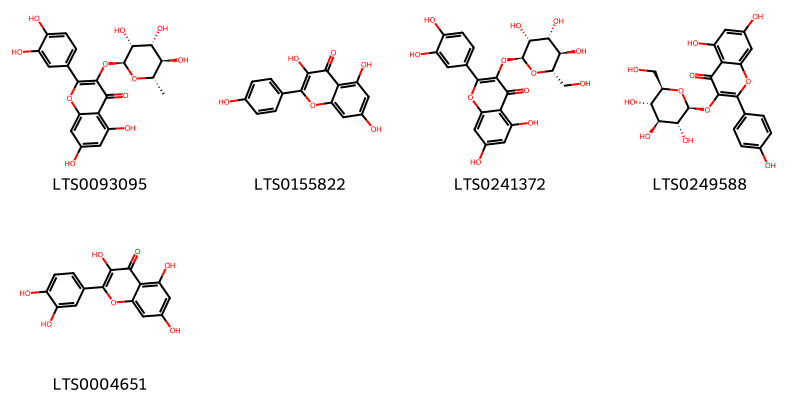{ width=100% }
    <figcaption>Hình ảnh cấu trúc hóa học của 5 hoạt chất thuộc nhóm Flavonoids gồm ['quercitrin (LTS0093095)', 'kaempherol (LTS0155822)', '2-(3,4-dihydroxyphenyl)-5,7-dihydroxy-3-{[(2s,3r,4r,5r,6s)-3,4,5-trihydroxy-6-(hydroxymethyl)oxan-2-yl]oxy}chromen-4-one (LTS0241372)', 'astragalin (LTS0249588)', 'quercetin (LTS0004651)'].</figcaption>
</figure>
#### Nhóm Prenol lipids
<figure markdown="span">
    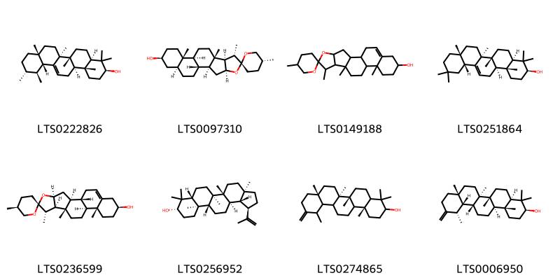{ width=100% }
    <figcaption>Hình ảnh cấu trúc hóa học của 8 hoạt chất thuộc nhóm Prenol lipids gồm ['amyrin (LTS0222826)', 'tigogenin (LTS0097310)', 'diosgenin (LTS0149188)', 'β-amyrin (LTS0251864)', 'yamogenin (LTS0236599)', 'lupeol (LTS0256952)', '(6ar,6br,8ar,14br)-4,4,6a,6b,8a,12,14b-heptamethyl-11-methylidene-hexadecahydropicen-3-ol (LTS0274865)', 'taraxasterol (LTS0006950)'].</figcaption>
</figure>
#### Nhóm Steroids and steroid derivatives
<figure markdown="span">
    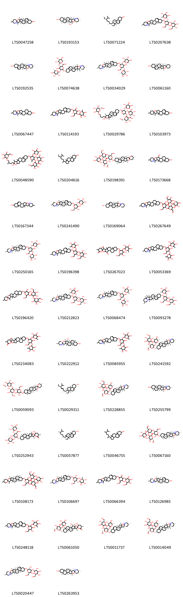{ width=100% }
    <figcaption>Hình ảnh cấu trúc hóa học của 55 hoạt chất thuộc nhóm Steroids and steroid derivatives gồm ["(1s,2s,4s,6r,8s,9s,12r,13r)-5',7,9,13-tetramethyl-5-oxaspiro[pentacyclo[10.8.0.0²,⁹.0⁴,⁸.0¹³,¹⁸]icosane-6,2'-piperidin]-18-en-16-ol (LTS0047258)", "(1r,2s,3r,4s,5'r,6r,7s,8r,9s,12s,13s,16s,18s)-5',7,9,13-tetramethyl-5-oxaspiro[pentacyclo[10.8.0.0²,⁹.0⁴,⁸.0¹³,¹⁸]icosane-6,2'-piperidine]-3,16-diol (LTS0193153)", 'stigmast-5-en-3-ol (LTS0071224)', "(2s,3r,4s,5s,6r)-2-{[(2r,3s,4s,5r,6r)-3-hydroxy-2-(hydroxymethyl)-6-[(9s,13r,16s)-5',7,9,13-tetramethyl-5-oxaspiro[pentacyclo[10.8.0.0²,⁹.0⁴,⁸.0¹³,¹⁸]icosane-6,2'-piperidin]-18-eneoxy]-5-{[(2s,3r,4r,5r,6s)-3,4,5-trihydroxy-6-methyloxan-2-yl]oxy}oxan-4-yl]oxy}-6-(hydroxymethyl)oxane-3,4,5-triol (LTS0207638)", 'solasodine (LTS0192535)', 'solamargine (LTS0074638)', "(2s,3r,4r,5r,6s)-2-{[(2r,3s,4s,5r,6r)-4-hydroxy-2-(hydroxymethyl)-6-[(1s,2s,4s,5's,6s,7s,8r,9s,12s,13r,16s)-5',7,9,13-tetramethyl-5-oxaspiro[pentacyclo[10.8.0.0²,⁹.0⁴,⁸.0¹³,¹⁸]icosane-6,2'-piperidin]-18-eneoxy]-5-{[(2s,3r,4r,5r,6s)-3,4,5-trihydroxy-6-methyloxan-2-yl]oxy}oxan-3-yl]oxy}-6-methyloxane-3,4,5-triol (LTS0034029)", "(1s,1's,2's,4r,4's,7's,8'r,9's,12's,13'r,16's)-4,7',9',13'-tetramethyl-5'-oxaspiro[cyclohexane-1,6'-pentacyclo[10.8.0.0²,⁹.0⁴,⁸.0¹³,¹⁸]icosan]-18'-en-16'-ol (LTS0061160)", 'tomatidine (LTS0067447)', "2-{[4,5-dihydroxy-2-(hydroxymethyl)-6-{5',7,9,13-tetramethyl-5-oxaspiro[pentacyclo[10.8.0.0²,⁹.0⁴,⁸.0¹³,¹⁸]icosane-6,2'-piperidin]-18-eneoxy}oxan-3-yl]oxy}-6-methyloxane-3,4,5-triol (LTS0114193)", '(2s,3s,4r,5s,6s)-2-{[(2s,3s,4r,5r,6r)-6-{[(1s,2s,4s,6r,7s,8r,9s,12s,13r,16s)-6-hydroxy-7,9,13-trimethyl-6-[(3s)-3-methyl-4-{[(2r,3s,4r,5r,6s)-3,4,5-trihydroxy-6-(hydroxymethyl)oxan-2-yl]oxy}butyl]-5-oxapentacyclo[10.8.0.0²,⁹.0⁴,⁸.0¹³,¹⁸]icos-18-en-16-yl]oxy}-2-methyl-4-{[(2s,3s,4r,5s,6s)-3,4,5-trihydroxy-6-(hydroxymethyl)oxan-2-yl]oxy}-5-{[(2s,3r,4s,5s)-3,4,5-trihydroxyoxan-2-yl]oxy}oxan-3-yl]oxy}-6-(hydroxymethyl)oxane-3,4,5-triol (LTS0029786)', "4,7',9',13'-tetramethyl-5'-oxaspiro[cyclohexane-1,6'-pentacyclo[10.8.0.0²,⁹.0⁴,⁸.0¹³,¹⁸]icosan]-18'-en-16'-ol (LTS0103973)", '2-[(6-{[6-hydroxy-7,9,13-trimethyl-6-(3-methyl-4-{[3,4,5-trihydroxy-6-(hydroxymethyl)oxan-2-yl]oxy}butyl)-5-oxapentacyclo[10.8.0.0²,⁹.0⁴,⁸.0¹³,¹⁸]icos-18-en-16-yl]oxy}-2-methyl-4-{[3,4,5-trihydroxy-6-(hydroxymethyl)oxan-2-yl]oxy}-5-[(3,4,5-trihydroxyoxan-2-yl)oxy]oxan-3-yl)oxy]-6-(hydroxymethyl)oxane-3,4,5-triol (LTS0048590)', 'stigmast-5-en-3-ol, (3β)- (LTS0204616)', "(2s,3r,4s,5s,6r)-2-{[(2s,3r,4s,5r,6r)-2-{[(2r,3r,4r,5r,6r)-4,5-dihydroxy-2-(hydroxymethyl)-6-[(1'r,2r,2's,4's,5r,7's,8'r,9's,12's,13's,16's,18's)-5,7',9',13'-tetramethyl-5'-oxaspiro[oxane-2,6'-pentacyclo[10.8.0.0²,⁹.0⁴,⁸.0¹³,¹⁸]icosane]oxy]oxan-3-yl]oxy}-5-hydroxy-6-(hydroxymethyl)-4-{[(2s,3r,4s,5r)-3,4,5-trihydroxyoxan-2-yl]oxy}oxan-3-yl]oxy}-6-(hydroxymethyl)oxane-3,4,5-triol (LTS0198391)", "5',7,9,13-tetramethyl-5-oxaspiro[pentacyclo[10.8.0.0²,⁹.0⁴,⁸.0¹³,¹⁸]icosane-6,2'-piperidine]-3,16-diol (LTS0173668)", "5',9,13-trimethyl-5-oxaspiro[pentacyclo[10.8.0.0²,⁹.0⁴,⁸.0¹³,¹⁸]icosane-6,2'-piperidin]-18-en-16-ol (LTS0167344)", "(2s,3r,4r,5r,6s)-2-{[(2r,3r,4s,5s,6r)-4,5-dihydroxy-6-(hydroxymethyl)-2-[(1s,2s,4s,5's,6s,7s,8r,9s,12s,13r,16s)-5',7,9,13-tetramethyl-5-oxaspiro[pentacyclo[10.8.0.0²,⁹.0⁴,⁸.0¹³,¹⁸]icosane-6,2'-piperidin]-18-eneoxy]oxan-3-yl]oxy}-6-methyloxane-3,4,5-triol (LTS0241490)", "(1s,2s,4s,5'r,6r,8r,9s,12s,13r,16s)-5',9,13-trimethyl-5-oxaspiro[pentacyclo[10.8.0.0²,⁹.0⁴,⁸.0¹³,¹⁸]icosane-6,2'-piperidin]-18-en-16-ol (LTS0169064)", "2-[(2-{[4,5-dihydroxy-2-(hydroxymethyl)-6-{5',7,9,13-tetramethyl-5-oxaspiro[pentacyclo[10.8.0.0²,⁹.0⁴,⁸.0¹³,¹⁸]icosane-6,2'-piperidine]oxy}oxan-3-yl]oxy}-5-hydroxy-6-(hydroxymethyl)-4-[(3,4,5-trihydroxyoxan-2-yl)oxy]oxan-3-yl)oxy]-6-(hydroxymethyl)oxane-3,4,5-triol (LTS0267649)", "(2s,3r,4r,5r,6s)-2-{[(2r,3r,4s,5r,6r)-4-hydroxy-2-(hydroxymethyl)-6-[(1s,2s,4s,5's,6s,7s,8r,9s,12s,13r,16s)-5',7,9,13-tetramethyl-5-oxaspiro[pentacyclo[10.8.0.0²,⁹.0⁴,⁸.0¹³,¹⁸]icosane-6,2'-piperidin]-18-eneoxy]-5-{[(2s,3r,4r,5r,6s)-3,4,5-trihydroxy-6-methyloxan-2-yl]oxy}oxan-3-yl]oxy}-6-methyloxane-3,4,5-triol (LTS0250165)", "2-{[3-hydroxy-2-(hydroxymethyl)-6-{5',7,9,13-tetramethyl-5-oxaspiro[pentacyclo[10.8.0.0²,⁹.0⁴,⁸.0¹³,¹⁸]icosane-6,2'-piperidin]-18-eneoxy}-5-[(3,4,5-trihydroxy-6-methyloxan-2-yl)oxy]oxan-4-yl]oxy}-6-(hydroxymethyl)oxane-3,4,5-triol (LTS0196398)", "16'-{[4,5-dihydroxy-6-(hydroxymethyl)-3-[(3,4,5-trihydroxy-6-methyloxan-2-yl)oxy]oxan-2-yl]oxy}-3,3'-dihydroxy-5,7',9',13'-tetramethyl-5'-oxaspiro[oxane-2,6'-pentacyclo[10.8.0.0²,⁹.0⁴,⁸.0¹³,¹⁸]icosan]-6-one (LTS0267023)", "2-{[4-hydroxy-2-(hydroxymethyl)-6-{5',7,9,13-tetramethyl-5-oxaspiro[pentacyclo[10.8.0.0²,⁹.0⁴,⁸.0¹³,¹⁸]icosane-6,2'-piperidine]oxy}-5-[(3,4,5-trihydroxy-6-methyloxan-2-yl)oxy]oxan-3-yl]oxy}-6-methyloxane-3,4,5-triol (LTS0053369)", "2-[(2-{[4,5-dihydroxy-2-(hydroxymethyl)-6-{5,7',9',13'-tetramethyl-5'-oxaspiro[oxane-2,6'-pentacyclo[10.8.0.0²,⁹.0⁴,⁸.0¹³,¹⁸]icosane]oxy}oxan-3-yl]oxy}-4,5-dihydroxy-6-(hydroxymethyl)oxan-3-yl)oxy]-6-(hydroxymethyl)oxane-3,4,5-triol (LTS0196420)", 'α-solamarine (LTS0212823)', "(2s,3r,4r,5r,6s)-2-{[(2r,3s,4s,5r,6r)-4-hydroxy-2-(hydroxymethyl)-6-[(1s,2s,4s,5's,6s,7s,8r,9s,12s,13r,16s)-5',7,9,13-tetramethyl-5-oxaspiro[pentacyclo[10.8.0.0²,⁹.0⁴,⁸.0¹³,¹⁸]icosane-6,2'-piperidin]-18-eneoxy]-5-{[(2r,3r,4s,5s,6r)-3,4,5-trihydroxy-6-methyloxan-2-yl]oxy}oxan-3-yl]oxy}-6-methyloxane-3,4,5-triol (LTS0068474)", 'solanine (LTS0093278)', "3-hydroxy-16'-{[4-hydroxy-6-(hydroxymethyl)-3,5-bis[(3,4,5-trihydroxy-6-methyloxan-2-yl)oxy]oxan-2-yl]oxy}-5,7',9',13'-tetramethyl-5'-oxaspiro[oxane-2,6'-pentacyclo[10.8.0.0²,⁹.0⁴,⁸.0¹³,¹⁸]icosan]-6-one (LTS0234083)", "(1r,2s,3r,4r,5's,6s,7s,8r,9s,12s,13s,16s,18s)-5',7,9,13-tetramethyl-5-oxaspiro[pentacyclo[10.8.0.0²,⁹.0⁴,⁸.0¹³,¹⁸]icosane-6,2'-piperidine]-3,16-diol (LTS0222912)", "2-{[4-hydroxy-2-(hydroxymethyl)-6-{5',7,9,13-tetramethyl-5-oxaspiro[pentacyclo[10.8.0.0²,⁹.0⁴,⁸.0¹³,¹⁸]icosane-6,2'-piperidin]-18-eneoxy}-5-[(3,4,5-trihydroxy-6-methyloxan-2-yl)oxy]oxan-3-yl]oxy}-6-methyloxane-3,4,5-triol (LTS0085955)", "(2r,3r,4r,5r,6s)-2-{[(2r,3r,4s,5s,6r)-5-hydroxy-6-(hydroxymethyl)-2-[(1s,2s,4s,5'r,6s,7s,8r,9s,12s,13r,16s)-5',7,9,13-tetramethyl-5-oxaspiro[pentacyclo[10.8.0.0²,⁹.0⁴,⁸.0¹³,¹⁸]icosane-6,2'-piperidin]-18-eneoxy]-4-{[(2s,3r,4s,5s,6r)-3,4,5-trihydroxy-6-(hydroxymethyl)oxan-2-yl]oxy}oxan-3-yl]oxy}-6-methyloxane-3,4,5-triol (LTS0241592)", "(2s,3r,4s,5s,6r)-2-{[(2s,3r,4s,5s,6r)-2-{[(2r,3r,4r,5r,6r)-4,5-dihydroxy-2-(hydroxymethyl)-6-[(1'r,2r,2's,4's,5r,7's,8'r,9's,12's,13's,16's,18's)-5,7',9',13'-tetramethyl-5'-oxaspiro[oxane-2,6'-pentacyclo[10.8.0.0²,⁹.0⁴,⁸.0¹³,¹⁸]icosane]oxy]oxan-3-yl]oxy}-4,5-dihydroxy-6-(hydroxymethyl)oxan-3-yl]oxy}-6-(hydroxymethyl)oxane-3,4,5-triol (LTS0059093)", 'phytosterol (LTS0029311)', "(2s,3r,4r,5r,6s)-2-{[(2r,3r,4s,5s,6r)-5-hydroxy-6-(hydroxymethyl)-2-[(1s,2s,4s,5'r,6r,7s,8r,9s,12s,13r,16s)-5',7,9,13-tetramethyl-5-oxaspiro[pentacyclo[10.8.0.0²,⁹.0⁴,⁸.0¹³,¹⁸]icosane-6,2'-piperidin]-18-eneoxy]-4-{[(2s,3r,4s,5s,6r)-3,4,5-trihydroxy-6-(hydroxymethyl)oxan-2-yl]oxy}oxan-3-yl]oxy}-6-methyloxane-3,4,5-triol (LTS0228855)", "(1r,2s,4s,5'r,6r,7s,8r,9s,12s,13s,16s,18s)-5',7,9,13-tetramethyl-5-oxaspiro[pentacyclo[10.8.0.0²,⁹.0⁴,⁸.0¹³,¹⁸]icosane-6,2'-piperidin]-16-ol (LTS0255799)", "(1'r,2r,2's,3s,4's,5r,7's,8'r,9's,12's,13's,16's,18's)-3-hydroxy-16'-{[(2r,3r,4s,5s,6r)-4-hydroxy-6-(hydroxymethyl)-3,5-bis({[(2s,3r,4r,5r,6s)-3,4,5-trihydroxy-6-methyloxan-2-yl]oxy})oxan-2-yl]oxy}-5,7',9',13'-tetramethyl-5'-oxaspiro[oxane-2,6'-pentacyclo[10.8.0.0²,⁹.0⁴,⁸.0¹³,¹⁸]icosan]-6-one (LTS0252943)", '(1r,3as,3bs,7s,9bs)-1-[(2r,5r)-5,6-dimethylheptan-2-yl]-9a,11a-dimethyl-1h,2h,3h,3ah,3bh,4h,6h,7h,8h,9h,9bh,10h,11h-cyclopenta[a]phenanthren-7-ol (LTS0057877)', 'campesterol (LTS0046755)', "(2s,3r,4s,5s,6r)-2-{[(2s,3r,4s,5r,6r)-2-{[(2r,3r,4r,5r,6r)-4,5-dihydroxy-2-(hydroxymethyl)-6-[(1r,2s,4s,5'r,6r,7s,8r,9s,12s,13s,16s,18s)-5',7,9,13-tetramethyl-5-oxaspiro[pentacyclo[10.8.0.0²,⁹.0⁴,⁸.0¹³,¹⁸]icosane-6,2'-piperidine]oxy]oxan-3-yl]oxy}-5-hydroxy-6-(hydroxymethyl)-4-{[(2s,3r,4s,5r)-3,4,5-trihydroxyoxan-2-yl]oxy}oxan-3-yl]oxy}-6-(hydroxymethyl)oxane-3,4,5-triol (LTS0067160)", "2-[(2-{[4,5-dihydroxy-2-(hydroxymethyl)-6-[(1'r,2r,2's,4's,8's,9's,12'r,13's,18's)-5,7',9',13'-tetramethyl-5'-oxaspiro[oxane-2,6'-pentacyclo[10.8.0.0²,⁹.0⁴,⁸.0¹³,¹⁸]icosane]oxy]oxan-3-yl]oxy}-5-hydroxy-6-(hydroxymethyl)-4-[(3,4,5-trihydroxyoxan-2-yl)oxy]oxan-3-yl)oxy]-6-(hydroxymethyl)oxane-3,4,5-triol (LTS0108173)", "(2s,3r,4r,5r,6s)-2-{[(2r,3s,4r,5r,6r)-4,5-dihydroxy-2-(hydroxymethyl)-6-[(1s,2s,4s,5's,6s,7s,8r,9s,12s,13r,16s)-5',7,9,13-tetramethyl-5-oxaspiro[pentacyclo[10.8.0.0²,⁹.0⁴,⁸.0¹³,¹⁸]icosane-6,2'-piperidin]-18-eneoxy]oxan-3-yl]oxy}-6-methyloxane-3,4,5-triol (LTS0106697)", "2-{[3,5-dihydroxy-2-(hydroxymethyl)-6-{5',7,9,13-tetramethyl-5-oxaspiro[pentacyclo[10.8.0.0²,⁹.0⁴,⁸.0¹³,¹⁸]icosane-6,2'-piperidin]-18-eneoxy}oxan-4-yl]oxy}-6-(hydroxymethyl)oxane-3,4,5-triol (LTS0066394)", "(1s,2s,4s,5's,6s,7s,8r,9s,12s,13r,16s)-5',7,9,13-tetramethyl-5-oxaspiro[pentacyclo[10.8.0.0²,⁹.0⁴,⁸.0¹³,¹⁸]icosane-6,2'-piperidin]-18-en-16-ol (LTS0126985)", "2-{[4,5-dihydroxy-6-(hydroxymethyl)-2-{5',7,9,13-tetramethyl-5-oxaspiro[pentacyclo[10.8.0.0²,⁹.0⁴,⁸.0¹³,¹⁸]icosane-6,2'-piperidin]-18-eneoxy}oxan-3-yl]oxy}-6-methyloxane-3,4,5-triol (LTS0248118)", "(1'r,2r,2's,3s,3'r,4's,5r,7's,8'r,9's,12's,13's,16's,18's)-16'-{[(2r,3r,4s,5s,6r)-4,5-dihydroxy-6-(hydroxymethyl)-3-{[(2s,3r,4r,5r,6s)-3,4,5-trihydroxy-6-methyloxan-2-yl]oxy}oxan-2-yl]oxy}-3,3'-dihydroxy-5,7',9',13'-tetramethyl-5'-oxaspiro[oxane-2,6'-pentacyclo[10.8.0.0²,⁹.0⁴,⁸.0¹³,¹⁸]icosan]-6-one (LTS0061050)", "(2s,3r,4r,5r,6s)-2-{[(2r,3r,4s,5s,6r)-5-hydroxy-6-(hydroxymethyl)-2-[(1s,2r,4r,5'r,6r,7r,8s,9s,12s,13r,16r)-5',7,9,13-tetramethyl-5-oxaspiro[pentacyclo[10.8.0.0²,⁹.0⁴,⁸.0¹³,¹⁸]icosane-6,2'-piperidin]-18-eneoxy]-4-{[(2s,3r,4s,5s,6r)-3,4,5-trihydroxy-6-(hydroxymethyl)oxan-2-yl]oxy}oxan-3-yl]oxy}-6-methyloxane-3,4,5-triol (LTS0011737)", "(2s,3r,4r,5r,6s)-2-{[(2r,4s,5s,6r)-5-hydroxy-6-(hydroxymethyl)-2-[(1s,2s,4s,5'r,6r,7s,8r,9s,12s,13r,16s)-5',7,9,13-tetramethyl-5-oxaspiro[pentacyclo[10.8.0.0²,⁹.0⁴,⁸.0¹³,¹⁸]icosane-6,2'-piperidin]-18-eneoxy]-4-{[(2s,3r,4s,5s,6r)-3,4,5-trihydroxy-6-(hydroxymethyl)oxan-2-yl]oxy}oxan-3-yl]oxy}-6-methyloxane-3,4,5-triol (LTS0014049)", "(2s,3r,4s,5s,6r)-2-{[(2r,3s,4s,5r,6r)-3,5-dihydroxy-2-(hydroxymethyl)-6-[(1s,2s,4s,5's,6s,7s,8r,9s,12s,13r,16s)-5',7,9,13-tetramethyl-5-oxaspiro[pentacyclo[10.8.0.0²,⁹.0⁴,⁸.0¹³,¹⁸]icosane-6,2'-piperidin]-18-eneoxy]oxan-4-yl]oxy}-6-(hydroxymethyl)oxane-3,4,5-triol (LTS0020447)", "(1r,4s,5'r,6r,7s,9s,12s,13s,16s,18s)-5',7,9,13-tetramethyl-5-oxaspiro[pentacyclo[10.8.0.0²,⁹.0⁴,⁸.0¹³,¹⁸]icosane-6,2'-piperidin]-16-ol (LTS0263953)", 'α-solanine (LTS0110548)', "2-[(2-{[4,5-dihydroxy-2-(hydroxymethyl)-6-{5,7',9',13'-tetramethyl-5'-oxaspiro[oxane-2,6'-pentacyclo[10.8.0.0²,⁹.0⁴,⁸.0¹³,¹⁸]icosane]oxy}oxan-3-yl]oxy}-5-hydroxy-6-(hydroxymethyl)-4-[(3,4,5-trihydroxyoxan-2-yl)oxy]oxan-3-yl)oxy]-6-(hydroxymethyl)oxane-3,4,5-triol (LTS0224340)", 'solassodine (LTS0021053)', "(2s,3r,4r,5r,6s)-2-{[(2r,3s,4r,5r,6r)-4-hydroxy-2-(hydroxymethyl)-6-[(1s,2s,4r,5'r,6s,7s,8r,9s,12s,13r,16s)-5',7,9,13-tetramethyl-5-oxaspiro[pentacyclo[10.8.0.0²,⁹.0⁴,⁸.0¹³,¹⁸]icosane-6,2'-piperidin]-18-eneoxy]-5-{[(2s,3r,4r,5r,6s)-3,4,5-trihydroxy-6-methyloxan-2-yl]oxy}oxan-3-yl]oxy}-6-methyloxane-3,4,5-triol (LTS0252383)", "(2s,3s,4s,5s,6r)-2-{[(2r,3r,4s,5r,6r)-4-hydroxy-2-(hydroxymethyl)-6-[(1r,2s,4s,5'r,6r,7s,8r,9s,12s,13s,16s,18s)-5',7,9,13-tetramethyl-5-oxaspiro[pentacyclo[10.8.0.0²,⁹.0⁴,⁸.0¹³,¹⁸]icosane-6,2'-piperidine]oxy]-5-{[(2s,3s,4s,5s,6r)-3,4,5-trihydroxy-6-methyloxan-2-yl]oxy}oxan-3-yl]oxy}-6-methyloxane-3,4,5-triol (LTS0035171)"].</figcaption>
</figure>

---

### Dược dân tộc học

Danh sách các quốc gia có sử dụng *Solanum dulcamara* trong điều trị các bệnh. 

| Country   | Disease                                                                              | Bệnh                                                                                              |
|:----------|:-------------------------------------------------------------------------------------|:--------------------------------------------------------------------------------------------------|
| China     | Antidote, Refrigerant                                                                | Thuốc giải độc, chất làm lạnh                                                                     |
| Elsewhere | Analgesic, Sedative, Poison                                                          | Thuốc giảm đau, thuốc an thần, thuốc độc                                                          |
| Eurasia   | Diaphoretic, Hypnotic, Diuretic, Sedative                                            | Thuốc lợi tiểu, thôi miên, lợi tiểu, an thần                                                      |
| Iraq      | Anaphrodisiac, Emetic                                                                | Anaphrodisiac, Emetic                                                                             |
| Turkey    | Diuretic, Laxative, Narcotic, Poison, Stimulant, Sudorific, Cardiotonic, Expectorant | Thuốc lợi tiểu, nhuận tràng, ma túy, chất độc, chất kích thích, gây ngạt mồ hôi, cardiotonic, đờm |
| ain       | Narcotic                                                                             | Thuốc gây ngủ, gây mê                                                                             |

---

---
## Solanum ectabile
### Thông tin về thực vật

!!! info "Phân loại thực vật của *N/A* từ GIBF:"
    - **Kingdom:** Plantae
    - **Phylum:** Tracheophyta
    - **Order:** Solanales
    - **Family:** Solanaceae
    - **Genus:** Solanum
    - **Species:** *N/A*

 

| Label (VI)   | Label (EN)   | Scientific Name   | Descriptions (VI)   | Descriptions (EN)   | Also Known As (VI)   | Also Known As (EN)                                                                    |
|:-------------|:-------------|:------------------|:--------------------|:--------------------|:---------------------|:--------------------------------------------------------------------------------------|
| N/A          | N/A          | Solanum dulcamara | loài thực vật       | species of plant    | ['']                 | ['bittersweet', 'bittersweet nightshade', 'climbing nightshade', 'bittersweet woody'] |

#### Phân bố trên thế giới

**Từ CSDL GIBF** Australia, Japan, Argentina, Palestine, State of, Israel, Canada, Puerto Rico, Luxembourg, Cyprus, Chinese Taipei, Spain, Türkiye, Portugal, United States of America, Uruguay, Chile, Greece, South Africa, Montenegro, Thailand, Brazil, Mexico, France, Peru, Viet Nam, United Kingdom of Great Britain and Northern Ireland, Ecuador, Colombia, Costa Rica, India, Indonesia, New Zealand

#### Phân bố tại Việt Nam

**Từ CSDL GIBF**: Lâm Đồng

---
### Thành phần hóa học
        
- Theo cơ sở dữ liệu lotus: Từ loài *N/A* đã phân lập và xác định được Chưa có hoạt chất nào được phân lập. hoạt chất thuộc về các nhóm Không có hoạt chất nào được phân lập. 

Không có hình ảnh nào được tạo ra

---

### Dược dân tộc học

Danh sách các quốc gia có sử dụng *N/A* trong điều trị các bệnh. 

| Country   | Disease   | Bệnh     |
|:----------|:----------|:---------|
| Brazil    | Poison    | Chất độc |

---

---
## Solanum elaeagnifolium
### Thông tin về thực vật

!!! info "Phân loại thực vật của *Solanum elaeagnifolium* từ GIBF:"
    - **Kingdom:** Plantae
    - **Phylum:** Tracheophyta
    - **Order:** Solanales
    - **Family:** Solanaceae
    - **Genus:** Solanum
    - **Species:** *Solanum elaeagnifolium*

 

| Label (VI)   | Label (EN)   | Scientific Name        | Descriptions (VI)   | Descriptions (EN)   | Also Known As (VI)   | Also Known As (EN)   |
|:-------------|:-------------|:-----------------------|:--------------------|:--------------------|:---------------------|:---------------------|
| N/A          | N/A          | Solanum elaeagnifolium | loài thực vật       | species of plant    | ['']                 | ['']                 |

#### Phân bố trên thế giới

**Từ CSDL GIBF** Israel, South Africa, Australia, Cyprus, Argentina, Botswana, United States of America, Mexico, Greece

#### Phân bố tại Việt Nam

**Từ CSDL GIBF**: Không có ghi nhận ở Việt Nam

---
### Thành phần hóa học
        
- Theo cơ sở dữ liệu lotus: Từ loài *Solanum elaeagnifolium* đã phân lập và xác định được 4 hoạt chất thuộc về các nhóm Flavonoids, Steroids and steroid derivatives. 

|    | chemicalTaxonomyClassyfireClass   |   smiles_count |
|---:|:----------------------------------|---------------:|
|  0 | Flavonoids                        |              2 |
|  1 | Steroids and steroid derivatives  |              2 |

#### Nhóm Flavonoids
<figure markdown="span">
    { width=100% }
    <figcaption>Hình ảnh cấu trúc hóa học của 2 hoạt chất thuộc nhóm Flavonoids gồm ['kaempherol (LTS0155822)', 'astragalin (LTS0249588)'].</figcaption>
</figure>
#### Nhóm Steroids and steroid derivatives
<figure markdown="span">
    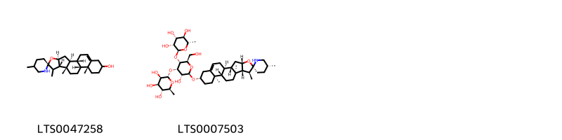{ width=100% }
    <figcaption>Hình ảnh cấu trúc hóa học của 2 hoạt chất thuộc nhóm Steroids and steroid derivatives gồm ["(1s,2s,4s,6r,8s,9s,12r,13r)-5',7,9,13-tetramethyl-5-oxaspiro[pentacyclo[10.8.0.0²,⁹.0⁴,⁸.0¹³,¹⁸]icosane-6,2'-piperidin]-18-en-16-ol (LTS0047258)", "(2s,3r,4r,5r,6s)-2-{[(2r,3r,4s,5r,6r)-3-hydroxy-6-(hydroxymethyl)-2-[(1s,2s,4s,5'r,6r,7s,8r,9s,12s,13r,16s)-5',7,9,13-tetramethyl-5-oxaspiro[pentacyclo[10.8.0.0²,⁹.0⁴,⁸.0¹³,¹⁸]icosane-6,2'-piperidin]-18-eneoxy]-5-{[(2s,3r,4r,5r,6s)-3,4,5-trihydroxy-6-methyloxan-2-yl]oxy}oxan-4-yl]oxy}-6-methyloxane-3,4,5-triol (LTS0007503)"].</figcaption>
</figure>

---

### Dược dân tộc học

Danh sách các quốc gia có sử dụng *Solanum elaeagnifolium* trong điều trị các bệnh. 

| Country    | Disease   | Bệnh       |
|:-----------|:----------|:-----------|
| US(Navajo) | Rennet    | Dạ múi khế |

---

---
## Solanum elaegnifolium
### Thông tin về thực vật

!!! info "Phân loại thực vật của *N/A* từ GIBF:"
    - **Kingdom:** Plantae
    - **Phylum:** Tracheophyta
    - **Order:** Solanales
    - **Family:** Solanaceae
    - **Genus:** Solanum
    - **Species:** *N/A*

 

| Label (VI)   | Label (EN)   | Scientific Name        | Descriptions (VI)   | Descriptions (EN)   | Also Known As (VI)   | Also Known As (EN)   |
|:-------------|:-------------|:-----------------------|:--------------------|:--------------------|:---------------------|:---------------------|
| N/A          | N/A          | Solanum elaeagnifolium | loài thực vật       | species of plant    | ['']                 | ['']                 |

#### Phân bố trên thế giới

**Từ CSDL GIBF** Australia, Japan, Argentina, Palestine, State of, Israel, Canada, Puerto Rico, Luxembourg, Cyprus, Chinese Taipei, Spain, Türkiye, Portugal, United States of America, Uruguay, Chile, Greece, South Africa, Montenegro, Thailand, Brazil, Mexico, France, Peru, Viet Nam, United Kingdom of Great Britain and Northern Ireland, Ecuador, Colombia, Costa Rica, India, Indonesia, New Zealand

#### Phân bố tại Việt Nam

**Từ CSDL GIBF**: Lâm Đồng

---
### Thành phần hóa học
        
- Theo cơ sở dữ liệu lotus: Từ loài *N/A* đã phân lập và xác định được Chưa có hoạt chất nào được phân lập. hoạt chất thuộc về các nhóm Không có hoạt chất nào được phân lập. 

Không có hình ảnh nào được tạo ra

---

### Dược dân tộc học

Danh sách các quốc gia có sử dụng *N/A* trong điều trị các bệnh. 

| Country   | Disease   | Bệnh       |
|:----------|:----------|:-----------|
| Elsewhere | Rennet    | Dạ múi khế |

---

---
## Solanum eleagnifolium
### Thông tin về thực vật

!!! info "Phân loại thực vật của *Solanum eleagnifolium* từ GIBF:"
    - **Kingdom:** Plantae
    - **Phylum:** Tracheophyta
    - **Order:** Solanales
    - **Family:** Solanaceae
    - **Genus:** Solanum
    - **Species:** *Solanum eleagnifolium*

 

| Label (VI)   | Label (EN)   | Scientific Name        | Descriptions (VI)   | Descriptions (EN)   | Also Known As (VI)   | Also Known As (EN)   |
|:-------------|:-------------|:-----------------------|:--------------------|:--------------------|:---------------------|:---------------------|
| N/A          | N/A          | Solanum elaeagnifolium | loài thực vật       | species of plant    | ['']                 | ['']                 |

#### Phân bố trên thế giới

**Từ CSDL GIBF** nan, Belgium, Spain, Argentina, United States of America, Mexico, Chile, Croatia, Greece

#### Phân bố tại Việt Nam

**Từ CSDL GIBF**: Không có ghi nhận ở Việt Nam

---
### Thành phần hóa học
        
- Theo cơ sở dữ liệu lotus: Từ loài *Solanum eleagnifolium* đã phân lập và xác định được Chưa có hoạt chất nào được phân lập. hoạt chất thuộc về các nhóm Không có hoạt chất nào được phân lập. 

Không có hình ảnh nào được tạo ra

---

### Dược dân tộc học

Danh sách các quốc gia có sử dụng *Solanum eleagnifolium* trong điều trị các bệnh. 

| Country   | Disease      | Bệnh             |
|:----------|:-------------|:-----------------|
| Mexico    | Sternutatory | (thuộc) xương ức |

---

---
## Solanum erianthum
### Thông tin về thực vật

!!! info "Phân loại thực vật của *Solanum erianthum* từ GIBF:"
    - **Kingdom:** Plantae
    - **Phylum:** Tracheophyta
    - **Order:** Solanales
    - **Family:** Solanaceae
    - **Genus:** Solanum
    - **Species:** *Solanum erianthum*

 

| Label (VI)   | Label (EN)   | Scientific Name   | Descriptions (VI)   | Descriptions (EN)   | Also Known As (VI)   | Also Known As (EN)   |
|:-------------|:-------------|:------------------|:--------------------|:--------------------|:---------------------|:---------------------|
| N/A          | N/A          | Solanum erianthum | loài thực vật       | species of plant    | ['']                 | ['']                 |

#### Phân bố trên thế giới

**Từ CSDL GIBF** Belize, Hong Kong, Thailand, Haiti, Colombia, Chinese Taipei, Honduras, India, Jamaica, United States of America, Cuba, Mexico, Dominican Republic, China

#### Phân bố tại Việt Nam

**Từ CSDL GIBF**: Không có ghi nhận ở Việt Nam

---
### Thành phần hóa học
        
- Theo cơ sở dữ liệu lotus: Từ loài *Solanum erianthum* đã phân lập và xác định được 1 hoạt chất thuộc về các nhóm Organonitrogen compounds. 

|    | chemicalTaxonomyClassyfireClass   |   smiles_count |
|---:|:----------------------------------|---------------:|
|  0 | Organonitrogen compounds          |              1 |

#### Nhóm Organonitrogen compounds
<figure markdown="span">
    { width=100% }
    <figcaption>Hình ảnh cấu trúc hóa học của 1 hoạt chất thuộc nhóm Organonitrogen compounds gồm ['(4-{[4-(dimethylamino)butyl]amino}butyl)dimethylamine (LTS0073100)'].</figcaption>
</figure>

---

### Dược dân tộc học

Danh sách các quốc gia có sử dụng *Solanum erianthum* trong điều trị các bệnh. 

| Country   | Disease             | Bệnh                        |
|:----------|:--------------------|:----------------------------|
| Australia | Poison              | Chất độc                    |
| Haiti     | Sedative, Sudorific | Thuốc an thần, gây ngạt thở |

---

---
## Solanum esuriale
### Thông tin về thực vật

!!! info "Phân loại thực vật của *Solanum esuriale* từ GIBF:"
    - **Kingdom:** Plantae
    - **Phylum:** Tracheophyta
    - **Order:** Solanales
    - **Family:** Solanaceae
    - **Genus:** Solanum
    - **Species:** *Solanum esuriale*

 

| Label (VI)   | Label (EN)   | Scientific Name   | Descriptions (VI)   | Descriptions (EN)   | Also Known As (VI)   | Also Known As (EN)   |
|:-------------|:-------------|:------------------|:--------------------|:--------------------|:---------------------|:---------------------|
| N/A          | N/A          | Solanum esuriale  |                     | species of plant    | ['']                 | ['']                 |

#### Phân bố trên thế giới

**Từ CSDL GIBF** Australia

#### Phân bố tại Việt Nam

**Từ CSDL GIBF**: Không có ghi nhận ở Việt Nam

---
### Thành phần hóa học
        
- Theo cơ sở dữ liệu lotus: Từ loài *Solanum esuriale* đã phân lập và xác định được Chưa có hoạt chất nào được phân lập. hoạt chất thuộc về các nhóm Không có hoạt chất nào được phân lập. 

Không có hình ảnh nào được tạo ra

---

### Dược dân tộc học

Danh sách các quốc gia có sử dụng *Solanum esuriale* trong điều trị các bệnh. 

| Country   | Disease   | Bệnh     |
|:----------|:----------|:---------|
| Elsewhere | Poison    | Chất độc |

---

---
## Solanum ferox
### Thông tin về thực vật

!!! info "Phân loại thực vật của *N/A* từ GIBF:"
    - **Kingdom:** Plantae
    - **Phylum:** Tracheophyta
    - **Order:** Solanales
    - **Family:** Solanaceae
    - **Genus:** Solanum
    - **Species:** *N/A*

 

| Label (VI)   | Label (EN)   | Scientific Name   | Descriptions (VI)   | Descriptions (EN)   | Also Known As (VI)   | Also Known As (EN)   |
|:-------------|:-------------|:------------------|:--------------------|:--------------------|:---------------------|:---------------------|
| N/A          | N/A          | Solanum ferox     |                     | species of plant    | ['']                 | ['Solanum ferox']    |
| N/A          | N/A          | Solanum ferox     | loài thực vật       | species of plants   | ['']                 | ['Solanum ferox']    |
| N/A          | N/A          | Solanum ferox     | loài thực vật       | species of plants   | ['']                 | ['Solanum ferox']    |
| N/A          | N/A          | Solanum ferox     | loài thực vật       | species of plants   | ['']                 | ['Solanum ferox']    |

#### Phân bố trên thế giới

**Từ CSDL GIBF** Australia, Japan, Argentina, Palestine, State of, Israel, Canada, Puerto Rico, Luxembourg, Cyprus, Chinese Taipei, Spain, Türkiye, Portugal, United States of America, Uruguay, Chile, Greece, South Africa, Montenegro, Thailand, Brazil, Mexico, France, Peru, Viet Nam, United Kingdom of Great Britain and Northern Ireland, Ecuador, Colombia, Costa Rica, India, Indonesia, New Zealand

#### Phân bố tại Việt Nam

**Từ CSDL GIBF**: Lâm Đồng

---
### Thành phần hóa học
        
- Theo cơ sở dữ liệu lotus: Từ loài *N/A* đã phân lập và xác định được Chưa có hoạt chất nào được phân lập. hoạt chất thuộc về các nhóm Không có hoạt chất nào được phân lập. 

Không có hình ảnh nào được tạo ra

---

### Dược dân tộc học

Danh sách các quốc gia có sử dụng *N/A* trong điều trị các bệnh. 

| Country   | Disease                 | Bệnh                   |
|:----------|:------------------------|:-----------------------|
| Elsewhere | Apertif, nan, Digestive | Khai vị, nan, tiêu hóa |

---

---
## Solanum hindsianum
### Thông tin về thực vật

!!! info "Phân loại thực vật của *Solanum hindsianum* từ GIBF:"
    - **Kingdom:** Plantae
    - **Phylum:** Tracheophyta
    - **Order:** Solanales
    - **Family:** Solanaceae
    - **Genus:** Solanum
    - **Species:** *Solanum hindsianum*

 

| Label (VI)   | Label (EN)   | Scientific Name    | Descriptions (VI)   | Descriptions (EN)   | Also Known As (VI)   | Also Known As (EN)   |
|:-------------|:-------------|:-------------------|:--------------------|:--------------------|:---------------------|:---------------------|
| N/A          | N/A          | Solanum hindsianum | loài thực vật       | species of plant    | ['']                 | ['']                 |

#### Phân bố trên thế giới

**Từ CSDL GIBF** United States of America, Mexico

#### Phân bố tại Việt Nam

**Từ CSDL GIBF**: Không có ghi nhận ở Việt Nam

---
### Thành phần hóa học
        
- Theo cơ sở dữ liệu lotus: Từ loài *Solanum hindsianum* đã phân lập và xác định được 2 hoạt chất thuộc về các nhóm Flavonoids. 

|    | chemicalTaxonomyClassyfireClass   |   smiles_count |
|---:|:----------------------------------|---------------:|
|  0 | Flavonoids                        |              2 |

#### Nhóm Flavonoids
<figure markdown="span">
    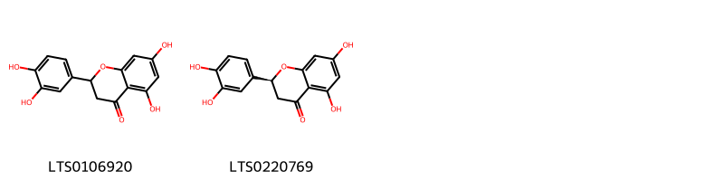{ width=100% }
    <figcaption>Hình ảnh cấu trúc hóa học của 2 hoạt chất thuộc nhóm Flavonoids gồm ['(+/-)-eriodictyol (LTS0106920)', 'eriodictyol (LTS0220769)'].</figcaption>
</figure>

---

### Dược dân tộc học

Danh sách các quốc gia có sử dụng *Solanum hindsianum* trong điều trị các bệnh. 

| Country   | Disease                  | Bệnh                     |
|:----------|:-------------------------|:-------------------------|
| Mexico    | Emmenagogue, Emmenagogue | Emmenagogue, Emmenagogue |

---

---
## Solanum hirtum
### Thông tin về thực vật

!!! info "Phân loại thực vật của *Solanum hirtum* từ GIBF:"
    - **Kingdom:** Plantae
    - **Phylum:** Tracheophyta
    - **Order:** Solanales
    - **Family:** Solanaceae
    - **Genus:** Solanum
    - **Species:** *Solanum hirtum*

 

| Label (VI)   | Label (EN)   | Scientific Name   | Descriptions (VI)   | Descriptions (EN)   | Also Known As (VI)   | Also Known As (EN)   |
|:-------------|:-------------|:------------------|:--------------------|:--------------------|:---------------------|:---------------------|
| N/A          | N/A          | Solanum hirtum    | loài thực vật       | species of plant    | ['']                 | ['']                 |

#### Phân bố trên thế giới

**Từ CSDL GIBF** Belize, Nicaragua, Ecuador, Trinidad and Tobago, Colombia, Guatemala, Costa Rica, Honduras, Mexico, El Salvador, Venezuela (Bolivarian Republic of)

#### Phân bố tại Việt Nam

**Từ CSDL GIBF**: Không có ghi nhận ở Việt Nam

---
### Thành phần hóa học
        
- Theo cơ sở dữ liệu lotus: Từ loài *Solanum hirtum* đã phân lập và xác định được Chưa có hoạt chất nào được phân lập. hoạt chất thuộc về các nhóm Không có hoạt chất nào được phân lập. 

Không có hình ảnh nào được tạo ra

---

### Dược dân tộc học

Danh sách các quốc gia có sử dụng *Solanum hirtum* trong điều trị các bệnh. 

| Country   | Disease   | Bệnh        |
|:----------|:----------|:------------|
| Venezuela | Hemostat  | Máy cầm máu |

---

---
## Solanum hypomalacophyllum
### Thông tin về thực vật

!!! info "Phân loại thực vật của *N/A* từ GIBF:"
    - **Kingdom:** Plantae
    - **Phylum:** Tracheophyta
    - **Order:** Solanales
    - **Family:** Solanaceae
    - **Genus:** Solanum
    - **Species:** *N/A*

 

| Label (VI)   | Label (EN)   | Scientific Name           | Descriptions (VI)   | Descriptions (EN)   | Also Known As (VI)   | Also Known As (EN)   |
|:-------------|:-------------|:--------------------------|:--------------------|:--------------------|:---------------------|:---------------------|
| N/A          | N/A          | Solanum hypomalacophyllum |                     |                     | ['']                 | ['']                 |

#### Phân bố trên thế giới

**Từ CSDL GIBF** Australia, Japan, Argentina, Palestine, State of, Israel, Canada, Puerto Rico, Luxembourg, Cyprus, Chinese Taipei, Spain, Türkiye, Portugal, United States of America, Uruguay, Chile, Greece, South Africa, Montenegro, Thailand, Brazil, Mexico, France, Peru, Viet Nam, United Kingdom of Great Britain and Northern Ireland, Ecuador, Colombia, Costa Rica, India, Indonesia, New Zealand

#### Phân bố tại Việt Nam

**Từ CSDL GIBF**: Lâm Đồng

---
### Thành phần hóa học
        
- Theo cơ sở dữ liệu lotus: Từ loài *N/A* đã phân lập và xác định được Chưa có hoạt chất nào được phân lập. hoạt chất thuộc về các nhóm Không có hoạt chất nào được phân lập. 

Không có hình ảnh nào được tạo ra

---

### Dược dân tộc học

Danh sách các quốc gia có sử dụng *N/A* trong điều trị các bệnh. 

| Country   | Disease   | Bệnh                  |
|:----------|:----------|:----------------------|
| Venezuela | Narcotic  | Thuốc gây ngủ, gây mê |

---

---
## Solanum incanum
### Thông tin về thực vật

!!! info "Phân loại thực vật của *Solanum incanum* từ GIBF:"
    - **Kingdom:** Plantae
    - **Phylum:** Tracheophyta
    - **Order:** Solanales
    - **Family:** Solanaceae
    - **Genus:** Solanum
    - **Species:** *Solanum incanum*

 

| Label (VI)   | Label (EN)   | Scientific Name   | Descriptions (VI)   | Descriptions (EN)   | Also Known As (VI)   | Also Known As (EN)   |
|:-------------|:-------------|:------------------|:--------------------|:--------------------|:---------------------|:---------------------|
| N/A          | N/A          | Solanum incanum   | loài thực vật       | species of plant    | ['']                 | ['Nightshade']       |

#### Phân bố trên thế giới

**Từ CSDL GIBF** United Arab Emirates, Cambodia, Somalia, Palestine, State of, Tanzania, United Republic of, Israel, Yemen, Togo, Nigeria, Chinese Taipei, Saudi Arabia, South Africa, Uganda, Oman, Iran (Islamic Republic of), Viet Nam, Eswatini, India, Djibouti, Kenya, Ethiopia

#### Phân bố tại Việt Nam

**Từ CSDL GIBF**: Không có ghi nhận ở Việt Nam

---
### Thành phần hóa học
        
- Theo cơ sở dữ liệu lotus: Từ loài *Solanum incanum* đã phân lập và xác định được 70 hoạt chất thuộc về các nhóm Flavonoids, Prenol lipids, Steroids and steroid derivatives, Cinnamic acids and derivatives, Purine nucleosides, Benzene and substituted derivatives, Organooxygen compounds. 

|    | chemicalTaxonomyClassyfireClass     |   smiles_count |
|---:|:------------------------------------|---------------:|
|  0 | Benzene and substituted derivatives |              1 |
|  1 | Cinnamic acids and derivatives      |              4 |
|  2 | Flavonoids                          |             23 |
|  3 | Organooxygen compounds              |              8 |
|  4 | Prenol lipids                       |              7 |
|  5 | Purine nucleosides                  |              2 |
|  6 | Steroids and steroid derivatives    |             24 |

#### Nhóm Benzene and substituted derivatives
<figure markdown="span">
    { width=100% }
    <figcaption>Hình ảnh cấu trúc hóa học của 1 hoạt chất thuộc nhóm Benzene and substituted derivatives gồm ['3,4-dihydroxybenzoic acid (LTS0018765)'].</figcaption>
</figure>
#### Nhóm Cinnamic acids and derivatives
<figure markdown="span">
    { width=100% }
    <figcaption>Hình ảnh cấu trúc hóa học của 4 hoạt chất thuộc nhóm Cinnamic acids and derivatives gồm ['3,4-dihydroxycinnamic acid (LTS0128050)', 'para-coumaric acid (LTS0266252)', 'caffeic acid (LTS0027481)', 'hydroxycinnamic acid (LTS0233023)'].</figcaption>
</figure>
#### Nhóm Flavonoids
<figure markdown="span">
    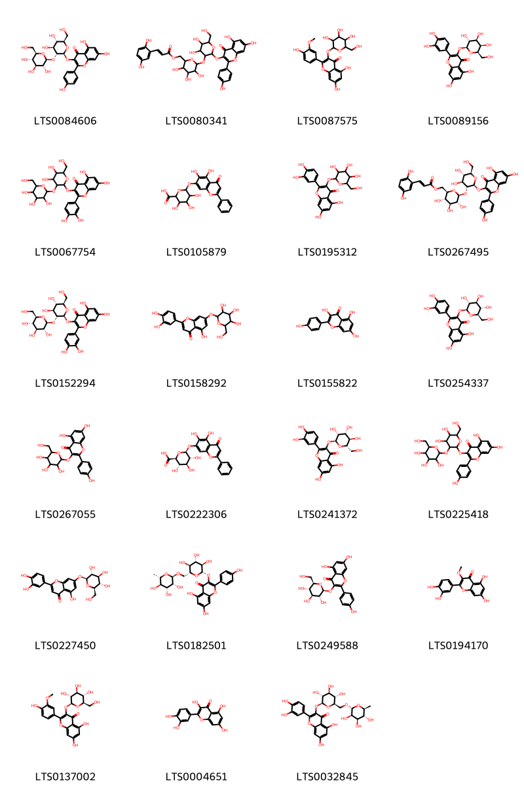{ width=100% }
    <figcaption>Hình ảnh cấu trúc hóa học của 23 hoạt chất thuộc nhóm Flavonoids gồm ['kaempferol 3-o-sophoroside (LTS0084606)', '{6-[(2-{[5,7-dihydroxy-2-(4-hydroxyphenyl)-4-oxochromen-3-yl]oxy}-4,5-dihydroxy-6-(hydroxymethyl)oxan-3-yl)oxy]-3,4,5-trihydroxyoxan-2-yl}methyl 3-(2,5-dihydroxyphenyl)prop-2-enoate (LTS0080341)', 'isorhamnetin 3-galactoside (LTS0087575)', 'hyperoside (LTS0089156)', '3-{[4,5-dihydroxy-6-(hydroxymethyl)-3-{[3,4,5-trihydroxy-6-(hydroxymethyl)oxan-2-yl]oxy}oxan-2-yl]oxy}-2-(3,4-dihydroxyphenyl)-5,7-dihydroxychromen-4-one (LTS0067754)', '6-[(5,6-dihydroxy-4-oxo-2-phenylchromen-7-yl)oxy]-3,4,5-trihydroxyoxane-2-carboxylic acid (LTS0105879)', '2-(3,4-dihydroxyphenyl)-5,7-dihydroxy-3-{[3,4,5-trihydroxy-6-(hydroxymethyl)oxan-2-yl]oxy}chromen-4-one (LTS0195312)', '[(2r,3s,4s,5r,6s)-6-{[(2s,3r,4s,5s,6r)-2-{[5,7-dihydroxy-2-(4-hydroxyphenyl)-4-oxochromen-3-yl]oxy}-4,5-dihydroxy-6-(hydroxymethyl)oxan-3-yl]oxy}-3,4,5-trihydroxyoxan-2-yl]methyl (2e)-3-(2,5-dihydroxyphenyl)prop-2-enoate (LTS0267495)', 'quosp (LTS0152294)', '2-(3,4-dihydroxyphenyl)-5-hydroxy-7-{[3,4,5-trihydroxy-6-(hydroxymethyl)oxan-2-yl]oxy}chromen-4-one (LTS0158292)', 'kaempherol (LTS0155822)', 'isoquercetin (LTS0254337)', 'trifolin (LTS0267055)', 'baicalin (LTS0222306)', '2-(3,4-dihydroxyphenyl)-5,7-dihydroxy-3-{[(2s,3r,4r,5r,6s)-3,4,5-trihydroxy-6-(hydroxymethyl)oxan-2-yl]oxy}chromen-4-one (LTS0241372)', '3-{[4,5-dihydroxy-6-(hydroxymethyl)-3-{[3,4,5-trihydroxy-6-(hydroxymethyl)oxan-2-yl]oxy}oxan-2-yl]oxy}-5,7-dihydroxy-2-(4-hydroxyphenyl)chromen-4-one (LTS0225418)', 'luteolin 7-o-glucoside (LTS0227450)', 'nictoflorin (LTS0182501)', 'astragalin (LTS0249588)', 'quercetin 3-methyl ether (LTS0194170)', 'isorhamnetin 3-o-glucoside (LTS0137002)', 'quercetin (LTS0004651)', '3-rutinosyl quercetin (LTS0032845)'].</figcaption>
</figure>
#### Nhóm Organooxygen compounds
<figure markdown="span">
    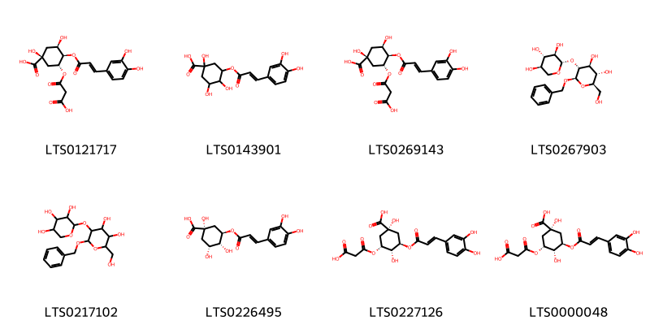{ width=100% }
    <figcaption>Hình ảnh cấu trúc hóa học của 8 hoạt chất thuộc nhóm Organooxygen compounds gồm ['(1s,3r,4r,5r)-3-[(2-carboxyacetyl)oxy]-4-{[(2e)-3-(3,4-dihydroxyphenyl)prop-2-enoyl]oxy}-1,5-dihydroxycyclohexane-1-carboxylic acid (LTS0121717)', '3-{[3-(3,4-dihydroxyphenyl)prop-2-enoyl]oxy}-1,4,5-trihydroxycyclohexane-1-carboxylic acid (LTS0143901)', '(1s,3r,4r,5r)-3-[(2-carboxyacetyl)oxy]-4-{[3-(3,4-dihydroxyphenyl)prop-2-enoyl]oxy}-1,5-dihydroxycyclohexane-1-carboxylic acid (LTS0269143)', '(2s,3r,4s,5r)-2-{[(2r,3r,4s,5s,6r)-2-(benzyloxy)-4,5-dihydroxy-6-(hydroxymethyl)oxan-3-yl]oxy}oxane-3,4,5-triol (LTS0267903)', '2-{[2-(benzyloxy)-4,5-dihydroxy-6-(hydroxymethyl)oxan-3-yl]oxy}oxane-3,4,5-triol (LTS0217102)', 'chlorogenic acid (LTS0226495)', '(1s,3r,4r,5r)-3-[(2-carboxyacetyl)oxy]-5-{[3-(3,4-dihydroxyphenyl)prop-2-enoyl]oxy}-1,4-dihydroxycyclohexane-1-carboxylic acid (LTS0227126)', '(1s,3r,4r,5r)-3-[(2-carboxyacetyl)oxy]-5-{[(2e)-3-(3,4-dihydroxyphenyl)prop-2-enoyl]oxy}-1,4-dihydroxycyclohexane-1-carboxylic acid (LTS0000048)'].</figcaption>
</figure>
#### Nhóm Prenol lipids
<figure markdown="span">
    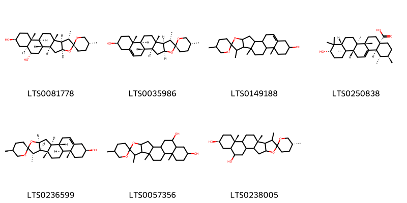{ width=100% }
    <figcaption>Hình ảnh cấu trúc hóa học của 7 hoạt chất thuộc nhóm Prenol lipids gồm ['chlorogenin (LTS0081778)', 'diosgenin (LTS0035986)', 'diosgenin (LTS0149188)', 'ursolic acid (LTS0250838)', 'yamogenin (LTS0236599)', "5,7',9',13'-tetramethyl-5'-oxaspiro[oxane-2,6'-pentacyclo[10.8.0.0²,⁹.0⁴,⁸.0¹³,¹⁸]icosane]-16',19'-diol (LTS0057356)", "(5r,9's,13'r,16's)-5,7',9',13'-tetramethyl-5'-oxaspiro[oxane-2,6'-pentacyclo[10.8.0.0²,⁹.0⁴,⁸.0¹³,¹⁸]icosane]-16',19'-diol (LTS0238005)"].</figcaption>
</figure>
#### Nhóm Purine nucleosides
<figure markdown="span">
    { width=100% }
    <figcaption>Hình ảnh cấu trúc hóa học của 2 hoạt chất thuộc nhóm Purine nucleosides gồm ['adenosine (LTS0052576)', 'adenosine (LTS0014061)'].</figcaption>
</figure>
#### Nhóm Steroids and steroid derivatives
<figure markdown="span">
    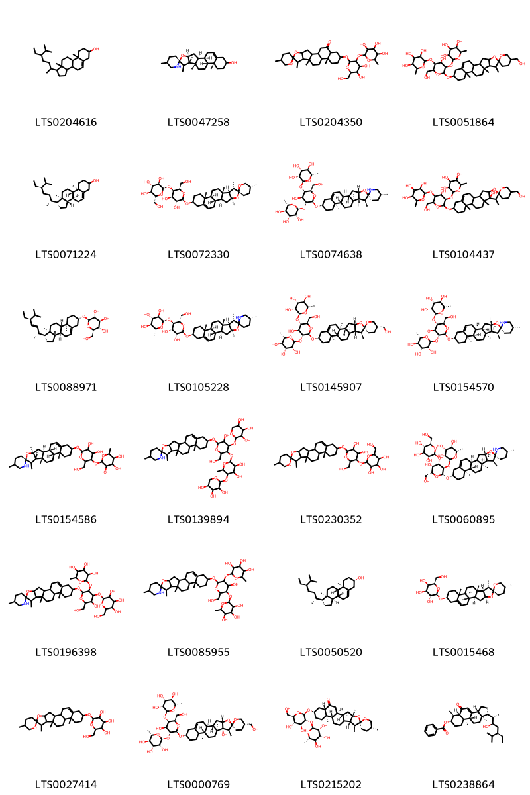{ width=100% }
    <figcaption>Hình ảnh cấu trúc hóa học của 24 hoạt chất thuộc nhóm Steroids and steroid derivatives gồm ['stigmast-5-en-3-ol, (3β)- (LTS0204616)', "(1s,2s,4s,6r,8s,9s,12r,13r)-5',7,9,13-tetramethyl-5-oxaspiro[pentacyclo[10.8.0.0²,⁹.0⁴,⁸.0¹³,¹⁸]icosane-6,2'-piperidin]-18-en-16-ol (LTS0047258)", "16'-{[4,5-dihydroxy-6-(hydroxymethyl)-3-[(3,4,5-trihydroxy-6-methyloxan-2-yl)oxy]oxan-2-yl]oxy}-5,7',9',13'-tetramethyl-5'-oxaspiro[oxane-2,6'-pentacyclo[10.8.0.0²,⁹.0⁴,⁸.0¹³,¹⁸]icosan]-19'-one (LTS0204350)", "2-{[4-hydroxy-2-(hydroxymethyl)-6-[5-(hydroxymethyl)-7',9',13'-trimethyl-5'-oxaspiro[oxane-2,6'-pentacyclo[10.8.0.0²,⁹.0⁴,⁸.0¹³,¹⁸]icosan]-18'-eneoxy]-5-[(3,4,5-trihydroxy-6-methyloxan-2-yl)oxy]oxan-3-yl]oxy}-6-methyloxane-3,4,5-triol (LTS0051864)", 'stigmast-5-en-3-ol (LTS0071224)', "(2s,3r,4s,5s,6r)-2-{[(2r,3r,4r,5r,6r)-4,5-dihydroxy-2-(hydroxymethyl)-6-[(1's,2r,2's,4's,5r,7's,8'r,9's,12's,13'r,16's)-5,7',9',13'-tetramethyl-5'-oxaspiro[oxane-2,6'-pentacyclo[10.8.0.0²,⁹.0⁴,⁸.0¹³,¹⁸]icosan]-18'-eneoxy]oxan-3-yl]oxy}-6-(hydroxymethyl)oxane-3,4,5-triol (LTS0072330)", 'solamargine (LTS0074638)', "2-{[4-hydroxy-2-(hydroxymethyl)-6-[5-(hydroxymethyl)-7',9',13'-trimethyl-5'-oxaspiro[oxane-2,6'-pentacyclo[10.8.0.0²,⁹.0⁴,⁸.0¹³,¹⁸]icosan]-18'-en-8'-oloxy]-5-[(3,4,5-trihydroxy-6-methyloxan-2-yl)oxy]oxan-3-yl]oxy}-6-methyloxane-3,4,5-triol (LTS0104437)", '(2r,3r,4s,5s,6r)-2-{[(1r,3as,3bs,7s,9ar,9bs,11ar)-1-[(2r,3e,5s)-5-ethyl-6-methylhept-3-en-2-yl]-9a,11a-dimethyl-1h,2h,3h,3ah,3bh,4h,6h,7h,8h,9h,9bh,10h,11h-cyclopenta[a]phenanthren-7-yl]oxy}-6-(hydroxymethyl)oxane-3,4,5-triol (LTS0088971)', "(2s,3r,4s,5s,6r)-2-{[(2s,3r,4s,5r,6r)-4,5-dihydroxy-2-(hydroxymethyl)-6-[(1s,2s,4s,5'r,7s,8r,9s,12s,13r,16s)-5',7,9,13-tetramethyl-5-oxaspiro[pentacyclo[10.8.0.0²,⁹.0⁴,⁸.0¹³,¹⁸]icosane-6,2'-piperidin]-18-eneoxy]oxan-3-yl]oxy}-6-methyloxane-3,4,5-triol (LTS0105228)", "(2s,3r,4r,5r,6s)-2-{[(2r,3s,4s,5r,6r)-4-hydroxy-2-(hydroxymethyl)-6-[(1's,2r,2's,4's,5s,7's,8'r,9's,12's,13'r,16's)-5-(hydroxymethyl)-7',9',13'-trimethyl-5'-oxaspiro[oxane-2,6'-pentacyclo[10.8.0.0²,⁹.0⁴,⁸.0¹³,¹⁸]icosan]-18'-eneoxy]-5-{[(2s,3r,4r,5r,6s)-3,4,5-trihydroxy-6-methyloxan-2-yl]oxy}oxan-3-yl]oxy}-6-methyloxane-3,4,5-triol (LTS0145907)", "(2s,3r,4r,5r,6s)-2-{[(2r,3s,4s,5r,6r)-4-hydroxy-2-(hydroxymethyl)-6-[(1s,2r,4s,5'r,6r,7s,8s,9s,12s,13r,16s)-5',7,9,13-tetramethyl-5-oxaspiro[pentacyclo[10.8.0.0²,⁹.0⁴,⁸.0¹³,¹⁸]icosane-6,2'-piperidin]-18-eneoxy]-5-{[(2s,3r,4r,5r,6s)-3,4,5-trihydroxy-6-methyloxan-2-yl]oxy}oxan-3-yl]oxy}-6-methyloxane-3,4,5-triol (LTS0154570)", "2-{[4,5-dihydroxy-2-(hydroxymethyl)-6-[(1s,2s,4s,6r,8s,9s,12r,13r)-5',7,9,13-tetramethyl-5-oxaspiro[pentacyclo[10.8.0.0²,⁹.0⁴,⁸.0¹³,¹⁸]icosane-6,2'-piperidin]-18-eneoxy]oxan-3-yl]oxy}-6-methyloxane-3,4,5-triol (LTS0154586)", "2-[(4,5-dihydroxy-6-{[5-hydroxy-2-(hydroxymethyl)-6-{5',7,9,13-tetramethyl-5-oxaspiro[pentacyclo[10.8.0.0²,⁹.0⁴,⁸.0¹³,¹⁸]icosane-6,2'-piperidin]-18-eneoxy}-4-[(3,4,5-trihydroxyoxan-2-yl)oxy]oxan-3-yl]oxy}-2-methyloxan-3-yl)oxy]oxane-3,4,5-triol (LTS0139894)", "2-{[4,5-dihydroxy-2-(hydroxymethyl)-6-{5,7',9',13'-tetramethyl-5'-oxaspiro[oxane-2,6'-pentacyclo[10.8.0.0²,⁹.0⁴,⁸.0¹³,¹⁸]icosan]-18'-eneoxy}oxan-3-yl]oxy}-6-(hydroxymethyl)oxane-3,4,5-triol (LTS0230352)", "(2s,3r,4r,5r,6s)-2-{[(2r,3r,4s,5s,6r)-5-hydroxy-6-(hydroxymethyl)-2-[(1s,2r,4s,5'r,6r,7s,8s,9s,12s,13r,16s)-5',7,9,13-tetramethyl-5-oxaspiro[pentacyclo[10.8.0.0²,⁹.0⁴,⁸.0¹³,¹⁸]icosane-6,2'-piperidin]-18-eneoxy]-4-{[(2s,3r,4s,5s,6r)-3,4,5-trihydroxy-6-(hydroxymethyl)oxan-2-yl]oxy}oxan-3-yl]oxy}-6-methyloxane-3,4,5-triol (LTS0060895)", "2-{[3-hydroxy-2-(hydroxymethyl)-6-{5',7,9,13-tetramethyl-5-oxaspiro[pentacyclo[10.8.0.0²,⁹.0⁴,⁸.0¹³,¹⁸]icosane-6,2'-piperidin]-18-eneoxy}-5-[(3,4,5-trihydroxy-6-methyloxan-2-yl)oxy]oxan-4-yl]oxy}-6-(hydroxymethyl)oxane-3,4,5-triol (LTS0196398)", "2-{[4-hydroxy-2-(hydroxymethyl)-6-{5',7,9,13-tetramethyl-5-oxaspiro[pentacyclo[10.8.0.0²,⁹.0⁴,⁸.0¹³,¹⁸]icosane-6,2'-piperidin]-18-eneoxy}-5-[(3,4,5-trihydroxy-6-methyloxan-2-yl)oxy]oxan-3-yl]oxy}-6-methyloxane-3,4,5-triol (LTS0085955)", '(1r,3ar,3br,7s,9ar,9bs,11ar)-1-[(2r,5r)-5-ethyl-6-methylheptan-2-yl]-9a,11a-dimethyl-1h,2h,3h,3ah,3bh,4h,6h,7h,8h,9h,9bh,10h,11h-cyclopenta[a]phenanthren-7-ol (LTS0050520)', "(2r,3r,4s,5r,6r)-2-(hydroxymethyl)-6-[(1's,2r,2's,4's,5r,7's,8'r,9's,12's,13'r,16's)-5,7',9',13'-tetramethyl-5'-oxaspiro[oxane-2,6'-pentacyclo[10.8.0.0²,⁹.0⁴,⁸.0¹³,¹⁸]icosan]-18'-eneoxy]oxane-3,4,5-triol (LTS0015468)", "2-(hydroxymethyl)-6-{5,7',9',13'-tetramethyl-5'-oxaspiro[oxane-2,6'-pentacyclo[10.8.0.0²,⁹.0⁴,⁸.0¹³,¹⁸]icosan]-18'-eneoxy}oxane-3,4,5-triol (LTS0027414)", "(2s,3r,4r,5r,6s)-2-{[(2r,3s,4s,5r,6r)-4-hydroxy-2-(hydroxymethyl)-6-[(1'r,2r,2's,4's,5s,7's,8's,9's,12's,13'r,16's)-5-(hydroxymethyl)-7',9',13'-trimethyl-5'-oxaspiro[oxane-2,6'-pentacyclo[10.8.0.0²,⁹.0⁴,⁸.0¹³,¹⁸]icosan]-18'-en-8'-oloxy]-5-{[(2s,3r,4r,5r,6s)-3,4,5-trihydroxy-6-methyloxan-2-yl]oxy}oxan-3-yl]oxy}-6-methyloxane-3,4,5-triol (LTS0000769)", "(1'r,2r,2's,4's,5r,7's,8'r,9's,12's,13'r,16's,18's)-16'-{[(2r,3r,4s,5s,6r)-4,5-dihydroxy-6-(hydroxymethyl)-3-{[(2s,3r,4r,5r,6s)-3,4,5-trihydroxy-6-methyloxan-2-yl]oxy}oxan-2-yl]oxy}-5,7',9',13'-tetramethyl-5'-oxaspiro[oxane-2,6'-pentacyclo[10.8.0.0²,⁹.0⁴,⁸.0¹³,¹⁸]icosan]-19'-one (LTS0215202)", '(1r,3ar,5as,6s,7s,9ar,9br,11ar)-1-[(2s,3r,5r)-5-ethyl-3-hydroxy-6-methylheptan-2-yl]-6,9a,11a-trimethyl-5-oxo-1h,2h,3h,3ah,5ah,6h,7h,8h,9h,9bh,10h,11h-cyclopenta[a]phenanthren-7-yl benzoate (LTS0238864)'].</figcaption>
</figure>

---

### Dược dân tộc học

Danh sách các quốc gia có sử dụng *Solanum incanum* trong điều trị các bệnh. 

| Country   | Disease                                             | Bệnh                                                              |
|:----------|:----------------------------------------------------|:------------------------------------------------------------------|
| Elsewhere | Antiseptic, Carcinogenic, Piscicide, Poison, Rennet | Chất khử trùng, Chất gây ung thư, Thuốc trừ sâu, Chất độc, Rennet |
| Sudan     | Rennet, Rennet                                      | Rennet, Rennet                                                    |

---

---
## Solanum indicum
### Thông tin về thực vật

!!! info "Phân loại thực vật của *N/A* từ GIBF:"
    - **Kingdom:** Plantae
    - **Phylum:** Tracheophyta
    - **Order:** Solanales
    - **Family:** Solanaceae
    - **Genus:** Solanum
    - **Species:** *N/A*

 

| Label (VI)   | Label (EN)   | Scientific Name   | Descriptions (VI)   | Descriptions (EN)   | Also Known As (VI)   | Also Known As (EN)   |
|:-------------|:-------------|:------------------|:--------------------|:--------------------|:---------------------|:---------------------|
| N/A          | N/A          | Solanum indicum   | loài thực vật       | species of plant    | ['']                 | ['']                 |

#### Phân bố trên thế giới

**Từ CSDL GIBF** Australia, Japan, Argentina, Palestine, State of, Israel, Canada, Puerto Rico, Luxembourg, Cyprus, Chinese Taipei, Spain, Türkiye, Portugal, United States of America, Uruguay, Chile, Greece, South Africa, Montenegro, Thailand, Brazil, Mexico, France, Peru, Viet Nam, United Kingdom of Great Britain and Northern Ireland, Ecuador, Colombia, Costa Rica, India, Indonesia, New Zealand

#### Phân bố tại Việt Nam

**Từ CSDL GIBF**: Lâm Đồng

---
### Thành phần hóa học
        
- Theo cơ sở dữ liệu lotus: Từ loài *N/A* đã phân lập và xác định được 42 hoạt chất thuộc về các nhóm Prenol lipids, Steroids and steroid derivatives, Cinnamic acids and derivatives, Benzene and substituted derivatives, Phenols, Coumarins and derivatives. 

|    | chemicalTaxonomyClassyfireClass     |   smiles_count |
|---:|:------------------------------------|---------------:|
|  0 | Benzene and substituted derivatives |              3 |
|  1 | Cinnamic acids and derivatives      |              3 |
|  2 | Coumarins and derivatives           |              1 |
|  3 | Phenols                             |              1 |
|  4 | Prenol lipids                       |              2 |
|  5 | Steroids and steroid derivatives    |             31 |

#### Nhóm Benzene and substituted derivatives
<figure markdown="span">
    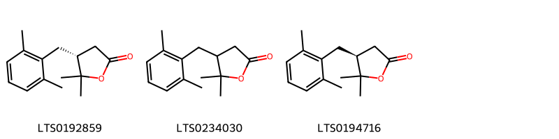{ width=100% }
    <figcaption>Hình ảnh cấu trúc hóa học của 3 hoạt chất thuộc nhóm Benzene and substituted derivatives gồm ['(4r)-4-[(2,6-dimethylphenyl)methyl]-5,5-dimethyloxolan-2-one (LTS0192859)', '4-[(2,6-dimethylphenyl)methyl]-5,5-dimethyloxolan-2-one (LTS0234030)', '(4s)-4-[(2,6-dimethylphenyl)methyl]-5,5-dimethyloxolan-2-one (LTS0194716)'].</figcaption>
</figure>
#### Nhóm Cinnamic acids and derivatives
<figure markdown="span">
    { width=100% }
    <figcaption>Hình ảnh cấu trúc hóa học của 3 hoạt chất thuộc nhóm Cinnamic acids and derivatives gồm ['3-(4-hydroxy-3-methoxyphenyl)-n-[2-(4-hydroxyphenyl)ethyl]prop-2-enimidic acid (LTS0240896)', '3-(4-hydroxyphenyl)-n-[2-(4-hydroxyphenyl)ethyl]prop-2-enimidic acid (LTS0104591)', '(2e)-3-(4-hydroxyphenyl)-n-[2-(4-hydroxyphenyl)ethyl]prop-2-enimidic acid (LTS0067822)'].</figcaption>
</figure>
#### Nhóm Coumarins and derivatives
<figure markdown="span">
    { width=100% }
    <figcaption>Hình ảnh cấu trúc hóa học của 1 hoạt chất thuộc nhóm Coumarins and derivatives gồm ['scopoletin (LTS0193112)'].</figcaption>
</figure>
#### Nhóm Phenols
<figure markdown="span">
    { width=100% }
    <figcaption>Hình ảnh cấu trúc hóa học của 1 hoạt chất thuộc nhóm Phenols gồm ['(2e)-3-(4-hydroxy-3-methoxyphenyl)-n-[2-(4-hydroxyphenyl)ethyl]prop-2-enimidic acid (LTS0187051)'].</figcaption>
</figure>
#### Nhóm Prenol lipids
<figure markdown="span">
    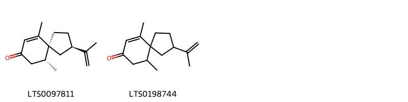{ width=100% }
    <figcaption>Hình ảnh cấu trúc hóa học của 2 hoạt chất thuộc nhóm Prenol lipids gồm ['solavetivone (LTS0097811)', '6,10-dimethyl-2-(prop-1-en-2-yl)spiro[4.5]dec-6-en-8-one (LTS0198744)'].</figcaption>
</figure>
#### Nhóm Steroids and steroid derivatives
<figure markdown="span">
    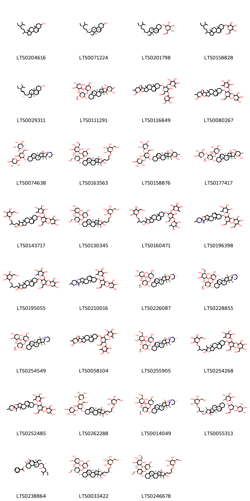{ width=100% }
    <figcaption>Hình ảnh cấu trúc hóa học của 31 hoạt chất thuộc nhóm Steroids and steroid derivatives gồm ['stigmast-5-en-3-ol, (3β)- (LTS0204616)', 'stigmast-5-en-3-ol (LTS0071224)', 'sitogluside (LTS0201798)', '2-{[1-(5-ethyl-6-methylheptan-2-yl)-9a,11a-dimethyl-1h,2h,3h,3ah,3bh,4h,6h,7h,8h,9h,9bh,10h,11h-cyclopenta[a]phenanthren-7-yl]oxy}-6-(hydroxymethyl)oxane-3,4,5-triol (LTS0158828)', 'phytosterol (LTS0029311)', "(2s,3r,4r,5r,6s)-2-{[(2r,3r,4s,5r,6r)-5-hydroxy-6-(hydroxymethyl)-2-[(1's,2r,2's,3s,4's,5r,6r,7's,8'r,9's,12's,13'r,16's)-5,7',9',13'-tetramethyl-5'-oxaspiro[oxane-2,6'-pentacyclo[10.8.0.0²,⁹.0⁴,⁸.0¹³,¹⁸]icosan]-18'-ene-3,6-dioloxy]-4-{[(2s,3r,4s,5r)-3,4,5-trihydroxyoxan-2-yl]oxy}oxan-3-yl]oxy}-6-methyloxane-3,4,5-triol (LTS0111291)", "2-{[4-hydroxy-6-(hydroxymethyl)-2-{5,7',9',13'-tetramethyl-5'-oxaspiro[oxane-2,6'-pentacyclo[10.8.0.0²,⁹.0⁴,⁸.0¹³,¹⁸]icosan]-18'-ene-3,6-dioloxy}-5-[(3,4,5-trihydroxyoxan-2-yl)oxy]oxan-3-yl]oxy}-6-methyloxane-3,4,5-triol (LTS0116849)", "2-{[5-hydroxy-6-(hydroxymethyl)-2-{5,7',9',13'-tetramethyl-5'-oxaspiro[oxane-2,6'-pentacyclo[10.8.0.0²,⁹.0⁴,⁸.0¹³,¹⁸]icosan]-18'-ene-3,6-dioloxy}-4-[(3,4,5-trihydroxyoxan-2-yl)oxy]oxan-3-yl]oxy}-6-methyloxane-3,4,5-triol (LTS0080267)", 'solamargine (LTS0074638)', '(2s,3r,4r,5r,6s)-2-{[(2r,3r,4s,5s,6r)-5-hydroxy-2-{[(1s,2s,4s,6r,7s,8r,9s,12s,13r,16s)-6-hydroxy-7,9,13-trimethyl-6-[(3r)-3-methyl-4-{[(2r,3r,4s,5s,6r)-3,4,5-trihydroxy-6-(hydroxymethyl)oxan-2-yl]oxy}butyl]-5-oxapentacyclo[10.8.0.0²,⁹.0⁴,⁸.0¹³,¹⁸]icos-18-en-16-yl]oxy}-6-(hydroxymethyl)-4-{[(2s,3r,4s,5s,6r)-3,4,5-trihydroxy-6-(hydroxymethyl)oxan-2-yl]oxy}oxan-3-yl]oxy}-6-methyloxane-3,4,5-triol (LTS0163563)', "(2s,3r,4r,5r,6s)-2-{[(2r,3s,4s,5r,6r)-4-hydroxy-2-(hydroxymethyl)-6-[(1's,2r,2's,3s,4's,5r,6r,7's,8'r,9's,12's,13'r,16's)-5,7',9',13'-tetramethyl-5'-oxaspiro[oxane-2,6'-pentacyclo[10.8.0.0²,⁹.0⁴,⁸.0¹³,¹⁸]icosan]-18'-ene-3,6-dioloxy]-5-{[(2s,3r,4r,5r,6s)-3,4,5-trihydroxy-6-methyloxan-2-yl]oxy}oxan-3-yl]oxy}-6-methyloxane-3,4,5-triol (LTS0158876)", "(2s,3r,4r,5r,6s)-2-{[(2r,3r,4s,5s,6r)-4-hydroxy-6-(hydroxymethyl)-2-[(1's,2r,2's,3s,4's,5r,6r,7's,8'r,9's,12's,13'r,16's)-5,7',9',13'-tetramethyl-5'-oxaspiro[oxane-2,6'-pentacyclo[10.8.0.0²,⁹.0⁴,⁸.0¹³,¹⁸]icosan]-18'-ene-3,6-dioloxy]-5-{[(2s,3r,4s,5r)-3,4,5-trihydroxyoxan-2-yl]oxy}oxan-3-yl]oxy}-6-methyloxane-3,4,5-triol (LTS0177417)", '2-[4-(16-{[5-hydroxy-6-(hydroxymethyl)-3-[(3,4,5-trihydroxy-6-methyloxan-2-yl)oxy]-4-[(3,4,5-trihydroxyoxan-2-yl)oxy]oxan-2-yl]oxy}-6-methoxy-7,9,13-trimethyl-5-oxapentacyclo[10.8.0.0²,⁹.0⁴,⁸.0¹³,¹⁸]icos-18-en-6-yl)-2-methylbutoxy]-6-(hydroxymethyl)oxane-3,4,5-triol (LTS0143717)', '(2s,3r,4r,5r,6s)-2-{[(2r,3r,4s,5s,6r)-5-hydroxy-2-{[(1s,2s,4s,6r,7s,8r,9s,12s,13r,16s)-6-hydroxy-7,9,13-trimethyl-6-[(3r)-3-methyl-4-{[(2r,3r,4s,5s,6r)-3,4,5-trihydroxy-6-(hydroxymethyl)oxan-2-yl]oxy}butyl]-5-oxapentacyclo[10.8.0.0²,⁹.0⁴,⁸.0¹³,¹⁸]icos-18-en-16-yl]oxy}-6-(hydroxymethyl)-4-{[(2s,3r,4s,5r)-3,4,5-trihydroxyoxan-2-yl]oxy}oxan-3-yl]oxy}-6-methyloxane-3,4,5-triol (LTS0130345)', '2-[(4-hydroxy-6-{[6-hydroxy-7,9,13-trimethyl-6-(3-methyl-4-{[3,4,5-trihydroxy-6-(hydroxymethyl)oxan-2-yl]oxy}butyl)-5-oxapentacyclo[10.8.0.0²,⁹.0⁴,⁸.0¹³,¹⁸]icos-18-en-16-yl]oxy}-2-(hydroxymethyl)-5-[(3,4,5-trihydroxy-6-methyloxan-2-yl)oxy]oxan-3-yl)oxy]-6-methyloxane-3,4,5-triol (LTS0160471)', "2-{[3-hydroxy-2-(hydroxymethyl)-6-{5',7,9,13-tetramethyl-5-oxaspiro[pentacyclo[10.8.0.0²,⁹.0⁴,⁸.0¹³,¹⁸]icosane-6,2'-piperidin]-18-eneoxy}-5-[(3,4,5-trihydroxy-6-methyloxan-2-yl)oxy]oxan-4-yl]oxy}-6-(hydroxymethyl)oxane-3,4,5-triol (LTS0196398)", '2-[(5-hydroxy-2-{[6-hydroxy-7,9,13-trimethyl-6-(3-methyl-4-{[3,4,5-trihydroxy-6-(hydroxymethyl)oxan-2-yl]oxy}butyl)-5-oxapentacyclo[10.8.0.0²,⁹.0⁴,⁸.0¹³,¹⁸]icos-18-en-16-yl]oxy}-6-(hydroxymethyl)-4-[(3,4,5-trihydroxyoxan-2-yl)oxy]oxan-3-yl)oxy]-6-methyloxane-3,4,5-triol (LTS0195055)', "2-{[5-hydroxy-6-(hydroxymethyl)-2-{5',7,9,13-tetramethyl-5-oxaspiro[pentacyclo[10.8.0.0²,⁹.0⁴,⁸.0¹³,¹⁸]icosane-6,2'-piperidin]-18-eneoxy}-4-[(3,4,5-trihydroxyoxan-2-yl)oxy]oxan-3-yl]oxy}-6-methyloxane-3,4,5-triol (LTS0210016)", "(2s,3r,4r,5r,6s)-2-{[(2r,3r,4s,5s,6r)-5-hydroxy-6-(hydroxymethyl)-2-[(1's,2r,2's,4's,5r,7's,8'r,9's,12's,13'r,16's)-5,7',9',13'-tetramethyl-5'-oxaspiro[oxane-2,6'-pentacyclo[10.8.0.0²,⁹.0⁴,⁸.0¹³,¹⁸]icosan]-18'-eneoxy]-4-{[(2s,3r,4s,5r)-3,4,5-trihydroxyoxan-2-yl]oxy}oxan-3-yl]oxy}-6-methyloxane-3,4,5-triol (LTS0226087)", "(2s,3r,4r,5r,6s)-2-{[(2r,3r,4s,5s,6r)-5-hydroxy-6-(hydroxymethyl)-2-[(1s,2s,4s,5'r,6r,7s,8r,9s,12s,13r,16s)-5',7,9,13-tetramethyl-5-oxaspiro[pentacyclo[10.8.0.0²,⁹.0⁴,⁸.0¹³,¹⁸]icosane-6,2'-piperidin]-18-eneoxy]-4-{[(2s,3r,4s,5s,6r)-3,4,5-trihydroxy-6-(hydroxymethyl)oxan-2-yl]oxy}oxan-3-yl]oxy}-6-methyloxane-3,4,5-triol (LTS0228855)", "(2s,3r,4r,5r,6s)-2-{[(2r,3r,4s,5s,6r)-5-hydroxy-6-(hydroxymethyl)-2-[(1s,2s,4s,5'r,6r,7s,8r,9s,12s,13r,16s)-5',7,9,13-tetramethyl-5-oxaspiro[pentacyclo[10.8.0.0²,⁹.0⁴,⁸.0¹³,¹⁸]icosane-6,2'-piperidin]-18-eneoxy]-4-{[(2s,3r,4s,5r)-3,4,5-trihydroxyoxan-2-yl]oxy}oxan-3-yl]oxy}-6-methyloxane-3,4,5-triol (LTS0254549)", "2-{[4-hydroxy-2-(hydroxymethyl)-6-{5,7',9',13'-tetramethyl-5'-oxaspiro[oxane-2,6'-pentacyclo[10.8.0.0²,⁹.0⁴,⁸.0¹³,¹⁸]icosan]-18'-ene-3,6-dioloxy}-5-[(3,4,5-trihydroxy-6-methyloxan-2-yl)oxy]oxan-3-yl]oxy}-6-methyloxane-3,4,5-triol (LTS0058104)", "(2r,3r,4r,5r,6s)-2-{[(2r,3r,4s,5s,6r)-5-hydroxy-6-(hydroxymethyl)-2-[(1s,2s,4s,5'r,6r,7s,8r,9s,12s,13r,16s)-5',7,9,13-tetramethyl-5-oxaspiro[pentacyclo[10.8.0.0²,⁹.0⁴,⁸.0¹³,¹⁸]icosane-6,2'-piperidin]-18-eneoxy]-4-{[(2s,3r,4s,5s,6r)-3,4,5-trihydroxy-6-(hydroxymethyl)oxan-2-yl]oxy}oxan-3-yl]oxy}-6-methyloxane-3,4,5-triol (LTS0255905)", '2-[(3-hydroxy-6-{[6-hydroxy-7,9,13-trimethyl-6-(3-methyl-4-{[3,4,5-trihydroxy-6-(hydroxymethyl)oxan-2-yl]oxy}butyl)-5-oxapentacyclo[10.8.0.0²,⁹.0⁴,⁸.0¹³,¹⁸]icos-18-en-16-yl]oxy}-2-(hydroxymethyl)-5-[(3,4,5-trihydroxy-6-methyloxan-2-yl)oxy]oxan-4-yl)oxy]-6-(hydroxymethyl)oxane-3,4,5-triol (LTS0254268)', "2-{[5-hydroxy-6-(hydroxymethyl)-2-{5,7',9',13'-tetramethyl-5'-oxaspiro[oxane-2,6'-pentacyclo[10.8.0.0²,⁹.0⁴,⁸.0¹³,¹⁸]icosan]-18'-eneoxy}-4-[(3,4,5-trihydroxyoxan-2-yl)oxy]oxan-3-yl]oxy}-6-methyloxane-3,4,5-triol (LTS0252485)", 'protodioscin (LTS0262288)', "(2s,3r,4r,5r,6s)-2-{[(2r,4s,5s,6r)-5-hydroxy-6-(hydroxymethyl)-2-[(1s,2s,4s,5'r,6r,7s,8r,9s,12s,13r,16s)-5',7,9,13-tetramethyl-5-oxaspiro[pentacyclo[10.8.0.0²,⁹.0⁴,⁸.0¹³,¹⁸]icosane-6,2'-piperidin]-18-eneoxy]-4-{[(2s,3r,4s,5s,6r)-3,4,5-trihydroxy-6-(hydroxymethyl)oxan-2-yl]oxy}oxan-3-yl]oxy}-6-methyloxane-3,4,5-triol (LTS0014049)", '(2r,3r,4s,5s,6r)-2-[(2r)-4-[(1s,2s,4s,6r,7s,8r,9s,12s,13r,16s)-16-{[(2r,3r,4s,5r,6r)-5-hydroxy-6-(hydroxymethyl)-3-{[(2s,3r,4r,5r,6s)-3,4,5-trihydroxy-6-methyloxan-2-yl]oxy}-4-{[(2s,3r,4s,5r)-3,4,5-trihydroxyoxan-2-yl]oxy}oxan-2-yl]oxy}-6-methoxy-7,9,13-trimethyl-5-oxapentacyclo[10.8.0.0²,⁹.0⁴,⁸.0¹³,¹⁸]icos-18-en-6-yl]-2-methylbutoxy]-6-(hydroxymethyl)oxane-3,4,5-triol (LTS0055313)', '(1r,3ar,5as,6s,7s,9ar,9br,11ar)-1-[(2s,3r,5r)-5-ethyl-3-hydroxy-6-methylheptan-2-yl]-6,9a,11a-trimethyl-5-oxo-1h,2h,3h,3ah,5ah,6h,7h,8h,9h,9bh,10h,11h-cyclopenta[a]phenanthren-7-yl benzoate (LTS0238864)', '(2s,3r,4r,5r,6s)-2-{[(2r,3r,4s,5s,6r)-5-hydroxy-2-{[(1s,2s,4s,7s,8r,9s,12s,13r,16s)-6-hydroxy-7,9,13-trimethyl-6-[(3r)-3-methyl-4-{[(2r,3r,4s,5s,6r)-3,4,5-trihydroxy-6-(hydroxymethyl)oxan-2-yl]oxy}butyl]-5-oxapentacyclo[10.8.0.0²,⁹.0⁴,⁸.0¹³,¹⁸]icos-18-en-16-yl]oxy}-6-(hydroxymethyl)-4-{[(2s,3r,4s,5r)-3,4,5-trihydroxyoxan-2-yl]oxy}oxan-3-yl]oxy}-6-methyloxane-3,4,5-triol (LTS0033422)', '(2s,3r,4r,5r,6s)-2-{[(2r,3r,4s,5s,6r)-5-hydroxy-2-{[(1s,2s,4s,7s,8r,9s,12s,13r,16s)-6-hydroxy-7,9,13-trimethyl-6-[(3r)-3-methyl-4-{[(2r,3r,4s,5s,6r)-3,4,5-trihydroxy-6-(hydroxymethyl)oxan-2-yl]oxy}butyl]-5-oxapentacyclo[10.8.0.0²,⁹.0⁴,⁸.0¹³,¹⁸]icos-18-en-16-yl]oxy}-6-(hydroxymethyl)-4-{[(2s,3r,4s,5s,6r)-3,4,5-trihydroxy-6-(hydroxymethyl)oxan-2-yl]oxy}oxan-3-yl]oxy}-6-methyloxane-3,4,5-triol (LTS0246678)'].</figcaption>
</figure>

---

### Dược dân tộc học

Danh sách các quốc gia có sử dụng *N/A* trong điều trị các bệnh. 

| Country   | Disease   | Bệnh           |
|:----------|:----------|:---------------|
| Java      | Diuretic  | Thuốc lợi tiêu |

---

---
## Solanum insidiosum
### Thông tin về thực vật

!!! info "Phân loại thực vật của *Solanum insidiosum* từ GIBF:"
    - **Kingdom:** Plantae
    - **Phylum:** Tracheophyta
    - **Order:** Solanales
    - **Family:** Solanaceae
    - **Genus:** Solanum
    - **Species:** *Solanum insidiosum*

 

| Label (VI)   | Label (EN)   | Scientific Name    | Descriptions (VI)   | Descriptions (EN)   | Also Known As (VI)   | Also Known As (EN)   |
|:-------------|:-------------|:-------------------|:--------------------|:--------------------|:---------------------|:---------------------|
| N/A          | N/A          | Solanum insidiosum | loài thực vật       | species of plant    | ['']                 | ['']                 |

#### Phân bố trên thế giới

**Từ CSDL GIBF** Brazil

#### Phân bố tại Việt Nam

**Từ CSDL GIBF**: Không có ghi nhận ở Việt Nam

---
### Thành phần hóa học
        
- Theo cơ sở dữ liệu lotus: Từ loài *Solanum insidiosum* đã phân lập và xác định được Chưa có hoạt chất nào được phân lập. hoạt chất thuộc về các nhóm Không có hoạt chất nào được phân lập. 

Không có hình ảnh nào được tạo ra

---

### Dược dân tộc học

Danh sách các quốc gia có sử dụng *Solanum insidiosum* trong điều trị các bệnh. 

| Country   | Disease             | Bệnh             |
|:----------|:--------------------|:-----------------|
| Brazil    | Stomachic, Diuretic | Dạ dày, lợi tiểu |

---

---
## Solanum irale
### Thông tin về thực vật

!!! info "Phân loại thực vật của *N/A* từ GIBF:"
    - **Kingdom:** Plantae
    - **Phylum:** Tracheophyta
    - **Order:** Solanales
    - **Family:** Solanaceae
    - **Genus:** Solanum
    - **Species:** *N/A*

 

| Label (VI)   | Label (EN)   | Scientific Name    | Descriptions (VI)   | Descriptions (EN)   | Also Known As (VI)   | Also Known As (EN)   |
|:-------------|:-------------|:-------------------|:--------------------|:--------------------|:---------------------|:---------------------|
| N/A          | N/A          | Solanum insidiosum | loài thực vật       | species of plant    | ['']                 | ['']                 |

#### Phân bố trên thế giới

**Từ CSDL GIBF** Australia, Japan, Argentina, Palestine, State of, Israel, Canada, Puerto Rico, Luxembourg, Cyprus, Chinese Taipei, Spain, Türkiye, Portugal, United States of America, Uruguay, Chile, Greece, South Africa, Montenegro, Thailand, Brazil, Mexico, France, Peru, Viet Nam, United Kingdom of Great Britain and Northern Ireland, Ecuador, Colombia, Costa Rica, India, Indonesia, New Zealand

#### Phân bố tại Việt Nam

**Từ CSDL GIBF**: Lâm Đồng

---
### Thành phần hóa học
        
- Theo cơ sở dữ liệu lotus: Từ loài *N/A* đã phân lập và xác định được Chưa có hoạt chất nào được phân lập. hoạt chất thuộc về các nhóm Không có hoạt chất nào được phân lập. 

Không có hình ảnh nào được tạo ra

---

### Dược dân tộc học

Danh sách các quốc gia có sử dụng *N/A* trong điều trị các bệnh. 

| Country   | Disease                    | Bệnh                                      |
|:----------|:---------------------------|:------------------------------------------|
| Elsewhere | Diuretic, Narcotic, Poison | Thuốc lợi tiểu, chất gây nghiện, chất độc |

---

---
## Solanum jasminoides
### Thông tin về thực vật

!!! info "Phân loại thực vật của *Solanum laxum* từ GIBF:"
    - **Kingdom:** Plantae
    - **Phylum:** Tracheophyta
    - **Order:** Solanales
    - **Family:** Solanaceae
    - **Genus:** Solanum
    - **Species:** *Solanum laxum*

 

| Label (VI)   | Label (EN)   | Scientific Name     | Descriptions (VI)   | Descriptions (EN)   | Also Known As (VI)   | Also Known As (EN)   |
|:-------------|:-------------|:--------------------|:--------------------|:--------------------|:---------------------|:---------------------|
| N/A          | N/A          | Solanum jasminoides |                     | species of plant    | ['']                 | ['']                 |

#### Phân bố trên thế giới

**Từ CSDL GIBF** Ecuador, Netherlands, Italy, Japan, Belgium, Colombia, New Zealand, Spain, Argentina, Brazil, Portugal, United States of America, Mexico, France, Croatia, Tanzania, United Republic of, United Kingdom of Great Britain and Northern Ireland, Nepal

#### Phân bố tại Việt Nam

**Từ CSDL GIBF**: Không có ghi nhận ở Việt Nam

---
### Thành phần hóa học
        
- Theo cơ sở dữ liệu lotus: Từ loài *Solanum laxum* đã phân lập và xác định được 11 hoạt chất thuộc về các nhóm Prenol lipids, Steroids and steroid derivatives. 

|    | chemicalTaxonomyClassyfireClass   |   smiles_count |
|---:|:----------------------------------|---------------:|
|  0 | Prenol lipids                     |              2 |
|  1 | Steroids and steroid derivatives  |              9 |

#### Nhóm Prenol lipids
<figure markdown="span">
    { width=100% }
    <figcaption>Hình ảnh cấu trúc hóa học của 2 hoạt chất thuộc nhóm Prenol lipids gồm ['diosgenin (LTS0035986)', 'diosgenin (LTS0149188)'].</figcaption>
</figure>
#### Nhóm Steroids and steroid derivatives
<figure markdown="span">
    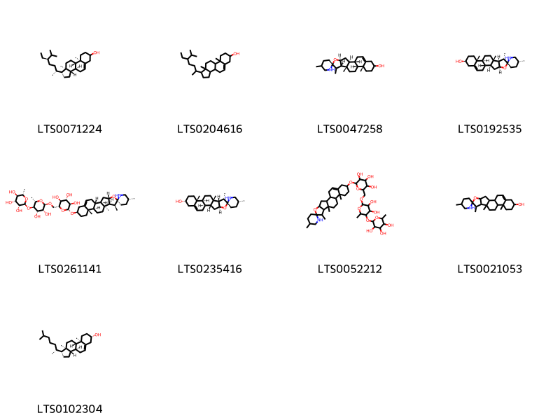{ width=100% }
    <figcaption>Hình ảnh cấu trúc hóa học của 9 hoạt chất thuộc nhóm Steroids and steroid derivatives gồm ['stigmast-5-en-3-ol (LTS0071224)', 'stigmast-5-en-3-ol, (3β)- (LTS0204616)', "(1s,2s,4s,6r,8s,9s,12r,13r)-5',7,9,13-tetramethyl-5-oxaspiro[pentacyclo[10.8.0.0²,⁹.0⁴,⁸.0¹³,¹⁸]icosane-6,2'-piperidin]-18-en-16-ol (LTS0047258)", 'solasodine (LTS0192535)', "(2r,3s,4s,5r,6r)-2-({[(2r,3r,4s,5r,6s)-3,4-dihydroxy-6-methyl-5-{[(2s,3r,4r,5r,6s)-3,4,5-trihydroxy-6-methyloxan-2-yl]oxy}oxan-2-yl]oxy}methyl)-6-[(1r,2r,4s,5'r,6r,7s,8s,9s,12r,13s,16r)-5',7,9,13-tetramethyl-5-oxaspiro[pentacyclo[10.8.0.0²,⁹.0⁴,⁸.0¹³,¹⁸]icosane-6,2'-piperidin]-18-eneoxy]oxane-3,4,5-triol (LTS0261141)", "(1r,2r,4s,5'r,6r,7s,8s,9s,12s,13r,16r)-5',7,9,13-tetramethyl-5-oxaspiro[pentacyclo[10.8.0.0²,⁹.0⁴,⁸.0¹³,¹⁸]icosane-6,2'-piperidin]-18-en-16-ol (LTS0235416)", "2-[({3,4-dihydroxy-6-methyl-5-[(3,4,5-trihydroxy-6-methyloxan-2-yl)oxy]oxan-2-yl}oxy)methyl]-6-{5',7,9,13-tetramethyl-5-oxaspiro[pentacyclo[10.8.0.0²,⁹.0⁴,⁸.0¹³,¹⁸]icosane-6,2'-piperidin]-18-eneoxy}oxane-3,4,5-triol (LTS0052212)", 'solassodine (LTS0021053)', 'cholesterol (LTS0102304)'].</figcaption>
</figure>

---

### Dược dân tộc học

Danh sách các quốc gia có sử dụng *Solanum laxum* trong điều trị các bệnh. 

| Country   | Disease   | Bệnh     |
|:----------|:----------|:---------|
| Elsewhere | Poison    | Chất độc |

---

---
## Solanum khasianum
### Thông tin về thực vật

!!! info "Phân loại thực vật của *Solanum aculeatissimum* từ GIBF:"
    - **Kingdom:** Plantae
    - **Phylum:** Tracheophyta
    - **Order:** Solanales
    - **Family:** Solanaceae
    - **Genus:** Solanum
    - **Species:** *Solanum aculeatissimum*

 

| Label (VI)   | Label (EN)   | Scientific Name   | Descriptions (VI)   | Descriptions (EN)   | Also Known As (VI)   | Also Known As (EN)   |
|:-------------|:-------------|:------------------|:--------------------|:--------------------|:---------------------|:---------------------|
| N/A          | N/A          | Solanum khasianum | loài thực vật       | species of plant    | ['']                 | ['']                 |

#### Phân bố trên thế giới

**Từ CSDL GIBF** Netherlands, Spain, India, China, Nepal

#### Phân bố tại Việt Nam

**Từ CSDL GIBF**: Không có ghi nhận ở Việt Nam

---
### Thành phần hóa học
        
- Theo cơ sở dữ liệu lotus: Từ loài *Solanum aculeatissimum* đã phân lập và xác định được Chưa có hoạt chất nào được phân lập. hoạt chất thuộc về các nhóm Không có hoạt chất nào được phân lập. 

Không có hình ảnh nào được tạo ra

---

### Dược dân tộc học

Danh sách các quốc gia có sử dụng *Solanum aculeatissimum* trong điều trị các bệnh. 

| Country   | Disease       | Bệnh               |
|:----------|:--------------|:-------------------|
| Nepal     | Contraceptive | Kiểm soát sinh sản |

---

---
## Solanum lyratum
### Thông tin về thực vật

!!! info "Phân loại thực vật của *Solanum lyratum* từ GIBF:"
    - **Kingdom:** Plantae
    - **Phylum:** Tracheophyta
    - **Order:** Solanales
    - **Family:** Solanaceae
    - **Genus:** Solanum
    - **Species:** *Solanum lyratum*

 

| Label (VI)   | Label (EN)   | Scientific Name   | Descriptions (VI)   | Descriptions (EN)   | Also Known As (VI)   | Also Known As (EN)   |
|:-------------|:-------------|:------------------|:--------------------|:--------------------|:---------------------|:---------------------|
| N/A          | N/A          | Solanum lyratum   | loài thực vật       | species of plant    | ['']                 | ['']                 |

#### Phân bố trên thế giới

**Từ CSDL GIBF** nan, Japan, Korea, Republic of, Chinese Taipei, China

#### Phân bố tại Việt Nam

**Từ CSDL GIBF**: Không có ghi nhận ở Việt Nam

---
### Thành phần hóa học
        
- Theo cơ sở dữ liệu lotus: Từ loài *Solanum lyratum* đã phân lập và xác định được 37 hoạt chất thuộc về các nhóm Prenol lipids, Steroids and steroid derivatives, Isoflavonoids, Cinnamic acids and derivatives, Benzene and substituted derivatives, Naphthofurans, Phenols, Coumarins and derivatives. 

|    | chemicalTaxonomyClassyfireClass     |   smiles_count |
|---:|:------------------------------------|---------------:|
|  0 | Benzene and substituted derivatives |              2 |
|  1 | Cinnamic acids and derivatives      |              1 |
|  2 | Coumarins and derivatives           |              1 |
|  3 | Isoflavonoids                       |              8 |
|  4 | Naphthofurans                       |              1 |
|  5 | Phenols                             |              2 |
|  6 | Prenol lipids                       |              8 |
|  7 | Steroids and steroid derivatives    |             14 |

#### Nhóm Benzene and substituted derivatives
<figure markdown="span">
    { width=100% }
    <figcaption>Hình ảnh cấu trúc hóa học của 2 hoạt chất thuộc nhóm Benzene and substituted derivatives gồm ['3,4-dihydroxybenzoic acid (LTS0018765)', 'vanillic acid (LTS0229113)'].</figcaption>
</figure>
#### Nhóm Cinnamic acids and derivatives
<figure markdown="span">
    { width=100% }
    <figcaption>Hình ảnh cấu trúc hóa học của 1 hoạt chất thuộc nhóm Cinnamic acids and derivatives gồm ['3,4-dihydroxycinnamic acid (LTS0128050)'].</figcaption>
</figure>
#### Nhóm Coumarins and derivatives
<figure markdown="span">
    { width=100% }
    <figcaption>Hình ảnh cấu trúc hóa học của 1 hoạt chất thuộc nhóm Coumarins and derivatives gồm ['scopoletin (LTS0193112)'].</figcaption>
</figure>
#### Nhóm Isoflavonoids
<figure markdown="span">
    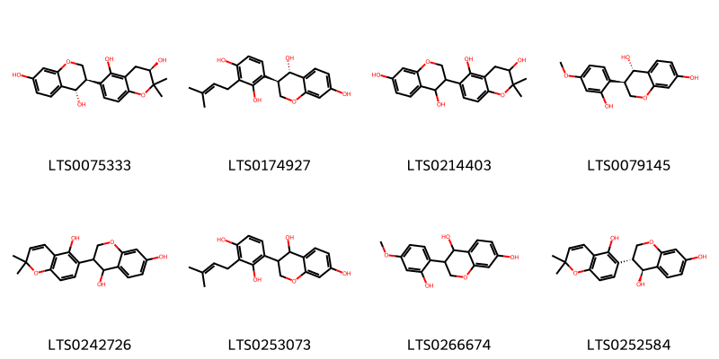{ width=100% }
    <figcaption>Hình ảnh cấu trúc hóa học của 8 hoạt chất thuộc nhóm Isoflavonoids gồm ['(3r)-6-[(3r,4s)-4,7-dihydroxy-3,4-dihydro-2h-1-benzopyran-3-yl]-2,2-dimethyl-3,4-dihydro-1-benzopyran-3,5-diol (LTS0075333)', '(3r,4s)-3-[2,4-dihydroxy-3-(3-methylbut-2-en-1-yl)phenyl]-3,4-dihydro-2h-1-benzopyran-4,7-diol (LTS0174927)', '6-(4,7-dihydroxy-3,4-dihydro-2h-1-benzopyran-3-yl)-2,2-dimethyl-3,4-dihydro-1-benzopyran-3,5-diol (LTS0214403)', '(3r,4s)-3-(2-hydroxy-4-methoxyphenyl)-3,4-dihydro-2h-1-benzopyran-4,7-diol (LTS0079145)', '3-(5-hydroxy-2,2-dimethylchromen-6-yl)-3,4-dihydro-2h-1-benzopyran-4,7-diol (LTS0242726)', '3-[2,4-dihydroxy-3-(3-methylbut-2-en-1-yl)phenyl]-3,4-dihydro-2h-1-benzopyran-4,7-diol (LTS0253073)', '3-(2-hydroxy-4-methoxyphenyl)-3,4-dihydro-2h-1-benzopyran-4,7-diol (LTS0266674)', '(3r,4s)-3-(5-hydroxy-2,2-dimethylchromen-6-yl)-3,4-dihydro-2h-1-benzopyran-4,7-diol (LTS0252584)'].</figcaption>
</figure>
#### Nhóm Naphthofurans
<figure markdown="span">
    { width=100% }
    <figcaption>Hình ảnh cấu trúc hóa học của 1 hoạt chất thuộc nhóm Naphthofurans gồm ['(4as,8as)-3,8a-dimethyl-5-methylidene-4h,4ah,6h,7h,8h-naphtho[2,3-b]furan-2-one (LTS0110570)'].</figcaption>
</figure>
#### Nhóm Phenols
<figure markdown="span">
    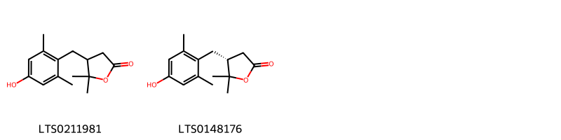{ width=100% }
    <figcaption>Hình ảnh cấu trúc hóa học của 2 hoạt chất thuộc nhóm Phenols gồm ['4-[(4-hydroxy-2,6-dimethylphenyl)methyl]-5,5-dimethyloxolan-2-one (LTS0211981)', 'lyratol d (LTS0148176)'].</figcaption>
</figure>
#### Nhóm Prenol lipids
<figure markdown="span">
    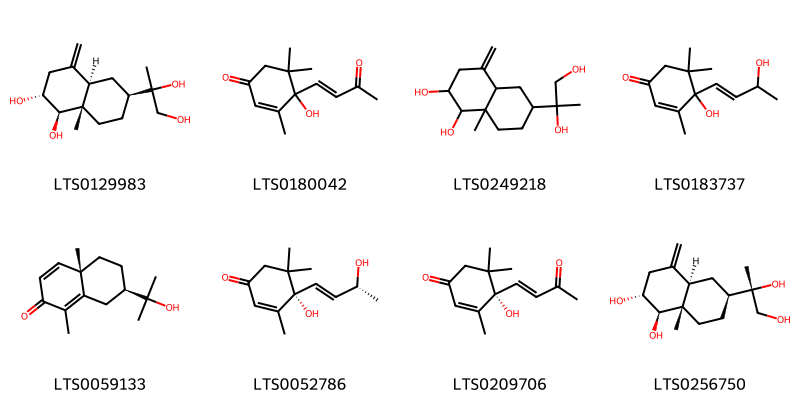{ width=100% }
    <figcaption>Hình ảnh cấu trúc hóa học của 8 hoạt chất thuộc nhóm Prenol lipids gồm ['lyratol c (LTS0129983)', '4-hydroxy-3,5,5-trimethyl-4-(3-oxobut-1-en-1-yl)cyclohex-2-en-1-one (LTS0180042)', '6-(1,2-dihydroxypropan-2-yl)-8a-methyl-4-methylidene-octahydronaphthalene-1,2-diol (LTS0249218)', '4-hydroxy-4-(3-hydroxybut-1-en-1-yl)-3,5,5-trimethylcyclohex-2-en-1-one (LTS0183737)', '(4as,7r)-7-(2-hydroxypropan-2-yl)-1,4a-dimethyl-5,6,7,8-tetrahydronaphthalen-2-one (LTS0059133)', '(6s,9r)-vomifoliol (LTS0052786)', 'dehydrovomifoliol (LTS0209706)', '(1r,2r,4ar,6s,8as)-6-[(2s)-1,2-dihydroxypropan-2-yl]-8a-methyl-4-methylidene-octahydronaphthalene-1,2-diol (LTS0256750)'].</figcaption>
</figure>
#### Nhóm Steroids and steroid derivatives
<figure markdown="span">
    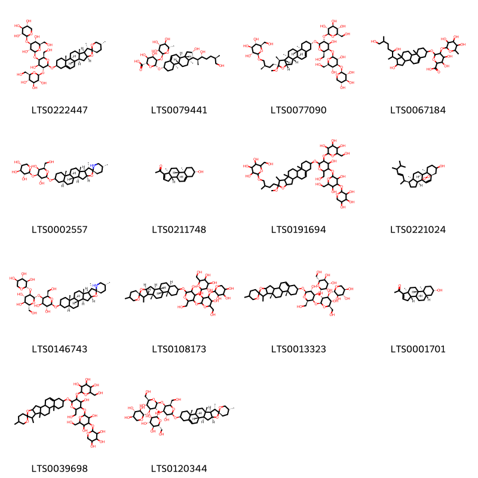{ width=100% }
    <figcaption>Hình ảnh cấu trúc hóa học của 14 hoạt chất thuộc nhóm Steroids and steroid derivatives gồm ["(2s,3r,4s,5s,6r)-2-{[(2r,3r,4s,5r,6r)-5-{[(2s,3r,4s,5r,6r)-3,5-dihydroxy-6-(hydroxymethyl)-4-{[(2s,3r,4s,5r)-3,4,5-trihydroxyoxan-2-yl]oxy}oxan-2-yl]oxy}-4-hydroxy-6-(hydroxymethyl)-2-[(1's,2r,2's,4's,5r,7's,8'r,9's,12's,13'r,16's)-5,7',9',13'-tetramethyl-5'-oxaspiro[oxane-2,6'-pentacyclo[10.8.0.0²,⁹.0⁴,⁸.0¹³,¹⁸]icosan]-18'-eneoxy]oxan-3-yl]oxy}-6-(hydroxymethyl)oxane-3,4,5-triol (LTS0222447)", '(2s,3s,4s,5r,6r)-6-{[(1r,2s,3as,3bs,7s,9ar,9bs,11as)-1-[(2s,3r,6r)-3,7-dihydroxy-6-methylheptan-2-yl]-2-hydroxy-9a,11a-dimethyl-1h,2h,3h,3ah,3bh,4h,6h,7h,8h,9h,9bh,10h,11h-cyclopenta[a]phenanthren-7-yl]oxy}-3,4-dihydroxy-5-{[(2s,3r,4r,5r,6s)-3,4,5-trihydroxy-6-methyloxan-2-yl]oxy}oxane-2-carboxylic acid (LTS0079441)', '(2r,3r,4s,5s,6r)-2-[(2r)-4-[(1s,2s,4s,6r,7s,8r,9s,12s,13r,16s)-16-{[(2r,3r,4s,5r,6r)-5-{[(2s,3r,4s,5r,6r)-3,5-dihydroxy-6-(hydroxymethyl)-4-{[(2s,3r,4s,5r)-3,4,5-trihydroxyoxan-2-yl]oxy}oxan-2-yl]oxy}-4-hydroxy-6-(hydroxymethyl)-3-{[(2s,3r,4s,5s,6r)-3,4,5-trihydroxy-6-(hydroxymethyl)oxan-2-yl]oxy}oxan-2-yl]oxy}-6-methoxy-7,9,13-trimethyl-5-oxapentacyclo[10.8.0.0²,⁹.0⁴,⁸.0¹³,¹⁸]icos-18-en-6-yl]-2-methylbutoxy]-6-(hydroxymethyl)oxane-3,4,5-triol (LTS0077090)', '6-{[1-(3,7-dihydroxy-6-methylheptan-2-yl)-2-hydroxy-9a,11a-dimethyl-1h,2h,3h,3ah,3bh,4h,6h,7h,8h,9h,9bh,10h,11h-cyclopenta[a]phenanthren-7-yl]oxy}-3,4-dihydroxy-5-[(3,4,5-trihydroxy-6-methyloxan-2-yl)oxy]oxane-2-carboxylic acid (LTS0067184)', "(2s,3r,4s,5r)-2-{[(2r,3s,4s,5r,6r)-3,5-dihydroxy-2-(hydroxymethyl)-6-[(1r,2s,4s,5'r,6r,7s,8r,9s,12s,13s,16s,18s)-5',7,9,13-tetramethyl-5-oxaspiro[pentacyclo[10.8.0.0²,⁹.0⁴,⁸.0¹³,¹⁸]icosane-6,2'-piperidine]oxy]oxan-4-yl]oxy}oxane-3,4,5-triol (LTS0002557)", '16-dehydropregnenolone (LTS0211748)', '2-(4-{16-[(5-{[3,5-dihydroxy-6-(hydroxymethyl)-4-[(3,4,5-trihydroxyoxan-2-yl)oxy]oxan-2-yl]oxy}-4-hydroxy-6-(hydroxymethyl)-3-{[3,4,5-trihydroxy-6-(hydroxymethyl)oxan-2-yl]oxy}oxan-2-yl)oxy]-6-methoxy-7,9,13-trimethyl-5-oxapentacyclo[10.8.0.0²,⁹.0⁴,⁸.0¹³,¹⁸]icos-18-en-6-yl}-2-methylbutoxy)-6-(hydroxymethyl)oxane-3,4,5-triol (LTS0191694)', '(1s,2s,5s,6r,9s,10r,15s)-5-(5,6-dimethylhept-3-en-2-yl)-6,10-dimethyl-16,17-dioxapentacyclo[13.2.2.0¹,⁹.0²,⁶.0¹⁰,¹⁵]nonadec-18-en-13-ol (LTS0221024)', "(2s,3r,4s,5r)-2-{[(2s,3r,4s,5s,6r)-2-{[(2r,3r,4r,5r,6r)-4,5-dihydroxy-2-(hydroxymethyl)-6-[(1r,2s,4s,5'r,6r,7s,8r,9s,12s,13s,16s,18s)-5',7,9,13-tetramethyl-5-oxaspiro[pentacyclo[10.8.0.0²,⁹.0⁴,⁸.0¹³,¹⁸]icosane-6,2'-piperidine]oxy]oxan-3-yl]oxy}-4,5-dihydroxy-6-(hydroxymethyl)oxan-3-yl]oxy}oxane-3,4,5-triol (LTS0146743)", "2-[(2-{[4,5-dihydroxy-2-(hydroxymethyl)-6-[(1'r,2r,2's,4's,8's,9's,12'r,13's,18's)-5,7',9',13'-tetramethyl-5'-oxaspiro[oxane-2,6'-pentacyclo[10.8.0.0²,⁹.0⁴,⁸.0¹³,¹⁸]icosane]oxy]oxan-3-yl]oxy}-5-hydroxy-6-(hydroxymethyl)-4-[(3,4,5-trihydroxyoxan-2-yl)oxy]oxan-3-yl)oxy]-6-(hydroxymethyl)oxane-3,4,5-triol (LTS0108173)", "(2s,3r,4s,5s,6r)-2-{[(2s,3r,4s,5r,6r)-2-{[(2r,3r,4r,5r,6r)-4,5-dihydroxy-2-(hydroxymethyl)-6-[(9's,13'r,16's)-5,7',9',13'-tetramethyl-5'-oxaspiro[oxane-2,6'-pentacyclo[10.8.0.0²,⁹.0⁴,⁸.0¹³,¹⁸]icosan]-18'-eneoxy]oxan-3-yl]oxy}-5-hydroxy-6-(hydroxymethyl)-4-{[(2s,3r,4s,5r)-3,4,5-trihydroxyoxan-2-yl]oxy}oxan-3-yl]oxy}-6-(hydroxymethyl)oxane-3,4,5-triol (LTS0013323)", '1-[(3as,3br,5as,7s,9as,9bs,11as)-7-hydroxy-9a,11a-dimethyl-3h,3ah,3bh,4h,5h,5ah,6h,7h,8h,9h,9bh,10h,11h-cyclopenta[a]phenanthren-1-yl]ethanone (LTS0001701)', "2-[(5-{[3,5-dihydroxy-6-(hydroxymethyl)-4-[(3,4,5-trihydroxyoxan-2-yl)oxy]oxan-2-yl]oxy}-4-hydroxy-6-(hydroxymethyl)-2-{5,7',9',13'-tetramethyl-5'-oxaspiro[oxane-2,6'-pentacyclo[10.8.0.0²,⁹.0⁴,⁸.0¹³,¹⁸]icosan]-18'-eneoxy}oxan-3-yl)oxy]-6-(hydroxymethyl)oxane-3,4,5-triol (LTS0039698)", "(2s,3r,4s,5s,6r)-2-{[(2s,3r,4s,5r,6r)-2-{[(2r,3r,4r,5r,6r)-4,5-dihydroxy-2-(hydroxymethyl)-6-[(1's,2r,2's,4's,5r,7's,8'r,9's,12's,13'r,16's)-5,7',9',13'-tetramethyl-5'-oxaspiro[oxane-2,6'-pentacyclo[10.8.0.0²,⁹.0⁴,⁸.0¹³,¹⁸]icosan]-18'-eneoxy]oxan-3-yl]oxy}-5-hydroxy-6-(hydroxymethyl)-4-{[(2s,3r,4s,5r)-3,4,5-trihydroxyoxan-2-yl]oxy}oxan-3-yl]oxy}-6-(hydroxymethyl)oxane-3,4,5-triol (LTS0120344)"].</figcaption>
</figure>

---

### Dược dân tộc học

Danh sách các quốc gia có sử dụng *Solanum lyratum* trong điều trị các bệnh. 

| Country   | Disease    | Bệnh       |
|:----------|:-----------|:-----------|
| China     | Alexiteric | Alexiteric |
| Elsewhere | nan        | Ở đây      |

---

---
## Solanum malacoxylon
### Thông tin về thực vật

!!! info "Phân loại thực vật của *Solanum glaucophyllum* từ GIBF:"
    - **Kingdom:** Plantae
    - **Phylum:** Tracheophyta
    - **Order:** Solanales
    - **Family:** Solanaceae
    - **Genus:** Solanum
    - **Species:** *Solanum glaucophyllum*

 

| Label (VI)   | Label (EN)   | Scientific Name     | Descriptions (VI)   | Descriptions (EN)   | Also Known As (VI)   | Also Known As (EN)   |
|:-------------|:-------------|:--------------------|:--------------------|:--------------------|:---------------------|:---------------------|
| N/A          | N/A          | Solanum malacoxylon | loài thực vật       | species of plant    | ['']                 | ['']                 |

#### Phân bố trên thế giới

**Từ CSDL GIBF** nan, Brazil, Bolivia (Plurinational State of), Argentina, Uruguay

#### Phân bố tại Việt Nam

**Từ CSDL GIBF**: Không có ghi nhận ở Việt Nam

---
### Thành phần hóa học
        
- Theo cơ sở dữ liệu lotus: Từ loài *Solanum glaucophyllum* đã phân lập và xác định được Chưa có hoạt chất nào được phân lập. hoạt chất thuộc về các nhóm Không có hoạt chất nào được phân lập. 

Không có hình ảnh nào được tạo ra

---

### Dược dân tộc học

Danh sách các quốc gia có sử dụng *Solanum glaucophyllum* trong điều trị các bệnh. 

| Country   | Disease   | Bệnh     |
|:----------|:----------|:---------|
| Argentina | Poison    | Chất độc |

---

---
## Solanum mammosum
### Thông tin về thực vật

!!! info "Phân loại thực vật của *Solanum mammosum* từ GIBF:"
    - **Kingdom:** Plantae
    - **Phylum:** Tracheophyta
    - **Order:** Solanales
    - **Family:** Solanaceae
    - **Genus:** Solanum
    - **Species:** *Solanum mammosum*

 

| Label (VI)   | Label (EN)   | Scientific Name   | Descriptions (VI)   | Descriptions (EN)                        | Also Known As (VI)   | Also Known As (EN)                                                                                                                   |
|:-------------|:-------------|:------------------|:--------------------|:-----------------------------------------|:---------------------|:-------------------------------------------------------------------------------------------------------------------------------------|
| N/A          | N/A          | Solanum mammosum  |                     | species of plant native to South America | ['']                 | ['apple of Sodom', 'nipplefruit', 'nipple fruit', "cow's udder", 'fox head', 'lady nipples', "pig's ears", 'nipplefruit nightshade'] |

#### Phân bố trên thế giới

**Từ CSDL GIBF** nan, Australia, Japan, Guatemala, Benin, Nicaragua, Venezuela (Bolivarian Republic of), Panama, French Guiana, Puerto Rico, Chinese Taipei, Bolivia (Plurinational State of), Papua New Guinea, Honduras, United States of America, Congo, Democratic Republic of the, El Salvador, Belize, Hong Kong, Thailand, Brazil, Mexico, Peru, Dominican Republic, Singapore, Viet Nam, France, China, Ecuador, Madagascar, Colombia, Costa Rica, India, Indonesia, Philippines, Malaysia, New Zealand

#### Phân bố tại Việt Nam

**Từ CSDL GIBF**: Đồng Tháp, Hồ Chí Minh city, Lào Cai

---
### Thành phần hóa học
        
- Theo cơ sở dữ liệu lotus: Từ loài *Solanum mammosum* đã phân lập và xác định được 28 hoạt chất thuộc về các nhóm Prenol lipids, Steroids and steroid derivatives. 

|    | chemicalTaxonomyClassyfireClass   |   smiles_count |
|---:|:----------------------------------|---------------:|
|  0 |                                   |              2 |
|  1 | Prenol lipids                     |              4 |
|  2 | Steroids and steroid derivatives  |             22 |

#### Nhóm 
<figure markdown="span">
    { width=100% }
    <figcaption>Hình ảnh cấu trúc hóa học của 2 hoạt chất thuộc nhóm  gồm ['cuskhygrine (LTS0083137)', '1,3-bis[(2r)-1-methylpyrrolidin-2-yl]propan-2-one (LTS0179198)'].</figcaption>
</figure>
#### Nhóm Prenol lipids
<figure markdown="span">
    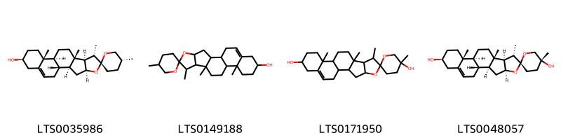{ width=100% }
    <figcaption>Hình ảnh cấu trúc hóa học của 4 hoạt chất thuộc nhóm Prenol lipids gồm ['diosgenin (LTS0035986)', 'diosgenin (LTS0149188)', "5,7',9',13'-tetramethyl-5'-oxaspiro[oxane-2,6'-pentacyclo[10.8.0.0²,⁹.0⁴,⁸.0¹³,¹⁸]icosan]-18'-ene-5,16'-diol (LTS0171950)", "(1's,2r,2's,4's,5r,7's,8'r,9's,12's,13'r,16's)-5,7',9',13'-tetramethyl-5'-oxaspiro[oxane-2,6'-pentacyclo[10.8.0.0²,⁹.0⁴,⁸.0¹³,¹⁸]icosan]-18'-ene-5,16'-diol (LTS0048057)"].</figcaption>
</figure>
#### Nhóm Steroids and steroid derivatives
<figure markdown="span">
    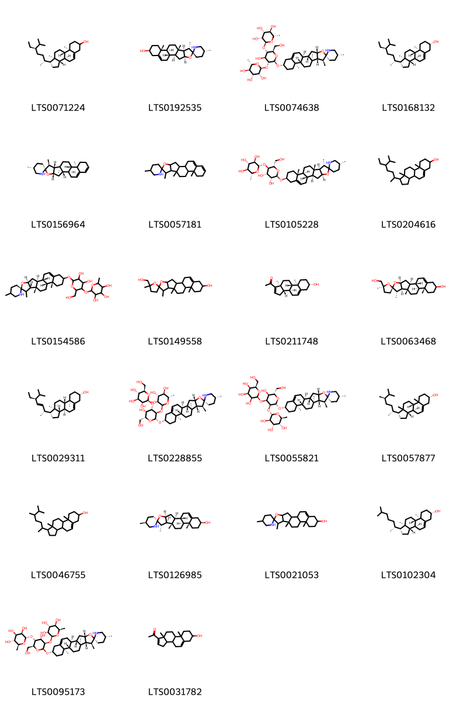{ width=100% }
    <figcaption>Hình ảnh cấu trúc hóa học của 22 hoạt chất thuộc nhóm Steroids and steroid derivatives gồm ['stigmast-5-en-3-ol (LTS0071224)', 'solasodine (LTS0192535)', 'solamargine (LTS0074638)', 'sitosterol (LTS0168132)', "(1s,2s,4s,5'r,6r,7s,8r,9s,12s,13r)-5',7,9,13-tetramethyl-5-oxaspiro[pentacyclo[10.8.0.0²,⁹.0⁴,⁸.0¹³,¹⁸]icosane-6,2'-piperidine]-16,18-diene (LTS0156964)", "5',7,9,13-tetramethyl-5-oxaspiro[pentacyclo[10.8.0.0²,⁹.0⁴,⁸.0¹³,¹⁸]icosane-6,2'-piperidine]-16,18-diene (LTS0057181)", "(2s,3r,4s,5s,6r)-2-{[(2s,3r,4s,5r,6r)-4,5-dihydroxy-2-(hydroxymethyl)-6-[(1s,2s,4s,5'r,7s,8r,9s,12s,13r,16s)-5',7,9,13-tetramethyl-5-oxaspiro[pentacyclo[10.8.0.0²,⁹.0⁴,⁸.0¹³,¹⁸]icosane-6,2'-piperidin]-18-eneoxy]oxan-3-yl]oxy}-6-methyloxane-3,4,5-triol (LTS0105228)", 'stigmast-5-en-3-ol, (3β)- (LTS0204616)', "2-{[4,5-dihydroxy-2-(hydroxymethyl)-6-[(1s,2s,4s,6r,8s,9s,12r,13r)-5',7,9,13-tetramethyl-5-oxaspiro[pentacyclo[10.8.0.0²,⁹.0⁴,⁸.0¹³,¹⁸]icosane-6,2'-piperidin]-18-eneoxy]oxan-3-yl]oxy}-6-methyloxane-3,4,5-triol (LTS0154586)", "5-(hydroxymethyl)-5,7',9',13'-tetramethyl-5'-oxaspiro[oxolane-2,6'-pentacyclo[10.8.0.0²,⁹.0⁴,⁸.0¹³,¹⁸]icosan]-18'-en-16'-ol (LTS0149558)", '16-dehydropregnenolone (LTS0211748)', 'nuatigenin (LTS0063468)', 'phytosterol (LTS0029311)', "(2s,3r,4r,5r,6s)-2-{[(2r,3r,4s,5s,6r)-5-hydroxy-6-(hydroxymethyl)-2-[(1s,2s,4s,5'r,6r,7s,8r,9s,12s,13r,16s)-5',7,9,13-tetramethyl-5-oxaspiro[pentacyclo[10.8.0.0²,⁹.0⁴,⁸.0¹³,¹⁸]icosane-6,2'-piperidin]-18-eneoxy]-4-{[(2s,3r,4s,5s,6r)-3,4,5-trihydroxy-6-(hydroxymethyl)oxan-2-yl]oxy}oxan-3-yl]oxy}-6-methyloxane-3,4,5-triol (LTS0228855)", "(2s,3r,4s,5r,6s)-2-{[(2s,3s,4s,5s,6s)-5-hydroxy-6-(hydroxymethyl)-2-[(1s,2s,4s,5'r,6r,7s,8r,9s,12s,13r,16s)-5',7,9,13-tetramethyl-5-oxaspiro[pentacyclo[10.8.0.0²,⁹.0⁴,⁸.0¹³,¹⁸]icosane-6,2'-piperidin]-18-eneoxy]-4-{[(2s,3s,4s,5r,6r)-3,4,5-trihydroxy-6-(hydroxymethyl)oxan-2-yl]oxy}oxan-3-yl]oxy}-6-methyloxane-3,4,5-triol (LTS0055821)", '(1r,3as,3bs,7s,9bs)-1-[(2r,5r)-5,6-dimethylheptan-2-yl]-9a,11a-dimethyl-1h,2h,3h,3ah,3bh,4h,6h,7h,8h,9h,9bh,10h,11h-cyclopenta[a]phenanthren-7-ol (LTS0057877)', 'campesterol (LTS0046755)', "(1s,2s,4s,5's,6s,7s,8r,9s,12s,13r,16s)-5',7,9,13-tetramethyl-5-oxaspiro[pentacyclo[10.8.0.0²,⁹.0⁴,⁸.0¹³,¹⁸]icosane-6,2'-piperidin]-18-en-16-ol (LTS0126985)", 'solassodine (LTS0021053)', 'cholesterol (LTS0102304)', "(2s,3r,4r,5r,6s)-2-{[(2s,3r,4s,5r,6s)-4-hydroxy-2-(hydroxymethyl)-6-[(1s,2s,4s,5'r,6r,7s,8r,9s,12s,13r,16s)-5',7,9,13-tetramethyl-5-oxaspiro[pentacyclo[10.8.0.0²,⁹.0⁴,⁸.0¹³,¹⁸]icosane-6,2'-piperidin]-18-eneoxy]-5-{[(2s,3r,4r,5r,6r)-3,4,5-trihydroxy-6-methyloxan-2-yl]oxy}oxan-3-yl]oxy}-6-methyloxane-3,4,5-triol (LTS0095173)", '16,17-didehydropregnenolone (LTS0031782)'].</figcaption>
</figure>

---

### Dược dân tộc học

Danh sách các quốc gia có sử dụng *Solanum mammosum* trong điều trị các bệnh. 

| Country   | Disease               | Bệnh                          |
|:----------|:----------------------|:------------------------------|
| Elsewhere | Diuretic, Insecticide | Thuốc lợi tiểu, Thuốc trừ sâu |
| Haiti     | Poison                | Chất độc                      |
| Mexico    | Poison, Poison        | Chất độc, chất độc            |
| Venezuela | Poison                | Chất độc                      |

---

---
## Solanum melongena
### Thông tin về thực vật

!!! info "Phân loại thực vật của *Solanum melongena* từ GIBF:"
    - **Kingdom:** Plantae
    - **Phylum:** Tracheophyta
    - **Order:** Solanales
    - **Family:** Solanaceae
    - **Genus:** Solanum
    - **Species:** *Solanum melongena*

 

| Label (VI)   | Label (EN)   | Scientific Name   | Descriptions (VI)   | Descriptions (EN)   | Also Known As (VI)   | Also Known As (EN)                                                                                                           |
|:-------------|:-------------|:------------------|:--------------------|:--------------------|:---------------------|:-----------------------------------------------------------------------------------------------------------------------------|
| N/A          | N/A          | Solanum melongena | loài thực vật       | species of plant    | ['']                 | ['aubergine', 'brinjal', 'eggplant', 'garden ebrinjalgg', 'guinea squash', 'melongene', 'purple cucumber', 'white eggplant'] |

#### Phân bố trên thế giới

**Từ CSDL GIBF** nan, United Arab Emirates, Sri Lanka, Italy, Micronesia (Federated States of), Australia, Lao People’s Democratic Republic, Argentina, Benin, Venezuela (Bolivarian Republic of), Canada, Panama, Pakistan, Denmark, Mongolia, Puerto Rico, Korea, Republic of, Chinese Taipei, Spain, Türkiye, Algeria, Bangladesh, United States of America, Timor-Leste, Kazakhstan, Maldives, Uzbekistan, Uganda, Trinidad and Tobago, South Africa, Hong Kong, Thailand, Romania, Brazil, Guyana, Switzerland, Peru, France, Mexico, Singapore, Viet Nam, Mayotte, United Kingdom of Great Britain and Northern Ireland, China, Ecuador, Niue, Cabo Verde, Colombia, Costa Rica, India, Indonesia, Gambia, Philippines, Malaysia, Nepal

#### Phân bố tại Việt Nam

**Từ CSDL GIBF**: Đồng Tháp, Gia Lai, Hồ Chí Minh city, Hà Giang, Bình Dương

---
### Thành phần hóa học
        
- Theo cơ sở dữ liệu lotus: Từ loài *Solanum melongena* đã phân lập và xác định được 142 hoạt chất thuộc về các nhóm Fatty Acyls, Flavonoids, Prenol lipids, Steroids and steroid derivatives, Indoles and derivatives, Cinnamic acids and derivatives, Dibenzylbutane lignans, Benzene and substituted derivatives, Organooxygen compounds, Phenols, Tetrapyrroles and derivatives, Furanoid lignans, Coumarins and derivatives, Pyridines and derivatives. 

|    | chemicalTaxonomyClassyfireClass     |   smiles_count |
|---:|:------------------------------------|---------------:|
|  0 |                                     |              1 |
|  1 | Benzene and substituted derivatives |              3 |
|  2 | Cinnamic acids and derivatives      |             14 |
|  3 | Coumarins and derivatives           |              1 |
|  4 | Dibenzylbutane lignans              |              2 |
|  5 | Fatty Acyls                         |              2 |
|  6 | Flavonoids                          |             18 |
|  7 | Furanoid lignans                    |              5 |
|  8 | Indoles and derivatives             |              1 |
|  9 | Organooxygen compounds              |              8 |
| 10 | Phenols                             |              2 |
| 11 | Prenol lipids                       |             27 |
| 12 | Pyridines and derivatives           |              2 |
| 13 | Steroids and steroid derivatives    |             54 |
| 14 | Tetrapyrroles and derivatives       |              1 |

#### Nhóm 
<figure markdown="span">
    { width=100% }
    <figcaption>Hình ảnh cấu trúc hóa học của 1 hoạt chất thuộc nhóm  gồm ['trigonelline (LTS0040106)'].</figcaption>
</figure>
#### Nhóm Benzene and substituted derivatives
<figure markdown="span">
    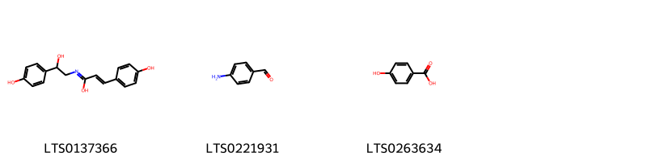{ width=100% }
    <figcaption>Hình ảnh cấu trúc hóa học của 3 hoạt chất thuộc nhóm Benzene and substituted derivatives gồm ['n-[2-hydroxy-2-(4-hydroxyphenyl)ethyl]-3-(4-hydroxyphenyl)prop-2-enimidic acid (LTS0137366)', '4-aminobenzaldehyde (LTS0221931)', 'p-hydroxybenzoic acid (LTS0263634)'].</figcaption>
</figure>
#### Nhóm Cinnamic acids and derivatives
<figure markdown="span">
    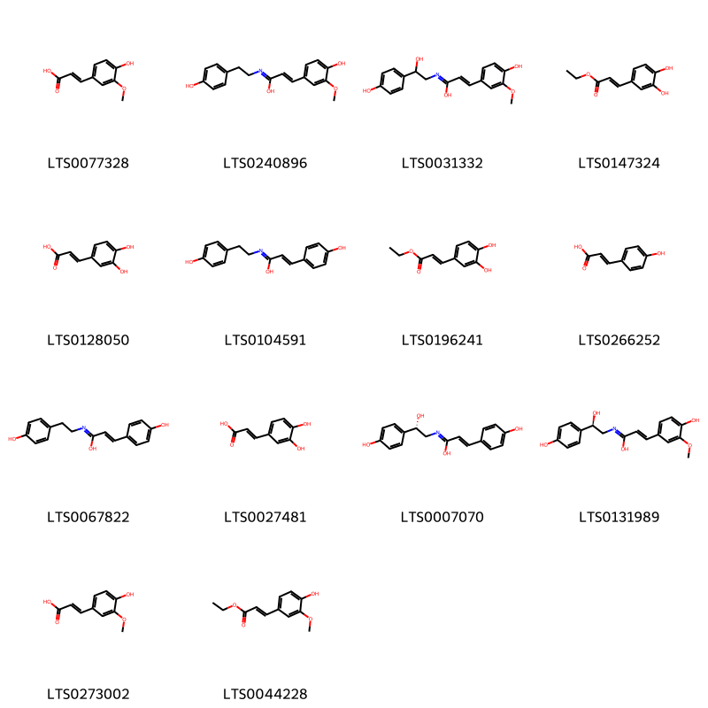{ width=100% }
    <figcaption>Hình ảnh cấu trúc hóa học của 14 hoạt chất thuộc nhóm Cinnamic acids and derivatives gồm ['ferulic acid (LTS0077328)', '3-(4-hydroxy-3-methoxyphenyl)-n-[2-(4-hydroxyphenyl)ethyl]prop-2-enimidic acid (LTS0240896)', 'n-[2-hydroxy-2-(4-hydroxyphenyl)ethyl]-3-(4-hydroxy-3-methoxyphenyl)prop-2-enimidic acid (LTS0031332)', 'ethyl caffeate (LTS0147324)', '3,4-dihydroxycinnamic acid (LTS0128050)', '3-(4-hydroxyphenyl)-n-[2-(4-hydroxyphenyl)ethyl]prop-2-enimidic acid (LTS0104591)', 'ethyl 3-(3,4-dihydroxyphenyl)prop-2-enoate (LTS0196241)', 'para-coumaric acid (LTS0266252)', '(2e)-3-(4-hydroxyphenyl)-n-[2-(4-hydroxyphenyl)ethyl]prop-2-enimidic acid (LTS0067822)', 'caffeic acid (LTS0027481)', '(2e)-n-[(2s)-2-hydroxy-2-(4-hydroxyphenyl)ethyl]-3-(4-hydroxyphenyl)prop-2-enimidic acid (LTS0007070)', '(2e)-n-[(2r)-2-hydroxy-2-(4-hydroxyphenyl)ethyl]-3-(4-hydroxy-3-methoxyphenyl)prop-2-enimidic acid (LTS0131989)', 'ferulic acid (LTS0273002)', 'ethyl ferulate (LTS0044228)'].</figcaption>
</figure>
#### Nhóm Coumarins and derivatives
<figure markdown="span">
    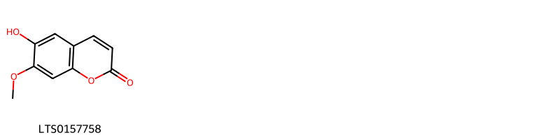{ width=100% }
    <figcaption>Hình ảnh cấu trúc hóa học của 1 hoạt chất thuộc nhóm Coumarins and derivatives gồm ['isoscopoletin (LTS0157758)'].</figcaption>
</figure>
#### Nhóm Dibenzylbutane lignans
<figure markdown="span">
    { width=100% }
    <figcaption>Hình ảnh cấu trúc hóa học của 2 hoạt chất thuộc nhóm Dibenzylbutane lignans gồm ['(2s,3r)-2,3-bis[(4-hydroxy-3-methoxyphenyl)(¹³c)methyl](1-¹³c)butane-1,4-diol (LTS0268699)', 'secoisolariciresinol (LTS0086727)'].</figcaption>
</figure>
#### Nhóm Fatty Acyls
<figure markdown="span">
    { width=100% }
    <figcaption>Hình ảnh cấu trúc hóa học của 2 hoạt chất thuộc nhóm Fatty Acyls gồm ['(3s,8r)-heptadeca-1,9-dien-4,6-diyne-3,8-diol (LTS0083933)', 'falcarindiol (LTS0127360)'].</figcaption>
</figure>
#### Nhóm Flavonoids
<figure markdown="span">
    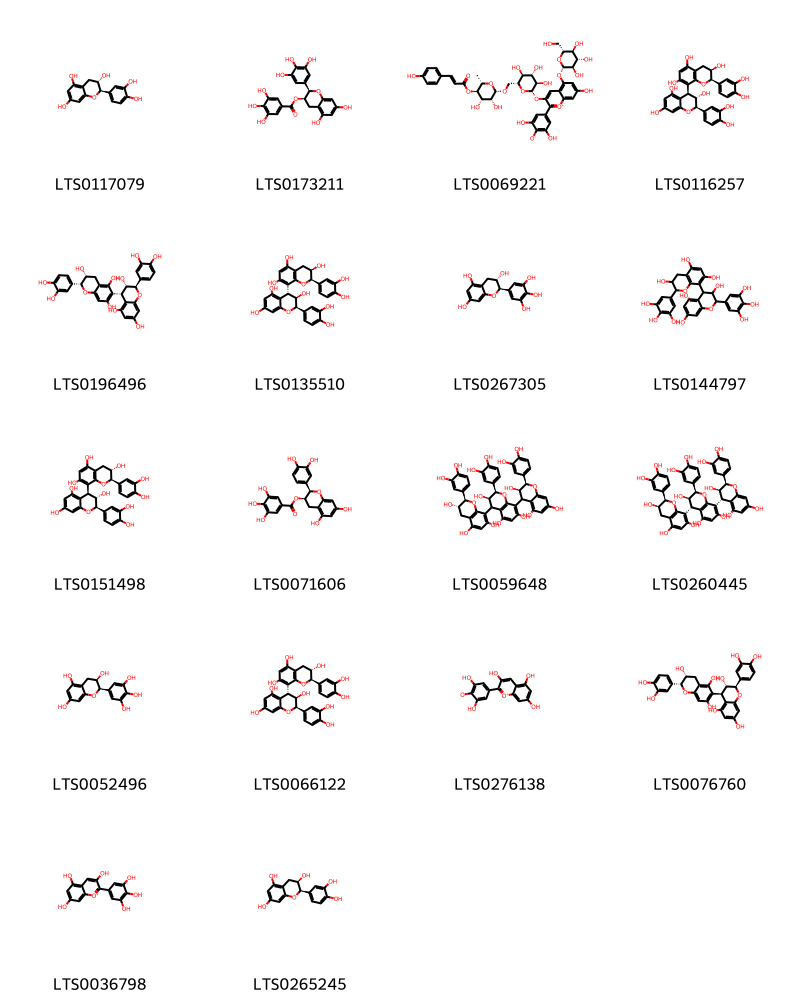{ width=100% }
    <figcaption>Hình ảnh cấu trúc hóa học của 18 hoạt chất thuộc nhóm Flavonoids gồm ['(+)-catechol (LTS0117079)', '(-)-epigallocatechin gallate (LTS0173211)', '2-(3,5-dihydroxy-4-oxidophenyl)-3-{[(2s,3r,4s,5s,6r)-6-({[(2s,3r,4s,5r,6s)-3,4-dihydroxy-5-{[3-(4-hydroxyphenyl)prop-2-enoyl]oxy}-6-methyloxan-2-yl]oxy}methyl)-3,4,5-trihydroxyoxan-2-yl]oxy}-7-hydroxy-5-{[(2s,3r,4s,5s,6r)-3,4,5-trihydroxy-6-(hydroxymethyl)oxan-2-yl]oxy}-1λ⁴-chromen-1-ylium (LTS0069221)', '(2r,3s,4s)-2-(3,4-dihydroxyphenyl)-4-[(2r,3r)-2-(3,4-dihydroxyphenyl)-3,5,7-trihydroxy-3,4-dihydro-2h-1-benzopyran-8-yl]-3,4-dihydro-2h-1-benzopyran-3,5,7-triol (LTS0116257)', '(2r,3s,4s)-2-(3,4-dihydroxyphenyl)-4-[(2r,3r)-2-(3,4-dihydroxyphenyl)-3,5,7-trihydroxy-3,4-dihydro-2h-1-benzopyran-6-yl]-3,4-dihydro-2h-1-benzopyran-3,5,7-triol (LTS0196496)', '(2r,3r,4r)-2-(3,4-dihydroxyphenyl)-4-[(2r,3r)-2-(3,4-dihydroxyphenyl)-3,5,7-trihydroxy-3,4-dihydro-2h-1-benzopyran-8-yl]-3,4-dihydro-2h-1-benzopyran-3,5,7-triol (LTS0135510)', 'gallocatechol (LTS0267305)', '4-[3,5,7-trihydroxy-2-(3,4,5-trihydroxyphenyl)-3,4-dihydro-2h-1-benzopyran-8-yl]-2-(3,4,5-trihydroxyphenyl)-3,4-dihydro-2h-1-benzopyran-3,5,7-triol (LTS0144797)', '(2r,3s,4s)-2-(3,4-dihydroxyphenyl)-4-[(2r,3s)-2-(3,4-dihydroxyphenyl)-3,5,7-trihydroxy-3,4-dihydro-2h-1-benzopyran-8-yl]-3,4-dihydro-2h-1-benzopyran-3,5,7-triol (LTS0151498)', 'epicatechin gallate (LTS0071606)', '(2r,3r)-2-(3,4-dihydroxyphenyl)-8-[(2r,3r)-2-(3,4-dihydroxyphenyl)-3,5,7-trihydroxy-3,4-dihydro-2h-1-benzopyran-4-yl]-4-[(2r,3s)-2-(3,4-dihydroxyphenyl)-3,5,7-trihydroxy-3,4-dihydro-2h-1-benzopyran-8-yl]-3,4-dihydro-2h-1-benzopyran-3,5,7-triol (LTS0059648)', 'procyanidin c1 (LTS0260445)', 'epigallocatechin (LTS0052496)', '(2r,3r,4r)-2-(3,4-dihydroxyphenyl)-4-[(2r,3s)-2-(3,4-dihydroxyphenyl)-3,5,7-trihydroxy-3,4-dihydro-2h-1-benzopyran-8-yl]-3,4-dihydro-2h-1-benzopyran-3,5,7-triol (LTS0066122)', '2-(3,5-dihydroxy-4-oxidophenyl)-3,5,7-trihydroxy-1λ⁴-chromen-1-ylium (LTS0276138)', '(2r,3s,4r)-2-(3,4-dihydroxyphenyl)-4-[(2r,3r)-2-(3,4-dihydroxyphenyl)-3,5,7-trihydroxy-3,4-dihydro-2h-1-benzopyran-6-yl]-3,4-dihydro-2h-1-benzopyran-3,5,7-triol (LTS0076760)', 'delphinidin (LTS0036798)', 'ent-epicatechin (LTS0265245)'].</figcaption>
</figure>
#### Nhóm Furanoid lignans
<figure markdown="span">
    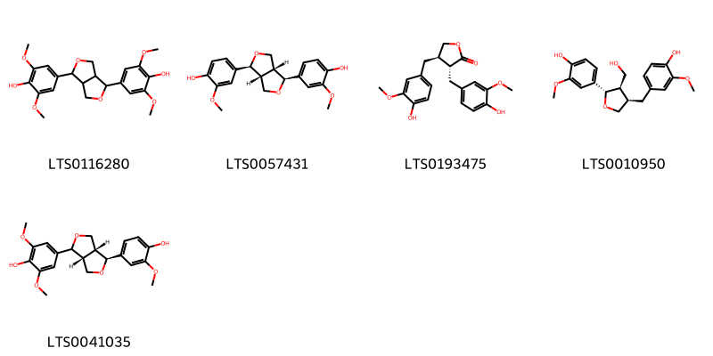{ width=100% }
    <figcaption>Hình ảnh cấu trúc hóa học của 5 hoạt chất thuộc nhóm Furanoid lignans gồm ['syringaresinol (LTS0116280)', 'pinoresinol (LTS0057431)', 'matairesinol (LTS0193475)', 'lariciresinol (LTS0010950)', '4-[(3ar,4s,6ar)-4-(4-hydroxy-3-methoxyphenyl)-hexahydrofuro[3,4-c]furan-1-yl]-2,6-dimethoxyphenol (LTS0041035)'].</figcaption>
</figure>
#### Nhóm Indoles and derivatives
<figure markdown="span">
    { width=100% }
    <figcaption>Hình ảnh cấu trúc hóa học của 1 hoạt chất thuộc nhóm Indoles and derivatives gồm ['tryptamine (LTS0181180)'].</figcaption>
</figure>
#### Nhóm Organooxygen compounds
<figure markdown="span">
    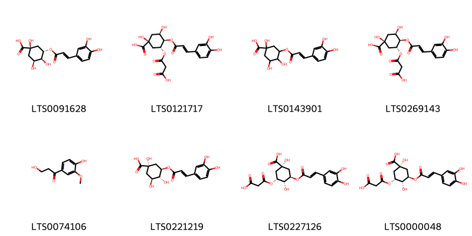{ width=100% }
    <figcaption>Hình ảnh cấu trúc hóa học của 8 hoạt chất thuộc nhóm Organooxygen compounds gồm ['(1r,3s,4s,5s)-3-{[(2e)-3-(3,4-dihydroxyphenyl)prop-2-enoyl]oxy}-1,4,5-trihydroxycyclohexane-1-carboxylic acid (LTS0091628)', '(1s,3r,4r,5r)-3-[(2-carboxyacetyl)oxy]-4-{[(2e)-3-(3,4-dihydroxyphenyl)prop-2-enoyl]oxy}-1,5-dihydroxycyclohexane-1-carboxylic acid (LTS0121717)', '3-{[3-(3,4-dihydroxyphenyl)prop-2-enoyl]oxy}-1,4,5-trihydroxycyclohexane-1-carboxylic acid (LTS0143901)', '(1s,3r,4r,5r)-3-[(2-carboxyacetyl)oxy]-4-{[3-(3,4-dihydroxyphenyl)prop-2-enoyl]oxy}-1,5-dihydroxycyclohexane-1-carboxylic acid (LTS0269143)', '3-hydroxy-1-(4-hydroxy-3-methoxyphenyl)propan-1-one (LTS0074106)', '(1s,3r,4r,5s)-3-{[(2e)-3-(3,4-dihydroxyphenyl)prop-2-enoyl]oxy}-1,4,5-trihydroxycyclohexane-1-carboxylic acid (LTS0221219)', '(1s,3r,4r,5r)-3-[(2-carboxyacetyl)oxy]-5-{[3-(3,4-dihydroxyphenyl)prop-2-enoyl]oxy}-1,4-dihydroxycyclohexane-1-carboxylic acid (LTS0227126)', '(1s,3r,4r,5r)-3-[(2-carboxyacetyl)oxy]-5-{[(2e)-3-(3,4-dihydroxyphenyl)prop-2-enoyl]oxy}-1,4-dihydroxycyclohexane-1-carboxylic acid (LTS0000048)'].</figcaption>
</figure>
#### Nhóm Phenols
<figure markdown="span">
    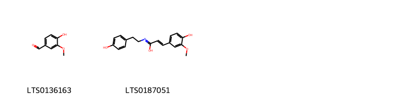{ width=100% }
    <figcaption>Hình ảnh cấu trúc hóa học của 2 hoạt chất thuộc nhóm Phenols gồm ['vanillin (LTS0136163)', '(2e)-3-(4-hydroxy-3-methoxyphenyl)-n-[2-(4-hydroxyphenyl)ethyl]prop-2-enimidic acid (LTS0187051)'].</figcaption>
</figure>
#### Nhóm Prenol lipids
<figure markdown="span">
    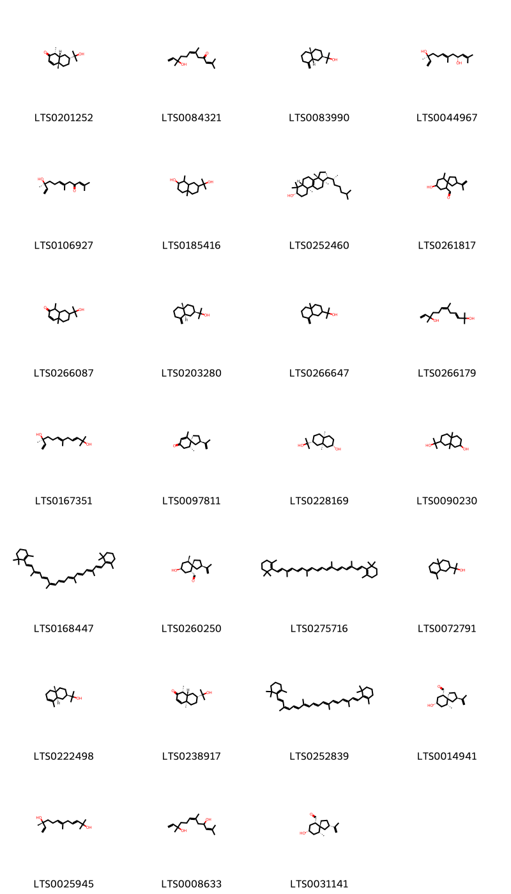{ width=100% }
    <figcaption>Hình ảnh cấu trúc hóa học của 27 hoạt chất thuộc nhóm Prenol lipids gồm ['(1r,4ar,7r,8as)-7-(2-hydroxypropan-2-yl)-1,4a-dimethyl-1,5,6,7,8,8a-hexahydronaphthalen-2-one (LTS0201252)', '10-hydroxy-2,6,10-trimethyldodeca-2,6,11-trien-4-one (LTS0084321)', 'β-eudesmol cis epimer (LTS0083990)', '(3s,6e,9r)-3,7,11-trimethyldodeca-1,6,10-triene-3,9-diol (LTS0044967)', '(6e,10s)-10-hydroxy-2,6,10-trimethyldodeca-2,6,11-trien-4-one (LTS0106927)', '7-(2-hydroxypropan-2-yl)-1,4a-dimethyl-octahydro-1h-naphthalen-2-ol (LTS0185416)', '24,25-dihydrolanosterol (LTS0252460)', '8-hydroxy-10-methyl-2-(prop-1-en-2-yl)spiro[4.5]decane-6-carbaldehyde (LTS0261817)', '7-(2-hydroxypropan-2-yl)-1,4a-dimethyl-1,5,6,7,8,8a-hexahydronaphthalen-2-one (LTS0266087)', 'β-eudesmol (LTS0203280)', 'β-eudesmol (LTS0266647)', '2,6,10-trimethyldodeca-3,6,11-triene-2,10-diol (LTS0266179)', '(3e,6e,10s)-2,6,10-trimethyldodeca-3,6,11-triene-2,10-diol (LTS0167351)', 'solavetivone (LTS0097811)', '(2s,4as,7r,8ar)-7-(2-hydroxypropan-2-yl)-4a,8a-dimethyl-octahydronaphthalen-2-ol (LTS0228169)', '7-(2-hydroxypropan-2-yl)-4a,8a-dimethyl-octahydronaphthalen-2-ol (LTS0090230)', 'β,β-carotene (LTS0168447)', '(2r,5s,6r,8s,10r)-8-hydroxy-10-methyl-2-(prop-1-en-2-yl)spiro[4.5]decane-6-carbaldehyde (LTS0260250)', 'β-carotene (LTS0275716)', '2-(4a,8-dimethyl-2,3,4,5,6,8a-hexahydro-1h-naphthalen-2-yl)propan-2-ol (LTS0072791)', 'α-eudesmol (LTS0222498)', '(1r,4as,7r,8as)-7-(2-hydroxypropan-2-yl)-1,4a-dimethyl-1,5,6,7,8,8a-hexahydronaphthalen-2-one (LTS0238917)', '(9z)-β-carotene (LTS0252839)', 'lubimin (LTS0014941)', '(3e,6e,10r)-2,6,10-trimethyldodeca-3,6,11-triene-2,10-diol (LTS0025945)', '3,7,11-trimethyldodeca-1,6,10-triene-3,9-diol (LTS0008633)', '(2s,5r,6s,8s,10r)-8-hydroxy-10-methyl-2-(prop-1-en-2-yl)spiro[4.5]decane-6-carbaldehyde (LTS0031141)'].</figcaption>
</figure>
#### Nhóm Pyridines and derivatives
<figure markdown="span">
    { width=100% }
    <figcaption>Hình ảnh cấu trúc hóa học của 2 hoạt chất thuộc nhóm Pyridines and derivatives gồm ['(-)-nicotine (LTS0184620)', 'nicotine (LTS0177379)'].</figcaption>
</figure>
#### Nhóm Steroids and steroid derivatives
<figure markdown="span">
    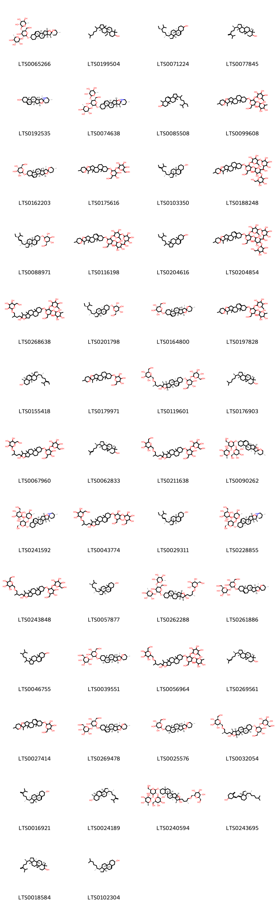{ width=100% }
    <figcaption>Hình ảnh cấu trúc hóa học của 54 hoạt chất thuộc nhóm Steroids and steroid derivatives gồm ["(2s,3r,4r,5r,6s)-2-{[(2r,3s,4s,5r,6r)-4-hydroxy-2-(hydroxymethyl)-6-[(1's,2r,2's,4's,5r,7's,8'r,9's,12's,13'r,16's)-5,7',9',13'-tetramethyl-5'-oxaspiro[oxane-2,6'-pentacyclo[10.8.0.0²,⁹.0⁴,⁸.0¹³,¹⁸]icosan]-18'-eneoxy]-5-{[(2s,3r,4r,5r,6s)-3,4,5-trihydroxy-6-methyloxan-2-yl]oxy}oxan-3-yl]oxy}-6-methyloxane-3,4,5-triol (LTS0065266)", '(3br,7s,9bs,11ar)-9b-ethyl-3a,6,6,11a-tetramethyl-1-(6-methylheptan-2-yl)-dodecahydro-1h-cyclopenta[a]phenanthren-7-ol (LTS0199504)', 'stigmast-5-en-3-ol (LTS0071224)', '24-methylene-cycloartanol (LTS0077845)', 'solasodine (LTS0192535)', 'solamargine (LTS0074638)', '1-(5-ethyl-6-methylheptan-2-yl)-6,9a,11a-trimethyl-1h,2h,3h,3ah,5h,5ah,6h,7h,8h,9h,9bh,10h,11h-cyclopenta[a]phenanthren-7-ol (LTS0085508)', "2-{[3-hydroxy-2-(hydroxymethyl)-6-{5,7',9',13'-tetramethyl-5'-oxaspiro[oxane-2,6'-pentacyclo[10.8.0.0²,⁹.0⁴,⁸.0¹³,¹⁸]icosane]oxy}-5-{[3,4,5-trihydroxy-6-(hydroxymethyl)oxan-2-yl]oxy}oxan-4-yl]oxy}-6-methyloxane-3,4,5-triol (LTS0099608)", 'disogluside (LTS0162203)', 'timosaponin a3 (LTS0175616)', 'avenasterol (LTS0103350)', "2-({6-[(3-{[3,4-dihydroxy-6-(hydroxymethyl)-5-{[3,4,5-trihydroxy-6-(hydroxymethyl)oxan-2-yl]oxy}oxan-2-yl]oxy}-5-hydroxy-6-(hydroxymethyl)-2-{5,7',9',13'-tetramethyl-5'-oxaspiro[oxane-2,6'-pentacyclo[10.8.0.0²,⁹.0⁴,⁸.0¹³,¹⁸]icosane]oxy}oxan-4-yl)oxy]-4,5-dihydroxy-2-methyloxan-3-yl}oxy)-6-(hydroxymethyl)oxane-3,4,5-triol (LTS0188248)", '(2r,3r,4s,5s,6r)-2-{[(1r,3as,3bs,7s,9ar,9bs,11ar)-1-[(2r,3e,5s)-5-ethyl-6-methylhept-3-en-2-yl]-9a,11a-dimethyl-1h,2h,3h,3ah,3bh,4h,6h,7h,8h,9h,9bh,10h,11h-cyclopenta[a]phenanthren-7-yl]oxy}-6-(hydroxymethyl)oxane-3,4,5-triol (LTS0088971)', "2-[(3-{[3,4-dihydroxy-6-(hydroxymethyl)-5-{[3,4,5-trihydroxy-6-(hydroxymethyl)oxan-2-yl]oxy}oxan-2-yl]oxy}-5-hydroxy-6-(hydroxymethyl)-2-{5,7',9',13'-tetramethyl-5'-oxaspiro[oxane-2,6'-pentacyclo[10.8.0.0²,⁹.0⁴,⁸.0¹³,¹⁸]icosan]-18'-eneoxy}oxan-4-yl)oxy]-6-methyloxane-3,4,5-triol (LTS0116198)", 'stigmast-5-en-3-ol, (3β)- (LTS0204616)', "2-({6-[(3-{[3,4-dihydroxy-6-(hydroxymethyl)-5-{[3,4,5-trihydroxy-6-(hydroxymethyl)oxan-2-yl]oxy}oxan-2-yl]oxy}-5-hydroxy-6-(hydroxymethyl)-2-{5,7',9',13'-tetramethyl-5'-oxaspiro[oxane-2,6'-pentacyclo[10.8.0.0²,⁹.0⁴,⁸.0¹³,¹⁸]icosan]-18'-eneoxy}oxan-4-yl)oxy]-4,5-dihydroxy-2-methyloxan-3-yl}oxy)-6-(hydroxymethyl)oxane-3,4,5-triol (LTS0204854)", '2-[(3-hydroxy-6-{[6-hydroxy-7,9,13-trimethyl-6-(3-methyl-4-{[3,4,5-trihydroxy-6-(hydroxymethyl)oxan-2-yl]oxy}butyl)-5-oxapentacyclo[10.8.0.0²,⁹.0⁴,⁸.0¹³,¹⁸]icosan-16-yl]oxy}-2-(hydroxymethyl)-5-{[3,4,5-trihydroxy-6-(hydroxymethyl)oxan-2-yl]oxy}oxan-4-yl)oxy]-6-methyloxane-3,4,5-triol (LTS0268638)', 'sitogluside (LTS0201798)', "(2r,3s,4s,5r,6r)-2-(hydroxymethyl)-6-[(1's,2r,2'r,4's,5r,7's,8'r,9's,12's,13'r,16's)-5,7',9',13'-tetramethyl-5'-oxaspiro[oxane-2,6'-pentacyclo[10.8.0.0²,⁹.0⁴,⁸.0¹³,¹⁸]icosan]-18'-eneoxy]oxane-3,4,5-triol (LTS0164800)", "2-{[3-hydroxy-2-(hydroxymethyl)-6-{5,7',9',13'-tetramethyl-5'-oxaspiro[oxane-2,6'-pentacyclo[10.8.0.0²,⁹.0⁴,⁸.0¹³,¹⁸]icosan]-18'-eneoxy}-5-{[3,4,5-trihydroxy-6-(hydroxymethyl)oxan-2-yl]oxy}oxan-4-yl]oxy}-6-methyloxane-3,4,5-triol (LTS0197828)", '(z)-24-ethylidenelophenol (LTS0155418)', "2-(hydroxymethyl)-6-{5,7',9',13'-tetramethyl-5'-oxaspiro[oxane-2,6'-pentacyclo[10.8.0.0²,⁹.0⁴,⁸.0¹³,¹⁸]icosane]oxy}oxane-3,4,5-triol (LTS0179971)", '(2s,3r,4s,5s,6r)-2-{[(2r,3r,4s,5s,6r)-4,5-dihydroxy-2-{[(1s,2s,4s,6r,7s,8r,9s,12s,13r,16s)-6-hydroxy-7,9,13-trimethyl-6-[(3r)-3-methyl-4-{[(2s,3r,4s,5s,6r)-3,4,5-trihydroxy-6-(hydroxymethyl)oxan-2-yl]methoxy}butyl]-5-oxapentacyclo[10.8.0.0²,⁹.0⁴,⁸.0¹³,¹⁸]icos-18-en-16-yl]oxy}-6-(hydroxymethyl)oxan-3-yl]oxy}-6-(hydroxymethyl)oxane-3,4,5-triol (LTS0119601)', 'cycloartanol (LTS0176903)', '2-[(4,5-dihydroxy-2-{[6-hydroxy-7,9,13-trimethyl-6-(3-methyl-4-{[3,4,5-trihydroxy-6-(hydroxymethyl)oxan-2-yl]oxy}butyl)-5-oxapentacyclo[10.8.0.0²,⁹.0⁴,⁸.0¹³,¹⁸]icosan-16-yl]oxy}-6-(hydroxymethyl)oxan-3-yl)oxy]-6-(hydroxymethyl)oxane-3,4,5-triol (LTS0067960)', '(3r,6s,8r,11s,12s,15r,16r)-7,7,12,16-tetramethyl-15-[(2r)-6-methylhept-5-en-2-yl]pentacyclo[9.7.0.0¹,³.0³,⁸.0¹²,¹⁶]octadecan-6-ol (LTS0062833)', '2-[(4,5-dihydroxy-2-{[6-hydroxy-7,9,13-trimethyl-6-(3-methyl-4-{[3,4,5-trihydroxy-6-(hydroxymethyl)oxan-2-yl]methoxy}butyl)-5-oxapentacyclo[10.8.0.0²,⁹.0⁴,⁸.0¹³,¹⁸]icosan-16-yl]oxy}-6-(hydroxymethyl)oxan-3-yl)oxy]-6-(hydroxymethyl)oxane-3,4,5-triol (LTS0211638)', "(2s,3r,4r,5r,6s)-2-{[(2r,3r,4s,5r,6r)-3-hydroxy-2-(hydroxymethyl)-6-[(1's,2r,2'r,4's,5r,7's,8'r,9's,12's,13'r,16's)-5,7',9',13'-tetramethyl-5'-oxaspiro[oxane-2,6'-pentacyclo[10.8.0.0²,⁹.0⁴,⁸.0¹³,¹⁸]icosan]-18'-eneoxy]-5-{[(2s,3r,4s,5s,6r)-3,4,5-trihydroxy-6-(hydroxymethyl)oxan-2-yl]oxy}oxan-4-yl]oxy}-6-methyloxane-3,4,5-triol (LTS0090262)", "(2r,3r,4r,5r,6s)-2-{[(2r,3r,4s,5s,6r)-5-hydroxy-6-(hydroxymethyl)-2-[(1s,2s,4s,5'r,6s,7s,8r,9s,12s,13r,16s)-5',7,9,13-tetramethyl-5-oxaspiro[pentacyclo[10.8.0.0²,⁹.0⁴,⁸.0¹³,¹⁸]icosane-6,2'-piperidin]-18-eneoxy]-4-{[(2s,3r,4s,5s,6r)-3,4,5-trihydroxy-6-(hydroxymethyl)oxan-2-yl]oxy}oxan-3-yl]oxy}-6-methyloxane-3,4,5-triol (LTS0241592)", '2-[(3,5-dihydroxy-2-{[6-hydroxy-7,9,13-trimethyl-6-(3-methyl-4-{[3,4,5-trihydroxy-6-(hydroxymethyl)oxan-2-yl]oxy}butyl)-5-oxapentacyclo[10.8.0.0²,⁹.0⁴,⁸.0¹³,¹⁸]icos-18-en-16-yl]oxy}-6-(hydroxymethyl)oxan-4-yl)oxy]-6-(hydroxymethyl)oxane-3,4,5-triol (LTS0043774)', 'phytosterol (LTS0029311)', "(2s,3r,4r,5r,6s)-2-{[(2r,3r,4s,5s,6r)-5-hydroxy-6-(hydroxymethyl)-2-[(1s,2s,4s,5'r,6r,7s,8r,9s,12s,13r,16s)-5',7,9,13-tetramethyl-5-oxaspiro[pentacyclo[10.8.0.0²,⁹.0⁴,⁸.0¹³,¹⁸]icosane-6,2'-piperidin]-18-eneoxy]-4-{[(2s,3r,4s,5s,6r)-3,4,5-trihydroxy-6-(hydroxymethyl)oxan-2-yl]oxy}oxan-3-yl]oxy}-6-methyloxane-3,4,5-triol (LTS0228855)", '2-[(4,5-dihydroxy-2-{[6-hydroxy-7,9,13-trimethyl-6-(3-methyl-4-{[3,4,5-trihydroxy-6-(hydroxymethyl)oxan-2-yl]methoxy}butyl)-5-oxapentacyclo[10.8.0.0²,⁹.0⁴,⁸.0¹³,¹⁸]icos-18-en-16-yl]oxy}-6-(hydroxymethyl)oxan-3-yl)oxy]-6-(hydroxymethyl)oxane-3,4,5-triol (LTS0243848)', '(1r,3as,3bs,7s,9bs)-1-[(2r,5r)-5,6-dimethylheptan-2-yl]-9a,11a-dimethyl-1h,2h,3h,3ah,3bh,4h,6h,7h,8h,9h,9bh,10h,11h-cyclopenta[a]phenanthren-7-ol (LTS0057877)', 'protodioscin (LTS0262288)', "(2s,3r,4s,5s,6r)-2-{[(2r,3r,4s,5s,6r)-4,5-dihydroxy-6-(hydroxymethyl)-2-[(4's,5r,7's,8'r,9's,13'r)-5,7',9',13'-tetramethyl-5'-oxaspiro[oxane-2,6'-pentacyclo[10.8.0.0²,⁹.0⁴,⁸.0¹³,¹⁸]icosan]-18'-eneoxy]oxan-3-yl]oxy}-6-(hydroxymethyl)oxane-3,4,5-triol (LTS0261886)", 'campesterol (LTS0046755)', "(2s,3r,4s,5s,6r)-2-{[(2r,3r,4s,5s,6r)-4,5-dihydroxy-6-(hydroxymethyl)-2-[(1'r,2r,2's,4's,5r,7's,8'r,9's,12's,13's,16's,18's)-5,7',9',13'-tetramethyl-5'-oxaspiro[oxane-2,6'-pentacyclo[10.8.0.0²,⁹.0⁴,⁸.0¹³,¹⁸]icosane]oxy]oxan-3-yl]oxy}-6-(hydroxymethyl)oxane-3,4,5-triol (LTS0039551)", '2-[(3-hydroxy-6-{[6-hydroxy-7,9,13-trimethyl-6-(3-methyl-4-{[3,4,5-trihydroxy-6-(hydroxymethyl)oxan-2-yl]methoxy}butyl)-5-oxapentacyclo[10.8.0.0²,⁹.0⁴,⁸.0¹³,¹⁸]icosan-16-yl]oxy}-2-(hydroxymethyl)-5-{[3,4,5-trihydroxy-6-(hydroxymethyl)oxan-2-yl]oxy}oxan-4-yl)oxy]-6-methyloxane-3,4,5-triol (LTS0056964)', 'cycloartenol (LTS0269561)', "2-(hydroxymethyl)-6-{5,7',9',13'-tetramethyl-5'-oxaspiro[oxane-2,6'-pentacyclo[10.8.0.0²,⁹.0⁴,⁸.0¹³,¹⁸]icosan]-18'-eneoxy}oxane-3,4,5-triol (LTS0027414)", "(2s,3r,4s,5s,6r)-2-{[(2r,3r,4s,5s,6r)-4,5-dihydroxy-6-(hydroxymethyl)-2-[(1's,2r,2's,4's,5r,7's,8'r,9's,12's,13'r,16's)-5,7',9',13'-tetramethyl-5'-oxaspiro[oxane-2,6'-pentacyclo[10.8.0.0²,⁹.0⁴,⁸.0¹³,¹⁸]icosan]-18'-eneoxy]oxan-3-yl]oxy}-6-(hydroxymethyl)oxane-3,4,5-triol (LTS0269478)", "(2r,3s,4s,5r,6r)-2-(hydroxymethyl)-6-[(1'r,2r,2's,4's,5r,7's,8'r,9's,12's,13's,16's,18's)-5,7',9',13'-tetramethyl-5'-oxaspiro[oxane-2,6'-pentacyclo[10.8.0.0²,⁹.0⁴,⁸.0¹³,¹⁸]icosane]oxy]oxane-3,4,5-triol (LTS0025576)", '(2s,3r,4s,5s,6r)-2-{[(2r,3r,4s,5s,6r)-4,5-dihydroxy-2-{[(1r,2s,4s,6r,7s,8r,9s,12s,13s,16s,18s)-6-hydroxy-7,9,13-trimethyl-6-[(3r)-3-methyl-4-{[(2s,3r,4s,5s,6r)-3,4,5-trihydroxy-6-(hydroxymethyl)oxan-2-yl]methoxy}butyl]-5-oxapentacyclo[10.8.0.0²,⁹.0⁴,⁸.0¹³,¹⁸]icosan-16-yl]oxy}-6-(hydroxymethyl)oxan-3-yl]oxy}-6-(hydroxymethyl)oxane-3,4,5-triol (LTS0032054)', '24-methylenecholesterol (LTS0016921)', '24-methylidenelophenol (LTS0024189)', '(2s,3r,4r,5r,6s)-2-{[(2r,3r,4s,5r,6r)-3-hydroxy-6-{[(1r,2s,4s,6r,7s,8r,9s,12s,13s,16s,18s)-6-hydroxy-7,9,13-trimethyl-6-[(3r)-3-methyl-4-{[(2s,3r,4s,5s,6r)-3,4,5-trihydroxy-6-(hydroxymethyl)oxan-2-yl]methoxy}butyl]-5-oxapentacyclo[10.8.0.0²,⁹.0⁴,⁸.0¹³,¹⁸]icosan-16-yl]oxy}-2-(hydroxymethyl)-5-{[(2s,3r,4s,5s,6r)-3,4,5-trihydroxy-6-(hydroxymethyl)oxan-2-yl]oxy}oxan-4-yl]oxy}-6-methyloxane-3,4,5-triol (LTS0240594)', 'vitamin d3 (LTS0243695)', '24-methylenecycloartanol (LTS0018584)', 'cholesterol (LTS0102304)', '2-{4-[(1r,2r,4r,6r,8s,9s,12r,13r)-16-{[(2s)-4-hydroxy-6-(hydroxymethyl)-3,5-bis({[(2r)-3,4,5-trihydroxy-6-methyloxan-2-yl]oxy})oxan-2-yl]oxy}-6-methoxy-7,9,13-trimethyl-5-oxapentacyclo[10.8.0.0²,⁹.0⁴,⁸.0¹³,¹⁸]icos-18-en-6-yl]-2-methylbutoxy}-6-(hydroxymethyl)oxane-3,4,5-triol (LTS0133912)', 'lophenol (LTS0271727)', "(2s,3r,4r,5r,6s)-2-{[(2r,3r,4s,5r,6r)-3-{[(2s,3r,4r,5s,6r)-3,4-dihydroxy-6-(hydroxymethyl)-5-{[(2s,3r,4s,5r,6r)-3,4,5-trihydroxy-6-(hydroxymethyl)oxan-2-yl]oxy}oxan-2-yl]oxy}-5-hydroxy-6-(hydroxymethyl)-2-[(1's,2r,2's,4's,5r,7's,8'r,9's,12's,13'r,16's)-5,7',9',13'-tetramethyl-5'-oxaspiro[oxane-2,6'-pentacyclo[10.8.0.0²,⁹.0⁴,⁸.0¹³,¹⁸]icosan]-18'-eneoxy]oxan-4-yl]oxy}-6-methyloxane-3,4,5-triol (LTS0034711)", "2-{[4,5-dihydroxy-6-(hydroxymethyl)-2-{5,7',9',13'-tetramethyl-5'-oxaspiro[oxane-2,6'-pentacyclo[10.8.0.0²,⁹.0⁴,⁸.0¹³,¹⁸]icosan]-18'-eneoxy}oxan-3-yl]oxy}-6-(hydroxymethyl)oxane-3,4,5-triol (LTS0045195)"].</figcaption>
</figure>
#### Nhóm Tetrapyrroles and derivatives
<figure markdown="span">
    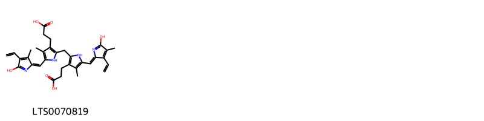{ width=100% }
    <figcaption>Hình ảnh cấu trúc hóa học của 1 hoạt chất thuộc nhóm Tetrapyrroles and derivatives gồm ['3-(2-{[3-(2-carboxyethyl)-5-{[(2z)-3-ethenyl-5-hydroxy-4-methylpyrrol-2-ylidene]methyl}-4-methyl-1h-pyrrol-2-yl]methyl}-5-{[(2e)-4-ethenyl-5-hydroxy-3-methylpyrrol-2-ylidene]methyl}-4-methyl-1h-pyrrol-3-yl)propanoic acid (LTS0070819)'].</figcaption>
</figure>

---

### Dược dân tộc học

Danh sách các quốc gia có sử dụng *Solanum melongena* trong điều trị các bệnh. 

| Country   | Disease                                        | Bệnh                                                       |
|:----------|:-----------------------------------------------|:-----------------------------------------------------------|
| China     | Astringent, Carminative, Refrigerant           | Chất làm se, Chất làm trắng, Chất làm lạnh                 |
| Elsewhere | Antidote, Sialogogue, Narcotic, nan, Stimulant | Thuốc giải độc, Sialogogue, Narcotic, nan, Chất kích thích |
| English   | Expectorant                                    | Thuốc long đàm                                             |
| Haiti     | Nervine, Analgesic, Diuretic, Refrigerant      | Thần kinh, Thuốc giảm đau, Thuốc lợi tiểu, Chất làm lạnh   |
| Mexico    | Hypnotic                                       | Thuốc ngủ                                                  |
| UK        | Aphrodisiac                                    | Thuốc kích dục                                             |
| Venezuela | Suppurative                                    | viêm mủ                                                    |

---

---
## Solanum nigrum
### Thông tin về thực vật

!!! info "Phân loại thực vật của *Solanum nigrum* từ GIBF:"
    - **Kingdom:** Plantae
    - **Phylum:** Tracheophyta
    - **Order:** Solanales
    - **Family:** Solanaceae
    - **Genus:** Solanum
    - **Species:** *Solanum nigrum*

 

| Label (VI)   | Label (EN)   | Scientific Name   | Descriptions (VI)   | Descriptions (EN)   | Also Known As (VI)   | Also Known As (EN)   |
|:-------------|:-------------|:------------------|:--------------------|:--------------------|:---------------------|:---------------------|
| N/A          | N/A          | Solanum nigrum    | loài thực vật       | species of plant    | ['']                 | ['Black Nightshade'] |

#### Phân bố trên thế giới

**Từ CSDL GIBF** United Arab Emirates, Italy, Australia, Japan, Palestine, State of, Israel, Ukraine, Netherlands, Chinese Taipei, Spain, Malta, Türkiye, Portugal, United States of America, Greece, South Africa, Montenegro, Switzerland, Mexico, France, Qatar, United Kingdom of Great Britain and Northern Ireland, China, Jersey, India, New Zealand, Nepal

#### Phân bố tại Việt Nam

**Từ CSDL GIBF**: Không có ghi nhận ở Việt Nam

---
### Thành phần hóa học
        
- Theo cơ sở dữ liệu lotus: Từ loài *Solanum nigrum* đã phân lập và xác định được 112 hoạt chất thuộc về các nhóm Flavonoids, Prenol lipids, Steroids and steroid derivatives, Indoles and derivatives, Cinnamic acids and derivatives, Oxanes, Oxepanes, Organooxygen compounds, Phenols. 

|    | chemicalTaxonomyClassyfireClass   |   smiles_count |
|---:|:----------------------------------|---------------:|
|  0 |                                   |              2 |
|  1 | Cinnamic acids and derivatives    |             10 |
|  2 | Flavonoids                        |              9 |
|  3 | Indoles and derivatives           |              1 |
|  4 | Organooxygen compounds            |              5 |
|  5 | Oxanes                            |              2 |
|  6 | Oxepanes                          |              2 |
|  7 | Phenols                           |              3 |
|  8 | Prenol lipids                     |              4 |
|  9 | Steroids and steroid derivatives  |             74 |

#### Nhóm 
<figure markdown="span">
    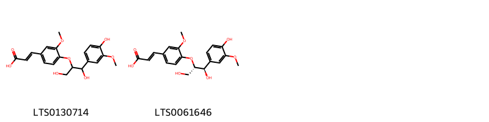{ width=100% }
    <figcaption>Hình ảnh cấu trúc hóa học của 2 hoạt chất thuộc nhóm  gồm ['3-(4-{[1,3-dihydroxy-1-(4-hydroxy-3-methoxyphenyl)propan-2-yl]oxy}-3-methoxyphenyl)prop-2-enoic acid (LTS0130714)', '(2e)-3-(4-{[(1r,2s)-1,3-dihydroxy-1-(4-hydroxy-3-methoxyphenyl)propan-2-yl]oxy}-3-methoxyphenyl)prop-2-enoic acid (LTS0061646)'].</figcaption>
</figure>
#### Nhóm Cinnamic acids and derivatives
<figure markdown="span">
    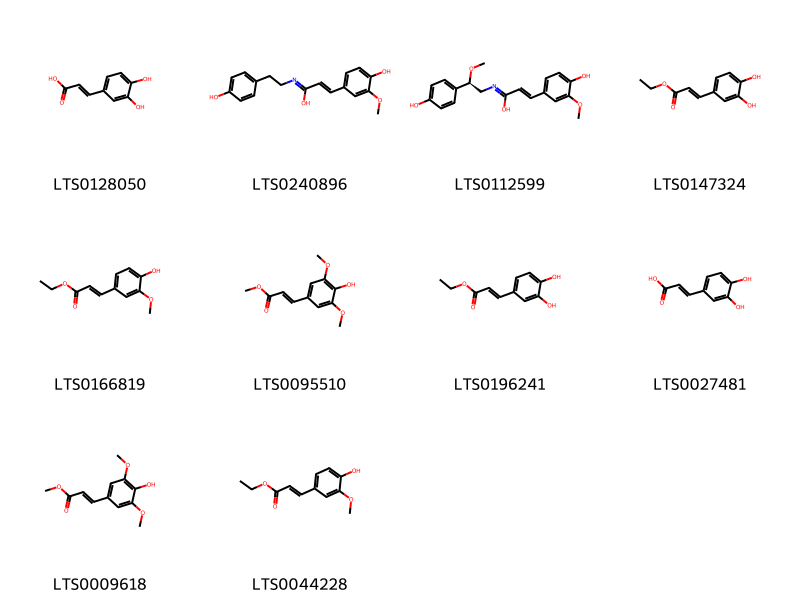{ width=100% }
    <figcaption>Hình ảnh cấu trúc hóa học của 10 hoạt chất thuộc nhóm Cinnamic acids and derivatives gồm ['3,4-dihydroxycinnamic acid (LTS0128050)', '3-(4-hydroxy-3-methoxyphenyl)-n-[2-(4-hydroxyphenyl)ethyl]prop-2-enimidic acid (LTS0240896)', '(2e)-3-(4-hydroxy-3-methoxyphenyl)-n-[(2r)-2-(4-hydroxyphenyl)-2-methoxyethyl]prop-2-enimidic acid (LTS0112599)', 'ethyl caffeate (LTS0147324)', 'ethyl ferulate (LTS0166819)', 'methyl 3-(4-hydroxy-3,5-dimethoxyphenyl)prop-2-enoate (LTS0095510)', 'ethyl 3-(3,4-dihydroxyphenyl)prop-2-enoate (LTS0196241)', 'caffeic acid (LTS0027481)', 'methyl (2e)-3-(4-hydroxy-3,5-dimethoxyphenyl)prop-2-enoate (LTS0009618)', 'ethyl ferulate (LTS0044228)'].</figcaption>
</figure>
#### Nhóm Flavonoids
<figure markdown="span">
    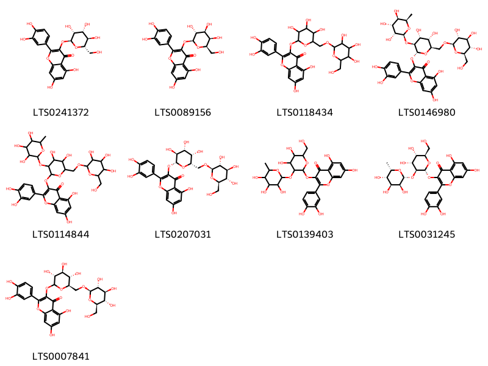{ width=100% }
    <figcaption>Hình ảnh cấu trúc hóa học của 9 hoạt chất thuộc nhóm Flavonoids gồm ['2-(3,4-dihydroxyphenyl)-5,7-dihydroxy-3-{[(2s,3r,4r,5r,6s)-3,4,5-trihydroxy-6-(hydroxymethyl)oxan-2-yl]oxy}chromen-4-one (LTS0241372)', 'hyperoside (LTS0089156)', '2-(3,4-dihydroxyphenyl)-5,7-dihydroxy-3-{[3,4,5-trihydroxy-6-({[3,4,5-trihydroxy-6-(hydroxymethyl)oxan-2-yl]oxy}methyl)oxan-2-yl]oxy}chromen-4-one (LTS0118434)', '3-{[(2r,3s,4r,5s,6r)-4,5-dihydroxy-6-({[(2r,3r,4s,5s,6r)-3,4,5-trihydroxy-6-(hydroxymethyl)oxan-2-yl]oxy}methyl)-3-{[(2s,3r,4r,5r,6r)-3,4,5-trihydroxy-6-methyloxan-2-yl]oxy}oxan-2-yl]oxy}-2-(3,4-dihydroxyphenyl)-5,7-dihydroxychromen-4-one (LTS0146980)', '3-{[4,5-dihydroxy-6-({[3,4,5-trihydroxy-6-(hydroxymethyl)oxan-2-yl]oxy}methyl)-3-[(3,4,5-trihydroxy-6-methyloxan-2-yl)oxy]oxan-2-yl]oxy}-2-(3,4-dihydroxyphenyl)-5,7-dihydroxychromen-4-one (LTS0114844)', '2-(3,4-dihydroxyphenyl)-5,7-dihydroxy-3-{[(2r,3s,4r,5s,6s)-3,4,5-trihydroxy-6-({[(2r,3r,4s,5s,6r)-3,4,5-trihydroxy-6-(hydroxymethyl)oxan-2-yl]oxy}methyl)oxan-2-yl]oxy}chromen-4-one (LTS0207031)', '3-{[4,5-dihydroxy-6-(hydroxymethyl)-3-[(3,4,5-trihydroxy-6-methyloxan-2-yl)oxy]oxan-2-yl]oxy}-2-(3,4-dihydroxyphenyl)-5,7-dihydroxychromen-4-one (LTS0139403)', '3-{[(2r,3s,4r,5s,6r)-4,5-dihydroxy-6-(hydroxymethyl)-3-{[(2r,3s,4s,5s,6s)-3,4,5-trihydroxy-6-methyloxan-2-yl]oxy}oxan-2-yl]oxy}-2-(3,4-dihydroxyphenyl)-5,7-dihydroxychromen-4-one (LTS0031245)', '2-(3,4-dihydroxyphenyl)-5,7-dihydroxy-3-{[(3r,4s,5s,6r)-3,4,5-trihydroxy-6-({[(2r,3r,4s,5s,6r)-3,4,5-trihydroxy-6-(hydroxymethyl)oxan-2-yl]oxy}methyl)oxan-2-yl]oxy}chromen-4-one (LTS0007841)'].</figcaption>
</figure>
#### Nhóm Indoles and derivatives
<figure markdown="span">
    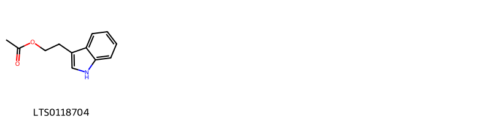{ width=100% }
    <figcaption>Hình ảnh cấu trúc hóa học của 1 hoạt chất thuộc nhóm Indoles and derivatives gồm ['2-(1h-indol-3-yl)ethyl acetate (LTS0118704)'].</figcaption>
</figure>
#### Nhóm Organooxygen compounds
<figure markdown="span">
    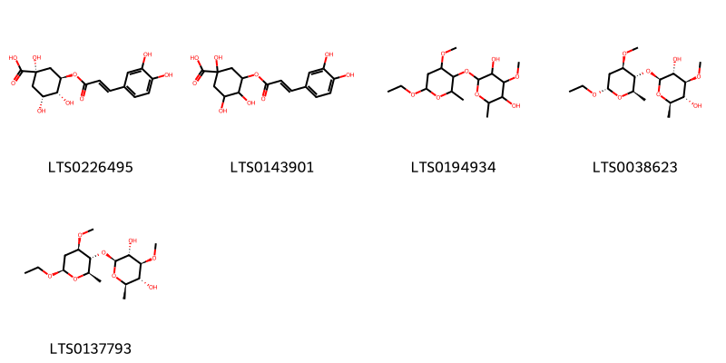{ width=100% }
    <figcaption>Hình ảnh cấu trúc hóa học của 5 hoạt chất thuộc nhóm Organooxygen compounds gồm ['chlorogenic acid (LTS0226495)', '3-{[3-(3,4-dihydroxyphenyl)prop-2-enoyl]oxy}-1,4,5-trihydroxycyclohexane-1-carboxylic acid (LTS0143901)', '2-[(6-ethoxy-4-methoxy-2-methyloxan-3-yl)oxy]-4-methoxy-6-methyloxane-3,5-diol (LTS0194934)', '(2s,3r,4s,5r,6r)-2-{[(2r,3r,4r,6s)-6-ethoxy-4-methoxy-2-methyloxan-3-yl]oxy}-4-methoxy-6-methyloxane-3,5-diol (LTS0038623)', '(2s,3r,4s,5r,6r)-2-{[(2r,3r,4r,6r)-6-ethoxy-4-methoxy-2-methyloxan-3-yl]oxy}-4-methoxy-6-methyloxane-3,5-diol (LTS0137793)'].</figcaption>
</figure>
#### Nhóm Oxanes
<figure markdown="span">
    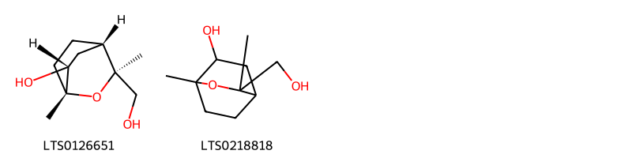{ width=100% }
    <figcaption>Hình ảnh cấu trúc hóa học của 2 hoạt chất thuộc nhóm Oxanes gồm ['(1r,3s,4s,6r)-3-(hydroxymethyl)-1,3-dimethyl-2-oxabicyclo[2.2.2]octan-6-ol (LTS0126651)', '3-(hydroxymethyl)-1,3-dimethyl-2-oxabicyclo[2.2.2]octan-6-ol (LTS0218818)'].</figcaption>
</figure>
#### Nhóm Oxepanes
<figure markdown="span">
    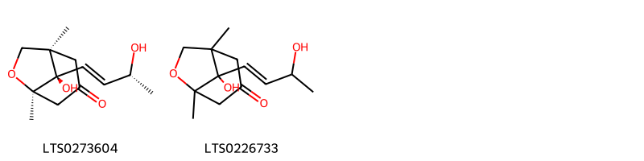{ width=100% }
    <figcaption>Hình ảnh cấu trúc hóa học của 2 hoạt chất thuộc nhóm Oxepanes gồm ['(1r,5r,8r)-8-hydroxy-8-[(1e,3r)-3-hydroxybut-1-en-1-yl]-1,5-dimethyl-6-oxabicyclo[3.2.1]octan-3-one (LTS0273604)', '8-hydroxy-8-(3-hydroxybut-1-en-1-yl)-1,5-dimethyl-6-oxabicyclo[3.2.1]octan-3-one (LTS0226733)'].</figcaption>
</figure>
#### Nhóm Phenols
<figure markdown="span">
    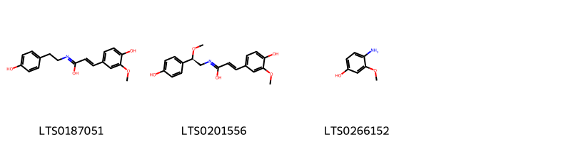{ width=100% }
    <figcaption>Hình ảnh cấu trúc hóa học của 3 hoạt chất thuộc nhóm Phenols gồm ['(2e)-3-(4-hydroxy-3-methoxyphenyl)-n-[2-(4-hydroxyphenyl)ethyl]prop-2-enimidic acid (LTS0187051)', '3-(4-hydroxy-3-methoxyphenyl)-n-[(2r)-2-(4-hydroxyphenyl)-2-methoxyethyl]prop-2-enimidic acid (LTS0201556)', '4-amino-3-methoxyphenol (LTS0266152)'].</figcaption>
</figure>
#### Nhóm Prenol lipids
<figure markdown="span">
    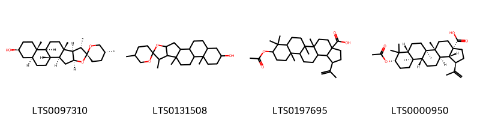{ width=100% }
    <figcaption>Hình ảnh cấu trúc hóa học của 4 hoạt chất thuộc nhóm Prenol lipids gồm ['tigogenin (LTS0097310)', 'tigogenin (LTS0131508)', '9-(acetyloxy)-5a,5b,8,8,11a-pentamethyl-1-(prop-1-en-2-yl)-hexadecahydrocyclopenta[a]chrysene-3a-carboxylic acid (LTS0197695)', '(1r,3as,5ar,5br,7ar,9s,11ar,11br,13ar,13br)-9-(acetyloxy)-5a,5b,8,8,11a-pentamethyl-1-(prop-1-en-2-yl)-hexadecahydrocyclopenta[a]chrysene-3a-carboxylic acid (LTS0000950)'].</figcaption>
</figure>
#### Nhóm Steroids and steroid derivatives
<figure markdown="span">
    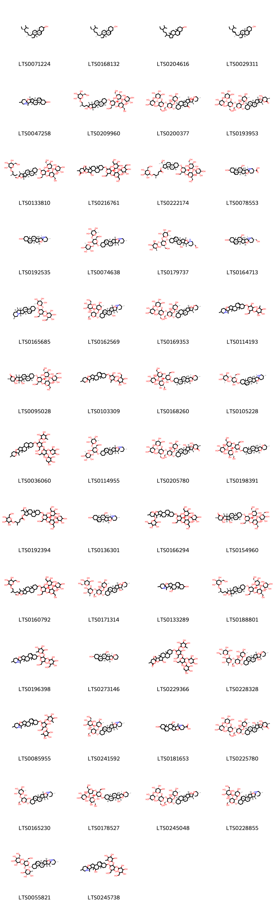{ width=100% }
    <figcaption>Hình ảnh cấu trúc hóa học của 74 hoạt chất thuộc nhóm Steroids and steroid derivatives gồm ['stigmast-5-en-3-ol (LTS0071224)', 'sitosterol (LTS0168132)', 'stigmast-5-en-3-ol, (3β)- (LTS0204616)', 'phytosterol (LTS0029311)', "(1s,2s,4s,6r,8s,9s,12r,13r)-5',7,9,13-tetramethyl-5-oxaspiro[pentacyclo[10.8.0.0²,⁹.0⁴,⁸.0¹³,¹⁸]icosane-6,2'-piperidin]-18-en-16-ol (LTS0047258)", '(2s,3r,4s,5r,6r)-2-{[(2s,3r,4s,5r,6r)-2-{[(2r,3s,4r,5r,6r)-4,5-dihydroxy-6-{[(1r,2s,4s,6r,7s,8r,9s,12s,13s,16s,18s)-6-hydroxy-7,9,13-trimethyl-6-[(3r)-3-methyl-4-{[(2r,3r,4s,5r,6r)-3,4,5-trihydroxy-6-(hydroxymethyl)oxan-2-yl]oxy}butyl]-5-oxapentacyclo[10.8.0.0²,⁹.0⁴,⁸.0¹³,¹⁸]icosan-16-yl]oxy}-2-(hydroxymethyl)oxan-3-yl]oxy}-5-hydroxy-6-(hydroxymethyl)-4-{[(2s,3r,4s,5r)-3,4,5-trihydroxyoxan-2-yl]oxy}oxan-3-yl]oxy}-6-(hydroxymethyl)oxane-3,4,5-triol (LTS0209960)', "(1'r,2r,2's,4's,5r,7's,8's,9's,12's,13's,16's,18's)-8'-hydroxy-16'-{[(2r,3r,4s,5r,6r)-4-hydroxy-5-{[(2s,3r,4s,5r,6r)-5-hydroxy-6-(hydroxymethyl)-4-{[(2s,3r,4s,5r)-3,4,5-trihydroxyoxan-2-yl]oxy}-3-{[(2s,3r,4s,5s)-3,4,5-trihydroxyoxan-2-yl]oxy}oxan-2-yl]oxy}-6-(hydroxymethyl)-3-{[(2s,3r,4r,5r,6s)-3,4,5-trihydroxy-6-methyloxan-2-yl]oxy}oxan-2-yl]oxy}-5,7',9',13'-tetramethyl-5'-oxaspiro[oxane-2,6'-pentacyclo[10.8.0.0²,⁹.0⁴,⁸.0¹³,¹⁸]icosan]-10'-one (LTS0200377)", "(1'r,2r,2's,3s,4's,5r,7's,8'r,9's,12's,13's,16's,18's)-3-hydroxy-16'-{[(2r,3r,4s,5r,6r)-4-hydroxy-5-{[(2s,3r,4s,5r,6r)-5-hydroxy-6-(hydroxymethyl)-4-{[(2s,3r,4s,5r)-3,4,5-trihydroxyoxan-2-yl]oxy}-3-{[(2s,3r,4s,5s)-3,4,5-trihydroxyoxan-2-yl]oxy}oxan-2-yl]oxy}-6-(hydroxymethyl)-3-{[(2s,3r,4r,5r,6s)-3,4,5-trihydroxy-6-methyloxan-2-yl]oxy}oxan-2-yl]oxy}-5,7',9',13'-tetramethyl-5'-oxaspiro[oxane-2,6'-pentacyclo[10.8.0.0²,⁹.0⁴,⁸.0¹³,¹⁸]icosan]-6-one (LTS0193953)", '(2r,3r,4s,5s,6r)-2-[(2r)-4-[(1r,2s,4s,6r,7s,8r,9s,12s,13s,16s,18s)-16-{[(2r,3r,4r,5r,6r)-3,4-dihydroxy-5-{[(2s,3r,4s,5r,6r)-5-hydroxy-6-(hydroxymethyl)-3-{[(2s,3r,4s,5s,6r)-3,4,5-trihydroxy-6-(hydroxymethyl)oxan-2-yl]oxy}-4-{[(2s,3r,4s,5r)-3,4,5-trihydroxyoxan-2-yl]oxy}oxan-2-yl]oxy}-6-(hydroxymethyl)oxan-2-yl]oxy}-6-methoxy-7,9,13-trimethyl-5-oxapentacyclo[10.8.0.0²,⁹.0⁴,⁸.0¹³,¹⁸]icosan-6-yl]-2-methylbutoxy]-6-(hydroxymethyl)oxane-3,4,5-triol (LTS0133810)', "16'-[(3,4-dihydroxy-5-{[5-hydroxy-6-(hydroxymethyl)-3,4-bis({[3,4,5-trihydroxy-6-(hydroxymethyl)oxan-2-yl]oxy})oxan-2-yl]oxy}-6-(hydroxymethyl)oxan-2-yl)oxy]-3,3'-dihydroxy-5,7',9',13'-tetramethyl-5'-oxaspiro[oxane-2,6'-pentacyclo[10.8.0.0²,⁹.0⁴,⁸.0¹³,¹⁸]icosan]-6-one (LTS0216761)", '(1s,2s,3as,3br,5as,7s,9as,9bs,11as)-7-{[(2r,3r,4r,5r,6r)-3,4-dihydroxy-5-{[(2s,3r,4s,5r,6r)-5-hydroxy-6-(hydroxymethyl)-3-{[(2s,3r,4s,5s,6r)-3,4,5-trihydroxy-6-(hydroxymethyl)oxan-2-yl]oxy}-4-{[(2s,3r,4s,5r)-3,4,5-trihydroxyoxan-2-yl]oxy}oxan-2-yl]oxy}-6-(hydroxymethyl)oxan-2-yl]oxy}-1-[(1s)-1-hydroxyethyl]-9a,11a-dimethyl-tetradecahydro-1h-cyclopenta[a]phenanthren-2-yl (4r)-4-methyl-5-{[(2r,3r,4s,5s,6r)-3,4,5-trihydroxy-6-(hydroxymethyl)oxan-2-yl]oxy}pentanoate (LTS0222174)', "(1r,2s,4s,5'r,6r,7s,8r,9s,10r,12s,13r,16s)-10,16-dihydroxy-7,9,13-trimethyl-5-oxaspiro[pentacyclo[10.8.0.0²,⁹.0⁴,⁸.0¹³,¹⁸]icosane-6,2'-piperidin]-18-ene-5'-carboxylic acid (LTS0078553)", 'solasodine (LTS0192535)', 'solamargine (LTS0074638)', "(2s,3r,4r,5r,6s)-2-{[(2r,3s,4s,5r,6r)-3-hydroxy-2-(hydroxymethyl)-6-[(1r,2s,4s,5'r,6r,7s,8r,9s,10r,12s,13r,16s)-5'-(hydroxymethyl)-7,9,13-trimethyl-5-oxaspiro[pentacyclo[10.8.0.0²,⁹.0⁴,⁸.0¹³,¹⁸]icosane-6,2'-piperidin]-18-en-10-oloxy]-5-{[(2s,3r,4r,5r,6s)-3,4,5-trihydroxy-6-methyloxan-2-yl]oxy}oxan-4-yl]oxy}-6-methyloxane-3,4,5-triol (LTS0179737)", "(1r,2s,4s,5'r,6r,7s,8r,9s,10r,12s,13r,16s)-5'-(hydroxymethyl)-7,9,13-trimethyl-5-oxaspiro[pentacyclo[10.8.0.0²,⁹.0⁴,⁸.0¹³,¹⁸]icosane-6,2'-piperidin]-18-ene-10,16-diol (LTS0164713)", '(2s,3r,4s,5s,6r)-2-{[(2r,3s,4s,5r,6r)-3-hydroxy-2-(hydroxymethyl)-6-{[(1s,2s,7s,10r,11s,14s,15r,16s,17s,20s,23s)-10,14,16,20-tetramethyl-22-azahexacyclo[12.10.0.0²,¹¹.0⁵,¹⁰.0¹⁵,²³.0¹⁷,²²]tetracos-4-en-7-yl]oxy}-5-{[(2r,3s,4s,5s,6r)-3,4,5-trihydroxy-6-methyloxan-2-yl]oxy}oxan-4-yl]oxy}-6-(hydroxymethyl)oxane-3,4,5-triol (LTS0165685)', "(2s,3r,4r,5r,6s)-2-{[(2r,3r,4s,5s,6r)-5-hydroxy-6-(hydroxymethyl)-2-[(1r,2s,4s,5'r,6r,7s,8r,9s,10r,12s,13r,16s)-5',7,9,13-tetramethyl-5-oxaspiro[pentacyclo[10.8.0.0²,⁹.0⁴,⁸.0¹³,¹⁸]icosane-6,2'-piperidin]-18-en-10-oloxy]-4-{[(2s,3r,4s,5s,6r)-3,4,5-trihydroxy-6-(hydroxymethyl)oxan-2-yl]oxy}oxan-3-yl]oxy}-6-methyloxane-3,4,5-triol (LTS0162569)", "(2s,3r,4r,5r,6s)-2-{[(2r,3r,4s,5r,6r)-4-hydroxy-5-{[(2s,3r,4s,5r,6r)-5-hydroxy-6-(hydroxymethyl)-4-{[(2s,3r,4s,5r)-3,4,5-trihydroxyoxan-2-yl]oxy}-3-{[(2s,3r,4s,5s)-3,4,5-trihydroxyoxan-2-yl]oxy}oxan-2-yl]oxy}-6-(hydroxymethyl)-2-[(1'r,2r,2's,4's,5r,7's,8'r,9's,12's,13's,16's,18's)-5,7',9',13'-tetramethyl-5'-oxaspiro[oxane-2,6'-pentacyclo[10.8.0.0²,⁹.0⁴,⁸.0¹³,¹⁸]icosane]oxy]oxan-3-yl]oxy}-6-methyloxane-3,4,5-triol (LTS0169353)", "2-{[4,5-dihydroxy-2-(hydroxymethyl)-6-{5',7,9,13-tetramethyl-5-oxaspiro[pentacyclo[10.8.0.0²,⁹.0⁴,⁸.0¹³,¹⁸]icosane-6,2'-piperidin]-18-eneoxy}oxan-3-yl]oxy}-6-methyloxane-3,4,5-triol (LTS0114193)", "(1'r,2r,2's,3s,3'r,4'r,5r,7's,8'r,9's,12's,13's,16's,18's)-16'-{[(2r,3r,4r,5r,6r)-3,4-dihydroxy-5-{[(2s,3r,4s,5r,6r)-5-hydroxy-6-(hydroxymethyl)-3,4-bis({[(2s,3r,4s,5s,6r)-3,4,5-trihydroxy-6-(hydroxymethyl)oxan-2-yl]oxy})oxan-2-yl]oxy}-6-(hydroxymethyl)oxan-2-yl]oxy}-3,3'-dihydroxy-5,7',9',13'-tetramethyl-5'-oxaspiro[oxane-2,6'-pentacyclo[10.8.0.0²,⁹.0⁴,⁸.0¹³,¹⁸]icosan]-6-one (LTS0095028)", "2-[(4,5-dihydroxy-2-methyl-6-{5,7',9',13'-tetramethyl-5'-oxaspiro[oxane-2,6'-pentacyclo[10.8.0.0²,⁹.0⁴,⁸.0¹³,¹⁸]icosan]-18'-eneoxy}oxan-3-yl)oxy]-6-(hydroxymethyl)oxane-3,4,5-triol (LTS0103309)", "(2s,3r,4s,5r,6r)-2-{[(2s,3r,4s,5r,6r)-2-{[(2r,3s,4r,5r,6r)-4,5-dihydroxy-2-(hydroxymethyl)-6-[(1'r,2r,2's,4's,5r,7's,8'r,9's,12'r,13'r,16's,18's)-5,7',9',13'-tetramethyl-5'-oxaspiro[oxane-2,6'-pentacyclo[10.8.0.0²,⁹.0⁴,⁸.0¹³,¹⁸]icosane]oxy]oxan-3-yl]oxy}-5-hydroxy-6-(hydroxymethyl)-4-{[(2s,3r,4s,5r)-3,4,5-trihydroxyoxan-2-yl]oxy}oxan-3-yl]oxy}-6-(hydroxymethyl)oxane-3,4,5-triol (LTS0168260)", "(2s,3r,4s,5s,6r)-2-{[(2s,3r,4s,5r,6r)-4,5-dihydroxy-2-(hydroxymethyl)-6-[(1s,2s,4s,5'r,7s,8r,9s,12s,13r,16s)-5',7,9,13-tetramethyl-5-oxaspiro[pentacyclo[10.8.0.0²,⁹.0⁴,⁸.0¹³,¹⁸]icosane-6,2'-piperidin]-18-eneoxy]oxan-3-yl]oxy}-6-methyloxane-3,4,5-triol (LTS0105228)", "2-[(4-hydroxy-5-{[5-hydroxy-6-(hydroxymethyl)-3,4-bis[(3,4,5-trihydroxyoxan-2-yl)oxy]oxan-2-yl]oxy}-6-(hydroxymethyl)-2-{5,7',9',13'-tetramethyl-5'-oxaspiro[oxane-2,6'-pentacyclo[10.8.0.0²,⁹.0⁴,⁸.0¹³,¹⁸]icosane]oxy}oxan-3-yl)oxy]-6-methyloxane-3,4,5-triol (LTS0036060)", "(2s,3r,4r,5r,6s)-2-{[(2r,3s,4s,5r,6r)-4-hydroxy-2-(hydroxymethyl)-6-[(1r,2s,4s,5'r,6r,7s,8r,9s,12s,13r,16s)-5',7,9,13-tetramethyl-5-oxaspiro[pentacyclo[10.8.0.0²,⁹.0⁴,⁸.0¹³,¹⁸]icosane-6,2'-piperidin]-18-eneoxy]-5-{[(2s,3r,4r,5r,6s)-3,4,5-trihydroxy-6-methyloxan-2-yl]oxy}oxan-3-yl]oxy}-6-methyloxane-3,4,5-triol (LTS0114955)", "(1'r,2r,2's,3s,3'r,4'r,5r,7's,8'r,9'r,12's,13's,16's,18's)-3,3'-dihydroxy-16'-{[(2r,3r,4s,5r,6r)-4-hydroxy-5-{[(2s,3r,4s,5r,6r)-5-hydroxy-6-(hydroxymethyl)-4-{[(2s,3r,4s,5r)-3,4,5-trihydroxyoxan-2-yl]oxy}-3-{[(2s,3r,4s,5s)-3,4,5-trihydroxyoxan-2-yl]oxy}oxan-2-yl]oxy}-6-(hydroxymethyl)-3-{[(2s,3r,4r,5r,6s)-3,4,5-trihydroxy-6-methyloxan-2-yl]oxy}oxan-2-yl]oxy}-5,7',9',13'-tetramethyl-5'-oxaspiro[oxane-2,6'-pentacyclo[10.8.0.0²,⁹.0⁴,⁸.0¹³,¹⁸]icosan]-6-one (LTS0205780)", "(2s,3r,4s,5s,6r)-2-{[(2s,3r,4s,5r,6r)-2-{[(2r,3r,4r,5r,6r)-4,5-dihydroxy-2-(hydroxymethyl)-6-[(1'r,2r,2's,4's,5r,7's,8'r,9's,12's,13's,16's,18's)-5,7',9',13'-tetramethyl-5'-oxaspiro[oxane-2,6'-pentacyclo[10.8.0.0²,⁹.0⁴,⁸.0¹³,¹⁸]icosane]oxy]oxan-3-yl]oxy}-5-hydroxy-6-(hydroxymethyl)-4-{[(2s,3r,4s,5r)-3,4,5-trihydroxyoxan-2-yl]oxy}oxan-3-yl]oxy}-6-(hydroxymethyl)oxane-3,4,5-triol (LTS0198391)", '7-[(3,4-dihydroxy-5-{[5-hydroxy-6-(hydroxymethyl)-3-{[3,4,5-trihydroxy-6-(hydroxymethyl)oxan-2-yl]oxy}-4-[(3,4,5-trihydroxyoxan-2-yl)oxy]oxan-2-yl]oxy}-6-(hydroxymethyl)oxan-2-yl)oxy]-1-(1-hydroxyethyl)-9a,11a-dimethyl-tetradecahydro-1h-cyclopenta[a]phenanthren-2-yl 4-methyl-5-{[3,4,5-trihydroxy-6-(hydroxymethyl)oxan-2-yl]oxy}pentanoate (LTS0192394)', "(1r,2s,4s,5'r,6r,7s,8r,9s,10r,12s,13r,16s)-5',7,9,13-tetramethyl-5-oxaspiro[pentacyclo[10.8.0.0²,⁹.0⁴,⁸.0¹³,¹⁸]icosane-6,2'-piperidin]-18-ene-10,16-diol (LTS0136301)", "2-[(2-{[4,5-dihydroxy-2-(hydroxymethyl)-6-(5,7',9',13'-tetramethyl-3-{[3,4,5-trihydroxy-6-(hydroxymethyl)oxan-2-yl]oxy}-5'-oxaspiro[oxane-2,6'-pentacyclo[10.8.0.0²,⁹.0⁴,⁸.0¹³,¹⁸]icosane]oxy)oxan-3-yl]oxy}-5-hydroxy-6-(hydroxymethyl)-4-[(3,4,5-trihydroxyoxan-2-yl)oxy]oxan-3-yl)oxy]-6-(hydroxymethyl)oxane-3,4,5-triol (LTS0166294)", "(1'r,2r,2's,3s,3'r,4'r,5r,7's,8'r,9'r,12'r,13'r,16's,18's)-16'-{[(2r,3r,4r,5r,6r)-3,4-dihydroxy-5-{[(2s,3r,4s,5r,6r)-5-hydroxy-6-(hydroxymethyl)-3,4-bis({[(2s,3r,4s,5s,6r)-3,4,5-trihydroxy-6-(hydroxymethyl)oxan-2-yl]oxy})oxan-2-yl]oxy}-6-(hydroxymethyl)oxan-2-yl]oxy}-3,3'-dihydroxy-5,7',9',13'-tetramethyl-5'-oxaspiro[oxane-2,6'-pentacyclo[10.8.0.0²,⁹.0⁴,⁸.0¹³,¹⁸]icosan]-6-one (LTS0154960)", '2-(4-{16-[(3,4-dihydroxy-5-{[5-hydroxy-6-(hydroxymethyl)-3-{[3,4,5-trihydroxy-6-(hydroxymethyl)oxan-2-yl]oxy}-4-[(3,4,5-trihydroxyoxan-2-yl)oxy]oxan-2-yl]oxy}-6-(hydroxymethyl)oxan-2-yl)oxy]-6-methoxy-7,9,13-trimethyl-5-oxapentacyclo[10.8.0.0²,⁹.0⁴,⁸.0¹³,¹⁸]icosan-6-yl}-2-methylbutoxy)-6-(hydroxymethyl)oxane-3,4,5-triol (LTS0160792)', "(2s,3r,4r,5r,6s)-2-{[(2r,3r,4s,5s,6r)-5-{[(2s,3r,4r,5r,6s)-4,5-dihydroxy-6-methyl-3-{[(2s,3r,4s,5s,6r)-3,4,5-trihydroxy-6-(hydroxymethyl)oxan-2-yl]oxy}oxan-2-yl]oxy}-4-hydroxy-6-(hydroxymethyl)-2-[(1'r,2r,2's,4's,5r,7's,8's,9's,12's,13'r,16's)-5,7',9',13'-tetramethyl-5'-oxaspiro[oxane-2,6'-pentacyclo[10.8.0.0²,⁹.0⁴,⁸.0¹³,¹⁸]icosan]-18'-en-8'-oloxy]oxan-3-yl]oxy}-6-methyloxane-3,4,5-triol (LTS0171314)", "5',7,9,13-tetramethyl-5-oxaspiro[pentacyclo[10.8.0.0²,⁹.0⁴,⁸.0¹³,¹⁸]icosane-6,2'-piperidin]-18-ene-10,16-diol (LTS0133289)", '(2s,3r,4s,5s,6r)-2-{[(2s,3r,4s,5r,6r)-2-{[(2r,3r,4r,5r,6r)-4,5-dihydroxy-6-{[(1r,2s,4s,6r,7s,8r,9s,12s,13s,16s,18s)-6-hydroxy-7,9,13-trimethyl-6-[(3r)-3-methyl-4-{[(2r,3r,4s,5s,6r)-3,4,5-trihydroxy-6-(hydroxymethyl)oxan-2-yl]oxy}butyl]-5-oxapentacyclo[10.8.0.0²,⁹.0⁴,⁸.0¹³,¹⁸]icosan-16-yl]oxy}-2-(hydroxymethyl)oxan-3-yl]oxy}-5-hydroxy-6-(hydroxymethyl)-4-{[(2s,3r,4s,5r)-3,4,5-trihydroxyoxan-2-yl]oxy}oxan-3-yl]oxy}-6-(hydroxymethyl)oxane-3,4,5-triol (LTS0188801)', "2-{[3-hydroxy-2-(hydroxymethyl)-6-{5',7,9,13-tetramethyl-5-oxaspiro[pentacyclo[10.8.0.0²,⁹.0⁴,⁸.0¹³,¹⁸]icosane-6,2'-piperidin]-18-eneoxy}-5-[(3,4,5-trihydroxy-6-methyloxan-2-yl)oxy]oxan-4-yl]oxy}-6-(hydroxymethyl)oxane-3,4,5-triol (LTS0196398)", "(1'r,2r,2's,4's,7's,8'r,9's,10'r,12's,13'r,16's)-7',9',13'-trimethyl-5'-oxaspiro[oxane-2,6'-pentacyclo[10.8.0.0²,⁹.0⁴,⁸.0¹³,¹⁸]icosan]-18'-ene-10',16'-diol (LTS0273146)", "3,3'-dihydroxy-16'-[(4-hydroxy-5-{[5-hydroxy-6-(hydroxymethyl)-3,4-bis[(3,4,5-trihydroxyoxan-2-yl)oxy]oxan-2-yl]oxy}-6-(hydroxymethyl)-3-[(3,4,5-trihydroxy-6-methyloxan-2-yl)oxy]oxan-2-yl)oxy]-5,7',9',13'-tetramethyl-5'-oxaspiro[oxane-2,6'-pentacyclo[10.8.0.0²,⁹.0⁴,⁸.0¹³,¹⁸]icosan]-6-one (LTS0229366)", "(2s,3r,4r,5r,6s)-2-{[(2r,3r,4s,5r,6r)-5-{[(2s,3r,4r,5r,6s)-4,5-dihydroxy-6-methyl-3-{[(2s,3r,4s,5r,6r)-3,4,5-trihydroxy-6-(hydroxymethyl)oxan-2-yl]oxy}oxan-2-yl]oxy}-4-hydroxy-6-(hydroxymethyl)-2-[(1'r,2r,2's,4's,5r,7's,8's,9's,12's,13'r,16's)-5,7',9',13'-tetramethyl-5'-oxaspiro[oxane-2,6'-pentacyclo[10.8.0.0²,⁹.0⁴,⁸.0¹³,¹⁸]icosan]-18'-en-8'-oloxy]oxan-3-yl]oxy}-6-methyloxane-3,4,5-triol (LTS0228328)", "2-{[4-hydroxy-2-(hydroxymethyl)-6-{5',7,9,13-tetramethyl-5-oxaspiro[pentacyclo[10.8.0.0²,⁹.0⁴,⁸.0¹³,¹⁸]icosane-6,2'-piperidin]-18-eneoxy}-5-[(3,4,5-trihydroxy-6-methyloxan-2-yl)oxy]oxan-3-yl]oxy}-6-methyloxane-3,4,5-triol (LTS0085955)", "(2r,3r,4r,5r,6s)-2-{[(2r,3r,4s,5s,6r)-5-hydroxy-6-(hydroxymethyl)-2-[(1s,2s,4s,5'r,6s,7s,8r,9s,12s,13r,16s)-5',7,9,13-tetramethyl-5-oxaspiro[pentacyclo[10.8.0.0²,⁹.0⁴,⁸.0¹³,¹⁸]icosane-6,2'-piperidin]-18-eneoxy]-4-{[(2s,3r,4s,5s,6r)-3,4,5-trihydroxy-6-(hydroxymethyl)oxan-2-yl]oxy}oxan-3-yl]oxy}-6-methyloxane-3,4,5-triol (LTS0241592)", "10,16-dihydroxy-7,9,13-trimethyl-5-oxaspiro[pentacyclo[10.8.0.0²,⁹.0⁴,⁸.0¹³,¹⁸]icosane-6,2'-piperidin]-18-ene-5'-carboxylic acid (LTS0181653)", "(1'r,2r,2's,3s,3'r,4'r,5r,7's,8'r,9's,12's,13's,16's,18's)-3,3'-dihydroxy-16'-{[(2r,3r,4s,5r,6r)-4-hydroxy-5-{[(2s,3r,4s,5r,6r)-5-hydroxy-6-(hydroxymethyl)-4-{[(2s,3r,4s,5r)-3,4,5-trihydroxyoxan-2-yl]oxy}-3-{[(2s,3r,4s,5s)-3,4,5-trihydroxyoxan-2-yl]oxy}oxan-2-yl]oxy}-6-(hydroxymethyl)-3-{[(2s,3r,4r,5r,6s)-3,4,5-trihydroxy-6-methyloxan-2-yl]oxy}oxan-2-yl]oxy}-5,7',9',13'-tetramethyl-5'-oxaspiro[oxane-2,6'-pentacyclo[10.8.0.0²,⁹.0⁴,⁸.0¹³,¹⁸]icosan]-6-one (LTS0225780)", "(2s,3r,4r,5r,6s)-2-{[(2r,3s,4r,5r,6r)-4,5-dihydroxy-2-(hydroxymethyl)-6-[(1r,2s,4s,5'r,6r,7s,8r,9s,12s,13r,16s)-5',7,9,13-tetramethyl-5-oxaspiro[pentacyclo[10.8.0.0²,⁹.0⁴,⁸.0¹³,¹⁸]icosane-6,2'-piperidin]-18-eneoxy]oxan-3-yl]oxy}-6-methyloxane-3,4,5-triol (LTS0165230)", "(2s,3r,4s,5s,6r)-2-{[(2s,3r,4s,5r,6r)-2-{[(2r,3r,4r,5r,6r)-4,5-dihydroxy-2-(hydroxymethyl)-6-[(1'r,2r,2's,3'r,4'r,5r,7's,8'r,9's,12's,13's,16's,18's)-5,7',9',13'-tetramethyl-5'-oxaspiro[oxane-2,6'-pentacyclo[10.8.0.0²,⁹.0⁴,⁸.0¹³,¹⁸]icosan]-3'-oloxy]oxan-3-yl]oxy}-5-hydroxy-6-(hydroxymethyl)-4-{[(2s,3r,4s,5r)-3,4,5-trihydroxyoxan-2-yl]oxy}oxan-3-yl]oxy}-6-(hydroxymethyl)oxane-3,4,5-triol (LTS0178527)", "(2s,3r,4r,5r,6s)-2-{[(2r,3r,4s,5s,6r)-4-hydroxy-5-{[(2s,3r,4s,5r,6r)-5-hydroxy-6-(hydroxymethyl)-4-{[(2s,3r,4s,5r)-3,4,5-trihydroxyoxan-2-yl]oxy}-3-{[(2s,3r,4s,5s)-3,4,5-trihydroxyoxan-2-yl]oxy}oxan-2-yl]oxy}-6-(hydroxymethyl)-2-[(1'r,2r,2's,4's,5r,7's,8'r,9's,12's,13's,16's,18's)-5,7',9',13'-tetramethyl-5'-oxaspiro[oxane-2,6'-pentacyclo[10.8.0.0²,⁹.0⁴,⁸.0¹³,¹⁸]icosane]oxy]oxan-3-yl]oxy}-6-methyloxane-3,4,5-triol (LTS0245048)", "(2s,3r,4r,5r,6s)-2-{[(2r,3r,4s,5s,6r)-5-hydroxy-6-(hydroxymethyl)-2-[(1s,2s,4s,5'r,6r,7s,8r,9s,12s,13r,16s)-5',7,9,13-tetramethyl-5-oxaspiro[pentacyclo[10.8.0.0²,⁹.0⁴,⁸.0¹³,¹⁸]icosane-6,2'-piperidin]-18-eneoxy]-4-{[(2s,3r,4s,5s,6r)-3,4,5-trihydroxy-6-(hydroxymethyl)oxan-2-yl]oxy}oxan-3-yl]oxy}-6-methyloxane-3,4,5-triol (LTS0228855)", "(2s,3r,4s,5r,6s)-2-{[(2s,3s,4s,5s,6s)-5-hydroxy-6-(hydroxymethyl)-2-[(1s,2s,4s,5'r,6r,7s,8r,9s,12s,13r,16s)-5',7,9,13-tetramethyl-5-oxaspiro[pentacyclo[10.8.0.0²,⁹.0⁴,⁸.0¹³,¹⁸]icosane-6,2'-piperidin]-18-eneoxy]-4-{[(2s,3s,4s,5r,6r)-3,4,5-trihydroxy-6-(hydroxymethyl)oxan-2-yl]oxy}oxan-3-yl]oxy}-6-methyloxane-3,4,5-triol (LTS0055821)", "2-{[3-hydroxy-2-(hydroxymethyl)-6-{5',7,9,13-tetramethyl-5-oxaspiro[pentacyclo[10.8.0.0²,⁹.0⁴,⁸.0¹³,¹⁸]icosane-6,2'-piperidin]-18-en-10-oloxy}-5-[(3,4,5-trihydroxy-6-methyloxan-2-yl)oxy]oxan-4-yl]oxy}-6-(hydroxymethyl)oxane-3,4,5-triol (LTS0245738)", '(1r,3as,3bs,7s,9bs)-1-[(2r,5r)-5,6-dimethylheptan-2-yl]-9a,11a-dimethyl-1h,2h,3h,3ah,3bh,4h,6h,7h,8h,9h,9bh,10h,11h-cyclopenta[a]phenanthren-7-ol (LTS0057877)', "3-hydroxy-16'-[(4-hydroxy-5-{[5-hydroxy-6-(hydroxymethyl)-3,4-bis[(3,4,5-trihydroxyoxan-2-yl)oxy]oxan-2-yl]oxy}-6-(hydroxymethyl)-3-[(3,4,5-trihydroxy-6-methyloxan-2-yl)oxy]oxan-2-yl)oxy]-5,7',9',13'-tetramethyl-5'-oxaspiro[oxane-2,6'-pentacyclo[10.8.0.0²,⁹.0⁴,⁸.0¹³,¹⁸]icosan]-6-one (LTS0130695)", "2-{[5-hydroxy-6-(hydroxymethyl)-2-[5'-(hydroxymethyl)-7,9,13-trimethyl-5-oxaspiro[pentacyclo[10.8.0.0²,⁹.0⁴,⁸.0¹³,¹⁸]icosane-6,2'-piperidin]-18-en-10-oloxy]-4-[(3,4,5-trihydroxy-6-methyloxan-2-yl)oxy]oxan-3-yl]oxy}-6-methyloxane-3,4,5-triol (LTS0061588)", "(2s,3r,4s,5r,6r)-2-{[(2s,3r,4s,5r,6r)-2-{[(2r,3r,4r,5r,6r)-4,5-dihydroxy-2-(hydroxymethyl)-6-[(1'r,2s,2's,3s,4's,5r,7's,8'r,9's,12's,13's,16's,18's)-5,7',9',13'-tetramethyl-3-{[(2s,3r,4s,5s,6r)-3,4,5-trihydroxy-6-(hydroxymethyl)oxan-2-yl]oxy}-5'-oxaspiro[oxane-2,6'-pentacyclo[10.8.0.0²,⁹.0⁴,⁸.0¹³,¹⁸]icosane]oxy]oxan-3-yl]oxy}-5-hydroxy-6-(hydroxymethyl)-4-{[(2s,3r,4s,5r)-3,4,5-trihydroxyoxan-2-yl]oxy}oxan-3-yl]oxy}-6-(hydroxymethyl)oxane-3,4,5-triol (LTS0016843)", 'campesterol (LTS0046755)', "2-[(2-{[4,5-dihydroxy-2-(hydroxymethyl)-6-{5,7',9',13'-tetramethyl-5'-oxaspiro[oxane-2,6'-pentacyclo[10.8.0.0²,⁹.0⁴,⁸.0¹³,¹⁸]icosan]-3'-oloxy}oxan-3-yl]oxy}-5-hydroxy-6-(hydroxymethyl)-4-[(3,4,5-trihydroxyoxan-2-yl)oxy]oxan-3-yl)oxy]-6-(hydroxymethyl)oxane-3,4,5-triol (LTS0126648)", "2-[(2-{[4,5-dihydroxy-2-(hydroxymethyl)-6-[(1'r,2r,2's,4's,8's,9's,12'r,13's,18's)-5,7',9',13'-tetramethyl-5'-oxaspiro[oxane-2,6'-pentacyclo[10.8.0.0²,⁹.0⁴,⁸.0¹³,¹⁸]icosane]oxy]oxan-3-yl]oxy}-5-hydroxy-6-(hydroxymethyl)-4-[(3,4,5-trihydroxyoxan-2-yl)oxy]oxan-3-yl)oxy]-6-(hydroxymethyl)oxane-3,4,5-triol (LTS0108173)", 'solanidine (LTS0027764)', "5'-(hydroxymethyl)-7,9,13-trimethyl-5-oxaspiro[pentacyclo[10.8.0.0²,⁹.0⁴,⁸.0¹³,¹⁸]icosane-6,2'-piperidin]-18-ene-10,16-diol (LTS0063714)", "(2s,3r,4s,5s,6r)-2-{[(2s,3r,4s,5r,6r)-2-{[(2r,3s,4r,5r,6r)-4,5-dihydroxy-2-(hydroxymethyl)-6-[(1'r,2r,2's,3'r,4'r,5r,7's,8'r,9'r,12's,13's,16's,18's)-5,7',9',13'-tetramethyl-5'-oxaspiro[oxane-2,6'-pentacyclo[10.8.0.0²,⁹.0⁴,⁸.0¹³,¹⁸]icosan]-3'-oloxy]oxan-3-yl]oxy}-5-hydroxy-6-(hydroxymethyl)-4-{[(2s,3r,4s,5r)-3,4,5-trihydroxyoxan-2-yl]oxy}oxan-3-yl]oxy}-6-(hydroxymethyl)oxane-3,4,5-triol (LTS0011253)", "(2s,3r,4r,5r,6s)-2-{[(2r,4s,5s,6r)-5-hydroxy-6-(hydroxymethyl)-2-[(1s,2s,4s,5'r,6r,7s,8r,9s,12s,13r,16s)-5',7,9,13-tetramethyl-5-oxaspiro[pentacyclo[10.8.0.0²,⁹.0⁴,⁸.0¹³,¹⁸]icosane-6,2'-piperidin]-18-eneoxy]-4-{[(2s,3r,4s,5s,6r)-3,4,5-trihydroxy-6-(hydroxymethyl)oxan-2-yl]oxy}oxan-3-yl]oxy}-6-methyloxane-3,4,5-triol (LTS0014049)", "(2s,3r,4s,5s,6r)-2-{[(2s,3r,4s,5r,6r)-2-{[(2r,3r,4r,5r,6r)-4,5-dihydroxy-2-(hydroxymethyl)-6-[(1's,2r,2's,4's,5r,7's,8'r,9's,12's,13's,16's,18's)-5,7',9',13'-tetramethyl-5'-oxaspiro[oxane-2,6'-pentacyclo[10.8.0.0²,⁹.0⁴,⁸.0¹³,¹⁸]icosane]oxy]oxan-3-yl]oxy}-5-hydroxy-6-(hydroxymethyl)-4-{[(2s,3r,4s,5r)-3,4,5-trihydroxyoxan-2-yl]oxy}oxan-3-yl]oxy}-6-(hydroxymethyl)oxane-3,4,5-triol (LTS0012849)", 'solanidine (LTS0125022)', '2-({2-[(4,5-dihydroxy-6-{[6-hydroxy-7,9,13-trimethyl-6-(3-methyl-4-{[3,4,5-trihydroxy-6-(hydroxymethyl)oxan-2-yl]oxy}butyl)-5-oxapentacyclo[10.8.0.0²,⁹.0⁴,⁸.0¹³,¹⁸]icosan-16-yl]oxy}-2-(hydroxymethyl)oxan-3-yl)oxy]-5-hydroxy-6-(hydroxymethyl)-4-[(3,4,5-trihydroxyoxan-2-yl)oxy]oxan-3-yl}oxy)-6-(hydroxymethyl)oxane-3,4,5-triol (LTS0010867)', "2-[(4,5-dihydroxy-2-{[4-hydroxy-2-(hydroxymethyl)-6-{5,7',9',13'-tetramethyl-5'-oxaspiro[oxane-2,6'-pentacyclo[10.8.0.0²,⁹.0⁴,⁸.0¹³,¹⁸]icosan]-18'-en-8'-oloxy}-5-[(3,4,5-trihydroxy-6-methyloxan-2-yl)oxy]oxan-3-yl]oxy}-6-methyloxan-3-yl)oxy]-6-(hydroxymethyl)oxane-3,4,5-triol (LTS0023089)", "(2s,3r,4r,5r,6s)-2-{[(2r,3s,4r,5r,6r)-4,5-dihydroxy-2-(hydroxymethyl)-6-[(1s,2s,4s,5'r,6r,7s,8r,9s,12s,13r,16s)-5',7,9,13-tetramethyl-5-oxaspiro[pentacyclo[10.8.0.0²,⁹.0⁴,⁸.0¹³,¹⁸]icosane-6,2'-piperidin]-18-eneoxy]oxan-3-yl]oxy}-6-methyloxane-3,4,5-triol (LTS0093507)", 'α-solanine (LTS0110548)', "2-[(2-{[4,5-dihydroxy-2-(hydroxymethyl)-6-{5,7',9',13'-tetramethyl-5'-oxaspiro[oxane-2,6'-pentacyclo[10.8.0.0²,⁹.0⁴,⁸.0¹³,¹⁸]icosane]oxy}oxan-3-yl]oxy}-5-hydroxy-6-(hydroxymethyl)-4-[(3,4,5-trihydroxyoxan-2-yl)oxy]oxan-3-yl)oxy]-6-(hydroxymethyl)oxane-3,4,5-triol (LTS0224340)", "(2s,3r,4s,5s,6r)-2-{[(2s,3r,4s,5r,6r)-2-{[(2r,3s,4r,5r,6r)-4,5-dihydroxy-2-(hydroxymethyl)-6-[(1'r,2s,2's,3s,4's,5r,7's,8'r,9's,12's,13's,16's,18's)-5,7',9',13'-tetramethyl-3-{[(2s,3r,4s,5r,6r)-3,4,5-trihydroxy-6-(hydroxymethyl)oxan-2-yl]oxy}-5'-oxaspiro[oxane-2,6'-pentacyclo[10.8.0.0²,⁹.0⁴,⁸.0¹³,¹⁸]icosane]oxy]oxan-3-yl]oxy}-5-hydroxy-6-(hydroxymethyl)-4-{[(2s,3r,4s,5r)-3,4,5-trihydroxyoxan-2-yl]oxy}oxan-3-yl]oxy}-6-(hydroxymethyl)oxane-3,4,5-triol (LTS0021798)", "(2s,3r,4s,5s,6r)-2-{[(2s,3r,4s,5r,6r)-4,5-dihydroxy-2-methyl-6-[(1's,2r,2's,4's,5r,7's,8'r,9's,12's,13'r,16's)-5,7',9',13'-tetramethyl-5'-oxaspiro[oxane-2,6'-pentacyclo[10.8.0.0²,⁹.0⁴,⁸.0¹³,¹⁸]icosan]-18'-eneoxy]oxan-3-yl]oxy}-6-(hydroxymethyl)oxane-3,4,5-triol (LTS0020642)", 'cholesterol (LTS0102304)', "(2s,3r,4r,5r,6s)-2-{[(2s,3r,4s,5r,6s)-4-hydroxy-2-(hydroxymethyl)-6-[(1s,2s,4s,5'r,6r,7s,8r,9s,12s,13r,16s)-5',7,9,13-tetramethyl-5-oxaspiro[pentacyclo[10.8.0.0²,⁹.0⁴,⁸.0¹³,¹⁸]icosane-6,2'-piperidin]-18-eneoxy]-5-{[(2s,3r,4r,5r,6r)-3,4,5-trihydroxy-6-methyloxan-2-yl]oxy}oxan-3-yl]oxy}-6-methyloxane-3,4,5-triol (LTS0095173)", "7',9',13'-trimethyl-5'-oxaspiro[oxane-2,6'-pentacyclo[10.8.0.0²,⁹.0⁴,⁸.0¹³,¹⁸]icosan]-18'-ene-10',16'-diol (LTS0227068)", "8'-hydroxy-16'-[(4-hydroxy-5-{[5-hydroxy-6-(hydroxymethyl)-3,4-bis[(3,4,5-trihydroxyoxan-2-yl)oxy]oxan-2-yl]oxy}-6-(hydroxymethyl)-3-[(3,4,5-trihydroxy-6-methyloxan-2-yl)oxy]oxan-2-yl)oxy]-5,7',9',13'-tetramethyl-5'-oxaspiro[oxane-2,6'-pentacyclo[10.8.0.0²,⁹.0⁴,⁸.0¹³,¹⁸]icosan]-10'-one (LTS0242962)"].</figcaption>
</figure>

---

### Dược dân tộc học

Danh sách các quốc gia có sử dụng *Solanum nigrum* trong điều trị các bệnh. 

| Country   | Disease                                                                                                                                                                         | Bệnh                                                                                                                                                                                                                                                  |
|:----------|:--------------------------------------------------------------------------------------------------------------------------------------------------------------------------------|:------------------------------------------------------------------------------------------------------------------------------------------------------------------------------------------------------------------------------------------------------|
| China     | Alexiteric, Astringent, Poison, Refrigerant, Sedative, Diuretic, Poison, Diuretic, Poison                                                                                       | Alexiteric, Chất làm se, Chất độc, Chất làm lạnh, Thuốc an thần, Thuốc lợi tiểu, Chất độc, Thuốc lợi tiểu, Chất độc                                                                                                                                   |
| Elsewhere | Antiseptic, nan, Cathartic, Cathartic, Diuretic, Diuretic, Diuretic, Emollient, nan, Narcotic, Poison, Poison, Antidote, Analgesic, Tonic, nan, Antidote, Laxative, Vasodilator | Thuốc sát trùng, nan, Cathartic, Cathartic, Thuốc lợi tiểu, Thuốc lợi tiểu, Thuốc lợi tiểu, Chất làm mềm, nan, Chất gây nghiện, Chất độc, Chất độc, Thuốc giải độc, Thuốc giảm đau, Thuốc bổ, nan, Thuốc giải độc, Thuốc nhuận tràng, Thuốc giãn mạch |
| Haiti     | Emollient, Narcotic, Narcotic, Sedative, Sedative                                                                                                                               | Chất làm mềm, Chất gây nghiện, Chất gây nghiện, Thuốc an thần, Thuốc an thần                                                                                                                                                                          |
| Iraq      | Diaphoretic                                                                                                                                                                     | Thuốc tràn dịch màng phổi                                                                                                                                                                                                                             |
| Mexico    | Sedative, Vulnerary, Sedative                                                                                                                                                   | Thuốc an thần, sơ tán, an thần                                                                                                                                                                                                                        |
| Sudan     | Purgative                                                                                                                                                                       | Thuốc xổ                                                                                                                                                                                                                                              |
| Turkey    | Diuretic, Nervine, Poison, Sedative                                                                                                                                             | Thuốc lợi tiểu, Thần kinh, Chất độc, Thuốc an thần                                                                                                                                                                                                    |
| US        | Poison, Poison                                                                                                                                                                  | Chất độc, chất độc                                                                                                                                                                                                                                    |
| Venezuela | Tonic                                                                                                                                                                           | (thuộc) trương lực                                                                                                                                                                                                                                    |
| ain       | Narcotic                                                                                                                                                                        | Thuốc gây ngủ, gây mê                                                                                                                                                                                                                                 |

---

---
## Solanum pseudocapsicum
### Thông tin về thực vật

!!! info "Phân loại thực vật của *Solanum pseudocapsicum* từ GIBF:"
    - **Kingdom:** Plantae
    - **Phylum:** Tracheophyta
    - **Order:** Solanales
    - **Family:** Solanaceae
    - **Genus:** Solanum
    - **Species:** *Solanum pseudocapsicum*

 

| Label (VI)   | Label (EN)   | Scientific Name        | Descriptions (VI)   | Descriptions (EN)   | Also Known As (VI)   | Also Known As (EN)   |
|:-------------|:-------------|:-----------------------|:--------------------|:--------------------|:---------------------|:---------------------|
| N/A          | N/A          | Solanum pseudocapsicum | loài thực vật       | species of plant    | ['']                 | ['']                 |

#### Phân bố trên thế giới

**Từ CSDL GIBF** nan, Italy, Australia, Japan, Belgium, Georgia, Argentina, Netherlands, Chinese Taipei, Spain, Bolivia (Plurinational State of), Türkiye, Portugal, United States of America, Uruguay, Greece, South Africa, Brazil, Mexico, France, United Kingdom of Great Britain and Northern Ireland, China, Ecuador, India, New Zealand, Nepal

#### Phân bố tại Việt Nam

**Từ CSDL GIBF**: Không có ghi nhận ở Việt Nam

---
### Thành phần hóa học
        
- Theo cơ sở dữ liệu lotus: Từ loài *Solanum pseudocapsicum* đã phân lập và xác định được 36 hoạt chất thuộc về các nhóm Prenol lipids, Steroids and steroid derivatives, Tetrapyrroles and derivatives. 

|    | chemicalTaxonomyClassyfireClass   |   smiles_count |
|---:|:----------------------------------|---------------:|
|  0 | Prenol lipids                     |              2 |
|  1 | Steroids and steroid derivatives  |             32 |
|  2 | Tetrapyrroles and derivatives     |              1 |

#### Nhóm Prenol lipids
<figure markdown="span">
    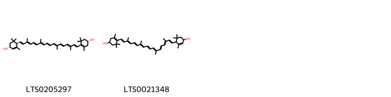{ width=100% }
    <figcaption>Hình ảnh cấu trúc hóa học của 2 hoạt chất thuộc nhóm Prenol lipids gồm ['carotenoid (LTS0205297)', '4-[(9e,11e,13e,15e,17e)-18-(4-hydroxy-2,6,6-trimethylcyclohex-1-en-1-yl)-3,7,12,16-tetramethyloctadeca-1,3,5,7,9,11,13,15,17-nonaen-1-yl]-3,5,5-trimethylcyclohex-2-en-1-ol (LTS0021348)'].</figcaption>
</figure>
#### Nhóm Steroids and steroid derivatives
<figure markdown="span">
    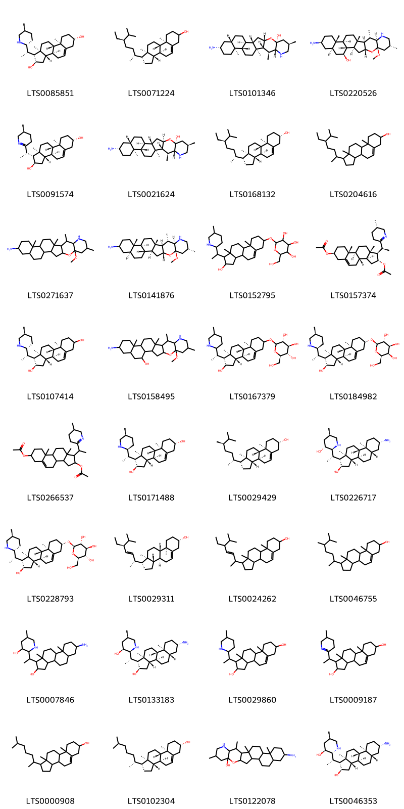{ width=100% }
    <figcaption>Hình ảnh cấu trúc hóa học của 32 hoạt chất thuộc nhóm Steroids and steroid derivatives gồm ['(1r,2r,3as,3bs,7s,9ar,9bs,11as)-9a,11a-dimethyl-1-[(1s)-1-[(2r,5s)-5-methylpiperidin-2-yl]ethyl]-1h,2h,3h,3ah,3bh,4h,6h,7h,8h,9h,9bh,10h,11h-cyclopenta[a]phenanthrene-2,7-diol (LTS0085851)', 'stigmast-5-en-3-ol (LTS0071224)', '(1s,2r,5s,7s,10s,11s,14s,15r,16s,17r,20r,22s,24s)-7-amino-10,14,16,20-tetramethyl-23-oxa-18-azahexacyclo[12.11.0.0²,¹¹.0⁵,¹⁰.0¹⁵,²⁴.0¹⁷,²²]pentacosan-22-ol (LTS0101346)', '(1s,2r,3s,5r,7s,10s,11s,14s,15r,16s,17r,20r,22s,24r)-7-amino-22-methoxy-10,14,16,20-tetramethyl-23-oxa-18-azahexacyclo[12.11.0.0²,¹¹.0⁵,¹⁰.0¹⁵,²⁴.0¹⁷,²²]pentacosan-3-ol (LTS0220526)', 'etioline (LTS0091574)', 'solanocapsine (LTS0021624)', 'sitosterol (LTS0168132)', 'stigmast-5-en-3-ol, (3β)- (LTS0204616)', '22-methoxy-10,14,16,20-tetramethyl-23-oxa-18-azahexacyclo[12.11.0.0²,¹¹.0⁵,¹⁰.0¹⁵,²⁴.0¹⁷,²²]pentacosan-7-amine (LTS0271637)', '(1s,2r,5s,7s,10s,11s,14s,15r,16s,17r,20r,22s,24r)-22-methoxy-10,14,16,20-tetramethyl-23-oxa-18-azahexacyclo[12.11.0.0²,¹¹.0⁵,¹⁰.0¹⁵,²⁴.0¹⁷,²²]pentacosan-7-amine (LTS0141876)', '2-({2-hydroxy-9a,11a-dimethyl-1-[1-(5-methylpiperidin-2-yl)ethyl]-1h,2h,3h,3ah,3bh,4h,6h,7h,8h,9h,9bh,10h,11h-cyclopenta[a]phenanthren-7-yl}oxy)-6-(hydroxymethyl)oxane-3,4,5-triol (LTS0152795)', '(1r,2r,3as,3bs,7s,9ar,9bs,11as)-7-(acetyloxy)-9a,11a-dimethyl-1-[(1s)-1-[(5s)-5-methyl-3,4,5,6-tetrahydropyridin-2-yl]ethyl]-1h,2h,3h,3ah,3bh,4h,6h,7h,8h,9h,9bh,10h,11h-cyclopenta[a]phenanthren-2-yl acetate (LTS0157374)', '(1r,2r,3as,3bs,9ar,9bs,11as)-9a,11a-dimethyl-1-[(1s)-1-[(2r,5s)-5-methylpiperidin-2-yl]ethyl]-1h,2h,3h,3ah,3bh,4h,6h,7h,8h,9h,9bh,10h,11h-cyclopenta[a]phenanthrene-2,7-diol (LTS0107414)', '7-amino-22-methoxy-10,14,16,20-tetramethyl-23-oxa-18-azahexacyclo[12.11.0.0²,¹¹.0⁵,¹⁰.0¹⁵,²⁴.0¹⁷,²²]pentacosan-3-ol (LTS0158495)', '(3r,4s,5s,6r)-2-{[(1r,3as,3bs,9ar,9bs,11as)-2-hydroxy-9a,11a-dimethyl-1-[(1s)-1-(5-methylpiperidin-2-yl)ethyl]-1h,2h,3h,3ah,3bh,4h,6h,7h,8h,9h,9bh,10h,11h-cyclopenta[a]phenanthren-7-yl]oxy}-6-(hydroxymethyl)oxane-3,4,5-triol (LTS0167379)', '(2r,3r,4s,5r,6r)-2-{[(1r,2r,3as,3bs,7s,9ar,9bs,11as)-2-hydroxy-9a,11a-dimethyl-1-[(1s)-1-[(2s,5s)-5-methylpiperidin-2-yl]ethyl]-1h,2h,3h,3ah,3bh,4h,6h,7h,8h,9h,9bh,10h,11h-cyclopenta[a]phenanthren-7-yl]oxy}-6-(hydroxymethyl)oxane-3,4,5-triol (LTS0184982)', '7-(acetyloxy)-9a,11a-dimethyl-1-[1-(5-methyl-3,4,5,6-tetrahydropyridin-2-yl)ethyl]-1h,2h,3h,3ah,3bh,4h,6h,7h,8h,9h,9bh,10h,11h-cyclopenta[a]phenanthren-2-yl acetate (LTS0266537)', '(1r,2r,3as,3bs,7s,9ar,9bs,11as)-9a,11a-dimethyl-1-[(1s)-1-[(2s,5s)-5-methylpiperidin-2-yl]ethyl]-1h,2h,3h,3ah,3bh,4h,6h,7h,8h,9h,9bh,10h,11h-cyclopenta[a]phenanthrene-2,7-diol (LTS0171488)', 'campesterol (LTS0029429)', '(2s,3r,5r)-2-[(1s)-1-[(1r,2r,3as,3br,5as,7s,9as,9bs,11as)-7-amino-2-hydroxy-9a,11a-dimethyl-tetradecahydro-1h-cyclopenta[a]phenanthren-1-yl]ethyl]-5-methylpiperidin-3-ol (LTS0226717)', '(2r,3r,4s,5s,6r)-2-{[(1r,2r,3as,3bs,7s,9ar,9bs,11as)-2-hydroxy-9a,11a-dimethyl-1-[(1s)-1-[(2r,5s)-5-methylpiperidin-2-yl]ethyl]-1h,2h,3h,3ah,3bh,4h,6h,7h,8h,9h,9bh,10h,11h-cyclopenta[a]phenanthren-7-yl]oxy}-6-(hydroxymethyl)oxane-3,4,5-triol (LTS0228793)', 'phytosterol (LTS0029311)', 'stigmasterol (LTS0024262)', 'campesterol (LTS0046755)', '2-(1-{7-amino-2-hydroxy-9a,11a-dimethyl-tetradecahydro-1h-cyclopenta[a]phenanthren-1-yl}ethyl)-5-methylpiperidin-3-ol (LTS0007846)', '(2s,3s,5r)-2-[(1s)-1-[(1r,2r,3as,3br,5as,7s,9as,9bs,11as)-7-amino-2-hydroxy-9a,11a-dimethyl-tetradecahydro-1h-cyclopenta[a]phenanthren-1-yl]ethyl]-5-methylpiperidin-3-ol (LTS0133183)', '9a,11a-dimethyl-1-[1-(5-methylpiperidin-2-yl)ethyl]-1h,2h,3h,3ah,3bh,4h,6h,7h,8h,9h,9bh,10h,11h-cyclopenta[a]phenanthrene-2,7-diol (LTS0029860)', '9a,11a-dimethyl-1-[1-(5-methyl-3,4,5,6-tetrahydropyridin-2-yl)ethyl]-1h,2h,3h,3ah,3bh,4h,6h,7h,8h,9h,9bh,10h,11h-cyclopenta[a]phenanthrene-2,7-diol (LTS0009187)', 'epicholestrol (LTS0000908)', 'cholesterol (LTS0102304)', '7-amino-10,14,16,20-tetramethyl-23-oxa-18-azahexacyclo[12.11.0.0²,¹¹.0⁵,¹⁰.0¹⁵,²⁴.0¹⁷,²²]pentacosan-22-ol (LTS0122078)', 'solacapine (LTS0046353)'].</figcaption>
</figure>
#### Nhóm Tetrapyrroles and derivatives
<figure markdown="span">
    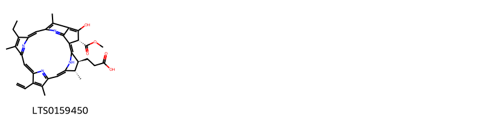{ width=100% }
    <figcaption>Hình ảnh cấu trúc hóa học của 1 hoạt chất thuộc nhóm Tetrapyrroles and derivatives gồm ['3-[(3r,21s,22s)-16-ethenyl-11-ethyl-4-hydroxy-3-(methoxycarbonyl)-12,17,21,26-tetramethyl-7,23,24,25-tetraazahexacyclo[18.2.1.1⁵,⁸.1¹⁰,¹³.1¹⁵,¹⁸.0²,⁶]hexacosa-1,4,6,8(26),9,11,13(25),14,16,18(24),19-undecaen-22-yl]propanoic acid (LTS0159450)'].</figcaption>
</figure>

---

### Dược dân tộc học

Danh sách các quốc gia có sử dụng *Solanum pseudocapsicum* trong điều trị các bệnh. 

| Country   | Disease          | Bệnh               |
|:----------|:-----------------|:-------------------|
| Elsewhere | nan, nan, Poison | nan, nan, chất độc |

---

---
## Solanum saponaceum
### Thông tin về thực vật

!!! info "Phân loại thực vật của *Solanum saponaceum* từ GIBF:"
    - **Kingdom:** Plantae
    - **Phylum:** Tracheophyta
    - **Order:** Solanales
    - **Family:** Solanaceae
    - **Genus:** Solanum
    - **Species:** *Solanum saponaceum*

 

| Label (VI)   | Label (EN)   | Scientific Name    | Descriptions (VI)   | Descriptions (EN)   | Also Known As (VI)   | Also Known As (EN)   |
|:-------------|:-------------|:-------------------|:--------------------|:--------------------|:---------------------|:---------------------|
| N/A          | N/A          | Solanum saponaceum | loài thực vật       | species of plant    | ['']                 | ['']                 |

#### Phân bố trên thế giới

**Từ CSDL GIBF** nan, Ecuador, Peru

#### Phân bố tại Việt Nam

**Từ CSDL GIBF**: Không có ghi nhận ở Việt Nam

---
### Thành phần hóa học
        
- Theo cơ sở dữ liệu lotus: Từ loài *Solanum saponaceum* đã phân lập và xác định được Chưa có hoạt chất nào được phân lập. hoạt chất thuộc về các nhóm Không có hoạt chất nào được phân lập. 

Không có hình ảnh nào được tạo ra

---

### Dược dân tộc học

Danh sách các quốc gia có sử dụng *Solanum saponaceum* trong điều trị các bệnh. 

| Country   | Disease   | Bệnh     |
|:----------|:----------|:---------|
| Peru      | Soap      | Xà phòng |

---

---
## Solanum sarmentosum
### Thông tin về thực vật

!!! info "Phân loại thực vật của *N/A* từ GIBF:"
    - **Kingdom:** Plantae
    - **Phylum:** Tracheophyta
    - **Order:** Solanales
    - **Family:** Solanaceae
    - **Genus:** Solanum
    - **Species:** *N/A*

 

| Label (VI)   | Label (EN)   | Scientific Name    | Descriptions (VI)   | Descriptions (EN)   | Also Known As (VI)   | Also Known As (EN)   |
|:-------------|:-------------|:-------------------|:--------------------|:--------------------|:---------------------|:---------------------|
| N/A          | N/A          | Solanum saponaceum | loài thực vật       | species of plant    | ['']                 | ['']                 |

#### Phân bố trên thế giới

**Từ CSDL GIBF** Australia, Japan, Argentina, Palestine, State of, Israel, Canada, Puerto Rico, Luxembourg, Cyprus, Chinese Taipei, Spain, Türkiye, Portugal, United States of America, Uruguay, Chile, Greece, South Africa, Montenegro, Thailand, Brazil, Mexico, France, Peru, Viet Nam, United Kingdom of Great Britain and Northern Ireland, Ecuador, Colombia, Costa Rica, India, Indonesia, New Zealand

#### Phân bố tại Việt Nam

**Từ CSDL GIBF**: Lâm Đồng

---
### Thành phần hóa học
        
- Theo cơ sở dữ liệu lotus: Từ loài *N/A* đã phân lập và xác định được Chưa có hoạt chất nào được phân lập. hoạt chất thuộc về các nhóm Không có hoạt chất nào được phân lập. 

Không có hình ảnh nào được tạo ra

---

### Dược dân tộc học

Danh sách các quốc gia có sử dụng *N/A* trong điều trị các bệnh. 

| Country   | Disease   | Bệnh           |
|:----------|:----------|:---------------|
| Malaya    | Vermifuge | Thuốc diệt sán |

---

---
## Solanum seaforthianum
### Thông tin về thực vật

!!! info "Phân loại thực vật của *Solanum seaforthianum* từ GIBF:"
    - **Kingdom:** Plantae
    - **Phylum:** Tracheophyta
    - **Order:** Solanales
    - **Family:** Solanaceae
    - **Genus:** Solanum
    - **Species:** *Solanum seaforthianum*

 

| Label (VI)   | Label (EN)   | Scientific Name       | Descriptions (VI)   | Descriptions (EN)   | Also Known As (VI)   | Also Known As (EN)   |
|:-------------|:-------------|:----------------------|:--------------------|:--------------------|:---------------------|:---------------------|
| N/A          | N/A          | Solanum seaforthianum | loài thực vật       | species of plant    | ['']                 | ['']                 |

#### Phân bố trên thế giới

**Từ CSDL GIBF** Australia, Argentina, Malawi, Zambia, Puerto Rico, Namibia, Chinese Taipei, United States of America, Zimbabwe, South Africa, Brazil, New Caledonia, Mexico, Dominican Republic, Eswatini, China, Colombia, Botswana, India, Kenya

#### Phân bố tại Việt Nam

**Từ CSDL GIBF**: Không có ghi nhận ở Việt Nam

---
### Thành phần hóa học
        
- Theo cơ sở dữ liệu lotus: Từ loài *Solanum seaforthianum* đã phân lập và xác định được Chưa có hoạt chất nào được phân lập. hoạt chất thuộc về các nhóm Không có hoạt chất nào được phân lập. 

Không có hình ảnh nào được tạo ra

---

### Dược dân tộc học

Danh sách các quốc gia có sử dụng *Solanum seaforthianum* trong điều trị các bệnh. 

| Country   | Disease              | Bệnh                   |
|:----------|:---------------------|:-----------------------|
| Elsewhere | Poison, Protisticide | Chất độc, Protisticide |

---

---
## Solanum sisymbrifolium
### Thông tin về thực vật

!!! info "Phân loại thực vật của *Solanum sisymbriifolium* từ GIBF:"
    - **Kingdom:** Plantae
    - **Phylum:** Tracheophyta
    - **Order:** Solanales
    - **Family:** Solanaceae
    - **Genus:** Solanum
    - **Species:** *Solanum sisymbriifolium*

 

| Label (VI)   | Label (EN)   | Scientific Name       | Descriptions (VI)   | Descriptions (EN)   | Also Known As (VI)   | Also Known As (EN)   |
|:-------------|:-------------|:----------------------|:--------------------|:--------------------|:---------------------|:---------------------|
| N/A          | N/A          | Solanum seaforthianum | loài thực vật       | species of plant    | ['']                 | ['']                 |

#### Phân bố trên thế giới

**Từ CSDL GIBF** Italy, Australia, Argentina, Chinese Taipei, Türkiye, Portugal, United States of America, Uruguay, Paraguay, South Africa, Guinea-Bissau, Thailand, Iran (Islamic Republic of), Brazil, Mexico, Peru, Ecuador, Colombia, India

#### Phân bố tại Việt Nam

**Từ CSDL GIBF**: Không có ghi nhận ở Việt Nam

---
### Thành phần hóa học
        
- Theo cơ sở dữ liệu lotus: Từ loài *Solanum sisymbriifolium* đã phân lập và xác định được Chưa có hoạt chất nào được phân lập. hoạt chất thuộc về các nhóm Không có hoạt chất nào được phân lập. 

Không có hình ảnh nào được tạo ra

---

### Dược dân tộc học

Danh sách các quốc gia có sử dụng *Solanum sisymbriifolium* trong điều trị các bệnh. 

| Country   | Disease   | Bệnh     |
|:----------|:----------|:---------|
| Elsewhere | Poison    | Chất độc |

---

---
## Solanum sisymbriifolium
### Thông tin về thực vật

!!! info "Phân loại thực vật của *Solanum sisymbriifolium* từ GIBF:"
    - **Kingdom:** Plantae
    - **Phylum:** Tracheophyta
    - **Order:** Solanales
    - **Family:** Solanaceae
    - **Genus:** Solanum
    - **Species:** *Solanum sisymbriifolium*

 

| Label (VI)   | Label (EN)   | Scientific Name         | Descriptions (VI)   | Descriptions (EN)   | Also Known As (VI)   | Also Known As (EN)            |
|:-------------|:-------------|:------------------------|:--------------------|:--------------------|:---------------------|:------------------------------|
| N/A          | N/A          | Solanum sisymbriifolium | loài thực vật       | species of plant    | ['']                 | ['Yellow-berried Nightshade'] |

#### Phân bố trên thế giới

**Từ CSDL GIBF** Italy, Australia, Argentina, Chinese Taipei, Türkiye, Portugal, United States of America, Uruguay, Paraguay, South Africa, Guinea-Bissau, Thailand, Iran (Islamic Republic of), Brazil, Mexico, Peru, Ecuador, Colombia, India

#### Phân bố tại Việt Nam

**Từ CSDL GIBF**: Không có ghi nhận ở Việt Nam

---
### Thành phần hóa học
        
- Theo cơ sở dữ liệu lotus: Từ loài *Solanum sisymbriifolium* đã phân lập và xác định được 20 hoạt chất thuộc về các nhóm Fatty Acyls, Steroids and steroid derivatives, Organonitrogen compounds, 2-arylbenzofuran flavonoids. 

|    | chemicalTaxonomyClassyfireClass   |   smiles_count |
|---:|:----------------------------------|---------------:|
|  0 |                                   |              2 |
|  1 | 2-arylbenzofuran flavonoids       |              1 |
|  2 | Fatty Acyls                       |              1 |
|  3 | Organonitrogen compounds          |              1 |
|  4 | Steroids and steroid derivatives  |             14 |

#### Nhóm 
<figure markdown="span">
    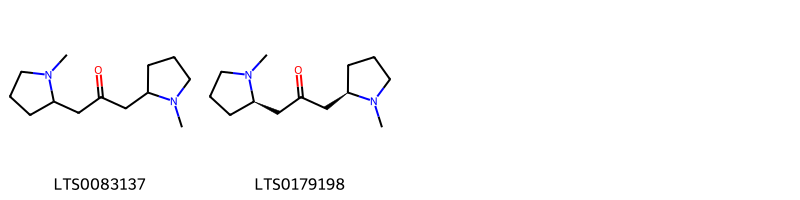{ width=100% }
    <figcaption>Hình ảnh cấu trúc hóa học của 2 hoạt chất thuộc nhóm  gồm ['cuskhygrine (LTS0083137)', '1,3-bis[(2r)-1-methylpyrrolidin-2-yl]propan-2-one (LTS0179198)'].</figcaption>
</figure>
#### Nhóm 2-arylbenzofuran flavonoids
<figure markdown="span">
    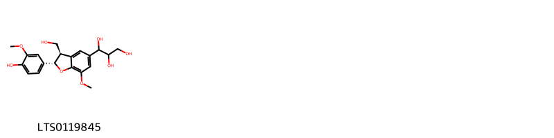{ width=100% }
    <figcaption>Hình ảnh cấu trúc hóa học của 1 hoạt chất thuộc nhóm 2-arylbenzofuran flavonoids gồm ['1-[(2s,3r)-2-(4-hydroxy-3-methoxyphenyl)-3-(hydroxymethyl)-7-methoxy-2,3-dihydro-1-benzofuran-5-yl]propane-1,2,3-triol (LTS0119845)'].</figcaption>
</figure>
#### Nhóm Fatty Acyls
<figure markdown="span">
    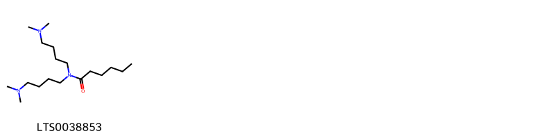{ width=100% }
    <figcaption>Hình ảnh cấu trúc hóa học của 1 hoạt chất thuộc nhóm Fatty Acyls gồm ['n,n-bis[4-(dimethylamino)butyl]hexanamide (LTS0038853)'].</figcaption>
</figure>
#### Nhóm Organonitrogen compounds
<figure markdown="span">
    { width=100% }
    <figcaption>Hình ảnh cấu trúc hóa học của 1 hoạt chất thuộc nhóm Organonitrogen compounds gồm ['(4-{[4-(dimethylamino)butyl]amino}butyl)dimethylamine (LTS0073100)'].</figcaption>
</figure>
#### Nhóm Steroids and steroid derivatives
<figure markdown="span">
    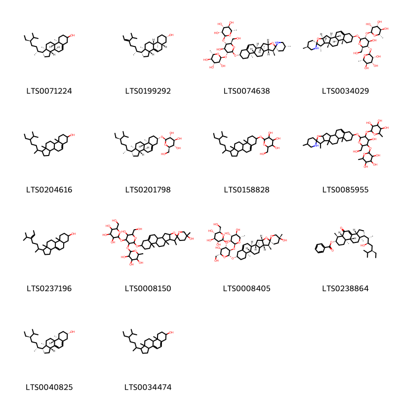{ width=100% }
    <figcaption>Hình ảnh cấu trúc hóa học của 14 hoạt chất thuộc nhóm Steroids and steroid derivatives gồm ['stigmast-5-en-3-ol (LTS0071224)', 'delta7-avenasterol (LTS0199292)', 'solamargine (LTS0074638)', "(2s,3r,4r,5r,6s)-2-{[(2r,3s,4s,5r,6r)-4-hydroxy-2-(hydroxymethyl)-6-[(1s,2s,4s,5's,6s,7s,8r,9s,12s,13r,16s)-5',7,9,13-tetramethyl-5-oxaspiro[pentacyclo[10.8.0.0²,⁹.0⁴,⁸.0¹³,¹⁸]icosane-6,2'-piperidin]-18-eneoxy]-5-{[(2s,3r,4r,5r,6s)-3,4,5-trihydroxy-6-methyloxan-2-yl]oxy}oxan-3-yl]oxy}-6-methyloxane-3,4,5-triol (LTS0034029)", 'stigmast-5-en-3-ol, (3β)- (LTS0204616)', 'sitogluside (LTS0201798)', '2-{[1-(5-ethyl-6-methylheptan-2-yl)-9a,11a-dimethyl-1h,2h,3h,3ah,3bh,4h,6h,7h,8h,9h,9bh,10h,11h-cyclopenta[a]phenanthren-7-yl]oxy}-6-(hydroxymethyl)oxane-3,4,5-triol (LTS0158828)', "2-{[4-hydroxy-2-(hydroxymethyl)-6-{5',7,9,13-tetramethyl-5-oxaspiro[pentacyclo[10.8.0.0²,⁹.0⁴,⁸.0¹³,¹⁸]icosane-6,2'-piperidin]-18-eneoxy}-5-[(3,4,5-trihydroxy-6-methyloxan-2-yl)oxy]oxan-3-yl]oxy}-6-methyloxane-3,4,5-triol (LTS0085955)", 'avenasterol (LTS0237196)', "2-{[5-hydroxy-6-(hydroxymethyl)-2-{5,7',9',13'-tetramethyl-5'-oxaspiro[oxane-2,6'-pentacyclo[10.8.0.0²,⁹.0⁴,⁸.0¹³,¹⁸]icosan]-18'-en-5-oloxy}-4-{[3,4,5-trihydroxy-6-(hydroxymethyl)oxan-2-yl]oxy}oxan-3-yl]oxy}-6-methyloxane-3,4,5-triol (LTS0008150)", "(2s,3r,4r,5r,6s)-2-{[(2r,3r,4s,5s,6r)-5-hydroxy-6-(hydroxymethyl)-2-[(1's,2r,2's,4's,5r,7's,8'r,9's,12's,13'r,16's)-5,7',9',13'-tetramethyl-5'-oxaspiro[oxane-2,6'-pentacyclo[10.8.0.0²,⁹.0⁴,⁸.0¹³,¹⁸]icosan]-18'-en-5-oloxy]-4-{[(2s,3r,4s,5s,6r)-3,4,5-trihydroxy-6-(hydroxymethyl)oxan-2-yl]oxy}oxan-3-yl]oxy}-6-methyloxane-3,4,5-triol (LTS0008405)", '(1r,3ar,5as,6s,7s,9ar,9br,11ar)-1-[(2s,3r,5r)-5-ethyl-3-hydroxy-6-methylheptan-2-yl]-6,9a,11a-trimethyl-5-oxo-1h,2h,3h,3ah,5ah,6h,7h,8h,9h,9bh,10h,11h-cyclopenta[a]phenanthren-7-yl benzoate (LTS0238864)', '7-dehydrositosterol (LTS0040825)', '7-dehydrositosterol (LTS0034474)'].</figcaption>
</figure>

---

### Dược dân tộc học

Danh sách các quốc gia có sử dụng *Solanum sisymbriifolium* trong điều trị các bệnh. 

| Country   | Disease       | Bệnh          |
|:----------|:--------------|:--------------|
| Paraguay  | Antifertility | Chống lão hóa |

---

---
## Solanum sodomeum
### Thông tin về thực vật

!!! info "Phân loại thực vật của *N/A* từ GIBF:"
    - **Kingdom:** Plantae
    - **Phylum:** Tracheophyta
    - **Order:** Solanales
    - **Family:** Solanaceae
    - **Genus:** Solanum
    - **Species:** *N/A*

 

| Label (VI)   | Label (EN)   | Scientific Name   | Descriptions (VI)   | Descriptions (EN)   | Also Known As (VI)   | Also Known As (EN)   |
|:-------------|:-------------|:------------------|:--------------------|:--------------------|:---------------------|:---------------------|
| N/A          | N/A          | Solanum sodomeum  | loài thực vật       | species of plant    | ['']                 | ['']                 |

#### Phân bố trên thế giới

**Từ CSDL GIBF** Australia, Japan, Argentina, Palestine, State of, Israel, Canada, Puerto Rico, Luxembourg, Cyprus, Chinese Taipei, Spain, Türkiye, Portugal, United States of America, Uruguay, Chile, Greece, South Africa, Montenegro, Thailand, Brazil, Mexico, France, Peru, Viet Nam, United Kingdom of Great Britain and Northern Ireland, Ecuador, Colombia, Costa Rica, India, Indonesia, New Zealand

#### Phân bố tại Việt Nam

**Từ CSDL GIBF**: Lâm Đồng

---
### Thành phần hóa học
        
- Theo cơ sở dữ liệu lotus: Từ loài *N/A* đã phân lập và xác định được 6 hoạt chất thuộc về các nhóm Steroids and steroid derivatives, Pyrroles. 

|    | chemicalTaxonomyClassyfireClass   |   smiles_count |
|---:|:----------------------------------|---------------:|
|  0 | Pyrroles                          |              2 |
|  1 | Steroids and steroid derivatives  |              4 |

#### Nhóm Pyrroles
<figure markdown="span">
    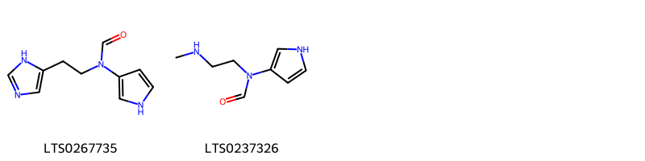{ width=100% }
    <figcaption>Hình ảnh cấu trúc hóa học của 2 hoạt chất thuộc nhóm Pyrroles gồm ['n-[2-(3h-imidazol-4-yl)ethyl]-n-(1h-pyrrol-3-yl)formamide (LTS0267735)', 'n-[2-(methylamino)ethyl]-n-(1h-pyrrol-3-yl)formamide (LTS0237326)'].</figcaption>
</figure>
#### Nhóm Steroids and steroid derivatives
<figure markdown="span">
    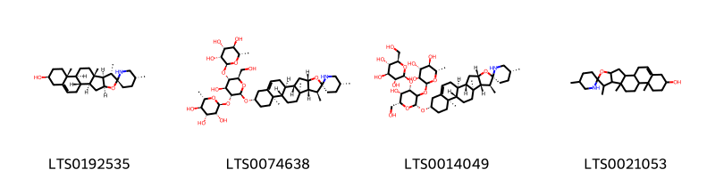{ width=100% }
    <figcaption>Hình ảnh cấu trúc hóa học của 4 hoạt chất thuộc nhóm Steroids and steroid derivatives gồm ['solasodine (LTS0192535)', 'solamargine (LTS0074638)', "(2s,3r,4r,5r,6s)-2-{[(2r,4s,5s,6r)-5-hydroxy-6-(hydroxymethyl)-2-[(1s,2s,4s,5'r,6r,7s,8r,9s,12s,13r,16s)-5',7,9,13-tetramethyl-5-oxaspiro[pentacyclo[10.8.0.0²,⁹.0⁴,⁸.0¹³,¹⁸]icosane-6,2'-piperidin]-18-eneoxy]-4-{[(2s,3r,4s,5s,6r)-3,4,5-trihydroxy-6-(hydroxymethyl)oxan-2-yl]oxy}oxan-3-yl]oxy}-6-methyloxane-3,4,5-triol (LTS0014049)", 'solassodine (LTS0021053)'].</figcaption>
</figure>

---

### Dược dân tộc học

Danh sách các quốc gia có sử dụng *N/A* trong điều trị các bệnh. 

| Country       | Disease          | Bệnh                      |
|:--------------|:-----------------|:--------------------------|
| Mediterranean | Diuretic, Poison | Thuốc lợi tiểu, thuốc độc |

---

---
## Solanum supinum
### Thông tin về thực vật

!!! info "Phân loại thực vật của *Solanum supinum* từ GIBF:"
    - **Kingdom:** Plantae
    - **Phylum:** Tracheophyta
    - **Order:** Solanales
    - **Family:** Solanaceae
    - **Genus:** Solanum
    - **Species:** *Solanum supinum*

 

| Label (VI)   | Label (EN)   | Scientific Name   | Descriptions (VI)   | Descriptions (EN)   | Also Known As (VI)   | Also Known As (EN)   |
|:-------------|:-------------|:------------------|:--------------------|:--------------------|:---------------------|:---------------------|
| N/A          | N/A          | Solanum supinum   | loài thực vật       | species of plant    | ['']                 | ['']                 |

#### Phân bố trên thế giới

**Từ CSDL GIBF** nan, South Africa, Namibia, Botswana, Lesotho, unknown or invalid

#### Phân bố tại Việt Nam

**Từ CSDL GIBF**: Không có ghi nhận ở Việt Nam

---
### Thành phần hóa học
        
- Theo cơ sở dữ liệu lotus: Từ loài *Solanum supinum* đã phân lập và xác định được Chưa có hoạt chất nào được phân lập. hoạt chất thuộc về các nhóm Không có hoạt chất nào được phân lập. 

Không có hình ảnh nào được tạo ra

---

### Dược dân tộc học

Danh sách các quốc gia có sử dụng *Solanum supinum* trong điều trị các bệnh. 

| Country            | Disease   | Bệnh       |
|:-------------------|:----------|:-----------|
| Lesotho            | Rennet    | Dạ múi khế |
| South Africa(Zulu) | Rennet    | Dạ múi khế |

---

---
## Solanum surattense
### Thông tin về thực vật

!!! info "Phân loại thực vật của *Solanum virginianum* từ GIBF:"
    - **Kingdom:** Plantae
    - **Phylum:** Tracheophyta
    - **Order:** Solanales
    - **Family:** Solanaceae
    - **Genus:** Solanum
    - **Species:** *Solanum virginianum*

 

| Label (VI)   | Label (EN)   | Scientific Name    | Descriptions (VI)   | Descriptions (EN)   | Also Known As (VI)   | Also Known As (EN)   |
|:-------------|:-------------|:-------------------|:--------------------|:--------------------|:---------------------|:---------------------|
| N/A          | N/A          | Solanum surattense | loài thực vật       | species of plant    | ['']                 | ['']                 |

#### Phân bố trên thế giới

**Từ CSDL GIBF** nan, Pakistan, Lao People’s Democratic Republic, Afghanistan, Chinese Taipei, India, Indonesia, Bangladesh, China, Nepal

#### Phân bố tại Việt Nam

**Từ CSDL GIBF**: Không có ghi nhận ở Việt Nam

---
### Thành phần hóa học
        
- Theo cơ sở dữ liệu lotus: Từ loài *Solanum virginianum* đã phân lập và xác định được Chưa có hoạt chất nào được phân lập. hoạt chất thuộc về các nhóm Không có hoạt chất nào được phân lập. 

Không có hình ảnh nào được tạo ra

---

### Dược dân tộc học

Danh sách các quốc gia có sử dụng *Solanum virginianum* trong điều trị các bệnh. 

| Country          | Disease            | Bệnh                   |
|:-----------------|:-------------------|:-----------------------|
| Elsewhere        | nan, Diuretic, nan | nan, lợi tiểu, nan     |
| India            | Carminative        | Gây ô nhiễm môi trường |
| India(Ayurvedic) | Expectorant        | Thuốc long đàm         |

---

---
## Solanum surettense
### Thông tin về thực vật

!!! info "Phân loại thực vật của *Solanum virginianum* từ GIBF:"
    - **Kingdom:** Plantae
    - **Phylum:** Tracheophyta
    - **Order:** Solanales
    - **Family:** Solanaceae
    - **Genus:** Solanum
    - **Species:** *Solanum virginianum*

 

| Label (VI)   | Label (EN)   | Scientific Name    | Descriptions (VI)   | Descriptions (EN)   | Also Known As (VI)   | Also Known As (EN)   |
|:-------------|:-------------|:-------------------|:--------------------|:--------------------|:---------------------|:---------------------|
| N/A          | N/A          | Solanum surattense | loài thực vật       | species of plant    | ['']                 | ['']                 |

#### Phân bố trên thế giới

**Từ CSDL GIBF** nan, Pakistan, Lao People’s Democratic Republic, Afghanistan, Chinese Taipei, India, Indonesia, Bangladesh, China, Nepal

#### Phân bố tại Việt Nam

**Từ CSDL GIBF**: Không có ghi nhận ở Việt Nam

---
### Thành phần hóa học
        
- Theo cơ sở dữ liệu lotus: Từ loài *Solanum virginianum* đã phân lập và xác định được Chưa có hoạt chất nào được phân lập. hoạt chất thuộc về các nhóm Không có hoạt chất nào được phân lập. 

Không có hình ảnh nào được tạo ra

---

### Dược dân tộc học

Danh sách các quốc gia có sử dụng *Solanum virginianum* trong điều trị các bệnh. 

| Country   | Disease                                 | Bệnh                                          |
|:----------|:----------------------------------------|:----------------------------------------------|
| India     | Apertif, Stomachic, Vermifuge, Laxative | Apertif, Dạ dày, Vermifuge, Thuốc nhuận tràng |

---

---
## Solanum torvum
### Thông tin về thực vật

!!! info "Phân loại thực vật của *Solanum torvum* từ GIBF:"
    - **Kingdom:** Plantae
    - **Phylum:** Tracheophyta
    - **Order:** Solanales
    - **Family:** Solanaceae
    - **Genus:** Solanum
    - **Species:** *Solanum torvum*

 

| Label (VI)   | Label (EN)   | Scientific Name   | Descriptions (VI)   | Descriptions (EN)   | Also Known As (VI)   | Also Known As (EN)                              |
|:-------------|:-------------|:------------------|:--------------------|:--------------------|:---------------------|:------------------------------------------------|
| N/A          | N/A          | Solanum torvum    | loài thực vật       | species of plant    | ['']                 | ["Devil's Fig", 'Pea Eggplant', 'Turkey Berry'] |

#### Phân bố trên thế giới

**Từ CSDL GIBF** Virgin Islands (U.S.), Ghana, Sri Lanka, Australia, Japan, Guadeloupe, Lao People’s Democratic Republic, Cambodia, French Guiana, Puerto Rico, Réunion, Nigeria, Chinese Taipei, Honduras, Jamaica, United States of America, El Salvador, South Africa, Trinidad and Tobago, Fiji, Hong Kong, Saint Vincent and the Grenadines, Thailand, Martinique, Brazil, Mexico, Dominican Republic, Singapore, Viet Nam, China, French Polynesia, Madagascar, Montserrat, Macao, Costa Rica, Vanuatu, India, Indonesia, Samoa, Antigua and Barbuda, Philippines, Cameroon, Malaysia, Nepal

#### Phân bố tại Việt Nam

**Từ CSDL GIBF**: Kon Tum, Quảng Bình, Đồng Nai

---
### Thành phần hóa học
        
- Theo cơ sở dữ liệu lotus: Từ loài *Solanum torvum* đã phân lập và xác định được 67 hoạt chất thuộc về các nhóm Fatty Acyls, Prenol lipids, Steroids and steroid derivatives, Isoflavonoids, Cinnamic acids and derivatives, Organooxygen compounds, Saturated hydrocarbons. 

|    | chemicalTaxonomyClassyfireClass   |   smiles_count |
|---:|:----------------------------------|---------------:|
|  0 | Cinnamic acids and derivatives    |              2 |
|  1 | Fatty Acyls                       |              4 |
|  2 | Isoflavonoids                     |              3 |
|  3 | Organooxygen compounds            |              2 |
|  4 | Prenol lipids                     |              8 |
|  5 | Saturated hydrocarbons            |              2 |
|  6 | Steroids and steroid derivatives  |             46 |

#### Nhóm Cinnamic acids and derivatives
<figure markdown="span">
    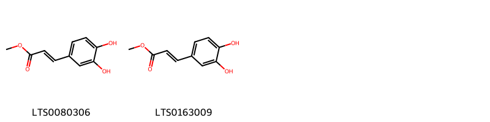{ width=100% }
    <figcaption>Hình ảnh cấu trúc hóa học của 2 hoạt chất thuộc nhóm Cinnamic acids and derivatives gồm ['methyl 3-(3,4-dihydroxyphenyl)prop-2-enoate (LTS0080306)', 'methyl caffeate (LTS0163009)'].</figcaption>
</figure>
#### Nhóm Fatty Acyls
<figure markdown="span">
    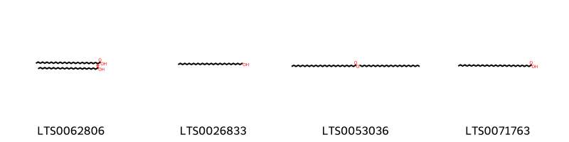{ width=100% }
    <figcaption>Hình ảnh cấu trúc hóa học của 4 hoạt chất thuộc nhóm Fatty Acyls gồm ['octacosanoic acid; triacontanoic acid (LTS0062806)', 'triacontanol (LTS0026833)', 'octacosyl triacontanoate (LTS0053036)', 'tetratriacontanoic acid (LTS0071763)'].</figcaption>
</figure>
#### Nhóm Isoflavonoids
<figure markdown="span">
    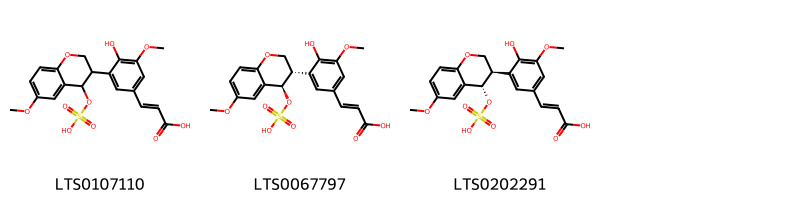{ width=100% }
    <figcaption>Hình ảnh cấu trúc hóa học của 3 hoạt chất thuộc nhóm Isoflavonoids gồm ['(2e)-3-{4-hydroxy-3-methoxy-5-[6-methoxy-4-(sulfooxy)-3,4-dihydro-2h-1-benzopyran-3-yl]phenyl}prop-2-enoic acid (LTS0107110)', '(2e)-3-{4-hydroxy-3-methoxy-5-[(3s,4r)-6-methoxy-4-(sulfooxy)-3,4-dihydro-2h-1-benzopyran-3-yl]phenyl}prop-2-enoic acid (LTS0067797)', 'torvanol a hydrogen sulfate (LTS0202291)'].</figcaption>
</figure>
#### Nhóm Organooxygen compounds
<figure markdown="span">
    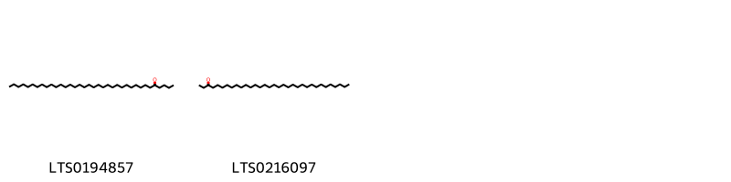{ width=100% }
    <figcaption>Hình ảnh cấu trúc hóa học của 2 hoạt chất thuộc nhóm Organooxygen compounds gồm ['hexatriacontan-5-one (LTS0194857)', 'tritriacontan-3-one (LTS0216097)'].</figcaption>
</figure>
#### Nhóm Prenol lipids
<figure markdown="span">
    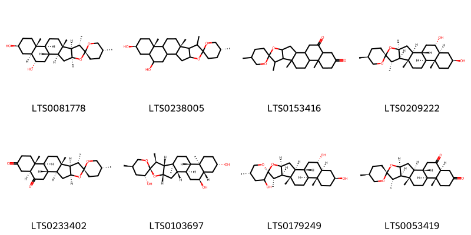{ width=100% }
    <figcaption>Hình ảnh cấu trúc hóa học của 8 hoạt chất thuộc nhóm Prenol lipids gồm ['chlorogenin (LTS0081778)', "(5r,9's,13'r,16's)-5,7',9',13'-tetramethyl-5'-oxaspiro[oxane-2,6'-pentacyclo[10.8.0.0²,⁹.0⁴,⁸.0¹³,¹⁸]icosane]-16',19'-diol (LTS0238005)", "5,7',9',13'-tetramethyl-5'-oxaspiro[oxane-2,6'-pentacyclo[10.8.0.0²,⁹.0⁴,⁸.0¹³,¹⁸]icosane]-16',19'-dione (LTS0153416)", "(1'r,2r,2's,4's,5s,7's,8'r,9's,12's,13'r,16's,18's,19's)-5,7',9',13'-tetramethyl-5'-oxaspiro[oxane-2,6'-pentacyclo[10.8.0.0²,⁹.0⁴,⁸.0¹³,¹⁸]icosane]-16',19'-diol (LTS0209222)", "(1'r,2r,2's,4's,5r,7's,8'r,9's,12's,13'r,18's)-5,7',9',13'-tetramethyl-5'-oxaspiro[oxane-2,6'-pentacyclo[10.8.0.0²,⁹.0⁴,⁸.0¹³,¹⁸]icosane]-16',19'-dione (LTS0233402)", "(1'r,2s,2's,3r,4's,5r,7's,8'r,9's,12's,13'r,16's,18's,19's)-5,7',9',13'-tetramethyl-5'-oxaspiro[oxane-2,6'-pentacyclo[10.8.0.0²,⁹.0⁴,⁸.0¹³,¹⁸]icosane]-3,16',19'-triol (LTS0103697)", "(1'r,2s,2's,4's,5s,7's,8'r,9's,12's,13'r,16's,18's,19's)-5,7',9',13'-tetramethyl-5'-oxaspiro[oxane-2,6'-pentacyclo[10.8.0.0²,⁹.0⁴,⁸.0¹³,¹⁸]icosane]-3,16',19'-triol (LTS0179249)", "(1'r,2r,2's,4's,5s,7's,8'r,9's,12's,13'r,18's)-5,7',9',13'-tetramethyl-5'-oxaspiro[oxane-2,6'-pentacyclo[10.8.0.0²,⁹.0⁴,⁸.0¹³,¹⁸]icosane]-16',19'-dione (LTS0053419)"].</figcaption>
</figure>
#### Nhóm Saturated hydrocarbons
<figure markdown="span">
    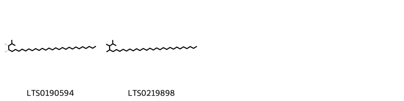{ width=100% }
    <figcaption>Hình ảnh cấu trúc hóa học của 2 hoạt chất thuộc nhóm Saturated hydrocarbons gồm ['(3r,4s)-2,3,4-trimethyltriacontane (LTS0190594)', '2,3,4-trimethyltriacontane (LTS0219898)'].</figcaption>
</figure>
#### Nhóm Steroids and steroid derivatives
<figure markdown="span">
    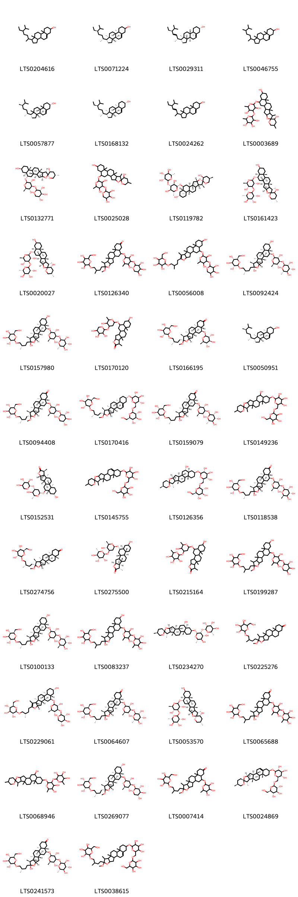{ width=100% }
    <figcaption>Hình ảnh cấu trúc hóa học của 46 hoạt chất thuộc nhóm Steroids and steroid derivatives gồm ['stigmast-5-en-3-ol, (3β)- (LTS0204616)', 'stigmast-5-en-3-ol (LTS0071224)', 'phytosterol (LTS0029311)', 'campesterol (LTS0046755)', '(1r,3as,3bs,7s,9bs)-1-[(2r,5r)-5,6-dimethylheptan-2-yl]-9a,11a-dimethyl-1h,2h,3h,3ah,3bh,4h,6h,7h,8h,9h,9bh,10h,11h-cyclopenta[a]phenanthren-7-ol (LTS0057877)', 'sitosterol (LTS0168132)', 'stigmasterol (LTS0024262)', "2-[(3,5-dihydroxy-2-methyl-6-{5,7',9',13'-tetramethyl-5'-oxaspiro[oxane-2,6'-pentacyclo[10.8.0.0²,⁹.0⁴,⁸.0¹³,¹⁸]icosane]-3,16'-dioloxy}oxan-4-yl)oxy]-6-methyloxane-3,4,5-triol (LTS0003689)", "(2s,3r,4s,5r)-2-{[(2r,3r,4s,5r,6r)-3,5-dihydroxy-2-methyl-6-[(1'r,2s,2's,3r,4's,5s,7's,8'r,9's,12's,13'r,16's,18's,19's)-5,7',9',13'-tetramethyl-5'-oxaspiro[oxane-2,6'-pentacyclo[10.8.0.0²,⁹.0⁴,⁸.0¹³,¹⁸]icosane]-3,16'-dioloxy]oxan-4-yl]oxy}oxane-3,4,5-triol (LTS0132771)", "2-[(3,5-dihydroxy-2-methyl-6-{5,7',9',13'-tetramethyl-5'-oxaspiro[oxane-2,6'-pentacyclo[10.8.0.0²,⁹.0⁴,⁸.0¹³,¹⁸]icosane]-3,16'-dioloxy}oxan-4-yl)oxy]oxane-3,4,5-triol (LTS0025028)", "(2s,3r,4r,5r,6s)-2-{[(2r,3r,4s,5r,6r)-3,5-dihydroxy-2-methyl-6-[(1'r,2r,2's,3s,4's,5r,7's,8'r,9's,12's,13'r,16's,18's,19's)-5,7',9',13'-tetramethyl-5'-oxaspiro[oxane-2,6'-pentacyclo[10.8.0.0²,⁹.0⁴,⁸.0¹³,¹⁸]icosane]-3,16'-dioloxy]oxan-4-yl]oxy}-6-methyloxane-3,4,5-triol (LTS0119782)", "(2s,3r,4r,5r,6s)-2-{[(2r,3r,4s,5r,6r)-3,5-dihydroxy-2-methyl-6-[(1'r,2r,2's,3s,4's,5s,7's,8'r,9's,12's,13'r,16's,18's,19's)-5,7',9',13'-tetramethyl-5'-oxaspiro[oxane-2,6'-pentacyclo[10.8.0.0²,⁹.0⁴,⁸.0¹³,¹⁸]icosane]-3,16'-dioloxy]oxan-4-yl]oxy}-6-methyloxane-3,4,5-triol (LTS0161423)", "(2s,3r,4r,5r,6s)-2-{[(2r,3r,4s,5r,6r)-3,5-dihydroxy-2-methyl-6-[(1'r,2r,2's,3r,4's,5s,7's,8'r,9's,12's,13'r,16's,18's,19's)-5,7',9',13'-tetramethyl-5'-oxaspiro[oxane-2,6'-pentacyclo[10.8.0.0²,⁹.0⁴,⁸.0¹³,¹⁸]icosane]-3,16'-dioloxy]oxan-4-yl]oxy}-6-methyloxane-3,4,5-triol (LTS0020027)", '19-({3,5-dihydroxy-6-methyl-4-[(3,4,5-trihydroxyoxan-2-yl)oxy]oxan-2-yl}oxy)-6-methoxy-7,9,13-trimethyl-6-(3-methyl-4-{[3,4,5-trihydroxy-6-(hydroxymethyl)oxan-2-yl]oxy}butyl)-5-oxapentacyclo[10.8.0.0²,⁹.0⁴,⁸.0¹³,¹⁸]icosan-16-one (LTS0126340)', '2-{4-[19-({3,5-dihydroxy-6-methyl-4-[(3,4,5-trihydroxyoxan-2-yl)oxy]oxan-2-yl}oxy)-16-hydroxy-7,9,13-trimethyl-5-oxapentacyclo[10.8.0.0²,⁹.0⁴,⁸.0¹³,¹⁸]icos-6-en-6-yl]-2-methylbutoxy}-6-(hydroxymethyl)oxane-3,4,5-triol (LTS0056008)', '(2s,3r,4r,5r,6s)-2-{[(2r,3r,4s,5r,6r)-2-{[(1r,2s,4s,6s,7s,8r,9s,12s,13r,16s,18s,19s)-6,16-dihydroxy-7,9,13-trimethyl-6-[(3s)-3-methyl-4-{[(2r,3r,4s,5s,6r)-3,4,5-trihydroxy-6-(hydroxymethyl)oxan-2-yl]oxy}butyl]-5-oxapentacyclo[10.8.0.0²,⁹.0⁴,⁸.0¹³,¹⁸]icosan-19-yl]oxy}-3,5-dihydroxy-6-methyloxan-4-yl]oxy}-6-methyloxane-3,4,5-triol (LTS0092424)', '(2s,3s,4r,5r,6s)-2-{[(2r,3r,4s,5r,6r)-2-{[(1r,2s,4s,6r,7s,8r,9s,12s,13r,16r,18s,19s)-6,16-dihydroxy-7,9,13-trimethyl-6-[(3s)-3-methyl-4-{[(2r,3r,4s,5r,6r)-3,4,5-trihydroxy-6-(hydroxymethyl)oxan-2-yl]oxy}butyl]-5-oxapentacyclo[10.8.0.0²,⁹.0⁴,⁸.0¹³,¹⁸]icosan-19-yl]oxy}-3,5-dihydroxy-6-methyloxan-4-yl]oxy}-6-methyloxane-3,4,5-triol (LTS0157980)', '16-hydroxy-19-({5-hydroxy-6-methyl-4-[(3,4,5-trihydroxyoxan-2-yl)oxy]oxan-2-yl}oxy)-7,9,13-trimethyl-5-oxapentacyclo[10.8.0.0²,⁹.0⁴,⁸.0¹³,¹⁸]icosan-6-one (LTS0170120)', '(1r,2s,4s,6r,7s,8r,9s,12s,13r,18s,19s)-6-methoxy-7,9,13-trimethyl-6-[(3s)-3-methyl-4-{[(2r,3r,4s,5s,6r)-3,4,5-trihydroxy-6-(hydroxymethyl)oxan-2-yl]oxy}butyl]-19-{[(2r,3r,4s,5s,6r)-3,4,5-trihydroxy-6-methyloxan-2-yl]oxy}-5-oxapentacyclo[10.8.0.0²,⁹.0⁴,⁸.0¹³,¹⁸]icosan-16-one (LTS0166195)', '(1r,3as,3bs,7r,9ar,9bs,11ar)-1-[(2r,5r)-5,6-dimethylheptan-2-yl]-9a,11a-dimethyl-1h,2h,3h,3ah,3bh,4h,6h,7h,8h,9h,9bh,10h,11h-cyclopenta[a]phenanthren-7-ol (LTS0050951)', '(1r,2s,4s,6r,7s,8r,9s,12s,13r,18s,19s)-19-{[(2r,3r,4s,5r,6r)-3,5-dihydroxy-6-methyl-4-{[(2s,3r,4s,5r)-3,4,5-trihydroxyoxan-2-yl]oxy}oxan-2-yl]oxy}-6-methoxy-7,9,13-trimethyl-6-[(3s)-3-methyl-4-{[(2r,3r,4s,5s,6r)-3,4,5-trihydroxy-6-(hydroxymethyl)oxan-2-yl]oxy}butyl]-5-oxapentacyclo[10.8.0.0²,⁹.0⁴,⁸.0¹³,¹⁸]icosan-16-one (LTS0094408)', '(2r,3s,4s,5r,6r)-2-(hydroxymethyl)-6-[(2s)-4-[(1s,2s,4s,6r,7s,8r,9s,12s,13r,16s)-6-methoxy-7,9,13-trimethyl-16-{[(2r,3r,4s,5s,6r)-3,4,5-trihydroxy-6-({[(2r,3r,4s,5s,6r)-3,4,5-trihydroxy-6-(hydroxymethyl)oxan-2-yl]oxy}methyl)oxan-2-yl]oxy}-5-oxapentacyclo[10.8.0.0²,⁹.0⁴,⁸.0¹³,¹⁸]icos-18-en-6-yl]-2-methylbutoxy]oxane-3,4,5-triol (LTS0170416)', 'torvoside h (LTS0159079)', "2-{5,7',9',13'-tetramethyl-5'-oxaspiro[oxane-2,6'-pentacyclo[10.8.0.0²,⁹.0⁴,⁸.0¹³,¹⁸]icosan]-19'-oloxy}-6-({[3,4,5-trihydroxy-6-(hydroxymethyl)oxan-2-yl]oxy}methyl)oxane-3,4,5-triol (LTS0149236)", '(1r,2s,4s,7s,8r,9s,12s,13r,16s,18s,19s)-16-hydroxy-19-{[(2r,4r,5r,6r)-5-hydroxy-6-methyl-4-{[(2s,3r,4s,5r)-3,4,5-trihydroxyoxan-2-yl]oxy}oxan-2-yl]oxy}-7,9,13-trimethyl-5-oxapentacyclo[10.8.0.0²,⁹.0⁴,⁸.0¹³,¹⁸]icosan-6-one (LTS0152531)', "2-{5,7',9',13'-tetramethyl-5'-oxaspiro[oxane-2,6'-pentacyclo[10.8.0.0²,⁹.0⁴,⁸.0¹³,¹⁸]icosan]-18'-eneoxy}-6-({[3,4,5-trihydroxy-6-(hydroxymethyl)oxan-2-yl]oxy}methyl)oxane-3,4,5-triol (LTS0145755)", "(2r,3r,4s,5s,6r)-2-[(1'r,2r,2's,4's,5s,7's,8'r,9's,12's,13'r,16's,18's,19's)-5,7',9',13'-tetramethyl-5'-oxaspiro[oxane-2,6'-pentacyclo[10.8.0.0²,⁹.0⁴,⁸.0¹³,¹⁸]icosan]-19'-oloxy]-6-({[(2r,3r,4s,5s,6r)-3,4,5-trihydroxy-6-(hydroxymethyl)oxan-2-yl]oxy}methyl)oxane-3,4,5-triol (LTS0126356)", '(1r,2s,4s,6r,7s,8r,9s,12s,13r,18s,19s)-19-{[(2r,3r,4s,5r,6r)-3,5-dihydroxy-6-methyl-4-{[(2s,3r,4r,5r,6r)-3,4,5-trihydroxy-6-methyloxan-2-yl]oxy}oxan-2-yl]oxy}-6-hydroxy-7,9,13-trimethyl-6-[(3s)-3-methyl-4-{[(2r,3r,4s,5s,6r)-3,4,5-trihydroxy-6-(hydroxymethyl)oxan-2-yl]oxy}butyl]-5-oxapentacyclo[10.8.0.0²,⁹.0⁴,⁸.0¹³,¹⁸]icosan-16-one (LTS0118538)', '(1r,2s,4s,6r,7s,8r,9s,12s,13s,18s)-6-methoxy-7,9,13-trimethyl-6-[(3s)-3-methyl-4-{[(2r,3r,4s,5s,6r)-3,4,5-trihydroxy-6-(hydroxymethyl)oxan-2-yl]oxy}butyl]-5-oxapentacyclo[10.8.0.0²,⁹.0⁴,⁸.0¹³,¹⁸]icosan-16-one (LTS0274756)', '(1r,2s,4s,7s,8r,9s,12s,13r,16s,18s,19s)-16-hydroxy-19-{[(2r,4r,5r,6r)-5-hydroxy-6-methyl-4-{[(2s,3r,4r,5r,6s)-3,4,5-trihydroxy-6-methyloxan-2-yl]oxy}oxan-2-yl]oxy}-7,9,13-trimethyl-5-oxapentacyclo[10.8.0.0²,⁹.0⁴,⁸.0¹³,¹⁸]icosan-6-one (LTS0275500)', '16-hydroxy-19-({5-hydroxy-6-methyl-4-[(3,4,5-trihydroxy-6-methyloxan-2-yl)oxy]oxan-2-yl}oxy)-7,9,13-trimethyl-5-oxapentacyclo[10.8.0.0²,⁹.0⁴,⁸.0¹³,¹⁸]icosan-6-one (LTS0215164)', '2-{4-[19-({3,5-dihydroxy-6-methyl-4-[(3,4,5-trihydroxyoxan-2-yl)oxy]oxan-2-yl}oxy)-16-hydroxy-6-methoxy-7,9,13-trimethyl-5-oxapentacyclo[10.8.0.0²,⁹.0⁴,⁸.0¹³,¹⁸]icosan-6-yl]-2-methylbutoxy}-6-(hydroxymethyl)oxane-3,4,5-triol (LTS0199287)', '(2s,3r,4r,5r,6r)-2-{[(2r,3r,4s,5r,6r)-2-{[(1r,2s,4s,6r,7s,8r,9s,12s,13r,16s,18s,19s)-6,16-dihydroxy-7,9,13-trimethyl-6-[(3s)-3-methyl-4-{[(2r,3r,4s,5s,6r)-3,4,5-trihydroxy-6-(hydroxymethyl)oxan-2-yl]oxy}butyl]-5-oxapentacyclo[10.8.0.0²,⁹.0⁴,⁸.0¹³,¹⁸]icosan-19-yl]oxy}-3,5-dihydroxy-6-methyloxan-4-yl]oxy}-6-methyloxane-3,4,5-triol (LTS0100133)', '2-[(2-{[6,16-dihydroxy-7,9,13-trimethyl-6-(3-methyl-4-{[3,4,5-trihydroxy-6-(hydroxymethyl)oxan-2-yl]oxy}butyl)-5-oxapentacyclo[10.8.0.0²,⁹.0⁴,⁸.0¹³,¹⁸]icosan-19-yl]oxy}-3,5-dihydroxy-6-methyloxan-4-yl)oxy]-6-methyloxane-3,4,5-triol (LTS0083237)', "(2r,3r,4r,5r,6s)-2-{[(2s,3r,4r,5r,6s)-4,5-dihydroxy-6-methyl-2-[(1'r,2r,2's,4's,5s,7's,8'r,9's,12's,13'r,16's,18's,19's)-5,7',9',13'-tetramethyl-5'-oxaspiro[oxane-2,6'-pentacyclo[10.8.0.0²,⁹.0⁴,⁸.0¹³,¹⁸]icosan]-19'-oloxy]oxan-3-yl]oxy}-6-methyloxane-3,4,5-triol (LTS0234270)", '6-methoxy-7,9,13-trimethyl-6-(3-methyl-4-{[3,4,5-trihydroxy-6-(hydroxymethyl)oxan-2-yl]oxy}butyl)-5-oxapentacyclo[10.8.0.0²,⁹.0⁴,⁸.0¹³,¹⁸]icosan-16-one (LTS0225276)', '(2r,3r,4s,5s,6r)-2-[(2s)-4-[(1r,2s,4s,8s,9s,12s,13r,16s,18s,19s)-19-{[(2r,3r,4s,5r,6r)-3,5-dihydroxy-6-methyl-4-{[(2s,3r,4s,5r)-3,4,5-trihydroxyoxan-2-yl]oxy}oxan-2-yl]oxy}-16-hydroxy-7,9,13-trimethyl-5-oxapentacyclo[10.8.0.0²,⁹.0⁴,⁸.0¹³,¹⁸]icos-6-en-6-yl]-2-methylbutoxy]-6-(hydroxymethyl)oxane-3,4,5-triol (LTS0229061)', '(1s,2r,4s,6r,7s,8r,9s,12r,13r,18s,19s)-19-{[(2r,3r,4s,5r,6r)-3,5-dihydroxy-6-methyl-4-{[(2s,3r,4r,5r,6s)-3,4,5-trihydroxy-6-methyloxan-2-yl]oxy}oxan-2-yl]oxy}-6-hydroxy-7,9,13-trimethyl-6-[(3s)-3-methyl-4-{[(2r,3r,4s,5s,6r)-3,4,5-trihydroxy-6-(hydroxymethyl)oxan-2-yl]oxy}butyl]-5-oxapentacyclo[10.8.0.0²,⁹.0⁴,⁸.0¹³,¹⁸]icosan-16-one (LTS0064607)', "(2s,3r,4r,5r,6s)-2-{[(2r,3r,4s,5r,6r)-3,5-dihydroxy-2-methyl-6-[(1'r,2s,2's,3r,4's,5s,7's,8'r,9's,12's,13'r,16's,18's,19's)-5,7',9',13'-tetramethyl-5'-oxaspiro[oxane-2,6'-pentacyclo[10.8.0.0²,⁹.0⁴,⁸.0¹³,¹⁸]icosane]-3,16'-dioloxy]oxan-4-yl]oxy}-6-methyloxane-3,4,5-triol (LTS0053570)", '19-({3,5-dihydroxy-6-methyl-4-[(3,4,5-trihydroxy-6-methyloxan-2-yl)oxy]oxan-2-yl}oxy)-6-hydroxy-7,9,13-trimethyl-6-(3-methyl-4-{[3,4,5-trihydroxy-6-(hydroxymethyl)oxan-2-yl]oxy}butyl)-5-oxapentacyclo[10.8.0.0²,⁹.0⁴,⁸.0¹³,¹⁸]icosan-16-one (LTS0065688)', "2-[(4,5-dihydroxy-6-methyl-2-{5,7',9',13'-tetramethyl-5'-oxaspiro[oxane-2,6'-pentacyclo[10.8.0.0²,⁹.0⁴,⁸.0¹³,¹⁸]icosan]-19'-oloxy}oxan-3-yl)oxy]-6-methyloxane-3,4,5-triol (LTS0068946)", '(2r,3r,4s,5s,6r)-2-[(2s)-4-[(1r,2s,4s,6r,7s,8r,9s,12s,13r,16s,18s,19s)-19-{[(2r,3r,4s,5r,6r)-3,5-dihydroxy-6-methyl-4-{[(2s,3r,4s,5r)-3,4,5-trihydroxyoxan-2-yl]oxy}oxan-2-yl]oxy}-16-hydroxy-6-methoxy-7,9,13-trimethyl-5-oxapentacyclo[10.8.0.0²,⁹.0⁴,⁸.0¹³,¹⁸]icosan-6-yl]-2-methylbutoxy]-6-(hydroxymethyl)oxane-3,4,5-triol (LTS0269077)', '6-methoxy-7,9,13-trimethyl-6-(3-methyl-4-{[3,4,5-trihydroxy-6-(hydroxymethyl)oxan-2-yl]oxy}butyl)-19-[(3,4,5-trihydroxy-6-methyloxan-2-yl)oxy]-5-oxapentacyclo[10.8.0.0²,⁹.0⁴,⁸.0¹³,¹⁸]icosan-16-one (LTS0007414)', "(2r,3r,4s,5s,6r)-2-[(1's,2r,2's,4's,5s,7's,8'r,9's,12's,13'r,16's)-5,7',9',13'-tetramethyl-5'-oxaspiro[oxane-2,6'-pentacyclo[10.8.0.0²,⁹.0⁴,⁸.0¹³,¹⁸]icosan]-18'-eneoxy]-6-({[(2r,3r,4s,5s,6r)-3,4,5-trihydroxy-6-(hydroxymethyl)oxan-2-yl]oxy}methyl)oxane-3,4,5-triol (LTS0024869)", '(1r,2s,4s,6r,7s,8r,9s,12s,13r,18s,19s)-19-{[(2r,3r,4s,5r,6r)-3,5-dihydroxy-6-methyl-4-{[(2s,3s,4r,5r,6s)-3,4,5-trihydroxy-6-methyloxan-2-yl]oxy}oxan-2-yl]oxy}-6-hydroxy-7,9,13-trimethyl-6-[(3s)-3-methyl-4-{[(2r,3r,4s,5s,6r)-3,4,5-trihydroxy-6-(hydroxymethyl)oxan-2-yl]oxy}butyl]-5-oxapentacyclo[10.8.0.0²,⁹.0⁴,⁸.0¹³,¹⁸]icosan-16-one (LTS0241573)', '2-(hydroxymethyl)-6-[4-(6-methoxy-7,9,13-trimethyl-16-{[3,4,5-trihydroxy-6-({[3,4,5-trihydroxy-6-(hydroxymethyl)oxan-2-yl]oxy}methyl)oxan-2-yl]oxy}-5-oxapentacyclo[10.8.0.0²,⁹.0⁴,⁸.0¹³,¹⁸]icos-18-en-6-yl)-2-methylbutoxy]oxane-3,4,5-triol (LTS0038615)'].</figcaption>
</figure>

---

### Dược dân tộc học

Danh sách các quốc gia có sử dụng *Solanum torvum* trong điều trị các bệnh. 

| Country     | Disease                       | Bệnh                        |
|:------------|:------------------------------|:----------------------------|
| Australia   | Poison                        | Chất độc                    |
| Cameroon    | Hemostat                      | Máy cầm máu                 |
| Elsewhere   | Digestive, Diuretic, Sedative | Tiêu hóa, lợi tiểu, an thần |
| Mexico      | Narcotic, Sudorific, Diuretic | Ma túy, gây ngạt, lợi tiểu  |
| Philippines | Antidote                      | Chất giải độc               |

---

---
## Solanum tuberosum
### Thông tin về thực vật

!!! info "Phân loại thực vật của *Solanum tuberosum* từ GIBF:"
    - **Kingdom:** Plantae
    - **Phylum:** Tracheophyta
    - **Order:** Solanales
    - **Family:** Solanaceae
    - **Genus:** Solanum
    - **Species:** *Solanum tuberosum*

 

| Label (VI)   | Label (EN)   | Scientific Name   | Descriptions (VI)   | Descriptions (EN)                              | Also Known As (VI)   | Also Known As (EN)                                               |
|:-------------|:-------------|:------------------|:--------------------|:-----------------------------------------------|:---------------------|:-----------------------------------------------------------------|
| N/A          | N/A          | Solanum tuberosum | loài thực vật       | species of plant (for the food, use Q16587531) | ['']                 | ['spud', 'tater', 'potato plant', 'Solanum tuberosum', 'tattie'] |

#### Phân bố trên thế giới

**Từ CSDL GIBF** Australia, Belgium, Canada, Ukraine, Denmark, Netherlands, Belarus, Luxembourg, Korea, Republic of, Chinese Taipei, Spain, Bolivia (Plurinational State of), Türkiye, Portugal, Russian Federation, United States of America, Sweden, Chile, Greece, Uganda, Czechia, Germany, Bahamas, Peru, Mexico, France, Austria, United Kingdom of Great Britain and Northern Ireland, China, Ecuador, Colombia, Costa Rica, India, New Zealand, Nepal

#### Phân bố tại Việt Nam

**Từ CSDL GIBF**: Không có ghi nhận ở Việt Nam

---
### Thành phần hóa học
        
- Theo cơ sở dữ liệu lotus: Từ loài *Solanum tuberosum* đã phân lập và xác định được 254 hoạt chất thuộc về các nhóm Hydroxy acids and derivatives, Phenols, Carboxylic acids and derivatives, Benzodiazepines, Fatty Acyls, Indoles and derivatives, Pteridines and derivatives, Cinnamic acids and derivatives, Dibenzylbutane lignans, Diazines, Prenol lipids, Purine nucleosides, Benzene and substituted derivatives, Dihydrofurans, Organooxygen compounds, Tropane alkaloids, Furanoid lignans, Pyridines and derivatives, Flavonoids, Steroids and steroid derivatives, Oxepanes, Organonitrogen compounds, Lactones, Coumarins and derivatives, Imidazopyrimidines. 

|    | chemicalTaxonomyClassyfireClass     |   smiles_count |
|---:|:------------------------------------|---------------:|
|  0 |                                     |              2 |
|  1 | Benzene and substituted derivatives |              3 |
|  2 | Benzodiazepines                     |              8 |
|  3 | Carboxylic acids and derivatives    |              6 |
|  4 | Cinnamic acids and derivatives      |              6 |
|  5 | Coumarins and derivatives           |              1 |
|  6 | Diazines                            |              1 |
|  7 | Dibenzylbutane lignans              |              2 |
|  8 | Dihydrofurans                       |              1 |
|  9 | Fatty Acyls                         |             10 |
| 10 | Flavonoids                          |             13 |
| 11 | Furanoid lignans                    |              3 |
| 12 | Hydroxy acids and derivatives       |              1 |
| 13 | Imidazopyrimidines                  |              5 |
| 14 | Indoles and derivatives             |              1 |
| 15 | Lactones                            |              1 |
| 16 | Organonitrogen compounds            |              1 |
| 17 | Organooxygen compounds              |             19 |
| 18 | Oxepanes                            |              1 |
| 19 | Phenols                             |              4 |
| 20 | Prenol lipids                       |             96 |
| 21 | Pteridines and derivatives          |              2 |
| 22 | Purine nucleosides                  |              2 |
| 23 | Pyridines and derivatives           |              3 |
| 24 | Steroids and steroid derivatives    |             56 |
| 25 | Tropane alkaloids                   |              4 |

#### Nhóm 
<figure markdown="span">
    { width=100% }
    <figcaption>Hình ảnh cấu trúc hóa học của 2 hoạt chất thuộc nhóm  gồm ['cuskhygrine (LTS0083137)', '1,3-bis[(2r)-1-methylpyrrolidin-2-yl]propan-2-one (LTS0179198)'].</figcaption>
</figure>
#### Nhóm Benzene and substituted derivatives
<figure markdown="span">
    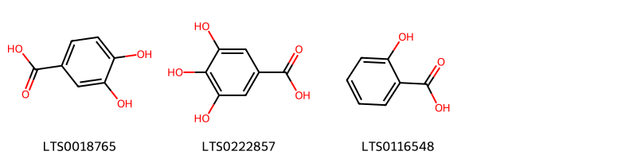{ width=100% }
    <figcaption>Hình ảnh cấu trúc hóa học của 3 hoạt chất thuộc nhóm Benzene and substituted derivatives gồm ['3,4-dihydroxybenzoic acid (LTS0018765)', 'galop (LTS0222857)', 'salicyclic acid (LTS0116548)'].</figcaption>
</figure>
#### Nhóm Benzodiazepines
<figure markdown="span">
    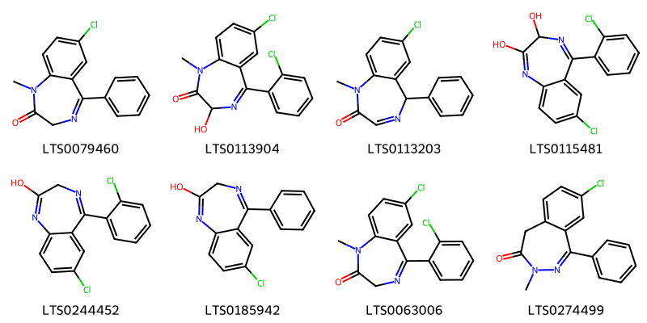{ width=100% }
    <figcaption>Hình ảnh cấu trúc hóa học của 8 hoạt chất thuộc nhóm Benzodiazepines gồm ['diazepam (LTS0079460)', 'lormetazepam (LTS0113904)', '7-chloro-1-methyl-5-phenyl-5h-1,4-benzodiazepin-2-one (LTS0113203)', 'bonton (LTS0115481)', 'delorazepam (LTS0244452)', 'lomax (LTS0185942)', 'diclazepam (LTS0063006)', '8-chloro-3-methyl-1-phenyl-5h-2,3-benzodiazepin-4-one (LTS0274499)'].</figcaption>
</figure>
#### Nhóm Carboxylic acids and derivatives
<figure markdown="span">
    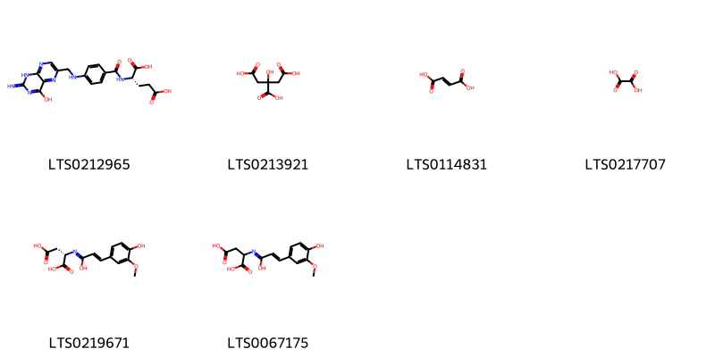{ width=100% }
    <figcaption>Hình ảnh cấu trúc hóa học của 6 hoạt chất thuộc nhóm Carboxylic acids and derivatives gồm ['acid, folic (LTS0212965)', 'citric acid (LTS0213921)', 'fumaric acid (LTS0114831)', 'oxalic acid (LTS0217707)', '(2s)-2-{[(2e)-1-hydroxy-3-(4-hydroxy-3-methoxyphenyl)prop-2-en-1-ylidene]amino}butanedioic acid (LTS0219671)', '2-{[1-hydroxy-3-(4-hydroxy-3-methoxyphenyl)prop-2-en-1-ylidene]amino}butanedioic acid (LTS0067175)'].</figcaption>
</figure>
#### Nhóm Cinnamic acids and derivatives
<figure markdown="span">
    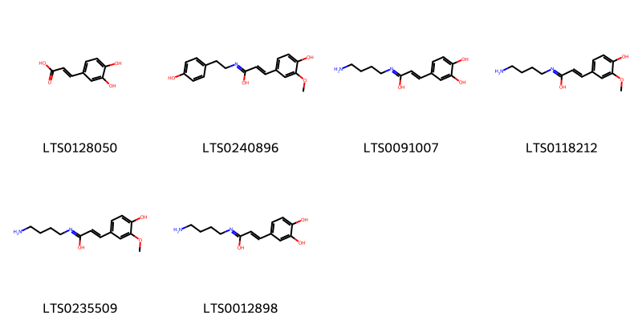{ width=100% }
    <figcaption>Hình ảnh cấu trúc hóa học của 6 hoạt chất thuộc nhóm Cinnamic acids and derivatives gồm ['3,4-dihydroxycinnamic acid (LTS0128050)', '3-(4-hydroxy-3-methoxyphenyl)-n-[2-(4-hydroxyphenyl)ethyl]prop-2-enimidic acid (LTS0240896)', 'n-(4-aminobutyl)-3-(3,4-dihydroxyphenyl)prop-2-enimidic acid (LTS0091007)', '(2e)-n-(4-aminobutyl)-3-(4-hydroxy-3-methoxyphenyl)prop-2-enimidic acid (LTS0118212)', 'n-(4-aminobutyl)-3-(4-hydroxy-3-methoxyphenyl)prop-2-enimidic acid (LTS0235509)', '(2e)-n-(4-aminobutyl)-3-(3,4-dihydroxyphenyl)prop-2-enimidic acid (LTS0012898)'].</figcaption>
</figure>
#### Nhóm Coumarins and derivatives
<figure markdown="span">
    { width=100% }
    <figcaption>Hình ảnh cấu trúc hóa học của 1 hoạt chất thuộc nhóm Coumarins and derivatives gồm ['scopoletin (LTS0193112)'].</figcaption>
</figure>
#### Nhóm Diazines
<figure markdown="span">
    { width=100% }
    <figcaption>Hình ảnh cấu trúc hóa học của 1 hoạt chất thuộc nhóm Diazines gồm ['β-amin (LTS0030620)'].</figcaption>
</figure>
#### Nhóm Dibenzylbutane lignans
<figure markdown="span">
    { width=100% }
    <figcaption>Hình ảnh cấu trúc hóa học của 2 hoạt chất thuộc nhóm Dibenzylbutane lignans gồm ['(2s,3r)-2,3-bis[(4-hydroxy-3-methoxyphenyl)(¹³c)methyl](1-¹³c)butane-1,4-diol (LTS0268699)', 'secoisolariciresinol (LTS0086727)'].</figcaption>
</figure>
#### Nhóm Dihydrofurans
<figure markdown="span">
    { width=100% }
    <figcaption>Hình ảnh cấu trúc hóa học của 1 hoạt chất thuộc nhóm Dihydrofurans gồm ['vitamin c (LTS0022555)'].</figcaption>
</figure>
#### Nhóm Fatty Acyls
<figure markdown="span">
    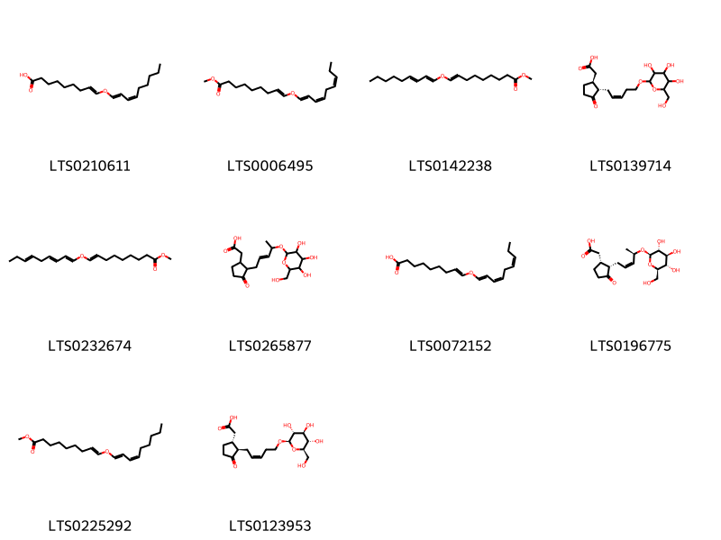{ width=100% }
    <figcaption>Hình ảnh cấu trúc hóa học của 10 hoạt chất thuộc nhóm Fatty Acyls gồm ['colneleic acid (LTS0210611)', 'methyl (8e)-9-[(1e,3z,6z)-nona-1,3,6-trien-1-yloxy]non-8-enoate (LTS0006495)', 'methyl 9-[(1e)-nona-1,3-dien-1-yloxy]non-8-enoate (LTS0142238)', '[(1s,2s)-3-oxo-2-[(2z)-5-{[3,4,5-trihydroxy-6-(hydroxymethyl)oxan-2-yl]oxy}pent-2-en-1-yl]cyclopentyl]acetic acid (LTS0139714)', 'methyl 9-[(1e)-nona-1,3,6-trien-1-yloxy]non-8-enoate (LTS0232674)', '[3-oxo-2-(4-{[3,4,5-trihydroxy-6-(hydroxymethyl)oxan-2-yl]oxy}pent-2-en-1-yl)cyclopentyl]acetic acid (LTS0265877)', 'colnelenic acid (LTS0072152)', '[(1r,2s)-3-oxo-2-[(2z,4r)-4-{[(2r,3r,4s,5s,6r)-3,4,5-trihydroxy-6-(hydroxymethyl)oxan-2-yl]oxy}pent-2-en-1-yl]cyclopentyl]acetic acid (LTS0196775)', 'methyl (8e)-9-[(1e,3z)-nona-1,3-dien-1-yloxy]non-8-enoate (LTS0225292)', 'tuberonic acid glucoside (LTS0123953)'].</figcaption>
</figure>
#### Nhóm Flavonoids
<figure markdown="span">
    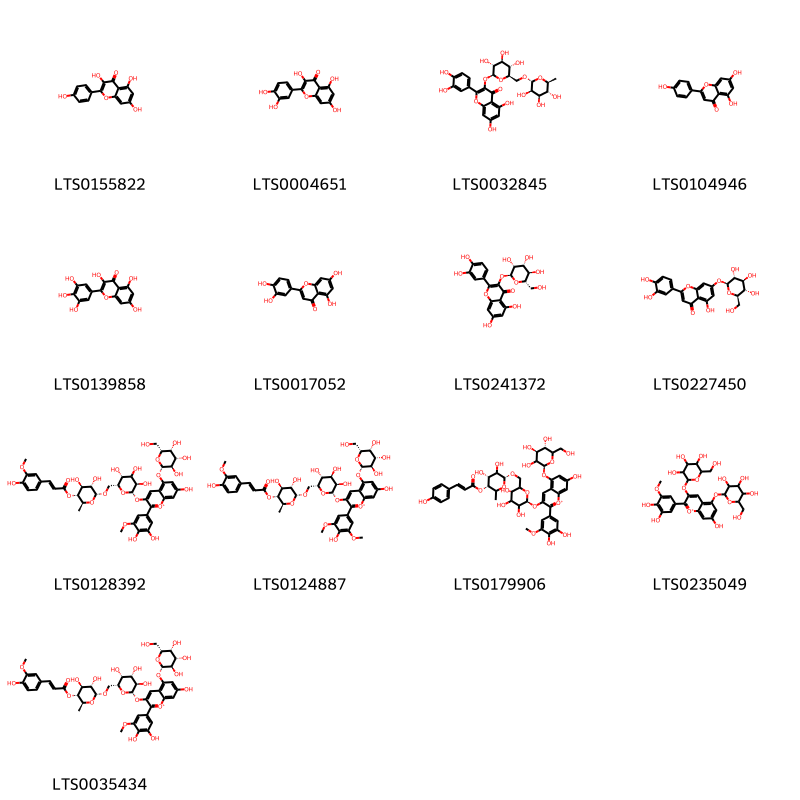{ width=100% }
    <figcaption>Hình ảnh cấu trúc hóa học của 13 hoạt chất thuộc nhóm Flavonoids gồm ['kaempherol (LTS0155822)', 'quercetin (LTS0004651)', '3-rutinosyl quercetin (LTS0032845)', 'chamomile (LTS0104946)', 'myricetin (LTS0139858)', 'luteolin (LTS0017052)', '2-(3,4-dihydroxyphenyl)-5,7-dihydroxy-3-{[(2s,3r,4r,5r,6s)-3,4,5-trihydroxy-6-(hydroxymethyl)oxan-2-yl]oxy}chromen-4-one (LTS0241372)', 'luteolin 7-o-glucoside (LTS0227450)', '2-(3,4-dihydroxy-5-methoxyphenyl)-3-{[(2s,3r,5r,6r)-6-({[(2r,3s,4s,5r,6s)-3,4-dihydroxy-5-{[3-(4-hydroxy-3-methoxyphenyl)prop-2-enoyl]oxy}-6-methyloxan-2-yl]oxy}methyl)-3,4,5-trihydroxyoxan-2-yl]oxy}-7-hydroxy-5-{[(2s,3r,4s,5r,6r)-3,4,5-trihydroxy-6-(hydroxymethyl)oxan-2-yl]oxy}-1λ⁴-chromen-1-ylium (LTS0128392)', '3-{[(2s,3r,4r,5r,6r)-6-({[(2r,3s,4s,5r,6s)-3,4-dihydroxy-5-{[3-(4-hydroxy-3-methoxyphenyl)prop-2-enoyl]oxy}-6-methyloxan-2-yl]oxy}methyl)-3,4,5-trihydroxyoxan-2-yl]oxy}-7-hydroxy-2-(4-hydroxy-3,5-dimethoxyphenyl)-5-{[(2s,3r,4s,5r,6r)-3,4,5-trihydroxy-6-(hydroxymethyl)oxan-2-yl]oxy}-1λ⁴-chromen-1-ylium (LTS0124887)', '2-(3,4-dihydroxy-5-methoxyphenyl)-3-{[(2s,5s)-6-({[(2r,4r,5r)-3,4-dihydroxy-5-{[3-(4-hydroxyphenyl)prop-2-enoyl]oxy}-6-methyloxan-2-yl]oxy}methyl)-3,4,5-trihydroxyoxan-2-yl]oxy}-7-hydroxy-5-{[(2s,4s,5s)-3,4,5-trihydroxy-6-(hydroxymethyl)oxan-2-yl]oxy}-1λ⁴-chromen-1-ylium (LTS0179906)', '2-(3,4-dihydroxy-5-methoxyphenyl)-7-hydroxy-3,5-bis({[3,4,5-trihydroxy-6-(hydroxymethyl)oxan-2-yl]oxy})-1λ⁴-chromen-1-ylium (LTS0235049)', '2-(3,4-dihydroxy-5-methoxyphenyl)-3-{[(2s,3r,4s,5r,6r)-6-({[(2r,3s,4s,5r,6s)-3,4-dihydroxy-5-{[3-(4-hydroxy-3-methoxyphenyl)prop-2-enoyl]oxy}-6-methyloxan-2-yl]oxy}methyl)-3,4,5-trihydroxyoxan-2-yl]oxy}-7-hydroxy-5-{[(2s,3r,4s,5r,6r)-3,4,5-trihydroxy-6-(hydroxymethyl)oxan-2-yl]oxy}-1λ⁴-chromen-1-ylium (LTS0035434)'].</figcaption>
</figure>
#### Nhóm Furanoid lignans
<figure markdown="span">
    { width=100% }
    <figcaption>Hình ảnh cấu trúc hóa học của 3 hoạt chất thuộc nhóm Furanoid lignans gồm ['pinoresinol (LTS0057431)', 'matairesinol (LTS0193475)', 'lariciresinol (LTS0010950)'].</figcaption>
</figure>
#### Nhóm Hydroxy acids and derivatives
<figure markdown="span">
    { width=100% }
    <figcaption>Hình ảnh cấu trúc hóa học của 1 hoạt chất thuộc nhóm Hydroxy acids and derivatives gồm ['malic acid (LTS0216520)'].</figcaption>
</figure>
#### Nhóm Imidazopyrimidines
<figure markdown="span">
    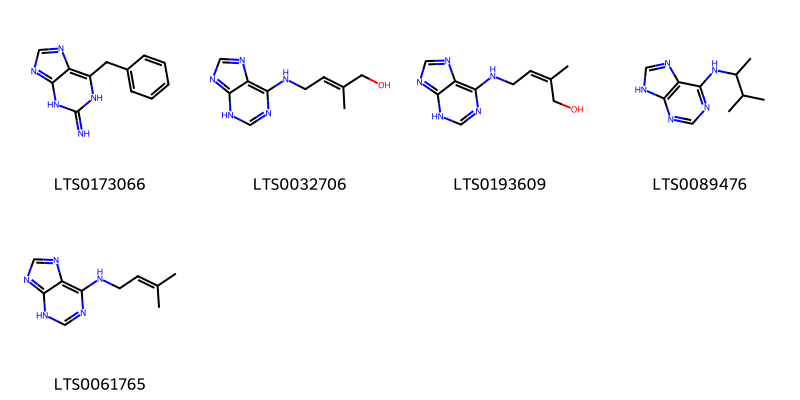{ width=100% }
    <figcaption>Hình ảnh cấu trúc hóa học của 5 hoạt chất thuộc nhóm Imidazopyrimidines gồm ['6-benzyl-1,3-dihydropurin-2-imine (LTS0173066)', 'zeatine (LTS0032706)', 'cis-zeatin (LTS0193609)', 'n-(3-methylbutan-2-yl)-9h-purin-6-amine (LTS0089476)', '2ip (LTS0061765)'].</figcaption>
</figure>
#### Nhóm Indoles and derivatives
<figure markdown="span">
    { width=100% }
    <figcaption>Hình ảnh cấu trúc hóa học của 1 hoạt chất thuộc nhóm Indoles and derivatives gồm ['n-[2-(5-methoxy-1h-indol-3-yl)ethyl]ethanimidic acid (LTS0219322)'].</figcaption>
</figure>
#### Nhóm Lactones
<figure markdown="span">
    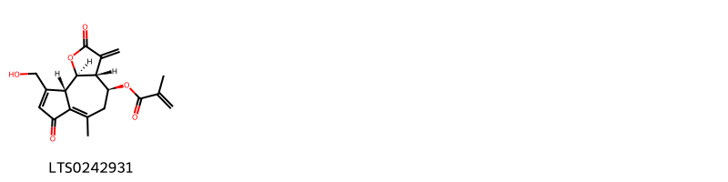{ width=100% }
    <figcaption>Hình ảnh cấu trúc hóa học của 1 hoạt chất thuộc nhóm Lactones gồm ['(3ar,4s,9as,9br)-9-(hydroxymethyl)-6-methyl-3-methylidene-2,7-dioxo-3ah,4h,5h,9ah,9bh-azuleno[4,5-b]furan-4-yl 2-methylprop-2-enoate (LTS0242931)'].</figcaption>
</figure>
#### Nhóm Organonitrogen compounds
<figure markdown="span">
    { width=100% }
    <figcaption>Hình ảnh cấu trúc hóa học của 1 hoạt chất thuộc nhóm Organonitrogen compounds gồm ['(9z,12z)-n-(2-hydroxyethyl)octadeca-9,12-dienimidic acid (LTS0115325)'].</figcaption>
</figure>
#### Nhóm Organooxygen compounds
<figure markdown="span">
    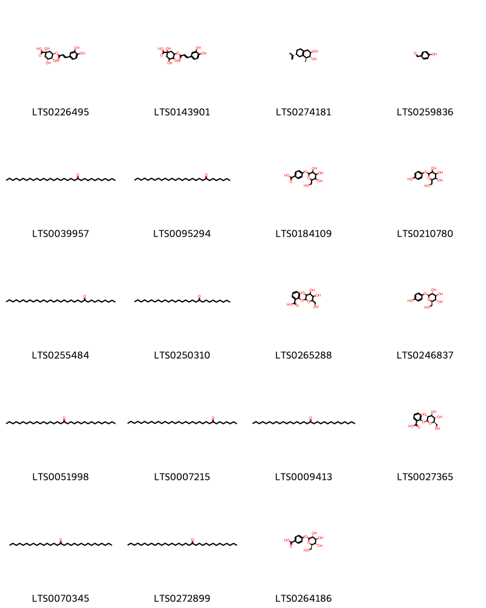{ width=100% }
    <figcaption>Hình ảnh cấu trúc hóa học của 19 hoạt chất thuộc nhóm Organooxygen compounds gồm ['chlorogenic acid (LTS0226495)', '3-{[3-(3,4-dihydroxyphenyl)prop-2-enoyl]oxy}-1,4,5-trihydroxycyclohexane-1-carboxylic acid (LTS0143901)', 'rishitin (LTS0274181)', 'p-hydroxybenzaldehyde (LTS0259836)', 'tritriacontan-12-one (LTS0039957)', 'nonacosan-8-one (LTS0095294)', '4-{[3,4,5-trihydroxy-6-(hydroxymethyl)oxan-2-yl]oxy}benzoic acid (LTS0184109)', 'arbutin (LTS0210780)', 'tritriacontan-10-one (LTS0255484)', 'ginnone (LTS0250310)', '2-{[3,4,5-trihydroxy-6-(hydroxymethyl)oxan-2-yl]oxy}benzoic acid (LTS0265288)', 'β-arbutin (LTS0246837)', 'tritriacontan-16-one (LTS0051998)', 'tritriacontan-8-one (LTS0007215)', 'hentriacontan-14-one (LTS0009413)', '2-{[(2s,3r,4s,5s,6r)-3,4,5-trihydroxy-6-(hydroxymethyl)oxan-2-yl]oxy}benzoic acid (LTS0027365)', 'palmitone (LTS0070345)', 'tritriacontan-14-one (LTS0272899)', '4-(β-d-glucosyloxy)benzoate (LTS0264186)'].</figcaption>
</figure>
#### Nhóm Oxepanes
<figure markdown="span">
    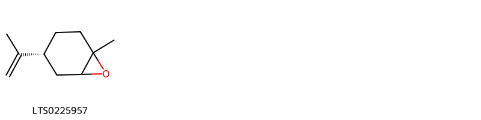{ width=100% }
    <figcaption>Hình ảnh cấu trúc hóa học của 1 hoạt chất thuộc nhóm Oxepanes gồm ['limonene-1,2-epoxide (LTS0225957)'].</figcaption>
</figure>
#### Nhóm Phenols
<figure markdown="span">
    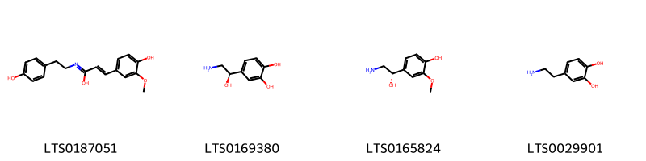{ width=100% }
    <figcaption>Hình ảnh cấu trúc hóa học của 4 hoạt chất thuộc nhóm Phenols gồm ['(2e)-3-(4-hydroxy-3-methoxyphenyl)-n-[2-(4-hydroxyphenyl)ethyl]prop-2-enimidic acid (LTS0187051)', 'norepinephrine (LTS0169380)', '4-[(1s)-2-amino-1-hydroxyethyl]-2-methoxyphenol (LTS0165824)', 'dopamine (LTS0029901)'].</figcaption>
</figure>
#### Nhóm Prenol lipids
<figure markdown="span">
    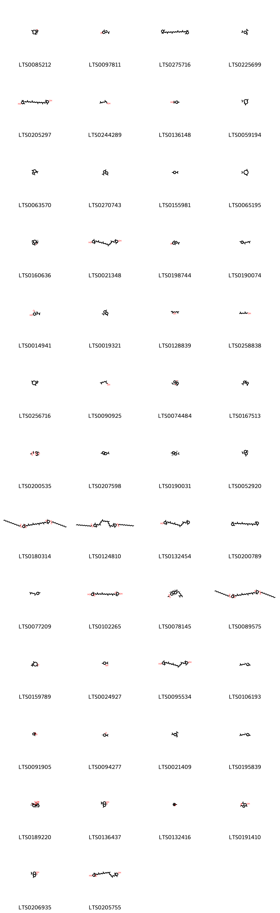{ width=100% }
    <figcaption>Hình ảnh cấu trúc hóa học của 96 hoạt chất thuộc nhóm Prenol lipids gồm ['caryophyllene (LTS0085212)', 'solavetivone (LTS0097811)', 'β-carotene (LTS0275716)', 'β-elemene (LTS0225699)', 'carotenoid (LTS0205297)', 'nerol (LTS0244289)', 'terpineol (LTS0136148)', '(-)-germacrene d (LTS0059194)', '1,1,7-trimethyl-4-methylidene-octahydro-1ah-cyclopropa[e]azulene (LTS0063570)', '4-isopropyl-1,6-dimethyl-2,3,4,4a,7,8-hexahydronaphthalene (LTS0270743)', 'limonene,  (LTS0155981)', '(1z,6z,8s)-8-isopropyl-1-methyl-5-methylidenecyclodeca-1,6-diene (LTS0065195)', '(1as,4as,7as,7br)-1,1,7-trimethyl-4-methylidene-octahydro-1ah-cyclopropa[e]azulene (LTS0160636)', '4-[(9e,11e,13e,15e,17e)-18-(4-hydroxy-2,6,6-trimethylcyclohex-1-en-1-yl)-3,7,12,16-tetramethyloctadeca-1,3,5,7,9,11,13,15,17-nonaen-1-yl]-3,5,5-trimethylcyclohex-2-en-1-ol (LTS0021348)', '6,10-dimethyl-2-(prop-1-en-2-yl)spiro[4.5]dec-6-en-8-one (LTS0198744)', 'curcumene (LTS0190074)', 'lubimin (LTS0014941)', 'delta-cadinene (LTS0019321)', 'linalool, (+-)- (LTS0128839)', 'geraniol (LTS0258838)', '4,11,11-trimethyl-8-methylidenebicyclo[7.2.0]undec-4-ene (LTS0256716)', 'citronellol, (+-)- (LTS0090925)', 'β-bourbonene (LTS0074484)', 'β-bourbonene (LTS0167513)', 'phytuberin (LTS0200535)', 'α-copaene (LTS0207598)', '(1r,2s,7s,8s)-8-isopropyl-1,3-dimethyltricyclo[4.4.0.0²,⁷]dec-3-ene (LTS0190031)', 'gamma-muurolene (LTS0052920)', '(1r,3s,6s)-1,5,5-trimethyl-6-[(1e,3e,5e,7e,9e,11e,13e,15e,17e)-3,7,12,16-tetramethyl-18-[(1s,4s,6r)-2,2,6-trimethyl-4-(tetradecanoyloxy)-7-oxabicyclo[4.1.0]heptan-1-yl]octadeca-1,3,5,7,9,11,13,15,17-nonaen-1-yl]-7-oxabicyclo[4.1.0]heptan-3-yl hexadecanoate (LTS0180314)', '3,5,5-trimethyl-4-{3,7,12,16-tetramethyl-18-[2,6,6-trimethyl-4-(tetradecanoyloxy)cyclohex-1-en-1-yl]octadeca-1,3,5,7,9,11,13,15,17-nonaen-1-yl}cyclohex-2-en-1-yl tetradecanoate (LTS0124810)', '3,5,5-trimethyl-4-[(1e,3e,5e,7e,9e)-3,7,12,16-tetramethyl-18-(2,6,6-trimethylcyclohex-1-en-1-yl)octadeca-1,3,5,7,9,11,13,15,17-nonaen-1-yl]cyclohex-3-en-1-ol (LTS0132454)', '(+)-α-carotene (LTS0200789)', '(r)-β-bisabolene (LTS0077209)', 'violaxanthin (LTS0102265)', '(1r,3ar,5ar,6s,7s,9as,9br,11ar)-1-[(2r,5z)-5-isopropylhept-5-en-2-yl]-6,9a,11a-trimethyl-1h,2h,3h,3ah,5h,5ah,6h,7h,8h,9h,9bh,10h,11h-cyclopenta[a]phenanthren-7-yl acetate (LTS0078145)', '(1r,3s,6s)-1,5,5-trimethyl-6-[(1e,3e,5e,7e,9e,11e,13e,15e,17e)-3,7,12,16-tetramethyl-18-[(1s,4s,6r)-2,2,6-trimethyl-4-(tetradecanoyloxy)-7-oxabicyclo[4.1.0]heptan-1-yl]octadeca-1,3,5,7,9,11,13,15,17-nonaen-1-yl]-7-oxabicyclo[4.1.0]heptan-3-yl tetradecanoate (LTS0089575)', 'caryophyllene oxide (LTS0159789)', 'menthol natural (LTS0024927)', '4-[(9e,11e,13e,15e,17e)-18-(4-hydroxy-2,6,6-trimethylcyclohex-1-en-1-yl)-3,7,12,16-tetramethyloctadeca-1,3,5,7,9,11,13,15,17-nonaen-1-yl]-3,5,5-trimethylcyclohex-3-en-1-ol (LTS0095534)', 'β-sesquiphellandrene (LTS0106193)', 'camphor (LTS0091905)', '(+)-pulegone (LTS0094277)', 'elemene (LTS0021409)', '3-[(2s)-6-methylhept-5-en-2-yl]-6-methylidenecyclohex-1-ene (LTS0195839)', '(1r,2r,5r,8r,9s,10s,11r)-11-methyl-6-methylidene-12-oxo-13-oxapentacyclo[9.3.3.1⁵,⁸.0¹,¹⁰.0²,⁸]octadecane-9-carboxylic acid (LTS0189220)', '(1r,4ar,8as)-4-isopropyl-1,6-dimethyl-3,4,4a,7,8,8a-hexahydro-2h-naphthalen-1-ol (LTS0136437)', 'α pinene (LTS0132416)', '1-(5-hydroxy-7-isopropyl-4-methylidene-octahydroinden-1-yl)ethanone (LTS0191410)', 'α-cadinol (LTS0206935)', '6-[(1e,3e,5e,7e,9e)-18-(4-hydroxy-2,6,6-trimethylcyclohex-1-en-1-yl)-3,7,12,16-tetramethyloctadeca-1,3,5,7,9,11,13,15,17-nonaen-1-yl]-1,5,5-trimethyl-7-oxabicyclo[4.1.0]heptan-3-ol (LTS0205755)', 'humulene (LTS0263171)', 'zeaxanthin (LTS0192928)', '3,7-dimethyl-2,6-octadienal (LTS0141353)', '4-isopropyl-1,6-dimethyl-3,4,4a,7,8,8a-hexahydronaphthalene (LTS0154650)', '(6e)-2,6-dimethyl-10-methylidenedodeca-2,6-diene (LTS0154516)', '6-(hydroxymethyl)-10-methyl-2-(prop-1-en-2-yl)spiro[4.5]dec-6-en-8-one (LTS0151074)', 'α-ylangene (LTS0254603)', 'phellandrene (LTS0157173)', '5,12-dihydroxy-11-methyl-6-methylidene-16-oxo-15-oxapentacyclo[9.3.2.1⁵,⁸.0¹,¹⁰.0²,⁸]heptadecane-9-carboxylic acid (LTS0230984)', '(1r,4s,4ar)-4-isopropyl-1,6-dimethyl-3,4,4a,7,8,8a-hexahydro-2h-naphthalen-1-ol (LTS0164497)', '11-methyl-6-methylidene-12-oxo-13-oxapentacyclo[9.3.3.1⁵,⁸.0¹,¹⁰.0²,⁸]octadecane-9-carboxylic acid (LTS0179870)', '4-terpineol (LTS0253733)', 'cryptoxanthin (LTS0132646)', '(+)-gamma-cadinene (LTS0103949)', '(1s,2e,6e,10s)-10-isopropyl-3,7-dimethylcyclodeca-2,6-dien-1-ol (LTS0073067)', '1,5,5-trimethyl-6-{3,7,12,16-tetramethyl-18-[2,2,6-trimethyl-4-(tetradecanoyloxy)-7-oxabicyclo[4.1.0]heptan-1-yl]octadeca-1,3,5,7,9,11,13,15,17-nonaen-1-yl}-7-oxabicyclo[4.1.0]heptan-3-yl hexadecanoate (LTS0070108)', '(1s)-8-isopropyl-1,3-dimethyltricyclo[4.4.0.0²,⁷]dec-3-ene (LTS0199723)', 'antheraxanthin (LTS0210072)', 'β-caryophyllene oxide (LTS0213960)', 'delta-cadinol (LTS0008282)', 'ledol (LTS0168644)', 'neral (LTS0165243)', 'α-cadinol (LTS0178794)', '10-isopropyl-3,7-dimethylcyclodeca-2,6-dien-1-ol (LTS0242342)', '(+)-caryophyllene (LTS0046179)', '6-[(9e,11e,13e,15e,17e)-18-{4-hydroxy-2,2,6-trimethyl-7-oxabicyclo[4.1.0]heptan-1-yl}-3,7,12,16-tetramethyloctadeca-1,3,5,7,9,11,13,15,17-nonaen-1-yl]-1,5,5-trimethyl-7-oxabicyclo[4.1.0]heptan-3-ol (LTS0252861)', 'caryophyllene (LTS0048037)', 'ledol (LTS0243935)', '(-)-β-bisabolene (LTS0009940)', '3,5,5-trimethyl-4-{3,7,12,16-tetramethyl-18-[2,6,6-trimethyl-4-(tetradecanoyloxy)cyclohex-1-en-1-yl]octadeca-1,3,5,7,9,11,13,15,17-nonaen-1-yl}cyclohex-3-en-1-yl tetradecanoate (LTS0028446)', 'caryophyllene (LTS0131870)', '1-[(1s,3ar,5r,7s,7as)-5-hydroxy-7-isopropyl-4-methylidene-octahydroinden-1-yl]ethanone (LTS0029535)', 'α-muurolene (LTS0022607)', 'neoxanthin (LTS0000701)', 'fenchone (LTS0126716)', 'gibberellin a1 (LTS0013777)', 'delta-cadinol (LTS0013807)', 'α-carotene (LTS0224243)', '1-(5-isopropylhept-5-en-2-yl)-6,9a,11a-trimethyl-1h,2h,3h,3ah,5h,5ah,6h,7h,8h,9h,9bh,10h,11h-cyclopenta[a]phenanthren-7-yl acetate (LTS0240460)', '1,5,5-trimethyl-6-{3,7,12,16-tetramethyl-18-[2,2,6-trimethyl-4-(tetradecanoyloxy)-7-oxabicyclo[4.1.0]heptan-1-yl]octadeca-1,3,5,7,9,11,13,15,17-nonaen-1-yl}-7-oxabicyclo[4.1.0]heptan-3-yl tetradecanoate (LTS0032577)', '(z)-β-farnesene (LTS0254048)', '6-[(3e,5e,7e,9e)-18-{4-hydroxy-2,2,6-trimethyl-7-oxabicyclo[4.1.0]heptan-1-yl}-3,7,12,16-tetramethyloctadeca-1,3,5,7,9,11,13,15,17-nonaen-1-ylidene]-1,5,5-trimethylcyclohexane-1,3-diol (LTS0114386)', '(1r)-3,5,5-trimethyl-4-[(1e,3e,5e,7e,9e,11e,13e,15e,17e)-3,7,12,16-tetramethyl-18-[(4r)-2,6,6-trimethyl-4-(tetradecanoyloxy)cyclohex-1-en-1-yl]octadeca-1,3,5,7,9,11,13,15,17-nonaen-1-yl]cyclohex-3-en-1-yl tetradecanoate (LTS0132059)', '4-isopropyl-6-methyl-1-methylidene-3,4,4a,7,8,8a-hexahydro-2h-naphthalene (LTS0111070)', '(1r)-3,5,5-trimethyl-4-[(1e,3e,5e,7e,9e,11e,13e,15e,17e)-3,7,12,16-tetramethyl-18-[(1r,4r)-2,6,6-trimethyl-4-(tetradecanoyloxy)cyclohex-2-en-1-yl]octadeca-1,3,5,7,9,11,13,15,17-nonaen-1-yl]cyclohex-3-en-1-yl tetradecanoate (LTS0247324)', '1,3,3-trimethyl-2-[(9e,11e,13e,15e,17e)-3,7,12,16-tetramethyl-18-(2,6,6-trimethylcyclohex-1-en-1-yl)octadeca-1,3,5,7,9,11,13,15,17-nonaen-1-yl]cyclohex-1-ene (LTS0110068)'].</figcaption>
</figure>
#### Nhóm Pteridines and derivatives
<figure markdown="span">
    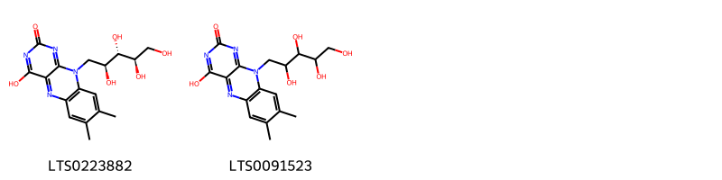{ width=100% }
    <figcaption>Hình ảnh cấu trúc hóa học của 2 hoạt chất thuộc nhóm Pteridines and derivatives gồm ['4-hydroxy-7,8-dimethyl-10-[(2s,3s,4r)-2,3,4,5-tetrahydroxypentyl]benzo[g]pteridin-2-one (LTS0223882)', '4-hydroxy-7,8-dimethyl-10-(2,3,4,5-tetrahydroxypentyl)benzo[g]pteridin-2-one (LTS0091523)'].</figcaption>
</figure>
#### Nhóm Purine nucleosides
<figure markdown="span">
    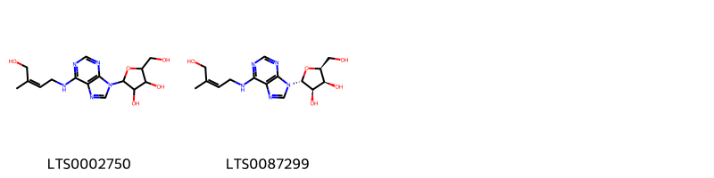{ width=100% }
    <figcaption>Hình ảnh cấu trúc hóa học của 2 hoạt chất thuộc nhóm Purine nucleosides gồm ['2-{6-[(4-hydroxy-3-methylbut-2-en-1-yl)amino]purin-9-yl}-5-(hydroxymethyl)oxolane-3,4-diol (LTS0002750)', '(2r,3r,4s,5s)-2-(6-{[(2z)-4-hydroxy-3-methylbut-2-en-1-yl]amino}purin-9-yl)-5-(hydroxymethyl)oxolane-3,4-diol (LTS0087299)'].</figcaption>
</figure>
#### Nhóm Pyridines and derivatives
<figure markdown="span">
    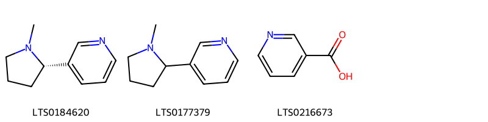{ width=100% }
    <figcaption>Hình ảnh cấu trúc hóa học của 3 hoạt chất thuộc nhóm Pyridines and derivatives gồm ['(-)-nicotine (LTS0184620)', 'nicotine (LTS0177379)', 'niacin (LTS0216673)'].</figcaption>
</figure>
#### Nhóm Steroids and steroid derivatives
<figure markdown="span">
    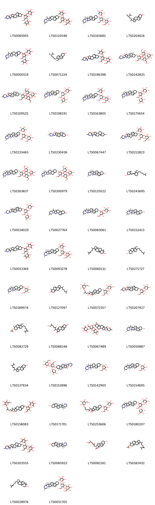{ width=100% }
    <figcaption>Hình ảnh cấu trúc hóa học của 56 hoạt chất thuộc nhóm Steroids and steroid derivatives gồm ["2-{[4-hydroxy-2-(hydroxymethyl)-6-{5',7,9,13-tetramethyl-5-oxaspiro[pentacyclo[10.8.0.0²,⁹.0⁴,⁸.0¹³,¹⁸]icosane-6,2'-piperidin]-18-eneoxy}-5-[(3,4,5-trihydroxy-6-methyloxan-2-yl)oxy]oxan-3-yl]oxy}-6-methyloxane-3,4,5-triol (LTS0085955)", 'α-solanine (LTS0110548)', '(2s,3r,4s,5s,6r)-2-{[(2r,3s,4s,5r,6r)-3-hydroxy-2-(hydroxymethyl)-6-{[(1s,2s,7s,10r,11s,14s,15r,16s,17s,20s,23s)-10,14,16,20-tetramethyl-22-azahexacyclo[12.10.0.0²,¹¹.0⁵,¹⁰.0¹⁵,²³.0¹⁷,²²]tetracos-4-en-7-yl]oxy}-5-{[(2r,3s,4s,5s,6r)-3,4,5-trihydroxy-6-methyloxan-2-yl]oxy}oxan-4-yl]oxy}-6-(hydroxymethyl)oxane-3,4,5-triol (LTS0165685)', 'stigmast-5-en-3-ol, (3β)- (LTS0204616)', '2-{[4-hydroxy-2-(hydroxymethyl)-6-({10,14,16,20-tetramethyl-22-azahexacyclo[12.10.0.0²,¹¹.0⁵,¹⁰.0¹⁵,²³.0¹⁷,²²]tetracos-4-en-7-yl}oxy)-5-[(3,4,5-trihydroxy-6-methyloxan-2-yl)oxy]oxan-3-yl]oxy}-6-methyloxane-3,4,5-triol (LTS0000519)', 'stigmast-5-en-3-ol (LTS0071224)', "2-{[3-hydroxy-2-(hydroxymethyl)-6-{5',7,9,13-tetramethyl-5-oxaspiro[pentacyclo[10.8.0.0²,⁹.0⁴,⁸.0¹³,¹⁸]icosane-6,2'-piperidin]-18-eneoxy}-5-[(3,4,5-trihydroxy-6-methyloxan-2-yl)oxy]oxan-4-yl]oxy}-6-(hydroxymethyl)oxane-3,4,5-triol (LTS0196398)", 'tomatine (LTS0242825)', "(2s,5s)-2-{[(2s,5r)-2-{[(3r,6r)-4,5-dihydroxy-2-(hydroxymethyl)-6-[(1r,2s,4s,6s,7s,9s,12s,13s,16s,18s)-5',7,9,13-tetramethyl-5-oxaspiro[pentacyclo[10.8.0.0²,⁹.0⁴,⁸.0¹³,¹⁸]icosane-6,2'-piperidine]oxy]oxan-3-yl]oxy}-5-hydroxy-6-(hydroxymethyl)-4-{[(2s,5r)-3,4,5-trihydroxyoxan-2-yl]oxy}oxan-3-yl]oxy}-6-(hydroxymethyl)oxane-3,4,5-triol (LTS0109525)", 'α-chaconine (LTS0198191)', '(2s,3r,4s,5s,6r)-2-{[(2r,3s,4s,5r,6r)-3-hydroxy-2-(hydroxymethyl)-6-{[(1s,2s,10r,11s,14s,15r,16s,17r,20s,23s)-10,14,16,20-tetramethyl-22-azahexacyclo[12.10.0.0²,¹¹.0⁵,¹⁰.0¹⁵,²³.0¹⁷,²²]tetracos-4-en-7-yl]oxy}-5-{[(2r,3r,4r,5r,6s)-3,4,5-trihydroxy-6-methyloxan-2-yl]oxy}oxan-4-yl]oxy}-6-(hydroxymethyl)oxane-3,4,5-triol (LTS0163805)', '(2s,3r,5r,6s)-2-{[(2r,3r,4s,5s,6r)-4-hydroxy-2-(hydroxymethyl)-6-{[(1s,2s,7s,10r,11s,14s,15r,16s,17r,20s,23s)-10,14,16,20-tetramethyl-22-azahexacyclo[12.10.0.0²,¹¹.0⁵,¹⁰.0¹⁵,²³.0¹⁷,²²]tetracos-4-en-7-yl]oxy}-5-{[(2s,3r,4r,5s,6s)-3,4,5-trihydroxy-6-methyloxan-2-yl]oxy}oxan-3-yl]oxy}-6-methyloxane-3,4,5-triol (LTS0175654)', '(2s,3r,4s,5s,6r)-2-{[(2r,3s,4s,5r,6r)-3-hydroxy-2-(hydroxymethyl)-6-{[(1s,2s,7s,10r,11s,14s,15r,16s,17r,20s,23r)-10,14,16,20-tetramethyl-22-azahexacyclo[12.10.0.0²,¹¹.0⁵,¹⁰.0¹⁵,²³.0¹⁷,²²]tetracos-4-en-7-yl]oxy}-5-{[(2s,3r,4r,5r,6s)-3,4,5-trihydroxy-6-methyloxan-2-yl]oxy}oxan-4-yl]oxy}-6-(hydroxymethyl)oxane-3,4,5-triol (LTS0233465)', 'tomatidine (LTS0230436)', 'tomatidine (LTS0067447)', 'α-solamarine (LTS0212823)', 'demissine (LTS0263837)', '(2s,3r,4s,5s,6r)-2-{[(2s,3r,4s,5r,6r)-2-{[(2r,3r,4r,5r,6r)-4,5-dihydroxy-2-(hydroxymethyl)-6-{[(2r,7s,10s,14s,16s,17s,20s)-10,14,16,20-tetramethyl-22-azahexacyclo[12.10.0.0²,¹¹.0⁵,¹⁰.0¹⁵,²³.0¹⁷,²²]tetracosan-7-yl]oxy}oxan-3-yl]oxy}-5-hydroxy-6-(hydroxymethyl)-4-{[(2s,3r,4s,5r)-3,4,5-trihydroxyoxan-2-yl]oxy}oxan-3-yl]oxy}-6-(hydroxymethyl)oxane-3,4,5-triol (LTS0200979)', 'solanidine (LTS0125022)', 'vitamin d3 (LTS0243695)', "(2s,3r,4r,5r,6s)-2-{[(2r,3s,4s,5r,6r)-4-hydroxy-2-(hydroxymethyl)-6-[(1s,2s,4s,5's,6s,7s,8r,9s,12s,13r,16s)-5',7,9,13-tetramethyl-5-oxaspiro[pentacyclo[10.8.0.0²,⁹.0⁴,⁸.0¹³,¹⁸]icosane-6,2'-piperidin]-18-eneoxy]-5-{[(2s,3r,4r,5r,6s)-3,4,5-trihydroxy-6-methyloxan-2-yl]oxy}oxan-3-yl]oxy}-6-methyloxane-3,4,5-triol (LTS0034029)", 'solanidine (LTS0027764)', 'β-chaconine (LTS0083061)', 'demissidine (LTS0152413)', "2-{[4-hydroxy-2-(hydroxymethyl)-6-{5',7,9,13-tetramethyl-5-oxaspiro[pentacyclo[10.8.0.0²,⁹.0⁴,⁸.0¹³,¹⁸]icosane-6,2'-piperidine]oxy}-5-[(3,4,5-trihydroxy-6-methyloxan-2-yl)oxy]oxan-3-yl]oxy}-6-methyloxane-3,4,5-triol (LTS0053369)", 'solanine (LTS0093278)', 'cycloartenol (LTS0060131)', 'lophenol (LTS0271727)', '(2r,3s,4s,5r,6r)-2-(hydroxymethyl)-6-{[(1s,2s,10r,14s,15r,16s,17r,20s,23s)-10,14,16,20-tetramethyl-22-azahexacyclo[12.10.0.0²,¹¹.0⁵,¹⁰.0¹⁵,²³.0¹⁷,²²]tetracos-4-en-7-yl]oxy}oxane-3,4,5-triol (LTS0189974)', '6,9a,11a-trimethyl-1-(6-methylheptan-2-yl)-1h,2h,3h,3ah,5h,5ah,6h,7h,8h,9h,9bh,10h,11h-cyclopenta[a]phenanthren-7-ol (LTS0127097)', '(2s,3r,4r,5r,6s)-2-{[(2r,3r,4s,5r,6r)-4,5-dihydroxy-2-{[(1s,2s,4s,6r,7s,8r,9s,12s,13r,16s)-6-hydroxy-7,9,13-trimethyl-6-(3-methyl-4-{[(2r,3r,4s,5s,6r)-3,4,5-trihydroxy-6-(hydroxymethyl)oxan-2-yl]oxy}butyl)-5-oxapentacyclo[10.8.0.0²,⁹.0⁴,⁸.0¹³,¹⁸]icos-18-en-16-yl]oxy}-6-(hydroxymethyl)oxan-3-yl]oxy}-6-methyloxane-3,4,5-triol (LTS0072357)', "(2s,3r,4r,5r,6s)-2-{[(2r,3r,4s,5r,6r)-4,5-dihydroxy-6-(hydroxymethyl)-2-[(1's,2r,2's,4's,7's,8'r,9's,12's,13'r)-5,7',9',13'-tetramethyl-5'-oxaspiro[oxane-2,6'-pentacyclo[10.8.0.0²,⁹.0⁴,⁸.0¹³,¹⁸]icosan]-18'-eneoxy]oxan-3-yl]oxy}-6-methyloxane-3,4,5-triol (LTS0207927)", '(1r,3ar,5ar,6s,7s,9as,9br,11ar)-6,9a,11a-trimethyl-1-[(2r)-6-methyl-5-methylideneheptan-2-yl]-1h,2h,3h,3ah,5h,5ah,6h,7h,8h,9h,9bh,10h,11h-cyclopenta[a]phenanthren-7-yl acetate (LTS0082729)', 'kryptogenin (LTS0088246)', "2-{[4-hydroxy-2-(hydroxymethyl)-6-{5,7',9',13'-tetramethyl-5'-oxaspiro[oxane-2,6'-pentacyclo[10.8.0.0²,⁹.0⁴,⁸.0¹³,¹⁸]icosan]-15'-oloxy}-5-[(3,4,5-trihydroxy-6-methyloxan-2-yl)oxy]oxan-3-yl]oxy}-6-methyloxane-3,4,5-triol (LTS0067489)", '(1s,2r,5s,7s,10s,11s,14s,15r,16s,17s,20s,23s)-10,14,16,20-tetramethyl-22-azahexacyclo[12.10.0.0²,¹¹.0⁵,¹⁰.0¹⁵,²³.0¹⁷,²²]tetracosan-7-ol (LTS0050887)', '1-(5,6-dimethylhept-3-en-2-yl)-9a,11a-dimethyl-1h,2h,3h,3ah,3bh,4h,6h,7h,8h,9h,9bh,10h,11h-cyclopenta[a]phenanthren-7-ol (LTS0137934)', "(2s,3r,4s,5s,6r)-2-{[(2r,3r,4s,5r,6r)-3-hydroxy-2-(hydroxymethyl)-6-[(1r,2s,4s,5'r,6s,7s,8r,9s,12s,13s,16s,18s)-5',7,9,13-tetramethyl-5-oxaspiro[pentacyclo[10.8.0.0²,⁹.0⁴,⁸.0¹³,¹⁸]icosane-6,2'-piperidine]oxy]-5-{[(2r,3s,4r,5s,6r)-3,4,5-trihydroxy-6-methyloxan-2-yl]oxy}oxan-4-yl]oxy}-6-(hydroxymethyl)oxane-3,4,5-triol (LTS0152896)", '(2r,3r,4s,5r,6r)-2-(hydroxymethyl)-6-{[(1s,2s,10r,14s,15r,16s,17r,20s,23s)-10,14,16,20-tetramethyl-22-azahexacyclo[12.10.0.0²,¹¹.0⁵,¹⁰.0¹⁵,²³.0¹⁷,²²]tetracos-4-en-7-yl]oxy}oxane-3,4,5-triol (LTS0142905)', 'γ-solanine (LTS0154695)', '2-[(4,5-dihydroxy-2-{[6-hydroxy-7,9,13-trimethyl-6-(3-methyl-4-{[3,4,5-trihydroxy-6-(hydroxymethyl)oxan-2-yl]oxy}butyl)-5-oxapentacyclo[10.8.0.0²,⁹.0⁴,⁸.0¹³,¹⁸]icos-18-en-16-yl]oxy}-6-(hydroxymethyl)oxan-3-yl)oxy]-6-methyloxane-3,4,5-triol (LTS0158083)', '(1s,2r,5s,7s,10s,11s,14s,15r,16s,17s,20r,23s)-10,14,16,20-tetramethyl-22-azahexacyclo[12.10.0.0²,¹¹.0⁵,¹⁰.0¹⁵,²³.0¹⁷,²²]tetracosan-7-ol (LTS0171701)', '(2r,3r,4r,5r,6s)-2-{[(2r,3r,4s,5r,6r)-4,5-dihydroxy-2-{[(1s,2s,4s,6r,7s,8r,9s,12s,13r,16s)-6-hydroxy-7,9,13-trimethyl-6-[(3s)-3-methyl-4-{[(2r,3r,4s,5r,6r)-3,4,5-trihydroxy-6-(hydroxymethyl)oxan-2-yl]oxy}butyl]-5-oxapentacyclo[10.8.0.0²,⁹.0⁴,⁸.0¹³,¹⁸]icos-18-en-16-yl]oxy}-6-(hydroxymethyl)oxan-3-yl]oxy}-6-methyloxane-3,4,5-triol (LTS0253606)', '(2r,3r,4r,5r,6s)-2-{[(2r,3s,4s,5r,6r)-4-hydroxy-2-(hydroxymethyl)-6-{[(1s,2s,7s,10r,11s,14s,15r,16s,17r,20s,23s)-10,14,16,20-tetramethyl-22-azahexacyclo[12.10.0.0²,¹¹.0⁵,¹⁰.0¹⁵,²³.0¹⁷,²²]tetracos-4-en-7-yl]oxy}-5-{[(2r,3r,4r,5r,6s)-3,4,5-trihydroxy-6-methyloxan-2-yl]oxy}oxan-3-yl]oxy}-6-methyloxane-3,4,5-triol (LTS0180207)', "2-{[3-hydroxy-2-(hydroxymethyl)-6-{5',7,9,13-tetramethyl-5-oxaspiro[pentacyclo[10.8.0.0²,⁹.0⁴,⁸.0¹³,¹⁸]icosane-6,2'-piperidine]oxy}-5-[(3,4,5-trihydroxy-6-methyloxan-2-yl)oxy]oxan-4-yl]oxy}-6-(hydroxymethyl)oxane-3,4,5-triol (LTS0203555)", '(1s,2s,7s,10r,11s,14s,15r,16s,17s,20r,23s)-10,14,16,20-tetramethyl-22-azahexacyclo[12.10.0.0²,¹¹.0⁵,¹⁰.0¹⁵,²³.0¹⁷,²²]tetracos-4-en-7-ol (LTS0085922)', '(1r,3as,3bs,7s,9ar,9bs,11as)-7-hydroxy-1-[(2s,6s)-7-hydroxy-6-methyl-3-oxoheptan-2-yl]-9a,11a-dimethyl-1h,3h,3ah,3bh,4h,6h,7h,8h,9h,9bh,10h,11h-cyclopenta[a]phenanthren-2-one (LTS0082161)', '6,9a,11a-trimethyl-1-(6-methyl-5-methylideneheptan-2-yl)-1h,2h,3h,3ah,5h,5ah,6h,7h,8h,9h,9bh,10h,11h-cyclopenta[a]phenanthren-7-yl acetate (LTS0182432)', '(1s,3r,6s,8r,11s,12s,15r,16r)-7,7,12,16-tetramethyl-15-[(2s)-6-methylhept-5-en-2-yl]pentacyclo[9.7.0.0¹,³.0³,⁸.0¹²,¹⁶]octadecan-6-ol (LTS0028976)', '(2s,3r,4s,5s,6r)-2-{[(2r,3s,4s,5r,6r)-3-hydroxy-2-(hydroxymethyl)-6-{[(1s,2s,7s,10r,11s,14s,15r,16s,17r,20s,23s)-10,14,16,20-tetramethyl-22-azahexacyclo[12.10.0.0²,¹¹.0⁵,¹⁰.0¹⁵,²³.0¹⁷,²²]tetracos-4-en-7-yl]oxy}-5-{[(2s,3r,4r,5r,6s)-3,4,5-trihydroxy-6-methyloxan-2-yl]oxy}oxan-4-yl]oxy}-6-(hydroxymethyl)oxane-3,4,5-triol (LTS0051705)', 'γ-chaconine (LTS0179167)', "(2r,3s,4r,5s,6r)-2-{[(2r,3s,4s,5r,6r)-4-hydroxy-2-(hydroxymethyl)-6-[(1r,2s,4s,5'r,6s,7s,8r,9s,12s,13s,16s,18s)-5',7,9,13-tetramethyl-5-oxaspiro[pentacyclo[10.8.0.0²,⁹.0⁴,⁸.0¹³,¹⁸]icosane-6,2'-piperidine]oxy]-5-{[(2r,3s,4r,5s,6r)-3,4,5-trihydroxy-6-methyloxan-2-yl]oxy}oxan-3-yl]oxy}-6-methyloxane-3,4,5-triol (LTS0053469)", 'brassicasterol (LTS0014226)', '10,14,16,20-tetramethyl-22-azahexacyclo[12.10.0.0²,¹¹.0⁵,¹⁰.0¹⁵,²³.0¹⁷,²²]tetracosan-7-ol (LTS0018917)', '(1s,2s,7s,10r,11s,14s,15r,16s,17s,20s,23s)-10,14,16,20-tetramethyl-22-azahexacyclo[12.10.0.0²,¹¹.0⁵,¹⁰.0¹⁵,²³.0¹⁷,²²]tetracos-4-en-7-ol (LTS0027066)', '(1s,2s,7s,10r,11s,14s,15r,16s,17r,20r,23s)-10,14,16,20-tetramethyl-22-azahexacyclo[12.10.0.0²,¹¹.0⁵,¹⁰.0¹⁵,²³.0¹⁷,²²]tetracos-4-en-7-ol (LTS0018835)'].</figcaption>
</figure>
#### Nhóm Tropane alkaloids
<figure markdown="span">
    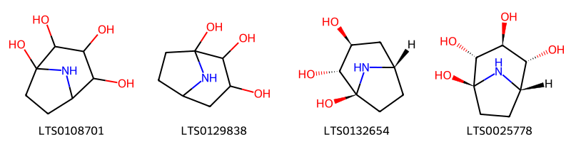{ width=100% }
    <figcaption>Hình ảnh cấu trúc hóa học của 4 hoạt chất thuộc nhóm Tropane alkaloids gồm ['8-azabicyclo[3.2.1]octane-1,2,3,4-tetrol (LTS0108701)', '8-azabicyclo[3.2.1]octane-1,2,3-triol (LTS0129838)', '(1s,2r,3s,5s)-8-azabicyclo[3.2.1]octane-1,2,3-triol (LTS0132654)', '(1s,2r,3s,4r,5s)-8-azabicyclo[3.2.1]octane-1,2,3,4-tetrol (LTS0025778)'].</figcaption>
</figure>

---

### Dược dân tộc học

Danh sách các quốc gia có sử dụng *Solanum tuberosum* trong điều trị các bệnh. 

| Country   | Disease    | Bệnh         |
|:----------|:-----------|:-------------|
| China     | Emetic     | Phôi         |
| Europe    | Intoxicant | chất gây độc |
| Turkey    | Poison     | Chất độc     |

---

---
## Solanum verbascifolium
### Thông tin về thực vật

!!! info "Phân loại thực vật của *N/A* từ GIBF:"
    - **Kingdom:** Plantae
    - **Phylum:** Tracheophyta
    - **Order:** Solanales
    - **Family:** Solanaceae
    - **Genus:** Solanum
    - **Species:** *N/A*

 

| Label (VI)   | Label (EN)   | Scientific Name        | Descriptions (VI)   | Descriptions (EN)   | Also Known As (VI)   | Also Known As (EN)   |
|:-------------|:-------------|:-----------------------|:--------------------|:--------------------|:---------------------|:---------------------|
| N/A          | N/A          | Solanum verbascifolium | loài thực vật       | species of plant    | ['']                 | ['Solanum donianum'] |

#### Phân bố trên thế giới

**Từ CSDL GIBF** Australia, Japan, Argentina, Palestine, State of, Israel, Canada, Puerto Rico, Luxembourg, Cyprus, Chinese Taipei, Spain, Türkiye, Portugal, United States of America, Uruguay, Chile, Greece, South Africa, Montenegro, Thailand, Brazil, Mexico, France, Peru, Viet Nam, United Kingdom of Great Britain and Northern Ireland, Ecuador, Colombia, Costa Rica, India, Indonesia, New Zealand

#### Phân bố tại Việt Nam

**Từ CSDL GIBF**: Lâm Đồng

---
### Thành phần hóa học
        
- Theo cơ sở dữ liệu lotus: Từ loài *N/A* đã phân lập và xác định được 17 hoạt chất thuộc về các nhóm Steroids and steroid derivatives. 

|    | chemicalTaxonomyClassyfireClass   |   smiles_count |
|---:|:----------------------------------|---------------:|
|  0 | Steroids and steroid derivatives  |             17 |

#### Nhóm Steroids and steroid derivatives
<figure markdown="span">
    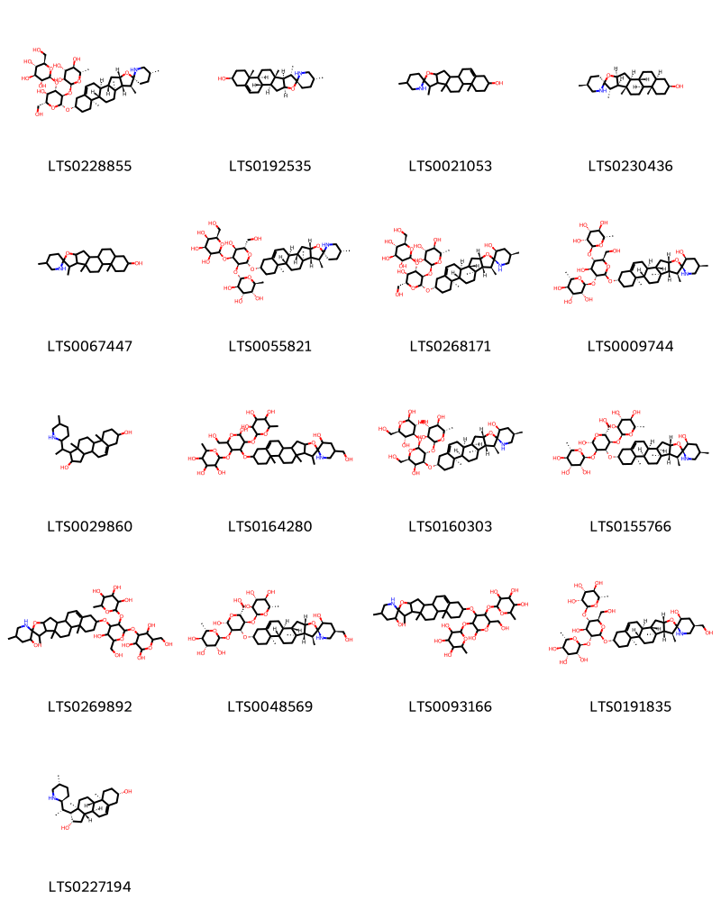{ width=100% }
    <figcaption>Hình ảnh cấu trúc hóa học của 17 hoạt chất thuộc nhóm Steroids and steroid derivatives gồm ["(2s,3r,4r,5r,6s)-2-{[(2r,3r,4s,5s,6r)-5-hydroxy-6-(hydroxymethyl)-2-[(1s,2s,4s,5'r,6r,7s,8r,9s,12s,13r,16s)-5',7,9,13-tetramethyl-5-oxaspiro[pentacyclo[10.8.0.0²,⁹.0⁴,⁸.0¹³,¹⁸]icosane-6,2'-piperidin]-18-eneoxy]-4-{[(2s,3r,4s,5s,6r)-3,4,5-trihydroxy-6-(hydroxymethyl)oxan-2-yl]oxy}oxan-3-yl]oxy}-6-methyloxane-3,4,5-triol (LTS0228855)", 'solasodine (LTS0192535)', 'solassodine (LTS0021053)', 'tomatidine (LTS0230436)', 'tomatidine (LTS0067447)', "(2s,3r,4s,5r,6s)-2-{[(2s,3s,4s,5s,6s)-5-hydroxy-6-(hydroxymethyl)-2-[(1s,2s,4s,5'r,6r,7s,8r,9s,12s,13r,16s)-5',7,9,13-tetramethyl-5-oxaspiro[pentacyclo[10.8.0.0²,⁹.0⁴,⁸.0¹³,¹⁸]icosane-6,2'-piperidin]-18-eneoxy]-4-{[(2s,3s,4s,5r,6r)-3,4,5-trihydroxy-6-(hydroxymethyl)oxan-2-yl]oxy}oxan-3-yl]oxy}-6-methyloxane-3,4,5-triol (LTS0055821)", "(2s,3r,4r,5r,6s)-2-{[(2r,3r,4s,5s,6r)-5-hydroxy-6-(hydroxymethyl)-2-[(1s,2s,3's,4s,5'r,6s,7s,8r,9s,12s,13r,16s)-5',7,9,13-tetramethyl-5-oxaspiro[pentacyclo[10.8.0.0²,⁹.0⁴,⁸.0¹³,¹⁸]icosane-6,2'-piperidin]-18-en-3'-oloxy]-4-{[(2s,3r,4s,5s,6r)-3,4,5-trihydroxy-6-(hydroxymethyl)oxan-2-yl]oxy}oxan-3-yl]oxy}-6-methyloxane-3,4,5-triol (LTS0268171)", "(2s,3r,4r,5r,6s)-2-{[(2r,3s,4s,5r,6r)-4-hydroxy-2-(hydroxymethyl)-6-[(1s,2s,3's,4s,5'r,6s,7s,8r,9s,12s,13r,16s)-5',7,9,13-tetramethyl-5-oxaspiro[pentacyclo[10.8.0.0²,⁹.0⁴,⁸.0¹³,¹⁸]icosane-6,2'-piperidin]-18-en-3'-oloxy]-5-{[(2s,3r,4r,5r,6s)-3,4,5-trihydroxy-6-methyloxan-2-yl]oxy}oxan-3-yl]oxy}-6-methyloxane-3,4,5-triol (LTS0009744)", '9a,11a-dimethyl-1-[1-(5-methylpiperidin-2-yl)ethyl]-1h,2h,3h,3ah,3bh,4h,6h,7h,8h,9h,9bh,10h,11h-cyclopenta[a]phenanthrene-2,7-diol (LTS0029860)', "2-{[2-hydroxy-6-(hydroxymethyl)-4-[5'-(hydroxymethyl)-7,9,13-trimethyl-5-oxaspiro[pentacyclo[10.8.0.0²,⁹.0⁴,⁸.0¹³,¹⁸]icosane-6,2'-piperidin]-18-en-3'-oloxy]-5-[(3,4,5-trihydroxy-6-methyloxan-2-yl)oxy]oxan-3-yl]oxy}-6-methyloxane-3,4,5-triol (LTS0164280)", "(2s,3r,4r,5r,6s)-2-{[(2s,3r,4s,5s,6r)-5-hydroxy-6-(hydroxymethyl)-4-[(1s,2r,3's,4s,5'r,6s,7s,8r,9s,12r,13r,16s)-5',7,9,13-tetramethyl-5-oxaspiro[pentacyclo[10.8.0.0²,⁹.0⁴,⁸.0¹³,¹⁸]icosane-6,2'-piperidin]-18-en-3'-oloxy]-2-{[(2r,3r,4s,5r,6r)-2,3,5-trihydroxy-6-(hydroxymethyl)oxan-4-yl]oxy}oxan-3-yl]oxy}-6-methyloxane-3,4,5-triol (LTS0160303)", "(2s,3r,4r,5r,6s)-2-{[(2r,3r,4s,5r,6r)-2-hydroxy-6-(hydroxymethyl)-4-[(1s,2r,3's,4s,5'r,6s,7s,8r,9s,12r,13r,16s)-5',7,9,13-tetramethyl-5-oxaspiro[pentacyclo[10.8.0.0²,⁹.0⁴,⁸.0¹³,¹⁸]icosane-6,2'-piperidin]-18-en-3'-oloxy]-5-{[(2s,3r,4r,5r,6s)-3,4,5-trihydroxy-6-methyloxan-2-yl]oxy}oxan-3-yl]oxy}-6-methyloxane-3,4,5-triol (LTS0155766)", "4-{[5-hydroxy-6-(hydroxymethyl)-4-{5',7,9,13-tetramethyl-5-oxaspiro[pentacyclo[10.8.0.0²,⁹.0⁴,⁸.0¹³,¹⁸]icosane-6,2'-piperidin]-18-en-3'-oloxy}-3-[(3,4,5-trihydroxy-6-methyloxan-2-yl)oxy]oxan-2-yl]oxy}-6-(hydroxymethyl)oxane-2,3,5-triol (LTS0269892)", "(2s,3r,4r,5r,6s)-2-{[(2r,3r,4s,5r,6r)-2-hydroxy-6-(hydroxymethyl)-4-[(1s,2s,3's,4s,5'r,6s,7s,8r,9s,12s,13r,16s)-5'-(hydroxymethyl)-7,9,13-trimethyl-5-oxaspiro[pentacyclo[10.8.0.0²,⁹.0⁴,⁸.0¹³,¹⁸]icosane-6,2'-piperidin]-18-en-3'-oloxy]-5-{[(2s,3r,4r,5r,6s)-3,4,5-trihydroxy-6-methyloxan-2-yl]oxy}oxan-3-yl]oxy}-6-methyloxane-3,4,5-triol (LTS0048569)", "2-{[2-hydroxy-6-(hydroxymethyl)-4-{5',7,9,13-tetramethyl-5-oxaspiro[pentacyclo[10.8.0.0²,⁹.0⁴,⁸.0¹³,¹⁸]icosane-6,2'-piperidin]-18-en-3'-oloxy}-5-[(3,4,5-trihydroxy-6-methyloxan-2-yl)oxy]oxan-3-yl]oxy}-6-methyloxane-3,4,5-triol (LTS0093166)", "(2s,3r,4r,5r,6s)-2-{[(2r,3s,4s,5r,6r)-4-hydroxy-2-(hydroxymethyl)-6-[(1s,2s,3's,4s,5'r,6s,7s,8r,9s,12s,13r,16s)-5'-(hydroxymethyl)-7,9,13-trimethyl-5-oxaspiro[pentacyclo[10.8.0.0²,⁹.0⁴,⁸.0¹³,¹⁸]icosane-6,2'-piperidin]-18-en-3'-oloxy]-5-{[(2s,3r,4r,5r,6s)-3,4,5-trihydroxy-6-methyloxan-2-yl]oxy}oxan-3-yl]oxy}-6-methyloxane-3,4,5-triol (LTS0191835)", '(1r,2s,3as,3bs,7s,9ar,9bs,11as)-9a,11a-dimethyl-1-[(1s)-1-[(2s,5r)-5-methylpiperidin-2-yl]ethyl]-1h,2h,3h,3ah,3bh,4h,6h,7h,8h,9h,9bh,10h,11h-cyclopenta[a]phenanthrene-2,7-diol (LTS0227194)'].</figcaption>
</figure>

---

### Dược dân tộc học

Danh sách các quốc gia có sử dụng *N/A* trong điều trị các bệnh. 

| Country   | Disease   | Bệnh          |
|:----------|:----------|:--------------|
| Solomon I | Antidote  | Chất giải độc |

---

---
## Solanum wendlandii
### Thông tin về thực vật

!!! info "Phân loại thực vật của *Solanum wendlandii* từ GIBF:"
    - **Kingdom:** Plantae
    - **Phylum:** Tracheophyta
    - **Order:** Solanales
    - **Family:** Solanaceae
    - **Genus:** Solanum
    - **Species:** *Solanum wendlandii*

 

| Label (VI)   | Label (EN)   | Scientific Name    | Descriptions (VI)   | Descriptions (EN)   | Also Known As (VI)   | Also Known As (EN)   |
|:-------------|:-------------|:-------------------|:--------------------|:--------------------|:---------------------|:---------------------|
| N/A          | N/A          | Solanum wendlandii | loài thực vật       | species of plant    | ['']                 | ['']                 |

#### Phân bố trên thế giới

**Từ CSDL GIBF** Australia, Guatemala, Argentina, Nicaragua, Tanzania, United Republic of, Panama, Spain, Bolivia (Plurinational State of), Honduras, Jamaica, United States of America, Chile, El Salvador, Brazil, Peru, Mexico, Ecuador, French Polynesia, Colombia, Costa Rica, India, New Zealand, Nepal

#### Phân bố tại Việt Nam

**Từ CSDL GIBF**: Không có ghi nhận ở Việt Nam

---
### Thành phần hóa học
        
- Theo cơ sở dữ liệu lotus: Từ loài *Solanum wendlandii* đã phân lập và xác định được 5 hoạt chất thuộc về các nhóm Fatty Acyls, Organonitrogen compounds. 

|    | chemicalTaxonomyClassyfireClass   |   smiles_count |
|---:|:----------------------------------|---------------:|
|  0 |                                   |              2 |
|  1 | Fatty Acyls                       |              1 |
|  2 | Organonitrogen compounds          |              2 |

#### Nhóm 
<figure markdown="span">
    { width=100% }
    <figcaption>Hình ảnh cấu trúc hóa học của 2 hoạt chất thuộc nhóm  gồm ['cuskhygrine (LTS0083137)', '1,3-bis[(2r)-1-methylpyrrolidin-2-yl]propan-2-one (LTS0179198)'].</figcaption>
</figure>
#### Nhóm Fatty Acyls
<figure markdown="span">
    { width=100% }
    <figcaption>Hình ảnh cấu trúc hóa học của 1 hoạt chất thuộc nhóm Fatty Acyls gồm ['n,n-bis[4-(dimethylamino)butyl]hexanamide (LTS0038853)'].</figcaption>
</figure>
#### Nhóm Organonitrogen compounds
<figure markdown="span">
    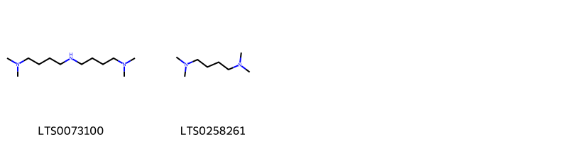{ width=100% }
    <figcaption>Hình ảnh cấu trúc hóa học của 2 hoạt chất thuộc nhóm Organonitrogen compounds gồm ['(4-{[4-(dimethylamino)butyl]amino}butyl)dimethylamine (LTS0073100)', 'tetramethyldiaminobutane (LTS0258261)'].</figcaption>
</figure>

---

### Dược dân tộc học

Danh sách các quốc gia có sử dụng *Solanum wendlandii* trong điều trị các bệnh. 

| Country   | Disease   | Bệnh     |
|:----------|:----------|:---------|
| Elsewhere | Poison    | Chất độc |

---

# Chi Duboisia

??? note "Danh sách các dược liệu thuộc chi"
    
	 - *Duboisia leichhardtii*
	 - *Duboisia myoporoides*

---
## Duboisia leichhardtii
### Thông tin về thực vật

!!! info "Phân loại thực vật của *Duboisia leichhardtii* từ GIBF:"
    - **Kingdom:** Plantae
    - **Phylum:** Tracheophyta
    - **Order:** Solanales
    - **Family:** Solanaceae
    - **Genus:** Duboisia
    - **Species:** *Duboisia leichhardtii*

 

| Label (VI)   | Label (EN)   | Scientific Name       | Descriptions (VI)   | Descriptions (EN)   | Also Known As (VI)   | Also Known As (EN)   |
|:-------------|:-------------|:----------------------|:--------------------|:--------------------|:---------------------|:---------------------|
| N/A          | N/A          | Duboisia leichhardtii |                     | species of plant    | ['']                 | ['']                 |

#### Phân bố trên thế giới

**Từ CSDL GIBF** nan, Brazil, Australia

#### Phân bố tại Việt Nam

**Từ CSDL GIBF**: Không có ghi nhận ở Việt Nam

---
### Thành phần hóa học
        
- Theo cơ sở dữ liệu lotus: Từ loài *Duboisia leichhardtii* đã phân lập và xác định được 36 hoạt chất thuộc về các nhóm Naphthalenes, Benzene and substituted derivatives, Hydroxy acids and derivatives, Tropane alkaloids, Pyridines and derivatives. 

|    | chemicalTaxonomyClassyfireClass     |   smiles_count |
|---:|:------------------------------------|---------------:|
|  0 | Benzene and substituted derivatives |              1 |
|  1 | Hydroxy acids and derivatives       |              3 |
|  2 | Naphthalenes                        |              1 |
|  3 | Pyridines and derivatives           |              2 |
|  4 | Tropane alkaloids                   |             29 |

#### Nhóm Benzene and substituted derivatives
<figure markdown="span">
    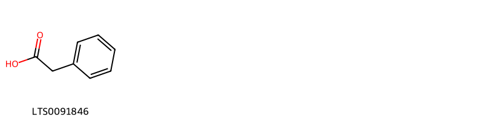{ width=100% }
    <figcaption>Hình ảnh cấu trúc hóa học của 1 hoạt chất thuộc nhóm Benzene and substituted derivatives gồm ['ω-phenylacetic acid (LTS0091846)'].</figcaption>
</figure>
#### Nhóm Hydroxy acids and derivatives
<figure markdown="span">
    { width=100% }
    <figcaption>Hình ảnh cấu trúc hóa học của 3 hoạt chất thuộc nhóm Hydroxy acids and derivatives gồm ['(2r,4s)-9-methyl-3-oxa-9-azatricyclo[3.3.1.0²,⁴]nonan-7-yl (2r)-3-hydroxy-2-phenylpropanoate (LTS0204987)', 'buscopan (LTS0213778)', 'scopolamine (LTS0172796)'].</figcaption>
</figure>
#### Nhóm Naphthalenes
<figure markdown="span">
    { width=100% }
    <figcaption>Hình ảnh cấu trúc hóa học của 1 hoạt chất thuộc nhóm Naphthalenes gồm ['4-(1r,2r,4s,5s,7r)-9-methyl-3-oxa-9-azatricyclo[3.3.1.0²,⁴]nonan-7-yl 1-(1r,2s,4r,5s,7s)-9-methyl-3-oxa-9-azatricyclo[3.3.1.0²,⁴]nonan-7-yl (1s,4s)-1-phenyl-3,4-dihydro-2h-naphthalene-1,4-dicarboxylate (LTS0036245)'].</figcaption>
</figure>
#### Nhóm Pyridines and derivatives
<figure markdown="span">
    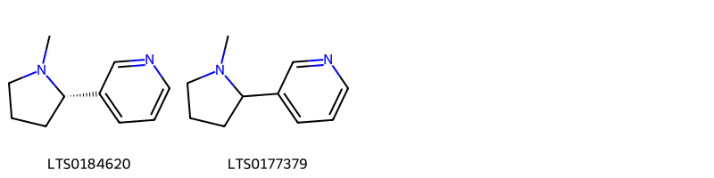{ width=100% }
    <figcaption>Hình ảnh cấu trúc hóa học của 2 hoạt chất thuộc nhóm Pyridines and derivatives gồm ['(-)-nicotine (LTS0184620)', 'nicotine (LTS0177379)'].</figcaption>
</figure>
#### Nhóm Tropane alkaloids
<figure markdown="span">
    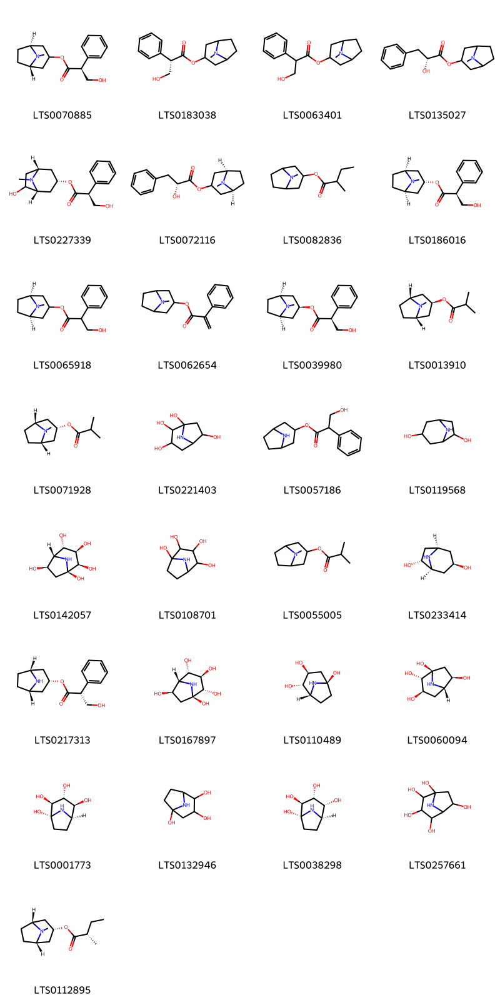{ width=100% }
    <figcaption>Hình ảnh cấu trúc hóa học của 29 hoạt chất thuộc nhóm Tropane alkaloids gồm ['(1s,5s)-8-methyl-8-azabicyclo[3.2.1]octan-3-yl (2s)-3-hydroxy-2-phenylpropanoate (LTS0070885)', 'hyoscyamine (LTS0183038)', '()-hyoscyamine (LTS0063401)', 'littorine (LTS0135027)', '6-hydroxyhyoscyamine (LTS0227339)', '(1r,5s)-8-methyl-8-azabicyclo[3.2.1]octan-3-yl (2r)-2-hydroxy-3-phenylpropanoate (LTS0072116)', '8-methyl-8-azabicyclo[3.2.1]octan-3-yl 2-methylbutanoate (LTS0082836)', 'l-hyoscyamine (LTS0186016)', 'atropine (LTS0065918)', 'apoatropine (LTS0062654)', 'hyoscyamine (LTS0039980)', '(1r,3r,5s)-8-methyl-8-azabicyclo[3.2.1]octan-3-yl 2-methylpropanoate (LTS0013910)', '(1r,3s,5s)-8-methyl-8-azabicyclo[3.2.1]octan-3-yl 2-methylpropanoate (LTS0071928)', '8-azabicyclo[3.2.1]octane-1,2,3,6-tetrol (LTS0221403)', '8-azabicyclo[3.2.1]octan-3-yl 3-hydroxy-2-phenylpropanoate (LTS0057186)', '8-azabicyclo[3.2.1]octane-3,6-diol (LTS0119568)', '(1r,2r,3r,4s,5r,6r)-8-azabicyclo[3.2.1]octane-1,2,3,4,6-pentol (LTS0142057)', '8-azabicyclo[3.2.1]octane-1,2,3,4-tetrol (LTS0108701)', '8-methyl-8-azabicyclo[3.2.1]octan-3-yl 2-methylpropanoate (LTS0055005)', '(1r,3r,5s,6r)-8-azabicyclo[3.2.1]octane-3,6-diol (LTS0233414)', '(1r,3s,5s)-8-azabicyclo[3.2.1]octan-3-yl (2r)-3-hydroxy-2-phenylpropanoate (LTS0217313)', '(1r,2s,3r,4s,5r,6r)-8-azabicyclo[3.2.1]octane-1,2,3,4,6-pentol (LTS0167897)', '(1r,3s,4s,5r)-8-azabicyclo[3.2.1]octane-1,3,4-triol (LTS0110489)', '(1r,2s,3r,5s,6r)-8-azabicyclo[3.2.1]octane-1,2,3,6-tetrol (LTS0060094)', '(1r,2s,3r,4s,5r)-8-azabicyclo[3.2.1]octane-1,2,3,4-tetrol (LTS0001773)', '8-azabicyclo[3.2.1]octane-1,3,4-triol (LTS0132946)', '(1r,2s,3r,4r,5r)-8-azabicyclo[3.2.1]octane-1,2,3,4-tetrol (LTS0038298)', '8-azabicyclo[3.2.1]octane-1,2,3,4,6-pentol (LTS0257661)', '(1r,3s,5s)-8-methyl-8-azabicyclo[3.2.1]octan-3-yl (2s)-2-methylbutanoate (LTS0112895)'].</figcaption>
</figure>

---

### Dược dân tộc học

Danh sách các quốc gia có sử dụng *Duboisia leichhardtii* trong điều trị các bệnh. 

| Country   | Disease   | Bệnh     |
|:----------|:----------|:---------|
| Australia | Poison    | Chất độc |

---

---
## Duboisia myoporoides
### Thông tin về thực vật

!!! info "Phân loại thực vật của *Duboisia myoporoides* từ GIBF:"
    - **Kingdom:** Plantae
    - **Phylum:** Tracheophyta
    - **Order:** Solanales
    - **Family:** Solanaceae
    - **Genus:** Duboisia
    - **Species:** *Duboisia myoporoides*

 

| Label (VI)   | Label (EN)   | Scientific Name      | Descriptions (VI)   | Descriptions (EN)   | Also Known As (VI)   | Also Known As (EN)   |
|:-------------|:-------------|:---------------------|:--------------------|:--------------------|:---------------------|:---------------------|
| N/A          | N/A          | Duboisia myoporoides | loài thực vật       | species of plant    | ['']                 | ['']                 |

#### Phân bố trên thế giới

**Từ CSDL GIBF** New Caledonia, Australia

#### Phân bố tại Việt Nam

**Từ CSDL GIBF**: Không có ghi nhận ở Việt Nam

---
### Thành phần hóa học
        
- Theo cơ sở dữ liệu lotus: Từ loài *Duboisia myoporoides* đã phân lập và xác định được 66 hoạt chất thuộc về các nhóm Fatty Acyls, Prenol lipids, Piperidines, Organonitrogen compounds, Benzene and substituted derivatives, Hydroxy acids and derivatives, Tropane alkaloids, Organooxygen compounds, Saturated hydrocarbons, Tetrapyrroles and derivatives, Pyridines and derivatives. 

|    | chemicalTaxonomyClassyfireClass     |   smiles_count |
|---:|:------------------------------------|---------------:|
|  0 |                                     |              7 |
|  1 | Benzene and substituted derivatives |              3 |
|  2 | Fatty Acyls                         |              7 |
|  3 | Hydroxy acids and derivatives       |              4 |
|  4 | Organonitrogen compounds            |              1 |
|  5 | Organooxygen compounds              |              2 |
|  6 | Piperidines                         |              2 |
|  7 | Prenol lipids                       |              5 |
|  8 | Pyridines and derivatives           |              3 |
|  9 | Saturated hydrocarbons              |              2 |
| 10 | Tetrapyrroles and derivatives       |              2 |
| 11 | Tropane alkaloids                   |             28 |

#### Nhóm 
<figure markdown="span">
    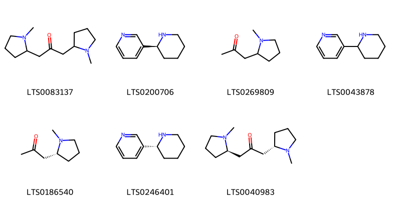{ width=100% }
    <figcaption>Hình ảnh cấu trúc hóa học của 7 hoạt chất thuộc nhóm  gồm ['cuskhygrine (LTS0083137)', '(-)-anabasine (LTS0200706)', 'hygrine (LTS0269809)', 'anabasine (LTS0043878)', '(+)-hygrine (LTS0186540)', '3-[(2r)-2-piperidinyl]pyridine (LTS0246401)', 'cuscohygrine (LTS0040983)'].</figcaption>
</figure>
#### Nhóm Benzene and substituted derivatives
<figure markdown="span">
    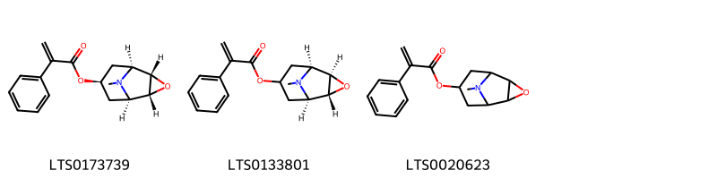{ width=100% }
    <figcaption>Hình ảnh cấu trúc hóa học của 3 hoạt chất thuộc nhóm Benzene and substituted derivatives gồm ['aposcopolamine (LTS0173739)', '(1r,2r,4r,5s)-9-methyl-3-oxa-9-azatricyclo[3.3.1.0²,⁴]nonan-7-yl 2-phenylprop-2-enoate (LTS0133801)', 'aposcopolamine (LTS0020623)'].</figcaption>
</figure>
#### Nhóm Fatty Acyls
<figure markdown="span">
    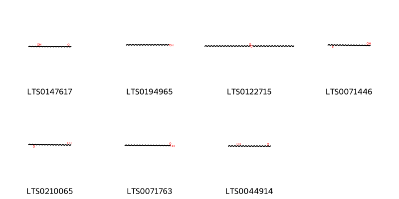{ width=100% }
    <figcaption>Hình ảnh cấu trúc hóa học của 7 hoạt chất thuộc nhóm Fatty Acyls gồm ['(25s)-25-hydroxydotriacontan-3-one (LTS0147617)', 'dotriacontanol (LTS0194965)', 'hentriacontyl tetratriacontanoate (LTS0122715)', '30-hydroxydotriacontan-5-one (LTS0071446)', '(30r)-30-hydroxydotriacontan-5-one (LTS0210065)', 'tetratriacontanoic acid (LTS0071763)', '25-hydroxydotriacontan-3-one (LTS0044914)'].</figcaption>
</figure>
#### Nhóm Hydroxy acids and derivatives
<figure markdown="span">
    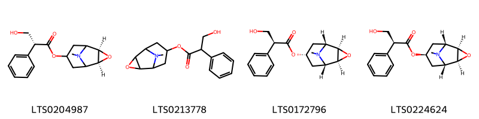{ width=100% }
    <figcaption>Hình ảnh cấu trúc hóa học của 4 hoạt chất thuộc nhóm Hydroxy acids and derivatives gồm ['(2r,4s)-9-methyl-3-oxa-9-azatricyclo[3.3.1.0²,⁴]nonan-7-yl (2r)-3-hydroxy-2-phenylpropanoate (LTS0204987)', 'buscopan (LTS0213778)', 'scopolamine (LTS0172796)', '(1r,2r,4s,5s,7s)-9-methyl-3-oxa-9-azatricyclo[3.3.1.0²,⁴]nonan-7-yl (2s)-3-hydroxy-2-phenylpropanoate (LTS0224624)'].</figcaption>
</figure>
#### Nhóm Organonitrogen compounds
<figure markdown="span">
    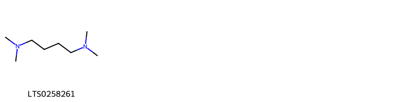{ width=100% }
    <figcaption>Hình ảnh cấu trúc hóa học của 1 hoạt chất thuộc nhóm Organonitrogen compounds gồm ['tetramethyldiaminobutane (LTS0258261)'].</figcaption>
</figure>
#### Nhóm Organooxygen compounds
<figure markdown="span">
    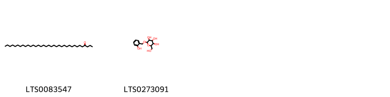{ width=100% }
    <figcaption>Hình ảnh cấu trúc hóa học của 2 hoạt chất thuộc nhóm Organooxygen compounds gồm ['pentatriacontan-4-one (LTS0083547)', '2-(hydroxymethyl)-6-[(2-hydroxyphenyl)methoxy]oxane-3,4,5-triol (LTS0273091)'].</figcaption>
</figure>
#### Nhóm Piperidines
<figure markdown="span">
    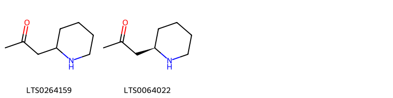{ width=100% }
    <figcaption>Hình ảnh cấu trúc hóa học của 2 hoạt chất thuộc nhóm Piperidines gồm ['pelletierine (LTS0264159)', '(r)-1-(2-piperidyl)acetone (LTS0064022)'].</figcaption>
</figure>
#### Nhóm Prenol lipids
<figure markdown="span">
    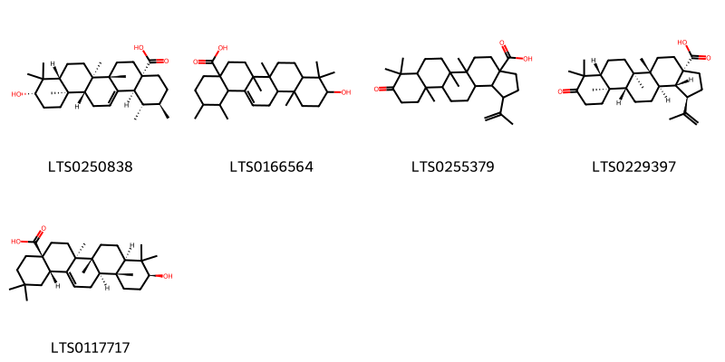{ width=100% }
    <figcaption>Hình ảnh cấu trúc hóa học của 5 hoạt chất thuộc nhóm Prenol lipids gồm ['ursolic acid (LTS0250838)', '10-hydroxy-1,2,6a,6b,9,9,12a-heptamethyl-2,3,4,5,6,7,8,8a,10,11,12,12b,13,14b-tetradecahydro-1h-picene-4a-carboxylic acid (LTS0166564)', '5a,5b,8,8,11a-pentamethyl-9-oxo-1-(prop-1-en-2-yl)-tetradecahydro-1h-cyclopenta[a]chrysene-3a-carboxylic acid (LTS0255379)', '(1r,3as,5ar,5br,7ar,11ar,11br,13ar,13br)-5a,5b,8,8,11a-pentamethyl-9-oxo-1-(prop-1-en-2-yl)-tetradecahydro-1h-cyclopenta[a]chrysene-3a-carboxylic acid (LTS0229397)', 'oleanolic acid (LTS0117717)'].</figcaption>
</figure>
#### Nhóm Pyridines and derivatives
<figure markdown="span">
    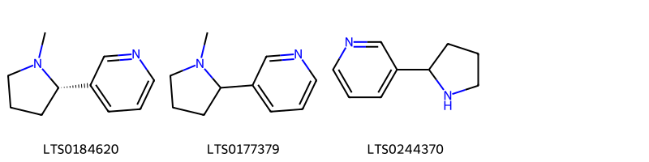{ width=100% }
    <figcaption>Hình ảnh cấu trúc hóa học của 3 hoạt chất thuộc nhóm Pyridines and derivatives gồm ['(-)-nicotine (LTS0184620)', 'nicotine (LTS0177379)', '(+-)-nornicotine (LTS0244370)'].</figcaption>
</figure>
#### Nhóm Saturated hydrocarbons
<figure markdown="span">
    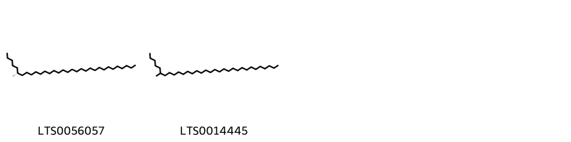{ width=100% }
    <figcaption>Hình ảnh cấu trúc hóa học của 2 hoạt chất thuộc nhóm Saturated hydrocarbons gồm ['(6r)-6-methyldotriacontane (LTS0056057)', '6-methyldotriacontane (LTS0014445)'].</figcaption>
</figure>
#### Nhóm Tetrapyrroles and derivatives
<figure markdown="span">
    { width=100% }
    <figcaption>Hình ảnh cấu trúc hóa học của 2 hoạt chất thuộc nhóm Tetrapyrroles and derivatives gồm ['methyl (3r,21s,22s)-16-ethenyl-11-ethyl-12,17,21,26-tetramethyl-4-oxo-22-(3-oxo-3-{[(2e,7r,11r)-3,7,11,15-tetramethylhexadec-2-en-1-yl]oxy}propyl)-7,23,24,25-tetraazahexacyclo[18.2.1.1⁵,⁸.1¹⁰,¹³.1¹⁵,¹⁸.0²,⁶]hexacosa-1(23),2(6),5(26),7,9,11,13,15,17,19-decaene-3-carboxylate (LTS0200273)', 'methyl (3r,21s,22s)-16-ethenyl-11-ethyl-12,17,21,26-tetramethyl-4-oxo-22-(3-oxo-3-{[(2e)-3,7,11,15-tetramethylhexadec-2-en-1-yl]oxy}propyl)-7,23,24,25-tetraazahexacyclo[18.2.1.1⁵,⁸.1¹⁰,¹³.1¹⁵,¹⁸.0²,⁶]hexacosa-1(23),2(6),5(26),7,9,11,13,15,17,19-decaene-3-carboxylate (LTS0272109)'].</figcaption>
</figure>
#### Nhóm Tropane alkaloids
<figure markdown="span">
    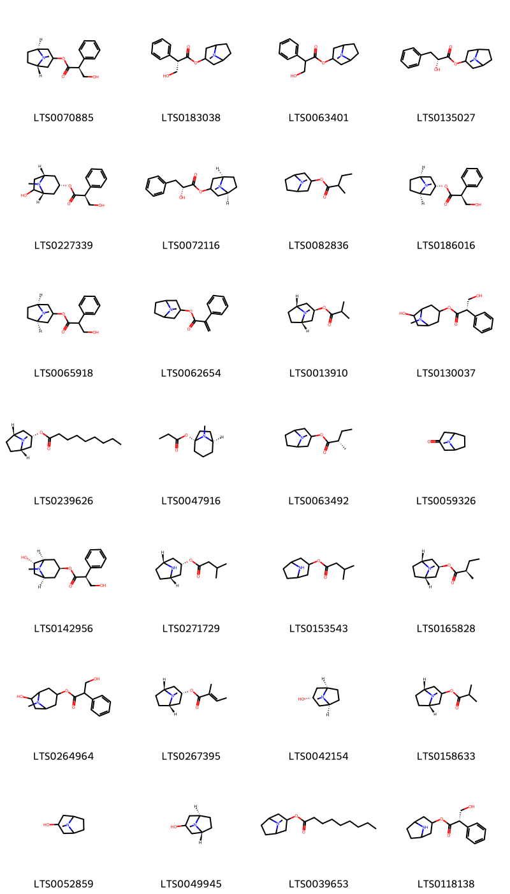{ width=100% }
    <figcaption>Hình ảnh cấu trúc hóa học của 28 hoạt chất thuộc nhóm Tropane alkaloids gồm ['(1s,5s)-8-methyl-8-azabicyclo[3.2.1]octan-3-yl (2s)-3-hydroxy-2-phenylpropanoate (LTS0070885)', 'hyoscyamine (LTS0183038)', '()-hyoscyamine (LTS0063401)', 'littorine (LTS0135027)', '6-hydroxyhyoscyamine (LTS0227339)', '(1r,5s)-8-methyl-8-azabicyclo[3.2.1]octan-3-yl (2r)-2-hydroxy-3-phenylpropanoate (LTS0072116)', '8-methyl-8-azabicyclo[3.2.1]octan-3-yl 2-methylbutanoate (LTS0082836)', 'l-hyoscyamine (LTS0186016)', 'atropine (LTS0065918)', 'apoatropine (LTS0062654)', '(1r,3r,5s)-8-methyl-8-azabicyclo[3.2.1]octan-3-yl 2-methylpropanoate (LTS0013910)', '6-hydroxy-8-methyl-8-azabicyclo[3.2.1]octan-3-yl (2s)-3-hydroxy-2-phenylpropanoate (LTS0130037)', '(1r,3s,5s)-8-methyl-8-azabicyclo[3.2.1]octan-3-yl nonanoate (LTS0239626)', '(1r,5r)-8-methyl-8-azabicyclo[3.2.1]octan-1-yl propanoate (LTS0047916)', '8-methyl-8-azabicyclo[3.2.1]octan-3-yl (2s)-2-methylbutanoate (LTS0063492)', 'tropanone (LTS0059326)', '(1r,3s,5r,6s)-6-hydroxy-8-methyl-8-azabicyclo[3.2.1]octan-3-yl (2s)-3-hydroxy-2-phenylpropanoate (LTS0142956)', '(1r,3s,5s)-8-azabicyclo[3.2.1]octan-3-yl 3-methylbutanoate (LTS0271729)', '8-azabicyclo[3.2.1]octan-3-yl 3-methylbutanoate (LTS0153543)', '(1r,3r,5s)-8-methyl-8-azabicyclo[3.2.1]octan-3-yl (2r)-2-methylbutanoate (LTS0165828)', '6-hydroxy-8-methyl-8-azabicyclo[3.2.1]octan-3-yl 3-hydroxy-2-phenylpropanoate (LTS0264964)', 'tropigline (LTS0267395)', 'pseudotropine (LTS0042154)', '(1r,5s)-8-methyl-8-azabicyclo[3.2.1]octan-3-yl 2-methylpropanoate (LTS0158633)', 'tropin (LTS0052859)', '(1r,5r)-8-methyl-8-azabicyclo[3.2.1]octan-3-ol (LTS0049945)', '8-methyl-8-azabicyclo[3.2.1]octan-3-yl nonanoate (LTS0039653)', 'norhyoscyamine (LTS0118138)'].</figcaption>
</figure>

---

### Dược dân tộc học

Danh sách các quốc gia có sử dụng *Duboisia myoporoides* trong điều trị các bệnh. 

| Country   | Disease                         | Bệnh                                      |
|:----------|:--------------------------------|:------------------------------------------|
| Australia | Intoxicant, Sedative, Piscicide | Intoxicant, An thần, Thuốc diệt côn trùng |
| Elsewhere | Mydriatic                       | Thuốc giãn đồng-tử                        |
| French    | Hypnotic                        | Thuốc ngủ                                 |
| German    | Poison                          | Chất độc                                  |

---

# Chi Lycium

??? note "Danh sách các dược liệu thuộc chi"
    
	 - *Lycium barbarum*
	 - *Lycium chinense*
	 - *Lycium chinensis*
	 - *Lycium halamifolium*

---
## Lycium barbarum
### Thông tin về thực vật

!!! info "Phân loại thực vật của *Lycium barbarum* từ GIBF:"
    - **Kingdom:** Plantae
    - **Phylum:** Tracheophyta
    - **Order:** Solanales
    - **Family:** Solanaceae
    - **Genus:** Lycium
    - **Species:** *Lycium barbarum*

 

| Label (VI)   | Label (EN)   | Scientific Name   | Descriptions (VI)   | Descriptions (EN)   | Also Known As (VI)   | Also Known As (EN)                                                                                                                                                                                                                       |
|:-------------|:-------------|:------------------|:--------------------|:--------------------|:---------------------|:-----------------------------------------------------------------------------------------------------------------------------------------------------------------------------------------------------------------------------------------|
| N/A          | N/A          | Lycium barbarum   | loài thực vật       | species of plant    | ['Kỷ tử']            | ['Goji berries', 'Murali', 'barbary matrimony vine', 'Chinese boxthorn', 'Chinese wolfberry', "Duke of Argyll's tea plant", "Duke of Argyll's tea tree", 'Himalayan goji', 'matrimony vine', 'mede berry', 'red medlar', 'Tibetan goji'] |

#### Phân bố trên thế giới

**Từ CSDL GIBF** Bulgaria, Moldova, Republic of, Belgium, Slovakia, Georgia, Ukraine, Denmark, Netherlands, Spain, Hungary, Russian Federation, United States of America, Sweden, Czechia, Germany, Romania, Switzerland, Austria, France, United Kingdom of Great Britain and Northern Ireland, Poland

#### Phân bố tại Việt Nam

**Từ CSDL GIBF**: Không có ghi nhận ở Việt Nam

---
### Thành phần hóa học
        
- Theo cơ sở dữ liệu lotus: Từ loài *Lycium barbarum* đã phân lập và xác định được 46 hoạt chất thuộc về các nhóm Fatty Acyls, Flavonoids, Prenol lipids, Indoles and derivatives, Tropane alkaloids, Organooxygen compounds, Glycerolipids, Carboxylic acids and derivatives. 

|    | chemicalTaxonomyClassyfireClass   |   smiles_count |
|---:|:----------------------------------|---------------:|
|  0 | Carboxylic acids and derivatives  |              2 |
|  1 | Fatty Acyls                       |              4 |
|  2 | Flavonoids                        |              5 |
|  3 | Glycerolipids                     |             30 |
|  4 | Indoles and derivatives           |              1 |
|  5 | Organooxygen compounds            |              2 |
|  6 | Prenol lipids                     |              1 |
|  7 | Tropane alkaloids                 |              1 |

#### Nhóm Carboxylic acids and derivatives
<figure markdown="span">
    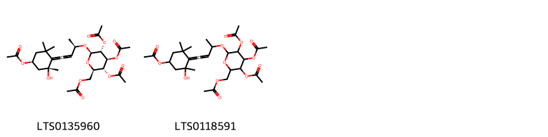{ width=100% }
    <figcaption>Hình ảnh cấu trúc hóa học của 2 hoạt chất thuộc nhóm Carboxylic acids and derivatives gồm ['[(2r,3r,4s,5r,6r)-3,4,5-tris(acetyloxy)-6-{[(2r)-4-[(2r,4s)-4-(acetyloxy)-2-hydroxy-2,6,6-trimethylcyclohexylidene]but-3-en-2-yl]oxy}oxan-2-yl]methyl acetate (LTS0135960)', '[3,4,5-tris(acetyloxy)-6-({4-[4-(acetyloxy)-2-hydroxy-2,6,6-trimethylcyclohexylidene]but-3-en-2-yl}oxy)oxan-2-yl]methyl acetate (LTS0118591)'].</figcaption>
</figure>
#### Nhóm Fatty Acyls
<figure markdown="span">
    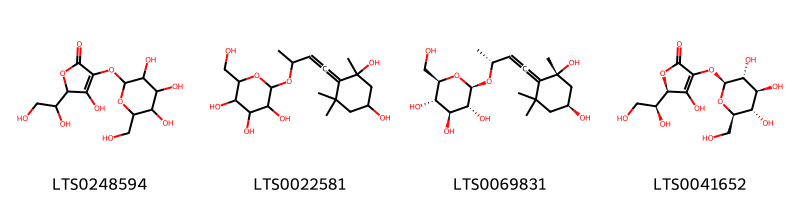{ width=100% }
    <figcaption>Hình ảnh cấu trúc hóa học của 4 hoạt chất thuộc nhóm Fatty Acyls gồm ['5-(1,2-dihydroxyethyl)-4-hydroxy-3-{[3,4,5-trihydroxy-6-(hydroxymethyl)oxan-2-yl]oxy}-5h-furan-2-one (LTS0248594)', '2-{[4-(2,4-dihydroxy-2,6,6-trimethylcyclohexylidene)but-3-en-2-yl]oxy}-6-(hydroxymethyl)oxane-3,4,5-triol (LTS0022581)', '(2r,3r,4s,5s,6r)-2-{[(2r)-4-[(2r,4s)-2,4-dihydroxy-2,6,6-trimethylcyclohexylidene]but-3-en-2-yl]oxy}-6-(hydroxymethyl)oxane-3,4,5-triol (LTS0069831)', '(5r)-5-[(1s)-1,2-dihydroxyethyl]-4-hydroxy-3-{[(2s,3r,4s,5s,6r)-3,4,5-trihydroxy-6-(hydroxymethyl)oxan-2-yl]oxy}-5h-furan-2-one (LTS0041652)'].</figcaption>
</figure>
#### Nhóm Flavonoids
<figure markdown="span">
    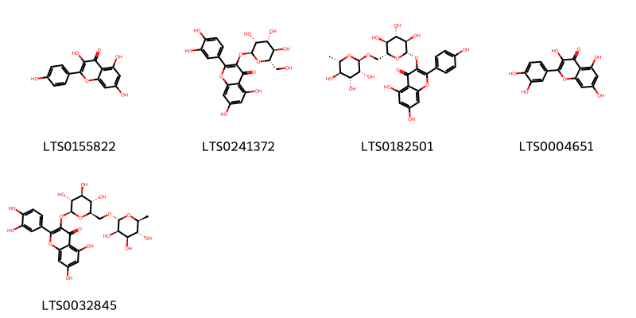{ width=100% }
    <figcaption>Hình ảnh cấu trúc hóa học của 5 hoạt chất thuộc nhóm Flavonoids gồm ['kaempherol (LTS0155822)', '2-(3,4-dihydroxyphenyl)-5,7-dihydroxy-3-{[(2s,3r,4r,5r,6s)-3,4,5-trihydroxy-6-(hydroxymethyl)oxan-2-yl]oxy}chromen-4-one (LTS0241372)', 'nictoflorin (LTS0182501)', 'quercetin (LTS0004651)', '3-rutinosyl quercetin (LTS0032845)'].</figcaption>
</figure>
#### Nhóm Glycerolipids
<figure markdown="span">
    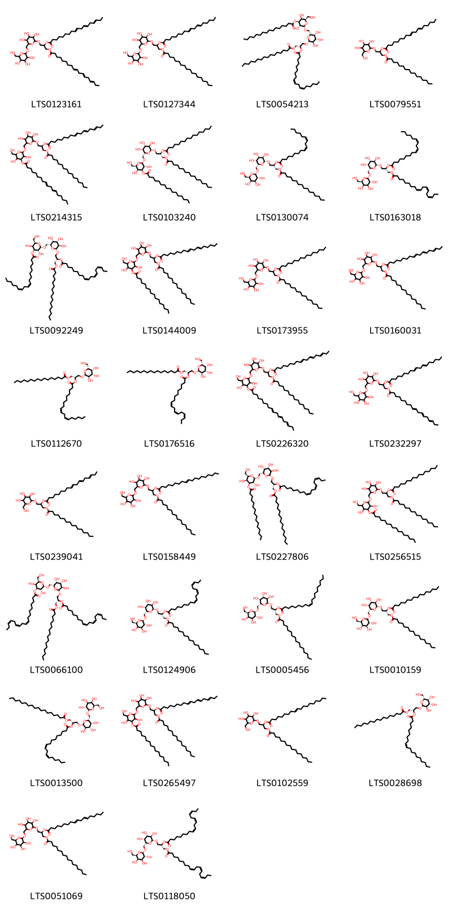{ width=100% }
    <figcaption>Hình ảnh cấu trúc hóa học của 30 hoạt chất thuộc nhóm Glycerolipids gồm ['1-(octadeca-9,12,15-trienoyloxy)-3-{[3,4,5-trihydroxy-6-({[3,4,5-trihydroxy-6-(hydroxymethyl)oxan-2-yl]oxy}methyl)oxan-2-yl]oxy}propan-2-yl octadeca-9,12,15-trienoate (LTS0123161)', '1-(octadecanoyloxy)-3-{[3,4,5-trihydroxy-6-({[3,4,5-trihydroxy-6-(hydroxymethyl)oxan-2-yl]oxy}methyl)oxan-2-yl]oxy}propan-2-yl octadeca-9,12-dienoate (LTS0127344)', '(2s)-1-(hexadecanoyloxy)-3-{[(2r,3r,4s,5r,6r)-6-({[(2s,3r,4s,5s,6r)-4-(hexadecanoyloxy)-3,5-dihydroxy-6-(hydroxymethyl)oxan-2-yl]oxy}methyl)-3,4,5-trihydroxyoxan-2-yl]oxy}propan-2-yl (9z,12z)-octadeca-9,12-dienoate (LTS0054213)', '1-(hexadecanoyloxy)-3-{[3,4,5-trihydroxy-6-(hydroxymethyl)oxan-2-yl]oxy}propan-2-yl octadeca-9,12-dienoate (LTS0079551)', '1-{[6-({[3,5-dihydroxy-6-(hydroxymethyl)-4-(octadeca-9,12-dienoyloxy)oxan-2-yl]oxy}methyl)-3,4,5-trihydroxyoxan-2-yl]oxy}-3-(hexadecanoyloxy)propan-2-yl octadeca-9,12,15-trienoate (LTS0214315)', '(2s)-1-(hexadecanoyloxy)-3-{[(2r,3r,4s,5r,6r)-6-({[(2s,3r,4s,5s,6r)-4-(hexadecanoyloxy)-3,5-dihydroxy-6-(hydroxymethyl)oxan-2-yl]oxy}methyl)-3,4,5-trihydroxyoxan-2-yl]oxy}propan-2-yl hexadecanoate (LTS0103240)', '(2s)-1-(hexadecanoyloxy)-3-{[(2r,3r,4s,5r,6r)-3,4,5-trihydroxy-6-({[(2s,3r,4s,5r,6r)-3,4,5-trihydroxy-6-(hydroxymethyl)oxan-2-yl]oxy}methyl)oxan-2-yl]oxy}propan-2-yl (9z,12z)-octadeca-9,12-dienoate (LTS0130074)', '(2s)-2-[(9z,12z)-octadeca-9,12-dienoyloxy]-3-{[(2r,3r,4s,5r,6r)-3,4,5-trihydroxy-6-({[(2s,3r,4s,5r,6r)-3,4,5-trihydroxy-6-(hydroxymethyl)oxan-2-yl]oxy}methyl)oxan-2-yl]oxy}propyl (9z,12z,15z)-octadeca-9,12,15-trienoate (LTS0163018)', '(2s)-1-{[(2r,3r,4s,5r,6r)-6-({[(2s,3r,4s,5s,6r)-3,5-dihydroxy-6-(hydroxymethyl)-4-[(9z,12z)-octadeca-9,12-dienoyloxy]oxan-2-yl]oxy}methyl)-3,4,5-trihydroxyoxan-2-yl]oxy}-3-(hexadecanoyloxy)propan-2-yl (9z,12z,15z)-octadeca-9,12,15-trienoate (LTS0092249)', '1-(hexadecanoyloxy)-3-{[6-({[4-(hexadecanoyloxy)-3,5-dihydroxy-6-(hydroxymethyl)oxan-2-yl]oxy}methyl)-3,4,5-trihydroxyoxan-2-yl]oxy}propan-2-yl octadeca-9,12-dienoate (LTS0144009)', '1-(hexadecanoyloxy)-3-{[3,4,5-trihydroxy-6-({[3,4,5-trihydroxy-6-(hydroxymethyl)oxan-2-yl]oxy}methyl)oxan-2-yl]oxy}propan-2-yl hexadecanoate (LTS0173955)', '1-(hexadecanoyloxy)-3-{[3,4,5-trihydroxy-6-({[3,4,5-trihydroxy-6-(hydroxymethyl)oxan-2-yl]oxy}methyl)oxan-2-yl]oxy}propan-2-yl octadeca-9,12,15-trienoate (LTS0160031)', '(2s)-1-(hexadecanoyloxy)-3-{[(2r,3r,4s,5r,6r)-3,4,5-trihydroxy-6-(hydroxymethyl)oxan-2-yl]oxy}propan-2-yl (9z,12z)-octadeca-9,12-dienoate (LTS0112670)', '(2s)-1-(hexadecanoyloxy)-3-{[(2r,3r,4s,5r,6r)-3,4,5-trihydroxy-6-(hydroxymethyl)oxan-2-yl]oxy}propan-2-yl (9z,12z,15z)-octadeca-9,12,15-trienoate (LTS0176516)', '1-{[6-({[3,5-dihydroxy-6-(hydroxymethyl)-4-(octadeca-9,12,15-trienoyloxy)oxan-2-yl]oxy}methyl)-3,4,5-trihydroxyoxan-2-yl]oxy}-3-(hexadecanoyloxy)propan-2-yl octadeca-9,12,15-trienoate (LTS0226320)', '2-(octadeca-9,12-dienoyloxy)-3-{[3,4,5-trihydroxy-6-({[3,4,5-trihydroxy-6-(hydroxymethyl)oxan-2-yl]oxy}methyl)oxan-2-yl]oxy}propyl octadeca-9,12,15-trienoate (LTS0232297)', '1-(hexadecanoyloxy)-3-{[3,4,5-trihydroxy-6-(hydroxymethyl)oxan-2-yl]oxy}propan-2-yl octadeca-9,12,15-trienoate (LTS0239041)', '1-(hexadecanoyloxy)-3-{[3,4,5-trihydroxy-6-({[3,4,5-trihydroxy-6-(hydroxymethyl)oxan-2-yl]oxy}methyl)oxan-2-yl]oxy}propan-2-yl nonadec-9-enoate (LTS0158449)', '(2s)-1-(hexadecanoyloxy)-3-{[(2r,3r,4s,5r,6r)-6-({[(2s,3r,4s,5s,6r)-4-(hexadecanoyloxy)-3,5-dihydroxy-6-(hydroxymethyl)oxan-2-yl]oxy}methyl)-3,4,5-trihydroxyoxan-2-yl]oxy}propan-2-yl (9z,12z,15z)-octadeca-9,12,15-trienoate (LTS0227806)', '1-(hexadecanoyloxy)-3-{[6-({[4-(hexadecanoyloxy)-3,5-dihydroxy-6-(hydroxymethyl)oxan-2-yl]oxy}methyl)-3,4,5-trihydroxyoxan-2-yl]oxy}propan-2-yl hexadecanoate (LTS0256515)', '(2s)-1-{[(2r,3r,4s,5r,6r)-6-({[(2s,3r,4s,5s,6r)-3,5-dihydroxy-6-(hydroxymethyl)-4-[(9z,12z,15z)-octadeca-9,12,15-trienoyloxy]oxan-2-yl]oxy}methyl)-3,4,5-trihydroxyoxan-2-yl]oxy}-3-(hexadecanoyloxy)propan-2-yl (9z,12z,15z)-octadeca-9,12,15-trienoate (LTS0066100)', '(2s)-1-(hexadecanoyloxy)-3-{[(2r,3r,4s,5r,6r)-3,4,5-trihydroxy-6-({[(2s,3r,4s,5r,6r)-3,4,5-trihydroxy-6-(hydroxymethyl)oxan-2-yl]oxy}methyl)oxan-2-yl]oxy}propan-2-yl (9z,12z,15z)-octadeca-9,12,15-trienoate (LTS0124906)', '(2s)-1-(hexadecanoyloxy)-3-{[(2r,3r,4s,5r,6r)-3,4,5-trihydroxy-6-({[(2s,3r,4s,5r,6r)-3,4,5-trihydroxy-6-(hydroxymethyl)oxan-2-yl]oxy}methyl)oxan-2-yl]oxy}propan-2-yl (9z)-nonadec-9-enoate (LTS0005456)', '(2s)-1-(hexadecanoyloxy)-3-{[(2r,3r,4s,5r,6r)-3,4,5-trihydroxy-6-({[(2s,3r,4s,5r,6r)-3,4,5-trihydroxy-6-(hydroxymethyl)oxan-2-yl]oxy}methyl)oxan-2-yl]oxy}propan-2-yl hexadecanoate (LTS0010159)', '(2s)-1-(octadecanoyloxy)-3-{[(2r,3r,4s,5r,6r)-3,4,5-trihydroxy-6-({[(2s,3r,4s,5r,6r)-3,4,5-trihydroxy-6-(hydroxymethyl)oxan-2-yl]oxy}methyl)oxan-2-yl]oxy}propan-2-yl (9z,12z)-octadeca-9,12-dienoate (LTS0013500)', '1-(hexadecanoyloxy)-3-{[6-({[4-(hexadecanoyloxy)-3,5-dihydroxy-6-(hydroxymethyl)oxan-2-yl]oxy}methyl)-3,4,5-trihydroxyoxan-2-yl]oxy}propan-2-yl octadeca-9,12,15-trienoate (LTS0265497)', '1-(hexadecanoyloxy)-3-{[3,4,5-trihydroxy-6-(hydroxymethyl)oxan-2-yl]oxy}propan-2-yl nonadec-9-enoate (LTS0102559)', '(2s)-1-(hexadecanoyloxy)-3-{[(2r,3r,4s,5r,6r)-3,4,5-trihydroxy-6-(hydroxymethyl)oxan-2-yl]oxy}propan-2-yl (9z)-nonadec-9-enoate (LTS0028698)', '1-(hexadecanoyloxy)-3-{[3,4,5-trihydroxy-6-({[3,4,5-trihydroxy-6-(hydroxymethyl)oxan-2-yl]oxy}methyl)oxan-2-yl]oxy}propan-2-yl octadeca-9,12-dienoate (LTS0051069)', '(2s)-1-[(9z,12z,15z)-octadeca-9,12,15-trienoyloxy]-3-{[(2r,3r,4s,5r,6r)-3,4,5-trihydroxy-6-({[(2s,3r,4s,5r,6r)-3,4,5-trihydroxy-6-(hydroxymethyl)oxan-2-yl]oxy}methyl)oxan-2-yl]oxy}propan-2-yl (9z,12z,15z)-octadeca-9,12,15-trienoate (LTS0118050)'].</figcaption>
</figure>
#### Nhóm Indoles and derivatives
<figure markdown="span">
    { width=100% }
    <figcaption>Hình ảnh cấu trúc hóa học của 1 hoạt chất thuộc nhóm Indoles and derivatives gồm ['n-[2-(5-methoxy-1h-indol-3-yl)ethyl]ethanimidic acid (LTS0219322)'].</figcaption>
</figure>
#### Nhóm Organooxygen compounds
<figure markdown="span">
    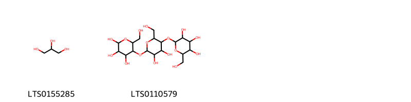{ width=100% }
    <figcaption>Hình ảnh cấu trúc hóa học của 2 hoạt chất thuộc nhóm Organooxygen compounds gồm ['glycerol (LTS0155285)', 'amylose (LTS0110579)'].</figcaption>
</figure>
#### Nhóm Prenol lipids
<figure markdown="span">
    { width=100% }
    <figcaption>Hình ảnh cấu trúc hóa học của 1 hoạt chất thuộc nhóm Prenol lipids gồm ['zeaxanthin (LTS0192928)'].</figcaption>
</figure>
#### Nhóm Tropane alkaloids
<figure markdown="span">
    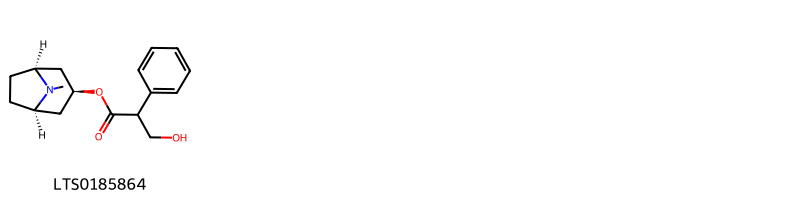{ width=100% }
    <figcaption>Hình ảnh cấu trúc hóa học của 1 hoạt chất thuộc nhóm Tropane alkaloids gồm ['atropine (LTS0185864)'].</figcaption>
</figure>

---

### Dược dân tộc học

Danh sách các quốc gia có sử dụng *Lycium barbarum* trong điều trị các bệnh. 

| Country   | Disease                                 | Bệnh                                                                   |
|:----------|:----------------------------------------|:-----------------------------------------------------------------------|
| Elsewhere | Aphrodisiac, Diuretic, Poison           | Thuốc kích thích tình dục, lợi tiểu, chất độc                          |
| Iraq      | Aphrodisiac, Poison, Diuretic, Laxative | Thuốc kích thích tình dục, Chất độc, Thuốc lợi tiểu, Thuốc nhuận tràng |

---

---
## Lycium chinense
### Thông tin về thực vật

!!! info "Phân loại thực vật của *Lycium chinense* từ GIBF:"
    - **Kingdom:** Plantae
    - **Phylum:** Tracheophyta
    - **Order:** Solanales
    - **Family:** Solanaceae
    - **Genus:** Lycium
    - **Species:** *Lycium chinense*

 

| Label (VI)   | Label (EN)   | Scientific Name   | Descriptions (VI)   | Descriptions (EN)   | Also Known As (VI)   | Also Known As (EN)   |
|:-------------|:-------------|:------------------|:--------------------|:--------------------|:---------------------|:---------------------|
| N/A          | N/A          | Lycium chinense   | loài thực vật       | species of plant    | ['']                 | ['']                 |

#### Phân bố trên thế giới

**Từ CSDL GIBF** nan, Japan, Belgium, Canada, Ukraine, Denmark, Netherlands, Korea, Republic of, Chinese Taipei, Spain, Hungary, Russian Federation, United States of America, Sweden, Hong Kong, Czechia, Germany, Switzerland, Austria, France, China, United Kingdom of Great Britain and Northern Ireland, India, Mongolia

#### Phân bố tại Việt Nam

**Từ CSDL GIBF**: Không có ghi nhận ở Việt Nam

---
### Thành phần hóa học
        
- Theo cơ sở dữ liệu lotus: Từ loài *Lycium chinense* đã phân lập và xác định được 49 hoạt chất thuộc về các nhóm Benzodioxanes, Prenol lipids, Cinnamic acids and derivatives, Harmala alkaloids, Sphingolipids, Piperidines, Stilbenes, Organooxygen compounds, Phenols, Flavonolignans, Aryltetralin lignans, Lignan glycosides, Carboxylic acids and derivatives. 

|    | chemicalTaxonomyClassyfireClass   |   smiles_count |
|---:|:----------------------------------|---------------:|
|  0 | Aryltetralin lignans              |              2 |
|  1 | Benzodioxanes                     |              6 |
|  2 | Carboxylic acids and derivatives  |              9 |
|  3 | Cinnamic acids and derivatives    |              7 |
|  4 | Flavonolignans                    |              1 |
|  5 | Harmala alkaloids                 |              2 |
|  6 | Lignan glycosides                 |              1 |
|  7 | Organooxygen compounds            |              2 |
|  8 | Phenols                           |              2 |
|  9 | Piperidines                       |              2 |
| 10 | Prenol lipids                     |              8 |
| 11 | Sphingolipids                     |              4 |
| 12 | Stilbenes                         |              3 |

#### Nhóm Aryltetralin lignans
<figure markdown="span">
    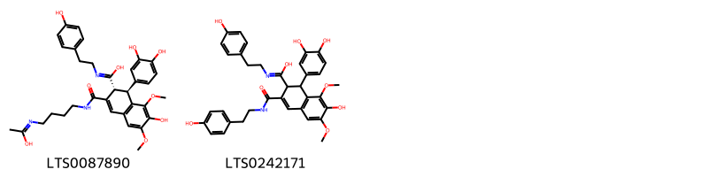{ width=100% }
    <figcaption>Hình ảnh cấu trúc hóa học của 2 hoạt chất thuộc nhóm Aryltetralin lignans gồm ['(1s,2r)-1-(3,4-dihydroxyphenyl)-7-hydroxy-3-({4-[(1-hydroxyethylidene)amino]butyl}carbamoyl)-n-[2-(4-hydroxyphenyl)ethyl]-6,8-dimethoxy-1,2-dihydronaphthalene-2-carboximidic acid (LTS0087890)', '1-(3,4-dihydroxyphenyl)-7-hydroxy-n-[2-(4-hydroxyphenyl)ethyl]-3-{[2-(4-hydroxyphenyl)ethyl]carbamoyl}-6,8-dimethoxy-1,2-dihydronaphthalene-2-carboximidic acid (LTS0242171)'].</figcaption>
</figure>
#### Nhóm Benzodioxanes
<figure markdown="span">
    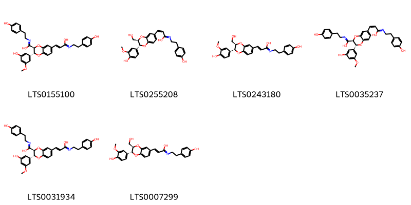{ width=100% }
    <figcaption>Hình ảnh cấu trúc hóa học của 6 hoạt chất thuộc nhóm Benzodioxanes gồm ['(2s,3r)-3-(3-hydroxy-5-methoxyphenyl)-n-[2-(4-hydroxyphenyl)ethyl]-7-(2-{[2-(4-hydroxyphenyl)ethyl]-c-hydroxycarbonimidoyl}eth-1-en-1-yl)-2,3-dihydro-1,4-benzodioxine-2-carboximidic acid (LTS0155100)', '(2z)-3-[(2r,3r)-2-(4-hydroxy-3-methoxyphenyl)-3-(hydroxymethyl)-2,3-dihydro-1,4-benzodioxin-6-yl]-n-[2-(4-hydroxyphenyl)ethyl]prop-2-enimidic acid (LTS0255208)', '3-[(2r,3r)-2-(4-hydroxy-3-methoxyphenyl)-3-(hydroxymethyl)-2,3-dihydro-1,4-benzodioxin-6-yl]-n-[2-(4-hydroxyphenyl)ethyl]prop-2-enimidic acid (LTS0243180)', '(2s,3r)-3-(3-hydroxy-5-methoxyphenyl)-n-[2-(4-hydroxyphenyl)ethyl]-7-[(1z)-2-{[2-(4-hydroxyphenyl)ethyl]-c-hydroxycarbonimidoyl}eth-1-en-1-yl]-2,3-dihydro-1,4-benzodioxine-2-carboximidic acid (LTS0035237)', '(2s,3r)-3-(3-hydroxy-5-methoxyphenyl)-n-[2-(4-hydroxyphenyl)ethyl]-7-[(1e)-2-{[2-(4-hydroxyphenyl)ethyl]-c-hydroxycarbonimidoyl}eth-1-en-1-yl]-2,3-dihydro-1,4-benzodioxine-2-carboximidic acid (LTS0031934)', '(2e)-3-[(2r,3r)-2-(4-hydroxy-3-methoxyphenyl)-3-(hydroxymethyl)-2,3-dihydro-1,4-benzodioxin-6-yl]-n-[2-(4-hydroxyphenyl)ethyl]prop-2-enimidic acid (LTS0007299)'].</figcaption>
</figure>
#### Nhóm Carboxylic acids and derivatives
<figure markdown="span">
    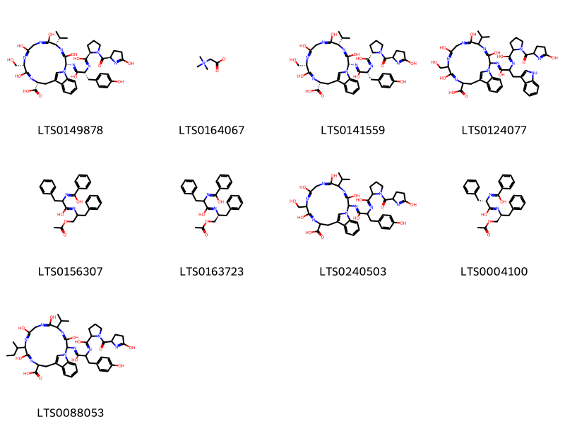{ width=100% }
    <figcaption>Hình ảnh cấu trúc hóa học của 9 hoạt chất thuộc nhóm Carboxylic acids and derivatives gồm ['(2s,5s,11s,14r)-3,6,9,12-tetrahydroxy-2-{[(2r)-1-hydroxy-2-({hydroxy[(2r)-1-[(2r)-5-hydroxy-3,4-dihydro-2h-pyrrole-2-carbonyl]pyrrolidin-2-yl]methylidene}amino)-3-(4-hydroxyphenyl)propylidene]amino}-11-(hydroxymethyl)-5-isopropyl-1,4,7,10,13-pentaazatricyclo[14.6.1.0¹⁷,²²]tricosa-3,6,9,12,16(23),17,19,21-octaene-14-carboxylic acid (LTS0149878)', 'bet (LTS0164067)', '(2s,5s,11s,14r)-3,6,9,12-tetrahydroxy-2-{[(2r)-1-hydroxy-2-({hydroxy[(2s)-1-[(2r)-5-hydroxy-3,4-dihydro-2h-pyrrole-2-carbonyl]pyrrolidin-2-yl]methylidene}amino)-3-(4-hydroxyphenyl)propylidene]amino}-11-(hydroxymethyl)-5-isopropyl-1,4,7,10,13-pentaazatricyclo[14.6.1.0¹⁷,²²]tricosa-3,6,9,12,16(23),17,19,21-octaene-14-carboxylic acid (LTS0141559)', '3,6,9,12-tetrahydroxy-2-{[1-hydroxy-2-({hydroxy[1-(5-hydroxy-3,4-dihydro-2h-pyrrole-2-carbonyl)pyrrolidin-2-yl]methylidene}amino)-3-(1h-indol-3-yl)propylidene]amino}-11-(hydroxymethyl)-5-isopropyl-1,4,7,10,13-pentaazatricyclo[14.6.1.0¹⁷,²²]tricosa-3,6,9,12,16(23),17,19,21-octaene-14-carboxylic acid (LTS0124077)', 'n-[1-(acetyloxy)-3-phenylpropan-2-yl]-2-{[hydroxy(phenyl)methylidene]amino}-3-phenylpropanimidic acid (LTS0156307)', 'n-[(2s)-1-(acetyloxy)-3-phenylpropan-2-yl]-2-{[hydroxy(phenyl)methylidene]amino}-3-phenylpropanimidic acid (LTS0163723)', '3,6,9,12-tetrahydroxy-2-{[1-hydroxy-2-({hydroxy[1-(5-hydroxy-3,4-dihydro-2h-pyrrole-2-carbonyl)pyrrolidin-2-yl]methylidene}amino)-3-(4-hydroxyphenyl)propylidene]amino}-11-(hydroxymethyl)-5-isopropyl-1,4,7,10,13-pentaazatricyclo[14.6.1.0¹⁷,²²]tricosa-3,6,9,12,16(23),17,19,21-octaene-14-carboxylic acid (LTS0240503)', '(2s)-n-[(2s)-1-(acetyloxy)-3-phenylpropan-2-yl]-2-{[hydroxy(phenyl)methylidene]amino}-3-phenylpropanimidic acid (LTS0004100)', '3,6,9,12-tetrahydroxy-2-{[1-hydroxy-2-({hydroxy[1-(5-hydroxy-3,4-dihydro-2h-pyrrole-2-carbonyl)pyrrolidin-2-yl]methylidene}amino)-3-(4-hydroxyphenyl)propylidene]amino}-5-isopropyl-11-(sec-butyl)-1,4,7,10,13-pentaazatricyclo[14.6.1.0¹⁷,²²]tricosa-3,6,9,12,16(23),17,19,21-octaene-14-carboxylic acid (LTS0088053)'].</figcaption>
</figure>
#### Nhóm Cinnamic acids and derivatives
<figure markdown="span">
    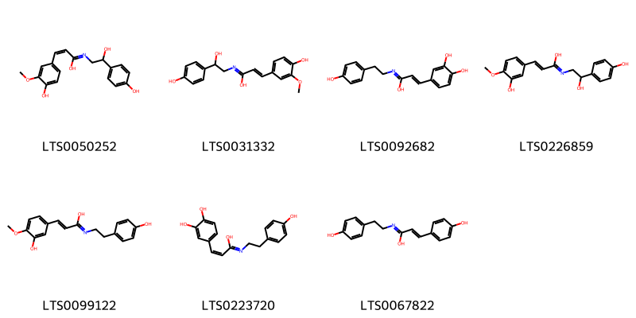{ width=100% }
    <figcaption>Hình ảnh cấu trúc hóa học của 7 hoạt chất thuộc nhóm Cinnamic acids and derivatives gồm ['(2z)-n-[2-hydroxy-2-(4-hydroxyphenyl)ethyl]-3-(4-hydroxy-3-methoxyphenyl)prop-2-enimidic acid (LTS0050252)', 'n-[2-hydroxy-2-(4-hydroxyphenyl)ethyl]-3-(4-hydroxy-3-methoxyphenyl)prop-2-enimidic acid (LTS0031332)', '(2e)-3-(3,4-dihydroxyphenyl)-n-[2-(4-hydroxyphenyl)ethyl]prop-2-enimidic acid (LTS0092682)', '(2e)-n-[2-hydroxy-2-(4-hydroxyphenyl)ethyl]-3-(3-hydroxy-4-methoxyphenyl)prop-2-enimidic acid (LTS0226859)', '(2e)-3-(3-hydroxy-4-methoxyphenyl)-n-[2-(4-hydroxyphenyl)ethyl]prop-2-enimidic acid (LTS0099122)', '(2z)-3-(3,4-dihydroxyphenyl)-n-[2-(4-hydroxyphenyl)ethyl]prop-2-enimidic acid (LTS0223720)', '(2e)-3-(4-hydroxyphenyl)-n-[2-(4-hydroxyphenyl)ethyl]prop-2-enimidic acid (LTS0067822)'].</figcaption>
</figure>
#### Nhóm Flavonolignans
<figure markdown="span">
    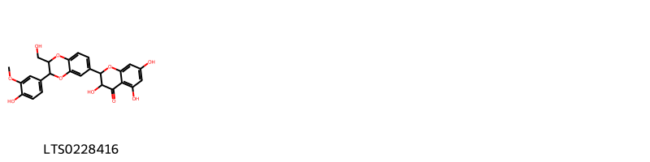{ width=100% }
    <figcaption>Hình ảnh cấu trúc hóa học của 1 hoạt chất thuộc nhóm Flavonolignans gồm ['silymarin (LTS0228416)'].</figcaption>
</figure>
#### Nhóm Harmala alkaloids
<figure markdown="span">
    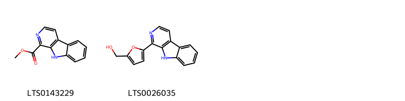{ width=100% }
    <figcaption>Hình ảnh cấu trúc hóa học của 2 hoạt chất thuộc nhóm Harmala alkaloids gồm ['methyl 9h-pyrido[3,4-b]indole-1-carboxylate (LTS0143229)', 'perlolyrine (LTS0026035)'].</figcaption>
</figure>
#### Nhóm Lignan glycosides
<figure markdown="span">
    { width=100% }
    <figcaption>Hình ảnh cấu trúc hóa học của 1 hoạt chất thuộc nhóm Lignan glycosides gồm ['(2r,3r,4s,5s,6r)-2-{[(1s,2r,3r)-7-hydroxy-1-(4-hydroxy-3,5-dimethoxyphenyl)-3-(hydroxymethyl)-6,8-dimethoxy-1,2,3,4-tetrahydronaphthalen-2-yl]methoxy}-6-(hydroxymethyl)oxane-3,4,5-triol (LTS0225234)'].</figcaption>
</figure>
#### Nhóm Organooxygen compounds
<figure markdown="span">
    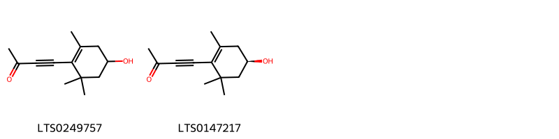{ width=100% }
    <figcaption>Hình ảnh cấu trúc hóa học của 2 hoạt chất thuộc nhóm Organooxygen compounds gồm ['4-(4-hydroxy-2,6,6-trimethylcyclohex-1-en-1-yl)but-3-yn-2-one (LTS0249757)', '4-[(4r)-4-hydroxy-2,6,6-trimethylcyclohex-1-en-1-yl]but-3-yn-2-one (LTS0147217)'].</figcaption>
</figure>
#### Nhóm Phenols
<figure markdown="span">
    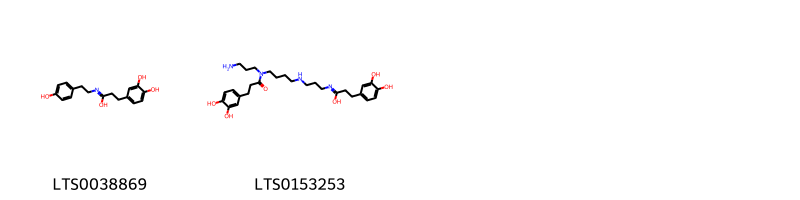{ width=100% }
    <figcaption>Hình ảnh cấu trúc hóa học của 2 hoạt chất thuộc nhóm Phenols gồm ['3-(3,4-dihydroxyphenyl)-n-[2-(4-hydroxyphenyl)ethyl]propanimidic acid (LTS0038869)', 'n-[3-({4-[n-(3-aminopropyl)-3-(3,4-dihydroxyphenyl)propanamido]butyl}amino)propyl]-3-(3,4-dihydroxyphenyl)propanimidic acid (LTS0153253)'].</figcaption>
</figure>
#### Nhóm Piperidines
<figure markdown="span">
    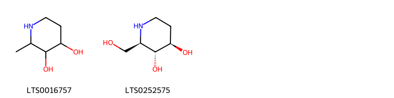{ width=100% }
    <figcaption>Hình ảnh cấu trúc hóa học của 2 hoạt chất thuộc nhóm Piperidines gồm ['2-methylpiperidine-3,4-diol (LTS0016757)', 'fagomine (LTS0252575)'].</figcaption>
</figure>
#### Nhóm Prenol lipids
<figure markdown="span">
    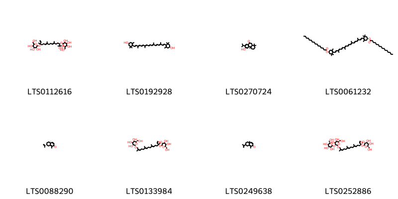{ width=100% }
    <figcaption>Hình ảnh cấu trúc hóa học của 8 hoạt chất thuộc nhóm Prenol lipids gồm ['2-{[(6e,10e)-2-hydroxy-2,6,10,14-tetramethyl-14-{[3,4,5-trihydroxy-6-(hydroxymethyl)oxan-2-yl]oxy}hexadeca-6,10,15-trien-3-yl]oxy}-6-(hydroxymethyl)oxane-3,4,5-triol (LTS0112616)', 'zeaxanthin (LTS0192928)', '6-hydroxy-7-isopropyl-1,1,4a-trimethyl-3,4,10,10a-tetrahydro-2h-phenanthren-9-one (LTS0270724)', 'physalien (LTS0061232)', '(4as,7r)-1,4a-dimethyl-7-(prop-1-en-2-yl)-5,6,7,8-tetrahydronaphthalen-2-one (LTS0088290)', '(2r,3s,4s,5r,6r)-2-(hydroxymethyl)-6-{[(2z,6e,10e)-2,6,10,14-tetramethyl-14-{[(2s,3r,4s,5s,6r)-3,4,5-trihydroxy-6-(hydroxymethyl)oxan-2-yl]oxy}hexadeca-2,6,10,15-tetraen-1-yl]oxy}oxane-3,4,5-triol (LTS0133984)', '1,4a-dimethyl-7-(prop-1-en-2-yl)-5,6,7,8-tetrahydronaphthalen-2-one (LTS0249638)', '(2s,3r,4s,5s,6r)-2-{[(2r,3r,4s,5s,6r)-4,5-dihydroxy-6-(hydroxymethyl)-2-{[(2z,6e,10e,14s)-2,6,10,14-tetramethyl-14-{[(2s,3r,4s,5s,6r)-3,4,5-trihydroxy-6-(hydroxymethyl)oxan-2-yl]oxy}hexadeca-2,6,10,15-tetraen-1-yl]oxy}oxan-3-yl]oxy}-6-(hydroxymethyl)oxane-3,4,5-triol (LTS0252886)'].</figcaption>
</figure>
#### Nhóm Sphingolipids
<figure markdown="span">
    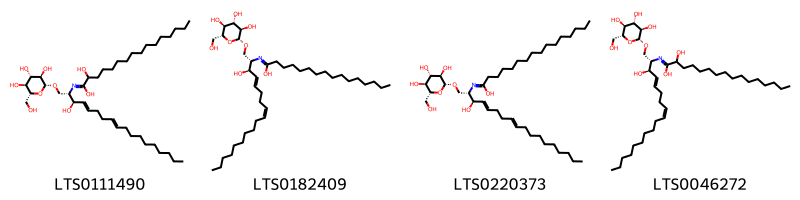{ width=100% }
    <figcaption>Hình ảnh cấu trúc hóa học của 4 hoạt chất thuộc nhóm Sphingolipids gồm ['2-hydroxy-n-[(2s,3r,4e)-3-hydroxy-1-{[(2r,3r,4s,5s,6r)-3,4,5-trihydroxy-6-(hydroxymethyl)oxan-2-yl]oxy}octadeca-4,8-dien-2-yl]hexadecanimidic acid (LTS0111490)', 'n-[(2s,3r,4e,8z)-3-hydroxy-1-{[(2r,3r,4s,5s,6r)-3,4,5-trihydroxy-6-(hydroxymethyl)oxan-2-yl]oxy}octadeca-4,8-dien-2-yl]hexadecanimidic acid (LTS0182409)', 'n-[(2s,3r,4e)-3-hydroxy-1-{[(2r,3r,4s,5s,6r)-3,4,5-trihydroxy-6-(hydroxymethyl)oxan-2-yl]oxy}octadeca-4,8-dien-2-yl]hexadecanimidic acid (LTS0220373)', '2-hydroxy-n-[(2s,3r,4e,8z)-3-hydroxy-1-{[(2r,3r,4s,5s,6r)-3,4,5-trihydroxy-6-(hydroxymethyl)oxan-2-yl]oxy}octadeca-4,8-dien-2-yl]hexadecanimidic acid (LTS0046272)'].</figcaption>
</figure>
#### Nhóm Stilbenes
<figure markdown="span">
    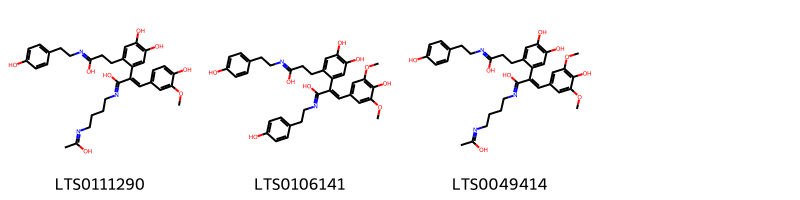{ width=100% }
    <figcaption>Hình ảnh cấu trúc hóa học của 3 hoạt chất thuộc nhóm Stilbenes gồm ['(2e)-2-[4,5-dihydroxy-2-(2-{[2-(4-hydroxyphenyl)ethyl]-c-hydroxycarbonimidoyl}ethyl)phenyl]-3-(4-hydroxy-3-methoxyphenyl)-n-{4-[(1-hydroxyethylidene)amino]butyl}prop-2-enimidic acid (LTS0111290)', '(2e)-2-[4,5-dihydroxy-2-(2-{[2-(4-hydroxyphenyl)ethyl]-c-hydroxycarbonimidoyl}ethyl)phenyl]-3-(4-hydroxy-3,5-dimethoxyphenyl)-n-[2-(4-hydroxyphenyl)ethyl]prop-2-enimidic acid (LTS0106141)', '(2e)-2-[4,5-dihydroxy-2-(2-{[2-(4-hydroxyphenyl)ethyl]-c-hydroxycarbonimidoyl}ethyl)phenyl]-3-(4-hydroxy-3,5-dimethoxyphenyl)-n-{4-[(1-hydroxyethylidene)amino]butyl}prop-2-enimidic acid (LTS0049414)'].</figcaption>
</figure>

---

### Dược dân tộc học

Danh sách các quốc gia có sử dụng *Lycium chinense* trong điều trị các bệnh. 

| Country   | Disease                                | Bệnh                                                         |
|:----------|:---------------------------------------|:-------------------------------------------------------------|
| China     | Aphrodisiac, Refrigerant, Tonic, Tonic | Thuốc kích thích tình dục, Chất làm lạnh, Thuốc bổ, Thuốc bổ |
| Chinese   | Tonic                                  | (thuộc) trương lực                                           |
| Japan     | Tonic, nan                             | Thuốc bổ, nan                                                |

---

---
## Lycium chinensis
### Thông tin về thực vật

!!! info "Phân loại thực vật của *Lycium chinense* từ GIBF:"
    - **Kingdom:** Plantae
    - **Phylum:** Tracheophyta
    - **Order:** Solanales
    - **Family:** Solanaceae
    - **Genus:** Lycium
    - **Species:** *Lycium chinense*

 

| Label (VI)   | Label (EN)   | Scientific Name   | Descriptions (VI)   | Descriptions (EN)   | Also Known As (VI)   | Also Known As (EN)   |
|:-------------|:-------------|:------------------|:--------------------|:--------------------|:---------------------|:---------------------|
| N/A          | N/A          | Lycium chinense   | loài thực vật       | species of plant    | ['']                 | ['']                 |

#### Phân bố trên thế giới

**Từ CSDL GIBF** nan, Japan, Belgium, Canada, Ukraine, Denmark, Netherlands, Korea, Republic of, Chinese Taipei, Spain, Hungary, Russian Federation, United States of America, Sweden, Hong Kong, Czechia, Germany, Switzerland, Austria, France, China, United Kingdom of Great Britain and Northern Ireland, India, Mongolia

#### Phân bố tại Việt Nam

**Từ CSDL GIBF**: Không có ghi nhận ở Việt Nam

---
### Thành phần hóa học
        
- Theo cơ sở dữ liệu lotus: Từ loài *Lycium chinense* đã phân lập và xác định được Chưa có hoạt chất nào được phân lập. hoạt chất thuộc về các nhóm Không có hoạt chất nào được phân lập. 

Không có hình ảnh nào được tạo ra

---

### Dược dân tộc học

Danh sách các quốc gia có sử dụng *Lycium chinense* trong điều trị các bệnh. 

| Country   | Disease     | Bệnh     |
|:----------|:------------|:---------|
| China     | Antitussive | Chống ho |

---

---
## Lycium halamifolium
### Thông tin về thực vật

!!! info "Phân loại thực vật của *Lycium barbarum* từ GIBF:"
    - **Kingdom:** Plantae
    - **Phylum:** Tracheophyta
    - **Order:** Solanales
    - **Family:** Solanaceae
    - **Genus:** Lycium
    - **Species:** *Lycium barbarum*

 

| Label (VI)   | Label (EN)   | Scientific Name   | Descriptions (VI)   | Descriptions (EN)   | Also Known As (VI)   | Also Known As (EN)   |
|:-------------|:-------------|:------------------|:--------------------|:--------------------|:---------------------|:---------------------|
| N/A          | N/A          | Lycium chinense   | loài thực vật       | species of plant    | ['']                 | ['']                 |

#### Phân bố trên thế giới

**Từ CSDL GIBF** nan, Bulgaria, Belgium, Estonia, unknown or invalid, Norway, Ukraine, Denmark, Netherlands, Spain, Hungary, Morocco, United States of America, Austria, France, China, United Kingdom of Great Britain and Northern Ireland, Ireland, Poland

#### Phân bố tại Việt Nam

**Từ CSDL GIBF**: Không có ghi nhận ở Việt Nam

---
### Thành phần hóa học
        
- Theo cơ sở dữ liệu lotus: Từ loài *Lycium barbarum* đã phân lập và xác định được Chưa có hoạt chất nào được phân lập. hoạt chất thuộc về các nhóm Không có hoạt chất nào được phân lập. 

Không có hình ảnh nào được tạo ra

---

### Dược dân tộc học

Danh sách các quốc gia có sử dụng *Lycium barbarum* trong điều trị các bệnh. 

| Country   | Disease             | Bệnh                       |
|:----------|:--------------------|:---------------------------|
| Europe    | Diuretic, Purgative | Thuốc lợi tiểu, Luyện thẩm |

---

# Chi Datura

??? note "Danh sách các dược liệu thuộc chi"
    
	 - *Datura alba*
	 - *Datura arborea*
	 - *Datura candida*
	 - *Datura discolor*
	 - *Datura fastuosa*
	 - *Datura innoxia*
	 - *Datura metel*
	 - *Datura meteloides*
	 - *Datura sanguinea*
	 - *Datura stramonium*
	 - *Datura suaveolens*

---
## Datura alba
### Thông tin về thực vật

!!! info "Phân loại thực vật của *N/A* từ GIBF:"
    - **Kingdom:** Plantae
    - **Phylum:** Tracheophyta
    - **Order:** Solanales
    - **Family:** Solanaceae
    - **Genus:** Datura
    - **Species:** *N/A*

 

| Label (VI)   | Label (EN)   | Scientific Name   | Descriptions (VI)   | Descriptions (EN)   | Also Known As (VI)   | Also Known As (EN)   |
|:-------------|:-------------|:------------------|:--------------------|:--------------------|:---------------------|:---------------------|
| N/A          | N/A          | Datura alba       |                     | species of plant    | ['']                 | ['']                 |

#### Phân bố trên thế giới

**Từ CSDL GIBF** Italy, Australia, Argentina, Rwanda, Israel, Canada, Ukraine, Puerto Rico, Netherlands, Chinese Taipei, Spain, Hungary, Portugal, Russian Federation, Morocco, United States of America, Uruguay, Chile, Bonaire, Sint Eustatius and Saba, South Africa, Uganda, Thailand, Oman, Mexico, France, Austria, Peru, United Kingdom of Great Britain and Northern Ireland, Ecuador, Saint Kitts and Nevis, Colombia, India, Indonesia, Nepal, Kenya, New Zealand, Ethiopia

#### Phân bố tại Việt Nam

**Từ CSDL GIBF**: Không có ghi nhận ở Việt Nam

---
### Thành phần hóa học
        
- Theo cơ sở dữ liệu lotus: Từ loài *N/A* đã phân lập và xác định được Chưa có hoạt chất nào được phân lập. hoạt chất thuộc về các nhóm Không có hoạt chất nào được phân lập. 

Không có hình ảnh nào được tạo ra

---

### Dược dân tộc học

Danh sách các quốc gia có sử dụng *N/A* trong điều trị các bệnh. 

| Country   | Disease                | Bệnh                          |
|:----------|:-----------------------|:------------------------------|
| China     | Bronchodilator, Poison | Thuốc giãn phế quản, Chất độc |

---

---
## Datura arborea
### Thông tin về thực vật

!!! info "Phân loại thực vật của *N/A* từ GIBF:"
    - **Kingdom:** Plantae
    - **Phylum:** Tracheophyta
    - **Order:** Solanales
    - **Family:** Solanaceae
    - **Genus:** Brugmansia
    - **Species:** *N/A*

 

| Label (VI)   | Label (EN)   | Scientific Name   | Descriptions (VI)   | Descriptions (EN)   | Also Known As (VI)   | Also Known As (EN)   |
|:-------------|:-------------|:------------------|:--------------------|:--------------------|:---------------------|:---------------------|
| N/A          | N/A          | Datura arborea    | loài thực vật       | species of plant    | ['']                 | ['']                 |

#### Phân bố trên thế giới

**Từ CSDL GIBF** Sri Lanka, Argentina, Tanzania, United Republic of, Panama, Puerto Rico, Chinese Taipei, Spain, Bolivia (Plurinational State of), Türkiye, Portugal, Morocco, United States of America, Timor-Leste, Chile, South Africa, Hong Kong, Montenegro, Thailand, Brazil, Bhutan, Peru, Mexico, China, Ecuador, Madagascar, Colombia, Costa Rica, India, Indonesia, Malaysia, New Zealand, Nepal

#### Phân bố tại Việt Nam

**Từ CSDL GIBF**: Không có ghi nhận ở Việt Nam

---
### Thành phần hóa học
        
- Theo cơ sở dữ liệu lotus: Từ loài *N/A* đã phân lập và xác định được Chưa có hoạt chất nào được phân lập. hoạt chất thuộc về các nhóm Không có hoạt chất nào được phân lập. 

Không có hình ảnh nào được tạo ra

---

### Dược dân tộc học

Danh sách các quốc gia có sử dụng *N/A* trong điều trị các bệnh. 

| Country       | Disease     | Bệnh                  |
|:--------------|:------------|:----------------------|
| Elsewhere     | Narcotic    | Thuốc gây ngủ, gây mê |
| Mexico        | Suppurative | viêm mủ               |
| Peru          | Fatal       | gây chết              |
| South America | Intoxicant  | chất gây độc          |
| US            | Poison      | Chất độc              |

---

---
## Datura candida
### Thông tin về thực vật

!!! info "Phân loại thực vật của *Datura candida* từ GIBF:"
    - **Kingdom:** Plantae
    - **Phylum:** Tracheophyta
    - **Order:** Solanales
    - **Family:** Solanaceae
    - **Genus:** Datura
    - **Species:** *Datura candida*

 

| Label (VI)   | Label (EN)   | Scientific Name   | Descriptions (VI)   | Descriptions (EN)   | Also Known As (VI)   | Also Known As (EN)   |
|:-------------|:-------------|:------------------|:--------------------|:--------------------|:---------------------|:---------------------|
| N/A          | N/A          | Datura arborea    | loài thực vật       | species of plant    | ['']                 | ['']                 |

#### Phân bố trên thế giới

**Từ CSDL GIBF** unknown or invalid, Colombia, Cameroon, Mexico

#### Phân bố tại Việt Nam

**Từ CSDL GIBF**: Không có ghi nhận ở Việt Nam

---
### Thành phần hóa học
        
- Theo cơ sở dữ liệu lotus: Từ loài *Datura candida* đã phân lập và xác định được 36 hoạt chất thuộc về các nhóm Organonitrogen compounds, Benzene and substituted derivatives, Hydroxy acids and derivatives, Tropane alkaloids. 

|    | chemicalTaxonomyClassyfireClass     |   smiles_count |
|---:|:------------------------------------|---------------:|
|  0 |                                     |              4 |
|  1 | Benzene and substituted derivatives |              1 |
|  2 | Hydroxy acids and derivatives       |              4 |
|  3 | Organonitrogen compounds            |              4 |
|  4 | Tropane alkaloids                   |             23 |

#### Nhóm 
<figure markdown="span">
    { width=100% }
    <figcaption>Hình ảnh cấu trúc hóa học của 4 hoạt chất thuộc nhóm  gồm ['cuskhygrine (LTS0083137)', 'hygrine (LTS0269809)', '(+)-hygrine (LTS0186540)', 'cuscohygrine (LTS0040983)'].</figcaption>
</figure>
#### Nhóm Benzene and substituted derivatives
<figure markdown="span">
    { width=100% }
    <figcaption>Hình ảnh cấu trúc hóa học của 1 hoạt chất thuộc nhóm Benzene and substituted derivatives gồm ['(1r,2r,4r,5s)-9-methyl-3-oxa-9-azatricyclo[3.3.1.0²,⁴]nonan-7-yl 2-phenylprop-2-enoate (LTS0133801)'].</figcaption>
</figure>
#### Nhóm Hydroxy acids and derivatives
<figure markdown="span">
    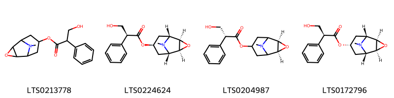{ width=100% }
    <figcaption>Hình ảnh cấu trúc hóa học của 4 hoạt chất thuộc nhóm Hydroxy acids and derivatives gồm ['buscopan (LTS0213778)', '(1r,2r,4s,5s,7s)-9-methyl-3-oxa-9-azatricyclo[3.3.1.0²,⁴]nonan-7-yl (2s)-3-hydroxy-2-phenylpropanoate (LTS0224624)', '(2r,4s)-9-methyl-3-oxa-9-azatricyclo[3.3.1.0²,⁴]nonan-7-yl (2r)-3-hydroxy-2-phenylpropanoate (LTS0204987)', 'scopolamine (LTS0172796)'].</figcaption>
</figure>
#### Nhóm Organonitrogen compounds
<figure markdown="span">
    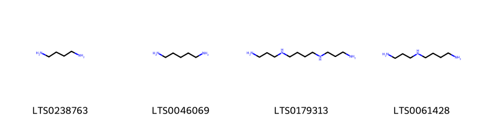{ width=100% }
    <figcaption>Hình ảnh cấu trúc hóa học của 4 hoạt chất thuộc nhóm Organonitrogen compounds gồm ['putrescine (LTS0238763)', 'pentane-1,5-diamine (LTS0046069)', 'spermine (LTS0179313)', 'spermidine (LTS0061428)'].</figcaption>
</figure>
#### Nhóm Tropane alkaloids
<figure markdown="span">
    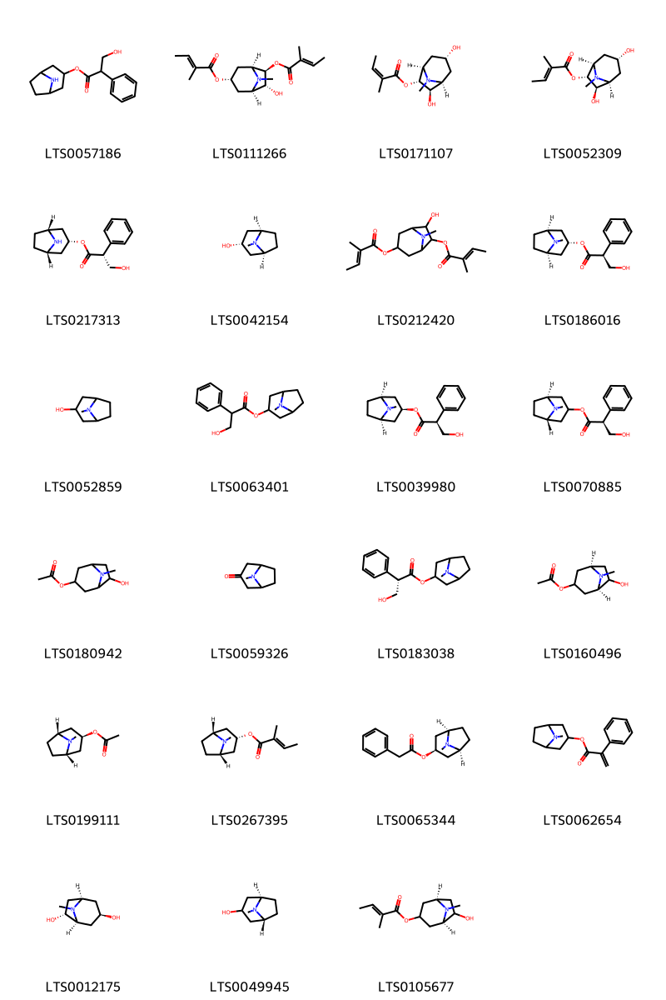{ width=100% }
    <figcaption>Hình ảnh cấu trúc hóa học của 23 hoạt chất thuộc nhóm Tropane alkaloids gồm ['8-azabicyclo[3.2.1]octan-3-yl 3-hydroxy-2-phenylpropanoate (LTS0057186)', '(1r,3s,5s,6r,7r)-7-hydroxy-8-methyl-3-{[(2e)-2-methylbut-2-enoyl]oxy}-8-azabicyclo[3.2.1]octan-6-yl (2e)-2-methylbut-2-enoate (LTS0111266)', '(1s,3r,5r,6r,7r)-3,7-dihydroxy-8-methyl-8-azabicyclo[3.2.1]octan-6-yl (2z)-2-methylbut-2-enoate (LTS0171107)', '(1s,3r,5r,6r,7r)-3,7-dihydroxy-8-methyl-8-azabicyclo[3.2.1]octan-6-yl 2-methylbut-2-enoate (LTS0052309)', '(1r,3s,5s)-8-azabicyclo[3.2.1]octan-3-yl (2r)-3-hydroxy-2-phenylpropanoate (LTS0217313)', 'pseudotropine (LTS0042154)', '7-hydroxy-8-methyl-3-[(2-methylbut-2-enoyl)oxy]-8-azabicyclo[3.2.1]octan-6-yl 2-methylbut-2-enoate (LTS0212420)', 'l-hyoscyamine (LTS0186016)', 'tropin (LTS0052859)', '()-hyoscyamine (LTS0063401)', 'hyoscyamine (LTS0039980)', '(1s,5s)-8-methyl-8-azabicyclo[3.2.1]octan-3-yl (2s)-3-hydroxy-2-phenylpropanoate (LTS0070885)', '6-hydroxy-8-methyl-8-azabicyclo[3.2.1]octan-3-yl acetate (LTS0180942)', 'tropanone (LTS0059326)', 'hyoscyamine (LTS0183038)', '(1r,5r)-6-hydroxy-8-methyl-8-azabicyclo[3.2.1]octan-3-yl acetate (LTS0160496)', 'acetyltropine (LTS0199111)', 'tropigline (LTS0267395)', '(1r,3r,5s)-8-methyl-8-azabicyclo[3.2.1]octan-3-yl 2-phenylacetate (LTS0065344)', 'apoatropine (LTS0062654)', '(1r,3r,5s,6r)-8-methyl-8-azabicyclo[3.2.1]octane-3,6-diol (LTS0012175)', '(1r,5r)-8-methyl-8-azabicyclo[3.2.1]octan-3-ol (LTS0049945)', '(1r,5r)-6-hydroxy-8-methyl-8-azabicyclo[3.2.1]octan-3-yl (2e)-2-methylbut-2-enoate (LTS0105677)'].</figcaption>
</figure>

---

### Dược dân tộc học

Danh sách các quốc gia có sử dụng *Datura candida* trong điều trị các bệnh. 

| Country            | Disease                     | Bệnh                               |
|:-------------------|:----------------------------|:-----------------------------------|
| Dominican Republic | Narcotic, Vermifuge, Poison | Chất gây nghiện, Vermifuge, Poison |
| Elsewhere          | Intoxicant, Poison          | Intoxicant, Poison                 |
| Venezuela          | Poison                      | Chất độc                           |

---

---
## Datura discolor
### Thông tin về thực vật

!!! info "Phân loại thực vật của *Datura discolor* từ GIBF:"
    - **Kingdom:** Plantae
    - **Phylum:** Tracheophyta
    - **Order:** Solanales
    - **Family:** Solanaceae
    - **Genus:** Datura
    - **Species:** *Datura discolor*

 

| Label (VI)   | Label (EN)   | Scientific Name   | Descriptions (VI)   | Descriptions (EN)   | Also Known As (VI)   | Also Known As (EN)   |
|:-------------|:-------------|:------------------|:--------------------|:--------------------|:---------------------|:---------------------|
| N/A          | N/A          | Datura discolor   | loài thực vật       | species of plant    | ['']                 | ['']                 |

#### Phân bố trên thế giới

**Từ CSDL GIBF** South Africa, Puerto Rico, Chinese Taipei, India, United States of America, Mexico

#### Phân bố tại Việt Nam

**Từ CSDL GIBF**: Không có ghi nhận ở Việt Nam

---
### Thành phần hóa học
        
- Theo cơ sở dữ liệu lotus: Từ loài *Datura discolor* đã phân lập và xác định được 18 hoạt chất thuộc về các nhóm Flavonoids, Hydroxy acids and derivatives, Tropane alkaloids. 

|    | chemicalTaxonomyClassyfireClass   |   smiles_count |
|---:|:----------------------------------|---------------:|
|  0 | Flavonoids                        |              5 |
|  1 | Hydroxy acids and derivatives     |              3 |
|  2 | Tropane alkaloids                 |             10 |

#### Nhóm Flavonoids
<figure markdown="span">
    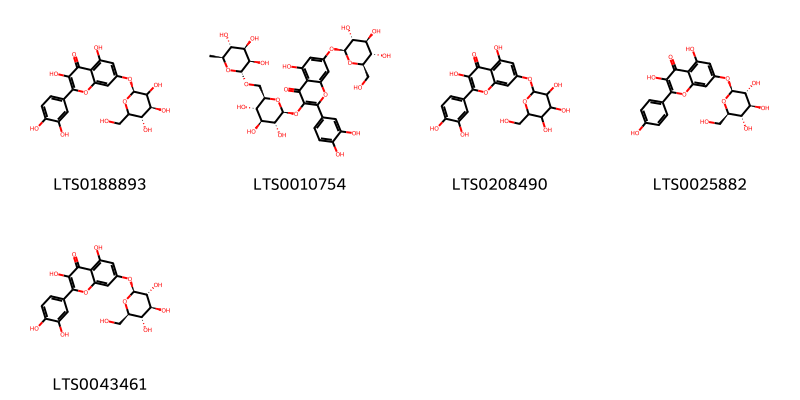{ width=100% }
    <figcaption>Hình ảnh cấu trúc hóa học của 5 hoạt chất thuộc nhóm Flavonoids gồm ['quercimeritrin (LTS0188893)', '2-(3,4-dihydroxyphenyl)-5-hydroxy-7-{[(2s,3r,4s,5s,6r)-3,4,5-trihydroxy-6-(hydroxymethyl)oxan-2-yl]oxy}-3-{[(2s,3r,4s,5s,6r)-3,4,5-trihydroxy-6-({[(2r,3r,4r,5r,6s)-3,4,5-trihydroxy-6-methyloxan-2-yl]oxy}methyl)oxan-2-yl]oxy}chromen-4-one (LTS0010754)', 'quercimeritrin (LTS0208490)', 'kaempferol 7-o-glucoside (LTS0025882)', 'quercimeritrin (LTS0043461)'].</figcaption>
</figure>
#### Nhóm Hydroxy acids and derivatives
<figure markdown="span">
    { width=100% }
    <figcaption>Hình ảnh cấu trúc hóa học của 3 hoạt chất thuộc nhóm Hydroxy acids and derivatives gồm ['scopolamine (LTS0172796)', '(2r,4s)-9-methyl-3-oxa-9-azatricyclo[3.3.1.0²,⁴]nonan-7-yl (2r)-3-hydroxy-2-phenylpropanoate (LTS0204987)', 'buscopan (LTS0213778)'].</figcaption>
</figure>
#### Nhóm Tropane alkaloids
<figure markdown="span">
    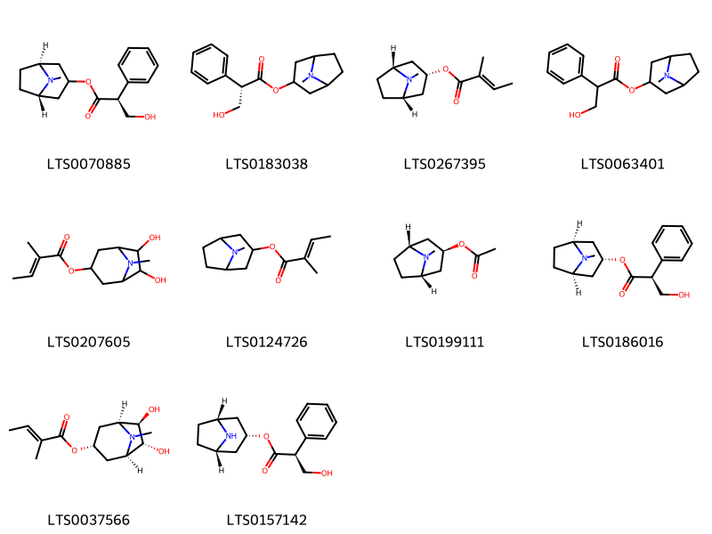{ width=100% }
    <figcaption>Hình ảnh cấu trúc hóa học của 10 hoạt chất thuộc nhóm Tropane alkaloids gồm ['(1s,5s)-8-methyl-8-azabicyclo[3.2.1]octan-3-yl (2s)-3-hydroxy-2-phenylpropanoate (LTS0070885)', 'hyoscyamine (LTS0183038)', 'tropigline (LTS0267395)', '()-hyoscyamine (LTS0063401)', '6,7-dihydroxy-8-methyl-8-azabicyclo[3.2.1]octan-3-yl 2-methylbut-2-enoate (LTS0207605)', '8-methyl-8-azabicyclo[3.2.1]octan-3-yl 2-methylbut-2-enoate (LTS0124726)', 'acetyltropine (LTS0199111)', 'l-hyoscyamine (LTS0186016)', '(1r,3s,5s,6r,7r)-6,7-dihydroxy-8-methyl-8-azabicyclo[3.2.1]octan-3-yl (2e)-2-methylbut-2-enoate (LTS0037566)', '(1r,3s,5s)-8-azabicyclo[3.2.1]octan-3-yl (2s)-3-hydroxy-2-phenylpropanoate (LTS0157142)'].</figcaption>
</figure>

---

### Dược dân tộc học

Danh sách các quốc gia có sử dụng *Datura discolor* trong điều trị các bệnh. 

| Country            | Disease      | Bệnh              |
|:-------------------|:-------------|:------------------|
| Mexico(Amerindian) | Hallucinogen | Thuốc gây ảo giác |

---

---
## Datura fastuosa
### Thông tin về thực vật

!!! info "Phân loại thực vật của *Datura metel* từ GIBF:"
    - **Kingdom:** Plantae
    - **Phylum:** Tracheophyta
    - **Order:** Solanales
    - **Family:** Solanaceae
    - **Genus:** Datura
    - **Species:** *Datura metel*

 

| Label (VI)   | Label (EN)   | Scientific Name   | Descriptions (VI)   | Descriptions (EN)   | Also Known As (VI)   | Also Known As (EN)   |
|:-------------|:-------------|:------------------|:--------------------|:--------------------|:---------------------|:---------------------|
| N/A          | N/A          | Datura fastuosa   | loài thực vật       | species of plant    | ['']                 | ['']                 |

#### Phân bố trên thế giới

**Từ CSDL GIBF** nan, Sri Lanka, Japan, Mauritius, Myanmar, unknown or invalid, Yemen, Malawi, Puerto Rico, Nigeria, Spain, Portugal, Bangladesh, United States of America, Congo, Democratic Republic of the, Paraguay, South Africa, Fiji, Brazil, Côte d’Ivoire, Egypt, Dominican Republic, France, China, French Polynesia, Cabo Verde, Colombia, India, Indonesia, Samoa, Malaysia

#### Phân bố tại Việt Nam

**Từ CSDL GIBF**: Không có ghi nhận ở Việt Nam

---
### Thành phần hóa học
        
- Theo cơ sở dữ liệu lotus: Từ loài *Datura metel* đã phân lập và xác định được Chưa có hoạt chất nào được phân lập. hoạt chất thuộc về các nhóm Không có hoạt chất nào được phân lập. 

Không có hình ảnh nào được tạo ra

---

### Dược dân tộc học

Danh sách các quốc gia có sử dụng *Datura metel* trong điều trị các bệnh. 

| Country            | Disease      | Bệnh                  |
|:-------------------|:-------------|:----------------------|
| Iraq               | Narcotic     | Thuốc gây ngủ, gây mê |
| Mozambique(Tsonga) | Hallucinogen | Thuốc gây ảo giác     |

---

---
## Datura innoxia
### Thông tin về thực vật

!!! info "Phân loại thực vật của *Datura innoxia* từ GIBF:"
    - **Kingdom:** Plantae
    - **Phylum:** Tracheophyta
    - **Order:** Solanales
    - **Family:** Solanaceae
    - **Genus:** Datura
    - **Species:** *Datura innoxia*

 

| Label (VI)   | Label (EN)   | Scientific Name   | Descriptions (VI)   | Descriptions (EN)   | Also Known As (VI)   | Also Known As (EN)   |
|:-------------|:-------------|:------------------|:--------------------|:--------------------|:---------------------|:---------------------|
| N/A          | N/A          | Datura innoxia    | loài thực vật       | misspelling         | ['']                 | ['']                 |

#### Phân bố trên thế giới

**Từ CSDL GIBF** Virgin Islands (U.S.), United Arab Emirates, Ghana, Bulgaria, Italy, Australia, Guadeloupe, Belgium, Georgia, Argentina, Palestine, State of, Virgin Islands (British), Israel, Canada, Ukraine, Pakistan, Malawi, Netherlands, Réunion, Denmark, Lithuania, Belarus, Cyprus, Namibia, Malta, Spain, Türkiye, Algeria, Russian Federation, Morocco, United States of America, Bonaire, Sint Eustatius and Saba, Slovenia, Croatia, Greece, South Africa, Czechia, Oman, Kuwait, Mexico, Dominican Republic, China, Curaçao, Ecuador, Saint Kitts and Nevis, Syrian Arab Republic, Cabo Verde, Botswana, India, Kenya, Ethiopia

#### Phân bố tại Việt Nam

**Từ CSDL GIBF**: Không có ghi nhận ở Việt Nam

---
### Thành phần hóa học
        
- Theo cơ sở dữ liệu lotus: Từ loài *Datura innoxia* đã phân lập và xác định được 57 hoạt chất thuộc về các nhóm Naphthalenes, Prenol lipids, Steroids and steroid derivatives, Benzene and substituted derivatives, Hydroxy acids and derivatives, Tropane alkaloids, Oxazepines. 

|    | chemicalTaxonomyClassyfireClass     |   smiles_count |
|---:|:------------------------------------|---------------:|
|  0 | Benzene and substituted derivatives |              2 |
|  1 | Hydroxy acids and derivatives       |              5 |
|  2 | Naphthalenes                        |              1 |
|  3 | Oxazepines                          |              2 |
|  4 | Prenol lipids                       |              4 |
|  5 | Steroids and steroid derivatives    |             14 |
|  6 | Tropane alkaloids                   |             29 |

#### Nhóm Benzene and substituted derivatives
<figure markdown="span">
    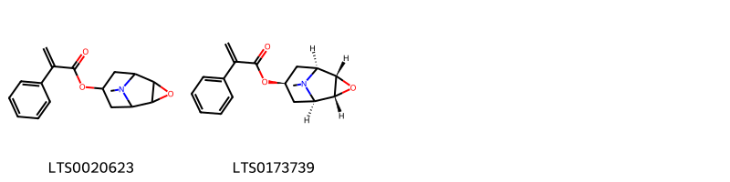{ width=100% }
    <figcaption>Hình ảnh cấu trúc hóa học của 2 hoạt chất thuộc nhóm Benzene and substituted derivatives gồm ['aposcopolamine (LTS0020623)', 'aposcopolamine (LTS0173739)'].</figcaption>
</figure>
#### Nhóm Hydroxy acids and derivatives
<figure markdown="span">
    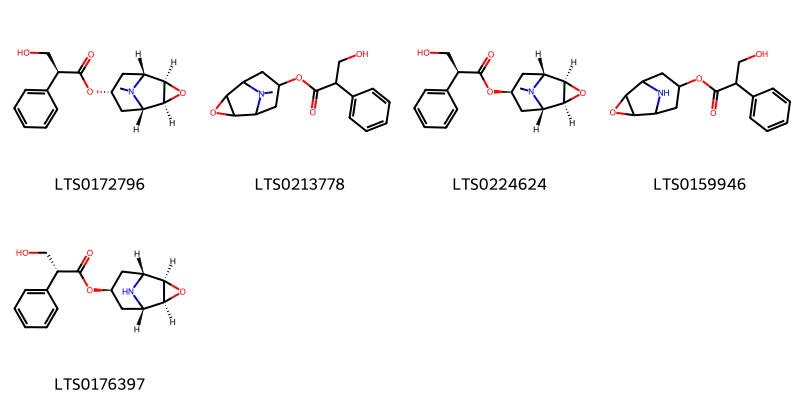{ width=100% }
    <figcaption>Hình ảnh cấu trúc hóa học của 5 hoạt chất thuộc nhóm Hydroxy acids and derivatives gồm ['scopolamine (LTS0172796)', 'buscopan (LTS0213778)', '(1r,2r,4s,5s,7s)-9-methyl-3-oxa-9-azatricyclo[3.3.1.0²,⁴]nonan-7-yl (2s)-3-hydroxy-2-phenylpropanoate (LTS0224624)', 'norscopolamine (LTS0159946)', '(1r,2r,4s,5s,7s)-3-oxa-9-azatricyclo[3.3.1.0²,⁴]nonan-7-yl (2r)-3-hydroxy-2-phenylpropanoate (LTS0176397)'].</figcaption>
</figure>
#### Nhóm Naphthalenes
<figure markdown="span">
    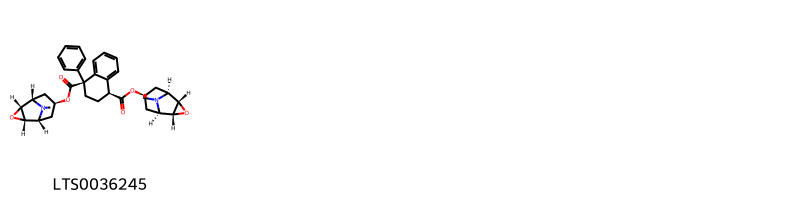{ width=100% }
    <figcaption>Hình ảnh cấu trúc hóa học của 1 hoạt chất thuộc nhóm Naphthalenes gồm ['4-(1r,2r,4s,5s,7r)-9-methyl-3-oxa-9-azatricyclo[3.3.1.0²,⁴]nonan-7-yl 1-(1r,2s,4r,5s,7s)-9-methyl-3-oxa-9-azatricyclo[3.3.1.0²,⁴]nonan-7-yl (1s,4s)-1-phenyl-3,4-dihydro-2h-naphthalene-1,4-dicarboxylate (LTS0036245)'].</figcaption>
</figure>
#### Nhóm Oxazepines
<figure markdown="span">
    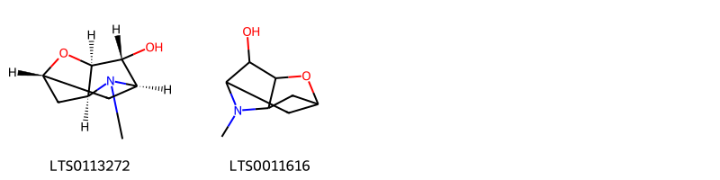{ width=100% }
    <figcaption>Hình ảnh cấu trúc hóa học của 2 hoạt chất thuộc nhóm Oxazepines gồm ['(1r,3r,4r,5r,7s)-6-methyl-2-oxa-6-azatricyclo[3.3.1.0³,⁷]nonan-4-ol (LTS0113272)', '6-methyl-2-oxa-6-azatricyclo[3.3.1.0³,⁷]nonan-4-ol (LTS0011616)'].</figcaption>
</figure>
#### Nhóm Prenol lipids
<figure markdown="span">
    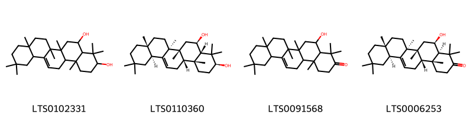{ width=100% }
    <figcaption>Hình ảnh cấu trúc hóa học của 4 hoạt chất thuộc nhóm Prenol lipids gồm ['4,4,6a,6b,8a,11,11,14b-octamethyl-1,2,3,4a,5,6,7,8,9,10,12,12a,14,14a-tetradecahydropicene-3,5-diol (LTS0102331)', '(3s,4as,5r,6ar,6bs,8ar,12as,14as,14br)-4,4,6a,6b,8a,11,11,14b-octamethyl-1,2,3,4a,5,6,7,8,9,10,12,12a,14,14a-tetradecahydropicene-3,5-diol (LTS0110360)', '5-hydroxy-4,4,6a,6b,8a,11,11,14b-octamethyl-2,4a,5,6,7,8,9,10,12,12a,14,14a-dodecahydro-1h-picen-3-one (LTS0091568)', '(4ar,5r,6ar,6bs,8ar,12as,14as,14br)-5-hydroxy-4,4,6a,6b,8a,11,11,14b-octamethyl-2,4a,5,6,7,8,9,10,12,12a,14,14a-dodecahydro-1h-picen-3-one (LTS0006253)'].</figcaption>
</figure>
#### Nhóm Steroids and steroid derivatives
<figure markdown="span">
    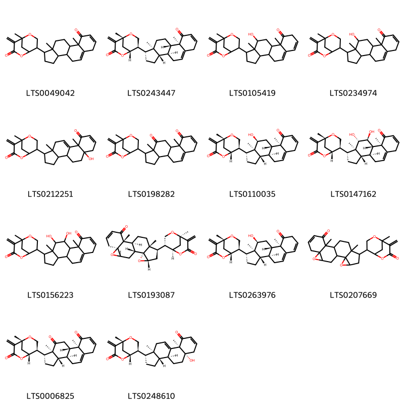{ width=100% }
    <figcaption>Hình ảnh cấu trúc hóa học của 14 hoạt chất thuộc nhóm Steroids and steroid derivatives gồm ['8-{9a,11a-dimethyl-9-oxo-1h,2h,3h,3ah,3bh,4h,6h,9bh,10h,11h-cyclopenta[a]phenanthren-1-yl}-5-methyl-4-methylidene-2,6-dioxabicyclo[3.3.1]nonan-3-one (LTS0049042)', '(1r,5r,8r)-8-[(1r,3as,3bs,9ar,9bs,11as)-9a,11a-dimethyl-9-oxo-1h,2h,3h,3ah,3bh,4h,6h,9bh,10h,11h-cyclopenta[a]phenanthren-1-yl]-5-methyl-4-methylidene-2,6-dioxabicyclo[3.3.1]nonan-3-one (LTS0243447)', '8-{11-hydroxy-9a,11a-dimethyl-9-oxo-1h,2h,3h,3ah,3bh,4h,8h,9bh,10h,11h-cyclopenta[a]phenanthren-1-yl}-5-methyl-4-methylidene-2,6-dioxabicyclo[3.3.1]nonan-3-one (LTS0105419)', '8-{11-hydroxy-9a,11a-dimethyl-9-oxo-1h,2h,3h,3ah,3bh,4h,6h,9bh,10h,11h-cyclopenta[a]phenanthren-1-yl}-5-methyl-4-methylidene-2,6-dioxabicyclo[3.3.1]nonan-3-one (LTS0234974)', '8-{5a-hydroxy-9a,11a-dimethyl-9-oxo-1h,2h,3h,3ah,3bh,4h,5h,6h,11h-cyclopenta[a]phenanthren-1-yl}-5-methyl-4-methylidene-2,6-dioxabicyclo[3.3.1]nonan-3-one (LTS0212251)', '9a,11a-dimethyl-1-{1-methyl-8-methylidene-7-oxo-2,6-dioxabicyclo[3.3.1]nonan-4-yl}-1h,2h,3h,3ah,3bh,4h,6h,9bh,10h-cyclopenta[a]phenanthrene-9,11-dione (LTS0198282)', '(1r,5r,8r)-8-[(1r,3as,3bs,9ar,9bs,11s,11as)-11-hydroxy-9a,11a-dimethyl-9-oxo-1h,2h,3h,3ah,3bh,4h,6h,9bh,10h,11h-cyclopenta[a]phenanthren-1-yl]-5-methyl-4-methylidene-2,6-dioxabicyclo[3.3.1]nonan-3-one (LTS0110035)', '(1r,5r,8r)-8-[(1r,3as,3bs,9ar,9bs,10s,11s,11as)-10,11-dihydroxy-9a,11a-dimethyl-9-oxo-1h,2h,3h,3ah,3bh,4h,6h,9bh,10h,11h-cyclopenta[a]phenanthren-1-yl]-5-methyl-4-methylidene-2,6-dioxabicyclo[3.3.1]nonan-3-one (LTS0147162)', '8-{10,11-dihydroxy-9a,11a-dimethyl-9-oxo-1h,2h,3h,3ah,3bh,4h,6h,9bh,10h,11h-cyclopenta[a]phenanthren-1-yl}-5-methyl-4-methylidene-2,6-dioxabicyclo[3.3.1]nonan-3-one (LTS0156223)', '(1s,2r,7s,9r,11r,12r,14s,16r,17r)-2,17-dimethyl-16-[(1r,4r,5r)-1-methyl-8-methylidene-7-oxo-2,6-dioxabicyclo[3.3.1]nonan-4-yl]-8,13-dioxahexacyclo[9.8.0.0²,⁷.0⁷,⁹.0¹²,¹⁴.0¹²,¹⁷]nonadec-4-en-3-one (LTS0193087)', '(1r,5r,8r)-8-[(1r,3as,3bs,9ar,9bs,11s,11as)-11-hydroxy-9a,11a-dimethyl-9-oxo-1h,2h,3h,3ah,3bh,4h,8h,9bh,10h,11h-cyclopenta[a]phenanthren-1-yl]-5-methyl-4-methylidene-2,6-dioxabicyclo[3.3.1]nonan-3-one (LTS0263976)', '2,17-dimethyl-16-{1-methyl-8-methylidene-7-oxo-2,6-dioxabicyclo[3.3.1]nonan-4-yl}-8,13-dioxahexacyclo[9.8.0.0²,⁷.0⁷,⁹.0¹²,¹⁴.0¹²,¹⁷]nonadec-4-en-3-one (LTS0207669)', '(1r,3as,3bs,9ar,9bs,11as)-9a,11a-dimethyl-1-[(1r,4r,5r)-1-methyl-8-methylidene-7-oxo-2,6-dioxabicyclo[3.3.1]nonan-4-yl]-1h,2h,3h,3ah,3bh,4h,6h,9bh,10h-cyclopenta[a]phenanthrene-9,11-dione (LTS0006825)', '(1r,5r,8r)-8-[(1r,3as,3bs,5as,9ar,11as)-5a-hydroxy-9a,11a-dimethyl-9-oxo-1h,2h,3h,3ah,3bh,4h,5h,6h,11h-cyclopenta[a]phenanthren-1-yl]-5-methyl-4-methylidene-2,6-dioxabicyclo[3.3.1]nonan-3-one (LTS0248610)'].</figcaption>
</figure>
#### Nhóm Tropane alkaloids
<figure markdown="span">
    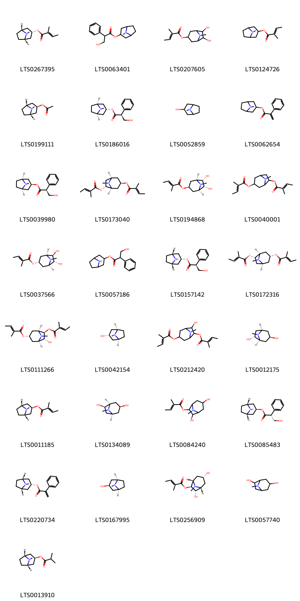{ width=100% }
    <figcaption>Hình ảnh cấu trúc hóa học của 29 hoạt chất thuộc nhóm Tropane alkaloids gồm ['tropigline (LTS0267395)', '()-hyoscyamine (LTS0063401)', '6,7-dihydroxy-8-methyl-8-azabicyclo[3.2.1]octan-3-yl 2-methylbut-2-enoate (LTS0207605)', '8-methyl-8-azabicyclo[3.2.1]octan-3-yl 2-methylbut-2-enoate (LTS0124726)', 'acetyltropine (LTS0199111)', 'l-hyoscyamine (LTS0186016)', 'tropin (LTS0052859)', 'apoatropine (LTS0062654)', 'hyoscyamine (LTS0039980)', '(1r,3r,5s,6r)-8-methyl-3-{[(2e)-2-methylbut-2-enoyl]oxy}-8-azabicyclo[3.2.1]octan-6-yl (2e)-2-methylbut-2-enoate (LTS0173040)', '(1r,3r,5s,6s,7r)-6,7-dihydroxy-8-methyl-8-azabicyclo[3.2.1]octan-3-yl (2e)-2-methylbut-2-enoate (LTS0194868)', '8-methyl-3-[(2-methylbut-2-enoyl)oxy]-8-azabicyclo[3.2.1]octan-6-yl 2-methylbut-2-enoate (LTS0040001)', '(1r,3s,5s,6r,7r)-6,7-dihydroxy-8-methyl-8-azabicyclo[3.2.1]octan-3-yl (2e)-2-methylbut-2-enoate (LTS0037566)', '8-azabicyclo[3.2.1]octan-3-yl 3-hydroxy-2-phenylpropanoate (LTS0057186)', '(1r,3s,5s)-8-azabicyclo[3.2.1]octan-3-yl (2s)-3-hydroxy-2-phenylpropanoate (LTS0157142)', '(1s,3r,5r,6s)-8-methyl-3-{[(2e)-2-methylbut-2-enoyl]oxy}-8-azabicyclo[3.2.1]octan-6-yl (2e)-2-methylbut-2-enoate (LTS0172316)', '(1r,3s,5s,6r,7r)-7-hydroxy-8-methyl-3-{[(2e)-2-methylbut-2-enoyl]oxy}-8-azabicyclo[3.2.1]octan-6-yl (2e)-2-methylbut-2-enoate (LTS0111266)', 'pseudotropine (LTS0042154)', '7-hydroxy-8-methyl-3-[(2-methylbut-2-enoyl)oxy]-8-azabicyclo[3.2.1]octan-6-yl 2-methylbut-2-enoate (LTS0212420)', '(1r,3r,5s,6r)-8-methyl-8-azabicyclo[3.2.1]octane-3,6-diol (LTS0012175)', '(1r,3r,5s)-8-methyl-8-azabicyclo[3.2.1]octan-3-yl (2e)-2-methylbut-2-enoate (LTS0011185)', '(1s,3s,5r,6r)-8-methyl-8-azabicyclo[3.2.1]octane-3,6-diol (LTS0134089)', '3,7-dihydroxy-8-methyl-8-azabicyclo[3.2.1]octan-6-yl 2-methylbut-2-enoate (LTS0084240)', '(1r,3r,5s)-8-azabicyclo[3.2.1]octan-3-yl (2r)-3-hydroxy-2-phenylpropanoate (LTS0085483)', '(1r,3s,5s)-8-methyl-8-azabicyclo[3.2.1]octan-3-yl 2-phenylprop-2-enoate (LTS0220734)', 'tropine (LTS0167995)', '(1r,3r,5s,6s,7s)-3,7-dihydroxy-8-methyl-8-azabicyclo[3.2.1]octan-6-yl (2e)-2-methylbut-2-enoate (LTS0256909)', '8-methyl-8-azabicyclo[3.2.1]octane-3,6-diol (LTS0057740)', '(1r,3r,5s)-8-methyl-8-azabicyclo[3.2.1]octan-3-yl 2-methylpropanoate (LTS0013910)'].</figcaption>
</figure>

---

### Dược dân tộc học

Danh sách các quốc gia có sử dụng *Datura innoxia* trong điều trị các bệnh. 

| Country   | Disease                                      | Bệnh                           |
|:----------|:---------------------------------------------|:-------------------------------|
| India     | Anesthetic, Demulcent, Expectorant, Sedative | Gây mê, giảm đau, đờm, an thần |
| Nepal     | Sedative, Sedative                           | Thuốc an thần, Thuốc an thần   |

---

---
## Datura metel
### Thông tin về thực vật

!!! info "Phân loại thực vật của *Datura metel* từ GIBF:"
    - **Kingdom:** Plantae
    - **Phylum:** Tracheophyta
    - **Order:** Solanales
    - **Family:** Solanaceae
    - **Genus:** Datura
    - **Species:** *Datura metel*

 

| Label (VI)   | Label (EN)   | Scientific Name   | Descriptions (VI)   | Descriptions (EN)                                             | Also Known As (VI)   | Also Known As (EN)   |
|:-------------|:-------------|:------------------|:--------------------|:--------------------------------------------------------------|:---------------------|:---------------------|
| N/A          | N/A          | Datura metel      |                     | species of plant, commonly known as devil's trumpet and metel | ['Datura metel']     | ['']                 |

#### Phân bố trên thế giới

**Từ CSDL GIBF** nan, Sri Lanka, Japan, Mozambique, Saint Lucia, Argentina, Benin, Bermuda, Sierra Leone, Panama, Canada, Malawi, Nigeria, Chinese Taipei, Spain, Bolivia (Plurinational State of), Türkiye, Honduras, Bangladesh, United States of America, Bonaire, Sint Eustatius and Saba, Timor-Leste, Paraguay, El Salvador, Greece, Belize, Trinidad and Tobago, South Africa, Uganda, Hong Kong, Sao Tome and Principe, Thailand, Brazil, Bhutan, Tonga, Mexico, Peru, Viet Nam, China, Ecuador, Colombia, Vanuatu, India, Indonesia, Philippines, Malaysia, Nepal

#### Phân bố tại Việt Nam

**Từ CSDL GIBF**: Quảng Ngãi, Nam Định

---
### Thành phần hóa học
        
- Theo cơ sở dữ liệu lotus: Từ loài *Datura metel* đã phân lập và xác định được 149 hoạt chất thuộc về các nhóm Fatty Acyls, Prenol lipids, Steroids and steroid derivatives, Cinnamic acids and derivatives, Sphingolipids, Benzene and substituted derivatives, Hydroxy acids and derivatives, Tropane alkaloids, Lactones, Saccharolipids, Aryltetralin lignans, Pyridines and derivatives. 

|    | chemicalTaxonomyClassyfireClass     |   smiles_count |
|---:|:------------------------------------|---------------:|
|  0 | Aryltetralin lignans                |              2 |
|  1 | Benzene and substituted derivatives |              1 |
|  2 | Cinnamic acids and derivatives      |              2 |
|  3 | Fatty Acyls                         |              1 |
|  4 | Hydroxy acids and derivatives       |              3 |
|  5 | Lactones                            |              6 |
|  6 | Prenol lipids                       |              1 |
|  7 | Pyridines and derivatives           |              1 |
|  8 | Saccharolipids                      |              4 |
|  9 | Sphingolipids                       |              2 |
| 10 | Steroids and steroid derivatives    |            115 |
| 11 | Tropane alkaloids                   |             11 |

#### Nhóm Aryltetralin lignans
<figure markdown="span">
    { width=100% }
    <figcaption>Hình ảnh cấu trúc hóa học của 2 hoạt chất thuộc nhóm Aryltetralin lignans gồm ['(6r,7r,8r)-8-(4-hydroxy-3-methoxyphenyl)-6,7-bis(hydroxymethyl)-3-methoxy-5,6,7,8-tetrahydronaphthalen-2-ol (LTS0084958)', '8-(4-hydroxy-3-methoxyphenyl)-6,7-bis(hydroxymethyl)-3-methoxy-5,6,7,8-tetrahydronaphthalen-2-ol (LTS0008421)'].</figcaption>
</figure>
#### Nhóm Benzene and substituted derivatives
<figure markdown="span">
    { width=100% }
    <figcaption>Hình ảnh cấu trúc hóa học của 1 hoạt chất thuộc nhóm Benzene and substituted derivatives gồm ['8-methyl-8-azabicyclo[3.2.1]octan-3-yl 4-methoxybenzoate (LTS0218421)'].</figcaption>
</figure>
#### Nhóm Cinnamic acids and derivatives
<figure markdown="span">
    { width=100% }
    <figcaption>Hình ảnh cấu trúc hóa học của 2 hoạt chất thuộc nhóm Cinnamic acids and derivatives gồm ['3-(4-hydroxyphenyl)-n-[2-(4-hydroxyphenyl)ethyl]prop-2-enimidic acid (LTS0104591)', '(2e)-3-(4-hydroxyphenyl)-n-[2-(4-hydroxyphenyl)ethyl]prop-2-enimidic acid (LTS0067822)'].</figcaption>
</figure>
#### Nhóm Fatty Acyls
<figure markdown="span">
    { width=100% }
    <figcaption>Hình ảnh cấu trúc hóa học của 1 hoạt chất thuộc nhóm Fatty Acyls gồm ['hexanoic acid (LTS0031054)'].</figcaption>
</figure>
#### Nhóm Hydroxy acids and derivatives
<figure markdown="span">
    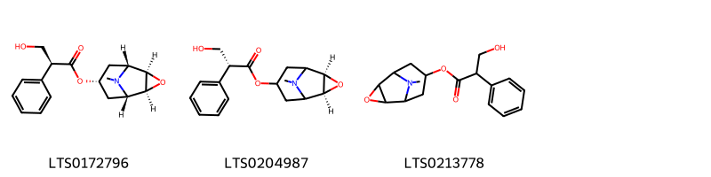{ width=100% }
    <figcaption>Hình ảnh cấu trúc hóa học của 3 hoạt chất thuộc nhóm Hydroxy acids and derivatives gồm ['scopolamine (LTS0172796)', '(2r,4s)-9-methyl-3-oxa-9-azatricyclo[3.3.1.0²,⁴]nonan-7-yl (2r)-3-hydroxy-2-phenylpropanoate (LTS0204987)', 'buscopan (LTS0213778)'].</figcaption>
</figure>
#### Nhóm Lactones
<figure markdown="span">
    { width=100% }
    <figcaption>Hình ảnh cấu trúc hóa học của 6 hoạt chất thuộc nhóm Lactones gồm ['2,16-dimethyl-15-{1-methyl-8-methylidene-7-oxo-2,6-dioxabicyclo[3.3.1]nonan-4-yl}-8-oxatetracyclo[9.7.0.0³,⁹.0¹²,¹⁶]octadeca-2,4-dien-7-one (LTS0071978)', '17-hydroxy-2,16-dimethyl-15-{1-methyl-8-methylidene-7-oxo-2,6-dioxabicyclo[3.3.1]nonan-4-yl}-8-oxatetracyclo[9.7.0.0³,⁹.0¹²,¹⁶]octadeca-2,4-dien-7-one (LTS0095497)', '(9r,17r)-17-hydroxy-2,16-dimethyl-15-[(1r,4r,5r)-1-methyl-8-methylidene-7-oxo-2,6-dioxabicyclo[3.3.1]nonan-4-yl]-8-oxatetracyclo[9.7.0.0³,⁹.0¹²,¹⁶]octadeca-2,4-dien-7-one (LTS0017347)', '(1s,9r,11s,12s,15r,16s)-2,16-dimethyl-15-[(1r,4r,5r)-1-methyl-8-methylidene-7-oxo-2,6-dioxabicyclo[3.3.1]nonan-4-yl]-8-oxatetracyclo[9.7.0.0³,⁹.0¹²,¹⁶]octadeca-2,4-dien-7-one (LTS0187463)', '(9r)-2,16-dimethyl-15-[(1r,4r,5r)-1-methyl-8-methylidene-7-oxo-2,6-dioxabicyclo[3.3.1]nonan-4-yl]-8-oxatetracyclo[9.7.0.0³,⁹.0¹²,¹⁶]octadeca-2,4-dien-7-one (LTS0018563)', '(1s,9r,11r,12s,15r,16s,17r)-17-hydroxy-2,16-dimethyl-15-[(1r,4r,5r)-1-methyl-8-methylidene-7-oxo-2,6-dioxabicyclo[3.3.1]nonan-4-yl]-8-oxatetracyclo[9.7.0.0³,⁹.0¹²,¹⁶]octadeca-2,4-dien-7-one (LTS0275085)'].</figcaption>
</figure>
#### Nhóm Prenol lipids
<figure markdown="span">
    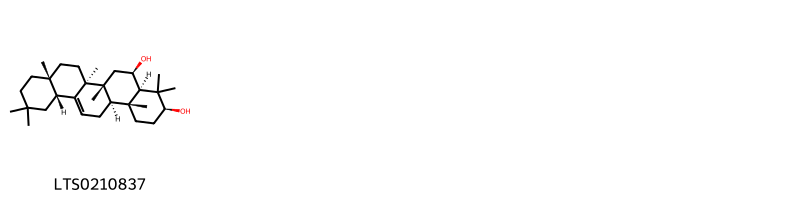{ width=100% }
    <figcaption>Hình ảnh cấu trúc hóa học của 1 hoạt chất thuộc nhóm Prenol lipids gồm ['(3s,4ar,5r,6ar,6bs,8ar,12ar,14ar,14br)-4,4,6a,6b,8a,11,11,14b-octamethyl-1,2,3,4a,5,6,7,8,9,10,12,12a,14,14a-tetradecahydropicene-3,5-diol (LTS0210837)'].</figcaption>
</figure>
#### Nhóm Pyridines and derivatives
<figure markdown="span">
    { width=100% }
    <figcaption>Hình ảnh cấu trúc hóa học của 1 hoạt chất thuộc nhóm Pyridines and derivatives gồm ['niacin (LTS0216673)'].</figcaption>
</figure>
#### Nhóm Saccharolipids
<figure markdown="span">
    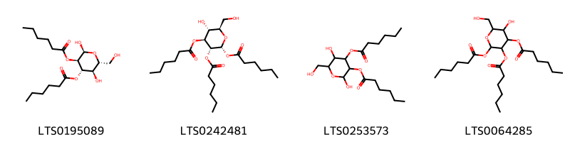{ width=100% }
    <figcaption>Hình ảnh cấu trúc hóa học của 4 hoạt chất thuộc nhóm Saccharolipids gồm ['(2s,3r,4s,5r,6r)-4-(hexanoyloxy)-2,5-dihydroxy-6-(hydroxymethyl)oxan-3-yl hexanoate (LTS0195089)', '(2r,3r,4s,5r,6r)-3,4-bis(hexanoyloxy)-5-hydroxy-6-(hydroxymethyl)oxan-2-yl hexanoate (LTS0242481)', '3-(hexanoyloxy)-2,5-dihydroxy-6-(hydroxymethyl)oxan-4-yl hexanoate (LTS0253573)', '2,3-bis(hexanoyloxy)-5-hydroxy-6-(hydroxymethyl)oxan-4-yl hexanoate (LTS0064285)'].</figcaption>
</figure>
#### Nhóm Sphingolipids
<figure markdown="span">
    { width=100% }
    <figcaption>Hình ảnh cấu trúc hóa học của 2 hoạt chất thuộc nhóm Sphingolipids gồm ['(2r)-2-hydroxy-n-[(2s,3r,4e,8z)-3-hydroxy-1-{[(2r,3r,4s,5s,6r)-3,4,5-trihydroxy-6-(hydroxymethyl)oxan-2-yl]oxy}octadeca-4,8-dien-2-yl]hexadecanimidic acid (LTS0070116)', '2-hydroxy-n-(3-hydroxy-1-{[3,4,5-trihydroxy-6-(hydroxymethyl)oxan-2-yl]oxy}octadeca-4,8-dien-2-yl)hexadecanimidic acid (LTS0121977)'].</figcaption>
</figure>
#### Nhóm Steroids and steroid derivatives
<figure markdown="span">
    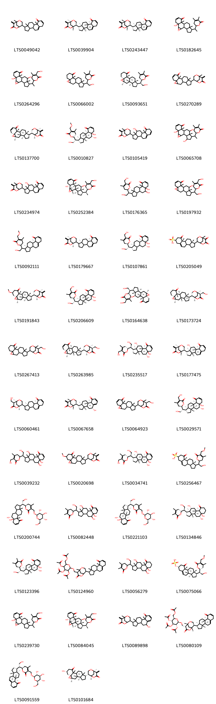{ width=100% }
    <figcaption>Hình ảnh cấu trúc hóa học của 115 hoạt chất thuộc nhóm Steroids and steroid derivatives gồm ['8-{9a,11a-dimethyl-9-oxo-1h,2h,3h,3ah,3bh,4h,6h,9bh,10h,11h-cyclopenta[a]phenanthren-1-yl}-5-methyl-4-methylidene-2,6-dioxabicyclo[3.3.1]nonan-3-one (LTS0049042)', '(1r,5s,8r)-8-[(1r,3as,3bs,9ar,9bs,11as)-9a,11a-dimethyl-9-oxo-1h,2h,3h,3ah,3bh,4h,6h,9bh,10h,11h-cyclopenta[a]phenanthren-1-yl]-5-methyl-4-methylidene-2,6-dioxabicyclo[3.3.1]nonan-3-one (LTS0039904)', '(1r,5r,8r)-8-[(1r,3as,3bs,9ar,9bs,11as)-9a,11a-dimethyl-9-oxo-1h,2h,3h,3ah,3bh,4h,6h,9bh,10h,11h-cyclopenta[a]phenanthren-1-yl]-5-methyl-4-methylidene-2,6-dioxabicyclo[3.3.1]nonan-3-one (LTS0243447)', '15-[1-(4,5-dimethyl-6-oxo-2,3-dihydropyran-2-yl)ethyl]-5-hydroxy-10,14-dimethyl-3-oxapentacyclo[9.7.0.0²,⁴.0⁵,¹⁰.0¹⁴,¹⁸]octadec-7-en-9-one (LTS0182645)', '5,13-dihydroxy-15-{1-[5-(hydroxymethyl)-4-methyl-6-oxo-2,3-dihydropyran-2-yl]ethyl}-10,14-dimethyl-3-oxapentacyclo[9.7.0.0²,⁴.0⁵,¹⁰.0¹⁴,¹⁸]octadec-7-en-9-one (LTS0264296)', '15-[1-(4,5-dimethyl-6-oxo-2,3-dihydropyran-2-yl)-2-hydroxyethyl]-2,16-dimethyl-8-oxapentacyclo[9.7.0.0²,⁷.0⁷,⁹.0¹²,¹⁶]octadecan-3-one (LTS0066002)', '(1s,2r,7s,9r,11s,12s,15r,16s)-15-[(1r)-1-[(2r)-4,5-dimethyl-6-oxo-2,3-dihydropyran-2-yl]-2-hydroxyethyl]-2,16-dimethyl-8-oxapentacyclo[9.7.0.0²,⁷.0⁷,⁹.0¹²,¹⁶]octadecan-3-one (LTS0093651)', '2,16-dimethyl-15-{1-methyl-8-methylidene-7-oxo-2,6-dioxabicyclo[3.3.1]nonan-4-yl}-8-oxapentacyclo[9.7.0.0²,⁷.0⁷,⁹.0¹²,¹⁶]octadec-4-en-3-one (LTS0270289)', '(1s,2r,7s,9r,11s,12s,15r,16s)-2,16-dimethyl-15-[(1r,4r,5r)-1-methyl-8-methylidene-7-oxo-2,6-dioxabicyclo[3.3.1]nonan-4-yl]-8-oxapentacyclo[9.7.0.0²,⁷.0⁷,⁹.0¹²,¹⁶]octadec-4-en-3-one (LTS0137700)', '(6r)-6-[(1r)-1-[(1r,3as,3bs,5r,5ar,9ar,9bs,11as)-5,5a-dihydroxy-9a,11a-dimethyl-9-oxo-1h,2h,3h,3ah,3bh,4h,5h,6h,9bh,10h,11h-cyclopenta[a]phenanthren-1-yl]-2-hydroxyethyl]-3-(methoxymethyl)-4-methyl-5,6-dihydropyran-2-one (LTS0010827)', '8-{11-hydroxy-9a,11a-dimethyl-9-oxo-1h,2h,3h,3ah,3bh,4h,8h,9bh,10h,11h-cyclopenta[a]phenanthren-1-yl}-5-methyl-4-methylidene-2,6-dioxabicyclo[3.3.1]nonan-3-one (LTS0105419)', '15-[1-(4,5-dimethyl-6-oxo-2,3-dihydropyran-2-yl)ethyl]-5,13,17-trihydroxy-10,14-dimethyl-3-oxapentacyclo[9.7.0.0²,⁴.0⁵,¹⁰.0¹⁴,¹⁸]octadec-7-en-9-one (LTS0065708)', '8-{11-hydroxy-9a,11a-dimethyl-9-oxo-1h,2h,3h,3ah,3bh,4h,6h,9bh,10h,11h-cyclopenta[a]phenanthren-1-yl}-5-methyl-4-methylidene-2,6-dioxabicyclo[3.3.1]nonan-3-one (LTS0234974)', '(1s,2s,4s,5r,10r,11s,13r,14r,15r,18s)-5,13-dihydroxy-15-[(1s)-1-[(2r)-5-(hydroxymethyl)-4-methyl-6-oxo-2,3-dihydropyran-2-yl]ethyl]-10,14-dimethyl-3-oxapentacyclo[9.7.0.0²,⁴.0⁵,¹⁰.0¹⁴,¹⁸]octadec-7-en-9-one (LTS0252384)', '6-(1-{5,5a-dihydroxy-9a,11a-dimethyl-9-oxo-1h,2h,3h,3ah,3bh,4h,5h,6h,9bh,10h,11h-cyclopenta[a]phenanthren-1-yl}-2-hydroxyethyl)-3-(hydroxymethyl)-4-methyl-5,6-dihydropyran-2-one (LTS0176365)', '17-hydroxy-15-{2-hydroxy-1-[5-(hydroxymethyl)-4-methyl-6-oxo-2,3-dihydropyran-2-yl]ethyl}-2,16-dimethyl-8-oxapentacyclo[9.7.0.0²,⁷.0⁷,⁹.0¹²,¹⁶]octadec-4-en-3-one (LTS0197932)', '6-{1-[(9ar,11as)-9a,11a-dimethyl-9-oxo-1h,2h,3h,3ah,3bh,4h,6h,9bh,10h,11h-cyclopenta[a]phenanthren-1-yl]-2-hydroxyethyl}-3-(methoxymethyl)-4-methyl-5,6-dihydropyran-2-one (LTS0092111)', '(1s,5s)-8-[(9ar,11as)-9a,11a-dimethyl-9-oxo-1h,2h,3h,3ah,3bh,4h,6h,9bh,10h,11h-cyclopenta[a]phenanthren-1-yl]-5-methyl-4-methylidene-2,6-dioxabicyclo[3.3.1]nonan-3-one (LTS0179667)', '(6r)-6-[(1r)-1-[(1r,5r,5ar,9ar,11as)-5,5a-dihydroxy-9a,11a-dimethyl-9-oxo-1h,2h,3h,3ah,3bh,4h,5h,6h,9bh,10h,11h-cyclopenta[a]phenanthren-1-yl]-2-hydroxyethyl]-3-(hydroxymethyl)-4-methyl-5,6-dihydropyran-2-one (LTS0107861)', '(9ar,11as)-9a,11a-dimethyl-1-{1-methyl-7,8-dioxo-2,6-dioxabicyclo[3.3.1]nonan-4-yl}-9-oxo-1h,2h,3h,3ah,3bh,4h,6h,7h,8h,9bh,10h,11h-cyclopenta[a]phenanthrene-7-sulfonic acid (LTS0205049)', '(1s,2r,5r,7s,9r,11s,12s,15r,16s)-5-methoxy-2,16-dimethyl-15-[(1r,4r,5r)-1-methyl-8-methylidene-7-oxo-2,6-dioxabicyclo[3.3.1]nonan-4-yl]-8-oxapentacyclo[9.7.0.0²,⁷.0⁷,⁹.0¹²,¹⁶]octadecan-3-one (LTS0191843)', '(6r)-6-[(1r)-1-[(1s,3as,3br,5r,5ar,9ar,9bs,11as)-5,5a-dihydroxy-9a,11a-dimethyl-9-oxo-1h,2h,3h,3ah,3bh,4h,5h,6h,9bh,10h,11h-cyclopenta[a]phenanthren-1-yl]-2-hydroxyethyl]-3-(hydroxymethyl)-4-methyl-5,6-dihydropyran-2-one (LTS0206609)', '(1r,2r,7s,9r,11r,12s,15r,16s,17r)-17-hydroxy-15-[(1r)-2-hydroxy-1-[(2r)-5-(hydroxymethyl)-4-methyl-6-oxo-2,3-dihydropyran-2-yl]ethyl]-2,16-dimethyl-8-oxapentacyclo[9.7.0.0²,⁷.0⁷,⁹.0¹²,¹⁶]octadec-4-en-3-one (LTS0164638)', '(1s,2r,7s,9r,11s,12s,15r,16s)-15-[(1r,4r,5r,8r)-8-(hydroxymethyl)-1-methyl-7-oxo-2,6-dioxabicyclo[3.3.1]nonan-4-yl]-2,16-dimethyl-8-oxapentacyclo[9.7.0.0²,⁷.0⁷,⁹.0¹²,¹⁶]octadecan-3-one (LTS0173724)', '15-[8-(hydroxymethyl)-1-methyl-7-oxo-2,6-dioxabicyclo[3.3.1]nonan-4-yl]-2,16-dimethyl-8-oxapentacyclo[9.7.0.0²,⁷.0⁷,⁹.0¹²,¹⁶]octadecan-3-one (LTS0267413)', '(1s,2r,7s,9r,11s,12s,15r,16s)-15-[(1r,4r,5r,8r)-8-(hydroxymethyl)-1-methyl-7-oxo-2,6-dioxabicyclo[3.3.1]nonan-4-yl]-2,16-dimethyl-8-oxapentacyclo[9.7.0.0²,⁷.0⁷,⁹.0¹²,¹⁶]octadec-4-en-3-one (LTS0263985)', '(6r)-6-[(1r)-1-[(1r,3as,3bs,5r,5ar,9ar,9bs,11r,11as)-5,5a,11-trihydroxy-9a,11a-dimethyl-9-oxo-1h,2h,3h,3ah,3bh,4h,5h,6h,9bh,10h,11h-cyclopenta[a]phenanthren-1-yl]-2-hydroxyethyl]-3-(hydroxymethyl)-4-methyl-5,6-dihydropyran-2-one (LTS0235517)', '(1r,5s,8r)-8-[(1r,3as,3bs,9ar,9bs,11r,11as)-11-hydroxy-9a,11a-dimethyl-9-oxo-1h,2h,3h,3ah,3bh,4h,6h,9bh,10h,11h-cyclopenta[a]phenanthren-1-yl]-5-methyl-4-methylidene-2,6-dioxabicyclo[3.3.1]nonan-3-one (LTS0177475)', '(1s,5s)-8-[(9ar,11as)-9a,11a-dimethyl-9-oxo-1h,2h,3h,3ah,3bh,4h,6h,9bh,10h,11h-cyclopenta[a]phenanthren-1-yl]-4-(hydroxymethyl)-5-methyl-2,6-dioxabicyclo[3.3.1]nonan-3-one (LTS0060461)', '(1r,5r,8r)-8-[(1r,3as,3bs,5r,9ar,9bs,11as)-5-hydroxy-9a,11a-dimethyl-9-oxo-1h,2h,3h,3ah,3bh,4h,5h,9bh,10h,11h-cyclopenta[a]phenanthren-1-yl]-5-methyl-4-methylidene-2,6-dioxabicyclo[3.3.1]nonan-3-one (LTS0067658)', '15-[8-(hydroxymethyl)-1-methyl-7-oxo-2,6-dioxabicyclo[3.3.1]nonan-4-yl]-2,16-dimethyl-8-oxapentacyclo[9.7.0.0²,⁷.0⁷,⁹.0¹²,¹⁶]octadec-4-en-3-one (LTS0064923)', '(6r)-6-[(1r)-1-[(1r,3as,3bs,5r,5ar,9ar,9bs,11as)-5,5a-dihydroxy-9a,11a-dimethyl-9-oxo-1h,2h,3h,3ah,3bh,4h,5h,6h,9bh,10h,11h-cyclopenta[a]phenanthren-1-yl]-2-hydroxyethyl]-3-(hydroxymethyl)-4-methyl-5,6-dihydropyran-2-one (LTS0029571)', '6-(1-{5,5a,11-trihydroxy-9a,11a-dimethyl-9-oxo-1h,2h,3h,3ah,3bh,4h,5h,6h,9bh,10h,11h-cyclopenta[a]phenanthren-1-yl}-2-hydroxyethyl)-3-(hydroxymethyl)-4-methyl-5,6-dihydropyran-2-one (LTS0039232)', '5-methoxy-2,16-dimethyl-15-{1-methyl-8-methylidene-7-oxo-2,6-dioxabicyclo[3.3.1]nonan-4-yl}-8-oxapentacyclo[9.7.0.0²,⁷.0⁷,⁹.0¹²,¹⁶]octadecan-3-one (LTS0020698)', '(6r)-6-[(1r)-1-[(1r,3as,3bs,5r,5ar,9ar,9br,11r,11as)-5,5a,11-trihydroxy-9a,11a-dimethyl-9-oxo-1h,2h,3h,3ah,3bh,4h,5h,6h,9bh,10h,11h-cyclopenta[a]phenanthren-1-yl]-2-hydroxyethyl]-3-(hydroxymethyl)-4-methyl-5,6-dihydropyran-2-one (LTS0034741)', '(9ar,11as)-1-{2-hydroxy-1-[5-(methoxymethyl)-4-methyl-6-oxo-2,3-dihydropyran-2-yl]ethyl}-9a,11a-dimethyl-9-oxo-1h,2h,3h,3ah,3bh,4h,6h,7h,8h,9bh,10h,11h-cyclopenta[a]phenanthrene-7-sulfonic acid (LTS0256467)', '(6r)-6-[(1r)-1-[(5r,5ar)-5,5a-dihydroxy-9a,11a-dimethyl-9-oxo-1h,2h,3h,3ah,3bh,4h,5h,6h,9bh,10h,11h-cyclopenta[a]phenanthren-1-yl]-2-hydroxyethyl]-4-methyl-3-({[(2r,3r,4s,5s,6r)-3,4,5-trihydroxy-6-(hydroxymethyl)oxan-2-yl]oxy}methyl)-5,6-dihydropyran-2-one (LTS0200744)', '6-(1-{5,5a,11-trihydroxy-9a,11a-dimethyl-9-oxo-1h,2h,3h,3ah,3bh,4h,5h,6h,9bh,10h,11h-cyclopenta[a]phenanthren-1-yl}-2-hydroxyethyl)-3,4-dimethyl-5,6-dihydropyran-2-one (LTS0082448)', '(6r)-6-[(1r)-1-[(1r,3as,3bs,5r,5ar,9ar,9bs,11as)-5,5a-dihydroxy-9a,11a-dimethyl-9-oxo-1h,2h,3h,3ah,3bh,4h,5h,6h,9bh,10h,11h-cyclopenta[a]phenanthren-1-yl]-2-hydroxyethyl]-4-methyl-3-({[(2r,3r,4s,5s,6r)-3,4,5-trihydroxy-6-(hydroxymethyl)oxan-2-yl]oxy}methyl)-5,6-dihydropyran-2-one (LTS0221103)', '(6r)-6-[(1r)-1-[(1r,3as,3bs,5r,5ar,9ar,9bs,11r,11as)-5,5a,11-trihydroxy-9a,11a-dimethyl-9-oxo-dodecahydro-1h-cyclopenta[a]phenanthren-1-yl]-2-hydroxyethyl]-3,4-dimethyl-5,6-dihydropyran-2-one (LTS0134846)', '(6r)-6-[(1r)-1-[(1r,3as,3bs,5r,5ar,9ar,9bs,11as)-5,5a-dihydroxy-9a,11a-dimethyl-9-oxo-1h,2h,3h,3ah,3bh,4h,5h,6h,9bh,10h,11h-cyclopenta[a]phenanthren-1-yl]-2-hydroxyethyl]-3,4-dimethyl-5,6-dihydropyran-2-one (LTS0123396)', '{6-[(8-{9a,11a-dimethyl-9-oxo-1h,2h,3h,3ah,3bh,4h,6h,9bh,10h,11h-cyclopenta[a]phenanthren-1-yl}-5-methyl-3-oxo-2,6-dioxabicyclo[3.3.1]nonan-4-yl)methoxy]-3,4,5-tris(acetyloxy)oxan-2-yl}methyl acetate (LTS0124960)', '6-(1-{5,5a,11-trihydroxy-9a,11a-dimethyl-9-oxo-dodecahydro-1h-cyclopenta[a]phenanthren-1-yl}-2-hydroxyethyl)-3,4-dimethyl-5,6-dihydropyran-2-one (LTS0056279)', '[(1r,3as,3bs,7s,9ar,9bs,11as)-1-[(1r)-2-hydroxy-1-[(2r)-5-(methoxymethyl)-4-methyl-6-oxo-2,3-dihydropyran-2-yl]ethyl]-9a,11a-dimethyl-9-oxo-1h,2h,3h,3ah,3bh,4h,6h,7h,8h,9bh,10h,11h-cyclopenta[a]phenanthren-7-yl]oxidanesulfonic acid (LTS0075066)', '5-hydroxy-15-{1-[5-(hydroxymethyl)-4-methyl-6-oxo-2,3-dihydropyran-2-yl]ethyl}-10,14-dimethyl-3-oxapentacyclo[9.7.0.0²,⁴.0⁵,¹⁰.0¹⁴,¹⁸]octadec-7-en-9-one (LTS0239730)', '(1s,2s,4s,5r,10r,11r,13r,14r,15r,18s)-5,13-dihydroxy-15-[(1s)-1-[(2r)-5-(hydroxymethyl)-4-methyl-6-oxo-2,3-dihydropyran-2-yl]ethyl]-10,14-dimethyl-3-oxapentacyclo[9.7.0.0²,⁴.0⁵,¹⁰.0¹⁴,¹⁸]octadec-7-en-9-one (LTS0084045)', '8-{5-hydroxy-9a,11a-dimethyl-9-oxo-1h,2h,3h,3ah,3bh,4h,5h,9bh,10h,11h-cyclopenta[a]phenanthren-1-yl}-5-methyl-4-methylidene-2,6-dioxabicyclo[3.3.1]nonan-3-one (LTS0089898)', '[(2r,3r,4s,5r,6r)-6-{[(1r,4r,5r,8r)-8-[(1s,3as,3bs,9ar,9bs,11as)-9a,11a-dimethyl-9-oxo-1h,2h,3h,3ah,3bh,4h,6h,9bh,10h,11h-cyclopenta[a]phenanthren-1-yl]-5-methyl-3-oxo-2,6-dioxabicyclo[3.3.1]nonan-4-yl]methoxy}-3,4,5-tris(acetyloxy)oxan-2-yl]methyl acetate (LTS0080109)', '(6r)-6-[(1r)-1-[(1r,3as,3bs,9ar,9bs,11as)-9a,11a-dimethyl-9-oxo-1h,2h,3h,3ah,3bh,4h,6h,9bh,10h,11h-cyclopenta[a]phenanthren-1-yl]-2-hydroxyethyl]-4-methyl-3-({[(2r,3r,4s,5s,6r)-3,4,5-trihydroxy-6-(hydroxymethyl)oxan-2-yl]oxy}methyl)-5,6-dihydropyran-2-one (LTS0091559)', '(1s,5s,7s,9r,11s,12s)-5-hydroxy-2,16-dimethyl-15-[(1r,4r,5r)-1-methyl-8-methylidene-7-oxo-2,6-dioxabicyclo[3.3.1]nonan-4-yl]-8-oxapentacyclo[9.7.0.0²,⁷.0⁷,⁹.0¹²,¹⁶]octadecan-3-one (LTS0101684)', '(1r,5r,8r)-8-[(1r,3as,3bs,9ar,9bs,11r,11as)-11-hydroxy-9a,11a-dimethyl-9-oxo-1h,2h,3h,3ah,3bh,4h,8h,9bh,10h,11h-cyclopenta[a]phenanthren-1-yl]-5-methyl-4-methylidene-2,6-dioxabicyclo[3.3.1]nonan-3-one (LTS0147953)', '(7s,9r,17r)-17-hydroxy-2,16-dimethyl-15-[(1r,4r,5r)-1-methyl-8-methylidene-7-oxo-2,6-dioxabicyclo[3.3.1]nonan-4-yl]-8-oxapentacyclo[9.7.0.0²,⁷.0⁷,⁹.0¹²,¹⁶]octadec-4-en-3-one (LTS0092314)', '17-hydroxy-2,16-dimethyl-15-{1-methyl-8-methylidene-7-oxo-2,6-dioxabicyclo[3.3.1]nonan-4-yl}-8-oxapentacyclo[9.7.0.0²,⁷.0⁷,⁹.0¹²,¹⁶]octadec-4-en-3-one (LTS0012392)', '(1s,4s,5s,8r)-8-[(1r,3as,3bs,9ar,9br,11as)-9a,11a-dimethyl-9-oxo-1h,2h,3h,3ah,3bh,4h,6h,9bh,10h,11h-cyclopenta[a]phenanthren-1-yl]-4-(methoxymethyl)-5-methyl-2,6-dioxabicyclo[3.3.1]nonan-3-one (LTS0091430)', '(6r)-6-[(1s)-1-[(1r,3as,3bs,5r,5ar,9ar,9bs,11r,11as)-5,5a,11-trihydroxy-9a,11a-dimethyl-9-oxo-1h,2h,3h,3ah,3bh,4h,5h,6h,9bh,10h,11h-cyclopenta[a]phenanthren-1-yl]-2-hydroxyethyl]-3-(methoxymethyl)-4-methyl-5,6-dihydropyran-2-one (LTS0038284)', '8-{5,5a,11-trihydroxy-9a,11a-dimethyl-9-oxo-1h,2h,3h,3ah,3bh,4h,5h,6h,9bh,10h,11h-cyclopenta[a]phenanthren-1-yl}-4-(methoxymethyl)-5-methyl-2,6-dioxabicyclo[3.3.1]nonan-3-one (LTS0201717)', '(1-{2-hydroxy-1-[5-(methoxymethyl)-4-methyl-6-oxo-2,3-dihydropyran-2-yl]ethyl}-9a,11a-dimethyl-9-oxo-1h,2h,3h,3ah,3bh,4h,6h,7h,8h,9bh,10h,11h-cyclopenta[a]phenanthren-7-yl)oxidanesulfonic acid (LTS0092557)', '(6r)-6-[(1r)-1-[(1r,3as,3br,5r,5ar,9ar,9br,11as)-5,5a-dihydroxy-9a,11a-dimethyl-9-oxo-1h,2h,3h,3ah,3bh,4h,5h,6h,9bh,10h,11h-cyclopenta[a]phenanthren-1-yl]-2-hydroxyethyl]-3,4-dimethyl-5,6-dihydropyran-2-one (LTS0048551)', '6-(1-{3,5,5a-trihydroxy-9a,11a-dimethyl-9-oxo-dodecahydro-1h-cyclopenta[a]phenanthren-1-yl}-2-hydroxyethyl)-3,4-dimethyl-5,6-dihydropyran-2-one (LTS0057560)', '[(1r,3as,3bs,7r,9ar,9bs,11as)-9a,11a-dimethyl-1-[(1r,4r,5r)-1-methyl-8-methylidene-7-oxo-2,6-dioxabicyclo[3.3.1]nonan-4-yl]-9-oxo-1h,2h,3h,3ah,3bh,4h,6h,7h,8h,9bh,10h,11h-cyclopenta[a]phenanthren-7-yl]oxidanesulfonic acid (LTS0194326)', '(1r,5r,8r)-8-[(5r,11r)-5,11-dihydroxy-9a,11a-dimethyl-9-oxo-1h,2h,3h,3ah,3bh,4h,5h,9bh,10h,11h-cyclopenta[a]phenanthren-1-yl]-5-methyl-4-methylidene-2,6-dioxabicyclo[3.3.1]nonan-3-one (LTS0088387)', '(1r,5r,8r)-8-[(1r,3as,3bs,5r,5ar,9ar,9bs,11r,11as)-5,5a,11-trihydroxy-9a,11a-dimethyl-9-oxo-1h,2h,3h,3ah,3bh,4h,5h,6h,9bh,10h,11h-cyclopenta[a]phenanthren-1-yl]-5-methyl-4-methylidene-2,6-dioxabicyclo[3.3.1]nonan-3-one (LTS0179231)', '(1s,2r,5s,7s,9r,11s,12s,15r,16s)-5-hydroxy-2,16-dimethyl-15-[(1r,4r,5r)-1-methyl-8-methylidene-7-oxo-2,6-dioxabicyclo[3.3.1]nonan-4-yl]-8-oxapentacyclo[9.7.0.0²,⁷.0⁷,⁹.0¹²,¹⁶]octadecan-3-one (LTS0147554)', '(1r,4s,5r,8r)-8-[(1r,3as,3bs,5r,5ar,9ar,9bs,11r,11as)-5,5a,11-trihydroxy-9a,11a-dimethyl-9-oxo-1h,2h,3h,3ah,3bh,4h,5h,6h,9bh,10h,11h-cyclopenta[a]phenanthren-1-yl]-4-(hydroxymethyl)-5-methyl-2,6-dioxabicyclo[3.3.1]nonan-3-one (LTS0109850)', '(1r,5r,8r)-8-[(1r,3as,3bs,9bs,11as)-6,11a-dimethyl-1h,2h,3h,3ah,3bh,4h,5h,9bh,10h,11h-cyclopenta[a]phenanthren-1-yl]-5-methyl-4-methylidene-2,6-dioxabicyclo[3.3.1]nonan-3-one (LTS0141387)', '6-(1-{5,5a-dihydroxy-9a,11a-dimethyl-9-oxo-dodecahydro-1h-cyclopenta[a]phenanthren-1-yl}-2-hydroxyethyl)-3,4-dimethyl-5,6-dihydropyran-2-one (LTS0165793)', '(1r,5r,8r)-8-[(1r,3as,3bs,9ar,9bs,11r,11as)-11-hydroxy-9a,11a-dimethyl-9-oxo-1h,2h,3h,3ah,3bh,4h,6h,9bh,10h,11h-cyclopenta[a]phenanthren-1-yl]-5-methyl-4-methylidene-2,6-dioxabicyclo[3.3.1]nonan-3-one (LTS0271783)', '8-{5,5a-dihydroxy-9a,11a-dimethyl-9-oxo-1h,2h,3h,3ah,3bh,4h,5h,6h,9bh,10h,11h-cyclopenta[a]phenanthren-1-yl}-5-methyl-4-methylidene-2,6-dioxabicyclo[3.3.1]nonan-3-one (LTS0148644)', '(1r,5r,8r)-8-[(1r,3as,3bs,5r,5ar,9ar,9bs,11as)-5,5a-dihydroxy-9a,11a-dimethyl-9-oxo-1h,2h,3h,3ah,3bh,4h,5h,6h,9bh,10h,11h-cyclopenta[a]phenanthren-1-yl]-5-methyl-4-methylidene-2,6-dioxabicyclo[3.3.1]nonan-3-one (LTS0146222)', '6-(1-{9a,11a-dimethyl-9-oxo-1h,2h,3h,3ah,3bh,4h,6h,9bh,10h,11h-cyclopenta[a]phenanthren-1-yl}-2-hydroxyethyl)-4-methyl-3-({[3,4,5-trihydroxy-6-(hydroxymethyl)oxan-2-yl]oxy}methyl)-5,6-dihydropyran-2-one (LTS0138437)', '(6r)-6-[(1r)-1-[(1r,3as,3bs,5r,5ar,9ar,9bs,11r,11as)-5,5a,11-trihydroxy-9a,11a-dimethyl-9-oxo-1h,2h,3h,3ah,3bh,4h,5h,6h,9bh,10h,11h-cyclopenta[a]phenanthren-1-yl]-2-hydroxyethyl]-3,4-dimethyl-5,6-dihydropyran-2-one (LTS0163476)', '(1s,2r,7s,9r,11s,12s,15r,16s,17r)-17-hydroxy-2,16-dimethyl-15-[(1r,4r,5r)-1-methyl-8-methylidene-7-oxo-2,6-dioxabicyclo[3.3.1]nonan-4-yl]-8-oxapentacyclo[9.7.0.0²,⁷.0⁷,⁹.0¹²,¹⁶]octadec-4-en-3-one (LTS0161661)', '(1r,5r,8r)-8-[(1r,3as,3bs,9ar,9bs,11as)-9a,11a-dimethyl-9-oxo-1h,2h,3h,3ah,3bh,4h,6h,9bh,10h,11h-cyclopenta[a]phenanthren-1-yl]-4-(methoxymethyl)-5-methyl-2,6-dioxabicyclo[3.3.1]nonan-3-one (LTS0137985)', '(1r,4r,5r,8r)-8-[(1s,3as,3bs,9ar,9bs,11as)-9a,11a-dimethyl-9-oxo-1h,2h,3h,3ah,3bh,4h,6h,9bh,10h,11h-cyclopenta[a]phenanthren-1-yl]-4-(methoxymethyl)-5-methyl-2,6-dioxabicyclo[3.3.1]nonan-3-one (LTS0128372)', '5-hydroxy-10,14-dimethyl-15-{1-[4-methyl-6-oxo-5-({[3,4,5-trihydroxy-6-(hydroxymethyl)oxan-2-yl]oxy}methyl)-2,3-dihydropyran-2-yl]ethyl}-3-oxapentacyclo[9.7.0.0²,⁴.0⁵,¹⁰.0¹⁴,¹⁸]octadec-7-en-9-one (LTS0165301)', '(1s,4r,5s,8r)-8-[(1r,3as,3bs,9ar,9bs,11as)-9a,11a-dimethyl-9-oxo-1h,2h,3h,3ah,3bh,4h,6h,9bh,10h,11h-cyclopenta[a]phenanthren-1-yl]-4-(hydroxymethyl)-5-methyl-2,6-dioxabicyclo[3.3.1]nonan-3-one (LTS0126492)', '(6r)-6-[(1r)-1-[(1r,3as,3bs,9ar,9bs,11as)-9a,11a-dimethyl-9-oxo-1h,2h,3h,3ah,3bh,4h,6h,9bh,10h,11h-cyclopenta[a]phenanthren-1-yl]-2-hydroxyethyl]-3-(methoxymethyl)-4-methyl-5,6-dihydropyran-2-one (LTS0117654)', '6-(1-{5,5a-dihydroxy-9a,11a-dimethyl-9-oxo-1h,2h,3h,3ah,3bh,4h,5h,6h,9bh,10h,11h-cyclopenta[a]phenanthren-1-yl}-2-hydroxyethyl)-3,4-dimethyl-5,6-dihydropyran-2-one (LTS0068957)', '(1s,2s,4s,5r,10r,11s,14r,15r,18s)-5-hydroxy-10,14-dimethyl-15-[(1s)-1-[(2r)-4-methyl-6-oxo-5-({[(2r,3r,4s,5s,6r)-3,4,5-trihydroxy-6-(hydroxymethyl)oxan-2-yl]oxy}methyl)-2,3-dihydropyran-2-yl]ethyl]-3-oxapentacyclo[9.7.0.0²,⁴.0⁵,¹⁰.0¹⁴,¹⁸]octadec-7-en-9-one (LTS0068372)', '8-{5,11-dihydroxy-9a,11a-dimethyl-9-oxo-1h,2h,3h,3ah,3bh,4h,5h,9bh,10h,11h-cyclopenta[a]phenanthren-1-yl}-5-methyl-4-methylidene-2,6-dioxabicyclo[3.3.1]nonan-3-one (LTS0192770)', '(1r,4s,5r,8r)-8-[(1r,3as,3bs,5r,5ar,9ar,9bs,11r,11as)-5,5a,11-trihydroxy-9a,11a-dimethyl-9-oxo-1h,2h,3h,3ah,3bh,4h,5h,6h,9bh,10h,11h-cyclopenta[a]phenanthren-1-yl]-4-(methoxymethyl)-5-methyl-2,6-dioxabicyclo[3.3.1]nonan-3-one (LTS0175238)', '(6s)-6-[(1r)-1-[(1r,3as,3bs,5r,5ar,9ar,9bs,11ar)-5,5a-dihydroxy-9a,11a-dimethyl-9-oxo-1h,2h,3h,3ah,3bh,4h,5h,6h,9bh,10h,11h-cyclopenta[a]phenanthren-1-yl]-2-hydroxyethyl]-4-methyl-3-({[(2r,3r,4s,5s,6r)-3,4,5-trihydroxy-6-(hydroxymethyl)oxan-2-yl]oxy}methyl)-5,6-dihydropyran-2-one (LTS0212025)', '8-{5,5a,11-trihydroxy-9a,11a-dimethyl-9-oxo-1h,2h,3h,3ah,3bh,4h,5h,6h,9bh,10h,11h-cyclopenta[a]phenanthren-1-yl}-5-methyl-4-methylidene-2,6-dioxabicyclo[3.3.1]nonan-3-one (LTS0208001)', 'withanolide b (LTS0218560)', '(1s,2s,4s,5r,10r,11s,13s,14r,15r,18s)-5,13-dihydroxy-10,14-dimethyl-15-[(1s)-1-[(2r)-4-methyl-6-oxo-5-({[(2r,3r,4s,5s,6r)-3,4,5-trihydroxy-6-(hydroxymethyl)oxan-2-yl]oxy}methyl)-2,3-dihydropyran-2-yl]ethyl]-3-oxapentacyclo[9.7.0.0²,⁴.0⁵,¹⁰.0¹⁴,¹⁸]octadec-7-en-9-one (LTS0071238)', '(1s,2s,4s,5r,10r,11r,14r,15r,18s)-15-[(1s)-1-[(2r)-4,5-dimethyl-6-oxo-2,3-dihydropyran-2-yl]ethyl]-5-hydroxy-10,14-dimethyl-3-oxapentacyclo[9.7.0.0²,⁴.0⁵,¹⁰.0¹⁴,¹⁸]octadec-7-en-9-one (LTS0214206)', '(1r,5r,8r)-8-[(11r)-11-hydroxy-9a,11a-dimethyl-9-oxo-1h,2h,3h,3ah,3bh,4h,8h,9bh,10h,11h-cyclopenta[a]phenanthren-1-yl]-5-methyl-4-methylidene-2,6-dioxabicyclo[3.3.1]nonan-3-one (LTS0210659)', '(1s,2r,7s,9r,11s,12s,15r,16s)-15-[(1r)-2-hydroxy-1-[(2r)-5-(hydroxymethyl)-4-methyl-6-oxo-2,3-dihydropyran-2-yl]ethyl]-2,16-dimethyl-8-oxapentacyclo[9.7.0.0²,⁷.0⁷,⁹.0¹²,¹⁶]octadec-4-en-3-one (LTS0168296)', '(1r,5r,8r)-8-[(1r,3as,3bs,5s,5as,9ar,9bs,11as)-5,5a-dihydroxy-9a,11a-dimethyl-9-oxo-1h,2h,3h,3ah,3bh,4h,5h,6h,9bh,10h,11h-cyclopenta[a]phenanthren-1-yl]-5-methyl-4-methylidene-2,6-dioxabicyclo[3.3.1]nonan-3-one (LTS0165759)', '(6r)-6-[(1r)-1-[(1r,3as,3bs,5r,5ar,9ar,9bs,11as)-5,5a-dihydroxy-9a,11a-dimethyl-9-oxo-dodecahydro-1h-cyclopenta[a]phenanthren-1-yl]-2-hydroxyethyl]-3,4-dimethyl-5,6-dihydropyran-2-one (LTS0246933)', '(9a,11a-dimethyl-1-{1-methyl-8-methylidene-7-oxo-2,6-dioxabicyclo[3.3.1]nonan-4-yl}-9-oxo-1h,2h,3h,3ah,3bh,4h,6h,7h,8h,9bh,10h,11h-cyclopenta[a]phenanthren-7-yl)oxidanesulfonic acid (LTS0229617)', '(6r)-6-[(1r)-1-[(1r,3as,3bs,9ar,9bs,11as)-9a,11a-dimethyl-9-oxo-1h,2h,3h,3ah,3bh,4h,6h,9bh,10h,11h-cyclopenta[a]phenanthren-1-yl]-2-hydroxyethyl]-4-methyl-3-({[(3r,4s,5s,6r)-3,4,5-trihydroxy-6-(hydroxymethyl)oxan-2-yl]oxy}methyl)-5,6-dihydropyran-2-one (LTS0049892)', '(6r)-6-[(1s)-1-[(1r,3as,3bs,5r,5ar,9ar,9bs,11as)-5,5a-dihydroxy-9a,11a-dimethyl-9-oxo-dodecahydro-1h-cyclopenta[a]phenanthren-1-yl]-2-hydroxyethyl]-3,4-dimethyl-5,6-dihydropyran-2-one (LTS0051622)', '(1r,2s,4s,5r,10r,11s,13r,14r,15r,17r,18s)-15-[(1r)-1-[(2r)-4,5-dimethyl-6-oxo-2,3-dihydropyran-2-yl]ethyl]-5,13,17-trihydroxy-10,14-dimethyl-3-oxapentacyclo[9.7.0.0²,⁴.0⁵,¹⁰.0¹⁴,¹⁸]octadec-7-en-9-one (LTS0041156)', '8-{9a,11a-dimethyl-9-oxo-1h,2h,3h,3ah,3bh,4h,6h,9bh,10h,11h-cyclopenta[a]phenanthren-1-yl}-4-(methoxymethyl)-5-methyl-2,6-dioxabicyclo[3.3.1]nonan-3-one (LTS0057054)', '6-(1-{9a,11a-dimethyl-9-oxo-1h,2h,3h,3ah,3bh,4h,6h,9bh,10h,11h-cyclopenta[a]phenanthren-1-yl}ethyl)-4-methyl-3-({[3,4,5-trihydroxy-6-(hydroxymethyl)oxan-2-yl]oxy}methyl)-5,6-dihydropyran-2-one (LTS0058348)', '6-(1-{5,5a-dihydroxy-9a,11a-dimethyl-9-oxo-1h,2h,3h,3ah,3bh,4h,5h,6h,9bh,10h,11h-cyclopenta[a]phenanthren-1-yl}-2-hydroxyethyl)-3-(methoxymethyl)-4-methyl-5,6-dihydropyran-2-one (LTS0011877)', '7-{9a,11a-dimethyl-9-oxo-1h,2h,3h,3ah,3bh,4h,6h,9bh,10h,11h-cyclopenta[a]phenanthren-1-yl}-5-methyl-4-methylidene-2,6-dioxabicyclo[3.3.1]nonan-3-one (LTS0273563)', '8-{5,5a,11-trihydroxy-9a,11a-dimethyl-9-oxo-1h,2h,3h,3ah,3bh,4h,5h,6h,9bh,10h,11h-cyclopenta[a]phenanthren-1-yl}-4-(hydroxymethyl)-5-methyl-2,6-dioxabicyclo[3.3.1]nonan-3-one (LTS0122737)', '(6r)-6-[(1s)-1-[(1r,3r,3as,3br,5r,5ar,9ar,9bs,11ar)-3,5,5a-trihydroxy-9a,11a-dimethyl-9-oxo-dodecahydro-1h-cyclopenta[a]phenanthren-1-yl]-2-hydroxyethyl]-3,4-dimethyl-5,6-dihydropyran-2-one (LTS0040841)', '5,13-dihydroxy-10,14-dimethyl-15-{1-[4-methyl-6-oxo-5-({[3,4,5-trihydroxy-6-(hydroxymethyl)oxan-2-yl]oxy}methyl)-2,3-dihydropyran-2-yl]ethyl}-3-oxapentacyclo[9.7.0.0²,⁴.0⁵,¹⁰.0¹⁴,¹⁸]octadec-7-en-9-one (LTS0068704)', '(1r,5r,8r)-8-[(5s,5as)-5,5a-dihydroxy-9a,11a-dimethyl-9-oxo-1h,2h,3h,3ah,3bh,4h,5h,6h,9bh,10h,11h-cyclopenta[a]phenanthren-1-yl]-5-methyl-4-methylidene-2,6-dioxabicyclo[3.3.1]nonan-3-one (LTS0265819)', '8-{9a,11a-dimethyl-9-oxo-1h,2h,3h,3ah,3bh,4h,6h,9bh,10h,11h-cyclopenta[a]phenanthren-1-yl}-4-(hydroxymethyl)-5-methyl-2,6-dioxabicyclo[3.3.1]nonan-3-one (LTS0001229)', '(6r)-6-[(1s)-1-[(1r,3as,3bs,9ar,9bs,11as)-9a,11a-dimethyl-9-oxo-1h,2h,3h,3ah,3bh,4h,6h,9bh,10h,11h-cyclopenta[a]phenanthren-1-yl]ethyl]-4-methyl-3-({[(2r,3r,4s,5s,6r)-3,4,5-trihydroxy-6-(hydroxymethyl)oxan-2-yl]oxy}methyl)-5,6-dihydropyran-2-one (LTS0000833)', '6-(1-{9a,11a-dimethyl-9-oxo-1h,2h,3h,3ah,3bh,4h,6h,9bh,10h,11h-cyclopenta[a]phenanthren-1-yl}-2-hydroxyethyl)-3-(methoxymethyl)-4-methyl-5,6-dihydropyran-2-one (LTS0092457)', '(1r,5r,8r)-8-[(1r,3as,3bs,5r,9ar,9bs,11r,11as)-5,11-dihydroxy-9a,11a-dimethyl-9-oxo-1h,2h,3h,3ah,3bh,4h,5h,9bh,10h,11h-cyclopenta[a]phenanthren-1-yl]-5-methyl-4-methylidene-2,6-dioxabicyclo[3.3.1]nonan-3-one (LTS0212682)', '(1r,5s,7r)-7-[(1s,3as,3bs,9ar,9bs,11as)-9a,11a-dimethyl-9-oxo-1h,2h,3h,3ah,3bh,4h,6h,9bh,10h,11h-cyclopenta[a]phenanthren-1-yl]-5-methyl-4-methylidene-2,6-dioxabicyclo[3.3.1]nonan-3-one (LTS0110348)', '6-(1-{5,5a,11-trihydroxy-9a,11a-dimethyl-9-oxo-1h,2h,3h,3ah,3bh,4h,5h,6h,9bh,10h,11h-cyclopenta[a]phenanthren-1-yl}-2-hydroxyethyl)-3-(methoxymethyl)-4-methyl-5,6-dihydropyran-2-one (LTS0019929)', '(6r)-6-[(1s)-1-[(1r,3as,3bs,5r,5ar,9ar,9bs,11as)-5,5a-dihydroxy-9a,11a-dimethyl-9-oxo-1h,2h,3h,3ah,3bh,4h,5h,6h,9bh,10h,11h-cyclopenta[a]phenanthren-1-yl]-2-hydroxyethyl]-3-(hydroxymethyl)-4-methyl-5,6-dihydropyran-2-one (LTS0244656)', '(1r,5r,8r)-8-[(5r,5ar,11r)-5,5a,11-trihydroxy-9a,11a-dimethyl-9-oxo-1h,2h,3h,3ah,3bh,4h,5h,6h,9bh,10h,11h-cyclopenta[a]phenanthren-1-yl]-5-methyl-4-methylidene-2,6-dioxabicyclo[3.3.1]nonan-3-one (LTS0271711)', '(1s,2s,4s,5r,10r,11s,13r,14r,15r,18s)-5,13-dihydroxy-10,14-dimethyl-15-[(1s)-1-[(2r)-4-methyl-6-oxo-5-({[(2r,3r,4s,5s,6r)-3,4,5-trihydroxy-6-(hydroxymethyl)oxan-2-yl]oxy}methyl)-2,3-dihydropyran-2-yl]ethyl]-3-oxapentacyclo[9.7.0.0²,⁴.0⁵,¹⁰.0¹⁴,¹⁸]octadec-7-en-9-one (LTS0029157)', '5-hydroxy-2,16-dimethyl-15-{1-methyl-8-methylidene-7-oxo-2,6-dioxabicyclo[3.3.1]nonan-4-yl}-8-oxapentacyclo[9.7.0.0²,⁷.0⁷,⁹.0¹²,¹⁶]octadecan-3-one (LTS0118801)', '6-(1-{5,5a-dihydroxy-9a,11a-dimethyl-9-oxo-1h,2h,3h,3ah,3bh,4h,5h,6h,9bh,10h,11h-cyclopenta[a]phenanthren-1-yl}-2-hydroxyethyl)-4-methyl-3-({[3,4,5-trihydroxy-6-(hydroxymethyl)oxan-2-yl]oxy}methyl)-5,6-dihydropyran-2-one (LTS0259109)', '15-{2-hydroxy-1-[5-(hydroxymethyl)-4-methyl-6-oxo-2,3-dihydropyran-2-yl]ethyl}-2,16-dimethyl-8-oxapentacyclo[9.7.0.0²,⁷.0⁷,⁹.0¹²,¹⁶]octadec-4-en-3-one (LTS0260546)', '(1s,2s,4s,5r,10r,11s,14r,15r,18s)-5-hydroxy-15-[(1s)-1-[(2r)-5-(hydroxymethyl)-4-methyl-6-oxo-2,3-dihydropyran-2-yl]ethyl]-10,14-dimethyl-3-oxapentacyclo[9.7.0.0²,⁴.0⁵,¹⁰.0¹⁴,¹⁸]octadec-7-en-9-one (LTS0038821)'].</figcaption>
</figure>
#### Nhóm Tropane alkaloids
<figure markdown="span">
    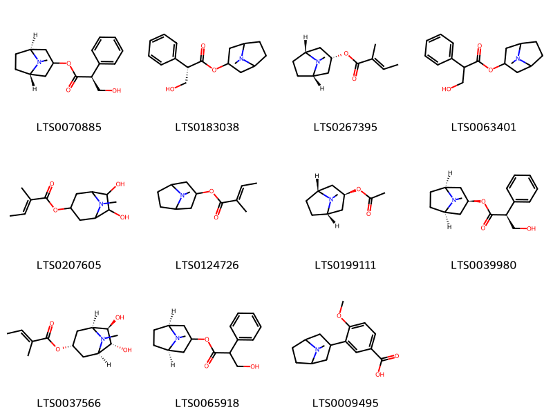{ width=100% }
    <figcaption>Hình ảnh cấu trúc hóa học của 11 hoạt chất thuộc nhóm Tropane alkaloids gồm ['(1s,5s)-8-methyl-8-azabicyclo[3.2.1]octan-3-yl (2s)-3-hydroxy-2-phenylpropanoate (LTS0070885)', 'hyoscyamine (LTS0183038)', 'tropigline (LTS0267395)', '()-hyoscyamine (LTS0063401)', '6,7-dihydroxy-8-methyl-8-azabicyclo[3.2.1]octan-3-yl 2-methylbut-2-enoate (LTS0207605)', '8-methyl-8-azabicyclo[3.2.1]octan-3-yl 2-methylbut-2-enoate (LTS0124726)', 'acetyltropine (LTS0199111)', 'hyoscyamine (LTS0039980)', '(1r,3s,5s,6r,7r)-6,7-dihydroxy-8-methyl-8-azabicyclo[3.2.1]octan-3-yl (2e)-2-methylbut-2-enoate (LTS0037566)', 'atropine (LTS0065918)', '4-methoxy-3-{8-methyl-8-azabicyclo[3.2.1]octan-3-yl}benzoic acid (LTS0009495)'].</figcaption>
</figure>

---

### Dược dân tộc học

Danh sách các quốc gia có sử dụng *Datura metel* trong điều trị các bệnh. 

| Country         | Disease                                    | Bệnh                                                         |
|:----------------|:-------------------------------------------|:-------------------------------------------------------------|
| Africa(Swahili) | Intoxicant, Poison                         | Intoxicant, Poison                                           |
| China           | Poison, Anesthetic                         | Chất độc, gây mê                                             |
| Elsewhere       | Analgesic, Bronchodilator                  | Thuốc giảm đau, thuốc giãn phế quản                          |
| India           | Expectorant, Sedative, Narcotic, Demulcent | Thuốc long đờm, Thuốc an thần, Thuốc gây ngủ, Thuốc giảm đau |
| Java            | Vermifuge                                  | Thuốc diệt sán                                               |
| Sudan           | Poison                                     | Chất độc                                                     |
| Turkey          | Poison, Sedative, Narcotic                 | Chất độc, Thuốc an thần, Ma túy                              |
| ain             | Hypnotic                                   | Thuốc ngủ                                                    |

---

---
## Datura meteloides
### Thông tin về thực vật

!!! info "Phân loại thực vật của *Datura innoxia* từ GIBF:"
    - **Kingdom:** Plantae
    - **Phylum:** Tracheophyta
    - **Order:** Solanales
    - **Family:** Solanaceae
    - **Genus:** Datura
    - **Species:** *Datura innoxia*

 

| Label (VI)   | Label (EN)   | Scientific Name   | Descriptions (VI)   | Descriptions (EN)   | Also Known As (VI)   | Also Known As (EN)   |
|:-------------|:-------------|:------------------|:--------------------|:--------------------|:---------------------|:---------------------|
| N/A          | N/A          | Datura meteloides |                     |                     | ['']                 | ['']                 |

#### Phân bố trên thế giới

**Từ CSDL GIBF** nan, Japan, Korea, Republic of, Brazil, United States of America, Mexico, Canada

#### Phân bố tại Việt Nam

**Từ CSDL GIBF**: Không có ghi nhận ở Việt Nam

---
### Thành phần hóa học
        
- Theo cơ sở dữ liệu lotus: Từ loài *Datura innoxia* đã phân lập và xác định được Chưa có hoạt chất nào được phân lập. hoạt chất thuộc về các nhóm Không có hoạt chất nào được phân lập. 

Không có hình ảnh nào được tạo ra

---

### Dược dân tộc học

Danh sách các quốc gia có sử dụng *Datura innoxia* trong điều trị các bệnh. 

| Country        | Disease              | Bệnh                        |
|:---------------|:---------------------|:----------------------------|
| US(Amerindian) | Narcotic, Intoxicant | Chất gây nghiện, Intoxicant |
| Venezuela      | Narcotic, Poison     | Chất gây nghiện, Chất độc   |

---

---
## Datura sanguinea
### Thông tin về thực vật

!!! info "Phân loại thực vật của *Brugmansia sanguinea* từ GIBF:"
    - **Kingdom:** Plantae
    - **Phylum:** Tracheophyta
    - **Order:** Solanales
    - **Family:** Solanaceae
    - **Genus:** Brugmansia
    - **Species:** *Brugmansia sanguinea*

 

| Label (VI)   | Label (EN)   | Scientific Name   | Descriptions (VI)   | Descriptions (EN)   | Also Known As (VI)   | Also Known As (EN)   |
|:-------------|:-------------|:------------------|:--------------------|:--------------------|:---------------------|:---------------------|
| N/A          | N/A          | Datura sanguinea  | loài thực vật       | species of plant    | ['']                 | ['']                 |

#### Phân bố trên thế giới

**Từ CSDL GIBF** nan, Ecuador, Puerto Rico, Saint Barthélemy, Colombia, Brazil, Spain, Bolivia (Plurinational State of), unknown or invalid, Morocco, United States of America, Peru, Chile, Mexico, Venezuela (Bolivarian Republic of)

#### Phân bố tại Việt Nam

**Từ CSDL GIBF**: Không có ghi nhận ở Việt Nam

---
### Thành phần hóa học
        
- Theo cơ sở dữ liệu lotus: Từ loài *Brugmansia sanguinea* đã phân lập và xác định được Chưa có hoạt chất nào được phân lập. hoạt chất thuộc về các nhóm Không có hoạt chất nào được phân lập. 

Không có hình ảnh nào được tạo ra

---

### Dược dân tộc học

Danh sách các quốc gia có sử dụng *Brugmansia sanguinea* trong điều trị các bệnh. 

| Country   | Disease   | Bệnh                  |
|:----------|:----------|:----------------------|
| India     | Narcotic  | Thuốc gây ngủ, gây mê |

---

---
## Datura stramonium
### Thông tin về thực vật

!!! info "Phân loại thực vật của *Datura stramonium* từ GIBF:"
    - **Kingdom:** Plantae
    - **Phylum:** Tracheophyta
    - **Order:** Solanales
    - **Family:** Solanaceae
    - **Genus:** Datura
    - **Species:** *Datura stramonium*

 

| Label (VI)   | Label (EN)   | Scientific Name   | Descriptions (VI)   | Descriptions (EN)   | Also Known As (VI)   | Also Known As (EN)                                                                                                                                                                                                        |
|:-------------|:-------------|:------------------|:--------------------|:--------------------|:---------------------|:--------------------------------------------------------------------------------------------------------------------------------------------------------------------------------------------------------------------------|
| N/A          | N/A          | Datura stramonium | loài thực vật       | species of plant    | ['']                 | ['Datura tatula', "Devil's snare", 'Devil’s cucumber', 'Devil’s trumpet', 'Devil’s weed', "Hell's bells", 'Jamestown weed', 'Locoweed', 'Malpitte', 'Moon flower', 'Pricklyburr', 'Stinkweed', 'Thornapple', 'Tolguacha'] |

#### Phân bố trên thế giới

**Từ CSDL GIBF** Italy, Australia, Belgium, Slovakia, Argentina, Rwanda, Israel, Canada, Yemen, Ukraine, Denmark, Netherlands, Chinese Taipei, Spain, Hungary, Portugal, Russian Federation, United States of America, Sweden, Chile, South Africa, Uganda, Germany, Switzerland, Mexico, France, Austria, Peru, Dominican Republic, United Kingdom of Great Britain and Northern Ireland, China, Ecuador, Colombia, Serbia, Kenya, New Zealand, Ethiopia

#### Phân bố tại Việt Nam

**Từ CSDL GIBF**: Không có ghi nhận ở Việt Nam

---
### Thành phần hóa học
        
- Theo cơ sở dữ liệu lotus: Từ loài *Datura stramonium* đã phân lập và xác định được 136 hoạt chất thuộc về các nhóm Fatty Acyls, Flavonoids, Prenol lipids, Steroids and steroid derivatives, Organonitrogen compounds, Piperidines, Benzene and substituted derivatives, Hydroxy acids and derivatives, Tropane alkaloids, Oxazinanes, Phenol esters, Oxazepines, Carboxylic acids and derivatives, Pyridines and derivatives. 

|    | chemicalTaxonomyClassyfireClass     |   smiles_count |
|---:|:------------------------------------|---------------:|
|  0 |                                     |              4 |
|  1 | Benzene and substituted derivatives |              4 |
|  2 | Carboxylic acids and derivatives    |              3 |
|  3 | Fatty Acyls                         |              8 |
|  4 | Flavonoids                          |              6 |
|  5 | Hydroxy acids and derivatives       |              9 |
|  6 | Organonitrogen compounds            |              1 |
|  7 | Oxazepines                          |              2 |
|  8 | Oxazinanes                          |              4 |
|  9 | Phenol esters                       |              1 |
| 10 | Piperidines                         |              2 |
| 11 | Prenol lipids                       |              4 |
| 12 | Pyridines and derivatives           |              1 |
| 13 | Steroids and steroid derivatives    |             23 |
| 14 | Tropane alkaloids                   |             64 |

#### Nhóm 
<figure markdown="span">
    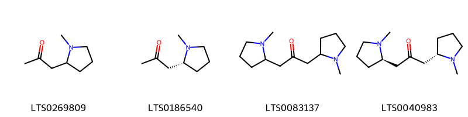{ width=100% }
    <figcaption>Hình ảnh cấu trúc hóa học của 4 hoạt chất thuộc nhóm  gồm ['hygrine (LTS0269809)', '(+)-hygrine (LTS0186540)', 'cuskhygrine (LTS0083137)', 'cuscohygrine (LTS0040983)'].</figcaption>
</figure>
#### Nhóm Benzene and substituted derivatives
<figure markdown="span">
    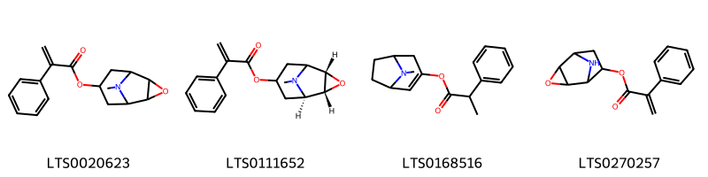{ width=100% }
    <figcaption>Hình ảnh cấu trúc hóa học của 4 hoạt chất thuộc nhóm Benzene and substituted derivatives gồm ['aposcopolamine (LTS0020623)', '(1r,2r,4s)-9-methyl-3-oxa-9-azatricyclo[3.3.1.0²,⁴]nonan-7-yl 2-phenylprop-2-enoate (LTS0111652)', '8-methyl-8-azabicyclo[3.2.1]oct-2-en-3-yl 2-phenylpropanoate (LTS0168516)', '3-oxa-8-azatricyclo[3.2.1.0²,⁴]octan-6-yl 2-phenylprop-2-enoate (LTS0270257)'].</figcaption>
</figure>
#### Nhóm Carboxylic acids and derivatives
<figure markdown="span">
    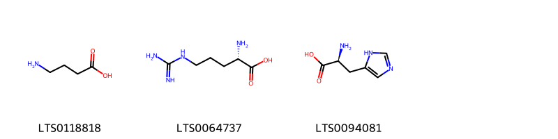{ width=100% }
    <figcaption>Hình ảnh cấu trúc hóa học của 3 hoạt chất thuộc nhóm Carboxylic acids and derivatives gồm ['gamma(amino)-butyric acid (LTS0118818)', 'l-arginine (LTS0064737)', 'l-histidine (LTS0094081)'].</figcaption>
</figure>
#### Nhóm Fatty Acyls
<figure markdown="span">
    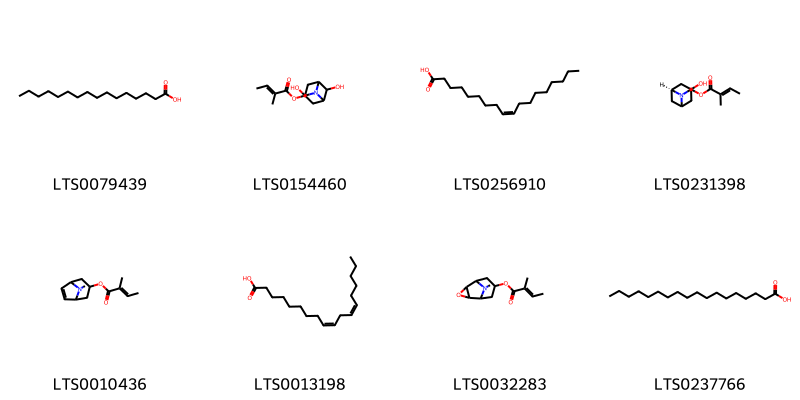{ width=100% }
    <figcaption>Hình ảnh cấu trúc hóa học của 8 hoạt chất thuộc nhóm Fatty Acyls gồm ['palmitic acid (LTS0079439)', '7-hydroxy-6-(hydroxymethyl)-6-azabicyclo[3.1.1]heptan-3-yl (2e)-2-methylbut-2-enoate (LTS0154460)', 'oleic acid (LTS0256910)', '[(1s)-3-hydroxy-6-azabicyclo[3.1.1]heptan-6-yl]methyl (2e)-2-methylbut-2-enoate (LTS0231398)', '8-methyl-8-azabicyclo[3.2.1]oct-6-en-3-yl (2e)-2-methylbut-2-enoate (LTS0010436)', 'linoleic (LTS0013198)', '9-methyl-3-oxa-9-azatricyclo[3.3.1.0²,⁴]nonan-7-yl (2e)-2-methylbut-2-enoate (LTS0032283)', 'stearic acid (LTS0237766)'].</figcaption>
</figure>
#### Nhóm Flavonoids
<figure markdown="span">
    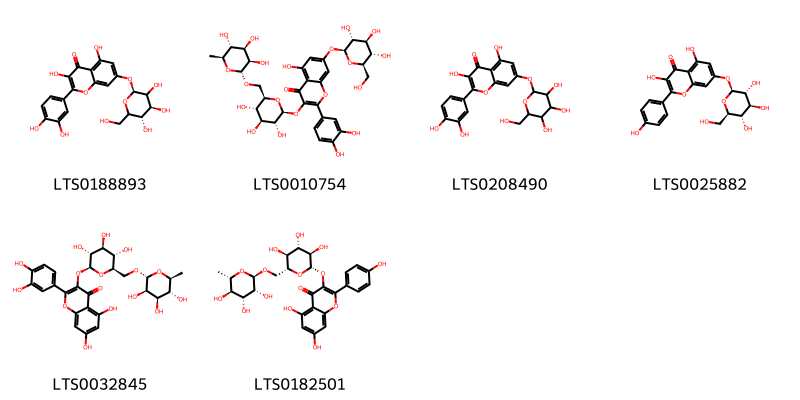{ width=100% }
    <figcaption>Hình ảnh cấu trúc hóa học của 6 hoạt chất thuộc nhóm Flavonoids gồm ['quercimeritrin (LTS0188893)', '2-(3,4-dihydroxyphenyl)-5-hydroxy-7-{[(2s,3r,4s,5s,6r)-3,4,5-trihydroxy-6-(hydroxymethyl)oxan-2-yl]oxy}-3-{[(2s,3r,4s,5s,6r)-3,4,5-trihydroxy-6-({[(2r,3r,4r,5r,6s)-3,4,5-trihydroxy-6-methyloxan-2-yl]oxy}methyl)oxan-2-yl]oxy}chromen-4-one (LTS0010754)', 'quercimeritrin (LTS0208490)', 'kaempferol 7-o-glucoside (LTS0025882)', '3-rutinosyl quercetin (LTS0032845)', 'nictoflorin (LTS0182501)'].</figcaption>
</figure>
#### Nhóm Hydroxy acids and derivatives
<figure markdown="span">
    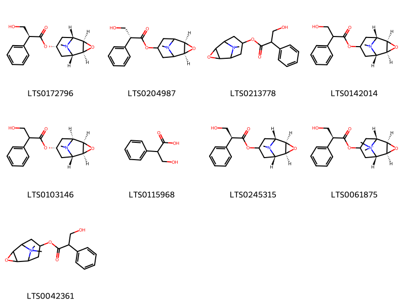{ width=100% }
    <figcaption>Hình ảnh cấu trúc hóa học của 9 hoạt chất thuộc nhóm Hydroxy acids and derivatives gồm ['scopolamine (LTS0172796)', '(2r,4s)-9-methyl-3-oxa-9-azatricyclo[3.3.1.0²,⁴]nonan-7-yl (2r)-3-hydroxy-2-phenylpropanoate (LTS0204987)', 'buscopan (LTS0213778)', '(1r,2r,4s,5s)-9-methyl-3-oxa-9-azatricyclo[3.3.1.0²,⁴]nonan-7-yl 3-hydroxy-2-phenylpropanoate (LTS0142014)', '(1s,2r,4s,5s,7r)-9-methyl-3-oxa-9-azatricyclo[3.3.1.0²,⁴]nonan-7-yl 3-hydroxy-2-phenylpropanoate (LTS0103146)', '(+-)-tropic acid (LTS0115968)', '(1r,2r,4s,5s)-9-methyl-3-oxa-9-azatricyclo[3.3.1.0²,⁴]nonan-7-yl (2s)-3-hydroxy-2-phenylpropanoate (LTS0245315)', 'n-methyl scopolamine (LTS0061875)', 'pamine (LTS0042361)'].</figcaption>
</figure>
#### Nhóm Organonitrogen compounds
<figure markdown="span">
    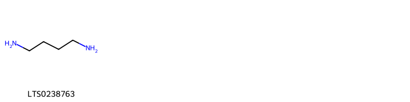{ width=100% }
    <figcaption>Hình ảnh cấu trúc hóa học của 1 hoạt chất thuộc nhóm Organonitrogen compounds gồm ['putrescine (LTS0238763)'].</figcaption>
</figure>
#### Nhóm Oxazepines
<figure markdown="span">
    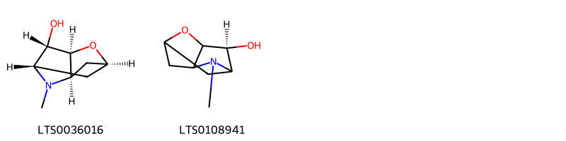{ width=100% }
    <figcaption>Hình ảnh cấu trúc hóa học của 2 hoạt chất thuộc nhóm Oxazepines gồm ['(1s,3s,4s,5s,7r)-6-methyl-2-oxa-6-azatricyclo[3.3.1.0³,⁷]nonan-4-ol (LTS0036016)', 'scopoline (LTS0108941)'].</figcaption>
</figure>
#### Nhóm Oxazinanes
<figure markdown="span">
    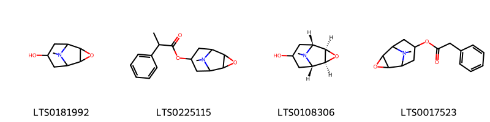{ width=100% }
    <figcaption>Hình ảnh cấu trúc hóa học của 4 hoạt chất thuộc nhóm Oxazinanes gồm ['9-methyl-3-oxa-9-azatricyclo[3.3.1.0²,⁴]nonan-7-ol (LTS0181992)', '9-methyl-3-oxa-9-azatricyclo[3.3.1.0²,⁴]nonan-7-yl 2-phenylpropanoate (LTS0225115)', 'scopine (LTS0108306)', '9-methyl-3-oxa-9-azatricyclo[3.3.1.0²,⁴]nonan-7-yl 2-phenylacetate (LTS0017523)'].</figcaption>
</figure>
#### Nhóm Phenol esters
<figure markdown="span">
    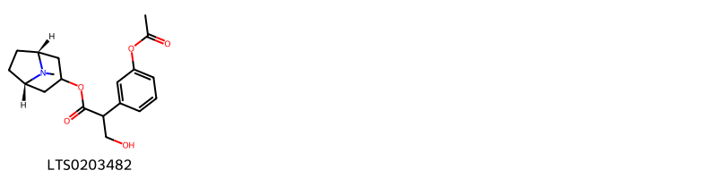{ width=100% }
    <figcaption>Hình ảnh cấu trúc hóa học của 1 hoạt chất thuộc nhóm Phenol esters gồm ['(1r,5s)-8-methyl-8-azabicyclo[3.2.1]octan-3-yl 2-[3-(acetyloxy)phenyl]-3-hydroxypropanoate (LTS0203482)'].</figcaption>
</figure>
#### Nhóm Piperidines
<figure markdown="span">
    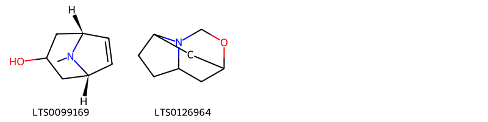{ width=100% }
    <figcaption>Hình ảnh cấu trúc hóa học của 2 hoạt chất thuộc nhóm Piperidines gồm ['(1r,5s)-8-methyl-8-azabicyclo[3.2.1]oct-6-en-3-ol (LTS0099169)', '9-oxa-7-azatricyclo[4.3.1.0³,⁷]decane (LTS0126964)'].</figcaption>
</figure>
#### Nhóm Prenol lipids
<figure markdown="span">
    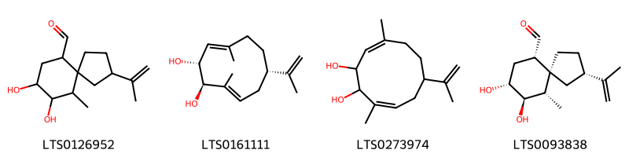{ width=100% }
    <figcaption>Hình ảnh cấu trúc hóa học của 4 hoạt chất thuộc nhóm Prenol lipids gồm ['8,9-dihydroxy-10-methyl-2-(prop-1-en-2-yl)spiro[4.5]decane-6-carbaldehyde (LTS0126952)', '(1r,2r,3e,6s,9e)-3,9-dimethyl-6-(prop-1-en-2-yl)cyclodeca-3,9-diene-1,2-diol (LTS0161111)', '3,9-dimethyl-6-(prop-1-en-2-yl)cyclodeca-3,9-diene-1,2-diol (LTS0273974)', '(2s,5s,6s,8r,9r,10s)-8,9-dihydroxy-10-methyl-2-(prop-1-en-2-yl)spiro[4.5]decane-6-carbaldehyde (LTS0093838)'].</figcaption>
</figure>
#### Nhóm Pyridines and derivatives
<figure markdown="span">
    { width=100% }
    <figcaption>Hình ảnh cấu trúc hóa học của 1 hoạt chất thuộc nhóm Pyridines and derivatives gồm ['niacin (LTS0216673)'].</figcaption>
</figure>
#### Nhóm Steroids and steroid derivatives
<figure markdown="span">
    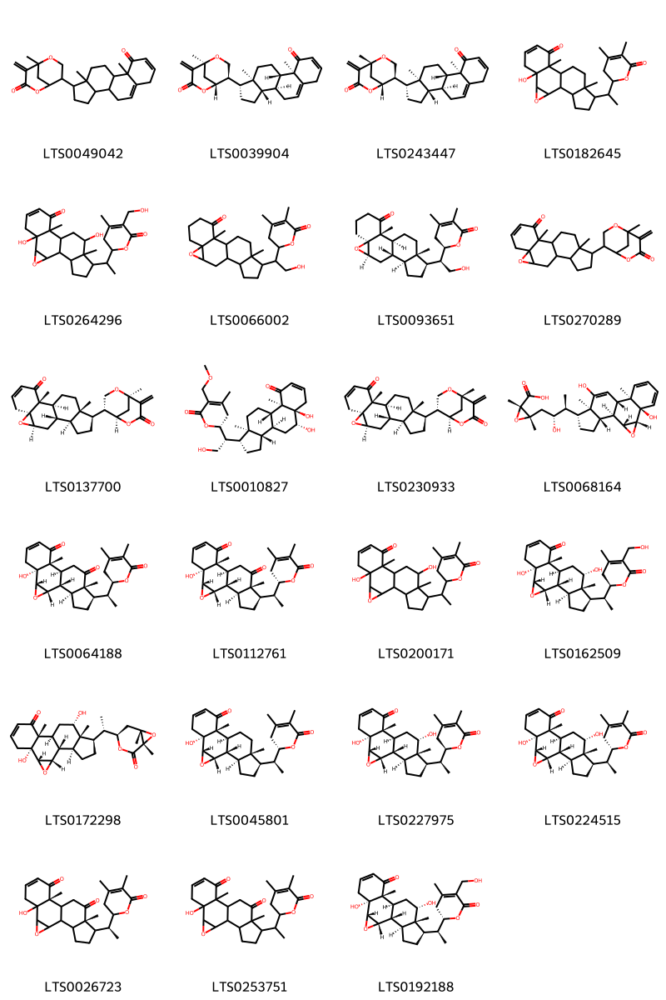{ width=100% }
    <figcaption>Hình ảnh cấu trúc hóa học của 23 hoạt chất thuộc nhóm Steroids and steroid derivatives gồm ['8-{9a,11a-dimethyl-9-oxo-1h,2h,3h,3ah,3bh,4h,6h,9bh,10h,11h-cyclopenta[a]phenanthren-1-yl}-5-methyl-4-methylidene-2,6-dioxabicyclo[3.3.1]nonan-3-one (LTS0049042)', '(1r,5s,8r)-8-[(1r,3as,3bs,9ar,9bs,11as)-9a,11a-dimethyl-9-oxo-1h,2h,3h,3ah,3bh,4h,6h,9bh,10h,11h-cyclopenta[a]phenanthren-1-yl]-5-methyl-4-methylidene-2,6-dioxabicyclo[3.3.1]nonan-3-one (LTS0039904)', '(1r,5r,8r)-8-[(1r,3as,3bs,9ar,9bs,11as)-9a,11a-dimethyl-9-oxo-1h,2h,3h,3ah,3bh,4h,6h,9bh,10h,11h-cyclopenta[a]phenanthren-1-yl]-5-methyl-4-methylidene-2,6-dioxabicyclo[3.3.1]nonan-3-one (LTS0243447)', '15-[1-(4,5-dimethyl-6-oxo-2,3-dihydropyran-2-yl)ethyl]-5-hydroxy-10,14-dimethyl-3-oxapentacyclo[9.7.0.0²,⁴.0⁵,¹⁰.0¹⁴,¹⁸]octadec-7-en-9-one (LTS0182645)', '5,13-dihydroxy-15-{1-[5-(hydroxymethyl)-4-methyl-6-oxo-2,3-dihydropyran-2-yl]ethyl}-10,14-dimethyl-3-oxapentacyclo[9.7.0.0²,⁴.0⁵,¹⁰.0¹⁴,¹⁸]octadec-7-en-9-one (LTS0264296)', '15-[1-(4,5-dimethyl-6-oxo-2,3-dihydropyran-2-yl)-2-hydroxyethyl]-2,16-dimethyl-8-oxapentacyclo[9.7.0.0²,⁷.0⁷,⁹.0¹²,¹⁶]octadecan-3-one (LTS0066002)', '(1s,2r,7s,9r,11s,12s,15r,16s)-15-[(1r)-1-[(2r)-4,5-dimethyl-6-oxo-2,3-dihydropyran-2-yl]-2-hydroxyethyl]-2,16-dimethyl-8-oxapentacyclo[9.7.0.0²,⁷.0⁷,⁹.0¹²,¹⁶]octadecan-3-one (LTS0093651)', '2,16-dimethyl-15-{1-methyl-8-methylidene-7-oxo-2,6-dioxabicyclo[3.3.1]nonan-4-yl}-8-oxapentacyclo[9.7.0.0²,⁷.0⁷,⁹.0¹²,¹⁶]octadec-4-en-3-one (LTS0270289)', '(1s,2r,7s,9r,11s,12s,15r,16s)-2,16-dimethyl-15-[(1r,4r,5r)-1-methyl-8-methylidene-7-oxo-2,6-dioxabicyclo[3.3.1]nonan-4-yl]-8-oxapentacyclo[9.7.0.0²,⁷.0⁷,⁹.0¹²,¹⁶]octadec-4-en-3-one (LTS0137700)', '(6r)-6-[(1r)-1-[(1r,3as,3bs,5r,5ar,9ar,9bs,11as)-5,5a-dihydroxy-9a,11a-dimethyl-9-oxo-1h,2h,3h,3ah,3bh,4h,5h,6h,9bh,10h,11h-cyclopenta[a]phenanthren-1-yl]-2-hydroxyethyl]-3-(methoxymethyl)-4-methyl-5,6-dihydropyran-2-one (LTS0010827)', '(1s,2r,7s,9r,11s,12s,15r,16s)-2,16-dimethyl-15-[(1s,4r,5r)-1-methyl-8-methylidene-7-oxo-2,6-dioxabicyclo[3.3.1]nonan-4-yl]-8-oxapentacyclo[9.7.0.0²,⁷.0⁷,⁹.0¹²,¹⁶]octadec-4-en-3-one (LTS0230933)', '(2s,3s)-3-[(2r,3s)-3-[(1s,2r,4r,5r,10r,11r,14r,15r,18s)-5,13-dihydroxy-10,14-dimethyl-3-oxapentacyclo[9.7.0.0²,⁴.0⁵,¹⁰.0¹⁴,¹⁸]octadeca-6,8,12-trien-15-yl]-2-hydroxybutyl]-2,3-dimethyloxirane-2-carboxylic acid (LTS0068164)', '(1s,2s,4s,5r,10r,11s,14r,15r,18s)-15-[(1s)-1-[(2r)-4,5-dimethyl-6-oxo-2,3-dihydropyran-2-yl]ethyl]-5-hydroxy-10,14-dimethyl-3-oxapentacyclo[9.7.0.0²,⁴.0⁵,¹⁰.0¹⁴,¹⁸]octadec-7-ene-9,13-dione (LTS0064188)', '(1s,2s,4s,5r,10r,11s,14r,15r,18s)-15-[(1s)-1-[(2s)-4,5-dimethyl-6-oxo-2,3-dihydropyran-2-yl]ethyl]-5-hydroxy-10,14-dimethyl-3-oxapentacyclo[9.7.0.0²,⁴.0⁵,¹⁰.0¹⁴,¹⁸]octadec-7-ene-9,13-dione (LTS0112761)', '15-[1-(4,5-dimethyl-6-oxo-2,3-dihydropyran-2-yl)ethyl]-5,13-dihydroxy-10,14-dimethyl-3-oxapentacyclo[9.7.0.0²,⁴.0⁵,¹⁰.0¹⁴,¹⁸]octadec-7-en-9-one (LTS0200171)', 'withastramonolide (LTS0162509)', '(1s,2s,4s,5r,10r,11s,13s,14r,15r,18s)-15-[(1s)-1-[(1s,4r,6s)-1,6-dimethyl-2-oxo-3,7-dioxabicyclo[4.1.0]heptan-4-yl]ethyl]-5,13-dihydroxy-10,14-dimethyl-3-oxapentacyclo[9.7.0.0²,⁴.0⁵,¹⁰.0¹⁴,¹⁸]octadec-7-en-9-one (LTS0172298)', '(1s,2s,4s,5r,10r,11s,14r,15r,18s)-15-[(1s)-1-[(2s)-4,5-dimethyl-6-oxo-2,3-dihydropyran-2-yl]ethyl]-5-hydroxy-10,14-dimethyl-3-oxapentacyclo[9.7.0.0²,⁴.0⁵,¹⁰.0¹⁴,¹⁸]octadec-7-en-9-one (LTS0045801)', '(1s,2s,4s,5r,10r,11s,13s,14r,15r,18s)-15-[(1s)-1-[(2r)-4,5-dimethyl-6-oxo-2,3-dihydropyran-2-yl]ethyl]-5,13-dihydroxy-10,14-dimethyl-3-oxapentacyclo[9.7.0.0²,⁴.0⁵,¹⁰.0¹⁴,¹⁸]octadec-7-en-9-one (LTS0227975)', '(1s,2s,4s,5r,10r,11s,13s,14r,15r,18s)-15-[(1s)-1-[(2s)-4,5-dimethyl-6-oxo-2,3-dihydropyran-2-yl]ethyl]-5,13-dihydroxy-10,14-dimethyl-3-oxapentacyclo[9.7.0.0²,⁴.0⁵,¹⁰.0¹⁴,¹⁸]octadec-7-en-9-one (LTS0224515)', '(10r,14r)-15-[(1s)-1-(4,5-dimethyl-6-oxo-2,3-dihydropyran-2-yl)ethyl]-5-hydroxy-10,14-dimethyl-3-oxapentacyclo[9.7.0.0²,⁴.0⁵,¹⁰.0¹⁴,¹⁸]octadec-7-ene-9,13-dione (LTS0026723)', '15-[1-(4,5-dimethyl-6-oxo-2,3-dihydropyran-2-yl)ethyl]-5-hydroxy-10,14-dimethyl-3-oxapentacyclo[9.7.0.0²,⁴.0⁵,¹⁰.0¹⁴,¹⁸]octadec-7-ene-9,13-dione (LTS0253751)', '(1s,2s,4s,5r,10r,11s,13s,14r,15r,18s)-5,13-dihydroxy-15-[(1s)-1-[(2s)-5-(hydroxymethyl)-4-methyl-6-oxo-2,3-dihydropyran-2-yl]ethyl]-10,14-dimethyl-3-oxapentacyclo[9.7.0.0²,⁴.0⁵,¹⁰.0¹⁴,¹⁸]octadec-7-en-9-one (LTS0192188)'].</figcaption>
</figure>
#### Nhóm Tropane alkaloids
<figure markdown="span">
    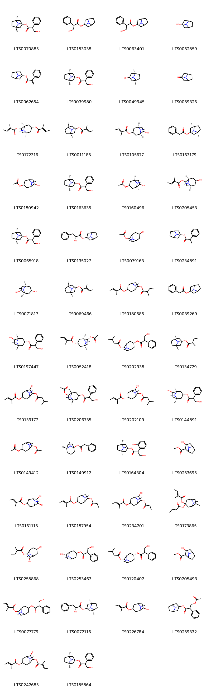{ width=100% }
    <figcaption>Hình ảnh cấu trúc hóa học của 64 hoạt chất thuộc nhóm Tropane alkaloids gồm ['(1s,5s)-8-methyl-8-azabicyclo[3.2.1]octan-3-yl (2s)-3-hydroxy-2-phenylpropanoate (LTS0070885)', 'hyoscyamine (LTS0183038)', '()-hyoscyamine (LTS0063401)', 'tropin (LTS0052859)', 'apoatropine (LTS0062654)', 'hyoscyamine (LTS0039980)', '(1r,5r)-8-methyl-8-azabicyclo[3.2.1]octan-3-ol (LTS0049945)', 'tropanone (LTS0059326)', '(1s,3r,5r,6s)-8-methyl-3-{[(2e)-2-methylbut-2-enoyl]oxy}-8-azabicyclo[3.2.1]octan-6-yl (2e)-2-methylbut-2-enoate (LTS0172316)', '(1r,3r,5s)-8-methyl-8-azabicyclo[3.2.1]octan-3-yl (2e)-2-methylbut-2-enoate (LTS0011185)', '(1r,5r)-6-hydroxy-8-methyl-8-azabicyclo[3.2.1]octan-3-yl (2e)-2-methylbut-2-enoate (LTS0105677)', '(1r,5s)-8-methyl-8-azabicyclo[3.2.1]octan-3-yl 2-phenylacetate (LTS0163179)', '6-hydroxy-8-methyl-8-azabicyclo[3.2.1]octan-3-yl acetate (LTS0180942)', 'hyoscyamine, its salts and derivatives (LTS0163635)', '(1r,5r)-6-hydroxy-8-methyl-8-azabicyclo[3.2.1]octan-3-yl acetate (LTS0160496)', '(1s,5r)-3-hydroxy-8-methyl-8-azabicyclo[3.2.1]octan-6-yl (2e)-2-methylbut-2-enoate (LTS0205453)', 'atropine (LTS0065918)', 'littorine (LTS0135027)', '3-hydroxy-8-methyl-8-azabicyclo[3.2.1]octan-6-yl acetate (LTS0079163)', '8-methyl-8-azabicyclo[3.2.1]octan-3-yl 2-phenylpropanoate (LTS0234891)', '(1r,5s)-8-methyl-8-azabicyclo[3.2.1]octane-3,6-diol (LTS0071817)', '(1r,5s)-8-methyl-8-azabicyclo[3.2.1]octan-3-yl (2e)-2-methylbut-2-enoate (LTS0069466)', '8-methyl-6-[(2-methylbutanoyl)oxy]-8-azabicyclo[3.2.1]octan-3-yl (2e)-2-methylbut-2-enoate (LTS0180585)', '8-methyl-8-azabicyclo[3.2.1]octan-3-yl 2-phenylacetate (LTS0039269)', '(1s,3r,5s,6r)-6-hydroxy-8-methyl-8-azabicyclo[3.2.1]octan-3-yl 3-hydroxy-2-phenylpropanoate (LTS0197447)', '(1r,3s,5s,6r)-6-(acetyloxy)-8-methyl-8-azabicyclo[3.2.1]octan-3-yl (2e)-2-methylbut-2-enoate (LTS0052418)', '(3s,6s)-3-[(3-hydroxy-2-phenylpropanoyl)oxy]-8-methyl-8-azabicyclo[3.2.1]octan-6-yl 3-methylbutanoate (LTS0202938)', '(1r,5s)-8-methyl-8-azabicyclo[3.2.1]octan-3-yl 2-methylbutanoate (LTS0134729)', '(3s)-6-hydroxy-8-methyl-7-[(3-methylbutanoyl)oxy]-8-azabicyclo[3.2.1]octan-3-yl (2e)-2-methylbut-2-enoate (LTS0139177)', '(1r,5s)-6-(acetyloxy)-8-methyl-8-azabicyclo[3.2.1]octan-3-yl 3-hydroxy-2-phenylpropanoate (LTS0206735)', '(3r)-6-hydroxy-8-methyl-7-[(3-methylbutanoyl)oxy]-8-azabicyclo[3.2.1]octan-3-yl (2e)-2-methylbut-2-enoate (LTS0202109)', '(1r,5r)-6-hydroxy-8-methyl-8-azabicyclo[3.2.1]octan-3-yl 3-hydroxy-2-phenylpropanoate (LTS0144891)', '3-(acetyloxy)-8-methyl-8-azabicyclo[3.2.1]octan-6-yl acetate (LTS0149412)', '(1r,5r)-8-methyl-8-azabicyclo[3.2.1]octan-1-yl 2-phenylacetate (LTS0149912)', '(1r,5s)-8-methyl-8-azabicyclo[3.2.1]octan-3-yl 3-hydroxy-2-(2-hydroxyphenyl)propanoate (LTS0164304)', 'methyl 3-hydroxy-8-methyl-8-azabicyclo[3.2.1]octane-2-carboxylate (LTS0253695)', '6,7-dihydroxy-8-methyl-8-azabicyclo[3.2.1]octan-3-yl (2e)-2-methylbut-2-enoate (LTS0161115)', '8-methyl-6-(propanoyloxy)-8-azabicyclo[3.2.1]octan-3-yl (2e)-2-methylbut-2-enoate (LTS0187954)', '6-hydroxy-8-methyl-7-(propanoyloxy)-8-azabicyclo[3.2.1]octan-3-yl (2e)-2-methylbut-2-enoate (LTS0234201)', '3-(butanoyloxy)-6,8-dimethyl-8-azabicyclo[3.2.1]octan-3-yl (2e)-2-methylbut-2-enoate (LTS0173865)', '3,7-dihydroxy-8-methyl-8-azabicyclo[3.2.1]octan-6-yl 2-methylbutanoate (LTS0258868)', 'anisodamine (LTS0253463)', '(3r,6s)-3-[(3-hydroxy-2-phenylpropanoyl)oxy]-8-methyl-8-azabicyclo[3.2.1]octan-6-yl 3-methylbutanoate (LTS0120402)', 'methyl (2r)-3-hydroxy-8-methyl-8-azabicyclo[3.2.1]octane-2-carboxylate (LTS0205493)', '3-[(3-hydroxy-2-phenylpropanoyl)oxy]-8-methyl-8-azabicyclo[3.2.1]octan-6-yl (2e)-2-methylbut-2-enoate (LTS0077779)', '(1r,5s)-8-methyl-8-azabicyclo[3.2.1]octan-3-yl (2r)-2-hydroxy-3-phenylpropanoate (LTS0072116)', '6-hydroxy-8-methyl-8-azabicyclo[3.2.1]octan-3-yl (2e)-2-methylbut-2-enoate (LTS0226784)', '8-methyl-8-azabicyclo[3.2.1]octan-3-yl 3-(acetyloxy)-2-phenylpropanoate (LTS0259332)', '7-hydroxy-8-methyl-3-{[(2e)-2-methylbut-2-enoyl]oxy}-8-azabicyclo[3.2.1]octan-6-yl (2e)-2-methylbut-2-enoate (LTS0242685)', 'atropine (LTS0185864)', '(1r,5s)-8-methyl-8-azabicyclo[3.2.1]octan-3-yl acetate (LTS0275908)', '8-methyl-8-azabicyclo[3.2.1]octan-3-yl 3-hydroxy-2-(3-methoxyphenyl)propanoate (LTS0065903)', '(1s,5s)-6-hydroxy-8-methyl-8-azabicyclo[3.2.1]octan-3-yl 2-phenylacetate (LTS0052201)', '(1s,5r)-3-[(3-hydroxy-2-phenylpropanoyl)oxy]-8-methyl-8-azabicyclo[3.2.1]octan-6-yl (2e)-2-methylbut-2-enoate (LTS0068059)', '(1r,5s)-8-methyl-8-azabicyclo[3.2.1]octan-3-ol (LTS0273235)', '(1r,3s,5s,6r)-3-hydroxy-8-methyl-8-azabicyclo[3.2.1]octan-6-yl (2e)-2-methylbut-2-enoate (LTS0014159)', '8-methyl-6-[(2-methylpropanoyl)oxy]-8-azabicyclo[3.2.1]octan-3-yl 3-hydroxy-2-phenylpropanoate (LTS0010569)', '6-hydroxy-8-methyl-8-azabicyclo[3.2.1]octan-3-yl 2-phenylprop-2-enoate (LTS0014396)', '3,7-dihydroxy-8-methyl-8-azabicyclo[3.2.1]octan-6-yl propanoate (LTS0229317)', '6-hydroxy-8-methyl-7-[(2-methylpropanoyl)oxy]-8-azabicyclo[3.2.1]octan-3-yl (2e)-2-methylbut-2-enoate (LTS0095691)', '8-methyl-6-[(2-methylpropanoyl)oxy]-8-azabicyclo[3.2.1]octan-3-yl (2e)-2-methylbut-2-enoate (LTS0112244)', '(1r,5s)-8-methyl-8-azabicyclo[3.2.1]octan-3-yl 2-hydroxyacetate (LTS0136956)', '(1r,5s)-3-hydroxy-8-methyl-8-azabicyclo[3.2.1]octan-6-yl 2-methylpropanoate (LTS0046565)', '(1s,5r)-1-(butanoyloxy)-6,8-dimethyl-8-azabicyclo[3.2.1]octan-3-yl (2e)-2-methylbut-2-enoate (LTS0271478)'].</figcaption>
</figure>

---

### Dược dân tộc học

Danh sách các quốc gia có sử dụng *Datura stramonium* trong điều trị các bệnh. 

| Country            | Disease                                                | Bệnh                                                  |
|:-------------------|:-------------------------------------------------------|:------------------------------------------------------|
| China              | Anesthetic, Hallucinogen, Hypnotic, Narcotic, Narcotic | Gây mê, gây ảo giác, thôi miên, gây mê, gây mê        |
| Dominican Republic | Narcotic, Poison                                       | Chất gây nghiện, Chất độc                             |
| Elsewhere          | Demulcent, Mydriatic, Narcotic                         | Demulcent, Mydriatic, Narcotic                        |
| Ethiopia           | Fungicide, Intoxicant, Poison                          | Thuốc diệt nấm, Intoxicant, Poison                    |
| German             | Nervine                                                | Thuốc an thần                                         |
| Haiti              | Sedative, Narcotic                                     | Thuốc an thần, ma túy                                 |
| India              | Sedative, Expectorant                                  | Thuốc an thần, thuốc long đờm                         |
| Iraq               | Mydriatic                                              | Thuốc giãn đồng-tử                                    |
| Lesotho            | Dye                                                    | Dye                                                   |
| Mexico             | Hallucinogen, Narcotic, Hallucinogen                   | Chất gây ảo giác, Ma túy, Chất gây ảo giác            |
| Nepal              | Sedative, Sedative                                     | Thuốc an thần, Thuốc an thần                          |
| Portuguese         | Sedative                                               | Thuốc an thần                                         |
| Sudan              | Narcotic, Poison                                       | Chất gây nghiện, Chất độc                             |
| Turkey             | Narcotic, Nervine, Poison, Sedative, Hypnotic          | Ma túy, Thần kinh, Chất độc, Thuốc an thần, Thôi miên |
| US                 | Poison, Sedative                                       | Chất độc, Thuốc an thần                               |
| US(Amerindian)     | Hallucinogen                                           | Thuốc gây ảo giác                                     |
| US(Appalachia)     | Poultice                                               | thuốc đắp, đắp thuốc cao                              |
| US(Huskenaw)       | Sedative                                               | Thuốc an thần                                         |
| US(Pamunkey)       | Vermifuge                                              | Thuốc diệt sán                                        |
| Venezuela          | Poison, Narcotic, Poison                               | Chất độc, Ma túy, Chất độc                            |
| ain                | Hypnotic                                               | Thuốc ngủ                                             |

---

---
## Datura suaveolens
### Thông tin về thực vật

!!! info "Phân loại thực vật của *Brugmansia suaveolens* từ GIBF:"
    - **Kingdom:** Plantae
    - **Phylum:** Tracheophyta
    - **Order:** Solanales
    - **Family:** Solanaceae
    - **Genus:** Brugmansia
    - **Species:** *Brugmansia suaveolens*

 

| Label (VI)   | Label (EN)   | Scientific Name   | Descriptions (VI)   | Descriptions (EN)   | Also Known As (VI)   | Also Known As (EN)   |
|:-------------|:-------------|:------------------|:--------------------|:--------------------|:---------------------|:---------------------|
| N/A          | N/A          | Datura suaveolens | loài thực vật       | species of plant    | ['']                 | ['']                 |

#### Phân bố trên thế giới

**Từ CSDL GIBF** Japan, Argentina, Nicaragua, Tanzania, United Republic of, Venezuela (Bolivarian Republic of), Togo, Puerto Rico, Chinese Taipei, Spain, Bolivia (Plurinational State of), Jamaica, United States of America, Paraguay, Brazil, Côte d’Ivoire, Guyana, Cuba, Dominica, Peru, Mexico, Dominican Republic, Ecuador, Madagascar, Colombia, Vanuatu, Kenya, Cameroon, Nepal

#### Phân bố tại Việt Nam

**Từ CSDL GIBF**: Không có ghi nhận ở Việt Nam

---
### Thành phần hóa học
        
- Theo cơ sở dữ liệu lotus: Từ loài *Brugmansia suaveolens* đã phân lập và xác định được Chưa có hoạt chất nào được phân lập. hoạt chất thuộc về các nhóm Không có hoạt chất nào được phân lập. 

Không có hình ảnh nào được tạo ra

---

### Dược dân tộc học

Danh sách các quốc gia có sử dụng *Brugmansia suaveolens* trong điều trị các bệnh. 

| Country            | Disease                     | Bệnh                     |
|:-------------------|:----------------------------|:-------------------------|
| Dominican Republic | Narcotic, Poison, Vermifuge | Ma túy, Chất độc, Sâu bọ |

---

# Chi Lycopersicon

??? note "Danh sách các dược liệu thuộc chi"
    
	 - *Lycopersicon esculentum*

---
## Lycopersicon esculentum
### Thông tin về thực vật

!!! info "Phân loại thực vật của *N/A* từ GIBF:"
    - **Kingdom:** Plantae
    - **Phylum:** Tracheophyta
    - **Order:** Solanales
    - **Family:** Solanaceae
    - **Genus:** Solanum
    - **Species:** *N/A*

 

| Label (VI)   | Label (EN)   | Scientific Name         | Descriptions (VI)   | Descriptions (EN)   | Also Known As (VI)   | Also Known As (EN)   |
|:-------------|:-------------|:------------------------|:--------------------|:--------------------|:---------------------|:---------------------|
| N/A          | N/A          | Lycopersicon esculentum | loài thực vật       | species of plant    | ['']                 | ['Fruta']            |

#### Phân bố trên thế giới

**Từ CSDL GIBF** Australia, Japan, Argentina, Palestine, State of, Israel, Canada, Puerto Rico, Luxembourg, Cyprus, Chinese Taipei, Spain, Türkiye, Portugal, United States of America, Uruguay, Chile, Greece, South Africa, Montenegro, Thailand, Brazil, Mexico, France, Peru, Viet Nam, United Kingdom of Great Britain and Northern Ireland, Ecuador, Colombia, Costa Rica, India, Indonesia, New Zealand

#### Phân bố tại Việt Nam

**Từ CSDL GIBF**: Lâm Đồng

---
### Thành phần hóa học
        
- Theo cơ sở dữ liệu lotus: Từ loài *N/A* đã phân lập và xác định được Chưa có hoạt chất nào được phân lập. hoạt chất thuộc về các nhóm Không có hoạt chất nào được phân lập. 

Không có hình ảnh nào được tạo ra

---

### Dược dân tộc học

Danh sách các quốc gia có sử dụng *N/A* trong điều trị các bệnh. 

| Country   | Disease             | Bệnh               |
|:----------|:--------------------|:-------------------|
| China     | Digestive           | tiêu               |
| Elsewhere | Antiseptic          | Khử trùng          |
| Iraq      | Digestive, Aperient | Tiêu hóa, Aperient |
| Italian   | Aperient            | Aperient           |
| Trinidad  | Antiseptic          | Khử trùng          |
| US        | Poison              | Chất độc           |
| ain       | Poison              | Chất độc           |

---

# Chi Mandragora

??? note "Danh sách các dược liệu thuộc chi"
    
	 - *Mandragora autumnalis*
	 - *Mandragora officinalis*
	 - *Mandragora officinarum*

---
## Mandragora autumnalis
### Thông tin về thực vật

!!! info "Phân loại thực vật của *Mandragora officinarum* từ GIBF:"
    - **Kingdom:** Plantae
    - **Phylum:** Tracheophyta
    - **Order:** Solanales
    - **Family:** Solanaceae
    - **Genus:** Mandragora
    - **Species:** *Mandragora officinarum*

 

| Label (VI)   | Label (EN)   | Scientific Name       | Descriptions (VI)   | Descriptions (EN)   | Also Known As (VI)   | Also Known As (EN)   |
|:-------------|:-------------|:----------------------|:--------------------|:--------------------|:---------------------|:---------------------|
| N/A          | N/A          | Mandragora autumnalis | loài thực vật       | species of plant    | ['']                 | ['']                 |

#### Phân bố trên thế giới

**Từ CSDL GIBF** Israel, Italy, Spain, Palestine, State of, Türkiye, Portugal, Morocco, Greece

#### Phân bố tại Việt Nam

**Từ CSDL GIBF**: Không có ghi nhận ở Việt Nam

---
### Thành phần hóa học
        
- Theo cơ sở dữ liệu lotus: Từ loài *Mandragora officinarum* đã phân lập và xác định được 91 hoạt chất thuộc về các nhóm Fatty Acyls, Prenol lipids, Cinnamic acids and derivatives, Benzene and substituted derivatives, Hydroxy acids and derivatives, Tropane alkaloids, Organooxygen compounds, Saturated hydrocarbons, Phenols, Coumarins and derivatives, Carboxylic acids and derivatives. 

|    | chemicalTaxonomyClassyfireClass     |   smiles_count |
|---:|:------------------------------------|---------------:|
|  0 |                                     |              1 |
|  1 | Benzene and substituted derivatives |              2 |
|  2 | Carboxylic acids and derivatives    |              2 |
|  3 | Cinnamic acids and derivatives      |              5 |
|  4 | Coumarins and derivatives           |              5 |
|  5 | Fatty Acyls                         |             36 |
|  6 | Hydroxy acids and derivatives       |              4 |
|  7 | Organooxygen compounds              |              1 |
|  8 | Phenols                             |              4 |
|  9 | Prenol lipids                       |              8 |
| 10 | Saturated hydrocarbons              |              8 |
| 11 | Tropane alkaloids                   |             14 |

#### Nhóm 
<figure markdown="span">
    { width=100% }
    <figcaption>Hình ảnh cấu trúc hóa học của 1 hoạt chất thuộc nhóm  gồm ['cuscohygrine (LTS0040983)'].</figcaption>
</figure>
#### Nhóm Benzene and substituted derivatives
<figure markdown="span">
    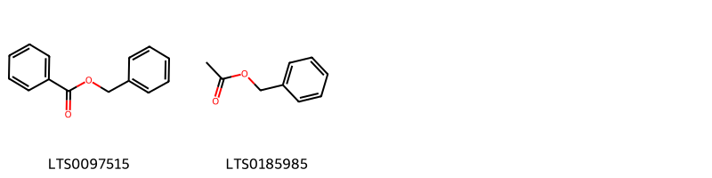{ width=100% }
    <figcaption>Hình ảnh cấu trúc hóa học của 2 hoạt chất thuộc nhóm Benzene and substituted derivatives gồm ['benzyl benzoate (LTS0097515)', 'benzyl acetate (LTS0185985)'].</figcaption>
</figure>
#### Nhóm Carboxylic acids and derivatives
<figure markdown="span">
    { width=100% }
    <figcaption>Hình ảnh cấu trúc hóa học của 2 hoạt chất thuộc nhóm Carboxylic acids and derivatives gồm ['acetyl octanoate (LTS0080229)', 'hexyl acetate (LTS0202355)'].</figcaption>
</figure>
#### Nhóm Cinnamic acids and derivatives
<figure markdown="span">
    { width=100% }
    <figcaption>Hình ảnh cấu trúc hóa học của 5 hoạt chất thuộc nhóm Cinnamic acids and derivatives gồm ['butyl 3-phenylprop-2-enoate (LTS0052415)', 'cinnamic acid (LTS0128130)', 'butyl cinnamate (LTS0141543)', 'ethyl 3-phenylprop-2-enoate (LTS0005299)', 'ethyl cinnamate (LTS0031825)'].</figcaption>
</figure>
#### Nhóm Coumarins and derivatives
<figure markdown="span">
    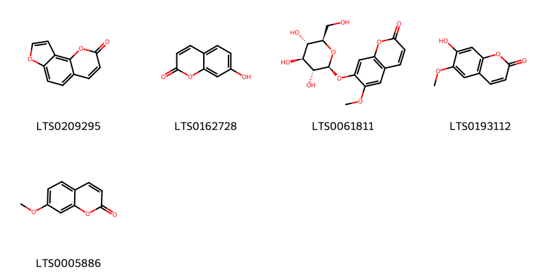{ width=100% }
    <figcaption>Hình ảnh cấu trúc hóa học của 5 hoạt chất thuộc nhóm Coumarins and derivatives gồm ['angelicin (LTS0209295)', 'umbelliferone (LTS0162728)', 'scopolin (LTS0061811)', 'scopoletin (LTS0193112)', 'methylumbelliferone (LTS0005886)'].</figcaption>
</figure>
#### Nhóm Fatty Acyls
<figure markdown="span">
    { width=100% }
    <figcaption>Hình ảnh cấu trúc hóa học của 36 hoạt chất thuộc nhóm Fatty Acyls gồm ['palmitic acid (LTS0079439)', 'octyl acetate (LTS0217143)', 'butyl octanoate (LTS0217345)', 'capryl caprate (LTS0233698)', 'triacontanol (LTS0026833)', 'behenic acid (LTS0058784)', 'caprylyl caprylate (LTS0193789)', '10-trans,12-cis-linoleic acid (LTS0266267)', 'ethyl stearate (LTS0161491)', 'hexyl butyrate (LTS0143525)', 'butyl laurate (LTS0083034)', 'ethyl butyrate (LTS0106732)', 'decyl butyrate (LTS0168306)', 'ethyl caprate (LTS0106514)', 'lauryl acetate (LTS0267334)', 'oleic acid (LTS0256910)', 'ethyl octanoate (LTS0207229)', 'decyl acetate (LTS0201755)', 'octanol (LTS0250216)', 'myristic acid (LTS0102566)', 'methyl caprate (LTS0052079)', 'butyl butyrate (LTS0236625)', 'decanol (LTS0219777)', 'hexyl 2-methylbutyrate (LTS0234493)', 'hexyl octanoate (LTS0000486)', 'hexacosanoic acid (LTS0240902)', 'docosanol (LTS0250870)', 'ethyl hexanoate (LTS0021856)', 'methyl laurate (LTS0244704)', 'ethyl laurate (LTS0057246)', 'caprylyl laurate (LTS0042536)', 'lauric acid (LTS0051907)', 'butyl decanoate (LTS0105518)', 'hexyl (2r)-2-methylbutanoate (LTS0089921)', 'capric acid (LTS0039856)', 'ethylmyristate (LTS0033616)'].</figcaption>
</figure>
#### Nhóm Hydroxy acids and derivatives
<figure markdown="span">
    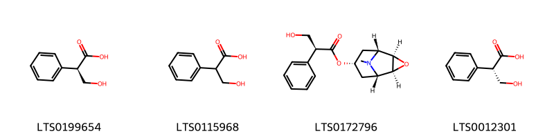{ width=100% }
    <figcaption>Hình ảnh cấu trúc hóa học của 4 hoạt chất thuộc nhóm Hydroxy acids and derivatives gồm ['(+)-tropic acid (LTS0199654)', '(+-)-tropic acid (LTS0115968)', 'scopolamine (LTS0172796)', '(-)-tropic acid (LTS0012301)'].</figcaption>
</figure>
#### Nhóm Organooxygen compounds
<figure markdown="span">
    { width=100% }
    <figcaption>Hình ảnh cấu trúc hóa học của 1 hoạt chất thuộc nhóm Organooxygen compounds gồm ['chlorogenic acid (LTS0226495)'].</figcaption>
</figure>
#### Nhóm Phenols
<figure markdown="span">
    { width=100% }
    <figcaption>Hình ảnh cấu trúc hóa học của 4 hoạt chất thuộc nhóm Phenols gồm ['eugenol (LTS0052342)', '2-methoxy-4-propenylphenol (LTS0086128)', 'chavicol (LTS0008864)', 'isoeugenol (LTS0136836)'].</figcaption>
</figure>
#### Nhóm Prenol lipids
<figure markdown="span">
    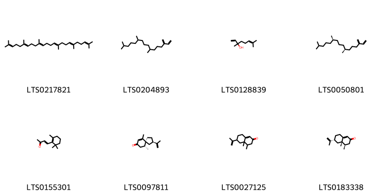{ width=100% }
    <figcaption>Hình ảnh cấu trúc hóa học của 8 hoạt chất thuộc nhóm Prenol lipids gồm ['squalene (LTS0217821)', '7,11,15-trimethyl-3-methylidenehexadec-1-ene (LTS0204893)', 'linalool, (+-)- (LTS0128839)', '(7s,11r)-7,11,15-trimethyl-3-methylidenehexadec-1-ene (LTS0050801)', 'β-ionone (LTS0155301)', 'solavetivone (LTS0097811)', 'nootkatone (LTS0027125)', 'nootkatone (LTS0183338)'].</figcaption>
</figure>
#### Nhóm Saturated hydrocarbons
<figure markdown="span">
    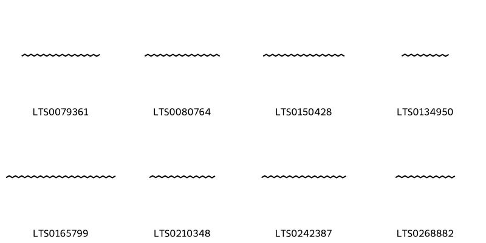{ width=100% }
    <figcaption>Hình ảnh cấu trúc hóa học của 8 hoạt chất thuộc nhóm Saturated hydrocarbons gồm ['hexacosane (LTS0079361)', 'pentacosane (LTS0080764)', 'heptacosane (LTS0150428)', 'cetane (LTS0134950)', 'hexatriacontane (LTS0165799)', 'docosane (LTS0210348)', 'octacosane (LTS0242387)', 'eicosane (LTS0268882)'].</figcaption>
</figure>
#### Nhóm Tropane alkaloids
<figure markdown="span">
    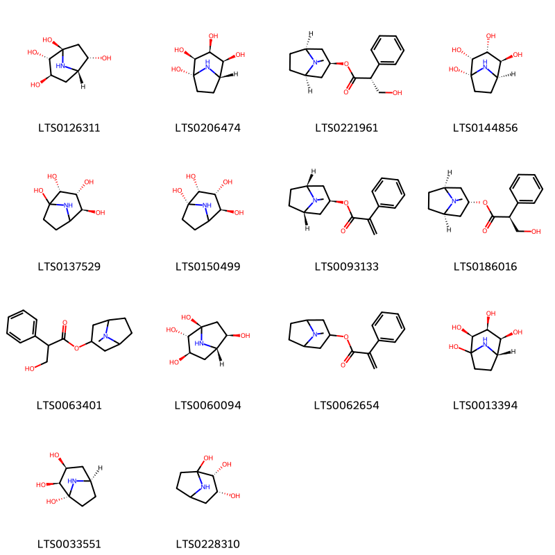{ width=100% }
    <figcaption>Hình ảnh cấu trúc hóa học của 14 hoạt chất thuộc nhóm Tropane alkaloids gồm ['(1r,2s,3r,5s,6s)-8-azabicyclo[3.2.1]octane-1,2,3,6-tetrol (LTS0126311)', '(1r,2s,3s,4s,5s)-8-azabicyclo[3.2.1]octane-1,2,3,4-tetrol (LTS0206474)', '(+)-atropine (LTS0221961)', '(1r,2r,3r,4s,5r)-8-azabicyclo[3.2.1]octane-1,2,3,4-tetrol (LTS0144856)', 'calystegin b2 (LTS0137529)', '(1r,2r,3r,4s)-8-azabicyclo[3.2.1]octane-1,2,3,4-tetrol (LTS0150499)', '(1r,3r,5s)-8-methyl-8-azabicyclo[3.2.1]octan-3-yl 2-phenylprop-2-enoate (LTS0093133)', 'l-hyoscyamine (LTS0186016)', '()-hyoscyamine (LTS0063401)', '(1r,2s,3r,5s,6r)-8-azabicyclo[3.2.1]octane-1,2,3,6-tetrol (LTS0060094)', 'apoatropine (LTS0062654)', '(2s,3s,4s,5s)-8-azabicyclo[3.2.1]octane-1,2,3,4-tetrol (LTS0013394)', '(1r,2s,3s,5r)-8-azabicyclo[3.2.1]octane-1,2,3-triol (LTS0033551)', 'calystegin a3 (LTS0228310)'].</figcaption>
</figure>

---

### Dược dân tộc học

Danh sách các quốc gia có sử dụng *Mandragora officinarum* trong điều trị các bệnh. 

| Country   | Disease   | Bệnh          |
|:----------|:----------|:--------------|
| ain       | Sedative  | Thuốc an thần |

---

---
## Mandragora officinalis
### Thông tin về thực vật

!!! info "Phân loại thực vật của *Mandragora officinalis* từ GIBF:"
    - **Kingdom:** Plantae
    - **Phylum:** Tracheophyta
    - **Order:** Solanales
    - **Family:** Solanaceae
    - **Genus:** Mandragora
    - **Species:** *Mandragora officinalis*

 

| Label (VI)   | Label (EN)   | Scientific Name        | Descriptions (VI)   | Descriptions (EN)   | Also Known As (VI)   | Also Known As (EN)   |
|:-------------|:-------------|:-----------------------|:--------------------|:--------------------|:---------------------|:---------------------|
| N/A          | N/A          | Mandragora officinalis |                     |                     | ['']                 | ['']                 |

#### Phân bố trên thế giới

**Từ CSDL GIBF** nan, Italy, Cyprus, United Kingdom of Great Britain and Northern Ireland, Spain, Portugal, unknown or invalid, Switzerland, Morocco, Norway, Greece

#### Phân bố tại Việt Nam

**Từ CSDL GIBF**: Không có ghi nhận ở Việt Nam

---
### Thành phần hóa học
        
- Theo cơ sở dữ liệu lotus: Từ loài *Mandragora officinalis* đã phân lập và xác định được Chưa có hoạt chất nào được phân lập. hoạt chất thuộc về các nhóm Không có hoạt chất nào được phân lập. 

Không có hình ảnh nào được tạo ra

---

### Dược dân tộc học

Danh sách các quốc gia có sử dụng *Mandragora officinalis* trong điều trị các bệnh. 

| Country   | Disease                                                               | Bệnh                                                                  |
|:----------|:----------------------------------------------------------------------|:----------------------------------------------------------------------|
| Turkey    | Cholagogue, Narcotic, Refrigerant, Stimulant, Sedative, Tonic, Poison | Cholagogue, Narcotic, Refrigerant, Stimulant, Sedative, Tonic, Poison |

---

---
## Mandragora officinarum
### Thông tin về thực vật

!!! info "Phân loại thực vật của *Mandragora officinarum* từ GIBF:"
    - **Kingdom:** Plantae
    - **Phylum:** Tracheophyta
    - **Order:** Solanales
    - **Family:** Solanaceae
    - **Genus:** Mandragora
    - **Species:** *Mandragora officinarum*

 

| Label (VI)   | Label (EN)   | Scientific Name        | Descriptions (VI)   | Descriptions (EN)   | Also Known As (VI)   | Also Known As (EN)   |
|:-------------|:-------------|:-----------------------|:--------------------|:--------------------|:---------------------|:---------------------|
| N/A          | N/A          | Mandragora officinarum | loài thực vật       | species of plant    | ['']                 | ['']                 |

#### Phân bố trên thế giới

**Từ CSDL GIBF** Israel, Italy, Cyprus, Germany, Spain, Palestine, State of, Türkiye, Portugal, Morocco, Austria, Croatia, Greece

#### Phân bố tại Việt Nam

**Từ CSDL GIBF**: Không có ghi nhận ở Việt Nam

---
### Thành phần hóa học
        
- Theo cơ sở dữ liệu lotus: Từ loài *Mandragora officinarum* đã phân lập và xác định được 115 hoạt chất thuộc về các nhóm Fatty Acyls, Prenol lipids, Steroids and steroid derivatives, Cinnamic acids and derivatives, Benzene and substituted derivatives, Hydroxy acids and derivatives, Tropane alkaloids, Saturated hydrocarbons, Phenols, Organooxygen compounds, Coumarins and derivatives, Carboxylic acids and derivatives, Diazines. 

|    | chemicalTaxonomyClassyfireClass     |   smiles_count |
|---:|:------------------------------------|---------------:|
|  0 |                                     |              1 |
|  1 | Benzene and substituted derivatives |              2 |
|  2 | Carboxylic acids and derivatives    |              2 |
|  3 | Cinnamic acids and derivatives      |              5 |
|  4 | Coumarins and derivatives           |              6 |
|  5 | Diazines                            |              1 |
|  6 | Fatty Acyls                         |             36 |
|  7 | Hydroxy acids and derivatives       |              5 |
|  8 | Organooxygen compounds              |              1 |
|  9 | Phenols                             |              4 |
| 10 | Prenol lipids                       |             10 |
| 11 | Saturated hydrocarbons              |              8 |
| 12 | Steroids and steroid derivatives    |             18 |
| 13 | Tropane alkaloids                   |             15 |

#### Nhóm 
<figure markdown="span">
    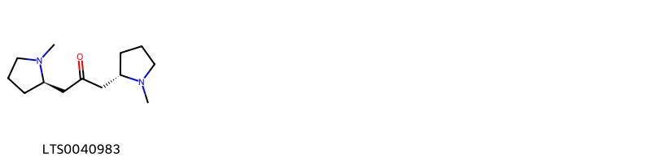{ width=100% }
    <figcaption>Hình ảnh cấu trúc hóa học của 1 hoạt chất thuộc nhóm  gồm ['cuscohygrine (LTS0040983)'].</figcaption>
</figure>
#### Nhóm Benzene and substituted derivatives
<figure markdown="span">
    { width=100% }
    <figcaption>Hình ảnh cấu trúc hóa học của 2 hoạt chất thuộc nhóm Benzene and substituted derivatives gồm ['benzyl benzoate (LTS0097515)', 'benzyl acetate (LTS0185985)'].</figcaption>
</figure>
#### Nhóm Carboxylic acids and derivatives
<figure markdown="span">
    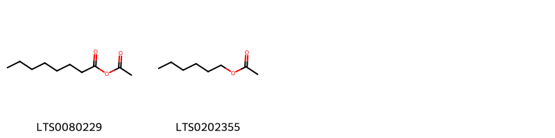{ width=100% }
    <figcaption>Hình ảnh cấu trúc hóa học của 2 hoạt chất thuộc nhóm Carboxylic acids and derivatives gồm ['acetyl octanoate (LTS0080229)', 'hexyl acetate (LTS0202355)'].</figcaption>
</figure>
#### Nhóm Cinnamic acids and derivatives
<figure markdown="span">
    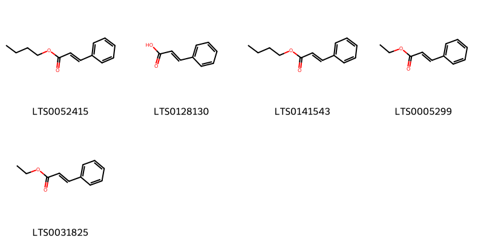{ width=100% }
    <figcaption>Hình ảnh cấu trúc hóa học của 5 hoạt chất thuộc nhóm Cinnamic acids and derivatives gồm ['butyl 3-phenylprop-2-enoate (LTS0052415)', 'cinnamic acid (LTS0128130)', 'butyl cinnamate (LTS0141543)', 'ethyl 3-phenylprop-2-enoate (LTS0005299)', 'ethyl cinnamate (LTS0031825)'].</figcaption>
</figure>
#### Nhóm Coumarins and derivatives
<figure markdown="span">
    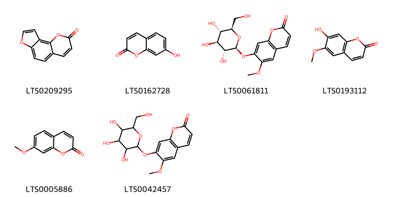{ width=100% }
    <figcaption>Hình ảnh cấu trúc hóa học của 6 hoạt chất thuộc nhóm Coumarins and derivatives gồm ['angelicin (LTS0209295)', 'umbelliferone (LTS0162728)', 'scopolin (LTS0061811)', 'scopoletin (LTS0193112)', 'methylumbelliferone (LTS0005886)', '6-methoxy-7-{[3,4,5-trihydroxy-6-(hydroxymethyl)oxan-2-yl]oxy}chromen-2-one (LTS0042457)'].</figcaption>
</figure>
#### Nhóm Diazines
<figure markdown="span">
    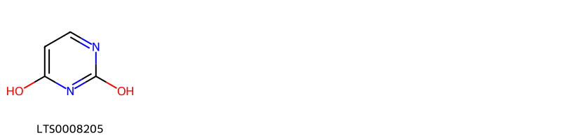{ width=100% }
    <figcaption>Hình ảnh cấu trúc hóa học của 1 hoạt chất thuộc nhóm Diazines gồm ['pirod (LTS0008205)'].</figcaption>
</figure>
#### Nhóm Fatty Acyls
<figure markdown="span">
    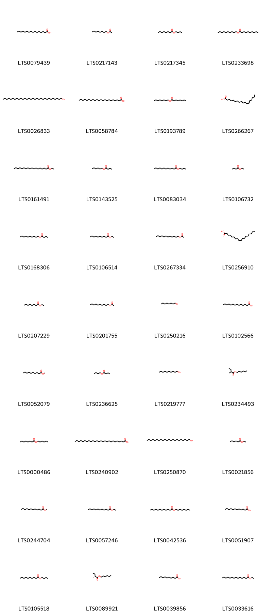{ width=100% }
    <figcaption>Hình ảnh cấu trúc hóa học của 36 hoạt chất thuộc nhóm Fatty Acyls gồm ['palmitic acid (LTS0079439)', 'octyl acetate (LTS0217143)', 'butyl octanoate (LTS0217345)', 'capryl caprate (LTS0233698)', 'triacontanol (LTS0026833)', 'behenic acid (LTS0058784)', 'caprylyl caprylate (LTS0193789)', '10-trans,12-cis-linoleic acid (LTS0266267)', 'ethyl stearate (LTS0161491)', 'hexyl butyrate (LTS0143525)', 'butyl laurate (LTS0083034)', 'ethyl butyrate (LTS0106732)', 'decyl butyrate (LTS0168306)', 'ethyl caprate (LTS0106514)', 'lauryl acetate (LTS0267334)', 'oleic acid (LTS0256910)', 'ethyl octanoate (LTS0207229)', 'decyl acetate (LTS0201755)', 'octanol (LTS0250216)', 'myristic acid (LTS0102566)', 'methyl caprate (LTS0052079)', 'butyl butyrate (LTS0236625)', 'decanol (LTS0219777)', 'hexyl 2-methylbutyrate (LTS0234493)', 'hexyl octanoate (LTS0000486)', 'hexacosanoic acid (LTS0240902)', 'docosanol (LTS0250870)', 'ethyl hexanoate (LTS0021856)', 'methyl laurate (LTS0244704)', 'ethyl laurate (LTS0057246)', 'caprylyl laurate (LTS0042536)', 'lauric acid (LTS0051907)', 'butyl decanoate (LTS0105518)', 'hexyl (2r)-2-methylbutanoate (LTS0089921)', 'capric acid (LTS0039856)', 'ethylmyristate (LTS0033616)'].</figcaption>
</figure>
#### Nhóm Hydroxy acids and derivatives
<figure markdown="span">
    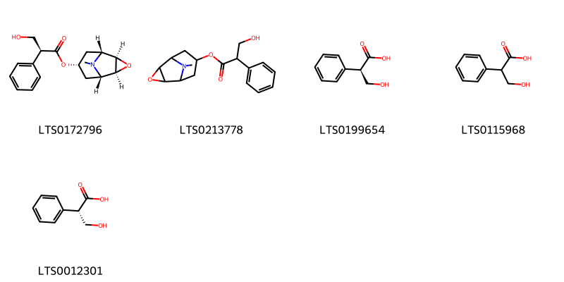{ width=100% }
    <figcaption>Hình ảnh cấu trúc hóa học của 5 hoạt chất thuộc nhóm Hydroxy acids and derivatives gồm ['scopolamine (LTS0172796)', 'buscopan (LTS0213778)', '(+)-tropic acid (LTS0199654)', '(+-)-tropic acid (LTS0115968)', '(-)-tropic acid (LTS0012301)'].</figcaption>
</figure>
#### Nhóm Organooxygen compounds
<figure markdown="span">
    { width=100% }
    <figcaption>Hình ảnh cấu trúc hóa học của 1 hoạt chất thuộc nhóm Organooxygen compounds gồm ['chlorogenic acid (LTS0226495)'].</figcaption>
</figure>
#### Nhóm Phenols
<figure markdown="span">
    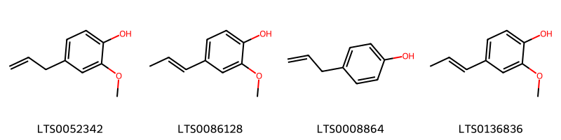{ width=100% }
    <figcaption>Hình ảnh cấu trúc hóa học của 4 hoạt chất thuộc nhóm Phenols gồm ['eugenol (LTS0052342)', '2-methoxy-4-propenylphenol (LTS0086128)', 'chavicol (LTS0008864)', 'isoeugenol (LTS0136836)'].</figcaption>
</figure>
#### Nhóm Prenol lipids
<figure markdown="span">
    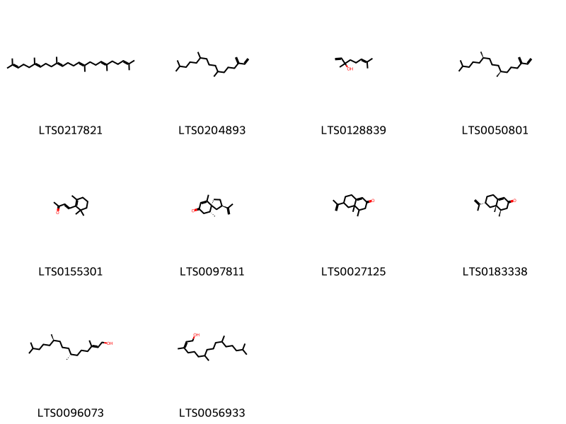{ width=100% }
    <figcaption>Hình ảnh cấu trúc hóa học của 10 hoạt chất thuộc nhóm Prenol lipids gồm ['squalene (LTS0217821)', '7,11,15-trimethyl-3-methylidenehexadec-1-ene (LTS0204893)', 'linalool, (+-)- (LTS0128839)', '(7s,11r)-7,11,15-trimethyl-3-methylidenehexadec-1-ene (LTS0050801)', 'β-ionone (LTS0155301)', 'solavetivone (LTS0097811)', 'nootkatone (LTS0027125)', 'nootkatone (LTS0183338)', 'phytol (LTS0096073)', '3,7,11,15-tetramethylhexadec-2-en-1-ol (LTS0056933)'].</figcaption>
</figure>
#### Nhóm Saturated hydrocarbons
<figure markdown="span">
    { width=100% }
    <figcaption>Hình ảnh cấu trúc hóa học của 8 hoạt chất thuộc nhóm Saturated hydrocarbons gồm ['hexacosane (LTS0079361)', 'pentacosane (LTS0080764)', 'heptacosane (LTS0150428)', 'cetane (LTS0134950)', 'hexatriacontane (LTS0165799)', 'docosane (LTS0210348)', 'octacosane (LTS0242387)', 'eicosane (LTS0268882)'].</figcaption>
</figure>
#### Nhóm Steroids and steroid derivatives
<figure markdown="span">
    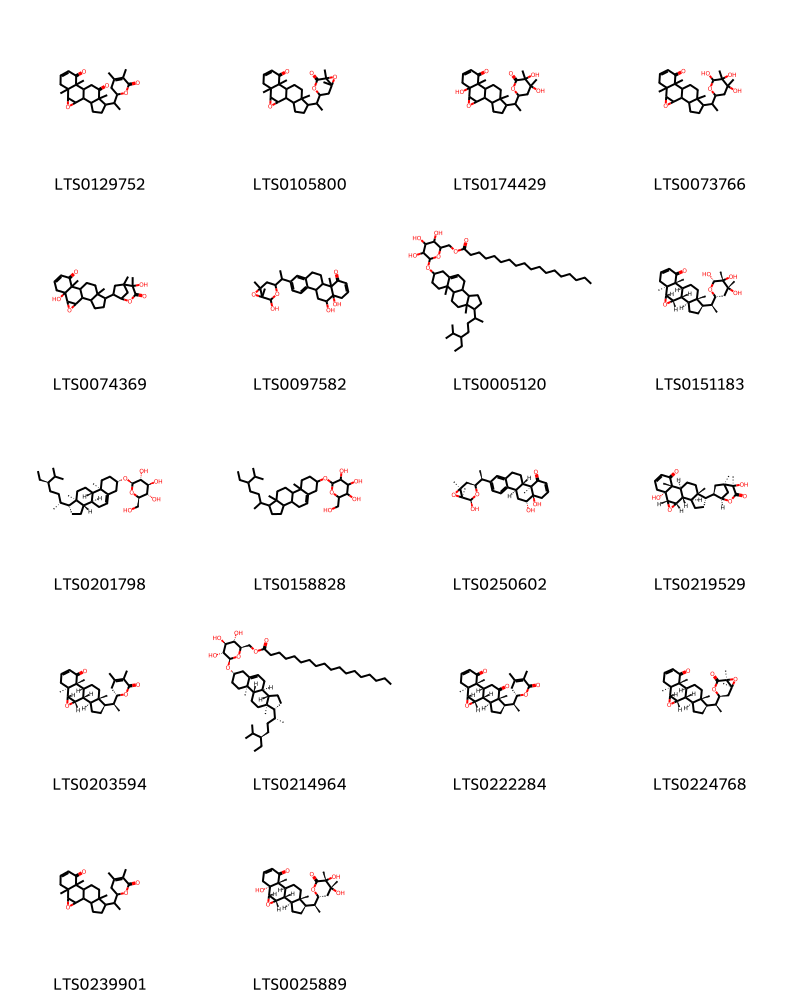{ width=100% }
    <figcaption>Hình ảnh cấu trúc hóa học của 18 hoạt chất thuộc nhóm Steroids and steroid derivatives gồm ['15-[1-(4,5-dimethyl-6-oxo-2,3-dihydropyran-2-yl)ethyl]-5,10,14-trimethyl-3-oxapentacyclo[9.7.0.0²,⁴.0⁵,¹⁰.0¹⁴,¹⁸]octadec-7-ene-9,13-dione (LTS0129752)', '15-(1-{1,6-dimethyl-2-oxo-3,7-dioxabicyclo[4.1.0]heptan-4-yl}ethyl)-5,10,14-trimethyl-3-oxapentacyclo[9.7.0.0²,⁴.0⁵,¹⁰.0¹⁴,¹⁸]octadec-7-en-9-one (LTS0105800)', '15-[1-(4,5-dihydroxy-4,5-dimethyl-6-oxooxan-2-yl)ethyl]-5-hydroxy-10,14-dimethyl-3-oxapentacyclo[9.7.0.0²,⁴.0⁵,¹⁰.0¹⁴,¹⁸]octadec-7-en-9-one (LTS0174429)', '5,10,14-trimethyl-15-[1-(4,5,6-trihydroxy-4,5-dimethyloxan-2-yl)ethyl]-3-oxapentacyclo[9.7.0.0²,⁴.0⁵,¹⁰.0¹⁴,¹⁸]octadec-7-en-9-one (LTS0073766)', '5-hydroxy-15-{4-hydroxy-4,5-dimethyl-3-oxo-2-oxabicyclo[3.2.1]octan-7-yl}-10,14-dimethyl-3-oxapentacyclo[9.7.0.0²,⁴.0⁵,¹⁰.0¹⁴,¹⁸]octadec-7-en-9-one (LTS0074369)', '12,12a-dihydroxy-8-(1-{2-hydroxy-1,6-dimethyl-3,7-dioxabicyclo[4.1.0]heptan-4-yl}ethyl)-4a-methyl-4b,5,6,10b,11,12-hexahydro-1h-chrysen-4-one (LTS0097582)', '(6-{[1-(5-ethyl-6-methylheptan-2-yl)-9a,11a-dimethyl-1h,2h,3h,3ah,3bh,4h,6h,7h,8h,9h,9bh,10h,11h-cyclopenta[a]phenanthren-7-yl]oxy}-3,4,5-trihydroxyoxan-2-yl)methyl octadecanoate (LTS0005120)', '(1s,2s,4r,5s,10r,11s,14r,15r,18s)-5,10,14-trimethyl-15-[(1s)-1-[(2r,4r,5r,6s)-4,5,6-trihydroxy-4,5-dimethyloxan-2-yl]ethyl]-3-oxapentacyclo[9.7.0.0²,⁴.0⁵,¹⁰.0¹⁴,¹⁸]octadec-7-en-9-one (LTS0151183)', 'sitogluside (LTS0201798)', '2-{[1-(5-ethyl-6-methylheptan-2-yl)-9a,11a-dimethyl-1h,2h,3h,3ah,3bh,4h,6h,7h,8h,9h,9bh,10h,11h-cyclopenta[a]phenanthren-7-yl]oxy}-6-(hydroxymethyl)oxane-3,4,5-triol (LTS0158828)', '(4ar,4bs,10br,12r,12ar)-12,12a-dihydroxy-8-[(1s)-1-[(1s,2r,4s,6s)-2-hydroxy-1,6-dimethyl-3,7-dioxabicyclo[4.1.0]heptan-4-yl]ethyl]-4a-methyl-4b,5,6,10b,11,12-hexahydro-1h-chrysen-4-one (LTS0250602)', '(1s,2s,4s,5r,10r,11s,14r,15s,18s)-5-hydroxy-15-[(1r,4r,5r,7r)-4-hydroxy-4,5-dimethyl-3-oxo-2-oxabicyclo[3.2.1]octan-7-yl]-10,14-dimethyl-3-oxapentacyclo[9.7.0.0²,⁴.0⁵,¹⁰.0¹⁴,¹⁸]octadec-7-en-9-one (LTS0219529)', '(1s,2s,4r,5s,10r,11s,14r,15r,18s)-15-[(1s)-1-[(2s)-4,5-dimethyl-6-oxo-2,3-dihydropyran-2-yl]ethyl]-5,10,14-trimethyl-3-oxapentacyclo[9.7.0.0²,⁴.0⁵,¹⁰.0¹⁴,¹⁸]octadec-7-en-9-one (LTS0203594)', '[(2r,3s,4s,5r,6r)-6-{[(1r,3as,3bs,7s,9ar,9bs,11ar)-1-[(2r,5r)-5-ethyl-6-methylheptan-2-yl]-9a,11a-dimethyl-1h,2h,3h,3ah,3bh,4h,6h,7h,8h,9h,9bh,10h,11h-cyclopenta[a]phenanthren-7-yl]oxy}-3,4,5-trihydroxyoxan-2-yl]methyl octadecanoate (LTS0214964)', '(1s,2s,4r,5s,10r,11s,14r,15r,18s)-15-[(1s)-1-[(2s)-4,5-dimethyl-6-oxo-2,3-dihydropyran-2-yl]ethyl]-5,10,14-trimethyl-3-oxapentacyclo[9.7.0.0²,⁴.0⁵,¹⁰.0¹⁴,¹⁸]octadec-7-ene-9,13-dione (LTS0222284)', '(1s,2s,4r,5s,10r,11s,14r,15r,18s)-15-[(1s)-1-[(1s,4s,6s)-1,6-dimethyl-2-oxo-3,7-dioxabicyclo[4.1.0]heptan-4-yl]ethyl]-5,10,14-trimethyl-3-oxapentacyclo[9.7.0.0²,⁴.0⁵,¹⁰.0¹⁴,¹⁸]octadec-7-en-9-one (LTS0224768)', '15-[1-(4,5-dimethyl-6-oxo-2,3-dihydropyran-2-yl)ethyl]-5,10,14-trimethyl-3-oxapentacyclo[9.7.0.0²,⁴.0⁵,¹⁰.0¹⁴,¹⁸]octadec-7-en-9-one (LTS0239901)', '(1s,2s,4s,5r,10r,11s,14r,15r,18s)-15-[(1s)-1-[(2r,4r,5r)-4,5-dihydroxy-4,5-dimethyl-6-oxooxan-2-yl]ethyl]-5-hydroxy-10,14-dimethyl-3-oxapentacyclo[9.7.0.0²,⁴.0⁵,¹⁰.0¹⁴,¹⁸]octadec-7-en-9-one (LTS0025889)'].</figcaption>
</figure>
#### Nhóm Tropane alkaloids
<figure markdown="span">
    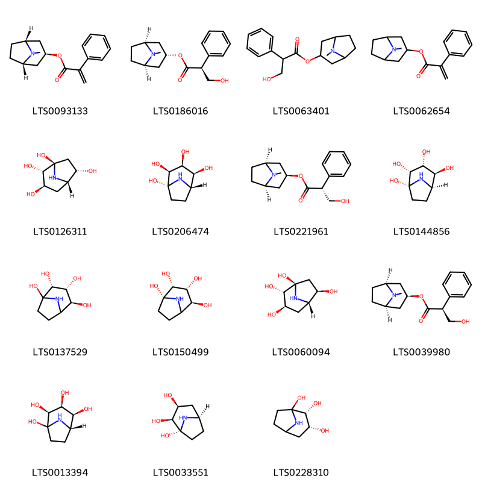{ width=100% }
    <figcaption>Hình ảnh cấu trúc hóa học của 15 hoạt chất thuộc nhóm Tropane alkaloids gồm ['(1r,3r,5s)-8-methyl-8-azabicyclo[3.2.1]octan-3-yl 2-phenylprop-2-enoate (LTS0093133)', 'l-hyoscyamine (LTS0186016)', '()-hyoscyamine (LTS0063401)', 'apoatropine (LTS0062654)', '(1r,2s,3r,5s,6s)-8-azabicyclo[3.2.1]octane-1,2,3,6-tetrol (LTS0126311)', '(1r,2s,3s,4s,5s)-8-azabicyclo[3.2.1]octane-1,2,3,4-tetrol (LTS0206474)', '(+)-atropine (LTS0221961)', '(1r,2r,3r,4s,5r)-8-azabicyclo[3.2.1]octane-1,2,3,4-tetrol (LTS0144856)', 'calystegin b2 (LTS0137529)', '(1r,2r,3r,4s)-8-azabicyclo[3.2.1]octane-1,2,3,4-tetrol (LTS0150499)', '(1r,2s,3r,5s,6r)-8-azabicyclo[3.2.1]octane-1,2,3,6-tetrol (LTS0060094)', 'hyoscyamine (LTS0039980)', '(2s,3s,4s,5s)-8-azabicyclo[3.2.1]octane-1,2,3,4-tetrol (LTS0013394)', '(1r,2s,3s,5r)-8-azabicyclo[3.2.1]octane-1,2,3-triol (LTS0033551)', 'calystegin a3 (LTS0228310)'].</figcaption>
</figure>

---

### Dược dân tộc học

Danh sách các quốc gia có sử dụng *Mandragora officinarum* trong điều trị các bệnh. 

| Country   | Disease                                             | Bệnh                                           |
|:----------|:----------------------------------------------------|:-----------------------------------------------|
| Elsewhere | Anesthetic, Hypnotic, Mydriatic, Sedative, Sedative | Gây mê, Thôi miên, Mydriatic, An thần, An thần |
| Europe    | Poison                                              | Chất độc                                       |
| India     | Narcotic                                            | Thuốc gây ngủ, gây mê                          |

---

# Chi Capsicum

??? note "Danh sách các dược liệu thuộc chi"
    
	 - *Capsicum annum*
	 - *Capsicum annuum*
	 - *Capsicum baccatum*
	 - *Capsicum frutescens*
	 - *Capsicum frytescens*

---
## Capsicum annum
### Thông tin về thực vật

!!! info "Phân loại thực vật của *Capsicum annuum* từ GIBF:"
    - **Kingdom:** Plantae
    - **Phylum:** Tracheophyta
    - **Order:** Solanales
    - **Family:** Solanaceae
    - **Genus:** Capsicum
    - **Species:** *Capsicum annuum*

 

| Label (VI)   | Label (EN)   | Scientific Name        | Descriptions (VI)   | Descriptions (EN)   | Also Known As (VI)   | Also Known As (EN)   |
|:-------------|:-------------|:-----------------------|:--------------------|:--------------------|:---------------------|:---------------------|
| N/A          | N/A          | Mandragora officinarum | loài thực vật       | species of plant    | ['']                 | ['']                 |

#### Phân bố trên thế giới

**Từ CSDL GIBF** Australia, Belgium, Guatemala, Benin, Canada, Puerto Rico, Netherlands, Belarus, Nigeria, Honduras, Portugal, United States of America, Sweden, Finland, El Salvador, South Africa, Czechia, Thailand, Switzerland, Dominican Republic, Peru, Mexico, Singapore, Ecuador, Haiti, Colombia, Iraq, India, Malaysia, New Zealand

#### Phân bố tại Việt Nam

**Từ CSDL GIBF**: Không có ghi nhận ở Việt Nam

---
### Thành phần hóa học
        
- Theo cơ sở dữ liệu lotus: Từ loài *Capsicum annuum* đã phân lập và xác định được Chưa có hoạt chất nào được phân lập. hoạt chất thuộc về các nhóm Không có hoạt chất nào được phân lập. 

Không có hình ảnh nào được tạo ra

---

### Dược dân tộc học

Danh sách các quốc gia có sử dụng *Capsicum annuum* trong điều trị các bệnh. 

| Country   | Disease   | Bệnh    |
|:----------|:----------|:--------|
| Japan*    | Stomachic | Sững sờ |

---

---
## Capsicum annuum
### Thông tin về thực vật

!!! info "Phân loại thực vật của *Capsicum annuum* từ GIBF:"
    - **Kingdom:** Plantae
    - **Phylum:** Tracheophyta
    - **Order:** Solanales
    - **Family:** Solanaceae
    - **Genus:** Capsicum
    - **Species:** *Capsicum annuum*

 

| Label (VI)   | Label (EN)   | Scientific Name   | Descriptions (VI)   | Descriptions (EN)                   | Also Known As (VI)   | Also Known As (EN)   |
|:-------------|:-------------|:------------------|:--------------------|:------------------------------------|:---------------------|:---------------------|
| N/A          | N/A          | Capsicum annuum   |                     | species of the plant genus Capsicum | ['']                 | ['pepper']           |

#### Phân bố trên thế giới

**Từ CSDL GIBF** Australia, Belgium, Guatemala, Benin, Canada, Puerto Rico, Netherlands, Belarus, Nigeria, Honduras, Portugal, United States of America, Sweden, Finland, El Salvador, South Africa, Czechia, Thailand, Switzerland, Dominican Republic, Peru, Mexico, Singapore, Ecuador, Haiti, Colombia, Iraq, India, Malaysia, New Zealand

#### Phân bố tại Việt Nam

**Từ CSDL GIBF**: Không có ghi nhận ở Việt Nam

---
### Thành phần hóa học
        
- Theo cơ sở dữ liệu lotus: Từ loài *Capsicum annuum* đã phân lập và xác định được 535 hoạt chất thuộc về các nhóm Organic carbonic acids and derivatives, Naphthalenes, Benzofurans, Stilbenes, Phenols, Carboxylic acids and derivatives, Dioxolanes, Fatty Acyls, Pyrrolidines, Pyrimidine nucleosides, Pteridines and derivatives, Cinnamic acids and derivatives, Glycerophospholipids, Dibenzylbutane lignans, Heteroaromatic compounds, Tannins, Glycerolipids, Diazines, Prenol lipids, Sphingolipids, Purine nucleosides, Benzene and substituted derivatives, Dihydrofurans, Organooxygen compounds, Furanoid lignans, Pyridines and derivatives, Flavonoids, Steroids and steroid derivatives, Oxepanes, Organonitrogen compounds, Pyrans, 2-arylbenzofuran flavonoids, Lactones. 

|    | chemicalTaxonomyClassyfireClass        |   smiles_count |
|---:|:---------------------------------------|---------------:|
|  0 |                                        |              2 |
|  1 | 2-arylbenzofuran flavonoids            |              3 |
|  2 | Benzene and substituted derivatives    |              8 |
|  3 | Benzofurans                            |              2 |
|  4 | Carboxylic acids and derivatives       |             11 |
|  5 | Cinnamic acids and derivatives         |             21 |
|  6 | Diazines                               |              2 |
|  7 | Dibenzylbutane lignans                 |              2 |
|  8 | Dihydrofurans                          |              4 |
|  9 | Dioxolanes                             |              2 |
| 10 | Fatty Acyls                            |             40 |
| 11 | Flavonoids                             |             46 |
| 12 | Furanoid lignans                       |              4 |
| 13 | Glycerolipids                          |             30 |
| 14 | Glycerophospholipids                   |              1 |
| 15 | Heteroaromatic compounds               |              2 |
| 16 | Lactones                               |              1 |
| 17 | Naphthalenes                           |              2 |
| 18 | Organic carbonic acids and derivatives |              1 |
| 19 | Organonitrogen compounds               |              2 |
| 20 | Organooxygen compounds                 |             26 |
| 21 | Oxepanes                               |              2 |
| 22 | Phenols                                |             45 |
| 23 | Prenol lipids                          |            186 |
| 24 | Pteridines and derivatives             |              3 |
| 25 | Purine nucleosides                     |              2 |
| 26 | Pyrans                                 |              1 |
| 27 | Pyridines and derivatives              |              2 |
| 28 | Pyrimidine nucleosides                 |              4 |
| 29 | Pyrrolidines                           |              1 |
| 30 | Sphingolipids                          |             14 |
| 31 | Steroids and steroid derivatives       |             56 |
| 32 | Stilbenes                              |              2 |
| 33 | Tannins                                |              2 |

#### Nhóm 
<figure markdown="span">
    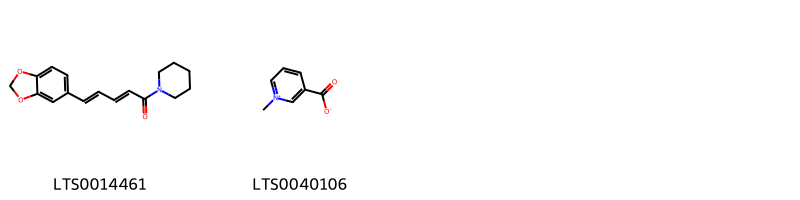{ width=100% }
    <figcaption>Hình ảnh cấu trúc hóa học của 2 hoạt chất thuộc nhóm  gồm ['piperine (LTS0014461)', 'trigonelline (LTS0040106)'].</figcaption>
</figure>
#### Nhóm 2-arylbenzofuran flavonoids
<figure markdown="span">
    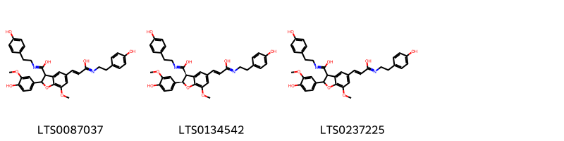{ width=100% }
    <figcaption>Hình ảnh cấu trúc hóa học của 3 hoạt chất thuộc nhóm 2-arylbenzofuran flavonoids gồm ['2-(4-hydroxy-3-methoxyphenyl)-n-[2-(4-hydroxyphenyl)ethyl]-5-(2-{[2-(4-hydroxyphenyl)ethyl]-c-hydroxycarbonimidoyl}eth-1-en-1-yl)-7-methoxy-2,3-dihydro-1-benzofuran-3-carboximidic acid (LTS0087037)', '(2r,3s)-2-(4-hydroxy-3-methoxyphenyl)-n-[2-(4-hydroxyphenyl)ethyl]-5-[(1e)-2-{[2-(4-hydroxyphenyl)ethyl]-c-hydroxycarbonimidoyl}eth-1-en-1-yl]-7-methoxy-2,3-dihydro-1-benzofuran-3-carboximidic acid (LTS0134542)', '2-(4-hydroxy-3-methoxyphenyl)-n-[2-(4-hydroxyphenyl)ethyl]-5-[(1e)-2-{[2-(4-hydroxyphenyl)ethyl]-c-hydroxycarbonimidoyl}eth-1-en-1-yl]-7-methoxy-2,3-dihydro-1-benzofuran-3-carboximidic acid (LTS0237225)'].</figcaption>
</figure>
#### Nhóm Benzene and substituted derivatives
<figure markdown="span">
    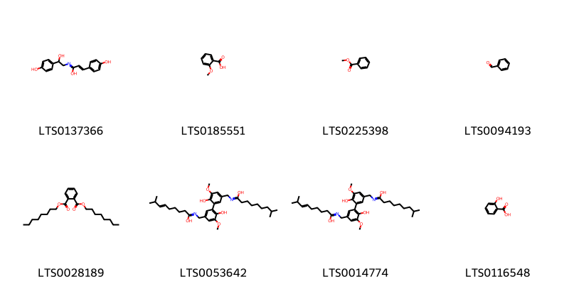{ width=100% }
    <figcaption>Hình ảnh cấu trúc hóa học của 8 hoạt chất thuộc nhóm Benzene and substituted derivatives gồm ['n-[2-hydroxy-2-(4-hydroxyphenyl)ethyl]-3-(4-hydroxyphenyl)prop-2-enimidic acid (LTS0137366)', 'o-anisic acid (LTS0185551)', 'methyl benzoate (LTS0225398)', 'benzaldehyde (LTS0094193)', 'dioctyl phthalate (LTS0028189)', "(6e)-n-[(2',6-dihydroxy-5'-{[(1-hydroxy-8-methylnonylidene)amino]methyl}-3',5-dimethoxy-[1,1'-biphenyl]-3-yl)methyl]-8-methylnon-6-enimidic acid (LTS0053642)", "n-[(2',6-dihydroxy-5'-{[(1-hydroxy-8-methylnonylidene)amino]methyl}-3',5-dimethoxy-[1,1'-biphenyl]-3-yl)methyl]-8-methylnon-6-enimidic acid (LTS0014774)", 'salicyclic acid (LTS0116548)'].</figcaption>
</figure>
#### Nhóm Benzofurans
<figure markdown="span">
    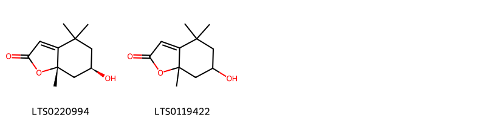{ width=100% }
    <figcaption>Hình ảnh cấu trúc hóa học của 2 hoạt chất thuộc nhóm Benzofurans gồm ['(6r,7as)-6-hydroxy-4,4,7a-trimethyl-6,7-dihydro-5h-1-benzofuran-2-one (LTS0220994)', 'loliolide (LTS0119422)'].</figcaption>
</figure>
#### Nhóm Carboxylic acids and derivatives
<figure markdown="span">
    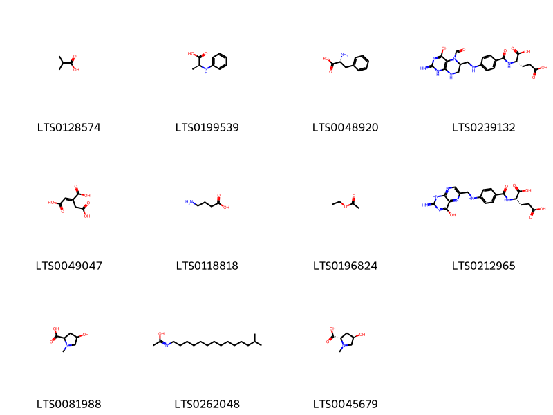{ width=100% }
    <figcaption>Hình ảnh cấu trúc hóa học của 11 hoạt chất thuộc nhóm Carboxylic acids and derivatives gồm ['isobutyric acid (LTS0128574)', '(2s)-2-(phenylamino)propanoic acid (LTS0199539)', 'd-phenylalanine (LTS0048920)', '(2s)-2-[(4-{[(5-formyl-4-hydroxy-2-imino-1,6,7,8-tetrahydropteridin-6-yl)methyl]amino}phenyl)formamido]pentanedioic acid (LTS0239132)', 'trans-aconitic acid (LTS0049047)', 'gamma(amino)-butyric acid (LTS0118818)', 'ethyl acetate (LTS0196824)', 'acid, folic (LTS0212965)', '4-hydroxy-1-methylpyrrolidine-2-carboxylic acid (LTS0081988)', 'n-(13-methyltetradecyl)ethanimidic acid (LTS0262048)', '(2s,4r)-4-hydroxy-1-methylpyrrolidine-2-carboxylic acid (LTS0045679)'].</figcaption>
</figure>
#### Nhóm Cinnamic acids and derivatives
<figure markdown="span">
    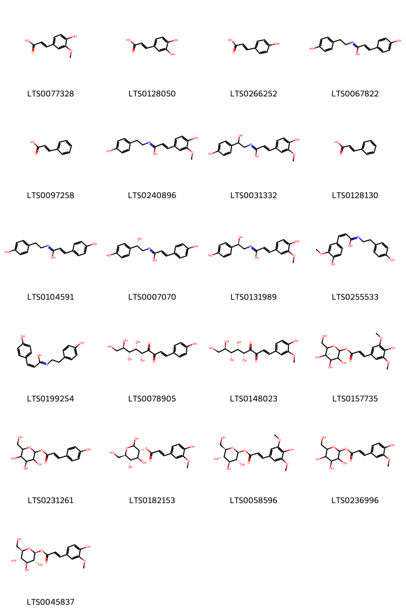{ width=100% }
    <figcaption>Hình ảnh cấu trúc hóa học của 21 hoạt chất thuộc nhóm Cinnamic acids and derivatives gồm ['ferulic acid (LTS0077328)', '3,4-dihydroxycinnamic acid (LTS0128050)', 'para-coumaric acid (LTS0266252)', '(2e)-3-(4-hydroxyphenyl)-n-[2-(4-hydroxyphenyl)ethyl]prop-2-enimidic acid (LTS0067822)', 'phenylacrylic acid (LTS0097258)', '3-(4-hydroxy-3-methoxyphenyl)-n-[2-(4-hydroxyphenyl)ethyl]prop-2-enimidic acid (LTS0240896)', 'n-[2-hydroxy-2-(4-hydroxyphenyl)ethyl]-3-(4-hydroxy-3-methoxyphenyl)prop-2-enimidic acid (LTS0031332)', 'cinnamic acid (LTS0128130)', '3-(4-hydroxyphenyl)-n-[2-(4-hydroxyphenyl)ethyl]prop-2-enimidic acid (LTS0104591)', '(2e)-n-[(2s)-2-hydroxy-2-(4-hydroxyphenyl)ethyl]-3-(4-hydroxyphenyl)prop-2-enimidic acid (LTS0007070)', '(2e)-n-[(2r)-2-hydroxy-2-(4-hydroxyphenyl)ethyl]-3-(4-hydroxy-3-methoxyphenyl)prop-2-enimidic acid (LTS0131989)', '(2z)-3-(4-hydroxy-3-methoxyphenyl)-n-[2-(4-hydroxyphenyl)ethyl]prop-2-enimidic acid (LTS0255533)', '(2z)-3-(4-hydroxyphenyl)-n-[2-(4-hydroxyphenyl)ethyl]prop-2-enimidic acid (LTS0199254)', '(1e,5r,6s,7r,8r)-5,6,7,8,9-pentahydroxy-1-(4-hydroxyphenyl)non-1-ene-3,4-dione (LTS0078905)', '(1e,5r,6s,7r,8r)-5,6,7,8,9-pentahydroxy-1-(4-hydroxy-3-methoxyphenyl)non-1-ene-3,4-dione (LTS0148023)', '3,4,5-trihydroxy-6-(hydroxymethyl)oxan-2-yl 3-(4-hydroxy-3,5-dimethoxyphenyl)prop-2-enoate (LTS0157735)', '3,4,5-trihydroxy-6-(hydroxymethyl)oxan-2-yl (2e)-3-(4-hydroxyphenyl)prop-2-enoate (LTS0231261)', '(3r,4s,5s,6r)-2,4,5-trihydroxy-6-(hydroxymethyl)oxan-3-yl (2e)-3-(4-hydroxy-3-methoxyphenyl)prop-2-enoate (LTS0182153)', '1-o-sinapoyl-β-d-glucose (LTS0058596)', '3,4,5-trihydroxy-6-(hydroxymethyl)oxan-2-yl 3-(4-hydroxy-3-methoxyphenyl)prop-2-enoate (LTS0236996)', '1-o-feruloyl-β-d-glucose (LTS0045837)'].</figcaption>
</figure>
#### Nhóm Diazines
<figure markdown="span">
    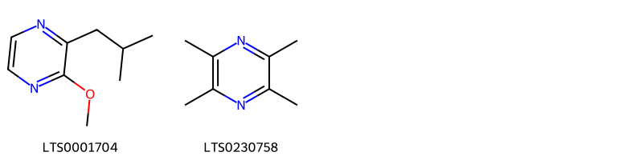{ width=100% }
    <figcaption>Hình ảnh cấu trúc hóa học của 2 hoạt chất thuộc nhóm Diazines gồm ['isobutyl-methoxypyrazine (LTS0001704)', 'ligustrazine (LTS0230758)'].</figcaption>
</figure>
#### Nhóm Dibenzylbutane lignans
<figure markdown="span">
    { width=100% }
    <figcaption>Hình ảnh cấu trúc hóa học của 2 hoạt chất thuộc nhóm Dibenzylbutane lignans gồm ['(2s,3r)-2,3-bis[(4-hydroxy-3-methoxyphenyl)(¹³c)methyl](1-¹³c)butane-1,4-diol (LTS0268699)', 'secoisolariciresinol (LTS0086727)'].</figcaption>
</figure>
#### Nhóm Dihydrofurans
<figure markdown="span">
    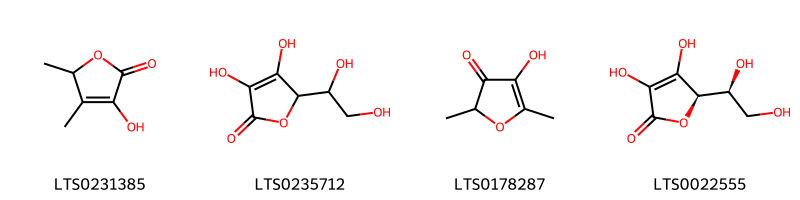{ width=100% }
    <figcaption>Hình ảnh cấu trúc hóa học của 4 hoạt chất thuộc nhóm Dihydrofurans gồm ['sotolon (LTS0231385)', 'c-level (LTS0235712)', 'furaneol (LTS0178287)', 'vitamin c (LTS0022555)'].</figcaption>
</figure>
#### Nhóm Dioxolanes
<figure markdown="span">
    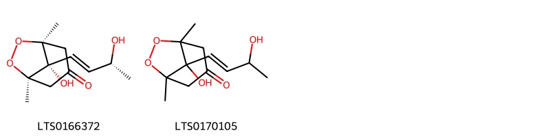{ width=100% }
    <figcaption>Hình ảnh cấu trúc hóa học của 2 hoạt chất thuộc nhóm Dioxolanes gồm ['(1r,5s,8r)-8-hydroxy-8-[(1e,3r)-3-hydroxybut-1-en-1-yl]-1,5-dimethyl-6,7-dioxabicyclo[3.2.1]octan-3-one (LTS0166372)', '8-hydroxy-8-(3-hydroxybut-1-en-1-yl)-1,5-dimethyl-6,7-dioxabicyclo[3.2.1]octan-3-one (LTS0170105)'].</figcaption>
</figure>
#### Nhóm Fatty Acyls
<figure markdown="span">
    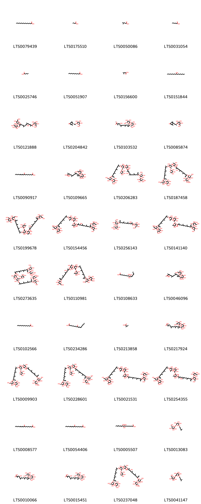{ width=100% }
    <figcaption>Hình ảnh cấu trúc hóa học của 40 hoạt chất thuộc nhóm Fatty Acyls gồm ['palmitic acid (LTS0079439)', 'butanoic acid (LTS0175510)', '4-methyl valeric acid (LTS0050086)', 'hexanoic acid (LTS0031054)', 'n-valeric acid (LTS0025746)', 'lauric acid (LTS0051907)', 'isovaleric acid (LTS0156600)', '9-octadecanol (LTS0151844)', '3,4,5-trihydroxy-6-(hydroxymethyl)oxan-2-yl 14-{[4,5-dihydroxy-6-(hydroxymethyl)-3-{[3,4,5-trihydroxy-6-(hydroxymethyl)oxan-2-yl]oxy}oxan-2-yl]oxy}-4-hydroxy-2,6,10,14-tetramethylhexadeca-2,6,10,15-tetraenoate (LTS0121888)', '(4s)-3,5,5-trimethyl-4-[(3r)-3-{[(2r,3r,4s,5s,6r)-3,4,5-trihydroxy-6-(hydroxymethyl)oxan-2-yl]oxy}butyl]cyclohex-2-en-1-one (LTS0204842)', 'methyl (2e,4r,6e,10e,14s)-14-{[(2s,3r,4s,5s,6r)-4,5-dihydroxy-6-(hydroxymethyl)-3-{[(2s,3r,4s,5s,6r)-3,4,5-trihydroxy-6-(hydroxymethyl)oxan-2-yl]oxy}oxan-2-yl]oxy}-4-hydroxy-2,6,10,14-tetramethylhexadeca-2,6,10,15-tetraenoate (LTS0103532)', '3,5,5-trimethyl-4-(3-{[3,4,5-trihydroxy-6-(hydroxymethyl)oxan-2-yl]oxy}butyl)cyclohex-2-en-1-one (LTS0085874)', '(10e,12e)-9-oxooctadeca-10,12-dienoic acid (LTS0090917)', '14-{[4,5-dihydroxy-6-(hydroxymethyl)-3-{[3,4,5-trihydroxy-6-(hydroxymethyl)oxan-2-yl]oxy}oxan-2-yl]oxy}-4-hydroxy-2,6,10,14-tetramethylhexadeca-2,6,10,15-tetraenoic acid (LTS0109665)', '(2s,3r,4r,5r,6s)-2-{[(2r,3s,4r,5r,6r)-6-{[(2z,6e,10e,14s)-14-{[(2s,3r,4s,5s,6r)-4,5-dihydroxy-6-(hydroxymethyl)-3-{[(2s,3r,4s,5s,6r)-3,4,5-trihydroxy-6-(hydroxymethyl)oxan-2-yl]oxy}oxan-2-yl]oxy}-2,6,10,14-tetramethylhexadeca-2,6,10,15-tetraen-1-yl]oxy}-4,5-dihydroxy-2-({[(2r,3r,4r,5r,6s)-3,4,5-trihydroxy-6-methyloxan-2-yl]oxy}methyl)oxan-3-yl]oxy}-4,5-dihydroxy-6-methyloxan-3-yl (2e,4s,6z,10e,14r)-14-{[(2s,3r,4s,5r,6r)-4,5-dihydroxy-6-(hydroxymethyl)-3-{[(2s,3r,4s,5s,6r)-3,4,5-trihydroxy-6-(hydroxymethyl)oxan-2-yl]oxy}oxan-2-yl]oxy}-4-hydroxy-2,6,10,14-tetramethylhexadeca-2,6,10,15-tetraenoate (LTS0206283)', '(2s,3r,4r,5r,6s)-2-{[(2r,3s,4r,5r,6r)-6-{[(2z,6e,10e,14s)-14-{[(2s,3r,4s,5s,6r)-4,5-dihydroxy-6-(hydroxymethyl)-3-{[(2s,3r,4s,5s,6r)-3,4,5-trihydroxy-6-(hydroxymethyl)oxan-2-yl]oxy}oxan-2-yl]oxy}-2,6,10,14-tetramethylhexadeca-2,6,10,15-tetraen-1-yl]oxy}-4,5-dihydroxy-2-({[(2r,3r,4r,5r,6s)-3,4,5-trihydroxy-6-methyloxan-2-yl]oxy}methyl)oxan-3-yl]oxy}-4,5-dihydroxy-6-methyloxan-3-yl (2e,4s,6e,10e,14r)-14-{[(2s,3r,4s,5r,6r)-4,5-dihydroxy-6-(hydroxymethyl)-3-{[(2s,3r,4s,5s,6r)-3,4,5-trihydroxy-6-(hydroxymethyl)oxan-2-yl]oxy}oxan-2-yl]oxy}-4-hydroxy-2,6,10,14-tetramethylhexadeca-2,6,10,15-tetraenoate (LTS0187458)', '2-[(6-{[(2z,6e,10e)-14-{[4,5-dihydroxy-6-(hydroxymethyl)-3-{[3,4,5-trihydroxy-6-(hydroxymethyl)oxan-2-yl]oxy}oxan-2-yl]oxy}-2,6,10,14-tetramethylhexadeca-2,6,10,15-tetraen-1-yl]oxy}-4,5-dihydroxy-2-{[(3,4,5-trihydroxy-6-methyloxan-2-yl)oxy]methyl}oxan-3-yl)oxy]-4,5-dihydroxy-6-methyloxan-3-yl (2e,6e,10e)-4-hydroxy-2,6,10,14-tetramethyl-14-{[3,4,5-trihydroxy-6-(hydroxymethyl)oxan-2-yl]oxy}hexadeca-2,6,10,15-tetraenoate (LTS0199678)', '2-({6-[(2-{[(2z,6e,10e)-14-{[4,5-dihydroxy-6-(hydroxymethyl)-3-{[3,4,5-trihydroxy-6-(hydroxymethyl)oxan-2-yl]oxy}oxan-2-yl]oxy}-2,6,10,14-tetramethylhexadeca-2,6,10,15-tetraen-1-yl]oxy}-3,5-dihydroxy-6-methyloxan-4-yl)oxy]-3,4,5-trihydroxyoxan-2-yl}methoxy)-4,5-dihydroxy-6-methyloxan-3-yl (2e,6e,10e)-14-{[4,5-dihydroxy-6-(hydroxymethyl)-3-{[3,4,5-trihydroxy-6-(hydroxymethyl)oxan-2-yl]oxy}oxan-2-yl]oxy}-4-hydroxy-2,6,10,14-tetramethylhexadeca-2,6,10,15-tetraenoate (LTS0154456)', '(2s,3r,4s,5s,6r)-3,4,5-trihydroxy-6-(hydroxymethyl)oxan-2-yl (2e,4r,6e,10e,14s)-14-{[(2s,3r,4s,5s,6r)-4,5-dihydroxy-6-(hydroxymethyl)-3-{[(2s,3r,4s,5s,6r)-3,4,5-trihydroxy-6-(hydroxymethyl)oxan-2-yl]oxy}oxan-2-yl]oxy}-4-hydroxy-2,6,10,14-tetramethylhexadeca-2,6,10,15-tetraenoate (LTS0256143)', '2-({6-[(2-{[(2z,6e,10e)-14-{[4,5-dihydroxy-6-(hydroxymethyl)-3-{[3,4,5-trihydroxy-6-(hydroxymethyl)oxan-2-yl]oxy}oxan-2-yl]oxy}-2,6,10,14-tetramethylhexadeca-2,6,10,15-tetraen-1-yl]oxy}-3,5-dihydroxy-6-methyloxan-4-yl)oxy]-3,4,5-trihydroxyoxan-2-yl}methoxy)-4,5-dihydroxy-6-methyloxan-3-yl (2e,6e,10e)-14-{[4,5-dihydroxy-6-(hydroxymethyl)-3-{[3,4,5-trihydroxy-6-(hydroxymethyl)oxan-2-yl]oxy}oxan-2-yl]oxy}-2,6,10,14-tetramethylhexadeca-2,6,10,15-tetraenoate (LTS0141140)', '(2r,3r,4r,5s,6s)-2-{[(2r,3s,4r,5r,6r)-6-{[(2z,6e,10e,14s)-14-{[(2s,3r,4s,5s,6r)-4,5-dihydroxy-6-(hydroxymethyl)-3-{[(2s,3r,4s,5s,6r)-3,4,5-trihydroxy-6-(hydroxymethyl)oxan-2-yl]oxy}oxan-2-yl]oxy}-2,6,10,14-tetramethylhexadeca-2,6,10,15-tetraen-1-yl]oxy}-4,5-dihydroxy-2-({[(2r,3r,4r,5r,6s)-3,4,5-trihydroxy-6-methyloxan-2-yl]oxy}methyl)oxan-3-yl]oxy}-3,5-dihydroxy-6-methyloxan-4-yl (2z,6e,10e,14s)-14-{[(2s,3r,4s,5s,6r)-4,5-dihydroxy-6-(hydroxymethyl)-3-{[(2s,3r,4s,5s,6r)-3,4,5-trihydroxy-6-(hydroxymethyl)oxan-2-yl]oxy}oxan-2-yl]oxy}-2,6,10,14-tetramethylhexadeca-2,6,10,15-tetraenoate (LTS0273635)', '2-[(6-{[(2z,6e,10e)-14-{[4,5-dihydroxy-6-(hydroxymethyl)-3-{[3,4,5-trihydroxy-6-(hydroxymethyl)oxan-2-yl]oxy}oxan-2-yl]oxy}-2,6,10,14-tetramethylhexadeca-2,6,10,15-tetraen-1-yl]oxy}-4,5-dihydroxy-2-{[(3,4,5-trihydroxy-6-methyloxan-2-yl)oxy]methyl}oxan-3-yl)oxy]-3,5-dihydroxy-6-methyloxan-4-yl (2e,6e,10e)-4-hydroxy-2,6,10,14-tetramethyl-14-{[3,4,5-trihydroxy-6-(hydroxymethyl)oxan-2-yl]oxy}hexadeca-2,6,10,15-tetraenoate (LTS0110981)', '(9s,10s,11r,12z,15z)-9,10,11-trihydroxyoctadeca-12,15-dienoic acid (LTS0108633)', 'methyl 14-{[4,5-dihydroxy-6-(hydroxymethyl)-3-{[3,4,5-trihydroxy-6-(hydroxymethyl)oxan-2-yl]oxy}oxan-2-yl]oxy}-4-hydroxy-2,6,10,14-tetramethylhexadeca-2,6,10,15-tetraenoate (LTS0046096)', 'myristic acid (LTS0102566)', '9-oxoode (LTS0234286)', '2-methylbutanoic acid (LTS0213858)', '(2e,6e,10e)-14-{[4,5-dihydroxy-6-(hydroxymethyl)-3-{[3,4,5-trihydroxy-6-(hydroxymethyl)oxan-2-yl]oxy}oxan-2-yl]oxy}-2,6,10,14-tetramethylhexadeca-2,6,10,15-tetraenoic acid (LTS0217924)', '(2r,3r,4r,5s,6s)-2-{[(2r,3s,4r,5r,6r)-6-{[(2z,6e,10e,14s)-14-{[(2s,3r,4s,5s,6r)-4,5-dihydroxy-6-(hydroxymethyl)-3-{[(2s,3r,4s,5s,6r)-3,4,5-trihydroxy-6-(hydroxymethyl)oxan-2-yl]oxy}oxan-2-yl]oxy}-2,6,10,14-tetramethylhexadeca-2,6,10,15-tetraen-1-yl]oxy}-4,5-dihydroxy-2-({[(2r,3r,4r,5r,6s)-3,4,5-trihydroxy-6-methyloxan-2-yl]oxy}methyl)oxan-3-yl]oxy}-3,5-dihydroxy-6-methyloxan-4-yl (2e,6e,10e,14s)-14-{[(2s,3r,4s,5s,6r)-4,5-dihydroxy-6-(hydroxymethyl)-3-{[(2s,3r,4s,5s,6r)-3,4,5-trihydroxy-6-(hydroxymethyl)oxan-2-yl]oxy}oxan-2-yl]oxy}-2,6,10,14-tetramethylhexadeca-2,6,10,15-tetraenoate (LTS0009903)', '(2s,3r,4r,5r,6s)-2-{[(2r,3s,4r,5r,6r)-6-{[(2z,6e,10e,14s)-14-{[(2s,3r,4s,5s,6r)-4,5-dihydroxy-6-(hydroxymethyl)-3-{[(2s,3r,4s,5s,6r)-3,4,5-trihydroxy-6-(hydroxymethyl)oxan-2-yl]oxy}oxan-2-yl]oxy}-2,6,10,14-tetramethylhexadeca-2,6,10,15-tetraen-1-yl]oxy}-4,5-dihydroxy-2-({[(2r,3r,4r,5r,6s)-3,4,5-trihydroxy-6-methyloxan-2-yl]oxy}methyl)oxan-3-yl]oxy}-4,5-dihydroxy-6-methyloxan-3-yl (2e,6e,10e,14s)-14-{[(2s,3r,4s,5s,6r)-4,5-dihydroxy-6-(hydroxymethyl)-3-{[(2s,3r,4s,5s,6r)-3,4,5-trihydroxy-6-(hydroxymethyl)oxan-2-yl]oxy}oxan-2-yl]oxy}-2,6,10,14-tetramethylhexadeca-2,6,10,15-tetraenoate (LTS0228601)', '2-({6-[(2-{[(2z,6e,10e)-14-{[4,5-dihydroxy-6-(hydroxymethyl)-3-{[3,4,5-trihydroxy-6-(hydroxymethyl)oxan-2-yl]oxy}oxan-2-yl]oxy}-2,6,10,14-tetramethylhexadeca-2,6,10,15-tetraen-1-yl]oxy}-3,5-dihydroxy-6-methyloxan-4-yl)oxy]-3,4,5-trihydroxyoxan-2-yl}methoxy)-3,5-dihydroxy-6-methyloxan-4-yl (2e,6e,10e)-14-{[4,5-dihydroxy-6-(hydroxymethyl)-3-{[3,4,5-trihydroxy-6-(hydroxymethyl)oxan-2-yl]oxy}oxan-2-yl]oxy}-2,6,10,14-tetramethylhexadeca-2,6,10,15-tetraenoate (LTS0021531)', '2-({6-[(2-{[(2z,6e,10e)-14-{[4,5-dihydroxy-6-(hydroxymethyl)-3-{[3,4,5-trihydroxy-6-(hydroxymethyl)oxan-2-yl]oxy}oxan-2-yl]oxy}-2,6,10,14-tetramethylhexadeca-2,6,10,15-tetraen-1-yl]oxy}-3,5-dihydroxy-6-methyloxan-4-yl)oxy]-3,4,5-trihydroxyoxan-2-yl}methoxy)-3,5-dihydroxy-6-methyloxan-4-yl (2e,6e,10e)-14-{[4,5-dihydroxy-6-(hydroxymethyl)-3-{[3,4,5-trihydroxy-6-(hydroxymethyl)oxan-2-yl]oxy}oxan-2-yl]oxy}-4-hydroxy-2,6,10,14-tetramethylhexadeca-2,6,10,15-tetraenoate (LTS0254355)', '(10e)-9-oxooctadeca-10,12-dienoic acid (LTS0008577)', '9-oxooctadeca-10,12-dienoic acid (LTS0054406)', '9,10,11-trihydroxyoctadeca-12,15-dienoic acid (LTS0005507)', '(2r,3r,4s,5s,6r)-2-[(4-methylpentyl)oxy]-6-({[(2r,3r,4s,5s,6r)-3,4,5-trihydroxy-6-(hydroxymethyl)oxan-2-yl]oxy}methyl)oxane-3,4,5-triol (LTS0013083)', '(2e,6e,10e)-14-{[(2s,3r,4s,5s,6r)-4,5-dihydroxy-6-(hydroxymethyl)-3-{[(2s,3r,4s,5s,6r)-3,4,5-trihydroxy-6-(hydroxymethyl)oxan-2-yl]oxy}oxan-2-yl]oxy}-4-hydroxy-2,6,10,14-tetramethylhexadeca-2,6,10,15-tetraenoic acid (LTS0010066)', '(2e,4r,6e,10e,14s)-14-{[(2s,3r,4s,5s,6r)-4,5-dihydroxy-6-(hydroxymethyl)-3-{[(2s,3r,4s,5s,6r)-3,4,5-trihydroxy-6-(hydroxymethyl)oxan-2-yl]oxy}oxan-2-yl]oxy}-4-hydroxy-2,6,10,14-tetramethylhexadeca-2,6,10,15-tetraenoic acid (LTS0015451)', '(2r,3r,4r,5s,6s)-2-{[(2r,3s,4r,5r,6r)-6-{[(2z,6e,10e,14s)-14-{[(2s,3r,4s,5s,6r)-4,5-dihydroxy-6-(hydroxymethyl)-3-{[(2s,3r,4s,5s,6r)-3,4,5-trihydroxy-6-(hydroxymethyl)oxan-2-yl]oxy}oxan-2-yl]oxy}-2,6,10,14-tetramethylhexadeca-2,6,10,15-tetraen-1-yl]oxy}-4,5-dihydroxy-2-({[(2r,3r,4r,5r,6s)-3,4,5-trihydroxy-6-methyloxan-2-yl]oxy}methyl)oxan-3-yl]oxy}-3,5-dihydroxy-6-methyloxan-4-yl (2e,4s,6e,10e,14s)-14-{[(2s,3r,4s,5s,6r)-4,5-dihydroxy-6-(hydroxymethyl)-3-{[(2s,3r,4s,5s,6r)-3,4,5-trihydroxy-6-(hydroxymethyl)oxan-2-yl]oxy}oxan-2-yl]oxy}-4-hydroxy-2,6,10,14-tetramethylhexadeca-2,6,10,15-tetraenoate (LTS0237048)', '2-[(4-methylpentyl)oxy]-6-({[3,4,5-trihydroxy-6-(hydroxymethyl)oxan-2-yl]oxy}methyl)oxane-3,4,5-triol (LTS0041147)'].</figcaption>
</figure>
#### Nhóm Flavonoids
<figure markdown="span">
    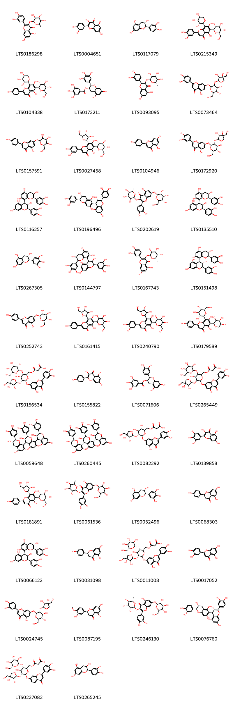{ width=100% }
    <figcaption>Hình ảnh cấu trúc hóa học của 46 hoạt chất thuộc nhóm Flavonoids gồm ['quercitrin (LTS0186298)', 'quercetin (LTS0004651)', '(+)-catechol (LTS0117079)', '2-(3,4-dihydroxyphenyl)-5,7-dihydroxy-6-[(2s,3r,4r,5s,6r)-3,4,5-trihydroxy-6-(hydroxymethyl)oxan-2-yl]-8-[(2s,3r,4r,5s)-3,4,5-trihydroxyoxan-2-yl]chromen-4-one (LTS0215349)', 'schaftoside (LTS0104338)', '(-)-epigallocatechin gallate (LTS0173211)', 'quercitrin (LTS0093095)', '7-[(3-{[3,4-dihydroxy-4-(hydroxymethyl)oxolan-2-yl]oxy}-4,5-dihydroxy-6-(hydroxymethyl)oxan-2-yl)oxy]-2-(3,4-dihydroxyphenyl)-5-hydroxychromen-4-one (LTS0073464)', 'apigetrin (LTS0157591)', '8-[(2s,3r,4r,5s)-3,4-dihydroxy-5-(hydroxymethyl)oxolan-2-yl]-2-(3,4-dihydroxyphenyl)-5,7-dihydroxy-6-[(2s,3r,4r,5s,6r)-3,4,5-trihydroxy-6-(hydroxymethyl)oxan-2-yl]chromen-4-one (LTS0027458)', 'chamomile (LTS0104946)', '7-{[(2s,3r,4s,5s,6r)-3-{[(2s,3r,4s)-3,4-dihydroxy-4-(hydroxymethyl)oxolan-2-yl]oxy}-4,5-dihydroxy-6-(hydroxymethyl)oxan-2-yl]oxy}-2-(3,4-dihydroxyphenyl)-5-hydroxychromen-4-one (LTS0172920)', '(2r,3s,4s)-2-(3,4-dihydroxyphenyl)-4-[(2r,3r)-2-(3,4-dihydroxyphenyl)-3,5,7-trihydroxy-3,4-dihydro-2h-1-benzopyran-8-yl]-3,4-dihydro-2h-1-benzopyran-3,5,7-triol (LTS0116257)', '(2r,3s,4s)-2-(3,4-dihydroxyphenyl)-4-[(2r,3r)-2-(3,4-dihydroxyphenyl)-3,5,7-trihydroxy-3,4-dihydro-2h-1-benzopyran-6-yl]-3,4-dihydro-2h-1-benzopyran-3,5,7-triol (LTS0196496)', '2-(3,4-dihydroxyphenyl)-5-hydroxy-7-{[(2s,3r,4s,5s,6r)-3,4,5-trihydroxy-6-(hydroxymethyl)oxan-2-yl]oxy}-3-{[(2s,3s,4r,5r,6s)-3,4,5-trihydroxy-6-methyloxan-2-yl]oxy}chromen-4-one (LTS0202619)', '(2r,3r,4r)-2-(3,4-dihydroxyphenyl)-4-[(2r,3r)-2-(3,4-dihydroxyphenyl)-3,5,7-trihydroxy-3,4-dihydro-2h-1-benzopyran-8-yl]-3,4-dihydro-2h-1-benzopyran-3,5,7-triol (LTS0135510)', 'gallocatechol (LTS0267305)', '4-[3,5,7-trihydroxy-2-(3,4,5-trihydroxyphenyl)-3,4-dihydro-2h-1-benzopyran-8-yl]-2-(3,4,5-trihydroxyphenyl)-3,4-dihydro-2h-1-benzopyran-3,5,7-triol (LTS0144797)', '2-(3,4-dihydroxyphenyl)-5,7-dihydroxy-3-{[(2s,3s,4r,5s,6s)-3,4,5-trihydroxy-6-methyloxan-2-yl]oxy}chromen-4-one (LTS0167743)', '(2r,3s,4s)-2-(3,4-dihydroxyphenyl)-4-[(2r,3s)-2-(3,4-dihydroxyphenyl)-3,5,7-trihydroxy-3,4-dihydro-2h-1-benzopyran-8-yl]-3,4-dihydro-2h-1-benzopyran-3,5,7-triol (LTS0151498)', 'apigenin 7-o-β-glucoside (LTS0252743)', '8-[3,4-dihydroxy-5-(hydroxymethyl)oxolan-2-yl]-5,7-dihydroxy-2-(4-hydroxyphenyl)-6-[3,4,5-trihydroxy-6-(hydroxymethyl)oxan-2-yl]chromen-4-one (LTS0161415)', '8-[3,4-dihydroxy-5-(hydroxymethyl)oxolan-2-yl]-2-(3,4-dihydroxyphenyl)-5,7-dihydroxy-6-[3,4,5-trihydroxy-6-(hydroxymethyl)oxan-2-yl]chromen-4-one (LTS0240790)', '5,7-dihydroxy-2-(4-hydroxyphenyl)-8-[(2s,3r,4r,5s,6r)-3,4,5-trihydroxy-6-(hydroxymethyl)oxan-2-yl]-6-[(2s,3s,4s,5s)-3,4,5-trihydroxyoxan-2-yl]chromen-4-one (LTS0179589)', '3-{[(2r,3r,4s,5r,6s)-5-{[(2s,3s,4r)-3,4-dihydroxy-4-(hydroxymethyl)oxolan-2-yl]oxy}-6-{[2-(3,4-dihydroxyphenyl)-5-hydroxy-4-oxochromen-7-yl]oxy}-4-hydroxy-3-{[(2s,3s,4s,5r,6r)-3,4,5-trihydroxy-6-(hydroxymethyl)oxan-2-yl]oxy}oxan-2-yl]methoxy}-3-oxopropanoic acid (LTS0156534)', 'kaempherol (LTS0155822)', 'epicatechin gallate (LTS0071606)', '3-[(5-{[3,4-dihydroxy-4-(hydroxymethyl)oxolan-2-yl]oxy}-6-{[2-(3,4-dihydroxyphenyl)-5-hydroxy-4-oxochromen-7-yl]oxy}-4-hydroxy-3-{[3,4,5-trihydroxy-6-(hydroxymethyl)oxan-2-yl]oxy}oxan-2-yl)methoxy]-3-oxopropanoic acid (LTS0265449)', '(2r,3r)-2-(3,4-dihydroxyphenyl)-8-[(2r,3r)-2-(3,4-dihydroxyphenyl)-3,5,7-trihydroxy-3,4-dihydro-2h-1-benzopyran-4-yl]-4-[(2r,3s)-2-(3,4-dihydroxyphenyl)-3,5,7-trihydroxy-3,4-dihydro-2h-1-benzopyran-8-yl]-3,4-dihydro-2h-1-benzopyran-3,5,7-triol (LTS0059648)', 'procyanidin c1 (LTS0260445)', '3-{[(2r,3s,4s,5r,6s)-5-{[(2s,3r,4r)-3,4-dihydroxy-4-(hydroxymethyl)oxolan-2-yl]oxy}-6-{[2-(3,4-dihydroxyphenyl)-5-hydroxy-4-oxochromen-7-yl]oxy}-3,4-dihydroxyoxan-2-yl]methoxy}-3-oxopropanoic acid (LTS0082292)', 'myricetin (LTS0139858)', '8-[(2s,3r,4r,5s)-3,4-dihydroxy-5-(hydroxymethyl)oxolan-2-yl]-5,7-dihydroxy-2-(4-hydroxyphenyl)-6-[(2s,3r,4r,5s,6r)-3,4,5-trihydroxy-6-(hydroxymethyl)oxan-2-yl]chromen-4-one (LTS0181891)', '2-(3,4-dihydroxyphenyl)-5-hydroxy-7-{[3,4,5-trihydroxy-6-(hydroxymethyl)oxan-2-yl]oxy}-3-[(3,4,5-trihydroxy-6-methyloxan-2-yl)oxy]chromen-4-one (LTS0061536)', 'epigallocatechin (LTS0052496)', 'asahina (LTS0068303)', '(2r,3r,4r)-2-(3,4-dihydroxyphenyl)-4-[(2r,3s)-2-(3,4-dihydroxyphenyl)-3,5,7-trihydroxy-3,4-dihydro-2h-1-benzopyran-8-yl]-3,4-dihydro-2h-1-benzopyran-3,5,7-triol (LTS0066122)', 'naringenin (LTS0031098)', '3-{[(2r,3s,4s,5r,6s)-5-{[(2s,3r,4r)-3,4-dihydroxy-4-(hydroxymethyl)oxolan-2-yl]oxy}-6-{[2-(3,4-dihydroxyphenyl)-5-hydroxy-4-oxochromen-7-yl]oxy}-4-hydroxy-3-{[(2s,3r,4s,5s,6r)-3,4,5-trihydroxy-6-(hydroxymethyl)oxan-2-yl]oxy}oxan-2-yl]methoxy}-3-oxopropanoic acid (LTS0011008)', 'luteolin (LTS0017052)', '7-{[(2s,3r,4s,5s,6r)-3-{[(2s,3r,4r)-3,4-dihydroxy-4-(hydroxymethyl)oxolan-2-yl]oxy}-4,5-dihydroxy-6-(hydroxymethyl)oxan-2-yl]oxy}-2-(3,4-dihydroxyphenyl)-5-hydroxychromen-4-one (LTS0024745)', 'hesperetin (LTS0087195)', '2-(3,4-dihydroxyphenyl)-5-hydroxy-7-{[(2s,3r,4s,5s,6r)-3,4,5-trihydroxy-6-(hydroxymethyl)oxan-2-yl]oxy}-3-{[(2s,3r,4r,5r,6s)-3,4,5-trihydroxy-6-methyloxan-2-yl]oxy}chromen-4-one (LTS0246130)', '(2r,3s,4r)-2-(3,4-dihydroxyphenyl)-4-[(2r,3r)-2-(3,4-dihydroxyphenyl)-3,5,7-trihydroxy-3,4-dihydro-2h-1-benzopyran-6-yl]-3,4-dihydro-2h-1-benzopyran-3,5,7-triol (LTS0076760)', '3-{[(2r,3s,4s,5r,6s)-5-{[(2s,3r,4r)-3,4-dihydroxy-4-(hydroxymethyl)oxolan-2-yl]oxy}-6-{[2-(3,4-dihydroxyphenyl)-4-oxochromen-7-yl]oxy}-4-hydroxy-3-{[(2s,3r,4s,5s,6r)-3,4,5-trihydroxy-6-(hydroxymethyl)oxan-2-yl]oxy}oxan-2-yl]methoxy}-3-oxopropanoic acid (LTS0227082)', 'ent-epicatechin (LTS0265245)'].</figcaption>
</figure>
#### Nhóm Furanoid lignans
<figure markdown="span">
    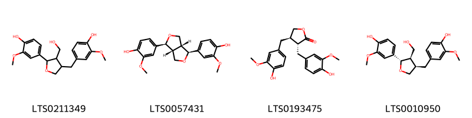{ width=100% }
    <figcaption>Hình ảnh cấu trúc hóa học của 4 hoạt chất thuộc nhóm Furanoid lignans gồm ['4-{4-[(4-hydroxy-3-methoxyphenyl)methyl]-3-(hydroxymethyl)oxolan-2-yl}-2-methoxyphenol (LTS0211349)', 'pinoresinol (LTS0057431)', 'matairesinol (LTS0193475)', 'lariciresinol (LTS0010950)'].</figcaption>
</figure>
#### Nhóm Glycerolipids
<figure markdown="span">
    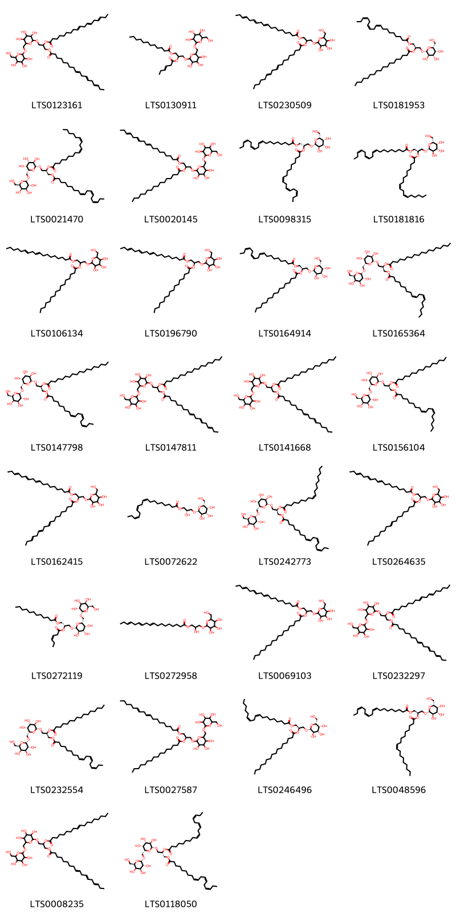{ width=100% }
    <figcaption>Hình ảnh cấu trúc hóa học của 30 hoạt chất thuộc nhóm Glycerolipids gồm ['1-(octadeca-9,12,15-trienoyloxy)-3-{[3,4,5-trihydroxy-6-({[3,4,5-trihydroxy-6-(hydroxymethyl)oxan-2-yl]oxy}methyl)oxan-2-yl]oxy}propan-2-yl octadeca-9,12,15-trienoate (LTS0123161)', '2-(hex-3-enoyloxy)-3-{[3,4,5-trihydroxy-6-({[3,4,5-trihydroxy-6-(hydroxymethyl)oxan-2-yl]oxy}methyl)oxan-2-yl]oxy}propyl dodecanoate (LTS0130911)', '2-(octadeca-9,12-dienoyloxy)-3-{[3,4,5-trihydroxy-6-(hydroxymethyl)oxan-2-yl]oxy}propyl octadeca-9,12,15-trienoate (LTS0230509)', '(2r)-2-(octadecanoyloxy)-3-{[(2r,3r,4s,5r,6r)-3,4,5-trihydroxy-6-(hydroxymethyl)oxan-2-yl]oxy}propyl (9z,12z,15z)-octadeca-9,12,15-trienoate (LTS0181953)', '(2r)-2-[(9z,12z)-octadeca-9,12-dienoyloxy]-3-{[(2r,3r,4s,5r,6r)-3,4,5-trihydroxy-6-({[(2s,3r,4s,5r,6r)-3,4,5-trihydroxy-6-(hydroxymethyl)oxan-2-yl]oxy}methyl)oxan-2-yl]oxy}propyl (9z,12z,15z)-octadeca-9,12,15-trienoate (LTS0021470)', '2-(hexadecanoyloxy)-3-{[3,4,5-trihydroxy-6-({[3,4,5-trihydroxy-6-(hydroxymethyl)oxan-2-yl]oxy}methyl)oxan-2-yl]oxy}propyl octadeca-9,12,15-trienoate (LTS0020145)', '(2s)-1-[(9z,12z,15z)-octadeca-9,12,15-trienoyloxy]-3-{[(2r,3r,4s,5r,6r)-3,4,5-trihydroxy-6-(hydroxymethyl)oxan-2-yl]oxy}propan-2-yl (9z,12z,15z)-octadeca-9,12,15-trienoate (LTS0098315)', '(2r)-2-[(9z,12z)-octadeca-9,12-dienoyloxy]-3-{[(2r,3r,4s,5r,6r)-3,4,5-trihydroxy-6-(hydroxymethyl)oxan-2-yl]oxy}propyl (9z,12z,15z)-octadeca-9,12,15-trienoate (LTS0181816)', '2-(hexadecanoyloxy)-3-{[3,4,5-trihydroxy-6-(hydroxymethyl)oxan-2-yl]oxy}propyl octadeca-9,12-dienoate (LTS0106134)', '2-(hexadecanoyloxy)-3-{[3,4,5-trihydroxy-6-(hydroxymethyl)oxan-2-yl]oxy}propyl octadeca-9,12,15-trienoate (LTS0196790)', '(2r)-2-(hexadecanoyloxy)-3-{[(2r,3r,4s,5r,6r)-3,4,5-trihydroxy-6-(hydroxymethyl)oxan-2-yl]oxy}propyl (9z,12z,15z)-octadeca-9,12,15-trienoate (LTS0164914)', '(2r)-2-(octadecanoyloxy)-3-{[(2r,3r,4s,5r,6r)-3,4,5-trihydroxy-6-({[(2s,3r,4s,5r,6r)-3,4,5-trihydroxy-6-(hydroxymethyl)oxan-2-yl]oxy}methyl)oxan-2-yl]oxy}propyl (9z,12z)-octadeca-9,12-dienoate (LTS0165364)', '(2r)-2-(octadecanoyloxy)-3-{[(2r,3r,4s,5r,6r)-3,4,5-trihydroxy-6-({[(2s,3r,4s,5r,6r)-3,4,5-trihydroxy-6-(hydroxymethyl)oxan-2-yl]oxy}methyl)oxan-2-yl]oxy}propyl (9z,12z,15z)-octadeca-9,12,15-trienoate (LTS0147798)', '2-(octadecanoyloxy)-3-{[3,4,5-trihydroxy-6-({[3,4,5-trihydroxy-6-(hydroxymethyl)oxan-2-yl]oxy}methyl)oxan-2-yl]oxy}propyl octadeca-9,12,15-trienoate (LTS0147811)', '2-(octadecanoyloxy)-3-{[3,4,5-trihydroxy-6-({[3,4,5-trihydroxy-6-(hydroxymethyl)oxan-2-yl]oxy}methyl)oxan-2-yl]oxy}propyl octadeca-9,12-dienoate (LTS0141668)', '(2r)-2-(hexadecanoyloxy)-3-{[(2r,3r,4s,5r,6r)-3,4,5-trihydroxy-6-({[(2s,3r,4s,5r,6r)-3,4,5-trihydroxy-6-(hydroxymethyl)oxan-2-yl]oxy}methyl)oxan-2-yl]oxy}propyl (9z,12z)-octadeca-9,12-dienoate (LTS0156104)', '1-(octadeca-9,12,15-trienoyloxy)-3-{[3,4,5-trihydroxy-6-(hydroxymethyl)oxan-2-yl]oxy}propan-2-yl octadeca-9,12,15-trienoate (LTS0162415)', '(2s)-2-hydroxy-3-{[(2r,3r,4s,5r,6r)-3,4,5-trihydroxy-6-(hydroxymethyl)oxan-2-yl]oxy}propyl (9z,12z,15z)-octadeca-9,12,15-trienoate (LTS0072622)', '(2r)-2-[(9z)-octadec-9-enoyloxy]-3-{[(2r,3r,4s,5r,6r)-3,4,5-trihydroxy-6-({[(2s,3r,4s,5r,6r)-3,4,5-trihydroxy-6-(hydroxymethyl)oxan-2-yl]oxy}methyl)oxan-2-yl]oxy}propyl (9z,12z,15z)-octadeca-9,12,15-trienoate (LTS0242773)', '2-(octadec-9-enoyloxy)-3-{[3,4,5-trihydroxy-6-(hydroxymethyl)oxan-2-yl]oxy}propyl octadeca-9,12,15-trienoate (LTS0264635)', '(2s)-2-[(3z)-hex-3-enoyloxy]-3-{[(2r,3r,4s,5r,6r)-3,4,5-trihydroxy-6-({[(2s,3r,4s,5r,6r)-3,4,5-trihydroxy-6-(hydroxymethyl)oxan-2-yl]oxy}methyl)oxan-2-yl]oxy}propyl dodecanoate (LTS0272119)', '2-hydroxy-3-{[3,4,5-trihydroxy-6-(hydroxymethyl)oxan-2-yl]oxy}propyl octadeca-9,12,15-trienoate (LTS0272958)', '2-(octadecanoyloxy)-3-{[3,4,5-trihydroxy-6-(hydroxymethyl)oxan-2-yl]oxy}propyl octadeca-9,12,15-trienoate (LTS0069103)', '2-(octadeca-9,12-dienoyloxy)-3-{[3,4,5-trihydroxy-6-({[3,4,5-trihydroxy-6-(hydroxymethyl)oxan-2-yl]oxy}methyl)oxan-2-yl]oxy}propyl octadeca-9,12,15-trienoate (LTS0232297)', '(2r)-2-(hexadecanoyloxy)-3-{[(2r,3r,4s,5r,6r)-3,4,5-trihydroxy-6-({[(2s,3r,4s,5r,6r)-3,4,5-trihydroxy-6-(hydroxymethyl)oxan-2-yl]oxy}methyl)oxan-2-yl]oxy}propyl (9z,12z,15z)-octadeca-9,12,15-trienoate (LTS0232554)', '2-(hexadecanoyloxy)-3-{[3,4,5-trihydroxy-6-({[3,4,5-trihydroxy-6-(hydroxymethyl)oxan-2-yl]oxy}methyl)oxan-2-yl]oxy}propyl octadeca-9,12-dienoate (LTS0027587)', '(2r)-2-(hexadecanoyloxy)-3-{[(2r,3r,4s,5r,6r)-3,4,5-trihydroxy-6-(hydroxymethyl)oxan-2-yl]oxy}propyl (9z,12z)-octadeca-9,12-dienoate (LTS0246496)', '(2r)-2-[(9z)-octadec-9-enoyloxy]-3-{[(2r,3r,4s,5r,6r)-3,4,5-trihydroxy-6-(hydroxymethyl)oxan-2-yl]oxy}propyl (9z,12z,15z)-octadeca-9,12,15-trienoate (LTS0048596)', '2-(octadec-9-enoyloxy)-3-{[3,4,5-trihydroxy-6-({[3,4,5-trihydroxy-6-(hydroxymethyl)oxan-2-yl]oxy}methyl)oxan-2-yl]oxy}propyl octadeca-9,12,15-trienoate (LTS0008235)', '(2s)-1-[(9z,12z,15z)-octadeca-9,12,15-trienoyloxy]-3-{[(2r,3r,4s,5r,6r)-3,4,5-trihydroxy-6-({[(2s,3r,4s,5r,6r)-3,4,5-trihydroxy-6-(hydroxymethyl)oxan-2-yl]oxy}methyl)oxan-2-yl]oxy}propan-2-yl (9z,12z,15z)-octadeca-9,12,15-trienoate (LTS0118050)'].</figcaption>
</figure>
#### Nhóm Glycerophospholipids
<figure markdown="span">
    { width=100% }
    <figcaption>Hình ảnh cấu trúc hóa học của 1 hoạt chất thuộc nhóm Glycerophospholipids gồm ['2,3-dihydroxypropoxy(3-(hexadecanoyloxy)-2-[(9e,12e)-octadeca-9,12-dienoyloxy]propoxy)phosphinic acid (LTS0232487)'].</figcaption>
</figure>
#### Nhóm Heteroaromatic compounds
<figure markdown="span">
    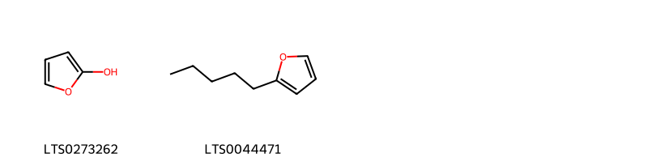{ width=100% }
    <figcaption>Hình ảnh cấu trúc hóa học của 2 hoạt chất thuộc nhóm Heteroaromatic compounds gồm ['furol (LTS0273262)', 'amylfuran (LTS0044471)'].</figcaption>
</figure>
#### Nhóm Lactones
<figure markdown="span">
    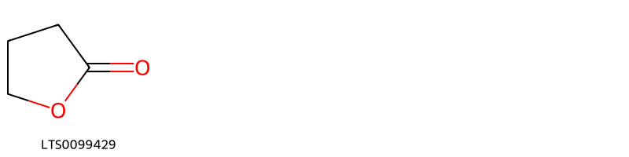{ width=100% }
    <figcaption>Hình ảnh cấu trúc hóa học của 1 hoạt chất thuộc nhóm Lactones gồm ['4-butyrolactone (LTS0099429)'].</figcaption>
</figure>
#### Nhóm Naphthalenes
<figure markdown="span">
    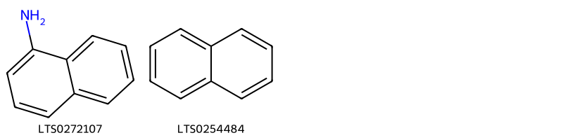{ width=100% }
    <figcaption>Hình ảnh cấu trúc hóa học của 2 hoạt chất thuộc nhóm Naphthalenes gồm ['α naphthylamine (LTS0272107)', 'naphthalene (LTS0254484)'].</figcaption>
</figure>
#### Nhóm Organic carbonic acids and derivatives
<figure markdown="span">
    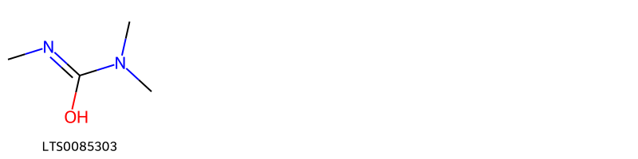{ width=100% }
    <figcaption>Hình ảnh cấu trúc hóa học của 1 hoạt chất thuộc nhóm Organic carbonic acids and derivatives gồm ["n,n,n'-trimethylcarbamimidic acid (LTS0085303)"].</figcaption>
</figure>
#### Nhóm Organonitrogen compounds
<figure markdown="span">
    { width=100% }
    <figcaption>Hình ảnh cấu trúc hóa học của 2 hoạt chất thuộc nhóm Organonitrogen compounds gồm ['choline (LTS0170307)', 'acetylcholine (LTS0185507)'].</figcaption>
</figure>
#### Nhóm Organooxygen compounds
<figure markdown="span">
    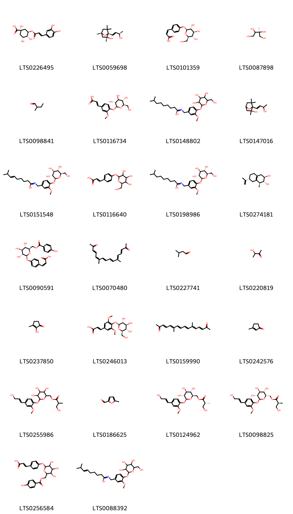{ width=100% }
    <figcaption>Hình ảnh cấu trúc hóa học của 26 hoạt chất thuộc nhóm Organooxygen compounds gồm ['chlorogenic acid (LTS0226495)', '(1r,2r,4s)-1-[(1e,3r)-3-hydroxybut-1-en-1-yl]-2,6,6-trimethyl-7-oxabicyclo[2.2.1]heptan-2-ol (LTS0059698)', '(2z)-3-(4-{[(2s,3r,4s,5s,6r)-3,4,5-trihydroxy-6-(hydroxymethyl)oxan-2-yl]oxy}phenyl)prop-2-enoic acid (LTS0101359)', '(2s)-2-methylbutane-1,2,3,4-tetrol (LTS0087898)', '2-methylbutanal (LTS0098841)', '(2e)-3-(3-methoxy-4-{[(2s,3r,4s,5s,6r)-3,4,5-trihydroxy-6-(hydroxymethyl)oxan-2-yl]oxy}phenyl)prop-2-enoic acid (LTS0116734)', 'n-[(3-methoxy-4-{[3,4,5-trihydroxy-6-(hydroxymethyl)oxan-2-yl]oxy}phenyl)methyl]-8-methylnonanimidic acid (LTS0148802)', '1-(3-hydroxybut-1-en-1-yl)-2,6,6-trimethyl-7-oxabicyclo[2.2.1]heptan-2-ol (LTS0147016)', '(6e)-n-[(3-methoxy-4-{[(2s,3r,4s,5s,6r)-3,4,5-trihydroxy-6-(hydroxymethyl)oxan-2-yl]oxy}phenyl)methyl]-8-methylnon-6-enimidic acid (LTS0151548)', '3-(4-{[3,4,5-trihydroxy-6-(hydroxymethyl)oxan-2-yl]oxy}phenyl)prop-2-enoic acid (LTS0116640)', 'n-[(3-methoxy-4-{[(2s,3r,4s,5s,6r)-3,4,5-trihydroxy-6-(hydroxymethyl)oxan-2-yl]oxy}phenyl)methyl]-8-methylnonanimidic acid (LTS0198986)', 'rishitin (LTS0274181)', '(2z)-3-(4-{[(2s,3r,4s,5s,6r)-3,4,5-trihydroxy-6-[(4-hydroxybenzoyloxy)methyl]oxan-2-yl]oxy}phenyl)prop-2-enoic acid (LTS0090591)', '6,11-dimethylhexadeca-3,5,7,9,11,13-hexaene-2,15-dione (LTS0070480)', 'isovaleraldehyde (LTS0227741)', 'acetoin (LTS0220819)', 'methylcyclopentenolone (LTS0237850)', '(2e)-3-(3,5-dimethoxy-4-{[(2s,3r,4s,5s,6r)-3,4,5-trihydroxy-6-(hydroxymethyl)oxan-2-yl]oxy}phenyl)prop-2-enoic acid (LTS0246013)', '(3e,5e,7e,9e,11e,13e)-6,11-dimethylhexadeca-3,5,7,9,11,13-hexaene-2,15-dione (LTS0159990)', '3-methyl-2-cyclopenten-1-one (LTS0242576)', '{3,4,5-trihydroxy-6-[4-(3-hydroxyprop-1-en-1-yl)-2-methoxyphenoxy]oxan-2-yl}methyl 3-hydroxy-2-methylpropanoate (LTS0255986)', '5-methylfurfural (LTS0186625)', '[(2r,3s,4s,5r,6s)-3,4,5-trihydroxy-6-{4-[(1e)-3-hydroxyprop-1-en-1-yl]-2-methoxyphenoxy}oxan-2-yl]methyl (2r)-3-hydroxy-2-methylpropanoate (LTS0124962)', '[(2s,3s,4s,5r,6s)-3,4,5-trihydroxy-6-{4-[(1e)-3-hydroxyprop-1-en-1-yl]-2-methoxyphenoxy}oxan-2-yl]methyl (2s)-3-hydroxy-2-methylpropanoate (LTS0098825)', '3-[4-({3,4,5-trihydroxy-6-[(4-hydroxybenzoyloxy)methyl]oxan-2-yl}oxy)phenyl]prop-2-enoic acid (LTS0256584)', 'n-[(3-methoxy-4-{[3,4,5-trihydroxy-6-(hydroxymethyl)oxan-2-yl]oxy}phenyl)methyl]-8-methylnon-6-enimidic acid (LTS0088392)'].</figcaption>
</figure>
#### Nhóm Oxepanes
<figure markdown="span">
    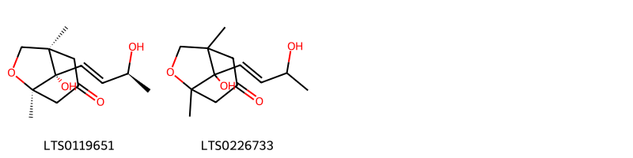{ width=100% }
    <figcaption>Hình ảnh cấu trúc hóa học của 2 hoạt chất thuộc nhóm Oxepanes gồm ['(1r,5r,8s)-8-hydroxy-8-[(1e,3s)-3-hydroxybut-1-en-1-yl]-1,5-dimethyl-6-oxabicyclo[3.2.1]octan-3-one (LTS0119651)', '8-hydroxy-8-(3-hydroxybut-1-en-1-yl)-1,5-dimethyl-6-oxabicyclo[3.2.1]octan-3-one (LTS0226733)'].</figcaption>
</figure>
#### Nhóm Phenols
<figure markdown="span">
    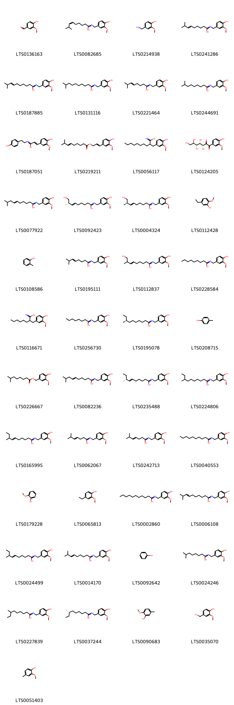{ width=100% }
    <figcaption>Hình ảnh cấu trúc hóa học của 45 hoạt chất thuộc nhóm Phenols gồm ['vanillin (LTS0136163)', '(6z)-n-[(4-hydroxy-3-methoxyphenyl)methyl]-8-methylnon-6-enimidic acid (LTS0082685)', 'vanillylamine (LTS0214938)', '(6e)-n-[(4-hydroxy-3-methoxyphenyl)methyl]-8-methylnon-6-enimidic acid (LTS0241286)', '(7e)-n-[(4-hydroxy-3-methoxyphenyl)methyl]-9-methyldec-7-enimidic acid (LTS0187885)', 'n-[(4-hydroxy-3-methoxyphenyl)methyl]-9-methyldecanimidic acid (LTS0131116)', '(5e)-n-[(4-hydroxy-3-methoxyphenyl)methyl]-7-methyloct-5-enimidic acid (LTS0221464)', 'n-[(4-hydroxy-3-methoxyphenyl)methyl]-8-methylnonanimidic acid (LTS0244691)', '(2e)-3-(4-hydroxy-3-methoxyphenyl)-n-[2-(4-hydroxyphenyl)ethyl]prop-2-enimidic acid (LTS0187051)', '(2e)-3-(4-hydroxy-3-methoxyphenyl)prop-2-en-1-yl (6e)-8-methylnon-6-enoate (LTS0219211)', '2-[(4-hydroxy-3-methoxyphenyl)methyl]decanimidic acid (LTS0056117)', '(3r,4s,5r,6r)-3,4,5,6,7-pentahydroxy-1-(4-hydroxy-3-methoxyphenyl)heptane-1,2-dione (LTS0124205)', 'n-[(4-hydroxy-3-methoxyphenyl)methyl]-9-methyldec-6-enimidic acid (LTS0077922)', '(6e,8s)-9-hydroxy-n-[(4-hydroxy-3-methoxyphenyl)methyl]-8-methylnon-6-enimidic acid (LTS0092423)', '(6e,8r)-9-hydroxy-n-[(4-hydroxy-3-methoxyphenyl)methyl]-8-methylnon-6-enimidic acid (LTS0004324)', 'locustol (LTS0112428)', 'o-cresol (LTS0108586)', 'n-[(4-hydroxy-3-methoxyphenyl)methyl]-7-methyloct-5-enimidic acid (LTS0195111)', '9-hydroxy-n-[(4-hydroxy-3-methoxyphenyl)methyl]-8-methylnon-6-enimidic acid (LTS0112837)', 'n-[(4-hydroxy-3-methoxyphenyl)methyl]nonanimidic acid (LTS0228584)', '2-[(4-hydroxy-3-methoxyphenyl)methyl]octanimidic acid (LTS0116671)', 'n-[(4-hydroxy-3-methoxyphenyl)methyl]octanimidic acid (LTS0256730)', '(8s)-n-[(4-hydroxy-3-methoxyphenyl)methyl]-8-methyldecanimidic acid (LTS0195078)', 'p-cresol (LTS0208715)', 'nordihydrocapsiate (LTS0226667)', '(6e)-n-[(4-hydroxy-3-methoxyphenyl)methyl]-9-methyldec-6-enimidic acid (LTS0082236)', '(6e,8r)-n-[(4-hydroxy-3-methoxyphenyl)methyl]-8-methyldec-6-enimidic acid (LTS0235488)', 'n-[(4-hydroxy-3-methoxyphenyl)methyl]-8-methyldecanimidic acid (LTS0224806)', '(6e)-n-[(4-hydroxy-3-methoxyphenyl)methyl]-8-methyldec-6-enimidic acid (LTS0165995)', 'n-[(4-hydroxy-3-methoxyphenyl)methyl]-6-methylhept-4-enimidic acid (LTS0062067)', '(4e)-n-[(4-hydroxy-3-methoxyphenyl)methyl]-6-methylhept-4-enimidic acid (LTS0242713)', 'n-[(4-hydroxy-3-methoxyphenyl)methyl]decanimidic acid (LTS0040553)', 'guaiacol (LTS0179228)', '4-ethylguaiacol (LTS0065813)', 'n-[(4-hydroxy-3-methoxyphenyl)methyl]undecanimidic acid (LTS0002860)', 'n-[(4-hydroxy-3-methoxyphenyl)methyl]-9-methyldec-7-enimidic acid (LTS0006108)', 'n-[(4-hydroxy-3-methoxyphenyl)methyl]-8-methyldec-6-enimidic acid (LTS0024499)', 'n-[(4-hydroxy-3-methoxyphenyl)methyl]-8-methylnon-6-enimidic acid (LTS0014170)', 'phenol (LTS0092642)', 'n-[(4-hydroxy-3-methoxyphenyl)methyl]-7-methyloctanimidic acid (LTS0024246)', 'n-[(4-hydroxy-3-methoxyphenyl)methyl]-7-methylnonanimidic acid (LTS0227839)', '(7s)-n-[(4-hydroxy-3-methoxyphenyl)methyl]-7-methylnonanimidic acid (LTS0037244)', '2-methoxy-5-methylphenol (LTS0090683)', 'vanillyl alcohol (LTS0035070)', 'creosol (LTS0051403)'].</figcaption>
</figure>
#### Nhóm Prenol lipids
<figure markdown="span">
    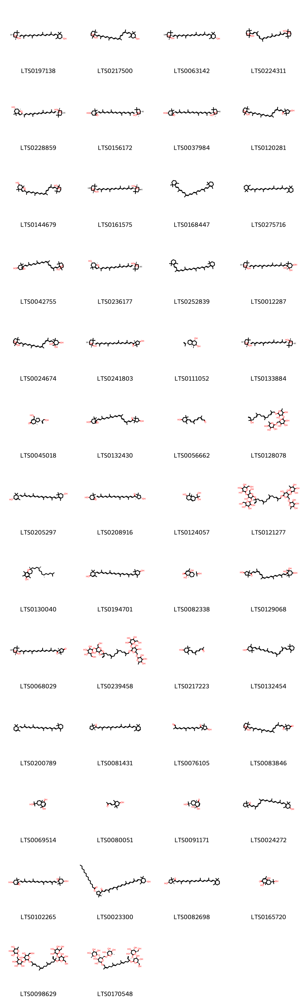{ width=100% }
    <figcaption>Hình ảnh cấu trúc hóa học của 186 hoạt chất thuộc nhóm Prenol lipids gồm ['(1s,2r,4r)-1-[(1e,3e,5e,7e,9e,11e,13e,15e,17e)-18-[(4r)-4-hydroxy-2,6,6-trimethylcyclohex-1-en-1-yl]-3,7,12,16-tetramethyloctadeca-1,3,5,7,9,11,13,15,17-nonaen-1-yl]-2,6,6-trimethyl-7-oxabicyclo[2.2.1]heptan-2-ol (LTS0197138)', '1-[(1e,3e,5e,7e,9e)-18-(4-hydroxy-2,6,6-trimethylcyclohex-1-en-1-yl)-3,7,12,16-tetramethyloctadeca-1,3,5,7,9,11,13,15,17-nonaen-1-yl]-2,6,6-trimethyl-7-oxabicyclo[2.2.1]heptan-2-ol (LTS0217500)', '(1r,2r,4s)-1-[(1e,3e,5e,7e,9e,11e,13e,15e,17e)-18-[(4r)-4-hydroxy-2,6,6-trimethylcyclohex-1-en-1-yl]-3,7,12,16-tetramethyloctadeca-1,3,5,7,9,11,13,15,17-nonaen-1-yl]-2,6,6-trimethyl-7-oxabicyclo[2.2.1]heptan-2-ol (LTS0063142)', '1-[(9e,11e,13e,15e,17e)-18-{2-hydroxy-2,6,6-trimethyl-7-oxabicyclo[2.2.1]heptan-1-yl}-3,7,12,16-tetramethyloctadeca-1,3,5,7,9,11,13,15,17-nonaen-1-yl]-2,6,6-trimethyl-7-oxabicyclo[2.2.1]heptan-2-ol (LTS0224311)', '(2s,6s,7ar)-2-[(2e,4e,6e,8e,10e,12e,14e,16e)-17-[(1s,2r,4r)-2-hydroxy-2,6,6-trimethyl-7-oxabicyclo[2.2.1]heptan-1-yl]-6,11,15-trimethylheptadeca-2,4,6,8,10,12,14,16-octaen-2-yl]-4,4,7a-trimethyl-2,5,6,7-tetrahydro-1-benzofuran-6-ol (LTS0228859)', '(1r,2r,4s)-1-[(1e,3e,5e,7e,9e,11e,13e,15e,17e)-18-[(1s,4s,6r)-4-hydroxy-2,2,6-trimethyl-7-oxabicyclo[4.1.0]heptan-1-yl]-3,7,12,16-tetramethyloctadeca-1,3,5,7,9,11,13,15,17-nonaen-1-yl]-2,6,6-trimethyl-7-oxabicyclo[2.2.1]heptan-2-ol (LTS0156172)', '(1s,2r,4r)-1-[(1e,3e,5e,7e,9e,11e,13e,15e,17e)-18-[(1s,4s,6r)-4-hydroxy-2,2,6-trimethyl-7-oxabicyclo[4.1.0]heptan-1-yl]-3,7,12,16-tetramethyloctadeca-1,3,5,7,9,11,13,15,17-nonaen-1-yl]-2,6,6-trimethyl-7-oxabicyclo[2.2.1]heptan-2-ol (LTS0037984)', '(10e,12e,14e,16e,18e)-1-(4-hydroxy-1,2,2-trimethylcyclopentyl)-19-{2-hydroxy-2,6,6-trimethyl-7-oxabicyclo[2.2.1]heptan-1-yl}-4,8,13,17-tetramethylnonadeca-2,4,6,8,10,12,14,16,18-nonaen-1-one (LTS0120281)', '2-[(2e,4e,6e,8e)-17-{2-hydroxy-2,6,6-trimethyl-7-oxabicyclo[2.2.1]heptan-1-yl}-6,11,15-trimethylheptadeca-2,4,6,8,10,12,14,16-octaen-2-yl]-4,4,7a-trimethyl-2,5,6,7-tetrahydro-1-benzofuran-6-ol (LTS0144679)', '(1r,2r,4s)-1-[(1e,3e,5e,7e,9e,11e,13e,15e,17e)-18-[(1r,2r,4s)-2-hydroxy-2,6,6-trimethyl-7-oxabicyclo[2.2.1]heptan-1-yl]-3,7,12,16-tetramethyloctadeca-1,3,5,7,9,11,13,15,17-nonaen-1-yl]-2,6,6-trimethyl-7-oxabicyclo[2.2.1]heptan-2-ol (LTS0161575)', 'β,β-carotene (LTS0168447)', 'β-carotene (LTS0275716)', '1-[(9e,11e,13e,15e,17e)-18-{4-hydroxy-2,2,6-trimethyl-7-oxabicyclo[4.1.0]heptan-1-yl}-3,7,12,16-tetramethyloctadeca-1,3,5,7,9,11,13,15,17-nonaen-1-yl]-2,6,6-trimethyl-7-oxabicyclo[2.2.1]heptan-2-ol (LTS0042755)', '(2r,6s,7ar)-2-[(2e,4e,6e,8e,10e,12e,14e,16e)-17-[(1s,2r,4r)-2-hydroxy-2,6,6-trimethyl-7-oxabicyclo[2.2.1]heptan-1-yl]-6,11,15-trimethylheptadeca-2,4,6,8,10,12,14,16-octaen-2-yl]-4,4,7a-trimethyl-2,5,6,7-tetrahydro-1-benzofuran-6-ol (LTS0236177)', '(9z)-β-carotene (LTS0252839)', '(1s,2s,4r)-1-[(1e,3e,5e,7e,9e,11e,13e,15e,17e)-18-[(1s,2r,4r)-2-hydroxy-2,6,6-trimethyl-7-oxabicyclo[2.2.1]heptan-1-yl]-3,7,12,16-tetramethyloctadeca-1,3,5,7,9,11,13,15,17-nonaen-1-yl]-2,6,6-trimethylcyclohexane-1,2,4-triol (LTS0012287)', '1-[(9e,11e,13e,15e,17e)-18-{2-hydroxy-2,6,6-trimethyl-7-oxabicyclo[2.2.1]heptan-1-yl}-3,7,12,16-tetramethyloctadeca-1,3,5,7,9,11,13,15,17-nonaen-1-yl]-2,6,6-trimethylcyclohexane-1,2,4-triol (LTS0024674)', '(2e,4e,6e,8e,10e,12e,14e,16e,18e)-1-[(1r,4s)-4-hydroxy-1,2,2-trimethylcyclopentyl]-19-[(1s,2r,4r)-2-hydroxy-2,6,6-trimethyl-7-oxabicyclo[2.2.1]heptan-1-yl]-4,8,13,17-tetramethylnonadeca-2,4,6,8,10,12,14,16,18-nonaen-1-one (LTS0241803)', 'capsidiol (LTS0111052)', '(1s,2r,4r)-1-[(1e,3e,5e,7e,9e,11e,13e,15e,17e)-18-[(1s,2r,4r)-2-hydroxy-2,6,6-trimethyl-7-oxabicyclo[2.2.1]heptan-1-yl]-3,7,12,16-tetramethyloctadeca-1,3,5,7,9,11,13,15,17-nonaen-1-yl]-2,6,6-trimethyl-7-oxabicyclo[2.2.1]heptan-2-ol (LTS0133884)', '(2s,5r,10r)-6-(hydroxymethyl)-2-(3-hydroxyprop-1-en-2-yl)-10-methylspiro[4.5]dec-6-en-8-one (LTS0045018)', '(10e,12e,14e,16e,18e)-1-(4-hydroxy-1,2,2-trimethylcyclopentyl)-19-{4-hydroxy-2,2,6-trimethyl-7-oxabicyclo[4.1.0]heptan-1-yl}-4,8,13,17-tetramethylnonadeca-2,4,6,8,10,12,14,16,18-nonaen-1-one (LTS0132430)', '9-(4-hydroxy-2,6,6-trimethylcyclohex-1-en-1-yl)-3,7-dimethylnona-2,4,6,8-tetraenal (LTS0056662)', '2-({3,5-dihydroxy-2-[(14-hydroxy-2,6,10,14-tetramethylhexadeca-2,6,10,15-tetraen-1-yl)oxy]-6-methyloxan-4-yl}oxy)-6-{[(3,4,5-trihydroxy-6-methyloxan-2-yl)oxy]methyl}oxane-3,4,5-triol (LTS0128078)', 'carotenoid (LTS0205297)', '(2e,4e,6e,8e,10e,12e,14e,16e,18e)-1-[(1r,4s)-4-hydroxy-1,2,2-trimethylcyclopentyl]-19-[(1r,4s,6s)-4-hydroxy-2,2,6-trimethyl-7-oxabicyclo[4.1.0]heptan-1-yl]-4,8,13,17-tetramethylnonadeca-2,4,6,8,10,12,14,16,18-nonaen-1-one (LTS0208916)', '2-(7-hydroxy-8,8a-dimethyl-2,3,5,6,7,8-hexahydro-1h-naphthalen-2-yl)propane-1,2-diol (LTS0124057)', '2-({4,5-dihydroxy-6-[(14-{[4-hydroxy-6-(hydroxymethyl)-3,5-bis({[3,4,5-trihydroxy-6-(hydroxymethyl)oxan-2-yl]oxy})oxan-2-yl]oxy}-2,6,10,14-tetramethylhexadeca-2,6,10,15-tetraen-1-yl)oxy]-3-[(3,4,5-trihydroxy-6-methyloxan-2-yl)oxy]oxan-2-yl}methoxy)-6-methyloxane-3,4,5-triol (LTS0121277)', '(2r)-2,5,7,8-tetramethyl-2-[(4s,8s)-4,8,12-trimethyltridecyl]-3,4-dihydro-1-benzopyran-6-ol (LTS0130040)', 'xanthophyll (LTS0194701)', '(1r,4ar,6r,8as)-1,4a-dihydroxy-6-(2-hydroxypropan-2-yl)-4,8a-dimethyl-5,6,7,8-tetrahydro-1h-naphthalen-2-one (LTS0082338)', '(10e,12e,14e,16e,18e)-1-(4-hydroxy-1,2,2-trimethylcyclopentyl)-4,8,13,17-tetramethyl-19-(1,2,4-trihydroxy-2,6,6-trimethylcyclohexyl)nonadeca-2,4,6,8,10,12,14,16,18-nonaen-1-one (LTS0129068)', '(3r)-3-[(2e,4e,6e,8e,10e,12e,14e,16e,18e)-19-[(1r,2r,4s)-2-hydroxy-2,6,6-trimethyl-7-oxabicyclo[2.2.1]heptan-1-yl]-4,8,13,17-tetramethylnonadeca-2,4,6,8,10,12,14,16,18-nonaenoyl]-3,4,4-trimethylcyclopentan-1-one (LTS0068029)', '2-({6-[(14-{[3,4-dihydroxy-6-(hydroxymethyl)-5-{[3,4,5-trihydroxy-6-(hydroxymethyl)oxan-2-yl]oxy}oxan-2-yl]oxy}-2,6,10,14-tetramethylhexadeca-2,6,10,15-tetraen-1-yl)oxy]-3,4-dihydroxy-5-{[3,4,5-trihydroxy-6-(hydroxymethyl)oxan-2-yl]oxy}oxan-2-yl}methoxy)-6-methyloxane-3,4,5-triol (LTS0239458)', '(7e)-8-(4-hydroxy-2,6,6-trimethylcyclohex-1-en-1-yl)-6-methylocta-3,5,7-trien-2-one (LTS0217223)', '3,5,5-trimethyl-4-[(1e,3e,5e,7e,9e)-3,7,12,16-tetramethyl-18-(2,6,6-trimethylcyclohex-1-en-1-yl)octadeca-1,3,5,7,9,11,13,15,17-nonaen-1-yl]cyclohex-3-en-1-ol (LTS0132454)', '(+)-α-carotene (LTS0200789)', '(2e,4e,6e,8e,10e,12e,14e,16e,18e)-4,8,13,17-tetramethyl-19-(2,6,6-trimethylcyclohexa-1,3-dien-1-yl)-1-[(1r)-1,2,2-trimethylcyclopentyl]nonadeca-2,4,6,8,10,12,14,16,18-nonaen-1-one (LTS0081431)', '(4e,6e,8e,10e,12e)-14-(4-hydroxy-1,2,2-trimethylcyclopentyl)-2,7,11-trimethyl-14-oxotetradeca-2,4,6,8,10,12-hexaenal (LTS0076105)', '3-[(10e,12e,14e,16e,18e)-19-{2-hydroxy-2,6,6-trimethyl-7-oxabicyclo[2.2.1]heptan-1-yl}-4,8,13,17-tetramethylnonadeca-2,4,6,8,10,12,14,16,18-nonaenoyl]-3,4,4-trimethylcyclopentan-1-one (LTS0083846)', '7-(2-hydroxypropan-2-yl)-1,4a-dimethyl-4,5,6,7,8,8a-hexahydronaphthalene-1,4-diol (LTS0069514)', '4-(4-hydroxy-2,6,6-trimethylcyclohex-1-en-1-yl)but-3-en-2-one (LTS0080051)', '(4s,4ar,6s,8as)-4,4a-dihydroxy-6-(2-hydroxypropan-2-yl)-4,8a-dimethyl-5,6,7,8-tetrahydronaphthalen-1-one (LTS0091171)', '(10e,12e,14e,16e,18e)-19-(4-hydroxy-2,6,6-trimethylcyclohex-1-en-1-yl)-4,8,13,17-tetramethyl-1-(1,2,2-trimethylcyclopentyl)nonadeca-2,4,6,8,10,12,14,16,18-nonaen-1-one (LTS0024272)', 'violaxanthin (LTS0102265)', '(1s,3r)-3-[(2e,4e,6e,8e,10e,12e,14e,16e,18e)-19-[(4r)-4-hydroxy-2,6,6-trimethylcyclohex-1-en-1-yl]-4,8,13,17-tetramethylnonadeca-2,4,6,8,10,12,14,16,18-nonaenoyl]-3,4,4-trimethylcyclopentyl tetradecanoate (LTS0023300)', 'cryptocapsin (LTS0082698)', '1,4a-dihydroxy-6-(2-hydroxypropan-2-yl)-4,8a-dimethyl-5,6,7,8-tetrahydro-1h-naphthalen-2-one (LTS0165720)', '2-[(2-{[(2e,6z,10e)-14-{[4,5-dihydroxy-6-(hydroxymethyl)-3-{[3,4,5-trihydroxy-6-(hydroxymethyl)oxan-2-yl]oxy}oxan-2-yl]oxy}-2,6,10,14-tetramethylhexadeca-2,6,10,15-tetraen-1-yl]oxy}-4,5-dihydroxy-6-(hydroxymethyl)oxan-3-yl)oxy]-6-{[(3,4,5-trihydroxy-6-methyloxan-2-yl)oxy]methyl}oxane-3,4,5-triol (LTS0098629)', '(2r,3r,4r,5r,6s)-2-{[(2r,3s,4r,5r,6r)-6-{[(2z,6e,10e,14s)-14-{[(2s,3r,4s,5s,6r)-4,5-dihydroxy-6-(hydroxymethyl)-3-{[(2s,3r,4s,5s,6r)-3,4,5-trihydroxy-6-(hydroxymethyl)oxan-2-yl]oxy}oxan-2-yl]oxy}-2,6,10,14-tetramethylhexadeca-2,6,10,15-tetraen-1-yl]oxy}-4,5-dihydroxy-3-{[(2s,3r,4r,5r,6s)-3,4,5-trihydroxy-6-methyloxan-2-yl]oxy}oxan-2-yl]methoxy}-6-methyloxane-3,4,5-triol (LTS0170548)', '4-[(9e,11e,13e,15e,17e)-18-(4-hydroxy-2,6,6-trimethylcyclohex-1-en-1-yl)-3,7,12,16-tetramethyloctadeca-1,3,5,7,9,11,13,15,17-nonaen-1-yl]-3,5,5-trimethylcyclohex-3-en-1-ol (LTS0095534)', '(4ar,7r)-7-hydroxy-7-(2-hydroxypropan-2-yl)-1,4a-dimethyl-6,8-dihydro-5h-naphthalen-2-one (LTS0096138)', '2-[(2-{[(2e,6z,10e)-14-{[4,5-dihydroxy-6-(hydroxymethyl)-3-{[3,4,5-trihydroxy-6-(hydroxymethyl)oxan-2-yl]oxy}oxan-2-yl]oxy}-2,6,10,14-tetramethylhexadeca-2,6,10,15-tetraen-1-yl]oxy}-3,5-dihydroxy-6-methyloxan-4-yl)oxy]-6-{[(3,4,5-trihydroxy-6-methyloxan-2-yl)oxy]methyl}oxane-3,4,5-triol (LTS0089819)', '(2e,4e,6e,8e,10e,12e,14e,16e)-17-[(2r,6s,7ar)-6-hydroxy-4,4,7a-trimethyl-2,5,6,7-tetrahydro-1-benzofuran-2-yl]-1-[(1r,4s)-4-hydroxy-1,2,2-trimethylcyclopentyl]-4,8,13-trimethyloctadeca-2,4,6,8,10,12,14,16-octaen-1-one (LTS0018968)', '1-[(1e,3z,5z,7e,9z,11e,13z,15z,17e)-18-(4-hydroxy-2,6,6-trimethylcyclohex-1-en-1-yl)-3,7,12,16-tetramethyloctadeca-1,3,5,7,9,11,13,15,17-nonaen-1-yl]-2,6,6-trimethylcyclohexane-1,2,4-triol (LTS0106935)', 'lanster (LTS0020312)', '(2s,3r,4s,5s,6r)-2-{[(2r,3r,4r,5s,6s)-2-{[(2z,6e,10e,14s)-14-{[(2s,3r,4s,5s,6r)-4,5-dihydroxy-6-(hydroxymethyl)-3-{[(2s,3r,4s,5s,6r)-3,4,5-trihydroxy-6-(hydroxymethyl)oxan-2-yl]oxy}oxan-2-yl]oxy}-2,6,10,14-tetramethylhexadeca-2,6,10,15-tetraen-1-yl]oxy}-3,5-dihydroxy-6-methyloxan-4-yl]oxy}-6-({[(2r,3r,4r,5r,6s)-3,4,5-trihydroxy-6-methyloxan-2-yl]oxy}methyl)oxane-3,4,5-triol (LTS0022874)', '(2r,3r,4r,5r,6s)-2-{[(2r,3s,4r,5r,6r)-4,5-dihydroxy-6-{[(2z,6e,10z)-11-hydroxy-2,6-dimethyl-10-[(4s)-4-methyl-4-{[(2s,3r,4s,5s,6r)-3,4,5-trihydroxy-6-(hydroxymethyl)oxan-2-yl]oxy}hex-5-en-1-ylidene]undeca-2,6-dien-1-yl]oxy}-3-{[(2s,3r,4r,5r,6s)-3,4,5-trihydroxy-6-methyloxan-2-yl]oxy}oxan-2-yl]methoxy}-6-methyloxane-3,4,5-triol (LTS0047626)', '(2r)-2,5,7,8-tetramethyl-2-(4,8,12-trimethyltridecyl)-3,4-dihydro-1-benzopyran-6-ol (LTS0118303)', '24,25-dihydrolanosterol (LTS0252460)', '(2e,6e,10z,14s)-4-hydroxy-10-(hydroxymethyl)-2,6,14-trimethyl-14-{[(2s,3r,4s,5s,6r)-3,4,5-trihydroxy-6-(hydroxymethyl)oxan-2-yl]oxy}hexadeca-2,6,10,15-tetraenoic acid (LTS0127383)', '(s)-cryptoxanthin (LTS0148325)', '(1r,2r,4s)-1-[(1e,3e,5e,7e,9e,11e,13e,15e,17e)-18-[(1s,4s,6r)-4-hydroxy-2,2,6-trimethyl-7-oxabicyclo[4.1.0]heptan-1-yl]-3,7,12,16-tetramethyloctadeca-1,3,5,7,9,11,13,15,17-nonaen-1-yl]-2,6,6-trimethylcyclohexane-1,2,4-triol (LTS0150126)', '(2r,4s)-1-[(1e,3e,5e,7e,9e,11e,13e,15e,17e)-18-[(1s,4s,6r)-4-hydroxy-2,2,6-trimethyl-7-oxabicyclo[4.1.0]heptan-1-yl]-3,7,12,16-tetramethyloctadeca-1,3,5,7,9,11,13,15,17-nonaen-1-yl]-2,6,6-trimethyl-7-oxabicyclo[2.2.1]heptan-2-ol (LTS0267070)', '1-[(1e,3z,5e,7z,9z,11e,13e,15e,17e)-18-{4-hydroxy-2,2,6-trimethyl-7-oxabicyclo[4.1.0]heptan-1-yl}-3,7,12,16-tetramethyloctadeca-1,3,5,7,9,11,13,15,17-nonaen-1-yl]-2,6,6-trimethyl-7-oxabicyclo[2.2.1]heptan-2-ol (LTS0144430)', 'zeaxanthin (LTS0192928)', '13-(4-hydroxy-2,6,6-trimethylcyclohex-1-en-1-yl)-2,7,11-trimethyltrideca-2,4,6,8,10,12-hexaenal (LTS0192792)', '(2s,3r,4s,5s,6r)-2-{[(2r,3r,4s,5s,6r)-2-{[(2z,6e,10e,14s)-14-{[(2s,3r,4s,5s,6r)-4,5-dihydroxy-6-(hydroxymethyl)-3-{[(2s,3r,4s,5s,6r)-3,4,5-trihydroxy-6-(hydroxymethyl)oxan-2-yl]oxy}oxan-2-yl]oxy}-2,6,10,14-tetramethylhexadeca-2,6,10,15-tetraen-1-yl]oxy}-4,5-dihydroxy-6-(hydroxymethyl)oxan-3-yl]oxy}-6-({[(2r,3r,4r,5r,6s)-3,4,5-trihydroxy-6-methyloxan-2-yl]oxy}methyl)oxane-3,4,5-triol (LTS0106573)', '(14e,16e)-1-(4-hydroxy-1,2,2-trimethylcyclopentyl)-17-(6-hydroxy-4,4,7a-trimethyl-2,5,6,7-tetrahydro-1-benzofuran-2-yl)-4,8,12-trimethyloctadeca-2,4,6,8,10,12,14,16-octaen-1-one (LTS0262123)', 'capsanthin 5,6-epoxide (LTS0131654)', '(3e,5z,7e)-8-[(4r)-4-hydroxy-2,6,6-trimethylcyclohex-1-en-1-yl]-6-methylocta-3,5,7-trien-2-one (LTS0146567)', 'apocarotenal (LTS0146481)', '1-[(1e,3e,5z,7e,9e,11z,13e,15z,17e)-18-{2-hydroxy-2,6,6-trimethyl-7-oxabicyclo[2.2.1]heptan-1-yl}-3,7,12,16-tetramethyloctadeca-1,3,5,7,9,11,13,15,17-nonaen-1-yl]-2,6,6-trimethyl-7-oxabicyclo[2.2.1]heptan-2-ol (LTS0165547)', '(2r,3r,4r,5r,6s)-2-{[(2r,3s,4s,5r,6r)-6-{[(2z,6e,10e,14s)-14-{[(2s,3r,4r,5s,6r)-3,4-dihydroxy-6-(hydroxymethyl)-5-{[(2s,3r,4s,5s,6r)-3,4,5-trihydroxy-6-(hydroxymethyl)oxan-2-yl]oxy}oxan-2-yl]oxy}-2,6,10,14-tetramethylhexadeca-2,6,10,15-tetraen-1-yl]oxy}-3,4-dihydroxy-5-{[(2s,3r,4s,5s,6r)-3,4,5-trihydroxy-6-(hydroxymethyl)oxan-2-yl]oxy}oxan-2-yl]methoxy}-6-methyloxane-3,4,5-triol (LTS0203372)', '8-(4-hydroxy-2,6,6-trimethylcyclohex-1-en-1-yl)-6-methylocta-3,5,7-trien-2-one (LTS0164436)', '(2e,4e)-5-[(4r)-4-hydroxy-2,6,6-trimethylcyclohex-1-en-1-yl]-3-methylpenta-2,4-dienal (LTS0138741)', '3-hydroxy-4,4a-dimethyl-6-(prop-1-en-2-yl)-octahydronaphthalen-1-one (LTS0138836)', '(6e,8e,10e,12e,14e)-15-(4-hydroxy-2,6,6-trimethylcyclohex-1-en-1-yl)-4,9,13-trimethylpentadeca-2,4,6,8,10,12,14-heptaenal (LTS0141681)', '1-[(1e,3z,5e,7z,9z,11e,13e,15e,17e)-18-(4-hydroxy-2,6,6-trimethylcyclohex-1-en-1-yl)-3,7,12,16-tetramethyloctadeca-1,3,5,7,9,11,13,15,17-nonaen-1-yl]-2,6,6-trimethyl-7-oxabicyclo[2.2.1]heptan-2-ol (LTS0148516)', '(3e,5e,7e)-8-[(4r)-4-hydroxy-2,6,6-trimethylcyclohex-1-en-1-yl]-6-methylocta-3,5,7-trien-2-one (LTS0149644)', '(1r,4s,4as,7s,8as)-7-(2-hydroxypropan-2-yl)-1,4a-dimethyl-4,5,6,7,8,8a-hexahydronaphthalene-1,4-diol (LTS0149454)', 'β-ionone (LTS0155301)', '(6s,7ar)-2-[(2e,4e,6e,8e,10e,12e,14e)-15-[(6s,7ar)-6-hydroxy-4,4,7a-trimethyl-2,5,6,7-tetrahydro-1-benzofuran-2-yl]-6,11-dimethylhexadeca-2,4,6,8,10,12,14-heptaen-2-yl]-4,4,7a-trimethyl-2,5,6,7-tetrahydro-1-benzofuran-6-ol (LTS0151069)', '(1s,2r,4s)-1-[(1e,3e,5e,7e,9e,11e,13e,15e,17e)-18-[(4r)-4-hydroxy-2,6,6-trimethylcyclohex-1-en-1-yl]-3,7,12,16-tetramethyloctadeca-1,3,5,7,9,11,13,15,17-nonaen-1-yl]-2,6,6-trimethylcyclohexane-1,2,4-triol (LTS0151492)', '(2s,6s,7ar)-2-[(2z,4e,6e,8e,10e,12e,14e,16e)-17-[(1r,2r,4s)-2-hydroxy-2,6,6-trimethyl-7-oxabicyclo[2.2.1]heptan-1-yl]-6,11,15-trimethylheptadeca-2,4,6,8,10,12,14,16-octaen-2-yl]-4,4,7a-trimethyl-2,5,6,7-tetrahydro-1-benzofuran-6-ol (LTS0102320)', '(3r)-3-hydroxyretinal (LTS0166987)', '1-[(9e,11e,13e,15e,17e)-18-{4-hydroxy-2,2,6-trimethyl-7-oxabicyclo[4.1.0]heptan-1-yl}-3,7,12,16-tetramethyloctadeca-1,3,5,7,9,11,13,15,17-nonaen-1-yl]-2,6,6-trimethylcyclohexane-1,2,4-triol (LTS0084615)', '4,4a-dimethyl-6-(prop-1-en-2-yl)-2,3,4,5,6,7-hexahydro-1h-naphthalene-1,3-diol (LTS0172612)', '(2r,4s)-1-[(1e,3e,5e,7e,9e,11e,13e,15e,17e)-18-[(4r)-4-hydroxy-2,6,6-trimethylcyclohex-1-en-1-yl]-3,7,12,16-tetramethyloctadeca-1,3,5,7,9,11,13,15,17-nonaen-1-yl]-2,6,6-trimethyl-7-oxabicyclo[2.2.1]heptan-2-ol (LTS0109630)', '(2e,4e,6e,8e,10e,12e)-13-[(4r)-4-hydroxy-2,6,6-trimethylcyclohex-1-en-1-yl]-2,7,11-trimethyltrideca-2,4,6,8,10,12-hexaenal (LTS0099800)', '1-[18-(4-hydroxy-2,6,6-trimethylcyclohex-1-en-1-yl)-3,7,12,16-tetramethyloctadeca-1,3,5,7,9,11,13,15,17-nonaen-1-yl]-6,6-dimethyl-2-methylidenecyclohex-3-en-1-ol (LTS0099379)', '(2s,5r,6s,8s,10r)-6-(hydroxymethyl)-10-methyl-2-(prop-1-en-2-yl)spiro[4.5]decan-8-ol (LTS0169636)', '(2r)-2-[(2r,7r,8s,8ar)-7-hydroxy-8,8a-dimethyl-2,3,5,6,7,8-hexahydro-1h-naphthalen-2-yl]propane-1,2-diol (LTS0189869)', '3-[(10e,12e,14e,16e,18e)-19-(4-hydroxy-2,6,6-trimethylcyclohex-1-en-1-yl)-4,8,13,17-tetramethylnonadeca-2,4,6,8,10,12,14,16,18-nonaenoyl]-3,4,4-trimethylcyclopentan-1-one (LTS0181270)', '(3r)-3-[(2e,4e,6e,8e,10e,12e,14e,16e,18e)-19-[(4r)-4-hydroxy-2,6,6-trimethylcyclohex-1-en-1-yl]-4,8,13,17-tetramethylnonadeca-2,4,6,8,10,12,14,16,18-nonaenoyl]-3,4,4-trimethylcyclopentan-1-one (LTS0174979)', '3a,6,6,9a,11a-pentamethyl-1-(6-methylheptan-2-yl)-1h,2h,3h,4h,5h,5ah,7h,8h,9h,10h,11h-cyclopenta[a]phenanthren-7-ol (LTS0125589)', 'cryptoxanthin (LTS0132646)', '(1s,3r,4as,6s,8ar)-8a-methyl-4-methylidene-6-(prop-1-en-2-yl)-hexahydro-1h-naphthalene-1,3,4a-triol (LTS0187908)', '(4e,6e,8e,10e,12e)-13-(4-hydroxy-2,6,6-trimethylcyclohex-1-en-1-yl)-2,7,11-trimethyltrideca-2,4,6,8,10,12-hexaenal (LTS0093157)', '(1s,4r,4ar,7r,8ar)-7-(2-hydroxypropan-2-yl)-1,4a-dimethyl-4,5,6,7,8,8a-hexahydronaphthalene-1,4-diol (LTS0265661)', '6-(hydroxymethyl)-2-(3-hydroxyprop-1-en-2-yl)-10-methylspiro[4.5]dec-6-en-8-one (LTS0181302)', '(3r,4s,4ar,6r,8ar)-3-hydroxy-4,4a-dimethyl-6-(prop-1-en-2-yl)-octahydronaphthalen-1-one (LTS0241892)', '11-(4-hydroxy-2,6,6-trimethylcyclohex-1-en-1-yl)-5,9-dimethylundeca-2,4,6,8,10-pentaenal (LTS0109951)', '2-({3,4-dihydroxy-6-[(14-{[4-hydroxy-6-(hydroxymethyl)-3,5-bis({[3,4,5-trihydroxy-6-(hydroxymethyl)oxan-2-yl]oxy})oxan-2-yl]oxy}-2,6,10,14-tetramethylhexadeca-2,6,10,15-tetraen-1-yl)oxy]-5-{[3,4,5-trihydroxy-6-(hydroxymethyl)oxan-2-yl]oxy}oxan-2-yl}methoxy)-6-methyloxane-3,4,5-triol (LTS0067729)', '(1r)-4-[(1z,3z,5z,7z,9z,11z,13z,15z,17e)-18-[(4r)-4-hydroxy-2,6,6-trimethylcyclohex-1-en-1-yl]-3,7,12,16-tetramethyloctadeca-1,3,5,7,9,11,13,15,17-nonaen-1-yl]-3,5,5-trimethylcyclohex-3-en-1-ol (LTS0078985)', '(2e,4e,6e,8e,10e,12e,14e,16e,18e)-1-[(1r,4s)-4-hydroxy-1,2,2-trimethylcyclopentyl]-19-[(1r,2r,4s)-2-hydroxy-2,6,6-trimethyl-7-oxabicyclo[2.2.1]heptan-1-yl]-4,8,13,17-tetramethylnonadeca-2,4,6,8,10,12,14,16,18-nonaen-1-one (LTS0270721)', '(4r,4as,6r,8ar)-4,4a-dihydroxy-6-(2-hydroxypropan-2-yl)-4,8a-dimethyl-5,6,7,8-tetrahydronaphthalen-1-one (LTS0260084)', '(3r)-hydroxy-β-ionone (LTS0220984)', '(1r,4r,4ar,7r,8ar)-7-(2-hydroxypropan-2-yl)-1,4a-dimethyl-4,5,6,7,8,8a-hexahydronaphthalene-1,4-diol (LTS0086103)', '(1s,2s,4s)-1-[(1e,3e,5e,7e,9e,11e,13e,15e,17e)-18-[(4r)-4-hydroxy-2,6,6-trimethylcyclohex-1-en-1-yl]-3,7,12,16-tetramethyloctadeca-1,3,5,7,9,11,13,15,17-nonaen-1-yl]-2,6,6-trimethylcyclohexane-1,2,4-triol (LTS0190882)', '(4e,6e,8e,10e,12e,14e,16e)-18-(4-hydroxy-1,2,2-trimethylcyclopentyl)-2,6,11,15-tetramethyl-18-oxooctadeca-2,4,6,8,10,12,14,16-octaenal (LTS0211913)', 'vitamin e (LTS0263269)', 'capsanthin (LTS0213437)', '4-hydroxy-10-(hydroxymethyl)-2,6,14-trimethyl-14-{[3,4,5-trihydroxy-6-(hydroxymethyl)oxan-2-yl]oxy}hexadeca-2,6,10,15-tetraenoic acid (LTS0076366)', '(10e,12e,14e,16e,18e)-1,20-bis(4-hydroxy-1,2,2-trimethylcyclopentyl)-4,8,13,17-tetramethylicosa-2,4,6,8,10,12,14,16,18-nonaene-1,20-dione (LTS0236982)', '6-(hydroxymethyl)-10-methyl-2-(prop-1-en-2-yl)spiro[4.5]decan-8-ol (LTS0212798)', '(2e,4e,6e,8e,10e,12e)-14-[(1r,4s)-4-hydroxy-1,2,2-trimethylcyclopentyl]-2,7,11-trimethyl-14-oxotetradeca-2,4,6,8,10,12-hexaenal (LTS0217572)', 'antheraxanthin (LTS0210072)', '(2z,4z,6z,8z,10z,12z,14z,16z,18z)-1-[(1r,4s)-4-hydroxy-1,2,2-trimethylcyclopentyl]-19-[(4r)-4-hydroxy-2,6,6-trimethylcyclohex-1-en-1-yl]-4,8,13,17-tetramethylnonadeca-2,4,6,8,10,12,14,16,18-nonaen-1-one (LTS0209912)', '(2e,4e,6e,8e,10e,12e,14e,16e,18e)-19-[(4r)-4-hydroxy-2,6,6-trimethylcyclohex-1-en-1-yl]-4,8,13,17-tetramethyl-1-[(1r)-1,2,2-trimethylcyclopentyl]nonadeca-2,4,6,8,10,12,14,16,18-nonaen-1-one (LTS0238070)', '(2r,3r,4r,5r,6s)-2-{[(2r,3s,4r,5r,6r)-4,5-dihydroxy-6-{[(2z,6e,10e,14s)-14-{[(2s,3r,4s,5s,6r)-4-hydroxy-6-(hydroxymethyl)-3,5-bis({[(2s,3r,4s,5s,6r)-3,4,5-trihydroxy-6-(hydroxymethyl)oxan-2-yl]oxy})oxan-2-yl]oxy}-2,6,10,14-tetramethylhexadeca-2,6,10,15-tetraen-1-yl]oxy}-3-{[(2s,3r,4r,5r,6s)-3,4,5-trihydroxy-6-methyloxan-2-yl]oxy}oxan-2-yl]methoxy}-6-methyloxane-3,4,5-triol (LTS0222124)', '(3s)-6-[(1e,3e,5e,7e,9e,11e,13e,15e,17e)-18-[(4r)-4-hydroxy-2,6,6-trimethylcyclohex-1-en-1-yl]-3,7,12,16-tetramethyloctadeca-1,3,5,7,9,11,13,15,17-nonaen-1-yl]-1,5,5-trimethyl-7-oxabicyclo[4.1.0]heptan-3-ol (LTS0209322)', '(10e,12e,14e,16e,18e)-4,8,13,17-tetramethyl-19-(2,6,6-trimethylcyclohexa-1,3-dien-1-yl)-1-(1,2,2-trimethylcyclopentyl)nonadeca-2,4,6,8,10,12,14,16,18-nonaen-1-one (LTS0212736)', 'capsorubin (LTS0027442)', '2-[(2e,4e,6e,8e,10e,12e,14e,16e)-17-{2-hydroxy-2,6,6-trimethyl-7-oxabicyclo[2.2.1]heptan-1-yl}-6,11,15-trimethylheptadeca-2,4,6,8,10,12,14,16-octaen-2-yl]-4,4,7a-trimethyl-2,5,6,7-tetrahydro-1-benzofuran-6-ol (LTS0221056)', '2-({2-[(14-{[4,5-dihydroxy-6-(hydroxymethyl)-3-{[3,4,5-trihydroxy-6-(hydroxymethyl)oxan-2-yl]oxy}oxan-2-yl]oxy}-2,6,10,14-tetramethylhexadeca-2,6,10,15-tetraen-1-yl)oxy]-3,5-dihydroxy-6-methyloxan-4-yl}oxy)-6-{[(3,4,5-trihydroxy-6-methyloxan-2-yl)oxy]methyl}oxane-3,4,5-triol (LTS0238250)', '2-(5,7-dihydroxy-8,8a-dimethyl-2,3,5,6,7,8-hexahydro-1h-naphthalen-2-yl)prop-2-enoic acid (LTS0184528)', '(2r,3r,4r,5r,6s)-2-{[(2r,3s,4s,5r,6r)-3,4-dihydroxy-6-{[(2z,6e,10e,14s)-14-{[(2s,3r,4s,5s,6r)-4-hydroxy-6-(hydroxymethyl)-3,5-bis({[(2s,3r,4s,5s,6r)-3,4,5-trihydroxy-6-(hydroxymethyl)oxan-2-yl]oxy})oxan-2-yl]oxy}-2,6,10,14-tetramethylhexadeca-2,6,10,15-tetraen-1-yl]oxy}-5-{[(2s,3r,4s,5s,6r)-3,4,5-trihydroxy-6-(hydroxymethyl)oxan-2-yl]oxy}oxan-2-yl]methoxy}-6-methyloxane-3,4,5-triol (LTS0240850)', '(2r,3r,4s,5r,6s)-2-{[(2s,3r,4s,5s,6s)-2-{[(2e,6e,10e,14s)-14-{[(2r,3s,4r,5s,6s)-4,5-dihydroxy-6-(hydroxymethyl)-3-{[(2s,3s,4r,5s,6r)-3,4,5-trihydroxy-6-(hydroxymethyl)oxan-2-yl]oxy}oxan-2-yl]oxy}-2,6,10,14-tetramethylhexadeca-2,6,10,15-tetraen-1-yl]oxy}-3,5-dihydroxy-6-methyloxan-4-yl]oxy}-6-({[(2s,3s,4r,5r,6r)-3,4,5-trihydroxy-6-methyloxan-2-yl]oxy}methyl)oxane-3,4,5-triol (LTS0159463)', '1-(4-hydroxy-1,2,2-trimethylcyclopentyl)-19-(4-hydroxy-2,6,6-trimethylcyclohex-1-en-1-yl)-4,8,13,17-tetramethylnonadeca-2,4,6,8,10,12,14,16,18-nonaen-1-one (LTS0206775)', '1-[(2r,5r,7r,8s,8ar)-5,7-dihydroxy-8,8a-dimethyl-2,3,5,6,7,8-hexahydro-1h-naphthalen-2-yl]ethanone (LTS0179879)', '1-[(1e,3e,5z,7e,9e,11z,13z,15z,17z)-18-(4-hydroxy-2,6,6-trimethylcyclohex-1-en-1-yl)-3,7,12,16-tetramethyloctadeca-1,3,5,7,9,11,13,15,17-nonaen-1-yl]-2,6,6-trimethylcyclohexane-1,2,4-triol (LTS0033988)', 'neoxanthin (LTS0227522)', '(1r,3r,4s,4ar,6r)-6-(3-hydroxyprop-1-en-2-yl)-4,4a-dimethyl-2,3,4,5,6,7-hexahydro-1h-naphthalene-1,3-diol (LTS0237644)', '(2e,4e,6e,8e,10e,12e,14e,16e)-17-[(2s,6s,7ar)-6-hydroxy-4,4,7a-trimethyl-2,5,6,7-tetrahydro-1-benzofuran-2-yl]-1-[(1r,4s)-4-hydroxy-1,2,2-trimethylcyclopentyl]-4,8,12-trimethyloctadeca-2,4,6,8,10,12,14,16-octaen-1-one (LTS0180056)', '(4as,7s)-7-hydroxy-7-(2-hydroxypropan-2-yl)-1,4a-dimethyl-6,8-dihydro-5h-naphthalen-2-one (LTS0019545)', '1-[(1e,3e,5e,7e,9e)-18-(4-hydroxy-2,6,6-trimethylcyclohex-1-en-1-yl)-3,7,12,16-tetramethyloctadeca-1,3,5,7,9,11,13,15,17-nonaen-1-yl]-2,6,6-trimethylcyclohexane-1,2,4-triol (LTS0248546)', 'zeinoxanthin (LTS0058984)', '(3s)-3-hydroxyretinal (LTS0250220)', '(2e,4z,6z,8e,10z,12e,14e,16z)-1-(4-hydroxy-1,2,2-trimethylcyclopentyl)-17-(6-hydroxy-4,4,7a-trimethyl-2,5,6,7-tetrahydro-1-benzofuran-2-yl)-4,8,12-trimethyloctadeca-2,4,6,8,10,12,14,16-octaen-1-one (LTS0189467)', '6-[(9e,11e,13e,15e,17e)-18-{4-hydroxy-2,2,6-trimethyl-7-oxabicyclo[4.1.0]heptan-1-yl}-3,7,12,16-tetramethyloctadeca-1,3,5,7,9,11,13,15,17-nonaen-1-yl]-1,5,5-trimethyl-7-oxabicyclo[4.1.0]heptan-3-ol (LTS0252861)', '(1r,2r,4s)-1-[(1e,3e,5e,7e,9e,11e,13e,15e,17e)-18-[(4r)-4-hydroxy-2,6,6-trimethylcyclohex-1-en-1-yl]-3,7,12,16-tetramethyloctadeca-1,3,5,7,9,11,13,15,17-nonaen-1-yl]-2,6,6-trimethylcyclohexane-1,2,4-triol (LTS0246217)', '7-hydroxy-7-(2-hydroxypropan-2-yl)-1,4a-dimethyl-6,8-dihydro-5h-naphthalen-2-one (LTS0045796)', '1-(5,7-dihydroxy-8,8a-dimethyl-2,3,5,6,7,8-hexahydro-1h-naphthalen-2-yl)ethanone (LTS0197843)', '(1s,4as,6s,8ar)-1,4a-dihydroxy-6-(2-hydroxypropan-2-yl)-4,8a-dimethyl-5,6,7,8-tetrahydro-1h-naphthalen-2-one (LTS0254868)', '(4e,6e,8e,10e,12e,14e,16e)-17-(4-hydroxy-2,6,6-trimethylcyclohex-1-en-1-yl)-2,6,11,15-tetramethylheptadeca-2,4,6,8,10,12,14,16-octaenal (LTS0186763)', 'phytoene (LTS0186029)', '2-({2-[(14-{[4,5-dihydroxy-6-(hydroxymethyl)-3-{[3,4,5-trihydroxy-6-(hydroxymethyl)oxan-2-yl]oxy}oxan-2-yl]oxy}-2,6,10,14-tetramethylhexadeca-2,6,10,15-tetraen-1-yl)oxy]-4,5-dihydroxy-6-(hydroxymethyl)oxan-3-yl}oxy)-6-{[(3,4,5-trihydroxy-6-methyloxan-2-yl)oxy]methyl}oxane-3,4,5-triol (LTS0263522)', '(2e,4e,6z,8e,10e,12e)-13-[(4r)-4-hydroxy-2,6,6-trimethylcyclohex-1-en-1-yl]-2,7,11-trimethyltrideca-2,4,6,8,10,12-hexaenal (LTS0260330)', '1-(4-hydroxy-1,2,2-trimethylcyclopentyl)-19-{4-hydroxy-2,2,6-trimethyl-7-oxabicyclo[4.1.0]heptan-1-yl}-4,8,13,17-tetramethylnonadeca-2,4,6,8,10,12,14,16,18-nonaen-1-one (LTS0129690)', 'lubiminol (LTS0052160)', '(1r,3s,4ar,6r,8as)-8a-methyl-4-methylidene-6-(prop-1-en-2-yl)-hexahydro-1h-naphthalene-1,3,4a-triol (LTS0001750)', 'all-trans-phytofluene (LTS0269894)', '(2r,3r,4r,5r,6s)-2-{[(2r,3s,4r,5r,6r)-6-{[(2z,6e,10e,14s)-14-{[(2s,3r,4r,5s,6r)-3,4-dihydroxy-6-(hydroxymethyl)-5-{[(2s,3r,4s,5s,6r)-3,4,5-trihydroxy-6-(hydroxymethyl)oxan-2-yl]oxy}oxan-2-yl]oxy}-2,6,10,14-tetramethylhexadeca-2,6,10,15-tetraen-1-yl]oxy}-4,5-dihydroxy-3-{[(2s,3r,4r,5r,6s)-3,4,5-trihydroxy-6-methyloxan-2-yl]oxy}oxan-2-yl]methoxy}-6-methyloxane-3,4,5-triol (LTS0008724)', '(2e,4z,6e,8e,10e)-11-[(4r)-4-hydroxy-2,6,6-trimethylcyclohex-1-en-1-yl]-5,9-dimethylundeca-2,4,6,8,10-pentaenal (LTS0027286)', '2-({6-[(14-{[4,5-dihydroxy-6-(hydroxymethyl)-3-{[3,4,5-trihydroxy-6-(hydroxymethyl)oxan-2-yl]oxy}oxan-2-yl]oxy}-2,6,10,14-tetramethylhexadeca-2,6,10,15-tetraen-1-yl)oxy]-4,5-dihydroxy-3-[(3,4,5-trihydroxy-6-methyloxan-2-yl)oxy]oxan-2-yl}methoxy)-6-methyloxane-3,4,5-triol (LTS0002658)', '(2e,4r,6e,10z,14s)-4-hydroxy-10-(hydroxymethyl)-2,6,14-trimethyl-14-{[(2s,3r,4s,5s,6r)-3,4,5-trihydroxy-6-(hydroxymethyl)oxan-2-yl]oxy}hexadeca-2,6,10,15-tetraenoic acid (LTS0002578)', 'neoxanthin (LTS0000701)', '(10e,12e,14e,16e)-1-(4-hydroxy-1,2,2-trimethylcyclopentyl)-17-(6-hydroxy-4,4,7a-trimethyl-2,5,6,7-tetrahydro-1-benzofuran-2-yl)-4,8,13-trimethyloctadeca-2,4,6,8,10,12,14,16-octaen-1-one (LTS0024691)', '(2e,4e,6e,8e,10e)-11-[(4r)-4-hydroxy-2,6,6-trimethylcyclohex-1-en-1-yl]-5,9-dimethylundeca-2,4,6,8,10-pentaenal (LTS0015467)', '(2r,3r,4r,5r,6s)-2-{[(2r,3s,4s,5r,6r)-6-{[(2z,6e,10e,14s)-14-{[(2s,3r,4s,5s,6r)-4,5-dihydroxy-6-(hydroxymethyl)-3-{[(2s,3r,4s,5s,6r)-3,4,5-trihydroxy-6-(hydroxymethyl)oxan-2-yl]oxy}oxan-2-yl]oxy}-2,6,10,14-tetramethylhexadeca-2,6,10,15-tetraen-1-yl]oxy}-3,4-dihydroxy-5-{[(2s,3r,4s,5s,6r)-3,4,5-trihydroxy-6-(hydroxymethyl)oxan-2-yl]oxy}oxan-2-yl]methoxy}-6-methyloxane-3,4,5-triol (LTS0016338)', '(2s,3r,4s,5s,6r)-2-{[(2r,3r,4r,5s,6s)-3,5-dihydroxy-2-{[(2z,6e,10e,14s)-14-hydroxy-2,6,10,14-tetramethylhexadeca-2,6,10,15-tetraen-1-yl]oxy}-6-methyloxan-4-yl]oxy}-6-({[(2r,3r,4r,5r,6s)-3,4,5-trihydroxy-6-methyloxan-2-yl]oxy}methyl)oxane-3,4,5-triol (LTS0022179)', 'α-carotene (LTS0224243)', '1-[(1e,3e,5e,7e,9e)-18-(4-hydroxy-2,6,6-trimethylcyclohex-1-en-1-yl)-3,7,12,16-tetramethyloctadeca-1,3,5,7,9,11,13,15,17-nonaen-1-yl]-2,2-dimethyl-6-methylidenecyclohexane-1,4-diol (LTS0240146)', '8a-methyl-4-methylidene-6-(prop-1-en-2-yl)-hexahydro-1h-naphthalene-1,3,4a-triol (LTS0257532)', '(2r,3r,4r,5r,6s)-2-{[(2r,3s,4r,5r,6r)-6-{[(2z,6e,10z)-10-[(4s)-4-{[(2s,3r,4r,5s,6r)-3,4-dihydroxy-6-(hydroxymethyl)-5-{[(2s,3r,4s,5s,6r)-3,4,5-trihydroxy-6-(hydroxymethyl)oxan-2-yl]oxy}oxan-2-yl]oxy}-4-methylhex-5-en-1-ylidene]-11-hydroxy-2,6-dimethylundeca-2,6-dien-1-yl]oxy}-4,5-dihydroxy-3-{[(2s,3r,4r,5r,6s)-3,4,5-trihydroxy-6-methyloxan-2-yl]oxy}oxan-2-yl]methoxy}-6-methyloxane-3,4,5-triol (LTS0234541)', '4,4a-dihydroxy-6-(2-hydroxypropan-2-yl)-4,8a-dimethyl-5,6,7,8-tetrahydronaphthalen-1-one (LTS0098186)', '2-[(2r,5s,7r,8s,8ar)-5,7-dihydroxy-8,8a-dimethyl-2,3,5,6,7,8-hexahydro-1h-naphthalen-2-yl]prop-2-enoic acid (LTS0091287)', '(2e)-11-(4-hydroxy-2,6,6-trimethylcyclohex-1-en-1-yl)-5,9-dimethylundeca-2,4,6,8,10-pentaenal (LTS0246029)', 'β-citraurin (LTS0011056)', '1,3,3-trimethyl-2-[(1z,3z,5z,7z,9z,11z,13z,15z,17z)-3,7,12,16-tetramethyl-18-(2,6,6-trimethylcyclohex-1-en-1-yl)octadeca-1,3,5,7,9,11,13,15,17-nonaen-1-yl]cyclohex-1-ene (LTS0097925)', '(2e,4e,6e,8e,10e,12e,14e,16e)-18-[(1r,4s)-4-hydroxy-1,2,2-trimethylcyclopentyl]-2,6,11,15-tetramethyl-18-oxooctadeca-2,4,6,8,10,12,14,16-octaenal (LTS0102795)', '2-[(4,5-dihydroxy-6-{[11-hydroxy-2,6-dimethyl-10-(4-methyl-4-{[3,4,5-trihydroxy-6-(hydroxymethyl)oxan-2-yl]oxy}hex-5-en-1-ylidene)undeca-2,6-dien-1-yl]oxy}-3-[(3,4,5-trihydroxy-6-methyloxan-2-yl)oxy]oxan-2-yl)methoxy]-6-methyloxane-3,4,5-triol (LTS0023717)', 'epsilon-carotene (LTS0100429)', '5-(4-hydroxy-2,6,6-trimethylcyclohex-1-en-1-yl)-3-methylpenta-2,4-dienal (LTS0210118)', '6-(3-hydroxyprop-1-en-2-yl)-4,4a-dimethyl-2,3,4,5,6,7-hexahydro-1h-naphthalene-1,3-diol (LTS0090015)', '(2e,4e,6e,8e,10e,12e,14e)-15-[(4r)-4-hydroxy-2,6,6-trimethylcyclohex-1-en-1-yl]-4,9,13-trimethylpentadeca-2,4,6,8,10,12,14-heptaenal (LTS0241429)', 'lanosterol (LTS0090543)', '(2e,4e,6e,8e,10e,12e,14e,16e,18e)-1-[(1r,4s)-4-hydroxy-1,2,2-trimethylcyclopentyl]-4,8,13,17-tetramethyl-19-[(1s,2s,4s)-1,2,4-trihydroxy-2,6,6-trimethylcyclohexyl]nonadeca-2,4,6,8,10,12,14,16,18-nonaen-1-one (LTS0272146)', '(2s,3r,4s,5s,6r)-2-{[(2s,3s,4r,5r,6r)-3,5-dihydroxy-2-methyl-6-{[(2z,6e,10e,14s)-2,6,10,14-tetramethyl-14-{[(2s,3r,4s,5s,6r)-3,4,5-trihydroxy-6-(hydroxymethyl)oxan-2-yl]oxy}hexadeca-2,6,10,15-tetraen-1-yl]oxy}oxan-4-yl]oxy}-6-({[(2r,3r,4r,5r,6s)-3,4,5-trihydroxy-6-methyloxan-2-yl]oxy}methyl)oxane-3,4,5-triol (LTS0273896)', '2-({6-[(14-{[3,4-dihydroxy-6-(hydroxymethyl)-5-{[3,4,5-trihydroxy-6-(hydroxymethyl)oxan-2-yl]oxy}oxan-2-yl]oxy}-2,6,10,14-tetramethylhexadeca-2,6,10,15-tetraen-1-yl)oxy]-4,5-dihydroxy-3-[(3,4,5-trihydroxy-6-methyloxan-2-yl)oxy]oxan-2-yl}methoxy)-6-methyloxane-3,4,5-triol (LTS0102686)', '(1s,4s)-1-[(1e,3e,5e,7e,9e,11e,13e,15e,17e)-18-[(4r)-4-hydroxy-2,6,6-trimethylcyclohex-1-en-1-yl]-3,7,12,16-tetramethyloctadeca-1,3,5,7,9,11,13,15,17-nonaen-1-yl]-2,2-dimethyl-6-methylidenecyclohexane-1,4-diol (LTS0099051)', '2-({3,5-dihydroxy-2-methyl-6-[(2,6,10,14-tetramethyl-14-{[3,4,5-trihydroxy-6-(hydroxymethyl)oxan-2-yl]oxy}hexadeca-2,6,10,15-tetraen-1-yl)oxy]oxan-4-yl}oxy)-6-{[(3,4,5-trihydroxy-6-methyloxan-2-yl)oxy]methyl}oxane-3,4,5-triol (LTS0109709)', '2-[(6-{[10-(4-{[3,4-dihydroxy-6-(hydroxymethyl)-5-{[3,4,5-trihydroxy-6-(hydroxymethyl)oxan-2-yl]oxy}oxan-2-yl]oxy}-4-methylhex-5-en-1-ylidene)-11-hydroxy-2,6-dimethylundeca-2,6-dien-1-yl]oxy}-4,5-dihydroxy-3-[(3,4,5-trihydroxy-6-methyloxan-2-yl)oxy]oxan-2-yl)methoxy]-6-methyloxane-3,4,5-triol (LTS0048894)', '(1r)-4-[(1e,3e,5e,7e,9e,11e,13e,15e,17e)-18-[(4r)-4-hydroxy-2,6,6-trimethylcyclohex-1-en-1-yl]-3,7,12,16-tetramethyloctadeca-1,3,5,7,9,11,13,15,17-nonaen-1-yl]-3,5,5-trimethylcyclohex-2-en-1-ol (LTS0035691)', '(10e,12e,14e,16e,18e)-1-(4-hydroxy-1,2,2-trimethylcyclopentyl)-19-(4-hydroxy-2,6,6-trimethylcyclohex-1-en-1-yl)-4,8,13,17-tetramethylnonadeca-2,4,6,8,10,12,14,16,18-nonaen-1-one (LTS0243813)'].</figcaption>
</figure>
#### Nhóm Pteridines and derivatives
<figure markdown="span">
    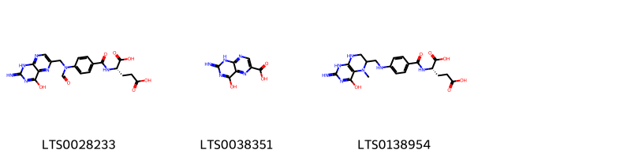{ width=100% }
    <figcaption>Hình ảnh cấu trúc hóa học của 3 hoạt chất thuộc nhóm Pteridines and derivatives gồm ['(2s)-2-[(4-{n-[(4-hydroxy-2-imino-1h-pteridin-6-yl)methyl]formamido}phenyl)formamido]pentanedioic acid (LTS0028233)', '4-hydroxy-2-imino-1h-pteridine-6-carboxylic acid (LTS0038351)', '(2s)-2-[(4-{[(4-hydroxy-2-imino-5-methyl-1,6,7,8-tetrahydropteridin-6-yl)methyl]amino}phenyl)formamido]pentanedioic acid (LTS0138954)'].</figcaption>
</figure>
#### Nhóm Purine nucleosides
<figure markdown="span">
    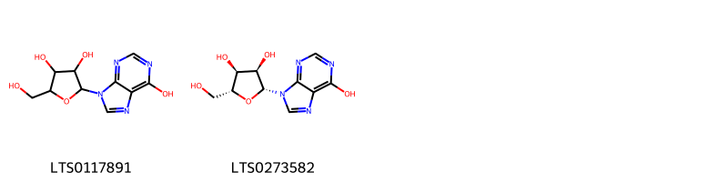{ width=100% }
    <figcaption>Hình ảnh cấu trúc hóa học của 2 hoạt chất thuộc nhóm Purine nucleosides gồm ['inosine (LTS0117891)', '(-)-inosine (LTS0273582)'].</figcaption>
</figure>
#### Nhóm Pyrans
<figure markdown="span">
    { width=100% }
    <figcaption>Hình ảnh cấu trúc hóa học của 1 hoạt chất thuộc nhóm Pyrans gồm ['talmon (LTS0152081)'].</figcaption>
</figure>
#### Nhóm Pyridines and derivatives
<figure markdown="span">
    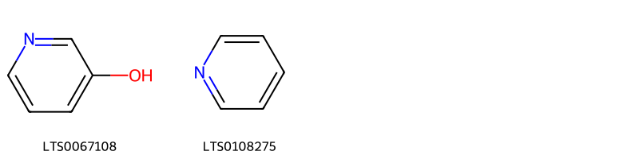{ width=100% }
    <figcaption>Hình ảnh cấu trúc hóa học của 2 hoạt chất thuộc nhóm Pyridines and derivatives gồm ['2-pyridone (LTS0067108)', 'pyridine (LTS0108275)'].</figcaption>
</figure>
#### Nhóm Pyrimidine nucleosides
<figure markdown="span">
    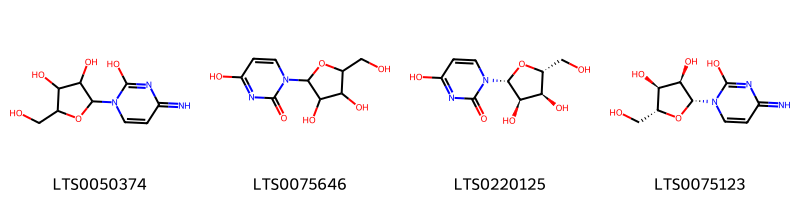{ width=100% }
    <figcaption>Hình ảnh cấu trúc hóa học của 4 hoạt chất thuộc nhóm Pyrimidine nucleosides gồm ['2-(2-hydroxy-4-iminopyrimidin-1-yl)-5-(hydroxymethyl)oxolane-3,4-diol (LTS0050374)', '1-[3,4-dihydroxy-5-(hydroxymethyl)oxolan-2-yl]-4-hydroxypyrimidin-2-one (LTS0075646)', 'uridine (LTS0220125)', 'cytidine (LTS0075123)'].</figcaption>
</figure>
#### Nhóm Pyrrolidines
<figure markdown="span">
    { width=100% }
    <figcaption>Hình ảnh cấu trúc hóa học của 1 hoạt chất thuộc nhóm Pyrrolidines gồm ['n-nitrosopyrrolidine (LTS0107510)'].</figcaption>
</figure>
#### Nhóm Sphingolipids
<figure markdown="span">
    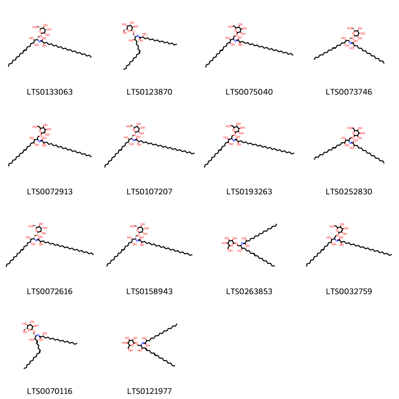{ width=100% }
    <figcaption>Hình ảnh cấu trúc hóa học của 14 hoạt chất thuộc nhóm Sphingolipids gồm ['(2r)-n-[(2s,3s,4r,8e)-3,4-dihydroxy-1-{[(2r,3r,4s,5s,6r)-3,4,5-trihydroxy-6-(hydroxymethyl)oxan-2-yl]oxy}octadec-8-en-2-yl]-2-hydroxydocosanimidic acid (LTS0133063)', '(2r)-2-hydroxy-n-[(2s,3r,8z)-3-hydroxy-1-{[(2r,3r,4s,5s,6r)-3,4,5-trihydroxy-6-(hydroxymethyl)oxan-2-yl]oxy}octadec-8-en-2-yl]hexadecanimidic acid (LTS0123870)', 'n-(3,4-dihydroxy-1-{[3,4,5-trihydroxy-6-(hydroxymethyl)oxan-2-yl]oxy}octadec-8-en-2-yl)-2-hydroxytetracosanimidic acid (LTS0075040)', '(2r)-n-[(2s,3s,4r,8e)-3,4-dihydroxy-1-{[(2r,3r,4s,5s,6r)-3,4,5-trihydroxy-6-(hydroxymethyl)oxan-2-yl]oxy}octadec-8-en-2-yl]-2-hydroxyhexadecanimidic acid (LTS0073746)', 'n-(3,4-dihydroxy-1-{[3,4,5-trihydroxy-6-(hydroxymethyl)oxan-2-yl]oxy}octadec-8-en-2-yl)-2-hydroxydocosanimidic acid (LTS0072913)', '(2r)-n-[(2s,3s,4r,8e)-3,4-dihydroxy-1-{[(2r,3r,4s,5s,6r)-3,4,5-trihydroxy-6-(hydroxymethyl)oxan-2-yl]oxy}octadec-8-en-2-yl]-2-hydroxypentacosanimidic acid (LTS0107207)', 'n-(3,4-dihydroxy-1-{[3,4,5-trihydroxy-6-(hydroxymethyl)oxan-2-yl]oxy}octadec-8-en-2-yl)-2-hydroxypentacosanimidic acid (LTS0193263)', 'n-(3,4-dihydroxy-1-{[3,4,5-trihydroxy-6-(hydroxymethyl)oxan-2-yl]oxy}octadec-8-en-2-yl)-2-hydroxyhexadecanimidic acid (LTS0252830)', '(2r)-n-[(2s,3s,4r,8e)-3,4-dihydroxy-1-{[(2r,3r,4s,5s,6r)-3,4,5-trihydroxy-6-(hydroxymethyl)oxan-2-yl]oxy}octadec-8-en-2-yl]-2-hydroxytetracosanimidic acid (LTS0072616)', '(2r)-n-[(2s,3s,4r,8e)-3,4-dihydroxy-1-{[(2r,3r,4s,5s,6r)-3,4,5-trihydroxy-6-(hydroxymethyl)oxan-2-yl]oxy}octadec-8-en-2-yl]-2-hydroxytricosanimidic acid (LTS0158943)', '2-hydroxy-n-(3-hydroxy-1-{[3,4,5-trihydroxy-6-(hydroxymethyl)oxan-2-yl]oxy}octadec-8-en-2-yl)hexadecanimidic acid (LTS0263853)', 'n-(3,4-dihydroxy-1-{[3,4,5-trihydroxy-6-(hydroxymethyl)oxan-2-yl]oxy}octadec-8-en-2-yl)-2-hydroxytricosanimidic acid (LTS0032759)', '(2r)-2-hydroxy-n-[(2s,3r,4e,8z)-3-hydroxy-1-{[(2r,3r,4s,5s,6r)-3,4,5-trihydroxy-6-(hydroxymethyl)oxan-2-yl]oxy}octadeca-4,8-dien-2-yl]hexadecanimidic acid (LTS0070116)', '2-hydroxy-n-(3-hydroxy-1-{[3,4,5-trihydroxy-6-(hydroxymethyl)oxan-2-yl]oxy}octadeca-4,8-dien-2-yl)hexadecanimidic acid (LTS0121977)'].</figcaption>
</figure>
#### Nhóm Steroids and steroid derivatives
<figure markdown="span">
    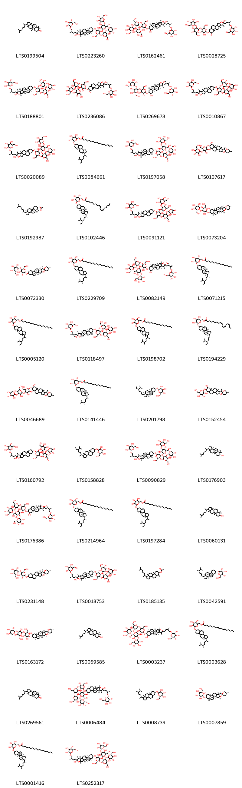{ width=100% }
    <figcaption>Hình ảnh cấu trúc hóa học của 56 hoạt chất thuộc nhóm Steroids and steroid derivatives gồm ['(3br,7s,9bs,11ar)-9b-ethyl-3a,6,6,11a-tetramethyl-1-(6-methylheptan-2-yl)-dodecahydro-1h-cyclopenta[a]phenanthren-7-ol (LTS0199504)', '(2s,3r,4s,5s,6r)-2-{[(2r,3s,4r,5r,6s)-6-{[(2s,3r,4s,5r,6r)-2-{[(2r,3r,4r,5r,6r)-4,5-dihydroxy-6-{[(1r,2s,4s,6s,7s,8r,9s,12s,13s,16s,18s)-6-hydroxy-7,9,13-trimethyl-6-[(3r)-3-methyl-4-{[(2r,3r,4s,5s,6r)-3,4,5-trihydroxy-6-(hydroxymethyl)oxan-2-yl]oxy}butyl]-5-oxapentacyclo[10.8.0.0²,⁹.0⁴,⁸.0¹³,¹⁸]icosan-16-yl]oxy}-2-(hydroxymethyl)oxan-3-yl]oxy}-5-hydroxy-6-(hydroxymethyl)-4-{[(2s,3r,4s,5r)-3,4,5-trihydroxyoxan-2-yl]oxy}oxan-3-yl]oxy}-4,5-dihydroxy-2-(hydroxymethyl)oxan-3-yl]oxy}-6-(hydroxymethyl)oxane-3,4,5-triol (LTS0223260)', '(2r,3r,4s,5s,6r)-2-[(2r)-4-[(1r,2s,4s,6s,7s,8r,9s,12s,13s,15r,16r,18s)-16-{[(2r,3r,4r,5r,6r)-3,4-dihydroxy-5-{[(2s,3r,4s,5r,6r)-5-hydroxy-6-(hydroxymethyl)-3,4-bis({[(2s,3r,4s,5s,6r)-3,4,5-trihydroxy-6-(hydroxymethyl)oxan-2-yl]oxy})oxan-2-yl]oxy}-6-(hydroxymethyl)oxan-2-yl]oxy}-15-hydroxy-6-methoxy-7,9,13-trimethyl-5-oxapentacyclo[10.8.0.0²,⁹.0⁴,⁸.0¹³,¹⁸]icosan-6-yl]-2-methylbutoxy]-6-(hydroxymethyl)oxane-3,4,5-triol (LTS0162461)', '2-(4-{16-[(5-{[4,5-dihydroxy-6-(hydroxymethyl)-3-{[3,4,5-trihydroxy-6-(hydroxymethyl)oxan-2-yl]oxy}oxan-2-yl]oxy}-3,4-dihydroxy-6-(hydroxymethyl)oxan-2-yl)oxy]-15-hydroxy-6-methoxy-7,9,13-trimethyl-5-oxapentacyclo[10.8.0.0²,⁹.0⁴,⁸.0¹³,¹⁸]icosan-6-yl}-2-methylbutoxy)-6-(hydroxymethyl)oxane-3,4,5-triol (LTS0028725)', '(2s,3r,4s,5s,6r)-2-{[(2s,3r,4s,5r,6r)-2-{[(2r,3r,4r,5r,6r)-4,5-dihydroxy-6-{[(1r,2s,4s,6r,7s,8r,9s,12s,13s,16s,18s)-6-hydroxy-7,9,13-trimethyl-6-[(3r)-3-methyl-4-{[(2r,3r,4s,5s,6r)-3,4,5-trihydroxy-6-(hydroxymethyl)oxan-2-yl]oxy}butyl]-5-oxapentacyclo[10.8.0.0²,⁹.0⁴,⁸.0¹³,¹⁸]icosan-16-yl]oxy}-2-(hydroxymethyl)oxan-3-yl]oxy}-5-hydroxy-6-(hydroxymethyl)-4-{[(2s,3r,4s,5r)-3,4,5-trihydroxyoxan-2-yl]oxy}oxan-3-yl]oxy}-6-(hydroxymethyl)oxane-3,4,5-triol (LTS0188801)', '2-(4-{16-[(3,4-dihydroxy-5-{[5-hydroxy-6-(hydroxymethyl)-3,4-bis({[3,4,5-trihydroxy-6-(hydroxymethyl)oxan-2-yl]oxy})oxan-2-yl]oxy}-6-(hydroxymethyl)oxan-2-yl)oxy]-15-hydroxy-6-methoxy-7,9,13-trimethyl-5-oxapentacyclo[10.8.0.0²,⁹.0⁴,⁸.0¹³,¹⁸]icosan-6-yl}-2-methylbutoxy)-6-(hydroxymethyl)oxane-3,4,5-triol (LTS0236086)', '(2r,3r,4s,5s,6r)-2-[(2r)-4-[(1r,2s,4s,6s,7s,8r,9s,12s,13s,15r,16r,18s)-16-{[(2r,3r,4r,5r,6r)-5-{[(2s,3r,4s,5s,6r)-4,5-dihydroxy-6-(hydroxymethyl)-3-{[(2s,3r,4s,5s,6r)-3,4,5-trihydroxy-6-(hydroxymethyl)oxan-2-yl]oxy}oxan-2-yl]oxy}-3,4-dihydroxy-6-(hydroxymethyl)oxan-2-yl]oxy}-15-hydroxy-6-methoxy-7,9,13-trimethyl-5-oxapentacyclo[10.8.0.0²,⁹.0⁴,⁸.0¹³,¹⁸]icosan-6-yl]-2-methylbutoxy]-6-(hydroxymethyl)oxane-3,4,5-triol (LTS0269678)', '2-({2-[(4,5-dihydroxy-6-{[6-hydroxy-7,9,13-trimethyl-6-(3-methyl-4-{[3,4,5-trihydroxy-6-(hydroxymethyl)oxan-2-yl]oxy}butyl)-5-oxapentacyclo[10.8.0.0²,⁹.0⁴,⁸.0¹³,¹⁸]icosan-16-yl]oxy}-2-(hydroxymethyl)oxan-3-yl)oxy]-5-hydroxy-6-(hydroxymethyl)-4-[(3,4,5-trihydroxyoxan-2-yl)oxy]oxan-3-yl}oxy)-6-(hydroxymethyl)oxane-3,4,5-triol (LTS0010867)', '2-{[6-({2-[(4,5-dihydroxy-6-{[6-hydroxy-7,9,13-trimethyl-6-(3-methyl-4-{[3,4,5-trihydroxy-6-(hydroxymethyl)oxan-2-yl]oxy}butyl)-5-oxapentacyclo[10.8.0.0²,⁹.0⁴,⁸.0¹³,¹⁸]icosan-16-yl]oxy}-2-(hydroxymethyl)oxan-3-yl)oxy]-5-hydroxy-6-(hydroxymethyl)-4-[(3,4,5-trihydroxyoxan-2-yl)oxy]oxan-3-yl}oxy)-4,5-dihydroxy-2-(hydroxymethyl)oxan-3-yl]oxy}-6-(hydroxymethyl)oxane-3,4,5-triol (LTS0020089)', '(6-{[1-(5-ethyl-6-methylheptan-2-yl)-9a,11a-dimethyl-1h,2h,3h,3ah,3bh,4h,6h,7h,8h,9h,9bh,10h,11h-cyclopenta[a]phenanthren-7-yl]oxy}-3,4,5-trihydroxyoxan-2-yl)methyl octadeca-9,12,15-trienoate (LTS0084661)', '(2r,3r,4s,5s,6r)-2-[(2r)-4-[(1r,2s,4s,7s,8r,9s,12s,13s,16s,18s)-16-{[(2r,3r,4r,5r,6r)-5-{[(2s,3r,4s,5r,6r)-3-{[(2s,3r,4s,5r,6r)-3,5-dihydroxy-6-(hydroxymethyl)-4-{[(2s,3r,4s,5s,6r)-3,4,5-trihydroxy-6-(hydroxymethyl)oxan-2-yl]oxy}oxan-2-yl]oxy}-5-hydroxy-6-(hydroxymethyl)-4-{[(2s,3r,4s,5s,6r)-3,4,5-trihydroxy-6-(hydroxymethyl)oxan-2-yl]oxy}oxan-2-yl]oxy}-3,4-dihydroxy-6-(hydroxymethyl)oxan-2-yl]oxy}-6-methoxy-7,9,13-trimethyl-5-oxapentacyclo[10.8.0.0²,⁹.0⁴,⁸.0¹³,¹⁸]icosan-6-yl]-2-methylbutoxy]-6-(hydroxymethyl)oxane-3,4,5-triol (LTS0197058)', "2-{[4,5-dihydroxy-2-(hydroxymethyl)-6-{5,7',9',13'-tetramethyl-5'-oxaspiro[oxane-2,6'-pentacyclo[10.8.0.0²,⁹.0⁴,⁸.0¹³,¹⁸]icosan]-15'-oloxy}oxan-3-yl]oxy}-6-(hydroxymethyl)oxane-3,4,5-triol (LTS0107617)", '(1r,5as,6s,7s,9as,9br,11ar)-6,9a,11a-trimethyl-1-[(2r)-6-methylheptan-2-yl]-1h,2h,3h,4h,5h,5ah,6h,7h,8h,9h,9bh,10h,11h-cyclopenta[a]phenanthren-7-yl acetate (LTS0192987)', '[(2r,3s,4s,5r,6r)-6-{[(1r,3as,3bs,7s,9ar,9bs,11ar)-1-[(2r,5r)-5-ethyl-6-methylheptan-2-yl]-9a,11a-dimethyl-1h,2h,3h,3ah,3bh,4h,6h,7h,8h,9h,9bh,10h,11h-cyclopenta[a]phenanthren-7-yl]oxy}-3,4,5-trihydroxyoxan-2-yl]methyl (9z,12z)-octadeca-9,12-dienoate (LTS0102446)', '2-{[2-({2-[(4,5-dihydroxy-6-{[6-hydroxy-7,9,13-trimethyl-6-(3-methyl-4-{[3,4,5-trihydroxy-6-(hydroxymethyl)oxan-2-yl]oxy}butyl)-5-oxapentacyclo[10.8.0.0²,⁹.0⁴,⁸.0¹³,¹⁸]icosan-16-yl]oxy}-2-(hydroxymethyl)oxan-3-yl)oxy]-5-hydroxy-6-(hydroxymethyl)-4-[(3,4,5-trihydroxyoxan-2-yl)oxy]oxan-3-yl}oxy)-3,5-dihydroxy-6-(hydroxymethyl)oxan-4-yl]oxy}-6-(hydroxymethyl)oxane-3,4,5-triol (LTS0091121)', "(2s,3r,4s,5s,6r)-2-{[(2r,3r,4r,5r,6r)-4,5-dihydroxy-2-(hydroxymethyl)-6-[(1'r,2r,2's,4's,5r,7's,8'r,9's,12's,13's,15'r,16'r,18's)-5,7',9',13'-tetramethyl-5'-oxaspiro[oxane-2,6'-pentacyclo[10.8.0.0²,⁹.0⁴,⁸.0¹³,¹⁸]icosan]-15'-oloxy]oxan-3-yl]oxy}-6-(hydroxymethyl)oxane-3,4,5-triol (LTS0073204)", "(2s,3r,4s,5s,6r)-2-{[(2r,3r,4r,5r,6r)-4,5-dihydroxy-2-(hydroxymethyl)-6-[(1's,2r,2's,4's,5r,7's,8'r,9's,12's,13'r,16's)-5,7',9',13'-tetramethyl-5'-oxaspiro[oxane-2,6'-pentacyclo[10.8.0.0²,⁹.0⁴,⁸.0¹³,¹⁸]icosan]-18'-eneoxy]oxan-3-yl]oxy}-6-(hydroxymethyl)oxane-3,4,5-triol (LTS0072330)", '(6-{[1-(5,6-dimethylheptan-2-yl)-9a,11a-dimethyl-1h,2h,3h,3ah,3bh,4h,6h,7h,8h,9h,9bh,10h,11h-cyclopenta[a]phenanthren-7-yl]oxy}-3,4,5-trihydroxyoxan-2-yl)methyl octadecanoate (LTS0229709)', '(2s,3r,4s,5s,6r)-2-{[(2s,3r,4s,5r,6r)-3-{[(2s,3r,4s,5r,6r)-3,5-dihydroxy-6-(hydroxymethyl)-4-{[(2s,3r,4s,5s,6r)-3,4,5-trihydroxy-6-(hydroxymethyl)oxan-2-yl]oxy}oxan-2-yl]oxy}-2-{[(2r,3r,4r,5r,6r)-4,5-dihydroxy-6-{[(1r,2s,4s,7s,8r,9s,12s,13s,15r,16r,18s)-15-hydroxy-6-methoxy-7,9,13-trimethyl-6-[3-({[(2r,3r,4s,5s,6r)-3,4,5-trihydroxy-6-(hydroxymethyl)oxan-2-yl]oxy}methyl)but-3-en-1-yl]-5-oxapentacyclo[10.8.0.0²,⁹.0⁴,⁸.0¹³,¹⁸]icosan-16-yl]oxy}-2-(hydroxymethyl)oxan-3-yl]oxy}-5-hydroxy-6-(hydroxymethyl)oxan-4-yl]oxy}-6-(hydroxymethyl)oxane-3,4,5-triol (LTS0082149)', 'sitoindoside i (LTS0071215)', '(6-{[1-(5-ethyl-6-methylheptan-2-yl)-9a,11a-dimethyl-1h,2h,3h,3ah,3bh,4h,6h,7h,8h,9h,9bh,10h,11h-cyclopenta[a]phenanthren-7-yl]oxy}-3,4,5-trihydroxyoxan-2-yl)methyl octadecanoate (LTS0005120)', '(2r,3r,4s,5s,6r)-2-[(2r)-4-[(1r,2s,4s,6s,7s,8r,9s,12s,13s,16s,18s)-16-{[(2r,3r,4r,5r,6r)-3,4-dihydroxy-5-{[(2s,3r,4s,5r,6r)-5-hydroxy-6-(hydroxymethyl)-3-{[(2s,3r,4s,5s,6r)-3,4,5-trihydroxy-6-(hydroxymethyl)oxan-2-yl]oxy}-4-{[(2s,3r,4s,5r)-3,4,5-trihydroxyoxan-2-yl]oxy}oxan-2-yl]oxy}-6-(hydroxymethyl)oxan-2-yl]oxy}-6-methoxy-7,9,13-trimethyl-5-oxapentacyclo[10.8.0.0²,⁹.0⁴,⁸.0¹³,¹⁸]icosan-6-yl]-2-methylbutoxy]-6-(hydroxymethyl)oxane-3,4,5-triol (LTS0118497)', '(6-{[1-(5,6-dimethylheptan-2-yl)-9a,11a-dimethyl-1h,2h,3h,3ah,3bh,4h,6h,7h,8h,9h,9bh,10h,11h-cyclopenta[a]phenanthren-7-yl]oxy}-3,4,5-trihydroxyoxan-2-yl)methyl hexadecanoate (LTS0198702)', '[(2r,3s,4s,5r,6r)-6-{[(1r,3as,3bs,7s,9ar,9bs,11ar)-1-[(2r,5r)-5-ethyl-6-methylheptan-2-yl]-9a,11a-dimethyl-1h,2h,3h,3ah,3bh,4h,6h,7h,8h,9h,9bh,10h,11h-cyclopenta[a]phenanthren-7-yl]oxy}-3,4,5-trihydroxyoxan-2-yl]methyl (9z,12z,15z)-octadeca-9,12,15-trienoate (LTS0194229)', "2-[(2-{[4,5-dihydroxy-2-(hydroxymethyl)-6-{5,7',9',13'-tetramethyl-5'-oxaspiro[oxane-2,6'-pentacyclo[10.8.0.0²,⁹.0⁴,⁸.0¹³,¹⁸]icosan]-15'-oloxy}oxan-3-yl]oxy}-3,5-dihydroxy-6-(hydroxymethyl)oxan-4-yl)oxy]oxane-3,4,5-triol (LTS0046689)", '[(2r,3s,4s,5r,6r)-6-{[(1r,3as,3bs,7s,9ar,9bs,11ar)-1-[(2r,5r)-5,6-dimethylheptan-2-yl]-9a,11a-dimethyl-1h,2h,3h,3ah,3bh,4h,6h,7h,8h,9h,9bh,10h,11h-cyclopenta[a]phenanthren-7-yl]oxy}-3,4,5-trihydroxyoxan-2-yl]methyl hexadecanoate (LTS0141446)', 'sitogluside (LTS0201798)', "2-(hydroxymethyl)-6-{5,7',9',13'-tetramethyl-5'-oxaspiro[oxane-2,6'-pentacyclo[10.8.0.0²,⁹.0⁴,⁸.0¹³,¹⁸]icosan]-15'-oloxy}oxane-3,4,5-triol (LTS0152454)", '2-(4-{16-[(3,4-dihydroxy-5-{[5-hydroxy-6-(hydroxymethyl)-3-{[3,4,5-trihydroxy-6-(hydroxymethyl)oxan-2-yl]oxy}-4-[(3,4,5-trihydroxyoxan-2-yl)oxy]oxan-2-yl]oxy}-6-(hydroxymethyl)oxan-2-yl)oxy]-6-methoxy-7,9,13-trimethyl-5-oxapentacyclo[10.8.0.0²,⁹.0⁴,⁸.0¹³,¹⁸]icosan-6-yl}-2-methylbutoxy)-6-(hydroxymethyl)oxane-3,4,5-triol (LTS0160792)', '2-{[1-(5-ethyl-6-methylheptan-2-yl)-9a,11a-dimethyl-1h,2h,3h,3ah,3bh,4h,6h,7h,8h,9h,9bh,10h,11h-cyclopenta[a]phenanthren-7-yl]oxy}-6-(hydroxymethyl)oxane-3,4,5-triol (LTS0158828)', '(2s,3r,4s,5s,6r)-2-{[(2s,3r,4s,5r,6r)-2-{[(2s,3r,4s,5r,6r)-2-{[(2r,3r,4r,5r,6r)-4,5-dihydroxy-6-{[(1r,2s,4s,7s,8r,9s,12s,13s,16s,18s)-6-hydroxy-7,9,13-trimethyl-6-[(3r)-3-methyl-4-{[(2r,3r,4s,5s,6r)-3,4,5-trihydroxy-6-(hydroxymethyl)oxan-2-yl]oxy}butyl]-5-oxapentacyclo[10.8.0.0²,⁹.0⁴,⁸.0¹³,¹⁸]icosan-16-yl]oxy}-2-(hydroxymethyl)oxan-3-yl]oxy}-5-hydroxy-6-(hydroxymethyl)-4-{[(2s,3r,4s,5r)-3,4,5-trihydroxyoxan-2-yl]oxy}oxan-3-yl]oxy}-3,5-dihydroxy-6-(hydroxymethyl)oxan-4-yl]oxy}-6-(hydroxymethyl)oxane-3,4,5-triol (LTS0090829)', 'cycloartanol (LTS0176903)', '(2r,3r,4s,5s,6r)-2-[(2r)-4-[(1r,2s,4s,7s,8r,9s,12s,13s,15r,16r,18s)-16-{[(2r,3r,4r,5r,6r)-5-{[(2s,3r,4s,5r,6r)-3-{[(2s,3r,4s,5r,6r)-3,5-dihydroxy-6-(hydroxymethyl)-4-{[(2s,3r,4s,5s,6r)-3,4,5-trihydroxy-6-(hydroxymethyl)oxan-2-yl]oxy}oxan-2-yl]oxy}-5-hydroxy-6-(hydroxymethyl)-4-{[(2s,3r,4s,5s,6r)-3,4,5-trihydroxy-6-(hydroxymethyl)oxan-2-yl]oxy}oxan-2-yl]oxy}-3,4-dihydroxy-6-(hydroxymethyl)oxan-2-yl]oxy}-15-hydroxy-6-methoxy-7,9,13-trimethyl-5-oxapentacyclo[10.8.0.0²,⁹.0⁴,⁸.0¹³,¹⁸]icosan-6-yl]-2-methylbutoxy]-6-(hydroxymethyl)oxane-3,4,5-triol (LTS0176386)', '[(2r,3s,4s,5r,6r)-6-{[(1r,3as,3bs,7s,9ar,9bs,11ar)-1-[(2r,5r)-5-ethyl-6-methylheptan-2-yl]-9a,11a-dimethyl-1h,2h,3h,3ah,3bh,4h,6h,7h,8h,9h,9bh,10h,11h-cyclopenta[a]phenanthren-7-yl]oxy}-3,4,5-trihydroxyoxan-2-yl]methyl octadecanoate (LTS0214964)', '(6-{[1-(5-ethyl-6-methylheptan-2-yl)-9a,11a-dimethyl-1h,2h,3h,3ah,3bh,4h,6h,7h,8h,9h,9bh,10h,11h-cyclopenta[a]phenanthren-7-yl]oxy}-3,4,5-trihydroxyoxan-2-yl)methyl hexadecanoate (LTS0197284)', 'cycloartenol (LTS0060131)', "(2s,3r,4s,5s,6r)-2-{[(2r,3r,4r,5r,6r)-4,5-dihydroxy-2-(hydroxymethyl)-6-[(2r,4's,5r,7's,8'r,9's,13'r)-5,7',9',13'-tetramethyl-5'-oxaspiro[oxane-2,6'-pentacyclo[10.8.0.0²,⁹.0⁴,⁸.0¹³,¹⁸]icosan]-18'-eneoxy]oxan-3-yl]oxy}-6-(hydroxymethyl)oxane-3,4,5-triol (LTS0231148)", '(2s,3r,4s,5s,6r)-2-{[(2s,3r,4s,5r,6r)-2-{[(2r,3r,4r,5r,6r)-4,5-dihydroxy-6-{[(1r,2s,4s,7s,8r,9s,12s,13s,16s,18s)-6-hydroxy-7,9,13-trimethyl-6-[(3r)-3-methyl-4-{[(2r,3r,4s,5s,6r)-3,4,5-trihydroxy-6-(hydroxymethyl)oxan-2-yl]oxy}butyl]-5-oxapentacyclo[10.8.0.0²,⁹.0⁴,⁸.0¹³,¹⁸]icosan-16-yl]oxy}-2-(hydroxymethyl)oxan-3-yl]oxy}-5-hydroxy-6-(hydroxymethyl)-4-{[(2s,3r,4s,5r)-3,4,5-trihydroxyoxan-2-yl]oxy}oxan-3-yl]oxy}-6-(hydroxymethyl)oxane-3,4,5-triol (LTS0018753)', '6,9a,11a-trimethyl-1-(6-methylheptan-2-yl)-1h,2h,3h,4h,5h,5ah,6h,7h,8h,9h,9bh,10h,11h-cyclopenta[a]phenanthren-7-yl acetate (LTS0185135)', '(2r,3r,4s,5s,6r)-2-{[(1r,3as,3bs,7s,9ar,9bs,11ar)-1-[(2r,5r)-5,6-dimethylheptan-2-yl]-9a,11a-dimethyl-1h,2h,3h,3ah,3bh,4h,6h,7h,8h,9h,9bh,10h,11h-cyclopenta[a]phenanthren-7-yl]oxy}-6-(hydroxymethyl)oxane-3,4,5-triol (LTS0042591)', "(2s,3r,4s,5r)-2-{[(2s,3r,4s,5r,6r)-2-{[(2r,3r,4r,5r,6r)-4,5-dihydroxy-2-(hydroxymethyl)-6-[(1'r,2r,2's,4's,5r,7's,8'r,9's,12's,13's,15'r,16'r,18's)-5,7',9',13'-tetramethyl-5'-oxaspiro[oxane-2,6'-pentacyclo[10.8.0.0²,⁹.0⁴,⁸.0¹³,¹⁸]icosan]-15'-oloxy]oxan-3-yl]oxy}-3,5-dihydroxy-6-(hydroxymethyl)oxan-4-yl]oxy}oxane-3,4,5-triol (LTS0163172)", '7,7,12,16-tetramethyl-15-(6-methylheptan-2-yl)pentacyclo[9.7.0.0¹,³.0³,⁸.0¹²,¹⁶]octadecan-6-ol (LTS0059585)', '(2r,3r,4s,5s,6r)-2-[(2r)-4-[(1r,2s,4s,8s,9s,12s,13s,15r,16r,18s)-16-{[(2r,3r,4r,5r,6r)-5-{[(2s,3r,4s,5r,6r)-3-{[(2s,3r,4s,5r,6r)-3,5-dihydroxy-6-(hydroxymethyl)-4-{[(2s,3r,4s,5s,6r)-3,4,5-trihydroxy-6-(hydroxymethyl)oxan-2-yl]oxy}oxan-2-yl]oxy}-5-hydroxy-6-(hydroxymethyl)-4-{[(2s,3r,4s,5s,6r)-3,4,5-trihydroxy-6-(hydroxymethyl)oxan-2-yl]oxy}oxan-2-yl]oxy}-3,4-dihydroxy-6-(hydroxymethyl)oxan-2-yl]oxy}-15-hydroxy-7,9,13-trimethyl-5-oxapentacyclo[10.8.0.0²,⁹.0⁴,⁸.0¹³,¹⁸]icos-6-en-6-yl]-2-methylbutoxy]-6-(hydroxymethyl)oxane-3,4,5-triol (LTS0003237)', '(6-{[1-(5,6-dimethylheptan-2-yl)-9a,11a-dimethyl-1h,2h,3h,3ah,3bh,4h,6h,7h,8h,9h,9bh,10h,11h-cyclopenta[a]phenanthren-7-yl]oxy}-3,4,5-trihydroxyoxan-2-yl)methyl octadeca-9,12-dienoate (LTS0003628)', 'cycloartenol (LTS0269561)', '(2s,3r,4s,5s,6r)-2-{[(2s,3r,4s,5r,6r)-2-{[(2r,3r,4r,5r,6s)-6-{[(2r,3r,4s,5r,6r)-2-{[(2s,4s,6r,7s,8r,9s,12s,13s,15r,16r,18s)-6,15-dihydroxy-7,9,13-trimethyl-6-[(3r)-3-methyl-4-{[(2r,3r,4s,5s,6r)-3,4,5-trihydroxy-6-(hydroxymethyl)oxan-2-yl]oxy}butyl]-5-oxapentacyclo[10.8.0.0²,⁹.0⁴,⁸.0¹³,¹⁸]icosan-16-yl]oxy}-3,5-dihydroxy-6-(hydroxymethyl)oxan-4-yl]oxy}-4,5-dihydroxy-2-(hydroxymethyl)oxan-3-yl]oxy}-5-hydroxy-6-(hydroxymethyl)-3-{[(2s,3r,4s,5s,6r)-3,4,5-trihydroxy-6-(hydroxymethyl)oxan-2-yl]oxy}oxan-4-yl]oxy}-6-(hydroxymethyl)oxane-3,4,5-triol (LTS0006484)', '2-{[1-(5,6-dimethylheptan-2-yl)-9a,11a-dimethyl-1h,2h,3h,3ah,3bh,4h,6h,7h,8h,9h,9bh,10h,11h-cyclopenta[a]phenanthren-7-yl]oxy}-6-(hydroxymethyl)oxane-3,4,5-triol (LTS0008739)', "(2r,3r,4s,5r,6r)-2-(hydroxymethyl)-6-[(1'r,2r,2's,4's,5r,7's,8'r,9's,12's,13's,15'r,16'r,18's)-5,7',9',13'-tetramethyl-5'-oxaspiro[oxane-2,6'-pentacyclo[10.8.0.0²,⁹.0⁴,⁸.0¹³,¹⁸]icosan]-15'-oloxy]oxane-3,4,5-triol (LTS0007859)", '[(2r,3s,4s,5r,6r)-6-{[(1r,3as,3bs,7s,9ar,9bs,11ar)-1-[(2r,5r)-5,6-dimethylheptan-2-yl]-9a,11a-dimethyl-1h,2h,3h,3ah,3bh,4h,6h,7h,8h,9h,9bh,10h,11h-cyclopenta[a]phenanthren-7-yl]oxy}-3,4,5-trihydroxyoxan-2-yl]methyl octadecanoate (LTS0001416)', '(2s,3r,4s,5s,6r)-2-{[(2s,3r,4s,5r,6r)-3-{[(2s,3r,4s,5r,6r)-3,5-dihydroxy-6-(hydroxymethyl)-4-{[(2s,3r,4s,5s,6r)-3,4,5-trihydroxy-6-(hydroxymethyl)oxan-2-yl]oxy}oxan-2-yl]oxy}-2-{[(2r,3r,4r,5r,6r)-4,5-dihydroxy-6-{[(1r,2s,4s,7s,8r,9s,12s,13s,16s,18s)-6-hydroxy-7,9,13-trimethyl-6-[(3r)-3-methyl-4-{[(2r,3r,4s,5s,6r)-3,4,5-trihydroxy-6-(hydroxymethyl)oxan-2-yl]oxy}butyl]-5-oxapentacyclo[10.8.0.0²,⁹.0⁴,⁸.0¹³,¹⁸]icosan-16-yl]oxy}-2-(hydroxymethyl)oxan-3-yl]oxy}-5-hydroxy-6-(hydroxymethyl)oxan-4-yl]oxy}-6-(hydroxymethyl)oxane-3,4,5-triol (LTS0252317)', '(2r,3r,4s,5s,6r)-2-[(2r)-4-[(1r,2s,4s,7s,8r,9s,12s,13s,16s,18s)-16-{[(2r,3r,4r,5r,6r)-5-{[(2s,3r,4s,5r,6r)-3-{[(2s,3r,4s,5r,6r)-3,5-dihydroxy-6-(hydroxymethyl)-4-{[(2s,3r,4s,5s,6r)-3,4,5-trihydroxy-6-(hydroxymethyl)oxan-2-yl]oxy}oxan-2-yl]oxy}-5-hydroxy-6-(hydroxymethyl)-4-{[(2s,3r,4s,5r)-3,4,5-trihydroxyoxan-2-yl]oxy}oxan-2-yl]oxy}-3,4-dihydroxy-6-(hydroxymethyl)oxan-2-yl]oxy}-6-methoxy-7,9,13-trimethyl-5-oxapentacyclo[10.8.0.0²,⁹.0⁴,⁸.0¹³,¹⁸]icosan-6-yl]-2-methylbutoxy]-6-(hydroxymethyl)oxane-3,4,5-triol (LTS0093363)', 'capsicoside a (LTS0009917)', '[(2r,3s,4s,5r,6r)-6-{[(1r,3as,3bs,7s,9ar,9bs,11ar)-1-[(2r,5r)-5,6-dimethylheptan-2-yl]-9a,11a-dimethyl-1h,2h,3h,3ah,3bh,4h,6h,7h,8h,9h,9bh,10h,11h-cyclopenta[a]phenanthren-7-yl]oxy}-3,4,5-trihydroxyoxan-2-yl]methyl (9z,12z)-octadeca-9,12-dienoate (LTS0031895)', '(6-{[1-(5-ethyl-6-methylheptan-2-yl)-9a,11a-dimethyl-1h,2h,3h,3ah,3bh,4h,6h,7h,8h,9h,9bh,10h,11h-cyclopenta[a]phenanthren-7-yl]oxy}-3,4,5-trihydroxyoxan-2-yl)methyl octadeca-9,12-dienoate (LTS0033895)', '(2s,3r,4s,5s,6r)-2-{[(2s,3r,4s,5r,6r)-3-{[(2s,3r,4s,5r,6r)-3,5-dihydroxy-6-(hydroxymethyl)-4-{[(2s,3r,4s,5s,6r)-3,4,5-trihydroxy-6-(hydroxymethyl)oxan-2-yl]oxy}oxan-2-yl]oxy}-2-{[(2r,3r,4r,5r,6r)-6-{[(1r,2s,4s,7s,8r,9s,12s,13s,15r,16r,18s)-6,15-dihydroxy-7,9,13-trimethyl-6-[(3r)-3-methyl-4-{[(2r,3r,4s,5s,6r)-3,4,5-trihydroxy-6-(hydroxymethyl)oxan-2-yl]oxy}butyl]-5-oxapentacyclo[10.8.0.0²,⁹.0⁴,⁸.0¹³,¹⁸]icosan-16-yl]oxy}-4,5-dihydroxy-2-(hydroxymethyl)oxan-3-yl]oxy}-5-hydroxy-6-(hydroxymethyl)oxan-4-yl]oxy}-6-(hydroxymethyl)oxane-3,4,5-triol (LTS0272448)', '(2s,3r,4s,5s,6r)-2-{[(2s,3r,4s,5r,6r)-2-{[(2s,3r,4s,5r,6r)-2-{[(2r,3r,4r,5r,6r)-4,5-dihydroxy-6-{[(1r,2s,4s,6s,7s,8r,9s,12s,13s,16s,18s)-6-hydroxy-7,9,13-trimethyl-6-[(3r)-3-methyl-4-{[(2r,3r,4s,5s,6r)-3,4,5-trihydroxy-6-(hydroxymethyl)oxan-2-yl]oxy}butyl]-5-oxapentacyclo[10.8.0.0²,⁹.0⁴,⁸.0¹³,¹⁸]icosan-16-yl]oxy}-2-(hydroxymethyl)oxan-3-yl]oxy}-5-hydroxy-6-(hydroxymethyl)-4-{[(2s,3r,4s,5r)-3,4,5-trihydroxyoxan-2-yl]oxy}oxan-3-yl]oxy}-3,5-dihydroxy-6-(hydroxymethyl)oxan-4-yl]oxy}-6-(hydroxymethyl)oxane-3,4,5-triol (LTS0019776)'].</figcaption>
</figure>
#### Nhóm Stilbenes
<figure markdown="span">
    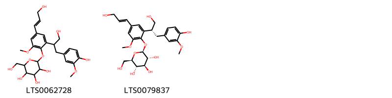{ width=100% }
    <figcaption>Hình ảnh cấu trúc hóa học của 2 hoạt chất thuộc nhóm Stilbenes gồm ['2-{2-[1-hydroxy-3-(4-hydroxy-3-methoxyphenyl)propan-2-yl]-4-(3-hydroxyprop-1-en-1-yl)-6-methoxyphenoxy}-6-(hydroxymethyl)oxane-3,4,5-triol (LTS0062728)', '(2s,3r,4s,5s,6r)-2-{2-[(2r)-1-hydroxy-3-(4-hydroxy-3-methoxyphenyl)propan-2-yl]-4-[(1e)-3-hydroxyprop-1-en-1-yl]-6-methoxyphenoxy}-6-(hydroxymethyl)oxane-3,4,5-triol (LTS0079837)'].</figcaption>
</figure>
#### Nhóm Tannins
<figure markdown="span">
    { width=100% }
    <figcaption>Hình ảnh cấu trúc hóa học của 2 hoạt chất thuộc nhóm Tannins gồm ['3,4,5-trihydroxy-6-(hydroxymethyl)oxan-2-yl 4-hydroxy-3-methoxybenzoate (LTS0100270)', '1-o-vanilloyl-β-d-glucose (LTS0258367)'].</figcaption>
</figure>

---

### Dược dân tộc học

Danh sách các quốc gia có sử dụng *Capsicum annuum* trong điều trị các bệnh. 

| Country   | Disease                                                              | Bệnh                                                                            |
|:----------|:---------------------------------------------------------------------|:--------------------------------------------------------------------------------|
| China     | Diaphoretic, Digestive, Stimulant                                    | Thuốc mỡ, Tiêu hóa, Chất kích thích                                             |
| Elsewhere | Tonic                                                                | (thuộc) trương lực                                                              |
| Mexico    | Rubefacient                                                          | Chất gây xung huyết da                                                          |
| Turkey    | Aphrodisiac, Rubefacient, Stimulant, Stomachic, Carminative, Styptic | Kích thích tình dục, Rubefacient, Chất kích thích, Dạ dày, Carminative, Styptic |
| ain       | Rubefacient                                                          | Chất gây xung huyết da                                                          |

---

---
## Capsicum baccatum
### Thông tin về thực vật

!!! info "Phân loại thực vật của *Capsicum baccatum* từ GIBF:"
    - **Kingdom:** Plantae
    - **Phylum:** Tracheophyta
    - **Order:** Solanales
    - **Family:** Solanaceae
    - **Genus:** Capsicum
    - **Species:** *Capsicum baccatum*

 

| Label (VI)   | Label (EN)   | Scientific Name   | Descriptions (VI)   | Descriptions (EN)       | Also Known As (VI)   | Also Known As (EN)   |
|:-------------|:-------------|:------------------|:--------------------|:------------------------|:---------------------|:---------------------|
| N/A          | N/A          | Capsicum baccatum | các loại ớt         | species of chili pepper | ['']                 | ['']                 |

#### Phân bố trên thế giới

**Từ CSDL GIBF** Ecuador, Sri Lanka, Germany, Romania, Colombia, Brazil, Paraguay, Argentina, Costa Rica, Portugal, Bolivia (Plurinational State of), Jamaica, United States of America, Peru, Chile, Mexico, Norway, New Zealand

#### Phân bố tại Việt Nam

**Từ CSDL GIBF**: Không có ghi nhận ở Việt Nam

---
### Thành phần hóa học
        
- Theo cơ sở dữ liệu lotus: Từ loài *Capsicum baccatum* đã phân lập và xác định được 4 hoạt chất thuộc về các nhóm Phenols. 

|    | chemicalTaxonomyClassyfireClass   |   smiles_count |
|---:|:----------------------------------|---------------:|
|  0 | Phenols                           |              4 |

#### Nhóm Phenols
<figure markdown="span">
    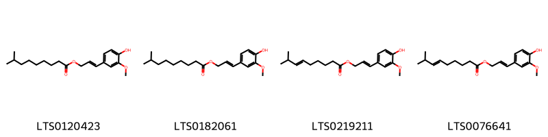{ width=100% }
    <figcaption>Hình ảnh cấu trúc hóa học của 4 hoạt chất thuộc nhóm Phenols gồm ['(2e)-3-(4-hydroxy-3-methoxyphenyl)prop-2-en-1-yl 8-methylnonanoate (LTS0120423)', '3-(4-hydroxy-3-methoxyphenyl)prop-2-en-1-yl 8-methylnonanoate (LTS0182061)', '(2e)-3-(4-hydroxy-3-methoxyphenyl)prop-2-en-1-yl (6e)-8-methylnon-6-enoate (LTS0219211)', '3-(4-hydroxy-3-methoxyphenyl)prop-2-en-1-yl 8-methylnon-6-enoate (LTS0076641)'].</figcaption>
</figure>

---

### Dược dân tộc học

Danh sách các quốc gia có sử dụng *Capsicum baccatum* trong điều trị các bệnh. 

| Country            | Disease                                                              | Bệnh                                                                               |
|:-------------------|:---------------------------------------------------------------------|:-----------------------------------------------------------------------------------|
| Dominican Republic | Stimulant                                                            | Chất kích thích                                                                    |
| Haiti              | Digestive                                                            | tiêu                                                                               |
| Turkey             | Aphrodisiac, Carminative, Rubefacient, Stimulant, Styptic, Stomachic | Kích thích tình dục, Carminative, Rubefacient, Chất kích thích, Styptic, Stomachic |

---

---
## Capsicum frutescens
### Thông tin về thực vật

!!! info "Phân loại thực vật của *Capsicum frutescens* từ GIBF:"
    - **Kingdom:** Plantae
    - **Phylum:** Tracheophyta
    - **Order:** Solanales
    - **Family:** Solanaceae
    - **Genus:** Capsicum
    - **Species:** *Capsicum frutescens*

 

| Label (VI)   | Label (EN)   | Scientific Name     | Descriptions (VI)   | Descriptions (EN)       | Also Known As (VI)   | Also Known As (EN)   |
|:-------------|:-------------|:--------------------|:--------------------|:------------------------|:---------------------|:---------------------|
| N/A          | N/A          | Capsicum frutescens |                     | species of chili pepper | ['']                 | ['']                 |

#### Phân bố trên thế giới

**Từ CSDL GIBF** French Southern Territories, nan, Sri Lanka, Australia, Japan, Cook Islands, Christmas Island, Benin, Norway, Venezuela (Bolivarian Republic of), Togo, Malawi, Pakistan, Puerto Rico, Réunion, Nigeria, Chinese Taipei, Bolivia (Plurinational State of), Honduras, United States of America, Congo, Democratic Republic of the, Guinea, South Africa, Trinidad and Tobago, Uganda, Hong Kong, Thailand, Germany, Martinique, Brazil, Côte d’Ivoire, Switzerland, New Caledonia, Tonga, Cuba, Dominica, Dominican Republic, Mexico, Mayotte, Peru, China, Ecuador, French Polynesia, Niue, Madagascar, Haiti, Colombia, Costa Rica, Vanuatu, India, Indonesia, Philippines, Malaysia, Northern Mariana Islands

#### Phân bố tại Việt Nam

**Từ CSDL GIBF**: Không có ghi nhận ở Việt Nam

---
### Thành phần hóa học
        
- Theo cơ sở dữ liệu lotus: Từ loài *Capsicum frutescens* đã phân lập và xác định được Chưa có hoạt chất nào được phân lập. hoạt chất thuộc về các nhóm Không có hoạt chất nào được phân lập. 

Không có hình ảnh nào được tạo ra

---

### Dược dân tộc học

Danh sách các quốc gia có sử dụng *Capsicum frutescens* trong điều trị các bệnh. 

| Country   | Disease                                                                                                                                 | Bệnh                                                                                                                                                        |
|:----------|:----------------------------------------------------------------------------------------------------------------------------------------|:------------------------------------------------------------------------------------------------------------------------------------------------------------|
| Elsewhere | Antibiotic, Antidote, Carminative, Collyrium, Rubefacient, Stimulant, Stimulant, Stomachic, Stomachic, Vesicant, Rubefacient, Stimulant | Kháng sinh, Thuốc kháng sinh, Carminative, Collyrium, Rubefacient, Chất kích thích, Chất kích thích, Dạ dày, Dạ dày, Vesicant, Rubefacient, Chất kích thích |
| Iraq      | Stimulant                                                                                                                               | Chất kích thích                                                                                                                                             |
| Trinidad  | Antibiotic, Carminative, Stimulant, Stomachic, Vesicant                                                                                 | Kháng sinh, Carminative, Chất kích thích, Dạ dày, Vesicant                                                                                                  |
| Turkey    | Carminative, Digestive, Rubefacient, Tonic, Stimulant                                                                                   | Carminative, Digestive, Rubefacient, Tonic, Stimulant                                                                                                       |

---

---
## Capsicum frytescens
### Thông tin về thực vật

!!! info "Phân loại thực vật của *Capsicum frutescens* từ GIBF:"
    - **Kingdom:** Plantae
    - **Phylum:** Tracheophyta
    - **Order:** Solanales
    - **Family:** Solanaceae
    - **Genus:** Capsicum
    - **Species:** *Capsicum frutescens*

 

| Label (VI)   | Label (EN)   | Scientific Name     | Descriptions (VI)   | Descriptions (EN)       | Also Known As (VI)   | Also Known As (EN)   |
|:-------------|:-------------|:--------------------|:--------------------|:------------------------|:---------------------|:---------------------|
| N/A          | N/A          | Capsicum frutescens |                     | species of chili pepper | ['']                 | ['']                 |

#### Phân bố trên thế giới

**Từ CSDL GIBF** French Southern Territories, nan, Sri Lanka, Australia, Japan, Cook Islands, Christmas Island, Benin, Norway, Venezuela (Bolivarian Republic of), Togo, Malawi, Pakistan, Puerto Rico, Réunion, Nigeria, Chinese Taipei, Bolivia (Plurinational State of), Honduras, United States of America, Congo, Democratic Republic of the, Guinea, South Africa, Trinidad and Tobago, Uganda, Hong Kong, Thailand, Germany, Martinique, Brazil, Côte d’Ivoire, Switzerland, New Caledonia, Tonga, Cuba, Dominica, Dominican Republic, Mexico, Mayotte, Peru, China, Ecuador, French Polynesia, Niue, Madagascar, Haiti, Colombia, Costa Rica, Vanuatu, India, Indonesia, Philippines, Malaysia, Northern Mariana Islands

#### Phân bố tại Việt Nam

**Từ CSDL GIBF**: Không có ghi nhận ở Việt Nam

---
### Thành phần hóa học
        
- Theo cơ sở dữ liệu lotus: Từ loài *Capsicum frutescens* đã phân lập và xác định được Chưa có hoạt chất nào được phân lập. hoạt chất thuộc về các nhóm Không có hoạt chất nào được phân lập. 

Không có hình ảnh nào được tạo ra

---

### Dược dân tộc học

Danh sách các quốc gia có sử dụng *Capsicum frutescens* trong điều trị các bệnh. 

| Country   | Disease     | Bệnh                   |
|:----------|:------------|:-----------------------|
| Elsewhere | Rubefacient | Chất gây xung huyết da |
| Trinidad  | Rubefacient | Chất gây xung huyết da |

---

# Chi Hyoscyamus

??? note "Danh sách các dược liệu thuộc chi"
    
	 - *Hyoscyamus albus*
	 - *Hyoscyamus muticus*
	 - *Hyoscyamus niger*
	 - *Hyoscyamus pusillus*
	 - *Hyoscyamus reticulatus*

---
## Hyoscyamus albus
### Thông tin về thực vật

!!! info "Phân loại thực vật của *Hyoscyamus albus* từ GIBF:"
    - **Kingdom:** Plantae
    - **Phylum:** Tracheophyta
    - **Order:** Solanales
    - **Family:** Solanaceae
    - **Genus:** Hyoscyamus
    - **Species:** *Hyoscyamus albus*

 

| Label (VI)   | Label (EN)   | Scientific Name   | Descriptions (VI)   | Descriptions (EN)   | Also Known As (VI)   | Also Known As (EN)   |
|:-------------|:-------------|:------------------|:--------------------|:--------------------|:---------------------|:---------------------|
| N/A          | N/A          | Hyoscyamus albus  | loài thực vật       | species of plant    | ['']                 | ['Hyoscamus albus']  |

#### Phân bố trên thế giới

**Từ CSDL GIBF** Netherlands, Italy, Cyprus, Malta, Spain, Türkiye, Portugal, Algeria, Morocco, Tunisia, France, Croatia, Greece

#### Phân bố tại Việt Nam

**Từ CSDL GIBF**: Không có ghi nhận ở Việt Nam

---
### Thành phần hóa học
        
- Theo cơ sở dữ liệu lotus: Từ loài *Hyoscyamus albus* đã phân lập và xác định được 77 hoạt chất thuộc về các nhóm Prenol lipids, Piperidines, Hydroxy acids and derivatives, Tropane alkaloids, Organooxygen compounds, Saturated hydrocarbons. 

|    | chemicalTaxonomyClassyfireClass   |   smiles_count |
|---:|:----------------------------------|---------------:|
|  0 |                                   |              6 |
|  1 | Hydroxy acids and derivatives     |              3 |
|  2 | Organooxygen compounds            |              4 |
|  3 | Piperidines                       |              1 |
|  4 | Prenol lipids                     |             25 |
|  5 | Saturated hydrocarbons            |              2 |
|  6 | Tropane alkaloids                 |             36 |

#### Nhóm 
<figure markdown="span">
    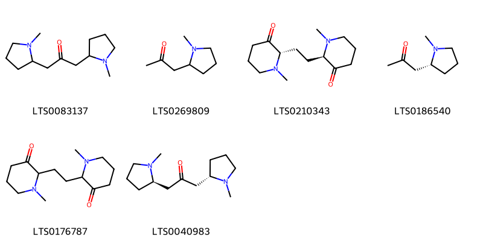{ width=100% }
    <figcaption>Hình ảnh cấu trúc hóa học của 6 hoạt chất thuộc nhóm  gồm ['cuskhygrine (LTS0083137)', 'hygrine (LTS0269809)', '(2s)-1-methyl-2-{2-[(2r)-1-methyl-3-oxopiperidin-2-yl]ethyl}piperidin-3-one (LTS0210343)', '(+)-hygrine (LTS0186540)', '1-methyl-2-[2-(1-methyl-3-oxopiperidin-2-yl)ethyl]piperidin-3-one (LTS0176787)', 'cuscohygrine (LTS0040983)'].</figcaption>
</figure>
#### Nhóm Hydroxy acids and derivatives
<figure markdown="span">
    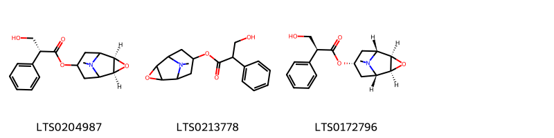{ width=100% }
    <figcaption>Hình ảnh cấu trúc hóa học của 3 hoạt chất thuộc nhóm Hydroxy acids and derivatives gồm ['(2r,4s)-9-methyl-3-oxa-9-azatricyclo[3.3.1.0²,⁴]nonan-7-yl (2r)-3-hydroxy-2-phenylpropanoate (LTS0204987)', 'buscopan (LTS0213778)', 'scopolamine (LTS0172796)'].</figcaption>
</figure>
#### Nhóm Organooxygen compounds
<figure markdown="span">
    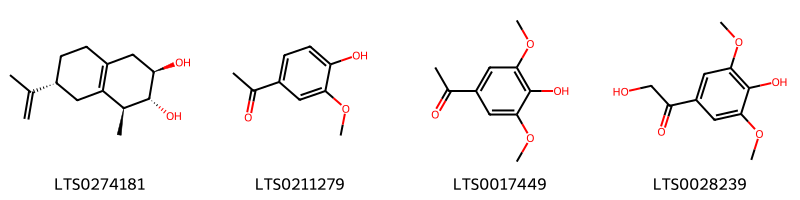{ width=100% }
    <figcaption>Hình ảnh cấu trúc hóa học của 4 hoạt chất thuộc nhóm Organooxygen compounds gồm ['rishitin (LTS0274181)', 'apocynin (LTS0211279)', 'acetosyringone (LTS0017449)', 'danielone (LTS0028239)'].</figcaption>
</figure>
#### Nhóm Piperidines
<figure markdown="span">
    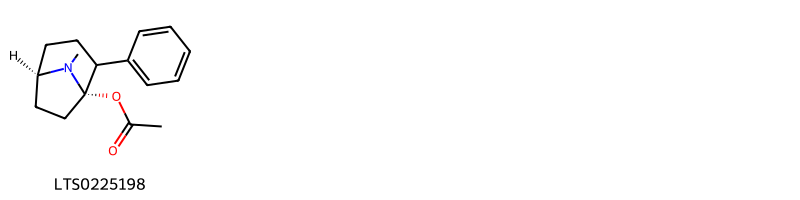{ width=100% }
    <figcaption>Hình ảnh cấu trúc hóa học của 1 hoạt chất thuộc nhóm Piperidines gồm ['(1s,5r)-8-methyl-2-phenyl-8-azabicyclo[3.2.1]octan-1-yl acetate (LTS0225198)'].</figcaption>
</figure>
#### Nhóm Prenol lipids
<figure markdown="span">
    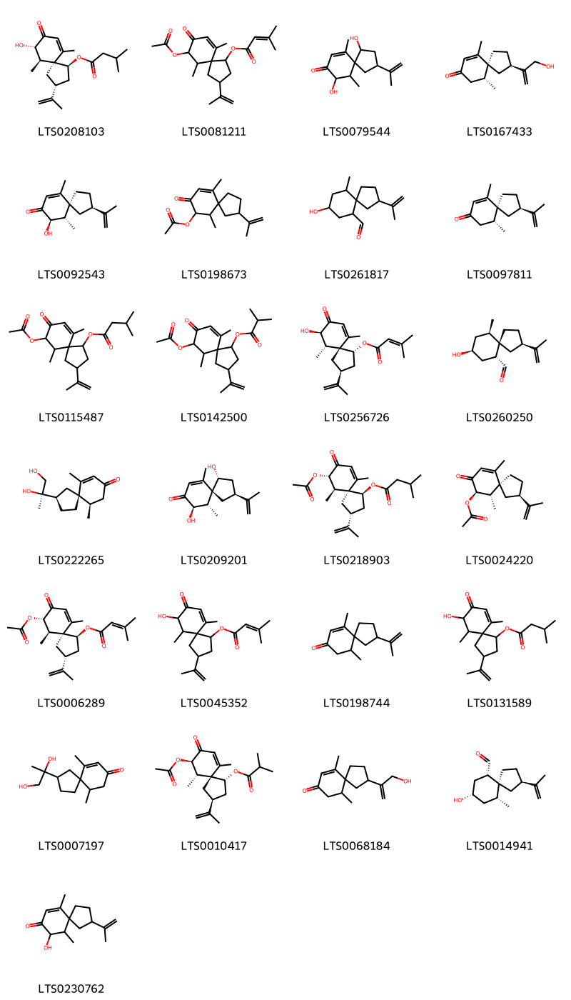{ width=100% }
    <figcaption>Hình ảnh cấu trúc hóa học của 25 hoạt chất thuộc nhóm Prenol lipids gồm ['(1s,3r,5s,9s,10r)-9-hydroxy-6,10-dimethyl-8-oxo-3-(prop-1-en-2-yl)spiro[4.5]dec-6-en-1-yl 3-methylbutanoate (LTS0208103)', '9-(acetyloxy)-6,10-dimethyl-8-oxo-3-(prop-1-en-2-yl)spiro[4.5]dec-6-en-1-yl 3-methylbut-2-enoate (LTS0081211)', '1,9-dihydroxy-6,10-dimethyl-3-(prop-1-en-2-yl)spiro[4.5]dec-6-en-8-one (LTS0079544)', '(2r,5s,10r)-2-(3-hydroxyprop-1-en-2-yl)-6,10-dimethylspiro[4.5]dec-6-en-8-one (LTS0167433)', '(2r,5s,9r,10s)-9-hydroxy-6,10-dimethyl-2-(prop-1-en-2-yl)spiro[4.5]dec-6-en-8-one (LTS0092543)', '6,10-dimethyl-8-oxo-2-(prop-1-en-2-yl)spiro[4.5]dec-9-en-7-yl acetate (LTS0198673)', '8-hydroxy-10-methyl-2-(prop-1-en-2-yl)spiro[4.5]decane-6-carbaldehyde (LTS0261817)', 'solavetivone (LTS0097811)', '9-(acetyloxy)-6,10-dimethyl-8-oxo-3-(prop-1-en-2-yl)spiro[4.5]dec-6-en-1-yl 3-methylbutanoate (LTS0115487)', '9-(acetyloxy)-6,10-dimethyl-8-oxo-3-(prop-1-en-2-yl)spiro[4.5]dec-6-en-1-yl 2-methylpropanoate (LTS0142500)', '(1r,3s,5r,9r,10s)-9-hydroxy-6,10-dimethyl-8-oxo-3-(prop-1-en-2-yl)spiro[4.5]dec-6-en-1-yl 3-methylbut-2-enoate (LTS0256726)', '(2r,5s,6r,8s,10r)-8-hydroxy-10-methyl-2-(prop-1-en-2-yl)spiro[4.5]decane-6-carbaldehyde (LTS0260250)', '(2r,5s,10r)-2-[(2r)-1,2-dihydroxypropan-2-yl]-6,10-dimethylspiro[4.5]dec-6-en-8-one (LTS0222265)', '(1r,3s,5r,9r,10s)-1,9-dihydroxy-6,10-dimethyl-3-(prop-1-en-2-yl)spiro[4.5]dec-6-en-8-one (LTS0209201)', '(1s,3r,5s,9s,10r)-9-(acetyloxy)-6,10-dimethyl-8-oxo-3-(prop-1-en-2-yl)spiro[4.5]dec-6-en-1-yl 3-methylbutanoate (LTS0218903)', '(2r,5s,6s,7r)-6,10-dimethyl-8-oxo-2-(prop-1-en-2-yl)spiro[4.5]dec-9-en-7-yl acetate (LTS0024220)', '(1s,3r,5s,9s,10r)-9-(acetyloxy)-6,10-dimethyl-8-oxo-3-(prop-1-en-2-yl)spiro[4.5]dec-6-en-1-yl 3-methylbut-2-enoate (LTS0006289)', '9-hydroxy-6,10-dimethyl-8-oxo-3-(prop-1-en-2-yl)spiro[4.5]dec-6-en-1-yl 3-methylbut-2-enoate (LTS0045352)', '6,10-dimethyl-2-(prop-1-en-2-yl)spiro[4.5]dec-6-en-8-one (LTS0198744)', '9-hydroxy-6,10-dimethyl-8-oxo-3-(prop-1-en-2-yl)spiro[4.5]dec-6-en-1-yl 3-methylbutanoate (LTS0131589)', '2-(1,2-dihydroxypropan-2-yl)-6,10-dimethylspiro[4.5]dec-6-en-8-one (LTS0007197)', '(1r,3s,5r,9r,10s)-9-(acetyloxy)-6,10-dimethyl-8-oxo-3-(prop-1-en-2-yl)spiro[4.5]dec-6-en-1-yl 2-methylpropanoate (LTS0010417)', '2-(3-hydroxyprop-1-en-2-yl)-6,10-dimethylspiro[4.5]dec-6-en-8-one (LTS0068184)', 'lubimin (LTS0014941)', '9-hydroxy-6,10-dimethyl-2-(prop-1-en-2-yl)spiro[4.5]dec-6-en-8-one (LTS0230762)'].</figcaption>
</figure>
#### Nhóm Saturated hydrocarbons
<figure markdown="span">
    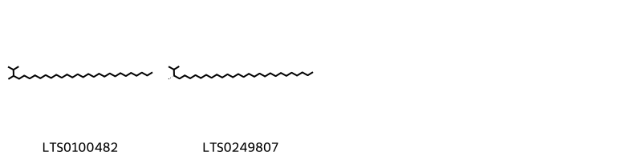{ width=100% }
    <figcaption>Hình ảnh cấu trúc hóa học của 2 hoạt chất thuộc nhóm Saturated hydrocarbons gồm ['2,3-dimethylnonacosane (LTS0100482)', '(3s)-2,3-dimethylnonacosane (LTS0249807)'].</figcaption>
</figure>
#### Nhóm Tropane alkaloids
<figure markdown="span">
    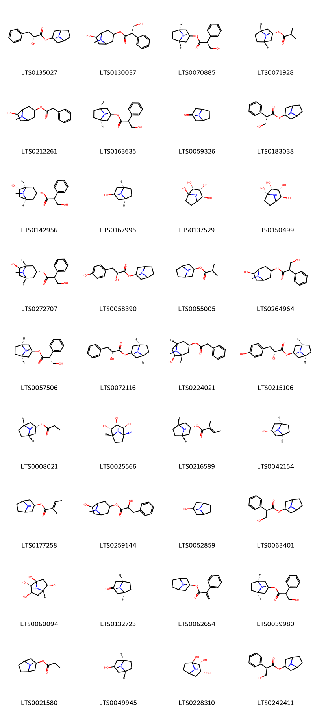{ width=100% }
    <figcaption>Hình ảnh cấu trúc hóa học của 36 hoạt chất thuộc nhóm Tropane alkaloids gồm ['littorine (LTS0135027)', '6-hydroxy-8-methyl-8-azabicyclo[3.2.1]octan-3-yl (2s)-3-hydroxy-2-phenylpropanoate (LTS0130037)', '(1s,5s)-8-methyl-8-azabicyclo[3.2.1]octan-3-yl (2s)-3-hydroxy-2-phenylpropanoate (LTS0070885)', '(1r,3s,5s)-8-methyl-8-azabicyclo[3.2.1]octan-3-yl 2-methylpropanoate (LTS0071928)', '6-hydroxy-8-methyl-8-azabicyclo[3.2.1]octan-3-yl 2-phenylacetate (LTS0212261)', 'hyoscyamine, its salts and derivatives (LTS0163635)', 'tropanone (LTS0059326)', 'hyoscyamine (LTS0183038)', '(1r,3s,5r,6s)-6-hydroxy-8-methyl-8-azabicyclo[3.2.1]octan-3-yl (2s)-3-hydroxy-2-phenylpropanoate (LTS0142956)', 'tropine (LTS0167995)', 'calystegin b2 (LTS0137529)', '(1r,2r,3r,4s)-8-azabicyclo[3.2.1]octane-1,2,3,4-tetrol (LTS0150499)', '(1s,3r,5s,6r)-6-hydroxy-8-methyl-8-azabicyclo[3.2.1]octan-3-yl (2s)-3-hydroxy-2-phenylpropanoate (LTS0272707)', '8-methyl-8-azabicyclo[3.2.1]octan-3-yl 2-hydroxy-3-(4-hydroxyphenyl)propanoate (LTS0058390)', '8-methyl-8-azabicyclo[3.2.1]octan-3-yl 2-methylpropanoate (LTS0055005)', '6-hydroxy-8-methyl-8-azabicyclo[3.2.1]octan-3-yl 3-hydroxy-2-phenylpropanoate (LTS0264964)', '(1r,5s)-8-methyl-8-azabicyclo[3.2.1]octan-3-yl (2r)-3-hydroxy-2-phenylpropanoate (LTS0057506)', '(1r,5s)-8-methyl-8-azabicyclo[3.2.1]octan-3-yl (2r)-2-hydroxy-3-phenylpropanoate (LTS0072116)', '(1r,3r,5r,6s)-6-hydroxy-8-methyl-8-azabicyclo[3.2.1]octan-3-yl 2-phenylacetate (LTS0224021)', '(1r,3r,5s)-8-methyl-8-azabicyclo[3.2.1]octan-3-yl (2r)-2-hydroxy-3-(4-hydroxyphenyl)propanoate (LTS0215106)', '(1r,3s,5s)-8-methyl-8-azabicyclo[3.2.1]octan-3-yl propanoate (LTS0008021)', '(1s,2r,3r,4s,5r)-1-amino-8-azabicyclo[3.2.1]octane-2,3,4-triol (LTS0025566)', '(1r,3s,5s)-8-azabicyclo[3.2.1]octan-3-yl (2e)-2-methylbut-2-enoate (LTS0216589)', 'pseudotropine (LTS0042154)', '8-azabicyclo[3.2.1]octan-3-yl 2-methylbut-2-enoate (LTS0177258)', '6-hydroxy-8-methyl-8-azabicyclo[3.2.1]octan-3-yl 2-hydroxy-3-phenylpropanoate (LTS0259144)', 'tropin (LTS0052859)', '()-hyoscyamine (LTS0063401)', '(1r,2s,3r,5s,6r)-8-azabicyclo[3.2.1]octane-1,2,3,6-tetrol (LTS0060094)', 'tropinone (LTS0132723)', 'apoatropine (LTS0062654)', 'hyoscyamine (LTS0039980)', '8-methyl-8-azabicyclo[3.2.1]octan-3-yl propanoate (LTS0021580)', '(1r,5r)-8-methyl-8-azabicyclo[3.2.1]octan-3-ol (LTS0049945)', 'calystegin a3 (LTS0228310)', '8-methyl-8-azabicyclo[3.2.1]octan-3-yl (2r)-3-hydroxy-2-phenylpropanoate (LTS0242411)'].</figcaption>
</figure>

---

### Dược dân tộc học

Danh sách các quốc gia có sử dụng *Hyoscyamus albus* trong điều trị các bệnh. 

| Country   | Disease                       | Bệnh                         |
|:----------|:------------------------------|:-----------------------------|
| Dutch     | Sedative                      | Thuốc an thần                |
| Elsewhere | Mydriatic, Narcotic, Sedative | Mydriatic, Narcotic, An thần |
| French    | Narcotic                      | Thuốc gây ngủ, gây mê        |
| German    | Hypnotic                      | Thuốc ngủ                    |
| Iraq      | Sedative, Narcotic            | Thuốc an thần, ma túy        |
| Italian   | Mydriatic                     | Thuốc giãn đồng-tử           |
| ain       | Mydriatic                     | Thuốc giãn đồng-tử           |
| anish     | Poison                        | Chất độc                     |

---

---
## Hyoscyamus muticus
### Thông tin về thực vật

!!! info "Phân loại thực vật của *Hyoscyamus muticus* từ GIBF:"
    - **Kingdom:** Plantae
    - **Phylum:** Tracheophyta
    - **Order:** Solanales
    - **Family:** Solanaceae
    - **Genus:** Hyoscyamus
    - **Species:** *Hyoscyamus muticus*

 

| Label (VI)   | Label (EN)   | Scientific Name    | Descriptions (VI)   | Descriptions (EN)   | Also Known As (VI)   | Also Known As (EN)   |
|:-------------|:-------------|:-------------------|:--------------------|:--------------------|:---------------------|:---------------------|
| N/A          | N/A          | Hyoscyamus muticus | loài thực vật       | species of plant    | ['']                 | ['']                 |

#### Phân bố trên thế giới

**Từ CSDL GIBF** nan, United Arab Emirates, Libya, Palestine, State of, unknown or invalid, Israel, Pakistan, Mali, Chad, Sudan, Algeria, Morocco, United States of America, Saudi Arabia, Oman, Iran (Islamic Republic of), Egypt, Syrian Arab Republic, Western Sahara, Macao, India, Lebanon, Mauritania

#### Phân bố tại Việt Nam

**Từ CSDL GIBF**: Không có ghi nhận ở Việt Nam

---
### Thành phần hóa học
        
- Theo cơ sở dữ liệu lotus: Từ loài *Hyoscyamus muticus* đã phân lập và xác định được 17 hoạt chất thuộc về các nhóm Fatty Acyls, Prenol lipids, Benzene and substituted derivatives, Hydroxy acids and derivatives, Tropane alkaloids, Pyridines and derivatives. 

|    | chemicalTaxonomyClassyfireClass     |   smiles_count |
|---:|:------------------------------------|---------------:|
|  0 | Benzene and substituted derivatives |              1 |
|  1 | Fatty Acyls                         |              4 |
|  2 | Hydroxy acids and derivatives       |              4 |
|  3 | Prenol lipids                       |              2 |
|  4 | Pyridines and derivatives           |              1 |
|  5 | Tropane alkaloids                   |              5 |

#### Nhóm Benzene and substituted derivatives
<figure markdown="span">
    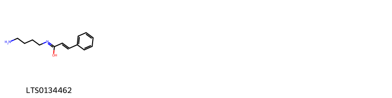{ width=100% }
    <figcaption>Hình ảnh cấu trúc hóa học của 1 hoạt chất thuộc nhóm Benzene and substituted derivatives gồm ['n-(4-aminobutyl)-3-phenylprop-2-enimidic acid (LTS0134462)'].</figcaption>
</figure>
#### Nhóm Fatty Acyls
<figure markdown="span">
    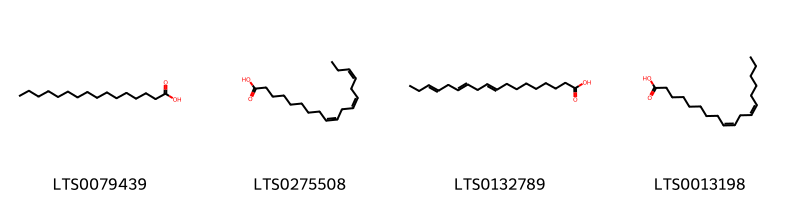{ width=100% }
    <figcaption>Hình ảnh cấu trúc hóa học của 4 hoạt chất thuộc nhóm Fatty Acyls gồm ['palmitic acid (LTS0079439)', 'α-linolenic acid (LTS0275508)', 'α linolenic acid (LTS0132789)', 'linoleic (LTS0013198)'].</figcaption>
</figure>
#### Nhóm Hydroxy acids and derivatives
<figure markdown="span">
    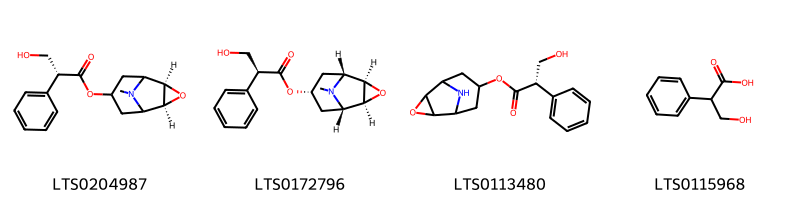{ width=100% }
    <figcaption>Hình ảnh cấu trúc hóa học của 4 hoạt chất thuộc nhóm Hydroxy acids and derivatives gồm ['(2r,4s)-9-methyl-3-oxa-9-azatricyclo[3.3.1.0²,⁴]nonan-7-yl (2r)-3-hydroxy-2-phenylpropanoate (LTS0204987)', 'scopolamine (LTS0172796)', '3-oxa-9-azatricyclo[3.3.1.0²,⁴]nonan-7-yl (2s)-3-hydroxy-2-phenylpropanoate (LTS0113480)', '(+-)-tropic acid (LTS0115968)'].</figcaption>
</figure>
#### Nhóm Prenol lipids
<figure markdown="span">
    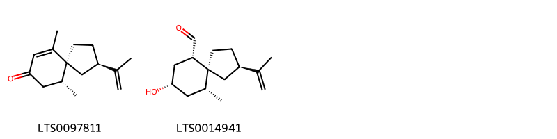{ width=100% }
    <figcaption>Hình ảnh cấu trúc hóa học của 2 hoạt chất thuộc nhóm Prenol lipids gồm ['solavetivone (LTS0097811)', 'lubimin (LTS0014941)'].</figcaption>
</figure>
#### Nhóm Pyridines and derivatives
<figure markdown="span">
    { width=100% }
    <figcaption>Hình ảnh cấu trúc hóa học của 1 hoạt chất thuộc nhóm Pyridines and derivatives gồm ['niacin (LTS0216673)'].</figcaption>
</figure>
#### Nhóm Tropane alkaloids
<figure markdown="span">
    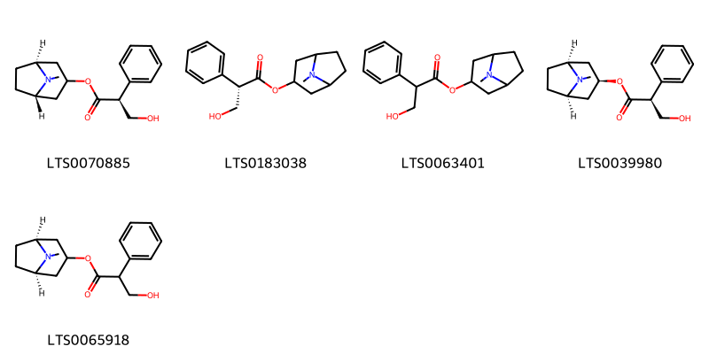{ width=100% }
    <figcaption>Hình ảnh cấu trúc hóa học của 5 hoạt chất thuộc nhóm Tropane alkaloids gồm ['(1s,5s)-8-methyl-8-azabicyclo[3.2.1]octan-3-yl (2s)-3-hydroxy-2-phenylpropanoate (LTS0070885)', 'hyoscyamine (LTS0183038)', '()-hyoscyamine (LTS0063401)', 'hyoscyamine (LTS0039980)', 'atropine (LTS0065918)'].</figcaption>
</figure>

---

### Dược dân tộc học

Danh sách các quốc gia có sử dụng *Hyoscyamus muticus* trong điều trị các bệnh. 

| Country   | Disease            | Bệnh                      |
|:----------|:-------------------|:--------------------------|
| Africa    | Intoxicant         | chất gây độc              |
| Egypt     | Narcotic           | Thuốc gây ngủ, gây mê     |
| Elsewhere | Sedative, Narcotic | Thuốc an thần, ma túy     |
| English   | Poison             | Chất độc                  |
| French    | Hypnotic           | Thuốc ngủ                 |
| German    | Sedative           | Thuốc an thần             |
| India     | Intoxicant         | chất gây độc              |
| Sudan     | Narcotic, Poison   | Chất gây nghiện, Chất độc |

---

---
## Hyoscyamus niger
### Thông tin về thực vật

!!! info "Phân loại thực vật của *Hyoscyamus niger* từ GIBF:"
    - **Kingdom:** Plantae
    - **Phylum:** Tracheophyta
    - **Order:** Solanales
    - **Family:** Solanaceae
    - **Genus:** Hyoscyamus
    - **Species:** *Hyoscyamus niger*

 

| Label (VI)   | Label (EN)   | Scientific Name   | Descriptions (VI)   | Descriptions (EN)   | Also Known As (VI)   | Also Known As (EN)           |
|:-------------|:-------------|:------------------|:--------------------|:--------------------|:---------------------|:-----------------------------|
| N/A          | N/A          | Hyoscyamus niger  | loài thực vật       | species of plant    | ['']                 | ['black henbane', 'henbane'] |

#### Phân bố trên thế giới

**Từ CSDL GIBF** Italy, Moldova, Republic of, Slovakia, Georgia, Norway, Canada, Ukraine, Denmark, Netherlands, Belarus, Kosovo, Kyrgyzstan, Spain, Azerbaijan, Hungary, Türkiye, Algeria, Russian Federation, United States of America, Sweden, Finland, Kazakhstan, Croatia, Czechia, Germany, Romania, Switzerland, Armenia, Austria, France, United Kingdom of Great Britain and Northern Ireland, Serbia, India, Poland

#### Phân bố tại Việt Nam

**Từ CSDL GIBF**: Không có ghi nhận ở Việt Nam

---
### Thành phần hóa học
        
- Theo cơ sở dữ liệu lotus: Từ loài *Hyoscyamus niger* đã phân lập và xác định được 95 hoạt chất thuộc về các nhóm Fatty Acyls, Coumarinolignans, Flavonoids, Steroids and steroid derivatives, Cinnamic acids and derivatives, Glycerolipids, Benzene and substituted derivatives, 2-arylbenzofuran flavonoids, Hydroxy acids and derivatives, Tropane alkaloids, Organooxygen compounds, Phenols, Aryltetralin lignans, Furanoid lignans. 

|    | chemicalTaxonomyClassyfireClass     |   smiles_count |
|---:|:------------------------------------|---------------:|
|  0 |                                     |              4 |
|  1 | 2-arylbenzofuran flavonoids         |              9 |
|  2 | Aryltetralin lignans                |              2 |
|  3 | Benzene and substituted derivatives |              1 |
|  4 | Cinnamic acids and derivatives      |              3 |
|  5 | Coumarinolignans                    |             12 |
|  6 | Fatty Acyls                         |             13 |
|  7 | Flavonoids                          |              7 |
|  8 | Furanoid lignans                    |              2 |
|  9 | Glycerolipids                       |              5 |
| 10 | Hydroxy acids and derivatives       |              2 |
| 11 | Organooxygen compounds              |              1 |
| 12 | Phenols                             |              4 |
| 13 | Steroids and steroid derivatives    |              9 |
| 14 | Tropane alkaloids                   |             21 |

#### Nhóm 
<figure markdown="span">
    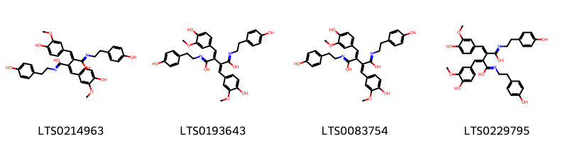{ width=100% }
    <figcaption>Hình ảnh cấu trúc hóa học của 4 hoạt chất thuộc nhóm  gồm ["(2e,3e)-2,3-bis[(4-hydroxy-3-methoxyphenyl)methylidene]-n,n'-bis[2-(4-hydroxyphenyl)ethyl]butanediimidic acid (LTS0214963)", "(2z,3z)-2,3-bis[(4-hydroxy-3-methoxyphenyl)methylidene]-n,n'-bis[2-(4-hydroxyphenyl)ethyl]butanediimidic acid (LTS0193643)", "2,3-bis[(4-hydroxy-3-methoxyphenyl)methylidene]-n,n'-bis[2-(4-hydroxyphenyl)ethyl]butanediimidic acid (LTS0083754)", "(2e)-2,3-bis[(4-hydroxy-3-methoxyphenyl)methylidene]-n,n'-bis[2-(4-hydroxyphenyl)ethyl]butanediimidic acid (LTS0229795)"].</figcaption>
</figure>
#### Nhóm 2-arylbenzofuran flavonoids
<figure markdown="span">
    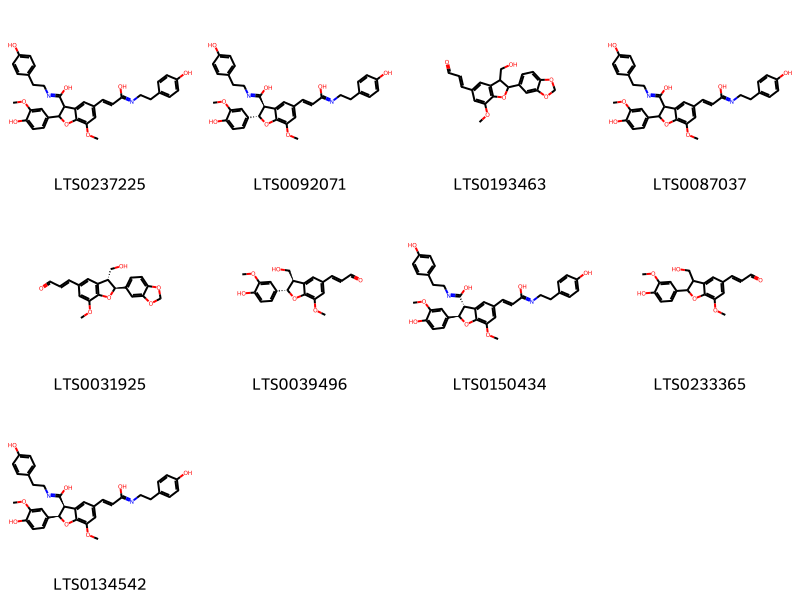{ width=100% }
    <figcaption>Hình ảnh cấu trúc hóa học của 9 hoạt chất thuộc nhóm 2-arylbenzofuran flavonoids gồm ['2-(4-hydroxy-3-methoxyphenyl)-n-[2-(4-hydroxyphenyl)ethyl]-5-[(1e)-2-{[2-(4-hydroxyphenyl)ethyl]-c-hydroxycarbonimidoyl}eth-1-en-1-yl]-7-methoxy-2,3-dihydro-1-benzofuran-3-carboximidic acid (LTS0237225)', '(2s,3s)-2-(4-hydroxy-3-methoxyphenyl)-n-[2-(4-hydroxyphenyl)ethyl]-5-[(1e)-2-{[2-(4-hydroxyphenyl)ethyl]-c-hydroxycarbonimidoyl}eth-1-en-1-yl]-7-methoxy-2,3-dihydro-1-benzofuran-3-carboximidic acid (LTS0092071)', '3-[2-(2h-1,3-benzodioxol-5-yl)-3-(hydroxymethyl)-7-methoxy-2,3-dihydro-1-benzofuran-5-yl]prop-2-enal (LTS0193463)', '2-(4-hydroxy-3-methoxyphenyl)-n-[2-(4-hydroxyphenyl)ethyl]-5-(2-{[2-(4-hydroxyphenyl)ethyl]-c-hydroxycarbonimidoyl}eth-1-en-1-yl)-7-methoxy-2,3-dihydro-1-benzofuran-3-carboximidic acid (LTS0087037)', '(2e)-3-[(2s,3r)-2-(2h-1,3-benzodioxol-5-yl)-3-(hydroxymethyl)-7-methoxy-2,3-dihydro-1-benzofuran-5-yl]prop-2-enal (LTS0031925)', 'balanophonin (LTS0039496)', '(2r,3r)-2-(4-hydroxy-3-methoxyphenyl)-n-[2-(4-hydroxyphenyl)ethyl]-5-[(1e)-2-{[2-(4-hydroxyphenyl)ethyl]-c-hydroxycarbonimidoyl}eth-1-en-1-yl]-7-methoxy-2,3-dihydro-1-benzofuran-3-carboximidic acid (LTS0150434)', '3-[2-(4-hydroxy-3-methoxyphenyl)-3-(hydroxymethyl)-7-methoxy-2,3-dihydro-1-benzofuran-5-yl]prop-2-enal (LTS0233365)', '(2r,3s)-2-(4-hydroxy-3-methoxyphenyl)-n-[2-(4-hydroxyphenyl)ethyl]-5-[(1e)-2-{[2-(4-hydroxyphenyl)ethyl]-c-hydroxycarbonimidoyl}eth-1-en-1-yl]-7-methoxy-2,3-dihydro-1-benzofuran-3-carboximidic acid (LTS0134542)'].</figcaption>
</figure>
#### Nhóm Aryltetralin lignans
<figure markdown="span">
    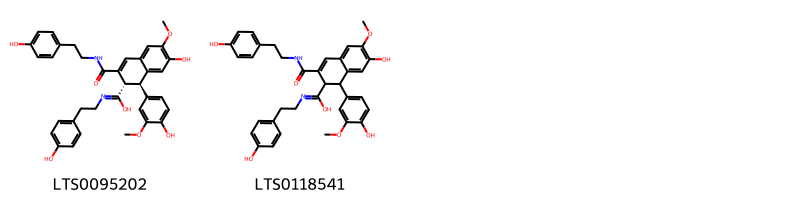{ width=100% }
    <figcaption>Hình ảnh cấu trúc hóa học của 2 hoạt chất thuộc nhóm Aryltetralin lignans gồm ['(1r,2s)-7-hydroxy-1-(4-hydroxy-3-methoxyphenyl)-n-[2-(4-hydroxyphenyl)ethyl]-3-{[2-(4-hydroxyphenyl)ethyl]carbamoyl}-6-methoxy-1,2-dihydronaphthalene-2-carboximidic acid (LTS0095202)', '7-hydroxy-1-(4-hydroxy-3-methoxyphenyl)-n-[2-(4-hydroxyphenyl)ethyl]-3-{[2-(4-hydroxyphenyl)ethyl]carbamoyl}-6-methoxy-1,2-dihydronaphthalene-2-carboximidic acid (LTS0118541)'].</figcaption>
</figure>
#### Nhóm Benzene and substituted derivatives
<figure markdown="span">
    { width=100% }
    <figcaption>Hình ảnh cấu trúc hóa học của 1 hoạt chất thuộc nhóm Benzene and substituted derivatives gồm ['vanillic acid (LTS0229113)'].</figcaption>
</figure>
#### Nhóm Cinnamic acids and derivatives
<figure markdown="span">
    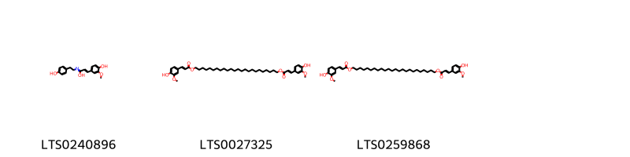{ width=100% }
    <figcaption>Hình ảnh cấu trúc hóa học của 3 hoạt chất thuộc nhóm Cinnamic acids and derivatives gồm ['3-(4-hydroxy-3-methoxyphenyl)-n-[2-(4-hydroxyphenyl)ethyl]prop-2-enimidic acid (LTS0240896)', '24-{[(2e)-3-(4-hydroxy-3-methoxyphenyl)prop-2-enoyl]oxy}tetracosyl (2e)-3-(4-hydroxy-3-methoxyphenyl)prop-2-enoate (LTS0027325)', '24-{[3-(4-hydroxy-3-methoxyphenyl)prop-2-enoyl]oxy}tetracosyl 3-(4-hydroxy-3-methoxyphenyl)prop-2-enoate (LTS0259868)'].</figcaption>
</figure>
#### Nhóm Coumarinolignans
<figure markdown="span">
    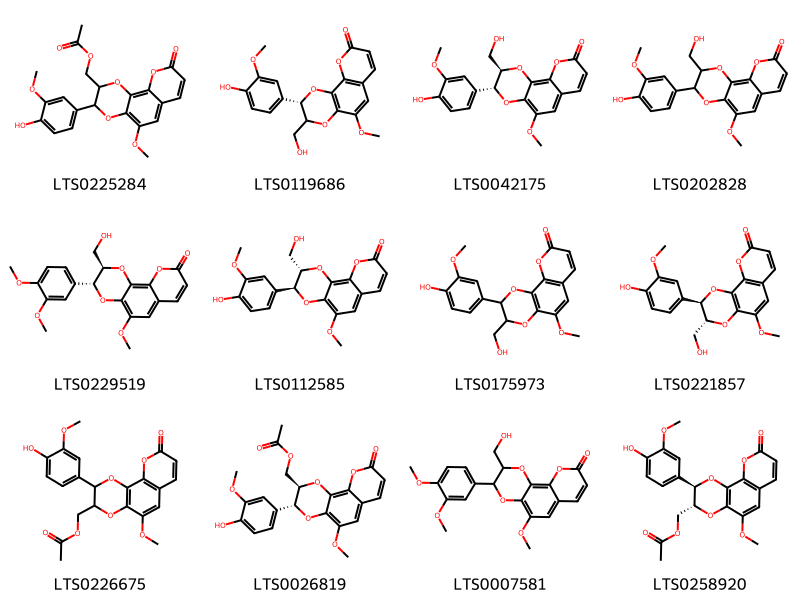{ width=100% }
    <figcaption>Hình ảnh cấu trúc hóa học của 12 hoạt chất thuộc nhóm Coumarinolignans gồm ['[3-(4-hydroxy-3-methoxyphenyl)-5-methoxy-9-oxo-2h,3h-[1,4]dioxino[2,3-h]chromen-2-yl]methyl acetate (LTS0225284)', '(2s)-2-(4-hydroxy-3-methoxyphenyl)-3-(hydroxymethyl)-5-methoxy-2h,3h-[1,4]dioxino[2,3-h]chromen-9-one (LTS0119686)', 'cleomiscosin a (LTS0042175)', '3-(4-hydroxy-3-methoxyphenyl)-2-(hydroxymethyl)-5-methoxy-2h,3h-[1,4]dioxino[2,3-h]chromen-9-one (LTS0202828)', '(2r,3r)-3-(3,4-dimethoxyphenyl)-2-(hydroxymethyl)-5-methoxy-2h,3h-[1,4]dioxino[2,3-h]chromen-9-one (LTS0229519)', '(2s,3s)-3-(4-hydroxy-3-methoxyphenyl)-2-(hydroxymethyl)-5-methoxy-2h,3h-[1,4]dioxino[2,3-h]chromen-9-one (LTS0112585)', '2-(4-hydroxy-3-methoxyphenyl)-3-(hydroxymethyl)-5-methoxy-2h,3h-[1,4]dioxino[2,3-h]chromen-9-one (LTS0175973)', '(2r,3r)-2-(4-hydroxy-3-methoxyphenyl)-3-(hydroxymethyl)-5-methoxy-2h,3h-[1,4]dioxino[2,3-h]chromen-9-one (LTS0221857)', '[2-(4-hydroxy-3-methoxyphenyl)-5-methoxy-9-oxo-2h,3h-[1,4]dioxino[2,3-h]chromen-3-yl]methyl acetate (LTS0226675)', 'durantin a (LTS0026819)', '3-(3,4-dimethoxyphenyl)-2-(hydroxymethyl)-5-methoxy-2h,3h-[1,4]dioxino[2,3-h]chromen-9-one (LTS0007581)', '[(2r,3r)-2-(4-hydroxy-3-methoxyphenyl)-5-methoxy-9-oxo-2h,3h-[1,4]dioxino[2,3-h]chromen-3-yl]methyl acetate (LTS0258920)'].</figcaption>
</figure>
#### Nhóm Fatty Acyls
<figure markdown="span">
    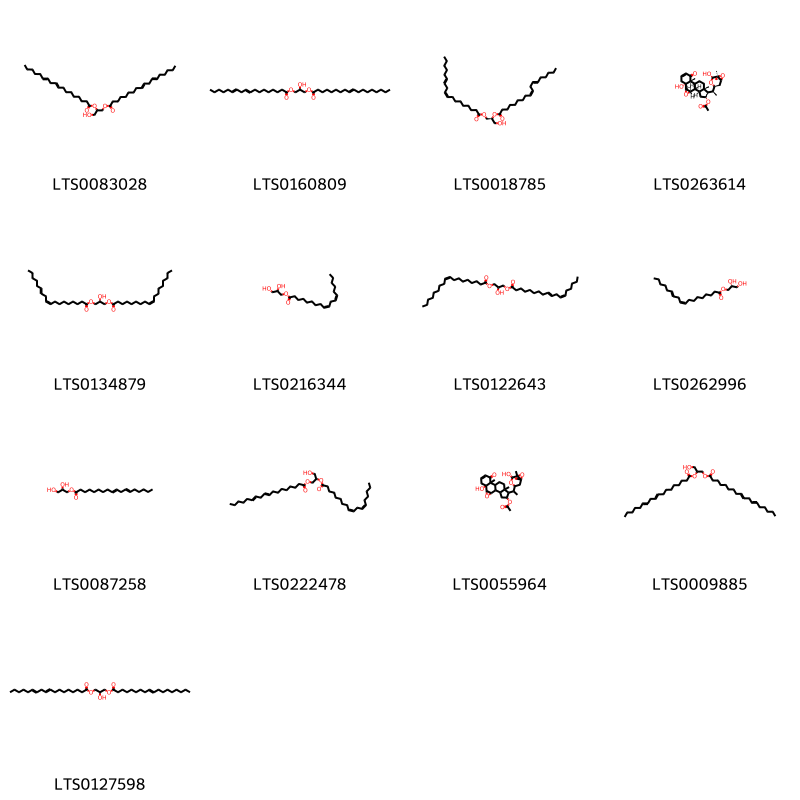{ width=100% }
    <figcaption>Hình ảnh cấu trúc hóa học của 13 hoạt chất thuộc nhóm Fatty Acyls gồm ['1-hydroxy-3-(octadeca-9,12-dienoyloxy)propan-2-yl octadeca-9,12-dienoate (LTS0083028)', '2-hydroxy-3-(octadec-9-enoyloxy)propyl (9e)-octadeca-9,12-dienoate (LTS0160809)', '(2s)-1-hydroxy-3-[(9z,12e)-octadeca-9,12-dienoyloxy]propan-2-yl (9z,12e)-octadeca-9,12-dienoate (LTS0018785)', '(1s,2s,4s,5r,10r,11s,14s,15r,16r,18s)-5-hydroxy-15-[(1s)-1-[(1s,2r,4s,6s)-2-hydroxy-1,6-dimethyl-3,7-dioxabicyclo[4.1.0]heptan-4-yl]ethyl]-10,14-dimethyl-9-oxo-3-oxapentacyclo[9.7.0.0²,⁴.0⁵,¹⁰.0¹⁴,¹⁸]octadec-7-en-16-yl acetate (LTS0263614)', '(2s)-2-hydroxy-3-[(9z)-octadec-9-enoyloxy]propyl (9z,12e)-octadeca-9,12-dienoate (LTS0134879)', 'glyceryl 1-linoleate (LTS0216344)', '2-hydroxy-3-[(9z)-octadec-9-enoyloxy]propyl (9e,12z)-octadeca-9,12-dienoate (LTS0122643)', '(2r)-2,3-dihydroxypropyl (9z,12e)-octadeca-9,12-dienoate (LTS0262996)', '2,3-dihydroxypropyl octadeca-9,12-dienoate (LTS0087258)', '1-hydroxy-3-[(9e,12e)-octadeca-9,12-dienoyloxy]propan-2-yl (9z,12z)-octadeca-9,12-dienoate (LTS0222478)', '5-hydroxy-15-(1-{2-hydroxy-1,6-dimethyl-3,7-dioxabicyclo[4.1.0]heptan-4-yl}ethyl)-10,14-dimethyl-9-oxo-3-oxapentacyclo[9.7.0.0²,⁴.0⁵,¹⁰.0¹⁴,¹⁸]octadec-7-en-16-yl acetate (LTS0055964)', '1-hydroxy-3-[(9e,12e)-octadeca-9,12-dienoyloxy]propan-2-yl octadeca-9,12-dienoate (LTS0009885)', '2-hydroxy-3-(octadec-9-enoyloxy)propyl octadeca-9,12-dienoate (LTS0127598)'].</figcaption>
</figure>
#### Nhóm Flavonoids
<figure markdown="span">
    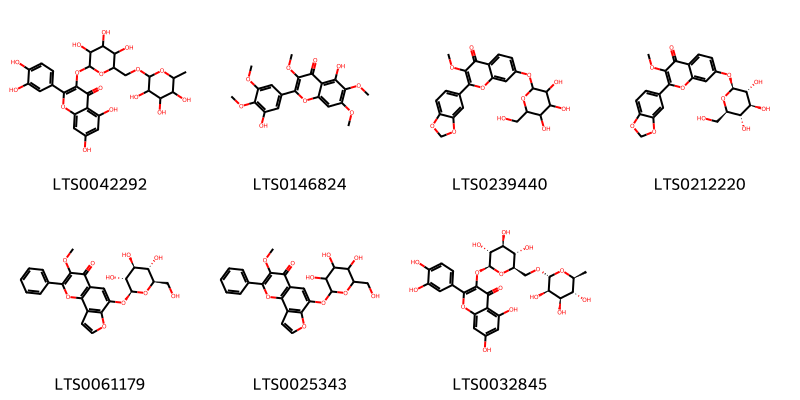{ width=100% }
    <figcaption>Hình ảnh cấu trúc hóa học của 7 hoạt chất thuộc nhóm Flavonoids gồm ['rutin (LTS0042292)', '5-hydroxy-2-(3-hydroxy-4,5-dimethoxyphenyl)-3,6,7-trimethoxychromen-4-one (LTS0146824)', '2-(2h-1,3-benzodioxol-5-yl)-3-methoxy-7-{[3,4,5-trihydroxy-6-(hydroxymethyl)oxan-2-yl]oxy}chromen-4-one (LTS0239440)', '2-(2h-1,3-benzodioxol-5-yl)-3-methoxy-7-{[(2s,3r,4s,5s,6r)-3,4,5-trihydroxy-6-(hydroxymethyl)oxan-2-yl]oxy}chromen-4-one (LTS0212220)', '3-methoxy-2-phenyl-6-{[(2s,3r,4s,5s,6r)-3,4,5-trihydroxy-6-(hydroxymethyl)oxan-2-yl]oxy}furo[2,3-h]chromen-4-one (LTS0061179)', '3-methoxy-2-phenyl-6-{[3,4,5-trihydroxy-6-(hydroxymethyl)oxan-2-yl]oxy}furo[2,3-h]chromen-4-one (LTS0025343)', '3-rutinosyl quercetin (LTS0032845)'].</figcaption>
</figure>
#### Nhóm Furanoid lignans
<figure markdown="span">
    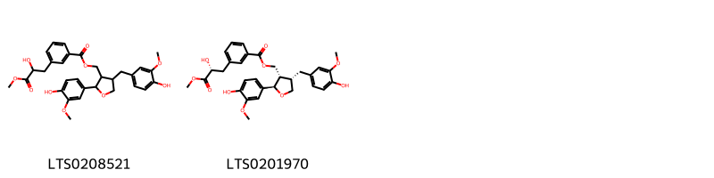{ width=100% }
    <figcaption>Hình ảnh cấu trúc hóa học của 2 hoạt chất thuộc nhóm Furanoid lignans gồm ['[2-(4-hydroxy-3-methoxyphenyl)-4-[(4-hydroxy-3-methoxyphenyl)methyl]oxolan-3-yl]methyl 3-(2-hydroxy-3-methoxy-3-oxopropyl)benzoate (LTS0208521)', '[(2r,3s,4s)-2-(4-hydroxy-3-methoxyphenyl)-4-[(4-hydroxy-3-methoxyphenyl)methyl]oxolan-3-yl]methyl 3-[(2r)-2-hydroxy-3-methoxy-3-oxopropyl]benzoate (LTS0201970)'].</figcaption>
</figure>
#### Nhóm Glycerolipids
<figure markdown="span">
    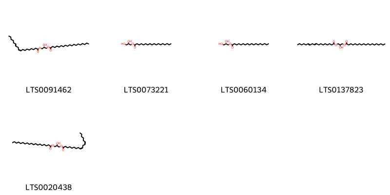{ width=100% }
    <figcaption>Hình ảnh cấu trúc hóa học của 5 hoạt chất thuộc nhóm Glycerolipids gồm ['(2r)-2-hydroxy-3-[(9z,12e)-octadeca-9,12-dienoyloxy]propyl nonadecanoate (LTS0091462)', 'glyceryl stearate (LTS0073221)', '1-stearoyl-sn-glycerol (LTS0060134)', '2-hydroxy-3-(octadeca-9,12-dienoyloxy)propyl nonadecanoate (LTS0137823)', '2-hydroxy-3-[(9z,12z)-octadeca-9,12-dienoyloxy]propyl nonadecanoate (LTS0020438)'].</figcaption>
</figure>
#### Nhóm Hydroxy acids and derivatives
<figure markdown="span">
    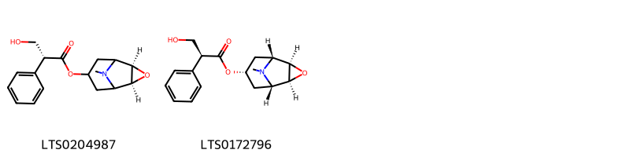{ width=100% }
    <figcaption>Hình ảnh cấu trúc hóa học của 2 hoạt chất thuộc nhóm Hydroxy acids and derivatives gồm ['(2r,4s)-9-methyl-3-oxa-9-azatricyclo[3.3.1.0²,⁴]nonan-7-yl (2r)-3-hydroxy-2-phenylpropanoate (LTS0204987)', 'scopolamine (LTS0172796)'].</figcaption>
</figure>
#### Nhóm Organooxygen compounds
<figure markdown="span">
    { width=100% }
    <figcaption>Hình ảnh cấu trúc hóa học của 1 hoạt chất thuộc nhóm Organooxygen compounds gồm ['hydroxymethylfurfural (LTS0233269)'].</figcaption>
</figure>
#### Nhóm Phenols
<figure markdown="span">
    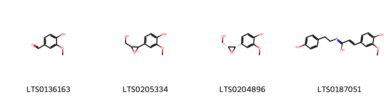{ width=100% }
    <figcaption>Hình ảnh cấu trúc hóa học của 4 hoạt chất thuộc nhóm Phenols gồm ['vanillin (LTS0136163)', '4-[3-(hydroxymethyl)oxiran-2-yl]-2-methoxyphenol (LTS0205334)', '4-[(2s,3r)-3-(hydroxymethyl)oxiran-2-yl]-2-methoxyphenol (LTS0204896)', '(2e)-3-(4-hydroxy-3-methoxyphenyl)-n-[2-(4-hydroxyphenyl)ethyl]prop-2-enimidic acid (LTS0187051)'].</figcaption>
</figure>
#### Nhóm Steroids and steroid derivatives
<figure markdown="span">
    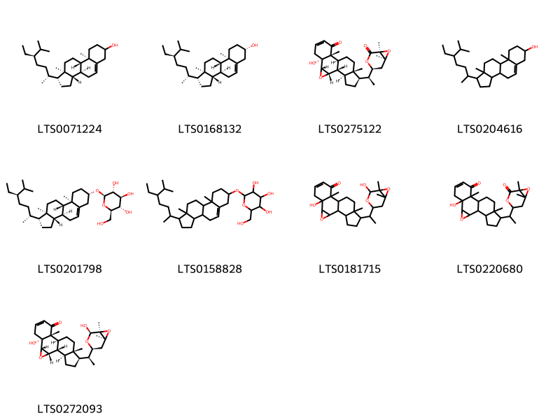{ width=100% }
    <figcaption>Hình ảnh cấu trúc hóa học của 9 hoạt chất thuộc nhóm Steroids and steroid derivatives gồm ['stigmast-5-en-3-ol (LTS0071224)', 'sitosterol (LTS0168132)', '(1s,2s,4s,5r,10r,11s,14r,15r,18s)-15-[(1s)-1-[(1s,4s,6s)-1,6-dimethyl-2-oxo-3,7-dioxabicyclo[4.1.0]heptan-4-yl]ethyl]-5-hydroxy-10,14-dimethyl-3-oxapentacyclo[9.7.0.0²,⁴.0⁵,¹⁰.0¹⁴,¹⁸]octadec-7-en-9-one (LTS0275122)', 'stigmast-5-en-3-ol, (3β)- (LTS0204616)', 'sitogluside (LTS0201798)', '2-{[1-(5-ethyl-6-methylheptan-2-yl)-9a,11a-dimethyl-1h,2h,3h,3ah,3bh,4h,6h,7h,8h,9h,9bh,10h,11h-cyclopenta[a]phenanthren-7-yl]oxy}-6-(hydroxymethyl)oxane-3,4,5-triol (LTS0158828)', '5-hydroxy-15-(1-{2-hydroxy-1,6-dimethyl-3,7-dioxabicyclo[4.1.0]heptan-4-yl}ethyl)-10,14-dimethyl-3-oxapentacyclo[9.7.0.0²,⁴.0⁵,¹⁰.0¹⁴,¹⁸]octadec-7-en-9-one (LTS0181715)', '15-(1-{1,6-dimethyl-2-oxo-3,7-dioxabicyclo[4.1.0]heptan-4-yl}ethyl)-5-hydroxy-10,14-dimethyl-3-oxapentacyclo[9.7.0.0²,⁴.0⁵,¹⁰.0¹⁴,¹⁸]octadec-7-en-9-one (LTS0220680)', '(1s,2s,4s,5r,10r,11s,14r,15r,18s)-5-hydroxy-15-[(1s)-1-[(1s,2r,4s,6s)-2-hydroxy-1,6-dimethyl-3,7-dioxabicyclo[4.1.0]heptan-4-yl]ethyl]-10,14-dimethyl-3-oxapentacyclo[9.7.0.0²,⁴.0⁵,¹⁰.0¹⁴,¹⁸]octadec-7-en-9-one (LTS0272093)'].</figcaption>
</figure>
#### Nhóm Tropane alkaloids
<figure markdown="span">
    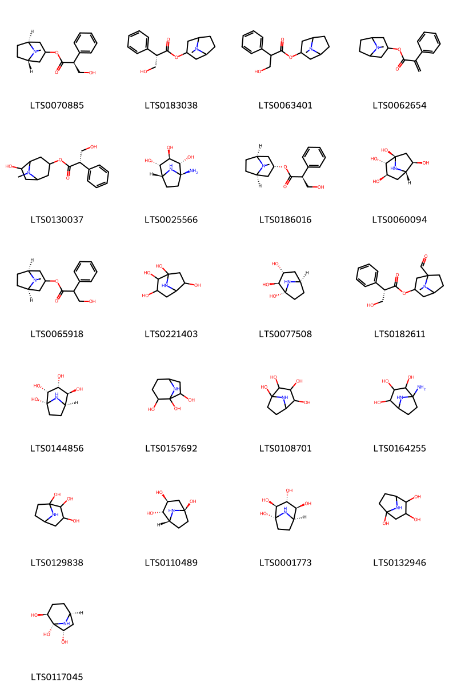{ width=100% }
    <figcaption>Hình ảnh cấu trúc hóa học của 21 hoạt chất thuộc nhóm Tropane alkaloids gồm ['(1s,5s)-8-methyl-8-azabicyclo[3.2.1]octan-3-yl (2s)-3-hydroxy-2-phenylpropanoate (LTS0070885)', 'hyoscyamine (LTS0183038)', '()-hyoscyamine (LTS0063401)', 'apoatropine (LTS0062654)', '6-hydroxy-8-methyl-8-azabicyclo[3.2.1]octan-3-yl (2s)-3-hydroxy-2-phenylpropanoate (LTS0130037)', '(1s,2r,3r,4s,5r)-1-amino-8-azabicyclo[3.2.1]octane-2,3,4-triol (LTS0025566)', 'l-hyoscyamine (LTS0186016)', '(1r,2s,3r,5s,6r)-8-azabicyclo[3.2.1]octane-1,2,3,6-tetrol (LTS0060094)', 'atropine (LTS0065918)', '8-azabicyclo[3.2.1]octane-1,2,3,6-tetrol (LTS0221403)', '(1r,2s,3r,5r)-8-azabicyclo[3.2.1]octane-1,2,3-triol (LTS0077508)', '1-formyl-8-methyl-8-azabicyclo[3.2.1]octan-3-yl (2s)-3-hydroxy-2-phenylpropanoate (LTS0182611)', '(1r,2r,3r,4s,5r)-8-azabicyclo[3.2.1]octane-1,2,3,4-tetrol (LTS0144856)', '8-azabicyclo[3.2.1]octane-1,2,7-triol (LTS0157692)', '8-azabicyclo[3.2.1]octane-1,2,3,4-tetrol (LTS0108701)', '1-amino-8-azabicyclo[3.2.1]octane-2,3,4-triol (LTS0164255)', '8-azabicyclo[3.2.1]octane-1,2,3-triol (LTS0129838)', '(1r,3s,4s,5r)-8-azabicyclo[3.2.1]octane-1,3,4-triol (LTS0110489)', '(1r,2s,3r,4s,5r)-8-azabicyclo[3.2.1]octane-1,2,3,4-tetrol (LTS0001773)', '8-azabicyclo[3.2.1]octane-1,3,4-triol (LTS0132946)', '(1s,2s,5s,7s)-8-azabicyclo[3.2.1]octane-1,2,7-triol (LTS0117045)'].</figcaption>
</figure>

---

### Dược dân tộc học

Danh sách các quốc gia có sử dụng *Hyoscyamus niger* trong điều trị các bệnh. 

| Country   | Disease                                                                                    | Bệnh                                                                                            |
|:----------|:-------------------------------------------------------------------------------------------|:------------------------------------------------------------------------------------------------|
| China     | Analgesic, Narcotic, Poison                                                                | Thuốc giảm đau, chất gây nghiện, chất độc                                                       |
| Elsewhere | Analgesic, Cathartic, Hypnotic, Mydriatic, Narcotic, Narcotic, Sedative, Parasympatholytic | Thuốc giảm đau, Cathartic, Thôi miên, Mydriatic, Narcotic, Narcotic, An thần, Parasympatholytic |
| India     | Poison                                                                                     | Chất độc                                                                                        |
| Iraq      | Anaphrodisiac, Parasympatholytic, Mydriatic                                                | Anaphrodisiac, Parasympatholytic, Mydriatic                                                     |
| Nepal     | Narcotic, Sedative, Narcotic, Sedative                                                     | Thuốc gây nghiện, Thuốc an thần, Thuốc gây nghiện, Thuốc an thần                                |
| Turkey    | Hypnotic, Narcotic, Poison, Mydriatic, Sedative                                            | Thôi miên, Ma túy, Chất độc, Dược liệu, Thuốc an thần                                           |
| US        | Poison, Poison                                                                             | Chất độc, chất độc                                                                              |

---

---
## Hyoscyamus pusillus
### Thông tin về thực vật

!!! info "Phân loại thực vật của *Hyoscyamus pusillus* từ GIBF:"
    - **Kingdom:** Plantae
    - **Phylum:** Tracheophyta
    - **Order:** Solanales
    - **Family:** Solanaceae
    - **Genus:** Hyoscyamus
    - **Species:** *Hyoscyamus pusillus*

 

| Label (VI)   | Label (EN)   | Scientific Name     | Descriptions (VI)   | Descriptions (EN)   | Also Known As (VI)   | Also Known As (EN)   |
|:-------------|:-------------|:--------------------|:--------------------|:--------------------|:---------------------|:---------------------|
| N/A          | N/A          | Hyoscyamus pusillus | loài thực vật       | species of plant    | ['']                 | ['']                 |

#### Phân bố trên thế giới

**Từ CSDL GIBF** nan, Turkmenistan, unknown or invalid, Jordan, Israel, Tajikistan, Pakistan, Netherlands, Afghanistan, Kyrgyzstan, Azerbaijan, Türkiye, Russian Federation, United States of America, Sweden, Kazakhstan, Saudi Arabia, Uzbekistan, Iran (Islamic Republic of), Egypt, Armenia, China, Iraq, India, Mongolia

#### Phân bố tại Việt Nam

**Từ CSDL GIBF**: Không có ghi nhận ở Việt Nam

---
### Thành phần hóa học
        
- Theo cơ sở dữ liệu lotus: Từ loài *Hyoscyamus pusillus* đã phân lập và xác định được 15 hoạt chất thuộc về các nhóm Hydroxy acids and derivatives, Tropane alkaloids, Benzene and substituted derivatives. 

|    | chemicalTaxonomyClassyfireClass     |   smiles_count |
|---:|:------------------------------------|---------------:|
|  0 | Benzene and substituted derivatives |              3 |
|  1 | Hydroxy acids and derivatives       |              3 |
|  2 | Tropane alkaloids                   |              9 |

#### Nhóm Benzene and substituted derivatives
<figure markdown="span">
    { width=100% }
    <figcaption>Hình ảnh cấu trúc hóa học của 3 hoạt chất thuộc nhóm Benzene and substituted derivatives gồm ['aposcopolamine (LTS0173739)', '(1r,2r,4r,5s)-9-methyl-3-oxa-9-azatricyclo[3.3.1.0²,⁴]nonan-7-yl 2-phenylprop-2-enoate (LTS0133801)', 'aposcopolamine (LTS0020623)'].</figcaption>
</figure>
#### Nhóm Hydroxy acids and derivatives
<figure markdown="span">
    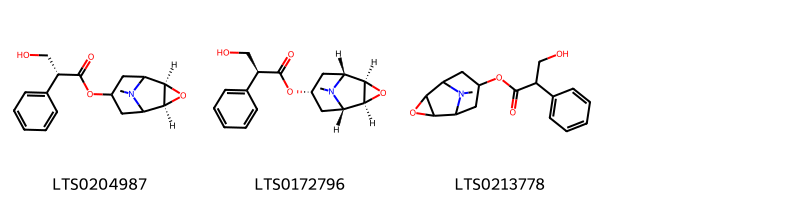{ width=100% }
    <figcaption>Hình ảnh cấu trúc hóa học của 3 hoạt chất thuộc nhóm Hydroxy acids and derivatives gồm ['(2r,4s)-9-methyl-3-oxa-9-azatricyclo[3.3.1.0²,⁴]nonan-7-yl (2r)-3-hydroxy-2-phenylpropanoate (LTS0204987)', 'scopolamine (LTS0172796)', 'buscopan (LTS0213778)'].</figcaption>
</figure>
#### Nhóm Tropane alkaloids
<figure markdown="span">
    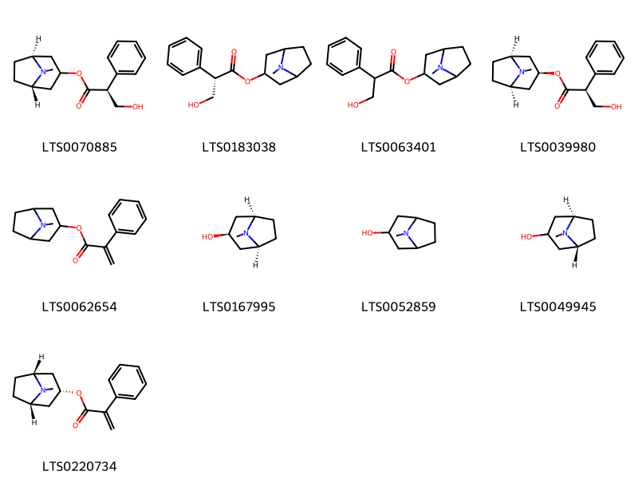{ width=100% }
    <figcaption>Hình ảnh cấu trúc hóa học của 9 hoạt chất thuộc nhóm Tropane alkaloids gồm ['(1s,5s)-8-methyl-8-azabicyclo[3.2.1]octan-3-yl (2s)-3-hydroxy-2-phenylpropanoate (LTS0070885)', 'hyoscyamine (LTS0183038)', '()-hyoscyamine (LTS0063401)', 'hyoscyamine (LTS0039980)', 'apoatropine (LTS0062654)', 'tropine (LTS0167995)', 'tropin (LTS0052859)', '(1r,5r)-8-methyl-8-azabicyclo[3.2.1]octan-3-ol (LTS0049945)', '(1r,3s,5s)-8-methyl-8-azabicyclo[3.2.1]octan-3-yl 2-phenylprop-2-enoate (LTS0220734)'].</figcaption>
</figure>

---

### Dược dân tộc học

Danh sách các quốc gia có sử dụng *Hyoscyamus pusillus* trong điều trị các bệnh. 

| Country   | Disease   | Bệnh     |
|:----------|:----------|:---------|
| India     | Poison    | Chất độc |

---

---
## Hyoscyamus reticulatus
### Thông tin về thực vật

!!! info "Phân loại thực vật của *Hyoscyamus reticulatus* từ GIBF:"
    - **Kingdom:** Plantae
    - **Phylum:** Tracheophyta
    - **Order:** Solanales
    - **Family:** Solanaceae
    - **Genus:** Hyoscyamus
    - **Species:** *Hyoscyamus reticulatus*

 

| Label (VI)   | Label (EN)   | Scientific Name        | Descriptions (VI)   | Descriptions (EN)   | Also Known As (VI)   | Also Known As (EN)   |
|:-------------|:-------------|:-----------------------|:--------------------|:--------------------|:---------------------|:---------------------|
| N/A          | N/A          | Hyoscyamus reticulatus | loài thực vật       | species of plant    | ['']                 | ['']                 |

#### Phân bố trên thế giới

**Từ CSDL GIBF** nan, Turkmenistan, Palestine, State of, Jordan, Israel, Pakistan, Kosovo, Korea, Republic of, Afghanistan, Azerbaijan, Türkiye, Russian Federation, Germany, Iran (Islamic Republic of), Egypt, Armenia, France, Syrian Arab Republic, Iraq, Lebanon

#### Phân bố tại Việt Nam

**Từ CSDL GIBF**: Không có ghi nhận ở Việt Nam

---
### Thành phần hóa học
        
- Theo cơ sở dữ liệu lotus: Từ loài *Hyoscyamus reticulatus* đã phân lập và xác định được 5 hoạt chất thuộc về các nhóm Hydroxy acids and derivatives, Tropane alkaloids, Organonitrogen compounds. 

|    | chemicalTaxonomyClassyfireClass   |   smiles_count |
|---:|:----------------------------------|---------------:|
|  0 | Hydroxy acids and derivatives     |              2 |
|  1 | Organonitrogen compounds          |              1 |
|  2 | Tropane alkaloids                 |              2 |

#### Nhóm Hydroxy acids and derivatives
<figure markdown="span">
    { width=100% }
    <figcaption>Hình ảnh cấu trúc hóa học của 2 hoạt chất thuộc nhóm Hydroxy acids and derivatives gồm ['(2r,4s)-9-methyl-3-oxa-9-azatricyclo[3.3.1.0²,⁴]nonan-7-yl (2r)-3-hydroxy-2-phenylpropanoate (LTS0204987)', 'scopolamine (LTS0172796)'].</figcaption>
</figure>
#### Nhóm Organonitrogen compounds
<figure markdown="span">
    { width=100% }
    <figcaption>Hình ảnh cấu trúc hóa học của 1 hoạt chất thuộc nhóm Organonitrogen compounds gồm ['tetramethyldiaminobutane (LTS0258261)'].</figcaption>
</figure>
#### Nhóm Tropane alkaloids
<figure markdown="span">
    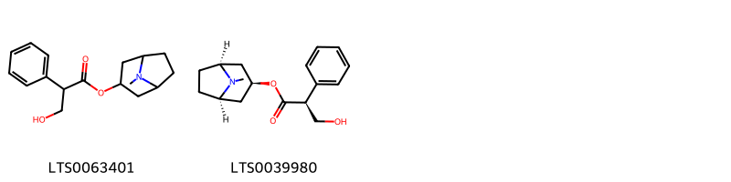{ width=100% }
    <figcaption>Hình ảnh cấu trúc hóa học của 2 hoạt chất thuộc nhóm Tropane alkaloids gồm ['()-hyoscyamine (LTS0063401)', 'hyoscyamine (LTS0039980)'].</figcaption>
</figure>

---

### Dược dân tộc học

Danh sách các quốc gia có sử dụng *Hyoscyamus reticulatus* trong điều trị các bệnh. 

| Country   | Disease                      | Bệnh                     |
|:----------|:-----------------------------|:-------------------------|
| Iraq      | Anesthetic, Narcotic, Poison | Gây mê, ma túy, chất độc |

---

# Chi Brunfelsia

??? note "Danh sách các dược liệu thuộc chi"
    
	 - *Brunfelsia hopeana*

---
## Brunfelsia hopeana
### Thông tin về thực vật

!!! info "Phân loại thực vật của *Brunfelsia uniflora* từ GIBF:"
    - **Kingdom:** Plantae
    - **Phylum:** Tracheophyta
    - **Order:** Solanales
    - **Family:** Solanaceae
    - **Genus:** Brunfelsia
    - **Species:** *Brunfelsia uniflora*

 

| Label (VI)   | Label (EN)   | Scientific Name    | Descriptions (VI)   | Descriptions (EN)   | Also Known As (VI)   | Also Known As (EN)   |
|:-------------|:-------------|:-------------------|:--------------------|:--------------------|:---------------------|:---------------------|
| N/A          | N/A          | Brunfelsia hopeana | loài thực vật       | species of plant    | ['']                 | ['']                 |

#### Phân bố trên thế giới

**Từ CSDL GIBF** nan, Chinese Taipei, Brazil, Argentina, Portugal, France, Paraguay, Tanzania, United Republic of, Cameroon

#### Phân bố tại Việt Nam

**Từ CSDL GIBF**: Không có ghi nhận ở Việt Nam

---
### Thành phần hóa học
        
- Theo cơ sở dữ liệu lotus: Từ loài *Brunfelsia uniflora* đã phân lập và xác định được Chưa có hoạt chất nào được phân lập. hoạt chất thuộc về các nhóm Không có hoạt chất nào được phân lập. 

Không có hình ảnh nào được tạo ra

---

### Dược dân tộc học

Danh sách các quốc gia có sử dụng *Brunfelsia uniflora* trong điều trị các bệnh. 

| Country       | Disease   | Bệnh           |
|:--------------|:----------|:---------------|
| Elsewhere     | Diuretic  | Thuốc lợi tiêu |
| Latin America | Laxative  | Nhuận trường   |
| US            | Diuretic  | Thuốc lợi tiêu |

---

# Chi Cestrum

??? note "Danh sách các dược liệu thuộc chi"
    
	 - *Cestrum dumetorum*
	 - *Cestrum lanatum*
	 - *Cestrum laurifolium*
	 - *Cestrum nocturnum*
	 - *Cestrum parqui*

---
## Cestrum dumetorum
### Thông tin về thực vật

!!! info "Phân loại thực vật của *Cestrum dumetorum* từ GIBF:"
    - **Kingdom:** Plantae
    - **Phylum:** Tracheophyta
    - **Order:** Solanales
    - **Family:** Solanaceae
    - **Genus:** Cestrum
    - **Species:** *Cestrum dumetorum*

 

| Label (VI)   | Label (EN)   | Scientific Name   | Descriptions (VI)   | Descriptions (EN)   | Also Known As (VI)   | Also Known As (EN)   |
|:-------------|:-------------|:------------------|:--------------------|:--------------------|:---------------------|:---------------------|
| N/A          | N/A          | Cestrum dumetorum | loài thực vật       | species of plant    | ['']                 | ['']                 |

#### Phân bố trên thế giới

**Từ CSDL GIBF** Nicaragua, Costa Rica, Honduras, Mexico, El Salvador

#### Phân bố tại Việt Nam

**Từ CSDL GIBF**: Không có ghi nhận ở Việt Nam

---
### Thành phần hóa học
        
- Theo cơ sở dữ liệu lotus: Từ loài *Cestrum dumetorum* đã phân lập và xác định được 2 hoạt chất thuộc về các nhóm Steroids and steroid derivatives. 

|    | chemicalTaxonomyClassyfireClass   |   smiles_count |
|---:|:----------------------------------|---------------:|
|  0 | Steroids and steroid derivatives  |              2 |

#### Nhóm Steroids and steroid derivatives
<figure markdown="span">
    { width=100% }
    <figcaption>Hình ảnh cấu trúc hóa học của 2 hoạt chất thuộc nhóm Steroids and steroid derivatives gồm ['stigmast-5-en-3-ol (LTS0071224)', 'stigmast-5-en-3-ol, (3β)- (LTS0204616)'].</figcaption>
</figure>

---

### Dược dân tộc học

Danh sách các quốc gia có sử dụng *Cestrum dumetorum* trong điều trị các bệnh. 

| Country   | Disease   | Bệnh     |
|:----------|:----------|:---------|
| Mexico    | Poison    | Chất độc |

---

---
## Cestrum lanatum
### Thông tin về thực vật

!!! info "Phân loại thực vật của *Cestrum tomentosum* từ GIBF:"
    - **Kingdom:** Plantae
    - **Phylum:** Tracheophyta
    - **Order:** Solanales
    - **Family:** Solanaceae
    - **Genus:** Cestrum
    - **Species:** *Cestrum tomentosum*

 

| Label (VI)   | Label (EN)   | Scientific Name   | Descriptions (VI)   | Descriptions (EN)   | Also Known As (VI)   | Also Known As (EN)   |
|:-------------|:-------------|:------------------|:--------------------|:--------------------|:---------------------|:---------------------|
| N/A          | N/A          | Cestrum lanatum   |                     |                     | ['']                 | ['']                 |

#### Phân bố trên thế giới

**Từ CSDL GIBF** Nicaragua, Guatemala, Costa Rica, Honduras, Mexico, El Salvador, Venezuela (Bolivarian Republic of), Panama

#### Phân bố tại Việt Nam

**Từ CSDL GIBF**: Không có ghi nhận ở Việt Nam

---
### Thành phần hóa học
        
- Theo cơ sở dữ liệu lotus: Từ loài *Cestrum tomentosum* đã phân lập và xác định được Chưa có hoạt chất nào được phân lập. hoạt chất thuộc về các nhóm Không có hoạt chất nào được phân lập. 

Không có hình ảnh nào được tạo ra

---

### Dược dân tộc học

Danh sách các quốc gia có sử dụng *Cestrum tomentosum* trong điều trị các bệnh. 

| Country   | Disease              | Bệnh                 |
|:----------|:---------------------|:---------------------|
| Mexico    | Cathartic, Vermicide | Cathartic, Vermicide |
| Salvador  | Insecticide          | Thuốc trừ sâu        |

---

---
## Cestrum laurifolium
### Thông tin về thực vật

!!! info "Phân loại thực vật của *N/A* từ GIBF:"
    - **Kingdom:** Plantae
    - **Phylum:** Tracheophyta
    - **Order:** Solanales
    - **Family:** Solanaceae
    - **Genus:** Cestrum
    - **Species:** *N/A*

 

| Label (VI)   | Label (EN)   | Scientific Name     | Descriptions (VI)   | Descriptions (EN)   | Also Known As (VI)   | Also Known As (EN)   |
|:-------------|:-------------|:--------------------|:--------------------|:--------------------|:---------------------|:---------------------|
| N/A          | N/A          | Cestrum laurifolium | loài thực vật       | species of plant    | ['']                 | ['']                 |

#### Phân bố trên thế giới

**Từ CSDL GIBF** South Africa, Puerto Rico, Sri Lanka, Australia, Haiti, Guatemala, Brazil, Colombia, Argentina, Rwanda, India, United States of America, Mexico, Chile, Kenya, El Salvador, New Zealand, French Guiana

#### Phân bố tại Việt Nam

**Từ CSDL GIBF**: Không có ghi nhận ở Việt Nam

---
### Thành phần hóa học
        
- Theo cơ sở dữ liệu lotus: Từ loài *N/A* đã phân lập và xác định được Chưa có hoạt chất nào được phân lập. hoạt chất thuộc về các nhóm Không có hoạt chất nào được phân lập. 

Không có hình ảnh nào được tạo ra

---

### Dược dân tộc học

Danh sách các quốc gia có sử dụng *N/A* trong điều trị các bệnh. 

| Country            | Disease               | Bệnh                                |
|:-------------------|:----------------------|:------------------------------------|
| Dominican Republic | Rodenticide           | thuốc diệt động vật gặm nhấm        |
| Haiti              | Insecticide, Sedative | Thuốc diệt côn trùng, Thuốc an thần |

---

---
## Cestrum nocturnum
### Thông tin về thực vật

!!! info "Phân loại thực vật của *Cestrum nocturnum* từ GIBF:"
    - **Kingdom:** Plantae
    - **Phylum:** Tracheophyta
    - **Order:** Solanales
    - **Family:** Solanaceae
    - **Genus:** Cestrum
    - **Species:** *Cestrum nocturnum*

 

| Label (VI)   | Label (EN)   | Scientific Name   | Descriptions (VI)   | Descriptions (EN)   | Also Known As (VI)    | Also Known As (EN)                                                                         |
|:-------------|:-------------|:------------------|:--------------------|:--------------------|:----------------------|:-------------------------------------------------------------------------------------------|
| N/A          | N/A          | Cestrum nocturnum |                     | species             | ['Cestrum nocturnum'] | ['Lady of the night', 'Night cestrum', 'Night-blooming cestrum', 'Night-blooming jasmine'] |

#### Phân bố trên thế giới

**Từ CSDL GIBF** nan, Sri Lanka, Micronesia (Federated States of), Australia, Japan, Cook Islands, Guatemala, Argentina, Pakistan, Puerto Rico, Spain, Bolivia (Plurinational State of), Portugal, Jamaica, Morocco, United States of America, South Africa, Hong Kong, Barbados, Brazil, Tonga, Mexico, Dominican Republic, Peru, China, Ecuador, Saint Kitts and Nevis, Colombia, Costa Rica, India, New Zealand, Nepal

#### Phân bố tại Việt Nam

**Từ CSDL GIBF**: Không có ghi nhận ở Việt Nam

---
### Thành phần hóa học
        
- Theo cơ sở dữ liệu lotus: Từ loài *Cestrum nocturnum* đã phân lập và xác định được 63 hoạt chất thuộc về các nhóm Flavonoids, Saturated hydrocarbons, Steroids and steroid derivatives. 

|    | chemicalTaxonomyClassyfireClass   |   smiles_count |
|---:|:----------------------------------|---------------:|
|  0 | Flavonoids                        |              6 |
|  1 | Saturated hydrocarbons            |             17 |
|  2 | Steroids and steroid derivatives  |             40 |

#### Nhóm Flavonoids
<figure markdown="span">
    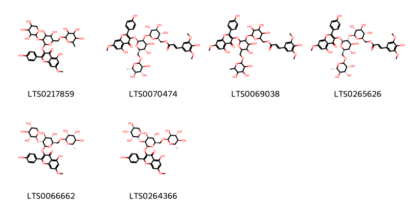{ width=100% }
    <figcaption>Hình ảnh cấu trúc hóa học của 6 hoạt chất thuộc nhóm Flavonoids gồm ['3-[(4,5-dihydroxy-6-{[(3,4,5-trihydroxy-6-methyloxan-2-yl)oxy]methyl}-3-[(3,4,5-trihydroxyoxan-2-yl)oxy]oxan-2-yl)oxy]-5-hydroxy-2-(4-hydroxyphenyl)-7-methoxychromen-4-one (LTS0217859)', '[(2r,3s,4s,5r,6s)-6-{[(2s,3s,4s,5s,6r)-4,5-dihydroxy-2-{[5-hydroxy-2-(4-hydroxyphenyl)-7-methoxy-4-oxochromen-3-yl]oxy}-6-({[(2r,3s,4r,5r,6s)-3,4,5-trihydroxy-6-methyloxan-2-yl]oxy}methyl)oxan-3-yl]oxy}-3,4,5-trihydroxyoxan-2-yl]methyl (2e)-3-(4-hydroxy-3,5-dimethoxyphenyl)prop-2-enoate (LTS0070474)', '{6-[(4,5-dihydroxy-2-{[5-hydroxy-2-(4-hydroxyphenyl)-7-methoxy-4-oxochromen-3-yl]oxy}-6-{[(3,4,5-trihydroxy-6-methyloxan-2-yl)oxy]methyl}oxan-3-yl)oxy]-3,4,5-trihydroxyoxan-2-yl}methyl 3-(4-hydroxy-3,5-dimethoxyphenyl)prop-2-enoate (LTS0069038)', '[(2r,3s,4s,5r,6s)-6-{[(2s,3r,4s,5s,6r)-4,5-dihydroxy-2-{[5-hydroxy-2-(4-hydroxyphenyl)-7-methoxy-4-oxochromen-3-yl]oxy}-6-({[(2r,3r,4r,5r,6s)-3,4,5-trihydroxy-6-methyloxan-2-yl]oxy}methyl)oxan-3-yl]oxy}-3,4,5-trihydroxyoxan-2-yl]methyl (2e)-3-(4-hydroxy-3,5-dimethoxyphenyl)prop-2-enoate (LTS0265626)', '3-{[(2s,3r,4s,5s,6r)-4,5-dihydroxy-6-({[(2r,3r,4r,5r,6s)-3,4,5-trihydroxy-6-methyloxan-2-yl]oxy}methyl)-3-{[(2s,3r,4s,5r)-3,4,5-trihydroxyoxan-2-yl]oxy}oxan-2-yl]oxy}-5-hydroxy-2-(4-hydroxyphenyl)-7-methoxychromen-4-one (LTS0066662)', '3-{[(2s,3s,4s,5s,6r)-4,5-dihydroxy-6-({[(2r,3s,4r,5r,6s)-3,4,5-trihydroxy-6-methyloxan-2-yl]oxy}methyl)-3-{[(2r,3r,4r,5s)-3,4,5-trihydroxyoxan-2-yl]oxy}oxan-2-yl]oxy}-5-hydroxy-2-(4-hydroxyphenyl)-7-methoxychromen-4-one (LTS0264366)'].</figcaption>
</figure>
#### Nhóm Saturated hydrocarbons
<figure markdown="span">
    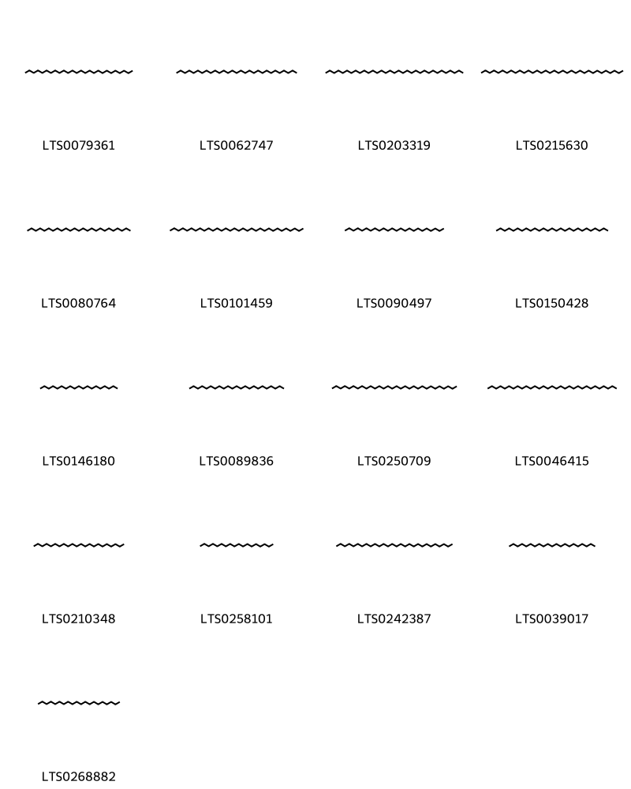{ width=100% }
    <figcaption>Hình ảnh cấu trúc hóa học của 17 hoạt chất thuộc nhóm Saturated hydrocarbons gồm ['hexacosane (LTS0079361)', 'nonacosane (LTS0062747)', 'tritriacontane (LTS0203319)', 'tetratriacontane (LTS0215630)', 'pentacosane (LTS0080764)', 'dotriacontane (LTS0101459)', 'tetracosane (LTS0090497)', 'heptacosane (LTS0150428)', 'nonadecane (LTS0146180)', 'tricosane (LTS0089836)', 'triacontane (LTS0250709)', 'hentriacontane (LTS0046415)', 'docosane (LTS0210348)', 'octadecane (LTS0258101)', 'octacosane (LTS0242387)', 'heneicosane (LTS0039017)', 'eicosane (LTS0268882)'].</figcaption>
</figure>
#### Nhóm Steroids and steroid derivatives
<figure markdown="span">
    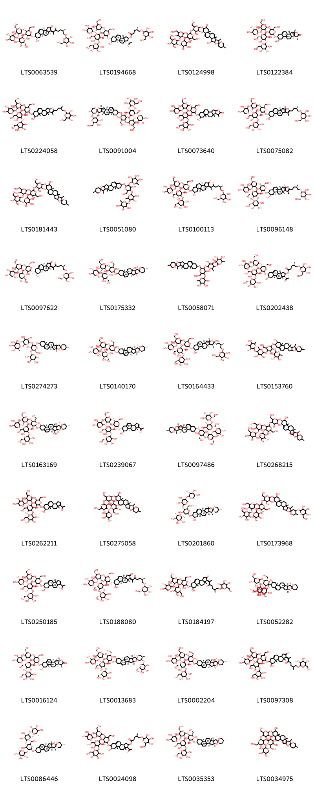{ width=100% }
    <figcaption>Hình ảnh cấu trúc hóa học của 40 hoạt chất thuộc nhóm Steroids and steroid derivatives gồm ['(1z,3as,3br,7r,8r,9ar,9bs,11as)-7-{[(2r,3r,4r,5r,6r)-3,4-dihydroxy-5-{[(2s,3r,4s,5r,6r)-5-hydroxy-6-(hydroxymethyl)-3-{[(2s,3r,4s,5s,6r)-3,4,5-trihydroxy-6-(hydroxymethyl)oxan-2-yl]oxy}-4-{[(2s,3r,4s,5r)-3,4,5-trihydroxyoxan-2-yl]oxy}oxan-2-yl]oxy}-6-(hydroxymethyl)oxan-2-yl]oxy}-8-hydroxy-9a,11a-dimethyl-1-[(6r)-6-methyl-3-oxo-7-{[(2r,3r,4s,5s,6r)-3,4,5-trihydroxy-6-(hydroxymethyl)oxan-2-yl]oxy}heptan-2-ylidene]-3h,3ah,3bh,4h,6h,7h,8h,9h,9bh,10h,11h-cyclopenta[a]phenanthren-2-one (LTS0063539)', '(1r,2s,3as,3bs,7r,8r,9ar,9bs,11as)-1-acetyl-7-{[(2r,3r,4r,5r,6r)-5-{[(2s,3r,4s,5r,6r)-3-{[(2s,3r,4s,5r,6r)-3,5-dihydroxy-6-(hydroxymethyl)-4-{[(2s,3r,4s,5s,6r)-3,4,5-trihydroxy-6-(hydroxymethyl)oxan-2-yl]oxy}oxan-2-yl]oxy}-5-hydroxy-6-(hydroxymethyl)-4-{[(2s,3r,4s,5r)-3,4,5-trihydroxyoxan-2-yl]oxy}oxan-2-yl]oxy}-3,4-dihydroxy-6-(hydroxymethyl)oxan-2-yl]oxy}-8-hydroxy-9a,11a-dimethyl-1h,2h,3h,3ah,3bh,4h,6h,7h,8h,9h,9bh,10h,11h-cyclopenta[a]phenanthren-2-yl (4r)-4-methyl-5-{[(2r,3r,4s,5s,6r)-3,4,5-trihydroxy-6-(hydroxymethyl)oxan-2-yl]oxy}pentanoate (LTS0194668)', "2-({2-[(2-{[4,5-dihydroxy-2-(hydroxymethyl)-6-{5,7',9',13'-tetramethyl-5'-oxaspiro[oxane-2,6'-pentacyclo[10.8.0.0²,⁹.0⁴,⁸.0¹³,¹⁸]icosan]-18'-ene-3',15'-dioloxy}oxan-3-yl]oxy}-5-hydroxy-6-(hydroxymethyl)-4-[(3,4,5-trihydroxyoxan-2-yl)oxy]oxan-3-yl)oxy]-3,5-dihydroxy-6-(hydroxymethyl)oxan-4-yl}oxy)-6-(hydroxymethyl)oxane-3,4,5-triol (LTS0124998)", '(1s,2s,4s,7s,8r,9s,12s,13r,15r,16r)-16-{[(2r,3r,4r,5r,6r)-5-{[(2s,3r,4s,5r,6r)-3-{[(2s,3r,4s,5r,6r)-3,5-dihydroxy-6-(hydroxymethyl)-4-{[(2s,3r,4s,5s,6r)-3,4,5-trihydroxy-6-(hydroxymethyl)oxan-2-yl]oxy}oxan-2-yl]oxy}-5-hydroxy-6-(hydroxymethyl)-4-{[(2s,3r,4s,5r)-3,4,5-trihydroxyoxan-2-yl]oxy}oxan-2-yl]oxy}-3,4-dihydroxy-6-(hydroxymethyl)oxan-2-yl]oxy}-15-hydroxy-7,9,13-trimethyl-5-oxapentacyclo[10.8.0.0²,⁹.0⁴,⁸.0¹³,¹⁸]icos-18-en-6-one (LTS0122384)', '2-{4-[16-({5-[(3-{[3,5-dihydroxy-6-(hydroxymethyl)-4-{[3,4,5-trihydroxy-6-(hydroxymethyl)oxan-2-yl]oxy}oxan-2-yl]oxy}-5-hydroxy-6-(hydroxymethyl)-4-[(3,4,5-trihydroxyoxan-2-yl)oxy]oxan-2-yl)oxy]-3,4-dihydroxy-6-(hydroxymethyl)oxan-2-yl}oxy)-15-hydroxy-7,9,13-trimethyl-5-oxapentacyclo[10.8.0.0²,⁹.0⁴,⁸.0¹³,¹⁸]icosa-6,18-dien-6-yl]-2-methylbutoxy}-6-(hydroxymethyl)oxane-3,4,5-triol (LTS0224058)', "(2r,3r,4s,5s,6r)-2-[(1's,2r,2's,4s,4's,5s,7's,8'r,9's,12's,13'r,15'r,16'r)-16'-{[(2r,3r,4r,5r,6r)-5-{[(2s,3r,4s,5r,6r)-3-{[(2s,3r,4s,5r,6r)-3,5-dihydroxy-6-(hydroxymethyl)-4-{[(2s,3r,4s,5s,6r)-3,4,5-trihydroxy-6-(hydroxymethyl)oxan-2-yl]oxy}oxan-2-yl]oxy}-5-hydroxy-6-(hydroxymethyl)-4-{[(2s,3r,4s,5r)-3,4,5-trihydroxyoxan-2-yl]oxy}oxan-2-yl]oxy}-3,4-dihydroxy-6-(hydroxymethyl)oxan-2-yl]oxy}-5,7',9',13'-tetramethyl-5'-oxaspiro[oxane-2,6'-pentacyclo[10.8.0.0²,⁹.0⁴,⁸.0¹³,¹⁸]icosan]-18'-en-15'-oloxy]-6-(hydroxymethyl)oxane-3,4,5-triol (LTS0091004)", '16-({5-[(3-{[3,5-dihydroxy-6-(hydroxymethyl)-4-{[3,4,5-trihydroxy-6-(hydroxymethyl)oxan-2-yl]oxy}oxan-2-yl]oxy}-5-hydroxy-6-(hydroxymethyl)-4-[(3,4,5-trihydroxyoxan-2-yl)oxy]oxan-2-yl)oxy]-3,4-dihydroxy-6-(hydroxymethyl)oxan-2-yl}oxy)-15-hydroxy-7,9,13-trimethyl-5-oxapentacyclo[10.8.0.0²,⁹.0⁴,⁸.0¹³,¹⁸]icos-18-en-6-one (LTS0073640)', '(2r,3r,4s,5s,6r)-2-[(2r)-4-[(1s,2s,4s,8s,9s,12s,13r,15r,16r)-16-{[(2r,3r,4r,5r,6r)-5-{[(2s,3r,4s,5r,6r)-3-{[(2s,3r,4s,5r,6r)-3,5-dihydroxy-6-(hydroxymethyl)-4-{[(2s,3r,4s,5s,6r)-3,4,5-trihydroxy-6-(hydroxymethyl)oxan-2-yl]oxy}oxan-2-yl]oxy}-5-hydroxy-6-(hydroxymethyl)-4-{[(2s,3r,4s,5r)-3,4,5-trihydroxyoxan-2-yl]oxy}oxan-2-yl]oxy}-3,4-dihydroxy-6-(hydroxymethyl)oxan-2-yl]oxy}-15-hydroxy-7,9,13-trimethyl-5-oxapentacyclo[10.8.0.0²,⁹.0⁴,⁸.0¹³,¹⁸]icosa-6,18-dien-6-yl]-2-methylbutoxy]-6-(hydroxymethyl)oxane-3,4,5-triol (LTS0075082)', "2-({2-[(2-{[4,5-dihydroxy-2-(hydroxymethyl)-6-{5,7',9',13'-tetramethyl-5'-oxaspiro[oxane-2,6'-pentacyclo[10.8.0.0²,⁹.0⁴,⁸.0¹³,¹⁸]icosan]-18'-en-15'-oloxy}oxan-3-yl]oxy}-5-hydroxy-6-(hydroxymethyl)-4-[(3,4,5-trihydroxyoxan-2-yl)oxy]oxan-3-yl)oxy]-3,5-dihydroxy-6-(hydroxymethyl)oxan-4-yl}oxy)-6-(hydroxymethyl)oxane-3,4,5-triol (LTS0181443)", "2-[(4,5-dihydroxy-6-{[4-hydroxy-2-(hydroxymethyl)-6-{5,7',9',13'-tetramethyl-5'-oxaspiro[oxane-2,6'-pentacyclo[10.8.0.0²,⁹.0⁴,⁸.0¹³,¹⁸]icosan]-18'-eneoxy}-5-[(3,4,5-trihydroxy-6-methyloxan-2-yl)oxy]oxan-3-yl]oxy}-2-methyloxan-3-yl)oxy]-6-methyloxane-3,4,5-triol (LTS0051080)", '(1z,3as,3br,7r,8r,9ar,9bs,11as)-7-{[(2r,3r,4r,5r,6r)-5-{[(2s,3r,4s,5r,6r)-3-{[(2s,3r,4s,5r,6r)-3,5-dihydroxy-6-(hydroxymethyl)-4-{[(2s,3r,4s,5s,6r)-3,4,5-trihydroxy-6-(hydroxymethyl)oxan-2-yl]oxy}oxan-2-yl]oxy}-5-hydroxy-6-(hydroxymethyl)-4-{[(2s,3r,4s,5r)-3,4,5-trihydroxyoxan-2-yl]oxy}oxan-2-yl]oxy}-3,4-dihydroxy-6-(hydroxymethyl)oxan-2-yl]oxy}-8-hydroxy-9a,11a-dimethyl-1-[(6r)-6-methyl-3-oxo-7-{[(2r,3r,4s,5s,6r)-3,4,5-trihydroxy-6-(hydroxymethyl)oxan-2-yl]oxy}heptan-2-ylidene]-3h,3ah,3bh,4h,6h,7h,8h,9h,9bh,10h,11h-cyclopenta[a]phenanthren-2-one (LTS0100113)', '(2s,3s,4r,5r,6s)-2-[(2r)-4-[(1r,2s,4r,8r,9r,12r,13r,15r,16r)-16-{[(2s,3s,4s,5r,6s)-5-{[(2r,3s,4r,5s,6s)-3-{[(2r,3s,4r,5s,6s)-3,5-dihydroxy-6-(hydroxymethyl)-4-{[(2r,3s,4r,5r,6s)-3,4,5-trihydroxy-6-(hydroxymethyl)oxan-2-yl]oxy}oxan-2-yl]oxy}-5-hydroxy-6-(hydroxymethyl)-4-{[(2r,3s,4r,5s)-3,4,5-trihydroxyoxan-2-yl]oxy}oxan-2-yl]oxy}-3,4-dihydroxy-6-(hydroxymethyl)oxan-2-yl]oxy}-15-hydroxy-7,9,13-trimethyl-5-oxapentacyclo[10.8.0.0²,⁹.0⁴,⁸.0¹³,¹⁸]icosa-6,18-dien-6-yl]-2-methylbutoxy]-6-(hydroxymethyl)oxane-3,4,5-triol (LTS0096148)', '(1z,3as,3br,7r,8r,9ar,9br,11ar)-7-{[(2s,3s,4s,5r,6s)-3,4-dihydroxy-5-{[(2r,3s,4r,5s,6s)-5-hydroxy-6-(hydroxymethyl)-3-{[(2r,3s,4r,5r,6s)-3,4,5-trihydroxy-6-(hydroxymethyl)oxan-2-yl]oxy}-4-{[(2r,3s,4r,5s)-3,4,5-trihydroxyoxan-2-yl]oxy}oxan-2-yl]oxy}-6-(hydroxymethyl)oxan-2-yl]oxy}-8-hydroxy-9a,11a-dimethyl-1-[(6r)-6-methyl-3-oxo-7-{[(2s,3s,4r,5r,6s)-3,4,5-trihydroxy-6-(hydroxymethyl)oxan-2-yl]oxy}heptan-2-ylidene]-3h,3ah,3bh,4h,6h,7h,8h,9h,9bh,10h,11h-cyclopenta[a]phenanthren-2-one (LTS0097622)', "(2s,3r,4s,5s,6r)-2-{[(2s,3r,4s,5r,6r)-2-{[(2r,3r,4r,5r,6r)-4,5-dihydroxy-2-(hydroxymethyl)-6-[(1'r,2r,2's,4's,5r,7's,8's,9's,12's,13'r,15'r,16'r)-5,7',9',13'-tetramethyl-5'-oxaspiro[oxane-2,6'-pentacyclo[10.8.0.0²,⁹.0⁴,⁸.0¹³,¹⁸]icosan]-18'-ene-8',15'-dioloxy]oxan-3-yl]oxy}-5-hydroxy-6-(hydroxymethyl)-4-{[(2s,3r,4s,5r)-3,4,5-trihydroxyoxan-2-yl]oxy}oxan-3-yl]oxy}-6-(hydroxymethyl)oxane-3,4,5-triol (LTS0175332)", "2-[(4,5-dihydroxy-6-{[4-hydroxy-6-(hydroxymethyl)-2-{5,7',9',13'-tetramethyl-5'-oxaspiro[oxane-2,6'-pentacyclo[10.8.0.0²,⁹.0⁴,⁸.0¹³,¹⁸]icosan]-18'-eneoxy}-5-[(3,4,5-trihydroxy-6-methyloxan-2-yl)oxy]oxan-3-yl]oxy}-2-methyloxan-3-yl)oxy]-6-methyloxane-3,3,4,5-tetrol (LTS0058071)", '(1r,2s,3as,3bs,7r,8r,9as,9br,11ar)-1-acetyl-7-{[(2r,3s,4s,5s,6s)-5-{[(2r,3r,4r,5r,6s)-3-{[(2r,3s,4s,5r,6r)-3,5-dihydroxy-6-(hydroxymethyl)-4-{[(2s,3r,4r,5r,6s)-3,4,5-trihydroxy-6-(hydroxymethyl)oxan-2-yl]oxy}oxan-2-yl]oxy}-5-hydroxy-6-(hydroxymethyl)-4-{[(2r,3s,4s,5s)-3,4,5-trihydroxyoxan-2-yl]oxy}oxan-2-yl]oxy}-3,4-dihydroxy-6-(hydroxymethyl)oxan-2-yl]oxy}-8-hydroxy-9a,11a-dimethyl-1h,2h,3h,3ah,3bh,4h,6h,7h,8h,9h,9bh,10h,11h-cyclopenta[a]phenanthren-2-yl (4r)-4-methyl-5-{[(2r,3r,4s,5s,6r)-3,4,5-trihydroxy-6-(hydroxymethyl)oxan-2-yl]oxy}pentanoate (LTS0202438)', "(2s,4r,5r,6s)-2-{[(2s,3r,4s,5r,6s)-4,5-dihydroxy-6-{[(2r,3r,4s,5s,6r)-4-hydroxy-6-(hydroxymethyl)-2-[(1's,2r,2's,4'r,5r,7's,8'r,9's,12's,13'r,16's)-5,7',9',13'-tetramethyl-5'-oxaspiro[oxane-2,6'-pentacyclo[10.8.0.0²,⁹.0⁴,⁸.0¹³,¹⁸]icosan]-18'-eneoxy]-5-{[(2s,3r,4r,5r,6s)-3,4,5-trihydroxy-6-methyloxan-2-yl]oxy}oxan-3-yl]oxy}-2-methyloxan-3-yl]oxy}-6-methyloxane-3,3,4,5-tetrol (LTS0274273)", "(2s,3r,4s,5s,6r)-2-{[(2s,3r,4s,5r,6r)-2-{[(2r,3r,4r,5r,6r)-4,5-dihydroxy-2-(hydroxymethyl)-6-[(1's,2r,2's,4's,5r,7's,8'r,9's,12's,13'r,15'r,16'r)-5,7',9',13'-tetramethyl-5'-oxaspiro[oxane-2,6'-pentacyclo[10.8.0.0²,⁹.0⁴,⁸.0¹³,¹⁸]icosan]-18'-en-15'-oloxy]oxan-3-yl]oxy}-5-hydroxy-6-(hydroxymethyl)-4-{[(2s,3r,4s,5r)-3,4,5-trihydroxyoxan-2-yl]oxy}oxan-3-yl]oxy}-6-(hydroxymethyl)oxane-3,4,5-triol (LTS0140170)", '(2r,3r,4s,5s,6r)-2-[(2r)-4-[(1s,2s,4s,6r,7s,8r,9s,12s,13r,15r,16r)-16-{[(2r,3r,4r,5r,6r)-5-{[(2s,3r,4s,5r,6r)-3-{[(2s,3r,4s,5r,6r)-3,5-dihydroxy-6-(hydroxymethyl)-4-{[(2s,3r,4s,5s,6r)-3,4,5-trihydroxy-6-(hydroxymethyl)oxan-2-yl]oxy}oxan-2-yl]oxy}-5-hydroxy-6-(hydroxymethyl)-4-{[(2s,3r,4s,5r)-3,4,5-trihydroxyoxan-2-yl]oxy}oxan-2-yl]oxy}-3,4-dihydroxy-6-(hydroxymethyl)oxan-2-yl]oxy}-15-hydroxy-6-methoxy-7,9,13-trimethyl-5-oxapentacyclo[10.8.0.0²,⁹.0⁴,⁸.0¹³,¹⁸]icos-18-en-6-yl]-2-methylbutoxy]-6-(hydroxymethyl)oxane-3,4,5-triol (LTS0164433)', "2-[(4,5-dihydroxy-6-{[4-hydroxy-2-(hydroxymethyl)-6-{5,7',9',13'-tetramethyl-5'-oxaspiro[oxane-2,6'-pentacyclo[10.8.0.0²,⁹.0⁴,⁸.0¹³,¹⁸]icosan]-18'-en-15'-oloxy}-5-[(3,4,5-trihydroxy-6-methyloxan-2-yl)oxy]oxan-3-yl]oxy}-2-methyloxan-3-yl)oxy]-6-methyloxane-3,4,5-triol (LTS0153760)", "(2s,3r,4s,5s,6r)-2-{[(2s,3r,4s,5r,6r)-2-{[(2s,3r,4s,5r,6r)-2-{[(2r,3r,4r,5r,6r)-4,5-dihydroxy-2-(hydroxymethyl)-6-[(1'r,2r,2's,3's,4'r,5r,7's,8'r,9's,12's,13'r,15'r,16'r)-5,7',9',13'-tetramethyl-5'-oxaspiro[oxane-2,6'-pentacyclo[10.8.0.0²,⁹.0⁴,⁸.0¹³,¹⁸]icosan]-18'-ene-3',15'-dioloxy]oxan-3-yl]oxy}-5-hydroxy-6-(hydroxymethyl)-4-{[(2s,3r,4s,5r)-3,4,5-trihydroxyoxan-2-yl]oxy}oxan-3-yl]oxy}-3,5-dihydroxy-6-(hydroxymethyl)oxan-4-yl]oxy}-6-(hydroxymethyl)oxane-3,4,5-triol (LTS0163169)", '1-[(3ar,3bs,7r,8r,9ar,9br,11ar)-7-{[(2s,3s,4s,5r,6s)-5-{[(2r,3s,4r,5s,6s)-3-{[(2r,3s,4r,5s,6s)-3,5-dihydroxy-6-(hydroxymethyl)-4-{[(2r,3s,4r,5r,6s)-3,4,5-trihydroxy-6-(hydroxymethyl)oxan-2-yl]oxy}oxan-2-yl]oxy}-5-hydroxy-6-(hydroxymethyl)-4-{[(2r,3s,4r,5s)-3,4,5-trihydroxyoxan-2-yl]oxy}oxan-2-yl]oxy}-3,4-dihydroxy-6-(hydroxymethyl)oxan-2-yl]oxy}-8-hydroxy-9a,11a-dimethyl-3h,3ah,3bh,4h,6h,7h,8h,9h,9bh,10h,11h-cyclopenta[a]phenanthren-1-yl]ethanone (LTS0239067)', "(2r,3s,4r,5r,6s)-2-{[(2r,3s,4r,5s,6s)-2-{[(2r,3s,4r,5s,6s)-2-{[(2s,3r,4s,5s,6s)-4,5-dihydroxy-2-(hydroxymethyl)-6-[(1'r,2r,2's,4's,5s,7'r,8's,9'r,12's,13's,15's,16's)-5,7',9',13'-tetramethyl-5'-oxaspiro[oxane-2,6'-pentacyclo[10.8.0.0²,⁹.0⁴,⁸.0¹³,¹⁸]icosan]-18'-ene-8',15'-dioloxy]oxan-3-yl]oxy}-5-hydroxy-6-(hydroxymethyl)-4-{[(2r,3s,4r,5s)-3,4,5-trihydroxyoxan-2-yl]oxy}oxan-3-yl]oxy}-3,5-dihydroxy-6-(hydroxymethyl)oxan-4-yl]oxy}-6-(hydroxymethyl)oxane-3,4,5-triol (LTS0097486)", "2-({2-[(2-{[4,5-dihydroxy-2-(hydroxymethyl)-6-{5,7',9',13'-tetramethyl-5'-oxaspiro[oxane-2,6'-pentacyclo[10.8.0.0²,⁹.0⁴,⁸.0¹³,¹⁸]icosan]-18'-ene-8',15'-dioloxy}oxan-3-yl]oxy}-5-hydroxy-6-(hydroxymethyl)-4-[(3,4,5-trihydroxyoxan-2-yl)oxy]oxan-3-yl)oxy]-3,5-dihydroxy-6-(hydroxymethyl)oxan-4-yl}oxy)-6-(hydroxymethyl)oxane-3,4,5-triol (LTS0268215)", '1-[7-({5-[(3-{[3,5-dihydroxy-6-(hydroxymethyl)-4-{[3,4,5-trihydroxy-6-(hydroxymethyl)oxan-2-yl]oxy}oxan-2-yl]oxy}-5-hydroxy-6-(hydroxymethyl)-4-[(3,4,5-trihydroxyoxan-2-yl)oxy]oxan-2-yl)oxy]-3,4-dihydroxy-6-(hydroxymethyl)oxan-2-yl}oxy)-8-hydroxy-9a,11a-dimethyl-3h,3ah,3bh,4h,6h,7h,8h,9h,9bh,10h,11h-cyclopenta[a]phenanthren-1-yl]ethanone (LTS0262211)', "2-[(2-{[4,5-dihydroxy-2-(hydroxymethyl)-6-{5,7',9',13'-tetramethyl-5'-oxaspiro[oxane-2,6'-pentacyclo[10.8.0.0²,⁹.0⁴,⁸.0¹³,¹⁸]icosan]-18'-en-15'-oloxy}oxan-3-yl]oxy}-5-hydroxy-6-(hydroxymethyl)-4-[(3,4,5-trihydroxyoxan-2-yl)oxy]oxan-3-yl)oxy]-6-(hydroxymethyl)oxane-3,4,5-triol (LTS0275058)", "(2s,3r,4r,5r,6s)-2-{[(2r,3r,4s,5s,6r)-5-{[(2s,3r,4s,5r,6s)-3,4-dihydroxy-6-methyl-5-{[(2s,3r,4r,5r,6s)-3,4,5-trihydroxy-6-methyloxan-2-yl]oxy}oxan-2-yl]oxy}-4-hydroxy-6-(hydroxymethyl)-2-[(1's,2r,2's,4's,5r,7's,8'r,9's,12's,13'r,15'r,16'r)-5,7',9',13'-tetramethyl-5'-oxaspiro[oxane-2,6'-pentacyclo[10.8.0.0²,⁹.0⁴,⁸.0¹³,¹⁸]icosan]-18'-en-15'-oloxy]oxan-3-yl]oxy}-6-methyloxane-3,4,5-triol (LTS0201860)", "2-[16'-({5-[(3-{[3,5-dihydroxy-6-(hydroxymethyl)-4-{[3,4,5-trihydroxy-6-(hydroxymethyl)oxan-2-yl]oxy}oxan-2-yl]oxy}-5-hydroxy-6-(hydroxymethyl)-4-[(3,4,5-trihydroxyoxan-2-yl)oxy]oxan-2-yl)oxy]-3,4-dihydroxy-6-(hydroxymethyl)oxan-2-yl}oxy)-5,7',9',13'-tetramethyl-5'-oxaspiro[oxane-2,6'-pentacyclo[10.8.0.0²,⁹.0⁴,⁸.0¹³,¹⁸]icosan]-18'-en-15'-oloxy]-6-(hydroxymethyl)oxane-3,4,5-triol (LTS0173968)", '1-[(3as,3br,7r,8r,9ar,9bs,11as)-7-{[(2r,3r,4r,5r,6r)-5-{[(2s,3r,4s,5r,6r)-3-{[(2s,3r,4s,5r,6r)-3,5-dihydroxy-6-(hydroxymethyl)-4-{[(2s,3r,4s,5s,6r)-3,4,5-trihydroxy-6-(hydroxymethyl)oxan-2-yl]oxy}oxan-2-yl]oxy}-5-hydroxy-6-(hydroxymethyl)-4-{[(2s,3r,4s,5r)-3,4,5-trihydroxyoxan-2-yl]oxy}oxan-2-yl]oxy}-3,4-dihydroxy-6-(hydroxymethyl)oxan-2-yl]oxy}-8-hydroxy-9a,11a-dimethyl-3h,3ah,3bh,4h,6h,7h,8h,9h,9bh,10h,11h-cyclopenta[a]phenanthren-1-yl]ethanone (LTS0250185)', '(1z,3as,3br,7r,8r,9ar,9br,11ar)-7-{[(2s,3s,4s,5r,6s)-5-{[(2r,3s,4r,5s,6s)-3-{[(2r,3s,4r,5s,6s)-3,5-dihydroxy-6-(hydroxymethyl)-4-{[(2r,3s,4r,5r,6s)-3,4,5-trihydroxy-6-(hydroxymethyl)oxan-2-yl]oxy}oxan-2-yl]oxy}-5-hydroxy-6-(hydroxymethyl)-4-{[(2r,3s,4r,5s)-3,4,5-trihydroxyoxan-2-yl]oxy}oxan-2-yl]oxy}-3,4-dihydroxy-6-(hydroxymethyl)oxan-2-yl]oxy}-8-hydroxy-9a,11a-dimethyl-1-[(6r)-6-methyl-3-oxo-7-{[(2s,3s,4r,5r,6s)-3,4,5-trihydroxy-6-(hydroxymethyl)oxan-2-yl]oxy}heptan-2-ylidene]-3h,3ah,3bh,4h,6h,7h,8h,9h,9bh,10h,11h-cyclopenta[a]phenanthren-2-one (LTS0188080)', '7-[(3,4-dihydroxy-5-{[5-hydroxy-6-(hydroxymethyl)-3-{[3,4,5-trihydroxy-6-(hydroxymethyl)oxan-2-yl]oxy}-4-[(3,4,5-trihydroxyoxan-2-yl)oxy]oxan-2-yl]oxy}-6-(hydroxymethyl)oxan-2-yl)oxy]-8-hydroxy-9a,11a-dimethyl-1-(6-methyl-3-oxo-7-{[3,4,5-trihydroxy-6-(hydroxymethyl)oxan-2-yl]oxy}heptan-2-ylidene)-3h,3ah,3bh,4h,6h,7h,8h,9h,9bh,10h,11h-cyclopenta[a]phenanthren-2-one (LTS0184197)', "(2s,3r,4s,5s,6r)-2-{[(2s,3r,4s,5s,6r)-2-[(4's,5r,7's,8'r,9's,13'r)-15'-hydroxy-5,7',9',13'-tetramethyl-5'-oxaspiro[oxane-2,6'-pentacyclo[10.8.0.0²,⁹.0⁴,⁸.0¹³,¹⁸]icosan]-18'-en-16'-yl]-6-(hydroxymethyl)-4,5-bis({[(2s,3r,4s,5s,6r)-3,4,5-trihydroxy-6-(hydroxymethyl)oxan-2-yl]oxy})-3-{[(2s,3r,4s,5r)-3,4,5-trihydroxyoxan-2-yl]oxy}oxan-2-yl]oxy}-6-(hydroxymethyl)oxane-3,4,5-triol (LTS0052282)", '(1r,2r,4s,7s,8r,9s,12s,13s,15s,16s)-16-{[(2s,3s,4s,5r,6s)-5-{[(2r,3s,4r,5s,6s)-3-{[(2r,3s,4r,5s,6s)-3,5-dihydroxy-6-(hydroxymethyl)-4-{[(2r,3s,4r,5r,6s)-3,4,5-trihydroxy-6-(hydroxymethyl)oxan-2-yl]oxy}oxan-2-yl]oxy}-5-hydroxy-6-(hydroxymethyl)-4-{[(2r,3s,4r,5s)-3,4,5-trihydroxyoxan-2-yl]oxy}oxan-2-yl]oxy}-3,4-dihydroxy-6-(hydroxymethyl)oxan-2-yl]oxy}-15-hydroxy-7,9,13-trimethyl-5-oxapentacyclo[10.8.0.0²,⁹.0⁴,⁸.0¹³,¹⁸]icos-18-en-6-one (LTS0016124)', "(2r,3s,4r,5r,6s)-2-{[(2r,3s,4r,5s,6s)-2-{[(2r,3s,4r,5s,6s)-2-{[(2s,3r,4s,5s,6s)-4,5-dihydroxy-2-(hydroxymethyl)-6-[(1's,2r,2's,4s,4's,5r,7's,8'r,9'r,12'r,13's,15's,16's)-5,7',9',13'-tetramethyl-4-{[(2s,3s,4r,5r,6s)-3,4,5-trihydroxy-6-(hydroxymethyl)oxan-2-yl]oxy}-5'-oxaspiro[oxane-2,6'-pentacyclo[10.8.0.0²,⁹.0⁴,⁸.0¹³,¹⁸]icosan]-18'-en-15'-oloxy]oxan-3-yl]oxy}-5-hydroxy-6-(hydroxymethyl)-4-{[(2r,3s,4r,5s)-3,4,5-trihydroxyoxan-2-yl]oxy}oxan-3-yl]oxy}-3,5-dihydroxy-6-(hydroxymethyl)oxan-4-yl]oxy}-6-(hydroxymethyl)oxane-3,4,5-triol (LTS0013683)", "(2s,3r,4s,5s,6r)-2-{[(2s,3r,4s,5r,6r)-2-{[(2s,3r,4s,5r,6r)-2-{[(2r,3r,4r,5r,6r)-4,5-dihydroxy-2-(hydroxymethyl)-6-[(1'r,2r,2's,4's,5r,7's,8's,9's,12's,13'r,15'r,16'r)-5,7',9',13'-tetramethyl-5'-oxaspiro[oxane-2,6'-pentacyclo[10.8.0.0²,⁹.0⁴,⁸.0¹³,¹⁸]icosan]-18'-ene-8',15'-dioloxy]oxan-3-yl]oxy}-5-hydroxy-6-(hydroxymethyl)-4-{[(2s,3r,4s,5r)-3,4,5-trihydroxyoxan-2-yl]oxy}oxan-3-yl]oxy}-3,5-dihydroxy-6-(hydroxymethyl)oxan-4-yl]oxy}-6-(hydroxymethyl)oxane-3,4,5-triol (LTS0002204)", '7-({5-[(3-{[3,5-dihydroxy-6-(hydroxymethyl)-4-{[3,4,5-trihydroxy-6-(hydroxymethyl)oxan-2-yl]oxy}oxan-2-yl]oxy}-5-hydroxy-6-(hydroxymethyl)-4-[(3,4,5-trihydroxyoxan-2-yl)oxy]oxan-2-yl)oxy]-3,4-dihydroxy-6-(hydroxymethyl)oxan-2-yl}oxy)-8-hydroxy-9a,11a-dimethyl-1-(6-methyl-3-oxo-7-{[3,4,5-trihydroxy-6-(hydroxymethyl)oxan-2-yl]oxy}heptan-2-ylidene)-3h,3ah,3bh,4h,6h,7h,8h,9h,9bh,10h,11h-cyclopenta[a]phenanthren-2-one (LTS0097308)', "(2s,3r,4r,5r,6s)-2-{[(2r,3r,4s,5s,6r)-5-{[(2s,3r,4s,5r,6s)-3,4-dihydroxy-6-methyl-5-{[(2s,3r,4r,5r,6s)-3,4,5-trihydroxy-6-methyloxan-2-yl]oxy}oxan-2-yl]oxy}-4-hydroxy-6-(hydroxymethyl)-2-[(1's,2r,2's,4's,5r,7's,8'r,9's,12's,13'r,16's)-5,7',9',13'-tetramethyl-5'-oxaspiro[oxane-2,6'-pentacyclo[10.8.0.0²,⁹.0⁴,⁸.0¹³,¹⁸]icosan]-18'-eneoxy]oxan-3-yl]oxy}-6-methyloxane-3,4,5-triol (LTS0086446)", '1-acetyl-7-({5-[(3-{[3,5-dihydroxy-6-(hydroxymethyl)-4-{[3,4,5-trihydroxy-6-(hydroxymethyl)oxan-2-yl]oxy}oxan-2-yl]oxy}-5-hydroxy-6-(hydroxymethyl)-4-[(3,4,5-trihydroxyoxan-2-yl)oxy]oxan-2-yl)oxy]-3,4-dihydroxy-6-(hydroxymethyl)oxan-2-yl}oxy)-8-hydroxy-9a,11a-dimethyl-1h,2h,3h,3ah,3bh,4h,6h,7h,8h,9h,9bh,10h,11h-cyclopenta[a]phenanthren-2-yl 4-methyl-5-{[3,4,5-trihydroxy-6-(hydroxymethyl)oxan-2-yl]oxy}pentanoate (LTS0024098)', "(2s,3r,4s,5s,6r)-2-{[(2s,3r,4s,5r,6r)-2-{[(2s,3r,4s,5r,6r)-2-{[(2r,3r,4r,5r,6r)-4,5-dihydroxy-2-(hydroxymethyl)-6-[(1's,2r,2's,4's,5r,7's,8'r,9's,12's,13'r,15'r,16'r)-5,7',9',13'-tetramethyl-5'-oxaspiro[oxane-2,6'-pentacyclo[10.8.0.0²,⁹.0⁴,⁸.0¹³,¹⁸]icosan]-18'-en-15'-oloxy]oxan-3-yl]oxy}-5-hydroxy-6-(hydroxymethyl)-4-{[(2s,3r,4s,5r)-3,4,5-trihydroxyoxan-2-yl]oxy}oxan-3-yl]oxy}-3,5-dihydroxy-6-(hydroxymethyl)oxan-4-yl]oxy}-6-(hydroxymethyl)oxane-3,4,5-triol (LTS0035353)", "2-[(2-{[4,5-dihydroxy-2-(hydroxymethyl)-6-{5,7',9',13'-tetramethyl-5'-oxaspiro[oxane-2,6'-pentacyclo[10.8.0.0²,⁹.0⁴,⁸.0¹³,¹⁸]icosan]-18'-ene-8',15'-dioloxy}oxan-3-yl]oxy}-5-hydroxy-6-(hydroxymethyl)-4-[(3,4,5-trihydroxyoxan-2-yl)oxy]oxan-3-yl)oxy]-6-(hydroxymethyl)oxane-3,4,5-triol (LTS0034975)"].</figcaption>
</figure>

---

### Dược dân tộc học

Danh sách các quốc gia có sử dụng *Cestrum nocturnum* trong điều trị các bệnh. 

| Country   | Disease        | Bệnh               |
|:----------|:---------------|:-------------------|
| Mexico    | Poison, Poison | Chất độc, chất độc |
| US        | Poison         | Chất độc           |

---

---
## Cestrum parqui
### Thông tin về thực vật

!!! info "Phân loại thực vật của *Cestrum parqui* từ GIBF:"
    - **Kingdom:** Plantae
    - **Phylum:** Tracheophyta
    - **Order:** Solanales
    - **Family:** Solanaceae
    - **Genus:** Cestrum
    - **Species:** *Cestrum parqui*

 

| Label (VI)   | Label (EN)   | Scientific Name   | Descriptions (VI)   | Descriptions (EN)   | Also Known As (VI)   | Also Known As (EN)   |
|:-------------|:-------------|:------------------|:--------------------|:--------------------|:---------------------|:---------------------|
| N/A          | N/A          | Cestrum parqui    | loài thực vật       | species of plant    | ['']                 | ['']                 |

#### Phân bố trên thế giới

**Từ CSDL GIBF** South Africa, Italy, Australia, Spain, Argentina, Uruguay, United States of America, Chile

#### Phân bố tại Việt Nam

**Từ CSDL GIBF**: Không có ghi nhận ở Việt Nam

---
### Thành phần hóa học
        
- Theo cơ sở dữ liệu lotus: Từ loài *Cestrum parqui* đã phân lập và xác định được 72 hoạt chất thuộc về các nhóm Fatty Acyls, Phenylpropanoic acids, Prenol lipids, Steroids and steroid derivatives, Flavonoids, Linear 1,3-diarylpropanoids, Cinnamic acids and derivatives, Oxepanes, Benzene and substituted derivatives, Organooxygen compounds, Phenols. 

|    | chemicalTaxonomyClassyfireClass     |   smiles_count |
|---:|:------------------------------------|---------------:|
|  0 | Benzene and substituted derivatives |              8 |
|  1 | Cinnamic acids and derivatives      |              8 |
|  2 | Fatty Acyls                         |              3 |
|  3 | Flavonoids                          |              1 |
|  4 | Linear 1,3-diarylpropanoids         |              2 |
|  5 | Organooxygen compounds              |              4 |
|  6 | Oxepanes                            |              6 |
|  7 | Phenols                             |              1 |
|  8 | Phenylpropanoic acids               |              1 |
|  9 | Prenol lipids                       |             32 |
| 10 | Steroids and steroid derivatives    |              6 |

#### Nhóm Benzene and substituted derivatives
<figure markdown="span">
    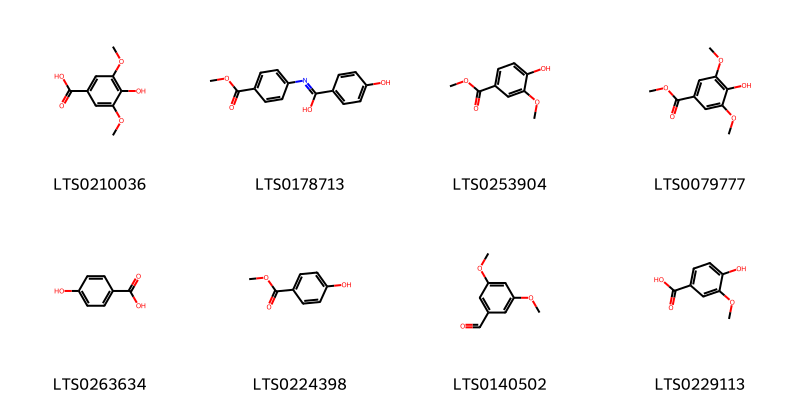{ width=100% }
    <figcaption>Hình ảnh cấu trúc hóa học của 8 hoạt chất thuộc nhóm Benzene and substituted derivatives gồm ['syringic acid (LTS0210036)', '4-hydroxy-n-[4-(methoxycarbonyl)phenyl]benzenecarboximidic acid (LTS0178713)', 'vanillate (LTS0253904)', 'syringate (LTS0079777)', 'p-hydroxybenzoic acid (LTS0263634)', 'paraben (LTS0224398)', '3,5-dimethoxy-benzaldehyde (LTS0140502)', 'vanillic acid (LTS0229113)'].</figcaption>
</figure>
#### Nhóm Cinnamic acids and derivatives
<figure markdown="span">
    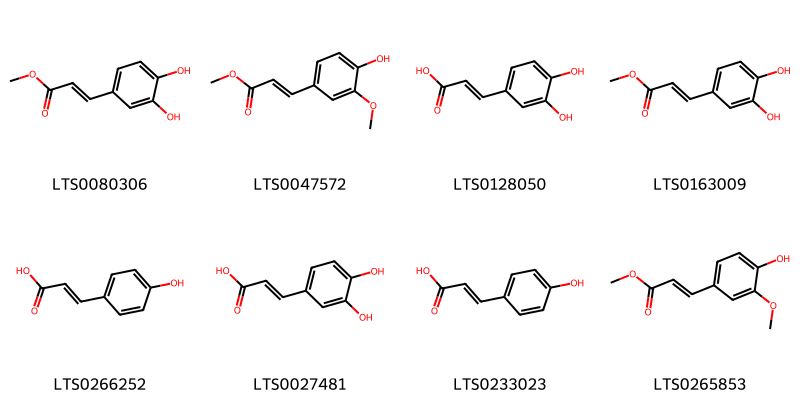{ width=100% }
    <figcaption>Hình ảnh cấu trúc hóa học của 8 hoạt chất thuộc nhóm Cinnamic acids and derivatives gồm ['methyl 3-(3,4-dihydroxyphenyl)prop-2-enoate (LTS0080306)', 'methyl ferulate (LTS0047572)', '3,4-dihydroxycinnamic acid (LTS0128050)', 'methyl caffeate (LTS0163009)', 'para-coumaric acid (LTS0266252)', 'caffeic acid (LTS0027481)', 'hydroxycinnamic acid (LTS0233023)', 'methyl ferulate (LTS0265853)'].</figcaption>
</figure>
#### Nhóm Fatty Acyls
<figure markdown="span">
    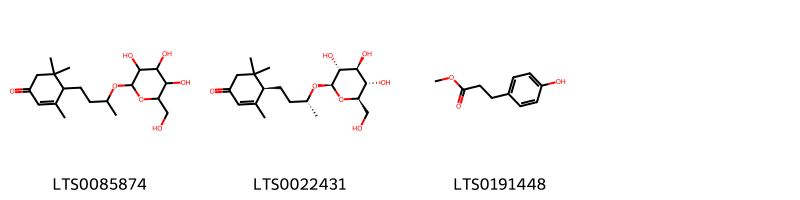{ width=100% }
    <figcaption>Hình ảnh cấu trúc hóa học của 3 hoạt chất thuộc nhóm Fatty Acyls gồm ['3,5,5-trimethyl-4-(3-{[3,4,5-trihydroxy-6-(hydroxymethyl)oxan-2-yl]oxy}butyl)cyclohex-2-en-1-one (LTS0085874)', 'byzantionoside b (LTS0022431)', 'methyl 3-(4-hydroxyphenyl)propanoate (LTS0191448)'].</figcaption>
</figure>
#### Nhóm Flavonoids
<figure markdown="span">
    { width=100% }
    <figcaption>Hình ảnh cấu trúc hóa học của 1 hoạt chất thuộc nhóm Flavonoids gồm ['quercetin (LTS0004651)'].</figcaption>
</figure>
#### Nhóm Linear 1_3-diarylpropanoids
<figure markdown="span">
    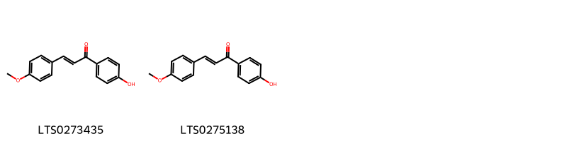{ width=100% }
    <figcaption>Hình ảnh cấu trúc hóa học của Không tìm thấy chú thích hoạt chất thuộc nhóm Linear 1_3-diarylpropanoids gồm Không tìm thấy chú thích.</figcaption>
</figure>
#### Nhóm Organooxygen compounds
<figure markdown="span">
    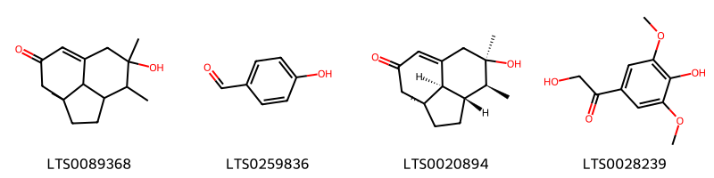{ width=100% }
    <figcaption>Hình ảnh cấu trúc hóa học của 4 hoạt chất thuộc nhóm Organooxygen compounds gồm ['7-hydroxy-2a,7,8-trimethyl-2,2b,3,6,8,8a-hexahydro-1h-acenaphthylen-4-one (LTS0089368)', 'p-hydroxybenzaldehyde (LTS0259836)', '(2as,2bs,7r,8s,8ar)-7-hydroxy-2a,7,8-trimethyl-2,2b,3,6,8,8a-hexahydro-1h-acenaphthylen-4-one (LTS0020894)', 'danielone (LTS0028239)'].</figcaption>
</figure>
#### Nhóm Oxepanes
<figure markdown="span">
    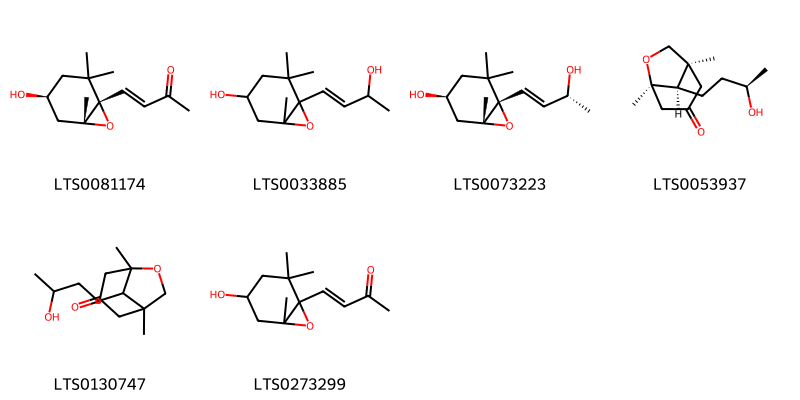{ width=100% }
    <figcaption>Hình ảnh cấu trúc hóa học của 6 hoạt chất thuộc nhóm Oxepanes gồm ['(3e)-4-[(1s,4s,6r)-4-hydroxy-2,2,6-trimethyl-7-oxabicyclo[4.1.0]heptan-1-yl]but-3-en-2-one (LTS0081174)', '6-(3-hydroxybut-1-en-1-yl)-1,5,5-trimethyl-7-oxabicyclo[4.1.0]heptan-3-ol (LTS0033885)', '(1r,3s,6s)-6-[(1e,3r)-3-hydroxybut-1-en-1-yl]-1,5,5-trimethyl-7-oxabicyclo[4.1.0]heptan-3-ol (LTS0073223)', '(1s,5r,8r)-8-[(3r)-3-hydroxybutyl]-1,5-dimethyl-6-oxabicyclo[3.2.1]octan-3-one (LTS0053937)', '8-(3-hydroxybutyl)-1,5-dimethyl-6-oxabicyclo[3.2.1]octan-3-one (LTS0130747)', '4-{4-hydroxy-2,2,6-trimethyl-7-oxabicyclo[4.1.0]heptan-1-yl}but-3-en-2-one (LTS0273299)'].</figcaption>
</figure>
#### Nhóm Phenols
<figure markdown="span">
    { width=100% }
    <figcaption>Hình ảnh cấu trúc hóa học của 1 hoạt chất thuộc nhóm Phenols gồm ['tyrosol (LTS0132195)'].</figcaption>
</figure>
#### Nhóm Phenylpropanoic acids
<figure markdown="span">
    { width=100% }
    <figcaption>Hình ảnh cấu trúc hóa học của 1 hoạt chất thuộc nhóm Phenylpropanoic acids gồm ['hydroxyphenyl propionic acid (LTS0119368)'].</figcaption>
</figure>
#### Nhóm Prenol lipids
<figure markdown="span">
    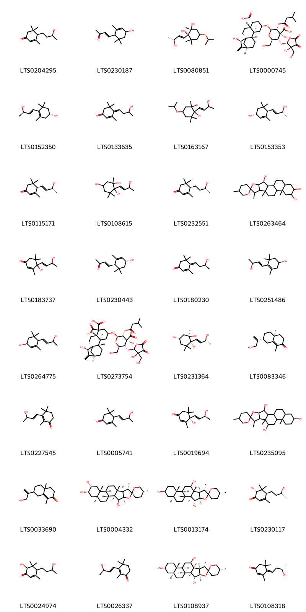{ width=100% }
    <figcaption>Hình ảnh cấu trúc hóa học của 32 hoạt chất thuộc nhóm Prenol lipids gồm ['4-(3-hydroxybutyl)-3,5,5-trimethylcyclohex-2-en-1-one (LTS0204295)', '4-(4-hydroxy-2,6,6-trimethylcyclohex-2-en-1-yl)but-3-en-2-one (LTS0230187)', '(1r,2r,5s)-2-[(1e,3r)-3-hydroxybut-1-en-1-yl]-5-isopropoxy-1,3,3-trimethylcyclohexane-1,2-diol (LTS0080851)', '(2r,3r,4r,5r,6r)-2-{[(1r,4r,5r,7r,9r,10s,13r,15r)-5-carboxy-15-hydroxy-9-methyl-14-methylidenetetracyclo[11.2.1.0¹,¹⁰.0⁴,⁹]hexadecan-7-yl]oxy}-4-hydroxy-5-{[(2s,3s)-3-hydroxy-3-(hydroxymethyl)-4,5-dioxooxolan-2-yl]oxy}-6-(hydroxymethyl)-3-[(3-methylbutanoyl)oxy]oxane-4-carboxylic acid (LTS0000745)', '(1r)-4-[(1e,3r)-3-hydroxybut-1-en-1-yl]-3,5,5-trimethylcyclohex-3-en-1-ol (LTS0152350)', '4-(3-hydroxybutylidene)-3,5,5-trimethylcyclohex-2-en-1-one (LTS0133635)', '2-(3-hydroxybut-1-en-1-yl)-5-isopropoxy-1,3,3-trimethylcyclohexane-1,2-diol (LTS0163167)', '(1r,4r)-4-[(1e,3r)-3-hydroxybut-1-en-1-yl]-3,5,5-trimethylcyclohex-2-en-1-ol (LTS0153353)', '(4r)-4-[(1e,3r)-3-hydroxybut-1-en-1-yl]-3,5,5-trimethylcyclohex-2-en-1-one (LTS0115171)', '1-(3-hydroxybut-1-en-1-yl)-2,6,6-trimethylcyclohexane-1,2,4-triol (LTS0108615)', '(4r)-4-[(3r)-3-hydroxybutyl]-3,5,5-trimethylcyclohex-2-en-1-one (LTS0232551)', "5,7',9',13'-tetramethyl-5'-oxaspiro[oxane-2,6'-pentacyclo[10.8.0.0²,⁹.0⁴,⁸.0¹³,¹⁸]icosane]-3',15',16'-triol (LTS0263464)", '4-hydroxy-4-(3-hydroxybut-1-en-1-yl)-3,5,5-trimethylcyclohex-2-en-1-one (LTS0183737)', '(3e)-4-[(1r,4r)-4-hydroxy-2,6,6-trimethylcyclohex-2-en-1-yl]but-3-en-2-one (LTS0230443)', '(4z)-4-[(3s)-3-hydroxybutylidene]-3,5,5-trimethylcyclohex-2-en-1-one (LTS0180230)', '4-(3-hydroxybut-1-en-1-yl)-3,5,5-trimethylcyclohex-3-en-1-ol (LTS0251486)', '4-(3-hydroxybut-1-en-1-yl)-3,5,5-trimethylcyclohex-2-en-1-ol (LTS0264775)', '(1r,4s,7s,9s,10s,13r,15r)-7-{[(2r,3r,4r,5r,6r)-4-carboxy-4-hydroxy-5-{[(2s,3s)-3-hydroxy-3-(hydroxymethyl)-4,5-dioxooxolan-2-yl]oxy}-6-(hydroxymethyl)-3-[(3-methylbutanoyl)oxy]oxan-2-yl]oxy}-15-hydroxy-9-methyl-14-methylidenetetracyclo[11.2.1.0¹,¹⁰.0⁴,⁹]hexadecane-5,5-dicarboxylic acid (LTS0273754)', '(1r,2r,4s)-1-[(1e,3r)-3-hydroxybut-1-en-1-yl]-2,6,6-trimethylcyclohexane-1,2,4-triol (LTS0231364)', '(4as,7r)-7-(3-hydroxyprop-1-en-2-yl)-1,4a-dimethyl-3,4,5,6,7,8-hexahydronaphthalen-2-one (LTS0083346)', '3-(3-hydroxybut-1-en-1-yl)-2,4,4-trimethylcyclohex-2-en-1-one (LTS0227545)', '4-(3-hydroxybut-1-en-1-yl)-3,5,5-trimethylcyclohex-2-en-1-one (LTS0005741)', 'blumenol a (LTS0019694)', "5,7',9',13'-tetramethyl-5'-oxaspiro[oxane-2,6'-pentacyclo[10.8.0.0²,⁹.0⁴,⁸.0¹³,¹⁸]icosane]-3',10',16'-triol (LTS0235095)", '7-(3-hydroxyprop-1-en-2-yl)-1,4a-dimethyl-3,4,5,6,7,8-hexahydronaphthalen-2-one (LTS0033690)', "(1'r,2r,2's,3's,4'r,5r,7's,8'r,9's,12'r,13's,15'r,16'r,18's)-5,7',9',13'-tetramethyl-5'-oxaspiro[oxane-2,6'-pentacyclo[10.8.0.0²,⁹.0⁴,⁸.0¹³,¹⁸]icosane]-3',15',16'-triol (LTS0004332)", "(1'r,2r,2's,3'r,4'r,5r,7's,8'r,9's,10'r,12's,13's,16's,18's)-5,7',9',13'-tetramethyl-5'-oxaspiro[oxane-2,6'-pentacyclo[10.8.0.0²,⁹.0⁴,⁸.0¹³,¹⁸]icosane]-3',10',16'-triol (LTS0013174)", '(4s,6r)-6-hydroxy-4-[(3r)-3-hydroxybutyl]-3,5,5-trimethylcyclohex-2-en-1-one (LTS0230117)', '6-hydroxy-4-(3-hydroxybutyl)-3,5,5-trimethylcyclohex-2-en-1-one (LTS0024974)', '3-[(1e,3r)-3-hydroxybut-1-en-1-yl]-2,4,4-trimethylcyclohex-2-en-1-one (LTS0026337)', "(1'r,2r,2's,3'r,4'r,5r,7's,8'r,9'r,10'r,12's,13's,16's,18's)-5,7',9',13'-tetramethyl-5'-oxaspiro[oxane-2,6'-pentacyclo[10.8.0.0²,⁹.0⁴,⁸.0¹³,¹⁸]icosane]-3',10',16'-triol (LTS0108937)", '(4e)-4-[(3s)-3-hydroxybutylidene]-3,5,5-trimethylcyclohex-2-en-1-one (LTS0108318)'].</figcaption>
</figure>
#### Nhóm Steroids and steroid derivatives
<figure markdown="span">
    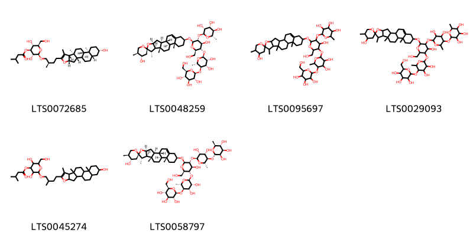{ width=100% }
    <figcaption>Hình ảnh cấu trúc hóa học của 6 hoạt chất thuộc nhóm Steroids and steroid derivatives gồm ['(2r,3r,4s,5r,6r)-3,5-dihydroxy-2-[(2r)-4-[(1r,2s,4s,8s,9s,12s,13s,16s,18s)-16-hydroxy-7,9,13-trimethyl-5-oxapentacyclo[10.8.0.0²,⁹.0⁴,⁸.0¹³,¹⁸]icos-6-en-6-yl]-2-methylbutoxy]-6-(hydroxymethyl)oxan-4-yl 3-methylbutanoate (LTS0072685)', "(2s,3r,4s,5s,6r)-2-{[(2s,3r,4s,5r,6s)-4,5-dihydroxy-6-{[(2r,3s,4s,5r,6r)-4-hydroxy-2-(hydroxymethyl)-6-[(1's,2r,2's,4s,4's,5s,7's,8'r,9's,12's,13'r,16's)-5,7',9',13'-tetramethyl-5'-oxaspiro[oxane-2,6'-pentacyclo[10.8.0.0²,⁹.0⁴,⁸.0¹³,¹⁸]icosan]-18'-en-4-oloxy]-5-{[(2s,3r,4r,5r,6s)-3,4,5-trihydroxy-6-methyloxan-2-yl]oxy}oxan-3-yl]oxy}-2-methyloxan-3-yl]oxy}-6-(hydroxymethyl)oxane-3,4,5-triol (LTS0048259)", "2-[(4,5-dihydroxy-6-{[4-hydroxy-2-(hydroxymethyl)-6-{5,7',9',13'-tetramethyl-5'-oxaspiro[oxane-2,6'-pentacyclo[10.8.0.0²,⁹.0⁴,⁸.0¹³,¹⁸]icosan]-18'-en-4-oloxy}-5-[(3,4,5-trihydroxy-6-methyloxan-2-yl)oxy]oxan-3-yl]oxy}-2-methyloxan-3-yl)oxy]-6-(hydroxymethyl)oxane-3,4,5-triol (LTS0095697)", "2-[(6-{[5-({3,4-dihydroxy-6-methyl-5-[(3,4,5-trihydroxy-6-methyloxan-2-yl)oxy]oxan-2-yl}oxy)-4-hydroxy-2-(hydroxymethyl)-6-{5,7',9',13'-tetramethyl-5'-oxaspiro[oxane-2,6'-pentacyclo[10.8.0.0²,⁹.0⁴,⁸.0¹³,¹⁸]icosan]-18'-en-4-oloxy}oxan-3-yl]oxy}-4,5-dihydroxy-2-methyloxan-3-yl)oxy]-6-(hydroxymethyl)oxane-3,4,5-triol (LTS0029093)", '3,5-dihydroxy-2-(4-{16-hydroxy-7,9,13-trimethyl-5-oxapentacyclo[10.8.0.0²,⁹.0⁴,⁸.0¹³,¹⁸]icos-6-en-6-yl}-2-methylbutoxy)-6-(hydroxymethyl)oxan-4-yl 3-methylbutanoate (LTS0045274)', "(2s,3r,4s,5s,6r)-2-{[(2s,3r,4s,5r,6s)-6-{[(2r,3s,4s,5r,6r)-5-{[(2s,3r,4s,5r,6s)-3,4-dihydroxy-6-methyl-5-{[(2s,3r,4r,5r,6s)-3,4,5-trihydroxy-6-methyloxan-2-yl]oxy}oxan-2-yl]oxy}-4-hydroxy-2-(hydroxymethyl)-6-[(1's,2r,2's,4s,4's,5s,7's,8'r,9's,12's,13'r,16's)-5,7',9',13'-tetramethyl-5'-oxaspiro[oxane-2,6'-pentacyclo[10.8.0.0²,⁹.0⁴,⁸.0¹³,¹⁸]icosan]-18'-en-4-oloxy]oxan-3-yl]oxy}-4,5-dihydroxy-2-methyloxan-3-yl]oxy}-6-(hydroxymethyl)oxane-3,4,5-triol (LTS0058797)"].</figcaption>
</figure>

---

### Dược dân tộc học

Danh sách các quốc gia có sử dụng *Cestrum parqui* trong điều trị các bệnh. 

| Country   | Disease   | Bệnh     |
|:----------|:----------|:---------|
| Elsewhere | Poison    | Chất độc |

---

# Chi Brugmansia

??? note "Danh sách các dược liệu thuộc chi"
    
	 - *Brugmansia amesianum*

---
## Brugmansia amesianum
### Thông tin về thực vật

!!! info "Phân loại thực vật của *Brugmansia candida* từ GIBF:"
    - **Kingdom:** Plantae
    - **Phylum:** Tracheophyta
    - **Order:** Solanales
    - **Family:** Solanaceae
    - **Genus:** Brugmansia
    - **Species:** *Brugmansia candida*

 

| Label (VI)   | Label (EN)   | Scientific Name   | Descriptions (VI)   | Descriptions (EN)   | Also Known As (VI)   | Also Known As (EN)   |
|:-------------|:-------------|:------------------|:--------------------|:--------------------|:---------------------|:---------------------|
| N/A          | N/A          | Cestrum parqui    | loài thực vật       | species of plant    | ['']                 | ['']                 |

#### Phân bố trên thế giới

**Từ CSDL GIBF** nan, unknown or invalid, Colombia, United States of America

#### Phân bố tại Việt Nam

**Từ CSDL GIBF**: Không có ghi nhận ở Việt Nam

---
### Thành phần hóa học
        
- Theo cơ sở dữ liệu lotus: Từ loài *Brugmansia candida* đã phân lập và xác định được Chưa có hoạt chất nào được phân lập. hoạt chất thuộc về các nhóm Không có hoạt chất nào được phân lập. 

Không có hình ảnh nào được tạo ra

---

### Dược dân tộc học

Danh sách các quốc gia có sử dụng *Brugmansia candida* trong điều trị các bệnh. 

| Country   | Disease              | Bệnh                        |
|:----------|:---------------------|:----------------------------|
| Colombia  | Narcotic, Intoxicant | Chất gây nghiện, Intoxicant |

---

