!!! abstract "Tóm tắt"

    Họ Stemonaceae gồm khoảng 2 chi và 5 loài được một số cộng đồng tại các quốc gia như Asia, Java, Elsewhere, Japan, Burma, China, Malaya sử dụng trong một số trường hợp Thuốc chống ho, Carminative, Thuốc diệt côn trùng, Pediculicide, Vermifuge, Pediculicide, Poison, Vermifuge, Parasiticide, Pediculicide, Antitussive, Insecticide, Vermicide, Insecticide, Tonic, Vermifuge, nan, Pediculicide, Vermifuge, Antiseptic.

!!! info "DrDuke"

    James A. Duke sinh năm 1929-2017 là một nhà thực vật học người Mỹ. Đây là một trong những tác giả hàng đầu trong lĩnh vực dược dân tộc học với cuốn *CRC Handbook of Medicinal Herbs* và chính là người xây dựng lên cơ sở dữ liệu về hợp chất tự nhiên và dược dân tộc học tại Bộ nông nghiệp Hoa Kỳ. Các thông tin được đăng tải tại website [Dr. Duke's Phytochemical and Ethnobotanical Databases](https://phytochem.nal.usda.gov/). 
    Trong suốt thập niên 1970, ông lãnh đạo the Plant Taxonomy Laboratory, Plant Genetics and Germplasm Institute of the Agricultural Research Service, U.S. Department of Agriculture.
    Trong tài liệu này, các thông tin về dược dân tộc của các dược liệu được trích dẫn từ tài liệu của James A. Ducke với sự trợ giúp của phần mềm dịch thuật từ tiếng Anh sang tiếng Việt.
   

# Chi Stichoneuron

??? note "Danh sách các dược liệu thuộc chi"
    
	 - *Stichoneuron caudatum*

---
## Stichoneuron caudatum
### Thông tin về thực vật

!!! info "Phân loại thực vật của *Stichoneuron caudatum* từ GIBF:"
    - **Kingdom:** Plantae
    - **Phylum:** Tracheophyta
    - **Order:** Pandanales
    - **Family:** Stemonaceae
    - **Genus:** Stichoneuron
    - **Species:** *Stichoneuron caudatum*

 

| Label (VI)   | Label (EN)   | Scientific Name       | Descriptions (VI)   | Descriptions (EN)   | Also Known As (VI)   | Also Known As (EN)   |
|:-------------|:-------------|:----------------------|:--------------------|:--------------------|:---------------------|:---------------------|
| N/A          | N/A          | Stichoneuron caudatum | loài thực vật       | species of plant    | ['']                 | ['']                 |

#### Phân bố trên thế giới

**Từ CSDL GIBF** nan, unknown or invalid, Thailand, Malaysia, Singapore

#### Phân bố tại Việt Nam

**Từ CSDL GIBF**: Không có ghi nhận ở Việt Nam

---
### Thành phần hóa học
        
- Theo cơ sở dữ liệu lotus: Từ loài *Stichoneuron caudatum* đã phân lập và xác định được 3 hoạt chất thuộc về các nhóm Stemona alkaloids. 

|    | chemicalTaxonomyClassyfireClass   |   smiles_count |
|---:|:----------------------------------|---------------:|
|  0 | Stemona alkaloids                 |              3 |

#### Nhóm Stemona alkaloids
<figure markdown="span">
    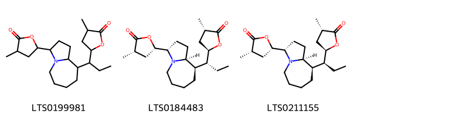{ width=100% }
    <figcaption>Hình ảnh cấu trúc hóa học của 3 hoạt chất thuộc nhóm Stemona alkaloids gồm ['3-methyl-5-{9-[1-(4-methyl-5-oxooxolan-2-yl)propyl]-octahydro-1h-pyrrolo[1,2-a]azepin-3-yl}oxolan-2-one (LTS0199981)', '(3s,5s)-5-[(3s,9r,9as)-9-[(1r)-1-[(2r,4s)-4-methyl-5-oxooxolan-2-yl]propyl]-octahydro-1h-pyrrolo[1,2-a]azepin-3-yl]-3-methyloxolan-2-one (LTS0184483)', '(3s,5s)-5-[(3s,9r,9as)-9-[(1s)-1-[(2r,4s)-4-methyl-5-oxooxolan-2-yl]propyl]-octahydro-1h-pyrrolo[1,2-a]azepin-3-yl]-3-methyloxolan-2-one (LTS0211155)'].</figcaption>
</figure>

---

### Dược dân tộc học

Danh sách các quốc gia có sử dụng *Stichoneuron caudatum* trong điều trị các bệnh. 

| Country   | Disease   | Bệnh               |
|:----------|:----------|:-------------------|
| Malaya    | Tonic     | (thuộc) trương lực |

---

# Chi Stemona

??? note "Danh sách các dược liệu thuộc chi"
    
	 - *Stemona burkelii*
	 - *Stemona japonica*
	 - *Stemona sessilifolia*
	 - *Stemona tuberosa*

---
## Stemona burkelii
### Thông tin về thực vật

!!! info "Phân loại thực vật của *Stemona burkillii* từ GIBF:"
    - **Kingdom:** Plantae
    - **Phylum:** Tracheophyta
    - **Order:** Pandanales
    - **Family:** Stemonaceae
    - **Genus:** Stemona
    - **Species:** *Stemona burkillii*

 

| Label (VI)   | Label (EN)   | Scientific Name       | Descriptions (VI)   | Descriptions (EN)   | Also Known As (VI)   | Also Known As (EN)   |
|:-------------|:-------------|:----------------------|:--------------------|:--------------------|:---------------------|:---------------------|
| N/A          | N/A          | Stichoneuron caudatum | loài thực vật       | species of plant    | ['']                 | ['']                 |

#### Phân bố trên thế giới

**Từ CSDL GIBF** nan, Thailand, Myanmar

#### Phân bố tại Việt Nam

**Từ CSDL GIBF**: Không có ghi nhận ở Việt Nam

---
### Thành phần hóa học
        
- Theo cơ sở dữ liệu lotus: Từ loài *Stemona burkillii* đã phân lập và xác định được Chưa có hoạt chất nào được phân lập. hoạt chất thuộc về các nhóm Không có hoạt chất nào được phân lập. 

Không có hình ảnh nào được tạo ra

---

### Dược dân tộc học

Danh sách các quốc gia có sử dụng *Stemona burkillii* trong điều trị các bệnh. 

| Country   | Disease     | Bệnh          |
|:----------|:------------|:--------------|
| Burma     | Insecticide | Thuốc trừ sâu |

---

---
## Stemona japonica
### Thông tin về thực vật

!!! info "Phân loại thực vật của *Stemona japonica* từ GIBF:"
    - **Kingdom:** Plantae
    - **Phylum:** Tracheophyta
    - **Order:** Pandanales
    - **Family:** Stemonaceae
    - **Genus:** Stemona
    - **Species:** *Stemona japonica*

 

| Label (VI)   | Label (EN)   | Scientific Name   | Descriptions (VI)   | Descriptions (EN)   | Also Known As (VI)   | Also Known As (EN)         |
|:-------------|:-------------|:------------------|:--------------------|:--------------------|:---------------------|:---------------------------|
| N/A          | N/A          | Stemona japonica  |                     | species of plant    | ['']                 | ['STEMONA JAPONICA WHOLE'] |

#### Phân bố trên thế giới

**Từ CSDL GIBF** nan, Viet Nam, unknown or invalid, Japan, Indonesia, Andorra, United States of America, China, Hong Kong

#### Phân bố tại Việt Nam

**Từ CSDL GIBF**: 宁平

---
### Thành phần hóa học
        
- Theo cơ sở dữ liệu lotus: Từ loài *Stemona japonica* đã phân lập và xác định được 58 hoạt chất thuộc về các nhóm Organooxygen compounds, Azepanes, Pyrroloazepines, Stemona alkaloids, Oxazepines, Cinnamic acids and derivatives. 

|    | chemicalTaxonomyClassyfireClass   |   smiles_count |
|---:|:----------------------------------|---------------:|
|  0 |                                   |              1 |
|  1 | Azepanes                          |              9 |
|  2 | Cinnamic acids and derivatives    |              1 |
|  3 | Organooxygen compounds            |             14 |
|  4 | Oxazepines                        |              4 |
|  5 | Pyrroloazepines                   |              8 |
|  6 | Stemona alkaloids                 |             21 |

#### Nhóm 
<figure markdown="span">
    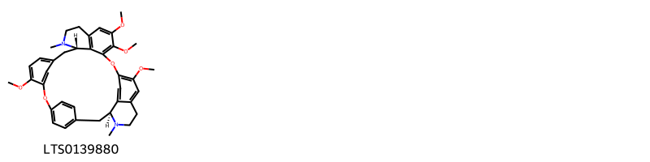{ width=100% }
    <figcaption>Hình ảnh cấu trúc hóa học của 1 hoạt chất thuộc nhóm  gồm ['(1s,14s)-9,20,21,25-tetramethoxy-15,30-dimethyl-7,23-dioxa-15,30-diazaheptacyclo[22.6.2.2³,⁶.1⁸,¹².1¹⁴,¹⁸.0²⁷,³¹.0²²,³³]hexatriaconta-3,5,8(34),9,11,18(33),19,21,24,26,31,35-dodecaene (LTS0139880)'].</figcaption>
</figure>
#### Nhóm Azepanes
<figure markdown="span">
    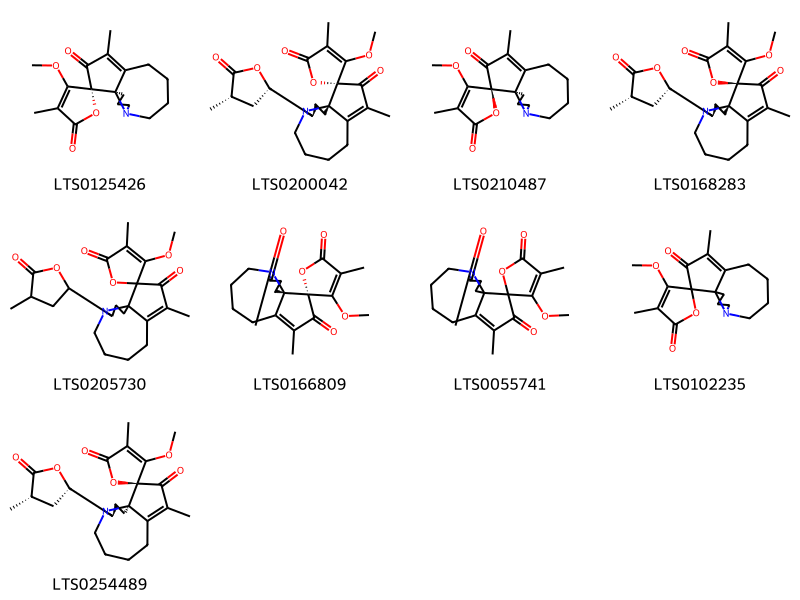{ width=100% }
    <figcaption>Hình ảnh cấu trúc hóa học của 9 hoạt chất thuộc nhóm Azepanes gồm ["(1'r,2r)-3-methoxy-4,4'-dimethyl-10'-azaspiro[furan-2,2'-tricyclo[8.3.0.0¹,⁵]tridecan]-4'-ene-3',5-dione (LTS0125426)", "(1's,2r,11's)-3-methoxy-4,4'-dimethyl-11'-[(2s,4s)-4-methyl-5-oxooxolan-2-yl]-10'-azaspiro[furan-2,2'-tricyclo[8.3.0.0¹,⁵]tridecan]-4'-ene-3',5-dione (LTS0200042)", "(1'r,2s)-3-methoxy-4,4'-dimethyl-10'-azaspiro[furan-2,2'-tricyclo[8.3.0.0¹,⁵]tridecan]-4'-ene-3',5-dione (LTS0210487)", "(1's,2s,11's)-3-methoxy-4,4'-dimethyl-11'-[(2s,4s)-4-methyl-5-oxooxolan-2-yl]-10'-azaspiro[furan-2,2'-tricyclo[8.3.0.0¹,⁵]tridecan]-4'-ene-3',5-dione (LTS0168283)", "3-methoxy-4,4'-dimethyl-11'-(4-methyl-5-oxooxolan-2-yl)-10'-azaspiro[furan-2,2'-tricyclo[8.3.0.0¹,⁵]tridecan]-4'-ene-3',5-dione (LTS0205730)", "(1's,2r)-3-methoxy-4,4'-dimethyl-10'-azaspiro[furan-2,2'-tricyclo[8.3.0.0¹,⁵]tridecan]-4'-ene-3',5,11'-trione (LTS0166809)", "3-methoxy-4,4'-dimethyl-10'-azaspiro[furan-2,2'-tricyclo[8.3.0.0¹,⁵]tridecan]-4'-ene-3',5,11'-trione (LTS0055741)", "3-methoxy-4,4'-dimethyl-10'-azaspiro[furan-2,2'-tricyclo[8.3.0.0¹,⁵]tridecan]-4'-ene-3',5-dione (LTS0102235)", "(1'r,2s,11's)-3-methoxy-4,4'-dimethyl-11'-[(2s,4s)-4-methyl-5-oxooxolan-2-yl]-10'-azaspiro[furan-2,2'-tricyclo[8.3.0.0¹,⁵]tridecan]-4'-ene-3',5-dione (LTS0254489)"].</figcaption>
</figure>
#### Nhóm Cinnamic acids and derivatives
<figure markdown="span">
    { width=100% }
    <figcaption>Hình ảnh cấu trúc hóa học của 1 hoạt chất thuộc nhóm Cinnamic acids and derivatives gồm ['methyl ferulate (LTS0265853)'].</figcaption>
</figure>
#### Nhóm Organooxygen compounds
<figure markdown="span">
    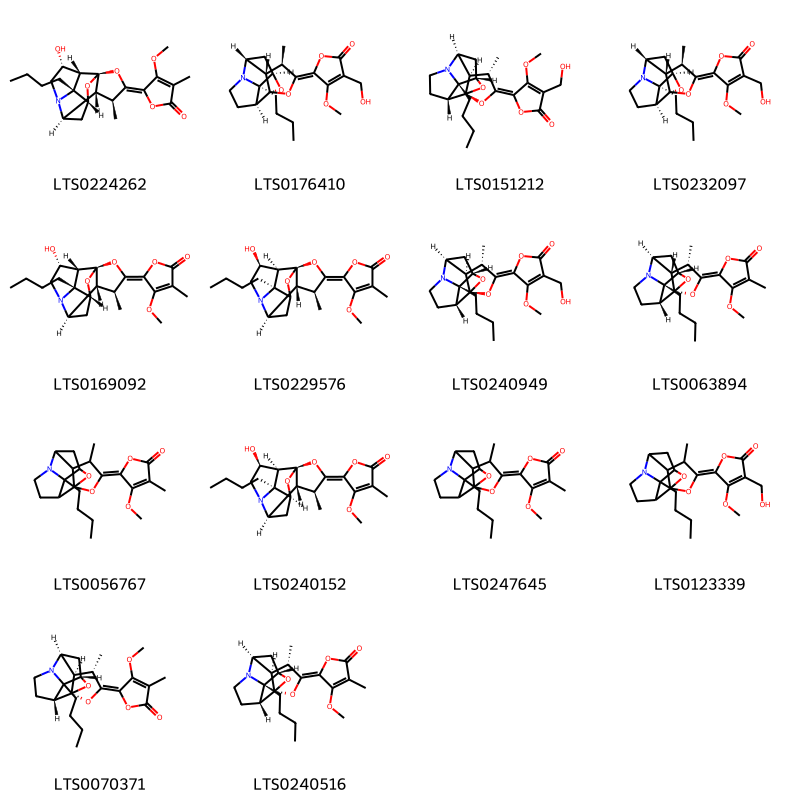{ width=100% }
    <figcaption>Hình ảnh cấu trúc hóa học của 14 hoạt chất thuộc nhóm Organooxygen compounds gồm ['5-[(1r,3e,4s,5r,6r,8r,9r,12r,13r)-9-butyl-12-hydroxy-4-methyl-2,14-dioxa-10-azapentacyclo[6.5.1.0¹,⁵.0⁶,¹⁰.0⁹,¹³]tetradecan-3-ylidene]-4-methoxy-3-methylfuran-2-one (LTS0224262)', '5-[(1r,4r,5s,6r,8r,9r,13s)-9-butyl-4-methyl-2,14-dioxa-10-azapentacyclo[6.5.1.0¹,⁵.0⁶,¹⁰.0⁹,¹³]tetradecan-3-ylidene]-3-(hydroxymethyl)-4-methoxyfuran-2-one (LTS0176410)', '5-[(1r,3z,4s,5r,6s,8s,9s,13r)-9-butyl-4-methyl-2,14-dioxa-10-azapentacyclo[6.5.1.0¹,⁵.0⁶,¹⁰.0⁹,¹³]tetradecan-3-ylidene]-3-(hydroxymethyl)-4-methoxyfuran-2-one (LTS0151212)', '5-[(1r,3e,4r,5s,6r,8r,9r,13s)-9-butyl-4-methyl-2,14-dioxa-10-azapentacyclo[6.5.1.0¹,⁵.0⁶,¹⁰.0⁹,¹³]tetradecan-3-ylidene]-3-(hydroxymethyl)-4-methoxyfuran-2-one (LTS0232097)', '5-[(1r,4s,5r,6r,8r,9r,12r,13r)-9-butyl-12-hydroxy-4-methyl-2,14-dioxa-10-azapentacyclo[6.5.1.0¹,⁵.0⁶,¹⁰.0⁹,¹³]tetradecan-3-ylidene]-4-methoxy-3-methylfuran-2-one (LTS0169092)', '5-[(1r,3z,4s,5r,6r,9s,12s,13s)-9-butyl-12-hydroxy-4-methyl-2,14-dioxa-10-azapentacyclo[6.5.1.0¹,⁵.0⁶,¹⁰.0⁹,¹³]tetradecan-3-ylidene]-4-methoxy-3-methylfuran-2-one (LTS0229576)', '5-[(1r,3e,4s,5r,6s,8s,9s,13r)-9-butyl-4-methyl-2,14-dioxa-10-azapentacyclo[6.5.1.0¹,⁵.0⁶,¹⁰.0⁹,¹³]tetradecan-3-ylidene]-3-(hydroxymethyl)-4-methoxyfuran-2-one (LTS0240949)', '5-[(1s,3e,4s,5s,6s,8s,9s,13r)-9-butyl-4-methyl-2,14-dioxa-10-azapentacyclo[6.5.1.0¹,⁵.0⁶,¹⁰.0⁹,¹³]tetradecan-3-ylidene]-4-methoxy-3-methylfuran-2-one (LTS0063894)', '5-[(3e)-9-butyl-4-methyl-2,14-dioxa-10-azapentacyclo[6.5.1.0¹,⁵.0⁶,¹⁰.0⁹,¹³]tetradecan-3-ylidene]-4-methoxy-3-methylfuran-2-one (LTS0056767)', '5-[(1r,3z,4s,5r,6r,8s,9s,12s,13s)-9-butyl-12-hydroxy-4-methyl-2,14-dioxa-10-azapentacyclo[6.5.1.0¹,⁵.0⁶,¹⁰.0⁹,¹³]tetradecan-3-ylidene]-4-methoxy-3-methylfuran-2-one (LTS0240152)', '5-{9-butyl-4-methyl-2,14-dioxa-10-azapentacyclo[6.5.1.0¹,⁵.0⁶,¹⁰.0⁹,¹³]tetradecan-3-ylidene}-4-methoxy-3-methylfuran-2-one (LTS0247645)', '5-{9-butyl-4-methyl-2,14-dioxa-10-azapentacyclo[6.5.1.0¹,⁵.0⁶,¹⁰.0⁹,¹³]tetradecan-3-ylidene}-3-(hydroxymethyl)-4-methoxyfuran-2-one (LTS0123339)', 'stemofoline (LTS0070371)', '5-[(1s,3e,4s,5r,6s,8s,9s,13r)-9-butyl-4-methyl-2,14-dioxa-10-azapentacyclo[6.5.1.0¹,⁵.0⁶,¹⁰.0⁹,¹³]tetradecan-3-ylidene]-4-methoxy-3-methylfuran-2-one (LTS0240516)'].</figcaption>
</figure>
#### Nhóm Oxazepines
<figure markdown="span">
    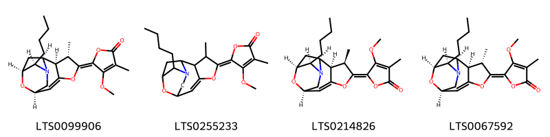{ width=100% }
    <figcaption>Hình ảnh cấu trúc hóa học của 4 hoạt chất thuộc nhóm Oxazepines gồm ['5-[(1s,3s,4r,5s,6e,10r,13r)-13-butyl-5-methyl-7,14-dioxa-12-azatetracyclo[8.3.1.0³,¹².0⁴,⁸]tetradec-8-en-6-ylidene]-4-methoxy-3-methylfuran-2-one (LTS0099906)', '5-{13-butyl-5-methyl-7,14-dioxa-12-azatetracyclo[8.3.1.0³,¹².0⁴,⁸]tetradec-8-en-6-ylidene}-4-methoxy-3-methylfuran-2-one (LTS0255233)', '5-[(1s,3s,4r,5r,6z,10r,13r)-13-butyl-5-methyl-7,14-dioxa-12-azatetracyclo[8.3.1.0³,¹².0⁴,⁸]tetradec-8-en-6-ylidene]-4-methoxy-3-methylfuran-2-one (LTS0214826)', '5-[(1s,3s,4r,5s,6z,10r,13r)-13-butyl-5-methyl-7,14-dioxa-12-azatetracyclo[8.3.1.0³,¹².0⁴,⁸]tetradec-8-en-6-ylidene]-4-methoxy-3-methylfuran-2-one (LTS0067592)'].</figcaption>
</figure>
#### Nhóm Pyrroloazepines
<figure markdown="span">
    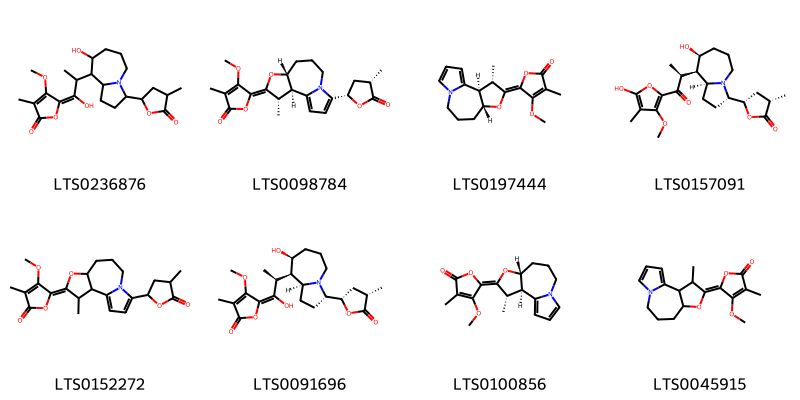{ width=100% }
    <figcaption>Hình ảnh cấu trúc hóa học của 8 hoạt chất thuộc nhóm Pyrroloazepines gồm ['(5z)-5-{1-hydroxy-2-[8-hydroxy-3-(4-methyl-5-oxooxolan-2-yl)-octahydro-1h-pyrrolo[1,2-a]azepin-9-yl]propylidene}-4-methoxy-3-methylfuran-2-one (LTS0236876)', '4-methoxy-3-methyl-5-[(2r,3s,4e,6r)-3-methyl-11-[(2s,4s)-4-methyl-5-oxooxolan-2-yl]-5-oxa-10-azatricyclo[8.3.0.0²,⁶]trideca-1(13),11-dien-4-ylidene]furan-2-one (LTS0098784)', '4-methoxy-3-methyl-5-[(2r,3s,4e,6r)-3-methyl-5-oxa-10-azatricyclo[8.3.0.0²,⁶]trideca-1(13),11-dien-4-ylidene]furan-2-one (LTS0197444)', '(3s,5s)-5-[(3s,8s,9r,9as)-8-hydroxy-9-[(2s)-1-(5-hydroxy-3-methoxy-4-methylfuran-2-yl)-1-oxopropan-2-yl]-octahydro-1h-pyrrolo[1,2-a]azepin-3-yl]-3-methyloxolan-2-one (LTS0157091)', '4-methoxy-3-methyl-5-[(4e)-3-methyl-11-(4-methyl-5-oxooxolan-2-yl)-5-oxa-10-azatricyclo[8.3.0.0²,⁶]trideca-1(13),11-dien-4-ylidene]furan-2-one (LTS0152272)', 'protostemodiol (LTS0091696)', '4-methoxy-3-methyl-5-[(2r,3s,4z,6r)-3-methyl-5-oxa-10-azatricyclo[8.3.0.0²,⁶]trideca-1(13),11-dien-4-ylidene]furan-2-one (LTS0100856)', '4-methoxy-3-methyl-5-[(4e)-3-methyl-5-oxa-10-azatricyclo[8.3.0.0²,⁶]trideca-1(13),11-dien-4-ylidene]furan-2-one (LTS0045915)'].</figcaption>
</figure>
#### Nhóm Stemona alkaloids
<figure markdown="span">
    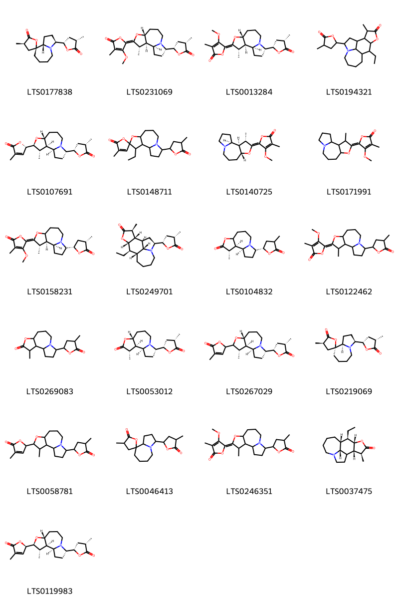{ width=100% }
    <figcaption>Hình ảnh cấu trúc hóa học của 21 hoạt chất thuộc nhóm Stemona alkaloids gồm ['croomine (LTS0177838)', 'protostemonine (LTS0231069)', '4-methoxy-3-methyl-5-[(1s,2r,3s,4e,6r,11s)-3-methyl-11-[(2s,4s)-4-methyl-5-oxooxolan-2-yl]-5-oxa-10-azatricyclo[8.3.0.0²,⁶]tridecan-4-ylidene]furan-2-one (LTS0013284)', '10-ethyl-14-methyl-3-(4-methyl-5-oxooxolan-2-yl)-12-oxa-4-azatetracyclo[7.6.1.0⁴,¹⁶.0¹¹,¹⁵]hexadecan-13-one (LTS0194321)', '(5s)-3-methyl-5-[(1s,2r,3s,4s,6r,11s)-3-methyl-11-[(2s,4s)-4-methyl-5-oxooxolan-2-yl]-5-oxa-10-azatricyclo[8.3.0.0²,⁶]tridecan-4-yl]-5h-furan-2-one (LTS0107691)', "3'-ethyl-4-methyl-11'-(4-methyl-5-oxooxolan-2-yl)-5'-oxa-10'-azaspiro[furan-2,4'-tricyclo[8.3.0.0²,⁶]tridecan]-5-one (LTS0148711)", '4-methoxy-3-methyl-5-[(1s,2r,3s,4e,6r)-3-methyl-5-oxa-10-azatricyclo[8.3.0.0²,⁶]tridecan-4-ylidene]furan-2-one (LTS0140725)', '4-methoxy-3-methyl-5-[(4e)-3-methyl-5-oxa-10-azatricyclo[8.3.0.0²,⁶]tridecan-4-ylidene]furan-2-one (LTS0171991)', '4-methoxy-3-methyl-5-[(1s,2r,3s,4z)-3-methyl-11-[(2s,4s)-4-methyl-5-oxooxolan-2-yl]-5-oxa-10-azatricyclo[8.3.0.0²,⁶]tridecan-4-ylidene]furan-2-one (LTS0158231)', 'tuberostemonine (LTS0249701)', '(1s,2r,3s)-3-methyl-11-[(2s)-4-methyl-5-oxooxolan-2-yl]-5-oxa-10-azatricyclo[8.3.0.0²,⁶]tridecan-4-one (LTS0104832)', '4-methoxy-3-methyl-5-[3-methyl-11-(4-methyl-5-oxooxolan-2-yl)-5-oxa-10-azatricyclo[8.3.0.0²,⁶]tridecan-4-ylidene]furan-2-one (LTS0122462)', '3-methyl-11-(4-methyl-5-oxooxolan-2-yl)-5-oxa-10-azatricyclo[8.3.0.0²,⁶]tridecan-4-one (LTS0269083)', '(1s,2r,3s,6r,11s)-3-methyl-11-[(2s,4s)-4-methyl-5-oxooxolan-2-yl]-5-oxa-10-azatricyclo[8.3.0.0²,⁶]tridecan-4-one (LTS0053012)', '3-methyl-5-[(1s,2r,3s,6r,11s)-3-methyl-11-[(2s,4s)-4-methyl-5-oxooxolan-2-yl]-5-oxa-10-azatricyclo[8.3.0.0²,⁶]tridecan-4-yl]-5h-furan-2-one (LTS0267029)', "(2r,3's,4r,9'ar)-4-methyl-3'-[(2s,4s)-4-methyl-5-oxooxolan-2-yl]-octahydrospiro[oxolane-2,9'-pyrrolo[1,2-a]azepin]-5-one (LTS0219069)", '3-methyl-5-[3-methyl-11-(4-methyl-5-oxooxolan-2-yl)-5-oxa-10-azatricyclo[8.3.0.0²,⁶]tridecan-4-yl]-5h-furan-2-one (LTS0058781)', "4-methyl-3'-(4-methyl-5-oxooxolan-2-yl)-octahydrospiro[oxolane-2,9'-pyrrolo[1,2-a]azepin]-5-one (LTS0046413)", '4-methoxy-3-methyl-5-[(4e)-3-methyl-11-(4-methyl-5-oxooxolan-2-yl)-5-oxa-10-azatricyclo[8.3.0.0²,⁶]tridecan-4-ylidene]furan-2-one (LTS0246351)', '(9r,10r,11s,14s,15s,16r)-10-ethyl-14-methyl-12-oxa-4-azatetracyclo[7.6.1.0⁴,¹⁶.0¹¹,¹⁵]hexadecan-13-one (LTS0037475)', '(5r)-3-methyl-5-[(1s,2r,3s,4s,6r,11s)-3-methyl-11-[(2s,4s)-4-methyl-5-oxooxolan-2-yl]-5-oxa-10-azatricyclo[8.3.0.0²,⁶]tridecan-4-yl]-5h-furan-2-one (LTS0119983)'].</figcaption>
</figure>

---

### Dược dân tộc học

Danh sách các quốc gia có sử dụng *Stemona japonica* trong điều trị các bệnh. 

| Country   | Disease                             | Bệnh                                  |
|:----------|:------------------------------------|:--------------------------------------|
| Elsewhere | Vermifuge                           | Thuốc diệt sán                        |
| Japan     | Antitussive, Insecticide, Vermicide | Chống ho, diệt côn trùng, diệt sâu bọ |

---

---
## Stemona sessilifolia
### Thông tin về thực vật

!!! info "Phân loại thực vật của *Stemona sessilifolia* từ GIBF:"
    - **Kingdom:** Plantae
    - **Phylum:** Tracheophyta
    - **Order:** Pandanales
    - **Family:** Stemonaceae
    - **Genus:** Stemona
    - **Species:** *Stemona sessilifolia*

 

| Label (VI)   | Label (EN)   | Scientific Name      | Descriptions (VI)   | Descriptions (EN)   | Also Known As (VI)   | Also Known As (EN)   |
|:-------------|:-------------|:---------------------|:--------------------|:--------------------|:---------------------|:---------------------|
| N/A          | N/A          | Stemona sessilifolia | loài thực vật       | species of plant    | ['']                 | ['']                 |

#### Phân bố trên thế giới

**Từ CSDL GIBF** nan, Japan, China

#### Phân bố tại Việt Nam

**Từ CSDL GIBF**: Không có ghi nhận ở Việt Nam

---
### Thành phần hóa học
        
- Theo cơ sở dữ liệu lotus: Từ loài *Stemona sessilifolia* đã phân lập và xác định được 65 hoạt chất thuộc về các nhóm Lactones, Azepanes, Indoles and derivatives, Oxanes, Pyrroloazepines, Stemona alkaloids, Azaspirodecane derivatives, Lactams. 

|    | chemicalTaxonomyClassyfireClass   |   smiles_count |
|---:|:----------------------------------|---------------:|
|  0 | Azaspirodecane derivatives        |              2 |
|  1 | Azepanes                          |              2 |
|  2 | Indoles and derivatives           |              4 |
|  3 | Lactams                           |              7 |
|  4 | Lactones                          |              4 |
|  5 | Oxanes                            |              2 |
|  6 | Pyrroloazepines                   |              6 |
|  7 | Stemona alkaloids                 |             38 |

#### Nhóm Azaspirodecane derivatives
<figure markdown="span">
    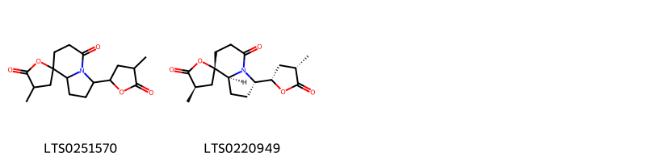{ width=100% }
    <figcaption>Hình ảnh cấu trúc hóa học của 2 hoạt chất thuộc nhóm Azaspirodecane derivatives gồm ["4'-methyl-3-(4-methyl-5-oxooxolan-2-yl)-hexahydrospiro[indolizine-8,2'-oxolane]-5,5'-dione (LTS0251570)", "(3s,4'r,8s,8as)-4'-methyl-3-[(2s,4s)-4-methyl-5-oxooxolan-2-yl]-hexahydrospiro[indolizine-8,2'-oxolane]-5,5'-dione (LTS0220949)"].</figcaption>
</figure>
#### Nhóm Azepanes
<figure markdown="span">
    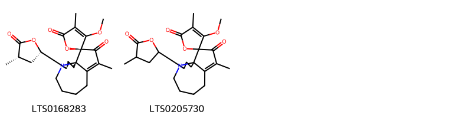{ width=100% }
    <figcaption>Hình ảnh cấu trúc hóa học của 2 hoạt chất thuộc nhóm Azepanes gồm ["(1's,2s,11's)-3-methoxy-4,4'-dimethyl-11'-[(2s,4s)-4-methyl-5-oxooxolan-2-yl]-10'-azaspiro[furan-2,2'-tricyclo[8.3.0.0¹,⁵]tridecan]-4'-ene-3',5-dione (LTS0168283)", "3-methoxy-4,4'-dimethyl-11'-(4-methyl-5-oxooxolan-2-yl)-10'-azaspiro[furan-2,2'-tricyclo[8.3.0.0¹,⁵]tridecan]-4'-ene-3',5-dione (LTS0205730)"].</figcaption>
</figure>
#### Nhóm Indoles and derivatives
<figure markdown="span">
    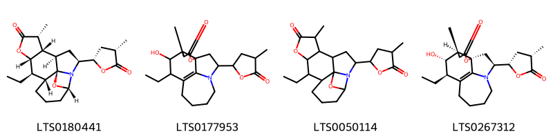{ width=100% }
    <figcaption>Hình ảnh cấu trúc hóa học của 4 hoạt chất thuộc nhóm Indoles and derivatives gồm ['(1s,3s,5r,6s,7r,10s,11r,12r,16s)-11-ethyl-7-methyl-3-[(2s,4s)-4-methyl-5-oxooxolan-2-yl]-9,17-dioxa-2-azapentacyclo[10.5.0.0¹,⁵.0²,¹⁶.0⁶,¹⁰]heptadecan-8-one (LTS0180441)', '10-ethyl-11-hydroxy-13-methyl-3-(4-methyl-5-oxooxolan-2-yl)-15-oxa-4-azatetracyclo[7.6.1.0¹,¹².0⁴,¹⁶]hexadec-9(16)-en-14-one (LTS0177953)', '11-ethyl-7-methyl-3-(4-methyl-5-oxooxolan-2-yl)-9,17-dioxa-2-azapentacyclo[10.5.0.0¹,⁵.0²,¹⁶.0⁶,¹⁰]heptadecan-8-one (LTS0050114)', '(1s,3s,10r,11s,12s,13s)-10-ethyl-11-hydroxy-13-methyl-3-[(2s,4s)-4-methyl-5-oxooxolan-2-yl]-15-oxa-4-azatetracyclo[7.6.1.0¹,¹².0⁴,¹⁶]hexadec-9(16)-en-14-one (LTS0267312)'].</figcaption>
</figure>
#### Nhóm Lactams
<figure markdown="span">
    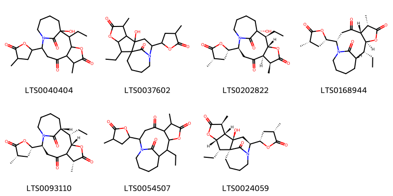{ width=100% }
    <figcaption>Hình ảnh cấu trúc hóa học của 7 hoạt chất thuộc nhóm Lactams gồm ['2-ethyl-1-hydroxy-6-methyl-10-(4-methyl-5-oxooxolan-2-yl)-4-oxa-11-azatricyclo[9.4.1.0³,⁷]hexadecane-5,8,16-trione (LTS0040404)', '2-ethyl-8-hydroxy-6-methyl-10-(4-methyl-5-oxooxolan-2-yl)-4-oxa-11-azatetracyclo[9.4.1.0¹,⁸.0³,⁷]hexadecane-5,16-dione (LTS0037602)', '(1r,2s,3s,6s,7r,10s)-2-ethyl-1-hydroxy-6-methyl-10-[(2s,4s)-4-methyl-5-oxooxolan-2-yl]-4-oxa-11-azatricyclo[9.4.1.0³,⁷]hexadecane-5,8,16-trione (LTS0202822)', '(1s,2r,3s,6s,7r,10s)-2-ethyl-6-methyl-10-[(2s,4s)-4-methyl-5-oxooxolan-2-yl]-4-oxa-11-azatricyclo[9.4.1.0³,⁷]hexadecane-5,8,16-trione (LTS0168944)', '(1r,2s,3s,6r,10s)-2-ethyl-6-methyl-10-[(2s,4s)-4-methyl-5-oxooxolan-2-yl]-4-oxa-11-azatricyclo[9.4.1.0³,⁷]hexadecane-5,8,16-trione (LTS0093110)', '2-ethyl-6-methyl-10-(4-methyl-5-oxooxolan-2-yl)-4-oxa-11-azatricyclo[9.4.1.0³,⁷]hexadecane-5,8,16-trione (LTS0054507)', '(1s,2s,3s,6s,7s,8r,10s)-2-ethyl-8-hydroxy-6-methyl-10-[(2s,4s)-4-methyl-5-oxooxolan-2-yl]-4-oxa-11-azatetracyclo[9.4.1.0¹,⁸.0³,⁷]hexadecane-5,16-dione (LTS0024059)'].</figcaption>
</figure>
#### Nhóm Lactones
<figure markdown="span">
    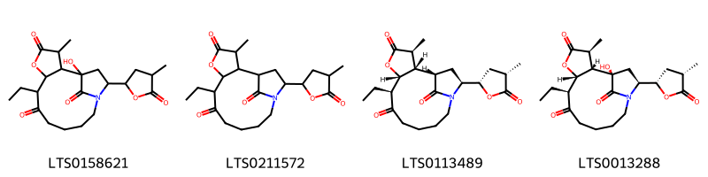{ width=100% }
    <figcaption>Hình ảnh cấu trúc hóa học của 4 hoạt chất thuộc nhóm Lactones gồm ['7-ethyl-1-hydroxy-3-methyl-14-(4-methyl-5-oxooxolan-2-yl)-5-oxa-13-azatricyclo[11.2.1.0²,⁶]hexadecane-4,8,16-trione (LTS0158621)', '7-ethyl-3-methyl-14-(4-methyl-5-oxooxolan-2-yl)-5-oxa-13-azatricyclo[11.2.1.0²,⁶]hexadecane-4,8,16-trione (LTS0211572)', '(1s,2s,3s,6r,7s,14s)-7-ethyl-3-methyl-14-[(2s,4s)-4-methyl-5-oxooxolan-2-yl]-5-oxa-13-azatricyclo[11.2.1.0²,⁶]hexadecane-4,8,16-trione (LTS0113489)', '(1r,2s,3s,6r,7s,14s)-7-ethyl-1-hydroxy-3-methyl-14-[(2s,4s)-4-methyl-5-oxooxolan-2-yl]-5-oxa-13-azatricyclo[11.2.1.0²,⁶]hexadecane-4,8,16-trione (LTS0013288)'].</figcaption>
</figure>
#### Nhóm Oxanes
<figure markdown="span">
    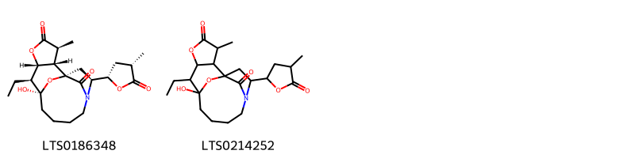{ width=100% }
    <figcaption>Hình ảnh cấu trúc hóa học của 2 hoạt chất thuộc nhóm Oxanes gồm ['(1s,3s,9s,10s,11r,14s,15s)-10-ethyl-9-hydroxy-14-methyl-3-[(2s,4s)-4-methyl-5-oxooxolan-2-yl]-12,16-dioxa-4-azatetracyclo[7.6.1.1¹,⁴.0¹¹,¹⁵]heptadecane-13,17-dione (LTS0186348)', '10-ethyl-9-hydroxy-14-methyl-3-(4-methyl-5-oxooxolan-2-yl)-12,16-dioxa-4-azatetracyclo[7.6.1.1¹,⁴.0¹¹,¹⁵]heptadecane-13,17-dione (LTS0214252)'].</figcaption>
</figure>
#### Nhóm Pyrroloazepines
<figure markdown="span">
    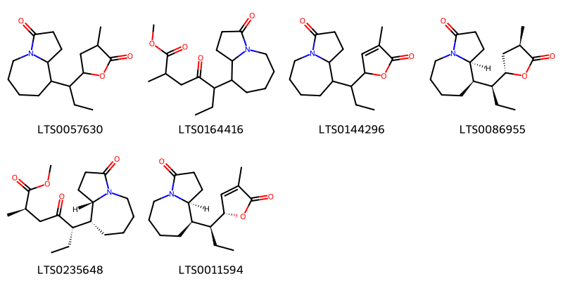{ width=100% }
    <figcaption>Hình ảnh cấu trúc hóa học của 6 hoạt chất thuộc nhóm Pyrroloazepines gồm ['9-[1-(4-methyl-5-oxooxolan-2-yl)propyl]-octahydropyrrolo[1,2-a]azepin-3-one (LTS0057630)', 'methyl 2-methyl-4-oxo-5-{3-oxo-octahydropyrrolo[1,2-a]azepin-9-yl}heptanoate (LTS0164416)', '9-[1-(4-methyl-5-oxo-2h-furan-2-yl)propyl]-octahydropyrrolo[1,2-a]azepin-3-one (LTS0144296)', '(9r,9as)-9-[(1s)-1-[(2s,4r)-4-methyl-5-oxooxolan-2-yl]propyl]-octahydropyrrolo[1,2-a]azepin-3-one (LTS0086955)', 'methyl (2r,5s)-5-[(9r,9as)-3-oxo-octahydropyrrolo[1,2-a]azepin-9-yl]-2-methyl-4-oxoheptanoate (LTS0235648)', '(9r,9as)-9-[(1s)-1-[(2r)-4-methyl-5-oxo-2h-furan-2-yl]propyl]-octahydropyrrolo[1,2-a]azepin-3-one (LTS0011594)'].</figcaption>
</figure>
#### Nhóm Stemona alkaloids
<figure markdown="span">
    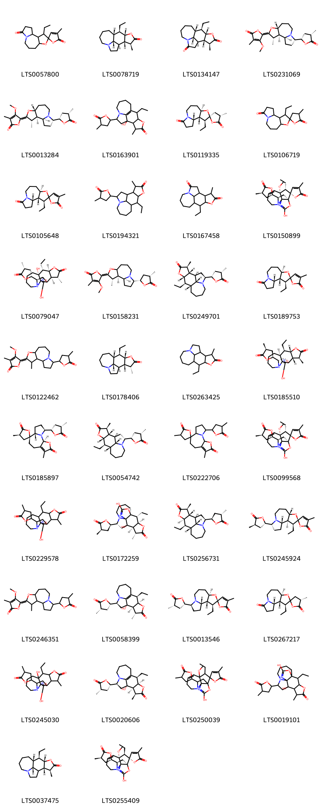{ width=100% }
    <figcaption>Hình ảnh cấu trúc hóa học của 38 hoạt chất thuộc nhóm Stemona alkaloids gồm ["3'-ethyl-4-methyl-5'-oxa-10'-azaspiro[furan-2,4'-tricyclo[8.3.0.0²,⁶]tridecane]-5,11'-dione (LTS0057800)", '(1r,9r,10r,11s,14s,15s,16r)-10-ethyl-14-methyl-12-oxa-4-azatetracyclo[7.6.1.0⁴,¹⁶.0¹¹,¹⁵]hexadecan-13-one (LTS0078719)', '(1r,9r,10r,11s,14s,15s,16r)-10-ethyl-14-methyl-12-oxa-4-azatetracyclo[7.6.1.0⁴,¹⁶.0¹¹,¹⁵]hexadecane-3,13-dione (LTS0134147)', 'protostemonine (LTS0231069)', '4-methoxy-3-methyl-5-[(1s,2r,3s,4e,6r,11s)-3-methyl-11-[(2s,4s)-4-methyl-5-oxooxolan-2-yl]-5-oxa-10-azatricyclo[8.3.0.0²,⁶]tridecan-4-ylidene]furan-2-one (LTS0013284)', '10-ethyl-1-hydroxy-14-methyl-3-(4-methyl-5-oxooxolan-2-yl)-12-oxa-4-azatetracyclo[7.6.1.0⁴,¹⁶.0¹¹,¹⁵]hexadec-9(16)-en-13-one (LTS0163901)', "(1's,2s,2'r,3's,4s,6'r)-3'-ethyl-4-methyl-5'-oxa-10'-azaspiro[oxolane-2,4'-tricyclo[8.3.0.0²,⁶]tridecane]-5,11'-dione (LTS0119335)", "3'-ethyl-4-methyl-5'-oxa-10'-azaspiro[oxolane-2,4'-tricyclo[8.3.0.0²,⁶]tridecane]-5,11'-dione (LTS0106719)", "(1's,2'r,3's,6'r)-3'-ethyl-4-methyl-5'-oxa-10'-azaspiro[furan-2,4'-tricyclo[8.3.0.0²,⁶]tridecane]-5,11'-dione (LTS0105648)", '10-ethyl-14-methyl-3-(4-methyl-5-oxooxolan-2-yl)-12-oxa-4-azatetracyclo[7.6.1.0⁴,¹⁶.0¹¹,¹⁵]hexadecan-13-one (LTS0194321)', '10-ethyl-14-methyl-12-oxa-4-azatetracyclo[7.6.1.0⁴,¹⁶.0¹¹,¹⁵]hexadecane-3,13-dione (LTS0167458)', "(1's,2s,3's,4'r,10's,15'r)-3'-ethyl-12'-hydroxy-4'-methoxy-4-methyl-15'-[(2r,4r)-4-methyl-5-oxooxolan-2-yl]-13'-oxa-9',11'-diazaspiro[furan-2,2'-tetracyclo[7.4.2.0¹,¹⁰.0⁴,¹⁰]pentadecane]-5',11'-dien-5-one (LTS0150899)", '(1r,2r,3r,6r,7r,8r,14s,19r)-7-ethyl-8,16-dihydroxy-3-methyl-19-[(2r,4r)-4-methyl-5-oxooxolan-2-yl]-5,17-dioxa-13,15-diazapentacyclo[11.4.2.0¹,¹⁴.0²,⁶.0⁸,¹⁴]nonadec-15-en-4-one (LTS0079047)', '4-methoxy-3-methyl-5-[(1s,2r,3s,4z)-3-methyl-11-[(2s,4s)-4-methyl-5-oxooxolan-2-yl]-5-oxa-10-azatricyclo[8.3.0.0²,⁶]tridecan-4-ylidene]furan-2-one (LTS0158231)', 'tuberostemonine (LTS0249701)', "(1's,2r,2'r,3's,6'r)-3'-ethyl-4-methyl-5'-oxa-10'-azaspiro[furan-2,4'-tricyclo[8.3.0.0²,⁶]tridecane]-5,11'-dione (LTS0189753)", '4-methoxy-3-methyl-5-[3-methyl-11-(4-methyl-5-oxooxolan-2-yl)-5-oxa-10-azatricyclo[8.3.0.0²,⁶]tridecan-4-ylidene]furan-2-one (LTS0122462)', '(1r,9r,10r,11s,14r,15s,16r)-10-ethyl-14-methyl-12-oxa-4-azatetracyclo[7.6.1.0⁴,¹⁶.0¹¹,¹⁵]hexadecan-13-one (LTS0178406)', '10-ethyl-14-methyl-12-oxa-4-azatetracyclo[7.6.1.0⁴,¹⁶.0¹¹,¹⁵]hexadecan-13-one (LTS0263425)', '(1s,2s,3s,6s,7r,8s,14r,19s)-7-ethyl-16-hydroxy-3-methyl-19-[(2s,4s)-4-methyl-5-oxooxolan-2-yl]-5,17-dioxa-13,15-diazapentacyclo[11.4.2.0¹,¹⁴.0²,⁶.0⁸,¹⁴]nonadec-15-en-4-one (LTS0185510)', "(1's,2s,3's,4r,6's)-4,11'-dimethyl-3'-[(2s,4s)-4-methyl-5-oxooxolan-2-yl]-13'-oxa-2'-azaspiro[oxolane-2,7'-tricyclo[8.3.0.0²,⁶]tridecan]-10'-ene-5,12'-dione (LTS0185897)", '(1r,3r,9r,10r,11s,14s,15s,16r)-10-ethyl-14-methyl-3-[(2s,4s)-4-methyl-5-oxooxolan-2-yl]-12-oxa-4-azatetracyclo[7.6.1.0⁴,¹⁶.0¹¹,¹⁵]hexadecan-13-one (LTS0054742)', "4,11'-dimethyl-3'-(4-methyl-5-oxooxolan-2-yl)-13'-oxa-2'-azaspiro[oxolane-2,7'-tricyclo[8.3.0.0²,⁶]tridecan]-10'-ene-5,12'-dione (LTS0222706)", "(1's,2r,3's,4'r,10's,15'r)-3'-ethyl-12'-hydroxy-4'-methoxy-4-methyl-15'-[(2r,4r)-4-methyl-5-oxooxolan-2-yl]-13'-oxa-9',11'-diazaspiro[furan-2,2'-tetracyclo[7.4.2.0¹,¹⁰.0⁴,¹⁰]pentadecane]-5',11'-dien-5-one (LTS0099568)", '7-ethyl-16-hydroxy-3-methyl-19-(4-methyl-5-oxooxolan-2-yl)-5,17-dioxa-13,15-diazapentacyclo[11.4.2.0¹,¹⁴.0²,⁶.0⁸,¹⁴]nonadec-15-en-4-one (LTS0229578)', '(1s,7r,9r,10r,11r,14r,15r,19r)-15-ethyl-9,17-dihydroxy-11-methyl-7-[(2r,4r)-4-methyl-5-oxooxolan-2-yl]-13,16-dioxa-6,18-diazapentacyclo[7.6.4.0¹,¹⁹.0⁶,¹⁹.0¹⁰,¹⁴]nonadec-17-en-12-one (LTS0172259)', '(1r,3s,9r,10r,11r,14s,15s,16r)-10-ethyl-14-methyl-3-[(2r,4s)-4-methyl-5-oxooxolan-2-yl]-12-oxa-4-azatetracyclo[7.6.1.0⁴,¹⁶.0¹¹,¹⁵]hexadecan-13-one (LTS0256731)', "(1's,2r,2's,3's,6's,11'r)-3'-ethyl-4-methyl-11'-[(2s,4r)-4-methyl-5-oxooxolan-2-yl]-5'-oxa-10'-azaspiro[furan-2,4'-tricyclo[8.3.0.0²,⁶]tridecan]-5-one (LTS0245924)", '4-methoxy-3-methyl-5-[(4e)-3-methyl-11-(4-methyl-5-oxooxolan-2-yl)-5-oxa-10-azatricyclo[8.3.0.0²,⁶]tridecan-4-ylidene]furan-2-one (LTS0246351)', '(1s,3s,10r,11r,14r,15r)-10-ethyl-1-hydroxy-14-methyl-3-[(2s,4s)-4-methyl-5-oxooxolan-2-yl]-12-oxa-4-azatetracyclo[7.6.1.0⁴,¹⁶.0¹¹,¹⁵]hexadec-9(16)-en-13-one (LTS0058399)', "(1's,2r,2'r,3's,6'r,11's)-3'-ethyl-4-methyl-11'-[(2s,4s)-4-methyl-5-oxooxolan-2-yl]-5'-oxa-10'-azaspiro[furan-2,4'-tricyclo[8.3.0.0²,⁶]tridecan]-5-one (LTS0013546)", "(1's,2'r,3's,4s,6'r)-3'-ethyl-4-methyl-5'-oxa-10'-azaspiro[oxolane-2,4'-tricyclo[8.3.0.0²,⁶]tridecane]-5,11'-dione (LTS0267217)", '7-ethyl-8,16-dihydroxy-3-methyl-19-(4-methyl-5-oxooxolan-2-yl)-5,17-dioxa-13,15-diazapentacyclo[11.4.2.0¹,¹⁴.0²,⁶.0⁸,¹⁴]nonadec-15-en-4-one (LTS0245030)', '(1s,3s,10r,11r,14s,15r)-10-ethyl-1-hydroxy-14-methyl-3-[(2s,4s)-4-methyl-5-oxooxolan-2-yl]-12-oxa-4-azatetracyclo[7.6.1.0⁴,¹⁶.0¹¹,¹⁵]hexadec-9(16)-en-13-one (LTS0020606)', "3'-ethyl-12'-hydroxy-4'-methoxy-4-methyl-15'-(4-methyl-5-oxooxolan-2-yl)-13'-oxa-9',11'-diazaspiro[furan-2,2'-tetracyclo[7.4.2.0¹,¹⁰.0⁴,¹⁰]pentadecane]-5',11'-dien-5-one (LTS0250039)", '15-ethyl-9,17-dihydroxy-11-methyl-7-(4-methyl-5-oxooxolan-2-yl)-13,16-dioxa-6,18-diazapentacyclo[7.6.4.0¹,¹⁹.0⁶,¹⁹.0¹⁰,¹⁴]nonadec-17-en-12-one (LTS0019101)', '(9r,10r,11s,14s,15s,16r)-10-ethyl-14-methyl-12-oxa-4-azatetracyclo[7.6.1.0⁴,¹⁶.0¹¹,¹⁵]hexadecan-13-one (LTS0037475)', "(1's,2s,3'r,4'r,10's,15'r)-3'-ethyl-12'-hydroxy-4'-methoxy-4-methyl-15'-[(2r,4r)-4-methyl-5-oxooxolan-2-yl]-13'-oxa-9',11'-diazaspiro[furan-2,2'-tetracyclo[7.4.2.0¹,¹⁰.0⁴,¹⁰]pentadecane]-5',11'-dien-5-one (LTS0255409)"].</figcaption>
</figure>

---

### Dược dân tộc học

Danh sách các quốc gia có sử dụng *Stemona sessilifolia* trong điều trị các bệnh. 

| Country   | Disease      | Bệnh           |
|:----------|:-------------|:---------------|
| China     | Pediculicide | Pediculicide   |
| Elsewhere | Vermifuge    | Thuốc diệt sán |

---

---
## Stemona tuberosa
### Thông tin về thực vật

!!! info "Phân loại thực vật của *Stemona tuberosa* từ GIBF:"
    - **Kingdom:** Plantae
    - **Phylum:** Tracheophyta
    - **Order:** Pandanales
    - **Family:** Stemonaceae
    - **Genus:** Stemona
    - **Species:** *Stemona tuberosa*

 

| Label (VI)   | Label (EN)   | Scientific Name   | Descriptions (VI)   | Descriptions (EN)   | Also Known As (VI)   | Also Known As (EN)   |
|:-------------|:-------------|:------------------|:--------------------|:--------------------|:---------------------|:---------------------|
| N/A          | N/A          | Stemona tuberosa  | loài thực vật       | species of plant    | ['Stemona tuberosa'] | ['']                 |

#### Phân bố trên thế giới

**Từ CSDL GIBF** Viet Nam, Sri Lanka, Myanmar, Malaysia, India, China, Chinese Taipei

#### Phân bố tại Việt Nam

**Từ CSDL GIBF**: Không có ghi nhận ở Việt Nam

---
### Thành phần hóa học
        
- Theo cơ sở dữ liệu lotus: Từ loài *Stemona tuberosa* đã phân lập và xác định được 82 hoạt chất thuộc về các nhóm Stilbenes, Indoles and derivatives, Azepanes, Carboxylic acids and derivatives, Prenol lipids, Stemona alkaloids, Neoflavonoids, Lactams. 

|    | chemicalTaxonomyClassyfireClass   |   smiles_count |
|---:|:----------------------------------|---------------:|
|  0 | Azepanes                          |              1 |
|  1 | Carboxylic acids and derivatives  |              1 |
|  2 | Indoles and derivatives           |              1 |
|  3 | Lactams                           |             10 |
|  4 | Neoflavonoids                     |              1 |
|  5 | Prenol lipids                     |              2 |
|  6 | Stemona alkaloids                 |             55 |
|  7 | Stilbenes                         |             11 |

#### Nhóm Azepanes
<figure markdown="span">
    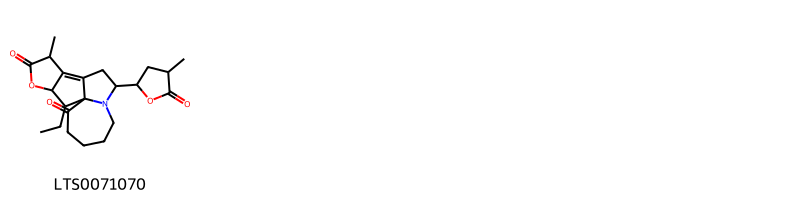{ width=100% }
    <figcaption>Hình ảnh cấu trúc hóa học của 1 hoạt chất thuộc nhóm Azepanes gồm ['16-ethyl-12-methyl-8-(4-methyl-5-oxooxolan-2-yl)-14-oxa-7-azatetracyclo[8.6.0.0¹,⁷.0¹¹,¹⁵]hexadec-10-ene-2,13-dione (LTS0071070)'].</figcaption>
</figure>
#### Nhóm Carboxylic acids and derivatives
<figure markdown="span">
    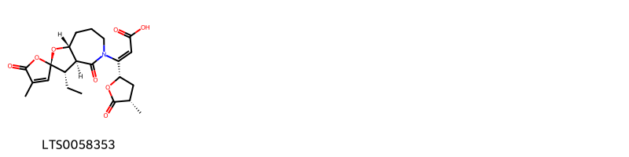{ width=100% }
    <figcaption>Hình ảnh cấu trúc hóa học của 1 hoạt chất thuộc nhóm Carboxylic acids and derivatives gồm ["(2z)-3-[(2r,3's,3'as,8'ar)-3'-ethyl-4-methyl-4',5-dioxo-3',3'a,6',7',8',8'a-hexahydrospiro[furan-2,2'-furo[3,2-c]azepin]-5'-yl]-3-[(2s,4s)-4-methyl-5-oxooxolan-2-yl]prop-2-enoic acid (LTS0058353)"].</figcaption>
</figure>
#### Nhóm Indoles and derivatives
<figure markdown="span">
    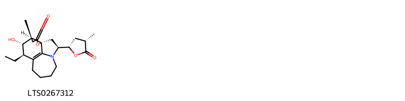{ width=100% }
    <figcaption>Hình ảnh cấu trúc hóa học của 1 hoạt chất thuộc nhóm Indoles and derivatives gồm ['(1s,3s,10r,11s,12s,13s)-10-ethyl-11-hydroxy-13-methyl-3-[(2s,4s)-4-methyl-5-oxooxolan-2-yl]-15-oxa-4-azatetracyclo[7.6.1.0¹,¹².0⁴,¹⁶]hexadec-9(16)-en-14-one (LTS0267312)'].</figcaption>
</figure>
#### Nhóm Lactams
<figure markdown="span">
    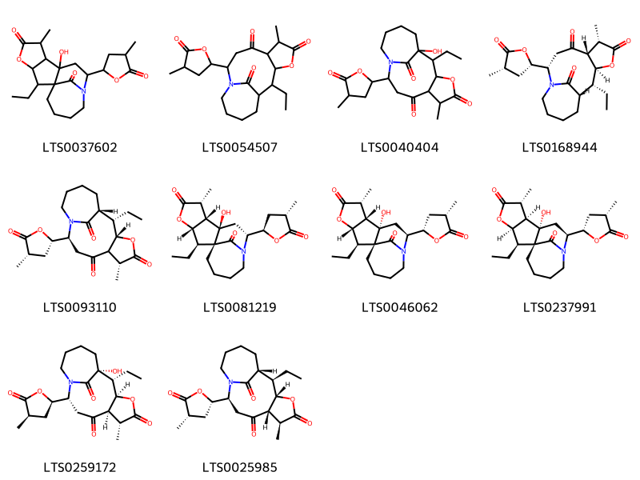{ width=100% }
    <figcaption>Hình ảnh cấu trúc hóa học của 10 hoạt chất thuộc nhóm Lactams gồm ['2-ethyl-8-hydroxy-6-methyl-10-(4-methyl-5-oxooxolan-2-yl)-4-oxa-11-azatetracyclo[9.4.1.0¹,⁸.0³,⁷]hexadecane-5,16-dione (LTS0037602)', '2-ethyl-6-methyl-10-(4-methyl-5-oxooxolan-2-yl)-4-oxa-11-azatricyclo[9.4.1.0³,⁷]hexadecane-5,8,16-trione (LTS0054507)', '2-ethyl-1-hydroxy-6-methyl-10-(4-methyl-5-oxooxolan-2-yl)-4-oxa-11-azatricyclo[9.4.1.0³,⁷]hexadecane-5,8,16-trione (LTS0040404)', '(1s,2r,3s,6s,7r,10s)-2-ethyl-6-methyl-10-[(2s,4s)-4-methyl-5-oxooxolan-2-yl]-4-oxa-11-azatricyclo[9.4.1.0³,⁷]hexadecane-5,8,16-trione (LTS0168944)', '(1r,2s,3s,6r,10s)-2-ethyl-6-methyl-10-[(2s,4s)-4-methyl-5-oxooxolan-2-yl]-4-oxa-11-azatricyclo[9.4.1.0³,⁷]hexadecane-5,8,16-trione (LTS0093110)', '(1r,2r,3s,6r,7s,8r,10r)-2-ethyl-8-hydroxy-6-methyl-10-[(2r,4s)-4-methyl-5-oxooxolan-2-yl]-4-oxa-11-azatetracyclo[9.4.1.0¹,⁸.0³,⁷]hexadecane-5,16-dione (LTS0081219)', '(1r,2r,3s,6r,7s,8s,10s)-2-ethyl-8-hydroxy-6-methyl-10-[(2s,4s)-4-methyl-5-oxooxolan-2-yl]-4-oxa-11-azatetracyclo[9.4.1.0¹,⁸.0³,⁷]hexadecane-5,16-dione (LTS0046062)', '(1r,2r,3r,6r,7r,8s,10s)-2-ethyl-8-hydroxy-6-methyl-10-[(2s,4s)-4-methyl-5-oxooxolan-2-yl]-4-oxa-11-azatetracyclo[9.4.1.0¹,⁸.0³,⁷]hexadecane-5,16-dione (LTS0237991)', '(1r,2r,3r,6r,7r,10r)-2-ethyl-1-hydroxy-6-methyl-10-[(2r,4r)-4-methyl-5-oxooxolan-2-yl]-4-oxa-11-azatricyclo[9.4.1.0³,⁷]hexadecane-5,8,16-trione (LTS0259172)', '(1r,2r,3s,6s,7s,10s)-2-ethyl-6-methyl-10-[(2s,4s)-4-methyl-5-oxooxolan-2-yl]-4-oxa-11-azatricyclo[9.4.1.0³,⁷]hexadecane-5,8,16-trione (LTS0025985)'].</figcaption>
</figure>
#### Nhóm Neoflavonoids
<figure markdown="span">
    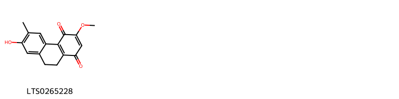{ width=100% }
    <figcaption>Hình ảnh cấu trúc hóa học của 1 hoạt chất thuộc nhóm Neoflavonoids gồm ['7-hydroxy-3-methoxy-6-methyl-9,10-dihydrophenanthrene-1,4-dione (LTS0265228)'].</figcaption>
</figure>
#### Nhóm Prenol lipids
<figure markdown="span">
    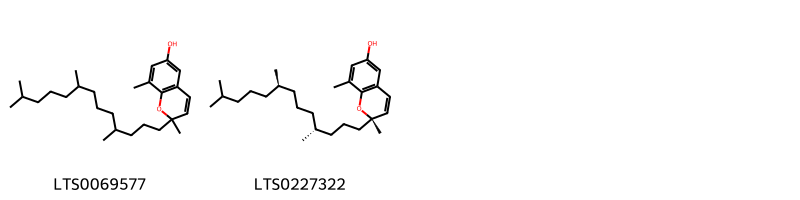{ width=100% }
    <figcaption>Hình ảnh cấu trúc hóa học của 2 hoạt chất thuộc nhóm Prenol lipids gồm ['2,8-dimethyl-2-(4,8,12-trimethyltridecyl)chromen-6-ol (LTS0069577)', '(2s)-2,8-dimethyl-2-[(4r,8r)-4,8,12-trimethyltridecyl]chromen-6-ol (LTS0227322)'].</figcaption>
</figure>
#### Nhóm Stemona alkaloids
<figure markdown="span">
    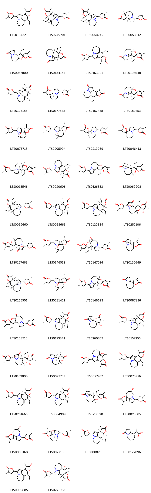{ width=100% }
    <figcaption>Hình ảnh cấu trúc hóa học của 55 hoạt chất thuộc nhóm Stemona alkaloids gồm ['10-ethyl-14-methyl-3-(4-methyl-5-oxooxolan-2-yl)-12-oxa-4-azatetracyclo[7.6.1.0⁴,¹⁶.0¹¹,¹⁵]hexadecan-13-one (LTS0194321)', 'tuberostemonine (LTS0249701)', '(1r,3r,9r,10r,11s,14s,15s,16r)-10-ethyl-14-methyl-3-[(2s,4s)-4-methyl-5-oxooxolan-2-yl]-12-oxa-4-azatetracyclo[7.6.1.0⁴,¹⁶.0¹¹,¹⁵]hexadecan-13-one (LTS0054742)', '(1s,2r,3s,6r,11s)-3-methyl-11-[(2s,4s)-4-methyl-5-oxooxolan-2-yl]-5-oxa-10-azatricyclo[8.3.0.0²,⁶]tridecan-4-one (LTS0053012)', "3'-ethyl-4-methyl-5'-oxa-10'-azaspiro[furan-2,4'-tricyclo[8.3.0.0²,⁶]tridecane]-5,11'-dione (LTS0057800)", '(1r,9r,10r,11s,14s,15s,16r)-10-ethyl-14-methyl-12-oxa-4-azatetracyclo[7.6.1.0⁴,¹⁶.0¹¹,¹⁵]hexadecane-3,13-dione (LTS0134147)', '10-ethyl-1-hydroxy-14-methyl-3-(4-methyl-5-oxooxolan-2-yl)-12-oxa-4-azatetracyclo[7.6.1.0⁴,¹⁶.0¹¹,¹⁵]hexadec-9(16)-en-13-one (LTS0163901)', "(1's,2'r,3's,6'r)-3'-ethyl-4-methyl-5'-oxa-10'-azaspiro[furan-2,4'-tricyclo[8.3.0.0²,⁶]tridecane]-5,11'-dione (LTS0105648)", 'neotuberostemonine (LTS0105185)', 'croomine (LTS0177838)', '10-ethyl-14-methyl-12-oxa-4-azatetracyclo[7.6.1.0⁴,¹⁶.0¹¹,¹⁵]hexadecane-3,13-dione (LTS0167458)', "(1's,2r,2'r,3's,6'r)-3'-ethyl-4-methyl-5'-oxa-10'-azaspiro[furan-2,4'-tricyclo[8.3.0.0²,⁶]tridecane]-5,11'-dione (LTS0189753)", "4-methyl-4'-(4-methyl-5-oxooxolan-2-yl)-11'-oxa-5'-azaspiro[oxolane-2,10'-tricyclo[5.3.1.0¹,⁵]undecan]-5-one (LTS0076718)", "(1's,2s,4r,4's,7'r)-4-methyl-4'-[(2s,4s)-4-methyl-5-oxooxolan-2-yl]-11'-oxa-5'-azaspiro[oxolane-2,10'-tricyclo[5.3.1.0¹,⁵]undecan]-5-one (LTS0205994)", "(2r,3's,4r,9'ar)-4-methyl-3'-[(2s,4s)-4-methyl-5-oxooxolan-2-yl]-octahydrospiro[oxolane-2,9'-pyrrolo[1,2-a]azepin]-5-one (LTS0219069)", "4-methyl-3'-(4-methyl-5-oxooxolan-2-yl)-octahydrospiro[oxolane-2,9'-pyrrolo[1,2-a]azepin]-5-one (LTS0046413)", "(1's,2r,2'r,3's,6'r,11's)-3'-ethyl-4-methyl-11'-[(2s,4s)-4-methyl-5-oxooxolan-2-yl]-5'-oxa-10'-azaspiro[furan-2,4'-tricyclo[8.3.0.0²,⁶]tridecan]-5-one (LTS0013546)", '(1s,3s,10r,11r,14s,15r)-10-ethyl-1-hydroxy-14-methyl-3-[(2s,4s)-4-methyl-5-oxooxolan-2-yl]-12-oxa-4-azatetracyclo[7.6.1.0⁴,¹⁶.0¹¹,¹⁵]hexadec-9(16)-en-13-one (LTS0020606)', "3'-ethyl-4-methyl-11'-(4-methyl-5-oxooxolan-2-yl)-5'-oxa-10'-azaspiro[furan-2,4'-tricyclo[8.3.0.0²,⁶]tridecane]-1'(13'),11'-dien-5-one (LTS0126553)", "(1'r,2r,2's,3'r,6's)-3'-ethyl-4-methyl-5'-oxa-10'-azaspiro[furan-2,4'-tricyclo[8.3.0.0²,⁶]tridecane]-5,11'-dione (LTS0069908)", '(1r,3s,9r,10r,11s,14s,15s,16s)-10-ethyl-14-methyl-3-[(2s,4s)-4-methyl-5-oxooxolan-2-yl]-12-oxa-4-azatetracyclo[7.6.1.0⁴,¹⁶.0¹¹,¹⁵]hexadecan-13-one (LTS0092660)', '(9r,10r,11s,14s,15r)-10-ethyl-14-methyl-3-[(2s,4s)-4-methyl-5-oxooxolan-2-yl]-12-oxa-4-azatetracyclo[7.6.1.0⁴,¹⁶.0¹¹,¹⁵]hexadeca-1(16),2-dien-13-one (LTS0065661)', '(1s,3r,9s,10s,11r,14r,15r,16s)-10-ethyl-14-methyl-3-[(2r,4r)-4-methyl-5-oxooxolan-2-yl]-12-oxa-4-azatetracyclo[7.6.1.0⁴,¹⁶.0¹¹,¹⁵]hexadecan-13-one (LTS0120834)', "(1's,2s,2's,3r,3's,4r,6'r)-3'-ethyl-1',3-dihydroxy-4-methyl-11'-[(2s,4s)-4-methyl-5-oxooxolan-2-yl]-5'-oxa-10'-azaspiro[oxolane-2,4'-tricyclo[8.3.0.0²,⁶]tridecan]-11'-ene-5,13'-dione (LTS0252106)", "(1's,2r,2's,3's,6'r)-3'-ethyl-1'-hydroxy-4-methyl-11'-[(2s,4s)-4-methyl-5-oxooxolan-2-yl]-5'-oxa-10'-azaspiro[furan-2,4'-tricyclo[8.3.0.0²,⁶]tridecan]-11'-ene-5,13'-dione (LTS0167468)", "(1's,2s,4r,4's,7'r)-4-methyl-4'-[(2r,4s)-4-methyl-5-oxooxolan-2-yl]-11'-oxa-5'-azaspiro[oxolane-2,10'-tricyclo[5.3.1.0¹,⁵]undecan]-5-one (LTS0146518)", "(1'r,2r,2'r,3's,6's,11's)-3'-ethyl-4-methyl-11'-[(2s,4s)-4-methyl-5-oxooxolan-2-yl]-5'-oxa-10'-azaspiro[furan-2,4'-tricyclo[8.3.0.0²,⁶]tridecane]-5,7'-dione (LTS0147014)", "(2s,4s,9'ar)-4-methyl-hexahydro-1'h-spiro[oxolane-2,9'-pyrrolo[1,2-a]azepine]-3',5-dione (LTS0150649)", 'tuberostemonine n (LTS0165501)', "(1's,2r,4s,4's,7'r)-4-methyl-4'-[(2r,4s)-4-methyl-5-oxooxolan-2-yl]-11'-oxa-5'-azaspiro[oxolane-2,10'-tricyclo[5.3.1.0¹,⁵]undecan]-5-one (LTS0231421)", "(2r,2's,3'r,6's)-3'-ethyl-4-methyl-11'-[(2r,4r)-4-methyl-5-oxooxolan-2-yl]-5'-oxa-10'-azaspiro[furan-2,4'-tricyclo[8.3.0.0²,⁶]tridecane]-1'(13'),11'-dien-5-one (LTS0146693)", "4-methyl-hexahydro-1'h-spiro[oxolane-2,9'-pyrrolo[1,2-a]azepine]-3',5-dione (LTS0087836)", "3'-ethyl-4-methyl-11'-(4-methyl-5-oxooxolan-2-yl)-5'-oxa-10'-azaspiro[furan-2,4'-tricyclo[8.3.0.0²,⁶]tridecane]-5,7'-dione (LTS0103710)", '(9r,10r,11r,14s,15s)-10-ethyl-14-methyl-3-[(2s,4s)-4-methyl-5-oxooxolan-2-yl]-12-oxa-4-azatetracyclo[7.6.1.0⁴,¹⁶.0¹¹,¹⁵]hexadeca-1(16),2-dien-13-one (LTS0173341)', "(2s,3s,4s,9'as)-3-hydroxy-4-methyl-hexahydro-1'h-spiro[oxolane-2,9'-pyrrolo[1,2-a]azepine]-3',5-dione (LTS0260369)", '(1r,3s,9r,10r,11r,14s,15r,16r)-10-ethyl-14-methyl-3-[(2s,4s)-4-methyl-5-oxooxolan-2-yl]-12-oxa-4-azatetracyclo[7.6.1.0⁴,¹⁶.0¹¹,¹⁵]hexadecan-13-one (LTS0157255)', "(1's,2r,2's,3r,3's,4r,6'r)-3'-ethyl-1',3-dihydroxy-4-methyl-11'-[(2s,4s)-4-methyl-5-oxooxolan-2-yl]-5'-oxa-10'-azaspiro[oxolane-2,4'-tricyclo[8.3.0.0²,⁶]tridecan]-11'-ene-5,13'-dione (LTS0162808)", '(1s,2r,3s,6r)-3-methyl-5-oxa-10-azatricyclo[8.3.0.0²,⁶]tridecane-4,11-dione (LTS0077739)', '10-ethyl-9-hydroxy-14-methyl-3-(4-methyl-5-oxooxolan-2-yl)-12-oxa-4-azatetracyclo[7.6.1.0⁴,¹⁶.0¹¹,¹⁵]hexadec-1(16)-en-13-one (LTS0077787)', '10-ethyl-14-methyl-3-(4-methyl-5-oxooxolan-2-yl)-12-oxa-4-azatetracyclo[7.6.1.0⁴,¹⁶.0¹¹,¹⁵]hexadeca-1(16),2-dien-13-one (LTS0078976)', '(10s,11r,14r,15s)-10-ethyl-14-methyl-3-[(2r,4r)-4-methyl-5-oxooxolan-2-yl]-12-oxa-4-azatetracyclo[7.6.1.0⁴,¹⁶.0¹¹,¹⁵]hexadeca-1(16),2,8-trien-13-one (LTS0201665)', '(10s,11s,14r,15r)-10-ethyl-14-methyl-3-[(2s,4s)-4-methyl-5-oxooxolan-2-yl]-12-oxa-4-azatetracyclo[7.6.1.0⁴,¹⁶.0¹¹,¹⁵]hexadeca-1(16),2-dien-13-one (LTS0064999)', "(1'r,2s,2's,3'r,6's)-3'-ethyl-4-methyl-5'-oxa-10'-azaspiro[furan-2,4'-tricyclo[8.3.0.0²,⁶]tridecane]-5,11'-dione (LTS0212520)", "(2s,3's,4r,6'r,9'as)-6'-hydroxy-4-methyl-3'-[(2s,4s)-4-methyl-5-oxooxolan-2-yl]-octahydrospiro[oxolane-2,9'-pyrrolo[1,2-a]azepin]-5-one (LTS0023505)", "6'-hydroxy-4-methyl-3'-(4-methyl-5-oxooxolan-2-yl)-octahydrospiro[oxolane-2,9'-pyrrolo[1,2-a]azepin]-5-one (LTS0000168)", "(2s,3r,3's,4r,9'as)-3-hydroxy-4-methyl-3'-[(2s,4s)-4-methyl-5-oxooxolan-2-yl]-octahydrospiro[oxolane-2,9'-pyrrolo[1,2-a]azepin]-5-one (LTS0027136)", '(9r,10r,11s,14r,15r)-10-ethyl-14-methyl-3-[(2r,4s)-4-methyl-5-oxooxolan-2-yl]-12-oxa-4-azatetracyclo[7.6.1.0⁴,¹⁶.0¹¹,¹⁵]hexadeca-1(16),2-dien-13-one (LTS0008283)', '3-methyl-5-oxa-10-azatricyclo[8.3.0.0²,⁶]tridecane-4,11-dione (LTS0122096)', '10-ethyl-14-methyl-3-(4-methyl-5-oxooxolan-2-yl)-12-oxa-4-azatetracyclo[7.6.1.0⁴,¹⁶.0¹¹,¹⁵]hexadeca-1(16),2,8-trien-13-one (LTS0089885)', '(3r,9r,10s,11r,14r,15r)-10-ethyl-9-hydroxy-14-methyl-3-[(2s,4s)-4-methyl-5-oxooxolan-2-yl]-12-oxa-4-azatetracyclo[7.6.1.0⁴,¹⁶.0¹¹,¹⁵]hexadec-1(16)-en-13-one (LTS0271958)', "(1's,2r,2's,3's,6'r)-3'-ethyl-1'-methoxy-4-methyl-11'-[(2s,4s)-4-methyl-5-oxooxolan-2-yl]-5'-oxa-10'-azaspiro[furan-2,4'-tricyclo[8.3.0.0²,⁶]tridecan]-11'-ene-5,13'-dione (LTS0117852)", "(1'r,2r,4s,4'r,7's)-4-methyl-4'-[(2s,4s)-4-methyl-5-oxooxolan-2-yl]-11'-oxa-5'-azaspiro[oxolane-2,10'-tricyclo[5.3.1.0¹,⁵]undecan]-5-one (LTS0106250)", '(1s,3r,9s,10s,11s,14r,15s,16s)-10-ethyl-14-methyl-3-[(2r,4r)-4-methyl-5-oxooxolan-2-yl]-12-oxa-4-azatetracyclo[7.6.1.0⁴,¹⁶.0¹¹,¹⁵]hexadecan-13-one (LTS0254146)', '(1s,3s,9r,10r,11r,14r,15r,16s)-10-ethyl-14-methyl-3-[(2s,4s)-4-methyl-5-oxooxolan-2-yl]-12-oxa-4-azatetracyclo[7.6.1.0⁴,¹⁶.0¹¹,¹⁵]hexadecan-13-one (LTS0259431)', "3-hydroxy-4-methyl-3'-(4-methyl-5-oxooxolan-2-yl)-octahydrospiro[oxolane-2,9'-pyrrolo[1,2-a]azepin]-5-one (LTS0253785)"].</figcaption>
</figure>
#### Nhóm Stilbenes
<figure markdown="span">
    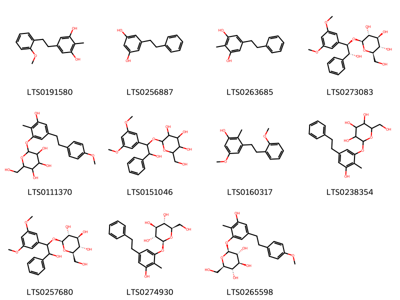{ width=100% }
    <figcaption>Hình ảnh cấu trúc hóa học của 11 hoạt chất thuộc nhóm Stilbenes gồm ['5-[2-(2-methoxyphenyl)ethyl]-2-methylbenzene-1,3-diol (LTS0191580)', 'dihydropinosylvin (LTS0256887)', '2-methyl-5-(2-phenylethyl)benzene-1,3-diol (LTS0263685)', '(2r,3r,4s,5s,6r)-2-[(1r,2r)-1-(3,5-dimethoxyphenyl)-2-hydroxy-2-phenylethoxy]-6-(hydroxymethyl)oxane-3,4,5-triol (LTS0273083)', '2-{3-hydroxy-5-[2-(4-methoxyphenyl)ethyl]-2-methylphenoxy}-6-(hydroxymethyl)oxane-3,4,5-triol (LTS0111370)', '2-[1-(3,5-dimethoxyphenyl)-2-hydroxy-2-phenylethoxy]-6-(hydroxymethyl)oxane-3,4,5-triol (LTS0151046)', '5-methoxy-3-[2-(2-methoxyphenyl)ethyl]-2-methylphenol (LTS0160317)', '2-[3-hydroxy-2-methyl-5-(2-phenylethyl)phenoxy]-6-(hydroxymethyl)oxane-3,4,5-triol (LTS0238354)', '(2r,3r,4s,5s,6r)-2-[1-(3,5-dimethoxyphenyl)-2-hydroxy-2-phenylethoxy]-6-(hydroxymethyl)oxane-3,4,5-triol (LTS0257680)', '(2s,3r,4s,5s,6r)-2-[3-hydroxy-2-methyl-5-(2-phenylethyl)phenoxy]-6-(hydroxymethyl)oxane-3,4,5-triol (LTS0274930)', '(2s,3r,4s,5s,6r)-2-{3-hydroxy-5-[2-(4-methoxyphenyl)ethyl]-2-methylphenoxy}-6-(hydroxymethyl)oxane-3,4,5-triol (LTS0265598)'].</figcaption>
</figure>

---

### Dược dân tộc học

Danh sách các quốc gia có sử dụng *Stemona tuberosa* trong điều trị các bệnh. 

| Country   | Disease                                                                                                       | Bệnh                                                                                                               |
|:----------|:--------------------------------------------------------------------------------------------------------------|:-------------------------------------------------------------------------------------------------------------------|
| Asia      | Insecticide                                                                                                   | Thuốc trừ sâu                                                                                                      |
| China     | Antitussive, Carminative, Insecticide, Pediculicide, Vermifuge, Pediculicide, Poison, Vermifuge, Parasiticide | Thuốc chống ho, Carminative, Thuốc trừ sâu, Pediculicide, Vermifuge, Pediculicide, Poison, Vermifuge, Parasiticide |
| Elsewhere | nan, Pediculicide, Vermifuge, Antiseptic                                                                      | nan, Pediculicide, Vermifuge, Sát trùng                                                                            |
| Java      | Insecticide                                                                                                   | Thuốc trừ sâu                                                                                                      |

---

