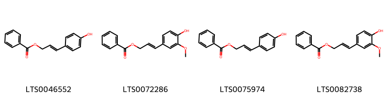
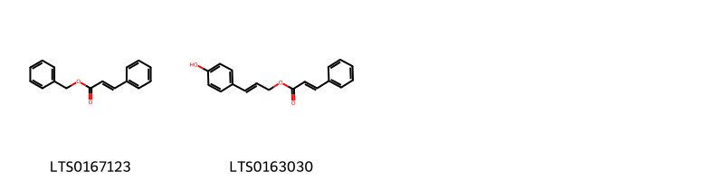

!!! abstract "Tóm tắt"

    Họ Styracaceae gồm khoảng 1 chi và 4 loài được một số cộng đồng tại các quốc gia như Indochina, Java, Turkey, Elsewhere, Salvador, China sử dụng trong một số trường hợp Thuốc diệt côn trùng, Thuốc diệt côn trùng, Thuốc diệt côn trùng, Thuốc diệt côn trùng, Thuốc diệt côn trùng, Thuốc diệt côn trùng, Thuốc diệt côn trùng, Thuốc diệt côn trùng, Thuốc diệt côn trùng, Thuốc diệt côn trùng, Thuốc diệt côn trùng, Thuốc diệt côn trùng, Thuốc an thần, Thuốc kích thích, Thuốc khử mùi, Thuốc diệt côn trùng, Nước hoa, Xà phòng, Thuốc sát trùng, Thuốc sát trùng, Thuốc sát trùng, Thuốc sát trùng, Thuốc sát trùng, Thuốc sát trùng.

!!! info "DrDuke"

    James A. Duke sinh năm 1929-2017 là một nhà thực vật học người Mỹ. Đây là một trong những tác giả hàng đầu trong lĩnh vực dược dân tộc học với cuốn *CRC Handbook of Medicinal Herbs* và chính là người xây dựng lên cơ sở dữ liệu về hợp chất tự nhiên và dược dân tộc học tại Bộ nông nghiệp Hoa Kỳ. Các thông tin được đăng tải tại website [Dr. Duke's Phytochemical and Ethnobotanical Databases](https://phytochem.nal.usda.gov/). 
    Trong suốt thập niên 1970, ông lãnh đạo the Plant Taxonomy Laboratory, Plant Genetics and Germplasm Institute of the Agricultural Research Service, U.S. Department of Agriculture.
    Trong tài liệu này, các thông tin về dược dân tộc của các dược liệu được trích dẫn từ tài liệu của James A. Ducke với sự trợ giúp của phần mềm dịch thuật từ tiếng Anh sang tiếng Việt.
   

# Chi Styrax

??? note "Danh sách các dược liệu thuộc chi"
    
	 - *Styrax argenteus*
	 - *Styrax benzoin*
	 - *Styrax tonkinense*
	 - *Styrax tonkinensis*

---
## Styrax argenteus
### Thông tin về thực vật

!!! info "Phân loại thực vật của *Styrax argenteus* từ GIBF:"
    - **Kingdom:** Plantae
    - **Phylum:** Tracheophyta
    - **Order:** Ericales
    - **Family:** Styracaceae
    - **Genus:** Styrax
    - **Species:** *Styrax argenteus*

 

| Label (VI)   | Label (EN)   | Scientific Name   | Descriptions (VI)   | Descriptions (EN)   | Also Known As (VI)   | Also Known As (EN)   |
|:-------------|:-------------|:------------------|:--------------------|:--------------------|:---------------------|:---------------------|
| N/A          | N/A          | Styrax argenteus  | loài thực vật       | species of plant    | ['']                 | ['']                 |

#### Phân bố trên thế giới

**Từ CSDL GIBF** Mexico, Nicaragua, Guatemala, El Salvador, Costa Rica, Bolivia (Plurinational State of), Belize

#### Phân bố tại Việt Nam

**Từ CSDL GIBF**: Không có ghi nhận ở Việt Nam

---
### Thành phần hóa học
        
- Theo cơ sở dữ liệu lotus: Từ loài *Styrax argenteus* đã phân lập và xác định được Chưa có hoạt chất nào được phân lập. hoạt chất thuộc về các nhóm Không có hoạt chất nào được phân lập. 

Không có hình ảnh nào được tạo ra

---

### Dược dân tộc học

Danh sách các quốc gia có sử dụng *Styrax argenteus* trong điều trị các bệnh. 

| Country   | Disease              | Bệnh                 |
|:----------|:---------------------|:---------------------|
| Salvador  | Piscicide, Piscicide | Piscicide, Piscicide |

---

---
## Styrax benzoin
### Thông tin về thực vật

!!! info "Phân loại thực vật của *Styrax benzoin* từ GIBF:"
    - **Kingdom:** Plantae
    - **Phylum:** Tracheophyta
    - **Order:** Ericales
    - **Family:** Styracaceae
    - **Genus:** Styrax
    - **Species:** *Styrax benzoin*

 

| Label (VI)   | Label (EN)   | Scientific Name   | Descriptions (VI)   | Descriptions (EN)   | Also Known As (VI)   | Also Known As (EN)   |
|:-------------|:-------------|:------------------|:--------------------|:--------------------|:---------------------|:---------------------|
| N/A          | N/A          | Styrax benzoin    | loài thực vật       | species of plant    | ['']                 | ['']                 |

#### Phân bố trên thế giới

**Từ CSDL GIBF** nan, Brazil, Viet Nam, Uganda, China, French Polynesia, Trinidad and Tobago, Thailand, Guinea, Réunion, United States of America, Indonesia, Croatia, unknown or invalid, Lao People’s Democratic Republic, Benin, Congo, Democratic Republic of the, Malaysia, Singapore, Cambodia, South Africa, Côte d’Ivoire, Guyana

#### Phân bố tại Việt Nam

**Từ CSDL GIBF**: Lao Cai, Ninh Binh

---
### Thành phần hóa học
        
- Theo cơ sở dữ liệu lotus: Từ loài *Styrax benzoin* đã phân lập và xác định được 6 hoạt chất thuộc về các nhóm Cinnamic acids and derivatives, Benzene and substituted derivatives. 

|    | chemicalTaxonomyClassyfireClass     |   smiles_count |
|---:|:------------------------------------|---------------:|
|  0 | Benzene and substituted derivatives |              4 |
|  1 | Cinnamic acids and derivatives      |              2 |

#### Nhóm Benzene and substituted derivatives
<figure markdown="span">
    { width=100% }
    <figcaption>Hình ảnh cấu trúc hóa học của 4 hoạt chất thuộc nhóm Benzene and substituted derivatives gồm ['(2e)-3-(4-hydroxyphenyl)prop-2-en-1-yl benzoate (LTS0046552)', '3-(4-hydroxy-3-methoxyphenyl)prop-2-en-1-yl benzoate (LTS0072286)', '3-(4-hydroxyphenyl)prop-2-en-1-yl benzoate (LTS0075974)', 'coniferyl benzoate (LTS0082738)'].</figcaption>
</figure>
#### Nhóm Cinnamic acids and derivatives
<figure markdown="span">
    { width=100% }
    <figcaption>Hình ảnh cấu trúc hóa học của 2 hoạt chất thuộc nhóm Cinnamic acids and derivatives gồm ['benzyl cinnamate (LTS0167123)', '(2e)-3-(4-hydroxyphenyl)prop-2-en-1-yl 3-phenylprop-2-enoate (LTS0163030)'].</figcaption>
</figure>

---

### Dược dân tộc học

Danh sách các quốc gia có sử dụng *Styrax benzoin* trong điều trị các bệnh. 

| Country   | Disease                                                                              | Bệnh                                                                                    |
|:----------|:-------------------------------------------------------------------------------------|:----------------------------------------------------------------------------------------|
| China     | Antiseptic, Sedative, Stimulant, Deodorant, Carminative                              | Khử trùng, An thần, Chất kích thích, Khử mùi, Carminative                               |
| Elsewhere | Antiseptic, Antiseptic, Carminative, Diuretic, Expectorant, Insecticide, Expectorant | Khử trùng, sát trùng, Carminative, lợi tiểu, đờm, thuốc trừ sâu, đờm                    |
| Java      | Insecticide                                                                          | Thuốc trừ sâu                                                                           |
| Turkey    | Disinfectant, Expectorant, Stimulant, Vulnerary, Antiseptic                          | Chất khử trùng, chất kích thích, chất kích thích, chất dễ bị tổn thương, chất khử trùng |

---

---
## Styrax tonkinense
### Thông tin về thực vật

!!! info "Phân loại thực vật của *Styrax tonkinensis* từ GIBF:"
    - **Kingdom:** Plantae
    - **Phylum:** Tracheophyta
    - **Order:** Ericales
    - **Family:** Styracaceae
    - **Genus:** Styrax
    - **Species:** *Styrax tonkinensis*

 

| Label (VI)   | Label (EN)   | Scientific Name   | Descriptions (VI)   | Descriptions (EN)   | Also Known As (VI)   | Also Known As (EN)   |
|:-------------|:-------------|:------------------|:--------------------|:--------------------|:---------------------|:---------------------|
| N/A          | N/A          | Styrax benzoin    | loài thực vật       | species of plant    | ['']                 | ['']                 |

#### Phân bố trên thế giới

**Từ CSDL GIBF** nan, Viet Nam, China, Canada, Thailand, Lao People’s Democratic Republic

#### Phân bố tại Việt Nam

**Từ CSDL GIBF**: 宣光省, Ha Noi

---
### Thành phần hóa học
        
- Theo cơ sở dữ liệu lotus: Từ loài *Styrax tonkinensis* đã phân lập và xác định được Chưa có hoạt chất nào được phân lập. hoạt chất thuộc về các nhóm Không có hoạt chất nào được phân lập. 

Không có hình ảnh nào được tạo ra

---

### Dược dân tộc học

Danh sách các quốc gia có sử dụng *Styrax tonkinensis* trong điều trị các bệnh. 

| Country   | Disease                              | Bệnh                                            |
|:----------|:-------------------------------------|:------------------------------------------------|
| Elsewhere | Expectorant                          | Thuốc long đàm                                  |
| Indochina | Perfume, Soap, Vulnerary, Antiseptic | Nước hoa, Xà phòng, Dễ bị tổn thương, Khử trùng |

---

---
## Styrax tonkinensis
### Thông tin về thực vật

!!! info "Phân loại thực vật của *Styrax tonkinensis* từ GIBF:"
    - **Kingdom:** Plantae
    - **Phylum:** Tracheophyta
    - **Order:** Ericales
    - **Family:** Styracaceae
    - **Genus:** Styrax
    - **Species:** *Styrax tonkinensis*

 

| Label (VI)   | Label (EN)   | Scientific Name    | Descriptions (VI)   | Descriptions (EN)   | Also Known As (VI)   | Also Known As (EN)   |
|:-------------|:-------------|:-------------------|:--------------------|:--------------------|:---------------------|:---------------------|
| N/A          | N/A          | Styrax tonkinensis | loài thực vật       | species of plant    | ['']                 | ['']                 |

#### Phân bố trên thế giới

**Từ CSDL GIBF** nan, Viet Nam, China, Canada, Thailand, Lao People’s Democratic Republic

#### Phân bố tại Việt Nam

**Từ CSDL GIBF**: 宣光省, Ha Noi

---
### Thành phần hóa học
        
- Theo cơ sở dữ liệu lotus: Từ loài *Styrax tonkinensis* đã phân lập và xác định được 18 hoạt chất thuộc về các nhóm Prenol lipids. 

|    | chemicalTaxonomyClassyfireClass   |   smiles_count |
|---:|:----------------------------------|---------------:|
|  0 | Prenol lipids                     |             18 |

#### Nhóm Prenol lipids
<figure markdown="span">
    { width=100% }
    <figcaption>Hình ảnh cấu trúc hóa học của 18 hoạt chất thuộc nhóm Prenol lipids gồm ['oleanolic acid (LTS0117717)', '8,10-dihydroxy-2,2,6a,6b,9,9,12a-heptamethyl-1,3,4,5,6,7,8,8a,10,11,12,12b,13,14b-tetradecahydropicene-4a-carboxylic acid (LTS0121205)', '8,10-dihydroxy-2,2,6a,6b,9,9,12a-heptamethyl-13-oxo-3,4,5,6,7,8,8a,10,11,12,12b,14b-dodecahydro-1h-picene-4a-carboxylic acid (LTS0093568)', '(1s,4ar,6as,6br,8ar,12ar,12br,14bs)-1-hydroxy-2,2,6a,6b,9,9,12a-heptamethyl-10-oxo-3,4,5,6,7,8,8a,11,12,12b,13,14b-dodecahydro-1h-picene-4a-carboxylic acid (LTS0200110)', '9,12-dihydroxy-6,10,10,14,15,21,21-heptamethyl-3,24-dioxaheptacyclo[16.5.2.0¹,¹⁵.0²,⁴.0⁵,¹⁴.0⁶,¹¹.0¹⁸,²³]pentacosan-25-one (LTS0119443)', '(1s,2s,4s,5r,6s,11r,12r,14r,15s,18s,23r)-12-hydroxy-6,10,10,14,15,21,21-heptamethyl-3,24-dioxaheptacyclo[16.5.2.0¹,¹⁵.0²,⁴.0⁵,¹⁴.0⁶,¹¹.0¹⁸,²³]pentacosane-9,25-dione (LTS0105380)', 'sumaresinolic acid (LTS0151446)', '(4as,6as,6br,8r,8ar,10s,12as,12br,14bs)-8,10-dihydroxy-2,2,6a,6b,9,9,12a-heptamethyl-13-oxo-3,4,5,6,7,8,8a,10,11,12,12b,14b-dodecahydro-1h-picene-4a-carboxylic acid (LTS0078038)', '1-hydroxy-2,2,6a,6b,9,9,12a-heptamethyl-10-oxo-3,4,5,6,7,8,8a,11,12,12b,13,14b-dodecahydro-1h-picene-4a-carboxylic acid (LTS0196337)', '(1r,4r,5r,8r,10s,13r,14r,17s,18s,19r)-10-hydroxy-4,5,9,9,13,20,20-heptamethyl-24-oxahexacyclo[17.3.2.0¹,¹⁸.0⁴,¹⁷.0⁵,¹⁴.0⁸,¹³]tetracosane-16,23-dione (LTS0214889)', '10-hydroxy-4,5,9,9,13,20,20-heptamethyl-24-oxahexacyclo[17.3.2.0¹,¹⁸.0⁴,¹⁷.0⁵,¹⁴.0⁸,¹³]tetracosane-16,23-dione (LTS0045421)', 'oleanolic acid (LTS0141130)', '8-hydroxy-2,2,6a,6b,9,9,12a-heptamethyl-10-oxo-3,4,5,6,7,8,8a,11,12,12b,13,14b-dodecahydro-1h-picene-4a-carboxylic acid (LTS0253674)', '12-hydroxy-6,10,10,14,15,21,21-heptamethyl-3,24-dioxaheptacyclo[16.5.2.0¹,¹⁵.0²,⁴.0⁵,¹⁴.0⁶,¹¹.0¹⁸,²³]pentacosane-9,25-dione (LTS0121300)', '(4as,6as,6br,8r,8ar,12ar,12br,14bs)-8-hydroxy-2,2,6a,6b,9,9,12a-heptamethyl-10-oxo-3,4,5,6,7,8,8a,11,12,12b,13,14b-dodecahydro-1h-picene-4a-carboxylic acid (LTS0132048)', 'siaresinol (LTS0017131)', '(1s,2s,4s,5r,6s,9s,11r,12r,14r,15s,18s,23r)-9,12-dihydroxy-6,10,10,14,15,21,21-heptamethyl-3,24-dioxaheptacyclo[16.5.2.0¹,¹⁵.0²,⁴.0⁵,¹⁴.0⁶,¹¹.0¹⁸,²³]pentacosan-25-one (LTS0273839)', '1,10-dihydroxy-2,2,6a,6b,9,9,12a-heptamethyl-1,3,4,5,6,7,8,8a,10,11,12,12b,13,14b-tetradecahydropicene-4a-carboxylic acid (LTS0030972)'].</figcaption>
</figure>

---

### Dược dân tộc học

Danh sách các quốc gia có sử dụng *Styrax tonkinensis* trong điều trị các bệnh. 

| Country   | Disease                                        | Bệnh                                  |
|:----------|:-----------------------------------------------|:--------------------------------------|
| Elsewhere | Antiseptic, Carminative, Diuretic, Expectorant | Khử trùng, Carminative, lợi tiểu, đờm |

---

