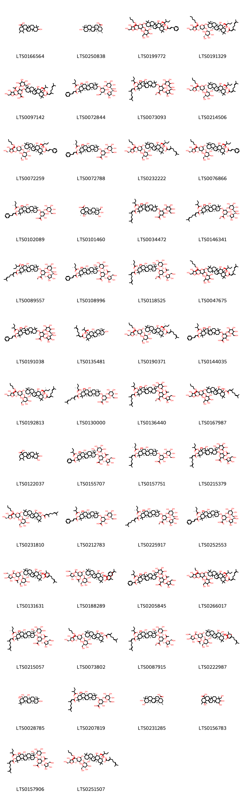
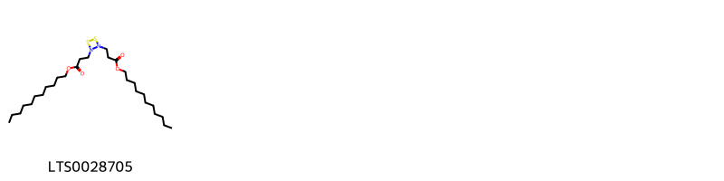
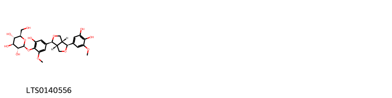
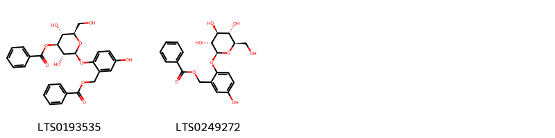
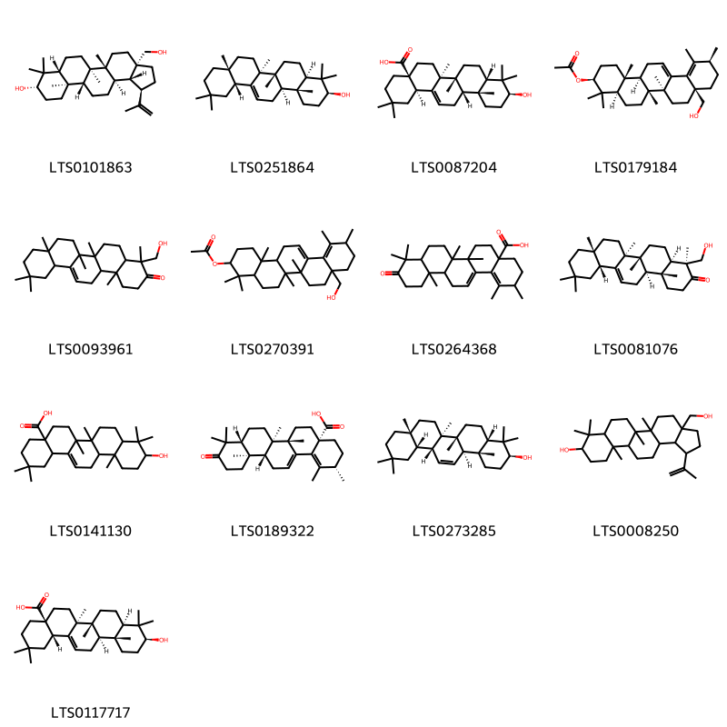
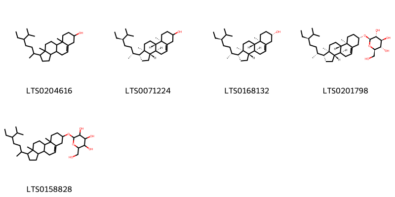
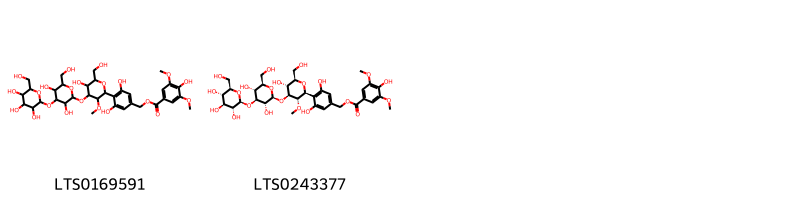
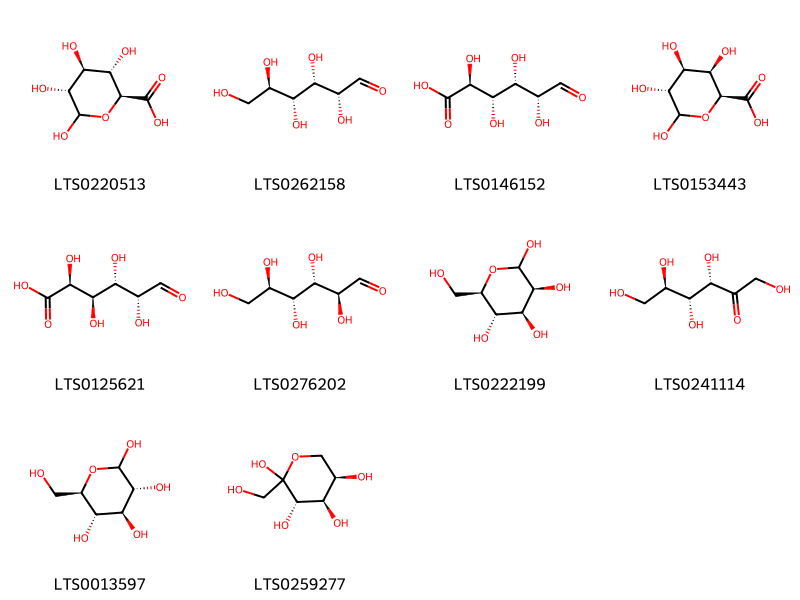

!!! abstract "Tóm tắt"

    Họ Symplocaceae gồm khoảng 1 chi và 5 loài được một số cộng đồng tại các quốc gia như Elsewhere, India, US, India(Hindu), USA, Penang sử dụng trong một số trường hợp Chất làm se, Dạ dày, Tonic, Hemostat, Chất làm se, nan, Vermifuge, Mỹ phẩm.

!!! info "DrDuke"

    James A. Duke sinh năm 1929-2017 là một nhà thực vật học người Mỹ. Đây là một trong những tác giả hàng đầu trong lĩnh vực dược dân tộc học với cuốn *CRC Handbook of Medicinal Herbs* và chính là người xây dựng lên cơ sở dữ liệu về hợp chất tự nhiên và dược dân tộc học tại Bộ nông nghiệp Hoa Kỳ. Các thông tin được đăng tải tại website [Dr. Duke's Phytochemical and Ethnobotanical Databases](https://phytochem.nal.usda.gov/). 
    Trong suốt thập niên 1970, ông lãnh đạo the Plant Taxonomy Laboratory, Plant Genetics and Germplasm Institute of the Agricultural Research Service, U.S. Department of Agriculture.
    Trong tài liệu này, các thông tin về dược dân tộc của các dược liệu được trích dẫn từ tài liệu của James A. Ducke với sự trợ giúp của phần mềm dịch thuật từ tiếng Anh sang tiếng Việt.
   

# Chi Symplocos

??? note "Danh sách các dược liệu thuộc chi"
    
	 - *Symplocos laurina*
	 - *Symplocos paniculata*
	 - *Symplocos penangiana*
	 - *Symplocos racemosa*
	 - *Symplocos tinctoria*

---
## Symplocos laurina
### Thông tin về thực vật

!!! info "Phân loại thực vật của *Symplocos acuminata* từ GIBF:"
    - **Kingdom:** Plantae
    - **Phylum:** Tracheophyta
    - **Order:** Ericales
    - **Family:** Symplocaceae
    - **Genus:** Symplocos
    - **Species:** *Symplocos acuminata*

 

| Label (VI)   | Label (EN)   | Scientific Name   | Descriptions (VI)   | Descriptions (EN)   | Also Known As (VI)   | Also Known As (EN)   |
|:-------------|:-------------|:------------------|:--------------------|:--------------------|:---------------------|:---------------------|
| N/A          | N/A          | Symplocos laurina | loài thực vật       | species of plant    | ['']                 | ['']                 |

#### Phân bố trên thế giới

**Từ CSDL GIBF** Japan, Thailand, India, Indonesia, China, Nepal

#### Phân bố tại Việt Nam

**Từ CSDL GIBF**: Không có ghi nhận ở Việt Nam

---
### Thành phần hóa học
        
- Theo cơ sở dữ liệu lotus: Từ loài *Symplocos acuminata* đã phân lập và xác định được Chưa có hoạt chất nào được phân lập. hoạt chất thuộc về các nhóm Không có hoạt chất nào được phân lập. 

Không có hình ảnh nào được tạo ra

---

### Dược dân tộc học

Danh sách các quốc gia có sử dụng *Symplocos acuminata* trong điều trị các bệnh. 

| Country   | Disease   | Bệnh        |
|:----------|:----------|:------------|
| Elsewhere | Hemostat  | Máy cầm máu |

---

---
## Symplocos paniculata
### Thông tin về thực vật

!!! info "Phân loại thực vật của *Symplocos paniculata* từ GIBF:"
    - **Kingdom:** Plantae
    - **Phylum:** Tracheophyta
    - **Order:** Ericales
    - **Family:** Symplocaceae
    - **Genus:** Symplocos
    - **Species:** *Symplocos paniculata*

 

| Label (VI)   | Label (EN)   | Scientific Name      | Descriptions (VI)   | Descriptions (EN)   | Also Known As (VI)   | Also Known As (EN)                                            |
|:-------------|:-------------|:---------------------|:--------------------|:--------------------|:---------------------|:--------------------------------------------------------------|
| N/A          | N/A          | Symplocos paniculata | loài thực vật       | species of plant    | ['']                 | ['Asiatic sweet-leaf', 'Asiatic sweetleaf', 'sapphire-berry'] |

#### Phân bố trên thế giới

**Từ CSDL GIBF** Hong Kong, Japan, Chinese Taipei, United States of America, China, Nepal

#### Phân bố tại Việt Nam

**Từ CSDL GIBF**: Không có ghi nhận ở Việt Nam

---
### Thành phần hóa học
        
- Theo cơ sở dữ liệu lotus: Từ loài *Symplocos paniculata* đã phân lập và xác định được 79 hoạt chất thuộc về các nhóm Prenol lipids. 

|    | chemicalTaxonomyClassyfireClass   |   smiles_count |
|---:|:----------------------------------|---------------:|
|  0 | Prenol lipids                     |             79 |

#### Nhóm Prenol lipids
<figure markdown="span">
    { width=100% }
    <figcaption>Hình ảnh cấu trúc hóa học của 79 hoạt chất thuộc nhóm Prenol lipids gồm ['10-hydroxy-1,2,6a,6b,9,9,12a-heptamethyl-2,3,4,5,6,7,8,8a,10,11,12,12b,13,14b-tetradecahydro-1h-picene-4a-carboxylic acid (LTS0166564)', 'ursolic acid (LTS0250838)', 'butyl 3-{[3,4-dihydroxy-5-(hydroxymethyl)oxolan-2-yl]oxy}-6-{[7,8-dihydroxy-8a-(hydroxymethyl)-4,4,6a,6b,11,11,14b-heptamethyl-9-[(2-methylbutanoyl)oxy]-10-[(3-phenylprop-2-enoyl)oxy]-1,2,3,4a,5,6,7,8,9,10,12,12a,14,14a-tetradecahydropicen-3-yl]oxy}-4-hydroxy-5-{[3,4,5-trihydroxy-6-(hydroxymethyl)oxan-2-yl]oxy}oxane-2-carboxylate (LTS0199772)', 'pentyl (2r,3s,4r,5s,6r)-6-{[(3r,4ar,6as,6bs,7r,8s,8as,9r,10r,12ar,14ar,14br)-10-{[(2z)-3,7-dimethylocta-2,6-dienoyl]oxy}-7,8-dihydroxy-8a-(hydroxymethyl)-4,4,6a,6b,11,11,14b-heptamethyl-9-{[(2r)-2-methylbutanoyl]oxy}-1,2,3,4a,5,6,7,8,9,10,12,12a,14,14a-tetradecahydropicen-3-yl]oxy}-3-{[(2s,3r,4s,5s)-3,4-dihydroxy-5-(hydroxymethyl)oxolan-2-yl]oxy}-4-hydroxy-5-{[(2r,3r,4r,5r,6s)-3,4,5-trihydroxy-6-(hydroxymethyl)oxan-2-yl]oxy}oxane-2-carboxylate (LTS0191329)', '4-(acetyloxy)-3-{[3,4-dihydroxy-5-(hydroxymethyl)oxolan-2-yl]oxy}-6-({10-[(3,7-dimethylocta-2,6-dienoyl)oxy]-7,8-dihydroxy-8a-(hydroxymethyl)-4,4,6a,6b,11,11,14b-heptamethyl-9-[(2-methylpropanoyl)oxy]-1,2,3,4a,5,6,7,8,9,10,12,12a,14,14a-tetradecahydropicen-3-yl}oxy)-5-{[3,4,5-trihydroxy-6-(hydroxymethyl)oxan-2-yl]oxy}oxane-2-carboxylic acid (LTS0097142)', '(3r,4r,4ar,5s,6r,6as,6br,8ar,10s,12ar,12br,14bs)-10-{[(2r,3r,4s,5s,6r)-5-{[(2s,3r,4r,5s)-3,4-dihydroxy-5-(hydroxymethyl)oxolan-2-yl]oxy}-4-hydroxy-6-(hydroxymethyl)-3-{[(2s,3r,4s,5s,6r)-3,4,5-trihydroxy-6-(hydroxymethyl)oxan-2-yl]oxy}oxan-2-yl]oxy}-5,6-dihydroxy-4a-(hydroxymethyl)-2,2,6a,6b,9,9,12a-heptamethyl-3-{[(2e)-3-phenylprop-2-enoyl]oxy}-1,3,4,5,6,7,8,8a,10,11,12,12b,13,14b-tetradecahydropicen-4-yl 2-methylbutanoate (LTS0072844)', 'methyl 3-{[3,4-dihydroxy-5-(hydroxymethyl)oxolan-2-yl]oxy}-6-({10-[(3,7-dimethylocta-2,6-dienoyl)oxy]-7,8-dihydroxy-8a-(hydroxymethyl)-4,4,6a,6b,11,11,14b-heptamethyl-9-[(2-methylbutanoyl)oxy]-1,2,3,4a,5,6,7,8,9,10,12,12a,14,14a-tetradecahydropicen-3-yl}oxy)-4-hydroxy-5-{[3,4,5-trihydroxy-6-(hydroxymethyl)oxan-2-yl]oxy}oxane-2-carboxylate (LTS0073093)', 'butyl (2s,3s,4s,5r,6r)-6-{[(3s,4ar,6ar,6bs,7r,8s,8ar,9r,10r,12as,14ar,14br)-10-{[(2z)-3,7-dimethylocta-2,6-dienoyl]oxy}-7,8-dihydroxy-8a-(hydroxymethyl)-4,4,6a,6b,11,11,14b-heptamethyl-9-[(2-methylbutanoyl)oxy]-1,2,3,4a,5,6,7,8,9,10,12,12a,14,14a-tetradecahydropicen-3-yl]oxy}-3-{[(2s,3r,4r,5s)-3,4-dihydroxy-5-(hydroxymethyl)oxolan-2-yl]oxy}-4-hydroxy-5-{[(2s,3r,4s,5s,6r)-3,4,5-trihydroxy-6-(hydroxymethyl)oxan-2-yl]oxy}oxane-2-carboxylate (LTS0214506)', 'butyl (2r,3r,4r,5s,6s)-6-{[(3s,4ar,6as,6bs,7s,8s,8ar,9s,10s,12ar,14as,14bs)-7,8-dihydroxy-8a-(hydroxymethyl)-4,4,6a,6b,11,11,14b-heptamethyl-9-{[(2r)-2-methylbutanoyl]oxy}-10-{[(2e)-3-phenylprop-2-enoyl]oxy}-1,2,3,4a,5,6,7,8,9,10,12,12a,14,14a-tetradecahydropicen-3-yl]oxy}-3-{[(2r,3s,4s,5r)-3,4-dihydroxy-5-(hydroxymethyl)oxolan-2-yl]oxy}-4-hydroxy-5-{[(2r,3s,4r,5r,6s)-3,4,5-trihydroxy-6-(hydroxymethyl)oxan-2-yl]oxy}oxane-2-carboxylate (LTS0072259)', '(2s,3s,4s,5r,6r)-6-{[(3s,4ar,6ar,6bs,7r,8s,8ar,9r,10s,12as,14ar,14br)-7,8-dihydroxy-8a-(hydroxymethyl)-4,4,6a,6b,11,11,14b-heptamethyl-9-{[(2r)-2-methylbutanoyl]oxy}-10-{[(2e)-3-phenylprop-2-enoyl]oxy}-1,2,3,4a,5,6,7,8,9,10,12,12a,14,14a-tetradecahydropicen-3-yl]oxy}-3,4-dihydroxy-5-{[(2s,3r,4s,5s,6r)-3,4,5-trihydroxy-6-(hydroxymethyl)oxan-2-yl]oxy}oxane-2-carboxylic acid (LTS0072788)', 'butyl (2s,3s,4s,5r,6r)-6-{[(3s,4ar,6ar,6bs,7r,8s,8ar,9r,10r,12as,14ar,14br)-10-{[(2e)-3,7-dimethylocta-2,6-dienoyl]oxy}-7,8-dihydroxy-8a-(hydroxymethyl)-4,4,6a,6b,11,11,14b-heptamethyl-9-{[(2s)-2-methylbutanoyl]oxy}-1,2,3,4a,5,6,7,8,9,10,12,12a,14,14a-tetradecahydropicen-3-yl]oxy}-3-{[(2s,3r,4r,5s)-3,4-dihydroxy-5-(hydroxymethyl)oxolan-2-yl]oxy}-4-hydroxy-5-{[(2s,3r,4s,5s,6r)-3,4,5-trihydroxy-6-(hydroxymethyl)oxan-2-yl]oxy}oxane-2-carboxylate (LTS0232222)', 'butyl (2s,3s,4s,5r,6r)-6-{[(3s,4ar,6ar,6bs,7r,8s,8ar,9r,10r,12as,14ar,14br)-7,8-dihydroxy-8a-(hydroxymethyl)-4,4,6a,6b,11,11,14b-heptamethyl-9-[(2-methylbutanoyl)oxy]-10-{[(2e)-3-phenylprop-2-enoyl]oxy}-1,2,3,4a,5,6,7,8,9,10,12,12a,14,14a-tetradecahydropicen-3-yl]oxy}-3-{[(2s,3r,4r,5s)-3,4-dihydroxy-5-(hydroxymethyl)oxolan-2-yl]oxy}-4-hydroxy-5-{[(2s,3r,4s,5s,6r)-3,4,5-trihydroxy-6-(hydroxymethyl)oxan-2-yl]oxy}oxane-2-carboxylate (LTS0076866)', '(2s,3s,4s,5r,6r)-6-{[(3s,4ar,6ar,6bs,7r,8s,8ar,9r,10r,12as,14ar,14br)-7,8-dihydroxy-8a-(hydroxymethyl)-4,4,6a,6b,11,11,14b-heptamethyl-9-{[(2r)-2-methylbutanoyl]oxy}-10-{[(2e)-3-phenylprop-2-enoyl]oxy}-1,2,3,4a,5,6,7,8,9,10,12,12a,14,14a-tetradecahydropicen-3-yl]oxy}-3,4-dihydroxy-5-{[(2s,3r,4s,5s,6r)-3,4,5-trihydroxy-6-(hydroxymethyl)oxan-2-yl]oxy}oxane-2-carboxylic acid (LTS0102089)', '(1r,2r,4as,6as,6br,8ar,9r,10s,11r,12ar,12br,14bs)-1,10,11-trihydroxy-9-(hydroxymethyl)-1,2,6a,6b,9,12a-hexamethyl-2,3,4,5,6,7,8,8a,10,11,12,12b,13,14b-tetradecahydropicene-4a-carboxylic acid (LTS0101460)', '6-({10-[(3,7-dimethylocta-2,6-dienoyl)oxy]-7,8-dihydroxy-8a-(hydroxymethyl)-4,4,6a,6b,11,11,14b-heptamethyl-9-[(2-methylbutanoyl)oxy]-1,2,3,4a,5,6,7,8,9,10,12,12a,14,14a-tetradecahydropicen-3-yl}oxy)-3,4-dihydroxy-5-{[3,4,5-trihydroxy-6-(hydroxymethyl)oxan-2-yl]oxy}oxane-2-carboxylic acid (LTS0034472)', 'methyl (2s,3s,4s,5r,6r)-6-{[(3s,6ar,6bs,7r,8s,8ar,9r,10r,12as,14ar,14br)-10-{[(2e)-3,7-dimethylocta-2,6-dienoyl]oxy}-7,8-dihydroxy-8a-(hydroxymethyl)-4,4,6a,6b,11,11,14b-heptamethyl-9-[(2-methylbutanoyl)oxy]-1,2,3,4a,5,6,7,8,9,10,12,12a,14,14a-tetradecahydropicen-3-yl]oxy}-3-{[(2s,3r,4r,5s)-3,4-dihydroxy-5-(hydroxymethyl)oxolan-2-yl]oxy}-4-hydroxy-5-{[(2s,3r,4s,5s,6r)-3,4,5-trihydroxy-6-(hydroxymethyl)oxan-2-yl]oxy}oxane-2-carboxylate (LTS0146341)', 'methyl (2s,3s,4s,5r,6r)-6-{[(3s,4ar,6ar,6bs,7r,8s,8ar,9r,10s,12as,14ar,14br)-10-{[(2e)-3,7-dimethylocta-2,6-dienoyl]oxy}-7,8-dihydroxy-8a-(hydroxymethyl)-4,4,6a,6b,11,11,14b-heptamethyl-9-(2-methylbutanoyl)-1,2,3,4a,5,6,7,8,9,10,12,12a,14,14a-tetradecahydropicen-3-yl]oxy}-3-{[(2s,3r,4r,5s)-3,4-dihydroxy-5-(hydroxymethyl)oxolan-2-yl]oxy}-4-hydroxy-5-{[(2s,3r,4s,5s,6r)-3,4,5-trihydroxy-6-(hydroxymethyl)oxan-2-yl]oxy}oxane-2-carboxylate (LTS0089557)', '(2s,3s,4s,5r,6r)-6-{[(3s,4ar,6ar,6bs,7r,8s,8ar,9r,10r,12as,14ar,14br)-7,8-dihydroxy-8a-(hydroxymethyl)-4,4,6a,6b,11,11,14b-heptamethyl-9-{[(2r)-2-methylbutanoyl]oxy}-10-{[(2e)-3-phenylprop-2-enoyl]oxy}-1,2,3,4a,5,6,7,8,9,10,12,12a,14,14a-tetradecahydropicen-3-yl]oxy}-4-(acetyloxy)-3-{[(2s,3r,4r,5s)-3,4-dihydroxy-5-(hydroxymethyl)oxolan-2-yl]oxy}-5-{[(2s,3r,4s,5s,6r)-3,4,5-trihydroxy-6-(hydroxymethyl)oxan-2-yl]oxy}oxane-2-carboxylic acid (LTS0108996)', 'methyl (2s,3s,4s,5r,6r)-6-{[(3s,4ar,6ar,6bs,7r,8s,8ar,9r,10r,12as,14ar,14br)-10-{[(2z)-3,7-dimethylocta-2,6-dienoyl]oxy}-7,8-dihydroxy-8a-(hydroxymethyl)-4,4,6a,6b,11,11,14b-heptamethyl-9-{[(2r)-2-methylbutanoyl]oxy}-1,2,3,4a,5,6,7,8,9,10,12,12a,14,14a-tetradecahydropicen-3-yl]oxy}-4-(acetyloxy)-3-{[(2s,3r,4r,5s)-3,4-dihydroxy-5-(hydroxymethyl)oxolan-2-yl]oxy}-5-{[(2s,3r,4s,5s,6r)-3,4,5-trihydroxy-6-(hydroxymethyl)oxan-2-yl]oxy}oxane-2-carboxylate (LTS0118525)', 'pentyl 3-{[3,4-dihydroxy-5-(hydroxymethyl)oxolan-2-yl]oxy}-6-({10-[(3,7-dimethylocta-2,6-dienoyl)oxy]-7,8-dihydroxy-8a-(hydroxymethyl)-4,4,6a,6b,11,11,14b-heptamethyl-9-[(2-methylbutanoyl)oxy]-1,2,3,4a,5,6,7,8,9,10,12,12a,14,14a-tetradecahydropicen-3-yl}oxy)-4-hydroxy-5-{[3,4,5-trihydroxy-6-(hydroxymethyl)oxan-2-yl]oxy}oxane-2-carboxylate (LTS0047675)', '3-{[3,4-dihydroxy-5-(hydroxymethyl)oxolan-2-yl]oxy}-6-{[7,8-dihydroxy-8a-(hydroxymethyl)-4,4,6a,6b,11,11,14b-heptamethyl-9-[(2-methylbutanoyl)oxy]-10-[(3-phenylprop-2-enoyl)oxy]-1,2,3,4a,5,6,7,8,9,10,12,12a,14,14a-tetradecahydropicen-3-yl]oxy}-4-hydroxy-5-{[3,4,5-trihydroxy-6-(hydroxymethyl)oxan-2-yl]oxy}oxane-2-carboxylic acid (LTS0191038)', '(3r,4r,4ar,5s,6r,6as,6br,8ar,10s,12ar,12br,14bs)-5,6,10-trihydroxy-4a-(hydroxymethyl)-2,2,6a,6b,9,9,12a-heptamethyl-4-[(2-methylpropanoyl)oxy]-1,3,4,5,6,7,8,8a,10,11,12,12b,13,14b-tetradecahydropicen-3-yl (2z)-3,7-dimethylocta-2,6-dienoate (LTS0135481)', 'butyl (2s,3s,4s,5r,6r)-6-{[(3s,4ar,6ar,6bs,7r,8s,8ar,9r,10r,12as,14ar,14br)-10-{[(2e)-3,7-dimethylocta-2,6-dienoyl]oxy}-7,8-dihydroxy-8a-(hydroxymethyl)-4,4,6a,6b,11,11,14b-heptamethyl-9-{[(2r)-2-methylbutanoyl]oxy}-1,2,3,4a,5,6,7,8,9,10,12,12a,14,14a-tetradecahydropicen-3-yl]oxy}-3-{[(2s,3r,4r,5s)-3,4-dihydroxy-5-(hydroxymethyl)oxolan-2-yl]oxy}-4-hydroxy-5-{[(2s,3r,4s,5s,6r)-3,4,5-trihydroxy-6-(hydroxymethyl)oxan-2-yl]oxy}oxane-2-carboxylate (LTS0190371)', '6-{[7,8-dihydroxy-8a-(hydroxymethyl)-4,4,6a,6b,11,11,14b-heptamethyl-9-[(2-methylbutanoyl)oxy]-10-[(3-phenylprop-2-enoyl)oxy]-1,2,3,4a,5,6,7,8,9,10,12,12a,14,14a-tetradecahydropicen-3-yl]oxy}-3,4-dihydroxy-5-{[3,4,5-trihydroxy-6-(hydroxymethyl)oxan-2-yl]oxy}oxane-2-carboxylic acid (LTS0144035)', 'butyl (2s,3s,4s,5r,6r)-6-{[(3s,4as,6ar,6bs,7r,8s,8ar,9r,10r,12as,14ar,14br)-10-{[(2z)-3,7-dimethylocta-2,6-dienoyl]oxy}-7,8-dihydroxy-8a-(hydroxymethyl)-4,4,6a,6b,11,11,14b-heptamethyl-9-{[(2r)-2-methylbutanoyl]oxy}-1,2,3,4a,5,6,7,8,9,10,12,12a,14,14a-tetradecahydropicen-3-yl]oxy}-3-{[(2s,3r,4r,5s)-3,4-dihydroxy-5-(hydroxymethyl)oxolan-2-yl]oxy}-4-hydroxy-5-{[(2s,3r,4s,5s,6r)-3,4,5-trihydroxy-6-(hydroxymethyl)oxan-2-yl]oxy}oxane-2-carboxylate (LTS0192813)', '(2s,3s,4s,5r,6r)-6-{[(3s,4ar,6ar,6bs,7r,8s,8ar,9r,10r,12as,14ar,14br)-10-{[(2e)-3,7-dimethylocta-2,6-dienoyl]oxy}-7,8-dihydroxy-8a-(hydroxymethyl)-4,4,6a,6b,11,11,14b-heptamethyl-9-{[(2r)-2-methylbutanoyl]oxy}-1,2,3,4a,5,6,7,8,9,10,12,12a,14,14a-tetradecahydropicen-3-yl]oxy}-3,4-dihydroxy-5-{[(2s,3r,4s,5s,6r)-3,4,5-trihydroxy-6-(hydroxymethyl)oxan-2-yl]oxy}oxane-2-carboxylic acid (LTS0130000)', 'methyl 4-(acetyloxy)-3-{[3,4-dihydroxy-5-(hydroxymethyl)oxolan-2-yl]oxy}-6-({10-[(3,7-dimethylocta-2,6-dienoyl)oxy]-7,8-dihydroxy-8a-(hydroxymethyl)-4,4,6a,6b,11,11,14b-heptamethyl-9-[(2-methylbutanoyl)oxy]-1,2,3,4a,5,6,7,8,9,10,12,12a,14,14a-tetradecahydropicen-3-yl}oxy)-5-{[3,4,5-trihydroxy-6-(hydroxymethyl)oxan-2-yl]oxy}oxane-2-carboxylate (LTS0136440)', 'butyl 3-{[3,4-dihydroxy-5-(hydroxymethyl)oxolan-2-yl]oxy}-6-({9-[(3,7-dimethylocta-2,6-dienoyl)oxy]-7,8-dihydroxy-8a-(hydroxymethyl)-4,4,6a,6b,11,11,14b-heptamethyl-1,2,3,4a,5,6,7,8,9,10,12,12a,14,14a-tetradecahydropicen-3-yl}oxy)-4-hydroxy-5-{[3,4,5-trihydroxy-6-(hydroxymethyl)oxan-2-yl]oxy}oxane-2-carboxylate (LTS0167987)', '10,11-dihydroxy-1,2,6a,6b,9,9,12a-heptamethyl-2,3,4,5,6,7,8,8a,10,11,12,12b,13,14b-tetradecahydro-1h-picene-4a-carboxylic acid (LTS0122037)', '(2s,3s,4s,5r,6r)-6-{[(3s,4ar,6ar,6bs,7r,8s,8ar,9r,10r,12as,14ar,14br)-10-(benzoyloxy)-7,8-dihydroxy-8a-(hydroxymethyl)-4,4,6a,6b,11,11,14b-heptamethyl-9-[(2-methylbutanoyl)oxy]-1,2,3,4a,5,6,7,8,9,10,12,12a,14,14a-tetradecahydropicen-3-yl]oxy}-4-(acetyloxy)-3-{[(2s,3r,4r,5s)-3,4-dihydroxy-5-(hydroxymethyl)oxolan-2-yl]oxy}-5-{[(2s,3r,4s,5s,6r)-3,4,5-trihydroxy-6-(hydroxymethyl)oxan-2-yl]oxy}oxane-2-carboxylic acid (LTS0155707)', '(2s,3s,4s,5r,6r)-6-{[(3s,4ar,6ar,6bs,7r,8s,8ar,9r,10r,12as,14ar,14br)-10-{[(2z)-3,7-dimethylocta-2,6-dienoyl]oxy}-7,8-dihydroxy-8a-(hydroxymethyl)-4,4,6a,6b,11,11,14b-heptamethyl-9-{[(2r)-2-methylbutanoyl]oxy}-1,2,3,4a,5,6,7,8,9,10,12,12a,14,14a-tetradecahydropicen-3-yl]oxy}-3,4-dihydroxy-5-{[(2s,3r,4s,5s,6r)-3,4,5-trihydroxy-6-(hydroxymethyl)oxan-2-yl]oxy}oxane-2-carboxylic acid (LTS0157751)', '4-(acetyloxy)-3-{[3,4-dihydroxy-5-(hydroxymethyl)oxolan-2-yl]oxy}-6-({10-[(3,7-dimethylocta-2,6-dienoyl)oxy]-7,8-dihydroxy-8a-(hydroxymethyl)-4,4,6a,6b,11,11,14b-heptamethyl-9-[(2-methylbutanoyl)oxy]-1,2,3,4a,5,6,7,8,9,10,12,12a,14,14a-tetradecahydropicen-3-yl}oxy)-5-{[3,4,5-trihydroxy-6-(hydroxymethyl)oxan-2-yl]oxy}oxane-2-carboxylic acid (LTS0215379)', 'butyl (2s,3s,4s,5r,6r)-6-{[(3s,6ar,6bs,7r,8s,8ar,9s,12as,14ar,14br)-9-{[(2e)-3,7-dimethylocta-2,6-dienoyl]oxy}-7,8-dihydroxy-8a-(hydroxymethyl)-4,4,6a,6b,11,11,14b-heptamethyl-1,2,3,4a,5,6,7,8,9,10,12,12a,14,14a-tetradecahydropicen-3-yl]oxy}-3-{[(2s,3r,4r,5s)-3,4-dihydroxy-5-(hydroxymethyl)oxolan-2-yl]oxy}-4-hydroxy-5-{[(2s,3r,4s,5s,6r)-3,4,5-trihydroxy-6-(hydroxymethyl)oxan-2-yl]oxy}oxane-2-carboxylate (LTS0231810)', '(2s,3s,4s,5r,6r)-6-{[(3s,4ar,6ar,6bs,7r,8s,8ar,9r,10r,12as,14ar,14br)-7,8-dihydroxy-8a-(hydroxymethyl)-4,4,6a,6b,11,11,14b-heptamethyl-9-[(2-methylbutanoyl)oxy]-10-{[(2e)-3-phenylprop-2-enoyl]oxy}-1,2,3,4a,5,6,7,8,9,10,12,12a,14,14a-tetradecahydropicen-3-yl]oxy}-3,4-dihydroxy-5-{[(2s,3r,4s,5s,6r)-3,4,5-trihydroxy-6-(hydroxymethyl)oxan-2-yl]oxy}oxane-2-carboxylic acid (LTS0212783)', 'methyl (2s,3s,4s,5r,6r)-6-{[(3s,4ar,6ar,6bs,7r,8s,8ar,9r,10r,12as,14ar,14br)-10-{[(2e)-3,7-dimethylocta-2,6-dienoyl]oxy}-7,8-dihydroxy-8a-(hydroxymethyl)-4,4,6a,6b,11,11,14b-heptamethyl-9-{[(2r)-2-methylbutanoyl]oxy}-1,2,3,4a,5,6,7,8,9,10,12,12a,14,14a-tetradecahydropicen-3-yl]oxy}-3-{[(2s,3r,4r,5s)-3,4-dihydroxy-5-(hydroxymethyl)oxolan-2-yl]oxy}-4-hydroxy-5-{[(2s,3r,4s,5s,6r)-3,4,5-trihydroxy-6-(hydroxymethyl)oxan-2-yl]oxy}oxane-2-carboxylate (LTS0225917)', '(2s,3s,4s,5r,6r)-6-{[(3s,4ar,6ar,6bs,7r,8s,8ar,9r,10r,12as,14ar,14br)-7,8-dihydroxy-8a-(hydroxymethyl)-4,4,6a,6b,11,11,14b-heptamethyl-9-{[(2r)-2-methylbutanoyl]oxy}-10-{[(2e)-3-phenylprop-2-enoyl]oxy}-1,2,3,4a,5,6,7,8,9,10,12,12a,14,14a-tetradecahydropicen-3-yl]oxy}-3-{[(2s,3r,4r,5s)-3,4-dihydroxy-5-(hydroxymethyl)oxolan-2-yl]oxy}-4-hydroxy-5-{[(2s,3r,4s,5s,6r)-3,4,5-trihydroxy-6-(hydroxymethyl)oxan-2-yl]oxy}oxane-2-carboxylic acid (LTS0252553)', '(2s,3s,4s,5r,6r)-6-{[(3s,4ar,6ar,7r,8s,8ar,9r,10r,12as,14ar,14br)-10-{[(2e)-3,7-dimethylocta-2,6-dienoyl]oxy}-7,8-dihydroxy-8a-(hydroxymethyl)-4,4,6a,6b,11,11,14b-heptamethyl-9-[(2-methylpropanoyl)oxy]-1,2,3,4a,5,6,7,8,9,10,12,12a,14,14a-tetradecahydropicen-3-yl]oxy}-4-(acetyloxy)-3-{[(2s,3r,4r,5s)-3,4-dihydroxy-5-(hydroxymethyl)oxolan-2-yl]oxy}-5-{[(2s,3r,4s,5s,6r)-3,4,5-trihydroxy-6-(hydroxymethyl)oxan-2-yl]oxy}oxane-2-carboxylic acid (LTS0131631)', '(2s,3s,4s,5r,6r)-6-{[(3s,4ar,6ar,6bs,7r,8s,8ar,9r,10r,12as,14ar,14br)-9-(benzoyloxy)-10-{[(2z)-3,7-dimethylocta-2,6-dienoyl]oxy}-7,8-dihydroxy-8a-(hydroxymethyl)-4,4,6a,6b,11,11,14b-heptamethyl-1,2,3,4a,5,6,7,8,9,10,12,12a,14,14a-tetradecahydropicen-3-yl]oxy}-4-(acetyloxy)-3-{[(2s,3r,4r,5s)-3,4-dihydroxy-5-(hydroxymethyl)oxolan-2-yl]oxy}-5-{[(2s,3r,4s,5s,6r)-3,4,5-trihydroxy-6-(hydroxymethyl)oxan-2-yl]oxy}oxane-2-carboxylic acid (LTS0188289)', '4-(acetyloxy)-6-{[10-(benzoyloxy)-7,8-dihydroxy-8a-(hydroxymethyl)-4,4,6a,6b,11,11,14b-heptamethyl-9-[(2-methylbutanoyl)oxy]-1,2,3,4a,5,6,7,8,9,10,12,12a,14,14a-tetradecahydropicen-3-yl]oxy}-3-{[3,4-dihydroxy-5-(hydroxymethyl)oxolan-2-yl]oxy}-5-{[3,4,5-trihydroxy-6-(hydroxymethyl)oxan-2-yl]oxy}oxane-2-carboxylic acid (LTS0205845)', 'ethyl 3-{[3,4-dihydroxy-5-(hydroxymethyl)oxolan-2-yl]oxy}-6-({10-[(3,7-dimethylocta-2,6-dienoyl)oxy]-7,8-dihydroxy-8a-(hydroxymethyl)-4,4,6a,6b,11,11,14b-heptamethyl-9-[(2-methylbutanoyl)oxy]-1,2,3,4a,5,6,7,8,9,10,12,12a,14,14a-tetradecahydropicen-3-yl}oxy)-4-hydroxy-5-{[3,4,5-trihydroxy-6-(hydroxymethyl)oxan-2-yl]oxy}oxane-2-carboxylate (LTS0266017)', '(2s,3s,4s,5r,6r)-6-{[(3s,4ar,6ar,6bs,7r,8s,8ar,9r,10r,12as,14ar,14br)-10-{[(2z)-3,7-dimethylocta-2,6-dienoyl]oxy}-7,8-dihydroxy-8a-(hydroxymethyl)-4,4,6a,6b,11,11,14b-heptamethyl-9-{[(2r)-2-methylbutanoyl]oxy}-1,2,3,4a,5,6,7,8,9,10,12,12a,14,14a-tetradecahydropicen-3-yl]oxy}-4-(acetyloxy)-3-{[(2s,3r,4r,5s)-3,4-dihydroxy-5-(hydroxymethyl)oxolan-2-yl]oxy}-5-{[(2s,3r,4s,5s,6r)-3,4,5-trihydroxy-6-(hydroxymethyl)oxan-2-yl]oxy}oxane-2-carboxylic acid (LTS0215057)', 'butyl (2s,3s,4s,5r,6r)-6-{[(3s,4ar,6ar,6bs,7r,8s,8ar,9s,12as,14ar,14br)-9-{[(2z)-3,7-dimethylocta-2,6-dienoyl]oxy}-7,8-dihydroxy-8a-(hydroxymethyl)-4,4,6a,6b,11,11,14b-heptamethyl-1,2,3,4a,5,6,7,8,9,10,12,12a,14,14a-tetradecahydropicen-3-yl]oxy}-3-{[(2s,3r,4r,5s)-3,4-dihydroxy-5-(hydroxymethyl)oxolan-2-yl]oxy}-4-hydroxy-5-{[(2s,3r,4s,5s,6r)-3,4,5-trihydroxy-6-(hydroxymethyl)oxan-2-yl]oxy}oxane-2-carboxylate (LTS0073802)', 'methyl (2s,3s,4s,5r,6r)-6-{[(3s,4ar,6ar,6bs,7r,8s,8ar,9r,10r,12as,14ar,14br)-10-{[(2z)-3,7-dimethylocta-2,6-dienoyl]oxy}-7,8-dihydroxy-8a-(hydroxymethyl)-4,4,6a,6b,11,11,14b-heptamethyl-9-[(2-methylbutanoyl)oxy]-1,2,3,4a,5,6,7,8,9,10,12,12a,14,14a-tetradecahydropicen-3-yl]oxy}-4-(acetyloxy)-3-{[(2s,3r,4r,5s)-3,4-dihydroxy-5-(hydroxymethyl)oxolan-2-yl]oxy}-5-{[(2s,3r,4s,5s,6r)-3,4,5-trihydroxy-6-(hydroxymethyl)oxan-2-yl]oxy}oxane-2-carboxylate (LTS0087915)', '(2s,3s,4s,5r,6r)-6-{[(3s,4ar,6ar,6bs,7r,8s,8ar,9r,10r,12as,14ar,14br)-10-{[(2e)-3,7-dimethylocta-2,6-dienoyl]oxy}-7,8-dihydroxy-8a-(hydroxymethyl)-4,4,6a,6b,11,11,14b-heptamethyl-9-[(2-methylpropanoyl)oxy]-1,2,3,4a,5,6,7,8,9,10,12,12a,14,14a-tetradecahydropicen-3-yl]oxy}-4-(acetyloxy)-3-{[(2s,3r,4r,5s)-3,4-dihydroxy-5-(hydroxymethyl)oxolan-2-yl]oxy}-5-{[(2s,3r,4s,5s,6r)-3,4,5-trihydroxy-6-(hydroxymethyl)oxan-2-yl]oxy}oxane-2-carboxylic acid (LTS0222987)', '(3s,4ar,6ar,6bs,7r,8s,8as,9s,12as,14ar,14br)-8a-(hydroxymethyl)-4,4,6a,6b,11,11,14b-heptamethyl-1,2,3,4a,5,6,7,8,9,10,12,12a,14,14a-tetradecahydropicene-3,7,8,9-tetrol (LTS0028785)', '(2s,3s,4s,5r,6r)-6-{[(3s,4ar,6ar,6bs,7r,8s,8ar,9r,10r,12as,14ar,14br)-10-{[(2z)-3,7-dimethylocta-2,6-dienoyl]oxy}-7,8-dihydroxy-8a-(hydroxymethyl)-4,4,6a,6b,11,11,14b-heptamethyl-9-[(2-methylbutanoyl)oxy]-1,2,3,4a,5,6,7,8,9,10,12,12a,14,14a-tetradecahydropicen-3-yl]oxy}-3,4-dihydroxy-5-{[(2s,3r,4s,5s,6r)-3,4,5-trihydroxy-6-(hydroxymethyl)oxan-2-yl]oxy}oxane-2-carboxylic acid (LTS0207819)', 'corosolic acid (LTS0231285)', '1,10,11-trihydroxy-9-(hydroxymethyl)-1,2,6a,6b,9,12a-hexamethyl-2,3,4,5,6,7,8,8a,10,11,12,12b,13,14b-tetradecahydropicene-4a-carboxylic acid (LTS0156783)', '(2s,3s,4s,5r,6r)-6-{[(3s,4ar,6ar,6bs,7r,8s,8ar,9r,10r,12as,14ar,14br)-10-{[(2z)-3,7-dimethylocta-2,6-dienoyl]oxy}-7,8-dihydroxy-8a-(hydroxymethyl)-4,4,6a,6b,11,11,14b-heptamethyl-9-[(2-methylbutanoyl)oxy]-1,2,3,4a,5,6,7,8,9,10,12,12a,14,14a-tetradecahydropicen-3-yl]oxy}-4-(acetyloxy)-3-{[(2s,3r,4r,5s)-3,4-dihydroxy-5-(hydroxymethyl)oxolan-2-yl]oxy}-5-{[(2s,3r,4s,5s,6r)-3,4,5-trihydroxy-6-(hydroxymethyl)oxan-2-yl]oxy}oxane-2-carboxylic acid (LTS0157906)', 'butyl (2s,3s,4s,5r,6r)-6-{[(3s,6ar,6bs,7r,8s,8ar,9r,10r,12as,14ar,14br)-10-{[(2e)-3,7-dimethylocta-2,6-dienoyl]oxy}-7,8-dihydroxy-8a-(hydroxymethyl)-4,4,6a,6b,11,11,14b-heptamethyl-9-[(2-methylbutanoyl)oxy]-1,2,3,4a,5,6,7,8,9,10,12,12a,14,14a-tetradecahydropicen-3-yl]oxy}-3-{[(2s,3r,4r,5s)-3,4-dihydroxy-5-(hydroxymethyl)oxolan-2-yl]oxy}-4-hydroxy-5-{[(2s,3r,4s,5s,6r)-3,4,5-trihydroxy-6-(hydroxymethyl)oxan-2-yl]oxy}oxane-2-carboxylate (LTS0251507)', '(2s,3s,4s,5r,6r)-6-{[(3s,4ar,6ar,6bs,7r,8s,8ar,9r,10r,12as,14ar,14br)-10-{[(2z)-3,7-dimethylocta-2,6-dienoyl]oxy}-7,8-dihydroxy-8a-(hydroxymethyl)-4,4,6a,6b,11,11,14b-heptamethyl-9-{[(2s)-2-methylbutanoyl]oxy}-1,2,3,4a,5,6,7,8,9,10,12,12a,14,14a-tetradecahydropicen-3-yl]oxy}-3,4-dihydroxy-5-{[(2s,3r,4s,5s,6r)-3,4,5-trihydroxy-6-(hydroxymethyl)oxan-2-yl]oxy}oxane-2-carboxylic acid (LTS0200486)', '(2s,3s,4s,5r,6r)-6-{[(3s,4ar,6ar,6bs,7r,8s,8ar,9r,10r,12as,14ar,14br)-10-{[(2e)-3,7-dimethylocta-2,6-dienoyl]oxy}-7,8-dihydroxy-8a-(hydroxymethyl)-4,4,6a,6b,11,11,14b-heptamethyl-9-[(2-methylbutanoyl)oxy]-1,2,3,4a,5,6,7,8,9,10,12,12a,14,14a-tetradecahydropicen-3-yl]oxy}-4-(acetyloxy)-3-{[(2s,3r,4r,5s)-3,4-dihydroxy-5-(hydroxymethyl)oxolan-2-yl]oxy}-5-{[(2s,3r,4s,5s,6r)-3,4,5-trihydroxy-6-(hydroxymethyl)oxan-2-yl]oxy}oxane-2-carboxylic acid (LTS0163165)', 'butyl (2s,3s,4s,5r,6r)-6-{[(3s,4ar,6ar,6bs,7r,8s,8ar,9r,10r,12as,14ar,14br)-10-{[(2z)-3,7-dimethylocta-2,6-dienoyl]oxy}-7,8-dihydroxy-8a-(hydroxymethyl)-4,4,6a,6b,11,11,14b-heptamethyl-9-{[(2r)-2-methylbutanoyl]oxy}-1,2,3,4a,5,6,7,8,9,10,12,12a,14,14a-tetradecahydropicen-3-yl]oxy}-3-{[(2s,3r,4r,5s)-3,4-dihydroxy-5-(hydroxymethyl)oxolan-2-yl]oxy}-4-hydroxy-5-{[(2s,3r,4s,5s,6r)-3,4,5-trihydroxy-6-(hydroxymethyl)oxan-2-yl]oxy}oxane-2-carboxylate (LTS0049175)', 'butyl (2s,3s,4s,5r,6r)-6-{[(3s,4ar,6ar,6bs,7r,8s,8ar,9r,10r,12as,14ar,14br)-7,8-dihydroxy-8a-(hydroxymethyl)-4,4,6a,6b,11,11,14b-heptamethyl-9-{[(2r)-2-methylbutanoyl]oxy}-10-{[(2e)-3-phenylprop-2-enoyl]oxy}-1,2,3,4a,5,6,7,8,9,10,12,12a,14,14a-tetradecahydropicen-3-yl]oxy}-3-{[(2s,3r,4r,5s)-3,4-dihydroxy-5-(hydroxymethyl)oxolan-2-yl]oxy}-4-hydroxy-5-{[(2s,3r,4s,5s,6r)-3,4,5-trihydroxy-6-(hydroxymethyl)oxan-2-yl]oxy}oxane-2-carboxylate (LTS0037996)', '4-(acetyloxy)-3-{[3,4-dihydroxy-5-(hydroxymethyl)oxolan-2-yl]oxy}-6-({9-[(3,7-dimethylocta-2,6-dienoyl)oxy]-7,8-dihydroxy-8a-(hydroxymethyl)-4,4,6a,6b,11,11,14b-heptamethyl-1,2,3,4a,5,6,7,8,9,10,12,12a,14,14a-tetradecahydropicen-3-yl}oxy)-5-{[3,4,5-trihydroxy-6-(hydroxymethyl)oxan-2-yl]oxy}oxane-2-carboxylic acid (LTS0227953)', '(2s,3s,4s,5r,6r)-6-{[(3s,4ar,6ar,6bs,7r,8s,8ar,9r,10r,12as,14ar,14br)-10-{[(2e)-3,7-dimethylocta-2,6-dienoyl]oxy}-7,8-dihydroxy-8a-(hydroxymethyl)-4,4,6a,6b,11,11,14b-heptamethyl-9-[(2-methylbutanoyl)oxy]-1,2,3,4a,5,6,7,8,9,10,12,12a,14,14a-tetradecahydropicen-3-yl]oxy}-3,4-dihydroxy-5-{[(2s,3r,4s,5s,6r)-3,4,5-trihydroxy-6-(hydroxymethyl)oxan-2-yl]oxy}oxane-2-carboxylic acid (LTS0228510)', '(3s,6ar,6bs,7r,8s,8as,9s,12ar,14ar,14br)-8a-(hydroxymethyl)-4,4,6a,6b,11,11,14b-heptamethyl-1,2,3,4a,5,6,7,8,9,10,12,12a,14,14a-tetradecahydropicene-3,7,8,9-tetrol (LTS0247648)', 'methyl (2s,3r,4r,5r,6r)-6-{[(3r,4ar,6as,6br,7r,8r,8as,9s,10s,12as,14ar,14bs)-10-{[(2z)-3,7-dimethylocta-2,6-dienoyl]oxy}-7,8-dihydroxy-8a-(hydroxymethyl)-4,4,6a,6b,11,11,14b-heptamethyl-9-{[(2r)-2-methylbutanoyl]oxy}-1,2,3,4a,5,6,7,8,9,10,12,12a,14,14a-tetradecahydropicen-3-yl]oxy}-3-{[(2r,3r,4r,5r)-3,4-dihydroxy-5-(hydroxymethyl)oxolan-2-yl]oxy}-4-hydroxy-5-{[(2r,3r,4r,5s,6s)-3,4,5-trihydroxy-6-(hydroxymethyl)oxan-2-yl]oxy}oxane-2-carboxylate (LTS0158060)', 'butyl (2r,3r,4s,5s,6r)-6-{[(3r,4ar,6as,6br,7r,8r,8as,9r,12ar,14ar,14br)-9-{[(2z)-3,7-dimethylocta-2,6-dienoyl]oxy}-7,8-dihydroxy-8a-(hydroxymethyl)-4,4,6a,6b,11,11,14b-heptamethyl-1,2,3,4a,5,6,7,8,9,10,12,12a,14,14a-tetradecahydropicen-3-yl]oxy}-3-{[(2s,3s,4r,5r)-3,4-dihydroxy-5-(hydroxymethyl)oxolan-2-yl]oxy}-4-hydroxy-5-{[(2r,3r,4s,5r,6r)-3,4,5-trihydroxy-6-(hydroxymethyl)oxan-2-yl]oxy}oxane-2-carboxylate (LTS0229283)', '4-(acetyloxy)-3-{[3,4-dihydroxy-5-(hydroxymethyl)oxolan-2-yl]oxy}-6-{[7,8-dihydroxy-8a-(hydroxymethyl)-4,4,6a,6b,11,11,14b-heptamethyl-9-[(2-methylbutanoyl)oxy]-10-[(3-phenylprop-2-enoyl)oxy]-1,2,3,4a,5,6,7,8,9,10,12,12a,14,14a-tetradecahydropicen-3-yl]oxy}-5-{[3,4,5-trihydroxy-6-(hydroxymethyl)oxan-2-yl]oxy}oxane-2-carboxylic acid (LTS0061175)', 'butyl 3-{[3,4-dihydroxy-5-(hydroxymethyl)oxolan-2-yl]oxy}-6-({10-[(3,7-dimethylocta-2,6-dienoyl)oxy]-7,8-dihydroxy-8a-(hydroxymethyl)-4,4,6a,6b,11,11,14b-heptamethyl-9-[(2-methylbutanoyl)oxy]-1,2,3,4a,5,6,7,8,9,10,12,12a,14,14a-tetradecahydropicen-3-yl}oxy)-4-hydroxy-5-{[3,4,5-trihydroxy-6-(hydroxymethyl)oxan-2-yl]oxy}oxane-2-carboxylate (LTS0015734)', 'methyl 4-(acetyloxy)-6-{[9-(benzoyloxy)-10-[(3,7-dimethylocta-2,6-dienoyl)oxy]-7,8-dihydroxy-8a-(hydroxymethyl)-4,4,6a,6b,11,11,14b-heptamethyl-1,2,3,4a,5,6,7,8,9,10,12,12a,14,14a-tetradecahydropicen-3-yl]oxy}-3-{[3,4-dihydroxy-5-(hydroxymethyl)oxolan-2-yl]oxy}-5-{[3,4,5-trihydroxy-6-(hydroxymethyl)oxan-2-yl]oxy}oxane-2-carboxylate (LTS0132554)', 'methyl (2s,3s,4s,5r,6r)-6-{[(3s,6ar,6bs,7r,8s,8as,9r,10r,12as,14ar,14br)-7,8,9,10-tetrahydroxy-8a-(hydroxymethyl)-4,4,6a,6b,11,11,14b-heptamethyl-1,2,3,4a,5,6,7,8,9,10,12,12a,14,14a-tetradecahydropicen-3-yl]oxy}-3-{[(2s,3r,4r,5s)-3,4-dihydroxy-5-(hydroxymethyl)oxolan-2-yl]oxy}-4-hydroxy-5-{[(2s,3r,4s,5s,6r)-3,4,5-trihydroxy-6-(hydroxymethyl)oxan-2-yl]oxy}oxane-2-carboxylate (LTS0254765)', '(3r,4r,4ar,5s,6r,6as,6br,8ar,10s,12ar,12br,14bs)-10-{[(2r,3r,4s,5r,6r)-4-(acetyloxy)-5-{[(2s,3r,4r,5s)-3,4-dihydroxy-5-(hydroxymethyl)oxolan-2-yl]oxy}-6-(hydroxymethyl)-3-{[(2s,3r,4s,5s,6r)-3,4,5-trihydroxy-6-(hydroxymethyl)oxan-2-yl]oxy}oxan-2-yl]oxy}-5,6-dihydroxy-4a-(hydroxymethyl)-2,2,6a,6b,9,9,12a-heptamethyl-3-{[(2e)-3-phenylprop-2-enoyl]oxy}-1,3,4,5,6,7,8,8a,10,11,12,12b,13,14b-tetradecahydropicen-4-yl 2-methylbutanoate (LTS0038648)', '(2s,3s,4s,5r,6r)-6-{[(3s,4ar,6ar,6bs,7r,8s,8ar,9r,10r,12as,14ar,14br)-10-{[(2z)-3,7-dimethylocta-2,6-dienoyl]oxy}-7,8-dihydroxy-8a-(hydroxymethyl)-4,4,6a,6b,11,11,14b-heptamethyl-9-[(2-methylpropanoyl)oxy]-1,2,3,4a,5,6,7,8,9,10,12,12a,14,14a-tetradecahydropicen-3-yl]oxy}-4-(acetyloxy)-3-{[(2s,3r,4r,5s)-3,4-dihydroxy-5-(hydroxymethyl)oxolan-2-yl]oxy}-5-{[(2s,3r,4s,5s,6r)-3,4,5-trihydroxy-6-(hydroxymethyl)oxan-2-yl]oxy}oxane-2-carboxylic acid (LTS0123474)', 'methyl (2s,3s,4s,5r,6r)-6-{[(3s,4ar,6ar,6bs,7r,8s,8ar,9r,10r,12as,14ar,14br)-9-(benzoyloxy)-10-{[(2z)-3,7-dimethylocta-2,6-dienoyl]oxy}-7,8-dihydroxy-8a-(hydroxymethyl)-4,4,6a,6b,11,11,14b-heptamethyl-1,2,3,4a,5,6,7,8,9,10,12,12a,14,14a-tetradecahydropicen-3-yl]oxy}-4-(acetyloxy)-3-{[(2s,3r,4r,5s)-3,4-dihydroxy-5-(hydroxymethyl)oxolan-2-yl]oxy}-5-{[(2s,3r,4s,5s,6r)-3,4,5-trihydroxy-6-(hydroxymethyl)oxan-2-yl]oxy}oxane-2-carboxylate (LTS0068134)', '(2s,3s,4s,5r,6r)-6-{[(3s,4ar,6ar,6bs,7r,8s,8ar,9s,12as,14ar,14br)-9-{[(2z)-3,7-dimethylocta-2,6-dienoyl]oxy}-7,8-dihydroxy-8a-(hydroxymethyl)-4,4,6a,6b,11,11,14b-heptamethyl-1,2,3,4a,5,6,7,8,9,10,12,12a,14,14a-tetradecahydropicen-3-yl]oxy}-4-(acetyloxy)-3-{[(2s,3r,4r,5s)-3,4-dihydroxy-5-(hydroxymethyl)oxolan-2-yl]oxy}-5-{[(2s,3r,4s,5s,6r)-3,4,5-trihydroxy-6-(hydroxymethyl)oxan-2-yl]oxy}oxane-2-carboxylic acid (LTS0002722)', 'butyl (2s,3s,4r,5r,6r)-6-{[(3r,4ar,6as,6bs,7s,8r,8ar,9r,10s,12ar,14as,14bs)-10-{[(2e)-3,7-dimethylocta-2,6-dienoyl]oxy}-7,8-dihydroxy-8a-(hydroxymethyl)-4,4,6a,6b,11,11,14b-heptamethyl-9-{[(2r)-2-methylbutanoyl]oxy}-1,2,3,4a,5,6,7,8,9,10,12,12a,14,14a-tetradecahydropicen-3-yl]oxy}-3-{[(2r,3s,4s,5r)-3,4-dihydroxy-5-(hydroxymethyl)oxolan-2-yl]oxy}-4-hydroxy-5-{[(2r,3s,4s,5r,6r)-3,4,5-trihydroxy-6-(hydroxymethyl)oxan-2-yl]oxy}oxane-2-carboxylate (LTS0002682)', 'ethyl (2s,3s,4s,5r,6r)-6-{[(3s,4ar,6ar,6bs,7r,8s,8ar,9r,10r,12as,14ar,14br)-10-{[(2z)-3,7-dimethylocta-2,6-dienoyl]oxy}-7,8-dihydroxy-8a-(hydroxymethyl)-4,4,6a,6b,11,11,14b-heptamethyl-9-{[(2s)-2-methylbutanoyl]oxy}-1,2,3,4a,5,6,7,8,9,10,12,12a,14,14a-tetradecahydropicen-3-yl]oxy}-3-{[(2s,3r,4r,5s)-3,4-dihydroxy-5-(hydroxymethyl)oxolan-2-yl]oxy}-4-hydroxy-5-{[(2s,3r,4s,5s,6r)-3,4,5-trihydroxy-6-(hydroxymethyl)oxan-2-yl]oxy}oxane-2-carboxylate (LTS0002494)', '4-(acetyloxy)-6-{[9-(benzoyloxy)-10-[(3,7-dimethylocta-2,6-dienoyl)oxy]-7,8-dihydroxy-8a-(hydroxymethyl)-4,4,6a,6b,11,11,14b-heptamethyl-1,2,3,4a,5,6,7,8,9,10,12,12a,14,14a-tetradecahydropicen-3-yl]oxy}-3-{[3,4-dihydroxy-5-(hydroxymethyl)oxolan-2-yl]oxy}-5-{[3,4,5-trihydroxy-6-(hydroxymethyl)oxan-2-yl]oxy}oxane-2-carboxylic acid (LTS0015765)', 'methyl (2s,3s,4s,5r,6r)-6-{[(3s,4ar,6ar,6bs,7r,8s,8ar,9r,10r,12as,14ar,14br)-10-{[(2z)-3,7-dimethylocta-2,6-dienoyl]oxy}-7,8-dihydroxy-8a-(hydroxymethyl)-4,4,6a,6b,11,11,14b-heptamethyl-9-{[(2s)-2-methylbutanoyl]oxy}-1,2,3,4a,5,6,7,8,9,10,12,12a,14,14a-tetradecahydropicen-3-yl]oxy}-3-{[(2s,3r,4r,5s)-3,4-dihydroxy-5-(hydroxymethyl)oxolan-2-yl]oxy}-4-hydroxy-5-{[(2s,3r,4s,5s,6r)-3,4,5-trihydroxy-6-(hydroxymethyl)oxan-2-yl]oxy}oxane-2-carboxylate (LTS0015294)', '(2s,3s,4s,5r,6r)-6-{[(3s,4ar,6ar,6bs,7r,8s,8ar,9r,10r,12as,14ar,14br)-10-{[(2e)-3,7-dimethylocta-2,6-dienoyl]oxy}-7,8-dihydroxy-8a-(hydroxymethyl)-4,4,6a,6b,11,11,14b-heptamethyl-9-{[(2r)-2-methylbutanoyl]oxy}-1,2,3,4a,5,6,7,8,9,10,12,12a,14,14a-tetradecahydropicen-3-yl]oxy}-4-(acetyloxy)-3-{[(2s,3r,4r,5s)-3,4-dihydroxy-5-(hydroxymethyl)oxolan-2-yl]oxy}-5-{[(2s,3r,4s,5s,6r)-3,4,5-trihydroxy-6-(hydroxymethyl)oxan-2-yl]oxy}oxane-2-carboxylic acid (LTS0014448)', 'butyl (2s,3s,4s,5r,6r)-6-{[(3s,4ar,6ar,6bs,7r,8s,8ar,9r,10r,12as,14ar,14br)-10-{[(2e)-3,7-dimethylocta-2,6-dienoyl]oxy}-7,8-dihydroxy-8a-(hydroxymethyl)-4,4,6a,6b,11,11,14b-heptamethyl-9-[(2-methylbutanoyl)oxy]-1,2,3,4a,5,6,7,8,9,10,12,12a,14,14a-tetradecahydropicen-3-yl]oxy}-3-{[(2s,3r,4r,5s)-3,4-dihydroxy-5-(hydroxymethyl)oxolan-2-yl]oxy}-4-hydroxy-5-{[(2s,3r,4s,5s,6r)-3,4,5-trihydroxy-6-(hydroxymethyl)oxan-2-yl]oxy}oxane-2-carboxylate (LTS0000799)', '(2s,3s,4s,5r,6r)-6-{[(3s,4ar,6ar,6bs,7r,8s,8ar,9r,10r,12as,14ar,14br)-10-(benzoyloxy)-7,8-dihydroxy-8a-(hydroxymethyl)-4,4,6a,6b,11,11,14b-heptamethyl-9-{[(2r)-2-methylbutanoyl]oxy}-1,2,3,4a,5,6,7,8,9,10,12,12a,14,14a-tetradecahydropicen-3-yl]oxy}-4-(acetyloxy)-3-{[(2s,3r,4r,5s)-3,4-dihydroxy-5-(hydroxymethyl)oxolan-2-yl]oxy}-5-{[(2s,3r,4s,5s,6r)-3,4,5-trihydroxy-6-(hydroxymethyl)oxan-2-yl]oxy}oxane-2-carboxylic acid (LTS0109455)', '(3r,4r,4as,5s,6r,6as,6br,8ar,10s,12ar,12br,14bs)-4a-(hydroxymethyl)-2,2,6a,6b,9,9,12a-heptamethyl-1,3,4,5,6,7,8,8a,10,11,12,12b,13,14b-tetradecahydropicene-3,4,5,6,10-pentol (LTS0034056)', 'ethyl (2s,3s,4s,5r,6r)-6-{[(3s,4ar,6ar,6bs,7r,8s,8ar,9r,10r,12as,14ar,14br)-10-{[(2z)-3,7-dimethylocta-2,6-dienoyl]oxy}-7,8-dihydroxy-8a-(hydroxymethyl)-4,4,6a,6b,11,11,14b-heptamethyl-9-{[(2r)-2-methylbutanoyl]oxy}-1,2,3,4a,5,6,7,8,9,10,12,12a,14,14a-tetradecahydropicen-3-yl]oxy}-3-{[(2s,3r,4r,5s)-3,4-dihydroxy-5-(hydroxymethyl)oxolan-2-yl]oxy}-4-hydroxy-5-{[(2s,3r,4s,5s,6r)-3,4,5-trihydroxy-6-(hydroxymethyl)oxan-2-yl]oxy}oxane-2-carboxylate (LTS0017802)', '(4s,4ar,5s,6r,6as,6br,8ar,10s,12ar,12br,14bs)-5,6,10-trihydroxy-4a-(hydroxymethyl)-2,2,6a,6b,9,9,12a-heptamethyl-1,3,4,5,6,7,8,8a,10,11,12,12b,13,14b-tetradecahydropicen-4-yl (2z)-3,7-dimethylocta-2,6-dienoate (LTS0110747)', 'methyl (2r,3r,4r,5s,6s)-6-{[(3s,4ar,6as,6br,7r,8r,8as,9s,10s,12as,14ar,14bs)-10-{[(2e)-3,7-dimethylocta-2,6-dienoyl]oxy}-7,8-dihydroxy-8a-(hydroxymethyl)-4,4,6a,6b,11,11,14b-heptamethyl-9-{[(2r)-2-methylbutanoyl]oxy}-1,2,3,4a,5,6,7,8,9,10,12,12a,14,14a-tetradecahydropicen-3-yl]oxy}-3-{[(2r,3s,4s,5r)-3,4-dihydroxy-5-(hydroxymethyl)oxolan-2-yl]oxy}-4-hydroxy-5-{[(2r,3s,4r,5r,6s)-3,4,5-trihydroxy-6-(hydroxymethyl)oxan-2-yl]oxy}oxane-2-carboxylate (LTS0252271)', 'ethyl (2s,3s,4s,5r,6r)-6-{[(3s,4ar,6ar,6bs,7r,8s,8ar,9r,10r,12as,14ar,14br)-10-{[(2z)-3,7-dimethylocta-2,6-dienoyl]oxy}-7,8-dihydroxy-8a-(hydroxymethyl)-4,4,6a,6b,11,11,14b-heptamethyl-9-[(2-methylbutanoyl)oxy]-1,2,3,4a,5,6,7,8,9,10,12,12a,14,14a-tetradecahydropicen-3-yl]oxy}-3-{[(2s,3r,4r,5s)-3,4-dihydroxy-5-(hydroxymethyl)oxolan-2-yl]oxy}-4-hydroxy-5-{[(2s,3r,4s,5s,6r)-3,4,5-trihydroxy-6-(hydroxymethyl)oxan-2-yl]oxy}oxane-2-carboxylate (LTS0126448)'].</figcaption>
</figure>

---

### Dược dân tộc học

Danh sách các quốc gia có sử dụng *Symplocos paniculata* trong điều trị các bệnh. 

| Country   | Disease   | Bệnh               |
|:----------|:----------|:-------------------|
| Elsewhere | Tonic     | (thuộc) trương lực |

---

---
## Symplocos penangiana
### Thông tin về thực vật

!!! info "Phân loại thực vật của *Symplocos crassipes* từ GIBF:"
    - **Kingdom:** Plantae
    - **Phylum:** Tracheophyta
    - **Order:** Ericales
    - **Family:** Symplocaceae
    - **Genus:** Symplocos
    - **Species:** *Symplocos crassipes*

 

| Label (VI)   | Label (EN)   | Scientific Name      | Descriptions (VI)   | Descriptions (EN)   | Also Known As (VI)   | Also Known As (EN)                                            |
|:-------------|:-------------|:---------------------|:--------------------|:--------------------|:---------------------|:--------------------------------------------------------------|
| N/A          | N/A          | Symplocos paniculata | loài thực vật       | species of plant    | ['']                 | ['Asiatic sweet-leaf', 'Asiatic sweetleaf', 'sapphire-berry'] |

#### Phân bố trên thế giới

**Từ CSDL GIBF** Hong Kong, Japan, Chinese Taipei, United States of America, China, Nepal

#### Phân bố tại Việt Nam

**Từ CSDL GIBF**: Không có ghi nhận ở Việt Nam

---
### Thành phần hóa học
        
- Theo cơ sở dữ liệu lotus: Từ loài *Symplocos crassipes* đã phân lập và xác định được Chưa có hoạt chất nào được phân lập. hoạt chất thuộc về các nhóm Không có hoạt chất nào được phân lập. 

Không có hình ảnh nào được tạo ra

---

### Dược dân tộc học

Danh sách các quốc gia có sử dụng *Symplocos crassipes* trong điều trị các bệnh. 

| Country   | Disease   | Bệnh           |
|:----------|:----------|:---------------|
| Penang    | Vermifuge | Thuốc diệt sán |

---

---
## Symplocos racemosa
### Thông tin về thực vật

!!! info "Phân loại thực vật của *Symplocos racemosa* từ GIBF:"
    - **Kingdom:** Plantae
    - **Phylum:** Tracheophyta
    - **Order:** Ericales
    - **Family:** Symplocaceae
    - **Genus:** Symplocos
    - **Species:** *Symplocos racemosa*

 

| Label (VI)   | Label (EN)   | Scientific Name    | Descriptions (VI)   | Descriptions (EN)   | Also Known As (VI)   | Also Known As (EN)   |
|:-------------|:-------------|:-------------------|:--------------------|:--------------------|:---------------------|:---------------------|
| N/A          | N/A          | Symplocos racemosa | loài thực vật       | species of plant    | ['']                 | ['']                 |

#### Phân bố trên thế giới

**Từ CSDL GIBF** Palau, Thailand, Lao People’s Democratic Republic, Cambodia, Myanmar, India, Viet Nam, China, Nepal

#### Phân bố tại Việt Nam

**Từ CSDL GIBF**: Kon Tum, 谅山省, Lam Dong, 谅山

---
### Thành phần hóa học
        
- Theo cơ sở dữ liệu lotus: Từ loài *Symplocos racemosa* đã phân lập và xác định được 26 hoạt chất thuộc về các nhóm Prenol lipids, Steroids and steroid derivatives, Harmala alkaloids, Organooxygen compounds, Tannins, Lignan glycosides, Carboxylic acids and derivatives. 

|    | chemicalTaxonomyClassyfireClass   |   smiles_count |
|---:|:----------------------------------|---------------:|
|  0 | Carboxylic acids and derivatives  |              1 |
|  1 | Harmala alkaloids                 |              2 |
|  2 | Lignan glycosides                 |              1 |
|  3 | Organooxygen compounds            |              2 |
|  4 | Prenol lipids                     |             13 |
|  5 | Steroids and steroid derivatives  |              5 |
|  6 | Tannins                           |              2 |

#### Nhóm Carboxylic acids and derivatives
<figure markdown="span">
    { width=100% }
    <figcaption>Hình ảnh cấu trúc hóa học của 1 hoạt chất thuộc nhóm Carboxylic acids and derivatives gồm ['undecyl 3-{4-[3-oxo-3-(undecyloxy)propyl]-1,2,3,4-dithiadiazetidin-3-yl}propanoate (LTS0028705)'].</figcaption>
</figure>
#### Nhóm Harmala alkaloids
<figure markdown="span">
    { width=100% }
    <figcaption>Hình ảnh cấu trúc hóa học của 2 hoạt chất thuộc nhóm Harmala alkaloids gồm ['harmane (LTS0068205)', '1-methyl-3h,4h,9h-pyrido[3,4-b]indole (LTS0027115)'].</figcaption>
</figure>
#### Nhóm Lignan glycosides
<figure markdown="span">
    { width=100% }
    <figcaption>Hình ảnh cấu trúc hóa học của 1 hoạt chất thuộc nhóm Lignan glycosides gồm ['(2s,3r,4s,5s,6r)-2-{4-[(1s,3ar,4s,6ar)-4-(3,4-dihydroxy-5-methoxyphenyl)-hexahydrofuro[3,4-c]furan-1-yl]-2-hydroxy-6-methoxyphenoxy}-6-(hydroxymethyl)oxane-3,4,5-triol (LTS0140556)'].</figcaption>
</figure>
#### Nhóm Organooxygen compounds
<figure markdown="span">
    { width=100% }
    <figcaption>Hình ảnh cấu trúc hóa học của 2 hoạt chất thuộc nhóm Organooxygen compounds gồm ['(2s,3r,4s,5r,6r)-2-{2-[(benzoyloxy)methyl]-4-hydroxyphenoxy}-3,5-dihydroxy-6-(hydroxymethyl)oxan-4-yl benzoate (LTS0193535)', 'salireposide (LTS0249272)'].</figcaption>
</figure>
#### Nhóm Prenol lipids
<figure markdown="span">
    { width=100% }
    <figcaption>Hình ảnh cấu trúc hóa học của 13 hoạt chất thuộc nhóm Prenol lipids gồm ['betulin (LTS0101863)', 'β-amyrin (LTS0251864)', '(4as,6as,6br,8as,10s,12ar,12bs,14br)-10-hydroxy-2,2,6a,6b,9,9,12a-heptamethyl-1,3,4,5,6,7,8,8a,10,11,12,12b,13,14b-tetradecahydropicene-4a-carboxylic acid (LTS0087204)', '(3s,4ar,6ar,6bs,8as,11s,14ar,14br)-8a-(hydroxymethyl)-4,4,6a,6b,11,12,14b-heptamethyl-2,3,4a,5,6,7,8,9,10,11,14,14a-dodecahydro-1h-picen-3-yl acetate (LTS0179184)', '4-(hydroxymethyl)-4,6a,6b,8a,11,11,14b-heptamethyl-2,4a,5,6,7,8,9,10,12,12a,14,14a-dodecahydro-1h-picen-3-one (LTS0093961)', '8a-(hydroxymethyl)-4,4,6a,6b,11,12,14b-heptamethyl-2,3,4a,5,6,7,8,9,10,11,14,14a-dodecahydro-1h-picen-3-yl acetate (LTS0270391)', '1,2,6a,6b,9,9,12a-heptamethyl-10-oxo-2,3,4,5,6,7,8,8a,11,12,12b,13-dodecahydropicene-4a-carboxylic acid (LTS0264368)', '(4s,4ar,6ar,6bs,8ar,12ar,14ar,14br)-4-(hydroxymethyl)-4,6a,6b,8a,11,11,14b-heptamethyl-2,4a,5,6,7,8,9,10,12,12a,14,14a-dodecahydro-1h-picen-3-one (LTS0081076)', 'oleanolic acid (LTS0141130)', '(2s,4as,6as,6br,8ar,12ar,12br)-1,2,6a,6b,9,9,12a-heptamethyl-10-oxo-2,3,4,5,6,7,8,8a,11,12,12b,13-dodecahydropicene-4a-carboxylic acid (LTS0189322)', '(3s,4as,6ar,6br,8ar,12as,12br,14ar,14bs)-4,4,6a,6b,8a,11,11,14b-octamethyl-1,2,3,4a,5,6,7,8,9,10,12,12a,12b,14a-tetradecahydropicen-3-ol (LTS0273285)', '3a-(hydroxymethyl)-5a,5b,8,8,11a-pentamethyl-1-(prop-1-en-2-yl)-hexadecahydrocyclopenta[a]chrysen-9-ol (LTS0008250)', 'oleanolic acid (LTS0117717)'].</figcaption>
</figure>
#### Nhóm Steroids and steroid derivatives
<figure markdown="span">
    { width=100% }
    <figcaption>Hình ảnh cấu trúc hóa học của 5 hoạt chất thuộc nhóm Steroids and steroid derivatives gồm ['stigmast-5-en-3-ol, (3β)- (LTS0204616)', 'stigmast-5-en-3-ol (LTS0071224)', 'sitosterol (LTS0168132)', 'sitogluside (LTS0201798)', '2-{[1-(5-ethyl-6-methylheptan-2-yl)-9a,11a-dimethyl-1h,2h,3h,3ah,3bh,4h,6h,7h,8h,9h,9bh,10h,11h-cyclopenta[a]phenanthren-7-yl]oxy}-6-(hydroxymethyl)oxane-3,4,5-triol (LTS0158828)'].</figcaption>
</figure>
#### Nhóm Tannins
<figure markdown="span">
    { width=100% }
    <figcaption>Hình ảnh cấu trúc hóa học của 2 hoạt chất thuộc nhóm Tannins gồm ['[4-(4-{[3,5-dihydroxy-6-(hydroxymethyl)-4-{[3,4,5-trihydroxy-6-(hydroxymethyl)oxan-2-yl]oxy}oxan-2-yl]oxy}-5-hydroxy-6-(hydroxymethyl)-3-methoxyoxan-2-yl)-3,5-dihydroxyphenyl]methyl 4-hydroxy-3,5-dimethoxybenzoate (LTS0169591)', '{4-[(2s,3s,4s,5r,6r)-4-{[(2s,3r,4s,5r,6r)-3,5-dihydroxy-6-(hydroxymethyl)-4-{[(2s,3r,4s,5s,6r)-3,4,5-trihydroxy-6-(hydroxymethyl)oxan-2-yl]oxy}oxan-2-yl]oxy}-5-hydroxy-6-(hydroxymethyl)-3-methoxyoxan-2-yl]-3,5-dihydroxyphenyl}methyl 4-hydroxy-3,5-dimethoxybenzoate (LTS0243377)'].</figcaption>
</figure>

---

### Dược dân tộc học

Danh sách các quốc gia có sử dụng *Symplocos racemosa* trong điều trị các bệnh. 

| Country      | Disease         | Bệnh             |
|:-------------|:----------------|:-----------------|
| Elsewhere    | Astringent, nan | Chất làm se, nan |
| India        | Cosmetic        | Cosmetic         |
| India(Hindu) | Astringent      | Lam se da        |

---

---
## Symplocos tinctoria
### Thông tin về thực vật

!!! info "Phân loại thực vật của *Symplocos tinctoria* từ GIBF:"
    - **Kingdom:** Plantae
    - **Phylum:** Tracheophyta
    - **Order:** Ericales
    - **Family:** Symplocaceae
    - **Genus:** Symplocos
    - **Species:** *Symplocos tinctoria*

 

| Label (VI)   | Label (EN)   | Scientific Name     | Descriptions (VI)   | Descriptions (EN)   | Also Known As (VI)   | Also Known As (EN)   |
|:-------------|:-------------|:--------------------|:--------------------|:--------------------|:---------------------|:---------------------|
| N/A          | N/A          | Symplocos tinctoria | loài thực vật       | species of plant    | ['']                 | ['']                 |

#### Phân bố trên thế giới

**Từ CSDL GIBF** United States of America

#### Phân bố tại Việt Nam

**Từ CSDL GIBF**: Không có ghi nhận ở Việt Nam

---
### Thành phần hóa học
        
- Theo cơ sở dữ liệu lotus: Từ loài *Symplocos tinctoria* đã phân lập và xác định được 10 hoạt chất thuộc về các nhóm Organooxygen compounds. 

|    | chemicalTaxonomyClassyfireClass   |   smiles_count |
|---:|:----------------------------------|---------------:|
|  0 | Organooxygen compounds            |             10 |

#### Nhóm Organooxygen compounds
<figure markdown="span">
    { width=100% }
    <figcaption>Hình ảnh cấu trúc hóa học của 10 hoạt chất thuộc nhóm Organooxygen compounds gồm ['d-glucopyranuronic acid (LTS0220513)', '(+)-glucose (LTS0262158)', 'aldehydo-d-glucuronic acid (LTS0146152)', 'd-galacturonic acid (LTS0153443)', 'galacturonic acid (LTS0125621)', '(+-)-mannose (LTS0276202)', 'β-glucose (LTS0222199)', 'keto-d-fructose (LTS0241114)', 'glucose (LTS0013597)', 'd-fructopyranose (LTS0259277)'].</figcaption>
</figure>

---

### Dược dân tộc học

Danh sách các quốc gia có sử dụng *Symplocos tinctoria* trong điều trị các bệnh. 

| Country   | Disease   | Bệnh               |
|:----------|:----------|:-------------------|
| US        | Tonic     | (thuộc) trương lực |
| USA       | Stomachic | Sững sờ            |

---

