!!! abstract "Tóm tắt"

    Họ Tamaricaceae gồm khoảng 1 chi và 8 loài được một số cộng đồng tại các quốc gia như ain, Elsewhere, Mexico, China, Iraq, India sử dụng trong một số trường hợp MYMEMORY WARNING: YOU USED ALL AVAILABLE FREE TRANSLATIONS FOR TODAY. NEXT AVAILABLE IN  15 HOURS 56 MINUTES 25 SECONDS VISIT HTTPS://MYMEMORY.TRANSLATED.NET/DOC/USAGELIMITS.PHP TO TRANSLATE MORE.

!!! info "DrDuke"

    James A. Duke sinh năm 1929-2017 là một nhà thực vật học người Mỹ. Đây là một trong những tác giả hàng đầu trong lĩnh vực dược dân tộc học với cuốn *CRC Handbook of Medicinal Herbs* và chính là người xây dựng lên cơ sở dữ liệu về hợp chất tự nhiên và dược dân tộc học tại Bộ nông nghiệp Hoa Kỳ. Các thông tin được đăng tải tại website [Dr. Duke's Phytochemical and Ethnobotanical Databases](https://phytochem.nal.usda.gov/). 
    Trong suốt thập niên 1970, ông lãnh đạo the Plant Taxonomy Laboratory, Plant Genetics and Germplasm Institute of the Agricultural Research Service, U.S. Department of Agriculture.
    Trong tài liệu này, các thông tin về dược dân tộc của các dược liệu được trích dẫn từ tài liệu của James A. Ducke với sự trợ giúp của phần mềm dịch thuật từ tiếng Anh sang tiếng Việt.
   

# Chi Tamarix

??? note "Danh sách các dược liệu thuộc chi"
    
	 - *Tamarix aphylla*
	 - *Tamarix chinensis*
	 - *Tamarix dioica*
	 - *Tamarix ericoides*
	 - *Tamarix gallica*
	 - *Tamarix indica*
	 - *Tamarix mannifera*
	 - *Tamarix troupii*

---
## Tamarix aphylla
### Thông tin về thực vật

!!! info "Phân loại thực vật của *Tamarix aphylla* từ GIBF:"
    - **Kingdom:** Plantae
    - **Phylum:** Tracheophyta
    - **Order:** Caryophyllales
    - **Family:** Tamaricaceae
    - **Genus:** Tamarix
    - **Species:** *Tamarix aphylla*

 

| Label (VI)   | Label (EN)   | Scientific Name   | Descriptions (VI)   | Descriptions (EN)   | Also Known As (VI)   | Also Known As (EN)                                         |
|:-------------|:-------------|:------------------|:--------------------|:--------------------|:---------------------|:-----------------------------------------------------------|
| N/A          | N/A          | Tamarix aphylla   | loài thực vật       | species of plant    | ['']                 | ['tamarisk', 'Athel tamarisk', 'Athel pine', 'Athel tree'] |

#### Phân bố trên thế giới

**Từ CSDL GIBF** Morocco, Spain, Egypt, India, Peru, United States of America, Mexico, Israel, Algeria, United Arab Emirates, Australia, Chinese Taipei

#### Phân bố tại Việt Nam

**Từ CSDL GIBF**: Không có ghi nhận ở Việt Nam

---
### Thành phần hóa học
        
- Theo cơ sở dữ liệu lotus: Từ loài *Tamarix aphylla* đã phân lập và xác định được 81 hoạt chất thuộc về các nhóm Organooxygen compounds, Flavonoids, Tannins, Prenol lipids, Carboxylic acids and derivatives, Phenols, Cinnamic acids and derivatives, Steroids and steroid derivatives, Benzene and substituted derivatives. 

|    | chemicalTaxonomyClassyfireClass     |   smiles_count |
|---:|:------------------------------------|---------------:|
|  0 | Benzene and substituted derivatives |             15 |
|  1 | Carboxylic acids and derivatives    |              2 |
|  2 | Cinnamic acids and derivatives      |              7 |
|  3 | Flavonoids                          |             14 |
|  4 | Organooxygen compounds              |             20 |
|  5 | Phenols                             |              1 |
|  6 | Prenol lipids                       |              6 |
|  7 | Steroids and steroid derivatives    |              2 |
|  8 | Tannins                             |             13 |

#### Nhóm Benzene and substituted derivatives
<figure markdown="span">
    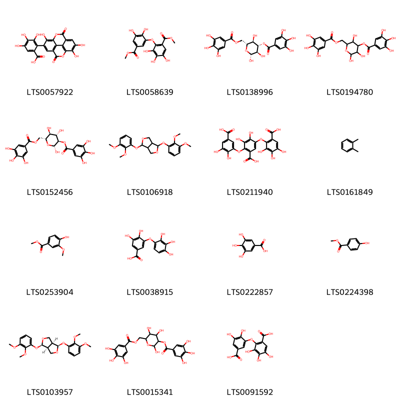{ width=100% }
    <figcaption>Hình ảnh cấu trúc hóa học của 15 hoạt chất thuộc nhóm Benzene and substituted derivatives gồm ['flavogallonic acid dilactone (LTS0057922)', 'methyl 2-[2,3-dihydroxy-5-(methoxycarbonyl)phenoxy]-3,4,5-trihydroxybenzoate (LTS0058639)', '(2r,3r,4s,5r,6r)-2,3,5-trihydroxy-6-[(3,4,5-trihydroxybenzoyloxy)methyl]oxan-4-yl 3,4,5-trihydroxybenzoate (LTS0138996)', '2,3,5-trihydroxy-6-[(3,4,5-trihydroxybenzoyloxy)methyl]oxan-4-yl 3,4,5-trihydroxybenzoate (LTS0194780)', '(2r,3r,4s,5s,6r)-2,4,5-trihydroxy-6-[(3,4,5-trihydroxybenzoyloxy)methyl]oxan-3-yl 3,4,5-trihydroxybenzoate (LTS0152456)', '1,4-bis(2,3-dimethoxyphenoxy)-hexahydrofuro[3,4-c]furan (LTS0106918)', '5-(6-carboxy-2,3,4-trihydroxyphenoxy)-2-(5-carboxy-2,3-dihydroxyphenoxy)-3,4-dihydroxybenzoic acid (LTS0211940)', 'ortho-xylene (LTS0161849)', 'vanillate (LTS0253904)', '3,4-dihydroxy-5-(2,3,4-trihydroxyphenoxy)benzoic acid (LTS0038915)', 'galop (LTS0222857)', 'paraben (LTS0224398)', '(1r,3as,4r,6as)-1,4-bis(2,3-dimethoxyphenoxy)-hexahydrofuro[3,4-c]furan (LTS0103957)', '2,4,5-trihydroxy-6-[(3,4,5-trihydroxybenzoyloxy)methyl]oxan-3-yl 3,4,5-trihydroxybenzoate (LTS0015341)', '2-(5-carboxy-2,3-dihydroxyphenoxy)-3,4,5-trihydroxybenzoic acid (LTS0091592)'].</figcaption>
</figure>
#### Nhóm Carboxylic acids and derivatives
<figure markdown="span">
    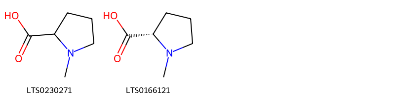{ width=100% }
    <figcaption>Hình ảnh cấu trúc hóa học của 2 hoạt chất thuộc nhóm Carboxylic acids and derivatives gồm ['1-methylpyrrolidine-2-carboxylic acid (LTS0230271)', 'n-methyl-l-proline (LTS0166121)'].</figcaption>
</figure>
#### Nhóm Cinnamic acids and derivatives
<figure markdown="span">
    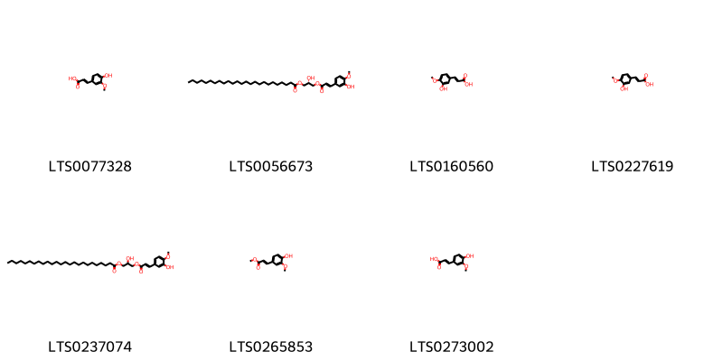{ width=100% }
    <figcaption>Hình ảnh cấu trúc hóa học của 7 hoạt chất thuộc nhóm Cinnamic acids and derivatives gồm ['ferulic acid (LTS0077328)', '(2s)-2-hydroxy-3-{[(2e)-3-(3-hydroxy-4-methoxyphenyl)prop-2-enoyl]oxy}propyl pentacosanoate (LTS0056673)', 'isoferulic acid (LTS0160560)', 'isoferulic acid (LTS0227619)', '2-hydroxy-3-{[3-(3-hydroxy-4-methoxyphenyl)prop-2-enoyl]oxy}propyl pentacosanoate (LTS0237074)', 'methyl ferulate (LTS0265853)', 'ferulic acid (LTS0273002)'].</figcaption>
</figure>
#### Nhóm Flavonoids
<figure markdown="span">
    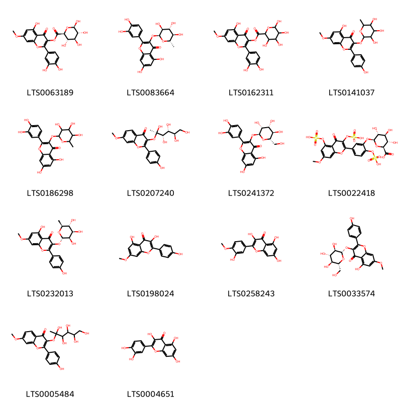{ width=100% }
    <figcaption>Hình ảnh cấu trúc hóa học của 14 hoạt chất thuộc nhóm Flavonoids gồm ['2-(3,4-dihydroxyphenyl)-5-hydroxy-7-methoxy-4-oxochromen-3-yl (2s,3s,4s,5r,6r)-3,4,5,6-tetrahydroxyoxane-2-carboxylate (LTS0063189)', '2-(3,4-dihydroxyphenyl)-5,7-dihydroxy-3-{[(2s,3s,4r,5r,6s)-3,4,5-trihydroxy-6-methyloxan-2-yl]oxy}chromen-4-one (LTS0083664)', '2-(3,4-dihydroxyphenyl)-5-hydroxy-7-methoxy-4-oxochromen-3-yl 3,4,5,6-tetrahydroxyoxane-2-carboxylate (LTS0162311)', '5-hydroxy-2-(4-hydroxyphenyl)-7-methoxy-3-[(3,4,5-trihydroxy-6-methyloxan-2-yl)oxy]chromen-4-one (LTS0141037)', 'quercitrin (LTS0186298)', '2-(4-hydroxyphenyl)-7-methoxy-3-{[(2r,3s,4r,5r)-2,3,4,5,6-pentahydroxyhexan-2-yl]oxy}chromen-4-one (LTS0207240)', '2-(3,4-dihydroxyphenyl)-5,7-dihydroxy-3-{[(2s,3r,4r,5r,6s)-3,4,5-trihydroxy-6-(hydroxymethyl)oxan-2-yl]oxy}chromen-4-one (LTS0241372)', '(2s,3s,4s,5r,6s)-3,4,5-trihydroxy-6-{5-[7-methoxy-4-oxo-3,5-bis(sulfooxy)chromen-2-yl]-2-(sulfooxy)phenoxy}oxane-2-carboxylic acid (LTS0022418)', '5-hydroxy-2-(4-hydroxyphenyl)-7-methoxy-3-{[(2s,3r,4r,5r,6s)-3,4,5-trihydroxy-6-methyloxan-2-yl]oxy}chromen-4-one (LTS0232013)', 'rhamnocitrin (LTS0198024)', 'tamarixetin (LTS0258243)', '5-hydroxy-2-(4-hydroxyphenyl)-7-methoxy-3-{[(2s,3r,4s,5s,6r)-3,4,5-trihydroxy-6-(hydroxymethyl)oxan-2-yl]oxy}chromen-4-one (LTS0033574)', '2-(4-hydroxyphenyl)-7-methoxy-3-[(2,3,4,5,6-pentahydroxyhexan-2-yl)oxy]chromen-4-one (LTS0005484)', 'quercetin (LTS0004651)'].</figcaption>
</figure>
#### Nhóm Organooxygen compounds
<figure markdown="span">
    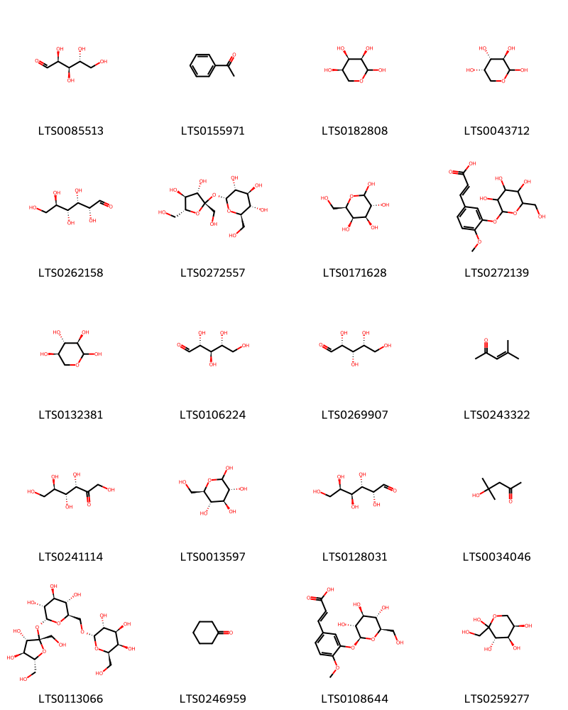{ width=100% }
    <figcaption>Hình ảnh cấu trúc hóa học của 20 hoạt chất thuộc nhóm Organooxygen compounds gồm ['arabinose (LTS0085513)', 'acetophenone (LTS0155971)', 'd-ribopyranose (LTS0182808)', 'l-arabinopyranose (LTS0043712)', '(+)-glucose (LTS0262158)', 'sucrose (LTS0272557)', 'galactose (LTS0171628)', '3-(4-methoxy-3-{[3,4,5-trihydroxy-6-(hydroxymethyl)oxan-2-yl]oxy}phenyl)prop-2-enoic acid (LTS0272139)', 'd-xylose (LTS0132381)', 'ribose (LTS0106224)', '(d)-xylose (LTS0269907)', 'mesityl oxide (LTS0243322)', 'keto-d-fructose (LTS0241114)', 'glucose (LTS0013597)', 'aldehydo-d-galactose (LTS0128031)', 'diacetone alcohol (LTS0034046)', 'raffinose (LTS0113066)', 'cyclohexanone (LTS0246959)', '(2e)-3-(4-methoxy-3-{[(2s,3r,4s,5s,6r)-3,4,5-trihydroxy-6-(hydroxymethyl)oxan-2-yl]oxy}phenyl)prop-2-enoic acid (LTS0108644)', 'd-fructopyranose (LTS0259277)'].</figcaption>
</figure>
#### Nhóm Phenols
<figure markdown="span">
    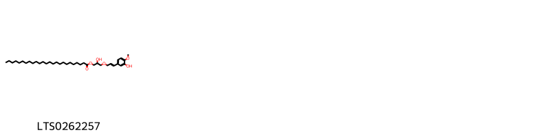{ width=100% }
    <figcaption>Hình ảnh cấu trúc hóa học của 1 hoạt chất thuộc nhóm Phenols gồm ['2-hydroxy-3-{[(2e)-3-(3-hydroxy-4-methoxyphenyl)prop-2-en-1-yl]oxy}propyl pentacosanoate (LTS0262257)'].</figcaption>
</figure>
#### Nhóm Prenol lipids
<figure markdown="span">
    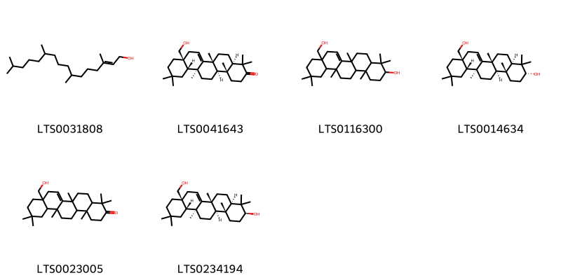{ width=100% }
    <figcaption>Hình ảnh cấu trúc hóa học của 6 hoạt chất thuộc nhóm Prenol lipids gồm ['phytol (LTS0031808)', '(4ar,6ar,8as,12as,12bs,14ar,14br)-8a-(hydroxymethyl)-4,4,6a,11,11,12b,14b-heptamethyl-2,4a,5,6,8,9,10,12,12a,13,14,14a-dodecahydro-1h-picen-3-one (LTS0041643)', '8a-(hydroxymethyl)-4,4,6a,11,11,12b,14b-heptamethyl-1,2,3,4a,5,6,8,9,10,12,12a,13,14,14a-tetradecahydropicen-3-ol (LTS0116300)', '(3r,4ar,6ar,8as,12as,12bs,14ar,14br)-8a-(hydroxymethyl)-4,4,6a,11,11,12b,14b-heptamethyl-1,2,3,4a,5,6,8,9,10,12,12a,13,14,14a-tetradecahydropicen-3-ol (LTS0014634)', '8a-(hydroxymethyl)-4,4,6a,11,11,12b,14b-heptamethyl-2,4a,5,6,8,9,10,12,12a,13,14,14a-dodecahydro-1h-picen-3-one (LTS0023005)', 'myricadiol (LTS0234194)'].</figcaption>
</figure>
#### Nhóm Steroids and steroid derivatives
<figure markdown="span">
    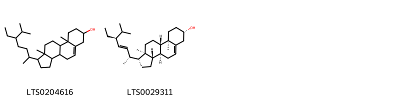{ width=100% }
    <figcaption>Hình ảnh cấu trúc hóa học của 2 hoạt chất thuộc nhóm Steroids and steroid derivatives gồm ['stigmast-5-en-3-ol, (3β)- (LTS0204616)', 'phytosterol (LTS0029311)'].</figcaption>
</figure>
#### Nhóm Tannins
<figure markdown="span">
    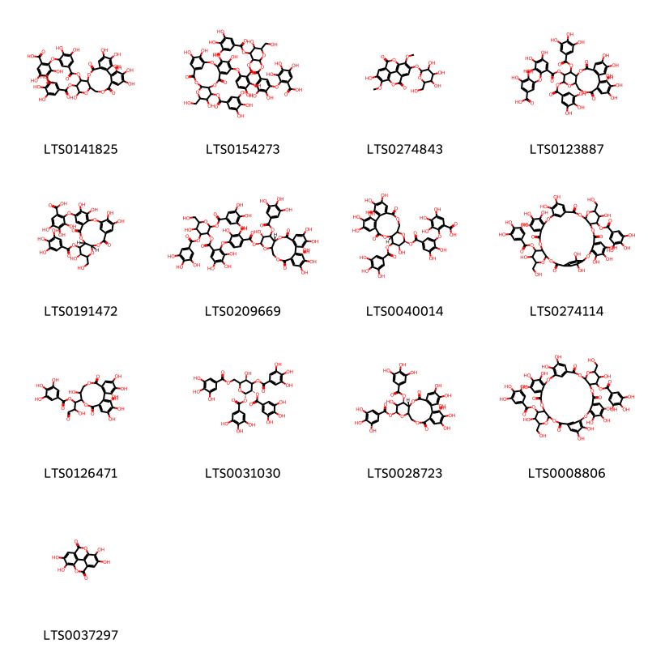{ width=100% }
    <figcaption>Hình ảnh cấu trúc hóa học của 13 hoạt chất thuộc nhóm Tannins gồm ['2-[5-({[3,4,5,13,21,22,23-heptahydroxy-8,18-dioxo-12-(3,4,5-trihydroxybenzoyloxy)-9,14,17-trioxatetracyclo[17.4.0.0²,⁷.0¹⁰,¹⁵]tricosa-1(23),2(7),3,5,19,21-hexaen-11-yl]oxy}carbonyl)-2,3-dihydroxyphenoxy]-3,4,5-trihydroxybenzoic acid (LTS0141825)', '2-[5-({[3-(2,3-dihydroxy-6-{[4,5,13,21,22-pentahydroxy-14-(hydroxymethyl)-9,18-dioxo-12-(3,4,5-trihydroxybenzoyloxy)-2,10,15,17-tetraoxatetracyclo[17.3.1.0³,⁸.0¹¹,¹⁶]tricosa-1(23),3,5,7,19,21-hexaen-6-yl]oxy}benzoyloxy)-5-hydroxy-6-(hydroxymethyl)-4-(3,4,5-trihydroxybenzoyloxy)oxan-2-yl]oxy}carbonyl)-2,3-dihydroxyphenoxy]-3,4,5-trihydroxybenzoic acid (LTS0154273)', '6-hydroxy-7,14-dimethoxy-13-{[3,4,5-trihydroxy-6-(hydroxymethyl)oxan-2-yl]oxy}-2,9-dioxatetracyclo[6.6.2.0⁴,¹⁶.0¹¹,¹⁵]hexadeca-1(15),4,6,8(16),11,13-hexaene-3,10-dione (LTS0274843)', '3-[6-({[3,4,5,21,22,23-hexahydroxy-8,18-dioxo-11,13-bis(3,4,5-trihydroxybenzoyloxy)-9,14,17-trioxatetracyclo[17.4.0.0²,⁷.0¹⁰,¹⁵]tricosa-1(23),2(7),3,5,19,21-hexaen-12-yl]oxy}carbonyl)-2,3,4-trihydroxyphenoxy]-4,5-dihydroxybenzoic acid (LTS0123887)', '3,4,5-trihydroxy-2-{[(11s,13r,16s)-4,5,13,21,22-pentahydroxy-14-(hydroxymethyl)-9,18-dioxo-12-(3,4,5-trihydroxybenzoyloxy)-2,10,15,17-tetraoxatetracyclo[17.3.1.0³,⁸.0¹¹,¹⁶]tricosa-1(23),3,5,7,19,21-hexaen-6-yl]oxy}benzoic acid (LTS0191472)', '5-hydroxy-6-(hydroxymethyl)-2,4-bis(3,4,5-trihydroxybenzoyloxy)oxan-3-yl 2-[4-({[(10r,12s,13s)-3,4,5,12,21,22,23-heptahydroxy-8,18-dioxo-11-(3,4,5-trihydroxybenzoyloxy)-9,14,17-trioxatetracyclo[17.4.0.0²,⁷.0¹⁰,¹⁵]tricosa-1(23),2(7),3,5,19,21-hexaen-13-yl]oxy}carbonyl)-2,3-dihydroxyphenoxy]-3,4,5-trihydroxybenzoate (LTS0209669)', '2-[5-({[(10r,12s,13s)-3,4,5,12,21,22,23-heptahydroxy-8,18-dioxo-11-(3,4,5-trihydroxybenzoyloxy)-9,14,17-trioxatetracyclo[17.4.0.0²,⁷.0¹⁰,¹⁵]tricosa-1(23),2(7),3,5,19,21-hexaen-13-yl]oxy}carbonyl)-2,3-dihydroxyphenoxy]-3,4,5-trihydroxybenzoic acid (LTS0040014)', '4,5,6,13,21,22,26,27,28,35,43,44-dodecahydroxy-14,36-bis(hydroxymethyl)-9,18,31,40-tetraoxo-12-(3,4,5-trihydroxybenzoyloxy)-2,10,15,17,24,32,37,39-octaoxaheptacyclo[39.2.2.1¹⁹,²³.0³,⁸.0¹¹,¹⁶.0²⁵,³⁰.0³³,³⁸]hexatetraconta-1(43),3,5,7,19,21,23(46),25,27,29,41,44-dodecaen-34-yl 3,4,5-trihydroxybenzoate (LTS0274114)', '1-{3,4,5,11,17,18,19-heptahydroxy-8,14-dioxo-9,13-dioxatricyclo[13.4.0.0²,⁷]nonadeca-1(15),2,4,6,16,18-hexaen-10-yl}-2-hydroxy-3-oxopropyl 3,4,5-trihydroxybenzoate (LTS0126471)', '(2s,3s,5r)-5-hydroxy-3,4-bis(3,4,5-trihydroxybenzoyloxy)-6-[(3,4,5-trihydroxybenzoyloxy)methyl]oxan-2-yl 3,4,5-trihydroxybenzoate (LTS0031030)', '(10r,11r,13s)-3,4,5,12,21,22,23-heptahydroxy-8,18-dioxo-13-(3,4,5-trihydroxybenzoyloxy)-9,14,17-trioxatetracyclo[17.4.0.0²,⁷.0¹⁰,¹⁵]tricosa-1(23),2(7),3,5,19,21-hexaen-11-yl 3,4,5-trihydroxybenzoate (LTS0028723)', '4,5,6,13,21,22,26,27,28,35,43,44-dodecahydroxy-14,36-bis(hydroxymethyl)-9,18,31,40-tetraoxo-34-(3,4,5-trihydroxybenzoyloxy)-2,10,15,17,24,32,37,39-octaoxaheptacyclo[39.3.1.1¹⁹,²³.0³,⁸.0¹¹,¹⁶.0²⁵,³⁰.0³³,³⁸]hexatetraconta-1(45),3,5,7,19,21,23(46),25,27,29,41,43-dodecaen-12-yl 3,4,5-trihydroxybenzoate (LTS0008806)', 'ellagic acid (LTS0037297)'].</figcaption>
</figure>

---

### Dược dân tộc học

Danh sách các quốc gia có sử dụng *Tamarix aphylla* trong điều trị các bệnh. 

| Country   | Disease    | Bệnh                                                                                                                                                                                                |
|:----------|:-----------|:----------------------------------------------------------------------------------------------------------------------------------------------------------------------------------------------------|
| Elsewhere | Astringent | MYMEMORY WARNING: YOU USED ALL AVAILABLE FREE TRANSLATIONS FOR TODAY. NEXT AVAILABLE IN  15 HOURS 56 MINUTES 22 SECONDS VISIT HTTPS://MYMEMORY.TRANSLATED.NET/DOC/USAGELIMITS.PHP TO TRANSLATE MORE |

---

---
## Tamarix chinensis
### Thông tin về thực vật

!!! info "Phân loại thực vật của *Tamarix chinensis* từ GIBF:"
    - **Kingdom:** Plantae
    - **Phylum:** Tracheophyta
    - **Order:** Caryophyllales
    - **Family:** Tamaricaceae
    - **Genus:** Tamarix
    - **Species:** *Tamarix chinensis*

 

| Label (VI)   | Label (EN)   | Scientific Name   | Descriptions (VI)   | Descriptions (EN)   | Also Known As (VI)   | Also Known As (EN)   |
|:-------------|:-------------|:------------------|:--------------------|:--------------------|:---------------------|:---------------------|
| N/A          | N/A          | Tamarix chinensis | loài thực vật       | species of plant    | ['']                 | ['']                 |

#### Phân bố trên thế giới

**Từ CSDL GIBF** Türkiye, Uruguay, Argentina, United Kingdom of Great Britain and Northern Ireland, Uzbekistan, France, Spain, New Zealand, Germany, Russian Federation, Chile, United States of America, Mexico, China, Australia, Korea, Republic of, Chinese Taipei

#### Phân bố tại Việt Nam

**Từ CSDL GIBF**: Không có ghi nhận ở Việt Nam

---
### Thành phần hóa học
        
- Theo cơ sở dữ liệu lotus: Từ loài *Tamarix chinensis* đã phân lập và xác định được 5 hoạt chất thuộc về các nhóm Tannins, Flavonoids, Benzene and substituted derivatives. 

|    | chemicalTaxonomyClassyfireClass     |   smiles_count |
|---:|:------------------------------------|---------------:|
|  0 | Benzene and substituted derivatives |              1 |
|  1 | Flavonoids                          |              1 |
|  2 | Tannins                             |              3 |

#### Nhóm Benzene and substituted derivatives
<figure markdown="span">
    { width=100% }
    <figcaption>Hình ảnh cấu trúc hóa học của 1 hoạt chất thuộc nhóm Benzene and substituted derivatives gồm ['galop (LTS0222857)'].</figcaption>
</figure>
#### Nhóm Flavonoids
<figure markdown="span">
    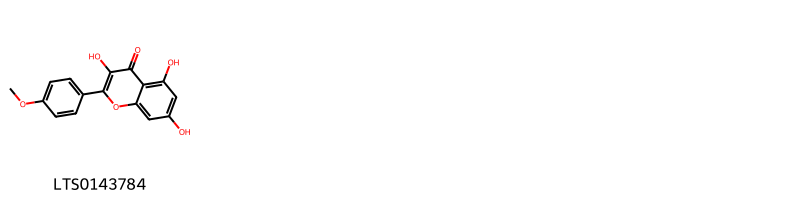{ width=100% }
    <figcaption>Hình ảnh cấu trúc hóa học của 1 hoạt chất thuộc nhóm Flavonoids gồm ['kaempferide (LTS0143784)'].</figcaption>
</figure>
#### Nhóm Tannins
<figure markdown="span">
    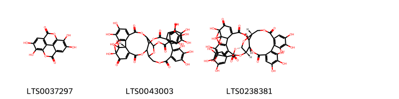{ width=100% }
    <figcaption>Hình ảnh cấu trúc hóa học của 3 hoạt chất thuộc nhóm Tannins gồm ['ellagic acid (LTS0037297)', '(1r,38r)-1,13,14,15,18,19,20,34,35,39,39-undecahydroxy-2,5,10,23,31-pentaoxo-6,9,24,27,30,40-hexaoxaoctacyclo[34.3.1.0⁴,³⁸.0⁷,²⁶.0⁸,²⁹.0¹¹,¹⁶.0¹⁷,²².0³²,³⁷]tetraconta-3,11(16),12,14,17,19,21,32,34,36-decaen-28-yl 3,4,5-trihydroxybenzoate (LTS0043003)', '(7r,8s,26r,28s,29s)-1,13,14,15,18,19,20,34,35,39,39-undecahydroxy-2,5,10,23,31-pentaoxo-6,9,24,27,30,40-hexaoxaoctacyclo[34.3.1.0⁴,³⁸.0⁷,²⁶.0⁸,²⁹.0¹¹,¹⁶.0¹⁷,²².0³²,³⁷]tetraconta-3,11,13,15,17(22),18,20,32,34,36-decaen-28-yl 3,4,5-trihydroxybenzoate (LTS0238381)'].</figcaption>
</figure>

---

### Dược dân tộc học

Danh sách các quốc gia có sử dụng *Tamarix chinensis* trong điều trị các bệnh. 

| Country   | Disease                                                                                                                                                    | Bệnh                                                                                                                                                                                                |
|:----------|:-----------------------------------------------------------------------------------------------------------------------------------------------------------|:----------------------------------------------------------------------------------------------------------------------------------------------------------------------------------------------------|
| China     | Alexiteric, Aperient, Astringent, Carminative, Carminative, Diuretic, Diuretic, Diuretic, Diuretic, Sudorific, Vulnerary, Analgesic, Diuretic, Expectorant | MYMEMORY WARNING: YOU USED ALL AVAILABLE FREE TRANSLATIONS FOR TODAY. NEXT AVAILABLE IN  15 HOURS 55 MINUTES 42 SECONDS VISIT HTTPS://MYMEMORY.TRANSLATED.NET/DOC/USAGELIMITS.PHP TO TRANSLATE MORE |
| Elsewhere | Antiseptic, Tonic                                                                                                                                          | MYMEMORY WARNING: YOU USED ALL AVAILABLE FREE TRANSLATIONS FOR TODAY. NEXT AVAILABLE IN  15 HOURS 55 MINUTES 36 SECONDS VISIT HTTPS://MYMEMORY.TRANSLATED.NET/DOC/USAGELIMITS.PHP TO TRANSLATE MORE |

---

---
## Tamarix dioica
### Thông tin về thực vật

!!! info "Phân loại thực vật của *Tamarix dioica* từ GIBF:"
    - **Kingdom:** Plantae
    - **Phylum:** Tracheophyta
    - **Order:** Caryophyllales
    - **Family:** Tamaricaceae
    - **Genus:** Tamarix
    - **Species:** *Tamarix dioica*

 

| Label (VI)   | Label (EN)   | Scientific Name   | Descriptions (VI)   | Descriptions (EN)   | Also Known As (VI)   | Also Known As (EN)   |
|:-------------|:-------------|:------------------|:--------------------|:--------------------|:---------------------|:---------------------|
| N/A          | N/A          | Tamarix dioica    | loài thực vật       | species of plant    | ['']                 | ['']                 |

#### Phân bố trên thế giới

**Từ CSDL GIBF** nan, Pakistan, Iran (Islamic Republic of), Bhutan, India, Afghanistan, Nepal

#### Phân bố tại Việt Nam

**Từ CSDL GIBF**: Không có ghi nhận ở Việt Nam

---
### Thành phần hóa học
        
- Theo cơ sở dữ liệu lotus: Từ loài *Tamarix dioica* đã phân lập và xác định được 11 hoạt chất thuộc về các nhóm Cinnamic acids and derivatives, Flavonoids, Fatty Acyls. 

|    | chemicalTaxonomyClassyfireClass   |   smiles_count |
|---:|:----------------------------------|---------------:|
|  0 | Cinnamic acids and derivatives    |              2 |
|  1 | Fatty Acyls                       |              1 |
|  2 | Flavonoids                        |              8 |

#### Nhóm Cinnamic acids and derivatives
<figure markdown="span">
    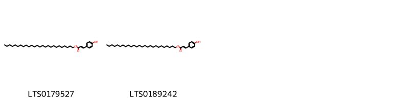{ width=100% }
    <figcaption>Hình ảnh cấu trúc hóa học của 2 hoạt chất thuộc nhóm Cinnamic acids and derivatives gồm ['hexacosyl (2e)-3-(4-hydroxyphenyl)prop-2-enoate (LTS0179527)', 'hexacosyl 3-(4-hydroxyphenyl)prop-2-enoate (LTS0189242)'].</figcaption>
</figure>
#### Nhóm Fatty Acyls
<figure markdown="span">
    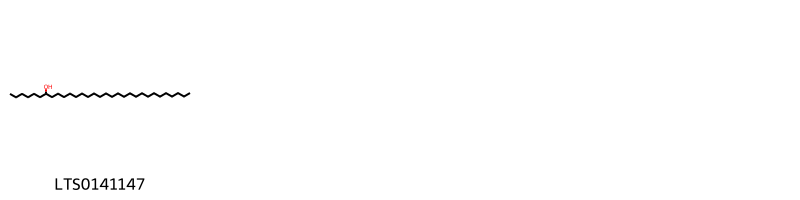{ width=100% }
    <figcaption>Hình ảnh cấu trúc hóa học của 1 hoạt chất thuộc nhóm Fatty Acyls gồm ['hentriacontan-7-ol (LTS0141147)'].</figcaption>
</figure>
#### Nhóm Flavonoids
<figure markdown="span">
    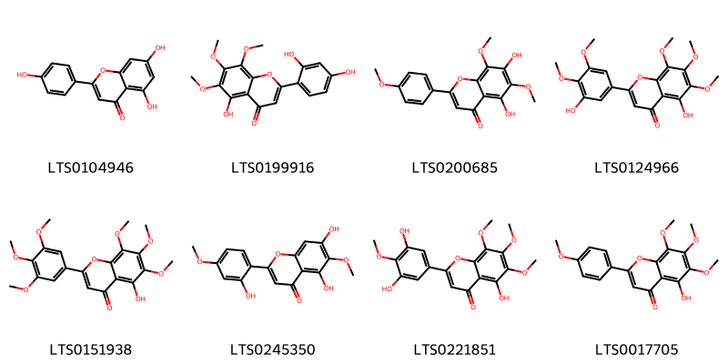{ width=100% }
    <figcaption>Hình ảnh cấu trúc hóa học của 8 hoạt chất thuộc nhóm Flavonoids gồm ['chamomile (LTS0104946)', 'tamadone (LTS0199916)', 'nevadensin (LTS0200685)', 'gardenin c (LTS0124966)', 'gardenin a (LTS0151938)', 'tamaridone (LTS0245350)', 'gardenin e (LTS0221851)', 'gardenin b (LTS0017705)'].</figcaption>
</figure>

---

### Dược dân tộc học

Danh sách các quốc gia có sử dụng *Tamarix dioica* trong điều trị các bệnh. 

| Country   | Disease    | Bệnh                                                                                                                                                                                                |
|:----------|:-----------|:----------------------------------------------------------------------------------------------------------------------------------------------------------------------------------------------------|
| Elsewhere | Astringent | MYMEMORY WARNING: YOU USED ALL AVAILABLE FREE TRANSLATIONS FOR TODAY. NEXT AVAILABLE IN  15 HOURS 55 MINUTES 03 SECONDS VISIT HTTPS://MYMEMORY.TRANSLATED.NET/DOC/USAGELIMITS.PHP TO TRANSLATE MORE |

---

---
## Tamarix ericoides
### Thông tin về thực vật

!!! info "Phân loại thực vật của *Tamarix ericoides* từ GIBF:"
    - **Kingdom:** Plantae
    - **Phylum:** Tracheophyta
    - **Order:** Caryophyllales
    - **Family:** Tamaricaceae
    - **Genus:** Tamarix
    - **Species:** *Tamarix ericoides*

 

| Label (VI)   | Label (EN)   | Scientific Name   | Descriptions (VI)   | Descriptions (EN)   | Also Known As (VI)   | Also Known As (EN)   |
|:-------------|:-------------|:------------------|:--------------------|:--------------------|:---------------------|:---------------------|
| N/A          | N/A          | Tamarix ericoides |                     | species of plant    | ['']                 | ['']                 |

#### Phân bố trên thế giới

**Từ CSDL GIBF** nan, unknown or invalid, India, Afghanistan

#### Phân bố tại Việt Nam

**Từ CSDL GIBF**: Không có ghi nhận ở Việt Nam

---
### Thành phần hóa học
        
- Theo cơ sở dữ liệu lotus: Từ loài *Tamarix ericoides* đã phân lập và xác định được Chưa có hoạt chất nào được phân lập. hoạt chất thuộc về các nhóm Không có hoạt chất nào được phân lập. 

Không có hình ảnh nào được tạo ra

---

### Dược dân tộc học

Danh sách các quốc gia có sử dụng *Tamarix ericoides* trong điều trị các bệnh. 

| Country   | Disease    | Bệnh                                                                                                                                                                                                |
|:----------|:-----------|:----------------------------------------------------------------------------------------------------------------------------------------------------------------------------------------------------|
| Elsewhere | Astringent | MYMEMORY WARNING: YOU USED ALL AVAILABLE FREE TRANSLATIONS FOR TODAY. NEXT AVAILABLE IN  15 HOURS 54 MINUTES 37 SECONDS VISIT HTTPS://MYMEMORY.TRANSLATED.NET/DOC/USAGELIMITS.PHP TO TRANSLATE MORE |

---

---
## Tamarix gallica
### Thông tin về thực vật

!!! info "Phân loại thực vật của *Tamarix gallica* từ GIBF:"
    - **Kingdom:** Plantae
    - **Phylum:** Tracheophyta
    - **Order:** Caryophyllales
    - **Family:** Tamaricaceae
    - **Genus:** Tamarix
    - **Species:** *Tamarix gallica*

 

| Label (VI)   | Label (EN)   | Scientific Name   | Descriptions (VI)   | Descriptions (EN)   | Also Known As (VI)   | Also Known As (EN)   |
|:-------------|:-------------|:------------------|:--------------------|:--------------------|:---------------------|:---------------------|
| N/A          | N/A          | Tamarix gallica   | loài thực vật       | species of plant    | ['']                 | ['Tamarix anglica']  |

#### Phân bố trên thế giới

**Từ CSDL GIBF** nan, Uruguay, Slovenia, Argentina, United Kingdom of Great Britain and Northern Ireland, Portugal, Bermuda, Morocco, France, Spain, Croatia, Germany, United States of America, Algeria, Italy, Mexico, Belgium, Netherlands

#### Phân bố tại Việt Nam

**Từ CSDL GIBF**: Không có ghi nhận ở Việt Nam

---
### Thành phần hóa học
        
- Theo cơ sở dữ liệu lotus: Từ loài *Tamarix gallica* đã phân lập và xác định được 14 hoạt chất thuộc về các nhóm Flavonoids, Prenol lipids, Fatty Acyls, Organic sulfuric acids and derivatives, Steroids and steroid derivatives. 

|    | chemicalTaxonomyClassyfireClass        |   smiles_count |
|---:|:---------------------------------------|---------------:|
|  0 | Fatty Acyls                            |              1 |
|  1 | Flavonoids                             |              1 |
|  2 | Organic sulfuric acids and derivatives |              2 |
|  3 | Prenol lipids                          |              3 |
|  4 | Steroids and steroid derivatives       |              7 |

#### Nhóm Fatty Acyls
<figure markdown="span">
    { width=100% }
    <figcaption>Hình ảnh cấu trúc hóa học của 1 hoạt chất thuộc nhóm Fatty Acyls gồm ['2-carboxy-d-arabinitol (LTS0056947)'].</figcaption>
</figure>
#### Nhóm Flavonoids
<figure markdown="span">
    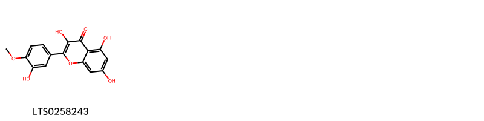{ width=100% }
    <figcaption>Hình ảnh cấu trúc hóa học của 1 hoạt chất thuộc nhóm Flavonoids gồm ['tamarixetin (LTS0258243)'].</figcaption>
</figure>
#### Nhóm Organic sulfuric acids and derivatives
<figure markdown="span">
    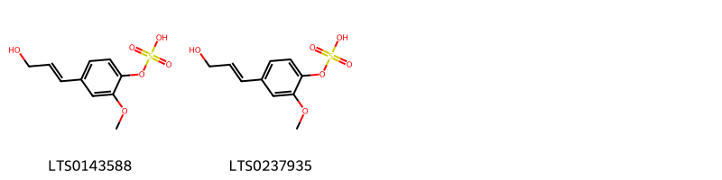{ width=100% }
    <figcaption>Hình ảnh cấu trúc hóa học của 2 hoạt chất thuộc nhóm Organic sulfuric acids and derivatives gồm ['[4-(3-hydroxyprop-1-en-1-yl)-2-methoxyphenyl]oxidanesulfonic acid (LTS0143588)', '{4-[(1e)-3-hydroxyprop-1-en-1-yl]-2-methoxyphenyl}oxidanesulfonic acid (LTS0237935)'].</figcaption>
</figure>
#### Nhóm Prenol lipids
<figure markdown="span">
    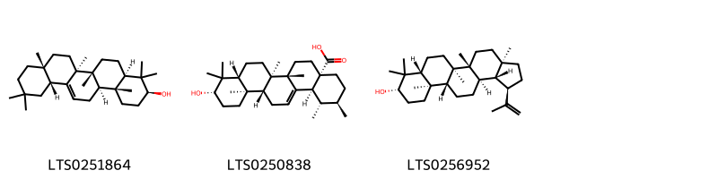{ width=100% }
    <figcaption>Hình ảnh cấu trúc hóa học của 3 hoạt chất thuộc nhóm Prenol lipids gồm ['β-amyrin (LTS0251864)', 'ursolic acid (LTS0250838)', 'lupeol (LTS0256952)'].</figcaption>
</figure>
#### Nhóm Steroids and steroid derivatives
<figure markdown="span">
    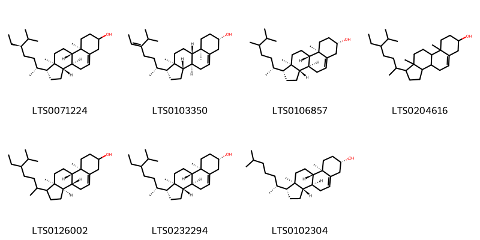{ width=100% }
    <figcaption>Hình ảnh cấu trúc hóa học của 7 hoạt chất thuộc nhóm Steroids and steroid derivatives gồm ['stigmast-5-en-3-ol (LTS0071224)', 'avenasterol (LTS0103350)', '24-α-methylcholesterol (LTS0106857)', 'stigmast-5-en-3-ol, (3β)- (LTS0204616)', '(3ar,3br,9ar,9bs,11ar)-1-(5-ethyl-6-methylheptan-2-yl)-9a,11a-dimethyl-1h,2h,3h,3ah,3bh,4h,6h,7h,8h,9h,9bh,10h,11h-cyclopenta[a]phenanthren-7-ol (LTS0126002)', '24-α-ethylcholesterol (LTS0232294)', 'cholesterol (LTS0102304)'].</figcaption>
</figure>

---

### Dược dân tộc học

Danh sách các quốc gia có sử dụng *Tamarix gallica* trong điều trị các bệnh. 

| Country   | Disease                                | Bệnh                                                                                                                                                                                                |
|:----------|:---------------------------------------|:----------------------------------------------------------------------------------------------------------------------------------------------------------------------------------------------------|
| Mexico    | Astringent, Sudorific, Tonic, Diuretic | MYMEMORY WARNING: YOU USED ALL AVAILABLE FREE TRANSLATIONS FOR TODAY. NEXT AVAILABLE IN  15 HOURS 54 MINUTES 16 SECONDS VISIT HTTPS://MYMEMORY.TRANSLATED.NET/DOC/USAGELIMITS.PHP TO TRANSLATE MORE |
| ain       | Astringent                             | MYMEMORY WARNING: YOU USED ALL AVAILABLE FREE TRANSLATIONS FOR TODAY. NEXT AVAILABLE IN  15 HOURS 54 MINUTES 10 SECONDS VISIT HTTPS://MYMEMORY.TRANSLATED.NET/DOC/USAGELIMITS.PHP TO TRANSLATE MORE |

---

---
## Tamarix indica
### Thông tin về thực vật

!!! info "Phân loại thực vật của *Tamarix indica* từ GIBF:"
    - **Kingdom:** Plantae
    - **Phylum:** Tracheophyta
    - **Order:** Caryophyllales
    - **Family:** Tamaricaceae
    - **Genus:** Tamarix
    - **Species:** *Tamarix indica*

 

| Label (VI)   | Label (EN)   | Scientific Name   | Descriptions (VI)   | Descriptions (EN)   | Also Known As (VI)   | Also Known As (EN)   |
|:-------------|:-------------|:------------------|:--------------------|:--------------------|:---------------------|:---------------------|
| N/A          | N/A          | Tamarix indica    | loài thực vật       | species of plant    | ['']                 | ['']                 |

#### Phân bố trên thế giới

**Từ CSDL GIBF** nan, unknown or invalid, Pakistan, Sri Lanka, Bhutan, Iran (Islamic Republic of), Morocco, France, Spain, Myanmar, India, Bangladesh, China, Australia

#### Phân bố tại Việt Nam

**Từ CSDL GIBF**: Không có ghi nhận ở Việt Nam

---
### Thành phần hóa học
        
- Theo cơ sở dữ liệu lotus: Từ loài *Tamarix indica* đã phân lập và xác định được Chưa có hoạt chất nào được phân lập. hoạt chất thuộc về các nhóm Không có hoạt chất nào được phân lập. 

Không có hình ảnh nào được tạo ra

---

### Dược dân tộc học

Danh sách các quốc gia có sử dụng *Tamarix indica* trong điều trị các bệnh. 

| Country   | Disease    | Bệnh                                                                                                                                                                                                |
|:----------|:-----------|:----------------------------------------------------------------------------------------------------------------------------------------------------------------------------------------------------|
| India     | Astringent | MYMEMORY WARNING: YOU USED ALL AVAILABLE FREE TRANSLATIONS FOR TODAY. NEXT AVAILABLE IN  15 HOURS 53 MINUTES 39 SECONDS VISIT HTTPS://MYMEMORY.TRANSLATED.NET/DOC/USAGELIMITS.PHP TO TRANSLATE MORE |

---

---
## Tamarix mannifera
### Thông tin về thực vật

!!! info "Phân loại thực vật của *Tamarix senegalensis* từ GIBF:"
    - **Kingdom:** Plantae
    - **Phylum:** Tracheophyta
    - **Order:** Caryophyllales
    - **Family:** Tamaricaceae
    - **Genus:** Tamarix
    - **Species:** *Tamarix senegalensis*

 

| Label (VI)   | Label (EN)   | Scientific Name   | Descriptions (VI)   | Descriptions (EN)   | Also Known As (VI)   | Also Known As (EN)   |
|:-------------|:-------------|:------------------|:--------------------|:--------------------|:---------------------|:---------------------|
| N/A          | N/A          | Tamarix mannifera |                     |                     | ['']                 | ['']                 |

#### Phân bố trên thế giới

**Từ CSDL GIBF** nan, unknown or invalid, Jordan, Iran (Islamic Republic of), Syrian Arab Republic, Lebanon, Egypt, Sudan, Israel, Chad, Iraq, Saudi Arabia, Libya

#### Phân bố tại Việt Nam

**Từ CSDL GIBF**: Không có ghi nhận ở Việt Nam

---
### Thành phần hóa học
        
- Theo cơ sở dữ liệu lotus: Từ loài *Tamarix senegalensis* đã phân lập và xác định được Chưa có hoạt chất nào được phân lập. hoạt chất thuộc về các nhóm Không có hoạt chất nào được phân lập. 

Không có hình ảnh nào được tạo ra

---

### Dược dân tộc học

Danh sách các quốc gia có sử dụng *Tamarix senegalensis* trong điều trị các bệnh. 

| Country   | Disease   | Bệnh                                                                                                                                                                                                |
|:----------|:----------|:----------------------------------------------------------------------------------------------------------------------------------------------------------------------------------------------------|
| Iraq      | Laxative  | MYMEMORY WARNING: YOU USED ALL AVAILABLE FREE TRANSLATIONS FOR TODAY. NEXT AVAILABLE IN  15 HOURS 53 MINUTES 12 SECONDS VISIT HTTPS://MYMEMORY.TRANSLATED.NET/DOC/USAGELIMITS.PHP TO TRANSLATE MORE |

---

---
## Tamarix troupii
### Thông tin về thực vật

!!! info "Phân loại thực vật của *Tamarix indica* từ GIBF:"
    - **Kingdom:** Plantae
    - **Phylum:** Tracheophyta
    - **Order:** Caryophyllales
    - **Family:** Tamaricaceae
    - **Genus:** Tamarix
    - **Species:** *Tamarix indica*

 

| Label (VI)   | Label (EN)   | Scientific Name   | Descriptions (VI)   | Descriptions (EN)   | Also Known As (VI)   | Also Known As (EN)   |
|:-------------|:-------------|:------------------|:--------------------|:--------------------|:---------------------|:---------------------|
| N/A          | N/A          | Tamarix troupii   |                     |                     | ['']                 | ['']                 |

#### Phân bố trên thế giới

**Từ CSDL GIBF** nan, Pakistan, India

#### Phân bố tại Việt Nam

**Từ CSDL GIBF**: Không có ghi nhận ở Việt Nam

---
### Thành phần hóa học
        
- Theo cơ sở dữ liệu lotus: Từ loài *Tamarix indica* đã phân lập và xác định được Chưa có hoạt chất nào được phân lập. hoạt chất thuộc về các nhóm Không có hoạt chất nào được phân lập. 

Không có hình ảnh nào được tạo ra

---

### Dược dân tộc học

Danh sách các quốc gia có sử dụng *Tamarix indica* trong điều trị các bệnh. 

| Country   | Disease    | Bệnh                                                                                                                                                                                                |
|:----------|:-----------|:----------------------------------------------------------------------------------------------------------------------------------------------------------------------------------------------------|
| India     | Astringent | MYMEMORY WARNING: YOU USED ALL AVAILABLE FREE TRANSLATIONS FOR TODAY. NEXT AVAILABLE IN  15 HOURS 52 MINUTES 45 SECONDS VISIT HTTPS://MYMEMORY.TRANSLATED.NET/DOC/USAGELIMITS.PHP TO TRANSLATE MORE |

---

