!!! abstract "Tóm tắt"

    Họ Taxaceae gồm khoảng 2 chi và 6 loài được một số cộng đồng tại các quốc gia như ain, Elsewhere, Canada(Salish), Egypt, India, US, Turkey, China, Europe sử dụng trong một số trường hợp Thuốc tránh thai, Thuốc bổ, Thuốc nhuận tràng, Vermifuge, Thuốc trừ sâu, Carminative, Chất đờm, Chất độc, Thuốc an thần, Chất kích thích, Dạ dày, Vermifuge, Chất độc, Vermifuge, Chất độc, Thuốc lợi tiểu, Emmenagogue, Thuốc tránh thai, Dentifrice, Emmenagogue, Emmenagogue, Expectorant, Poison, Stomachic, Antifertility, Abortifacient, nan, Depilatory, Emmenagogue, Estrogenic, Thuốc nhuận tràng, Vermifuge.

!!! info "DrDuke"

    James A. Duke sinh năm 1929-2017 là một nhà thực vật học người Mỹ. Đây là một trong những tác giả hàng đầu trong lĩnh vực dược dân tộc học với cuốn *CRC Handbook of Medicinal Herbs* và chính là người xây dựng lên cơ sở dữ liệu về hợp chất tự nhiên và dược dân tộc học tại Bộ nông nghiệp Hoa Kỳ. Các thông tin được đăng tải tại website [Dr. Duke's Phytochemical and Ethnobotanical Databases](https://phytochem.nal.usda.gov/). 
    Trong suốt thập niên 1970, ông lãnh đạo the Plant Taxonomy Laboratory, Plant Genetics and Germplasm Institute of the Agricultural Research Service, U.S. Department of Agriculture.
    Trong tài liệu này, các thông tin về dược dân tộc của các dược liệu được trích dẫn từ tài liệu của James A. Ducke với sự trợ giúp của phần mềm dịch thuật từ tiếng Anh sang tiếng Việt.
   

# Chi Torreya

??? note "Danh sách các dược liệu thuộc chi"
    
	 - *Torreya grandis*
	 - *Torreya nucifera*

---
## Torreya grandis
### Thông tin về thực vật

!!! info "Phân loại thực vật của *Torreya grandis* từ GIBF:"
    - **Kingdom:** Plantae
    - **Phylum:** Tracheophyta
    - **Order:** Pinales
    - **Family:** Taxaceae
    - **Genus:** Torreya
    - **Species:** *Torreya grandis*

 

| Label (VI)   | Label (EN)   | Scientific Name   | Descriptions (VI)   | Descriptions (EN)   | Also Known As (VI)   | Also Known As (EN)   |
|:-------------|:-------------|:------------------|:--------------------|:--------------------|:---------------------|:---------------------|
| N/A          | N/A          | Torreya grandis   | loài thực vật       | species of plant    | ['']                 | ['']                 |

#### Phân bố trên thế giới

**Từ CSDL GIBF** nan, Switzerland, unknown or invalid, Russian Federation, United States of America, China, Netherlands, Korea, Republic of, Ukraine, Chinese Taipei

#### Phân bố tại Việt Nam

**Từ CSDL GIBF**: Không có ghi nhận ở Việt Nam

---
### Thành phần hóa học
        
- Theo cơ sở dữ liệu lotus: Từ loài *Torreya grandis* đã phân lập và xác định được 6 hoạt chất thuộc về các nhóm Prenol lipids, Phenols, Cinnamaldehydes. 

|    | chemicalTaxonomyClassyfireClass   |   smiles_count |
|---:|:----------------------------------|---------------:|
|  0 | Cinnamaldehydes                   |              1 |
|  1 | Phenols                           |              2 |
|  2 | Prenol lipids                     |              3 |

#### Nhóm Cinnamaldehydes
<figure markdown="span">
    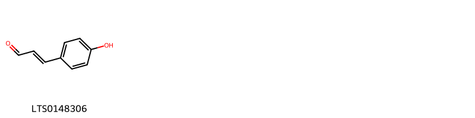{ width=100% }
    <figcaption>Hình ảnh cấu trúc hóa học của 1 hoạt chất thuộc nhóm Cinnamaldehydes gồm ['3-(4-hydroxyphenyl)prop-2-enal (LTS0148306)'].</figcaption>
</figure>
#### Nhóm Phenols
<figure markdown="span">
    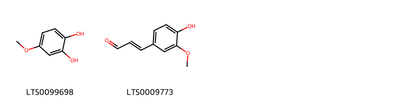{ width=100% }
    <figcaption>Hình ảnh cấu trúc hóa học của 2 hoạt chất thuộc nhóm Phenols gồm ['4-methoxybenzene-1,2-diol (LTS0099698)', 'coniferaldehyde (LTS0009773)'].</figcaption>
</figure>
#### Nhóm Prenol lipids
<figure markdown="span">
    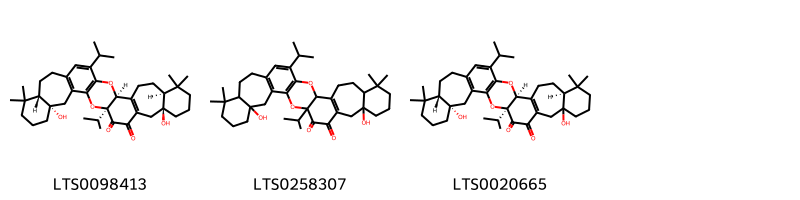{ width=100% }
    <figcaption>Hình ảnh cấu trúc hóa học của 3 hoạt chất thuộc nhóm Prenol lipids gồm ['(1s,6s,11s,19s,23s,28s)-6,28-dihydroxy-1,16-diisopropyl-10,10,24,24-tetramethyl-2,18-dioxaheptacyclo[17.13.0.0³,¹⁷.0⁴,¹⁴.0⁶,¹¹.0²⁰,³⁰.0²³,²⁸]dotriaconta-3(17),4(14),15,20(30)-tetraene-31,32-dione (LTS0098413)', '6,28-dihydroxy-1,16-diisopropyl-10,10,24,24-tetramethyl-2,18-dioxaheptacyclo[17.13.0.0³,¹⁷.0⁴,¹⁴.0⁶,¹¹.0²⁰,³⁰.0²³,²⁸]dotriaconta-3(17),4(14),15,20(30)-tetraene-31,32-dione (LTS0258307)', '(1s,6s,11s,19s,23s)-6,28-dihydroxy-1,16-diisopropyl-10,10,24,24-tetramethyl-2,18-dioxaheptacyclo[17.13.0.0³,¹⁷.0⁴,¹⁴.0⁶,¹¹.0²⁰,³⁰.0²³,²⁸]dotriaconta-3(17),4(14),15,20(30)-tetraene-31,32-dione (LTS0020665)'].</figcaption>
</figure>

---

### Dược dân tộc học

Danh sách các quốc gia có sử dụng *Torreya grandis* trong điều trị các bệnh. 

| Country   | Disease           | Bệnh                |
|:----------|:------------------|:--------------------|
| China     | Poison, Vermifuge | Chất độc, Vermifuge |

---

---
## Torreya nucifera
### Thông tin về thực vật

!!! info "Phân loại thực vật của *Torreya nucifera* từ GIBF:"
    - **Kingdom:** Plantae
    - **Phylum:** Tracheophyta
    - **Order:** Pinales
    - **Family:** Taxaceae
    - **Genus:** Torreya
    - **Species:** *Torreya nucifera*

 

| Label (VI)   | Label (EN)   | Scientific Name   | Descriptions (VI)   | Descriptions (EN)   | Also Known As (VI)   | Also Known As (EN)      |
|:-------------|:-------------|:------------------|:--------------------|:--------------------|:---------------------|:------------------------|
| N/A          | N/A          | Torreya nucifera  | loài thực vật       | species of plant    | ['']                 | ['Japanese nutmeg-yew'] |

#### Phân bố trên thế giới

**Từ CSDL GIBF** nan, Japan, France, Poland, Germany, Russian Federation, United States of America, China, Belgium, Korea, Republic of

#### Phân bố tại Việt Nam

**Từ CSDL GIBF**: Không có ghi nhận ở Việt Nam

---
### Thành phần hóa học
        
- Theo cơ sở dữ liệu lotus: Từ loài *Torreya nucifera* đã phân lập và xác định được 72 hoạt chất thuộc về các nhóm Furanoid lignans, Flavonoids, Prenol lipids, Lignan glycosides, Steroids and steroid derivatives, Benzene and substituted derivatives. 

|    | chemicalTaxonomyClassyfireClass     |   smiles_count |
|---:|:------------------------------------|---------------:|
|  0 | Benzene and substituted derivatives |              1 |
|  1 | Flavonoids                          |              3 |
|  2 | Furanoid lignans                    |              6 |
|  3 | Lignan glycosides                   |              4 |
|  4 | Prenol lipids                       |             54 |
|  5 | Steroids and steroid derivatives    |              2 |

#### Nhóm Benzene and substituted derivatives
<figure markdown="span">
    { width=100% }
    <figcaption>Hình ảnh cấu trúc hóa học của 1 hoạt chất thuộc nhóm Benzene and substituted derivatives gồm ['honokiol (LTS0033178)'].</figcaption>
</figure>
#### Nhóm Flavonoids
<figure markdown="span">
    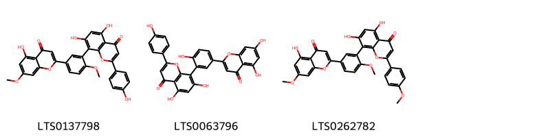{ width=100% }
    <figcaption>Hình ảnh cấu trúc hóa học của 3 hoạt chất thuộc nhóm Flavonoids gồm ['ginkgetin (LTS0137798)', 'amentoflavone (LTS0063796)', 'sciadopitysin (LTS0262782)'].</figcaption>
</figure>
#### Nhóm Furanoid lignans
<figure markdown="span">
    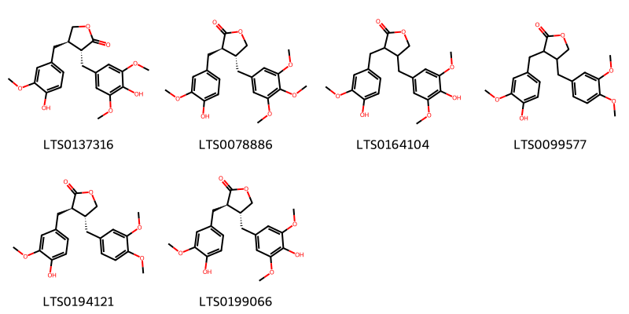{ width=100% }
    <figcaption>Hình ảnh cấu trúc hóa học của 6 hoạt chất thuộc nhóm Furanoid lignans gồm ['(3r,4r)-3-[(4-hydroxy-3,5-dimethoxyphenyl)methyl]-4-[(4-hydroxy-3-methoxyphenyl)methyl]oxolan-2-one (LTS0137316)', '(3r,4r)-3-[(4-hydroxy-3-methoxyphenyl)methyl]-4-[(3,4,5-trimethoxyphenyl)methyl]oxolan-2-one (LTS0078886)', '4-[(4-hydroxy-3,5-dimethoxyphenyl)methyl]-3-[(4-hydroxy-3-methoxyphenyl)methyl]oxolan-2-one (LTS0164104)', 'arctigenin (LTS0099577)', '(-)-arctigenin (LTS0194121)', '(3r,4r)-4-[(4-hydroxy-3,5-dimethoxyphenyl)methyl]-3-[(4-hydroxy-3-methoxyphenyl)methyl]oxolan-2-one (LTS0199066)'].</figcaption>
</figure>
#### Nhóm Lignan glycosides
<figure markdown="span">
    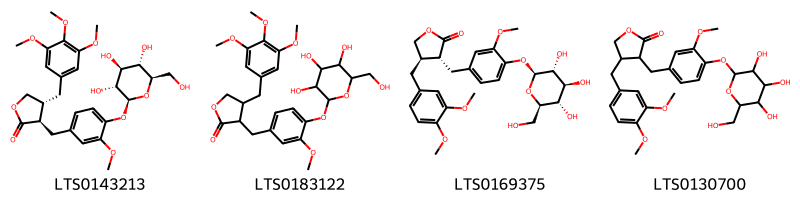{ width=100% }
    <figcaption>Hình ảnh cấu trúc hóa học của 4 hoạt chất thuộc nhóm Lignan glycosides gồm ['(3r,4r)-3-[(3-methoxy-4-{[(2s,3r,4s,5s,6r)-3,4,5-trihydroxy-6-(hydroxymethyl)oxan-2-yl]oxy}phenyl)methyl]-4-[(3,4,5-trimethoxyphenyl)methyl]oxolan-2-one (LTS0143213)', '3-[(3-methoxy-4-{[3,4,5-trihydroxy-6-(hydroxymethyl)oxan-2-yl]oxy}phenyl)methyl]-4-[(3,4,5-trimethoxyphenyl)methyl]oxolan-2-one (LTS0183122)', 'arctiin (LTS0169375)', '4-[(3,4-dimethoxyphenyl)methyl]-3-[(3-methoxy-4-{[3,4,5-trihydroxy-6-(hydroxymethyl)oxan-2-yl]oxy}phenyl)methyl]oxolan-2-one (LTS0130700)'].</figcaption>
</figure>
#### Nhóm Prenol lipids
<figure markdown="span">
    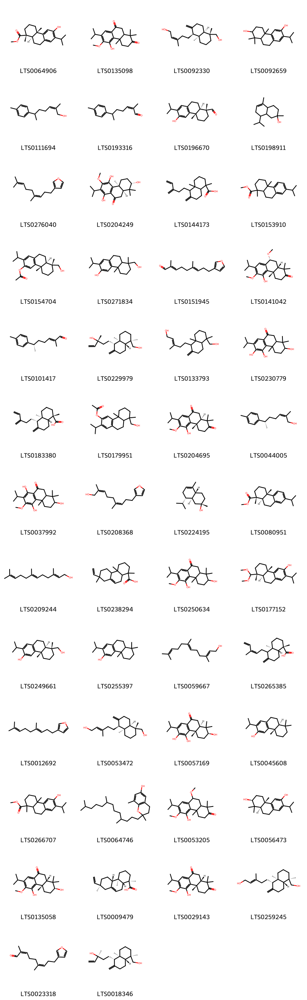{ width=100% }
    <figcaption>Hình ảnh cấu trúc hóa học của 54 hoạt chất thuộc nhóm Prenol lipids gồm ['methyl (1r,4as,10ar)-6-hydroxy-7-isopropyl-1,4a-dimethyl-2,3,4,9,10,10a-hexahydrophenanthrene-1-carboxylate (LTS0064906)', '5-hydroxy-7-isopropyl-6-methoxy-1,1,4a-trimethyl-3,4,10,10a-tetrahydrophenanthrene-2,9-dione (LTS0135098)', '(2z)-5-[(1s,4ar,5r,8as)-5-(hydroxymethyl)-5,8a-dimethyl-2-methylidene-hexahydro-1h-naphthalen-1-yl]-3-methylpent-2-en-1-ol (LTS0092330)', '7-isopropyl-1,1,4a-trimethyl-2,3,4,9,10,10a-hexahydrophenanthrene-2,6-diol (LTS0092659)', '2-methyl-6-(4-methylphenyl)hept-2-en-1-ol (LTS0111694)', '2-methyl-6-(4-methylphenyl)hept-2-enal (LTS0193316)', '(1r,4as,10ar)-6-hydroxy-7-isopropyl-1,4a-dimethyl-2,3,4,9,10,10a-hexahydrophenanthrene-1-carbaldehyde (LTS0196670)', '8-isopropyl-2,5-dimethyl-3,4,4a,7,8,8a-hexahydro-1h-naphthalen-2-ol (LTS0198911)', '3-(4,8-dimethylnona-3,7-dien-1-yl)furan (LTS0276040)', '(2s,4as,10as)-2,5,8-trihydroxy-7-isopropyl-6-methoxy-1,1,4a-trimethyl-3,4,10,10a-tetrahydro-2h-phenanthren-9-one (LTS0204249)', '1,4a-dimethyl-6-methylidene-5-(3-methylidenepent-4-en-1-yl)-hexahydro-2h-naphthalene-1-carboxylic acid (LTS0144173)', 'methyl 7-isopropyl-1,4a-dimethyl-2,3,4,9,10,10a-hexahydrophenanthrene-1-carboxylate (LTS0153910)', '(4bs,8r,8ar)-8-(hydroxymethyl)-2-isopropyl-4b,8-dimethyl-5,6,7,8a,9,10-hexahydrophenanthren-3-yl acetate (LTS0154704)', '8-(hydroxymethyl)-2-isopropyl-4b,8-dimethyl-5,6,7,8a,9,10-hexahydrophenanthren-3-ol (LTS0271834)', '(2e,6e)-9-(furan-3-yl)-2,6-dimethylnona-2,6-dienal (LTS0151945)', '(4as,9r,10as)-5-hydroxy-7-isopropyl-6,9-dimethoxy-1,1,4a-trimethyl-4,9,10,10a-tetrahydro-3h-phenanthren-2-one (LTS0141042)', '(2e,6s)-2-methyl-6-(4-methylphenyl)hept-2-enal (LTS0101417)', '(3r)-5-[(1s,4ar,5r,8ar)-5-(hydroxymethyl)-5,8a-dimethyl-2-methylidene-hexahydro-1h-naphthalen-1-yl]-3-methylpent-1-en-3-ol (LTS0229979)', '5-[5-(hydroxymethyl)-5,8a-dimethyl-2-methylidene-hexahydro-1h-naphthalen-1-yl]-3-methylpent-2-en-1-ol (LTS0133793)', '2,5,6-trihydroxy-7-isopropyl-1,1,4a-trimethyl-3,4,10,10a-tetrahydro-2h-phenanthren-9-one (LTS0230779)', '(1s,4ar,5s,8ar)-1,4a-dimethyl-6-methylidene-5-(3-methylidenepent-4-en-1-yl)-hexahydro-2h-naphthalene-1-carboxylic acid (LTS0183380)', '8-(hydroxymethyl)-2-isopropyl-4b,8-dimethyl-5,6,7,8a,9,10-hexahydrophenanthren-3-yl acetate (LTS0179951)', '(4as,10ar)-5-hydroxy-7-isopropyl-6-methoxy-1,1,4a-trimethyl-3,4,10,10a-tetrahydrophenanthrene-2,9-dione (LTS0204695)', '(2z,6s)-2-methyl-6-(4-methylphenyl)hept-2-en-1-ol (LTS0044005)', '2,5,8-trihydroxy-7-isopropyl-6-methoxy-1,1,4a-trimethyl-3,4,10,10a-tetrahydro-2h-phenanthren-9-one (LTS0037992)', '9-(furan-3-yl)-2,6-dimethylnona-2,6-dien-1-ol (LTS0208368)', '(2s,4ar,8s,8as)-8-isopropyl-2,5-dimethyl-3,4,4a,7,8,8a-hexahydro-1h-naphthalen-2-ol (LTS0224195)', 'methyl dehydroabietate (LTS0080951)', 'polyprenol (LTS0209244)', 'isopimaric acid (LTS0238294)', '2,5-dihydroxy-7-isopropyl-6-methoxy-1,1,4a-trimethyl-3,4,10,10a-tetrahydro-2h-phenanthren-9-one (LTS0250634)', '(4bs,8r,8ar)-8-(dimethoxymethyl)-2-isopropyl-4b,8-dimethyl-5,6,7,8a,9,10-hexahydrophenanthren-3-ol (LTS0177152)', '(4bs,8r,8ar)-8-(hydroxymethyl)-2-isopropyl-4b,8-dimethyl-5,6,7,8a,9,10-hexahydrophenanthren-3-ol (LTS0249661)', '2-isopropyl-4b,8,8-trimethyl-5,6,7,8a,9,10-hexahydrophenanthren-3-ol (LTS0255397)', 'farnesol (LTS0059667)', '(1s,4ar,8ar)-1,4a-dimethyl-6-methylidene-5-(3-methylpenta-2,4-dien-1-yl)-hexahydro-2h-naphthalene-1-carboxylic acid (LTS0265385)', 'dendrolasin (LTS0012692)', '(2e)-5-[(1s,4ar,5r,8as)-5-(hydroxymethyl)-5,8a-dimethyl-2-methylidene-hexahydro-1h-naphthalen-1-yl]-3-methylpent-2-en-1-ol (LTS0053472)', '(2s,4as,10ar)-2,5,6-trihydroxy-7-isopropyl-1,1,4a-trimethyl-3,4,10,10a-tetrahydro-2h-phenanthren-9-one (LTS0057169)', 'ferruginol (LTS0045608)', 'methyl 6-hydroxy-7-isopropyl-1,4a-dimethyl-2,3,4,9,10,10a-hexahydrophenanthrene-1-carboxylate (LTS0266707)', 'd-tocopherol (LTS0064746)', '5-hydroxy-7-isopropyl-6,9-dimethoxy-1,1,4a-trimethyl-4,9,10,10a-tetrahydro-3h-phenanthren-2-one (LTS0053205)', '(2s,4as,10ar)-7-isopropyl-1,1,4a-trimethyl-2,3,4,9,10,10a-hexahydrophenanthrene-2,6-diol (LTS0056473)', '(2s,4as,10as)-2,5-dihydroxy-7-isopropyl-6-methoxy-1,1,4a-trimethyl-3,4,10,10a-tetrahydro-2h-phenanthren-9-one (LTS0135058)', 'isopimaric acid (LTS0009479)', '(4as,10as)-5-hydroxy-7-isopropyl-6-methoxy-1,1,4a-trimethyl-3,4,10,10a-tetrahydrophenanthrene-2,9-dione (LTS0029143)', '(2e)-5-[(1s,4ar,5r,8ar)-5-(hydroxymethyl)-5,8a-dimethyl-2-methylidene-hexahydro-1h-naphthalen-1-yl]-3-methylpent-2-en-1-ol (LTS0259245)', '9-(furan-3-yl)-2,6-dimethylnona-2,6-dienal (LTS0023318)', '(3s)-5-[(1s,4ar,5r,8ar)-5-(hydroxymethyl)-5,8a-dimethyl-2-methylidene-hexahydro-1h-naphthalen-1-yl]-3-methylpent-1-en-3-ol (LTS0018346)', 'delta-tocopherol (LTS0005408)', '6-hydroxy-7-isopropyl-1,4a-dimethyl-2,3,4,9,10,10a-hexahydrophenanthrene-1-carbaldehyde (LTS0021163)', '8-(dimethoxymethyl)-2-isopropyl-4b,8-dimethyl-5,6,7,8a,9,10-hexahydrophenanthren-3-ol (LTS0050022)', '(2e,6e)-9-(furan-3-yl)-2,6-dimethylnona-2,6-dien-1-ol (LTS0038447)'].</figcaption>
</figure>
#### Nhóm Steroids and steroid derivatives
<figure markdown="span">
    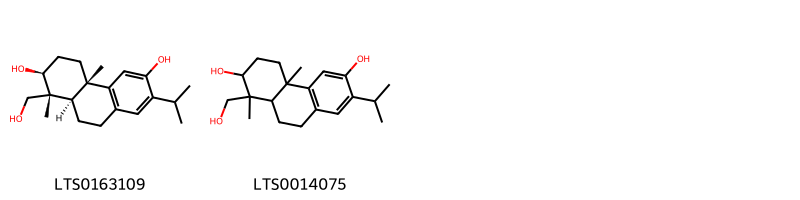{ width=100% }
    <figcaption>Hình ảnh cấu trúc hóa học của 2 hoạt chất thuộc nhóm Steroids and steroid derivatives gồm ['(1r,2s,4as,10ar)-1-(hydroxymethyl)-7-isopropyl-1,4a-dimethyl-2,3,4,9,10,10a-hexahydrophenanthrene-2,6-diol (LTS0163109)', '1-(hydroxymethyl)-7-isopropyl-1,4a-dimethyl-2,3,4,9,10,10a-hexahydrophenanthrene-2,6-diol (LTS0014075)'].</figcaption>
</figure>

---

### Dược dân tộc học

Danh sách các quốc gia có sử dụng *Torreya nucifera* trong điều trị các bệnh. 

| Country   | Disease                         | Bệnh                             |
|:----------|:--------------------------------|:---------------------------------|
| China     | Laxative, Vermifuge             | Thuốc nhuận tràng, Vermifuge     |
| Elsewhere | Estrogenic, Laxative, Vermifuge | Estrogen, nhuận tràng, Vermifuge |

---

# Chi Taxus

??? note "Danh sách các dược liệu thuộc chi"
    
	 - *Taxus baccata*
	 - *Taxus brevifolia*
	 - *Taxus canadensis*
	 - *Taxus cuidata*

---
## Taxus baccata
### Thông tin về thực vật

!!! info "Phân loại thực vật của *Taxus baccata* từ GIBF:"
    - **Kingdom:** Plantae
    - **Phylum:** Tracheophyta
    - **Order:** Pinales
    - **Family:** Taxaceae
    - **Genus:** Taxus
    - **Species:** *Taxus baccata*

 

| Label (VI)   | Label (EN)   | Scientific Name   | Descriptions (VI)   | Descriptions (EN)   | Also Known As (VI)     | Also Known As (EN)             |
|:-------------|:-------------|:------------------|:--------------------|:--------------------|:-----------------------|:-------------------------------|
| N/A          | N/A          | Taxus baccata     | loài thực vật       | species of plant    | ['thanh tùng Âu châu'] | ['Common Yew', 'European Yew'] |

#### Phân bố trên thế giới

**Từ CSDL GIBF** Georgia, Denmark, Luxembourg, Spain, Germany, Austria, Canada, Slovakia, Netherlands, Hungary, Ireland, Switzerland, United Kingdom of Great Britain and Northern Ireland, Portugal, Morocco, France, Czechia, New Zealand, Russian Federation, United States of America, Italy, Ukraine

#### Phân bố tại Việt Nam

**Từ CSDL GIBF**: Không có ghi nhận ở Việt Nam

---
### Thành phần hóa học
        
- Theo cơ sở dữ liệu lotus: Từ loài *Taxus baccata* đã phân lập và xác định được 261 hoạt chất thuộc về các nhóm Organooxygen compounds, Furanoid lignans, Flavonoids, Dibenzylbutane lignans, Prenol lipids, Carboxylic acids and derivatives, Fatty Acyls, Aryltetralin lignans, Phenols, Cinnamic acids and derivatives, Lignan lactones, Steroids and steroid derivatives, Benzene and substituted derivatives, Organic phosphoric acids and derivatives. 

|    | chemicalTaxonomyClassyfireClass          |   smiles_count |
|---:|:-----------------------------------------|---------------:|
|  0 | Aryltetralin lignans                     |              9 |
|  1 | Benzene and substituted derivatives      |              1 |
|  2 | Carboxylic acids and derivatives         |             30 |
|  3 | Cinnamic acids and derivatives           |              8 |
|  4 | Dibenzylbutane lignans                   |              9 |
|  5 | Fatty Acyls                              |             14 |
|  6 | Flavonoids                               |              6 |
|  7 | Furanoid lignans                         |             10 |
|  8 | Lignan lactones                          |              2 |
|  9 | Organic phosphoric acids and derivatives |              1 |
| 10 | Organooxygen compounds                   |              8 |
| 11 | Phenols                                  |             17 |
| 12 | Prenol lipids                            |            135 |
| 13 | Steroids and steroid derivatives         |              2 |

#### Nhóm Aryltetralin lignans
<figure markdown="span">
    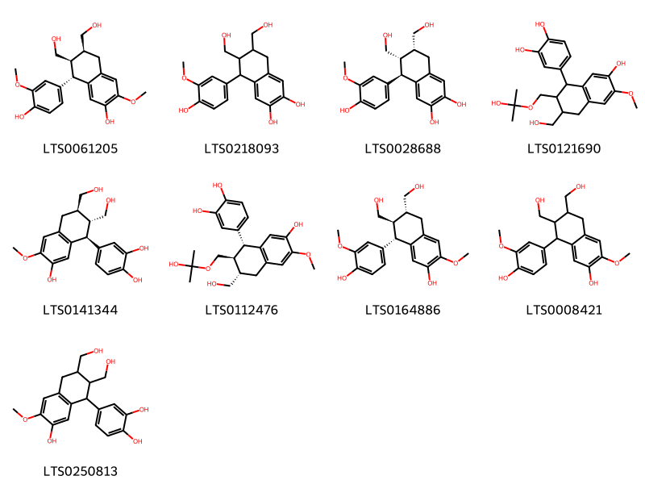{ width=100% }
    <figcaption>Hình ảnh cấu trúc hóa học của 9 hoạt chất thuộc nhóm Aryltetralin lignans gồm ['(6s,7r,8s)-8-(4-hydroxy-3-methoxyphenyl)-6,7-bis(hydroxymethyl)-3-methoxy-5,6,7,8-tetrahydronaphthalen-2-ol (LTS0061205)', '5-(4-hydroxy-3-methoxyphenyl)-6,7-bis(hydroxymethyl)-5,6,7,8-tetrahydronaphthalene-2,3-diol (LTS0218093)', '(5r,6s,7r)-5-(4-hydroxy-3-methoxyphenyl)-6,7-bis(hydroxymethyl)-5,6,7,8-tetrahydronaphthalene-2,3-diol (LTS0028688)', '4-[7-hydroxy-3-(hydroxymethyl)-2-{[(2-hydroxypropan-2-yl)oxy]methyl}-6-methoxy-1,2,3,4-tetrahydronaphthalen-1-yl]benzene-1,2-diol (LTS0121690)', 'isotaxiresinol (LTS0141344)', '4-[(1r,2s,3s)-7-hydroxy-3-(hydroxymethyl)-2-{[(2-hydroxypropan-2-yl)oxy]methyl}-6-methoxy-1,2,3,4-tetrahydronaphthalen-1-yl]benzene-1,2-diol (LTS0112476)', '(+)-isolariciresinol (LTS0164886)', '8-(4-hydroxy-3-methoxyphenyl)-6,7-bis(hydroxymethyl)-3-methoxy-5,6,7,8-tetrahydronaphthalen-2-ol (LTS0008421)', '4-[7-hydroxy-2,3-bis(hydroxymethyl)-6-methoxy-1,2,3,4-tetrahydronaphthalen-1-yl]benzene-1,2-diol (LTS0250813)'].</figcaption>
</figure>
#### Nhóm Benzene and substituted derivatives
<figure markdown="span">
    { width=100% }
    <figcaption>Hình ảnh cấu trúc hóa học của 1 hoạt chất thuộc nhóm Benzene and substituted derivatives gồm ['benzyl alcohol (LTS0125638)'].</figcaption>
</figure>
#### Nhóm Carboxylic acids and derivatives
<figure markdown="span">
    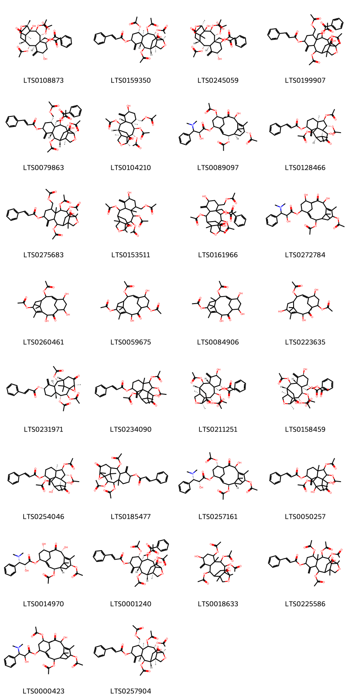{ width=100% }
    <figcaption>Hình ảnh cấu trúc hóa học của 30 hoạt chất thuộc nhóm Carboxylic acids and derivatives gồm ['[(1s,2r,3s,4r,5r,6s,8s,10r,11r,12r,15r)-3,4,6,11-tetrakis(acetyloxy)-2,8-dihydroxy-1,15-dimethyl-9-methylidene-14-oxo-16-oxatetracyclo[10.5.0.0²,¹⁵.0⁵,¹⁰]heptadecan-5-yl]methyl benzoate (LTS0108873)', 'taxagifine (LTS0159350)', '[(2r,3s,4r,5r,6s,8s,10r,11r,12r,15s)-3,4,6,11-tetrakis(acetyloxy)-2,8-dihydroxy-1,15-dimethyl-9-methylidene-14-oxo-16-oxatetracyclo[10.5.0.0²,¹⁵.0⁵,¹⁰]heptadecan-5-yl]methyl benzoate (LTS0245059)', '[3,4,11-tris(acetyloxy)-6-[(acetyloxy)methyl]-2-hydroxy-1,15-dimethyl-9-methylidene-14-oxo-8-[(3-phenylprop-2-enoyl)oxy]-16-oxatetracyclo[10.5.0.0²,¹⁵.0⁵,¹⁰]heptadecan-5-yl]methyl benzoate (LTS0199907)', '[(1r,2r,3s,4r,5r,6s,8s,10r,11r,12r,15s)-3,4,11-tris(acetyloxy)-6-[(acetyloxy)methyl]-2-hydroxy-1,15-dimethyl-9-methylidene-14-oxo-8-{[(2e)-3-phenylprop-2-enoyl]oxy}-16-oxatetracyclo[10.5.0.0²,¹⁵.0⁵,¹⁰]heptadecan-5-yl]methyl benzoate (LTS0079863)', '[(1r,2r,3s,4r,5r,6s,8s,10r,11r,12r,15s)-3,4,11-tris(acetyloxy)-2,8-dihydroxy-1,5,15-trimethyl-9-methylidene-14-oxo-16-oxatetracyclo[10.5.0.0²,¹⁵.0⁵,¹⁰]heptadecan-6-yl]methyl acetate (LTS0104210)', '(1r,2r,3e,5s,7r,8r,10s,13r)-2,7,13-tris(acetyloxy)-10-hydroxy-8,12,15,15-tetramethyl-9-oxotricyclo[9.3.1.1⁴,⁸]hexadeca-3,11-dien-5-yl (2s)-3-(dimethylamino)-2-hydroxy-3-phenylpropanoate (LTS0089097)', '(1r,2r,3r,4r,7s,9r,10r,11r,14s)-2,3,10-tris(acetyloxy)-14-hydroxy-4,15,15-trimethyl-8-methylidene-13-oxotetracyclo[9.3.1.0¹,⁹.0⁴,⁹]pentadecan-7-yl (2e)-3-phenylprop-2-enoate (LTS0128466)', '3,4,11-tris(acetyloxy)-6-[(acetyloxy)methyl]-2-hydroxy-1,5,15-trimethyl-9-methylidene-14-oxo-16-oxatetracyclo[10.5.0.0²,¹⁵.0⁵,¹⁰]heptadecan-8-yl 3-phenylprop-2-enoate (LTS0275683)', '[3,4,11-tris(acetyloxy)-2,8-dihydroxy-1,5,15-trimethyl-9-methylidene-14-oxo-16-oxatetracyclo[10.5.0.0²,¹⁵.0⁵,¹⁰]heptadecan-6-yl]methyl acetate (LTS0153511)', '[3,4,11-tris(acetyloxy)-6-[(acetyloxy)methyl]-2,8-dihydroxy-1,15-dimethyl-9-methylidene-14-oxo-16-oxatetracyclo[10.5.0.0²,¹⁵.0⁵,¹⁰]heptadecan-5-yl]methyl benzoate (LTS0161966)', 'taxine alkaloids (LTS0272784)', '3-(acetyloxy)-9,12,14-trihydroxy-7,11,16,16-tetramethyl-10-oxotricyclo[9.3.1.1⁴,⁸]hexadeca-1,7-dien-6-yl acetate (LTS0260461)', '3,12-bis(acetyloxy)-9,14-dihydroxy-7,11,16,16-tetramethyl-10-oxotricyclo[9.3.1.1⁴,⁸]hexadeca-1,7-dien-6-yl acetate (LTS0059675)', '3-(acetyloxy)-9,12,14-trihydroxy-4,7,11,16,16-pentamethyl-10-oxotricyclo[9.3.1.1⁴,⁸]hexadeca-1,7-dien-6-yl acetate (LTS0084906)', '10-(acetyloxy)-2,7,13-trihydroxy-4,14,15,15-tetramethyl-3-oxotricyclo[9.3.1.1⁴,⁸]hexadeca-1(14),8-dien-5-yl acetate (LTS0223635)', '(1r,2s,3r,4r,7s,9r,10r,11r,14s)-2,3,10-tris(acetyloxy)-4,14,16,16-tetramethyl-8-methylidene-13-oxo-15-oxatetracyclo[9.4.1.0¹,¹⁴.0⁴,⁹]hexadecan-7-yl (2e)-3-phenylprop-2-enoate (LTS0231971)', '2,3,10-tris(acetyloxy)-14-hydroxy-4,15,15-trimethyl-8-methylidene-13-oxotetracyclo[9.3.1.0¹,⁹.0⁴,⁹]pentadecan-7-yl 3-phenylprop-2-enoate (LTS0234090)', '[(1r,2r,3s,4r,5r,6s,8s,10r,11r,12r,15s)-3,4,6,11-tetrakis(acetyloxy)-2,8-dihydroxy-1,15-dimethyl-9-methylidene-14-oxo-16-oxatetracyclo[10.5.0.0²,¹⁵.0⁵,¹⁰]heptadecan-5-yl]methyl benzoate (LTS0211251)', '[(1r,2r,3s,4r,5r,6s,8s,10r,11r,12r,15s)-3,4,11-tris(acetyloxy)-6-[(acetyloxy)methyl]-2,8-dihydroxy-1,15-dimethyl-9-methylidene-14-oxo-16-oxatetracyclo[10.5.0.0²,¹⁵.0⁵,¹⁰]heptadecan-5-yl]methyl benzoate (LTS0158459)', '(1s,2r,3r,4r,7s,9r,10s,11s,14s)-2,3,10-tris(acetyloxy)-11,14-dihydroxy-4,15,15-trimethyl-8-methylidene-13-oxotetracyclo[9.3.1.0¹,⁹.0⁴,⁹]pentadecan-7-yl (2e)-3-phenylprop-2-enoate (LTS0254046)', '2,3,10-tris(acetyloxy)-4,14,16,16-tetramethyl-8-methylidene-13-oxo-15-oxatetracyclo[9.4.1.0¹,¹⁴.0⁴,⁹]hexadecan-7-yl 3-phenylprop-2-enoate (LTS0185477)', '(1s,2s,3e,5s,7s,8r,10s,13s)-2,7,13-tris(acetyloxy)-10-hydroxy-8,12,15,15-tetramethyl-9-oxotricyclo[9.3.1.1⁴,⁸]hexadeca-3,11-dien-5-yl (2r,3s)-3-(dimethylamino)-2-hydroxy-3-phenylpropanoate (LTS0257161)', '2,3,10-tris(acetyloxy)-11,14-dihydroxy-4,15,15-trimethyl-8-methylidene-13-oxotetracyclo[9.3.1.0¹,⁹.0⁴,⁹]pentadecan-7-yl 3-phenylprop-2-enoate (LTS0050257)', '(1s,2s,3e,5s,7s,8r,10r,13s)-2,13-bis(acetyloxy)-7,10-dihydroxy-8,12,15,15-tetramethyl-9-oxotricyclo[9.3.1.1⁴,⁸]hexadeca-3,11-dien-5-yl (2r,3s)-3-(dimethylamino)-2-hydroxy-3-phenylpropanoate (LTS0014970)', '[(1r,2r,3s,4r,5r,6s,8s,10r,11r,12r,15s)-3,4,6,11-tetrakis(acetyloxy)-2-hydroxy-1,15-dimethyl-9-methylidene-14-oxo-8-{[(2e)-3-phenylprop-2-enoyl]oxy}-16-oxatetracyclo[10.5.0.0²,¹⁵.0⁵,¹⁰]heptadecan-5-yl]methyl benzoate (LTS0001240)', '3,6,11-tris(acetyloxy)-2,8-dihydroxy-1,5,15-trimethyl-9-methylidene-14-oxo-16-oxatetracyclo[10.5.0.0²,¹⁵.0⁵,¹⁰]heptadecan-4-yl acetate (LTS0018633)', '3,4,6,11-tetrakis(acetyloxy)-2-hydroxy-1,5,15-trimethyl-9-methylidene-14-oxo-16-oxatetracyclo[10.5.0.0²,¹⁵.0⁵,¹⁰]heptadecan-8-yl 3-phenylprop-2-enoate (LTS0225586)', '2,7,13-tris(acetyloxy)-10-hydroxy-8,12,15,15-tetramethyl-9-oxotricyclo[9.3.1.1⁴,⁸]hexadeca-3,11-dien-5-yl 3-(dimethylamino)-2-hydroxy-3-phenylpropanoate (LTS0000423)', '(1r,2r,3s,4r,5r,6s,8s,10r,11r,12r,15s)-3,4,11-tris(acetyloxy)-6-[(acetyloxy)methyl]-2-hydroxy-1,5,15-trimethyl-9-methylidene-14-oxo-16-oxatetracyclo[10.5.0.0²,¹⁵.0⁵,¹⁰]heptadecan-8-yl (2e)-3-phenylprop-2-enoate (LTS0257904)'].</figcaption>
</figure>
#### Nhóm Cinnamic acids and derivatives
<figure markdown="span">
    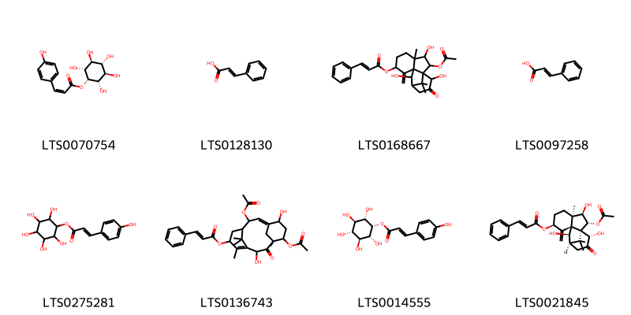{ width=100% }
    <figcaption>Hình ảnh cấu trúc hóa học của 8 hoạt chất thuộc nhóm Cinnamic acids and derivatives gồm ['(1s,2r,3s,4s,5r,6s)-2,3,4,5,6-pentahydroxycyclohexyl (2z)-3-(4-hydroxyphenyl)prop-2-enoate (LTS0070754)', 'cinnamic acid (LTS0128130)', '2-(acetyloxy)-3,10,14-trihydroxy-4,15,15-trimethyl-8-methylidene-13-oxotetracyclo[9.3.1.0¹,⁹.0⁴,⁹]pentadecan-7-yl 3-phenylprop-2-enoate (LTS0168667)', 'phenylacrylic acid (LTS0097258)', '2,3,4,5,6-pentahydroxycyclohexyl 3-(4-hydroxyphenyl)prop-2-enoate (LTS0275281)', '3,12-bis(acetyloxy)-9,14-dihydroxy-7,11,16,16-tetramethyl-10-oxotricyclo[9.3.1.1⁴,⁸]hexadeca-1,7-dien-6-yl 3-phenylprop-2-enoate (LTS0136743)', '(1s,2r,3s,4s,5r,6s)-2,3,4,5,6-pentahydroxycyclohexyl (2e)-3-(4-hydroxyphenyl)prop-2-enoate (LTS0014555)', '(1r,2r,3r,4r,7s,9r,10r,11r,14s)-2-(acetyloxy)-3,10,14-trihydroxy-4,15,15-trimethyl-8-methylidene-13-oxotetracyclo[9.3.1.0¹,⁹.0⁴,⁹]pentadecan-7-yl (2e)-3-phenylprop-2-enoate (LTS0021845)'].</figcaption>
</figure>
#### Nhóm Dibenzylbutane lignans
<figure markdown="span">
    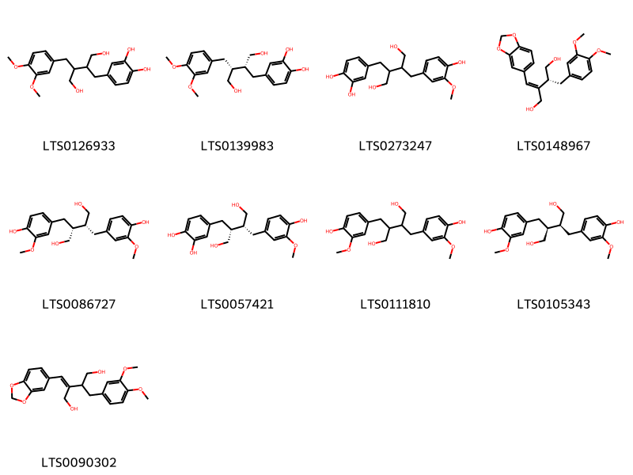{ width=100% }
    <figcaption>Hình ảnh cấu trúc hóa học của 9 hoạt chất thuộc nhóm Dibenzylbutane lignans gồm ['4-{3-[(3,4-dimethoxyphenyl)methyl]-4-hydroxy-2-(hydroxymethyl)butyl}benzene-1,2-diol (LTS0126933)', '4-[(2r,3r)-3-[(3,4-dimethoxyphenyl)methyl]-4-hydroxy-2-(hydroxymethyl)butyl]benzene-1,2-diol (LTS0139983)', '4-{4-hydroxy-3-[(4-hydroxy-3-methoxyphenyl)methyl]-2-(hydroxymethyl)butyl}benzene-1,2-diol (LTS0273247)', '(2e,3r)-2-(2h-1,3-benzodioxol-5-ylmethylidene)-3-[(3,4-dimethoxyphenyl)methyl]butane-1,4-diol (LTS0148967)', 'secoisolariciresinol (LTS0086727)', '4-[(2r,3r)-4-hydroxy-3-[(4-hydroxy-3-methoxyphenyl)methyl]-2-(hydroxymethyl)butyl]benzene-1,2-diol (LTS0057421)', 'secoisolariciresinol (LTS0111810)', '(+)-secoisolariciresinol (LTS0105343)', '2-(2h-1,3-benzodioxol-5-ylmethylidene)-3-[(3,4-dimethoxyphenyl)methyl]butane-1,4-diol (LTS0090302)'].</figcaption>
</figure>
#### Nhóm Fatty Acyls
<figure markdown="span">
    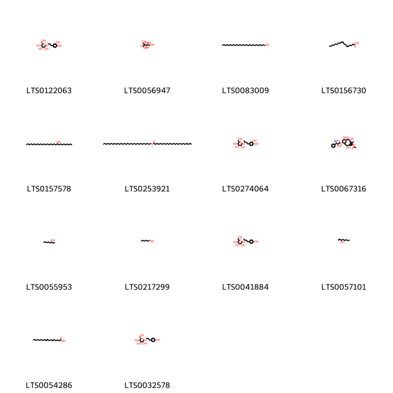{ width=100% }
    <figcaption>Hình ảnh cấu trúc hóa học của 14 hoạt chất thuộc nhóm Fatty Acyls gồm ['(2r,3r,4s,5s,6r)-2-{[(2r)-4-(3,4-dihydroxyphenyl)butan-2-yl]oxy}-6-(hydroxymethyl)oxane-3,4,5-triol (LTS0122063)', '2-carboxy-d-arabinitol (LTS0056947)', 'heptacosanol (LTS0083009)', 'taxoleic acid (LTS0156730)', '(s)-nonacosan-10-ol (LTS0157578)', 'triacontyl tetracosanoate (LTS0253921)', '2-{[4-(3,4-dihydroxyphenyl)butan-2-yl]oxy}-6-(hydroxymethyl)oxane-3,4,5-triol (LTS0274064)', '13-(acetyloxy)-2,7,10-trihydroxy-8,12,15,15-tetramethyl-9-oxotricyclo[9.3.1.1⁴,⁸]hexadeca-3,11-dien-5-yl 3-(dimethylamino)-2-hydroxy-3-phenylpropanoate (LTS0067316)', '3-octanol (LTS0055953)', 'hexanol (LTS0217299)', 'rhododendrin (LTS0041884)', '1-octen-3-ol (LTS0057101)', 'octadeca-5,9-dienoic acid (LTS0054286)', 'rhododendrin (LTS0032578)'].</figcaption>
</figure>
#### Nhóm Flavonoids
<figure markdown="span">
    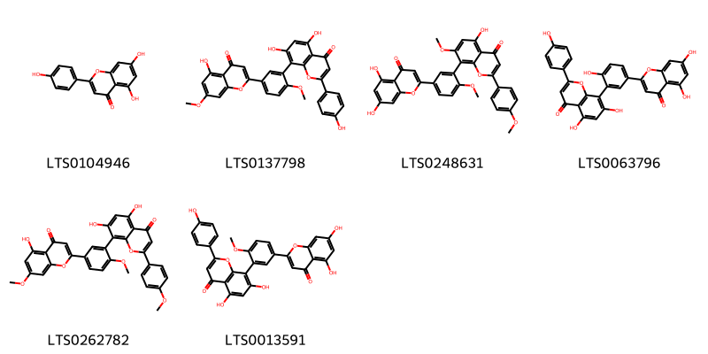{ width=100% }
    <figcaption>Hình ảnh cấu trúc hóa học của 6 hoạt chất thuộc nhóm Flavonoids gồm ['chamomile (LTS0104946)', 'ginkgetin (LTS0137798)', '8-[5-(5,7-dihydroxy-4-oxochromen-2-yl)-2-methoxyphenyl]-5-hydroxy-7-methoxy-2-(4-methoxyphenyl)chromen-4-one (LTS0248631)', 'amentoflavone (LTS0063796)', 'sciadopitysin (LTS0262782)', '8-[5-(5,7-dihydroxy-4-oxochromen-2-yl)-2-methoxyphenyl]-5,7-dihydroxy-2-(4-hydroxyphenyl)chromen-4-one (LTS0013591)'].</figcaption>
</figure>
#### Nhóm Furanoid lignans
<figure markdown="span">
    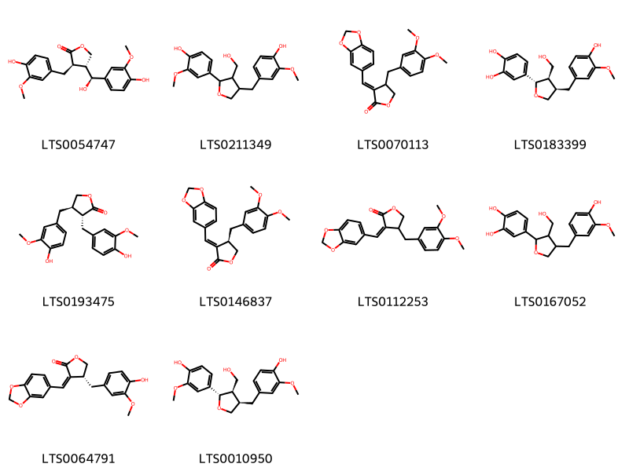{ width=100% }
    <figcaption>Hình ảnh cấu trúc hóa học của 10 hoạt chất thuộc nhóm Furanoid lignans gồm ['hydroxymatairesinol (LTS0054747)', '4-{4-[(4-hydroxy-3-methoxyphenyl)methyl]-3-(hydroxymethyl)oxolan-2-yl}-2-methoxyphenol (LTS0211349)', '(3e)-3-(2h-1,3-benzodioxol-5-ylmethylidene)-4-[(3,4-dimethoxyphenyl)methyl]oxolan-2-one (LTS0070113)', 'taxiresinol (LTS0183399)', 'matairesinol (LTS0193475)', '(3e,4r)-3-(2h-1,3-benzodioxol-5-ylmethylidene)-4-[(3,4-dimethoxyphenyl)methyl]oxolan-2-one (LTS0146837)', '(3z)-3-(2h-1,3-benzodioxol-5-ylmethylidene)-4-[(3,4-dimethoxyphenyl)methyl]oxolan-2-one (LTS0112253)', 'taxiresinol (LTS0167052)', '(3z,4r)-3-(2h-1,3-benzodioxol-5-ylmethylidene)-4-[(4-hydroxy-3-methoxyphenyl)methyl]oxolan-2-one (LTS0064791)', 'lariciresinol (LTS0010950)'].</figcaption>
</figure>
#### Nhóm Lignan lactones
<figure markdown="span">
    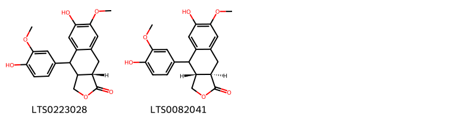{ width=100% }
    <figcaption>Hình ảnh cấu trúc hóa học của 2 hoạt chất thuộc nhóm Lignan lactones gồm ['(9as)-6-hydroxy-4-(4-hydroxy-3-methoxyphenyl)-7-methoxy-3h,3ah,4h,9h,9ah-naphtho[2,3-c]furan-1-one (LTS0223028)', '(3ar,9ar)-6-hydroxy-4-(4-hydroxy-3-methoxyphenyl)-7-methoxy-3h,3ah,4h,9h,9ah-naphtho[2,3-c]furan-1-one (LTS0082041)'].</figcaption>
</figure>
#### Nhóm Organic phosphoric acids and derivatives
<figure markdown="span">
    { width=100% }
    <figcaption>Hình ảnh cấu trúc hóa học của 1 hoạt chất thuộc nhóm Organic phosphoric acids and derivatives gồm ['o-phosphoethanolamine; bis(nonane) (LTS0249963)'].</figcaption>
</figure>
#### Nhóm Organooxygen compounds
<figure markdown="span">
    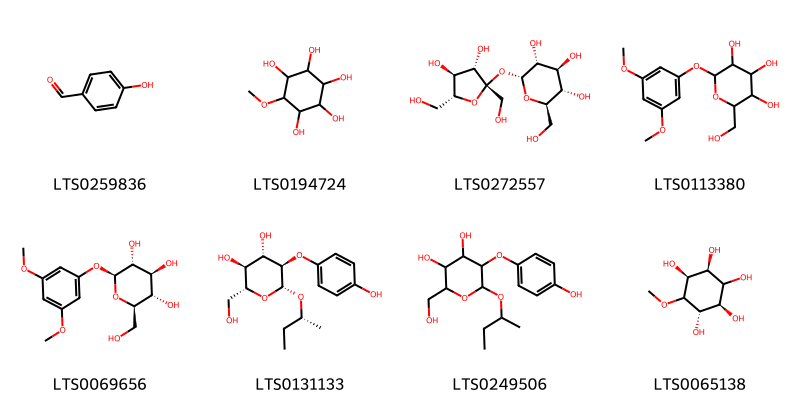{ width=100% }
    <figcaption>Hình ảnh cấu trúc hóa học của 8 hoạt chất thuộc nhóm Organooxygen compounds gồm ['p-hydroxybenzaldehyde (LTS0259836)', 'pinitol (LTS0194724)', 'sucrose (LTS0272557)', 'taxicatin (LTS0113380)', 'taxicatin (LTS0069656)', '(2r,3s,4s,5r,6r)-6-[(2r)-butan-2-yloxy]-2-(hydroxymethyl)-5-(4-hydroxyphenoxy)oxane-3,4-diol (LTS0131133)', '2-(hydroxymethyl)-5-(4-hydroxyphenoxy)-6-(sec-butoxy)oxane-3,4-diol (LTS0249506)', '(1s,2r,4s,5s)-6-methoxycyclohexane-1,2,3,4,5-pentol (LTS0065138)'].</figcaption>
</figure>
#### Nhóm Phenols
<figure markdown="span">
    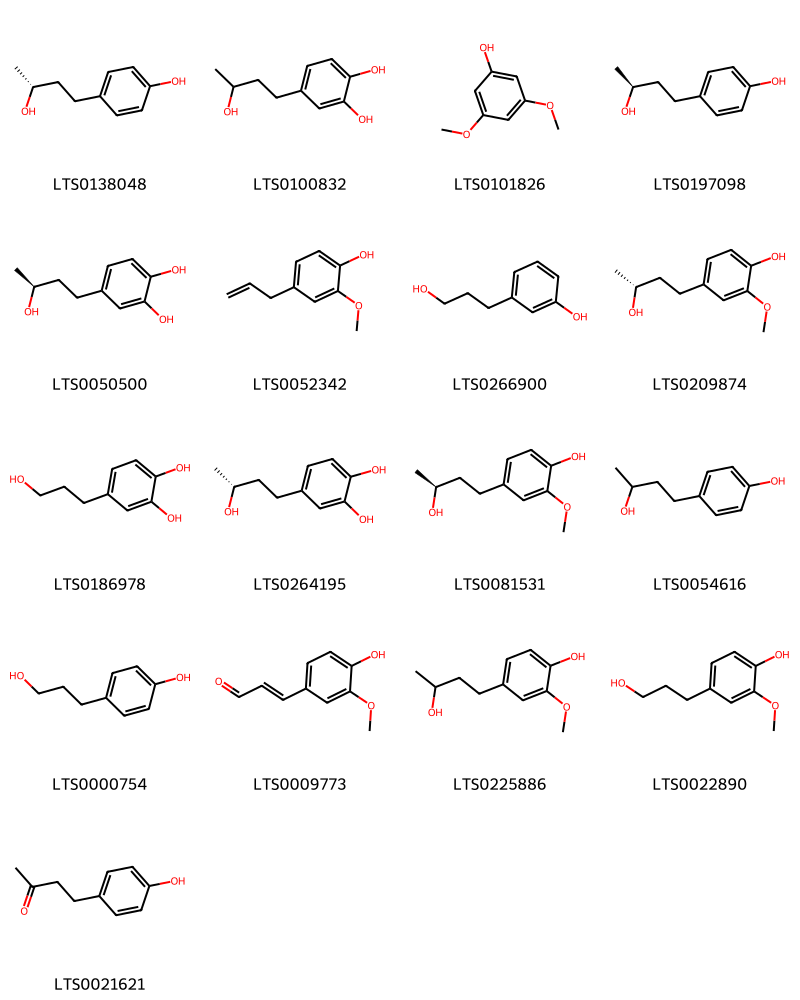{ width=100% }
    <figcaption>Hình ảnh cấu trúc hóa học của 17 hoạt chất thuộc nhóm Phenols gồm ['(-)-rhododendrol (LTS0138048)', '4-(3-hydroxybutyl)benzene-1,2-diol (LTS0100832)', '3,5-dimethoxyphenol (LTS0101826)', '(+)-rhododendrol (LTS0197098)', '4-[(3s)-3-hydroxybutyl]benzene-1,2-diol (LTS0050500)', 'eugenol (LTS0052342)', '3-(3-hydroxypropyl)phenol (LTS0266900)', '(r)-zingerol (LTS0209874)', '4-(3-hydroxypropyl)benzene-1,2-diol (LTS0186978)', '4-[(3r)-3-hydroxybutyl]benzene-1,2-diol (LTS0264195)', '(s)-zingerol (LTS0081531)', 'rhododendrol (LTS0054616)', '3-(4-hydroxyphenyl)propan-1-ol (LTS0000754)', 'coniferaldehyde (LTS0009773)', 'zingerol (LTS0225886)', 'dihydroconiferyl alcohol (LTS0022890)', 'frambinone (LTS0021621)'].</figcaption>
</figure>
#### Nhóm Prenol lipids
<figure markdown="span">
    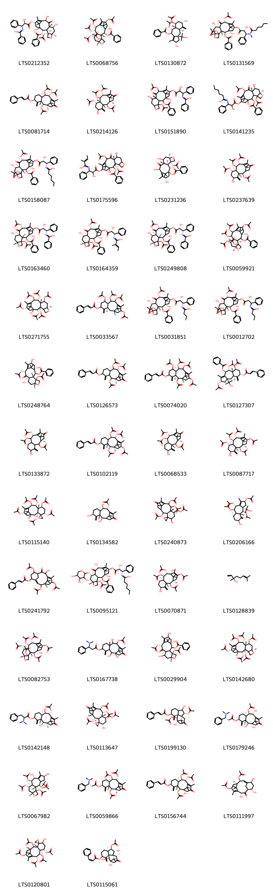{ width=100% }
    <figcaption>Hình ảnh cấu trúc hóa học của 135 hoạt chất thuộc nhóm Prenol lipids gồm ['n-[(1s,2r)-3-{[(1s,2s,3r,4s,7r,9s,10s,12r,15s)-4-(acetyloxy)-2-(benzoyloxy)-1,9,12-trihydroxy-10,14,17,17-tetramethyl-11-oxo-6-oxatetracyclo[11.3.1.0³,¹⁰.0⁴,⁷]heptadec-13-en-15-yl]oxy}-2-hydroxy-3-oxo-1-phenylpropyl]benzenecarboximidic acid (LTS0212352)', '(1s,2s,3r,4s,7r,9s,10s,11s,12r,15s)-4,9,11,12,15-pentakis(acetyloxy)-1-hydroxy-10,14,17,17-tetramethyl-6-oxatetracyclo[11.3.1.0³,¹⁰.0⁴,⁷]heptadec-13-en-2-yl benzoate (LTS0068756)', '(2s,3as,4ar,6s,8s,8as,9r,10r)-8,9-bis(acetyloxy)-2,6-dihydroxy-3a-(2-hydroxypropan-2-yl)-1,8a-dimethyl-5-methylidene-2h,3h,4h,4ah,6h,7h,8h,9h,10h-cyclohexa[f]azulen-10-yl benzoate (LTS0130872)', '(1s,2s,3r,4s,7r,9s,10s,12r,15s)-4,12-bis(acetyloxy)-1,9-dihydroxy-15-{[(2r,3s)-2-hydroxy-3-(n-methylhexanamido)-3-phenylpropanoyl]oxy}-10,14,17,17-tetramethyl-11-oxo-6-oxatetracyclo[11.3.1.0³,¹⁰.0⁴,⁷]heptadec-13-en-2-yl benzoate (LTS0131569)', 'taxinine (LTS0081714)', '(1r,2r,3r,5s,7s,8r,9r,10r)-2,9,10-tris(acetyloxy)-5-hydroxy-8,12,15,15-tetramethyl-4-methylidene-13-oxotricyclo[9.3.1.0³,⁸]pentadec-11-en-7-yl acetate (LTS0214126)', 'n-(3-{[4,12-bis(acetyloxy)-2-(benzoyloxy)-1,9-dihydroxy-10,14,17,17-tetramethyl-11-oxo-6-oxatetracyclo[11.3.1.0³,¹⁰.0⁴,⁷]heptadec-13-en-15-yl]oxy}-2-hydroxy-3-oxo-1-phenylpropyl)benzenecarboximidic acid (LTS0151890)', 'n-(3-{[(1s,7r,9s,10s,12r)-4,12-bis(acetyloxy)-2-(benzoyloxy)-1,9-dihydroxy-10,14,17,17-tetramethyl-11-oxo-6-oxatetracyclo[11.3.1.0³,¹⁰.0⁴,⁷]heptadec-13-en-15-yl]oxy}-2-hydroxy-3-oxo-1-phenylpropyl)hexanimidic acid (LTS0141235)', 'n-[(1s,2r)-3-{[(1s,2s,3r,4s,7r,9s,10s,12r,15s)-4,12-bis(acetyloxy)-2-(benzoyloxy)-1,9-dihydroxy-10,14,17,17-tetramethyl-11-oxo-6-oxatetracyclo[11.3.1.0³,¹⁰.0⁴,⁷]heptadec-13-en-15-yl]oxy}-2-hydroxy-3-oxo-1-phenylpropyl]hexanimidic acid (LTS0158087)', 'n-(3-{[(1s,3s,4s,10s)-4,12-bis(acetyloxy)-2-(benzoyloxy)-1,9-dihydroxy-10,14,17,17-tetramethyl-11-oxo-6-oxatetracyclo[11.3.1.0³,¹⁰.0⁴,⁷]heptadec-13-en-15-yl]oxy}-2-hydroxy-3-oxo-1-phenylpropyl)-2-methylbut-2-enimidic acid (LTS0175596)', '10-deacetylbaccatin iii (LTS0231236)', '(2r,3r,5s,7s,8s,9r,10r)-2,9,10-tris(acetyloxy)-5-hydroxy-8,12,15,15-tetramethyl-4-methylidene-13-oxotricyclo[9.3.1.0³,⁸]pentadec-11-en-7-yl acetate (LTS0237639)', 'n-[(1s,2r)-3-{[(1s,2s,3r,4s,7r,9s,10s,12r,15s)-4,12-bis(acetyloxy)-2-(benzoyloxy)-1,9-dihydroxy-10,14,17,17-tetramethyl-11-oxo-6-oxatetracyclo[11.3.1.0³,¹⁰.0⁴,⁷]heptadec-13-en-15-yl]oxy}-2-hydroxy-3-oxo-1-phenylpropyl]benzenecarboximidic acid (LTS0163460)', '(2e)-n-[(1s,2r)-3-{[(1s,2s,4s,7r,9s,10s,12r,15s)-4,12-bis(acetyloxy)-2-(benzoyloxy)-1,9-dihydroxy-10,14,17,17-tetramethyl-11-oxo-6-oxatetracyclo[11.3.1.0³,¹⁰.0⁴,⁷]heptadec-13-en-15-yl]oxy}-2-hydroxy-3-oxo-1-phenylpropyl]-2-methylbut-2-enimidic acid (LTS0164359)', 'n-[(1s,2r)-3-{[(1s,2s,3r,4s,7r,9r,10s,12r,15s)-4,12-bis(acetyloxy)-2-(benzoyloxy)-1,9-dihydroxy-10,14,17,17-tetramethyl-11-oxo-6-oxatetracyclo[11.3.1.0³,¹⁰.0⁴,⁷]heptadec-13-en-15-yl]oxy}-2-hydroxy-3-oxo-1-phenylpropyl]benzenecarboximidic acid (LTS0249808)', '(1s,3s,4s,7s,10s)-4,9,11,12,15-pentakis(acetyloxy)-1-hydroxy-10,14,17,17-tetramethyl-6-oxatetracyclo[11.3.1.0³,¹⁰.0⁴,⁷]heptadec-13-en-2-yl benzoate (LTS0059921)', '(1s,2s,3r,4s,7r,9s,10s,11r,12r,15s)-2,9,11,12,15-pentakis(acetyloxy)-1-hydroxy-10,14,17,17-tetramethyl-6-oxatetracyclo[11.3.1.0³,¹⁰.0⁴,⁷]heptadec-13-en-4-yl acetate (LTS0271755)', '(1s,3s,8s)-7,9,10,13-tetrakis(acetyloxy)-8,12,15,15-tetramethyl-4-methylidenetricyclo[9.3.1.0³,⁸]pentadec-11-en-5-yl 3-phenylprop-2-enoate (LTS0033567)', 'n-[(1s,2r)-3-{[(1s,2s,3r,4s,7r,9s,10s,12r,15s)-4,12-bis(acetyloxy)-2-(benzoyloxy)-1,9-dihydroxy-10,14,17,17-tetramethyl-11-oxo-6-oxatetracyclo[11.3.1.0³,¹⁰.0⁴,⁷]heptadec-13-en-15-yl]oxy}-2-hydroxy-3-oxo-1-phenylpropyl]butanimidic acid (LTS0031851)', 'n-[(2r)-3-{[(1s,2s,3r,4s,7r,9s,10s,12r,15s)-4,12-bis(acetyloxy)-2-(benzoyloxy)-1,9-dihydroxy-10,14,17,17-tetramethyl-11-oxo-6-oxatetracyclo[11.3.1.0³,¹⁰.0⁴,⁷]heptadec-13-en-15-yl]oxy}-2-hydroxy-3-oxo-1-phenylpropyl]butanimidic acid (LTS0012702)', 'baccatin iii (LTS0248764)', '(1r,8r,10r)-2,9,10-tris(acetyloxy)-8,12,15,15-tetramethyl-4-methylidene-13-oxotricyclo[9.3.1.0³,⁸]pentadec-11-en-5-yl (2e)-3-phenylprop-2-enoate (LTS0126573)', '(1s,3s,8s)-2,7,9,10,13-pentakis(acetyloxy)-8,12,15,15-tetramethyl-4-methylidenetricyclo[9.3.1.0³,⁸]pentadec-11-en-5-yl 3-phenylprop-2-enoate (LTS0074020)', '(2s,3as,4ar,6s,8s,8as,9r,10r)-2,8,9-tris(acetyloxy)-3a-(2-hydroxypropan-2-yl)-1,8a-dimethyl-5-methylidene-6-{[(2e)-3-phenylprop-2-enoyl]oxy}-2h,3h,4h,4ah,6h,7h,8h,9h,10h-cyclohexa[f]azulen-10-yl benzoate (LTS0127307)', '(1r,8r,10r)-9,10-bis(acetyloxy)-5-hydroxy-8,12,15,15-tetramethyl-4-methylidene-13-oxotricyclo[9.3.1.0³,⁸]pentadec-11-en-2-yl acetate (LTS0133872)', '(1r,2r,3r,5s,8r,9r,10r,13s)-2,9,10,13-tetrakis(acetyloxy)-8,12,15,15-tetramethyl-4-methylidenetricyclo[9.3.1.0³,⁸]pentadec-11-en-5-yl (2e)-3-phenylprop-2-enoate (LTS0102119)', '(1r,2r,3r,5s,8r,9r,10r)-9,10-bis(acetyloxy)-5-hydroxy-8,12,15,15-tetramethyl-4-methylidene-13-oxotricyclo[9.3.1.0³,⁸]pentadec-11-en-2-yl acetate (LTS0068533)', '(1r,2r,3r,5s,7s,8s,9r,10r,13s)-2,9,10,13-tetrakis(acetyloxy)-5-hydroxy-8,12,15,15-tetramethyl-4-methylidenetricyclo[9.3.1.0³,⁸]pentadec-11-en-7-yl acetate (LTS0087717)', "(1'r,2s,2'r,3'r,5's,7's,8's,9'r,10'r,13's)-2',5',7',9',10'-pentakis(acetyloxy)-8',12',15',15'-tetramethylspiro[oxirane-2,4'-tricyclo[9.3.1.0³,⁸]pentadecan]-11'-en-13'-yl acetate (LTS0115140)", '(2r,3r,5s,8r,9r,10r)-2,5,9-trihydroxy-8,12,15,15-tetramethyl-4-methylidene-13-oxotricyclo[9.3.1.0³,⁸]pentadec-11-en-10-yl acetate (LTS0134582)', "2',9',10'-tris(acetyloxy)-5'-hydroxy-8',12',15',15'-tetramethyl-13'-oxospiro[oxirane-2,4'-tricyclo[9.3.1.0³,⁸]pentadecan]-11'-en-7'-ylmethyl acetate (LTS0240873)", '(2s,3as,4s,4ar,6s,8ar,9r,10r)-4,9,10-tris(acetyloxy)-6-hydroxy-3a-(2-hydroxypropan-2-yl)-1,8a-dimethyl-5-methylidene-2h,3h,4h,4ah,6h,7h,8h,9h,10h-cyclohexa[f]azulen-2-yl acetate (LTS0206166)', '(1s,8s)-2,7,13-tris(acetyloxy)-10-hydroxy-8,12,15,15-tetramethyl-9-oxotricyclo[9.3.1.1⁴,⁸]hexadeca-3,11-dien-5-yl 3-phenylprop-2-enoate (LTS0241792)', 'n-[(1s,2r)-3-{[(1s,2s,4s,7r,9s,10s,12r,15s)-4-(acetyloxy)-2-(benzoyloxy)-1,12-dihydroxy-10,14,17,17-tetramethyl-11-oxo-9-[(3,4,5-trihydroxyoxan-2-yl)oxy]-6-oxatetracyclo[11.3.1.0³,¹⁰.0⁴,⁷]heptadec-13-en-15-yl]oxy}-2-hydroxy-3-oxo-1-phenylpropyl]hexanimidic acid (LTS0095121)', '(1r,2r,3r,5s,8r,9r,10s,11s)-9,10,13-tris(acetyloxy)-5,11-dihydroxy-8,12,15,15-tetramethyl-4-methylidenetricyclo[9.3.1.0³,⁸]pentadec-12-en-2-yl acetate (LTS0070871)', 'linalool, (+-)- (LTS0128839)', '(1s,2s,3r,4s,7r,9s,10s,11s,12r,15s)-2,9,11,12,15-pentakis(acetyloxy)-1-hydroxy-10,14,17,17-tetramethyl-6-oxatetracyclo[11.3.1.0³,¹⁰.0⁴,⁷]heptadec-13-en-4-yl acetate (LTS0082753)', '10-(acetyloxy)-1,2,9-trihydroxy-8,12,15,15-tetramethyl-4-methylidene-13-oxotricyclo[9.3.1.0³,⁸]pentadec-11-en-5-yl 3-(dimethylamino)-3-phenylpropanoate (LTS0167738)', '(1s,4s,7r,10s,12r)-4,12-bis(acetyloxy)-1,9,15-trihydroxy-10,14,17,17-tetramethyl-11-oxo-6-oxatetracyclo[11.3.1.0³,¹⁰.0⁴,⁷]heptadec-13-en-2-yl benzoate (LTS0029904)', '(1r,2r,3r,4s,7r,9s,10s,11r,12r,15s)-2,9,11,12,15-pentakis(acetyloxy)-10,14,17,17-tetramethyl-6-oxatetracyclo[11.3.1.0³,¹⁰.0⁴,⁷]heptadec-13-en-4-yl acetate (LTS0142680)', '(1r,2r,3r,5s,8r,9r,10r)-10-(acetyloxy)-2,9-dihydroxy-8,12,15,15-tetramethyl-4-methylidene-13-oxotricyclo[9.3.1.0³,⁸]pentadec-11-en-5-yl 2-(dimethylamino)-3-phenylpropanoate (LTS0142148)', "(1'r,2s,2'r,3'r,5's,7's,8'r,9'r,10'r)-2',9',10'-tris(acetyloxy)-5'-hydroxy-8',12',15',15'-tetramethyl-13'-oxospiro[oxirane-2,4'-tricyclo[9.3.1.0³,⁸]pentadecan]-11'-en-7'-ylmethyl acetate (LTS0113647)", '(1s,2r,3r,4r,7s,9r,10s,11s,14s)-2,10-bis(acetyloxy)-3,11-dihydroxy-4,14,15,15-tetramethyl-8-methylidene-13-oxotetracyclo[9.3.1.0¹,⁹.0⁴,⁹]pentadecan-7-yl (2e)-3-phenylprop-2-enoate (LTS0199130)', '(1s,2s,3r,5s,8r,9r,10r)-9-(acetyloxy)-1,2,10-trihydroxy-8,12,15,15-tetramethyl-4-methylidene-13-oxotricyclo[9.3.1.0³,⁸]pentadec-11-en-5-yl (3r)-3-(dimethylamino)-3-phenylpropanoate (LTS0179246)', '(1r,2s,3s,5s,8r,9r,10s,11s,13r,16s)-2,9,11-tris(acetyloxy)-5,8-dihydroxy-3-(2-hydroxypropan-2-yl)-6,10-dimethyl-14-oxatetracyclo[8.6.0.0³,⁷.0¹³,¹⁶]hexadec-6-en-16-yl acetate (LTS0067982)', '(1r,2r,3r,5s,8r,9r,10r)-2,9,10-tris(acetyloxy)-8,12,15,15-tetramethyl-4-methylidene-13-oxotricyclo[9.3.1.0³,⁸]pentadec-11-en-5-yl (3r)-3-(dimethylamino)-3-phenylpropanoate (LTS0059866)', '(1s,2s,3r,5s,8r,9r,10r)-2,9,10-tris(acetyloxy)-1-hydroxy-8,12,15,15-tetramethyl-4-methylidene-13-oxotricyclo[9.3.1.0³,⁸]pentadec-11-en-5-yl (2e)-3-phenylprop-2-enoate (LTS0156744)', '(1e,3s,4r,6s,9r,11s,12s,14s)-3-(acetyloxy)-9,12,14-trihydroxy-7,11,16,16-tetramethyl-10-oxotricyclo[9.3.1.1⁴,⁸]hexadeca-1,7-dien-6-yl acetate (LTS0111997)', "(1's,2r,2'r,3'r,5's,7's,8's,9'r,10'r,13's)-2',7',9',10'-tetrakis(acetyloxy)-5'-hydroxy-8',12',15',15'-tetramethylspiro[oxirane-2,4'-tricyclo[9.3.1.0³,⁸]pentadecan]-11'-en-13'-yl acetate (LTS0120801)", '(1s,2r,3r,4r,7s,9r,10s,11s,14s)-3-(acetyloxy)-2,10,11-trihydroxy-4,14,15,15-tetramethyl-8-methylidene-13-oxotetracyclo[9.3.1.0¹,⁹.0⁴,⁹]pentadecan-7-yl (2z)-3-phenylprop-2-enoate (LTS0115061)', '(1s,10r,12r)-3,12-dihydroxy-5-isopropyl-4-methoxy-11,11-dimethyl-13-oxatetracyclo[10.2.2.0¹,¹⁰.0²,⁷]hexadeca-2,4,6-trien-8-one (LTS0112374)', '(1r,2s,3r,5s,8r,9r,10r)-10-(acetyloxy)-1,2,9-trihydroxy-8,12,15,15-tetramethyl-4-methylidene-13-oxotricyclo[9.3.1.0³,⁸]pentadec-11-en-5-yl (3s)-3-(dimethylamino)-3-phenylpropanoate (LTS0198349)', 'n-[(1s,2r)-3-{[(1s,2s,4s,7r,9s,10s,12r,15s)-4-(acetyloxy)-2-(benzoyloxy)-1,12-dihydroxy-10,14,17,17-tetramethyl-11-oxo-9-[(3,4,5-trihydroxyoxan-2-yl)oxy]-6-oxatetracyclo[11.3.1.0³,¹⁰.0⁴,⁷]heptadec-13-en-15-yl]oxy}-2-hydroxy-3-oxo-1-phenylpropyl]benzenecarboximidic acid (LTS0135422)', '(1r,2s,3s,5s,8r,9r,10s,11s,13r,16s)-2,5,9,11,16-pentakis(acetyloxy)-3-(2-hydroxypropan-2-yl)-6,10-dimethyl-14-oxatetracyclo[8.6.0.0³,⁷.0¹³,¹⁶]hexadec-6-en-8-yl benzoate (LTS0145362)', '(1r,2r,3r,4r,7s,9r,10r,11r,14r)-2,3,10-tris(acetyloxy)-4,14,15,15-tetramethyl-8-methylidene-13-oxotetracyclo[9.3.1.0¹,⁹.0⁴,⁹]pentadecan-7-yl (2e)-3-phenylprop-2-enoate (LTS0204041)', '(1e,3r,4r,6s,9r,11s,12s,14s)-3,12-bis(acetyloxy)-9,14-dihydroxy-7,11,16,16-tetramethyl-10-oxotricyclo[9.3.1.1⁴,⁸]hexadeca-1,7-dien-6-yl acetate (LTS0166193)', '(2r,3r,5s,7s,8s,9r,10r)-2,7,9,10-tetrakis(acetyloxy)-8,12,15,15-tetramethyl-4-methylidene-13-oxotricyclo[9.3.1.0³,⁸]pentadec-11-en-5-yl (2e)-3-phenylprop-2-enoate (LTS0144827)', '8,9-bis(acetyloxy)-2,6-dihydroxy-3a-(2-hydroxypropan-2-yl)-1,8a-dimethyl-5-methylidene-2h,3h,4h,4ah,6h,7h,8h,9h,10h-cyclohexa[f]azulen-10-yl benzoate (LTS0164147)', '(1r,2r,3r,5s,8r,9r,10r)-2,5,9-trihydroxy-8,12,15,15-tetramethyl-4-methylidene-13-oxotricyclo[9.3.1.0³,⁸]pentadec-11-en-10-yl acetate (LTS0247304)', '2,9,10-tris(acetyloxy)-1-hydroxy-8,12,15,15-tetramethyl-4-methylidene-13-oxotricyclo[9.3.1.0³,⁸]pentadec-11-en-5-yl 3-(dimethylamino)-3-phenylpropanoate (LTS0240961)', '[2,7,9,10,13-pentakis(acetyloxy)-5-hydroxy-8,12,15,15-tetramethylbicyclo[9.3.1]pentadeca-3,8,11-trien-4-yl]methyl acetate (LTS0157485)', '2,9,10-tris(acetyloxy)-1-hydroxy-8,12,15,15-tetramethyl-4-methylidene-13-oxotricyclo[9.3.1.0³,⁸]pentadec-11-en-5-yl 3-phenylprop-2-enoate (LTS0105494)', '(1e,3r,4s,6s,9r,11s,12s,14s)-9,12-bis(acetyloxy)-3,14-dihydroxy-7,11,16,16-tetramethyl-10-oxotricyclo[9.3.1.1⁴,⁸]hexadeca-1,7-dien-6-yl acetate (LTS0170767)', "(1'r,2r,2's,3'r,5's,7's,8's,9'r,10'r,13's)-2',5',7',9',10'-pentakis(acetyloxy)-1'-hydroxy-8',12',15',15'-tetramethylspiro[oxirane-2,4'-tricyclo[9.3.1.0³,⁸]pentadecan]-11'-en-13'-yl acetate (LTS0076066)", '2,7,9,10-tetrakis(acetyloxy)-5-hydroxy-4-(hydroxymethyl)-8,12,15,15-tetramethylbicyclo[9.3.1]pentadeca-3,8,11-trien-13-yl acetate (LTS0236285)', '(1s,2r,3r,4r,7s,9r,10r,11r,14s)-2,3,10-tris(acetyloxy)-4,14,15,15-tetramethyl-8-methylidene-13-oxotetracyclo[9.3.1.0¹,⁹.0⁴,⁹]pentadecan-7-yl (2e)-3-phenylprop-2-enoate (LTS0095772)', '2,5,9,11,16-pentakis(acetyloxy)-3-(2-hydroxypropan-2-yl)-6,10-dimethyl-14-oxatetracyclo[8.6.0.0³,⁷.0¹³,¹⁶]hexadec-6-en-8-yl benzoate (LTS0110253)', '[(1r,2s,3e,5s,7s,8e,10r,13s)-2,7,9,10,13-pentakis(acetyloxy)-5-hydroxy-8,12,15,15-tetramethylbicyclo[9.3.1]pentadeca-3,8,11-trien-4-yl]methyl acetate (LTS0180688)', '(1s,2s,3r,5s,8r,9r,10r)-9,10-bis(acetyloxy)-1,5-dihydroxy-8,12,15,15-tetramethyl-4-methylidene-13-oxotricyclo[9.3.1.0³,⁸]pentadec-11-en-2-yl acetate (LTS0134587)', '3-(acetyloxy)-2,10,11-trihydroxy-4,14,15,15-tetramethyl-8-methylidene-13-oxotetracyclo[9.3.1.0¹,⁹.0⁴,⁹]pentadecan-7-yl 3-phenylprop-2-enoate (LTS0170112)', 'n-(3-{[(1s,3s,4s,7s,10s)-4,12-bis(acetyloxy)-2-(benzoyloxy)-1-hydroxy-10,14,17,17-tetramethyl-11-oxo-9-{[(2s)-3,4,5-trihydroxyoxan-2-yl]oxy}-6-oxatetracyclo[11.3.1.0³,¹⁰.0⁴,⁷]heptadec-13-en-15-yl]oxy}-2-hydroxy-3-oxo-1-phenylpropyl)benzenecarboximidic acid (LTS0182888)', 'taxine a (LTS0175135)', '(2e)-n-[(1s,2r)-3-{[(1s,2s,3r,4s,7r,9s,10s,12r,15s)-4-(acetyloxy)-2-(benzoyloxy)-1,12-dihydroxy-10,14,17,17-tetramethyl-11-oxo-9-{[(2s,3r,4s,5r)-3,4,5-trihydroxyoxan-2-yl]oxy}-6-oxatetracyclo[11.3.1.0³,¹⁰.0⁴,⁷]heptadec-13-en-15-yl]oxy}-2-hydroxy-3-oxo-1-phenylpropyl]-2-methylbut-2-enimidic acid (LTS0187637)', '(1e,3r,4r,6s,9r,11s,12s,14r)-3-(acetyloxy)-9,12,14-trihydroxy-4,7,11,16,16-pentamethyl-10-oxotricyclo[9.3.1.1⁴,⁸]hexadeca-1,7-dien-6-yl acetate (LTS0092743)', '(1r,2r,3r,5s,7s,8s,9r,10r)-2,7,9,10-tetrakis(acetyloxy)-8,12,15,15-tetramethyl-4-methylidene-13-oxotricyclo[9.3.1.0³,⁸]pentadec-11-en-5-yl (2e)-3-phenylprop-2-enoate (LTS0119685)', '5-(acetyloxy)-2-(benzyloxy)-8,9,11-trihydroxy-3-(2-hydroxypropan-2-yl)-6,10-dimethyl-14-oxatetracyclo[8.6.0.0³,⁷.0¹³,¹⁶]hexadec-6-en-16-yl acetate (LTS0180636)', '(1s,2s,3r,5s,8r,9r,10r,11s,12s)-2,9,10-tris(acetyloxy)-1-hydroxy-8,12,15,15-tetramethyl-4-methylidene-13-oxotricyclo[9.3.1.0³,⁸]pentadecan-5-yl (2e)-3-phenylprop-2-enoate (LTS0115117)', '(1r,2s,3r,5s,8r,9r,10s,11s,13r,16s)-2,9,11-tris(acetyloxy)-5,8-dihydroxy-3-(2-hydroxypropan-2-yl)-6,10-dimethyl-14-oxatetracyclo[8.6.0.0³,⁷.0¹³,¹⁶]hexadec-6-en-16-yl acetate (LTS0227366)', 'n-[(1s,2r)-3-{[(1s,2s,3s,4s,7r,9s,10s,12r,15s)-4-(acetyloxy)-2-(benzoyloxy)-1,12-dihydroxy-10,14,17,17-tetramethyl-11-oxo-9-{[(2s,3r,4s,5r)-3,4,5-trihydroxyoxan-2-yl]oxy}-6-oxatetracyclo[11.3.1.0³,¹⁰.0⁴,⁷]heptadec-13-en-15-yl]oxy}-2-hydroxy-3-oxo-1-phenylpropyl]benzenecarboximidic acid (LTS0254987)', '(1s,2r,3r,4r,7s,9r,10s,11s,14s)-2-(acetyloxy)-3,10,11-trihydroxy-4,14,15,15-tetramethyl-8-methylidene-13-oxotetracyclo[9.3.1.0¹,⁹.0⁴,⁹]pentadecan-7-yl (2e)-3-phenylprop-2-enoate (LTS0119900)', '2-(acetyloxy)-3,10,11-trihydroxy-4,14,15,15-tetramethyl-8-methylidene-13-oxotetracyclo[9.3.1.0¹,⁹.0⁴,⁹]pentadecan-7-yl 3-phenylprop-2-enoate (LTS0265481)', '(2r,4s,5s,7s,8z,10s,11r,13s)-10-(acetyloxy)-2,7,13-trihydroxy-4,14,15,15-tetramethyl-3-oxotricyclo[9.3.1.1⁴,⁸]hexadeca-1(14),8-dien-5-yl acetate (LTS0078598)', 'n-[(1s,2r)-3-{[(1s,2s,3r,4s,7r,9s,10s,12r,15s)-4-(acetyloxy)-2-(benzoyloxy)-1,9,12-trihydroxy-10,14,17,17-tetramethyl-11-oxo-6-oxatetracyclo[11.3.1.0³,¹⁰.0⁴,⁷]heptadec-13-en-15-yl]oxy}-2-hydroxy-3-oxo-1-phenylpropyl]hexanimidic acid (LTS0220715)', '(2s,4as,10ar)-2,5-dihydroxy-7-isopropyl-6-methoxy-1,1,4a-trimethyl-3,4,10,10a-tetrahydro-2h-phenanthren-9-one (LTS0266470)', '(4bs,7s,8ar)-7-(acetyloxy)-2-isopropyl-3-methoxy-4b,8,8-trimethyl-10-oxo-6,7,8a,9-tetrahydro-5h-phenanthren-4-yl acetate (LTS0263104)', '(1s,2r,3r,4r,7s,9r,10s,11s,14s)-3-(acetyloxy)-2,10,11-trihydroxy-4,14,15,15-tetramethyl-8-methylidene-13-oxotetracyclo[9.3.1.0¹,⁹.0⁴,⁹]pentadecan-7-yl (2e)-3-phenylprop-2-enoate (LTS0276314)', '4,9,10-tris(acetyloxy)-6-hydroxy-3a-(2-hydroxypropan-2-yl)-1,8a-dimethyl-5-methylidene-2h,3h,4h,4ah,6h,7h,8h,9h,10h-cyclohexa[f]azulen-2-yl acetate (LTS0202077)', '(2r,3r,4r,7s,10r,11r,14s)-2,3,10-tris(acetyloxy)-4,14,15,15-tetramethyl-8-methylidene-13-oxotetracyclo[9.3.1.0¹,⁹.0⁴,⁹]pentadecan-7-yl (2e)-3-phenylprop-2-enoate (LTS0096552)', '(1e,3s,4s,6s,9r,11s,12s,14s)-3-(acetyloxy)-9,12,14-trihydroxy-7,11,16,16-tetramethyl-10-oxotricyclo[9.3.1.1⁴,⁸]hexadeca-1,7-dien-6-yl acetate (LTS0237606)', '(1r,2s,3e,5s,7s,8s,10r,13s)-13-(acetyloxy)-2,7,10-trihydroxy-8,12,15,15-tetramethyl-9-oxotricyclo[9.3.1.1⁴,⁸]hexadeca-3,11-dien-5-yl (2r,3s)-3-(dimethylamino)-2-hydroxy-3-phenylpropanoate (LTS0221462)', '(1r,3r,5s,7s,8s,9r,10r,13s)-7,9,10,13-tetrakis(acetyloxy)-8,12,15,15-tetramethyl-4-methylidenetricyclo[9.3.1.0³,⁸]pentadec-11-en-5-yl 3-(dimethylamino)-3-phenylpropanoate (LTS0085045)', "(1's,2r,2'r,3'r,5's,7's,8's,9'r,10'r,13's)-2',5',7',9',10'-pentakis(acetyloxy)-8',12',15',15'-tetramethylspiro[oxirane-2,4'-tricyclo[9.3.1.0³,⁸]pentadecan]-11'-en-13'-yl acetate (LTS0190565)", "(1's,2s,2's,3'r,5's,7's,8's,9'r,10'r,13's)-2',7',9',10'-tetrakis(acetyloxy)-1',5'-dihydroxy-8',12',15',15'-tetramethylspiro[oxirane-2,4'-tricyclo[9.3.1.0³,⁸]pentadecan]-11'-en-13'-yl acetate (LTS0071163)", '2,9,11,16-tetrakis(acetyloxy)-5-hydroxy-3-(2-hydroxypropan-2-yl)-6,10-dimethyl-14-oxatetracyclo[8.6.0.0³,⁷.0¹³,¹⁶]hexadec-6-en-8-yl benzoate (LTS0166196)', '[(1r,10r)-2,7,9,10,13-pentakis(acetyloxy)-5-hydroxy-8,12,15,15-tetramethylbicyclo[9.3.1]pentadeca-3,8,11-trien-4-yl]methyl acetate (LTS0229829)', '(1r,2s,3e,5s,7s,8z,10r,13s)-2,7,9,10-tetrakis(acetyloxy)-5-hydroxy-4-(hydroxymethyl)-8,12,15,15-tetramethylbicyclo[9.3.1]pentadeca-3,8,11-trien-13-yl acetate (LTS0164773)', '(1r,2r,3r,5s,7s,8s,9r,10s,11s)-2,9,10,13-tetrakis(acetyloxy)-5,11-dihydroxy-8,12,15,15-tetramethyl-4-methylidenetricyclo[9.3.1.0³,⁸]pentadec-12-en-7-yl acetate (LTS0021336)', '(1s,2s,3e,5s,7s,8z,10r,13s)-2,7,9,10-tetrakis(acetyloxy)-5-hydroxy-4-(hydroxymethyl)-8,12,15,15-tetramethylbicyclo[9.3.1]pentadeca-3,8,11-trien-13-yl acetate (LTS0239519)', '4,12-bis(acetyloxy)-1,9,15-trihydroxy-10,14,17,17-tetramethyl-11-oxo-6-oxatetracyclo[11.3.1.0³,¹⁰.0⁴,⁷]heptadec-13-en-2-yl benzoate (LTS0205194)', 'n-[(1s,2r)-3-{[(1s,2s,4s,7r,9r,10s,12r,15s)-4-(acetyloxy)-2-(benzoyloxy)-1,9,12-trihydroxy-10,14,17,17-tetramethyl-11-oxo-6-oxatetracyclo[11.3.1.0³,¹⁰.0⁴,⁷]heptadec-13-en-15-yl]oxy}-2-hydroxy-3-oxo-1-phenylpropyl]benzenecarboximidic acid (LTS0176036)', '(1s,2s,3s,5s,8s,10s,14s)-2,5,10-tris(acetyloxy)-8,12,15,15-tetramethyl-4-methylidenetricyclo[9.3.1.0³,⁸]pentadec-11-en-14-yl (2r,3s)-3-hydroxy-2-methylbutanoate (LTS0197205)', '2,4,9,10-tetrakis(acetyloxy)-3a-(2-hydroxypropan-2-yl)-1,8a-dimethyl-5-methylidene-2h,3h,4h,4ah,6h,7h,8h,9h,10h-cyclohexa[f]azulen-6-yl 3-(dimethylamino)-3-phenylpropanoate (LTS0066834)', '(2e)-n-[(1s,2r)-3-{[(1s,2s,3r,4s,7r,9s,10s,12r,15s)-4-(acetyloxy)-2-(benzoyloxy)-1,9,12-trihydroxy-10,14,17,17-tetramethyl-11-oxo-6-oxatetracyclo[11.3.1.0³,¹⁰.0⁴,⁷]heptadec-13-en-15-yl]oxy}-2-hydroxy-3-oxo-1-phenylpropyl]-2-methylbut-2-enimidic acid (LTS0233006)', '2,5-dihydroxy-7-isopropyl-6-methoxy-1,1,4a-trimethyl-3,4,10,10a-tetrahydro-2h-phenanthren-9-one (LTS0250634)', '(1r,2s,3s,5s,8r,9r,10s,11s,13r,16s)-5-(acetyloxy)-2-(benzyloxy)-8,9,11-trihydroxy-3-(2-hydroxypropan-2-yl)-6,10-dimethyl-14-oxatetracyclo[8.6.0.0³,⁷.0¹³,¹⁶]hexadec-6-en-16-yl acetate (LTS0026610)', '(1r,2r,3r,5s,8r,9r,10r)-10-(acetyloxy)-5,9-dihydroxy-8,12,15,15-tetramethyl-4-methylidene-13-oxotricyclo[9.3.1.0³,⁸]pentadec-11-en-2-yl acetate (LTS0254621)', '(1r,3r,8s)-2,5,10-tris(acetyloxy)-8,12,15,15-tetramethyl-4-methylidenetricyclo[9.3.1.0³,⁸]pentadec-11-en-14-yl 3-hydroxy-2-methylbutanoate (LTS0057446)', 'geraniol (LTS0258838)', '(1r,2s,3s,5s,8r,9r,10s,11s,13r,16s)-2,9,11,16-tetrakis(acetyloxy)-5-hydroxy-3-(2-hydroxypropan-2-yl)-6,10-dimethyl-14-oxatetracyclo[8.6.0.0³,⁷.0¹³,¹⁶]hexadec-6-en-8-yl benzoate (LTS0025246)', '(2s,3as,4s,4ar,6s,8ar,9r,10r)-2,4,9,10-tetrakis(acetyloxy)-3a-(2-hydroxypropan-2-yl)-1,8a-dimethyl-5-methylidene-2h,3h,4h,4ah,6h,7h,8h,9h,10h-cyclohexa[f]azulen-6-yl (3r)-3-(dimethylamino)-3-phenylpropanoate (LTS0059064)', '(4e)-3,5,5-trimethyl-4-[(2e,4e)-3,7,12,16-tetramethyl-18-(2,6,6-trimethyl-4-oxocyclohex-2-en-1-ylidene)octadeca-2,4,6,8,10,12,14,16-octaen-1-ylidene]cyclohex-2-en-1-one (LTS0062884)', '2,9,11-tris(acetyloxy)-5,8-dihydroxy-3-(2-hydroxypropan-2-yl)-6,10-dimethyl-14-oxatetracyclo[8.6.0.0³,⁷.0¹³,¹⁶]hexadec-6-en-16-yl acetate (LTS0004154)', '2,10,13-tris(acetyloxy)-5,11-dihydroxy-8,12,15,15-tetramethyl-4-methylidenetricyclo[9.3.1.0³,⁸]pentadec-12-en-9-yl acetate (LTS0032198)', '(1r,2s,3e,5s,7s,8s,10r,13s)-2,7,13-tris(acetyloxy)-10-hydroxy-8,12,15,15-tetramethyl-9-oxotricyclo[9.3.1.1⁴,⁸]hexadeca-3,11-dien-5-yl (2e)-3-phenylprop-2-enoate (LTS0060916)', 'rhodoxanthin (LTS0006899)', '(1r,2r,3r,5s,7s,8s,9r,10r)-2,9,10-tris(acetyloxy)-5-hydroxy-8,12,15,15-tetramethyl-4-methylidene-13-oxotricyclo[9.3.1.0³,⁸]pentadec-11-en-7-yl acetate (LTS0021135)', '(1r,2s,3z,5s,7s,8e,10r,13s)-2,7,9,10-tetrakis(acetyloxy)-5-hydroxy-4-(hydroxymethyl)-8,12,15,15-tetramethylbicyclo[9.3.1]pentadeca-3,8,11-trien-13-yl acetate (LTS0016155)', 'taxine b (LTS0238823)', 'taxine a (LTS0232465)', '2,10-bis(acetyloxy)-3,11-dihydroxy-4,14,15,15-tetramethyl-8-methylidene-13-oxotetracyclo[9.3.1.0¹,⁹.0⁴,⁹]pentadecan-7-yl 3-phenylprop-2-enoate (LTS0239568)', '7-(acetyloxy)-2-isopropyl-3-methoxy-4b,8,8-trimethyl-10-oxo-6,7,8a,9-tetrahydro-5h-phenanthren-4-yl acetate (LTS0231337)', '(1r,2r,3r,5s,8r,9r,10r)-2,10-bis(acetyloxy)-9-hydroxy-8,12,15,15-tetramethyl-4-methylidene-13-oxotricyclo[9.3.1.0³,⁸]pentadec-11-en-5-yl (2e)-3-phenylprop-2-enoate (LTS0230287)', 'taxamairin c (LTS0085926)', '(1r,2s,3r,4s,7r,9r,10s,12r,15s)-4,12-bis(acetyloxy)-1,9,15-trihydroxy-10,14,17,17-tetramethyl-11-oxo-6-oxatetracyclo[11.3.1.0³,¹⁰.0⁴,⁷]heptadec-13-en-2-yl benzoate (LTS0077712)', 'nerol (LTS0244289)', '(+)-taxusin (LTS0237619)', '(1e,3s,4r,6s,9r,11s,12s,14s)-3,12-bis(acetyloxy)-9,14-dihydroxy-7,11,16,16-tetramethyl-10-oxotricyclo[9.3.1.1⁴,⁸]hexadeca-1,7-dien-6-yl acetate (LTS0099490)', '(1e,3s,4r,6s,9r,11s,12s,14s)-3,12-bis(acetyloxy)-9,14-dihydroxy-7,11,16,16-tetramethyl-10-oxotricyclo[9.3.1.1⁴,⁸]hexadeca-1,7-dien-6-yl (2e)-3-phenylprop-2-enoate (LTS0003521)', 'citronellol, (+-)- (LTS0090925)', '(1r,2s,3r,4s,7r,9s,10s,11r,12r,15s)-4,9,11,12,15-pentakis(acetyloxy)-1-hydroxy-10,14,17,17-tetramethyl-6-oxatetracyclo[11.3.1.0³,¹⁰.0⁴,⁷]heptadec-13-en-2-yl hexanoate (LTS0028073)', '(1s,2s,3r,4s,7r,9s,10s,11s,12r,15s)-4,9,11,12,15-pentakis(acetyloxy)-1-hydroxy-10,14,17,17-tetramethyl-6-oxatetracyclo[11.3.1.0³,¹⁰.0⁴,⁷]heptadec-13-en-2-yl hexanoate (LTS0273327)', '(1r,2s,3e,5s,7s,8s,10r,13s)-2,7,13-tris(acetyloxy)-10-hydroxy-8,12,15,15-tetramethyl-9-oxotricyclo[9.3.1.1⁴,⁸]hexadeca-3,11-dien-5-yl (2r,3s)-3-(dimethylamino)-2-hydroxy-3-phenylpropanoate (LTS0231574)', '2,9,10,13-tetrakis(acetyloxy)-5,11-dihydroxy-8,12,15,15-tetramethyl-4-methylidenetricyclo[9.3.1.0³,⁸]pentadec-12-en-7-yl acetate (LTS0037397)', '(2s,3ar,4s,4ar,6s,8ar,9r,10r)-4,9,10-tris(acetyloxy)-6-hydroxy-3a-(2-hydroxypropan-2-yl)-1,8a-dimethyl-5-methylidene-2h,3h,4h,4ah,6h,7h,8h,9h,10h-cyclohexa[f]azulen-2-yl acetate (LTS0110736)', '(1s,2s,3r,5s,8r,9r,10r)-1,2,5,9,10-pentahydroxy-8,12,15,15-tetramethyl-4-methylidenetricyclo[9.3.1.0³,⁸]pentadec-11-en-13-one (LTS0034482)'].</figcaption>
</figure>
#### Nhóm Steroids and steroid derivatives
<figure markdown="span">
    { width=100% }
    <figcaption>Hình ảnh cấu trúc hóa học của 2 hoạt chất thuộc nhóm Steroids and steroid derivatives gồm ['stigmast-5-en-3-ol (LTS0071224)', 'stigmast-5-en-3-ol, (3β)- (LTS0204616)'].</figcaption>
</figure>

---

### Dược dân tộc học

Danh sách các quốc gia có sử dụng *Taxus baccata* trong điều trị các bệnh. 

| Country   | Disease                                                                                                           | Bệnh                                                                                                                 |
|:----------|:------------------------------------------------------------------------------------------------------------------|:---------------------------------------------------------------------------------------------------------------------|
| Egypt     | Poison                                                                                                            | Chất độc                                                                                                             |
| Elsewhere | Contraceptive, Dentifrice, Emmenagogue, Emmenagogue, Expectorant, Poison, Stomachic, Antifertility, Abortifacient | Thuốc tránh thai, Dentifrice, Emmenagogue, Emmenagogue, Expectorant, Poison, Stomachic, Antifertility, Abortifacient |
| Europe    | Insecticide                                                                                                       | Thuốc trừ sâu                                                                                                        |
| India     | Contraceptive, Tonic                                                                                              | Thuốc tránh thai, Thuốc bổ                                                                                           |
| Turkey    | Carminative, Expectorant, Poison, Sedative, Emmenagogue, Stomachic, Vermifuge                                     | Carminative, đờm, Chất độc, Thuốc an thần, Emmenagogue, Dạ dày, Vermifuge                                            |
| US        | Poison                                                                                                            | Chất độc                                                                                                             |
| ain       | Poison                                                                                                            | Chất độc                                                                                                             |

---

---
## Taxus brevifolia
### Thông tin về thực vật

!!! info "Phân loại thực vật của *Taxus brevifolia* từ GIBF:"
    - **Kingdom:** Plantae
    - **Phylum:** Tracheophyta
    - **Order:** Pinales
    - **Family:** Taxaceae
    - **Genus:** Taxus
    - **Species:** *Taxus brevifolia*

 

| Label (VI)   | Label (EN)   | Scientific Name   | Descriptions (VI)   | Descriptions (EN)   | Also Known As (VI)   | Also Known As (EN)             |
|:-------------|:-------------|:------------------|:--------------------|:--------------------|:---------------------|:-------------------------------|
| N/A          | N/A          | Taxus brevifolia  | loài thực vật       | species of plant    | ['']                 | ['Pacific yew', 'western yew'] |

#### Phân bố trên thế giới

**Từ CSDL GIBF** Canada, United States of America

#### Phân bố tại Việt Nam

**Từ CSDL GIBF**: Không có ghi nhận ở Việt Nam

---
### Thành phần hóa học
        
- Theo cơ sở dữ liệu lotus: Từ loài *Taxus brevifolia* đã phân lập và xác định được 79 hoạt chất thuộc về các nhóm Flavonoids, Oxepanes, Prenol lipids, Carboxylic acids and derivatives, Fatty Acyls, Phenols, Steroids and steroid derivatives. 

|    | chemicalTaxonomyClassyfireClass   |   smiles_count |
|---:|:----------------------------------|---------------:|
|  0 | Carboxylic acids and derivatives  |             10 |
|  1 | Fatty Acyls                       |              6 |
|  2 | Flavonoids                        |              1 |
|  3 | Oxepanes                          |              2 |
|  4 | Phenols                           |              1 |
|  5 | Prenol lipids                     |             53 |
|  6 | Steroids and steroid derivatives  |              3 |

#### Nhóm Carboxylic acids and derivatives
<figure markdown="span">
    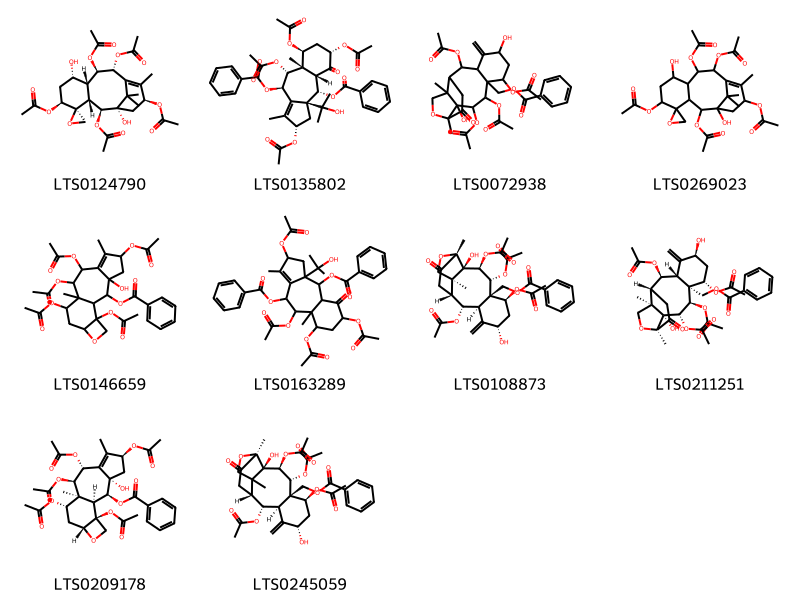{ width=100% }
    <figcaption>Hình ảnh cấu trúc hóa học của 10 hoạt chất thuộc nhóm Carboxylic acids and derivatives gồm ["(1's,2s,2's,3'r,5's,7's,8'r,9'r,10'r,13's)-2',5',9',10'-tetrakis(acetyloxy)-1',7'-dihydroxy-12',15',15'-trimethylspiro[oxirane-2,4'-tricyclo[9.3.1.0³,⁸]pentadecan]-11'-en-13'-yl acetate (LTS0124790)", '(2s,3as,4s,4as,6s,8s,8as,9r,10r)-2,6,8,9-tetrakis(acetyloxy)-10-(benzoyloxy)-3a-(2-hydroxypropan-2-yl)-1,8a-dimethyl-5-oxo-2h,3h,4h,4ah,6h,7h,8h,9h,10h-cyclohexa[f]azulen-4-yl benzoate (LTS0135802)', '[3,4,6,11-tetrakis(acetyloxy)-2,8-dihydroxy-1,15-dimethyl-9-methylidene-14-oxo-16-oxatetracyclo[10.5.0.0²,¹⁵.0⁵,¹⁰]heptadecan-5-yl]methyl benzoate (LTS0072938)', "2',5',9',10'-tetrakis(acetyloxy)-1',7'-dihydroxy-12',15',15'-trimethylspiro[oxirane-2,4'-tricyclo[9.3.1.0³,⁸]pentadecan]-11'-en-13'-yl acetate (LTS0269023)", '5,8,9,11,16-pentakis(acetyloxy)-3-hydroxy-6,10-dimethyl-14-oxatetracyclo[8.6.0.0³,⁷.0¹³,¹⁶]hexadec-6-en-2-yl benzoate (LTS0146659)', '2,6,8,9-tetrakis(acetyloxy)-4-(benzoyloxy)-3a-(2-hydroxypropan-2-yl)-1,8a-dimethyl-5-oxo-2h,3h,4h,4ah,6h,7h,8h,9h,10h-cyclohexa[f]azulen-10-yl benzoate (LTS0163289)', '[(1s,2r,3s,4r,5r,6s,8s,10r,11r,12r,15r)-3,4,6,11-tetrakis(acetyloxy)-2,8-dihydroxy-1,15-dimethyl-9-methylidene-14-oxo-16-oxatetracyclo[10.5.0.0²,¹⁵.0⁵,¹⁰]heptadecan-5-yl]methyl benzoate (LTS0108873)', '[(1r,2r,3s,4r,5r,6s,8s,10r,11r,12r,15s)-3,4,6,11-tetrakis(acetyloxy)-2,8-dihydroxy-1,15-dimethyl-9-methylidene-14-oxo-16-oxatetracyclo[10.5.0.0²,¹⁵.0⁵,¹⁰]heptadecan-5-yl]methyl benzoate (LTS0211251)', '(1s,2s,3s,5s,8r,9r,10s,11s,13r,16s)-5,8,9,11,16-pentakis(acetyloxy)-3-hydroxy-6,10-dimethyl-14-oxatetracyclo[8.6.0.0³,⁷.0¹³,¹⁶]hexadec-6-en-2-yl benzoate (LTS0209178)', '[(2r,3s,4r,5r,6s,8s,10r,11r,12r,15s)-3,4,6,11-tetrakis(acetyloxy)-2,8-dihydroxy-1,15-dimethyl-9-methylidene-14-oxo-16-oxatetracyclo[10.5.0.0²,¹⁵.0⁵,¹⁰]heptadecan-5-yl]methyl benzoate (LTS0245059)'].</figcaption>
</figure>
#### Nhóm Fatty Acyls
<figure markdown="span">
    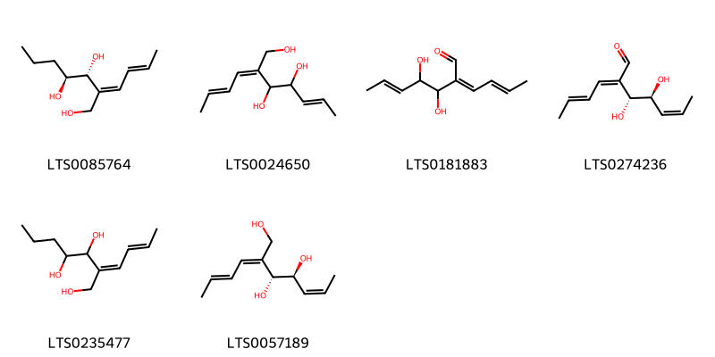{ width=100% }
    <figcaption>Hình ảnh cấu trúc hóa học của 6 hoạt chất thuộc nhóm Fatty Acyls gồm ['(2z,3r,4s)-2-[(2e)-but-2-en-1-ylidene]heptane-1,3,4-triol (LTS0085764)', '2-[(2e)-but-2-en-1-ylidene]hept-5-ene-1,3,4-triol (LTS0024650)', '2-[(2e)-but-2-en-1-ylidene]-3,4-dihydroxyhept-5-enal (LTS0181883)', '(2e,3r,4s,5z)-2-[(2e)-but-2-en-1-ylidene]-3,4-dihydroxyhept-5-enal (LTS0274236)', '2-[(2e)-but-2-en-1-ylidene]heptane-1,3,4-triol (LTS0235477)', '(2z,3r,4s,5z)-2-[(2e)-but-2-en-1-ylidene]hept-5-ene-1,3,4-triol (LTS0057189)'].</figcaption>
</figure>
#### Nhóm Flavonoids
<figure markdown="span">
    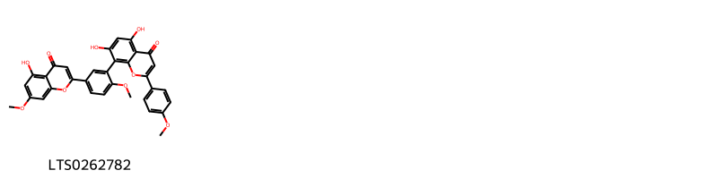{ width=100% }
    <figcaption>Hình ảnh cấu trúc hóa học của 1 hoạt chất thuộc nhóm Flavonoids gồm ['sciadopitysin (LTS0262782)'].</figcaption>
</figure>
#### Nhóm Oxepanes
<figure markdown="span">
    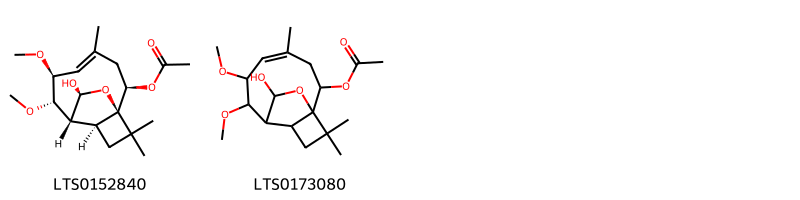{ width=100% }
    <figcaption>Hình ảnh cấu trúc hóa học của 2 hoạt chất thuộc nhóm Oxepanes gồm ['(1r,2r,4e,6s,7s,8r,9s,13s)-13-hydroxy-6,7-dimethoxy-4,11,11-trimethyl-12-oxatricyclo[6.3.2.0¹,⁹]tridec-4-en-2-yl acetate (LTS0152840)', '13-hydroxy-6,7-dimethoxy-4,11,11-trimethyl-12-oxatricyclo[6.3.2.0¹,⁹]tridec-4-en-2-yl acetate (LTS0173080)'].</figcaption>
</figure>
#### Nhóm Phenols
<figure markdown="span">
    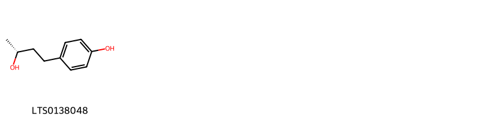{ width=100% }
    <figcaption>Hình ảnh cấu trúc hóa học của 1 hoạt chất thuộc nhóm Phenols gồm ['(-)-rhododendrol (LTS0138048)'].</figcaption>
</figure>
#### Nhóm Prenol lipids
<figure markdown="span">
    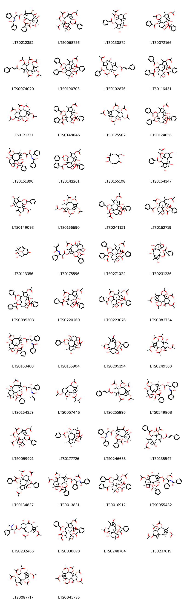{ width=100% }
    <figcaption>Hình ảnh cấu trúc hóa học của 53 hoạt chất thuộc nhóm Prenol lipids gồm ['n-[(1s,2r)-3-{[(1s,2s,3r,4s,7r,9s,10s,12r,15s)-4-(acetyloxy)-2-(benzoyloxy)-1,9,12-trihydroxy-10,14,17,17-tetramethyl-11-oxo-6-oxatetracyclo[11.3.1.0³,¹⁰.0⁴,⁷]heptadec-13-en-15-yl]oxy}-2-hydroxy-3-oxo-1-phenylpropyl]benzenecarboximidic acid (LTS0212352)', '(1s,2s,3r,4s,7r,9s,10s,11s,12r,15s)-4,9,11,12,15-pentakis(acetyloxy)-1-hydroxy-10,14,17,17-tetramethyl-6-oxatetracyclo[11.3.1.0³,¹⁰.0⁴,⁷]heptadec-13-en-2-yl benzoate (LTS0068756)', '(2s,3as,4ar,6s,8s,8as,9r,10r)-8,9-bis(acetyloxy)-2,6-dihydroxy-3a-(2-hydroxypropan-2-yl)-1,8a-dimethyl-5-methylidene-2h,3h,4h,4ah,6h,7h,8h,9h,10h-cyclohexa[f]azulen-10-yl benzoate (LTS0130872)', '5,9,16-tris(acetyloxy)-2-(benzoyloxy)-8-hydroxy-3-(2-hydroxypropan-2-yl)-6,10-dimethyl-14-oxatetracyclo[8.6.0.0³,⁷.0¹³,¹⁶]hexadec-6-en-11-yl benzoate (LTS0072166)', '(1s,3s,8s)-2,7,9,10,13-pentakis(acetyloxy)-8,12,15,15-tetramethyl-4-methylidenetricyclo[9.3.1.0³,⁸]pentadec-11-en-5-yl 3-phenylprop-2-enoate (LTS0074020)', '(1s,2s,3s,5s,8r,9r,10s,11s,13r,16s)-5,16-bis(acetyloxy)-2,9-bis(benzoyloxy)-11-hydroxy-3-(2-hydroxypropan-2-yl)-6,10-dimethyl-14-oxatetracyclo[8.6.0.0³,⁷.0¹³,¹⁶]hexadec-6-en-8-yl benzoate (LTS0190703)', '(2r,3as,4ar,6r,8r,8ar,9s,10r)-2,8,9-tris(acetyloxy)-3a-(2-hydroxypropan-2-yl)-1,8a-dimethyl-5-methylidene-6-{[(2e)-3-phenylprop-2-enoyl]oxy}-2h,3h,4h,4ah,6h,7h,8h,9h,10h-cyclohexa[f]azulen-10-yl benzoate (LTS0102876)', '(1s,2s,3s,5s,8r,9r,10s,11s,13r,16s)-5,9,16-tris(acetyloxy)-2,11-bis(benzoyloxy)-3-(2-hydroxypropan-2-yl)-6,10-dimethyl-14-oxatetracyclo[8.6.0.0³,⁷.0¹³,¹⁶]hexadec-6-en-8-yl benzoate (LTS0116431)', "(1's,2r,2's,3'r,5's,7's,8's,9'r,10'r,13's)-2',5',7',9',10'-pentakis(acetyloxy)-1'-hydroxy-8',12',15',15'-tetramethylspiro[oxirane-2,4'-tricyclo[9.3.1.0³,⁸]pentadecan]-11'-en-13'-yl acetate (LTS0121231)", '5,11,16-tris(acetyloxy)-2,9-bis(benzoyloxy)-3-(2-hydroxypropan-2-yl)-6,10-dimethyl-14-oxatetracyclo[8.6.0.0³,⁷.0¹³,¹⁶]hexadec-6-en-8-yl benzoate (LTS0148045)', "(1's,2r,2's,3'r,5's,7's,8'r,9'r,10'r,13's)-2',5',7',10'-tetrakis(acetyloxy)-1',9'-dihydroxy-8',12',15',15'-tetramethylspiro[oxirane-2,4'-tricyclo[9.3.1.0³,⁸]pentadecan]-11'-en-13'-yl acetate (LTS0125502)", '5,16-bis(acetyloxy)-2,9-bis(benzoyloxy)-11-hydroxy-3-(2-hydroxypropan-2-yl)-6,10-dimethyl-14-oxatetracyclo[8.6.0.0³,⁷.0¹³,¹⁶]hexadec-6-en-8-yl benzoate (LTS0124656)', 'n-(3-{[4,12-bis(acetyloxy)-2-(benzoyloxy)-1,9-dihydroxy-10,14,17,17-tetramethyl-11-oxo-6-oxatetracyclo[11.3.1.0³,¹⁰.0⁴,⁷]heptadec-13-en-15-yl]oxy}-2-hydroxy-3-oxo-1-phenylpropyl)benzenecarboximidic acid (LTS0151890)', '5,16-bis(acetyloxy)-2,11-bis(benzoyloxy)-8-hydroxy-3-(2-hydroxypropan-2-yl)-6,10-dimethyl-14-oxatetracyclo[8.6.0.0³,⁷.0¹³,¹⁶]hexadec-6-en-9-yl benzoate (LTS0142261)', '5-hydroxy-10-(hydroxymethyl)-3,7,7-trimethylcycloundeca-2,9-diene-1,6-dione (LTS0155108)', '8,9-bis(acetyloxy)-2,6-dihydroxy-3a-(2-hydroxypropan-2-yl)-1,8a-dimethyl-5-methylidene-2h,3h,4h,4ah,6h,7h,8h,9h,10h-cyclohexa[f]azulen-10-yl benzoate (LTS0164147)', '8-(acetyloxy)-2,6,10-trihydroxy-3a-(2-hydroxypropan-2-yl)-1,8a-dimethyl-5-methylidene-2h,3h,4h,4ah,6h,7h,8h,9h,10h-cyclohexa[f]azulen-9-yl benzoate (LTS0149093)', "(1's,2r,2's,3'r,5's,7's,8's,9'r,10'r,13's)-2',5',9',10'-tetrakis(acetyloxy)-1',7'-dihydroxy-8',12',15',15'-tetramethylspiro[oxirane-2,4'-tricyclo[9.3.1.0³,⁸]pentadecan]-11'-en-13'-yl acetate (LTS0166690)", '5,9,11,16-tetrakis(acetyloxy)-2-(benzoyloxy)-3-(2-hydroxypropan-2-yl)-6,10-dimethyl-14-oxatetracyclo[8.6.0.0³,⁷.0¹³,¹⁶]hexadec-6-en-8-yl benzoate (LTS0241121)', '(1s,2s,3s,5s,8r,9r,10s,11s,13r,16s)-5,9,16-tris(acetyloxy)-2-(benzoyloxy)-8-hydroxy-3-(2-hydroxypropan-2-yl)-6,10-dimethyl-14-oxatetracyclo[8.6.0.0³,⁷.0¹³,¹⁶]hexadec-6-en-11-yl benzoate (LTS0162719)', '(2e,5s,9z)-5-hydroxy-10-(hydroxymethyl)-3,7,7-trimethylcycloundeca-2,9-diene-1,6-dione (LTS0113356)', 'n-(3-{[(1s,3s,4s,10s)-4,12-bis(acetyloxy)-2-(benzoyloxy)-1,9-dihydroxy-10,14,17,17-tetramethyl-11-oxo-6-oxatetracyclo[11.3.1.0³,¹⁰.0⁴,⁷]heptadec-13-en-15-yl]oxy}-2-hydroxy-3-oxo-1-phenylpropyl)-2-methylbut-2-enimidic acid (LTS0175596)', '(1s,2s,3s,5s,8r,9r,10s,11s,13r,16s)-5,11,16-tris(acetyloxy)-2,9-bis(benzoyloxy)-3-(2-hydroxypropan-2-yl)-6,10-dimethyl-14-oxatetracyclo[8.6.0.0³,⁷.0¹³,¹⁶]hexadec-6-en-8-yl benzoate (LTS0271024)', '10-deacetylbaccatin iii (LTS0231236)', '5,9,16-tris(acetyloxy)-2,11-bis(benzoyloxy)-3-(2-hydroxypropan-2-yl)-6,10-dimethyl-14-oxatetracyclo[8.6.0.0³,⁷.0¹³,¹⁶]hexadec-6-en-8-yl benzoate (LTS0095303)', '5,8,9,16-tetrakis(acetyloxy)-2-(benzoyloxy)-3-(2-hydroxypropan-2-yl)-6,10-dimethyl-14-oxatetracyclo[8.6.0.0³,⁷.0¹³,¹⁶]hexadec-6-en-11-yl benzoate (LTS0220260)', '(1s,2s,3s,5s,8r,9r,10s,11s,13r,16s)-5,8,9,16-tetrakis(acetyloxy)-2-(benzoyloxy)-3-(2-hydroxypropan-2-yl)-6,10-dimethyl-14-oxatetracyclo[8.6.0.0³,⁷.0¹³,¹⁶]hexadec-6-en-11-yl benzoate (LTS0223076)', "2',5',7',10'-tetrakis(acetyloxy)-1',9'-dihydroxy-8',12',15',15'-tetramethylspiro[oxirane-2,4'-tricyclo[9.3.1.0³,⁸]pentadecan]-11'-en-13'-yl acetate (LTS0082734)", 'n-[(1s,2r)-3-{[(1s,2s,3r,4s,7r,9s,10s,12r,15s)-4,12-bis(acetyloxy)-2-(benzoyloxy)-1,9-dihydroxy-10,14,17,17-tetramethyl-11-oxo-6-oxatetracyclo[11.3.1.0³,¹⁰.0⁴,⁷]heptadec-13-en-15-yl]oxy}-2-hydroxy-3-oxo-1-phenylpropyl]benzenecarboximidic acid (LTS0163460)', '2,16-bis(acetyloxy)-5,9,11-trihydroxy-3-(2-hydroxypropan-2-yl)-6,10-dimethyl-14-oxatetracyclo[8.6.0.0³,⁷.0¹³,¹⁶]hexadec-6-en-8-yl benzoate (LTS0155904)', '4,12-bis(acetyloxy)-1,9,15-trihydroxy-10,14,17,17-tetramethyl-11-oxo-6-oxatetracyclo[11.3.1.0³,¹⁰.0⁴,⁷]heptadec-13-en-2-yl benzoate (LTS0205194)', "2',5',9',10'-tetrakis(acetyloxy)-1',7'-dihydroxy-8',12',15',15'-tetramethylspiro[oxirane-2,4'-tricyclo[9.3.1.0³,⁸]pentadecan]-11'-en-13'-yl acetate (LTS0249368)", '(2e)-n-[(1s,2r)-3-{[(1s,2s,4s,7r,9s,10s,12r,15s)-4,12-bis(acetyloxy)-2-(benzoyloxy)-1,9-dihydroxy-10,14,17,17-tetramethyl-11-oxo-6-oxatetracyclo[11.3.1.0³,¹⁰.0⁴,⁷]heptadec-13-en-15-yl]oxy}-2-hydroxy-3-oxo-1-phenylpropyl]-2-methylbut-2-enimidic acid (LTS0164359)', '(1r,3r,8s)-2,5,10-tris(acetyloxy)-8,12,15,15-tetramethyl-4-methylidenetricyclo[9.3.1.0³,⁸]pentadec-11-en-14-yl 3-hydroxy-2-methylbutanoate (LTS0057446)', '(2r,3r,5s,7s,8s,9r,10r,13s)-2,7,9,10,13-pentakis(acetyloxy)-8,12,15,15-tetramethyl-4-methylidenetricyclo[9.3.1.0³,⁸]pentadec-11-en-5-yl (2e)-3-phenylprop-2-enoate (LTS0255896)', 'n-[(1s,2r)-3-{[(1s,2s,3r,4s,7r,9r,10s,12r,15s)-4,12-bis(acetyloxy)-2-(benzoyloxy)-1,9-dihydroxy-10,14,17,17-tetramethyl-11-oxo-6-oxatetracyclo[11.3.1.0³,¹⁰.0⁴,⁷]heptadec-13-en-15-yl]oxy}-2-hydroxy-3-oxo-1-phenylpropyl]benzenecarboximidic acid (LTS0249808)', '(1s,3s,4s,7s,10s)-4,9,11,12,15-pentakis(acetyloxy)-1-hydroxy-10,14,17,17-tetramethyl-6-oxatetracyclo[11.3.1.0³,¹⁰.0⁴,⁷]heptadec-13-en-2-yl benzoate (LTS0059921)', '(1r,2s,3s,5s,8r,9r,10s,11s,13r,16s)-2,16-bis(acetyloxy)-5,9,11-trihydroxy-3-(2-hydroxypropan-2-yl)-6,10-dimethyl-14-oxatetracyclo[8.6.0.0³,⁷.0¹³,¹⁶]hexadec-6-en-8-yl benzoate (LTS0177726)', 'n-[(1s,2r)-3-{[(1s,2s,3r,4s,7r,9r,10s,15s)-4-(acetyloxy)-2-(benzoyloxy)-1,9-dihydroxy-10,14,17,17-tetramethyl-11,12-dioxo-6-oxatetracyclo[11.3.1.0³,¹⁰.0⁴,⁷]heptadec-13-en-15-yl]oxy}-2-hydroxy-3-oxo-1-phenylpropyl]benzenecarboximidic acid (LTS0246655)', '2,8,9-tris(acetyloxy)-3a-(2-hydroxypropan-2-yl)-1,8a-dimethyl-5-methylidene-6-[(3-phenylprop-2-enoyl)oxy]-2h,3h,4h,4ah,6h,7h,8h,9h,10h-cyclohexa[f]azulen-10-yl benzoate (LTS0135547)', '(2s,3as,4s,4as,6s,8s,8as,9r,10r)-2,6,8,9-tetrakis(acetyloxy)-10-(benzoyloxy)-3a-(2-hydroxypropan-2-yl)-1,8a-dimethyl-5-methylidene-2h,3h,4h,4ah,6h,7h,8h,9h,10h-cyclohexa[f]azulen-4-yl benzoate (LTS0134837)', 'n-[(1s,2r)-2-(acetyloxy)-3-oxo-1-phenyl-3-{[(1s,2s,3r,4s,7r,9s,10s,12r,15s)-4,9,12-tris(acetyloxy)-2-(benzoyloxy)-1-hydroxy-10,14,17,17-tetramethyl-11-oxo-6-oxatetracyclo[11.3.1.0³,¹⁰.0⁴,⁷]heptadec-13-en-15-yl]oxy}propyl]benzenecarboximidic acid (LTS0013831)', '(1s,2s,3s,5s,8r,9r,10s,11s,13r,16s)-5,16-bis(acetyloxy)-2,11-bis(benzoyloxy)-8-hydroxy-3-(2-hydroxypropan-2-yl)-6,10-dimethyl-14-oxatetracyclo[8.6.0.0³,⁷.0¹³,¹⁶]hexadec-6-en-9-yl benzoate (LTS0016912)', 'n-[(1s,2r)-2-(acetyloxy)-3-{[(1s,2s,3r,4s,7r,9s,10s,12r,15s)-4,9-bis(acetyloxy)-2-(benzoyloxy)-1,12-dihydroxy-10,14,17,17-tetramethyl-11-oxo-6-oxatetracyclo[11.3.1.0³,¹⁰.0⁴,⁷]heptadec-13-en-15-yl]oxy}-3-oxo-1-phenylpropyl]benzenecarboximidic acid (LTS0055432)', 'taxine a (LTS0232465)', '(1s,2s,3s,5s,8r,9r,10s,11s,13r,16s)-5,9,11,16-tetrakis(acetyloxy)-2-(benzoyloxy)-3-(2-hydroxypropan-2-yl)-6,10-dimethyl-14-oxatetracyclo[8.6.0.0³,⁷.0¹³,¹⁶]hexadec-6-en-8-yl benzoate (LTS0030073)', 'baccatin iii (LTS0248764)', '(+)-taxusin (LTS0237619)', '(1r,2r,3r,5s,7s,8s,9r,10r,13s)-2,9,10,13-tetrakis(acetyloxy)-5-hydroxy-8,12,15,15-tetramethyl-4-methylidenetricyclo[9.3.1.0³,⁸]pentadec-11-en-7-yl acetate (LTS0087717)', "2',5',7',9',10'-pentakis(acetyloxy)-1'-hydroxy-8',12',15',15'-tetramethylspiro[oxirane-2,4'-tricyclo[9.3.1.0³,⁸]pentadecan]-11'-en-13'-yl acetate (LTS0045736)", '(1r,2s,3s,5s,8r,9r,10s,11s,13r,16s)-5,11,16-tris(acetyloxy)-2,9-bis(benzoyloxy)-3-(2-hydroxypropan-2-yl)-6,10-dimethyl-14-oxatetracyclo[8.6.0.0³,⁷.0¹³,¹⁶]hexadec-6-en-8-yl benzoate (LTS0131756)', '(16s,17s)-16-(4-hydroxy-3-methoxyphenyl)-17-(hydroxymethyl)-13-isopropyl-7,7-dimethyl-15,18-dioxatetracyclo[9.8.0.0³,⁸.0¹⁴,¹⁹]nonadeca-1(19),2,4,8,11,13-hexaene-6,10-dione (LTS0125639)', '2,6,8,9-tetrakis(acetyloxy)-4-(benzoyloxy)-3a-(2-hydroxypropan-2-yl)-1,8a-dimethyl-5-methylidene-2h,3h,4h,4ah,6h,7h,8h,9h,10h-cyclohexa[f]azulen-10-yl benzoate (LTS0034792)'].</figcaption>
</figure>
#### Nhóm Steroids and steroid derivatives
<figure markdown="span">
    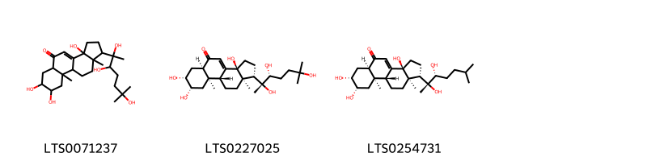{ width=100% }
    <figcaption>Hình ảnh cấu trúc hóa học của 3 hoạt chất thuộc nhóm Steroids and steroid derivatives gồm ['3a,7,8-trihydroxy-9a,11a-dimethyl-1-(2,3,6-trihydroxy-6-methylheptan-2-yl)-1h,2h,3h,5ah,6h,7h,8h,9h,9bh,10h,11h-cyclopenta[a]phenanthren-5-one (LTS0071237)', '20-hydroxyecdysone (LTS0227025)', 'ponasterone a (LTS0254731)'].</figcaption>
</figure>

---

### Dược dân tộc học

Danh sách các quốc gia có sử dụng *Taxus brevifolia* trong điều trị các bệnh. 

| Country        | Disease     | Bệnh          |
|:---------------|:------------|:--------------|
| Canada(Salish) | Depilatory  | Gây rụng lông |
| US             | Emmenagogue | Emmenagogue   |

---

---
## Taxus canadensis
### Thông tin về thực vật

!!! info "Phân loại thực vật của *Taxus canadensis* từ GIBF:"
    - **Kingdom:** Plantae
    - **Phylum:** Tracheophyta
    - **Order:** Pinales
    - **Family:** Taxaceae
    - **Genus:** Taxus
    - **Species:** *Taxus canadensis*

 

| Label (VI)   | Label (EN)   | Scientific Name   | Descriptions (VI)   | Descriptions (EN)   | Also Known As (VI)   | Also Known As (EN)                             |
|:-------------|:-------------|:------------------|:--------------------|:--------------------|:---------------------|:-----------------------------------------------|
| N/A          | N/A          | Taxus canadensis  | loài thực vật       | species of plant    | ['']                 | ['American yew', 'Canada yew', 'Canadian yew'] |

#### Phân bố trên thế giới

**Từ CSDL GIBF** Canada, United States of America

#### Phân bố tại Việt Nam

**Từ CSDL GIBF**: Không có ghi nhận ở Việt Nam

---
### Thành phần hóa học
        
- Theo cơ sở dữ liệu lotus: Từ loài *Taxus canadensis* đã phân lập và xác định được 177 hoạt chất thuộc về các nhóm Organooxygen compounds, Flavonoids, Saturated hydrocarbons, Unsaturated hydrocarbons, Prenol lipids, Carboxylic acids and derivatives, Fatty Acyls, Phenols, Steroids and steroid derivatives, Benzene and substituted derivatives. 

|    | chemicalTaxonomyClassyfireClass     |   smiles_count |
|---:|:------------------------------------|---------------:|
|  0 | Benzene and substituted derivatives |              2 |
|  1 | Carboxylic acids and derivatives    |             26 |
|  2 | Fatty Acyls                         |              9 |
|  3 | Flavonoids                          |              2 |
|  4 | Organooxygen compounds              |              4 |
|  5 | Phenols                             |              1 |
|  6 | Prenol lipids                       |            127 |
|  7 | Saturated hydrocarbons              |              1 |
|  8 | Steroids and steroid derivatives    |              2 |
|  9 | Unsaturated hydrocarbons            |              1 |

#### Nhóm Benzene and substituted derivatives
<figure markdown="span">
    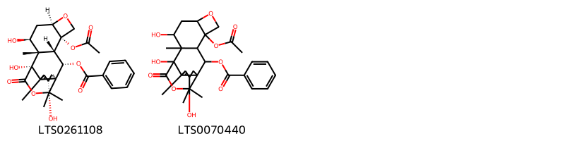{ width=100% }
    <figcaption>Hình ảnh cấu trúc hóa học của 2 hoạt chất thuộc nhóm Benzene and substituted derivatives gồm ['(1s,2s,3s,4s,7r,9s,10s,11s,14s)-4-(acetyloxy)-9,11,14-trihydroxy-10,13,16,16-tetramethyl-18-oxo-6,17-dioxapentacyclo[9.4.3.0¹,¹².0³,¹⁰.0⁴,⁷]octadec-12-en-2-yl benzoate (LTS0261108)', 'wallifoliol (LTS0070440)'].</figcaption>
</figure>
#### Nhóm Carboxylic acids and derivatives
<figure markdown="span">
    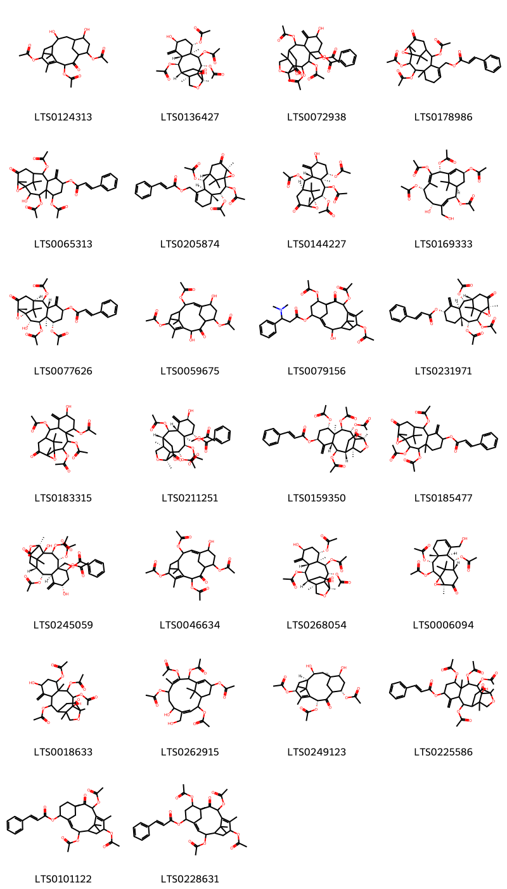{ width=100% }
    <figcaption>Hình ảnh cấu trúc hóa học của 26 hoạt chất thuộc nhóm Carboxylic acids and derivatives gồm ['3,14-bis(acetyloxy)-9,12-dihydroxy-1,5,16,16-tetramethyl-2-oxotricyclo[9.3.1.1⁴,⁸]hexadec-4-en-6-yl acetate (LTS0124313)', '(1r,2s,3s,4r,5s,6s,8s,10r,11r,12r,15s)-3,6,11-tris(acetyloxy)-2,8-dihydroxy-1,5,15-trimethyl-9-methylidene-14-oxo-16-oxatetracyclo[10.5.0.0²,¹⁵.0⁵,¹⁰]heptadecan-4-yl acetate (LTS0136427)', '[3,4,6,11-tetrakis(acetyloxy)-2,8-dihydroxy-1,15-dimethyl-9-methylidene-14-oxo-16-oxatetracyclo[10.5.0.0²,¹⁵.0⁵,¹⁰]heptadecan-5-yl]methyl benzoate (LTS0072938)', '[2,3,10-tris(acetyloxy)-4,14,16,16-tetramethyl-13-oxo-15-oxatetracyclo[9.4.1.0¹,¹⁴.0⁴,⁹]hexadec-7-en-8-yl]methyl 3-phenylprop-2-enoate (LTS0178986)', '3,5,10-tris(acetyloxy)-2-hydroxy-4,14,16,16-tetramethyl-8-methylidene-13-oxo-15-oxatetracyclo[9.4.1.0¹,¹⁴.0⁴,⁹]hexadecan-7-yl 3-phenylprop-2-enoate (LTS0065313)', '[(1r,2s,3r,4r,9r,10r,11r,14s)-2,3,10-tris(acetyloxy)-4,14,16,16-tetramethyl-13-oxo-15-oxatetracyclo[9.4.1.0¹,¹⁴.0⁴,⁹]hexadec-7-en-8-yl]methyl (2e)-3-phenylprop-2-enoate (LTS0205874)', '(1r,2s,3r,4s,5s,7s,9r,10r,11r,14s)-2,5,10-tris(acetyloxy)-7-hydroxy-4,14,16,16-tetramethyl-8-methylidene-13-oxo-15-oxatetracyclo[9.4.1.0¹,¹⁴.0⁴,⁹]hexadecan-3-yl acetate (LTS0144227)', '(1r,2s,3e,5r,7s,8z,10r,13s)-2,7,9,10-tetrakis(acetyloxy)-5-hydroxy-4-(hydroxymethyl)-8,15,15-trimethylbicyclo[9.3.1]pentadeca-3,8,11-trien-13-yl acetate (LTS0169333)', '(1r,2s,3r,4s,5s,7s,9r,10r,11r,14s)-3,5,10-tris(acetyloxy)-2-hydroxy-4,14,16,16-tetramethyl-8-methylidene-13-oxo-15-oxatetracyclo[9.4.1.0¹,¹⁴.0⁴,⁹]hexadecan-7-yl (2e)-3-phenylprop-2-enoate (LTS0077626)', '3,12-bis(acetyloxy)-9,14-dihydroxy-7,11,16,16-tetramethyl-10-oxotricyclo[9.3.1.1⁴,⁸]hexadeca-1,7-dien-6-yl acetate (LTS0059675)', '7,10,13-tris(acetyloxy)-2-hydroxy-8,12,15,15-tetramethyl-9-oxotricyclo[9.3.1.1⁴,⁸]hexadeca-3,11-dien-5-yl 3-(dimethylamino)-3-phenylpropanoate (LTS0079156)', '(1r,2s,3r,4r,7s,9r,10r,11r,14s)-2,3,10-tris(acetyloxy)-4,14,16,16-tetramethyl-8-methylidene-13-oxo-15-oxatetracyclo[9.4.1.0¹,¹⁴.0⁴,⁹]hexadecan-7-yl (2e)-3-phenylprop-2-enoate (LTS0231971)', '2,5,10-tris(acetyloxy)-7-hydroxy-4,14,16,16-tetramethyl-8-methylidene-13-oxo-15-oxatetracyclo[9.4.1.0¹,¹⁴.0⁴,⁹]hexadecan-3-yl acetate (LTS0183315)', '[(1r,2r,3s,4r,5r,6s,8s,10r,11r,12r,15s)-3,4,6,11-tetrakis(acetyloxy)-2,8-dihydroxy-1,15-dimethyl-9-methylidene-14-oxo-16-oxatetracyclo[10.5.0.0²,¹⁵.0⁵,¹⁰]heptadecan-5-yl]methyl benzoate (LTS0211251)', 'taxagifine (LTS0159350)', '2,3,10-tris(acetyloxy)-4,14,16,16-tetramethyl-8-methylidene-13-oxo-15-oxatetracyclo[9.4.1.0¹,¹⁴.0⁴,⁹]hexadecan-7-yl 3-phenylprop-2-enoate (LTS0185477)', '[(2r,3s,4r,5r,6s,8s,10r,11r,12r,15s)-3,4,6,11-tetrakis(acetyloxy)-2,8-dihydroxy-1,15-dimethyl-9-methylidene-14-oxo-16-oxatetracyclo[10.5.0.0²,¹⁵.0⁵,¹⁰]heptadecan-5-yl]methyl benzoate (LTS0245059)', '3,9,12-tris(acetyloxy)-14-hydroxy-7,11,16,16-tetramethyl-10-oxotricyclo[9.3.1.1⁴,⁸]hexadeca-1,7-dien-6-yl acetate (LTS0046634)', '(1r,2r,3s,4r,5s,6s,8s,10r,11r,12r,15s)-3,6,11-tris(acetyloxy)-2,8-dihydroxy-1,5,15-trimethyl-9-methylidene-14-oxo-16-oxatetracyclo[10.5.0.0²,¹⁵.0⁵,¹⁰]heptadecan-4-yl acetate (LTS0268054)', '(1r,2s,3r,4r,9r,10r,11r,14s)-2,10-bis(acetyloxy)-8-(hydroxymethyl)-4,14,16,16-tetramethyl-13-oxo-15-oxatetracyclo[9.4.1.0¹,¹⁴.0⁴,⁹]hexadec-7-en-3-yl acetate (LTS0006094)', '3,6,11-tris(acetyloxy)-2,8-dihydroxy-1,5,15-trimethyl-9-methylidene-14-oxo-16-oxatetracyclo[10.5.0.0²,¹⁵.0⁵,¹⁰]heptadecan-4-yl acetate (LTS0018633)', '2,7,9,10-tetrakis(acetyloxy)-5-hydroxy-4-(hydroxymethyl)-8,15,15-trimethylbicyclo[9.3.1]pentadeca-3,8,11-trien-13-yl acetate (LTS0262915)', '(1s,3r,6s,8r,9s,11r,12s,14s)-3,14-bis(acetyloxy)-9,12-dihydroxy-1,5,16,16-tetramethyl-2-oxotricyclo[9.3.1.1⁴,⁸]hexadec-4-en-6-yl acetate (LTS0249123)', '3,4,6,11-tetrakis(acetyloxy)-2-hydroxy-1,5,15-trimethyl-9-methylidene-14-oxo-16-oxatetracyclo[10.5.0.0²,¹⁵.0⁵,¹⁰]heptadecan-8-yl 3-phenylprop-2-enoate (LTS0225586)', '2,10,13-tris(acetyloxy)-8,12,15,15-tetramethyl-9-oxotricyclo[9.3.1.1⁴,⁸]hexadeca-3,11-dien-5-yl 3-phenylprop-2-enoate (LTS0101122)', '2,7,10,13-tetrakis(acetyloxy)-8,12,15,15-tetramethyl-9-oxotricyclo[9.3.1.1⁴,⁸]hexadeca-3,11-dien-5-yl 3-phenylprop-2-enoate (LTS0228631)'].</figcaption>
</figure>
#### Nhóm Fatty Acyls
<figure markdown="span">
    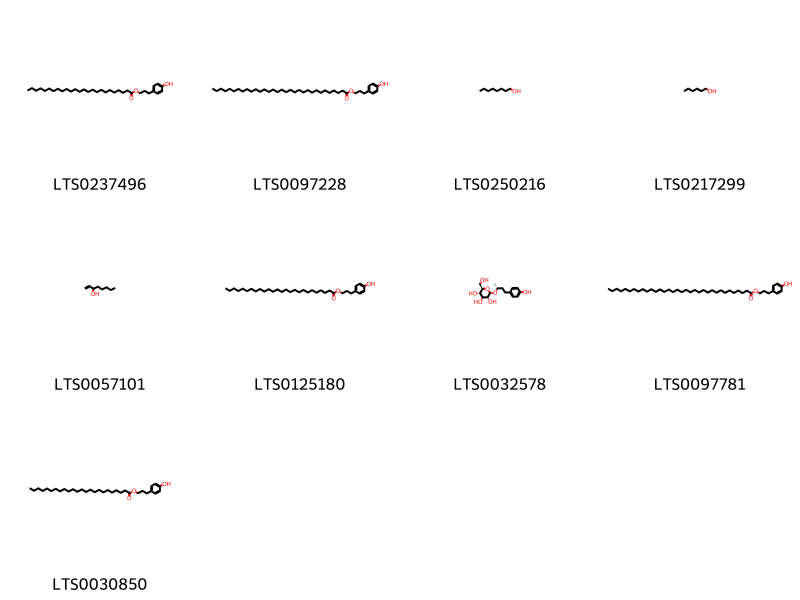{ width=100% }
    <figcaption>Hình ảnh cấu trúc hóa học của 9 hoạt chất thuộc nhóm Fatty Acyls gồm ['3-(4-hydroxyphenyl)propyl pentacosanoate (LTS0237496)', '3-(4-hydroxyphenyl)propyl dotriacontanoate (LTS0097228)', 'octanol (LTS0250216)', 'hexanol (LTS0217299)', '1-octen-3-ol (LTS0057101)', '3-(4-hydroxyphenyl)propyl hexacosanoate (LTS0125180)', 'rhododendrin (LTS0032578)', '3-(4-hydroxyphenyl)propyl tetratriacontanoate (LTS0097781)', '3-(4-hydroxyphenyl)propyl tetracosanoate (LTS0030850)'].</figcaption>
</figure>
#### Nhóm Flavonoids
<figure markdown="span">
    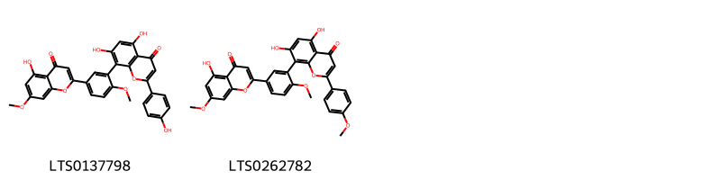{ width=100% }
    <figcaption>Hình ảnh cấu trúc hóa học của 2 hoạt chất thuộc nhóm Flavonoids gồm ['ginkgetin (LTS0137798)', 'sciadopitysin (LTS0262782)'].</figcaption>
</figure>
#### Nhóm Organooxygen compounds
<figure markdown="span">
    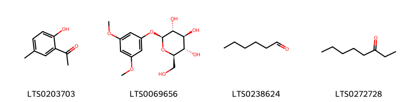{ width=100% }
    <figcaption>Hình ảnh cấu trúc hóa học của 4 hoạt chất thuộc nhóm Organooxygen compounds gồm ['2-acetyl-4-methylphenol (LTS0203703)', 'taxicatin (LTS0069656)', 'hexanal (LTS0238624)', '3-octanone (LTS0272728)'].</figcaption>
</figure>
#### Nhóm Phenols
<figure markdown="span">
    { width=100% }
    <figcaption>Hình ảnh cấu trúc hóa học của 1 hoạt chất thuộc nhóm Phenols gồm ['eugenol (LTS0052342)'].</figcaption>
</figure>
#### Nhóm Prenol lipids
<figure markdown="span">
    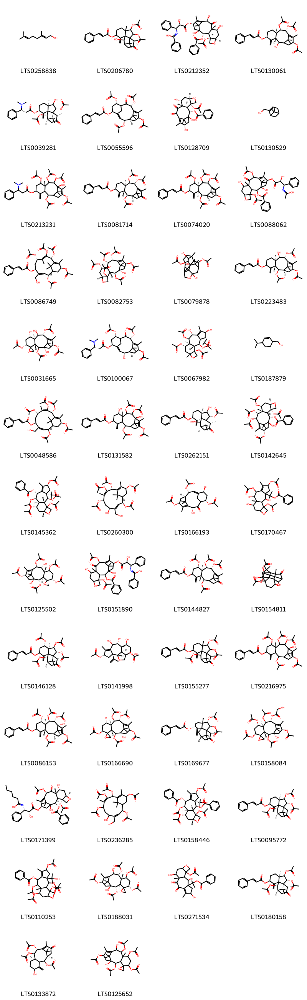{ width=100% }
    <figcaption>Hình ảnh cấu trúc hóa học của 127 hoạt chất thuộc nhóm Prenol lipids gồm ['geraniol (LTS0258838)', '2,3-bis(acetyloxy)-10-hydroxy-4,14,15,15-tetramethyl-8-methylidene-13-oxotetracyclo[9.3.1.0¹,⁹.0⁴,⁹]pentadecan-7-yl 3-phenylprop-2-enoate (LTS0206780)', 'n-[(1s,2r)-3-{[(1s,2s,3r,4s,7r,9s,10s,12r,15s)-4-(acetyloxy)-2-(benzoyloxy)-1,9,12-trihydroxy-10,14,17,17-tetramethyl-11-oxo-6-oxatetracyclo[11.3.1.0³,¹⁰.0⁴,⁷]heptadec-13-en-15-yl]oxy}-2-hydroxy-3-oxo-1-phenylpropyl]benzenecarboximidic acid (LTS0212352)', '(2r,3r,5s,8r,9r,10r,13s)-9,10,13-tris(acetyloxy)-2-hydroxy-8,12,15,15-tetramethyl-4-methylidenetricyclo[9.3.1.0³,⁸]pentadec-11-en-5-yl (2e)-3-phenylprop-2-enoate (LTS0130061)', '(1r,2r,3r,4r,7s,9r,10r,11r,14s)-2,10-bis(acetyloxy)-3-hydroxy-4,14,15,15-tetramethyl-8-methylidene-13-oxotetracyclo[9.3.1.0¹,⁹.0⁴,⁹]pentadecan-7-yl (3r)-3-(dimethylamino)-3-phenylpropanoate (LTS0039281)', '(1r,2s,3e,5s,7s,8s,10r,13s)-2,7,10,13-tetrakis(acetyloxy)-8,12,15,15-tetramethyl-9-oxotricyclo[9.3.1.1⁴,⁸]hexadeca-3,11-dien-5-yl (2e)-3-phenylprop-2-enoate (LTS0055596)', '(1s,2s,3r,4s,7r,9r,10s,15s)-4-(acetyloxy)-1,9,15-trihydroxy-10,14,17,17-tetramethyl-11,12-dioxo-6-oxatetracyclo[11.3.1.0³,¹⁰.0⁴,⁷]heptadec-13-en-2-yl benzoate (LTS0128709)', 'myrtenol (LTS0130529)', '2,7,9,10,13-pentakis(acetyloxy)-11-hydroxy-8,12,15,15-tetramethyl-4-methylidenetricyclo[9.3.1.0³,⁸]pentadec-12-en-5-yl 3-(dimethylamino)-3-phenylpropanoate (LTS0213231)', 'taxinine (LTS0081714)', '(1s,3s,8s)-2,7,9,10,13-pentakis(acetyloxy)-8,12,15,15-tetramethyl-4-methylidenetricyclo[9.3.1.0³,⁸]pentadec-11-en-5-yl 3-phenylprop-2-enoate (LTS0074020)', 'n-(3-{[4,12-bis(acetyloxy)-2-(benzoyloxy)-1,9-dihydroxy-10,14,17,17-tetramethyl-11-oxo-6-oxatetracyclo[11.3.1.0³,¹⁰.0⁴,⁷]heptadec-13-en-15-yl]oxy}-2-hydroxy-3-oxo-1-phenylpropyl)ethanimidic acid (LTS0088062)', '(1r,2s,3e,5s,7s,8z,10r,13s)-2,7,9,10,13-pentakis(acetyloxy)-4-(hydroxymethyl)-8,12,15,15-tetramethylbicyclo[9.3.1]pentadeca-3,8,11-trien-5-yl (2e)-3-phenylprop-2-enoate (LTS0086749)', '(1s,2s,3r,4s,7r,9s,10s,11s,12r,15s)-2,9,11,12,15-pentakis(acetyloxy)-1-hydroxy-10,14,17,17-tetramethyl-6-oxatetracyclo[11.3.1.0³,¹⁰.0⁴,⁷]heptadec-13-en-4-yl acetate (LTS0082753)', '15-(acetyloxy)-6,10,14-trihydroxy-13,16,17,17-tetramethyl-7-oxahexacyclo[7.6.1.1¹,⁴.0²,⁹.0²,¹³.0⁶,¹⁶]heptadecan-3-yl acetate (LTS0079878)', '(1r,2r,3r,5s,8r,9r,10r,13s)-2,10,13-tris(acetyloxy)-9-hydroxy-8,12,15,15-tetramethyl-4-methylidenetricyclo[9.3.1.0³,⁸]pentadec-11-en-5-yl (2e)-3-phenylprop-2-enoate (LTS0223483)', "(1's,2r,2's,3'r,5'r,7's,8's,9'r,10'r,13's)-2',5',10'-tris(acetyloxy)-1',7',9'-trihydroxy-8',12',15',15'-tetramethylspiro[oxirane-2,4'-tricyclo[9.3.1.0³,⁸]pentadecan]-11'-en-13'-yl acetate (LTS0031665)", '(1r,2s,3e,5s,7s,8s,10r,13s)-7,10,13-tris(acetyloxy)-2-hydroxy-8,12,15,15-tetramethyl-9-oxotricyclo[9.3.1.1⁴,⁸]hexadeca-3,11-dien-5-yl (3r)-3-(dimethylamino)-3-phenylpropanoate (LTS0100067)', '(1r,2s,3s,5s,8r,9r,10s,11s,13r,16s)-2,9,11-tris(acetyloxy)-5,8-dihydroxy-3-(2-hydroxypropan-2-yl)-6,10-dimethyl-14-oxatetracyclo[8.6.0.0³,⁷.0¹³,¹⁶]hexadec-6-en-16-yl acetate (LTS0067982)', '(4-isopropylcyclohex-2-en-1-yl)methanol (LTS0187879)', '(1r,2s,3z,5s,7s,8e,10r,13s)-2,7,9,10,13-pentakis(acetyloxy)-4-(hydroxymethyl)-8,12,15,15-tetramethylbicyclo[9.3.1]pentadeca-3,8,11-trien-5-yl (2e)-3-phenylprop-2-enoate (LTS0048586)', '2,9,10,13-tetrakis(acetyloxy)-7,11-dihydroxy-8,12,15,15-tetramethyl-4-methylidenetricyclo[9.3.1.0³,⁸]pentadec-12-en-5-yl 3-phenylprop-2-enoate (LTS0131582)', '(1r,2r,3r,4r,7s,9s,10r,11r,14s)-2-(acetyloxy)-3,10-dihydroxy-4,14,15,15-tetramethyl-8-methylidene-13-oxotetracyclo[9.3.1.0¹,⁹.0⁴,⁹]pentadecan-7-yl (2e)-3-phenylprop-2-enoate (LTS0262151)', '(1s,2s,3r,4s,7r,9s,10s,11r,12r,15s)-4,9,11,12,15-pentakis(acetyloxy)-1-hydroxy-10,14,17,17-tetramethyl-6-oxatetracyclo[11.3.1.0³,¹⁰.0⁴,⁷]heptadec-13-en-2-yl benzoate (LTS0142645)', '(1r,2s,3s,5s,8r,9r,10s,11s,13r,16s)-2,5,9,11,16-pentakis(acetyloxy)-3-(2-hydroxypropan-2-yl)-6,10-dimethyl-14-oxatetracyclo[8.6.0.0³,⁷.0¹³,¹⁶]hexadec-6-en-8-yl benzoate (LTS0145362)', '(1r,2s,3e,5s,7s,8e,10r,13s)-2,7,9,10-tetrakis(acetyloxy)-5-hydroxy-4-(hydroxymethyl)-8,12,15,15-tetramethylbicyclo[9.3.1]pentadeca-3,8,11-trien-13-yl acetate (LTS0260300)', '(1e,3r,4r,6s,9r,11s,12s,14s)-3,12-bis(acetyloxy)-9,14-dihydroxy-7,11,16,16-tetramethyl-10-oxotricyclo[9.3.1.1⁴,⁸]hexadeca-1,7-dien-6-yl acetate (LTS0166193)', '2-[5,8,16-tris(acetyloxy)-2,9,11-trihydroxy-6,10-dimethyl-14-oxatetracyclo[8.6.0.0³,⁷.0¹³,¹⁶]hexadec-6-en-3-yl]propan-2-yl benzoate (LTS0170467)', "(1's,2r,2's,3'r,5's,7's,8'r,9'r,10'r,13's)-2',5',7',10'-tetrakis(acetyloxy)-1',9'-dihydroxy-8',12',15',15'-tetramethylspiro[oxirane-2,4'-tricyclo[9.3.1.0³,⁸]pentadecan]-11'-en-13'-yl acetate (LTS0125502)", 'n-(3-{[4,12-bis(acetyloxy)-2-(benzoyloxy)-1,9-dihydroxy-10,14,17,17-tetramethyl-11-oxo-6-oxatetracyclo[11.3.1.0³,¹⁰.0⁴,⁷]heptadec-13-en-15-yl]oxy}-2-hydroxy-3-oxo-1-phenylpropyl)benzenecarboximidic acid (LTS0151890)', '(2r,3r,5s,7s,8s,9r,10r)-2,7,9,10-tetrakis(acetyloxy)-8,12,15,15-tetramethyl-4-methylidene-13-oxotricyclo[9.3.1.0³,⁸]pentadec-11-en-5-yl (2e)-3-phenylprop-2-enoate (LTS0144827)', '12-(acetyloxy)-5,7,16-trihydroxy-2,10,14,14-tetramethyl-3-oxohexacyclo[8.4.2.0¹,¹¹.0²,⁶.0⁴,¹³.0⁶,¹¹]hexadecan-15-yl acetate (LTS0154811)', '(1s,2r,3r,4s,5s,7s,9s,10r,11r,14s)-2,3,5,10-tetrakis(acetyloxy)-4,14,15,15-tetramethyl-8-methylidene-13-oxotetracyclo[9.3.1.0¹,⁹.0⁴,⁹]pentadecan-7-yl (2e)-3-phenylprop-2-enoate (LTS0146128)', '(1s,2s,4s,7r,8r,9s,10s,12s,13s,16r)-13-(acetyloxy)-7,8,10,12-tetrahydroxy-5,9-dimethyl-2-(prop-1-en-2-yl)-15-oxatetracyclo[7.6.1.0²,⁶.0¹³,¹⁶]hexadec-5-en-4-yl acetate (LTS0141998)', '2,3,10-tris(acetyloxy)-4,14,15,15-tetramethyl-8-methylidene-13-oxotetracyclo[9.3.1.0¹,⁹.0⁴,⁹]pentadecan-7-yl 3-phenylprop-2-enoate (LTS0155277)', '2,7,9,10,13-pentakis(acetyloxy)-11-hydroxy-8,12,15,15-tetramethyl-4-methylidenetricyclo[9.3.1.0³,⁸]pentadec-12-en-5-yl 3-phenylprop-2-enoate (LTS0216975)', '(1r,2r,3r,5s,7s,8s,9r,10s,11s)-2,7,9,10,13-pentakis(acetyloxy)-11-hydroxy-8,12,15,15-tetramethyl-4-methylidenetricyclo[9.3.1.0³,⁸]pentadec-12-en-5-yl (2e)-3-phenylprop-2-enoate (LTS0086153)', "(1's,2r,2's,3'r,5's,7's,8's,9'r,10'r,13's)-2',5',9',10'-tetrakis(acetyloxy)-1',7'-dihydroxy-8',12',15',15'-tetramethylspiro[oxirane-2,4'-tricyclo[9.3.1.0³,⁸]pentadecan]-11'-en-13'-yl acetate (LTS0166690)", '(1s,2s,3s,4s,7r,9r,11s,14r)-2,3-bis(acetyloxy)-4,14,15,15-tetramethyl-8-methylidene-13-oxotetracyclo[9.3.1.0¹,⁹.0⁴,⁹]pentadecan-7-yl (2e)-3-phenylprop-2-enoate (LTS0169677)', "(1's,2r,2's,3'r,5's,7's,8's,9'r,10'r,13's)-2',5',7',9',13'-pentakis(acetyloxy)-1'-hydroxy-8',12',15',15'-tetramethylspiro[oxirane-2,4'-tricyclo[9.3.1.0³,⁸]pentadecan]-11'-en-10'-yl 2-hydroxyacetate (LTS0158084)", 'n-[(1s,2r)-3-{[(1s,2s,3r,4s,7r,9r,10s,12r,15r)-4,12-bis(acetyloxy)-2-(benzoyloxy)-1,9-dihydroxy-10,14,17,17-tetramethyl-11-oxo-6-oxatetracyclo[11.3.1.0³,¹⁰.0⁴,⁷]heptadec-13-en-15-yl]oxy}-2-hydroxy-3-oxo-1-phenylpropyl]hexanimidic acid (LTS0171399)', '2,7,9,10-tetrakis(acetyloxy)-5-hydroxy-4-(hydroxymethyl)-8,12,15,15-tetramethylbicyclo[9.3.1]pentadeca-3,8,11-trien-13-yl acetate (LTS0236285)', '(1r,2s,3s,5s,8r,9r,10s,11s,13r,16s)-5,9,11,16-tetrakis(acetyloxy)-2-(benzoyloxy)-3-(2-hydroxypropan-2-yl)-6,10-dimethyl-14-oxatetracyclo[8.6.0.0³,⁷.0¹³,¹⁶]hexadec-6-en-8-yl benzoate (LTS0158446)', '(1s,2r,3r,4r,7s,9r,10r,11r,14s)-2,3,10-tris(acetyloxy)-4,14,15,15-tetramethyl-8-methylidene-13-oxotetracyclo[9.3.1.0¹,⁹.0⁴,⁹]pentadecan-7-yl (2e)-3-phenylprop-2-enoate (LTS0095772)', '2,5,9,11,16-pentakis(acetyloxy)-3-(2-hydroxypropan-2-yl)-6,10-dimethyl-14-oxatetracyclo[8.6.0.0³,⁷.0¹³,¹⁶]hexadec-6-en-8-yl benzoate (LTS0110253)', "(1's,2s,2's,3'r,5's,7's,8's,9'r,10'r,13's)-2',5',7',9'-tetrakis(acetyloxy)-1',10'-dihydroxy-8',12',15',15'-tetramethylspiro[oxirane-2,4'-tricyclo[9.3.1.0³,⁸]pentadecan]-11'-en-13'-yl acetate (LTS0188031)", '2-[16-(acetyloxy)-2,5,11-trihydroxy-6,10-dimethyl-8,9-dioxo-14-oxatetracyclo[8.6.0.0³,⁷.0¹³,¹⁶]hexadec-6-en-3-yl]propan-2-yl benzoate (LTS0271534)', '(1r,2r,3r,4r,7s,9r,10r,11r,14s)-2,3,10-tris(acetyloxy)-4,14,15,15-tetramethyl-8-methylidene-13-oxotetracyclo[9.3.1.0¹,⁹.0⁴,⁹]pentadecan-7-yl (2e)-3-phenylprop-2-enoate (LTS0180158)', '(1r,8r,10r)-9,10-bis(acetyloxy)-5-hydroxy-8,12,15,15-tetramethyl-4-methylidene-13-oxotricyclo[9.3.1.0³,⁸]pentadec-11-en-2-yl acetate (LTS0133872)', "2',5',7',9'-tetrakis(acetyloxy)-1',10'-dihydroxy-8',12',15',15'-tetramethylspiro[oxirane-2,4'-tricyclo[9.3.1.0³,⁸]pentadecan]-11'-en-13'-yl acetate (LTS0125652)", '(1r,2r,3r,5s,7s,8s,9r,10r)-2,7,9,10-tetrakis(acetyloxy)-8,12,15,15-tetramethyl-4-methylidene-13-oxotricyclo[9.3.1.0³,⁸]pentadec-11-en-5-yl (2e)-3-phenylprop-2-enoate (LTS0119685)', '(1r,2r,3r,5s,7s,8s,9r,10s,11s)-2,7,9,10,13-pentakis(acetyloxy)-11-hydroxy-8,12,15,15-tetramethyl-4-methylidenetricyclo[9.3.1.0³,⁸]pentadec-12-en-5-yl (2r,3s)-3-(dimethylamino)-2-hydroxy-3-phenylpropanoate (LTS0181354)', '(1r,2s,3r,5s,8r,9r,10s,11s,13r,16s)-2,9,11-tris(acetyloxy)-5,8-dihydroxy-3-(2-hydroxypropan-2-yl)-6,10-dimethyl-14-oxatetracyclo[8.6.0.0³,⁷.0¹³,¹⁶]hexadec-6-en-16-yl acetate (LTS0227366)', '(1s,2r,3r,4r,7s,9r,10s,11s,14s)-2-(acetyloxy)-3,10,11-trihydroxy-4,14,15,15-tetramethyl-8-methylidene-13-oxotetracyclo[9.3.1.0¹,⁹.0⁴,⁹]pentadecan-7-yl (2e)-3-phenylprop-2-enoate (LTS0119900)', '2-(acetyloxy)-3,10,11-trihydroxy-4,14,15,15-tetramethyl-8-methylidene-13-oxotetracyclo[9.3.1.0¹,⁹.0⁴,⁹]pentadecan-7-yl 3-phenylprop-2-enoate (LTS0265481)', "2',5',10'-tris(acetyloxy)-1',7',9'-trihydroxy-8',12',15',15'-tetramethylspiro[oxirane-2,4'-tricyclo[9.3.1.0³,⁸]pentadecan]-11'-en-13'-yl acetate (LTS0245531)", '2,8,9,11-tetrakis(acetyloxy)-5-hydroxy-3-(2-hydroxypropan-2-yl)-6,10-dimethyl-14-oxatetracyclo[8.6.0.0³,⁷.0¹³,¹⁶]hexadec-6-en-16-yl acetate (LTS0265437)', '9,10,13-tris(acetyloxy)-5-hydroxy-8,12,15,15-tetramethyl-4-methylidenetricyclo[9.3.1.0³,⁸]pentadec-11-en-7-yl acetate (LTS0262422)', '(1r,2s,3r,5s,8r,9r,10r)-9,10-bis(acetyloxy)-5-hydroxy-8,12,15,15-tetramethyl-4-methylidene-13-oxotricyclo[9.3.1.0³,⁸]pentadec-11-en-2-yl acetate (LTS0266523)', '2,7,9,10,13-pentakis(acetyloxy)-11-hydroxy-8,12,15,15-tetramethyl-4-methylidenetricyclo[9.3.1.0³,⁸]pentadec-12-en-5-yl 3-(dimethylamino)-2-hydroxy-3-phenylpropanoate (LTS0248886)', '2-(acetyloxy)-3,10-dihydroxy-4,14,15,15-tetramethyl-8-methylidene-13-oxotetracyclo[9.3.1.0¹,⁹.0⁴,⁹]pentadecan-7-yl 3-phenylprop-2-enoate (LTS0055356)', 'n-(3-{[(1s,3s,4s,10s)-4,12-bis(acetyloxy)-2-(benzoyloxy)-1,9-dihydroxy-10,14,17,17-tetramethyl-11-oxo-6-oxatetracyclo[11.3.1.0³,¹⁰.0⁴,⁷]heptadec-13-en-15-yl]oxy}-2-hydroxy-3-oxo-1-phenylpropyl)-2-methylbut-2-enimidic acid (LTS0175596)', '(1r,3r,5s,7s,8s,9r,10r,13s)-9,13-bis(acetyloxy)-7-hydroxy-8,12,15,15-tetramethyl-4-methylidene-5-[(2e)-3-phenylprop-2-enoyl]tricyclo[9.3.1.0³,⁸]pentadec-11-en-10-yl acetate (LTS0036775)', '(2r,3r,4r,7s,10r,11r,14s)-2,3,10-tris(acetyloxy)-4,14,15,15-tetramethyl-8-methylidene-13-oxotetracyclo[9.3.1.0¹,⁹.0⁴,⁹]pentadecan-7-yl (2e)-3-phenylprop-2-enoate (LTS0096552)', '10-deacetylbaccatin iii (LTS0231236)', '(1r,2r,3r,5s,8r,9r,10r,13s)-2,9,10,13-tetrakis(acetyloxy)-8,12,15,15-tetramethyl-4-methylidenetricyclo[9.3.1.0³,⁸]pentadec-11-en-5-yl (2e)-3-phenylprop-2-enoate (LTS0102119)', 'thujone (LTS0197087)', '2-[(1r,2s,3s,5s,8r,9r,10s,11s,13r,16s)-5,8,16-tris(acetyloxy)-2,9,11-trihydroxy-6,10-dimethyl-14-oxatetracyclo[8.6.0.0³,⁷.0¹³,¹⁶]hexadec-6-en-3-yl]propan-2-yl benzoate (LTS0216268)', "2',5',7',10'-tetrakis(acetyloxy)-1',9'-dihydroxy-8',12',15',15'-tetramethylspiro[oxirane-2,4'-tricyclo[9.3.1.0³,⁸]pentadecan]-11'-en-13'-yl acetate (LTS0082734)", '(1r,2s,3s,5s,8r,9r,10r,11s,13r,16s)-11,16-bis(acetyloxy)-5,8,9-trihydroxy-3-(2-hydroxypropan-2-yl)-6,10-dimethyl-14-oxatetracyclo[8.6.0.0³,⁷.0¹³,¹⁶]hexadec-6-en-2-yl benzoate (LTS0220430)', '(1r,2r,3r,5s,8r,9r,10r,13s)-2,9,13-tris(acetyloxy)-10-hydroxy-8,12,15,15-tetramethyl-4-methylidenetricyclo[9.3.1.0³,⁸]pentadec-11-en-5-yl (2e)-3-phenylprop-2-enoate (LTS0229374)', '(2r,3r,5s,7s,8s,9r,10r)-2,9,10-tris(acetyloxy)-5-hydroxy-8,12,15,15-tetramethyl-4-methylidene-13-oxotricyclo[9.3.1.0³,⁸]pentadec-11-en-7-yl acetate (LTS0237639)', '(1r,2s,3e,5s,7s,8z,10r,13s)-2,7,9,10-tetrakis(acetyloxy)-5-hydroxy-4-(hydroxymethyl)-8,12,15,15-tetramethylbicyclo[9.3.1]pentadeca-3,8,11-trien-13-yl acetate (LTS0164773)', '(1r,2r,3r,5s,7s,8s,9r,10s,11s)-2,9,10,13-tetrakis(acetyloxy)-5,11-dihydroxy-8,12,15,15-tetramethyl-4-methylidenetricyclo[9.3.1.0³,⁸]pentadec-12-en-7-yl acetate (LTS0021336)', 'occidentalol (LTS0238234)', '(1s,2s,3e,5s,7s,8z,10r,13s)-2,7,9,10-tetrakis(acetyloxy)-5-hydroxy-4-(hydroxymethyl)-8,12,15,15-tetramethylbicyclo[9.3.1]pentadeca-3,8,11-trien-13-yl acetate (LTS0239519)', 'n-[(1s,2r)-3-{[(1s,2s,3r,4s,7r,9s,10s,12r,15s)-4,12-bis(acetyloxy)-2-(benzoyloxy)-1,9-dihydroxy-10,14,17,17-tetramethyl-11-oxo-6-oxatetracyclo[11.3.1.0³,¹⁰.0⁴,⁷]heptadec-13-en-15-yl]oxy}-2-hydroxy-3-oxo-1-phenylpropyl]benzenecarboximidic acid (LTS0163460)', '(1r,2r,3r,4r,7s,9s,10r,11r,14s)-2,3-bis(acetyloxy)-10-hydroxy-4,14,15,15-tetramethyl-8-methylidene-13-oxotetracyclo[9.3.1.0¹,⁹.0⁴,⁹]pentadecan-7-yl (2e)-3-phenylprop-2-enoate (LTS0000199)', '(2e)-n-[(1s,2r)-2-(acetyloxy)-3-{[(1s,2s,3r,4s,7r,9r,10s,12r,15r)-4,12-bis(acetyloxy)-2-(benzoyloxy)-1,9-dihydroxy-10,14,17,17-tetramethyl-11-oxo-6-oxatetracyclo[11.3.1.0³,¹⁰.0⁴,⁷]heptadec-13-en-15-yl]oxy}-3-oxo-1-phenylpropyl]-2-methylbut-2-enimidic acid (LTS0239881)', '(1s,2s,3r,4s,7r,9s,10s,11r,12r,15s)-4,12-bis(acetyloxy)-1,9,11,15-tetrahydroxy-10,14,17,17-tetramethyl-6-oxatetracyclo[11.3.1.0³,¹⁰.0⁴,⁷]heptadec-13-en-2-yl benzoate (LTS0018741)', '(1r,2s,4r,5r,6r,7s,10r,11r,12r,13r,15r,16r)-12-(acetyloxy)-5,7,16-trihydroxy-2,10,14,14-tetramethyl-3-oxohexacyclo[8.4.2.0¹,¹¹.0²,⁶.0⁴,¹³.0⁶,¹¹]hexadecan-15-yl acetate (LTS0002096)', '4,12-bis(acetyloxy)-1,9,15-trihydroxy-10,14,17,17-tetramethyl-11-oxo-6-oxatetracyclo[11.3.1.0³,¹⁰.0⁴,⁷]heptadec-13-en-2-yl benzoate (LTS0205194)', "2',5',9',10'-tetrakis(acetyloxy)-1',7'-dihydroxy-8',12',15',15'-tetramethylspiro[oxirane-2,4'-tricyclo[9.3.1.0³,⁸]pentadecan]-11'-en-13'-yl acetate (LTS0249368)", '(2e)-n-[(1s,2r)-3-{[(1s,2s,3r,4s,7r,9s,10s,12r,15s)-4-(acetyloxy)-2-(benzoyloxy)-1,9,12-trihydroxy-10,14,17,17-tetramethyl-11-oxo-6-oxatetracyclo[11.3.1.0³,¹⁰.0⁴,⁷]heptadec-13-en-15-yl]oxy}-2-hydroxy-3-oxo-1-phenylpropyl]-2-methylbut-2-enimidic acid (LTS0233006)', '(2e)-n-[(1s,2r)-3-{[(1s,2s,4s,7r,9s,10s,12r,15s)-4,12-bis(acetyloxy)-2-(benzoyloxy)-1,9-dihydroxy-10,14,17,17-tetramethyl-11-oxo-6-oxatetracyclo[11.3.1.0³,¹⁰.0⁴,⁷]heptadec-13-en-15-yl]oxy}-2-hydroxy-3-oxo-1-phenylpropyl]-2-methylbut-2-enimidic acid (LTS0164359)', '(2r,3r,5s,7s,8s,9r,10r,13s)-2,7,9,10,13-pentakis(acetyloxy)-8,12,15,15-tetramethyl-4-methylidenetricyclo[9.3.1.0³,⁸]pentadec-11-en-5-yl (2e)-3-phenylprop-2-enoate (LTS0255896)', 'n-[(1s,2r)-3-{[(1s,2s,3r,4s,7r,9r,10s,12r,15s)-4,12-bis(acetyloxy)-2-(benzoyloxy)-1,9-dihydroxy-10,14,17,17-tetramethyl-11-oxo-6-oxatetracyclo[11.3.1.0³,¹⁰.0⁴,⁷]heptadec-13-en-15-yl]oxy}-2-hydroxy-3-oxo-1-phenylpropyl]benzenecarboximidic acid (LTS0249808)', '(1r,2s,3s,5s,8r,9r,10s,11s,13r,16s)-2,8,9,11-tetrakis(acetyloxy)-5-hydroxy-3-(2-hydroxypropan-2-yl)-6,10-dimethyl-14-oxatetracyclo[8.6.0.0³,⁷.0¹³,¹⁶]hexadec-6-en-16-yl acetate (LTS0051764)', '(1s,2s,3r,4r,5s,7r,8r,9r,10s,13r)-2,5,9,10,13-pentakis(acetyloxy)-4-(hydroxymethyl)-8,12,15,15-tetramethyltricyclo[9.3.1.0³,⁸]pentadec-11-en-7-yl acetate (LTS0245137)', '13-(acetyloxy)-7,8,10,12-tetrahydroxy-5,9-dimethyl-2-(prop-1-en-2-yl)-15-oxatetracyclo[7.6.1.0²,⁶.0¹³,¹⁶]hexadec-5-en-4-yl acetate (LTS0245150)', 'n-[(1s,2r)-3-{[(1s,2s,3r,4s,7r,9r,10s,15s)-4-(acetyloxy)-2-(benzoyloxy)-1,9-dihydroxy-10,14,17,17-tetramethyl-11,12-dioxo-6-oxatetracyclo[11.3.1.0³,¹⁰.0⁴,⁷]heptadec-13-en-15-yl]oxy}-2-hydroxy-3-oxo-1-phenylpropyl]benzenecarboximidic acid (LTS0246655)', '(1r,2r,3r,5s,7s,8s,9r,10s,11s)-2,7,9,10,13-pentakis(acetyloxy)-11-hydroxy-8,12,15,15-tetramethyl-4-methylidenetricyclo[9.3.1.0³,⁸]pentadec-12-en-5-yl (3r)-3-(dimethylamino)-3-phenylpropanoate (LTS0061384)', '11,16-bis(acetyloxy)-5,8,9-trihydroxy-3-(2-hydroxypropan-2-yl)-6,10-dimethyl-14-oxatetracyclo[8.6.0.0³,⁷.0¹³,¹⁶]hexadec-6-en-2-yl benzoate (LTS0252650)', '2,9,11-tris(acetyloxy)-5,8-dihydroxy-3-(2-hydroxypropan-2-yl)-6,10-dimethyl-14-oxatetracyclo[8.6.0.0³,⁷.0¹³,¹⁶]hexadec-6-en-16-yl acetate (LTS0004154)', '(1r,2s,3e,5r,8r,10r,13s)-2,10,13-tris(acetyloxy)-8,12,15,15-tetramethyl-9-oxotricyclo[9.3.1.1⁴,⁸]hexadeca-3,11-dien-5-yl (2e)-3-phenylprop-2-enoate (LTS0261899)', '(2r,3r,5s,8r,9r,10r,13s)-2,9,10,13-tetrakis(acetyloxy)-8,12,15,15-tetramethyl-4-methylidenetricyclo[9.3.1.0³,⁸]pentadec-11-en-5-yl (2e)-3-phenylprop-2-enoate (LTS0036647)', '(2e)-n-[(1s,2r)-2-(acetyloxy)-3-{[(1s,2s,3r,4s,9r,10s,12r,15s)-4,12-bis(acetyloxy)-2-(benzoyloxy)-1,9-dihydroxy-10,14,17,17-tetramethyl-11-oxo-6-oxatetracyclo[11.3.1.0³,¹⁰.0⁴,⁷]heptadec-13-en-15-yl]oxy}-3-oxo-1-phenylpropyl]-2-methylbut-2-enimidic acid (LTS0127667)', '2,7,9,10,13-pentakis(acetyloxy)-4-(hydroxymethyl)-8,12,15,15-tetramethylbicyclo[9.3.1]pentadeca-3,8,11-trien-5-yl 3-phenylprop-2-enoate (LTS0051991)', '(1r,2r,3r,5s,7s,8s,9r,10s,11s)-2,9,10,13-tetrakis(acetyloxy)-7,11-dihydroxy-8,12,15,15-tetramethyl-4-methylidenetricyclo[9.3.1.0³,⁸]pentadec-12-en-5-yl (2e)-3-phenylprop-2-enoate (LTS0062129)', '(1s,2s,3r,4s,7r,9s,10s,11r,12r,15s)-2,9,11,12,15-pentakis(acetyloxy)-1-hydroxy-10,14,17,17-tetramethyl-6-oxatetracyclo[11.3.1.0³,¹⁰.0⁴,⁷]heptadec-13-en-4-yl acetate (LTS0271755)', '(2e)-n-[(1s,2r)-3-{[(1s,2s,3r,4s,7r,9r,10s,12r)-4,12-bis(acetyloxy)-2-(benzoyloxy)-1,9-dihydroxy-10,14,17,17-tetramethyl-11-oxo-6-oxatetracyclo[11.3.1.0³,¹⁰.0⁴,⁷]heptadec-13-en-15-yl]oxy}-2-hydroxy-3-oxo-1-phenylpropyl]-2-methylbut-2-enimidic acid (LTS0270692)', '(1r,2r,3r,4r,6s,9s,10s,13r,14r,15r,16s)-3-(acetyloxy)-6,10,14-trihydroxy-13,16,17,17-tetramethyl-7-oxahexacyclo[7.6.1.1¹,⁴.0²,⁹.0²,¹³.0⁶,¹⁶]heptadecan-15-yl acetate (LTS0259452)', '(1s,3s,8s)-7,9,10,13-tetrakis(acetyloxy)-8,12,15,15-tetramethyl-4-methylidenetricyclo[9.3.1.0³,⁸]pentadec-11-en-5-yl 3-phenylprop-2-enoate (LTS0033567)', '(1r,2r,3r,4r,5s,7s,8s,9r,10r,13s)-2,5,7,9,10-pentakis(acetyloxy)-4-(hydroxymethyl)-8,12,15,15-tetramethyltricyclo[9.3.1.0³,⁸]pentadec-11-en-13-yl acetate (LTS0067373)', '(1r,2r,3r,5s,8r,9r,10r)-9,10-bis(acetyloxy)-5-hydroxy-8,12,15,15-tetramethyl-4-methylidene-13-oxotricyclo[9.3.1.0³,⁸]pentadec-11-en-2-yl acetate (LTS0068533)', '(1r,2r,3r,5s,7s,8s,9r,10r)-2,7,9-tris(acetyloxy)-10-hydroxy-8,12,15,15-tetramethyl-4-methylidene-13-oxotricyclo[9.3.1.0³,⁸]pentadec-11-en-5-yl (2e)-3-phenylprop-2-enoate (LTS0009892)', 'n-[(1s,2r)-3-{[(1s,2s,3r,4s,7r,9s,10s,12r,15s)-4,12-bis(acetyloxy)-2-(benzoyloxy)-1,9-dihydroxy-10,14,17,17-tetramethyl-11-oxo-6-oxatetracyclo[11.3.1.0³,¹⁰.0⁴,⁷]heptadec-13-en-15-yl]oxy}-2-hydroxy-3-oxo-1-phenylpropyl]butanimidic acid (LTS0031851)', '2,5,9,10-tetrakis(acetyloxy)-7-hydroxy-4-(hydroxymethyl)-8,12,15,15-tetramethyltricyclo[9.3.1.0³,⁸]pentadec-11-en-13-yl acetate (LTS0029137)', '2-[(1r,2s,3s,5s,10s,11s,13r,16s)-16-(acetyloxy)-2,5,11-trihydroxy-6,10-dimethyl-8,9-dioxo-14-oxatetracyclo[8.6.0.0³,⁷.0¹³,¹⁶]hexadec-6-en-3-yl]propan-2-yl benzoate (LTS0014512)', '(1r,2r,3r,5s,7s,8s,9r,10r)-2,9,10-tris(acetyloxy)-5-hydroxy-8,12,15,15-tetramethyl-4-methylidene-13-oxotricyclo[9.3.1.0³,⁸]pentadec-11-en-7-yl acetate (LTS0021135)', '2,10-bis(acetyloxy)-3-hydroxy-4,14,15,15-tetramethyl-8-methylidene-13-oxotetracyclo[9.3.1.0¹,⁹.0⁴,⁹]pentadecan-7-yl 3-(dimethylamino)-3-phenylpropanoate (LTS0001445)', '(1r,2s,3z,5s,7s,8e,10r,13s)-2,7,9,10-tetrakis(acetyloxy)-5-hydroxy-4-(hydroxymethyl)-8,12,15,15-tetramethylbicyclo[9.3.1]pentadeca-3,8,11-trien-13-yl acetate (LTS0016155)', 'taxine b (LTS0238823)', '(2e)-n-[(1s,2r)-3-{[(1s,2s,3r,4s,7r,9r,10s,15s)-4-(acetyloxy)-2-(benzoyloxy)-1,9-dihydroxy-10,14,17,17-tetramethyl-11,12-dioxo-6-oxatetracyclo[11.3.1.0³,¹⁰.0⁴,⁷]heptadec-13-en-15-yl]oxy}-2-hydroxy-3-oxo-1-phenylpropyl]-2-methylbut-2-enimidic acid (LTS0027160)', '[(1r,2r,3r,8r,9r,10r,13s)-2,9,10,13-tetrakis(acetyloxy)-8,12,15,15-tetramethyltricyclo[9.3.1.0³,⁸]pentadeca-4,11-dien-4-yl]methyl (2e)-3-phenylprop-2-enoate (LTS0233225)', '(1s,3s,8r)-9,10,13-tris(acetyloxy)-2-hydroxy-8,12,15,15-tetramethyl-4-methylidenetricyclo[9.3.1.0³,⁸]pentadec-11-en-5-yl 3-phenylprop-2-enoate (LTS0230576)', 'baccatin iii (LTS0248764)', '(1e,3s,4r,6s,9r,11s,12s,14s)-3,12-bis(acetyloxy)-9,14-dihydroxy-7,11,16,16-tetramethyl-10-oxotricyclo[9.3.1.1⁴,⁸]hexadeca-1,7-dien-6-yl acetate (LTS0099490)', "2',5',7',9',13'-pentakis(acetyloxy)-1'-hydroxy-8',12',15',15'-tetramethylspiro[oxirane-2,4'-tricyclo[9.3.1.0³,⁸]pentadecan]-11'-en-10'-yl 2-hydroxyacetate (LTS0027306)", 'n-[(1r,2r)-3-{[(1s,2s,3r,4s,7r,9s,10s,12r,15s)-4,12-bis(acetyloxy)-2-(benzoyloxy)-1,9-dihydroxy-10,14,17,17-tetramethyl-11-oxo-6-oxatetracyclo[11.3.1.0³,¹⁰.0⁴,⁷]heptadec-13-en-15-yl]oxy}-2-hydroxy-3-oxo-1-phenylpropyl]benzenecarboximidic acid (LTS0228696)', '(1s,2r,3e,5s,7s,8s,10r,13s)-2,7,10,13-tetrakis(acetyloxy)-8,12,15,15-tetramethyl-9-oxotricyclo[9.3.1.1⁴,⁸]hexadeca-3,11-dien-5-yl (2e)-3-phenylprop-2-enoate (LTS0101024)', '(1r,2s,3s,5s,8r,9s,10r,11s,13r,16s)-11,16-bis(acetyloxy)-5,8,9-trihydroxy-3-(2-hydroxypropan-2-yl)-6,10-dimethyl-14-oxatetracyclo[8.6.0.0³,⁷.0¹³,¹⁶]hexadec-6-en-2-yl benzoate (LTS0090952)', 'n-[(1s,2r)-2-(acetyloxy)-3-{[(1s,2s,3r,4s,7r,9r,10s,12r,15r)-4,12-bis(acetyloxy)-2-(benzoyloxy)-1,9-dihydroxy-10,14,17,17-tetramethyl-11-oxo-6-oxatetracyclo[11.3.1.0³,¹⁰.0⁴,⁷]heptadec-13-en-15-yl]oxy}-3-oxo-1-phenylpropyl]benzenecarboximidic acid (LTS0029614)', '2,9,10,13-tetrakis(acetyloxy)-5,11-dihydroxy-8,12,15,15-tetramethyl-4-methylidenetricyclo[9.3.1.0³,⁸]pentadec-12-en-7-yl acetate (LTS0037397)', '(1r,2s,3e,5r,7s,8z,10r,13s)-2,7,9,10-tetrakis(acetyloxy)-5-hydroxy-4-(hydroxymethyl)-8,12,15,15-tetramethylbicyclo[9.3.1]pentadeca-3,8,11-trien-13-yl acetate (LTS0259198)', '2,3-bis(acetyloxy)-4,14,15,15-tetramethyl-8-methylidene-13-oxotetracyclo[9.3.1.0¹,⁹.0⁴,⁹]pentadecan-7-yl 3-phenylprop-2-enoate (LTS0253895)', '(1r,8r,10r)-2,9,10-tris(acetyloxy)-8,12,15,15-tetramethyl-4-methylidene-13-oxotricyclo[9.3.1.0³,⁸]pentadec-11-en-5-yl (2e)-3-phenylprop-2-enoate (LTS0126573)'].</figcaption>
</figure>
#### Nhóm Saturated hydrocarbons
<figure markdown="span">
    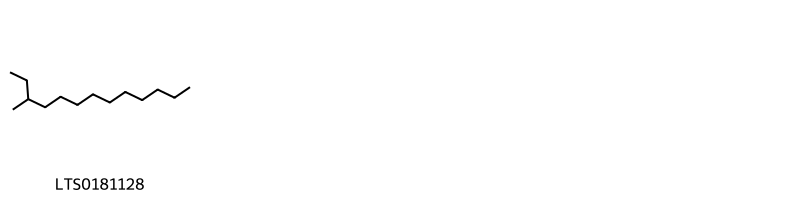{ width=100% }
    <figcaption>Hình ảnh cấu trúc hóa học của 1 hoạt chất thuộc nhóm Saturated hydrocarbons gồm ['3-methyltridecane (LTS0181128)'].</figcaption>
</figure>
#### Nhóm Steroids and steroid derivatives
<figure markdown="span">
    { width=100% }
    <figcaption>Hình ảnh cấu trúc hóa học của 2 hoạt chất thuộc nhóm Steroids and steroid derivatives gồm ['stigmast-5-en-3-ol, (3β)- (LTS0204616)', 'stigmast-5-en-3-ol (LTS0071224)'].</figcaption>
</figure>
#### Nhóm Unsaturated hydrocarbons
<figure markdown="span">
    { width=100% }
    <figcaption>Hình ảnh cấu trúc hóa học của 1 hoạt chất thuộc nhóm Unsaturated hydrocarbons gồm ['1-octene (LTS0268446)'].</figcaption>
</figure>

---

### Dược dân tộc học

Danh sách các quốc gia có sử dụng *Taxus canadensis* trong điều trị các bệnh. 

| Country   | Disease   | Bệnh     |
|:----------|:----------|:---------|
| Elsewhere | nan       | Ở đây    |
| US        | Poison    | Chất độc |

---

---
## Taxus cuidata
### Thông tin về thực vật

!!! info "Phân loại thực vật của *N/A* từ GIBF:"
    - **Kingdom:** Plantae
    - **Phylum:** Tracheophyta
    - **Order:** Pinales
    - **Family:** Taxaceae
    - **Genus:** Taxus
    - **Species:** *N/A*

 

| Label (VI)   | Label (EN)   | Scientific Name   | Descriptions (VI)   | Descriptions (EN)   | Also Known As (VI)   | Also Known As (EN)                             |
|:-------------|:-------------|:------------------|:--------------------|:--------------------|:---------------------|:-----------------------------------------------|
| N/A          | N/A          | Taxus canadensis  | loài thực vật       | species of plant    | ['']                 | ['American yew', 'Canada yew', 'Canadian yew'] |

#### Phân bố trên thế giới

**Từ CSDL GIBF** Georgia, Denmark, Luxembourg, Spain, Germany, Austria, Korea, Republic of, Canada, Slovakia, Netherlands, Hungary, Ireland, Switzerland, United Kingdom of Great Britain and Northern Ireland, Portugal, Morocco, France, Czechia, New Zealand, Russian Federation, United States of America, Italy, Ukraine

#### Phân bố tại Việt Nam

**Từ CSDL GIBF**: Không có ghi nhận ở Việt Nam

---
### Thành phần hóa học
        
- Theo cơ sở dữ liệu lotus: Từ loài *N/A* đã phân lập và xác định được Chưa có hoạt chất nào được phân lập. hoạt chất thuộc về các nhóm Không có hoạt chất nào được phân lập. 

Không có hình ảnh nào được tạo ra

---

### Dược dân tộc học

Danh sách các quốc gia có sử dụng *N/A* trong điều trị các bệnh. 

| Country   | Disease               | Bệnh                           |
|:----------|:----------------------|:-------------------------------|
| Elsewhere | Diuretic, Emmenagogue | Thuốc lợi tiểu, Thuốc lợi tiểu |
| US        | Poison                | Chất độc                       |

---

