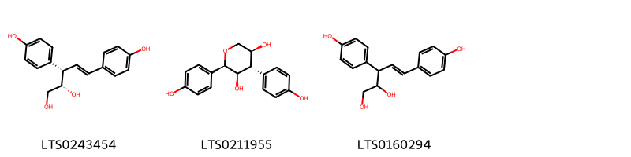
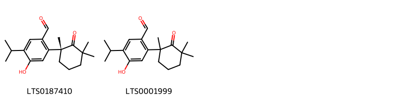
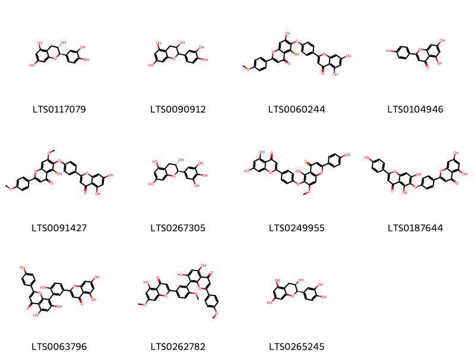
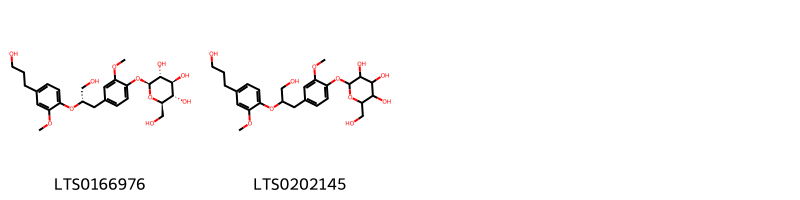
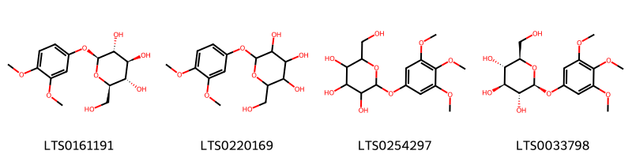
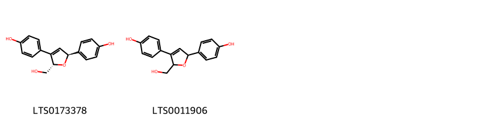
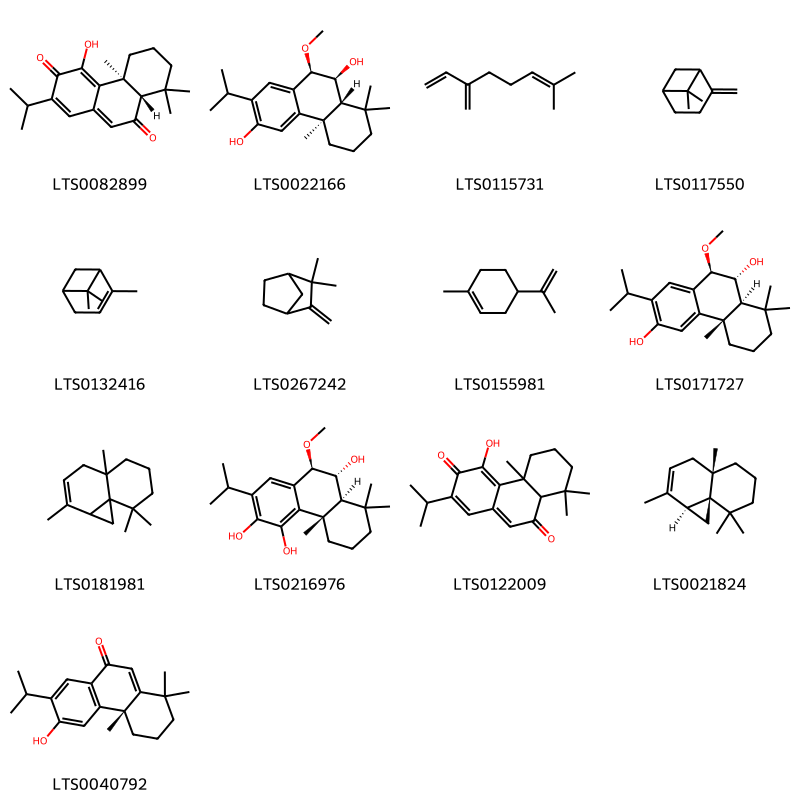
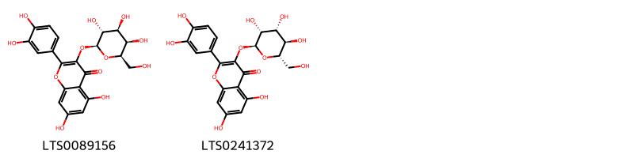
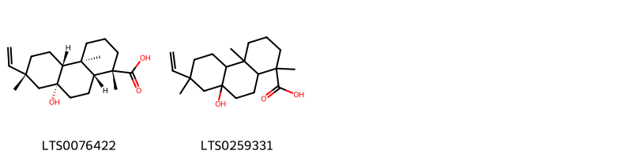

!!! abstract "Tóm tắt"

    Họ Taxodiaceae gồm khoảng 2 chi và 4 loài được một số cộng đồng tại các quốc gia như Elsewhere, China, Mexico sử dụng trong một số trường hợp Carminative, lợi tiểu, sơ hở, làm se, Emmenagogue, Emmenagogue, gây mê, lợi tiểu, Emmenagogue, lợi tiểu, Vulnerary, đờm, Carminative, Vermifuge, thuốc giải độc.

!!! info "DrDuke"

    James A. Duke sinh năm 1929-2017 là một nhà thực vật học người Mỹ. Đây là một trong những tác giả hàng đầu trong lĩnh vực dược dân tộc học với cuốn *CRC Handbook of Medicinal Herbs* và chính là người xây dựng lên cơ sở dữ liệu về hợp chất tự nhiên và dược dân tộc học tại Bộ nông nghiệp Hoa Kỳ. Các thông tin được đăng tải tại website [Dr. Duke's Phytochemical and Ethnobotanical Databases](https://phytochem.nal.usda.gov/). 
    Trong suốt thập niên 1970, ông lãnh đạo the Plant Taxonomy Laboratory, Plant Genetics and Germplasm Institute of the Agricultural Research Service, U.S. Department of Agriculture.
    Trong tài liệu này, các thông tin về dược dân tộc của các dược liệu được trích dẫn từ tài liệu của James A. Ducke với sự trợ giúp của phần mềm dịch thuật từ tiếng Anh sang tiếng Việt.
   

# Chi Cunninghamia

??? note "Danh sách các dược liệu thuộc chi"
    
	 - *Cunninghamia sinensis*

---
## Cunninghamia sinensis
### Thông tin về thực vật

!!! info "Phân loại thực vật của *Cunninghamia sinensis* từ GIBF:"
    - **Kingdom:** Plantae
    - **Phylum:** Tracheophyta
    - **Order:** Pinales
    - **Family:** Cupressaceae
    - **Genus:** Cunninghamia
    - **Species:** *Cunninghamia sinensis*

 

| Label (VI)   | Label (EN)   | Scientific Name      | Descriptions (VI)   | Descriptions (EN)   | Also Known As (VI)   | Also Known As (EN)   |
|:-------------|:-------------|:---------------------|:--------------------|:--------------------|:---------------------|:---------------------|
| N/A          | N/A          | Sargentodoxa cuneata | loài thực vật       | species of plant    | ['']                 | ['']                 |

#### Phân bố trên thế giới

**Từ CSDL GIBF** United States of America, China, Japan

#### Phân bố tại Việt Nam

**Từ CSDL GIBF**: Không có ghi nhận ở Việt Nam

---
### Thành phần hóa học
        
- Theo cơ sở dữ liệu lotus: Từ loài *Cunninghamia sinensis* đã phân lập và xác định được Chưa có hoạt chất nào được phân lập. hoạt chất thuộc về các nhóm Không có hoạt chất nào được phân lập. 

Không có hình ảnh nào được tạo ra

---

### Dược dân tộc học

Danh sách các quốc gia có sử dụng *Cunninghamia sinensis* trong điều trị các bệnh. 

| Country   | Disease                             | Bệnh                             |
|:----------|:------------------------------------|:---------------------------------|
| China     | Expectorant, Carminative, Vermifuge | Chất đờm, Carminative, Vermifuge |

---

# Chi Taxodium

??? note "Danh sách các dược liệu thuộc chi"
    
	 - *Taxodium distichum*
	 - *Taxodium heterophyllum*
	 - *Taxodium mucronatum*

---
## Taxodium distichum
### Thông tin về thực vật

!!! info "Phân loại thực vật của *Taxodium distichum* từ GIBF:"
    - **Kingdom:** Plantae
    - **Phylum:** Tracheophyta
    - **Order:** Pinales
    - **Family:** Cupressaceae
    - **Genus:** Taxodium
    - **Species:** *Taxodium distichum*

 

| Label (VI)   | Label (EN)   | Scientific Name    | Descriptions (VI)   | Descriptions (EN)       | Also Known As (VI)   | Also Known As (EN)                                                                                                                                              |
|:-------------|:-------------|:-------------------|:--------------------|:------------------------|:---------------------|:----------------------------------------------------------------------------------------------------------------------------------------------------------------|
| N/A          | N/A          | Taxodium distichum |                     | species of cypress tree | ['']                 | ['white cypress', 'bald cypress', 'baldcypress', 'Gulf cypress', 'red cypress', 'southern cypress', 'swamp cypress', 'tidewater red cypress', 'yellow cypress'] |

#### Phân bố trên thế giới

**Từ CSDL GIBF** South Africa, Netherlands, Germany, Brazil, United States of America, China

#### Phân bố tại Việt Nam

**Từ CSDL GIBF**: Không có ghi nhận ở Việt Nam

---
### Thành phần hóa học
        
- Theo cơ sở dữ liệu lotus: Từ loài *Taxodium distichum* đã phân lập và xác định được 37 hoạt chất thuộc về các nhóm Flavonoids, Prenol lipids, Benzene and substituted derivatives, Organooxygen compounds, Phenols, Lignan glycosides. 

|    | chemicalTaxonomyClassyfireClass     |   smiles_count |
|---:|:------------------------------------|---------------:|
|  0 |                                     |              3 |
|  1 | Benzene and substituted derivatives |              2 |
|  2 | Flavonoids                          |             11 |
|  3 | Lignan glycosides                   |              2 |
|  4 | Organooxygen compounds              |              4 |
|  5 | Phenols                             |              2 |
|  6 | Prenol lipids                       |             13 |

#### Nhóm 
<figure markdown="span">
    { width=100% }
    <figcaption>Hình ảnh cấu trúc hóa học của 3 hoạt chất thuộc nhóm  gồm ['agatharesinol (LTS0243454)', '(2r,3r,4s,5s)-2,4-bis(4-hydroxyphenyl)oxane-3,5-diol (LTS0211955)', '3,5-bis(4-hydroxyphenyl)pent-4-ene-1,2-diol (LTS0160294)'].</figcaption>
</figure>
#### Nhóm Benzene and substituted derivatives
<figure markdown="span">
    { width=100% }
    <figcaption>Hình ảnh cấu trúc hóa học của 2 hoạt chất thuộc nhóm Benzene and substituted derivatives gồm ['4-hydroxy-5-isopropyl-2-[(1r)-1,3,3-trimethyl-2-oxocyclohexyl]benzaldehyde (LTS0187410)', '4-hydroxy-5-isopropyl-2-(1,3,3-trimethyl-2-oxocyclohexyl)benzaldehyde (LTS0001999)'].</figcaption>
</figure>
#### Nhóm Flavonoids
<figure markdown="span">
    { width=100% }
    <figcaption>Hình ảnh cấu trúc hóa học của 11 hoạt chất thuộc nhóm Flavonoids gồm ['(+)-catechol (LTS0117079)', 'catechol (LTS0090912)', '6-[4-(5,7-dihydroxy-4-oxochromen-2-yl)phenoxy]-5,7-dihydroxy-2-(4-methoxyphenyl)chromen-4-one (LTS0060244)', 'chamomile (LTS0104946)', '6-[4-(5,7-dihydroxy-4-oxochromen-2-yl)phenoxy]-5-hydroxy-7-methoxy-2-(4-methoxyphenyl)chromen-4-one (LTS0091427)', 'gallocatechol (LTS0267305)', '6-[4-(5,7-dihydroxy-4-oxochromen-2-yl)phenoxy]-5-hydroxy-2-(4-hydroxyphenyl)-7-methoxychromen-4-one (LTS0249955)', 'hinokiflavone (LTS0187644)', 'amentoflavone (LTS0063796)', 'sciadopitysin (LTS0262782)', 'ent-epicatechin (LTS0265245)'].</figcaption>
</figure>
#### Nhóm Lignan glycosides
<figure markdown="span">
    { width=100% }
    <figcaption>Hình ảnh cấu trúc hóa học của 2 hoạt chất thuộc nhóm Lignan glycosides gồm ['(2s,3r,4s,5s,6r)-2-{4-[(2s)-3-hydroxy-2-[4-(3-hydroxypropyl)-2-methoxyphenoxy]propyl]-2-methoxyphenoxy}-6-(hydroxymethyl)oxane-3,4,5-triol (LTS0166976)', '2-(4-{3-hydroxy-2-[4-(3-hydroxypropyl)-2-methoxyphenoxy]propyl}-2-methoxyphenoxy)-6-(hydroxymethyl)oxane-3,4,5-triol (LTS0202145)'].</figcaption>
</figure>
#### Nhóm Organooxygen compounds
<figure markdown="span">
    { width=100% }
    <figcaption>Hình ảnh cấu trúc hóa học của 4 hoạt chất thuộc nhóm Organooxygen compounds gồm ['(2s,3r,4s,5s,6r)-2-(3,4-dimethoxyphenoxy)-6-(hydroxymethyl)oxane-3,4,5-triol (LTS0161191)', '2-(3,4-dimethoxyphenoxy)-6-(hydroxymethyl)oxane-3,4,5-triol (LTS0220169)', '2-(hydroxymethyl)-6-(3,4,5-trimethoxyphenoxy)oxane-3,4,5-triol (LTS0254297)', 'koaburside (LTS0033798)'].</figcaption>
</figure>
#### Nhóm Phenols
<figure markdown="span">
    { width=100% }
    <figcaption>Hình ảnh cấu trúc hóa học của 2 hoạt chất thuộc nhóm Phenols gồm ['4-[(2s,5s)-5-(hydroxymethyl)-4-(4-hydroxyphenyl)-2,5-dihydrofuran-2-yl]phenol (LTS0173378)', '4-[5-(hydroxymethyl)-4-(4-hydroxyphenyl)-2,5-dihydrofuran-2-yl]phenol (LTS0011906)'].</figcaption>
</figure>
#### Nhóm Prenol lipids
<figure markdown="span">
    { width=100% }
    <figcaption>Hình ảnh cấu trúc hóa học của 13 hoạt chất thuộc nhóm Prenol lipids gồm ['taxodione (LTS0082899)', '(4br,8ar,9s,10r)-2-isopropyl-10-methoxy-4b,8,8-trimethyl-5,6,7,8a,9,10-hexahydrophenanthrene-3,9-diol (LTS0022166)', 'α-myrcene (LTS0115731)', 'β-pinene (LTS0117550)', 'α pinene (LTS0132416)', 'camphene (LTS0267242)', 'limonene,  (LTS0155981)', '(4bs,8as,9r,10r)-2-isopropyl-10-methoxy-4b,8,8-trimethyl-5,6,7,8a,9,10-hexahydrophenanthrene-3,9-diol (LTS0171727)', 'thujopsene (LTS0181981)', '(4bs,8as,9r,10r)-2-isopropyl-10-methoxy-4b,8,8-trimethyl-5,6,7,8a,9,10-hexahydrophenanthrene-3,4,9-triol (LTS0216976)', '4-hydroxy-2-isopropyl-4b,8,8-trimethyl-5,6,7,8a-tetrahydrophenanthrene-3,9-dione (LTS0122009)', '(-)-thujopsene (LTS0021824)', '(4as)-6-hydroxy-7-isopropyl-1,1,4a-trimethyl-3,4-dihydro-2h-phenanthren-9-one (LTS0040792)'].</figcaption>
</figure>

---

### Dược dân tộc học

Danh sách các quốc gia có sử dụng *Taxodium distichum* trong điều trị các bệnh. 

| Country   | Disease                          | Bệnh                                    |
|:----------|:---------------------------------|:----------------------------------------|
| Elsewhere | Carminative, Diuretic, Vulnerary | Carminative, lợi tiểu, dễ bị tổn thương |

---

---
## Taxodium heterophyllum
### Thông tin về thực vật

!!! info "Phân loại thực vật của *Glyptostrobus pensilis* từ GIBF:"
    - **Kingdom:** Plantae
    - **Phylum:** Tracheophyta
    - **Order:** Pinales
    - **Family:** Cupressaceae
    - **Genus:** Glyptostrobus
    - **Species:** *Glyptostrobus pensilis*

 

| Label (VI)   | Label (EN)   | Scientific Name    | Descriptions (VI)   | Descriptions (EN)       | Also Known As (VI)   | Also Known As (EN)                                                                                                                                              |
|:-------------|:-------------|:-------------------|:--------------------|:------------------------|:---------------------|:----------------------------------------------------------------------------------------------------------------------------------------------------------------|
| N/A          | N/A          | Taxodium distichum |                     | species of cypress tree | ['']                 | ['white cypress', 'bald cypress', 'baldcypress', 'Gulf cypress', 'red cypress', 'southern cypress', 'swamp cypress', 'tidewater red cypress', 'yellow cypress'] |

#### Phân bố trên thế giới

**Từ CSDL GIBF** South Africa, Netherlands, Germany, Brazil, United States of America, China

#### Phân bố tại Việt Nam

**Từ CSDL GIBF**: Không có ghi nhận ở Việt Nam

---
### Thành phần hóa học
        
- Theo cơ sở dữ liệu lotus: Từ loài *Glyptostrobus pensilis* đã phân lập và xác định được Chưa có hoạt chất nào được phân lập. hoạt chất thuộc về các nhóm Không có hoạt chất nào được phân lập. 

Không có hình ảnh nào được tạo ra

---

### Dược dân tộc học

Danh sách các quốc gia có sử dụng *Glyptostrobus pensilis* trong điều trị các bệnh. 

| Country   | Disease   | Bệnh          |
|:----------|:----------|:--------------|
| China     | Antidote  | Chất giải độc |

---

---
## Taxodium mucronatum
### Thông tin về thực vật

!!! info "Phân loại thực vật của *Taxodium mucronatum* từ GIBF:"
    - **Kingdom:** Plantae
    - **Phylum:** Tracheophyta
    - **Order:** Pinales
    - **Family:** Cupressaceae
    - **Genus:** Taxodium
    - **Species:** *Taxodium mucronatum*

 

| Label (VI)   | Label (EN)   | Scientific Name     | Descriptions (VI)   | Descriptions (EN)   | Also Known As (VI)   | Also Known As (EN)   |
|:-------------|:-------------|:--------------------|:--------------------|:--------------------|:---------------------|:---------------------|
| N/A          | N/A          | Taxodium mucronatum |                     | species of plant    | ['']                 | ['']                 |

#### Phân bố trên thế giới

**Từ CSDL GIBF** United States of America, Mexico

#### Phân bố tại Việt Nam

**Từ CSDL GIBF**: Không có ghi nhận ở Việt Nam

---
### Thành phần hóa học
        
- Theo cơ sở dữ liệu lotus: Từ loài *Taxodium mucronatum* đã phân lập và xác định được 4 hoạt chất thuộc về các nhóm Flavonoids, Prenol lipids. 

|    | chemicalTaxonomyClassyfireClass   |   smiles_count |
|---:|:----------------------------------|---------------:|
|  0 | Flavonoids                        |              2 |
|  1 | Prenol lipids                     |              2 |

#### Nhóm Flavonoids
<figure markdown="span">
    { width=100% }
    <figcaption>Hình ảnh cấu trúc hóa học của 2 hoạt chất thuộc nhóm Flavonoids gồm ['hyperoside (LTS0089156)', '2-(3,4-dihydroxyphenyl)-5,7-dihydroxy-3-{[(2s,3r,4r,5r,6s)-3,4,5-trihydroxy-6-(hydroxymethyl)oxan-2-yl]oxy}chromen-4-one (LTS0241372)'].</figcaption>
</figure>
#### Nhóm Prenol lipids
<figure markdown="span">
    { width=100% }
    <figcaption>Hình ảnh cấu trúc hóa học của 2 hoạt chất thuộc nhóm Prenol lipids gồm ['(1s,4as,4br,7r,8ar,10ar)-7-ethenyl-8a-hydroxy-1,4a,7-trimethyl-decahydrophenanthrene-1-carboxylic acid (LTS0076422)', '7-ethenyl-8a-hydroxy-1,4a,7-trimethyl-decahydrophenanthrene-1-carboxylic acid (LTS0259331)'].</figcaption>
</figure>

---

### Dược dân tộc học

Danh sách các quốc gia có sử dụng *Taxodium mucronatum* trong điều trị các bệnh. 

| Country   | Disease                                                                          | Bệnh                                                                                           |
|:----------|:---------------------------------------------------------------------------------|:-----------------------------------------------------------------------------------------------|
| Elsewhere | Astringent                                                                       | Lam se da                                                                                      |
| Mexico    | Emmenagogue, Emmenagogue, Anesthetic, Diuretic, Emmenagogue, Diuretic, Vulnerary | Emmenagogue, Emmenagogue, Thuốc gây mê, Thuốc lợi tiểu, Emmenagogue, Thuốc lợi tiểu, Vulnerary |

---

