!!! abstract "Tóm tắt"

    Họ Theaceae gồm khoảng 6 chi và 13 loài được một số cộng đồng tại các quốc gia như Turkey, Madeira, Asia, Malaya, Indonesia(Amboina), Vietnam(Tonkin), Elsewhere, India, Java, Guadelupe, Mexico, Philippines, Burma, China sử dụng trong một số trường hợp MYMEMORY WARNING: YOU USED ALL AVAILABLE FREE TRANSLATIONS FOR TODAY. NEXT AVAILABLE IN  06 HOURS 16 MINUTES 41 SECONDS VISIT HTTPS://MYMEMORY.TRANSLATED.NET/DOC/USAGELIMITS.PHP TO TRANSLATE MORE.

!!! info "DrDuke"

    James A. Duke sinh năm 1929-2017 là một nhà thực vật học người Mỹ. Đây là một trong những tác giả hàng đầu trong lĩnh vực dược dân tộc học với cuốn *CRC Handbook of Medicinal Herbs* và chính là người xây dựng lên cơ sở dữ liệu về hợp chất tự nhiên và dược dân tộc học tại Bộ nông nghiệp Hoa Kỳ. Các thông tin được đăng tải tại website [Dr. Duke's Phytochemical and Ethnobotanical Databases](https://phytochem.nal.usda.gov/). 
    Trong suốt thập niên 1970, ông lãnh đạo the Plant Taxonomy Laboratory, Plant Genetics and Germplasm Institute of the Agricultural Research Service, U.S. Department of Agriculture.
    Trong tài liệu này, các thông tin về dược dân tộc của các dược liệu được trích dẫn từ tài liệu của James A. Ducke với sự trợ giúp của phần mềm dịch thuật từ tiếng Anh sang tiếng Việt.
   

# Chi Schima

??? note "Danh sách các dược liệu thuộc chi"
    
	 - *Schima noronhae*
	 - *Schima wallichii*

---
## Schima noronhae
### Thông tin về thực vật

!!! info "Phân loại thực vật của *Schima noronhae* từ GIBF:"
    - **Kingdom:** Plantae
    - **Phylum:** Tracheophyta
    - **Order:** Ericales
    - **Family:** Theaceae
    - **Genus:** Schima
    - **Species:** *Schima noronhae*

 

| Label (VI)   | Label (EN)   | Scientific Name   | Descriptions (VI)   | Descriptions (EN)   | Also Known As (VI)   | Also Known As (EN)   |
|:-------------|:-------------|:------------------|:--------------------|:--------------------|:---------------------|:---------------------|
| N/A          | N/A          | Schima noronhae   | loài thực vật       | species of plant    | ['']                 | ['']                 |

#### Phân bố trên thế giới

**Từ CSDL GIBF** Japan, Chinese Taipei, New Zealand, Indonesia, Malaysia, China

#### Phân bố tại Việt Nam

**Từ CSDL GIBF**: Không có ghi nhận ở Việt Nam

---
### Thành phần hóa học
        
- Theo cơ sở dữ liệu lotus: Từ loài *Schima noronhae* đã phân lập và xác định được Chưa có hoạt chất nào được phân lập. hoạt chất thuộc về các nhóm Không có hoạt chất nào được phân lập. 

Không có hình ảnh nào được tạo ra

---

### Dược dân tộc học

Danh sách các quốc gia có sử dụng *Schima noronhae* trong điều trị các bệnh. 

| Country   | Disease   | Bệnh                                                                                                                                                                                                |
|:----------|:----------|:----------------------------------------------------------------------------------------------------------------------------------------------------------------------------------------------------|
| Java      | Piscicide | MYMEMORY WARNING: YOU USED ALL AVAILABLE FREE TRANSLATIONS FOR TODAY. NEXT AVAILABLE IN  06 HOURS 16 MINUTES 37 SECONDS VISIT HTTPS://MYMEMORY.TRANSLATED.NET/DOC/USAGELIMITS.PHP TO TRANSLATE MORE |
| Malaya    | Piscicide | MYMEMORY WARNING: YOU USED ALL AVAILABLE FREE TRANSLATIONS FOR TODAY. NEXT AVAILABLE IN  06 HOURS 16 MINUTES 33 SECONDS VISIT HTTPS://MYMEMORY.TRANSLATED.NET/DOC/USAGELIMITS.PHP TO TRANSLATE MORE |

---

---
## Schima wallichii
### Thông tin về thực vật

!!! info "Phân loại thực vật của *Schima wallichii* từ GIBF:"
    - **Kingdom:** Plantae
    - **Phylum:** Tracheophyta
    - **Order:** Ericales
    - **Family:** Theaceae
    - **Genus:** Schima
    - **Species:** *Schima wallichii*

 

| Label (VI)   | Label (EN)   | Scientific Name   | Descriptions (VI)   | Descriptions (EN)   | Also Known As (VI)   | Also Known As (EN)   |
|:-------------|:-------------|:------------------|:--------------------|:--------------------|:---------------------|:---------------------|
| N/A          | N/A          | Schima wallichii  | loài thực vật       | species of plant    | ['']                 | ['']                 |

#### Phân bố trên thế giới

**Từ CSDL GIBF** nan, Japan, Thailand, Lao People’s Democratic Republic, Myanmar, Bhutan, India, Indonesia, Bangladesh, United States of America, Viet Nam, Malaysia, China, Nepal

#### Phân bố tại Việt Nam

**Từ CSDL GIBF**: Thua Thien-Hue, Lâm Đồng

---
### Thành phần hóa học
        
- Theo cơ sở dữ liệu lotus: Từ loài *Schima wallichii* đã phân lập và xác định được 26 hoạt chất thuộc về các nhóm Tannins, Benzene and substituted derivatives. 

|    | chemicalTaxonomyClassyfireClass     |   smiles_count |
|---:|:------------------------------------|---------------:|
|  0 | Benzene and substituted derivatives |              2 |
|  1 | Tannins                             |             24 |

#### Nhóm Benzene and substituted derivatives
<figure markdown="span">
    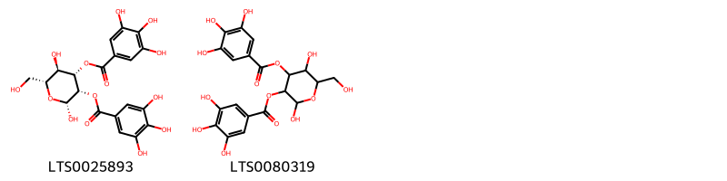{ width=100% }
    <figcaption>Hình ảnh cấu trúc hóa học của 2 hoạt chất thuộc nhóm Benzene and substituted derivatives gồm ['(2r,3s,4s,5r,6r)-2,5-dihydroxy-6-(hydroxymethyl)-3-(3,4,5-trihydroxybenzoyloxy)oxan-4-yl 3,4,5-trihydroxybenzoate (LTS0025893)', '2,5-dihydroxy-6-(hydroxymethyl)-3-(3,4,5-trihydroxybenzoyloxy)oxan-4-yl 3,4,5-trihydroxybenzoate (LTS0080319)'].</figcaption>
</figure>
#### Nhóm Tannins
<figure markdown="span">
    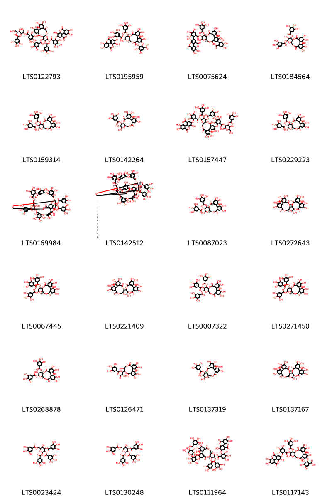{ width=100% }
    <figcaption>Hình ảnh cấu trúc hóa học của 24 hoạt chất thuộc nhóm Tannins gồm ['4,5,6-trihydroxy-1-oxo-3-(3,4,5-trihydroxybenzoyloxy)hexan-2-yl 3,4,5-trihydroxy-2-({3,4,21,22,23-pentahydroxy-8,18-dioxo-13-[3,4,5-trihydroxy-2-({7,13,14-trihydroxy-3,10-dioxo-2,9-dioxatetracyclo[6.6.2.0⁴,¹⁶.0¹¹,¹⁵]hexadeca-1(15),4(16),5,7,11,13-hexaen-6-yl}oxy)benzoyloxy]-11,12-bis(3,4,5-trihydroxybenzoyloxy)-9,14,16-trioxatetracyclo[17.4.0.0²,⁷.0¹⁰,¹⁵]tricosa-1(19),2(7),3,5,20,22-hexaen-5-yl}oxy)benzoate (LTS0122793)', '2-{[(10r,11s,12r,13r,15r)-3,4,5,13,22,23-hexahydroxy-8,18-dioxo-12-[3,4,5-trihydroxy-2-({7,13,14-trihydroxy-3,10-dioxo-2,9-dioxatetracyclo[6.6.2.0⁴,¹⁶.0¹¹,¹⁵]hexadeca-1(15),4(16),5,7,11,13-hexaen-6-yl}oxy)benzoyloxy]-11-(3,4,5-trihydroxybenzoyloxy)-9,14,17-trioxatetracyclo[17.4.0.0²,⁷.0¹⁰,¹⁵]tricosa-1(23),2(7),3,5,19,21-hexaen-21-yl]oxy}-3,4,5-trihydroxybenzoic acid (LTS0195959)', '2-[(10r,11s,12r,15r)-3,4,5,13,22,23-hexahydroxy-8,18-dioxo-12-(3,4,5-trihydroxy-2-{7,13,14-trihydroxy-3,10-dioxo-2,9-dioxatetracyclo[6.6.2.0⁴,¹⁶.0¹¹,¹⁵]hexadeca-1(15),4(16),5,7,11,13-hexaen-6-yl}benzoyloxy)-11-(3,4,5-trihydroxybenzoyloxy)-9,14,17-trioxatetracyclo[17.4.0.0²,⁷.0¹⁰,¹⁵]tricosa-1(23),2(7),3,5,19,21-hexaen-21-yl]-3,4,5-trihydroxybenzoic acid (LTS0075624)', '3,4,5,12,21,22,23-heptahydroxy-8,18-dioxo-13-(3,4,5-trihydroxybenzoyloxy)-9,14,17-trioxatetracyclo[17.4.0.0²,⁷.0¹⁰,¹⁵]tricosa-1(23),2(7),3,5,19,21-hexaen-11-yl 3,4,5-trihydroxybenzoate (LTS0184564)', '3,4,5,13,21,22,23-heptahydroxy-8,18-dioxo-12-(3,4,5-trihydroxybenzoyloxy)-9,14,17-trioxatetracyclo[17.4.0.0²,⁷.0¹⁰,¹⁵]tricosa-1(23),2(7),3,5,19,21-hexaen-11-yl 3,4,5-trihydroxybenzoate (LTS0159314)', '3,4,5,12,13,21,22,23-octahydroxy-8,18-dioxo-9,14,17-trioxatetracyclo[17.4.0.0²,⁷.0¹⁰,¹⁵]tricosa-1(23),2(7),3,5,19,21-hexaen-11-yl 3,4,5-trihydroxybenzoate (LTS0142264)', '5-[6-({[2,5-dihydroxy-6-(hydroxymethyl)-4-(3,4,5-trihydroxybenzoyloxy)oxan-3-yl]oxy}carbonyl)-2,3,4-trihydroxyphenoxy]-3,4,21,22,23-pentahydroxy-8,18-dioxo-11,12-bis(3,4,5-trihydroxybenzoyloxy)-9,14,17-trioxatetracyclo[17.4.0.0²,⁷.0¹⁰,¹⁵]tricosa-1(23),2(7),3,5,19,21-hexaen-13-yl 3,4,5-trihydroxy-2-({7,13,14-trihydroxy-3,10-dioxo-2,9-dioxatetracyclo[6.6.2.0⁴,¹⁶.0¹¹,¹⁵]hexadeca-1(15),4(16),5,7,11,13-hexaen-6-yl}oxy)benzoate (LTS0157447)', '(10r,11s,12r,13r,15r)-3,4,5,13,21,22,23-heptahydroxy-8,18-dioxo-11-(3,4,5-trihydroxybenzoyloxy)-9,14,17-trioxatetracyclo[17.4.0.0²,⁷.0¹⁰,¹⁵]tricosa-1(23),2(7),3,5,19,21-hexaen-12-yl 3,4,5-trihydroxybenzoate (LTS0229223)', '4,5,6,12,20,21,22,30,31,32,47,48,49,52,53,59,60-heptadecahydroxy-9,17,35,44,56,61-hexaoxo-38,64-bis(3,4,5-trihydroxybenzoyloxy)-2,10,13,16,28,36,43,57,58,62-decaoxaundecacyclo[38.13.4.3¹⁴,²⁵.2²⁴,²⁷.1¹¹,¹⁵.1³⁷,⁴¹.0³,⁸.0¹⁸,²³.0²⁹,³⁴.0⁴⁵,⁵⁰.0⁵¹,⁵⁵]tetrahexaconta-1(54),3,5,7,18(23),19,21,24,26,29,31,33,45(50),46,48,51(55),52,59-octadecaen-39-yl 3,4,5-trihydroxybenzoate (LTS0169984)', '(11r,12r,14r,15r,37s,38r,39s,40r,41r,64s)-4,5,6,12,20,21,22,30,31,32,47,48,49,52,53,59,60-heptadecahydroxy-9,17,35,44,56,61-hexaoxo-39,64-bis(3,4,5-trihydroxybenzoyloxy)-2,10,13,16,28,36,43,57,58,62-decaoxaundecacyclo[38.13.4.3¹⁴,²⁵.2²⁴,²⁷.1¹¹,¹⁵.1³⁷,⁴¹.0³,⁸.0¹⁸,²³.0²⁹,³⁴.0⁴⁵,⁵⁰.0⁵¹,⁵⁵]tetrahexaconta-1(54),3,5,7,18(23),19,21,24,26,29,31,33,45(50),46,48,51(55),52,59-octadecaen-38-yl 3,4,5-trihydroxybenzoate (LTS0142512)', '(10r,11s,12r,15r)-3,4,5,13,21,22,23-heptahydroxy-8,18-dioxo-11-(3,4,5-trihydroxybenzoyloxy)-9,14,17-trioxatetracyclo[17.4.0.0²,⁷.0¹⁰,¹⁵]tricosa-1(23),2(7),3,5,19,21-hexaen-12-yl 3,4,5-trihydroxybenzoate (LTS0087023)', '(1r,2s,19r,20s,22r)-7,8,9,12,13,14,20,28,29,30,33,34,35-tridecahydroxy-3,18,21,24,39-pentaoxaheptacyclo[20.17.0.0²,¹⁹.0⁵,¹⁰.0¹¹,¹⁶.0²⁶,³¹.0³²,³⁷]nonatriaconta-5(10),6,8,11,13,15,26(31),27,29,32,34,36-dodecaene-4,17,25,38-tetrone (LTS0272643)', '(10r,11s,12r,13s,15r)-3,4,5,21,22,23-hexahydroxy-8,18-dioxo-12,13-bis(3,4,5-trihydroxybenzoyloxy)-9,14,17-trioxatetracyclo[17.4.0.0²,⁷.0¹⁰,¹⁵]tricosa-1(23),2(7),3,5,19,21-hexaen-11-yl 3,4,5-trihydroxybenzoate (LTS0067445)', '7,8,9,12,13,14,20,28,29,30,33,34,35-tridecahydroxy-3,18,21,24,39-pentaoxaheptacyclo[20.17.0.0²,¹⁹.0⁵,¹⁰.0¹¹,¹⁶.0²⁶,³¹.0³²,³⁷]nonatriaconta-5(10),6,8,11,13,15,26(31),27,29,32,34,36-dodecaene-4,17,25,38-tetrone (LTS0221409)', '3,4,5,21,22,23-hexahydroxy-8,18-dioxo-12,13-bis(3,4,5-trihydroxybenzoyloxy)-9,14,17-trioxatetracyclo[17.4.0.0²,⁷.0¹⁰,¹⁵]tricosa-1(23),2(7),3,5,19,21-hexaen-11-yl 3,4,5-trihydroxybenzoate (LTS0007322)', '(10r,11s,12r,15r)-3,4,5,21,22,23-hexahydroxy-8,18-dioxo-12,13-bis(3,4,5-trihydroxybenzoyloxy)-9,14,17-trioxatetracyclo[17.4.0.0²,⁷.0¹⁰,¹⁵]tricosa-1(23),2(7),3,5,19,21-hexaen-11-yl 3,4,5-trihydroxybenzoate (LTS0271450)', '(10r,11r,12r,13r,15r)-3,4,5,12,21,22,23-heptahydroxy-8,18-dioxo-13-(3,4,5-trihydroxybenzoyloxy)-9,14,17-trioxatetracyclo[17.4.0.0²,⁷.0¹⁰,¹⁵]tricosa-1(23),2(7),3,5,19,21-hexaen-11-yl 3,4,5-trihydroxybenzoate (LTS0268878)', '1-{3,4,5,11,17,18,19-heptahydroxy-8,14-dioxo-9,13-dioxatricyclo[13.4.0.0²,⁷]nonadeca-1(15),2,4,6,16,18-hexaen-10-yl}-2-hydroxy-3-oxopropyl 3,4,5-trihydroxybenzoate (LTS0126471)', '(10r,11r,12r,13s,15r)-3,4,5,12,13,21,22,23-octahydroxy-8,18-dioxo-9,14,17-trioxatetracyclo[17.4.0.0²,⁷.0¹⁰,¹⁵]tricosa-1(23),2(7),3,5,19,21-hexaen-11-yl 3,4,5-trihydroxybenzoate (LTS0137319)', '(1r,2s,19r,22r)-7,8,9,12,13,14,20,28,29,30,33,34,35-tridecahydroxy-3,18,21,24,39-pentaoxaheptacyclo[20.17.0.0²,¹⁹.0⁵,¹⁰.0¹¹,¹⁶.0²⁶,³¹.0³²,³⁷]nonatriaconta-5(10),6,8,11,13,15,26(31),27,29,32,34,36-dodecaene-4,17,25,38-tetrone (LTS0137167)', '5-hydroxy-3,4-bis(3,4,5-trihydroxybenzoyloxy)-6-[(3,4,5-trihydroxybenzoyloxy)methyl]oxan-2-yl 3,4,5-trihydroxybenzoate (LTS0023424)', '(2s,3r,4s,5r,6r)-5-hydroxy-3,4-bis(3,4,5-trihydroxybenzoyloxy)-6-[(3,4,5-trihydroxybenzoyloxy)methyl]oxan-2-yl 3,4,5-trihydroxybenzoate (LTS0130248)', '(2r,3r,4s,5r,6r)-2,5-dihydroxy-6-(hydroxymethyl)-4-(3,4,5-trihydroxybenzoyloxy)oxan-3-yl 3,4,5-trihydroxy-2-{[(10r,11s,12r,13s,15r)-3,4,21,22,23-pentahydroxy-8,18-dioxo-13-[3,4,5-trihydroxy-2-({7,13,14-trihydroxy-3,10-dioxo-2,9-dioxatetracyclo[6.6.2.0⁴,¹⁶.0¹¹,¹⁵]hexadeca-1(15),4(16),5,7,11,13-hexaen-6-yl}oxy)benzoyloxy]-11,12-bis(3,4,5-trihydroxybenzoyloxy)-9,14,17-trioxatetracyclo[17.4.0.0²,⁷.0¹⁰,¹⁵]tricosa-1(19),2(7),3,5,20,22-hexaen-5-yl]oxy}benzoate (LTS0111964)', '2-({3,4,5,13,22,23-hexahydroxy-8,18-dioxo-12-[3,4,5-trihydroxy-2-({7,13,14-trihydroxy-3,10-dioxo-2,9-dioxatetracyclo[6.6.2.0⁴,¹⁶.0¹¹,¹⁵]hexadeca-1(15),4(16),5,7,11,13-hexaen-6-yl}oxy)benzoyloxy]-11-(3,4,5-trihydroxybenzoyloxy)-9,14,17-trioxatetracyclo[17.4.0.0²,⁷.0¹⁰,¹⁵]tricosa-1(23),2(7),3,5,19,21-hexaen-21-yl}oxy)-3,4,5-trihydroxybenzoic acid (LTS0117143)'].</figcaption>
</figure>

---

### Dược dân tộc học

Danh sách các quốc gia có sử dụng *Schima wallichii* trong điều trị các bệnh. 

| Country   | Disease     | Bệnh                                                                                                                                                                                                |
|:----------|:------------|:----------------------------------------------------------------------------------------------------------------------------------------------------------------------------------------------------|
| Burma     | Piscicide   | MYMEMORY WARNING: YOU USED ALL AVAILABLE FREE TRANSLATIONS FOR TODAY. NEXT AVAILABLE IN  06 HOURS 16 MINUTES 04 SECONDS VISIT HTTPS://MYMEMORY.TRANSLATED.NET/DOC/USAGELIMITS.PHP TO TRANSLATE MORE |
| Elsewhere | Rubefacient | MYMEMORY WARNING: YOU USED ALL AVAILABLE FREE TRANSLATIONS FOR TODAY. NEXT AVAILABLE IN  06 HOURS 16 MINUTES 00 SECONDS VISIT HTTPS://MYMEMORY.TRANSLATED.NET/DOC/USAGELIMITS.PHP TO TRANSLATE MORE |

---

# Chi Eurya

??? note "Danh sách các dược liệu thuộc chi"
    
	 - *Eurya acuminata*

---
## Eurya acuminata
### Thông tin về thực vật

!!! info "Phân loại thực vật của *Eurya acuminata* từ GIBF:"
    - **Kingdom:** Plantae
    - **Phylum:** Tracheophyta
    - **Order:** Ericales
    - **Family:** Pentaphylacaceae
    - **Genus:** Eurya
    - **Species:** *Eurya acuminata*

 

| Label (VI)   | Label (EN)   | Scientific Name   | Descriptions (VI)   | Descriptions (EN)   | Also Known As (VI)   | Also Known As (EN)   |
|:-------------|:-------------|:------------------|:--------------------|:--------------------|:---------------------|:---------------------|
| N/A          | N/A          | Eurya acuminata   | loài thực vật       | species of plant    | ['']                 | ['']                 |

#### Phân bố trên thế giới

**Từ CSDL GIBF** nan, Sri Lanka, Brunei Darussalam, Thailand, Lao People’s Democratic Republic, Chinese Taipei, Myanmar, Papua New Guinea, unknown or invalid, Indonesia, India, Viet Nam, Philippines, Singapore, Malaysia, China, Nepal

#### Phân bố tại Việt Nam

**Từ CSDL GIBF**: Thanh Hoa, Lao Cai, Kon Tum, Vinh Phuc, Lào Cai

---
### Thành phần hóa học
        
- Theo cơ sở dữ liệu lotus: Từ loài *Eurya acuminata* đã phân lập và xác định được Chưa có hoạt chất nào được phân lập. hoạt chất thuộc về các nhóm Không có hoạt chất nào được phân lập. 

Không có hình ảnh nào được tạo ra

---

### Dược dân tộc học

Danh sách các quốc gia có sử dụng *Eurya acuminata* trong điều trị các bệnh. 

| Country     | Disease    | Bệnh                                                                                                                                                                                                |
|:------------|:-----------|:----------------------------------------------------------------------------------------------------------------------------------------------------------------------------------------------------|
| Philippines | Dentifrice | MYMEMORY WARNING: YOU USED ALL AVAILABLE FREE TRANSLATIONS FOR TODAY. NEXT AVAILABLE IN  06 HOURS 15 MINUTES 30 SECONDS VISIT HTTPS://MYMEMORY.TRANSLATED.NET/DOC/USAGELIMITS.PHP TO TRANSLATE MORE |

---

# Chi Gordonia

??? note "Danh sách các dược liệu thuộc chi"
    
	 - *Gordonia obtusa*

---
## Gordonia obtusa
### Thông tin về thực vật

!!! info "Phân loại thực vật của *Polyspora obtusa* từ GIBF:"
    - **Kingdom:** Plantae
    - **Phylum:** Tracheophyta
    - **Order:** Ericales
    - **Family:** Theaceae
    - **Genus:** Polyspora
    - **Species:** *Polyspora obtusa*

 

| Label (VI)   | Label (EN)   | Scientific Name   | Descriptions (VI)   | Descriptions (EN)   | Also Known As (VI)   | Also Known As (EN)   |
|:-------------|:-------------|:------------------|:--------------------|:--------------------|:---------------------|:---------------------|
| N/A          | N/A          | Gordonia obtusa   | loài thực vật       | species of plant    | ['']                 | ['']                 |

#### Phân bố trên thế giới

**Từ CSDL GIBF** nan, India, Myanmar, unknown or invalid

#### Phân bố tại Việt Nam

**Từ CSDL GIBF**: Không có ghi nhận ở Việt Nam

---
### Thành phần hóa học
        
- Theo cơ sở dữ liệu lotus: Từ loài *Polyspora obtusa* đã phân lập và xác định được Chưa có hoạt chất nào được phân lập. hoạt chất thuộc về các nhóm Không có hoạt chất nào được phân lập. 

Không có hình ảnh nào được tạo ra

---

### Dược dân tộc học

Danh sách các quốc gia có sử dụng *Polyspora obtusa* trong điều trị các bệnh. 

| Country   | Disease                       | Bệnh                                                                                                                                                                                                |
|:----------|:------------------------------|:----------------------------------------------------------------------------------------------------------------------------------------------------------------------------------------------------|
| India     | Stomachic, Stimulant, Apertif | MYMEMORY WARNING: YOU USED ALL AVAILABLE FREE TRANSLATIONS FOR TODAY. NEXT AVAILABLE IN  06 HOURS 15 MINUTES 01 SECONDS VISIT HTTPS://MYMEMORY.TRANSLATED.NET/DOC/USAGELIMITS.PHP TO TRANSLATE MORE |

---

# Chi Camellia

??? note "Danh sách các dược liệu thuộc chi"
    
	 - *Camellia japonica*
	 - *Camellia kissi*
	 - *Camellia sasanqua*
	 - *Camellia sinensis*

---
## Camellia japonica
### Thông tin về thực vật

!!! info "Phân loại thực vật của *Camellia japonica* từ GIBF:"
    - **Kingdom:** Plantae
    - **Phylum:** Tracheophyta
    - **Order:** Ericales
    - **Family:** Theaceae
    - **Genus:** Camellia
    - **Species:** *Camellia japonica*

 

| Label (VI)   | Label (EN)   | Scientific Name   | Descriptions (VI)           | Descriptions (EN)   | Also Known As (VI)    | Also Known As (EN)   |
|:-------------|:-------------|:------------------|:----------------------------|:--------------------|:----------------------|:---------------------|
| N/A          | N/A          | Camellia japonica | loài thực vật thuộc Chi Trà | species of plant    | ['Camellia japonica'] | ['']                 |

#### Phân bố trên thế giới

**Từ CSDL GIBF** nan, South Africa, Australia, Japan, Germany, Korea, Republic of, Chinese Taipei, New Zealand, Ireland, Portugal, United States of America, China, France, Malaysia, United Kingdom of Great Britain and Northern Ireland

#### Phân bố tại Việt Nam

**Từ CSDL GIBF**: Không có ghi nhận ở Việt Nam

---
### Thành phần hóa học
        
- Theo cơ sở dữ liệu lotus: Từ loài *Camellia japonica* đã phân lập và xác định được 184 hoạt chất thuộc về các nhóm Flavonoids, Prenol lipids, Steroids and steroid derivatives, Benzene and substituted derivatives, Organooxygen compounds, Tannins, Carboxylic acids and derivatives, Imidazopyrimidines. 

|    | chemicalTaxonomyClassyfireClass     |   smiles_count |
|---:|:------------------------------------|---------------:|
|  0 | Benzene and substituted derivatives |              5 |
|  1 | Carboxylic acids and derivatives    |              1 |
|  2 | Flavonoids                          |             14 |
|  3 | Imidazopyrimidines                  |              2 |
|  4 | Organooxygen compounds              |              4 |
|  5 | Prenol lipids                       |            102 |
|  6 | Steroids and steroid derivatives    |              9 |
|  7 | Tannins                             |             42 |

#### Nhóm Benzene and substituted derivatives
<figure markdown="span">
    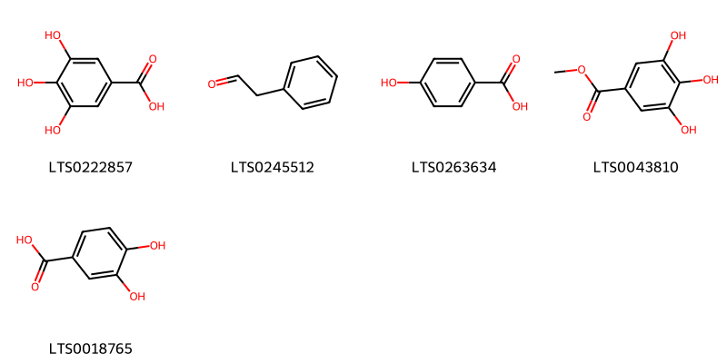{ width=100% }
    <figcaption>Hình ảnh cấu trúc hóa học của 5 hoạt chất thuộc nhóm Benzene and substituted derivatives gồm ['galop (LTS0222857)', 'phenylacetaldehyde (LTS0245512)', 'p-hydroxybenzoic acid (LTS0263634)', 'methyl gallate (LTS0043810)', '3,4-dihydroxybenzoic acid (LTS0018765)'].</figcaption>
</figure>
#### Nhóm Carboxylic acids and derivatives
<figure markdown="span">
    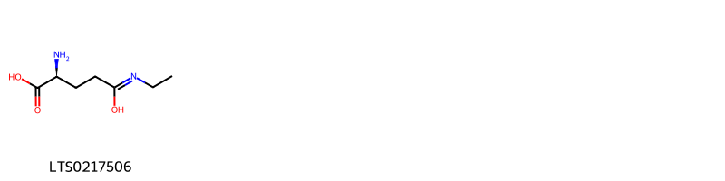{ width=100% }
    <figcaption>Hình ảnh cấu trúc hóa học của 1 hoạt chất thuộc nhóm Carboxylic acids and derivatives gồm ['(2s)-2-amino-4-(ethyl-c-hydroxycarbonimidoyl)butanoic acid (LTS0217506)'].</figcaption>
</figure>
#### Nhóm Flavonoids
<figure markdown="span">
    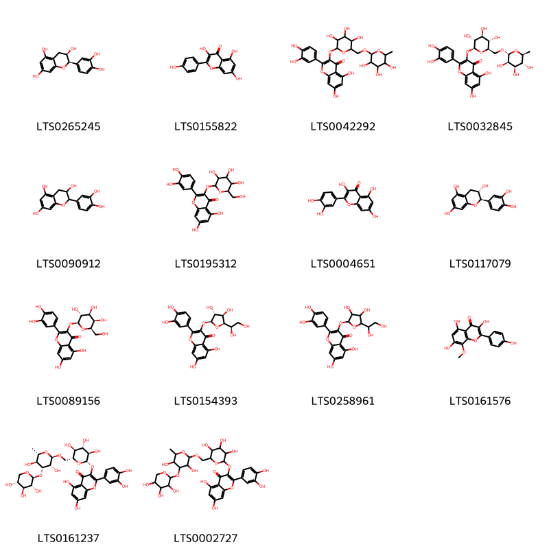{ width=100% }
    <figcaption>Hình ảnh cấu trúc hóa học của 14 hoạt chất thuộc nhóm Flavonoids gồm ['ent-epicatechin (LTS0265245)', 'kaempherol (LTS0155822)', 'rutin (LTS0042292)', '3-rutinosyl quercetin (LTS0032845)', 'catechol (LTS0090912)', '2-(3,4-dihydroxyphenyl)-5,7-dihydroxy-3-{[3,4,5-trihydroxy-6-(hydroxymethyl)oxan-2-yl]oxy}chromen-4-one (LTS0195312)', 'quercetin (LTS0004651)', '(+)-catechol (LTS0117079)', 'hyperoside (LTS0089156)', 'quercetin-3-glucoside (LTS0154393)', '3-{[5-(1,2-dihydroxyethyl)-3,4-dihydroxyoxolan-2-yl]oxy}-2-(3,4-dihydroxyphenyl)-5,7-dihydroxychromen-4-one (LTS0258961)', 'sexangularetin (LTS0161576)', 'camellianoside (LTS0161237)', '3-({6-[({3,5-dihydroxy-6-methyl-4-[(3,4,5-trihydroxyoxan-2-yl)oxy]oxan-2-yl}oxy)methyl]-3,4,5-trihydroxyoxan-2-yl}oxy)-2-(3,4-dihydroxyphenyl)-5,7-dihydroxychromen-4-one (LTS0002727)'].</figcaption>
</figure>
#### Nhóm Imidazopyrimidines
<figure markdown="span">
    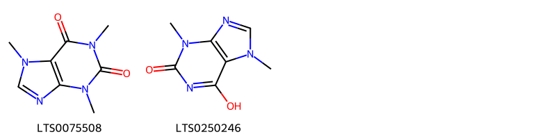{ width=100% }
    <figcaption>Hình ảnh cấu trúc hóa học của 2 hoạt chất thuộc nhóm Imidazopyrimidines gồm ['caffeine (LTS0075508)', 'thesal (LTS0250246)'].</figcaption>
</figure>
#### Nhóm Organooxygen compounds
<figure markdown="span">
    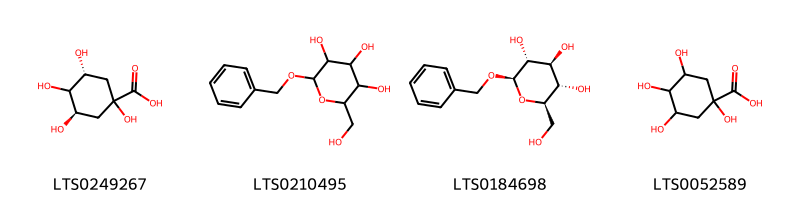{ width=100% }
    <figcaption>Hình ảnh cấu trúc hóa học của 4 hoạt chất thuộc nhóm Organooxygen compounds gồm ['(3r,5r)-1,3,4,5-tetrahydroxycyclohexane-1-carboxylic acid (LTS0249267)', 'benzyl glucopyranoside (LTS0210495)', 'benzyl β-d-glucoside (LTS0184698)', 'quinic acid (LTS0052589)'].</figcaption>
</figure>
#### Nhóm Prenol lipids
<figure markdown="span">
    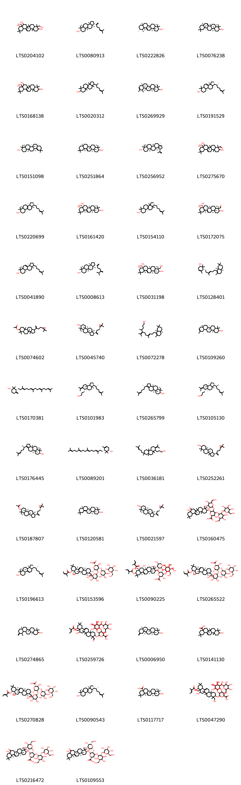{ width=100% }
    <figcaption>Hình ảnh cấu trúc hóa học của 102 hoạt chất thuộc nhóm Prenol lipids gồm ['4,8a-bis(hydroxymethyl)-4,6a,6b,11,11,14b-hexamethyl-1,2,3,4a,5,6,7,8,9,10,12,12a,14,14a-tetradecahydropicene-3,8,9-triol (LTS0204102)', 'dammaradienol (LTS0080913)', 'amyrin (LTS0222826)', 'alnulin (LTS0076238)', '8a-(hydroxymethyl)-4,4,6a,6b,11,11,14b-heptamethyl-1,2,3,4a,5,6,7,8,9,10,12,12a,14,14a-tetradecahydropicene-3,8,9-triol (LTS0168138)', 'lanster (LTS0020312)', '(4ar,6ar,6br,8as,12ar,12br,14ar,14br)-4,4,6a,6b,8a,11,12,14b-octamethyl-2,3,4a,5,6,7,8,9,12,12a,12b,13,14,14a-tetradecahydro-1h-picen-3-ol (LTS0269929)', '(1r,3ar,7s,9ar,11ar)-3a,6,6,9a,11a-pentamethyl-1-[(2r)-6-methylhept-5-en-2-yl]-1h,2h,3h,5h,5ah,7h,8h,9h,9bh,10h,11h-cyclopenta[a]phenanthren-7-ol (LTS0191529)', 'germanicol (LTS0151098)', 'β-amyrin (LTS0251864)', 'lupeol (LTS0256952)', '3,8,9-trihydroxy-8a-(hydroxymethyl)-4,6a,6b,11,11,14b-hexamethyl-1,2,3,4a,5,6,7,8,9,10,12,12a,14,14a-tetradecahydropicene-4-carbaldehyde (LTS0275670)', 'euphol (LTS0220699)', '(3s,4ar,6ar,6bs,8r,8as,9s,12as,14ar,14br)-8a-(hydroxymethyl)-4,4,6a,6b,11,11,14b-heptamethyl-1,2,3,4a,5,6,7,8,9,10,12,12a,14,14a-tetradecahydropicene-3,8,9-triol (LTS0161420)', '(1r,7s,9as)-3a,6,6,9a,11a-pentamethyl-1-[(2r)-6-methylhept-5-en-2-yl]-1h,2h,3h,4h,5h,5ah,7h,8h,9h,10h,11h-cyclopenta[a]phenanthren-7-ol (LTS0154110)', '(3s,4s,4ar,6ar,6bs,8r,8as,9s,12as,14ar,14br)-3,8,9-trihydroxy-8a-(hydroxymethyl)-4,6a,6b,11,11,14b-hexamethyl-1,2,3,4a,5,6,7,8,9,10,12,12a,14,14a-tetradecahydropicene-4-carbaldehyde (LTS0172075)', '(3as,5ar,7s,9ar,11as)-3a,6,6,9a,11a-pentamethyl-1-[(2r)-6-methylhept-5-en-2-yl]-1h,2h,3h,5h,5ah,7h,8h,9h,9bh,10h,11h-cyclopenta[a]phenanthren-7-ol (LTS0041890)', '(1s,3ar,3br,5ar,7s,9ar,9br,11ar)-3a,3b,6,6,9a-pentamethyl-1-(6-methyl-5-methylidenehept-1-en-2-yl)-dodecahydro-1h-cyclopenta[a]phenanthren-7-ol (LTS0008613)', '(3s,4r,4ar,6ar,6bs,8r,8as,9s,12as,14ar,14br)-4,8a-bis(hydroxymethyl)-4,6a,6b,11,11,14b-hexamethyl-1,2,3,4a,5,6,7,8,9,10,12,12a,14,14a-tetradecahydropicene-3,8,9-triol (LTS0031198)', '(1s,5r)-5-[(3e)-6-[(4ar,8ar)-2,4a,7,7-tetramethyl-3,4,5,6,8,8a-hexahydronaphthalen-1-yl]-3-methylhex-3-en-1-yl]-4,6,6-trimethylcyclohex-3-en-1-ol (LTS0128401)', '1-[4-(3,3-dimethyloxiran-2-yl)but-1-en-2-yl]-3a,3b,6,6,9a-pentamethyl-dodecahydro-1h-cyclopenta[a]phenanthren-7-yl acetate (LTS0074602)', '(1s,3ar,3br,5ar,7s,9ar,9br,11ar)-1-{4-[(2r)-3,3-dimethyloxiran-2-yl]but-1-en-2-yl}-3a,3b,6,6,9a-pentamethyl-dodecahydro-1h-cyclopenta[a]phenanthren-7-ol (LTS0045740)', '(8e)-11-[(4ar,8ar)-2,4a,7,7-tetramethyl-3,4,5,6,8,8a-hexahydronaphthalen-1-yl]-4,8-dimethyl-5-(propan-2-ylidene)undec-8-en-1-ol (LTS0072278)', '(3s,6ar,6br,8as,12s,14br)-4,4,6a,6b,8a,11,12,14b-octamethyl-2,3,4a,5,6,7,8,9,12,12a,12b,13,14,14a-tetradecahydro-1h-picen-3-ol (LTS0109260)', '(1s,3r)-2,2-dimethyl-4-methylidene-3-[(3e,7e,11e)-3,8,12,16-tetramethylheptadeca-3,7,11,15-tetraen-1-yl]cyclohexan-1-ol (LTS0170381)', '3-[(3s,3as,5as,6s,9as,9br)-3a,5a,9b-trimethyl-3-[(2r)-6-methylhept-5-en-2-yl]-7-(propan-2-ylidene)-octahydro-1h-cyclopenta[a]naphthalen-6-yl]propan-1-ol (LTS0101983)', '(3as,3br,5ar,7s,9ar,9br)-3a,3b,6,6,9a-pentamethyl-1-[(2s)-6-methylhept-5-en-2-yl]-2h,3h,4h,5h,5ah,7h,8h,9h,9bh,10h,11h-cyclopenta[a]phenanthren-7-ol (LTS0265799)', '3-[(3s,3as,5as,6s,9as,9br)-3a,5a,9b-trimethyl-3-[(2s)-6-methylhept-5-en-2-yl]-7-(propan-2-ylidene)-octahydro-1h-cyclopenta[a]naphthalen-6-yl]propan-1-ol (LTS0105130)', '(3as,3br,5ar,7s,9ar,9br)-3a,3b,6,6,9a-pentamethyl-1-[(2r)-6-methylhept-5-en-2-yl]-2h,3h,4h,5h,5ah,7h,8h,9h,9bh,10h,11h-cyclopenta[a]phenanthren-7-ol (LTS0176445)', 'camelliol c (LTS0089201)', '3-[4b,7,8a,10a-tetramethyl-7-(4-methylpent-3-en-1-yl)-2-(propan-2-ylidene)-octahydro-1h-phenanthren-1-yl]propan-1-ol (LTS0036181)', '(1s,3br,7s,9ar)-1-[4-(3,3-dimethyloxiran-2-yl)but-1-en-2-yl]-3a,3b,6,6,9a-pentamethyl-dodecahydro-1h-cyclopenta[a]phenanthren-7-ol (LTS0252261)', '(1s,3ar,3br,5ar,7s,9ar,9br,11ar)-1-{4-[(2r)-3,3-dimethyloxiran-2-yl]but-1-en-2-yl}-3a,3b,6,6,9a-pentamethyl-dodecahydro-1h-cyclopenta[a]phenanthren-7-yl acetate (LTS0187807)', 'delta-amyrin (LTS0120581)', '(1s,3ar,3br,5ar,7s,9ar,9br,11ar)-1-{4-[(2s)-3,3-dimethyloxiran-2-yl]but-1-en-2-yl}-3a,3b,6,6,9a-pentamethyl-dodecahydro-1h-cyclopenta[a]phenanthren-7-ol (LTS0021597)', '6-[(8a-hydroxy-4,4,6a,6b,11,11,14b-heptamethyl-8-oxo-2,3,4a,5,6,7,9,10,12,12a,14,14a-dodecahydro-1h-picen-3-yl)oxy]-4-{[4,5-dihydroxy-6-(hydroxymethyl)-3-{[3,4,5-trihydroxy-6-(hydroxymethyl)oxan-2-yl]oxy}oxan-2-yl]oxy}-3-hydroxy-5-{[3,4,5-trihydroxy-6-(hydroxymethyl)oxan-2-yl]oxy}oxane-2-carboxylic acid (LTS0160475)', 'parkeol (LTS0196613)', '(2s,3s,4s,5r,6r)-6-{[(3s,4s,4ar,6ar,6bs,8r,8ar,9s,12as,14ar,14br)-4-formyl-8-hydroxy-8a-(hydroxymethyl)-4,6a,6b,11,11,14b-hexamethyl-9-{[(2z)-2-methylbut-2-enoyl]oxy}-1,2,3,4a,5,6,7,8,9,10,12,12a,14,14a-tetradecahydropicen-3-yl]oxy}-4-{[(2s,3r,4s,5s)-4,5-dihydroxy-3-{[(2s,3r,4s,5s,6r)-3,4,5-trihydroxy-6-(hydroxymethyl)oxan-2-yl]oxy}oxan-2-yl]oxy}-3-hydroxy-5-{[(2s,3r,4s,5r,6r)-3,4,5-trihydroxy-6-(hydroxymethyl)oxan-2-yl]oxy}oxane-2-carboxylic acid (LTS0153596)', '(2s,3s,4s,5r,6r)-6-{[(3s,4ar,6ar,6bs,7r,8s,8ar,9r,10r,12as,14ar,14br)-7,8-dihydroxy-8a-(hydroxymethyl)-4,4,6a,6b,11,11,14b-heptamethyl-9,10-bis({[(2e)-2-methylbut-2-enoyl]oxy})-1,2,3,4a,5,6,7,8,9,10,12,12a,14,14a-tetradecahydropicen-3-yl]oxy}-4-{[(2s,3r,4s,5r,6r)-4,5-dihydroxy-6-(hydroxymethyl)-3-{[(2s,3r,4r,5r,6s)-3,4,5-trihydroxy-6-methyloxan-2-yl]oxy}oxan-2-yl]oxy}-3-hydroxy-5-{[(2s,3r,4s,5s,6r)-3,4,5-trihydroxy-6-(hydroxymethyl)oxan-2-yl]oxy}oxane-2-carboxylic acid (LTS0090225)', '(2s,3s,4s,5r,6r)-6-{[(3s,4r,4ar,6ar,6bs,8r,8ar,9s,12as,14ar,14br)-8-hydroxy-4,8a-bis(hydroxymethyl)-4,6a,6b,11,11,14b-hexamethyl-9-{[(2z)-2-methylbut-2-enoyl]oxy}-1,2,3,4a,5,6,7,8,9,10,12,12a,14,14a-tetradecahydropicen-3-yl]oxy}-4-{[(2s,3r,4s,5s)-4,5-dihydroxy-3-{[(2s,3r,4s,5s,6r)-3,4,5-trihydroxy-6-(hydroxymethyl)oxan-2-yl]oxy}oxan-2-yl]oxy}-3-hydroxy-5-{[(2s,3r,4s,5r,6r)-3,4,5-trihydroxy-6-(hydroxymethyl)oxan-2-yl]oxy}oxane-2-carboxylic acid (LTS0265522)', '(6ar,6br,8ar,14br)-4,4,6a,6b,8a,12,14b-heptamethyl-11-methylidene-hexadecahydropicen-3-ol (LTS0274865)', '4-[(4,5-dihydroxy-3-{[3,4,5-trihydroxy-6-(hydroxymethyl)oxan-2-yl]oxy}oxan-2-yl)oxy]-6-{[4-formyl-8-hydroxy-8a-(hydroxymethyl)-4,6a,6b,11,11,14b-hexamethyl-9-[(2-methylbut-2-enoyl)oxy]-1,2,3,4a,5,6,7,8,9,10,12,12a,14,14a-tetradecahydropicen-3-yl]oxy}-3-hydroxy-5-{[3,4,5-trihydroxy-6-(hydroxymethyl)oxan-2-yl]oxy}oxane-2-carboxylic acid (LTS0259726)', 'taraxasterol (LTS0006950)', 'oleanolic acid (LTS0141130)', '(2s,3s,4s,5r,6r)-6-{[(3s,4s,4ar,6ar,6bs,8r,8ar,9s,12as,14ar,14br)-4-formyl-8-hydroxy-8a-(hydroxymethyl)-4,6a,6b,11,11,14b-hexamethyl-9-{[(2e)-2-methylbut-2-enoyl]oxy}-1,2,3,4a,5,6,7,8,9,10,12,12a,14,14a-tetradecahydropicen-3-yl]oxy}-4-{[(2s,3r,4s,5s)-4,5-dihydroxy-3-{[(2s,3r,4s,5s,6r)-3,4,5-trihydroxy-6-(hydroxymethyl)oxan-2-yl]oxy}oxan-2-yl]oxy}-3-hydroxy-5-{[(2s,3r,4s,5r,6r)-3,4,5-trihydroxy-6-(hydroxymethyl)oxan-2-yl]oxy}oxane-2-carboxylic acid (LTS0270828)', 'lanosterol (LTS0090543)', 'oleanolic acid (LTS0117717)', '4-[(4,5-dihydroxy-3-{[3,4,5-trihydroxy-6-(hydroxymethyl)oxan-2-yl]oxy}oxan-2-yl)oxy]-3-hydroxy-6-{[8-hydroxy-4,8a-bis(hydroxymethyl)-4,6a,6b,11,11,14b-hexamethyl-9-[(2-methylbut-2-enoyl)oxy]-1,2,3,4a,5,6,7,8,9,10,12,12a,14,14a-tetradecahydropicen-3-yl]oxy}-5-{[3,4,5-trihydroxy-6-(hydroxymethyl)oxan-2-yl]oxy}oxane-2-carboxylic acid (LTS0047290)', '(2s,3s,4s,5r,6r)-6-{[(3s,4ar,6ar,6bs,8ar,12as,14ar,14br)-8a-hydroxy-4,4,6a,6b,11,11,14b-heptamethyl-8-oxo-2,3,4a,5,6,7,9,10,12,12a,14,14a-dodecahydro-1h-picen-3-yl]oxy}-4-{[(2s,3r,4s,5r,6r)-4,5-dihydroxy-6-(hydroxymethyl)-3-{[(2s,3r,4s,5s,6r)-3,4,5-trihydroxy-6-(hydroxymethyl)oxan-2-yl]oxy}oxan-2-yl]oxy}-3-hydroxy-5-{[(2s,3r,4s,5r,6r)-3,4,5-trihydroxy-6-(hydroxymethyl)oxan-2-yl]oxy}oxane-2-carboxylic acid (LTS0216472)', '(2s,3s,4s,5r,6r)-6-{[(3s,6ar,6bs,8ar,12as,14ar,14br)-8a-hydroxy-4,4,6a,6b,11,11,14b-heptamethyl-8-oxo-2,3,4a,5,6,7,9,10,12,12a,14,14a-dodecahydro-1h-picen-3-yl]oxy}-4-{[(2s,3r,4s,5r,6r)-4,5-dihydroxy-6-(hydroxymethyl)-3-{[(2s,3r,4s,5s,6r)-3,4,5-trihydroxy-6-(hydroxymethyl)oxan-2-yl]oxy}oxan-2-yl]oxy}-3-hydroxy-5-{[(2r,3s,4r,5s,6s)-3,4,5-trihydroxy-6-(hydroxymethyl)oxan-2-yl]oxy}oxane-2-carboxylic acid (LTS0109553)', '1-[5-(2-hydroxypropan-2-yl)-2-methyloxolan-2-yl]-3a,3b,6,6,9a-pentamethyl-dodecahydro-1h-cyclopenta[a]phenanthren-7-ol (LTS0124082)', '(2s,3s,4s,5r,6r)-6-{[(3s,4ar,6ar,6bs,7r,8s,8ar,9s,12as,14ar,14br)-9-(hex-2-enoyloxy)-7,8-dihydroxy-8a-(hydroxymethyl)-4,4,6a,6b,11,11,14b-heptamethyl-1,2,3,4a,5,6,7,8,9,10,12,12a,14,14a-tetradecahydropicen-3-yl]oxy}-4-{[(2s,3r,4s,5r,6r)-4,5-dihydroxy-6-(hydroxymethyl)-3-{[(2s,3r,4r,5r,6s)-3,4,5-trihydroxy-6-methyloxan-2-yl]oxy}oxan-2-yl]oxy}-3-hydroxy-5-{[(2s,3r,4s,5s,6r)-3,4,5-trihydroxy-6-(hydroxymethyl)oxan-2-yl]oxy}oxane-2-carboxylic acid (LTS0064687)', '8a-hydroxy-4,4,6a,6b,11,11,14b-heptamethyl-1,2,4a,5,6,7,9,10,12,12a,14,14a-dodecahydropicene-3,8-dione (LTS0138086)', '(2s,3s,4s,5r,6r)-6-{[(3s,4ar,6ar,6bs,7r,8s,8ar,9s,12as,14ar,14br)-7,8-dihydroxy-8a-(hydroxymethyl)-4,4,6a,6b,11,11,14b-heptamethyl-9-{[(2z)-2-methylbut-2-enoyl]oxy}-1,2,3,4a,5,6,7,8,9,10,12,12a,14,14a-tetradecahydropicen-3-yl]oxy}-4-{[(2s,3r,4s,5r,6r)-4,5-dihydroxy-6-(hydroxymethyl)-3-{[(2s,3r,4r,5r,6s)-3,4,5-trihydroxy-6-methyloxan-2-yl]oxy}oxan-2-yl]oxy}-3-hydroxy-5-{[(2s,3r,4s,5s,6r)-3,4,5-trihydroxy-6-(hydroxymethyl)oxan-2-yl]oxy}oxane-2-carboxylic acid (LTS0178385)', '(2s,3s,4s,5r,6r)-6-{[(3s,4ar,6ar,6bs,8ar,12as,14ar,14br)-8a-hydroxy-4,4,6a,6b,11,11,14b-heptamethyl-8-oxo-2,3,4a,5,6,7,9,10,12,12a,14,14a-dodecahydro-1h-picen-3-yl]oxy}-5-{[(2s,3r,4r,5r,6r)-5-(acetyloxy)-3,4-dihydroxy-6-(hydroxymethyl)oxan-2-yl]oxy}-4-{[(2s,3r,4s,5r,6r)-4,5-dihydroxy-6-(hydroxymethyl)-3-{[(2s,3r,4s,5s,6r)-3,4,5-trihydroxy-6-(hydroxymethyl)oxan-2-yl]oxy}oxan-2-yl]oxy}-3-hydroxyoxane-2-carboxylic acid (LTS0133037)', '10-({4-[(4,5-dihydroxy-3-{[3,4,5-trihydroxy-6-(hydroxymethyl)oxan-2-yl]oxy}oxan-2-yl)oxy]-5-hydroxy-6-(hydroxymethyl)-3-{[3,4,5-trihydroxy-6-(hydroxymethyl)oxan-2-yl]oxy}oxan-2-yl}oxy)-5-hydroxy-4a,9-bis(hydroxymethyl)-2,2,6a,6b,9,12a-hexamethyl-1,3,4,5,6,7,8,8a,10,11,12,12b,13,14b-tetradecahydropicen-4-yl 2-methylbut-2-enoate (LTS0123388)', '10,14b-dihydroxy-2,2,6a,6b,9,9,12a-heptamethyl-3,4,4a,6,7,8,8a,10,11,12,12b,13-dodecahydro-1h-picen-5-one (LTS0084905)', '(2s,3s,4s,5r,6r)-6-{[(3s,4ar,6ar,6bs,8r,8as,12as,14ar,14br)-8-hydroxy-8a-(hydroxymethyl)-4,4,6a,6b,11,11,14b-heptamethyl-1,2,3,4a,5,6,7,8,9,10,12,12a,14,14a-tetradecahydropicen-3-yl]oxy}-4-{[(2s,3r,4s,5r,6r)-4,5-dihydroxy-6-(hydroxymethyl)-3-{[(2s,3r,4s,5s,6r)-3,4,5-trihydroxy-6-(hydroxymethyl)oxan-2-yl]oxy}oxan-2-yl]oxy}-3-hydroxy-5-{[(2s,3r,4s,5r,6r)-3,4,5-trihydroxy-6-(hydroxymethyl)oxan-2-yl]oxy}oxane-2-carboxylic acid (LTS0085750)', '(2s,3s,4s,5r,6r)-6-{[(3s,4ar,6ar,6bs,8r,8ar,9s,12as,14ar,14br)-8-hydroxy-8a-(hydroxymethyl)-4,4,6a,6b,11,11,14b-heptamethyl-9-{[(2z)-2-methylbut-2-enoyl]oxy}-1,2,3,4a,5,6,7,8,9,10,12,12a,14,14a-tetradecahydropicen-3-yl]oxy}-4-{[(2s,3r,4s,5s)-4,5-dihydroxy-3-{[(2s,3r,4s,5s,6r)-3,4,5-trihydroxy-6-(hydroxymethyl)oxan-2-yl]oxy}oxan-2-yl]oxy}-3-hydroxy-5-{[(2s,3r,4s,5r,6r)-3,4,5-trihydroxy-6-(hydroxymethyl)oxan-2-yl]oxy}oxane-2-carboxylic acid (LTS0182638)', '(2s,3s,4s,5r,6r)-6-{[(3s,4ar,6ar,6bs,7r,8s,8ar,9s,12as,14ar,14br)-9-[(2z)-hex-2-enoyloxy]-7,8-dihydroxy-8a-(hydroxymethyl)-4,4,6a,6b,11,11,14b-heptamethyl-1,2,3,4a,5,6,7,8,9,10,12,12a,14,14a-tetradecahydropicen-3-yl]oxy}-4-{[(2s,3r,4s,5r,6r)-4,5-dihydroxy-6-(hydroxymethyl)-3-{[(2s,3r,4r,5r,6s)-3,4,5-trihydroxy-6-methyloxan-2-yl]oxy}oxan-2-yl]oxy}-3-hydroxy-5-{[(2s,3r,4s,5s,6r)-3,4,5-trihydroxy-6-(hydroxymethyl)oxan-2-yl]oxy}oxane-2-carboxylic acid (LTS0160643)', '(6as,6br,8ar,10s,12ar,12br)-10-hydroxy-2,2,6a,6b,9,9,12a-heptamethyl-1,3,4,6,7,8,8a,10,11,12,12b,13-dodecahydropicen-5-one (LTS0018543)', 'phytol (LTS0031808)', '12a-hydroxy-4,4,6a,6b,11,11,14b-heptamethyl-1,2,4a,5,6,7,8a,9,10,12,14,14a-dodecahydropicene-3,8-dione (LTS0069685)', 'dammarenediol (LTS0175162)', 'phytol (LTS0096073)', '(4s,4ar,5r,6as,6br,8ar,9r,10s,12ar,12br,14bs)-10-{[(2r,3r,4s,5r,6r)-4-{[(2s,3r,4s,5s)-4,5-dihydroxy-3-{[(2s,3r,4s,5s,6r)-3,4,5-trihydroxy-6-(hydroxymethyl)oxan-2-yl]oxy}oxan-2-yl]oxy}-5-hydroxy-6-(hydroxymethyl)-3-{[(2s,3r,4s,5r,6r)-3,4,5-trihydroxy-6-(hydroxymethyl)oxan-2-yl]oxy}oxan-2-yl]oxy}-5-hydroxy-4a,9-bis(hydroxymethyl)-2,2,6a,6b,9,12a-hexamethyl-1,3,4,5,6,7,8,8a,10,11,12,12b,13,14b-tetradecahydropicen-4-yl (2z)-2-methylbut-2-enoate (LTS0038611)', '(2s,3s,4s,5r,6s)-6-{[(3s,4ar,6ar,6bs,8as,12as,14ar,14br)-12a-(acetyloxy)-4,4,6a,6b,11,11,14b-heptamethyl-8-oxo-2,3,4a,5,6,7,8a,9,10,12,14,14a-dodecahydro-1h-picen-3-yl]oxy}-3-{[(2r,3r,4r,5s,6r)-3,4-dihydroxy-6-(hydroxymethyl)-5-{[(2r,3r,4s,5r,6r)-3,4,5-trihydroxy-6-(hydroxymethyl)oxan-2-yl]oxy}oxan-2-yl]oxy}-4-hydroxy-5-{[(2s,3r,4s,5r,6r)-3,4,5-trihydroxy-6-(hydroxymethyl)oxan-2-yl]oxy}oxane-2-carboxylic acid (LTS0116920)', '4a,10-dihydroxy-2,2,6a,6b,9,9,12a-heptamethyl-3,4,6,7,8,8a,10,11,12,12b,13,14b-dodecahydro-1h-picen-5-one (LTS0050699)', '(4s,4ar,5r,6as,6br,8ar,9s,10s,12ar,12br,14bs)-10-{[(2r,3r,4s,5r,6r)-4-{[(2s,3r,4s,5s)-4,5-dihydroxy-3-{[(2s,3r,4s,5s,6r)-3,4,5-trihydroxy-6-(hydroxymethyl)oxan-2-yl]oxy}oxan-2-yl]oxy}-5-hydroxy-6-(hydroxymethyl)-3-{[(2s,3r,4s,5r,6r)-3,4,5-trihydroxy-6-(hydroxymethyl)oxan-2-yl]oxy}oxan-2-yl]oxy}-9-formyl-5-hydroxy-4a-(hydroxymethyl)-2,2,6a,6b,9,12a-hexamethyl-1,3,4,5,6,7,8,8a,10,11,12,12b,13,14b-tetradecahydropicen-4-yl (2z)-2-methylbut-2-enoate (LTS0275633)', '(1s,2r,4as,6ar,6br,8ar,10s,12ar,12br,14ar,14bs)-1,2,4a,6a,6b,9,9,12a-octamethyl-hexadecahydropicene-2,10-diol (LTS0267953)', '(2s,3s,4s,5r,6r)-6-{[(3s,4r,4ar,6ar,6bs,8r,8ar,9s,12as,14ar,14br)-8-hydroxy-4,8a-bis(hydroxymethyl)-4,6a,6b,11,11,14b-hexamethyl-9-{[(2e)-2-methylbut-2-enoyl]oxy}-1,2,3,4a,5,6,7,8,9,10,12,12a,14,14a-tetradecahydropicen-3-yl]oxy}-4-{[(3r,4s,5s)-4,5-dihydroxy-3-{[(2s,3r,4s,5s,6r)-3,4,5-trihydroxy-6-(hydroxymethyl)oxan-2-yl]oxy}oxan-2-yl]oxy}-3-hydroxy-5-{[(2s,3r,4s,5r,6r)-3,4,5-trihydroxy-6-(hydroxymethyl)oxan-2-yl]oxy}oxane-2-carboxylic acid (LTS0154017)', '(4s,4ar,5r,6as,6br,8ar,9r,10s,12ar,12br,14bs)-10-{[(2r,3r,4s,5r,6r)-4-{[(2s,3r,4s,5s)-4,5-dihydroxy-3-{[(2s,3r,4s,5s,6r)-3,4,5-trihydroxy-6-(hydroxymethyl)oxan-2-yl]oxy}oxan-2-yl]oxy}-5-hydroxy-6-(hydroxymethyl)-3-{[(2s,3r,4s,5r,6r)-3,4,5-trihydroxy-6-(hydroxymethyl)oxan-2-yl]oxy}oxan-2-yl]oxy}-5-hydroxy-4a,9-bis(hydroxymethyl)-2,2,6a,6b,9,12a-hexamethyl-1,3,4,5,6,7,8,8a,10,11,12,12b,13,14b-tetradecahydropicen-4-yl (2e)-2-methylbut-2-enoate (LTS0146206)', '(4as,6as,6br,8ar,10s,12ar,12br,14bs)-10,14b-dihydroxy-2,2,6a,6b,9,9,12a-heptamethyl-3,4,4a,6,7,8,8a,10,11,12,12b,13-dodecahydro-1h-picen-5-one (LTS0194529)', '(4s,4ar,5r,6as,6br,8ar,9s,10s,12ar,12br,14bs)-10-{[(2r,3r,4s,5r,6r)-4-{[(2s,3r,4s,5s)-4,5-dihydroxy-3-{[(2s,3r,4s,5s,6r)-3,4,5-trihydroxy-6-(hydroxymethyl)oxan-2-yl]oxy}oxan-2-yl]oxy}-5-hydroxy-6-(hydroxymethyl)-3-{[(2s,3r,4s,5r,6r)-3,4,5-trihydroxy-6-(hydroxymethyl)oxan-2-yl]oxy}oxan-2-yl]oxy}-9-formyl-5-hydroxy-4a-(hydroxymethyl)-2,2,6a,6b,9,12a-hexamethyl-1,3,4,5,6,7,8,8a,10,11,12,12b,13,14b-tetradecahydropicen-4-yl (2e)-2-methylbut-2-enoate (LTS0257571)', '(1s,3ar,3br,5ar,7s,9ar,9br,11ar)-1-[(2s,5r)-5-(2-hydroxypropan-2-yl)-2-methyloxolan-2-yl]-3a,3b,6,6,9a-pentamethyl-dodecahydro-1h-cyclopenta[a]phenanthren-7-ol (LTS0168496)', '(1s,3ar,3br,5ar,7s,9ar,9br,11ar)-1-[(2s,5s)-5-(2-hydroxypropan-2-yl)-2-methyloxolan-2-yl]-3a,3b,6,6,9a-pentamethyl-dodecahydro-1h-cyclopenta[a]phenanthren-7-ol (LTS0108949)', '10-({4-[(4,5-dihydroxy-3-{[3,4,5-trihydroxy-6-(hydroxymethyl)oxan-2-yl]oxy}oxan-2-yl)oxy]-5-hydroxy-6-(hydroxymethyl)-3-{[3,4,5-trihydroxy-6-(hydroxymethyl)oxan-2-yl]oxy}oxan-2-yl}oxy)-9-formyl-5-hydroxy-4a-(hydroxymethyl)-2,2,6a,6b,9,12a-hexamethyl-1,3,4,5,6,7,8,8a,10,11,12,12b,13,14b-tetradecahydropicen-4-yl 2-methylbut-2-enoate (LTS0128647)', '10-hydroxy-2,2,6a,6b,9,9,12a-heptamethyl-1,3,4,6,7,8,8a,10,11,12,12b,13-dodecahydropicen-5-one (LTS0179459)', '(2s,3s,4s,5r,6r)-6-{[(3s,4r,4ar,6ar,6bs,8r,8ar,9s,12as,14ar,14br)-8-hydroxy-4,8a-bis(hydroxymethyl)-4,6a,6b,11,11,14b-hexamethyl-9-{[(2e)-2-methylbut-2-enoyl]oxy}-1,2,3,4a,5,6,7,8,9,10,12,12a,14,14a-tetradecahydropicen-3-yl]oxy}-4-{[(2s,3r,4s,5s)-4,5-dihydroxy-3-{[(2s,3r,4s,5s,6r)-3,4,5-trihydroxy-6-(hydroxymethyl)oxan-2-yl]oxy}oxan-2-yl]oxy}-3-hydroxy-5-{[(2s,3r,4s,5r,6r)-3,4,5-trihydroxy-6-(hydroxymethyl)oxan-2-yl]oxy}oxane-2-carboxylic acid (LTS0241925)', 'camellidin i (LTS0121380)', '1,2,4a,6a,6b,9,9,12a-octamethyl-hexadecahydropicene-2,10-diol (LTS0073974)', 'lupan-3β,20-diol (LTS0267469)', '(4ar,6ar,6bs,8as,12as,14ar,14br)-12a-hydroxy-4,4,6a,6b,11,11,14b-heptamethyl-1,2,4a,5,6,7,8a,9,10,12,14,14a-dodecahydropicene-3,8-dione (LTS0093128)', '4-{[4,5-dihydroxy-6-(hydroxymethyl)-3-{[3,4,5-trihydroxy-6-(hydroxymethyl)oxan-2-yl]oxy}oxan-2-yl]oxy}-3-hydroxy-6-{[8-hydroxy-8a-(hydroxymethyl)-4,4,6a,6b,11,11,14b-heptamethyl-1,2,3,4a,5,6,7,8,9,10,12,12a,14,14a-tetradecahydropicen-3-yl]oxy}-5-{[3,4,5-trihydroxy-6-(hydroxymethyl)oxan-2-yl]oxy}oxane-2-carboxylic acid (LTS0100311)', '(2s,3s,4s,5r,6r)-6-{[(3s,4ar,6ar,6bs,8r,8ar,12as,14ar,14br)-8,8a-dihydroxy-4,4,6a,6b,11,11,14b-heptamethyl-1,2,3,4a,5,6,7,8,9,10,12,12a,14,14a-tetradecahydropicen-3-yl]oxy}-4-{[(2s,3r,4s,5r,6r)-4,5-dihydroxy-6-(hydroxymethyl)-3-{[(2s,3r,4s,5s,6r)-3,4,5-trihydroxy-6-(hydroxymethyl)oxan-2-yl]oxy}oxan-2-yl]oxy}-3-hydroxy-5-{[(2s,3r,4s,5r,6r)-3,4,5-trihydroxy-6-(hydroxymethyl)oxan-2-yl]oxy}oxane-2-carboxylic acid (LTS0210310)', '1-(2-hydroxypropan-2-yl)-3a,5a,5b,8,8,11a-hexamethyl-hexadecahydrocyclopenta[a]chrysen-9-ol (LTS0231487)', '(2s,3s,4s,5r,6r)-6-{[(3s,4ar,6ar,6bs,7r,8s,8ar,9s,12as,14ar,14br)-7,8-dihydroxy-8a-(hydroxymethyl)-4,4,6a,6b,11,11,14b-heptamethyl-9-[(2-methylbut-2-enoyl)oxy]-1,2,3,4a,5,6,7,8,9,10,12,12a,14,14a-tetradecahydropicen-3-yl]oxy}-4-{[(2s,3r,4s,5r,6r)-4,5-dihydroxy-6-(hydroxymethyl)-3-{[(2s,3r,4r,5r,6s)-3,4,5-trihydroxy-6-methyloxan-2-yl]oxy}oxan-2-yl]oxy}-3-hydroxy-5-{[(2s,3r,4s,5s,6r)-3,4,5-trihydroxy-6-(hydroxymethyl)oxan-2-yl]oxy}oxane-2-carboxylic acid (LTS0012978)', '(2s,3s,4s,5r,6r)-6-{[(3s,4ar,6ar,6bs,8r,8ar,9s,12as,14ar,14br)-8-hydroxy-8a-(hydroxymethyl)-4,4,6a,6b,11,11,14b-heptamethyl-9-{[(2e)-2-methylbut-2-enoyl]oxy}-1,2,3,4a,5,6,7,8,9,10,12,12a,14,14a-tetradecahydropicen-3-yl]oxy}-4-{[(2s,3r,4s,5s)-4,5-dihydroxy-3-{[(2s,3r,4s,5s,6r)-3,4,5-trihydroxy-6-(hydroxymethyl)oxan-2-yl]oxy}oxan-2-yl]oxy}-3-hydroxy-5-{[(2s,3r,4s,5r,6r)-3,4,5-trihydroxy-6-(hydroxymethyl)oxan-2-yl]oxy}oxane-2-carboxylic acid (LTS0058856)', '6-{[12a-(acetyloxy)-4,4,6a,6b,11,11,14b-heptamethyl-8-oxo-2,3,4a,5,6,7,8a,9,10,12,14,14a-dodecahydro-1h-picen-3-yl]oxy}-3-{[3,4-dihydroxy-6-(hydroxymethyl)-5-{[3,4,5-trihydroxy-6-(hydroxymethyl)oxan-2-yl]oxy}oxan-2-yl]oxy}-4-hydroxy-5-{[3,4,5-trihydroxy-6-(hydroxymethyl)oxan-2-yl]oxy}oxane-2-carboxylic acid (LTS0122396)', '4-[(4,5-dihydroxy-3-{[3,4,5-trihydroxy-6-(hydroxymethyl)oxan-2-yl]oxy}oxan-2-yl)oxy]-3-hydroxy-6-{[8-hydroxy-8a-(hydroxymethyl)-4,4,6a,6b,11,11,14b-heptamethyl-9-[(2-methylbut-2-enoyl)oxy]-1,2,3,4a,5,6,7,8,9,10,12,12a,14,14a-tetradecahydropicen-3-yl]oxy}-5-{[3,4,5-trihydroxy-6-(hydroxymethyl)oxan-2-yl]oxy}oxane-2-carboxylic acid (LTS0065641)', '1-(2-hydroxy-6-methylhept-5-en-2-yl)-3a,3b,6,6,9a-pentamethyl-dodecahydro-1h-cyclopenta[a]phenanthren-7-ol (LTS0006172)', '6-[(4,4,6a,6b,11,11,14b-heptamethyl-8-oxo-1,2,3,4a,5,6,7,9,10,12,14,14a-dodecahydropicen-3-yl)oxy]-4-{[4,5-dihydroxy-6-(hydroxymethyl)-3-{[3,4,5-trihydroxy-6-(hydroxymethyl)oxan-2-yl]oxy}oxan-2-yl]oxy}-3-hydroxy-5-{[3,4,5-trihydroxy-6-(hydroxymethyl)oxan-2-yl]oxy}oxane-2-carboxylic acid (LTS0015004)', '(2s,3s,4s,5r,6r)-6-{[(3s,4ar,6ar,6bs,14ar,14br)-4,4,6a,6b,11,11,14b-heptamethyl-8-oxo-1,2,3,4a,5,6,7,9,10,12,14,14a-dodecahydropicen-3-yl]oxy}-4-{[(2s,3r,4s,5r,6r)-4,5-dihydroxy-6-(hydroxymethyl)-3-{[(2s,3r,4s,5s,6r)-3,4,5-trihydroxy-6-(hydroxymethyl)oxan-2-yl]oxy}oxan-2-yl]oxy}-3-hydroxy-5-{[(2s,3r,4s,5r,6r)-3,4,5-trihydroxy-6-(hydroxymethyl)oxan-2-yl]oxy}oxane-2-carboxylic acid (LTS0006462)', '(2s,3s,4s,5r,6r)-6-{[(3s,4ar,6ar,6bs,7r,8s,8ar,9s,12as,14ar,14br)-7,8-dihydroxy-8a-(hydroxymethyl)-4,4,6a,6b,11,11,14b-heptamethyl-9-{[(2e)-2-methylbut-2-enoyl]oxy}-1,2,3,4a,5,6,7,8,9,10,12,12a,14,14a-tetradecahydropicen-3-yl]oxy}-4-{[(2s,3r,4s,5r,6r)-4,5-dihydroxy-6-(hydroxymethyl)-3-{[(2s,3r,4r,5r,6s)-3,4,5-trihydroxy-6-methyloxan-2-yl]oxy}oxan-2-yl]oxy}-3-hydroxy-5-{[(2s,3r,4s,5s,6r)-3,4,5-trihydroxy-6-(hydroxymethyl)oxan-2-yl]oxy}oxane-2-carboxylic acid (LTS0021742)', '5-{7-hydroxy-3a,3b,6,6,9a-pentamethyl-dodecahydro-1h-cyclopenta[a]phenanthren-1-yl}-5-methyloxolan-2-one (LTS0012610)', 'myricadiol (LTS0234194)', '6-[(8a-hydroxy-4,4,6a,6b,11,11,14b-heptamethyl-8-oxo-2,3,4a,5,6,7,9,10,12,12a,14,14a-dodecahydro-1h-picen-3-yl)oxy]-5-{[5-(acetyloxy)-3,4-dihydroxy-6-(hydroxymethyl)oxan-2-yl]oxy}-4-{[4,5-dihydroxy-6-(hydroxymethyl)-3-{[3,4,5-trihydroxy-6-(hydroxymethyl)oxan-2-yl]oxy}oxan-2-yl]oxy}-3-hydroxyoxane-2-carboxylic acid (LTS0092011)', '(2s,3s,4s,5r,6r)-6-{[(3s,4ar,6ar,6bs,8r,8ar,12as,14ar,14br)-8a-formyl-8-hydroxy-4,4,6a,6b,11,11,14b-heptamethyl-1,2,3,4a,5,6,7,8,9,10,12,12a,14,14a-tetradecahydropicen-3-yl]oxy}-4-{[(2s,3r,4s,5r,6r)-4,5-dihydroxy-6-(hydroxymethyl)-3-{[(2s,3r,4s,5s,6r)-3,4,5-trihydroxy-6-(hydroxymethyl)oxan-2-yl]oxy}oxan-2-yl]oxy}-3-hydroxy-5-{[(2s,3r,4s,5r,6r)-3,4,5-trihydroxy-6-(hydroxymethyl)oxan-2-yl]oxy}oxane-2-carboxylic acid (LTS0088028)', 'camellidin ii (LTS0018409)', '(6as)-10-hydroxy-2,2,6a,6b,9,9,12a-heptamethyl-1,3,4,6,7,8,8a,10,11,12,12b,13-dodecahydropicen-5-one (LTS0090553)', '(1s,3ar,3br,5ar,7s,9ar,9br,11ar)-1-[(2r,5s)-5-(2-hydroxypropan-2-yl)-2-methyloxolan-2-yl]-3a,3b,6,6,9a-pentamethyl-dodecahydro-1h-cyclopenta[a]phenanthren-7-ol (LTS0029616)', '(5s)-5-[(1s,3ar,3br,5ar,7s,9ar,9br,11ar)-7-hydroxy-3a,3b,6,6,9a-pentamethyl-dodecahydro-1h-cyclopenta[a]phenanthren-1-yl]-5-methyloxolan-2-one (LTS0050085)'].</figcaption>
</figure>
#### Nhóm Steroids and steroid derivatives
<figure markdown="span">
    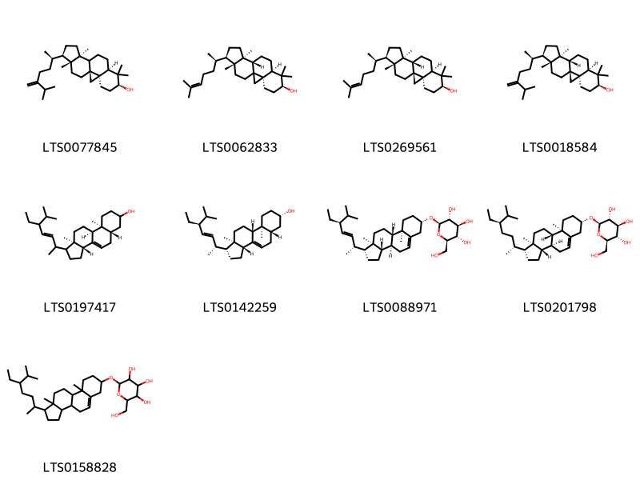{ width=100% }
    <figcaption>Hình ảnh cấu trúc hóa học của 9 hoạt chất thuộc nhóm Steroids and steroid derivatives gồm ['24-methylene-cycloartanol (LTS0077845)', '(3r,6s,8r,11s,12s,15r,16r)-7,7,12,16-tetramethyl-15-[(2r)-6-methylhept-5-en-2-yl]pentacyclo[9.7.0.0¹,³.0³,⁸.0¹²,¹⁶]octadecan-6-ol (LTS0062833)', 'cycloartenol (LTS0269561)', '24-methylenecycloartanol (LTS0018584)', '(3ar,5as,9as,9bs,11ar)-1-(5-ethyl-6-methylhept-3-en-2-yl)-9a,11a-dimethyl-1h,2h,3h,3ah,5h,5ah,6h,7h,8h,9h,9bh,10h,11h-cyclopenta[a]phenanthren-7-ol (LTS0197417)', 'chondrillasterol (LTS0142259)', '(2r,3r,4s,5s,6r)-2-{[(1r,3as,3bs,7s,9ar,9bs,11ar)-1-[(2r,3e,5s)-5-ethyl-6-methylhept-3-en-2-yl]-9a,11a-dimethyl-1h,2h,3h,3ah,3bh,4h,6h,7h,8h,9h,9bh,10h,11h-cyclopenta[a]phenanthren-7-yl]oxy}-6-(hydroxymethyl)oxane-3,4,5-triol (LTS0088971)', 'sitogluside (LTS0201798)', '2-{[1-(5-ethyl-6-methylheptan-2-yl)-9a,11a-dimethyl-1h,2h,3h,3ah,3bh,4h,6h,7h,8h,9h,9bh,10h,11h-cyclopenta[a]phenanthren-7-yl]oxy}-6-(hydroxymethyl)oxane-3,4,5-triol (LTS0158828)'].</figcaption>
</figure>
#### Nhóm Tannins
<figure markdown="span">
    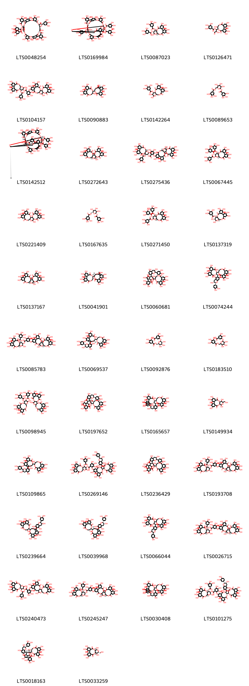{ width=100% }
    <figcaption>Hình ảnh cấu trúc hóa học của 42 hoạt chất thuộc nhóm Tannins gồm ['11-formyl-4,5,6,18,19,20,28,29,30,45,46,47,50,51,57,58,62-heptadecahydroxy-9,15,33,42,54,59-hexaoxo-36,37-bis(3,4,5-trihydroxybenzoyloxy)-2,10,14,26,34,41,55,56,60-nonaoxadecacyclo[36.13.4.4¹³,²³.2²²,²⁵.1³⁵,³⁹.0³,⁸.0¹⁶,²¹.0²⁷,³².0⁴³,⁴⁸.0⁴⁹,⁵³]dohexaconta-1(52),3,5,7,16(21),17,19,22,24,27,29,31,43(48),44,46,49(53),50,57-octadecaen-12-yl 3,4,5-trihydroxybenzoate (LTS0048254)', '4,5,6,12,20,21,22,30,31,32,47,48,49,52,53,59,60-heptadecahydroxy-9,17,35,44,56,61-hexaoxo-38,64-bis(3,4,5-trihydroxybenzoyloxy)-2,10,13,16,28,36,43,57,58,62-decaoxaundecacyclo[38.13.4.3¹⁴,²⁵.2²⁴,²⁷.1¹¹,¹⁵.1³⁷,⁴¹.0³,⁸.0¹⁸,²³.0²⁹,³⁴.0⁴⁵,⁵⁰.0⁵¹,⁵⁵]tetrahexaconta-1(54),3,5,7,18(23),19,21,24,26,29,31,33,45(50),46,48,51(55),52,59-octadecaen-39-yl 3,4,5-trihydroxybenzoate (LTS0169984)', '(10r,11s,12r,15r)-3,4,5,13,21,22,23-heptahydroxy-8,18-dioxo-11-(3,4,5-trihydroxybenzoyloxy)-9,14,17-trioxatetracyclo[17.4.0.0²,⁷.0¹⁰,¹⁵]tricosa-1(23),2(7),3,5,19,21-hexaen-12-yl 3,4,5-trihydroxybenzoate (LTS0087023)', '1-{3,4,5,11,17,18,19-heptahydroxy-8,14-dioxo-9,13-dioxatricyclo[13.4.0.0²,⁷]nonadeca-1(15),2,4,6,16,18-hexaen-10-yl}-2-hydroxy-3-oxopropyl 3,4,5-trihydroxybenzoate (LTS0126471)', '3,4,5,13,21,22,23-heptahydroxy-8,18-dioxo-11-(3,4,5-trihydroxybenzoyloxy)-9,14,17-trioxatetracyclo[17.4.0.0²,⁷.0¹⁰,¹⁵]tricosa-1(23),2(7),3,5,19,21-hexaen-12-yl 2-({7,8,9,12,13,14,20,29,30,33,34,35-dodecahydroxy-4,17,25,38-tetraoxo-3,18,21,24,39-pentaoxaheptacyclo[20.17.0.0²,¹⁹.0⁵,¹⁰.0¹¹,¹⁶.0²⁶,³¹.0³²,³⁷]nonatriaconta-5(10),6,8,11,13,15,26(31),27,29,32(37),33,35-dodecaen-28-yl}oxy)-3,4,5-trihydroxybenzoate (LTS0104157)', '14-{3,4,5,11,17,18,19-heptahydroxy-8,14-dioxo-9,13-dioxatricyclo[13.4.0.0²,⁷]nonadeca-1(15),2,4,6,16,18-hexaen-10-yl}-2,3,4,7,8,9,19-heptahydroxy-13,16-dioxatetracyclo[13.3.1.0⁵,¹⁸.0⁶,¹¹]nonadeca-1(18),2,4,6,8,10-hexaene-12,17-dione (LTS0090883)', '3,4,5,12,13,21,22,23-octahydroxy-8,18-dioxo-9,14,17-trioxatetracyclo[17.4.0.0²,⁷.0¹⁰,¹⁵]tricosa-1(23),2(7),3,5,19,21-hexaen-11-yl 3,4,5-trihydroxybenzoate (LTS0142264)', '3,4,5-trihydroxy-6-[(3,4,5-trihydroxybenzoyloxy)methyl]oxan-2-yl 3,4,5-trihydroxybenzoate (LTS0089653)', '(11r,12r,14r,15r,37s,38r,39s,40r,41r,64s)-4,5,6,12,20,21,22,30,31,32,47,48,49,52,53,59,60-heptadecahydroxy-9,17,35,44,56,61-hexaoxo-39,64-bis(3,4,5-trihydroxybenzoyloxy)-2,10,13,16,28,36,43,57,58,62-decaoxaundecacyclo[38.13.4.3¹⁴,²⁵.2²⁴,²⁷.1¹¹,¹⁵.1³⁷,⁴¹.0³,⁸.0¹⁸,²³.0²⁹,³⁴.0⁴⁵,⁵⁰.0⁵¹,⁵⁵]tetrahexaconta-1(54),3,5,7,18(23),19,21,24,26,29,31,33,45(50),46,48,51(55),52,59-octadecaen-38-yl 3,4,5-trihydroxybenzoate (LTS0142512)', '(1r,2s,19r,20s,22r)-7,8,9,12,13,14,20,28,29,30,33,34,35-tridecahydroxy-3,18,21,24,39-pentaoxaheptacyclo[20.17.0.0²,¹⁹.0⁵,¹⁰.0¹¹,¹⁶.0²⁶,³¹.0³²,³⁷]nonatriaconta-5(10),6,8,11,13,15,26(31),27,29,32,34,36-dodecaene-4,17,25,38-tetrone (LTS0272643)', '(10r,11s,12r,13r,15r)-3,4,5,13,21,22,23-heptahydroxy-8,18-dioxo-11-(3,4,5-trihydroxybenzoyloxy)-9,14,17-trioxatetracyclo[17.4.0.0²,⁷.0¹⁰,¹⁵]tricosa-1(23),2(7),3,5,19,21-hexaen-12-yl 2-{[(1r,2s,19r,20r,22r)-7,8,9,12,13,14,20,29,30,33,34,35-dodecahydroxy-4,17,25,38-tetraoxo-3,18,21,24,39-pentaoxaheptacyclo[20.17.0.0²,¹⁹.0⁵,¹⁰.0¹¹,¹⁶.0²⁶,³¹.0³²,³⁷]nonatriaconta-5,7,9,11(16),12,14,26(31),27,29,32(37),33,35-dodecaen-28-yl]oxy}-3,4,5-trihydroxybenzoate (LTS0275436)', '(10r,11s,12r,13s,15r)-3,4,5,21,22,23-hexahydroxy-8,18-dioxo-12,13-bis(3,4,5-trihydroxybenzoyloxy)-9,14,17-trioxatetracyclo[17.4.0.0²,⁷.0¹⁰,¹⁵]tricosa-1(23),2(7),3,5,19,21-hexaen-11-yl 3,4,5-trihydroxybenzoate (LTS0067445)', '7,8,9,12,13,14,20,28,29,30,33,34,35-tridecahydroxy-3,18,21,24,39-pentaoxaheptacyclo[20.17.0.0²,¹⁹.0⁵,¹⁰.0¹¹,¹⁶.0²⁶,³¹.0³²,³⁷]nonatriaconta-5(10),6,8,11,13,15,26(31),27,29,32,34,36-dodecaene-4,17,25,38-tetrone (LTS0221409)', '(2s,3r,4s,5s,6r)-3,4,5-trihydroxy-6-[(3,4,5-trihydroxybenzoyloxy)methyl]oxan-2-yl 3,4,5-trihydroxybenzoate (LTS0167635)', '(10r,11s,12r,15r)-3,4,5,21,22,23-hexahydroxy-8,18-dioxo-12,13-bis(3,4,5-trihydroxybenzoyloxy)-9,14,17-trioxatetracyclo[17.4.0.0²,⁷.0¹⁰,¹⁵]tricosa-1(23),2(7),3,5,19,21-hexaen-11-yl 3,4,5-trihydroxybenzoate (LTS0271450)', '(10r,11r,12r,13s,15r)-3,4,5,12,13,21,22,23-octahydroxy-8,18-dioxo-9,14,17-trioxatetracyclo[17.4.0.0²,⁷.0¹⁰,¹⁵]tricosa-1(23),2(7),3,5,19,21-hexaen-11-yl 3,4,5-trihydroxybenzoate (LTS0137319)', '(1r,2s,19r,22r)-7,8,9,12,13,14,20,28,29,30,33,34,35-tridecahydroxy-3,18,21,24,39-pentaoxaheptacyclo[20.17.0.0²,¹⁹.0⁵,¹⁰.0¹¹,¹⁶.0²⁶,³¹.0³²,³⁷]nonatriaconta-5(10),6,8,11,13,15,26(31),27,29,32,34,36-dodecaene-4,17,25,38-tetrone (LTS0137167)', '(14r,15s,19r)-14-[(10r,11r)-3,4,5,11,17,18,19-heptahydroxy-8,14-dioxo-9,13-dioxatricyclo[13.4.0.0²,⁷]nonadeca-1(15),2,4,6,16,18-hexaen-10-yl]-2,3,4,7,8,9,19-heptahydroxy-13,16-dioxatetracyclo[13.3.1.0⁵,¹⁸.0⁶,¹¹]nonadeca-1(18),2,4,6,8,10-hexaene-12,17-dione (LTS0041901)', '9-(3,4-dihydroxyphenyl)-15-{3,4,5,11,17,18,19-heptahydroxy-8,14-dioxo-9,13-dioxatricyclo[13.4.0.0²,⁷]nonadeca-1(15),2,4,6,16,18-hexaen-10-yl}-5,8,20,21,22,25-hexahydroxy-2,10,16,29-tetraoxaheptacyclo[12.12.3.0¹,¹³.0³,¹².0⁶,¹¹.0¹⁸,²³.0²⁴,²⁷]nonacosa-3,5,11,18(23),19,21,24-heptaene-17,26,28-trione (LTS0060681)', '(10r,11r)-10-[(10r,11s)-11-[(s)-[(2r,3r)-2-(3,4-dihydroxyphenyl)-3,5,7-trihydroxy-3,4-dihydro-2h-1-benzopyran-6-yl](hydroxy)methyl]-3,4,5,16,17,18-hexahydroxy-8,13-dioxo-9,12-dioxatricyclo[12.4.0.0²,⁷]octadeca-1(14),2,4,6,15,17-hexaen-10-yl]-3,4,5,11,17,18,19-heptahydroxy-9,13-dioxatricyclo[13.4.0.0²,⁷]nonadeca-1(15),2,4,6,16,18-hexaene-8,14-dione (LTS0074244)', '(10r,11s,12r,13s,15r)-3,4,5,13,21,22,23-heptahydroxy-8,18-dioxo-11-(3,4,5-trihydroxybenzoyloxy)-9,14,17-trioxatetracyclo[17.4.0.0²,⁷.0¹⁰,¹⁵]tricosa-1(23),2(7),3,5,19,21-hexaen-12-yl 5-{[(1r,2s,19r,20r,22r)-7,8,9,12,13,20,28,29,30,33,34,35-dodecahydroxy-4,17,25,38-tetraoxo-3,18,21,24,39-pentaoxaheptacyclo[20.17.0.0²,¹⁹.0⁵,¹⁰.0¹¹,¹⁶.0²⁶,³¹.0³²,³⁷]nonatriaconta-5(10),6,8,11(16),12,14,26,28,30,32(37),33,35-dodecaen-14-yl]oxy}-2,3,4-trihydroxybenzoate (LTS0085783)', '(14r,15s,19r)-19-[(2r,3r)-2-(3,4-dihydroxyphenyl)-3,5,7-trihydroxy-3,4-dihydro-2h-1-benzopyran-8-yl]-14-[(10r,11r)-3,4,5,11,17,18,19-heptahydroxy-8,14-dioxo-9,13-dioxatricyclo[13.4.0.0²,⁷]nonadeca-1(15),2,4,6,16,18-hexaen-10-yl]-2,3,4,7,8,9-hexahydroxy-13,16-dioxatetracyclo[13.3.1.0⁵,¹⁸.0⁶,¹¹]nonadeca-1(18),2,4,6,8,10-hexaene-12,17-dione (LTS0069537)', '3,4-dihydroxy-5-{[(2s,3r,4s,5s,6r)-3,4,5-trihydroxy-6-[(3,4,5-trihydroxybenzoyloxy)methyl]oxan-2-yl]oxy}benzoic acid (LTS0092876)', '3,4-dihydroxy-5-({3,4,5-trihydroxy-6-[(3,4,5-trihydroxybenzoyloxy)methyl]oxan-2-yl}oxy)benzoic acid (LTS0183510)', '3,4,5,13,21,22,23-heptahydroxy-8,18-dioxo-11-(3,4,5-trihydroxybenzoyloxy)-9,14,17-trioxatetracyclo[17.4.0.0²,⁷.0¹⁰,¹⁵]tricosa-1(23),2(7),3,5,19,21-hexaen-12-yl 5-({7,8,9,12,13,20,28,29,30,33,34,35-dodecahydroxy-4,17,25,38-tetraoxo-3,18,21,24,39-pentaoxaheptacyclo[20.17.0.0²,¹⁹.0⁵,¹⁰.0¹¹,¹⁶.0²⁶,³¹.0³²,³⁷]nonatriaconta-5(10),6,8,11(16),12,14,26,28,30,32(37),33,35-dodecaen-14-yl}oxy)-2,3,4-trihydroxybenzoate (LTS0098945)', '(1r,4s,14r,15s,16r,20r,21r)-20-(3,4-dihydroxyphenyl)-14-[(10r,11r)-3,4,5,11,17,18,19-heptahydroxy-8,14-dioxo-9,13-dioxatricyclo[13.4.0.0²,⁷]nonadeca-1(15),2,4,6,16,18-hexaen-10-yl]-4,7,8,9,21,24-hexahydroxy-2,12,29-trioxo-3,13,19,27,30-pentaoxaheptacyclo[13.12.3.0¹,¹⁶.0⁵,²⁸.0⁶,¹¹.0¹⁷,²⁶.0¹⁸,²³]triaconta-5(28),6,8,10,17,23,25-heptaene-4-carboxylic acid (LTS0197652)', '(10r,11r)-10-[(10r,11s)-11-[(s)-[(2r,3r)-2-(3,4-dihydroxyphenyl)-3,5,7-trihydroxy-3,4-dihydro-2h-1-benzopyran-8-yl](hydroxy)methyl]-3,4,5,16,17,18-hexahydroxy-8,13-dioxo-9,12-dioxatricyclo[12.4.0.0²,⁷]octadeca-1(14),2,4,6,15,17-hexaen-10-yl]-3,4,5,11,17,18,19-heptahydroxy-9,13-dioxatricyclo[13.4.0.0²,⁷]nonadeca-1(15),2,4,6,16,18-hexaene-8,14-dione (LTS0165657)', '3,4,5,11,14,20,21,22-octahydroxy-13-(hydroxymethyl)-9,12,16-trioxatetracyclo[16.4.0.0²,⁷.0¹⁰,¹⁵]docosa-1(22),2(7),3,5,18,20-hexaene-8,17-dione (LTS0149934)', '19-[2-(3,4-dihydroxyphenyl)-3,5,7-trihydroxy-3,4-dihydro-2h-1-benzopyran-8-yl]-14-{3,4,5,11,17,18,19-heptahydroxy-8,14-dioxo-9,13-dioxatricyclo[13.4.0.0²,⁷]nonadeca-1(15),2,4,6,16,18-hexaen-10-yl}-2,3,4,7,8,9-hexahydroxy-13,16-dioxatetracyclo[13.3.1.0⁵,¹⁸.0⁶,¹¹]nonadeca-1(18),2,4,6,8,10-hexaene-12,17-dione (LTS0109865)', '3,4,5,13,21,22,23-heptahydroxy-8,18-dioxo-11-(3,4,5-trihydroxybenzoyloxy)-9,14,17-trioxatetracyclo[17.4.0.0²,⁷.0¹⁰,¹⁵]tricosa-1(23),2(7),3,5,19,21-hexaen-12-yl 2-[(10-{[2-(3,4-dihydroxyphenyl)-3,5,7-trihydroxy-3,4-dihydro-2h-1-benzopyran-6-yl](hydroxy)methyl}-11-{3,4,5,11,17,18,19-heptahydroxy-8,14-dioxo-9,13-dioxatricyclo[13.4.0.0²,⁷]nonadeca-1(15),2,4,6,16,18-hexaen-10-yl}-3,4,16,17,18-pentahydroxy-8,13-dioxo-9,12-dioxatricyclo[12.4.0.0²,⁷]octadeca-1(14),2(7),3,5,15,17-hexaen-5-yl)oxy]-3,4,5-trihydroxybenzoate (LTS0269146)', '20-(3,4-dihydroxyphenyl)-14-{3,4,5,11,17,18,19-heptahydroxy-8,14-dioxo-9,13-dioxatricyclo[13.4.0.0²,⁷]nonadeca-1(15),2,4,6,16,18-hexaen-10-yl}-4,7,8,9,21,24-hexahydroxy-2,12,29-trioxo-3,13,19,27,30-pentaoxaheptacyclo[13.12.3.0¹,¹⁶.0⁵,²⁸.0⁶,¹¹.0¹⁷,²⁶.0¹⁸,²³]triaconta-5(28),6,8,10,17,23,25-heptaene-4-carboxylic acid (LTS0236429)', '(10r,11s,12r,13r,15r)-3,4,5,13,21,22,23-heptahydroxy-8,18-dioxo-11-(3,4,5-trihydroxybenzoyloxy)-9,14,17-trioxatetracyclo[17.4.0.0²,⁷.0¹⁰,¹⁵]tricosa-1(23),2(7),3,5,19,21-hexaen-12-yl 5-{[(1r,2s,19r,20s,22r)-7,8,9,12,13,20,28,29,30,33,34,35-dodecahydroxy-4,17,25,38-tetraoxo-3,18,21,24,39-pentaoxaheptacyclo[20.17.0.0²,¹⁹.0⁵,¹⁰.0¹¹,¹⁶.0²⁶,³¹.0³²,³⁷]nonatriaconta-5(10),6,8,11(16),12,14,26,28,30,32(37),33,35-dodecaen-14-yl]oxy}-2,3,4-trihydroxybenzoate (LTS0193708)', '19-[2-(3,4-dihydroxyphenyl)-3,5,7-trihydroxy-3,4-dihydro-2h-1-benzopyran-6-yl]-14-{3,4,5,11,17,18,19-heptahydroxy-8,14-dioxo-9,13-dioxatricyclo[13.4.0.0²,⁷]nonadeca-1(15),2,4,6,16,18-hexaen-10-yl}-2,3,4,7,8,9-hexahydroxy-13,16-dioxatetracyclo[13.3.1.0⁵,¹⁸.0⁶,¹¹]nonadeca-1(18),2,4,6,8,10-hexaene-12,17-dione (LTS0239664)', '(14r,15s,19r)-19-[(2r,3r)-2-(3,4-dihydroxyphenyl)-3,5,7-trihydroxy-3,4-dihydro-2h-1-benzopyran-6-yl]-14-[(10r,11r)-3,4,5,11,17,18,19-heptahydroxy-8,14-dioxo-9,13-dioxatricyclo[13.4.0.0²,⁷]nonadeca-1(15),2,4,6,16,18-hexaen-10-yl]-2,3,4,7,8,9-hexahydroxy-13,16-dioxatetracyclo[13.3.1.0⁵,¹⁸.0⁶,¹¹]nonadeca-1(18),2,4,6,8,10-hexaene-12,17-dione (LTS0039968)', '10-(11-{[2-(3,4-dihydroxyphenyl)-3,5,7-trihydroxy-3,4-dihydro-2h-1-benzopyran-6-yl](hydroxy)methyl}-3,4,5,16,17,18-hexahydroxy-8,13-dioxo-9,12-dioxatricyclo[12.4.0.0²,⁷]octadeca-1(14),2,4,6,15,17-hexaen-10-yl)-3,4,5,11,17,18,19-heptahydroxy-9,13-dioxatricyclo[13.4.0.0²,⁷]nonadeca-1(15),2,4,6,16,18-hexaene-8,14-dione (LTS0066044)', '(10r,11s,12r,13s,15r)-3,4,5,13,21,22,23-heptahydroxy-8,18-dioxo-11-(3,4,5-trihydroxybenzoyloxy)-9,14,17-trioxatetracyclo[17.4.0.0²,⁷.0¹⁰,¹⁵]tricosa-1(23),2(7),3,5,19,21-hexaen-12-yl 5-{[(1r,2s,19r,20s,22r)-7,8,9,12,13,20,28,29,30,33,34,35-dodecahydroxy-4,17,25,38-tetraoxo-3,18,21,24,39-pentaoxaheptacyclo[20.17.0.0²,¹⁹.0⁵,¹⁰.0¹¹,¹⁶.0²⁶,³¹.0³²,³⁷]nonatriaconta-5(10),6,8,11(16),12,14,26,28,30,32(37),33,35-dodecaen-14-yl]oxy}-2,3,4-trihydroxybenzoate (LTS0026715)', '3,4,5,13,21,22,23-heptahydroxy-8,18-dioxo-11-(3,4,5-trihydroxybenzoyloxy)-9,14,17-trioxatetracyclo[17.4.0.0²,⁷.0¹⁰,¹⁵]tricosa-1(23),2(7),3,5,19,21-hexaen-12-yl 2-({7,8,9,12,13,20,28,29,30,33,34,35-dodecahydroxy-4,17,25,38-tetraoxo-3,21,24,39-tetraoxaheptacyclo[20.17.0.0²,¹⁹.0⁵,¹⁰.0¹¹,¹⁶.0²⁶,³¹.0³²,³⁷]nonatriaconta-5(10),6,8,11(16),12,14,26,28,30,32(37),33,35-dodecaen-14-yl}oxy)-3,4,5-trihydroxybenzoate (LTS0240473)', '(10r,11s,12r,13r,15r)-3,4,5,13,21,22,23-heptahydroxy-8,18-dioxo-11-(3,4,5-trihydroxybenzoyloxy)-9,14,17-trioxatetracyclo[17.4.0.0²,⁷.0¹⁰,¹⁵]tricosa-1(23),2(7),3,5,19,21-hexaen-12-yl 5-{[(1r,2s,19r,20r,22r)-7,8,9,12,13,20,28,29,30,33,34,35-dodecahydroxy-4,17,25,38-tetraoxo-3,18,21,24,39-pentaoxaheptacyclo[20.17.0.0²,¹⁹.0⁵,¹⁰.0¹¹,¹⁶.0²⁶,³¹.0³²,³⁷]nonatriaconta-5(10),6,8,11(16),12,14,26,28,30,32(37),33,35-dodecaen-14-yl]oxy}-2,3,4-trihydroxybenzoate (LTS0245247)', '10-(11-{[2-(3,4-dihydroxyphenyl)-3,5,7-trihydroxy-3,4-dihydro-2h-1-benzopyran-8-yl](hydroxy)methyl}-3,4,5,16,17,18-hexahydroxy-8,13-dioxo-9,12-dioxatricyclo[12.4.0.0²,⁷]octadeca-1(14),2,4,6,15,17-hexaen-10-yl)-3,4,5,11,17,18,19-heptahydroxy-9,13-dioxatricyclo[13.4.0.0²,⁷]nonadeca-1(15),2,4,6,16,18-hexaene-8,14-dione (LTS0030408)', '(10r,11s,12r,13r,15r)-3,4,5,13,21,22,23-heptahydroxy-8,18-dioxo-11-(3,4,5-trihydroxybenzoyloxy)-9,14,17-trioxatetracyclo[17.4.0.0²,⁷.0¹⁰,¹⁵]tricosa-1(23),2(7),3,5,19,21-hexaen-12-yl 2-{[(10s,11r)-10-[(s)-[(2r,3r)-2-(3,4-dihydroxyphenyl)-3,5,7-trihydroxy-3,4-dihydro-2h-1-benzopyran-6-yl](hydroxy)methyl]-11-[(10r,11r)-3,4,5,11,17,18,19-heptahydroxy-8,14-dioxo-9,13-dioxatricyclo[13.4.0.0²,⁷]nonadeca-1(15),2,4,6,16,18-hexaen-10-yl]-3,4,16,17,18-pentahydroxy-8,13-dioxo-9,12-dioxatricyclo[12.4.0.0²,⁷]octadeca-1(14),2(7),3,5,15,17-hexaen-5-yl]oxy}-3,4,5-trihydroxybenzoate (LTS0101275)', '(1r,8r,9r,13s,14s,15r,27s)-9-(3,4-dihydroxyphenyl)-15-[(10r,11r)-3,4,5,11,17,18,19-heptahydroxy-8,14-dioxo-9,13-dioxatricyclo[13.4.0.0²,⁷]nonadeca-1(15),2,4,6,16,18-hexaen-10-yl]-5,8,20,21,22,25-hexahydroxy-2,10,16,29-tetraoxaheptacyclo[12.12.3.0¹,¹³.0³,¹².0⁶,¹¹.0¹⁸,²³.0²⁴,²⁷]nonacosa-3,5,11,18(23),19,21,24-heptaene-17,26,28-trione (LTS0018163)', '(10r,11r,13r,14r,15s)-3,4,5,11,14,20,21,22-octahydroxy-13-(hydroxymethyl)-9,12,16-trioxatetracyclo[16.4.0.0²,⁷.0¹⁰,¹⁵]docosa-1(18),2,4,6,19,21-hexaene-8,17-dione (LTS0033259)'].</figcaption>
</figure>

---

### Dược dân tộc học

Danh sách các quốc gia có sử dụng *Camellia japonica* trong điều trị các bệnh. 

| Country   | Disease     | Bệnh                                                                                                                                                                                                |
|:----------|:------------|:----------------------------------------------------------------------------------------------------------------------------------------------------------------------------------------------------|
| Elsewhere | Cardiotonic | MYMEMORY WARNING: YOU USED ALL AVAILABLE FREE TRANSLATIONS FOR TODAY. NEXT AVAILABLE IN  06 HOURS 14 MINUTES 32 SECONDS VISIT HTTPS://MYMEMORY.TRANSLATED.NET/DOC/USAGELIMITS.PHP TO TRANSLATE MORE |

---

---
## Camellia kissi
### Thông tin về thực vật

!!! info "Phân loại thực vật của *Camellia kissii* từ GIBF:"
    - **Kingdom:** Plantae
    - **Phylum:** Tracheophyta
    - **Order:** Ericales
    - **Family:** Theaceae
    - **Genus:** Camellia
    - **Species:** *Camellia kissii*

 

| Label (VI)   | Label (EN)   | Scientific Name   | Descriptions (VI)   | Descriptions (EN)   | Also Known As (VI)                   | Also Known As (EN)   |
|:-------------|:-------------|:------------------|:--------------------|:--------------------|:-------------------------------------|:---------------------|
| N/A          | N/A          | Camellia kissi    | loài thực vật       | species of plant    | ['Camellia kissii', 'trà nhụy ngắn'] | ['']                 |

#### Phân bố trên thế giới

**Từ CSDL GIBF** nan, Hong Kong, Japan, Thailand, Lao People’s Democratic Republic, Chinese Taipei, Myanmar, New Zealand, Bhutan, unknown or invalid, India, United States of America, Viet Nam, China, Nepal

#### Phân bố tại Việt Nam

**Từ CSDL GIBF**: Không có ghi nhận ở Việt Nam

---
### Thành phần hóa học
        
- Theo cơ sở dữ liệu lotus: Từ loài *Camellia kissii* đã phân lập và xác định được 2 hoạt chất thuộc về các nhóm Purine nucleosides. 

|    | chemicalTaxonomyClassyfireClass   |   smiles_count |
|---:|:----------------------------------|---------------:|
|  0 | Purine nucleosides                |              2 |

#### Nhóm Purine nucleosides
<figure markdown="span">
    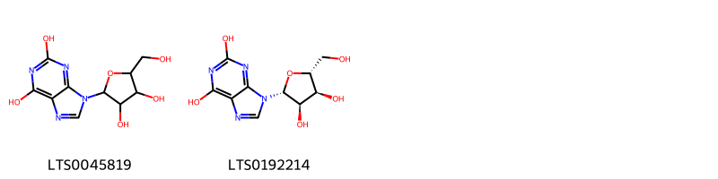{ width=100% }
    <figcaption>Hình ảnh cấu trúc hóa học của 2 hoạt chất thuộc nhóm Purine nucleosides gồm ['9-[3,4-dihydroxy-5-(hydroxymethyl)oxolan-2-yl]purine-2,6-diol (LTS0045819)', 'xanthosine (LTS0192214)'].</figcaption>
</figure>

---

### Dược dân tộc học

Danh sách các quốc gia có sử dụng *Camellia kissii* trong điều trị các bệnh. 

| Country         | Disease   | Bệnh                                                                                                                                                                                                |
|:----------------|:----------|:----------------------------------------------------------------------------------------------------------------------------------------------------------------------------------------------------|
| Vietnam(Tonkin) | Piscicide | MYMEMORY WARNING: YOU USED ALL AVAILABLE FREE TRANSLATIONS FOR TODAY. NEXT AVAILABLE IN  06 HOURS 13 MINUTES 41 SECONDS VISIT HTTPS://MYMEMORY.TRANSLATED.NET/DOC/USAGELIMITS.PHP TO TRANSLATE MORE |

---

---
## Camellia sasanqua
### Thông tin về thực vật

!!! info "Phân loại thực vật của *Camellia sasanqua* từ GIBF:"
    - **Kingdom:** Plantae
    - **Phylum:** Tracheophyta
    - **Order:** Ericales
    - **Family:** Theaceae
    - **Genus:** Camellia
    - **Species:** *Camellia sasanqua*

 

| Label (VI)   | Label (EN)   | Scientific Name   | Descriptions (VI)   | Descriptions (EN)   | Also Known As (VI)    | Also Known As (EN)    |
|:-------------|:-------------|:------------------|:--------------------|:--------------------|:----------------------|:----------------------|
| N/A          | N/A          | Camellia sasanqua | loài thực vật       | species of plant    | ['Camellia sasanqua'] | ['sasanqua camellia'] |

#### Phân bố trên thế giới

**Từ CSDL GIBF** nan, South Africa, Australia, Japan, Belgium, Korea, Republic of, Chinese Taipei, Brazil, Portugal, Russian Federation, United States of America, China, France, New Zealand

#### Phân bố tại Việt Nam

**Từ CSDL GIBF**: Không có ghi nhận ở Việt Nam

---
### Thành phần hóa học
        
- Theo cơ sở dữ liệu lotus: Từ loài *Camellia sasanqua* đã phân lập và xác định được 81 hoạt chất thuộc về các nhóm Prenol lipids, Steroids and steroid derivatives, Benzene and substituted derivatives, Dihydrofurans, Organooxygen compounds, Tannins, Phenols, Carboxylic acids and derivatives, Imidazopyrimidines. 

|    | chemicalTaxonomyClassyfireClass     |   smiles_count |
|---:|:------------------------------------|---------------:|
|  0 | Benzene and substituted derivatives |              1 |
|  1 | Carboxylic acids and derivatives    |              1 |
|  2 | Dihydrofurans                       |              1 |
|  3 | Imidazopyrimidines                  |              2 |
|  4 | Organooxygen compounds              |              4 |
|  5 | Phenols                             |              1 |
|  6 | Prenol lipids                       |             60 |
|  7 | Steroids and steroid derivatives    |              4 |
|  8 | Tannins                             |              5 |

#### Nhóm Benzene and substituted derivatives
<figure markdown="span">
    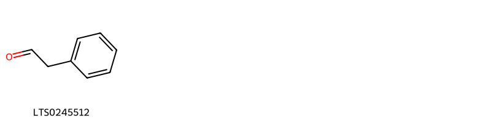{ width=100% }
    <figcaption>Hình ảnh cấu trúc hóa học của 1 hoạt chất thuộc nhóm Benzene and substituted derivatives gồm ['phenylacetaldehyde (LTS0245512)'].</figcaption>
</figure>
#### Nhóm Carboxylic acids and derivatives
<figure markdown="span">
    { width=100% }
    <figcaption>Hình ảnh cấu trúc hóa học của 1 hoạt chất thuộc nhóm Carboxylic acids and derivatives gồm ['(2s)-2-amino-4-(ethyl-c-hydroxycarbonimidoyl)butanoic acid (LTS0217506)'].</figcaption>
</figure>
#### Nhóm Dihydrofurans
<figure markdown="span">
    { width=100% }
    <figcaption>Hình ảnh cấu trúc hóa học của 1 hoạt chất thuộc nhóm Dihydrofurans gồm ['vitamin c (LTS0022555)'].</figcaption>
</figure>
#### Nhóm Imidazopyrimidines
<figure markdown="span">
    { width=100% }
    <figcaption>Hình ảnh cấu trúc hóa học của 2 hoạt chất thuộc nhóm Imidazopyrimidines gồm ['caffeine (LTS0075508)', 'thesal (LTS0250246)'].</figcaption>
</figure>
#### Nhóm Organooxygen compounds
<figure markdown="span">
    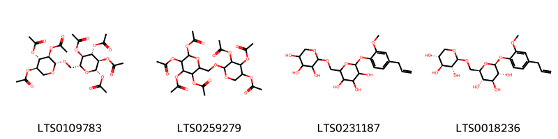{ width=100% }
    <figcaption>Hình ảnh cấu trúc hóa học của 4 hoạt chất thuộc nhóm Organooxygen compounds gồm ['(2r,3r,4s,5r,6s)-4,5,6-tris(acetyloxy)-2-({[(2r,3r,4s,5r)-3,4,5-tris(acetyloxy)oxan-2-yl]oxy}methyl)oxan-3-yl acetate (LTS0109783)', '4,5-bis(acetyloxy)-2-{[3,4,5,6-tetrakis(acetyloxy)oxan-2-yl]methoxy}oxan-3-yl acetate (LTS0259279)', '2-[2-methoxy-4-(prop-2-en-1-yl)phenoxy]-6-{[(3,4,5-trihydroxyoxan-2-yl)oxy]methyl}oxane-3,4,5-triol (LTS0231187)', '(2s,3r,4s,5s,6r)-2-[2-methoxy-4-(prop-2-en-1-yl)phenoxy]-6-({[(2s,3r,4s,5r)-3,4,5-trihydroxyoxan-2-yl]oxy}methyl)oxane-3,4,5-triol (LTS0018236)'].</figcaption>
</figure>
#### Nhóm Phenols
<figure markdown="span">
    { width=100% }
    <figcaption>Hình ảnh cấu trúc hóa học của 1 hoạt chất thuộc nhóm Phenols gồm ['eugenol (LTS0052342)'].</figcaption>
</figure>
#### Nhóm Prenol lipids
<figure markdown="span">
    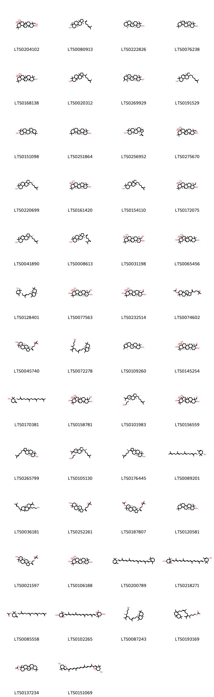{ width=100% }
    <figcaption>Hình ảnh cấu trúc hóa học của 60 hoạt chất thuộc nhóm Prenol lipids gồm ['4,8a-bis(hydroxymethyl)-4,6a,6b,11,11,14b-hexamethyl-1,2,3,4a,5,6,7,8,9,10,12,12a,14,14a-tetradecahydropicene-3,8,9-triol (LTS0204102)', 'dammaradienol (LTS0080913)', 'amyrin (LTS0222826)', 'alnulin (LTS0076238)', '8a-(hydroxymethyl)-4,4,6a,6b,11,11,14b-heptamethyl-1,2,3,4a,5,6,7,8,9,10,12,12a,14,14a-tetradecahydropicene-3,8,9-triol (LTS0168138)', 'lanster (LTS0020312)', '(4ar,6ar,6br,8as,12ar,12br,14ar,14br)-4,4,6a,6b,8a,11,12,14b-octamethyl-2,3,4a,5,6,7,8,9,12,12a,12b,13,14,14a-tetradecahydro-1h-picen-3-ol (LTS0269929)', '(1r,3ar,7s,9ar,11ar)-3a,6,6,9a,11a-pentamethyl-1-[(2r)-6-methylhept-5-en-2-yl]-1h,2h,3h,5h,5ah,7h,8h,9h,9bh,10h,11h-cyclopenta[a]phenanthren-7-ol (LTS0191529)', 'germanicol (LTS0151098)', 'β-amyrin (LTS0251864)', 'lupeol (LTS0256952)', '3,8,9-trihydroxy-8a-(hydroxymethyl)-4,6a,6b,11,11,14b-hexamethyl-1,2,3,4a,5,6,7,8,9,10,12,12a,14,14a-tetradecahydropicene-4-carbaldehyde (LTS0275670)', 'euphol (LTS0220699)', '(3s,4ar,6ar,6bs,8r,8as,9s,12as,14ar,14br)-8a-(hydroxymethyl)-4,4,6a,6b,11,11,14b-heptamethyl-1,2,3,4a,5,6,7,8,9,10,12,12a,14,14a-tetradecahydropicene-3,8,9-triol (LTS0161420)', '(1r,7s,9as)-3a,6,6,9a,11a-pentamethyl-1-[(2r)-6-methylhept-5-en-2-yl]-1h,2h,3h,4h,5h,5ah,7h,8h,9h,10h,11h-cyclopenta[a]phenanthren-7-ol (LTS0154110)', '(3s,4s,4ar,6ar,6bs,8r,8as,9s,12as,14ar,14br)-3,8,9-trihydroxy-8a-(hydroxymethyl)-4,6a,6b,11,11,14b-hexamethyl-1,2,3,4a,5,6,7,8,9,10,12,12a,14,14a-tetradecahydropicene-4-carbaldehyde (LTS0172075)', '(3as,5ar,7s,9ar,11as)-3a,6,6,9a,11a-pentamethyl-1-[(2r)-6-methylhept-5-en-2-yl]-1h,2h,3h,5h,5ah,7h,8h,9h,9bh,10h,11h-cyclopenta[a]phenanthren-7-ol (LTS0041890)', '(1s,3ar,3br,5ar,7s,9ar,9br,11ar)-3a,3b,6,6,9a-pentamethyl-1-(6-methyl-5-methylidenehept-1-en-2-yl)-dodecahydro-1h-cyclopenta[a]phenanthren-7-ol (LTS0008613)', '(3s,4r,4ar,6ar,6bs,8r,8as,9s,12as,14ar,14br)-4,8a-bis(hydroxymethyl)-4,6a,6b,11,11,14b-hexamethyl-1,2,3,4a,5,6,7,8,9,10,12,12a,14,14a-tetradecahydropicene-3,8,9-triol (LTS0031198)', '4a-(hydroxymethyl)-2,2,6a,6b,9,9,12a-heptamethyl-1,3,4,5,6,7,8,8a,10,11,12,12b,13,14b-tetradecahydropicene-3,4,5,10-tetrol (LTS0065456)', '(1s,5r)-5-[(3e)-6-[(4ar,8ar)-2,4a,7,7-tetramethyl-3,4,5,6,8,8a-hexahydronaphthalen-1-yl]-3-methylhex-3-en-1-yl]-4,6,6-trimethylcyclohex-3-en-1-ol (LTS0128401)', '(3r,4r,4ar,5r,6as,6br,8as,9r,10s,12ar,12br,14bs)-4a,9-bis(hydroxymethyl)-2,2,6a,6b,9,12a-hexamethyl-1,3,4,5,6,7,8,8a,10,11,12,12b,13,14b-tetradecahydropicene-3,4,5,10-tetrol (LTS0077563)', '(3s,4r,4as,6ar,6bs,8r,8ar,9r,10r,12as,14ar,14br)-3,8,9,10-tetrahydroxy-8a-(hydroxymethyl)-4,6a,6b,11,11,14b-hexamethyl-1,2,3,4a,5,6,7,8,9,10,12,12a,14,14a-tetradecahydropicene-4-carbaldehyde (LTS0232514)', '1-[4-(3,3-dimethyloxiran-2-yl)but-1-en-2-yl]-3a,3b,6,6,9a-pentamethyl-dodecahydro-1h-cyclopenta[a]phenanthren-7-yl acetate (LTS0074602)', '(1s,3ar,3br,5ar,7s,9ar,9br,11ar)-1-{4-[(2r)-3,3-dimethyloxiran-2-yl]but-1-en-2-yl}-3a,3b,6,6,9a-pentamethyl-dodecahydro-1h-cyclopenta[a]phenanthren-7-ol (LTS0045740)', '(8e)-11-[(4ar,8ar)-2,4a,7,7-tetramethyl-3,4,5,6,8,8a-hexahydronaphthalen-1-yl]-4,8-dimethyl-5-(propan-2-ylidene)undec-8-en-1-ol (LTS0072278)', '(3s,6ar,6br,8as,12s,14br)-4,4,6a,6b,8a,11,12,14b-octamethyl-2,3,4a,5,6,7,8,9,12,12a,12b,13,14,14a-tetradecahydro-1h-picen-3-ol (LTS0109260)', '(3s,4s,4as,6ar,6bs,8r,8ar,9r,10r,12as,14ar,14br)-3,8,9,10-tetrahydroxy-8a-(hydroxymethyl)-4,6a,6b,11,11,14b-hexamethyl-1,2,3,4a,5,6,7,8,9,10,12,12a,14,14a-tetradecahydropicene-4-carbaldehyde (LTS0145254)', '(1s,3r)-2,2-dimethyl-4-methylidene-3-[(3e,7e,11e)-3,8,12,16-tetramethylheptadeca-3,7,11,15-tetraen-1-yl]cyclohexan-1-ol (LTS0170381)', '4a,9-bis(hydroxymethyl)-2,2,6a,6b,9,12a-hexamethyl-1,3,4,5,6,7,8,8a,10,11,12,12b,13,14b-tetradecahydropicene-3,4,5,10-tetrol (LTS0158781)', '3-[(3s,3as,5as,6s,9as,9br)-3a,5a,9b-trimethyl-3-[(2r)-6-methylhept-5-en-2-yl]-7-(propan-2-ylidene)-octahydro-1h-cyclopenta[a]naphthalen-6-yl]propan-1-ol (LTS0101983)', '3,8,9,10-tetrahydroxy-8a-(hydroxymethyl)-4,6a,6b,11,11,14b-hexamethyl-1,2,3,4a,5,6,7,8,9,10,12,12a,14,14a-tetradecahydropicene-4-carbaldehyde (LTS0156559)', '(3as,3br,5ar,7s,9ar,9br)-3a,3b,6,6,9a-pentamethyl-1-[(2s)-6-methylhept-5-en-2-yl]-2h,3h,4h,5h,5ah,7h,8h,9h,9bh,10h,11h-cyclopenta[a]phenanthren-7-ol (LTS0265799)', '3-[(3s,3as,5as,6s,9as,9br)-3a,5a,9b-trimethyl-3-[(2s)-6-methylhept-5-en-2-yl]-7-(propan-2-ylidene)-octahydro-1h-cyclopenta[a]naphthalen-6-yl]propan-1-ol (LTS0105130)', '(3as,3br,5ar,7s,9ar,9br)-3a,3b,6,6,9a-pentamethyl-1-[(2r)-6-methylhept-5-en-2-yl]-2h,3h,4h,5h,5ah,7h,8h,9h,9bh,10h,11h-cyclopenta[a]phenanthren-7-ol (LTS0176445)', 'camelliol c (LTS0089201)', '3-[4b,7,8a,10a-tetramethyl-7-(4-methylpent-3-en-1-yl)-2-(propan-2-ylidene)-octahydro-1h-phenanthren-1-yl]propan-1-ol (LTS0036181)', '(1s,3br,7s,9ar)-1-[4-(3,3-dimethyloxiran-2-yl)but-1-en-2-yl]-3a,3b,6,6,9a-pentamethyl-dodecahydro-1h-cyclopenta[a]phenanthren-7-ol (LTS0252261)', '(1s,3ar,3br,5ar,7s,9ar,9br,11ar)-1-{4-[(2r)-3,3-dimethyloxiran-2-yl]but-1-en-2-yl}-3a,3b,6,6,9a-pentamethyl-dodecahydro-1h-cyclopenta[a]phenanthren-7-yl acetate (LTS0187807)', 'delta-amyrin (LTS0120581)', '(1s,3ar,3br,5ar,7s,9ar,9br,11ar)-1-{4-[(2s)-3,3-dimethyloxiran-2-yl]but-1-en-2-yl}-3a,3b,6,6,9a-pentamethyl-dodecahydro-1h-cyclopenta[a]phenanthren-7-ol (LTS0021597)', 'theasapogenol b (LTS0106188)', '(+)-α-carotene (LTS0200789)', 'taraxanthin (LTS0218271)', '(1s,3r)-2,2-dimethyl-4-methylidene-3-[(3e,7e,11e)-3,8,12,16-tetramethylheptadeca-3,7,11,15-tetraen-1-yl]cyclohexyl acetate (LTS0085558)', 'violaxanthin (LTS0102265)', '(4s,8e)-11-[(4ar,8ar)-2,4a,7,7-tetramethyl-3,4,5,6,8,8a-hexahydronaphthalen-1-yl]-4,8-dimethyl-5-(propan-2-ylidene)undec-8-en-1-ol (LTS0087243)', '11-(2,4a,7,7-tetramethyl-3,4,5,6,8,8a-hexahydronaphthalen-1-yl)-4,8-dimethyl-5-(propan-2-ylidene)undec-8-en-1-yl acetate (LTS0193169)', 'β-amyrin acetate (LTS0137234)', '(6s,7ar)-2-[(2e,4e,6e,8e,10e,12e,14e)-15-[(6s,7ar)-6-hydroxy-4,4,7a-trimethyl-2,5,6,7-tetrahydro-1-benzofuran-2-yl]-6,11-dimethylhexadeca-2,4,6,8,10,12,14-heptaen-2-yl]-4,4,7a-trimethyl-2,5,6,7-tetrahydro-1-benzofuran-6-ol (LTS0151069)', '4,6,6-trimethyl-5-(3,8,12,16-tetramethylheptadeca-3,7,11,15-tetraen-1-yl)cyclohex-3-en-1-yl acetate (LTS0146371)', 'cryptoxanthin (LTS0132646)', '(4s,8e)-11-[(4ar,8ar)-2,4a,7,7-tetramethyl-3,4,5,6,8,8a-hexahydronaphthalen-1-yl]-4,8-dimethyl-5-(propan-2-ylidene)undec-8-en-1-yl acetate (LTS0091810)', '4,4,6a,6b,8a,11,11,14b-octamethyl-1,2,3,4a,5,6,7,8,9,10,12,12a,14,14a-tetradecahydropicen-3-yl acetate (LTS0153642)', '(1s,5r)-5-[(3e)-6-[(4ar,8ar)-2,4a,7,7-tetramethyl-3,4,5,6,8,8a-hexahydronaphthalen-1-yl]-3-methylhex-3-en-1-yl]-4,6,6-trimethylcyclohex-3-en-1-yl acetate (LTS0131892)', '(1s,5r)-4,6,6-trimethyl-5-[(3e,7e,11e)-3,8,12,16-tetramethylheptadeca-3,7,11,15-tetraen-1-yl]cyclohex-3-en-1-yl acetate (LTS0056744)', '(3e,5e,7e,9z,11e,13e,15z,17e)-3,7,12,16-tetramethyl-18-(2,6,6-trimethylcyclohex-1-en-1-yl)octadeca-3,5,7,9,11,13,15,17-octaen-2-one (LTS0061244)', 'α-carotene (LTS0224243)', '2,2-dimethyl-4-methylidene-3-(3,8,12,16-tetramethylheptadeca-3,7,11,15-tetraen-1-yl)cyclohexyl acetate (LTS0119303)', '5-[6-(2,4a,7,7-tetramethyl-3,4,5,6,8,8a-hexahydronaphthalen-1-yl)-3-methylhex-3-en-1-yl]-4,6,6-trimethylcyclohex-3-en-1-yl acetate (LTS0243119)'].</figcaption>
</figure>
#### Nhóm Steroids and steroid derivatives
<figure markdown="span">
    { width=100% }
    <figcaption>Hình ảnh cấu trúc hóa học của 4 hoạt chất thuộc nhóm Steroids and steroid derivatives gồm ['24-methylene-cycloartanol (LTS0077845)', '(3r,6s,8r,11s,12s,15r,16r)-7,7,12,16-tetramethyl-15-[(2r)-6-methylhept-5-en-2-yl]pentacyclo[9.7.0.0¹,³.0³,⁸.0¹²,¹⁶]octadecan-6-ol (LTS0062833)', 'cycloartenol (LTS0269561)', '24-methylenecycloartanol (LTS0018584)'].</figcaption>
</figure>
#### Nhóm Tannins
<figure markdown="span">
    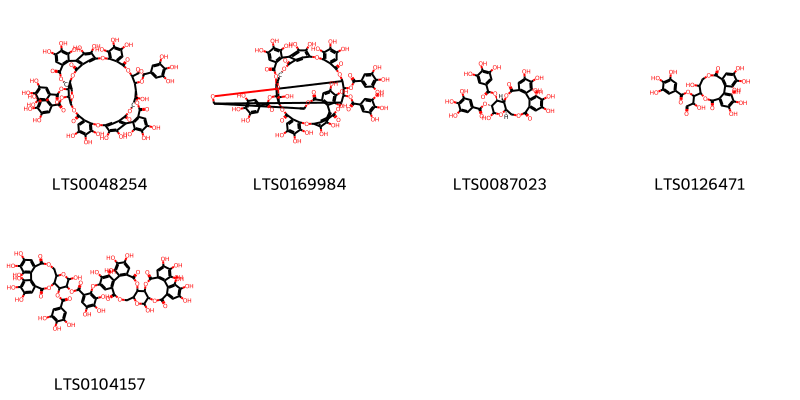{ width=100% }
    <figcaption>Hình ảnh cấu trúc hóa học của 5 hoạt chất thuộc nhóm Tannins gồm ['11-formyl-4,5,6,18,19,20,28,29,30,45,46,47,50,51,57,58,62-heptadecahydroxy-9,15,33,42,54,59-hexaoxo-36,37-bis(3,4,5-trihydroxybenzoyloxy)-2,10,14,26,34,41,55,56,60-nonaoxadecacyclo[36.13.4.4¹³,²³.2²²,²⁵.1³⁵,³⁹.0³,⁸.0¹⁶,²¹.0²⁷,³².0⁴³,⁴⁸.0⁴⁹,⁵³]dohexaconta-1(52),3,5,7,16(21),17,19,22,24,27,29,31,43(48),44,46,49(53),50,57-octadecaen-12-yl 3,4,5-trihydroxybenzoate (LTS0048254)', '4,5,6,12,20,21,22,30,31,32,47,48,49,52,53,59,60-heptadecahydroxy-9,17,35,44,56,61-hexaoxo-38,64-bis(3,4,5-trihydroxybenzoyloxy)-2,10,13,16,28,36,43,57,58,62-decaoxaundecacyclo[38.13.4.3¹⁴,²⁵.2²⁴,²⁷.1¹¹,¹⁵.1³⁷,⁴¹.0³,⁸.0¹⁸,²³.0²⁹,³⁴.0⁴⁵,⁵⁰.0⁵¹,⁵⁵]tetrahexaconta-1(54),3,5,7,18(23),19,21,24,26,29,31,33,45(50),46,48,51(55),52,59-octadecaen-39-yl 3,4,5-trihydroxybenzoate (LTS0169984)', '(10r,11s,12r,15r)-3,4,5,13,21,22,23-heptahydroxy-8,18-dioxo-11-(3,4,5-trihydroxybenzoyloxy)-9,14,17-trioxatetracyclo[17.4.0.0²,⁷.0¹⁰,¹⁵]tricosa-1(23),2(7),3,5,19,21-hexaen-12-yl 3,4,5-trihydroxybenzoate (LTS0087023)', '1-{3,4,5,11,17,18,19-heptahydroxy-8,14-dioxo-9,13-dioxatricyclo[13.4.0.0²,⁷]nonadeca-1(15),2,4,6,16,18-hexaen-10-yl}-2-hydroxy-3-oxopropyl 3,4,5-trihydroxybenzoate (LTS0126471)', '3,4,5,13,21,22,23-heptahydroxy-8,18-dioxo-11-(3,4,5-trihydroxybenzoyloxy)-9,14,17-trioxatetracyclo[17.4.0.0²,⁷.0¹⁰,¹⁵]tricosa-1(23),2(7),3,5,19,21-hexaen-12-yl 2-({7,8,9,12,13,14,20,29,30,33,34,35-dodecahydroxy-4,17,25,38-tetraoxo-3,18,21,24,39-pentaoxaheptacyclo[20.17.0.0²,¹⁹.0⁵,¹⁰.0¹¹,¹⁶.0²⁶,³¹.0³²,³⁷]nonatriaconta-5(10),6,8,11,13,15,26(31),27,29,32(37),33,35-dodecaen-28-yl}oxy)-3,4,5-trihydroxybenzoate (LTS0104157)'].</figcaption>
</figure>

---

### Dược dân tộc học

Danh sách các quốc gia có sử dụng *Camellia sasanqua* trong điều trị các bệnh. 

| Country   | Disease                      | Bệnh                                                                                                                                                                                                |
|:----------|:-----------------------------|:----------------------------------------------------------------------------------------------------------------------------------------------------------------------------------------------------|
| China     | Demulcent, Expectorant, Soap | MYMEMORY WARNING: YOU USED ALL AVAILABLE FREE TRANSLATIONS FOR TODAY. NEXT AVAILABLE IN  06 HOURS 13 MINUTES 06 SECONDS VISIT HTTPS://MYMEMORY.TRANSLATED.NET/DOC/USAGELIMITS.PHP TO TRANSLATE MORE |
| Elsewhere | Vermifuge                    | MYMEMORY WARNING: YOU USED ALL AVAILABLE FREE TRANSLATIONS FOR TODAY. NEXT AVAILABLE IN  06 HOURS 13 MINUTES 03 SECONDS VISIT HTTPS://MYMEMORY.TRANSLATED.NET/DOC/USAGELIMITS.PHP TO TRANSLATE MORE |

---

# Chi Ternstroemia

??? note "Danh sách các dược liệu thuộc chi"
    
	 - *Ternstroemia elliptica*
	 - *Ternstroemia gymnanthera*
	 - *Ternstroemia robinsonii*
	 - *Ternstroemia sylvatica*

# Chi Visnea

??? note "Danh sách các dược liệu thuộc chi"
    
	 - *Visnea mocanera*

