!!! abstract "Tóm tắt"

    Họ Thymelaeaceae gồm khoảng 11 chi và 30 loài được một số cộng đồng tại các quốc gia như Allelsewhere, Brazil, Philippines, Italy(Sardinia), Afghanistan, Hawaii, Mexico, China, Malaya, anish, Borneo, ain, Iran, Elsewhere, Africa, India, Samoa, US, Asia, Sudan, Italian, Africa(Swahili), Arandon, Turkey, Depu pelandok, Sicily, Lesotho sử dụng trong một số trường hợp QUERY LENGTH LIMIT EXCEEDED. MAX ALLOWED QUERY : 500 CHARS.

!!! info "DrDuke"

    James A. Duke sinh năm 1929-2017 là một nhà thực vật học người Mỹ. Đây là một trong những tác giả hàng đầu trong lĩnh vực dược dân tộc học với cuốn *CRC Handbook of Medicinal Herbs* và chính là người xây dựng lên cơ sở dữ liệu về hợp chất tự nhiên và dược dân tộc học tại Bộ nông nghiệp Hoa Kỳ. Các thông tin được đăng tải tại website [Dr. Duke's Phytochemical and Ethnobotanical Databases](https://phytochem.nal.usda.gov/). 
    Trong suốt thập niên 1970, ông lãnh đạo the Plant Taxonomy Laboratory, Plant Genetics and Germplasm Institute of the Agricultural Research Service, U.S. Department of Agriculture.
    Trong tài liệu này, các thông tin về dược dân tộc của các dược liệu được trích dẫn từ tài liệu của James A. Ducke với sự trợ giúp của phần mềm dịch thuật từ tiếng Anh sang tiếng Việt.
   

# Chi Gonystylus

??? note "Danh sách các dược liệu thuộc chi"
    
	 - *Gonystylus bancanus*
	 - *Gonystylus keithii*

---
## Gonystylus bancanus
### Thông tin về thực vật

!!! info "Phân loại thực vật của *Gonystylus bancanus* từ GIBF:"
    - **Kingdom:** Plantae
    - **Phylum:** Tracheophyta
    - **Order:** Malvales
    - **Family:** Thymelaeaceae
    - **Genus:** Gonystylus
    - **Species:** *Gonystylus bancanus*

 

| Label (VI)   | Label (EN)   | Scientific Name     | Descriptions (VI)   | Descriptions (EN)   | Also Known As (VI)   | Also Known As (EN)   |
|:-------------|:-------------|:--------------------|:--------------------|:--------------------|:---------------------|:---------------------|
| N/A          | N/A          | Gonystylus bancanus | loài thực vật       | species of plant    | ['']                 | ['']                 |

#### Phân bố trên thế giới

**Từ CSDL GIBF** nan, unknown or invalid, Brunei Darussalam, Philippines, Malaysia, Indonesia

#### Phân bố tại Việt Nam

**Từ CSDL GIBF**: Không có ghi nhận ở Việt Nam

---
### Thành phần hóa học
        
- Theo cơ sở dữ liệu lotus: Từ loài *Gonystylus bancanus* đã phân lập và xác định được Chưa có hoạt chất nào được phân lập. hoạt chất thuộc về các nhóm Không có hoạt chất nào được phân lập. 

Không có hình ảnh nào được tạo ra

---

### Dược dân tộc học

Danh sách các quốc gia có sử dụng *Gonystylus bancanus* trong điều trị các bệnh. 

| Country     | Disease      | Bệnh               |
|:------------|:-------------|:-------------------|
| Philippines | Parasiticide | Thuốc diệt ký sinh |

---

---
## Gonystylus keithii
### Thông tin về thực vật

!!! info "Phân loại thực vật của *Gonystylus keithii* từ GIBF:"
    - **Kingdom:** Plantae
    - **Phylum:** Tracheophyta
    - **Order:** Malvales
    - **Family:** Thymelaeaceae
    - **Genus:** Gonystylus
    - **Species:** *Gonystylus keithii*

 

| Label (VI)   | Label (EN)   | Scientific Name    | Descriptions (VI)   | Descriptions (EN)   | Also Known As (VI)   | Also Known As (EN)   |
|:-------------|:-------------|:-------------------|:--------------------|:--------------------|:---------------------|:---------------------|
| N/A          | N/A          | Gonystylus keithii | loài thực vật       | species of plant    | ['']                 | ['']                 |

#### Phân bố trên thế giới

**Từ CSDL GIBF** nan, unknown or invalid, Brunei Darussalam, Malaysia, Indonesia

#### Phân bố tại Việt Nam

**Từ CSDL GIBF**: Không có ghi nhận ở Việt Nam

---
### Thành phần hóa học
        
- Theo cơ sở dữ liệu lotus: Từ loài *Gonystylus keithii* đã phân lập và xác định được 3 hoạt chất thuộc về các nhóm Steroids and steroid derivatives, Pyrans. 

|    | chemicalTaxonomyClassyfireClass   |   smiles_count |
|---:|:----------------------------------|---------------:|
|  0 | Pyrans                            |              1 |
|  1 | Steroids and steroid derivatives  |              2 |

#### Nhóm Pyrans
<figure markdown="span">
    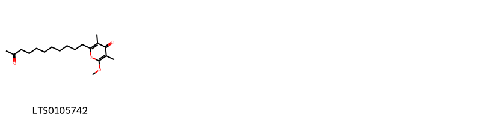{ width=100% }
    <figcaption>Hình ảnh cấu trúc hóa học của 1 hoạt chất thuộc nhóm Pyrans gồm ['2-methoxy-3,5-dimethyl-6-(10-oxoundecyl)pyran-4-one (LTS0105742)'].</figcaption>
</figure>
#### Nhóm Steroids and steroid derivatives
<figure markdown="span">
    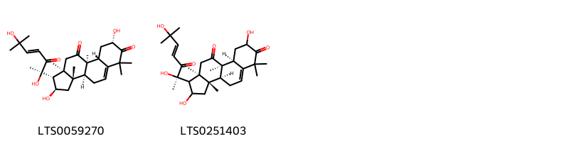{ width=100% }
    <figcaption>Hình ảnh cấu trúc hóa học của 2 hoạt chất thuộc nhóm Steroids and steroid derivatives gồm ['cucurbitacin d (LTS0059270)', '(3as,3bs,9as,9br,11ar)-1-[(2r)-2,6-dihydroxy-6-methyl-3-oxohept-4-en-2-yl]-2,8-dihydroxy-3a,6,6,9b,11a-pentamethyl-1h,2h,3h,3bh,4h,8h,9h,9ah,11h-cyclopenta[a]phenanthrene-7,10-dione (LTS0251403)'].</figcaption>
</figure>

---

### Dược dân tộc học

Danh sách các quốc gia có sử dụng *Gonystylus keithii* trong điều trị các bệnh. 

| Country   | Disease   | Bệnh          |
|:----------|:----------|:--------------|
| Borneo    | Piscicide | Thuốc diệt cá |

---

# Chi Daphne

??? note "Danh sách các dược liệu thuộc chi"
    
	 - *Daphne cneorum*
	 - *Daphne geknwa*
	 - *Daphne genkwa*
	 - *Daphne gnidium*
	 - *Daphne laureola*
	 - *Daphne mezereum*
	 - *Daphne mezreum*
	 - *Daphne odora*
	 - *Daphne oleoides*

---
## Daphne cneorum
### Thông tin về thực vật

!!! info "Phân loại thực vật của *Daphne cneorum* từ GIBF:"
    - **Kingdom:** Plantae
    - **Phylum:** Tracheophyta
    - **Order:** Malvales
    - **Family:** Thymelaeaceae
    - **Genus:** Daphne
    - **Species:** *Daphne cneorum*

 

| Label (VI)   | Label (EN)   | Scientific Name   | Descriptions (VI)   | Descriptions (EN)   | Also Known As (VI)   | Also Known As (EN)   |
|:-------------|:-------------|:------------------|:--------------------|:--------------------|:---------------------|:---------------------|
| N/A          | N/A          | Daphne cneorum    | loài thực vật       | species of plant    | ['']                 | ['']                 |

#### Phân bố trên thế giới

**Từ CSDL GIBF** nan, Serbia, France, Czechia, Hungary, Romania, Germany, Russian Federation, Italy, Austria, Croatia, Slovakia, Ukraine

#### Phân bố tại Việt Nam

**Từ CSDL GIBF**: Không có ghi nhận ở Việt Nam

---
### Thành phần hóa học
        
- Theo cơ sở dữ liệu lotus: Từ loài *Daphne cneorum* đã phân lập và xác định được Chưa có hoạt chất nào được phân lập. hoạt chất thuộc về các nhóm Không có hoạt chất nào được phân lập. 

Không có hình ảnh nào được tạo ra

---

### Dược dân tộc học

Danh sách các quốc gia có sử dụng *Daphne cneorum* trong điều trị các bệnh. 

| Country   | Disease   | Bệnh          |
|:----------|:----------|:--------------|
| ain       | Piscicide | Thuốc diệt cá |

---

---
## Daphne geknwa
### Thông tin về thực vật

!!! info "Phân loại thực vật của *Wikstroemia genkwa* từ GIBF:"
    - **Kingdom:** Plantae
    - **Phylum:** Tracheophyta
    - **Order:** Malvales
    - **Family:** Thymelaeaceae
    - **Genus:** Wikstroemia
    - **Species:** *Wikstroemia genkwa*

 

| Label (VI)   | Label (EN)   | Scientific Name   | Descriptions (VI)   | Descriptions (EN)   | Also Known As (VI)   | Also Known As (EN)   |
|:-------------|:-------------|:------------------|:--------------------|:--------------------|:---------------------|:---------------------|
| N/A          | N/A          | Daphne cneorum    | loài thực vật       | species of plant    | ['']                 | ['']                 |

#### Phân bố trên thế giới

**Từ CSDL GIBF** nan, Viet Nam, Japan, New Zealand, United States of America, China, Korea, Republic of, Chinese Taipei

#### Phân bố tại Việt Nam

**Từ CSDL GIBF**: Tinh Lao Cai

---
### Thành phần hóa học
        
- Theo cơ sở dữ liệu lotus: Từ loài *Wikstroemia genkwa* đã phân lập và xác định được Chưa có hoạt chất nào được phân lập. hoạt chất thuộc về các nhóm Không có hoạt chất nào được phân lập. 

Không có hình ảnh nào được tạo ra

---

### Dược dân tộc học

Danh sách các quốc gia có sử dụng *Wikstroemia genkwa* trong điều trị các bệnh. 

| Country   | Disease   | Bệnh    |
|:----------|:----------|:--------|
| China     | Stomachic | Sững sờ |

---

---
## Daphne genkwa
### Thông tin về thực vật

!!! info "Phân loại thực vật của *Wikstroemia genkwa* từ GIBF:"
    - **Kingdom:** Plantae
    - **Phylum:** Tracheophyta
    - **Order:** Malvales
    - **Family:** Thymelaeaceae
    - **Genus:** Wikstroemia
    - **Species:** *Wikstroemia genkwa*

 

| Label (VI)   | Label (EN)   | Scientific Name   | Descriptions (VI)   | Descriptions (EN)   | Also Known As (VI)   | Also Known As (EN)   |
|:-------------|:-------------|:------------------|:--------------------|:--------------------|:---------------------|:---------------------|
| N/A          | N/A          | Daphne genkwa     | loài thực vật       | species of plant    | ['Daphne genkwa']    | ['']                 |

#### Phân bố trên thế giới

**Từ CSDL GIBF** nan, Viet Nam, Japan, New Zealand, United States of America, China, Korea, Republic of, Chinese Taipei

#### Phân bố tại Việt Nam

**Từ CSDL GIBF**: Tinh Lao Cai

---
### Thành phần hóa học
        
- Theo cơ sở dữ liệu lotus: Từ loài *Wikstroemia genkwa* đã phân lập và xác định được 113 hoạt chất thuộc về các nhóm Organooxygen compounds, Benzopyrans, Flavonoids, Coumarins and derivatives, Macrolides and analogues, 2-arylbenzofuran flavonoids, Prenol lipids, Lignan lactones, Phenol ethers, Benzene and substituted derivatives. 

|    | chemicalTaxonomyClassyfireClass     |   smiles_count |
|---:|:------------------------------------|---------------:|
|  0 | 2-arylbenzofuran flavonoids         |              4 |
|  1 | Benzene and substituted derivatives |              1 |
|  2 | Benzopyrans                         |              3 |
|  3 | Coumarins and derivatives           |              3 |
|  4 | Flavonoids                          |              9 |
|  5 | Lignan lactones                     |              1 |
|  6 | Macrolides and analogues            |              2 |
|  7 | Organooxygen compounds              |              2 |
|  8 | Phenol ethers                       |              1 |
|  9 | Prenol lipids                       |             86 |

#### Nhóm 2-arylbenzofuran flavonoids
<figure markdown="span">
    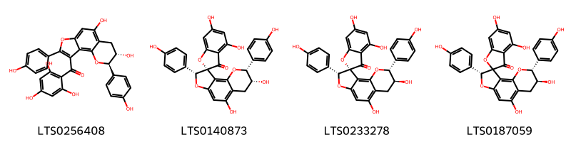{ width=100% }
    <figcaption>Hình ảnh cấu trúc hóa học của 4 hoạt chất thuộc nhóm 2-arylbenzofuran flavonoids gồm ['2-[(11s,12r)-8,11-dihydroxy-4,12-bis(4-hydroxyphenyl)-5,13-dioxatricyclo[7.4.0.0²,⁶]trideca-1,3,6,8-tetraene-3-carbonyl]benzene-1,3,5-triol (LTS0256408)', "(2r,4'r,11'r,12'r)-4,6,8',11'-tetrahydroxy-4',12'-bis(4-hydroxyphenyl)-5',13'-dioxaspiro[1-benzofuran-2,3'-tricyclo[7.4.0.0²,⁶]tridecane]-1'(9'),2'(6'),7'-trien-3-one (LTS0140873)", "(2r,4'r,11's,12'r)-4,6,8',11'-tetrahydroxy-4',12'-bis(4-hydroxyphenyl)-5',13'-dioxaspiro[1-benzofuran-2,3'-tricyclo[7.4.0.0²,⁶]tridecane]-1'(9'),2'(6'),7'-trien-3-one (LTS0233278)", "(4'r,11's,12'r)-4,6,8',11'-tetrahydroxy-4',12'-bis(4-hydroxyphenyl)-5',13'-dioxaspiro[1-benzofuran-2,3'-tricyclo[7.4.0.0²,⁶]tridecane]-1'(9'),2'(6'),7'-trien-3-one (LTS0187059)"].</figcaption>
</figure>
#### Nhóm Benzene and substituted derivatives
<figure markdown="span">
    { width=100% }
    <figcaption>Hình ảnh cấu trúc hóa học của 1 hoạt chất thuộc nhóm Benzene and substituted derivatives gồm ['methyl eugenol (LTS0098881)'].</figcaption>
</figure>
#### Nhóm Benzopyrans
<figure markdown="span">
    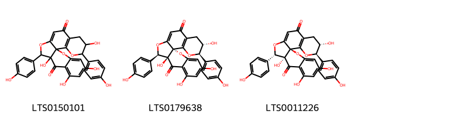{ width=100% }
    <figcaption>Hình ảnh cấu trúc hóa học của 3 hoạt chất thuộc nhóm Benzopyrans gồm ['5,13,16,18-tetrahydroxy-4,12-bis(4-hydroxyphenyl)-3,11,21-trioxapentacyclo[11.8.0.0¹,¹⁰.0²,⁷.0¹⁵,²⁰]henicosa-2(7),9,15,17,19-pentaene-8,14-dione (LTS0150101)', '(1r,4r,5s,12r,13s)-5,13,16,18-tetrahydroxy-4,12-bis(4-hydroxyphenyl)-3,11,21-trioxapentacyclo[11.8.0.0¹,¹⁰.0²,⁷.0¹⁵,²⁰]henicosa-2(7),9,15,17,19-pentaene-8,14-dione (LTS0179638)', '(1s,4r,5s,12s,13r)-5,13,16,18-tetrahydroxy-4,12-bis(4-hydroxyphenyl)-3,11,21-trioxapentacyclo[11.8.0.0¹,¹⁰.0²,⁷.0¹⁵,²⁰]henicosa-2(7),9,15,17,19-pentaene-8,14-dione (LTS0011226)'].</figcaption>
</figure>
#### Nhóm Coumarins and derivatives
<figure markdown="span">
    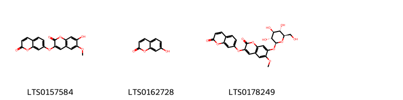{ width=100% }
    <figcaption>Hình ảnh cấu trúc hóa học của 3 hoạt chất thuộc nhóm Coumarins and derivatives gồm ['daphnoretin (LTS0157584)', 'umbelliferone (LTS0162728)', '6-methoxy-3-[(2-oxochromen-7-yl)oxy]-7-{[(2s,3r,4s,5s,6r)-3,4,5-trihydroxy-6-(hydroxymethyl)oxan-2-yl]oxy}chromen-2-one (LTS0178249)'].</figcaption>
</figure>
#### Nhóm Flavonoids
<figure markdown="span">
    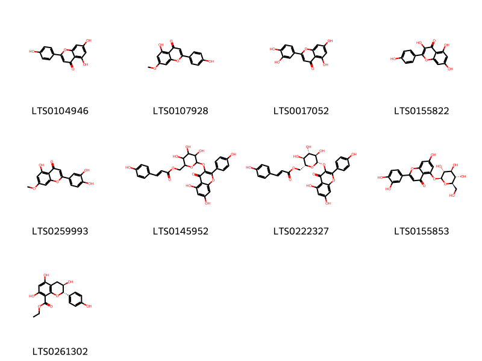{ width=100% }
    <figcaption>Hình ảnh cấu trúc hóa học của 9 hoạt chất thuộc nhóm Flavonoids gồm ['chamomile (LTS0104946)', 'genkwanin (LTS0107928)', 'luteolin (LTS0017052)', 'kaempherol (LTS0155822)', 'luteolin 7-methyl ether (LTS0259993)', '(6-{[5,7-dihydroxy-2-(4-hydroxyphenyl)-4-oxochromen-3-yl]oxy}-3,4,5-trihydroxyoxan-2-yl)methyl 3-(4-hydroxyphenyl)prop-2-enoate (LTS0145952)', 'tiliroside (LTS0222327)', '2-(3,4-dihydroxyphenyl)-7-hydroxy-5-{[(2s,3r,4s,5s,6r)-3,4,5-trihydroxy-6-(hydroxymethyl)oxan-2-yl]oxy}chromen-4-one (LTS0155853)', 'ethyl (2s,3r)-3,5,7-trihydroxy-2-(4-hydroxyphenyl)-3,4-dihydro-2h-1-benzopyran-8-carboxylate (LTS0261302)'].</figcaption>
</figure>
#### Nhóm Lignan lactones
<figure markdown="span">
    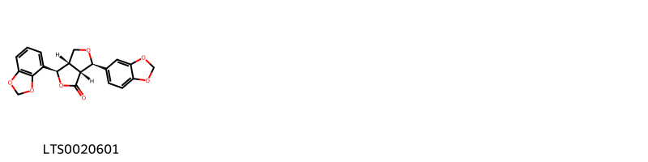{ width=100% }
    <figcaption>Hình ảnh cấu trúc hóa học của 1 hoạt chất thuộc nhóm Lignan lactones gồm ['(3r,3as,6r,6ar)-3-(2h-1,3-benzodioxol-4-yl)-6-(2h-1,3-benzodioxol-5-yl)-tetrahydro-3h-furo[3,4-c]furan-1-one (LTS0020601)'].</figcaption>
</figure>
#### Nhóm Macrolides and analogues
<figure markdown="span">
    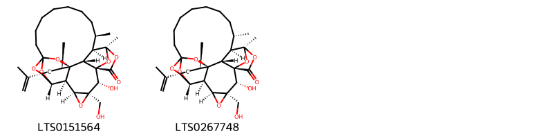{ width=100% }
    <figcaption>Hình ảnh cấu trúc hóa học của 2 hoạt chất thuộc nhóm Macrolides and analogues gồm ['pimelotide c (LTS0151564)', 'pimelotide a (LTS0267748)'].</figcaption>
</figure>
#### Nhóm Organooxygen compounds
<figure markdown="span">
    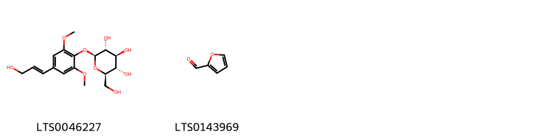{ width=100% }
    <figcaption>Hình ảnh cấu trúc hóa học của 2 hoạt chất thuộc nhóm Organooxygen compounds gồm ['syringin (LTS0046227)', 'bran oil (LTS0143969)'].</figcaption>
</figure>
#### Nhóm Phenol ethers
<figure markdown="span">
    { width=100% }
    <figcaption>Hình ảnh cấu trúc hóa học của 1 hoạt chất thuộc nhóm Phenol ethers gồm ['elemicin (LTS0188875)'].</figcaption>
</figure>
#### Nhóm Prenol lipids
<figure markdown="span">
    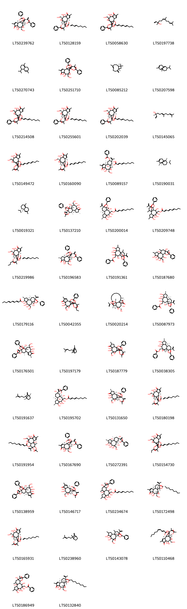{ width=100% }
    <figcaption>Hình ảnh cấu trúc hóa học của 86 hoạt chất thuộc nhóm Prenol lipids gồm ['(1r,2r,6s,7s,8r,10s,11s,12r,14s,16s,17r,18r)-6,7-dihydroxy-8-(hydroxymethyl)-4,18-dimethyl-5-oxo-14-phenyl-16-(prop-1-en-2-yl)-9,13,15,19-tetraoxahexacyclo[12.4.1.0¹,¹¹.0²,⁶.0⁸,¹⁰.0¹²,¹⁶]nonadec-3-en-17-yl benzoate (LTS0239762)', '(1r,2r,6s,7s,8r,10s,11s,12r,14s,16s,17r,18r)-6,7-dihydroxy-8-(hydroxymethyl)-4,18-dimethyl-14-[(1e,3e)-nona-1,3-dien-1-yl]-5-oxo-16-(prop-1-en-2-yl)-9,13,15,19-tetraoxahexacyclo[12.4.1.0¹,¹¹.0²,⁶.0⁸,¹⁰.0¹²,¹⁶]nonadec-3-en-17-yl benzoate (LTS0128159)', '6,7-dihydroxy-8-(hydroxymethyl)-4,18-dimethyl-14-(nona-1,3,5-trien-1-yl)-5-oxo-16-(prop-1-en-2-yl)-9,13,15,19-tetraoxahexacyclo[12.4.1.0¹,¹¹.0²,⁶.0⁸,¹⁰.0¹²,¹⁶]nonadec-3-en-17-yl benzoate (LTS0058630)', 'nerolidol (LTS0197738)', '4-isopropyl-1,6-dimethyl-2,3,4,4a,7,8-hexahydronaphthalene (LTS0270743)', '6,7-dihydroxy-8-(hydroxymethyl)-4,18-dimethyl-5-oxo-14-phenyl-16-(prop-1-en-2-yl)-9,13,15,19-tetraoxahexacyclo[12.4.1.0¹,¹¹.0²,⁶.0⁸,¹⁰.0¹²,¹⁶]nonadec-3-en-17-yl benzoate (LTS0251710)', 'caryophyllene (LTS0085212)', 'α-copaene (LTS0207598)', '6,7-dihydroxy-8-(hydroxymethyl)-4,18-dimethyl-14-(nona-1,3-dien-1-yl)-5-oxo-16-(prop-1-en-2-yl)-9,13,15,19-tetraoxahexacyclo[12.4.1.0¹,¹¹.0²,⁶.0⁸,¹⁰.0¹²,¹⁶]nonadec-3-en-17-yl benzoate (LTS0214508)', '(1r,2r,6s,7s,8r,10s,11s,12r,14s,16s,17r,18r)-6,7-dihydroxy-8-(hydroxymethyl)-4,18-dimethyl-14-[(1e,3e,5e)-nona-1,3,5-trien-1-yl]-5-oxo-16-(prop-1-en-2-yl)-9,13,15,19-tetraoxahexacyclo[12.4.1.0¹,¹¹.0²,⁶.0⁸,¹⁰.0¹²,¹⁶]nonadec-3-en-17-yl benzoate (LTS0255601)', '(1r,2r,6s,7s,8r,10s,11s,12r,16s,17r,18r)-6,7-dihydroxy-8-(hydroxymethyl)-4,18-dimethyl-14-[(1e,3e)-nona-1,3-dien-1-yl]-5-oxo-16-(prop-1-en-2-yl)-9,13,15,19-tetraoxahexacyclo[12.4.1.0¹,¹¹.0²,⁶.0⁸,¹⁰.0¹²,¹⁶]nonadec-3-en-17-yl benzoate (LTS0202039)', '(3r,6e)-nerolidol (LTS0145065)', '6,7-dihydroxy-8-(hydroxymethyl)-4,18-dimethyl-14-(nona-1,3,5-trien-1-yl)-5-oxo-16-(prop-1-en-2-yl)-9,13,15,19-tetraoxahexacyclo[12.4.1.0¹,¹¹.0²,⁶.0⁸,¹⁰.0¹²,¹⁶]nonadec-3-en-17-yl acetate (LTS0149472)', '(1r,2r,6s,7s,8r,10s,11s,12r,14s,16s,17r,18r)-6,7-dihydroxy-8-(hydroxymethyl)-4,18-dimethyl-14-[(1e,3e,5e)-nona-1,3,5-trien-1-yl]-5-oxo-16-(prop-1-en-2-yl)-9,13,15,19-tetraoxahexacyclo[12.4.1.0¹,¹¹.0²,⁶.0⁸,¹⁰.0¹²,¹⁶]nonadec-3-en-17-yl acetate (LTS0160090)', '(1s,2s,4r,5s,6s,10s,11r,12r,13r,14s,15r)-15-[(2e,4e)-deca-2,4-dienoyloxy]-5,6,11,14-tetrahydroxy-4-(hydroxymethyl)-8,12-dimethyl-7-oxo-14-(prop-1-en-2-yl)-3-oxatetracyclo[9.4.0.0²,⁴.0⁶,¹⁰]pentadec-8-en-13-yl benzoate (LTS0089157)', '(1r,2s,7s,8s)-8-isopropyl-1,3-dimethyltricyclo[4.4.0.0²,⁷]dec-3-ene (LTS0190031)', 'delta-cadinene (LTS0019321)', '(1r,2r,4r,6s,7r,8s,9r,10s,11r,13s,15s,16r,17r)-6,7,8,9-tetrahydroxy-8-(hydroxymethyl)-4,17-dimethyl-5-oxo-13-phenyl-15-(prop-1-en-2-yl)-12,14,18-trioxapentacyclo[11.4.1.0¹,¹⁰.0²,⁶.0¹¹,¹⁵]octadecan-16-yl acetate (LTS0137210)', '[(1r,2r,4s,5s,6r,7s,8r,9s,10s,11r,15r,17r)-5,6,7,8,9-pentahydroxy-4,17-dimethyl-13-phenyl-15-(prop-1-en-2-yl)-12,14,18-trioxapentacyclo[11.4.1.0¹,¹⁰.0²,⁶.0¹¹,¹⁵]octadecan-8-yl]methyl (2e,4e)-deca-2,4-dienoate (LTS0200014)', '[5,6,7,8,9-pentahydroxy-4,17-dimethyl-13-phenyl-15-(prop-1-en-2-yl)-12,14,18-trioxapentacyclo[11.4.1.0¹,¹⁰.0²,⁶.0¹¹,¹⁵]octadecan-8-yl]methyl deca-2,4,6-trienoate (LTS0209748)', '(1r,2r,6s,7s,8r,10s,11s,12r,14s,16s,17r,18r)-6,7-dihydroxy-8-(hydroxymethyl)-4,18-dimethyl-14-[(1e,3e)-nona-1,3-dien-1-yl]-5-oxo-16-(prop-1-en-2-yl)-9,13,15,19-tetraoxahexacyclo[12.4.1.0¹,¹¹.0²,⁶.0⁸,¹⁰.0¹²,¹⁶]nonadec-3-en-17-yl butanoate (LTS0219986)', '(1r,2r,4s,6s,7s,8r,10s,11s,12r,14s,16s,17r,18r)-6,7-dihydroxy-8-(hydroxymethyl)-4,18-dimethyl-5-oxo-14-phenyl-16-(prop-1-en-2-yl)-9,13,15,19-tetraoxahexacyclo[12.4.1.0¹,¹¹.0²,⁶.0⁸,¹⁰.0¹²,¹⁶]nonadecan-17-yl benzoate (LTS0196583)', '[5,6,7,8,9-pentahydroxy-4,17-dimethyl-13-phenyl-15-(prop-1-en-2-yl)-12,14,18-trioxapentacyclo[11.4.1.0¹,¹⁰.0²,⁶.0¹¹,¹⁵]octadecan-8-yl]methyl benzoate (LTS0191361)', '3,3a,4,5,6,8,10a-heptahydroxy-5-(hydroxymethyl)-2,10-dimethyl-8-(prop-1-en-2-yl)-decahydrocyclohexa[e]azulen-7-yl benzoate (LTS0187680)', '(1r,2r,4s,5s,6s,7s,8r,9s,10s,11r,13s,15r,17r)-6,7,8,9-tetrahydroxy-8-(hydroxymethyl)-4,17-dimethyl-13-phenyl-15-(prop-1-en-2-yl)-12,14,18-trioxapentacyclo[11.4.1.0¹,¹⁰.0²,⁶.0¹¹,¹⁵]octadecan-5-yl (2e,4e,6e)-deca-2,4,6-trienoate (LTS0179116)', '6,7-dihydroxy-8-(hydroxymethyl)-4,18-dimethyl-5-oxo-14-phenyl-16-(prop-1-en-2-yl)-9,13,15,19-tetraoxahexacyclo[12.4.1.0¹,¹¹.0²,⁶.0⁸,¹⁰.0¹²,¹⁶]nonadec-3-en-17-yl propanoate (LTS0042355)', '(1r,2r,4r,5r,6s,7s,9r,10s,11s,13s,14r,15r,23s,25r)-10,11-dihydroxy-9-(hydroxymethyl)-2,13,15-trimethyl-4-(prop-1-en-2-yl)-8,24,26,27-tetraoxaheptacyclo[12.10.1.1⁴,²³.1⁵,²³.0¹,⁶.0⁷,⁹.0¹¹,²⁵]heptacosan-12-one (LTS0020214)', '[(1r,2r,4s,5s,6r,7s,8r,9s,10s,11r,13s,15r,17r)-5,6,7,8,9-pentahydroxy-4,17-dimethyl-13-phenyl-15-(prop-1-en-2-yl)-12,14,18-trioxapentacyclo[11.4.1.0¹,¹⁰.0²,⁶.0¹¹,¹⁵]octadecan-8-yl]methyl benzoate (LTS0087973)', '(1r,4s,6s,7r,8r,9s,10s,11r,15s,16r,17r)-6,7,8,9-tetrahydroxy-8-(hydroxymethyl)-4,17-dimethyl-5-oxo-13-phenyl-15-(prop-1-en-2-yl)-12,14,18-trioxapentacyclo[11.4.1.0¹,¹⁰.0²,⁶.0¹¹,¹⁵]octadec-2-en-16-yl benzoate (LTS0176501)', '1,7-dimethyl-7-(4-methylpent-3-en-1-yl)tricyclo[2.2.1.0²,⁶]heptane (LTS0197179)', '6,7-dihydroxy-8-(hydroxymethyl)-4,18-dimethyl-5-oxo-14-phenyl-16-(prop-1-en-2-yl)-9,13,15,19-tetraoxahexacyclo[12.4.1.0¹,¹¹.0²,⁶.0⁸,¹⁰.0¹²,¹⁶]nonadecan-17-yl acetate (LTS0187779)', '[(1r,2r,4s,5s,6r,7s,8r,10s,11s,16r,18r)-5,6,7-trihydroxy-4,18-dimethyl-14-phenyl-16-(prop-1-en-2-yl)-9,13,15,19-tetraoxahexacyclo[12.4.1.0¹,¹¹.0²,⁶.0⁸,¹⁰.0¹²,¹⁶]nonadecan-8-yl]methyl benzoate (LTS0038305)', 'β-santalene (LTS0191637)', '(2s,3s,3ar,4s,5r,6s,6as,7r,8r,10r,10ar,10bs)-5-{[(2e,4e)-deca-2,4-dienoyloxy]methyl}-3,3a,4,5,6,8,10a-heptahydroxy-2,10-dimethyl-8-(prop-1-en-2-yl)-decahydrocyclohexa[e]azulen-7-yl benzoate (LTS0195702)', '(1r,2r,4s,6s,7s,8r,10s,11s,12r,14s,16s,17r,18r)-6,7-dihydroxy-8-(hydroxymethyl)-4,18-dimethyl-5-oxo-14-phenyl-16-(prop-1-en-2-yl)-9,13,15,19-tetraoxahexacyclo[12.4.1.0¹,¹¹.0²,⁶.0⁸,¹⁰.0¹²,¹⁶]nonadecan-17-yl acetate (LTS0131650)', 'yuanhuadine (LTS0180198)', '13-(acetyloxy)-5,6,11,14-tetrahydroxy-4-(hydroxymethyl)-8,12-dimethyl-7-oxo-14-(prop-1-en-2-yl)-3-oxatetracyclo[9.4.0.0²,⁴.0⁶,¹⁰]pentadec-8-en-15-yl deca-2,4-dienoate (LTS0191954)', '(1r,2r,6s,7s,8r,10s,11r,12r,14s,16s,17r,18r)-6,7-dihydroxy-8-(hydroxymethyl)-4,18-dimethyl-5-oxo-14-phenyl-16-(prop-1-en-2-yl)-9,13,15,19-tetraoxahexacyclo[12.4.1.0¹,¹¹.0²,⁶.0⁸,¹⁰.0¹²,¹⁶]nonadec-3-en-17-yl benzoate (LTS0167690)', '(2s,3s,3ar,4s,5r,6s,6as,7r,8r,10r,10ar,10bs)-3,3a,4,5,6,8,10a-heptahydroxy-5-(hydroxymethyl)-2,10-dimethyl-8-(prop-1-en-2-yl)-decahydrocyclohexa[e]azulen-7-yl benzoate (LTS0272391)', '6,7-dihydroxy-8-(hydroxymethyl)-4,18-dimethyl-14-(nona-1,3-dien-1-yl)-5-oxo-16-(prop-1-en-2-yl)-9,13,15,19-tetraoxahexacyclo[12.4.1.0¹,¹¹.0²,⁶.0⁸,¹⁰.0¹²,¹⁶]nonadec-3-en-17-yl propanoate (LTS0154730)', '(1r,2r,6s,7r,8r,9s,10s,11r,15s,16r,17r)-6,7,8,9-tetrahydroxy-8-(hydroxymethyl)-4,17-dimethyl-5-oxo-13-phenyl-15-(prop-1-en-2-yl)-12,14,18-trioxapentacyclo[11.4.1.0¹,¹⁰.0²,⁶.0¹¹,¹⁵]octadec-3-en-16-yl benzoate (LTS0138959)', '(1r,2r,6s,7s,8r,10s,11r,12r,14s,16s,17r,18r)-6,7-dihydroxy-8-(hydroxymethyl)-4,18-dimethyl-5-oxo-14-phenyl-16-(prop-1-en-2-yl)-9,13,15,19-tetraoxahexacyclo[12.4.1.0¹,¹¹.0²,⁶.0⁸,¹⁰.0¹²,¹⁶]nonadec-3-en-17-yl acetate (LTS0146717)', '5-[(deca-2,4-dienoyloxy)methyl]-3,3a,4,5,6,8,10a-heptahydroxy-2,10-dimethyl-8-(prop-1-en-2-yl)-decahydrocyclohexa[e]azulen-7-yl benzoate (LTS0234674)', 'wikstrotoxin d (LTS0172498)', '(1r,2r,6s,7s,8r,10s,11r,12r,14s,16s,17r,18r)-6,7-dihydroxy-8-(hydroxymethyl)-4,18-dimethyl-14-[(1e)-non-1-en-1-yl]-5-oxo-16-(prop-1-en-2-yl)-9,13,15,19-tetraoxahexacyclo[12.4.1.0¹,¹¹.0²,⁶.0⁸,¹⁰.0¹²,¹⁶]nonadec-3-en-17-yl acetate (LTS0165931)', 'β-santalene (LTS0238960)', '8-(hydroxymethyl)-4,18-dimethyl-14-phenyl-16-(prop-1-en-2-yl)-9,13,15,19-tetraoxahexacyclo[12.4.1.0¹,¹¹.0²,⁶.0⁸,¹⁰.0¹²,¹⁶]nonadecane-5,6,7-triol (LTS0143078)', '(1r,2r,6s,7s,8r,10s,11s,12r,16s,17r,18r)-6,7-dihydroxy-8-(hydroxymethyl)-4,18-dimethyl-14-[(1e,3z)-nona-1,3-dien-1-yl]-5-oxo-16-(prop-1-en-2-yl)-9,13,15,19-tetraoxahexacyclo[12.4.1.0¹,¹¹.0²,⁶.0⁸,¹⁰.0¹²,¹⁶]nonadec-3-en-17-yl acetate (LTS0110468)', '5-[(benzoyloxy)methyl]-3,3a,4,5,6,8,10a-heptahydroxy-2,10-dimethyl-8-(prop-1-en-2-yl)-decahydrocyclohexa[e]azulen-7-yl benzoate (LTS0186949)', 'simplexin (LTS0132840)', '10-hydroxy-11-(hydroxymethyl)-4,21-dimethyl-17-phenyl-19-(prop-1-en-2-yl)-6,8,12,16,18,22-hexaoxaheptacyclo[15.4.1.0¹,¹⁴.0²,⁹.0⁵,⁹.0¹¹,¹³.0¹⁵,¹⁹]docosan-7-one (LTS0240574)', '(1r,2s,4s,5s,9s,10s,11r,13s,14s,15r,17r,19r,21r)-10-hydroxy-11-(hydroxymethyl)-4,21-dimethyl-17-phenyl-19-(prop-1-en-2-yl)-6,8,12,16,18,22-hexaoxaheptacyclo[15.4.1.0¹,¹⁴.0²,⁹.0⁵,⁹.0¹¹,¹³.0¹⁵,¹⁹]docosan-7-one (LTS0103620)', '6,7-dihydroxy-8-(hydroxymethyl)-4,18-dimethyl-5-oxo-14-phenyl-16-(prop-1-en-2-yl)-9,13,15,19-tetraoxahexacyclo[12.4.1.0¹,¹¹.0²,⁶.0⁸,¹⁰.0¹²,¹⁶]nonadec-3-en-17-yl acetate (LTS0187378)', '(1r,2r,6s,7s,8r,10s,11s,12r,16s,17r,18r)-6,7-dihydroxy-8-(hydroxymethyl)-4,18-dimethyl-14-[(1e,3e)-nona-1,3-dien-1-yl]-5-oxo-16-(prop-1-en-2-yl)-9,13,15,19-tetraoxahexacyclo[12.4.1.0¹,¹¹.0²,⁶.0⁸,¹⁰.0¹²,¹⁶]nonadec-3-en-17-yl 2-methylpropanoate (LTS0204450)', '(1r,2r,4r,5r,6s,7s,9r,10s,11s,12s,13s,14s,15s,25r)-10,11-dihydroxy-9-(hydroxymethyl)-2,13,15-trimethyl-4-(prop-1-en-2-yl)-8,24,26,27-tetraoxaheptacyclo[12.10.1.1⁴,²³.1⁵,²³.0¹,⁶.0⁷,⁹.0¹¹,²⁵]heptacosan-12-yl benzoate (LTS0276274)', '10,11-dihydroxy-9-(hydroxymethyl)-2,13,15-trimethyl-4-(prop-1-en-2-yl)-8,24,26,27-tetraoxaheptacyclo[12.10.1.1⁴,²³.1⁵,²³.0¹,⁶.0⁷,⁹.0¹¹,²⁵]heptacosan-12-yl benzoate (LTS0067425)', '6,7-dihydroxy-8-(hydroxymethyl)-4,18-dimethyl-14-(nona-1,3-dien-1-yl)-5-oxo-16-(prop-1-en-2-yl)-9,13,15,19-tetraoxahexacyclo[12.4.1.0¹,¹¹.0²,⁶.0⁸,¹⁰.0¹²,¹⁶]nonadec-3-en-17-yl butanoate (LTS0226837)', '(1s,2s,6r,7r,8s,10r,11r,12s,14r,16r,17s,18s)-6,7-dihydroxy-8-(hydroxymethyl)-4,18-dimethyl-5-oxo-14-phenyl-16-(prop-1-en-2-yl)-9,13,15,19-tetraoxahexacyclo[12.4.1.0¹,¹¹.0²,⁶.0⁸,¹⁰.0¹²,¹⁶]nonadec-3-en-17-yl propanoate (LTS0273277)', '(1r,2r,6s,7s,8r,10s,11s,12r,14s,16s,17r,18r)-6,7-dihydroxy-8-(hydroxymethyl)-4,18-dimethyl-5-oxo-14-phenyl-16-(prop-1-en-2-yl)-9,13,15,19-tetraoxahexacyclo[12.4.1.0¹,¹¹.0²,⁶.0⁸,¹⁰.0¹²,¹⁶]nonadec-3-en-17-yl acetate (LTS0215433)', '(1r,2r,6s,7r,8r,9s,10s,11r,13s,15s,16r,17r)-6,7,8,9-tetrahydroxy-8-(hydroxymethyl)-4,17-dimethyl-5-oxo-13-phenyl-15-(prop-1-en-2-yl)-12,14,18-trioxapentacyclo[11.4.1.0¹,¹⁰.0²,⁶.0¹¹,¹⁵]octadec-3-en-16-yl benzoate (LTS0216431)', '(1r,2s,4r,5s,6r,7s,8r,10s,11r,12r,14s,16r,18r)-8-(hydroxymethyl)-4,18-dimethyl-14-phenyl-16-(prop-1-en-2-yl)-9,13,15,19-tetraoxahexacyclo[12.4.1.0¹,¹¹.0²,⁶.0⁸,¹⁰.0¹²,¹⁶]nonadecane-5,6,7-triol (LTS0157718)', '6,7-dihydroxy-8-(hydroxymethyl)-4,18-dimethyl-14-(nona-1,3-dien-1-yl)-5-oxo-16-(prop-1-en-2-yl)-9,13,15,19-tetraoxahexacyclo[12.4.1.0¹,¹¹.0²,⁶.0⁸,¹⁰.0¹²,¹⁶]nonadec-3-en-17-yl acetate (LTS0169659)', '(1r,2r,6s,7s,8r,10s,11s,12r,14s,16s,17r,18r)-6,7-dihydroxy-8-(hydroxymethyl)-4,18-dimethyl-14-[(1e,3e)-nona-1,3-dien-1-yl]-5-oxo-16-(prop-1-en-2-yl)-9,13,15,19-tetraoxahexacyclo[12.4.1.0¹,¹¹.0²,⁶.0⁸,¹⁰.0¹²,¹⁶]nonadec-3-en-17-yl propanoate (LTS0052562)', '[(1r,2r,4r,5r,6s,7s,8r,9s,10r,11s,12s,13s,14r,24r)-7,8,9,10,11-pentahydroxy-2,12,14-trimethyl-4-(prop-1-en-2-yl)-23,25,26-trioxahexacyclo[11.10.1.1⁴,²².1⁵,²².0¹,⁶.0¹⁰,²⁴]hexacosan-8-yl]methyl benzoate (LTS0057564)', '6,7,8,9-tetrahydroxy-8-(hydroxymethyl)-4,17-dimethyl-13-phenyl-15-(prop-1-en-2-yl)-12,14,18-trioxapentacyclo[11.4.1.0¹,¹⁰.0²,⁶.0¹¹,¹⁵]octadecan-5-yl deca-2,4,6-trienoate (LTS0128663)', '6,7-dihydroxy-8-(hydroxymethyl)-4,18-dimethyl-14-(non-1-en-1-yl)-5-oxo-16-(prop-1-en-2-yl)-9,13,15,19-tetraoxahexacyclo[12.4.1.0¹,¹¹.0²,⁶.0⁸,¹⁰.0¹²,¹⁶]nonadec-3-en-17-yl acetate (LTS0002989)', '[(1r,2r,4s,5s,6r,7s,8r,9s,10s,11r,13s,15r,17r)-5,6,7,8,9-pentahydroxy-4,17-dimethyl-13-phenyl-15-(prop-1-en-2-yl)-12,14,18-trioxapentacyclo[11.4.1.0¹,¹⁰.0²,⁶.0¹¹,¹⁵]octadecan-8-yl]methyl (2e,4e)-deca-2,4-dienoate (LTS0008088)', '[(2s,3s,3ar,4s,5r,6s,6as,7r,8r,10r,10ar,10bs)-7-(benzoyloxy)-3,3a,4,5,6,8,10a-heptahydroxy-2,10-dimethyl-8-(prop-1-en-2-yl)-decahydrocyclohexa[e]azulen-5-yl]methyl benzoate (LTS0004500)', '8-(hydroxymethyl)-4,17-dimethyl-13-phenyl-15-(prop-1-en-2-yl)-12,14,18-trioxapentacyclo[11.4.1.0¹,¹⁰.0²,⁶.0¹¹,¹⁵]octadecane-5,6,7,8,9-pentol (LTS0067972)', '(1r,2r,4s,6s,7s,8r,10s,11r,12r,14s,16s,17r,18r)-6,7-dihydroxy-8-(hydroxymethyl)-4,18-dimethyl-5-oxo-14-phenyl-16-(prop-1-en-2-yl)-9,13,15,19-tetraoxahexacyclo[12.4.1.0¹,¹¹.0²,⁶.0⁸,¹⁰.0¹²,¹⁶]nonadecan-17-yl acetate (LTS0268613)', '6,7,8,9-tetrahydroxy-8-(hydroxymethyl)-4,17-dimethyl-5-oxo-13-phenyl-15-(prop-1-en-2-yl)-12,14,18-trioxapentacyclo[11.4.1.0¹,¹⁰.0²,⁶.0¹¹,¹⁵]octadecan-16-yl acetate (LTS0064072)', '(1r,2r,6s,7s,8r,10s,11s,12r,16s,17r,18r)-6,7-dihydroxy-8-(hydroxymethyl)-4,18-dimethyl-14-(nona-1,3-dien-1-yl)-5-oxo-16-(prop-1-en-2-yl)-9,13,15,19-tetraoxahexacyclo[12.4.1.0¹,¹¹.0²,⁶.0⁸,¹⁰.0¹²,¹⁶]nonadec-3-en-17-yl acetate (LTS0056113)', '(1r,2r,6s,7s,8r,10s,11s,12r,16s,17r,18r)-6,7-dihydroxy-8-(hydroxymethyl)-4,18-dimethyl-14-[(1e,3e)-nona-1,3-dien-1-yl]-5-oxo-16-(prop-1-en-2-yl)-9,13,15,19-tetraoxahexacyclo[12.4.1.0¹,¹¹.0²,⁶.0⁸,¹⁰.0¹²,¹⁶]nonadec-3-en-17-yl propanoate (LTS0265606)', '6,7,8,9-tetrahydroxy-8-(hydroxymethyl)-4,17-dimethyl-13-phenyl-15-(prop-1-en-2-yl)-12,14,18-trioxapentacyclo[11.4.1.0¹,¹⁰.0²,⁶.0¹¹,¹⁵]octadecan-5-yl benzoate (LTS0266637)', '6,7,8,9-tetrahydroxy-8-(hydroxymethyl)-4,17-dimethyl-5-oxo-13-phenyl-15-(prop-1-en-2-yl)-12,14,18-trioxapentacyclo[11.4.1.0¹,¹⁰.0²,⁶.0¹¹,¹⁵]octadec-3-en-16-yl benzoate (LTS0053483)', '[(1r,2r,4s,5s,6r,7s,8r,9s,10s,11r,13s,15r,17r)-5,6,7,8,9-pentahydroxy-4,17-dimethyl-13-phenyl-15-(prop-1-en-2-yl)-12,14,18-trioxapentacyclo[11.4.1.0¹,¹⁰.0²,⁶.0¹¹,¹⁵]octadecan-8-yl]methyl (2e)-dec-2-enoate (LTS0030001)', '[(1r,2r,4r,5r,6s,7s,9r,10s,11r,12s,13s,14s,15r,23s,25r)-10,11,12-trihydroxy-2,13,15-trimethyl-4-(prop-1-en-2-yl)-8,24,26,27-tetraoxaheptacyclo[12.10.1.1⁴,²³.1⁵,²³.0¹,⁶.0⁷,⁹.0¹¹,²⁵]heptacosan-9-yl]methyl benzoate (LTS0022978)', '(1r,2r,4s,5s,6s,7s,8r,9s,10s,11r,13s,15r,17r)-6,7,8,9-tetrahydroxy-8-(hydroxymethyl)-4,17-dimethyl-13-phenyl-15-(prop-1-en-2-yl)-12,14,18-trioxapentacyclo[11.4.1.0¹,¹⁰.0²,⁶.0¹¹,¹⁵]octadecan-5-yl benzoate (LTS0046461)', '(1r,2r,4s,5r,6r,10r,11r,12s,13s,14s,15s)-13-(acetyloxy)-5,6,11,14-tetrahydroxy-4-(hydroxymethyl)-8,12-dimethyl-7-oxo-14-(prop-1-en-2-yl)-3-oxatetracyclo[9.4.0.0²,⁴.0⁶,¹⁰]pentadec-8-en-15-yl (2e,4e)-deca-2,4-dienoate (LTS0045038)', '(1r,2r,4s,5s,6s,7s,8r,9s,10s,11r,13s,15r,17r)-6,7,8,9-tetrahydroxy-8-(hydroxymethyl)-4,17-dimethyl-13-phenyl-15-(prop-1-en-2-yl)-12,14,18-trioxapentacyclo[11.4.1.0¹,¹⁰.0²,⁶.0¹¹,¹⁵]octadecan-5-yl (2e,4e)-deca-2,4-dienoate (LTS0248833)', '[5,6,7,8,9-pentahydroxy-4,17-dimethyl-13-phenyl-15-(prop-1-en-2-yl)-12,14,18-trioxapentacyclo[11.4.1.0¹,¹⁰.0²,⁶.0¹¹,¹⁵]octadecan-8-yl]methyl dec-2-enoate (LTS0099795)', '(1r,2r,4s,6s,7r,8s,9r,10s,11r,13s,15s,16r,17r)-6,7,8,9-tetrahydroxy-8-(hydroxymethyl)-4,17-dimethyl-5-oxo-13-phenyl-15-(prop-1-en-2-yl)-12,14,18-trioxapentacyclo[11.4.1.0¹,¹⁰.0²,⁶.0¹¹,¹⁵]octadecan-16-yl acetate (LTS0020582)', '[5,6,7,8,9-pentahydroxy-4,17-dimethyl-13-phenyl-15-(prop-1-en-2-yl)-12,14,18-trioxapentacyclo[11.4.1.0¹,¹⁰.0²,⁶.0¹¹,¹⁵]octadecan-8-yl]methyl deca-2,4-dienoate (LTS0125627)', '6,7,8,9-tetrahydroxy-8-(hydroxymethyl)-4,17-dimethyl-13-phenyl-15-(prop-1-en-2-yl)-12,14,18-trioxapentacyclo[11.4.1.0¹,¹⁰.0²,⁶.0¹¹,¹⁵]octadecan-5-yl deca-2,4-dienoate (LTS0046255)', '(1r,2r,4s,5s,6r,7s,8r,9s,10s,11r,13s,15r,17r)-8-(hydroxymethyl)-4,17-dimethyl-13-phenyl-15-(prop-1-en-2-yl)-12,14,18-trioxapentacyclo[11.4.1.0¹,¹⁰.0²,⁶.0¹¹,¹⁵]octadecane-5,6,7,8,9-pentol (LTS0038872)', '[(1r,2r,4s,5s,6r,7s,8r,9s,10s,11r,13s,15r,17r)-5,6,7,8,9-pentahydroxy-4,17-dimethyl-13-phenyl-15-(prop-1-en-2-yl)-12,14,18-trioxapentacyclo[11.4.1.0¹,¹⁰.0²,⁶.0¹¹,¹⁵]octadecan-8-yl]methyl (2e,4e,6e)-deca-2,4,6-trienoate (LTS0125231)'].</figcaption>
</figure>

---

### Dược dân tộc học

Danh sách các quốc gia có sử dụng *Wikstroemia genkwa* trong điều trị các bệnh. 

| Country      | Disease                                                                        | Bệnh                                                                                                                |
|:-------------|:-------------------------------------------------------------------------------|:--------------------------------------------------------------------------------------------------------------------|
| Allelsewhere | Antiphlogistic                                                                 | Thuốc chống đông máu                                                                                                |
| China        | Antitussive, Diuretic, Tonic, Vesicant, Piscicide, Poison, Purgative, Diuretic | Thuốc chống ho, lợi tiểu, thuốc bổ, thuốc gây đau, thuốc diệt côn trùng, thuốc độc, thuốc thanh lọc, thuốc lợi tiểu |
| Elsewhere    | Antitussive                                                                    | Chống ho                                                                                                            |

---

---
## Daphne gnidium
### Thông tin về thực vật

!!! info "Phân loại thực vật của *Daphne gnidium* từ GIBF:"
    - **Kingdom:** Plantae
    - **Phylum:** Tracheophyta
    - **Order:** Malvales
    - **Family:** Thymelaeaceae
    - **Genus:** Daphne
    - **Species:** *Daphne gnidium*

 

| Label (VI)   | Label (EN)   | Scientific Name   | Descriptions (VI)   | Descriptions (EN)   | Also Known As (VI)   | Also Known As (EN)   |
|:-------------|:-------------|:------------------|:--------------------|:--------------------|:---------------------|:---------------------|
| N/A          | N/A          | Daphne gnidium    |                     | species of plant    | ['Daphne gnidium']   | ['']                 |

#### Phân bố trên thế giới

**Từ CSDL GIBF** Portugal, Morocco, France, Spain, Italy

#### Phân bố tại Việt Nam

**Từ CSDL GIBF**: Không có ghi nhận ở Việt Nam

---
### Thành phần hóa học
        
- Theo cơ sở dữ liệu lotus: Từ loài *Daphne gnidium* đã phân lập và xác định được 28 hoạt chất thuộc về các nhóm Prenol lipids, Flavonoids, Coumarins and derivatives, Coumarinolignans. 

|    | chemicalTaxonomyClassyfireClass   |   smiles_count |
|---:|:----------------------------------|---------------:|
|  0 | Coumarinolignans                  |              2 |
|  1 | Coumarins and derivatives         |              5 |
|  2 | Flavonoids                        |             16 |
|  3 | Prenol lipids                     |              5 |

#### Nhóm Coumarinolignans
<figure markdown="span">
    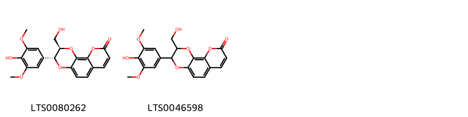{ width=100% }
    <figcaption>Hình ảnh cấu trúc hóa học của 2 hoạt chất thuộc nhóm Coumarinolignans gồm ['daphneticin (LTS0080262)', '3-(4-hydroxy-3,5-dimethoxyphenyl)-2-(hydroxymethyl)-2h,3h-[1,4]dioxino[2,3-h]chromen-9-one (LTS0046598)'].</figcaption>
</figure>
#### Nhóm Coumarins and derivatives
<figure markdown="span">
    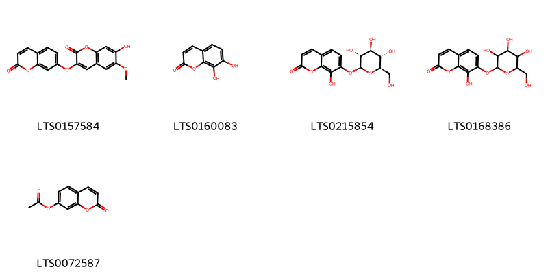{ width=100% }
    <figcaption>Hình ảnh cấu trúc hóa học của 5 hoạt chất thuộc nhóm Coumarins and derivatives gồm ['daphnoretin (LTS0157584)', 'daphnetin (LTS0160083)', 'daphnin (LTS0215854)', '8-hydroxy-7-{[3,4,5-trihydroxy-6-(hydroxymethyl)oxan-2-yl]oxy}chromen-2-one (LTS0168386)', '2-oxochromen-7-yl acetate (LTS0072587)'].</figcaption>
</figure>
#### Nhóm Flavonoids
<figure markdown="span">
    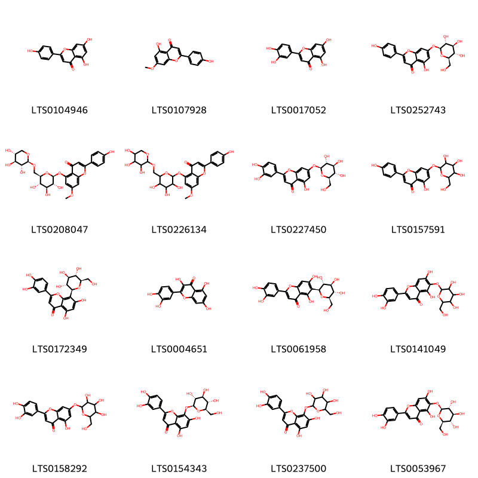{ width=100% }
    <figcaption>Hình ảnh cấu trúc hóa học của 16 hoạt chất thuộc nhóm Flavonoids gồm ['chamomile (LTS0104946)', 'genkwanin (LTS0107928)', 'luteolin (LTS0017052)', 'apigenin 7-o-β-glucoside (LTS0252743)', '2-(4-hydroxyphenyl)-7-methoxy-5-{[(2s,3r,4s,5s,6r)-3,4,5-trihydroxy-6-({[(2s,3r,4s,5r)-3,4,5-trihydroxyoxan-2-yl]oxy}methyl)oxan-2-yl]oxy}chromen-4-one (LTS0208047)', '2-(4-hydroxyphenyl)-7-methoxy-5-[(3,4,5-trihydroxy-6-{[(3,4,5-trihydroxyoxan-2-yl)oxy]methyl}oxan-2-yl)oxy]chromen-4-one (LTS0226134)', 'luteolin 7-o-glucoside (LTS0227450)', 'apigetrin (LTS0157591)', 'orientin (LTS0172349)', 'quercetin (LTS0004651)', 'isoorientin (LTS0061958)', '2-(3,4-dihydroxyphenyl)-5,7-dihydroxy-6-{[3,4,5-trihydroxy-6-(hydroxymethyl)oxan-2-yl]oxy}chromen-4-one (LTS0141049)', '2-(3,4-dihydroxyphenyl)-5-hydroxy-7-{[3,4,5-trihydroxy-6-(hydroxymethyl)oxan-2-yl]oxy}chromen-4-one (LTS0158292)', 'hypolaetin-8-glucoside (LTS0154343)', '2-(3,4-dihydroxyphenyl)-5,7-dihydroxy-8-{[3,4,5-trihydroxy-6-(hydroxymethyl)oxan-2-yl]oxy}chromen-4-one (LTS0237500)', '2-(3,4-dihydroxyphenyl)-5,7-dihydroxy-6-{[(2s,3r,4s,5s,6r)-3,4,5-trihydroxy-6-(hydroxymethyl)oxan-2-yl]oxy}chromen-4-one (LTS0053967)'].</figcaption>
</figure>
#### Nhóm Prenol lipids
<figure markdown="span">
    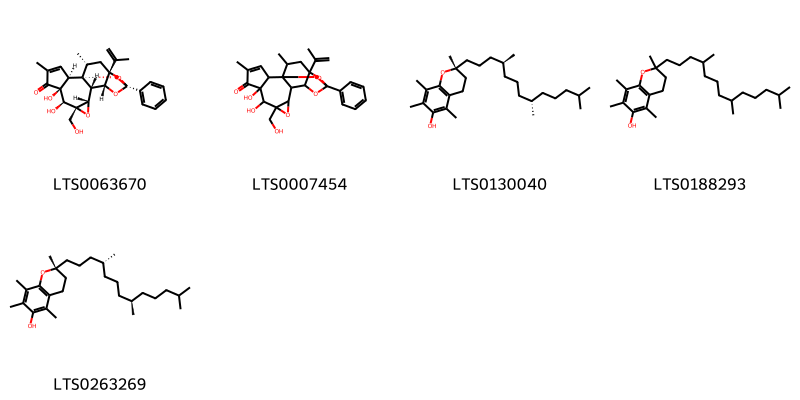{ width=100% }
    <figcaption>Hình ảnh cấu trúc hóa học của 5 hoạt chất thuộc nhóm Prenol lipids gồm ['daphnetoxin (LTS0063670)', '6,7-dihydroxy-8-(hydroxymethyl)-4,18-dimethyl-14-phenyl-16-(prop-1-en-2-yl)-9,13,15,19-tetraoxahexacyclo[12.4.1.0¹,¹¹.0²,⁶.0⁸,¹⁰.0¹²,¹⁶]nonadec-3-en-5-one (LTS0007454)', '(2r)-2,5,7,8-tetramethyl-2-[(4s,8s)-4,8,12-trimethyltridecyl]-3,4-dihydro-1-benzopyran-6-ol (LTS0130040)', 'vita e (LTS0188293)', 'vitamin e (LTS0263269)'].</figcaption>
</figure>

---

### Dược dân tộc học

Danh sách các quốc gia có sử dụng *Daphne gnidium* trong điều trị các bệnh. 

| Country         | Disease       | Bệnh               |
|:----------------|:--------------|:-------------------|
| Elsewhere       | Abortifacient | Thuốc gây sẩy thai |
| Italy(Sardinia) | Piscicide     | Thuốc diệt cá      |
| Sicily          | Insecticide   | Thuốc trừ sâu      |
| Turkey          | Purgative     | Thuốc xổ           |
| ain             | Purgative     | Thuốc xổ           |

---

---
## Daphne laureola
### Thông tin về thực vật

!!! info "Phân loại thực vật của *Daphne laureola* từ GIBF:"
    - **Kingdom:** Plantae
    - **Phylum:** Tracheophyta
    - **Order:** Malvales
    - **Family:** Thymelaeaceae
    - **Genus:** Daphne
    - **Species:** *Daphne laureola*

 

| Label (VI)   | Label (EN)   | Scientific Name   | Descriptions (VI)   | Descriptions (EN)   | Also Known As (VI)   | Also Known As (EN)   |
|:-------------|:-------------|:------------------|:--------------------|:--------------------|:---------------------|:---------------------|
| N/A          | N/A          | Daphne laureola   | loài thực vật       | species of plant    | ['Daphne laureola']  | ['']                 |

#### Phân bố trên thế giới

**Từ CSDL GIBF** Switzerland, United Kingdom of Great Britain and Northern Ireland, France, Spain, New Zealand, Canada, United States of America, Italy, Austria, Greece, Australia, Belgium, Netherlands

#### Phân bố tại Việt Nam

**Từ CSDL GIBF**: Không có ghi nhận ở Việt Nam

---
### Thành phần hóa học
        
- Theo cơ sở dữ liệu lotus: Từ loài *Daphne laureola* đã phân lập và xác định được 9 hoạt chất thuộc về các nhóm Flavonoids. 

|    | chemicalTaxonomyClassyfireClass   |   smiles_count |
|---:|:----------------------------------|---------------:|
|  0 | Flavonoids                        |              9 |

#### Nhóm Flavonoids
<figure markdown="span">
    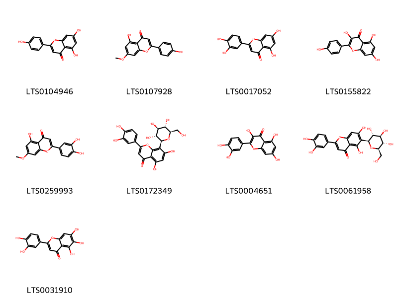{ width=100% }
    <figcaption>Hình ảnh cấu trúc hóa học của 9 hoạt chất thuộc nhóm Flavonoids gồm ['chamomile (LTS0104946)', 'genkwanin (LTS0107928)', 'luteolin (LTS0017052)', 'kaempherol (LTS0155822)', 'luteolin 7-methyl ether (LTS0259993)', 'orientin (LTS0172349)', 'quercetin (LTS0004651)', 'isoorientin (LTS0061958)', '6-hydroxyluteolin (LTS0031910)'].</figcaption>
</figure>

---

### Dược dân tộc học

Danh sách các quốc gia có sử dụng *Daphne laureola* trong điều trị các bệnh. 

| Country   | Disease   | Bệnh     |
|:----------|:----------|:---------|
| Italian   | Poison    | Chất độc |
| ain       | Purgative | Thuốc xổ |
| anish     | Purgative | Thuốc xổ |

---

---
## Daphne mezereum
### Thông tin về thực vật

!!! info "Phân loại thực vật của *Daphne mezereum* từ GIBF:"
    - **Kingdom:** Plantae
    - **Phylum:** Tracheophyta
    - **Order:** Malvales
    - **Family:** Thymelaeaceae
    - **Genus:** Daphne
    - **Species:** *Daphne mezereum*

 

| Label (VI)   | Label (EN)   | Scientific Name   | Descriptions (VI)   | Descriptions (EN)   | Also Known As (VI)   | Also Known As (EN)   |
|:-------------|:-------------|:------------------|:--------------------|:--------------------|:---------------------|:---------------------|
| N/A          | N/A          | Daphne mezereum   | loài thực vật       | species of plant    | ['Daphne mezereum']  | ['']                 |

#### Phân bố trên thế giới

**Từ CSDL GIBF** Denmark, Luxembourg, Germany, Austria, Sweden, Poland, Belgium, Slovakia, Netherlands, Finland, Slovenia, Belarus, Hungary, Switzerland, France, Czechia, Romania, Italy, Croatia, Ukraine

#### Phân bố tại Việt Nam

**Từ CSDL GIBF**: Không có ghi nhận ở Việt Nam

---
### Thành phần hóa học
        
- Theo cơ sở dữ liệu lotus: Từ loài *Daphne mezereum* đã phân lập và xác định được 40 hoạt chất thuộc về các nhóm Organooxygen compounds, Furanoid lignans, Coumarins and derivatives, Prenol lipids, Benzodioxanes, Benzene and substituted derivatives. 

|    | chemicalTaxonomyClassyfireClass     |   smiles_count |
|---:|:------------------------------------|---------------:|
|  0 | Benzene and substituted derivatives |              2 |
|  1 | Benzodioxanes                       |              2 |
|  2 | Coumarins and derivatives           |             11 |
|  3 | Furanoid lignans                    |              8 |
|  4 | Organooxygen compounds              |              3 |
|  5 | Prenol lipids                       |             13 |

#### Nhóm Benzene and substituted derivatives
<figure markdown="span">
    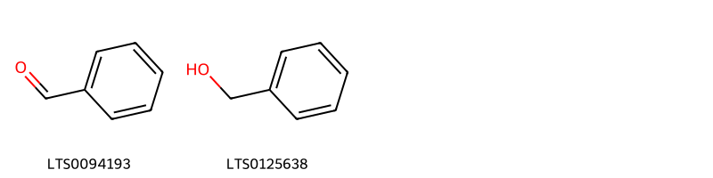{ width=100% }
    <figcaption>Hình ảnh cấu trúc hóa học của 2 hoạt chất thuộc nhóm Benzene and substituted derivatives gồm ['benzaldehyde (LTS0094193)', 'benzyl alcohol (LTS0125638)'].</figcaption>
</figure>
#### Nhóm Benzodioxanes
<figure markdown="span">
    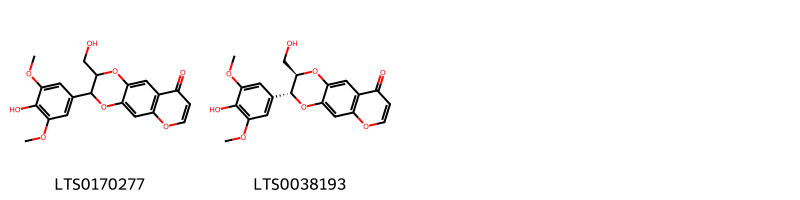{ width=100% }
    <figcaption>Hình ảnh cấu trúc hóa học của 2 hoạt chất thuộc nhóm Benzodioxanes gồm ['3-(4-hydroxy-3,5-dimethoxyphenyl)-2-(hydroxymethyl)-2h,3h-[1,4]dioxino[2,3-g]chromen-9-one (LTS0170277)', '(2r,3r)-3-(4-hydroxy-3,5-dimethoxyphenyl)-2-(hydroxymethyl)-2h,3h-[1,4]dioxino[2,3-g]chromen-9-one (LTS0038193)'].</figcaption>
</figure>
#### Nhóm Coumarins and derivatives
<figure markdown="span">
    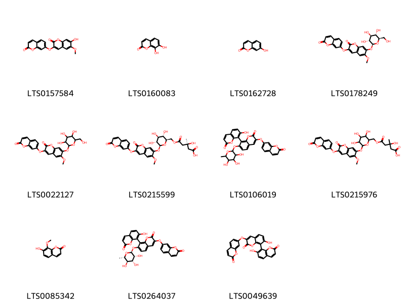{ width=100% }
    <figcaption>Hình ảnh cấu trúc hóa học của 11 hoạt chất thuộc nhóm Coumarins and derivatives gồm ['daphnoretin (LTS0157584)', 'daphnetin (LTS0160083)', 'umbelliferone (LTS0162728)', '6-methoxy-3-[(2-oxochromen-7-yl)oxy]-7-{[(2s,3r,4s,5s,6r)-3,4,5-trihydroxy-6-(hydroxymethyl)oxan-2-yl]oxy}chromen-2-one (LTS0178249)', '6-methoxy-3-[(2-oxochromen-7-yl)oxy]-7-{[3,4,5-trihydroxy-6-(hydroxymethyl)oxan-2-yl]oxy}chromen-2-one (LTS0022127)', '(3s)-3-hydroxy-3-methyl-5-oxo-5-{[(2r,3s,4s,5r,6s)-3,4,5-trihydroxy-6-({6-methoxy-2-oxo-3-[(2-oxochromen-7-yl)oxy]chromen-7-yl}oxy)oxan-2-yl]methoxy}pentanoic acid (LTS0215599)', "7'-hydroxy-3-[(2-oxochromen-7-yl)oxy]-7-[(3,4,5-trihydroxy-6-methyloxan-2-yl)oxy]-[8,8'-bichromene]-2,2'-dione (LTS0106019)", '3-hydroxy-3-methyl-5-oxo-5-{[3,4,5-trihydroxy-6-({6-methoxy-2-oxo-3-[(2-oxochromen-7-yl)oxy]chromen-7-yl}oxy)oxan-2-yl]methoxy}pentanoic acid (LTS0215976)', '7-hydroxy-8-methoxychromen-2-one (LTS0085342)', "7'-hydroxy-3-[(2-oxochromen-7-yl)oxy]-7-{[(2s,3r,4r,5r,6s)-3,4,5-trihydroxy-6-methyloxan-2-yl]oxy}-[8,8'-bichromene]-2,2'-dione (LTS0264037)", "7,7'-dihydroxy-3-[(2-oxochromen-7-yl)oxy]-[8,8'-bichromene]-2,2'-dione (LTS0049639)"].</figcaption>
</figure>
#### Nhóm Furanoid lignans
<figure markdown="span">
    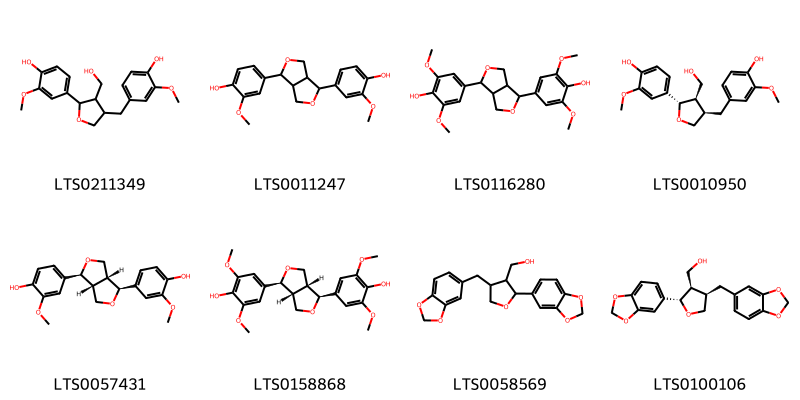{ width=100% }
    <figcaption>Hình ảnh cấu trúc hóa học của 8 hoạt chất thuộc nhóm Furanoid lignans gồm ['4-{4-[(4-hydroxy-3-methoxyphenyl)methyl]-3-(hydroxymethyl)oxolan-2-yl}-2-methoxyphenol (LTS0211349)', 'pinoresinol (LTS0011247)', 'syringaresinol (LTS0116280)', 'lariciresinol (LTS0010950)', 'pinoresinol (LTS0057431)', '(+)-syringaresinol (LTS0158868)', '[2-(2h-1,3-benzodioxol-5-yl)-4-(2h-1,3-benzodioxol-5-ylmethyl)oxolan-3-yl]methanol (LTS0058569)', '[(2s,3r,4r)-2-(2h-1,3-benzodioxol-5-yl)-4-(2h-1,3-benzodioxol-5-ylmethyl)oxolan-3-yl]methanol (LTS0100106)'].</figcaption>
</figure>
#### Nhóm Organooxygen compounds
<figure markdown="span">
    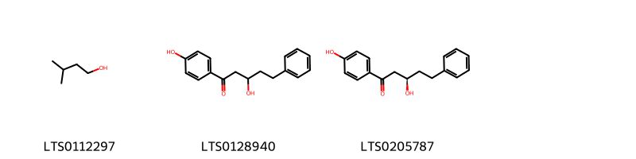{ width=100% }
    <figcaption>Hình ảnh cấu trúc hóa học của 3 hoạt chất thuộc nhóm Organooxygen compounds gồm ['isoamyl alcohol (LTS0112297)', '3-hydroxy-1-(4-hydroxyphenyl)-5-phenylpentan-1-one (LTS0128940)', '(3r)-3-hydroxy-1-(4-hydroxyphenyl)-5-phenylpentan-1-one (LTS0205787)'].</figcaption>
</figure>
#### Nhóm Prenol lipids
<figure markdown="span">
    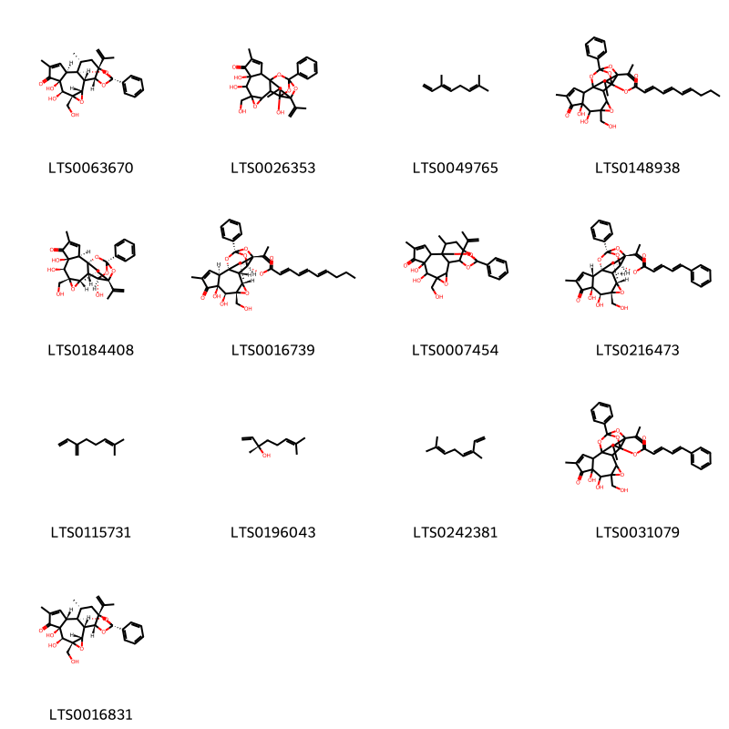{ width=100% }
    <figcaption>Hình ảnh cấu trúc hóa học của 13 hoạt chất thuộc nhóm Prenol lipids gồm ['daphnetoxin (LTS0063670)', '6,7,17-trihydroxy-8-(hydroxymethyl)-4,18-dimethyl-14-phenyl-16-(prop-1-en-2-yl)-9,13,15,19-tetraoxahexacyclo[12.4.1.0¹,¹¹.0²,⁶.0⁸,¹⁰.0¹²,¹⁶]nonadec-3-en-5-one (LTS0026353)', 'trans-β-ocimene (LTS0049765)', '6,7-dihydroxy-8-(hydroxymethyl)-4,18-dimethyl-5-oxo-14-phenyl-16-(prop-1-en-2-yl)-9,13,15,19-tetraoxahexacyclo[12.4.1.0¹,¹¹.0²,⁶.0⁸,¹⁰.0¹²,¹⁶]nonadec-3-en-17-yl deca-2,4,6-trienoate (LTS0148938)', '(1r,2r,6s,7s,8r,10s,11s,12r,14s,16s,17r,18r)-6,7,17-trihydroxy-8-(hydroxymethyl)-4,18-dimethyl-14-phenyl-16-(prop-1-en-2-yl)-9,13,15,19-tetraoxahexacyclo[12.4.1.0¹,¹¹.0²,⁶.0⁸,¹⁰.0¹²,¹⁶]nonadec-3-en-5-one (LTS0184408)', '(1r,2r,6s,7s,8r,10s,11s,12r,14s,16s,17r,18r)-6,7-dihydroxy-8-(hydroxymethyl)-4,18-dimethyl-5-oxo-14-phenyl-16-(prop-1-en-2-yl)-9,13,15,19-tetraoxahexacyclo[12.4.1.0¹,¹¹.0²,⁶.0⁸,¹⁰.0¹²,¹⁶]nonadec-3-en-17-yl (2e,4e,6e)-deca-2,4,6-trienoate (LTS0016739)', '6,7-dihydroxy-8-(hydroxymethyl)-4,18-dimethyl-14-phenyl-16-(prop-1-en-2-yl)-9,13,15,19-tetraoxahexacyclo[12.4.1.0¹,¹¹.0²,⁶.0⁸,¹⁰.0¹²,¹⁶]nonadec-3-en-5-one (LTS0007454)', '(1r,2s,6s,7s,8r,10s,11r,12r,14s,16s,17r,18r)-6,7-dihydroxy-8-(hydroxymethyl)-4,18-dimethyl-5-oxo-14-phenyl-16-(prop-1-en-2-yl)-9,13,15,19-tetraoxahexacyclo[12.4.1.0¹,¹¹.0²,⁶.0⁸,¹⁰.0¹²,¹⁶]nonadec-3-en-17-yl (2e,4e)-5-phenylpenta-2,4-dienoate (LTS0216473)', 'α-myrcene (LTS0115731)', '(+)-linalool (LTS0196043)', 'β-ocimene (LTS0242381)', 'mezerein (LTS0031079)', '(1r,2s,6s,7s,8r,10s,11s,12r,14s,16r,18r)-6,7-dihydroxy-8-(hydroxymethyl)-4,18-dimethyl-14-phenyl-16-(prop-1-en-2-yl)-9,13,15,19-tetraoxahexacyclo[12.4.1.0¹,¹¹.0²,⁶.0⁸,¹⁰.0¹²,¹⁶]nonadec-3-en-5-one (LTS0016831)'].</figcaption>
</figure>

---

### Dược dân tộc học

Danh sách các quốc gia có sử dụng *Daphne mezereum* trong điều trị các bệnh. 

| Country   | Disease                                                          | Bệnh                                                             |
|:----------|:-----------------------------------------------------------------|:-----------------------------------------------------------------|
| Elsewhere | Diuretic, Sialogogue, Stimulant                                  | Thuốc lợi tiểu, Sialogogue, Chất kích thích                      |
| Turkey    | Abortifacient, Poison, Purgative, Sudorific, Stimulant, Diuretic | Abortifacient, Poison, Purgative, Sudorific, Stimulant, Diuretic |
| US        | Carcinogenic, Poison                                             | Chất gây ung thư, chất độc                                       |
| ain       | Poison                                                           | Chất độc                                                         |

---

---
## Daphne mezreum
### Thông tin về thực vật

!!! info "Phân loại thực vật của *Daphne mezereum* từ GIBF:"
    - **Kingdom:** Plantae
    - **Phylum:** Tracheophyta
    - **Order:** Malvales
    - **Family:** Thymelaeaceae
    - **Genus:** Daphne
    - **Species:** *Daphne mezereum*

 

| Label (VI)   | Label (EN)   | Scientific Name   | Descriptions (VI)   | Descriptions (EN)   | Also Known As (VI)   | Also Known As (EN)   |
|:-------------|:-------------|:------------------|:--------------------|:--------------------|:---------------------|:---------------------|
| N/A          | N/A          | Daphne mezereum   | loài thực vật       | species of plant    | ['Daphne mezereum']  | ['']                 |

#### Phân bố trên thế giới

**Từ CSDL GIBF** Denmark, Luxembourg, Germany, Austria, Sweden, Poland, Belgium, Slovakia, Netherlands, Finland, Slovenia, Belarus, Hungary, Switzerland, France, Czechia, Romania, Italy, Croatia, Ukraine

#### Phân bố tại Việt Nam

**Từ CSDL GIBF**: Không có ghi nhận ở Việt Nam

---
### Thành phần hóa học
        
- Theo cơ sở dữ liệu lotus: Từ loài *Daphne mezereum* đã phân lập và xác định được Chưa có hoạt chất nào được phân lập. hoạt chất thuộc về các nhóm Không có hoạt chất nào được phân lập. 

Không có hình ảnh nào được tạo ra

---

### Dược dân tộc học

Danh sách các quốc gia có sử dụng *Daphne mezereum* trong điều trị các bệnh. 

| Country   | Disease   | Bệnh     |
|:----------|:----------|:---------|
| Elsewhere | Poison    | Chất độc |

---

---
## Daphne odora
### Thông tin về thực vật

!!! info "Phân loại thực vật của *Daphne odora* từ GIBF:"
    - **Kingdom:** Plantae
    - **Phylum:** Tracheophyta
    - **Order:** Malvales
    - **Family:** Thymelaeaceae
    - **Genus:** Daphne
    - **Species:** *Daphne odora*

 

| Label (VI)   | Label (EN)   | Scientific Name   | Descriptions (VI)   | Descriptions (EN)   | Also Known As (VI)   | Also Known As (EN)   |
|:-------------|:-------------|:------------------|:--------------------|:--------------------|:---------------------|:---------------------|
| N/A          | N/A          | Daphne odora      |                     | species of plant    | ['Daphne odora']     | ['']                 |

#### Phân bố trên thế giới

**Từ CSDL GIBF** nan, Switzerland, unknown or invalid, United Kingdom of Great Britain and Northern Ireland, Japan, Spain, New Zealand, United States of America, China, Ireland, Australia, Belgium, Korea, Republic of, Chinese Taipei

#### Phân bố tại Việt Nam

**Từ CSDL GIBF**: Không có ghi nhận ở Việt Nam

---
### Thành phần hóa học
        
- Theo cơ sở dữ liệu lotus: Từ loài *Daphne odora* đã phân lập và xác định được 183 hoạt chất thuộc về các nhóm Organooxygen compounds, Indoles and derivatives, Lactones, Coumarins and derivatives, Saturated hydrocarbons, Unsaturated hydrocarbons, Flavonoids, Oxanes, 2-arylbenzofuran flavonoids, Prenol lipids, Fatty Acyls, Isoflavonoids, Phenols, Heteroaromatic compounds, Naphthalenes, Pyridines and derivatives, Benzene and substituted derivatives, Coumarinolignans. 

|    | chemicalTaxonomyClassyfireClass     |   smiles_count |
|---:|:------------------------------------|---------------:|
|  0 | 2-arylbenzofuran flavonoids         |             13 |
|  1 | Benzene and substituted derivatives |             10 |
|  2 | Coumarinolignans                    |              1 |
|  3 | Coumarins and derivatives           |              3 |
|  4 | Fatty Acyls                         |             35 |
|  5 | Flavonoids                          |             15 |
|  6 | Heteroaromatic compounds            |              1 |
|  7 | Indoles and derivatives             |              1 |
|  8 | Isoflavonoids                       |              2 |
|  9 | Lactones                            |              2 |
| 10 | Naphthalenes                        |              1 |
| 11 | Organooxygen compounds              |             12 |
| 12 | Oxanes                              |              1 |
| 13 | Phenols                             |              7 |
| 14 | Prenol lipids                       |             58 |
| 15 | Pyridines and derivatives           |              1 |
| 16 | Saturated hydrocarbons              |             15 |
| 17 | Unsaturated hydrocarbons            |              5 |

#### Nhóm 2-arylbenzofuran flavonoids
<figure markdown="span">
    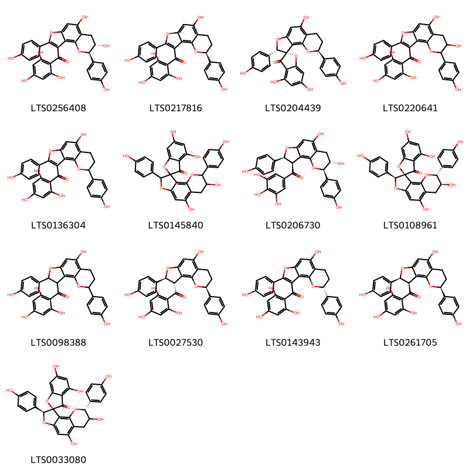{ width=100% }
    <figcaption>Hình ảnh cấu trúc hóa học của 13 hoạt chất thuộc nhóm 2-arylbenzofuran flavonoids gồm ['2-[(11s,12r)-8,11-dihydroxy-4,12-bis(4-hydroxyphenyl)-5,13-dioxatricyclo[7.4.0.0²,⁶]trideca-1,3,6,8-tetraene-3-carbonyl]benzene-1,3,5-triol (LTS0256408)', '2-[(12s)-8-hydroxy-4,12-bis(4-hydroxyphenyl)-5,13-dioxatricyclo[7.4.0.0²,⁶]trideca-1,3,6,8-tetraene-3-carbonyl]benzene-1,3,5-triol (LTS0217816)', "(2s,4's,12's)-4,6,8'-trihydroxy-4',12'-bis(4-hydroxyphenyl)-5',13'-dioxaspiro[1-benzofuran-2,3'-tricyclo[7.4.0.0²,⁶]tridecane]-1'(9'),2'(6'),7'-trien-3-one (LTS0204439)", '2-[8,11-dihydroxy-4,12-bis(4-hydroxyphenyl)-5,13-dioxatricyclo[7.4.0.0²,⁶]trideca-1,3,6,8-tetraene-3-carbonyl]benzene-1,3,5-triol (LTS0220641)', '2-[8-hydroxy-4,12-bis(4-hydroxyphenyl)-5,13-dioxatricyclo[7.4.0.0²,⁶]trideca-1,3,6,8-tetraene-3-carbonyl]benzene-1,3,5-triol (LTS0136304)', "4,6,8',11'-tetrahydroxy-4',12'-bis(4-hydroxyphenyl)-5',13'-dioxaspiro[1-benzofuran-2,3'-tricyclo[7.4.0.0²,⁶]tridecane]-1'(9'),2'(6'),7'-trien-3-one (LTS0145840)", '5-[(3r,4s,11s,12r)-8,11-dihydroxy-4,12-bis(4-hydroxyphenyl)-5,13-dioxatricyclo[7.4.0.0²,⁶]trideca-1(9),2(6),7-triene-3-carbonyl]benzene-1,2,3-triol (LTS0206730)', "(2s,4's,11's,12'r)-4,6,8',11'-tetrahydroxy-4',12'-bis(4-hydroxyphenyl)-5',13'-dioxaspiro[1-benzofuran-2,3'-tricyclo[7.4.0.0²,⁶]tridecane]-1'(9'),2'(6'),7'-trien-3-one (LTS0108961)", '2-[8-hydroxy-4,12-bis(4-hydroxyphenyl)-5,13-dioxatricyclo[7.4.0.0²,⁶]trideca-1(9),2(6),7-triene-3-carbonyl]benzene-1,3,5-triol (LTS0098388)', '2-[(3s,4s,12s)-8-hydroxy-4,12-bis(4-hydroxyphenyl)-5,13-dioxatricyclo[7.4.0.0²,⁶]trideca-1(9),2(6),7-triene-3-carbonyl]benzene-1,3,5-triol (LTS0027530)', '2-[(12r)-8-hydroxy-4,12-bis(4-hydroxyphenyl)-5,13-dioxatricyclo[7.4.0.0²,⁶]trideca-1,3,6,8-tetraene-3-carbonyl]benzene-1,3,5-triol (LTS0143943)', '2-[(3r,4s,12s)-8-hydroxy-4,12-bis(4-hydroxyphenyl)-5,13-dioxatricyclo[7.4.0.0²,⁶]trideca-1(9),2(6),7-triene-3-carbonyl]benzene-1,3,5-triol (LTS0261705)', "(2s,4's,12'r)-4,6,8',11'-tetrahydroxy-4',12'-bis(4-hydroxyphenyl)-5',13'-dioxaspiro[1-benzofuran-2,3'-tricyclo[7.4.0.0²,⁶]tridecane]-1'(9'),2'(6'),7'-trien-3-one (LTS0033080)"].</figcaption>
</figure>
#### Nhóm Benzene and substituted derivatives
<figure markdown="span">
    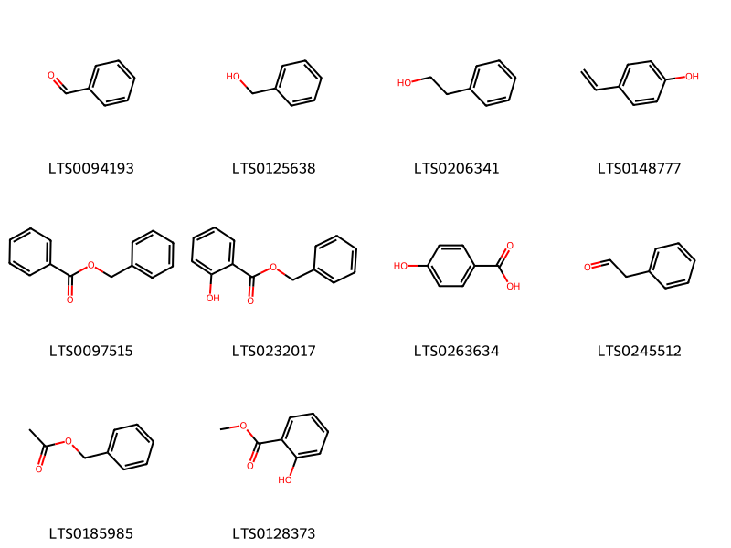{ width=100% }
    <figcaption>Hình ảnh cấu trúc hóa học của 10 hoạt chất thuộc nhóm Benzene and substituted derivatives gồm ['benzaldehyde (LTS0094193)', 'benzyl alcohol (LTS0125638)', '2-phenyl-ethanol (LTS0206341)', '4-vinylphenol (LTS0148777)', 'benzyl benzoate (LTS0097515)', 'benzyl salicylate (LTS0232017)', 'p-hydroxybenzoic acid (LTS0263634)', 'phenylacetaldehyde (LTS0245512)', 'benzyl acetate (LTS0185985)', 'methyl salicylate (LTS0128373)'].</figcaption>
</figure>
#### Nhóm Coumarinolignans
<figure markdown="span">
    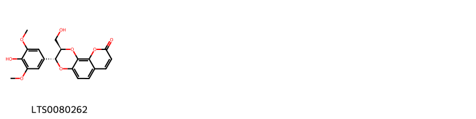{ width=100% }
    <figcaption>Hình ảnh cấu trúc hóa học của 1 hoạt chất thuộc nhóm Coumarinolignans gồm ['daphneticin (LTS0080262)'].</figcaption>
</figure>
#### Nhóm Coumarins and derivatives
<figure markdown="span">
    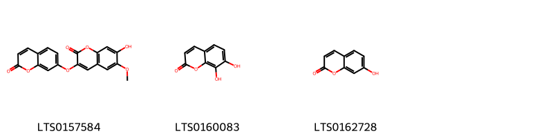{ width=100% }
    <figcaption>Hình ảnh cấu trúc hóa học của 3 hoạt chất thuộc nhóm Coumarins and derivatives gồm ['daphnoretin (LTS0157584)', 'daphnetin (LTS0160083)', 'umbelliferone (LTS0162728)'].</figcaption>
</figure>
#### Nhóm Fatty Acyls
<figure markdown="span">
    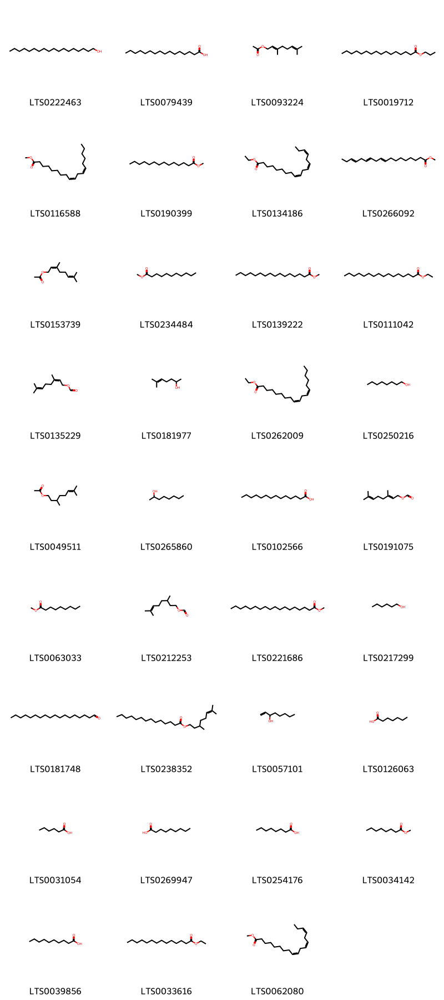{ width=100% }
    <figcaption>Hình ảnh cấu trúc hóa học của 35 hoạt chất thuộc nhóm Fatty Acyls gồm ['stearyl alcohol (LTS0222463)', 'palmitic acid (LTS0079439)', 'geranyl acetate (LTS0093224)', 'hexadecanoic acid, propylester (LTS0019712)', 'methyl linoleate (LTS0116588)', 'methyl myristate (LTS0190399)', 'ethyl linolenate (LTS0134186)', 'methyl elaidolinolenate (LTS0266092)', 'neryl acetate (LTS0153739)', 'methyl undecanoate (LTS0234484)', 'methyl palmitate (LTS0139222)', 'ethyl palmitate (LTS0111042)', 'neryl formate (LTS0135229)', '6-methyl-5-hepten-2-ol (LTS0181977)', 'ethyl linoleate (LTS0262009)', 'octanol (LTS0250216)', 'citronellyl acetate (LTS0049511)', '2-octanol (LTS0265860)', 'myristic acid (LTS0102566)', 'geranyl formate (LTS0191075)', 'methyl nonanoate (ester) (LTS0063033)', 'citronellyl formate (LTS0212253)', 'methyl stearate (LTS0221686)', 'hexanol (LTS0217299)', 'octadecanal (LTS0181748)', '3,7-dimethyloct-6-en-1-yl tetradecanoate (LTS0238352)', '1-octen-3-ol (LTS0057101)', 'heptanoic acid (LTS0126063)', 'hexanoic acid (LTS0031054)', 'nonanoic acid (LTS0269947)', 'caprylic acid (LTS0254176)', 'methyl caprylate (LTS0034142)', 'capric acid (LTS0039856)', 'ethylmyristate (LTS0033616)', 'methyl linolenate (LTS0062080)'].</figcaption>
</figure>
#### Nhóm Flavonoids
<figure markdown="span">
    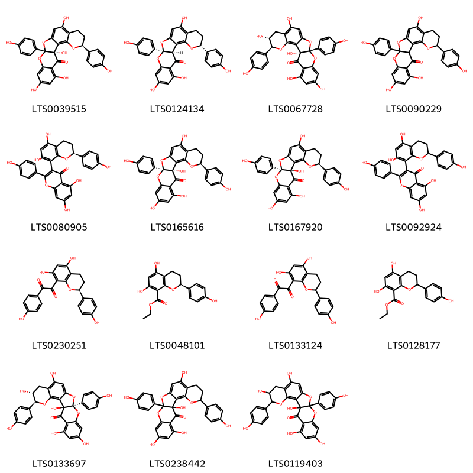{ width=100% }
    <figcaption>Hình ảnh cấu trúc hóa học của 15 hoạt chất thuộc nhóm Flavonoids gồm ['(1r,5s,13s)-1,9,17,19-tetrahydroxy-5,13-bis(4-hydroxyphenyl)-4,12,14-trioxapentacyclo[11.8.0.0²,¹¹.0³,⁸.0¹⁵,²⁰]henicosa-2,8,10,15,17,19-hexaen-21-one (LTS0039515)', '(1s,5r,13s)-9,17,19-trihydroxy-5,13-bis(4-hydroxyphenyl)-4,12,14-trioxapentacyclo[11.8.0.0²,¹¹.0³,⁸.0¹⁵,²⁰]henicosa-2,8,10,15,17,19-hexaen-21-one (LTS0124134)', '(1s,5s,6r,13r)-1,6,9,17,19-pentahydroxy-5,13-bis(4-hydroxyphenyl)-4,12,14-trioxapentacyclo[11.8.0.0²,¹¹.0³,⁸.0¹⁵,²⁰]henicosa-2,8,10,15,17,19-hexaen-21-one (LTS0067728)', '9,17,19-trihydroxy-5,13-bis(4-hydroxyphenyl)-4,12,14-trioxapentacyclo[11.8.0.0²,¹¹.0³,⁸.0¹⁵,²⁰]henicosa-2,8,10,15,17,19-hexaen-21-one (LTS0090229)', '3-[(2s)-5,7-dihydroxy-2-(4-hydroxyphenyl)-3,4-dihydro-2h-1-benzopyran-8-yl]-5,7-dihydroxy-2-(4-hydroxyphenyl)chromen-4-one (LTS0080905)', '(1r,5s,13r)-1,9,17,19-tetrahydroxy-5,13-bis(4-hydroxyphenyl)-4,12,14-trioxapentacyclo[11.8.0.0²,¹¹.0³,⁸.0¹⁵,²⁰]henicosa-2,8,10,15,17,19-hexaen-21-one (LTS0165616)', '(1s,5s,13r)-1,9,17,19-tetrahydroxy-5,13-bis(4-hydroxyphenyl)-4,12,14-trioxapentacyclo[11.8.0.0²,¹¹.0³,⁸.0¹⁵,²⁰]henicosa-2,8,10,15,17,19-hexaen-21-one (LTS0167920)', '3-[5,7-dihydroxy-2-(4-hydroxyphenyl)-3,4-dihydro-2h-1-benzopyran-8-yl]-5,7-dihydroxy-2-(4-hydroxyphenyl)chromen-4-one (LTS0092924)', '1-[(2s)-5,7-dihydroxy-2-(4-hydroxyphenyl)-3,4-dihydro-2h-1-benzopyran-8-yl]-2-(4-hydroxyphenyl)ethane-1,2-dione (LTS0230251)', 'ethyl (2s)-5,7-dihydroxy-2-(4-hydroxyphenyl)-3,4-dihydro-2h-1-benzopyran-8-carboxylate (LTS0048101)', '1-[5,7-dihydroxy-2-(4-hydroxyphenyl)-3,4-dihydro-2h-1-benzopyran-8-yl]-2-(4-hydroxyphenyl)ethane-1,2-dione (LTS0133124)', 'ethyl 5,7-dihydroxy-2-(4-hydroxyphenyl)-3,4-dihydro-2h-1-benzopyran-8-carboxylate (LTS0128177)', '(1r,5s,6r,13s)-1,6,9,17,19-pentahydroxy-5,13-bis(4-hydroxyphenyl)-4,12,14-trioxapentacyclo[11.8.0.0²,¹¹.0³,⁸.0¹⁵,²⁰]henicosa-2,8,10,15,17,19-hexaen-21-one (LTS0133697)', '1,9,17,19-tetrahydroxy-5,13-bis(4-hydroxyphenyl)-4,12,14-trioxapentacyclo[11.8.0.0²,¹¹.0³,⁸.0¹⁵,²⁰]henicosa-2,8,10,15,17,19-hexaen-21-one (LTS0238442)', '1,6,9,17,19-pentahydroxy-5,13-bis(4-hydroxyphenyl)-4,12,14-trioxapentacyclo[11.8.0.0²,¹¹.0³,⁸.0¹⁵,²⁰]henicosa-2,8,10,15,17,19-hexaen-21-one (LTS0119403)'].</figcaption>
</figure>
#### Nhóm Heteroaromatic compounds
<figure markdown="span">
    { width=100% }
    <figcaption>Hình ảnh cấu trúc hóa học của 1 hoạt chất thuộc nhóm Heteroaromatic compounds gồm ['amylfuran (LTS0044471)'].</figcaption>
</figure>
#### Nhóm Indoles and derivatives
<figure markdown="span">
    { width=100% }
    <figcaption>Hình ảnh cấu trúc hóa học của 1 hoạt chất thuộc nhóm Indoles and derivatives gồm ['indole (LTS0185357)'].</figcaption>
</figure>
#### Nhóm Isoflavonoids
<figure markdown="span">
    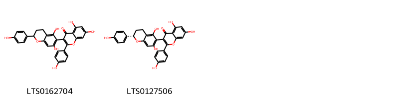{ width=100% }
    <figcaption>Hình ảnh cấu trúc hóa học của 2 hoạt chất thuộc nhóm Isoflavonoids gồm ['3-[5,7-dihydroxy-2-(4-hydroxyphenyl)-3,4-dihydro-2h-1-benzopyran-6-yl]-5,7-dihydroxy-2-(4-hydroxyphenyl)chromen-4-one (LTS0162704)', '3-[(2s)-5,7-dihydroxy-2-(4-hydroxyphenyl)-3,4-dihydro-2h-1-benzopyran-6-yl]-5,7-dihydroxy-2-(4-hydroxyphenyl)chromen-4-one (LTS0127506)'].</figcaption>
</figure>
#### Nhóm Lactones
<figure markdown="span">
    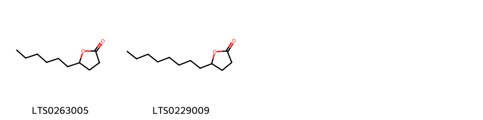{ width=100% }
    <figcaption>Hình ảnh cấu trúc hóa học của 2 hoạt chất thuộc nhóm Lactones gồm ['γ-decalactone (LTS0263005)', 'γ-dodecalactone (LTS0229009)'].</figcaption>
</figure>
#### Nhóm Naphthalenes
<figure markdown="span">
    { width=100% }
    <figcaption>Hình ảnh cấu trúc hóa học của 1 hoạt chất thuộc nhóm Naphthalenes gồm ['naphthalene (LTS0254484)'].</figcaption>
</figure>
#### Nhóm Organooxygen compounds
<figure markdown="span">
    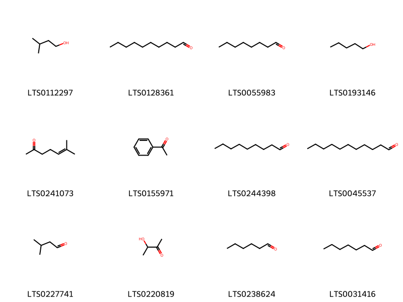{ width=100% }
    <figcaption>Hình ảnh cấu trúc hóa học của 12 hoạt chất thuộc nhóm Organooxygen compounds gồm ['isoamyl alcohol (LTS0112297)', 'decanal (LTS0128361)', 'octanal (LTS0055983)', 'amyl alcohol (LTS0193146)', '6-methyl-5-hepten-2-one (LTS0241073)', 'acetophenone (LTS0155971)', 'nonanal (LTS0244398)', 'aldehyde c11 (LTS0045537)', 'isovaleraldehyde (LTS0227741)', 'acetoin (LTS0220819)', 'hexanal (LTS0238624)', 'heptanal (LTS0031416)'].</figcaption>
</figure>
#### Nhóm Oxanes
<figure markdown="span">
    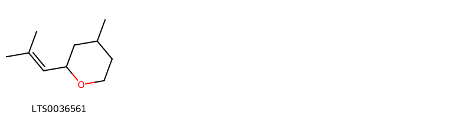{ width=100% }
    <figcaption>Hình ảnh cấu trúc hóa học của 1 hoạt chất thuộc nhóm Oxanes gồm ['rose oxide (LTS0036561)'].</figcaption>
</figure>
#### Nhóm Phenols
<figure markdown="span">
    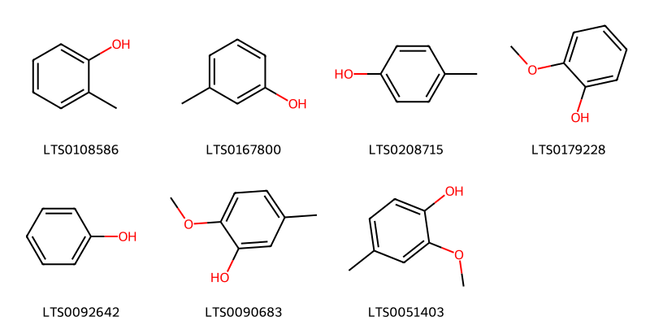{ width=100% }
    <figcaption>Hình ảnh cấu trúc hóa học của 7 hoạt chất thuộc nhóm Phenols gồm ['o-cresol (LTS0108586)', 'm-cresol (LTS0167800)', 'p-cresol (LTS0208715)', 'guaiacol (LTS0179228)', 'phenol (LTS0092642)', '2-methoxy-5-methylphenol (LTS0090683)', 'creosol (LTS0051403)'].</figcaption>
</figure>
#### Nhóm Prenol lipids
<figure markdown="span">
    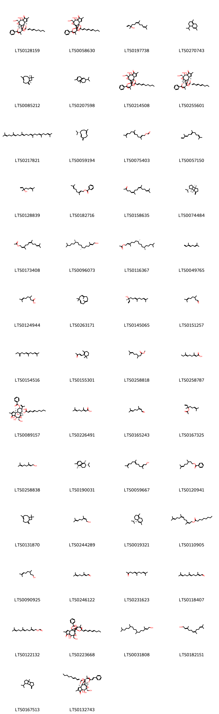{ width=100% }
    <figcaption>Hình ảnh cấu trúc hóa học của 58 hoạt chất thuộc nhóm Prenol lipids gồm ['(1r,2r,6s,7s,8r,10s,11s,12r,14s,16s,17r,18r)-6,7-dihydroxy-8-(hydroxymethyl)-4,18-dimethyl-14-[(1e,3e)-nona-1,3-dien-1-yl]-5-oxo-16-(prop-1-en-2-yl)-9,13,15,19-tetraoxahexacyclo[12.4.1.0¹,¹¹.0²,⁶.0⁸,¹⁰.0¹²,¹⁶]nonadec-3-en-17-yl benzoate (LTS0128159)', '6,7-dihydroxy-8-(hydroxymethyl)-4,18-dimethyl-14-(nona-1,3,5-trien-1-yl)-5-oxo-16-(prop-1-en-2-yl)-9,13,15,19-tetraoxahexacyclo[12.4.1.0¹,¹¹.0²,⁶.0⁸,¹⁰.0¹²,¹⁶]nonadec-3-en-17-yl benzoate (LTS0058630)', 'nerolidol (LTS0197738)', '4-isopropyl-1,6-dimethyl-2,3,4,4a,7,8-hexahydronaphthalene (LTS0270743)', 'caryophyllene (LTS0085212)', 'α-copaene (LTS0207598)', '6,7-dihydroxy-8-(hydroxymethyl)-4,18-dimethyl-14-(nona-1,3-dien-1-yl)-5-oxo-16-(prop-1-en-2-yl)-9,13,15,19-tetraoxahexacyclo[12.4.1.0¹,¹¹.0²,⁶.0⁸,¹⁰.0¹²,¹⁶]nonadec-3-en-17-yl benzoate (LTS0214508)', '(1r,2r,6s,7s,8r,10s,11s,12r,14s,16s,17r,18r)-6,7-dihydroxy-8-(hydroxymethyl)-4,18-dimethyl-14-[(1e,3e,5e)-nona-1,3,5-trien-1-yl]-5-oxo-16-(prop-1-en-2-yl)-9,13,15,19-tetraoxahexacyclo[12.4.1.0¹,¹¹.0²,⁶.0⁸,¹⁰.0¹²,¹⁶]nonadec-3-en-17-yl benzoate (LTS0255601)', 'squalene (LTS0217821)', '(-)-germacrene d (LTS0059194)', '3,7,11-trimethyldodeca-2,6,10-trien-1-yl formate (LTS0075403)', 'farnesene (LTS0057150)', 'linalool, (+-)- (LTS0128839)', 'geranyl benzoate (LTS0182716)', '6,10,14-trimethylpentadeca-5,9,13-trien-2-one (LTS0158635)', 'β-bourbonene (LTS0074484)', 'farnesyl acetate (LTS0173408)', 'phytol (LTS0096073)', '(e)-phytyl acetate (LTS0116367)', 'trans-β-ocimene (LTS0049765)', 'citronellic acid (LTS0124944)', 'humulene (LTS0263171)', '(3r,6e)-nerolidol (LTS0145065)', 'citronella (LTS0151257)', '(6e)-2,6-dimethyl-10-methylidenedodeca-2,6-diene (LTS0154516)', 'β-ionone (LTS0155301)', 'methyl rhodinolate (LTS0258818)', '(2e,6e)-3,7-dimethylnona-2,6-dienoic acid (LTS0258787)', '(1s,2s,4r,5s,6s,10s,11r,12r,13r,14s,15r)-15-[(2e,4e)-deca-2,4-dienoyloxy]-5,6,11,14-tetrahydroxy-4-(hydroxymethyl)-8,12-dimethyl-7-oxo-14-(prop-1-en-2-yl)-3-oxatetracyclo[9.4.0.0²,⁴.0⁶,¹⁰]pentadec-8-en-13-yl benzoate (LTS0089157)', 'geranic acid (LTS0226491)', 'neral (LTS0165243)', 'linalyl acetate (LTS0167325)', 'geraniol (LTS0258838)', '(1r,2s,7s,8s)-8-isopropyl-1,3-dimethyltricyclo[4.4.0.0²,⁷]dec-3-ene (LTS0190031)', 'farnesol (LTS0059667)', 'citronellyl benzoate (LTS0120941)', 'caryophyllene (LTS0131870)', 'nerol (LTS0244289)', 'delta-cadinene (LTS0019321)', '3,7,11-trimethyldodeca-2,6,10-trien-1-yl nonanoate (LTS0110905)', 'citronellol, (+-)- (LTS0090925)', 'α-citral (LTS0246122)', 'geranylacetone (LTS0231623)', 'e,e-farnesal (LTS0118407)', '(2e,6e)-3,7,11-trimethyldodeca-2,6,10-trien-1-yl formate (LTS0122132)', '6,7-dihydroxy-8-(hydroxymethyl)-4,18-dimethyl-5-oxo-14-phenyl-16-(prop-1-en-2-yl)-9,13,15,19-tetraoxahexacyclo[12.4.1.0¹,¹¹.0²,⁶.0⁸,¹⁰.0¹²,¹⁶]nonadec-3-en-17-yl (2e,4e)-deca-2,4,6-trienoate (LTS0223668)', 'phytol (LTS0031808)', '(e,z)-farnesol (LTS0182151)', 'β-bourbonene (LTS0167513)', '(1r,2r,6s,7s,8r,10s,11s,12r,14s,16s,17r,18r)-6,7-dihydroxy-8-(hydroxymethyl)-4,18-dimethyl-14-[(1e,3e)-nona-1,3-dien-1-yl]-5-oxo-16-(prop-1-en-2-yl)-9,13,15,19-tetraoxahexacyclo[12.4.1.0¹,¹¹.0²,⁶.0⁸,¹⁰.0¹²,¹⁶]nonadec-3-en-17-yl (2e)-3-phenylprop-2-enoate (LTS0132743)', '15-(deca-2,4-dienoyloxy)-5,6,11,14-tetrahydroxy-4-(hydroxymethyl)-8,12-dimethyl-7-oxo-14-(prop-1-en-2-yl)-3-oxatetracyclo[9.4.0.0²,⁴.0⁶,¹⁰]pentadec-8-en-13-yl benzoate (LTS0172273)', '(2e)-3,7,11,15-tetramethylhexadec-2-en-1-yl acetate (LTS0247210)', '(3z)-3,7-dimethylocta-3,6-dien-1-ol (LTS0104856)', '(1z,6z,8s)-8-isopropyl-1-methyl-5-methylidenecyclodeca-1,6-diene (LTS0065195)', '(5e,9e)-farnesyl acetone (LTS0229980)', '(1r,2r,6s,7s,8r,10s,11s,12r,14s,16s,17r,18r)-6,7-dihydroxy-8-(hydroxymethyl)-4,18-dimethyl-5-oxo-14-phenyl-16-(prop-1-en-2-yl)-9,13,15,19-tetraoxahexacyclo[12.4.1.0¹,¹¹.0²,⁶.0⁸,¹⁰.0¹²,¹⁶]nonadec-3-en-17-yl (2e,4e,6z)-deca-2,4,6-trienoate (LTS0183486)', 'methyl geranate (LTS0181597)', '6,7-dihydroxy-8-(hydroxymethyl)-4,18-dimethyl-14-(nona-1,3-dien-1-yl)-5-oxo-16-(prop-1-en-2-yl)-9,13,15,19-tetraoxahexacyclo[12.4.1.0¹,¹¹.0²,⁶.0⁸,¹⁰.0¹²,¹⁶]nonadec-3-en-17-yl 3-phenylprop-2-enoate (LTS0110907)'].</figcaption>
</figure>
#### Nhóm Pyridines and derivatives
<figure markdown="span">
    { width=100% }
    <figcaption>Hình ảnh cấu trúc hóa học của 1 hoạt chất thuộc nhóm Pyridines and derivatives gồm ['heat spray (LTS0061317)'].</figcaption>
</figure>
#### Nhóm Saturated hydrocarbons
<figure markdown="span">
    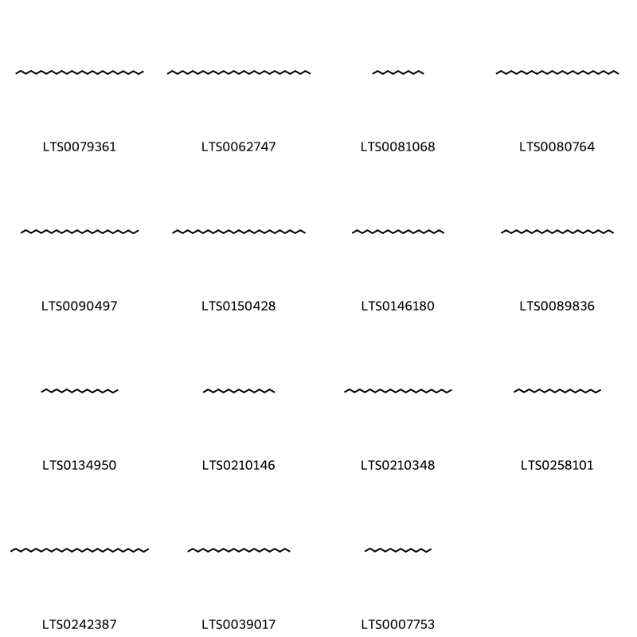{ width=100% }
    <figcaption>Hình ảnh cấu trúc hóa học của 15 hoạt chất thuộc nhóm Saturated hydrocarbons gồm ['hexacosane (LTS0079361)', 'nonacosane (LTS0062747)', 'undecane (LTS0081068)', 'pentacosane (LTS0080764)', 'tetracosane (LTS0090497)', 'heptacosane (LTS0150428)', 'nonadecane (LTS0146180)', 'tricosane (LTS0089836)', 'cetane (LTS0134950)', 'pentadecane (LTS0210146)', 'docosane (LTS0210348)', 'octadecane (LTS0258101)', 'octacosane (LTS0242387)', 'heneicosane (LTS0039017)', 'tetradecane (LTS0007753)'].</figcaption>
</figure>
#### Nhóm Unsaturated hydrocarbons
<figure markdown="span">
    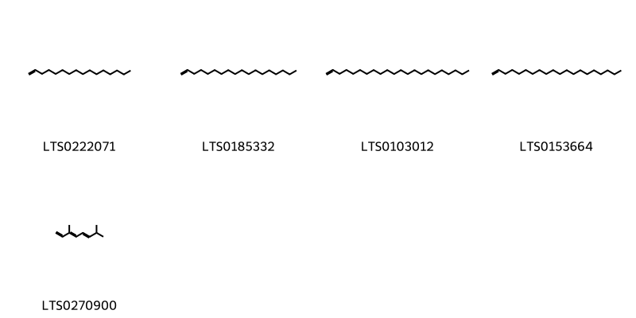{ width=100% }
    <figcaption>Hình ảnh cấu trúc hóa học của 5 hoạt chất thuộc nhóm Unsaturated hydrocarbons gồm ['hexadecene (LTS0222071)', 'octadecene (LTS0185332)', '1-docosene (LTS0103012)', '1-eicosene (LTS0153664)', '(3e,5e)-3,7-dimethylocta-1,3,5-triene (LTS0270900)'].</figcaption>
</figure>

---

### Dược dân tộc học

Danh sách các quốc gia có sử dụng *Daphne odora* trong điều trị các bệnh. 

| Country   | Disease    | Bệnh       |
|:----------|:-----------|:-----------|
| China     | Alexiteric | Alexiteric |

---

---
## Daphne oleoides
### Thông tin về thực vật

!!! info "Phân loại thực vật của *Daphne oleoides* từ GIBF:"
    - **Kingdom:** Plantae
    - **Phylum:** Tracheophyta
    - **Order:** Malvales
    - **Family:** Thymelaeaceae
    - **Genus:** Daphne
    - **Species:** *Daphne oleoides*

 

| Label (VI)   | Label (EN)   | Scientific Name   | Descriptions (VI)   | Descriptions (EN)   | Also Known As (VI)   | Also Known As (EN)   |
|:-------------|:-------------|:------------------|:--------------------|:--------------------|:---------------------|:---------------------|
| N/A          | N/A          | Daphne oleoides   | loài thực vật       | species of plant    | ['']                 | ['']                 |

#### Phân bố trên thế giới

**Từ CSDL GIBF** Türkiye, North Macedonia, Pakistan, Serbia, Iran (Islamic Republic of), France, Spain, Armenia, Lebanon, Montenegro, Bulgaria, United States of America, Italy, Greece, Albania

#### Phân bố tại Việt Nam

**Từ CSDL GIBF**: Không có ghi nhận ở Việt Nam

---
### Thành phần hóa học
        
- Theo cơ sở dữ liệu lotus: Từ loài *Daphne oleoides* đã phân lập và xác định được 118 hoạt chất thuộc về các nhóm Organooxygen compounds, Furanoid lignans, Flavonoids, Coumarins and derivatives, Prenol lipids, Lignan glycosides, Cinnamic acids and derivatives, Steroids and steroid derivatives, Benzene and substituted derivatives, Coumarinolignans. 

|    | chemicalTaxonomyClassyfireClass     |   smiles_count |
|---:|:------------------------------------|---------------:|
|  0 | Benzene and substituted derivatives |              1 |
|  1 | Cinnamic acids and derivatives      |              4 |
|  2 | Coumarinolignans                    |              3 |
|  3 | Coumarins and derivatives           |             23 |
|  4 | Flavonoids                          |              1 |
|  5 | Furanoid lignans                    |             22 |
|  6 | Lignan glycosides                   |              9 |
|  7 | Organooxygen compounds              |             13 |
|  8 | Prenol lipids                       |             32 |
|  9 | Steroids and steroid derivatives    |              4 |

#### Nhóm Benzene and substituted derivatives
<figure markdown="span">
    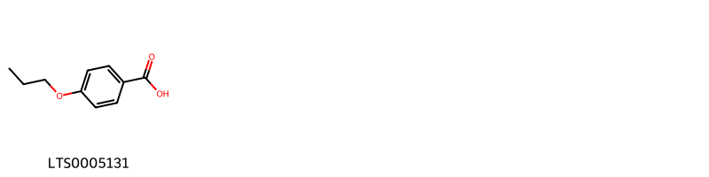{ width=100% }
    <figcaption>Hình ảnh cấu trúc hóa học của 1 hoạt chất thuộc nhóm Benzene and substituted derivatives gồm ['4-propoxybenzoic acid (LTS0005131)'].</figcaption>
</figure>
#### Nhóm Cinnamic acids and derivatives
<figure markdown="span">
    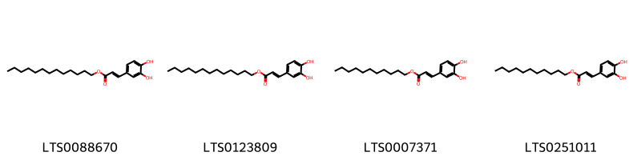{ width=100% }
    <figcaption>Hình ảnh cấu trúc hóa học của 4 hoạt chất thuộc nhóm Cinnamic acids and derivatives gồm ['tridecyl 3-(3,4-dihydroxyphenyl)prop-2-enoate (LTS0088670)', 'tridecyl (2e)-3-(3,4-dihydroxyphenyl)prop-2-enoate (LTS0123809)', 'undecyl 3-(3,4-dihydroxyphenyl)prop-2-enoate (LTS0007371)', 'undecyl (2e)-3-(3,4-dihydroxyphenyl)prop-2-enoate (LTS0251011)'].</figcaption>
</figure>
#### Nhóm Coumarinolignans
<figure markdown="span">
    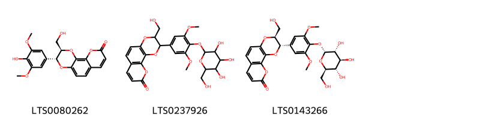{ width=100% }
    <figcaption>Hình ảnh cấu trúc hóa học của 3 hoạt chất thuộc nhóm Coumarinolignans gồm ['daphneticin (LTS0080262)', '2-(3,5-dimethoxy-4-{[3,4,5-trihydroxy-6-(hydroxymethyl)oxan-2-yl]oxy}phenyl)-3-(hydroxymethyl)-2h,3h-[1,4]dioxino[2,3-h]chromen-9-one (LTS0237926)', '(2s,3s)-2-(3,5-dimethoxy-4-{[(2r,3r,4s,5s,6r)-3,4,5-trihydroxy-6-(hydroxymethyl)oxan-2-yl]oxy}phenyl)-3-(hydroxymethyl)-2h,3h-[1,4]dioxino[2,3-h]chromen-9-one (LTS0143266)'].</figcaption>
</figure>
#### Nhóm Coumarins and derivatives
<figure markdown="span">
    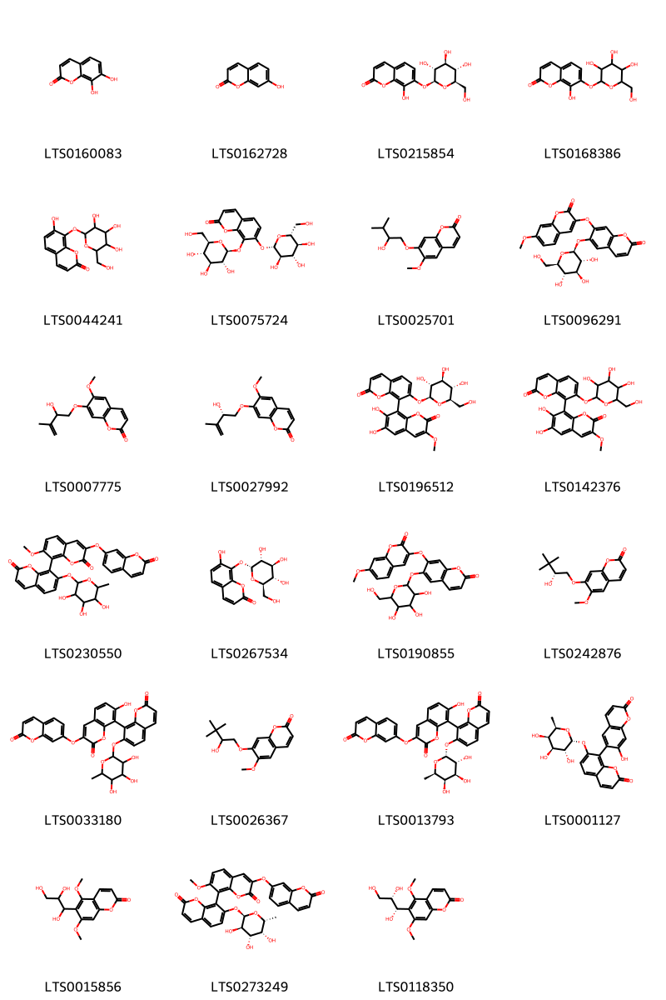{ width=100% }
    <figcaption>Hình ảnh cấu trúc hóa học của 23 hoạt chất thuộc nhóm Coumarins and derivatives gồm ['daphnetin (LTS0160083)', 'umbelliferone (LTS0162728)', 'daphnin (LTS0215854)', '8-hydroxy-7-{[3,4,5-trihydroxy-6-(hydroxymethyl)oxan-2-yl]oxy}chromen-2-one (LTS0168386)', '7-hydroxy-8-{[3,4,5-trihydroxy-6-(hydroxymethyl)oxan-2-yl]oxy}chromen-2-one (LTS0044241)', '7,8-bis({[(2s,3r,4s,5s,6r)-3,4,5-trihydroxy-6-(hydroxymethyl)oxan-2-yl]oxy})chromen-2-one (LTS0075724)', '7-(2-hydroxy-3-methylbutoxy)-6-methoxychromen-2-one (LTS0025701)', '7-methoxy-3-[(2-oxo-6-{[(2s,3r,4s,5s,6r)-3,4,5-trihydroxy-6-(hydroxymethyl)oxan-2-yl]oxy}chromen-7-yl)oxy]chromen-2-one (LTS0096291)', '7-[(2-hydroxy-3-methylbut-3-en-1-yl)oxy]-6-methoxychromen-2-one (LTS0007775)', '7-{[(2s)-2-hydroxy-3-methylbut-3-en-1-yl]oxy}-6-methoxychromen-2-one (LTS0027992)', "6,7-dihydroxy-3-methoxy-7'-{[(2s,3r,4s,5s,6r)-3,4,5-trihydroxy-6-(hydroxymethyl)oxan-2-yl]oxy}-[8,8'-bichromene]-2,2'-dione (LTS0196512)", "6,7-dihydroxy-3-methoxy-7'-{[3,4,5-trihydroxy-6-(hydroxymethyl)oxan-2-yl]oxy}-[8,8'-bichromene]-2,2'-dione (LTS0142376)", "7-methoxy-3-[(2-oxochromen-7-yl)oxy]-7'-[(3,4,5-trihydroxy-6-methyloxan-2-yl)oxy]-[8,8'-bichromene]-2,2'-dione (LTS0230550)", '7-hydroxy-8-{[(2r,3r,4s,5s,6r)-3,4,5-trihydroxy-6-(hydroxymethyl)oxan-2-yl]oxy}chromen-2-one (LTS0267534)', '7-methoxy-3-[(2-oxo-6-{[3,4,5-trihydroxy-6-(hydroxymethyl)oxan-2-yl]oxy}chromen-7-yl)oxy]chromen-2-one (LTS0190855)', '7-[(2r)-2-hydroxy-3,3-dimethylbutoxy]-6-methoxychromen-2-one (LTS0242876)', "7-hydroxy-3-[(2-oxochromen-7-yl)oxy]-7'-[(3,4,5-trihydroxy-6-methyloxan-2-yl)oxy]-[8,8'-bichromene]-2,2'-dione (LTS0033180)", '7-(2-hydroxy-3,3-dimethylbutoxy)-6-methoxychromen-2-one (LTS0026367)', "7-hydroxy-3-[(2-oxochromen-7-yl)oxy]-7'-{[(2r,3r,4s,5r,6r)-3,4,5-trihydroxy-6-methyloxan-2-yl]oxy}-[8,8'-bichromene]-2,2'-dione (LTS0013793)", "7-hydroxy-7'-{[(2r,3r,4s,5r,6r)-3,4,5-trihydroxy-6-methyloxan-2-yl]oxy}-[6,8'-bichromene]-2,2'-dione (LTS0001127)", '5,7-dimethoxy-6-(1,2,3-trihydroxypropyl)chromen-2-one (LTS0015856)', "7-methoxy-3-[(2-oxochromen-7-yl)oxy]-7'-{[(2r,3r,4s,5r,6r)-3,4,5-trihydroxy-6-methyloxan-2-yl]oxy}-[8,8'-bichromene]-2,2'-dione (LTS0273249)", '5,7-dimethoxy-6-[(1s,2s)-1,2,3-trihydroxypropyl]chromen-2-one (LTS0118350)'].</figcaption>
</figure>
#### Nhóm Flavonoids
<figure markdown="span">
    { width=100% }
    <figcaption>Hình ảnh cấu trúc hóa học của 1 hoạt chất thuộc nhóm Flavonoids gồm ['luteolin 7-o-glucoside (LTS0227450)'].</figcaption>
</figure>
#### Nhóm Furanoid lignans
<figure markdown="span">
    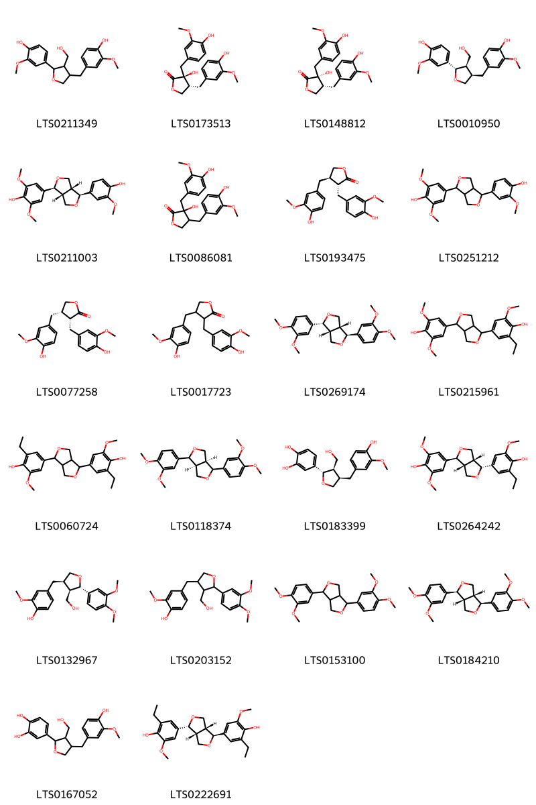{ width=100% }
    <figcaption>Hình ảnh cấu trúc hóa học của 22 hoạt chất thuộc nhóm Furanoid lignans gồm ['4-{4-[(4-hydroxy-3-methoxyphenyl)methyl]-3-(hydroxymethyl)oxolan-2-yl}-2-methoxyphenol (LTS0211349)', '(3s,4r)-3-hydroxy-3,4-bis[(4-hydroxy-3-methoxyphenyl)methyl]oxolan-2-one (LTS0173513)', 'wikstromol (LTS0148812)', 'lariciresinol (LTS0010950)', '(-)-medioresinol (LTS0211003)', '3-hydroxy-3,4-bis[(4-hydroxy-3-methoxyphenyl)methyl]oxolan-2-one (LTS0086081)', 'matairesinol (LTS0193475)', '4-[4-(4-hydroxy-3-methoxyphenyl)-hexahydrofuro[3,4-c]furan-1-yl]-2,6-dimethoxyphenol (LTS0251212)', '(3r,4s)-3,4-bis[(4-hydroxy-3-methoxyphenyl)methyl]oxolan-2-one (LTS0077258)', '3,4-bis[(4-hydroxy-3-methoxyphenyl)methyl]oxolan-2-one (LTS0017723)', 'epipinoresinol (LTS0269174)', '2-ethyl-4-[4-(4-hydroxy-3,5-dimethoxyphenyl)-hexahydrofuro[3,4-c]furan-1-yl]-6-methoxyphenol (LTS0215961)', '2-ethyl-4-[4-(3-ethyl-4-hydroxy-5-methoxyphenyl)-hexahydrofuro[3,4-c]furan-1-yl]-6-methoxyphenol (LTS0060724)', '(3as,6as)-1,4-bis(3,4-dimethoxyphenyl)-hexahydrofuro[3,4-c]furan (LTS0118374)', 'taxiresinol (LTS0183399)', '4-[(1r,3ar,4s,6ar)-4-(4-hydroxy-3,5-dimethoxyphenyl)-hexahydrofuro[3,4-c]furan-1-yl]-2-ethyl-6-methoxyphenol (LTS0264242)', '4-{[(3r,4r,5s)-5-(3,4-dimethoxyphenyl)-4-(hydroxymethyl)oxolan-3-yl]methyl}-2-methoxyphenol (LTS0132967)', '4-{[5-(3,4-dimethoxyphenyl)-4-(hydroxymethyl)oxolan-3-yl]methyl}-2-methoxyphenol (LTS0203152)', '1,4-bis(3,4-dimethoxyphenyl)-hexahydrofuro[3,4-c]furan (LTS0153100)', 'eudesmin (LTS0184210)', 'taxiresinol (LTS0167052)', '4-[(1s,3ar,4r,6ar)-4-(3-ethyl-4-hydroxy-5-methoxyphenyl)-hexahydrofuro[3,4-c]furan-1-yl]-2-ethyl-6-methoxyphenol (LTS0222691)'].</figcaption>
</figure>
#### Nhóm Lignan glycosides
<figure markdown="span">
    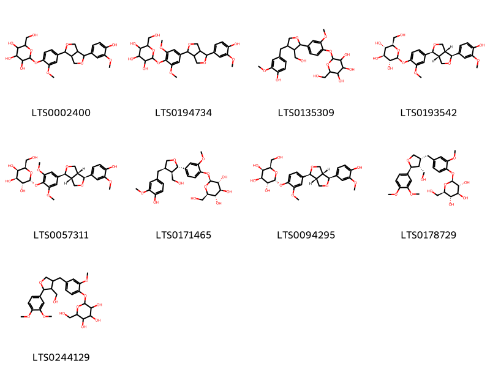{ width=100% }
    <figcaption>Hình ảnh cấu trúc hóa học của 9 hoạt chất thuộc nhóm Lignan glycosides gồm ['2-{4-[4-(4-hydroxy-3-methoxyphenyl)-hexahydrofuro[3,4-c]furan-1-yl]-2-methoxyphenoxy}-6-(hydroxymethyl)oxane-3,4,5-triol (LTS0002400)', '2-{4-[4-(4-hydroxy-3-methoxyphenyl)-hexahydrofuro[3,4-c]furan-1-yl]-2,6-dimethoxyphenoxy}-6-(hydroxymethyl)oxane-3,4,5-triol (LTS0194734)', '2-(4-{4-[(4-hydroxy-3-methoxyphenyl)methyl]-3-(hydroxymethyl)oxolan-2-yl}-2-methoxyphenoxy)-6-(hydroxymethyl)oxane-3,4,5-triol (LTS0135309)', '(2s,3r,4s,5s,6r)-2-{4-[(1s,3ar,4s,6ar)-4-(4-hydroxy-3-methoxyphenyl)-hexahydrofuro[3,4-c]furan-1-yl]-2-methoxyphenoxy}-6-(hydroxymethyl)oxane-3,4,5-triol (LTS0193542)', '(2r,3r,4s,5r,6r)-2-{4-[(1s,3ar,4s,6ar)-4-(4-hydroxy-3-methoxyphenyl)-hexahydrofuro[3,4-c]furan-1-yl]-2,6-dimethoxyphenoxy}-6-(hydroxymethyl)oxane-3,4,5-triol (LTS0057311)', '(2s,3r,4s,5s,6r)-2-{4-[(2s,3r,4r)-4-[(4-hydroxy-3-methoxyphenyl)methyl]-3-(hydroxymethyl)oxolan-2-yl]-2-methoxyphenoxy}-6-(hydroxymethyl)oxane-3,4,5-triol (LTS0171465)', '(2r,3r,4s,5r,6r)-2-{4-[(1s,3ar,4s,6ar)-4-(4-hydroxy-3-methoxyphenyl)-hexahydrofuro[3,4-c]furan-1-yl]-2-methoxyphenoxy}-6-(hydroxymethyl)oxane-3,4,5-triol (LTS0094295)', '(2s,3r,4s,5s,6r)-2-(4-{[(3r,4r,5s)-5-(3,4-dimethoxyphenyl)-4-(hydroxymethyl)oxolan-3-yl]methyl}-2-methoxyphenoxy)-6-(hydroxymethyl)oxane-3,4,5-triol (LTS0178729)', '2-(4-{[5-(3,4-dimethoxyphenyl)-4-(hydroxymethyl)oxolan-3-yl]methyl}-2-methoxyphenoxy)-6-(hydroxymethyl)oxane-3,4,5-triol (LTS0244129)'].</figcaption>
</figure>
#### Nhóm Organooxygen compounds
<figure markdown="span">
    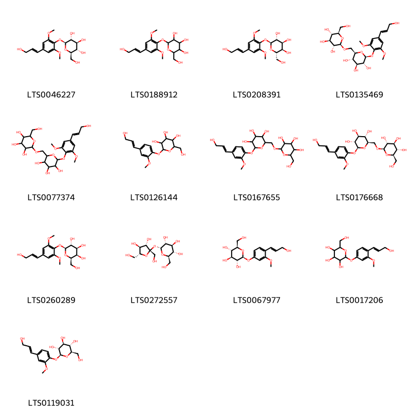{ width=100% }
    <figcaption>Hình ảnh cấu trúc hóa học của 13 hoạt chất thuộc nhóm Organooxygen compounds gồm ['syringin (LTS0046227)', '2-(hydroxymethyl)-6-[4-(3-hydroxyprop-1-en-1-yl)-2,6-dimethoxyphenoxy]oxane-3,4,5-triol (LTS0188912)', '(2s,3r,4s,5r,6s)-2-(hydroxymethyl)-6-{4-[(1e)-3-hydroxyprop-1-en-1-yl]-2,6-dimethoxyphenoxy}oxane-3,4,5-triol (LTS0208391)', '(2s,3r,4s,5s,6r)-2-{4-[(1e)-3-hydroxyprop-1-en-1-yl]-2,6-dimethoxyphenoxy}-6-({[(2r,3r,4s,5s,6r)-3,4,5-trihydroxy-6-(hydroxymethyl)oxan-2-yl]oxy}methyl)oxane-3,4,5-triol (LTS0135469)', '2-[4-(3-hydroxyprop-1-en-1-yl)-2,6-dimethoxyphenoxy]-6-({[3,4,5-trihydroxy-6-(hydroxymethyl)oxan-2-yl]oxy}methyl)oxane-3,4,5-triol (LTS0077374)', '2-(hydroxymethyl)-6-[4-(3-hydroxyprop-1-en-1-yl)-2-methoxyphenoxy]oxane-3,4,5-triol (LTS0126144)', '2-[4-(3-hydroxyprop-1-en-1-yl)-2-methoxyphenoxy]-6-({[3,4,5-trihydroxy-6-(hydroxymethyl)oxan-2-yl]oxy}methyl)oxane-3,4,5-triol (LTS0167655)', '(2s,3r,4s,5s,6r)-2-{4-[(1e)-3-hydroxyprop-1-en-1-yl]-2-methoxyphenoxy}-6-({[(2r,3r,4s,5s,6r)-3,4,5-trihydroxy-6-(hydroxymethyl)oxan-2-yl]oxy}methyl)oxane-3,4,5-triol (LTS0176668)', '(2r,3r,4s,5r,6s)-2-(hydroxymethyl)-6-{4-[(1e)-3-hydroxyprop-1-en-1-yl]-2,6-dimethoxyphenoxy}oxane-3,4,5-triol (LTS0260289)', 'sucrose (LTS0272557)', '(2r,3s,4s,5r,6s)-2-(hydroxymethyl)-6-{4-[(1e)-3-hydroxyprop-1-en-1-yl]-3-methoxyphenoxy}oxane-3,4,5-triol (LTS0067977)', '2-(hydroxymethyl)-6-[4-(3-hydroxyprop-1-en-1-yl)-3-methoxyphenoxy]oxane-3,4,5-triol (LTS0017206)', 'coniferin (LTS0119031)'].</figcaption>
</figure>
#### Nhóm Prenol lipids
<figure markdown="span">
    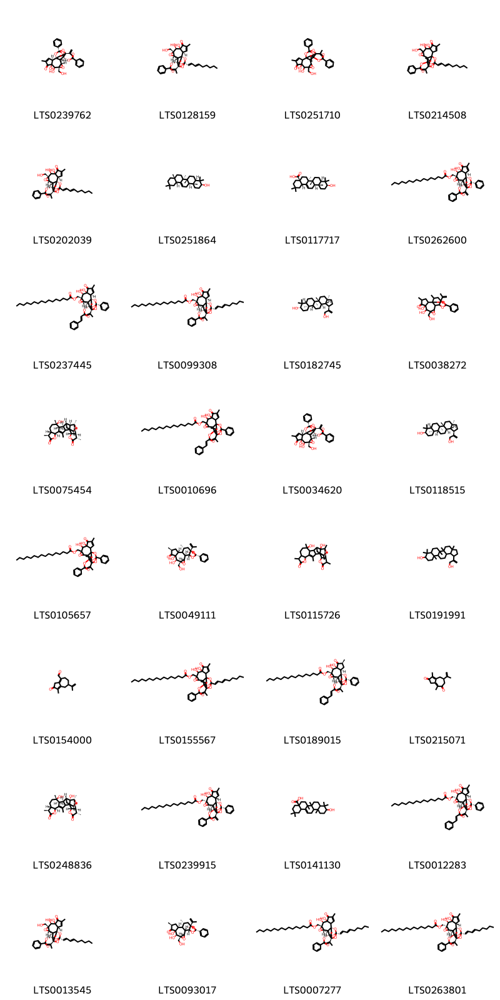{ width=100% }
    <figcaption>Hình ảnh cấu trúc hóa học của 32 hoạt chất thuộc nhóm Prenol lipids gồm ['(1r,2r,6s,7s,8r,10s,11s,12r,14s,16s,17r,18r)-6,7-dihydroxy-8-(hydroxymethyl)-4,18-dimethyl-5-oxo-14-phenyl-16-(prop-1-en-2-yl)-9,13,15,19-tetraoxahexacyclo[12.4.1.0¹,¹¹.0²,⁶.0⁸,¹⁰.0¹²,¹⁶]nonadec-3-en-17-yl benzoate (LTS0239762)', '(1r,2r,6s,7s,8r,10s,11s,12r,14s,16s,17r,18r)-6,7-dihydroxy-8-(hydroxymethyl)-4,18-dimethyl-14-[(1e,3e)-nona-1,3-dien-1-yl]-5-oxo-16-(prop-1-en-2-yl)-9,13,15,19-tetraoxahexacyclo[12.4.1.0¹,¹¹.0²,⁶.0⁸,¹⁰.0¹²,¹⁶]nonadec-3-en-17-yl benzoate (LTS0128159)', '6,7-dihydroxy-8-(hydroxymethyl)-4,18-dimethyl-5-oxo-14-phenyl-16-(prop-1-en-2-yl)-9,13,15,19-tetraoxahexacyclo[12.4.1.0¹,¹¹.0²,⁶.0⁸,¹⁰.0¹²,¹⁶]nonadec-3-en-17-yl benzoate (LTS0251710)', '6,7-dihydroxy-8-(hydroxymethyl)-4,18-dimethyl-14-(nona-1,3-dien-1-yl)-5-oxo-16-(prop-1-en-2-yl)-9,13,15,19-tetraoxahexacyclo[12.4.1.0¹,¹¹.0²,⁶.0⁸,¹⁰.0¹²,¹⁶]nonadec-3-en-17-yl benzoate (LTS0214508)', '(1r,2r,6s,7s,8r,10s,11s,12r,16s,17r,18r)-6,7-dihydroxy-8-(hydroxymethyl)-4,18-dimethyl-14-[(1e,3e)-nona-1,3-dien-1-yl]-5-oxo-16-(prop-1-en-2-yl)-9,13,15,19-tetraoxahexacyclo[12.4.1.0¹,¹¹.0²,⁶.0⁸,¹⁰.0¹²,¹⁶]nonadec-3-en-17-yl benzoate (LTS0202039)', 'β-amyrin (LTS0251864)', 'oleanolic acid (LTS0117717)', '(1r,2r,6s,7s,8r,10s,11s,12r,14s,16s,17r,18r)-8-[(hexadecanoyloxy)methyl]-6,7-dihydroxy-4,18-dimethyl-5-oxo-14-phenyl-16-(prop-1-en-2-yl)-9,13,15,19-tetraoxahexacyclo[12.4.1.0¹,¹¹.0²,⁶.0⁸,¹⁰.0¹²,¹⁶]nonadec-3-en-17-yl benzoate (LTS0262600)', '[(1r,2r,6s,7s,8r,10s,11s,12r,14s,16s,17r,18r)-6,7-dihydroxy-4,18-dimethyl-5-oxo-14-phenyl-17-{[(2e)-3-phenylprop-2-enoyl]oxy}-16-(prop-1-en-2-yl)-9,13,15,19-tetraoxahexacyclo[12.4.1.0¹,¹¹.0²,⁶.0⁸,¹⁰.0¹²,¹⁶]nonadec-3-en-8-yl]methyl hexadecanoate (LTS0237445)', '(1r,2r,6s,7s,8r,10s,11s,12r,14s,16s,17r,18r)-8-[(hexadecanoyloxy)methyl]-6,7-dihydroxy-4,18-dimethyl-14-[(1e,3e)-nona-1,3-dien-1-yl]-5-oxo-16-(prop-1-en-2-yl)-9,13,15,19-tetraoxahexacyclo[12.4.1.0¹,¹¹.0²,⁶.0⁸,¹⁰.0¹²,¹⁶]nonadec-3-en-17-yl benzoate (LTS0099308)', '(1r,3ar,5ar,5br,7ar,9s,11ar,11br,13ar,13bs)-1-(3-hydroxyprop-1-en-2-yl)-3a,5a,5b,8,8,11a-hexamethyl-hexadecahydrocyclopenta[a]chrysen-9-ol (LTS0182745)', '6,7-dihydroxy-8-(hydroxymethyl)-4,18-dimethyl-14-phenyl-16-(prop-1-en-2-yl)-9,13,15,19-tetraoxahexacyclo[12.4.1.0¹,¹¹.0²,⁶.0⁸,¹⁰.0¹²,¹⁶]nonadecan-5-one (LTS0038272)', 'anabsinthin (LTS0075454)', '{6,7-dihydroxy-4,18-dimethyl-5-oxo-14-phenyl-17-[(3-phenylprop-2-enoyl)oxy]-16-(prop-1-en-2-yl)-9,13,15,19-tetraoxahexacyclo[12.4.1.0¹,¹¹.0²,⁶.0⁸,¹⁰.0¹²,¹⁶]nonadec-3-en-8-yl}methyl hexadecanoate (LTS0010696)', '(1r,2s,6s,7s,8r,10s,11r,12r,14s,16s,17r,18r)-6,7-dihydroxy-8-(hydroxymethyl)-4,18-dimethyl-5-oxo-14-phenyl-16-(prop-1-en-2-yl)-9,13,15,19-tetraoxahexacyclo[12.4.1.0¹,¹¹.0²,⁶.0⁸,¹⁰.0¹²,¹⁶]nonadec-3-en-17-yl benzoate (LTS0034620)', '(1r,3ar,5ar,5br,7ar,9r,11ar,11br,13ar,13bs)-1-(3-hydroxyprop-1-en-2-yl)-3a,5a,5b,8,8,11a-hexamethyl-hexadecahydrocyclopenta[a]chrysen-9-ol (LTS0118515)', '8-[(hexadecanoyloxy)methyl]-6,7-dihydroxy-4,18-dimethyl-5-oxo-14-phenyl-16-(prop-1-en-2-yl)-9,13,15,19-tetraoxahexacyclo[12.4.1.0¹,¹¹.0²,⁶.0⁸,¹⁰.0¹²,¹⁶]nonadec-3-en-17-yl benzoate (LTS0105657)', '(1r,2s,4s,6s,7s,8r,10s,11r,12r,14s,16r,18r)-6,7-dihydroxy-8-(hydroxymethyl)-4,18-dimethyl-14-phenyl-16-(prop-1-en-2-yl)-9,13,15,19-tetraoxahexacyclo[12.4.1.0¹,¹¹.0²,⁶.0⁸,¹⁰.0¹²,¹⁶]nonadecan-5-one (LTS0049111)', '12,27-dihydroxy-3,8,12,17,19,23-hexamethyl-6,18,25-trioxaoctacyclo[13.11.1.0¹,¹⁷.0²,¹⁴.0⁴,¹³.0⁵,⁹.0¹⁹,²⁷.0²²,²⁶]heptacos-3-ene-7,24-dione (LTS0115726)', '1-(3-hydroxyprop-1-en-2-yl)-3a,5a,5b,8,8,11a-hexamethyl-hexadecahydrocyclopenta[a]chrysen-9-ol (LTS0191991)', '1-methyl-2-oxo-7-(prop-1-en-2-yl)-5,6,7,8-tetrahydro-3h-azulene-4-carbaldehyde (LTS0154000)', '8-[(hexadecanoyloxy)methyl]-6,7-dihydroxy-4,18-dimethyl-14-(nona-1,3-dien-1-yl)-5-oxo-16-(prop-1-en-2-yl)-9,13,15,19-tetraoxahexacyclo[12.4.1.0¹,¹¹.0²,⁶.0⁸,¹⁰.0¹²,¹⁶]nonadec-3-en-17-yl benzoate (LTS0155567)', '[(1r,2r,4s,6s,7s,8r,10s,11s,12r,14s,16s,17r,18r)-6,7-dihydroxy-4,18-dimethyl-5-oxo-14-phenyl-17-{[(2e)-3-phenylprop-2-enoyl]oxy}-16-(prop-1-en-2-yl)-9,13,15,19-tetraoxahexacyclo[12.4.1.0¹,¹¹.0²,⁶.0⁸,¹⁰.0¹²,¹⁶]nonadecan-8-yl]methyl hexadecanoate (LTS0189015)', '1,4-dimethyl-7-(prop-1-en-2-yl)-3,6,7,8-tetrahydroazulene-2,5-dione (LTS0215071)', '(1r,2r,5s,8s,9s,12s,13s,14r,15r,17s,19s,22s,23s,26s,27s)-12,27-dihydroxy-3,8,12,17,19,23-hexamethyl-6,18,25-trioxaoctacyclo[13.11.1.0¹,¹⁷.0²,¹⁴.0⁴,¹³.0⁵,⁹.0¹⁹,²⁷.0²²,²⁶]heptacos-3-ene-7,24-dione (LTS0248836)', '(1r,2s,6s,7s,8s,10r,11s,12r,14s,16s,17s,18r)-8-[(hexadecanoyloxy)methyl]-6,7-dihydroxy-4,18-dimethyl-5-oxo-14-phenyl-16-(prop-1-en-2-yl)-9,13,15,19-tetraoxahexacyclo[12.4.1.0¹,¹¹.0²,⁶.0⁸,¹⁰.0¹²,¹⁶]nonadec-3-en-17-yl benzoate (LTS0239915)', 'oleanolic acid (LTS0141130)', '[(1r,2s,6s,7s,8s,10r,11s,12r,14s,16s,17s,18r)-6,7-dihydroxy-4,18-dimethyl-5-oxo-14-phenyl-17-{[(2e)-3-phenylprop-2-enoyl]oxy}-16-(prop-1-en-2-yl)-9,13,15,19-tetraoxahexacyclo[12.4.1.0¹,¹¹.0²,⁶.0⁸,¹⁰.0¹²,¹⁶]nonadec-3-en-8-yl]methyl hexadecanoate (LTS0012283)', '(1r,2s,6s,7s,8r,10s,11r,12r,14s,16s,17r,18r)-6,7-dihydroxy-8-(hydroxymethyl)-4,18-dimethyl-14-[(1e,3e)-nona-1,3-dien-1-yl]-5-oxo-16-(prop-1-en-2-yl)-9,13,15,19-tetraoxahexacyclo[12.4.1.0¹,¹¹.0²,⁶.0⁸,¹⁰.0¹²,¹⁶]nonadec-3-en-17-yl benzoate (LTS0013545)', '(1r,2r,4s,6s,7s,8r,10s,11s,12r,14s,16r,18r)-6,7-dihydroxy-8-(hydroxymethyl)-4,18-dimethyl-14-phenyl-16-(prop-1-en-2-yl)-9,13,15,19-tetraoxahexacyclo[12.4.1.0¹,¹¹.0²,⁶.0⁸,¹⁰.0¹²,¹⁶]nonadecan-5-one (LTS0093017)', '(1r,6s,7s,8r,10s,11s,12r,14s,16s,17r,18r)-8-[(hexadecanoyloxy)methyl]-6,7-dihydroxy-4,18-dimethyl-14-[(1e,3e)-nona-1,3-dien-1-yl]-5-oxo-16-(prop-1-en-2-yl)-9,13,15,19-tetraoxahexacyclo[12.4.1.0¹,¹¹.0²,⁶.0⁸,¹⁰.0¹²,¹⁶]nonadec-3-en-17-yl benzoate (LTS0007277)', '(1r,2s,6s,7s,8s,10r,11s,12r,14s,16s,17s,18r)-8-[(hexadecanoyloxy)methyl]-6,7-dihydroxy-4,18-dimethyl-14-[(1e,3e)-nona-1,3-dien-1-yl]-5-oxo-16-(prop-1-en-2-yl)-9,13,15,19-tetraoxahexacyclo[12.4.1.0¹,¹¹.0²,⁶.0⁸,¹⁰.0¹²,¹⁶]nonadec-3-en-17-yl benzoate (LTS0263801)'].</figcaption>
</figure>
#### Nhóm Steroids and steroid derivatives
<figure markdown="span">
    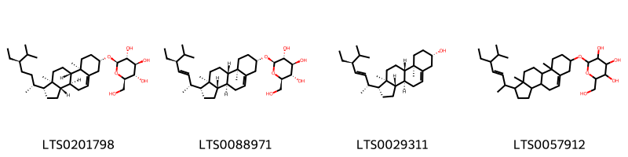{ width=100% }
    <figcaption>Hình ảnh cấu trúc hóa học của 4 hoạt chất thuộc nhóm Steroids and steroid derivatives gồm ['sitogluside (LTS0201798)', '(2r,3r,4s,5s,6r)-2-{[(1r,3as,3bs,7s,9ar,9bs,11ar)-1-[(2r,3e,5s)-5-ethyl-6-methylhept-3-en-2-yl]-9a,11a-dimethyl-1h,2h,3h,3ah,3bh,4h,6h,7h,8h,9h,9bh,10h,11h-cyclopenta[a]phenanthren-7-yl]oxy}-6-(hydroxymethyl)oxane-3,4,5-triol (LTS0088971)', 'phytosterol (LTS0029311)', '2-{[1-(5-ethyl-6-methylhept-3-en-2-yl)-9a,11a-dimethyl-1h,2h,3h,3ah,3bh,4h,6h,7h,8h,9h,9bh,10h,11h-cyclopenta[a]phenanthren-7-yl]oxy}-6-(hydroxymethyl)oxane-3,4,5-triol (LTS0057912)'].</figcaption>
</figure>

---

### Dược dân tộc học

Danh sách các quốc gia có sử dụng *Daphne oleoides* trong điều trị các bệnh. 

| Country     | Disease         | Bệnh                |
|:------------|:----------------|:--------------------|
| Afghanistan | Purgative       | Thuốc xổ            |
| Asia        | Purgative       | Thuốc xổ            |
| Iran        | Counterirritant | Chất chống kích ứng |

---

# Chi Lasiosiphon

??? note "Danh sách các dược liệu thuộc chi"
    
	 - *Lasiosiphon eriocephalus*
	 - *Lasiosiphon kraussi*
	 - *Lasiosiphon kraussii*
	 - *Lasiosiphon latifolius*

---
## Lasiosiphon eriocephalus
### Thông tin về thực vật

!!! info "Phân loại thực vật của *Gnidia glauca* từ GIBF:"
    - **Kingdom:** Plantae
    - **Phylum:** Tracheophyta
    - **Order:** Malvales
    - **Family:** Thymelaeaceae
    - **Genus:** Gnidia
    - **Species:** *Gnidia glauca*

 

| Label (VI)   | Label (EN)   | Scientific Name   | Descriptions (VI)   | Descriptions (EN)   | Also Known As (VI)   | Also Known As (EN)   |
|:-------------|:-------------|:------------------|:--------------------|:--------------------|:---------------------|:---------------------|
| N/A          | N/A          | Daphne oleoides   | loài thực vật       | species of plant    | ['']                 | ['']                 |

#### Phân bố trên thế giới

**Từ CSDL GIBF** nan, unknown or invalid, Sri Lanka, South Africa, India

#### Phân bố tại Việt Nam

**Từ CSDL GIBF**: Không có ghi nhận ở Việt Nam

---
### Thành phần hóa học
        
- Theo cơ sở dữ liệu lotus: Từ loài *Gnidia glauca* đã phân lập và xác định được Chưa có hoạt chất nào được phân lập. hoạt chất thuộc về các nhóm Không có hoạt chất nào được phân lập. 

Không có hình ảnh nào được tạo ra

---

### Dược dân tộc học

Danh sách các quốc gia có sử dụng *Gnidia glauca* trong điều trị các bệnh. 

| Country   | Disease                     | Bệnh                                 |
|:----------|:----------------------------|:-------------------------------------|
| Elsewhere | Vesicant, Piscicide, Poison | Chất tạo bọt, chất diệt cá, chất độc |

---

---
## Lasiosiphon kraussi
### Thông tin về thực vật

!!! info "Phân loại thực vật của *Gnidia kraussiana* từ GIBF:"
    - **Kingdom:** Plantae
    - **Phylum:** Tracheophyta
    - **Order:** Malvales
    - **Family:** Thymelaeaceae
    - **Genus:** Gnidia
    - **Species:** *Gnidia kraussiana*

 

| Label (VI)   | Label (EN)   | Scientific Name   | Descriptions (VI)   | Descriptions (EN)   | Also Known As (VI)   | Also Known As (EN)   |
|:-------------|:-------------|:------------------|:--------------------|:--------------------|:---------------------|:---------------------|
| N/A          | N/A          | Daphne oleoides   | loài thực vật       | species of plant    | ['']                 | ['']                 |

#### Phân bố trên thế giới

**Từ CSDL GIBF** nan, unknown or invalid, Sri Lanka, South Africa, India

#### Phân bố tại Việt Nam

**Từ CSDL GIBF**: Không có ghi nhận ở Việt Nam

---
### Thành phần hóa học
        
- Theo cơ sở dữ liệu lotus: Từ loài *Gnidia kraussiana* đã phân lập và xác định được Chưa có hoạt chất nào được phân lập. hoạt chất thuộc về các nhóm Không có hoạt chất nào được phân lập. 

Không có hình ảnh nào được tạo ra

---

### Dược dân tộc học

Danh sách các quốc gia có sử dụng *Gnidia kraussiana* trong điều trị các bệnh. 

| Country   | Disease           | Bệnh                      |
|:----------|:------------------|:--------------------------|
| Sudan     | Piscicide, Poison | Thuốc sát trùng, Chất độc |

---

---
## Lasiosiphon kraussii
### Thông tin về thực vật

!!! info "Phân loại thực vật của *Gnidia kraussiana* từ GIBF:"
    - **Kingdom:** Plantae
    - **Phylum:** Tracheophyta
    - **Order:** Malvales
    - **Family:** Thymelaeaceae
    - **Genus:** Gnidia
    - **Species:** *Gnidia kraussiana*

 

| Label (VI)   | Label (EN)   | Scientific Name   | Descriptions (VI)   | Descriptions (EN)   | Also Known As (VI)   | Also Known As (EN)   |
|:-------------|:-------------|:------------------|:--------------------|:--------------------|:---------------------|:---------------------|
| N/A          | N/A          | Daphne oleoides   | loài thực vật       | species of plant    | ['']                 | ['']                 |

#### Phân bố trên thế giới

**Từ CSDL GIBF** nan, unknown or invalid, Sri Lanka, South Africa, India

#### Phân bố tại Việt Nam

**Từ CSDL GIBF**: Không có ghi nhận ở Việt Nam

---
### Thành phần hóa học
        
- Theo cơ sở dữ liệu lotus: Từ loài *Gnidia kraussiana* đã phân lập và xác định được Chưa có hoạt chất nào được phân lập. hoạt chất thuộc về các nhóm Không có hoạt chất nào được phân lập. 

Không có hình ảnh nào được tạo ra

---

### Dược dân tộc học

Danh sách các quốc gia có sử dụng *Gnidia kraussiana* trong điều trị các bệnh. 

| Country   | Disease   | Bệnh     |
|:----------|:----------|:---------|
| Africa    | Purgative | Thuốc xổ |

---

---
## Lasiosiphon latifolius
### Thông tin về thực vật

!!! info "Phân loại thực vật của *Gnidia latifolia* từ GIBF:"
    - **Kingdom:** Plantae
    - **Phylum:** Tracheophyta
    - **Order:** Malvales
    - **Family:** Thymelaeaceae
    - **Genus:** Gnidia
    - **Species:** *Gnidia latifolia*

 

| Label (VI)   | Label (EN)   | Scientific Name   | Descriptions (VI)   | Descriptions (EN)   | Also Known As (VI)   | Also Known As (EN)   |
|:-------------|:-------------|:------------------|:--------------------|:--------------------|:---------------------|:---------------------|
| N/A          | N/A          | Daphne oleoides   | loài thực vật       | species of plant    | ['']                 | ['']                 |

#### Phân bố trên thế giới

**Từ CSDL GIBF** Kenya

#### Phân bố tại Việt Nam

**Từ CSDL GIBF**: Không có ghi nhận ở Việt Nam

---
### Thành phần hóa học
        
- Theo cơ sở dữ liệu lotus: Từ loài *Gnidia latifolia* đã phân lập và xác định được Chưa có hoạt chất nào được phân lập. hoạt chất thuộc về các nhóm Không có hoạt chất nào được phân lập. 

Không có hình ảnh nào được tạo ra

---

### Dược dân tộc học

Danh sách các quốc gia có sử dụng *Gnidia latifolia* trong điều trị các bệnh. 

| Country         | Disease   | Bệnh     |
|:----------------|:----------|:---------|
| Africa(Swahili) | Poison    | Chất độc |

---

# Chi Thymelaea

??? note "Danh sách các dược liệu thuộc chi"
    
	 - *Thymelaea hirsuta*
	 - *Thymelaea sanamunda*
	 - *Thymelaea tinctoria*

---
## Thymelaea hirsuta
### Thông tin về thực vật

!!! info "Phân loại thực vật của *Thymelaea hirsuta* từ GIBF:"
    - **Kingdom:** Plantae
    - **Phylum:** Tracheophyta
    - **Order:** Malvales
    - **Family:** Thymelaeaceae
    - **Genus:** Thymelaea
    - **Species:** *Thymelaea hirsuta*

 

| Label (VI)   | Label (EN)   | Scientific Name   | Descriptions (VI)   | Descriptions (EN)   | Also Known As (VI)   | Also Known As (EN)   |
|:-------------|:-------------|:------------------|:--------------------|:--------------------|:---------------------|:---------------------|
| N/A          | N/A          | Thymelaea hirsuta | loài thực vật       | species of plant    | ['']                 | ['']                 |

#### Phân bố trên thế giới

**Từ CSDL GIBF** Tunisia, Jordan, France, Spain, Cyprus, Italy, Israel, Algeria, Greece

#### Phân bố tại Việt Nam

**Từ CSDL GIBF**: Không có ghi nhận ở Việt Nam

---
### Thành phần hóa học
        
- Theo cơ sở dữ liệu lotus: Từ loài *Thymelaea hirsuta* đã phân lập và xác định được 21 hoạt chất thuộc về các nhóm Prenol lipids, Coumarins and derivatives. 

|    | chemicalTaxonomyClassyfireClass   |   smiles_count |
|---:|:----------------------------------|---------------:|
|  0 | Coumarins and derivatives         |              1 |
|  1 | Prenol lipids                     |             19 |

#### Nhóm Coumarins and derivatives
<figure markdown="span">
    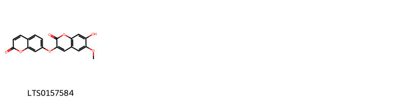{ width=100% }
    <figcaption>Hình ảnh cấu trúc hóa học của 1 hoạt chất thuộc nhóm Coumarins and derivatives gồm ['daphnoretin (LTS0157584)'].</figcaption>
</figure>
#### Nhóm Prenol lipids
<figure markdown="span">
    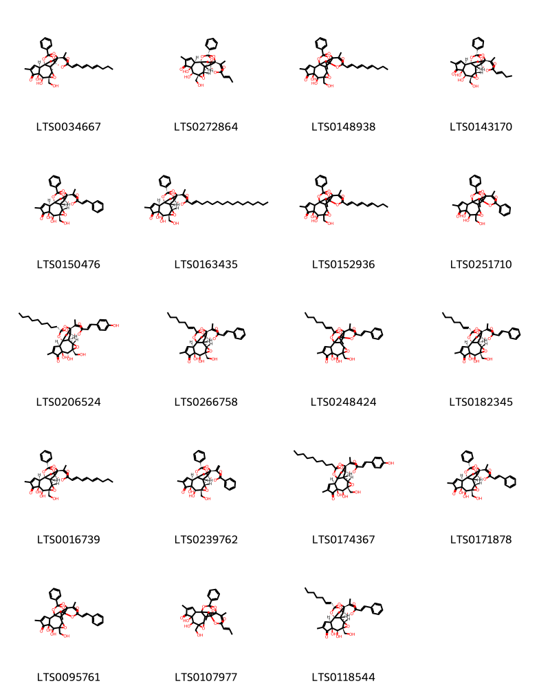{ width=100% }
    <figcaption>Hình ảnh cấu trúc hóa học của 19 hoạt chất thuộc nhóm Prenol lipids gồm ['(1r,2r,6s,7s,8r,16s,17r,18r)-6,7-dihydroxy-8-(hydroxymethyl)-4,18-dimethyl-5-oxo-14-phenyl-16-(prop-1-en-2-yl)-9,13,15,19-tetraoxahexacyclo[12.4.1.0¹,¹¹.0²,⁶.0⁸,¹⁰.0¹²,¹⁶]nonadec-3-en-17-yl (2e,4e,6e)-deca-2,4,6-trienoate (LTS0034667)', '(1r,2r,6s,7s,8r,10s,11s,12r,14s,16s,17r,18r)-6,7-dihydroxy-8-(hydroxymethyl)-4,18-dimethyl-5-oxo-14-phenyl-16-(prop-1-en-2-yl)-9,13,15,19-tetraoxahexacyclo[12.4.1.0¹,¹¹.0²,⁶.0⁸,¹⁰.0¹²,¹⁶]nonadec-3-en-17-yl (2e)-but-2-enoate (LTS0272864)', '6,7-dihydroxy-8-(hydroxymethyl)-4,18-dimethyl-5-oxo-14-phenyl-16-(prop-1-en-2-yl)-9,13,15,19-tetraoxahexacyclo[12.4.1.0¹,¹¹.0²,⁶.0⁸,¹⁰.0¹²,¹⁶]nonadec-3-en-17-yl deca-2,4,6-trienoate (LTS0148938)', '(1r,2r,6s,7s,8r,10s,11s,12r,14s,16s,17r,18r)-6,7-dihydroxy-8-(hydroxymethyl)-4,18-dimethyl-5-oxo-14-phenyl-16-(prop-1-en-2-yl)-9,13,15,19-tetraoxahexacyclo[12.4.1.0¹,¹¹.0²,⁶.0⁸,¹⁰.0¹²,¹⁶]nonadec-3-en-17-yl (2e)-pent-2-enoate (LTS0143170)', 'gnidicin (LTS0150476)', '(1r,2r,6s,7s,8r,10s,11s,12r,14s,16s,17r,18r)-6,7-dihydroxy-8-(hydroxymethyl)-4,18-dimethyl-5-oxo-14-phenyl-16-(prop-1-en-2-yl)-9,13,15,19-tetraoxahexacyclo[12.4.1.0¹,¹¹.0²,⁶.0⁸,¹⁰.0¹²,¹⁶]nonadec-3-en-17-yl (2e)-heptadec-2-enoate (LTS0163435)', '6,7-dihydroxy-8-(hydroxymethyl)-4,18-dimethyl-5-oxo-14-phenyl-16-(prop-1-en-2-yl)-9,13,15,19-tetraoxahexacyclo[12.4.1.0¹,¹¹.0²,⁶.0⁸,¹⁰.0¹²,¹⁶]nonadec-3-en-17-yl (2e,4e,6e)-deca-2,4,6-trienoate (LTS0152936)', '6,7-dihydroxy-8-(hydroxymethyl)-4,18-dimethyl-5-oxo-14-phenyl-16-(prop-1-en-2-yl)-9,13,15,19-tetraoxahexacyclo[12.4.1.0¹,¹¹.0²,⁶.0⁸,¹⁰.0¹²,¹⁶]nonadec-3-en-17-yl benzoate (LTS0251710)', '(1r,2r,6s,7r,8r,10s,11r,12r,14s,16s,17r,18r)-6,7-dihydroxy-8-(hydroxymethyl)-4,18-dimethyl-14-nonyl-5-oxo-16-(prop-1-en-2-yl)-9,13,15,19-tetraoxahexacyclo[12.4.1.0¹,¹¹.0²,⁶.0⁸,¹⁰.0¹²,¹⁶]nonadec-3-en-17-yl (2e)-3-(4-hydroxyphenyl)prop-2-enoate (LTS0206524)', '(2r,6s,7s,8r,10s,11s,12r,16s,17r,18r)-14-[(1e)-hept-1-en-1-yl]-6,7-dihydroxy-8-(hydroxymethyl)-4,18-dimethyl-5-oxo-16-(prop-1-en-2-yl)-9,13,15,19-tetraoxahexacyclo[12.4.1.0¹,¹¹.0²,⁶.0⁸,¹⁰.0¹²,¹⁶]nonadec-3-en-17-yl (2e)-3-phenylprop-2-enoate (LTS0266758)', '14-(hept-1-en-1-yl)-6,7-dihydroxy-8-(hydroxymethyl)-4,18-dimethyl-5-oxo-16-(prop-1-en-2-yl)-9,13,15,19-tetraoxahexacyclo[12.4.1.0¹,¹¹.0²,⁶.0⁸,¹⁰.0¹²,¹⁶]nonadec-3-en-17-yl 3-phenylprop-2-enoate (LTS0248424)', '(1r,2r,6s,7s,8r,10s,11r,12r,14s,16s,17r,18r)-14-[(1e)-hept-1-en-1-yl]-6,7-dihydroxy-8-(hydroxymethyl)-4,18-dimethyl-5-oxo-16-(prop-1-en-2-yl)-9,13,15,19-tetraoxahexacyclo[12.4.1.0¹,¹¹.0²,⁶.0⁸,¹⁰.0¹²,¹⁶]nonadec-3-en-17-yl (2e)-3-phenylprop-2-enoate (LTS0182345)', '(1r,2r,6s,7s,8r,10s,11s,12r,14s,16s,17r,18r)-6,7-dihydroxy-8-(hydroxymethyl)-4,18-dimethyl-5-oxo-14-phenyl-16-(prop-1-en-2-yl)-9,13,15,19-tetraoxahexacyclo[12.4.1.0¹,¹¹.0²,⁶.0⁸,¹⁰.0¹²,¹⁶]nonadec-3-en-17-yl (2e,4e,6e)-deca-2,4,6-trienoate (LTS0016739)', '(1r,2r,6s,7s,8r,10s,11s,12r,14s,16s,17r,18r)-6,7-dihydroxy-8-(hydroxymethyl)-4,18-dimethyl-5-oxo-14-phenyl-16-(prop-1-en-2-yl)-9,13,15,19-tetraoxahexacyclo[12.4.1.0¹,¹¹.0²,⁶.0⁸,¹⁰.0¹²,¹⁶]nonadec-3-en-17-yl benzoate (LTS0239762)', '(2r,6s,7s,8r,10s,11s,12r,16s,17r,18r)-6,7-dihydroxy-8-(hydroxymethyl)-4,18-dimethyl-14-nonyl-5-oxo-16-(prop-1-en-2-yl)-9,13,15,19-tetraoxahexacyclo[12.4.1.0¹,¹¹.0²,⁶.0⁸,¹⁰.0¹²,¹⁶]nonadec-3-en-17-yl (2e)-3-(4-hydroxyphenyl)prop-2-enoate (LTS0174367)', '(1r,2r,6s,7s,8r,10s,11s,12r,14s,16s,17r,18r)-6,7-dihydroxy-8-(hydroxymethyl)-4,18-dimethyl-5-oxo-14-phenyl-16-(prop-1-en-2-yl)-9,13,15,19-tetraoxahexacyclo[12.4.1.0¹,¹¹.0²,⁶.0⁸,¹⁰.0¹²,¹⁶]nonadec-3-en-17-yl (2e)-3-phenylprop-2-enoate (LTS0171878)', '6,7-dihydroxy-8-(hydroxymethyl)-4,18-dimethyl-5-oxo-14-phenyl-16-(prop-1-en-2-yl)-9,13,15,19-tetraoxahexacyclo[12.4.1.0¹,¹¹.0²,⁶.0⁸,¹⁰.0¹²,¹⁶]nonadec-3-en-17-yl 3-phenylprop-2-enoate (LTS0095761)', '6,7-dihydroxy-8-(hydroxymethyl)-4,18-dimethyl-5-oxo-14-phenyl-16-(prop-1-en-2-yl)-9,13,15,19-tetraoxahexacyclo[12.4.1.0¹,¹¹.0²,⁶.0⁸,¹⁰.0¹²,¹⁶]nonadec-3-en-17-yl but-2-enoate (LTS0107977)', '(1r,2r,6s,7s,8r,10s,11s,12r,14s,16s,17r,18r)-14-[(1e)-hept-1-en-1-yl]-6,7-dihydroxy-8-(hydroxymethyl)-4,18-dimethyl-5-oxo-16-(prop-1-en-2-yl)-9,13,15,19-tetraoxahexacyclo[12.4.1.0¹,¹¹.0²,⁶.0⁸,¹⁰.0¹²,¹⁶]nonadec-3-en-17-yl (2e)-3-phenylprop-2-enoate (LTS0118544)'].</figcaption>
</figure>

---

### Dược dân tộc học

Danh sách các quốc gia có sử dụng *Thymelaea hirsuta* trong điều trị các bệnh. 

| Country   | Disease   | Bệnh     |
|:----------|:----------|:---------|
| ain       | Purgative | Thuốc xổ |

---

---
## Thymelaea sanamunda
### Thông tin về thực vật

!!! info "Phân loại thực vật của *Thymelaea sanamunda* từ GIBF:"
    - **Kingdom:** Plantae
    - **Phylum:** Tracheophyta
    - **Order:** Malvales
    - **Family:** Thymelaeaceae
    - **Genus:** Thymelaea
    - **Species:** *Thymelaea sanamunda*

 

| Label (VI)   | Label (EN)   | Scientific Name     | Descriptions (VI)   | Descriptions (EN)   | Also Known As (VI)   | Also Known As (EN)   |
|:-------------|:-------------|:--------------------|:--------------------|:--------------------|:---------------------|:---------------------|
| N/A          | N/A          | Thymelaea sanamunda | loài thực vật       | species of plant    | ['']                 | ['']                 |

#### Phân bố trên thế giới

**Từ CSDL GIBF** France, Spain

#### Phân bố tại Việt Nam

**Từ CSDL GIBF**: Không có ghi nhận ở Việt Nam

---
### Thành phần hóa học
        
- Theo cơ sở dữ liệu lotus: Từ loài *Thymelaea sanamunda* đã phân lập và xác định được Chưa có hoạt chất nào được phân lập. hoạt chất thuộc về các nhóm Không có hoạt chất nào được phân lập. 

Không có hình ảnh nào được tạo ra

---

### Dược dân tộc học

Danh sách các quốc gia có sử dụng *Thymelaea sanamunda* trong điều trị các bệnh. 

| Country   | Disease   | Bệnh     |
|:----------|:----------|:---------|
| ain       | Purgative | Thuốc xổ |

---

---
## Thymelaea tinctoria
### Thông tin về thực vật

!!! info "Phân loại thực vật của *Thymelaea tinctoria* từ GIBF:"
    - **Kingdom:** Plantae
    - **Phylum:** Tracheophyta
    - **Order:** Malvales
    - **Family:** Thymelaeaceae
    - **Genus:** Thymelaea
    - **Species:** *Thymelaea tinctoria*

 

| Label (VI)   | Label (EN)   | Scientific Name     | Descriptions (VI)   | Descriptions (EN)   | Also Known As (VI)   | Also Known As (EN)   |
|:-------------|:-------------|:--------------------|:--------------------|:--------------------|:---------------------|:---------------------|
| N/A          | N/A          | Thymelaea tinctoria | loài thực vật       | species of plant    | ['']                 | ['']                 |

#### Phân bố trên thế giới

**Từ CSDL GIBF** France, Spain

#### Phân bố tại Việt Nam

**Từ CSDL GIBF**: Không có ghi nhận ở Việt Nam

---
### Thành phần hóa học
        
- Theo cơ sở dữ liệu lotus: Từ loài *Thymelaea tinctoria* đã phân lập và xác định được Chưa có hoạt chất nào được phân lập. hoạt chất thuộc về các nhóm Không có hoạt chất nào được phân lập. 

Không có hình ảnh nào được tạo ra

---

### Dược dân tộc học

Danh sách các quốc gia có sử dụng *Thymelaea tinctoria* trong điều trị các bệnh. 

| Country   | Disease   | Bệnh     |
|:----------|:----------|:---------|
| ain       | Purgative | Thuốc xổ |

---

# Chi Daphnopsis

??? note "Danh sách các dược liệu thuộc chi"
    
	 - *Daphnopsis brasiliensis*
	 - *Daphnopsis salicifolia*
	 - *Daphnopsis swartzii*

---
## Daphnopsis brasiliensis
### Thông tin về thực vật

!!! info "Phân loại thực vật của *Daphnopsis brasiliensis* từ GIBF:"
    - **Kingdom:** Plantae
    - **Phylum:** Tracheophyta
    - **Order:** Malvales
    - **Family:** Thymelaeaceae
    - **Genus:** Daphnopsis
    - **Species:** *Daphnopsis brasiliensis*

 

| Label (VI)   | Label (EN)   | Scientific Name         | Descriptions (VI)   | Descriptions (EN)   | Also Known As (VI)   | Also Known As (EN)   |
|:-------------|:-------------|:------------------------|:--------------------|:--------------------|:---------------------|:---------------------|
| N/A          | N/A          | Daphnopsis brasiliensis |                     | species of plant    | ['']                 | ['']                 |

#### Phân bố trên thế giới

**Từ CSDL GIBF** nan, Brazil

#### Phân bố tại Việt Nam

**Từ CSDL GIBF**: Không có ghi nhận ở Việt Nam

---
### Thành phần hóa học
        
- Theo cơ sở dữ liệu lotus: Từ loài *Daphnopsis brasiliensis* đã phân lập và xác định được Chưa có hoạt chất nào được phân lập. hoạt chất thuộc về các nhóm Không có hoạt chất nào được phân lập. 

Không có hình ảnh nào được tạo ra

---

### Dược dân tộc học

Danh sách các quốc gia có sử dụng *Daphnopsis brasiliensis* trong điều trị các bệnh. 

| Country   | Disease   | Bệnh     |
|:----------|:----------|:---------|
| Brazil    | Purgative | Thuốc xổ |

---

---
## Daphnopsis salicifolia
### Thông tin về thực vật

!!! info "Phân loại thực vật của *Daphnopsis americana* từ GIBF:"
    - **Kingdom:** Plantae
    - **Phylum:** Tracheophyta
    - **Order:** Malvales
    - **Family:** Thymelaeaceae
    - **Genus:** Daphnopsis
    - **Species:** *Daphnopsis americana*

 

| Label (VI)   | Label (EN)   | Scientific Name         | Descriptions (VI)   | Descriptions (EN)   | Also Known As (VI)   | Also Known As (EN)   |
|:-------------|:-------------|:------------------------|:--------------------|:--------------------|:---------------------|:---------------------|
| N/A          | N/A          | Daphnopsis brasiliensis |                     | species of plant    | ['']                 | ['']                 |

#### Phân bố trên thế giới

**Từ CSDL GIBF** nan, Mexico

#### Phân bố tại Việt Nam

**Từ CSDL GIBF**: Không có ghi nhận ở Việt Nam

---
### Thành phần hóa học
        
- Theo cơ sở dữ liệu lotus: Từ loài *Daphnopsis americana* đã phân lập và xác định được Chưa có hoạt chất nào được phân lập. hoạt chất thuộc về các nhóm Không có hoạt chất nào được phân lập. 

Không có hình ảnh nào được tạo ra

---

### Dược dân tộc học

Danh sách các quốc gia có sử dụng *Daphnopsis americana* trong điều trị các bệnh. 

| Country   | Disease   | Bệnh              |
|:----------|:----------|:------------------|
| Mexico    | Vesicant  | Chất gây bọng mắt |

---

---
## Daphnopsis swartzii
### Thông tin về thực vật

!!! info "Phân loại thực vật của *Daphnopsis occidentalis* từ GIBF:"
    - **Kingdom:** Plantae
    - **Phylum:** Tracheophyta
    - **Order:** Malvales
    - **Family:** Thymelaeaceae
    - **Genus:** Daphnopsis
    - **Species:** *Daphnopsis occidentalis*

 

| Label (VI)   | Label (EN)   | Scientific Name     | Descriptions (VI)   | Descriptions (EN)   | Also Known As (VI)   | Also Known As (EN)   |
|:-------------|:-------------|:--------------------|:--------------------|:--------------------|:---------------------|:---------------------|
| N/A          | N/A          | Daphnopsis swartzii |                     |                     | ['']                 | ['']                 |

#### Phân bố trên thế giới

**Từ CSDL GIBF** nan, Mexico

#### Phân bố tại Việt Nam

**Từ CSDL GIBF**: Không có ghi nhận ở Việt Nam

---
### Thành phần hóa học
        
- Theo cơ sở dữ liệu lotus: Từ loài *Daphnopsis occidentalis* đã phân lập và xác định được Chưa có hoạt chất nào được phân lập. hoạt chất thuộc về các nhóm Không có hoạt chất nào được phân lập. 

Không có hình ảnh nào được tạo ra

---

### Dược dân tộc học

Danh sách các quốc gia có sử dụng *Daphnopsis occidentalis* trong điều trị các bệnh. 

| Country   | Disease                                 | Bệnh                                                     |
|:----------|:----------------------------------------|:---------------------------------------------------------|
| Elsewhere | Stimulant, Diuretic, Sialogogue, Poison | Chất kích thích, lợi tiểu, chất tuyến nước bọt, chất độc |

---

# Chi Phaleria

??? note "Danh sách các dược liệu thuộc chi"
    
	 - *Phaleria acuminata?*

---
## Phaleria acuminata
### Thông tin về thực vật

!!! info "Phân loại thực vật của *N/A* từ GIBF:"
    - **Kingdom:** N/A
    - **Phylum:** N/A
    - **Order:** N/A
    - **Family:** N/A
    - **Genus:** N/A
    - **Species:** *N/A*

 

| Label (VI)   | Label (EN)   | Scientific Name    | Descriptions (VI)   | Descriptions (EN)   | Also Known As (VI)   | Also Known As (EN)   |
|:-------------|:-------------|:-------------------|:--------------------|:--------------------|:---------------------|:---------------------|
| N/A          | N/A          | Phaleria acuminata | loài thực vật       | species of plant    | ['']                 | ['']                 |
| N/A          | N/A          | Phaleria acuminata | loài côn trùng      | species of insect   | ['']                 | ['']                 |

#### Phân bố trên thế giới

**Từ CSDL GIBF** Không có kết quả phù hợp

#### Phân bố tại Việt Nam

**Từ CSDL GIBF**: Không có ghi nhận ở Việt Nam

---
### Thành phần hóa học
        
- Theo cơ sở dữ liệu lotus: Từ loài *N/A* đã phân lập và xác định được Chưa có hoạt chất nào được phân lập. hoạt chất thuộc về các nhóm Không có hoạt chất nào được phân lập. 

Không có hình ảnh nào được tạo ra

---

### Dược dân tộc học

Danh sách các quốc gia có sử dụng *N/A* trong điều trị các bệnh. 

| Country   | Disease     | Bệnh        |
|:----------|:------------|:------------|
| Samoa     | Emmenagogue | Emmenagogue |

---

# Chi Wikstroemia

??? note "Danh sách các dược liệu thuộc chi"
    
	 - *Wikstroemia indica*
	 - *Wikstroemia ovata*
	 - *Wikstroemia ridleyi*
	 - *Wikstroemia uvaursi*

---
## Wikstroemia indica
### Thông tin về thực vật

!!! info "Phân loại thực vật của *Wikstroemia indica* từ GIBF:"
    - **Kingdom:** Plantae
    - **Phylum:** Tracheophyta
    - **Order:** Malvales
    - **Family:** Thymelaeaceae
    - **Genus:** Wikstroemia
    - **Species:** *Wikstroemia indica*

 

| Label (VI)   | Label (EN)   | Scientific Name    | Descriptions (VI)   | Descriptions (EN)   | Also Known As (VI)   | Also Known As (EN)   |
|:-------------|:-------------|:-------------------|:--------------------|:--------------------|:---------------------|:---------------------|
| N/A          | N/A          | Wikstroemia indica | loài thực vật       | species of plant    | ['']                 | ['']                 |

#### Phân bố trên thế giới

**Từ CSDL GIBF** Viet Nam, Chinese Taipei, Mauritius, New Caledonia, China, Australia, Hong Kong

#### Phân bố tại Việt Nam

**Từ CSDL GIBF**: Nam Định

---
### Thành phần hóa học
        
- Theo cơ sở dữ liệu lotus: Từ loài *Wikstroemia indica* đã phân lập và xác định được 34 hoạt chất thuộc về các nhóm Furanoid lignans, Organooxygen compounds, Flavonoids, Coumarins and derivatives, 2-arylbenzofuran flavonoids, Prenol lipids, Lignan glycosides. 

|    | chemicalTaxonomyClassyfireClass   |   smiles_count |
|---:|:----------------------------------|---------------:|
|  0 | 2-arylbenzofuran flavonoids       |              5 |
|  1 | Coumarins and derivatives         |              3 |
|  2 | Flavonoids                        |              9 |
|  3 | Furanoid lignans                  |             12 |
|  4 | Lignan glycosides                 |              2 |
|  5 | Organooxygen compounds            |              2 |
|  6 | Prenol lipids                     |              1 |

#### Nhóm 2-arylbenzofuran flavonoids
<figure markdown="span">
    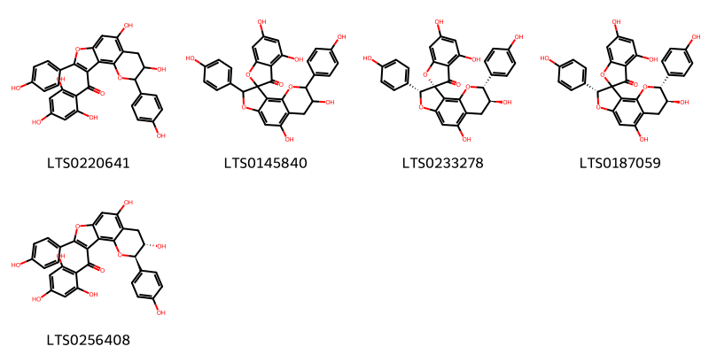{ width=100% }
    <figcaption>Hình ảnh cấu trúc hóa học của 5 hoạt chất thuộc nhóm 2-arylbenzofuran flavonoids gồm ['2-[8,11-dihydroxy-4,12-bis(4-hydroxyphenyl)-5,13-dioxatricyclo[7.4.0.0²,⁶]trideca-1,3,6,8-tetraene-3-carbonyl]benzene-1,3,5-triol (LTS0220641)', "4,6,8',11'-tetrahydroxy-4',12'-bis(4-hydroxyphenyl)-5',13'-dioxaspiro[1-benzofuran-2,3'-tricyclo[7.4.0.0²,⁶]tridecane]-1'(9'),2'(6'),7'-trien-3-one (LTS0145840)", "(2r,4'r,11's,12'r)-4,6,8',11'-tetrahydroxy-4',12'-bis(4-hydroxyphenyl)-5',13'-dioxaspiro[1-benzofuran-2,3'-tricyclo[7.4.0.0²,⁶]tridecane]-1'(9'),2'(6'),7'-trien-3-one (LTS0233278)", "(4'r,11's,12'r)-4,6,8',11'-tetrahydroxy-4',12'-bis(4-hydroxyphenyl)-5',13'-dioxaspiro[1-benzofuran-2,3'-tricyclo[7.4.0.0²,⁶]tridecane]-1'(9'),2'(6'),7'-trien-3-one (LTS0187059)", '2-[(11s,12r)-8,11-dihydroxy-4,12-bis(4-hydroxyphenyl)-5,13-dioxatricyclo[7.4.0.0²,⁶]trideca-1,3,6,8-tetraene-3-carbonyl]benzene-1,3,5-triol (LTS0256408)'].</figcaption>
</figure>
#### Nhóm Coumarins and derivatives
<figure markdown="span">
    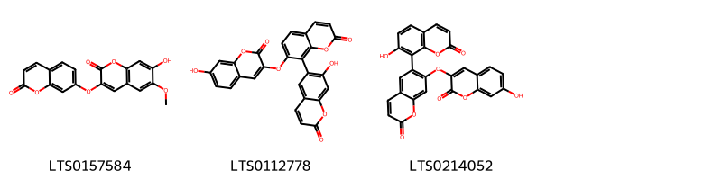{ width=100% }
    <figcaption>Hình ảnh cấu trúc hóa học của 3 hoạt chất thuộc nhóm Coumarins and derivatives gồm ['daphnoretin (LTS0157584)', "7-hydroxy-7'-[(7-hydroxy-2-oxochromen-3-yl)oxy]-[6,8'-bichromene]-2,2'-dione (LTS0112778)", "7'-hydroxy-7-[(7-hydroxy-2-oxochromen-3-yl)oxy]-[6,8'-bichromene]-2,2'-dione (LTS0214052)"].</figcaption>
</figure>
#### Nhóm Flavonoids
<figure markdown="span">
    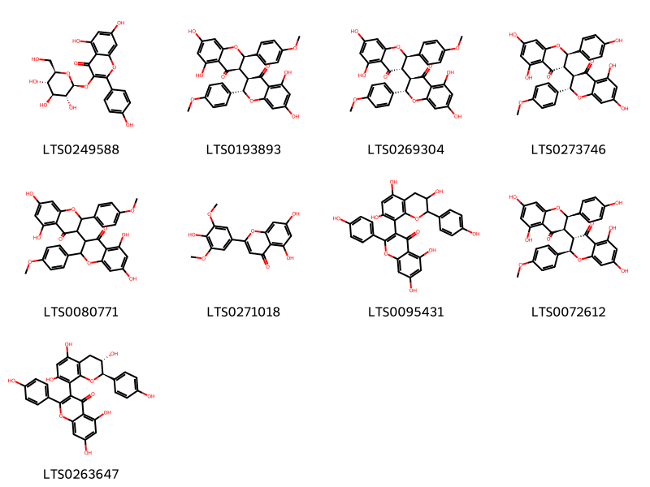{ width=100% }
    <figcaption>Hình ảnh cấu trúc hóa học của 9 hoạt chất thuộc nhóm Flavonoids gồm ['astragalin (LTS0249588)', '(2s,3r)-3-[(2r,3r)-5,7-dihydroxy-2-(4-methoxyphenyl)-4-oxo-2,3-dihydro-1-benzopyran-3-yl]-5,7-dihydroxy-2-(4-methoxyphenyl)-2,3-dihydro-1-benzopyran-4-one (LTS0193893)', 'chamaejasmenin a (LTS0269304)', '(2s,3r)-3-[(2r,3s)-5,7-dihydroxy-2-(4-hydroxyphenyl)-4-oxo-2,3-dihydro-1-benzopyran-3-yl]-5,7-dihydroxy-2-(4-methoxyphenyl)-2,3-dihydro-1-benzopyran-4-one (LTS0273746)', '3-[5,7-dihydroxy-2-(4-methoxyphenyl)-4-oxo-2,3-dihydro-1-benzopyran-3-yl]-5,7-dihydroxy-2-(4-methoxyphenyl)-2,3-dihydro-1-benzopyran-4-one (LTS0080771)', 'tricin (LTS0271018)', '5,7-dihydroxy-2-(4-hydroxyphenyl)-3-[3,5,7-trihydroxy-2-(4-hydroxyphenyl)-3,4-dihydro-2h-1-benzopyran-8-yl]chromen-4-one (LTS0095431)', '(2r,3s)-3-[(2r,3r)-5,7-dihydroxy-2-(4-hydroxyphenyl)-4-oxo-2,3-dihydro-1-benzopyran-3-yl]-5,7-dihydroxy-2-(4-methoxyphenyl)-2,3-dihydro-1-benzopyran-4-one (LTS0072612)', '5,7-dihydroxy-2-(4-hydroxyphenyl)-3-[(2r,3s)-3,5,7-trihydroxy-2-(4-hydroxyphenyl)-3,4-dihydro-2h-1-benzopyran-8-yl]chromen-4-one (LTS0263647)'].</figcaption>
</figure>
#### Nhóm Furanoid lignans
<figure markdown="span">
    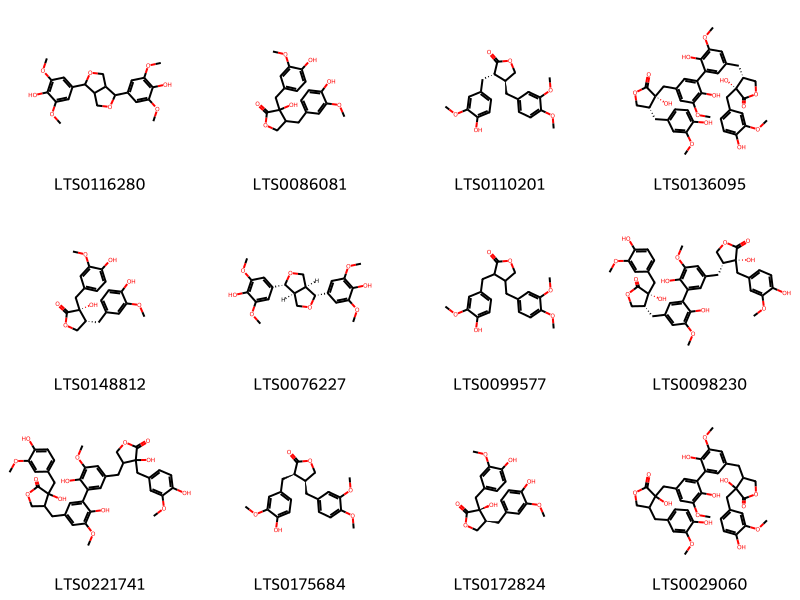{ width=100% }
    <figcaption>Hình ảnh cấu trúc hóa học của 12 hoạt chất thuộc nhóm Furanoid lignans gồm ['syringaresinol (LTS0116280)', '3-hydroxy-3,4-bis[(4-hydroxy-3-methoxyphenyl)methyl]oxolan-2-one (LTS0086081)', '(+)-arctigenin (LTS0110201)', "(3r,4r)-3-[(2',6-dihydroxy-5'-{[(3r,4r)-4-hydroxy-4-[(4-hydroxy-3-methoxyphenyl)methyl]-5-oxooxolan-3-yl]methyl}-3',5-dimethoxy-[1,1'-biphenyl]-3-yl)methyl]-3-hydroxy-4-[(4-hydroxy-3-methoxyphenyl)methyl]oxolan-2-one (LTS0136095)", 'wikstromol (LTS0148812)', '(-)-syringaresinol (LTS0076227)', 'arctigenin (LTS0099577)', "(3r,4r)-4-[(2',6-dihydroxy-5'-{[(3r,4r)-4-hydroxy-4-[(4-hydroxy-3-methoxyphenyl)methyl]-5-oxooxolan-3-yl]methyl}-3',5-dimethoxy-[1,1'-biphenyl]-3-yl)methyl]-3-hydroxy-3-[(4-hydroxy-3-methoxyphenyl)methyl]oxolan-2-one (LTS0098230)", "4-{[2',6-dihydroxy-5'-({4-hydroxy-4-[(4-hydroxy-3-methoxyphenyl)methyl]-5-oxooxolan-3-yl}methyl)-3',5-dimethoxy-[1,1'-biphenyl]-3-yl]methyl}-3-hydroxy-3-[(4-hydroxy-3-methoxyphenyl)methyl]oxolan-2-one (LTS0221741)", '(3r,4s)-4-[(3,4-dimethoxyphenyl)methyl]-3-[(4-hydroxy-3-methoxyphenyl)methyl]oxolan-2-one (LTS0175684)', 'nortrachelogenin (LTS0172824)', "3-{[2',6-dihydroxy-5'-({4-hydroxy-4-[(4-hydroxy-3-methoxyphenyl)methyl]-5-oxooxolan-3-yl}methyl)-3',5-dimethoxy-[1,1'-biphenyl]-3-yl]methyl}-3-hydroxy-4-[(4-hydroxy-3-methoxyphenyl)methyl]oxolan-2-one (LTS0029060)"].</figcaption>
</figure>
#### Nhóm Lignan glycosides
<figure markdown="span">
    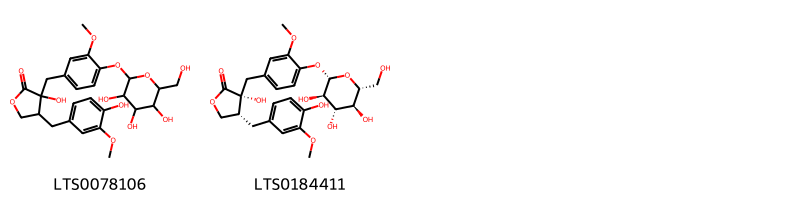{ width=100% }
    <figcaption>Hình ảnh cấu trúc hóa học của 2 hoạt chất thuộc nhóm Lignan glycosides gồm ['3-hydroxy-4-[(4-hydroxy-3-methoxyphenyl)methyl]-3-[(3-methoxy-4-{[3,4,5-trihydroxy-6-(hydroxymethyl)oxan-2-yl]oxy}phenyl)methyl]oxolan-2-one (LTS0078106)', '(3r,4r)-3-hydroxy-4-[(4-hydroxy-3-methoxyphenyl)methyl]-3-[(3-methoxy-4-{[(2s,3r,4s,5s,6r)-3,4,5-trihydroxy-6-(hydroxymethyl)oxan-2-yl]oxy}phenyl)methyl]oxolan-2-one (LTS0184411)'].</figcaption>
</figure>
#### Nhóm Organooxygen compounds
<figure markdown="span">
    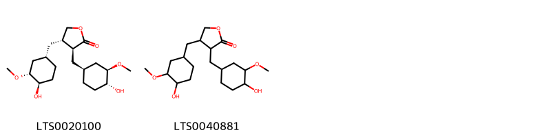{ width=100% }
    <figcaption>Hình ảnh cấu trúc hóa học của 2 hoạt chất thuộc nhóm Organooxygen compounds gồm ['(3s,4s)-3,4-bis({[(1s,3r,4r)-4-hydroxy-3-methoxycyclohexyl]methyl})oxolan-2-one (LTS0020100)', '3,4-bis[(4-hydroxy-3-methoxycyclohexyl)methyl]oxolan-2-one (LTS0040881)'].</figcaption>
</figure>
#### Nhóm Prenol lipids
<figure markdown="span">
    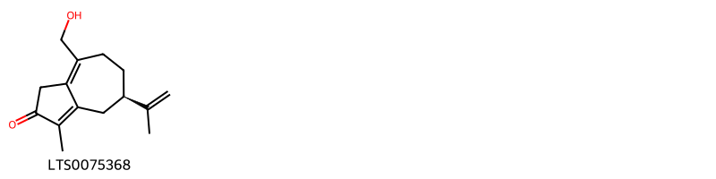{ width=100% }
    <figcaption>Hình ảnh cấu trúc hóa học của 1 hoạt chất thuộc nhóm Prenol lipids gồm ['indicanone (LTS0075368)'].</figcaption>
</figure>

---

### Dược dân tộc học

Danh sách các quốc gia có sử dụng *Wikstroemia indica* trong điều trị các bệnh. 

| Country   | Disease                                          | Bệnh                                                                      |
|:----------|:-------------------------------------------------|:--------------------------------------------------------------------------|
| Elsewhere | Diuretic, Poison, Purgative, Vesicant, Piscicide | Thuốc lợi tiểu, Chất độc, Luyện thẩm, Chất tạo bọng, Thuốc diệt côn trùng |
| India     | Piscicide                                        | Thuốc diệt cá                                                             |

---

---
## Wikstroemia ovata
### Thông tin về thực vật

!!! info "Phân loại thực vật của *Wikstroemia ovata* từ GIBF:"
    - **Kingdom:** Plantae
    - **Phylum:** Tracheophyta
    - **Order:** Malvales
    - **Family:** Thymelaeaceae
    - **Genus:** Wikstroemia
    - **Species:** *Wikstroemia ovata*

 

| Label (VI)   | Label (EN)   | Scientific Name   | Descriptions (VI)   | Descriptions (EN)   | Also Known As (VI)   | Also Known As (EN)   |
|:-------------|:-------------|:------------------|:--------------------|:--------------------|:---------------------|:---------------------|
| N/A          | N/A          | Wikstroemia ovata | loài thực vật       | species of plant    | ['']                 | ['']                 |

#### Phân bố trên thế giới

**Từ CSDL GIBF** nan, Philippines, Malaysia

#### Phân bố tại Việt Nam

**Từ CSDL GIBF**: Không có ghi nhận ở Việt Nam

---
### Thành phần hóa học
        
- Theo cơ sở dữ liệu lotus: Từ loài *Wikstroemia ovata* đã phân lập và xác định được Chưa có hoạt chất nào được phân lập. hoạt chất thuộc về các nhóm Không có hoạt chất nào được phân lập. 

Không có hình ảnh nào được tạo ra

---

### Dược dân tộc học

Danh sách các quốc gia có sử dụng *Wikstroemia ovata* trong điều trị các bệnh. 

| Country   | Disease   | Bệnh     |
|:----------|:----------|:---------|
| Arandon   | Purgative | Thuốc xổ |

---

---
## Wikstroemia ridleyi
### Thông tin về thực vật

!!! info "Phân loại thực vật của *Wikstroemia ridleyi* từ GIBF:"
    - **Kingdom:** Plantae
    - **Phylum:** Tracheophyta
    - **Order:** Malvales
    - **Family:** Thymelaeaceae
    - **Genus:** Wikstroemia
    - **Species:** *Wikstroemia ridleyi*

 

| Label (VI)   | Label (EN)   | Scientific Name     | Descriptions (VI)   | Descriptions (EN)   | Also Known As (VI)   | Also Known As (EN)   |
|:-------------|:-------------|:--------------------|:--------------------|:--------------------|:---------------------|:---------------------|
| N/A          | N/A          | Wikstroemia ridleyi | loài thực vật       | species of plant    | ['']                 | ['']                 |

#### Phân bố trên thế giới

**Từ CSDL GIBF** nan, unknown or invalid, Thailand, Myanmar, Malaysia, Singapore

#### Phân bố tại Việt Nam

**Từ CSDL GIBF**: Không có ghi nhận ở Việt Nam

---
### Thành phần hóa học
        
- Theo cơ sở dữ liệu lotus: Từ loài *Wikstroemia ridleyi* đã phân lập và xác định được Chưa có hoạt chất nào được phân lập. hoạt chất thuộc về các nhóm Không có hoạt chất nào được phân lập. 

Không có hình ảnh nào được tạo ra

---

### Dược dân tộc học

Danh sách các quốc gia có sử dụng *Wikstroemia ridleyi* trong điều trị các bệnh. 

| Country       | Disease   | Bệnh          |
|:--------------|:----------|:--------------|
| Depu pelandok | Piscicide | Thuốc diệt cá |
| Malaya        | Aperient  | Aperient      |

---

---
## Wikstroemia uvaursi
### Thông tin về thực vật

!!! info "Phân loại thực vật của *Wikstroemia uva-ursi* từ GIBF:"
    - **Kingdom:** Plantae
    - **Phylum:** Tracheophyta
    - **Order:** Malvales
    - **Family:** Thymelaeaceae
    - **Genus:** Wikstroemia
    - **Species:** *Wikstroemia uva-ursi*

 

| Label (VI)   | Label (EN)   | Scientific Name     | Descriptions (VI)   | Descriptions (EN)   | Also Known As (VI)   | Also Known As (EN)   |
|:-------------|:-------------|:--------------------|:--------------------|:--------------------|:---------------------|:---------------------|
| N/A          | N/A          | Wikstroemia ridleyi | loài thực vật       | species of plant    | ['']                 | ['']                 |

#### Phân bố trên thế giới

**Từ CSDL GIBF** nan, United States of America

#### Phân bố tại Việt Nam

**Từ CSDL GIBF**: Không có ghi nhận ở Việt Nam

---
### Thành phần hóa học
        
- Theo cơ sở dữ liệu lotus: Từ loài *Wikstroemia uva-ursi* đã phân lập và xác định được Chưa có hoạt chất nào được phân lập. hoạt chất thuộc về các nhóm Không có hoạt chất nào được phân lập. 

Không có hình ảnh nào được tạo ra

---

### Dược dân tộc học

Danh sách các quốc gia có sử dụng *Wikstroemia uva-ursi* trong điều trị các bệnh. 

| Country   | Disease   | Bệnh          |
|:----------|:----------|:--------------|
| Hawaii    | Piscicide | Thuốc diệt cá |

---

# Chi Linostoma

??? note "Danh sách các dược liệu thuộc chi"
    
	 - *Linostoma decandrum*

---
## Linostoma decandrum
### Thông tin về thực vật

!!! info "Phân loại thực vật của *Linostoma decandrum* từ GIBF:"
    - **Kingdom:** Plantae
    - **Phylum:** Tracheophyta
    - **Order:** Malvales
    - **Family:** Thymelaeaceae
    - **Genus:** Linostoma
    - **Species:** *Linostoma decandrum*

 

| Label (VI)   | Label (EN)   | Scientific Name     | Descriptions (VI)   | Descriptions (EN)   | Also Known As (VI)   | Also Known As (EN)   |
|:-------------|:-------------|:--------------------|:--------------------|:--------------------|:---------------------|:---------------------|
| N/A          | N/A          | Linostoma decandrum | loài thực vật       | species of plant    | ['']                 | ['']                 |

#### Phân bố trên thế giới

**Từ CSDL GIBF** Viet Nam, nan, unknown or invalid, Thailand, Myanmar, India, Lao People’s Democratic Republic, Bangladesh

#### Phân bố tại Việt Nam

**Từ CSDL GIBF**: Kon Tum

---
### Thành phần hóa học
        
- Theo cơ sở dữ liệu lotus: Từ loài *Linostoma decandrum* đã phân lập và xác định được Chưa có hoạt chất nào được phân lập. hoạt chất thuộc về các nhóm Không có hoạt chất nào được phân lập. 

Không có hình ảnh nào được tạo ra

---

### Dược dân tộc học

Danh sách các quốc gia có sử dụng *Linostoma decandrum* trong điều trị các bệnh. 

| Country   | Disease   | Bệnh          |
|:----------|:----------|:--------------|
| Elsewhere | Piscicide | Thuốc diệt cá |
| India     | Piscicide | Thuốc diệt cá |

---

# Chi Aquilaria

??? note "Danh sách các dược liệu thuộc chi"
    
	 - *Aquilaria agallocha*

---
## Aquilaria agallocha
### Thông tin về thực vật

!!! info "Phân loại thực vật của *Aquilaria agallocha* từ GIBF:"
    - **Kingdom:** Plantae
    - **Phylum:** Tracheophyta
    - **Order:** Malvales
    - **Family:** Thymelaeaceae
    - **Genus:** Aquilaria
    - **Species:** *Aquilaria agallocha*

 

| Label (VI)   | Label (EN)   | Scientific Name     | Descriptions (VI)   | Descriptions (EN)                        | Also Known As (VI)   | Also Known As (EN)   |
|:-------------|:-------------|:--------------------|:--------------------|:-----------------------------------------|:---------------------|:---------------------|
| N/A          | N/A          | Aquilaria agallocha |                     | species of tree native to southeast Asia | ['']                 | ['']                 |

#### Phân bố trên thế giới

**Từ CSDL GIBF** nan, Viet Nam, Chinese Taipei, unknown or invalid, Sri Lanka, Myanmar, Malaysia, Mauritius, India, China, Israel, Singapore, Saudi Arabia, Indonesia

#### Phân bố tại Việt Nam

**Từ CSDL GIBF**: Không có ghi nhận ở Việt Nam

---
### Thành phần hóa học
        
- Theo cơ sở dữ liệu lotus: Từ loài *Aquilaria agallocha* đã phân lập và xác định được 46 hoạt chất thuộc về các nhóm Organooxygen compounds, Benzopyrans, Benzofurans, Oxolanes, Unsaturated hydrocarbons, Prenol lipids, Glycerolipids, Fatty Acyls, Pyrans, Phenol ethers, Cinnamic acids and derivatives, Benzene and substituted derivatives, Coumarinolignans. 

|    | chemicalTaxonomyClassyfireClass     |   smiles_count |
|---:|:------------------------------------|---------------:|
|  0 | Benzene and substituted derivatives |              1 |
|  1 | Benzofurans                         |              4 |
|  2 | Benzopyrans                         |              7 |
|  3 | Cinnamic acids and derivatives      |              1 |
|  4 | Coumarinolignans                    |              2 |
|  5 | Fatty Acyls                         |              1 |
|  6 | Glycerolipids                       |              1 |
|  7 | Organooxygen compounds              |              1 |
|  8 | Oxolanes                            |              2 |
|  9 | Phenol ethers                       |              1 |
| 10 | Prenol lipids                       |             21 |
| 11 | Pyrans                              |              2 |
| 12 | Unsaturated hydrocarbons            |              1 |

#### Nhóm Benzene and substituted derivatives
<figure markdown="span">
    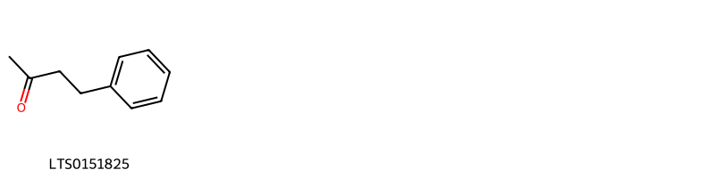{ width=100% }
    <figcaption>Hình ảnh cấu trúc hóa học của 1 hoạt chất thuộc nhóm Benzene and substituted derivatives gồm ['benzylacetone (LTS0151825)'].</figcaption>
</figure>
#### Nhóm Benzofurans
<figure markdown="span">
    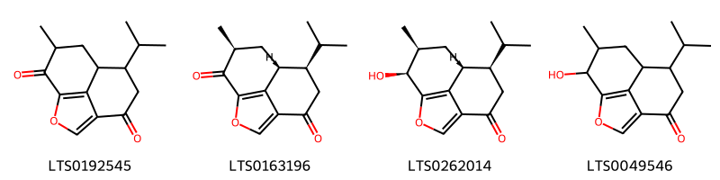{ width=100% }
    <figcaption>Hình ảnh cấu trúc hóa học của 4 hoạt chất thuộc nhóm Benzofurans gồm ['7-isopropyl-10-methyl-2-oxatricyclo[6.3.1.0⁴,¹²]dodeca-1(12),3-diene-5,11-dione (LTS0192545)', '(7r,8r,10s)-7-isopropyl-10-methyl-2-oxatricyclo[6.3.1.0⁴,¹²]dodeca-1(12),3-diene-5,11-dione (LTS0163196)', '(7r,8r,10s,11s)-11-hydroxy-7-isopropyl-10-methyl-2-oxatricyclo[6.3.1.0⁴,¹²]dodeca-1(12),3-dien-5-one (LTS0262014)', '11-hydroxy-7-isopropyl-10-methyl-2-oxatricyclo[6.3.1.0⁴,¹²]dodeca-1(12),3-dien-5-one (LTS0049546)'].</figcaption>
</figure>
#### Nhóm Benzopyrans
<figure markdown="span">
    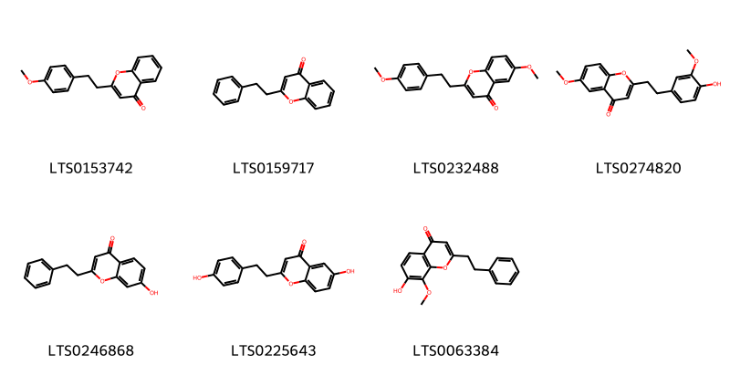{ width=100% }
    <figcaption>Hình ảnh cấu trúc hóa học của 7 hoạt chất thuộc nhóm Benzopyrans gồm ['2-(4-methoxyphenethyl)chromone (LTS0153742)', '2-(2-phenylethyl)chromone (LTS0159717)', '6-methoxy-2-[2-(4-methoxyphenyl)ethyl]chromen-4-one (LTS0232488)', '2-[2-(4-hydroxy-3-methoxyphenyl)ethyl]-6-methoxychromen-4-one (LTS0274820)', '7-hydroxy-2-(2-phenylethyl)chromen-4-one (LTS0246868)', '6-hydroxy-2-[2-(4-hydroxyphenyl)ethyl]chromen-4-one (LTS0225643)', '7-hydroxy-8-methoxy-2-(2-phenylethyl)chromen-4-one (LTS0063384)'].</figcaption>
</figure>
#### Nhóm Cinnamic acids and derivatives
<figure markdown="span">
    { width=100% }
    <figcaption>Hình ảnh cấu trúc hóa học của 1 hoạt chất thuộc nhóm Cinnamic acids and derivatives gồm ['ferulic acid (LTS0077328)'].</figcaption>
</figure>
#### Nhóm Coumarinolignans
<figure markdown="span">
    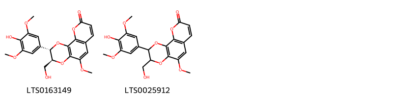{ width=100% }
    <figcaption>Hình ảnh cấu trúc hóa học của 2 hoạt chất thuộc nhóm Coumarinolignans gồm ['cleomiscosin d (LTS0163149)', '2-(4-hydroxy-3,5-dimethoxyphenyl)-3-(hydroxymethyl)-5-methoxy-2h,3h-[1,4]dioxino[2,3-h]chromen-9-one (LTS0025912)'].</figcaption>
</figure>
#### Nhóm Fatty Acyls
<figure markdown="span">
    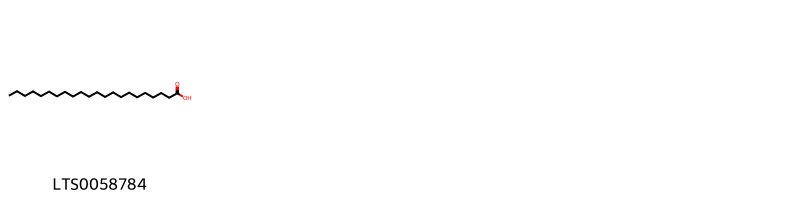{ width=100% }
    <figcaption>Hình ảnh cấu trúc hóa học của 1 hoạt chất thuộc nhóm Fatty Acyls gồm ['behenic acid (LTS0058784)'].</figcaption>
</figure>
#### Nhóm Glycerolipids
<figure markdown="span">
    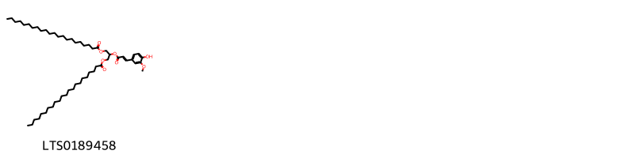{ width=100% }
    <figcaption>Hình ảnh cấu trúc hóa học của 1 hoạt chất thuộc nhóm Glycerolipids gồm ['3-(docosanoyloxy)-2-{[(2e)-3-(4-hydroxy-3-methoxyphenyl)prop-2-enoyl]oxy}propyl docosanoate (LTS0189458)'].</figcaption>
</figure>
#### Nhóm Organooxygen compounds
<figure markdown="span">
    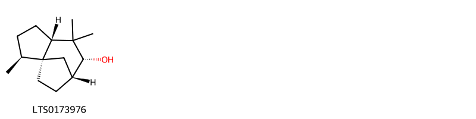{ width=100% }
    <figcaption>Hình ảnh cấu trúc hóa học của 1 hoạt chất thuộc nhóm Organooxygen compounds gồm ['(1s,2s,5s,7r,8r)-2,6,6-trimethyltricyclo[6.2.1.0¹,⁵]undecan-7-ol (LTS0173976)'].</figcaption>
</figure>
#### Nhóm Oxolanes
<figure markdown="span">
    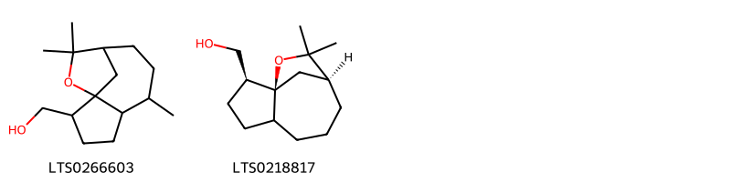{ width=100% }
    <figcaption>Hình ảnh cấu trúc hóa học của 2 hoạt chất thuộc nhóm Oxolanes gồm ['{6,10,10-trimethyl-11-oxatricyclo[7.2.1.0¹,⁵]dodecan-2-yl}methanol (LTS0266603)', '[(1s,2s,9s)-10,10-dimethyl-11-oxatricyclo[7.2.1.0¹,⁵]dodecan-2-yl]methanol (LTS0218817)'].</figcaption>
</figure>
#### Nhóm Phenol ethers
<figure markdown="span">
    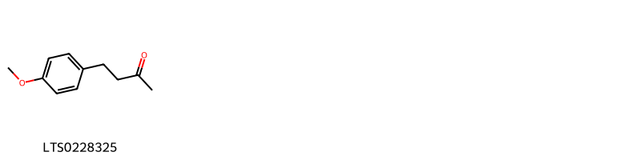{ width=100% }
    <figcaption>Hình ảnh cấu trúc hóa học của 1 hoạt chất thuộc nhóm Phenol ethers gồm ['anisylacetone (LTS0228325)'].</figcaption>
</figure>
#### Nhóm Prenol lipids
<figure markdown="span">
    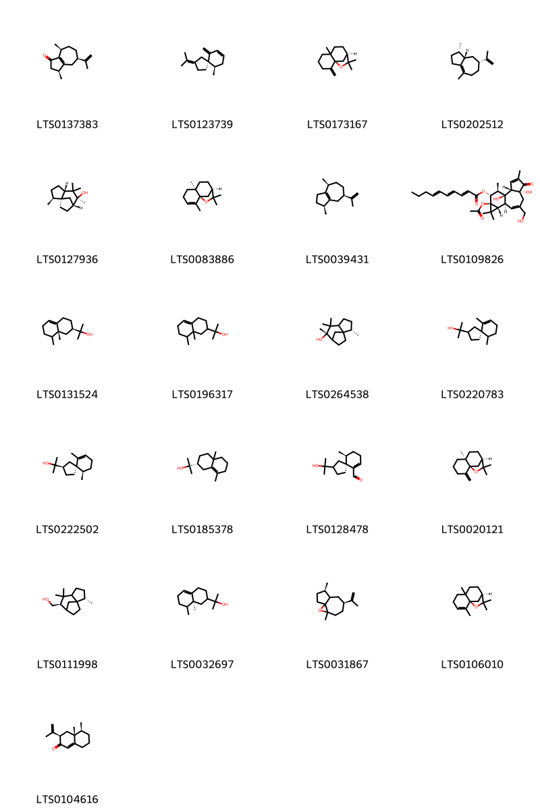{ width=100% }
    <figcaption>Hình ảnh cấu trúc hóa học của 21 hoạt chất thuộc nhóm Prenol lipids gồm ['rotundone (LTS0137383)', '(5r,10r)-10-methyl-6-methylidene-2-(propan-2-ylidene)spiro[4.5]dec-7-ene (LTS0123739)', '(1s,9r)-6,10,10-trimethyl-2-methylidene-11-oxatricyclo[7.2.1.0¹,⁶]dodecane (LTS0173167)', 'α-bulnesene (LTS0202512)', '(-)-prezizaanol (LTS0127936)', '(1r,6s,9r)-2,6,10,10-tetramethyl-11-oxatricyclo[7.2.1.0¹,⁶]dodec-2-ene (LTS0083886)', 'guaiene (LTS0039431)', '(1s,2s,6r,10s,11r,13s,14r,15r)-13-(acetyloxy)-1,6-dihydroxy-8-(hydroxymethyl)-4,12,12,15-tetramethyl-5-oxotetracyclo[8.5.0.0²,⁶.0¹¹,¹³]pentadeca-3,8-dien-14-yl (2e,4e,6e)-deca-2,4,6-trienoate (LTS0109826)', '2-[(2r,8ar)-8,8a-dimethyl-2,3,4,6,7,8-hexahydro-1h-naphthalen-2-yl]propan-2-ol (LTS0131524)', '2-(8,8a-dimethyl-2,3,4,6,7,8-hexahydro-1h-naphthalen-2-yl)propan-2-ol (LTS0196317)', '(2s,7s)-2,6,6,7-tetramethyltricyclo[6.2.1.0¹,⁵]undecan-7-ol (LTS0264538)', '2-[(5r)-6,10-dimethylspiro[4.5]dec-6-en-2-yl]propan-2-ol (LTS0220783)', '2-[(2r,5r,10r)-6,10-dimethylspiro[4.5]dec-6-en-2-yl]propan-2-ol (LTS0222502)', '2-[(2r)-4a,8-dimethyl-2,3,4,5,6,7-hexahydro-1h-naphthalen-2-yl]propan-2-ol (LTS0185378)', '(5s,10s)-2-(2-hydroxypropan-2-yl)-10-methylspiro[4.5]dec-6-ene-6-carbaldehyde (LTS0128478)', '(1s,6s,9r)-6,10,10-trimethyl-2-methylidene-11-oxatricyclo[7.2.1.0¹,⁶]dodecane (LTS0020121)', '[(2s,7r)-2,6,6-trimethyltricyclo[6.2.1.0¹,⁵]undecan-7-yl]methanol (LTS0111998)', '2-[(8as)-8,8a-dimethyl-2,3,4,6,7,8-hexahydro-1h-naphthalen-2-yl]propan-2-ol (LTS0032697)', '(4r,6s)-4,8a-dimethyl-6-(prop-1-en-2-yl)-octahydroazuleno[4,3a-b]oxirene (LTS0031867)', '(1r,9r)-2,6,10,10-tetramethyl-11-oxatricyclo[7.2.1.0¹,⁶]dodec-2-ene (LTS0106010)', '(3r,4ar,5s)-4a,5-dimethyl-3-(prop-1-en-2-yl)-3,4,5,6,7,8-hexahydronaphthalen-2-one (LTS0104616)'].</figcaption>
</figure>
#### Nhóm Pyrans
<figure markdown="span">
    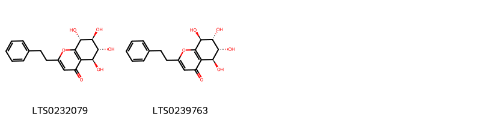{ width=100% }
    <figcaption>Hình ảnh cấu trúc hóa học của 2 hoạt chất thuộc nhóm Pyrans gồm ['(5s,6r,7s,8r)-5,6,7,8-tetrahydroxy-2-(2-phenylethyl)-5,6,7,8-tetrahydrochromen-4-one (LTS0232079)', '(5s,6r,7r,8s)-5,6,7,8-tetrahydroxy-2-(2-phenylethyl)-5,6,7,8-tetrahydrochromen-4-one (LTS0239763)'].</figcaption>
</figure>
#### Nhóm Unsaturated hydrocarbons
<figure markdown="span">
    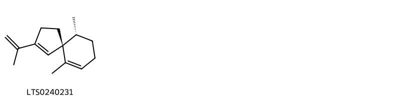{ width=100% }
    <figcaption>Hình ảnh cấu trúc hóa học của 1 hoạt chất thuộc nhóm Unsaturated hydrocarbons gồm ['(5s,10r)-6,10-dimethyl-2-(prop-1-en-2-yl)spiro[4.5]deca-1,6-diene (LTS0240231)'].</figcaption>
</figure>

---

### Dược dân tộc học

Danh sách các quốc gia có sử dụng *Aquilaria agallocha* trong điều trị các bệnh. 

| Country   | Disease                                                         | Bệnh                                                                                       |
|:----------|:----------------------------------------------------------------|:-------------------------------------------------------------------------------------------|
| China     | Aphrodisiac, Carminative, Diuretic, Stimulant, Stomachic, Tonic | Thuốc kích thích tình dục, Carminative, Thuốc lợi tiểu, Thuốc kích thích, Dạ dày, Thuốc bổ |

---

# Chi Gnidia

??? note "Danh sách các dược liệu thuộc chi"
    
	 - *Gnidia kraussiana*
	 - *Gnidia tomentosa*

---
## Gnidia kraussiana
### Thông tin về thực vật

!!! info "Phân loại thực vật của *Gnidia kraussiana* từ GIBF:"
    - **Kingdom:** Plantae
    - **Phylum:** Tracheophyta
    - **Order:** Malvales
    - **Family:** Thymelaeaceae
    - **Genus:** Gnidia
    - **Species:** *Gnidia kraussiana*

 

| Label (VI)   | Label (EN)   | Scientific Name   | Descriptions (VI)   | Descriptions (EN)   | Also Known As (VI)   | Also Known As (EN)   |
|:-------------|:-------------|:------------------|:--------------------|:--------------------|:---------------------|:---------------------|
| N/A          | N/A          | Gnidia kraussiana | loài thực vật       | species of plant    | ['']                 | ['']                 |

#### Phân bố trên thế giới

**Từ CSDL GIBF** Malawi, South Africa, Namibia, Mozambique, Eswatini, Zimbabwe, Zambia, Angola

#### Phân bố tại Việt Nam

**Từ CSDL GIBF**: Không có ghi nhận ở Việt Nam

---
### Thành phần hóa học
        
- Theo cơ sở dữ liệu lotus: Từ loài *Gnidia kraussiana* đã phân lập và xác định được 11 hoạt chất thuộc về các nhóm Prenol lipids. 

|    | chemicalTaxonomyClassyfireClass   |   smiles_count |
|---:|:----------------------------------|---------------:|
|  0 | Prenol lipids                     |             11 |

#### Nhóm Prenol lipids
<figure markdown="span">
    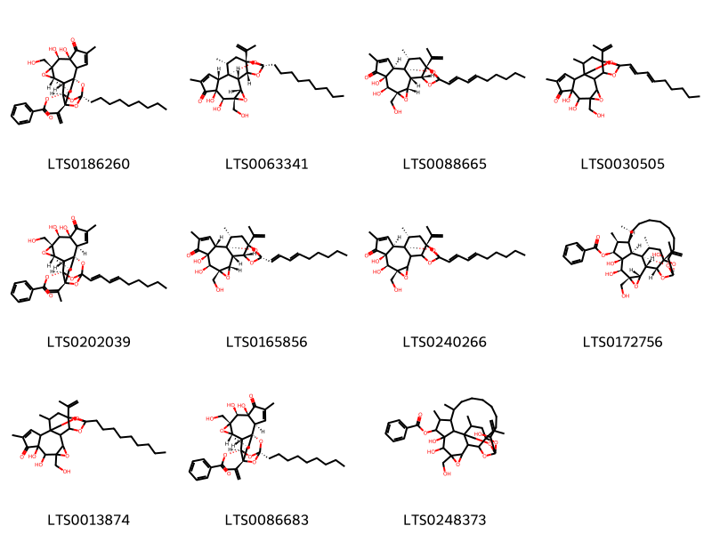{ width=100% }
    <figcaption>Hình ảnh cấu trúc hóa học của 11 hoạt chất thuộc nhóm Prenol lipids gồm ['(1r,6s,7s,8r,10s,11s,12r,14s,16s,17r,18r)-6,7-dihydroxy-8-(hydroxymethyl)-4,18-dimethyl-14-nonyl-5-oxo-16-(prop-1-en-2-yl)-9,13,15,19-tetraoxahexacyclo[12.4.1.0¹,¹¹.0²,⁶.0⁸,¹⁰.0¹²,¹⁶]nonadec-3-en-17-yl benzoate (LTS0186260)', '(1r,2s,6s,7s,8r,10s,11s,12r,14s,16r,18r)-6,7-dihydroxy-8-(hydroxymethyl)-4,18-dimethyl-14-nonyl-16-(prop-1-en-2-yl)-9,13,15,19-tetraoxahexacyclo[12.4.1.0¹,¹¹.0²,⁶.0⁸,¹⁰.0¹²,¹⁶]nonadec-3-en-5-one (LTS0063341)', 'terpenoid ea-i (LTS0088665)', '6,7-dihydroxy-8-(hydroxymethyl)-4,18-dimethyl-14-(nona-1,3-dien-1-yl)-16-(prop-1-en-2-yl)-9,13,15,19-tetraoxahexacyclo[12.4.1.0¹,¹¹.0²,⁶.0⁸,¹⁰.0¹²,¹⁶]nonadec-3-en-5-one (LTS0030505)', '(1r,2r,6s,7s,8r,10s,11s,12r,16s,17r,18r)-6,7-dihydroxy-8-(hydroxymethyl)-4,18-dimethyl-14-[(1e,3e)-nona-1,3-dien-1-yl]-5-oxo-16-(prop-1-en-2-yl)-9,13,15,19-tetraoxahexacyclo[12.4.1.0¹,¹¹.0²,⁶.0⁸,¹⁰.0¹²,¹⁶]nonadec-3-en-17-yl benzoate (LTS0202039)', '(1r,2s,6s,7s,8r,10s,11s,12r,14s,16r,18r)-6,7-dihydroxy-8-(hydroxymethyl)-4,18-dimethyl-14-[(1e,3e)-nona-1,3-dien-1-yl]-16-(prop-1-en-2-yl)-9,13,15,19-tetraoxahexacyclo[12.4.1.0¹,¹¹.0²,⁶.0⁸,¹⁰.0¹²,¹⁶]nonadec-3-en-5-one (LTS0165856)', '(1r,2r,6s,7s,8r,16r,18r)-6,7-dihydroxy-8-(hydroxymethyl)-4,18-dimethyl-14-[(1e,3e)-nona-1,3-dien-1-yl]-16-(prop-1-en-2-yl)-9,13,15,19-tetraoxahexacyclo[12.4.1.0¹,¹¹.0²,⁶.0⁸,¹⁰.0¹²,¹⁶]nonadec-3-en-5-one (LTS0240266)', '(1r,2r,4r,5r,6s,7s,9r,10s,11s,12s,13s,14s,15r,22r,23r,25r)-10,11,22-trihydroxy-9-(hydroxymethyl)-2,13,15-trimethyl-4-(prop-1-en-2-yl)-8,24,26,27-tetraoxaheptacyclo[12.10.1.1⁴,²³.1⁵,²³.0¹,⁶.0⁷,⁹.0¹¹,²⁵]heptacosan-12-yl benzoate (LTS0172756)', '6,7-dihydroxy-8-(hydroxymethyl)-4,18-dimethyl-14-nonyl-16-(prop-1-en-2-yl)-9,13,15,19-tetraoxahexacyclo[12.4.1.0¹,¹¹.0²,⁶.0⁸,¹⁰.0¹²,¹⁶]nonadec-3-en-5-one (LTS0013874)', '(1r,2r,6s,7s,8r,10s,11s,12r,14s,16s,17r,18r)-6,7-dihydroxy-8-(hydroxymethyl)-4,18-dimethyl-14-nonyl-5-oxo-16-(prop-1-en-2-yl)-9,13,15,19-tetraoxahexacyclo[12.4.1.0¹,¹¹.0²,⁶.0⁸,¹⁰.0¹²,¹⁶]nonadec-3-en-17-yl benzoate (LTS0086683)', '10,11,22-trihydroxy-9-(hydroxymethyl)-2,13,15-trimethyl-4-(prop-1-en-2-yl)-8,24,26,27-tetraoxaheptacyclo[12.10.1.1⁴,²³.1⁵,²³.0¹,⁶.0⁷,⁹.0¹¹,²⁵]heptacosan-12-yl benzoate (LTS0248373)'].</figcaption>
</figure>

---

### Dược dân tộc học

Danh sách các quốc gia có sử dụng *Gnidia kraussiana* trong điều trị các bệnh. 

| Country   | Disease   | Bệnh          |
|:----------|:----------|:--------------|
| Africa    | Piscicide | Thuốc diệt cá |

---

---
## Gnidia tomentosa
### Thông tin về thực vật

!!! info "Phân loại thực vật của *Gnidia tomentosa* từ GIBF:"
    - **Kingdom:** Plantae
    - **Phylum:** Tracheophyta
    - **Order:** Malvales
    - **Family:** Thymelaeaceae
    - **Genus:** Gnidia
    - **Species:** *Gnidia tomentosa*

 

| Label (VI)   | Label (EN)   | Scientific Name   | Descriptions (VI)   | Descriptions (EN)   | Also Known As (VI)   | Also Known As (EN)   |
|:-------------|:-------------|:------------------|:--------------------|:--------------------|:---------------------|:---------------------|
| N/A          | N/A          | Gnidia tomentosa  | loài thực vật       | species of plant    | ['']                 | ['']                 |

#### Phân bố trên thế giới

**Từ CSDL GIBF** nan, unknown or invalid, South Africa

#### Phân bố tại Việt Nam

**Từ CSDL GIBF**: Không có ghi nhận ở Việt Nam

---
### Thành phần hóa học
        
- Theo cơ sở dữ liệu lotus: Từ loài *Gnidia tomentosa* đã phân lập và xác định được Chưa có hoạt chất nào được phân lập. hoạt chất thuộc về các nhóm Không có hoạt chất nào được phân lập. 

Không có hình ảnh nào được tạo ra

---

### Dược dân tộc học

Danh sách các quốc gia có sử dụng *Gnidia tomentosa* trong điều trị các bệnh. 

| Country   | Disease   | Bệnh           |
|:----------|:----------|:---------------|
| Lesotho   | Vermifuge | Thuốc diệt sán |

---

# Chi Edgeworthia

??? note "Danh sách các dược liệu thuộc chi"
    
	 - *Edgeworthia tomentosa*

---
## Edgeworthia tomentosa
### Thông tin về thực vật

!!! info "Phân loại thực vật của *Edgeworthia chrysantha* từ GIBF:"
    - **Kingdom:** Plantae
    - **Phylum:** Tracheophyta
    - **Order:** Malvales
    - **Family:** Thymelaeaceae
    - **Genus:** Edgeworthia
    - **Species:** *Edgeworthia chrysantha*

 

| Label (VI)   | Label (EN)   | Scientific Name       | Descriptions (VI)   | Descriptions (EN)   | Also Known As (VI)   | Also Known As (EN)   |
|:-------------|:-------------|:----------------------|:--------------------|:--------------------|:---------------------|:---------------------|
| N/A          | N/A          | Edgeworthia tomentosa |                     |                     | ['']                 | ['']                 |

#### Phân bố trên thế giới

**Từ CSDL GIBF** United States of America, Japan, China

#### Phân bố tại Việt Nam

**Từ CSDL GIBF**: Không có ghi nhận ở Việt Nam

---
### Thành phần hóa học
        
- Theo cơ sở dữ liệu lotus: Từ loài *Edgeworthia chrysantha* đã phân lập và xác định được Chưa có hoạt chất nào được phân lập. hoạt chất thuộc về các nhóm Không có hoạt chất nào được phân lập. 

Không có hình ảnh nào được tạo ra

---

### Dược dân tộc học

Danh sách các quốc gia có sử dụng *Edgeworthia chrysantha* trong điều trị các bệnh. 

| Country   | Disease   | Bệnh          |
|:----------|:----------|:--------------|
| India     | Piscicide | Thuốc diệt cá |

---

