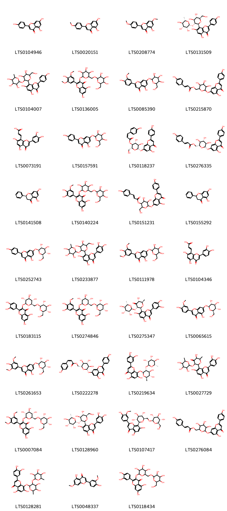
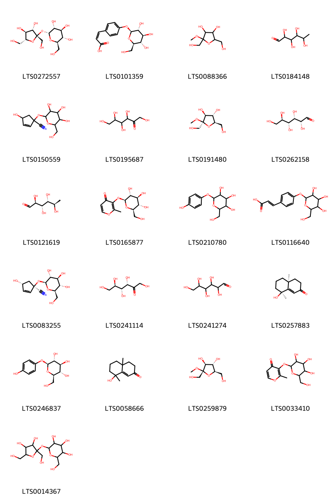
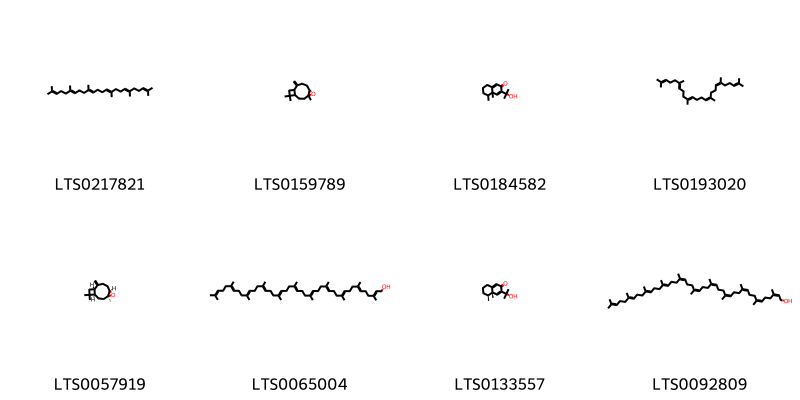
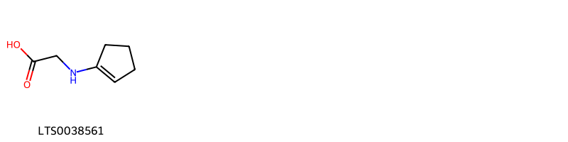
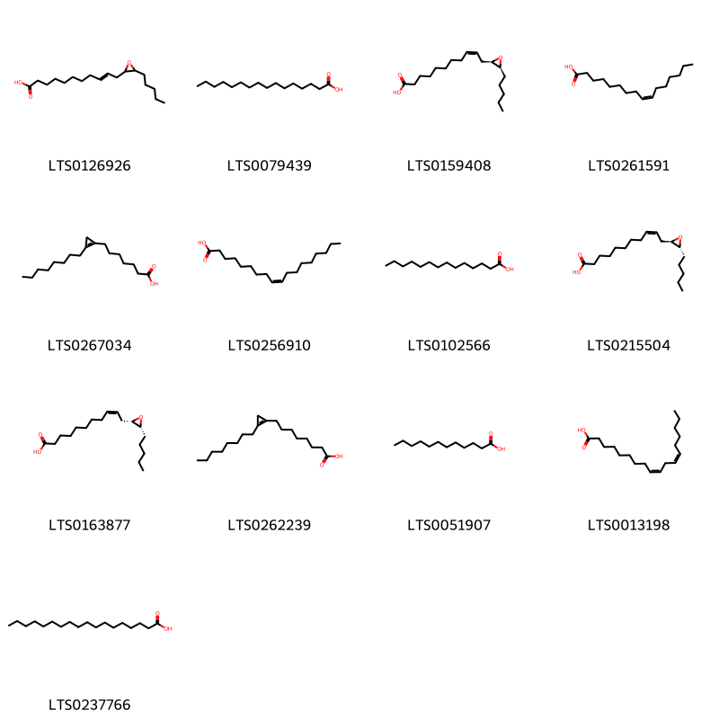
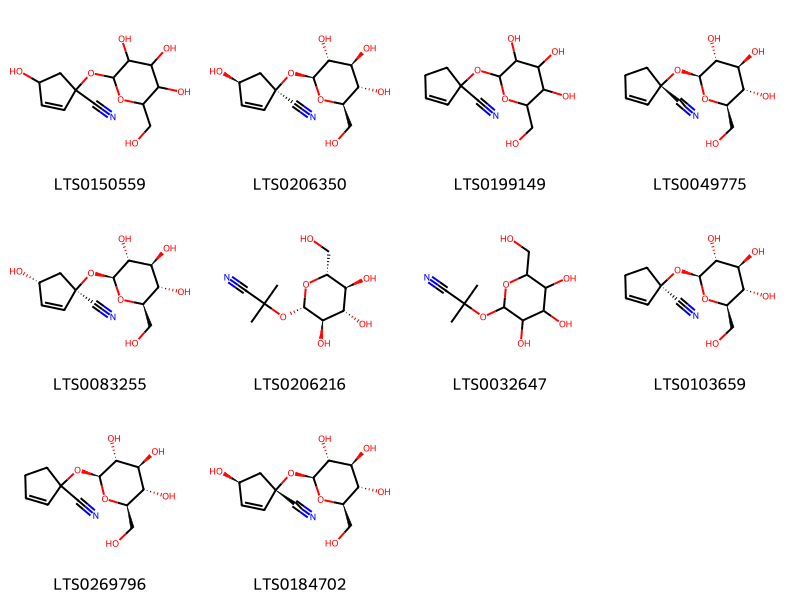

!!! abstract "Tóm tắt"

    Họ Turneraceae gồm khoảng 1 chi và 2 loài được một số cộng đồng tại các quốc gia như anish, Haiti, Bahamas, French, Elsewhere, US, Venezuela, Mexico sử dụng trong một số trường hợp Aphrodisiac, Stimulant, Laxative, Tonic, Tonic, Emmenagogue, Expectorant, Tonic, Nervine, Expectorant, Laxative, Stimulant, Tonic, Astringent, Aphrodisiac, Astringent, Diuretic, Diuretic, Tonic, Tonic, Tonic, Tonic, Diuretic, Aphrodisiac, Stomachic, Stomachic, Aphrodisiac, Tonic, Aphrodisiac.

!!! info "DrDuke"

    James A. Duke sinh năm 1929-2017 là một nhà thực vật học người Mỹ. Đây là một trong những tác giả hàng đầu trong lĩnh vực dược dân tộc học với cuốn *CRC Handbook of Medicinal Herbs* và chính là người xây dựng lên cơ sở dữ liệu về hợp chất tự nhiên và dược dân tộc học tại Bộ nông nghiệp Hoa Kỳ. Các thông tin được đăng tải tại website [Dr. Duke's Phytochemical and Ethnobotanical Databases](https://phytochem.nal.usda.gov/). 
    Trong suốt thập niên 1970, ông lãnh đạo the Plant Taxonomy Laboratory, Plant Genetics and Germplasm Institute of the Agricultural Research Service, U.S. Department of Agriculture.
    Trong tài liệu này, các thông tin về dược dân tộc của các dược liệu được trích dẫn từ tài liệu của James A. Ducke với sự trợ giúp của phần mềm dịch thuật từ tiếng Anh sang tiếng Việt.
   

# Chi Turnera

??? note "Danh sách các dược liệu thuộc chi"
    
	 - *Turnera diffusa*
	 - *Turnera ulmifolia*

---
## Turnera diffusa
### Thông tin về thực vật

!!! info "Phân loại thực vật của *Turnera diffusa* từ GIBF:"
    - **Kingdom:** Plantae
    - **Phylum:** Tracheophyta
    - **Order:** Malpighiales
    - **Family:** Turneraceae
    - **Genus:** Turnera
    - **Species:** *Turnera diffusa*

 

| Label (VI)   | Label (EN)   | Scientific Name   | Descriptions (VI)   | Descriptions (EN)   | Also Known As (VI)   | Also Known As (EN)   |
|:-------------|:-------------|:------------------|:--------------------|:--------------------|:---------------------|:---------------------|
| N/A          | N/A          | Turnera diffusa   |                     | species of plant    | ['']                 | ['damiana']          |

#### Phân bố trên thế giới

**Từ CSDL GIBF** Virgin Islands (U.S.), Belize, Puerto Rico, Guatemala, Brazil, Bahamas, United States of America, Cuba, Dominican Republic, Mexico, El Salvador

#### Phân bố tại Việt Nam

**Từ CSDL GIBF**: Không có ghi nhận ở Việt Nam

---
### Thành phần hóa học
        
- Theo cơ sở dữ liệu lotus: Từ loài *Turnera diffusa* đã phân lập và xác định được 64 hoạt chất thuộc về các nhóm Flavonoids, Organooxygen compounds, Prenol lipids. 

|    | chemicalTaxonomyClassyfireClass   |   smiles_count |
|---:|:----------------------------------|---------------:|
|  0 | Flavonoids                        |             35 |
|  1 | Organooxygen compounds            |             21 |
|  2 | Prenol lipids                     |              8 |

#### Nhóm Flavonoids
<figure markdown="span">
    { width=100% }
    <figcaption>Hình ảnh cấu trúc hóa học của 35 hoạt chất thuộc nhóm Flavonoids gồm ['chamomile (LTS0104946)', 'acacetin (LTS0020151)', "apigenin 7,4'-dimethyl ether (LTS0208774)", '8-[(2s,3r,4s,5s,6r)-4,5-dihydroxy-6-(hydroxymethyl)-3-{[(2r,3r,4r,5r,6s)-3,4,5-trihydroxy-6-methyloxan-2-yl]oxy}oxan-2-yl]-5,7-dihydroxy-2-(4-hydroxyphenyl)chromen-4-one (LTS0131509)', '8-[4,5-dihydroxy-6-(hydroxymethyl)-3-[(3,4,5-trihydroxy-6-methyloxan-2-yl)oxy]oxan-2-yl]-5,7-dihydroxy-2-(4-hydroxyphenyl)chromen-4-one (LTS0104007)', '5,7-dihydroxy-2-(4-hydroxy-3,5-dimethoxyphenyl)-3-{[3,4,5-trihydroxy-6-({[3,4,5-trihydroxy-6-(hydroxymethyl)oxan-2-yl]oxy}methyl)oxan-2-yl]oxy}chromen-4-one (LTS0136005)', '5-hydroxy-2-(4-hydroxy-3-methoxyphenyl)-7-{[3,4,5-trihydroxy-6-(hydroxymethyl)oxan-2-yl]oxy}chromen-4-one (LTS0085390)', '(3,4,5-trihydroxy-6-{[5-hydroxy-2-(4-hydroxyphenyl)-4-oxochromen-7-yl]oxy}oxan-2-yl)methyl 3-(4-hydroxyphenyl)prop-2-enoate (LTS0215870)', '(2e)-3-[2-(3,4-dihydroxyphenyl)-5,7-dihydroxy-4-oxochromen-8-yl]prop-2-enoic acid (LTS0073191)', 'apigetrin (LTS0157591)', '(2r,3s,4r,5r,6s)-4,5-dihydroxy-6-{[5-hydroxy-2-(4-hydroxyphenyl)-4-oxochromen-7-yl]oxy}-2-(hydroxymethyl)oxan-3-yl (2z)-3-(4-hydroxyphenyl)prop-2-enoate (LTS0118237)', 'echinacin (LTS0276335)', 'pinocembrine (LTS0141508)', '2-(3,4-dihydroxy-5-methoxyphenyl)-5,7-dihydroxy-3-{[3,4,5-trihydroxy-6-({[3,4,5-trihydroxy-6-(hydroxymethyl)oxan-2-yl]oxy}methyl)oxan-2-yl]oxy}chromen-4-one (LTS0140224)', '4,5-dihydroxy-6-{[5-hydroxy-2-(4-hydroxyphenyl)-4-oxochromen-7-yl]oxy}-2-(hydroxymethyl)oxan-3-yl 3-(4-hydroxyphenyl)prop-2-enoate (LTS0151231)', 'pinocembrin (LTS0155292)', 'apigenin 7-o-β-glucoside (LTS0252743)', '8-[4,5-dihydroxy-6-(hydroxymethyl)-3-[(3,4,5-trihydroxy-6-methyloxan-2-yl)oxy]oxan-2-yl]-2-(3,4-dihydroxyphenyl)-5,7-dihydroxychromen-4-one (LTS0233877)', '5-hydroxy-2-(4-hydroxy-3,5-dimethoxyphenyl)-7-{[3,4,5-trihydroxy-6-(hydroxymethyl)oxan-2-yl]oxy}chromen-4-one (LTS0111978)', '3-[2-(3,4-dihydroxyphenyl)-5,7-dihydroxy-4-oxochromen-8-yl]prop-2-enoic acid (LTS0104346)', '2-(3,4-dihydroxyphenyl)-5,7-dihydroxy-3-{[(2s,3r,4s,5s,6r)-3,4,5-trihydroxy-6-({[(2r,3r,4s,5s,6r)-3,4,5-trihydroxy-6-(hydroxymethyl)oxan-2-yl]oxy}methyl)oxan-2-yl]oxy}chromen-4-one (LTS0183115)', '2-(3,4-dihydroxy-5-methoxyphenyl)-5,7-dihydroxy-3-{[(2s,3r,4s,5s,6r)-3,4,5-trihydroxy-6-({[(2r,3r,4s,5s,6r)-3,4,5-trihydroxy-6-(hydroxymethyl)oxan-2-yl]oxy}methyl)oxan-2-yl]oxy}chromen-4-one (LTS0274846)', '2-(3,4-dihydroxyphenyl)-5,7-dihydroxy-8-[(2s,3s,5r,6r)-5-hydroxy-6-methyl-4-oxo-3-{[(2s,3r,4r,5r,6s)-3,4,5-trihydroxy-6-methyloxan-2-yl]oxy}oxan-2-yl]chromen-4-one (LTS0275347)', '5-hydroxy-2-(4-hydroxy-3-methoxyphenyl)-7-{[(2s,3r,4s,5s,6r)-3,4,5-trihydroxy-6-(hydroxymethyl)oxan-2-yl]oxy}chromen-4-one (LTS0065615)', '5-hydroxy-2-(4-hydroxy-3,5-dimethoxyphenyl)-7-{[(2s,3r,4s,5s,6r)-3,4,5-trihydroxy-6-(hydroxymethyl)oxan-2-yl]oxy}chromen-4-one (LTS0261653)', '[(2r,3s,4s,5r,6s)-3,4,5-trihydroxy-6-{[5-hydroxy-2-(4-hydroxyphenyl)-4-oxochromen-7-yl]oxy}oxan-2-yl]methyl (2z)-3-(4-hydroxyphenyl)prop-2-enoate (LTS0222278)', '8-{[(2s,3r,4s,5s,6r)-4,5-dihydroxy-6-methyl-3-{[(2s,3r,4r,5r,6s)-3,4,5-trihydroxy-6-methyloxan-2-yl]oxy}oxan-2-yl]oxy}-2-(3,4-dihydroxyphenyl)-5,7-dihydroxychromen-4-one (LTS0219634)', '2-(3,4-dihydroxyphenyl)-5,7-dihydroxy-8-{5-hydroxy-6-methyl-4-oxo-3-[(3,4,5-trihydroxy-6-methyloxan-2-yl)oxy]oxan-2-yl}chromen-4-one (LTS0027729)', '5,7-dihydroxy-2-(4-hydroxy-3,5-dimethoxyphenyl)-3-{[(2s,3r,4s,5s,6r)-3,4,5-trihydroxy-6-({[(2r,3r,4s,5s,6r)-3,4,5-trihydroxy-6-(hydroxymethyl)oxan-2-yl]oxy}methyl)oxan-2-yl]oxy}chromen-4-one (LTS0007084)', '8-[(2s,3r,4s,5s,6r)-4,5-dihydroxy-6-(hydroxymethyl)-3-{[(2r,3r,4r,5r,6s)-3,4,5-trihydroxy-6-methyloxan-2-yl]oxy}oxan-2-yl]-2-(3,4-dihydroxyphenyl)-5,7-dihydroxychromen-4-one (LTS0128960)', '5,7-dihydroxy-2-(4-hydroxy-3-methoxyphenyl)-8-[(2s,3r,4r,5s,6r)-3,4,5-trihydroxy-6-({[(2r,3r,4s,5s,6r)-3,4,5-trihydroxy-6-(hydroxymethyl)oxan-2-yl]oxy}methyl)oxan-2-yl]chromen-4-one (LTS0107417)', '(3,4,5-trihydroxy-6-{[5-hydroxy-2-(4-hydroxyphenyl)-4-oxochromen-7-yl]oxy}oxan-2-yl)methyl (2e)-3-(4-hydroxyphenyl)prop-2-enoate (LTS0276084)', '8-({4,5-dihydroxy-6-methyl-3-[(3,4,5-trihydroxy-6-methyloxan-2-yl)oxy]oxan-2-yl}oxy)-2-(3,4-dihydroxyphenyl)-5,7-dihydroxychromen-4-one (LTS0128281)', 'velutin (LTS0048337)', '2-(3,4-dihydroxyphenyl)-5,7-dihydroxy-3-{[3,4,5-trihydroxy-6-({[3,4,5-trihydroxy-6-(hydroxymethyl)oxan-2-yl]oxy}methyl)oxan-2-yl]oxy}chromen-4-one (LTS0118434)'].</figcaption>
</figure>
#### Nhóm Organooxygen compounds
<figure markdown="span">
    { width=100% }
    <figcaption>Hình ảnh cấu trúc hóa học của 21 hoạt chất thuộc nhóm Organooxygen compounds gồm ['sucrose (LTS0272557)', '(2z)-3-(4-{[(2s,3r,4s,5s,6r)-3,4,5-trihydroxy-6-(hydroxymethyl)oxan-2-yl]oxy}phenyl)prop-2-enoic acid (LTS0101359)', '2,5-bis(hydroxymethyl)-2-methoxyoxolane-3,4-diol (LTS0088366)', 'lrhamnose (LTS0184148)', '4-hydroxy-1-{[3,4,5-trihydroxy-6-(hydroxymethyl)oxan-2-yl]oxy}cyclopent-2-ene-1-carbonitrile (LTS0150559)', 'sorbose (LTS0195687)', '(2r,3s,4s,5r)-2,5-bis(hydroxymethyl)-2-methoxyoxolane-3,4-diol (LTS0191480)', '(+)-glucose (LTS0262158)', '6-deoxymannose (LTS0121619)', '2-methyl-3-{[(2s,3r,4s,5s,6r)-3,4,5-trihydroxy-6-(hydroxymethyl)oxan-2-yl]oxy}pyran-4-one (LTS0165877)', 'arbutin (LTS0210780)', '3-(4-{[3,4,5-trihydroxy-6-(hydroxymethyl)oxan-2-yl]oxy}phenyl)prop-2-enoic acid (LTS0116640)', 'epitetraphyllin b (LTS0083255)', 'keto-d-fructose (LTS0241114)', 'dextrose (LTS0241274)', '(4as,8s)-8-hydroxy-4a,8-dimethyl-4,5,6,7-tetrahydro-3h-naphthalen-2-one (LTS0257883)', 'β-arbutin (LTS0246837)', '8-hydroxy-4a,8-dimethyl-4,5,6,7-tetrahydro-3h-naphthalen-2-one (LTS0058666)', '(2s,3s,4s,5r)-2,5-bis(hydroxymethyl)-2-methoxyoxolane-3,4-diol (LTS0259879)', '2-methyl-3-{[3,4,5-trihydroxy-6-(hydroxymethyl)oxan-2-yl]oxy}pyran-4-one (LTS0033410)', 'granulated sugar (LTS0014367)'].</figcaption>
</figure>
#### Nhóm Prenol lipids
<figure markdown="span">
    { width=100% }
    <figcaption>Hình ảnh cấu trúc hóa học của 8 hoạt chất thuộc nhóm Prenol lipids gồm ['squalene (LTS0217821)', 'caryophyllene oxide (LTS0159789)', '3-(2-hydroxypropan-2-yl)-4a,5-dimethyl-5,6,7,8-tetrahydronaphthalen-2-one (LTS0184582)', '2,6,10,15,19,23-hexamethyltetracosa-2,6,10,14,18,22-hexaene (LTS0193020)', '(1r,4s,6r,10s)-4,12,12-trimethyl-9-methylidene-5-oxatricyclo[8.2.0.0⁴,⁶]dodecane (LTS0057919)', '3,7,11,15,19,23,27,31,35,39,43-undecamethyltetratetraconta-2,6,10,14,18,22,26,30,34,38,42-undecaen-1-ol (LTS0065004)', '(4as,5s)-3-(2-hydroxypropan-2-yl)-4a,5-dimethyl-5,6,7,8-tetrahydronaphthalen-2-one (LTS0133557)', '(2z,6z,10z,14z,18z,22z,26z,30e,34e,38e)-3,7,11,15,19,23,27,31,35,39,43-undecamethyltetratetraconta-2,6,10,14,18,22,26,30,34,38,42-undecaen-1-ol (LTS0092809)'].</figcaption>
</figure>

---

### Dược dân tộc học

Danh sách các quốc gia có sử dụng *Turnera diffusa* trong điều trị các bệnh. 

| Country   | Disease                                                                                 | Bệnh                                                                                                                                            |
|:----------|:----------------------------------------------------------------------------------------|:------------------------------------------------------------------------------------------------------------------------------------------------|
| Elsewhere | Aphrodisiac, Stimulant, Laxative                                                        | Thuốc kích thích tình dục, Chất kích thích, Thuốc nhuận tràng                                                                                   |
| French    | Aphrodisiac                                                                             | Thuốc kích dục                                                                                                                                  |
| Haiti     | Aphrodisiac, Tonic                                                                      | Thuốc kích thích tình dục, Thuốc bổ                                                                                                             |
| Mexico    | Aphrodisiac, Astringent, Diuretic, Diuretic, Tonic, Tonic, Tonic, Diuretic, Aphrodisiac | Thuốc kích thích tình dục, Chất làm se, Thuốc lợi tiểu, Thuốc lợi tiểu, Thuốc bổ, Thuốc bổ, Thuốc bổ, Thuốc lợi tiểu, Thuốc kích thích tình dục |
| US        | Expectorant, Laxative, Stimulant, Tonic, Astringent                                     | Thuốc long đờm, nhuận tràng, chất kích thích, thuốc bổ, chất làm se                                                                             |
| anish     | Nervine                                                                                 | Thuốc an thần                                                                                                                                   |

---

---
## Turnera ulmifolia
### Thông tin về thực vật

!!! info "Phân loại thực vật của *Turnera ulmifolia* từ GIBF:"
    - **Kingdom:** Plantae
    - **Phylum:** Tracheophyta
    - **Order:** Malpighiales
    - **Family:** Turneraceae
    - **Genus:** Turnera
    - **Species:** *Turnera ulmifolia*

 

| Label (VI)   | Label (EN)   | Scientific Name   | Descriptions (VI)   | Descriptions (EN)   | Also Known As (VI)    | Also Known As (EN)   |
|:-------------|:-------------|:------------------|:--------------------|:--------------------|:----------------------|:---------------------|
| N/A          | N/A          | Turnera ulmifolia | loài thực vật       | species of plant    | ['Turnera ulmifolia'] | ['Yellow Alder']     |

#### Phân bố trên thế giới

**Từ CSDL GIBF** Palau, Ghana, Japan, Guadeloupe, Mauritius, Saint Lucia, Benin, Nicaragua, Virgin Islands (British), French Guiana, Panama, Puerto Rico, Chinese Taipei, Spain, Honduras, Portugal, Jamaica, Bangladesh, United States of America, Chile, Liberia, Maldives, Belize, Barbados, Marshall Islands, Hong Kong, Thailand, Turks and Caicos Islands, Bahamas, Brazil, Guam, New Caledonia, Cuba, Mexico, Dominican Republic, Dominica, Singapore, Viet Nam, Ecuador, French Polynesia, Saint Kitts and Nevis, Seychelles, Aruba, Colombia, Costa Rica, India, Indonesia, Cayman Islands, Philippines, Malaysia, Northern Mariana Islands

#### Phân bố tại Việt Nam

**Từ CSDL GIBF**: Khánh Hòa, Hồ Chí Minh city

---
### Thành phần hóa học
        
- Theo cơ sở dữ liệu lotus: Từ loài *Turnera ulmifolia* đã phân lập và xác định được 24 hoạt chất thuộc về các nhóm Fatty Acyls, Carboxylic acids and derivatives, Organooxygen compounds. 

|    | chemicalTaxonomyClassyfireClass   |   smiles_count |
|---:|:----------------------------------|---------------:|
|  0 | Carboxylic acids and derivatives  |              1 |
|  1 | Fatty Acyls                       |             13 |
|  2 | Organooxygen compounds            |             10 |

#### Nhóm Carboxylic acids and derivatives
<figure markdown="span">
    { width=100% }
    <figcaption>Hình ảnh cấu trúc hóa học của 1 hoạt chất thuộc nhóm Carboxylic acids and derivatives gồm ['(cyclopent-1-en-1-ylamino)acetic acid (LTS0038561)'].</figcaption>
</figure>
#### Nhóm Fatty Acyls
<figure markdown="span">
    { width=100% }
    <figcaption>Hình ảnh cấu trúc hóa học của 13 hoạt chất thuộc nhóm Fatty Acyls gồm ['11-(3-pentyloxiran-2-yl)undec-9-enoic acid (LTS0126926)', 'palmitic acid (LTS0079439)', '(-)-vernolic acid (LTS0159408)', 'palmitoleic acid (LTS0261591)', 'malvalic acid (LTS0267034)', 'oleic acid (LTS0256910)', 'myristic acid (LTS0102566)', '(9z)-11-[(2r,3r)-3-pentyloxiran-2-yl]undec-9-enoic acid (LTS0215504)', '(+)-vernolic acid (LTS0163877)', 'sterculic acid (LTS0262239)', 'lauric acid (LTS0051907)', 'linoleic (LTS0013198)', 'stearic acid (LTS0237766)'].</figcaption>
</figure>
#### Nhóm Organooxygen compounds
<figure markdown="span">
    { width=100% }
    <figcaption>Hình ảnh cấu trúc hóa học của 10 hoạt chất thuộc nhóm Organooxygen compounds gồm ['4-hydroxy-1-{[3,4,5-trihydroxy-6-(hydroxymethyl)oxan-2-yl]oxy}cyclopent-2-ene-1-carbonitrile (LTS0150559)', '(1r,4s)-4-hydroxy-1-{[(2s,3r,4s,5s,6r)-3,4,5-trihydroxy-6-(hydroxymethyl)oxan-2-yl]oxy}cyclopent-2-ene-1-carbonitrile (LTS0206350)', '1-{[3,4,5-trihydroxy-6-(hydroxymethyl)oxan-2-yl]oxy}cyclopent-2-ene-1-carbonitrile (LTS0199149)', 'deidaclin (LTS0049775)', 'epitetraphyllin b (LTS0083255)', 'linamarin (LTS0206216)', 'linamarin (LTS0032647)', 'deidaclin (LTS0103659)', '1-{[(2s,3r,4s,5s,6r)-3,4,5-trihydroxy-6-(hydroxymethyl)oxan-2-yl]oxy}cyclopent-2-ene-1-carbonitrile (LTS0269796)', '(1s,4s)-4-hydroxy-1-{[(2s,3r,4s,5s,6r)-3,4,5-trihydroxy-6-(hydroxymethyl)oxan-2-yl]oxy}cyclopent-2-ene-1-carbonitrile (LTS0184702)'].</figcaption>
</figure>

---

### Dược dân tộc học

Danh sách các quốc gia có sử dụng *Turnera ulmifolia* trong điều trị các bệnh. 

| Country   | Disease              | Bệnh                     |
|:----------|:---------------------|:-------------------------|
| Bahamas   | Emmenagogue          | Emmenagogue              |
| Haiti     | Stomachic, Stomachic | Dạ dày, Dạ dày           |
| Mexico    | Tonic, Tonic         | Thuốc bổ, Thuốc bổ       |
| Venezuela | Expectorant, Tonic   | Thuốc long đờm, Thuốc bổ |

---

