!!! abstract "Tóm tắt"

    Họ Valerianaceae gồm khoảng 4 chi và 14 loài được một số cộng đồng tại các quốc gia như Turkey, USSR, South Africa, Japan, Germany, Sanscrit, French, Switzerland, Dutch, Austria, Iran, Arab, China, Lompong alas, Europe, Lesotho, India, Elsewhere, Kutet gamong, Japan*, ain, Asia, US(Menomini), Nepal sử dụng trong một số trường hợp QUERY LENGTH LIMIT EXCEEDED. MAX ALLOWED QUERY : 500 CHARS.

!!! info "DrDuke"

    James A. Duke sinh năm 1929-2017 là một nhà thực vật học người Mỹ. Đây là một trong những tác giả hàng đầu trong lĩnh vực dược dân tộc học với cuốn *CRC Handbook of Medicinal Herbs* và chính là người xây dựng lên cơ sở dữ liệu về hợp chất tự nhiên và dược dân tộc học tại Bộ nông nghiệp Hoa Kỳ. Các thông tin được đăng tải tại website [Dr. Duke's Phytochemical and Ethnobotanical Databases](https://phytochem.nal.usda.gov/). 
    Trong suốt thập niên 1970, ông lãnh đạo the Plant Taxonomy Laboratory, Plant Genetics and Germplasm Institute of the Agricultural Research Service, U.S. Department of Agriculture.
    Trong tài liệu này, các thông tin về dược dân tộc của các dược liệu được trích dẫn từ tài liệu của James A. Ducke với sự trợ giúp của phần mềm dịch thuật từ tiếng Anh sang tiếng Việt.
   

# Chi Valerianella

??? note "Danh sách các dược liệu thuộc chi"
    
	 - *Valerianella olitoria*

---
## Valerianella olitoria
### Thông tin về thực vật

!!! info "Phân loại thực vật của *Valerianella locusta* từ GIBF:"
    - **Kingdom:** Plantae
    - **Phylum:** Tracheophyta
    - **Order:** Dipsacales
    - **Family:** Caprifoliaceae
    - **Genus:** Valerianella
    - **Species:** *Valerianella locusta*

 

| Label (VI)   | Label (EN)   | Scientific Name       | Descriptions (VI)   | Descriptions (EN)   | Also Known As (VI)   | Also Known As (EN)   |
|:-------------|:-------------|:----------------------|:--------------------|:--------------------|:---------------------|:---------------------|
| N/A          | N/A          | Valerianella olitoria |                     | species of plant    | ['']                 | ['']                 |

#### Phân bố trên thế giới

**Từ CSDL GIBF** Czechia, Japan, Korea, Republic of, Poland, France

#### Phân bố tại Việt Nam

**Từ CSDL GIBF**: Không có ghi nhận ở Việt Nam

---
### Thành phần hóa học
        
- Theo cơ sở dữ liệu lotus: Từ loài *Valerianella locusta* đã phân lập và xác định được Chưa có hoạt chất nào được phân lập. hoạt chất thuộc về các nhóm Không có hoạt chất nào được phân lập. 

Không có hình ảnh nào được tạo ra

---

### Dược dân tộc học

Danh sách các quốc gia có sử dụng *Valerianella locusta* trong điều trị các bệnh. 

| Country   | Disease              | Bệnh                                                                                                                                                                                                |
|:----------|:---------------------|:----------------------------------------------------------------------------------------------------------------------------------------------------------------------------------------------------|
| Turkey    | Nervine, Refrigerant | MYMEMORY WARNING: YOU USED ALL AVAILABLE FREE TRANSLATIONS FOR TODAY. NEXT AVAILABLE IN  02 HOURS 18 MINUTES 33 SECONDS VISIT HTTPS://MYMEMORY.TRANSLATED.NET/DOC/USAGELIMITS.PHP TO TRANSLATE MORE |

---

# Chi Valeriana

??? note "Danh sách các dược liệu thuộc chi"
    
	 - *Valeriana capensis*
	 - *Valeriana celtica*
	 - *Valeriana fauriei*
	 - *Valeriana hardwickii*
	 - *Valeriana jatamansi*
	 - *Valeriana officinalis*
	 - *Valeriana phu*
	 - *Valeriana stubendorfi*
	 - *Valeriana tuberosa*
	 - *Valeriana uliginosa*
	 - *Valeriana wallichii*

---
## Valeriana capensis
### Thông tin về thực vật

!!! info "Phân loại thực vật của *Valeriana capensis* từ GIBF:"
    - **Kingdom:** Plantae
    - **Phylum:** Tracheophyta
    - **Order:** Dipsacales
    - **Family:** Caprifoliaceae
    - **Genus:** Valeriana
    - **Species:** *Valeriana capensis*

 

| Label (VI)   | Label (EN)   | Scientific Name    | Descriptions (VI)   | Descriptions (EN)   | Also Known As (VI)   | Also Known As (EN)   |
|:-------------|:-------------|:-------------------|:--------------------|:--------------------|:---------------------|:---------------------|
| N/A          | N/A          | Valeriana capensis | loài thực vật       | species of plant    | ['']                 | ['']                 |

#### Phân bố trên thế giới

**Từ CSDL GIBF** Malawi, nan, South Africa, Zambia, Mozambique, Lesotho, unknown or invalid, Zimbabwe, Tanzania, United Republic of, Kenya, Malaysia, Eswatini

#### Phân bố tại Việt Nam

**Từ CSDL GIBF**: Không có ghi nhận ở Việt Nam

---
### Thành phần hóa học
        
- Theo cơ sở dữ liệu lotus: Từ loài *Valeriana capensis* đã phân lập và xác định được 6 hoạt chất thuộc về các nhóm Prenol lipids. 

|    | chemicalTaxonomyClassyfireClass   |   smiles_count |
|---:|:----------------------------------|---------------:|
|  0 | Prenol lipids                     |              6 |

#### Nhóm Prenol lipids
<figure markdown="span">
    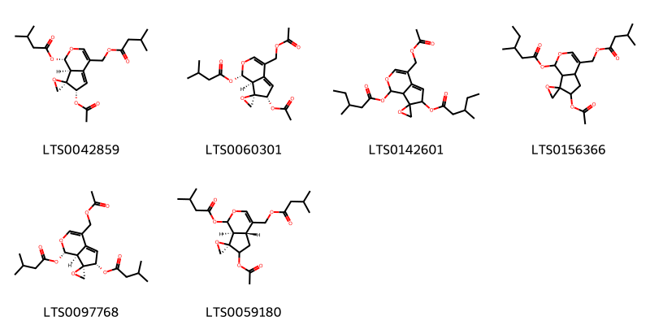{ width=100% }
    <figcaption>Hình ảnh cấu trúc hóa học của 6 hoạt chất thuộc nhóm Prenol lipids gồm ['isovaltrate (LTS0042859)', "(1s,6s,7r,7as)-6-(acetyloxy)-4-[(acetyloxy)methyl]-6,7a-dihydro-1h-spiro[cyclopenta[c]pyran-7,2'-oxiran]-1-yl 3-methylbutanoate (LTS0060301)", "4-[(acetyloxy)methyl]-1-[(3-methylpentanoyl)oxy]-6,7a-dihydro-1h-spiro[cyclopenta[c]pyran-7,2'-oxiran]-6-yl 3-methylpentanoate (LTS0142601)", "6-(acetyloxy)-4-{[(3-methylbutanoyl)oxy]methyl}-4a,5,6,7a-tetrahydro-1h-spiro[cyclopenta[c]pyran-7,2'-oxiran]-1-yl 3-methylpentanoate (LTS0156366)", 'valtrate (LTS0097768)', "(4ar,7r,7as)-6-(acetyloxy)-1-[(3-methylbutanoyl)oxy]-4a,5,6,7a-tetrahydro-1h-spiro[cyclopenta[c]pyran-7,2'-oxiran]-4-ylmethyl 3-methylbutanoate (LTS0059180)"].</figcaption>
</figure>

---

### Dược dân tộc học

Danh sách các quốc gia có sử dụng *Valeriana capensis* trong điều trị các bệnh. 

| Country      | Disease                | Bệnh                                                                                                                                                                                                |
|:-------------|:-----------------------|:----------------------------------------------------------------------------------------------------------------------------------------------------------------------------------------------------|
| Lesotho      | Fumigant               | MYMEMORY WARNING: YOU USED ALL AVAILABLE FREE TRANSLATIONS FOR TODAY. NEXT AVAILABLE IN  02 HOURS 18 MINUTES 13 SECONDS VISIT HTTPS://MYMEMORY.TRANSLATED.NET/DOC/USAGELIMITS.PHP TO TRANSLATE MORE |
| South Africa | Diaphoretic, Vermifuge | MYMEMORY WARNING: YOU USED ALL AVAILABLE FREE TRANSLATIONS FOR TODAY. NEXT AVAILABLE IN  02 HOURS 18 MINUTES 11 SECONDS VISIT HTTPS://MYMEMORY.TRANSLATED.NET/DOC/USAGELIMITS.PHP TO TRANSLATE MORE |

---

---
## Valeriana celtica
### Thông tin về thực vật

!!! info "Phân loại thực vật của *Valeriana celtica* từ GIBF:"
    - **Kingdom:** Plantae
    - **Phylum:** Tracheophyta
    - **Order:** Dipsacales
    - **Family:** Caprifoliaceae
    - **Genus:** Valeriana
    - **Species:** *Valeriana celtica*

 

| Label (VI)   | Label (EN)   | Scientific Name   | Descriptions (VI)   | Descriptions (EN)   | Also Known As (VI)   | Also Known As (EN)   |
|:-------------|:-------------|:------------------|:--------------------|:--------------------|:---------------------|:---------------------|
| N/A          | N/A          | Valeriana celtica | loài thực vật       | species of plant    | ['']                 | ['']                 |

#### Phân bố trên thế giới

**Từ CSDL GIBF** France, Switzerland, Italy, Austria

#### Phân bố tại Việt Nam

**Từ CSDL GIBF**: Không có ghi nhận ở Việt Nam

---
### Thành phần hóa học
        
- Theo cơ sở dữ liệu lotus: Từ loài *Valeriana celtica* đã phân lập và xác định được 6 hoạt chất thuộc về các nhóm Unsaturated hydrocarbons, Fatty Acyls, Prenol lipids, Organooxygen compounds. 

|    | chemicalTaxonomyClassyfireClass   |   smiles_count |
|---:|:----------------------------------|---------------:|
|  0 | Fatty Acyls                       |              1 |
|  1 | Organooxygen compounds            |              2 |
|  2 | Prenol lipids                     |              2 |
|  3 | Unsaturated hydrocarbons          |              1 |

#### Nhóm Fatty Acyls
<figure markdown="span">
    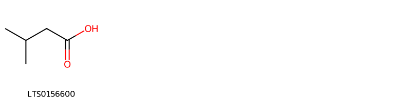{ width=100% }
    <figcaption>Hình ảnh cấu trúc hóa học của 1 hoạt chất thuộc nhóm Fatty Acyls gồm ['isovaleric acid (LTS0156600)'].</figcaption>
</figure>
#### Nhóm Organooxygen compounds
<figure markdown="span">
    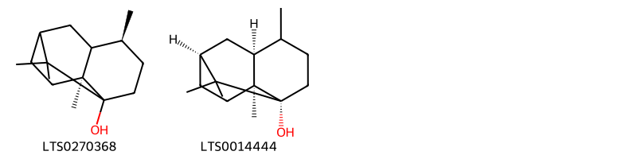{ width=100% }
    <figcaption>Hình ảnh cấu trúc hóa học của 2 hoạt chất thuộc nhóm Organooxygen compounds gồm ['patchoulol (LTS0270368)', '(1s,3r,7s,8s)-2,2,6,8-tetramethyltricyclo[5.3.1.0³,⁸]undecan-3-ol (LTS0014444)'].</figcaption>
</figure>
#### Nhóm Prenol lipids
<figure markdown="span">
    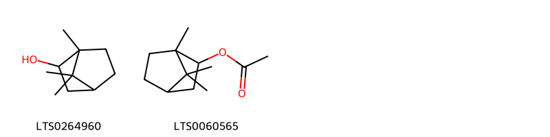{ width=100% }
    <figcaption>Hình ảnh cấu trúc hóa học của 2 hoạt chất thuộc nhóm Prenol lipids gồm ['borneol (LTS0264960)', 'bornyl acetate (LTS0060565)'].</figcaption>
</figure>
#### Nhóm Unsaturated hydrocarbons
<figure markdown="span">
    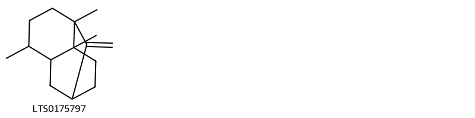{ width=100% }
    <figcaption>Hình ảnh cấu trúc hóa học của 1 hoạt chất thuộc nhóm Unsaturated hydrocarbons gồm ['3,6,8-trimethyl-2-methylidenetricyclo[5.3.1.0³,⁸]undecane (LTS0175797)'].</figcaption>
</figure>

---

### Dược dân tộc học

Danh sách các quốc gia có sử dụng *Valeriana celtica* trong điều trị các bệnh. 

| Country     | Disease   | Bệnh                                                                                                                                                                                                |
|:------------|:----------|:----------------------------------------------------------------------------------------------------------------------------------------------------------------------------------------------------|
| Austria     | Tonic     | MYMEMORY WARNING: YOU USED ALL AVAILABLE FREE TRANSLATIONS FOR TODAY. NEXT AVAILABLE IN  02 HOURS 17 MINUTES 49 SECONDS VISIT HTTPS://MYMEMORY.TRANSLATED.NET/DOC/USAGELIMITS.PHP TO TRANSLATE MORE |
| Switzerland | Nervine   | MYMEMORY WARNING: YOU USED ALL AVAILABLE FREE TRANSLATIONS FOR TODAY. NEXT AVAILABLE IN  02 HOURS 17 MINUTES 47 SECONDS VISIT HTTPS://MYMEMORY.TRANSLATED.NET/DOC/USAGELIMITS.PHP TO TRANSLATE MORE |

---

---
## Valeriana fauriei
### Thông tin về thực vật

!!! info "Phân loại thực vật của *Valeriana fauriei* từ GIBF:"
    - **Kingdom:** Plantae
    - **Phylum:** Tracheophyta
    - **Order:** Dipsacales
    - **Family:** Caprifoliaceae
    - **Genus:** Valeriana
    - **Species:** *Valeriana fauriei*

 

| Label (VI)   | Label (EN)   | Scientific Name   | Descriptions (VI)   | Descriptions (EN)   | Also Known As (VI)   | Also Known As (EN)   |
|:-------------|:-------------|:------------------|:--------------------|:--------------------|:---------------------|:---------------------|
| N/A          | N/A          | Valeriana fauriei |                     | species of plant    | ['']                 | ['']                 |

#### Phân bố trên thế giới

**Từ CSDL GIBF** Korea, Republic of, Russian Federation, Chinese Taipei, Japan

#### Phân bố tại Việt Nam

**Từ CSDL GIBF**: Không có ghi nhận ở Việt Nam

---
### Thành phần hóa học
        
- Theo cơ sở dữ liệu lotus: Từ loài *Valeriana fauriei* đã phân lập và xác định được 64 hoạt chất thuộc về các nhóm Fatty Acyls, Prenol lipids, Oxepanes, Organooxygen compounds, Carboxylic acids and derivatives. 

|    | chemicalTaxonomyClassyfireClass   |   smiles_count |
|---:|:----------------------------------|---------------:|
|  0 | Carboxylic acids and derivatives  |              6 |
|  1 | Fatty Acyls                       |              2 |
|  2 | Organooxygen compounds            |             20 |
|  3 | Oxepanes                          |             21 |
|  4 | Prenol lipids                     |             14 |

#### Nhóm Carboxylic acids and derivatives
<figure markdown="span">
    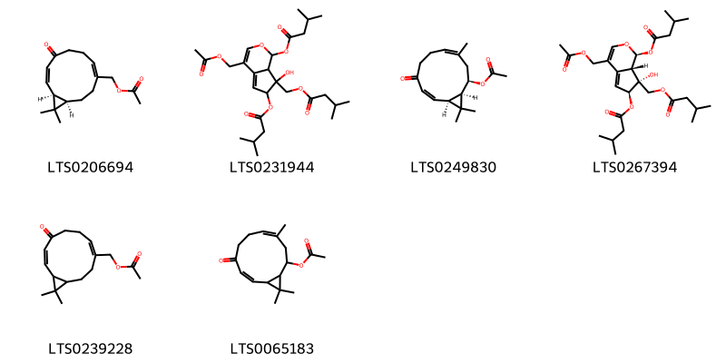{ width=100% }
    <figcaption>Hình ảnh cấu trúc hóa học của 6 hoạt chất thuộc nhóm Carboxylic acids and derivatives gồm ['[(1r,4e,9z,11s)-12,12-dimethyl-8-oxobicyclo[9.1.0]dodeca-4,9-dien-4-yl]methyl acetate (LTS0206694)', '{4-[(acetyloxy)methyl]-7-hydroxy-1,6-bis[(3-methylbutanoyl)oxy]-1h,6h,7ah-cyclopenta[c]pyran-7-yl}methyl 3-methylbutanoate (LTS0231944)', '(1r,2r,4z,9z,11s)-4,12,12-trimethyl-8-oxobicyclo[9.1.0]dodeca-4,9-dien-2-yl acetate (LTS0249830)', '[(1s,6s,7r,7as)-4-[(acetyloxy)methyl]-7-hydroxy-1,6-bis[(3-methylbutanoyl)oxy]-1h,6h,7ah-cyclopenta[c]pyran-7-yl]methyl 3-methylbutanoate (LTS0267394)', '{12,12-dimethyl-8-oxobicyclo[9.1.0]dodeca-4,9-dien-4-yl}methyl acetate (LTS0239228)', '4,12,12-trimethyl-8-oxobicyclo[9.1.0]dodeca-4,9-dien-2-yl acetate (LTS0065183)'].</figcaption>
</figure>
#### Nhóm Fatty Acyls
<figure markdown="span">
    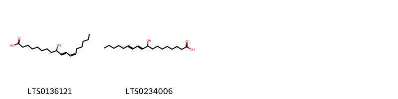{ width=100% }
    <figcaption>Hình ảnh cấu trúc hóa học của 2 hoạt chất thuộc nhóm Fatty Acyls gồm ['(10e,12z)-9-hydroxyoctadeca-10,12-dienoic acid (LTS0136121)', '9-hydroxyoctadeca-10,12-dienoic acid (LTS0234006)'].</figcaption>
</figure>
#### Nhóm Organooxygen compounds
<figure markdown="span">
    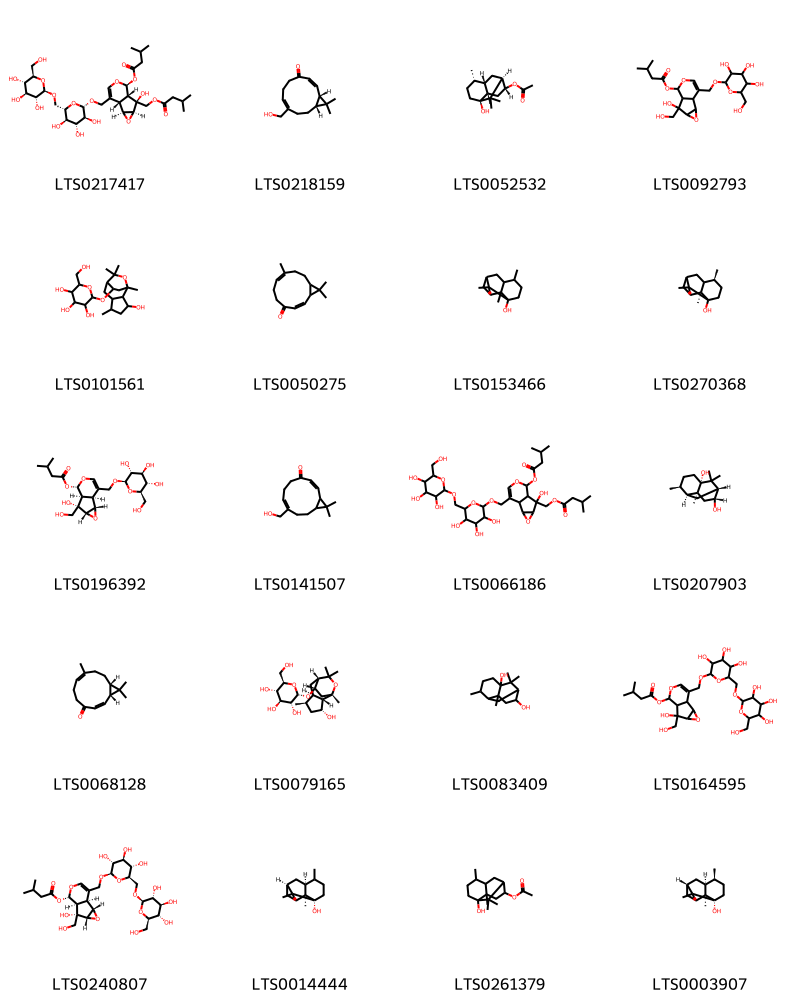{ width=100% }
    <figcaption>Hình ảnh cấu trúc hóa học của 20 hoạt chất thuộc nhóm Organooxygen compounds gồm ['[(1s,2s,4s,5s,6s,7s)-5-hydroxy-7-[(3-methylbutanoyl)oxy]-10-({[(2s,3s,4r,5r,6s)-3,4,5-trihydroxy-6-({[(2r,3r,4s,5s,6r)-3,4,5-trihydroxy-6-(hydroxymethyl)oxan-2-yl]oxy}methyl)oxan-2-yl]oxy}methyl)-3,8-dioxatricyclo[4.4.0.0²,⁴]dec-9-en-5-yl]methyl 3-methylbutanoate (LTS0217417)', '(1s,2z,7e,11r)-8-(hydroxymethyl)-12,12-dimethylbicyclo[9.1.0]dodeca-2,7-dien-4-one (LTS0218159)', '(1r,3r,6s,7s,8s,10r)-3-hydroxy-2,2,6,8-tetramethyltricyclo[5.3.1.0³,⁸]undecan-10-yl acetate (LTS0052532)', '5-hydroxy-5-(hydroxymethyl)-10-({[3,4,5-trihydroxy-6-(hydroxymethyl)oxan-2-yl]oxy}methyl)-3,8-dioxatricyclo[4.4.0.0²,⁴]dec-9-en-7-yl 3-methylbutanoate (LTS0092793)', '2-({3-hydroxy-1,5,9,9-tetramethyl-10-oxatricyclo[6.2.2.0²,⁶]dodecan-12-yl}oxy)-6-(hydroxymethyl)oxane-3,4,5-triol (LTS0101561)', '8,12,12-trimethylbicyclo[9.1.0]dodeca-2,7-dien-4-one (LTS0050275)', '2,2,6,8-tetramethyltricyclo[5.3.1.0³,⁸]undecan-3-ol (LTS0153466)', 'patchoulol (LTS0270368)', 'kanokoside a (LTS0196392)', '8-(hydroxymethyl)-12,12-dimethylbicyclo[9.1.0]dodeca-2,7-dien-4-one (LTS0141507)', '{5-hydroxy-7-[(3-methylbutanoyl)oxy]-10-({[3,4,5-trihydroxy-6-({[3,4,5-trihydroxy-6-(hydroxymethyl)oxan-2-yl]oxy}methyl)oxan-2-yl]oxy}methyl)-3,8-dioxatricyclo[4.4.0.0²,⁴]dec-9-en-5-yl}methyl 3-methylbutanoate (LTS0066186)', '(1r,3r,6s,7s,8s,10r)-2,2,6,8-tetramethyltricyclo[5.3.1.0³,⁸]undecane-3,10-diol (LTS0207903)', '(1r,2z,7z,11s)-8,12,12-trimethylbicyclo[9.1.0]dodeca-2,7-dien-4-one (LTS0068128)', '(2s,3r,4s,5s,6r)-2-{[(1s,2s,3r,5r,6r,8s,12s)-3-hydroxy-1,5,9,9-tetramethyl-10-oxatricyclo[6.2.2.0²,⁶]dodecan-12-yl]oxy}-6-(hydroxymethyl)oxane-3,4,5-triol (LTS0079165)', '2,2,6,8-tetramethyltricyclo[5.3.1.0³,⁸]undecane-3,10-diol (LTS0083409)', '5-hydroxy-5-(hydroxymethyl)-10-({[3,4,5-trihydroxy-6-({[3,4,5-trihydroxy-6-(hydroxymethyl)oxan-2-yl]oxy}methyl)oxan-2-yl]oxy}methyl)-3,8-dioxatricyclo[4.4.0.0²,⁴]dec-9-en-7-yl 3-methylbutanoate (LTS0164595)', 'kanokoside c (LTS0240807)', '(1s,3r,7s,8s)-2,2,6,8-tetramethyltricyclo[5.3.1.0³,⁸]undecan-3-ol (LTS0014444)', '3-hydroxy-2,2,6,8-tetramethyltricyclo[5.3.1.0³,⁸]undecan-10-yl acetate (LTS0261379)', 'patchoulol (LTS0003907)'].</figcaption>
</figure>
#### Nhóm Oxepanes
<figure markdown="span">
    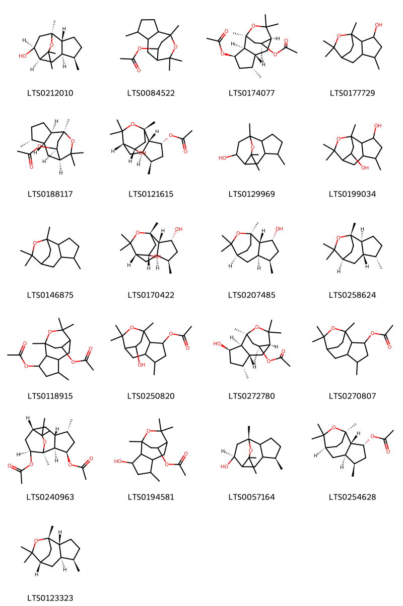{ width=100% }
    <figcaption>Hình ảnh cấu trúc hóa học của 21 hoạt chất thuộc nhóm Oxepanes gồm ['(1s,2r,5r,6r,8s,12s)-1,5,9,9-tetramethyl-10-oxatricyclo[6.2.2.0²,⁶]dodecan-12-ol (LTS0212010)', '1,5,9,9-tetramethyl-10-oxatricyclo[6.2.2.0²,⁶]dodecan-12-yl acetate (LTS0084522)', '(1s,2s,3r,5r,6r,8s,12s)-12-(acetyloxy)-1,5,9,9-tetramethyl-10-oxatricyclo[6.2.2.0²,⁶]dodecan-3-yl acetate (LTS0174077)', '1,5,9,9-tetramethyl-10-oxatricyclo[6.2.2.0²,⁶]dodecan-3-ol (LTS0177729)', '(1s,2r,5r,6r,8s,12s)-1,5,9,9-tetramethyl-10-oxatricyclo[6.2.2.0²,⁶]dodecan-12-yl acetate (LTS0188117)', '(1s,2s,3r,5r,6r,8s,12s)-12-hydroxy-1,5,9,9-tetramethyl-10-oxatricyclo[6.2.2.0²,⁶]dodecan-3-yl acetate (LTS0121615)', '1,5,9,9-tetramethyl-10-oxatricyclo[6.2.2.0²,⁶]dodecan-12-ol (LTS0129969)', '1,5,9,9-tetramethyl-10-oxatricyclo[6.2.2.0²,⁶]dodecane-3,12-diol (LTS0199034)', '1,5,9,9-tetramethyl-10-oxatricyclo[6.2.2.0²,⁶]dodecane (LTS0146875)', '(1s,2s,3r,5r,6r,8s,12s)-1,5,9,9-tetramethyl-10-oxatricyclo[6.2.2.0²,⁶]dodecane-3,12-diol (LTS0170422)', '(1r,2s,3r,5r,6r,8s)-1,5,9,9-tetramethyl-10-oxatricyclo[6.2.2.0²,⁶]dodecan-3-ol (LTS0207485)', '(1s,2s,5s,6s,8s)-1,5,9,9-tetramethyl-10-oxatricyclo[6.2.2.0²,⁶]dodecane (LTS0258624)', '12-(acetyloxy)-1,5,9,9-tetramethyl-10-oxatricyclo[6.2.2.0²,⁶]dodecan-3-yl acetate (LTS0118915)', '12-hydroxy-1,5,9,9-tetramethyl-10-oxatricyclo[6.2.2.0²,⁶]dodecan-3-yl acetate (LTS0250820)', '(1s,2s,3r,5r,6r,8s,12s)-3-hydroxy-1,5,9,9-tetramethyl-10-oxatricyclo[6.2.2.0²,⁶]dodecan-12-yl acetate (LTS0272780)', '1,5,9,9-tetramethyl-10-oxatricyclo[6.2.2.0²,⁶]dodecan-3-yl acetate (LTS0270807)', '(1s,2s,3r,5r,6r,8s,11s)-11-(acetyloxy)-1,5,9,9-tetramethyl-10-oxatricyclo[6.2.2.0²,⁶]dodecan-3-yl acetate (LTS0240963)', '3-hydroxy-1,5,9,9-tetramethyl-10-oxatricyclo[6.2.2.0²,⁶]dodecan-12-yl acetate (LTS0194581)', '(1r,5r,12s)-1,5,9,9-tetramethyl-10-oxatricyclo[6.2.2.0²,⁶]dodecan-12-ol (LTS0057164)', '(1r,2s,3r,5r,6r,8s)-1,5,9,9-tetramethyl-10-oxatricyclo[6.2.2.0²,⁶]dodecan-3-yl acetate (LTS0254628)', '(1s,2r,5r,6r,8r)-1,5,9,9-tetramethyl-10-oxatricyclo[6.2.2.0²,⁶]dodecane (LTS0123323)'].</figcaption>
</figure>
#### Nhóm Prenol lipids
<figure markdown="span">
    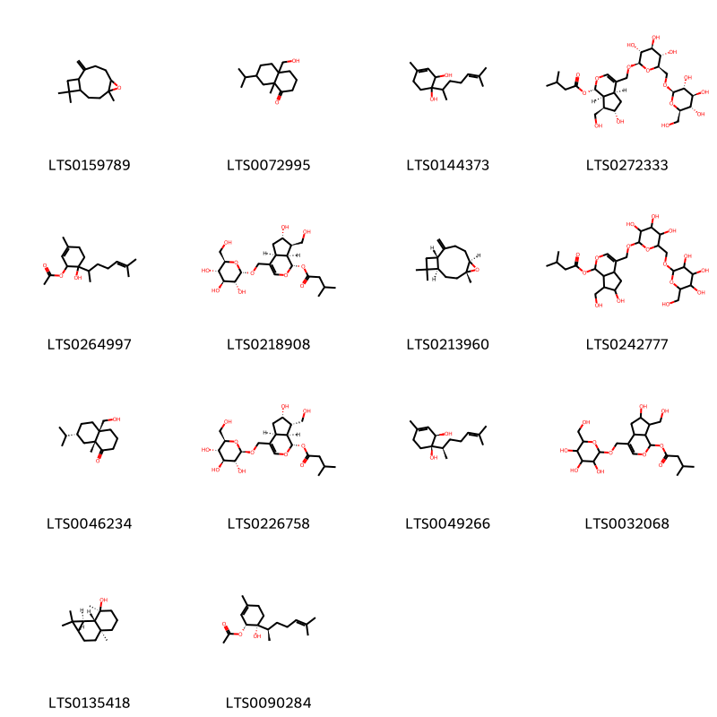{ width=100% }
    <figcaption>Hình ảnh cấu trúc hóa học của 14 hoạt chất thuộc nhóm Prenol lipids gồm ['caryophyllene oxide (LTS0159789)', '4a-(hydroxymethyl)-7-isopropyl-8a-methyl-hexahydro-2h-naphthalen-1-one (LTS0072995)', '4-methyl-1-(6-methylhept-5-en-2-yl)cyclohex-3-ene-1,2-diol (LTS0144373)', 'kanokoside d (LTS0272333)', '6-hydroxy-3-methyl-6-(6-methylhept-5-en-2-yl)cyclohex-2-en-1-yl acetate (LTS0264997)', '(1s,4as,6s,7r,7as)-6-hydroxy-7-(hydroxymethyl)-4-({[(2s,3r,4s,5s,6r)-3,4,5-trihydroxy-6-(hydroxymethyl)oxan-2-yl]oxy}methyl)-1h,4ah,5h,6h,7h,7ah-cyclopenta[c]pyran-1-yl 3-methylbutanoate (LTS0218908)', 'β-caryophyllene oxide (LTS0213960)', '6-hydroxy-7-(hydroxymethyl)-4-({[3,4,5-trihydroxy-6-({[3,4,5-trihydroxy-6-(hydroxymethyl)oxan-2-yl]oxy}methyl)oxan-2-yl]oxy}methyl)-1h,4ah,5h,6h,7h,7ah-cyclopenta[c]pyran-1-yl 3-methylbutanoate (LTS0242777)', 'kanokonol (LTS0046234)', 'patrinoside (LTS0226758)', '(1r,2r)-4-methyl-1-[(2r)-6-methylhept-5-en-2-yl]cyclohex-3-ene-1,2-diol (LTS0049266)', '6-hydroxy-7-(hydroxymethyl)-4-({[3,4,5-trihydroxy-6-(hydroxymethyl)oxan-2-yl]oxy}methyl)-1h,4ah,5h,6h,7h,7ah-cyclopenta[c]pyran-1-yl 3-methylbutanoate (LTS0032068)', '(1ar,3as,7s,7as,7br)-1,1,3a,7-tetramethyl-octahydrocyclopropa[a]naphthalen-7-ol (LTS0135418)', '(1r,6r)-6-hydroxy-3-methyl-6-[(2r)-6-methylhept-5-en-2-yl]cyclohex-2-en-1-yl acetate (LTS0090284)'].</figcaption>
</figure>

---

### Dược dân tộc học

Danh sách các quốc gia có sử dụng *Valeriana fauriei* trong điều trị các bệnh. 

| Country   | Disease   | Bệnh                                                                                                                                                                                                |
|:----------|:----------|:----------------------------------------------------------------------------------------------------------------------------------------------------------------------------------------------------|
| Japan     | Sedative  | MYMEMORY WARNING: YOU USED ALL AVAILABLE FREE TRANSLATIONS FOR TODAY. NEXT AVAILABLE IN  02 HOURS 17 MINUTES 22 SECONDS VISIT HTTPS://MYMEMORY.TRANSLATED.NET/DOC/USAGELIMITS.PHP TO TRANSLATE MORE |
| Japan*    | Sedative  | MYMEMORY WARNING: YOU USED ALL AVAILABLE FREE TRANSLATIONS FOR TODAY. NEXT AVAILABLE IN  02 HOURS 17 MINUTES 19 SECONDS VISIT HTTPS://MYMEMORY.TRANSLATED.NET/DOC/USAGELIMITS.PHP TO TRANSLATE MORE |

---

---
## Valeriana hardwickii
### Thông tin về thực vật

!!! info "Phân loại thực vật của *N/A* từ GIBF:"
    - **Kingdom:** Plantae
    - **Phylum:** Tracheophyta
    - **Order:** Dipsacales
    - **Family:** Caprifoliaceae
    - **Genus:** Valeriana
    - **Species:** *N/A*

 

| Label (VI)   | Label (EN)   | Scientific Name      | Descriptions (VI)   | Descriptions (EN)   | Also Known As (VI)   | Also Known As (EN)   |
|:-------------|:-------------|:---------------------|:--------------------|:--------------------|:---------------------|:---------------------|
| N/A          | N/A          | Valeriana hardwickii | loài thực vật       | species of plant    | ['']                 | ['']                 |

#### Phân bố trên thế giới

**Từ CSDL GIBF** Sri Lanka, Italy, Belgium, Argentina, Palestine, State of, Nicaragua, Israel, Ukraine, Denmark, Netherlands, Cyprus, Chinese Taipei, Spain, Bolivia (Plurinational State of), Hungary, Portugal, Algeria, Russian Federation, United States of America, Sweden, Chile, Slovenia, Croatia, Greece, Czechia, Germany, Switzerland, Mexico, France, Austria, Peru, United Kingdom of Great Britain and Northern Ireland, Ecuador, Colombia, Costa Rica, India, Poland

#### Phân bố tại Việt Nam

**Từ CSDL GIBF**: Không có ghi nhận ở Việt Nam

---
### Thành phần hóa học
        
- Theo cơ sở dữ liệu lotus: Từ loài *N/A* đã phân lập và xác định được 7 hoạt chất thuộc về các nhóm Prenol lipids. 

|    | chemicalTaxonomyClassyfireClass   |   smiles_count |
|---:|:----------------------------------|---------------:|
|  0 | Prenol lipids                     |              7 |

#### Nhóm Prenol lipids
<figure markdown="span">
    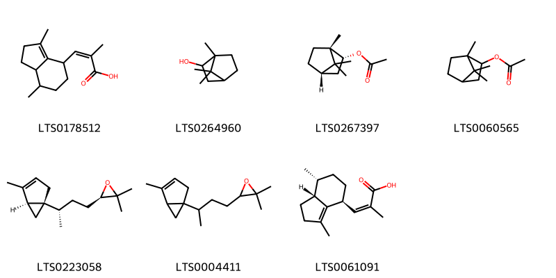{ width=100% }
    <figcaption>Hình ảnh cấu trúc hóa học của 7 hoạt chất thuộc nhóm Prenol lipids gồm ['valerenic acid (LTS0178512)', 'borneol (LTS0264960)', '(-)-bornyl acetate (LTS0267397)', 'bornyl acetate (LTS0060565)', '(3r)-2,2-dimethyl-3-[(3s)-3-[(5s)-4-methylbicyclo[3.1.0]hex-3-en-1-yl]butyl]oxirane (LTS0223058)', '2,2-dimethyl-3-(3-{4-methylbicyclo[3.1.0]hex-3-en-1-yl}butyl)oxirane (LTS0004411)', 'valerenic acid (LTS0061091)'].</figcaption>
</figure>

---

### Dược dân tộc học

Danh sách các quốc gia có sử dụng *N/A* trong điều trị các bệnh. 

| Country      | Disease      | Bệnh                                                                                                                                                                                                |
|:-------------|:-------------|:----------------------------------------------------------------------------------------------------------------------------------------------------------------------------------------------------|
| Asia         | Stimulant    | MYMEMORY WARNING: YOU USED ALL AVAILABLE FREE TRANSLATIONS FOR TODAY. NEXT AVAILABLE IN  02 HOURS 16 MINUTES 50 SECONDS VISIT HTTPS://MYMEMORY.TRANSLATED.NET/DOC/USAGELIMITS.PHP TO TRANSLATE MORE |
| Kutet gamong | Tranquilizer | MYMEMORY WARNING: YOU USED ALL AVAILABLE FREE TRANSLATIONS FOR TODAY. NEXT AVAILABLE IN  02 HOURS 16 MINUTES 48 SECONDS VISIT HTTPS://MYMEMORY.TRANSLATED.NET/DOC/USAGELIMITS.PHP TO TRANSLATE MORE |
| Lompong alas | Sedative     | MYMEMORY WARNING: YOU USED ALL AVAILABLE FREE TRANSLATIONS FOR TODAY. NEXT AVAILABLE IN  02 HOURS 16 MINUTES 46 SECONDS VISIT HTTPS://MYMEMORY.TRANSLATED.NET/DOC/USAGELIMITS.PHP TO TRANSLATE MORE |

---

---
## Valeriana jatamansi
### Thông tin về thực vật

!!! info "Phân loại thực vật của *Valeriana jatamansi* từ GIBF:"
    - **Kingdom:** Plantae
    - **Phylum:** Tracheophyta
    - **Order:** Dipsacales
    - **Family:** Caprifoliaceae
    - **Genus:** Valeriana
    - **Species:** *Valeriana jatamansi*

 

| Label (VI)   | Label (EN)   | Scientific Name     | Descriptions (VI)   | Descriptions (EN)   | Also Known As (VI)   | Also Known As (EN)                                                                                                      |
|:-------------|:-------------|:--------------------|:--------------------|:--------------------|:---------------------|:------------------------------------------------------------------------------------------------------------------------|
| N/A          | N/A          | Valeriana jatamansi |                     | Indian valerian     | ['']                 | ['Nardostachys jatamansi (Jones ex Roxb.) DC.', 'Patrinia jatamansi (Jones ex Roxb.) D.Don', 'Valeriana wallichii DC.'] |

#### Phân bố trên thế giới

**Từ CSDL GIBF** nan, Pakistan, Myanmar, Bhutan, India, unknown or invalid, United States of America, Viet Nam, Norway, China, Nepal

#### Phân bố tại Việt Nam

**Từ CSDL GIBF**: 老街省(Lao cai)

---
### Thành phần hóa học
        
- Theo cơ sở dữ liệu lotus: Từ loài *Valeriana jatamansi* đã phân lập và xác định được 188 hoạt chất thuộc về các nhóm Fatty Acyls, Naphthalenes, Flavonoids, Prenol lipids, Steroids and steroid derivatives, Cinnamic acids and derivatives, Oxepanes, Unsaturated hydrocarbons, Organooxygen compounds, Coumarins and derivatives, Carboxylic acids and derivatives. 

|    | chemicalTaxonomyClassyfireClass   |   smiles_count |
|---:|:----------------------------------|---------------:|
|  0 | Carboxylic acids and derivatives  |             68 |
|  1 | Cinnamic acids and derivatives    |              2 |
|  2 | Coumarins and derivatives         |              2 |
|  3 | Fatty Acyls                       |              5 |
|  4 | Flavonoids                        |             10 |
|  5 | Naphthalenes                      |              1 |
|  6 | Organooxygen compounds            |             14 |
|  7 | Oxepanes                          |              9 |
|  8 | Prenol lipids                     |             73 |
|  9 | Steroids and steroid derivatives  |              1 |
| 10 | Unsaturated hydrocarbons          |              2 |

#### Nhóm Carboxylic acids and derivatives
<figure markdown="span">
    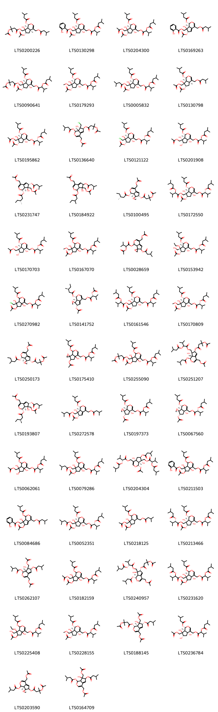{ width=100% }
    <figcaption>Hình ảnh cấu trúc hóa học của 68 hoạt chất thuộc nhóm Carboxylic acids and derivatives gồm ['[(1s,4as,6s,7r,7as)-6-(acetyloxy)-7-hydroxy-1-[(3-methylbutanoyl)oxy]-4-{[(3-methylbutanoyl)oxy]methyl}-1h,4ah,5h,6h,7ah-cyclopenta[c]pyran-7-yl]methyl 3-(acetyloxy)-3-methylbutanoate (LTS0200226)', '[(1s,4ar,6s,7r,7as)-6-(acetyloxy)-4a,7-dihydroxy-4-[({3-methyl-2-[(3-methylbutanoyl)oxy]butanoyl}oxy)methyl]-1-[(3-methylbutanoyl)oxy]-1h,5h,6h,7ah-cyclopenta[c]pyran-7-yl]methyl 2-hydroxybenzoate (LTS0130298)', '[(1s,4ar,6s,7r,7as)-6-(acetyloxy)-7-[(acetyloxy)methyl]-4a,7-dihydroxy-1-[(3-methylbutanoyl)oxy]-1h,5h,6h,7ah-cyclopenta[c]pyran-4-yl]methyl 3-methyl-2-[(3-methylbutanoyl)oxy]butanoate (LTS0204300)', '[(1s,6s,7r,7as)-6-(acetyloxy)-7-hydroxy-1-[(3-methylbutanoyl)oxy]-4-{[(3-methylbutanoyl)oxy]methyl}-1h,6h,7ah-cyclopenta[c]pyran-7-yl]methyl 2-hydroxybenzoate (LTS0169263)', '[(1s,4ar,6s,7r,7as)-6-(acetyloxy)-4a,7-dihydroxy-4-[({3-methyl-2-[(3-methylbutanoyl)oxy]butanoyl}oxy)methyl]-1-[(3-methylbutanoyl)oxy]-1h,5h,6h,7ah-cyclopenta[c]pyran-7-yl]methyl 3-(acetyloxy)-3-methylbutanoate (LTS0090641)', '[(1s,4ar,6s,7r,7as)-6-(acetyloxy)-4a,7-dihydroxy-7-(methoxymethyl)-1-[(3-methylbutanoyl)oxy]-1h,5h,6h,7ah-cyclopenta[c]pyran-4-yl]methyl 3-methyl-2-[(3-methylbutanoyl)oxy]butanoate (LTS0179293)', '[(1s,4ar,6s,7r,7as)-6-(acetyloxy)-4a,7-dihydroxy-1-[(3-methylbutanoyl)oxy]-7-{[(3-methylbutanoyl)oxy]methyl}-1h,5h,6h,7ah-cyclopenta[c]pyran-4-yl]methyl 3-methyl-2-[(3-methylbutanoyl)oxy]butanoate (LTS0005832)', '[(1s,4as,6s,7r,7as)-6-(acetyloxy)-7-[(acetyloxy)methyl]-7-hydroxy-1-[(3-methylbutanoyl)oxy]-1h,4ah,5h,6h,7ah-cyclopenta[c]pyran-4-yl]methyl 3-methylbutanoate (LTS0130798)', '[(1s,4ar,6s,7r,7as)-6-(acetyloxy)-7-[(acetyloxy)methyl]-4a,7-dihydroxy-1-[(3-methylbutanoyl)oxy]-1h,5h,6h,7ah-cyclopenta[c]pyran-4-yl]methyl (2r)-3-methyl-2-[(3-methylbutanoyl)oxy]butanoate (LTS0195862)', '(1s,6s,7s,7as)-4-[(acetyloxy)methyl]-7-(chloromethyl)-7-hydroxy-1-[(3-methylbutanoyl)oxy]-1h,6h,7ah-cyclopenta[c]pyran-6-yl 3-(acetyloxy)-3-methylbutanoate (LTS0136640)', '[(1s,4ar,6s,7s,7as)-6-(acetyloxy)-7-(chloromethyl)-4a,7-dihydroxy-1-[(3-methylbutanoyl)oxy]-1h,5h,6h,7ah-cyclopenta[c]pyran-4-yl]methyl (2r)-3-methyl-2-[(3-methylbutanoyl)oxy]butanoate (LTS0121122)', '[(1s,4ar,6s,7s,7as)-7-[(acetyloxy)methyl]-4a,6,7-trihydroxy-1-[(3-methylbutanoyl)oxy]-1h,5h,6h,7ah-cyclopenta[c]pyran-4-yl]methyl (2s)-3-methyl-2-[(3-methylbutanoyl)oxy]butanoate (LTS0201908)', '(1s,6s,7r,7as)-4,7-bis[(acetyloxy)methyl]-7-hydroxy-6-[(3-methylbutanoyl)oxy]-1h,6h,7ah-cyclopenta[c]pyran-1-yl (3r)-3-methylpentanoate (LTS0231747)', '4,7-bis[(acetyloxy)methyl]-7-hydroxy-6-[(3-methylbutanoyl)oxy]-1h,6h,7ah-cyclopenta[c]pyran-1-yl 3-methylpentanoate (LTS0184922)', "(1s,6s,7r,7as)-6-{[3-(acetyloxy)-3-methylbutanoyl]oxy}-4-[(acetyloxy)methyl]-6,7a-dihydro-1h-spiro[cyclopenta[c]pyran-7,2'-oxiran]-1-yl (3r)-3-methylpentanoate (LTS0100495)", '[(1s,4ar,6s,7s,7as)-6-(acetyloxy)-4a,7-dihydroxy-4-({[(2r)-3-methyl-2-[(3-methylbutanoyl)oxy]butanoyl]oxy}methyl)-1-[(3-methylbutanoyl)oxy]-1h,5h,6h,7ah-cyclopenta[c]pyran-7-yl]methyl (2r)-3-methyl-2-[(3-methylbutanoyl)oxy]butanoate (LTS0172550)', '[(1s,4ar,6s,7s,7as)-7-[(acetyloxy)methyl]-4a,6,7-trihydroxy-1-[(3-methylbutanoyl)oxy]-1h,5h,6h,7ah-cyclopenta[c]pyran-4-yl]methyl (2r)-3-methyl-2-[(3-methylbutanoyl)oxy]butanoate (LTS0170703)', '[6-(acetyloxy)-4a,7-dihydroxy-7-(methoxymethyl)-1-[(3-methylbutanoyl)oxy]-1h,5h,6h,7ah-cyclopenta[c]pyran-4-yl]methyl 3-methyl-2-[(3-methylbutanoyl)oxy]butanoate (LTS0167070)', "4-[(acetyloxy)methyl]-6-[(3-methylbutanoyl)oxy]-6,7a-dihydro-1h-spiro[cyclopenta[c]pyran-7,2'-oxiran]-1-yl 2-(acetyloxy)-3-methylbutanoate (LTS0028659)", '[(1s,4ar,6s,7s,7as)-6-(acetyloxy)-7-ethoxy-4a-hydroxy-7-(hydroxymethyl)-1-[(3-methylbutanoyl)oxy]-1h,5h,6h,7ah-cyclopenta[c]pyran-4-yl]methyl (2r)-3-methyl-2-[(3-methylbutanoyl)oxy]butanoate (LTS0153942)', '[6-(acetyloxy)-7-(chloromethyl)-4a,7-dihydroxy-1-[(3-methylbutanoyl)oxy]-1h,5h,6h,7ah-cyclopenta[c]pyran-4-yl]methyl 3-methyl-2-[(3-methylbutanoyl)oxy]butanoate (LTS0270982)', "(1s,6s,7r,7as)-6-(acetyloxy)-4-({[(2r)-2-(acetyloxy)-3-methylbutanoyl]oxy}methyl)-6,7a-dihydro-1h-spiro[cyclopenta[c]pyran-7,2'-oxiran]-1-yl (3s)-3-methylpentanoate (LTS0141752)", '[(1s,4ar,6s,7r,7as)-6-(acetyloxy)-4a,7-dihydroxy-4-[({3-methyl-2-[(3-methylbutanoyl)oxy]butanoyl}oxy)methyl]-1-[(3-methylbutanoyl)oxy]-1h,5h,6h,7ah-cyclopenta[c]pyran-7-yl]methyl 3-methyl-2-[(3-methylbutanoyl)oxy]butanoate (LTS0161546)', '[(1s,4ar,6s,7r,7as)-6-(acetyloxy)-4a,7-dihydroxy-7-(methoxymethyl)-1-[(3-methylbutanoyl)oxy]-1h,5h,6h,7ah-cyclopenta[c]pyran-4-yl]methyl (2r)-3-methyl-2-[(3-methylbutanoyl)oxy]butanoate (LTS0170809)', "(1s,6s,7r,7as)-6-{[3-(acetyloxy)-3-methylbutanoyl]oxy}-4-[(acetyloxy)methyl]-6,7a-dihydro-1h-spiro[cyclopenta[c]pyran-7,2'-oxiran]-1-yl 3-methylpentanoate (LTS0250173)", "6-(acetyloxy)-4a-hydroxy-1-[(3-methylbutanoyl)oxy]-1,5,6,7a-tetrahydrospiro[cyclopenta[c]pyran-7,2'-oxiran]-4-ylmethyl 3-methyl-2-[(3-methylbutanoyl)oxy]butanoate (LTS0175410)", '[6-(acetyloxy)-4a,7-dihydroxy-4-[({3-methyl-2-[(3-methylbutanoyl)oxy]butanoyl}oxy)methyl]-1-[(3-methylbutanoyl)oxy]-1h,5h,6h,7ah-cyclopenta[c]pyran-7-yl]methyl 3-(acetyloxy)-3-methylbutanoate (LTS0255090)', 'valeriotetrate b (LTS0251207)', '(1s,6s,7r,7as)-4,7-bis[(acetyloxy)methyl]-7-hydroxy-6-[(3-methylbutanoyl)oxy]-1h,6h,7ah-cyclopenta[c]pyran-1-yl (3s)-3-methylpentanoate (LTS0193807)', '[(1s,6s,7r,7as)-6-(acetyloxy)-7-hydroxy-1-[(3-methylbutanoyl)oxy]-4-{[(3-methylbutanoyl)oxy]methyl}-1h,6h,7ah-cyclopenta[c]pyran-7-yl]methyl 3-methylbutanoate (LTS0272578)', "(1s,4ar,6s,7r,7as)-6-(acetyloxy)-4a-hydroxy-1-[(3-methylbutanoyl)oxy]-1,5,6,7a-tetrahydrospiro[cyclopenta[c]pyran-7,2'-oxiran]-4-ylmethyl 3-methyl-2-[(3-methylbutanoyl)oxy]butanoate (LTS0197373)", "(1s,4ar,6s,7r,7as)-6-(acetyloxy)-4a-hydroxy-1-[(3-methylbutanoyl)oxy]-1,5,6,7a-tetrahydrospiro[cyclopenta[c]pyran-7,2'-oxiran]-4-ylmethyl (2r)-3-methyl-2-[(3-methylbutanoyl)oxy]butanoate (LTS0067560)", '{7-[(acetyloxy)methyl]-4a,6,7-trihydroxy-1-[(3-methylbutanoyl)oxy]-1h,5h,6h,7ah-cyclopenta[c]pyran-4-yl}methyl 3-methyl-2-[(3-methylbutanoyl)oxy]butanoate (LTS0062061)', '[6-(acetyloxy)-4a,7-dihydroxy-1-[(3-methylbutanoyl)oxy]-7-{[(3-methylbutanoyl)oxy]methyl}-1h,5h,6h,7ah-cyclopenta[c]pyran-4-yl]methyl 3-methyl-2-[(3-methylbutanoyl)oxy]butanoate (LTS0079286)', '[(1s,4ar,6r,7s,7as)-1-(acetyloxy)-4a,7-dihydroxy-4-({[(2r)-3-methyl-2-[(3-methylbutanoyl)oxy]butanoyl]oxy}methyl)-6-[(3-methylbutanoyl)oxy]-1h,5h,6h,7ah-cyclopenta[c]pyran-7-yl]methyl (2r)-3-methyl-2-[(3-methylbutanoyl)oxy]butanoate (LTS0204304)', '[6-(acetyloxy)-4a,7-dihydroxy-4-[({3-methyl-2-[(3-methylbutanoyl)oxy]butanoyl}oxy)methyl]-1-[(3-methylbutanoyl)oxy]-1h,5h,6h,7ah-cyclopenta[c]pyran-7-yl]methyl 2-hydroxybenzoate (LTS0211503)', '[6-(acetyloxy)-7-hydroxy-1-[(3-methylbutanoyl)oxy]-4-{[(3-methylbutanoyl)oxy]methyl}-1h,6h,7ah-cyclopenta[c]pyran-7-yl]methyl 2-hydroxybenzoate (LTS0084686)', '[(1s,4ar,6s,7r,7as)-6-(acetyloxy)-4a,7-dihydroxy-1-[(3-methylbutanoyl)oxy]-7-{[(3-methylbutanoyl)oxy]methyl}-1h,5h,6h,7ah-cyclopenta[c]pyran-4-yl]methyl (2r)-3-methyl-2-[(3-methylbutanoyl)oxy]butanoate (LTS0052351)', '[6-(acetyloxy)-7-[(acetyloxy)methyl]-7-hydroxy-1-[(3-methylbutanoyl)oxy]-1h,4ah,5h,6h,7ah-cyclopenta[c]pyran-4-yl]methyl 3-methylbutanoate (LTS0218125)', '[(1s,4ar,6s,7s,7as)-6-(acetyloxy)-4a,7-dihydroxy-4-({[(2s)-3-methyl-2-[(3-methylbutanoyl)oxy]butanoyl]oxy}methyl)-1-[(3-methylbutanoyl)oxy]-1h,5h,6h,7ah-cyclopenta[c]pyran-7-yl]methyl (2s)-3-methyl-2-[(3-methylbutanoyl)oxy]butanoate (LTS0213466)', '(1s,6s,7r,7as)-4,7-bis[(acetyloxy)methyl]-7-hydroxy-1-[(3-methylbutanoyl)oxy]-1h,6h,7ah-cyclopenta[c]pyran-6-yl 3-methylbutanoate (LTS0262107)', '[6-(acetyloxy)-7-[(acetyloxy)methyl]-4a,7-dihydroxy-1-[(3-methylbutanoyl)oxy]-1h,5h,6h,7ah-cyclopenta[c]pyran-4-yl]methyl 3-methyl-2-[(3-methylbutanoyl)oxy]butanoate (LTS0182159)', '[(1r,6r,7s,7ar)-6-{[3-(acetyloxy)-3-methylbutanoyl]oxy}-4-[(acetyloxy)methyl]-7-hydroxy-1-[(3-methylbutanoyl)oxy]-1h,6h,7ah-cyclopenta[c]pyran-7-yl]methyl (2r)-3-methyl-2-[(3-methylbutanoyl)oxy]butanoate (LTS0240957)', '[(4ar,7r,7as)-6-(acetyloxy)-4a,7-dihydroxy-4-[({3-methyl-2-[(3-methylbutanoyl)oxy]butanoyl}oxy)methyl]-1-[(3-methylbutanoyl)oxy]-1h,5h,6h,7ah-cyclopenta[c]pyran-7-yl]methyl 3-methyl-2-[(3-methylbutanoyl)oxy]butanoate (LTS0231620)', '[6-(acetyloxy)-7-ethoxy-4a-hydroxy-7-(hydroxymethyl)-1-[(3-methylbutanoyl)oxy]-1h,5h,6h,7ah-cyclopenta[c]pyran-4-yl]methyl 3-methyl-2-[(3-methylbutanoyl)oxy]butanoate (LTS0225408)', '[(1s,4ar,6s,7r,7as)-6-(acetyloxy)-4a,7-dihydroxy-7-(methoxymethyl)-1-[(3-methylbutanoyl)oxy]-1h,5h,6h,7ah-cyclopenta[c]pyran-4-yl]methyl (2s)-3-methyl-2-[(3-methylbutanoyl)oxy]butanoate (LTS0228155)', '(1r,6r,7s,7ar)-4,7-bis[(acetyloxy)methyl]-7-hydroxy-6-[(3-methylbutanoyl)oxy]-1h,6h,7ah-cyclopenta[c]pyran-1-yl 3-(acetyloxy)-3-methylbutanoate (LTS0188145)', '[(1s,4ar,6s,7r,7as)-7-[(acetyloxy)methyl]-4a,6,7-trihydroxy-1-[(3-methylbutanoyl)oxy]-1h,5h,6h,7ah-cyclopenta[c]pyran-4-yl]methyl 3-methyl-2-[(3-methylbutanoyl)oxy]butanoate (LTS0236784)', "(7r,7as)-4-[(acetyloxy)methyl]-1-[(3-methylbutanoyl)oxy]-6,7a-dihydro-1h-spiro[cyclopenta[c]pyran-7,2'-oxiran]-6-yl 3-(acetyloxy)-3-methylbutanoate (LTS0203590)", '4,7-bis[(acetyloxy)methyl]-7-hydroxy-1-[(3-methylbutanoyl)oxy]-1h,6h,7ah-cyclopenta[c]pyran-6-yl 3-methylbutanoate (LTS0164709)', 'acevaltrate (LTS0166532)', 'acevaltrate (LTS0048028)', '[(1s,4ar,6s,7r,7as)-6-(acetyloxy)-4a,7-dihydroxy-4-({[(2r)-3-methyl-2-[(3-methylbutanoyl)oxy]butanoyl]oxy}methyl)-1-[(3-methylbutanoyl)oxy]-1h,5h,6h,7ah-cyclopenta[c]pyran-7-yl]methyl (2r)-3-methyl-2-[(3-methylbutanoyl)oxy]butanoate (LTS0054374)', '(1s,6s,7r,7as)-4,7-bis[(acetyloxy)methyl]-7-hydroxy-6-[(3-methylbutanoyl)oxy]-1h,6h,7ah-cyclopenta[c]pyran-1-yl 3-(acetyloxy)-3-methylbutanoate (LTS0122842)', '(1r,6r,7s,7ar)-4,7-bis[(acetyloxy)methyl]-7-hydroxy-6-[(3-methylbutanoyl)oxy]-1h,6h,7ah-cyclopenta[c]pyran-1-yl (3s)-3-methylpentanoate (LTS0022802)', '[6-(acetyloxy)-4a,7-dihydroxy-4-[({3-methyl-2-[(3-methylbutanoyl)oxy]butanoyl}oxy)methyl]-1-[(3-methylbutanoyl)oxy]-1h,5h,6h,7ah-cyclopenta[c]pyran-7-yl]methyl 3-methyl-2-[(3-methylbutanoyl)oxy]butanoate (LTS0006571)', '4,7-bis[(acetyloxy)methyl]-7-hydroxy-6-[(3-methylbutanoyl)oxy]-1h,6h,7ah-cyclopenta[c]pyran-1-yl 3-(acetyloxy)-3-methylbutanoate (LTS0265556)', '[(1s,6s,7r,7as)-6-{[3-(acetyloxy)-3-methylbutanoyl]oxy}-4-[(acetyloxy)methyl]-7-hydroxy-1-[(3-methylbutanoyl)oxy]-1h,6h,7ah-cyclopenta[c]pyran-7-yl]methyl (2r)-3-methyl-2-[(3-methylbutanoyl)oxy]butanoate (LTS0014193)', '[(1s,4ar,6s,7r,7as)-7-[(acetyloxy)methyl]-4a,6,7-trihydroxy-1-[(3-methylbutanoyl)oxy]-1h,5h,6h,7ah-cyclopenta[c]pyran-4-yl]methyl (2r)-3-methyl-2-[(3-methylbutanoyl)oxy]butanoate (LTS0007278)', "6-{[3-(acetyloxy)-3-methylbutanoyl]oxy}-4-[(acetyloxy)methyl]-6,7a-dihydro-1h-spiro[cyclopenta[c]pyran-7,2'-oxiran]-1-yl 3-methylpentanoate (LTS0008751)", '[1-(acetyloxy)-4a,7-dihydroxy-4-[({3-methyl-2-[(3-methylbutanoyl)oxy]butanoyl}oxy)methyl]-6-[(3-methylbutanoyl)oxy]-1h,5h,6h,7ah-cyclopenta[c]pyran-7-yl]methyl 3-methyl-2-[(3-methylbutanoyl)oxy]butanoate (LTS0021400)', '[(1s,4ar,6s,7r,7as)-6-(acetyloxy)-4a,7-dihydroxy-4-({[(2r)-3-methyl-2-[(3-methylbutanoyl)oxy]butanoyl]oxy}methyl)-1-[(3-methylbutanoyl)oxy]-1h,5h,6h,7ah-cyclopenta[c]pyran-7-yl]methyl 3-(acetyloxy)-3-methylbutanoate (LTS0026962)', '[(1s,4ar,6r,7r,7as)-1-(acetyloxy)-4a,7-dihydroxy-4-({[(2s)-3-methyl-2-[(3-methylbutanoyl)oxy]butanoyl]oxy}methyl)-6-[(3-methylbutanoyl)oxy]-1h,5h,6h,7ah-cyclopenta[c]pyran-7-yl]methyl (2s)-3-methyl-2-[(3-methylbutanoyl)oxy]butanoate (LTS0116560)', "6-(acetyloxy)-4-({[2-(acetyloxy)-3-methylbutanoyl]oxy}methyl)-6,7a-dihydro-1h-spiro[cyclopenta[c]pyran-7,2'-oxiran]-1-yl 3-methylpentanoate (LTS0104848)", '[(1s,4ar,6s,7r,7as)-6-(acetyloxy)-4a,7-dihydroxy-4-({[(2r)-3-methyl-2-[(3-methylbutanoyl)oxy]butanoyl]oxy}methyl)-1-[(3-methylbutanoyl)oxy]-1h,5h,6h,7ah-cyclopenta[c]pyran-7-yl]methyl 2-hydroxybenzoate (LTS0120389)', '[6-(acetyloxy)-7-hydroxy-1-[(3-methylbutanoyl)oxy]-4-{[(3-methylbutanoyl)oxy]methyl}-1h,4ah,5h,6h,7ah-cyclopenta[c]pyran-7-yl]methyl 3-(acetyloxy)-3-methylbutanoate (LTS0035010)', "(1s,6s,7r,7as)-6-{[3-(acetyloxy)-3-methylbutanoyl]oxy}-4-[(acetyloxy)methyl]-6,7a-dihydro-1h-spiro[cyclopenta[c]pyran-7,2'-oxiran]-1-yl (3s)-3-methylpentanoate (LTS0121330)", '(6-{[3-(acetyloxy)-3-methylbutanoyl]oxy}-4-[(acetyloxy)methyl]-7-hydroxy-1-[(3-methylbutanoyl)oxy]-1h,6h,7ah-cyclopenta[c]pyran-7-yl)methyl 3-methyl-2-[(3-methylbutanoyl)oxy]butanoate (LTS0112919)'].</figcaption>
</figure>
#### Nhóm Cinnamic acids and derivatives
<figure markdown="span">
    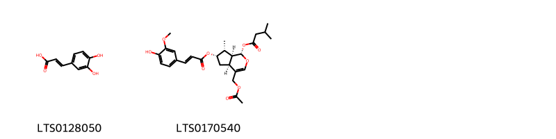{ width=100% }
    <figcaption>Hình ảnh cấu trúc hóa học của 2 hoạt chất thuộc nhóm Cinnamic acids and derivatives gồm ['3,4-dihydroxycinnamic acid (LTS0128050)', '(1s,4as,6s,7r,7as)-4-[(acetyloxy)methyl]-6-{[(2e)-3-(4-hydroxy-3-methoxyphenyl)prop-2-enoyl]oxy}-7-methyl-1h,4ah,5h,6h,7h,7ah-cyclopenta[c]pyran-1-yl 3-methylbutanoate (LTS0170540)'].</figcaption>
</figure>
#### Nhóm Coumarins and derivatives
<figure markdown="span">
    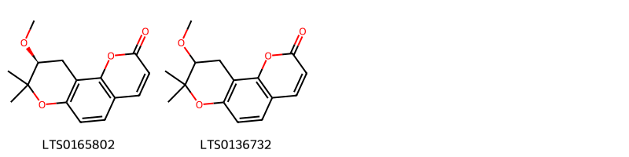{ width=100% }
    <figcaption>Hình ảnh cấu trúc hóa học của 2 hoạt chất thuộc nhóm Coumarins and derivatives gồm ['(9s)-9-methoxy-8,8-dimethyl-9h,10h-pyrano[2,3-h]chromen-2-one (LTS0165802)', '9-methoxy-8,8-dimethyl-9h,10h-pyrano[2,3-h]chromen-2-one (LTS0136732)'].</figcaption>
</figure>
#### Nhóm Fatty Acyls
<figure markdown="span">
    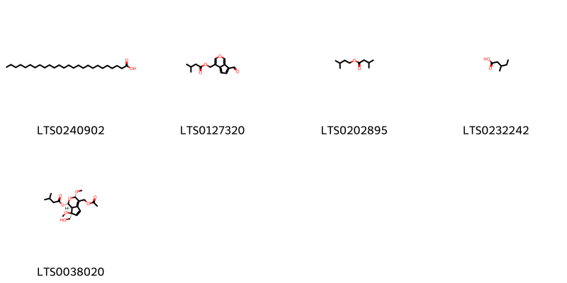{ width=100% }
    <figcaption>Hình ảnh cấu trúc hóa học của 5 hoạt chất thuộc nhóm Fatty Acyls gồm ['hexacosanoic acid (LTS0240902)', 'homobaldrinal (LTS0127320)', 'apple oil (LTS0202895)', '3-methyl valeric acid (LTS0232242)', '(1s,3s,7r,7as)-4-[(acetyloxy)methyl]-7-(hydroxymethyl)-3,7-dimethoxy-1h,3h,7ah-cyclopenta[c]pyran-1-yl 3-methylbutanoate (LTS0038020)'].</figcaption>
</figure>
#### Nhóm Flavonoids
<figure markdown="span">
    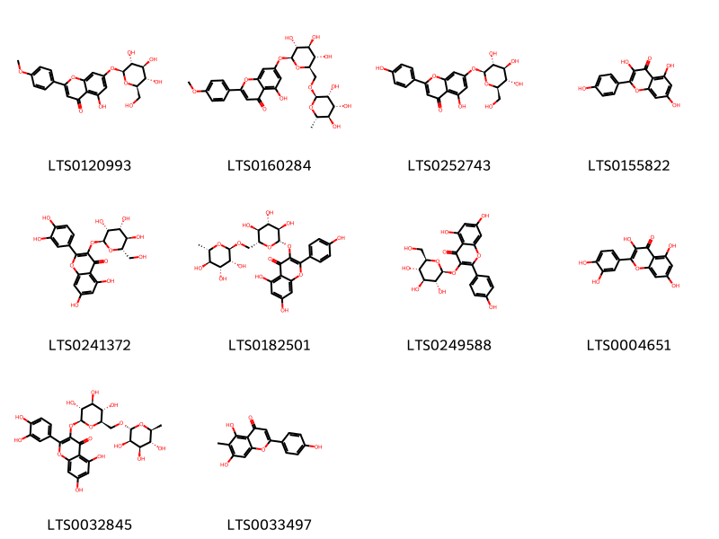{ width=100% }
    <figcaption>Hình ảnh cấu trúc hóa học của 10 hoạt chất thuộc nhóm Flavonoids gồm ['5-hydroxy-2-(4-methoxyphenyl)-7-{[(2s,3r,4s,5s,6r)-3,4,5-trihydroxy-6-(hydroxymethyl)oxan-2-yl]oxy}chromen-4-one (LTS0120993)', 'linarin (LTS0160284)', 'apigenin 7-o-β-glucoside (LTS0252743)', 'kaempherol (LTS0155822)', '2-(3,4-dihydroxyphenyl)-5,7-dihydroxy-3-{[(2s,3r,4r,5r,6s)-3,4,5-trihydroxy-6-(hydroxymethyl)oxan-2-yl]oxy}chromen-4-one (LTS0241372)', 'nictoflorin (LTS0182501)', 'astragalin (LTS0249588)', 'quercetin (LTS0004651)', '3-rutinosyl quercetin (LTS0032845)', '6-methylapigenin (LTS0033497)'].</figcaption>
</figure>
#### Nhóm Naphthalenes
<figure markdown="span">
    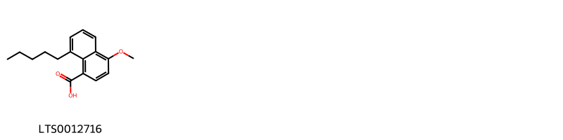{ width=100% }
    <figcaption>Hình ảnh cấu trúc hóa học của 1 hoạt chất thuộc nhóm Naphthalenes gồm ['4-methoxy-8-pentylnaphthalene-1-carboxylic acid (LTS0012716)'].</figcaption>
</figure>
#### Nhóm Organooxygen compounds
<figure markdown="span">
    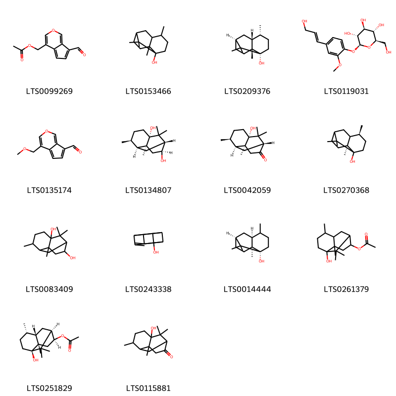{ width=100% }
    <figcaption>Hình ảnh cấu trúc hóa học của 14 hoạt chất thuộc nhóm Organooxygen compounds gồm ['baldrinal (LTS0099269)', '2,2,6,8-tetramethyltricyclo[5.3.1.0³,⁸]undecan-3-ol (LTS0153466)', '(1s,3r,6r,7r,8r)-2,2,6,8-tetramethyltricyclo[5.3.1.0³,⁸]undecan-3-ol (LTS0209376)', 'coniferin (LTS0119031)', '4-(methoxymethyl)cyclopenta[c]pyran-7-carbaldehyde (LTS0135174)', '(1r,3r,6s,7s,8s,10s)-2,2,6,8-tetramethyltricyclo[5.3.1.0³,⁸]undecane-3,10-diol (LTS0134807)', '(1r,3r,6s,7s,8s)-3-hydroxy-2,2,6,8-tetramethyltricyclo[5.3.1.0³,⁸]undecan-10-one (LTS0042059)', 'patchoulol (LTS0270368)', '2,2,6,8-tetramethyltricyclo[5.3.1.0³,⁸]undecane-3,10-diol (LTS0083409)', '3,4,5,8-tetrahydro-2h-cuban-1-ol (LTS0243338)', '(1s,3r,7s,8s)-2,2,6,8-tetramethyltricyclo[5.3.1.0³,⁸]undecan-3-ol (LTS0014444)', '3-hydroxy-2,2,6,8-tetramethyltricyclo[5.3.1.0³,⁸]undecan-10-yl acetate (LTS0261379)', '(1r,3r,6s,7s,8s,10s)-3-hydroxy-2,2,6,8-tetramethyltricyclo[5.3.1.0³,⁸]undecan-10-yl acetate (LTS0251829)', '3-hydroxy-2,2,6,8-tetramethyltricyclo[5.3.1.0³,⁸]undecan-10-one (LTS0115881)'].</figcaption>
</figure>
#### Nhóm Oxepanes
<figure markdown="span">
    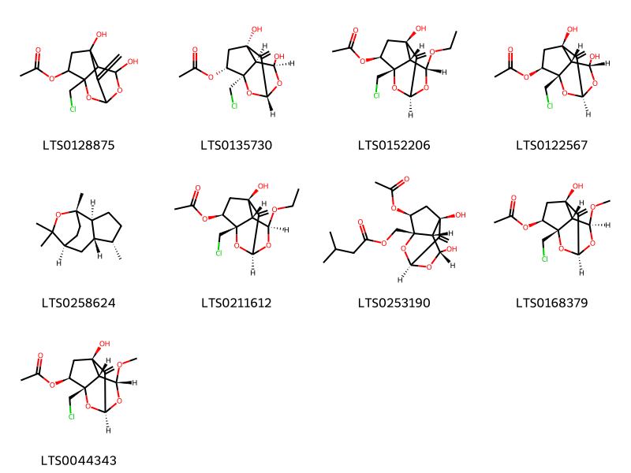{ width=100% }
    <figcaption>Hình ảnh cấu trúc hóa học của 9 hoạt chất thuộc nhóm Oxepanes gồm ['3-(chloromethyl)-6,8-dihydroxy-10-methylidene-2,9-dioxatricyclo[4.3.1.0³,⁷]decan-4-yl acetate (LTS0128875)', '(1s,3r,4r,6s,7r,8s)-3-(chloromethyl)-6,8-dihydroxy-10-methylidene-2,9-dioxatricyclo[4.3.1.0³,⁷]decan-4-yl acetate (LTS0135730)', '(1r,3s,4s,6r,7s,8r)-3-(chloromethyl)-8-ethoxy-6-hydroxy-10-methylidene-2,9-dioxatricyclo[4.3.1.0³,⁷]decan-4-yl acetate (LTS0152206)', '(1r,3s,4s,6r,7s,8r)-3-(chloromethyl)-6,8-dihydroxy-10-methylidene-2,9-dioxatricyclo[4.3.1.0³,⁷]decan-4-yl acetate (LTS0122567)', '(1s,2s,5s,6s,8s)-1,5,9,9-tetramethyl-10-oxatricyclo[6.2.2.0²,⁶]dodecane (LTS0258624)', '(1r,3s,4s,6r,7s,8s)-3-(chloromethyl)-8-ethoxy-6-hydroxy-10-methylidene-2,9-dioxatricyclo[4.3.1.0³,⁷]decan-4-yl acetate (LTS0211612)', '[(1r,3r,4s,6r,7s,8r)-4-(acetyloxy)-6,8-dihydroxy-10-methylidene-2,9-dioxatricyclo[4.3.1.0³,⁷]decan-3-yl]methyl 3-methylbutanoate (LTS0253190)', '(1r,3s,4s,6r,7s,8s)-3-(chloromethyl)-6-hydroxy-8-methoxy-10-methylidene-2,9-dioxatricyclo[4.3.1.0³,⁷]decan-4-yl acetate (LTS0168379)', '(1r,3s,4s,6r,7s,8r)-3-(chloromethyl)-6-hydroxy-8-methoxy-10-methylidene-2,9-dioxatricyclo[4.3.1.0³,⁷]decan-4-yl acetate (LTS0044343)'].</figcaption>
</figure>
#### Nhóm Prenol lipids
<figure markdown="span">
    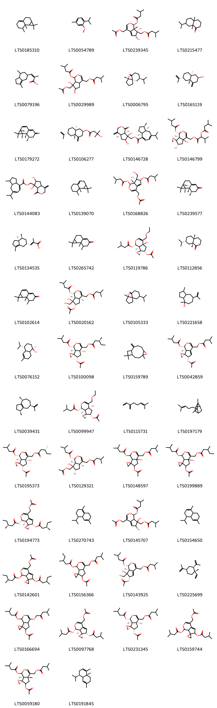{ width=100% }
    <figcaption>Hình ảnh cấu trúc hóa học của 73 hoạt chất thuộc nhóm Prenol lipids gồm ['1,1,7,7a-tetramethyl-1ah,2h,3h,5h,6h,7h,7bh-cyclopropa[a]naphthalene (LTS0185310)', '2-isopropyl-5-methylanisole (LTS0054789)', '[(1s,6s,7r,7as)-4-[(acetyloxy)methyl]-6,7-dihydroxy-1-[(3-methylbutanoyl)oxy]-1h,6h,7ah-cyclopenta[c]pyran-7-yl]methyl 3-methylbutanoate (LTS0239345)', '7-isopropyl-4a,8a-dimethyl-hexahydro-2h-naphthalen-1-one (LTS0215477)', '3-(3,7-dimethyl-2,4,5,6,7,7a-hexahydro-1h-inden-5-yl)-2-methylprop-2-enoic acid (LTS0079196)', '{7-[(acetyloxy)methyl]-6,7-dihydroxy-1-[(3-methylbutanoyl)oxy]-1h,4ah,5h,6h,7ah-cyclopenta[c]pyran-4-yl}methyl 3-methylbutanoate (LTS0029989)', '(1s,5s,9r)-9-isopropyl-1-methyl-6-methylidenespiro[4.5]decan-1-ol (LTS0006795)', '(2s,4as,6r,8as)-8a-methyl-4-methylidene-6-(prop-1-en-2-yl)-octahydronaphthalen-2-ol (LTS0165119)', '(1ar,7r,7ar,7bs)-1,1,7,7a-tetramethyl-1ah,6h,7h,7bh-cyclopropa[a]naphthalen-5-one (LTS0179272)', '(2s,4as,6r,8as)-8a-methyl-4-methylidene-6-(prop-1-en-2-yl)-octahydronaphthalen-2-yl 3-hydroxy-3-methylbutanoate (LTS0106277)', '[(4ar,6s,7s,7ar)-6,7-dihydroxy-4-methylidene-1-oxo-tetrahydro-3h-cyclopenta[c]pyran-7-yl]methyl (1r,3as,8ar)-7-isopropyl-1-methyl-1,2,3,3a,8,8a-hexahydroazulene-4-carboxylate (LTS0146728)', "(1s,4as,6s,7r,7as)-4a,6-dihydroxy-1-[(3-methylbutanoyl)oxy]-1,5,6,7a-tetrahydrospiro[cyclopenta[c]pyran-7,2'-oxiran]-4-ylmethyl 3-methyl-2-[(3-methylbutanoyl)oxy]butanoate (LTS0146799)", '{6,7-dihydroxy-4-methylidene-1-oxo-tetrahydro-3h-cyclopenta[c]pyran-7-yl}methyl 7-isopropyl-1-methyl-1,2,3,3a,8,8a-hexahydroazulene-4-carboxylate (LTS0144083)', '1,1,7,7a-tetramethyl-1ah,2h,4h,5h,6h,7h,7bh-cyclopropa[a]naphthalene (LTS0139070)', '(1s,6s,7r,7as)-4-[(acetyloxy)methyl]-7-hydroxy-7-(hydroxymethyl)-1-[(3-methylbutanoyl)oxy]-1h,6h,7ah-cyclopenta[c]pyran-6-yl 3-methylbutanoate (LTS0168826)', '(1ar,7r,7ar,7bs)-1,1,7,7a-tetramethyl-1ah,2h,3h,6h,7h,7bh-cyclopropa[a]naphthalen-5-one (LTS0239577)', '(2e)-3-[(5s,7s,7as)-3,7-dimethyl-2,4,5,6,7,7a-hexahydro-1h-inden-5-yl]-2-methylprop-2-enoic acid (LTS0134535)', '1,1,7,7a-tetramethyl-1ah,2h,3h,6h,7h,7bh-cyclopropa[a]naphthalen-5-one (LTS0265742)', "(1s,4as,6s,7r,7as)-6-(acetyloxy)-4-(ethoxymethyl)-4a-hydroxy-1,5,6,7a-tetrahydrospiro[cyclopenta[c]pyran-7,2'-oxiran]-1-yl 3-methylbutanoate (LTS0119786)", 'jatamansone (LTS0112856)', '1,1,7,7a-tetramethyl-1ah,6h,7h,7bh-cyclopropa[a]naphthalen-5-one (LTS0102614)', '[(1s,4as,6s,7r,7as)-6-(acetyloxy)-7-hydroxy-7-(hydroxymethyl)-1-[(3-methylbutanoyl)oxy]-1h,4ah,5h,6h,7ah-cyclopenta[c]pyran-4-yl]methyl 3-methylbutanoate (LTS0020162)', '9-isopropyl-1-methyl-6-methylidenespiro[4.5]decan-1-ol (LTS0105333)', '1,4-dimethyl-7-(prop-1-en-2-yl)-octahydro-1h-azulen-4-ol (LTS0221658)', '(1r,4s)-4-isopropyl-1,6-dimethyl-3,4,4a,7,8,8a-hexahydro-2h-naphthalen-1-ol (LTS0076152)', "(1s,4ar,6s,7r,7as)-6-(acetyloxy)-4a-hydroxy-1-[(3-methylbutanoyl)oxy]-1,5,6,7a-tetrahydrospiro[cyclopenta[c]pyran-7,2'-oxiran]-4-ylmethyl (3s)-3-methylpentanoate (LTS0100098)", 'caryophyllene oxide (LTS0159789)', 'isovaltrate (LTS0042859)', 'guaiene (LTS0039431)', "(1s,4ar,6s,7r,7as)-6-(acetyloxy)-4-(ethoxymethyl)-4a-hydroxy-1,5,6,7a-tetrahydrospiro[cyclopenta[c]pyran-7,2'-oxiran]-1-yl 3-methylbutanoate (LTS0099947)", 'α-myrcene (LTS0115731)', '1,7-dimethyl-7-(4-methylpent-3-en-1-yl)tricyclo[2.2.1.0²,⁶]heptane (LTS0197179)', "(1s,4ar,6s,7r,7as)-6-(acetyloxy)-4a-hydroxy-1-[(3-methylbutanoyl)oxy]-1,5,6,7a-tetrahydrospiro[cyclopenta[c]pyran-7,2'-oxiran]-4-ylmethyl (3r)-3-methylpentanoate (LTS0195373)", '[(1s,4as,6s,7r,7as)-7-[(acetyloxy)methyl]-6,7-dihydroxy-1-[(3-methylbutanoyl)oxy]-1h,4ah,5h,6h,7ah-cyclopenta[c]pyran-4-yl]methyl 3-methylbutanoate (LTS0129321)', "6-(acetyloxy)-4a-hydroxy-1-[(3-methylbutanoyl)oxy]-1,5,6,7a-tetrahydrospiro[cyclopenta[c]pyran-7,2'-oxiran]-4-ylmethyl 3-methylbutanoate (LTS0148597)", "6-(acetyloxy)-4a-hydroxy-1-[(3-methylbutanoyl)oxy]-1,5,6,7a-tetrahydrospiro[cyclopenta[c]pyran-7,2'-oxiran]-4-ylmethyl 3-methylpentanoate (LTS0199889)", "(1s,6s,7r,7as)-4-[(acetyloxy)methyl]-1-{[(3s)-3-methylpentanoyl]oxy}-6,7a-dihydro-1h-spiro[cyclopenta[c]pyran-7,2'-oxiran]-6-yl (3r)-3-methylpentanoate (LTS0194773)", '4-isopropyl-1,6-dimethyl-2,3,4,4a,7,8-hexahydronaphthalene (LTS0270743)', '{4-[(acetyloxy)methyl]-6,7-dihydroxy-1-[(3-methylbutanoyl)oxy]-1h,6h,7ah-cyclopenta[c]pyran-7-yl}methyl 3-methylbutanoate (LTS0145707)', '4-isopropyl-1,6-dimethyl-3,4,4a,7,8,8a-hexahydronaphthalene (LTS0154650)', "4-[(acetyloxy)methyl]-1-[(3-methylpentanoyl)oxy]-6,7a-dihydro-1h-spiro[cyclopenta[c]pyran-7,2'-oxiran]-6-yl 3-methylpentanoate (LTS0142601)", "6-(acetyloxy)-4-{[(3-methylbutanoyl)oxy]methyl}-4a,5,6,7a-tetrahydro-1h-spiro[cyclopenta[c]pyran-7,2'-oxiran]-1-yl 3-methylpentanoate (LTS0156366)", '[(1s,6s,7s,7as)-6-(acetyloxy)-7-(chloromethyl)-7-hydroxy-1-[(3-methylbutanoyl)oxy]-1h,6h,7ah-cyclopenta[c]pyran-4-yl]methyl 3-methylbutanoate (LTS0143925)', 'β-elemene (LTS0225699)', "6-(acetyloxy)-4-[(4-methyl-2-oxopentyl)oxy]-4a,5,6,7a-tetrahydro-1h-spiro[cyclopenta[c]pyran-7,2'-oxiran]-1-yl 3-methylbutanoate (LTS0166694)", 'valtrate (LTS0097768)', "(1s,4ar,6s,7r,7as)-6-(acetyloxy)-4a-hydroxy-1-[(3-methylbutanoyl)oxy]-1,5,6,7a-tetrahydrospiro[cyclopenta[c]pyran-7,2'-oxiran]-4-ylmethyl 3-methylbutanoate (LTS0231345)", 'valtrate (LTS0159744)', "(4ar,7r,7as)-6-(acetyloxy)-1-[(3-methylbutanoyl)oxy]-4a,5,6,7a-tetrahydro-1h-spiro[cyclopenta[c]pyran-7,2'-oxiran]-4-ylmethyl 3-methylbutanoate (LTS0059180)", '(4r,8ar)-4-isopropyl-1,6-dimethyl-3,4,4a,7,8,8a-hexahydronaphthalene (LTS0191845)', '4-[(acetyloxy)methyl]-7-hydroxy-7-(hydroxymethyl)-1-[(3-methylbutanoyl)oxy]-1h,6h,7ah-cyclopenta[c]pyran-6-yl 3-methylbutanoate (LTS0196562)', "(1s,6s,7r,7as)-4-[(acetyloxy)methyl]-1-{[(3r)-3-methylpentanoyl]oxy}-6,7a-dihydro-1h-spiro[cyclopenta[c]pyran-7,2'-oxiran]-6-yl (3r)-3-methylpentanoate (LTS0242363)", 'didrovaltrate (LTS0034734)', "(1s,4ar,6s,7r,7as)-4a,6-dihydroxy-1-[(3-methylbutanoyl)oxy]-1,5,6,7a-tetrahydrospiro[cyclopenta[c]pyran-7,2'-oxiran]-4-ylmethyl (2r)-3-methyl-2-[(3-methylbutanoyl)oxy]butanoate (LTS0100740)", "6-(acetyloxy)-4-(ethoxymethyl)-4a-hydroxy-1,5,6,7a-tetrahydrospiro[cyclopenta[c]pyran-7,2'-oxiran]-1-yl 3-methylbutanoate (LTS0213549)", 'valerosidatum (LTS0228517)', 'α-copaene (LTS0207598)', 'viridiflorol (LTS0183129)', 'guaiol (LTS0240901)', "4a,6-dihydroxy-1-[(3-methylbutanoyl)oxy]-1,5,6,7a-tetrahydrospiro[cyclopenta[c]pyran-7,2'-oxiran]-4-ylmethyl 3-methyl-2-[(3-methylbutanoyl)oxy]butanoate (LTS0211432)", "(1s,4ar,6s,7r,7as)-4a,6-dihydroxy-1-[(3-methylbutanoyl)oxy]-1,5,6,7a-tetrahydrospiro[cyclopenta[c]pyran-7,2'-oxiran]-4-ylmethyl 3-methyl-2-[(3-methylbutanoyl)oxy]butanoate (LTS0237281)", 'curcumene (LTS0190074)', 'didrovaltratum (LTS0005262)', '2-(3,8-dimethyl-1,2,3,3a,4,5,6,7-octahydroazulen-5-yl)propan-2-ol (LTS0006790)', 'carvacryl acetate (LTS0012480)', '6,7-dihydroxy-7-methyl-4-({[3,4,5-trihydroxy-6-(hydroxymethyl)oxan-2-yl]oxy}methyl)-1h,4ah,5h,6h,7ah-cyclopenta[c]pyran-1-yl 3-methylbutanoate (LTS0231785)', 'valencene (LTS0031707)', '[6-(acetyloxy)-7-hydroxy-7-(hydroxymethyl)-1-[(3-methylbutanoyl)oxy]-1h,4ah,5h,6h,7ah-cyclopenta[c]pyran-4-yl]methyl 3-methylbutanoate (LTS0000535)', '2-methyl-5-[(2r)-6-methylhept-5-en-2-yl]phenol (LTS0246670)', '[(1s,6s,7s,7as)-1-(acetyloxy)-7-(chloromethyl)-6,7-dihydroxy-1h,6h,7ah-cyclopenta[c]pyran-4-yl]methyl 3-methylbutanoate (LTS0048979)', "(1s,4as,6s,7r,7as)-6-(acetyloxy)-4-[(4-methyl-2-oxopentyl)oxy]-4a,5,6,7a-tetrahydro-1h-spiro[cyclopenta[c]pyran-7,2'-oxiran]-1-yl 3-methylbutanoate (LTS0273673)", '(1s,6s,7s,7as)-4-[(acetyloxy)methyl]-7-(chloromethyl)-7-hydroxy-1-[(3-methylbutanoyl)oxy]-1h,6h,7ah-cyclopenta[c]pyran-6-yl 3-methylbutanoate (LTS0114148)', "6-(acetyloxy)-1-[(3-methylbutanoyl)oxy]-6,7a-dihydro-1h-spiro[cyclopenta[c]pyran-7,2'-oxiran]-4-ylmethyl 3-methylbutanoate (LTS0086468)"].</figcaption>
</figure>
#### Nhóm Steroids and steroid derivatives
<figure markdown="span">
    { width=100% }
    <figcaption>Hình ảnh cấu trúc hóa học của 1 hoạt chất thuộc nhóm Steroids and steroid derivatives gồm ['sitogluside (LTS0201798)'].</figcaption>
</figure>
#### Nhóm Unsaturated hydrocarbons
<figure markdown="span">
    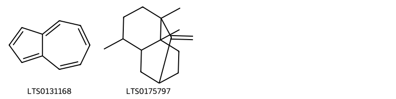{ width=100% }
    <figcaption>Hình ảnh cấu trúc hóa học của 2 hoạt chất thuộc nhóm Unsaturated hydrocarbons gồm ['azulene (LTS0131168)', '3,6,8-trimethyl-2-methylidenetricyclo[5.3.1.0³,⁸]undecane (LTS0175797)'].</figcaption>
</figure>

---

### Dược dân tộc học

Danh sách các quốc gia có sử dụng *Valeriana jatamansi* trong điều trị các bệnh. 

| Country   | Disease                                               | Bệnh                                                                                                                                                                                                |
|:----------|:------------------------------------------------------|:----------------------------------------------------------------------------------------------------------------------------------------------------------------------------------------------------|
| Dutch     | Nervine                                               | MYMEMORY WARNING: YOU USED ALL AVAILABLE FREE TRANSLATIONS FOR TODAY. NEXT AVAILABLE IN  02 HOURS 16 MINUTES 18 SECONDS VISIT HTTPS://MYMEMORY.TRANSLATED.NET/DOC/USAGELIMITS.PHP TO TRANSLATE MORE |
| Elsewhere | Analgesic, Tonic, Antibiotic, Tranquilizer, Stimulant | MYMEMORY WARNING: YOU USED ALL AVAILABLE FREE TRANSLATIONS FOR TODAY. NEXT AVAILABLE IN  02 HOURS 16 MINUTES 16 SECONDS VISIT HTTPS://MYMEMORY.TRANSLATED.NET/DOC/USAGELIMITS.PHP TO TRANSLATE MORE |
| French    | Sedative                                              | MYMEMORY WARNING: YOU USED ALL AVAILABLE FREE TRANSLATIONS FOR TODAY. NEXT AVAILABLE IN  02 HOURS 16 MINUTES 14 SECONDS VISIT HTTPS://MYMEMORY.TRANSLATED.NET/DOC/USAGELIMITS.PHP TO TRANSLATE MORE |
| India     | Carminative, Stimulant, Sudorific                     | MYMEMORY WARNING: YOU USED ALL AVAILABLE FREE TRANSLATIONS FOR TODAY. NEXT AVAILABLE IN  02 HOURS 16 MINUTES 12 SECONDS VISIT HTTPS://MYMEMORY.TRANSLATED.NET/DOC/USAGELIMITS.PHP TO TRANSLATE MORE |
| Iran      | Hypnotic                                              | MYMEMORY WARNING: YOU USED ALL AVAILABLE FREE TRANSLATIONS FOR TODAY. NEXT AVAILABLE IN  02 HOURS 16 MINUTES 10 SECONDS VISIT HTTPS://MYMEMORY.TRANSLATED.NET/DOC/USAGELIMITS.PHP TO TRANSLATE MORE |
| Nepal     | Sedative                                              | MYMEMORY WARNING: YOU USED ALL AVAILABLE FREE TRANSLATIONS FOR TODAY. NEXT AVAILABLE IN  02 HOURS 16 MINUTES 08 SECONDS VISIT HTTPS://MYMEMORY.TRANSLATED.NET/DOC/USAGELIMITS.PHP TO TRANSLATE MORE |
| Sanscrit  | Vermifuge                                             | MYMEMORY WARNING: YOU USED ALL AVAILABLE FREE TRANSLATIONS FOR TODAY. NEXT AVAILABLE IN  02 HOURS 16 MINUTES 05 SECONDS VISIT HTTPS://MYMEMORY.TRANSLATED.NET/DOC/USAGELIMITS.PHP TO TRANSLATE MORE |

---

---
## Valeriana officinalis
### Thông tin về thực vật

!!! info "Phân loại thực vật của *Valeriana officinalis* từ GIBF:"
    - **Kingdom:** Plantae
    - **Phylum:** Tracheophyta
    - **Order:** Dipsacales
    - **Family:** Caprifoliaceae
    - **Genus:** Valeriana
    - **Species:** *Valeriana officinalis*

 

| Label (VI)   | Label (EN)   | Scientific Name       | Descriptions (VI)   | Descriptions (EN)                                                   | Also Known As (VI)   | Also Known As (EN)              |
|:-------------|:-------------|:----------------------|:--------------------|:--------------------------------------------------------------------|:---------------------|:--------------------------------|
| N/A          | N/A          | Valeriana officinalis | loài thực vật       | species of flowering plant in the honeysuckle family Caprifoliaceae | ['']                 | ['valerian', 'common valerian'] |

#### Phân bố trên thế giới

**Từ CSDL GIBF** Netherlands, Italy, Czechia, Germany, Belgium, Hungary, Russian Federation, Sweden, Poland, France, United Kingdom of Great Britain and Northern Ireland, Austria

#### Phân bố tại Việt Nam

**Từ CSDL GIBF**: Không có ghi nhận ở Việt Nam

---
### Thành phần hóa học
        
- Theo cơ sở dữ liệu lotus: Từ loài *Valeriana officinalis* đã phân lập và xác định được 367 hoạt chất thuộc về các nhóm Naphthalenes, Phenols, Carboxylic acids and derivatives, Fatty Acyls, Cinnamic acids and derivatives, Oxanes, Diazanaphthalenes, Saturated hydrocarbons, Prenol lipids, Benzene and substituted derivatives, Tropane alkaloids, Organooxygen compounds, Phenol esters, Furanoid lignans, Pyridines and derivatives, Flavonoids, Steroids and steroid derivatives, Oxepanes, Organonitrogen compounds, Unsaturated hydrocarbons, Lactones, Epoxides, Dioxepanes. 

|    | chemicalTaxonomyClassyfireClass     |   smiles_count |
|---:|:------------------------------------|---------------:|
|  0 | Benzene and substituted derivatives |              1 |
|  1 | Carboxylic acids and derivatives    |             35 |
|  2 | Cinnamic acids and derivatives      |              2 |
|  3 | Diazanaphthalenes                   |              1 |
|  4 | Dioxepanes                          |              3 |
|  5 | Epoxides                            |              2 |
|  6 | Fatty Acyls                         |             14 |
|  7 | Flavonoids                          |              4 |
|  8 | Furanoid lignans                    |              4 |
|  9 | Lactones                            |              1 |
| 10 | Naphthalenes                        |              1 |
| 11 | Organonitrogen compounds            |              1 |
| 12 | Organooxygen compounds              |             27 |
| 13 | Oxanes                              |              4 |
| 14 | Oxepanes                            |             38 |
| 15 | Phenol esters                       |              3 |
| 16 | Phenols                             |              2 |
| 17 | Prenol lipids                       |            208 |
| 18 | Pyridines and derivatives           |              2 |
| 19 | Saturated hydrocarbons              |              2 |
| 20 | Steroids and steroid derivatives    |              5 |
| 21 | Tropane alkaloids                   |              1 |
| 22 | Unsaturated hydrocarbons            |              4 |

#### Nhóm Benzene and substituted derivatives
<figure markdown="span">
    { width=100% }
    <figcaption>Hình ảnh cấu trúc hóa học của 1 hoạt chất thuộc nhóm Benzene and substituted derivatives gồm ['benzyl benzoate (LTS0097515)'].</figcaption>
</figure>
#### Nhóm Carboxylic acids and derivatives
<figure markdown="span">
    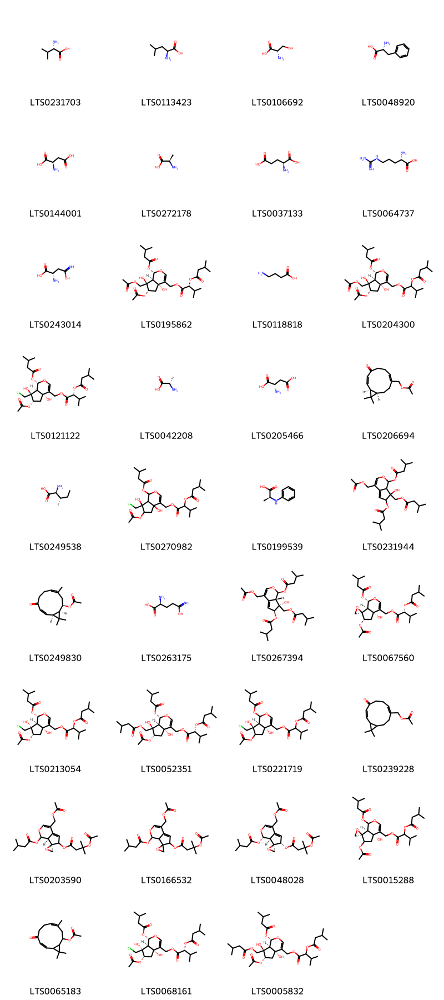{ width=100% }
    <figcaption>Hình ảnh cấu trúc hóa học của 35 hoạt chất thuộc nhóm Carboxylic acids and derivatives gồm ['l-valine (LTS0231703)', 'l-leucine (LTS0113423)', 'l-serine (LTS0106692)', 'd-phenylalanine (LTS0048920)', 'd-aspartic acid (LTS0144001)', 'd-alanine (LTS0272178)', 'l-glutamic acid (LTS0037133)', 'l-arginine (LTS0064737)', 'aspartamate (LTS0243014)', '[(1s,4ar,6s,7r,7as)-6-(acetyloxy)-7-[(acetyloxy)methyl]-4a,7-dihydroxy-1-[(3-methylbutanoyl)oxy]-1h,5h,6h,7ah-cyclopenta[c]pyran-4-yl]methyl (2r)-3-methyl-2-[(3-methylbutanoyl)oxy]butanoate (LTS0195862)', 'gamma(amino)-butyric acid (LTS0118818)', '[(1s,4ar,6s,7r,7as)-6-(acetyloxy)-7-[(acetyloxy)methyl]-4a,7-dihydroxy-1-[(3-methylbutanoyl)oxy]-1h,5h,6h,7ah-cyclopenta[c]pyran-4-yl]methyl 3-methyl-2-[(3-methylbutanoyl)oxy]butanoate (LTS0204300)', '[(1s,4ar,6s,7s,7as)-6-(acetyloxy)-7-(chloromethyl)-4a,7-dihydroxy-1-[(3-methylbutanoyl)oxy]-1h,5h,6h,7ah-cyclopenta[c]pyran-4-yl]methyl (2r)-3-methyl-2-[(3-methylbutanoyl)oxy]butanoate (LTS0121122)', 'l-alanine (LTS0042208)', 'l-aspartic acid (LTS0205466)', '[(1r,4e,9z,11s)-12,12-dimethyl-8-oxobicyclo[9.1.0]dodeca-4,9-dien-4-yl]methyl acetate (LTS0206694)', 'l-isoleucine (LTS0249538)', '[6-(acetyloxy)-7-(chloromethyl)-4a,7-dihydroxy-1-[(3-methylbutanoyl)oxy]-1h,5h,6h,7ah-cyclopenta[c]pyran-4-yl]methyl 3-methyl-2-[(3-methylbutanoyl)oxy]butanoate (LTS0270982)', '(2s)-2-(phenylamino)propanoic acid (LTS0199539)', '{4-[(acetyloxy)methyl]-7-hydroxy-1,6-bis[(3-methylbutanoyl)oxy]-1h,6h,7ah-cyclopenta[c]pyran-7-yl}methyl 3-methylbutanoate (LTS0231944)', '(1r,2r,4z,9z,11s)-4,12,12-trimethyl-8-oxobicyclo[9.1.0]dodeca-4,9-dien-2-yl acetate (LTS0249830)', 'l glutamine (LTS0263175)', '[(1s,6s,7r,7as)-4-[(acetyloxy)methyl]-7-hydroxy-1,6-bis[(3-methylbutanoyl)oxy]-1h,6h,7ah-cyclopenta[c]pyran-7-yl]methyl 3-methylbutanoate (LTS0267394)', "(1s,4ar,6s,7r,7as)-6-(acetyloxy)-4a-hydroxy-1-[(3-methylbutanoyl)oxy]-1,5,6,7a-tetrahydrospiro[cyclopenta[c]pyran-7,2'-oxiran]-4-ylmethyl (2r)-3-methyl-2-[(3-methylbutanoyl)oxy]butanoate (LTS0067560)", '[(1s,4ar,6s,7r,7as)-6-(acetyloxy)-7-(chloromethyl)-4a,7-dihydroxy-1-[(3-methylbutanoyl)oxy]-1h,5h,6h,7ah-cyclopenta[c]pyran-4-yl]methyl (2s)-3-methyl-2-[(3-methylbutanoyl)oxy]butanoate (LTS0213054)', '[(1s,4ar,6s,7r,7as)-6-(acetyloxy)-4a,7-dihydroxy-1-[(3-methylbutanoyl)oxy]-7-{[(3-methylbutanoyl)oxy]methyl}-1h,5h,6h,7ah-cyclopenta[c]pyran-4-yl]methyl (2r)-3-methyl-2-[(3-methylbutanoyl)oxy]butanoate (LTS0052351)', '[(4ar,7s,7as)-6-(acetyloxy)-7-(chloromethyl)-4a,7-dihydroxy-1-[(3-methylbutanoyl)oxy]-1h,5h,6h,7ah-cyclopenta[c]pyran-4-yl]methyl 3-methyl-2-[(3-methylbutanoyl)oxy]butanoate (LTS0221719)', '{12,12-dimethyl-8-oxobicyclo[9.1.0]dodeca-4,9-dien-4-yl}methyl acetate (LTS0239228)', "(7r,7as)-4-[(acetyloxy)methyl]-1-[(3-methylbutanoyl)oxy]-6,7a-dihydro-1h-spiro[cyclopenta[c]pyran-7,2'-oxiran]-6-yl 3-(acetyloxy)-3-methylbutanoate (LTS0203590)", 'acevaltrate (LTS0166532)', 'acevaltrate (LTS0048028)', "(4ar,7r,7as)-6-(acetyloxy)-4a-hydroxy-1-[(3-methylbutanoyl)oxy]-1,5,6,7a-tetrahydrospiro[cyclopenta[c]pyran-7,2'-oxiran]-4-ylmethyl 3-methyl-2-[(3-methylbutanoyl)oxy]butanoate (LTS0015288)", '4,12,12-trimethyl-8-oxobicyclo[9.1.0]dodeca-4,9-dien-2-yl acetate (LTS0065183)', '[(1s,4ar,6s,7r,7as)-6-(acetyloxy)-7-(chloromethyl)-4a,7-dihydroxy-1-[(3-methylbutanoyl)oxy]-1h,5h,6h,7ah-cyclopenta[c]pyran-4-yl]methyl (2r)-3-methyl-2-[(3-methylbutanoyl)oxy]butanoate (LTS0068161)', '[(1s,4ar,6s,7r,7as)-6-(acetyloxy)-4a,7-dihydroxy-1-[(3-methylbutanoyl)oxy]-7-{[(3-methylbutanoyl)oxy]methyl}-1h,5h,6h,7ah-cyclopenta[c]pyran-4-yl]methyl 3-methyl-2-[(3-methylbutanoyl)oxy]butanoate (LTS0005832)'].</figcaption>
</figure>
#### Nhóm Cinnamic acids and derivatives
<figure markdown="span">
    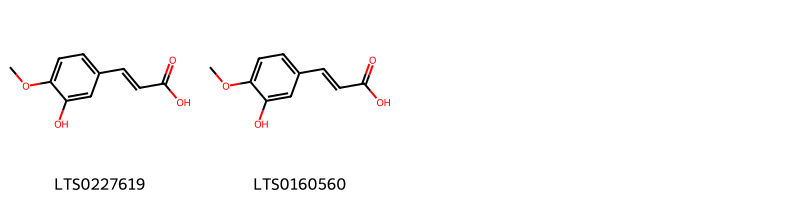{ width=100% }
    <figcaption>Hình ảnh cấu trúc hóa học của 2 hoạt chất thuộc nhóm Cinnamic acids and derivatives gồm ['isoferulic acid (LTS0227619)', 'isoferulic acid (LTS0160560)'].</figcaption>
</figure>
#### Nhóm Diazanaphthalenes
<figure markdown="span">
    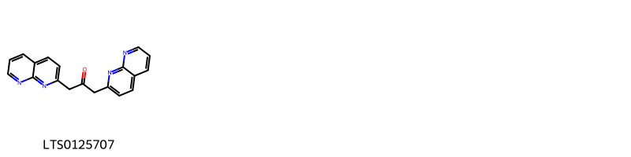{ width=100% }
    <figcaption>Hình ảnh cấu trúc hóa học của 1 hoạt chất thuộc nhóm Diazanaphthalenes gồm ['1,3-bis(1,8-naphthyridin-2-yl)propan-2-one (LTS0125707)'].</figcaption>
</figure>
#### Nhóm Dioxepanes
<figure markdown="span">
    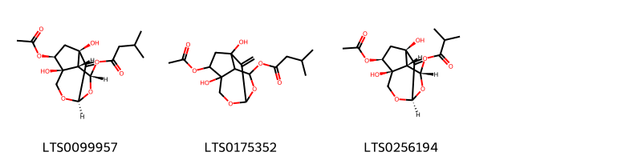{ width=100% }
    <figcaption>Hình ảnh cấu trúc hóa học của 3 hoạt chất thuộc nhóm Dioxepanes gồm ['(1r,4s,5s,7r,8s,9s)-5-(acetyloxy)-4,7-dihydroxy-11-methylidene-2,10-dioxatricyclo[5.3.1.0⁴,⁸]undecan-9-yl 3-methylbutanoate (LTS0099957)', '5-(acetyloxy)-4,7-dihydroxy-11-methylidene-2,10-dioxatricyclo[5.3.1.0⁴,⁸]undecan-9-yl 3-methylbutanoate (LTS0175352)', '(1r,4s,5s,7r,8s,9s)-5-(acetyloxy)-4,7-dihydroxy-11-methylidene-2,10-dioxatricyclo[5.3.1.0⁴,⁸]undecan-9-yl 2-methylpropanoate (LTS0256194)'].</figcaption>
</figure>
#### Nhóm Epoxides
<figure markdown="span">
    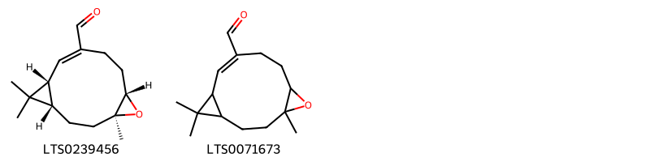{ width=100% }
    <figcaption>Hình ảnh cấu trúc hóa học của 2 hoạt chất thuộc nhóm Epoxides gồm ['(1s,4s,6s,9e,11r)-4,12,12-trimethyl-5-oxatricyclo[9.1.0.0⁴,⁶]dodec-9-ene-9-carbaldehyde (LTS0239456)', '4,12,12-trimethyl-5-oxatricyclo[9.1.0.0⁴,⁶]dodec-9-ene-9-carbaldehyde (LTS0071673)'].</figcaption>
</figure>
#### Nhóm Fatty Acyls
<figure markdown="span">
    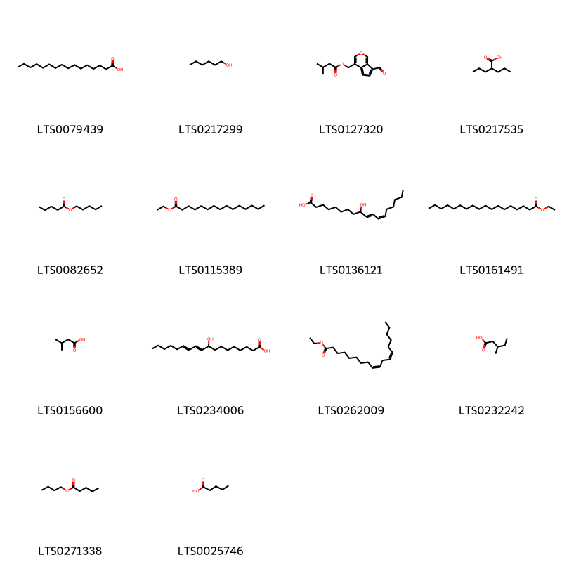{ width=100% }
    <figcaption>Hình ảnh cấu trúc hóa học của 14 hoạt chất thuộc nhóm Fatty Acyls gồm ['palmitic acid (LTS0079439)', 'hexanol (LTS0217299)', 'homobaldrinal (LTS0127320)', 'valproic acid (LTS0217535)', 'pentyl pentanoate (LTS0082652)', 'ethyl pentadecanoate (LTS0115389)', '(10e,12z)-9-hydroxyoctadeca-10,12-dienoic acid (LTS0136121)', 'ethyl stearate (LTS0161491)', 'isovaleric acid (LTS0156600)', '9-hydroxyoctadeca-10,12-dienoic acid (LTS0234006)', 'ethyl linoleate (LTS0262009)', '3-methyl valeric acid (LTS0232242)', 'butyl valerate (LTS0271338)', 'n-valeric acid (LTS0025746)'].</figcaption>
</figure>
#### Nhóm Flavonoids
<figure markdown="span">
    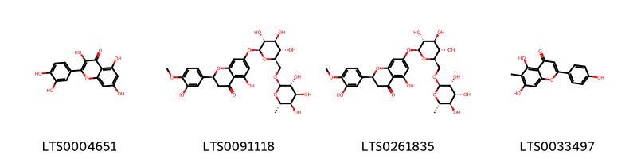{ width=100% }
    <figcaption>Hình ảnh cấu trúc hóa học của 4 hoạt chất thuộc nhóm Flavonoids gồm ['quercetin (LTS0004651)', '(2s)-5-hydroxy-2-(3-hydroxy-4-methoxyphenyl)-7-{[(2s,3r,4s,5s,6r)-3,4,5-trihydroxy-6-({[(2r,3r,4s,5r,6s)-3,4,5-trihydroxy-6-methyloxan-2-yl]oxy}methyl)oxan-2-yl]oxy}-2,3-dihydro-1-benzopyran-4-one (LTS0091118)', 'hesperidin (LTS0261835)', '6-methylapigenin (LTS0033497)'].</figcaption>
</figure>
#### Nhóm Furanoid lignans
<figure markdown="span">
    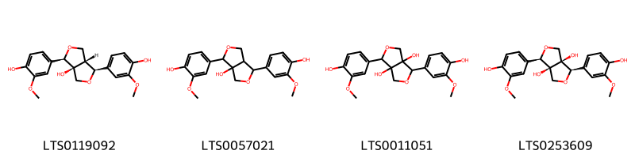{ width=100% }
    <figcaption>Hình ảnh cấu trúc hóa học của 4 hoạt chất thuộc nhóm Furanoid lignans gồm ['(1s,3as,4r,6ar)-1,4-bis(4-hydroxy-3-methoxyphenyl)-tetrahydro-1h-furo[3,4-c]furan-3a-ol (LTS0119092)', '1,4-bis(4-hydroxy-3-methoxyphenyl)-tetrahydro-1h-furo[3,4-c]furan-3a-ol (LTS0057021)', '1,4-bis(4-hydroxy-3-methoxyphenyl)-tetrahydrofuro[3,4-c]furan-3a,6a-diol (LTS0011051)', '(1r,3as,4r,6as)-1,4-bis(4-hydroxy-3-methoxyphenyl)-tetrahydrofuro[3,4-c]furan-3a,6a-diol (LTS0253609)'].</figcaption>
</figure>
#### Nhóm Lactones
<figure markdown="span">
    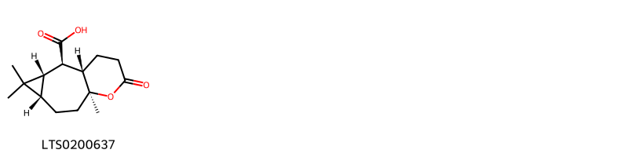{ width=100% }
    <figcaption>Hình ảnh cấu trúc hóa học của 1 hoạt chất thuộc nhóm Lactones gồm ['(1s,2r,3s,5s,8s)-4,4,8-trimethyl-10-oxo-9-oxatricyclo[6.4.0.0³,⁵]dodecane-2-carboxylic acid (LTS0200637)'].</figcaption>
</figure>
#### Nhóm Naphthalenes
<figure markdown="span">
    { width=100% }
    <figcaption>Hình ảnh cấu trúc hóa học của 1 hoạt chất thuộc nhóm Naphthalenes gồm ['naphthalene (LTS0254484)'].</figcaption>
</figure>
#### Nhóm Organonitrogen compounds
<figure markdown="span">
    { width=100% }
    <figcaption>Hình ảnh cấu trúc hóa học của 1 hoạt chất thuộc nhóm Organonitrogen compounds gồm ['choline (LTS0170307)'].</figcaption>
</figure>
#### Nhóm Organooxygen compounds
<figure markdown="span">
    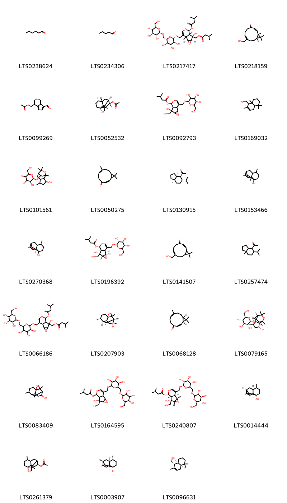{ width=100% }
    <figcaption>Hình ảnh cấu trúc hóa học của 27 hoạt chất thuộc nhóm Organooxygen compounds gồm ['hexanal (LTS0238624)', 'pentanal (LTS0234306)', '[(1s,2s,4s,5s,6s,7s)-5-hydroxy-7-[(3-methylbutanoyl)oxy]-10-({[(2s,3s,4r,5r,6s)-3,4,5-trihydroxy-6-({[(2r,3r,4s,5s,6r)-3,4,5-trihydroxy-6-(hydroxymethyl)oxan-2-yl]oxy}methyl)oxan-2-yl]oxy}methyl)-3,8-dioxatricyclo[4.4.0.0²,⁴]dec-9-en-5-yl]methyl 3-methylbutanoate (LTS0217417)', '(1s,2z,7e,11r)-8-(hydroxymethyl)-12,12-dimethylbicyclo[9.1.0]dodeca-2,7-dien-4-one (LTS0218159)', 'baldrinal (LTS0099269)', '(1r,3r,6s,7s,8s,10r)-3-hydroxy-2,2,6,8-tetramethyltricyclo[5.3.1.0³,⁸]undecan-10-yl acetate (LTS0052532)', '5-hydroxy-5-(hydroxymethyl)-10-({[3,4,5-trihydroxy-6-(hydroxymethyl)oxan-2-yl]oxy}methyl)-3,8-dioxatricyclo[4.4.0.0²,⁴]dec-9-en-7-yl 3-methylbutanoate (LTS0092793)', '(2,5,5,8a-tetramethyl-1,4,4a,6,7,8-hexahydronaphthalen-1-yl)methanol (LTS0169032)', '2-({3-hydroxy-1,5,9,9-tetramethyl-10-oxatricyclo[6.2.2.0²,⁶]dodecan-12-yl}oxy)-6-(hydroxymethyl)oxane-3,4,5-triol (LTS0101561)', '8,12,12-trimethylbicyclo[9.1.0]dodeca-2,7-dien-4-one (LTS0050275)', '1-[(3as,4s,5s,7ar)-5-isopropyl-7a-methyl-octahydroinden-4-yl]ethanone (LTS0130915)', '2,2,6,8-tetramethyltricyclo[5.3.1.0³,⁸]undecan-3-ol (LTS0153466)', 'patchoulol (LTS0270368)', 'kanokoside a (LTS0196392)', '8-(hydroxymethyl)-12,12-dimethylbicyclo[9.1.0]dodeca-2,7-dien-4-one (LTS0141507)', '1-(5-isopropyl-7a-methyl-octahydroinden-4-yl)ethanone (LTS0257474)', '{5-hydroxy-7-[(3-methylbutanoyl)oxy]-10-({[3,4,5-trihydroxy-6-({[3,4,5-trihydroxy-6-(hydroxymethyl)oxan-2-yl]oxy}methyl)oxan-2-yl]oxy}methyl)-3,8-dioxatricyclo[4.4.0.0²,⁴]dec-9-en-5-yl}methyl 3-methylbutanoate (LTS0066186)', '(1r,3r,6s,7s,8s,10r)-2,2,6,8-tetramethyltricyclo[5.3.1.0³,⁸]undecane-3,10-diol (LTS0207903)', '(1r,2z,7z,11s)-8,12,12-trimethylbicyclo[9.1.0]dodeca-2,7-dien-4-one (LTS0068128)', '(2s,3r,4s,5s,6r)-2-{[(1s,2s,3r,5r,6r,8s,12s)-3-hydroxy-1,5,9,9-tetramethyl-10-oxatricyclo[6.2.2.0²,⁶]dodecan-12-yl]oxy}-6-(hydroxymethyl)oxane-3,4,5-triol (LTS0079165)', '2,2,6,8-tetramethyltricyclo[5.3.1.0³,⁸]undecane-3,10-diol (LTS0083409)', '5-hydroxy-5-(hydroxymethyl)-10-({[3,4,5-trihydroxy-6-({[3,4,5-trihydroxy-6-(hydroxymethyl)oxan-2-yl]oxy}methyl)oxan-2-yl]oxy}methyl)-3,8-dioxatricyclo[4.4.0.0²,⁴]dec-9-en-7-yl 3-methylbutanoate (LTS0164595)', 'kanokoside c (LTS0240807)', '(1s,3r,7s,8s)-2,2,6,8-tetramethyltricyclo[5.3.1.0³,⁸]undecan-3-ol (LTS0014444)', '3-hydroxy-2,2,6,8-tetramethyltricyclo[5.3.1.0³,⁸]undecan-10-yl acetate (LTS0261379)', 'patchoulol (LTS0003907)', '[(1s,4ar,8as)-2,5,5,8a-tetramethyl-1,4,4a,6,7,8-hexahydronaphthalen-1-yl]methanol (LTS0096631)'].</figcaption>
</figure>
#### Nhóm Oxanes
<figure markdown="span">
    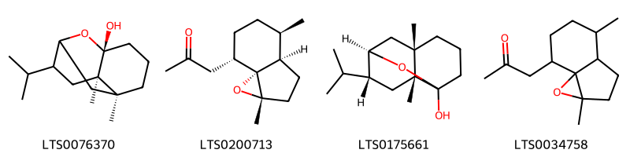{ width=100% }
    <figcaption>Hình ảnh cấu trúc hóa học của 4 hoạt chất thuộc nhóm Oxanes gồm ['(3r,7s,8r)-10-isopropyl-7,8-dimethyl-2-oxatricyclo[5.3.1.0³,⁸]undecan-3-ol (LTS0076370)', '1-[(1as,3ar,4r,7s,7ar)-1a,4-dimethyl-hexahydro-2h-indeno[1,7a-b]oxiren-7-yl]propan-2-one (LTS0200713)', '(1r,7s,8r,10r)-10-isopropyl-7,8-dimethyl-2-oxatricyclo[5.3.1.0³,⁸]undecan-3-ol (LTS0175661)', '1-{1a,4-dimethyl-hexahydro-2h-indeno[1,7a-b]oxiren-7-yl}propan-2-one (LTS0034758)'].</figcaption>
</figure>
#### Nhóm Oxepanes
<figure markdown="span">
    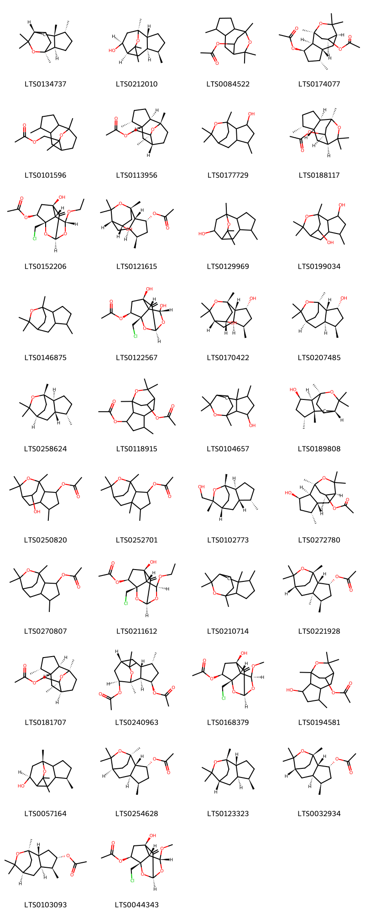{ width=100% }
    <figcaption>Hình ảnh cấu trúc hóa học của 38 hoạt chất thuộc nhóm Oxepanes gồm ['(1s,2r,5r,6r,8r)-1,5,6,9,9-pentamethyl-10-oxatricyclo[6.2.2.0²,⁶]dodecane (LTS0134737)', '(1s,2r,5r,6r,8s,12s)-1,5,9,9-tetramethyl-10-oxatricyclo[6.2.2.0²,⁶]dodecan-12-ol (LTS0212010)', '1,5,9,9-tetramethyl-10-oxatricyclo[6.2.2.0²,⁶]dodecan-12-yl acetate (LTS0084522)', '(1s,2s,3r,5r,6r,8s,12s)-12-(acetyloxy)-1,5,9,9-tetramethyl-10-oxatricyclo[6.2.2.0²,⁶]dodecan-3-yl acetate (LTS0174077)', '{1,5,9-trimethyl-10-oxatricyclo[6.2.2.0²,⁶]dodecan-9-yl}methyl acetate (LTS0101596)', '[(1s,2r,5r,6r,8r,9s)-1,5,9-trimethyl-10-oxatricyclo[6.2.2.0²,⁶]dodecan-9-yl]methyl acetate (LTS0113956)', '1,5,9,9-tetramethyl-10-oxatricyclo[6.2.2.0²,⁶]dodecan-3-ol (LTS0177729)', '(1s,2r,5r,6r,8s,12s)-1,5,9,9-tetramethyl-10-oxatricyclo[6.2.2.0²,⁶]dodecan-12-yl acetate (LTS0188117)', '(1r,3s,4s,6r,7s,8r)-3-(chloromethyl)-8-ethoxy-6-hydroxy-10-methylidene-2,9-dioxatricyclo[4.3.1.0³,⁷]decan-4-yl acetate (LTS0152206)', '(1s,2s,3r,5r,6r,8s,12s)-12-hydroxy-1,5,9,9-tetramethyl-10-oxatricyclo[6.2.2.0²,⁶]dodecan-3-yl acetate (LTS0121615)', '1,5,9,9-tetramethyl-10-oxatricyclo[6.2.2.0²,⁶]dodecan-12-ol (LTS0129969)', '1,5,9,9-tetramethyl-10-oxatricyclo[6.2.2.0²,⁶]dodecane-3,12-diol (LTS0199034)', '1,5,9,9-tetramethyl-10-oxatricyclo[6.2.2.0²,⁶]dodecane (LTS0146875)', '(1r,3s,4s,6r,7s,8r)-3-(chloromethyl)-6,8-dihydroxy-10-methylidene-2,9-dioxatricyclo[4.3.1.0³,⁷]decan-4-yl acetate (LTS0122567)', '(1s,2s,3r,5r,6r,8s,12s)-1,5,9,9-tetramethyl-10-oxatricyclo[6.2.2.0²,⁶]dodecane-3,12-diol (LTS0170422)', '(1r,2s,3r,5r,6r,8s)-1,5,9,9-tetramethyl-10-oxatricyclo[6.2.2.0²,⁶]dodecan-3-ol (LTS0207485)', '(1s,2s,5s,6s,8s)-1,5,9,9-tetramethyl-10-oxatricyclo[6.2.2.0²,⁶]dodecane (LTS0258624)', '12-(acetyloxy)-1,5,9,9-tetramethyl-10-oxatricyclo[6.2.2.0²,⁶]dodecan-3-yl acetate (LTS0118915)', '1,5,6,9,9-pentamethyl-10-oxatricyclo[6.2.2.0²,⁶]dodecan-3-ol (LTS0104657)', '(1s,2s,3r,5r,6r,8r)-1,5,6,9,9-pentamethyl-10-oxatricyclo[6.2.2.0²,⁶]dodecan-3-ol (LTS0189808)', '12-hydroxy-1,5,9,9-tetramethyl-10-oxatricyclo[6.2.2.0²,⁶]dodecan-3-yl acetate (LTS0250820)', '1,5,6,9,9-pentamethyl-10-oxatricyclo[6.2.2.0²,⁶]dodecan-3-yl acetate (LTS0252701)', '[(1s,2s,5s,6s,8r,9r)-1,5,9-trimethyl-10-oxatricyclo[6.2.2.0²,⁶]dodecan-9-yl]methanol (LTS0102773)', '(1s,2s,3r,5r,6r,8s,12s)-3-hydroxy-1,5,9,9-tetramethyl-10-oxatricyclo[6.2.2.0²,⁶]dodecan-12-yl acetate (LTS0272780)', '1,5,9,9-tetramethyl-10-oxatricyclo[6.2.2.0²,⁶]dodecan-3-yl acetate (LTS0270807)', '(1r,3s,4s,6r,7s,8s)-3-(chloromethyl)-8-ethoxy-6-hydroxy-10-methylidene-2,9-dioxatricyclo[4.3.1.0³,⁷]decan-4-yl acetate (LTS0211612)', '1,5,6,9,9-pentamethyl-10-oxatricyclo[6.2.2.0²,⁶]dodecane (LTS0210714)', '(1s,2s,3r,5r,6r,8r)-1,5,6,9,9-pentamethyl-10-oxatricyclo[6.2.2.0²,⁶]dodecan-3-yl acetate (LTS0221928)', '[(1r,2r,5r,6r,8s,9s)-1,5,9-trimethyl-10-oxatricyclo[6.2.2.0²,⁶]dodecan-9-yl]methyl acetate (LTS0181707)', '(1s,2s,3r,5r,6r,8s,11s)-11-(acetyloxy)-1,5,9,9-tetramethyl-10-oxatricyclo[6.2.2.0²,⁶]dodecan-3-yl acetate (LTS0240963)', '(1r,3s,4s,6r,7s,8s)-3-(chloromethyl)-6-hydroxy-8-methoxy-10-methylidene-2,9-dioxatricyclo[4.3.1.0³,⁷]decan-4-yl acetate (LTS0168379)', '3-hydroxy-1,5,9,9-tetramethyl-10-oxatricyclo[6.2.2.0²,⁶]dodecan-12-yl acetate (LTS0194581)', '(1r,5r,12s)-1,5,9,9-tetramethyl-10-oxatricyclo[6.2.2.0²,⁶]dodecan-12-ol (LTS0057164)', '(1r,2s,3r,5r,6r,8s)-1,5,9,9-tetramethyl-10-oxatricyclo[6.2.2.0²,⁶]dodecan-3-yl acetate (LTS0254628)', '(1s,2r,5r,6r,8r)-1,5,9,9-tetramethyl-10-oxatricyclo[6.2.2.0²,⁶]dodecane (LTS0123323)', '(1s,2s,3r,5r,6r,8r)-1,5,9,9-tetramethyl-10-oxatricyclo[6.2.2.0²,⁶]dodecan-3-yl acetate (LTS0032934)', '(1r,2r,4s,5s,6r,8s)-1,5,9,9-tetramethyl-10-oxatricyclo[6.2.2.0²,⁶]dodecan-4-yl acetate (LTS0103093)', '(1r,3s,4s,6r,7s,8r)-3-(chloromethyl)-6-hydroxy-8-methoxy-10-methylidene-2,9-dioxatricyclo[4.3.1.0³,⁷]decan-4-yl acetate (LTS0044343)'].</figcaption>
</figure>
#### Nhóm Phenol esters
<figure markdown="span">
    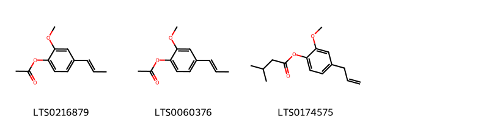{ width=100% }
    <figcaption>Hình ảnh cấu trúc hóa học của 3 hoạt chất thuộc nhóm Phenol esters gồm ['isoeugenyl acetate (LTS0216879)', '2-methoxy-4-(prop-1-en-1-yl)phenyl acetate (LTS0060376)', 'eugenol isovalerate (LTS0174575)'].</figcaption>
</figure>
#### Nhóm Phenols
<figure markdown="span">
    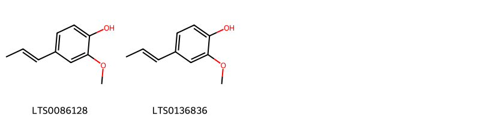{ width=100% }
    <figcaption>Hình ảnh cấu trúc hóa học của 2 hoạt chất thuộc nhóm Phenols gồm ['2-methoxy-4-propenylphenol (LTS0086128)', 'isoeugenol (LTS0136836)'].</figcaption>
</figure>
#### Nhóm Prenol lipids
<figure markdown="span">
    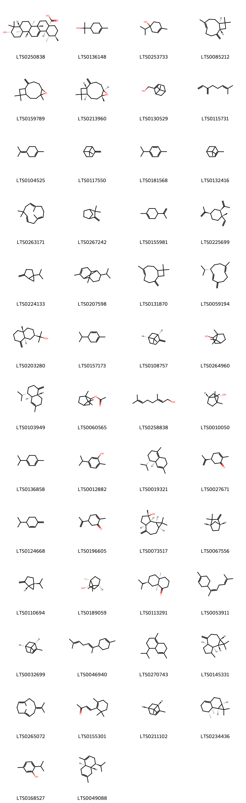{ width=100% }
    <figcaption>Hình ảnh cấu trúc hóa học của 208 hoạt chất thuộc nhóm Prenol lipids gồm ['ursolic acid (LTS0250838)', 'terpineol (LTS0136148)', '4-terpineol (LTS0253733)', 'caryophyllene (LTS0085212)', 'caryophyllene oxide (LTS0159789)', 'β-caryophyllene oxide (LTS0213960)', 'myrtenol (LTS0130529)', 'α-myrcene (LTS0115731)', 'terpinolene (LTS0104525)', 'β-pinene (LTS0117550)', 'cymene (LTS0181568)', 'α pinene (LTS0132416)', 'humulene (LTS0263171)', 'camphene (LTS0267242)', 'limonene,  (LTS0155981)', 'β-elemene (LTS0225699)', 'sabinene (LTS0224133)', 'α-copaene (LTS0207598)', 'caryophyllene (LTS0131870)', '(-)-germacrene d (LTS0059194)', 'β-eudesmol (LTS0203280)', 'phellandrene (LTS0157173)', '(-)-β-pinene (LTS0108757)', 'borneol (LTS0264960)', '(+)-gamma-cadinene (LTS0103949)', 'bornyl acetate (LTS0060565)', 'geraniol (LTS0258838)', '(2s,4r)-1,7,7-trimethylbicyclo[2.2.1]heptan-2-ol (LTS0010050)', 'terpinene (LTS0136858)', 'carvacrol (LTS0012882)', 'delta-cadinene (LTS0019321)', 'carvone, (+)- (LTS0027671)', 'β phellandrene (LTS0124668)', 'carvone (LTS0196605)', '(1as,4as,7s,7ar,7bs)-1,1,7-trimethyl-4-methylidene-octahydrocyclopropa[e]azulen-7-ol (LTS0073517)', '(-)-camphene (LTS0067556)', '(+)-sabinene (LTS0110694)', '(+)-borneol (LTS0189059)', 'valeranone (LTS0113291)', '(z)-α-bisabolene (LTS0053911)', '(-)-α-pinene (LTS0032699)', '(e)-α-bisabolene (LTS0046940)', '4-isopropyl-1,6-dimethyl-2,3,4,4a,7,8-hexahydronaphthalene (LTS0270743)', '(1as,4ar,7as,7br)-1,1,7-trimethyl-4-methylidene-octahydro-1ah-cyclopropa[e]azulene (LTS0145331)', 'germacrene b (LTS0265072)', 'β-ionone (LTS0155301)', '(+)-α-pinene (LTS0211102)', '(1ar,7r,7ar,7bs)-1,1,7,7a-tetramethyl-1ah,2h,3h,5h,6h,7h,7bh-cyclopropa[a]naphthalene (LTS0234436)', 'thymol (LTS0168527)', 'β-cadinene (LTS0049088)', '(7ar)-1,1,7-trimethyl-4-methylidene-octahydrocyclopropa[e]azulen-7-ol (LTS0091612)', '(-)-β-cubebene (LTS0123697)', '(2e,6e)-3,7,11,11-tetramethylbicyclo[8.1.0]undeca-2,6-diene (LTS0225278)', 'valtrate (LTS0097768)', 'valtrate (LTS0159744)', 'valerena-4,7(11)-diene (LTS0112883)', '(2e)-3-[(1as,3ar,4r,7s,7as)-1a,4-dimethyl-hexahydro-2h-indeno[1,7a-b]oxiren-7-yl]-2-methylprop-2-enal (LTS0079233)', '1,5-dimethyl-4-(2-methylprop-1-en-1-yl)-2,3,4,5,6,7-hexahydro-1h-indene (LTS0136191)', '3-(3,7-dimethyl-2,4,5,6,7,7a-hexahydro-1h-inden-4-yl)-2-methylprop-2-en-1-yl acetate (LTS0173005)', '(2e)-3-[(3ar,4s,7r,7ar)-3,7-dimethyl-3a,4,5,6,7,7a-hexahydro-1h-inden-4-yl]-2-methylprop-2-enoic acid (LTS0137449)', 'myrtenyl acetate (LTS0106081)', '(-)-α-gurjunene (LTS0194913)', '(2e)-3-[(1s,4r,7s,7as)-1-hydroxy-3,7-dimethyl-2,4,5,6,7,7a-hexahydro-1h-inden-4-yl]-2-methylprop-2-enoic acid (LTS0195881)', '3-(3,7-dimethyl-3a,4,5,6,7,7a-hexahydro-1h-inden-4-yl)-2-methylprop-2-enoic acid (LTS0194240)', '(1r,4s,4as,8ar)-4-isopropyl-1,6-dimethyl-1,2,3,4,4a,7,8,8a-octahydronaphthalene (LTS0234107)', '7-isopropyl-4a,8a-dimethyl-hexahydro-2h-naphthalen-1-one (LTS0215477)', '(1r,2r)-1-ethenyl-1-methyl-2-(prop-1-en-2-yl)-4-(propan-2-ylidene)cyclohexane (LTS0126030)', '(1s,2r,4r,6s)-1,7,7-trimethyltricyclo[2.2.1.0²,⁶]heptane (LTS0080510)', '4-ethenyl-1-isopropyl-4-methyl-3-(prop-1-en-2-yl)cyclohex-1-ene (LTS0080134)', '(1s,3as,8as)-7-isopropyl-1-methyl-4-methylidene-2,3,3a,5,6,8a-hexahydroazulen-1-ol (LTS0221661)', '(r)-β-bisabolene (LTS0077209)', '(2r)-6-methyl-2-[(1r)-4-methylcyclohex-3-en-1-yl]hept-5-en-2-ol (LTS0087338)', '1,5-dimethyl-4-(2-methylprop-1-en-1-yl)-octahydroinden-3a-ol (LTS0071048)', '(-)-α-fenchene (LTS0070159)', '(1s,4as,7s,7ar)-4-[(acetyloxy)methyl]-7-methyl-1h,4ah,5h,6h,7h,7ah-cyclopenta[c]pyran-1-yl 3-methylbutanoate (LTS0121765)', '3-{1a,4-dimethyl-hexahydro-2h-indeno[1,7a-b]oxiren-7-yl}-2-methylprop-2-en-1-yl acetate (LTS0226499)', '(1ar,4as,7r,7ar,7bs)-1,1,7-trimethyl-4-methylidene-octahydro-1ah-cyclopropa[e]azulene (LTS0083984)', '(1s,2s,4s)-5,5-dimethyl-6-methylidenebicyclo[2.2.1]heptan-2-yl acetate (LTS0098941)', '(1r,4s,5r,7as)-1,5-dimethyl-4-(2-methylprop-1-en-1-yl)-2,4,5,6,7,7a-hexahydro-1h-indene (LTS0022053)', '8-isopropyl-1-methyl-5-methylidenecyclodeca-1,6-diene (LTS0018398)', 'isovaltrate (LTS0042859)', '4-isopropyl-1,6-dimethyl-1,2,3,4,4a,7,8,8a-octahydronaphthalene (LTS0092737)', 'α-humulene (LTS0076944)', '(-)-limonene (LTS0205325)', '1,1,7-trimethyl-4-methylidene-octahydro-1ah-cyclopropa[e]azulene (LTS0063570)', '2-[4-ethenyl-4-methyl-3-(prop-1-en-2-yl)cyclohexyl]propan-2-ol (LTS0072139)', '4a-(hydroxymethyl)-7-isopropyl-8a-methyl-hexahydro-2h-naphthalen-1-one (LTS0072995)', 'copaene (LTS0091328)', '(+)-β-phellandrene (LTS0108574)', '(2e)-3-[(4s,7r,7ar)-3,7-dimethyl-2,4,5,6,7,7a-hexahydro-1h-inden-4-yl]-2-methylprop-2-enoic acid (LTS0067308)', "4-[(acetyloxy)methyl]-6-[(3-methylbutanoyl)oxy]-6,7a-dihydro-1h-spiro[cyclopenta[c]pyran-7,2'-oxiran]-1-yl 3-methylbut-2-enoate (LTS0114111)", '7,7-dimethyl-2-methylidenebicyclo[2.2.1]heptane (LTS0092282)', "(1s,6s,7r,7as)-6-(acetyloxy)-4-[(acetyloxy)methyl]-6,7a-dihydro-1h-spiro[cyclopenta[c]pyran-7,2'-oxiran]-1-yl 3-methylbutanoate (LTS0060301)", '(4as,7s,8ar)-7-isopropyl-4a,8a-dimethyl-hexahydro-2h-naphthalen-1-one (LTS0108314)', '3-{1a,4-dimethyl-hexahydro-2h-indeno[1,7a-b]oxiren-7-yl}-2-methylprop-2-enoic acid (LTS0058327)', '(1r,7s,8as)-1,8a-dimethyl-7-(prop-1-en-2-yl)-2,3,5,6,7,8-hexahydro-1h-naphthalene (LTS0103853)', 'elemene (LTS0021409)', '(1s,2r,6r,7r,8s)-8-isopropyl-1,3-dimethyltricyclo[4.4.0.0²,⁷]dec-3-ene (LTS0186113)', '(2e)-3-[(1r,4s,7r,7ar)-1-hydroxy-3,7-dimethyl-2,4,5,6,7,7a-hexahydro-1h-inden-4-yl]-2-methylprop-2-enoic acid (LTS0147945)', '1,5-dimethyl-8-(propan-2-ylidene)cyclodeca-1,5-diene (LTS0204193)', 'valerenic acid (LTS0178512)', '4-(2,6,6-trimethylcyclohex-1-en-1-yl)but-3-en-2-one (LTS0171236)', '(-)-spathulenol (LTS0273095)', '1,5-dimethyl-4-(2-methylprop-1-en-1-yl)-2,4,5,6,7,7a-hexahydro-1h-indene (LTS0202040)', '(1r,2r,3r,6r)-3-ethenyl-3,7,7-trimethyl-2-(prop-1-en-2-yl)bicyclo[4.1.0]heptane (LTS0204053)', '4a-methyl-1-methylidene-7-(prop-1-en-2-yl)-octahydronaphthalene (LTS0165615)', '4-[(acetyloxy)methyl]-7-methyl-1h,4ah,5h,6h,7h,7ah-cyclopenta[c]pyran-1-yl 3-methylbutanoate (LTS0276260)', '(1r,2r,3s,5s,8s,10s)-4,4,8,10-tetramethyl-9-oxatetracyclo[6.4.0.0²,¹⁰.0³,⁵]dodecane (LTS0144734)', '1,1,4,7-tetramethyl-1ah,2h,3h,4h,4ah,5h,6h,7bh-cyclopropa[e]azulene (LTS0153648)', '2-[(2r,8r,8as)-8,8a-dimethyl-2,3,4,6,7,8-hexahydro-1h-naphthalen-2-yl]propan-2-ol (LTS0155010)', "6-(acetyloxy)-4-{[(3-methylbutanoyl)oxy]methyl}-4a,5,6,7a-tetrahydro-1h-spiro[cyclopenta[c]pyran-7,2'-oxiran]-1-yl 3-methylpentanoate (LTS0156366)", '(1s,3as,4r,5s,7ar)-1,5-dimethyl-4-(2-methylprop-1-en-1-yl)-octahydroinden-3a-ol (LTS0190396)', '(1r,2r,4s)-1-ethenyl-1-methyl-2,4-bis(prop-1-en-2-yl)cyclohexane (LTS0143645)', 'canthaxanthin (LTS0154130)', '(2e)-3-[(4s,7r,7ar)-3,7-dimethyl-2,4,5,6,7,7a-hexahydro-1h-inden-4-yl]-2-methylprop-2-en-1-yl acetate (LTS0161984)', '1,1,4,7-tetramethyl-1ah,2h,3h,5h,6h,7h,7ah,7bh-cyclopropa[e]azulene (LTS0234422)', '(3s,4s)-4-ethenyl-1-isopropyl-4-methyl-3-(prop-1-en-2-yl)cyclohex-1-ene (LTS0164981)', '1,7,7-trimethylbicyclo[2.2.1]heptan-2-yl formate (LTS0148901)', '(1as,4as,7s,7ar,7bs)-1a-isopropyl-7-methyl-4-methylidene-hexahydro-2h-azuleno[4,5-b]oxiren-7-ol (LTS0076766)', '(2e)-3-[1-(acetyloxy)-3,7-dimethyl-2,4,5,6,7,7a-hexahydro-1h-inden-4-yl]-2-methylprop-2-enoic acid (LTS0167045)', '4-methyl-1-(6-methylhept-5-en-2-yl)cyclohex-3-ene-1,2-diol (LTS0144373)', 'carvacrol methyl ether (LTS0226265)', '(1ar,4ar,7s,7as,7br)-1,1,7-trimethyl-4-methylidene-octahydrocyclopropa[e]azulen-7-ol (LTS0243368)', 'β-sitosteryl stearate (LTS0135064)', '(-)-β-selinene (LTS0273811)', '2-[(2r,8ar)-8,8a-dimethyl-2,3,4,6,7,8-hexahydro-1h-naphthalen-2-yl]propan-2-ol (LTS0131524)', '3-(3,7-dimethyl-2,4,5,6,7,7a-hexahydro-1h-inden-4-yl)-2-methylprop-2-enal (LTS0188481)', 'tricyclene (LTS0179930)', '(1r,3ar,4s,5r,7as)-1,5-dimethyl-4-(2-methylprop-1-en-1-yl)-octahydroinden-3a-ol (LTS0107303)', '(-)-bornyl acetate (LTS0267397)', 'α-bisabolol (LTS0250984)', '(1r,2r)-1-methyl-1,2-bis(prop-1-en-2-yl)-4-(propan-2-ylidene)cyclohexane (LTS0044239)', '(2e)-3-[(1r,4s,7r,7ar)-1-(acetyloxy)-3,7-dimethyl-2,4,5,6,7,7a-hexahydro-1h-inden-4-yl]-2-methylprop-2-enoic acid (LTS0264150)', "(4ar,7r,7as)-6-(acetyloxy)-1-[(3-methylbutanoyl)oxy]-4a,5,6,7a-tetrahydro-1h-spiro[cyclopenta[c]pyran-7,2'-oxiran]-4-ylmethyl 3-methylbutanoate (LTS0059180)", 'kanokoside d (LTS0272333)', '2-(8,8a-dimethyl-2,3,4,6,7,8-hexahydro-1h-naphthalen-2-yl)propan-2-ol (LTS0196317)', 'didrovaltrate (LTS0034734)', 'α-limonene (LTS0244943)', '(1s)-8-isopropyl-1,3-dimethyltricyclo[4.4.0.0²,⁷]dec-3-ene (LTS0199723)', '(1as,4as,7s,7as,7br)-1,1,7-trimethyl-4-methylidene-octahydro-1ah-cyclopropa[e]azulene (LTS0271494)', 'valerenal (LTS0276124)', 'azulon (LTS0214586)', '6-hydroxy-3-methyl-6-(6-methylhept-5-en-2-yl)cyclohex-2-en-1-yl acetate (LTS0264997)', '(1s,4as,6s,7r,7as)-6-hydroxy-7-(hydroxymethyl)-4-({[(2s,3r,4s,5s,6r)-3,4,5-trihydroxy-6-(hydroxymethyl)oxan-2-yl]oxy}methyl)-1h,4ah,5h,6h,7h,7ah-cyclopenta[c]pyran-1-yl 3-methylbutanoate (LTS0218908)', '(-)-myrtenol (LTS0097970)', 'β-elemene (LTS0260361)', '(1r,2e,6e,10s)-3,7,11,11-tetramethylbicyclo[8.1.0]undeca-2,6-diene (LTS0079959)', '5,5-dimethyl-6-methylidenebicyclo[2.2.1]heptan-2-yl acetate (LTS0218525)', '1-ethenyl-1-methyl-2-(prop-1-en-2-yl)-4-(propan-2-ylidene)cyclohexane (LTS0082746)', '(1r,3as,8as)-7-isopropyl-1-methyl-4-methylidene-2,3,3a,5,6,8a-hexahydroazulen-1-ol (LTS0162326)', '(2e)-3-(3,7-dimethyl-2,4,5,6,7,7a-hexahydro-1h-inden-4-yl)-2-methylprop-2-en-1-ol (LTS0151018)', 'spathulenol (LTS0235578)', '(2e)-3-[(4s,7r,7ar)-3,7-dimethyl-2,4,5,6,7,7a-hexahydro-1h-inden-4-yl]-2-methylprop-2-en-1-ol (LTS0140423)', 'elemol (LTS0208556)', '1,4-dimethyl-7-(2-methylprop-1-en-1-yl)-3,3a,4,5,6,7-hexahydro-2h-indene (LTS0168773)', '4-isopropyl-1,6-dimethyl-3,4,4a,5,8,8a-hexahydronaphthalene (LTS0032357)', 'kanokoside b (LTS0250786)', '6-hydroxy-7-(hydroxymethyl)-4-({[3,4,5-trihydroxy-6-({[3,4,5-trihydroxy-6-(hydroxymethyl)oxan-2-yl]oxy}methyl)oxan-2-yl]oxy}methyl)-1h,4ah,5h,6h,7h,7ah-cyclopenta[c]pyran-1-yl 3-methylbutanoate (LTS0242777)', '(-)-α-phellandrene (LTS0226766)', '(e)-2-epi-β-caryophyllene (LTS0230740)', '3,7,11,11-tetramethylbicyclo[8.1.0]undeca-2,6-diene (LTS0249608)', 'kanokonol (LTS0046234)', '(1r,4r)-1,4-dimethyl-7-(propan-2-ylidene)-2,3,4,5,6,8-hexahydro-1h-azulene (LTS0051175)', '(1r,4s,5r)-1,5-dimethyl-4-(2-methylprop-1-en-1-yl)-2,3,4,5,6,7-hexahydro-1h-indene (LTS0259339)', '(+)-caryophyllene (LTS0046179)', 'patrinoside (LTS0226758)', 'curcumene (LTS0190074)', 'valerenic acid (LTS0061091)', '(2e)-3-[(1as,3ar,4r,7s,7as)-1a,4-dimethyl-hexahydro-2h-indeno[1,7a-b]oxiren-7-yl]-2-methylprop-2-en-1-yl acetate (LTS0266936)', '(-)-myrtenyl acetate (LTS0060722)', '(1r,2r)-4-methyl-1-[(2r)-6-methylhept-5-en-2-yl]cyclohex-3-ene-1,2-diol (LTS0049266)', 'ledol (LTS0243935)', '3-{1a,4-dimethyl-hexahydro-2h-indeno[1,7a-b]oxiren-7-yl}-2-methylprop-2-enal (LTS0005705)', 'didrovaltratum (LTS0005262)', '(1as,4s,4ar,7s,7ar,7br)-1,1,4,7-tetramethyl-octahydro-1ah-cyclopropa[e]azulen-4-ol (LTS0042564)', '4-[(acetyloxy)methyl]-7-formyl-1-hydroxy-1h,3h,7ah-cyclopenta[c]pyran-4-yl 3-methylbutanoate (LTS0067211)', '6-hydroxy-7-(hydroxymethyl)-4-({[3,4,5-trihydroxy-6-(hydroxymethyl)oxan-2-yl]oxy}methyl)-1h,4ah,5h,6h,7h,7ah-cyclopenta[c]pyran-1-yl 3-methylbutanoate (LTS0032068)', '7-isopropyl-1-methyl-4-methylidene-2,3,3a,5,6,8a-hexahydroazulen-1-ol (LTS0053636)', '(-)-β-bisabolene (LTS0009940)', '6-ethenyl-1-isopropyl-6-methyl-3-(propan-2-ylidene)cyclohex-1-ene (LTS0029474)', '(-)-β-phellandrene (LTS0063520)', '(1ar,4as,7r,7as,7bs)-1,1,7-trimethyl-4-methylidene-octahydro-1ah-cyclopropa[e]azulene (LTS0028578)', '(1s,2e,10r)-3,7,11,11-tetramethylbicyclo[8.1.0]undeca-2,6-diene (LTS0032090)', '3-ethenyl-3,7,7-trimethyl-2-(prop-1-en-2-yl)bicyclo[4.1.0]heptane (LTS0007506)', '3-(3,7-dimethyl-2,4,5,6,7,7a-hexahydro-1h-inden-4-yl)-2-methylprop-2-en-1-ol (LTS0016637)', '(1s,2r,4s)-5,5-dimethyl-6-methylidenebicyclo[2.2.1]heptan-2-yl acetate (LTS0000621)', 'leden (LTS0002793)', 'spathulenol (LTS0011974)', '(1s,3ar,4r,5s,7ar)-1,5-dimethyl-4-(2-methylprop-1-en-1-yl)-octahydroinden-3a-ol (LTS0252233)', '(1s,4z,9r)-4,11,11-trimethyl-8-methylidenebicyclo[7.2.0]undec-4-ene (LTS0232025)', '(2e)-3-[(1as,3ar,4r,7s,7as)-1a,4-dimethyl-hexahydro-2h-indeno[1,7a-b]oxiren-7-yl]-2-methylprop-2-enoic acid (LTS0023570)', '1-methyl-1,2-bis(prop-1-en-2-yl)-4-(propan-2-ylidene)cyclohexane (LTS0233721)', 'bicyclogermacrene (LTS0099340)', '(2z)-2-methyl-3-(1,3,7-trimethyl-2,4,5,6,7,7a-hexahydro-1h-inden-4-yl)prop-2-enoic acid (LTS0021758)', '(1r,2s,6s,7s,8r)-8-isopropyl-1,3-dimethyltricyclo[4.4.0.0²,⁷]dec-3-ene (LTS0106607)', '(1r,3ar,8as)-7-isopropyl-1-methyl-4-methylidene-2,3,3a,5,6,8a-hexahydroazulen-1-ol (LTS0034216)', '(2z)-3-[(4s,7r,7ar)-3,7-dimethyl-2,4,5,6,7,7a-hexahydro-1h-inden-4-yl]-2-methylprop-2-en-1-yl acetate (LTS0238034)', '4,11,11-trimethyl-8-methylidenebicyclo[7.2.0]undec-4-ene (LTS0256716)', '(2e)-3-(1-hydroxy-3,7-dimethyl-2,4,5,6,7,7a-hexahydro-1h-inden-4-yl)-2-methylprop-2-enoic acid (LTS0101695)', '(2e)-3-[(1s,4s,7r,7ar)-1-(acetyloxy)-3,7-dimethyl-2,4,5,6,7,7a-hexahydro-1h-inden-4-yl]-2-methylprop-2-enoic acid (LTS0227763)', '(3s,4r)-4-ethenyl-1-isopropyl-4-methyl-3-(prop-1-en-2-yl)cyclohex-1-ene (LTS0020771)', '(+)-α-fenchene (LTS0005155)', '2-[(8as)-8,8a-dimethyl-2,3,4,6,7,8-hexahydro-1h-naphthalen-2-yl]propan-2-ol (LTS0032697)', '1-(5-ethyl-6-methylheptan-2-yl)-9a,11a-dimethyl-1h,2h,3h,3ah,3bh,4h,6h,7h,8h,9h,9bh,10h,11h-cyclopenta[a]phenanthren-7-yl octadecanoate (LTS0100786)', '(1ar,3as,7s,7as,7br)-1,1,3a,7-tetramethyl-octahydrocyclopropa[a]naphthalen-7-ol (LTS0135418)', '3-[1-(acetyloxy)-3,7-dimethyl-2,4,5,6,7,7a-hexahydro-1h-inden-4-yl]-2-methylprop-2-enoic acid (LTS0120551)', '(1s,6s,7s,7as)-4-[(acetyloxy)methyl]-7-(chloromethyl)-7-hydroxy-1-[(3-methylbutanoyl)oxy]-1h,6h,7ah-cyclopenta[c]pyran-6-yl 3-methylbutanoate (LTS0114148)', '(1r,6r)-6-hydroxy-3-methyl-6-[(2r)-6-methylhept-5-en-2-yl]cyclohex-2-en-1-yl acetate (LTS0090284)'].</figcaption>
</figure>
#### Nhóm Pyridines and derivatives
<figure markdown="span">
    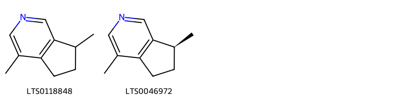{ width=100% }
    <figcaption>Hình ảnh cấu trúc hóa học của 2 hoạt chất thuộc nhóm Pyridines and derivatives gồm ['4,7-dimethyl-5h,6h,7h-cyclopenta[c]pyridine (LTS0118848)', 'actinidine (LTS0046972)'].</figcaption>
</figure>
#### Nhóm Saturated hydrocarbons
<figure markdown="span">
    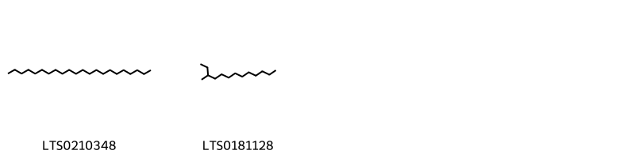{ width=100% }
    <figcaption>Hình ảnh cấu trúc hóa học của 2 hoạt chất thuộc nhóm Saturated hydrocarbons gồm ['docosane (LTS0210348)', '3-methyltridecane (LTS0181128)'].</figcaption>
</figure>
#### Nhóm Steroids and steroid derivatives
<figure markdown="span">
    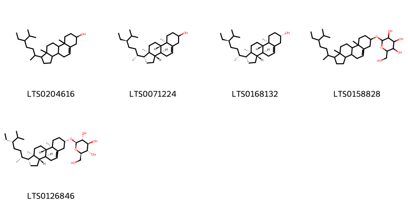{ width=100% }
    <figcaption>Hình ảnh cấu trúc hóa học của 5 hoạt chất thuộc nhóm Steroids and steroid derivatives gồm ['stigmast-5-en-3-ol, (3β)- (LTS0204616)', 'stigmast-5-en-3-ol (LTS0071224)', 'sitosterol (LTS0168132)', '2-{[1-(5-ethyl-6-methylheptan-2-yl)-9a,11a-dimethyl-1h,2h,3h,3ah,3bh,4h,6h,7h,8h,9h,9bh,10h,11h-cyclopenta[a]phenanthren-7-yl]oxy}-6-(hydroxymethyl)oxane-3,4,5-triol (LTS0158828)', '(2r,3r,4s,5s,6r)-2-{[(1r,3as,3bs,7s,9ar,9bs,11ar)-1-[(2r,5s)-5-ethyl-6-methylheptan-2-yl]-9a,11a-dimethyl-1h,2h,3h,3ah,3bh,4h,6h,7h,8h,9h,9bh,10h,11h-cyclopenta[a]phenanthren-7-yl]oxy}-6-(hydroxymethyl)oxane-3,4,5-triol (LTS0126846)'].</figcaption>
</figure>
#### Nhóm Tropane alkaloids
<figure markdown="span">
    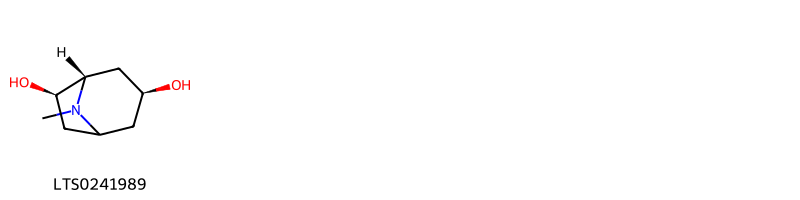{ width=100% }
    <figcaption>Hình ảnh cấu trúc hóa học của 1 hoạt chất thuộc nhóm Tropane alkaloids gồm ['(3s,5s,6r)-8-methyl-8-azabicyclo[3.2.1]octane-3,6-diol (LTS0241989)'].</figcaption>
</figure>
#### Nhóm Unsaturated hydrocarbons
<figure markdown="span">
    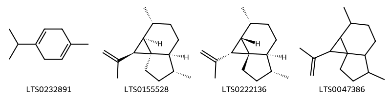{ width=100% }
    <figcaption>Hình ảnh cấu trúc hóa học của 4 hoạt chất thuộc nhóm Unsaturated hydrocarbons gồm ['α terpinene (LTS0232891)', '(1r,1ar,2r,4as,5r,7ar)-2,5-dimethyl-1-(prop-1-en-2-yl)-octahydro-1h-cyclopropa[d]indene (LTS0155528)', '(1s,1as,2r,4as,5r,7as)-2,5-dimethyl-1-(prop-1-en-2-yl)-octahydro-1h-cyclopropa[d]indene (LTS0222136)', '2,5-dimethyl-1-(prop-1-en-2-yl)-octahydro-1h-cyclopropa[d]indene (LTS0047386)'].</figcaption>
</figure>

---

### Dược dân tộc học

Danh sách các quốc gia có sử dụng *Valeriana officinalis* trong điều trị các bệnh. 

| Country   | Disease                                                      | Bệnh                                                                                                                                                                                                |
|:----------|:-------------------------------------------------------------|:----------------------------------------------------------------------------------------------------------------------------------------------------------------------------------------------------|
| China     | Carminative, Sedative                                        | MYMEMORY WARNING: YOU USED ALL AVAILABLE FREE TRANSLATIONS FOR TODAY. NEXT AVAILABLE IN  02 HOURS 15 MINUTES 22 SECONDS VISIT HTTPS://MYMEMORY.TRANSLATED.NET/DOC/USAGELIMITS.PHP TO TRANSLATE MORE |
| Elsewhere | Narcotic, Sedative, Stimulant, Tonic, nan, Carminative       | MYMEMORY WARNING: YOU USED ALL AVAILABLE FREE TRANSLATIONS FOR TODAY. NEXT AVAILABLE IN  02 HOURS 15 MINUTES 19 SECONDS VISIT HTTPS://MYMEMORY.TRANSLATED.NET/DOC/USAGELIMITS.PHP TO TRANSLATE MORE |
| Europe    | Nervine, Perfume, Stomachic                                  | MYMEMORY WARNING: YOU USED ALL AVAILABLE FREE TRANSLATIONS FOR TODAY. NEXT AVAILABLE IN  02 HOURS 15 MINUTES 17 SECONDS VISIT HTTPS://MYMEMORY.TRANSLATED.NET/DOC/USAGELIMITS.PHP TO TRANSLATE MORE |
| Germany   | Tranquilizer                                                 | MYMEMORY WARNING: YOU USED ALL AVAILABLE FREE TRANSLATIONS FOR TODAY. NEXT AVAILABLE IN  02 HOURS 15 MINUTES 14 SECONDS VISIT HTTPS://MYMEMORY.TRANSLATED.NET/DOC/USAGELIMITS.PHP TO TRANSLATE MORE |
| Turkey    | Sedative, Sudorific, Vermifuge, Hypnotic, Nervine, Stimulant | MYMEMORY WARNING: YOU USED ALL AVAILABLE FREE TRANSLATIONS FOR TODAY. NEXT AVAILABLE IN  02 HOURS 15 MINUTES 12 SECONDS VISIT HTTPS://MYMEMORY.TRANSLATED.NET/DOC/USAGELIMITS.PHP TO TRANSLATE MORE |
| ain       | Hypnotic                                                     | MYMEMORY WARNING: YOU USED ALL AVAILABLE FREE TRANSLATIONS FOR TODAY. NEXT AVAILABLE IN  02 HOURS 15 MINUTES 10 SECONDS VISIT HTTPS://MYMEMORY.TRANSLATED.NET/DOC/USAGELIMITS.PHP TO TRANSLATE MORE |

---

---
## Valeriana phu
### Thông tin về thực vật

!!! info "Phân loại thực vật của *Valeriana phu* từ GIBF:"
    - **Kingdom:** Plantae
    - **Phylum:** Tracheophyta
    - **Order:** Dipsacales
    - **Family:** Caprifoliaceae
    - **Genus:** Valeriana
    - **Species:** *Valeriana phu*

 

| Label (VI)   | Label (EN)   | Scientific Name   | Descriptions (VI)   | Descriptions (EN)   | Also Known As (VI)   | Also Known As (EN)                                          |
|:-------------|:-------------|:------------------|:--------------------|:--------------------|:---------------------|:------------------------------------------------------------|
| N/A          | N/A          | Valeriana phu     | loài thực vật       | species of plant    | ['']                 | ['garden valerian', 'Cretan spikenard', 'golden spikenard'] |

#### Phân bố trên thế giới

**Từ CSDL GIBF** nan, Italy, Belgium, Georgia, unknown or invalid, Norway, Netherlands, Spain, Türkiye, Portugal, Morocco, United States of America, Sweden, Greece, Germany, Switzerland, Armenia, France, United Kingdom of Great Britain and Northern Ireland

#### Phân bố tại Việt Nam

**Từ CSDL GIBF**: Không có ghi nhận ở Việt Nam

---
### Thành phần hóa học
        
- Theo cơ sở dữ liệu lotus: Từ loài *Valeriana phu* đã phân lập và xác định được 4 hoạt chất thuộc về các nhóm Prenol lipids, Organooxygen compounds. 

|    | chemicalTaxonomyClassyfireClass   |   smiles_count |
|---:|:----------------------------------|---------------:|
|  0 | Organooxygen compounds            |              2 |
|  1 | Prenol lipids                     |              2 |

#### Nhóm Organooxygen compounds
<figure markdown="span">
    { width=100% }
    <figcaption>Hình ảnh cấu trúc hóa học của 2 hoạt chất thuộc nhóm Organooxygen compounds gồm ['patchoulol (LTS0270368)', '(1s,3r,7s,8s)-2,2,6,8-tetramethyltricyclo[5.3.1.0³,⁸]undecan-3-ol (LTS0014444)'].</figcaption>
</figure>
#### Nhóm Prenol lipids
<figure markdown="span">
    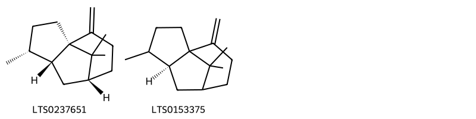{ width=100% }
    <figcaption>Hình ảnh cấu trúc hóa học của 2 hoạt chất thuộc nhóm Prenol lipids gồm ['(1s,4r,5r,7r)-4,11,11-trimethyl-10-methylidenetricyclo[5.3.1.0¹,⁵]undecane (LTS0237651)', '(5s)-4,11,11-trimethyl-10-methylidenetricyclo[5.3.1.0¹,⁵]undecane (LTS0153375)'].</figcaption>
</figure>

---

### Dược dân tộc học

Danh sách các quốc gia có sử dụng *Valeriana phu* trong điều trị các bệnh. 

| Country   | Disease                     | Bệnh                                                                                                                                                                                                |
|:----------|:----------------------------|:----------------------------------------------------------------------------------------------------------------------------------------------------------------------------------------------------|
| USSR      | Nervine, Stomachic, Perfume | MYMEMORY WARNING: YOU USED ALL AVAILABLE FREE TRANSLATIONS FOR TODAY. NEXT AVAILABLE IN  02 HOURS 13 MINUTES 41 SECONDS VISIT HTTPS://MYMEMORY.TRANSLATED.NET/DOC/USAGELIMITS.PHP TO TRANSLATE MORE |

---

---
## Valeriana stubendorfi
### Thông tin về thực vật

!!! info "Phân loại thực vật của *Valeriana alternifolia* từ GIBF:"
    - **Kingdom:** Plantae
    - **Phylum:** Tracheophyta
    - **Order:** Dipsacales
    - **Family:** Caprifoliaceae
    - **Genus:** Valeriana
    - **Species:** *Valeriana alternifolia*

 

| Label (VI)   | Label (EN)   | Scientific Name   | Descriptions (VI)   | Descriptions (EN)   | Also Known As (VI)   | Also Known As (EN)                                          |
|:-------------|:-------------|:------------------|:--------------------|:--------------------|:---------------------|:------------------------------------------------------------|
| N/A          | N/A          | Valeriana phu     | loài thực vật       | species of plant    | ['']                 | ['garden valerian', 'Cretan spikenard', 'golden spikenard'] |

#### Phân bố trên thế giới

**Từ CSDL GIBF** Russian Federation, China

#### Phân bố tại Việt Nam

**Từ CSDL GIBF**: Không có ghi nhận ở Việt Nam

---
### Thành phần hóa học
        
- Theo cơ sở dữ liệu lotus: Từ loài *Valeriana alternifolia* đã phân lập và xác định được Chưa có hoạt chất nào được phân lập. hoạt chất thuộc về các nhóm Không có hoạt chất nào được phân lập. 

Không có hình ảnh nào được tạo ra

---

### Dược dân tộc học

Danh sách các quốc gia có sử dụng *Valeriana alternifolia* trong điều trị các bệnh. 

| Country   | Disease   | Bệnh                                                                                                                                                                                                |
|:----------|:----------|:----------------------------------------------------------------------------------------------------------------------------------------------------------------------------------------------------|
| China     | Sedative  | MYMEMORY WARNING: YOU USED ALL AVAILABLE FREE TRANSLATIONS FOR TODAY. NEXT AVAILABLE IN  02 HOURS 13 MINUTES 14 SECONDS VISIT HTTPS://MYMEMORY.TRANSLATED.NET/DOC/USAGELIMITS.PHP TO TRANSLATE MORE |

---

---
## Valeriana tuberosa
### Thông tin về thực vật

!!! info "Phân loại thực vật của *Valeriana tuberosa* từ GIBF:"
    - **Kingdom:** Plantae
    - **Phylum:** Tracheophyta
    - **Order:** Dipsacales
    - **Family:** Caprifoliaceae
    - **Genus:** Valeriana
    - **Species:** *Valeriana tuberosa*

 

| Label (VI)   | Label (EN)   | Scientific Name    | Descriptions (VI)   | Descriptions (EN)   | Also Known As (VI)   | Also Known As (EN)   |
|:-------------|:-------------|:-------------------|:--------------------|:--------------------|:---------------------|:---------------------|
| N/A          | N/A          | Valeriana tuberosa | loài thực vật       | species of plant    | ['']                 | ['']                 |

#### Phân bố trên thế giới

**Từ CSDL GIBF** Ukraine, Italy, Spain, Portugal, Algeria, Russian Federation, France, Kazakhstan, Croatia

#### Phân bố tại Việt Nam

**Từ CSDL GIBF**: Không có ghi nhận ở Việt Nam

---
### Thành phần hóa học
        
- Theo cơ sở dữ liệu lotus: Từ loài *Valeriana tuberosa* đã phân lập và xác định được 1 hoạt chất thuộc về các nhóm Prenol lipids. 

|    | chemicalTaxonomyClassyfireClass   |   smiles_count |
|---:|:----------------------------------|---------------:|
|  0 | Prenol lipids                     |              1 |

#### Nhóm Prenol lipids
<figure markdown="span">
    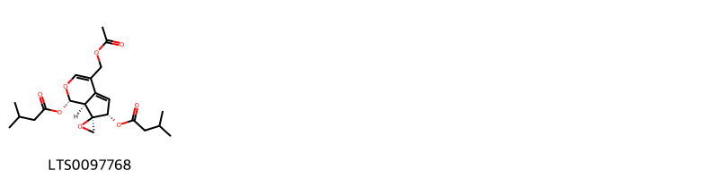{ width=100% }
    <figcaption>Hình ảnh cấu trúc hóa học của 1 hoạt chất thuộc nhóm Prenol lipids gồm ['valtrate (LTS0097768)'].</figcaption>
</figure>

---

### Dược dân tộc học

Danh sách các quốc gia có sử dụng *Valeriana tuberosa* trong điều trị các bệnh. 

| Country   | Disease   | Bệnh                                                                                                                                                                                                |
|:----------|:----------|:----------------------------------------------------------------------------------------------------------------------------------------------------------------------------------------------------|
| Arab      | Sedative  | MYMEMORY WARNING: YOU USED ALL AVAILABLE FREE TRANSLATIONS FOR TODAY. NEXT AVAILABLE IN  02 HOURS 12 MINUTES 59 SECONDS VISIT HTTPS://MYMEMORY.TRANSLATED.NET/DOC/USAGELIMITS.PHP TO TRANSLATE MORE |

---

---
## Valeriana uliginosa
### Thông tin về thực vật

!!! info "Phân loại thực vật của *Valeriana uliginosa* từ GIBF:"
    - **Kingdom:** Plantae
    - **Phylum:** Tracheophyta
    - **Order:** Dipsacales
    - **Family:** Caprifoliaceae
    - **Genus:** Valeriana
    - **Species:** *Valeriana uliginosa*

 

| Label (VI)   | Label (EN)   | Scientific Name     | Descriptions (VI)   | Descriptions (EN)   | Also Known As (VI)   | Also Known As (EN)   |
|:-------------|:-------------|:--------------------|:--------------------|:--------------------|:---------------------|:---------------------|
| N/A          | N/A          | Valeriana uliginosa | loài thực vật       | species of plant    | ['']                 | ['']                 |

#### Phân bố trên thế giới

**Từ CSDL GIBF** United States of America, Canada

#### Phân bố tại Việt Nam

**Từ CSDL GIBF**: Không có ghi nhận ở Việt Nam

---
### Thành phần hóa học
        
- Theo cơ sở dữ liệu lotus: Từ loài *Valeriana uliginosa* đã phân lập và xác định được Chưa có hoạt chất nào được phân lập. hoạt chất thuộc về các nhóm Không có hoạt chất nào được phân lập. 

Không có hình ảnh nào được tạo ra

---

### Dược dân tộc học

Danh sách các quốc gia có sử dụng *Valeriana uliginosa* trong điều trị các bệnh. 

| Country      | Disease   | Bệnh                                                                                                                                                                                                |
|:-------------|:----------|:----------------------------------------------------------------------------------------------------------------------------------------------------------------------------------------------------|
| US(Menomini) | Poultice  | MYMEMORY WARNING: YOU USED ALL AVAILABLE FREE TRANSLATIONS FOR TODAY. NEXT AVAILABLE IN  02 HOURS 12 MINUTES 36 SECONDS VISIT HTTPS://MYMEMORY.TRANSLATED.NET/DOC/USAGELIMITS.PHP TO TRANSLATE MORE |

---

---
## Valeriana wallichii
### Thông tin về thực vật

!!! info "Phân loại thực vật của *Valeriana jatamansi* từ GIBF:"
    - **Kingdom:** Plantae
    - **Phylum:** Tracheophyta
    - **Order:** Dipsacales
    - **Family:** Caprifoliaceae
    - **Genus:** Valeriana
    - **Species:** *Valeriana jatamansi*

 

| Label (VI)   | Label (EN)   | Scientific Name     | Descriptions (VI)   | Descriptions (EN)   | Also Known As (VI)   | Also Known As (EN)   |
|:-------------|:-------------|:--------------------|:--------------------|:--------------------|:---------------------|:---------------------|
| N/A          | N/A          | Valeriana wallichii | loài thực vật       | species of plant    | ['']                 | ['']                 |

#### Phân bố trên thế giới

**Từ CSDL GIBF** nan, Pakistan, Afghanistan, Bhutan, India, unknown or invalid, China, Nepal

#### Phân bố tại Việt Nam

**Từ CSDL GIBF**: Không có ghi nhận ở Việt Nam

---
### Thành phần hóa học
        
- Theo cơ sở dữ liệu lotus: Từ loài *Valeriana jatamansi* đã phân lập và xác định được Chưa có hoạt chất nào được phân lập. hoạt chất thuộc về các nhóm Không có hoạt chất nào được phân lập. 

Không có hình ảnh nào được tạo ra

---

### Dược dân tộc học

Danh sách các quốc gia có sử dụng *Valeriana jatamansi* trong điều trị các bệnh. 

| Country   | Disease   | Bệnh                                                                                                                                                                                                |
|:----------|:----------|:----------------------------------------------------------------------------------------------------------------------------------------------------------------------------------------------------|
| Elsewhere | Sedative  | MYMEMORY WARNING: YOU USED ALL AVAILABLE FREE TRANSLATIONS FOR TODAY. NEXT AVAILABLE IN  02 HOURS 12 MINUTES 15 SECONDS VISIT HTTPS://MYMEMORY.TRANSLATED.NET/DOC/USAGELIMITS.PHP TO TRANSLATE MORE |

---

# Chi Nardostachys

??? note "Danh sách các dược liệu thuộc chi"
    
	 - *Nardostachys jatamansi*

---
## Nardostachys jatamansi
### Thông tin về thực vật

!!! info "Phân loại thực vật của *Nardostachys jatamansi* từ GIBF:"
    - **Kingdom:** Plantae
    - **Phylum:** Tracheophyta
    - **Order:** Dipsacales
    - **Family:** Caprifoliaceae
    - **Genus:** Nardostachys
    - **Species:** *Nardostachys jatamansi*

 

| Label (VI)   | Label (EN)   | Scientific Name        | Descriptions (VI)   | Descriptions (EN)   | Also Known As (VI)   | Also Known As (EN)   |
|:-------------|:-------------|:-----------------------|:--------------------|:--------------------|:---------------------|:---------------------|
| N/A          | N/A          | Nardostachys jatamansi | loài thực vật       | species of plant    | ['']                 | ['']                 |

#### Phân bố trên thế giới

**Từ CSDL GIBF** Pakistan, Bhutan, India, United States of America, China, United Kingdom of Great Britain and Northern Ireland, Nepal

#### Phân bố tại Việt Nam

**Từ CSDL GIBF**: Không có ghi nhận ở Việt Nam

---
### Thành phần hóa học
        
- Theo cơ sở dữ liệu lotus: Từ loài *Nardostachys jatamansi* đã phân lập và xác định được 141 hoạt chất thuộc về các nhóm Fatty Acyls, Naphthalenes, Flavonoids, Prenol lipids, Steroids and steroid derivatives, Cinnamic acids and derivatives, Benzene and substituted derivatives, Polycyclic hydrocarbons, Organooxygen compounds, Phenols, Coumarins and derivatives, Furanoid lignans, Carboxylic acids and derivatives, Benzopyrans. 

|    | chemicalTaxonomyClassyfireClass     |   smiles_count |
|---:|:------------------------------------|---------------:|
|  0 | Benzene and substituted derivatives |              1 |
|  1 | Benzopyrans                         |              1 |
|  2 | Carboxylic acids and derivatives    |              7 |
|  3 | Cinnamic acids and derivatives      |              4 |
|  4 | Coumarins and derivatives           |              3 |
|  5 | Fatty Acyls                         |              2 |
|  6 | Flavonoids                          |             10 |
|  7 | Furanoid lignans                    |              2 |
|  8 | Naphthalenes                        |              2 |
|  9 | Organooxygen compounds              |             12 |
| 10 | Phenols                             |              3 |
| 11 | Polycyclic hydrocarbons             |              2 |
| 12 | Prenol lipids                       |             88 |
| 13 | Steroids and steroid derivatives    |              2 |

#### Nhóm Benzene and substituted derivatives
<figure markdown="span">
    { width=100% }
    <figcaption>Hình ảnh cấu trúc hóa học của 1 hoạt chất thuộc nhóm Benzene and substituted derivatives gồm ['3,4-dihydroxybenzoic acid (LTS0018765)'].</figcaption>
</figure>
#### Nhóm Benzopyrans
<figure markdown="span">
    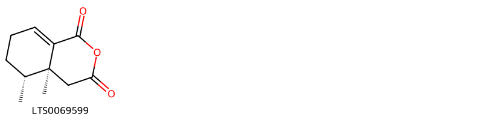{ width=100% }
    <figcaption>Hình ảnh cấu trúc hóa học của 1 hoạt chất thuộc nhóm Benzopyrans gồm ['(4as,5r)-4a,5-dimethyl-4,5,6,7-tetrahydro-2-benzopyran-1,3-dione (LTS0069599)'].</figcaption>
</figure>
#### Nhóm Carboxylic acids and derivatives
<figure markdown="span">
    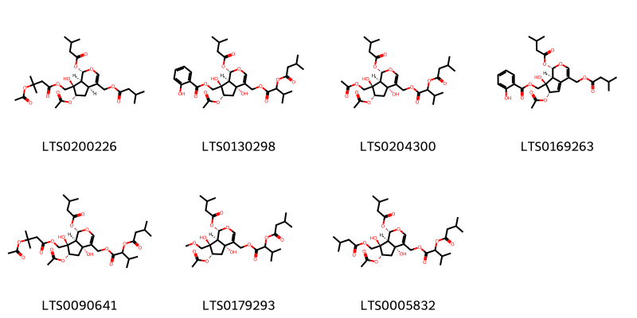{ width=100% }
    <figcaption>Hình ảnh cấu trúc hóa học của 7 hoạt chất thuộc nhóm Carboxylic acids and derivatives gồm ['[(1s,4as,6s,7r,7as)-6-(acetyloxy)-7-hydroxy-1-[(3-methylbutanoyl)oxy]-4-{[(3-methylbutanoyl)oxy]methyl}-1h,4ah,5h,6h,7ah-cyclopenta[c]pyran-7-yl]methyl 3-(acetyloxy)-3-methylbutanoate (LTS0200226)', '[(1s,4ar,6s,7r,7as)-6-(acetyloxy)-4a,7-dihydroxy-4-[({3-methyl-2-[(3-methylbutanoyl)oxy]butanoyl}oxy)methyl]-1-[(3-methylbutanoyl)oxy]-1h,5h,6h,7ah-cyclopenta[c]pyran-7-yl]methyl 2-hydroxybenzoate (LTS0130298)', '[(1s,4ar,6s,7r,7as)-6-(acetyloxy)-7-[(acetyloxy)methyl]-4a,7-dihydroxy-1-[(3-methylbutanoyl)oxy]-1h,5h,6h,7ah-cyclopenta[c]pyran-4-yl]methyl 3-methyl-2-[(3-methylbutanoyl)oxy]butanoate (LTS0204300)', '[(1s,6s,7r,7as)-6-(acetyloxy)-7-hydroxy-1-[(3-methylbutanoyl)oxy]-4-{[(3-methylbutanoyl)oxy]methyl}-1h,6h,7ah-cyclopenta[c]pyran-7-yl]methyl 2-hydroxybenzoate (LTS0169263)', '[(1s,4ar,6s,7r,7as)-6-(acetyloxy)-4a,7-dihydroxy-4-[({3-methyl-2-[(3-methylbutanoyl)oxy]butanoyl}oxy)methyl]-1-[(3-methylbutanoyl)oxy]-1h,5h,6h,7ah-cyclopenta[c]pyran-7-yl]methyl 3-(acetyloxy)-3-methylbutanoate (LTS0090641)', '[(1s,4ar,6s,7r,7as)-6-(acetyloxy)-4a,7-dihydroxy-7-(methoxymethyl)-1-[(3-methylbutanoyl)oxy]-1h,5h,6h,7ah-cyclopenta[c]pyran-4-yl]methyl 3-methyl-2-[(3-methylbutanoyl)oxy]butanoate (LTS0179293)', '[(1s,4ar,6s,7r,7as)-6-(acetyloxy)-4a,7-dihydroxy-1-[(3-methylbutanoyl)oxy]-7-{[(3-methylbutanoyl)oxy]methyl}-1h,5h,6h,7ah-cyclopenta[c]pyran-4-yl]methyl 3-methyl-2-[(3-methylbutanoyl)oxy]butanoate (LTS0005832)'].</figcaption>
</figure>
#### Nhóm Cinnamic acids and derivatives
<figure markdown="span">
    { width=100% }
    <figcaption>Hình ảnh cấu trúc hóa học của 4 hoạt chất thuộc nhóm Cinnamic acids and derivatives gồm ['3,4-dihydroxycinnamic acid (LTS0128050)', 'para-coumaric acid (LTS0266252)', 'caffeic acid (LTS0027481)', 'hydroxycinnamic acid (LTS0233023)'].</figcaption>
</figure>
#### Nhóm Coumarins and derivatives
<figure markdown="span">
    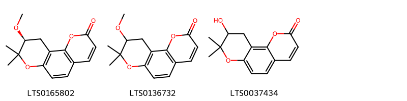{ width=100% }
    <figcaption>Hình ảnh cấu trúc hóa học của 3 hoạt chất thuộc nhóm Coumarins and derivatives gồm ['(9s)-9-methoxy-8,8-dimethyl-9h,10h-pyrano[2,3-h]chromen-2-one (LTS0165802)', '9-methoxy-8,8-dimethyl-9h,10h-pyrano[2,3-h]chromen-2-one (LTS0136732)', '9-hydroxy-8,8-dimethyl-9h,10h-pyrano[2,3-h]chromen-2-one (LTS0037434)'].</figcaption>
</figure>
#### Nhóm Fatty Acyls
<figure markdown="span">
    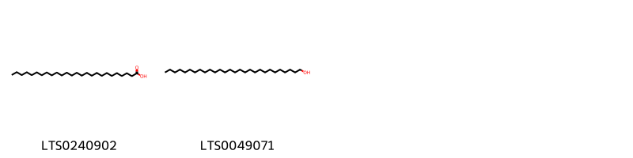{ width=100% }
    <figcaption>Hình ảnh cấu trúc hóa học của 2 hoạt chất thuộc nhóm Fatty Acyls gồm ['hexacosanoic acid (LTS0240902)', 'octacosanol (LTS0049071)'].</figcaption>
</figure>
#### Nhóm Flavonoids
<figure markdown="span">
    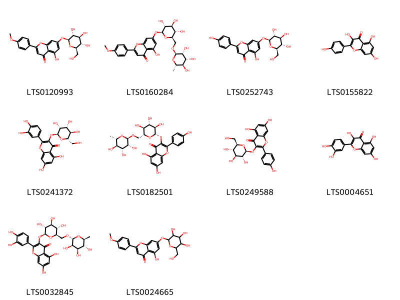{ width=100% }
    <figcaption>Hình ảnh cấu trúc hóa học của 10 hoạt chất thuộc nhóm Flavonoids gồm ['5-hydroxy-2-(4-methoxyphenyl)-7-{[(2s,3r,4s,5s,6r)-3,4,5-trihydroxy-6-(hydroxymethyl)oxan-2-yl]oxy}chromen-4-one (LTS0120993)', 'linarin (LTS0160284)', 'apigenin 7-o-β-glucoside (LTS0252743)', 'kaempherol (LTS0155822)', '2-(3,4-dihydroxyphenyl)-5,7-dihydroxy-3-{[(2s,3r,4r,5r,6s)-3,4,5-trihydroxy-6-(hydroxymethyl)oxan-2-yl]oxy}chromen-4-one (LTS0241372)', 'nictoflorin (LTS0182501)', 'astragalin (LTS0249588)', 'quercetin (LTS0004651)', '3-rutinosyl quercetin (LTS0032845)', '5-hydroxy-2-(4-methoxyphenyl)-7-{[3,4,5-trihydroxy-6-(hydroxymethyl)oxan-2-yl]oxy}chromen-4-one (LTS0024665)'].</figcaption>
</figure>
#### Nhóm Furanoid lignans
<figure markdown="span">
    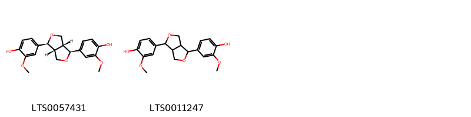{ width=100% }
    <figcaption>Hình ảnh cấu trúc hóa học của 2 hoạt chất thuộc nhóm Furanoid lignans gồm ['pinoresinol (LTS0057431)', 'pinoresinol (LTS0011247)'].</figcaption>
</figure>
#### Nhóm Naphthalenes
<figure markdown="span">
    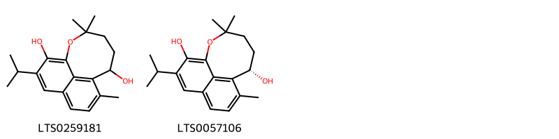{ width=100% }
    <figcaption>Hình ảnh cấu trúc hóa học của 2 hoạt chất thuộc nhóm Naphthalenes gồm ['7-isopropyl-2,11,11-trimethyl-10-oxatricyclo[7.5.1.0⁵,¹⁵]pentadeca-1,3,5,7,9(15)-pentaene-8,14-diol (LTS0259181)', '(14s)-7-isopropyl-2,11,11-trimethyl-10-oxatricyclo[7.5.1.0⁵,¹⁵]pentadeca-1,3,5,7,9(15)-pentaene-8,14-diol (LTS0057106)'].</figcaption>
</figure>
#### Nhóm Organooxygen compounds
<figure markdown="span">
    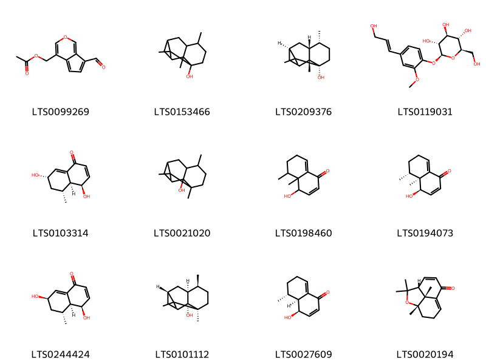{ width=100% }
    <figcaption>Hình ảnh cấu trúc hóa học của 12 hoạt chất thuộc nhóm Organooxygen compounds gồm ['baldrinal (LTS0099269)', '2,2,6,8-tetramethyltricyclo[5.3.1.0³,⁸]undecan-3-ol (LTS0153466)', '(1s,3r,6r,7r,8r)-2,2,6,8-tetramethyltricyclo[5.3.1.0³,⁸]undecan-3-ol (LTS0209376)', 'coniferin (LTS0119031)', '(4r,4as,5r,7s)-4,7-dihydroxy-5-methyl-4a,5,6,7-tetrahydro-4h-naphthalen-1-one (LTS0103314)', '2,2,3,6-tetramethyltricyclo[5.3.1.0³,⁸]undecan-8-ol (LTS0021020)', '4-hydroxy-4a,5-dimethyl-4,5,6,7-tetrahydronaphthalen-1-one (LTS0198460)', '(4r,4as,5r)-4-hydroxy-4a,5-dimethyl-4,5,6,7-tetrahydronaphthalen-1-one (LTS0194073)', '(4r,4as,5r,7r)-4,7-dihydroxy-5-methyl-4a,5,6,7-tetrahydro-4h-naphthalen-1-one (LTS0244424)', '(1r,3s,6s,7s,8r)-2,2,3,6-tetramethyltricyclo[5.3.1.0³,⁸]undecan-8-ol (LTS0101112)', '(4r,4as,5r)-4-hydroxy-5-methyl-4a,5,6,7-tetrahydro-4h-naphthalen-1-one (LTS0027609)', '(1s,4r,12r)-1,3,3,12-tetramethyl-2-oxatricyclo[6.3.1.0⁴,¹²]dodeca-5,8-dien-7-one (LTS0020194)'].</figcaption>
</figure>
#### Nhóm Phenols
<figure markdown="span">
    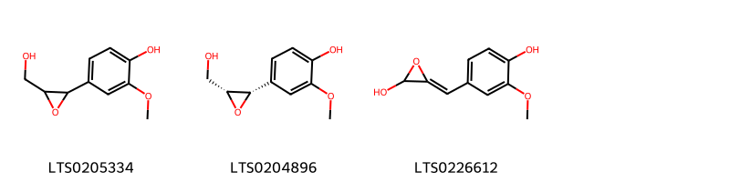{ width=100% }
    <figcaption>Hình ảnh cấu trúc hóa học của 3 hoạt chất thuộc nhóm Phenols gồm ['4-[3-(hydroxymethyl)oxiran-2-yl]-2-methoxyphenol (LTS0205334)', '4-[(2s,3r)-3-(hydroxymethyl)oxiran-2-yl]-2-methoxyphenol (LTS0204896)', '(3z)-3-[(4-hydroxy-3-methoxyphenyl)methylidene]oxiran-2-ol (LTS0226612)'].</figcaption>
</figure>
#### Nhóm Polycyclic hydrocarbons
<figure markdown="span">
    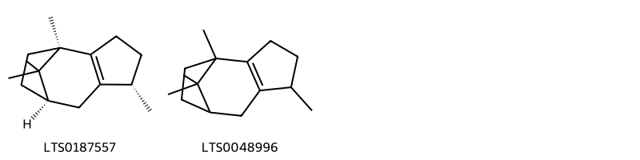{ width=100% }
    <figcaption>Hình ảnh cấu trúc hóa học của 2 hoạt chất thuộc nhóm Polycyclic hydrocarbons gồm ['(1r,5s,8r)-1,5,11,11-tetramethyltricyclo[6.2.1.0²,⁶]undec-2(6)-ene (LTS0187557)', '1,5,11,11-tetramethyltricyclo[6.2.1.0²,⁶]undec-2(6)-ene (LTS0048996)'].</figcaption>
</figure>
#### Nhóm Prenol lipids
<figure markdown="span">
    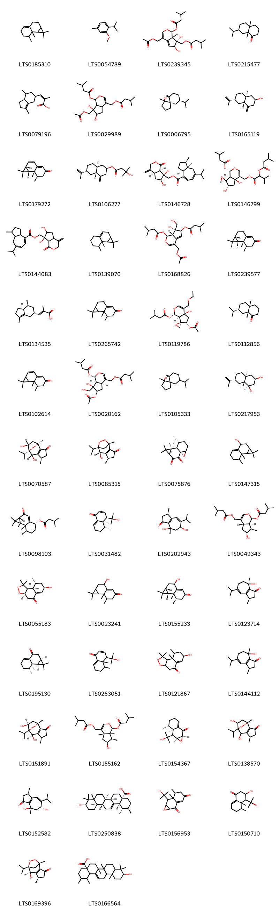{ width=100% }
    <figcaption>Hình ảnh cấu trúc hóa học của 88 hoạt chất thuộc nhóm Prenol lipids gồm ['1,1,7,7a-tetramethyl-1ah,2h,3h,5h,6h,7h,7bh-cyclopropa[a]naphthalene (LTS0185310)', '2-isopropyl-5-methylanisole (LTS0054789)', '[(1s,6s,7r,7as)-4-[(acetyloxy)methyl]-6,7-dihydroxy-1-[(3-methylbutanoyl)oxy]-1h,6h,7ah-cyclopenta[c]pyran-7-yl]methyl 3-methylbutanoate (LTS0239345)', '7-isopropyl-4a,8a-dimethyl-hexahydro-2h-naphthalen-1-one (LTS0215477)', '3-(3,7-dimethyl-2,4,5,6,7,7a-hexahydro-1h-inden-5-yl)-2-methylprop-2-enoic acid (LTS0079196)', '{7-[(acetyloxy)methyl]-6,7-dihydroxy-1-[(3-methylbutanoyl)oxy]-1h,4ah,5h,6h,7ah-cyclopenta[c]pyran-4-yl}methyl 3-methylbutanoate (LTS0029989)', '(1s,5s,9r)-9-isopropyl-1-methyl-6-methylidenespiro[4.5]decan-1-ol (LTS0006795)', '(2s,4as,6r,8as)-8a-methyl-4-methylidene-6-(prop-1-en-2-yl)-octahydronaphthalen-2-ol (LTS0165119)', '(1ar,7r,7ar,7bs)-1,1,7,7a-tetramethyl-1ah,6h,7h,7bh-cyclopropa[a]naphthalen-5-one (LTS0179272)', '(2s,4as,6r,8as)-8a-methyl-4-methylidene-6-(prop-1-en-2-yl)-octahydronaphthalen-2-yl 3-hydroxy-3-methylbutanoate (LTS0106277)', '[(4ar,6s,7s,7ar)-6,7-dihydroxy-4-methylidene-1-oxo-tetrahydro-3h-cyclopenta[c]pyran-7-yl]methyl (1r,3as,8ar)-7-isopropyl-1-methyl-1,2,3,3a,8,8a-hexahydroazulene-4-carboxylate (LTS0146728)', "(1s,4as,6s,7r,7as)-4a,6-dihydroxy-1-[(3-methylbutanoyl)oxy]-1,5,6,7a-tetrahydrospiro[cyclopenta[c]pyran-7,2'-oxiran]-4-ylmethyl 3-methyl-2-[(3-methylbutanoyl)oxy]butanoate (LTS0146799)", '{6,7-dihydroxy-4-methylidene-1-oxo-tetrahydro-3h-cyclopenta[c]pyran-7-yl}methyl 7-isopropyl-1-methyl-1,2,3,3a,8,8a-hexahydroazulene-4-carboxylate (LTS0144083)', '1,1,7,7a-tetramethyl-1ah,2h,4h,5h,6h,7h,7bh-cyclopropa[a]naphthalene (LTS0139070)', '(1s,6s,7r,7as)-4-[(acetyloxy)methyl]-7-hydroxy-7-(hydroxymethyl)-1-[(3-methylbutanoyl)oxy]-1h,6h,7ah-cyclopenta[c]pyran-6-yl 3-methylbutanoate (LTS0168826)', '(1ar,7r,7ar,7bs)-1,1,7,7a-tetramethyl-1ah,2h,3h,6h,7h,7bh-cyclopropa[a]naphthalen-5-one (LTS0239577)', '(2e)-3-[(5s,7s,7as)-3,7-dimethyl-2,4,5,6,7,7a-hexahydro-1h-inden-5-yl]-2-methylprop-2-enoic acid (LTS0134535)', '1,1,7,7a-tetramethyl-1ah,2h,3h,6h,7h,7bh-cyclopropa[a]naphthalen-5-one (LTS0265742)', "(1s,4as,6s,7r,7as)-6-(acetyloxy)-4-(ethoxymethyl)-4a-hydroxy-1,5,6,7a-tetrahydrospiro[cyclopenta[c]pyran-7,2'-oxiran]-1-yl 3-methylbutanoate (LTS0119786)", 'jatamansone (LTS0112856)', '1,1,7,7a-tetramethyl-1ah,6h,7h,7bh-cyclopropa[a]naphthalen-5-one (LTS0102614)', '[(1s,4as,6s,7r,7as)-6-(acetyloxy)-7-hydroxy-7-(hydroxymethyl)-1-[(3-methylbutanoyl)oxy]-1h,4ah,5h,6h,7ah-cyclopenta[c]pyran-4-yl]methyl 3-methylbutanoate (LTS0020162)', '9-isopropyl-1-methyl-6-methylidenespiro[4.5]decan-1-ol (LTS0105333)', '(1r,3r,4as,7r,8ar)-1,4a-dimethyl-7-(prop-1-en-2-yl)-octahydronaphthalene-1,3-diol (LTS0217953)', '(1s,5r,7s,8r,12r)-7,12-dihydroxy-8-isopropyl-1,5-dimethyl-9,10-dioxatricyclo[6.2.2.0²,⁶]dodec-2(6)-en-3-one (LTS0070587)', 'isonordoperoxide (LTS0085315)', '(1r,6r,7r,8s,10r)-6,7,9,9-tetramethyl-2-oxatetracyclo[5.5.0.0¹,³.0⁸,¹⁰]dodecane-11,12-dione (LTS0075876)', '1,1,7,7a-tetramethyl-1ah,2h,3h,5h,6h,7h,7bh-cyclopropa[a]naphthalen-3-ol (LTS0147315)', '(1ar,4r,7r,7ar,7bs)-1,1,7,7a-tetramethyl-2-oxo-1ah,4h,5h,6h,7h,7bh-cyclopropa[a]naphthalen-4-yl 3-methylbutanoate (LTS0098103)', '(4r,4ar,5r)-4-(2-hydroxypropan-2-yl)-4a,5-dimethyl-4,5,6,7-tetrahydronaphthalen-1-one (LTS0031482)', '(3r,6s,8s)-6,8-dihydroxy-5-isopropyl-3,8-dimethyl-2,3,6,7-tetrahydroazulen-1-one (LTS0202943)', '[(1s,4as,6s,7r,7ar)-6-hydroxy-7-methyl-1-[(3-methylbutanoyl)oxy]-1h,4ah,5h,6h,7h,7ah-cyclopenta[c]pyran-4-yl]methyl 3-methylbutanoate (LTS0049343)', '(3ar,7r,9r,9ar,9bs)-7-hydroxy-1,1,9,9a-tetramethyl-3ah,4h,7h,8h,9h,9bh-naphtho[2,1-c][1,2]dioxol-5-one (LTS0055183)', '3-hydroxy-1,1,7,7a-tetramethyl-1ah,2h,3h,6h,7h,7bh-cyclopropa[a]naphthalen-5-one (LTS0023241)', '(1ar,3r,7r,7ar,7bs)-3-hydroxy-1,1,7,7a-tetramethyl-1ah,2h,3h,6h,7h,7bh-cyclopropa[a]naphthalen-5-one (LTS0155233)', '(3r,8r)-8-hydroxy-5-isopropyl-3,8-dimethyl-2,3,6,7-tetrahydroazulen-1-one (LTS0123714)', '(1ar,7r,7ar,7bs)-1,1,7,7a-tetramethyl-1ah,2h,5h,6h,7h,7bh-cyclopropa[a]naphthalen-3-one (LTS0195130)', '4-(2-hydroxypropan-2-yl)-4a,5-dimethyl-4,5,6,7-tetrahydronaphthalen-1-one (LTS0263051)', '7-hydroxy-1,1,9,9a-tetramethyl-3ah,4h,7h,8h,9h,9bh-naphtho[2,1-c][1,2]dioxol-5-one (LTS0121867)', '8-hydroxy-5-isopropyl-3,8-dimethyl-2,3,6,7-tetrahydroazulen-1-one (LTS0144112)', '(1r,5r,7r,8s,12s)-7,12-dihydroxy-8-isopropyl-1,5-dimethyl-9,10-dioxatricyclo[6.2.2.0²,⁶]dodec-2(6)-en-3-one (LTS0151891)', '[(1s,4as,6s,7r,7as)-6-hydroxy-7-methyl-1-[(3-methylbutanoyl)oxy]-1h,4ah,5h,6h,7h,7ah-cyclopenta[c]pyran-4-yl]methyl 3-methylbutanoate (LTS0155162)', '(1as,6r,6ar,7s,7as)-7-(2-hydroxypropan-2-yl)-6,6a-dimethyl-1ah,4h,5h,6h,7h,7ah-naphtho[2,3-b]oxiren-2-one (LTS0154367)', '7,12-dihydroxy-8-isopropyl-1,5-dimethyl-9,10-dioxatricyclo[6.2.2.0²,⁶]dodec-2(6)-en-3-one (LTS0138570)', '(3r,6r,8s)-6,8-dihydroxy-5-isopropyl-3,8-dimethyl-2,3,6,7-tetrahydroazulen-1-one (LTS0152582)', 'ursolic acid (LTS0250838)', '7-(2-hydroxypropan-2-yl)-6,6a-dimethyl-1ah,5h,6h,7h,7ah-naphtho[2,3-b]oxirene-2,4-dione (LTS0156953)', '3-hydroxy-4-(2-hydroxypropan-2-yl)-4a,5-dimethyl-2,3,4,5,6,7-hexahydronaphthalen-1-one (LTS0150710)', '(1s,5r,7r,8s)-7-hydroxy-8-isopropyl-1,5-dimethyl-9,10-dioxatricyclo[6.2.2.0²,⁶]dodec-2(6)-en-3-one (LTS0169396)', '10-hydroxy-1,2,6a,6b,9,9,12a-heptamethyl-2,3,4,5,6,7,8,8a,10,11,12,12b,13,14b-tetradecahydro-1h-picene-4a-carboxylic acid (LTS0166564)', '1,4a-dimethyl-7-(prop-1-en-2-yl)-octahydronaphthalene-1,3-diol (LTS0249462)', '1,1,7,7a-tetramethyl-2-oxo-1ah,4h,5h,6h,7h,7bh-cyclopropa[a]naphthalen-4-yl 3-methylbutanoate (LTS0161524)', '6-hydroxy-7-(hydroxymethyl)-4-methylidene-hexahydrocyclopenta[c]pyran-1-one (LTS0251799)', '(4as,6s,7s,7as)-6-hydroxy-7-(hydroxymethyl)-4-methylidene-hexahydrocyclopenta[c]pyran-1-one (LTS0232009)', '(1ar,4r,7r,7ar,7bs)-1,1,7,7a-tetramethyl-2-oxo-1ah,4h,5h,6h,7h,7bh-cyclopropa[a]naphthalen-4-yl (2r)-2-methylbutanoate (LTS0128495)', '(1as,4r,6r,6ar,7s,7as)-4-hydroxy-7-(2-hydroxypropan-2-yl)-6,6a-dimethyl-1ah,4h,5h,6h,7h,7ah-naphtho[2,3-b]oxiren-2-one (LTS0173650)', '(1s,5r,7s,8s,12r)-7,12-dihydroxy-8-isopropyl-1,5-dimethyl-9,10-dioxatricyclo[6.2.2.0²,⁶]dodec-2(6)-en-3-one (LTS0261117)', '1,1,9,9a-tetramethyl-3ah,4h,7h,8h,9h,9bh-naphtho[2,1-c][1,2]dioxol-5-one (LTS0274514)', '12-hydroxy-2,3,11,11-tetramethyl-10-oxatricyclo[7.2.1.0²,⁷]dodec-6-en-8-one (LTS0100525)', '6,7,9,9-tetramethyl-2-oxatetracyclo[5.5.0.0¹,³.0⁸,¹⁰]dodecane-11,12-dione (LTS0265256)', 'valerenal (LTS0276124)', '(1as,3s,7s,7as,7br)-3-hydroxy-1,1,7,7a-tetramethyl-1ah,2h,3h,6h,7h,7bh-cyclopropa[a]naphthalen-5-one (LTS0223645)', '(1ar,7r,7ar,7bs)-1,1,7,7a-tetramethyl-1ah,2h,3h,5h,6h,7h,7bh-cyclopropa[a]naphthalene (LTS0234436)', '7-hydroxy-8-isopropyl-1,5-dimethyl-9,10-dioxatricyclo[6.2.2.0²,⁶]dodec-2(6)-en-3-one (LTS0234382)', '(1ar,3s,5r,7r,7ar,7bs)-1,1,7,7a-tetramethyl-1ah,2h,3h,5h,6h,7h,7bh-cyclopropa[a]naphthalene-3,5-diol (LTS0046804)', '1,1,7,7a-tetramethyl-1ah,2h,3h,5h,6h,7h,7bh-cyclopropa[a]naphthalene-3,5-diol (LTS0028636)', '(1as,6r,6ar,7s,7as)-7-(2-hydroxypropan-2-yl)-6,6a-dimethyl-1ah,5h,6h,7h,7ah-naphtho[2,3-b]oxirene-2,4-dione (LTS0237660)', '(3r,8r)-8-hydroxy-5-(2-hydroxypropan-2-yl)-3,8-dimethyl-2,3,6,7-tetrahydroazulen-1-one (LTS0251976)', 'guaiane (LTS0067800)', '6,8-dihydroxy-5-isopropyl-3,8-dimethyl-2,3,6,7-tetrahydroazulen-1-one (LTS0250626)', '(1r,5r,7r,8r,12s)-7,12-dihydroxy-8-isopropyl-1,5-dimethyl-9,10-dioxatricyclo[6.2.2.0²,⁶]dodec-2(6)-en-3-one (LTS0258606)', '(1r,5r,7r,8r)-7-hydroxy-8-isopropyl-1,5-dimethyl-11-oxatricyclo[6.2.1.0²,⁶]undec-2(6)-en-3-one (LTS0224931)', 'nardoperoxide (LTS0007373)', '(3r,8s)-8-hydroxy-5-(2-hydroxypropan-2-yl)-3,8-dimethyl-2,3,6,7-tetrahydroazulen-1-one (LTS0049443)', 'valerenic acid (LTS0061091)', '(3r,4s,4ar,5r)-3-hydroxy-4-(2-hydroxypropan-2-yl)-4a,5-dimethyl-2,3,4,5,6,7-hexahydronaphthalen-1-one (LTS0005730)', '(1r,5r,7s,8r)-7-hydroxy-8-isopropyl-1,5-dimethyl-9,10-dioxatricyclo[6.2.2.0²,⁶]dodec-2(6)-en-3-one (LTS0263360)', '4-hydroxy-7-(2-hydroxypropan-2-yl)-6,6a-dimethyl-1ah,4h,5h,6h,7h,7ah-naphtho[2,3-b]oxiren-2-one (LTS0061051)', '(1ar,7bs)-3-hydroxy-1,1,7,7a-tetramethyl-1ah,2h,3h,6h,7h,7bh-cyclopropa[a]naphthalen-5-one (LTS0132438)', '(1ar,3s,7r,7ar,7bs)-3-hydroxy-1,1,7,7a-tetramethyl-1ah,2h,3h,6h,7h,7bh-cyclopropa[a]naphthalen-5-one (LTS0054682)', '(1ar,7r,7ar,7bs)-1,1,7,7a-tetramethyl-1ah,2h,4h,5h,6h,7h,7bh-cyclopropa[a]naphthalene (LTS0261904)', 'nardosinone (LTS0026624)', '8-hydroxy-5-(2-hydroxypropan-2-yl)-3,8-dimethyl-2,3,6,7-tetrahydroazulen-1-one (LTS0009058)', '(1r,3s,6r,7r,8s,10r)-6,7,9,9-tetramethyl-2-oxatetracyclo[5.5.0.0¹,³.0⁸,¹⁰]dodecane-11,12-dione (LTS0132895)', '(1as,3s,7s,7as,7br)-1,1,7,7a-tetramethyl-1ah,2h,3h,5h,6h,7h,7bh-cyclopropa[a]naphthalen-3-ol (LTS0255713)', '(3r,6s,8r)-6,8-dihydroxy-5-isopropyl-3,8-dimethyl-2,3,6,7-tetrahydroazulen-1-one (LTS0249070)', '(1s,2r,3r,9s,12s)-12-hydroxy-2,3,11,11-tetramethyl-10-oxatricyclo[7.2.1.0²,⁷]dodec-6-en-8-one (LTS0260694)', '(3r,8s)-8-hydroxy-5-isopropyl-3,8-dimethyl-2,3,6,7-tetrahydroazulen-1-one (LTS0116860)'].</figcaption>
</figure>
#### Nhóm Steroids and steroid derivatives
<figure markdown="span">
    { width=100% }
    <figcaption>Hình ảnh cấu trúc hóa học của 2 hoạt chất thuộc nhóm Steroids and steroid derivatives gồm ['sitogluside (LTS0201798)', '2-{[1-(5-ethyl-6-methylheptan-2-yl)-9a,11a-dimethyl-1h,2h,3h,3ah,3bh,4h,6h,7h,8h,9h,9bh,10h,11h-cyclopenta[a]phenanthren-7-yl]oxy}-6-(hydroxymethyl)oxane-3,4,5-triol (LTS0158828)'].</figcaption>
</figure>

---

### Dược dân tộc học

Danh sách các quốc gia có sử dụng *Nardostachys jatamansi* trong điều trị các bệnh. 

| Country   | Disease                                                                | Bệnh                                                                                                                                                                                                |
|:----------|:-----------------------------------------------------------------------|:----------------------------------------------------------------------------------------------------------------------------------------------------------------------------------------------------|
| China     | Carminative, Deodorant, Perfume, Stimulant, Stomachic, Sedative        | MYMEMORY WARNING: YOU USED ALL AVAILABLE FREE TRANSLATIONS FOR TODAY. NEXT AVAILABLE IN  02 HOURS 11 MINUTES 57 SECONDS VISIT HTTPS://MYMEMORY.TRANSLATED.NET/DOC/USAGELIMITS.PHP TO TRANSLATE MORE |
| Elsewhere | Diuretic, Emmenagogue, Stimulant, Stomachic, Laxative                  | MYMEMORY WARNING: YOU USED ALL AVAILABLE FREE TRANSLATIONS FOR TODAY. NEXT AVAILABLE IN  02 HOURS 11 MINUTES 55 SECONDS VISIT HTTPS://MYMEMORY.TRANSLATED.NET/DOC/USAGELIMITS.PHP TO TRANSLATE MORE |
| India     | Cosmetic, Sedative, Tonic, Perfume                                     | MYMEMORY WARNING: YOU USED ALL AVAILABLE FREE TRANSLATIONS FOR TODAY. NEXT AVAILABLE IN  02 HOURS 11 MINUTES 52 SECONDS VISIT HTTPS://MYMEMORY.TRANSLATED.NET/DOC/USAGELIMITS.PHP TO TRANSLATE MORE |
| Turkey    | Carminative, Deodorant, Emmenagogue, Nervine, Perfume, Tonic, Sedative | MYMEMORY WARNING: YOU USED ALL AVAILABLE FREE TRANSLATIONS FOR TODAY. NEXT AVAILABLE IN  02 HOURS 11 MINUTES 50 SECONDS VISIT HTTPS://MYMEMORY.TRANSLATED.NET/DOC/USAGELIMITS.PHP TO TRANSLATE MORE |

---

# Chi Patrinia

??? note "Danh sách các dược liệu thuộc chi"
    
	 - *Patrinia scabiosaefolia*
	 - *Patrinia villosa*

---
## Patrinia scabiosaefolia
### Thông tin về thực vật

!!! info "Phân loại thực vật của *Patrinia scabiosifolia* từ GIBF:"
    - **Kingdom:** Plantae
    - **Phylum:** Tracheophyta
    - **Order:** Dipsacales
    - **Family:** Caprifoliaceae
    - **Genus:** Patrinia
    - **Species:** *Patrinia scabiosifolia*

 

| Label (VI)   | Label (EN)   | Scientific Name        | Descriptions (VI)   | Descriptions (EN)   | Also Known As (VI)   | Also Known As (EN)   |
|:-------------|:-------------|:-----------------------|:--------------------|:--------------------|:---------------------|:---------------------|
| N/A          | N/A          | Nardostachys jatamansi | loài thực vật       | species of plant    | ['']                 | ['']                 |

#### Phân bố trên thế giới

**Từ CSDL GIBF** nan, Japan, Korea, Republic of, Russian Federation, China

#### Phân bố tại Việt Nam

**Từ CSDL GIBF**: Không có ghi nhận ở Việt Nam

---
### Thành phần hóa học
        
- Theo cơ sở dữ liệu lotus: Từ loài *Patrinia scabiosifolia* đã phân lập và xác định được Chưa có hoạt chất nào được phân lập. hoạt chất thuộc về các nhóm Không có hoạt chất nào được phân lập. 

Không có hình ảnh nào được tạo ra

---

### Dược dân tộc học

Danh sách các quốc gia có sử dụng *Patrinia scabiosifolia* trong điều trị các bệnh. 

| Country   | Disease                                                                  | Bệnh                                                                                                                                                                                                |
|:----------|:-------------------------------------------------------------------------|:----------------------------------------------------------------------------------------------------------------------------------------------------------------------------------------------------|
| China     | Antidote, Antiphlogistic, Diuretic, Parasiticide, Alexiteric, Astringent | MYMEMORY WARNING: YOU USED ALL AVAILABLE FREE TRANSLATIONS FOR TODAY. NEXT AVAILABLE IN  02 HOURS 11 MINUTES 05 SECONDS VISIT HTTPS://MYMEMORY.TRANSLATED.NET/DOC/USAGELIMITS.PHP TO TRANSLATE MORE |
| Elsewhere | Antidote, Diuretic                                                       | MYMEMORY WARNING: YOU USED ALL AVAILABLE FREE TRANSLATIONS FOR TODAY. NEXT AVAILABLE IN  02 HOURS 11 MINUTES 03 SECONDS VISIT HTTPS://MYMEMORY.TRANSLATED.NET/DOC/USAGELIMITS.PHP TO TRANSLATE MORE |

---

---
## Patrinia villosa
### Thông tin về thực vật

!!! info "Phân loại thực vật của *Patrinia villosa* từ GIBF:"
    - **Kingdom:** Plantae
    - **Phylum:** Tracheophyta
    - **Order:** Dipsacales
    - **Family:** Caprifoliaceae
    - **Genus:** Patrinia
    - **Species:** *Patrinia villosa*

 

| Label (VI)   | Label (EN)   | Scientific Name   | Descriptions (VI)   | Descriptions (EN)   | Also Known As (VI)   | Also Known As (EN)   |
|:-------------|:-------------|:------------------|:--------------------|:--------------------|:---------------------|:---------------------|
| N/A          | N/A          | Patrinia villosa  | loài thực vật       | species of plant    | ['']                 | ['']                 |

#### Phân bố trên thế giới

**Từ CSDL GIBF** Japan, Belgium, Korea, Republic of, Chinese Taipei, United States of America, China

#### Phân bố tại Việt Nam

**Từ CSDL GIBF**: Không có ghi nhận ở Việt Nam

---
### Thành phần hóa học
        
- Theo cơ sở dữ liệu lotus: Từ loài *Patrinia villosa* đã phân lập và xác định được 9 hoạt chất thuộc về các nhóm Fatty Acyls, Prenol lipids, Indoles and derivatives, Isoflavonoids, Linear 1,3-diarylpropanoids. 

|    | chemicalTaxonomyClassyfireClass   |   smiles_count |
|---:|:----------------------------------|---------------:|
|  0 | Fatty Acyls                       |              1 |
|  1 | Indoles and derivatives           |              1 |
|  2 | Isoflavonoids                     |              1 |
|  3 | Linear 1,3-diarylpropanoids       |              1 |
|  4 | Prenol lipids                     |              5 |

#### Nhóm Fatty Acyls
<figure markdown="span">
    { width=100% }
    <figcaption>Hình ảnh cấu trúc hóa học của 1 hoạt chất thuộc nhóm Fatty Acyls gồm ['palmitic acid (LTS0079439)'].</figcaption>
</figure>
#### Nhóm Indoles and derivatives
<figure markdown="span">
    { width=100% }
    <figcaption>Hình ảnh cấu trúc hóa học của 1 hoạt chất thuộc nhóm Indoles and derivatives gồm ['indole-3-carboxaldehyde (LTS0137179)'].</figcaption>
</figure>
#### Nhóm Isoflavonoids
<figure markdown="span">
    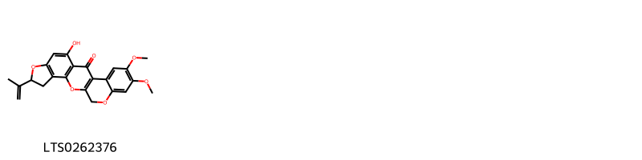{ width=100% }
    <figcaption>Hình ảnh cấu trúc hóa học của 1 hoạt chất thuộc nhóm Isoflavonoids gồm ['10-hydroxy-16,17-dimethoxy-6-(prop-1-en-2-yl)-2,7,20-trioxapentacyclo[11.8.0.0³,¹¹.0⁴,⁸.0¹⁴,¹⁹]henicosa-1(13),3,8,10,14,16,18-heptaen-12-one (LTS0262376)'].</figcaption>
</figure>
#### Nhóm Linear 1_3-diarylpropanoids
<figure markdown="span">
    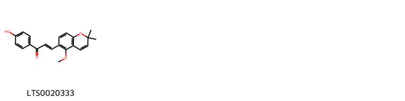{ width=100% }
    <figcaption>Hình ảnh cấu trúc hóa học của Không tìm thấy chú thích hoạt chất thuộc nhóm Linear 1_3-diarylpropanoids gồm Không tìm thấy chú thích.</figcaption>
</figure>
#### Nhóm Prenol lipids
<figure markdown="span">
    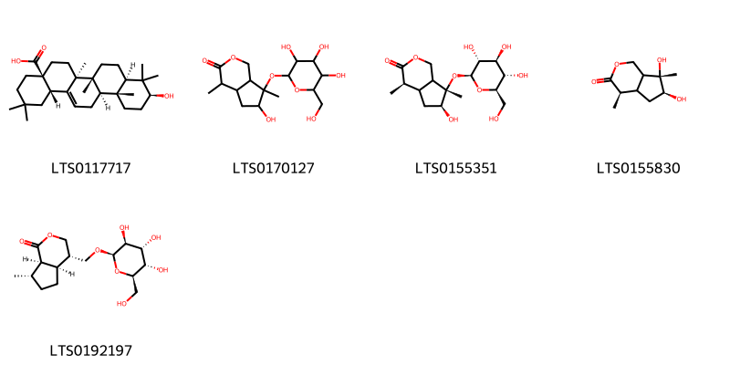{ width=100% }
    <figcaption>Hình ảnh cấu trúc hóa học của 5 hoạt chất thuộc nhóm Prenol lipids gồm ['oleanolic acid (LTS0117717)', '6-hydroxy-4,7-dimethyl-7-{[3,4,5-trihydroxy-6-(hydroxymethyl)oxan-2-yl]oxy}-hexahydrocyclopenta[c]pyran-3-one (LTS0170127)', '(4r,6s,7s)-6-hydroxy-4,7-dimethyl-7-{[(2s,3r,4s,5s,6r)-3,4,5-trihydroxy-6-(hydroxymethyl)oxan-2-yl]oxy}-hexahydrocyclopenta[c]pyran-3-one (LTS0155351)', '(4r,6s,7s)-6,7-dihydroxy-4,7-dimethyl-hexahydrocyclopenta[c]pyran-3-one (LTS0155830)', '(4s,4ar,7s,7ar)-7-methyl-4-({[(2r,3s,4r,5s,6r)-3,4,5-trihydroxy-6-(hydroxymethyl)oxan-2-yl]oxy}methyl)-hexahydro-3h-cyclopenta[c]pyran-1-one (LTS0192197)'].</figcaption>
</figure>

---

### Dược dân tộc học

Danh sách các quốc gia có sử dụng *Patrinia villosa* trong điều trị các bệnh. 

| Country   | Disease   | Bệnh                                                                                                                                                                                                |
|:----------|:----------|:----------------------------------------------------------------------------------------------------------------------------------------------------------------------------------------------------|
| China     | Antidote  | MYMEMORY WARNING: YOU USED ALL AVAILABLE FREE TRANSLATIONS FOR TODAY. NEXT AVAILABLE IN  02 HOURS 10 MINUTES 42 SECONDS VISIT HTTPS://MYMEMORY.TRANSLATED.NET/DOC/USAGELIMITS.PHP TO TRANSLATE MORE |

---

