!!! abstract "Tóm tắt"

    Họ Verbenaceae gồm khoảng 12 chi và 39 loài được một số cộng đồng tại các quốc gia như Portugal*, South America, Java, English, Malaya, Australia, Haiti, Dominican Republic, Curacao, German, Africa, US(Colonial), India, Eurasia, US, Sudan, Bahamas, Turkey, Iraq, Trop Na, Salvador, Trinidad, Panama, Brazil, Peru, Venezuela, Mexico(Seri), Mexico, China, anish, Arab, Elsewhere, Argentina, South Africa, Paraguay, Guyana sử dụng trong một số trường hợp QUERY LENGTH LIMIT EXCEEDED. MAX ALLOWED QUERY : 500 CHARS QUERY LENGTH LIMIT EXCEEDED. MAX ALLOWED QUERY : 500 CHARS MYMEMORY WARNING: YOU USED ALL AVAILABLE FREE TRANSLATIONS FOR TODAY. NEXT AVAILABLE IN  16 HOURS 55 MINUTES 09 SECONDS VISIT HTTPS://MYMEMORY.TRANSLATED.NET/DOC/USAGELIMITS.PHP TO TRANSLATE MORE.

!!! info "DrDuke"

    James A. Duke sinh năm 1929-2017 là một nhà thực vật học người Mỹ. Đây là một trong những tác giả hàng đầu trong lĩnh vực dược dân tộc học với cuốn *CRC Handbook of Medicinal Herbs* và chính là người xây dựng lên cơ sở dữ liệu về hợp chất tự nhiên và dược dân tộc học tại Bộ nông nghiệp Hoa Kỳ. Các thông tin được đăng tải tại website [Dr. Duke's Phytochemical and Ethnobotanical Databases](https://phytochem.nal.usda.gov/). 
    Trong suốt thập niên 1970, ông lãnh đạo the Plant Taxonomy Laboratory, Plant Genetics and Germplasm Institute of the Agricultural Research Service, U.S. Department of Agriculture.
    Trong tài liệu này, các thông tin về dược dân tộc của các dược liệu được trích dẫn từ tài liệu của James A. Ducke với sự trợ giúp của phần mềm dịch thuật từ tiếng Anh sang tiếng Việt.
   

# Chi Phryma

??? note "Danh sách các dược liệu thuộc chi"
    
	 - *Phryma leptostachya*

---
## Phryma leptostachya
### Thông tin về thực vật

!!! info "Phân loại thực vật của *Phryma leptostachya* từ GIBF:"
    - **Kingdom:** Plantae
    - **Phylum:** Tracheophyta
    - **Order:** Lamiales
    - **Family:** Phrymaceae
    - **Genus:** Phryma
    - **Species:** *Phryma leptostachya*

 

| Label (VI)   | Label (EN)   | Scientific Name     | Descriptions (VI)   | Descriptions (EN)   | Also Known As (VI)   | Also Known As (EN)   |
|:-------------|:-------------|:--------------------|:--------------------|:--------------------|:---------------------|:---------------------|
| N/A          | N/A          | Phryma leptostachya | loài thực vật       | species of plant    | ['']                 | ['']                 |

#### Phân bố trên thế giới

**Từ CSDL GIBF** Canada, United States of America, Russian Federation

#### Phân bố tại Việt Nam

**Từ CSDL GIBF**: Không có ghi nhận ở Việt Nam

---
### Thành phần hóa học
        
- Theo cơ sở dữ liệu lotus: Từ loài *Phryma leptostachya* đã phân lập và xác định được 19 hoạt chất thuộc về các nhóm Benzodioxanes, Furanoid lignans, Prenol lipids, Benzodioxoles. 

|    | chemicalTaxonomyClassyfireClass   |   smiles_count |
|---:|:----------------------------------|---------------:|
|  0 | Benzodioxanes                     |              2 |
|  1 | Benzodioxoles                     |              8 |
|  2 | Furanoid lignans                  |              8 |
|  3 | Prenol lipids                     |              1 |

#### Nhóm Benzodioxanes
<figure markdown="span">
    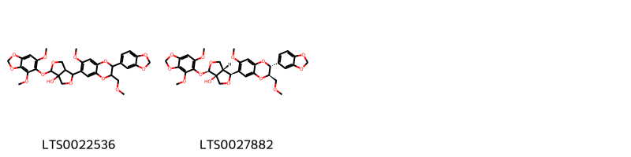{ width=100% }
    <figcaption>Hình ảnh cấu trúc hóa học của 2 hoạt chất thuộc nhóm Benzodioxanes gồm ['1-[2-(2h-1,3-benzodioxol-5-yl)-7-methoxy-3-(methoxymethyl)-2,3-dihydro-1,4-benzodioxin-6-yl]-4-[(4,6-dimethoxy-2h-1,3-benzodioxol-5-yl)oxy]-tetrahydro-1h-furo[3,4-c]furan-3a-ol (LTS0022536)', '(1s,3as,4r,6ar)-1-[(2r,3r)-2-(2h-1,3-benzodioxol-5-yl)-7-methoxy-3-(methoxymethyl)-2,3-dihydro-1,4-benzodioxin-6-yl]-4-[(4,6-dimethoxy-2h-1,3-benzodioxol-5-yl)oxy]-tetrahydro-1h-furo[3,4-c]furan-3a-ol (LTS0027882)'].</figcaption>
</figure>
#### Nhóm Benzodioxoles
<figure markdown="span">
    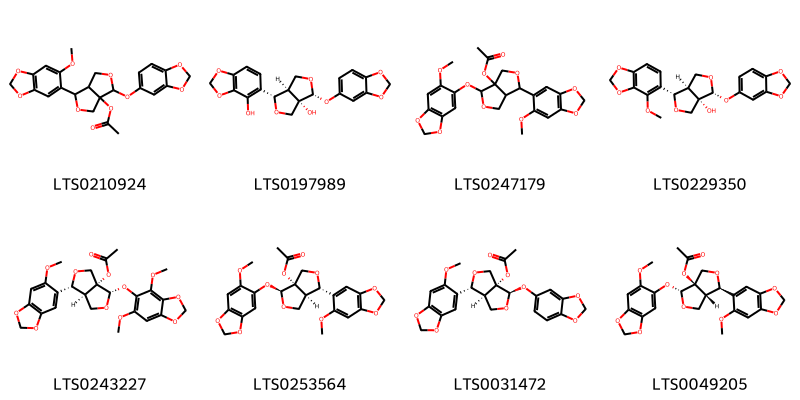{ width=100% }
    <figcaption>Hình ảnh cấu trúc hóa học của 8 hoạt chất thuộc nhóm Benzodioxoles gồm ['4-(2h-1,3-benzodioxol-5-yloxy)-1-(6-methoxy-2h-1,3-benzodioxol-5-yl)-tetrahydro-1h-furo[3,4-c]furan-3a-yl acetate (LTS0210924)', '5-[(1s,3as,4r,6ar)-4-(2h-1,3-benzodioxol-5-yloxy)-3a-hydroxy-tetrahydro-1h-furo[3,4-c]furan-1-yl]-2h-1,3-benzodioxol-4-ol (LTS0197989)', '1-(6-methoxy-2h-1,3-benzodioxol-5-yl)-4-[(6-methoxy-2h-1,3-benzodioxol-5-yl)oxy]-tetrahydro-1h-furo[3,4-c]furan-3a-yl acetate (LTS0247179)', '(1s,3as,4r,6ar)-4-(2h-1,3-benzodioxol-5-yloxy)-1-(4-methoxy-2h-1,3-benzodioxol-5-yl)-tetrahydro-1h-furo[3,4-c]furan-3a-ol (LTS0229350)', '(1r,3ar,4s,6as)-4-[(4,6-dimethoxy-2h-1,3-benzodioxol-5-yl)oxy]-1-(6-methoxy-2h-1,3-benzodioxol-5-yl)-tetrahydro-1h-furo[3,4-c]furan-3a-yl acetate (LTS0243227)', 'phrymarolin i (LTS0253564)', '(1r,3ar,4r,6as)-4-(2h-1,3-benzodioxol-5-yloxy)-1-(6-methoxy-2h-1,3-benzodioxol-5-yl)-tetrahydro-1h-furo[3,4-c]furan-3a-yl acetate (LTS0031472)', '(1r,3ar,4r,6as)-1-(6-methoxy-2h-1,3-benzodioxol-5-yl)-4-[(6-methoxy-2h-1,3-benzodioxol-5-yl)oxy]-tetrahydro-1h-furo[3,4-c]furan-3a-yl acetate (LTS0049205)'].</figcaption>
</figure>
#### Nhóm Furanoid lignans
<figure markdown="span">
    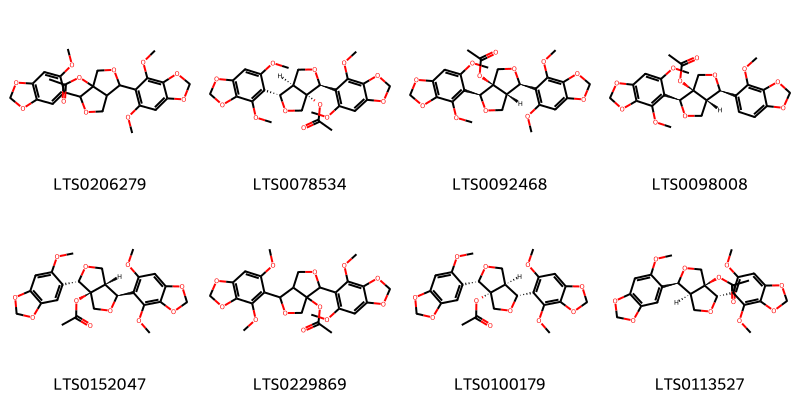{ width=100% }
    <figcaption>Hình ảnh cấu trúc hóa học của 8 hoạt chất thuộc nhóm Furanoid lignans gồm ['1-(4,6-dimethoxy-2h-1,3-benzodioxol-5-yl)-4-(6-methoxy-2h-1,3-benzodioxol-5-yl)-tetrahydro-1h-furo[3,4-c]furan-3a-yl acetate (LTS0206279)', '(1s,3as,4s,6ar)-1,4-bis(4,6-dimethoxy-2h-1,3-benzodioxol-5-yl)-tetrahydro-1h-furo[3,4-c]furan-3a-yl acetate (LTS0078534)', '(1r,3ar,4s,6as)-1,4-bis(4,6-dimethoxy-2h-1,3-benzodioxol-5-yl)-tetrahydro-1h-furo[3,4-c]furan-3a-yl acetate (LTS0092468)', '(1r,3ar,4s,6as)-4-(4,6-dimethoxy-2h-1,3-benzodioxol-5-yl)-1-(4-methoxy-2h-1,3-benzodioxol-5-yl)-tetrahydro-1h-furo[3,4-c]furan-3a-yl acetate (LTS0098008)', '(1s,3as,4s,6ar)-1-(4,6-dimethoxy-2h-1,3-benzodioxol-5-yl)-4-(6-methoxy-2h-1,3-benzodioxol-5-yl)-tetrahydro-1h-furo[3,4-c]furan-3a-yl acetate (LTS0152047)', '1,4-bis(4,6-dimethoxy-2h-1,3-benzodioxol-5-yl)-tetrahydro-1h-furo[3,4-c]furan-3a-yl acetate (LTS0229869)', '(1r,3ar,4s,6as)-1-(4,6-dimethoxy-2h-1,3-benzodioxol-5-yl)-4-(6-methoxy-2h-1,3-benzodioxol-5-yl)-tetrahydro-1h-furo[3,4-c]furan-3a-yl acetate (LTS0100179)', '(1s,3as,4s,6as)-4-(4,6-dimethoxy-2h-1,3-benzodioxol-5-yl)-1-(6-methoxy-2h-1,3-benzodioxol-5-yl)-tetrahydro-1h-furo[3,4-c]furan-3a-yl acetate (LTS0113527)'].</figcaption>
</figure>
#### Nhóm Prenol lipids
<figure markdown="span">
    { width=100% }
    <figcaption>Hình ảnh cấu trúc hóa học của 1 hoạt chất thuộc nhóm Prenol lipids gồm ['ursolic acid (LTS0250838)'].</figcaption>
</figure>

---

### Dược dân tộc học

Danh sách các quốc gia có sử dụng *Phryma leptostachya* trong điều trị các bệnh. 

| Country   | Disease                                         | Bệnh                                                                                                                                                                                                |
|:----------|:------------------------------------------------|:----------------------------------------------------------------------------------------------------------------------------------------------------------------------------------------------------|
| China     | Insecticide, Larvicide, Refrigerant, Alexiteric | MYMEMORY WARNING: YOU USED ALL AVAILABLE FREE TRANSLATIONS FOR TODAY. NEXT AVAILABLE IN  16 HOURS 55 MINUTES 07 SECONDS VISIT HTTPS://MYMEMORY.TRANSLATED.NET/DOC/USAGELIMITS.PHP TO TRANSLATE MORE |
| Elsewhere | Vermicide                                       | MYMEMORY WARNING: YOU USED ALL AVAILABLE FREE TRANSLATIONS FOR TODAY. NEXT AVAILABLE IN  16 HOURS 55 MINUTES 04 SECONDS VISIT HTTPS://MYMEMORY.TRANSLATED.NET/DOC/USAGELIMITS.PHP TO TRANSLATE MORE |

---

# Chi Duranta

??? note "Danh sách các dược liệu thuộc chi"
    
	 - *Duranta repens*

---
## Duranta repens
### Thông tin về thực vật

!!! info "Phân loại thực vật của *Duranta erecta* từ GIBF:"
    - **Kingdom:** Plantae
    - **Phylum:** Tracheophyta
    - **Order:** Lamiales
    - **Family:** Verbenaceae
    - **Genus:** Duranta
    - **Species:** *Duranta erecta*

 

| Label (VI)   | Label (EN)   | Scientific Name   | Descriptions (VI)   | Descriptions (EN)   | Also Known As (VI)   | Also Known As (EN)   |
|:-------------|:-------------|:------------------|:--------------------|:--------------------|:---------------------|:---------------------|
| N/A          | N/A          | Duranta repens    | loài thực vật       | species of plant    | ['']                 | ['Golden Dewdrops']  |

#### Phân bố trên thế giới

**Từ CSDL GIBF** nan, Viet Nam, Colombia, Japan, Portugal, Brazil, Nicaragua, South Africa, Spain, New Zealand, India, Nigeria, Ecuador, Mexico, China, Bahamas, United States of America, Chinese Taipei

#### Phân bố tại Việt Nam

**Từ CSDL GIBF**: Ninh Binh

---
### Thành phần hóa học
        
- Theo cơ sở dữ liệu lotus: Từ loài *Duranta erecta* đã phân lập và xác định được Chưa có hoạt chất nào được phân lập. hoạt chất thuộc về các nhóm Không có hoạt chất nào được phân lập. 

Không có hình ảnh nào được tạo ra

---

### Dược dân tộc học

Danh sách các quốc gia có sử dụng *Duranta erecta* trong điều trị các bệnh. 

| Country   | Disease     | Bệnh                                                                                                                                                                                                |
|:----------|:------------|:----------------------------------------------------------------------------------------------------------------------------------------------------------------------------------------------------|
| Elsewhere | Insecticide | MYMEMORY WARNING: YOU USED ALL AVAILABLE FREE TRANSLATIONS FOR TODAY. NEXT AVAILABLE IN  16 HOURS 54 MINUTES 36 SECONDS VISIT HTTPS://MYMEMORY.TRANSLATED.NET/DOC/USAGELIMITS.PHP TO TRANSLATE MORE |
| India     | Larvicide   | MYMEMORY WARNING: YOU USED ALL AVAILABLE FREE TRANSLATIONS FOR TODAY. NEXT AVAILABLE IN  16 HOURS 54 MINUTES 33 SECONDS VISIT HTTPS://MYMEMORY.TRANSLATED.NET/DOC/USAGELIMITS.PHP TO TRANSLATE MORE |
| Mexico    | Stimulant   | MYMEMORY WARNING: YOU USED ALL AVAILABLE FREE TRANSLATIONS FOR TODAY. NEXT AVAILABLE IN  16 HOURS 54 MINUTES 31 SECONDS VISIT HTTPS://MYMEMORY.TRANSLATED.NET/DOC/USAGELIMITS.PHP TO TRANSLATE MORE |
| Venezuela | Stimulant   | MYMEMORY WARNING: YOU USED ALL AVAILABLE FREE TRANSLATIONS FOR TODAY. NEXT AVAILABLE IN  16 HOURS 54 MINUTES 28 SECONDS VISIT HTTPS://MYMEMORY.TRANSLATED.NET/DOC/USAGELIMITS.PHP TO TRANSLATE MORE |

---

# Chi Phyla

??? note "Danh sách các dược liệu thuộc chi"
    
	 - *Phyla nodiflora*
	 - *Phyla scaberrima*
	 - *Phyla stoechadifolia*

---
## Phyla nodiflora
### Thông tin về thực vật

!!! info "Phân loại thực vật của *Phyla nodiflora* từ GIBF:"
    - **Kingdom:** Plantae
    - **Phylum:** Tracheophyta
    - **Order:** Lamiales
    - **Family:** Verbenaceae
    - **Genus:** Phyla
    - **Species:** *Phyla nodiflora*

 

| Label (VI)   | Label (EN)   | Scientific Name   | Descriptions (VI)   | Descriptions (EN)   | Also Known As (VI)   | Also Known As (EN)                                                                                                             |
|:-------------|:-------------|:------------------|:--------------------|:--------------------|:---------------------|:-------------------------------------------------------------------------------------------------------------------------------|
| N/A          | N/A          | Phyla nodiflora   | loài thực vật       | species of plant    | ['']                 | ['creeping lip plant', 'frog fruit', 'sawtooth fogfruit', 'turkey tangle', 'turkey tangle fogfruit', 'turkey-tangle fogfruit'] |

#### Phân bố trên thế giới

**Từ CSDL GIBF** Spain, Chile, Australia, Colombia, Dominican Republic, Maldives, Malaysia, India, Seychelles, Cuba, Brazil, Yemen, Peru, Eswatini, Mexico, Chinese Taipei, Uruguay, Argentina, South Africa, Ecuador, United States of America, Israel

#### Phân bố tại Việt Nam

**Từ CSDL GIBF**: Không có ghi nhận ở Việt Nam

---
### Thành phần hóa học
        
- Theo cơ sở dữ liệu lotus: Từ loài *Phyla nodiflora* đã phân lập và xác định được 70 hoạt chất thuộc về các nhóm Organooxygen compounds, Flavonoids, Benzofurans, Unsaturated hydrocarbons, Coumarans, Prenol lipids, Fatty Acyls, Phenols, Cinnamic acids and derivatives, Steroids and steroid derivatives, Benzene and substituted derivatives. 

|    | chemicalTaxonomyClassyfireClass     |   smiles_count |
|---:|:------------------------------------|---------------:|
|  0 | Benzene and substituted derivatives |              6 |
|  1 | Benzofurans                         |              1 |
|  2 | Cinnamic acids and derivatives      |              5 |
|  3 | Coumarans                           |              1 |
|  4 | Fatty Acyls                         |              2 |
|  5 | Flavonoids                          |             19 |
|  6 | Organooxygen compounds              |              5 |
|  7 | Phenols                             |              2 |
|  8 | Prenol lipids                       |             22 |
|  9 | Steroids and steroid derivatives    |              6 |
| 10 | Unsaturated hydrocarbons            |              1 |

#### Nhóm Benzene and substituted derivatives
<figure markdown="span">
    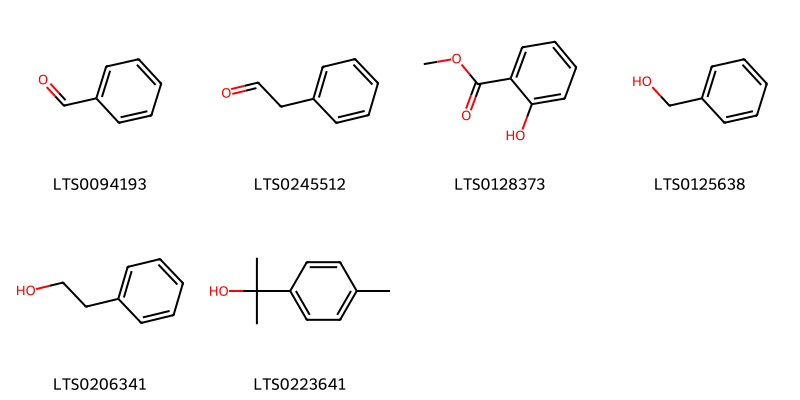{ width=100% }
    <figcaption>Hình ảnh cấu trúc hóa học của 6 hoạt chất thuộc nhóm Benzene and substituted derivatives gồm ['benzaldehyde (LTS0094193)', 'phenylacetaldehyde (LTS0245512)', 'methyl salicylate (LTS0128373)', 'benzyl alcohol (LTS0125638)', '2-phenyl-ethanol (LTS0206341)', 'p-cymen-8-ol (LTS0223641)'].</figcaption>
</figure>
#### Nhóm Benzofurans
<figure markdown="span">
    { width=100% }
    <figcaption>Hình ảnh cấu trúc hóa học của 1 hoạt chất thuộc nhóm Benzofurans gồm ['3a-hydroxy-2,3,7,7a-tetrahydro-1-benzofuran-6-one (LTS0161953)'].</figcaption>
</figure>
#### Nhóm Cinnamic acids and derivatives
<figure markdown="span">
    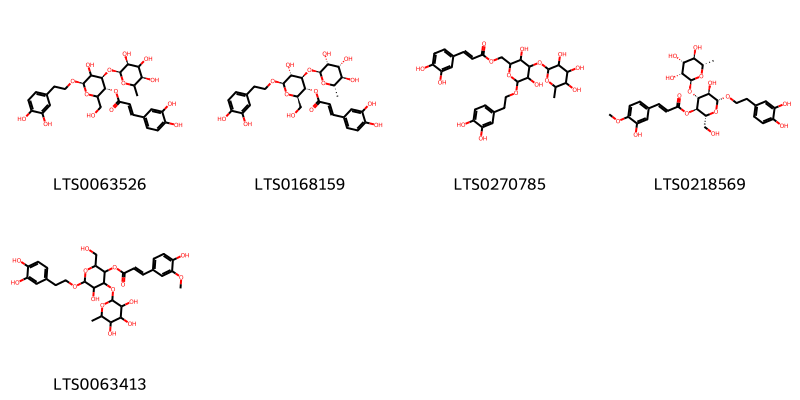{ width=100% }
    <figcaption>Hình ảnh cấu trúc hóa học của 5 hoạt chất thuộc nhóm Cinnamic acids and derivatives gồm ['(3r,4r,6r)-6-[2-(3,4-dihydroxyphenyl)ethoxy]-5-hydroxy-2-(hydroxymethyl)-4-{[(2s,3s,5r)-3,4,5-trihydroxy-6-methyloxan-2-yl]oxy}oxan-3-yl (2e)-3-(3,4-dihydroxyphenyl)prop-2-enoate (LTS0063526)', 'verbascoside (LTS0168159)', '{6-[2-(3,4-dihydroxyphenyl)ethoxy]-3,5-dihydroxy-4-[(3,4,5-trihydroxy-6-methyloxan-2-yl)oxy]oxan-2-yl}methyl 3-(3,4-dihydroxyphenyl)prop-2-enoate (LTS0270785)', '(2r,3r,4r,5r,6r)-6-[2-(3,4-dihydroxyphenyl)ethoxy]-5-hydroxy-2-(hydroxymethyl)-4-{[(2s,3r,4r,5r,6s)-3,4,5-trihydroxy-6-methyloxan-2-yl]oxy}oxan-3-yl (2e)-3-(3-hydroxy-4-methoxyphenyl)prop-2-enoate (LTS0218569)', '6-[2-(3,4-dihydroxyphenyl)ethoxy]-5-hydroxy-2-(hydroxymethyl)-4-[(3,4,5-trihydroxy-6-methyloxan-2-yl)oxy]oxan-3-yl 3-(4-hydroxy-3-methoxyphenyl)prop-2-enoate (LTS0063413)'].</figcaption>
</figure>
#### Nhóm Coumarans
<figure markdown="span">
    { width=100% }
    <figcaption>Hình ảnh cấu trúc hóa học của 1 hoạt chất thuộc nhóm Coumarans gồm ['coumaran (LTS0098724)'].</figcaption>
</figure>
#### Nhóm Fatty Acyls
<figure markdown="span">
    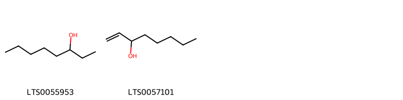{ width=100% }
    <figcaption>Hình ảnh cấu trúc hóa học của 2 hoạt chất thuộc nhóm Fatty Acyls gồm ['3-octanol (LTS0055953)', '1-octen-3-ol (LTS0057101)'].</figcaption>
</figure>
#### Nhóm Flavonoids
<figure markdown="span">
    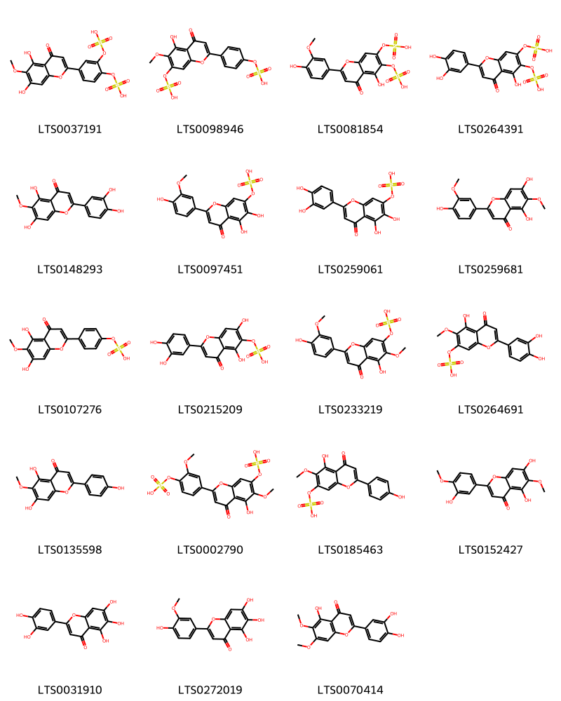{ width=100% }
    <figcaption>Hình ảnh cấu trúc hóa học của 19 hoạt chất thuộc nhóm Flavonoids gồm ['[4-(5,7-dihydroxy-6-methoxy-4-oxochromen-2-yl)-2-(sulfooxy)phenyl]oxidanesulfonic acid (LTS0037191)', "hispidulin 7,4'-disulfate (LTS0098946)", '[5-hydroxy-2-(4-hydroxy-3-methoxyphenyl)-4-oxo-7-(sulfooxy)chromen-6-yl]oxidanesulfonic acid (LTS0081854)', '[2-(3,4-dihydroxyphenyl)-5-hydroxy-4-oxo-6-(sulfooxy)chromen-7-yl]oxidanesulfonic acid (LTS0264391)', 'nepetin (LTS0148293)', '[5,6-dihydroxy-2-(4-hydroxy-3-methoxyphenyl)-4-oxochromen-7-yl]oxidanesulfonic acid (LTS0097451)', '6-hydroxyluteolin 7-sulfate (LTS0259061)', 'jaceosidin (LTS0259681)', "hispidulin 4'-sulfate (LTS0107276)", '6-hydroxyluteolin 6-sulfate (LTS0215209)', '[5-hydroxy-2-(4-hydroxy-3-methoxyphenyl)-6-methoxy-4-oxochromen-7-yl]oxidanesulfonic acid (LTS0233219)', '6-methoxyluteolin 7-sulfate (LTS0264691)', 'hispidulin (LTS0135598)', '{4-[5-hydroxy-6-methoxy-4-oxo-7-(sulfooxy)chromen-2-yl]-2-methoxyphenyl}oxidanesulfonic acid (LTS0002790)', 'hispidulin 7-sulfate (LTS0185463)', 'desmethoxycentaureidin (LTS0152427)', '6-hydroxyluteolin (LTS0031910)', 'nodifloretin (LTS0272019)', 'cirsiliol (LTS0070414)'].</figcaption>
</figure>
#### Nhóm Organooxygen compounds
<figure markdown="span">
    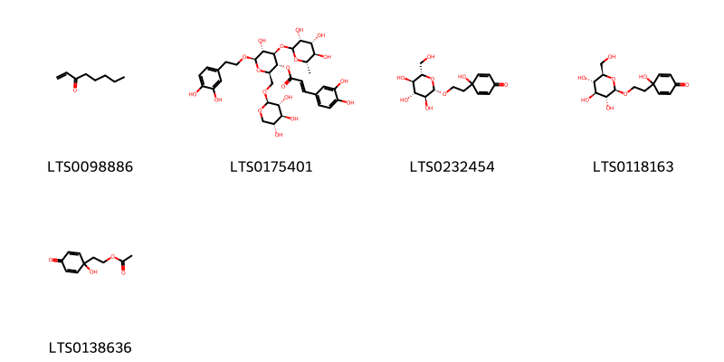{ width=100% }
    <figcaption>Hình ảnh cấu trúc hóa học của 5 hoạt chất thuộc nhóm Organooxygen compounds gồm ['1-octen-3-one (LTS0098886)', '(2r,3r,4r,5r,6r)-6-[2-(3,4-dihydroxyphenyl)ethoxy]-5-hydroxy-4-{[(3r,4r,5r,6s)-3,4,5-trihydroxy-6-methyloxan-2-yl]oxy}-2-({[(2s,3r,4s,5r)-3,4,5-trihydroxyoxan-2-yl]oxy}methyl)oxan-3-yl (2e)-3-(3,4-dihydroxyphenyl)prop-2-enoate (LTS0175401)', '4-hydroxy-4-(2-{[(2s,3s,4r,5r,6s)-3,4,5-trihydroxy-6-(hydroxymethyl)oxan-2-yl]oxy}ethyl)cyclohexa-2,5-dien-1-one (LTS0232454)', '4-hydroxy-4-(2-{[(2r,3r,4s,5s,6r)-3,4,5-trihydroxy-6-(hydroxymethyl)oxan-2-yl]oxy}ethyl)cyclohexa-2,5-dien-1-one (LTS0118163)', '2-(1-hydroxy-4-oxocyclohexa-2,5-dien-1-yl)ethyl acetate (LTS0138636)'].</figcaption>
</figure>
#### Nhóm Phenols
<figure markdown="span">
    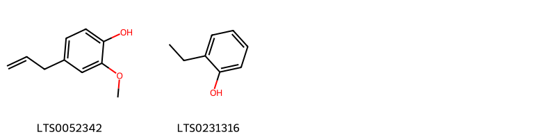{ width=100% }
    <figcaption>Hình ảnh cấu trúc hóa học của 2 hoạt chất thuộc nhóm Phenols gồm ['eugenol (LTS0052342)', '2-ethylphenol (LTS0231316)'].</figcaption>
</figure>
#### Nhóm Prenol lipids
<figure markdown="span">
    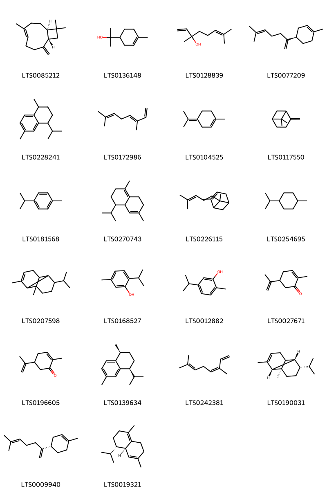{ width=100% }
    <figcaption>Hình ảnh cấu trúc hóa học của 22 hoạt chất thuộc nhóm Prenol lipids gồm ['caryophyllene (LTS0085212)', 'terpineol (LTS0136148)', 'linalool, (+-)- (LTS0128839)', '(r)-β-bisabolene (LTS0077209)', '(e)-calamene (LTS0228241)', '3,7-dimethyl-1,3,6-octatriene (LTS0172986)', 'terpinolene (LTS0104525)', 'β-pinene (LTS0117550)', 'cymene (LTS0181568)', '4-isopropyl-1,6-dimethyl-2,3,4,4a,7,8-hexahydronaphthalene (LTS0270743)', 'α-bergamotene (LTS0226115)', 'p-menthane (LTS0254695)', 'α-copaene (LTS0207598)', 'thymol (LTS0168527)', 'carvacrol (LTS0012882)', 'carvone, (+)- (LTS0027671)', 'carvone (LTS0196605)', '(1s,4s)-4-isopropyl-1,6-dimethyl-1,2,3,4-tetrahydronaphthalene (LTS0139634)', 'β-ocimene (LTS0242381)', '(1r,2s,7s,8s)-8-isopropyl-1,3-dimethyltricyclo[4.4.0.0²,⁷]dec-3-ene (LTS0190031)', '(-)-β-bisabolene (LTS0009940)', 'delta-cadinene (LTS0019321)'].</figcaption>
</figure>
#### Nhóm Steroids and steroid derivatives
<figure markdown="span">
    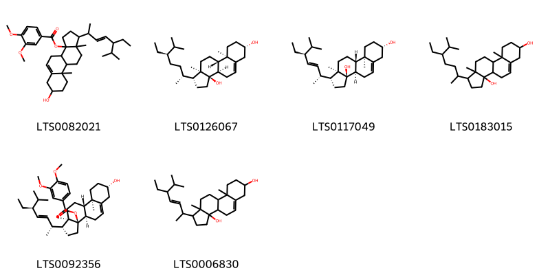{ width=100% }
    <figcaption>Hình ảnh cấu trúc hóa học của 6 hoạt chất thuộc nhóm Steroids and steroid derivatives gồm ['1-(5-ethyl-6-methylhept-3-en-2-yl)-7-hydroxy-9a,11a-dimethyl-1h,2h,3h,3bh,4h,6h,7h,8h,9h,9bh,10h,11h-cyclopenta[a]phenanthren-3a-yl 3,4-dimethoxybenzoate (LTS0082021)', '(1r,3ar,3br,7s,9ar,9bs,11ar)-1-[(2r,5r)-5-ethyl-6-methylheptan-2-yl]-9a,11a-dimethyl-1h,2h,3h,3bh,4h,6h,7h,8h,9h,9bh,10h,11h-cyclopenta[a]phenanthrene-3a,7-diol (LTS0126067)', '(1r,3ar,3br,7s,9ar,9bs,11ar)-1-[(2r,3e,5s)-5-ethyl-6-methylhept-3-en-2-yl]-9a,11a-dimethyl-1h,2h,3h,3bh,4h,6h,7h,8h,9h,9bh,10h,11h-cyclopenta[a]phenanthrene-3a,7-diol (LTS0117049)', '1-(5-ethyl-6-methylheptan-2-yl)-9a,11a-dimethyl-1h,2h,3h,3bh,4h,6h,7h,8h,9h,9bh,10h,11h-cyclopenta[a]phenanthrene-3a,7-diol (LTS0183015)', '(1r,3ar,3br,7s,9ar,9bs,11ar)-1-[(2r,3e,5s)-5-ethyl-6-methylhept-3-en-2-yl]-7-hydroxy-9a,11a-dimethyl-1h,2h,3h,3bh,4h,6h,7h,8h,9h,9bh,10h,11h-cyclopenta[a]phenanthren-3a-yl 3,4-dimethoxybenzoate (LTS0092356)', '1-(5-ethyl-6-methylhept-3-en-2-yl)-9a,11a-dimethyl-1h,2h,3h,3bh,4h,6h,7h,8h,9h,9bh,10h,11h-cyclopenta[a]phenanthrene-3a,7-diol (LTS0006830)'].</figcaption>
</figure>
#### Nhóm Unsaturated hydrocarbons
<figure markdown="span">
    { width=100% }
    <figcaption>Hình ảnh cấu trúc hóa học của 1 hoạt chất thuộc nhóm Unsaturated hydrocarbons gồm ['α terpinene (LTS0232891)'].</figcaption>
</figure>

---

### Dược dân tộc học

Danh sách các quốc gia có sử dụng *Phyla nodiflora* trong điều trị các bệnh. 

| Country   | Disease                                       | Bệnh                                                                                                                                                                                                |
|:----------|:----------------------------------------------|:----------------------------------------------------------------------------------------------------------------------------------------------------------------------------------------------------|
| Haiti     | Carminative                                   | MYMEMORY WARNING: YOU USED ALL AVAILABLE FREE TRANSLATIONS FOR TODAY. NEXT AVAILABLE IN  16 HOURS 54 MINUTES 09 SECONDS VISIT HTTPS://MYMEMORY.TRANSLATED.NET/DOC/USAGELIMITS.PHP TO TRANSLATE MORE |
| India     | Demulcent, Diuretic, Refrigerant, Suppurative | MYMEMORY WARNING: YOU USED ALL AVAILABLE FREE TRANSLATIONS FOR TODAY. NEXT AVAILABLE IN  16 HOURS 54 MINUTES 06 SECONDS VISIT HTTPS://MYMEMORY.TRANSLATED.NET/DOC/USAGELIMITS.PHP TO TRANSLATE MORE |

---

---
## Phyla scaberrima
### Thông tin về thực vật

!!! info "Phân loại thực vật của *Lippia dulcis* từ GIBF:"
    - **Kingdom:** Plantae
    - **Phylum:** Tracheophyta
    - **Order:** Lamiales
    - **Family:** Verbenaceae
    - **Genus:** Lippia
    - **Species:** *Lippia dulcis*

 

| Label (VI)   | Label (EN)   | Scientific Name   | Descriptions (VI)   | Descriptions (EN)   | Also Known As (VI)   | Also Known As (EN)   |
|:-------------|:-------------|:------------------|:--------------------|:--------------------|:---------------------|:---------------------|
| N/A          | N/A          | Phyla scaberrima  | loài thực vật       | species of plant    | ['']                 | ['']                 |

#### Phân bố trên thế giới

**Từ CSDL GIBF** Honduras, nan, Colombia, Argentina, Dominican Republic, Brazil, Puerto Rico, Costa Rica, Chile, Cuba, Mexico, United States of America, Belgium, Guatemala

#### Phân bố tại Việt Nam

**Từ CSDL GIBF**: Không có ghi nhận ở Việt Nam

---
### Thành phần hóa học
        
- Theo cơ sở dữ liệu lotus: Từ loài *Lippia dulcis* đã phân lập và xác định được Chưa có hoạt chất nào được phân lập. hoạt chất thuộc về các nhóm Không có hoạt chất nào được phân lập. 

Không có hình ảnh nào được tạo ra

---

### Dược dân tộc học

Danh sách các quốc gia có sử dụng *Lippia dulcis* trong điều trị các bệnh. 

| Country            | Disease   | Bệnh                                                                                                                                                                                                |
|:-------------------|:----------|:----------------------------------------------------------------------------------------------------------------------------------------------------------------------------------------------------|
| Dominican Republic | Tonic     | MYMEMORY WARNING: YOU USED ALL AVAILABLE FREE TRANSLATIONS FOR TODAY. NEXT AVAILABLE IN  16 HOURS 53 MINUTES 07 SECONDS VISIT HTTPS://MYMEMORY.TRANSLATED.NET/DOC/USAGELIMITS.PHP TO TRANSLATE MORE |

---

---
## Phyla stoechadifolia
### Thông tin về thực vật

!!! info "Phân loại thực vật của *Lippia stoechadifolia* từ GIBF:"
    - **Kingdom:** Plantae
    - **Phylum:** Tracheophyta
    - **Order:** Lamiales
    - **Family:** Verbenaceae
    - **Genus:** Lippia
    - **Species:** *Lippia stoechadifolia*

 

| Label (VI)   | Label (EN)   | Scientific Name      | Descriptions (VI)   | Descriptions (EN)   | Also Known As (VI)   | Also Known As (EN)   |
|:-------------|:-------------|:---------------------|:--------------------|:--------------------|:---------------------|:---------------------|
| N/A          | N/A          | Phyla stoechadifolia | loài thực vật       | species of plant    | ['']                 | ['']                 |

#### Phân bố trên thế giới

**Từ CSDL GIBF** Haiti, Honduras, Turks and Caicos Islands, Venezuela (Bolivarian Republic of), Dominican Republic, Nicaragua, Belize, unknown or invalid, Guadeloupe, Puerto Rico, United States of America, Mexico, Bahamas, Cuba, Jamaica, Guatemala

#### Phân bố tại Việt Nam

**Từ CSDL GIBF**: Không có ghi nhận ở Việt Nam

---
### Thành phần hóa học
        
- Theo cơ sở dữ liệu lotus: Từ loài *Lippia stoechadifolia* đã phân lập và xác định được Chưa có hoạt chất nào được phân lập. hoạt chất thuộc về các nhóm Không có hoạt chất nào được phân lập. 

Không có hình ảnh nào được tạo ra

---

### Dược dân tộc học

Danh sách các quốc gia có sử dụng *Lippia stoechadifolia* trong điều trị các bệnh. 

| Country            | Disease    | Bệnh                                                                                                                                                                                                |
|:-------------------|:-----------|:----------------------------------------------------------------------------------------------------------------------------------------------------------------------------------------------------|
| Dominican Republic | Antiseptic | MYMEMORY WARNING: YOU USED ALL AVAILABLE FREE TRANSLATIONS FOR TODAY. NEXT AVAILABLE IN  16 HOURS 52 MINUTES 47 SECONDS VISIT HTTPS://MYMEMORY.TRANSLATED.NET/DOC/USAGELIMITS.PHP TO TRANSLATE MORE |

---

# Chi Lantana

??? note "Danh sách các dược liệu thuộc chi"
    
	 - *Lantana aculeata*
	 - *Lantana camara*
	 - *Lantana involucrata*
	 - *Lantana microphylla*
	 - *Lantana trifolia*

---
## Lantana aculeata
### Thông tin về thực vật

!!! info "Phân loại thực vật của *Lantana camara* từ GIBF:"
    - **Kingdom:** Plantae
    - **Phylum:** Tracheophyta
    - **Order:** Lamiales
    - **Family:** Verbenaceae
    - **Genus:** Lantana
    - **Species:** *Lantana camara*

 

| Label (VI)   | Label (EN)   | Scientific Name   | Descriptions (VI)   | Descriptions (EN)   | Also Known As (VI)   | Also Known As (EN)   |
|:-------------|:-------------|:------------------|:--------------------|:--------------------|:---------------------|:---------------------|
| N/A          | N/A          | Lantana aculeata  | loài thực vật       | species of plant    | ['']                 | ['']                 |

#### Phân bố trên thế giới

**Từ CSDL GIBF** nan, Cayman Islands, unknown or invalid, Spain, Guadeloupe, Afghanistan, Cameroon, Germany, Martinique, Australia, Jamaica, Haiti, Colombia, Sri Lanka, Dominican Republic, Malaysia, Puerto Rico, Mauritius, India, Liberia, Cuba, Bahamas, Anguilla, Bonaire, Sint Eustatius and Saba, Virgin Islands (U.S.), Barbados, Myanmar, Montserrat, Brunei Darussalam, Portugal, Bermuda, France, Ecuador, Madagascar

#### Phân bố tại Việt Nam

**Từ CSDL GIBF**: Không có ghi nhận ở Việt Nam

---
### Thành phần hóa học
        
- Theo cơ sở dữ liệu lotus: Từ loài *Lantana camara* đã phân lập và xác định được Chưa có hoạt chất nào được phân lập. hoạt chất thuộc về các nhóm Không có hoạt chất nào được phân lập. 

Không có hình ảnh nào được tạo ra

---

### Dược dân tộc học

Danh sách các quốc gia có sử dụng *Lantana camara* trong điều trị các bệnh. 

| Country   | Disease            | Bệnh                                                                                                                                                                                                |
|:----------|:-------------------|:----------------------------------------------------------------------------------------------------------------------------------------------------------------------------------------------------|
| Malaya    | Antiseptic, Emetic | MYMEMORY WARNING: YOU USED ALL AVAILABLE FREE TRANSLATIONS FOR TODAY. NEXT AVAILABLE IN  16 HOURS 52 MINUTES 27 SECONDS VISIT HTTPS://MYMEMORY.TRANSLATED.NET/DOC/USAGELIMITS.PHP TO TRANSLATE MORE |

---

---
## Lantana camara
### Thông tin về thực vật

!!! info "Phân loại thực vật của *Lantana camara* từ GIBF:"
    - **Kingdom:** Plantae
    - **Phylum:** Tracheophyta
    - **Order:** Lamiales
    - **Family:** Verbenaceae
    - **Genus:** Lantana
    - **Species:** *Lantana camara*

 

| Label (VI)   | Label (EN)   | Scientific Name   | Descriptions (VI)   | Descriptions (EN)   | Also Known As (VI)   | Also Known As (EN)                                                                                                                                              |
|:-------------|:-------------|:------------------|:--------------------|:--------------------|:---------------------|:----------------------------------------------------------------------------------------------------------------------------------------------------------------|
| N/A          | N/A          | Lantana camara    | loài thực vật       | species of plant    | ['Lantana camara']   | ['Cherry Pie', 'Lantana', 'Spanish flag', 'West Indian Lantana', "Bird's Brandy", 'Cherrypie', 'common lantana', 'curse of India', 'Tick-berry', 'Yellow Sage'] |

#### Phân bố trên thế giới

**Từ CSDL GIBF** Thailand, Spain, Philippines, Kenya, Australia, Indonesia, Colombia, Sri Lanka, Bhutan, Malaysia, India, Türkiye, Uganda, Belize, Japan, Panama, Brazil, Eswatini, Mexico, China, Nepal, Benin, Chinese Taipei, Hong Kong, Argentina, South Africa, Portugal, Tanzania, United Republic of, New Zealand, Macao, Costa Rica, New Caledonia, Ecuador, United States of America, Zimbabwe, Zambia, Greece, Cabo Verde

#### Phân bố tại Việt Nam

**Từ CSDL GIBF**: Không có ghi nhận ở Việt Nam

---
### Thành phần hóa học
        
- Theo cơ sở dữ liệu lotus: Từ loài *Lantana camara* đã phân lập và xác định được 291 hoạt chất thuộc về các nhóm Organooxygen compounds, Furanoid lignans, Flavonoids, Saturated hydrocarbons, Oxolanes, Unsaturated hydrocarbons, Naphthofurans, Prenol lipids, Carboxylic acids and derivatives, Fatty Acyls, Phenols, Cinnamic acids and derivatives, Phenol ethers, Benzodioxoles, Steroids and steroid derivatives, Benzene and substituted derivatives, Organic oxides. 

|    | chemicalTaxonomyClassyfireClass     |   smiles_count |
|---:|:------------------------------------|---------------:|
|  0 | Benzene and substituted derivatives |              1 |
|  1 | Benzodioxoles                       |              4 |
|  2 | Carboxylic acids and derivatives    |              3 |
|  3 | Cinnamic acids and derivatives      |              8 |
|  4 | Fatty Acyls                         |             15 |
|  5 | Flavonoids                          |             11 |
|  6 | Furanoid lignans                    |              1 |
|  7 | Naphthofurans                       |              8 |
|  8 | Organic oxides                      |              1 |
|  9 | Organooxygen compounds              |              8 |
| 10 | Oxolanes                            |              1 |
| 11 | Phenol ethers                       |              1 |
| 12 | Phenols                             |              1 |
| 13 | Prenol lipids                       |            204 |
| 14 | Saturated hydrocarbons              |             10 |
| 15 | Steroids and steroid derivatives    |             11 |
| 16 | Unsaturated hydrocarbons            |              1 |

#### Nhóm Benzene and substituted derivatives
<figure markdown="span">
    { width=100% }
    <figcaption>Hình ảnh cấu trúc hóa học của 1 hoạt chất thuộc nhóm Benzene and substituted derivatives gồm ['methyl eugenol (LTS0098881)'].</figcaption>
</figure>
#### Nhóm Benzodioxoles
<figure markdown="span">
    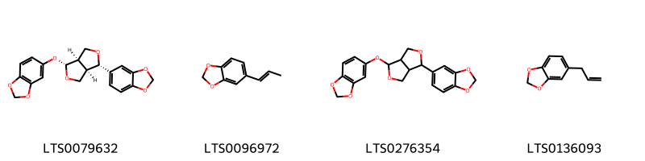{ width=100% }
    <figcaption>Hình ảnh cấu trúc hóa học của 4 hoạt chất thuộc nhóm Benzodioxoles gồm ['sesamolin (LTS0079632)', 'isosafrole (LTS0096972)', 'sesamolin (LTS0276354)', 'sassafras (LTS0136093)'].</figcaption>
</figure>
#### Nhóm Carboxylic acids and derivatives
<figure markdown="span">
    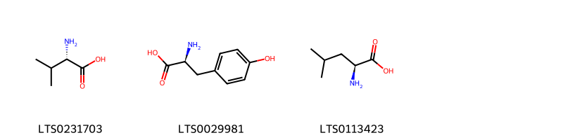{ width=100% }
    <figcaption>Hình ảnh cấu trúc hóa học của 3 hoạt chất thuộc nhóm Carboxylic acids and derivatives gồm ['l-valine (LTS0231703)', 'l-tyrosine (LTS0029981)', 'l-leucine (LTS0113423)'].</figcaption>
</figure>
#### Nhóm Cinnamic acids and derivatives
<figure markdown="span">
    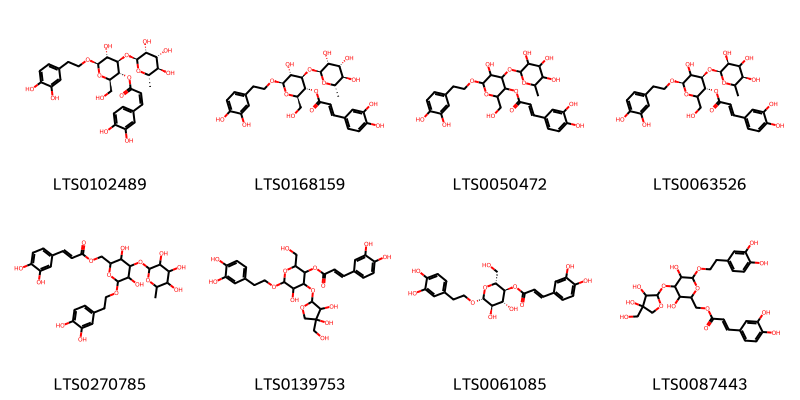{ width=100% }
    <figcaption>Hình ảnh cấu trúc hóa học của 8 hoạt chất thuộc nhóm Cinnamic acids and derivatives gồm ['(2r,3r,4r,5r,6r)-6-[2-(3,4-dihydroxyphenyl)ethoxy]-5-hydroxy-2-(hydroxymethyl)-4-{[(2s,3r,4r,5r,6s)-3,4,5-trihydroxy-6-methyloxan-2-yl]oxy}oxan-3-yl (2z)-3-(3,4-dihydroxyphenyl)prop-2-enoate (LTS0102489)', 'verbascoside (LTS0168159)', '6-[2-(3,4-dihydroxyphenyl)ethoxy]-5-hydroxy-2-(hydroxymethyl)-4-[(3,4,5-trihydroxy-6-methyloxan-2-yl)oxy]oxan-3-yl 3-(3,4-dihydroxyphenyl)prop-2-enoate (LTS0050472)', '(3r,4r,6r)-6-[2-(3,4-dihydroxyphenyl)ethoxy]-5-hydroxy-2-(hydroxymethyl)-4-{[(2s,3s,5r)-3,4,5-trihydroxy-6-methyloxan-2-yl]oxy}oxan-3-yl (2e)-3-(3,4-dihydroxyphenyl)prop-2-enoate (LTS0063526)', '{6-[2-(3,4-dihydroxyphenyl)ethoxy]-3,5-dihydroxy-4-[(3,4,5-trihydroxy-6-methyloxan-2-yl)oxy]oxan-2-yl}methyl 3-(3,4-dihydroxyphenyl)prop-2-enoate (LTS0270785)', '4-{[3,4-dihydroxy-4-(hydroxymethyl)oxolan-2-yl]oxy}-6-[2-(3,4-dihydroxyphenyl)ethoxy]-5-hydroxy-2-(hydroxymethyl)oxan-3-yl 3-(3,4-dihydroxyphenyl)prop-2-enoate (LTS0139753)', '(2r,3s,4r,5r,6r)-6-[2-(3,4-dihydroxyphenyl)ethoxy]-4,5-dihydroxy-2-(hydroxymethyl)oxan-3-yl (2e)-3-(3,4-dihydroxyphenyl)prop-2-enoate (LTS0061085)', '(4-{[3,4-dihydroxy-4-(hydroxymethyl)oxolan-2-yl]oxy}-6-[2-(3,4-dihydroxyphenyl)ethoxy]-3,5-dihydroxyoxan-2-yl)methyl 3-(3,4-dihydroxyphenyl)prop-2-enoate (LTS0087443)'].</figcaption>
</figure>
#### Nhóm Fatty Acyls
<figure markdown="span">
    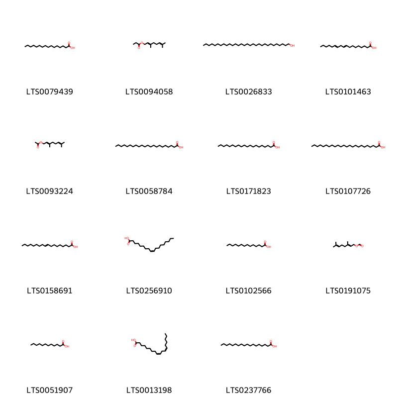{ width=100% }
    <figcaption>Hình ảnh cấu trúc hóa học của 15 hoạt chất thuộc nhóm Fatty Acyls gồm ['palmitic acid (LTS0079439)', 'geranyl propionate (LTS0094058)', 'triacontanol (LTS0026833)', '9,12-octadecadienoic acid (LTS0101463)', 'geranyl acetate (LTS0093224)', 'behenic acid (LTS0058784)', 'arachidic acid (LTS0171823)', 'lignoceric acid (LTS0107726)', '9 octadecenoic acid (LTS0158691)', 'oleic acid (LTS0256910)', 'myristic acid (LTS0102566)', 'geranyl formate (LTS0191075)', 'lauric acid (LTS0051907)', 'linoleic (LTS0013198)', 'stearic acid (LTS0237766)'].</figcaption>
</figure>
#### Nhóm Flavonoids
<figure markdown="span">
    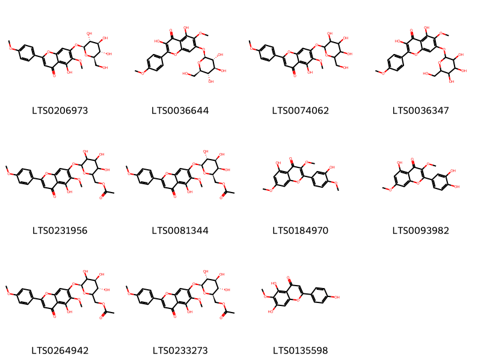{ width=100% }
    <figcaption>Hình ảnh cấu trúc hóa học của 11 hoạt chất thuộc nhóm Flavonoids gồm ['5-hydroxy-6-methoxy-2-(4-methoxyphenyl)-7-{[(2s,3r,4s,5s,6r)-3,4,5-trihydroxy-6-(hydroxymethyl)oxan-2-yl]oxy}chromen-4-one (LTS0206973)', '3,5-dihydroxy-6-methoxy-2-(4-methoxyphenyl)-7-{[(2s,3r,4s,5s,6r)-3,4,5-trihydroxy-6-(hydroxymethyl)oxan-2-yl]oxy}chromen-4-one (LTS0036644)', '5-hydroxy-6-methoxy-2-(4-methoxyphenyl)-7-{[3,4,5-trihydroxy-6-(hydroxymethyl)oxan-2-yl]oxy}chromen-4-one (LTS0074062)', '3,5-dihydroxy-6-methoxy-2-(4-methoxyphenyl)-7-{[3,4,5-trihydroxy-6-(hydroxymethyl)oxan-2-yl]oxy}chromen-4-one (LTS0036347)', '(3,4,5-trihydroxy-6-{[5-hydroxy-6-methoxy-2-(4-methoxyphenyl)-4-oxochromen-7-yl]oxy}oxan-2-yl)methyl acetate (LTS0231956)', '[(2r,3r,4s,5r,6s)-3,4,5-trihydroxy-6-{[5-hydroxy-6-methoxy-2-(4-methoxyphenyl)-4-oxochromen-7-yl]oxy}oxan-2-yl]methyl acetate (LTS0081344)', 'ayanin (LTS0184970)', 'dthf (LTS0093982)', 'lantanoside (LTS0264942)', '[(2r,3s,4s,5r,6s)-3,4,5-trihydroxy-6-{[5-hydroxy-6-methoxy-2-(4-methoxyphenyl)-4-oxochromen-7-yl]oxy}oxan-2-yl]methyl acetate (LTS0233273)', 'hispidulin (LTS0135598)'].</figcaption>
</figure>
#### Nhóm Furanoid lignans
<figure markdown="span">
    { width=100% }
    <figcaption>Hình ảnh cấu trúc hóa học của 1 hoạt chất thuộc nhóm Furanoid lignans gồm ['sesamin (LTS0120161)'].</figcaption>
</figure>
#### Nhóm Naphthofurans
<figure markdown="span">
    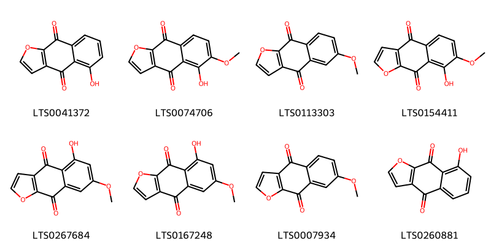{ width=100% }
    <figcaption>Hình ảnh cấu trúc hóa học của 8 hoạt chất thuộc nhóm Naphthofurans gồm ['5-hydroxynaphtho[2,3-b]furan-4,9-dione (LTS0041372)', '5-hydroxy-6-methoxynaphtho[2,3-b]furan-4,9-dione (LTS0074706)', '6-methoxynaphtho[2,3-b]furan-4,9-dione (LTS0113303)', '8-hydroxy-7-methoxynaphtho[2,3-b]furan-4,9-dione (LTS0154411)', '5-hydroxy-7-methoxynaphtho[2,3-b]furan-4,9-dione (LTS0267684)', '8-hydroxy-6-methoxynaphtho[2,3-b]furan-4,9-dione (LTS0167248)', '7-methoxynaphtho[2,3-b]furan-4,9-dione (LTS0007934)', '8-hydroxynaphtho[2,3-b]furan-4,9-dione (LTS0260881)'].</figcaption>
</figure>
#### Nhóm Organic oxides
<figure markdown="span">
    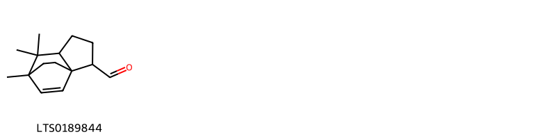{ width=100% }
    <figcaption>Hình ảnh cấu trúc hóa học của 1 hoạt chất thuộc nhóm Organic oxides gồm ['6,6,7-trimethyltricyclo[5.2.2.0¹,⁵]undec-8-ene-2-carbaldehyde (LTS0189844)'].</figcaption>
</figure>
#### Nhóm Organooxygen compounds
<figure markdown="span">
    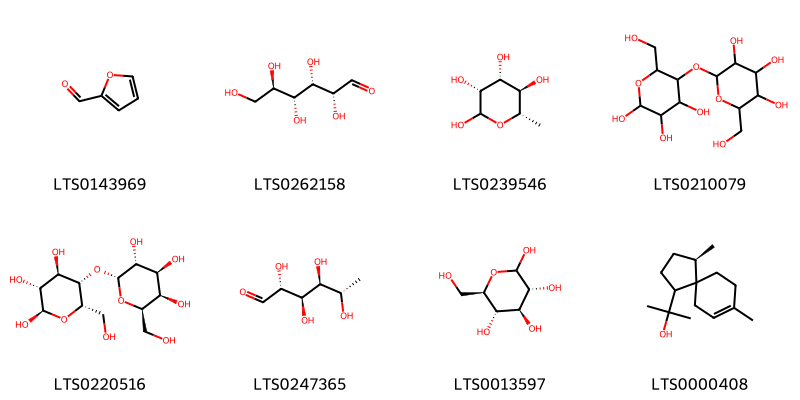{ width=100% }
    <figcaption>Hình ảnh cấu trúc hóa học của 8 hoạt chất thuộc nhóm Organooxygen compounds gồm ['bran oil (LTS0143969)', '(+)-glucose (LTS0262158)', 'l-rhamnose (LTS0239546)', 'starch (LTS0210079)', '(2r,3r,4r,5s,6s)-6-(hydroxymethyl)-5-{[(2r,3r,4s,5r,6r)-3,4,5-trihydroxy-6-(hydroxymethyl)oxan-2-yl]oxy}oxane-2,3,4-triol (LTS0220516)', 'rhamnose (LTS0247365)', 'glucose (LTS0013597)', '2-[(4r)-4,8-dimethylspiro[4.5]dec-7-en-1-yl]propan-2-ol (LTS0000408)'].</figcaption>
</figure>
#### Nhóm Oxolanes
<figure markdown="span">
    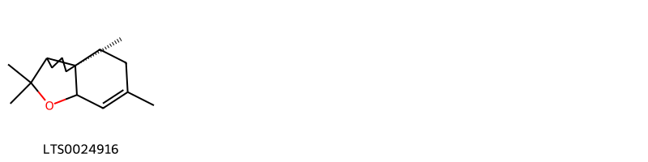{ width=100% }
    <figcaption>Hình ảnh cấu trúc hóa học của 1 hoạt chất thuộc nhóm Oxolanes gồm ['(2r)-2,6,6,10-tetramethyl-7-oxatricyclo[6.4.0.0¹,⁵]dodec-9-ene (LTS0024916)'].</figcaption>
</figure>
#### Nhóm Phenol ethers
<figure markdown="span">
    { width=100% }
    <figcaption>Hình ảnh cấu trúc hóa học của 1 hoạt chất thuộc nhóm Phenol ethers gồm ['tarragon (LTS0245226)'].</figcaption>
</figure>
#### Nhóm Phenols
<figure markdown="span">
    { width=100% }
    <figcaption>Hình ảnh cấu trúc hóa học của 1 hoạt chất thuộc nhóm Phenols gồm ['eugenol (LTS0052342)'].</figcaption>
</figure>
#### Nhóm Prenol lipids
<figure markdown="span">
    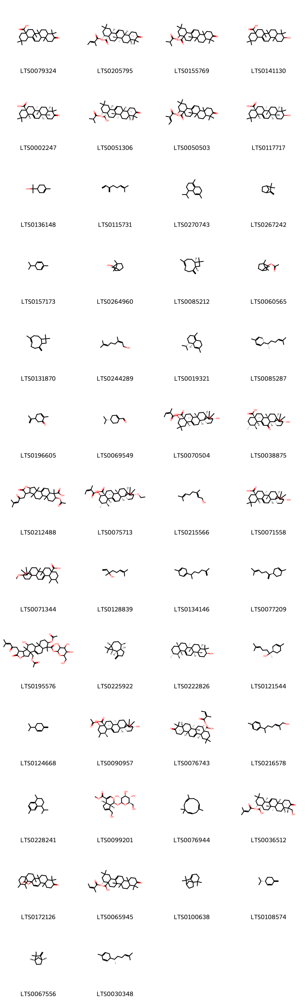{ width=100% }
    <figcaption>Hình ảnh cấu trúc hóa học của 204 hoạt chất thuộc nhóm Prenol lipids gồm ['2,2,6a,6b,9,9,12a-heptamethyl-10-oxo-3,4,5,6,7,8,8a,11,12,12b,13,14b-dodecahydro-1h-picene-4a-carboxylic acid (LTS0079324)', '(4r,4as,6as,6br,8ar,12ar,12br,14bs)-2,2,6a,6b,9,9,12a-heptamethyl-4-{[(2e)-2-methylbut-2-enoyl]oxy}-10-oxo-3,4,5,6,7,8,8a,11,12,12b,13,14b-dodecahydro-1h-picene-4a-carboxylic acid (LTS0205795)', '2,2,6a,6b,9,9,12a-heptamethyl-4-[(2-methylpropanoyl)oxy]-10-oxo-3,4,5,6,7,8,8a,11,12,12b,13,14b-dodecahydro-1h-picene-4a-carboxylic acid (LTS0155769)', 'oleanolic acid (LTS0141130)', '(4as,6as,6br,8ar,12ar,12br,14bs)-2,2,6a,6b,9,9,12a-heptamethyl-10-oxo-3,4,5,6,7,8,8a,11,12,12b,13,14b-dodecahydro-1h-picene-4a-carboxylic acid (LTS0002247)', '(4r,4as,6as,6br,8ar,12ar,12br,14bs)-2,2,6a,6b,9,9,12a-heptamethyl-4-[(2-methylpropanoyl)oxy]-10-oxo-3,4,5,6,7,8,8a,11,12,12b,13,14b-dodecahydro-1h-picene-4a-carboxylic acid (LTS0051306)', '2,2,6a,6b,9,9,12a-heptamethyl-4-[(2-methylbut-2-enoyl)oxy]-10-oxo-3,4,5,6,7,8,8a,11,12,12b,13,14b-dodecahydro-1h-picene-4a-carboxylic acid (LTS0050503)', 'oleanolic acid (LTS0117717)', 'terpineol (LTS0136148)', 'α-myrcene (LTS0115731)', '4-isopropyl-1,6-dimethyl-2,3,4,4a,7,8-hexahydronaphthalene (LTS0270743)', 'camphene (LTS0267242)', 'phellandrene (LTS0157173)', 'borneol (LTS0264960)', 'caryophyllene (LTS0085212)', 'bornyl acetate (LTS0060565)', 'caryophyllene (LTS0131870)', 'nerol (LTS0244289)', 'delta-cadinene (LTS0019321)', 'zingiberene (LTS0085287)', 'carvone (LTS0196605)', '(s)-phellandral (LTS0069549)', '(1s,2s,6s,10r,11s,14s,15r,18r,20s)-20-hydroxy-8,8,14,15,19,19-hexamethyl-10-{[(2z)-2-methylbut-2-enoyl]oxy}-21-oxahexacyclo[18.2.2.0¹,¹⁸.0²,¹⁵.0⁵,¹⁴.0⁶,¹¹]tetracos-4-ene-11-carboxylic acid (LTS0070504)', '(1r,2s,6s,7s,8r,11s,14s,15r,18r,20s)-20-hydroxy-7,8,14,15,19,19-hexamethyl-3-oxo-21-oxahexacyclo[18.2.2.0¹,¹⁸.0²,¹⁵.0⁵,¹⁴.0⁶,¹¹]tetracos-4-ene-11-carboxylic acid (LTS0038875)', '16-(acetyloxy)-2,9,13,17-tetramethyl-7-(4-methyl-2-oxopent-3-en-1-yl)-6-oxo-5-oxapentacyclo[10.8.0.0²,⁹.0⁴,⁸.0¹³,¹⁸]icos-1(20)-ene-17-carboxylic acid (LTS0212488)', '(1s,2s,6s,7s,8r,10r,11s,14s,15r,18r,20s)-20-ethoxy-7,8,14,15,19,19-hexamethyl-10-{[(2z)-2-methylbut-2-enoyl]oxy}-21-oxahexacyclo[18.2.2.0¹,¹⁸.0²,¹⁵.0⁵,¹⁴.0⁶,¹¹]tetracos-4-ene-11-carboxylic acid (LTS0075713)', '3,7-dimethyl-2,6-octadien-1-ol (LTS0215566)', '(1s,2s,6s,11s,14s,15r,18r,20s)-20-hydroxy-8,8,14,15,19,19-hexamethyl-21-oxahexacyclo[18.2.2.0¹,¹⁸.0²,¹⁵.0⁵,¹⁴.0⁶,¹¹]tetracos-4-ene-11-carboxylic acid (LTS0071558)', '20-methoxy-7,8,14,15,19,19-hexamethyl-21-oxahexacyclo[18.2.2.0¹,¹⁸.0²,¹⁵.0⁵,¹⁴.0⁶,¹¹]tetracos-4-ene-11-carboxylic acid (LTS0071344)', 'linalool, (+-)- (LTS0128839)', '1-methyl-4-(6-methylhept-6-en-2-yl)cyclohexa-1,4-diene (LTS0134146)', '(r)-β-bisabolene (LTS0077209)', '3,4,5-trihydroxy-6-(hydroxymethyl)oxan-2-yl 16-(acetyloxy)-2-[(acetyloxy)methyl]-10-hydroxy-9,13,17-trimethyl-7-(4-methyl-2-oxopent-3-en-1-yl)-6-oxo-5-oxapentacyclo[10.8.0.0²,⁹.0⁴,⁸.0¹³,¹⁸]icos-1(20)-ene-17-carboxylate (LTS0195576)', 'β-gurjunene (LTS0225922)', 'amyrin (LTS0222826)', '(+)-epi-α-bisabolol (LTS0121544)', 'β phellandrene (LTS0124668)', '(1s,2s,7s,10r,11s,14s,15s,20s)-10-(acetyloxy)-20-hydroxy-7,8,14,15,19,19-hexamethyl-21-oxahexacyclo[18.2.2.0¹,¹⁸.0²,¹⁵.0⁵,¹⁴.0⁶,¹¹]tetracos-4-ene-11-carboxylic acid (LTS0090957)', '(4ar,5s,6as,6br,8ar,12ar,12br,14bs)-2,2,6a,6b,9,9,12a-heptamethyl-5-{[(2z)-2-methylbut-2-enoyl]oxy}-10-oxo-3,4,5,6,7,8,8a,11,12,12b,13,14b-dodecahydro-1h-picene-4a-carboxylic acid (LTS0076743)', '(2e)-2-methyl-6-(4-methylphenyl)hept-2-en-1-ol (LTS0216578)', '(e)-calamene (LTS0228241)', 'geniposide (LTS0099201)', 'α-humulene (LTS0076944)', '(4r,4as,6as,6br,8ar,9s,12ar,12br,14bs)-9-(hydroxymethyl)-2,2,6a,6b,9,12a-hexamethyl-4-[(3-methylbut-2-enoyl)oxy]-10-oxo-3,4,5,6,7,8,8a,11,12,12b,13,14b-dodecahydro-1h-picene-4a-carboxylic acid (LTS0036512)', '4,5,9,9,13,19,20-heptamethyl-24-oxahexacyclo[15.5.2.0¹,¹⁸.0⁴,¹⁷.0⁵,¹⁴.0⁸,¹³]tetracos-15-ene-10,23-dione (LTS0172126)', '(4r)-2,2,6a,6b,9,9,12a-heptamethyl-4-{[(2z)-2-methylbut-2-enoyl]oxy}-10-oxo-3,4,5,6,7,8,8a,11,12,12b,13,14b-dodecahydro-1h-picene-4a-carboxylic acid (LTS0065945)', '2,2,7,7-tetramethyltricyclo[6.2.1.0¹,⁶]undec-5-ene (LTS0100638)', '(+)-β-phellandrene (LTS0108574)', '(-)-camphene (LTS0067556)', '2-methyl-5-[(2s)-6-methylhept-5-en-2-yl]cyclohexa-1,3-diene (LTS0030348)', 'β-sesquiphellandrene (LTS0106193)', 'camphor (LTS0091905)', '(1s,2r,5r,6r,7r,10s,13r,14r,17r,19s)-19-hydroxy-13,14,18,18-tetramethyl-7-(prop-1-en-2-yl)-20-oxahexacyclo[17.2.2.0¹,¹⁷.0²,¹⁴.0⁵,¹³.0⁶,¹⁰]tricosane-10-carboxylic acid (LTS0095770)', 'terpinolene (LTS0104525)', '(1s,5r,7s,10r)-7-isopropyl-4,10-dimethyltricyclo[4.4.0.0¹,⁵]dec-3-ene (LTS0064715)', '(1s,6s,11s,15r)-20-hydroxy-8,8,14,15,19,19-hexamethyl-21-oxahexacyclo[18.2.2.0¹,¹⁸.0²,¹⁵.0⁵,¹⁴.0⁶,¹¹]tetracos-4-ene-11-carboxylic acid (LTS0048543)', '(1r,2s,6s,10r,11s,14s,15r,18r,20s)-20-hydroxy-8,8,14,15,19,19-hexamethyl-10-[(3-methylbut-2-enoyl)oxy]-3-oxo-21-oxahexacyclo[18.2.2.0¹,¹⁸.0²,¹⁵.0⁵,¹⁴.0⁶,¹¹]tetracos-4-ene-11-carboxylic acid (LTS0109468)', '19-hydroxy-13,14,18,18-tetramethyl-7-(prop-1-en-2-yl)-20-oxahexacyclo[17.2.2.0¹,¹⁷.0²,¹⁴.0⁵,¹³.0⁶,¹⁰]tricosane-10-carboxylic acid (LTS0087989)', '(1r,2s,6s,10r,11s,14s,15r,18r,20s)-20-hydroxy-8,8,14,15,19,19-hexamethyl-10-{[(2z)-2-methylbut-2-enoyl]oxy}-3-oxo-21-oxahexacyclo[18.2.2.0¹,¹⁸.0²,¹⁵.0⁵,¹⁴.0⁶,¹¹]tetracos-4-ene-11-carboxylic acid (LTS0046239)', 'methyl (1s,4as,6s,7s,7ar)-6-hydroxy-7-methyl-1-{[(2s,3r,4s,5s,6r)-3,4,5-trihydroxy-6-(hydroxymethyl)oxan-2-yl]oxy}-1h,4ah,5h,6h,7h,7ah-cyclopenta[c]pyran-4-carboxylate (LTS0184542)', '(4r,4as,6as,6br,8ar,12ar,12br,14bs)-2,2,6a,6b,9,9,12a-heptamethyl-4-{[(2r)-2-methylbutanoyl]oxy}-10-oxo-3,4,5,6,7,8,8a,11,12,12b,13,14b-dodecahydro-1h-picene-4a-carboxylic acid (LTS0186454)', '(1s,2s,6s,7s,8r,11s,14s,15r,18r,20s)-20-hydroxy-7,8,14,15,19,19-hexamethyl-21-oxahexacyclo[18.2.2.0¹,¹⁸.0²,¹⁵.0⁵,¹⁴.0⁶,¹¹]tetracos-4-ene-11-carboxylic acid (LTS0180460)', 'β-pinene (LTS0117550)', 'cymene (LTS0181568)', 'elemene (LTS0021409)', '3-[(2s)-6-methylhept-5-en-2-yl]-6-methylidenecyclohex-1-ene (LTS0195839)', '(4r,4as,6as,6br,8ar,12ar,12br,14bs)-2,2,6a,6b,9,9,12a-heptamethyl-4-{[(2s)-2-methylbutanoyl]oxy}-10-oxo-3,4,5,6,7,8,8a,11,12,12b,13,14b-dodecahydro-1h-picene-4a-carboxylic acid (LTS0118404)', '(2r,4s,7r,8s,9s,10s,12r,13r,16r,17s,18r)-16-(acetyloxy)-10-hydroxy-2,9,13,17-tetramethyl-7-(4-methyl-2-oxopent-3-en-1-yl)-6-oxo-5-oxapentacyclo[10.8.0.0²,⁹.0⁴,⁸.0¹³,¹⁸]icos-1(20)-ene-17-carboxylic acid (LTS0198281)', 'methyl (1s,4ar,7ar)-4a-hydroxy-7-(hydroxymethyl)-1-{[(2s,3r,4s,5s,6r)-3,4,5-trihydroxy-6-(hydroxymethyl)oxan-2-yl]oxy}-1h,5h,7ah-cyclopenta[c]pyran-4-carboxylate (LTS0196010)', '(+)-linalool (LTS0196043)', '(1s,4s,5r,8r,13s,14r,17s,18r,19s,20r)-4,5,9,9,13,19,20-heptamethyl-24-oxahexacyclo[15.5.2.0¹,¹⁸.0⁴,¹⁷.0⁵,¹⁴.0⁸,¹³]tetracos-15-ene-10,23-dione (LTS0196679)', 'lantadene a (LTS0153696)', '(1s,4ar,7ar)-4a-hydroxy-7-(hydroxymethyl)-1-{[(2s,3r,4s,5s,6r)-3,4,5-trihydroxy-6-(hydroxymethyl)oxan-2-yl]oxy}-1h,5h,7ah-cyclopenta[c]pyran-4-carboxylic acid (LTS0135885)', '7-hydroxy-2,2,6a,6b,9,9,12a-heptamethyl-10-oxo-3,4,5,6,7,8,8a,11,12,12b,13,14b-dodecahydro-1h-picene-4a-carboxylic acid (LTS0267598)', '(2s,4s,7r,8s,9s,12r,13r,16r,19s,20r)-2,9,13,19-tetramethyl-7-(4-methyl-2-oxopent-3-en-1-yl)-5,17-dioxahexacyclo[10.10.0.0²,⁹.0⁴,⁸.0¹³,²⁰.0¹⁶,¹⁹]docos-1(22)-ene-6,18-dione (LTS0199591)', 'lantadene b (LTS0117529)', '16-(acetyloxy)-10-hydroxy-2,9,13,17-tetramethyl-7-(4-methyl-2-oxopent-3-en-1-yl)-6-oxo-5-oxapentacyclo[10.8.0.0²,⁹.0⁴,⁸.0¹³,¹⁸]icos-1(20)-ene-17-carboxylic acid (LTS0148445)', 'α pinene (LTS0132416)', '(4ar,5s,6as,6br,8ar,12ar,12br,14bs)-2,2,6a,6b,9,9,12a-heptamethyl-5-[(3-methylbut-2-enoyl)oxy]-10-oxo-3,4,5,6,7,8,8a,11,12,12b,13,14b-dodecahydro-1h-picene-4a-carboxylic acid (LTS0263247)', '(4r,4as,6as,6br,8ar,9s,12ar,12br,14bs)-9-(hydroxymethyl)-2,2,6a,6b,9,12a-hexamethyl-4-{[(2z)-2-methylbut-2-enoyl]oxy}-10-oxo-3,4,5,6,7,8,8a,11,12,12b,13,14b-dodecahydro-1h-picene-4a-carboxylic acid (LTS0199275)', 'α-cadinol (LTS0206935)', 'humulene (LTS0263171)', 'methyl (1s,4as,5s,6s,7r,7as)-5,6,7-trihydroxy-7-methyl-1-{[(2r,3s,4s,5s,6r)-3,4,5-trihydroxy-6-(hydroxymethyl)oxan-2-yl]oxy}-1h,4ah,5h,6h,7ah-cyclopenta[c]pyran-4-carboxylate (LTS0201980)', '(1s,2s,6s,10r,11s,14s,15r,18r)-20-hydroxy-8,8,14,15,19,19-hexamethyl-10-{[(2z)-2-methylbut-2-enoyl]oxy}-21-oxahexacyclo[18.2.2.0¹,¹⁸.0²,¹⁵.0⁵,¹⁴.0⁶,¹¹]tetracos-4-ene-11-carboxylic acid (LTS0131204)', '3,7-dimethyl-2,6-octadienal (LTS0141353)', '20-hydroxy-8,8,14,15,19,19-hexamethyl-10-[(3-methylbut-2-enoyl)oxy]-21-oxahexacyclo[18.2.2.0¹,¹⁸.0²,¹⁵.0⁵,¹⁴.0⁶,¹¹]tetracos-4-ene-11-carboxylic acid (LTS0125375)', '(1s,2r,4as,6as,6br,8ar,9s,12ar,12br,14bs)-9-formyl-1,2,6a,6b,9,12a-hexamethyl-10-oxo-1,2,3,4,5,6,7,8,8a,11,12,12b,13,14b-tetradecahydropicene-4a-carboxylic acid (LTS0155008)', '(1r,2r,4r,4as,6as,6br,8ar,10s,12ar,12br,14bs)-1,10-dihydroxy-1,2,6a,6b,9,9,12a-heptamethyl-4-[(3-methylbut-2-enoyl)oxy]-2,3,4,5,6,7,8,8a,10,11,12,12b,13,14b-tetradecahydropicene-4a-carboxylic acid (LTS0147796)', 'delta-cadinol (LTS0272380)', '(1r,2r,4as,6as,6br,8ar,12ar,12br,14bs)-1-hydroxy-1,2,6a,6b,9,9,12a-heptamethyl-10-oxo-3,4,5,6,7,8,8a,11,12,12b,13,14b-dodecahydro-2h-picene-4a-carboxylic acid (LTS0153152)', 'limonene,  (LTS0155981)', '(1r,2s,6s,7s,8r,10r,11s,14s,15r,18r,20s)-20-hydroxy-7,8,14,15,19,19-hexamethyl-10-{[(2z)-2-methylbut-2-enoyl]oxy}-3-oxo-21-oxahexacyclo[18.2.2.0¹,¹⁸.0²,¹⁵.0⁵,¹⁴.0⁶,¹¹]tetracos-4-ene-11-carboxylic acid (LTS0138312)', '(2s,3r,4s,5s,6r)-3,4,5-trihydroxy-6-(hydroxymethyl)oxan-2-yl (2s,4s,7r,8s,9s,10s,12r,13r,16r,17s,18r)-16-(acetyloxy)-2-[(acetyloxy)methyl]-10-hydroxy-9,13,17-trimethyl-7-(4-methyl-2-oxopent-3-en-1-yl)-6-oxo-5-oxapentacyclo[10.8.0.0²,⁹.0⁴,⁸.0¹³,¹⁸]icos-1(20)-ene-17-carboxylate (LTS0149831)', 'hederagenin (LTS0157813)', '(4r,4as,6as,6br,12ar,12br,14br)-2,2,6a,6b,9,9,12a-heptamethyl-4-{[(2s)-2-methylbutanoyl]oxy}-10-oxo-3,4,5,6,7,8,8a,11,12,12b,13,14b-dodecahydro-1h-picene-4a-carboxylic acid (LTS0234480)', '2,9,13,19-tetramethyl-7-(4-methyl-2-oxopent-3-en-1-yl)-5,17-dioxahexacyclo[10.10.0.0²,⁹.0⁴,⁸.0¹³,²⁰.0¹⁶,¹⁹]docos-1(22)-ene-6,18-dione (LTS0075949)', 'β-amyrin (LTS0251864)', 'ursolic acid (LTS0250838)', '(1r,2s,6r,7s,8s,10s,11r,14r,15r,18r)-20-hydroxy-7,8,14,15,19,19-hexamethyl-10-{[(2z)-2-methylbut-2-enoyl]oxy}-3-oxo-21-oxahexacyclo[18.2.2.0¹,¹⁸.0²,¹⁵.0⁵,¹⁴.0⁶,¹¹]tetracos-4-ene-11-carboxylic acid (LTS0164496)', '3,4,5-trihydroxy-6-(hydroxymethyl)oxan-2-yl 16-(acetyloxy)-10-hydroxy-2-(hydroxymethyl)-9,13,17-trimethyl-7-(4-methyl-2-oxopent-3-en-1-yl)-6-oxo-5-oxapentacyclo[10.8.0.0²,⁹.0⁴,⁸.0¹³,¹⁸]icos-1(20)-ene-17-carboxylate (LTS0230904)', '(z)-γ-bisabolene (LTS0143321)', '10-(acetyloxy)-20-hydroxy-7,8,14,15,19,19-hexamethyl-21-oxahexacyclo[18.2.2.0¹,¹⁸.0²,¹⁵.0⁵,¹⁴.0⁶,¹¹]tetracos-4-ene-11-carboxylic acid (LTS0101217)', '(1s,2s,6s,7s,8r,10r,11s,14s,15r,18s,20s)-10-(acetyloxy)-20-hydroxy-7,8,14,15,19,19-hexamethyl-21-oxahexacyclo[18.2.2.0¹,¹⁸.0²,¹⁵.0⁵,¹⁴.0⁶,¹¹]tetracos-4-ene-11-carboxylic acid (LTS0239331)', '1-hydroxy-1,2,6a,6b,9,9,12a-heptamethyl-10-oxo-3,4,5,6,7,8,8a,11,12,12b,13,14b-dodecahydro-2h-picene-4a-carboxylic acid (LTS0111779)', '20-hydroxy-7,8,14,15,19,19-hexamethyl-3-oxo-21-oxahexacyclo[18.2.2.0¹,¹⁸.0²,¹⁵.0⁵,¹⁴.0⁶,¹¹]tetracos-4-ene-11-carboxylic acid (LTS0104477)', '10-hydroxy-1,2,6a,6b,9,9,12a-heptamethyl-2,3,4,5,6,7,8,8a,10,11,12,12b,13,14b-tetradecahydro-1h-picene-4a-carboxylic acid (LTS0166564)', '(2r)-6-methyl-2-(4-methylcyclohex-3-en-1-yl)hept-5-en-2-ol (LTS0088859)', '(-)-β-pinene (LTS0108757)', '(1r,4s,4ar)-4-isopropyl-1,6-dimethyl-3,4,4a,7,8,8a-hexahydro-2h-naphthalen-1-ol (LTS0164497)', '10-(acetyloxy)-2,2,6a,6b,9,9,12a-heptamethyl-1,3,4,5,6,7,8,8a,10,11,12,12b,13,14b-tetradecahydropicene-4a-carboxylic acid (LTS0179827)', '2,2,6a,6b,9,9,12a-heptamethyl-5-[(2-methylbut-2-enoyl)oxy]-10-oxo-3,4,5,6,7,8,8a,11,12,12b,13,14b-dodecahydro-1h-picene-4a-carboxylic acid (LTS0113495)', '20-hydroxy-7,8,14,15,19,19-hexamethyl-12-[(2-methylbut-2-enoyl)oxy]-3-oxo-21-oxahexacyclo[18.2.2.0¹,¹⁸.0²,¹⁵.0⁵,¹⁴.0⁶,¹¹]tetracos-4-ene-11-carboxylic acid (LTS0183301)', '(4s)-4-isopropyl-1,6-dimethyl-3,4-dihydronaphthalene (LTS0261978)', '(4as,6as,6br,10r,12ar)-10-(acetyloxy)-2,2,6a,6b,9,9,12a-heptamethyl-1,3,4,5,6,7,8,8a,10,11,12,12b,13,14b-tetradecahydropicene-4a-carboxylic acid (LTS0126195)', '(+)-gamma-cadinene (LTS0103949)', '9-(hydroxymethyl)-2,2,6a,6b,9,12a-hexamethyl-4-[(2-methylbut-2-enoyl)oxy]-10-oxo-3,4,5,6,7,8,8a,11,12,12b,13,14b-dodecahydro-1h-picene-4a-carboxylic acid (LTS0111345)', '(1r,8s)-2,2,7,7-tetramethyltricyclo[6.2.1.0¹,⁶]undec-5-ene (LTS0255772)', '(1s,6s,7s,11s,15r,20s)-20-hydroxy-7,8,14,15,19,19-hexamethyl-21-oxahexacyclo[18.2.2.0¹,¹⁸.0²,¹⁵.0⁵,¹⁴.0⁶,¹¹]tetracos-4-ene-11-carboxylic acid (LTS0104317)', '(1r,2r,6s,7r,8r,10r,11s,14s,15s,18s)-20-methoxy-7,8,14,15,19,19-hexamethyl-10-[(3-methylbut-2-enoyl)oxy]-21-oxahexacyclo[18.2.2.0¹,¹⁸.0²,¹⁵.0⁵,¹⁴.0⁶,¹¹]tetracos-4-ene-11-carboxylic acid (LTS0252877)', '(1as,1bs,3as,3br,5ar,7s,9ar,9br,11bs,13ar)-7-hydroxy-3a,3b,6,6,9a,13,13-heptamethyl-1ah,2h,3h,4h,5h,5ah,7h,8h,9h,9bh,10h,11bh,12h,13ah-piceno[3,4-b]oxirene-1b-carboxylic acid (LTS0176843)', 'α-bisabolol (LTS0250984)', '1,4-dimethyl-7-(prop-1-en-2-yl)-1,2,3,3a,4,5,6,7-octahydroazulene (LTS0217070)', '20-ethoxy-7,8,14,15,19,19-hexamethyl-10-[(2-methylbut-2-enoyl)oxy]-21-oxahexacyclo[18.2.2.0¹,¹⁸.0²,¹⁵.0⁵,¹⁴.0⁶,¹¹]tetracos-4-ene-11-carboxylic acid (LTS0218729)', '(2z,6s)-2-methyl-6-(4-methylphenyl)hept-2-en-1-ol (LTS0044005)', 'phellandral (LTS0209940)', '(1s,2r,6r,11s,14s,15r,18s,20s)-20-hydroxy-8,8,14,15,19,19-hexamethyl-10-[(2-methylbut-2-enoyl)oxy]-21-oxahexacyclo[18.2.2.0¹,¹⁸.0²,¹⁵.0⁵,¹⁴.0⁶,¹¹]tetracos-4-ene-11-carboxylic acid (LTS0253097)', 'pomolic acid (LTS0196537)', '1,10-dihydroxy-1,2,6a,6b,9,9,12a-heptamethyl-hexadecahydropicene-4a-carboxylic acid (LTS0055058)', 'betulinic acid (LTS0210795)', '(1s,2r,4as,6as,6br,8ar,12ar,12br,14bs)-1,2,6a,6b,9,9,12a-heptamethyl-10-oxo-1,2,3,4,5,6,7,8,8a,11,12,12b,13,14b-tetradecahydropicene-4a-carboxylic acid (LTS0272772)', 'α-limonene (LTS0244943)', '(+)-α-phellandrene (LTS0234318)', '(1s,2s,6s,7s,8r,10r,11s,14s,15r,18r,20s)-10-(acetyloxy)-20-hydroxy-7,8,14,15,19,19-hexamethyl-21-oxahexacyclo[18.2.2.0¹,¹⁸.0²,¹⁵.0⁵,¹⁴.0⁶,¹¹]tetracos-4-ene-11-carboxylic acid (LTS0082904)', 'selinene (LTS0197809)', 'α-copaene (LTS0207598)', '(1r,2s,6s,7s,8r,11r,12s,14s,15r,18r,20s)-20-hydroxy-7,8,14,15,19,19-hexamethyl-12-{[(2z)-2-methylbut-2-enoyl]oxy}-3-oxo-21-oxahexacyclo[18.2.2.0¹,¹⁸.0²,¹⁵.0⁵,¹⁴.0⁶,¹¹]tetracos-4-ene-11-carboxylic acid (LTS0221593)', 'sabinene (LTS0224133)', '9-(hydroxymethyl)-2,2,6a,6b,9,12a-hexamethyl-10-oxo-3,4,5,6,7,8,8a,11,12,12b,13,14b-dodecahydro-1h-picene-4a-carboxylic acid (LTS0007745)', '(+) germacrene a (LTS0189746)', '20-hydroxy-7,8,14,15,19,19-hexamethyl-21-oxahexacyclo[18.2.2.0¹,¹⁸.0²,¹⁵.0⁵,¹⁴.0⁶,¹¹]tetracos-4-ene-11-carboxylic acid (LTS0240369)', 'delta-selinene (LTS0181591)', '(1r,3as,5ar,5br,7ar,11ar,11br,13ar,13br)-5a,5b,8,8,11a-pentamethyl-9-oxo-1-(prop-1-en-2-yl)-tetradecahydro-1h-cyclopenta[a]chrysene-3a-carboxylic acid (LTS0229397)', '(1s,4ar,7ar)-4a-hydroxy-7-(hydroxymethyl)-1-{[(2s,3s,4s,5s,6r)-3,4,5-trihydroxy-6-(hydroxymethyl)oxan-2-yl]oxy}-1h,5h,7ah-cyclopenta[c]pyran-4-carboxylic acid (LTS0038513)', '(1r,2r,4as,6ar,6br,8ar,10s,12ar,12br,14ar,14bs)-1,10-dihydroxy-1,2,6a,6b,9,9,12a-heptamethyl-hexadecahydropicene-4a-carboxylic acid (LTS0151260)', 'polyprenol (LTS0209244)', '2,2,6a,6b,9,9,12a-heptamethyl-5-[(3-methylbut-2-enoyl)oxy]-10-oxo-3,4,5,6,7,8,8a,11,12,12b,13,14b-dodecahydro-1h-picene-4a-carboxylic acid (LTS0041546)', '(4as,6as,6br,8ar,10s,12as,12br,14bs)-10-(acetyloxy)-2,2,6a,6b,9,9,12a-heptamethyl-13-oxo-3,4,5,6,7,8,8a,10,11,12,12b,14b-dodecahydro-1h-picene-4a-carboxylic acid (LTS0021515)', '(4as,6as,6br,8ar,10s,12ar,12br,14bs)-10-(acetyloxy)-2,2,6a,6b,9,9,12a-heptamethyl-1,3,4,5,6,7,8,8a,10,11,12,12b,13,14b-tetradecahydropicene-4a-carboxylic acid (LTS0039352)', 'methyl (1r,4as,7as)-7-(hydroxymethyl)-1-{[(2s,3s,4s,5s,6r)-3,4,5-trihydroxy-6-(hydroxymethyl)oxan-2-yl]oxy}-1h,4ah,5h,7ah-cyclopenta[c]pyran-4-carboxylate (LTS0210699)', '20-hydroxy-8,8,14,15,19,19-hexamethyl-3-oxo-21-oxahexacyclo[18.2.2.0¹,¹⁸.0²,¹⁵.0⁵,¹⁴.0⁶,¹¹]tetracos-4-ene-11-carboxylic acid (LTS0025069)', '7-hydroxy-3a,3b,6,6,9a,13,13-heptamethyl-1ah,2h,3h,4h,5h,5ah,7h,8h,9h,9bh,10h,11bh,12h,13ah-piceno[3,4-b]oxirene-1b-carboxylic acid (LTS0188671)', 'neral (LTS0165243)', '(-)-trans-α-bergamotene (LTS0239937)', 'geraniol (LTS0258838)', '4-(6-methylhept-5-en-2-yl)benzaldehyde (LTS0194294)', '(1r,2s,6s,11s,14s,15r,18r,20s)-20-hydroxy-8,8,14,15,19,19-hexamethyl-3-oxo-21-oxahexacyclo[18.2.2.0¹,¹⁸.0²,¹⁵.0⁵,¹⁴.0⁶,¹¹]tetracos-4-ene-11-carboxylic acid (LTS0192961)', '(1r,2r,4as,6as,6br,8ar,12ar,12br,14br)-1-hydroxy-1,2,6a,6b,9,9,12a-heptamethyl-10-oxo-3,4,5,6,7,8,8a,11,12,12b,13,14b-dodecahydro-2h-picene-4a-carboxylic acid (LTS0198019)', '(1s,2s,6s,7s,8r,10r,11s,14s,15r,18r,20s)-20-methoxy-7,8,14,15,19,19-hexamethyl-10-{[(2z)-2-methylbut-2-enoyl]oxy}-21-oxahexacyclo[18.2.2.0¹,¹⁸.0²,¹⁵.0⁵,¹⁴.0⁶,¹¹]tetracos-4-ene-11-carboxylic acid (LTS0229842)', 'curcumene (LTS0190074)', '(1r,2s,7s,8s)-8-isopropyl-1,3-dimethyltricyclo[4.4.0.0²,⁷]dec-3-ene (LTS0190031)', 'nerolidol isomers (LTS0007569)', 'lily of valley (LTS0051762)', '(4as,6as,6br,8ar,9s,12ar,12br,14bs)-9-(hydroxymethyl)-2,2,6a,6b,9,12a-hexamethyl-10-oxo-3,4,5,6,7,8,8a,11,12,12b,13,14b-dodecahydro-1h-picene-4a-carboxylic acid (LTS0039700)', '(7r,9r,10s,15r)-9-(acetyloxy)-20-hydroxy-7,8,14,15,19,19-hexamethyl-21-oxahexacyclo[18.2.2.0¹,¹⁸.0²,¹⁵.0⁵,¹⁴.0⁶,¹¹]tetracos-4-ene-10-carboxylic acid (LTS0004397)', '10-(acetyloxy)-2,2,6a,6b,9,9,12a-heptamethyl-13-oxo-3,4,5,6,7,8,8a,10,11,12,12b,14b-dodecahydro-1h-picene-4a-carboxylic acid (LTS0004293)', '(1s,2s,6s,10r,11s,14s,15r,18r,20s)-20-hydroxy-8,8,14,15,19,19-hexamethyl-10-[(3-methylbut-2-enoyl)oxy]-21-oxahexacyclo[18.2.2.0¹,¹⁸.0²,¹⁵.0⁵,¹⁴.0⁶,¹¹]tetracos-4-ene-11-carboxylic acid (LTS0028712)', '(1s,2s,6s,11s,14s,15r,18r,20r)-20-hydroxy-8,8,14,15,19,19-hexamethyl-21-oxahexacyclo[18.2.2.0¹,¹⁸.0²,¹⁵.0⁵,¹⁴.0⁶,¹¹]tetracos-4-ene-11-carboxylic acid (LTS0260067)', 'methyl (1s,4ar,7ar)-4a-hydroxy-7-(hydroxymethyl)-1-{[(2r,3s,4s,5s,6r)-3,4,5-trihydroxy-6-(hydroxymethyl)oxan-2-yl]oxy}-1h,5h,7ah-cyclopenta[c]pyran-4-carboxylate (LTS0040525)', '(-)-β-bisabolene (LTS0009940)', '20-hydroxy-8,8,14,15,19,19-hexamethyl-21-oxahexacyclo[18.2.2.0¹,¹⁸.0²,¹⁵.0⁵,¹⁴.0⁶,¹¹]tetracos-4-ene-11-carboxylic acid (LTS0011585)', '3-methyl-6-(6-methylhept-5-en-2-yl)cyclohex-2-en-1-one (LTS0012155)', '20-hydroxy-8,8,14,15,19,19-hexamethyl-10-[(2-methylbut-2-enoyl)oxy]-21-oxahexacyclo[18.2.2.0¹,¹⁸.0²,¹⁵.0⁵,¹⁴.0⁶,¹¹]tetracos-4-ene-11-carboxylic acid (LTS0135272)', '(1s,2e,10r)-3,7,11,11-tetramethylbicyclo[8.1.0]undeca-2,6-diene (LTS0032090)', '(1s,4r)-4-isopropyl-1,6-dimethyl-1,2,3,4-tetrahydronaphthalene (LTS0015102)', '(4r,4as,6as,6br,8ar,9s,12ar,12br,14br)-9-(hydroxymethyl)-2,2,6a,6b,9,12a-hexamethyl-4-{[(2z)-2-methylbut-2-enoyl]oxy}-10-oxo-3,4,5,6,7,8,8a,11,12,12b,13,14b-dodecahydro-1h-picene-4a-carboxylic acid (LTS0013427)', '1,10-dihydroxy-1,2,6a,6b,9,9,12a-heptamethyl-4-[(3-methylbut-2-enoyl)oxy]-2,3,4,5,6,7,8,8a,10,11,12,12b,13,14b-tetradecahydropicene-4a-carboxylic acid (LTS0024825)', '3,4-dihydrocadalene (LTS0015523)', '(1s,2s,6s,7s,8r,11s,14s,15r,18r,20s)-20-methoxy-7,8,14,15,19,19-hexamethyl-21-oxahexacyclo[18.2.2.0¹,¹⁸.0²,¹⁵.0⁵,¹⁴.0⁶,¹¹]tetracos-4-ene-11-carboxylic acid (LTS0007710)', '9-formyl-1,2,6a,6b,9,12a-hexamethyl-10-oxo-1,2,3,4,5,6,7,8,8a,11,12,12b,13,14b-tetradecahydropicene-4a-carboxylic acid (LTS0026282)', '(2s,4s,7r,8s,9s,12r,13r,16r,17s,18r)-16-(acetyloxy)-2,9,13,17-tetramethyl-7-(4-methyl-2-oxopent-3-en-1-yl)-6-oxo-5-oxapentacyclo[10.8.0.0²,⁹.0⁴,⁸.0¹³,¹⁸]icos-1(20)-ene-17-carboxylic acid (LTS0092586)', '4,11,11-trimethyl-8-methylidenebicyclo[7.2.0]undec-4-ene (LTS0256716)', 'guaiene (LTS0274548)', 'α-selinene (LTS0024564)', '(4as,6ar,6br,7r,8ar,12ar,12br,14bs)-7-hydroxy-2,2,6a,6b,9,9,12a-heptamethyl-10-oxo-3,4,5,6,7,8,8a,11,12,12b,13,14b-dodecahydro-1h-picene-4a-carboxylic acid (LTS0032936)', 'α-amyrin (LTS0088267)', '(2z)-2-methyl-6-(4-methylphenyl)hept-2-en-1-ol (LTS0070137)', 'lantadene b (LTS0022502)', '(-)-β-curcumene (LTS0027873)', '(1s,2s,6s,11s,14s,15r,18r,20s)-20-ethoxy-8,8,14,15,19,19-hexamethyl-21-oxahexacyclo[18.2.2.0¹,¹⁸.0²,¹⁵.0⁵,¹⁴.0⁶,¹¹]tetracos-4-ene-11-carboxylic acid (LTS0097320)', '(2s,3r,4s,5s,6r)-3,4,5-trihydroxy-6-(hydroxymethyl)oxan-2-yl (2s,4s,7r,8s,9s,10s,12r,13r,16r,17s,18r)-16-(acetyloxy)-10-hydroxy-2-(hydroxymethyl)-9,13,17-trimethyl-7-(4-methyl-2-oxopent-3-en-1-yl)-6-oxo-5-oxapentacyclo[10.8.0.0²,⁹.0⁴,⁸.0¹³,¹⁸]icos-1(20)-ene-17-carboxylate (LTS0240808)', '2,6,6,9-tetramethyltricyclo[5.4.0.0¹,⁵]undec-8-ene (LTS0101154)', '20-hydroxy-8,8,14,15,19,19-hexamethyl-10-[(2-methylbut-2-enoyl)oxy]-3-oxo-21-oxahexacyclo[18.2.2.0¹,¹⁸.0²,¹⁵.0⁵,¹⁴.0⁶,¹¹]tetracos-4-ene-11-carboxylic acid (LTS0041279)', 'carvone, (+)- (LTS0027671)', 'α-citral (LTS0246122)', '4a-hydroxy-7-(hydroxymethyl)-1-{[3,4,5-trihydroxy-6-(hydroxymethyl)oxan-2-yl]oxy}-1h,5h,7ah-cyclopenta[c]pyran-4-carboxylic acid (LTS0106986)', '(-)-α-cubebene (LTS0042045)', '4-isopropyl-6-methyl-1-methylidene-3,4,4a,7,8,8a-hexahydro-2h-naphthalene (LTS0111070)', '(2e,6e)-3,7,11,11-tetramethylbicyclo[8.1.0]undeca-2,6-diene (LTS0225278)', '(1s,2s,6s,7s,8r,10r,11s,14s,15r,20r)-10-(acetyloxy)-20-hydroxy-7,8,14,15,19,19-hexamethyl-21-oxahexacyclo[18.2.2.0¹,¹⁸.0²,¹⁵.0⁵,¹⁴.0⁶,¹¹]tetracos-4-ene-11-carboxylic acid (LTS0245481)', '(1s,2s,6s,10r,11s,14s,15r,18r,20s)-20-methoxy-8,8,14,15,19,19-hexamethyl-10-{[(2z)-2-methylbut-2-enoyl]oxy}-21-oxahexacyclo[18.2.2.0¹,¹⁸.0²,¹⁵.0⁵,¹⁴.0⁶,¹¹]tetracos-4-ene-11-carboxylic acid (LTS0051246)', '2,2,6a,6b,9,9,12a-heptamethyl-4-[(2-methylbutanoyl)oxy]-10-oxo-3,4,5,6,7,8,8a,11,12,12b,13,14b-dodecahydro-1h-picene-4a-carboxylic acid (LTS0261625)', '9-(hydroxymethyl)-2,2,6a,6b,9,12a-hexamethyl-4-[(3-methylbut-2-enoyl)oxy]-10-oxo-3,4,5,6,7,8,8a,11,12,12b,13,14b-dodecahydro-1h-picene-4a-carboxylic acid (LTS0045576)', '(1s,2s,6s,7s,8r,10r,11s,14s,15r,18r,20r)-10,20-dihydroxy-7,8,14,15,19,19-hexamethyl-21-oxahexacyclo[18.2.2.0¹,¹⁸.0²,¹⁵.0⁵,¹⁴.0⁶,¹¹]tetracos-4-ene-11-carboxylic acid (LTS0115630)', '20-ethoxy-8,8,14,15,19,19-hexamethyl-21-oxahexacyclo[18.2.2.0¹,¹⁸.0²,¹⁵.0⁵,¹⁴.0⁶,¹¹]tetracos-4-ene-11-carboxylic acid (LTS0117075)'].</figcaption>
</figure>
#### Nhóm Saturated hydrocarbons
<figure markdown="span">
    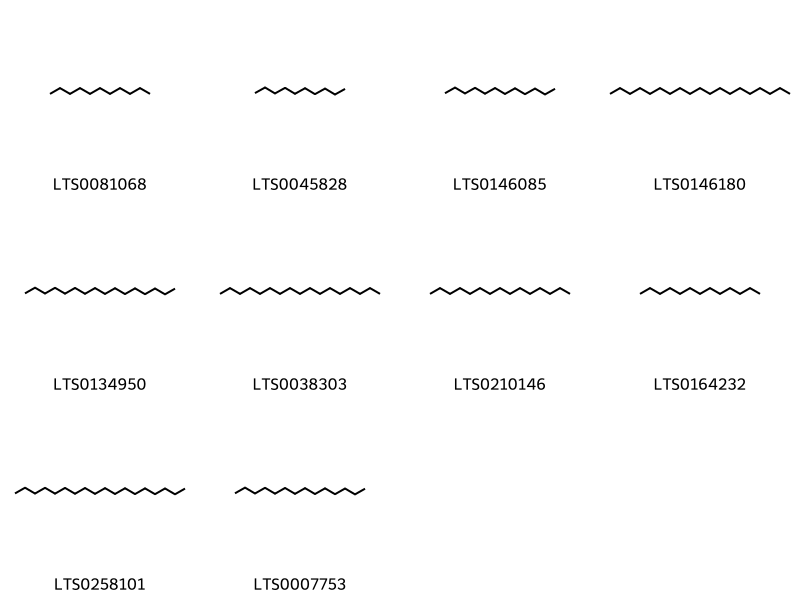{ width=100% }
    <figcaption>Hình ảnh cấu trúc hóa học của 10 hoạt chất thuộc nhóm Saturated hydrocarbons gồm ['undecane (LTS0081068)', 'decane (LTS0045828)', 'dodecane (LTS0146085)', 'nonadecane (LTS0146180)', 'cetane (LTS0134950)', 'heptadecane (LTS0038303)', 'pentadecane (LTS0210146)', 'tridecane (LTS0164232)', 'octadecane (LTS0258101)', 'tetradecane (LTS0007753)'].</figcaption>
</figure>
#### Nhóm Steroids and steroid derivatives
<figure markdown="span">
    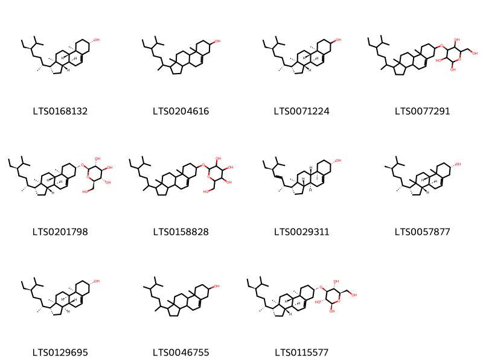{ width=100% }
    <figcaption>Hình ảnh cấu trúc hóa học của 11 hoạt chất thuộc nhóm Steroids and steroid derivatives gồm ['sitosterol (LTS0168132)', 'stigmast-5-en-3-ol, (3β)- (LTS0204616)', 'stigmast-5-en-3-ol (LTS0071224)', '4-{[1-(5-ethyl-6-methylheptan-2-yl)-9a,11a-dimethyl-1h,2h,3h,3ah,3bh,4h,6h,7h,8h,9h,9bh,10h,11h-cyclopenta[a]phenanthren-7-yl]oxy}-6-(hydroxymethyl)oxane-2,3,5-triol (LTS0077291)', 'sitogluside (LTS0201798)', '2-{[1-(5-ethyl-6-methylheptan-2-yl)-9a,11a-dimethyl-1h,2h,3h,3ah,3bh,4h,6h,7h,8h,9h,9bh,10h,11h-cyclopenta[a]phenanthren-7-yl]oxy}-6-(hydroxymethyl)oxane-3,4,5-triol (LTS0158828)', 'phytosterol (LTS0029311)', '(1r,3as,3bs,7s,9bs)-1-[(2r,5r)-5,6-dimethylheptan-2-yl]-9a,11a-dimethyl-1h,2h,3h,3ah,3bh,4h,6h,7h,8h,9h,9bh,10h,11h-cyclopenta[a]phenanthren-7-ol (LTS0057877)', '(1r,3ar,3br,7s,9ar,9br,11ar)-1-[(2r,5r)-5-ethyl-6-methylheptan-2-yl]-9a,11a-dimethyl-1h,2h,3h,3ah,3bh,4h,6h,7h,8h,9h,9bh,10h,11h-cyclopenta[a]phenanthren-7-ol (LTS0129695)', 'campesterol (LTS0046755)', '(2r,3r,4s,5r,6r)-4-{[(1r,3as,3bs,7s,9ar,9bs,11ar)-1-[(2r,5r)-5-ethyl-6-methylheptan-2-yl]-9a,11a-dimethyl-1h,2h,3h,3ah,3bh,4h,6h,7h,8h,9h,9bh,10h,11h-cyclopenta[a]phenanthren-7-yl]oxy}-6-(hydroxymethyl)oxane-2,3,5-triol (LTS0115577)'].</figcaption>
</figure>
#### Nhóm Unsaturated hydrocarbons
<figure markdown="span">
    { width=100% }
    <figcaption>Hình ảnh cấu trúc hóa học của 1 hoạt chất thuộc nhóm Unsaturated hydrocarbons gồm ['α terpinene (LTS0232891)'].</figcaption>
</figure>

---

### Dược dân tộc học

Danh sách các quốc gia có sử dụng *Lantana camara* trong điều trị các bệnh. 

| Country            | Disease                                                                                | Bệnh                                                                                                                                                                                                |
|:-------------------|:---------------------------------------------------------------------------------------|:----------------------------------------------------------------------------------------------------------------------------------------------------------------------------------------------------|
| China              | Alexiteric, Hemostat                                                                   | MYMEMORY WARNING: YOU USED ALL AVAILABLE FREE TRANSLATIONS FOR TODAY. NEXT AVAILABLE IN  16 HOURS 52 MINUTES 08 SECONDS VISIT HTTPS://MYMEMORY.TRANSLATED.NET/DOC/USAGELIMITS.PHP TO TRANSLATE MORE |
| Dominican Republic | Digestive, Sedative, Nervine                                                           | MYMEMORY WARNING: YOU USED ALL AVAILABLE FREE TRANSLATIONS FOR TODAY. NEXT AVAILABLE IN  16 HOURS 52 MINUTES 05 SECONDS VISIT HTTPS://MYMEMORY.TRANSLATED.NET/DOC/USAGELIMITS.PHP TO TRANSLATE MORE |
| Elsewhere          | Antibiotic, Antiseptic, Diaphoretic, Emmenagogue, Poison, Stimulant, Poison, Stimulant | MYMEMORY WARNING: YOU USED ALL AVAILABLE FREE TRANSLATIONS FOR TODAY. NEXT AVAILABLE IN  16 HOURS 52 MINUTES 03 SECONDS VISIT HTTPS://MYMEMORY.TRANSLATED.NET/DOC/USAGELIMITS.PHP TO TRANSLATE MORE |
| Guyana             | Diaphoretic, Carminative, Vulnerary                                                    | MYMEMORY WARNING: YOU USED ALL AVAILABLE FREE TRANSLATIONS FOR TODAY. NEXT AVAILABLE IN  16 HOURS 52 MINUTES 00 SECONDS VISIT HTTPS://MYMEMORY.TRANSLATED.NET/DOC/USAGELIMITS.PHP TO TRANSLATE MORE |
| Haiti              | Tonic, Tonic, Stomachic                                                                | MYMEMORY WARNING: YOU USED ALL AVAILABLE FREE TRANSLATIONS FOR TODAY. NEXT AVAILABLE IN  16 HOURS 51 MINUTES 58 SECONDS VISIT HTTPS://MYMEMORY.TRANSLATED.NET/DOC/USAGELIMITS.PHP TO TRANSLATE MORE |
| Mexico             | Tonic                                                                                  | MYMEMORY WARNING: YOU USED ALL AVAILABLE FREE TRANSLATIONS FOR TODAY. NEXT AVAILABLE IN  16 HOURS 51 MINUTES 55 SECONDS VISIT HTTPS://MYMEMORY.TRANSLATED.NET/DOC/USAGELIMITS.PHP TO TRANSLATE MORE |
| Panama             | Hemostat, Poison, Piscicide                                                            | MYMEMORY WARNING: YOU USED ALL AVAILABLE FREE TRANSLATIONS FOR TODAY. NEXT AVAILABLE IN  16 HOURS 51 MINUTES 53 SECONDS VISIT HTTPS://MYMEMORY.TRANSLATED.NET/DOC/USAGELIMITS.PHP TO TRANSLATE MORE |
| Salvador           | Diaphoretic                                                                            | MYMEMORY WARNING: YOU USED ALL AVAILABLE FREE TRANSLATIONS FOR TODAY. NEXT AVAILABLE IN  16 HOURS 51 MINUTES 51 SECONDS VISIT HTTPS://MYMEMORY.TRANSLATED.NET/DOC/USAGELIMITS.PHP TO TRANSLATE MORE |
| Trinidad           | Antibiotic                                                                             | MYMEMORY WARNING: YOU USED ALL AVAILABLE FREE TRANSLATIONS FOR TODAY. NEXT AVAILABLE IN  16 HOURS 51 MINUTES 48 SECONDS VISIT HTTPS://MYMEMORY.TRANSLATED.NET/DOC/USAGELIMITS.PHP TO TRANSLATE MORE |
| Trop Na            | Tonic                                                                                  | MYMEMORY WARNING: YOU USED ALL AVAILABLE FREE TRANSLATIONS FOR TODAY. NEXT AVAILABLE IN  16 HOURS 51 MINUTES 45 SECONDS VISIT HTTPS://MYMEMORY.TRANSLATED.NET/DOC/USAGELIMITS.PHP TO TRANSLATE MORE |
| Turkey             | Expectorant                                                                            | MYMEMORY WARNING: YOU USED ALL AVAILABLE FREE TRANSLATIONS FOR TODAY. NEXT AVAILABLE IN  16 HOURS 51 MINUTES 43 SECONDS VISIT HTTPS://MYMEMORY.TRANSLATED.NET/DOC/USAGELIMITS.PHP TO TRANSLATE MORE |
| Venezuela          | Expectorant                                                                            | MYMEMORY WARNING: YOU USED ALL AVAILABLE FREE TRANSLATIONS FOR TODAY. NEXT AVAILABLE IN  16 HOURS 51 MINUTES 41 SECONDS VISIT HTTPS://MYMEMORY.TRANSLATED.NET/DOC/USAGELIMITS.PHP TO TRANSLATE MORE |

---

---
## Lantana involucrata
### Thông tin về thực vật

!!! info "Phân loại thực vật của *Lantana involucrata* từ GIBF:"
    - **Kingdom:** Plantae
    - **Phylum:** Tracheophyta
    - **Order:** Lamiales
    - **Family:** Verbenaceae
    - **Genus:** Lantana
    - **Species:** *Lantana involucrata*

 

| Label (VI)   | Label (EN)   | Scientific Name     | Descriptions (VI)   | Descriptions (EN)   | Also Known As (VI)   | Also Known As (EN)   |
|:-------------|:-------------|:--------------------|:--------------------|:--------------------|:---------------------|:---------------------|
| N/A          | N/A          | Lantana involucrata | loài thực vật       | species of plant    | ['']                 | ['']                 |

#### Phân bố trên thế giới

**Từ CSDL GIBF** Virgin Islands (British), Turks and Caicos Islands, Antigua and Barbuda, Dominican Republic, Bermuda, Guadeloupe, Puerto Rico, Montserrat, Anguilla, Bahamas, United States of America, Mexico, Martinique, Cuba, Sint Maarten (Dutch part), Bonaire, Sint Eustatius and Saba, Virgin Islands (U.S.), Barbados

#### Phân bố tại Việt Nam

**Từ CSDL GIBF**: Không có ghi nhận ở Việt Nam

---
### Thành phần hóa học
        
- Theo cơ sở dữ liệu lotus: Từ loài *Lantana involucrata* đã phân lập và xác định được 19 hoạt chất thuộc về các nhóm Naphthofurans, Prenol lipids. 

|    | chemicalTaxonomyClassyfireClass   |   smiles_count |
|---:|:----------------------------------|---------------:|
|  0 | Naphthofurans                     |             12 |
|  1 | Prenol lipids                     |              7 |

#### Nhóm Naphthofurans
<figure markdown="span">
    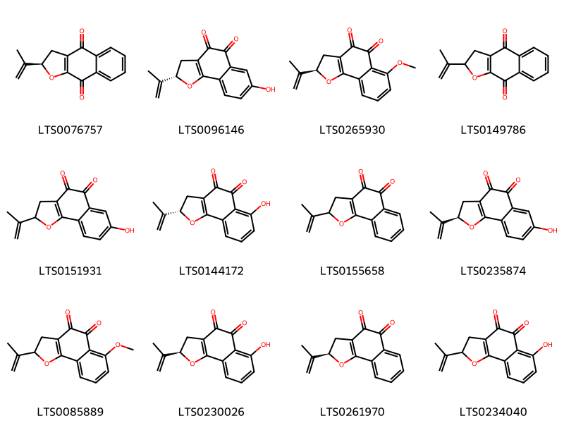{ width=100% }
    <figcaption>Hình ảnh cấu trúc hóa học của 12 hoạt chất thuộc nhóm Naphthofurans gồm ['(2r)-2-(prop-1-en-2-yl)-2h,3h-naphtho[2,3-b]furan-4,9-dione (LTS0076757)', '(2s)-7-hydroxy-2-(prop-1-en-2-yl)-2h,3h-naphtho[1,2-b]furan-4,5-dione (LTS0096146)', '(2r)-6-methoxy-2-(prop-1-en-2-yl)-2h,3h-naphtho[1,2-b]furan-4,5-dione (LTS0265930)', '2-(prop-1-en-2-yl)-2h,3h-naphtho[2,3-b]furan-4,9-dione (LTS0149786)', '7-hydroxy-2-(prop-1-en-2-yl)-2h,3h-naphtho[1,2-b]furan-4,5-dione (LTS0151931)', '(2s)-6-hydroxy-2-(prop-1-en-2-yl)-2h,3h-naphtho[1,2-b]furan-4,5-dione (LTS0144172)', '2-(prop-1-en-2-yl)-2h,3h-naphtho[1,2-b]furan-4,5-dione (LTS0155658)', '(2r)-7-hydroxy-2-(prop-1-en-2-yl)-2h,3h-naphtho[1,2-b]furan-4,5-dione (LTS0235874)', '6-methoxy-2-(prop-1-en-2-yl)-2h,3h-naphtho[1,2-b]furan-4,5-dione (LTS0085889)', '(2r)-6-hydroxy-2-(prop-1-en-2-yl)-2h,3h-naphtho[1,2-b]furan-4,5-dione (LTS0230026)', '(2r)-2-(prop-1-en-2-yl)-2h,3h-naphtho[1,2-b]furan-4,5-dione (LTS0261970)', '6-hydroxy-2-(prop-1-en-2-yl)-2h,3h-naphtho[1,2-b]furan-4,5-dione (LTS0234040)'].</figcaption>
</figure>
#### Nhóm Prenol lipids
<figure markdown="span">
    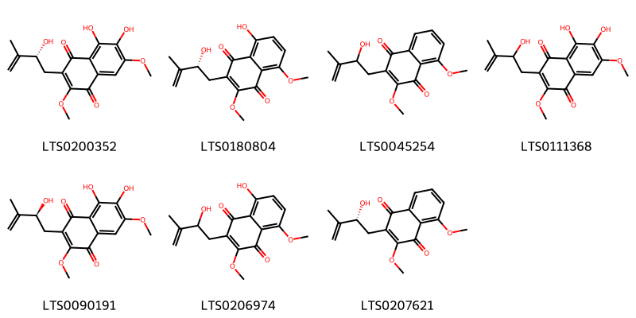{ width=100% }
    <figcaption>Hình ảnh cấu trúc hóa học của 7 hoạt chất thuộc nhóm Prenol lipids gồm ['5,6-dihydroxy-3-[(2r)-2-hydroxy-3-methylbut-3-en-1-yl]-2,7-dimethoxynaphthalene-1,4-dione (LTS0200352)', '5-hydroxy-3-[(2r)-2-hydroxy-3-methylbut-3-en-1-yl]-2,8-dimethoxynaphthalene-1,4-dione (LTS0180804)', '2-(2-hydroxy-3-methylbut-3-en-1-yl)-3,5-dimethoxynaphthalene-1,4-dione (LTS0045254)', '5,6-dihydroxy-3-(2-hydroxy-3-methylbut-3-en-1-yl)-2,7-dimethoxynaphthalene-1,4-dione (LTS0111368)', '5,6-dihydroxy-3-[(2s)-2-hydroxy-3-methylbut-3-en-1-yl]-2,7-dimethoxynaphthalene-1,4-dione (LTS0090191)', '5-hydroxy-3-(2-hydroxy-3-methylbut-3-en-1-yl)-2,8-dimethoxynaphthalene-1,4-dione (LTS0206974)', '2-[(2r)-2-hydroxy-3-methylbut-3-en-1-yl]-3,5-dimethoxynaphthalene-1,4-dione (LTS0207621)'].</figcaption>
</figure>

---

### Dược dân tộc học

Danh sách các quốc gia có sử dụng *Lantana involucrata* trong điều trị các bệnh. 

| Country            | Disease                      | Bệnh                                                                                                                                                                                                |
|:-------------------|:-----------------------------|:----------------------------------------------------------------------------------------------------------------------------------------------------------------------------------------------------|
| Bahamas            | Emetic                       | MYMEMORY WARNING: YOU USED ALL AVAILABLE FREE TRANSLATIONS FOR TODAY. NEXT AVAILABLE IN  16 HOURS 50 MINUTES 31 SECONDS VISIT HTTPS://MYMEMORY.TRANSLATED.NET/DOC/USAGELIMITS.PHP TO TRANSLATE MORE |
| Dominican Republic | Tonic, Stomachic             | MYMEMORY WARNING: YOU USED ALL AVAILABLE FREE TRANSLATIONS FOR TODAY. NEXT AVAILABLE IN  16 HOURS 50 MINUTES 29 SECONDS VISIT HTTPS://MYMEMORY.TRANSLATED.NET/DOC/USAGELIMITS.PHP TO TRANSLATE MORE |
| Haiti              | Digestive, Nervine, Sedative | MYMEMORY WARNING: YOU USED ALL AVAILABLE FREE TRANSLATIONS FOR TODAY. NEXT AVAILABLE IN  16 HOURS 50 MINUTES 27 SECONDS VISIT HTTPS://MYMEMORY.TRANSLATED.NET/DOC/USAGELIMITS.PHP TO TRANSLATE MORE |

---

---
## Lantana microphylla
### Thông tin về thực vật

!!! info "Phân loại thực vật của *N/A* từ GIBF:"
    - **Kingdom:** Plantae
    - **Phylum:** Tracheophyta
    - **Order:** Lamiales
    - **Family:** Verbenaceae
    - **Genus:** N/A
    - **Species:** *N/A*

 

| Label (VI)   | Label (EN)   | Scientific Name     | Descriptions (VI)   | Descriptions (EN)   | Also Known As (VI)   | Also Known As (EN)   |
|:-------------|:-------------|:--------------------|:--------------------|:--------------------|:---------------------|:---------------------|
| N/A          | N/A          | Lantana microphylla | loài thực vật       | species of plant    | ['']                 | ['']                 |

#### Phân bố trên thế giới

**Từ CSDL GIBF** Thailand, Spain, Trinidad and Tobago, Chile, Australia, Indonesia, Puerto Rico, Canada, Bahamas, Guam, Virgin Islands (U.S.), Türkiye, Uganda, Japan, Panama, Brazil, Eswatini, Mexico, China, Chinese Taipei, Hong Kong, Uruguay, Argentina, South Africa, Portugal, New Zealand, Macao, Costa Rica, Bolivia (Plurinational State of), Ecuador, United States of America, Italy, Greece, Cabo Verde

#### Phân bố tại Việt Nam

**Từ CSDL GIBF**: Không có ghi nhận ở Việt Nam

---
### Thành phần hóa học
        
- Theo cơ sở dữ liệu lotus: Từ loài *N/A* đã phân lập và xác định được Chưa có hoạt chất nào được phân lập. hoạt chất thuộc về các nhóm Không có hoạt chất nào được phân lập. 

Không có hình ảnh nào được tạo ra

---

### Dược dân tộc học

Danh sách các quốc gia có sử dụng *N/A* trong điều trị các bệnh. 

| Country       | Disease   | Bệnh                                                                                                                                                                                                |
|:--------------|:----------|:----------------------------------------------------------------------------------------------------------------------------------------------------------------------------------------------------|
| South America | Tonic     | MYMEMORY WARNING: YOU USED ALL AVAILABLE FREE TRANSLATIONS FOR TODAY. NEXT AVAILABLE IN  16 HOURS 49 MINUTES 57 SECONDS VISIT HTTPS://MYMEMORY.TRANSLATED.NET/DOC/USAGELIMITS.PHP TO TRANSLATE MORE |

---

---
## Lantana trifolia
### Thông tin về thực vật

!!! info "Phân loại thực vật của *Lantana trifolia* từ GIBF:"
    - **Kingdom:** Plantae
    - **Phylum:** Tracheophyta
    - **Order:** Lamiales
    - **Family:** Verbenaceae
    - **Genus:** Lantana
    - **Species:** *Lantana trifolia*

 

| Label (VI)   | Label (EN)   | Scientific Name   | Descriptions (VI)   | Descriptions (EN)   | Also Known As (VI)   | Also Known As (EN)   |
|:-------------|:-------------|:------------------|:--------------------|:--------------------|:---------------------|:---------------------|
| N/A          | N/A          | Lantana trifolia  | loài thực vật       | species of plant    | ['']                 | ['']                 |

#### Phân bố trên thế giới

**Từ CSDL GIBF** Honduras, El Salvador, French Guiana, Kenya, Jamaica, Indonesia, Haiti, Colombia, Venezuela (Bolivarian Republic of), Dominican Republic, Puerto Rico, Malaysia, Mayotte, Netherlands, Uganda, Belize, Nicaragua, Panama, Brazil, Peru, Mexico, Argentina, South Africa, Tanzania, United Republic of, Bolivia (Plurinational State of), Paraguay, Costa Rica, Ecuador

#### Phân bố tại Việt Nam

**Từ CSDL GIBF**: Không có ghi nhận ở Việt Nam

---
### Thành phần hóa học
        
- Theo cơ sở dữ liệu lotus: Từ loài *Lantana trifolia* đã phân lập và xác định được 24 hoạt chất thuộc về các nhóm Organooxygen compounds, Benzene and substituted derivatives, Cinnamic acids and derivatives, Flavonoids. 

|    | chemicalTaxonomyClassyfireClass     |   smiles_count |
|---:|:------------------------------------|---------------:|
|  0 | Benzene and substituted derivatives |              3 |
|  1 | Cinnamic acids and derivatives      |              8 |
|  2 | Flavonoids                          |              9 |
|  3 | Organooxygen compounds              |              4 |

#### Nhóm Benzene and substituted derivatives
<figure markdown="span">
    { width=100% }
    <figcaption>Hình ảnh cấu trúc hóa học của 3 hoạt chất thuộc nhóm Benzene and substituted derivatives gồm ['p-hydroxybenzoic acid (LTS0263634)', '3,4-dihydroxybenzoic acid (LTS0018765)', 'vanillic acid (LTS0229113)'].</figcaption>
</figure>
#### Nhóm Cinnamic acids and derivatives
<figure markdown="span">
    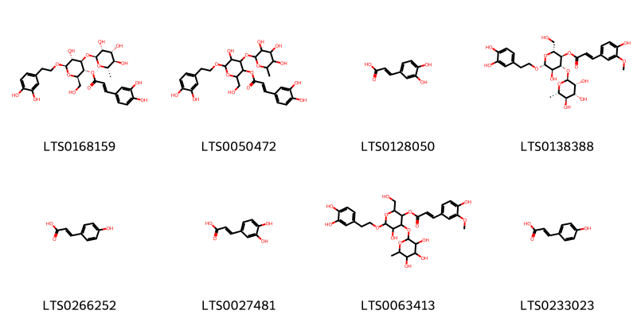{ width=100% }
    <figcaption>Hình ảnh cấu trúc hóa học của 8 hoạt chất thuộc nhóm Cinnamic acids and derivatives gồm ['verbascoside (LTS0168159)', '6-[2-(3,4-dihydroxyphenyl)ethoxy]-5-hydroxy-2-(hydroxymethyl)-4-[(3,4,5-trihydroxy-6-methyloxan-2-yl)oxy]oxan-3-yl 3-(3,4-dihydroxyphenyl)prop-2-enoate (LTS0050472)', '3,4-dihydroxycinnamic acid (LTS0128050)', '(2r,3r,4r,5r,6r)-6-[2-(3,4-dihydroxyphenyl)ethoxy]-5-hydroxy-2-(hydroxymethyl)-4-{[(2s,3r,4r,5r,6s)-3,4,5-trihydroxy-6-methyloxan-2-yl]oxy}oxan-3-yl (2e)-3-(4-hydroxy-3-methoxyphenyl)prop-2-enoate (LTS0138388)', 'para-coumaric acid (LTS0266252)', 'caffeic acid (LTS0027481)', '6-[2-(3,4-dihydroxyphenyl)ethoxy]-5-hydroxy-2-(hydroxymethyl)-4-[(3,4,5-trihydroxy-6-methyloxan-2-yl)oxy]oxan-3-yl 3-(4-hydroxy-3-methoxyphenyl)prop-2-enoate (LTS0063413)', 'hydroxycinnamic acid (LTS0233023)'].</figcaption>
</figure>
#### Nhóm Flavonoids
<figure markdown="span">
    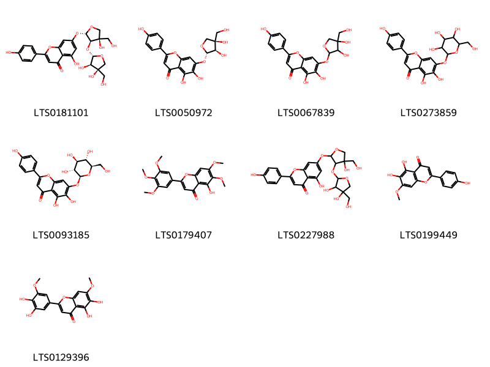{ width=100% }
    <figcaption>Hình ảnh cấu trúc hóa học của 9 hoạt chất thuộc nhóm Flavonoids gồm ['7-{[(2s,3r,4r)-3-{[(2s,3r,4r)-3,4-dihydroxy-4-(hydroxymethyl)oxolan-2-yl]oxy}-4-hydroxy-4-(hydroxymethyl)oxolan-2-yl]oxy}-5-hydroxy-2-(4-hydroxyphenyl)chromen-4-one (LTS0181101)', '7-{[(2s,3r,4r)-3,4-dihydroxy-4-(hydroxymethyl)oxolan-2-yl]oxy}-5,6-dihydroxy-2-(4-hydroxyphenyl)chromen-4-one (LTS0050972)', '7-{[3,4-dihydroxy-4-(hydroxymethyl)oxolan-2-yl]oxy}-5,6-dihydroxy-2-(4-hydroxyphenyl)chromen-4-one (LTS0067839)', '5,6-dihydroxy-2-(4-hydroxyphenyl)-7-{[3,4,5-trihydroxy-6-(hydroxymethyl)oxan-2-yl]oxy}chromen-4-one (LTS0273859)', 'plantaginin (LTS0093185)', 'umuhengerin (LTS0179407)', '7-[(3-{[3,4-dihydroxy-4-(hydroxymethyl)oxolan-2-yl]oxy}-4-hydroxy-4-(hydroxymethyl)oxolan-2-yl)oxy]-5-hydroxy-2-(4-hydroxyphenyl)chromen-4-one (LTS0227988)', 'sorbifolin (LTS0199449)', '2-(3,4-dihydroxy-5-methoxyphenyl)-5,6-dihydroxy-7-methoxychromen-4-one (LTS0129396)'].</figcaption>
</figure>
#### Nhóm Organooxygen compounds
<figure markdown="span">
    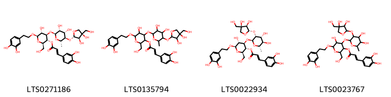{ width=100% }
    <figcaption>Hình ảnh cấu trúc hóa học của 4 hoạt chất thuộc nhóm Organooxygen compounds gồm ['(2r,3r,4r,5r,6r)-4-{[(2s,3r,4s,5r,6s)-5-{[(2s,3r,4r)-3,4-dihydroxy-4-(hydroxymethyl)oxolan-2-yl]oxy}-3,4-dihydroxy-6-methyloxan-2-yl]oxy}-6-[2-(3,4-dihydroxyphenyl)ethoxy]-5-hydroxy-2-(hydroxymethyl)oxan-3-yl (2e)-3-(3,4-dihydroxyphenyl)prop-2-enoate (LTS0271186)', '4-[(5-{[3,4-dihydroxy-4-(hydroxymethyl)oxolan-2-yl]oxy}-3,4-dihydroxy-6-methyloxan-2-yl)oxy]-6-[2-(3,4-dihydroxyphenyl)ethoxy]-5-hydroxy-2-(hydroxymethyl)oxan-3-yl 3-(3,4-dihydroxyphenyl)prop-2-enoate (LTS0135794)', '(2r,3r,4r,5r,6r)-4-{[(2s,3r,4r,5r,6s)-3-{[(2s,3r,4r)-3,4-dihydroxy-4-(hydroxymethyl)oxolan-2-yl]oxy}-4,5-dihydroxy-6-methyloxan-2-yl]oxy}-6-[2-(3,4-dihydroxyphenyl)ethoxy]-5-hydroxy-2-(hydroxymethyl)oxan-3-yl (2e)-3-(3,4-dihydroxyphenyl)prop-2-enoate (LTS0022934)', '4-[(3-{[3,4-dihydroxy-4-(hydroxymethyl)oxolan-2-yl]oxy}-4,5-dihydroxy-6-methyloxan-2-yl)oxy]-6-[2-(3,4-dihydroxyphenyl)ethoxy]-5-hydroxy-2-(hydroxymethyl)oxan-3-yl 3-(3,4-dihydroxyphenyl)prop-2-enoate (LTS0023767)'].</figcaption>
</figure>

---

### Dược dân tộc học

Danh sách các quốc gia có sử dụng *Lantana trifolia* trong điều trị các bệnh. 

| Country   | Disease   | Bệnh                                                                                                                                                                                                |
|:----------|:----------|:----------------------------------------------------------------------------------------------------------------------------------------------------------------------------------------------------|
| Haiti     | Stimulant | MYMEMORY WARNING: YOU USED ALL AVAILABLE FREE TRANSLATIONS FOR TODAY. NEXT AVAILABLE IN  16 HOURS 49 MINUTES 35 SECONDS VISIT HTTPS://MYMEMORY.TRANSLATED.NET/DOC/USAGELIMITS.PHP TO TRANSLATE MORE |

---

# Chi Stachytarpheta

??? note "Danh sách các dược liệu thuộc chi"
    
	 - *Stachytarpheta angustifolia*
	 - *Stachytarpheta cayennensis*
	 - *Stachytarpheta indica*
	 - *Stachytarpheta jamaicensis*
	 - *Stachytarpheta jammacensis*
	 - *Stachytarpheta mutabilis*
	 - *Stachytarpheta urticaefolia*

---
## Stachytarpheta angustifolia
### Thông tin về thực vật

!!! info "Phân loại thực vật của *Stachytarpheta indica* từ GIBF:"
    - **Kingdom:** Plantae
    - **Phylum:** Tracheophyta
    - **Order:** Lamiales
    - **Family:** Verbenaceae
    - **Genus:** Stachytarpheta
    - **Species:** *Stachytarpheta indica*

 

| Label (VI)   | Label (EN)   | Scientific Name             | Descriptions (VI)   | Descriptions (EN)   | Also Known As (VI)   | Also Known As (EN)   |
|:-------------|:-------------|:----------------------------|:--------------------|:--------------------|:---------------------|:---------------------|
| N/A          | N/A          | Stachytarpheta angustifolia | loài thực vật       | species of plant    | ['']                 | ['']                 |

#### Phân bố trên thế giới

**Từ CSDL GIBF** nan, Malawi, Colombia, Togo, Suriname, Nicaragua, Venezuela (Bolivarian Republic of), Saint Helena, Ascension and Tristan da Cunha, Brazil, El Salvador, Bolivia (Plurinational State of), Paraguay, Burkina Faso, Nigeria, Mexico, Benin

#### Phân bố tại Việt Nam

**Từ CSDL GIBF**: Không có ghi nhận ở Việt Nam

---
### Thành phần hóa học
        
- Theo cơ sở dữ liệu lotus: Từ loài *Stachytarpheta indica* đã phân lập và xác định được Chưa có hoạt chất nào được phân lập. hoạt chất thuộc về các nhóm Không có hoạt chất nào được phân lập. 

Không có hình ảnh nào được tạo ra

---

### Dược dân tộc học

Danh sách các quốc gia có sử dụng *Stachytarpheta indica* trong điều trị các bệnh. 

| Country   | Disease   | Bệnh                                                                                                                                                                                                |
|:----------|:----------|:----------------------------------------------------------------------------------------------------------------------------------------------------------------------------------------------------|
| Arab      | Collyrium | MYMEMORY WARNING: YOU USED ALL AVAILABLE FREE TRANSLATIONS FOR TODAY. NEXT AVAILABLE IN  16 HOURS 49 MINUTES 04 SECONDS VISIT HTTPS://MYMEMORY.TRANSLATED.NET/DOC/USAGELIMITS.PHP TO TRANSLATE MORE |
| Sudan     | Collyrium | MYMEMORY WARNING: YOU USED ALL AVAILABLE FREE TRANSLATIONS FOR TODAY. NEXT AVAILABLE IN  16 HOURS 49 MINUTES 01 SECONDS VISIT HTTPS://MYMEMORY.TRANSLATED.NET/DOC/USAGELIMITS.PHP TO TRANSLATE MORE |

---

---
## Stachytarpheta cayennensis
### Thông tin về thực vật

!!! info "Phân loại thực vật của *Stachytarpheta cayennensis* từ GIBF:"
    - **Kingdom:** Plantae
    - **Phylum:** Tracheophyta
    - **Order:** Lamiales
    - **Family:** Verbenaceae
    - **Genus:** Stachytarpheta
    - **Species:** *Stachytarpheta cayennensis*

 

| Label (VI)   | Label (EN)   | Scientific Name            | Descriptions (VI)   | Descriptions (EN)   | Also Known As (VI)   | Also Known As (EN)   |
|:-------------|:-------------|:---------------------------|:--------------------|:--------------------|:---------------------|:---------------------|
| N/A          | N/A          | Stachytarpheta cayennensis | loài thực vật       | species of plant    | ['']                 | ['']                 |

#### Phân bố trên thế giới

**Từ CSDL GIBF** Viet Nam, Thailand, Guadeloupe, French Polynesia, French Guiana, Northern Mariana Islands, Australia, Guatemala, Indonesia, Colombia, Venezuela (Bolivarian Republic of), Dominican Republic, Sri Lanka, Puerto Rico, Malaysia, Nigeria, Brazil, Tonga, Argentina, South Africa, Cook Islands, Ecuador, United States of America

#### Phân bố tại Việt Nam

**Từ CSDL GIBF**: Thừa Thiên - Huế

---
### Thành phần hóa học
        
- Theo cơ sở dữ liệu lotus: Từ loài *Stachytarpheta cayennensis* đã phân lập và xác định được 10 hoạt chất thuộc về các nhóm Steroids and steroid derivatives, Prenol lipids, Cinnamic acids and derivatives. 

|    | chemicalTaxonomyClassyfireClass   |   smiles_count |
|---:|:----------------------------------|---------------:|
|  0 | Cinnamic acids and derivatives    |              7 |
|  1 | Prenol lipids                     |              1 |
|  2 | Steroids and steroid derivatives  |              2 |

#### Nhóm Cinnamic acids and derivatives
<figure markdown="span">
    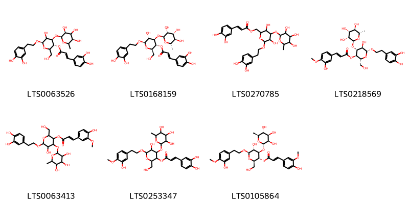{ width=100% }
    <figcaption>Hình ảnh cấu trúc hóa học của 7 hoạt chất thuộc nhóm Cinnamic acids and derivatives gồm ['(3r,4r,6r)-6-[2-(3,4-dihydroxyphenyl)ethoxy]-5-hydroxy-2-(hydroxymethyl)-4-{[(2s,3s,5r)-3,4,5-trihydroxy-6-methyloxan-2-yl]oxy}oxan-3-yl (2e)-3-(3,4-dihydroxyphenyl)prop-2-enoate (LTS0063526)', 'verbascoside (LTS0168159)', '{6-[2-(3,4-dihydroxyphenyl)ethoxy]-3,5-dihydroxy-4-[(3,4,5-trihydroxy-6-methyloxan-2-yl)oxy]oxan-2-yl}methyl 3-(3,4-dihydroxyphenyl)prop-2-enoate (LTS0270785)', '(2r,3r,4r,5r,6r)-6-[2-(3,4-dihydroxyphenyl)ethoxy]-5-hydroxy-2-(hydroxymethyl)-4-{[(2s,3r,4r,5r,6s)-3,4,5-trihydroxy-6-methyloxan-2-yl]oxy}oxan-3-yl (2e)-3-(3-hydroxy-4-methoxyphenyl)prop-2-enoate (LTS0218569)', '6-[2-(3,4-dihydroxyphenyl)ethoxy]-5-hydroxy-2-(hydroxymethyl)-4-[(3,4,5-trihydroxy-6-methyloxan-2-yl)oxy]oxan-3-yl 3-(4-hydroxy-3-methoxyphenyl)prop-2-enoate (LTS0063413)', '5-hydroxy-6-[2-(3-hydroxy-4-methoxyphenyl)ethoxy]-2-(hydroxymethyl)-4-[(3,4,5-trihydroxy-6-methyloxan-2-yl)oxy]oxan-3-yl 3-(3,4-dihydroxyphenyl)prop-2-enoate (LTS0253347)', '(2r,3r,4r,5r,6r)-5-hydroxy-6-[2-(3-hydroxy-4-methoxyphenyl)ethoxy]-2-(hydroxymethyl)-4-{[(2s,3r,4r,5r,6s)-3,4,5-trihydroxy-6-methyloxan-2-yl]oxy}oxan-3-yl (2e)-3-(4-hydroxy-3-methoxyphenyl)prop-2-enoate (LTS0105864)'].</figcaption>
</figure>
#### Nhóm Prenol lipids
<figure markdown="span">
    { width=100% }
    <figcaption>Hình ảnh cấu trúc hóa học của 1 hoạt chất thuộc nhóm Prenol lipids gồm ['ipolamiide (LTS0094952)'].</figcaption>
</figure>
#### Nhóm Steroids and steroid derivatives
<figure markdown="span">
    { width=100% }
    <figcaption>Hình ảnh cấu trúc hóa học của 2 hoạt chất thuộc nhóm Steroids and steroid derivatives gồm ['(3ar,5as,9as,9bs,11ar)-1-(5-ethyl-6-methylhept-3-en-2-yl)-9a,11a-dimethyl-1h,2h,3h,3ah,5h,5ah,6h,7h,8h,9h,9bh,10h,11h-cyclopenta[a]phenanthren-7-ol (LTS0197417)', 'chondrillasterol (LTS0142259)'].</figcaption>
</figure>

---

### Dược dân tộc học

Danh sách các quốc gia có sử dụng *Stachytarpheta cayennensis* trong điều trị các bệnh. 

| Country   | Disease                                    | Bệnh                                                                                                                                                                                                |
|:----------|:-------------------------------------------|:----------------------------------------------------------------------------------------------------------------------------------------------------------------------------------------------------|
| Trinidad  | Collyrium, Vermifuge, Collyrium, Vermifuge | MYMEMORY WARNING: YOU USED ALL AVAILABLE FREE TRANSLATIONS FOR TODAY. NEXT AVAILABLE IN  16 HOURS 48 MINUTES 38 SECONDS VISIT HTTPS://MYMEMORY.TRANSLATED.NET/DOC/USAGELIMITS.PHP TO TRANSLATE MORE |

---

---
## Stachytarpheta indica
### Thông tin về thực vật

!!! info "Phân loại thực vật của *Stachytarpheta indica* từ GIBF:"
    - **Kingdom:** Plantae
    - **Phylum:** Tracheophyta
    - **Order:** Lamiales
    - **Family:** Verbenaceae
    - **Genus:** Stachytarpheta
    - **Species:** *Stachytarpheta indica*

 

| Label (VI)   | Label (EN)   | Scientific Name       | Descriptions (VI)   | Descriptions (EN)   | Also Known As (VI)   | Also Known As (EN)   |
|:-------------|:-------------|:----------------------|:--------------------|:--------------------|:---------------------|:---------------------|
| N/A          | N/A          | Stachytarpheta indica | loài thực vật       | species of plant    | ['']                 | ['']                 |

#### Phân bố trên thế giới

**Từ CSDL GIBF** Viet Nam, Malawi, Ghana, French Guiana, Singapore, Indonesia, Sierra Leone, Colombia, Sri Lanka, Togo, Mauritius, India, Nigeria, Brazil, Saint Helena, Ascension and Tristan da Cunha, Mexico, Angola, Benin, Gambia, Tanzania, United Republic of, Costa Rica

#### Phân bố tại Việt Nam

**Từ CSDL GIBF**: Không có ghi nhận ở Việt Nam

---
### Thành phần hóa học
        
- Theo cơ sở dữ liệu lotus: Từ loài *Stachytarpheta indica* đã phân lập và xác định được Chưa có hoạt chất nào được phân lập. hoạt chất thuộc về các nhóm Không có hoạt chất nào được phân lập. 

Không có hình ảnh nào được tạo ra

---

### Dược dân tộc học

Danh sách các quốc gia có sử dụng *Stachytarpheta indica* trong điều trị các bệnh. 

| Country   | Disease     | Bệnh                                                                                                                                                                                                |
|:----------|:------------|:----------------------------------------------------------------------------------------------------------------------------------------------------------------------------------------------------|
| Venezuela | Emmenagogue | MYMEMORY WARNING: YOU USED ALL AVAILABLE FREE TRANSLATIONS FOR TODAY. NEXT AVAILABLE IN  16 HOURS 48 MINUTES 12 SECONDS VISIT HTTPS://MYMEMORY.TRANSLATED.NET/DOC/USAGELIMITS.PHP TO TRANSLATE MORE |

---

---
## Stachytarpheta jamaicensis
### Thông tin về thực vật

!!! info "Phân loại thực vật của *Stachytarpheta jamaicensis* từ GIBF:"
    - **Kingdom:** Plantae
    - **Phylum:** Tracheophyta
    - **Order:** Lamiales
    - **Family:** Verbenaceae
    - **Genus:** Stachytarpheta
    - **Species:** *Stachytarpheta jamaicensis*

 

| Label (VI)   | Label (EN)   | Scientific Name            | Descriptions (VI)   | Descriptions (EN)   | Also Known As (VI)   | Also Known As (EN)   |
|:-------------|:-------------|:---------------------------|:--------------------|:--------------------|:---------------------|:---------------------|
| N/A          | N/A          | Stachytarpheta jamaicensis | loài thực vật       | species of plant    | ['']                 | ['']                 |

#### Phân bố trên thế giới

**Từ CSDL GIBF** Honduras, Thailand, Guadeloupe, French Guiana, Singapore, Martinique, Australia, Jamaica, Colombia, Sri Lanka, Dominican Republic, Turks and Caicos Islands, Maldives, Puerto Rico, Mauritius, India, Bahamas, Cuba, Guam, Bonaire, Sint Eustatius and Saba, Virgin Islands (U.S.), Barbados, Virgin Islands (British), Antigua and Barbuda, Japan, Belize, Brazil, Saint Lucia, Montserrat, Mexico, Chinese Taipei, Hong Kong, South Africa, Bermuda, Micronesia (Federated States of), Costa Rica, Ecuador, United States of America

#### Phân bố tại Việt Nam

**Từ CSDL GIBF**: Không có ghi nhận ở Việt Nam

---
### Thành phần hóa học
        
- Theo cơ sở dữ liệu lotus: Từ loài *Stachytarpheta jamaicensis* đã phân lập và xác định được 1 hoạt chất thuộc về các nhóm Prenol lipids. 

|    | chemicalTaxonomyClassyfireClass   |   smiles_count |
|---:|:----------------------------------|---------------:|
|  0 | Prenol lipids                     |              1 |

#### Nhóm Prenol lipids
<figure markdown="span">
    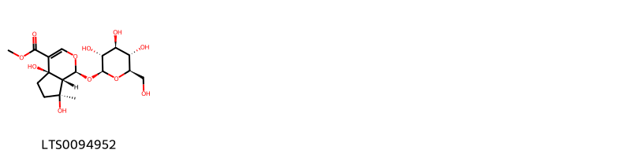{ width=100% }
    <figcaption>Hình ảnh cấu trúc hóa học của 1 hoạt chất thuộc nhóm Prenol lipids gồm ['ipolamiide (LTS0094952)'].</figcaption>
</figure>

---

### Dược dân tộc học

Danh sách các quốc gia có sử dụng *Stachytarpheta jamaicensis* trong điều trị các bệnh. 

| Country   | Disease                                                                  | Bệnh                                                                                                                                                                                                |
|:----------|:-------------------------------------------------------------------------|:----------------------------------------------------------------------------------------------------------------------------------------------------------------------------------------------------|
| Bahamas   | Abortifacient, Emetic, Vermifuge                                         | MYMEMORY WARNING: YOU USED ALL AVAILABLE FREE TRANSLATIONS FOR TODAY. NEXT AVAILABLE IN  16 HOURS 47 MINUTES 50 SECONDS VISIT HTTPS://MYMEMORY.TRANSLATED.NET/DOC/USAGELIMITS.PHP TO TRANSLATE MORE |
| Elsewhere | Emmenagogue, Pressor, Abortifacient, Poison, Vermifuge, Cardiac          | MYMEMORY WARNING: YOU USED ALL AVAILABLE FREE TRANSLATIONS FOR TODAY. NEXT AVAILABLE IN  16 HOURS 47 MINUTES 48 SECONDS VISIT HTTPS://MYMEMORY.TRANSLATED.NET/DOC/USAGELIMITS.PHP TO TRANSLATE MORE |
| Haiti     | Cathartic, Emmenagogue, Sedative, Sedative, Emetic, Stomachic, Vermifuge | MYMEMORY WARNING: YOU USED ALL AVAILABLE FREE TRANSLATIONS FOR TODAY. NEXT AVAILABLE IN  16 HOURS 47 MINUTES 45 SECONDS VISIT HTTPS://MYMEMORY.TRANSLATED.NET/DOC/USAGELIMITS.PHP TO TRANSLATE MORE |
| Mexico    | Sudorific                                                                | MYMEMORY WARNING: YOU USED ALL AVAILABLE FREE TRANSLATIONS FOR TODAY. NEXT AVAILABLE IN  16 HOURS 47 MINUTES 42 SECONDS VISIT HTTPS://MYMEMORY.TRANSLATED.NET/DOC/USAGELIMITS.PHP TO TRANSLATE MORE |
| Trinidad  | Purgative, Purgative, Vermifuge, Vermifuge                               | MYMEMORY WARNING: YOU USED ALL AVAILABLE FREE TRANSLATIONS FOR TODAY. NEXT AVAILABLE IN  16 HOURS 47 MINUTES 40 SECONDS VISIT HTTPS://MYMEMORY.TRANSLATED.NET/DOC/USAGELIMITS.PHP TO TRANSLATE MORE |

---

---
## Stachytarpheta jammacensis
### Thông tin về thực vật

!!! info "Phân loại thực vật của *Stachytarpheta jamaicensis* từ GIBF:"
    - **Kingdom:** Plantae
    - **Phylum:** Tracheophyta
    - **Order:** Lamiales
    - **Family:** Verbenaceae
    - **Genus:** Stachytarpheta
    - **Species:** *Stachytarpheta jamaicensis*

 

| Label (VI)   | Label (EN)   | Scientific Name            | Descriptions (VI)   | Descriptions (EN)   | Also Known As (VI)   | Also Known As (EN)   |
|:-------------|:-------------|:---------------------------|:--------------------|:--------------------|:---------------------|:---------------------|
| N/A          | N/A          | Stachytarpheta jamaicensis | loài thực vật       | species of plant    | ['']                 | ['']                 |

#### Phân bố trên thế giới

**Từ CSDL GIBF** Honduras, Thailand, Guadeloupe, French Guiana, Singapore, Martinique, Australia, Jamaica, Colombia, Sri Lanka, Dominican Republic, Turks and Caicos Islands, Maldives, Puerto Rico, Mauritius, India, Bahamas, Cuba, Guam, Bonaire, Sint Eustatius and Saba, Virgin Islands (U.S.), Barbados, Virgin Islands (British), Antigua and Barbuda, Japan, Belize, Brazil, Saint Lucia, Montserrat, Mexico, Chinese Taipei, Hong Kong, South Africa, Bermuda, Micronesia (Federated States of), Costa Rica, Ecuador, United States of America

#### Phân bố tại Việt Nam

**Từ CSDL GIBF**: Không có ghi nhận ở Việt Nam

---
### Thành phần hóa học
        
- Theo cơ sở dữ liệu lotus: Từ loài *Stachytarpheta jamaicensis* đã phân lập và xác định được Chưa có hoạt chất nào được phân lập. hoạt chất thuộc về các nhóm Không có hoạt chất nào được phân lập. 

Không có hình ảnh nào được tạo ra

---

### Dược dân tộc học

Danh sách các quốc gia có sử dụng *Stachytarpheta jamaicensis* trong điều trị các bệnh. 

| Country   | Disease   | Bệnh                                                                                                                                                                                                |
|:----------|:----------|:----------------------------------------------------------------------------------------------------------------------------------------------------------------------------------------------------|
| Mexico    | Tonic     | MYMEMORY WARNING: YOU USED ALL AVAILABLE FREE TRANSLATIONS FOR TODAY. NEXT AVAILABLE IN  16 HOURS 47 MINUTES 17 SECONDS VISIT HTTPS://MYMEMORY.TRANSLATED.NET/DOC/USAGELIMITS.PHP TO TRANSLATE MORE |

---

---
## Stachytarpheta mutabilis
### Thông tin về thực vật

!!! info "Phân loại thực vật của *Stachytarpheta mutabilis* từ GIBF:"
    - **Kingdom:** Plantae
    - **Phylum:** Tracheophyta
    - **Order:** Lamiales
    - **Family:** Verbenaceae
    - **Genus:** Stachytarpheta
    - **Species:** *Stachytarpheta mutabilis*

 

| Label (VI)   | Label (EN)   | Scientific Name          | Descriptions (VI)   | Descriptions (EN)   | Also Known As (VI)   | Also Known As (EN)   |
|:-------------|:-------------|:-------------------------|:--------------------|:--------------------|:---------------------|:---------------------|
| N/A          | N/A          | Stachytarpheta mutabilis | loài thực vật       | species of plant    | ['']                 | ['']                 |

#### Phân bố trên thế giới

**Từ CSDL GIBF** Honduras, Guadeloupe, Dominica, French Guiana, Trinidad and Tobago, Singapore, Martinique, Australia, Guatemala, Colombia, Venezuela (Bolivarian Republic of), Malaysia, India, Seychelles, Cuba, Bonaire, Sint Eustatius and Saba, Nicaragua, Panama, Brazil, Mexico, Curaçao, Hong Kong, South Africa, Fiji, Costa Rica, Ecuador, United States of America, Zimbabwe, Madagascar

#### Phân bố tại Việt Nam

**Từ CSDL GIBF**: Không có ghi nhận ở Việt Nam

---
### Thành phần hóa học
        
- Theo cơ sở dữ liệu lotus: Từ loài *Stachytarpheta mutabilis* đã phân lập và xác định được 5 hoạt chất thuộc về các nhóm Prenol lipids. 

|    | chemicalTaxonomyClassyfireClass   |   smiles_count |
|---:|:----------------------------------|---------------:|
|  0 | Prenol lipids                     |              5 |

#### Nhóm Prenol lipids
<figure markdown="span">
    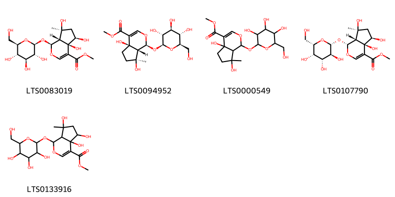{ width=100% }
    <figcaption>Hình ảnh cấu trúc hóa học của 5 hoạt chất thuộc nhóm Prenol lipids gồm ['methyl (1s,4ar,5r,7s,7ar)-4a,5,7-trihydroxy-7-methyl-1-{[(2s,3r,4s,5s,6r)-3,4,5-trihydroxy-6-(hydroxymethyl)oxan-2-yl]oxy}-1h,5h,6h,7ah-cyclopenta[c]pyran-4-carboxylate (LTS0083019)', 'ipolamiide (LTS0094952)', 'methyl 4a,7-dihydroxy-7-methyl-1-{[3,4,5-trihydroxy-6-(hydroxymethyl)oxan-2-yl]oxy}-1h,5h,6h,7ah-cyclopenta[c]pyran-4-carboxylate (LTS0000549)', 'methyl (1r,4ar,5r,7s,7ar)-4a,5,7-trihydroxy-7-methyl-1-{[(2r,3s,4r,5s,6s)-3,4,5-trihydroxy-6-(hydroxymethyl)oxan-2-yl]oxy}-1h,5h,6h,7ah-cyclopenta[c]pyran-4-carboxylate (LTS0107790)', 'methyl 4a,5,7-trihydroxy-7-methyl-1-{[3,4,5-trihydroxy-6-(hydroxymethyl)oxan-2-yl]oxy}-1h,5h,6h,7ah-cyclopenta[c]pyran-4-carboxylate (LTS0133916)'].</figcaption>
</figure>

---

### Dược dân tộc học

Danh sách các quốc gia có sử dụng *Stachytarpheta mutabilis* trong điều trị các bệnh. 

| Country   | Disease   | Bệnh                                                                                                                                                                                                |
|:----------|:----------|:----------------------------------------------------------------------------------------------------------------------------------------------------------------------------------------------------|
| Elsewhere | Poison    | MYMEMORY WARNING: YOU USED ALL AVAILABLE FREE TRANSLATIONS FOR TODAY. NEXT AVAILABLE IN  16 HOURS 46 MINUTES 51 SECONDS VISIT HTTPS://MYMEMORY.TRANSLATED.NET/DOC/USAGELIMITS.PHP TO TRANSLATE MORE |

---

---
## Stachytarpheta urticaefolia
### Thông tin về thực vật

!!! info "Phân loại thực vật của *Stachytarpheta urticifolia* từ GIBF:"
    - **Kingdom:** Plantae
    - **Phylum:** Tracheophyta
    - **Order:** Lamiales
    - **Family:** Verbenaceae
    - **Genus:** Stachytarpheta
    - **Species:** *Stachytarpheta urticifolia*

 

| Label (VI)   | Label (EN)   | Scientific Name          | Descriptions (VI)   | Descriptions (EN)   | Also Known As (VI)   | Also Known As (EN)   |
|:-------------|:-------------|:-------------------------|:--------------------|:--------------------|:---------------------|:---------------------|
| N/A          | N/A          | Stachytarpheta mutabilis | loài thực vật       | species of plant    | ['']                 | ['']                 |

#### Phân bố trên thế giới

**Từ CSDL GIBF** Japan, Myanmar, American Samoa, Philippines, French Polynesia, Papua New Guinea, United States of America, Tonga, Wallis and Futuna, Solomon Islands, Chinese Taipei

#### Phân bố tại Việt Nam

**Từ CSDL GIBF**: Không có ghi nhận ở Việt Nam

---
### Thành phần hóa học
        
- Theo cơ sở dữ liệu lotus: Từ loài *Stachytarpheta urticifolia* đã phân lập và xác định được Chưa có hoạt chất nào được phân lập. hoạt chất thuộc về các nhóm Không có hoạt chất nào được phân lập. 

Không có hình ảnh nào được tạo ra

---

### Dược dân tộc học

Danh sách các quốc gia có sử dụng *Stachytarpheta urticifolia* trong điều trị các bệnh. 

| Country   | Disease                           | Bệnh                                                                                                                                                                                                |
|:----------|:----------------------------------|:----------------------------------------------------------------------------------------------------------------------------------------------------------------------------------------------------|
| Elsewhere | Abortifacient, Cardiac, Vermifuge | MYMEMORY WARNING: YOU USED ALL AVAILABLE FREE TRANSLATIONS FOR TODAY. NEXT AVAILABLE IN  16 HOURS 46 MINUTES 27 SECONDS VISIT HTTPS://MYMEMORY.TRANSLATED.NET/DOC/USAGELIMITS.PHP TO TRANSLATE MORE |

---

# Chi Verbena

??? note "Danh sách các dược liệu thuộc chi"
    
	 - *Verbena hastata*
	 - *Verbena litoralis*
	 - *Verbena officinalis*

---
## Verbena hastata
### Thông tin về thực vật

!!! info "Phân loại thực vật của *Verbena hastata* từ GIBF:"
    - **Kingdom:** Plantae
    - **Phylum:** Tracheophyta
    - **Order:** Lamiales
    - **Family:** Verbenaceae
    - **Genus:** Verbena
    - **Species:** *Verbena hastata*

 

| Label (VI)   | Label (EN)   | Scientific Name   | Descriptions (VI)   | Descriptions (EN)   | Also Known As (VI)   | Also Known As (EN)                                                                |
|:-------------|:-------------|:------------------|:--------------------|:--------------------|:---------------------|:----------------------------------------------------------------------------------|
| N/A          | N/A          | Verbena hastata   | loài thực vật       | species of plant    | ['']                 | ['swamp verbena', 'blue vervain', 'wild hyssop', 'blue verbena', "simpler's joy"] |

#### Phân bố trên thế giới

**Từ CSDL GIBF** nan, Canada, United States of America, Austria, Belgium, Netherlands

#### Phân bố tại Việt Nam

**Từ CSDL GIBF**: Không có ghi nhận ở Việt Nam

---
### Thành phần hóa học
        
- Theo cơ sở dữ liệu lotus: Từ loài *Verbena hastata* đã phân lập và xác định được 4 hoạt chất thuộc về các nhóm Prenol lipids. 

|    | chemicalTaxonomyClassyfireClass   |   smiles_count |
|---:|:----------------------------------|---------------:|
|  0 | Prenol lipids                     |              4 |

#### Nhóm Prenol lipids
<figure markdown="span">
    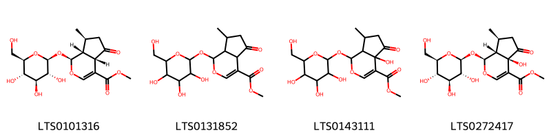{ width=100% }
    <figcaption>Hình ảnh cấu trúc hóa học của 4 hoạt chất thuộc nhóm Prenol lipids gồm ['cornin (LTS0101316)', 'methyl 7-methyl-5-oxo-1-{[3,4,5-trihydroxy-6-(hydroxymethyl)oxan-2-yl]oxy}-1h,4ah,6h,7h,7ah-cyclopenta[c]pyran-4-carboxylate (LTS0131852)', 'methyl 4a-hydroxy-7-methyl-5-oxo-1-{[3,4,5-trihydroxy-6-(hydroxymethyl)oxan-2-yl]oxy}-1h,6h,7h,7ah-cyclopenta[c]pyran-4-carboxylate (LTS0143111)', 'methyl (1s,4ar,7s,7ar)-4a-hydroxy-7-methyl-5-oxo-1-{[(2s,3r,4s,5s,6r)-3,4,5-trihydroxy-6-(hydroxymethyl)oxan-2-yl]oxy}-1h,6h,7h,7ah-cyclopenta[c]pyran-4-carboxylate (LTS0272417)'].</figcaption>
</figure>

---

### Dược dân tộc học

Danh sách các quốc gia có sử dụng *Verbena hastata* trong điều trị các bệnh. 

| Country      | Disease                             | Bệnh                                                                                                                                                                                                |
|:-------------|:------------------------------------|:----------------------------------------------------------------------------------------------------------------------------------------------------------------------------------------------------|
| US           | Diaphoretic, Expectorant, Sudorific | MYMEMORY WARNING: YOU USED ALL AVAILABLE FREE TRANSLATIONS FOR TODAY. NEXT AVAILABLE IN  16 HOURS 46 MINUTES 09 SECONDS VISIT HTTPS://MYMEMORY.TRANSLATED.NET/DOC/USAGELIMITS.PHP TO TRANSLATE MORE |
| US(Colonial) | Emetic, Expectorant                 | MYMEMORY WARNING: YOU USED ALL AVAILABLE FREE TRANSLATIONS FOR TODAY. NEXT AVAILABLE IN  16 HOURS 46 MINUTES 06 SECONDS VISIT HTTPS://MYMEMORY.TRANSLATED.NET/DOC/USAGELIMITS.PHP TO TRANSLATE MORE |

---

---
## Verbena litoralis
### Thông tin về thực vật

!!! info "Phân loại thực vật của *Verbena litoralis* từ GIBF:"
    - **Kingdom:** Plantae
    - **Phylum:** Tracheophyta
    - **Order:** Lamiales
    - **Family:** Verbenaceae
    - **Genus:** Verbena
    - **Species:** *Verbena litoralis*

 

| Label (VI)   | Label (EN)   | Scientific Name   | Descriptions (VI)   | Descriptions (EN)   | Also Known As (VI)   | Also Known As (EN)   |
|:-------------|:-------------|:------------------|:--------------------|:--------------------|:---------------------|:---------------------|
| N/A          | N/A          | Verbena litoralis | loài thực vật       | species of plant    | ['']                 | ['']                 |

#### Phân bố trên thế giới

**Từ CSDL GIBF** Uruguay, Colombia, Argentina, South Africa, Japan, Brazil, New Zealand, Peru, Norfolk Island, Costa Rica, Ecuador, United States of America, Chile, Mexico, United States Minor Outlying Islands, Australia, Chinese Taipei

#### Phân bố tại Việt Nam

**Từ CSDL GIBF**: Không có ghi nhận ở Việt Nam

---
### Thành phần hóa học
        
- Theo cơ sở dữ liệu lotus: Từ loài *Verbena litoralis* đã phân lập và xác định được 11 hoạt chất thuộc về các nhóm Organooxygen compounds, Furopyrans, Prenol lipids, Linear 1,3-diarylpropanoids, Cinnamic acids and derivatives. 

|    | chemicalTaxonomyClassyfireClass   |   smiles_count |
|---:|:----------------------------------|---------------:|
|  0 | Cinnamic acids and derivatives    |              3 |
|  1 | Furopyrans                        |              2 |
|  2 | Linear 1,3-diarylpropanoids       |              1 |
|  3 | Organooxygen compounds            |              1 |
|  4 | Prenol lipids                     |              4 |

#### Nhóm Cinnamic acids and derivatives
<figure markdown="span">
    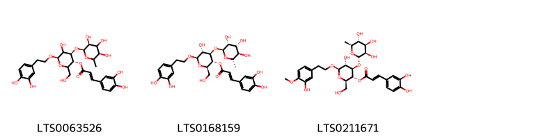{ width=100% }
    <figcaption>Hình ảnh cấu trúc hóa học của 3 hoạt chất thuộc nhóm Cinnamic acids and derivatives gồm ['(3r,4r,6r)-6-[2-(3,4-dihydroxyphenyl)ethoxy]-5-hydroxy-2-(hydroxymethyl)-4-{[(2s,3s,5r)-3,4,5-trihydroxy-6-methyloxan-2-yl]oxy}oxan-3-yl (2e)-3-(3,4-dihydroxyphenyl)prop-2-enoate (LTS0063526)', 'verbascoside (LTS0168159)', '(2r,3r,4r,5r,6r)-5-hydroxy-6-[2-(3-hydroxy-4-methoxyphenyl)ethoxy]-2-(hydroxymethyl)-4-{[(2s,3r,4r,5r,6s)-3,4,5-trihydroxy-6-methyloxan-2-yl]oxy}oxan-3-yl (2e)-3-(3,4-dihydroxyphenyl)prop-2-enoate (LTS0211671)'].</figcaption>
</figure>
#### Nhóm Furopyrans
<figure markdown="span">
    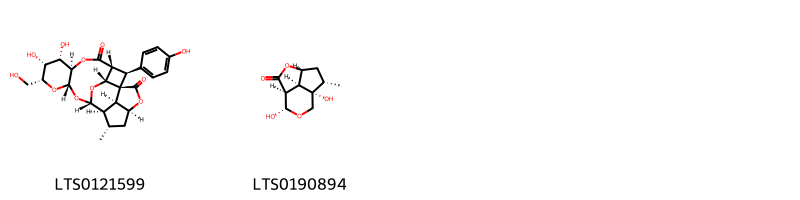{ width=100% }
    <figcaption>Hình ảnh cấu trúc hóa học của 2 hoạt chất thuộc nhóm Furopyrans gồm ['(1s,3s,5r,6r,7s,8r,11r,12s,13s,16s,18s,19r,21r,22s)-6,7-dihydroxy-5-(hydroxymethyl)-12-(4-hydroxyphenyl)-18-methyl-2,4,9,15,20-pentaoxahexacyclo[9.8.2.1¹³,¹⁶.0³,⁸.0¹³,²¹.0¹⁹,²²]docosane-10,14-dione (LTS0121599)', '(1s,4s,6s,7s,10s,11s)-7,10-dihydroxy-6-methyl-3,9-dioxatricyclo[5.3.1.0⁴,¹¹]undecan-2-one (LTS0190894)'].</figcaption>
</figure>
#### Nhóm Linear 1_3-diarylpropanoids
<figure markdown="span">
    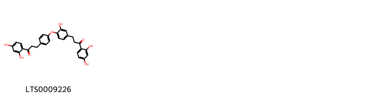{ width=100% }
    <figcaption>Hình ảnh cấu trúc hóa học của Không tìm thấy chú thích hoạt chất thuộc nhóm Linear 1_3-diarylpropanoids gồm Không tìm thấy chú thích.</figcaption>
</figure>
#### Nhóm Organooxygen compounds
<figure markdown="span">
    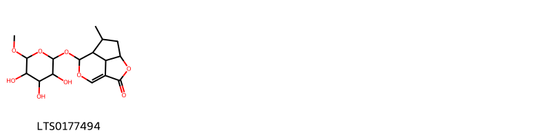{ width=100% }
    <figcaption>Hình ảnh cấu trúc hóa học của 1 hoạt chất thuộc nhóm Organooxygen compounds gồm ['6-methyl-8-[(3,4,5-trihydroxy-6-methoxyoxan-2-yl)oxy]-3,9-dioxatricyclo[5.3.1.0⁴,¹¹]undec-1(10)-en-2-one (LTS0177494)'].</figcaption>
</figure>
#### Nhóm Prenol lipids
<figure markdown="span">
    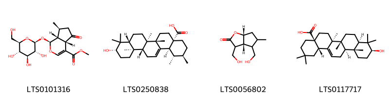{ width=100% }
    <figcaption>Hình ảnh cấu trúc hóa học của 4 hoạt chất thuộc nhóm Prenol lipids gồm ['cornin (LTS0101316)', 'ursolic acid (LTS0250838)', '(3ar,6ar)-3,4-bis(hydroxymethyl)-5-methyl-hexahydrocyclopenta[b]furan-2-one (LTS0056802)', 'oleanolic acid (LTS0117717)'].</figcaption>
</figure>

---

### Dược dân tộc học

Danh sách các quốc gia có sử dụng *Verbena litoralis* trong điều trị các bệnh. 

| Country   | Disease       | Bệnh                                                                                                                                                                                                |
|:----------|:--------------|:----------------------------------------------------------------------------------------------------------------------------------------------------------------------------------------------------|
| Paraguay  | Antifertility | MYMEMORY WARNING: YOU USED ALL AVAILABLE FREE TRANSLATIONS FOR TODAY. NEXT AVAILABLE IN  16 HOURS 45 MINUTES 42 SECONDS VISIT HTTPS://MYMEMORY.TRANSLATED.NET/DOC/USAGELIMITS.PHP TO TRANSLATE MORE |
| Peru      | Purgative     | MYMEMORY WARNING: YOU USED ALL AVAILABLE FREE TRANSLATIONS FOR TODAY. NEXT AVAILABLE IN  16 HOURS 45 MINUTES 38 SECONDS VISIT HTTPS://MYMEMORY.TRANSLATED.NET/DOC/USAGELIMITS.PHP TO TRANSLATE MORE |

---

---
## Verbena officinalis
### Thông tin về thực vật

!!! info "Phân loại thực vật của *Verbena officinalis* từ GIBF:"
    - **Kingdom:** Plantae
    - **Phylum:** Tracheophyta
    - **Order:** Lamiales
    - **Family:** Verbenaceae
    - **Genus:** Verbena
    - **Species:** *Verbena officinalis*

 

| Label (VI)   | Label (EN)   | Scientific Name     | Descriptions (VI)   | Descriptions (EN)      | Also Known As (VI)   | Also Known As (EN)   |
|:-------------|:-------------|:--------------------|:--------------------|:-----------------------|:---------------------|:---------------------|
| N/A          | N/A          | Verbena officinalis | loài thực vật       | species of plant, herb | ['']                 | ['Vervain']          |

#### Phân bố trên thế giới

**Từ CSDL GIBF** Georgia, Bosnia and Herzegovina, Spain, Kosovo, Germany, Austria, Australia, Dominican Republic, Montenegro, Belgium, Netherlands, Slovakia, Malta, Hungary, Mexico, China, Norway, Chinese Taipei, Switzerland, United Kingdom of Great Britain and Northern Ireland, South Africa, Portugal, Morocco, France, Czechia, New Zealand, Russian Federation, Italy, Israel, Greece, Croatia

#### Phân bố tại Việt Nam

**Từ CSDL GIBF**: Không có ghi nhận ở Việt Nam

---
### Thành phần hóa học
        
- Theo cơ sở dữ liệu lotus: Từ loài *Verbena officinalis* đã phân lập và xác định được 72 hoạt chất thuộc về các nhóm Organooxygen compounds, Flavonoids, Saturated hydrocarbons, Prenol lipids, Fatty Acyls, Phenols, Cinnamic acids and derivatives, Steroids and steroid derivatives. 

|    | chemicalTaxonomyClassyfireClass   |   smiles_count |
|---:|:----------------------------------|---------------:|
|  0 | Cinnamic acids and derivatives    |              5 |
|  1 | Fatty Acyls                       |              1 |
|  2 | Flavonoids                        |             16 |
|  3 | Organooxygen compounds            |              6 |
|  4 | Phenols                           |              1 |
|  5 | Prenol lipids                     |             33 |
|  6 | Saturated hydrocarbons            |              1 |
|  7 | Steroids and steroid derivatives  |              7 |

#### Nhóm Cinnamic acids and derivatives
<figure markdown="span">
    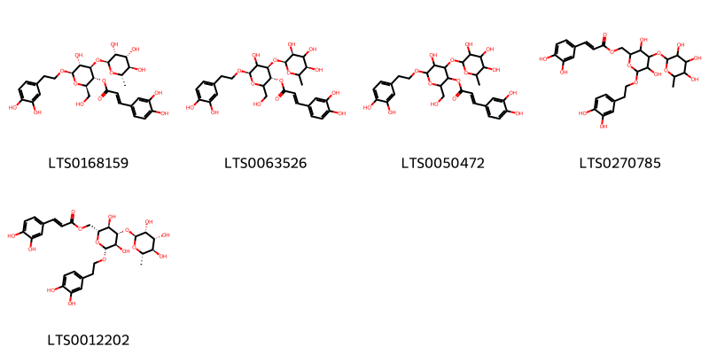{ width=100% }
    <figcaption>Hình ảnh cấu trúc hóa học của 5 hoạt chất thuộc nhóm Cinnamic acids and derivatives gồm ['verbascoside (LTS0168159)', '(3r,4r,6r)-6-[2-(3,4-dihydroxyphenyl)ethoxy]-5-hydroxy-2-(hydroxymethyl)-4-{[(2s,3s,5r)-3,4,5-trihydroxy-6-methyloxan-2-yl]oxy}oxan-3-yl (2e)-3-(3,4-dihydroxyphenyl)prop-2-enoate (LTS0063526)', '6-[2-(3,4-dihydroxyphenyl)ethoxy]-5-hydroxy-2-(hydroxymethyl)-4-[(3,4,5-trihydroxy-6-methyloxan-2-yl)oxy]oxan-3-yl 3-(3,4-dihydroxyphenyl)prop-2-enoate (LTS0050472)', '{6-[2-(3,4-dihydroxyphenyl)ethoxy]-3,5-dihydroxy-4-[(3,4,5-trihydroxy-6-methyloxan-2-yl)oxy]oxan-2-yl}methyl 3-(3,4-dihydroxyphenyl)prop-2-enoate (LTS0270785)', 'isoacteoside (LTS0012202)'].</figcaption>
</figure>
#### Nhóm Fatty Acyls
<figure markdown="span">
    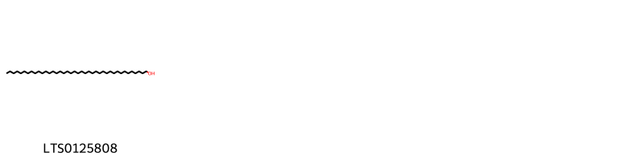{ width=100% }
    <figcaption>Hình ảnh cấu trúc hóa học của 1 hoạt chất thuộc nhóm Fatty Acyls gồm ['1-tetracontanol (LTS0125808)'].</figcaption>
</figure>
#### Nhóm Flavonoids
<figure markdown="span">
    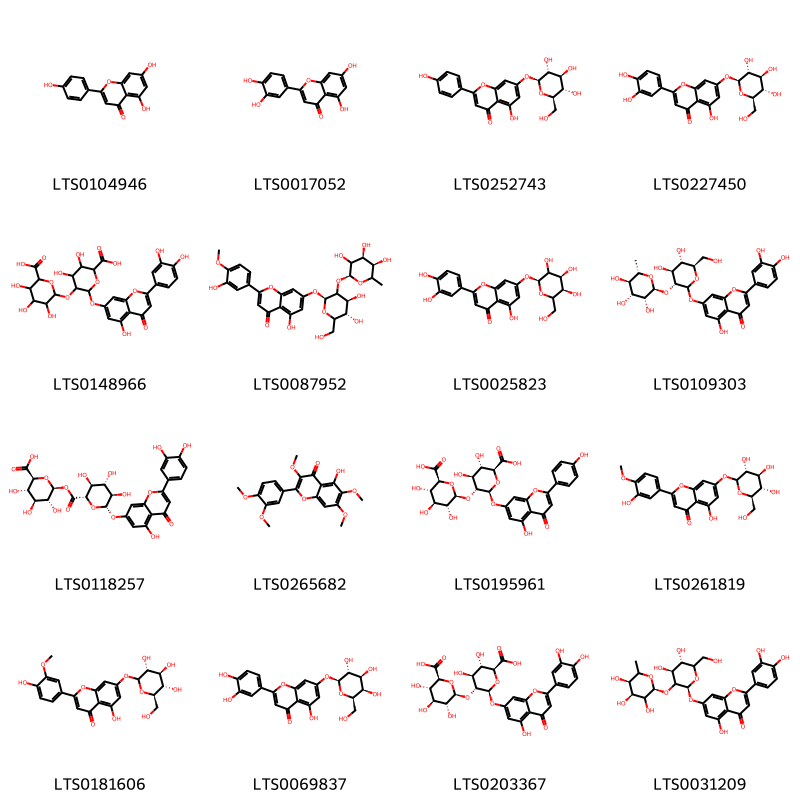{ width=100% }
    <figcaption>Hình ảnh cấu trúc hóa học của 16 hoạt chất thuộc nhóm Flavonoids gồm ['chamomile (LTS0104946)', 'luteolin (LTS0017052)', 'apigenin 7-o-β-glucoside (LTS0252743)', 'luteolin 7-o-glucoside (LTS0227450)', '6-[(6-carboxy-2-{[2-(3,4-dihydroxyphenyl)-5-hydroxy-4-oxochromen-7-yl]oxy}-4,5-dihydroxyoxan-3-yl)oxy]-3,4,5-trihydroxyoxane-2-carboxylic acid (LTS0148966)', 'neodiosmin (LTS0087952)', 'luteolin 7-galactoside (LTS0025823)', '7-{[(3r,4s,5s,6r)-4,5-dihydroxy-6-(hydroxymethyl)-3-{[(2s,3r,4r,5r,6s)-3,4,5-trihydroxy-6-methyloxan-2-yl]oxy}oxan-2-yl]oxy}-2-(3,4-dihydroxyphenyl)-5-hydroxychromen-4-one (LTS0109303)', '(2s,3s,4s,5r,6s)-6-[(2s,3s,4s,5r,6s)-6-{[2-(3,4-dihydroxyphenyl)-5-hydroxy-4-oxochromen-7-yl]oxy}-3,4,5-trihydroxyoxane-2-carbonyloxy]-3,4,5-trihydroxyoxane-2-carboxylic acid (LTS0118257)', 'artemetin (LTS0265682)', '(2s,3s,4s,5r,6s)-5-{[(2r,3r,4s,5s,6s)-6-carboxy-3,4,5-trihydroxyoxan-2-yl]oxy}-3,4-dihydroxy-6-{[5-hydroxy-2-(4-hydroxyphenyl)-4-oxochromen-7-yl]oxy}oxane-2-carboxylic acid (LTS0195961)', '5-hydroxy-2-(3-hydroxy-4-methoxyphenyl)-7-{[(3r,4s,5s,6r)-3,4,5-trihydroxy-6-(hydroxymethyl)oxan-2-yl]oxy}chromen-4-one (LTS0261819)', '5-hydroxy-2-(4-hydroxy-3-methoxyphenyl)-7-{[(3r,4s,5s,6r)-3,4,5-trihydroxy-6-(hydroxymethyl)oxan-2-yl]oxy}chromen-4-one (LTS0181606)', 'cynaroside (LTS0069837)', '(2s,3s,4s,5r,6s)-5-{[(2r,3r,4s,5s,6s)-6-carboxy-3,4,5-trihydroxyoxan-2-yl]oxy}-6-{[2-(3,4-dihydroxyphenyl)-5-hydroxy-4-oxochromen-7-yl]oxy}-3,4-dihydroxyoxane-2-carboxylic acid (LTS0203367)', 'luteolin 7-neohesperidoside (LTS0031209)'].</figcaption>
</figure>
#### Nhóm Organooxygen compounds
<figure markdown="span">
    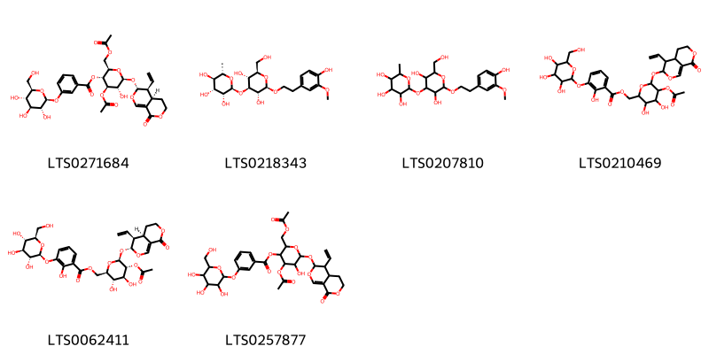{ width=100% }
    <figcaption>Hình ảnh cấu trúc hóa học của 6 hoạt chất thuộc nhóm Organooxygen compounds gồm ['(2r,3r,4r,5r,6s)-6-{[(3r,4s,4ar)-4-ethenyl-8-oxo-3h,4h,4ah,5h,6h-pyrano[3,4-c]pyran-3-yl]oxy}-4-(acetyloxy)-2-[(acetyloxy)methyl]-5-hydroxyoxan-3-yl 3-{[(2s,3r,4s,5s,6r)-3,4,5-trihydroxy-6-(hydroxymethyl)oxan-2-yl]oxy}benzoate (LTS0271684)', '(2s,3r,4r,5r,6s)-2-{[(2r,3r,4s,5r,6r)-3,5-dihydroxy-2-[2-(4-hydroxy-3-methoxyphenyl)ethoxy]-6-(hydroxymethyl)oxan-4-yl]oxy}-6-methyloxane-3,4,5-triol (LTS0218343)', '2-({3,5-dihydroxy-2-[2-(4-hydroxy-3-methoxyphenyl)ethoxy]-6-(hydroxymethyl)oxan-4-yl}oxy)-6-methyloxane-3,4,5-triol (LTS0207810)', '[5-(acetyloxy)-6-({4-ethenyl-8-oxo-3h,4h,4ah,5h,6h-pyrano[3,4-c]pyran-3-yl}oxy)-3,4-dihydroxyoxan-2-yl]methyl 2-hydroxy-3-{[3,4,5-trihydroxy-6-(hydroxymethyl)oxan-2-yl]oxy}benzoate (LTS0210469)', '[(2r,3s,4s,5r,6s)-6-{[(3r,4s,4ar)-4-ethenyl-8-oxo-3h,4h,4ah,5h,6h-pyrano[3,4-c]pyran-3-yl]oxy}-5-(acetyloxy)-3,4-dihydroxyoxan-2-yl]methyl 2-hydroxy-3-{[(2s,3r,4s,5s,6r)-3,4,5-trihydroxy-6-(hydroxymethyl)oxan-2-yl]oxy}benzoate (LTS0062411)', '4-(acetyloxy)-2-[(acetyloxy)methyl]-6-({4-ethenyl-8-oxo-3h,4h,4ah,5h,6h-pyrano[3,4-c]pyran-3-yl}oxy)-5-hydroxyoxan-3-yl 3-{[3,4,5-trihydroxy-6-(hydroxymethyl)oxan-2-yl]oxy}benzoate (LTS0257877)'].</figcaption>
</figure>
#### Nhóm Phenols
<figure markdown="span">
    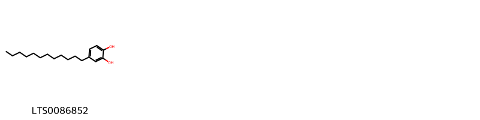{ width=100% }
    <figcaption>Hình ảnh cấu trúc hóa học của 1 hoạt chất thuộc nhóm Phenols gồm ['4-dodecylbenzene-1,2-diol (LTS0086852)'].</figcaption>
</figure>
#### Nhóm Prenol lipids
<figure markdown="span">
    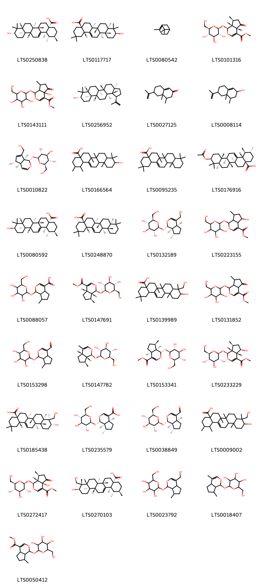{ width=100% }
    <figcaption>Hình ảnh cấu trúc hóa học của 33 hoạt chất thuộc nhóm Prenol lipids gồm ['ursolic acid (LTS0250838)', 'oleanolic acid (LTS0117717)', '2,6,6-trimethylbicyclo[3.1.1]hept-1-ene (LTS0080542)', 'cornin (LTS0101316)', 'methyl 4a-hydroxy-7-methyl-5-oxo-1-{[3,4,5-trihydroxy-6-(hydroxymethyl)oxan-2-yl]oxy}-1h,6h,7h,7ah-cyclopenta[c]pyran-4-carboxylate (LTS0143111)', 'lupeol (LTS0256952)', 'nootkatone (LTS0027125)', '4,4a-dimethyl-6-(prop-1-en-2-yl)-3,4,5,6,7,8-hexahydro-2h-naphthalen-2-ol (LTS0008114)', 'aucubin (LTS0010822)', '10-hydroxy-1,2,6a,6b,9,9,12a-heptamethyl-2,3,4,5,6,7,8,8a,10,11,12,12b,13,14b-tetradecahydro-1h-picene-4a-carboxylic acid (LTS0166564)', '2,2,6a,6b,9,9,12a-heptamethyl-1,3,4,5,6,7,8,8a,10,11,12,12b,13,14b-tetradecahydropicene-4a-carboxylic acid (LTS0095235)', '(1s,2r,4as,6as,6br,8ar,10s,12ar,12br,14bs)-10-(acetyloxy)-1,2,6a,6b,9,9,12a-heptamethyl-2,3,4,5,6,7,8,8a,10,11,12,12b,13,14b-tetradecahydro-1h-picene-4a-carboxylic acid (LTS0176916)', '3β-hydroxy-12-ursen-28-ic acid (LTS0080592)', '(4as,6as,6br,8as,12as,12br,14bs)-2,2,6a,6b,9,9,12a-heptamethyl-1,3,4,5,6,7,8,8a,10,11,12,12b,13,14b-tetradecahydropicene-4a-carboxylic acid (LTS0248870)', '(2s,3r,4s,5s,6r)-2-{[(1s,4as,7s,7ar)-4-(hydroxymethyl)-7-methyl-1h,4ah,5h,6h,7h,7ah-cyclopenta[c]pyran-1-yl]oxy}-6-(hydroxymethyl)oxane-3,4,5-triol (LTS0132189)', 'methyl 5-hydroxy-7-methyl-1-{[3,4,5-trihydroxy-6-(hydroxymethyl)oxan-2-yl]oxy}-1h,4ah,5h,6h,7h,7ah-cyclopenta[c]pyran-4-carboxylate (LTS0223155)', '7-methyl-1-{[3,4,5-trihydroxy-6-(hydroxymethyl)oxan-2-yl]oxy}-1h,4ah,5h,6h,7h,7ah-cyclopenta[c]pyran-4-carboxylic acid (LTS0088057)', 'deoxyloganin (LTS0147691)', '10-hydroxy-9-(hydroxymethyl)-2,2,6a,6b,9,12a-hexamethyl-1,3,4,5,6,7,8,8a,10,11,12,12b,13,14b-tetradecahydropicene-4a-carboxylic acid (LTS0139989)', 'methyl 7-methyl-5-oxo-1-{[3,4,5-trihydroxy-6-(hydroxymethyl)oxan-2-yl]oxy}-1h,4ah,6h,7h,7ah-cyclopenta[c]pyran-4-carboxylate (LTS0131852)', '7-methyl-1-{[3,4,5-trihydroxy-6-(hydroxymethyl)oxan-2-yl]oxy}-1h,4ah,5h,6h,7h,7ah-cyclopenta[c]pyran-4-carbaldehyde (LTS0153298)', 'iridodial glucoside (LTS0147782)', '8-epideoxyloganin (LTS0153341)', 'methyl (1s,4as,5r,7s,7ar)-5-hydroxy-7-methyl-1-{[(2s,3r,4s,5s,6r)-3,4,5-trihydroxy-6-(hydroxymethyl)oxan-2-yl]oxy}-1h,4ah,5h,6h,7h,7ah-cyclopenta[c]pyran-4-carboxylate (LTS0233229)', 'scutellaric acid (LTS0185438)', '7-deoxyloganic acid (LTS0235579)', 'iridotrial glucoside (LTS0038849)', '10-hydroxy-9-(hydroxymethyl)-1,2,6a,6b,9,12a-hexamethyl-2,3,4,5,6,7,8,8a,10,11,12,12b,13,14b-tetradecahydro-1h-picene-4a-carboxylic acid (LTS0009002)', 'methyl (1s,4ar,7s,7ar)-4a-hydroxy-7-methyl-5-oxo-1-{[(2s,3r,4s,5s,6r)-3,4,5-trihydroxy-6-(hydroxymethyl)oxan-2-yl]oxy}-1h,6h,7h,7ah-cyclopenta[c]pyran-4-carboxylate (LTS0272417)', '(1s,2r,4as,6as,6br,8ar,9s,10r,12ar,12br,14bs)-10-hydroxy-9-(hydroxymethyl)-1,2,6a,6b,9,12a-hexamethyl-2,3,4,5,6,7,8,8a,10,11,12,12b,13,14b-tetradecahydro-1h-picene-4a-carboxylic acid (LTS0270103)', '2-(hydroxymethyl)-6-{[4-(hydroxymethyl)-7-methyl-1h,4ah,5h,6h,7h,7ah-cyclopenta[c]pyran-1-yl]oxy}oxane-3,4,5-triol (LTS0023792)', '2-({4,7-dimethyl-1h,4ah,5h,6h,7h,7ah-cyclopenta[c]pyran-1-yl}oxy)-6-(hydroxymethyl)oxane-3,4,5-triol (LTS0018407)', 'methyl 7-methyl-1-{[3,4,5-trihydroxy-6-(hydroxymethyl)oxan-2-yl]oxy}-1h,4ah,5h,6h,7h,7ah-cyclopenta[c]pyran-4-carboxylate (LTS0050412)'].</figcaption>
</figure>
#### Nhóm Saturated hydrocarbons
<figure markdown="span">
    { width=100% }
    <figcaption>Hình ảnh cấu trúc hóa học của 1 hoạt chất thuộc nhóm Saturated hydrocarbons gồm ['tridecane (LTS0164232)'].</figcaption>
</figure>
#### Nhóm Steroids and steroid derivatives
<figure markdown="span">
    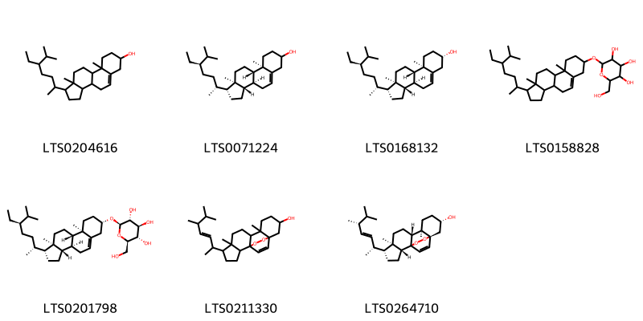{ width=100% }
    <figcaption>Hình ảnh cấu trúc hóa học của 7 hoạt chất thuộc nhóm Steroids and steroid derivatives gồm ['stigmast-5-en-3-ol, (3β)- (LTS0204616)', 'stigmast-5-en-3-ol (LTS0071224)', 'sitosterol (LTS0168132)', '2-{[1-(5-ethyl-6-methylheptan-2-yl)-9a,11a-dimethyl-1h,2h,3h,3ah,3bh,4h,6h,7h,8h,9h,9bh,10h,11h-cyclopenta[a]phenanthren-7-yl]oxy}-6-(hydroxymethyl)oxane-3,4,5-triol (LTS0158828)', 'sitogluside (LTS0201798)', '5-(5,6-dimethylhept-3-en-2-yl)-6,10-dimethyl-16,17-dioxapentacyclo[13.2.2.0¹,⁹.0²,⁶.0¹⁰,¹⁵]nonadec-18-en-13-ol (LTS0211330)', 'ergosterol peroxide (LTS0264710)'].</figcaption>
</figure>

---

### Dược dân tộc học

Danh sách các quốc gia có sử dụng *Verbena officinalis* trong điều trị các bệnh. 

| Country   | Disease                                                                         | Bệnh                                                                                                                                                                                                |
|:----------|:--------------------------------------------------------------------------------|:----------------------------------------------------------------------------------------------------------------------------------------------------------------------------------------------------|
| Australia | Poison                                                                          | MYMEMORY WARNING: YOU USED ALL AVAILABLE FREE TRANSLATIONS FOR TODAY. NEXT AVAILABLE IN  16 HOURS 45 MINUTES 07 SECONDS VISIT HTTPS://MYMEMORY.TRANSLATED.NET/DOC/USAGELIMITS.PHP TO TRANSLATE MORE |
| China     | Diuretic, Emmenagogue, Emmenagogue, Alexiteric                                  | MYMEMORY WARNING: YOU USED ALL AVAILABLE FREE TRANSLATIONS FOR TODAY. NEXT AVAILABLE IN  16 HOURS 45 MINUTES 05 SECONDS VISIT HTTPS://MYMEMORY.TRANSLATED.NET/DOC/USAGELIMITS.PHP TO TRANSLATE MORE |
| Elsewhere | Emmenagogue, Astringent, Rubefacient                                            | MYMEMORY WARNING: YOU USED ALL AVAILABLE FREE TRANSLATIONS FOR TODAY. NEXT AVAILABLE IN  16 HOURS 45 MINUTES 02 SECONDS VISIT HTTPS://MYMEMORY.TRANSLATED.NET/DOC/USAGELIMITS.PHP TO TRANSLATE MORE |
| Eurasia   | Astringent, Diuretic, Diaphoretic, Emmenagogue                                  | MYMEMORY WARNING: YOU USED ALL AVAILABLE FREE TRANSLATIONS FOR TODAY. NEXT AVAILABLE IN  16 HOURS 45 MINUTES 00 SECONDS VISIT HTTPS://MYMEMORY.TRANSLATED.NET/DOC/USAGELIMITS.PHP TO TRANSLATE MORE |
| Iraq      | Aphrodisiac                                                                     | MYMEMORY WARNING: YOU USED ALL AVAILABLE FREE TRANSLATIONS FOR TODAY. NEXT AVAILABLE IN  16 HOURS 44 MINUTES 57 SECONDS VISIT HTTPS://MYMEMORY.TRANSLATED.NET/DOC/USAGELIMITS.PHP TO TRANSLATE MORE |
| Portugal* | Vermifuge                                                                       | MYMEMORY WARNING: YOU USED ALL AVAILABLE FREE TRANSLATIONS FOR TODAY. NEXT AVAILABLE IN  16 HOURS 44 MINUTES 54 SECONDS VISIT HTTPS://MYMEMORY.TRANSLATED.NET/DOC/USAGELIMITS.PHP TO TRANSLATE MORE |
| Sudan     | Rubefacient, Tonic                                                              | MYMEMORY WARNING: YOU USED ALL AVAILABLE FREE TRANSLATIONS FOR TODAY. NEXT AVAILABLE IN  16 HOURS 44 MINUTES 52 SECONDS VISIT HTTPS://MYMEMORY.TRANSLATED.NET/DOC/USAGELIMITS.PHP TO TRANSLATE MORE |
| Turkey    | Astringent, Tonic, Aphrodisiac, Emetic, Nervine, Diuretic, Sudorific, Vulnerary | MYMEMORY WARNING: YOU USED ALL AVAILABLE FREE TRANSLATIONS FOR TODAY. NEXT AVAILABLE IN  16 HOURS 44 MINUTES 49 SECONDS VISIT HTTPS://MYMEMORY.TRANSLATED.NET/DOC/USAGELIMITS.PHP TO TRANSLATE MORE |

---

# Chi henodesme

??? note "Danh sách các dược liệu thuộc chi"
    
	 - *henodesme involucrata*

---
## henodesme involucrata
### Thông tin về thực vật

!!! info "Phân loại thực vật của *N/A* từ GIBF:"
    - **Kingdom:** N/A
    - **Phylum:** N/A
    - **Order:** N/A
    - **Family:** N/A
    - **Genus:** N/A
    - **Species:** *N/A*

 

| Label (VI)   | Label (EN)   | Scientific Name     | Descriptions (VI)   | Descriptions (EN)      | Also Known As (VI)   | Also Known As (EN)   |
|:-------------|:-------------|:--------------------|:--------------------|:-----------------------|:---------------------|:---------------------|
| N/A          | N/A          | Verbena officinalis | loài thực vật       | species of plant, herb | ['']                 | ['Vervain']          |

#### Phân bố trên thế giới

**Từ CSDL GIBF** Không có kết quả phù hợp

#### Phân bố tại Việt Nam

**Từ CSDL GIBF**: Không có ghi nhận ở Việt Nam

---
### Thành phần hóa học
        
- Theo cơ sở dữ liệu lotus: Từ loài *N/A* đã phân lập và xác định được Chưa có hoạt chất nào được phân lập. hoạt chất thuộc về các nhóm Không có hoạt chất nào được phân lập. 

Không có hình ảnh nào được tạo ra

---

### Dược dân tộc học

Danh sách các quốc gia có sử dụng *N/A* trong điều trị các bệnh. 

| Country   | Disease   | Bệnh                                                                                                                                                                                                |
|:----------|:----------|:----------------------------------------------------------------------------------------------------------------------------------------------------------------------------------------------------|
| Elsewhere | Vermifuge | MYMEMORY WARNING: YOU USED ALL AVAILABLE FREE TRANSLATIONS FOR TODAY. NEXT AVAILABLE IN  16 HOURS 44 MINUTES 03 SECONDS VISIT HTTPS://MYMEMORY.TRANSLATED.NET/DOC/USAGELIMITS.PHP TO TRANSLATE MORE |

---

# Chi Lippia

??? note "Danh sách các dược liệu thuộc chi"
    
	 - *Lippia alba*
	 - *Lippia berlandieri*
	 - *Lippia berlandieria*
	 - *Lippia citriodora*
	 - *Lippia deserticola*
	 - *Lippia dulcis*
	 - *Lippia geminata*
	 - *Lippia graveolens*
	 - *Lippia ligustrina*
	 - *Lippia micromera*
	 - *Lippia multiflora*
	 - *Lippia nodiflora*
	 - *Lippia origanoides*
	 - *Lippia palmeri*
	 - *Lippia scaberrima*
	 - *Lippia triphylla*

---
## Lippia alba
### Thông tin về thực vật

!!! info "Phân loại thực vật của *Lippia alba* từ GIBF:"
    - **Kingdom:** Plantae
    - **Phylum:** Tracheophyta
    - **Order:** Lamiales
    - **Family:** Verbenaceae
    - **Genus:** Lippia
    - **Species:** *Lippia alba*

 

| Label (VI)   | Label (EN)   | Scientific Name   | Descriptions (VI)   | Descriptions (EN)   | Also Known As (VI)   | Also Known As (EN)   |
|:-------------|:-------------|:------------------|:--------------------|:--------------------|:---------------------|:---------------------|
| N/A          | N/A          | Lippia alba       | loài thực vật       | species of plant    | ['']                 | ['']                 |

#### Phân bố trên thế giới

**Từ CSDL GIBF** Spain, French Guiana, Martinique, Guatemala, Haiti, Colombia, Puerto Rico, India, Bangladesh, Bahamas, Myanmar, Panama, Brazil, Peru, Mexico, Uruguay, Argentina, Portugal, Paraguay, Costa Rica, Ecuador, United States of America

#### Phân bố tại Việt Nam

**Từ CSDL GIBF**: Không có ghi nhận ở Việt Nam

---
### Thành phần hóa học
        
- Theo cơ sở dữ liệu lotus: Từ loài *Lippia alba* đã phân lập và xác định được 53 hoạt chất thuộc về các nhóm Organooxygen compounds, Flavonoids, Prenol lipids, Fatty Acyls, Cinnamic acids and derivatives. 

|    | chemicalTaxonomyClassyfireClass   |   smiles_count |
|---:|:----------------------------------|---------------:|
|  0 | Cinnamic acids and derivatives    |              8 |
|  1 | Fatty Acyls                       |              1 |
|  2 | Flavonoids                        |              6 |
|  3 | Organooxygen compounds            |              4 |
|  4 | Prenol lipids                     |             33 |

#### Nhóm Cinnamic acids and derivatives
<figure markdown="span">
    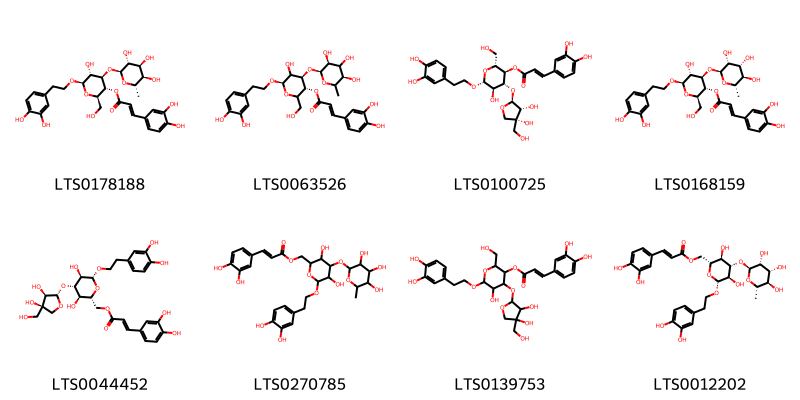{ width=100% }
    <figcaption>Hình ảnh cấu trúc hóa học của 8 hoạt chất thuộc nhóm Cinnamic acids and derivatives gồm ['(2r,3r,4r,5r,6r)-6-[2-(3,4-dihydroxyphenyl)ethoxy]-5-hydroxy-2-(hydroxymethyl)-4-{[(2s,3r,4s,5r,6s)-3,4,5-trihydroxy-6-methyloxan-2-yl]oxy}oxan-3-yl (2e)-3-(3,4-dihydroxyphenyl)prop-2-enoate (LTS0178188)', '(3r,4r,6r)-6-[2-(3,4-dihydroxyphenyl)ethoxy]-5-hydroxy-2-(hydroxymethyl)-4-{[(2s,3s,5r)-3,4,5-trihydroxy-6-methyloxan-2-yl]oxy}oxan-3-yl (2e)-3-(3,4-dihydroxyphenyl)prop-2-enoate (LTS0063526)', '(2r,3r,4r,5r,6r)-4-{[(2s,3r,4r)-3,4-dihydroxy-4-(hydroxymethyl)oxolan-2-yl]oxy}-6-[2-(3,4-dihydroxyphenyl)ethoxy]-5-hydroxy-2-(hydroxymethyl)oxan-3-yl (2e)-3-(3,4-dihydroxyphenyl)prop-2-enoate (LTS0100725)', 'verbascoside (LTS0168159)', '[(2r,3r,4s,5r,6r)-4-{[(2s,3r,4r)-3,4-dihydroxy-4-(hydroxymethyl)oxolan-2-yl]oxy}-6-[2-(3,4-dihydroxyphenyl)ethoxy]-3,5-dihydroxyoxan-2-yl]methyl (2e)-3-(3,4-dihydroxyphenyl)prop-2-enoate (LTS0044452)', '{6-[2-(3,4-dihydroxyphenyl)ethoxy]-3,5-dihydroxy-4-[(3,4,5-trihydroxy-6-methyloxan-2-yl)oxy]oxan-2-yl}methyl 3-(3,4-dihydroxyphenyl)prop-2-enoate (LTS0270785)', '4-{[3,4-dihydroxy-4-(hydroxymethyl)oxolan-2-yl]oxy}-6-[2-(3,4-dihydroxyphenyl)ethoxy]-5-hydroxy-2-(hydroxymethyl)oxan-3-yl 3-(3,4-dihydroxyphenyl)prop-2-enoate (LTS0139753)', 'isoacteoside (LTS0012202)'].</figcaption>
</figure>
#### Nhóm Fatty Acyls
<figure markdown="span">
    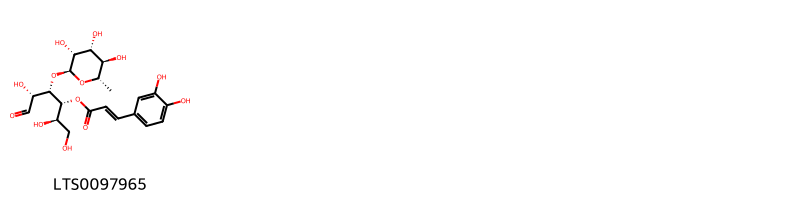{ width=100% }
    <figcaption>Hình ảnh cấu trúc hóa học của 1 hoạt chất thuộc nhóm Fatty Acyls gồm ['(2r,3r,4s,5r)-1,2,5-trihydroxy-6-oxo-4-{[(2s,3r,4r,5r,6s)-3,4,5-trihydroxy-6-methyloxan-2-yl]oxy}hexan-3-yl (2e)-3-(3,4-dihydroxyphenyl)prop-2-enoate (LTS0097965)'].</figcaption>
</figure>
#### Nhóm Flavonoids
<figure markdown="span">
    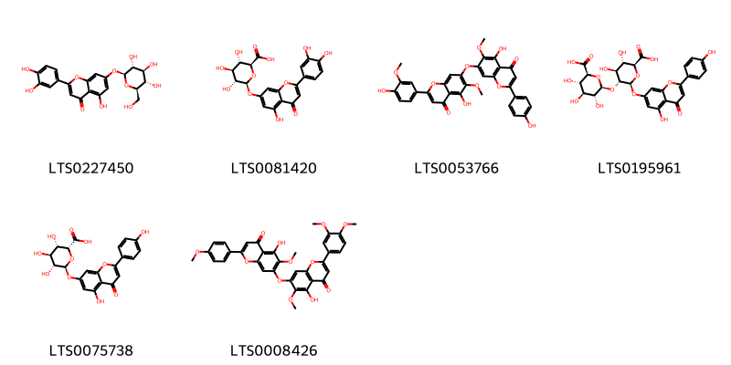{ width=100% }
    <figcaption>Hình ảnh cấu trúc hóa học của 6 hoạt chất thuộc nhóm Flavonoids gồm ['luteolin 7-o-glucoside (LTS0227450)', 'luteolin 7-o-glucuronide (LTS0081420)', '5-hydroxy-7-{[5-hydroxy-2-(4-hydroxyphenyl)-6-methoxy-4-oxochromen-7-yl]oxy}-2-(4-hydroxy-3-methoxyphenyl)-6-methoxychromen-4-one (LTS0053766)', '(2s,3s,4s,5r,6s)-5-{[(2r,3r,4s,5s,6s)-6-carboxy-3,4,5-trihydroxyoxan-2-yl]oxy}-3,4-dihydroxy-6-{[5-hydroxy-2-(4-hydroxyphenyl)-4-oxochromen-7-yl]oxy}oxane-2-carboxylic acid (LTS0195961)', '(2r,3s,4s,5r,6s)-3,4,5-trihydroxy-6-{[5-hydroxy-2-(4-hydroxyphenyl)-4-oxochromen-7-yl]oxy}oxane-2-carboxylic acid (LTS0075738)', '7-{[2-(3,4-dimethoxyphenyl)-5-hydroxy-6-methoxy-4-oxochromen-7-yl]oxy}-5-hydroxy-6-methoxy-2-(4-methoxyphenyl)chromen-4-one (LTS0008426)'].</figcaption>
</figure>
#### Nhóm Organooxygen compounds
<figure markdown="span">
    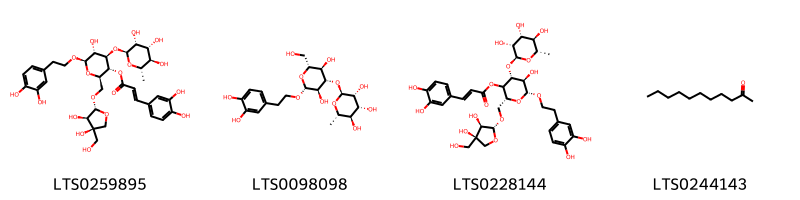{ width=100% }
    <figcaption>Hình ảnh cấu trúc hóa học của 4 hoạt chất thuộc nhóm Organooxygen compounds gồm ['(2r,3r,4r,5r,6r)-2-({[(2r,3r,4r)-3,4-dihydroxy-4-(hydroxymethyl)oxolan-2-yl]oxy}methyl)-6-[2-(3,4-dihydroxyphenyl)ethoxy]-5-hydroxy-4-{[(2s,3r,4r,5r,6s)-3,4,5-trihydroxy-6-methyloxan-2-yl]oxy}oxan-3-yl (2e)-3-(3,4-dihydroxyphenyl)prop-2-enoate (LTS0259895)', '(2s,3r,4r,5r,6s)-2-{[(2r,3r,4s,5r,6r)-2-[2-(3,4-dihydroxyphenyl)ethoxy]-3,5-dihydroxy-6-(hydroxymethyl)oxan-4-yl]oxy}-6-methyloxane-3,4,5-triol (LTS0098098)', '(2r,4r,5r,6r)-2-({[(2r,3r,4r)-3,4-dihydroxy-4-(hydroxymethyl)oxolan-2-yl]oxy}methyl)-6-[2-(3,4-dihydroxyphenyl)ethoxy]-5-hydroxy-4-{[(2s,3r,4r,5r,6s)-3,4,5-trihydroxy-6-methyloxan-2-yl]oxy}oxan-3-yl (2e)-3-(3,4-dihydroxyphenyl)prop-2-enoate (LTS0228144)', 'undecan-2-one (LTS0244143)'].</figcaption>
</figure>
#### Nhóm Prenol lipids
<figure markdown="span">
    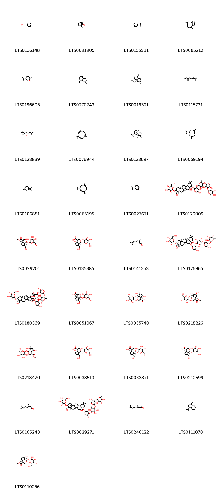{ width=100% }
    <figcaption>Hình ảnh cấu trúc hóa học của 33 hoạt chất thuộc nhóm Prenol lipids gồm ['terpineol (LTS0136148)', 'camphor (LTS0091905)', 'limonene,  (LTS0155981)', 'caryophyllene (LTS0085212)', 'carvone (LTS0196605)', '4-isopropyl-1,6-dimethyl-2,3,4,4a,7,8-hexahydronaphthalene (LTS0270743)', 'delta-cadinene (LTS0019321)', 'α-myrcene (LTS0115731)', 'linalool, (+-)- (LTS0128839)', 'α-humulene (LTS0076944)', '(-)-β-cubebene (LTS0123697)', '(-)-germacrene d (LTS0059194)', 'monoterpenes (LTS0106881)', '(1z,6z,8s)-8-isopropyl-1-methyl-5-methylidenecyclodeca-1,6-diene (LTS0065195)', 'carvone, (+)- (LTS0027671)', '3-{[5-({3,5-dihydroxy-4-[(3,4,5-trihydroxy-6-methyloxan-2-yl)oxy]oxan-2-yl}oxy)-3,4-dihydroxy-6-methyloxan-2-yl]oxy}-4,5-dihydroxyoxan-2-yl 5-hydroxy-9-(hydroxymethyl)-2,2,6a,6b,9,12a-hexamethyl-10-{[3,4,5-trihydroxy-6-(hydroxymethyl)oxan-2-yl]oxy}-1,3,4,5,6,7,8,8a,10,11,12,12b,13,14b-tetradecahydropicene-4a-carboxylate (LTS0129009)', 'geniposide (LTS0099201)', '(1s,4ar,7ar)-4a-hydroxy-7-(hydroxymethyl)-1-{[(2s,3r,4s,5s,6r)-3,4,5-trihydroxy-6-(hydroxymethyl)oxan-2-yl]oxy}-1h,5h,7ah-cyclopenta[c]pyran-4-carboxylic acid (LTS0135885)', '3,7-dimethyl-2,6-octadienal (LTS0141353)', '(2s,3r,4s,5s)-3-{[(2s,3r,4s,5r,6s)-5-{[(2s,3r,4s,5r)-3,5-dihydroxy-4-{[(2s,3r,4r,5r,6s)-3,4,5-trihydroxy-6-methyloxan-2-yl]oxy}oxan-2-yl]oxy}-3,4-dihydroxy-6-methyloxan-2-yl]oxy}-4,5-dihydroxyoxan-2-yl (4ar,5r,6as,6br,8ar,9r,10s,12ar,12br,14bs)-5-hydroxy-9-(hydroxymethyl)-2,2,6a,6b,9,12a-hexamethyl-10-{[(2r,3r,4s,5s,6r)-3,4,5-trihydroxy-6-(hydroxymethyl)oxan-2-yl]oxy}-1,3,4,5,6,7,8,8a,10,11,12,12b,13,14b-tetradecahydropicene-4a-carboxylate (LTS0176965)', '4-{[5-({3,5-dihydroxy-4-[(3,4,5-trihydroxy-6-methyloxan-2-yl)oxy]oxan-2-yl}oxy)-3,4-dihydroxy-6-methyloxan-2-yl]oxy}-3,5-dihydroxyoxan-2-yl 5-hydroxy-9-(hydroxymethyl)-2,2,6a,6b,9,12a-hexamethyl-10-{[3,4,5-trihydroxy-6-(hydroxymethyl)oxan-2-yl]oxy}-1,3,4,5,6,7,8,8a,10,11,12,12b,13,14b-tetradecahydropicene-4a-carboxylate (LTS0180369)', 'geniposidic acid (LTS0051067)', 'methyl (1s,4as,5r,7s,7as)-5,7-dihydroxy-7-methyl-1-{[(2r,3s,4s,5s,6r)-3,4,5-trihydroxy-6-(hydroxymethyl)oxan-2-yl]oxy}-1h,4ah,5h,6h,7ah-cyclopenta[c]pyran-4-carboxylate (LTS0035740)', 'methyl (1s,4as,6s,7r,7as)-6,7-dihydroxy-7-methyl-1-{[(2r,3s,4s,5s,6r)-3,4,5-trihydroxy-6-(hydroxymethyl)oxan-2-yl]oxy}-1h,4ah,5h,6h,7ah-cyclopenta[c]pyran-4-carboxylate (LTS0218226)', 'methyl (1s,5r,7s)-5,7-dihydroxy-7-methyl-1-{[(2s,3r,4s,5s,6r)-3,4,5-trihydroxy-6-(hydroxymethyl)oxan-2-yl]oxy}-1h,4ah,5h,6h,7ah-cyclopenta[c]pyran-4-carboxylate (LTS0218420)', '(1s,4ar,7ar)-4a-hydroxy-7-(hydroxymethyl)-1-{[(2s,3s,4s,5s,6r)-3,4,5-trihydroxy-6-(hydroxymethyl)oxan-2-yl]oxy}-1h,5h,7ah-cyclopenta[c]pyran-4-carboxylic acid (LTS0038513)', '(1s,4as,7as)-7-(hydroxymethyl)-1-{[(2r,3s,4s,5s,6r)-3,4,5-trihydroxy-6-(hydroxymethyl)oxan-2-yl]oxy}-1h,4ah,5h,7ah-cyclopenta[c]pyran-4-carboxylic acid (LTS0033871)', 'methyl (1r,4as,7as)-7-(hydroxymethyl)-1-{[(2s,3s,4s,5s,6r)-3,4,5-trihydroxy-6-(hydroxymethyl)oxan-2-yl]oxy}-1h,4ah,5h,7ah-cyclopenta[c]pyran-4-carboxylate (LTS0210699)', 'neral (LTS0165243)', '(2s,3r,4s,5s)-4-{[(2s,3r,4s,5r,6s)-5-{[(2s,3r,4s,5r)-3,5-dihydroxy-4-{[(2s,3r,4r,5r,6s)-3,4,5-trihydroxy-6-methyloxan-2-yl]oxy}oxan-2-yl]oxy}-3,4-dihydroxy-6-methyloxan-2-yl]oxy}-3,5-dihydroxyoxan-2-yl (4ar,5r,6as,6br,8ar,9r,10s,12ar,12br,14bs)-5-hydroxy-9-(hydroxymethyl)-2,2,6a,6b,9,12a-hexamethyl-10-{[(2r,3r,4s,5s,6r)-3,4,5-trihydroxy-6-(hydroxymethyl)oxan-2-yl]oxy}-1,3,4,5,6,7,8,8a,10,11,12,12b,13,14b-tetradecahydropicene-4a-carboxylate (LTS0029271)', 'α-citral (LTS0246122)', '4-isopropyl-6-methyl-1-methylidene-3,4,4a,7,8,8a-hexahydro-2h-naphthalene (LTS0111070)', 'methyl (1r,4as,7s,7as)-7-hydroxy-7-methyl-1-{[(2r,3s,4s,5s,6r)-3,4,5-trihydroxy-6-(hydroxymethyl)oxan-2-yl]oxy}-1h,4ah,5h,6h,7ah-cyclopenta[c]pyran-4-carboxylate (LTS0110256)'].</figcaption>
</figure>

---

### Dược dân tộc học

Danh sách các quốc gia có sử dụng *Lippia alba* trong điều trị các bệnh. 

| Country            | Disease              | Bệnh                                                                                                                                                                                                |
|:-------------------|:---------------------|:----------------------------------------------------------------------------------------------------------------------------------------------------------------------------------------------------|
| Brazil             | Nervine, Stomachic   | MYMEMORY WARNING: YOU USED ALL AVAILABLE FREE TRANSLATIONS FOR TODAY. NEXT AVAILABLE IN  16 HOURS 43 MINUTES 51 SECONDS VISIT HTTPS://MYMEMORY.TRANSLATED.NET/DOC/USAGELIMITS.PHP TO TRANSLATE MORE |
| Curacao            | Digestive            | MYMEMORY WARNING: YOU USED ALL AVAILABLE FREE TRANSLATIONS FOR TODAY. NEXT AVAILABLE IN  16 HOURS 43 MINUTES 49 SECONDS VISIT HTTPS://MYMEMORY.TRANSLATED.NET/DOC/USAGELIMITS.PHP TO TRANSLATE MORE |
| Dominican Republic | Emmenagogue          | MYMEMORY WARNING: YOU USED ALL AVAILABLE FREE TRANSLATIONS FOR TODAY. NEXT AVAILABLE IN  16 HOURS 43 MINUTES 46 SECONDS VISIT HTTPS://MYMEMORY.TRANSLATED.NET/DOC/USAGELIMITS.PHP TO TRANSLATE MORE |
| Haiti              | Stomachic, Sudorific | MYMEMORY WARNING: YOU USED ALL AVAILABLE FREE TRANSLATIONS FOR TODAY. NEXT AVAILABLE IN  16 HOURS 43 MINUTES 43 SECONDS VISIT HTTPS://MYMEMORY.TRANSLATED.NET/DOC/USAGELIMITS.PHP TO TRANSLATE MORE |
| Paraguay           | Nervine, Stomachic   | MYMEMORY WARNING: YOU USED ALL AVAILABLE FREE TRANSLATIONS FOR TODAY. NEXT AVAILABLE IN  16 HOURS 43 MINUTES 41 SECONDS VISIT HTTPS://MYMEMORY.TRANSLATED.NET/DOC/USAGELIMITS.PHP TO TRANSLATE MORE |
| Trinidad           | Sedative, Sedative   | MYMEMORY WARNING: YOU USED ALL AVAILABLE FREE TRANSLATIONS FOR TODAY. NEXT AVAILABLE IN  16 HOURS 43 MINUTES 38 SECONDS VISIT HTTPS://MYMEMORY.TRANSLATED.NET/DOC/USAGELIMITS.PHP TO TRANSLATE MORE |

---

---
## Lippia berlandieri
### Thông tin về thực vật

!!! info "Phân loại thực vật của *Lippia origanoides* từ GIBF:"
    - **Kingdom:** Plantae
    - **Phylum:** Tracheophyta
    - **Order:** Lamiales
    - **Family:** Verbenaceae
    - **Genus:** Lippia
    - **Species:** *Lippia origanoides*

 

| Label (VI)   | Label (EN)   | Scientific Name   | Descriptions (VI)   | Descriptions (EN)   | Also Known As (VI)   | Also Known As (EN)   |
|:-------------|:-------------|:------------------|:--------------------|:--------------------|:---------------------|:---------------------|
| N/A          | N/A          | Lippia alba       | loài thực vật       | species of plant    | ['']                 | ['']                 |

#### Phân bố trên thế giới

**Từ CSDL GIBF** nan, Panama, Brazil, Costa Rica, United States of America, Mexico

#### Phân bố tại Việt Nam

**Từ CSDL GIBF**: Không có ghi nhận ở Việt Nam

---
### Thành phần hóa học
        
- Theo cơ sở dữ liệu lotus: Từ loài *Lippia origanoides* đã phân lập và xác định được Chưa có hoạt chất nào được phân lập. hoạt chất thuộc về các nhóm Không có hoạt chất nào được phân lập. 

Không có hình ảnh nào được tạo ra

---

### Dược dân tộc học

Danh sách các quốc gia có sử dụng *Lippia origanoides* trong điều trị các bệnh. 

| Country   | Disease                           | Bệnh                                                                                                                                                                                                |
|:----------|:----------------------------------|:----------------------------------------------------------------------------------------------------------------------------------------------------------------------------------------------------|
| Mexico    | Emmenagogue, Stimulant, Demulcent | MYMEMORY WARNING: YOU USED ALL AVAILABLE FREE TRANSLATIONS FOR TODAY. NEXT AVAILABLE IN  16 HOURS 42 MINUTES 52 SECONDS VISIT HTTPS://MYMEMORY.TRANSLATED.NET/DOC/USAGELIMITS.PHP TO TRANSLATE MORE |

---

---
## Lippia berlandieria
### Thông tin về thực vật

!!! info "Phân loại thực vật của *Lippia origanoides* từ GIBF:"
    - **Kingdom:** Plantae
    - **Phylum:** Tracheophyta
    - **Order:** Lamiales
    - **Family:** Verbenaceae
    - **Genus:** Lippia
    - **Species:** *Lippia origanoides*

 

| Label (VI)   | Label (EN)   | Scientific Name   | Descriptions (VI)   | Descriptions (EN)   | Also Known As (VI)   | Also Known As (EN)   |
|:-------------|:-------------|:------------------|:--------------------|:--------------------|:---------------------|:---------------------|
| N/A          | N/A          | Lippia alba       | loài thực vật       | species of plant    | ['']                 | ['']                 |

#### Phân bố trên thế giới

**Từ CSDL GIBF** nan, Panama, Brazil, Costa Rica, United States of America, Mexico

#### Phân bố tại Việt Nam

**Từ CSDL GIBF**: Không có ghi nhận ở Việt Nam

---
### Thành phần hóa học
        
- Theo cơ sở dữ liệu lotus: Từ loài *Lippia origanoides* đã phân lập và xác định được Chưa có hoạt chất nào được phân lập. hoạt chất thuộc về các nhóm Không có hoạt chất nào được phân lập. 

Không có hình ảnh nào được tạo ra

---

### Dược dân tộc học

Danh sách các quốc gia có sử dụng *Lippia origanoides* trong điều trị các bệnh. 

| Country   | Disease                           | Bệnh                                                                                                                                                                                                |
|:----------|:----------------------------------|:----------------------------------------------------------------------------------------------------------------------------------------------------------------------------------------------------|
| Mexico    | Stimulant, Emmenagogue, Demulcent | MYMEMORY WARNING: YOU USED ALL AVAILABLE FREE TRANSLATIONS FOR TODAY. NEXT AVAILABLE IN  16 HOURS 42 MINUTES 34 SECONDS VISIT HTTPS://MYMEMORY.TRANSLATED.NET/DOC/USAGELIMITS.PHP TO TRANSLATE MORE |

---

---
## Lippia citriodora
### Thông tin về thực vật

!!! info "Phân loại thực vật của *Aloysia citrodora* từ GIBF:"
    - **Kingdom:** Plantae
    - **Phylum:** Tracheophyta
    - **Order:** Lamiales
    - **Family:** Verbenaceae
    - **Genus:** Aloysia
    - **Species:** *Aloysia citrodora*

 

| Label (VI)   | Label (EN)   | Scientific Name   | Descriptions (VI)   | Descriptions (EN)   | Also Known As (VI)   | Also Known As (EN)   |
|:-------------|:-------------|:------------------|:--------------------|:--------------------|:---------------------|:---------------------|
| N/A          | N/A          | Lippia alba       | loài thực vật       | species of plant    | ['']                 | ['']                 |

#### Phân bố trên thế giới

**Từ CSDL GIBF** nan, unknown or invalid, Spain, Chile, Guatemala, Tunisia, Colombia, Venezuela (Bolivarian Republic of), Brazil, Peru, Ethiopia, Mexico, United Kingdom of Great Britain and Northern Ireland, South Africa, Portugal, New Zealand, Bolivia (Plurinational State of), Costa Rica, Ecuador, United States of America, Italy, Croatia

#### Phân bố tại Việt Nam

**Từ CSDL GIBF**: Không có ghi nhận ở Việt Nam

---
### Thành phần hóa học
        
- Theo cơ sở dữ liệu lotus: Từ loài *Aloysia citrodora* đã phân lập và xác định được Chưa có hoạt chất nào được phân lập. hoạt chất thuộc về các nhóm Không có hoạt chất nào được phân lập. 

Không có hình ảnh nào được tạo ra

---

### Dược dân tộc học

Danh sách các quốc gia có sử dụng *Aloysia citrodora* trong điều trị các bệnh. 

| Country   | Disease                                                                           | Bệnh                                                                                                                                                                                                |
|:----------|:----------------------------------------------------------------------------------|:----------------------------------------------------------------------------------------------------------------------------------------------------------------------------------------------------|
| Elsewhere | Acaricide, Carminative, Insecticide, Insecticide, Sedative, Carminative, Sedative | MYMEMORY WARNING: YOU USED ALL AVAILABLE FREE TRANSLATIONS FOR TODAY. NEXT AVAILABLE IN  16 HOURS 42 MINUTES 17 SECONDS VISIT HTTPS://MYMEMORY.TRANSLATED.NET/DOC/USAGELIMITS.PHP TO TRANSLATE MORE |
| Turkey    | Digestive, Nervine, Sedative, Stomachic, Carminative                              | MYMEMORY WARNING: YOU USED ALL AVAILABLE FREE TRANSLATIONS FOR TODAY. NEXT AVAILABLE IN  16 HOURS 42 MINUTES 14 SECONDS VISIT HTTPS://MYMEMORY.TRANSLATED.NET/DOC/USAGELIMITS.PHP TO TRANSLATE MORE |

---

---
## Lippia deserticola
### Thông tin về thực vật

!!! info "Phân loại thực vật của *Aloysia deserticola* từ GIBF:"
    - **Kingdom:** Plantae
    - **Phylum:** Tracheophyta
    - **Order:** Lamiales
    - **Family:** Verbenaceae
    - **Genus:** Aloysia
    - **Species:** *Aloysia deserticola*

 

| Label (VI)   | Label (EN)   | Scientific Name    | Descriptions (VI)   | Descriptions (EN)   | Also Known As (VI)   | Also Known As (EN)   |
|:-------------|:-------------|:-------------------|:--------------------|:--------------------|:---------------------|:---------------------|
| N/A          | N/A          | Lippia deserticola | loài thực vật       | species of plant    | ['']                 | ['']                 |

#### Phân bố trên thế giới

**Từ CSDL GIBF** nan, unknown or invalid, Spain, Chile, Guatemala, Tunisia, Colombia, Venezuela (Bolivarian Republic of), Brazil, Peru, Ethiopia, Mexico, United Kingdom of Great Britain and Northern Ireland, South Africa, Portugal, New Zealand, Bolivia (Plurinational State of), Costa Rica, Ecuador, United States of America, Italy, Croatia

#### Phân bố tại Việt Nam

**Từ CSDL GIBF**: Không có ghi nhận ở Việt Nam

---
### Thành phần hóa học
        
- Theo cơ sở dữ liệu lotus: Từ loài *Aloysia deserticola* đã phân lập và xác định được Chưa có hoạt chất nào được phân lập. hoạt chất thuộc về các nhóm Không có hoạt chất nào được phân lập. 

Không có hình ảnh nào được tạo ra

---

### Dược dân tộc học

Danh sách các quốc gia có sử dụng *Aloysia deserticola* trong điều trị các bệnh. 

| Country   | Disease                  | Bệnh                                                                                                                                                                                                |
|:----------|:-------------------------|:----------------------------------------------------------------------------------------------------------------------------------------------------------------------------------------------------|
| Argentina | Stomachic, Abortifacient | MYMEMORY WARNING: YOU USED ALL AVAILABLE FREE TRANSLATIONS FOR TODAY. NEXT AVAILABLE IN  16 HOURS 41 MINUTES 54 SECONDS VISIT HTTPS://MYMEMORY.TRANSLATED.NET/DOC/USAGELIMITS.PHP TO TRANSLATE MORE |

---

---
## Lippia dulcis
### Thông tin về thực vật

!!! info "Phân loại thực vật của *Lippia dulcis* từ GIBF:"
    - **Kingdom:** Plantae
    - **Phylum:** Tracheophyta
    - **Order:** Lamiales
    - **Family:** Verbenaceae
    - **Genus:** Lippia
    - **Species:** *Lippia dulcis*

 

| Label (VI)   | Label (EN)   | Scientific Name   | Descriptions (VI)   | Descriptions (EN)   | Also Known As (VI)   | Also Known As (EN)   |
|:-------------|:-------------|:------------------|:--------------------|:--------------------|:---------------------|:---------------------|
| N/A          | N/A          | Lippia dulcis     | loài thực vật       | species of plant    | ['']                 | ['']                 |

#### Phân bố trên thế giới

**Từ CSDL GIBF** Colombia, Argentina, Dominican Republic, Nicaragua, El Salvador, Brazil, Panama, Puerto Rico, Bolivia (Plurinational State of), Costa Rica, Canada, Ecuador, United States of America, Mexico, Cuba, Jamaica, Belgium, Guatemala

#### Phân bố tại Việt Nam

**Từ CSDL GIBF**: Không có ghi nhận ở Việt Nam

---
### Thành phần hóa học
        
- Theo cơ sở dữ liệu lotus: Từ loài *Lippia dulcis* đã phân lập và xác định được 93 hoạt chất thuộc về các nhóm Organooxygen compounds, Benzofurans, Flavonoids, Prenol lipids, Dihydrofurans, Cinnamic acids and derivatives. 

|    | chemicalTaxonomyClassyfireClass   |   smiles_count |
|---:|:----------------------------------|---------------:|
|  0 | Benzofurans                       |              1 |
|  1 | Cinnamic acids and derivatives    |              7 |
|  2 | Dihydrofurans                     |              1 |
|  3 | Flavonoids                        |             10 |
|  4 | Organooxygen compounds            |              4 |
|  5 | Prenol lipids                     |             70 |

#### Nhóm Benzofurans
<figure markdown="span">
    { width=100% }
    <figcaption>Hình ảnh cấu trúc hóa học của 1 hoạt chất thuộc nhóm Benzofurans gồm ['dihydroactinidiolide (LTS0041341)'].</figcaption>
</figure>
#### Nhóm Cinnamic acids and derivatives
<figure markdown="span">
    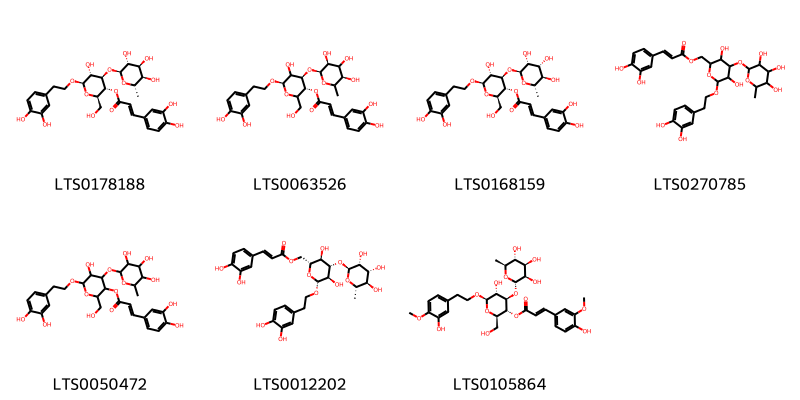{ width=100% }
    <figcaption>Hình ảnh cấu trúc hóa học của 7 hoạt chất thuộc nhóm Cinnamic acids and derivatives gồm ['(2r,3r,4r,5r,6r)-6-[2-(3,4-dihydroxyphenyl)ethoxy]-5-hydroxy-2-(hydroxymethyl)-4-{[(2s,3r,4s,5r,6s)-3,4,5-trihydroxy-6-methyloxan-2-yl]oxy}oxan-3-yl (2e)-3-(3,4-dihydroxyphenyl)prop-2-enoate (LTS0178188)', '(3r,4r,6r)-6-[2-(3,4-dihydroxyphenyl)ethoxy]-5-hydroxy-2-(hydroxymethyl)-4-{[(2s,3s,5r)-3,4,5-trihydroxy-6-methyloxan-2-yl]oxy}oxan-3-yl (2e)-3-(3,4-dihydroxyphenyl)prop-2-enoate (LTS0063526)', 'verbascoside (LTS0168159)', '{6-[2-(3,4-dihydroxyphenyl)ethoxy]-3,5-dihydroxy-4-[(3,4,5-trihydroxy-6-methyloxan-2-yl)oxy]oxan-2-yl}methyl 3-(3,4-dihydroxyphenyl)prop-2-enoate (LTS0270785)', '6-[2-(3,4-dihydroxyphenyl)ethoxy]-5-hydroxy-2-(hydroxymethyl)-4-[(3,4,5-trihydroxy-6-methyloxan-2-yl)oxy]oxan-3-yl 3-(3,4-dihydroxyphenyl)prop-2-enoate (LTS0050472)', 'isoacteoside (LTS0012202)', '(2r,3r,4r,5r,6r)-5-hydroxy-6-[2-(3-hydroxy-4-methoxyphenyl)ethoxy]-2-(hydroxymethyl)-4-{[(2s,3r,4r,5r,6s)-3,4,5-trihydroxy-6-methyloxan-2-yl]oxy}oxan-3-yl (2e)-3-(4-hydroxy-3-methoxyphenyl)prop-2-enoate (LTS0105864)'].</figcaption>
</figure>
#### Nhóm Dihydrofurans
<figure markdown="span">
    { width=100% }
    <figcaption>Hình ảnh cấu trúc hóa học của 1 hoạt chất thuộc nhóm Dihydrofurans gồm ['vitamin c (LTS0022555)'].</figcaption>
</figure>
#### Nhóm Flavonoids
<figure markdown="span">
    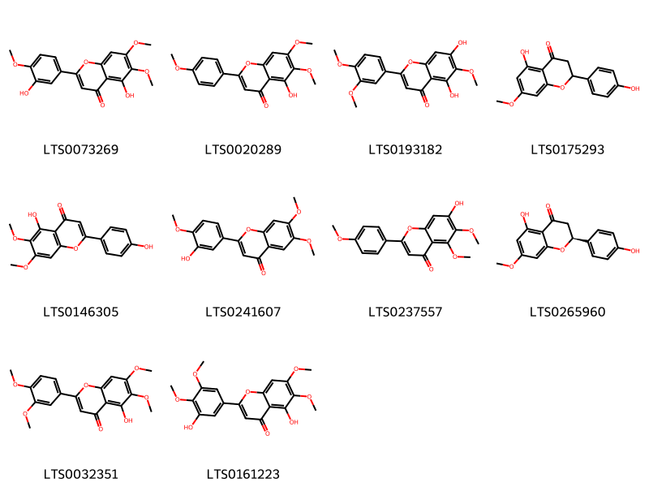{ width=100% }
    <figcaption>Hình ảnh cấu trúc hóa học của 10 hoạt chất thuộc nhóm Flavonoids gồm ['eupatorin (LTS0073269)', 'salvigenin (LTS0020289)', 'eupatilin (LTS0193182)', 'sakuranetin (LTS0175293)', 'cirsimaritin (LTS0146305)', '2-(3-hydroxy-4-methoxyphenyl)-6,7-dimethoxychromen-4-one (LTS0241607)', '7-hydroxy-5,6-dimethoxy-2-(4-methoxyphenyl)chromen-4-one (LTS0237557)', 'sakuranetin (LTS0265960)', '2-(3,4-dimethoxyphenyl)-5-hydroxy-6,7-dimethoxychromen-4-one (LTS0032351)', '5-hydroxy-2-(3-hydroxy-4,5-dimethoxyphenyl)-6,7-dimethoxychromen-4-one (LTS0161223)'].</figcaption>
</figure>
#### Nhóm Organooxygen compounds
<figure markdown="span">
    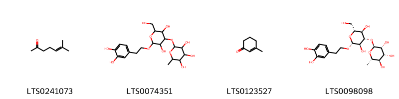{ width=100% }
    <figcaption>Hình ảnh cấu trúc hóa học của 4 hoạt chất thuộc nhóm Organooxygen compounds gồm ['6-methyl-5-hepten-2-one (LTS0241073)', '2-({2-[2-(3,4-dihydroxyphenyl)ethoxy]-3,5-dihydroxy-6-(hydroxymethyl)oxan-4-yl}oxy)-6-methyloxane-3,4,5-triol (LTS0074351)', '3-methyl-2-cyclohexen-1-one (LTS0123527)', '(2s,3r,4r,5r,6s)-2-{[(2r,3r,4s,5r,6r)-2-[2-(3,4-dihydroxyphenyl)ethoxy]-3,5-dihydroxy-6-(hydroxymethyl)oxan-4-yl]oxy}-6-methyloxane-3,4,5-triol (LTS0098098)'].</figcaption>
</figure>
#### Nhóm Prenol lipids
<figure markdown="span">
    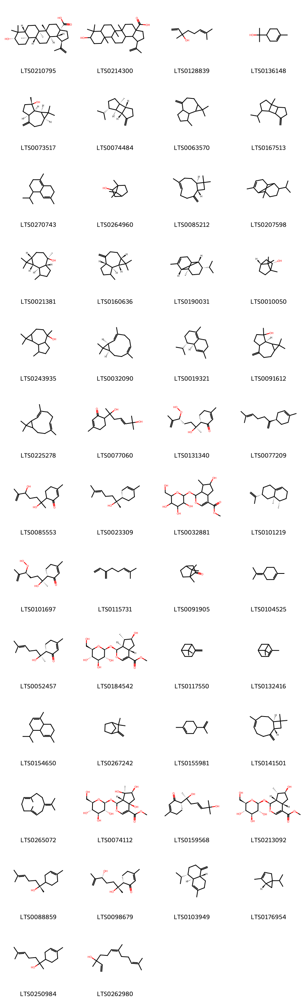{ width=100% }
    <figcaption>Hình ảnh cấu trúc hóa học của 70 hoạt chất thuộc nhóm Prenol lipids gồm ['betulinic acid (LTS0210795)', '9-hydroxy-5a,5b,8,8,11a-pentamethyl-1-(prop-1-en-2-yl)-hexadecahydrocyclopenta[a]chrysene-3a-carboxylic acid (LTS0214300)', 'linalool, (+-)- (LTS0128839)', 'terpineol (LTS0136148)', '(1as,4as,7s,7ar,7bs)-1,1,7-trimethyl-4-methylidene-octahydrocyclopropa[e]azulen-7-ol (LTS0073517)', 'β-bourbonene (LTS0074484)', '1,1,7-trimethyl-4-methylidene-octahydro-1ah-cyclopropa[e]azulene (LTS0063570)', 'β-bourbonene (LTS0167513)', '4-isopropyl-1,6-dimethyl-2,3,4,4a,7,8-hexahydronaphthalene (LTS0270743)', 'borneol (LTS0264960)', 'caryophyllene (LTS0085212)', 'α-copaene (LTS0207598)', '(1ar,4r,4ar,7as,7bs)-1,1,4,7-tetramethyl-octahydro-1ah-cyclopropa[e]azulen-4-ol (LTS0021381)', '(1as,4as,7as,7br)-1,1,7-trimethyl-4-methylidene-octahydro-1ah-cyclopropa[e]azulene (LTS0160636)', '(1r,2s,7s,8s)-8-isopropyl-1,3-dimethyltricyclo[4.4.0.0²,⁷]dec-3-ene (LTS0190031)', '(2s,4r)-1,7,7-trimethylbicyclo[2.2.1]heptan-2-ol (LTS0010050)', 'ledol (LTS0243935)', '(1s,2e,10r)-3,7,11,11-tetramethylbicyclo[8.1.0]undeca-2,6-diene (LTS0032090)', 'delta-cadinene (LTS0019321)', '(7ar)-1,1,7-trimethyl-4-methylidene-octahydrocyclopropa[e]azulen-7-ol (LTS0091612)', '(2e,6e)-3,7,11,11-tetramethylbicyclo[8.1.0]undeca-2,6-diene (LTS0225278)', '6-(2,6-dihydroxy-6-methylhept-4-en-2-yl)-3-methylcyclohex-2-en-1-one (LTS0077060)', '(6s)-6-[(2s,5r)-5-hydroperoxy-2-hydroxy-6-methylhept-6-en-2-yl]-3-methylcyclohex-2-en-1-one (LTS0131340)', '(r)-β-bisabolene (LTS0077209)', '6-(2,5-dihydroxy-6-methylhept-6-en-2-yl)-3-methylcyclohex-2-en-1-one (LTS0085553)', 'levomenol (LTS0023309)', 'methyl 6-hydroxy-7-methyl-1-{[3,4,5-trihydroxy-6-(hydroxymethyl)oxan-2-yl]oxy}-1h,4ah,5h,6h,7h,7ah-cyclopenta[c]pyran-4-carboxylate (LTS0032881)', 'eremophilene (LTS0101219)', '(6s)-6-[(2s,5s)-5-hydroperoxy-2-hydroxy-6-methylhept-6-en-2-yl]-3-methylcyclohex-2-en-1-one (LTS0101697)', 'α-myrcene (LTS0115731)', 'camphor (LTS0091905)', 'terpinolene (LTS0104525)', 'hernandulcin (LTS0052457)', 'methyl (1s,4as,6s,7s,7ar)-6-hydroxy-7-methyl-1-{[(2s,3r,4s,5s,6r)-3,4,5-trihydroxy-6-(hydroxymethyl)oxan-2-yl]oxy}-1h,4ah,5h,6h,7h,7ah-cyclopenta[c]pyran-4-carboxylate (LTS0184542)', 'β-pinene (LTS0117550)', 'α pinene (LTS0132416)', '4-isopropyl-1,6-dimethyl-3,4,4a,7,8,8a-hexahydronaphthalene (LTS0154650)', 'camphene (LTS0267242)', 'limonene,  (LTS0155981)', 'β-caryophyllen (LTS0141501)', 'germacrene b (LTS0265072)', 'lamiide (LTS0074112)', '(6s)-6-[(2s,4e)-2,6-dihydroxy-6-methylhept-4-en-2-yl]-3-methylcyclohex-2-en-1-one (LTS0159568)', 'methyl (1s,4as,6s,7s,7as)-6-hydroxy-7-methyl-1-{[(2s,3r,4s,5s,6r)-3,4,5-trihydroxy-6-(hydroxymethyl)oxan-2-yl]oxy}-1h,4ah,5h,6h,7h,7ah-cyclopenta[c]pyran-4-carboxylate (LTS0213092)', '(2r)-6-methyl-2-(4-methylcyclohex-3-en-1-yl)hept-5-en-2-ol (LTS0088859)', '(6s)-6-[(2r,5r)-2,5-dihydroxy-6-methylhept-6-en-2-yl]-3-methylcyclohex-2-en-1-one (LTS0098679)', '(+)-gamma-cadinene (LTS0103949)', 'α-thujene (LTS0176954)', 'α-bisabolol (LTS0250984)', 'nerolidol (LTS0262980)', '(1s,7r)-1,8a-dimethyl-7-(prop-1-en-2-yl)-2,3,5,6,7,8-hexahydro-1h-naphthalene (LTS0242950)', 'methyl (1s,4ar,6s,7r,7as)-4a,6,7-trihydroxy-7-methyl-1-{[(2r,3s,4s,5s,6r)-3,4,5-trihydroxy-6-(hydroxymethyl)oxan-2-yl]oxy}-1h,5h,6h,7ah-cyclopenta[c]pyran-4-carboxylate (LTS0209617)', 'β-farnesene (LTS0067925)', '6-(2-hydroxy-6-methylhept-5-en-2-yl)-3-methylcyclohex-2-en-1-one (LTS0082747)', '(6r)-6-[(2s)-2-hydroxy-6-methylhept-5-en-2-yl]-3-methylcyclohex-2-en-1-one (LTS0020109)', '(6r)-6-[(2s,4e)-2,6-dihydroxy-6-methylhept-4-en-2-yl]-3-methylcyclohex-2-en-1-one (LTS0229882)', 'α-thujene (LTS0185078)', '6-(5-hydroperoxy-2-hydroxy-6-methylhept-6-en-2-yl)-3-methylcyclohex-2-en-1-one (LTS0067244)', '(-)-trans-α-bergamotene (LTS0239937)', '(6s)-6-[(2s,4e)-6-hydroperoxy-2-hydroxy-6-methylhept-4-en-2-yl]-3-methylcyclohex-2-en-1-one (LTS0188263)', 'curcumene (LTS0190074)', '6-(6-hydroperoxy-2-hydroxy-6-methylhept-4-en-2-yl)-3-methylcyclohex-2-en-1-one (LTS0067036)', 'methyl 4a,6,7-trihydroxy-7-methyl-1-{[3,4,5-trihydroxy-6-(hydroxymethyl)oxan-2-yl]oxy}-1h,5h,6h,7ah-cyclopenta[c]pyran-4-carboxylate (LTS0005328)', '(-)-β-bisabolene (LTS0009940)', 'caryophyllene (LTS0131870)', 'α-muurolene (LTS0022607)', '(z)-β-farnesene (LTS0254048)', '4-isopropyl-6-methyl-1-methylidene-3,4,4a,7,8,8a-hexahydro-2h-naphthalene (LTS0111070)', '(6s)-6-[(2r,5s)-2,5-dihydroxy-6-methylhept-6-en-2-yl]-3-methylcyclohex-2-en-1-one (LTS0049554)', '(-)-β-cubebene (LTS0123697)'].</figcaption>
</figure>

---

### Dược dân tộc học

Danh sách các quốc gia có sử dụng *Lippia dulcis* trong điều trị các bệnh. 

| Country   | Disease                           | Bệnh                                                                                                                                                                                                |
|:----------|:----------------------------------|:----------------------------------------------------------------------------------------------------------------------------------------------------------------------------------------------------|
| English   | Demulcent                         | MYMEMORY WARNING: YOU USED ALL AVAILABLE FREE TRANSLATIONS FOR TODAY. NEXT AVAILABLE IN  16 HOURS 41 MINUTES 38 SECONDS VISIT HTTPS://MYMEMORY.TRANSLATED.NET/DOC/USAGELIMITS.PHP TO TRANSLATE MORE |
| German    | Expectorant                       | MYMEMORY WARNING: YOU USED ALL AVAILABLE FREE TRANSLATIONS FOR TODAY. NEXT AVAILABLE IN  16 HOURS 41 MINUTES 35 SECONDS VISIT HTTPS://MYMEMORY.TRANSLATED.NET/DOC/USAGELIMITS.PHP TO TRANSLATE MORE |
| Mexico    | Demulcent, Emmenagogue, Sweetener | MYMEMORY WARNING: YOU USED ALL AVAILABLE FREE TRANSLATIONS FOR TODAY. NEXT AVAILABLE IN  16 HOURS 41 MINUTES 32 SECONDS VISIT HTTPS://MYMEMORY.TRANSLATED.NET/DOC/USAGELIMITS.PHP TO TRANSLATE MORE |
| anish     | Sedative                          | MYMEMORY WARNING: YOU USED ALL AVAILABLE FREE TRANSLATIONS FOR TODAY. NEXT AVAILABLE IN  16 HOURS 41 MINUTES 30 SECONDS VISIT HTTPS://MYMEMORY.TRANSLATED.NET/DOC/USAGELIMITS.PHP TO TRANSLATE MORE |

---

---
## Lippia geminata
### Thông tin về thực vật

!!! info "Phân loại thực vật của *Lippia alba* từ GIBF:"
    - **Kingdom:** Plantae
    - **Phylum:** Tracheophyta
    - **Order:** Lamiales
    - **Family:** Verbenaceae
    - **Genus:** Lippia
    - **Species:** *Lippia alba*

 

| Label (VI)   | Label (EN)   | Scientific Name   | Descriptions (VI)   | Descriptions (EN)   | Also Known As (VI)   | Also Known As (EN)   |
|:-------------|:-------------|:------------------|:--------------------|:--------------------|:---------------------|:---------------------|
| N/A          | N/A          | Lippia dulcis     | loài thực vật       | species of plant    | ['']                 | ['']                 |

#### Phân bố trên thế giới

**Từ CSDL GIBF** nan, Uruguay, unknown or invalid, Suriname, Venezuela (Bolivarian Republic of), Brazil, Peru, India, French Guiana, Bangladesh, United States of America, Mexico, Ecuador

#### Phân bố tại Việt Nam

**Từ CSDL GIBF**: Không có ghi nhận ở Việt Nam

---
### Thành phần hóa học
        
- Theo cơ sở dữ liệu lotus: Từ loài *Lippia alba* đã phân lập và xác định được Chưa có hoạt chất nào được phân lập. hoạt chất thuộc về các nhóm Không có hoạt chất nào được phân lập. 

Không có hình ảnh nào được tạo ra

---

### Dược dân tộc học

Danh sách các quốc gia có sử dụng *Lippia alba* trong điều trị các bệnh. 

| Country   | Disease                                                              | Bệnh                                                                                                                                                                                                |
|:----------|:---------------------------------------------------------------------|:----------------------------------------------------------------------------------------------------------------------------------------------------------------------------------------------------|
| Mexico    | Emmenagogue, Emmenagogue, Stomachic, Stomachic, Sudorific, Sudorific | MYMEMORY WARNING: YOU USED ALL AVAILABLE FREE TRANSLATIONS FOR TODAY. NEXT AVAILABLE IN  16 HOURS 40 MINUTES 49 SECONDS VISIT HTTPS://MYMEMORY.TRANSLATED.NET/DOC/USAGELIMITS.PHP TO TRANSLATE MORE |

---

---
## Lippia graveolens
### Thông tin về thực vật

!!! info "Phân loại thực vật của *Lippia origanoides* từ GIBF:"
    - **Kingdom:** Plantae
    - **Phylum:** Tracheophyta
    - **Order:** Lamiales
    - **Family:** Verbenaceae
    - **Genus:** Lippia
    - **Species:** *Lippia origanoides*

 

| Label (VI)   | Label (EN)   | Scientific Name   | Descriptions (VI)   | Descriptions (EN)   | Also Known As (VI)   | Also Known As (EN)   |
|:-------------|:-------------|:------------------|:--------------------|:--------------------|:---------------------|:---------------------|
| N/A          | N/A          | Lippia graveolens |                     | species of plant    | ['']                 | ['']                 |

#### Phân bố trên thế giới

**Từ CSDL GIBF** El Salvador, Nicaragua, Belize, Costa Rica, United States of America, Mexico, Bonaire, Sint Eustatius and Saba, Guatemala

#### Phân bố tại Việt Nam

**Từ CSDL GIBF**: Không có ghi nhận ở Việt Nam

---
### Thành phần hóa học
        
- Theo cơ sở dữ liệu lotus: Từ loài *Lippia origanoides* đã phân lập và xác định được 72 hoạt chất thuộc về các nhóm Flavonoids, Unsaturated hydrocarbons, Prenol lipids, Naphthopyrans, Phenols, Benzene and substituted derivatives. 

|    | chemicalTaxonomyClassyfireClass     |   smiles_count |
|---:|:------------------------------------|---------------:|
|  0 | Benzene and substituted derivatives |              2 |
|  1 | Flavonoids                          |             24 |
|  2 | Naphthopyrans                       |              1 |
|  3 | Phenols                             |              1 |
|  4 | Prenol lipids                       |             42 |
|  5 | Unsaturated hydrocarbons            |              1 |

#### Nhóm Benzene and substituted derivatives
<figure markdown="span">
    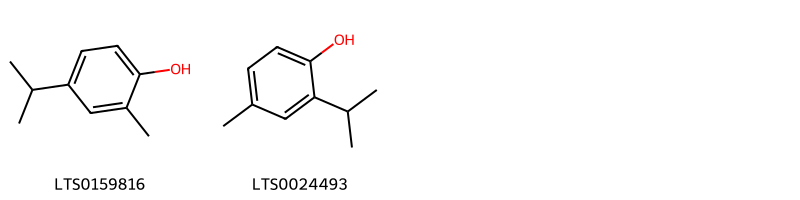{ width=100% }
    <figcaption>Hình ảnh cấu trúc hóa học của 2 hoạt chất thuộc nhóm Benzene and substituted derivatives gồm ['4-isopropyl-o-cresol (LTS0159816)', 'isopropyl-p-cresol (LTS0024493)'].</figcaption>
</figure>
#### Nhóm Flavonoids
<figure markdown="span">
    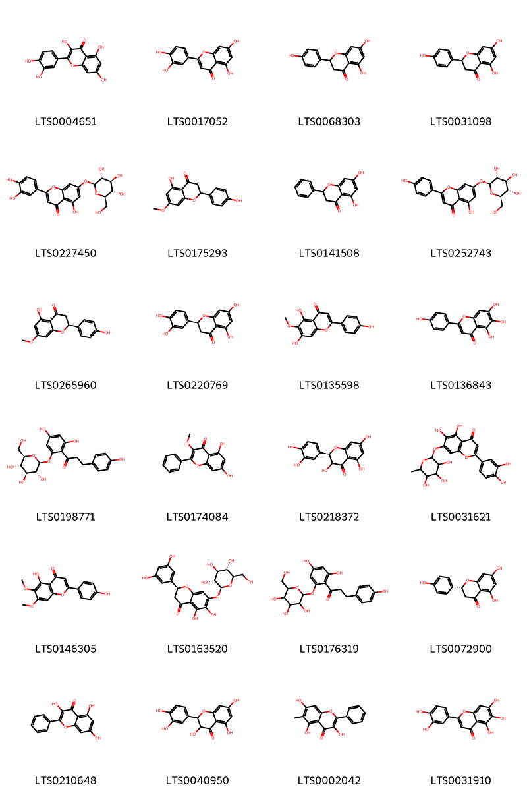{ width=100% }
    <figcaption>Hình ảnh cấu trúc hóa học của 24 hoạt chất thuộc nhóm Flavonoids gồm ['quercetin (LTS0004651)', 'luteolin (LTS0017052)', 'asahina (LTS0068303)', 'naringenin (LTS0031098)', 'luteolin 7-o-glucoside (LTS0227450)', 'sakuranetin (LTS0175293)', 'pinocembrine (LTS0141508)', 'apigenin 7-o-β-glucoside (LTS0252743)', 'sakuranetin (LTS0265960)', 'eriodictyol (LTS0220769)', 'hispidulin (LTS0135598)', 'scutellarein (LTS0136843)', 'phlorizin (LTS0198771)', 'galangin 3-methyl ether (LTS0174084)', '(2r)-2-(3,4-dihydroxyphenyl)-3,5,7-trihydroxy-2,3-dihydro-1-benzopyran-4-one (LTS0218372)', '2-(3,4-dihydroxyphenyl)-5,6-dihydroxy-7-[(3,4,5-trihydroxy-6-methyloxan-2-yl)oxy]chromen-4-one (LTS0031621)', 'cirsimaritin (LTS0146305)', '(2s)-2-(3,5-dihydroxyphenyl)-5,6-dihydroxy-7-{[(2s,3r,4s,5s,6r)-3,4,5-trihydroxy-6-(hydroxymethyl)oxan-2-yl]oxy}-2,3-dihydro-1-benzopyran-4-one (LTS0163520)', 'phloridzin (LTS0176319)', '(-)-naringenin (LTS0072900)', 'galangin (LTS0210648)', '2,3-dihydroquercetin (LTS0040950)', '3,5,7-trihydroxy-6-methyl-2-phenylchromen-4-one (LTS0002042)', '6-hydroxyluteolin (LTS0031910)'].</figcaption>
</figure>
#### Nhóm Naphthopyrans
<figure markdown="span">
    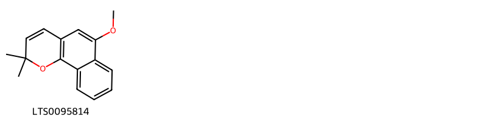{ width=100% }
    <figcaption>Hình ảnh cấu trúc hóa học của 1 hoạt chất thuộc nhóm Naphthopyrans gồm ['lapachenole (LTS0095814)'].</figcaption>
</figure>
#### Nhóm Phenols
<figure markdown="span">
    { width=100% }
    <figcaption>Hình ảnh cấu trúc hóa học của 1 hoạt chất thuộc nhóm Phenols gồm ['eugenol (LTS0052342)'].</figcaption>
</figure>
#### Nhóm Prenol lipids
<figure markdown="span">
    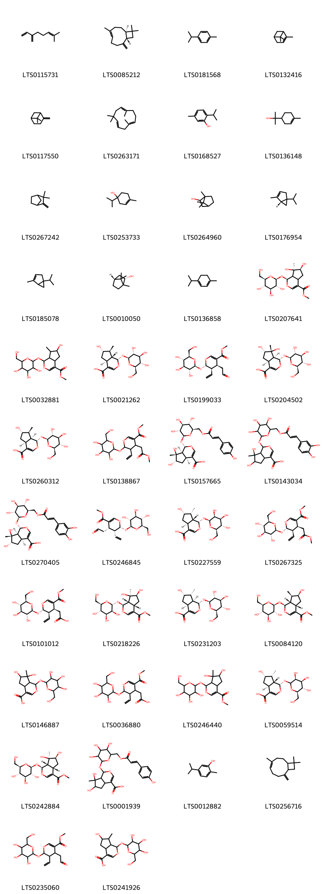{ width=100% }
    <figcaption>Hình ảnh cấu trúc hóa học của 42 hoạt chất thuộc nhóm Prenol lipids gồm ['α-myrcene (LTS0115731)', 'caryophyllene (LTS0085212)', 'cymene (LTS0181568)', 'α pinene (LTS0132416)', 'β-pinene (LTS0117550)', 'humulene (LTS0263171)', 'thymol (LTS0168527)', 'terpineol (LTS0136148)', 'camphene (LTS0267242)', '4-terpineol (LTS0253733)', 'borneol (LTS0264960)', 'α-thujene (LTS0176954)', 'α-thujene (LTS0185078)', '(2s,4r)-1,7,7-trimethylbicyclo[2.2.1]heptan-2-ol (LTS0010050)', 'terpinene (LTS0136858)', 'methyl (1s,6s,7r)-6,7-dihydroxy-7-methyl-1-{[(2s,3r,4s,5s,6r)-3,4,5-trihydroxy-6-(hydroxymethyl)oxan-2-yl]oxy}-1h,4ah,5h,6h,7ah-cyclopenta[c]pyran-4-carboxylate (LTS0207641)', 'methyl 6-hydroxy-7-methyl-1-{[3,4,5-trihydroxy-6-(hydroxymethyl)oxan-2-yl]oxy}-1h,4ah,5h,6h,7h,7ah-cyclopenta[c]pyran-4-carboxylate (LTS0032881)', '(1s,4as,6s,7s,7ar)-6-hydroxy-7-methyl-1-{[(2s,3r,4s,5s,6r)-3,4,5-trihydroxy-6-(hydroxymethyl)oxan-2-yl]oxy}-1h,4ah,5h,6h,7h,7ah-cyclopenta[c]pyran-4-carboxylic acid (LTS0021262)', '(-)-secologanin (LTS0199033)', '(1s,4as,6s,7r,7as)-6,7-dihydroxy-7-methyl-1-{[(2s,3r,4s,5s,6r)-3,4,5-trihydroxy-6-(hydroxymethyl)oxan-2-yl]oxy}-1h,4ah,5h,6h,7ah-cyclopenta[c]pyran-4-carboxylic acid (LTS0204502)', '(1s,4as,6s,7s,7as)-6-hydroxy-7-methyl-1-{[(2s,3r,4s,5s,6r)-3,4,5-trihydroxy-6-(hydroxymethyl)oxan-2-yl]oxy}-1h,4ah,5h,6h,7h,7ah-cyclopenta[c]pyran-4-carboxylic acid (LTS0260312)', 'methyl 5-ethenyl-4-(2-methoxy-2-oxoethyl)-6-{[3,4,5-trihydroxy-6-(hydroxymethyl)oxan-2-yl]oxy}-5,6-dihydro-4h-pyran-3-carboxylate (LTS0138867)', '(1s,4as,6s,7r,7as)-6,7-dihydroxy-7-methyl-1-{[(2s,3r,4s,5s,6r)-3,4,5-trihydroxy-6-({[(2e)-3-(4-hydroxyphenyl)prop-2-enoyl]oxy}methyl)oxan-2-yl]oxy}-1h,4ah,5h,6h,7ah-cyclopenta[c]pyran-4-carboxylic acid (LTS0157665)', '1-{[6-({[3-(3,4-dihydroxyphenyl)prop-2-enoyl]oxy}methyl)-3,4,5-trihydroxyoxan-2-yl]oxy}-6,7-dihydroxy-7-methyl-1h,4ah,5h,6h,7ah-cyclopenta[c]pyran-4-carboxylic acid (LTS0143034)', '(1s,4as,6s,7r,7as)-1-{[(2s,3r,4s,5s,6r)-6-({[(2e)-3-(3,4-dihydroxyphenyl)prop-2-enoyl]oxy}methyl)-3,4,5-trihydroxyoxan-2-yl]oxy}-6,7-dihydroxy-7-methyl-1h,4ah,5h,6h,7ah-cyclopenta[c]pyran-4-carboxylic acid (LTS0270405)', 'methyl (4s,5r,6r)-5-ethenyl-4-(2-oxoethyl)-6-{[(2s,3r,4s,5s,6r)-3,4,5-trihydroxy-6-(hydroxymethyl)oxan-2-yl]oxy}-5,6-dihydro-4h-pyran-3-carboxylate (LTS0246845)', '(1s,4as,6s,7r,7ar)-6-hydroxy-7-methyl-1-{[(2s,3s,4s,5s,6r)-3,4,5-trihydroxy-6-(hydroxymethyl)oxan-2-yl]oxy}-1h,4ah,5h,6h,7h,7ah-cyclopenta[c]pyran-4-carboxylic acid (LTS0227559)', 'methyl (4s,5r,6s)-5-ethenyl-4-(2-methoxy-2-oxoethyl)-6-{[(2s,3r,4s,5s,6r)-3,4,5-trihydroxy-6-(hydroxymethyl)oxan-2-yl]oxy}-5,6-dihydro-4h-pyran-3-carboxylate (LTS0267325)', '[(2s,3r,4s)-3-ethenyl-5-(methoxycarbonyl)-2-{[(2s,3r,4s,5s,6r)-3,4,5-trihydroxy-6-(hydroxymethyl)oxan-2-yl]oxy}-3,4-dihydro-2h-pyran-4-yl]acetic acid (LTS0101012)', 'methyl (1s,4as,6s,7r,7as)-6,7-dihydroxy-7-methyl-1-{[(2r,3s,4s,5s,6r)-3,4,5-trihydroxy-6-(hydroxymethyl)oxan-2-yl]oxy}-1h,4ah,5h,6h,7ah-cyclopenta[c]pyran-4-carboxylate (LTS0218226)', 'loganic acid (LTS0231203)', 'loganin (LTS0084120)', '6,7-dihydroxy-7-methyl-1-{[3,4,5-trihydroxy-6-(hydroxymethyl)oxan-2-yl]oxy}-1h,4ah,5h,6h,7ah-cyclopenta[c]pyran-4-carboxylic acid (LTS0146887)', '[3-ethenyl-5-(methoxycarbonyl)-2-{[3,4,5-trihydroxy-6-(hydroxymethyl)oxan-2-yl]oxy}-3,4-dihydro-2h-pyran-4-yl]acetic acid (LTS0036880)', 'methyl 6,7-dihydroxy-7-methyl-1-{[3,4,5-trihydroxy-6-(hydroxymethyl)oxan-2-yl]oxy}-1h,4ah,5h,6h,7ah-cyclopenta[c]pyran-4-carboxylate (LTS0246440)', '(1s,4as,6s,7r,7ar)-6-hydroxy-7-methyl-1-{[(3s,4s,5s,6r)-3,4,5-trihydroxy-6-(hydroxymethyl)oxan-2-yl]oxy}-1h,4ah,5h,6h,7h,7ah-cyclopenta[c]pyran-4-carboxylic acid (LTS0059514)', 'methyl (1s,4as,6s,7r,7as)-6,7-dihydroxy-7-methyl-1-{[(2s,3r,4s,5s,6r)-3,4,5-trihydroxy-6-(hydroxymethyl)oxan-2-yl]oxy}-1h,4ah,5h,6h,7ah-cyclopenta[c]pyran-4-carboxylate (LTS0242884)', '6,7-dihydroxy-7-methyl-1-{[3,4,5-trihydroxy-6-({[3-(4-hydroxyphenyl)prop-2-enoyl]oxy}methyl)oxan-2-yl]oxy}-1h,4ah,5h,6h,7ah-cyclopenta[c]pyran-4-carboxylic acid (LTS0001939)', 'carvacrol (LTS0012882)', '4,11,11-trimethyl-8-methylidenebicyclo[7.2.0]undec-4-ene (LTS0256716)', 'secologanin (LTS0235060)', '6-hydroxy-7-methyl-1-{[3,4,5-trihydroxy-6-(hydroxymethyl)oxan-2-yl]oxy}-1h,4ah,5h,6h,7h,7ah-cyclopenta[c]pyran-4-carboxylic acid (LTS0241926)'].</figcaption>
</figure>
#### Nhóm Unsaturated hydrocarbons
<figure markdown="span">
    { width=100% }
    <figcaption>Hình ảnh cấu trúc hóa học của 1 hoạt chất thuộc nhóm Unsaturated hydrocarbons gồm ['α terpinene (LTS0232891)'].</figcaption>
</figure>

---

### Dược dân tộc học

Danh sách các quốc gia có sử dụng *Lippia origanoides* trong điều trị các bệnh. 

| Country   | Disease                       | Bệnh                                                                                                                                                                                                |
|:----------|:------------------------------|:----------------------------------------------------------------------------------------------------------------------------------------------------------------------------------------------------|
| Mexico    | Expectorant, Stimulant, Tonic | MYMEMORY WARNING: YOU USED ALL AVAILABLE FREE TRANSLATIONS FOR TODAY. NEXT AVAILABLE IN  16 HOURS 40 MINUTES 28 SECONDS VISIT HTTPS://MYMEMORY.TRANSLATED.NET/DOC/USAGELIMITS.PHP TO TRANSLATE MORE |

---

---
## Lippia ligustrina
### Thông tin về thực vật

!!! info "Phân loại thực vật của *Mulguraea ligustrina* từ GIBF:"
    - **Kingdom:** Plantae
    - **Phylum:** Tracheophyta
    - **Order:** Lamiales
    - **Family:** Verbenaceae
    - **Genus:** Mulguraea
    - **Species:** *Mulguraea ligustrina*

 

| Label (VI)   | Label (EN)   | Scientific Name   | Descriptions (VI)   | Descriptions (EN)   | Also Known As (VI)   | Also Known As (EN)   |
|:-------------|:-------------|:------------------|:--------------------|:--------------------|:---------------------|:---------------------|
| N/A          | N/A          | Lippia ligustrina |                     | species of plant    | ['']                 | ['']                 |

#### Phân bố trên thế giới

**Từ CSDL GIBF** nan, Brazil, Spain, United States of America, Mexico

#### Phân bố tại Việt Nam

**Từ CSDL GIBF**: Không có ghi nhận ở Việt Nam

---
### Thành phần hóa học
        
- Theo cơ sở dữ liệu lotus: Từ loài *Mulguraea ligustrina* đã phân lập và xác định được Chưa có hoạt chất nào được phân lập. hoạt chất thuộc về các nhóm Không có hoạt chất nào được phân lập. 

Không có hình ảnh nào được tạo ra

---

### Dược dân tộc học

Danh sách các quốc gia có sử dụng *Mulguraea ligustrina* trong điều trị các bệnh. 

| Country   | Disease     | Bệnh                                                                                                                                                                                                |
|:----------|:------------|:----------------------------------------------------------------------------------------------------------------------------------------------------------------------------------------------------|
| Mexico    | Emmenagogue | MYMEMORY WARNING: YOU USED ALL AVAILABLE FREE TRANSLATIONS FOR TODAY. NEXT AVAILABLE IN  16 HOURS 39 MINUTES 22 SECONDS VISIT HTTPS://MYMEMORY.TRANSLATED.NET/DOC/USAGELIMITS.PHP TO TRANSLATE MORE |

---

---
## Lippia micromera
### Thông tin về thực vật

!!! info "Phân loại thực vật của *Lippia micromera* từ GIBF:"
    - **Kingdom:** Plantae
    - **Phylum:** Tracheophyta
    - **Order:** Lamiales
    - **Family:** Verbenaceae
    - **Genus:** Lippia
    - **Species:** *Lippia micromera*

 

| Label (VI)   | Label (EN)   | Scientific Name   | Descriptions (VI)   | Descriptions (EN)   | Also Known As (VI)   | Also Known As (EN)   |
|:-------------|:-------------|:------------------|:--------------------|:--------------------|:---------------------|:---------------------|
| N/A          | N/A          | Lippia micromera  | loài thực vật       | species of plant    | ['']                 | ['']                 |

#### Phân bố trên thế giới

**Từ CSDL GIBF** Honduras, nan, Guadeloupe, Dominica, Trinidad and Tobago, French Guiana, Martinique, Jamaica, Haiti, Colombia, Venezuela (Bolivarian Republic of), Dominican Republic, Puerto Rico, Cuba, Nicaragua, Brazil, Saint Lucia, France, United States of America, Guyana

#### Phân bố tại Việt Nam

**Từ CSDL GIBF**: Không có ghi nhận ở Việt Nam

---
### Thành phần hóa học
        
- Theo cơ sở dữ liệu lotus: Từ loài *Lippia micromera* đã phân lập và xác định được 1 hoạt chất thuộc về các nhóm Prenol lipids. 

|    | chemicalTaxonomyClassyfireClass   |   smiles_count |
|---:|:----------------------------------|---------------:|
|  0 | Prenol lipids                     |              1 |

#### Nhóm Prenol lipids
<figure markdown="span">
    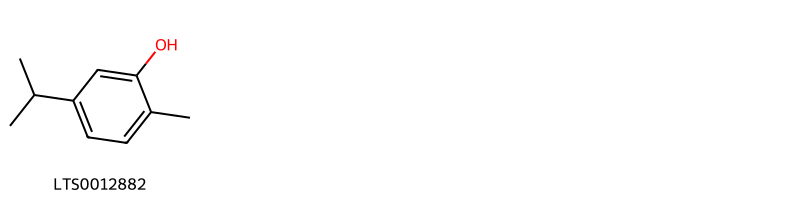{ width=100% }
    <figcaption>Hình ảnh cấu trúc hóa học của 1 hoạt chất thuộc nhóm Prenol lipids gồm ['carvacrol (LTS0012882)'].</figcaption>
</figure>

---

### Dược dân tộc học

Danh sách các quốc gia có sử dụng *Lippia micromera* trong điều trị các bệnh. 

| Country   | Disease                                             | Bệnh                                                                                                                                                                                                |
|:----------|:----------------------------------------------------|:----------------------------------------------------------------------------------------------------------------------------------------------------------------------------------------------------|
| Elsewhere | Demulcent, Expectorant, Stimulant, Stomachic, Tonic | MYMEMORY WARNING: YOU USED ALL AVAILABLE FREE TRANSLATIONS FOR TODAY. NEXT AVAILABLE IN  16 HOURS 39 MINUTES 05 SECONDS VISIT HTTPS://MYMEMORY.TRANSLATED.NET/DOC/USAGELIMITS.PHP TO TRANSLATE MORE |
| Trinidad  | Stimulant, Stomachic, Demulcent, Expectorant, Tonic | MYMEMORY WARNING: YOU USED ALL AVAILABLE FREE TRANSLATIONS FOR TODAY. NEXT AVAILABLE IN  16 HOURS 39 MINUTES 02 SECONDS VISIT HTTPS://MYMEMORY.TRANSLATED.NET/DOC/USAGELIMITS.PHP TO TRANSLATE MORE |
| Venezuela | Stomachic                                           | MYMEMORY WARNING: YOU USED ALL AVAILABLE FREE TRANSLATIONS FOR TODAY. NEXT AVAILABLE IN  16 HOURS 39 MINUTES 00 SECONDS VISIT HTTPS://MYMEMORY.TRANSLATED.NET/DOC/USAGELIMITS.PHP TO TRANSLATE MORE |

---

---
## Lippia multiflora
### Thông tin về thực vật

!!! info "Phân loại thực vật của *Lippia multiflora* từ GIBF:"
    - **Kingdom:** Plantae
    - **Phylum:** Tracheophyta
    - **Order:** Lamiales
    - **Family:** Verbenaceae
    - **Genus:** Lippia
    - **Species:** *Lippia multiflora*

 

| Label (VI)   | Label (EN)   | Scientific Name   | Descriptions (VI)   | Descriptions (EN)   | Also Known As (VI)   | Also Known As (EN)   |
|:-------------|:-------------|:------------------|:--------------------|:--------------------|:---------------------|:---------------------|
| N/A          | N/A          | Lippia multiflora |                     | species of plant    | ['']                 | ['']                 |

#### Phân bố trên thế giới

**Từ CSDL GIBF** Togo, Angola, Ghana, Congo, Democratic Republic of the, Gabon, Nigeria, Guinea, Benin, Gambia

#### Phân bố tại Việt Nam

**Từ CSDL GIBF**: Không có ghi nhận ở Việt Nam

---
### Thành phần hóa học
        
- Theo cơ sở dữ liệu lotus: Từ loài *Lippia multiflora* đã phân lập và xác định được 77 hoạt chất thuộc về các nhóm Organooxygen compounds, Unsaturated hydrocarbons, Prenol lipids, Fatty Acyls, Phenols, Cinnamic acids and derivatives, Benzene and substituted derivatives. 

|    | chemicalTaxonomyClassyfireClass     |   smiles_count |
|---:|:------------------------------------|---------------:|
|  0 | Benzene and substituted derivatives |              1 |
|  1 | Cinnamic acids and derivatives      |              4 |
|  2 | Fatty Acyls                         |              1 |
|  3 | Organooxygen compounds              |              4 |
|  4 | Phenols                             |              1 |
|  5 | Prenol lipids                       |             64 |
|  6 | Unsaturated hydrocarbons            |              1 |

#### Nhóm Benzene and substituted derivatives
<figure markdown="span">
    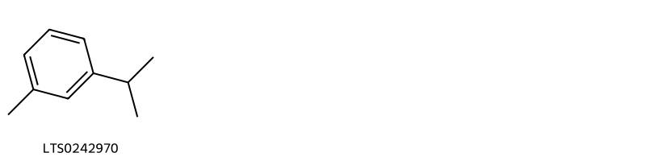{ width=100% }
    <figcaption>Hình ảnh cấu trúc hóa học của 1 hoạt chất thuộc nhóm Benzene and substituted derivatives gồm ['m-cymene (LTS0242970)'].</figcaption>
</figure>
#### Nhóm Cinnamic acids and derivatives
<figure markdown="span">
    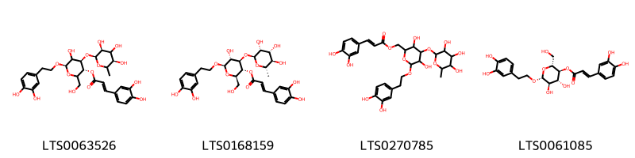{ width=100% }
    <figcaption>Hình ảnh cấu trúc hóa học của 4 hoạt chất thuộc nhóm Cinnamic acids and derivatives gồm ['(3r,4r,6r)-6-[2-(3,4-dihydroxyphenyl)ethoxy]-5-hydroxy-2-(hydroxymethyl)-4-{[(2s,3s,5r)-3,4,5-trihydroxy-6-methyloxan-2-yl]oxy}oxan-3-yl (2e)-3-(3,4-dihydroxyphenyl)prop-2-enoate (LTS0063526)', 'verbascoside (LTS0168159)', '{6-[2-(3,4-dihydroxyphenyl)ethoxy]-3,5-dihydroxy-4-[(3,4,5-trihydroxy-6-methyloxan-2-yl)oxy]oxan-2-yl}methyl 3-(3,4-dihydroxyphenyl)prop-2-enoate (LTS0270785)', '(2r,3s,4r,5r,6r)-6-[2-(3,4-dihydroxyphenyl)ethoxy]-4,5-dihydroxy-2-(hydroxymethyl)oxan-3-yl (2e)-3-(3,4-dihydroxyphenyl)prop-2-enoate (LTS0061085)'].</figcaption>
</figure>
#### Nhóm Fatty Acyls
<figure markdown="span">
    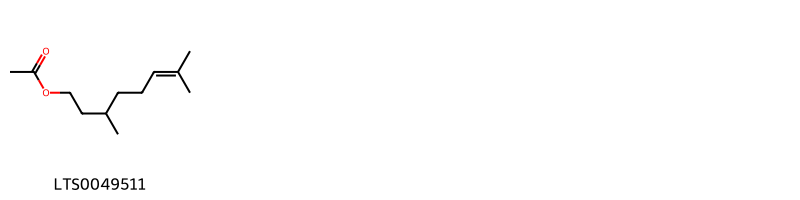{ width=100% }
    <figcaption>Hình ảnh cấu trúc hóa học của 1 hoạt chất thuộc nhóm Fatty Acyls gồm ['citronellyl acetate (LTS0049511)'].</figcaption>
</figure>
#### Nhóm Organooxygen compounds
<figure markdown="span">
    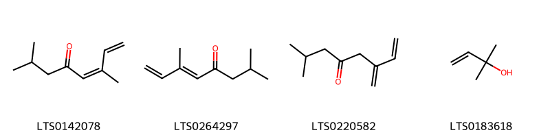{ width=100% }
    <figcaption>Hình ảnh cấu trúc hóa học của 4 hoạt chất thuộc nhóm Organooxygen compounds gồm ['(z)-tagetone (LTS0142078)', '(e)-tagetone (LTS0264297)', '2-methyl-6-methylideneoct-7-en-4-one (LTS0220582)', '2-methyl-3-buten-2-ol (LTS0183618)'].</figcaption>
</figure>
#### Nhóm Phenols
<figure markdown="span">
    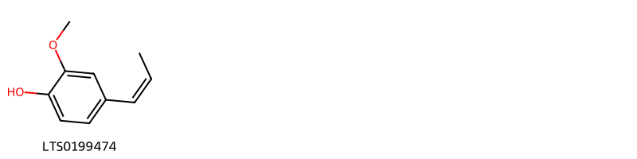{ width=100% }
    <figcaption>Hình ảnh cấu trúc hóa học của 1 hoạt chất thuộc nhóm Phenols gồm ['cis-isoeugenol (LTS0199474)'].</figcaption>
</figure>
#### Nhóm Prenol lipids
<figure markdown="span">
    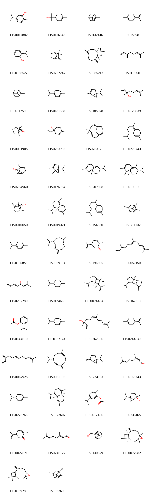{ width=100% }
    <figcaption>Hình ảnh cấu trúc hóa học của 64 hoạt chất thuộc nhóm Prenol lipids gồm ['carvacrol (LTS0012882)', 'terpineol (LTS0136148)', 'α pinene (LTS0132416)', 'limonene,  (LTS0155981)', 'thymol (LTS0168527)', 'camphene (LTS0267242)', 'caryophyllene (LTS0085212)', 'α-myrcene (LTS0115731)', 'β-pinene (LTS0117550)', 'cymene (LTS0181568)', 'α-thujene (LTS0185078)', 'linalool, (+-)- (LTS0128839)', 'camphor (LTS0091905)', '4-terpineol (LTS0253733)', 'humulene (LTS0263171)', '4-isopropyl-1,6-dimethyl-2,3,4,4a,7,8-hexahydronaphthalene (LTS0270743)', 'borneol (LTS0264960)', 'α-thujene (LTS0176954)', 'α-copaene (LTS0207598)', '(1r,2s,7s,8s)-8-isopropyl-1,3-dimethyltricyclo[4.4.0.0²,⁷]dec-3-ene (LTS0190031)', '(2s,4r)-1,7,7-trimethylbicyclo[2.2.1]heptan-2-ol (LTS0010050)', 'delta-cadinene (LTS0019321)', '4-isopropyl-1,6-dimethyl-3,4,4a,7,8,8a-hexahydronaphthalene (LTS0154650)', '(+)-α-pinene (LTS0211102)', 'terpinene (LTS0136858)', '(-)-germacrene d (LTS0059194)', 'carvone (LTS0196605)', 'farnesene (LTS0057150)', '(5e)-2,6-dimethylocta-2,5,7-trien-4-one (LTS0232780)', 'β phellandrene (LTS0124668)', 'β-bourbonene (LTS0074484)', 'β-bourbonene (LTS0167513)', 'thymyl acetate (LTS0144610)', 'phellandrene (LTS0157173)', 'nerolidol (LTS0262980)', 'α-limonene (LTS0244943)', 'β-farnesene (LTS0067925)', '(1z,6z,8s)-8-isopropyl-1-methyl-5-methylidenecyclodeca-1,6-diene (LTS0065195)', 'sabinene (LTS0224133)', 'neral (LTS0165243)', '(-)-α-phellandrene (LTS0226766)', 'α-muurolene (LTS0022607)', 'carvacryl acetate (LTS0012480)', 'sabinene hydrate (LTS0236165)', 'carvone, (+)- (LTS0027671)', 'α-citral (LTS0246122)', 'myrtenol (LTS0130529)', '(1r,4r,6s,10r)-4,12,12-trimethyl-9-methylidene-5-oxatricyclo[8.2.0.0⁴,⁶]dodecane (LTS0072982)', 'caryophyllene oxide (LTS0159789)', '(-)-α-pinene (LTS0032699)', 'trans-β-ocimene (LTS0049765)', 'carveol (LTS0263183)', '(-)-endo-α-bergamotene (LTS0153835)', 'pinocarvone (LTS0084836)', 'β-santalene (LTS0238960)', '(1r,2s)-5-isopropyl-2-methylbicyclo[3.1.0]hexan-2-ol (LTS0265986)', 'β-caryophyllene oxide (LTS0213960)', 'geraniol (LTS0258838)', 'nerolidol isomers (LTS0007569)', 'nerol (LTS0244289)', 'pinocarveol (LTS0090950)', 'valencene (LTS0031707)', 'valencene (LTS0110395)', '(1r,2r,4s)-2-methyl-3-methylidene-2-(4-methylpent-3-en-1-yl)bicyclo[2.2.1]heptane (LTS0120610)'].</figcaption>
</figure>
#### Nhóm Unsaturated hydrocarbons
<figure markdown="span">
    { width=100% }
    <figcaption>Hình ảnh cấu trúc hóa học của 1 hoạt chất thuộc nhóm Unsaturated hydrocarbons gồm ['α terpinene (LTS0232891)'].</figcaption>
</figure>

---

### Dược dân tộc học

Danh sách các quốc gia có sử dụng *Lippia multiflora* trong điều trị các bệnh. 

| Country   | Disease   | Bệnh                                                                                                                                                                                                |
|:----------|:----------|:----------------------------------------------------------------------------------------------------------------------------------------------------------------------------------------------------|
| Africa    | Sudorific | MYMEMORY WARNING: YOU USED ALL AVAILABLE FREE TRANSLATIONS FOR TODAY. NEXT AVAILABLE IN  16 HOURS 38 MINUTES 35 SECONDS VISIT HTTPS://MYMEMORY.TRANSLATED.NET/DOC/USAGELIMITS.PHP TO TRANSLATE MORE |

---

---
## Lippia nodiflora
### Thông tin về thực vật

!!! info "Phân loại thực vật của *Phyla nodiflora* từ GIBF:"
    - **Kingdom:** Plantae
    - **Phylum:** Tracheophyta
    - **Order:** Lamiales
    - **Family:** Verbenaceae
    - **Genus:** Phyla
    - **Species:** *Phyla nodiflora*

 

| Label (VI)   | Label (EN)   | Scientific Name   | Descriptions (VI)   | Descriptions (EN)   | Also Known As (VI)   | Also Known As (EN)   |
|:-------------|:-------------|:------------------|:--------------------|:--------------------|:---------------------|:---------------------|
| N/A          | N/A          | Lippia nodiflora  | loài thực vật       | species of plant    | ['']                 | ['']                 |

#### Phân bố trên thế giới

**Từ CSDL GIBF** nan, Thailand, El Salvador, Eritrea, Spain, Guadeloupe, Northern Mariana Islands, United Arab Emirates, Jamaica, Dominican Republic, Maldives, Puerto Rico, India, Seychelles, Nigeria, Cuba, Bonaire, Sint Eustatius and Saba, Belize, Japan, Vanuatu, Brazil, Peru, Aruba, Mexico, Nepal, Curaçao, France, Egypt, Bolivia (Plurinational State of), United States of America, Italy, Greece, Croatia

#### Phân bố tại Việt Nam

**Từ CSDL GIBF**: Không có ghi nhận ở Việt Nam

---
### Thành phần hóa học
        
- Theo cơ sở dữ liệu lotus: Từ loài *Phyla nodiflora* đã phân lập và xác định được 21 hoạt chất thuộc về các nhóm Steroids and steroid derivatives, Flavonoids. 

|    | chemicalTaxonomyClassyfireClass   |   smiles_count |
|---:|:----------------------------------|---------------:|
|  0 | Flavonoids                        |             15 |
|  1 | Steroids and steroid derivatives  |              6 |

#### Nhóm Flavonoids
<figure markdown="span">
    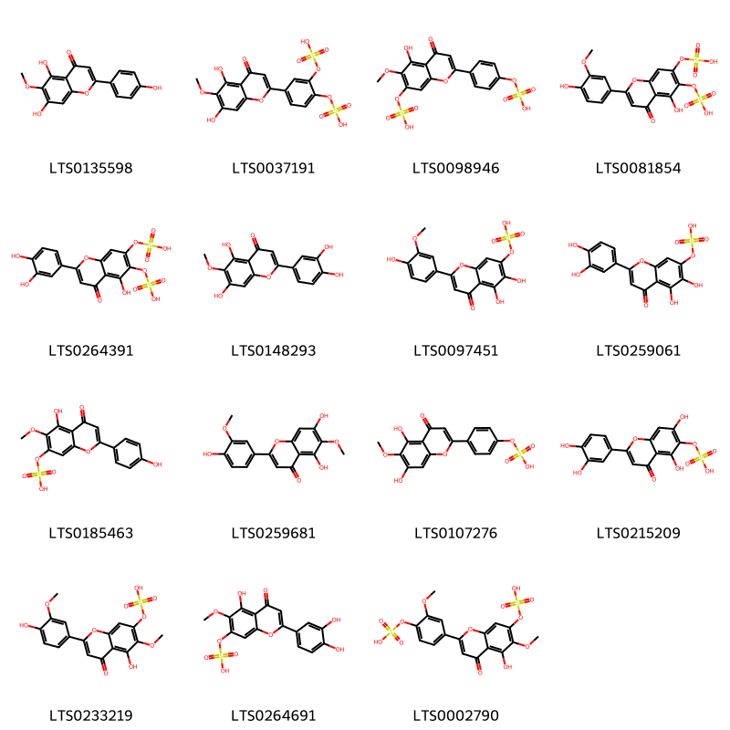{ width=100% }
    <figcaption>Hình ảnh cấu trúc hóa học của 15 hoạt chất thuộc nhóm Flavonoids gồm ['hispidulin (LTS0135598)', '[4-(5,7-dihydroxy-6-methoxy-4-oxochromen-2-yl)-2-(sulfooxy)phenyl]oxidanesulfonic acid (LTS0037191)', "hispidulin 7,4'-disulfate (LTS0098946)", '[5-hydroxy-2-(4-hydroxy-3-methoxyphenyl)-4-oxo-7-(sulfooxy)chromen-6-yl]oxidanesulfonic acid (LTS0081854)', '[2-(3,4-dihydroxyphenyl)-5-hydroxy-4-oxo-6-(sulfooxy)chromen-7-yl]oxidanesulfonic acid (LTS0264391)', 'nepetin (LTS0148293)', '[5,6-dihydroxy-2-(4-hydroxy-3-methoxyphenyl)-4-oxochromen-7-yl]oxidanesulfonic acid (LTS0097451)', '6-hydroxyluteolin 7-sulfate (LTS0259061)', 'hispidulin 7-sulfate (LTS0185463)', 'jaceosidin (LTS0259681)', "hispidulin 4'-sulfate (LTS0107276)", '6-hydroxyluteolin 6-sulfate (LTS0215209)', '[5-hydroxy-2-(4-hydroxy-3-methoxyphenyl)-6-methoxy-4-oxochromen-7-yl]oxidanesulfonic acid (LTS0233219)', '6-methoxyluteolin 7-sulfate (LTS0264691)', '{4-[5-hydroxy-6-methoxy-4-oxo-7-(sulfooxy)chromen-2-yl]-2-methoxyphenyl}oxidanesulfonic acid (LTS0002790)'].</figcaption>
</figure>
#### Nhóm Steroids and steroid derivatives
<figure markdown="span">
    { width=100% }
    <figcaption>Hình ảnh cấu trúc hóa học của 6 hoạt chất thuộc nhóm Steroids and steroid derivatives gồm ['1-(5-ethyl-6-methylhept-3-en-2-yl)-7-hydroxy-9a,11a-dimethyl-1h,2h,3h,3bh,4h,6h,7h,8h,9h,9bh,10h,11h-cyclopenta[a]phenanthren-3a-yl 3,4-dimethoxybenzoate (LTS0082021)', '(1r,3ar,3br,7s,9ar,9bs,11ar)-1-[(2r,5r)-5-ethyl-6-methylheptan-2-yl]-9a,11a-dimethyl-1h,2h,3h,3bh,4h,6h,7h,8h,9h,9bh,10h,11h-cyclopenta[a]phenanthrene-3a,7-diol (LTS0126067)', '(1r,3ar,3br,7s,9ar,9bs,11ar)-1-[(2r,3e,5s)-5-ethyl-6-methylhept-3-en-2-yl]-9a,11a-dimethyl-1h,2h,3h,3bh,4h,6h,7h,8h,9h,9bh,10h,11h-cyclopenta[a]phenanthrene-3a,7-diol (LTS0117049)', '1-(5-ethyl-6-methylheptan-2-yl)-9a,11a-dimethyl-1h,2h,3h,3bh,4h,6h,7h,8h,9h,9bh,10h,11h-cyclopenta[a]phenanthrene-3a,7-diol (LTS0183015)', '(1r,3ar,3br,7s,9ar,9bs,11ar)-1-[(2r,3e,5s)-5-ethyl-6-methylhept-3-en-2-yl]-7-hydroxy-9a,11a-dimethyl-1h,2h,3h,3bh,4h,6h,7h,8h,9h,9bh,10h,11h-cyclopenta[a]phenanthren-3a-yl 3,4-dimethoxybenzoate (LTS0092356)', '1-(5-ethyl-6-methylhept-3-en-2-yl)-9a,11a-dimethyl-1h,2h,3h,3bh,4h,6h,7h,8h,9h,9bh,10h,11h-cyclopenta[a]phenanthrene-3a,7-diol (LTS0006830)'].</figcaption>
</figure>

---

### Dược dân tộc học

Danh sách các quốc gia có sử dụng *Phyla nodiflora* trong điều trị các bệnh. 

| Country   | Disease                                                             | Bệnh                                                                                                                                                                                                |
|:----------|:--------------------------------------------------------------------|:----------------------------------------------------------------------------------------------------------------------------------------------------------------------------------------------------|
| Elsewhere | nan, Diuretic, Suppurative, Refrigerant, nan, Suppurative, Diuretic | MYMEMORY WARNING: YOU USED ALL AVAILABLE FREE TRANSLATIONS FOR TODAY. NEXT AVAILABLE IN  16 HOURS 37 MINUTES 52 SECONDS VISIT HTTPS://MYMEMORY.TRANSLATED.NET/DOC/USAGELIMITS.PHP TO TRANSLATE MORE |
| Iraq      | Diuretic, Refrigerant, nan                                          | MYMEMORY WARNING: YOU USED ALL AVAILABLE FREE TRANSLATIONS FOR TODAY. NEXT AVAILABLE IN  16 HOURS 37 MINUTES 50 SECONDS VISIT HTTPS://MYMEMORY.TRANSLATED.NET/DOC/USAGELIMITS.PHP TO TRANSLATE MORE |

---

---
## Lippia origanoides
### Thông tin về thực vật

!!! info "Phân loại thực vật của *Lippia origanoides* từ GIBF:"
    - **Kingdom:** Plantae
    - **Phylum:** Tracheophyta
    - **Order:** Lamiales
    - **Family:** Verbenaceae
    - **Genus:** Lippia
    - **Species:** *Lippia origanoides*

 

| Label (VI)   | Label (EN)   | Scientific Name    | Descriptions (VI)   | Descriptions (EN)   | Also Known As (VI)   | Also Known As (EN)   |
|:-------------|:-------------|:-------------------|:--------------------|:--------------------|:---------------------|:---------------------|
| N/A          | N/A          | Lippia origanoides | loài thực vật       | species of plant    | ['']                 | ['']                 |

#### Phân bố trên thế giới

**Từ CSDL GIBF** Colombia, Argentina, Nicaragua, Brazil, Ecuador, United States of America, Mexico

#### Phân bố tại Việt Nam

**Từ CSDL GIBF**: Không có ghi nhận ở Việt Nam

---
### Thành phần hóa học
        
- Theo cơ sở dữ liệu lotus: Từ loài *Lippia origanoides* đã phân lập và xác định được 108 hoạt chất thuộc về các nhóm Flavonoids, Unsaturated hydrocarbons, Isochromanequinones, Prenol lipids, Fatty Acyls, Anthracenes, Naphthopyrans, Neoflavonoids, Aryltetralin lignans, Tetralins, Phenols, Linear 1,3-diarylpropanoids, Steroids and steroid derivatives, Benzene and substituted derivatives. 

|    | chemicalTaxonomyClassyfireClass     |   smiles_count |
|---:|:------------------------------------|---------------:|
|  0 | Anthracenes                         |              2 |
|  1 | Aryltetralin lignans                |              4 |
|  2 | Benzene and substituted derivatives |              3 |
|  3 | Fatty Acyls                         |              5 |
|  4 | Flavonoids                          |             29 |
|  5 | Isochromanequinones                 |              2 |
|  6 | Linear 1,3-diarylpropanoids         |              1 |
|  7 | Naphthopyrans                       |              4 |
|  8 | Neoflavonoids                       |              2 |
|  9 | Phenols                             |              1 |
| 10 | Prenol lipids                       |             48 |
| 11 | Steroids and steroid derivatives    |              2 |
| 12 | Tetralins                           |              2 |
| 13 | Unsaturated hydrocarbons            |              1 |

#### Nhóm Anthracenes
<figure markdown="span">
    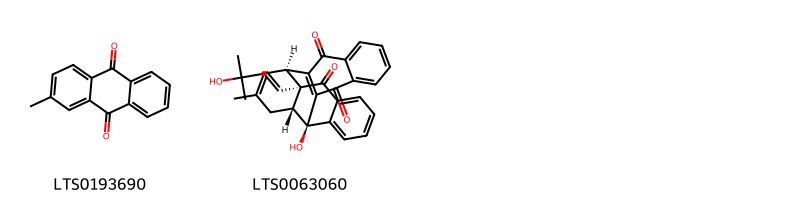{ width=100% }
    <figcaption>Hình ảnh cấu trúc hóa học của 2 hoạt chất thuộc nhóm Anthracenes gồm ['2-methylanthraquinone (LTS0193690)', '(2r,10r,11r,15r)-2-hydroxy-10-[(1e)-3-hydroxy-3-methylbut-1-en-1-yl]-13-methylhexacyclo[14.8.0.0²,¹¹.0³,⁸.0¹⁰,¹⁵.0¹⁸,²³]tetracosa-1(16),3,5,7,13,18,20,22-octaene-9,17,24-trione (LTS0063060)'].</figcaption>
</figure>
#### Nhóm Aryltetralin lignans
<figure markdown="span">
    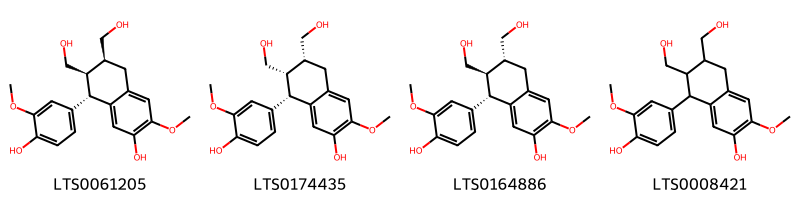{ width=100% }
    <figcaption>Hình ảnh cấu trúc hóa học của 4 hoạt chất thuộc nhóm Aryltetralin lignans gồm ['(6s,7r,8s)-8-(4-hydroxy-3-methoxyphenyl)-6,7-bis(hydroxymethyl)-3-methoxy-5,6,7,8-tetrahydronaphthalen-2-ol (LTS0061205)', '(6r,7s,8s)-8-(4-hydroxy-3-methoxyphenyl)-6,7-bis(hydroxymethyl)-3-methoxy-5,6,7,8-tetrahydronaphthalen-2-ol (LTS0174435)', '(+)-isolariciresinol (LTS0164886)', '8-(4-hydroxy-3-methoxyphenyl)-6,7-bis(hydroxymethyl)-3-methoxy-5,6,7,8-tetrahydronaphthalen-2-ol (LTS0008421)'].</figcaption>
</figure>
#### Nhóm Benzene and substituted derivatives
<figure markdown="span">
    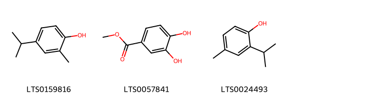{ width=100% }
    <figcaption>Hình ảnh cấu trúc hóa học của 3 hoạt chất thuộc nhóm Benzene and substituted derivatives gồm ['4-isopropyl-o-cresol (LTS0159816)', 'methyl 3,4-dihydroxybenzoate (LTS0057841)', 'isopropyl-p-cresol (LTS0024493)'].</figcaption>
</figure>
#### Nhóm Fatty Acyls
<figure markdown="span">
    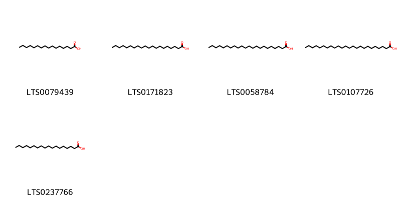{ width=100% }
    <figcaption>Hình ảnh cấu trúc hóa học của 5 hoạt chất thuộc nhóm Fatty Acyls gồm ['palmitic acid (LTS0079439)', 'arachidic acid (LTS0171823)', 'behenic acid (LTS0058784)', 'lignoceric acid (LTS0107726)', 'stearic acid (LTS0237766)'].</figcaption>
</figure>
#### Nhóm Flavonoids
<figure markdown="span">
    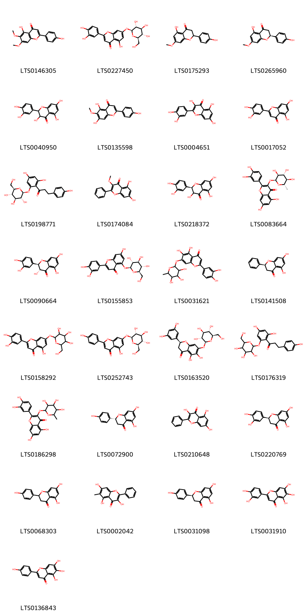{ width=100% }
    <figcaption>Hình ảnh cấu trúc hóa học của 29 hoạt chất thuộc nhóm Flavonoids gồm ['cirsimaritin (LTS0146305)', 'luteolin 7-o-glucoside (LTS0227450)', 'sakuranetin (LTS0175293)', 'sakuranetin (LTS0265960)', '2,3-dihydroquercetin (LTS0040950)', 'hispidulin (LTS0135598)', 'quercetin (LTS0004651)', 'luteolin (LTS0017052)', 'phlorizin (LTS0198771)', 'galangin 3-methyl ether (LTS0174084)', '(2r)-2-(3,4-dihydroxyphenyl)-3,5,7-trihydroxy-2,3-dihydro-1-benzopyran-4-one (LTS0218372)', '2-(3,4-dihydroxyphenyl)-5,7-dihydroxy-3-{[(2s,3s,4r,5r,6s)-3,4,5-trihydroxy-6-methyloxan-2-yl]oxy}chromen-4-one (LTS0083664)', '(+)-taxifolin (LTS0090664)', '2-(3,4-dihydroxyphenyl)-7-hydroxy-5-{[(2s,3r,4s,5s,6r)-3,4,5-trihydroxy-6-(hydroxymethyl)oxan-2-yl]oxy}chromen-4-one (LTS0155853)', '2-(3,4-dihydroxyphenyl)-5,6-dihydroxy-7-[(3,4,5-trihydroxy-6-methyloxan-2-yl)oxy]chromen-4-one (LTS0031621)', 'pinocembrine (LTS0141508)', '2-(3,4-dihydroxyphenyl)-5-hydroxy-7-{[3,4,5-trihydroxy-6-(hydroxymethyl)oxan-2-yl]oxy}chromen-4-one (LTS0158292)', 'apigenin 7-o-β-glucoside (LTS0252743)', '(2s)-2-(3,5-dihydroxyphenyl)-5,6-dihydroxy-7-{[(2s,3r,4s,5s,6r)-3,4,5-trihydroxy-6-(hydroxymethyl)oxan-2-yl]oxy}-2,3-dihydro-1-benzopyran-4-one (LTS0163520)', 'phloridzin (LTS0176319)', 'quercitrin (LTS0186298)', '(-)-naringenin (LTS0072900)', 'galangin (LTS0210648)', 'eriodictyol (LTS0220769)', 'asahina (LTS0068303)', '3,5,7-trihydroxy-6-methyl-2-phenylchromen-4-one (LTS0002042)', 'naringenin (LTS0031098)', '6-hydroxyluteolin (LTS0031910)', 'scutellarein (LTS0136843)'].</figcaption>
</figure>
#### Nhóm Isochromanequinones
<figure markdown="span">
    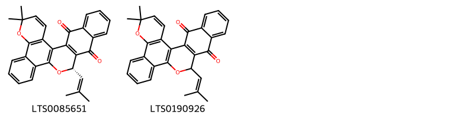{ width=100% }
    <figcaption>Hình ảnh cấu trúc hóa học của 2 hoạt chất thuộc nhóm Isochromanequinones gồm ['(12s)-23,23-dimethyl-12-(2-methylprop-1-en-1-yl)-13,22-dioxahexacyclo[12.12.0.0²,¹¹.0⁴,⁹.0¹⁵,²⁰.0²¹,²⁶]hexacosa-1(14),2(11),4,6,8,15,17,19,21(26),24-decaene-3,10-dione (LTS0085651)', '23,23-dimethyl-12-(2-methylprop-1-en-1-yl)-13,22-dioxahexacyclo[12.12.0.0²,¹¹.0⁴,⁹.0¹⁵,²⁰.0²¹,²⁶]hexacosa-1(14),2(11),4,6,8,15,17,19,21(26),24-decaene-3,10-dione (LTS0190926)'].</figcaption>
</figure>
#### Nhóm Linear 1_3-diarylpropanoids
<figure markdown="span">
    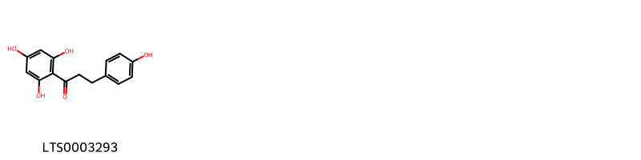{ width=100% }
    <figcaption>Hình ảnh cấu trúc hóa học của Không tìm thấy chú thích hoạt chất thuộc nhóm Linear 1_3-diarylpropanoids gồm Không tìm thấy chú thích.</figcaption>
</figure>
#### Nhóm Naphthopyrans
<figure markdown="span">
    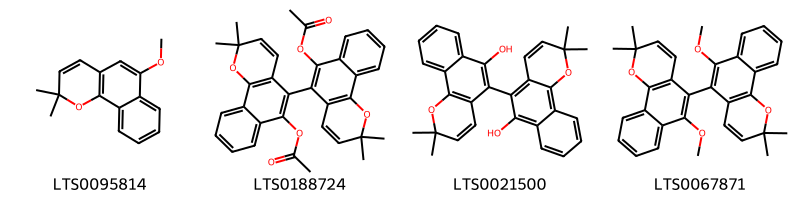{ width=100% }
    <figcaption>Hình ảnh cấu trúc hóa học của 4 hoạt chất thuộc nhóm Naphthopyrans gồm ['lapachenole (LTS0095814)', '5-[6-(acetyloxy)-2,2-dimethylbenzo[h]chromen-5-yl]-2,2-dimethylbenzo[h]chromen-6-yl acetate (LTS0188724)', '5-{6-hydroxy-2,2-dimethylbenzo[h]chromen-5-yl}-2,2-dimethylbenzo[h]chromen-6-ol (LTS0021500)', '6-methoxy-5-{6-methoxy-2,2-dimethylbenzo[h]chromen-5-yl}-2,2-dimethylbenzo[h]chromene (LTS0067871)'].</figcaption>
</figure>
#### Nhóm Neoflavonoids
<figure markdown="span">
    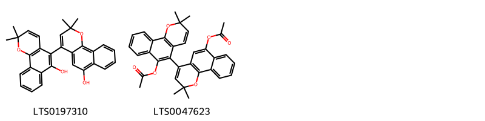{ width=100% }
    <figcaption>Hình ảnh cấu trúc hóa học của 2 hoạt chất thuộc nhóm Neoflavonoids gồm ['4-{6-hydroxy-2,2-dimethylbenzo[h]chromen-5-yl}-2,2-dimethylbenzo[h]chromen-6-ol (LTS0197310)', '4-[6-(acetyloxy)-2,2-dimethylbenzo[h]chromen-5-yl]-2,2-dimethylbenzo[h]chromen-6-yl acetate (LTS0047623)'].</figcaption>
</figure>
#### Nhóm Phenols
<figure markdown="span">
    { width=100% }
    <figcaption>Hình ảnh cấu trúc hóa học của 1 hoạt chất thuộc nhóm Phenols gồm ['eugenol (LTS0052342)'].</figcaption>
</figure>
#### Nhóm Prenol lipids
<figure markdown="span">
    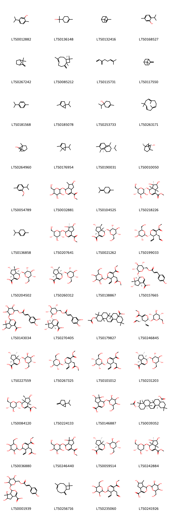{ width=100% }
    <figcaption>Hình ảnh cấu trúc hóa học của 48 hoạt chất thuộc nhóm Prenol lipids gồm ['carvacrol (LTS0012882)', 'terpineol (LTS0136148)', 'α pinene (LTS0132416)', 'thymol (LTS0168527)', 'camphene (LTS0267242)', 'caryophyllene (LTS0085212)', 'α-myrcene (LTS0115731)', 'β-pinene (LTS0117550)', 'cymene (LTS0181568)', 'α-thujene (LTS0185078)', '4-terpineol (LTS0253733)', 'humulene (LTS0263171)', 'borneol (LTS0264960)', 'α-thujene (LTS0176954)', '(1r,2s,7s,8s)-8-isopropyl-1,3-dimethyltricyclo[4.4.0.0²,⁷]dec-3-ene (LTS0190031)', '(2s,4r)-1,7,7-trimethylbicyclo[2.2.1]heptan-2-ol (LTS0010050)', '2-isopropyl-5-methylanisole (LTS0054789)', 'methyl 6-hydroxy-7-methyl-1-{[3,4,5-trihydroxy-6-(hydroxymethyl)oxan-2-yl]oxy}-1h,4ah,5h,6h,7h,7ah-cyclopenta[c]pyran-4-carboxylate (LTS0032881)', 'terpinolene (LTS0104525)', 'methyl (1s,4as,6s,7r,7as)-6,7-dihydroxy-7-methyl-1-{[(2r,3s,4s,5s,6r)-3,4,5-trihydroxy-6-(hydroxymethyl)oxan-2-yl]oxy}-1h,4ah,5h,6h,7ah-cyclopenta[c]pyran-4-carboxylate (LTS0218226)', 'terpinene (LTS0136858)', 'methyl (1s,6s,7r)-6,7-dihydroxy-7-methyl-1-{[(2s,3r,4s,5s,6r)-3,4,5-trihydroxy-6-(hydroxymethyl)oxan-2-yl]oxy}-1h,4ah,5h,6h,7ah-cyclopenta[c]pyran-4-carboxylate (LTS0207641)', '(1s,4as,6s,7s,7ar)-6-hydroxy-7-methyl-1-{[(2s,3r,4s,5s,6r)-3,4,5-trihydroxy-6-(hydroxymethyl)oxan-2-yl]oxy}-1h,4ah,5h,6h,7h,7ah-cyclopenta[c]pyran-4-carboxylic acid (LTS0021262)', '(-)-secologanin (LTS0199033)', '(1s,4as,6s,7r,7as)-6,7-dihydroxy-7-methyl-1-{[(2s,3r,4s,5s,6r)-3,4,5-trihydroxy-6-(hydroxymethyl)oxan-2-yl]oxy}-1h,4ah,5h,6h,7ah-cyclopenta[c]pyran-4-carboxylic acid (LTS0204502)', '(1s,4as,6s,7s,7as)-6-hydroxy-7-methyl-1-{[(2s,3r,4s,5s,6r)-3,4,5-trihydroxy-6-(hydroxymethyl)oxan-2-yl]oxy}-1h,4ah,5h,6h,7h,7ah-cyclopenta[c]pyran-4-carboxylic acid (LTS0260312)', 'methyl 5-ethenyl-4-(2-methoxy-2-oxoethyl)-6-{[3,4,5-trihydroxy-6-(hydroxymethyl)oxan-2-yl]oxy}-5,6-dihydro-4h-pyran-3-carboxylate (LTS0138867)', '(1s,4as,6s,7r,7as)-6,7-dihydroxy-7-methyl-1-{[(2s,3r,4s,5s,6r)-3,4,5-trihydroxy-6-({[(2e)-3-(4-hydroxyphenyl)prop-2-enoyl]oxy}methyl)oxan-2-yl]oxy}-1h,4ah,5h,6h,7ah-cyclopenta[c]pyran-4-carboxylic acid (LTS0157665)', '1-{[6-({[3-(3,4-dihydroxyphenyl)prop-2-enoyl]oxy}methyl)-3,4,5-trihydroxyoxan-2-yl]oxy}-6,7-dihydroxy-7-methyl-1h,4ah,5h,6h,7ah-cyclopenta[c]pyran-4-carboxylic acid (LTS0143034)', '(1s,4as,6s,7r,7as)-1-{[(2s,3r,4s,5s,6r)-6-({[(2e)-3-(3,4-dihydroxyphenyl)prop-2-enoyl]oxy}methyl)-3,4,5-trihydroxyoxan-2-yl]oxy}-6,7-dihydroxy-7-methyl-1h,4ah,5h,6h,7ah-cyclopenta[c]pyran-4-carboxylic acid (LTS0270405)', '10-(acetyloxy)-2,2,6a,6b,9,9,12a-heptamethyl-1,3,4,5,6,7,8,8a,10,11,12,12b,13,14b-tetradecahydropicene-4a-carboxylic acid (LTS0179827)', 'methyl (4s,5r,6r)-5-ethenyl-4-(2-oxoethyl)-6-{[(2s,3r,4s,5s,6r)-3,4,5-trihydroxy-6-(hydroxymethyl)oxan-2-yl]oxy}-5,6-dihydro-4h-pyran-3-carboxylate (LTS0246845)', '(1s,4as,6s,7r,7ar)-6-hydroxy-7-methyl-1-{[(2s,3s,4s,5s,6r)-3,4,5-trihydroxy-6-(hydroxymethyl)oxan-2-yl]oxy}-1h,4ah,5h,6h,7h,7ah-cyclopenta[c]pyran-4-carboxylic acid (LTS0227559)', 'methyl (4s,5r,6s)-5-ethenyl-4-(2-methoxy-2-oxoethyl)-6-{[(2s,3r,4s,5s,6r)-3,4,5-trihydroxy-6-(hydroxymethyl)oxan-2-yl]oxy}-5,6-dihydro-4h-pyran-3-carboxylate (LTS0267325)', '[(2s,3r,4s)-3-ethenyl-5-(methoxycarbonyl)-2-{[(2s,3r,4s,5s,6r)-3,4,5-trihydroxy-6-(hydroxymethyl)oxan-2-yl]oxy}-3,4-dihydro-2h-pyran-4-yl]acetic acid (LTS0101012)', 'loganic acid (LTS0231203)', 'loganin (LTS0084120)', 'sabinene (LTS0224133)', '6,7-dihydroxy-7-methyl-1-{[3,4,5-trihydroxy-6-(hydroxymethyl)oxan-2-yl]oxy}-1h,4ah,5h,6h,7ah-cyclopenta[c]pyran-4-carboxylic acid (LTS0146887)', '(4as,6as,6br,8ar,10s,12ar,12br,14bs)-10-(acetyloxy)-2,2,6a,6b,9,9,12a-heptamethyl-1,3,4,5,6,7,8,8a,10,11,12,12b,13,14b-tetradecahydropicene-4a-carboxylic acid (LTS0039352)', '[3-ethenyl-5-(methoxycarbonyl)-2-{[3,4,5-trihydroxy-6-(hydroxymethyl)oxan-2-yl]oxy}-3,4-dihydro-2h-pyran-4-yl]acetic acid (LTS0036880)', 'methyl 6,7-dihydroxy-7-methyl-1-{[3,4,5-trihydroxy-6-(hydroxymethyl)oxan-2-yl]oxy}-1h,4ah,5h,6h,7ah-cyclopenta[c]pyran-4-carboxylate (LTS0246440)', '(1s,4as,6s,7r,7ar)-6-hydroxy-7-methyl-1-{[(3s,4s,5s,6r)-3,4,5-trihydroxy-6-(hydroxymethyl)oxan-2-yl]oxy}-1h,4ah,5h,6h,7h,7ah-cyclopenta[c]pyran-4-carboxylic acid (LTS0059514)', 'methyl (1s,4as,6s,7r,7as)-6,7-dihydroxy-7-methyl-1-{[(2s,3r,4s,5s,6r)-3,4,5-trihydroxy-6-(hydroxymethyl)oxan-2-yl]oxy}-1h,4ah,5h,6h,7ah-cyclopenta[c]pyran-4-carboxylate (LTS0242884)', '6,7-dihydroxy-7-methyl-1-{[3,4,5-trihydroxy-6-({[3-(4-hydroxyphenyl)prop-2-enoyl]oxy}methyl)oxan-2-yl]oxy}-1h,4ah,5h,6h,7ah-cyclopenta[c]pyran-4-carboxylic acid (LTS0001939)', '4,11,11-trimethyl-8-methylidenebicyclo[7.2.0]undec-4-ene (LTS0256716)', 'secologanin (LTS0235060)', '6-hydroxy-7-methyl-1-{[3,4,5-trihydroxy-6-(hydroxymethyl)oxan-2-yl]oxy}-1h,4ah,5h,6h,7h,7ah-cyclopenta[c]pyran-4-carboxylic acid (LTS0241926)'].</figcaption>
</figure>
#### Nhóm Steroids and steroid derivatives
<figure markdown="span">
    { width=100% }
    <figcaption>Hình ảnh cấu trúc hóa học của 2 hoạt chất thuộc nhóm Steroids and steroid derivatives gồm ['stigmast-5-en-3-ol, (3β)- (LTS0204616)', 'stigmast-5-en-3-ol (LTS0071224)'].</figcaption>
</figure>
#### Nhóm Tetralins
<figure markdown="span">
    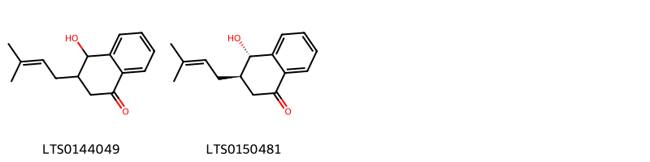{ width=100% }
    <figcaption>Hình ảnh cấu trúc hóa học của 2 hoạt chất thuộc nhóm Tetralins gồm ['4-hydroxy-3-(3-methylbut-2-en-1-yl)-3,4-dihydro-2h-naphthalen-1-one (LTS0144049)', '(3r,4s)-4-hydroxy-3-(3-methylbut-2-en-1-yl)-3,4-dihydro-2h-naphthalen-1-one (LTS0150481)'].</figcaption>
</figure>
#### Nhóm Unsaturated hydrocarbons
<figure markdown="span">
    { width=100% }
    <figcaption>Hình ảnh cấu trúc hóa học của 1 hoạt chất thuộc nhóm Unsaturated hydrocarbons gồm ['α terpinene (LTS0232891)'].</figcaption>
</figure>

---

### Dược dân tộc học

Danh sách các quốc gia có sử dụng *Lippia origanoides* trong điều trị các bệnh. 

| Country   | Disease   | Bệnh                                                                                                                                                                                                |
|:----------|:----------|:----------------------------------------------------------------------------------------------------------------------------------------------------------------------------------------------------|
| Venezuela | Stomachic | MYMEMORY WARNING: YOU USED ALL AVAILABLE FREE TRANSLATIONS FOR TODAY. NEXT AVAILABLE IN  16 HOURS 37 MINUTES 26 SECONDS VISIT HTTPS://MYMEMORY.TRANSLATED.NET/DOC/USAGELIMITS.PHP TO TRANSLATE MORE |

---

---
## Lippia palmeri
### Thông tin về thực vật

!!! info "Phân loại thực vật của *Lippia origanoides* từ GIBF:"
    - **Kingdom:** Plantae
    - **Phylum:** Tracheophyta
    - **Order:** Lamiales
    - **Family:** Verbenaceae
    - **Genus:** Lippia
    - **Species:** *Lippia origanoides*

 

| Label (VI)   | Label (EN)   | Scientific Name   | Descriptions (VI)   | Descriptions (EN)   | Also Known As (VI)   | Also Known As (EN)   |
|:-------------|:-------------|:------------------|:--------------------|:--------------------|:---------------------|:---------------------|
| N/A          | N/A          | Lippia palmeri    | loài thực vật       | species of plant    | ['']                 | ['']                 |

#### Phân bố trên thế giới

**Từ CSDL GIBF** Mexico

#### Phân bố tại Việt Nam

**Từ CSDL GIBF**: Không có ghi nhận ở Việt Nam

---
### Thành phần hóa học
        
- Theo cơ sở dữ liệu lotus: Từ loài *Lippia origanoides* đã phân lập và xác định được Chưa có hoạt chất nào được phân lập. hoạt chất thuộc về các nhóm Không có hoạt chất nào được phân lập. 

Không có hình ảnh nào được tạo ra

---

### Dược dân tộc học

Danh sách các quốc gia có sử dụng *Lippia origanoides* trong điều trị các bệnh. 

| Country      | Disease      | Bệnh                                                                                                                                                                                                |
|:-------------|:-------------|:----------------------------------------------------------------------------------------------------------------------------------------------------------------------------------------------------|
| Mexico(Seri) | Pediculicide | MYMEMORY WARNING: YOU USED ALL AVAILABLE FREE TRANSLATIONS FOR TODAY. NEXT AVAILABLE IN  16 HOURS 36 MINUTES 44 SECONDS VISIT HTTPS://MYMEMORY.TRANSLATED.NET/DOC/USAGELIMITS.PHP TO TRANSLATE MORE |

---

---
## Lippia scaberrima
### Thông tin về thực vật

!!! info "Phân loại thực vật của *Lippia scaberrima* từ GIBF:"
    - **Kingdom:** Plantae
    - **Phylum:** Tracheophyta
    - **Order:** Lamiales
    - **Family:** Verbenaceae
    - **Genus:** Lippia
    - **Species:** *Lippia scaberrima*

 

| Label (VI)   | Label (EN)   | Scientific Name   | Descriptions (VI)   | Descriptions (EN)   | Also Known As (VI)   | Also Known As (EN)   |
|:-------------|:-------------|:------------------|:--------------------|:--------------------|:---------------------|:---------------------|
| N/A          | N/A          | Lippia scaberrima | loài thực vật       | species of plant    | ['']                 | ['']                 |

#### Phân bố trên thế giới

**Từ CSDL GIBF** nan, unknown or invalid, Dominican Republic, Botswana, South Africa, Brazil, Congo, Democratic Republic of the, Mexico, Norway

#### Phân bố tại Việt Nam

**Từ CSDL GIBF**: Không có ghi nhận ở Việt Nam

---
### Thành phần hóa học
        
- Theo cơ sở dữ liệu lotus: Từ loài *Lippia scaberrima* đã phân lập và xác định được 3 hoạt chất thuộc về các nhóm Saturated hydrocarbons, Fatty Acyls. 

|    | chemicalTaxonomyClassyfireClass   |   smiles_count |
|---:|:----------------------------------|---------------:|
|  0 | Fatty Acyls                       |              1 |
|  1 | Saturated hydrocarbons            |              2 |

#### Nhóm Fatty Acyls
<figure markdown="span">
    { width=100% }
    <figcaption>Hình ảnh cấu trúc hóa học của 1 hoạt chất thuộc nhóm Fatty Acyls gồm ['arachidic acid (LTS0171823)'].</figcaption>
</figure>
#### Nhóm Saturated hydrocarbons
<figure markdown="span">
    { width=100% }
    <figcaption>Hình ảnh cấu trúc hóa học của 2 hoạt chất thuộc nhóm Saturated hydrocarbons gồm ['heptacosane (LTS0150428)', 'hentriacontane (LTS0046415)'].</figcaption>
</figure>

---

### Dược dân tộc học

Danh sách các quốc gia có sử dụng *Lippia scaberrima* trong điều trị các bệnh. 

| Country      | Disease   | Bệnh                                                                                                                                                                                                |
|:-------------|:----------|:----------------------------------------------------------------------------------------------------------------------------------------------------------------------------------------------------|
| South Africa | Hemostat  | MYMEMORY WARNING: YOU USED ALL AVAILABLE FREE TRANSLATIONS FOR TODAY. NEXT AVAILABLE IN  16 HOURS 36 MINUTES 22 SECONDS VISIT HTTPS://MYMEMORY.TRANSLATED.NET/DOC/USAGELIMITS.PHP TO TRANSLATE MORE |

---

---
## Lippia triphylla
### Thông tin về thực vật

!!! info "Phân loại thực vật của *Aloysia citrodora* từ GIBF:"
    - **Kingdom:** Plantae
    - **Phylum:** Tracheophyta
    - **Order:** Lamiales
    - **Family:** Verbenaceae
    - **Genus:** Aloysia
    - **Species:** *Aloysia citrodora*

 

| Label (VI)   | Label (EN)   | Scientific Name   | Descriptions (VI)   | Descriptions (EN)   | Also Known As (VI)   | Also Known As (EN)   |
|:-------------|:-------------|:------------------|:--------------------|:--------------------|:---------------------|:---------------------|
| N/A          | N/A          | Lippia triphylla  |                     | species of plant    | ['']                 | ['']                 |

#### Phân bố trên thế giới

**Từ CSDL GIBF** nan, Slovenia, Argentina, Brazil, France, Spain, Peru, Bolivia (Plurinational State of), Germany, Mexico, Italy

#### Phân bố tại Việt Nam

**Từ CSDL GIBF**: Không có ghi nhận ở Việt Nam

---
### Thành phần hóa học
        
- Theo cơ sở dữ liệu lotus: Từ loài *Aloysia citrodora* đã phân lập và xác định được Chưa có hoạt chất nào được phân lập. hoạt chất thuộc về các nhóm Không có hoạt chất nào được phân lập. 

Không có hình ảnh nào được tạo ra

---

### Dược dân tộc học

Danh sách các quốc gia có sử dụng *Aloysia citrodora* trong điều trị các bệnh. 

| Country   | Disease                | Bệnh                                                                                                                                                                                                |
|:----------|:-----------------------|:----------------------------------------------------------------------------------------------------------------------------------------------------------------------------------------------------|
| Mexico    | Vermifuge, Emmenagogue | MYMEMORY WARNING: YOU USED ALL AVAILABLE FREE TRANSLATIONS FOR TODAY. NEXT AVAILABLE IN  16 HOURS 36 MINUTES 02 SECONDS VISIT HTTPS://MYMEMORY.TRANSLATED.NET/DOC/USAGELIMITS.PHP TO TRANSLATE MORE |

---

# Chi Nyctanthes

??? note "Danh sách các dược liệu thuộc chi"
    
	 - *Nyctanthes arbor-tristis*

---
## Nyctanthes arbortristis
### Thông tin về thực vật

!!! info "Phân loại thực vật của *Nyctanthes arbor-tristis* từ GIBF:"
    - **Kingdom:** Plantae
    - **Phylum:** Tracheophyta
    - **Order:** Lamiales
    - **Family:** Oleaceae
    - **Genus:** Nyctanthes
    - **Species:** *Nyctanthes arbor-tristis*

 

| Label (VI)   | Label (EN)   | Scientific Name   | Descriptions (VI)   | Descriptions (EN)   | Also Known As (VI)   | Also Known As (EN)   |
|:-------------|:-------------|:------------------|:--------------------|:--------------------|:---------------------|:---------------------|
| N/A          | N/A          | Lippia triphylla  |                     | species of plant    | ['']                 | ['']                 |

#### Phân bố trên thế giới

**Từ CSDL GIBF** nan, Pakistan, India, Indonesia, China, Nepal, Chinese Taipei

#### Phân bố tại Việt Nam

**Từ CSDL GIBF**: Không có ghi nhận ở Việt Nam

---
### Thành phần hóa học
        
- Theo cơ sở dữ liệu lotus: Từ loài *Nyctanthes arbor-tristis* đã phân lập và xác định được Chưa có hoạt chất nào được phân lập. hoạt chất thuộc về các nhóm Không có hoạt chất nào được phân lập. 

Không có hình ảnh nào được tạo ra

---

### Dược dân tộc học

Danh sách các quốc gia có sử dụng *Nyctanthes arbor-tristis* trong điều trị các bệnh. 

| Country   | Disease                                     | Bệnh                                                                                                                                                                                                |
|:----------|:--------------------------------------------|:----------------------------------------------------------------------------------------------------------------------------------------------------------------------------------------------------|
| China     | Dye                                         | MYMEMORY WARNING: YOU USED ALL AVAILABLE FREE TRANSLATIONS FOR TODAY. NEXT AVAILABLE IN  16 HOURS 35 MINUTES 46 SECONDS VISIT HTTPS://MYMEMORY.TRANSLATED.NET/DOC/USAGELIMITS.PHP TO TRANSLATE MORE |
| Elsewhere | Cholagogue, Diaphoretic, Laxative, Diuretic | MYMEMORY WARNING: YOU USED ALL AVAILABLE FREE TRANSLATIONS FOR TODAY. NEXT AVAILABLE IN  16 HOURS 35 MINUTES 43 SECONDS VISIT HTTPS://MYMEMORY.TRANSLATED.NET/DOC/USAGELIMITS.PHP TO TRANSLATE MORE |
| Java      | Emmenagogue, Tonic                          | MYMEMORY WARNING: YOU USED ALL AVAILABLE FREE TRANSLATIONS FOR TODAY. NEXT AVAILABLE IN  16 HOURS 35 MINUTES 40 SECONDS VISIT HTTPS://MYMEMORY.TRANSLATED.NET/DOC/USAGELIMITS.PHP TO TRANSLATE MORE |

---

# Chi Priva

??? note "Danh sách các dược liệu thuộc chi"
    
	 - *Priva lappulacea*

---
## Priva lappulacea
### Thông tin về thực vật

!!! info "Phân loại thực vật của *Priva lappulacea* từ GIBF:"
    - **Kingdom:** Plantae
    - **Phylum:** Tracheophyta
    - **Order:** Lamiales
    - **Family:** Verbenaceae
    - **Genus:** Priva
    - **Species:** *Priva lappulacea*

 

| Label (VI)   | Label (EN)   | Scientific Name   | Descriptions (VI)   | Descriptions (EN)   | Also Known As (VI)   | Also Known As (EN)   |
|:-------------|:-------------|:------------------|:--------------------|:--------------------|:---------------------|:---------------------|
| N/A          | N/A          | Priva lappulacea  | loài thực vật       | species of plant    | ['']                 | ['']                 |

#### Phân bố trên thế giới

**Từ CSDL GIBF** Cayman Islands, Guadeloupe, Dominica, Ghana, French Guiana, Trinidad and Tobago, Martinique, Jamaica, Indonesia, Haiti, Saint Vincent and the Grenadines, Colombia, Dominican Republic, Puerto Rico, Cuba, Saint Kitts and Nevis, Bonaire, Sint Eustatius and Saba, Virgin Islands (U.S.), Barbados, Antigua and Barbuda, Nicaragua, Brazil, Montserrat, Mexico, Curaçao, Costa Rica, Ecuador, United States of America

#### Phân bố tại Việt Nam

**Từ CSDL GIBF**: Không có ghi nhận ở Việt Nam

---
### Thành phần hóa học
        
- Theo cơ sở dữ liệu lotus: Từ loài *Priva lappulacea* đã phân lập và xác định được Chưa có hoạt chất nào được phân lập. hoạt chất thuộc về các nhóm Không có hoạt chất nào được phân lập. 

Không có hình ảnh nào được tạo ra

---

### Dược dân tộc học

Danh sách các quốc gia có sử dụng *Priva lappulacea* trong điều trị các bệnh. 

| Country            | Disease   | Bệnh                                                                                                                                                                                                |
|:-------------------|:----------|:----------------------------------------------------------------------------------------------------------------------------------------------------------------------------------------------------|
| Dominican Republic | Diuretic  | MYMEMORY WARNING: YOU USED ALL AVAILABLE FREE TRANSLATIONS FOR TODAY. NEXT AVAILABLE IN  16 HOURS 35 MINUTES 18 SECONDS VISIT HTTPS://MYMEMORY.TRANSLATED.NET/DOC/USAGELIMITS.PHP TO TRANSLATE MORE |

---

# Chi Avicennia

??? note "Danh sách các dược liệu thuộc chi"
    
	 - *Avicennia germinans*
	 - *Avicennia officinalis*

---
## Avicennia germinans
### Thông tin về thực vật

!!! info "Phân loại thực vật của *Avicennia germinans* từ GIBF:"
    - **Kingdom:** Plantae
    - **Phylum:** Tracheophyta
    - **Order:** Lamiales
    - **Family:** Acanthaceae
    - **Genus:** Avicennia
    - **Species:** *Avicennia germinans*

 

| Label (VI)   | Label (EN)   | Scientific Name     | Descriptions (VI)   | Descriptions (EN)   | Also Known As (VI)   | Also Known As (EN)   |
|:-------------|:-------------|:--------------------|:--------------------|:--------------------|:---------------------|:---------------------|
| N/A          | N/A          | Avicennia germinans | loài thực vật       | species of plant    | ['']                 | ['']                 |

#### Phân bố trên thế giới

**Từ CSDL GIBF** Ghana, Guadeloupe, Trinidad and Tobago, French Guiana, Senegal, Martinique, Jamaica, Turks and Caicos Islands, Dominican Republic, Guinea-Bissau, Puerto Rico, Cuba, Bahamas, Virgin Islands (U.S.), Belize, Antigua and Barbuda, Brazil, Aruba, Mexico, Curaçao, Gambia, South Africa, Bermuda, Costa Rica, Ecuador, United States of America

#### Phân bố tại Việt Nam

**Từ CSDL GIBF**: Không có ghi nhận ở Việt Nam

---
### Thành phần hóa học
        
- Theo cơ sở dữ liệu lotus: Từ loài *Avicennia germinans* đã phân lập và xác định được 10 hoạt chất thuộc về các nhóm Furanoid lignans, Prenol lipids, Cinnamic acids and derivatives. 

|    | chemicalTaxonomyClassyfireClass   |   smiles_count |
|---:|:----------------------------------|---------------:|
|  0 | Cinnamic acids and derivatives    |              3 |
|  1 | Furanoid lignans                  |              2 |
|  2 | Prenol lipids                     |              5 |

#### Nhóm Cinnamic acids and derivatives
<figure markdown="span">
    { width=100% }
    <figcaption>Hình ảnh cấu trúc hóa học của 3 hoạt chất thuộc nhóm Cinnamic acids and derivatives gồm ['(3r,4r,6r)-6-[2-(3,4-dihydroxyphenyl)ethoxy]-5-hydroxy-2-(hydroxymethyl)-4-{[(2s,3s,5r)-3,4,5-trihydroxy-6-methyloxan-2-yl]oxy}oxan-3-yl (2e)-3-(3,4-dihydroxyphenyl)prop-2-enoate (LTS0063526)', 'verbascoside (LTS0168159)', '6-[2-(3,4-dihydroxyphenyl)ethoxy]-5-hydroxy-2-(hydroxymethyl)-4-[(3,4,5-trihydroxy-6-methyloxan-2-yl)oxy]oxan-3-yl 3-(3,4-dihydroxyphenyl)prop-2-enoate (LTS0050472)'].</figcaption>
</figure>
#### Nhóm Furanoid lignans
<figure markdown="span">
    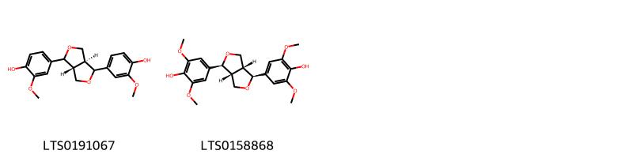{ width=100% }
    <figcaption>Hình ảnh cấu trúc hóa học của 2 hoạt chất thuộc nhóm Furanoid lignans gồm ['4-[(3ar,6as)-4-(4-hydroxy-3-methoxyphenyl)-hexahydrofuro[3,4-c]furan-1-yl]-2-methoxyphenol (LTS0191067)', '(+)-syringaresinol (LTS0158868)'].</figcaption>
</figure>
#### Nhóm Prenol lipids
<figure markdown="span">
    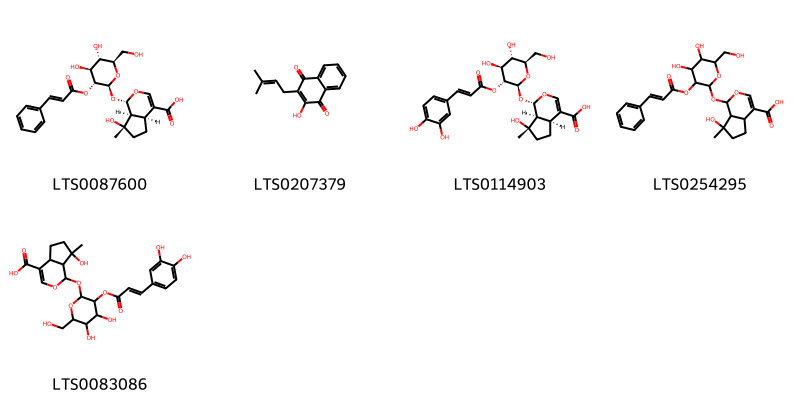{ width=100% }
    <figcaption>Hình ảnh cấu trúc hóa học của 5 hoạt chất thuộc nhóm Prenol lipids gồm ['(1s,4as,7s,7as)-1-{[(2s,3r,4s,5s,6r)-4,5-dihydroxy-6-(hydroxymethyl)-3-{[(2e)-3-phenylprop-2-enoyl]oxy}oxan-2-yl]oxy}-7-hydroxy-7-methyl-1h,4ah,5h,6h,7ah-cyclopenta[c]pyran-4-carboxylic acid (LTS0087600)', 'tecomin (LTS0207379)', '(1s,4as,7s,7as)-1-{[(2s,3r,4s,5s,6r)-3-{[(2e)-3-(3,4-dihydroxyphenyl)prop-2-enoyl]oxy}-4,5-dihydroxy-6-(hydroxymethyl)oxan-2-yl]oxy}-7-hydroxy-7-methyl-1h,4ah,5h,6h,7ah-cyclopenta[c]pyran-4-carboxylic acid (LTS0114903)', '1-{[4,5-dihydroxy-6-(hydroxymethyl)-3-[(3-phenylprop-2-enoyl)oxy]oxan-2-yl]oxy}-7-hydroxy-7-methyl-1h,4ah,5h,6h,7ah-cyclopenta[c]pyran-4-carboxylic acid (LTS0254295)', '1-[(3-{[3-(3,4-dihydroxyphenyl)prop-2-enoyl]oxy}-4,5-dihydroxy-6-(hydroxymethyl)oxan-2-yl)oxy]-7-hydroxy-7-methyl-1h,4ah,5h,6h,7ah-cyclopenta[c]pyran-4-carboxylic acid (LTS0083086)'].</figcaption>
</figure>

---

### Dược dân tộc học

Danh sách các quốc gia có sử dụng *Avicennia germinans* trong điều trị các bệnh. 

| Country   | Disease      | Bệnh                                                                                                                                                                                                |
|:----------|:-------------|:----------------------------------------------------------------------------------------------------------------------------------------------------------------------------------------------------|
| Elsewhere | Poison, Soap | MYMEMORY WARNING: YOU USED ALL AVAILABLE FREE TRANSLATIONS FOR TODAY. NEXT AVAILABLE IN  16 HOURS 34 MINUTES 56 SECONDS VISIT HTTPS://MYMEMORY.TRANSLATED.NET/DOC/USAGELIMITS.PHP TO TRANSLATE MORE |
| Haiti     | Tonic        | MYMEMORY WARNING: YOU USED ALL AVAILABLE FREE TRANSLATIONS FOR TODAY. NEXT AVAILABLE IN  16 HOURS 34 MINUTES 53 SECONDS VISIT HTTPS://MYMEMORY.TRANSLATED.NET/DOC/USAGELIMITS.PHP TO TRANSLATE MORE |

---

---
## Avicennia officinalis
### Thông tin về thực vật

!!! info "Phân loại thực vật của *Avicennia officinalis* từ GIBF:"
    - **Kingdom:** Plantae
    - **Phylum:** Tracheophyta
    - **Order:** Lamiales
    - **Family:** Acanthaceae
    - **Genus:** Avicennia
    - **Species:** *Avicennia officinalis*

 

| Label (VI)   | Label (EN)   | Scientific Name       | Descriptions (VI)   | Descriptions (EN)   | Also Known As (VI)        | Also Known As (EN)   |
|:-------------|:-------------|:----------------------|:--------------------|:--------------------|:--------------------------|:---------------------|
| N/A          | N/A          | Avicennia officinalis | loài thực vật       | species of plant    | ['Avicennia officinalis'] | ['Mangrove']         |

#### Phân bố trên thế giới

**Từ CSDL GIBF** Viet Nam, nan, Slovenia, Sri Lanka, Thailand, Philippines, Malaysia, New Zealand, India, Papua New Guinea, New Caledonia, Canada, Bangladesh, Singapore, Guinea, Australia, Cambodia, Indonesia

#### Phân bố tại Việt Nam

**Từ CSDL GIBF**: Tỉnh Bạc Liêu

---
### Thành phần hóa học
        
- Theo cơ sở dữ liệu lotus: Từ loài *Avicennia officinalis* đã phân lập và xác định được 23 hoạt chất thuộc về các nhóm Steroids and steroid derivatives, Flavonoids, Prenol lipids, Cinnamic acids and derivatives. 

|    | chemicalTaxonomyClassyfireClass   |   smiles_count |
|---:|:----------------------------------|---------------:|
|  0 | Cinnamic acids and derivatives    |              2 |
|  1 | Flavonoids                        |              1 |
|  2 | Prenol lipids                     |             13 |
|  3 | Steroids and steroid derivatives  |              7 |

#### Nhóm Cinnamic acids and derivatives
<figure markdown="span">
    { width=100% }
    <figcaption>Hình ảnh cấu trúc hóa học của 2 hoạt chất thuộc nhóm Cinnamic acids and derivatives gồm ['(3r,4r,6r)-6-[2-(3,4-dihydroxyphenyl)ethoxy]-5-hydroxy-2-(hydroxymethyl)-4-{[(2s,3s,5r)-3,4,5-trihydroxy-6-methyloxan-2-yl]oxy}oxan-3-yl (2e)-3-(3,4-dihydroxyphenyl)prop-2-enoate (LTS0063526)', 'verbascoside (LTS0168159)'].</figcaption>
</figure>
#### Nhóm Flavonoids
<figure markdown="span">
    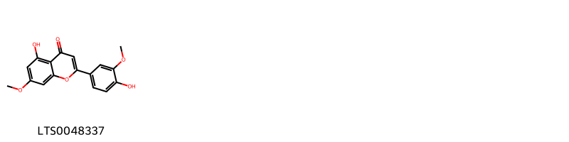{ width=100% }
    <figcaption>Hình ảnh cấu trúc hóa học của 1 hoạt chất thuộc nhóm Flavonoids gồm ['velutin (LTS0048337)'].</figcaption>
</figure>
#### Nhóm Prenol lipids
<figure markdown="span">
    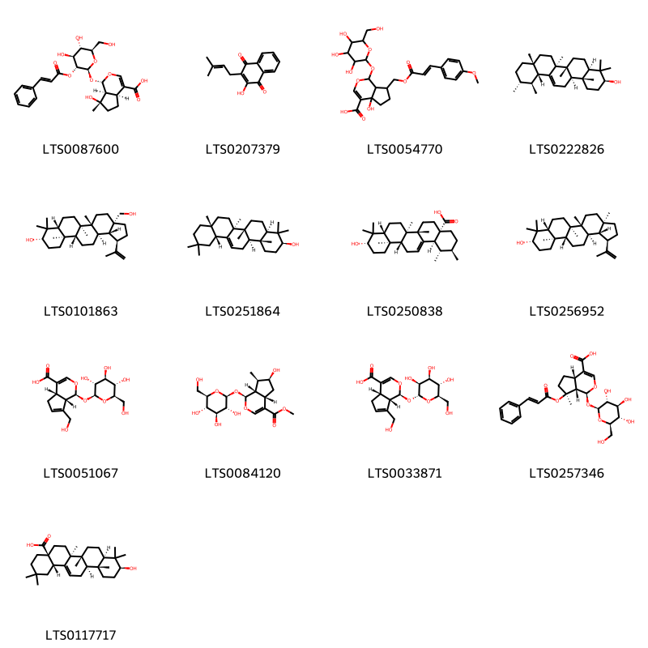{ width=100% }
    <figcaption>Hình ảnh cấu trúc hóa học của 13 hoạt chất thuộc nhóm Prenol lipids gồm ['(1s,4as,7s,7as)-1-{[(2s,3r,4s,5s,6r)-4,5-dihydroxy-6-(hydroxymethyl)-3-{[(2e)-3-phenylprop-2-enoyl]oxy}oxan-2-yl]oxy}-7-hydroxy-7-methyl-1h,4ah,5h,6h,7ah-cyclopenta[c]pyran-4-carboxylic acid (LTS0087600)', 'tecomin (LTS0207379)', '4a-hydroxy-7-({[(2e)-3-(4-methoxyphenyl)prop-2-enoyl]oxy}methyl)-1-{[3,4,5-trihydroxy-6-(hydroxymethyl)oxan-2-yl]oxy}-1h,5h,6h,7h,7ah-cyclopenta[c]pyran-4-carboxylic acid (LTS0054770)', 'amyrin (LTS0222826)', 'betulin (LTS0101863)', 'β-amyrin (LTS0251864)', 'ursolic acid (LTS0250838)', 'lupeol (LTS0256952)', 'geniposidic acid (LTS0051067)', 'loganin (LTS0084120)', '(1s,4as,7as)-7-(hydroxymethyl)-1-{[(2r,3s,4s,5s,6r)-3,4,5-trihydroxy-6-(hydroxymethyl)oxan-2-yl]oxy}-1h,4ah,5h,7ah-cyclopenta[c]pyran-4-carboxylic acid (LTS0033871)', '(1s,4as,7s,7as)-7-methyl-7-{[(2e)-3-phenylprop-2-enoyl]oxy}-1-{[(2s,3r,4s,5s,6r)-3,4,5-trihydroxy-6-(hydroxymethyl)oxan-2-yl]oxy}-1h,4ah,5h,6h,7ah-cyclopenta[c]pyran-4-carboxylic acid (LTS0257346)', 'oleanolic acid (LTS0117717)'].</figcaption>
</figure>
#### Nhóm Steroids and steroid derivatives
<figure markdown="span">
    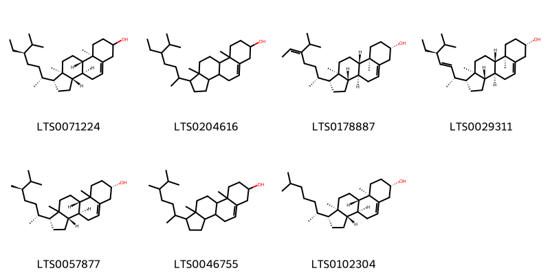{ width=100% }
    <figcaption>Hình ảnh cấu trúc hóa học của 7 hoạt chất thuộc nhóm Steroids and steroid derivatives gồm ['stigmast-5-en-3-ol (LTS0071224)', 'stigmast-5-en-3-ol, (3β)- (LTS0204616)', 'fucosterol (LTS0178887)', 'phytosterol (LTS0029311)', '(1r,3as,3bs,7s,9bs)-1-[(2r,5r)-5,6-dimethylheptan-2-yl]-9a,11a-dimethyl-1h,2h,3h,3ah,3bh,4h,6h,7h,8h,9h,9bh,10h,11h-cyclopenta[a]phenanthren-7-ol (LTS0057877)', 'campesterol (LTS0046755)', 'cholesterol (LTS0102304)'].</figcaption>
</figure>

---

### Dược dân tộc học

Danh sách các quốc gia có sử dụng *Avicennia officinalis* trong điều trị các bệnh. 

| Country   | Disease   | Bệnh                                                                                                                                                                                                |
|:----------|:----------|:----------------------------------------------------------------------------------------------------------------------------------------------------------------------------------------------------|
| Elsewhere | Soap      | MYMEMORY WARNING: YOU USED ALL AVAILABLE FREE TRANSLATIONS FOR TODAY. NEXT AVAILABLE IN  16 HOURS 34 MINUTES 29 SECONDS VISIT HTTPS://MYMEMORY.TRANSLATED.NET/DOC/USAGELIMITS.PHP TO TRANSLATE MORE |
| India     | Poultice  | MYMEMORY WARNING: YOU USED ALL AVAILABLE FREE TRANSLATIONS FOR TODAY. NEXT AVAILABLE IN  16 HOURS 34 MINUTES 26 SECONDS VISIT HTTPS://MYMEMORY.TRANSLATED.NET/DOC/USAGELIMITS.PHP TO TRANSLATE MORE |

---

# Chi Aloysia

??? note "Danh sách các dược liệu thuộc chi"
    
	 - *Aloysia lycioides*
	 - *Aloysia oblanceolata*

---
## Aloysia lycioides
### Thông tin về thực vật

!!! info "Phân loại thực vật của *Aloysia gratissima* từ GIBF:"
    - **Kingdom:** Plantae
    - **Phylum:** Tracheophyta
    - **Order:** Lamiales
    - **Family:** Verbenaceae
    - **Genus:** Aloysia
    - **Species:** *Aloysia gratissima*

 

| Label (VI)   | Label (EN)   | Scientific Name   | Descriptions (VI)   | Descriptions (EN)   | Also Known As (VI)   | Also Known As (EN)   |
|:-------------|:-------------|:------------------|:--------------------|:--------------------|:---------------------|:---------------------|
| N/A          | N/A          | Aloysia lycioides | loài thực vật       | species of plant    | ['']                 | ['']                 |

#### Phân bố trên thế giới

**Từ CSDL GIBF** nan, Argentina, Brazil, Bolivia (Plurinational State of), Paraguay, United States of America, Mexico

#### Phân bố tại Việt Nam

**Từ CSDL GIBF**: Không có ghi nhận ở Việt Nam

---
### Thành phần hóa học
        
- Theo cơ sở dữ liệu lotus: Từ loài *Aloysia gratissima* đã phân lập và xác định được Chưa có hoạt chất nào được phân lập. hoạt chất thuộc về các nhóm Không có hoạt chất nào được phân lập. 

Không có hình ảnh nào được tạo ra

---

### Dược dân tộc học

Danh sách các quốc gia có sử dụng *Aloysia gratissima* trong điều trị các bệnh. 

| Country   | Disease   | Bệnh                                                                                                                                                                                                |
|:----------|:----------|:----------------------------------------------------------------------------------------------------------------------------------------------------------------------------------------------------|
| US        | Poison    | MYMEMORY WARNING: YOU USED ALL AVAILABLE FREE TRANSLATIONS FOR TODAY. NEXT AVAILABLE IN  16 HOURS 33 MINUTES 55 SECONDS VISIT HTTPS://MYMEMORY.TRANSLATED.NET/DOC/USAGELIMITS.PHP TO TRANSLATE MORE |

---

---
## Aloysia oblanceolata
### Thông tin về thực vật

!!! info "Phân loại thực vật của *Aloysia oblanceolata* từ GIBF:"
    - **Kingdom:** Plantae
    - **Phylum:** Tracheophyta
    - **Order:** Lamiales
    - **Family:** Verbenaceae
    - **Genus:** Aloysia
    - **Species:** *Aloysia oblanceolata*

 

| Label (VI)   | Label (EN)   | Scientific Name      | Descriptions (VI)   | Descriptions (EN)   | Also Known As (VI)   | Also Known As (EN)   |
|:-------------|:-------------|:---------------------|:--------------------|:--------------------|:---------------------|:---------------------|
| N/A          | N/A          | Aloysia oblanceolata | loài thực vật       | species of plant    | ['']                 | ['']                 |

#### Phân bố trên thế giới

**Từ CSDL GIBF** nan, Argentina, Brazil, Bolivia (Plurinational State of), Paraguay

#### Phân bố tại Việt Nam

**Từ CSDL GIBF**: Không có ghi nhận ở Việt Nam

---
### Thành phần hóa học
        
- Theo cơ sở dữ liệu lotus: Từ loài *Aloysia oblanceolata* đã phân lập và xác định được Chưa có hoạt chất nào được phân lập. hoạt chất thuộc về các nhóm Không có hoạt chất nào được phân lập. 

Không có hình ảnh nào được tạo ra

---

### Dược dân tộc học

Danh sách các quốc gia có sử dụng *Aloysia oblanceolata* trong điều trị các bệnh. 

| Country   | Disease       | Bệnh                                                                                                                                                                                                |
|:----------|:--------------|:----------------------------------------------------------------------------------------------------------------------------------------------------------------------------------------------------|
| Paraguay  | Antifertility | MYMEMORY WARNING: YOU USED ALL AVAILABLE FREE TRANSLATIONS FOR TODAY. NEXT AVAILABLE IN  16 HOURS 33 MINUTES 35 SECONDS VISIT HTTPS://MYMEMORY.TRANSLATED.NET/DOC/USAGELIMITS.PHP TO TRANSLATE MORE |

---

