!!! abstract "Tóm tắt"

    Họ Viscaceae gồm khoảng 2 chi và 6 loài được một số cộng đồng tại các quốc gia như ain, Elsewhere, India(Hindu), UK, India, US, Turkey, US(Amerindian), Europe sử dụng trong một số trường hợp MYMEMORY WARNING: YOU USED ALL AVAILABLE FREE TRANSLATIONS FOR TODAY. NEXT AVAILABLE IN  17 HOURS 12 MINUTES 20 SECONDS VISIT HTTPS://MYMEMORY.TRANSLATED.NET/DOC/USAGELIMITS.PHP TO TRANSLATE MORE.

!!! info "DrDuke"

    James A. Duke sinh năm 1929-2017 là một nhà thực vật học người Mỹ. Đây là một trong những tác giả hàng đầu trong lĩnh vực dược dân tộc học với cuốn *CRC Handbook of Medicinal Herbs* và chính là người xây dựng lên cơ sở dữ liệu về hợp chất tự nhiên và dược dân tộc học tại Bộ nông nghiệp Hoa Kỳ. Các thông tin được đăng tải tại website [Dr. Duke's Phytochemical and Ethnobotanical Databases](https://phytochem.nal.usda.gov/). 
    Trong suốt thập niên 1970, ông lãnh đạo the Plant Taxonomy Laboratory, Plant Genetics and Germplasm Institute of the Agricultural Research Service, U.S. Department of Agriculture.
    Trong tài liệu này, các thông tin về dược dân tộc của các dược liệu được trích dẫn từ tài liệu của James A. Ducke với sự trợ giúp của phần mềm dịch thuật từ tiếng Anh sang tiếng Việt.
   

# Chi Viscum

??? note "Danh sách các dược liệu thuộc chi"
    
	 - *Viscum album*
	 - *Viscum articulatum*
	 - *Viscum monoicum*
	 - *Viscum orientale*

---
## Viscum album
### Thông tin về thực vật

!!! info "Phân loại thực vật của *Viscum album* từ GIBF:"
    - **Kingdom:** Plantae
    - **Phylum:** Tracheophyta
    - **Order:** Santalales
    - **Family:** Viscaceae
    - **Genus:** Viscum
    - **Species:** *Viscum album*

 

| Label (VI)   | Label (EN)   | Scientific Name   | Descriptions (VI)   | Descriptions (EN)   | Also Known As (VI)   | Also Known As (EN)   |
|:-------------|:-------------|:------------------|:--------------------|:--------------------|:---------------------|:---------------------|
| N/A          | N/A          | Viscum album      |                     | species of plant    | ['']                 | ['Mistletoe']        |

#### Phân bố trên thế giới

**Từ CSDL GIBF** Georgia, Denmark, Luxembourg, Spain, Germany, Austria, Sweden, Poland, Belgium, Finland, Belarus, Japan, Lithuania, Hungary, United Kingdom of Great Britain and Northern Ireland, France, Czechia, Armenia, Russian Federation, United States of America, Italy, Ukraine

#### Phân bố tại Việt Nam

**Từ CSDL GIBF**: Không có ghi nhận ở Việt Nam

---
### Thành phần hóa học
        
- Theo cơ sở dữ liệu lotus: Từ loài *Viscum album* đã phân lập và xác định được 114 hoạt chất thuộc về các nhóm Organooxygen compounds, Furanoid lignans, Flavonoids, Benzofurans, Prenol lipids, Carboxylic acids and derivatives, Fatty Acyls, Tetrapyrroles and derivatives, Lignan glycosides, Cinnamic acids and derivatives, Steroids and steroid derivatives, Benzene and substituted derivatives. 

|    | chemicalTaxonomyClassyfireClass     |   smiles_count |
|---:|:------------------------------------|---------------:|
|  0 | Benzene and substituted derivatives |              1 |
|  1 | Benzofurans                         |              1 |
|  2 | Carboxylic acids and derivatives    |             16 |
|  3 | Cinnamic acids and derivatives      |              4 |
|  4 | Fatty Acyls                         |              6 |
|  5 | Flavonoids                          |             24 |
|  6 | Furanoid lignans                    |              2 |
|  7 | Lignan glycosides                   |              4 |
|  8 | Organooxygen compounds              |             24 |
|  9 | Prenol lipids                       |             17 |
| 10 | Steroids and steroid derivatives    |              5 |
| 11 | Tetrapyrroles and derivatives       |              8 |

#### Nhóm Benzene and substituted derivatives
<figure markdown="span">
    { width=100% }
    <figcaption>Hình ảnh cấu trúc hóa học của 1 hoạt chất thuộc nhóm Benzene and substituted derivatives gồm ['galop (LTS0222857)'].</figcaption>
</figure>
#### Nhóm Benzofurans
<figure markdown="span">
    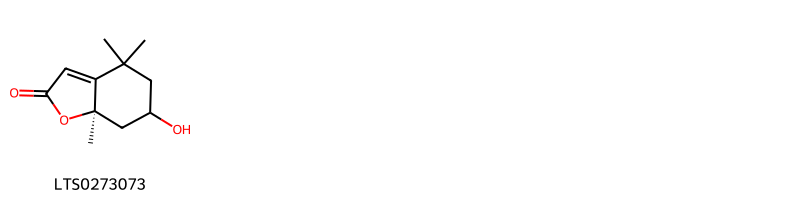{ width=100% }
    <figcaption>Hình ảnh cấu trúc hóa học của 1 hoạt chất thuộc nhóm Benzofurans gồm ['(7ar)-6-hydroxy-4,4,7a-trimethyl-6,7-dihydro-5h-1-benzofuran-2-one (LTS0273073)'].</figcaption>
</figure>
#### Nhóm Carboxylic acids and derivatives
<figure markdown="span">
    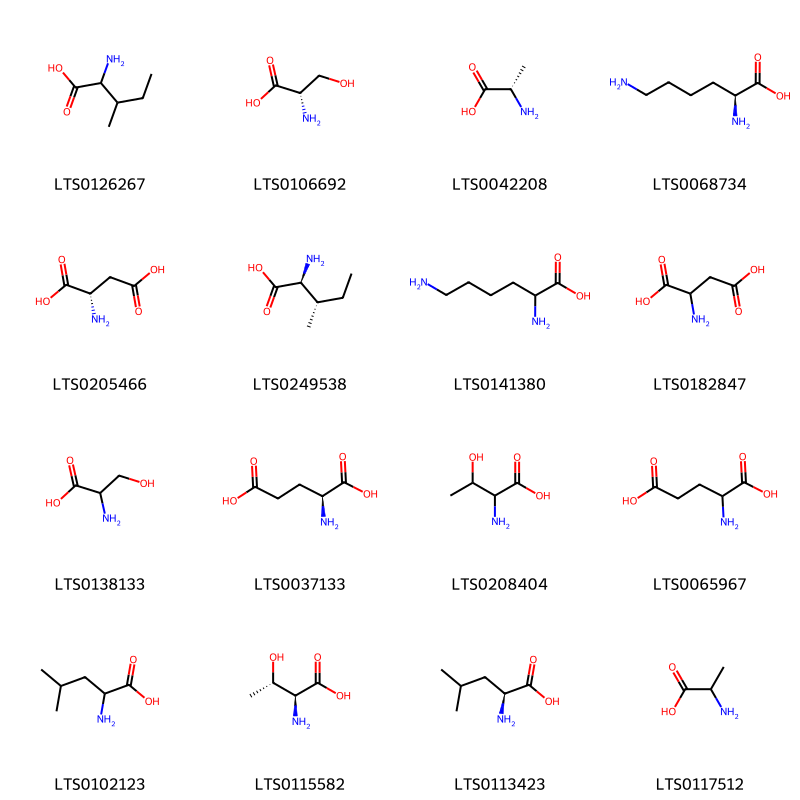{ width=100% }
    <figcaption>Hình ảnh cấu trúc hóa học của 16 hoạt chất thuộc nhóm Carboxylic acids and derivatives gồm ['lisoleucine (LTS0126267)', 'l-serine (LTS0106692)', 'l-alanine (LTS0042208)', 'l-lysine (LTS0068734)', 'l-aspartic acid (LTS0205466)', 'l-isoleucine (LTS0249538)', 'lysine (LTS0141380)', 'aspartic acid (LTS0182847)', 'serin (LTS0138133)', 'l-glutamic acid (LTS0037133)', 'threonine(l) (LTS0208404)', 'glutaminsaeure (LTS0065967)', 'leucine (LTS0102123)', 'l-allothreonine (LTS0115582)', 'l-leucine (LTS0113423)', 'alanine (LTS0117512)'].</figcaption>
</figure>
#### Nhóm Cinnamic acids and derivatives
<figure markdown="span">
    { width=100% }
    <figcaption>Hình ảnh cấu trúc hóa học của 4 hoạt chất thuộc nhóm Cinnamic acids and derivatives gồm ['ferulic acid (LTS0077328)', '3,4-dihydroxycinnamic acid (LTS0128050)', 'caffeic acid (LTS0027481)', 'ferulic acid (LTS0273002)'].</figcaption>
</figure>
#### Nhóm Fatty Acyls
<figure markdown="span">
    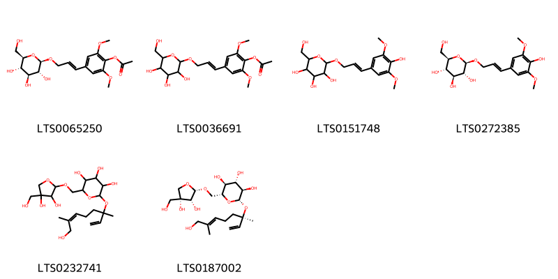{ width=100% }
    <figcaption>Hình ảnh cấu trúc hóa học của 6 hoạt chất thuộc nhóm Fatty Acyls gồm ['2,6-dimethoxy-4-[(1e)-3-{[(2r,3r,4s,5s,6r)-3,4,5-trihydroxy-6-(hydroxymethyl)oxan-2-yl]oxy}prop-1-en-1-yl]phenyl acetate (LTS0065250)', '2,6-dimethoxy-4-(3-{[3,4,5-trihydroxy-6-(hydroxymethyl)oxan-2-yl]oxy}prop-1-en-1-yl)phenyl acetate (LTS0036691)', '2-{[3-(4-hydroxy-3,5-dimethoxyphenyl)prop-2-en-1-yl]oxy}-6-(hydroxymethyl)oxane-3,4,5-triol (LTS0151748)', '(2r,3r,4s,5s,6r)-2-{[(2e)-3-(4-hydroxy-3,5-dimethoxyphenyl)prop-2-en-1-yl]oxy}-6-(hydroxymethyl)oxane-3,4,5-triol (LTS0272385)', '2-({[3,4-dihydroxy-4-(hydroxymethyl)oxolan-2-yl]oxy}methyl)-6-[(8-hydroxy-3,7-dimethylocta-1,6-dien-3-yl)oxy]oxane-3,4,5-triol (LTS0232741)', '(2r,3s,4s,5r,6s)-2-({[(2s,3r,4r)-3,4-dihydroxy-4-(hydroxymethyl)oxolan-2-yl]oxy}methyl)-6-{[(3r,6e)-8-hydroxy-3,7-dimethylocta-1,6-dien-3-yl]oxy}oxane-3,4,5-triol (LTS0187002)'].</figcaption>
</figure>
#### Nhóm Flavonoids
<figure markdown="span">
    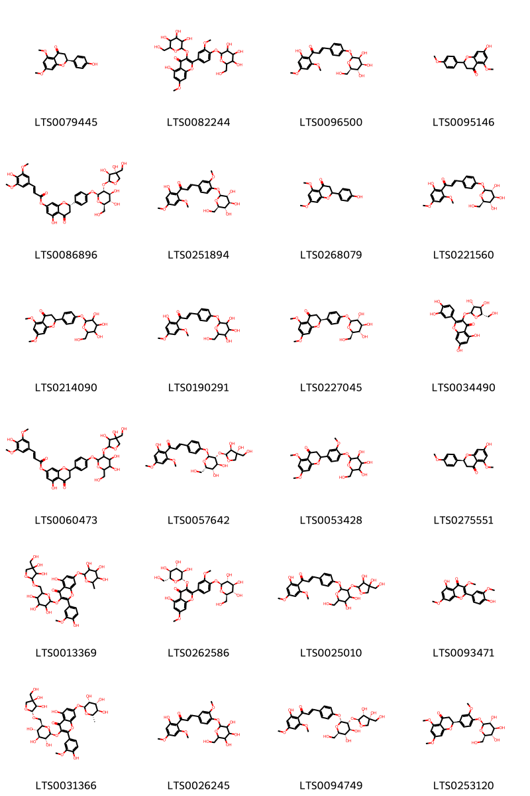{ width=100% }
    <figcaption>Hình ảnh cấu trúc hóa học của 24 hoạt chất thuộc nhóm Flavonoids gồm ['(2s)-2-(4-hydroxyphenyl)-5,7-dimethoxy-2,3-dihydro-1-benzopyran-4-one (LTS0079445)', '5-hydroxy-7-methoxy-2-(3-methoxy-4-{[3,4,5-trihydroxy-6-(hydroxymethyl)oxan-2-yl]oxy}phenyl)-3-{[3,4,5-trihydroxy-6-(hydroxymethyl)oxan-2-yl]oxy}chromen-4-one (LTS0082244)', '(2e)-1-(2-hydroxy-4,6-dimethoxyphenyl)-3-(4-{[(2s,3s,4s,5s,6r)-3,4,5-trihydroxy-6-(hydroxymethyl)oxan-2-yl]oxy}phenyl)prop-2-en-1-one (LTS0096500)', 'tsugafolin (LTS0095146)', '(2s)-2-(4-{[(2s,3r,4s,5s,6r)-3-{[(2s,3s,4r)-3,4-dihydroxy-4-(hydroxymethyl)oxolan-2-yl]oxy}-4,5-dihydroxy-6-(hydroxymethyl)oxan-2-yl]oxy}phenyl)-5-hydroxy-4-oxo-2,3-dihydro-1-benzopyran-7-yl (2e)-3-(4-hydroxy-3,5-dimethoxyphenyl)prop-2-enoate (LTS0086896)', '(2e)-1-(2-hydroxy-4,6-dimethoxyphenyl)-3-(3-methoxy-4-{[(2s,3r,4s,5s,6r)-3,4,5-trihydroxy-6-(hydroxymethyl)oxan-2-yl]oxy}phenyl)prop-2-en-1-one (LTS0251894)', 'naringenin 5,7-dimethyl ether (LTS0268079)', '(2e)-1-(2-hydroxy-4,6-dimethoxyphenyl)-3-(4-{[(2s,3r,4s,5s,6r)-3,4,5-trihydroxy-6-(hydroxymethyl)oxan-2-yl]oxy}phenyl)prop-2-en-1-one (LTS0221560)', '5,7-dimethoxy-2-(4-{[3,4,5-trihydroxy-6-(hydroxymethyl)oxan-2-yl]oxy}phenyl)-2,3-dihydro-1-benzopyran-4-one (LTS0214090)', '1-(2-hydroxy-4,6-dimethoxyphenyl)-3-(4-{[3,4,5-trihydroxy-6-(hydroxymethyl)oxan-2-yl]oxy}phenyl)prop-2-en-1-one (LTS0190291)', '(2s)-5,7-dimethoxy-2-(4-{[(2s,3r,4s,5s,6r)-3,4,5-trihydroxy-6-(hydroxymethyl)oxan-2-yl]oxy}phenyl)-2,3-dihydro-1-benzopyran-4-one (LTS0227045)', 'avicularin (LTS0034490)', '2-{4-[(3-{[3,4-dihydroxy-4-(hydroxymethyl)oxolan-2-yl]oxy}-4,5-dihydroxy-6-(hydroxymethyl)oxan-2-yl)oxy]phenyl}-5-hydroxy-4-oxo-2,3-dihydro-1-benzopyran-7-yl 3-(4-hydroxy-3,5-dimethoxyphenyl)prop-2-enoate (LTS0060473)', '(2e)-3-(4-{[(2s,3r,4s,5s,6s)-3-{[(2s,3s,4r)-3,4-dihydroxy-4-(hydroxymethyl)oxolan-2-yl]oxy}-4,5-dihydroxy-6-(hydroxymethyl)oxan-2-yl]oxy}phenyl)-1-(2-hydroxy-4,6-dimethoxyphenyl)prop-2-en-1-one (LTS0057642)', '5,7-dimethoxy-2-(3-methoxy-4-{[3,4,5-trihydroxy-6-(hydroxymethyl)oxan-2-yl]oxy}phenyl)-2,3-dihydro-1-benzopyran-4-one (LTS0053428)', '(2s)-7-hydroxy-5-methoxy-2-(4-methoxyphenyl)-2,3-dihydro-1-benzopyran-4-one (LTS0275551)', '3-{[6-({[3,4-dihydroxy-4-(hydroxymethyl)oxolan-2-yl]oxy}methyl)-3,4,5-trihydroxyoxan-2-yl]oxy}-5-hydroxy-2-(4-hydroxy-3-methoxyphenyl)-7-[(3,4,5-trihydroxy-6-methyloxan-2-yl)oxy]chromen-4-one (LTS0013369)', '5-hydroxy-7-methoxy-2-(3-methoxy-4-{[(2s,3r,4s,5s,6r)-3,4,5-trihydroxy-6-(hydroxymethyl)oxan-2-yl]oxy}phenyl)-3-{[(2s,3r,4s,5s,6r)-3,4,5-trihydroxy-6-(hydroxymethyl)oxan-2-yl]oxy}chromen-4-one (LTS0262586)', '3-{4-[(3-{[3,4-dihydroxy-4-(hydroxymethyl)oxolan-2-yl]oxy}-4,5-dihydroxy-6-(hydroxymethyl)oxan-2-yl)oxy]phenyl}-1-(2-hydroxy-4,6-dimethoxyphenyl)prop-2-en-1-one (LTS0025010)', 'pachypodol (LTS0093471)', '3-{[(2s,3r,4s,5s,6r)-6-({[(2r,3r,4r)-3,4-dihydroxy-4-(hydroxymethyl)oxolan-2-yl]oxy}methyl)-3,4,5-trihydroxyoxan-2-yl]oxy}-5-hydroxy-2-(4-hydroxy-3-methoxyphenyl)-7-{[(2s,3r,4r,5r,6s)-3,4,5-trihydroxy-6-methyloxan-2-yl]oxy}chromen-4-one (LTS0031366)', '1-(2-hydroxy-4,6-dimethoxyphenyl)-3-(3-methoxy-4-{[3,4,5-trihydroxy-6-(hydroxymethyl)oxan-2-yl]oxy}phenyl)prop-2-en-1-one (LTS0026245)', '(2e)-3-(4-{[(2r,3r,4s,5s,6r)-3-{[(2s,3r,4r)-3,4-dihydroxy-4-(hydroxymethyl)oxolan-2-yl]oxy}-4,5-dihydroxy-6-(hydroxymethyl)oxan-2-yl]oxy}phenyl)-1-(2-hydroxy-4,6-dimethoxyphenyl)prop-2-en-1-one (LTS0094749)', '(2s)-5,7-dimethoxy-2-(3-methoxy-4-{[(2s,3r,4s,5s,6r)-3,4,5-trihydroxy-6-(hydroxymethyl)oxan-2-yl]oxy}phenyl)-2,3-dihydro-1-benzopyran-4-one (LTS0253120)'].</figcaption>
</figure>
#### Nhóm Furanoid lignans
<figure markdown="span">
    { width=100% }
    <figcaption>Hình ảnh cấu trúc hóa học của 2 hoạt chất thuộc nhóm Furanoid lignans gồm ['syringaresinol (LTS0116280)', '(+)-syringaresinol (LTS0158868)'].</figcaption>
</figure>
#### Nhóm Lignan glycosides
<figure markdown="span">
    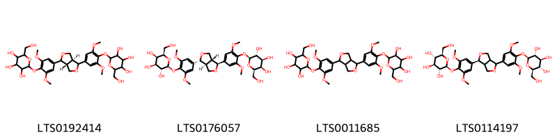{ width=100% }
    <figcaption>Hình ảnh cấu trúc hóa học của 4 hoạt chất thuộc nhóm Lignan glycosides gồm ['2-{4-[(3as,6ar)-4-(3,5-dimethoxy-4-{[3,4,5-trihydroxy-6-(hydroxymethyl)oxan-2-yl]oxy}phenyl)-hexahydrofuro[3,4-c]furan-1-yl]-2,6-dimethoxyphenoxy}-6-(hydroxymethyl)oxane-3,4,5-triol (LTS0192414)', '(2s,3r,4s,5r,6r)-2-{4-[(1r,3ar,4s,6as)-4-(3,5-dimethoxy-4-{[(2s,3r,4s,5r,6r)-3,4,5-trihydroxy-6-(hydroxymethyl)oxan-2-yl]oxy}phenyl)-hexahydrofuro[3,4-c]furan-1-yl]-2,6-dimethoxyphenoxy}-6-(hydroxymethyl)oxane-3,4,5-triol (LTS0176057)', '2-{4-[4-(3,5-dimethoxy-4-{[3,4,5-trihydroxy-6-(hydroxymethyl)oxan-2-yl]oxy}phenyl)-hexahydrofuro[3,4-c]furan-1-yl]-2,6-dimethoxyphenoxy}-6-(hydroxymethyl)oxane-3,4,5-triol (LTS0011685)', '(2s,3r,4s,5s,6r)-2-{4-[(1s)-4-(3,5-dimethoxy-4-{[(2s,3r,4s,5s,6r)-3,4,5-trihydroxy-6-(hydroxymethyl)oxan-2-yl]oxy}phenyl)-hexahydrofuro[3,4-c]furan-1-yl]-2,6-dimethoxyphenoxy}-6-(hydroxymethyl)oxane-3,4,5-triol (LTS0114197)'].</figcaption>
</figure>
#### Nhóm Organooxygen compounds
<figure markdown="span">
    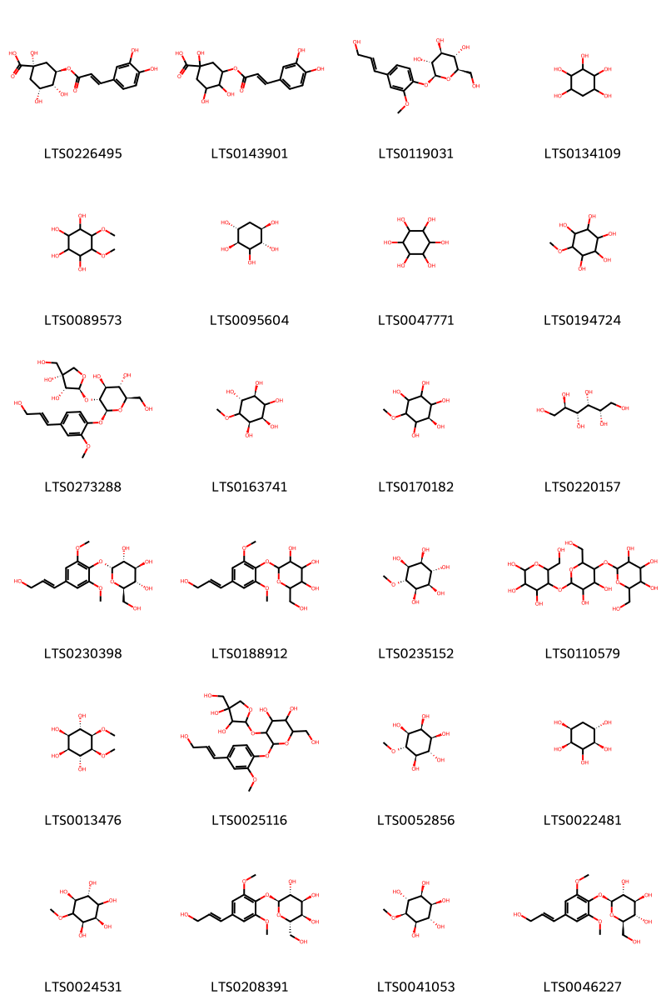{ width=100% }
    <figcaption>Hình ảnh cấu trúc hóa học của 24 hoạt chất thuộc nhóm Organooxygen compounds gồm ['chlorogenic acid (LTS0226495)', '3-{[3-(3,4-dihydroxyphenyl)prop-2-enoyl]oxy}-1,4,5-trihydroxycyclohexane-1-carboxylic acid (LTS0143901)', 'coniferin (LTS0119031)', 'd-quercitol (LTS0134109)', 'viscumitol (LTS0089573)', 'quercitol (LTS0095604)', '(-)-inositol (LTS0047771)', 'pinitol (LTS0194724)', '(2r,3s,4s,5r,6s)-5-{[(2s,3r,4r)-3,4-dihydroxy-4-(hydroxymethyl)oxolan-2-yl]oxy}-2-(hydroxymethyl)-6-{4-[(1e)-3-hydroxyprop-1-en-1-yl]-2-methoxyphenoxy}oxane-3,4-diol (LTS0273288)', '(1r,2r,4s,5r)-6-methoxycyclohexane-1,2,3,4,5-pentol (LTS0163741)', '(2r)-6-methoxycyclohexane-1,2,3,4,5-pentol (LTS0170182)', 'd-sorbitol (LTS0220157)', '(2r,3s,4s,5r,6r)-2-(hydroxymethyl)-6-{4-[(1e)-3-hydroxyprop-1-en-1-yl]-2,6-dimethoxyphenoxy}oxane-3,4,5-triol (LTS0230398)', '2-(hydroxymethyl)-6-[4-(3-hydroxyprop-1-en-1-yl)-2,6-dimethoxyphenoxy]oxane-3,4,5-triol (LTS0188912)', '(1r,2r,3s,4s,5s,6r)-6-methoxycyclohexane-1,2,3,4,5-pentol (LTS0235152)', 'amylose (LTS0110579)', 'viscumitol (LTS0013476)', '5-{[3,4-dihydroxy-4-(hydroxymethyl)oxolan-2-yl]oxy}-2-(hydroxymethyl)-6-[4-(3-hydroxyprop-1-en-1-yl)-2-methoxyphenoxy]oxane-3,4-diol (LTS0025116)', 'ononitol (LTS0052856)', '(1s,2r,4s,5s)-cyclohexane-1,2,3,4,5-pentol (LTS0022481)', '(1r,2r,4r,5s)-6-methoxycyclohexane-1,2,3,4,5-pentol (LTS0024531)', '(2s,3r,4s,5r,6s)-2-(hydroxymethyl)-6-{4-[(1e)-3-hydroxyprop-1-en-1-yl]-2,6-dimethoxyphenoxy}oxane-3,4,5-triol (LTS0208391)', '(1r,2s,3r,4s,5r,6s)-6-methoxycyclohexane-1,2,3,4,5-pentol (LTS0041053)', 'syringin (LTS0046227)'].</figcaption>
</figure>
#### Nhóm Prenol lipids
<figure markdown="span">
    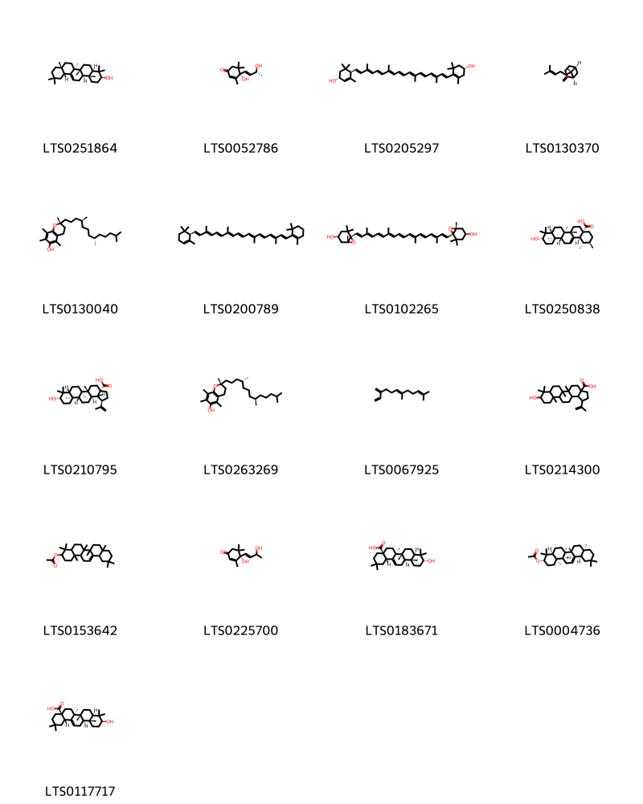{ width=100% }
    <figcaption>Hình ảnh cấu trúc hóa học của 17 hoạt chất thuộc nhóm Prenol lipids gồm ['β-amyrin (LTS0251864)', '(6s,9r)-vomifoliol (LTS0052786)', 'carotenoid (LTS0205297)', '(1s,5s,6r)-6-methyl-2-methylidene-6-(4-methylpent-3-en-1-yl)bicyclo[3.1.1]heptane (LTS0130370)', '(2r)-2,5,7,8-tetramethyl-2-[(4s,8s)-4,8,12-trimethyltridecyl]-3,4-dihydro-1-benzopyran-6-ol (LTS0130040)', '(+)-α-carotene (LTS0200789)', 'violaxanthin (LTS0102265)', 'ursolic acid (LTS0250838)', 'betulinic acid (LTS0210795)', 'vitamin e (LTS0263269)', 'β-farnesene (LTS0067925)', '9-hydroxy-5a,5b,8,8,11a-pentamethyl-1-(prop-1-en-2-yl)-hexadecahydrocyclopenta[a]chrysene-3a-carboxylic acid (LTS0214300)', '4,4,6a,6b,8a,11,11,14b-octamethyl-1,2,3,4a,5,6,7,8,9,10,12,12a,14,14a-tetradecahydropicen-3-yl acetate (LTS0153642)', '(4s)-4-hydroxy-4-(3-hydroxybut-1-en-1-yl)-3,5,5-trimethylcyclohex-2-en-1-one (LTS0225700)', '3-epioleanolic acid (LTS0183671)', '(3s,4as,6ar,6bs,8ar,12ar,14as,14br)-4,4,6a,6b,8a,11,11,14b-octamethyl-1,2,3,4a,5,6,7,8,9,10,12,12a,14,14a-tetradecahydropicen-3-yl acetate (LTS0004736)', 'oleanolic acid (LTS0117717)'].</figcaption>
</figure>
#### Nhóm Steroids and steroid derivatives
<figure markdown="span">
    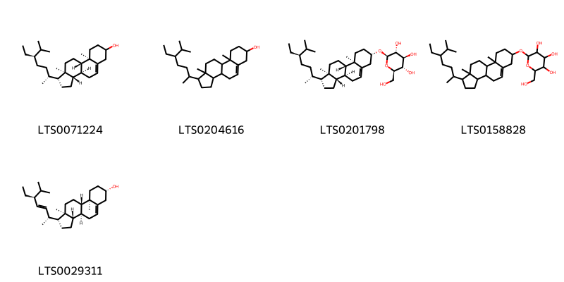{ width=100% }
    <figcaption>Hình ảnh cấu trúc hóa học của 5 hoạt chất thuộc nhóm Steroids and steroid derivatives gồm ['stigmast-5-en-3-ol (LTS0071224)', 'stigmast-5-en-3-ol, (3β)- (LTS0204616)', 'sitogluside (LTS0201798)', '2-{[1-(5-ethyl-6-methylheptan-2-yl)-9a,11a-dimethyl-1h,2h,3h,3ah,3bh,4h,6h,7h,8h,9h,9bh,10h,11h-cyclopenta[a]phenanthren-7-yl]oxy}-6-(hydroxymethyl)oxane-3,4,5-triol (LTS0158828)', 'phytosterol (LTS0029311)'].</figcaption>
</figure>
#### Nhóm Tetrapyrroles and derivatives
<figure markdown="span">
    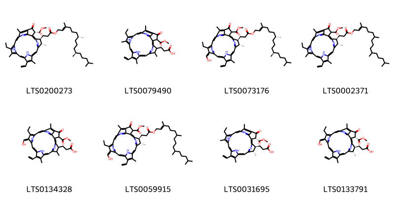{ width=100% }
    <figcaption>Hình ảnh cấu trúc hóa học của 8 hoạt chất thuộc nhóm Tetrapyrroles and derivatives gồm ['methyl (3r,21s,22s)-16-ethenyl-11-ethyl-12,17,21,26-tetramethyl-4-oxo-22-(3-oxo-3-{[(2e,7r,11r)-3,7,11,15-tetramethylhexadec-2-en-1-yl]oxy}propyl)-7,23,24,25-tetraazahexacyclo[18.2.1.1⁵,⁸.1¹⁰,¹³.1¹⁵,¹⁸.0²,⁶]hexacosa-1(23),2(6),5(26),7,9,11,13,15,17,19-decaene-3-carboxylate (LTS0200273)', '3-[16-ethenyl-11-ethyl-3-(methoxycarbonyl)-12,17,21,26-tetramethyl-4-oxo-7,23,24,25-tetraazahexacyclo[18.2.1.1⁵,⁸.1¹⁰,¹³.1¹⁵,¹⁸.0²,⁶]hexacosa-1(23),2(6),5(26),7,9,11,13,15,17,19-decaen-22-yl]propanoic acid (LTS0079490)', 'methyl (21s,22s)-16-ethenyl-11-ethyl-12-(hydroxymethylidene)-17,21,26-trimethyl-4-oxo-22-(3-oxo-3-{[(2e,7r,11r)-3,7,11,15-tetramethylhexadec-2-en-1-yl]oxy}propyl)-7,23,24,25-tetraazahexacyclo[18.2.1.1⁵,⁸.1¹⁰,¹³.1¹⁵,¹⁸.0²,⁶]hexacosa-1,5(26),6,8,10,13(25),14,16,18,20(23)-decaene-3-carboxylate (LTS0073176)', 'methyl (21s,22s)-16-ethenyl-11-ethyl-12,17,21,26-tetramethyl-4-oxo-22-(3-oxo-3-{[(2e)-3,7,11,15-tetramethylhexadec-2-en-1-yl]oxy}propyl)-7,23,24,25-tetraazahexacyclo[18.2.1.1⁵,⁸.1¹⁰,¹³.1¹⁵,¹⁸.0²,⁶]hexacosa-1(23),2(6),5(26),7,9,11,13,15,17,19-decaene-3-carboxylate (LTS0002371)', '3-[16-ethenyl-11-ethyl-12-(hydroxymethylidene)-3-(methoxycarbonyl)-17,21,26-trimethyl-4-oxo-7,23,24,25-tetraazahexacyclo[18.2.1.1⁵,⁸.1¹⁰,¹³.1¹⁵,¹⁸.0²,⁶]hexacosa-1,5(26),6,8,10,13(25),14,16,18,20(23)-decaen-22-yl]propanoic acid (LTS0134328)', 'methyl (21s,22s)-16-ethenyl-11-ethyl-12-(hydroxymethylidene)-17,21,26-trimethyl-4-oxo-22-(3-oxo-3-{[(2e)-3,7,11,15-tetramethylhexadec-2-en-1-yl]oxy}propyl)-7,23,24,25-tetraazahexacyclo[18.2.1.1⁵,⁸.1¹⁰,¹³.1¹⁵,¹⁸.0²,⁶]hexacosa-1,5(26),6,8,10,13(25),14,16,18,20(23)-decaene-3-carboxylate (LTS0059915)', '3-[(3r,21s,22s)-16-ethenyl-11-ethyl-3-(methoxycarbonyl)-12,17,21,26-tetramethyl-4-oxo-7,23,24,25-tetraazahexacyclo[18.2.1.1⁵,⁸.1¹⁰,¹³.1¹⁵,¹⁸.0²,⁶]hexacosa-1(23),2(6),5(26),7,9,11,13,15,17,19-decaen-22-yl]propanoic acid (LTS0031695)', '3-[(3r,21s,22s)-16-ethenyl-11-ethyl-12-(hydroxymethylidene)-3-(methoxycarbonyl)-17,21,26-trimethyl-4-oxo-7,23,24,25-tetraazahexacyclo[18.2.1.1⁵,⁸.1¹⁰,¹³.1¹⁵,¹⁸.0²,⁶]hexacosa-1,5(26),6,8,10,13(25),14,16,18,20(23)-decaen-22-yl]propanoic acid (LTS0133791)'].</figcaption>
</figure>

---

### Dược dân tộc học

Danh sách các quốc gia có sử dụng *Viscum album* trong điều trị các bệnh. 

| Country   | Disease                                                                           | Bệnh                                                                                                                                                                                                |
|:----------|:----------------------------------------------------------------------------------|:----------------------------------------------------------------------------------------------------------------------------------------------------------------------------------------------------|
| Elsewhere | Narcotic, Nervine, Purgative, Sedative, Emetic, Antiseptic, Cardiotonic, Diuretic | MYMEMORY WARNING: YOU USED ALL AVAILABLE FREE TRANSLATIONS FOR TODAY. NEXT AVAILABLE IN  17 HOURS 12 MINUTES 18 SECONDS VISIT HTTPS://MYMEMORY.TRANSLATED.NET/DOC/USAGELIMITS.PHP TO TRANSLATE MORE |
| Europe    | Poison                                                                            | MYMEMORY WARNING: YOU USED ALL AVAILABLE FREE TRANSLATIONS FOR TODAY. NEXT AVAILABLE IN  17 HOURS 12 MINUTES 15 SECONDS VISIT HTTPS://MYMEMORY.TRANSLATED.NET/DOC/USAGELIMITS.PHP TO TRANSLATE MORE |
| Turkey    | Astringent, Diuretic, Emetic, Narcotic, Nervine, Styptic, Tonic                   | MYMEMORY WARNING: YOU USED ALL AVAILABLE FREE TRANSLATIONS FOR TODAY. NEXT AVAILABLE IN  17 HOURS 12 MINUTES 12 SECONDS VISIT HTTPS://MYMEMORY.TRANSLATED.NET/DOC/USAGELIMITS.PHP TO TRANSLATE MORE |
| UK        | Poison                                                                            | MYMEMORY WARNING: YOU USED ALL AVAILABLE FREE TRANSLATIONS FOR TODAY. NEXT AVAILABLE IN  17 HOURS 12 MINUTES 10 SECONDS VISIT HTTPS://MYMEMORY.TRANSLATED.NET/DOC/USAGELIMITS.PHP TO TRANSLATE MORE |
| ain       | Cardiac                                                                           | MYMEMORY WARNING: YOU USED ALL AVAILABLE FREE TRANSLATIONS FOR TODAY. NEXT AVAILABLE IN  17 HOURS 12 MINUTES 08 SECONDS VISIT HTTPS://MYMEMORY.TRANSLATED.NET/DOC/USAGELIMITS.PHP TO TRANSLATE MORE |

---

---
## Viscum articulatum
### Thông tin về thực vật

!!! info "Phân loại thực vật của *Viscum articulatum* từ GIBF:"
    - **Kingdom:** Plantae
    - **Phylum:** Tracheophyta
    - **Order:** Santalales
    - **Family:** Viscaceae
    - **Genus:** Viscum
    - **Species:** *Viscum articulatum*

 

| Label (VI)   | Label (EN)   | Scientific Name    | Descriptions (VI)   | Descriptions (EN)   | Also Known As (VI)   | Also Known As (EN)   |
|:-------------|:-------------|:-------------------|:--------------------|:--------------------|:---------------------|:---------------------|
| N/A          | N/A          | Viscum articulatum | loài thực vật       | species of plant    | ['']                 | ['']                 |

#### Phân bố trên thế giới

**Từ CSDL GIBF** Viet Nam, nan, Cambodia, Thailand, Bhutan, Myanmar, Malaysia, India, Singapore, China, Australia, Hong Kong, Chinese Taipei

#### Phân bố tại Việt Nam

**Từ CSDL GIBF**: Lao Cai

---
### Thành phần hóa học
        
- Theo cơ sở dữ liệu lotus: Từ loài *Viscum articulatum* đã phân lập và xác định được 51 hoạt chất thuộc về các nhóm Organooxygen compounds, Flavonoids, Prenol lipids, Fatty Acyls, Phenols, Cinnamic acids and derivatives, Benzene and substituted derivatives. 

|    | chemicalTaxonomyClassyfireClass     |   smiles_count |
|---:|:------------------------------------|---------------:|
|  0 | Benzene and substituted derivatives |              4 |
|  1 | Cinnamic acids and derivatives      |              4 |
|  2 | Fatty Acyls                         |              1 |
|  3 | Flavonoids                          |             29 |
|  4 | Organooxygen compounds              |              9 |
|  5 | Phenols                             |              1 |
|  6 | Prenol lipids                       |              3 |

#### Nhóm Benzene and substituted derivatives
<figure markdown="span">
    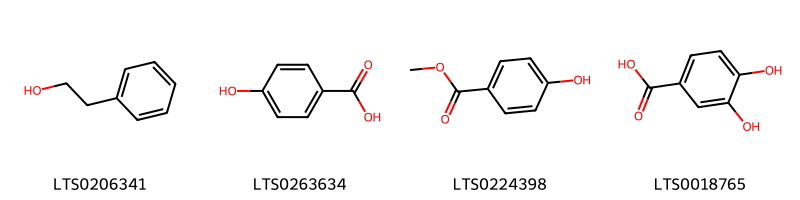{ width=100% }
    <figcaption>Hình ảnh cấu trúc hóa học của 4 hoạt chất thuộc nhóm Benzene and substituted derivatives gồm ['2-phenyl-ethanol (LTS0206341)', 'p-hydroxybenzoic acid (LTS0263634)', 'paraben (LTS0224398)', '3,4-dihydroxybenzoic acid (LTS0018765)'].</figcaption>
</figure>
#### Nhóm Cinnamic acids and derivatives
<figure markdown="span">
    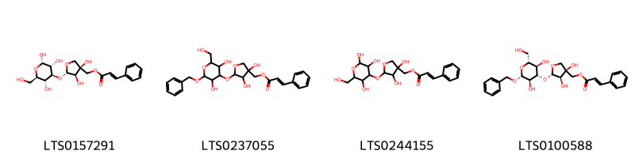{ width=100% }
    <figcaption>Hình ảnh cấu trúc hóa học của 4 hoạt chất thuộc nhóm Cinnamic acids and derivatives gồm ['[(3s,4r,5s)-3,4-dihydroxy-5-{[(2s,3r,4s,5r,6r)-2,3,5-trihydroxy-6-(hydroxymethyl)oxan-4-yl]oxy}oxolan-3-yl]methyl (2e)-3-phenylprop-2-enoate (LTS0157291)', '(5-{[2-(benzyloxy)-3,5-dihydroxy-6-(hydroxymethyl)oxan-4-yl]oxy}-3,4-dihydroxyoxolan-3-yl)methyl 3-phenylprop-2-enoate (LTS0237055)', '(3,4-dihydroxy-5-{[2,3,5-trihydroxy-6-(hydroxymethyl)oxan-4-yl]oxy}oxolan-3-yl)methyl 3-phenylprop-2-enoate (LTS0244155)', '[(3s,4r,5s)-5-{[(2r,3r,4s,5r,6r)-2-(benzyloxy)-3,5-dihydroxy-6-(hydroxymethyl)oxan-4-yl]oxy}-3,4-dihydroxyoxolan-3-yl]methyl (2e)-3-phenylprop-2-enoate (LTS0100588)'].</figcaption>
</figure>
#### Nhóm Fatty Acyls
<figure markdown="span">
    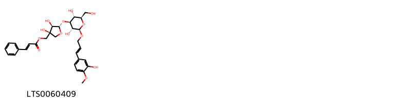{ width=100% }
    <figcaption>Hình ảnh cấu trúc hóa học của 1 hoạt chất thuộc nhóm Fatty Acyls gồm ['visartiside f (LTS0060409)'].</figcaption>
</figure>
#### Nhóm Flavonoids
<figure markdown="span">
    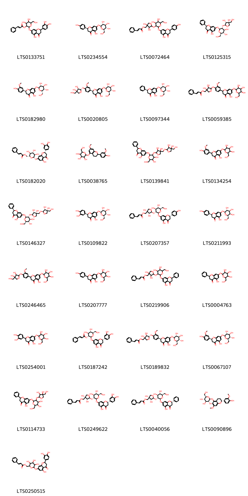{ width=100% }
    <figcaption>Hình ảnh cấu trúc hóa học của 29 hoạt chất thuộc nhóm Flavonoids gồm ['2-{[2-(3,4-dihydroxyphenyl)-5-hydroxy-4-oxo-2,3-dihydro-1-benzopyran-7-yl]oxy}-4,5-dihydroxy-6-(hydroxymethyl)oxan-3-yl 3-phenylprop-2-enoate (LTS0133751)', 'prunin (LTS0234554)', '{5-[(4,5-dihydroxy-2-{[5-hydroxy-2-(4-hydroxyphenyl)-4-oxo-2,3-dihydro-1-benzopyran-7-yl]oxy}-6-(hydroxymethyl)oxan-3-yl)oxy]-3,4-dihydroxyoxolan-3-yl}methyl 3-phenylprop-2-enoate (LTS0072464)', '(2s)-7-{[(2s,3r,4s,5s,6r)-3-{[(2s,3r,4r)-3,4-dihydroxy-4-(hydroxymethyl)oxolan-2-yl]oxy}-4,5-dihydroxy-6-(hydroxymethyl)oxan-2-yl]oxy}-5-hydroxy-2-phenyl-2,3-dihydro-1-benzopyran-4-one (LTS0125315)', '(2s)-5-hydroxy-2-(4-hydroxy-3-methoxyphenyl)-7-{[(2s,3r,4s,5s,6s)-3,4,5-trihydroxy-6-(hydroxymethyl)oxan-2-yl]oxy}-2,3-dihydro-1-benzopyran-4-one (LTS0182980)', '(2s)-2-(4-{[(2s,3r,4r)-3,4-dihydroxy-4-(hydroxymethyl)oxolan-2-yl]oxy}-3-methoxyphenyl)-5-hydroxy-7-{[(2s,3r,4s,5s,6r)-3,4,5-trihydroxy-6-(hydroxymethyl)oxan-2-yl]oxy}-2,3-dihydro-1-benzopyran-4-one (LTS0020805)', '(2s)-5-hydroxy-2-phenyl-7-{[(2s,3r,4s,5s,6r)-3,4,5-trihydroxy-6-(hydroxymethyl)oxan-2-yl]oxy}-2,3-dihydro-1-benzopyran-4-one (LTS0097344)', '{3,4-dihydroxy-5-[4-(5-hydroxy-4-oxo-7-{[3,4,5-trihydroxy-6-(hydroxymethyl)oxan-2-yl]oxy}-2,3-dihydro-1-benzopyran-2-yl)-2-methoxyphenoxy]oxolan-3-yl}methyl 3-phenylprop-2-enoate (LTS0059385)', 'visartiside b (LTS0182020)', '2-{[2-(4-hydroxy-3-methoxyphenyl)-7-methoxy-3,4-dihydro-2h-1-benzopyran-5-yl]oxy}-6-(hydroxymethyl)oxane-3,4,5-triol (LTS0038765)', '7-[(3-{[4-({[3,4-dihydroxy-4-(hydroxymethyl)oxolan-2-yl]oxy}methyl)-3,4-dihydroxyoxolan-2-yl]oxy}-4,5-dihydroxy-6-(hydroxymethyl)oxan-2-yl)oxy]-5-hydroxy-2-phenyl-2,3-dihydro-1-benzopyran-4-one (LTS0139841)', 'viscumiside a (LTS0134254)', '(2s)-7-{[(2s,3r,4s,5s,6r)-3-{[(2s,3r,4r)-4-({[(2s,3r,4r)-3,4-dihydroxy-4-(hydroxymethyl)oxolan-2-yl]oxy}methyl)-3,4-dihydroxyoxolan-2-yl]oxy}-4,5-dihydroxy-6-(hydroxymethyl)oxan-2-yl]oxy}-5-hydroxy-2-phenyl-2,3-dihydro-1-benzopyran-4-one (LTS0146327)', '(2s)-2-(3,4-dihydroxyphenyl)-5-hydroxy-7-{[(2s,3r,4s,5s,6r)-3,4,5-trihydroxy-6-(hydroxymethyl)oxan-2-yl]oxy}-2,3-dihydro-1-benzopyran-4-one (LTS0109822)', '[(3s,4r,5s)-5-{[(2s,3r,4s,5s,6r)-4,5-dihydroxy-2-{[(2s)-5-hydroxy-2-(4-hydroxyphenyl)-4-oxo-2,3-dihydro-1-benzopyran-7-yl]oxy}-6-(hydroxymethyl)oxan-3-yl]oxy}-3,4-dihydroxyoxolan-3-yl]methyl (2e)-3-phenylprop-2-enoate (LTS0207357)', '(2s)-5-hydroxy-2-(4-hydroxyphenyl)-7-{[(2s,3r,4s,5r,6r)-3,4,5-trihydroxy-6-(hydroxymethyl)oxan-2-yl]oxy}-2,3-dihydro-1-benzopyran-4-one (LTS0211993)', '2-(4-{[3,4-dihydroxy-4-(hydroxymethyl)oxolan-2-yl]oxy}-3-methoxyphenyl)-5-hydroxy-7-{[3,4,5-trihydroxy-6-(hydroxymethyl)oxan-2-yl]oxy}-2,3-dihydro-1-benzopyran-4-one (LTS0246465)', '5-hydroxy-2-(4-hydroxyphenyl)-7-{[3,4,5-trihydroxy-6-(hydroxymethyl)oxan-2-yl]oxy}-2,3-dihydro-1-benzopyran-4-one (LTS0207777)', '[5-({4,5-dihydroxy-2-[(5-hydroxy-4-oxo-2-phenyl-2,3-dihydro-1-benzopyran-7-yl)oxy]-6-(hydroxymethyl)oxan-3-yl}oxy)-3,4-dihydroxyoxolan-3-yl]methyl 3-phenylprop-2-enoate (LTS0219906)', '5-hydroxy-2-phenyl-7-{[3,4,5-trihydroxy-6-(hydroxymethyl)oxan-2-yl]oxy}-2,3-dihydro-1-benzopyran-4-one (LTS0004763)', '2-(3,4-dihydroxyphenyl)-5-hydroxy-7-{[3,4,5-trihydroxy-6-(hydroxymethyl)oxan-2-yl]oxy}-2,3-dihydro-1-benzopyran-4-one (LTS0254001)', 'visartiside a (LTS0187242)', '[(3s,4r,5s)-3,4-dihydroxy-5-{4-[(2s)-5-hydroxy-4-oxo-7-{[(2s,3r,4s,5s,6r)-3,4,5-trihydroxy-6-(hydroxymethyl)oxan-2-yl]oxy}-2,3-dihydro-1-benzopyran-2-yl]-2-methoxyphenoxy}oxolan-3-yl]methyl (2e)-3-phenylprop-2-enoate (LTS0189832)', '(2s)-5-hydroxy-2-(4-hydroxy-3-methoxyphenyl)-7-{[(2s,3r,4s,5s,6r)-3,4,5-trihydroxy-6-(hydroxymethyl)oxan-2-yl]oxy}-2,3-dihydro-1-benzopyran-4-one (LTS0067107)', '7-[(3-{[3,4-dihydroxy-4-(hydroxymethyl)oxolan-2-yl]oxy}-4,5-dihydroxy-6-(hydroxymethyl)oxan-2-yl)oxy]-5-hydroxy-2-phenyl-2,3-dihydro-1-benzopyran-4-one (LTS0114733)', 'visartiside c (LTS0249622)', '[(3s,4r,5s)-5-{[(2s,3r,4s,5s,6r)-4,5-dihydroxy-2-{[(2s)-5-hydroxy-4-oxo-2-phenyl-2,3-dihydro-1-benzopyran-7-yl]oxy}-6-(hydroxymethyl)oxan-3-yl]oxy}-3,4-dihydroxyoxolan-3-yl]methyl (2e)-3-phenylprop-2-enoate (LTS0040056)', '(2s,3r,4s,5s,6r)-2-{[(2r)-2-(4-hydroxy-3-methoxyphenyl)-7-methoxy-3,4-dihydro-2h-1-benzopyran-5-yl]oxy}-6-(hydroxymethyl)oxane-3,4,5-triol (LTS0090896)', '(6-{[2-(3,4-dihydroxyphenyl)-5-hydroxy-4-oxo-2,3-dihydro-1-benzopyran-7-yl]oxy}-3,4,5-trihydroxyoxan-2-yl)methyl 3-phenylprop-2-enoate (LTS0250515)'].</figcaption>
</figure>
#### Nhóm Organooxygen compounds
<figure markdown="span">
    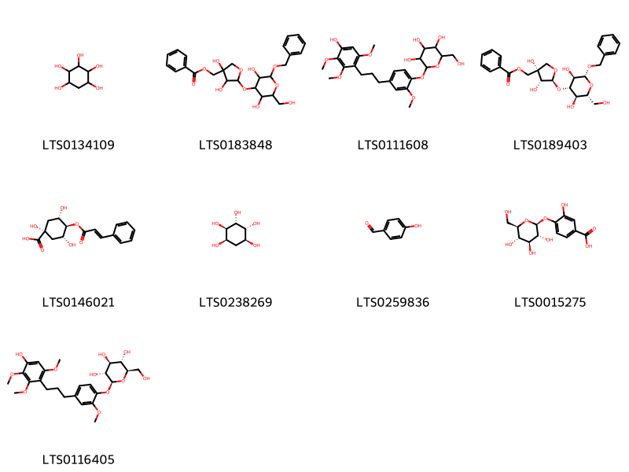{ width=100% }
    <figcaption>Hình ảnh cấu trúc hóa học của 9 hoạt chất thuộc nhóm Organooxygen compounds gồm ['d-quercitol (LTS0134109)', '(5-{[2-(benzyloxy)-3,5-dihydroxy-6-(hydroxymethyl)oxan-4-yl]oxy}-3,4-dihydroxyoxolan-3-yl)methyl benzoate (LTS0183848)', '2-{4-[3-(4-hydroxy-2,3,6-trimethoxyphenyl)propyl]-2-methoxyphenoxy}-6-(hydroxymethyl)oxane-3,4,5-triol (LTS0111608)', '[(3s,4r,5s)-5-{[(2r,3r,4s,5r,6r)-2-(benzyloxy)-3,5-dihydroxy-6-(hydroxymethyl)oxan-4-yl]oxy}-3,4-dihydroxyoxolan-3-yl]methyl benzoate (LTS0189403)', '(1r,3r,4r,5s)-1,3,5-trihydroxy-4-{[(2e)-3-phenylprop-2-enoyl]oxy}cyclohexane-1-carboxylic acid (LTS0146021)', 'allo-inositol (LTS0238269)', 'p-hydroxybenzaldehyde (LTS0259836)', '3-hydroxy-4-{[(2s,3r,4s,5s,6r)-3,4,5-trihydroxy-6-(hydroxymethyl)oxan-2-yl]oxy}benzoic acid (LTS0015275)', '(2s,3r,4s,5s,6r)-2-{4-[3-(4-hydroxy-2,3,6-trimethoxyphenyl)propyl]-2-methoxyphenoxy}-6-(hydroxymethyl)oxane-3,4,5-triol (LTS0116405)'].</figcaption>
</figure>
#### Nhóm Phenols
<figure markdown="span">
    { width=100% }
    <figcaption>Hình ảnh cấu trúc hóa học của 1 hoạt chất thuộc nhóm Phenols gồm ['vanillin (LTS0136163)'].</figcaption>
</figure>
#### Nhóm Prenol lipids
<figure markdown="span">
    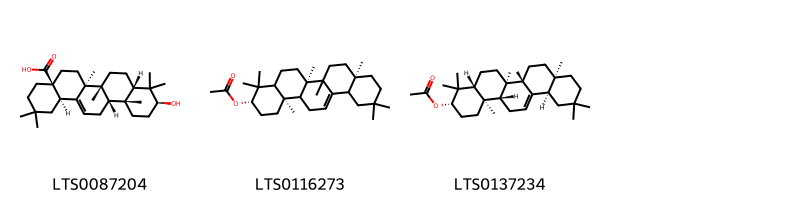{ width=100% }
    <figcaption>Hình ảnh cấu trúc hóa học của 3 hoạt chất thuộc nhóm Prenol lipids gồm ['(4as,6as,6br,8as,10s,12ar,12bs,14br)-10-hydroxy-2,2,6a,6b,9,9,12a-heptamethyl-1,3,4,5,6,7,8,8a,10,11,12,12b,13,14b-tetradecahydropicene-4a-carboxylic acid (LTS0087204)', '(3s,6ar,8ar,14br)-4,4,6a,6b,8a,11,11,14b-octamethyl-1,2,3,4a,5,6,7,8,9,10,12,12a,14,14a-tetradecahydropicen-3-yl acetate (LTS0116273)', 'β-amyrin acetate (LTS0137234)'].</figcaption>
</figure>

---

### Dược dân tộc học

Danh sách các quốc gia có sử dụng *Viscum articulatum* trong điều trị các bệnh. 

| Country   | Disease     | Bệnh                                                                                                                                                                                                |
|:----------|:------------|:----------------------------------------------------------------------------------------------------------------------------------------------------------------------------------------------------|
| Elsewhere | Aphrodisiac | MYMEMORY WARNING: YOU USED ALL AVAILABLE FREE TRANSLATIONS FOR TODAY. NEXT AVAILABLE IN  17 HOURS 10 MINUTES 43 SECONDS VISIT HTTPS://MYMEMORY.TRANSLATED.NET/DOC/USAGELIMITS.PHP TO TRANSLATE MORE |

---

---
## Viscum monoicum
### Thông tin về thực vật

!!! info "Phân loại thực vật của *Viscum monoicum* từ GIBF:"
    - **Kingdom:** Plantae
    - **Phylum:** Tracheophyta
    - **Order:** Santalales
    - **Family:** Viscaceae
    - **Genus:** Viscum
    - **Species:** *Viscum monoicum*

 

| Label (VI)   | Label (EN)   | Scientific Name   | Descriptions (VI)   | Descriptions (EN)   | Also Known As (VI)   | Also Known As (EN)   |
|:-------------|:-------------|:------------------|:--------------------|:--------------------|:---------------------|:---------------------|
| N/A          | N/A          | Viscum monoicum   | loài thực vật       | species of plant    | ['']                 | ['']                 |

#### Phân bố trên thế giới

**Từ CSDL GIBF** nan, Viet Nam, Sri Lanka, Thailand, Myanmar, Bhutan, India, Bangladesh, Mexico, China, Nepal, Cambodia, Indonesia

#### Phân bố tại Việt Nam

**Từ CSDL GIBF**: Không có ghi nhận ở Việt Nam

---
### Thành phần hóa học
        
- Theo cơ sở dữ liệu lotus: Từ loài *Viscum monoicum* đã phân lập và xác định được Chưa có hoạt chất nào được phân lập. hoạt chất thuộc về các nhóm Không có hoạt chất nào được phân lập. 

Không có hình ảnh nào được tạo ra

---

### Dược dân tộc học

Danh sách các quốc gia có sử dụng *Viscum monoicum* trong điều trị các bệnh. 

| Country   | Disease          | Bệnh                                                                                                                                                                                                |
|:----------|:-----------------|:----------------------------------------------------------------------------------------------------------------------------------------------------------------------------------------------------|
| Elsewhere | Narcotic, Poison | MYMEMORY WARNING: YOU USED ALL AVAILABLE FREE TRANSLATIONS FOR TODAY. NEXT AVAILABLE IN  17 HOURS 10 MINUTES 09 SECONDS VISIT HTTPS://MYMEMORY.TRANSLATED.NET/DOC/USAGELIMITS.PHP TO TRANSLATE MORE |

---

---
## Viscum orientale
### Thông tin về thực vật

!!! info "Phân loại thực vật của *Viscum orientale* từ GIBF:"
    - **Kingdom:** Plantae
    - **Phylum:** Tracheophyta
    - **Order:** Santalales
    - **Family:** Viscaceae
    - **Genus:** Viscum
    - **Species:** *Viscum orientale*

 

| Label (VI)   | Label (EN)   | Scientific Name   | Descriptions (VI)   | Descriptions (EN)   | Also Known As (VI)   | Also Known As (EN)   |
|:-------------|:-------------|:------------------|:--------------------|:--------------------|:---------------------|:---------------------|
| N/A          | N/A          | Viscum orientale  | loài thực vật       | species of plant    | ['']                 | ['']                 |

#### Phân bố trên thế giới

**Từ CSDL GIBF** Viet Nam, nan, unknown or invalid, Thailand, Sri Lanka, Chinese Taipei, Myanmar, Philippines, Malaysia, India, Papua New Guinea, China, Singapore, Australia, Hong Kong, Indonesia

#### Phân bố tại Việt Nam

**Từ CSDL GIBF**: Tonkin, 东京

---
### Thành phần hóa học
        
- Theo cơ sở dữ liệu lotus: Từ loài *Viscum orientale* đã phân lập và xác định được Chưa có hoạt chất nào được phân lập. hoạt chất thuộc về các nhóm Không có hoạt chất nào được phân lập. 

Không có hình ảnh nào được tạo ra

---

### Dược dân tộc học

Danh sách các quốc gia có sử dụng *Viscum orientale* trong điều trị các bệnh. 

| Country      | Disease   | Bệnh                                                                                                                                                                                                |
|:-------------|:----------|:----------------------------------------------------------------------------------------------------------------------------------------------------------------------------------------------------|
| Elsewhere    | Poison    | MYMEMORY WARNING: YOU USED ALL AVAILABLE FREE TRANSLATIONS FOR TODAY. NEXT AVAILABLE IN  17 HOURS 09 MINUTES 51 SECONDS VISIT HTTPS://MYMEMORY.TRANSLATED.NET/DOC/USAGELIMITS.PHP TO TRANSLATE MORE |
| India        | Poison    | MYMEMORY WARNING: YOU USED ALL AVAILABLE FREE TRANSLATIONS FOR TODAY. NEXT AVAILABLE IN  17 HOURS 09 MINUTES 48 SECONDS VISIT HTTPS://MYMEMORY.TRANSLATED.NET/DOC/USAGELIMITS.PHP TO TRANSLATE MORE |
| India(Hindu) | Tonic     | MYMEMORY WARNING: YOU USED ALL AVAILABLE FREE TRANSLATIONS FOR TODAY. NEXT AVAILABLE IN  17 HOURS 09 MINUTES 46 SECONDS VISIT HTTPS://MYMEMORY.TRANSLATED.NET/DOC/USAGELIMITS.PHP TO TRANSLATE MORE |

---

# Chi Phoradendron

??? note "Danh sách các dược liệu thuộc chi"
    
	 - *Phoradendron flavescens*
	 - *Phoradendron serotinum*

---
## Phoradendron flavescens
### Thông tin về thực vật

!!! info "Phân loại thực vật của *N/A* từ GIBF:"
    - **Kingdom:** Plantae
    - **Phylum:** Tracheophyta
    - **Order:** Santalales
    - **Family:** Viscaceae
    - **Genus:** Phoradendron
    - **Species:** *N/A*

 

| Label (VI)   | Label (EN)   | Scientific Name         | Descriptions (VI)   | Descriptions (EN)   | Also Known As (VI)   | Also Known As (EN)   |
|:-------------|:-------------|:------------------------|:--------------------|:--------------------|:---------------------|:---------------------|
| N/A          | N/A          | Phoradendron flavescens | loài thực vật       | species of plant    | ['']                 | ['']                 |

#### Phân bố trên thế giới

**Từ CSDL GIBF** nan, Dominican Republic, Brazil, Ecuador, United States of America, Mexico

#### Phân bố tại Việt Nam

**Từ CSDL GIBF**: Không có ghi nhận ở Việt Nam

---
### Thành phần hóa học
        
- Theo cơ sở dữ liệu lotus: Từ loài *N/A* đã phân lập và xác định được Chưa có hoạt chất nào được phân lập. hoạt chất thuộc về các nhóm Không có hoạt chất nào được phân lập. 

Không có hình ảnh nào được tạo ra

---

### Dược dân tộc học

Danh sách các quốc gia có sử dụng *N/A* trong điều trị các bệnh. 

| Country        | Disease   | Bệnh                                                                                                                                                                                                |
|:---------------|:----------|:----------------------------------------------------------------------------------------------------------------------------------------------------------------------------------------------------|
| US(Amerindian) | Oxytoxic  | MYMEMORY WARNING: YOU USED ALL AVAILABLE FREE TRANSLATIONS FOR TODAY. NEXT AVAILABLE IN  17 HOURS 09 MINUTES 26 SECONDS VISIT HTTPS://MYMEMORY.TRANSLATED.NET/DOC/USAGELIMITS.PHP TO TRANSLATE MORE |

---

---
## Phoradendron serotinum
### Thông tin về thực vật

!!! info "Phân loại thực vật của *Phoradendron leucarpum* từ GIBF:"
    - **Kingdom:** Plantae
    - **Phylum:** Tracheophyta
    - **Order:** Santalales
    - **Family:** Viscaceae
    - **Genus:** Phoradendron
    - **Species:** *Phoradendron leucarpum*

 

| Label (VI)   | Label (EN)   | Scientific Name        | Descriptions (VI)   | Descriptions (EN)   | Also Known As (VI)   | Also Known As (EN)                      |
|:-------------|:-------------|:-----------------------|:--------------------|:--------------------|:---------------------|:----------------------------------------|
| N/A          | N/A          | Phoradendron serotinum |                     | species of plant    | ['']                 | ['American mistletoe', 'oak mistletoe'] |

#### Phân bố trên thế giới

**Từ CSDL GIBF** nan, Colombia, Brazil, Peru, United States of America, Mexico, Chinese Taipei

#### Phân bố tại Việt Nam

**Từ CSDL GIBF**: Không có ghi nhận ở Việt Nam

---
### Thành phần hóa học
        
- Theo cơ sở dữ liệu lotus: Từ loài *Phoradendron leucarpum* đã phân lập và xác định được 6 hoạt chất thuộc về các nhóm Flavonoids. 

|    | chemicalTaxonomyClassyfireClass   |   smiles_count |
|---:|:----------------------------------|---------------:|
|  0 | Flavonoids                        |              6 |

#### Nhóm Flavonoids
<figure markdown="span">
    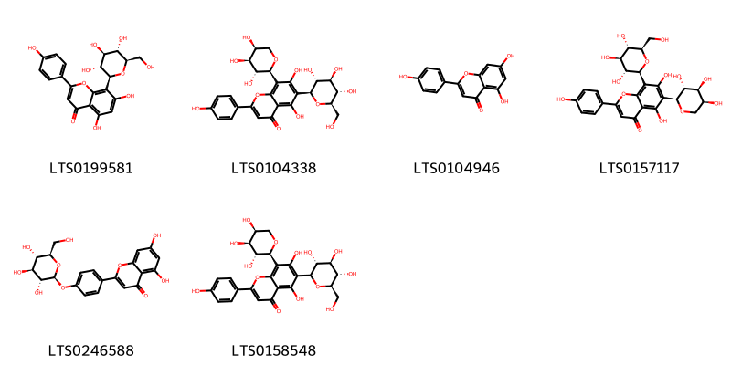{ width=100% }
    <figcaption>Hình ảnh cấu trúc hóa học của 6 hoạt chất thuộc nhóm Flavonoids gồm ['vitexin (LTS0199581)', 'schaftoside (LTS0104338)', 'chamomile (LTS0104946)', 'isoschaftoside (LTS0157117)', '5,7-dihydroxy-2-(4-{[(2s,3r,4s,5s,6r)-3,4,5-trihydroxy-6-(hydroxymethyl)oxan-2-yl]oxy}phenyl)chromen-4-one (LTS0246588)', '5,7-dihydroxy-2-(4-hydroxyphenyl)-6-[(3r,4r,5s,6r)-3,4,5-trihydroxy-6-(hydroxymethyl)oxan-2-yl]-8-[(2s,3r,4s,5s)-3,4,5-trihydroxyoxan-2-yl]chromen-4-one (LTS0158548)'].</figcaption>
</figure>

---

### Dược dân tộc học

Danh sách các quốc gia có sử dụng *Phoradendron leucarpum* trong điều trị các bệnh. 

| Country   | Disease   | Bệnh                                                                                                                                                                                                |
|:----------|:----------|:----------------------------------------------------------------------------------------------------------------------------------------------------------------------------------------------------|
| US        | Poison    | MYMEMORY WARNING: YOU USED ALL AVAILABLE FREE TRANSLATIONS FOR TODAY. NEXT AVAILABLE IN  17 HOURS 09 MINUTES 04 SECONDS VISIT HTTPS://MYMEMORY.TRANSLATED.NET/DOC/USAGELIMITS.PHP TO TRANSLATE MORE |

---

