!!! abstract "Tóm tắt"

    Họ Vitaceae gồm khoảng 6 chi và 25 loài được một số cộng đồng tại các quốc gia như Honduras, Indochina, Mexico, China, US(Kiowa), Ketela beruk, Haiti, ain, Elsewhere, Africa, Latin America, Costa Rica, Sudan, US, Turkey, Iraq sử dụng trong một số trường hợp QUERY LENGTH LIMIT EXCEEDED. MAX ALLOWED QUERY : 500 CHARS.

!!! info "DrDuke"

    James A. Duke sinh năm 1929-2017 là một nhà thực vật học người Mỹ. Đây là một trong những tác giả hàng đầu trong lĩnh vực dược dân tộc học với cuốn *CRC Handbook of Medicinal Herbs* và chính là người xây dựng lên cơ sở dữ liệu về hợp chất tự nhiên và dược dân tộc học tại Bộ nông nghiệp Hoa Kỳ. Các thông tin được đăng tải tại website [Dr. Duke's Phytochemical and Ethnobotanical Databases](https://phytochem.nal.usda.gov/). 
    Trong suốt thập niên 1970, ông lãnh đạo the Plant Taxonomy Laboratory, Plant Genetics and Germplasm Institute of the Agricultural Research Service, U.S. Department of Agriculture.
    Trong tài liệu này, các thông tin về dược dân tộc của các dược liệu được trích dẫn từ tài liệu của James A. Ducke với sự trợ giúp của phần mềm dịch thuật từ tiếng Anh sang tiếng Việt.
   

# Chi Cissus

??? note "Danh sách các dược liệu thuộc chi"
    
	 - *Cissus adnata*
	 - *Cissus cyphopetala*
	 - *Cissus quadrangularis*
	 - *Cissus rhombifolia*
	 - *Cissus setosa*
	 - *Cissus sicyoides*
	 - *Cissus trifoliata*

---
## Cissus adnata
### Thông tin về thực vật

!!! info "Phân loại thực vật của *Cissus adnata* từ GIBF:"
    - **Kingdom:** Plantae
    - **Phylum:** Tracheophyta
    - **Order:** Vitales
    - **Family:** Vitaceae
    - **Genus:** Cissus
    - **Species:** *Cissus adnata*

 

| Label (VI)   | Label (EN)   | Scientific Name   | Descriptions (VI)   | Descriptions (EN)   | Also Known As (VI)   | Also Known As (EN)   |
|:-------------|:-------------|:------------------|:--------------------|:--------------------|:---------------------|:---------------------|
| N/A          | N/A          | Cissus adnata     | loài thực vật       | species of plant    | ['']                 | ['']                 |

#### Phân bố trên thế giới

**Từ CSDL GIBF** nan, Viet Nam, Thailand, Brunei Darussalam, Myanmar, Brazil, Philippines, India, Indonesia, Lao People’s Democratic Republic, China, Australia, Solomon Islands, Chinese Taipei

#### Phân bố tại Việt Nam

**Từ CSDL GIBF**: Thanh Hoa

---
### Thành phần hóa học
        
- Theo cơ sở dữ liệu lotus: Từ loài *Cissus adnata* đã phân lập và xác định được 3 hoạt chất thuộc về các nhóm Indanes. 

|    | chemicalTaxonomyClassyfireClass   |   smiles_count |
|---:|:----------------------------------|---------------:|
|  0 | Indanes                           |              3 |

#### Nhóm Indanes
<figure markdown="span">
    { width=100% }
    <figcaption>Hình ảnh cấu trúc hóa học của 3 hoạt chất thuộc nhóm Indanes gồm ['pallidol (LTS0003728)', 'pallidol (LTS0261397)', '(1s,8r,9s,16r)-8,16-bis(4-hydroxyphenyl)tetracyclo[7.7.0.0²,⁷.0¹⁰,¹⁵]hexadeca-2,4,6,10,12,14-hexaene-4,6,12,14-tetrol (LTS0027103)'].</figcaption>
</figure>

---

### Dược dân tộc học

Danh sách các quốc gia có sử dụng *Cissus adnata* trong điều trị các bệnh. 

| Country      | Disease   | Bệnh                                                                                                                                                                                                |
|:-------------|:----------|:----------------------------------------------------------------------------------------------------------------------------------------------------------------------------------------------------|
| Elsewhere    | Diuretic  | MYMEMORY WARNING: YOU USED ALL AVAILABLE FREE TRANSLATIONS FOR TODAY. NEXT AVAILABLE IN  10 HOURS 02 MINUTES 07 SECONDS VISIT HTTPS://MYMEMORY.TRANSLATED.NET/DOC/USAGELIMITS.PHP TO TRANSLATE MORE |
| Ketela beruk | Antidote  | MYMEMORY WARNING: YOU USED ALL AVAILABLE FREE TRANSLATIONS FOR TODAY. NEXT AVAILABLE IN  10 HOURS 02 MINUTES 04 SECONDS VISIT HTTPS://MYMEMORY.TRANSLATED.NET/DOC/USAGELIMITS.PHP TO TRANSLATE MORE |

---

---
## Cissus cyphopetala
### Thông tin về thực vật

!!! info "Phân loại thực vật của *Cyphostemma cyphopetalum* từ GIBF:"
    - **Kingdom:** Plantae
    - **Phylum:** Tracheophyta
    - **Order:** Vitales
    - **Family:** Vitaceae
    - **Genus:** Cyphostemma
    - **Species:** *Cyphostemma cyphopetalum*

 

| Label (VI)   | Label (EN)   | Scientific Name    | Descriptions (VI)   | Descriptions (EN)   | Also Known As (VI)   | Also Known As (EN)   |
|:-------------|:-------------|:-------------------|:--------------------|:--------------------|:---------------------|:---------------------|
| N/A          | N/A          | Cissus cyphopetala | loài thực vật       | species of plant    | ['']                 | ['']                 |

#### Phân bố trên thế giới

**Từ CSDL GIBF** nan, Viet Nam, Thailand, Brunei Darussalam, Myanmar, Brazil, Philippines, India, Indonesia, Lao People’s Democratic Republic, China, Australia, Solomon Islands, Chinese Taipei

#### Phân bố tại Việt Nam

**Từ CSDL GIBF**: Thanh Hoa

---
### Thành phần hóa học
        
- Theo cơ sở dữ liệu lotus: Từ loài *Cyphostemma cyphopetalum* đã phân lập và xác định được Chưa có hoạt chất nào được phân lập. hoạt chất thuộc về các nhóm Không có hoạt chất nào được phân lập. 

Không có hình ảnh nào được tạo ra

---

### Dược dân tộc học

Danh sách các quốc gia có sử dụng *Cyphostemma cyphopetalum* trong điều trị các bệnh. 

| Country   | Disease   | Bệnh                                                                                                                                                                                                |
|:----------|:----------|:----------------------------------------------------------------------------------------------------------------------------------------------------------------------------------------------------|
| Elsewhere | Vermifuge | MYMEMORY WARNING: YOU USED ALL AVAILABLE FREE TRANSLATIONS FOR TODAY. NEXT AVAILABLE IN  10 HOURS 01 MINUTES 34 SECONDS VISIT HTTPS://MYMEMORY.TRANSLATED.NET/DOC/USAGELIMITS.PHP TO TRANSLATE MORE |

---

---
## Cissus quadrangularis
### Thông tin về thực vật

!!! info "Phân loại thực vật của *Cissus quadrangularis* từ GIBF:"
    - **Kingdom:** Plantae
    - **Phylum:** Tracheophyta
    - **Order:** Vitales
    - **Family:** Vitaceae
    - **Genus:** Cissus
    - **Species:** *Cissus quadrangularis*

 

| Label (VI)   | Label (EN)   | Scientific Name       | Descriptions (VI)   | Descriptions (EN)           | Also Known As (VI)   | Also Known As (EN)                  |
|:-------------|:-------------|:----------------------|:--------------------|:----------------------------|:---------------------|:------------------------------------|
| N/A          | N/A          | Cissus quadrangularis |                     | Old World succulent species | ['']                 | ["devil's backbone", 'veldt grape'] |

#### Phân bố trên thế giới

**Từ CSDL GIBF** Thailand, Somalia, Spain, Central African Republic, Guadeloupe, Burkina Faso, Kenya, Martinique, Rwanda, Singapore, Niger, Togo, Sri Lanka, Malaysia, Mauritius, India, Réunion, Sudan, Nigeria, Uganda, Ethiopia, Nepal, Benin, Chinese Taipei, South Africa, Botswana, Tanzania, United Republic of, Mozambique, Chad, Madagascar, Saudi Arabia, Oman

#### Phân bố tại Việt Nam

**Từ CSDL GIBF**: Không có ghi nhận ở Việt Nam

---
### Thành phần hóa học
        
- Theo cơ sở dữ liệu lotus: Từ loài *Cissus quadrangularis* đã phân lập và xác định được 52 hoạt chất thuộc về các nhóm Stilbenes, Organooxygen compounds, Flavonoids, Unsaturated hydrocarbons, Prenol lipids, Fatty Acyls, Indanes, Steroids and steroid derivatives. 

|    | chemicalTaxonomyClassyfireClass   |   smiles_count |
|---:|:----------------------------------|---------------:|
|  0 | Fatty Acyls                       |             12 |
|  1 | Flavonoids                        |              1 |
|  2 | Indanes                           |              3 |
|  3 | Organooxygen compounds            |              2 |
|  4 | Prenol lipids                     |             18 |
|  5 | Steroids and steroid derivatives  |              4 |
|  6 | Stilbenes                         |             10 |
|  7 | Unsaturated hydrocarbons          |              2 |

#### Nhóm Fatty Acyls
<figure markdown="span">
    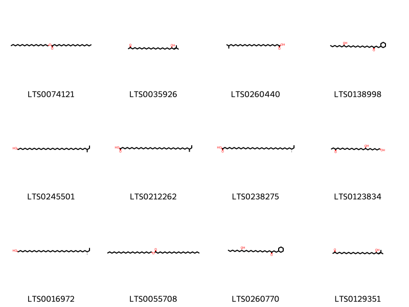{ width=100% }
    <figcaption>Hình ảnh cấu trúc hóa học của 12 hoạt chất thuộc nhóm Fatty Acyls gồm ['heptadecyl octadecanoate (LTS0074121)', '20-hydroxy-22-methyltricos-21-en-2-one (LTS0035926)', '(+)-isopentacosanoic acid (LTS0260440)', '1-cyclohexyl-16-hydroxydocosan-3-one (LTS0138998)', '31-methyltritriacontan-1-ol (LTS0245501)', '31-methyltritriacontanoic acid (LTS0212262)', '(31s)-31-methyltritriacontanoic acid (LTS0238275)', '16,22-dihydroxydocosan-3-one (LTS0123834)', '(31s)-31-methyltritriacontan-1-ol (LTS0016972)', 'arachidyl arachidate (LTS0055708)', '(16s)-1-cyclohexyl-16-hydroxydocosan-3-one (LTS0260770)', '(20r)-20-hydroxy-22-methyltricos-21-en-2-one (LTS0129351)'].</figcaption>
</figure>
#### Nhóm Flavonoids
<figure markdown="span">
    { width=100% }
    <figcaption>Hình ảnh cấu trúc hóa học của 1 hoạt chất thuộc nhóm Flavonoids gồm ['kaempherol (LTS0155822)'].</figcaption>
</figure>
#### Nhóm Indanes
<figure markdown="span">
    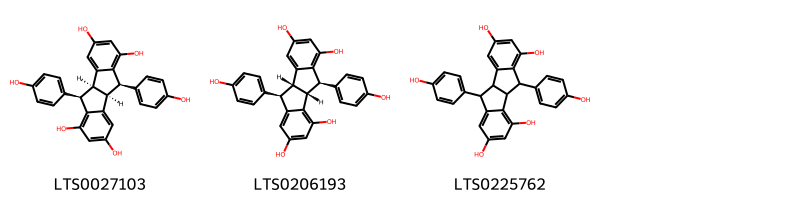{ width=100% }
    <figcaption>Hình ảnh cấu trúc hóa học của 3 hoạt chất thuộc nhóm Indanes gồm ['(1s,8r,9s,16r)-8,16-bis(4-hydroxyphenyl)tetracyclo[7.7.0.0²,⁷.0¹⁰,¹⁵]hexadeca-2,4,6,10,12,14-hexaene-4,6,12,14-tetrol (LTS0027103)', '(1r,8r,9r,16r)-8,16-bis(4-hydroxyphenyl)tetracyclo[7.7.0.0²,⁷.0¹⁰,¹⁵]hexadeca-2,4,6,10,12,14-hexaene-3,5,12,14-tetrol (LTS0206193)', '8,16-bis(4-hydroxyphenyl)tetracyclo[7.7.0.0²,⁷.0¹⁰,¹⁵]hexadeca-2,4,6,10,12,14-hexaene-3,5,12,14-tetrol (LTS0225762)'].</figcaption>
</figure>
#### Nhóm Organooxygen compounds
<figure markdown="span">
    { width=100% }
    <figcaption>Hình ảnh cấu trúc hóa học của 2 hoạt chất thuộc nhóm Organooxygen compounds gồm ['l(+)-tartaric acid (LTS0084538)', '(.+-.)-tartaric acid (LTS0061981)'].</figcaption>
</figure>
#### Nhóm Prenol lipids
<figure markdown="span">
    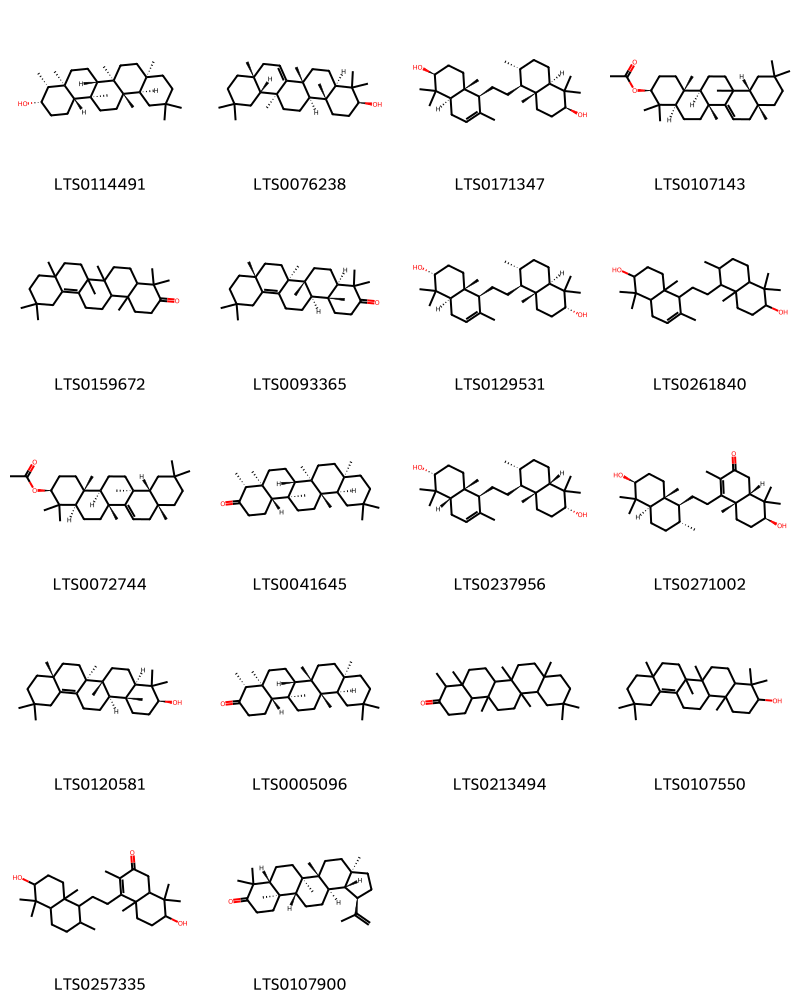{ width=100% }
    <figcaption>Hình ảnh cấu trúc hóa học của 18 hoạt chất thuộc nhóm Prenol lipids gồm ['epi-friedelanol (LTS0114491)', 'alnulin (LTS0076238)', '(2s,4ar,5s,8ar)-5-{2-[(1s,2r,4ar,6s,8ar)-6-hydroxy-2,5,5,8a-tetramethyl-octahydronaphthalen-1-yl]ethyl}-1,1,4a,6-tetramethyl-2,3,4,5,8,8a-hexahydronaphthalen-2-ol (LTS0171347)', '(3s,4ar,6ar,8ar,12ar,14ar,14br)-4,4,6a,8a,11,11,12b,14b-octamethyl-1,2,3,4a,5,6,8,9,10,12,12a,13,14,14a-tetradecahydropicen-3-yl acetate (LTS0107143)', '4,4,6a,6b,8a,11,11,14b-octamethyl-2,4a,5,6,7,8,9,10,12,13,14,14a-dodecahydro-1h-picen-3-one (LTS0159672)', '(4ar,6ar,6bs,8ar,14ar,14br)-4,4,6a,6b,8a,11,11,14b-octamethyl-2,4a,5,6,7,8,9,10,12,13,14,14a-dodecahydro-1h-picen-3-one (LTS0093365)', '(2r,4ar,5s,8ar)-5-{2-[(1s,2r,4ar,6r,8ar)-6-hydroxy-2,5,5,8a-tetramethyl-octahydronaphthalen-1-yl]ethyl}-1,1,4a,6-tetramethyl-2,3,4,5,8,8a-hexahydronaphthalen-2-ol (LTS0129531)', '5-[2-(6-hydroxy-2,5,5,8a-tetramethyl-octahydronaphthalen-1-yl)ethyl]-1,1,4a,6-tetramethyl-2,3,4,5,8,8a-hexahydronaphthalen-2-ol (LTS0261840)', '(3s,4ar,6ar,8ar,12ar,12bs,14ar,14br)-4,4,6a,8a,11,11,12b,14b-octamethyl-1,2,3,4a,5,6,8,9,10,12,12a,13,14,14a-tetradecahydropicen-3-yl acetate (LTS0072744)', '(-)-friedelin (LTS0041645)', '(2r,4ar,5s,8as)-5-{2-[(1s,2r,4as,6r,8ar)-6-hydroxy-2,5,5,8a-tetramethyl-octahydronaphthalen-1-yl]ethyl}-1,1,4a,6-tetramethyl-2,3,4,5,8,8a-hexahydronaphthalen-2-ol (LTS0237956)', '(4as,7s,8as)-4-{2-[(1s,2r,4ar,6s,8ar)-6-hydroxy-2,5,5,8a-tetramethyl-octahydronaphthalen-1-yl]ethyl}-7-hydroxy-3,4a,8,8-tetramethyl-5,6,7,8a-tetrahydro-1h-naphthalen-2-one (LTS0271002)', 'delta-amyrin (LTS0120581)', '(4r,4as,6as,6bs,8ar,12ar,12bs,14as,14bs)-4,4a,6b,8a,11,11,12b,14a-octamethyl-tetradecahydro-1h-picen-3-one (LTS0005096)', 'friedelin (LTS0213494)', '4,4,6a,6b,8a,11,11,14b-octamethyl-1,2,3,4a,5,6,7,8,9,10,12,13,14,14a-tetradecahydropicen-3-ol (LTS0107550)', '7-hydroxy-4-[2-(6-hydroxy-2,5,5,8a-tetramethyl-octahydronaphthalen-1-yl)ethyl]-3,4a,8,8-tetramethyl-5,6,7,8a-tetrahydro-1h-naphthalen-2-one (LTS0257335)', 'lupenone (LTS0107900)'].</figcaption>
</figure>
#### Nhóm Steroids and steroid derivatives
<figure markdown="span">
    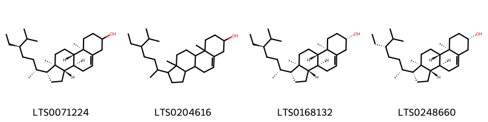{ width=100% }
    <figcaption>Hình ảnh cấu trúc hóa học của 4 hoạt chất thuộc nhóm Steroids and steroid derivatives gồm ['stigmast-5-en-3-ol (LTS0071224)', 'stigmast-5-en-3-ol, (3β)- (LTS0204616)', 'sitosterol (LTS0168132)', 'clionasterol (LTS0248660)'].</figcaption>
</figure>
#### Nhóm Stilbenes
<figure markdown="span">
    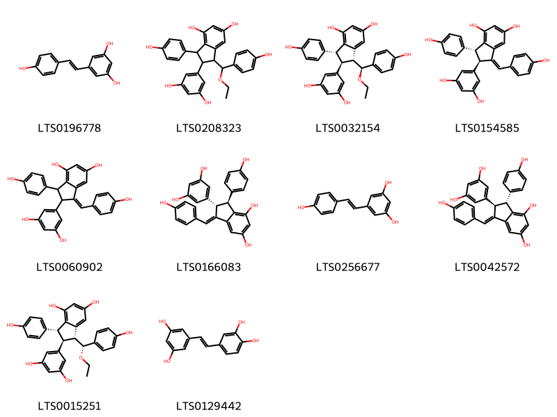{ width=100% }
    <figcaption>Hình ảnh cấu trúc hóa học của 10 hoạt chất thuộc nhóm Stilbenes gồm ['tocilizumab (LTS0196778)', '2-(3,5-dihydroxyphenyl)-1-[ethoxy(4-hydroxyphenyl)methyl]-3-(4-hydroxyphenyl)-2,3-dihydro-1h-indene-4,6-diol (LTS0208323)', '(1r,2s,3r)-2-(3,5-dihydroxyphenyl)-1-[(s)-ethoxy(4-hydroxyphenyl)methyl]-3-(4-hydroxyphenyl)-2,3-dihydro-1h-indene-4,6-diol (LTS0032154)', '(1z,2r,3r)-2-(3,5-dihydroxyphenyl)-3-(4-hydroxyphenyl)-1-[(4-hydroxyphenyl)methylidene]-2,3-dihydroindene-4,6-diol (LTS0154585)', 'quadrangularin a (LTS0060902)', '(1e,2s,3s)-2-(3,5-dihydroxyphenyl)-3-(4-hydroxyphenyl)-1-[(4-hydroxyphenyl)methylidene]-2,3-dihydroindene-4,6-diol (LTS0166083)', 'resveratrol (LTS0256677)', 'cyphostemmin b (LTS0042572)', '(1r,2s,3r)-2-(3,5-dihydroxyphenyl)-1-[(r)-ethoxy(4-hydroxyphenyl)methyl]-3-(4-hydroxyphenyl)-2,3-dihydro-1h-indene-4,6-diol (LTS0015251)', 'piceatannol (LTS0129442)'].</figcaption>
</figure>
#### Nhóm Unsaturated hydrocarbons
<figure markdown="span">
    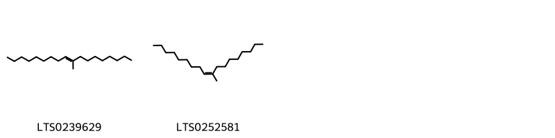{ width=100% }
    <figcaption>Hình ảnh cấu trúc hóa học của 2 hoạt chất thuộc nhóm Unsaturated hydrocarbons gồm ['(9e)-9-methyloctadec-9-ene (LTS0239629)', '9-methyloctadec-9-ene (LTS0252581)'].</figcaption>
</figure>

---

### Dược dân tộc học

Danh sách các quốc gia có sử dụng *Cissus quadrangularis* trong điều trị các bệnh. 

| Country   | Disease   | Bệnh                                                                                                                                                                                                |
|:----------|:----------|:----------------------------------------------------------------------------------------------------------------------------------------------------------------------------------------------------|
| Sudan     | Stomachic | MYMEMORY WARNING: YOU USED ALL AVAILABLE FREE TRANSLATIONS FOR TODAY. NEXT AVAILABLE IN  10 HOURS 01 MINUTES 14 SECONDS VISIT HTTPS://MYMEMORY.TRANSLATED.NET/DOC/USAGELIMITS.PHP TO TRANSLATE MORE |

---

---
## Cissus rhombifolia
### Thông tin về thực vật

!!! info "Phân loại thực vật của *Cissus alata* từ GIBF:"
    - **Kingdom:** Plantae
    - **Phylum:** Tracheophyta
    - **Order:** Vitales
    - **Family:** Vitaceae
    - **Genus:** Cissus
    - **Species:** *Cissus alata*

 

| Label (VI)   | Label (EN)   | Scientific Name    | Descriptions (VI)   | Descriptions (EN)   | Also Known As (VI)   | Also Known As (EN)   |
|:-------------|:-------------|:-------------------|:--------------------|:--------------------|:---------------------|:---------------------|
| N/A          | N/A          | Cissus rhombifolia |                     | species of plant    | ['']                 | ['']                 |

#### Phân bố trên thế giới

**Từ CSDL GIBF** Honduras, nan, Colombia, Venezuela (Bolivarian Republic of), Belize, Panama, Brazil, Spain, Peru, Bolivia (Plurinational State of), Costa Rica, Ecuador, United States of America, Mexico, Belgium, Finland, Guatemala

#### Phân bố tại Việt Nam

**Từ CSDL GIBF**: Không có ghi nhận ở Việt Nam

---
### Thành phần hóa học
        
- Theo cơ sở dữ liệu lotus: Từ loài *Cissus alata* đã phân lập và xác định được Chưa có hoạt chất nào được phân lập. hoạt chất thuộc về các nhóm Không có hoạt chất nào được phân lập. 

Không có hình ảnh nào được tạo ra

---

### Dược dân tộc học

Danh sách các quốc gia có sử dụng *Cissus alata* trong điều trị các bệnh. 

| Country   | Disease   | Bệnh                                                                                                                                                                                                |
|:----------|:----------|:----------------------------------------------------------------------------------------------------------------------------------------------------------------------------------------------------|
| Honduras  | Vesicant  | MYMEMORY WARNING: YOU USED ALL AVAILABLE FREE TRANSLATIONS FOR TODAY. NEXT AVAILABLE IN  10 HOURS 00 MINUTES 32 SECONDS VISIT HTTPS://MYMEMORY.TRANSLATED.NET/DOC/USAGELIMITS.PHP TO TRANSLATE MORE |

---

---
## Cissus setosa
### Thông tin về thực vật

!!! info "Phân loại thực vật của *Cyphostemma setosum* từ GIBF:"
    - **Kingdom:** Plantae
    - **Phylum:** Tracheophyta
    - **Order:** Vitales
    - **Family:** Vitaceae
    - **Genus:** Cyphostemma
    - **Species:** *Cyphostemma setosum*

 

| Label (VI)   | Label (EN)   | Scientific Name   | Descriptions (VI)   | Descriptions (EN)   | Also Known As (VI)   | Also Known As (EN)   |
|:-------------|:-------------|:------------------|:--------------------|:--------------------|:---------------------|:---------------------|
| N/A          | N/A          | Cissus setosa     | loài thực vật       | species of plant    | ['']                 | ['']                 |

#### Phân bố trên thế giới

**Từ CSDL GIBF** nan, Malawi, Sri Lanka, India

#### Phân bố tại Việt Nam

**Từ CSDL GIBF**: Không có ghi nhận ở Việt Nam

---
### Thành phần hóa học
        
- Theo cơ sở dữ liệu lotus: Từ loài *Cyphostemma setosum* đã phân lập và xác định được Chưa có hoạt chất nào được phân lập. hoạt chất thuộc về các nhóm Không có hoạt chất nào được phân lập. 

Không có hình ảnh nào được tạo ra

---

### Dược dân tộc học

Danh sách các quốc gia có sử dụng *Cyphostemma setosum* trong điều trị các bệnh. 

| Country   | Disease     | Bệnh                                                                                                                                                                                                |
|:----------|:------------|:----------------------------------------------------------------------------------------------------------------------------------------------------------------------------------------------------|
| Elsewhere | Suppurative | MYMEMORY WARNING: YOU USED ALL AVAILABLE FREE TRANSLATIONS FOR TODAY. NEXT AVAILABLE IN  10 HOURS 00 MINUTES 09 SECONDS VISIT HTTPS://MYMEMORY.TRANSLATED.NET/DOC/USAGELIMITS.PHP TO TRANSLATE MORE |

---

---
## Cissus sicyoides
### Thông tin về thực vật

!!! info "Phân loại thực vật của *N/A* từ GIBF:"
    - **Kingdom:** Plantae
    - **Phylum:** Tracheophyta
    - **Order:** Vitales
    - **Family:** Vitaceae
    - **Genus:** Cissus
    - **Species:** *N/A*

 

| Label (VI)   | Label (EN)   | Scientific Name   | Descriptions (VI)   | Descriptions (EN)   | Also Known As (VI)   | Also Known As (EN)   |
|:-------------|:-------------|:------------------|:--------------------|:--------------------|:---------------------|:---------------------|
| N/A          | N/A          | Cissus sicyoides  |                     |                     | ['']                 | ['']                 |

#### Phân bố trên thế giới

**Từ CSDL GIBF** Viet Nam, Namibia, Spain, French Guiana, Cameroon, Kenya, Gabon, Singapore, Australia, Indonesia, Guatemala, Colombia, Turks and Caicos Islands, Dominican Republic, Puerto Rico, India, Seychelles, Nigeria, Cuba, Virgin Islands (U.S.), Nicaragua, Brazil, Yemen, Ethiopia, Mexico, Benin, Curaçao, Chinese Taipei, Uruguay, Argentina, South Africa, Tanzania, United Republic of, Costa Rica, Ecuador, United States of America, Chad, Madagascar

#### Phân bố tại Việt Nam

**Từ CSDL GIBF**: Lâm Đồng

---
### Thành phần hóa học
        
- Theo cơ sở dữ liệu lotus: Từ loài *N/A* đã phân lập và xác định được 89 hoạt chất thuộc về các nhóm Diazanaphthalenes, Furanoid lignans, Benzopyrans, Flavonoids, Organooxygen compounds, Coumarins and derivatives, 2-arylbenzofuran flavonoids, Isoflavonoids, Phenols, Linear 1,3-diarylpropanoids, Cinnamic acids and derivatives, Steroids and steroid derivatives, Benzene and substituted derivatives. 

|    | chemicalTaxonomyClassyfireClass     |   smiles_count |
|---:|:------------------------------------|---------------:|
|  0 | 2-arylbenzofuran flavonoids         |              2 |
|  1 | Benzene and substituted derivatives |              5 |
|  2 | Benzopyrans                         |              1 |
|  3 | Cinnamic acids and derivatives      |              2 |
|  4 | Coumarins and derivatives           |              1 |
|  5 | Diazanaphthalenes                   |              1 |
|  6 | Flavonoids                          |             53 |
|  7 | Furanoid lignans                    |              2 |
|  8 | Isoflavonoids                       |              7 |
|  9 | Linear 1,3-diarylpropanoids         |              5 |
| 10 | Organooxygen compounds              |              2 |
| 11 | Phenols                             |              2 |
| 12 | Steroids and steroid derivatives    |              4 |

#### Nhóm 2-arylbenzofuran flavonoids
<figure markdown="span">
    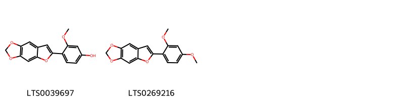{ width=100% }
    <figcaption>Hình ảnh cấu trúc hóa học của 2 hoạt chất thuộc nhóm 2-arylbenzofuran flavonoids gồm ['3-methoxy-4-{4,6,10-trioxatricyclo[7.3.0.0³,⁷]dodeca-1,3(7),8,11-tetraen-11-yl}phenol (LTS0039697)', '11-(2,4-dimethoxyphenyl)-4,6,10-trioxatricyclo[7.3.0.0³,⁷]dodeca-1,3(7),8,11-tetraene (LTS0269216)'].</figcaption>
</figure>
#### Nhóm Benzene and substituted derivatives
<figure markdown="span">
    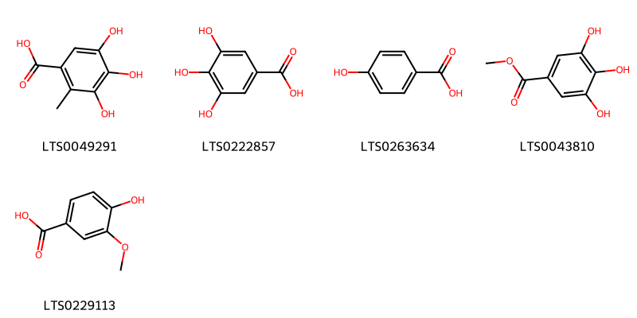{ width=100% }
    <figcaption>Hình ảnh cấu trúc hóa học của 5 hoạt chất thuộc nhóm Benzene and substituted derivatives gồm ['3,4,5-trihydroxy-2-methylbenzoic acid (LTS0049291)', 'galop (LTS0222857)', 'p-hydroxybenzoic acid (LTS0263634)', 'methyl gallate (LTS0043810)', 'vanillic acid (LTS0229113)'].</figcaption>
</figure>
#### Nhóm Benzopyrans
<figure markdown="span">
    { width=100% }
    <figcaption>Hình ảnh cấu trúc hóa học của 1 hoạt chất thuộc nhóm Benzopyrans gồm ['7-hydroxychromen-4-one (LTS0172297)'].</figcaption>
</figure>
#### Nhóm Cinnamic acids and derivatives
<figure markdown="span">
    { width=100% }
    <figcaption>Hình ảnh cấu trúc hóa học của 2 hoạt chất thuộc nhóm Cinnamic acids and derivatives gồm ['para-coumaric acid (LTS0266252)', 'hydroxycinnamic acid (LTS0233023)'].</figcaption>
</figure>
#### Nhóm Coumarins and derivatives
<figure markdown="span">
    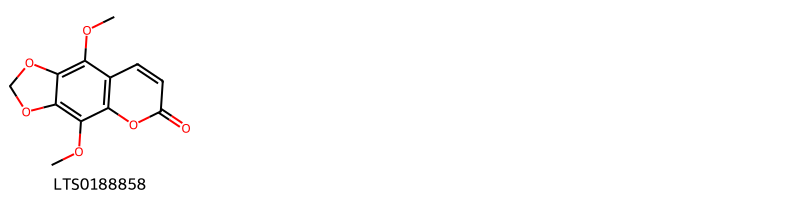{ width=100% }
    <figcaption>Hình ảnh cấu trúc hóa học của 1 hoạt chất thuộc nhóm Coumarins and derivatives gồm ['4,9-dimethoxy-2h-[1,3]dioxolo[4,5-g]chromen-6-one (LTS0188858)'].</figcaption>
</figure>
#### Nhóm Diazanaphthalenes
<figure markdown="span">
    { width=100% }
    <figcaption>Hình ảnh cấu trúc hóa học của 1 hoạt chất thuộc nhóm Diazanaphthalenes gồm ['tryptanthrin (LTS0210698)'].</figcaption>
</figure>
#### Nhóm Flavonoids
<figure markdown="span">
    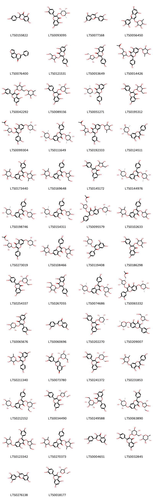{ width=100% }
    <figcaption>Hình ảnh cấu trúc hóa học của 53 hoạt chất thuộc nhóm Flavonoids gồm ['kaempherol (LTS0155822)', 'quercitrin (LTS0093095)', 'cyanidin (LTS0077168)', '5,7-dihydroxy-3-[(3,4,5-trihydroxy-6-methyloxan-2-yl)oxy]-2-(3,4,5-trihydroxyphenyl)-1λ⁴-chromen-1-ylium (LTS0056450)', '2-phenylfuro[2,3-h]chromen-4-one (LTS0076400)', 'juglanin (LTS0121531)', 'juglanin (LTS0053649)', '(3,4-dihydroxy-5-{[5-hydroxy-2-(4-hydroxyphenyl)-4-oxo-7-[(3,4,5-trihydroxy-6-methyloxan-2-yl)oxy]chromen-3-yl]oxy}oxolan-2-yl)methyl acetate (LTS0014426)', 'rutin (LTS0042292)', 'hyperoside (LTS0089156)', '5,7-dihydroxy-2-(4-hydroxyphenyl)-3-{[(2r,3r,4r,5r,6s)-3,4,5-trihydroxy-6-methyloxan-2-yl]oxy}chromen-4-one (LTS0051271)', '2-(3,4-dihydroxyphenyl)-5,7-dihydroxy-3-{[3,4,5-trihydroxy-6-(hydroxymethyl)oxan-2-yl]oxy}chromen-4-one (LTS0195312)', '[(2s,3r,4r,5s)-5-{[2-(3,4-dihydroxyphenyl)-5-hydroxy-4-oxo-7-{[(2s,3r,4r,5r,6s)-3,4,5-trihydroxy-6-methyloxan-2-yl]oxy}chromen-3-yl]oxy}-3,4-dihydroxyoxolan-2-yl]methyl acetate (LTS0099304)', '2-(3,4-dihydroxyphenyl)-5-hydroxy-3,7-bis({[(2s,3r,4r,5r,6s)-3,4,5-trihydroxy-6-methyloxan-2-yl]oxy})chromen-4-one (LTS0111649)', '(5-{[2-(3,4-dihydroxyphenyl)-5-hydroxy-4-oxo-7-[(3,4,5-trihydroxy-6-methyloxan-2-yl)oxy]chromen-3-yl]oxy}-3,4-dihydroxyoxolan-2-yl)methyl acetate (LTS0192333)', 'kaempferol-7-rhamnoside (LTS0124511)', '2-(3,4-dihydroxyphenyl)-5-hydroxy-3,7-bis[(3,4,5-trihydroxy-6-methyloxan-2-yl)oxy]chromen-4-one (LTS0173440)', '3-{[3,4-dihydroxy-5-(hydroxymethyl)oxolan-2-yl]oxy}-5-hydroxy-2-(4-hydroxyphenyl)-7-[(3,4,5-trihydroxy-6-methyloxan-2-yl)oxy]chromen-4-one (LTS0169648)', '3-{[3,4-dihydroxy-5-(hydroxymethyl)oxolan-2-yl]oxy}-2-(3,4-dihydroxyphenyl)-5,7-dihydroxychromen-4-one (LTS0145172)', 'lespedin (LTS0144976)', '5-hydroxy-2-(4-hydroxyphenyl)-7-{[(2s,3r,4r,5r,6s)-3,4,5-trihydroxy-6-methyloxan-2-yl]oxy}-3-{[(2s,3r,4s,5s)-3,4,5-trihydroxyoxan-2-yl]oxy}chromen-4-one (LTS0198746)', '3-{[(2s,3r,4r,5s)-3,4-dihydroxy-5-(hydroxymethyl)oxolan-2-yl]oxy}-5-hydroxy-2-(4-hydroxyphenyl)-7-{[(2s,3r,4r,5r,6s)-3,4,5-trihydroxy-6-methyloxan-2-yl]oxy}chromen-4-one (LTS0154311)', '[(2s,3r,4r,5s)-3,4-dihydroxy-5-{[5-hydroxy-2-(4-hydroxyphenyl)-4-oxo-6-{[(2s,3r,4r,5r,6s)-3,4,5-trihydroxy-6-methyloxan-2-yl]oxy}chromen-3-yl]oxy}oxolan-2-yl]methyl acetate (LTS0095579)', '5-hydroxy-2-(4-hydroxyphenyl)-7-[(3,4,5-trihydroxy-6-methyloxan-2-yl)oxy]-3-[(3,4,5-trihydroxyoxan-2-yl)oxy]chromen-4-one (LTS0102633)', '[(2s,3r,4r,5s)-3,4-dihydroxy-5-{[5-hydroxy-2-(4-hydroxyphenyl)-4-oxo-7-{[(2s,3r,4r,5r,6s)-3,4,5-trihydroxy-6-methyloxan-2-yl]oxy}chromen-3-yl]oxy}oxolan-2-yl]methyl acetate (LTS0273019)', '5-hydroxy-2-(4-hydroxyphenyl)-3-{[3,4,5-trihydroxy-6-(hydroxymethyl)oxan-2-yl]oxy}-7-[(3,4,5-trihydroxy-6-methyloxan-2-yl)oxy]chromen-4-one (LTS0108466)', '5,7-dihydroxy-2-(4-hydroxy-3-oxidophenyl)-3-{[(2s,3r,4s,5s)-3,4,5-trihydroxyoxan-2-yl]oxy}-1λ⁴-chromen-1-ylium (LTS0119408)', 'quercitrin (LTS0186298)', 'isoquercetin (LTS0254337)', 'trifolin (LTS0267055)', '5-hydroxy-2-(4-hydroxyphenyl)-3-{[(2s,3r,4s,5r,6r)-3,4,5-trihydroxy-6-(hydroxymethyl)oxan-2-yl]oxy}-7-{[(2s,3r,4r,5r,6s)-3,4,5-trihydroxy-6-methyloxan-2-yl]oxy}chromen-4-one (LTS0074686)', '[(2s,3r,4r,5s)-5-{[2-(3,4-dihydroxyphenyl)-5-hydroxy-4-oxo-6-{[(2s,3r,4r,5r,6s)-3,4,5-trihydroxy-6-methyloxan-2-yl]oxy}chromen-3-yl]oxy}-3,4-dihydroxyoxolan-2-yl]methyl acetate (LTS0065332)', 'guaijaverin (LTS0065676)', "7,3',4'-trihydroxyflavone (LTS0060696)", '2-(3,4-dihydroxyphenyl)-5,7-dihydroxy-3-{[(2s,3r,4r,5s,6s)-3,4,5-trihydroxy-6-methyloxan-2-yl]oxy}chromen-4-one (LTS0202270)', '3-{[(2s,3r,4r,5s)-3,4-dihydroxy-5-(hydroxymethyl)oxolan-2-yl]oxy}-2-(3,4-dihydroxyphenyl)-5-hydroxy-6-{[(2s,3r,4r,5r,6s)-3,4,5-trihydroxy-6-methyloxan-2-yl]oxy}chromen-4-one (LTS0209007)', '5,7-dihydroxy-2-(4-hydroxyphenyl)-3-[(3,4,5-trihydroxy-6-methyloxan-2-yl)oxy]chromen-4-one (LTS0211340)', '5-hydroxy-3-{[(2s,3r,4s,5s,6r)-3,4,5-trihydroxy-6-(hydroxymethyl)oxan-2-yl]oxy}-2-(3,4,5-trihydroxyphenyl)chromen-7-one (LTS0073780)', '2-(3,4-dihydroxyphenyl)-5,7-dihydroxy-3-{[(2s,3r,4r,5r,6s)-3,4,5-trihydroxy-6-(hydroxymethyl)oxan-2-yl]oxy}chromen-4-one (LTS0241372)', '3,5-dihydroxy-2-(4-hydroxyphenyl)-7-[(3,4,5-trihydroxy-6-methyloxan-2-yl)oxy]chromen-4-one (LTS0231853)', '5-hydroxy-2-(4-hydroxyphenyl)-3-{[(2s,3r,4s,5s,6r)-3,4,5-trihydroxy-6-(hydroxymethyl)oxan-2-yl]oxy}-7-{[(2s,3r,4r,5r,6s)-3,4,5-trihydroxy-6-methyloxan-2-yl]oxy}chromen-4-one (LTS0212152)', 'avicularin (LTS0034490)', 'astragalin (LTS0249588)', '3-{[(2s,3r,4r,5s)-3,4-dihydroxy-5-(hydroxymethyl)oxolan-2-yl]oxy}-2-(3,4-dihydroxyphenyl)-5-hydroxy-7-{[(2s,3r,4r,5r,6s)-3,4,5-trihydroxy-6-methyloxan-2-yl]oxy}chromen-4-one (LTS0063890)', '3-{[3,4-dihydroxy-5-(hydroxymethyl)oxolan-2-yl]oxy}-2-(3,4-dihydroxyphenyl)-5-hydroxy-7-[(3,4,5-trihydroxy-6-methyloxan-2-yl)oxy]chromen-4-one (LTS0123342)', 'kaempferitrin (LTS0270373)', 'quercetin (LTS0004651)', '3-rutinosyl quercetin (LTS0032845)', '2-(3,5-dihydroxy-4-oxidophenyl)-3,5,7-trihydroxy-1λ⁴-chromen-1-ylium (LTS0276138)', '3-{[(2r,3r,4r,5s)-3,4-dihydroxy-5-(hydroxymethyl)oxolan-2-yl]oxy}-2-(3,4-dihydroxyphenyl)-5,7-dihydroxychromen-4-one (LTS0018177)', 'guaijaverin (LTS0119144)', 'afzelin (LTS0259097)', 'delphinidin (LTS0036798)'].</figcaption>
</figure>
#### Nhóm Furanoid lignans
<figure markdown="span">
    { width=100% }
    <figcaption>Hình ảnh cấu trúc hóa học của 2 hoạt chất thuộc nhóm Furanoid lignans gồm ['pinoresinol (LTS0057431)', 'pinoresinol (LTS0011247)'].</figcaption>
</figure>
#### Nhóm Isoflavonoids
<figure markdown="span">
    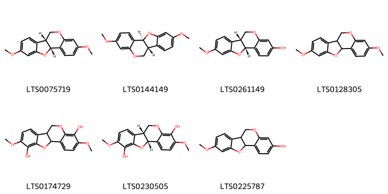{ width=100% }
    <figcaption>Hình ảnh cấu trúc hóa học của 7 hoạt chất thuộc nhóm Isoflavonoids gồm ['(1r,10r)-5,14-dimethoxy-8,17-dioxatetracyclo[8.7.0.0²,⁷.0¹¹,¹⁶]heptadeca-2,4,6,11,13,15-hexaene (LTS0075719)', '(1s,10r)-5,14-dimethoxy-8,17-dioxatetracyclo[8.7.0.0²,⁷.0¹¹,¹⁶]heptadeca-2,4,6,11,13,15-hexaene (LTS0144149)', 'medicarpin, (-)- (LTS0261149)', 'homopterocarpin (LTS0128305)', 'melilotocarpan d (LTS0174729)', '(1r,10r)-5,14-dimethoxy-8,17-dioxatetracyclo[8.7.0.0²,⁷.0¹¹,¹⁶]heptadeca-2,4,6,11,13,15-hexaene-6,15-diol (LTS0230505)', 'medicarpin (LTS0225787)'].</figcaption>
</figure>
#### Nhóm Linear 1_3-diarylpropanoids
<figure markdown="span">
    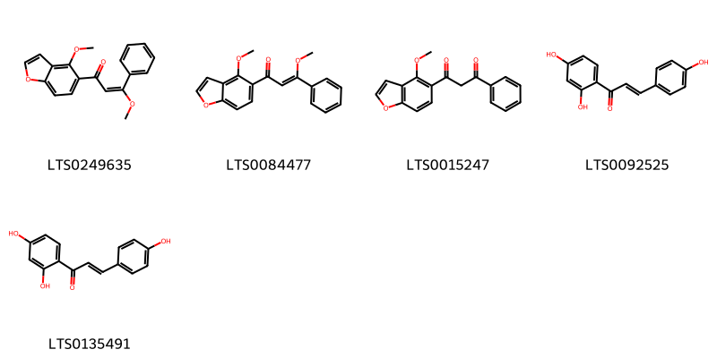{ width=100% }
    <figcaption>Hình ảnh cấu trúc hóa học của Không tìm thấy chú thích hoạt chất thuộc nhóm Linear 1_3-diarylpropanoids gồm Không tìm thấy chú thích.</figcaption>
</figure>
#### Nhóm Organooxygen compounds
<figure markdown="span">
    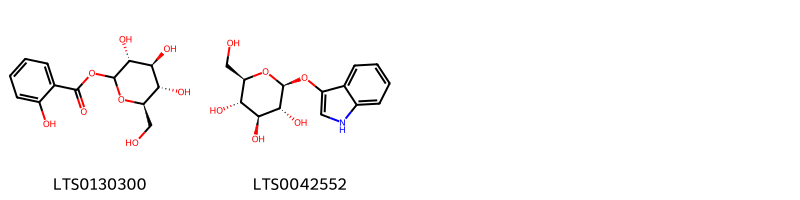{ width=100% }
    <figcaption>Hình ảnh cấu trúc hóa học của 2 hoạt chất thuộc nhóm Organooxygen compounds gồm ['(3r,4s,5s,6r)-3,4,5-trihydroxy-6-(hydroxymethyl)oxan-2-yl 2-hydroxybenzoate (LTS0130300)', 'indican (LTS0042552)'].</figcaption>
</figure>
#### Nhóm Phenols
<figure markdown="span">
    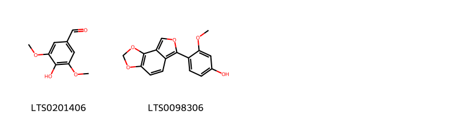{ width=100% }
    <figcaption>Hình ảnh cấu trúc hóa học của 2 hoạt chất thuộc nhóm Phenols gồm ['syringaldehyde (LTS0201406)', '3-methoxy-4-{3,5,11-trioxatricyclo[7.3.0.0²,⁶]dodeca-1(12),2(6),7,9-tetraen-10-yl}phenol (LTS0098306)'].</figcaption>
</figure>
#### Nhóm Steroids and steroid derivatives
<figure markdown="span">
    { width=100% }
    <figcaption>Hình ảnh cấu trúc hóa học của 4 hoạt chất thuộc nhóm Steroids and steroid derivatives gồm ['stigmast-5-en-3-ol (LTS0071224)', 'stigmast-5-en-3-ol, (3β)- (LTS0204616)', 'sitogluside (LTS0201798)', '2-{[1-(5-ethyl-6-methylheptan-2-yl)-9a,11a-dimethyl-1h,2h,3h,3ah,3bh,4h,6h,7h,8h,9h,9bh,10h,11h-cyclopenta[a]phenanthren-7-yl]oxy}-6-(hydroxymethyl)oxane-3,4,5-triol (LTS0158828)'].</figcaption>
</figure>

---

### Dược dân tộc học

Danh sách các quốc gia có sử dụng *N/A* trong điều trị các bệnh. 

| Country    | Disease                                   | Bệnh                                                                                                                                                                                                |
|:-----------|:------------------------------------------|:----------------------------------------------------------------------------------------------------------------------------------------------------------------------------------------------------|
| Costa Rica | Soap                                      | MYMEMORY WARNING: YOU USED ALL AVAILABLE FREE TRANSLATIONS FOR TODAY. NEXT AVAILABLE IN  09 HOURS 59 MINUTES 47 SECONDS VISIT HTTPS://MYMEMORY.TRANSLATED.NET/DOC/USAGELIMITS.PHP TO TRANSLATE MORE |
| Elsewhere  | Soap                                      | MYMEMORY WARNING: YOU USED ALL AVAILABLE FREE TRANSLATIONS FOR TODAY. NEXT AVAILABLE IN  09 HOURS 59 MINUTES 37 SECONDS VISIT HTTPS://MYMEMORY.TRANSLATED.NET/DOC/USAGELIMITS.PHP TO TRANSLATE MORE |
| Haiti      | Cicatrizant, Diuretic, Diuretic, Vesicant | MYMEMORY WARNING: YOU USED ALL AVAILABLE FREE TRANSLATIONS FOR TODAY. NEXT AVAILABLE IN  09 HOURS 59 MINUTES 30 SECONDS VISIT HTTPS://MYMEMORY.TRANSLATED.NET/DOC/USAGELIMITS.PHP TO TRANSLATE MORE |
| Mexico     | Soap, Diuretic                            | MYMEMORY WARNING: YOU USED ALL AVAILABLE FREE TRANSLATIONS FOR TODAY. NEXT AVAILABLE IN  09 HOURS 59 MINUTES 27 SECONDS VISIT HTTPS://MYMEMORY.TRANSLATED.NET/DOC/USAGELIMITS.PHP TO TRANSLATE MORE |

---

---
## Cissus trifoliata
### Thông tin về thực vật

!!! info "Phân loại thực vật của *Cissus trifoliata* từ GIBF:"
    - **Kingdom:** Plantae
    - **Phylum:** Tracheophyta
    - **Order:** Vitales
    - **Family:** Vitaceae
    - **Genus:** Cissus
    - **Species:** *Cissus trifoliata*

 

| Label (VI)   | Label (EN)   | Scientific Name   | Descriptions (VI)   | Descriptions (EN)   | Also Known As (VI)   | Also Known As (EN)                  |
|:-------------|:-------------|:------------------|:--------------------|:--------------------|:---------------------|:------------------------------------|
| N/A          | N/A          | Cissus trifoliata | loài thực vật       | species of plant    | ['']                 | ['sorrelvine', 'Arizona grape ivy'] |

#### Phân bố trên thế giới

**Từ CSDL GIBF** Turks and Caicos Islands, Dominican Republic, Puerto Rico, Cuba, United States of America, Mexico, Virgin Islands (U.S.)

#### Phân bố tại Việt Nam

**Từ CSDL GIBF**: Không có ghi nhận ở Việt Nam

---
### Thành phần hóa học
        
- Theo cơ sở dữ liệu lotus: Từ loài *Cissus trifoliata* đã phân lập và xác định được Chưa có hoạt chất nào được phân lập. hoạt chất thuộc về các nhóm Không có hoạt chất nào được phân lập. 

Không có hình ảnh nào được tạo ra

---

### Dược dân tộc học

Danh sách các quốc gia có sử dụng *Cissus trifoliata* trong điều trị các bệnh. 

| Country   | Disease   | Bệnh                                                                                                                                                                                                |
|:----------|:----------|:----------------------------------------------------------------------------------------------------------------------------------------------------------------------------------------------------|
| Mexico    | Poison    | MYMEMORY WARNING: YOU USED ALL AVAILABLE FREE TRANSLATIONS FOR TODAY. NEXT AVAILABLE IN  09 HOURS 58 MINUTES 32 SECONDS VISIT HTTPS://MYMEMORY.TRANSLATED.NET/DOC/USAGELIMITS.PHP TO TRANSLATE MORE |

---

# Chi Ampelopsis

??? note "Danh sách các dược liệu thuộc chi"
    
	 - *Ampelopsis brevipedunculata*
	 - *Ampelopsis japonica*

---
## Ampelopsis brevipedunculata
### Thông tin về thực vật

!!! info "Phân loại thực vật của *Ampelopsis brevipedunculata* từ GIBF:"
    - **Kingdom:** Plantae
    - **Phylum:** Tracheophyta
    - **Order:** Vitales
    - **Family:** Vitaceae
    - **Genus:** Ampelopsis
    - **Species:** *Ampelopsis brevipedunculata*

 

| Label (VI)   | Label (EN)   | Scientific Name             | Descriptions (VI)   | Descriptions (EN)           | Also Known As (VI)   | Also Known As (EN)   |
|:-------------|:-------------|:----------------------------|:--------------------|:----------------------------|:---------------------|:---------------------|
| N/A          | N/A          | Ampelopsis brevipedunculata |                     | species of ornamental plant | ['']                 | ['porcelain berry']  |

#### Phân bố trên thế giới

**Từ CSDL GIBF** Viet Nam, Japan, Korea (Democratic People’s Republic of), Latvia, Germany, Canada, United States of America, China, Norway, Korea, Republic of, Chinese Taipei

#### Phân bố tại Việt Nam

**Từ CSDL GIBF**: Không có ghi nhận ở Việt Nam

---
### Thành phần hóa học
        
- Theo cơ sở dữ liệu lotus: Từ loài *Ampelopsis brevipedunculata* đã phân lập và xác định được Chưa có hoạt chất nào được phân lập. hoạt chất thuộc về các nhóm Không có hoạt chất nào được phân lập. 

Không có hình ảnh nào được tạo ra

---

### Dược dân tộc học

Danh sách các quốc gia có sử dụng *Ampelopsis brevipedunculata* trong điều trị các bệnh. 

| Country   | Disease                         | Bệnh                                                                                                                                                                                                |
|:----------|:--------------------------------|:----------------------------------------------------------------------------------------------------------------------------------------------------------------------------------------------------|
| China     | Alexiteric, Refrigerant, Poison | MYMEMORY WARNING: YOU USED ALL AVAILABLE FREE TRANSLATIONS FOR TODAY. NEXT AVAILABLE IN  09 HOURS 57 MINUTES 57 SECONDS VISIT HTTPS://MYMEMORY.TRANSLATED.NET/DOC/USAGELIMITS.PHP TO TRANSLATE MORE |

---

---
## Ampelopsis japonica
### Thông tin về thực vật

!!! info "Phân loại thực vật của *Ampelopsis japonica* từ GIBF:"
    - **Kingdom:** Plantae
    - **Phylum:** Tracheophyta
    - **Order:** Vitales
    - **Family:** Vitaceae
    - **Genus:** Ampelopsis
    - **Species:** *Ampelopsis japonica*

 

| Label (VI)   | Label (EN)   | Scientific Name     | Descriptions (VI)   | Descriptions (EN)   | Also Known As (VI)   | Also Known As (EN)        |
|:-------------|:-------------|:--------------------|:--------------------|:--------------------|:---------------------|:--------------------------|
| N/A          | N/A          | Ampelopsis japonica | loài thực vật       | species of plant    | ['']                 | ['East Asian peppervine'] |

#### Phân bố trên thế giới

**Từ CSDL GIBF** nan, Viet Nam, Portugal, Japan, Korea (Democratic People’s Republic of), Andorra, Russian Federation, United States of America, China, Korea, Republic of, Ukraine, Chinese Taipei

#### Phân bố tại Việt Nam

**Từ CSDL GIBF**: Thanh Hoa

---
### Thành phần hóa học
        
- Theo cơ sở dữ liệu lotus: Từ loài *Ampelopsis japonica* đã phân lập và xác định được 15 hoạt chất thuộc về các nhóm Stilbenes, Flavonoids, Saturated hydrocarbons, Lignan glycosides, Fatty Acyls, Steroids and steroid derivatives, Benzene and substituted derivatives. 

|    | chemicalTaxonomyClassyfireClass     |   smiles_count |
|---:|:------------------------------------|---------------:|
|  0 | Benzene and substituted derivatives |              1 |
|  1 | Fatty Acyls                         |              2 |
|  2 | Flavonoids                          |              5 |
|  3 | Lignan glycosides                   |              1 |
|  4 | Saturated hydrocarbons              |              1 |
|  5 | Steroids and steroid derivatives    |              3 |
|  6 | Stilbenes                           |              2 |

#### Nhóm Benzene and substituted derivatives
<figure markdown="span">
    { width=100% }
    <figcaption>Hình ảnh cấu trúc hóa học của 1 hoạt chất thuộc nhóm Benzene and substituted derivatives gồm ['galop (LTS0222857)'].</figcaption>
</figure>
#### Nhóm Fatty Acyls
<figure markdown="span">
    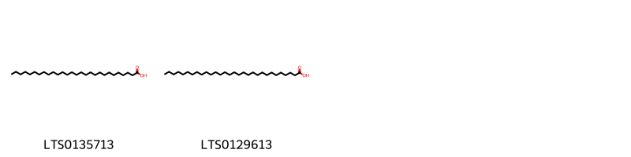{ width=100% }
    <figcaption>Hình ảnh cấu trúc hóa học của 2 hoạt chất thuộc nhóm Fatty Acyls gồm ['octacosanoic acid (LTS0135713)', 'triacontanoic acid (LTS0129613)'].</figcaption>
</figure>
#### Nhóm Flavonoids
<figure markdown="span">
    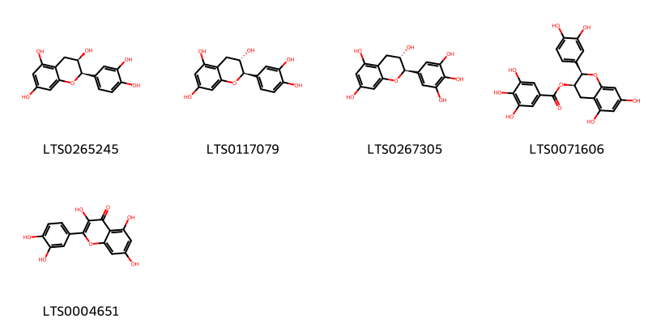{ width=100% }
    <figcaption>Hình ảnh cấu trúc hóa học của 5 hoạt chất thuộc nhóm Flavonoids gồm ['ent-epicatechin (LTS0265245)', '(+)-catechol (LTS0117079)', 'gallocatechol (LTS0267305)', 'epicatechin gallate (LTS0071606)', 'quercetin (LTS0004651)'].</figcaption>
</figure>
#### Nhóm Lignan glycosides
<figure markdown="span">
    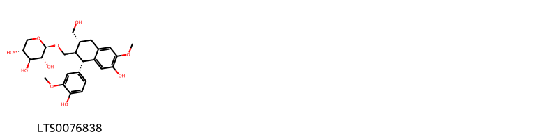{ width=100% }
    <figcaption>Hình ảnh cấu trúc hóa học của 1 hoạt chất thuộc nhóm Lignan glycosides gồm ['(2r,3r,4s,5r)-2-{[(1s,2r,3r)-7-hydroxy-1-(4-hydroxy-3-methoxyphenyl)-3-(hydroxymethyl)-6-methoxy-1,2,3,4-tetrahydronaphthalen-2-yl]methoxy}oxane-3,4,5-triol (LTS0076838)'].</figcaption>
</figure>
#### Nhóm Saturated hydrocarbons
<figure markdown="span">
    { width=100% }
    <figcaption>Hình ảnh cấu trúc hóa học của 1 hoạt chất thuộc nhóm Saturated hydrocarbons gồm ['pentacosane (LTS0080764)'].</figcaption>
</figure>
#### Nhóm Steroids and steroid derivatives
<figure markdown="span">
    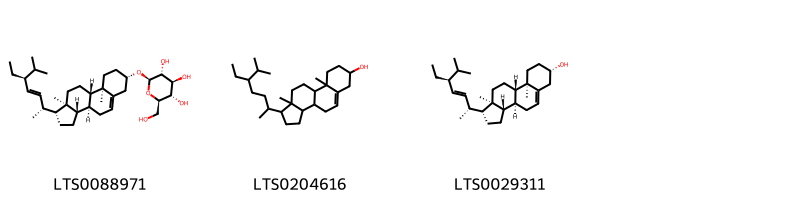{ width=100% }
    <figcaption>Hình ảnh cấu trúc hóa học của 3 hoạt chất thuộc nhóm Steroids and steroid derivatives gồm ['(2r,3r,4s,5s,6r)-2-{[(1r,3as,3bs,7s,9ar,9bs,11ar)-1-[(2r,3e,5s)-5-ethyl-6-methylhept-3-en-2-yl]-9a,11a-dimethyl-1h,2h,3h,3ah,3bh,4h,6h,7h,8h,9h,9bh,10h,11h-cyclopenta[a]phenanthren-7-yl]oxy}-6-(hydroxymethyl)oxane-3,4,5-triol (LTS0088971)', 'stigmast-5-en-3-ol, (3β)- (LTS0204616)', 'phytosterol (LTS0029311)'].</figcaption>
</figure>
#### Nhóm Stilbenes
<figure markdown="span">
    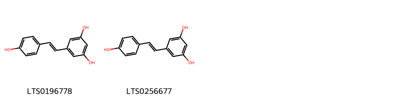{ width=100% }
    <figcaption>Hình ảnh cấu trúc hóa học của 2 hoạt chất thuộc nhóm Stilbenes gồm ['tocilizumab (LTS0196778)', 'resveratrol (LTS0256677)'].</figcaption>
</figure>

---

### Dược dân tộc học

Danh sách các quốc gia có sử dụng *Ampelopsis japonica* trong điều trị các bệnh. 

| Country   | Disease              | Bệnh                                                                                                                                                                                                |
|:----------|:---------------------|:----------------------------------------------------------------------------------------------------------------------------------------------------------------------------------------------------|
| China     | Alexiteric, Hemostat | MYMEMORY WARNING: YOU USED ALL AVAILABLE FREE TRANSLATIONS FOR TODAY. NEXT AVAILABLE IN  09 HOURS 57 MINUTES 32 SECONDS VISIT HTTPS://MYMEMORY.TRANSLATED.NET/DOC/USAGELIMITS.PHP TO TRANSLATE MORE |
| Elsewhere | Astringent           | MYMEMORY WARNING: YOU USED ALL AVAILABLE FREE TRANSLATIONS FOR TODAY. NEXT AVAILABLE IN  09 HOURS 57 MINUTES 28 SECONDS VISIT HTTPS://MYMEMORY.TRANSLATED.NET/DOC/USAGELIMITS.PHP TO TRANSLATE MORE |

---

# Chi Cayratia

??? note "Danh sách các dược liệu thuộc chi"
    
	 - *Cayratia carnosa*
	 - *Cayratia pedata*

---
## Cayratia carnosa
### Thông tin về thực vật

!!! info "Phân loại thực vật của *Causonis trifolia* từ GIBF:"
    - **Kingdom:** Plantae
    - **Phylum:** Tracheophyta
    - **Order:** Vitales
    - **Family:** Vitaceae
    - **Genus:** Causonis
    - **Species:** *Causonis trifolia*

 

| Label (VI)   | Label (EN)   | Scientific Name   | Descriptions (VI)   | Descriptions (EN)   | Also Known As (VI)   | Also Known As (EN)   |
|:-------------|:-------------|:------------------|:--------------------|:--------------------|:---------------------|:---------------------|
| N/A          | N/A          | Cayratia carnosa  |                     |                     | ['']                 | ['']                 |

#### Phân bố trên thế giới

**Từ CSDL GIBF** India, China

#### Phân bố tại Việt Nam

**Từ CSDL GIBF**: Không có ghi nhận ở Việt Nam

---
### Thành phần hóa học
        
- Theo cơ sở dữ liệu lotus: Từ loài *Causonis trifolia* đã phân lập và xác định được Chưa có hoạt chất nào được phân lập. hoạt chất thuộc về các nhóm Không có hoạt chất nào được phân lập. 

Không có hình ảnh nào được tạo ra

---

### Dược dân tộc học

Danh sách các quốc gia có sử dụng *Causonis trifolia* trong điều trị các bệnh. 

| Country   | Disease                              | Bệnh                                                                                                                                                                                                |
|:----------|:-------------------------------------|:----------------------------------------------------------------------------------------------------------------------------------------------------------------------------------------------------|
| Elsewhere | Astringent, Rubefacient, Diaphoretic | MYMEMORY WARNING: YOU USED ALL AVAILABLE FREE TRANSLATIONS FOR TODAY. NEXT AVAILABLE IN  09 HOURS 56 MINUTES 52 SECONDS VISIT HTTPS://MYMEMORY.TRANSLATED.NET/DOC/USAGELIMITS.PHP TO TRANSLATE MORE |

---

---
## Cayratia pedata
### Thông tin về thực vật

!!! info "Phân loại thực vật của *Cayratia pedata* từ GIBF:"
    - **Kingdom:** Plantae
    - **Phylum:** Tracheophyta
    - **Order:** Vitales
    - **Family:** Vitaceae
    - **Genus:** Cayratia
    - **Species:** *Cayratia pedata*

 

| Label (VI)   | Label (EN)   | Scientific Name   | Descriptions (VI)   | Descriptions (EN)   | Also Known As (VI)   | Also Known As (EN)   |
|:-------------|:-------------|:------------------|:--------------------|:--------------------|:---------------------|:---------------------|
| N/A          | N/A          | Cayratia pedata   | loài thực vật       | species of plant    | ['']                 | ['']                 |

#### Phân bố trên thế giới

**Từ CSDL GIBF** nan, Viet Nam, Sri Lanka, Thailand, Myanmar, Christmas Island, Bhutan, Philippines, India, Papua New Guinea, Bangladesh, United States of America, China, Indonesia

#### Phân bố tại Việt Nam

**Từ CSDL GIBF**: Không có ghi nhận ở Việt Nam

---
### Thành phần hóa học
        
- Theo cơ sở dữ liệu lotus: Từ loài *Cayratia pedata* đã phân lập và xác định được Chưa có hoạt chất nào được phân lập. hoạt chất thuộc về các nhóm Không có hoạt chất nào được phân lập. 

Không có hình ảnh nào được tạo ra

---

### Dược dân tộc học

Danh sách các quốc gia có sử dụng *Cayratia pedata* trong điều trị các bệnh. 

| Country   | Disease                 | Bệnh                                                                                                                                                                                                |
|:----------|:------------------------|:----------------------------------------------------------------------------------------------------------------------------------------------------------------------------------------------------|
| Elsewhere | Astringent, Refrigerant | MYMEMORY WARNING: YOU USED ALL AVAILABLE FREE TRANSLATIONS FOR TODAY. NEXT AVAILABLE IN  09 HOURS 56 MINUTES 31 SECONDS VISIT HTTPS://MYMEMORY.TRANSLATED.NET/DOC/USAGELIMITS.PHP TO TRANSLATE MORE |

---

# Chi Vitis

??? note "Danh sách các dược liệu thuộc chi"
    
	 - *Vitis araneosus*
	 - *Vitis bryoniaefolia*
	 - *Vitis discolor*
	 - *Vitis inconstans*
	 - *Vitis indica*
	 - *Vitis latifolia*
	 - *Vitis pentagona*
	 - *Vitis pentaphylla*
	 - *Vitis quadrangularis*
	 - *Vitis serianaefolia*
	 - *Vitis tiliaefolia*
	 - *Vitis tiliifolia*
	 - *Vitis vinifera*

---
## Vitis araneosus
### Thông tin về thực vật

!!! info "Phân loại thực vật của *N/A* từ GIBF:"
    - **Kingdom:** Plantae
    - **Phylum:** Tracheophyta
    - **Order:** Vitales
    - **Family:** Vitaceae
    - **Genus:** N/A
    - **Species:** *N/A*

 

| Label (VI)   | Label (EN)   | Scientific Name   | Descriptions (VI)   | Descriptions (EN)   | Also Known As (VI)   | Also Known As (EN)   |
|:-------------|:-------------|:------------------|:--------------------|:--------------------|:---------------------|:---------------------|
| N/A          | N/A          | Cayratia pedata   | loài thực vật       | species of plant    | ['']                 | ['']                 |

#### Phân bố trên thế giới

**Từ CSDL GIBF** Viet Nam, Namibia, Spain, Kenya, Chile, Singapore, Australia, Indonesia, Puerto Rico, India, Canada, Uganda, Japan, Brazil, Mexico, Chinese Taipei, Argentina, South Africa, New Zealand, United States of America, Zimbabwe

#### Phân bố tại Việt Nam

**Từ CSDL GIBF**: Lâm Đồng

---
### Thành phần hóa học
        
- Theo cơ sở dữ liệu lotus: Từ loài *N/A* đã phân lập và xác định được Chưa có hoạt chất nào được phân lập. hoạt chất thuộc về các nhóm Không có hoạt chất nào được phân lập. 

Không có hình ảnh nào được tạo ra

---

### Dược dân tộc học

Danh sách các quốc gia có sử dụng *N/A* trong điều trị các bệnh. 

| Country   | Disease                 | Bệnh                                                                                                                                                                                                |
|:----------|:------------------------|:----------------------------------------------------------------------------------------------------------------------------------------------------------------------------------------------------|
| Elsewhere | Astringent, Refrigerant | MYMEMORY WARNING: YOU USED ALL AVAILABLE FREE TRANSLATIONS FOR TODAY. NEXT AVAILABLE IN  09 HOURS 56 MINUTES 06 SECONDS VISIT HTTPS://MYMEMORY.TRANSLATED.NET/DOC/USAGELIMITS.PHP TO TRANSLATE MORE |

---

---
## Vitis bryoniaefolia
### Thông tin về thực vật

!!! info "Phân loại thực vật của *Vitis bryoniaefolia* từ GIBF:"
    - **Kingdom:** Plantae
    - **Phylum:** Tracheophyta
    - **Order:** Vitales
    - **Family:** Vitaceae
    - **Genus:** Vitis
    - **Species:** *Vitis bryoniaefolia*

 

| Label (VI)   | Label (EN)   | Scientific Name   | Descriptions (VI)   | Descriptions (EN)   | Also Known As (VI)   | Also Known As (EN)   |
|:-------------|:-------------|:------------------|:--------------------|:--------------------|:---------------------|:---------------------|
| N/A          | N/A          | Cayratia pedata   | loài thực vật       | species of plant    | ['']                 | ['']                 |

#### Phân bố trên thế giới

**Từ CSDL GIBF** China, Hong Kong

#### Phân bố tại Việt Nam

**Từ CSDL GIBF**: Không có ghi nhận ở Việt Nam

---
### Thành phần hóa học
        
- Theo cơ sở dữ liệu lotus: Từ loài *Vitis bryoniaefolia* đã phân lập và xác định được Chưa có hoạt chất nào được phân lập. hoạt chất thuộc về các nhóm Không có hoạt chất nào được phân lập. 

Không có hình ảnh nào được tạo ra

---

### Dược dân tộc học

Danh sách các quốc gia có sử dụng *Vitis bryoniaefolia* trong điều trị các bệnh. 

| Country   | Disease               | Bệnh                                                                                                                                                                                                |
|:----------|:----------------------|:----------------------------------------------------------------------------------------------------------------------------------------------------------------------------------------------------|
| China     | Diuretic, Refrigerant | MYMEMORY WARNING: YOU USED ALL AVAILABLE FREE TRANSLATIONS FOR TODAY. NEXT AVAILABLE IN  09 HOURS 55 MINUTES 32 SECONDS VISIT HTTPS://MYMEMORY.TRANSLATED.NET/DOC/USAGELIMITS.PHP TO TRANSLATE MORE |

---

---
## Vitis discolor
### Thông tin về thực vật

!!! info "Phân loại thực vật của *Cissus discolor* từ GIBF:"
    - **Kingdom:** Plantae
    - **Phylum:** Tracheophyta
    - **Order:** Vitales
    - **Family:** Vitaceae
    - **Genus:** Cissus
    - **Species:** *Cissus discolor*

 

| Label (VI)   | Label (EN)   | Scientific Name   | Descriptions (VI)   | Descriptions (EN)   | Also Known As (VI)   | Also Known As (EN)   |
|:-------------|:-------------|:------------------|:--------------------|:--------------------|:---------------------|:---------------------|
| N/A          | N/A          | Vitis discolor    |                     |                     | ['']                 | ['']                 |

#### Phân bố trên thế giới

**Từ CSDL GIBF** Viet Nam, nan, Myanmar, France, Malaysia, India, China, Indonesia

#### Phân bố tại Việt Nam

**Từ CSDL GIBF**: Đồng Nai

---
### Thành phần hóa học
        
- Theo cơ sở dữ liệu lotus: Từ loài *Cissus discolor* đã phân lập và xác định được Chưa có hoạt chất nào được phân lập. hoạt chất thuộc về các nhóm Không có hoạt chất nào được phân lập. 

Không có hình ảnh nào được tạo ra

---

### Dược dân tộc học

Danh sách các quốc gia có sử dụng *Cissus discolor* trong điều trị các bệnh. 

| Country       | Disease   | Bệnh                                                                                                                                                                                                |
|:--------------|:----------|:----------------------------------------------------------------------------------------------------------------------------------------------------------------------------------------------------|
| Latin America | Soap      | MYMEMORY WARNING: YOU USED ALL AVAILABLE FREE TRANSLATIONS FOR TODAY. NEXT AVAILABLE IN  09 HOURS 55 MINUTES 10 SECONDS VISIT HTTPS://MYMEMORY.TRANSLATED.NET/DOC/USAGELIMITS.PHP TO TRANSLATE MORE |

---

---
## Vitis inconstans
### Thông tin về thực vật

!!! info "Phân loại thực vật của *Parthenocissus tricuspidata* từ GIBF:"
    - **Kingdom:** Plantae
    - **Phylum:** Tracheophyta
    - **Order:** Vitales
    - **Family:** Vitaceae
    - **Genus:** Parthenocissus
    - **Species:** *Parthenocissus tricuspidata*

 

| Label (VI)   | Label (EN)   | Scientific Name   | Descriptions (VI)   | Descriptions (EN)   | Also Known As (VI)   | Also Known As (EN)   |
|:-------------|:-------------|:------------------|:--------------------|:--------------------|:---------------------|:---------------------|
| N/A          | N/A          | Vitis inconstans  |                     |                     | ['']                 | ['']                 |

#### Phân bố trên thế giới

**Từ CSDL GIBF** nan, unknown or invalid, United Kingdom of Great Britain and Northern Ireland, Japan, China, Chinese Taipei

#### Phân bố tại Việt Nam

**Từ CSDL GIBF**: Không có ghi nhận ở Việt Nam

---
### Thành phần hóa học
        
- Theo cơ sở dữ liệu lotus: Từ loài *Parthenocissus tricuspidata* đã phân lập và xác định được Chưa có hoạt chất nào được phân lập. hoạt chất thuộc về các nhóm Không có hoạt chất nào được phân lập. 

Không có hình ảnh nào được tạo ra

---

### Dược dân tộc học

Danh sách các quốc gia có sử dụng *Parthenocissus tricuspidata* trong điều trị các bệnh. 

| Country   | Disease   | Bệnh                                                                                                                                                                                                |
|:----------|:----------|:----------------------------------------------------------------------------------------------------------------------------------------------------------------------------------------------------|
| China     | Tonic     | MYMEMORY WARNING: YOU USED ALL AVAILABLE FREE TRANSLATIONS FOR TODAY. NEXT AVAILABLE IN  09 HOURS 54 MINUTES 42 SECONDS VISIT HTTPS://MYMEMORY.TRANSLATED.NET/DOC/USAGELIMITS.PHP TO TRANSLATE MORE |

---

---
## Vitis indica
### Thông tin về thực vật

!!! info "Phân loại thực vật của *N/A* từ GIBF:"
    - **Kingdom:** Plantae
    - **Phylum:** Tracheophyta
    - **Order:** Vitales
    - **Family:** Vitaceae
    - **Genus:** N/A
    - **Species:** *N/A*

 

| Label (VI)   | Label (EN)   | Scientific Name   | Descriptions (VI)   | Descriptions (EN)   | Also Known As (VI)   | Also Known As (EN)   |
|:-------------|:-------------|:------------------|:--------------------|:--------------------|:---------------------|:---------------------|
| N/A          | N/A          | Vitis indica      | loài thực vật       | species of plant    | ['']                 | ['']                 |

#### Phân bố trên thế giới

**Từ CSDL GIBF** Viet Nam, Namibia, Spain, Kenya, Chile, Singapore, Australia, Indonesia, Puerto Rico, India, Canada, Uganda, Japan, Brazil, Mexico, Chinese Taipei, Argentina, South Africa, New Zealand, United States of America, Zimbabwe

#### Phân bố tại Việt Nam

**Từ CSDL GIBF**: Lâm Đồng

---
### Thành phần hóa học
        
- Theo cơ sở dữ liệu lotus: Từ loài *N/A* đã phân lập và xác định được Chưa có hoạt chất nào được phân lập. hoạt chất thuộc về các nhóm Không có hoạt chất nào được phân lập. 

Không có hình ảnh nào được tạo ra

---

### Dược dân tộc học

Danh sách các quốc gia có sử dụng *N/A* trong điều trị các bệnh. 

| Country   | Disease            | Bệnh                                                                                                                                                                                                |
|:----------|:-------------------|:----------------------------------------------------------------------------------------------------------------------------------------------------------------------------------------------------|
| Elsewhere | Aperient, Diuretic | MYMEMORY WARNING: YOU USED ALL AVAILABLE FREE TRANSLATIONS FOR TODAY. NEXT AVAILABLE IN  09 HOURS 54 MINUTES 17 SECONDS VISIT HTTPS://MYMEMORY.TRANSLATED.NET/DOC/USAGELIMITS.PHP TO TRANSLATE MORE |

---

---
## Vitis latifolia
### Thông tin về thực vật

!!! info "Phân loại thực vật của *N/A* từ GIBF:"
    - **Kingdom:** Plantae
    - **Phylum:** Tracheophyta
    - **Order:** Vitales
    - **Family:** Vitaceae
    - **Genus:** N/A
    - **Species:** *N/A*

 

| Label (VI)   | Label (EN)   | Scientific Name   | Descriptions (VI)   | Descriptions (EN)   | Also Known As (VI)   | Also Known As (EN)   |
|:-------------|:-------------|:------------------|:--------------------|:--------------------|:---------------------|:---------------------|
| N/A          | N/A          | Vitis latifolia   | loài thực vật       | species of plant    | ['']                 | ['']                 |

#### Phân bố trên thế giới

**Từ CSDL GIBF** Viet Nam, Namibia, Spain, Kenya, Chile, Singapore, Australia, Indonesia, Puerto Rico, India, Canada, Uganda, Japan, Brazil, Mexico, Chinese Taipei, Argentina, South Africa, New Zealand, United States of America, Zimbabwe

#### Phân bố tại Việt Nam

**Từ CSDL GIBF**: Lâm Đồng

---
### Thành phần hóa học
        
- Theo cơ sở dữ liệu lotus: Từ loài *N/A* đã phân lập và xác định được Chưa có hoạt chất nào được phân lập. hoạt chất thuộc về các nhóm Không có hoạt chất nào được phân lập. 

Không có hình ảnh nào được tạo ra

---

### Dược dân tộc học

Danh sách các quốc gia có sử dụng *N/A* trong điều trị các bệnh. 

| Country   | Disease    | Bệnh                                                                                                                                                                                                |
|:----------|:-----------|:----------------------------------------------------------------------------------------------------------------------------------------------------------------------------------------------------|
| Elsewhere | Astringent | MYMEMORY WARNING: YOU USED ALL AVAILABLE FREE TRANSLATIONS FOR TODAY. NEXT AVAILABLE IN  09 HOURS 53 MINUTES 45 SECONDS VISIT HTTPS://MYMEMORY.TRANSLATED.NET/DOC/USAGELIMITS.PHP TO TRANSLATE MORE |

---

---
## Vitis pentagona
### Thông tin về thực vật

!!! info "Phân loại thực vật của *N/A* từ GIBF:"
    - **Kingdom:** Plantae
    - **Phylum:** Tracheophyta
    - **Order:** Vitales
    - **Family:** Vitaceae
    - **Genus:** N/A
    - **Species:** *N/A*

 

| Label (VI)   | Label (EN)   | Scientific Name   | Descriptions (VI)   | Descriptions (EN)   | Also Known As (VI)   | Also Known As (EN)   |
|:-------------|:-------------|:------------------|:--------------------|:--------------------|:---------------------|:---------------------|
| N/A          | N/A          | Vitis latifolia   | loài thực vật       | species of plant    | ['']                 | ['']                 |

#### Phân bố trên thế giới

**Từ CSDL GIBF** Viet Nam, Namibia, Spain, Kenya, Chile, Singapore, Australia, Indonesia, Puerto Rico, India, Canada, Uganda, Japan, Brazil, Mexico, Chinese Taipei, Argentina, South Africa, New Zealand, United States of America, Zimbabwe

#### Phân bố tại Việt Nam

**Từ CSDL GIBF**: Lâm Đồng

---
### Thành phần hóa học
        
- Theo cơ sở dữ liệu lotus: Từ loài *N/A* đã phân lập và xác định được Chưa có hoạt chất nào được phân lập. hoạt chất thuộc về các nhóm Không có hoạt chất nào được phân lập. 

Không có hình ảnh nào được tạo ra

---

### Dược dân tộc học

Danh sách các quốc gia có sử dụng *N/A* trong điều trị các bệnh. 

| Country   | Disease    | Bệnh                                                                                                                                                                                                |
|:----------|:-----------|:----------------------------------------------------------------------------------------------------------------------------------------------------------------------------------------------------|
| Indochina | Intoxicant | MYMEMORY WARNING: YOU USED ALL AVAILABLE FREE TRANSLATIONS FOR TODAY. NEXT AVAILABLE IN  09 HOURS 53 MINUTES 20 SECONDS VISIT HTTPS://MYMEMORY.TRANSLATED.NET/DOC/USAGELIMITS.PHP TO TRANSLATE MORE |

---

---
## Vitis pentaphylla
### Thông tin về thực vật

!!! info "Phân loại thực vật của *N/A* từ GIBF:"
    - **Kingdom:** Plantae
    - **Phylum:** Tracheophyta
    - **Order:** N/A
    - **Family:** N/A
    - **Genus:** N/A
    - **Species:** *N/A*

 

| Label (VI)   | Label (EN)   | Scientific Name   | Descriptions (VI)   | Descriptions (EN)   | Also Known As (VI)   | Also Known As (EN)   |
|:-------------|:-------------|:------------------|:--------------------|:--------------------|:---------------------|:---------------------|
| N/A          | N/A          | Vitis latifolia   | loài thực vật       | species of plant    | ['']                 | ['']                 |

#### Phân bố trên thế giới

**Từ CSDL GIBF** Viet Nam, Denmark, United Kingdom of Great Britain and Northern Ireland, Niue, Argentina, Germany, United States of America, Mexico, Australia

#### Phân bố tại Việt Nam

**Từ CSDL GIBF**: Quang Nam Province

---
### Thành phần hóa học
        
- Theo cơ sở dữ liệu lotus: Từ loài *N/A* đã phân lập và xác định được Chưa có hoạt chất nào được phân lập. hoạt chất thuộc về các nhóm Không có hoạt chất nào được phân lập. 

Không có hình ảnh nào được tạo ra

---

### Dược dân tộc học

Danh sách các quốc gia có sử dụng *N/A* trong điều trị các bệnh. 

| Country   | Disease   | Bệnh                                                                                                                                                                                                |
|:----------|:----------|:----------------------------------------------------------------------------------------------------------------------------------------------------------------------------------------------------|
| China     | Diuretic  | MYMEMORY WARNING: YOU USED ALL AVAILABLE FREE TRANSLATIONS FOR TODAY. NEXT AVAILABLE IN  09 HOURS 52 MINUTES 58 SECONDS VISIT HTTPS://MYMEMORY.TRANSLATED.NET/DOC/USAGELIMITS.PHP TO TRANSLATE MORE |

---

---
## Vitis quadrangularis
### Thông tin về thực vật

!!! info "Phân loại thực vật của *Cissus quadrangularis* từ GIBF:"
    - **Kingdom:** Plantae
    - **Phylum:** Tracheophyta
    - **Order:** Vitales
    - **Family:** Vitaceae
    - **Genus:** Cissus
    - **Species:** *Cissus quadrangularis*

 

| Label (VI)   | Label (EN)   | Scientific Name   | Descriptions (VI)   | Descriptions (EN)   | Also Known As (VI)   | Also Known As (EN)   |
|:-------------|:-------------|:------------------|:--------------------|:--------------------|:---------------------|:---------------------|
| N/A          | N/A          | Vitis latifolia   | loài thực vật       | species of plant    | ['']                 | ['']                 |

#### Phân bố trên thế giới

**Từ CSDL GIBF** nan, Sri Lanka, South Africa, Yemen, Ethiopia

#### Phân bố tại Việt Nam

**Từ CSDL GIBF**: Không có ghi nhận ở Việt Nam

---
### Thành phần hóa học
        
- Theo cơ sở dữ liệu lotus: Từ loài *Cissus quadrangularis* đã phân lập và xác định được Chưa có hoạt chất nào được phân lập. hoạt chất thuộc về các nhóm Không có hoạt chất nào được phân lập. 

Không có hình ảnh nào được tạo ra

---

### Dược dân tộc học

Danh sách các quốc gia có sử dụng *Cissus quadrangularis* trong điều trị các bệnh. 

| Country   | Disease   | Bệnh                                                                                                                                                                                                |
|:----------|:----------|:----------------------------------------------------------------------------------------------------------------------------------------------------------------------------------------------------|
| Africa    | Poison    | MYMEMORY WARNING: YOU USED ALL AVAILABLE FREE TRANSLATIONS FOR TODAY. NEXT AVAILABLE IN  09 HOURS 52 MINUTES 24 SECONDS VISIT HTTPS://MYMEMORY.TRANSLATED.NET/DOC/USAGELIMITS.PHP TO TRANSLATE MORE |

---

---
## Vitis serianaefolia
### Thông tin về thực vật

!!! info "Phân loại thực vật của *Ampelopsis japonica* từ GIBF:"
    - **Kingdom:** Plantae
    - **Phylum:** Tracheophyta
    - **Order:** Vitales
    - **Family:** Vitaceae
    - **Genus:** Ampelopsis
    - **Species:** *Ampelopsis japonica*

 

| Label (VI)   | Label (EN)   | Scientific Name   | Descriptions (VI)   | Descriptions (EN)   | Also Known As (VI)   | Also Known As (EN)   |
|:-------------|:-------------|:------------------|:--------------------|:--------------------|:---------------------|:---------------------|
| N/A          | N/A          | Vitis latifolia   | loài thực vật       | species of plant    | ['']                 | ['']                 |

#### Phân bố trên thế giới

**Từ CSDL GIBF** nan, unknown or invalid, Japan, China, Ukraine

#### Phân bố tại Việt Nam

**Từ CSDL GIBF**: Không có ghi nhận ở Việt Nam

---
### Thành phần hóa học
        
- Theo cơ sở dữ liệu lotus: Từ loài *Ampelopsis japonica* đã phân lập và xác định được Chưa có hoạt chất nào được phân lập. hoạt chất thuộc về các nhóm Không có hoạt chất nào được phân lập. 

Không có hình ảnh nào được tạo ra

---

### Dược dân tộc học

Danh sách các quốc gia có sử dụng *Ampelopsis japonica* trong điều trị các bệnh. 

| Country   | Disease     | Bệnh                                                                                                                                                                                                |
|:----------|:------------|:----------------------------------------------------------------------------------------------------------------------------------------------------------------------------------------------------|
| China     | Refrigerant | MYMEMORY WARNING: YOU USED ALL AVAILABLE FREE TRANSLATIONS FOR TODAY. NEXT AVAILABLE IN  09 HOURS 52 MINUTES 01 SECONDS VISIT HTTPS://MYMEMORY.TRANSLATED.NET/DOC/USAGELIMITS.PHP TO TRANSLATE MORE |

---

---
## Vitis tiliaefolia
### Thông tin về thực vật

!!! info "Phân loại thực vật của *Vitis tiliifolia* từ GIBF:"
    - **Kingdom:** Plantae
    - **Phylum:** Tracheophyta
    - **Order:** Vitales
    - **Family:** Vitaceae
    - **Genus:** Vitis
    - **Species:** *Vitis tiliifolia*

 

| Label (VI)   | Label (EN)   | Scientific Name   | Descriptions (VI)   | Descriptions (EN)   | Also Known As (VI)   | Also Known As (EN)   |
|:-------------|:-------------|:------------------|:--------------------|:--------------------|:---------------------|:---------------------|
| N/A          | N/A          | Vitis latifolia   | loài thực vật       | species of plant    | ['']                 | ['']                 |

#### Phân bố trên thế giới

**Từ CSDL GIBF** Honduras, Haiti, Colombia, Venezuela (Bolivarian Republic of), Dominican Republic, El Salvador, Panama, Nicaragua, Puerto Rico, Costa Rica, Ecuador, Cuba, Mexico, Bonaire, Sint Eustatius and Saba, Jamaica, Guatemala

#### Phân bố tại Việt Nam

**Từ CSDL GIBF**: Không có ghi nhận ở Việt Nam

---
### Thành phần hóa học
        
- Theo cơ sở dữ liệu lotus: Từ loài *Vitis tiliifolia* đã phân lập và xác định được Chưa có hoạt chất nào được phân lập. hoạt chất thuộc về các nhóm Không có hoạt chất nào được phân lập. 

Không có hình ảnh nào được tạo ra

---

### Dược dân tộc học

Danh sách các quốc gia có sử dụng *Vitis tiliifolia* trong điều trị các bệnh. 

| Country   | Disease   | Bệnh                                                                                                                                                                                                |
|:----------|:----------|:----------------------------------------------------------------------------------------------------------------------------------------------------------------------------------------------------|
| Elsewhere | Emollient | MYMEMORY WARNING: YOU USED ALL AVAILABLE FREE TRANSLATIONS FOR TODAY. NEXT AVAILABLE IN  09 HOURS 51 MINUTES 39 SECONDS VISIT HTTPS://MYMEMORY.TRANSLATED.NET/DOC/USAGELIMITS.PHP TO TRANSLATE MORE |

---

---
## Vitis tiliifolia
### Thông tin về thực vật

!!! info "Phân loại thực vật của *Vitis tiliifolia* từ GIBF:"
    - **Kingdom:** Plantae
    - **Phylum:** Tracheophyta
    - **Order:** Vitales
    - **Family:** Vitaceae
    - **Genus:** Vitis
    - **Species:** *Vitis tiliifolia*

 

| Label (VI)   | Label (EN)   | Scientific Name   | Descriptions (VI)   | Descriptions (EN)   | Also Known As (VI)   | Also Known As (EN)   |
|:-------------|:-------------|:------------------|:--------------------|:--------------------|:---------------------|:---------------------|
| N/A          | N/A          | Vitis tiliifolia  |                     | species of plant    | ['']                 | ['']                 |

#### Phân bố trên thế giới

**Từ CSDL GIBF** Honduras, Haiti, Colombia, Venezuela (Bolivarian Republic of), Dominican Republic, El Salvador, Panama, Nicaragua, Puerto Rico, Costa Rica, Ecuador, Cuba, Mexico, Bonaire, Sint Eustatius and Saba, Jamaica, Guatemala

#### Phân bố tại Việt Nam

**Từ CSDL GIBF**: Không có ghi nhận ở Việt Nam

---
### Thành phần hóa học
        
- Theo cơ sở dữ liệu lotus: Từ loài *Vitis tiliifolia* đã phân lập và xác định được Chưa có hoạt chất nào được phân lập. hoạt chất thuộc về các nhóm Không có hoạt chất nào được phân lập. 

Không có hình ảnh nào được tạo ra

---

### Dược dân tộc học

Danh sách các quốc gia có sử dụng *Vitis tiliifolia* trong điều trị các bệnh. 

| Country   | Disease            | Bệnh                                                                                                                                                                                                |
|:----------|:-------------------|:----------------------------------------------------------------------------------------------------------------------------------------------------------------------------------------------------|
| Mexico    | Diuretic, Diuretic | MYMEMORY WARNING: YOU USED ALL AVAILABLE FREE TRANSLATIONS FOR TODAY. NEXT AVAILABLE IN  09 HOURS 51 MINUTES 11 SECONDS VISIT HTTPS://MYMEMORY.TRANSLATED.NET/DOC/USAGELIMITS.PHP TO TRANSLATE MORE |

---

---
## Vitis vinifera
### Thông tin về thực vật

!!! info "Phân loại thực vật của *Vitis vinifera* từ GIBF:"
    - **Kingdom:** Plantae
    - **Phylum:** Tracheophyta
    - **Order:** Vitales
    - **Family:** Vitaceae
    - **Genus:** Vitis
    - **Species:** *Vitis vinifera*

 

| Label (VI)   | Label (EN)   | Scientific Name   | Descriptions (VI)   | Descriptions (EN)                                            | Also Known As (VI)   | Also Known As (EN)                  |
|:-------------|:-------------|:------------------|:--------------------|:-------------------------------------------------------------|:---------------------|:------------------------------------|
| N/A          | N/A          | Vitis vinifera    |                     | species of flowering plant in the grape vine family Vitaceae | ['']                 | ['Common Grape Vine', 'Grape-vine'] |

#### Phân bố trên thế giới

**Từ CSDL GIBF** Georgia, Bosnia and Herzegovina, Spain, Germany, Chile, Austria, Korea, Republic of, Palestine, State of, Sweden, Poland, India, Montenegro, Canada, Nigeria, Oman, Kazakhstan, Iraq, Belgium, Netherlands, Türkiye, Slovenia, Hungary, Ukraine, Ethiopia, Estonia, Bulgaria, Mexico, China, Norway, Switzerland, United Kingdom of Great Britain and Northern Ireland, South Africa, Portugal, Morocco, France, Czechia, New Zealand, Romania, Russian Federation, Ecuador, United States of America, Italy, Israel, Greece, Croatia, Tajikistan

#### Phân bố tại Việt Nam

**Từ CSDL GIBF**: Không có ghi nhận ở Việt Nam

---
### Thành phần hóa học
        
- Theo cơ sở dữ liệu lotus: Từ loài *Vitis vinifera* đã phân lập và xác định được 654 hoạt chất thuộc về các nhóm Stilbenes, Furanoid lignans, Oxepanes, Furans, 2-arylbenzofuran flavonoids, Carboxylic acids and derivatives, Organonitrogen compounds, Epoxides, Dibenzylbutane lignans, Hydroxy acids and derivatives, Phenylpropanoic acids, Pyrans, Organic oxides, Lactones, Oxolanes, Tannins, Pyrrolidines, Anthracenes, Keto acids and derivatives, Benzothiazoles, Phenols, Lupin alkaloids, Cinnamic acids and derivatives, Organooxygen compounds, Thioethers, Diazines, Saturated hydrocarbons, Coumarins and derivatives, 3,4-dihydrocoumarins, Unsaturated hydrocarbons, Fluorenes, Fatty Acyls, Isoflavonoids, Organoiodides, Lactams, Tetrahydrofurans, Carboximidic acids and derivatives, Flavonoids, Indoles and derivatives, Benzofurans, Phenanthrenes and derivatives, Coumarans, Prenol lipids, Glycerolipids, Dioxolanes, Indanes, Aryltetralin lignans, Peptidomimetics, Thiols, Steroids and steroid derivatives, Benzene and substituted derivatives, Naphthalenes. 

|    | chemicalTaxonomyClassyfireClass     |   smiles_count |
|---:|:------------------------------------|---------------:|
|  0 | 2-arylbenzofuran flavonoids         |             78 |
|  1 | 3,4-dihydrocoumarins                |              1 |
|  2 | Anthracenes                         |              3 |
|  3 | Aryltetralin lignans                |              2 |
|  4 | Benzene and substituted derivatives |             34 |
|  5 | Benzofurans                         |             10 |
|  6 | Benzothiazoles                      |              1 |
|  7 | Carboximidic acids and derivatives  |              1 |
|  8 | Carboxylic acids and derivatives    |             15 |
|  9 | Cinnamic acids and derivatives      |             26 |
| 10 | Coumarans                           |              1 |
| 11 | Coumarins and derivatives           |              5 |
| 12 | Diazines                            |              1 |
| 13 | Dibenzylbutane lignans              |              2 |
| 14 | Dioxolanes                          |              1 |
| 15 | Epoxides                            |              1 |
| 16 | Fatty Acyls                         |             65 |
| 17 | Flavonoids                          |            131 |
| 18 | Fluorenes                           |              1 |
| 19 | Furanoid lignans                    |              6 |
| 20 | Furans                              |              1 |
| 21 | Glycerolipids                       |              1 |
| 22 | Hydroxy acids and derivatives       |              2 |
| 23 | Indanes                             |              4 |
| 24 | Indoles and derivatives             |              3 |
| 25 | Isoflavonoids                       |              1 |
| 26 | Keto acids and derivatives          |              1 |
| 27 | Lactams                             |              1 |
| 28 | Lactones                            |              4 |
| 29 | Lupin alkaloids                     |              1 |
| 30 | Naphthalenes                        |              2 |
| 31 | Organic oxides                      |              1 |
| 32 | Organoiodides                       |              1 |
| 33 | Organonitrogen compounds            |              6 |
| 34 | Organooxygen compounds              |             63 |
| 35 | Oxepanes                            |              1 |
| 36 | Oxolanes                            |              2 |
| 37 | Peptidomimetics                     |              1 |
| 38 | Phenanthrenes and derivatives       |              1 |
| 39 | Phenols                             |             19 |
| 40 | Phenylpropanoic acids               |              1 |
| 41 | Prenol lipids                       |             83 |
| 42 | Pyrans                              |              2 |
| 43 | Pyrrolidines                        |              1 |
| 44 | Saturated hydrocarbons              |             14 |
| 45 | Steroids and steroid derivatives    |              8 |
| 46 | Stilbenes                           |             32 |
| 47 | Tannins                             |              1 |
| 48 | Tetrahydrofurans                    |              1 |
| 49 | Thioethers                          |              1 |
| 50 | Thiols                              |              1 |
| 51 | Unsaturated hydrocarbons            |              2 |

#### Nhóm 2-arylbenzofuran flavonoids
<figure markdown="span">
    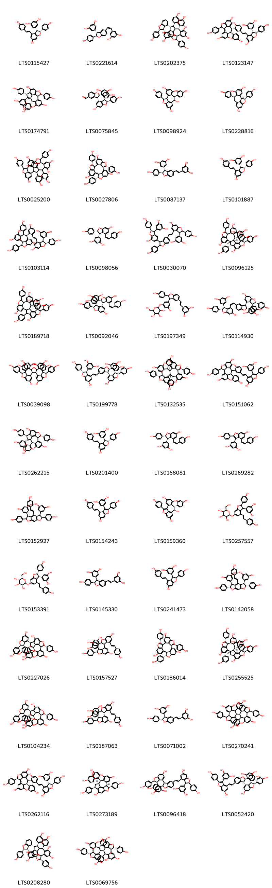{ width=100% }
    <figcaption>Hình ảnh cấu trúc hóa học của 78 hoạt chất thuộc nhóm 2-arylbenzofuran flavonoids gồm ['5-[(2r,3s)-6-hydroxy-2-(4-hydroxyphenyl)-4-[2-(4-hydroxyphenyl)ethenyl]-2,3-dihydro-1-benzofuran-3-yl]benzene-1,3-diol (LTS0115427)', '5-[(2r,3r)-5-[(1z)-2-(3,5-dihydroxyphenyl)ethenyl]-2-(4-hydroxyphenyl)-2,3-dihydro-1-benzofuran-3-yl]benzene-1,3-diol (LTS0221614)', '(2s,3s,9s,17r)-3-[(2s,3s)-3-(3,5-dihydroxyphenyl)-2-(4-hydroxyphenyl)-2,3-dihydro-1-benzofuran-4-yl]-2,9,17-tris(4-hydroxyphenyl)-8-oxapentacyclo[8.7.2.0⁴,¹⁸.0⁷,¹⁹.0¹¹,¹⁶]nonadeca-4,6,11,13,15,18-hexaene-5,13,15-triol (LTS0202375)', 'vitisin a (LTS0123147)', '(1s,2r,3r,9r,10s,17s)-2-(3,5-dihydroxyphenyl)-3,9,17-tris(4-hydroxyphenyl)-8-oxapentacyclo[8.7.2.0⁴,¹⁸.0⁷,¹⁹.0¹¹,¹⁶]nonadeca-4(18),5,7(19),11,13,15-hexaene-5,13,15-triol (LTS0174791)', 'viniferal (LTS0075845)', 'ampelopsin a (LTS0098924)', 'ampelopsin b (LTS0228816)', '3-[3-(3,5-dihydroxyphenyl)-6-hydroxy-2-(4-hydroxyphenyl)-2,3-dihydro-1-benzofuran-4-yl]-2,9,17-tris(4-hydroxyphenyl)-8-oxapentacyclo[8.7.2.0⁴,¹⁸.0⁷,¹⁹.0¹¹,¹⁶]nonadeca-4,6,11,13,15,18-hexaene-5,13,15-triol (LTS0025200)', '(2r,3s,10r,11r,18r,19s)-3,11,19-tris(4-hydroxyphenyl)-4,12,20-trioxaheptacyclo[16.6.1.1²,⁵.1¹⁰,¹³.0²¹,²⁵.0⁹,²⁷.0¹⁷,²⁶]heptacosa-1(25),5(27),6,8,13(26),14,16,21,23-nonaene-7,15,23-triol (LTS0027806)', 'delta-viniferin (LTS0087137)', '5-[(2r,3s)-6-hydroxy-2-(4-hydroxyphenyl)-4-[(1e)-2-(4-hydroxyphenyl)ethenyl]-2,3-dihydro-1-benzofuran-3-yl]benzene-1,3-diol (LTS0101887)', '(1s,9s)-9-{2-[(1e)-2-[(2s)-3-(3,5-dihydroxyphenyl)-6-hydroxy-2-(4-hydroxyphenyl)-2,3-dihydro-1-benzofuran-4-yl]ethenyl]-5-hydroxyphenyl}-8,16-bis(4-hydroxyphenyl)-15-oxatetracyclo[8.6.1.0²,⁷.0¹⁴,¹⁷]heptadeca-2,4,6,10(17),11,13-hexaene-4,6,12-triol (LTS0103114)', '(2r,3s)-cis-epsilon-viniferin (LTS0098056)', '5-[4-(2-{3-[3-(3,5-dihydroxyphenyl)-7-hydroxy-2-(4-hydroxyphenyl)-2,3-dihydro-1-benzofuran-5-yl]-2-(4-hydroxyphenyl)-2,3-dihydro-1-benzofuran-5-yl}ethenyl)-6-hydroxy-2-(4-hydroxyphenyl)-2,3-dihydro-1-benzofuran-3-yl]benzene-1,3-diol (LTS0030070)', '(2r,3s,9s,10s,13r,14s,21s,22r)-10-(3,5-dihydroxyphenyl)-3,9,14,22-tetrakis(4-hydroxyphenyl)-8,23-dioxaheptacyclo[19.6.1.0²,¹³.0⁴,¹².0⁷,¹¹.0¹⁵,²⁰.0²⁴,²⁸]octacosa-1(27),4,6,11,15,17,19,24(28),25-nonaene-5,16,18,26-tetrol (LTS0096125)', '10-(3,5-dihydroxyphenyl)-3,9,14,22-tetrakis(4-hydroxyphenyl)-8,23-dioxaheptacyclo[19.6.1.0²,¹³.0⁴,¹².0⁷,¹¹.0¹⁵,²⁰.0²⁴,²⁸]octacosa-1(27),4,6,11,15,17,19,24(28),25-nonaene-5,16,18,26-tetrol (LTS0189718)', '5-[(2r,3r)-6-hydroxy-4-[(2s,3s)-6-hydroxy-2-(4-hydroxyphenyl)-4-[(1z)-2-(4-hydroxyphenyl)ethenyl]-2,3-dihydro-1-benzofuran-3-yl]-2-(4-hydroxyphenyl)-2,3-dihydro-1-benzofuran-3-yl]benzene-1,3-diol (LTS0092046)', '2-(3-{5-[2-(3,5-dihydroxyphenyl)ethenyl]-2-(4-hydroxyphenyl)-2,3-dihydro-1-benzofuran-3-yl}-5-hydroxyphenoxy)-6-(hydroxymethyl)oxane-3,4,5-triol (LTS0197349)', '5-[(2s,3s)-4-[(2r,3r)-5-[(1z)-2-[(2s,3s)-3-(3,5-dihydroxyphenyl)-6-hydroxy-2-(4-hydroxyphenyl)-2,3-dihydro-1-benzofuran-4-yl]ethenyl]-2-(4-hydroxyphenyl)-2,3-dihydro-1-benzofuran-3-yl]-6-hydroxy-2-(4-hydroxyphenyl)-2,3-dihydro-1-benzofuran-3-yl]benzene-1,3-diol (LTS0114930)', '5-(4-{4-[3-(3,5-dihydroxyphenyl)-6-hydroxy-2-(4-hydroxyphenyl)-2,3-dihydro-1-benzofuran-4-yl]-2,5-bis(4-hydroxyphenyl)oxolan-3-yl}-6-hydroxy-2-(4-hydroxyphenyl)-2,3-dihydro-1-benzofuran-3-yl)benzene-1,3-diol (LTS0039098)', '5-[(2s,3s)-4-[(2r,3s)-5-[(1e)-2-[(2s,3s)-3-(3,5-dihydroxyphenyl)-6-hydroxy-2-(4-hydroxyphenyl)-2,3-dihydro-1-benzofuran-4-yl]ethenyl]-2-(4-hydroxyphenyl)-2,3-dihydro-1-benzofuran-3-yl]-6-hydroxy-2-(4-hydroxyphenyl)-2,3-dihydro-1-benzofuran-3-yl]benzene-1,3-diol (LTS0199778)', '(2r,3s,10r,11r,18s,19r,26s,27s)-3,11,19,27-tetrakis(4-hydroxyphenyl)-12,28-dioxaoctacyclo[24.6.1.1¹⁰,¹³.0²,¹⁸.0⁴,⁹.0²⁰,²⁵.0²⁹,³³.0¹⁷,³⁴]tetratriaconta-1(33),4,6,8,13(34),14,16,20,22,24,29,31-dodecaene-5,7,15,21,23,31-hexol (LTS0132535)', '9-(5-{2-[3-(3,5-dihydroxyphenyl)-6-hydroxy-2-(4-hydroxyphenyl)-1-benzofuran-4-yl]ethenyl}-2-hydroxyphenyl)-8,16-bis(4-hydroxyphenyl)-15-oxatetracyclo[8.6.1.0²,⁷.0¹⁴,¹⁷]heptadeca-2,4,6,10,12,14(17)-hexaene-4,6,12-triol (LTS0151062)', '(1r,2s,3s,9s,10r,17r)-2-(3,5-dihydroxyphenyl)-3,9,17-tris(4-hydroxyphenyl)-8-oxapentacyclo[8.7.2.0⁴,¹⁸.0⁷,¹⁹.0¹¹,¹⁶]nonadeca-4,6,11,13,15,18-hexaene-5,13,15-triol (LTS0262215)', 'ε-viniferin (LTS0201400)', '(2s,3r)-cis-epsilon-viniferin (LTS0168081)', '5-[6-hydroxy-2-(4-hydroxyphenyl)-4-[(1z)-2-(4-hydroxyphenyl)ethenyl]-1-benzofuran-3-yl]benzene-1,3-diol (LTS0269282)', '5-[10-(3,5-dihydroxyphenyl)-5,11-bis(4-hydroxyphenyl)-8-[2-(4-hydroxyphenyl)ethenyl]-4,12-dioxatricyclo[7.3.0.0³,⁷]dodeca-1,3(7),8-trien-6-yl]benzene-1,3-diol (LTS0152927)', '5-[6-hydroxy-2-(4-hydroxyphenyl)-4-[2-(4-hydroxyphenyl)ethenyl]-1-benzofuran-3-yl]benzene-1,3-diol (LTS0154243)', '(8s,9r)-8,16-bis(4-hydroxyphenyl)-15-oxatetracyclo[8.6.1.0²,⁷.0¹⁴,¹⁷]heptadeca-1(16),2,4,6,10(17),11,13-heptaene-4,6,9,12-tetrol (LTS0159360)', '2-{[3-(3,5-dihydroxyphenyl)-2-(4-hydroxyphenyl)-4-[2-(4-hydroxyphenyl)ethenyl]-2,3-dihydro-1-benzofuran-6-yl]oxy}-6-(hydroxymethyl)oxane-3,4,5-triol (LTS0257557)', '(2s,3r,4s,5s,6r)-2-{[(2s,3s)-3-(3,5-dihydroxyphenyl)-2-(4-hydroxyphenyl)-4-[(1e)-2-(4-hydroxyphenyl)ethenyl]-2,3-dihydro-1-benzofuran-6-yl]oxy}-6-(hydroxymethyl)oxane-3,4,5-triol (LTS0153391)', '5-[(2r,3s)-5-[(1e)-2-(3,5-dihydroxyphenyl)ethenyl]-2-(4-hydroxyphenyl)-2,3-dihydro-1-benzofuran-3-yl]benzene-1,3-diol (LTS0145330)', 'epsilon-viniferin (LTS0241473)', '5-[(5r,6r,10s,11s)-10-(3,5-dihydroxyphenyl)-5,11-bis(4-hydroxyphenyl)-8-[(1e)-2-(4-hydroxyphenyl)ethenyl]-4,12-dioxatricyclo[7.3.0.0³,⁷]dodeca-1,3(7),8-trien-6-yl]benzene-1,3-diol (LTS0142058)', '(1s,2s,3s,9s,10r,17r)-3-[(2s,3s)-3-(3,5-dihydroxyphenyl)-6-hydroxy-2-(4-hydroxyphenyl)-2,3-dihydro-1-benzofuran-4-yl]-2,9,17-tris(4-hydroxyphenyl)-8-oxapentacyclo[8.7.2.0⁴,¹⁸.0⁷,¹⁹.0¹¹,¹⁶]nonadeca-4,6,11,13,15,18-hexaene-5,13,15-triol (LTS0227026)', '5-{6-hydroxy-4-[6-hydroxy-2-(4-hydroxyphenyl)-4-[2-(4-hydroxyphenyl)ethenyl]-2,3-dihydro-1-benzofuran-3-yl]-2-(4-hydroxyphenyl)-2,3-dihydro-1-benzofuran-3-yl}benzene-1,3-diol (LTS0157527)', '(2r,3r,10r,11r,18s,19s)-3,11,19-tris(4-hydroxyphenyl)-4,12,20-trioxaheptacyclo[16.6.1.1²,⁵.1¹⁰,¹³.0²¹,²⁵.0⁹,²⁷.0¹⁷,²⁶]heptacosa-1(25),5(27),6,8,13(26),14,16,21,23-nonaene-7,15,23-triol (LTS0186014)', '(2r,3s,9s,10s,13r,14s,21s,22s)-10-(3,5-dihydroxyphenyl)-3,9,14,22-tetrakis(4-hydroxyphenyl)-8,23-dioxaheptacyclo[19.6.1.0²,¹³.0⁴,¹².0⁷,¹¹.0¹⁵,²⁰.0²⁴,²⁸]octacosa-1(27),4,6,11,15,17,19,24(28),25-nonaene-5,16,18,26-tetrol (LTS0255525)', '(1s,2s,3s,9s,10s,17r)-3-[(2s,3s)-3-(3,5-dihydroxyphenyl)-6-hydroxy-2-(4-hydroxyphenyl)-2,3-dihydro-1-benzofuran-4-yl]-2,9,17-tris(4-hydroxyphenyl)-8-oxapentacyclo[8.7.2.0⁴,¹⁸.0⁷,¹⁹.0¹¹,¹⁶]nonadeca-4,6,11,13,15,18-hexaene-5,13,15-triol (LTS0104234)', 'miyabenol c (LTS0187063)', '(2s,3s)-trans-delta-viniferin (LTS0071002)', '8,16-bis(4-hydroxyphenyl)-9-[4,6,12-trihydroxy-8,16-bis(4-hydroxyphenyl)-15-oxatetracyclo[8.6.1.0²,⁷.0¹⁴,¹⁷]heptadeca-2,4,6,10,12,14(17)-hexaen-9-yl]-15-oxatetracyclo[8.6.1.0²,⁷.0¹⁴,¹⁷]heptadeca-2,4,6,10(17),11,13-hexaene-4,6,12-triol (LTS0270241)', '(1s,8s,9s,16s)-9-{5-[(1e)-2-[(2s,3s)-3-(3,5-dihydroxyphenyl)-6-hydroxy-2-(4-hydroxyphenyl)-2,3-dihydro-1-benzofuran-4-yl]ethenyl]-2-hydroxyphenyl}-8,16-bis(4-hydroxyphenyl)-15-oxatetracyclo[8.6.1.0²,⁷.0¹⁴,¹⁷]heptadeca-2,4,6,10,12,14(17)-hexaene-4,6,12-triol (LTS0262116)', '(1s,2r,3r,9s,10s,17s)-2-(3,5-dihydroxyphenyl)-3,9,17-tris(4-hydroxyphenyl)-8-oxapentacyclo[8.7.2.0⁴,¹⁸.0⁷,¹⁹.0¹¹,¹⁶]nonadeca-4,6,11,13,15,18-hexaene-5,13,15-triol (LTS0273189)', '5-{4-[(1e)-2-{3-[3-(3,5-dihydroxyphenyl)-6-hydroxy-2-(4-hydroxyphenyl)-2,3-dihydro-1-benzofuran-4-yl]-2-(4-hydroxyphenyl)-2,3-dihydro-1-benzofuran-5-yl}ethenyl]-6-hydroxy-2-(4-hydroxyphenyl)-2,3-dihydro-1-benzofuran-3-yl}benzene-1,3-diol (LTS0096418)', '5-[(2s,3s)-4-[(2r,3r)-5-[(1e)-2-[3-(3,5-dihydroxyphenyl)-6-hydroxy-2-(4-hydroxyphenyl)-1-benzofuran-4-yl]ethenyl]-2-(4-hydroxyphenyl)-2,3-dihydro-1-benzofuran-3-yl]-6-hydroxy-2-(4-hydroxyphenyl)-2,3-dihydro-1-benzofuran-3-yl]benzene-1,3-diol (LTS0052420)', '(2s,3s,9s,17s)-3-[(2s,3s)-3-(3,5-dihydroxyphenyl)-2-(4-hydroxyphenyl)-2,3-dihydro-1-benzofuran-4-yl]-2,9,17-tris(4-hydroxyphenyl)-8-oxapentacyclo[8.7.2.0⁴,¹⁸.0⁷,¹⁹.0¹¹,¹⁶]nonadeca-4,6,11,13,15,18-hexaene-5,13,15-triol (LTS0208280)', '(1s,8r,9r,16s)-8,16-bis(4-hydroxyphenyl)-9-[(1s,8r,9r,16s)-4,6,12-trihydroxy-8,16-bis(4-hydroxyphenyl)-15-oxatetracyclo[8.6.1.0²,⁷.0¹⁴,¹⁷]heptadeca-2,4,6,10,12,14(17)-hexaen-9-yl]-15-oxatetracyclo[8.6.1.0²,⁷.0¹⁴,¹⁷]heptadeca-2,4,6,10(17),11,13-hexaene-4,6,12-triol (LTS0069756)', '2-(3,5-dihydroxyphenyl)-3,9,17-tris(4-hydroxyphenyl)-8-oxapentacyclo[8.7.2.0⁴,¹⁸.0⁷,¹⁹.0¹¹,¹⁶]nonadeca-4,6,11,13,15,18-hexaene-5,13,15-triol (LTS0071596)', 'ampelopsin a (LTS0213728)', '5-[(2s,3s)-4-[(1e)-2-[(2r,3s)-3-[(2s,3s)-3-(3,5-dihydroxyphenyl)-7-hydroxy-2-(4-hydroxyphenyl)-2,3-dihydro-1-benzofuran-5-yl]-2-(4-hydroxyphenyl)-2,3-dihydro-1-benzofuran-5-yl]ethenyl]-6-hydroxy-2-(4-hydroxyphenyl)-2,3-dihydro-1-benzofuran-3-yl]benzene-1,3-diol (LTS0160529)', '(8s,9r,16s)-8,16-bis(4-hydroxyphenyl)-9-[(8s,9r,16s)-4,6,12-trihydroxy-8,16-bis(4-hydroxyphenyl)-15-oxatetracyclo[8.6.1.0²,⁷.0¹⁴,¹⁷]heptadeca-2,4,6,10,12,14(17)-hexaen-9-yl]-15-oxatetracyclo[8.6.1.0²,⁷.0¹⁴,¹⁷]heptadeca-2,4,6,10(17),11,13-hexaene-4,6,12-triol (LTS0159069)', '5-[(5r,6r,10s,11s)-10-(3,5-dihydroxyphenyl)-5,11-bis(4-hydroxyphenyl)-8-[(1z)-2-(4-hydroxyphenyl)ethenyl]-4,12-dioxatricyclo[7.3.0.0³,⁷]dodeca-1,3(7),8-trien-6-yl]benzene-1,3-diol (LTS0170459)', '5-[(2s,3s)-4-[(2r,3s,4s,5s)-4-[(2s,3s)-3-(3,5-dihydroxyphenyl)-6-hydroxy-2-(4-hydroxyphenyl)-2,3-dihydro-1-benzofuran-4-yl]-2,5-bis(4-hydroxyphenyl)oxolan-3-yl]-6-hydroxy-2-(4-hydroxyphenyl)-2,3-dihydro-1-benzofuran-3-yl]benzene-1,3-diol (LTS0240302)', '(2s,3r,4s,5s,6r)-2-{3-[(2s,3s)-5-[(1e)-2-(3,5-dihydroxyphenyl)ethenyl]-2-(4-hydroxyphenyl)-2,3-dihydro-1-benzofuran-3-yl]-5-hydroxyphenoxy}-6-(hydroxymethyl)oxane-3,4,5-triol (LTS0008152)', '4,15-bis(3,5-dihydroxyphenyl)-5,11,16,22-tetrakis(4-hydroxyphenyl)-6,17-dioxahexacyclo[10.10.0.0²,¹⁰.0³,⁷.0¹³,²¹.0¹⁴,¹⁸]docosa-2,7,9,13,18,20-hexaene-9,20-diol (LTS0240984)', '5-[(2r,3r)-4-[(2r,3r)-5-[(1e)-2-[(2s,3s)-3-(3,5-dihydroxyphenyl)-6-hydroxy-2-(4-hydroxyphenyl)-2,3-dihydro-1-benzofuran-4-yl]ethenyl]-2-(4-hydroxyphenyl)-2,3-dihydro-1-benzofuran-3-yl]-6-hydroxy-2-(4-hydroxyphenyl)-2,3-dihydro-1-benzofuran-3-yl]benzene-1,3-diol (LTS0025263)', 'vitisin b (LTS0256771)', '9-(5-{2-[3-(3,5-dihydroxyphenyl)-6-hydroxy-2-(4-hydroxyphenyl)-2,3-dihydro-1-benzofuran-4-yl]ethenyl}-2-hydroxyphenyl)-8,16-bis(4-hydroxyphenyl)-15-oxatetracyclo[8.6.1.0²,⁷.0¹⁴,¹⁷]heptadeca-2,4,6,10,12,14(17)-hexaene-4,6,12-triol (LTS0198332)', '3,11,19-tris(4-hydroxyphenyl)-4,12,20-trioxaheptacyclo[16.6.1.1²,⁵.1¹⁰,¹³.0²¹,²⁵.0⁹,²⁷.0¹⁷,²⁶]heptacosa-1(25),5(27),6,8,13(26),14,16,21,23-nonaene-7,15,23-triol (LTS0255856)', 'viniferal (LTS0243308)', '5-[4-(5-{2-[3-(3,5-dihydroxyphenyl)-6-hydroxy-2-(4-hydroxyphenyl)-1-benzofuran-4-yl]ethenyl}-2-(4-hydroxyphenyl)-2,3-dihydro-1-benzofuran-3-yl)-6-hydroxy-2-(4-hydroxyphenyl)-2,3-dihydro-1-benzofuran-3-yl]benzene-1,3-diol (LTS0242306)', 'gnetin h (LTS0015265)', '(+)-ε-viniferin (LTS0061551)', '(1r,8s,9r,16r)-8,16-bis(4-hydroxyphenyl)-9-[(1r,8s,9r,16r)-4,6,12-trihydroxy-8,16-bis(4-hydroxyphenyl)-15-oxatetracyclo[8.6.1.0²,⁷.0¹⁴,¹⁷]heptadeca-2,4,6,10,12,14(17)-hexaen-9-yl]-15-oxatetracyclo[8.6.1.0²,⁷.0¹⁴,¹⁷]heptadeca-2,4,6,10,12,14(17)-hexaene-4,6,12-triol (LTS0049547)', '5-{5-[2-(3,5-dihydroxyphenyl)ethenyl]-2-(4-hydroxyphenyl)-2,3-dihydro-1-benzofuran-3-yl}benzene-1,3-diol (LTS0275722)', '(2s,3r,4s,5s,6r)-2-{3-[(1e)-2-[(2s,3s)-3-(3,5-dihydroxyphenyl)-2-(4-hydroxyphenyl)-2,3-dihydro-1-benzofuran-5-yl]ethenyl]-5-hydroxyphenoxy}-6-(hydroxymethyl)oxane-3,4,5-triol (LTS0021502)', '5-[6-hydroxy-2-(4-hydroxyphenyl)-4-[(1e)-2-(4-hydroxyphenyl)ethenyl]-1-benzofuran-3-yl]benzene-1,3-diol (LTS0013539)', '5-{5-[(1e)-2-(3,5-dihydroxyphenyl)ethenyl]-2-(4-hydroxyphenyl)-2,3-dihydro-1-benzofuran-3-yl}benzene-1,3-diol (LTS0001309)', 'vitisin c (LTS0004752)', '(2r)-3-[(2s,3s)-3-(3,5-dihydroxyphenyl)-6-hydroxy-2-(4-hydroxyphenyl)-2,3-dihydro-1-benzofuran-4-yl]-2-(4-hydroxyphenyl)-2,3-dihydro-1-benzofuran-5-carbaldehyde (LTS0057501)', '(1s,8s,9r,16s)-9-{5-[(1e)-2-[3-(3,5-dihydroxyphenyl)-6-hydroxy-2-(4-hydroxyphenyl)-1-benzofuran-4-yl]ethenyl]-2-hydroxyphenyl}-8,16-bis(4-hydroxyphenyl)-15-oxatetracyclo[8.6.1.0²,⁷.0¹⁴,¹⁷]heptadeca-2,4,6,10,12,14(17)-hexaene-4,6,12-triol (LTS0000520)', '(1s,2s,3s,9s,10s,17s)-3-[(2s,3s)-3-(3,5-dihydroxyphenyl)-6-hydroxy-2-(4-hydroxyphenyl)-2,3-dihydro-1-benzofuran-4-yl]-2,9,17-tris(4-hydroxyphenyl)-8-oxapentacyclo[8.7.2.0⁴,¹⁸.0⁷,¹⁹.0¹¹,¹⁶]nonadeca-4,6,11,13,15,18-hexaene-5,13,15-triol (LTS0013687)', '2-(3-{2-[3-(3,5-dihydroxyphenyl)-2-(4-hydroxyphenyl)-2,3-dihydro-1-benzofuran-5-yl]ethenyl}-5-hydroxyphenoxy)-6-(hydroxymethyl)oxane-3,4,5-triol (LTS0027644)', '3,11,19,27-tetrakis(4-hydroxyphenyl)-12,28-dioxaoctacyclo[24.6.1.1¹⁰,¹³.0²,¹⁸.0⁴,⁹.0²⁰,²⁵.0²⁹,³³.0¹⁷,³⁴]tetratriaconta-1(33),4,6,8,13(34),14,16,20,22,24,29,31-dodecaene-5,7,15,21,23,31-hexol (LTS0038617)', '(1r,4s,5s,11r,12r,15s,16s,22r)-4,15-bis(3,5-dihydroxyphenyl)-5,11,16,22-tetrakis(4-hydroxyphenyl)-6,17-dioxahexacyclo[10.10.0.0²,¹⁰.0³,⁷.0¹³,²¹.0¹⁴,¹⁸]docosa-2,7,9,13,18,20-hexaene-9,20-diol (LTS0116439)'].</figcaption>
</figure>
#### Nhóm 3_4-dihydrocoumarins
<figure markdown="span">
    { width=100% }
    <figcaption>Hình ảnh cấu trúc hóa học của Không tìm thấy chú thích hoạt chất thuộc nhóm 3_4-dihydrocoumarins gồm Không tìm thấy chú thích.</figcaption>
</figure>
#### Nhóm Anthracenes
<figure markdown="span">
    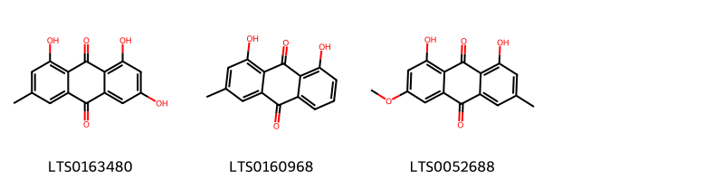{ width=100% }
    <figcaption>Hình ảnh cấu trúc hóa học của 3 hoạt chất thuộc nhóm Anthracenes gồm ['emodin (LTS0163480)', 'turkey rhubarb (LTS0160968)', 'physcion (LTS0052688)'].</figcaption>
</figure>
#### Nhóm Aryltetralin lignans
<figure markdown="span">
    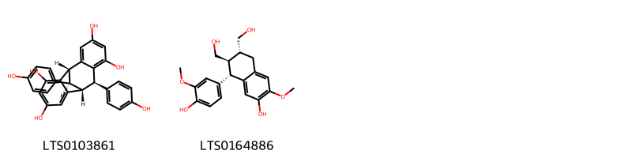{ width=100% }
    <figcaption>Hình ảnh cấu trúc hóa học của 2 hoạt chất thuộc nhóm Aryltetralin lignans gồm ['(1s,8r,9r,16r)-8,16-bis(4-hydroxyphenyl)tetracyclo[7.6.1.0²,⁷.0¹⁰,¹⁵]hexadeca-2,4,6,10,12,14-hexaene-4,6,12,14-tetrol (LTS0103861)', '(+)-isolariciresinol (LTS0164886)'].</figcaption>
</figure>
#### Nhóm Benzene and substituted derivatives
<figure markdown="span">
    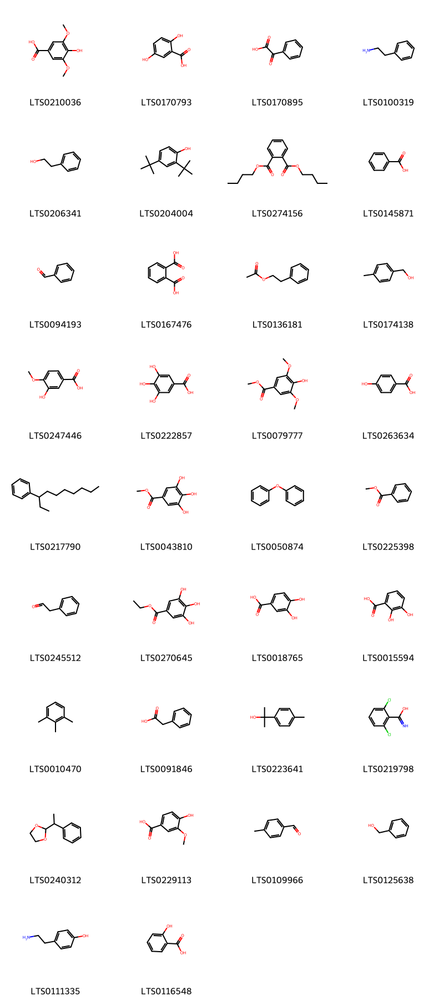{ width=100% }
    <figcaption>Hình ảnh cấu trúc hóa học của 34 hoạt chất thuộc nhóm Benzene and substituted derivatives gồm ['syringic acid (LTS0210036)', '2,5-dihydroxybenzoic acid (LTS0170793)', 'benzoylformic acid (LTS0170895)', '2-phenylethylamine (LTS0100319)', '2-phenyl-ethanol (LTS0206341)', '2,4-di-t-butylphenol (LTS0204004)', 'dibutyl-phthalate (LTS0274156)', 'benzoic acid (LTS0145871)', 'benzaldehyde (LTS0094193)', 'phthalic acid (LTS0167476)', 'phenethyl acetate (LTS0136181)', '4-methylbenzyl alcohol (LTS0174138)', 'isovanillic acid (LTS0247446)', 'galop (LTS0222857)', 'syringate (LTS0079777)', 'p-hydroxybenzoic acid (LTS0263634)', '3-phenyldecane (LTS0217790)', 'methyl gallate (LTS0043810)', 'diphenyl-ether (LTS0050874)', 'methyl benzoate (LTS0225398)', 'phenylacetaldehyde (LTS0245512)', 'ethyl gallate (LTS0270645)', '3,4-dihydroxybenzoic acid (LTS0018765)', '2,3-dihydroxy-benzoic acid (LTS0015594)', '1,2,3-trimethylbenzene (LTS0010470)', 'ω-phenylacetic acid (LTS0091846)', 'p-cymen-8-ol (LTS0223641)', 'c7h5cl2no (LTS0219798)', 'acetophenone ethyleneglycol cyclic acetal (LTS0240312)', 'vanillic acid (LTS0229113)', 'p-tolualdehyde (LTS0109966)', 'benzyl alcohol (LTS0125638)', 'tyramine (LTS0111335)', 'salicyclic acid (LTS0116548)'].</figcaption>
</figure>
#### Nhóm Benzofurans
<figure markdown="span">
    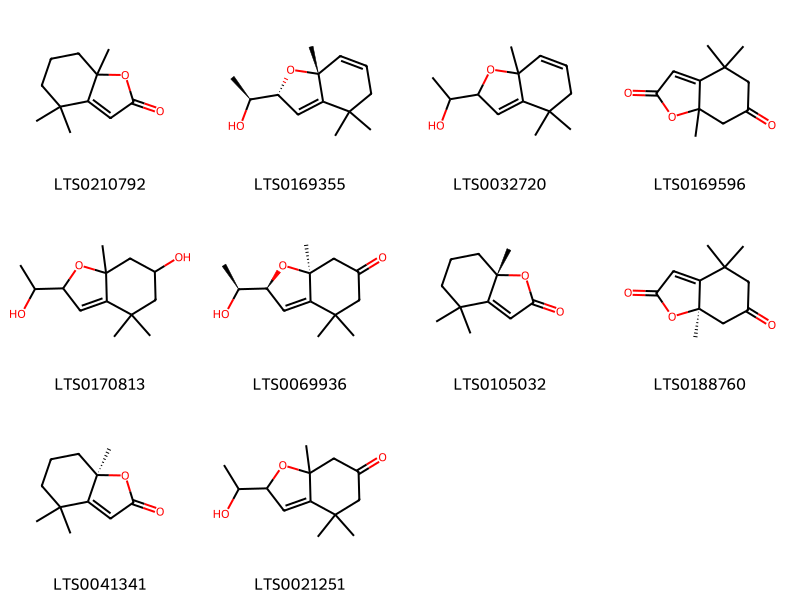{ width=100% }
    <figcaption>Hình ảnh cấu trúc hóa học của 10 hoạt chất thuộc nhóm Benzofurans gồm ['(+/-)-dihydroactinidiolide (LTS0210792)', '(1s)-1-[(2r,7ar)-4,4,7a-trimethyl-2,5-dihydro-1-benzofuran-2-yl]ethanol (LTS0169355)', '1-(4,4,7a-trimethyl-2,5-dihydro-1-benzofuran-2-yl)ethanol (LTS0032720)', '4,4,7a-trimethyl-5,7-dihydro-1-benzofuran-2,6-dione (LTS0169596)', '2-(1-hydroxyethyl)-4,4,7a-trimethyl-2,5,6,7-tetrahydro-1-benzofuran-6-ol (LTS0170813)', '(2s,7as)-2-[(1s)-1-hydroxyethyl]-4,4,7a-trimethyl-5,7-dihydro-2h-1-benzofuran-6-one (LTS0069936)', '(+)-dihydroactinidiolide (LTS0105032)', '(7ar)-4,4,7a-trimethyl-5,7-dihydro-1-benzofuran-2,6-dione (LTS0188760)', 'dihydroactinidiolide (LTS0041341)', '2-(1-hydroxyethyl)-4,4,7a-trimethyl-5,7-dihydro-2h-1-benzofuran-6-one (LTS0021251)'].</figcaption>
</figure>
#### Nhóm Benzothiazoles
<figure markdown="span">
    { width=100% }
    <figcaption>Hình ảnh cấu trúc hóa học của 1 hoạt chất thuộc nhóm Benzothiazoles gồm ['benzothiazole (LTS0073984)'].</figcaption>
</figure>
#### Nhóm Carboximidic acids and derivatives
<figure markdown="span">
    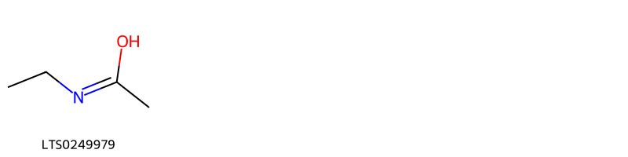{ width=100% }
    <figcaption>Hình ảnh cấu trúc hóa học của 1 hoạt chất thuộc nhóm Carboximidic acids and derivatives gồm ['n-ethylethanimidic acid (LTS0249979)'].</figcaption>
</figure>
#### Nhóm Carboxylic acids and derivatives
<figure markdown="span">
    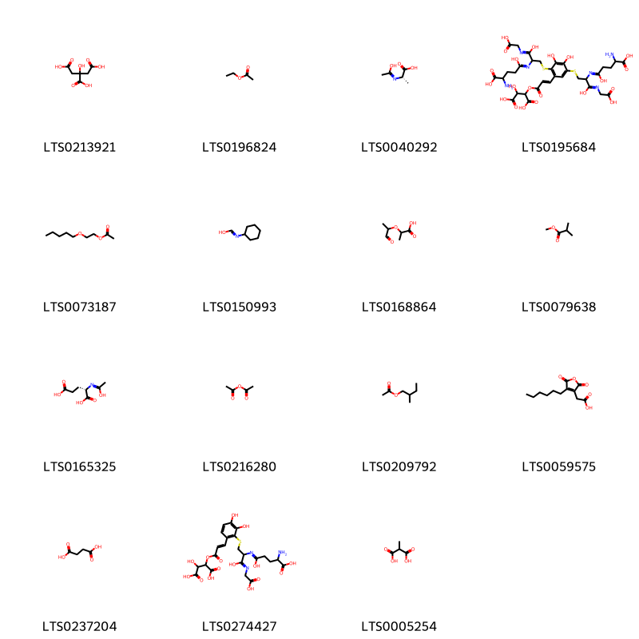{ width=100% }
    <figcaption>Hình ảnh cấu trúc hóa học của 15 hoạt chất thuộc nhóm Carboxylic acids and derivatives gồm ['citric acid (LTS0213921)', 'ethyl acetate (LTS0196824)', '(2s)-2-[(1-hydroxyethylidene)amino]propanoic acid (LTS0040292)', '2-{[(2e)-3-[2,5-bis({2-[(4-amino-4-carboxy-1-hydroxybutylidene)amino]-2-(carboxymethyl-c-hydroxycarbonimidoyl)ethyl}sulfanyl)-3,4-dihydroxyphenyl]prop-2-enoyl]oxy}-3-hydroxybutanedioic acid (LTS0195684)', '2-(pentyloxy)ethyl acetate (LTS0073187)', 'n-cyclohexylcarboximidic acid (LTS0150993)', '2-(carboxyethoxy)propanal (LTS0168864)', 'methyl isobutyrate (LTS0079638)', '(2s)-2-[(1-hydroxyethylidene)amino]pentanedioic acid (LTS0165325)', 'acetic anhydride (LTS0216280)', 'β-methylbutyl acetate (LTS0209792)', '(4-hexyl-2,5-dioxofuran-3-yl)acetic acid (LTS0059575)', 'succinic acid (LTS0237204)', '2-{[(2e)-3-[2-({2-[(4-amino-4-carboxy-1-hydroxybutylidene)amino]-2-(carboxymethyl-c-hydroxycarbonimidoyl)ethyl}sulfanyl)-3,4-dihydroxyphenyl]prop-2-enoyl]oxy}-3-hydroxybutanedioic acid (LTS0274427)', 'methylmalonic acid (LTS0005254)'].</figcaption>
</figure>
#### Nhóm Cinnamic acids and derivatives
<figure markdown="span">
    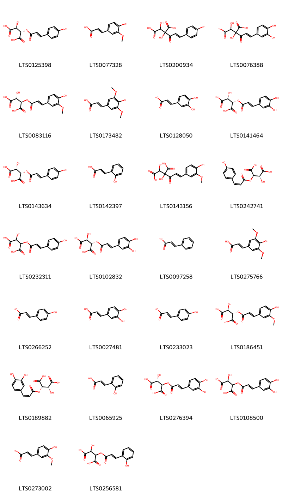{ width=100% }
    <figcaption>Hình ảnh cấu trúc hóa học của 26 hoạt chất thuộc nhóm Cinnamic acids and derivatives gồm ['(2s,3s)-2-hydroxy-3-{[(2e)-3-(4-hydroxyphenyl)prop-2-enoyl]oxy}butanedioic acid (LTS0125398)', 'ferulic acid (LTS0077328)', '2,3-dihydroxy-2-[(2e)-3-(4-hydroxyphenyl)prop-2-enoyl]butanedioic acid (LTS0200934)', '2-[(2e)-3-(3,4-dihydroxyphenyl)prop-2-enoyl]-2,3-dihydroxybutanedioic acid (LTS0076388)', '(2r,3r)-trans-fertaric acid (LTS0083116)', 'sinapinate (LTS0173482)', '3,4-dihydroxycinnamic acid (LTS0128050)', '(2s,3r)-trans-caftaric acid (LTS0141464)', '(2r,3s)-trans-coutaric acid (LTS0143634)', 'trans-2-hydroxycinnamic acid (LTS0142397)', '2,3-dihydroxy-2-[(2e)-3-(4-hydroxy-3-methoxyphenyl)prop-2-enoyl]butanedioic acid (LTS0143156)', '(2r,3r)-2-hydroxy-3-{[(2z)-3-(4-hydroxyphenyl)prop-2-enoyl]oxy}butanedioic acid (LTS0242741)', 'p-coutaric acid (LTS0232311)', '(2s,3s)-2-{[(2e)-3-(3,4-dihydroxyphenyl)prop-2-enoyl]oxy}-3-hydroxybutanedioic acid (LTS0102832)', 'phenylacrylic acid (LTS0097258)', 'sinapoyl alcohol (LTS0275766)', 'para-coumaric acid (LTS0266252)', 'caffeic acid (LTS0027481)', 'hydroxycinnamic acid (LTS0233023)', '(2s,3s)-trans-fertaric acid (LTS0186451)', '(2s,3r)-cis-caftaric acid (LTS0189882)', 'o-coumaric acid (LTS0065925)', 'caftaric acid (LTS0276394)', '2-{[3-(3,4-dihydroxyphenyl)prop-2-enoyl]oxy}-3-hydroxybutanedioic acid (LTS0108500)', 'ferulic acid (LTS0273002)', '2-hydroxy-3-{[(2e)-3-(2-hydroxyphenyl)prop-2-enoyl]oxy}butanedioic acid (LTS0256581)'].</figcaption>
</figure>
#### Nhóm Coumarans
<figure markdown="span">
    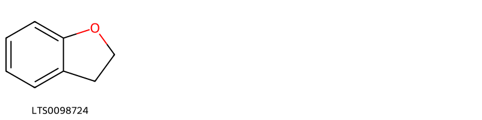{ width=100% }
    <figcaption>Hình ảnh cấu trúc hóa học của 1 hoạt chất thuộc nhóm Coumarans gồm ['coumaran (LTS0098724)'].</figcaption>
</figure>
#### Nhóm Coumarins and derivatives
<figure markdown="span">
    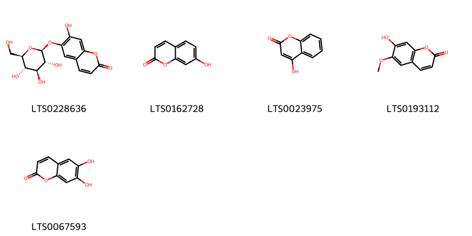{ width=100% }
    <figcaption>Hình ảnh cấu trúc hóa học của 5 hoạt chất thuộc nhóm Coumarins and derivatives gồm ['esculin (LTS0228636)', 'umbelliferone (LTS0162728)', '4-hydroxycoumarin (LTS0023975)', 'scopoletin (LTS0193112)', 'esculetin (LTS0067593)'].</figcaption>
</figure>
#### Nhóm Diazines
<figure markdown="span">
    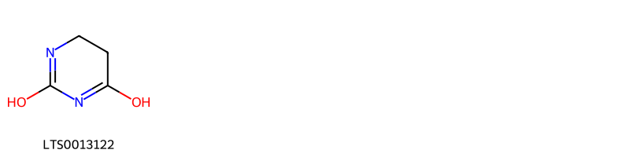{ width=100% }
    <figcaption>Hình ảnh cấu trúc hóa học của 1 hoạt chất thuộc nhóm Diazines gồm ['hydrouracil (LTS0013122)'].</figcaption>
</figure>
#### Nhóm Dibenzylbutane lignans
<figure markdown="span">
    { width=100% }
    <figcaption>Hình ảnh cấu trúc hóa học của 2 hoạt chất thuộc nhóm Dibenzylbutane lignans gồm ['(2s,3r)-2,3-bis[(4-hydroxy-3-methoxyphenyl)(¹³c)methyl](1-¹³c)butane-1,4-diol (LTS0268699)', 'secoisolariciresinol (LTS0086727)'].</figcaption>
</figure>
#### Nhóm Dioxolanes
<figure markdown="span">
    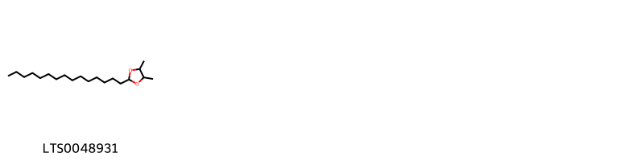{ width=100% }
    <figcaption>Hình ảnh cấu trúc hóa học của 1 hoạt chất thuộc nhóm Dioxolanes gồm ['4,5-dimethyl-2-pentadecyl-1,3-dioxolane (LTS0048931)'].</figcaption>
</figure>
#### Nhóm Epoxides
<figure markdown="span">
    { width=100% }
    <figcaption>Hình ảnh cấu trúc hóa học của 1 hoạt chất thuộc nhóm Epoxides gồm ['[3-methyl-3-(4-methylpent-3-en-1-yl)oxiran-2-yl]methanol (LTS0182704)'].</figcaption>
</figure>
#### Nhóm Fatty Acyls
<figure markdown="span">
    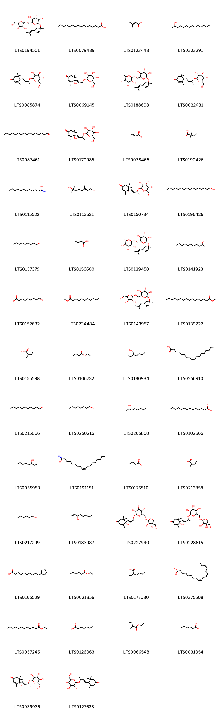{ width=100% }
    <figcaption>Hình ảnh cấu trúc hóa học của 65 hoạt chất thuộc nhóm Fatty Acyls gồm ['(2r,3s,4s,5r,6s)-2-({[(2r,3r,4r,5s)-3,4-dihydroxy-5-(hydroxymethyl)oxolan-2-yl]oxy}methyl)-6-{[(3s)-3,7-dimethylocta-1,6-dien-3-yl]oxy}oxane-3,4,5-triol (LTS0194501)', 'palmitic acid (LTS0079439)', 'β,β-dimethacrylate (LTS0123448)', '2-tetradecanol (LTS0223291)', '3,5,5-trimethyl-4-(3-{[3,4,5-trihydroxy-6-(hydroxymethyl)oxan-2-yl]oxy}butyl)cyclohex-2-en-1-one (LTS0085874)', '(4s)-4-hydroxy-3,5,5-trimethyl-4-[(1e,3r)-3-{[(2r,3r,4s,5s,6r)-3,4,5-trihydroxy-6-(hydroxymethyl)oxan-2-yl]oxy}but-1-en-1-yl]cyclohex-2-en-1-one (LTS0069145)', '2-[(3,7-dimethylocta-1,6-dien-3-yl)oxy]-6-{[(3,4,5-trihydroxy-6-methyloxan-2-yl)oxy]methyl}oxane-3,4,5-triol (LTS0188608)', 'byzantionoside b (LTS0022431)', 'hexadecanal (LTS0087461)', '4-hydroxy-3,5,5-trimethyl-4-(3-{[3,4,5-trihydroxy-6-(hydroxymethyl)oxan-2-yl]oxy}but-1-en-1-yl)cyclohex-2-en-1-one (LTS0170985)', '2-butenoic acid (LTS0038466)', '2,2-dimethyl butyric acid (LTS0190426)', 'dodecanamide (LTS0115522)', '(2e)-3,7-dimethyloct-2-ene-1,7-diol (LTS0112621)', '4-hydroxy-3,5,5-trimethyl-4-[(1e,3r)-3-{[(2r,3r,4s,5s,6r)-3,4,5-trihydroxy-6-(hydroxymethyl)oxan-2-yl]oxy}but-1-en-1-yl]cyclohex-2-en-1-one (LTS0150734)', 'cetyl alcohol (LTS0196426)', 'nonan-1-ol (LTS0157379)', 'isovaleric acid (LTS0156600)', '(2s,3r,4s,5s,6r)-2-{[(3r)-3,7-dimethylocta-1,6-dien-3-yl]oxy}-6-({[(2r,3r,4r,5r,6s)-3,4,5-trihydroxy-6-methyloxan-2-yl]oxy}methyl)oxane-3,4,5-triol (LTS0129458)', '2-undecanol (LTS0141928)', '9-oxononanoic acid (LTS0152632)', 'methyl undecanoate (LTS0234484)', '2-({[3,4-dihydroxy-5-(hydroxymethyl)oxolan-2-yl]oxy}methyl)-6-[(3,7-dimethylocta-1,6-dien-3-yl)oxy]oxane-3,4,5-triol (LTS0143957)', 'methyl palmitate (LTS0139222)', '2-methyl-2-butenoic acid (LTS0155598)', 'ethyl butyrate (LTS0106732)', '2-ethylhexanol (LTS0180984)', 'oleic acid (LTS0256910)', 'undecanol (LTS0215066)', 'octanol (LTS0250216)', '2-octanol (LTS0265860)', 'myristic acid (LTS0102566)', '3-octanol (LTS0055953)', '(9z)-octadec-9-enimidic acid (LTS0191151)', 'butanoic acid (LTS0175510)', '2-methylbutanoic acid (LTS0213858)', 'hexanol (LTS0217299)', '1-octen-3-ol (LTS0183987)', '(4s)-4-[(1e,3r)-3-{[(2r,3r,4s,5s,6r)-6-({[(2r,3r,4r)-3,4-dihydroxy-4-(hydroxymethyl)oxolan-2-yl]oxy}methyl)-3,4,5-trihydroxyoxan-2-yl]oxy}but-1-en-1-yl]-4-hydroxy-3,5,5-trimethylcyclohex-2-en-1-one (LTS0227940)', '4-(3-{[6-({[3,4-dihydroxy-4-(hydroxymethyl)oxolan-2-yl]oxy}methyl)-3,4,5-trihydroxyoxan-2-yl]oxy}but-1-en-1-yl)-4-hydroxy-3,5,5-trimethylcyclohex-2-en-1-one (LTS0228615)', '11-cyclopentylundecanoic acid (LTS0165529)', 'ethyl hexanoate (LTS0021856)', '2-ethylhexanoic acid (LTS0177080)', 'α-linolenic acid (LTS0275508)', 'ethyl laurate (LTS0057246)', 'heptanoic acid (LTS0126063)', 'ethyl 2-methylbutyrate (LTS0066548)', 'hexanoic acid (LTS0031054)', '(4r)-4-hydroxy-3,5,5-trimethyl-4-[(1e,3r)-3-{[(2s,3s,4r,5r,6s)-3,4,5-trihydroxy-6-(hydroxymethyl)oxan-2-yl]oxy}but-1-en-1-yl]cyclohex-2-en-1-one (LTS0039936)', '3,3,5-trimethyl-4-(3-{[3,4,5-trihydroxy-6-(hydroxymethyl)oxan-2-yl]oxy}but-1-en-1-yl)cyclohexan-1-one (LTS0127638)', 'azelaic acid (LTS0002810)', 'n-valeric acid (LTS0025746)', 'butyloctanol (LTS0066074)', 'β-propyl acrylic acid (LTS0057174)', 'lauric acid (LTS0051907)', 'linoleic (LTS0013198)', 'isotridecanol (LTS0027553)', '(4s,5s)-3,3,5-trimethyl-4-[(1e,3s)-3-{[(2r,3r,4s,5s,6r)-3,4,5-trihydroxy-6-(hydroxymethyl)oxan-2-yl]oxy}but-1-en-1-yl]cyclohexan-1-one (LTS0118842)', 'tridecanol (LTS0234524)', 'caprylic acid (LTS0254176)', 'trans-3-hexenoic acid (LTS0236421)', 'octyl formate (LTS0110586)', 'stearic acid (LTS0237766)', '(2r,3s,4s,5r,6s)-2-({[(2r,3r,4r)-3,4-dihydroxy-4-(hydroxymethyl)oxolan-2-yl]oxy}methyl)-6-{[(6e)-3,7-dimethyloctadeca-1,6-dien-3-yl]oxy}oxane-3,4,5-triol (LTS0018213)', 'capric acid (LTS0039856)'].</figcaption>
</figure>
#### Nhóm Flavonoids
<figure markdown="span">
    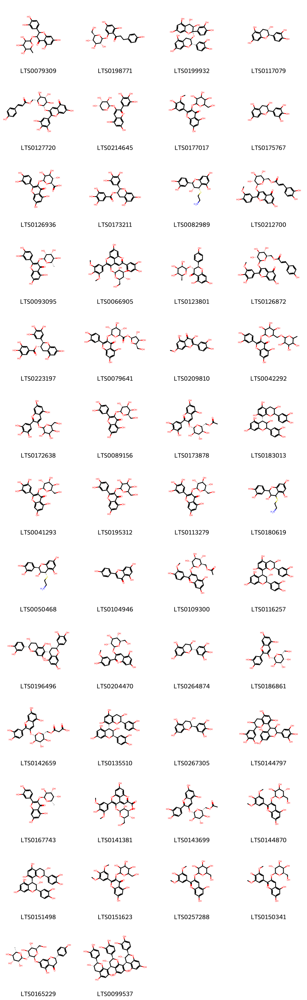{ width=100% }
    <figcaption>Hình ảnh cấu trúc hóa học của 131 hoạt chất thuộc nhóm Flavonoids gồm ['astilbin (LTS0079309)', 'phlorizin (LTS0198771)', '(2r,3r,4s)-2-(3,4-dihydroxyphenyl)-2-{[(2s,3r)-2-(3,4-dihydroxyphenyl)-5,7-dihydroxy-3,4-dihydro-2h-1-benzopyran-3-yl]oxy}-3,4-dihydro-1-benzopyran-3,4,5,7-tetrol (LTS0199932)', '(+)-catechol (LTS0117079)', '[(2r,3s,4s,5r,6s)-3,4,5-trihydroxy-6-{[7-hydroxy-5-oxo-2-(3,4,5-trihydroxyphenyl)chromen-3-yl]oxy}oxan-2-yl]methyl 3-(4-hydroxyphenyl)prop-2-enoate (LTS0127720)', '5,7-dihydroxy-3-{[(2r,3r,4s,5s)-3,4,5-trihydroxyoxan-2-yl]oxy}-2-(3,4,5-trihydroxyphenyl)-1λ⁴-chromen-1-ylium (LTS0214645)', '2-(3,4-dihydroxy-5-methoxyphenyl)-5,7-dihydroxy-3-{[3,4,5-trihydroxy-6-(hydroxymethyl)oxan-2-yl]oxy}chromen-4-one (LTS0177017)', 'epigallocatechin (LTS0175767)', 'miquelianin (LTS0126936)', '(-)-epigallocatechin gallate (LTS0173211)', '(2r,3r,4s)-4-[(2-aminoethyl)sulfanyl]-2-(3,4-dihydroxyphenyl)-3,4-dihydro-2h-1-benzopyran-3,5,7-triol (LTS0082989)', '[(2r,3s,4s,5r,6s)-3,4,5-trihydroxy-6-{[7-hydroxy-2-(4-hydroxy-3-methoxyphenyl)-5-oxochromen-3-yl]oxy}oxan-2-yl]methyl 3-(3,4-dihydroxyphenyl)prop-2-enoate (LTS0212700)', 'quercitrin (LTS0093095)', 'pinotin a (LTS0066905)', '(2r,3r)-5,7-dihydroxy-2-(4-hydroxyphenyl)-3-{[(2r,3r,4r,5s,6s)-3,4,5-trihydroxy-6-methyloxan-2-yl]oxy}-2,3-dihydro-1-benzopyran-4-one (LTS0123801)', '[(2r,3s,4s,5r)-6-{[2-(3,4-dihydroxy-5-methoxyphenyl)-7-hydroxy-5-oxochromen-3-yl]oxy}-3,4,5-trihydroxyoxan-2-yl]methyl 3-(4-hydroxyphenyl)prop-2-enoate (LTS0126872)', 'gallocatechin 3-o-gallate (LTS0223197)', '(2s,3r,4r,5r)-3,4-dihydroxy-5-(hydroxymethyl)oxolan-2-yl (2s,3s,4s,5r,6s)-6-{[2-(3,4-dihydroxyphenyl)-5,7-dihydroxy-4-oxochromen-3-yl]oxy}-3,4,5-trihydroxyoxane-2-carboxylate (LTS0079641)', 'rhamnetin (LTS0209810)', 'rutin (LTS0042292)', '5,7-dihydroxy-3-{[3,4,5-trihydroxy-6-(hydroxymethyl)oxan-2-yl]oxy}-2-(3,4,5-trihydroxyphenyl)-1λ⁴-chromen-1-ylium (LTS0172638)', 'hyperoside (LTS0089156)', '3-{[(2s,3r,4s,5s,6r)-6-[(acetyloxy)methyl]-3,4,5-trihydroxyoxan-2-yl]oxy}-5,7-dihydroxy-2-(3,4,5-trihydroxyphenyl)-1λ⁴-chromen-1-ylium (LTS0173878)', '(4r)-2-(3,4-dihydroxyphenyl)-4-[2-(3,4-dihydroxyphenyl)-3,5,7-trihydroxy-3,4-dihydro-2h-1-benzopyran-8-yl]-3,4-dihydro-2h-1-benzopyran-3,5,7-triol (LTS0183013)', '5,7-dihydroxy-3-{[(2s,3r,4s,5r,6r)-3,4,5-trihydroxy-6-(hydroxymethyl)oxan-2-yl]oxy}-2-(3,4,5-trihydroxyphenyl)chromen-4-one (LTS0041293)', '2-(3,4-dihydroxyphenyl)-5,7-dihydroxy-3-{[3,4,5-trihydroxy-6-(hydroxymethyl)oxan-2-yl]oxy}chromen-4-one (LTS0195312)', '5,7-dihydroxy-3-{[(2s,3r,4s,5s,6r)-3,4,5-trihydroxy-6-(hydroxymethyl)oxan-2-yl]oxy}-2-(3,4,5-trihydroxyphenyl)chromen-4-one (LTS0113279)', '4-[(2-aminoethyl)sulfanyl]-2-(3,4-dihydroxyphenyl)-3,4-dihydro-2h-1-benzopyran-3,5,7-triol (LTS0180619)', '(2r,3s,4s)-4-[(2-aminoethyl)sulfanyl]-2-(3,4-dihydroxyphenyl)-3,4-dihydro-2h-1-benzopyran-3,5,7-triol (LTS0050468)', 'chamomile (LTS0104946)', '3-{[(2s,3r,4s,5s,6r)-6-[(acetyloxy)methyl]-3,4,5-trihydroxyoxan-2-yl]oxy}-5,7-dihydroxy-2-(4-hydroxy-3-methoxyphenyl)-1λ⁴-chromen-1-ylium (LTS0109300)', '(2r,3s,4s)-2-(3,4-dihydroxyphenyl)-4-[(2r,3r)-2-(3,4-dihydroxyphenyl)-3,5,7-trihydroxy-3,4-dihydro-2h-1-benzopyran-8-yl]-3,4-dihydro-2h-1-benzopyran-3,5,7-triol (LTS0116257)', '(2r,3s,4s)-2-(3,4-dihydroxyphenyl)-4-[(2r,3r)-2-(3,4-dihydroxyphenyl)-3,5,7-trihydroxy-3,4-dihydro-2h-1-benzopyran-6-yl]-3,4-dihydro-2h-1-benzopyran-3,5,7-triol (LTS0196496)', 'peonidin-3-glucoside (LTS0204470)', '(-)-gallocatechin (LTS0264874)', 'cyanidin 3-o-β-d-galactoside (LTS0186861)', '3-{[(2s,3r,4s,5s,6r)-6-{[(2-carboxyacetyl)oxy]methyl}-3,4,5-trihydroxyoxan-2-yl]oxy}-2-(3,4-dihydroxyphenyl)-5,7-dihydroxy-1λ⁴-chromen-1-ylium (LTS0142659)', '(2r,3r,4r)-2-(3,4-dihydroxyphenyl)-4-[(2r,3r)-2-(3,4-dihydroxyphenyl)-3,5,7-trihydroxy-3,4-dihydro-2h-1-benzopyran-8-yl]-3,4-dihydro-2h-1-benzopyran-3,5,7-triol (LTS0135510)', 'gallocatechol (LTS0267305)', '4-[3,5,7-trihydroxy-2-(3,4,5-trihydroxyphenyl)-3,4-dihydro-2h-1-benzopyran-8-yl]-2-(3,4,5-trihydroxyphenyl)-3,4-dihydro-2h-1-benzopyran-3,5,7-triol (LTS0144797)', '2-(3,4-dihydroxyphenyl)-5,7-dihydroxy-3-{[(2s,3s,4r,5s,6s)-3,4,5-trihydroxy-6-methyloxan-2-yl]oxy}chromen-4-one (LTS0167743)', '3-carboxy-11-hydroxy-7-(4-hydroxy-3,5-dimethoxyphenyl)-6-{[(2s,3r,4s,5s,6r)-3,4,5-trihydroxy-6-(hydroxymethyl)oxan-2-yl]oxy}-2λ⁴,8-dioxatricyclo[7.3.1.0⁵,¹³]trideca-1(12),2,4,6,9(13),10-hexaen-2-ylium (LTS0141381)', '3-{[(2s,3r,4s,5s,6r)-6-[(acetyloxy)methyl]-3,4,5-trihydroxyoxan-2-yl]oxy}-2-(3,4-dihydroxyphenyl)-5,7-dihydroxy-1λ⁴-chromen-1-ylium (LTS0143699)', 'oenin (LTS0144870)', '(2r,3s,4s)-2-(3,4-dihydroxyphenyl)-4-[(2r,3s)-2-(3,4-dihydroxyphenyl)-3,5,7-trihydroxy-3,4-dihydro-2h-1-benzopyran-8-yl]-3,4-dihydro-2h-1-benzopyran-3,5,7-triol (LTS0151498)', '5,7-dihydroxy-2-(4-hydroxy-3,5-dimethoxyphenyl)-3-{[3,4,5-trihydroxy-6-(hydroxymethyl)oxan-2-yl]oxy}chromen-4-one (LTS0151623)', 'oenin (LTS0257288)', '2-(3,5-dimethoxy-4-oxidophenyl)-5,7-dihydroxy-3-{[(2s,3r,4s,5r,6r)-3,4,5-trihydroxy-6-(hydroxymethyl)oxan-2-yl]oxy}-1λ⁴-chromen-1-ylium (LTS0150341)', 'naringin (LTS0165229)', 'procyanidin c2 (LTS0099537)', '(2r,3r)-2-(3,4-dihydroxyphenyl)-4-[(2r,3r)-2-(3,4-dihydroxyphenyl)-3,5,7-trihydroxy-3,4-dihydro-2h-1-benzopyran-8-yl]-3,4-dihydro-2h-1-benzopyran-3,5,7-triol (LTS0097406)', '3-({6-[(acetyloxy)methyl]-3,4,5-trihydroxyoxan-2-yl}oxy)-5,7-dihydroxy-2-(4-hydroxy-3,5-dimethoxyphenyl)-1λ⁴-chromen-1-ylium (LTS0256915)', 'dthf (LTS0093982)', 'myricetin 3-glucuronide (LTS0243182)', '4-[(2-aminoethyl)sulfanyl]-2-(3,4-dihydroxyphenyl)-5,7-dihydroxy-3,4-dihydro-2h-1-benzopyran-3-yl 3,4,5-trihydroxybenzoate (LTS0172050)', 'isorhamnetin (LTS0107505)', '3-{[(2r,3r,4r,5s)-3,4-dihydroxy-5-(hydroxymethyl)oxolan-2-yl]oxy}-2-(3,4-dihydroxyphenyl)-5,7-dihydroxy-1λ⁴-chromen-1-ylium (LTS0243985)', '5,7-dihydroxy-2-(4-hydroxy-3,5-dimethoxyphenyl)-3-{[(2s,3r,4s,5s,6r)-3,4,5-trihydroxy-6-(hydroxymethyl)oxan-2-yl]oxy}chromen-4-one (LTS0167449)', '1-[3,5-dihydroxy-9-(4-hydroxy-3,5-dimethoxyphenyl)-11-methyl-12-{[3,4,5-trihydroxy-6-(hydroxymethyl)oxan-2-yl]oxy}-8,10-dioxatricyclo[7.2.1.0²,⁷]dodeca-2,4,6-trien-11-yl]ethanone (LTS0101043)', 'myricitrin (LTS0189989)', 'kaempherol (LTS0155822)', 'quercitrin (LTS0186298)', 'isoquercetin (LTS0254337)', '(3r)-2-(3,4-dihydroxyphenyl)-3,4-dihydro-2h-1-benzopyran-3,5,7-triol (LTS0267103)', '5,7-dihydroxy-2-(4-hydroxy-3-oxidophenyl)-3-{[(2s,3r,4s,5s,6r)-3,4,5-trihydroxy-6-(hydroxymethyl)oxan-2-yl]oxy}-1λ⁴-chromen-1-ylium (LTS0083222)', 'cyanidin 3-glucoside (LTS0217835)', 'astilbin (LTS0079365)', '3-{[(2s,3r,4r,5r,6r)-6-[(acetyloxy)methyl]-3,4,5-trihydroxyoxan-2-yl]oxy}-5,7-dihydroxy-2-(4-hydroxy-3-methoxyphenyl)-1λ⁴-chromen-1-ylium (LTS0192984)', 'epicatechin gallate (LTS0071606)', 'engeletin (LTS0270077)', '(2r,3r)-2-(3,4-dihydroxyphenyl)-8-[(2r,3r)-2-(3,4-dihydroxyphenyl)-3,5,7-trihydroxy-3,4-dihydro-2h-1-benzopyran-4-yl]-4-[(2r,3s)-2-(3,4-dihydroxyphenyl)-3,5,7-trihydroxy-3,4-dihydro-2h-1-benzopyran-8-yl]-3,4-dihydro-2h-1-benzopyran-3,5,7-triol (LTS0059648)', 'guaijaverin (LTS0065676)', '2-(3,4-dihydroxyphenyl)-4-[2-(3,4-dihydroxyphenyl)-3,5,7-trihydroxy-3,4-dihydro-2h-1-benzopyran-8-yl]-5,7-dihydroxy-3,4-dihydro-2h-1-benzopyran-3-yl 3,4,5-trihydroxybenzoate (LTS0268871)', '3-{[(2s,3r,4r,5r)-3,4-dihydroxy-5-(hydroxymethyl)oxolan-2-yl]oxy}-2-(3,4-dihydroxyphenyl)-5,7-dihydroxy-1λ⁴-chromen-1-ylium (LTS0073276)', '(6-{[2-(3,4-dihydroxyphenyl)-7-hydroxy-5-oxochromen-3-yl]oxy}-3,4,5-trihydroxyoxan-2-yl)methyl 3-(4-hydroxyphenyl)prop-2-enoate (LTS0083305)', 'procyanidin c1 (LTS0260445)', '5,7-dihydroxy-3-[(3,4,5-trihydroxy-6-methyloxan-2-yl)oxy]-2-(3,4,5-trihydroxyphenyl)-2,3-dihydro-1-benzopyran-4-one (LTS0261722)', 'chrysanthemin (LTS0221391)', '5-hydroxy-3-{[(2s,3r,4s,5s,6r)-3,4,5-trihydroxy-6-(hydroxymethyl)oxan-2-yl]oxy}-2-(3,4,5-trihydroxyphenyl)chromen-7-one (LTS0073780)', '2-(3,4-dihydroxyphenyl)-5,7-dihydroxy-3-{[(2s,3r,4r,5r,6s)-3,4,5-trihydroxy-6-(hydroxymethyl)oxan-2-yl]oxy}chromen-4-one (LTS0241372)', '3-{[(2s,3r,4s,5s,6r)-6-({[(2r,3r,4r,5r)-3,4-dihydroxy-5-(hydroxymethyl)oxolan-2-yl]oxy}methyl)-3,4,5-trihydroxyoxan-2-yl]oxy}-2-(3,4-dihydroxyphenyl)-5,7-dihydroxychromen-4-one (LTS0025587)', 'procyanidin b2 3-o-gallate (LTS0219611)', 'trilobatin (LTS0037546)', 'myricetin (LTS0139858)', '[(2r,3s,4s,5r)-3,4,5-trihydroxy-6-{[7-hydroxy-2-(4-hydroxy-3,5-dimethoxyphenyl)-5-oxochromen-3-yl]oxy}oxan-2-yl]methyl 3-(3,4-dihydroxyphenyl)prop-2-enoate (LTS0156039)', '(3r)-2-(3,5-dihydroxy-4-methoxyphenyl)-8-[(2r,3r,4r)-3,5,7-trihydroxy-2-(4-hydroxyphenyl)-3,4-dihydro-2h-1-benzopyran-4-yl]-3,4-dihydro-2h-1-benzopyran-3,5,7-triol (LTS0226294)', 'malvidin-3-glucoside (LTS0140239)', 'querciturone (LTS0168861)', '(2r,3s,4s)-4-[(2-aminoethyl)sulfanyl]-2-(3,4-dihydroxyphenyl)-5,7-dihydroxy-3,4-dihydro-2h-1-benzopyran-3-yl 3,4,5-trihydroxybenzoate (LTS0018104)', '(4r,5s,14s)-4,14-bis(3,4-dihydroxyphenyl)-5,8-dihydroxy-3,11-dioxatricyclo[8.4.0.0²,⁷]tetradeca-1(10),2(7),8-trien-12-one (LTS0183189)', 'delphin (LTS0256765)', 'astragalin (LTS0249588)', 'petunidin-3-o-glucoside (LTS0178327)', 'miquelianin (LTS0045574)', '(2r,3r)-2-(3,4-dihydroxyphenyl)-8-[(2r,3r,4r)-2-(3,4-dihydroxyphenyl)-8-[(2r,3r,4r)-2-(3,4-dihydroxyphenyl)-3,5,7-trihydroxy-3,4-dihydro-2h-1-benzopyran-4-yl]-3,5,7-trihydroxy-3,4-dihydro-2h-1-benzopyran-4-yl]-5,7-dihydroxy-3,4-dihydro-2h-1-benzopyran-3-yl 3,4,5-trihydroxybenzoate (LTS0051627)', '5,7-dihydroxy-2-(4-hydroxy-3,5-dimethoxyphenyl)-3-{[(2r,3r,4s,5s)-3,4,5-trihydroxyoxan-2-yl]oxy}-1λ⁴-chromen-1-ylium (LTS0042107)', '2-(3,4-dihydroxyphenyl)-5,7-dihydroxy-3,4-dihydro-2h-1-benzopyran-3-yl 3,4,5-trihydroxybenzoate (LTS0248252)', '5,7-dihydroxy-3-{[3,4,5-trihydroxy-6-(hydroxymethyl)oxan-2-yl]oxy}-2-(3,4,5-trihydroxyphenyl)chromen-4-one (LTS0197005)', '3-{[(2s,3r,4r,5r,6r)-6-[(acetyloxy)methyl]-3,4,5-trihydroxyoxan-2-yl]oxy}-5,7-dihydroxy-2-(4-hydroxy-3,5-dimethoxyphenyl)-1λ⁴-chromen-1-ylium (LTS0189918)', '1-[(1s,9s,12r)-9-(3,4-dihydroxy-5-methoxyphenyl)-3,5-dihydroxy-11-methyl-12-{[(2s,3r,4s,5s,6r)-3,4,5-trihydroxy-6-(hydroxymethyl)oxan-2-yl]oxy}-8,10-dioxatricyclo[7.2.1.0²,⁷]dodeca-2,4,6-trien-11-yl]ethanone (LTS0247444)', 'delphinidin 3-glucoside (LTS0010677)', 'epigallocatechin (LTS0052496)', '5,7-dihydroxy-2-(4-hydroxy-3-methoxyphenyl)-3-{[(2s,3r,4s,5r,6r)-3,4,5-trihydroxy-6-(hydroxymethyl)oxan-2-yl]oxy}-1λ⁴-chromen-1-ylium (LTS0013592)', '2-(3,5-dimethoxy-4-oxidophenyl)-5,7-dihydroxy-3-{[(3r,4s,5s,6r)-3,4,5-trihydroxy-6-(hydroxymethyl)oxan-2-yl]oxy}-1λ⁴-chromen-1-ylium (LTS0272884)', 'petunidin 3-glucoside (LTS0001367)', 'isorhamnetin 3-o-glucoside (LTS0137002)', 'asahina (LTS0068303)', '5,7-dihydroxy-2-(3-hydroxy-5-methoxy-4-oxidophenyl)-3-{[(2s,3r,4s,5s,6r)-3,4,5-trihydroxy-6-(hydroxymethyl)oxan-2-yl]oxy}-1λ⁴-chromen-1-ylium (LTS0002588)', 'engeletin (LTS0068898)', '(2r,3r,4r)-2-(3,4-dihydroxyphenyl)-4-[(2r,3s)-2-(3,4-dihydroxyphenyl)-3,5,7-trihydroxy-3,4-dihydro-2h-1-benzopyran-8-yl]-3,4-dihydro-2h-1-benzopyran-3,5,7-triol (LTS0066122)', '(3,4,5-trihydroxy-6-{[7-hydroxy-2-(4-hydroxy-3,5-dimethoxyphenyl)-5-oxochromen-3-yl]oxy}oxan-2-yl)methyl 3-(4-hydroxyphenyl)prop-2-enoate (LTS0006989)', 'quercetin (LTS0004651)', 'naringenin (LTS0031098)', '3-{[(2s,3r,4s,5s,6r)-6-[(acetyloxy)methyl]-3,4,5-trihydroxyoxan-2-yl]oxy}-2-(3,4-dihydroxy-5-methoxyphenyl)-5,7-dihydroxy-1λ⁴-chromen-1-ylium (LTS0015626)', 'luteolin (LTS0017052)', '3-rutinosyl quercetin (LTS0032845)', '2-(3,5-dihydroxy-4-oxidophenyl)-5,7-dihydroxy-3-{[(2s,3r,4s,5s,6r)-3,4,5-trihydroxy-6-(hydroxymethyl)oxan-2-yl]oxy}-1λ⁴-chromen-1-ylium (LTS0079754)', 'catechol (LTS0090912)', 'hesperetin (LTS0087195)', '(2r,3s,4r)-2-(3,4-dihydroxyphenyl)-4-[(2r,3r)-2-(3,4-dihydroxyphenyl)-3,5,7-trihydroxy-3,4-dihydro-2h-1-benzopyran-6-yl]-3,4-dihydro-2h-1-benzopyran-3,5,7-triol (LTS0076760)', 'catechin 3-o-gallate (LTS0019986)', '2-(3,4-dihydroxyphenyl)-5,7-dihydroxy-3-{[(3r,4s,5r)-3,4,5-trihydroxyoxan-2-yl]oxy}chromen-4-one (LTS0273871)', '2-(3,4-dihydroxyphenyl)-5,7-dihydroxy-3-{[3,4,5-trihydroxy-6-(hydroxymethyl)oxan-2-yl]oxy}-1λ⁴-chromen-1-ylium (LTS0021518)', '2-(3,4-dihydroxy-5-methoxyphenyl)-5,7-dihydroxy-3-{[(2s,3r,4s,5s,6r)-3,4,5-trihydroxy-6-(hydroxymethyl)oxan-2-yl]oxy}chromen-4-one (LTS0236188)', '(2s,3r,4r,5r,6s)-2-{[2-(3,4-dihydroxyphenyl)-5,7-dihydroxy-4-oxochromen-3-yl]oxy}-4,5-dihydroxy-6-methyloxan-3-yl acetate (LTS0131440)', '[(2r,3s,4s,5r)-3,4,5-trihydroxy-6-{[7-hydroxy-2-(4-hydroxy-3-methoxyphenyl)-5-oxochromen-3-yl]oxy}oxan-2-yl]methyl 3-(4-hydroxyphenyl)prop-2-enoate (LTS0046914)', '1-[3,5-dihydroxy-9-(4-hydroxy-3-methoxyphenyl)-11-methyl-12-{[3,4,5-trihydroxy-6-(hydroxymethyl)oxan-2-yl]oxy}-8,10-dioxatricyclo[7.2.1.0²,⁷]dodeca-2,4,6-trien-11-yl]ethanone (LTS0113907)', 'cyanidin 3-o-rutinoside (LTS0049654)', '2-(3,4-dihydroxy-5-methoxyphenyl)-5,7-dihydroxy-3-{[(2r,3r,4r,5r)-3,4,5-trihydroxyoxan-2-yl]oxy}-1λ⁴-chromen-1-ylium (LTS0050404)', 'ent-epicatechin (LTS0265245)', '4,14-bis(3,4-dihydroxyphenyl)-5,8-dihydroxy-3,11-dioxatricyclo[8.4.0.0²,⁷]tetradeca-1(10),2(7),8-trien-12-one (LTS0256404)'].</figcaption>
</figure>
#### Nhóm Fluorenes
<figure markdown="span">
    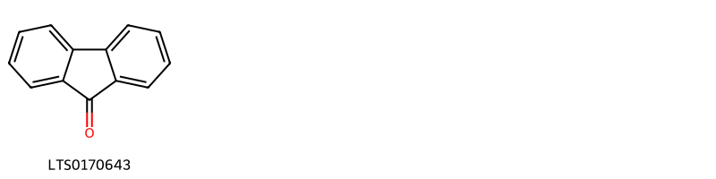{ width=100% }
    <figcaption>Hình ảnh cấu trúc hóa học của 1 hoạt chất thuộc nhóm Fluorenes gồm ['fluorenone (LTS0170643)'].</figcaption>
</figure>
#### Nhóm Furanoid lignans
<figure markdown="span">
    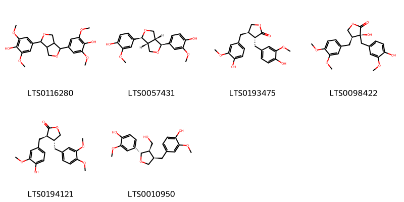{ width=100% }
    <figcaption>Hình ảnh cấu trúc hóa học của 6 hoạt chất thuộc nhóm Furanoid lignans gồm ['syringaresinol (LTS0116280)', 'pinoresinol (LTS0057431)', 'matairesinol (LTS0193475)', 'trachelogenin (LTS0098422)', '(-)-arctigenin (LTS0194121)', 'lariciresinol (LTS0010950)'].</figcaption>
</figure>
#### Nhóm Furans
<figure markdown="span">
    { width=100% }
    <figcaption>Hình ảnh cấu trúc hóa học của 1 hoạt chất thuộc nhóm Furans gồm ['furoic acid (LTS0110632)'].</figcaption>
</figure>
#### Nhóm Glycerolipids
<figure markdown="span">
    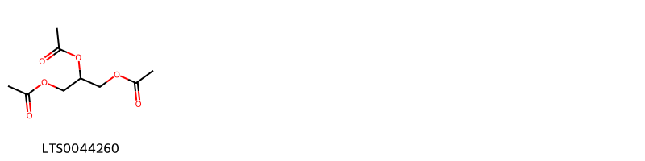{ width=100% }
    <figcaption>Hình ảnh cấu trúc hóa học của 1 hoạt chất thuộc nhóm Glycerolipids gồm ['triacetin (LTS0044260)'].</figcaption>
</figure>
#### Nhóm Hydroxy acids and derivatives
<figure markdown="span">
    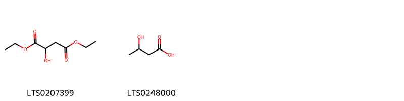{ width=100% }
    <figcaption>Hình ảnh cấu trúc hóa học của 2 hoạt chất thuộc nhóm Hydroxy acids and derivatives gồm ['diethyl malate (LTS0207399)', '3 hydroxybutyrate (LTS0248000)'].</figcaption>
</figure>
#### Nhóm Indanes
<figure markdown="span">
    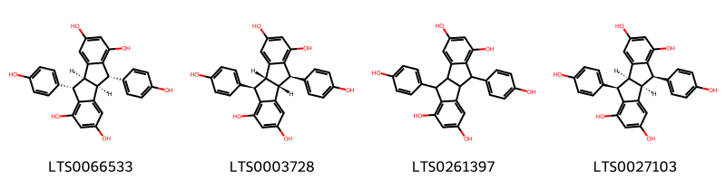{ width=100% }
    <figcaption>Hình ảnh cấu trúc hóa học của 4 hoạt chất thuộc nhóm Indanes gồm ['(1s,8s,9s,16s)-8,16-bis(4-hydroxyphenyl)tetracyclo[7.7.0.0²,⁷.0¹⁰,¹⁵]hexadeca-2,4,6,10,12,14-hexaene-4,6,12,14-tetrol (LTS0066533)', 'pallidol (LTS0003728)', 'pallidol (LTS0261397)', '(1s,8r,9s,16r)-8,16-bis(4-hydroxyphenyl)tetracyclo[7.7.0.0²,⁷.0¹⁰,¹⁵]hexadeca-2,4,6,10,12,14-hexaene-4,6,12,14-tetrol (LTS0027103)'].</figcaption>
</figure>
#### Nhóm Indoles and derivatives
<figure markdown="span">
    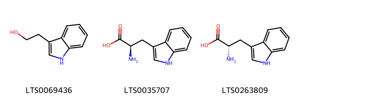{ width=100% }
    <figcaption>Hình ảnh cấu trúc hóa học của 3 hoạt chất thuộc nhóm Indoles and derivatives gồm ['tryptophol (LTS0069436)', 'd-tryptophan (LTS0035707)', 'l-tryptophan (LTS0263809)'].</figcaption>
</figure>
#### Nhóm Isoflavonoids
<figure markdown="span">
    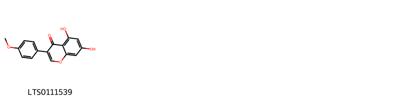{ width=100% }
    <figcaption>Hình ảnh cấu trúc hóa học của 1 hoạt chất thuộc nhóm Isoflavonoids gồm ['biochanin (LTS0111539)'].</figcaption>
</figure>
#### Nhóm Keto acids and derivatives
<figure markdown="span">
    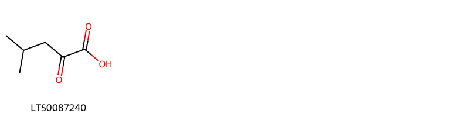{ width=100% }
    <figcaption>Hình ảnh cấu trúc hóa học của 1 hoạt chất thuộc nhóm Keto acids and derivatives gồm ['ketoisocaproate (LTS0087240)'].</figcaption>
</figure>
#### Nhóm Lactams
<figure markdown="span">
    { width=100% }
    <figcaption>Hình ảnh cấu trúc hóa học của 1 hoạt chất thuộc nhóm Lactams gồm ['caprolactam (LTS0159712)'].</figcaption>
</figure>
#### Nhóm Lactones
<figure markdown="span">
    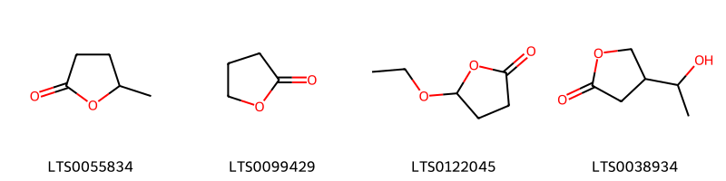{ width=100% }
    <figcaption>Hình ảnh cấu trúc hóa học của 4 hoạt chất thuộc nhóm Lactones gồm ['gamma-valerolactone (LTS0055834)', '4-butyrolactone (LTS0099429)', '5-ethoxydihydro-2(3h)-furanone (LTS0122045)', '4-(1-hydroxyethyl)oxolan-2-one (LTS0038934)'].</figcaption>
</figure>
#### Nhóm Lupin alkaloids
<figure markdown="span">
    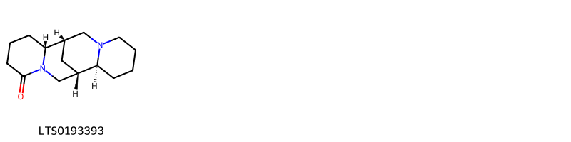{ width=100% }
    <figcaption>Hình ảnh cấu trúc hóa học của 1 hoạt chất thuộc nhóm Lupin alkaloids gồm ['(+)-lupanine (LTS0193393)'].</figcaption>
</figure>
#### Nhóm Naphthalenes
<figure markdown="span">
    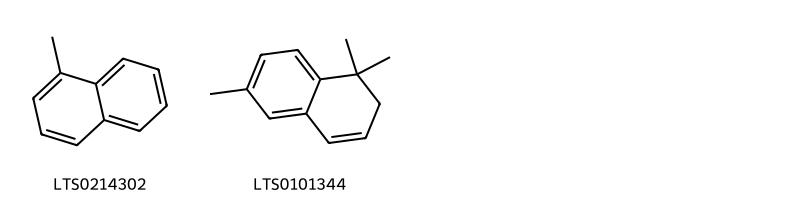{ width=100% }
    <figcaption>Hình ảnh cấu trúc hóa học của 2 hoạt chất thuộc nhóm Naphthalenes gồm ['1-methylnaphthalene (LTS0214302)', '1,1,6-trimethyl-2h-naphthalene (LTS0101344)'].</figcaption>
</figure>
#### Nhóm Organic oxides
<figure markdown="span">
    { width=100% }
    <figcaption>Hình ảnh cấu trúc hóa học của 1 hoạt chất thuộc nhóm Organic oxides gồm ['β-cyclocitral (LTS0195727)'].</figcaption>
</figure>
#### Nhóm Organoiodides
<figure markdown="span">
    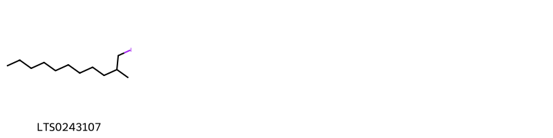{ width=100% }
    <figcaption>Hình ảnh cấu trúc hóa học của 1 hoạt chất thuộc nhóm Organoiodides gồm ['1-iodo-2-methylundecane (LTS0243107)'].</figcaption>
</figure>
#### Nhóm Organonitrogen compounds
<figure markdown="span">
    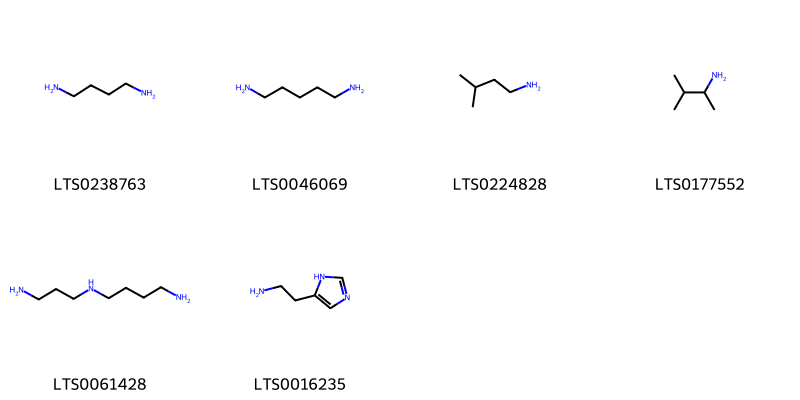{ width=100% }
    <figcaption>Hình ảnh cấu trúc hóa học của 6 hoạt chất thuộc nhóm Organonitrogen compounds gồm ['putrescine (LTS0238763)', 'pentane-1,5-diamine (LTS0046069)', 'isoamylamine (LTS0224828)', '3-methyl-2-butanamine (LTS0177552)', 'spermidine (LTS0061428)', '1h-imidazole-5-ethanamine (LTS0016235)'].</figcaption>
</figure>
#### Nhóm Organooxygen compounds
<figure markdown="span">
    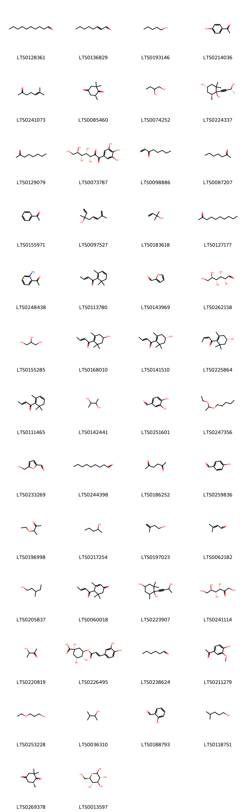{ width=100% }
    <figcaption>Hình ảnh cấu trúc hóa học của 63 hoạt chất thuộc nhóm Organooxygen compounds gồm ['decanal (LTS0128361)', '(e)-2-octenal (LTS0136829)', 'amyl alcohol (LTS0193146)', 'hydroxyacetophenone (LTS0214036)', '6-methyl-5-hepten-2-one (LTS0241073)', '2,2,6-trimethylcyclohexane-1,4-dione (LTS0085460)', '1,2-butanediol (LTS0074252)', '(1s,4s,6s)-1-[(3r)-3-hydroxybut-1-yn-1-yl]-2,2,6-trimethylcyclohexane-1,4-diol (LTS0224337)', '2-octanone (LTS0129079)', '(3r,4s,5r,6r)-3,4,5,6,7-pentahydroxy-1-(3,4,5-trihydroxyphenyl)heptane-1,2-dione (LTS0073787)', '1-octen-3-one (LTS0098886)', '2-heptanone (LTS0087207)', 'acetophenone (LTS0155971)', '(5e)-3,7-dimethylocta-1,5,7-trien-3-ol (LTS0097527)', '2-methyl-3-buten-2-ol (LTS0183618)', '2-decanone (LTS0127177)', 'o-aminoacetophenone (LTS0248438)', '1-(2,6,6-trimethylcyclohexa-1,3-dien-1-yl)but-2-en-1-one (LTS0113780)', 'bran oil (LTS0143969)', '(+)-glucose (LTS0262158)', 'glycerol (LTS0155285)', '1-(4-hydroxy-2,6,6-trimethylcyclohex-1-en-1-yl)but-2-en-1-one (LTS0168010)', '(2e)-1-[(4s)-4-hydroxy-2,6,6-trimethylcyclohex-1-en-1-yl]but-2-en-1-one (LTS0141510)', '(2z)-1-[(4s)-4-hydroxy-2,6,6-trimethylcyclohex-1-en-1-yl]but-2-en-1-one (LTS0225864)', 'damascenone (LTS0111465)', '2,3-butanediol (LTS0142441)', '3,4-dihydroxybenzaldehyde (LTS0251601)', '1-ethoxy-1-pentoxyethane (LTS0247356)', 'hydroxymethylfurfural (LTS0233269)', 'nonanal (LTS0244398)', '2,5-hexanedione (LTS0186252)', 'p-hydroxybenzaldehyde (LTS0259836)', '3-ethoxy-2-butanone (LTS0196998)', '2-pentanol (LTS0217254)', '3-methyl-3-buten-1-ol (LTS0197023)', 'prenal (LTS0062182)', '3-methyl-1-pentanol (LTS0205837)', '4-[(2e)-but-2-enoyl]-3,5,5-trimethylcyclohex-2-en-1-one (LTS0060018)', '1-(3-hydroxybut-1-yn-1-yl)-2,2,6-trimethylcyclohexane-1,4-diol (LTS0223907)', 'keto-d-fructose (LTS0241114)', 'acetoin (LTS0220819)', 'chlorogenic acid (LTS0226495)', 'hexanal (LTS0238624)', 'apocynin (LTS0211279)', '3-ethoxy-1-propanol (LTS0253228)', '3-methyl-2-butanol (LTS0036310)', 'salicylaldehyde (LTS0188793)', '4-methyl-1-pentanol (LTS0118751)', '(6s)-2,2,6-trimethylcyclohexane-1,4-dione (LTS0269378)', 'glucose (LTS0013597)', '4-methyl-4-sulfanylpentan-2-one (LTS0032238)', '(2e)-pent-2-en-1-ol (LTS0003505)', '(2r)-2-[(1e,3r)-3-hydroxybut-1-en-1-yl]-2,6,6-trimethylcyclohex-3-en-1-one (LTS0132631)', 'diacetone alcohol (LTS0034046)', 'pentanal (LTS0234306)', '2-nonanone (LTS0245014)', '(5z)-2,6-dimethylocta-5,7-dien-2-ol (LTS0237747)', 'undecan-2-one (LTS0244143)', 'cyclohexanone (LTS0246959)', 'isoamyl alcohol (LTS0112297)', 'd-fructopyranose (LTS0259277)', '2-(3-hydroxybut-1-en-1-yl)-2,6,6-trimethylcyclohex-3-en-1-one (LTS0242426)', 'myrcenol (LTS0248003)'].</figcaption>
</figure>
#### Nhóm Oxepanes
<figure markdown="span">
    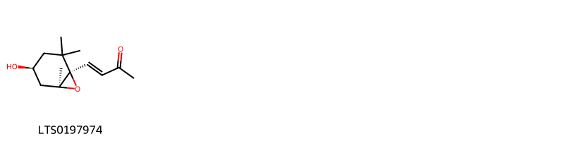{ width=100% }
    <figcaption>Hình ảnh cấu trúc hóa học của 1 hoạt chất thuộc nhóm Oxepanes gồm ['annuionone d (LTS0197974)'].</figcaption>
</figure>
#### Nhóm Oxolanes
<figure markdown="span">
    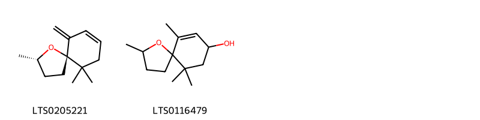{ width=100% }
    <figcaption>Hình ảnh cấu trúc hóa học của 2 hoạt chất thuộc nhóm Oxolanes gồm ['(2s,5s)-2,10,10-trimethyl-6-methylidene-1-oxaspiro[4.5]dec-7-ene (LTS0205221)', '2,6,10,10-tetramethyl-1-oxaspiro[4.5]dec-6-en-8-ol (LTS0116479)'].</figcaption>
</figure>
#### Nhóm Peptidomimetics
<figure markdown="span">
    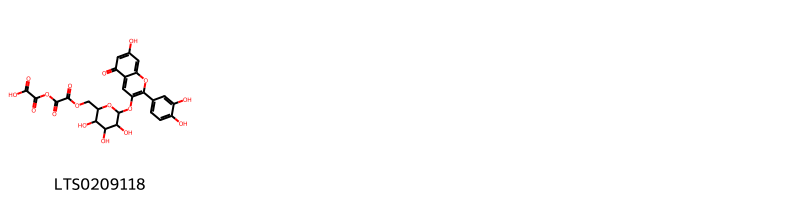{ width=100% }
    <figcaption>Hình ảnh cấu trúc hóa học của 1 hoạt chất thuộc nhóm Peptidomimetics gồm ['({2-[(6-{[2-(3,4-dihydroxyphenyl)-7-hydroxy-5-oxochromen-3-yl]oxy}-3,4,5-trihydroxyoxan-2-yl)methoxy]-2-oxoacetyl}oxy)(oxo)acetic acid (LTS0209118)'].</figcaption>
</figure>
#### Nhóm Phenanthrenes and derivatives
<figure markdown="span">
    { width=100% }
    <figcaption>Hình ảnh cấu trúc hóa học của 1 hoạt chất thuộc nhóm Phenanthrenes and derivatives gồm ['phenanthrene (LTS0089727)'].</figcaption>
</figure>
#### Nhóm Phenols
<figure markdown="span">
    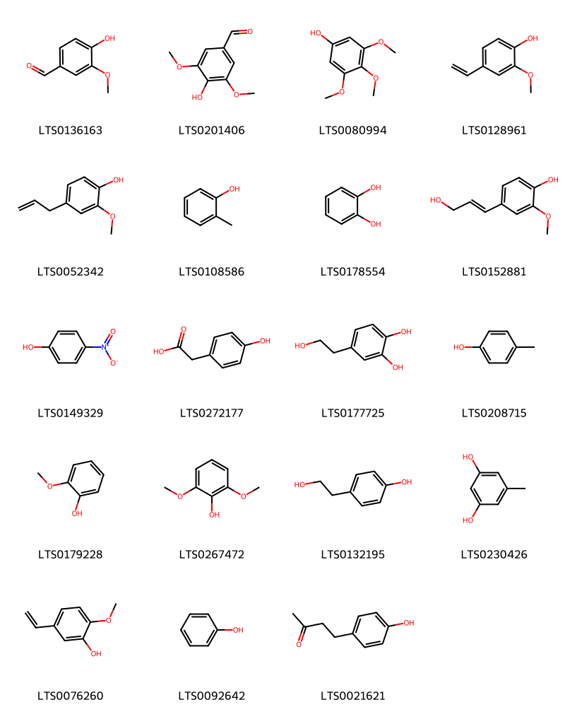{ width=100% }
    <figcaption>Hình ảnh cấu trúc hóa học của 19 hoạt chất thuộc nhóm Phenols gồm ['vanillin (LTS0136163)', 'syringaldehyde (LTS0201406)', '3,4,5-trimethoxyphenol (LTS0080994)', '2-methoxy-4-vinyl-phenol (LTS0128961)', 'eugenol (LTS0052342)', 'o-cresol (LTS0108586)', 'catechol (LTS0178554)', 'coniferyl alcohol (LTS0152881)', 'p-nitrophenol (LTS0149329)', '4-hydroxyphenylacetic acid (LTS0272177)', 'hydroxytyrosol (LTS0177725)', 'p-cresol (LTS0208715)', 'guaiacol (LTS0179228)', '2,6-dimethoxyphenol (LTS0267472)', 'tyrosol (LTS0132195)', 'orcinol (LTS0230426)', '5-ethenyl-2-methoxyphenol (LTS0076260)', 'phenol (LTS0092642)', 'frambinone (LTS0021621)'].</figcaption>
</figure>
#### Nhóm Phenylpropanoic acids
<figure markdown="span">
    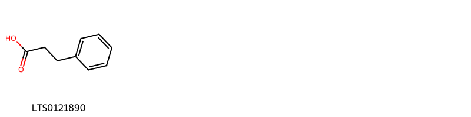{ width=100% }
    <figcaption>Hình ảnh cấu trúc hóa học của 1 hoạt chất thuộc nhóm Phenylpropanoic acids gồm ['3-phenylpropionic acid (LTS0121890)'].</figcaption>
</figure>
#### Nhóm Prenol lipids
<figure markdown="span">
    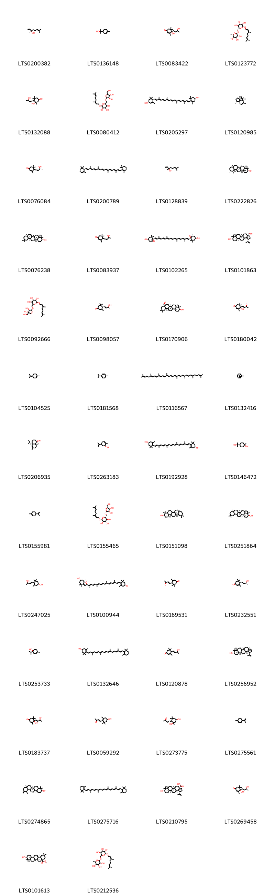{ width=100% }
    <figcaption>Hình ảnh cấu trúc hóa học của 83 hoạt chất thuộc nhóm Prenol lipids gồm ['(-)-linalool (LTS0200382)', 'terpineol (LTS0136148)', '4-hydroxy-4-(3-hydroxybutyl)-3,5,5-trimethylcyclohex-2-en-1-one (LTS0083422)', '(2r,3r,4s,5s,6r)-2-{[(2z)-3,7-dimethylocta-2,6-dien-1-yl]oxy}-6-({[(2r,3r,4r,5r,6s)-3,4,5-trihydroxy-6-methyloxan-2-yl]oxy}methyl)oxane-3,4,5-triol (LTS0123772)', '6-(3-hydroxybut-1-en-1-ylidene)-1,5,5-trimethylcyclohexane-1,3-diol (LTS0132088)', '2-({[3,4-dihydroxy-5-(hydroxymethyl)oxolan-2-yl]oxy}methyl)-6-[(3,7-dimethylocta-2,6-dien-1-yl)oxy]oxane-3,4,5-triol (LTS0080412)', 'carotenoid (LTS0205297)', 'cedrene (LTS0120985)', '4-[(3r)-3-hydroxybut-1-en-1-ylidene]-3,5,5-trimethylcyclohex-2-en-1-one (LTS0076084)', '(+)-α-carotene (LTS0200789)', 'linalool, (+-)- (LTS0128839)', 'amyrin (LTS0222826)', 'alnulin (LTS0076238)', '4-(3-hydroxybut-1-en-1-ylidene)-3,5,5-trimethylcyclohex-2-en-1-one (LTS0083937)', 'violaxanthin (LTS0102265)', 'betulin (LTS0101863)', '2-({[3,4-dihydroxy-4-(hydroxymethyl)oxolan-2-yl]oxy}methyl)-6-{[(2z)-3,7-dimethylocta-2,6-dien-1-yl]oxy}oxane-3,4,5-triol (LTS0092666)', '(4s)-4-[(1e,3r)-3-hydroxybut-1-en-1-yl]-3,5,5-trimethylcyclohex-2-en-1-one (LTS0098057)', 'oleanolic aldehyde (LTS0170906)', '4-hydroxy-3,5,5-trimethyl-4-(3-oxobut-1-en-1-yl)cyclohex-2-en-1-one (LTS0180042)', 'terpinolene (LTS0104525)', 'cymene (LTS0181568)', 'lycopene (LTS0116567)', 'α pinene (LTS0132416)', 'α-cadinol (LTS0206935)', 'carveol (LTS0263183)', 'zeaxanthin (LTS0192928)', 'terpin (LTS0146472)', 'limonene,  (LTS0155981)', '(2r,3s,4s,5r,6r)-2-({[(2r,3r,4r,5s)-3,4-dihydroxy-5-(hydroxymethyl)oxolan-2-yl]oxy}methyl)-6-{[(2z)-3,7-dimethylocta-2,6-dien-1-yl]oxy}oxane-3,4,5-triol (LTS0155465)', 'germanicol (LTS0151098)', 'β-amyrin (LTS0251864)', '4-[(1e)-3-hydroxybut-1-en-1-yl]-3,5,5-trimethylcyclohex-3-en-1-ol (LTS0247025)', '(6s,7ar)-2-[(2e,4e,6e,8e,10e,12e,14e,16e)-17-[(4r)-4-hydroxy-2,6,6-trimethylcyclohex-1-en-1-yl]-6,11,15-trimethylheptadeca-2,4,6,8,10,12,14,16-octaen-2-yl]-4,4,7a-trimethyl-2,5,6,7-tetrahydro-1-benzofuran-6-ol (LTS0100944)', '3,5,5-trimethyl-4-[(1e)-3-oxobut-1-en-1-yl]cyclohex-2-en-1-one (LTS0169531)', '(4r)-4-[(3r)-3-hydroxybutyl]-3,5,5-trimethylcyclohex-2-en-1-one (LTS0232551)', '4-terpineol (LTS0253733)', 'cryptoxanthin (LTS0132646)', '4-[(1e)-3-hydroxybut-1-en-1-yl]-3,5,5-trimethylcyclohex-2-en-1-one (LTS0120878)', 'lupeol (LTS0256952)', '4-hydroxy-4-(3-hydroxybut-1-en-1-yl)-3,5,5-trimethylcyclohex-2-en-1-one (LTS0183737)', '(3e)-4-(4-hydroxy-2,6,6-trimethylcyclohex-1-en-1-yl)but-3-en-2-one (LTS0059292)', '4-(2,4-dihydroxy-2,6,6-trimethylcyclohexylidene)but-3-en-2-one (LTS0273775)', 'p-mentha-1,3,8-triene (LTS0275561)', '(6ar,6br,8ar,14br)-4,4,6a,6b,8a,12,14b-heptamethyl-11-methylidene-hexadecahydropicen-3-ol (LTS0274865)', 'β-carotene (LTS0275716)', 'betulinic acid (LTS0210795)', '(4r)-4-hydroxy-4-[(3s)-3-hydroxybutyl]-3,5,5-trimethylcyclohex-2-en-1-one (LTS0269458)', 'methyl (4as,6as,6br,8ar,10s,12ar,12br,14bs)-10-hydroxy-2,2,6a,6b,9,9,12a-heptamethyl-1,3,4,5,6,7,8,8a,10,11,12,12b,13,14b-tetradecahydropicene-4a-carboxylate (LTS0101613)', '2-[(3,7-dimethylocta-2,6-dien-1-yl)oxy]-6-{[(3,4,5-trihydroxy-6-methyloxan-2-yl)oxy]methyl}oxane-3,4,5-triol (LTS0212536)', 'antheraxanthin (LTS0210072)', '(1s,2r,4as,6as,6br,8ar,10s,12ar,12br,14bs)-10-hydroxy-1,2,6a,6b,9,9,12a-heptamethyl-2,3,4,5,6,7,8,8a,10,11,12,12b,13,14b-tetradecahydro-1h-picene-4a-carbaldehyde (LTS0083213)', '(4s)-4-hydroxy-4-(3-hydroxybut-1-en-1-yl)-3,5,5-trimethylcyclohex-2-en-1-one (LTS0225700)', 'geranic acid (LTS0226491)', 'taraxasterol (LTS0006950)', 'neoxanthin (LTS0227522)', '4-(3-hydroxybut-1-en-1-yl)-3,5,5-trimethylcyclohex-2-en-1-one (LTS0005741)', '2-[(2z,4e,6e,8e,10e,12e,14e,16e)-17-{4-hydroxy-2,2,6-trimethyl-7-oxabicyclo[4.1.0]heptan-1-yl}-6,11,15-trimethylheptadeca-2,4,6,8,10,12,14,16-octaen-2-yl]-4,4,7a-trimethyl-2,5,6,7-tetrahydro-1-benzofuran-6-ol (LTS0193507)', 'geraniol (LTS0258838)', '(5e)-2,6-dimethylocta-2,5,7-trien-4-ol (LTS0195581)', 'phytoene (LTS0186029)', '(6s,9r)-vomifoliol (LTS0052786)', '(4as,6as,6br,8ar,12ar,12br,14bs)-2,2,6a,6b,9,9,12a-heptamethyl-10-oxo-3,4,5,6,7,8,8a,11,12,12b,13,14b-dodecahydro-1h-picene-4a-carboxylic acid (LTS0002247)', 'all-trans-phytofluene (LTS0269894)', 'terpinene (LTS0136858)', '2-[(2e,4e,6e,8e,10e,12e,14e,16e)-17-(4-hydroxy-2,6,6-trimethylcyclohex-1-en-1-yl)-6,11,15-trimethylheptadeca-2,4,6,8,10,12,14,16-octaen-2-yl]-4,4,7a-trimethyl-2,5,6,7-tetrahydro-1-benzofuran-6-ol (LTS0008322)', '(2r,3r,4s,5s,6r)-2-{[(2e)-3,7-dimethylocta-2,6-dien-1-yl]oxy}-6-({[(2r,3r,4r,5r,6s)-3,4,5-trihydroxy-6-methyloxan-2-yl]oxy}methyl)oxane-3,4,5-triol (LTS0003852)', 'neoxanthin (LTS0000701)', 'α-carotene (LTS0224243)', 'nerol (LTS0244289)', '4-[(2r,4s)-2,4-dihydroxy-2,6,6-trimethylcyclohexylidene]but-3-en-2-one (LTS0233974)', 'cuminol (LTS0021403)', '4-hydroxy-4-(3-hydroxybut-1-en-1-yl)-3,3,5-trimethylcyclohexan-1-one (LTS0023393)', 'citronellol, (+-)- (LTS0090925)', 'dehydrovomifoliol (LTS0209706)', '(1r,3s)-6-[(3r)-3-hydroxybut-1-en-1-ylidene]-1,5,5-trimethylcyclohexane-1,3-diol (LTS0111917)', 'gamma-carotene (LTS0108535)', '(4s,5s)-4-hydroxy-4-[(1e,3r)-3-hydroxybut-1-en-1-yl]-3,3,5-trimethylcyclohexan-1-one (LTS0249536)', '(4as,6br,10s,12ar,14bs)-10-hydroxy-2,2,6a,6b,9,9,12a-heptamethyl-1,3,4,5,6,7,8,8a,10,11,12,12b,13,14b-tetradecahydropicene-4a-carbaldehyde (LTS0035167)', '(4z)-4-(3-hydroxybutylidene)-3,5,5-trimethylcyclohex-2-en-1-one (LTS0103699)', '(2r,3s,4s,5r,6r)-2-({[(2r,3r,4r,5s)-3,4-dihydroxy-5-(hydroxymethyl)oxolan-2-yl]oxy}methyl)-6-{[(2e)-3,7-dimethylocta-2,6-dien-1-yl]oxy}oxane-3,4,5-triol (LTS0044300)', '3-[(1e)-3-hydroxybut-1-en-1-yl]-2,4,4-trimethylcyclohex-2-en-1-one (LTS0044545)', 'oleanolic acid (LTS0117717)'].</figcaption>
</figure>
#### Nhóm Pyrans
<figure markdown="span">
    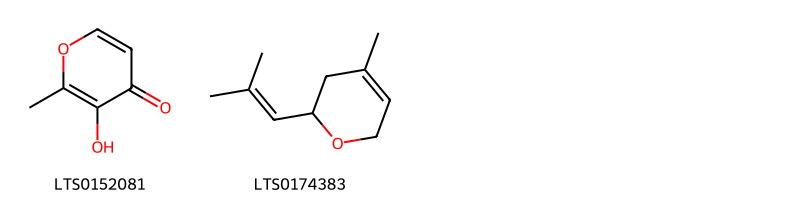{ width=100% }
    <figcaption>Hình ảnh cấu trúc hóa học của 2 hoạt chất thuộc nhóm Pyrans gồm ['talmon (LTS0152081)', 'nerol oxide (LTS0174383)'].</figcaption>
</figure>
#### Nhóm Pyrrolidines
<figure markdown="span">
    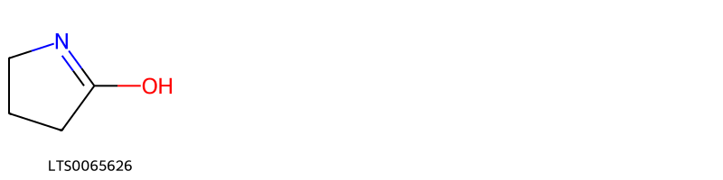{ width=100% }
    <figcaption>Hình ảnh cấu trúc hóa học của 1 hoạt chất thuộc nhóm Pyrrolidines gồm ['2-pyrrolidone (LTS0065626)'].</figcaption>
</figure>
#### Nhóm Saturated hydrocarbons
<figure markdown="span">
    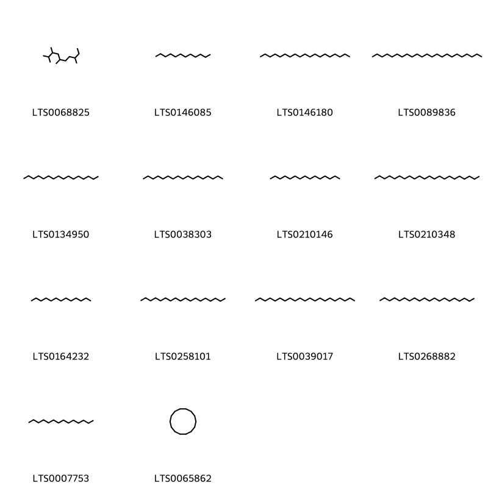{ width=100% }
    <figcaption>Hình ảnh cấu trúc hóa học của 14 hoạt chất thuộc nhóm Saturated hydrocarbons gồm ['2,3,5,8-tetramethyldecane (LTS0068825)', 'dodecane (LTS0146085)', 'nonadecane (LTS0146180)', 'tricosane (LTS0089836)', 'cetane (LTS0134950)', 'heptadecane (LTS0038303)', 'pentadecane (LTS0210146)', 'docosane (LTS0210348)', 'tridecane (LTS0164232)', 'octadecane (LTS0258101)', 'heneicosane (LTS0039017)', 'eicosane (LTS0268882)', 'tetradecane (LTS0007753)', 'cyclotetradecane (LTS0065862)'].</figcaption>
</figure>
#### Nhóm Steroids and steroid derivatives
<figure markdown="span">
    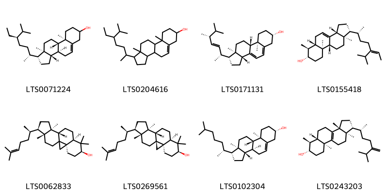{ width=100% }
    <figcaption>Hình ảnh cấu trúc hóa học của 8 hoạt chất thuộc nhóm Steroids and steroid derivatives gồm ['stigmast-5-en-3-ol (LTS0071224)', 'stigmast-5-en-3-ol, (3β)- (LTS0204616)', 'ergosterol (LTS0171131)', '(z)-24-ethylidenelophenol (LTS0155418)', '(3r,6s,8r,11s,12s,15r,16r)-7,7,12,16-tetramethyl-15-[(2r)-6-methylhept-5-en-2-yl]pentacyclo[9.7.0.0¹,³.0³,⁸.0¹²,¹⁶]octadecan-6-ol (LTS0062833)', 'cycloartenol (LTS0269561)', 'cholesterol (LTS0102304)', '(1r,3ar,5as,6s,7s,9as,11ar)-3a,6,9a,11a-tetramethyl-1-[(2r)-6-methyl-5-methylideneheptan-2-yl]-1h,2h,3h,4h,5h,5ah,6h,7h,8h,9h,10h,11h-cyclopenta[a]phenanthren-7-ol (LTS0243203)'].</figcaption>
</figure>
#### Nhóm Stilbenes
<figure markdown="span">
    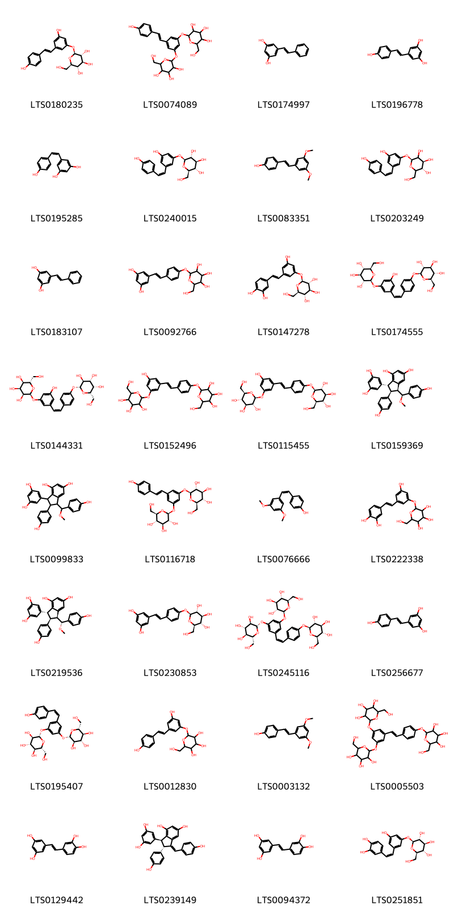{ width=100% }
    <figcaption>Hình ảnh cấu trúc hóa học của 32 hoạt chất thuộc nhóm Stilbenes gồm ['piceid (LTS0180235)', '2-(hydroxymethyl)-6-{3-[2-(4-hydroxyphenyl)ethenyl]-5-{[3,4,5-trihydroxy-6-(hydroxymethyl)oxan-2-yl]oxy}phenoxy}oxane-3,4,5-triol (LTS0074089)', 'pinosylvin (LTS0174997)', 'tocilizumab (LTS0196778)', 'cis-resveratrol (LTS0195285)', 'cis-piceid (LTS0240015)', "3',5'-dimethoxy-4-stilbenol (LTS0083351)", '(2s,4s,5s)-2-{3-hydroxy-5-[(1z)-2-(4-hydroxyphenyl)ethenyl]phenoxy}-6-(hydroxymethyl)oxane-3,4,5-triol (LTS0203249)', 'pinosylvin (LTS0183107)', 'resveratroloside (LTS0092766)', 'astringin (LTS0147278)', '(2s,3r,4s,5s,6r)-2-{4-[(1z)-2-(3-hydroxy-5-{[(2s,3r,4s,5s,6r)-3,4,5-trihydroxy-6-(hydroxymethyl)oxan-2-yl]oxy}phenyl)ethenyl]phenoxy}-6-(hydroxymethyl)oxane-3,4,5-triol (LTS0174555)', '(2r,3s,4r,5s,6s)-2-{4-[(1z)-2-(3-hydroxy-5-{[(2s,3s,4s,5r,6s)-3,4,5-trihydroxy-6-(hydroxymethyl)oxan-2-yl]oxy}phenyl)ethenyl]phenoxy}-6-(hydroxymethyl)oxane-3,4,5-triol (LTS0144331)', '2-{4-[2-(3-hydroxy-5-{[3,4,5-trihydroxy-6-(hydroxymethyl)oxan-2-yl]oxy}phenyl)ethenyl]phenoxy}-6-(hydroxymethyl)oxane-3,4,5-triol (LTS0152496)', '(2s,3r,4s,5s,6r)-2-{4-[(1e)-2-(3-hydroxy-5-{[(2s,3r,4s,5s,6r)-3,4,5-trihydroxy-6-(hydroxymethyl)oxan-2-yl]oxy}phenyl)ethenyl]phenoxy}-6-(hydroxymethyl)oxane-3,4,5-triol (LTS0115455)', '(1s,2s,3r)-3-(3,5-dihydroxyphenyl)-2-(4-hydroxyphenyl)-1-[(s)-(4-hydroxyphenyl)(methoxy)methyl]-2,3-dihydro-1h-indene-4,6-diol (LTS0159369)', '3-(3,5-dihydroxyphenyl)-2-(4-hydroxyphenyl)-1-[(4-hydroxyphenyl)(methoxy)methyl]-2,3-dihydro-1h-indene-4,6-diol (LTS0099833)', '(2r,3s,4s,5r,6s)-2-(hydroxymethyl)-6-{3-[(1e)-2-(4-hydroxyphenyl)ethenyl]-5-{[(2s,3r,4s,5s,6r)-3,4,5-trihydroxy-6-(hydroxymethyl)oxan-2-yl]oxy}phenoxy}oxane-3,4,5-triol (LTS0116718)', '(z)-pterostilbene (LTS0076666)', '2-{3-[2-(3,4-dihydroxyphenyl)ethenyl]-5-hydroxyphenoxy}-6-(hydroxymethyl)oxane-3,4,5-triol (LTS0222338)', '(1s,2s,3r)-3-(3,5-dihydroxyphenyl)-2-(4-hydroxyphenyl)-1-[(r)-(4-hydroxyphenyl)(methoxy)methyl]-2,3-dihydro-1h-indene-4,6-diol (LTS0219536)', 'resveratroloside (LTS0230853)', '(2s,3r,4s,5s,6r)-2-{4-[(1z)-2-[3,5-bis({[(2s,3r,4s,5s,6r)-3,4,5-trihydroxy-6-(hydroxymethyl)oxan-2-yl]oxy})phenyl]ethenyl]phenoxy}-6-(hydroxymethyl)oxane-3,4,5-triol (LTS0245116)', 'resveratrol (LTS0256677)', '(2r,3s,4s,5r,6s)-2-(hydroxymethyl)-6-{3-[(1z)-2-(4-hydroxyphenyl)ethenyl]-5-{[(2s,3r,4s,5s,6r)-3,4,5-trihydroxy-6-(hydroxymethyl)oxan-2-yl]oxy}phenoxy}oxane-3,4,5-triol (LTS0195407)', '2-{3-hydroxy-5-[2-(4-hydroxyphenyl)ethenyl]phenoxy}-6-(hydroxymethyl)oxane-3,4,5-triol (LTS0012830)', 'pterostilbene (LTS0003132)', '2-(4-{2-[3,5-bis({[3,4,5-trihydroxy-6-(hydroxymethyl)oxan-2-yl]oxy})phenyl]ethenyl}phenoxy)-6-(hydroxymethyl)oxane-3,4,5-triol (LTS0005503)', 'piceatannol (LTS0129442)', '(1z,2s,3s)-3-(3,5-dihydroxyphenyl)-2-(4-hydroxyphenyl)-1-[(4-hydroxyphenyl)methylidene]-2,3-dihydroindene-4,6-diol (LTS0239149)', 'piceatannol (LTS0094372)', 'cis-astringin (LTS0251851)'].</figcaption>
</figure>
#### Nhóm Tannins
<figure markdown="span">
    { width=100% }
    <figcaption>Hình ảnh cấu trúc hóa học của 1 hoạt chất thuộc nhóm Tannins gồm ['ellagic acid (LTS0037297)'].</figcaption>
</figure>
#### Nhóm Tetrahydrofurans
<figure markdown="span">
    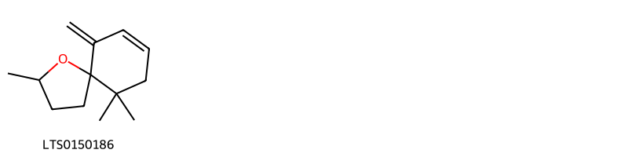{ width=100% }
    <figcaption>Hình ảnh cấu trúc hóa học của 1 hoạt chất thuộc nhóm Tetrahydrofurans gồm ['2,10,10-trimethyl-6-methylidene-1-oxaspiro[4.5]dec-7-ene (LTS0150186)'].</figcaption>
</figure>
#### Nhóm Thioethers
<figure markdown="span">
    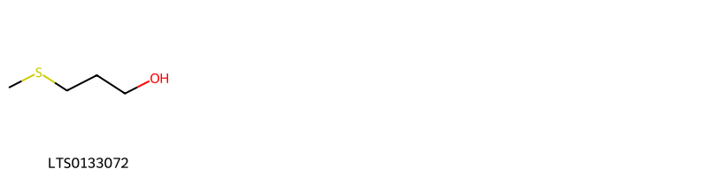{ width=100% }
    <figcaption>Hình ảnh cấu trúc hóa học của 1 hoạt chất thuộc nhóm Thioethers gồm ['methionol (LTS0133072)'].</figcaption>
</figure>
#### Nhóm Thiols
<figure markdown="span">
    { width=100% }
    <figcaption>Hình ảnh cấu trúc hóa học của 1 hoạt chất thuộc nhóm Thiols gồm ['3-mercaptohexanol (LTS0047627)'].</figcaption>
</figure>
#### Nhóm Unsaturated hydrocarbons
<figure markdown="span">
    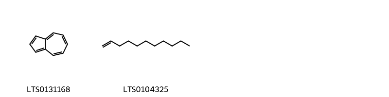{ width=100% }
    <figcaption>Hình ảnh cấu trúc hóa học của 2 hoạt chất thuộc nhóm Unsaturated hydrocarbons gồm ['azulene (LTS0131168)', '1-undecene (LTS0104325)'].</figcaption>
</figure>

---

### Dược dân tộc học

Danh sách các quốc gia có sử dụng *Vitis vinifera* trong điều trị các bệnh. 

| Country   | Disease                                                                             | Bệnh                                                                                                                                                                                                |
|:----------|:------------------------------------------------------------------------------------|:----------------------------------------------------------------------------------------------------------------------------------------------------------------------------------------------------|
| China     | Diuretic, Refrigerant                                                               | MYMEMORY WARNING: YOU USED ALL AVAILABLE FREE TRANSLATIONS FOR TODAY. NEXT AVAILABLE IN  09 HOURS 50 MINUTES 43 SECONDS VISIT HTTPS://MYMEMORY.TRANSLATED.NET/DOC/USAGELIMITS.PHP TO TRANSLATE MORE |
| Elsewhere | Expectorant, Laxative, Astringent, Demulcent, Diuretic, Refrigerant, Stomachic      | MYMEMORY WARNING: YOU USED ALL AVAILABLE FREE TRANSLATIONS FOR TODAY. NEXT AVAILABLE IN  09 HOURS 50 MINUTES 40 SECONDS VISIT HTTPS://MYMEMORY.TRANSLATED.NET/DOC/USAGELIMITS.PHP TO TRANSLATE MORE |
| Iraq      | Stomachic                                                                           | MYMEMORY WARNING: YOU USED ALL AVAILABLE FREE TRANSLATIONS FOR TODAY. NEXT AVAILABLE IN  09 HOURS 50 MINUTES 37 SECONDS VISIT HTTPS://MYMEMORY.TRANSLATED.NET/DOC/USAGELIMITS.PHP TO TRANSLATE MORE |
| Turkey    | Demulcent, Diuretic, Laxative, Refrigerant, Tonic, Astringent, Hemostat, Intoxicant | MYMEMORY WARNING: YOU USED ALL AVAILABLE FREE TRANSLATIONS FOR TODAY. NEXT AVAILABLE IN  09 HOURS 50 MINUTES 34 SECONDS VISIT HTTPS://MYMEMORY.TRANSLATED.NET/DOC/USAGELIMITS.PHP TO TRANSLATE MORE |
| US        | Apertif, Intoxicant                                                                 | MYMEMORY WARNING: YOU USED ALL AVAILABLE FREE TRANSLATIONS FOR TODAY. NEXT AVAILABLE IN  09 HOURS 50 MINUTES 31 SECONDS VISIT HTTPS://MYMEMORY.TRANSLATED.NET/DOC/USAGELIMITS.PHP TO TRANSLATE MORE |
| ain       | Intoxicant                                                                          | MYMEMORY WARNING: YOU USED ALL AVAILABLE FREE TRANSLATIONS FOR TODAY. NEXT AVAILABLE IN  09 HOURS 50 MINUTES 27 SECONDS VISIT HTTPS://MYMEMORY.TRANSLATED.NET/DOC/USAGELIMITS.PHP TO TRANSLATE MORE |

---

# Chi Tetrastigma

??? note "Danh sách các dược liệu thuộc chi"
    
	 - *Tetrastigma hemsleyanum*

---
## Tetrastigma hemsleyanum
### Thông tin về thực vật

!!! info "Phân loại thực vật của *Tetrastigma hemsleyanum* từ GIBF:"
    - **Kingdom:** Plantae
    - **Phylum:** Tracheophyta
    - **Order:** Vitales
    - **Family:** Vitaceae
    - **Genus:** Tetrastigma
    - **Species:** *Tetrastigma hemsleyanum*

 

| Label (VI)   | Label (EN)   | Scientific Name         | Descriptions (VI)   | Descriptions (EN)   | Also Known As (VI)   | Also Known As (EN)   |
|:-------------|:-------------|:------------------------|:--------------------|:--------------------|:---------------------|:---------------------|
| N/A          | N/A          | Tetrastigma hemsleyanum | loài thực vật       | species of plant    | ['']                 | ['']                 |

#### Phân bố trên thế giới

**Từ CSDL GIBF** China, Chinese Taipei

#### Phân bố tại Việt Nam

**Từ CSDL GIBF**: Không có ghi nhận ở Việt Nam

---
### Thành phần hóa học
        
- Theo cơ sở dữ liệu lotus: Từ loài *Tetrastigma hemsleyanum* đã phân lập và xác định được Chưa có hoạt chất nào được phân lập. hoạt chất thuộc về các nhóm Không có hoạt chất nào được phân lập. 

Không có hình ảnh nào được tạo ra

---

### Dược dân tộc học

Danh sách các quốc gia có sử dụng *Tetrastigma hemsleyanum* trong điều trị các bệnh. 

| Country   | Disease                           | Bệnh                                                                                                                                                                                                |
|:----------|:----------------------------------|:----------------------------------------------------------------------------------------------------------------------------------------------------------------------------------------------------|
| China     | Hemostat, Refrigerant, Alexiteric | MYMEMORY WARNING: YOU USED ALL AVAILABLE FREE TRANSLATIONS FOR TODAY. NEXT AVAILABLE IN  09 HOURS 49 MINUTES 16 SECONDS VISIT HTTPS://MYMEMORY.TRANSLATED.NET/DOC/USAGELIMITS.PHP TO TRANSLATE MORE |

---

# Chi Parthenocissus

??? note "Danh sách các dược liệu thuộc chi"
    
	 - *Parthenocissus quinquefolia*

---
## Parthenocissus quinquefolia
### Thông tin về thực vật

!!! info "Phân loại thực vật của *Parthenocissus quinquefolia* từ GIBF:"
    - **Kingdom:** Plantae
    - **Phylum:** Tracheophyta
    - **Order:** Vitales
    - **Family:** Vitaceae
    - **Genus:** Parthenocissus
    - **Species:** *Parthenocissus quinquefolia*

 

| Label (VI)   | Label (EN)   | Scientific Name             | Descriptions (VI)   | Descriptions (EN)   | Also Known As (VI)   | Also Known As (EN)   |
|:-------------|:-------------|:----------------------------|:--------------------|:--------------------|:---------------------|:---------------------|
| N/A          | N/A          | Parthenocissus quinquefolia | loài thực vật       | species of plant    | ['']                 | ['Virginia creeper'] |

#### Phân bố trên thế giới

**Từ CSDL GIBF** South Africa, Sweden, New Zealand, Germany, Canada, United States of America, Mexico, Bahamas, Australia

#### Phân bố tại Việt Nam

**Từ CSDL GIBF**: Không có ghi nhận ở Việt Nam

---
### Thành phần hóa học
        
- Theo cơ sở dữ liệu lotus: Từ loài *Parthenocissus quinquefolia* đã phân lập và xác định được 15 hoạt chất thuộc về các nhóm Stilbenes, Organooxygen compounds, 2-arylbenzofuran flavonoids, Dihydrofurans. 

|    | chemicalTaxonomyClassyfireClass   |   smiles_count |
|---:|:----------------------------------|---------------:|
|  0 | 2-arylbenzofuran flavonoids       |              2 |
|  1 | Dihydrofurans                     |              1 |
|  2 | Organooxygen compounds            |              2 |
|  3 | Stilbenes                         |             10 |

#### Nhóm 2-arylbenzofuran flavonoids
<figure markdown="span">
    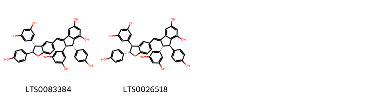{ width=100% }
    <figcaption>Hình ảnh cấu trúc hóa học của 2 hoạt chất thuộc nhóm 2-arylbenzofuran flavonoids gồm ['(1e,2s,3s)-2-(3,5-dihydroxyphenyl)-1-{[(2r,3r)-3-(3,5-dihydroxyphenyl)-2-(4-hydroxyphenyl)-2,3-dihydro-1-benzofuran-5-yl]methylidene}-3-(4-hydroxyphenyl)-2,3-dihydroindene-4,6-diol (LTS0083384)', '(1e,2r,3r)-2-(3,5-dihydroxyphenyl)-1-{[(2s,3s)-3-(3,5-dihydroxyphenyl)-2-(4-hydroxyphenyl)-2,3-dihydro-1-benzofuran-5-yl]methylidene}-3-(4-hydroxyphenyl)-2,3-dihydroindene-4,6-diol (LTS0026518)'].</figcaption>
</figure>
#### Nhóm Dihydrofurans
<figure markdown="span">
    { width=100% }
    <figcaption>Hình ảnh cấu trúc hóa học của 1 hoạt chất thuộc nhóm Dihydrofurans gồm ['vitamin c (LTS0022555)'].</figcaption>
</figure>
#### Nhóm Organooxygen compounds
<figure markdown="span">
    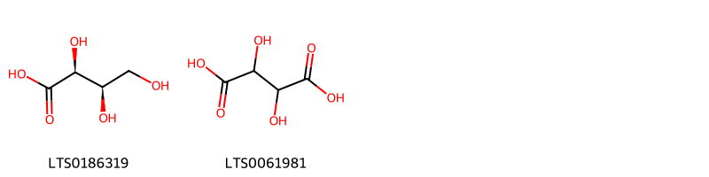{ width=100% }
    <figcaption>Hình ảnh cấu trúc hóa học của 2 hoạt chất thuộc nhóm Organooxygen compounds gồm ['threonic acid (LTS0186319)', '(.+-.)-tartaric acid (LTS0061981)'].</figcaption>
</figure>
#### Nhóm Stilbenes
<figure markdown="span">
    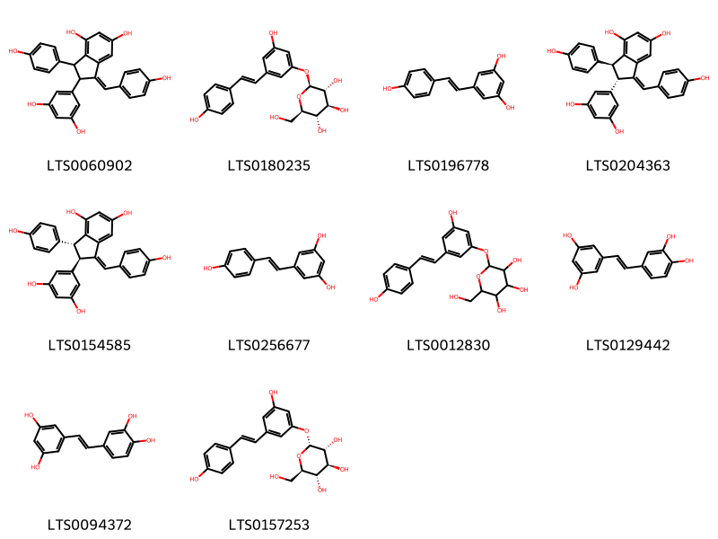{ width=100% }
    <figcaption>Hình ảnh cấu trúc hóa học của 10 hoạt chất thuộc nhóm Stilbenes gồm ['quadrangularin a (LTS0060902)', 'piceid (LTS0180235)', 'tocilizumab (LTS0196778)', '(1z,2s,3s)-2-(3,5-dihydroxyphenyl)-3-(4-hydroxyphenyl)-1-[(4-hydroxyphenyl)methylidene]-2,3-dihydroindene-4,6-diol (LTS0204363)', '(1z,2r,3r)-2-(3,5-dihydroxyphenyl)-3-(4-hydroxyphenyl)-1-[(4-hydroxyphenyl)methylidene]-2,3-dihydroindene-4,6-diol (LTS0154585)', 'resveratrol (LTS0256677)', '2-{3-hydroxy-5-[2-(4-hydroxyphenyl)ethenyl]phenoxy}-6-(hydroxymethyl)oxane-3,4,5-triol (LTS0012830)', 'piceatannol (LTS0129442)', 'piceatannol (LTS0094372)', '(2r,3r,4s,5s,6r)-2-{3-hydroxy-5-[(1e)-2-(4-hydroxyphenyl)ethenyl]phenoxy}-6-(hydroxymethyl)oxane-3,4,5-triol (LTS0157253)'].</figcaption>
</figure>

---

### Dược dân tộc học

Danh sách các quốc gia có sử dụng *Parthenocissus quinquefolia* trong điều trị các bệnh. 

| Country   | Disease                                                         | Bệnh                                                                                                                                                                                                |
|:----------|:----------------------------------------------------------------|:----------------------------------------------------------------------------------------------------------------------------------------------------------------------------------------------------|
| Mexico    | Expectorant, Tonic, Vesicant                                    | MYMEMORY WARNING: YOU USED ALL AVAILABLE FREE TRANSLATIONS FOR TODAY. NEXT AVAILABLE IN  09 HOURS 48 MINUTES 48 SECONDS VISIT HTTPS://MYMEMORY.TRANSLATED.NET/DOC/USAGELIMITS.PHP TO TRANSLATE MORE |
| Turkey    | Astringent, Diuretic, Stimulant, Tonic, Expectorant, Antiseptic | MYMEMORY WARNING: YOU USED ALL AVAILABLE FREE TRANSLATIONS FOR TODAY. NEXT AVAILABLE IN  09 HOURS 48 MINUTES 45 SECONDS VISIT HTTPS://MYMEMORY.TRANSLATED.NET/DOC/USAGELIMITS.PHP TO TRANSLATE MORE |
| US        | Expectorant, Poison, Tonic                                      | MYMEMORY WARNING: YOU USED ALL AVAILABLE FREE TRANSLATIONS FOR TODAY. NEXT AVAILABLE IN  09 HOURS 48 MINUTES 41 SECONDS VISIT HTTPS://MYMEMORY.TRANSLATED.NET/DOC/USAGELIMITS.PHP TO TRANSLATE MORE |
| US(Kiowa) | Cosmetic                                                        | MYMEMORY WARNING: YOU USED ALL AVAILABLE FREE TRANSLATIONS FOR TODAY. NEXT AVAILABLE IN  09 HOURS 48 MINUTES 37 SECONDS VISIT HTTPS://MYMEMORY.TRANSLATED.NET/DOC/USAGELIMITS.PHP TO TRANSLATE MORE |

---

