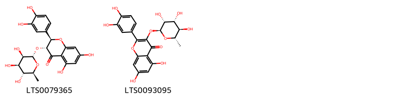
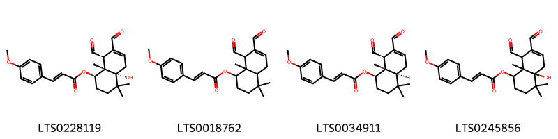
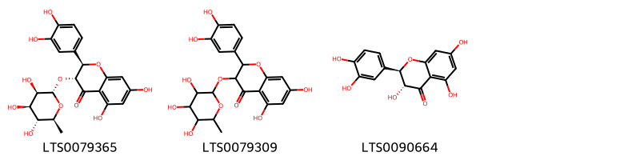
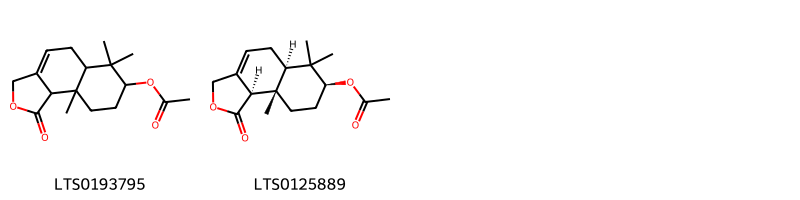
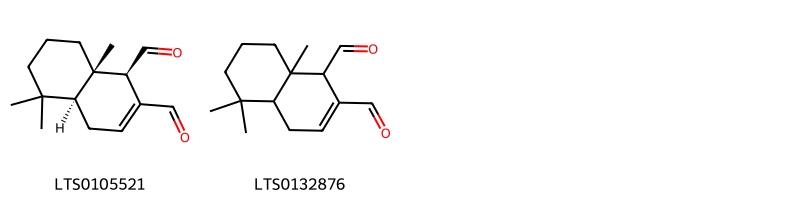
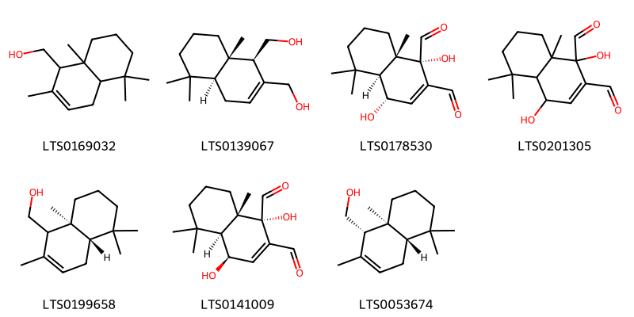

!!! abstract "Tóm tắt"

    Họ Winteraceae gồm khoảng 1 chi và 3 loài được một số cộng đồng tại các quốc gia như Elsewhere, Mexico, Turkey, Venezuela sử dụng trong một số trường hợp MYMEMORY WARNING: YOU USED ALL AVAILABLE FREE TRANSLATIONS FOR TODAY. NEXT AVAILABLE IN  13 HOURS 18 MINUTES 30 SECONDS VISIT HTTPS://MYMEMORY.TRANSLATED.NET/DOC/USAGELIMITS.PHP TO TRANSLATE MORE.

!!! info "DrDuke"

    James A. Duke sinh năm 1929-2017 là một nhà thực vật học người Mỹ. Đây là một trong những tác giả hàng đầu trong lĩnh vực dược dân tộc học với cuốn *CRC Handbook of Medicinal Herbs* và chính là người xây dựng lên cơ sở dữ liệu về hợp chất tự nhiên và dược dân tộc học tại Bộ nông nghiệp Hoa Kỳ. Các thông tin được đăng tải tại website [Dr. Duke's Phytochemical and Ethnobotanical Databases](https://phytochem.nal.usda.gov/). 
    Trong suốt thập niên 1970, ông lãnh đạo the Plant Taxonomy Laboratory, Plant Genetics and Germplasm Institute of the Agricultural Research Service, U.S. Department of Agriculture.
    Trong tài liệu này, các thông tin về dược dân tộc của các dược liệu được trích dẫn từ tài liệu của James A. Ducke với sự trợ giúp của phần mềm dịch thuật từ tiếng Anh sang tiếng Việt.
   

# Chi Drimys

??? note "Danh sách các dược liệu thuộc chi"
    
	 - *Drimys axillaris*
	 - *Drimys granadensis*
	 - *Drimys winteri*

---
## Drimys axillaris
### Thông tin về thực vật

!!! info "Phân loại thực vật của *Pseudowintera axillaris* từ GIBF:"
    - **Kingdom:** Plantae
    - **Phylum:** Tracheophyta
    - **Order:** Canellales
    - **Family:** Winteraceae
    - **Genus:** Pseudowintera
    - **Species:** *Pseudowintera axillaris*

 

| Label (VI)   | Label (EN)   | Scientific Name   | Descriptions (VI)   | Descriptions (EN)   | Also Known As (VI)   | Also Known As (EN)   |
|:-------------|:-------------|:------------------|:--------------------|:--------------------|:---------------------|:---------------------|
| N/A          | N/A          | Drimys axillaris  | loài thực vật       | species of plant    | ['']                 | ['']                 |

#### Phân bố trên thế giới

**Từ CSDL GIBF** nan, New Zealand, United States of America, Chile

#### Phân bố tại Việt Nam

**Từ CSDL GIBF**: Không có ghi nhận ở Việt Nam

---
### Thành phần hóa học
        
- Theo cơ sở dữ liệu lotus: Từ loài *Pseudowintera axillaris* đã phân lập và xác định được Chưa có hoạt chất nào được phân lập. hoạt chất thuộc về các nhóm Không có hoạt chất nào được phân lập. 

Không có hình ảnh nào được tạo ra

---

### Dược dân tộc học

Danh sách các quốc gia có sử dụng *Pseudowintera axillaris* trong điều trị các bệnh. 

| Country   | Disease           | Bệnh                                                                                                                                                                                                |
|:----------|:------------------|:----------------------------------------------------------------------------------------------------------------------------------------------------------------------------------------------------|
| Elsewhere | Astringent, Tonic | MYMEMORY WARNING: YOU USED ALL AVAILABLE FREE TRANSLATIONS FOR TODAY. NEXT AVAILABLE IN  13 HOURS 18 MINUTES 24 SECONDS VISIT HTTPS://MYMEMORY.TRANSLATED.NET/DOC/USAGELIMITS.PHP TO TRANSLATE MORE |

---

---
## Drimys granadensis
### Thông tin về thực vật

!!! info "Phân loại thực vật của *Drimys granadensis* từ GIBF:"
    - **Kingdom:** Plantae
    - **Phylum:** Tracheophyta
    - **Order:** Canellales
    - **Family:** Winteraceae
    - **Genus:** Drimys
    - **Species:** *Drimys granadensis*

 

| Label (VI)   | Label (EN)   | Scientific Name    | Descriptions (VI)   | Descriptions (EN)   | Also Known As (VI)   | Also Known As (EN)     |
|:-------------|:-------------|:-------------------|:--------------------|:--------------------|:---------------------|:-----------------------|
| N/A          | N/A          | Drimys granadensis | loài thực vật       | species of plant    | ['']                 | ['Drimys granatensis'] |

#### Phân bố trên thế giới

**Từ CSDL GIBF** Honduras, nan, Colombia, Venezuela (Bolivarian Republic of), Nicaragua, Costa Rica, Ecuador, Mexico, Guatemala

#### Phân bố tại Việt Nam

**Từ CSDL GIBF**: Không có ghi nhận ở Việt Nam

---
### Thành phần hóa học
        
- Theo cơ sở dữ liệu lotus: Từ loài *Drimys granadensis* đã phân lập và xác định được 2 hoạt chất thuộc về các nhóm Flavonoids. 

|    | chemicalTaxonomyClassyfireClass   |   smiles_count |
|---:|:----------------------------------|---------------:|
|  0 | Flavonoids                        |              2 |

#### Nhóm Flavonoids
<figure markdown="span">
    { width=100% }
    <figcaption>Hình ảnh cấu trúc hóa học của 2 hoạt chất thuộc nhóm Flavonoids gồm ['astilbin (LTS0079365)', 'quercitrin (LTS0093095)'].</figcaption>
</figure>

---

### Dược dân tộc học

Danh sách các quốc gia có sử dụng *Drimys granadensis* trong điều trị các bệnh. 

| Country   | Disease   | Bệnh                                                                                                                                                                                                |
|:----------|:----------|:----------------------------------------------------------------------------------------------------------------------------------------------------------------------------------------------------|
| Mexico    | Tonic     | MYMEMORY WARNING: YOU USED ALL AVAILABLE FREE TRANSLATIONS FOR TODAY. NEXT AVAILABLE IN  13 HOURS 18 MINUTES 00 SECONDS VISIT HTTPS://MYMEMORY.TRANSLATED.NET/DOC/USAGELIMITS.PHP TO TRANSLATE MORE |

---

---
## Drimys winteri
### Thông tin về thực vật

!!! info "Phân loại thực vật của *Drimys winteri* từ GIBF:"
    - **Kingdom:** Plantae
    - **Phylum:** Tracheophyta
    - **Order:** Canellales
    - **Family:** Winteraceae
    - **Genus:** Drimys
    - **Species:** *Drimys winteri*

 

| Label (VI)   | Label (EN)   | Scientific Name   | Descriptions (VI)   | Descriptions (EN)   | Also Known As (VI)   | Also Known As (EN)   |
|:-------------|:-------------|:------------------|:--------------------|:--------------------|:---------------------|:---------------------|
| N/A          | N/A          | Drimys winteri    |                     | species of plant    | ['']                 | ["Winter's bark"]    |

#### Phân bố trên thế giới

**Từ CSDL GIBF** Chile, nan, Argentina, United Kingdom of Great Britain and Northern Ireland

#### Phân bố tại Việt Nam

**Từ CSDL GIBF**: Không có ghi nhận ở Việt Nam

---
### Thành phần hóa học
        
- Theo cơ sở dữ liệu lotus: Từ loài *Drimys winteri* đã phân lập và xác định được 19 hoạt chất thuộc về các nhóm Organooxygen compounds, Flavonoids, Naphthofurans, Benzodioxoles, Cinnamic acids and derivatives, Organic oxides. 

|    | chemicalTaxonomyClassyfireClass   |   smiles_count |
|---:|:----------------------------------|---------------:|
|  0 | Benzodioxoles                     |              1 |
|  1 | Cinnamic acids and derivatives    |              4 |
|  2 | Flavonoids                        |              3 |
|  3 | Naphthofurans                     |              2 |
|  4 | Organic oxides                    |              2 |
|  5 | Organooxygen compounds            |              7 |

#### Nhóm Benzodioxoles
<figure markdown="span">
    { width=100% }
    <figcaption>Hình ảnh cấu trúc hóa học của 1 hoạt chất thuộc nhóm Benzodioxoles gồm ['sassafras (LTS0136093)'].</figcaption>
</figure>
#### Nhóm Cinnamic acids and derivatives
<figure markdown="span">
    { width=100% }
    <figcaption>Hình ảnh cấu trúc hóa học của 4 hoạt chất thuộc nhóm Cinnamic acids and derivatives gồm ['(1r,4ar,8r,8as)-7,8-diformyl-4a-hydroxy-4,4,8a-trimethyl-2,3,5,8-tetrahydro-1h-naphthalen-1-yl (2e)-3-(4-methoxyphenyl)prop-2-enoate (LTS0228119)', '7,8-diformyl-4,4,8a-trimethyl-1,2,3,4a,5,8-hexahydronaphthalen-1-yl 3-(4-methoxyphenyl)prop-2-enoate (LTS0018762)', '(1r,4as,8r,8as)-7,8-diformyl-4,4,8a-trimethyl-1,2,3,4a,5,8-hexahydronaphthalen-1-yl (2e)-3-(4-methoxyphenyl)prop-2-enoate (LTS0034911)', '7,8-diformyl-4a-hydroxy-4,4,8a-trimethyl-2,3,5,8-tetrahydro-1h-naphthalen-1-yl 3-(4-methoxyphenyl)prop-2-enoate (LTS0245856)'].</figcaption>
</figure>
#### Nhóm Flavonoids
<figure markdown="span">
    { width=100% }
    <figcaption>Hình ảnh cấu trúc hóa học của 3 hoạt chất thuộc nhóm Flavonoids gồm ['astilbin (LTS0079365)', 'astilbin (LTS0079309)', '(+)-taxifolin (LTS0090664)'].</figcaption>
</figure>
#### Nhóm Naphthofurans
<figure markdown="span">
    { width=100% }
    <figcaption>Hình ảnh cấu trúc hóa học của 2 hoạt chất thuộc nhóm Naphthofurans gồm ['6,6,9a-trimethyl-1-oxo-3h,5h,5ah,7h,8h,9h,9bh-naphtho[1,2-c]furan-7-yl acetate (LTS0193795)', '(5ar,7s,9as,9br)-6,6,9a-trimethyl-1-oxo-3h,5h,5ah,7h,8h,9h,9bh-naphtho[1,2-c]furan-7-yl acetate (LTS0125889)'].</figcaption>
</figure>
#### Nhóm Organic oxides
<figure markdown="span">
    { width=100% }
    <figcaption>Hình ảnh cấu trúc hóa học của 2 hoạt chất thuộc nhóm Organic oxides gồm ['polygodial (LTS0105521)', '5,5,8a-trimethyl-1,4,4a,6,7,8-hexahydronaphthalene-1,2-dicarbaldehyde (LTS0132876)'].</figcaption>
</figure>
#### Nhóm Organooxygen compounds
<figure markdown="span">
    { width=100% }
    <figcaption>Hình ảnh cấu trúc hóa học của 7 hoạt chất thuộc nhóm Organooxygen compounds gồm ['(2,5,5,8a-tetramethyl-1,4,4a,6,7,8-hexahydronaphthalen-1-yl)methanol (LTS0169032)', '[(1r,4as,8as)-1-(hydroxymethyl)-5,5,8a-trimethyl-1,4,4a,6,7,8-hexahydronaphthalen-2-yl]methanol (LTS0139067)', 'mukaadial (LTS0178530)', '1,4-dihydroxy-5,5,8a-trimethyl-4a,6,7,8-tetrahydro-4h-naphthalene-1,2-dicarbaldehyde (LTS0201305)', '[(4as,8as)-2,5,5,8a-tetramethyl-1,4,4a,6,7,8-hexahydronaphthalen-1-yl]methanol (LTS0199658)', '(1s,4r,4as,8as)-1,4-dihydroxy-5,5,8a-trimethyl-4a,6,7,8-tetrahydro-4h-naphthalene-1,2-dicarbaldehyde (LTS0141009)', 'drimenol (LTS0053674)'].</figcaption>
</figure>

---

### Dược dân tộc học

Danh sách các quốc gia có sử dụng *Drimys winteri* trong điều trị các bệnh. 

| Country   | Disease                                              | Bệnh                                                                                                                                                                                                |
|:----------|:-----------------------------------------------------|:----------------------------------------------------------------------------------------------------------------------------------------------------------------------------------------------------|
| Elsewhere | Tonic                                                | MYMEMORY WARNING: YOU USED ALL AVAILABLE FREE TRANSLATIONS FOR TODAY. NEXT AVAILABLE IN  13 HOURS 17 MINUTES 32 SECONDS VISIT HTTPS://MYMEMORY.TRANSLATED.NET/DOC/USAGELIMITS.PHP TO TRANSLATE MORE |
| Mexico    | Tonic                                                | MYMEMORY WARNING: YOU USED ALL AVAILABLE FREE TRANSLATIONS FOR TODAY. NEXT AVAILABLE IN  13 HOURS 17 MINUTES 28 SECONDS VISIT HTTPS://MYMEMORY.TRANSLATED.NET/DOC/USAGELIMITS.PHP TO TRANSLATE MORE |
| Turkey    | Astringent, Carminative, Stimulant, Stomachic, Tonic | MYMEMORY WARNING: YOU USED ALL AVAILABLE FREE TRANSLATIONS FOR TODAY. NEXT AVAILABLE IN  13 HOURS 17 MINUTES 23 SECONDS VISIT HTTPS://MYMEMORY.TRANSLATED.NET/DOC/USAGELIMITS.PHP TO TRANSLATE MORE |
| Venezuela | Apertif, Stimulant                                   | MYMEMORY WARNING: YOU USED ALL AVAILABLE FREE TRANSLATIONS FOR TODAY. NEXT AVAILABLE IN  13 HOURS 17 MINUTES 17 SECONDS VISIT HTTPS://MYMEMORY.TRANSLATED.NET/DOC/USAGELIMITS.PHP TO TRANSLATE MORE |

---

