!!! abstract "Tóm tắt"

    Họ Zingiberaceae gồm khoảng 13 chi và 47 loài được một số cộng đồng tại các quốc gia như French, Philippines, Java, Chinese, Upper Volta, Malaya, Haiti, Penang, Dominican Republic, Malaysia, India, Samoa, Liberia, US, Asia, Turkey, Trinidad, Japan, Brazil, Hindu, Venezuela, Japan*, Mexico, China, Tonga, Nepal, Sumatra, Elsewhere, Egypt, Fiji, Sanscrit, Panama(Choco), Pahang sử dụng trong một số trường hợp QUERY LENGTH LIMIT EXCEEDED. MAX ALLOWED QUERY : 500 CHARS QUERY LENGTH LIMIT EXCEEDED. MAX ALLOWED QUERY : 500 CHARS MYMEMORY WARNING: YOU USED ALL AVAILABLE FREE TRANSLATIONS FOR TODAY. NEXT AVAILABLE IN  08 HOURS 05 MINUTES 27 SECONDS VISIT HTTPS://MYMEMORY.TRANSLATED.NET/DOC/USAGELIMITS.PHP TO TRANSLATE MORE.

!!! info "DrDuke"

    James A. Duke sinh năm 1929-2017 là một nhà thực vật học người Mỹ. Đây là một trong những tác giả hàng đầu trong lĩnh vực dược dân tộc học với cuốn *CRC Handbook of Medicinal Herbs* và chính là người xây dựng lên cơ sở dữ liệu về hợp chất tự nhiên và dược dân tộc học tại Bộ nông nghiệp Hoa Kỳ. Các thông tin được đăng tải tại website [Dr. Duke's Phytochemical and Ethnobotanical Databases](https://phytochem.nal.usda.gov/). 
    Trong suốt thập niên 1970, ông lãnh đạo the Plant Taxonomy Laboratory, Plant Genetics and Germplasm Institute of the Agricultural Research Service, U.S. Department of Agriculture.
    Trong tài liệu này, các thông tin về dược dân tộc của các dược liệu được trích dẫn từ tài liệu của James A. Ducke với sự trợ giúp của phần mềm dịch thuật từ tiếng Anh sang tiếng Việt.
   

# Chi Alpinia

??? note "Danh sách các dược liệu thuộc chi"
    
	 - *Alpinia eciosa*
	 - *Alpinia galanga*
	 - *Alpinia intermedia*
	 - *Alpinia japonica*
	 - *Alpinia malaccensis*
	 - *Alpinia officinarum*

---
## Alpinia eciosa
### Thông tin về thực vật

!!! info "Phân loại thực vật của *N/A* từ GIBF:"
    - **Kingdom:** N/A
    - **Phylum:** N/A
    - **Order:** N/A
    - **Family:** N/A
    - **Genus:** N/A
    - **Species:** *N/A*

 

| Label (VI)   | Label (EN)   | Scientific Name   | Descriptions (VI)   | Descriptions (EN)   | Also Known As (VI)   | Also Known As (EN)   |
|:-------------|:-------------|:------------------|:--------------------|:--------------------|:---------------------|:---------------------|
| N/A          | N/A          | Ilex wallichii    | loài thực vật       | species of plant    | ['']                 | ['']                 |

#### Phân bố trên thế giới

**Từ CSDL GIBF** Không có kết quả phù hợp

#### Phân bố tại Việt Nam

**Từ CSDL GIBF**: Không có ghi nhận ở Việt Nam

---
### Thành phần hóa học
        
- Theo cơ sở dữ liệu lotus: Từ loài *N/A* đã phân lập và xác định được Chưa có hoạt chất nào được phân lập. hoạt chất thuộc về các nhóm Không có hoạt chất nào được phân lập. 

Không có hình ảnh nào được tạo ra

---

### Dược dân tộc học

Danh sách các quốc gia có sử dụng *N/A* trong điều trị các bệnh. 

| Country            | Disease   | Bệnh                                                                                                                                                                                                |
|:-------------------|:----------|:----------------------------------------------------------------------------------------------------------------------------------------------------------------------------------------------------|
| Dominican Republic | Diuretic  | MYMEMORY WARNING: YOU USED ALL AVAILABLE FREE TRANSLATIONS FOR TODAY. NEXT AVAILABLE IN  08 HOURS 05 MINUTES 25 SECONDS VISIT HTTPS://MYMEMORY.TRANSLATED.NET/DOC/USAGELIMITS.PHP TO TRANSLATE MORE |
| Elsewhere          | Stomachic | MYMEMORY WARNING: YOU USED ALL AVAILABLE FREE TRANSLATIONS FOR TODAY. NEXT AVAILABLE IN  08 HOURS 05 MINUTES 23 SECONDS VISIT HTTPS://MYMEMORY.TRANSLATED.NET/DOC/USAGELIMITS.PHP TO TRANSLATE MORE |

---

---
## Alpinia galanga
### Thông tin về thực vật

!!! info "Phân loại thực vật của *Alpinia galanga* từ GIBF:"
    - **Kingdom:** Plantae
    - **Phylum:** Tracheophyta
    - **Order:** Zingiberales
    - **Family:** Zingiberaceae
    - **Genus:** Alpinia
    - **Species:** *Alpinia galanga*

 

| Label (VI)   | Label (EN)   | Scientific Name   | Descriptions (VI)   | Descriptions (EN)   | Also Known As (VI)   | Also Known As (EN)   |
|:-------------|:-------------|:------------------|:--------------------|:--------------------|:---------------------|:---------------------|
| N/A          | N/A          | Alpinia galanga   | loài thực vật       | species of plant    | ['Alpinia galanga']  | ['']                 |

#### Phân bố trên thế giới

**Từ CSDL GIBF** Viet Nam, nan, unknown or invalid, Thailand, Philippines, French Guiana, Kenya, Lao People’s Democratic Republic, Singapore, Australia, Indonesia, Colombia, Sri Lanka, Suriname, Malaysia, India, Bangladesh, Belgium, Cambodia, Slovenia, Myanmar, China, Norway, Chinese Taipei, Hong Kong, Brunei Darussalam, New Zealand, Cook Islands, Papua New Guinea, Costa Rica, New Caledonia, United States of America, Solomon Islands

#### Phân bố tại Việt Nam

**Từ CSDL GIBF**: Tây Ninh, Lâm Đồng, Nghệ An

---
### Thành phần hóa học
        
- Theo cơ sở dữ liệu lotus: Từ loài *Alpinia galanga* đã phân lập và xác định được 145 hoạt chất thuộc về các nhóm Organooxygen compounds, Flavonoids, Lactones, Indoles and derivatives, Saturated hydrocarbons, Unsaturated hydrocarbons, Oxanes, Phenol esters, Prenol lipids, Carboxylic acids and derivatives, Fatty Acyls, Cinnamyl alcohols, Diarylheptanoids, Phenols, Cinnamic acids and derivatives, Benzene and substituted derivatives, Cinnamaldehydes. 

|    | chemicalTaxonomyClassyfireClass     |   smiles_count |
|---:|:------------------------------------|---------------:|
|  0 | Benzene and substituted derivatives |              4 |
|  1 | Carboxylic acids and derivatives    |             21 |
|  2 | Cinnamaldehydes                     |              4 |
|  3 | Cinnamic acids and derivatives      |              1 |
|  4 | Cinnamyl alcohols                   |              4 |
|  5 | Diarylheptanoids                    |              6 |
|  6 | Fatty Acyls                         |              8 |
|  7 | Flavonoids                          |              2 |
|  8 | Indoles and derivatives             |              1 |
|  9 | Lactones                            |              2 |
| 10 | Organooxygen compounds              |              9 |
| 11 | Oxanes                              |              6 |
| 12 | Phenol esters                       |             18 |
| 13 | Phenols                             |              5 |
| 14 | Prenol lipids                       |             50 |
| 15 | Saturated hydrocarbons              |              2 |
| 16 | Unsaturated hydrocarbons            |              1 |

#### Nhóm Benzene and substituted derivatives
<figure markdown="span">
    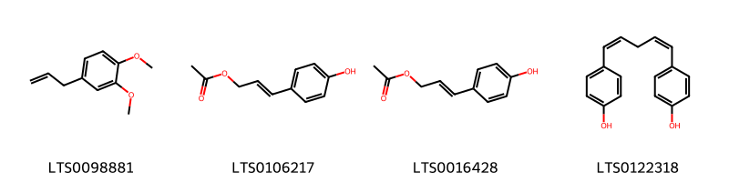{ width=100% }
    <figcaption>Hình ảnh cấu trúc hóa học của 4 hoạt chất thuộc nhóm Benzene and substituted derivatives gồm ['methyl eugenol (LTS0098881)', 'trans-coumaryl acetate (LTS0106217)', '3-(4-hydroxyphenyl)prop-2-en-1-yl acetate (LTS0016428)', '4-[(1z,4z)-5-(4-hydroxyphenyl)penta-1,4-dien-1-yl]phenol (LTS0122318)'].</figcaption>
</figure>
#### Nhóm Carboxylic acids and derivatives
<figure markdown="span">
    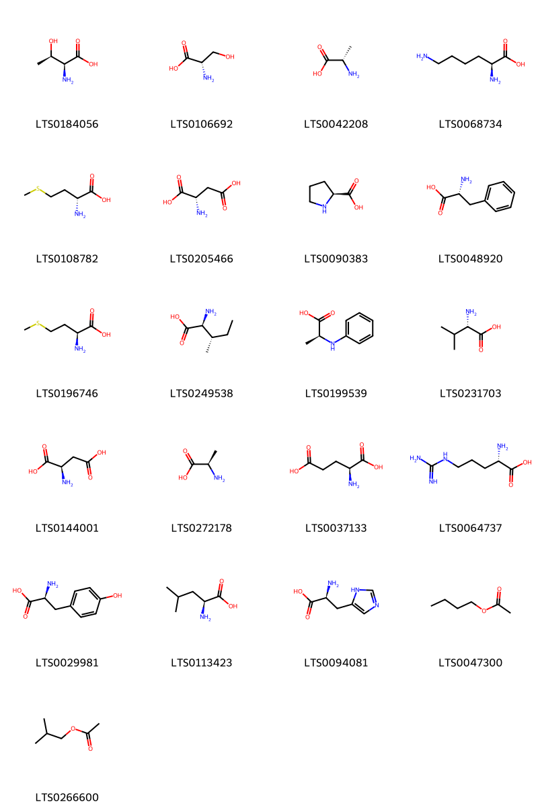{ width=100% }
    <figcaption>Hình ảnh cấu trúc hóa học của 21 hoạt chất thuộc nhóm Carboxylic acids and derivatives gồm ['l-threonine (LTS0184056)', 'l-serine (LTS0106692)', 'l-alanine (LTS0042208)', 'l-lysine (LTS0068734)', 'd-methionine (LTS0108782)', 'l-aspartic acid (LTS0205466)', 'l-proline (LTS0090383)', 'd-phenylalanine (LTS0048920)', 'l-methionine (LTS0196746)', 'l-isoleucine (LTS0249538)', '(2s)-2-(phenylamino)propanoic acid (LTS0199539)', 'l-valine (LTS0231703)', 'd-aspartic acid (LTS0144001)', 'd-alanine (LTS0272178)', 'l-glutamic acid (LTS0037133)', 'l-arginine (LTS0064737)', 'l-tyrosine (LTS0029981)', 'l-leucine (LTS0113423)', 'l-histidine (LTS0094081)', 'butyl acetate (LTS0047300)', 'isobutyl acetate (LTS0266600)'].</figcaption>
</figure>
#### Nhóm Cinnamaldehydes
<figure markdown="span">
    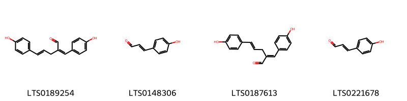{ width=100% }
    <figcaption>Hình ảnh cấu trúc hóa học của 4 hoạt chất thuộc nhóm Cinnamaldehydes gồm ['5-(4-hydroxyphenyl)-2-[(4-hydroxyphenyl)methylidene]pent-4-enal (LTS0189254)', '3-(4-hydroxyphenyl)prop-2-enal (LTS0148306)', '(2e,4e)-5-(4-hydroxyphenyl)-2-[(4-hydroxyphenyl)methylidene]pent-4-enal (LTS0187613)', 'p-coumaraldehyde (LTS0221678)'].</figcaption>
</figure>
#### Nhóm Cinnamic acids and derivatives
<figure markdown="span">
    { width=100% }
    <figcaption>Hình ảnh cấu trúc hóa học của 1 hoạt chất thuộc nhóm Cinnamic acids and derivatives gồm ['cinnamic acid (LTS0128130)'].</figcaption>
</figure>
#### Nhóm Cinnamyl alcohols
<figure markdown="span">
    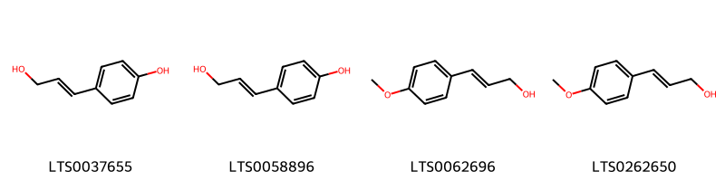{ width=100% }
    <figcaption>Hình ảnh cấu trúc hóa học của 4 hoạt chất thuộc nhóm Cinnamyl alcohols gồm ['4-hydroxycinnamyl alcohol (LTS0037655)', 'p-coumaryl alcohol (LTS0058896)', '(2e)-3-(4-methoxyphenyl)prop-2-en-1-ol (LTS0062696)', '3-(4-methoxyphenyl)prop-2-en-1-ol (LTS0262650)'].</figcaption>
</figure>
#### Nhóm Diarylheptanoids
<figure markdown="span">
    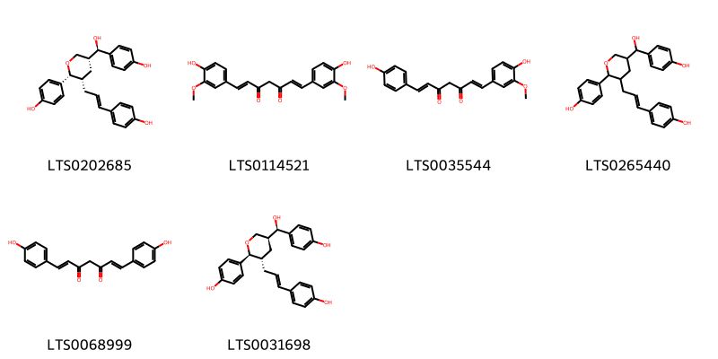{ width=100% }
    <figcaption>Hình ảnh cấu trúc hóa học của 6 hoạt chất thuộc nhóm Diarylheptanoids gồm ['4-[(2r,3s,5r)-5-[(r)-hydroxy(4-hydroxyphenyl)methyl]-3-[(2e)-3-(4-hydroxyphenyl)prop-2-en-1-yl]oxan-2-yl]phenol (LTS0202685)', 'curcumin (LTS0114521)', 'demethoxycurcumin (LTS0035544)', '4-{5-[hydroxy(4-hydroxyphenyl)methyl]-3-[3-(4-hydroxyphenyl)prop-2-en-1-yl]oxan-2-yl}phenol (LTS0265440)', 'bisdemethoxycurcumin (LTS0068999)', '4-[(2s,3s,5s)-5-[(r)-hydroxy(4-hydroxyphenyl)methyl]-3-[(2e)-3-(4-hydroxyphenyl)prop-2-en-1-yl]oxan-2-yl]phenol (LTS0031698)'].</figcaption>
</figure>
#### Nhóm Fatty Acyls
<figure markdown="span">
    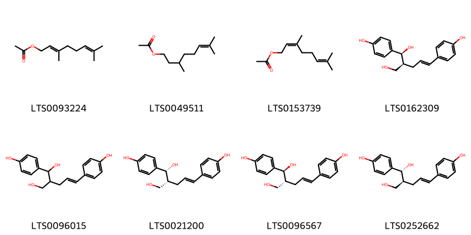{ width=100% }
    <figcaption>Hình ảnh cấu trúc hóa học của 8 hoạt chất thuộc nhóm Fatty Acyls gồm ['geranyl acetate (LTS0093224)', 'citronellyl acetate (LTS0049511)', 'neryl acetate (LTS0153739)', '(1s,2s)-1-(4-hydroxyphenyl)-2-[(2e)-3-(4-hydroxyphenyl)prop-2-en-1-yl]propane-1,3-diol (LTS0162309)', '1-(4-hydroxyphenyl)-2-[3-(4-hydroxyphenyl)prop-2-en-1-yl]propane-1,3-diol (LTS0096015)', '(1r,2r)-1-(4-hydroxyphenyl)-2-[(2e)-3-(4-hydroxyphenyl)prop-2-en-1-yl]propane-1,3-diol (LTS0021200)', '(1s,2r)-1-(4-hydroxyphenyl)-2-[(2e)-3-(4-hydroxyphenyl)prop-2-en-1-yl]propane-1,3-diol (LTS0096567)', '(1r,2s)-1-(4-hydroxyphenyl)-2-[(2e)-3-(4-hydroxyphenyl)prop-2-en-1-yl]propane-1,3-diol (LTS0252662)'].</figcaption>
</figure>
#### Nhóm Flavonoids
<figure markdown="span">
    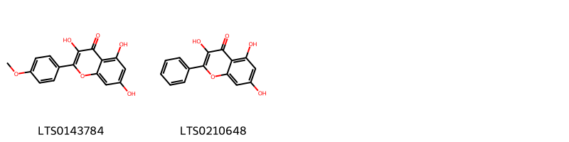{ width=100% }
    <figcaption>Hình ảnh cấu trúc hóa học của 2 hoạt chất thuộc nhóm Flavonoids gồm ['kaempferide (LTS0143784)', 'galangin (LTS0210648)'].</figcaption>
</figure>
#### Nhóm Indoles and derivatives
<figure markdown="span">
    { width=100% }
    <figcaption>Hình ảnh cấu trúc hóa học của 1 hoạt chất thuộc nhóm Indoles and derivatives gồm ['l-tryptophan (LTS0263809)'].</figcaption>
</figure>
#### Nhóm Lactones
<figure markdown="span">
    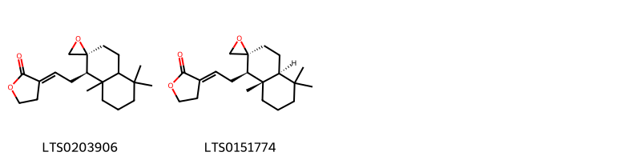{ width=100% }
    <figcaption>Hình ảnh cấu trúc hóa học của 2 hoạt chất thuộc nhóm Lactones gồm ["(3e)-3-{2-[(1r,2s)-5,5,8a-trimethyl-hexahydro-1h-spiro[naphthalene-2,2'-oxiran]-1-yl]ethylidene}oxolan-2-one (LTS0203906)", 'galanolactone (LTS0151774)'].</figcaption>
</figure>
#### Nhóm Organooxygen compounds
<figure markdown="span">
    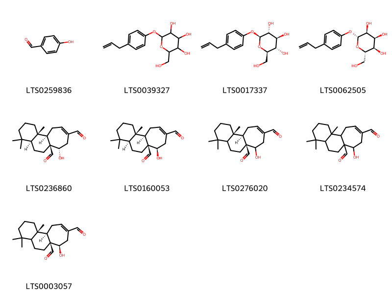{ width=100% }
    <figcaption>Hình ảnh cấu trúc hóa học của 9 hoạt chất thuộc nhóm Organooxygen compounds gồm ['p-hydroxybenzaldehyde (LTS0259836)', '2-(hydroxymethyl)-6-[4-(prop-2-en-1-yl)phenoxy]oxane-3,4,5-triol (LTS0039327)', '(2r,3s,4s,5r,6s)-2-(hydroxymethyl)-6-[4-(prop-2-en-1-yl)phenoxy]oxane-3,4,5-triol (LTS0017337)', '(2s,3r,4s,5s,6r)-2-(hydroxymethyl)-6-[4-(prop-2-en-1-yl)phenoxy]oxane-3,4,5-triol (LTS0062505)', '(4as,6as,7s,11ar,11bs)-7-hydroxy-4,4,11b-trimethyl-1h,2h,3h,4ah,5h,6h,7h,8h,11h,11ah-cyclohepta[a]naphthalene-6a,9-dicarbaldehyde (LTS0236860)', '(4as,6as,7r,11ar,11bs)-7-hydroxy-4,4,11b-trimethyl-1h,2h,3h,4ah,5h,6h,7h,8h,11h,11ah-cyclohepta[a]naphthalene-6a,9-dicarbaldehyde (LTS0160053)', '(6as,11ar,11bs)-7-hydroxy-4,4,11b-trimethyl-1h,2h,3h,4ah,5h,6h,7h,8h,11h,11ah-cyclohepta[a]naphthalene-6a,9-dicarbaldehyde (LTS0276020)', '7-hydroxy-4,4,11b-trimethyl-1h,2h,3h,4ah,5h,6h,7h,8h,11h,11ah-cyclohepta[a]naphthalene-6a,9-dicarbaldehyde (LTS0234574)', '(6as,7r,11ar,11bs)-7-hydroxy-4,4,11b-trimethyl-1h,2h,3h,4ah,5h,6h,7h,8h,11h,11ah-cyclohepta[a]naphthalene-6a,9-dicarbaldehyde (LTS0003057)'].</figcaption>
</figure>
#### Nhóm Oxanes
<figure markdown="span">
    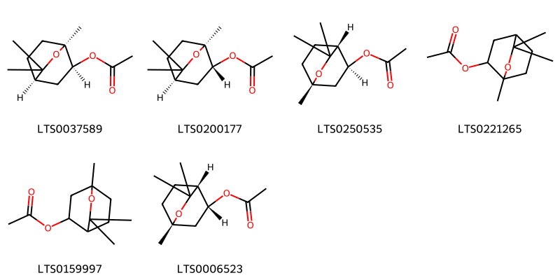{ width=100% }
    <figcaption>Hình ảnh cấu trúc hóa học của 6 hoạt chất thuộc nhóm Oxanes gồm ['(+)-endo-2-acetoxy-1,8-cineole (LTS0037589)', '(1s,4r,6r)-1,3,3-trimethyl-2-oxabicyclo[2.2.2]octan-6-yl acetate (LTS0200177)', '(1s,4r,5s)-1,3,3-trimethyl-2-oxabicyclo[2.2.2]octan-5-yl acetate (LTS0250535)', '1,3,3-trimethyl-2-oxabicyclo[2.2.2]octan-6-yl acetate (LTS0221265)', '1,3,3-trimethyl-2-oxabicyclo[2.2.2]octan-5-yl acetate (LTS0159997)', '(1s,4r,5r)-1,3,3-trimethyl-2-oxabicyclo[2.2.2]octan-5-yl acetate (LTS0006523)'].</figcaption>
</figure>
#### Nhóm Phenol esters
<figure markdown="span">
    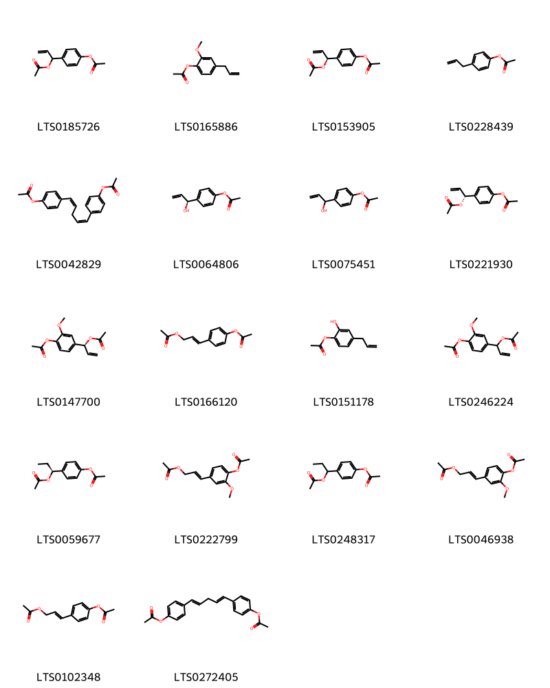{ width=100% }
    <figcaption>Hình ảnh cấu trúc hóa học của 18 hoạt chất thuộc nhóm Phenol esters gồm ['1-[4-(acetyloxy)phenyl]prop-2-en-1-yl acetate (LTS0185726)', 'eugenyl acetate (LTS0165886)', "1'-acetoxychavicol acetate (LTS0153905)", '4-(prop-2-en-1-yl)phenyl acetate (LTS0228439)', '4-[(1z,4z)-5-[4-(acetyloxy)phenyl]penta-1,4-dien-1-yl]phenyl acetate (LTS0042829)', '4-[(1s)-1-hydroxyprop-2-en-1-yl]phenyl acetate (LTS0064806)', '4-(1-hydroxyprop-2-en-1-yl)phenyl acetate (LTS0075451)', "(+)-1'-acetoxychavicol acetate (LTS0221930)", 'engenol (LTS0147700)', '(2e)-3-[4-(acetyloxy)phenyl]prop-2-en-1-yl acetate (LTS0166120)', '2-hydroxy-4-(prop-2-en-1-yl)phenyl acetate (LTS0151178)', '1-[4-(acetyloxy)-3-methoxyphenyl]prop-2-en-1-yl acetate (LTS0246224)', '(1s)-1-[4-(acetyloxy)phenyl]propyl acetate (LTS0059677)', '3-[4-(acetyloxy)-3-methoxyphenyl]prop-2-en-1-yl acetate (LTS0222799)', 'dihydrogalangal acetate (LTS0248317)', '(2e)-3-[4-(acetyloxy)-3-methoxyphenyl]prop-2-en-1-yl acetate (LTS0046938)', '3-[4-(acetyloxy)phenyl]prop-2-en-1-yl acetate (LTS0102348)', '4-{5-[4-(acetyloxy)phenyl]penta-1,4-dien-1-yl}phenyl acetate (LTS0272405)'].</figcaption>
</figure>
#### Nhóm Phenols
<figure markdown="span">
    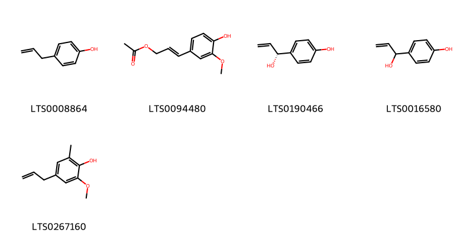{ width=100% }
    <figcaption>Hình ảnh cấu trúc hóa học của 5 hoạt chất thuộc nhóm Phenols gồm ['chavicol (LTS0008864)', 'coniferyl acetate (LTS0094480)', '4-[(1r)-1-hydroxyprop-2-en-1-yl]phenol (LTS0190466)', '4-(1-hydroxyprop-2-en-1-yl)phenol (LTS0016580)', '6-methyleugenol (LTS0267160)'].</figcaption>
</figure>
#### Nhóm Prenol lipids
<figure markdown="span">
    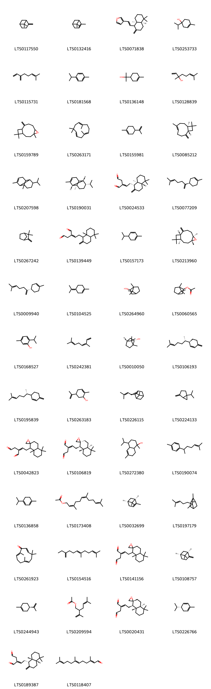{ width=100% }
    <figcaption>Hình ảnh cấu trúc hóa học của 50 hoạt chất thuộc nhóm Prenol lipids gồm ['β-pinene (LTS0117550)', 'α pinene (LTS0132416)', '3-{2-[(4ar,8as)-5,5,8a-trimethyl-2-methylidene-hexahydro-1h-naphthalen-1-yl]ethenyl}furan (LTS0071838)', '4-terpineol (LTS0253733)', 'α-myrcene (LTS0115731)', 'cymene (LTS0181568)', 'terpineol (LTS0136148)', 'linalool, (+-)- (LTS0128839)', 'caryophyllene oxide (LTS0159789)', 'humulene (LTS0263171)', 'limonene,  (LTS0155981)', 'caryophyllene (LTS0085212)', 'α-copaene (LTS0207598)', '(1r,2s,7s,8s)-8-isopropyl-1,3-dimethyltricyclo[4.4.0.0²,⁷]dec-3-ene (LTS0190031)', '(2e)-2-{2-[(1s,4as,8as)-5,5,8a-trimethyl-2-methylidene-hexahydro-1h-naphthalen-1-yl]ethylidene}butanedial (LTS0024533)', '(r)-β-bisabolene (LTS0077209)', 'camphene (LTS0267242)', '2-[2-(5,5,8a-trimethyl-2-methylidene-hexahydro-1h-naphthalen-1-yl)ethylidene]butanedial (LTS0139449)', 'phellandrene (LTS0157173)', 'β-caryophyllene oxide (LTS0213960)', '(-)-β-bisabolene (LTS0009940)', 'terpinolene (LTS0104525)', 'borneol (LTS0264960)', 'bornyl acetate (LTS0060565)', 'thymol (LTS0168527)', 'β-ocimene (LTS0242381)', '(2s,4r)-1,7,7-trimethylbicyclo[2.2.1]heptan-2-ol (LTS0010050)', 'β-sesquiphellandrene (LTS0106193)', '3-[(2s)-6-methylhept-5-en-2-yl]-6-methylidenecyclohex-1-ene (LTS0195839)', 'carveol (LTS0263183)', 'α-bergamotene (LTS0226115)', 'sabinene (LTS0224133)', "2-(2-{5,5,8a-trimethyl-hexahydro-1h-spiro[naphthalene-2,2'-oxiran]-1-yl}ethylidene)butanedial (LTS0042823)", "(2e)-2-{2-[(1r,2s,4as,8as)-5,5,8a-trimethyl-hexahydro-1h-spiro[naphthalene-2,2'-oxiran]-1-yl]ethylidene}butanedial (LTS0106819)", 'delta-cadinol (LTS0272380)', 'curcumene (LTS0190074)', 'terpinene (LTS0136858)', 'farnesyl acetate (LTS0173408)', '(-)-α-pinene (LTS0032699)', '1,7-dimethyl-7-(4-methylpent-3-en-1-yl)tricyclo[2.2.1.0²,⁶]heptane (LTS0197179)', 'zerumbone (LTS0261923)', '(6e)-2,6-dimethyl-10-methylidenedodeca-2,6-diene (LTS0154516)', "(2e)-2-(2-{5,5,8a-trimethyl-hexahydro-1h-spiro[naphthalene-2,2'-oxiran]-1-yl}ethylidene)butanedial (LTS0141156)", '(-)-β-pinene (LTS0108757)', 'α-limonene (LTS0244943)', 'lavandulyl acetate (LTS0209594)', "(2e)-2-{2-[(1r,2r,4as,8as)-5,5,8a-trimethyl-hexahydro-1h-spiro[naphthalene-2,2'-oxiran]-1-yl]ethylidene}butanedial (LTS0020431)", '(-)-α-phellandrene (LTS0226766)', '(2e)-2-{2-[(1s,4as,8ar)-5,5,8a-trimethyl-2-methylidene-hexahydro-1h-naphthalen-1-yl]ethylidene}butanedial (LTS0189387)', 'e,e-farnesal (LTS0118407)'].</figcaption>
</figure>
#### Nhóm Saturated hydrocarbons
<figure markdown="span">
    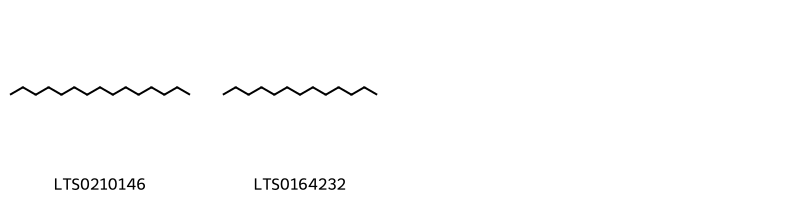{ width=100% }
    <figcaption>Hình ảnh cấu trúc hóa học của 2 hoạt chất thuộc nhóm Saturated hydrocarbons gồm ['pentadecane (LTS0210146)', 'tridecane (LTS0164232)'].</figcaption>
</figure>
#### Nhóm Unsaturated hydrocarbons
<figure markdown="span">
    { width=100% }
    <figcaption>Hình ảnh cấu trúc hóa học của 1 hoạt chất thuộc nhóm Unsaturated hydrocarbons gồm ['α terpinene (LTS0232891)'].</figcaption>
</figure>

---

### Dược dân tộc học

Danh sách các quốc gia có sử dụng *Alpinia galanga* trong điều trị các bệnh. 

| Country   | Disease                           | Bệnh                                                                                                                                                                                                |
|:----------|:----------------------------------|:----------------------------------------------------------------------------------------------------------------------------------------------------------------------------------------------------|
| Elsewhere | Stomachic                         | MYMEMORY WARNING: YOU USED ALL AVAILABLE FREE TRANSLATIONS FOR TODAY. NEXT AVAILABLE IN  08 HOURS 05 MINUTES 11 SECONDS VISIT HTTPS://MYMEMORY.TRANSLATED.NET/DOC/USAGELIMITS.PHP TO TRANSLATE MORE |
| India     | Cardiodepressant, Carminative     | MYMEMORY WARNING: YOU USED ALL AVAILABLE FREE TRANSLATIONS FOR TODAY. NEXT AVAILABLE IN  08 HOURS 05 MINUTES 09 SECONDS VISIT HTTPS://MYMEMORY.TRANSLATED.NET/DOC/USAGELIMITS.PHP TO TRANSLATE MORE |
| Turkey    | Digestive, Expectorant, Stimulant | MYMEMORY WARNING: YOU USED ALL AVAILABLE FREE TRANSLATIONS FOR TODAY. NEXT AVAILABLE IN  08 HOURS 05 MINUTES 07 SECONDS VISIT HTTPS://MYMEMORY.TRANSLATED.NET/DOC/USAGELIMITS.PHP TO TRANSLATE MORE |

---

---
## Alpinia intermedia
### Thông tin về thực vật

!!! info "Phân loại thực vật của *Alpinia intermedia* từ GIBF:"
    - **Kingdom:** Plantae
    - **Phylum:** Tracheophyta
    - **Order:** Zingiberales
    - **Family:** Zingiberaceae
    - **Genus:** Alpinia
    - **Species:** *Alpinia intermedia*

 

| Label (VI)   | Label (EN)   | Scientific Name    | Descriptions (VI)   | Descriptions (EN)   | Also Known As (VI)   | Also Known As (EN)   |
|:-------------|:-------------|:-------------------|:--------------------|:--------------------|:---------------------|:---------------------|
| N/A          | N/A          | Alpinia intermedia |                     | species of plant    | ['']                 | ['']                 |

#### Phân bố trên thế giới

**Từ CSDL GIBF** Hong Kong, Japan, China, Chinese Taipei

#### Phân bố tại Việt Nam

**Từ CSDL GIBF**: Không có ghi nhận ở Việt Nam

---
### Thành phần hóa học
        
- Theo cơ sở dữ liệu lotus: Từ loài *Alpinia intermedia* đã phân lập và xác định được 24 hoạt chất thuộc về các nhóm Prenol lipids, Heteroaromatic compounds, Dihydrofurans. 

|    | chemicalTaxonomyClassyfireClass   |   smiles_count |
|---:|:----------------------------------|---------------:|
|  0 | Dihydrofurans                     |              2 |
|  1 | Heteroaromatic compounds          |              4 |
|  2 | Prenol lipids                     |             18 |

#### Nhóm Dihydrofurans
<figure markdown="span">
    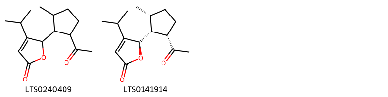{ width=100% }
    <figcaption>Hình ảnh cấu trúc hóa học của 2 hoạt chất thuộc nhóm Dihydrofurans gồm ['5-(2-acetyl-5-methylcyclopentyl)-4-isopropyl-5h-furan-2-one (LTS0240409)', '(5r)-5-[(1r,2s,5r)-2-acetyl-5-methylcyclopentyl]-4-isopropyl-5h-furan-2-one (LTS0141914)'].</figcaption>
</figure>
#### Nhóm Heteroaromatic compounds
<figure markdown="span">
    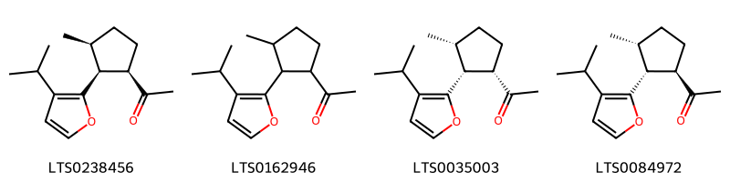{ width=100% }
    <figcaption>Hình ảnh cấu trúc hóa học của 4 hoạt chất thuộc nhóm Heteroaromatic compounds gồm ['1-[(1r,2s,3s)-2-(3-isopropylfuran-2-yl)-3-methylcyclopentyl]ethanone (LTS0238456)', '1-[2-(3-isopropylfuran-2-yl)-3-methylcyclopentyl]ethanone (LTS0162946)', '1-[(1s,2r,3r)-2-(3-isopropylfuran-2-yl)-3-methylcyclopentyl]ethanone (LTS0035003)', '1-[(1r,2r,3r)-2-(3-isopropylfuran-2-yl)-3-methylcyclopentyl]ethanone (LTS0084972)'].</figcaption>
</figure>
#### Nhóm Prenol lipids
<figure markdown="span">
    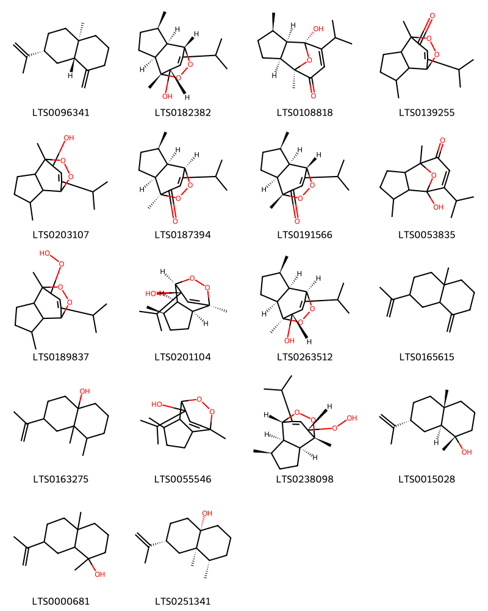{ width=100% }
    <figcaption>Hình ảnh cấu trúc hóa học của 18 hoạt chất thuộc nhóm Prenol lipids gồm ['β-selinene (LTS0096341)', '(1s,2r,3r,6s,7r,8s)-10-isopropyl-3,7-dimethyl-11,12-dioxatricyclo[5.3.2.0²,⁶]dodec-9-en-8-ol (LTS0182382)', '(1s,2r,3r,6s,7r)-1-hydroxy-10-isopropyl-3,7-dimethyl-11-oxatricyclo[5.3.1.0²,⁶]undec-9-en-8-one (LTS0108818)', '10-isopropyl-3,7-dimethyl-11,12-dioxatricyclo[5.3.2.0²,⁶]dodec-9-en-8-one (LTS0139255)', '10-isopropyl-3,7-dimethyl-11,12-dioxatricyclo[5.3.2.0²,⁶]dodec-9-en-8-ol (LTS0203107)', '(1r,2r,3r,6s,7s)-10-isopropyl-3,7-dimethyl-11,12-dioxatricyclo[5.3.2.0²,⁶]dodec-9-en-8-one (LTS0187394)', '(1s,2r,3r,6s,7r)-10-isopropyl-3,7-dimethyl-11,12-dioxatricyclo[5.3.2.0²,⁶]dodec-9-en-8-one (LTS0191566)', '1-hydroxy-10-isopropyl-3,7-dimethyl-11-oxatricyclo[5.3.1.0²,⁶]undec-9-en-8-one (LTS0053835)', '10-isopropyl-3,7-dimethyl-11,12-dioxatricyclo[5.3.2.0²,⁶]dodec-9-ene-8-peroxol (LTS0189837)', '(1r,2s,5r,6r,7r,8r)-8-isopropyl-1,5-dimethyl-11,12-dioxatricyclo[5.3.2.0²,⁶]dodec-9-en-8-ol (LTS0201104)', '(1r,2r,3r,6s,7s,8s)-10-isopropyl-3,7-dimethyl-11,12-dioxatricyclo[5.3.2.0²,⁶]dodec-9-en-8-ol (LTS0263512)', '4a-methyl-1-methylidene-7-(prop-1-en-2-yl)-octahydronaphthalene (LTS0165615)', '1,8a-dimethyl-7-(prop-1-en-2-yl)-octahydronaphthalen-4a-ol (LTS0163275)', '8-isopropyl-1,5-dimethyl-11,12-dioxatricyclo[5.3.2.0²,⁶]dodec-9-en-8-ol (LTS0055546)', '(1s,2r,3r,6s,7r,8s)-10-isopropyl-3,7-dimethyl-11,12-dioxatricyclo[5.3.2.0²,⁶]dodec-9-ene-8-peroxol (LTS0238098)', '(1s,4as,7r,8as)-1,4a-dimethyl-7-(prop-1-en-2-yl)-octahydronaphthalen-1-ol (LTS0015028)', '1,4a-dimethyl-7-(prop-1-en-2-yl)-octahydronaphthalen-1-ol (LTS0000681)', '(1s,4as,7r,8ar)-1,8a-dimethyl-7-(prop-1-en-2-yl)-octahydronaphthalen-4a-ol (LTS0251341)'].</figcaption>
</figure>

---

### Dược dân tộc học

Danh sách các quốc gia có sử dụng *Alpinia intermedia* trong điều trị các bệnh. 

| Country   | Disease   | Bệnh                                                                                                                                                                                                |
|:----------|:----------|:----------------------------------------------------------------------------------------------------------------------------------------------------------------------------------------------------|
| Elsewhere | Stomachic | MYMEMORY WARNING: YOU USED ALL AVAILABLE FREE TRANSLATIONS FOR TODAY. NEXT AVAILABLE IN  08 HOURS 04 MINUTES 33 SECONDS VISIT HTTPS://MYMEMORY.TRANSLATED.NET/DOC/USAGELIMITS.PHP TO TRANSLATE MORE |

---

---
## Alpinia japonica
### Thông tin về thực vật

!!! info "Phân loại thực vật của *Alpinia japonica* từ GIBF:"
    - **Kingdom:** Plantae
    - **Phylum:** Tracheophyta
    - **Order:** Zingiberales
    - **Family:** Zingiberaceae
    - **Genus:** Alpinia
    - **Species:** *Alpinia japonica*

 

| Label (VI)   | Label (EN)   | Scientific Name   | Descriptions (VI)   | Descriptions (EN)   | Also Known As (VI)   | Also Known As (EN)   |
|:-------------|:-------------|:------------------|:--------------------|:--------------------|:---------------------|:---------------------|
| N/A          | N/A          | Alpinia japonica  | loài thực vật       | species of plant    | ['']                 | ['']                 |

#### Phân bố trên thế giới

**Từ CSDL GIBF** nan, Japan, Canada, China, Belgium, Chinese Taipei

#### Phân bố tại Việt Nam

**Từ CSDL GIBF**: Không có ghi nhận ở Việt Nam

---
### Thành phần hóa học
        
- Theo cơ sở dữ liệu lotus: Từ loài *Alpinia japonica* đã phân lập và xác định được 80 hoạt chất thuộc về các nhóm Organooxygen compounds, Benzopyrans, Flavonoids, Dioxanes, Oxepanes, Prenol lipids, Epoxides, Linear 1,3-diarylpropanoids, Dihydrofurans, Heteroaromatic compounds, Homoisoflavonoids. 

|    | chemicalTaxonomyClassyfireClass   |   smiles_count |
|---:|:----------------------------------|---------------:|
|  0 | Benzopyrans                       |              2 |
|  1 | Dihydrofurans                     |              4 |
|  2 | Dioxanes                          |              2 |
|  3 | Epoxides                          |              2 |
|  4 | Flavonoids                        |              4 |
|  5 | Heteroaromatic compounds          |              4 |
|  6 | Homoisoflavonoids                 |             12 |
|  7 | Linear 1,3-diarylpropanoids       |              8 |
|  8 | Organooxygen compounds            |              5 |
|  9 | Oxepanes                          |              1 |
| 10 | Prenol lipids                     |             36 |

#### Nhóm Benzopyrans
<figure markdown="span">
    { width=100% }
    <figcaption>Hình ảnh cấu trúc hóa học của 2 hoạt chất thuộc nhóm Benzopyrans gồm ['brazilin (LTS0270595)', 'brazilin (LTS0018878)'].</figcaption>
</figure>
#### Nhóm Dihydrofurans
<figure markdown="span">
    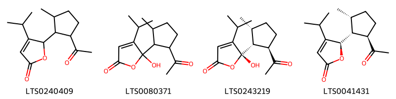{ width=100% }
    <figcaption>Hình ảnh cấu trúc hóa học của 4 hoạt chất thuộc nhóm Dihydrofurans gồm ['5-(2-acetyl-5-methylcyclopentyl)-4-isopropyl-5h-furan-2-one (LTS0240409)', '5-(2-acetyl-5-methylcyclopentyl)-5-hydroxy-4-isopropylfuran-2-one (LTS0080371)', '(5s)-5-[(1r,2r,5r)-2-acetyl-5-methylcyclopentyl]-5-hydroxy-4-isopropylfuran-2-one (LTS0243219)', '(5r)-5-[(1r,2r,5r)-2-acetyl-5-methylcyclopentyl]-4-isopropyl-5h-furan-2-one (LTS0041431)'].</figcaption>
</figure>
#### Nhóm Dioxanes
<figure markdown="span">
    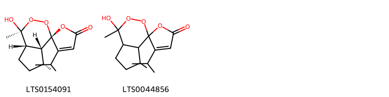{ width=100% }
    <figcaption>Hình ảnh cấu trúc hóa học của 2 hoạt chất thuộc nhóm Dioxanes gồm ["(1s,4s,4as,7r,7ar)-4-hydroxy-3'-isopropyl-4,7-dimethyl-5,6,7,7a-tetrahydro-4ah-spiro[cyclopenta[d][1,2]dioxine-1,2'-furan]-5'-one (LTS0154091)", "4-hydroxy-3'-isopropyl-4,7-dimethyl-5,6,7,7a-tetrahydro-4ah-spiro[cyclopenta[d][1,2]dioxine-1,2'-furan]-5'-one (LTS0044856)"].</figcaption>
</figure>
#### Nhóm Epoxides
<figure markdown="span">
    { width=100% }
    <figcaption>Hình ảnh cấu trúc hóa học của 2 hoạt chất thuộc nhóm Epoxides gồm ['(3z,7e)-1,5,5,8-tetramethyl-12-oxabicyclo[9.1.0]dodeca-3,7-diene (LTS0107049)', '(1r,11s)-1,5,5,8-tetramethyl-12-oxabicyclo[9.1.0]dodeca-3,7-diene (LTS0195579)'].</figcaption>
</figure>
#### Nhóm Flavonoids
<figure markdown="span">
    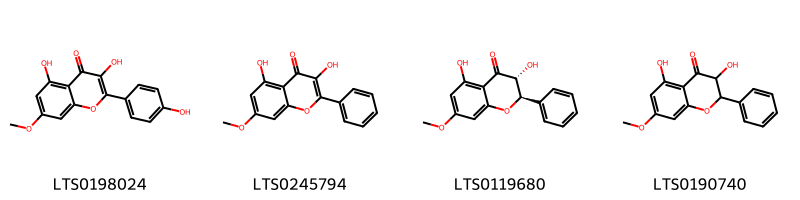{ width=100% }
    <figcaption>Hình ảnh cấu trúc hóa học của 4 hoạt chất thuộc nhóm Flavonoids gồm ['rhamnocitrin (LTS0198024)', 'izalpinin (LTS0245794)', '(2r,3r)-3,5-dihydroxy-7-methoxy-2-phenyl-2,3-dihydro-1-benzopyran-4-one (LTS0119680)', '3,5-dihydroxy-7-methoxy-2-phenyl-2,3-dihydro-1-benzopyran-4-one (LTS0190740)'].</figcaption>
</figure>
#### Nhóm Heteroaromatic compounds
<figure markdown="span">
    { width=100% }
    <figcaption>Hình ảnh cấu trúc hóa học của 4 hoạt chất thuộc nhóm Heteroaromatic compounds gồm ['1-[(1r,2s,3s)-2-(3-isopropylfuran-2-yl)-3-methylcyclopentyl]ethanone (LTS0238456)', '1-[2-(3-isopropylfuran-2-yl)-3-methylcyclopentyl]ethanone (LTS0162946)', '1-[(1s,2r,3r)-2-(3-isopropylfuran-2-yl)-3-methylcyclopentyl]ethanone (LTS0035003)', '1-[(1r,2r,3r)-2-(3-isopropylfuran-2-yl)-3-methylcyclopentyl]ethanone (LTS0084972)'].</figcaption>
</figure>
#### Nhóm Homoisoflavonoids
<figure markdown="span">
    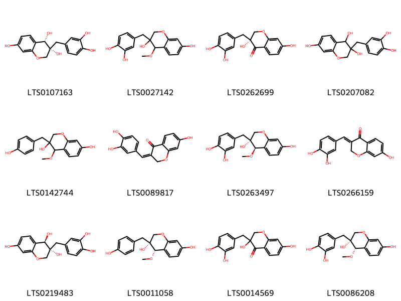{ width=100% }
    <figcaption>Hình ảnh cấu trúc hóa học của 12 hoạt chất thuộc nhóm Homoisoflavonoids gồm ['sappanol (LTS0107163)', '3-[(3,4-dihydroxyphenyl)methyl]-4-methoxy-2,4-dihydro-1-benzopyran-3,7-diol (LTS0027142)', '(3r)-3-[(3,4-dihydroxyphenyl)methyl]-3,7-dihydroxy-2h-1-benzopyran-4-one (LTS0262699)', 'sappanol (LTS0207082)', '3-[(4-hydroxyphenyl)methyl]-4-methoxy-2,4-dihydro-1-benzopyran-3,7-diol (LTS0142744)', 'sappanone a (LTS0089817)', '(3r,4r)-3-[(3,4-dihydroxyphenyl)methyl]-4-methoxy-2,4-dihydro-1-benzopyran-3,7-diol (LTS0263497)', 'sappanone a (LTS0266159)', '(3r,4r)-3-[(3,4-dihydroxyphenyl)methyl]-2,4-dihydro-1-benzopyran-3,4,7-triol (LTS0219483)', '(3r,4s)-3-[(4-hydroxyphenyl)methyl]-4-methoxy-2,4-dihydro-1-benzopyran-3,7-diol (LTS0011058)', '3-[(3,4-dihydroxyphenyl)methyl]-3,7-dihydroxy-2h-1-benzopyran-4-one (LTS0014569)', '(3r,4s)-3-[(3,4-dihydroxyphenyl)methyl]-4-methoxy-2,4-dihydro-1-benzopyran-3,7-diol (LTS0086208)'].</figcaption>
</figure>
#### Nhóm Linear 1_3-diarylpropanoids
<figure markdown="span">
    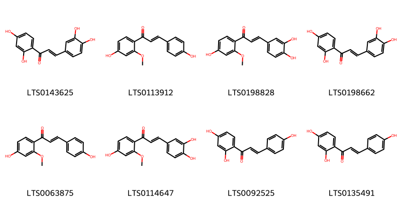{ width=100% }
    <figcaption>Hình ảnh cấu trúc hóa học của Không tìm thấy chú thích hoạt chất thuộc nhóm Linear 1_3-diarylpropanoids gồm Không tìm thấy chú thích.</figcaption>
</figure>
#### Nhóm Organooxygen compounds
<figure markdown="span">
    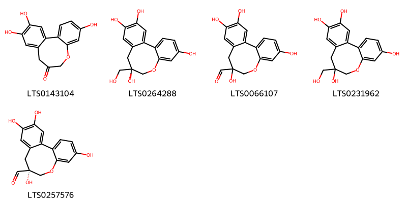{ width=100% }
    <figcaption>Hình ảnh cấu trúc hóa học của 5 hoạt chất thuộc nhóm Organooxygen compounds gồm ['protosappanin a (LTS0143104)', '(10r)-10-(hydroxymethyl)-8-oxatricyclo[10.4.0.0²,⁷]hexadeca-1(16),2,4,6,12,14-hexaene-5,10,14,15-tetrol (LTS0264288)', '5,10,14,15-tetrahydroxy-8-oxatricyclo[10.4.0.0²,⁷]hexadeca-1(16),2,4,6,12,14-hexaene-10-carbaldehyde (LTS0066107)', '10-(hydroxymethyl)-8-oxatricyclo[10.4.0.0²,⁷]hexadeca-1(16),2,4,6,12,14-hexaene-5,10,14,15-tetrol (LTS0231962)', '(10r)-5,10,14,15-tetrahydroxy-8-oxatricyclo[10.4.0.0²,⁷]hexadeca-1(16),2,4,6,12,14-hexaene-10-carbaldehyde (LTS0257576)'].</figcaption>
</figure>
#### Nhóm Oxepanes
<figure markdown="span">
    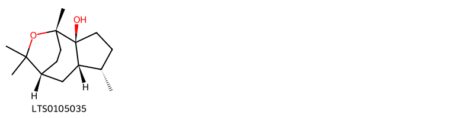{ width=100% }
    <figcaption>Hình ảnh cấu trúc hóa học của 1 hoạt chất thuộc nhóm Oxepanes gồm ['(1s,2s,5s,6s,8r)-1,5,9,9-tetramethyl-10-oxatricyclo[6.2.2.0²,⁶]dodecan-2-ol (LTS0105035)'].</figcaption>
</figure>
#### Nhóm Prenol lipids
<figure markdown="span">
    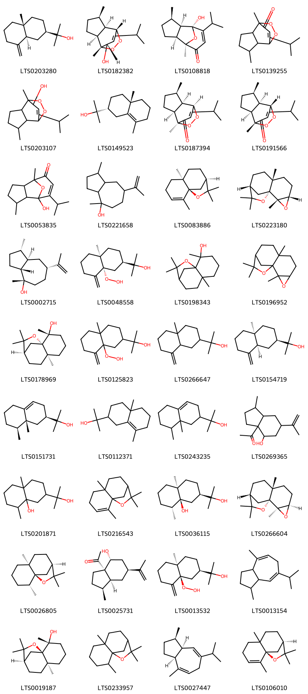{ width=100% }
    <figcaption>Hình ảnh cấu trúc hóa học của 36 hoạt chất thuộc nhóm Prenol lipids gồm ['β-eudesmol (LTS0203280)', '(1s,2r,3r,6s,7r,8s)-10-isopropyl-3,7-dimethyl-11,12-dioxatricyclo[5.3.2.0²,⁶]dodec-9-en-8-ol (LTS0182382)', '(1s,2r,3r,6s,7r)-1-hydroxy-10-isopropyl-3,7-dimethyl-11-oxatricyclo[5.3.1.0²,⁶]undec-9-en-8-one (LTS0108818)', '10-isopropyl-3,7-dimethyl-11,12-dioxatricyclo[5.3.2.0²,⁶]dodec-9-en-8-one (LTS0139255)', '10-isopropyl-3,7-dimethyl-11,12-dioxatricyclo[5.3.2.0²,⁶]dodec-9-en-8-ol (LTS0203107)', '10-epi-gamma-eudesmol (LTS0149523)', '(1r,2r,3r,6s,7s)-10-isopropyl-3,7-dimethyl-11,12-dioxatricyclo[5.3.2.0²,⁶]dodec-9-en-8-one (LTS0187394)', '(1s,2r,3r,6s,7r)-10-isopropyl-3,7-dimethyl-11,12-dioxatricyclo[5.3.2.0²,⁶]dodec-9-en-8-one (LTS0191566)', '1-hydroxy-10-isopropyl-3,7-dimethyl-11-oxatricyclo[5.3.1.0²,⁶]undec-9-en-8-one (LTS0053835)', '1,4-dimethyl-7-(prop-1-en-2-yl)-octahydro-1h-azulen-4-ol (LTS0221658)', '(1r,6s,9r)-2,6,10,10-tetramethyl-11-oxatricyclo[7.2.1.0¹,⁶]dodec-2-ene (LTS0083886)', '(1r,2s,4s,7r,10r)-2,7,11,11-tetramethyl-3,12-dioxatetracyclo[8.2.1.0¹,⁷.0²,⁴]tridecane (LTS0223180)', '(1s,3ar,4s,7r,8ar)-1,4-dimethyl-7-(prop-1-en-2-yl)-octahydro-1h-azulen-4-ol (LTS0002715)', '2-[(2r,4as,8ar)-8a-hydroperoxy-4a-methyl-8-methylidene-hexahydro-1h-naphthalen-2-yl]propan-2-ol (LTS0048558)', '2,6,10,10-tetramethyl-11-oxatricyclo[7.2.1.0¹,⁶]dodecan-2-ol (LTS0198343)', '2,7,11,11-tetramethyl-3,12-dioxatetracyclo[8.2.1.0¹,⁷.0²,⁴]tridecane (LTS0196952)', '(1s,2r,6s,9r)-2,6,10,10-tetramethyl-11-oxatricyclo[7.2.1.0¹,⁶]dodecan-2-ol (LTS0178969)', '2-(8a-hydroperoxy-4a-methyl-8-methylidene-hexahydro-1h-naphthalen-2-yl)propan-2-ol (LTS0125823)', 'β-eudesmol (LTS0266647)', 'β-eudesmol (LTS0154719)', '2-[(2r,8s,8ar)-8,8a-dimethyl-2,3,5,6,7,8-hexahydro-1h-naphthalen-2-yl]propan-2-ol (LTS0151731)', '2-(4a,8-dimethyl-2,3,4,5,6,7-hexahydro-1h-naphthalen-2-yl)propan-2-ol (LTS0112371)', '2-(8,8a-dimethyl-2,3,5,6,7,8-hexahydro-1h-naphthalen-2-yl)propan-2-ol (LTS0243235)', '1-[4-hydroxy-1-methyl-6-(prop-1-en-2-yl)-octahydroinden-3a-yl]ethanone (LTS0269365)', '3-(2-hydroxypropan-2-yl)-5,8a-dimethyl-octahydronaphthalen-4a-ol (LTS0201871)', '2,6,10,10-tetramethyl-11-oxatricyclo[7.2.1.0¹,⁶]dodec-2-ene (LTS0216543)', '(3r,4as,5r,8as)-3-(2-hydroxypropan-2-yl)-5,8a-dimethyl-octahydronaphthalen-4a-ol (LTS0036115)', '(1r,2r,4r,7r,10r)-2,7,11,11-tetramethyl-3,12-dioxatetracyclo[8.2.1.0¹,⁷.0²,⁴]tridecane (LTS0266604)', 'dihydroagarofuran (LTS0026805)', '1-[(1s,3as,4r,6s,7as)-4-hydroxy-1-methyl-6-(prop-1-en-2-yl)-octahydroinden-3a-yl]ethanone (LTS0025731)', '2-[(2r,4as,8as)-8a-hydroperoxy-4a-methyl-8-methylidene-hexahydro-1h-naphthalen-2-yl]propan-2-ol (LTS0013532)', '(1xi,4xi,5xi)-guaia-6,9-diene (LTS0013154)', '(1r,2r,6s,9r)-2,6,10,10-tetramethyl-11-oxatricyclo[7.2.1.0¹,⁶]dodecan-2-ol (LTS0019187)', '2,6,10,10-tetramethyl-11-oxatricyclo[7.2.1.0¹,⁶]dodecane (LTS0233957)', '(-)-guaia-6,9-diene (LTS0027447)', '(1r,9r)-2,6,10,10-tetramethyl-11-oxatricyclo[7.2.1.0¹,⁶]dodec-2-ene (LTS0106010)'].</figcaption>
</figure>

---

### Dược dân tộc học

Danh sách các quốc gia có sử dụng *Alpinia japonica* trong điều trị các bệnh. 

| Country   | Disease   | Bệnh                                                                                                                                                                                                |
|:----------|:----------|:----------------------------------------------------------------------------------------------------------------------------------------------------------------------------------------------------|
| Elsewhere | Stomachic | MYMEMORY WARNING: YOU USED ALL AVAILABLE FREE TRANSLATIONS FOR TODAY. NEXT AVAILABLE IN  08 HOURS 04 MINUTES 09 SECONDS VISIT HTTPS://MYMEMORY.TRANSLATED.NET/DOC/USAGELIMITS.PHP TO TRANSLATE MORE |

---

---
## Alpinia malaccensis
### Thông tin về thực vật

!!! info "Phân loại thực vật của *Alpinia malaccensis* từ GIBF:"
    - **Kingdom:** Plantae
    - **Phylum:** Tracheophyta
    - **Order:** Zingiberales
    - **Family:** Zingiberaceae
    - **Genus:** Alpinia
    - **Species:** *Alpinia malaccensis*

 

| Label (VI)   | Label (EN)   | Scientific Name     | Descriptions (VI)   | Descriptions (EN)   | Also Known As (VI)      | Also Known As (EN)                                                                                                 |
|:-------------|:-------------|:--------------------|:--------------------|:--------------------|:------------------------|:-------------------------------------------------------------------------------------------------------------------|
| N/A          | N/A          | Alpinia malaccensis | loài thực vật       | species of plant    | ['Alpinia malaccensis'] | ['Buekia malaccensis', 'Catimbium malaccense', 'Costus malaccensis', 'Languas malaccensis', 'Maranta malaccensis'] |

#### Phân bố trên thế giới

**Từ CSDL GIBF** nan, Viet Nam, unknown or invalid, Thailand, Philippines, Lao People’s Democratic Republic, Singapore, Indonesia, Sri Lanka, Malaysia, India, Bangladesh, Belgium, Cambodia, Myanmar, China, Nepal, New Zealand, Papua New Guinea, United States of America, Solomon Islands

#### Phân bố tại Việt Nam

**Từ CSDL GIBF**: Hoa Binh

---
### Thành phần hóa học
        
- Theo cơ sở dữ liệu lotus: Từ loài *Alpinia malaccensis* đã phân lập và xác định được Chưa có hoạt chất nào được phân lập. hoạt chất thuộc về các nhóm Không có hoạt chất nào được phân lập. 

Không có hình ảnh nào được tạo ra

---

### Dược dân tộc học

Danh sách các quốc gia có sử dụng *Alpinia malaccensis* trong điều trị các bệnh. 

| Country   | Disease   | Bệnh                                                                                                                                                                                                |
|:----------|:----------|:----------------------------------------------------------------------------------------------------------------------------------------------------------------------------------------------------|
| Elsewhere | Emetic    | MYMEMORY WARNING: YOU USED ALL AVAILABLE FREE TRANSLATIONS FOR TODAY. NEXT AVAILABLE IN  08 HOURS 03 MINUTES 44 SECONDS VISIT HTTPS://MYMEMORY.TRANSLATED.NET/DOC/USAGELIMITS.PHP TO TRANSLATE MORE |

---

---
## Alpinia officinarum
### Thông tin về thực vật

!!! info "Phân loại thực vật của *Alpinia officinarum* từ GIBF:"
    - **Kingdom:** Plantae
    - **Phylum:** Tracheophyta
    - **Order:** Zingiberales
    - **Family:** Zingiberaceae
    - **Genus:** Alpinia
    - **Species:** *Alpinia officinarum*

 

| Label (VI)   | Label (EN)   | Scientific Name     | Descriptions (VI)   | Descriptions (EN)   | Also Known As (VI)      | Also Known As (EN)   |
|:-------------|:-------------|:--------------------|:--------------------|:--------------------|:------------------------|:---------------------|
| N/A          | N/A          | Alpinia officinarum | loài thực vật       | species of plant    | ['Alpinia officinarum'] | ['']                 |

#### Phân bố trên thế giới

**Từ CSDL GIBF** Viet Nam, nan, unknown or invalid, Sri Lanka, Iran (Islamic Republic of), Myanmar, India, United States of America, China, Norway, Hong Kong

#### Phân bố tại Việt Nam

**Từ CSDL GIBF**: Hải Phòng

---
### Thành phần hóa học
        
- Theo cơ sở dữ liệu lotus: Từ loài *Alpinia officinarum* đã phân lập và xác định được 129 hoạt chất thuộc về các nhóm Organooxygen compounds, Flavonoids, Indoles and derivatives, Cinnamyl alcohols, Phenol esters, Fatty Acyls, Diarylheptanoids, Pyrans, Phenols, Phenylpropanoic acids, Steroids and steroid derivatives, Benzene and substituted derivatives. 

|    | chemicalTaxonomyClassyfireClass     |   smiles_count |
|---:|:------------------------------------|---------------:|
|  0 | Benzene and substituted derivatives |              7 |
|  1 | Cinnamyl alcohols                   |              2 |
|  2 | Diarylheptanoids                    |             74 |
|  3 | Fatty Acyls                         |              6 |
|  4 | Flavonoids                          |             11 |
|  5 | Indoles and derivatives             |              1 |
|  6 | Organooxygen compounds              |             17 |
|  7 | Phenol esters                       |              3 |
|  8 | Phenols                             |              2 |
|  9 | Phenylpropanoic acids               |              2 |
| 10 | Pyrans                              |              1 |
| 11 | Steroids and steroid derivatives    |              3 |

#### Nhóm Benzene and substituted derivatives
<figure markdown="span">
    { width=100% }
    <figcaption>Hình ảnh cấu trúc hóa học của 7 hoạt chất thuộc nhóm Benzene and substituted derivatives gồm ['4-[(1r,2s,4e)-1-ethoxy-5-(4-hydroxyphenyl)-2-(methoxymethyl)pent-4-en-1-yl]phenol (LTS0180999)', 'allylbenzene (LTS0010316)', '4-[5-(4-hydroxyphenyl)-5-methoxy-4-(methoxymethyl)pent-1-en-1-yl]phenol (LTS0048024)', '4-[(1e,4s,5s)-5-(4-hydroxyphenyl)-5-methoxy-4-(methoxymethyl)pent-1-en-1-yl]phenol (LTS0212286)', '4-[(1e)-3-methoxyprop-1-en-1-yl]phenol (LTS0269655)', '4-(3-methoxyprop-1-en-1-yl)phenol (LTS0258195)', '4-[1-ethoxy-5-(4-hydroxyphenyl)-2-(methoxymethyl)pent-4-en-1-yl]phenol (LTS0043187)'].</figcaption>
</figure>
#### Nhóm Cinnamyl alcohols
<figure markdown="span">
    { width=100% }
    <figcaption>Hình ảnh cấu trúc hóa học của 2 hoạt chất thuộc nhóm Cinnamyl alcohols gồm ['4-hydroxycinnamyl alcohol (LTS0037655)', 'p-coumaryl alcohol (LTS0058896)'].</figcaption>
</figure>
#### Nhóm Diarylheptanoids
<figure markdown="span">
    { width=100% }
    <figcaption>Hình ảnh cấu trúc hóa học của 74 hoạt chất thuộc nhóm Diarylheptanoids gồm ['5-hydroxy-1,7-diphenylhept-6-en-3-one (LTS0167516)', '5-hydroxy-7-(4-hydroxy-3-methoxyphenyl)-1-phenylheptan-3-one (LTS0097032)', '7-(4-hydroxy-3-methoxyphenyl)-1-phenylhept-4-en-3-one (LTS0070941)', '(5r)-5-hydroxy-1,7-diphenylheptan-3-one (LTS0204758)', '1,7-diphenylheptane-3,5-diol (LTS0142550)', '(4e)-7-(4-hydroxy-3-methoxyphenyl)-1-phenylhept-4-en-3-one (LTS0059974)', '(5s,6e)-5-hydroxy-1,7-diphenylhept-6-en-3-one (LTS0220784)', '5-hydroxy-1,7-diphenylheptan-3-one (LTS0162873)', '(5s)-5-hydroxy-7-(4-hydroxy-3-methoxyphenyl)-1-phenylheptan-3-one (LTS0230752)', '(4e,6r)-6-hydroxy-1,7-diphenylhept-4-en-3-one (LTS0181105)', '(4z)-5-hydroxy-7-(4-hydroxy-3-methoxyphenyl)-1-phenylhept-4-en-3-one (LTS0115461)', '(4e)-1,7-diphenylhept-4-en-3-one (LTS0122131)', '5-methoxy-1,7-diphenylheptan-3-one (LTS0042133)', '(4e,6s)-6-hydroxy-1,7-diphenylhept-4-en-3-one (LTS0237809)', '(5s)-7-(4-hydroxyphenyl)-5-methoxy-1-phenylheptan-3-one (LTS0085997)', '(5e)-1,7-diphenylhept-5-en-3-one (LTS0080870)', '7-(3,4-dihydroxy-5-methoxyphenyl)-5-hydroxy-1-(4-hydroxy-3-methoxyphenyl)heptan-3-one (LTS0029629)', '(5r)-5-hydroxy-1-(4-hydroxy-3-methoxyphenyl)-7-(4-hydroxyphenyl)heptan-3-one (LTS0096483)', '5-hydroxy-1-(4-hydroxy-3-methoxyphenyl)-7-(4-hydroxyphenyl)heptan-3-one (LTS0184170)', "7-[2',6-dihydroxy-3',5-dimethoxy-5'-(3-methoxy-5-oxo-7-phenylheptyl)-[1,1'-biphenyl]-3-yl]-5-methoxy-1-phenylheptan-3-one (LTS0042637)", "(5r)-7-{2',6-dihydroxy-3',5-dimethoxy-5'-[(3r)-3-methoxy-5-oxo-7-phenylheptyl]-[1,1'-biphenyl]-3-yl}-5-methoxy-1-phenylheptan-3-one (LTS0179453)", '(5r)-7-(3,4-dihydroxy-5-methoxyphenyl)-5-hydroxy-1-(4-hydroxy-3-methoxyphenyl)heptan-3-one (LTS0087489)', '7-(4-hydroxy-3-methoxyphenyl)-1-(4-hydroxyphenyl)hept-4-en-3-one (LTS0100197)', '(1e,4r)-1,7-diphenyl-4-(2-phenylethyl)hept-1-ene-3,5-dione (LTS0101202)', '(5s)-5-hydroxy-7-(4-hydroxyphenyl)-1-phenylheptan-3-one (LTS0170141)', '1-[(1r,6r)-4-(4-methylpent-3-en-1-yl)-6-(2-phenylethyl)cyclohex-3-en-1-yl]-3-phenylpropan-1-one (LTS0117474)', '1,7-diphenylhept-1-en-3-one (LTS0112176)', '7-(4-hydroxy-3-methoxyphenyl)-5-methoxy-1-phenylheptan-3-one (LTS0189151)', '1,7-diphenyl-4-(2-phenylethyl)hept-1-ene-3,5-dione (LTS0182709)', '2-benzyl-5-(2-phenylethyl)furan (LTS0115378)', '5-hydroxy-1-(4-hydroxy-3-methoxyphenyl)-7-phenylhepta-4,6-dien-3-one (LTS0207118)', '(5s)-7-(4-hydroxy-3-methoxyphenyl)-1-(4-hydroxyphenyl)-5-methoxyheptan-3-one (LTS0106212)', '(5r)-5-hydroxy-7-(4-hydroxy-3-methoxyphenyl)-1-(4-hydroxyphenyl)heptan-3-one (LTS0036908)', '1-(4-hydroxy-3-methoxyphenyl)-7-phenylheptane-3,5-diol (LTS0118280)', '(5s)-5-hydroxy-1,7-bis(4-hydroxy-3-methoxyphenyl)heptan-3-one (LTS0173586)', '(5r)-5-methoxy-1,7-diphenylheptan-3-one (LTS0140966)', '(4e)-7-(4-hydroxy-3-methoxyphenyl)-1-(4-hydroxyphenyl)hept-4-en-3-one (LTS0202837)', '(5e)-7-(4-hydroxy-3-methoxyphenyl)-1-phenylhept-5-en-3-one (LTS0149796)', '4-[3,5-dihydroxy-7-(4-hydroxy-3-methoxyphenyl)heptyl]benzene-1,2-diol (LTS0169657)', '(2s,4e)-2-hydroxy-1,7-diphenylhept-4-en-3-one (LTS0100843)', '7-(4-hydroxy-3-methoxyphenyl)-1-phenylhept-5-en-3-one (LTS0236839)', '(3s,5r)-1-(4-hydroxy-3-methoxyphenyl)-7-phenylheptane-3,5-diol (LTS0161352)', '(5s)-5-methoxy-1,7-diphenylheptan-3-one (LTS0227730)', '7-(3,4-dihydroxy-5-methoxyphenyl)-1-phenylhept-4-en-3-one (LTS0114615)', '(5r)-7-(4-hydroxy-3-methoxyphenyl)-5-methoxy-1-phenylheptan-3-one (LTS0167601)', '5-hydroxy-7-(4-hydroxy-3-methoxyphenyl)-1-(4-hydroxyphenyl)heptan-3-one (LTS0176713)', '6-hydroxy-1,7-diphenylhept-4-en-3-one (LTS0264395)', '(5r)-5-hydroxy-7-(4-hydroxyphenyl)-1-phenylheptan-3-one (LTS0185990)', '(4e)-7-(3,4-dihydroxy-5-methoxyphenyl)-1-phenylhept-4-en-3-one (LTS0077498)', '(4e)-7-(4-hydroxyphenyl)-1-phenylhept-4-en-3-one (LTS0053797)', '(5s)-5-hydroxy-1,7-diphenylheptan-3-one (LTS0206466)', '(4z,6e)-5-hydroxy-1-(4-hydroxy-3-methoxyphenyl)-7-phenylhepta-4,6-dien-3-one (LTS0203880)', '1-[2,6-bis(2-phenylethyl)-5-(3-phenylpropanoyl)pyridin-3-yl]-3-phenylpropan-1-one (LTS0207856)', '5-hydroxy-7-(4-hydroxy-3-methoxyphenyl)-1-phenylhept-4-en-3-one (LTS0087744)', '2-methoxy-4-{[5-(2-phenylethyl)furan-2-yl]methyl}phenol (LTS0212046)', '1-(4-hydroxyphenyl)-7-phenylheptane-3,5-diol (LTS0082634)', '(3r,5r)-1,7-diphenylheptane-3,5-diol (LTS0218693)', '6-hydroxy-7-(4-hydroxy-3-methoxyphenyl)-1-phenylhept-4-en-3-one (LTS0056496)', '7-(4-hydroxy-3-methoxyphenyl)-1-(4-hydroxyphenyl)-5-methoxyheptan-3-one (LTS0183607)', '7-(4-hydroxyphenyl)-1-phenylhept-4-en-3-one (LTS0228143)', '5-hydroxy-7-(4-hydroxyphenyl)-1-phenylheptan-3-one (LTS0169950)', '1,7-diphenylhept-5-en-3-one (LTS0030575)', '2-hydroxy-1,7-diphenylhept-4-en-3-one (LTS0005639)', '(3s)-1-(4-hydroxyphenyl)-5-oxo-7-phenylheptan-3-yl acetate (LTS0061542)', '7-(4-hydroxyphenyl)-5-methoxy-1-phenylheptan-3-one (LTS0000788)', 'hexahydrocurcumin (LTS0000795)', '(1e)-1,7-diphenylhept-1-en-3-one (LTS0009549)', '7-(4-hydroxy-3-methoxyphenyl)-1-phenylheptan-3-one (LTS0248082)', '(3r,5r)-1-(4-hydroxyphenyl)-7-phenylheptane-3,5-diol (LTS0209257)', '4-[(3r,5s)-3,5-dihydroxy-7-(4-hydroxy-3-methoxyphenyl)heptyl]benzene-1,2-diol (LTS0225520)', '1,7-diphenylhept-4-en-3-one (LTS0095720)', '(4e,6r)-6-hydroxy-7-(4-hydroxy-3-methoxyphenyl)-1-phenylhept-4-en-3-one (LTS0264235)', '(5r)-5-hydroxy-7-(4-hydroxy-3-methoxyphenyl)-1-phenylheptan-3-one (LTS0127678)', '(5s)-5-hydroxy-7-(4-hydroxy-3-methoxyphenyl)-1-(4-hydroxyphenyl)heptan-3-one (LTS0043308)'].</figcaption>
</figure>
#### Nhóm Fatty Acyls
<figure markdown="span">
    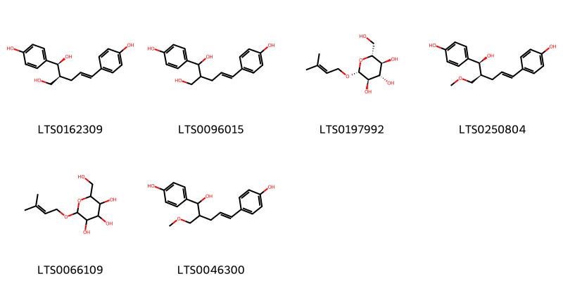{ width=100% }
    <figcaption>Hình ảnh cấu trúc hóa học của 6 hoạt chất thuộc nhóm Fatty Acyls gồm ['(1s,2s)-1-(4-hydroxyphenyl)-2-[(2e)-3-(4-hydroxyphenyl)prop-2-en-1-yl]propane-1,3-diol (LTS0162309)', '1-(4-hydroxyphenyl)-2-[3-(4-hydroxyphenyl)prop-2-en-1-yl]propane-1,3-diol (LTS0096015)', '(2r,3s,4s,5r,6r)-2-(hydroxymethyl)-6-[(3-methylbut-2-en-1-yl)oxy]oxane-3,4,5-triol (LTS0197992)', '4-[(1e,4s,5s)-5-hydroxy-5-(4-hydroxyphenyl)-4-(methoxymethyl)pent-1-en-1-yl]phenol (LTS0250804)', '2-(hydroxymethyl)-6-[(3-methylbut-2-en-1-yl)oxy]oxane-3,4,5-triol (LTS0066109)', '4-[5-hydroxy-5-(4-hydroxyphenyl)-4-(methoxymethyl)pent-1-en-1-yl]phenol (LTS0046300)'].</figcaption>
</figure>
#### Nhóm Flavonoids
<figure markdown="span">
    { width=100% }
    <figcaption>Hình ảnh cấu trúc hóa học của 11 hoạt chất thuộc nhóm Flavonoids gồm ['kaempferide (LTS0143784)', 'galangin (LTS0210648)', 'galangin 3-methyl ether (LTS0174084)', '(+)-dihydrokaempferol (LTS0134832)', 'chamomile (LTS0104946)', '5,7-dihydroxy-2-(4-methoxyphenyl)-3-{[3,4,5-trihydroxy-6-(hydroxymethyl)oxan-2-yl]oxy}chromen-4-one (LTS0052542)', '3,5,7-trihydroxyflavanone (LTS0114373)', 'aromadendrin (LTS0153299)', 'kaempherol (LTS0155822)', '5,7-dihydroxy-2-(4-methoxyphenyl)-3-{[(2s,3r,4s,5s,6r)-3,4,5-trihydroxy-6-(hydroxymethyl)oxan-2-yl]oxy}chromen-4-one (LTS0002381)', 'pinobanksin (LTS0036850)'].</figcaption>
</figure>
#### Nhóm Indoles and derivatives
<figure markdown="span">
    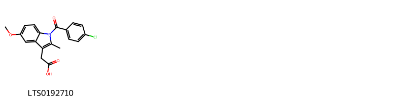{ width=100% }
    <figcaption>Hình ảnh cấu trúc hóa học của 1 hoạt chất thuộc nhóm Indoles and derivatives gồm ['indomethacin (LTS0192710)'].</figcaption>
</figure>
#### Nhóm Organooxygen compounds
<figure markdown="span">
    { width=100% }
    <figcaption>Hình ảnh cấu trúc hóa học của 17 hoạt chất thuộc nhóm Organooxygen compounds gồm ['2-(hydroxymethyl)-6-[4-(prop-2-en-1-yl)phenoxy]oxane-3,4,5-triol (LTS0039327)', '(2r,3s,4s,5r,6s)-2-(hydroxymethyl)-6-[4-(prop-2-en-1-yl)phenoxy]oxane-3,4,5-triol (LTS0017337)', '(2s,3r,4s,5s,6r)-2-[4-(prop-2-en-1-yl)phenoxy]-6-({[(2r,3r,4r,5r,6s)-3,4,5-trihydroxy-6-methyloxan-2-yl]oxy}methyl)oxane-3,4,5-triol (LTS0061891)', '2-[2-hydroxy-4-(prop-2-en-1-yl)phenoxy]-6-(hydroxymethyl)oxane-3,4,5-triol (LTS0221173)', '2-(hydroxymethyl)-6-({1,3,3-trimethyl-2-oxabicyclo[2.2.2]octan-6-yl}oxy)oxane-3,4,5-triol (LTS0093611)', '(2r,3s,4s,5r,6s)-2-(hydroxymethyl)-6-{[(1r,4s,6r)-1,3,3-trimethyl-2-oxabicyclo[2.2.2]octan-6-yl]oxy}oxane-3,4,5-triol (LTS0119798)', '2-(hydroxymethyl)-6-[4-(prop-2-en-1-yl)-2-{[3,4,5-trihydroxy-6-(hydroxymethyl)oxan-2-yl]oxy}phenoxy]oxane-3,4,5-triol (LTS0244393)', '(2s,3r,4s,5s,6r)-2-[2-hydroxy-4-(prop-2-en-1-yl)phenoxy]-6-({[(2r,3r,4r,5r,6s)-3,4,5-trihydroxy-6-methyloxan-2-yl]oxy}methyl)oxane-3,4,5-triol (LTS0073837)', '2-[2-hydroxy-4-(prop-2-en-1-yl)phenoxy]-6-{[(3,4,5-trihydroxy-6-methyloxan-2-yl)oxy]methyl}oxane-3,4,5-triol (LTS0159720)', '2-[2-hydroxy-5-(prop-2-en-1-yl)phenoxy]-6-(hydroxymethyl)oxane-3,4,5-triol (LTS0095041)', 'benzyl glucopyranoside (LTS0210495)', '(2s,3r,4s,5s,6r)-2-[2-hydroxy-5-(prop-2-en-1-yl)phenoxy]-6-(hydroxymethyl)oxane-3,4,5-triol (LTS0261362)', '2-[4-(prop-2-en-1-yl)phenoxy]-6-{[(3,4,5-trihydroxy-6-methyloxan-2-yl)oxy]methyl}oxane-3,4,5-triol (LTS0020713)', '(2r,3s,4s,5r,6s)-2-(hydroxymethyl)-6-[4-(prop-2-en-1-yl)-2-{[(2s,3r,4s,5s,6r)-3,4,5-trihydroxy-6-(hydroxymethyl)oxan-2-yl]oxy}phenoxy]oxane-3,4,5-triol (LTS0164836)', 'benzyl β-d-glucoside (LTS0184698)', '(2s,3r,4s,5s,6r)-2-[2-hydroxy-4-(prop-2-en-1-yl)phenoxy]-6-(hydroxymethyl)oxane-3,4,5-triol (LTS0016198)', 'prenol (LTS0257971)'].</figcaption>
</figure>
#### Nhóm Phenol esters
<figure markdown="span">
    { width=100% }
    <figcaption>Hình ảnh cấu trúc hóa học của 3 hoạt chất thuộc nhóm Phenol esters gồm ['1-[4-(acetyloxy)phenyl]prop-2-en-1-yl acetate (LTS0185726)', '4-[(1e)-3-{[(1s,2s,4e)-1,5-bis(4-hydroxyphenyl)-2-(methoxymethyl)pent-4-en-1-yl]oxy}prop-1-en-1-yl]phenyl acetate (LTS0042311)', '4-(3-{[1,5-bis(4-hydroxyphenyl)-2-(methoxymethyl)pent-4-en-1-yl]oxy}prop-1-en-1-yl)phenyl acetate (LTS0146819)'].</figcaption>
</figure>
#### Nhóm Phenols
<figure markdown="span">
    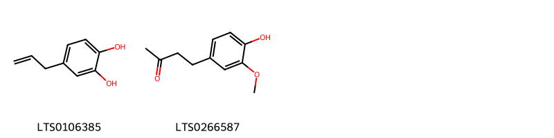{ width=100% }
    <figcaption>Hình ảnh cấu trúc hóa học của 2 hoạt chất thuộc nhóm Phenols gồm ['4-allylpyrocatechol (LTS0106385)', 'zingerone (LTS0266587)'].</figcaption>
</figure>
#### Nhóm Phenylpropanoic acids
<figure markdown="span">
    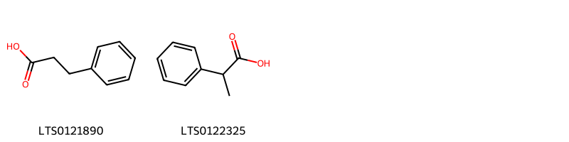{ width=100% }
    <figcaption>Hình ảnh cấu trúc hóa học của 2 hoạt chất thuộc nhóm Phenylpropanoic acids gồm ['3-phenylpropionic acid (LTS0121890)', '2-phenylpropionic acid (LTS0122325)'].</figcaption>
</figure>
#### Nhóm Pyrans
<figure markdown="span">
    { width=100% }
    <figcaption>Hình ảnh cấu trúc hóa học của 1 hoạt chất thuộc nhóm Pyrans gồm ['6-(2-hydroxyphenyl)-4-methoxypyran-2-one (LTS0138405)'].</figcaption>
</figure>
#### Nhóm Steroids and steroid derivatives
<figure markdown="span">
    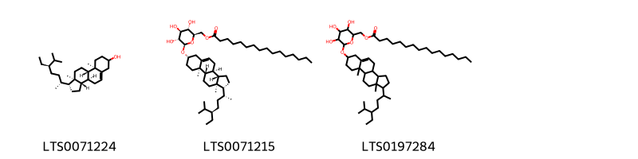{ width=100% }
    <figcaption>Hình ảnh cấu trúc hóa học của 3 hoạt chất thuộc nhóm Steroids and steroid derivatives gồm ['stigmast-5-en-3-ol (LTS0071224)', 'sitoindoside i (LTS0071215)', '(6-{[1-(5-ethyl-6-methylheptan-2-yl)-9a,11a-dimethyl-1h,2h,3h,3ah,3bh,4h,6h,7h,8h,9h,9bh,10h,11h-cyclopenta[a]phenanthren-7-yl]oxy}-3,4,5-trihydroxyoxan-2-yl)methyl hexadecanoate (LTS0197284)'].</figcaption>
</figure>

---

### Dược dân tộc học

Danh sách các quốc gia có sử dụng *Alpinia officinarum* trong điều trị các bệnh. 

| Country   | Disease                                                        | Bệnh                                                                                                                                                                                                |
|:----------|:---------------------------------------------------------------|:----------------------------------------------------------------------------------------------------------------------------------------------------------------------------------------------------|
| China     | Carminative, Sialogogue, Stomachic, Tonic, Tonic               | MYMEMORY WARNING: YOU USED ALL AVAILABLE FREE TRANSLATIONS FOR TODAY. NEXT AVAILABLE IN  08 HOURS 03 MINUTES 23 SECONDS VISIT HTTPS://MYMEMORY.TRANSLATED.NET/DOC/USAGELIMITS.PHP TO TRANSLATE MORE |
| Egypt     | Aphrodisiac, Carminative, Nervine, Stimulant, Tonic, Stomachic | MYMEMORY WARNING: YOU USED ALL AVAILABLE FREE TRANSLATIONS FOR TODAY. NEXT AVAILABLE IN  08 HOURS 03 MINUTES 21 SECONDS VISIT HTTPS://MYMEMORY.TRANSLATED.NET/DOC/USAGELIMITS.PHP TO TRANSLATE MORE |
| India     | nan, Fungicide                                                 | MYMEMORY WARNING: YOU USED ALL AVAILABLE FREE TRANSLATIONS FOR TODAY. NEXT AVAILABLE IN  08 HOURS 03 MINUTES 18 SECONDS VISIT HTTPS://MYMEMORY.TRANSLATED.NET/DOC/USAGELIMITS.PHP TO TRANSLATE MORE |
| Turkey    | Carminative, Sialogogue, Stomachic, Tonic, Stimulant           | MYMEMORY WARNING: YOU USED ALL AVAILABLE FREE TRANSLATIONS FOR TODAY. NEXT AVAILABLE IN  08 HOURS 03 MINUTES 16 SECONDS VISIT HTTPS://MYMEMORY.TRANSLATED.NET/DOC/USAGELIMITS.PHP TO TRANSLATE MORE |

---

# Chi Aframomum

??? note "Danh sách các dược liệu thuộc chi"
    
	 - *Aframomum melegueta*

---
## Aframomum melegueta
### Thông tin về thực vật

!!! info "Phân loại thực vật của *Aframomum melegueta* từ GIBF:"
    - **Kingdom:** Plantae
    - **Phylum:** Tracheophyta
    - **Order:** Zingiberales
    - **Family:** Zingiberaceae
    - **Genus:** Aframomum
    - **Species:** *Aframomum melegueta*

 

| Label (VI)   | Label (EN)   | Scientific Name     | Descriptions (VI)   | Descriptions (EN)   | Also Known As (VI)   | Also Known As (EN)     |
|:-------------|:-------------|:--------------------|:--------------------|:--------------------|:---------------------|:-----------------------|
| N/A          | N/A          | Aframomum melegueta | loài thực vật       | species of plant    | ['']                 | ['Grains of Paradise'] |

#### Phân bố trên thế giới

**Từ CSDL GIBF** nan, unknown or invalid, Ghana, Dominica, French Guiana, Cameroon, Gabon, Jamaica, Sierra Leone, Suriname, Venezuela (Bolivarian Republic of), Côte d’Ivoire, Sao Tome and Principe, Liberia, Nigeria, Burundi, Belgium, Uganda, Brazil, Equatorial Guinea, Norway, Angola, Benin, Congo, Democratic Republic of the, United States of America, Guinea, Guyana

#### Phân bố tại Việt Nam

**Từ CSDL GIBF**: Không có ghi nhận ở Việt Nam

---
### Thành phần hóa học
        
- Theo cơ sở dữ liệu lotus: Từ loài *Aframomum melegueta* đã phân lập và xác định được 57 hoạt chất thuộc về các nhóm Unsaturated hydrocarbons, Prenol lipids, Epoxides, Fatty Acyls, Phenols. 

|    | chemicalTaxonomyClassyfireClass   |   smiles_count |
|---:|:----------------------------------|---------------:|
|  0 | Epoxides                          |              2 |
|  1 | Fatty Acyls                       |              2 |
|  2 | Phenols                           |              8 |
|  3 | Prenol lipids                     |             42 |
|  4 | Unsaturated hydrocarbons          |              3 |

#### Nhóm Epoxides
<figure markdown="span">
    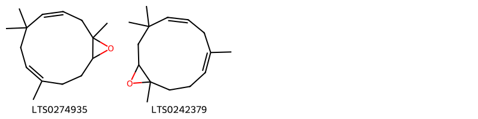{ width=100% }
    <figcaption>Hình ảnh cấu trúc hóa học của 2 hoạt chất thuộc nhóm Epoxides gồm ['(3z,7z)-1,5,5,8-tetramethyl-12-oxabicyclo[9.1.0]dodeca-3,7-diene (LTS0274935)', '(4z,7z)-1,5,9,9-tetramethyl-12-oxabicyclo[9.1.0]dodeca-4,7-diene (LTS0242379)'].</figcaption>
</figure>
#### Nhóm Fatty Acyls
<figure markdown="span">
    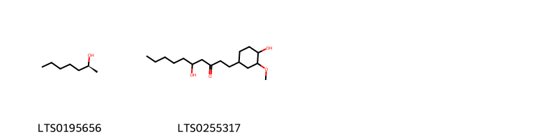{ width=100% }
    <figcaption>Hình ảnh cấu trúc hóa học của 2 hoạt chất thuộc nhóm Fatty Acyls gồm ['(+)-2-heptanol (LTS0195656)', '5-hydroxy-1-(4-hydroxy-3-methoxycyclohexyl)decan-3-one (LTS0255317)'].</figcaption>
</figure>
#### Nhóm Phenols
<figure markdown="span">
    { width=100% }
    <figcaption>Hình ảnh cấu trúc hóa học của 8 hoạt chất thuộc nhóm Phenols gồm ['shogaol (LTS0176515)', '1-(4-hydroxy-3-methoxyphenyl)dec-5-en-3-one (LTS0190515)', 'paradol (LTS0262716)', 'gingerol (LTS0171573)', 'zingerone (LTS0266587)', 'gingerol (LTS0061759)', 'gingerdione (LTS0061248)', '(5e)-1-(4-hydroxy-3-methoxyphenyl)dec-5-en-3-one (LTS0041716)'].</figcaption>
</figure>
#### Nhóm Prenol lipids
<figure markdown="span">
    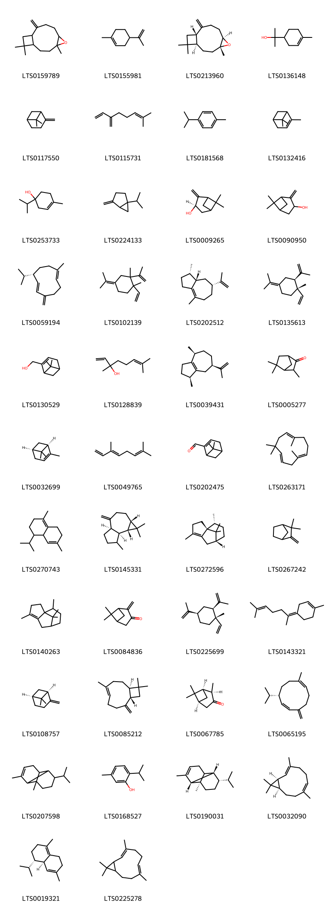{ width=100% }
    <figcaption>Hình ảnh cấu trúc hóa học của 42 hoạt chất thuộc nhóm Prenol lipids gồm ['caryophyllene oxide (LTS0159789)', 'limonene,  (LTS0155981)', 'β-caryophyllene oxide (LTS0213960)', 'terpineol (LTS0136148)', 'β-pinene (LTS0117550)', 'α-myrcene (LTS0115731)', 'cymene (LTS0181568)', 'α pinene (LTS0132416)', '4-terpineol (LTS0253733)', 'sabinene (LTS0224133)', '(3r)-6,6-dimethyl-2-methylidenebicyclo[3.1.1]heptan-3-ol (LTS0009265)', 'pinocarveol (LTS0090950)', '(-)-germacrene d (LTS0059194)', '1-ethenyl-1,2-dimethyl-2-(prop-1-en-2-yl)-4-(propan-2-ylidene)cyclohexane (LTS0102139)', 'α-bulnesene (LTS0202512)', '(1s,2s)-1-ethenyl-1-methyl-2-(prop-1-en-2-yl)-4-(propan-2-ylidene)cyclohexane (LTS0135613)', 'myrtenol (LTS0130529)', 'linalool, (+-)- (LTS0128839)', 'guaiene (LTS0039431)', '3,5,5-trimethylbicyclo[2.2.1]heptan-2-one (LTS0005277)', '(-)-α-pinene (LTS0032699)', 'trans-β-ocimene (LTS0049765)', 'myrtenal (LTS0202475)', 'humulene (LTS0263171)', '4-isopropyl-1,6-dimethyl-2,3,4,4a,7,8-hexahydronaphthalene (LTS0270743)', '(1as,4ar,7as,7br)-1,1,7-trimethyl-4-methylidene-octahydro-1ah-cyclopropa[e]azulene (LTS0145331)', 'cyperene (LTS0272596)', 'camphene (LTS0267242)', 'cyperene (LTS0140263)', 'pinocarvone (LTS0084836)', 'β-elemene (LTS0225699)', '(z)-γ-bisabolene (LTS0143321)', '(-)-β-pinene (LTS0108757)', 'caryophyllene (LTS0085212)', '(1r,2r,5s)-2,6,6-trimethylbicyclo[3.1.1]heptan-3-one (LTS0067785)', '(1z,6z,8s)-8-isopropyl-1-methyl-5-methylidenecyclodeca-1,6-diene (LTS0065195)', 'α-copaene (LTS0207598)', 'thymol (LTS0168527)', '(1r,2s,7s,8s)-8-isopropyl-1,3-dimethyltricyclo[4.4.0.0²,⁷]dec-3-ene (LTS0190031)', '(1s,2e,10r)-3,7,11,11-tetramethylbicyclo[8.1.0]undeca-2,6-diene (LTS0032090)', 'delta-cadinene (LTS0019321)', '(2e,6e)-3,7,11,11-tetramethylbicyclo[8.1.0]undeca-2,6-diene (LTS0225278)'].</figcaption>
</figure>
#### Nhóm Unsaturated hydrocarbons
<figure markdown="span">
    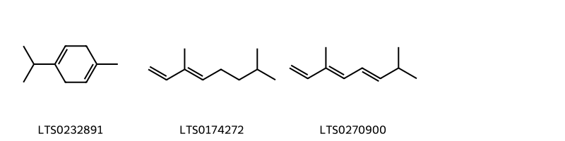{ width=100% }
    <figcaption>Hình ảnh cấu trúc hóa học của 3 hoạt chất thuộc nhóm Unsaturated hydrocarbons gồm ['α terpinene (LTS0232891)', '(3e)-3,7-dimethylocta-1,3-diene (LTS0174272)', '(3e,5e)-3,7-dimethylocta-1,3,5-triene (LTS0270900)'].</figcaption>
</figure>

---

### Dược dân tộc học

Danh sách các quốc gia có sử dụng *Aframomum melegueta* trong điều trị các bệnh. 

| Country   | Disease                                   | Bệnh                                                                                                                                                                                                |
|:----------|:------------------------------------------|:----------------------------------------------------------------------------------------------------------------------------------------------------------------------------------------------------|
| Egypt     | Astringent, Stomachic, Tonic, Carminative | MYMEMORY WARNING: YOU USED ALL AVAILABLE FREE TRANSLATIONS FOR TODAY. NEXT AVAILABLE IN  08 HOURS 02 MINUTES 31 SECONDS VISIT HTTPS://MYMEMORY.TRANSLATED.NET/DOC/USAGELIMITS.PHP TO TRANSLATE MORE |
| Elsewhere | Stimulant, Piscicide, Styptic, Sedative   | MYMEMORY WARNING: YOU USED ALL AVAILABLE FREE TRANSLATIONS FOR TODAY. NEXT AVAILABLE IN  08 HOURS 02 MINUTES 29 SECONDS VISIT HTTPS://MYMEMORY.TRANSLATED.NET/DOC/USAGELIMITS.PHP TO TRANSLATE MORE |
| French    | Stimulant                                 | MYMEMORY WARNING: YOU USED ALL AVAILABLE FREE TRANSLATIONS FOR TODAY. NEXT AVAILABLE IN  08 HOURS 02 MINUTES 25 SECONDS VISIT HTTPS://MYMEMORY.TRANSLATED.NET/DOC/USAGELIMITS.PHP TO TRANSLATE MORE |
| Liberia   | Aphrodisiac                               | MYMEMORY WARNING: YOU USED ALL AVAILABLE FREE TRANSLATIONS FOR TODAY. NEXT AVAILABLE IN  08 HOURS 02 MINUTES 23 SECONDS VISIT HTTPS://MYMEMORY.TRANSLATED.NET/DOC/USAGELIMITS.PHP TO TRANSLATE MORE |

---

# Chi Amomum

??? note "Danh sách các dược liệu thuộc chi"
    
	 - *Amomum cardamomum*
	 - *Amomum coccineum*
	 - *Amomum costatum*
	 - *Amomum globosum*
	 - *Amomum melegueta*
	 - *Amomum subulatum*
	 - *Amomum uliginosum*
	 - *Amomum villosum*
	 - *Amomum xanthioides*

---
## Amomum cardamomum
### Thông tin về thực vật

!!! info "Phân loại thực vật của *Amomum cardamomum* từ GIBF:"
    - **Kingdom:** Plantae
    - **Phylum:** Tracheophyta
    - **Order:** Zingiberales
    - **Family:** Zingiberaceae
    - **Genus:** Amomum
    - **Species:** *Amomum cardamomum*

 

| Label (VI)   | Label (EN)   | Scientific Name   | Descriptions (VI)   | Descriptions (EN)   | Also Known As (VI)   | Also Known As (EN)   |
|:-------------|:-------------|:------------------|:--------------------|:--------------------|:---------------------|:---------------------|
| N/A          | N/A          | Amomum cardamomum | loài thực vật       | species of plant    | ['']                 | ['']                 |

#### Phân bố trên thế giới

**Từ CSDL GIBF** nan, unknown or invalid, Brunei Darussalam, Indonesia

#### Phân bố tại Việt Nam

**Từ CSDL GIBF**: Không có ghi nhận ở Việt Nam

---
### Thành phần hóa học
        
- Theo cơ sở dữ liệu lotus: Từ loài *Amomum cardamomum* đã phân lập và xác định được Chưa có hoạt chất nào được phân lập. hoạt chất thuộc về các nhóm Không có hoạt chất nào được phân lập. 

Không có hình ảnh nào được tạo ra

---

### Dược dân tộc học

Danh sách các quốc gia có sử dụng *Amomum cardamomum* trong điều trị các bệnh. 

| Country   | Disease                           | Bệnh                                                                                                                                                                                                |
|:----------|:----------------------------------|:----------------------------------------------------------------------------------------------------------------------------------------------------------------------------------------------------|
| China     | Carminative, Stomachic, Stimulant | MYMEMORY WARNING: YOU USED ALL AVAILABLE FREE TRANSLATIONS FOR TODAY. NEXT AVAILABLE IN  08 HOURS 01 MINUTES 47 SECONDS VISIT HTTPS://MYMEMORY.TRANSLATED.NET/DOC/USAGELIMITS.PHP TO TRANSLATE MORE |

---

---
## Amomum coccineum
### Thông tin về thực vật

!!! info "Phân loại thực vật của *Etlingera coccinea* từ GIBF:"
    - **Kingdom:** Plantae
    - **Phylum:** Tracheophyta
    - **Order:** Zingiberales
    - **Family:** Zingiberaceae
    - **Genus:** Etlingera
    - **Species:** *Etlingera coccinea*

 

| Label (VI)   | Label (EN)   | Scientific Name   | Descriptions (VI)   | Descriptions (EN)   | Also Known As (VI)   | Also Known As (EN)   |
|:-------------|:-------------|:------------------|:--------------------|:--------------------|:---------------------|:---------------------|
| N/A          | N/A          | Amomum coccineum  |                     |                     | ['']                 | ['']                 |

#### Phân bố trên thế giới

**Từ CSDL GIBF** Indonesia

#### Phân bố tại Việt Nam

**Từ CSDL GIBF**: Không có ghi nhận ở Việt Nam

---
### Thành phần hóa học
        
- Theo cơ sở dữ liệu lotus: Từ loài *Etlingera coccinea* đã phân lập và xác định được Chưa có hoạt chất nào được phân lập. hoạt chất thuộc về các nhóm Không có hoạt chất nào được phân lập. 

Không có hình ảnh nào được tạo ra

---

### Dược dân tộc học

Danh sách các quốc gia có sử dụng *Etlingera coccinea* trong điều trị các bệnh. 

| Country   | Disease   | Bệnh                                                                                                                                                                                                |
|:----------|:----------|:----------------------------------------------------------------------------------------------------------------------------------------------------------------------------------------------------|
| Sumatra   | Vermifuge | MYMEMORY WARNING: YOU USED ALL AVAILABLE FREE TRANSLATIONS FOR TODAY. NEXT AVAILABLE IN  08 HOURS 01 MINUTES 26 SECONDS VISIT HTTPS://MYMEMORY.TRANSLATED.NET/DOC/USAGELIMITS.PHP TO TRANSLATE MORE |

---

---
## Amomum costatum
### Thông tin về thực vật

!!! info "Phân loại thực vật của *Hornstedtia costata* từ GIBF:"
    - **Kingdom:** Plantae
    - **Phylum:** Tracheophyta
    - **Order:** Zingiberales
    - **Family:** Zingiberaceae
    - **Genus:** Hornstedtia
    - **Species:** *Hornstedtia costata*

 

| Label (VI)   | Label (EN)   | Scientific Name   | Descriptions (VI)   | Descriptions (EN)   | Also Known As (VI)   | Also Known As (EN)   |
|:-------------|:-------------|:------------------|:--------------------|:--------------------|:---------------------|:---------------------|
| N/A          | N/A          | Amomum coccineum  |                     |                     | ['']                 | ['']                 |

#### Phân bố trên thế giới

**Từ CSDL GIBF** United States of America

#### Phân bố tại Việt Nam

**Từ CSDL GIBF**: Không có ghi nhận ở Việt Nam

---
### Thành phần hóa học
        
- Theo cơ sở dữ liệu lotus: Từ loài *Hornstedtia costata* đã phân lập và xác định được Chưa có hoạt chất nào được phân lập. hoạt chất thuộc về các nhóm Không có hoạt chất nào được phân lập. 

Không có hình ảnh nào được tạo ra

---

### Dược dân tộc học

Danh sách các quốc gia có sử dụng *Hornstedtia costata* trong điều trị các bệnh. 

| Country   | Disease   | Bệnh                                                                                                                                                                                                |
|:----------|:----------|:----------------------------------------------------------------------------------------------------------------------------------------------------------------------------------------------------|
| China     | Digestive | MYMEMORY WARNING: YOU USED ALL AVAILABLE FREE TRANSLATIONS FOR TODAY. NEXT AVAILABLE IN  08 HOURS 01 MINUTES 02 SECONDS VISIT HTTPS://MYMEMORY.TRANSLATED.NET/DOC/USAGELIMITS.PHP TO TRANSLATE MORE |

---

---
## Amomum globosum
### Thông tin về thực vật

!!! info "Phân loại thực vật của *Alpinia globosa* từ GIBF:"
    - **Kingdom:** Plantae
    - **Phylum:** Tracheophyta
    - **Order:** Zingiberales
    - **Family:** Zingiberaceae
    - **Genus:** Alpinia
    - **Species:** *Alpinia globosa*

 

| Label (VI)   | Label (EN)   | Scientific Name   | Descriptions (VI)   | Descriptions (EN)   | Also Known As (VI)   | Also Known As (EN)   |
|:-------------|:-------------|:------------------|:--------------------|:--------------------|:---------------------|:---------------------|
| N/A          | N/A          | Amomum globosum   | loài thực vật       | species of plant    | ['']                 | ['Amomum globosum']  |

#### Phân bố trên thế giới

**Từ CSDL GIBF** United States of America

#### Phân bố tại Việt Nam

**Từ CSDL GIBF**: Không có ghi nhận ở Việt Nam

---
### Thành phần hóa học
        
- Theo cơ sở dữ liệu lotus: Từ loài *Alpinia globosa* đã phân lập và xác định được Chưa có hoạt chất nào được phân lập. hoạt chất thuộc về các nhóm Không có hoạt chất nào được phân lập. 

Không có hình ảnh nào được tạo ra

---

### Dược dân tộc học

Danh sách các quốc gia có sử dụng *Alpinia globosa* trong điều trị các bệnh. 

| Country   | Disease              | Bệnh                                                                                                                                                                                                |
|:----------|:---------------------|:----------------------------------------------------------------------------------------------------------------------------------------------------------------------------------------------------|
| China     | Stomachic, Digestive | MYMEMORY WARNING: YOU USED ALL AVAILABLE FREE TRANSLATIONS FOR TODAY. NEXT AVAILABLE IN  08 HOURS 00 MINUTES 47 SECONDS VISIT HTTPS://MYMEMORY.TRANSLATED.NET/DOC/USAGELIMITS.PHP TO TRANSLATE MORE |

---

---
## Amomum melegueta
### Thông tin về thực vật

!!! info "Phân loại thực vật của *Aframomum melegueta* từ GIBF:"
    - **Kingdom:** Plantae
    - **Phylum:** Tracheophyta
    - **Order:** Zingiberales
    - **Family:** Zingiberaceae
    - **Genus:** Aframomum
    - **Species:** *Aframomum melegueta*

 

| Label (VI)   | Label (EN)   | Scientific Name   | Descriptions (VI)   | Descriptions (EN)   | Also Known As (VI)   | Also Known As (EN)   |
|:-------------|:-------------|:------------------|:--------------------|:--------------------|:---------------------|:---------------------|
| N/A          | N/A          | Amomum melegueta  |                     | species of plant    | ['']                 | ['']                 |

#### Phân bố trên thế giới

**Từ CSDL GIBF** United States of America

#### Phân bố tại Việt Nam

**Từ CSDL GIBF**: Không có ghi nhận ở Việt Nam

---
### Thành phần hóa học
        
- Theo cơ sở dữ liệu lotus: Từ loài *Aframomum melegueta* đã phân lập và xác định được 57 hoạt chất thuộc về các nhóm Unsaturated hydrocarbons, Prenol lipids, Epoxides, Fatty Acyls, Phenols. 

|    | chemicalTaxonomyClassyfireClass   |   smiles_count |
|---:|:----------------------------------|---------------:|
|  0 | Epoxides                          |              2 |
|  1 | Fatty Acyls                       |              2 |
|  2 | Phenols                           |              8 |
|  3 | Prenol lipids                     |             42 |
|  4 | Unsaturated hydrocarbons          |              3 |

#### Nhóm Epoxides
<figure markdown="span">
    { width=100% }
    <figcaption>Hình ảnh cấu trúc hóa học của 2 hoạt chất thuộc nhóm Epoxides gồm ['(3z,7z)-1,5,5,8-tetramethyl-12-oxabicyclo[9.1.0]dodeca-3,7-diene (LTS0274935)', '(4z,7z)-1,5,9,9-tetramethyl-12-oxabicyclo[9.1.0]dodeca-4,7-diene (LTS0242379)'].</figcaption>
</figure>
#### Nhóm Fatty Acyls
<figure markdown="span">
    { width=100% }
    <figcaption>Hình ảnh cấu trúc hóa học của 2 hoạt chất thuộc nhóm Fatty Acyls gồm ['(+)-2-heptanol (LTS0195656)', '5-hydroxy-1-(4-hydroxy-3-methoxycyclohexyl)decan-3-one (LTS0255317)'].</figcaption>
</figure>
#### Nhóm Phenols
<figure markdown="span">
    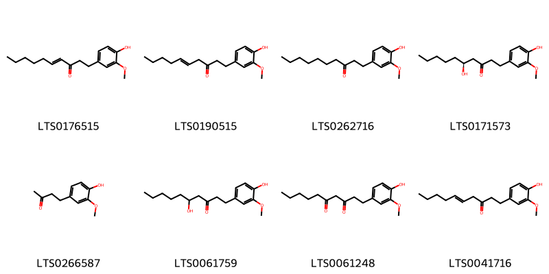{ width=100% }
    <figcaption>Hình ảnh cấu trúc hóa học của 8 hoạt chất thuộc nhóm Phenols gồm ['shogaol (LTS0176515)', '1-(4-hydroxy-3-methoxyphenyl)dec-5-en-3-one (LTS0190515)', 'paradol (LTS0262716)', 'gingerol (LTS0171573)', 'zingerone (LTS0266587)', 'gingerol (LTS0061759)', 'gingerdione (LTS0061248)', '(5e)-1-(4-hydroxy-3-methoxyphenyl)dec-5-en-3-one (LTS0041716)'].</figcaption>
</figure>
#### Nhóm Prenol lipids
<figure markdown="span">
    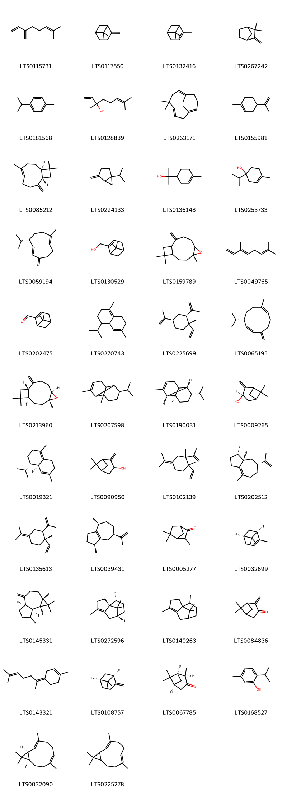{ width=100% }
    <figcaption>Hình ảnh cấu trúc hóa học của 42 hoạt chất thuộc nhóm Prenol lipids gồm ['α-myrcene (LTS0115731)', 'β-pinene (LTS0117550)', 'α pinene (LTS0132416)', 'camphene (LTS0267242)', 'cymene (LTS0181568)', 'linalool, (+-)- (LTS0128839)', 'humulene (LTS0263171)', 'limonene,  (LTS0155981)', 'caryophyllene (LTS0085212)', 'sabinene (LTS0224133)', 'terpineol (LTS0136148)', '4-terpineol (LTS0253733)', '(-)-germacrene d (LTS0059194)', 'myrtenol (LTS0130529)', 'caryophyllene oxide (LTS0159789)', 'trans-β-ocimene (LTS0049765)', 'myrtenal (LTS0202475)', '4-isopropyl-1,6-dimethyl-2,3,4,4a,7,8-hexahydronaphthalene (LTS0270743)', 'β-elemene (LTS0225699)', '(1z,6z,8s)-8-isopropyl-1-methyl-5-methylidenecyclodeca-1,6-diene (LTS0065195)', 'β-caryophyllene oxide (LTS0213960)', 'α-copaene (LTS0207598)', '(1r,2s,7s,8s)-8-isopropyl-1,3-dimethyltricyclo[4.4.0.0²,⁷]dec-3-ene (LTS0190031)', '(3r)-6,6-dimethyl-2-methylidenebicyclo[3.1.1]heptan-3-ol (LTS0009265)', 'delta-cadinene (LTS0019321)', 'pinocarveol (LTS0090950)', '1-ethenyl-1,2-dimethyl-2-(prop-1-en-2-yl)-4-(propan-2-ylidene)cyclohexane (LTS0102139)', 'α-bulnesene (LTS0202512)', '(1s,2s)-1-ethenyl-1-methyl-2-(prop-1-en-2-yl)-4-(propan-2-ylidene)cyclohexane (LTS0135613)', 'guaiene (LTS0039431)', '3,5,5-trimethylbicyclo[2.2.1]heptan-2-one (LTS0005277)', '(-)-α-pinene (LTS0032699)', '(1as,4ar,7as,7br)-1,1,7-trimethyl-4-methylidene-octahydro-1ah-cyclopropa[e]azulene (LTS0145331)', 'cyperene (LTS0272596)', 'cyperene (LTS0140263)', 'pinocarvone (LTS0084836)', '(z)-γ-bisabolene (LTS0143321)', '(-)-β-pinene (LTS0108757)', '(1r,2r,5s)-2,6,6-trimethylbicyclo[3.1.1]heptan-3-one (LTS0067785)', 'thymol (LTS0168527)', '(1s,2e,10r)-3,7,11,11-tetramethylbicyclo[8.1.0]undeca-2,6-diene (LTS0032090)', '(2e,6e)-3,7,11,11-tetramethylbicyclo[8.1.0]undeca-2,6-diene (LTS0225278)'].</figcaption>
</figure>
#### Nhóm Unsaturated hydrocarbons
<figure markdown="span">
    { width=100% }
    <figcaption>Hình ảnh cấu trúc hóa học của 3 hoạt chất thuộc nhóm Unsaturated hydrocarbons gồm ['α terpinene (LTS0232891)', '(3e)-3,7-dimethylocta-1,3-diene (LTS0174272)', '(3e,5e)-3,7-dimethylocta-1,3,5-triene (LTS0270900)'].</figcaption>
</figure>

---

### Dược dân tộc học

Danh sách các quốc gia có sử dụng *Aframomum melegueta* trong điều trị các bệnh. 

| Country   | Disease     | Bệnh                                                                                                                                                                                                |
|:----------|:------------|:----------------------------------------------------------------------------------------------------------------------------------------------------------------------------------------------------|
| Elsewhere | Carminative | MYMEMORY WARNING: YOU USED ALL AVAILABLE FREE TRANSLATIONS FOR TODAY. NEXT AVAILABLE IN  08 HOURS 00 MINUTES 32 SECONDS VISIT HTTPS://MYMEMORY.TRANSLATED.NET/DOC/USAGELIMITS.PHP TO TRANSLATE MORE |
| Trinidad  | Carminative | MYMEMORY WARNING: YOU USED ALL AVAILABLE FREE TRANSLATIONS FOR TODAY. NEXT AVAILABLE IN  08 HOURS 00 MINUTES 30 SECONDS VISIT HTTPS://MYMEMORY.TRANSLATED.NET/DOC/USAGELIMITS.PHP TO TRANSLATE MORE |

---

---
## Amomum subulatum
### Thông tin về thực vật

!!! info "Phân loại thực vật của *Amomum subulatum* từ GIBF:"
    - **Kingdom:** Plantae
    - **Phylum:** Tracheophyta
    - **Order:** Zingiberales
    - **Family:** Zingiberaceae
    - **Genus:** Amomum
    - **Species:** *Amomum subulatum*

 

| Label (VI)   | Label (EN)   | Scientific Name   | Descriptions (VI)   | Descriptions (EN)   | Also Known As (VI)   | Also Known As (EN)                                                                                                                                                     |
|:-------------|:-------------|:------------------|:--------------------|:--------------------|:---------------------|:-----------------------------------------------------------------------------------------------------------------------------------------------------------------------|
| N/A          | N/A          | Amomum subulatum  | loài thực vật       | species of plant    | ['']                 | ['Amomum subulatum', 'Bengal cardamom', 'big cardamom', 'brown cardamom', 'greater cardamom', 'hill cardamom', 'Indian cardamom', 'Nepal cardamom', 'winged cardamom'] |

#### Phân bố trên thế giới

**Từ CSDL GIBF** nan, Bhutan, India, Germany, United States of America, China, Nepal, Korea, Republic of

#### Phân bố tại Việt Nam

**Từ CSDL GIBF**: Không có ghi nhận ở Việt Nam

---
### Thành phần hóa học
        
- Theo cơ sở dữ liệu lotus: Từ loài *Amomum subulatum* đã phân lập và xác định được 4 hoạt chất thuộc về các nhóm Organooxygen compounds, Linear 1,3-diarylpropanoids, Benzene and substituted derivatives. 

|    | chemicalTaxonomyClassyfireClass     |   smiles_count |
|---:|:------------------------------------|---------------:|
|  0 | Benzene and substituted derivatives |              1 |
|  1 | Linear 1,3-diarylpropanoids         |              2 |
|  2 | Organooxygen compounds              |              1 |

#### Nhóm Benzene and substituted derivatives
<figure markdown="span">
    { width=100% }
    <figcaption>Hình ảnh cấu trúc hóa học của 1 hoạt chất thuộc nhóm Benzene and substituted derivatives gồm ['3,4-dihydroxybenzoic acid (LTS0018765)'].</figcaption>
</figure>
#### Nhóm Linear 1_3-diarylpropanoids
<figure markdown="span">
    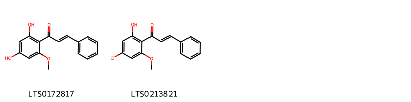{ width=100% }
    <figcaption>Hình ảnh cấu trúc hóa học của Không tìm thấy chú thích hoạt chất thuộc nhóm Linear 1_3-diarylpropanoids gồm Không tìm thấy chú thích.</figcaption>
</figure>
#### Nhóm Organooxygen compounds
<figure markdown="span">
    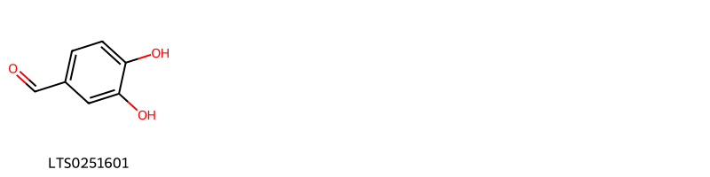{ width=100% }
    <figcaption>Hình ảnh cấu trúc hóa học của 1 hoạt chất thuộc nhóm Organooxygen compounds gồm ['3,4-dihydroxybenzaldehyde (LTS0251601)'].</figcaption>
</figure>

---

### Dược dân tộc học

Danh sách các quốc gia có sử dụng *Amomum subulatum* trong điều trị các bệnh. 

| Country   | Disease              | Bệnh                                                                                                                                                                                                |
|:----------|:---------------------|:----------------------------------------------------------------------------------------------------------------------------------------------------------------------------------------------------|
| Elsewhere | Purgative, Stimulant | MYMEMORY WARNING: YOU USED ALL AVAILABLE FREE TRANSLATIONS FOR TODAY. NEXT AVAILABLE IN  07 HOURS 59 MINUTES 56 SECONDS VISIT HTTPS://MYMEMORY.TRANSLATED.NET/DOC/USAGELIMITS.PHP TO TRANSLATE MORE |
| Nepal     | Stomachic, Stomachic | MYMEMORY WARNING: YOU USED ALL AVAILABLE FREE TRANSLATIONS FOR TODAY. NEXT AVAILABLE IN  07 HOURS 59 MINUTES 53 SECONDS VISIT HTTPS://MYMEMORY.TRANSLATED.NET/DOC/USAGELIMITS.PHP TO TRANSLATE MORE |

---

---
## Amomum uliginosum
### Thông tin về thực vật

!!! info "Phân loại thực vật của *Amomum uliginosum* từ GIBF:"
    - **Kingdom:** Plantae
    - **Phylum:** Tracheophyta
    - **Order:** Zingiberales
    - **Family:** Zingiberaceae
    - **Genus:** Amomum
    - **Species:** *Amomum uliginosum*

 

| Label (VI)   | Label (EN)   | Scientific Name   | Descriptions (VI)   | Descriptions (EN)         | Also Known As (VI)   | Also Known As (EN)   |
|:-------------|:-------------|:------------------|:--------------------|:--------------------------|:---------------------|:---------------------|
| N/A          | N/A          | Amomum uliginosum |                     | synonym: species of plant | ['']                 | ['']                 |

#### Phân bố trên thế giới

**Từ CSDL GIBF** Malaysia

#### Phân bố tại Việt Nam

**Từ CSDL GIBF**: Không có ghi nhận ở Việt Nam

---
### Thành phần hóa học
        
- Theo cơ sở dữ liệu lotus: Từ loài *Amomum uliginosum* đã phân lập và xác định được Chưa có hoạt chất nào được phân lập. hoạt chất thuộc về các nhóm Không có hoạt chất nào được phân lập. 

Không có hình ảnh nào được tạo ra

---

### Dược dân tộc học

Danh sách các quốc gia có sử dụng *Amomum uliginosum* trong điều trị các bệnh. 

| Country   | Disease   | Bệnh                                                                                                                                                                                                |
|:----------|:----------|:----------------------------------------------------------------------------------------------------------------------------------------------------------------------------------------------------|
| Pahang    | Vermifuge | MYMEMORY WARNING: YOU USED ALL AVAILABLE FREE TRANSLATIONS FOR TODAY. NEXT AVAILABLE IN  07 HOURS 59 MINUTES 32 SECONDS VISIT HTTPS://MYMEMORY.TRANSLATED.NET/DOC/USAGELIMITS.PHP TO TRANSLATE MORE |

---

---
## Amomum villosum
### Thông tin về thực vật

!!! info "Phân loại thực vật của *Wurfbainia villosa* từ GIBF:"
    - **Kingdom:** Plantae
    - **Phylum:** Tracheophyta
    - **Order:** Zingiberales
    - **Family:** Zingiberaceae
    - **Genus:** Wurfbainia
    - **Species:** *Wurfbainia villosa*

 

| Label (VI)   | Label (EN)   | Scientific Name   | Descriptions (VI)   | Descriptions (EN)   | Also Known As (VI)   | Also Known As (EN)     |
|:-------------|:-------------|:------------------|:--------------------|:--------------------|:---------------------|:-----------------------|
| N/A          | N/A          | Amomum villosum   | loài thực vật       | species of plant    | ['Amomum villosum']  | ['Wurfbainia villosa'] |

#### Phân bố trên thế giới

**Từ CSDL GIBF** nan, Viet Nam, Myanmar, India, Lao People’s Democratic Republic, United States of America, China, Korea, Republic of

#### Phân bố tại Việt Nam

**Từ CSDL GIBF**: Lam Dong

---
### Thành phần hóa học
        
- Theo cơ sở dữ liệu lotus: Từ loài *Wurfbainia villosa* đã phân lập và xác định được 31 hoạt chất thuộc về các nhóm Organooxygen compounds, Tannins, Prenol lipids, Diarylheptanoids, Purine nucleosides. 

|    | chemicalTaxonomyClassyfireClass   |   smiles_count |
|---:|:----------------------------------|---------------:|
|  0 | Diarylheptanoids                  |              2 |
|  1 | Organooxygen compounds            |              3 |
|  2 | Prenol lipids                     |              6 |
|  3 | Purine nucleosides                |              2 |
|  4 | Tannins                           |              2 |

#### Nhóm Diarylheptanoids
<figure markdown="span">
    { width=100% }
    <figcaption>Hình ảnh cấu trúc hóa học của 2 hoạt chất thuộc nhóm Diarylheptanoids gồm ['(5s)-5-hydroxy-1,7-diphenylheptan-3-one (LTS0206466)', '5-hydroxy-1,7-diphenylheptan-3-one (LTS0162873)'].</figcaption>
</figure>
#### Nhóm Organooxygen compounds
<figure markdown="span">
    { width=100% }
    <figcaption>Hình ảnh cấu trúc hóa học của 3 hoạt chất thuộc nhóm Organooxygen compounds gồm ['benzyl glucopyranoside (LTS0210495)', 'benzyl β-d-glucoside (LTS0184698)', '(2r,3r,5r,6r)-2-(benzyloxy)-6-(hydroxymethyl)oxane-3,4,5-triol (LTS0007372)'].</figcaption>
</figure>
#### Nhóm Prenol lipids
<figure markdown="span">
    { width=100% }
    <figcaption>Hình ảnh cấu trúc hóa học của 6 hoạt chất thuộc nhóm Prenol lipids gồm ['3,7,11-trimethyldodeca-1,6,10-triene-3,8-diol (LTS0098798)', '(2r,3r,4s,5s,6r)-2-{[(1r,2s,4r,5r)-5-hydroxy-1,7,7-trimethylbicyclo[2.2.1]heptan-2-yl]oxy}-6-(hydroxymethyl)oxane-3,4,5-triol (LTS0219389)', '(3s,6e,8s)-3,7,11-trimethyldodeca-1,6,10-triene-3,8-diol (LTS0170999)', '(+)-6-endo-hydroxycamphor (LTS0045599)', '6-hydroxycamphor (LTS0007016)', '2-({5-hydroxy-1,7,7-trimethylbicyclo[2.2.1]heptan-2-yl}oxy)-6-(hydroxymethyl)oxane-3,4,5-triol (LTS0031222)'].</figcaption>
</figure>
#### Nhóm Purine nucleosides
<figure markdown="span">
    { width=100% }
    <figcaption>Hình ảnh cấu trúc hóa học của 2 hoạt chất thuộc nhóm Purine nucleosides gồm ['adenosine (LTS0052576)', 'adenosine (LTS0014061)'].</figcaption>
</figure>
#### Nhóm Tannins
<figure markdown="span">
    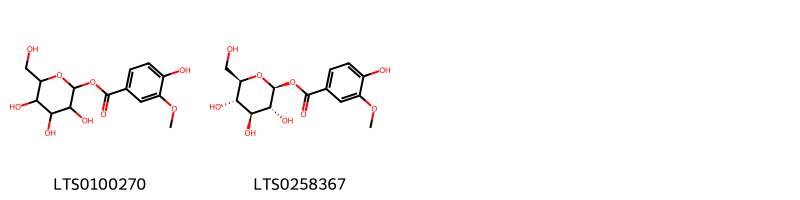{ width=100% }
    <figcaption>Hình ảnh cấu trúc hóa học của 2 hoạt chất thuộc nhóm Tannins gồm ['3,4,5-trihydroxy-6-(hydroxymethyl)oxan-2-yl 4-hydroxy-3-methoxybenzoate (LTS0100270)', '1-o-vanilloyl-β-d-glucose (LTS0258367)'].</figcaption>
</figure>

---

### Dược dân tộc học

Danh sách các quốc gia có sử dụng *Wurfbainia villosa* trong điều trị các bệnh. 

| Country   | Disease          | Bệnh                                                                                                                                                                                                |
|:----------|:-----------------|:----------------------------------------------------------------------------------------------------------------------------------------------------------------------------------------------------|
| China     | Stomachic, Tonic | MYMEMORY WARNING: YOU USED ALL AVAILABLE FREE TRANSLATIONS FOR TODAY. NEXT AVAILABLE IN  07 HOURS 59 MINUTES 16 SECONDS VISIT HTTPS://MYMEMORY.TRANSLATED.NET/DOC/USAGELIMITS.PHP TO TRANSLATE MORE |

---

---
## Amomum xanthioides
### Thông tin về thực vật

!!! info "Phân loại thực vật của *Amomum xanthioides* từ GIBF:"
    - **Kingdom:** Plantae
    - **Phylum:** Tracheophyta
    - **Order:** Zingiberales
    - **Family:** Zingiberaceae
    - **Genus:** Amomum
    - **Species:** *Amomum xanthioides*

 

| Label (VI)   | Label (EN)   | Scientific Name    | Descriptions (VI)   | Descriptions (EN)   | Also Known As (VI)   | Also Known As (EN)   |
|:-------------|:-------------|:-------------------|:--------------------|:--------------------|:---------------------|:---------------------|
| N/A          | N/A          | Amomum xanthioides | loài thực vật       | species of plant    | ['']                 | ['']                 |

#### Phân bố trên thế giới

**Từ CSDL GIBF** nan, unknown or invalid, Thailand, Japan, Myanmar, Malaysia, India, Lao People’s Democratic Republic, China, Singapore, Chinese Taipei

#### Phân bố tại Việt Nam

**Từ CSDL GIBF**: Không có ghi nhận ở Việt Nam

---
### Thành phần hóa học
        
- Theo cơ sở dữ liệu lotus: Từ loài *Amomum xanthioides* đã phân lập và xác định được Chưa có hoạt chất nào được phân lập. hoạt chất thuộc về các nhóm Không có hoạt chất nào được phân lập. 

Không có hình ảnh nào được tạo ra

---

### Dược dân tộc học

Danh sách các quốc gia có sử dụng *Amomum xanthioides* trong điều trị các bệnh. 

| Country   | Disease          | Bệnh                                                                                                                                                                                                |
|:----------|:-----------------|:----------------------------------------------------------------------------------------------------------------------------------------------------------------------------------------------------|
| China     | Stomachic, Tonic | MYMEMORY WARNING: YOU USED ALL AVAILABLE FREE TRANSLATIONS FOR TODAY. NEXT AVAILABLE IN  07 HOURS 58 MINUTES 55 SECONDS VISIT HTTPS://MYMEMORY.TRANSLATED.NET/DOC/USAGELIMITS.PHP TO TRANSLATE MORE |
| Malaya    | Stomachic        | MYMEMORY WARNING: YOU USED ALL AVAILABLE FREE TRANSLATIONS FOR TODAY. NEXT AVAILABLE IN  07 HOURS 58 MINUTES 52 SECONDS VISIT HTTPS://MYMEMORY.TRANSLATED.NET/DOC/USAGELIMITS.PHP TO TRANSLATE MORE |

---

# Chi Elettaria

??? note "Danh sách các dược liệu thuộc chi"
    
	 - *Elettaria cardamomum*

---
## Elettaria cardamomum
### Thông tin về thực vật

!!! info "Phân loại thực vật của *Elettaria cardamomum* từ GIBF:"
    - **Kingdom:** Plantae
    - **Phylum:** Tracheophyta
    - **Order:** Zingiberales
    - **Family:** Zingiberaceae
    - **Genus:** Elettaria
    - **Species:** *Elettaria cardamomum*

 

| Label (VI)   | Label (EN)   | Scientific Name      | Descriptions (VI)   | Descriptions (EN)   | Also Known As (VI)    | Also Known As (EN)   |
|:-------------|:-------------|:---------------------|:--------------------|:--------------------|:----------------------|:---------------------|
| N/A          | N/A          | Elettaria cardamomum | loài thực vật       | species of plant    | ['Amomum cardamomum'] | ['cardamom']         |

#### Phân bố trên thế giới

**Từ CSDL GIBF** Honduras, nan, Georgia, Thailand, El Salvador, unknown or invalid, Germany, Chile, Australia, Guatemala, Colombia, Sri Lanka, Pakistan, Venezuela (Bolivarian Republic of), Malaysia, India, Réunion, Seychelles, Bangladesh, Canada, Belgium, Türkiye, Nicaragua, Brazil, Mexico, China, Nepal, Norway, Tanzania, United Republic of, New Zealand, Papua New Guinea, Costa Rica, New Caledonia, Ecuador, United States of America, Israel, Zambia, Croatia

#### Phân bố tại Việt Nam

**Từ CSDL GIBF**: Không có ghi nhận ở Việt Nam

---
### Thành phần hóa học
        
- Theo cơ sở dữ liệu lotus: Từ loài *Elettaria cardamomum* đã phân lập và xác định được 28 hoạt chất thuộc về các nhóm Organonitrogen compounds, Prenol lipids, Fatty Acyls, Phenols, Benzodioxoles, Cinnamic acids and derivatives, Benzene and substituted derivatives. 

|    | chemicalTaxonomyClassyfireClass     |   smiles_count |
|---:|:------------------------------------|---------------:|
|  0 | Benzene and substituted derivatives |              5 |
|  1 | Benzodioxoles                       |              1 |
|  2 | Cinnamic acids and derivatives      |              2 |
|  3 | Fatty Acyls                         |              1 |
|  4 | Organonitrogen compounds            |              2 |
|  5 | Phenols                             |              1 |
|  6 | Prenol lipids                       |             16 |

#### Nhóm Benzene and substituted derivatives
<figure markdown="span">
    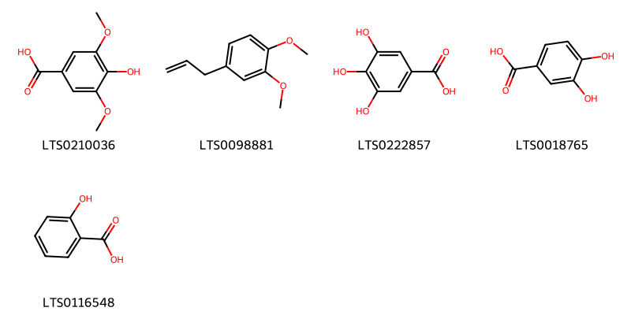{ width=100% }
    <figcaption>Hình ảnh cấu trúc hóa học của 5 hoạt chất thuộc nhóm Benzene and substituted derivatives gồm ['syringic acid (LTS0210036)', 'methyl eugenol (LTS0098881)', 'galop (LTS0222857)', '3,4-dihydroxybenzoic acid (LTS0018765)', 'salicyclic acid (LTS0116548)'].</figcaption>
</figure>
#### Nhóm Benzodioxoles
<figure markdown="span">
    { width=100% }
    <figcaption>Hình ảnh cấu trúc hóa học của 1 hoạt chất thuộc nhóm Benzodioxoles gồm ['sassafras (LTS0136093)'].</figcaption>
</figure>
#### Nhóm Cinnamic acids and derivatives
<figure markdown="span">
    { width=100% }
    <figcaption>Hình ảnh cấu trúc hóa học của 2 hoạt chất thuộc nhóm Cinnamic acids and derivatives gồm ['para-coumaric acid (LTS0266252)', 'hydroxycinnamic acid (LTS0233023)'].</figcaption>
</figure>
#### Nhóm Fatty Acyls
<figure markdown="span">
    { width=100% }
    <figcaption>Hình ảnh cấu trúc hóa học của 1 hoạt chất thuộc nhóm Fatty Acyls gồm ['geranyl acetate (LTS0093224)'].</figcaption>
</figure>
#### Nhóm Organonitrogen compounds
<figure markdown="span">
    { width=100% }
    <figcaption>Hình ảnh cấu trúc hóa học của 2 hoạt chất thuộc nhóm Organonitrogen compounds gồm ['choline (LTS0170307)', 'acetylcholine (LTS0185507)'].</figcaption>
</figure>
#### Nhóm Phenols
<figure markdown="span">
    { width=100% }
    <figcaption>Hình ảnh cấu trúc hóa học của 1 hoạt chất thuộc nhóm Phenols gồm ['eugenol (LTS0052342)'].</figcaption>
</figure>
#### Nhóm Prenol lipids
<figure markdown="span">
    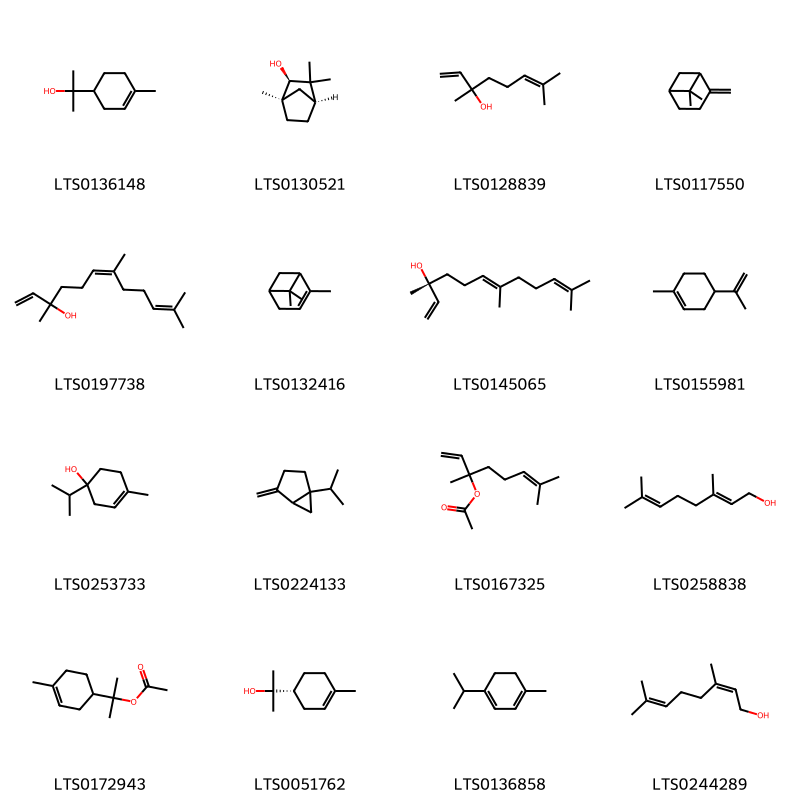{ width=100% }
    <figcaption>Hình ảnh cấu trúc hóa học của 16 hoạt chất thuộc nhóm Prenol lipids gồm ['terpineol (LTS0136148)', '(1r,2r,4s)-1,3,3-trimethylbicyclo[2.2.1]heptan-2-ol (LTS0130521)', 'linalool, (+-)- (LTS0128839)', 'β-pinene (LTS0117550)', 'nerolidol (LTS0197738)', 'α pinene (LTS0132416)', '(3r,6e)-nerolidol (LTS0145065)', 'limonene,  (LTS0155981)', '4-terpineol (LTS0253733)', 'sabinene (LTS0224133)', 'linalyl acetate (LTS0167325)', 'geraniol (LTS0258838)', 'α-terpinyl acetate (LTS0172943)', 'lily of valley (LTS0051762)', 'terpinene (LTS0136858)', 'nerol (LTS0244289)'].</figcaption>
</figure>

---

### Dược dân tộc học

Danh sách các quốc gia có sử dụng *Elettaria cardamomum* trong điều trị các bệnh. 

| Country   | Disease                                                             | Bệnh                                                                                                                                                                                                |
|:----------|:--------------------------------------------------------------------|:----------------------------------------------------------------------------------------------------------------------------------------------------------------------------------------------------|
| China     | Antidote, Carminative, Carminative, Stimulant, Stomachic, Stomachic | MYMEMORY WARNING: YOU USED ALL AVAILABLE FREE TRANSLATIONS FOR TODAY. NEXT AVAILABLE IN  07 HOURS 58 MINUTES 35 SECONDS VISIT HTTPS://MYMEMORY.TRANSLATED.NET/DOC/USAGELIMITS.PHP TO TRANSLATE MORE |
| Egypt     | Carminative, Stimulant                                              | MYMEMORY WARNING: YOU USED ALL AVAILABLE FREE TRANSLATIONS FOR TODAY. NEXT AVAILABLE IN  07 HOURS 58 MINUTES 33 SECONDS VISIT HTTPS://MYMEMORY.TRANSLATED.NET/DOC/USAGELIMITS.PHP TO TRANSLATE MORE |
| Elsewhere | Carminative, Carminative, Stimulant                                 | MYMEMORY WARNING: YOU USED ALL AVAILABLE FREE TRANSLATIONS FOR TODAY. NEXT AVAILABLE IN  07 HOURS 58 MINUTES 31 SECONDS VISIT HTTPS://MYMEMORY.TRANSLATED.NET/DOC/USAGELIMITS.PHP TO TRANSLATE MORE |
| Turkey    | Apertif, Carminative, Diuretic, Stimulant, Stomachic                | MYMEMORY WARNING: YOU USED ALL AVAILABLE FREE TRANSLATIONS FOR TODAY. NEXT AVAILABLE IN  07 HOURS 58 MINUTES 28 SECONDS VISIT HTTPS://MYMEMORY.TRANSLATED.NET/DOC/USAGELIMITS.PHP TO TRANSLATE MORE |

---

# Chi Globba

??? note "Danh sách các dược liệu thuộc chi"
    
	 - *Globba uliginosa*

---
## Globba uliginosa
### Thông tin về thực vật

!!! info "Phân loại thực vật của *Globba pendula* từ GIBF:"
    - **Kingdom:** Plantae
    - **Phylum:** Tracheophyta
    - **Order:** Zingiberales
    - **Family:** Zingiberaceae
    - **Genus:** Globba
    - **Species:** *Globba pendula*

 

| Label (VI)   | Label (EN)   | Scientific Name   | Descriptions (VI)   | Descriptions (EN)   | Also Known As (VI)   | Also Known As (EN)   |
|:-------------|:-------------|:------------------|:--------------------|:--------------------|:---------------------|:---------------------|
| N/A          | N/A          | Globba uliginosa  |                     |                     | ['']                 | ['']                 |

#### Phân bố trên thế giới

**Từ CSDL GIBF** nan, Indonesia

#### Phân bố tại Việt Nam

**Từ CSDL GIBF**: Không có ghi nhận ở Việt Nam

---
### Thành phần hóa học
        
- Theo cơ sở dữ liệu lotus: Từ loài *Globba pendula* đã phân lập và xác định được Chưa có hoạt chất nào được phân lập. hoạt chất thuộc về các nhóm Không có hoạt chất nào được phân lập. 

Không có hình ảnh nào được tạo ra

---

### Dược dân tộc học

Danh sách các quốc gia có sử dụng *Globba pendula* trong điều trị các bệnh. 

| Country   | Disease   | Bệnh                                                                                                                                                                                                |
|:----------|:----------|:----------------------------------------------------------------------------------------------------------------------------------------------------------------------------------------------------|
| Java      | Vermifuge | MYMEMORY WARNING: YOU USED ALL AVAILABLE FREE TRANSLATIONS FOR TODAY. NEXT AVAILABLE IN  07 HOURS 58 MINUTES 00 SECONDS VISIT HTTPS://MYMEMORY.TRANSLATED.NET/DOC/USAGELIMITS.PHP TO TRANSLATE MORE |
| Malaya    | Vermifuge | MYMEMORY WARNING: YOU USED ALL AVAILABLE FREE TRANSLATIONS FOR TODAY. NEXT AVAILABLE IN  07 HOURS 57 MINUTES 57 SECONDS VISIT HTTPS://MYMEMORY.TRANSLATED.NET/DOC/USAGELIMITS.PHP TO TRANSLATE MORE |

---

# Chi Hedychium

??? note "Danh sách các dược liệu thuộc chi"
    
	 - *Hedychium coronarium*
	 - *Hedychium icatum*
	 - *Hedychium longecornutum*

---
## Hedychium coronarium
### Thông tin về thực vật

!!! info "Phân loại thực vật của *Hedychium coronarium* từ GIBF:"
    - **Kingdom:** Plantae
    - **Phylum:** Tracheophyta
    - **Order:** Zingiberales
    - **Family:** Zingiberaceae
    - **Genus:** Hedychium
    - **Species:** *Hedychium coronarium*

 

| Label (VI)   | Label (EN)   | Scientific Name      | Descriptions (VI)   | Descriptions (EN)   | Also Known As (VI)   | Also Known As (EN)   |
|:-------------|:-------------|:---------------------|:--------------------|:--------------------|:---------------------|:---------------------|
| N/A          | N/A          | Hedychium coronarium | loài thực vật       | species of plant    | ['']                 | ['']                 |

#### Phân bố trên thế giới

**Từ CSDL GIBF** Honduras, Thailand, French Polynesia, French Guiana, Australia, Jamaica, Indonesia, Guatemala, Colombia, Puerto Rico, Mauritius, India, Cuba, Panama, Brazil, Peru, Mexico, China, Hong Kong, Chinese Taipei, Uruguay, Argentina, South Africa, Cook Islands, Fiji, Costa Rica, Bolivia (Plurinational State of), New Caledonia, Ecuador, United States of America, Madagascar, Wallis and Futuna

#### Phân bố tại Việt Nam

**Từ CSDL GIBF**: Không có ghi nhận ở Việt Nam

---
### Thành phần hóa học
        
- Theo cơ sở dữ liệu lotus: Từ loài *Hedychium coronarium* đã phân lập và xác định được 158 hoạt chất thuộc về các nhóm Organooxygen compounds, Flavonoids, Lactones, Unsaturated hydrocarbons, Prenol lipids, Carboxylic acids and derivatives, Epoxides, Phenols, Cinnamic acids and derivatives, Tetrahydrofurans, Steroids and steroid derivatives, Benzene and substituted derivatives, Organic oxides. 

|    | chemicalTaxonomyClassyfireClass     |   smiles_count |
|---:|:------------------------------------|---------------:|
|  0 | Benzene and substituted derivatives |              1 |
|  1 | Carboxylic acids and derivatives    |              2 |
|  2 | Cinnamic acids and derivatives      |              4 |
|  3 | Epoxides                            |              2 |
|  4 | Flavonoids                          |              3 |
|  5 | Lactones                            |             34 |
|  6 | Organic oxides                      |              1 |
|  7 | Organooxygen compounds              |              2 |
|  8 | Phenols                             |              2 |
|  9 | Prenol lipids                       |             97 |
| 10 | Steroids and steroid derivatives    |              6 |
| 11 | Tetrahydrofurans                    |              2 |
| 12 | Unsaturated hydrocarbons            |              1 |

#### Nhóm Benzene and substituted derivatives
<figure markdown="span">
    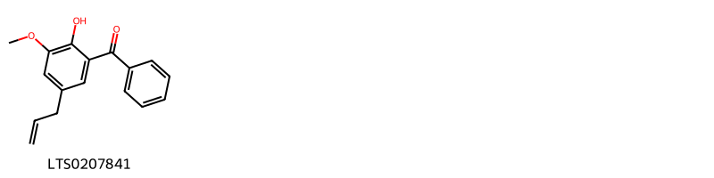{ width=100% }
    <figcaption>Hình ảnh cấu trúc hóa học của 1 hoạt chất thuộc nhóm Benzene and substituted derivatives gồm ['2-benzoyl-6-methoxy-4-(prop-2-en-1-yl)phenol (LTS0207841)'].</figcaption>
</figure>
#### Nhóm Carboxylic acids and derivatives
<figure markdown="span">
    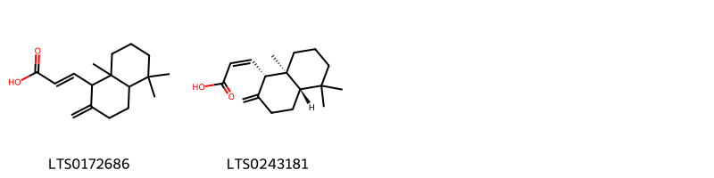{ width=100% }
    <figcaption>Hình ảnh cấu trúc hóa học của 2 hoạt chất thuộc nhóm Carboxylic acids and derivatives gồm ['3-(5,5,8a-trimethyl-2-methylidene-hexahydro-1h-naphthalen-1-yl)prop-2-enoic acid (LTS0172686)', '(2z)-3-[(1s,4as,8as)-5,5,8a-trimethyl-2-methylidene-hexahydro-1h-naphthalen-1-yl]prop-2-enoic acid (LTS0243181)'].</figcaption>
</figure>
#### Nhóm Cinnamic acids and derivatives
<figure markdown="span">
    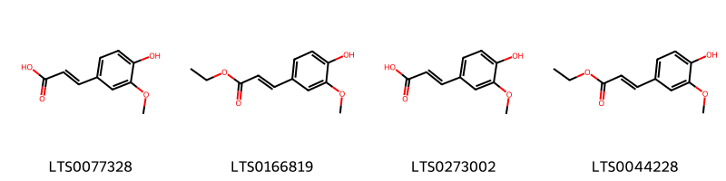{ width=100% }
    <figcaption>Hình ảnh cấu trúc hóa học của 4 hoạt chất thuộc nhóm Cinnamic acids and derivatives gồm ['ferulic acid (LTS0077328)', 'ethyl ferulate (LTS0166819)', 'ferulic acid (LTS0273002)', 'ethyl ferulate (LTS0044228)'].</figcaption>
</figure>
#### Nhóm Epoxides
<figure markdown="span">
    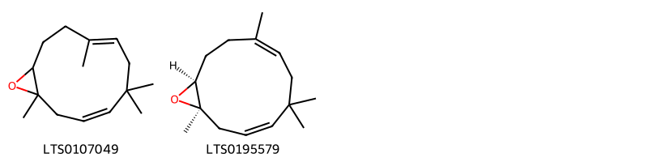{ width=100% }
    <figcaption>Hình ảnh cấu trúc hóa học của 2 hoạt chất thuộc nhóm Epoxides gồm ['(3z,7e)-1,5,5,8-tetramethyl-12-oxabicyclo[9.1.0]dodeca-3,7-diene (LTS0107049)', '(1r,11s)-1,5,5,8-tetramethyl-12-oxabicyclo[9.1.0]dodeca-3,7-diene (LTS0195579)'].</figcaption>
</figure>
#### Nhóm Flavonoids
<figure markdown="span">
    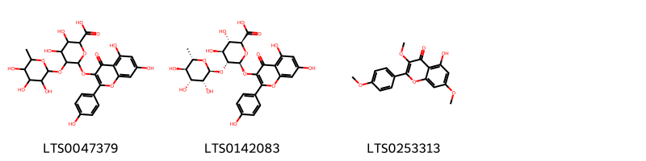{ width=100% }
    <figcaption>Hình ảnh cấu trúc hóa học của 3 hoạt chất thuộc nhóm Flavonoids gồm ['6-{[5,7-dihydroxy-2-(4-hydroxyphenyl)-4-oxochromen-3-yl]oxy}-3,4-dihydroxy-5-[(3,4,5-trihydroxy-6-methyloxan-2-yl)oxy]oxane-2-carboxylic acid (LTS0047379)', '(2s,3s,4s,5r,6s)-6-{[5,7-dihydroxy-2-(4-hydroxyphenyl)-4-oxochromen-3-yl]oxy}-3,4-dihydroxy-5-{[(2s,3r,4r,5r,6s)-3,4,5-trihydroxy-6-methyloxan-2-yl]oxy}oxane-2-carboxylic acid (LTS0142083)', '5-hydroxy-3,7-dimethoxy-2-(4-methoxyphenyl)chromen-4-one (LTS0253313)'].</figcaption>
</figure>
#### Nhóm Lactones
<figure markdown="span">
    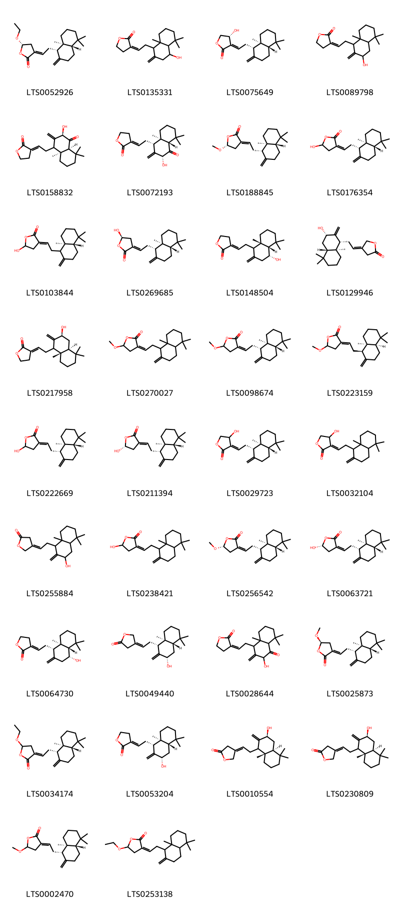{ width=100% }
    <figcaption>Hình ảnh cấu trúc hóa học của 34 hoạt chất thuộc nhóm Lactones gồm ['(3e,5s)-3-{2-[(1s,4as,8as)-5,5,8a-trimethyl-2-methylidene-hexahydro-1h-naphthalen-1-yl]ethylidene}-5-ethoxyoxolan-2-one (LTS0052926)', '3-[2-(4-hydroxy-5,5,8a-trimethyl-2-methylidene-hexahydro-1h-naphthalen-1-yl)ethylidene]oxolan-2-one (LTS0135331)', '(3e,4r)-3-{2-[(1s,4as,8as)-5,5,8a-trimethyl-2-methylidene-hexahydro-1h-naphthalen-1-yl]ethylidene}-4-hydroxyoxolan-2-one (LTS0075649)', '3-[2-(3-hydroxy-5,5,8a-trimethyl-2-methylidene-hexahydro-1h-naphthalen-1-yl)ethylidene]oxolan-2-one (LTS0089798)', '(3e)-3-{2-[(3r,4as,8as)-3-hydroxy-5,5,8a-trimethyl-2-methylidene-4-oxo-hexahydronaphthalen-1-yl]ethylidene}oxolan-2-one (LTS0158832)', '(3e)-3-{2-[(1r,3r,4as,8ar)-3-hydroxy-5,5,8a-trimethyl-2-methylidene-4-oxo-hexahydronaphthalen-1-yl]ethylidene}oxolan-2-one (LTS0072193)', '(5r)-3-{2-[(1s,4as,8as)-5,5,8a-trimethyl-2-methylidene-hexahydro-1h-naphthalen-1-yl]ethylidene}-5-methoxyoxolan-2-one (LTS0188845)', '(3z)-3-{2-[(1s,4as,8as)-5,5,8a-trimethyl-2-methylidene-hexahydro-1h-naphthalen-1-yl]ethylidene}-5-hydroxyoxolan-2-one (LTS0176354)', '3-{2-[(4as,8as)-5,5,8a-trimethyl-2-methylidene-hexahydro-1h-naphthalen-1-yl]ethylidene}-5-hydroxyoxolan-2-one (LTS0103844)', '(3e,5r)-3-{2-[(1s,4as,8as)-5,5,8a-trimethyl-2-methylidene-hexahydro-1h-naphthalen-1-yl]ethylidene}-5-hydroxyoxolan-2-one (LTS0269685)', '(3e)-3-{2-[(4r,4as,8as)-4-hydroxy-5,5,8a-trimethyl-2-methylidene-hexahydro-1h-naphthalen-1-yl]ethylidene}oxolan-2-one (LTS0148504)', '4-{2-[(1r,3s,4as,8as)-3-hydroxy-5,5,8a-trimethyl-2-methylidene-hexahydro-1h-naphthalen-1-yl]ethylidene}oxolan-2-one (LTS0129946)', '(3e)-3-{2-[(3s,4as,8as)-3-hydroxy-5,5,8a-trimethyl-2-methylidene-hexahydro-1h-naphthalen-1-yl]ethylidene}oxolan-2-one (LTS0217958)', '3-[2-(5,5,8a-trimethyl-2-methylidene-hexahydro-1h-naphthalen-1-yl)ethylidene]-5-methoxyoxolan-2-one (LTS0270027)', '(3z)-3-{2-[(1s,4as,8as)-5,5,8a-trimethyl-2-methylidene-hexahydro-1h-naphthalen-1-yl]ethylidene}-5-methoxyoxolan-2-one (LTS0098674)', '3-{2-[(1r,4ar,8as)-5,5,8a-trimethyl-2-methylidene-hexahydro-1h-naphthalen-1-yl]ethylidene}-5-methoxyoxolan-2-one (LTS0223159)', '3-{2-[(1s,4as,8as)-5,5,8a-trimethyl-2-methylidene-hexahydro-1h-naphthalen-1-yl]ethylidene}-5-hydroxyoxolan-2-one (LTS0222669)', '(5r)-3-{2-[(1s,4as,8as)-5,5,8a-trimethyl-2-methylidene-hexahydro-1h-naphthalen-1-yl]ethylidene}-5-hydroxyoxolan-2-one (LTS0211394)', '(3e)-3-{2-[(1s,4as,8as)-5,5,8a-trimethyl-2-methylidene-hexahydro-1h-naphthalen-1-yl]ethylidene}-4-hydroxyoxolan-2-one (LTS0029723)', '3-[2-(5,5,8a-trimethyl-2-methylidene-hexahydro-1h-naphthalen-1-yl)ethylidene]-4-hydroxyoxolan-2-one (LTS0032104)', '4-[2-(3-hydroxy-5,5,8a-trimethyl-2-methylidene-hexahydro-1h-naphthalen-1-yl)ethylidene]oxolan-2-one (LTS0255884)', '3-[2-(5,5,8a-trimethyl-2-methylidene-hexahydro-1h-naphthalen-1-yl)ethylidene]-5-hydroxyoxolan-2-one (LTS0238421)', '(3z,5r)-3-{2-[(1s,4as,8as)-5,5,8a-trimethyl-2-methylidene-hexahydro-1h-naphthalen-1-yl]ethylidene}-5-methoxyoxolan-2-one (LTS0256542)', '(3z,5r)-3-{2-[(1s,4as,8as)-5,5,8a-trimethyl-2-methylidene-hexahydro-1h-naphthalen-1-yl]ethylidene}-5-hydroxyoxolan-2-one (LTS0063721)', '(3e)-3-{2-[(1s,4r,4as,8ar)-4-hydroxy-5,5,8a-trimethyl-2-methylidene-hexahydro-1h-naphthalen-1-yl]ethylidene}oxolan-2-one (LTS0064730)', '(4z)-4-{2-[(1r,3s,4as,8as)-3-hydroxy-5,5,8a-trimethyl-2-methylidene-hexahydro-1h-naphthalen-1-yl]ethylidene}oxolan-2-one (LTS0049440)', '3-[2-(3-hydroxy-5,5,8a-trimethyl-2-methylidene-4-oxo-hexahydronaphthalen-1-yl)ethylidene]oxolan-2-one (LTS0028644)', '(3e,5r)-3-{2-[(1s,4as,8as)-5,5,8a-trimethyl-2-methylidene-hexahydro-1h-naphthalen-1-yl]ethylidene}-5-methoxyoxolan-2-one (LTS0025873)', '(3e)-3-{2-[(1s,4as,8as)-5,5,8a-trimethyl-2-methylidene-hexahydro-1h-naphthalen-1-yl]ethylidene}-5-ethoxyoxolan-2-one (LTS0034174)', '(3e)-3-{2-[(1r,3s,4as,8as)-3-hydroxy-5,5,8a-trimethyl-2-methylidene-hexahydro-1h-naphthalen-1-yl]ethylidene}oxolan-2-one (LTS0053204)', '4-{2-[(3s,4as,8as)-3-hydroxy-5,5,8a-trimethyl-2-methylidene-hexahydro-1h-naphthalen-1-yl]ethylidene}oxolan-2-one (LTS0010554)', '(4z)-4-{2-[(3s,4as,8as)-3-hydroxy-5,5,8a-trimethyl-2-methylidene-hexahydro-1h-naphthalen-1-yl]ethylidene}oxolan-2-one (LTS0230809)', '3-{2-[(1s,4as,8as)-5,5,8a-trimethyl-2-methylidene-hexahydro-1h-naphthalen-1-yl]ethylidene}-5-methoxyoxolan-2-one (LTS0002470)', '3-[2-(5,5,8a-trimethyl-2-methylidene-hexahydro-1h-naphthalen-1-yl)ethylidene]-5-ethoxyoxolan-2-one (LTS0253138)'].</figcaption>
</figure>
#### Nhóm Organic oxides
<figure markdown="span">
    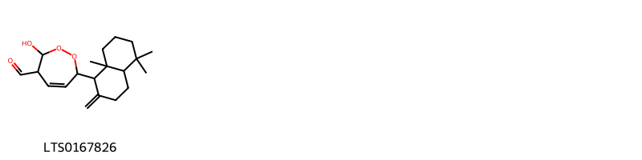{ width=100% }
    <figcaption>Hình ảnh cấu trúc hóa học của 1 hoạt chất thuộc nhóm Organic oxides gồm ['7-(5,5,8a-trimethyl-2-methylidene-hexahydro-1h-naphthalen-1-yl)-3-hydroxy-4,7-dihydro-3h-1,2-dioxepine-4-carbaldehyde (LTS0167826)'].</figcaption>
</figure>
#### Nhóm Organooxygen compounds
<figure markdown="span">
    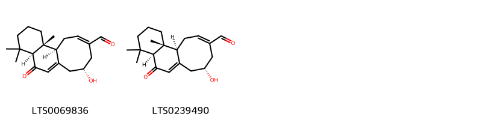{ width=100% }
    <figcaption>Hình ảnh cấu trúc hóa học của 2 hoạt chất thuộc nhóm Organooxygen compounds gồm ['(4as,8r,12as,12br)-8-hydroxy-4,4,12b-trimethyl-5-oxo-1h,2h,3h,4ah,7h,8h,9h,12h,12ah-cycloocta[a]naphthalene-10-carbaldehyde (LTS0069836)', '(4as,8r,12as,12br)-8-hydroxy-4,4,12b-trimethyl-5-oxo-1h,2h,3h,4ah,7h,8h,9h,12h,12ah-cycloocta[a]naphthalene-10-carbaldehyde (LTS0239490)'].</figcaption>
</figure>
#### Nhóm Phenols
<figure markdown="span">
    { width=100% }
    <figcaption>Hình ảnh cấu trúc hóa học của 2 hoạt chất thuộc nhóm Phenols gồm ['coniferyl aldehyde (LTS0140691)', 'coniferaldehyde (LTS0009773)'].</figcaption>
</figure>
#### Nhóm Prenol lipids
<figure markdown="span">
    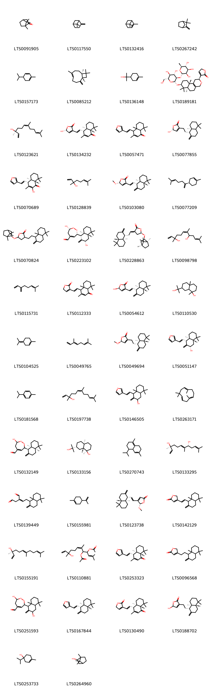{ width=100% }
    <figcaption>Hình ảnh cấu trúc hóa học của 97 hoạt chất thuộc nhóm Prenol lipids gồm ['camphor (LTS0091905)', 'β-pinene (LTS0117550)', 'α pinene (LTS0132416)', 'camphene (LTS0267242)', 'phellandrene (LTS0157173)', 'caryophyllene (LTS0085212)', 'terpineol (LTS0136148)', '3-[(2s,6ar,8s,10as)-8-{[(2r,3r,4s,5s,6r)-4,5-dihydroxy-6-(hydroxymethyl)-3-{[(2s,3r,4r,5r,6s)-3,4,5-trihydroxy-6-methyloxan-2-yl]oxy}oxan-2-yl]oxy}-7,7,10a-trimethyl-1h,2h,4h,5h,6h,6ah,8h,9h,10h-naphtho[2,1-c]pyran-2-yl]-5h-furan-2-one (LTS0189181)', '(6z)-(+)-nerolidol (LTS0123621)', '(5r)-3-[(1e)-2-[(1s,4as,8ar)-2,5,5,8a-tetramethyl-4-oxo-4a,6,7,8-tetrahydro-1h-naphthalen-1-yl]ethenyl]-5-hydroxy-5h-furan-2-one (LTS0134232)', '4-[2-(furan-3-yl)ethenyl]-3,4a,8,8-tetramethyl-5,6,7,8a-tetrahydro-4h-naphthalen-1-one (LTS0057471)', '(5r)-3-{2-[(1s,8as)-5,5,8a-trimethyl-2-methylidene-hexahydro-1h-naphthalen-1-yl]ethyl}-5-hydroxy-5h-furan-2-one (LTS0077855)', '(4r,4ar,8as)-4-[(1e)-2-(furan-3-yl)ethenyl]-2-hydroxy-3,4a,8,8-tetramethyl-5,6,7,8a-tetrahydro-4h-naphthalen-1-one (LTS0070689)', 'linalool, (+-)- (LTS0128839)', '(5r)-3-[(1e)-2-[(1s,4as,8as)-5,5,8a-trimethyl-2-methylidene-hexahydro-1h-naphthalen-1-yl]ethenyl]-5-methoxy-5h-furan-2-one (LTS0103080)', '(r)-β-bisabolene (LTS0077209)', '3-[2-(5,5,8a-trimethyl-2-methylidene-hexahydro-1h-naphthalen-1-yl)ethyl]-5-({1,7,7-trimethylbicyclo[2.2.1]heptan-2-yl}oxy)oxolan-2-one (LTS0070824)', '(3s,7r)-3-[(1r,3s,4as,8as)-3-hydroxy-5,5,8a-trimethyl-2-methylidene-hexahydro-1h-naphthalen-1-yl]-7-hydroxy-6,7-dihydro-3h-1,2-dioxepine-5-carbaldehyde (LTS0223102)', '(3e,5r)-3-{2-[(1s,4as,8as)-5,5,8a-trimethyl-2-methylidene-hexahydro-1h-naphthalen-1-yl]ethylidene}-5-{[(1s,2r,4s)-1,7,7-trimethylbicyclo[2.2.1]heptan-2-yl]oxy}oxolan-2-one (LTS0228863)', '3,7,11-trimethyldodeca-1,6,10-triene-3,8-diol (LTS0098798)', 'α-myrcene (LTS0115731)', '3-[2-(2,5,5,8a-tetramethyl-4-oxo-4a,6,7,8-tetrahydro-1h-naphthalen-1-yl)ethenyl]-5h-furan-2-one (LTS0112333)', '(5s)-3-[(1e)-2-[(1s,4as,8as)-5,5,8a-trimethyl-2-methylidene-hexahydro-1h-naphthalen-1-yl]ethenyl]-5-hydroxy-5h-furan-2-one (LTS0054612)', '7-(2-hydroxypropan-2-yl)-1,4a-dimethyl-octahydronaphthalen-1-ol (LTS0110530)', 'terpinolene (LTS0104525)', 'trans-β-ocimene (LTS0049765)', '(5s)-3-{2-[(1s,4as,8as)-5,5,8a-trimethyl-2-methylidene-hexahydro-1h-naphthalen-1-yl]ethyl}-5-methoxy-5h-furan-2-one (LTS0049694)', '(2s,4r,4as,8as)-4-[(1e)-2-(furan-3-yl)ethenyl]-4a,8,8-trimethyl-3-methylidene-hexahydro-1h-naphthalen-2-ol (LTS0051147)', 'cymene (LTS0181568)', 'nerolidol (LTS0197738)', '4-[2-(furan-3-yl)ethenyl]-4a,8,8-trimethyl-3-methylidene-hexahydro-1h-naphthalen-2-ol (LTS0146505)', 'humulene (LTS0263171)', '3-[(1r,4ar,8as)-5,5,8a-trimethyl-2-methylidene-hexahydro-1h-naphthalen-1-yl]-7-hydroxy-6,7-dihydro-3h-1,2-dioxepine-5-carbaldehyde (LTS0132149)', 'proximadiol (LTS0133156)', '4-isopropyl-1,6-dimethyl-2,3,4,4a,7,8-hexahydronaphthalene (LTS0270743)', '(3s,6e,8r)-3,7,11-trimethyldodeca-1,6,10-triene-3,8-diol (LTS0133295)', '2-[2-(5,5,8a-trimethyl-2-methylidene-hexahydro-1h-naphthalen-1-yl)ethylidene]butanedial (LTS0139449)', 'limonene,  (LTS0155981)', '(5s)-4-{2-[(1s,4as,8as)-5,5,8a-trimethyl-2-methylidene-hexahydro-1h-naphthalen-1-yl]ethenyl}-5-methoxy-5h-furan-2-one (LTS0123738)', '4-[2-(5,5,8a-trimethyl-2-methylidene-hexahydro-1h-naphthalen-1-yl)ethenyl]-5h-furan-2-one (LTS0142129)', 'nerolidol (LTS0155191)', '4-(acetyloxy)-10-hydroxy-2,6,10-trimethyldodeca-2,6,11-trien-5-yl acetate (LTS0110881)', '(4s,4ar,8as)-4-[(1e)-2-(furan-3-yl)ethenyl]-3,4a,8,8-tetramethyl-5,6,7,8a-tetrahydro-4h-naphthalen-1-one (LTS0253323)', '4-[2-(5,5,8a-trimethyl-2-methylidene-hexahydro-1h-naphthalen-1-yl)ethyl]-5h-furan-2-one (LTS0096568)', '3-hydroxy-7-(3-hydroxy-5,5,8a-trimethyl-2-methylidene-hexahydro-1h-naphthalen-1-yl)-4,7-dihydro-3h-1,2-dioxepine-5-carbaldehyde (LTS0251593)', '3-[(1e)-2-[(1s,4as,8as)-5,5,8a-trimethyl-2-methylidene-hexahydro-1h-naphthalen-1-yl]ethenyl]furan (LTS0167844)', '3-[(1e)-2-[(1s,4as,8ar)-2,5,5,8a-tetramethyl-4-oxo-4a,6,7,8-tetrahydro-1h-naphthalen-1-yl]ethenyl]-5h-furan-2-one (LTS0130490)', '3-{2-[(1s,4as,8as)-5,5,8a-trimethyl-2-methylidene-hexahydro-1h-naphthalen-1-yl]ethyl}-5-hydroxy-5h-furan-2-one (LTS0188702)', '4-terpineol (LTS0253733)', 'borneol (LTS0264960)', 'α-thujene (LTS0176954)', '(3s,7r)-3-[(1s,4as,8as)-5,5,8a-trimethyl-2-methylidene-hexahydro-1h-naphthalen-1-yl]-7-hydroxy-6,7-dihydro-3h-1,2-dioxepine-5-carbaldehyde (LTS0205033)', '(5r)-3-[2-(5,5,8a-trimethyl-2-methylidene-hexahydro-1h-naphthalen-1-yl)ethyl]-5-hydroxy-5h-furan-2-one (LTS0070056)', '3-[(1e)-2-[(1s,4as,8as)-5,5,8a-trimethyl-2-methylidene-hexahydro-1h-naphthalen-1-yl]ethenyl]-5h-furan-2-one (LTS0054724)', '(4s,5s,6e,10s)-4-(acetyloxy)-10-hydroxy-2,6,10-trimethyldodeca-2,6,11-trien-5-yl acetate (LTS0067657)', '4-{2-[3-hydroxy-2-(hydroxymethyl)-5,5,8a-trimethyl-4-oxo-4a,6,7,8-tetrahydro-1h-naphthalen-1-yl]ethenyl}-5h-furan-2-one (LTS0058316)', 'bornyl acetate (LTS0060565)', '(1r,4ar,8ar)-7-(2-hydroxypropan-2-yl)-1,4a-dimethyl-octahydronaphthalen-1-ol (LTS0082954)', '2-(5,5,8a-trimethyl-2-methylidene-hexahydro-1h-naphthalen-1-yl)-6-oxo-2,5-dihydropyran-4-carbaldehyde (LTS0210796)', '(5r)-3-{2-[(1s,4as,8as)-5,5,8a-trimethyl-2-methylidene-hexahydro-1h-naphthalen-1-yl]ethenyl}-5-methoxy-5h-furan-2-one (LTS0220878)', '4-[(1e)-2-[(1r,4as,8ar)-3-hydroxy-2-(hydroxymethyl)-5,5,8a-trimethyl-4-oxo-4a,6,7,8-tetrahydro-1h-naphthalen-1-yl]ethenyl]-5h-furan-2-one (LTS0207057)', '3-{2-[(4ar,8as)-5,5,8a-trimethyl-2-methylidene-hexahydro-1h-naphthalen-1-yl]ethenyl}furan (LTS0071838)', 'sabinene (LTS0224133)', '(5s)-4-[(1e)-2-[(1s,4as,8as)-5,5,8a-trimethyl-2-methylidene-hexahydro-1h-naphthalen-1-yl]ethenyl]-5-methoxy-5h-furan-2-one (LTS0020279)', 'α-thujene (LTS0185078)', '(3s,6e,8s)-3,7,11-trimethyldodeca-1,6,10-triene-3,8-diol (LTS0170999)', '(4e)-4-[2-(5,5,8a-trimethyl-2-methylidene-hexahydro-1h-naphthalen-1-yl)ethylidene]-5-oxooxolan-3-yl 4-(5,5,8a-trimethyl-2-methylidene-hexahydro-1h-naphthalen-1-yl)-2-(2-oxoethyl)but-2-enoate (LTS0239361)', 'α-cadinol (LTS0178794)', '3-[2-(5,5,8a-trimethyl-2-methylidene-hexahydro-1h-naphthalen-1-yl)ethenyl]-5-hydroxy-5h-furan-2-one (LTS0250131)', '3-[2-(5,5,8a-trimethyl-2-methylidene-hexahydro-1h-naphthalen-1-yl)ethylidene]-5-({1,7,7-trimethylbicyclo[2.2.1]heptan-2-yl}oxy)oxolan-2-one (LTS0186098)', '5,5,8a-trimethyl-4-oxo-1-[2-(2-oxo-5h-furan-3-yl)ethenyl]-4a,6,7,8-tetrahydro-1h-naphthalene-2-carbaldehyde (LTS0243743)', '4-[2-(5,5,8a-trimethyl-2-methylidene-hexahydro-1h-naphthalen-1-yl)ethenyl]-5-hydroxy-5h-furan-2-one (LTS0247101)', '3-[2-(5,5,8a-trimethyl-2-methylidene-hexahydro-1h-naphthalen-1-yl)ethyl]-5-hydroxy-5h-furan-2-one (LTS0049101)', 'nerolidol isomers (LTS0007569)', '(2s,4r)-1,7,7-trimethylbicyclo[2.2.1]heptan-2-ol (LTS0010050)', '(4r,5r,6e,10s)-4-(acetyloxy)-10-hydroxy-2,6,10-trimethyldodeca-2,6,11-trien-5-yl acetate (LTS0122110)', '(2s)-2-[(1s,4as,8as)-5,5,8a-trimethyl-2-methylidene-hexahydro-1h-naphthalen-1-yl]-6-oxo-2,5-dihydropyran-4-carbaldehyde (LTS0007085)', '3-[(2s,4r,4ar,6ar,8s,10ar,10bs)-8-{[(2r,3r,4s,5s,6r)-4,5-dihydroxy-6-(hydroxymethyl)-3-{[(2s,3r,4r,5r,6s)-3,4,5-trihydroxy-6-methyloxan-2-yl]oxy}oxan-2-yl]oxy}-4-hydroxy-7,7,10a-trimethyl-decahydro-1h-naphtho[2,1-c]pyran-2-yl]-5h-furan-2-one (LTS0053113)', '(5s)-4-[(1e)-2-[(1s,4as,8as)-5,5,8a-trimethyl-2-methylidene-hexahydro-1h-naphthalen-1-yl]ethenyl]-5-hydroxy-5h-furan-2-one (LTS0126384)', '(2e)-2-{2-[(1s,4as,8as)-5,5,8a-trimethyl-2-methylidene-hexahydro-1h-naphthalen-1-yl]ethylidene}butanedial (LTS0024533)', 'terpinene (LTS0136858)', '(-)-β-bisabolene (LTS0009940)', '3-[(1e)-2-[(4as,8ar)-2,5,5,8a-tetramethyl-4-oxo-4a,6,7,8-tetrahydro-1h-naphthalen-1-yl]ethenyl]-5-hydroxy-5h-furan-2-one (LTS0006641)', '3-(8-{[4,5-dihydroxy-6-(hydroxymethyl)-3-[(3,4,5-trihydroxy-6-methyloxan-2-yl)oxy]oxan-2-yl]oxy}-7,7,10a-trimethyl-1h,2h,4h,5h,6h,6ah,8h,9h,10h-naphtho[2,1-c]pyran-2-yl)-5h-furan-2-one (LTS0009489)', '3-[2-(5,5,8a-trimethyl-2-methylidene-hexahydro-1h-naphthalen-1-yl)ethenyl]-5h-furan-2-one (LTS0005979)', '4-[(1e)-2-[(1s,4as,8as)-5,5,8a-trimethyl-2-methylidene-hexahydro-1h-naphthalen-1-yl]ethenyl]-5h-furan-2-one (LTS0008888)', '4-[2-(furan-3-yl)ethenyl]-2-hydroxy-3,4a,8,8-tetramethyl-5,6,7,8a-tetrahydro-4h-naphthalen-1-one (LTS0012712)', '(5r)-3-{2-[(1s,4as,8as)-5,5,8a-trimethyl-2-methylidene-hexahydro-1h-naphthalen-1-yl]ethyl}-5-hydroxy-5h-furan-2-one (LTS0007415)', '(1r,4as,8ar)-5,5,8a-trimethyl-4-oxo-1-[(1e)-2-(2-oxo-5h-furan-3-yl)ethenyl]-4a,6,7,8-tetrahydro-1h-naphthalene-2-carbaldehyde (LTS0025131)', '(2s)-4-[(1e)-2-(furan-3-yl)ethenyl]-4a,8,8-trimethyl-3-methylidene-hexahydro-1h-naphthalen-2-ol (LTS0027614)', 'delta-cadinene (LTS0019321)', '3-[2-(2,5,5,8a-tetramethyl-4-oxo-4a,6,7,8-tetrahydro-1h-naphthalen-1-yl)ethenyl]-5-hydroxy-5h-furan-2-one (LTS0240131)', '3-(8-{[4,5-dihydroxy-6-(hydroxymethyl)-3-[(3,4,5-trihydroxy-6-methyloxan-2-yl)oxy]oxan-2-yl]oxy}-4-hydroxy-7,7,10a-trimethyl-decahydro-1h-naphtho[2,1-c]pyran-2-yl)-5h-furan-2-one (LTS0224841)', '3-(5,5,8a-trimethyl-2-methylidene-hexahydro-1h-naphthalen-1-yl)-7-hydroxy-6,7-dihydro-3h-1,2-dioxepine-5-carbaldehyde (LTS0244528)', '(3r,4e)-4-{2-[(1s,4as,8as)-5,5,8a-trimethyl-2-methylidene-hexahydro-1h-naphthalen-1-yl]ethylidene}-5-oxooxolan-3-yl (2e)-4-[(1s,4as,8as)-5,5,8a-trimethyl-2-methylidene-hexahydro-1h-naphthalen-1-yl]-2-(2-oxoethyl)but-2-enoate (LTS0108180)', '4-{2-[(1s,4as,8as)-5,5,8a-trimethyl-2-methylidene-hexahydro-1h-naphthalen-1-yl]ethyl}-5h-furan-2-one (LTS0121105)', '3-[2-(5,5,8a-trimethyl-2-methylidene-hexahydro-1h-naphthalen-1-yl)ethenyl]furan (LTS0227146)'].</figcaption>
</figure>
#### Nhóm Steroids and steroid derivatives
<figure markdown="span">
    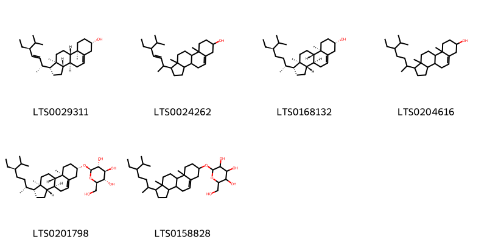{ width=100% }
    <figcaption>Hình ảnh cấu trúc hóa học của 6 hoạt chất thuộc nhóm Steroids and steroid derivatives gồm ['phytosterol (LTS0029311)', 'stigmasterol (LTS0024262)', 'sitosterol (LTS0168132)', 'stigmast-5-en-3-ol, (3β)- (LTS0204616)', 'sitogluside (LTS0201798)', '2-{[1-(5-ethyl-6-methylheptan-2-yl)-9a,11a-dimethyl-1h,2h,3h,3ah,3bh,4h,6h,7h,8h,9h,9bh,10h,11h-cyclopenta[a]phenanthren-7-yl]oxy}-6-(hydroxymethyl)oxane-3,4,5-triol (LTS0158828)'].</figcaption>
</figure>
#### Nhóm Tetrahydrofurans
<figure markdown="span">
    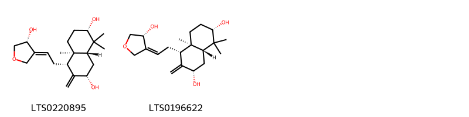{ width=100% }
    <figcaption>Hình ảnh cấu trúc hóa học của 2 hoạt chất thuộc nhóm Tetrahydrofurans gồm ['(2s,4as,5r,7s,8ar)-5-{2-[(4r)-4-hydroxyoxolan-3-ylidene]ethyl}-1,1,4a-trimethyl-6-methylidene-hexahydro-2h-naphthalene-2,7-diol (LTS0220895)', '(2s,4as,5r,7s,8ar)-5-{2-[(3z,4r)-4-hydroxyoxolan-3-ylidene]ethyl}-1,1,4a-trimethyl-6-methylidene-hexahydro-2h-naphthalene-2,7-diol (LTS0196622)'].</figcaption>
</figure>
#### Nhóm Unsaturated hydrocarbons
<figure markdown="span">
    { width=100% }
    <figcaption>Hình ảnh cấu trúc hóa học của 1 hoạt chất thuộc nhóm Unsaturated hydrocarbons gồm ['α terpinene (LTS0232891)'].</figcaption>
</figure>

---

### Dược dân tộc học

Danh sách các quốc gia có sử dụng *Hedychium coronarium* trong điều trị các bệnh. 

| Country   | Disease                | Bệnh                                                                                                                                                                                                |
|:----------|:-----------------------|:----------------------------------------------------------------------------------------------------------------------------------------------------------------------------------------------------|
| China     | Carminative, Stomachic | MYMEMORY WARNING: YOU USED ALL AVAILABLE FREE TRANSLATIONS FOR TODAY. NEXT AVAILABLE IN  07 HOURS 57 MINUTES 41 SECONDS VISIT HTTPS://MYMEMORY.TRANSLATED.NET/DOC/USAGELIMITS.PHP TO TRANSLATE MORE |
| India     | Tonic                  | MYMEMORY WARNING: YOU USED ALL AVAILABLE FREE TRANSLATIONS FOR TODAY. NEXT AVAILABLE IN  07 HOURS 57 MINUTES 39 SECONDS VISIT HTTPS://MYMEMORY.TRANSLATED.NET/DOC/USAGELIMITS.PHP TO TRANSLATE MORE |

---

---
## Hedychium icatum
### Thông tin về thực vật

!!! info "Phân loại thực vật của *N/A* từ GIBF:"
    - **Kingdom:** Plantae
    - **Phylum:** Tracheophyta
    - **Order:** Zingiberales
    - **Family:** Zingiberaceae
    - **Genus:** Hedychium
    - **Species:** *N/A*

 

| Label (VI)   | Label (EN)   | Scientific Name      | Descriptions (VI)   | Descriptions (EN)   | Also Known As (VI)   | Also Known As (EN)   |
|:-------------|:-------------|:---------------------|:--------------------|:--------------------|:---------------------|:---------------------|
| N/A          | N/A          | Hedychium coronarium | loài thực vật       | species of plant    | ['']                 | ['']                 |

#### Phân bố trên thế giới

**Từ CSDL GIBF** Honduras, Spain, French Polynesia, Australia, Jamaica, Indonesia, Colombia, Puerto Rico, Mauritius, Malaysia, Réunion, Cuba, Panama, Brazil, Peru, Eswatini, Mexico, Hong Kong, Chinese Taipei, Uruguay, Argentina, Portugal, South Africa, New Zealand, Cook Islands, Fiji, Costa Rica, Bolivia (Plurinational State of), Ecuador, United States of America, Madagascar

#### Phân bố tại Việt Nam

**Từ CSDL GIBF**: Không có ghi nhận ở Việt Nam

---
### Thành phần hóa học
        
- Theo cơ sở dữ liệu lotus: Từ loài *N/A* đã phân lập và xác định được Chưa có hoạt chất nào được phân lập. hoạt chất thuộc về các nhóm Không có hoạt chất nào được phân lập. 

Không có hình ảnh nào được tạo ra

---

### Dược dân tộc học

Danh sách các quốc gia có sử dụng *N/A* trong điều trị các bệnh. 

| Country   | Disease        | Bệnh                                                                                                                                                                                                |
|:----------|:---------------|:----------------------------------------------------------------------------------------------------------------------------------------------------------------------------------------------------|
| Elsewhere | Stomachic      | MYMEMORY WARNING: YOU USED ALL AVAILABLE FREE TRANSLATIONS FOR TODAY. NEXT AVAILABLE IN  07 HOURS 57 MINUTES 04 SECONDS VISIT HTTPS://MYMEMORY.TRANSLATED.NET/DOC/USAGELIMITS.PHP TO TRANSLATE MORE |
| India     | Fungicide, nan | MYMEMORY WARNING: YOU USED ALL AVAILABLE FREE TRANSLATIONS FOR TODAY. NEXT AVAILABLE IN  07 HOURS 57 MINUTES 02 SECONDS VISIT HTTPS://MYMEMORY.TRANSLATED.NET/DOC/USAGELIMITS.PHP TO TRANSLATE MORE |

---

---
## Hedychium longecornutum
### Thông tin về thực vật

!!! info "Phân loại thực vật của *Hedychium longicornutum* từ GIBF:"
    - **Kingdom:** Plantae
    - **Phylum:** Tracheophyta
    - **Order:** Zingiberales
    - **Family:** Zingiberaceae
    - **Genus:** Hedychium
    - **Species:** *Hedychium longicornutum*

 

| Label (VI)   | Label (EN)   | Scientific Name      | Descriptions (VI)   | Descriptions (EN)   | Also Known As (VI)   | Also Known As (EN)   |
|:-------------|:-------------|:---------------------|:--------------------|:--------------------|:---------------------|:---------------------|
| N/A          | N/A          | Hedychium coronarium | loài thực vật       | species of plant    | ['']                 | ['']                 |

#### Phân bố trên thế giới

**Từ CSDL GIBF** nan, unknown or invalid, Thailand, United Kingdom of Great Britain and Northern Ireland, Malaysia, United States of America, Belgium, Indonesia

#### Phân bố tại Việt Nam

**Từ CSDL GIBF**: Không có ghi nhận ở Việt Nam

---
### Thành phần hóa học
        
- Theo cơ sở dữ liệu lotus: Từ loài *Hedychium longicornutum* đã phân lập và xác định được Chưa có hoạt chất nào được phân lập. hoạt chất thuộc về các nhóm Không có hoạt chất nào được phân lập. 

Không có hình ảnh nào được tạo ra

---

### Dược dân tộc học

Danh sách các quốc gia có sử dụng *Hedychium longicornutum* trong điều trị các bệnh. 

| Country   | Disease   | Bệnh                                                                                                                                                                                                |
|:----------|:----------|:----------------------------------------------------------------------------------------------------------------------------------------------------------------------------------------------------|
| Malaya    | Vermifuge | MYMEMORY WARNING: YOU USED ALL AVAILABLE FREE TRANSLATIONS FOR TODAY. NEXT AVAILABLE IN  07 HOURS 56 MINUTES 39 SECONDS VISIT HTTPS://MYMEMORY.TRANSLATED.NET/DOC/USAGELIMITS.PHP TO TRANSLATE MORE |

---

# Chi Languas

??? note "Danh sách các dược liệu thuộc chi"
    
	 - *Languas mutica*

---
## Languas mutica
### Thông tin về thực vật

!!! info "Phân loại thực vật của *Alpinia mutica* từ GIBF:"
    - **Kingdom:** Plantae
    - **Phylum:** Tracheophyta
    - **Order:** Zingiberales
    - **Family:** Zingiberaceae
    - **Genus:** Alpinia
    - **Species:** *Alpinia mutica*

 

| Label (VI)   | Label (EN)   | Scientific Name      | Descriptions (VI)   | Descriptions (EN)   | Also Known As (VI)   | Also Known As (EN)   |
|:-------------|:-------------|:---------------------|:--------------------|:--------------------|:---------------------|:---------------------|
| N/A          | N/A          | Hedychium coronarium | loài thực vật       | species of plant    | ['']                 | ['']                 |

#### Phân bố trên thế giới

**Từ CSDL GIBF** nan, unknown or invalid, Thailand, United Kingdom of Great Britain and Northern Ireland, Malaysia, United States of America, Belgium, Indonesia

#### Phân bố tại Việt Nam

**Từ CSDL GIBF**: Không có ghi nhận ở Việt Nam

---
### Thành phần hóa học
        
- Theo cơ sở dữ liệu lotus: Từ loài *Alpinia mutica* đã phân lập và xác định được Chưa có hoạt chất nào được phân lập. hoạt chất thuộc về các nhóm Không có hoạt chất nào được phân lập. 

Không có hình ảnh nào được tạo ra

---

### Dược dân tộc học

Danh sách các quốc gia có sử dụng *Alpinia mutica* trong điều trị các bệnh. 

| Country   | Disease   | Bệnh                                                                                                                                                                                                |
|:----------|:----------|:----------------------------------------------------------------------------------------------------------------------------------------------------------------------------------------------------|
| Penang    | Stomachic | MYMEMORY WARNING: YOU USED ALL AVAILABLE FREE TRANSLATIONS FOR TODAY. NEXT AVAILABLE IN  07 HOURS 56 MINUTES 22 SECONDS VISIT HTTPS://MYMEMORY.TRANSLATED.NET/DOC/USAGELIMITS.PHP TO TRANSLATE MORE |

---

# Chi Renealmia

??? note "Danh sách các dược liệu thuộc chi"
    
	 - *Renealmia antillarum*
	 - *Renealmia aromatica*
	 - *Renealmia domingensis*
	 - *Renealmia exaltata*

---
## Renealmia antillarum
### Thông tin về thực vật

!!! info "Phân loại thực vật của *Renealmia jamaicensis* từ GIBF:"
    - **Kingdom:** Plantae
    - **Phylum:** Tracheophyta
    - **Order:** Zingiberales
    - **Family:** Zingiberaceae
    - **Genus:** Renealmia
    - **Species:** *Renealmia jamaicensis*

 

| Label (VI)   | Label (EN)   | Scientific Name      | Descriptions (VI)   | Descriptions (EN)   | Also Known As (VI)   | Also Known As (EN)   |
|:-------------|:-------------|:---------------------|:--------------------|:--------------------|:---------------------|:---------------------|
| N/A          | N/A          | Renealmia antillarum | loài thực vật       | species of plant    | ['']                 | ['']                 |

#### Phân bố trên thế giới

**Từ CSDL GIBF** nan, Dominican Republic, Puerto Rico, United States of America, Cuba, Jamaica

#### Phân bố tại Việt Nam

**Từ CSDL GIBF**: Không có ghi nhận ở Việt Nam

---
### Thành phần hóa học
        
- Theo cơ sở dữ liệu lotus: Từ loài *Renealmia jamaicensis* đã phân lập và xác định được Chưa có hoạt chất nào được phân lập. hoạt chất thuộc về các nhóm Không có hoạt chất nào được phân lập. 

Không có hình ảnh nào được tạo ra

---

### Dược dân tộc học

Danh sách các quốc gia có sử dụng *Renealmia jamaicensis* trong điều trị các bệnh. 

| Country            | Disease   | Bệnh                                                                                                                                                                                                |
|:-------------------|:----------|:----------------------------------------------------------------------------------------------------------------------------------------------------------------------------------------------------|
| Dominican Republic | Diuretic  | MYMEMORY WARNING: YOU USED ALL AVAILABLE FREE TRANSLATIONS FOR TODAY. NEXT AVAILABLE IN  07 HOURS 56 MINUTES 07 SECONDS VISIT HTTPS://MYMEMORY.TRANSLATED.NET/DOC/USAGELIMITS.PHP TO TRANSLATE MORE |
| Haiti              | Diuretic  | MYMEMORY WARNING: YOU USED ALL AVAILABLE FREE TRANSLATIONS FOR TODAY. NEXT AVAILABLE IN  07 HOURS 56 MINUTES 05 SECONDS VISIT HTTPS://MYMEMORY.TRANSLATED.NET/DOC/USAGELIMITS.PHP TO TRANSLATE MORE |

---

---
## Renealmia aromatica
### Thông tin về thực vật

!!! info "Phân loại thực vật của *Renealmia aromatica* từ GIBF:"
    - **Kingdom:** Plantae
    - **Phylum:** Tracheophyta
    - **Order:** Zingiberales
    - **Family:** Zingiberaceae
    - **Genus:** Renealmia
    - **Species:** *Renealmia aromatica*

 

| Label (VI)   | Label (EN)   | Scientific Name     | Descriptions (VI)   | Descriptions (EN)   | Also Known As (VI)   | Also Known As (EN)   |
|:-------------|:-------------|:--------------------|:--------------------|:--------------------|:---------------------|:---------------------|
| N/A          | N/A          | Renealmia aromatica | loài thực vật       | species of plant    | ['']                 | ['']                 |

#### Phân bố trên thế giới

**Từ CSDL GIBF** Colombia, Venezuela (Bolivarian Republic of), Dominican Republic, Nicaragua, Panama, Brazil, Belize, El Salvador, Puerto Rico, Peru, Bolivia (Plurinational State of), Costa Rica, Ecuador, Guyana, Mexico, Guatemala

#### Phân bố tại Việt Nam

**Từ CSDL GIBF**: Không có ghi nhận ở Việt Nam

---
### Thành phần hóa học
        
- Theo cơ sở dữ liệu lotus: Từ loài *Renealmia aromatica* đã phân lập và xác định được Chưa có hoạt chất nào được phân lập. hoạt chất thuộc về các nhóm Không có hoạt chất nào được phân lập. 

Không có hình ảnh nào được tạo ra

---

### Dược dân tộc học

Danh sách các quốc gia có sử dụng *Renealmia aromatica* trong điều trị các bệnh. 

| Country       | Disease                | Bệnh                                                                                                                                                                                                |
|:--------------|:-----------------------|:----------------------------------------------------------------------------------------------------------------------------------------------------------------------------------------------------|
| Elsewhere     | Emmenagogue, Deodorant | MYMEMORY WARNING: YOU USED ALL AVAILABLE FREE TRANSLATIONS FOR TODAY. NEXT AVAILABLE IN  07 HOURS 55 MINUTES 49 SECONDS VISIT HTTPS://MYMEMORY.TRANSLATED.NET/DOC/USAGELIMITS.PHP TO TRANSLATE MORE |
| Panama(Choco) | Deodorant              | MYMEMORY WARNING: YOU USED ALL AVAILABLE FREE TRANSLATIONS FOR TODAY. NEXT AVAILABLE IN  07 HOURS 55 MINUTES 46 SECONDS VISIT HTTPS://MYMEMORY.TRANSLATED.NET/DOC/USAGELIMITS.PHP TO TRANSLATE MORE |

---

---
## Renealmia domingensis
### Thông tin về thực vật

!!! info "Phân loại thực vật của *Renealmia aromatica* từ GIBF:"
    - **Kingdom:** Plantae
    - **Phylum:** Tracheophyta
    - **Order:** Zingiberales
    - **Family:** Zingiberaceae
    - **Genus:** Renealmia
    - **Species:** *Renealmia aromatica*

 

| Label (VI)   | Label (EN)   | Scientific Name     | Descriptions (VI)   | Descriptions (EN)   | Also Known As (VI)   | Also Known As (EN)   |
|:-------------|:-------------|:--------------------|:--------------------|:--------------------|:---------------------|:---------------------|
| N/A          | N/A          | Renealmia aromatica | loài thực vật       | species of plant    | ['']                 | ['']                 |

#### Phân bố trên thế giới

**Từ CSDL GIBF** Colombia, Venezuela (Bolivarian Republic of), Dominican Republic, Nicaragua, Panama, Brazil, Belize, El Salvador, Puerto Rico, Peru, Bolivia (Plurinational State of), Costa Rica, Ecuador, Guyana, Mexico, Guatemala

#### Phân bố tại Việt Nam

**Từ CSDL GIBF**: Không có ghi nhận ở Việt Nam

---
### Thành phần hóa học
        
- Theo cơ sở dữ liệu lotus: Từ loài *Renealmia aromatica* đã phân lập và xác định được Chưa có hoạt chất nào được phân lập. hoạt chất thuộc về các nhóm Không có hoạt chất nào được phân lập. 

Không có hình ảnh nào được tạo ra

---

### Dược dân tộc học

Danh sách các quốc gia có sử dụng *Renealmia aromatica* trong điều trị các bệnh. 

| Country   | Disease     | Bệnh                                                                                                                                                                                                |
|:----------|:------------|:----------------------------------------------------------------------------------------------------------------------------------------------------------------------------------------------------|
| Brazil    | Emmenagogue | MYMEMORY WARNING: YOU USED ALL AVAILABLE FREE TRANSLATIONS FOR TODAY. NEXT AVAILABLE IN  07 HOURS 55 MINUTES 25 SECONDS VISIT HTTPS://MYMEMORY.TRANSLATED.NET/DOC/USAGELIMITS.PHP TO TRANSLATE MORE |

---

---
## Renealmia exaltata
### Thông tin về thực vật

!!! info "Phân loại thực vật của *N/A* từ GIBF:"
    - **Kingdom:** Plantae
    - **Phylum:** Tracheophyta
    - **Order:** N/A
    - **Family:** N/A
    - **Genus:** N/A
    - **Species:** *N/A*

 

| Label (VI)   | Label (EN)   | Scientific Name    | Descriptions (VI)   | Descriptions (EN)   | Also Known As (VI)   | Also Known As (EN)   |
|:-------------|:-------------|:-------------------|:--------------------|:--------------------|:---------------------|:---------------------|
| N/A          | N/A          | Renealmia exaltata |                     |                     | ['']                 | ['']                 |

#### Phân bố trên thế giới

**Từ CSDL GIBF** Viet Nam, Denmark, United Kingdom of Great Britain and Northern Ireland, Niue, Argentina, New Zealand, Germany, United States of America, Mexico, Australia

#### Phân bố tại Việt Nam

**Từ CSDL GIBF**: Quang Nam Province

---
### Thành phần hóa học
        
- Theo cơ sở dữ liệu lotus: Từ loài *N/A* đã phân lập và xác định được 11 hoạt chất thuộc về các nhóm Lactones, Diarylheptanoids. 

|    | chemicalTaxonomyClassyfireClass   |   smiles_count |
|---:|:----------------------------------|---------------:|
|  0 | Diarylheptanoids                  |              5 |
|  1 | Lactones                          |              6 |

#### Nhóm Diarylheptanoids
<figure markdown="span">
    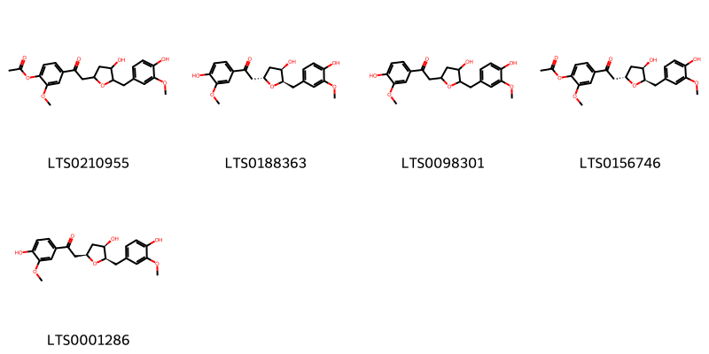{ width=100% }
    <figcaption>Hình ảnh cấu trúc hóa học của 5 hoạt chất thuộc nhóm Diarylheptanoids gồm ['4-(2-{4-hydroxy-5-[(4-hydroxy-3-methoxyphenyl)methyl]oxolan-2-yl}acetyl)-2-methoxyphenyl acetate (LTS0210955)', '1-(4-hydroxy-3-methoxyphenyl)-2-[(2s,4r,5r)-4-hydroxy-5-[(4-hydroxy-3-methoxyphenyl)methyl]oxolan-2-yl]ethanone (LTS0188363)', '1-(4-hydroxy-3-methoxyphenyl)-2-{4-hydroxy-5-[(4-hydroxy-3-methoxyphenyl)methyl]oxolan-2-yl}ethanone (LTS0098301)', '4-{2-[(2s,4r,5r)-4-hydroxy-5-[(4-hydroxy-3-methoxyphenyl)methyl]oxolan-2-yl]acetyl}-2-methoxyphenyl acetate (LTS0156746)', '1-(4-hydroxy-3-methoxyphenyl)-2-[(2r,4r,5r)-4-hydroxy-5-[(4-hydroxy-3-methoxyphenyl)methyl]oxolan-2-yl]ethanone (LTS0001286)'].</figcaption>
</figure>
#### Nhóm Lactones
<figure markdown="span">
    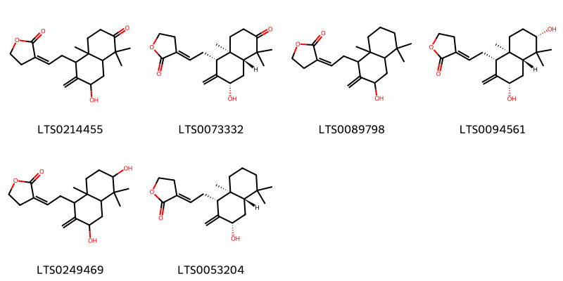{ width=100% }
    <figcaption>Hình ảnh cấu trúc hóa học của 6 hoạt chất thuộc nhóm Lactones gồm ['3-[2-(3-hydroxy-5,5,8a-trimethyl-2-methylidene-6-oxo-hexahydronaphthalen-1-yl)ethylidene]oxolan-2-one (LTS0214455)', '(3e)-3-{2-[(1r,3s,4ar,8ar)-3-hydroxy-5,5,8a-trimethyl-2-methylidene-6-oxo-hexahydronaphthalen-1-yl]ethylidene}oxolan-2-one (LTS0073332)', '3-[2-(3-hydroxy-5,5,8a-trimethyl-2-methylidene-hexahydro-1h-naphthalen-1-yl)ethylidene]oxolan-2-one (LTS0089798)', '(3e)-3-{2-[(1r,3s,4ar,6s,8as)-3,6-dihydroxy-5,5,8a-trimethyl-2-methylidene-hexahydro-1h-naphthalen-1-yl]ethylidene}oxolan-2-one (LTS0094561)', '3-[2-(3,6-dihydroxy-5,5,8a-trimethyl-2-methylidene-hexahydro-1h-naphthalen-1-yl)ethylidene]oxolan-2-one (LTS0249469)', '(3e)-3-{2-[(1r,3s,4as,8as)-3-hydroxy-5,5,8a-trimethyl-2-methylidene-hexahydro-1h-naphthalen-1-yl]ethylidene}oxolan-2-one (LTS0053204)'].</figcaption>
</figure>

---

### Dược dân tộc học

Danh sách các quốc gia có sử dụng *N/A* trong điều trị các bệnh. 

| Country   | Disease    | Bệnh                                                                                                                                                                                                |
|:----------|:-----------|:----------------------------------------------------------------------------------------------------------------------------------------------------------------------------------------------------|
| Elsewhere | Antiseptic | MYMEMORY WARNING: YOU USED ALL AVAILABLE FREE TRANSLATIONS FOR TODAY. NEXT AVAILABLE IN  07 HOURS 55 MINUTES 10 SECONDS VISIT HTTPS://MYMEMORY.TRANSLATED.NET/DOC/USAGELIMITS.PHP TO TRANSLATE MORE |
| Trinidad  | Antiseptic | MYMEMORY WARNING: YOU USED ALL AVAILABLE FREE TRANSLATIONS FOR TODAY. NEXT AVAILABLE IN  07 HOURS 55 MINUTES 07 SECONDS VISIT HTTPS://MYMEMORY.TRANSLATED.NET/DOC/USAGELIMITS.PHP TO TRANSLATE MORE |

---

# Chi Kaempferia

??? note "Danh sách các dược liệu thuộc chi"
    
	 - *Kaempferia galanga*
	 - *Kaempferia pandurata*
	 - *Kaempferia pundurata*
	 - *Kaempferia rotunda*

---
## Kaempferia galanga
### Thông tin về thực vật

!!! info "Phân loại thực vật của *Kaempferia galanga* từ GIBF:"
    - **Kingdom:** Plantae
    - **Phylum:** Tracheophyta
    - **Order:** Zingiberales
    - **Family:** Zingiberaceae
    - **Genus:** Kaempferia
    - **Species:** *Kaempferia galanga*

 

| Label (VI)   | Label (EN)   | Scientific Name    | Descriptions (VI)   | Descriptions (EN)   | Also Known As (VI)   | Also Known As (EN)                                                |
|:-------------|:-------------|:-------------------|:--------------------|:--------------------|:---------------------|:------------------------------------------------------------------|
| N/A          | N/A          | Kaempferia galanga | loài thực vật       | species of plant    | ['']                 | ['resurrection lily', 'aromatic ginger', 'kencur', 'sand ginger'] |

#### Phân bố trên thế giới

**Từ CSDL GIBF** Viet Nam, nan, unknown or invalid, Thailand, Philippines, Lao People’s Democratic Republic, Indonesia, Sierra Leone, Sri Lanka, Suriname, Malaysia, India, Bangladesh, Netherlands, Cambodia, Myanmar, Panama, Brazil, Peru, Mexico, China, Norway, Hong Kong, France, United States of America, Solomon Islands

#### Phân bố tại Việt Nam

**Từ CSDL GIBF**: Kiên Giang, Tây Ninh, Bà Rịa - Vũng Tàu, Dak Nong, Tay Ninh

---
### Thành phần hóa học
        
- Theo cơ sở dữ liệu lotus: Từ loài *Kaempferia galanga* đã phân lập và xác định được 24 hoạt chất thuộc về các nhóm Organooxygen compounds, Azepanes, Saturated hydrocarbons, Phenol esters, Prenol lipids, Organonitrogen compounds, Fatty Acyls, Cinnamic acids and derivatives, Cinnamaldehydes. 

|    | chemicalTaxonomyClassyfireClass   |   smiles_count |
|---:|:----------------------------------|---------------:|
|  0 | Azepanes                          |              1 |
|  1 | Cinnamaldehydes                   |              1 |
|  2 | Cinnamic acids and derivatives    |             11 |
|  3 | Fatty Acyls                       |              3 |
|  4 | Organonitrogen compounds          |              1 |
|  5 | Organooxygen compounds            |              1 |
|  6 | Phenol esters                     |              1 |
|  7 | Prenol lipids                     |              3 |
|  8 | Saturated hydrocarbons            |              1 |

#### Nhóm Azepanes
<figure markdown="span">
    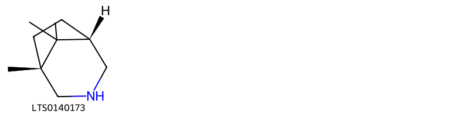{ width=100% }
    <figcaption>Hình ảnh cấu trúc hóa học của 1 hoạt chất thuộc nhóm Azepanes gồm ['(1r,5s)-1,8,8-trimethyl-3-azabicyclo[3.2.1]octane (LTS0140173)'].</figcaption>
</figure>
#### Nhóm Cinnamaldehydes
<figure markdown="span">
    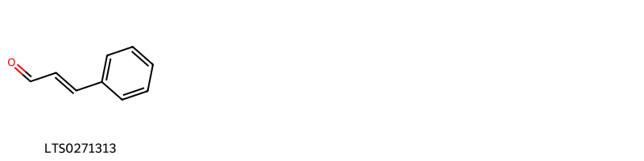{ width=100% }
    <figcaption>Hình ảnh cấu trúc hóa học của 1 hoạt chất thuộc nhóm Cinnamaldehydes gồm ['cinnamal (LTS0271313)'].</figcaption>
</figure>
#### Nhóm Cinnamic acids and derivatives
<figure markdown="span">
    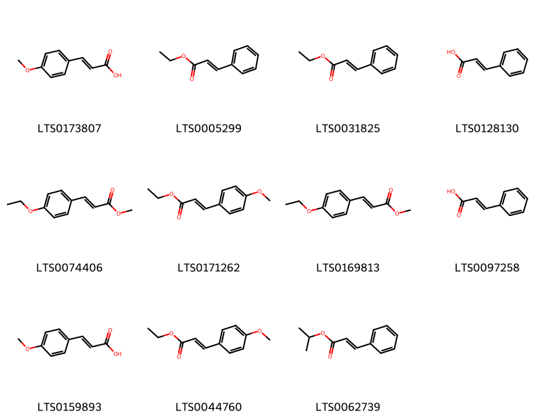{ width=100% }
    <figcaption>Hình ảnh cấu trúc hóa học của 11 hoạt chất thuộc nhóm Cinnamic acids and derivatives gồm ['4-methoxycinnamic acid (LTS0173807)', 'ethyl 3-phenylprop-2-enoate (LTS0005299)', 'ethyl cinnamate (LTS0031825)', 'cinnamic acid (LTS0128130)', 'methyl 3-(4-ethoxyphenyl)prop-2-enoate (LTS0074406)', 'ethyl p-methoxycinnamate (LTS0171262)', 'methyl (2e)-3-(4-ethoxyphenyl)prop-2-enoate (LTS0169813)', 'phenylacrylic acid (LTS0097258)', 'p-methoxy-cinnamic acid (LTS0159893)', 'ethyl 3-(4-methoxyphenyl)prop-2-enoate (LTS0044760)', 'isopropyl 3-phenylprop-2-enoate (LTS0062739)'].</figcaption>
</figure>
#### Nhóm Fatty Acyls
<figure markdown="span">
    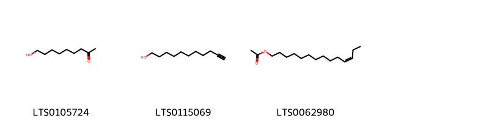{ width=100% }
    <figcaption>Hình ảnh cấu trúc hóa học của 3 hoạt chất thuộc nhóm Fatty Acyls gồm ['9-hydroxynonan-2-one (LTS0105724)', 'undec-10-yn-1-ol (LTS0115069)', '(11z)-11-tetradecenyl acetate (LTS0062980)'].</figcaption>
</figure>
#### Nhóm Organonitrogen compounds
<figure markdown="span">
    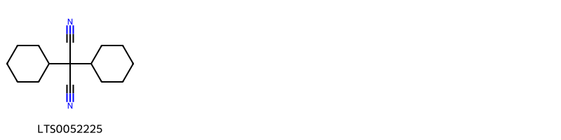{ width=100% }
    <figcaption>Hình ảnh cấu trúc hóa học của 1 hoạt chất thuộc nhóm Organonitrogen compounds gồm ['dicyclohexylpropanedinitrile (LTS0052225)'].</figcaption>
</figure>
#### Nhóm Organooxygen compounds
<figure markdown="span">
    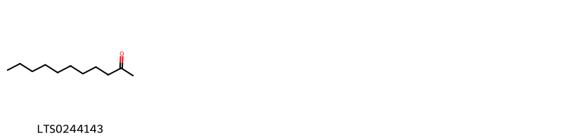{ width=100% }
    <figcaption>Hình ảnh cấu trúc hóa học của 1 hoạt chất thuộc nhóm Organooxygen compounds gồm ['undecan-2-one (LTS0244143)'].</figcaption>
</figure>
#### Nhóm Phenol esters
<figure markdown="span">
    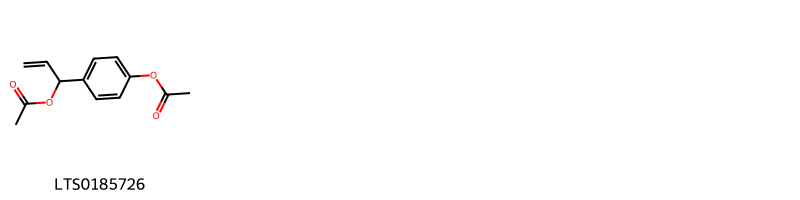{ width=100% }
    <figcaption>Hình ảnh cấu trúc hóa học của 1 hoạt chất thuộc nhóm Phenol esters gồm ['1-[4-(acetyloxy)phenyl]prop-2-en-1-yl acetate (LTS0185726)'].</figcaption>
</figure>
#### Nhóm Prenol lipids
<figure markdown="span">
    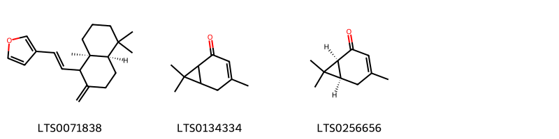{ width=100% }
    <figcaption>Hình ảnh cấu trúc hóa học của 3 hoạt chất thuộc nhóm Prenol lipids gồm ['3-{2-[(4ar,8as)-5,5,8a-trimethyl-2-methylidene-hexahydro-1h-naphthalen-1-yl]ethenyl}furan (LTS0071838)', '4,7,7-trimethylbicyclo[4.1.0]hept-3-en-2-one (LTS0134334)', '(1s,6r)-4,7,7-trimethylbicyclo[4.1.0]hept-3-en-2-one (LTS0256656)'].</figcaption>
</figure>
#### Nhóm Saturated hydrocarbons
<figure markdown="span">
    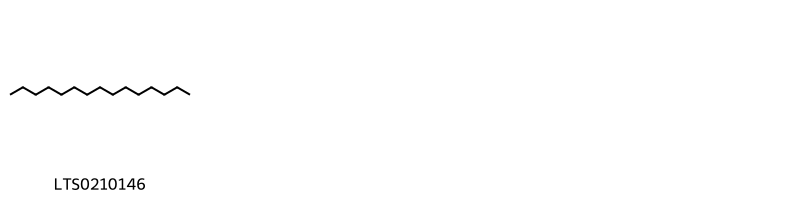{ width=100% }
    <figcaption>Hình ảnh cấu trúc hóa học của 1 hoạt chất thuộc nhóm Saturated hydrocarbons gồm ['pentadecane (LTS0210146)'].</figcaption>
</figure>

---

### Dược dân tộc học

Danh sách các quốc gia có sử dụng *Kaempferia galanga* trong điều trị các bệnh. 

| Country   | Disease                                                                                                            | Bệnh                                                                                                                                                                                                |
|:----------|:-------------------------------------------------------------------------------------------------------------------|:----------------------------------------------------------------------------------------------------------------------------------------------------------------------------------------------------|
| Asia      | Cicatrizant                                                                                                        | MYMEMORY WARNING: YOU USED ALL AVAILABLE FREE TRANSLATIONS FOR TODAY. NEXT AVAILABLE IN  07 HOURS 54 MINUTES 43 SECONDS VISIT HTTPS://MYMEMORY.TRANSLATED.NET/DOC/USAGELIMITS.PHP TO TRANSLATE MORE |
| China     | Carminative, Carminative, Diuretic, Pediculicide, Perfume, Stimulant, Stomachic, Stimulant, Carminative, Stomachic | MYMEMORY WARNING: YOU USED ALL AVAILABLE FREE TRANSLATIONS FOR TODAY. NEXT AVAILABLE IN  07 HOURS 54 MINUTES 40 SECONDS VISIT HTTPS://MYMEMORY.TRANSLATED.NET/DOC/USAGELIMITS.PHP TO TRANSLATE MORE |
| Elsewhere | Diuretic, Expectorant, Stimulant, Carminative                                                                      | MYMEMORY WARNING: YOU USED ALL AVAILABLE FREE TRANSLATIONS FOR TODAY. NEXT AVAILABLE IN  07 HOURS 54 MINUTES 38 SECONDS VISIT HTTPS://MYMEMORY.TRANSLATED.NET/DOC/USAGELIMITS.PHP TO TRANSLATE MORE |
| India     | Pediculicide                                                                                                       | MYMEMORY WARNING: YOU USED ALL AVAILABLE FREE TRANSLATIONS FOR TODAY. NEXT AVAILABLE IN  07 HOURS 54 MINUTES 35 SECONDS VISIT HTTPS://MYMEMORY.TRANSLATED.NET/DOC/USAGELIMITS.PHP TO TRANSLATE MORE |
| Malaya    | Cosmetic                                                                                                           | MYMEMORY WARNING: YOU USED ALL AVAILABLE FREE TRANSLATIONS FOR TODAY. NEXT AVAILABLE IN  07 HOURS 54 MINUTES 33 SECONDS VISIT HTTPS://MYMEMORY.TRANSLATED.NET/DOC/USAGELIMITS.PHP TO TRANSLATE MORE |
| Malaysia  | Stimulant                                                                                                          | MYMEMORY WARNING: YOU USED ALL AVAILABLE FREE TRANSLATIONS FOR TODAY. NEXT AVAILABLE IN  07 HOURS 54 MINUTES 31 SECONDS VISIT HTTPS://MYMEMORY.TRANSLATED.NET/DOC/USAGELIMITS.PHP TO TRANSLATE MORE |
| Sanscrit  | Expectorant                                                                                                        | MYMEMORY WARNING: YOU USED ALL AVAILABLE FREE TRANSLATIONS FOR TODAY. NEXT AVAILABLE IN  07 HOURS 54 MINUTES 28 SECONDS VISIT HTTPS://MYMEMORY.TRANSLATED.NET/DOC/USAGELIMITS.PHP TO TRANSLATE MORE |

---

---
## Kaempferia pandurata
### Thông tin về thực vật

!!! info "Phân loại thực vật của *Boesenbergia rotunda* từ GIBF:"
    - **Kingdom:** Plantae
    - **Phylum:** Tracheophyta
    - **Order:** Zingiberales
    - **Family:** Zingiberaceae
    - **Genus:** Boesenbergia
    - **Species:** *Boesenbergia rotunda*

 

| Label (VI)   | Label (EN)   | Scientific Name      | Descriptions (VI)   | Descriptions (EN)   | Also Known As (VI)   | Also Known As (EN)   |
|:-------------|:-------------|:---------------------|:--------------------|:--------------------|:---------------------|:---------------------|
| N/A          | N/A          | Kaempferia pandurata | loài thực vật       | species of plant    | ['']                 | ['']                 |

#### Phân bố trên thế giới

**Từ CSDL GIBF** Viet Nam, nan, unknown or invalid, Thailand, Philippines, Lao People’s Democratic Republic, Indonesia, Sierra Leone, Sri Lanka, Suriname, Malaysia, India, Bangladesh, Netherlands, Cambodia, Myanmar, Panama, Brazil, Peru, Mexico, China, Norway, Hong Kong, France, United States of America, Solomon Islands

#### Phân bố tại Việt Nam

**Từ CSDL GIBF**: Kiên Giang, Tây Ninh, Bà Rịa - Vũng Tàu, Dak Nong, Tay Ninh

---
### Thành phần hóa học
        
- Theo cơ sở dữ liệu lotus: Từ loài *Boesenbergia rotunda* đã phân lập và xác định được Chưa có hoạt chất nào được phân lập. hoạt chất thuộc về các nhóm Không có hoạt chất nào được phân lập. 

Không có hình ảnh nào được tạo ra

---

### Dược dân tộc học

Danh sách các quốc gia có sử dụng *Boesenbergia rotunda* trong điều trị các bệnh. 

| Country   | Disease                                        | Bệnh                                                                                                                                                                                                |
|:----------|:-----------------------------------------------|:----------------------------------------------------------------------------------------------------------------------------------------------------------------------------------------------------|
| China     | Analgesic, Emmenagogue, Expectorant, Stomachic | MYMEMORY WARNING: YOU USED ALL AVAILABLE FREE TRANSLATIONS FOR TODAY. NEXT AVAILABLE IN  07 HOURS 54 MINUTES 05 SECONDS VISIT HTTPS://MYMEMORY.TRANSLATED.NET/DOC/USAGELIMITS.PHP TO TRANSLATE MORE |

---

---
## Kaempferia pundurata
### Thông tin về thực vật

!!! info "Phân loại thực vật của *Boesenbergia rotunda* từ GIBF:"
    - **Kingdom:** Plantae
    - **Phylum:** Tracheophyta
    - **Order:** Zingiberales
    - **Family:** Zingiberaceae
    - **Genus:** Boesenbergia
    - **Species:** *Boesenbergia rotunda*

 

| Label (VI)   | Label (EN)   | Scientific Name      | Descriptions (VI)   | Descriptions (EN)   | Also Known As (VI)   | Also Known As (EN)   |
|:-------------|:-------------|:---------------------|:--------------------|:--------------------|:---------------------|:---------------------|
| N/A          | N/A          | Kaempferia pandurata | loài thực vật       | species of plant    | ['']                 | ['']                 |

#### Phân bố trên thế giới

**Từ CSDL GIBF** Viet Nam, nan, unknown or invalid, Thailand, Philippines, Lao People’s Democratic Republic, Indonesia, Sierra Leone, Sri Lanka, Suriname, Malaysia, India, Bangladesh, Netherlands, Cambodia, Myanmar, Panama, Brazil, Peru, Mexico, China, Norway, Hong Kong, France, United States of America, Solomon Islands

#### Phân bố tại Việt Nam

**Từ CSDL GIBF**: Kiên Giang, Tây Ninh, Bà Rịa - Vũng Tàu, Dak Nong, Tay Ninh

---
### Thành phần hóa học
        
- Theo cơ sở dữ liệu lotus: Từ loài *Boesenbergia rotunda* đã phân lập và xác định được Chưa có hoạt chất nào được phân lập. hoạt chất thuộc về các nhóm Không có hoạt chất nào được phân lập. 

Không có hình ảnh nào được tạo ra

---

### Dược dân tộc học

Danh sách các quốc gia có sử dụng *Boesenbergia rotunda* trong điều trị các bệnh. 

| Country   | Disease                                                    | Bệnh                                                                                                                                                                                                |
|:----------|:-----------------------------------------------------------|:----------------------------------------------------------------------------------------------------------------------------------------------------------------------------------------------------|
| China     | Carminative, Cholagogue, Emmenagogue, Stomachic, Digestive | MYMEMORY WARNING: YOU USED ALL AVAILABLE FREE TRANSLATIONS FOR TODAY. NEXT AVAILABLE IN  07 HOURS 53 MINUTES 49 SECONDS VISIT HTTPS://MYMEMORY.TRANSLATED.NET/DOC/USAGELIMITS.PHP TO TRANSLATE MORE |

---

---
## Kaempferia rotunda
### Thông tin về thực vật

!!! info "Phân loại thực vật của *Kaempferia rotunda* từ GIBF:"
    - **Kingdom:** Plantae
    - **Phylum:** Tracheophyta
    - **Order:** Zingiberales
    - **Family:** Zingiberaceae
    - **Genus:** Kaempferia
    - **Species:** *Kaempferia rotunda*

 

| Label (VI)   | Label (EN)   | Scientific Name    | Descriptions (VI)   | Descriptions (EN)   | Also Known As (VI)     | Also Known As (EN)   |
|:-------------|:-------------|:-------------------|:--------------------|:--------------------|:-----------------------|:---------------------|
| N/A          | N/A          | Kaempferia rotunda | loài thực vật       | species of plant    | ['Kaempferia rotunda'] | ['']                 |

#### Phân bố trên thế giới

**Từ CSDL GIBF** Viet Nam, unknown or invalid, Thailand, El Salvador, Philippines, Guadeloupe, French Polynesia, Lao People’s Democratic Republic, Martinique, Indonesia, Bhutan, India, Bangladesh, Belgium, Cambodia, Nicaragua, Panama, Brazil, Myanmar, Mexico, China, Nepal, Hong Kong, South Africa, Costa Rica, New Caledonia, United States of America

#### Phân bố tại Việt Nam

**Từ CSDL GIBF**: Không có ghi nhận ở Việt Nam

---
### Thành phần hóa học
        
- Theo cơ sở dữ liệu lotus: Từ loài *Kaempferia rotunda* đã phân lập và xác định được 12 hoạt chất thuộc về các nhóm Organooxygen compounds, Prenol lipids, Steroids and steroid derivatives, Benzene and substituted derivatives. 

|    | chemicalTaxonomyClassyfireClass     |   smiles_count |
|---:|:------------------------------------|---------------:|
|  0 | Benzene and substituted derivatives |              8 |
|  1 | Organooxygen compounds              |              1 |
|  2 | Prenol lipids                       |              1 |
|  3 | Steroids and steroid derivatives    |              2 |

#### Nhóm Benzene and substituted derivatives
<figure markdown="span">
    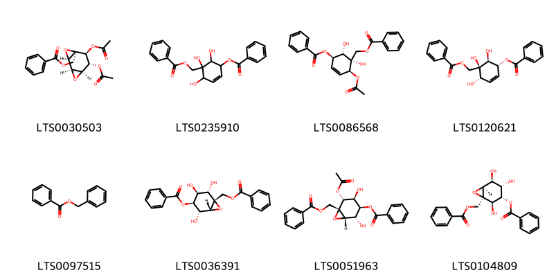{ width=100% }
    <figcaption>Hình ảnh cấu trúc hóa học của 8 hoạt chất thuộc nhóm Benzene and substituted derivatives gồm ['[(1r,2r,4r,5s,6r,7s)-5,6-bis(acetyloxy)-3,8-dioxatricyclo[5.1.0.0²,⁴]octan-4-yl]methyl benzoate (LTS0030503)', '5-[(benzoyloxy)methyl]-4,5,6-trihydroxycyclohex-2-en-1-yl benzoate (LTS0235910)', '(1r,4s,5s,6s)-4-(acetyloxy)-5-[(benzoyloxy)methyl]-5,6-dihydroxycyclohex-2-en-1-yl benzoate (LTS0086568)', '(1r,4s,5r,6s)-5-[(benzoyloxy)methyl]-4,5,6-trihydroxycyclohex-2-en-1-yl benzoate (LTS0120621)', 'benzyl benzoate (LTS0097515)', '(1r,2r,3s,4s,5s,6s)-6-[(benzoyloxy)methyl]-2,4,5-trihydroxy-7-oxabicyclo[4.1.0]heptan-3-yl benzoate (LTS0036391)', '(1s,2s,3s,4s,5r,6s)-5-(acetyloxy)-6-[(benzoyloxy)methyl]-2,4-dihydroxy-7-oxabicyclo[4.1.0]heptan-3-yl benzoate (LTS0051963)', '(1r,2r,3s,4s,5s,6s)-1-[(benzoyloxy)methyl]-2,4,5-trihydroxy-7-oxabicyclo[4.1.0]heptan-3-yl benzoate (LTS0104809)'].</figcaption>
</figure>
#### Nhóm Organooxygen compounds
<figure markdown="span">
    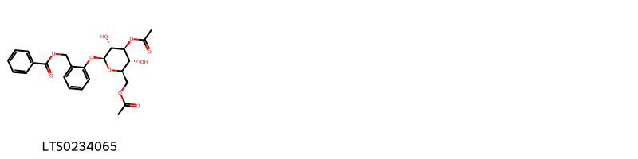{ width=100% }
    <figcaption>Hình ảnh cấu trúc hóa học của 1 hoạt chất thuộc nhóm Organooxygen compounds gồm ['(2-{[(2s,3r,4s,5r,6r)-4-(acetyloxy)-6-[(acetyloxy)methyl]-3,5-dihydroxyoxan-2-yl]oxy}phenyl)methyl benzoate (LTS0234065)'].</figcaption>
</figure>
#### Nhóm Prenol lipids
<figure markdown="span">
    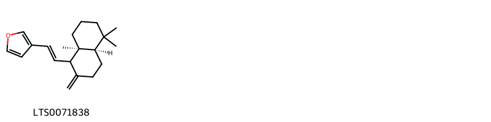{ width=100% }
    <figcaption>Hình ảnh cấu trúc hóa học của 1 hoạt chất thuộc nhóm Prenol lipids gồm ['3-{2-[(4ar,8as)-5,5,8a-trimethyl-2-methylidene-hexahydro-1h-naphthalen-1-yl]ethenyl}furan (LTS0071838)'].</figcaption>
</figure>
#### Nhóm Steroids and steroid derivatives
<figure markdown="span">
    { width=100% }
    <figcaption>Hình ảnh cấu trúc hóa học của 2 hoạt chất thuộc nhóm Steroids and steroid derivatives gồm ['stigmast-5-en-3-ol, (3β)- (LTS0204616)', 'phytosterol (LTS0029311)'].</figcaption>
</figure>

---

### Dược dân tộc học

Danh sách các quốc gia có sử dụng *Kaempferia rotunda* trong điều trị các bệnh. 

| Country   | Disease   | Bệnh                                                                                                                                                                                                |
|:----------|:----------|:----------------------------------------------------------------------------------------------------------------------------------------------------------------------------------------------------|
| Elsewhere | Stomachic | MYMEMORY WARNING: YOU USED ALL AVAILABLE FREE TRANSLATIONS FOR TODAY. NEXT AVAILABLE IN  07 HOURS 53 MINUTES 34 SECONDS VISIT HTTPS://MYMEMORY.TRANSLATED.NET/DOC/USAGELIMITS.PHP TO TRANSLATE MORE |
| Malaya    | Cosmetic  | MYMEMORY WARNING: YOU USED ALL AVAILABLE FREE TRANSLATIONS FOR TODAY. NEXT AVAILABLE IN  07 HOURS 53 MINUTES 32 SECONDS VISIT HTTPS://MYMEMORY.TRANSLATED.NET/DOC/USAGELIMITS.PHP TO TRANSLATE MORE |

---

# Chi Nicolaia

??? note "Danh sách các dược liệu thuộc chi"
    
	 - *Nicolaia eciosa*

---
## Nicolaia eciosa
### Thông tin về thực vật

!!! info "Phân loại thực vật của *N/A* từ GIBF:"
    - **Kingdom:** N/A
    - **Phylum:** N/A
    - **Order:** N/A
    - **Family:** N/A
    - **Genus:** N/A
    - **Species:** *N/A*

 

| Label (VI)   | Label (EN)   | Scientific Name    | Descriptions (VI)   | Descriptions (EN)   | Also Known As (VI)     | Also Known As (EN)   |
|:-------------|:-------------|:-------------------|:--------------------|:--------------------|:-----------------------|:---------------------|
| N/A          | N/A          | Kaempferia rotunda | loài thực vật       | species of plant    | ['Kaempferia rotunda'] | ['']                 |

#### Phân bố trên thế giới

**Từ CSDL GIBF** Không có kết quả phù hợp

#### Phân bố tại Việt Nam

**Từ CSDL GIBF**: Không có ghi nhận ở Việt Nam

---
### Thành phần hóa học
        
- Theo cơ sở dữ liệu lotus: Từ loài *N/A* đã phân lập và xác định được Chưa có hoạt chất nào được phân lập. hoạt chất thuộc về các nhóm Không có hoạt chất nào được phân lập. 

Không có hình ảnh nào được tạo ra

---

### Dược dân tộc học

Danh sách các quốc gia có sử dụng *N/A* trong điều trị các bệnh. 

| Country   | Disease   | Bệnh                                                                                                                                                                                                |
|:----------|:----------|:----------------------------------------------------------------------------------------------------------------------------------------------------------------------------------------------------|
| Java      | Deodorant | MYMEMORY WARNING: YOU USED ALL AVAILABLE FREE TRANSLATIONS FOR TODAY. NEXT AVAILABLE IN  07 HOURS 53 MINUTES 07 SECONDS VISIT HTTPS://MYMEMORY.TRANSLATED.NET/DOC/USAGELIMITS.PHP TO TRANSLATE MORE |

---

# Chi Zingiber

??? note "Danh sách các dược liệu thuộc chi"
    
	 - *Zingiber amaricans*
	 - *Zingiber aromaticum*
	 - *Zingiber cassumunar*
	 - *Zingiber nigrum*
	 - *Zingiber officinale*
	 - *Zingiber ottensii*
	 - *Zingiber zedoaria*
	 - *Zingiber zerumbet*

---
## Zingiber amaricans
### Thông tin về thực vật

!!! info "Phân loại thực vật của *Zingiber amaricans* từ GIBF:"
    - **Kingdom:** Plantae
    - **Phylum:** Tracheophyta
    - **Order:** Zingiberales
    - **Family:** Zingiberaceae
    - **Genus:** Zingiber
    - **Species:** *Zingiber amaricans*

 

| Label (VI)   | Label (EN)   | Scientific Name    | Descriptions (VI)   | Descriptions (EN)   | Also Known As (VI)   | Also Known As (EN)   |
|:-------------|:-------------|:-------------------|:--------------------|:--------------------|:---------------------|:---------------------|
| N/A          | N/A          | Zingiber amaricans |                     |                     | ['']                 | ['']                 |

#### Phân bố trên thế giới

**Từ CSDL GIBF** Không có kết quả phù hợp

#### Phân bố tại Việt Nam

**Từ CSDL GIBF**: Không có ghi nhận ở Việt Nam

---
### Thành phần hóa học
        
- Theo cơ sở dữ liệu lotus: Từ loài *Zingiber amaricans* đã phân lập và xác định được 2 hoạt chất thuộc về các nhóm Prenol lipids. 

|    | chemicalTaxonomyClassyfireClass   |   smiles_count |
|---:|:----------------------------------|---------------:|
|  0 | Prenol lipids                     |              2 |

#### Nhóm Prenol lipids
<figure markdown="span">
    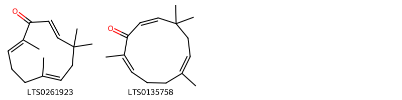{ width=100% }
    <figcaption>Hình ảnh cấu trúc hóa học của 2 hoạt chất thuộc nhóm Prenol lipids gồm ['zerumbone (LTS0261923)', '2,6,9,9-tetramethylcycloundeca-2,6,10-trien-1-one (LTS0135758)'].</figcaption>
</figure>

---

### Dược dân tộc học

Danh sách các quốc gia có sử dụng *Zingiber amaricans* trong điều trị các bệnh. 

| Country   | Disease        | Bệnh                                                                                                                                                                                                |
|:----------|:---------------|:----------------------------------------------------------------------------------------------------------------------------------------------------------------------------------------------------|
| Java      | Apertif, Tonic | MYMEMORY WARNING: YOU USED ALL AVAILABLE FREE TRANSLATIONS FOR TODAY. NEXT AVAILABLE IN  07 HOURS 52 MINUTES 57 SECONDS VISIT HTTPS://MYMEMORY.TRANSLATED.NET/DOC/USAGELIMITS.PHP TO TRANSLATE MORE |

---

---
## Zingiber aromaticum
### Thông tin về thực vật

!!! info "Phân loại thực vật của *N/A* từ GIBF:"
    - **Kingdom:** Plantae
    - **Phylum:** Tracheophyta
    - **Order:** Zingiberales
    - **Family:** Zingiberaceae
    - **Genus:** Zingiber
    - **Species:** *N/A*

 

| Label (VI)   | Label (EN)   | Scientific Name    | Descriptions (VI)   | Descriptions (EN)   | Also Known As (VI)   | Also Known As (EN)   |
|:-------------|:-------------|:-------------------|:--------------------|:--------------------|:---------------------|:---------------------|
| N/A          | N/A          | Zingiber amaricans |                     |                     | ['']                 | ['']                 |

#### Phân bố trên thế giới

**Từ CSDL GIBF** Philippines, French Polynesia, Trinidad and Tobago, French Guiana, Australia, Indonesia, Guatemala, Colombia, American Samoa, Malaysia, Sao Tome and Principe, India, Samoa, Puerto Rico, Bangladesh, Belize, Panama, Brazil, Peru, Mexico, China, Nepal, Chinese Taipei, Niue, Mozambique, Cook Islands, Bolivia (Plurinational State of), Costa Rica, New Caledonia, Ecuador, United States of America, Madagascar

#### Phân bố tại Việt Nam

**Từ CSDL GIBF**: Không có ghi nhận ở Việt Nam

---
### Thành phần hóa học
        
- Theo cơ sở dữ liệu lotus: Từ loài *N/A* đã phân lập và xác định được Chưa có hoạt chất nào được phân lập. hoạt chất thuộc về các nhóm Không có hoạt chất nào được phân lập. 

Không có hình ảnh nào được tạo ra

---

### Dược dân tộc học

Danh sách các quốc gia có sử dụng *N/A* trong điều trị các bệnh. 

| Country   | Disease   | Bệnh                                                                                                                                                                                                |
|:----------|:----------|:----------------------------------------------------------------------------------------------------------------------------------------------------------------------------------------------------|
| Java      | Tonic     | MYMEMORY WARNING: YOU USED ALL AVAILABLE FREE TRANSLATIONS FOR TODAY. NEXT AVAILABLE IN  07 HOURS 52 MINUTES 41 SECONDS VISIT HTTPS://MYMEMORY.TRANSLATED.NET/DOC/USAGELIMITS.PHP TO TRANSLATE MORE |

---

---
## Zingiber cassumunar
### Thông tin về thực vật

!!! info "Phân loại thực vật của *Zingiber purpureum* từ GIBF:"
    - **Kingdom:** Plantae
    - **Phylum:** Tracheophyta
    - **Order:** Zingiberales
    - **Family:** Zingiberaceae
    - **Genus:** Zingiber
    - **Species:** *Zingiber purpureum*

 

| Label (VI)   | Label (EN)   | Scientific Name     | Descriptions (VI)   | Descriptions (EN)   | Also Known As (VI)   | Also Known As (EN)    |
|:-------------|:-------------|:--------------------|:--------------------|:--------------------|:---------------------|:----------------------|
| N/A          | N/A          | Zingiber cassumunar | loài thực vật       | species of plant    | ['']                 | ['Zingiber montanum'] |

#### Phân bố trên thế giới

**Từ CSDL GIBF** Viet Nam, Haiti, nan, Sri Lanka, Myanmar, France, Philippines, Puerto Rico, India, United States of America, Cuba, Indonesia

#### Phân bố tại Việt Nam

**Từ CSDL GIBF**: Không có ghi nhận ở Việt Nam

---
### Thành phần hóa học
        
- Theo cơ sở dữ liệu lotus: Từ loài *Zingiber purpureum* đã phân lập và xác định được Chưa có hoạt chất nào được phân lập. hoạt chất thuộc về các nhóm Không có hoạt chất nào được phân lập. 

Không có hình ảnh nào được tạo ra

---

### Dược dân tộc học

Danh sách các quốc gia có sử dụng *Zingiber purpureum* trong điều trị các bệnh. 

| Country   | Disease             | Bệnh                                                                                                                                                                                                |
|:----------|:--------------------|:----------------------------------------------------------------------------------------------------------------------------------------------------------------------------------------------------|
| Elsewhere | Carminative         | MYMEMORY WARNING: YOU USED ALL AVAILABLE FREE TRANSLATIONS FOR TODAY. NEXT AVAILABLE IN  07 HOURS 52 MINUTES 20 SECONDS VISIT HTTPS://MYMEMORY.TRANSLATED.NET/DOC/USAGELIMITS.PHP TO TRANSLATE MORE |
| Malaya    | Cosmetic, Vermifuge | MYMEMORY WARNING: YOU USED ALL AVAILABLE FREE TRANSLATIONS FOR TODAY. NEXT AVAILABLE IN  07 HOURS 52 MINUTES 18 SECONDS VISIT HTTPS://MYMEMORY.TRANSLATED.NET/DOC/USAGELIMITS.PHP TO TRANSLATE MORE |

---

---
## Zingiber nigrum
### Thông tin về thực vật

!!! info "Phân loại thực vật của *Alpinia nigra* từ GIBF:"
    - **Kingdom:** Plantae
    - **Phylum:** Tracheophyta
    - **Order:** Zingiberales
    - **Family:** Zingiberaceae
    - **Genus:** Alpinia
    - **Species:** *Alpinia nigra*

 

| Label (VI)   | Label (EN)   | Scientific Name   | Descriptions (VI)   | Descriptions (EN)   | Also Known As (VI)   | Also Known As (EN)   |
|:-------------|:-------------|:------------------|:--------------------|:--------------------|:---------------------|:---------------------|
| N/A          | N/A          | Zingiber nigrum   | loài thực vật       | species of plant    | ['']                 | ['']                 |

#### Phân bố trên thế giới

**Từ CSDL GIBF** Viet Nam, Haiti, nan, Sri Lanka, Myanmar, France, Philippines, Puerto Rico, India, United States of America, Cuba, Indonesia

#### Phân bố tại Việt Nam

**Từ CSDL GIBF**: Không có ghi nhận ở Việt Nam

---
### Thành phần hóa học
        
- Theo cơ sở dữ liệu lotus: Từ loài *Alpinia nigra* đã phân lập và xác định được Chưa có hoạt chất nào được phân lập. hoạt chất thuộc về các nhóm Không có hoạt chất nào được phân lập. 

Không có hình ảnh nào được tạo ra

---

### Dược dân tộc học

Danh sách các quốc gia có sử dụng *Alpinia nigra* trong điều trị các bệnh. 

| Country   | Disease   | Bệnh                                                                                                                                                                                                |
|:----------|:----------|:----------------------------------------------------------------------------------------------------------------------------------------------------------------------------------------------------|
| China     | Hemostat  | MYMEMORY WARNING: YOU USED ALL AVAILABLE FREE TRANSLATIONS FOR TODAY. NEXT AVAILABLE IN  07 HOURS 52 MINUTES 02 SECONDS VISIT HTTPS://MYMEMORY.TRANSLATED.NET/DOC/USAGELIMITS.PHP TO TRANSLATE MORE |

---

---
## Zingiber officinale
### Thông tin về thực vật

!!! info "Phân loại thực vật của *Zingiber officinale* từ GIBF:"
    - **Kingdom:** Plantae
    - **Phylum:** Tracheophyta
    - **Order:** Zingiberales
    - **Family:** Zingiberaceae
    - **Genus:** Zingiber
    - **Species:** *Zingiber officinale*

 

| Label (VI)   | Label (EN)   | Scientific Name     | Descriptions (VI)   | Descriptions (EN)   | Also Known As (VI)                     | Also Known As (EN)                                           |
|:-------------|:-------------|:--------------------|:--------------------|:--------------------|:---------------------------------------|:-------------------------------------------------------------|
| N/A          | N/A          | Zingiber officinale | loài thực vật       | fruit               | ['Zingiber officinale', 'Sinh khương'] | ['cooking ginger', 'garden ginger', 'ginger', 'ginger root'] |

#### Phân bố trên thế giới

**Từ CSDL GIBF** Viet Nam, nan, Thailand, El Salvador, Guadeloupe, Philippines, French Guiana, Trinidad and Tobago, Germany, Martinique, Australia, Indonesia, Guatemala, Sierra Leone, Colombia, Pakistan, Dominican Republic, Sri Lanka, Haiti, Malaysia, Puerto Rico, India, Réunion, Mayotte, Seychelles, Cambodia, Japan, Panama, Brazil, Nicaragua, Mexico, China, Nepal, Chinese Taipei, Hong Kong, United Kingdom of Great Britain and Northern Ireland, Bolivia (Plurinational State of), Costa Rica, Ecuador, United States of America, Madagascar

#### Phân bố tại Việt Nam

**Từ CSDL GIBF**: Hà Nội

---
### Thành phần hóa học
        
- Theo cơ sở dữ liệu lotus: Từ loài *Zingiber officinale* đã phân lập và xác định được 383 hoạt chất thuộc về các nhóm Oxanes, Phenol esters, Carboxylic acids and derivatives, Epoxides, Saccharolipids, Imidazopyrimidines, Phenylpropanoic acids, Pyrans, Pyrimidine nucleosides, Lactones, Diarylheptanoids, Phenols, Cinnamic acids and derivatives, Organooxygen compounds, Thioethers, Saturated hydrocarbons, Unsaturated hydrocarbons, Fatty Acyls, Tetrahydrofurans, Indoles and derivatives, Prenol lipids, Glycerolipids, Harmala alkaloids, Heteroaromatic compounds, Steroids and steroid derivatives, Benzene and substituted derivatives. 

|    | chemicalTaxonomyClassyfireClass     |   smiles_count |
|---:|:------------------------------------|---------------:|
|  0 | Benzene and substituted derivatives |             18 |
|  1 | Carboxylic acids and derivatives    |              2 |
|  2 | Cinnamic acids and derivatives      |             14 |
|  3 | Diarylheptanoids                    |             66 |
|  4 | Epoxides                            |              1 |
|  5 | Fatty Acyls                         |             27 |
|  6 | Glycerolipids                       |              9 |
|  7 | Harmala alkaloids                   |              1 |
|  8 | Heteroaromatic compounds            |              2 |
|  9 | Imidazopyrimidines                  |              3 |
| 10 | Indoles and derivatives             |              1 |
| 11 | Lactones                            |              2 |
| 12 | Organooxygen compounds              |             20 |
| 13 | Oxanes                              |              3 |
| 14 | Phenol esters                       |              2 |
| 15 | Phenols                             |             77 |
| 16 | Phenylpropanoic acids               |              1 |
| 17 | Prenol lipids                       |            116 |
| 18 | Pyrans                              |              1 |
| 19 | Pyrimidine nucleosides              |              1 |
| 20 | Saccharolipids                      |              1 |
| 21 | Saturated hydrocarbons              |              3 |
| 22 | Steroids and steroid derivatives    |              5 |
| 23 | Tetrahydrofurans                    |              1 |
| 24 | Thioethers                          |              1 |
| 25 | Unsaturated hydrocarbons            |              1 |

#### Nhóm Benzene and substituted derivatives
<figure markdown="span">
    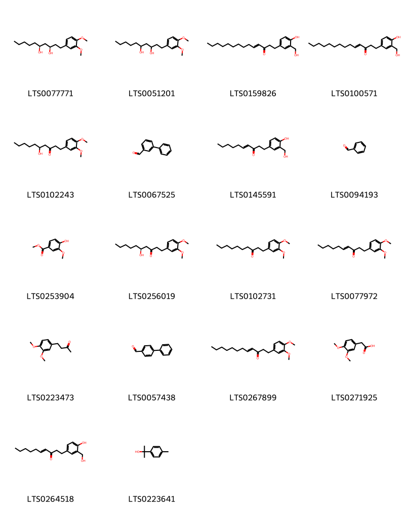{ width=100% }
    <figcaption>Hình ảnh cấu trúc hóa học của 18 hoạt chất thuộc nhóm Benzene and substituted derivatives gồm ['(3r,5s)-1-(3,4-dimethoxyphenyl)decane-3,5-diol (LTS0077771)', '1-(3,4-dimethoxyphenyl)decane-3,5-diol (LTS0051201)', '1-[4-hydroxy-3-(hydroxymethyl)phenyl]tetradec-4-en-3-one (LTS0159826)', '(4e)-1-[4-hydroxy-3-(hydroxymethyl)phenyl]tetradec-4-en-3-one (LTS0100571)', '1-(3,4-dimethoxyphenyl)-5-hydroxydecan-3-one (LTS0102243)', "[1,1'-biphenyl]-3-carbaldehyde (LTS0067525)", '1-[4-hydroxy-3-(hydroxymethyl)phenyl]dec-4-en-3-one (LTS0145591)', 'benzaldehyde (LTS0094193)', 'vanillate (LTS0253904)', '(5s)-1-(3,4-dimethoxyphenyl)-5-hydroxydecan-3-one (LTS0256019)', '1-(3,4-dimethoxyphenyl)decan-3-one (LTS0102731)', '(4e)-1-(3,4-dimethoxyphenyl)dec-4-en-3-one (LTS0077972)', '4-(3,4-dimethoxyphenyl)butan-2-one (LTS0223473)', '4-biphenylaldehyde (LTS0057438)', '(4e)-1-(3,4-dimethoxyphenyl)dodec-4-en-3-one (LTS0267899)', '3,4-dimethoxyphenylacetic acid (LTS0271925)', '(4e)-1-[4-hydroxy-3-(hydroxymethyl)phenyl]dec-4-en-3-one (LTS0264518)', 'p-cymen-8-ol (LTS0223641)'].</figcaption>
</figure>
#### Nhóm Carboxylic acids and derivatives
<figure markdown="span">
    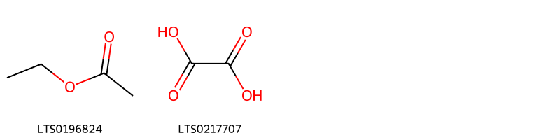{ width=100% }
    <figcaption>Hình ảnh cấu trúc hóa học của 2 hoạt chất thuộc nhóm Carboxylic acids and derivatives gồm ['ethyl acetate (LTS0196824)', 'oxalic acid (LTS0217707)'].</figcaption>
</figure>
#### Nhóm Cinnamic acids and derivatives
<figure markdown="span">
    { width=100% }
    <figcaption>Hình ảnh cấu trúc hóa học của 14 hoạt chất thuộc nhóm Cinnamic acids and derivatives gồm ['(1e)-1-(4-hydroxy-3-methoxyphenyl)dodec-1-ene-3,5-dione (LTS0222972)', '1-(4-hydroxy-3-methoxyphenyl)dodec-1-ene-3,5-dione (LTS0053958)', '(1e,4e)-1-(4-hydroxy-3-methoxyphenyl)deca-1,4-dien-3-one (LTS0117761)', '(1e,4e)-1-(4-hydroxy-3-methoxyphenyl)dodeca-1,4-dien-3-one (LTS0048902)', '(1e)-1-(4-hydroxy-3-methoxyphenyl)tetradec-1-ene-3,5-dione (LTS0129356)', 'phenylacrylic acid (LTS0097258)', '1-(4-hydroxy-3-methoxyphenyl)tetradeca-1,4-dien-3-one (LTS0098969)', '1-(4-hydroxy-3-methoxyphenyl)dodeca-1,4-dien-3-one (LTS0160439)', '1-(4-hydroxy-3-methoxyphenyl)tetradec-1-ene-3,5-dione (LTS0242718)', '(1e,6e)-1-(4-hydroxy-3-methoxycyclohexyl)-7-(4-hydroxy-3-methoxyphenyl)hepta-1,6-diene-3,5-dione (LTS0244211)', '(1e,4e)-1-(4-hydroxy-3-methoxyphenyl)tetradeca-1,4-dien-3-one (LTS0230136)', '1-(4-hydroxy-3-methoxyphenyl)dec-1-ene-3,5-dione (LTS0015112)', '1-(4-hydroxy-3-methoxyphenyl)deca-1,4-dien-3-one (LTS0106089)', '(1e)-1-(4-hydroxy-3-methoxyphenyl)dec-1-ene-3,5-dione (LTS0020912)'].</figcaption>
</figure>
#### Nhóm Diarylheptanoids
<figure markdown="span">
    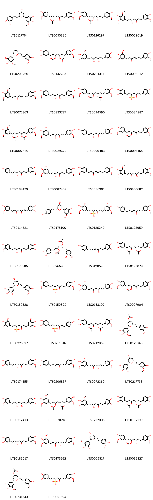{ width=100% }
    <figcaption>Hình ảnh cấu trúc hóa học của 66 hoạt chất thuộc nhóm Diarylheptanoids gồm ['5-[(2s,4s,6s)-6-[2-(3,4-dihydroxyphenyl)ethyl]-4-hydroxyoxan-2-yl]-3-methoxybenzene-1,2-diol (LTS0117764)', '5-hydroxy-1,7-bis(4-hydroxy-3-methoxyphenyl)heptan-3-yl acetate (LTS0055885)', '(3r,5s)-5-hydroxy-1,7-bis(4-hydroxy-3-methoxyphenyl)heptan-3-yl acetate (LTS0126297)', '5-hydroxy-7-(4-hydroxy-3,5-dimethoxyphenyl)-1-(4-hydroxy-3-methoxyphenyl)heptan-3-one (LTS0059019)', '(2s,4r,6s)-2-(4-hydroxy-3,5-dimethoxyphenyl)-6-[2-(4-hydroxy-3-methoxyphenyl)ethyl]oxan-4-ol (LTS0209260)', '5-(acetyloxy)-7-(3,4-dihydroxyphenyl)-1-(4-hydroxy-3-methoxyphenyl)heptan-3-yl acetate (LTS0132283)', '(3r,5s)-1-(4-hydroxy-3,5-dimethoxyphenyl)-7-(4-hydroxy-3-methoxyphenyl)heptane-3,5-diol (LTS0201317)', '(4e)-1-(4-hydroxy-3,5-dimethoxyphenyl)-7-(4-hydroxy-3-methoxyphenyl)hept-4-en-3-one (LTS0098812)', '1-(4-hydroxy-3,5-dimethoxyphenyl)-7-(4-hydroxy-3-methoxyphenyl)hept-4-en-3-one (LTS0077863)', '1,7-bis(4-hydroxy-3-methoxyphenyl)heptane-3,5-diol (LTS0233727)', '5-(acetyloxy)-1,7-bis(4-hydroxy-3-methoxyphenyl)heptan-3-yl acetate (LTS0094590)', '1-(3,4-dihydroxyphenyl)-7-(4-hydroxy-3-methoxyphenyl)-5-oxoheptane-3-sulfonic acid (LTS0084287)', '5-(acetyloxy)-7-(4-hydroxy-3,5-dimethoxyphenyl)-1-(4-hydroxy-3-methoxyphenyl)heptan-3-yl acetate (LTS0007430)', '7-(3,4-dihydroxy-5-methoxyphenyl)-5-hydroxy-1-(4-hydroxy-3-methoxyphenyl)heptan-3-one (LTS0029629)', '(5r)-5-hydroxy-1-(4-hydroxy-3-methoxyphenyl)-7-(4-hydroxyphenyl)heptan-3-one (LTS0096483)', '(3s)-1,7-bis(4-hydroxy-3-methoxyphenyl)-5-oxoheptan-3-yl acetate (LTS0096165)', '5-hydroxy-1-(4-hydroxy-3-methoxyphenyl)-7-(4-hydroxyphenyl)heptan-3-one (LTS0184170)', '(5r)-7-(3,4-dihydroxy-5-methoxyphenyl)-5-hydroxy-1-(4-hydroxy-3-methoxyphenyl)heptan-3-one (LTS0087489)', 'gingerenone a (LTS0086301)', '5-hydroxy-1-(4-hydroxy-3,5-dimethoxyphenyl)-7-(4-hydroxy-3-methoxyphenyl)heptan-3-one (LTS0100682)', 'curcumin (LTS0114521)', '5-[(2s,4r,6s)-4-hydroxy-6-[2-(4-hydroxyphenyl)ethyl]oxan-2-yl]-3-methoxybenzene-1,2-diol (LTS0178100)', '1,7-bis(3,4-dihydroxy-5-methoxyphenyl)-5-oxoheptane-3-sulfonic acid (LTS0126249)', '(4e)-1-(4-hydroxy-3-methoxyphenyl)-7-(4-hydroxyphenyl)hept-4-en-3-one (LTS0128959)', '(5s)-5-hydroxy-1,7-bis(4-hydroxy-3-methoxyphenyl)heptan-3-one (LTS0173586)', '(3s,5s)-5-(acetyloxy)-1,7-bis(3,4-dihydroxyphenyl)heptan-3-yl acetate (LTS0266933)', '1-(4-hydroxy-3-methoxyphenyl)-7-(4-hydroxyphenyl)hept-4-en-3-one (LTS0198598)', '(3s,5r)-5-(acetyloxy)-1,7-bis(4-hydroxy-3-methoxyphenyl)heptan-3-yl acetate (LTS0193079)', '5-[(2s,4s,6s)-4-hydroxy-6-[2-(4-hydroxy-3-methoxyphenyl)ethyl]oxan-2-yl]-3-methoxybenzene-1,2-diol (LTS0150528)', '1,7-bis(4-hydroxy-3-methoxyphenyl)-5-oxoheptane-3-sulfonic acid (LTS0150892)', '1-(4-hydroxy-3,5-dimethoxyphenyl)-7-(4-hydroxy-3-methoxyphenyl)heptane-3,5-diol (LTS0153120)', '1,7-bis(4-hydroxy-3-methoxyphenyl)-5-oxoheptan-3-yl acetate (LTS0097904)', '(3s)-1,7-bis(3,4-dihydroxy-5-methoxyphenyl)-5-oxoheptane-3-sulfonic acid (LTS0225527)', '1,7-bis(3,4-dihydroxyphenyl)-5-oxoheptane-3-sulfonic acid (LTS0251316)', '(3r,5s)-5-(acetyloxy)-7-(3,4-dihydroxyphenyl)-1-(4-hydroxy-3-methoxyphenyl)heptan-3-yl acetate (LTS0212059)', '(2s,4r,6s)-2-(3,4-dihydroxy-5-methoxyphenyl)-6-[2-(4-hydroxy-3-methoxyphenyl)ethyl]oxan-4-yl acetate (LTS0171340)', '(5r)-7-(3,4-dihydroxyphenyl)-5-hydroxy-1-(4-hydroxy-3-methoxyphenyl)heptan-3-one (LTS0174155)', '7-(3,4-dihydroxyphenyl)-1-(4-hydroxy-3-methoxyphenyl)hept-4-en-3-one (LTS0206837)', '1-(3,4-dihydroxy-5-methoxyphenyl)-5-hydroxy-7-(4-hydroxy-3-methoxyphenyl)heptan-3-one (LTS0072360)', '5-[(2s,4r,6s)-4-hydroxy-6-[2-(4-hydroxy-3-methoxyphenyl)ethyl]oxan-2-yl]-3-methoxybenzene-1,2-diol (LTS0217733)', '(3s,5s)-1,7-bis(4-hydroxy-3-methoxyphenyl)heptane-3,5-diol (LTS0212413)', '(3r,5s)-5-(acetyloxy)-7-(4-hydroxy-3,5-dimethoxyphenyl)-1-(4-hydroxy-3-methoxyphenyl)heptan-3-yl acetate (LTS0070218)', '(5r)-5-hydroxy-7-(4-hydroxy-3,5-dimethoxyphenyl)-1-(4-hydroxy-3-methoxyphenyl)heptan-3-one (LTS0232006)', '(3s,5s)-5-(acetyloxy)-1,7-bis(4-hydroxy-3-methoxyphenyl)heptan-3-yl acetate (LTS0182199)', '7-(3,4-dihydroxyphenyl)-5-hydroxy-1-(4-hydroxy-3-methoxyphenyl)heptan-3-one (LTS0185017)', '(5s)-5-hydroxy-1-(4-hydroxy-3,5-dimethoxyphenyl)-7-(4-hydroxy-3-methoxyphenyl)heptan-3-one (LTS0175562)', '(2s,4s,6s)-2-(4-hydroxy-3,5-dimethoxyphenyl)-6-[2-(4-hydroxy-3-methoxyphenyl)ethyl]oxan-4-ol (LTS0022317)', '(3s,5s)-5-hydroxy-1,7-bis(4-hydroxy-3-methoxyphenyl)heptan-3-yl acetate (LTS0035327)', '2-(3,4-dihydroxy-5-methoxyphenyl)-6-[2-(4-hydroxy-3-methoxyphenyl)ethyl]oxan-4-yl acetate (LTS0231343)', '(3r)-1-(3,4-dihydroxyphenyl)-7-(4-hydroxy-3-methoxyphenyl)-5-oxoheptane-3-sulfonic acid (LTS0051594)', '(4e)-7-(3,4-dihydroxyphenyl)-1-(4-hydroxy-3-methoxyphenyl)hept-4-en-3-one (LTS0130084)', '(4e)-7-(4-hydroxy-3,5-dimethoxyphenyl)-1-(4-hydroxy-3-methoxyphenyl)hept-4-en-3-one (LTS0129836)', '1,7-bis(4-hydroxy-3-methoxyphenyl)heptan-3-one (LTS0260565)', '(2s,4s,6s)-2-(3,4-dihydroxy-5-methoxyphenyl)-6-[2-(4-hydroxy-3-methoxyphenyl)ethyl]oxan-4-yl acetate (LTS0255853)', '(3r,5s)-1,7-bis(4-hydroxy-3-methoxyphenyl)heptane-3,5-diol (LTS0028864)', '7-(4-hydroxy-3,5-dimethoxyphenyl)-1-(4-hydroxy-3-methoxyphenyl)hept-4-en-3-one (LTS0025738)', '(5s)-1-(3,4-dihydroxy-5-methoxyphenyl)-5-hydroxy-7-(4-hydroxy-3-methoxyphenyl)heptan-3-one (LTS0003753)', '(3s)-1,7-bis(4-hydroxy-3-methoxyphenyl)-5-oxoheptane-3-sulfonic acid (LTS0134625)', '(3r)-1,7-bis(4-hydroxy-3-methoxyphenyl)-5-oxoheptan-3-yl acetate (LTS0058941)', '2-(4-hydroxy-3,5-dimethoxyphenyl)-6-[2-(4-hydroxy-3-methoxyphenyl)ethyl]oxan-4-ol (LTS0015434)', 'hexahydrocurcumin (LTS0000795)', '(3r)-1,7-bis(3,4-dihydroxy-5-methoxyphenyl)-5-oxoheptane-3-sulfonic acid (LTS0262807)', '5-(acetyloxy)-1,7-bis(3,4-dihydroxyphenyl)heptan-3-yl acetate (LTS0011692)', '(3s)-1,7-bis(3,4-dihydroxyphenyl)-5-oxoheptane-3-sulfonic acid (LTS0254468)', '5-{4-hydroxy-6-[2-(4-hydroxy-3-methoxyphenyl)ethyl]oxan-2-yl}-3-methoxybenzene-1,2-diol (LTS0032006)', '1,7-bis(4-hydroxy-3-methoxyphenyl)hept-4-en-3-one (LTS0050456)'].</figcaption>
</figure>
#### Nhóm Epoxides
<figure markdown="span">
    { width=100% }
    <figcaption>Hình ảnh cấu trúc hóa học của 1 hoạt chất thuộc nhóm Epoxides gồm ['[3-methyl-3-(4-methylpent-3-en-1-yl)oxiran-2-yl]methanol (LTS0182704)'].</figcaption>
</figure>
#### Nhóm Fatty Acyls
<figure markdown="span">
    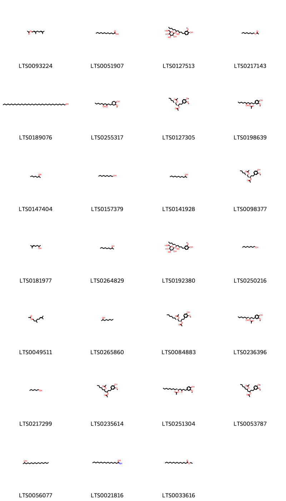{ width=100% }
    <figcaption>Hình ảnh cấu trúc hóa học của 27 hoạt chất thuộc nhóm Fatty Acyls gồm ['geranyl acetate (LTS0093224)', 'lauric acid (LTS0051907)', '2-{[3-hydroxy-1-(4-hydroxy-3-methoxyphenyl)decan-5-yl]oxy}-6-(hydroxymethyl)oxane-3,4,5-triol (LTS0127513)', 'octyl acetate (LTS0217143)', 'heptatriacontan-1-ol (LTS0189076)', '5-hydroxy-1-(4-hydroxy-3-methoxycyclohexyl)decan-3-one (LTS0255317)', '(3r,5s)-3-(acetyloxy)-1-(3,4-dimethoxyphenyl)decan-5-yl acetate (LTS0127305)', '5-hydroxy-1-(4-hydroxy-3-methoxyphenyl)decan-3-yl acetate (LTS0198639)', '2-heptanol (LTS0147404)', 'nonan-1-ol (LTS0157379)', '2-undecanol (LTS0141928)', '(3r,5s)-3-(acetyloxy)-1-(4-hydroxy-3-methoxyphenyl)decan-5-yl acetate (LTS0098377)', '6-methyl-5-hepten-2-ol (LTS0181977)', '2-nonanol (LTS0264829)', '(2r,3r,4s,5s,6r)-2-{[(3s,5s)-3-hydroxy-1-(4-hydroxy-3-methoxyphenyl)decan-5-yl]oxy}-6-(hydroxymethyl)oxane-3,4,5-triol (LTS0192380)', 'octanol (LTS0250216)', 'citronellyl acetate (LTS0049511)', '2-octanol (LTS0265860)', '(3r,5s)-3-(acetyloxy)-1-(4-hydroxy-3-methoxyphenyl)dodecan-5-yl acetate (LTS0084883)', '(3r,5s)-5-hydroxy-1-(4-hydroxy-3-methoxyphenyl)decan-3-yl acetate (LTS0236396)', 'hexanol (LTS0217299)', '3-(acetyloxy)-1-(4-hydroxy-3-methoxyphenyl)decan-5-yl acetate (LTS0235614)', '(5s)-1-(4-hydroxy-3-methoxyphenyl)-3-oxotetradecan-5-yl acetate (LTS0251304)', '3-(acetyloxy)-1-(3,4-dimethoxyphenyl)decan-5-yl acetate (LTS0053787)', '2-hexadecanol (LTS0056077)', 'hexadecanimidic acid (LTS0021816)', 'ethylmyristate (LTS0033616)'].</figcaption>
</figure>
#### Nhóm Glycerolipids
<figure markdown="span">
    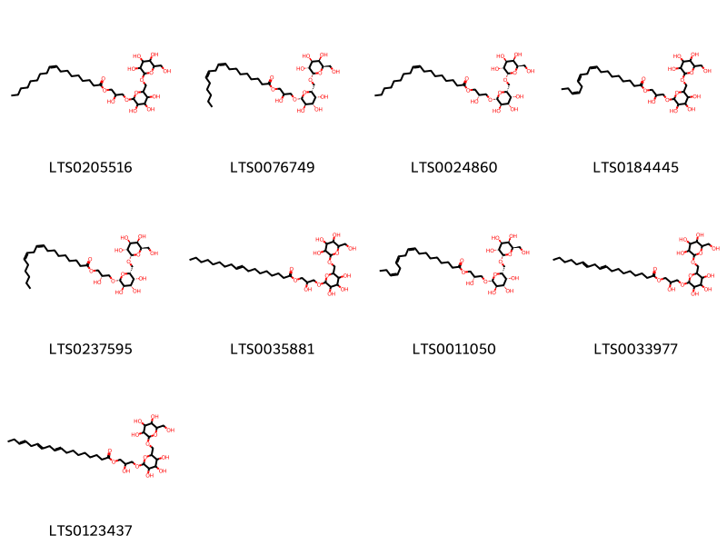{ width=100% }
    <figcaption>Hình ảnh cấu trúc hóa học của 9 hoạt chất thuộc nhóm Glycerolipids gồm ['2-hydroxy-3-{[3,4,5-trihydroxy-6-({[3,4,5-trihydroxy-6-(hydroxymethyl)oxan-2-yl]oxy}methyl)oxan-2-yl]oxy}propyl (9z)-octadec-9-enoate (LTS0205516)', '2-hydroxy-3-{[(2r,3r,4s,5r,6r)-3,4,5-trihydroxy-6-({[(2s,3r,4s,5r,6r)-3,4,5-trihydroxy-6-(hydroxymethyl)oxan-2-yl]oxy}methyl)oxan-2-yl]oxy}propyl (9z,12z)-octadeca-9,12-dienoate (LTS0076749)', '(2s)-2-hydroxy-3-{[(2r,3r,4s,5r,6r)-3,4,5-trihydroxy-6-({[(2s,3r,4s,5r,6r)-3,4,5-trihydroxy-6-(hydroxymethyl)oxan-2-yl]oxy}methyl)oxan-2-yl]oxy}propyl (9z)-octadec-9-enoate (LTS0024860)', '2-hydroxy-3-{[3,4,5-trihydroxy-6-({[3,4,5-trihydroxy-6-(hydroxymethyl)oxan-2-yl]oxy}methyl)oxan-2-yl]oxy}propyl (9z,12z,15z)-octadeca-9,12,15-trienoate (LTS0184445)', '(2s)-2-hydroxy-3-{[(2r,3r,4s,5r,6r)-3,4,5-trihydroxy-6-({[(2s,3r,4s,5r,6r)-3,4,5-trihydroxy-6-(hydroxymethyl)oxan-2-yl]oxy}methyl)oxan-2-yl]oxy}propyl (9z,12z)-octadeca-9,12-dienoate (LTS0237595)', '2-hydroxy-3-{[3,4,5-trihydroxy-6-({[3,4,5-trihydroxy-6-(hydroxymethyl)oxan-2-yl]oxy}methyl)oxan-2-yl]oxy}propyl octadec-9-enoate (LTS0035881)', '(2s)-2-hydroxy-3-{[(2r,3r,4s,5r,6r)-3,4,5-trihydroxy-6-({[(2s,3r,4s,5r,6r)-3,4,5-trihydroxy-6-(hydroxymethyl)oxan-2-yl]oxy}methyl)oxan-2-yl]oxy}propyl (9z,12z,15z)-octadeca-9,12,15-trienoate (LTS0011050)', '2-hydroxy-3-{[3,4,5-trihydroxy-6-({[3,4,5-trihydroxy-6-(hydroxymethyl)oxan-2-yl]oxy}methyl)oxan-2-yl]oxy}propyl octadeca-9,12-dienoate (LTS0033977)', '2-hydroxy-3-{[3,4,5-trihydroxy-6-({[3,4,5-trihydroxy-6-(hydroxymethyl)oxan-2-yl]oxy}methyl)oxan-2-yl]oxy}propyl octadeca-9,12,15-trienoate (LTS0123437)'].</figcaption>
</figure>
#### Nhóm Harmala alkaloids
<figure markdown="span">
    { width=100% }
    <figcaption>Hình ảnh cấu trúc hóa học của 1 hoạt chất thuộc nhóm Harmala alkaloids gồm ['harmane (LTS0068205)'].</figcaption>
</figure>
#### Nhóm Heteroaromatic compounds
<figure markdown="span">
    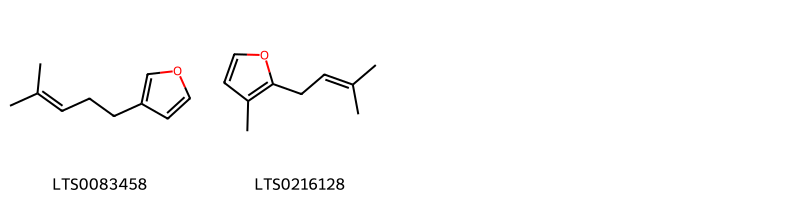{ width=100% }
    <figcaption>Hình ảnh cấu trúc hóa học của 2 hoạt chất thuộc nhóm Heteroaromatic compounds gồm ['perillene (LTS0083458)', 'rosefuran (LTS0216128)'].</figcaption>
</figure>
#### Nhóm Imidazopyrimidines
<figure markdown="span">
    { width=100% }
    <figcaption>Hình ảnh cấu trúc hóa học của 3 hoạt chất thuộc nhóm Imidazopyrimidines gồm ['(5s)-5-(6-aminopurin-9-yl)-1-(4-hydroxy-3-methoxyphenyl)tetradecan-3-one (LTS0077287)', '(5s)-5-(6-aminopurin-9-yl)-1-(4-hydroxy-3-methoxyphenyl)dodecan-3-one (LTS0144420)', '(5s)-5-(6-aminopurin-9-yl)-1-(4-hydroxy-3-methoxyphenyl)decan-3-one (LTS0218629)'].</figcaption>
</figure>
#### Nhóm Indoles and derivatives
<figure markdown="span">
    { width=100% }
    <figcaption>Hình ảnh cấu trúc hóa học của 1 hoạt chất thuộc nhóm Indoles and derivatives gồm ['β-carboline (LTS0263207)'].</figcaption>
</figure>
#### Nhóm Lactones
<figure markdown="span">
    { width=100% }
    <figcaption>Hình ảnh cấu trúc hóa học của 2 hoạt chất thuộc nhóm Lactones gồm ["(3e)-3-{2-[(1r,2s)-5,5,8a-trimethyl-hexahydro-1h-spiro[naphthalene-2,2'-oxiran]-1-yl]ethylidene}oxolan-2-one (LTS0203906)", 'galanolactone (LTS0151774)'].</figcaption>
</figure>
#### Nhóm Organooxygen compounds
<figure markdown="span">
    { width=100% }
    <figcaption>Hình ảnh cấu trúc hóa học của 20 hoạt chất thuộc nhóm Organooxygen compounds gồm ['decanal (LTS0128361)', 'octanal (LTS0055983)', '(e)-2-octenal (LTS0136829)', '6-methyl-5-hepten-2-one (LTS0241073)', 'linalool dihydroepoxide (LTS0088799)', '2-heptanone (LTS0087207)', '(2s,3r,4s,5s,6r)-2-{4-[(3s,5s)-3,5-dihydroxydecyl]-2-methoxyphenoxy}-6-(hydroxymethyl)oxane-3,4,5-triol (LTS0088059)', '2-[4-(3,5-dihydroxydecyl)-2-methoxyphenoxy]-6-(hydroxymethyl)oxane-3,4,5-triol (LTS0071966)', 'bran oil (LTS0143969)', 'nonanal (LTS0244398)', '2-pentanol (LTS0217254)', 'isovaleraldehyde (LTS0227741)', 'hexanal (LTS0238624)', 'apocynin (LTS0211279)', 'oleth-3 (LTS0021108)', '(1s,3r,7s,8s)-2,2,6,8-tetramethyltricyclo[5.3.1.0³,⁸]undecan-3-ol (LTS0014444)', 'α-maltose (LTS0013631)', 'butanediol (LTS0018665)', '2-nonanone (LTS0245014)', 'undecan-2-one (LTS0244143)'].</figcaption>
</figure>
#### Nhóm Oxanes
<figure markdown="span">
    { width=100% }
    <figcaption>Hình ảnh cấu trúc hóa học của 3 hoạt chất thuộc nhóm Oxanes gồm ['1,8-cineole (LTS0166505)', '(2r,4r)-rose oxide (LTS0270571)', 'rose oxide (LTS0036561)'].</figcaption>
</figure>
#### Nhóm Phenol esters
<figure markdown="span">
    { width=100% }
    <figcaption>Hình ảnh cấu trúc hóa học của 2 hoạt chất thuộc nhóm Phenol esters gồm ['1-[4-(acetyloxy)phenyl]prop-2-en-1-yl acetate (LTS0185726)', '4-(prop-2-en-1-yl)phenyl acetate (LTS0228439)'].</figcaption>
</figure>
#### Nhóm Phenols
<figure markdown="span">
    { width=100% }
    <figcaption>Hình ảnh cấu trúc hóa học của 77 hoạt chất thuộc nhóm Phenols gồm ['frambinone (LTS0021621)', '5-hydroxy-1-(4-hydroxy-3-methoxyphenyl)undecan-3-one (LTS0119199)', 'gingerdiol (LTS0125400)', '(5s)-5-hydroxy-1-(4-hydroxy-3-methoxyphenyl)octan-3-one (LTS0198963)', '1-(4-hydroxy-3-methoxyphenyl)decane-3,5-diol (LTS0127109)', '(5s)-1-(4-hydroxy-3-methoxyphenyl)-3-oxododecane-5-sulfonic acid (LTS0234187)', '1-(4-hydroxy-3-methoxyphenyl)nonadec-2-en-1-one (LTS0212627)', '4-(3-hydroxydecyl)-2-methoxyphenol (LTS0077217)', '(1e,3z)-3-hydroxy-1-(4-hydroxy-3-methoxyphenyl)tetradeca-1,3-dien-5-one (LTS0221841)', '(4e)-1-(4-hydroxy-3-methoxyphenyl)oct-4-en-3-one (LTS0165426)', '1-(4-hydroxy-3-methoxyphenyl)dodec-4-en-3-one (LTS0019883)', '(1e,3z)-3-hydroxy-1-(4-hydroxy-3-methoxyphenyl)deca-1,3-dien-5-one (LTS0034010)', '(3s,5s)-1-(4-hydroxy-3-methoxyphenyl)decane-3,5-diol (LTS0180009)', '(4e,6r)-6-hydroxy-1-(4-hydroxy-3-methoxyphenyl)dec-4-en-3-one (LTS0094069)', '1-(4-hydroxy-3-methoxyphenyl)dodecane-3,5-diol (LTS0176569)', '1-(4-hydroxy-3-methoxyphenyl)tetradecane-3,5-diol (LTS0203738)', '1-(4-hydroxy-3-methoxyphenyl)oct-4-en-3-one (LTS0101226)', '(3s,5r)-1-(4-hydroxy-3-methoxyphenyl)decane-3,5-diol (LTS0110895)', '(3z)-3-hydroxy-1-(4-hydroxy-3-methoxyphenyl)tetradec-3-en-5-one (LTS0060956)', '3-ethenyl-6-methoxybenzene-1,2-diol (LTS0201370)', '(5s)-5-hydroxy-1-(4-hydroxy-3-methoxyphenyl)undecan-3-one (LTS0062749)', '(5s)-1-(4-hydroxy-3-methoxyphenyl)-3-oxodecane-5-sulfonic acid (LTS0042585)', 'shogaol (LTS0176515)', '(10)-shogaol (LTS0051767)', 'homovanillyl alcohol (LTS0181753)', '5-hydroxy-1-(4-hydroxy-3-methoxyphenyl)octan-3-one (LTS0116632)', '4-{2-[(2s,4r,6r)-2-[(1e)-2,6-dimethylhepta-1,5-dien-1-yl]-6-pentyl-1,3-dioxan-4-yl]ethyl}-2-methoxyphenol (LTS0127910)', 'paradol (LTS0262716)', '(4e)-1-(3,4-dihydroxy-5-methoxyphenyl)dec-4-en-3-one (LTS0105235)', '(8)-shogaol (LTS0203092)', '4-{2-[2-(2,6-dimethylhepta-1,5-dien-1-yl)-6-pentyl-1,3-dioxan-4-yl]ethyl}-2-methoxyphenol (LTS0143665)', '(3r,5s)-3-hydroxy-1-(4-hydroxy-3-methoxyphenyl)decan-5-yl acetate (LTS0140718)', '(3e,5e)-4-hydroxy-6-(4-hydroxy-3-methoxyphenyl)hexa-3,5-dien-2-one (LTS0142627)', '1-(4-hydroxy-3-methoxyphenyl)-3-oxodecane-5-sulfonic acid (LTS0113744)', '5-hydroxy-1-(4-hydroxy-3-methoxyphenyl)dodecan-3-one (LTS0239336)', '6-hydroxy-1-(4-hydroxy-3-methoxyphenyl)dec-4-en-3-one (LTS0101379)', 'gingerol (LTS0171573)', '(1r,2s)-1-(4-hydroxy-3-methoxyphenyl)propane-1,2-diol (LTS0166462)', '5-(acetyloxy)-1-(4-hydroxy-3-methoxyphenyl)octan-3-yl acetate (LTS0248064)', '1-(4-hydroxy-3-methoxyphenyl)dodecan-3-one (LTS0099836)', '1-(4-hydroxy-3-methoxyphenyl)dodec-7-en-3-one (LTS0257202)', '1-(4-hydroxy-3-methoxyphenyl)tetradecane-3,5-dione (LTS0110340)', 'zingerone (LTS0266587)', '1-(3,4-dihydroxy-5-methoxyphenyl)dec-4-en-3-one (LTS0065621)', '(5r)-1-(4-hydroxy-3-methoxyphenyl)-3-oxodecane-5-sulfonic acid (LTS0084059)', '4-hydroxydihydrocinnamaldehyde (LTS0088636)', '1-(4-hydroxy-3-methoxyphenyl)tetradec-4-en-3-one (LTS0208945)', '(8)-gingerol (LTS0026120)', '3-(4-hydroxy-3-methoxyphenyl)propanal (LTS0209903)', '(3r,5s)-1-(4-hydroxy-3-methoxyphenyl)tetradecane-3,5-diol (LTS0258322)', 'gingerol (LTS0061759)', '(6s)-6-hydroxy-8-(4-hydroxy-3-methoxyphenyl)octan-4-one (LTS0241275)', 'homovanillic acid (LTS0251061)', '(5s)-1-(4-hydroxy-3-methoxyphenyl)-3-oxotetradecane-5-sulfonic acid (LTS0061661)', '1-(4-hydroxy-3-methoxyphenyl)dec-7-en-3-one (LTS0015210)', '(10)-gingerol (LTS0012062)', 'gingerdione (LTS0061248)', '8-(4-hydroxy-3-methoxyphenyl)-6-oxooctane-4-sulfonic acid (LTS0002278)', '3-hydroxy-1-(4-hydroxy-3-methoxyphenyl)decan-5-yl acetate (LTS0266911)', '4-hydroxy-6-(4-hydroxy-3-methoxyphenyl)hexa-3,5-dien-2-one (LTS0015760)', '5-hydroxy-1-(4-hydroxy-3-methoxyphenyl)tetradecan-3-one (LTS0068888)', '(3s,5s)-1-(4-hydroxy-3-methoxyphenyl)tetradecane-3,5-diol (LTS0064116)', '1-(3,4-dihydroxy-5-methoxyphenyl)-5-hydroxydecan-3-one (LTS0006138)', '(4s)-8-(4-hydroxy-3-methoxyphenyl)-6-oxooctane-4-sulfonic acid (LTS0003207)', '1-(4-hydroxy-3-methoxyphenyl)oct-7-en-3-one (LTS0013056)', '(5s)-1-(3,4-dihydroxy-5-methoxyphenyl)-5-hydroxydecan-3-one (LTS0232258)', '5-ethenyl-2-methoxyphenol (LTS0076260)', '5-hydroxy-1-(4-hydroxy-3-methoxyphenyl)hexadecan-3-one (LTS0258134)', 'shogaol (LTS0032763)', 'isoeugenol (LTS0136836)', '(3r,5s)-5-(acetyloxy)-1-(4-hydroxy-3-methoxyphenyl)octan-3-yl acetate (LTS0258204)', '(4e)-1-(4-hydroxy-3-methoxyphenyl)hexadec-4-en-3-one (LTS0097309)', '3-hydroxy-1-(4-hydroxy-3-methoxyphenyl)deca-1,3-dien-5-one (LTS0026943)', '(4r)-8-(4-hydroxy-3-methoxyphenyl)-6-oxooctane-4-sulfonic acid (LTS0135275)', '1-(4-hydroxy-3-methoxyphenyl)propane-1,2-diol (LTS0126894)', 'vanillyl alcohol (LTS0035070)', '6-gingerol (LTS0103909)'].</figcaption>
</figure>
#### Nhóm Phenylpropanoic acids
<figure markdown="span">
    { width=100% }
    <figcaption>Hình ảnh cấu trúc hóa học của 1 hoạt chất thuộc nhóm Phenylpropanoic acids gồm ['homovanillinic acid (LTS0187038)'].</figcaption>
</figure>
#### Nhóm Prenol lipids
<figure markdown="span">
    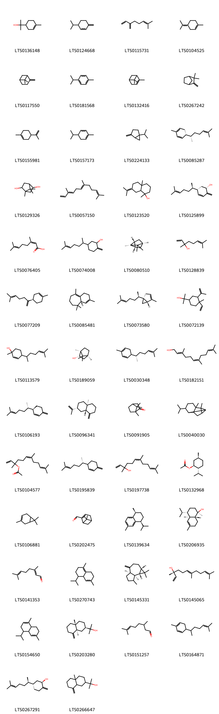{ width=100% }
    <figcaption>Hình ảnh cấu trúc hóa học của 116 hoạt chất thuộc nhóm Prenol lipids gồm ['terpineol (LTS0136148)', 'β phellandrene (LTS0124668)', 'α-myrcene (LTS0115731)', 'terpinolene (LTS0104525)', 'β-pinene (LTS0117550)', 'cymene (LTS0181568)', 'α pinene (LTS0132416)', 'camphene (LTS0267242)', 'limonene,  (LTS0155981)', 'phellandrene (LTS0157173)', 'sabinene (LTS0224133)', 'zingiberene (LTS0085287)', '1,7,7-trimethylbicyclo[2.2.1]heptane-2,5-diol (LTS0129326)', 'farnesene (LTS0057150)', '1,4a-dimethyl-7-(propan-2-ylidene)-hexahydro-2h-naphthalen-1-ol (LTS0123520)', '(1s,5s)-5-[(2r)-6-methylhept-5-en-2-yl]-2-methylidenecyclohex-3-en-1-ol (LTS0125899)', 'nerol oxide (LTS0076405)', '5-(6-methylhept-5-en-2-yl)-2-methylidenecyclohexan-1-ol (LTS0074008)', '(1s,2r,4r,6s)-1,7,7-trimethyltricyclo[2.2.1.0²,⁶]heptane (LTS0080510)', 'linalool, (+-)- (LTS0128839)', '(r)-β-bisabolene (LTS0077209)', '(r)-β-himachalene (LTS0085481)', '7-epi-sesquithujene (LTS0073580)', '2-[4-ethenyl-4-methyl-3-(prop-1-en-2-yl)cyclohexyl]propan-2-ol (LTS0072139)', '1-methyl-4-(6-methylhept-5-en-2-yl)cyclohex-2-en-1-ol (LTS0113579)', '(+)-borneol (LTS0189059)', '2-methyl-5-[(2s)-6-methylhept-5-en-2-yl]cyclohexa-1,3-diene (LTS0030348)', '(e,z)-farnesol (LTS0182151)', 'β-sesquiphellandrene (LTS0106193)', 'β-selinene (LTS0096341)', 'camphor (LTS0091905)', '8-isopropyl-1,2-dimethyltetracyclo[4.4.0.0²,⁴.0³,⁷]decane (LTS0040030)', '3,7,11-trimethyldodeca-1,6,10-trien-3-yl acetate (LTS0104577)', '3-[(2s)-6-methylhept-5-en-2-yl]-6-methylidenecyclohex-1-ene (LTS0195839)', 'nerolidol (LTS0197738)', 'menthyl acetate (LTS0132968)', 'monoterpenes (LTS0106881)', 'myrtenal (LTS0202475)', '(1s,4s)-4-isopropyl-1,6-dimethyl-1,2,3,4-tetrahydronaphthalene (LTS0139634)', 'α-cadinol (LTS0206935)', '3,7-dimethyl-2,6-octadienal (LTS0141353)', '4-isopropyl-1,6-dimethyl-2,3,4,4a,7,8-hexahydronaphthalene (LTS0270743)', '(1as,4ar,7as,7br)-1,1,7-trimethyl-4-methylidene-octahydro-1ah-cyclopropa[e]azulene (LTS0145331)', '(3r,6e)-nerolidol (LTS0145065)', '4-isopropyl-1,6-dimethyl-3,4,4a,7,8,8a-hexahydronaphthalene (LTS0154650)', 'β-eudesmol (LTS0203280)', 'citronella (LTS0151257)', '2-methyl-5-(6-methylhept-5-en-2-yl)cyclohexa-1,3-diene (LTS0164871)', '(1r,5s)-5-[(2r)-6-methylhept-5-en-2-yl]-2-methylidenecyclohexan-1-ol (LTS0267291)', 'β-eudesmol (LTS0266647)', '2-methoxy-1,7,7-trimethylbicyclo[2.2.1]heptane (LTS0154024)', 'β-ionone (LTS0155301)', '4,6,6-trimethylbicyclo[3.1.1]hept-3-en-1-ol (LTS0155332)', '5-(6-methylhept-5-en-2-yl)-2-methylidenecyclohex-3-en-1-ol (LTS0154687)', "(2e)-2-(2-{5,5,8a-trimethyl-hexahydro-1h-spiro[naphthalene-2,2'-oxiran]-1-yl}ethylidene)butanedial (LTS0141156)", 'β-elemene (LTS0225699)', 'α-ylangene (LTS0254603)', '(z)-γ-bisabolene (LTS0143321)', 'gamma-eudesmol (LTS0147389)', '4-terpineol (LTS0253733)', '4-isopropyl-1-methyl-6-methylidene-2,3,4,7,8,8a-hexahydro-1h-naphthalene (LTS0247064)', 'borneol (LTS0264960)', '(+)-gamma-cadinene (LTS0103949)', 'tricyclene (LTS0179930)', '(2r,3r,4s,5s,6r)-2-{[(2e)-3,7-dimethylocta-2,6-dien-1-yl]oxy}-6-(hydroxymethyl)oxane-3,4,5-triol (LTS0116837)', 'caryophyllene (LTS0085212)', '(-)-α-curcumene (LTS0216936)', 'verbenone (LTS0264577)', '(1s)-8-isopropyl-1,3-dimethyltricyclo[4.4.0.0²,⁷]dec-3-ene (LTS0199723)', 'β-farnesene (LTS0067925)', 'bornyl acetate (LTS0060565)', 'camphene hydrate (LTS0071319)', 'α-copaene (LTS0207598)', '1-(6-methylhept-5-en-2-yl)-4-methylidenebicyclo[3.1.0]hexane (LTS0264824)', '(2r,3r,4s,5s,6r)-2-{[(1r,2s,4r,5r)-5-hydroxy-1,7,7-trimethylbicyclo[2.2.1]heptan-2-yl]oxy}-6-(hydroxymethyl)oxane-3,4,5-triol (LTS0219389)', '3-{2-[(4ar,8as)-5,5,8a-trimethyl-2-methylidene-hexahydro-1h-naphthalen-1-yl]ethenyl}furan (LTS0071838)', '3-(6-methylhept-5-en-2-yl)-6-methylidenecyclohex-1-ene (LTS0016484)', 'guaiol (LTS0240901)', 'α-thujene (LTS0185078)', '(1as,4as,7as,7br)-1,1,7-trimethyl-4-methylidene-octahydro-1ah-cyclopropa[e]azulene (LTS0160636)', 'elemol (LTS0208556)', 'geranic acid (LTS0226491)', 'neral (LTS0165243)', '(+)-β-thujone (LTS0180873)', '2-methyl-5-(prop-1-en-2-yl)cyclopentane-1-carbaldehyde (LTS0035478)', 'geraniol (LTS0258838)', 'curcumene (LTS0190074)', '(1r,2s,7s,8s)-8-isopropyl-1,3-dimethyltricyclo[4.4.0.0²,⁷]dec-3-ene (LTS0190031)', 'nerolidol isomers (LTS0007569)', '(+)-α-terpineol (LTS0258249)', '(2s,4r)-1,7,7-trimethylbicyclo[2.2.1]heptan-2-ol (LTS0010050)', '(10e)-2,6,11,15-tetramethylhexadeca-2,7,10,14-tetraen-6-ol (LTS0057371)', 'β-cadinene (LTS0049088)', '(6e,10r)-10-hydroxy-2,6,10-trimethyldodeca-2,6,11-trien-4-one (LTS0067450)', 'gamma-muurolene (LTS0052920)', 'terpinene (LTS0136858)', '(-)-β-bisabolene (LTS0009940)', 'α-muurolene (LTS0022607)', '4-methyl-1-(6-methylhept-5-en-2-yl)cyclohex-3-en-1-ol (LTS0000924)', '(4s,4as,8as)-4-isopropyl-1,6-dimethyl-3,4,4a,7,8,8a-hexahydronaphthalene (LTS0014980)', 'α-curcumene (LTS0019880)', '(4r,4ar,8as)-4-isopropyl-6-methyl-1-methylidene-3,4,4a,7,8,8a-hexahydro-2h-naphthalene (LTS0057456)', '(1r,2s,6s,7s,8r)-8-isopropyl-1,3-dimethyltricyclo[4.4.0.0²,⁷]dec-3-ene (LTS0106607)', 'nerol (LTS0244289)', 'delta-cadinene (LTS0019321)', '2-({5-hydroxy-1,7,7-trimethylbicyclo[2.2.1]heptan-2-yl}oxy)-6-(hydroxymethyl)oxane-3,4,5-triol (LTS0031222)', 'α-selinene (LTS0024564)', 'cadinene (LTS0003360)', '7-epi-zingiberene (LTS0241514)', 'citronellol, (+-)- (LTS0090925)', '(-)-delta(3)-carene (LTS0104784)', '2-methyl-5-[(2r)-6-methylhept-5-en-2-yl]phenol (LTS0246670)', 'β-bisabolol (LTS0115229)', 'α-citral (LTS0246122)', '4-isopropyl-6-methyl-1-methylidene-3,4,4a,7,8,8a-hexahydro-2h-naphthalene (LTS0111070)', 'e,e-farnesal (LTS0118407)'].</figcaption>
</figure>
#### Nhóm Pyrans
<figure markdown="span">
    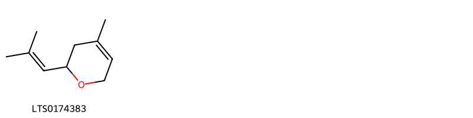{ width=100% }
    <figcaption>Hình ảnh cấu trúc hóa học của 1 hoạt chất thuộc nhóm Pyrans gồm ['nerol oxide (LTS0174383)'].</figcaption>
</figure>
#### Nhóm Pyrimidine nucleosides
<figure markdown="span">
    { width=100% }
    <figcaption>Hình ảnh cấu trúc hóa học của 1 hoạt chất thuộc nhóm Pyrimidine nucleosides gồm ['uridine (LTS0220125)'].</figcaption>
</figure>
#### Nhóm Saccharolipids
<figure markdown="span">
    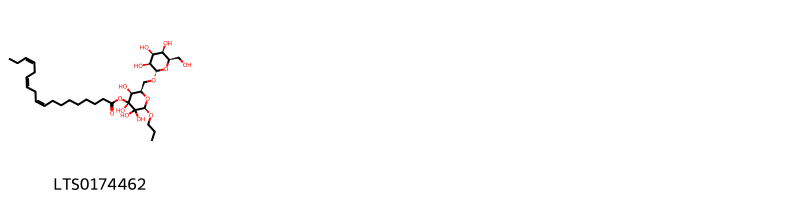{ width=100% }
    <figcaption>Hình ảnh cấu trúc hóa học của 1 hoạt chất thuộc nhóm Saccharolipids gồm ['(2r,4r,5s,6r)-3,3,4,5-tetrahydroxy-2-propoxy-6-({[(2s,3s,4s,5r,6r)-3,4,5-trihydroxy-6-(hydroxymethyl)oxan-2-yl]oxy}methyl)oxan-4-yl (9z,12z,15z)-octadeca-9,12,15-trienoate (LTS0174462)'].</figcaption>
</figure>
#### Nhóm Saturated hydrocarbons
<figure markdown="span">
    { width=100% }
    <figcaption>Hình ảnh cấu trúc hóa học của 3 hoạt chất thuộc nhóm Saturated hydrocarbons gồm ['nonane (LTS0096012)', 'octane (LTS0186469)', 'heptane (LTS0062507)'].</figcaption>
</figure>
#### Nhóm Steroids and steroid derivatives
<figure markdown="span">
    { width=100% }
    <figcaption>Hình ảnh cấu trúc hóa học của 5 hoạt chất thuộc nhóm Steroids and steroid derivatives gồm ['stigmast-5-en-3-ol (LTS0071224)', 'stigmast-5-en-3-ol, (3β)- (LTS0204616)', 'sitosterol (LTS0168132)', '1-(5-ethyl-6-methylheptan-2-yl)-5-hydroxy-9a,11a-dimethyl-1h,2h,3h,3ah,3bh,4h,5h,8h,9h,9bh,10h,11h-cyclopenta[a]phenanthren-7-one (LTS0210386)', '(1r,3as,3bs,5r,9ar,9bs,11ar)-1-[(2r,5r)-5-ethyl-6-methylheptan-2-yl]-5-hydroxy-9a,11a-dimethyl-1h,2h,3h,3ah,3bh,4h,5h,8h,9h,9bh,10h,11h-cyclopenta[a]phenanthren-7-one (LTS0044529)'].</figcaption>
</figure>
#### Nhóm Tetrahydrofurans
<figure markdown="span">
    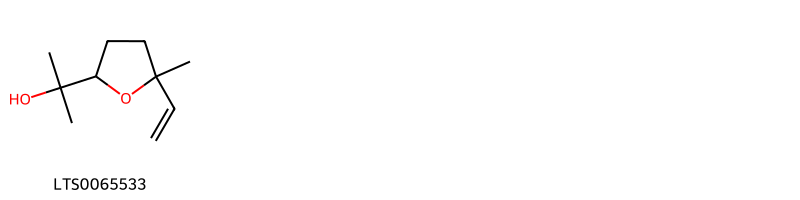{ width=100% }
    <figcaption>Hình ảnh cấu trúc hóa học của 1 hoạt chất thuộc nhóm Tetrahydrofurans gồm ['linalyl oxide (LTS0065533)'].</figcaption>
</figure>
#### Nhóm Thioethers
<figure markdown="span">
    { width=100% }
    <figcaption>Hình ảnh cấu trúc hóa học của 1 hoạt chất thuộc nhóm Thioethers gồm ['ethyl isopropyl sulfide (LTS0129196)'].</figcaption>
</figure>
#### Nhóm Unsaturated hydrocarbons
<figure markdown="span">
    { width=100% }
    <figcaption>Hình ảnh cấu trúc hóa học của 1 hoạt chất thuộc nhóm Unsaturated hydrocarbons gồm ['α terpinene (LTS0232891)'].</figcaption>
</figure>

---

### Dược dân tộc học

Danh sách các quốc gia có sử dụng *Zingiber officinale* trong điều trị các bệnh. 

| Country            | Disease                                                                                                                           | Bệnh                                                                                                                                                                                                |
|:-------------------|:----------------------------------------------------------------------------------------------------------------------------------|:----------------------------------------------------------------------------------------------------------------------------------------------------------------------------------------------------|
| Asia               | Carminative, Perfume, Stimulant                                                                                                   | MYMEMORY WARNING: YOU USED ALL AVAILABLE FREE TRANSLATIONS FOR TODAY. NEXT AVAILABLE IN  07 HOURS 51 MINUTES 46 SECONDS VISIT HTTPS://MYMEMORY.TRANSLATED.NET/DOC/USAGELIMITS.PHP TO TRANSLATE MORE |
| China              | Astringent, Carminative, Laxative, Stimulant, Stimulant, Vermifuge, Diuretic, Digestive, Hemostat, Stimulant, Hemostat, Stomachic | MYMEMORY WARNING: YOU USED ALL AVAILABLE FREE TRANSLATIONS FOR TODAY. NEXT AVAILABLE IN  07 HOURS 51 MINUTES 44 SECONDS VISIT HTTPS://MYMEMORY.TRANSLATED.NET/DOC/USAGELIMITS.PHP TO TRANSLATE MORE |
| Dominican Republic | Tonic, Sternutatory                                                                                                               | MYMEMORY WARNING: YOU USED ALL AVAILABLE FREE TRANSLATIONS FOR TODAY. NEXT AVAILABLE IN  07 HOURS 51 MINUTES 41 SECONDS VISIT HTTPS://MYMEMORY.TRANSLATED.NET/DOC/USAGELIMITS.PHP TO TRANSLATE MORE |
| Egypt              | Pediculicide, Poison, Sternutatory, Stimulant                                                                                     | MYMEMORY WARNING: YOU USED ALL AVAILABLE FREE TRANSLATIONS FOR TODAY. NEXT AVAILABLE IN  07 HOURS 51 MINUTES 39 SECONDS VISIT HTTPS://MYMEMORY.TRANSLATED.NET/DOC/USAGELIMITS.PHP TO TRANSLATE MORE |
| Elsewhere          | nan, Carminative, Ecbolic, Proteolytic, Rubefacient, Sudorific, Antioxidant, Carminative, Stimulant                               | MYMEMORY WARNING: YOU USED ALL AVAILABLE FREE TRANSLATIONS FOR TODAY. NEXT AVAILABLE IN  07 HOURS 51 MINUTES 36 SECONDS VISIT HTTPS://MYMEMORY.TRANSLATED.NET/DOC/USAGELIMITS.PHP TO TRANSLATE MORE |
| Haiti              | Antiseptic, Sialogogue, Stomachic, Stomachic, Sudorific, Aphrodisiac, Rubefacient, Carminative                                    | MYMEMORY WARNING: YOU USED ALL AVAILABLE FREE TRANSLATIONS FOR TODAY. NEXT AVAILABLE IN  07 HOURS 51 MINUTES 34 SECONDS VISIT HTTPS://MYMEMORY.TRANSLATED.NET/DOC/USAGELIMITS.PHP TO TRANSLATE MORE |
| Japan*             | Stomachic                                                                                                                         | MYMEMORY WARNING: YOU USED ALL AVAILABLE FREE TRANSLATIONS FOR TODAY. NEXT AVAILABLE IN  07 HOURS 51 MINUTES 32 SECONDS VISIT HTTPS://MYMEMORY.TRANSLATED.NET/DOC/USAGELIMITS.PHP TO TRANSLATE MORE |
| Java               | Cosmetic                                                                                                                          | MYMEMORY WARNING: YOU USED ALL AVAILABLE FREE TRANSLATIONS FOR TODAY. NEXT AVAILABLE IN  07 HOURS 51 MINUTES 29 SECONDS VISIT HTTPS://MYMEMORY.TRANSLATED.NET/DOC/USAGELIMITS.PHP TO TRANSLATE MORE |
| Malaya             | Tonic                                                                                                                             | MYMEMORY WARNING: YOU USED ALL AVAILABLE FREE TRANSLATIONS FOR TODAY. NEXT AVAILABLE IN  07 HOURS 51 MINUTES 27 SECONDS VISIT HTTPS://MYMEMORY.TRANSLATED.NET/DOC/USAGELIMITS.PHP TO TRANSLATE MORE |
| Mexico             | Stimulant                                                                                                                         | MYMEMORY WARNING: YOU USED ALL AVAILABLE FREE TRANSLATIONS FOR TODAY. NEXT AVAILABLE IN  07 HOURS 51 MINUTES 25 SECONDS VISIT HTTPS://MYMEMORY.TRANSLATED.NET/DOC/USAGELIMITS.PHP TO TRANSLATE MORE |
| Trinidad           | Carminative, Sudorific                                                                                                            | MYMEMORY WARNING: YOU USED ALL AVAILABLE FREE TRANSLATIONS FOR TODAY. NEXT AVAILABLE IN  07 HOURS 51 MINUTES 22 SECONDS VISIT HTTPS://MYMEMORY.TRANSLATED.NET/DOC/USAGELIMITS.PHP TO TRANSLATE MORE |
| Turkey             | Stomachic, Astringent, Digestive, Carminative, Expectorant, Stimulant, Apertif                                                    | MYMEMORY WARNING: YOU USED ALL AVAILABLE FREE TRANSLATIONS FOR TODAY. NEXT AVAILABLE IN  07 HOURS 51 MINUTES 20 SECONDS VISIT HTTPS://MYMEMORY.TRANSLATED.NET/DOC/USAGELIMITS.PHP TO TRANSLATE MORE |
| Upper Volta        | Aphrodisiac                                                                                                                       | MYMEMORY WARNING: YOU USED ALL AVAILABLE FREE TRANSLATIONS FOR TODAY. NEXT AVAILABLE IN  07 HOURS 51 MINUTES 17 SECONDS VISIT HTTPS://MYMEMORY.TRANSLATED.NET/DOC/USAGELIMITS.PHP TO TRANSLATE MORE |
| Venezuela          | Stomachic                                                                                                                         | MYMEMORY WARNING: YOU USED ALL AVAILABLE FREE TRANSLATIONS FOR TODAY. NEXT AVAILABLE IN  07 HOURS 51 MINUTES 15 SECONDS VISIT HTTPS://MYMEMORY.TRANSLATED.NET/DOC/USAGELIMITS.PHP TO TRANSLATE MORE |

---

---
## Zingiber ottensii
### Thông tin về thực vật

!!! info "Phân loại thực vật của *Zingiber ottensii* từ GIBF:"
    - **Kingdom:** Plantae
    - **Phylum:** Tracheophyta
    - **Order:** Zingiberales
    - **Family:** Zingiberaceae
    - **Genus:** Zingiber
    - **Species:** *Zingiber ottensii*

 

| Label (VI)   | Label (EN)   | Scientific Name   | Descriptions (VI)   | Descriptions (EN)   | Also Known As (VI)   | Also Known As (EN)   |
|:-------------|:-------------|:------------------|:--------------------|:--------------------|:---------------------|:---------------------|
| N/A          | N/A          | Zingiber ottensii | loài thực vật       | species of plant    | ['']                 | ['']                 |

#### Phân bố trên thế giới

**Từ CSDL GIBF** nan, unknown or invalid, Thailand, Malaysia, United States of America, Mexico, Singapore, Indonesia

#### Phân bố tại Việt Nam

**Từ CSDL GIBF**: Không có ghi nhận ở Việt Nam

---
### Thành phần hóa học
        
- Theo cơ sở dữ liệu lotus: Từ loài *Zingiber ottensii* đã phân lập và xác định được 49 hoạt chất thuộc về các nhóm Organooxygen compounds, Flavonoids, Lactones, Carboxylic acids and derivatives, Prenol lipids, Epoxides, Diarylheptanoids, Dihydrofurans, Cinnamic acids and derivatives, Organic oxides. 

|    | chemicalTaxonomyClassyfireClass   |   smiles_count |
|---:|:----------------------------------|---------------:|
|  0 | Carboxylic acids and derivatives  |              2 |
|  1 | Cinnamic acids and derivatives    |              2 |
|  2 | Diarylheptanoids                  |              5 |
|  3 | Dihydrofurans                     |              2 |
|  4 | Epoxides                          |              4 |
|  5 | Flavonoids                        |              8 |
|  6 | Lactones                          |              2 |
|  7 | Organic oxides                    |              1 |
|  8 | Organooxygen compounds            |              6 |
|  9 | Prenol lipids                     |             17 |

#### Nhóm Carboxylic acids and derivatives
<figure markdown="span">
    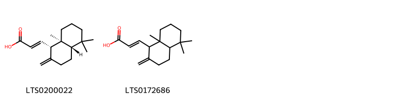{ width=100% }
    <figcaption>Hình ảnh cấu trúc hóa học của 2 hoạt chất thuộc nhóm Carboxylic acids and derivatives gồm ['(2e)-3-[(1s,4as,8as)-5,5,8a-trimethyl-2-methylidene-hexahydro-1h-naphthalen-1-yl]prop-2-enoic acid (LTS0200022)', '3-(5,5,8a-trimethyl-2-methylidene-hexahydro-1h-naphthalen-1-yl)prop-2-enoic acid (LTS0172686)'].</figcaption>
</figure>
#### Nhóm Cinnamic acids and derivatives
<figure markdown="span">
    { width=100% }
    <figcaption>Hình ảnh cấu trúc hóa học của 2 hoạt chất thuộc nhóm Cinnamic acids and derivatives gồm ['icosyl (2e)-3-(4-hydroxy-3-methoxyphenyl)prop-2-enoate (LTS0086018)', 'icosyl 3-(4-hydroxy-3-methoxyphenyl)prop-2-enoate (LTS0273966)'].</figcaption>
</figure>
#### Nhóm Diarylheptanoids
<figure markdown="span">
    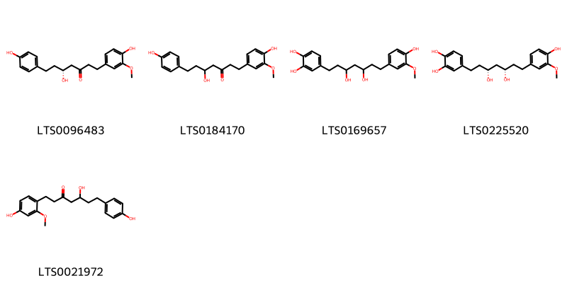{ width=100% }
    <figcaption>Hình ảnh cấu trúc hóa học của 5 hoạt chất thuộc nhóm Diarylheptanoids gồm ['(5r)-5-hydroxy-1-(4-hydroxy-3-methoxyphenyl)-7-(4-hydroxyphenyl)heptan-3-one (LTS0096483)', '5-hydroxy-1-(4-hydroxy-3-methoxyphenyl)-7-(4-hydroxyphenyl)heptan-3-one (LTS0184170)', '4-[3,5-dihydroxy-7-(4-hydroxy-3-methoxyphenyl)heptyl]benzene-1,2-diol (LTS0169657)', '4-[(3r,5s)-3,5-dihydroxy-7-(4-hydroxy-3-methoxyphenyl)heptyl]benzene-1,2-diol (LTS0225520)', '5-hydroxy-1-(4-hydroxy-2-methoxyphenyl)-7-(4-hydroxyphenyl)heptan-3-one (LTS0021972)'].</figcaption>
</figure>
#### Nhóm Dihydrofurans
<figure markdown="span">
    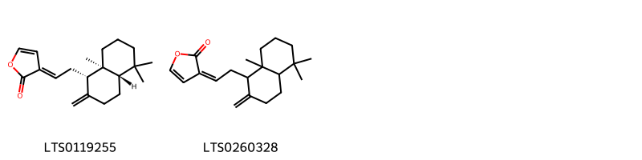{ width=100% }
    <figcaption>Hình ảnh cấu trúc hóa học của 2 hoạt chất thuộc nhóm Dihydrofurans gồm ['(3e)-3-{2-[(1s,4as,8as)-5,5,8a-trimethyl-2-methylidene-hexahydro-1h-naphthalen-1-yl]ethylidene}furan-2-one (LTS0119255)', '3-[2-(5,5,8a-trimethyl-2-methylidene-hexahydro-1h-naphthalen-1-yl)ethylidene]furan-2-one (LTS0260328)'].</figcaption>
</figure>
#### Nhóm Epoxides
<figure markdown="span">
    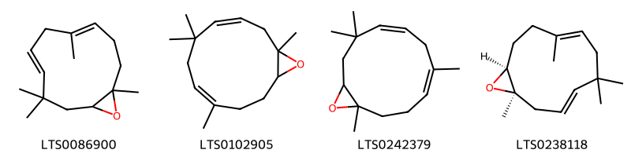{ width=100% }
    <figcaption>Hình ảnh cấu trúc hóa học của 4 hoạt chất thuộc nhóm Epoxides gồm ['(4e,7e)-1,5,9,9-tetramethyl-12-oxabicyclo[9.1.0]dodeca-4,7-diene (LTS0086900)', '1,5,5,8-tetramethyl-12-oxabicyclo[9.1.0]dodeca-3,7-diene (LTS0102905)', '(4z,7z)-1,5,9,9-tetramethyl-12-oxabicyclo[9.1.0]dodeca-4,7-diene (LTS0242379)', '(1r,3e,7e,11s)-1,5,5,8-tetramethyl-12-oxabicyclo[9.1.0]dodeca-3,7-diene (LTS0238118)'].</figcaption>
</figure>
#### Nhóm Flavonoids
<figure markdown="span">
    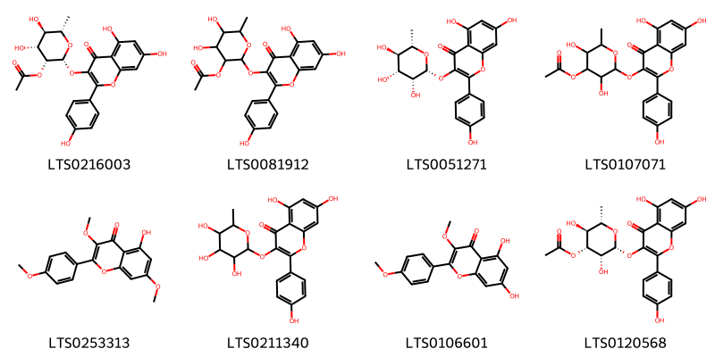{ width=100% }
    <figcaption>Hình ảnh cấu trúc hóa học của 8 hoạt chất thuộc nhóm Flavonoids gồm ['(2r,3r,4r,5r,6s)-2-{[5,7-dihydroxy-2-(4-hydroxyphenyl)-4-oxochromen-3-yl]oxy}-4,5-dihydroxy-6-methyloxan-3-yl acetate (LTS0216003)', '2-{[5,7-dihydroxy-2-(4-hydroxyphenyl)-4-oxochromen-3-yl]oxy}-4,5-dihydroxy-6-methyloxan-3-yl acetate (LTS0081912)', '5,7-dihydroxy-2-(4-hydroxyphenyl)-3-{[(2r,3r,4r,5r,6s)-3,4,5-trihydroxy-6-methyloxan-2-yl]oxy}chromen-4-one (LTS0051271)', '2-{[5,7-dihydroxy-2-(4-hydroxyphenyl)-4-oxochromen-3-yl]oxy}-3,5-dihydroxy-6-methyloxan-4-yl acetate (LTS0107071)', '5-hydroxy-3,7-dimethoxy-2-(4-methoxyphenyl)chromen-4-one (LTS0253313)', '5,7-dihydroxy-2-(4-hydroxyphenyl)-3-[(3,4,5-trihydroxy-6-methyloxan-2-yl)oxy]chromen-4-one (LTS0211340)', 'ermanin (LTS0106601)', '(2r,3r,4r,5s,6s)-2-{[5,7-dihydroxy-2-(4-hydroxyphenyl)-4-oxochromen-3-yl]oxy}-3,5-dihydroxy-6-methyloxan-4-yl acetate (LTS0120568)'].</figcaption>
</figure>
#### Nhóm Lactones
<figure markdown="span">
    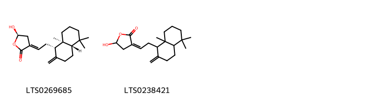{ width=100% }
    <figcaption>Hình ảnh cấu trúc hóa học của 2 hoạt chất thuộc nhóm Lactones gồm ['(3e,5r)-3-{2-[(1s,4as,8as)-5,5,8a-trimethyl-2-methylidene-hexahydro-1h-naphthalen-1-yl]ethylidene}-5-hydroxyoxolan-2-one (LTS0269685)', '3-[2-(5,5,8a-trimethyl-2-methylidene-hexahydro-1h-naphthalen-1-yl)ethylidene]-5-hydroxyoxolan-2-one (LTS0238421)'].</figcaption>
</figure>
#### Nhóm Organic oxides
<figure markdown="span">
    { width=100% }
    <figcaption>Hình ảnh cấu trúc hóa học của 1 hoạt chất thuộc nhóm Organic oxides gồm ['7-(5,5,8a-trimethyl-2-methylidene-hexahydro-1h-naphthalen-1-yl)-3-hydroxy-4,7-dihydro-3h-1,2-dioxepine-4-carbaldehyde (LTS0167826)'].</figcaption>
</figure>
#### Nhóm Organooxygen compounds
<figure markdown="span">
    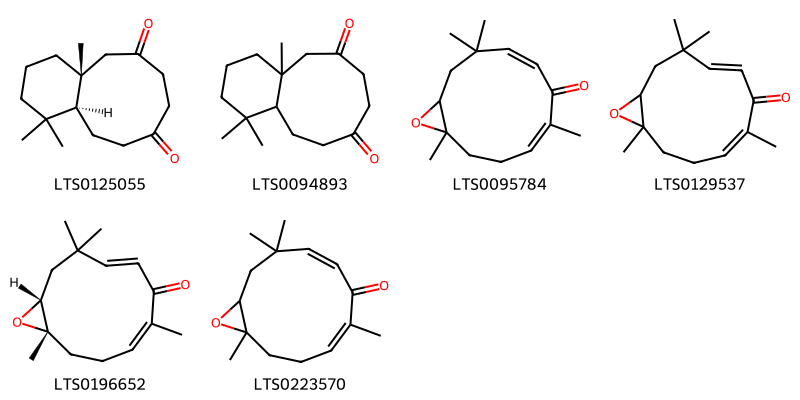{ width=100% }
    <figcaption>Hình ảnh cấu trúc hóa học của 6 hoạt chất thuộc nhóm Organooxygen compounds gồm ['(4ar,11as)-1,1,4a-trimethyl-octahydro-2h-benzo[9]annulene-6,9-dione (LTS0125055)', '1,1,4a-trimethyl-octahydro-2h-benzo[9]annulene-6,9-dione (LTS0094893)', '1,5,9,9-tetramethyl-12-oxabicyclo[9.1.0]dodeca-4,7-dien-6-one (LTS0095784)', '(4z,7e)-1,5,9,9-tetramethyl-12-oxabicyclo[9.1.0]dodeca-4,7-dien-6-one (LTS0129537)', '(1s,4z,7e,11r)-1,5,9,9-tetramethyl-12-oxabicyclo[9.1.0]dodeca-4,7-dien-6-one (LTS0196652)', '(4z,7z)-1,5,9,9-tetramethyl-12-oxabicyclo[9.1.0]dodeca-4,7-dien-6-one (LTS0223570)'].</figcaption>
</figure>
#### Nhóm Prenol lipids
<figure markdown="span">
    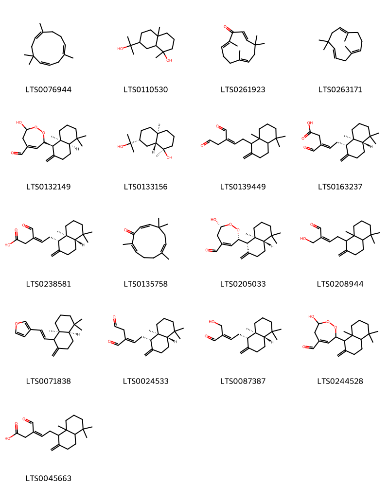{ width=100% }
    <figcaption>Hình ảnh cấu trúc hóa học của 17 hoạt chất thuộc nhóm Prenol lipids gồm ['α-humulene (LTS0076944)', '7-(2-hydroxypropan-2-yl)-1,4a-dimethyl-octahydronaphthalen-1-ol (LTS0110530)', 'zerumbone (LTS0261923)', 'humulene (LTS0263171)', '3-[(1r,4ar,8as)-5,5,8a-trimethyl-2-methylidene-hexahydro-1h-naphthalen-1-yl]-7-hydroxy-6,7-dihydro-3h-1,2-dioxepine-5-carbaldehyde (LTS0132149)', 'proximadiol (LTS0133156)', '2-[2-(5,5,8a-trimethyl-2-methylidene-hexahydro-1h-naphthalen-1-yl)ethylidene]butanedial (LTS0139449)', '(3e)-5-[(1s,4as,8as)-5,5,8a-trimethyl-2-methylidene-hexahydro-1h-naphthalen-1-yl]-3-formylpent-3-enoic acid (LTS0163237)', '(3z)-5-[(1s,4as,8as)-5,5,8a-trimethyl-2-methylidene-hexahydro-1h-naphthalen-1-yl]-3-formylpent-3-enoic acid (LTS0238581)', '2,6,9,9-tetramethylcycloundeca-2,6,10-trien-1-one (LTS0135758)', '(3s,7r)-3-[(1s,4as,8as)-5,5,8a-trimethyl-2-methylidene-hexahydro-1h-naphthalen-1-yl]-7-hydroxy-6,7-dihydro-3h-1,2-dioxepine-5-carbaldehyde (LTS0205033)', '4-(5,5,8a-trimethyl-2-methylidene-hexahydro-1h-naphthalen-1-yl)-2-(hydroxymethyl)but-2-enal (LTS0208944)', '3-{2-[(4ar,8as)-5,5,8a-trimethyl-2-methylidene-hexahydro-1h-naphthalen-1-yl]ethenyl}furan (LTS0071838)', '(2e)-2-{2-[(1s,4as,8as)-5,5,8a-trimethyl-2-methylidene-hexahydro-1h-naphthalen-1-yl]ethylidene}butanedial (LTS0024533)', '(2e)-4-[(1s,4as,8as)-5,5,8a-trimethyl-2-methylidene-hexahydro-1h-naphthalen-1-yl]-2-(hydroxymethyl)but-2-enal (LTS0087387)', '3-(5,5,8a-trimethyl-2-methylidene-hexahydro-1h-naphthalen-1-yl)-7-hydroxy-6,7-dihydro-3h-1,2-dioxepine-5-carbaldehyde (LTS0244528)', '5-(5,5,8a-trimethyl-2-methylidene-hexahydro-1h-naphthalen-1-yl)-3-formylpent-3-enoic acid (LTS0045663)'].</figcaption>
</figure>

---

### Dược dân tộc học

Danh sách các quốc gia có sử dụng *Zingiber ottensii* trong điều trị các bệnh. 

| Country   | Disease   | Bệnh                                                                                                                                                                                                |
|:----------|:----------|:----------------------------------------------------------------------------------------------------------------------------------------------------------------------------------------------------|
| Java      | Sedative  | MYMEMORY WARNING: YOU USED ALL AVAILABLE FREE TRANSLATIONS FOR TODAY. NEXT AVAILABLE IN  07 HOURS 50 MINUTES 40 SECONDS VISIT HTTPS://MYMEMORY.TRANSLATED.NET/DOC/USAGELIMITS.PHP TO TRANSLATE MORE |

---

---
## Zingiber zedoaria
### Thông tin về thực vật

!!! info "Phân loại thực vật của *N/A* từ GIBF:"
    - **Kingdom:** Plantae
    - **Phylum:** Tracheophyta
    - **Order:** Zingiberales
    - **Family:** Zingiberaceae
    - **Genus:** Zingiber
    - **Species:** *N/A*

 

| Label (VI)   | Label (EN)   | Scientific Name   | Descriptions (VI)   | Descriptions (EN)   | Also Known As (VI)   | Also Known As (EN)   |
|:-------------|:-------------|:------------------|:--------------------|:--------------------|:---------------------|:---------------------|
| N/A          | N/A          | Zingiber ottensii | loài thực vật       | species of plant    | ['']                 | ['']                 |

#### Phân bố trên thế giới

**Từ CSDL GIBF** Philippines, French Polynesia, Trinidad and Tobago, French Guiana, Australia, Indonesia, Guatemala, Colombia, American Samoa, Malaysia, Sao Tome and Principe, India, Samoa, Puerto Rico, Bangladesh, Belize, Panama, Brazil, Peru, Mexico, China, Nepal, Chinese Taipei, Niue, Mozambique, Cook Islands, Bolivia (Plurinational State of), Costa Rica, New Caledonia, Ecuador, United States of America, Madagascar

#### Phân bố tại Việt Nam

**Từ CSDL GIBF**: Không có ghi nhận ở Việt Nam

---
### Thành phần hóa học
        
- Theo cơ sở dữ liệu lotus: Từ loài *N/A* đã phân lập và xác định được Chưa có hoạt chất nào được phân lập. hoạt chất thuộc về các nhóm Không có hoạt chất nào được phân lập. 

Không có hình ảnh nào được tạo ra

---

### Dược dân tộc học

Danh sách các quốc gia có sử dụng *N/A* trong điều trị các bệnh. 

| Country   | Disease   | Bệnh                                                                                                                                                                                                |
|:----------|:----------|:----------------------------------------------------------------------------------------------------------------------------------------------------------------------------------------------------|
| Japan*    | Stomachic | MYMEMORY WARNING: YOU USED ALL AVAILABLE FREE TRANSLATIONS FOR TODAY. NEXT AVAILABLE IN  07 HOURS 50 MINUTES 21 SECONDS VISIT HTTPS://MYMEMORY.TRANSLATED.NET/DOC/USAGELIMITS.PHP TO TRANSLATE MORE |

---

---
## Zingiber zerumbet
### Thông tin về thực vật

!!! info "Phân loại thực vật của *Zingiber zerumbet* từ GIBF:"
    - **Kingdom:** Plantae
    - **Phylum:** Tracheophyta
    - **Order:** Zingiberales
    - **Family:** Zingiberaceae
    - **Genus:** Zingiber
    - **Species:** *Zingiber zerumbet*

 

| Label (VI)   | Label (EN)   | Scientific Name   | Descriptions (VI)   | Descriptions (EN)   | Also Known As (VI)    | Also Known As (EN)                                     |
|:-------------|:-------------|:------------------|:--------------------|:--------------------|:----------------------|:-------------------------------------------------------|
| N/A          | N/A          | Zingiber zerumbet | loài thực vật       | species of plant    | ['Zingiber zerumbet'] | ['bitter ginger', 'pinecone ginger', 'shampoo ginger'] |

#### Phân bố trên thế giới

**Từ CSDL GIBF** nan, Viet Nam, Malawi, Thailand, Guadeloupe, French Polynesia, French Guiana, Australia, Indonesia, Colombia, Sri Lanka, Venezuela (Bolivarian Republic of), American Samoa, Malaysia, Puerto Rico, India, Samoa, Cambodia, Nicaragua, Panama, Brazil, Myanmar, Mexico, China, Nepal, Chinese Taipei, Hong Kong, Niue, Micronesia (Federated States of), Mozambique, Cook Islands, Costa Rica, New Caledonia, United States of America, Madagascar

#### Phân bố tại Việt Nam

**Từ CSDL GIBF**: Đồng Nai, Hòa Bình

---
### Thành phần hóa học
        
- Theo cơ sở dữ liệu lotus: Từ loài *Zingiber zerumbet* đã phân lập và xác định được 119 hoạt chất thuộc về các nhóm Organooxygen compounds, Furanoid lignans, Flavonoids, Unsaturated hydrocarbons, Prenol lipids, Epoxides, Diarylheptanoids, Fatty Acyls, Phenols, Steroids and steroid derivatives. 

|    | chemicalTaxonomyClassyfireClass   |   smiles_count |
|---:|:----------------------------------|---------------:|
|  0 | Diarylheptanoids                  |              6 |
|  1 | Epoxides                          |              4 |
|  2 | Fatty Acyls                       |              1 |
|  3 | Flavonoids                        |             16 |
|  4 | Furanoid lignans                  |              1 |
|  5 | Organooxygen compounds            |              5 |
|  6 | Phenols                           |             10 |
|  7 | Prenol lipids                     |             50 |
|  8 | Steroids and steroid derivatives  |              7 |
|  9 | Unsaturated hydrocarbons          |              1 |

#### Nhóm Diarylheptanoids
<figure markdown="span">
    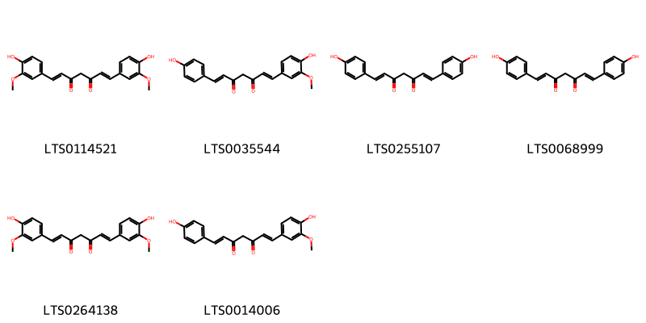{ width=100% }
    <figcaption>Hình ảnh cấu trúc hóa học của 6 hoạt chất thuộc nhóm Diarylheptanoids gồm ['curcumin (LTS0114521)', 'demethoxycurcumin (LTS0035544)', 'bisdemethoxycurcumin (LTS0255107)', 'bisdemethoxycurcumin (LTS0068999)', 'turmeric (LTS0264138)', 'desmethoxycurcumin (LTS0014006)'].</figcaption>
</figure>
#### Nhóm Epoxides
<figure markdown="span">
    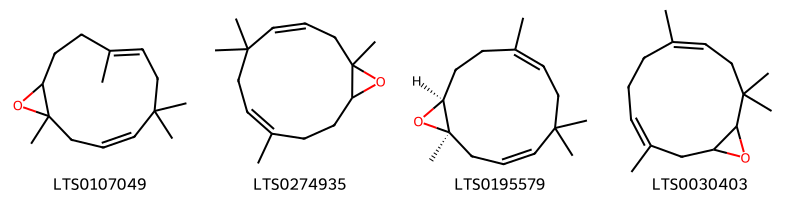{ width=100% }
    <figcaption>Hình ảnh cấu trúc hóa học của 4 hoạt chất thuộc nhóm Epoxides gồm ['(3z,7e)-1,5,5,8-tetramethyl-12-oxabicyclo[9.1.0]dodeca-3,7-diene (LTS0107049)', '(3z,7z)-1,5,5,8-tetramethyl-12-oxabicyclo[9.1.0]dodeca-3,7-diene (LTS0274935)', '(1r,11s)-1,5,5,8-tetramethyl-12-oxabicyclo[9.1.0]dodeca-3,7-diene (LTS0195579)', '3,7,10,10-tetramethyl-12-oxabicyclo[9.1.0]dodeca-3,7-diene (LTS0030403)'].</figcaption>
</figure>
#### Nhóm Fatty Acyls
<figure markdown="span">
    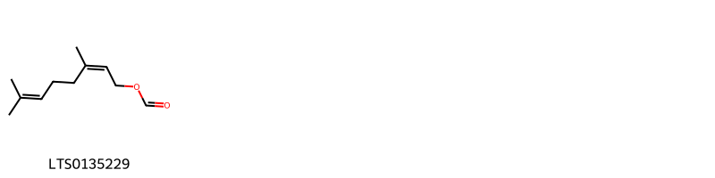{ width=100% }
    <figcaption>Hình ảnh cấu trúc hóa học của 1 hoạt chất thuộc nhóm Fatty Acyls gồm ['neryl formate (LTS0135229)'].</figcaption>
</figure>
#### Nhóm Flavonoids
<figure markdown="span">
    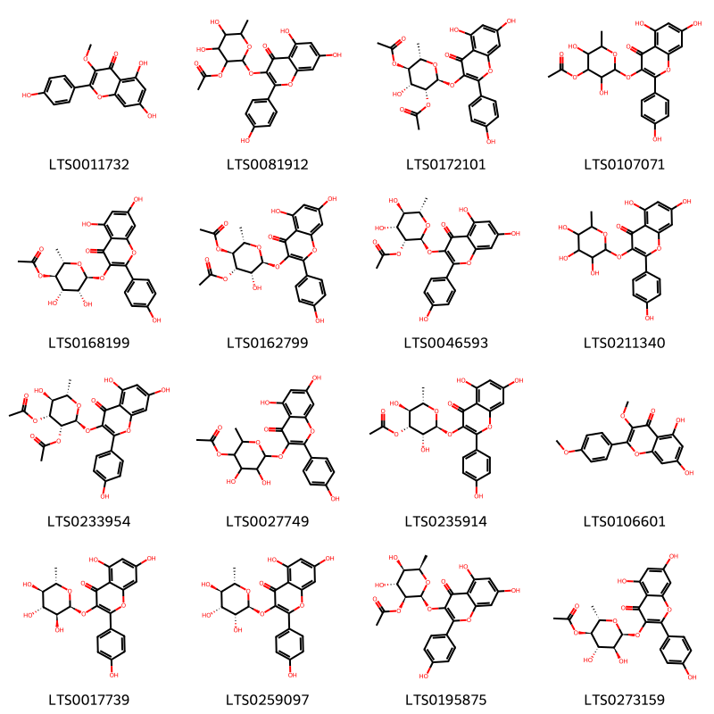{ width=100% }
    <figcaption>Hình ảnh cấu trúc hóa học của 16 hoạt chất thuộc nhóm Flavonoids gồm ['isokaempferide (LTS0011732)', '2-{[5,7-dihydroxy-2-(4-hydroxyphenyl)-4-oxochromen-3-yl]oxy}-4,5-dihydroxy-6-methyloxan-3-yl acetate (LTS0081912)', '(2s,3r,4r,5r,6s)-5-(acetyloxy)-2-{[5,7-dihydroxy-2-(4-hydroxyphenyl)-4-oxochromen-3-yl]oxy}-4-hydroxy-6-methyloxan-3-yl acetate (LTS0172101)', '2-{[5,7-dihydroxy-2-(4-hydroxyphenyl)-4-oxochromen-3-yl]oxy}-3,5-dihydroxy-6-methyloxan-4-yl acetate (LTS0107071)', '(2s,3r,4s,5r,6s)-6-{[5,7-dihydroxy-2-(4-hydroxyphenyl)-4-oxochromen-3-yl]oxy}-4,5-dihydroxy-2-methyloxan-3-yl acetate (LTS0168199)', '(2s,3s,4s,5r,6s)-3-(acetyloxy)-6-{[5,7-dihydroxy-2-(4-hydroxyphenyl)-4-oxochromen-3-yl]oxy}-5-hydroxy-2-methyloxan-4-yl acetate (LTS0162799)', '(2s,3r,4r,5r,6s)-2-{[5,7-dihydroxy-2-(4-hydroxyphenyl)-4-oxochromen-3-yl]oxy}-4,5-dihydroxy-6-methyloxan-3-yl acetate (LTS0046593)', '5,7-dihydroxy-2-(4-hydroxyphenyl)-3-[(3,4,5-trihydroxy-6-methyloxan-2-yl)oxy]chromen-4-one (LTS0211340)', '(2s,3r,4r,5s,6s)-3-(acetyloxy)-2-{[5,7-dihydroxy-2-(4-hydroxyphenyl)-4-oxochromen-3-yl]oxy}-5-hydroxy-6-methyloxan-4-yl acetate (LTS0233954)', '6-{[5,7-dihydroxy-2-(4-hydroxyphenyl)-4-oxochromen-3-yl]oxy}-4,5-dihydroxy-2-methyloxan-3-yl acetate (LTS0027749)', '(2s,3r,4r,5s,6s)-2-{[5,7-dihydroxy-2-(4-hydroxyphenyl)-4-oxochromen-3-yl]oxy}-3,5-dihydroxy-6-methyloxan-4-yl acetate (LTS0235914)', 'ermanin (LTS0106601)', '5,7-dihydroxy-2-(4-hydroxyphenyl)-3-{[(2s,3s,4r,5r,6s)-3,4,5-trihydroxy-6-methyloxan-2-yl]oxy}chromen-4-one (LTS0017739)', 'afzelin (LTS0259097)', '(2s,3s,4r,5r,6r)-2-{[5,7-dihydroxy-2-(4-hydroxyphenyl)-4-oxochromen-3-yl]oxy}-4,5-dihydroxy-6-methyloxan-3-yl acetate (LTS0195875)', '(2s,3r,4s,5s,6s)-6-{[5,7-dihydroxy-2-(4-hydroxyphenyl)-4-oxochromen-3-yl]oxy}-4,5-dihydroxy-2-methyloxan-3-yl acetate (LTS0273159)'].</figcaption>
</figure>
#### Nhóm Furanoid lignans
<figure markdown="span">
    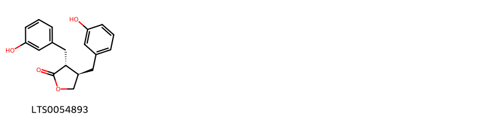{ width=100% }
    <figcaption>Hình ảnh cấu trúc hóa học của 1 hoạt chất thuộc nhóm Furanoid lignans gồm ['enterolactone (LTS0054893)'].</figcaption>
</figure>
#### Nhóm Organooxygen compounds
<figure markdown="span">
    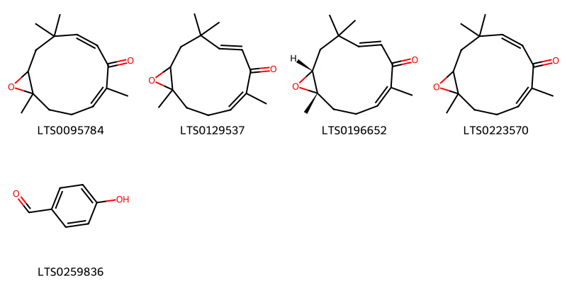{ width=100% }
    <figcaption>Hình ảnh cấu trúc hóa học của 5 hoạt chất thuộc nhóm Organooxygen compounds gồm ['1,5,9,9-tetramethyl-12-oxabicyclo[9.1.0]dodeca-4,7-dien-6-one (LTS0095784)', '(4z,7e)-1,5,9,9-tetramethyl-12-oxabicyclo[9.1.0]dodeca-4,7-dien-6-one (LTS0129537)', '(1s,4z,7e,11r)-1,5,9,9-tetramethyl-12-oxabicyclo[9.1.0]dodeca-4,7-dien-6-one (LTS0196652)', '(4z,7z)-1,5,9,9-tetramethyl-12-oxabicyclo[9.1.0]dodeca-4,7-dien-6-one (LTS0223570)', 'p-hydroxybenzaldehyde (LTS0259836)'].</figcaption>
</figure>
#### Nhóm Phenols
<figure markdown="span">
    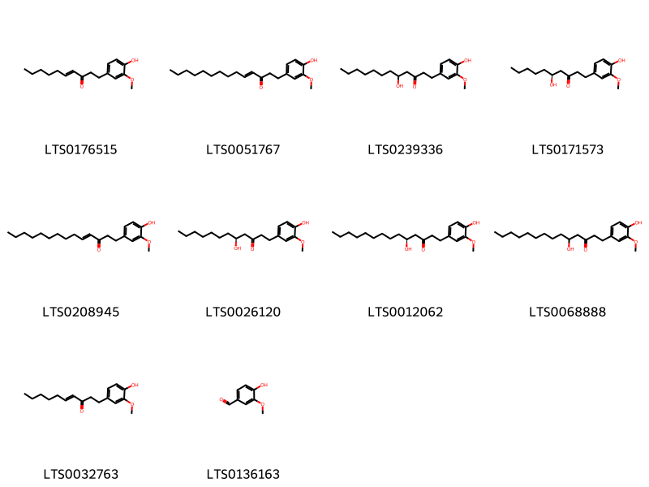{ width=100% }
    <figcaption>Hình ảnh cấu trúc hóa học của 10 hoạt chất thuộc nhóm Phenols gồm ['shogaol (LTS0176515)', '(10)-shogaol (LTS0051767)', '5-hydroxy-1-(4-hydroxy-3-methoxyphenyl)dodecan-3-one (LTS0239336)', 'gingerol (LTS0171573)', '1-(4-hydroxy-3-methoxyphenyl)tetradec-4-en-3-one (LTS0208945)', '(8)-gingerol (LTS0026120)', '(10)-gingerol (LTS0012062)', '5-hydroxy-1-(4-hydroxy-3-methoxyphenyl)tetradecan-3-one (LTS0068888)', 'shogaol (LTS0032763)', 'vanillin (LTS0136163)'].</figcaption>
</figure>
#### Nhóm Prenol lipids
<figure markdown="span">
    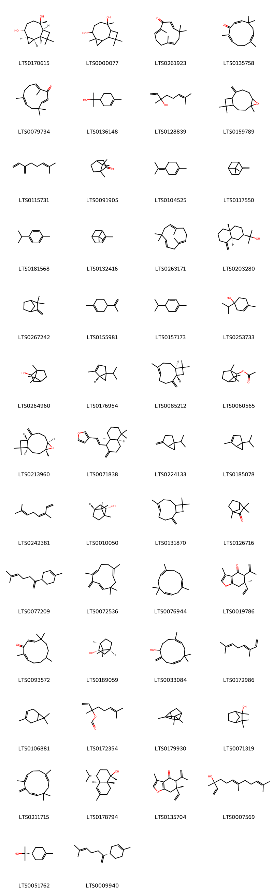{ width=100% }
    <figcaption>Hình ảnh cấu trúc hóa học của 50 hoạt chất thuộc nhóm Prenol lipids gồm ['(1r,2r,4r,5r,8s,9s)-4,8,11,11-tetramethyltricyclo[7.2.0.0²,⁴]undecane-5,8-diol (LTS0170615)', '4,8,11,11-tetramethyltricyclo[7.2.0.0²,⁴]undecane-5,8-diol (LTS0000077)', 'zerumbone (LTS0261923)', '2,6,9,9-tetramethylcycloundeca-2,6,10-trien-1-one (LTS0135758)', '(2e,10e)-2,6,9,9-tetramethylcycloundeca-2,6,10-trien-1-one (LTS0079734)', 'terpineol (LTS0136148)', 'linalool, (+-)- (LTS0128839)', 'caryophyllene oxide (LTS0159789)', 'α-myrcene (LTS0115731)', 'camphor (LTS0091905)', 'terpinolene (LTS0104525)', 'β-pinene (LTS0117550)', 'cymene (LTS0181568)', 'α pinene (LTS0132416)', 'humulene (LTS0263171)', 'β-eudesmol (LTS0203280)', 'camphene (LTS0267242)', 'limonene,  (LTS0155981)', 'phellandrene (LTS0157173)', '4-terpineol (LTS0253733)', 'borneol (LTS0264960)', 'α-thujene (LTS0176954)', 'caryophyllene (LTS0085212)', 'bornyl acetate (LTS0060565)', 'β-caryophyllene oxide (LTS0213960)', '3-{2-[(4ar,8as)-5,5,8a-trimethyl-2-methylidene-hexahydro-1h-naphthalen-1-yl]ethenyl}furan (LTS0071838)', 'sabinene (LTS0224133)', 'α-thujene (LTS0185078)', 'β-ocimene (LTS0242381)', '(2s,4r)-1,7,7-trimethylbicyclo[2.2.1]heptan-2-ol (LTS0010050)', 'caryophyllene (LTS0131870)', 'fenchone (LTS0126716)', '(r)-β-bisabolene (LTS0077209)', '(1e,4e,8e)-2,6,6,9-tetramethyl-3-methylidenecycloundeca-1,4,8-triene (LTS0072536)', 'α-humulene (LTS0076944)', '(6r)-6-ethenyl-3,6-dimethyl-5-(prop-1-en-2-yl)-5,7-dihydro-1-benzofuran-4-one (LTS0019786)', '(2z,10e)-2,6,9,9-tetramethylcycloundeca-2,10-dien-1-one (LTS0093572)', '(+)-borneol (LTS0189059)', '(4z,8z)-6,6,9-trimethyl-2-methylidenecycloundeca-4,8-dien-1-ol (LTS0033084)', '3,7-dimethyl-1,3,6-octatriene (LTS0172986)', 'monoterpenes (LTS0106881)', 'linalyl formate (LTS0172354)', 'tricyclene (LTS0179930)', 'camphene hydrate (LTS0071319)', '2,6,6,9-tetramethyl-3-methylidenecycloundeca-1,4,8-triene (LTS0211715)', 'α-cadinol (LTS0178794)', '(6s)-6-ethenyl-3,6-dimethyl-5-(prop-1-en-2-yl)-5,7-dihydro-1-benzofuran-4-one (LTS0135704)', 'nerolidol isomers (LTS0007569)', 'lily of valley (LTS0051762)', '(-)-β-bisabolene (LTS0009940)'].</figcaption>
</figure>
#### Nhóm Steroids and steroid derivatives
<figure markdown="span">
    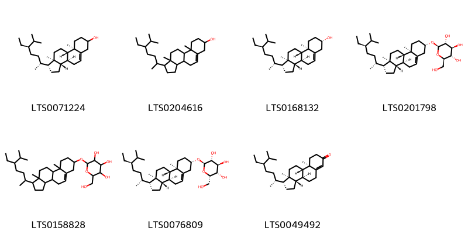{ width=100% }
    <figcaption>Hình ảnh cấu trúc hóa học của 7 hoạt chất thuộc nhóm Steroids and steroid derivatives gồm ['stigmast-5-en-3-ol (LTS0071224)', 'stigmast-5-en-3-ol, (3β)- (LTS0204616)', 'sitosterol (LTS0168132)', 'sitogluside (LTS0201798)', '2-{[1-(5-ethyl-6-methylheptan-2-yl)-9a,11a-dimethyl-1h,2h,3h,3ah,3bh,4h,6h,7h,8h,9h,9bh,10h,11h-cyclopenta[a]phenanthren-7-yl]oxy}-6-(hydroxymethyl)oxane-3,4,5-triol (LTS0158828)', '(2r,3r,4s,5s,6s)-2-{[(1r,3as,3bs,7s,9ar,9bs,11ar)-1-[(2r,5r)-5-ethyl-6-methylheptan-2-yl]-9a,11a-dimethyl-1h,2h,3h,3ah,3bh,4h,6h,7h,8h,9h,9bh,10h,11h-cyclopenta[a]phenanthren-7-yl]oxy}-6-(hydroxymethyl)oxane-3,4,5-triol (LTS0076809)', 'β-sitostenone (LTS0049492)'].</figcaption>
</figure>
#### Nhóm Unsaturated hydrocarbons
<figure markdown="span">
    { width=100% }
    <figcaption>Hình ảnh cấu trúc hóa học của 1 hoạt chất thuộc nhóm Unsaturated hydrocarbons gồm ['α terpinene (LTS0232891)'].</figcaption>
</figure>

---

### Dược dân tộc học

Danh sách các quốc gia có sử dụng *Zingiber zerumbet* trong điều trị các bệnh. 

| Country   | Disease               | Bệnh                                                                                                                                                                                                |
|:----------|:----------------------|:----------------------------------------------------------------------------------------------------------------------------------------------------------------------------------------------------|
| Egypt     | Antiseptic, Vermifuge | MYMEMORY WARNING: YOU USED ALL AVAILABLE FREE TRANSLATIONS FOR TODAY. NEXT AVAILABLE IN  07 HOURS 50 MINUTES 01 SECONDS VISIT HTTPS://MYMEMORY.TRANSLATED.NET/DOC/USAGELIMITS.PHP TO TRANSLATE MORE |
| Elsewhere | Vermifuge, nan        | MYMEMORY WARNING: YOU USED ALL AVAILABLE FREE TRANSLATIONS FOR TODAY. NEXT AVAILABLE IN  07 HOURS 49 MINUTES 58 SECONDS VISIT HTTPS://MYMEMORY.TRANSLATED.NET/DOC/USAGELIMITS.PHP TO TRANSLATE MORE |
| Java      | Apertif               | MYMEMORY WARNING: YOU USED ALL AVAILABLE FREE TRANSLATIONS FOR TODAY. NEXT AVAILABLE IN  07 HOURS 49 MINUTES 56 SECONDS VISIT HTTPS://MYMEMORY.TRANSLATED.NET/DOC/USAGELIMITS.PHP TO TRANSLATE MORE |

---

# Chi Geanthus

??? note "Danh sách các dược liệu thuộc chi"
    
	 - *Geanthus cevuga*

---
## Geanthus cevuga
### Thông tin về thực vật

!!! info "Phân loại thực vật của *Etlingera cevuga* từ GIBF:"
    - **Kingdom:** Plantae
    - **Phylum:** Tracheophyta
    - **Order:** Zingiberales
    - **Family:** Zingiberaceae
    - **Genus:** Etlingera
    - **Species:** *Etlingera cevuga*

 

| Label (VI)   | Label (EN)   | Scientific Name   | Descriptions (VI)   | Descriptions (EN)   | Also Known As (VI)    | Also Known As (EN)                                     |
|:-------------|:-------------|:------------------|:--------------------|:--------------------|:----------------------|:-------------------------------------------------------|
| N/A          | N/A          | Zingiber zerumbet | loài thực vật       | species of plant    | ['Zingiber zerumbet'] | ['bitter ginger', 'pinecone ginger', 'shampoo ginger'] |

#### Phân bố trên thế giới

**Từ CSDL GIBF** Fiji

#### Phân bố tại Việt Nam

**Từ CSDL GIBF**: Không có ghi nhận ở Việt Nam

---
### Thành phần hóa học
        
- Theo cơ sở dữ liệu lotus: Từ loài *Etlingera cevuga* đã phân lập và xác định được Chưa có hoạt chất nào được phân lập. hoạt chất thuộc về các nhóm Không có hoạt chất nào được phân lập. 

Không có hình ảnh nào được tạo ra

---

### Dược dân tộc học

Danh sách các quốc gia có sử dụng *Etlingera cevuga* trong điều trị các bệnh. 

| Country   | Disease      | Bệnh                                                                                                                                                                                                |
|:----------|:-------------|:----------------------------------------------------------------------------------------------------------------------------------------------------------------------------------------------------|
| Fiji      | Decongestant | MYMEMORY WARNING: YOU USED ALL AVAILABLE FREE TRANSLATIONS FOR TODAY. NEXT AVAILABLE IN  07 HOURS 49 MINUTES 22 SECONDS VISIT HTTPS://MYMEMORY.TRANSLATED.NET/DOC/USAGELIMITS.PHP TO TRANSLATE MORE |

---

# Chi Curcuma

??? note "Danh sách các dược liệu thuộc chi"
    
	 - *Curcuma aeruginosa*
	 - *Curcuma amada*
	 - *Curcuma angustifolia*
	 - *Curcuma aromatica*
	 - *Curcuma caesia*
	 - *Curcuma domestica*
	 - *Curcuma heyneana*
	 - *Curcuma longa*
	 - *Curcuma mangga*
	 - *Curcuma petiolata*
	 - *Curcuma xanthorrhiza*
	 - *Curcuma zedoaria*
	 - *Curcuma zeodoaria*

---
## Curcuma aeruginosa
### Thông tin về thực vật

!!! info "Phân loại thực vật của *Curcuma aeruginosa* từ GIBF:"
    - **Kingdom:** Plantae
    - **Phylum:** Tracheophyta
    - **Order:** Zingiberales
    - **Family:** Zingiberaceae
    - **Genus:** Curcuma
    - **Species:** *Curcuma aeruginosa*

 

| Label (VI)   | Label (EN)   | Scientific Name    | Descriptions (VI)   | Descriptions (EN)   | Also Known As (VI)   | Also Known As (EN)   |
|:-------------|:-------------|:-------------------|:--------------------|:--------------------|:---------------------|:---------------------|
| N/A          | N/A          | Curcuma aeruginosa | loài thực vật       | species of plant    | ['']                 | ['']                 |

#### Phân bố trên thế giới

**Từ CSDL GIBF** Viet Nam, nan, unknown or invalid, Thailand, Myanmar, Japan, India, Lao People’s Democratic Republic, Bangladesh, United States of America, Norway, Indonesia

#### Phân bố tại Việt Nam

**Từ CSDL GIBF**: Kiên Giang

---
### Thành phần hóa học
        
- Theo cơ sở dữ liệu lotus: Từ loài *Curcuma aeruginosa* đã phân lập và xác định được 42 hoạt chất thuộc về các nhóm Indoles and derivatives, Prenol lipids, Diarylheptanoids. 

|    | chemicalTaxonomyClassyfireClass   |   smiles_count |
|---:|:----------------------------------|---------------:|
|  0 | Diarylheptanoids                  |              3 |
|  1 | Indoles and derivatives           |              1 |
|  2 | Prenol lipids                     |             37 |

#### Nhóm Diarylheptanoids
<figure markdown="span">
    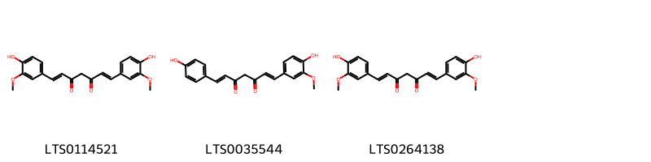{ width=100% }
    <figcaption>Hình ảnh cấu trúc hóa học của 3 hoạt chất thuộc nhóm Diarylheptanoids gồm ['curcumin (LTS0114521)', 'demethoxycurcumin (LTS0035544)', 'turmeric (LTS0264138)'].</figcaption>
</figure>
#### Nhóm Indoles and derivatives
<figure markdown="span">
    { width=100% }
    <figcaption>Hình ảnh cấu trúc hóa học của 1 hoạt chất thuộc nhóm Indoles and derivatives gồm ['n-[2-(5-methoxy-1h-indol-3-yl)ethyl]ethanimidic acid (LTS0219322)'].</figcaption>
</figure>
#### Nhóm Prenol lipids
<figure markdown="span">
    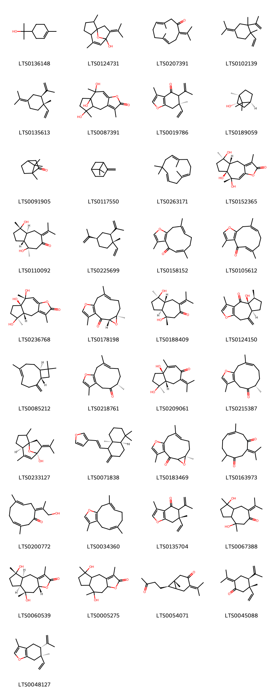{ width=100% }
    <figcaption>Hình ảnh cấu trúc hóa học của 37 hoạt chất thuộc nhóm Prenol lipids gồm ['terpineol (LTS0136148)', 'curcumenol (LTS0124731)', 'germacrone (LTS0207391)', '1-ethenyl-1,2-dimethyl-2-(prop-1-en-2-yl)-4-(propan-2-ylidene)cyclohexane (LTS0102139)', '(1s,2s)-1-ethenyl-1-methyl-2-(prop-1-en-2-yl)-4-(propan-2-ylidene)cyclohexane (LTS0135613)', '5,7a,8-trihydroxy-3,5,8-trimethyl-4h,4ah,6h,7h-azuleno[6,5-b]furan-2-one (LTS0087391)', '(6r)-6-ethenyl-3,6-dimethyl-5-(prop-1-en-2-yl)-5,7-dihydro-1-benzofuran-4-one (LTS0019786)', '(+)-borneol (LTS0189059)', 'camphor (LTS0091905)', 'β-pinene (LTS0117550)', 'humulene (LTS0263171)', '(4as,5r,7as,8s)-5,7a,8-trihydroxy-3,5,8-trimethyl-4h,4ah,6h,7h-azuleno[6,5-b]furan-2-one (LTS0152365)', '(1s,3ar,4r,8as)-1,4-dihydroxy-1,4-dimethyl-7-(propan-2-ylidene)-hexahydroazulen-6-one (LTS0110092)', 'β-elemene (LTS0225699)', 'furanodienone (LTS0158152)', 'furanodienone (LTS0105612)', '(4ar,5s,7ar,8r)-5,7a,8-trihydroxy-3,5,8-trimethyl-4h,4ah,6h,7h-azuleno[6,5-b]furan-2-one (LTS0236768)', '(3s,5r,8e)-5,9,14-trimethyl-4,12-dioxatricyclo[9.3.0.0³,⁵]tetradeca-1(11),8,13-trien-2-one (LTS0178198)', '(1r,3as,4s,8ar)-1,4-dihydroxy-1,4-dimethyl-7-(propan-2-ylidene)-hexahydroazulen-6-one (LTS0188409)', 'zedoarol (LTS0124150)', 'caryophyllene (LTS0085212)', 'furanogermenone (LTS0218761)', '(1s,3ar,8ar)-1,3a-dihydroxy-1,4-dimethyl-7-(propan-2-ylidene)-2,3,8,8a-tetrahydroazulen-6-one (LTS0209061)', 'furanogermenone (LTS0215387)', '(1s,5r,8r)-2,6-dimethyl-9-(propan-2-ylidene)-11-oxatricyclo[6.2.1.0¹,⁵]undec-6-en-8-ol (LTS0233127)', '3-{2-[(4ar,8as)-5,5,8a-trimethyl-2-methylidene-hexahydro-1h-naphthalen-1-yl]ethenyl}furan (LTS0071838)', '(5r,8e)-5,9,14-trimethyl-4,12-dioxatricyclo[9.3.0.0³,⁵]tetradeca-1(11),8,13-trien-2-one (LTS0183469)', '(6z)-6,10-dimethyl-3-(propan-2-ylidene)cyclodec-6-ene-1,4-dione (LTS0163973)', '13-hydroxygermacrone (LTS0200772)', 'furanodiene (LTS0034360)', '(6s)-6-ethenyl-3,6-dimethyl-5-(prop-1-en-2-yl)-5,7-dihydro-1-benzofuran-4-one (LTS0135704)', '1,4-dihydroxy-1,4-dimethyl-7-(propan-2-ylidene)-hexahydroazulen-6-one (LTS0067388)', '(4as,5s,7as,8s,9ar)-5,8-dihydroxy-3,5,8-trimethyl-4h,4ah,6h,7h,7ah,9h,9ah-azuleno[6,5-b]furan-2-one (LTS0060539)', '5,8-dihydroxy-3,5,8-trimethyl-4h,4ah,6h,7h,7ah,9h,9ah-azuleno[6,5-b]furan-2-one (LTS0005275)', 'curcumenone (LTS0054071)', 'β-elemenone (LTS0045088)', '(5r,6r)-6-ethenyl-3,6-dimethyl-5-(prop-1-en-2-yl)-5,7-dihydro-4h-1-benzofuran (LTS0048127)'].</figcaption>
</figure>

---

### Dược dân tộc học

Danh sách các quốc gia có sử dụng *Curcuma aeruginosa* trong điều trị các bệnh. 

| Country   | Disease   | Bệnh                                                                                                                                                                                                |
|:----------|:----------|:----------------------------------------------------------------------------------------------------------------------------------------------------------------------------------------------------|
| Java      | Purgative | MYMEMORY WARNING: YOU USED ALL AVAILABLE FREE TRANSLATIONS FOR TODAY. NEXT AVAILABLE IN  07 HOURS 49 MINUTES 07 SECONDS VISIT HTTPS://MYMEMORY.TRANSLATED.NET/DOC/USAGELIMITS.PHP TO TRANSLATE MORE |

---

---
## Curcuma amada
### Thông tin về thực vật

!!! info "Phân loại thực vật của *Curcuma amada* từ GIBF:"
    - **Kingdom:** Plantae
    - **Phylum:** Tracheophyta
    - **Order:** Zingiberales
    - **Family:** Zingiberaceae
    - **Genus:** Curcuma
    - **Species:** *Curcuma amada*

 

| Label (VI)   | Label (EN)   | Scientific Name   | Descriptions (VI)   | Descriptions (EN)   | Also Known As (VI)   | Also Known As (EN)   |
|:-------------|:-------------|:------------------|:--------------------|:--------------------|:---------------------|:---------------------|
| N/A          | N/A          | Curcuma amada     | loài thực vật       | species of plant    | ['']                 | ['']                 |

#### Phân bố trên thế giới

**Từ CSDL GIBF** Viet Nam, nan, unknown or invalid, Thailand, United Kingdom of Great Britain and Northern Ireland, Bhutan, India, Réunion, Bangladesh, United States of America, China, Nepal, Cambodia

#### Phân bố tại Việt Nam

**Từ CSDL GIBF**: Thái Nguyên

---
### Thành phần hóa học
        
- Theo cơ sở dữ liệu lotus: Từ loài *Curcuma amada* đã phân lập và xác định được 9 hoạt chất thuộc về các nhóm Prenol lipids, Diarylheptanoids. 

|    | chemicalTaxonomyClassyfireClass   |   smiles_count |
|---:|:----------------------------------|---------------:|
|  0 | Diarylheptanoids                  |              3 |
|  1 | Prenol lipids                     |              6 |

#### Nhóm Diarylheptanoids
<figure markdown="span">
    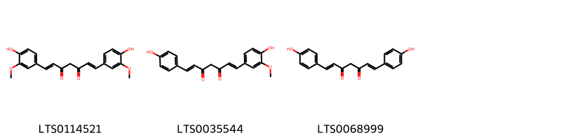{ width=100% }
    <figcaption>Hình ảnh cấu trúc hóa học của 3 hoạt chất thuộc nhóm Diarylheptanoids gồm ['curcumin (LTS0114521)', 'demethoxycurcumin (LTS0035544)', 'bisdemethoxycurcumin (LTS0068999)'].</figcaption>
</figure>
#### Nhóm Prenol lipids
<figure markdown="span">
    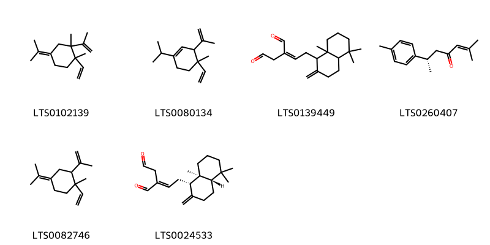{ width=100% }
    <figcaption>Hình ảnh cấu trúc hóa học của 6 hoạt chất thuộc nhóm Prenol lipids gồm ['1-ethenyl-1,2-dimethyl-2-(prop-1-en-2-yl)-4-(propan-2-ylidene)cyclohexane (LTS0102139)', '4-ethenyl-1-isopropyl-4-methyl-3-(prop-1-en-2-yl)cyclohex-1-ene (LTS0080134)', '2-[2-(5,5,8a-trimethyl-2-methylidene-hexahydro-1h-naphthalen-1-yl)ethylidene]butanedial (LTS0139449)', 'ar-turmerone (LTS0260407)', '1-ethenyl-1-methyl-2-(prop-1-en-2-yl)-4-(propan-2-ylidene)cyclohexane (LTS0082746)', '(2e)-2-{2-[(1s,4as,8as)-5,5,8a-trimethyl-2-methylidene-hexahydro-1h-naphthalen-1-yl]ethylidene}butanedial (LTS0024533)'].</figcaption>
</figure>

---

### Dược dân tộc học

Danh sách các quốc gia có sử dụng *Curcuma amada* trong điều trị các bệnh. 

| Country   | Disease                | Bệnh                                                                                                                                                                                                |
|:----------|:-----------------------|:----------------------------------------------------------------------------------------------------------------------------------------------------------------------------------------------------|
| Elsewhere | Stomachic, Carminative | MYMEMORY WARNING: YOU USED ALL AVAILABLE FREE TRANSLATIONS FOR TODAY. NEXT AVAILABLE IN  07 HOURS 48 MINUTES 45 SECONDS VISIT HTTPS://MYMEMORY.TRANSLATED.NET/DOC/USAGELIMITS.PHP TO TRANSLATE MORE |
| Hindu     | Carminative, Stomachic | MYMEMORY WARNING: YOU USED ALL AVAILABLE FREE TRANSLATIONS FOR TODAY. NEXT AVAILABLE IN  07 HOURS 48 MINUTES 43 SECONDS VISIT HTTPS://MYMEMORY.TRANSLATED.NET/DOC/USAGELIMITS.PHP TO TRANSLATE MORE |

---

---
## Curcuma angustifolia
### Thông tin về thực vật

!!! info "Phân loại thực vật của *Curcuma angustifolia* từ GIBF:"
    - **Kingdom:** Plantae
    - **Phylum:** Tracheophyta
    - **Order:** Zingiberales
    - **Family:** Zingiberaceae
    - **Genus:** Curcuma
    - **Species:** *Curcuma angustifolia*

 

| Label (VI)   | Label (EN)   | Scientific Name      | Descriptions (VI)   | Descriptions (EN)   | Also Known As (VI)       | Also Known As (EN)        |
|:-------------|:-------------|:---------------------|:--------------------|:--------------------|:-------------------------|:--------------------------|
| N/A          | N/A          | Curcuma angustifolia | loài thực vật       | species of plant    | ['Curcuma angustifolia'] | ['East Indian arrowroot'] |

#### Phân bố trên thế giới

**Từ CSDL GIBF** nan, unknown or invalid, Thailand, Denmark, Bhutan, Myanmar, India, Lao People’s Democratic Republic, Bangladesh, United Arab Emirates, Nepal

#### Phân bố tại Việt Nam

**Từ CSDL GIBF**: Không có ghi nhận ở Việt Nam

---
### Thành phần hóa học
        
- Theo cơ sở dữ liệu lotus: Từ loài *Curcuma angustifolia* đã phân lập và xác định được Chưa có hoạt chất nào được phân lập. hoạt chất thuộc về các nhóm Không có hoạt chất nào được phân lập. 

Không có hình ảnh nào được tạo ra

---

### Dược dân tộc học

Danh sách các quốc gia có sử dụng *Curcuma angustifolia* trong điều trị các bệnh. 

| Country   | Disease                | Bệnh                                                                                                                                                                                                |
|:----------|:-----------------------|:----------------------------------------------------------------------------------------------------------------------------------------------------------------------------------------------------|
| Turkey    | Demulcent, Refrigerant | MYMEMORY WARNING: YOU USED ALL AVAILABLE FREE TRANSLATIONS FOR TODAY. NEXT AVAILABLE IN  07 HOURS 48 MINUTES 22 SECONDS VISIT HTTPS://MYMEMORY.TRANSLATED.NET/DOC/USAGELIMITS.PHP TO TRANSLATE MORE |

---

---
## Curcuma aromatica
### Thông tin về thực vật

!!! info "Phân loại thực vật của *Curcuma aromatica* từ GIBF:"
    - **Kingdom:** Plantae
    - **Phylum:** Tracheophyta
    - **Order:** Zingiberales
    - **Family:** Zingiberaceae
    - **Genus:** Curcuma
    - **Species:** *Curcuma aromatica*

 

| Label (VI)   | Label (EN)   | Scientific Name   | Descriptions (VI)   | Descriptions (EN)   | Also Known As (VI)                  | Also Known As (EN)   |
|:-------------|:-------------|:------------------|:--------------------|:--------------------|:------------------------------------|:---------------------|
| N/A          | N/A          | Curcuma aromatica |                     | species of plant    | ['Nghệ trắng', 'Curcuma aromatica'] | ['']                 |

#### Phân bố trên thế giới

**Từ CSDL GIBF** Viet Nam, nan, unknown or invalid, Thailand, Philippines, Lao People’s Democratic Republic, Singapore, Korea, Republic of, Indonesia, Colombia, Sri Lanka, Pakistan, Bhutan, India, Nigeria, Bangladesh, Cambodia, Myanmar, Japan, China, Nepal, Chinese Taipei, Hong Kong, United States of America

#### Phân bố tại Việt Nam

**Từ CSDL GIBF**: Lào Cai, Hòa Bình

---
### Thành phần hóa học
        
- Theo cơ sở dữ liệu lotus: Từ loài *Curcuma aromatica* đã phân lập và xác định được 114 hoạt chất thuộc về các nhóm Organooxygen compounds, Lactones, Diazines, Benzofurans, Prenol lipids, Carboxylic acids and derivatives, Fatty Acyls, Diarylheptanoids, Steroids and steroid derivatives, Benzene and substituted derivatives. 

|    | chemicalTaxonomyClassyfireClass     |   smiles_count |
|---:|:------------------------------------|---------------:|
|  0 | Benzene and substituted derivatives |              1 |
|  1 | Benzofurans                         |              1 |
|  2 | Carboxylic acids and derivatives    |              3 |
|  3 | Diarylheptanoids                    |              2 |
|  4 | Diazines                            |              1 |
|  5 | Fatty Acyls                         |              1 |
|  6 | Lactones                            |              3 |
|  7 | Organooxygen compounds              |              1 |
|  8 | Prenol lipids                       |             98 |
|  9 | Steroids and steroid derivatives    |              1 |

#### Nhóm Benzene and substituted derivatives
<figure markdown="span">
    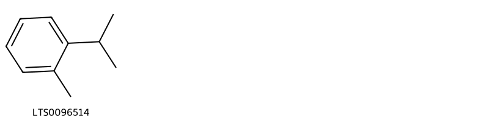{ width=100% }
    <figcaption>Hình ảnh cấu trúc hóa học của 1 hoạt chất thuộc nhóm Benzene and substituted derivatives gồm ['o-cymene (LTS0096514)'].</figcaption>
</figure>
#### Nhóm Benzofurans
<figure markdown="span">
    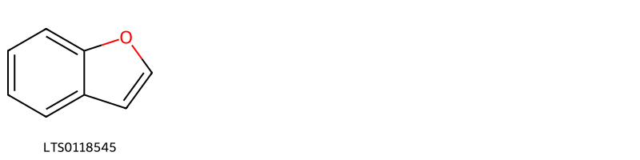{ width=100% }
    <figcaption>Hình ảnh cấu trúc hóa học của 1 hoạt chất thuộc nhóm Benzofurans gồm ['benzofuran (LTS0118545)'].</figcaption>
</figure>
#### Nhóm Carboxylic acids and derivatives
<figure markdown="span">
    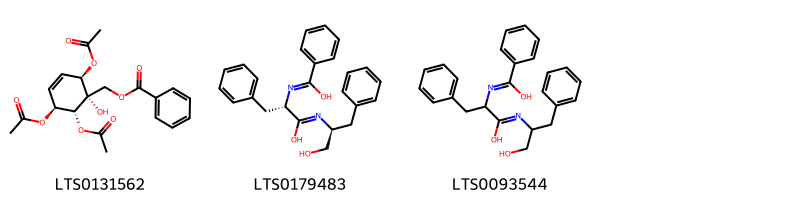{ width=100% }
    <figcaption>Hình ảnh cấu trúc hóa học của 3 hoạt chất thuộc nhóm Carboxylic acids and derivatives gồm ['[(1s,2r,5s,6r)-2,5,6-tris(acetyloxy)-1-hydroxycyclohex-3-en-1-yl]methyl benzoate (LTS0131562)', '(2s)-2-{[hydroxy(phenyl)methylidene]amino}-n-[(2s)-1-hydroxy-3-phenylpropan-2-yl]-3-phenylpropanimidic acid (LTS0179483)', '2-{[hydroxy(phenyl)methylidene]amino}-n-(1-hydroxy-3-phenylpropan-2-yl)-3-phenylpropanimidic acid (LTS0093544)'].</figcaption>
</figure>
#### Nhóm Diarylheptanoids
<figure markdown="span">
    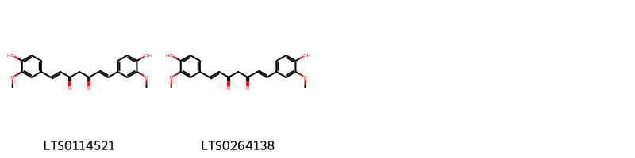{ width=100% }
    <figcaption>Hình ảnh cấu trúc hóa học của 2 hoạt chất thuộc nhóm Diarylheptanoids gồm ['curcumin (LTS0114521)', 'turmeric (LTS0264138)'].</figcaption>
</figure>
#### Nhóm Diazines
<figure markdown="span">
    { width=100% }
    <figcaption>Hình ảnh cấu trúc hóa học của 1 hoạt chất thuộc nhóm Diazines gồm ['ligustrazine (LTS0230758)'].</figcaption>
</figure>
#### Nhóm Fatty Acyls
<figure markdown="span">
    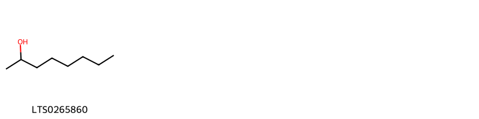{ width=100% }
    <figcaption>Hình ảnh cấu trúc hóa học của 1 hoạt chất thuộc nhóm Fatty Acyls gồm ['2-octanol (LTS0265860)'].</figcaption>
</figure>
#### Nhóm Lactones
<figure markdown="span">
    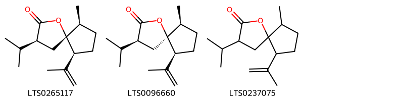{ width=100% }
    <figcaption>Hình ảnh cấu trúc hóa học của 3 hoạt chất thuộc nhóm Lactones gồm ['(3s,5r,6s,9s)-3-isopropyl-6-methyl-9-(prop-1-en-2-yl)-1-oxaspiro[4.4]nonan-2-one (LTS0265117)', '(3s,5s,6s,9s)-3-isopropyl-6-methyl-9-(prop-1-en-2-yl)-1-oxaspiro[4.4]nonan-2-one (LTS0096660)', '3-isopropyl-6-methyl-9-(prop-1-en-2-yl)-1-oxaspiro[4.4]nonan-2-one (LTS0237075)'].</figcaption>
</figure>
#### Nhóm Organooxygen compounds
<figure markdown="span">
    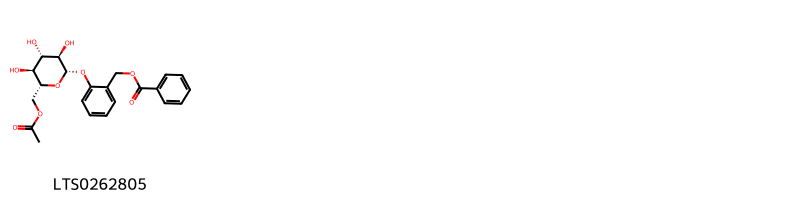{ width=100% }
    <figcaption>Hình ảnh cấu trúc hóa học của 1 hoạt chất thuộc nhóm Organooxygen compounds gồm ['(2-{[(2s,3r,4s,5s,6r)-6-[(acetyloxy)methyl]-3,4,5-trihydroxyoxan-2-yl]oxy}phenyl)methyl benzoate (LTS0262805)'].</figcaption>
</figure>
#### Nhóm Prenol lipids
<figure markdown="span">
    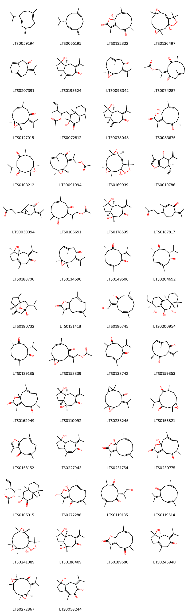{ width=100% }
    <figcaption>Hình ảnh cấu trúc hóa học của 98 hoạt chất thuộc nhóm Prenol lipids gồm ['(-)-germacrene d (LTS0059194)', '(1z,6z,8s)-8-isopropyl-1-methyl-5-methylidenecyclodeca-1,6-diene (LTS0065195)', '(6s,11as)-11a-hydroxy-3,6,10-trimethyl-4h,6h,7h,8h,11h-cyclodeca[b]furan-2,5-dione (LTS0132822)', '5,10,15,15-tetramethyl-4,9,13,14-tetraoxatetracyclo[10.3.0.0³,⁵.0⁸,¹⁰]pentadec-1-en-12-ol (LTS0136497)', 'germacrone (LTS0207391)', '(1s,3as,8as)-1-hydroxy-1,4-dimethyl-7-(propan-2-ylidene)-3,3a,8,8a-tetrahydro-2h-azulen-6-one (LTS0193624)', '(1r,6e,10s)-6,10-dimethyl-3-(propan-2-ylidene)-11-oxabicyclo[8.1.0]undec-6-en-4-one (LTS0098342)', '2-[(1e,4e,8s)-4,8-dimethyl-2,9-dioxocyclodec-4-en-1-ylidene]propyl acetate (LTS0074287)', '(1s,6z,10s)-6,10-dimethyl-3-(propan-2-ylidene)-11-oxabicyclo[8.1.0]undec-6-en-4-one (LTS0127015)', '1-(2-hydroxy-2,5,5,8a-tetramethyl-3-oxo-hexahydronaphthalen-1-yl)-3-methylpent-4-en-2-yl acetate (LTS0072812)', '(1s,3ar,8as)-1-hydroxy-1-methyl-4-methylidene-7-(propan-2-ylidene)-hexahydroazulen-6-one (LTS0078048)', '(6s,11as)-11a-hydroxy-3,6,10-trimethyl-4h,6h,7h,8h,11h-cyclodeca[b]furan-2,5-dione (LTS0083675)', '(1r,4s,7s,10r)-4-isopropyl-1,7-dimethyl-11-oxabicyclo[8.1.0]undecane-3,6-dione (LTS0103212)', '2-[(1s,3e,6e,10s)-6,10-dimethyl-4-oxo-11-oxabicyclo[8.1.0]undec-6-en-3-ylidene]propyl acetate (LTS0091094)', '(1z,3s,5s,8s,10s,12s)-5,10,15,15-tetramethyl-4,9,13,14-tetraoxatetracyclo[10.3.0.0³,⁵.0⁸,¹⁰]pentadec-1-en-12-ol (LTS0169939)', '(6r)-6-ethenyl-3,6-dimethyl-5-(prop-1-en-2-yl)-5,7-dihydro-1-benzofuran-4-one (LTS0019786)', '1-methyl-7-(3-oxobutyl)-4-(propan-2-ylidene)bicyclo[4.1.0]heptan-3-one (LTS0030394)', '2-(4,8-dimethyl-2,9-dioxocyclodec-4-en-1-yl)propyl acetate (LTS0106691)', '(1r,3ar,4s,8as)-1,4-dihydroxy-1,4-dimethyl-7-(propan-2-ylidene)-hexahydroazulen-6-one (LTS0178595)', '3-methyl-4-(3-oxobutyl)-7-(propan-2-ylidene)cyclohept-2-en-1-one (LTS0187817)', '(1r,8ar)-1-hydroxy-1,4-dimethyl-7-(propan-2-ylidene)-3,5,8,8a-tetrahydro-2h-azulen-6-one (LTS0188706)', '(1s,6e,10s)-6,10-dimethyl-3-(propan-2-ylidene)-11-oxabicyclo[8.1.0]undec-6-en-4-one (LTS0134690)', 'curdione (LTS0149506)', '(3r,6e,10s)-3-isopropyl-6,10-dimethylcyclodec-6-ene-1,4-dione (LTS0204692)', '(5s,8s)-9-isopropyl-2-methyl-6-methylidene-11-oxatricyclo[6.2.1.0¹,⁵]undecan-8-ol (LTS0190732)', 'glechomanolide (LTS0121418)', '10-(1-hydroxypropan-2-ylidene)-3,7-dimethylcyclodeca-3,7-dien-1-one (LTS0196745)', '(1r,2r,4bs,8as,9s,10s)-2-ethenyl-2,4b,8,8-tetramethyl-3,4,5,6,7,8a,9,10-octahydro-1h-phenanthrene-1,9,10-triol (LTS0200954)', '(3r,10s)-3-isopropyl-6,10-dimethylcyclodec-6-ene-1,4-dione (LTS0139185)', '2-{6,10-dimethyl-4-oxo-11-oxabicyclo[8.1.0]undec-6-en-3-ylidene}propyl acetate (LTS0153839)', '(6e)-3-isopropyl-6,10-dimethylcyclodec-6-ene-1,4-dione (LTS0138742)', '(6e,10s)-6,10-dimethyl-3-(propan-2-ylidene)cyclodec-6-ene-1,4-dione (LTS0159853)', '(6s,11ar)-3,6,10-trimethyl-4h,6h,7h,8h,11h,11ah-cyclodeca[b]furan-2,5-dione (LTS0162949)', '(1s,3ar,4r,8as)-1,4-dihydroxy-1,4-dimethyl-7-(propan-2-ylidene)-hexahydroazulen-6-one (LTS0110092)', '4,11-dimethyl-8-(propan-2-ylidene)-5-oxatricyclo[9.1.0.0⁴,⁶]dodecan-9-one (LTS0233245)', '4-isopropyl-1,7-dimethyl-11-oxabicyclo[8.1.0]undecane-3,6-dione (LTS0156821)', 'furanodienone (LTS0158152)', '1-hydroxy-1,4-dimethyl-7-(propan-2-ylidene)-3,3a,8,8a-tetrahydro-2h-azulen-6-one (LTS0227943)', '11a-hydroxy-3,6,10-trimethyl-4h,7h,8h,11h-cyclodeca[b]furan-2-one (LTS0231754)', '(6s,11ar)-11a-hydroxy-3,6,10-trimethyl-4h,6h,7h,8h,11h-cyclodeca[b]furan-2,5-dione (LTS0230775)', '(2s,3r)-1-[(1r,2s,4as,8as)-2-hydroxy-2,5,5,8a-tetramethyl-3-oxo-hexahydronaphthalen-1-yl]-3-methylpent-4-en-2-yl acetate (LTS0105315)', '(11ar)-11a-hydroxy-3,6,10-trimethyl-7h,8h,11h-cyclodeca[b]furan-2,4-dione (LTS0272288)', '3-(1-hydroxypropan-2-ylidene)-6,10-dimethylcyclodec-6-ene-1,4-dione (LTS0119135)', '3,7-dimethyl-10-(propan-2-ylidene)cyclodeca-3,7-dien-1-one (LTS0119514)', '(1z,3r,5s,8s,10r,12s)-5,10,15,15-tetramethyl-4,9,13,14-tetraoxatetracyclo[10.3.0.0³,⁵.0⁸,¹⁰]pentadec-1-en-12-ol (LTS0241089)', '(1r,3as,4s,8ar)-1,4-dihydroxy-1,4-dimethyl-7-(propan-2-ylidene)-hexahydroazulen-6-one (LTS0188409)', '3,6,10-trimethyl-4h,6h,7h,8h,11h,11ah-cyclodeca[b]furan-2,5-dione (LTS0189580)', '(1s,8as)-1-hydroxy-1,4-dimethyl-7-(propan-2-ylidene)-3,5,8,8a-tetrahydro-2h-azulen-6-one (LTS0245940)', '(1s,4s,6s,11r)-1,6-dimethyl-9-(propan-2-ylidene)-5,12-dioxatricyclo[9.1.0.0⁴,⁶]dodecan-8-one (LTS0272867)', '1-hydroxy-1,4-dimethyl-7-(propan-2-ylidene)-2,3,8,8a-tetrahydroazulene-5,6-dione (LTS0058244)', '6-methyl-5-(3-oxobutyl)-2-(propan-2-ylidene)cyclohept-4-en-1-one (LTS0274596)', '(1s,3e,6e,10s)-3-(1-hydroxypropan-2-ylidene)-6,10-dimethyl-11-oxabicyclo[8.1.0]undec-6-en-4-one (LTS0242116)', '5-methyl-2-[(2r)-6-methylhept-5-en-2-yl]phenol (LTS0270314)', '11a-hydroxy-3,6,10-trimethyl-7h,8h,11h-cyclodeca[b]furan-2,4-dione (LTS0216327)', '6,10-dimethyl-3-(propan-2-ylidene)cyclodec-6-ene-1,4-dione (LTS0271303)', '(3e,6e,10s)-3-(1-hydroxypropan-2-ylidene)-6,10-dimethylcyclodec-6-ene-1,4-dione (LTS0069064)', 'furanogermenone (LTS0215387)', '(2s)-2-[(1r,4e,8s)-4,8-dimethyl-2,9-dioxocyclodec-4-en-1-yl]propyl acetate (LTS0224422)', 'curcumenone (LTS0218006)', '2-(4,8-dimethyl-2,9-dioxocyclodec-4-en-1-ylidene)propyl acetate (LTS0192765)', '(1s,8as)-1-hydroxy-1,4-dimethyl-7-(propan-2-ylidene)-2,3,8,8a-tetrahydroazulene-5,6-dione (LTS0226771)', '6,10-dimethyl-3-(propan-2-ylidene)-11-oxabicyclo[8.1.0]undec-6-en-4-one (LTS0220246)', 'curcumol (LTS0058151)', '(11ar)-11a-hydroxy-3,6,10-trimethyl-4h,7h,8h,11h-cyclodeca[b]furan-2-one (LTS0058197)', '(1r,4s,6s,11s)-4,11-dimethyl-8-(propan-2-ylidene)-5-oxatricyclo[9.1.0.0⁴,⁶]dodecan-9-one (LTS0169071)', '(1s,3ar,4r,8as)-1-hydroxy-4-methoxy-1,4-dimethyl-7-(propan-2-ylidene)-hexahydroazulen-6-one (LTS0019679)', '(6z)-6,10-dimethyl-3-(propan-2-ylidene)cyclodec-6-ene-1,4-dione (LTS0163973)', '(1s,3as,4s,8as)-1,4-dihydroxy-1,4-dimethyl-7-(propan-2-ylidene)-hexahydroazulen-6-one (LTS0048058)', 'curzerenone (LTS0159473)', 'sclareol (LTS0169228)', 'curdione (LTS0209501)', '(1s,3ar,8as)-1-hydroxy-1,4-dimethyl-7-(propan-2-ylidene)-3,3a,8,8a-tetrahydro-2h-azulen-6-one (LTS0027926)', '(1s,5r,8r)-9-isopropyl-2-methyl-6-methylidene-11-oxatricyclo[6.2.1.0¹,⁵]undecan-8-ol (LTS0042025)', '13-hydroxygermacrone (LTS0200772)', '3-isopropyl-6,10-dimethylcyclodec-6-ene-1,4-dione (LTS0064334)', '1-hydroxy-1-methyl-4-methylidene-7-(propan-2-ylidene)-hexahydroazulen-6-one (LTS0057468)', '(1s,2r,4bs,8as,9s,10s)-2-ethenyl-2,4b,8,8-tetramethyl-3,4,5,6,7,8a,9,10-octahydro-1h-phenanthrene-1,9,10-triol (LTS0064645)', '(3r,6z,10s)-3-isopropyl-6,10-dimethylcyclodec-6-ene-1,4-dione (LTS0258144)', '2-ethenyl-2,4b,8,8-tetramethyl-3,4,5,6,7,8a,9,10-octahydro-1h-phenanthrene-1,9,10-triol (LTS0189586)', '(4r)-3-methyl-4-(3-oxobutyl)-7-(propan-2-ylidene)cyclohept-2-en-1-one (LTS0198577)', '(1s,4s,6s,11s)-1,6-dimethyl-9-(propan-2-ylidene)-5,12-dioxatricyclo[9.1.0.0⁴,⁶]dodecan-8-one (LTS0196400)', '(6s)-6-ethenyl-3,6-dimethyl-5-(prop-1-en-2-yl)-5,7-dihydro-1-benzofuran-4-one (LTS0135704)', '1,4-dihydroxy-1,4-dimethyl-7-(propan-2-ylidene)-hexahydroazulen-6-one (LTS0067388)', '2-[(1s,3z,6e,10s)-6,10-dimethyl-4-oxo-11-oxabicyclo[8.1.0]undec-6-en-3-ylidene]propyl acetate (LTS0063852)', 'p-menth-3-en-1-ol (LTS0108459)', '11a-hydroxy-3,6,10-trimethyl-4h,6h,7h,8h,11h-cyclodeca[b]furan-2,5-dione (LTS0025799)', 'curcumenone (LTS0054071)', '1,6-dimethyl-9-(propan-2-ylidene)-5,12-dioxatricyclo[9.1.0.0⁴,⁶]dodecan-8-one (LTS0026587)', 'delta-cadinene (LTS0019321)', '3-(1-hydroxypropan-2-ylidene)-6,10-dimethyl-11-oxabicyclo[8.1.0]undec-6-en-4-one (LTS0022994)', '1-hydroxy-4-methoxy-1,4-dimethyl-7-(propan-2-ylidene)-hexahydroazulen-6-one (LTS0231521)', '2-methyl-5-[(2r)-6-methylhept-5-en-2-yl]phenol (LTS0246670)', '1-hydroxy-1,4-dimethyl-7-(propan-2-ylidene)-3,5,8,8a-tetrahydro-2h-azulen-6-one (LTS0038467)', '9-isopropyl-2-methyl-6-methylidene-11-oxatricyclo[6.2.1.0¹,⁵]undecan-8-ol (LTS0243106)', '(3e,7e,10e)-10-(1-hydroxypropan-2-ylidene)-3,7-dimethylcyclodeca-3,7-dien-1-one (LTS0124852)', '(1r,3as,8ar)-1-hydroxy-1,4-dimethyl-7-(propan-2-ylidene)-3,3a,8,8a-tetrahydro-2h-azulen-6-one (LTS0044379)', '(5r,6r)-6-ethenyl-3,6-dimethyl-5-(prop-1-en-2-yl)-5,7-dihydro-4h-1-benzofuran (LTS0048127)', '(6s)-6-methyl-5-(3-oxobutyl)-2-(propan-2-ylidene)cyclohept-4-en-1-one (LTS0106571)'].</figcaption>
</figure>
#### Nhóm Steroids and steroid derivatives
<figure markdown="span">
    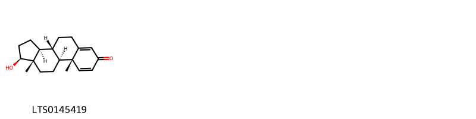{ width=100% }
    <figcaption>Hình ảnh cấu trúc hóa học của 1 hoạt chất thuộc nhóm Steroids and steroid derivatives gồm ['boldenone (LTS0145419)'].</figcaption>
</figure>

---

### Dược dân tộc học

Danh sách các quốc gia có sử dụng *Curcuma aromatica* trong điều trị các bệnh. 

| Country   | Disease                            | Bệnh                                                                                                                                                                                                |
|:----------|:-----------------------------------|:----------------------------------------------------------------------------------------------------------------------------------------------------------------------------------------------------|
| Elsewhere | Cholagogue, Stomachic              | MYMEMORY WARNING: YOU USED ALL AVAILABLE FREE TRANSLATIONS FOR TODAY. NEXT AVAILABLE IN  07 HOURS 48 MINUTES 03 SECONDS VISIT HTTPS://MYMEMORY.TRANSLATED.NET/DOC/USAGELIMITS.PHP TO TRANSLATE MORE |
| India     | nan, Carminative, Fungicide, Tonic | MYMEMORY WARNING: YOU USED ALL AVAILABLE FREE TRANSLATIONS FOR TODAY. NEXT AVAILABLE IN  07 HOURS 48 MINUTES 01 SECONDS VISIT HTTPS://MYMEMORY.TRANSLATED.NET/DOC/USAGELIMITS.PHP TO TRANSLATE MORE |
| US        | Stimulant                          | MYMEMORY WARNING: YOU USED ALL AVAILABLE FREE TRANSLATIONS FOR TODAY. NEXT AVAILABLE IN  07 HOURS 47 MINUTES 58 SECONDS VISIT HTTPS://MYMEMORY.TRANSLATED.NET/DOC/USAGELIMITS.PHP TO TRANSLATE MORE |

---

---
## Curcuma caesia
### Thông tin về thực vật

!!! info "Phân loại thực vật của *Curcuma caesia* từ GIBF:"
    - **Kingdom:** Plantae
    - **Phylum:** Tracheophyta
    - **Order:** Zingiberales
    - **Family:** Zingiberaceae
    - **Genus:** Curcuma
    - **Species:** *Curcuma caesia*

 

| Label (VI)   | Label (EN)   | Scientific Name   | Descriptions (VI)   | Descriptions (EN)                | Also Known As (VI)   | Also Known As (EN)   |
|:-------------|:-------------|:------------------|:--------------------|:---------------------------------|:---------------------|:---------------------|
| N/A          | N/A          | Curcuma caesia    | loài thực vật       | species of plant, Black Turmeric | ['']                 | ['']                 |

#### Phân bố trên thế giới

**Từ CSDL GIBF** Viet Nam, nan, Bhutan, Malaysia, India, Bangladesh, China, Belgium

#### Phân bố tại Việt Nam

**Từ CSDL GIBF**: Không có ghi nhận ở Việt Nam

---
### Thành phần hóa học
        
- Theo cơ sở dữ liệu lotus: Từ loài *Curcuma caesia* đã phân lập và xác định được 3 hoạt chất thuộc về các nhóm Prenol lipids. 

|    | chemicalTaxonomyClassyfireClass   |   smiles_count |
|---:|:----------------------------------|---------------:|
|  0 | Prenol lipids                     |              3 |

#### Nhóm Prenol lipids
<figure markdown="span">
    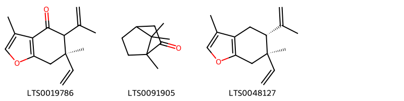{ width=100% }
    <figcaption>Hình ảnh cấu trúc hóa học của 3 hoạt chất thuộc nhóm Prenol lipids gồm ['(6r)-6-ethenyl-3,6-dimethyl-5-(prop-1-en-2-yl)-5,7-dihydro-1-benzofuran-4-one (LTS0019786)', 'camphor (LTS0091905)', '(5r,6r)-6-ethenyl-3,6-dimethyl-5-(prop-1-en-2-yl)-5,7-dihydro-4h-1-benzofuran (LTS0048127)'].</figcaption>
</figure>

---

### Dược dân tộc học

Danh sách các quốc gia có sử dụng *Curcuma caesia* trong điều trị các bệnh. 

| Country   | Disease                          | Bệnh                                                                                                                                                                                                |
|:----------|:---------------------------------|:----------------------------------------------------------------------------------------------------------------------------------------------------------------------------------------------------|
| Elsewhere | Carminative, Cosmetic, Stimulant | MYMEMORY WARNING: YOU USED ALL AVAILABLE FREE TRANSLATIONS FOR TODAY. NEXT AVAILABLE IN  07 HOURS 47 MINUTES 35 SECONDS VISIT HTTPS://MYMEMORY.TRANSLATED.NET/DOC/USAGELIMITS.PHP TO TRANSLATE MORE |

---

---
## Curcuma domestica
### Thông tin về thực vật

!!! info "Phân loại thực vật của *Curcuma longa* từ GIBF:"
    - **Kingdom:** Plantae
    - **Phylum:** Tracheophyta
    - **Order:** Zingiberales
    - **Family:** Zingiberaceae
    - **Genus:** Curcuma
    - **Species:** *Curcuma longa*

 

| Label (VI)   | Label (EN)   | Scientific Name   | Descriptions (VI)   | Descriptions (EN)   | Also Known As (VI)   | Also Known As (EN)   |
|:-------------|:-------------|:------------------|:--------------------|:--------------------|:---------------------|:---------------------|
| N/A          | N/A          | Curcuma domestica | loài thực vật       | species of plant    | ['']                 | ['']                 |

#### Phân bố trên thế giới

**Từ CSDL GIBF** Viet Nam, nan, unknown or invalid, Philippines, French Polynesia, French Guiana, Cameroon, Pitcairn, Indonesia, Haiti, Togo, Saint Vincent and the Grenadines, American Samoa, Côte d’Ivoire, Puerto Rico, Samoa, Burundi, Cuba, Japan, Panama, Brazil, China, Nepal, Chinese Taipei, Niue, Micronesia (Federated States of), Cook Islands, Papua New Guinea, Fiji, Bolivia (Plurinational State of), United States of America

#### Phân bố tại Việt Nam

**Từ CSDL GIBF**: Dak Lak

---
### Thành phần hóa học
        
- Theo cơ sở dữ liệu lotus: Từ loài *Curcuma longa* đã phân lập và xác định được Chưa có hoạt chất nào được phân lập. hoạt chất thuộc về các nhóm Không có hoạt chất nào được phân lập. 

Không có hình ảnh nào được tạo ra

---

### Dược dân tộc học

Danh sách các quốc gia có sử dụng *Curcuma longa* trong điều trị các bệnh. 

| Country     | Disease                                        | Bệnh                                                                                                                                                                                                |
|:------------|:-----------------------------------------------|:----------------------------------------------------------------------------------------------------------------------------------------------------------------------------------------------------|
| China       | Hemostat, Carminative                          | MYMEMORY WARNING: YOU USED ALL AVAILABLE FREE TRANSLATIONS FOR TODAY. NEXT AVAILABLE IN  07 HOURS 47 MINUTES 17 SECONDS VISIT HTTPS://MYMEMORY.TRANSLATED.NET/DOC/USAGELIMITS.PHP TO TRANSLATE MORE |
| Egypt       | Stimulant, Vermifuge                           | MYMEMORY WARNING: YOU USED ALL AVAILABLE FREE TRANSLATIONS FOR TODAY. NEXT AVAILABLE IN  07 HOURS 47 MINUTES 15 SECONDS VISIT HTTPS://MYMEMORY.TRANSLATED.NET/DOC/USAGELIMITS.PHP TO TRANSLATE MORE |
| Elsewhere   | Antiseptic, Apertif, Carminative, Parasiticide | MYMEMORY WARNING: YOU USED ALL AVAILABLE FREE TRANSLATIONS FOR TODAY. NEXT AVAILABLE IN  07 HOURS 47 MINUTES 13 SECONDS VISIT HTTPS://MYMEMORY.TRANSLATED.NET/DOC/USAGELIMITS.PHP TO TRANSLATE MORE |
| Haiti       | Cholagogue, Cholagogue                         | MYMEMORY WARNING: YOU USED ALL AVAILABLE FREE TRANSLATIONS FOR TODAY. NEXT AVAILABLE IN  07 HOURS 47 MINUTES 10 SECONDS VISIT HTTPS://MYMEMORY.TRANSLATED.NET/DOC/USAGELIMITS.PHP TO TRANSLATE MORE |
| India       | Tonic, Vermifuge, Stomachic                    | MYMEMORY WARNING: YOU USED ALL AVAILABLE FREE TRANSLATIONS FOR TODAY. NEXT AVAILABLE IN  07 HOURS 47 MINUTES 08 SECONDS VISIT HTTPS://MYMEMORY.TRANSLATED.NET/DOC/USAGELIMITS.PHP TO TRANSLATE MORE |
| Japan       | Tonic                                          | MYMEMORY WARNING: YOU USED ALL AVAILABLE FREE TRANSLATIONS FOR TODAY. NEXT AVAILABLE IN  07 HOURS 47 MINUTES 06 SECONDS VISIT HTTPS://MYMEMORY.TRANSLATED.NET/DOC/USAGELIMITS.PHP TO TRANSLATE MORE |
| Philippines | Vulnerary                                      | MYMEMORY WARNING: YOU USED ALL AVAILABLE FREE TRANSLATIONS FOR TODAY. NEXT AVAILABLE IN  07 HOURS 47 MINUTES 03 SECONDS VISIT HTTPS://MYMEMORY.TRANSLATED.NET/DOC/USAGELIMITS.PHP TO TRANSLATE MORE |
| Samoa       | Diuretic, Emetic, Poultice                     | MYMEMORY WARNING: YOU USED ALL AVAILABLE FREE TRANSLATIONS FOR TODAY. NEXT AVAILABLE IN  07 HOURS 47 MINUTES 01 SECONDS VISIT HTTPS://MYMEMORY.TRANSLATED.NET/DOC/USAGELIMITS.PHP TO TRANSLATE MORE |
| Tonga       | Antiseptic                                     | MYMEMORY WARNING: YOU USED ALL AVAILABLE FREE TRANSLATIONS FOR TODAY. NEXT AVAILABLE IN  07 HOURS 46 MINUTES 59 SECONDS VISIT HTTPS://MYMEMORY.TRANSLATED.NET/DOC/USAGELIMITS.PHP TO TRANSLATE MORE |
| Trinidad    | Antiseptic                                     | MYMEMORY WARNING: YOU USED ALL AVAILABLE FREE TRANSLATIONS FOR TODAY. NEXT AVAILABLE IN  07 HOURS 46 MINUTES 56 SECONDS VISIT HTTPS://MYMEMORY.TRANSLATED.NET/DOC/USAGELIMITS.PHP TO TRANSLATE MORE |
| Turkey      | Cholagogue, Stimulant, Tonic, Carminative      | MYMEMORY WARNING: YOU USED ALL AVAILABLE FREE TRANSLATIONS FOR TODAY. NEXT AVAILABLE IN  07 HOURS 46 MINUTES 54 SECONDS VISIT HTTPS://MYMEMORY.TRANSLATED.NET/DOC/USAGELIMITS.PHP TO TRANSLATE MORE |

---

---
## Curcuma heyneana
### Thông tin về thực vật

!!! info "Phân loại thực vật của *Curcuma heyneana* từ GIBF:"
    - **Kingdom:** Plantae
    - **Phylum:** Tracheophyta
    - **Order:** Zingiberales
    - **Family:** Zingiberaceae
    - **Genus:** Curcuma
    - **Species:** *Curcuma heyneana*

 

| Label (VI)   | Label (EN)   | Scientific Name   | Descriptions (VI)   | Descriptions (EN)   | Also Known As (VI)   | Also Known As (EN)   |
|:-------------|:-------------|:------------------|:--------------------|:--------------------|:---------------------|:---------------------|
| N/A          | N/A          | Curcuma heyneana  | loài thực vật       | species of plant    | ['']                 | ['']                 |

#### Phân bố trên thế giới

**Từ CSDL GIBF** nan, Myanmar, Indonesia

#### Phân bố tại Việt Nam

**Từ CSDL GIBF**: Không có ghi nhận ở Việt Nam

---
### Thành phần hóa học
        
- Theo cơ sở dữ liệu lotus: Từ loài *Curcuma heyneana* đã phân lập và xác định được 48 hoạt chất thuộc về các nhóm Steroids and steroid derivatives, Prenol lipids, Dihydrofurans. 

|    | chemicalTaxonomyClassyfireClass   |   smiles_count |
|---:|:----------------------------------|---------------:|
|  0 | Dihydrofurans                     |              2 |
|  1 | Prenol lipids                     |             44 |
|  2 | Steroids and steroid derivatives  |              2 |

#### Nhóm Dihydrofurans
<figure markdown="span">
    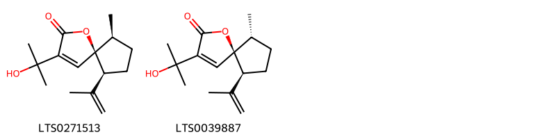{ width=100% }
    <figcaption>Hình ảnh cấu trúc hóa học của 2 hoạt chất thuộc nhóm Dihydrofurans gồm ['(5r,6s,9s)-3-(2-hydroxypropan-2-yl)-6-methyl-9-(prop-1-en-2-yl)-1-oxaspiro[4.4]non-3-en-2-one (LTS0271513)', '(5r,6r,9s)-3-(2-hydroxypropan-2-yl)-6-methyl-9-(prop-1-en-2-yl)-1-oxaspiro[4.4]non-3-en-2-one (LTS0039887)'].</figcaption>
</figure>
#### Nhóm Prenol lipids
<figure markdown="span">
    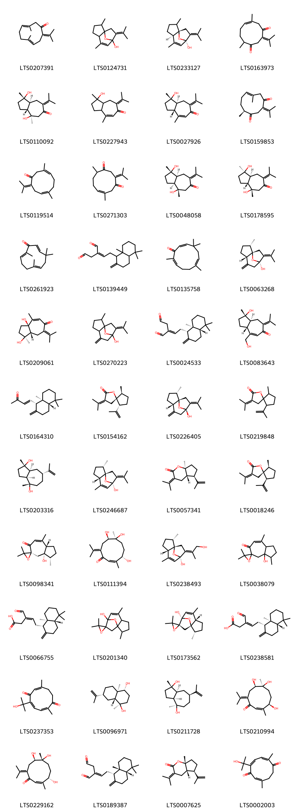{ width=100% }
    <figcaption>Hình ảnh cấu trúc hóa học của 44 hoạt chất thuộc nhóm Prenol lipids gồm ['germacrone (LTS0207391)', 'curcumenol (LTS0124731)', '(1s,5r,8r)-2,6-dimethyl-9-(propan-2-ylidene)-11-oxatricyclo[6.2.1.0¹,⁵]undec-6-en-8-ol (LTS0233127)', '(6z)-6,10-dimethyl-3-(propan-2-ylidene)cyclodec-6-ene-1,4-dione (LTS0163973)', '(1s,3ar,4r,8as)-1,4-dihydroxy-1,4-dimethyl-7-(propan-2-ylidene)-hexahydroazulen-6-one (LTS0110092)', '1-hydroxy-1,4-dimethyl-7-(propan-2-ylidene)-3,3a,8,8a-tetrahydro-2h-azulen-6-one (LTS0227943)', '(1s,3ar,8as)-1-hydroxy-1,4-dimethyl-7-(propan-2-ylidene)-3,3a,8,8a-tetrahydro-2h-azulen-6-one (LTS0027926)', '(6e,10s)-6,10-dimethyl-3-(propan-2-ylidene)cyclodec-6-ene-1,4-dione (LTS0159853)', '3,7-dimethyl-10-(propan-2-ylidene)cyclodeca-3,7-dien-1-one (LTS0119514)', '6,10-dimethyl-3-(propan-2-ylidene)cyclodec-6-ene-1,4-dione (LTS0271303)', '(1s,3as,4s,8as)-1,4-dihydroxy-1,4-dimethyl-7-(propan-2-ylidene)-hexahydroazulen-6-one (LTS0048058)', '(1r,3ar,4s,8as)-1,4-dihydroxy-1,4-dimethyl-7-(propan-2-ylidene)-hexahydroazulen-6-one (LTS0178595)', 'zerumbone (LTS0261923)', '2-[2-(5,5,8a-trimethyl-2-methylidene-hexahydro-1h-naphthalen-1-yl)ethylidene]butanedial (LTS0139449)', '2,6,9,9-tetramethylcycloundeca-2,6,10-trien-1-one (LTS0135758)', '(1s,2s,5s,8r)-2-methyl-6-methylidene-9-(propan-2-ylidene)-11-oxatricyclo[6.2.1.0¹,⁵]undecan-8-ol (LTS0063268)', '(1s,3ar,8ar)-1,3a-dihydroxy-1,4-dimethyl-7-(propan-2-ylidene)-2,3,8,8a-tetrahydroazulen-6-one (LTS0209061)', '2-methyl-6-methylidene-9-(propan-2-ylidene)-11-oxatricyclo[6.2.1.0¹,⁵]undecan-8-ol (LTS0270223)', '(2e)-2-{2-[(1s,4as,8as)-5,5,8a-trimethyl-2-methylidene-hexahydro-1h-naphthalen-1-yl]ethylidene}butanedial (LTS0024533)', '(1s,3ar,8as)-1-hydroxy-4-(hydroxymethyl)-1-methyl-7-(propan-2-ylidene)-3,3a,8,8a-tetrahydro-2h-azulen-6-one (LTS0083643)', '(3e)-4-[(1s,4as,8as)-5,5,8a-trimethyl-2-methylidene-hexahydro-1h-naphthalen-1-yl]but-3-en-2-one (LTS0164310)', '(5r,6s,9r)-6-methyl-9-(prop-1-en-2-yl)-3-(propan-2-ylidene)-1-oxaspiro[4.4]nonan-2-one (LTS0154162)', '(1s,2s,5s,8s)-2-methyl-6-methylidene-9-(propan-2-ylidene)-11-oxatricyclo[6.2.1.0¹,⁵]undecan-8-ol (LTS0226405)', '6-methyl-9-(prop-1-en-2-yl)-3-(propan-2-ylidene)-1-oxaspiro[4.4]nonan-2-one (LTS0219848)', '(1s,3as,4s,7r,8as)-1,4-dimethyl-7-(prop-1-en-2-yl)-octahydroazulene-1,4-diol (LTS0203316)', '(1s,2s,5s,8r)-2,6-dimethyl-9-(propan-2-ylidene)-11-oxatricyclo[6.2.1.0¹,⁵]undec-6-en-8-ol (LTS0246687)', '(4as,5r,7as)-7a-methyl-5-(prop-1-en-2-yl)-3-(propan-2-ylidene)-tetrahydro-4h-cyclopenta[b]pyran-2-one (LTS0057341)', '(5r,6s,9s)-6-methyl-9-(prop-1-en-2-yl)-3-(propan-2-ylidene)-1-oxaspiro[4.4]nonan-2-one (LTS0018246)', "(3s,3as,5s,8as)-3a-hydroxy-3,3',3',8-tetramethyl-2,3,4,8a-tetrahydro-1h-spiro[azulene-5,2'-oxiran]-6-one (LTS0098341)", '(2z,4s,7s,8r)-4,7,8-trihydroxy-3,7-dimethyl-10-(propan-2-ylidene)cyclodec-2-en-1-one (LTS0111394)', '(1s,2s,5s,8r,9e)-9-(1-hydroxypropan-2-ylidene)-2,6-dimethyl-11-oxatricyclo[6.2.1.0¹,⁵]undec-6-en-8-ol (LTS0238493)', "3a-hydroxy-3,3',3',8-tetramethyl-2,3,4,8a-tetrahydro-1h-spiro[azulene-5,2'-oxiran]-6-one (LTS0038079)", '5-[(1s,4as,8as)-5,5,8a-trimethyl-2-methylidene-hexahydro-1h-naphthalen-1-yl]-3-formylpent-3-enoic acid (LTS0066755)', "2',3,3,6'-tetramethyl-11'-oxaspiro[oxirane-2,9'-tricyclo[6.2.1.0¹,⁵]undecan]-6'-en-8'-ol (LTS0201340)", "(1's,2r,2's,5's,8'r)-2',3,3,6'-tetramethyl-11'-oxaspiro[oxirane-2,9'-tricyclo[6.2.1.0¹,⁵]undecan]-6'-en-8'-ol (LTS0173562)", '(3z)-5-[(1s,4as,8as)-5,5,8a-trimethyl-2-methylidene-hexahydro-1h-naphthalen-1-yl]-3-formylpent-3-enoic acid (LTS0238581)', '(7z)-5-(2-hydroxypropan-2-yl)-2,8-dimethylcyclodeca-2,4,7-triene-1,6-dione (LTS0237353)', 'cyperusol c (LTS0096971)', '(1s,3as,4r,7s,8as)-1,4-dimethyl-7-(prop-1-en-2-yl)-octahydroazulene-1,4-diol (LTS0211728)', '(2z,4r,7s,8r)-4,7,8-trihydroxy-3,7-dimethyl-10-(propan-2-ylidene)cyclodec-2-en-1-one (LTS0210994)', '(2z,4s,7r,8r)-4,7,8-trihydroxy-3,7-dimethyl-10-(propan-2-ylidene)cyclodec-2-en-1-one (LTS0229162)', '(2e)-2-{2-[(1s,4as,8ar)-5,5,8a-trimethyl-2-methylidene-hexahydro-1h-naphthalen-1-yl]ethylidene}butanedial (LTS0189387)', '(4as,5r,7ar)-7a-methyl-5-(prop-1-en-2-yl)-3-(propan-2-ylidene)-tetrahydro-4h-cyclopenta[b]pyran-2-one (LTS0007625)', '(2z,4z,7z)-5-(2-hydroxypropan-2-yl)-2,8-dimethylcyclodeca-2,4,7-triene-1,6-dione (LTS0002003)'].</figcaption>
</figure>
#### Nhóm Steroids and steroid derivatives
<figure markdown="span">
    { width=100% }
    <figcaption>Hình ảnh cấu trúc hóa học của 2 hoạt chất thuộc nhóm Steroids and steroid derivatives gồm ['phytosterol (LTS0029311)', 'stigmasterol (LTS0024262)'].</figcaption>
</figure>

---

### Dược dân tộc học

Danh sách các quốc gia có sử dụng *Curcuma heyneana* trong điều trị các bệnh. 

| Country   | Disease   | Bệnh                                                                                                                                                                                                |
|:----------|:----------|:----------------------------------------------------------------------------------------------------------------------------------------------------------------------------------------------------|
| Java      | Deodorant | MYMEMORY WARNING: YOU USED ALL AVAILABLE FREE TRANSLATIONS FOR TODAY. NEXT AVAILABLE IN  07 HOURS 46 MINUTES 38 SECONDS VISIT HTTPS://MYMEMORY.TRANSLATED.NET/DOC/USAGELIMITS.PHP TO TRANSLATE MORE |

---

---
## Curcuma longa
### Thông tin về thực vật

!!! info "Phân loại thực vật của *Curcuma longa* từ GIBF:"
    - **Kingdom:** Plantae
    - **Phylum:** Tracheophyta
    - **Order:** Zingiberales
    - **Family:** Zingiberaceae
    - **Genus:** Curcuma
    - **Species:** *Curcuma longa*

 

| Label (VI)   | Label (EN)   | Scientific Name   | Descriptions (VI)   | Descriptions (EN)   | Also Known As (VI)   | Also Known As (EN)                               |
|:-------------|:-------------|:------------------|:--------------------|:--------------------|:---------------------|:-------------------------------------------------|
| N/A          | N/A          | Curcuma longa     |                     | plant used as spice | ['']                 | ['Indian saffron', 'turmeric', 'turmeric plant'] |

#### Phân bố trên thế giới

**Từ CSDL GIBF** Viet Nam, Thailand, El Salvador, Philippines, Guadeloupe, French Polynesia, French Guiana, Lao People’s Democratic Republic, Martinique, Singapore, Australia, Indonesia, Pakistan, Sri Lanka, Bhutan, Côte d’Ivoire, Malaysia, Puerto Rico, India, Réunion, Mayotte, Mauritius, Bangladesh, Guam, Cambodia, Barbados, Myanmar, Panama, Brazil, Nepal, Hong Kong, Switzerland, Chinese Taipei, Micronesia (Federated States of), Costa Rica, New Caledonia, United States of America

#### Phân bố tại Việt Nam

**Từ CSDL GIBF**: Không có ghi nhận ở Việt Nam

---
### Thành phần hóa học
        
- Theo cơ sở dữ liệu lotus: Từ loài *Curcuma longa* đã phân lập và xác định được 198 hoạt chất thuộc về các nhóm Organooxygen compounds, Coumarins and derivatives, Unsaturated hydrocarbons, Oxanes, Prenol lipids, Fatty Acyls, Diarylheptanoids, Phenols, Cinnamic acids and derivatives, Phenol ethers, Dihydrofurans, Steroids and steroid derivatives, Benzene and substituted derivatives. 

|    | chemicalTaxonomyClassyfireClass     |   smiles_count |
|---:|:------------------------------------|---------------:|
|  0 | Benzene and substituted derivatives |              7 |
|  1 | Cinnamic acids and derivatives      |             13 |
|  2 | Coumarins and derivatives           |              1 |
|  3 | Diarylheptanoids                    |             35 |
|  4 | Dihydrofurans                       |              1 |
|  5 | Fatty Acyls                         |              7 |
|  6 | Organooxygen compounds              |              2 |
|  7 | Oxanes                              |              2 |
|  8 | Phenol ethers                       |              1 |
|  9 | Phenols                             |              5 |
| 10 | Prenol lipids                       |            112 |
| 11 | Steroids and steroid derivatives    |              2 |
| 12 | Unsaturated hydrocarbons            |              1 |

#### Nhóm Benzene and substituted derivatives
<figure markdown="span">
    { width=100% }
    <figcaption>Hình ảnh cấu trúc hóa học của 7 hoạt chất thuộc nhóm Benzene and substituted derivatives gồm ['p-cymen-8-ol (LTS0223641)', '1-p-tolylethanol (LTS0166437)', "4-amino-3-[(1e)-2-{4'-[(1e)-2-(1-amino-4-sulfonaphthalen-2-yl)diazen-1-yl]-[1,1'-biphenyl]-4-yl}diazen-1-yl]naphthalene-1-sulfonic acid (LTS0157764)", "4-amino-3-(2-{4'-[2-(1-amino-4-sulfonaphthalen-2-yl)diazen-1-yl]-[1,1'-biphenyl]-4-yl}diazen-1-yl)naphthalene-1-sulfonic acid (LTS0141317)", '(-)-1-p-tolylethanol (LTS0254957)', 'dichlofluanid (LTS0097843)', 'chlorothalonil (LTS0104052)'].</figcaption>
</figure>
#### Nhóm Cinnamic acids and derivatives
<figure markdown="span">
    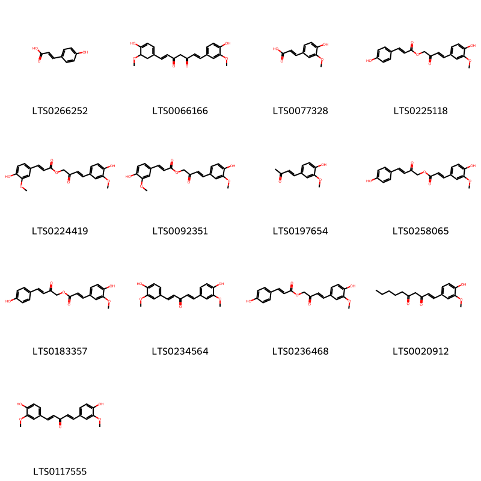{ width=100% }
    <figcaption>Hình ảnh cấu trúc hóa học của 13 hoạt chất thuộc nhóm Cinnamic acids and derivatives gồm ['para-coumaric acid (LTS0266252)', '(1e,6e)-1-(4-hydroxy-3-methoxyphenyl)-7-(4-hydroxy-5-methoxycyclohexa-1,3-dien-1-yl)hepta-1,6-diene-3,5-dione (LTS0066166)', 'ferulic acid (LTS0077328)', '(3e)-4-(4-hydroxy-3-methoxyphenyl)-2-oxobut-3-en-1-yl (2e)-3-(4-hydroxyphenyl)prop-2-enoate (LTS0225118)', '(3e)-4-(4-hydroxy-3-methoxyphenyl)-2-oxobut-3-en-1-yl (2e)-3-(4-hydroxy-3-methoxyphenyl)prop-2-enoate (LTS0224419)', '4-(4-hydroxy-3-methoxyphenyl)-2-oxobut-3-en-1-yl 3-(4-hydroxy-3-methoxyphenyl)prop-2-enoate (LTS0092351)', 'dehydrozingerone (LTS0197654)', '4-(4-hydroxyphenyl)-2-oxobut-3-en-1-yl 3-(4-hydroxy-3-methoxyphenyl)prop-2-enoate (LTS0258065)', '(3e)-4-(4-hydroxyphenyl)-2-oxobut-3-en-1-yl (2e)-3-(4-hydroxy-3-methoxyphenyl)prop-2-enoate (LTS0183357)', '1,5-bis(4-hydroxy-3-methoxyphenyl)penta-1,4-dien-3-one (LTS0234564)', '4-(4-hydroxy-3-methoxyphenyl)-2-oxobut-3-en-1-yl 3-(4-hydroxyphenyl)prop-2-enoate (LTS0236468)', '(1e)-1-(4-hydroxy-3-methoxyphenyl)dec-1-ene-3,5-dione (LTS0020912)', '(1e,4e)-1,5-bis(4-hydroxy-3-methoxyphenyl)penta-1,4-dien-3-one (LTS0117555)'].</figcaption>
</figure>
#### Nhóm Coumarins and derivatives
<figure markdown="span">
    { width=100% }
    <figcaption>Hình ảnh cấu trúc hóa học của 1 hoạt chất thuộc nhóm Coumarins and derivatives gồm ['2h-1-benzopyran-2-one (LTS0069773)'].</figcaption>
</figure>
#### Nhóm Diarylheptanoids
<figure markdown="span">
    { width=100% }
    <figcaption>Hình ảnh cấu trúc hóa học của 35 hoạt chất thuộc nhóm Diarylheptanoids gồm ['curcumin (LTS0114521)', 'demethoxycurcumin (LTS0035544)', 'bisdemethoxycurcumin (LTS0068999)', 'turmeric (LTS0264138)', 'bisdemethoxycurcumin (LTS0255107)', 'tumeric (LTS0167680)', '1,7-bis(4-hydroxyphenyl)hepta-1,4,6-trien-3-one (LTS0187231)', '(1e,4e,6e)-1,7-bis(4-hydroxyphenyl)hepta-1,4,6-trien-3-one (LTS0209030)', 'desmethoxycurcumin (LTS0014006)', '7-hydroxy-1,7-bis(4-hydroxy-3-methoxyphenyl)hept-1-ene-3,5-dione (LTS0095104)', '(1e,4z,6e)-5-hydroxy-1,7-bis(4-hydroxyphenyl)hepta-1,4,6-trien-3-one (LTS0119040)', '(1e,7s)-7-hydroxy-1,7-bis(4-hydroxy-3-methoxyphenyl)hept-1-ene-3,5-dione (LTS0238771)', '5-hydroxy-1,7-bis(4-hydroxyphenyl)hepta-1,4,6-trien-3-one (LTS0052041)', 'dihydrocurcumin (LTS0014672)', '(1e,6e)-1-(4-hydroxy-3,5-dimethoxyphenyl)-7-(4-hydroxy-3-methoxyphenyl)hepta-1,6-diene-3,5-dione (LTS0130086)', '(1e,4z,6e)-5-hydroxy-7-(4-hydroxy-3-methoxyphenyl)-1-(4-hydroxyphenyl)hepta-1,4,6-trien-3-one (LTS0109422)', '(4z,6e)-5-hydroxy-1,7-bis(4-hydroxy-3-methoxyphenyl)hepta-4,6-dien-3-one (LTS0047114)', 'monodemethylcurcumin (LTS0076616)', '(1e)-7-hydroxy-1,7-bis(4-hydroxy-3-methoxyphenyl)hept-1-ene-3,5-dione (LTS0078525)', '5-hydroxy-7-(4-hydroxy-3-methoxyphenyl)-1-(4-hydroxyphenyl)hepta-4,6-dien-3-one (LTS0161650)', '(1e,4z,6e)-5-hydroxy-1-(4-hydroxy-3-methoxyphenyl)-7-(4-hydroxyphenyl)hepta-1,4,6-trien-3-one (LTS0007181)', '5-hydroxy-1-(4-hydroxy-3-methoxyphenyl)-7-(4-hydroxyphenyl)hepta-1,4,6-trien-3-one (LTS0149064)', '(6e)-7-(4-hydroxy-3-methoxyphenyl)-1-(4-hydroxyphenyl)hepta-1,6-diene-3,5-dione (LTS0158329)', '5-hydroxy-1,7-bis(4-hydroxyphenyl)hepta-4,6-dien-3-one (LTS0174001)', '(1e)-1,7-bis(4-hydroxyphenyl)hept-1-ene-3,5-dione (LTS0109747)', '5-hydroxy-1,7-bis(4-hydroxy-3-methoxyphenyl)hepta-4,6-dien-3-one (LTS0237969)', '1-(3,4-dihydroxyphenyl)-7-(4-hydroxy-3-methoxyphenyl)hepta-1,6-diene-3,5-dione (LTS0214983)', '1,7-bis(4-hydroxy-3-methoxyphenyl)hepta-1,4,6-trien-3-one (LTS0240194)', 'tetrahydrocurcumin (LTS0228922)', '(4z,6e)-5-hydroxy-1,7-bis(4-hydroxyphenyl)hepta-4,6-dien-3-one (LTS0170870)', '5-hydroxy-7-(4-hydroxy-3-methoxyphenyl)-1-(4-hydroxyphenyl)hepta-1,4,6-trien-3-one (LTS0177194)', '(1e,4e,6e)-1,7-bis(4-hydroxy-3-methoxyphenyl)hepta-1,4,6-trien-3-one (LTS0065392)', '1,7-bis(4-hydroxyphenyl)hept-1-ene-3,5-dione (LTS0005122)', '(4z,6e)-5-hydroxy-7-(4-hydroxy-3-methoxyphenyl)-1-(4-hydroxyphenyl)hepta-4,6-dien-3-one (LTS0247459)', '5-hydroxy-1,7-bis(4-hydroxy-3-methoxyphenyl)hepta-1,4,6-trien-3-one (LTS0102730)'].</figcaption>
</figure>
#### Nhóm Dihydrofurans
<figure markdown="span">
    { width=100% }
    <figcaption>Hình ảnh cấu trúc hóa học của 1 hoạt chất thuộc nhóm Dihydrofurans gồm ['2-methyl-3h-furan-2-ol (LTS0275973)'].</figcaption>
</figure>
#### Nhóm Fatty Acyls
<figure markdown="span">
    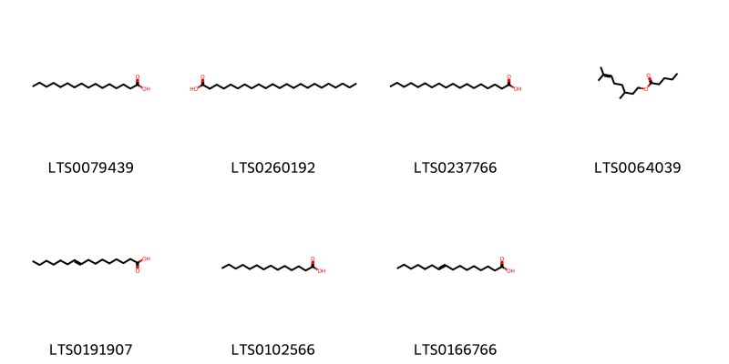{ width=100% }
    <figcaption>Hình ảnh cấu trúc hóa học của 7 hoạt chất thuộc nhóm Fatty Acyls gồm ['palmitic acid (LTS0079439)', 'tricosanoic acid (LTS0260192)', 'stearic acid (LTS0237766)', 'citronellyl valerate (LTS0064039)', 'hexadecenoate (LTS0191907)', 'myristic acid (LTS0102566)', '9-hexadecenoic acid (LTS0166766)'].</figcaption>
</figure>
#### Nhóm Organooxygen compounds
<figure markdown="span">
    { width=100% }
    <figcaption>Hình ảnh cấu trúc hóa học của 2 hoạt chất thuộc nhóm Organooxygen compounds gồm ['2-nonadecanone (LTS0035904)', '2-acetyl-4-methylphenol (LTS0203703)'].</figcaption>
</figure>
#### Nhóm Oxanes
<figure markdown="span">
    { width=100% }
    <figcaption>Hình ảnh cấu trúc hóa học của 2 hoạt chất thuộc nhóm Oxanes gồm ['1,8-cineole (LTS0166505)', 'eucalyptol (LTS0051374)'].</figcaption>
</figure>
#### Nhóm Phenol ethers
<figure markdown="span">
    { width=100% }
    <figcaption>Hình ảnh cấu trúc hóa học của 1 hoạt chất thuộc nhóm Phenol ethers gồm ['(e)-anethole (LTS0009997)'].</figcaption>
</figure>
#### Nhóm Phenols
<figure markdown="span">
    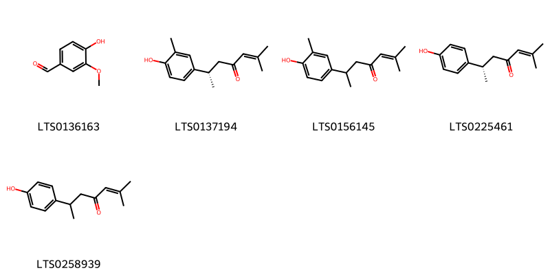{ width=100% }
    <figcaption>Hình ảnh cấu trúc hóa học của 5 hoạt chất thuộc nhóm Phenols gồm ['vanillin (LTS0136163)', '(6s)-6-(4-hydroxy-3-methylphenyl)-2-methylhept-2-en-4-one (LTS0137194)', '6-(4-hydroxy-3-methylphenyl)-2-methylhept-2-en-4-one (LTS0156145)', '(6s)-6-(4-hydroxyphenyl)-2-methylhept-2-en-4-one (LTS0225461)', '6-(4-hydroxyphenyl)-2-methylhept-2-en-4-one (LTS0258939)'].</figcaption>
</figure>
#### Nhóm Prenol lipids
<figure markdown="span">
    { width=100% }
    <figcaption>Hình ảnh cấu trúc hóa học của 112 hoạt chất thuộc nhóm Prenol lipids gồm ['germacrone (LTS0207391)', 'curcumenol (LTS0124731)', '(6e)-3-isopropyl-6,10-dimethylcyclodec-6-ene-1,4-dione (LTS0138742)', 'camphor (LTS0091905)', 'β-pinene (LTS0117550)', 'α pinene (LTS0132416)', 'linalool, (+-)- (LTS0128839)', 'borneol (LTS0264960)', 'caryophyllene (LTS0085212)', '(1s,5r,8r)-2,6-dimethyl-9-(propan-2-ylidene)-11-oxatricyclo[6.2.1.0¹,⁵]undec-6-en-8-ol (LTS0233127)', '(6z)-6,10-dimethyl-3-(propan-2-ylidene)cyclodec-6-ene-1,4-dione (LTS0163973)', 'terpineol (LTS0136148)', 'camphene (LTS0267242)', '(1s,3ar,4r,8as)-1,4-dihydroxy-1,4-dimethyl-7-(propan-2-ylidene)-hexahydroazulen-6-one (LTS0110092)', '1-hydroxy-1,4-dimethyl-7-(propan-2-ylidene)-3,3a,8,8a-tetrahydro-2h-azulen-6-one (LTS0227943)', 'ar-turmerone (LTS0260407)', '3-{2-[(4ar,8as)-5,5,8a-trimethyl-2-methylidene-hexahydro-1h-naphthalen-1-yl]ethenyl}furan (LTS0071838)', '(1s,3ar,8as)-1-hydroxy-1,4-dimethyl-7-(propan-2-ylidene)-3,3a,8,8a-tetrahydro-2h-azulen-6-one (LTS0027926)', '(2s,4r)-1,7,7-trimethylbicyclo[2.2.1]heptan-2-ol (LTS0010050)', '2-methyl-6-(4-methylphenyl)hept-2-en-4-ol (LTS0101030)', 'α-myrcene (LTS0115731)', '(1s,6e,10s)-6,10-dimethyl-3-(propan-2-ylidene)-11-oxabicyclo[8.1.0]undec-6-en-4-one (LTS0134690)', 'furanodienone (LTS0143300)', '2-methyl-6-(4-methylidenecyclohex-2-en-1-yl)hept-2-en-4-one (LTS0145225)', '(6e,10s)-6,10-dimethyl-3-(propan-2-ylidene)cyclodec-6-ene-1,4-dione (LTS0159853)', 'furanodienone (LTS0227342)', '(1r,3as,4s,8ar)-1,4-dihydroxy-1,4-dimethyl-7-(propan-2-ylidene)-hexahydroazulen-6-one (LTS0188409)', '6,10-dimethyl-3-(propan-2-ylidene)cyclodec-6-ene-1,4-dione (LTS0271303)', '6,10-dimethyl-3-(propan-2-ylidene)-11-oxabicyclo[8.1.0]undec-6-en-4-one (LTS0220246)', '1,4-dihydroxy-1,4-dimethyl-7-(propan-2-ylidene)-hexahydroazulen-6-one (LTS0067388)', 'curcumenone (LTS0054071)', '(1r,3as,8ar)-1-hydroxy-1,4-dimethyl-7-(propan-2-ylidene)-3,3a,8,8a-tetrahydro-2h-azulen-6-one (LTS0044379)', '(1s,3as,8as)-1-hydroxy-1,4-dimethyl-7-(propan-2-ylidene)-3,3a,8,8a-tetrahydro-2h-azulen-6-one (LTS0193624)', '(1s,3ar,8as)-1-hydroxy-1-methyl-4-methylidene-7-(propan-2-ylidene)-hexahydroazulen-6-one (LTS0078048)', '1-methyl-7-(3-oxobutyl)-4-(propan-2-ylidene)bicyclo[4.1.0]heptan-3-one (LTS0030394)', 'cymene (LTS0181568)', 'zerumbone (LTS0261923)', 'limonene,  (LTS0155981)', '2,6,9,9-tetramethylcycloundeca-2,6,10-trien-1-one (LTS0135758)', 'curcumenone (LTS0218006)', 'sabinene (LTS0224133)', '1-hydroxy-1-methyl-4-methylidene-7-(propan-2-ylidene)-hexahydroazulen-6-one (LTS0057468)', 'curcumene (LTS0190074)', 'bisacurone (LTS0007825)', 'ar-(+/-)-turmerone (LTS0094106)', '2-methyl-5-[(2r)-6-methylhept-5-en-2-yl]phenol (LTS0246670)', 'zederone (LTS0039658)', '(6e)-2,6-dimethyl-10-methylidenedodeca-2,6-diene (LTS0154516)', '(-)-germacrene d (LTS0059194)', 'carvone (LTS0196605)', 'bisacurone (LTS0109576)', '(r)-β-bisabolene (LTS0077209)', 'β-sesquiphellandrene (LTS0106193)', 'terpinolene (LTS0104525)', '3-[(2s)-6-methylhept-5-en-2-yl]-6-methylidenecyclohex-1-ene (LTS0195839)', 'monoterpenes (LTS0106881)', '(-)-α-curcumene (LTS0216936)', '(1z,6z,8s)-8-isopropyl-1-methyl-5-methylidenecyclodeca-1,6-diene (LTS0065195)', '2-methyl-6-(4-methylcyclohexa-2,4-dien-1-yl)hept-2-en-4-one (LTS0010618)', '(3r,5s,8e)-5,9,14-trimethyl-4,12-dioxatricyclo[9.3.0.0³,⁵]tetradeca-1(11),8,13-trien-2-one (LTS0147972)', '2-methyl-6-(4-methylcyclohexa-1,4-dien-1-yl)hept-2-en-4-one (LTS0013558)', '(6s)-2-methyl-6-[(1r)-4-methylidenecyclohex-2-en-1-yl]hept-2-en-4-one (LTS0014383)', '(1s,3as,8ar)-1,8a-dihydroxy-1,4-dimethyl-7-(propan-2-ylidene)-2,3,3a,8-tetrahydroazulen-6-one (LTS0016771)', '(6r)-2-methyl-6-(4-methylphenyl)hept-2-en-4-one (LTS0128619)', '(-)-β-bisabolene (LTS0009940)', '(4r,6s)-2-methyl-6-(4-methylphenyl)hept-2-en-4-ol (LTS0131383)', 'carvone, (+)- (LTS0027671)', 'caryophyllane (LTS0175300)', 'menthofuran (LTS0026526)', 'zingiberene (LTS0085287)', '6-(3-hydroxy-4-methylphenyl)-2-methylhept-2-en-4-one (LTS0094180)', '6-(2-hydroxy-4-methylphenyl)-2-methylhept-2-en-4-one (LTS0083415)', '(1s,2s,5r)-2-methyl-5-[(2s)-6-methylhept-5-en-2-yl]cyclohex-3-ene-1,2-diol (LTS0080300)', '3,9-epoxy-p-mentha-3,8-diene (LTS0035633)', '(+)-sabinene (LTS0110694)', '2-[(1e,3z,7z)-4,8-dimethyl-10-oxocyclodeca-3,7-dien-1-ylidene]propanal (LTS0095743)', 'turmerone (LTS0181864)', '2-methyl-5-[(2s)-6-methylhept-5-en-2-yl]cyclohexa-1,3-diene (LTS0030348)', '2-[(1e,3e,7e)-4,8-dimethyl-10-oxocyclodeca-3,7-dien-1-ylidene]propanal (LTS0118092)', '(6s)-6-(2-hydroxy-4-methylphenyl)-2-methylhept-2-en-4-one (LTS0275269)', '(6s)-6-(3-hydroxy-4-methylphenyl)-2-methylhept-2-en-4-one (LTS0259482)', '(5r,6r)-5-hydroxy-2-methyl-6-(4-methylphenyl)hept-2-en-4-one (LTS0167394)', '6-(4-hydroxy-4-methylcyclohex-2-en-1-yl)-2-methylhept-2-en-4-one (LTS0164215)', 'citronella (LTS0151257)', '(6s)-3-methyl-6-[(2s)-6-methyl-4-oxohept-5-en-2-yl]cyclohex-2-en-1-one (LTS0163392)', '(z)-γ-bisabolene (LTS0143321)', 'phellandrene (LTS0157173)', '2-(4,8-dimethyl-10-oxocyclodeca-3,7-dien-1-ylidene)propanal (LTS0145134)', '(6s,7r,10s)-7-isopropyl-4,10-dimethyltricyclo[4.4.0.0¹,⁵]dec-3-ene (LTS0137587)', '2-methyl-5-(6-methylhept-5-en-2-yl)cyclohex-3-ene-1,2-diol (LTS0168784)', '(-)-cis-sabinol (LTS0271116)', '2-methyl-5-(6-methylhept-5-en-2-yl)cyclohex-2-ene-1,4-diol (LTS0255120)', '(2z)-2-{2-[(1s,4as,8as)-5,5,8a-trimethyl-2-methylidene-hexahydro-1h-naphthalen-1-yl]ethylidene}butanedial (LTS0126231)', 'α-bergamotene (LTS0226115)', '1,8a-dihydroxy-1,4-dimethyl-7-(propan-2-ylidene)-2,3,3a,8-tetrahydroazulen-6-one (LTS0094315)', '(6s)-6-[(1r,4r)-4-hydroxy-4-methylcyclohex-2-en-1-yl]-2-methylhept-2-en-4-one (LTS0220112)', '3-methyl-6-(6-methyl-4-oxohept-5-en-2-yl)cyclohex-2-en-1-one (LTS0055851)', '(+)-α-phellandrene (LTS0234318)', '(5z)-2-methyl-6-[(1r)-4-methylcyclohex-3-en-1-yl]hepta-2,5-dien-4-one (LTS0199672)', '(+)-borneol (LTS0059936)', '4-(6-methyl-4-oxohept-5-en-2-yl)benzaldehyde (LTS0235015)', '(1r,4s,5s)-2-methyl-5-[(2s)-6-methylhept-5-en-2-yl]cyclohex-2-ene-1,4-diol (LTS0174004)', '3-methyl-6-(6-methylhept-5-en-2-yl)cyclohex-2-en-1-one (LTS0012155)', 'caryophyllene (LTS0131870)', 'd-camphor (LTS0002057)', '4-[(2s)-6-methyl-4-oxohept-5-en-2-yl]benzaldehyde (LTS0019562)', 'nerol (LTS0244289)', '(6s)-2-methyl-6-[(1r)-4-methylcyclohexa-2,4-dien-1-yl]hept-2-en-4-one (LTS0031450)', '(1r,2s,5r,8s)-2,6-dimethyl-9-(propan-2-ylidene)-11-oxatricyclo[6.2.1.0¹,⁵]undec-6-en-8-ol (LTS0071564)', '(6s)-3-methyl-6-[(2s)-6-methylhept-5-en-2-yl]cyclohex-2-en-1-one (LTS0039821)', '(6r)-3-methyl-6-[(2s)-6-methylhept-5-en-2-yl]cyclohex-2-en-1-one (LTS0111849)', '5-hydroxy-2-methyl-6-(4-methylphenyl)hept-2-en-4-one (LTS0107081)'].</figcaption>
</figure>
#### Nhóm Steroids and steroid derivatives
<figure markdown="span">
    { width=100% }
    <figcaption>Hình ảnh cấu trúc hóa học của 2 hoạt chất thuộc nhóm Steroids and steroid derivatives gồm ['phytosterol (LTS0029311)', 'stigmasterol (LTS0024262)'].</figcaption>
</figure>
#### Nhóm Unsaturated hydrocarbons
<figure markdown="span">
    { width=100% }
    <figcaption>Hình ảnh cấu trúc hóa học của 1 hoạt chất thuộc nhóm Unsaturated hydrocarbons gồm ['α terpinene (LTS0232891)'].</figcaption>
</figure>

---

### Dược dân tộc học

Danh sách các quốc gia có sử dụng *Curcuma longa* trong điều trị các bệnh. 

| Country     | Disease                         | Bệnh                                                                                                                                                                                                |
|:------------|:--------------------------------|:----------------------------------------------------------------------------------------------------------------------------------------------------------------------------------------------------|
| China       | Stomachic, Cholagogue, Hemostat | MYMEMORY WARNING: YOU USED ALL AVAILABLE FREE TRANSLATIONS FOR TODAY. NEXT AVAILABLE IN  07 HOURS 46 MINUTES 19 SECONDS VISIT HTTPS://MYMEMORY.TRANSLATED.NET/DOC/USAGELIMITS.PHP TO TRANSLATE MORE |
| Chinese     | Stomachic                       | MYMEMORY WARNING: YOU USED ALL AVAILABLE FREE TRANSLATIONS FOR TODAY. NEXT AVAILABLE IN  07 HOURS 46 MINUTES 17 SECONDS VISIT HTTPS://MYMEMORY.TRANSLATED.NET/DOC/USAGELIMITS.PHP TO TRANSLATE MORE |
| Java        | Cosmetic, Lactagogue            | MYMEMORY WARNING: YOU USED ALL AVAILABLE FREE TRANSLATIONS FOR TODAY. NEXT AVAILABLE IN  07 HOURS 46 MINUTES 14 SECONDS VISIT HTTPS://MYMEMORY.TRANSLATED.NET/DOC/USAGELIMITS.PHP TO TRANSLATE MORE |
| Malaya      | Tonic, Diuretic                 | MYMEMORY WARNING: YOU USED ALL AVAILABLE FREE TRANSLATIONS FOR TODAY. NEXT AVAILABLE IN  07 HOURS 46 MINUTES 12 SECONDS VISIT HTTPS://MYMEMORY.TRANSLATED.NET/DOC/USAGELIMITS.PHP TO TRANSLATE MORE |
| Philippines | Vulnerary                       | MYMEMORY WARNING: YOU USED ALL AVAILABLE FREE TRANSLATIONS FOR TODAY. NEXT AVAILABLE IN  07 HOURS 46 MINUTES 10 SECONDS VISIT HTTPS://MYMEMORY.TRANSLATED.NET/DOC/USAGELIMITS.PHP TO TRANSLATE MORE |

---

---
## Curcuma mangga
### Thông tin về thực vật

!!! info "Phân loại thực vật của *Curcuma mangga* từ GIBF:"
    - **Kingdom:** Plantae
    - **Phylum:** Tracheophyta
    - **Order:** Zingiberales
    - **Family:** Zingiberaceae
    - **Genus:** Curcuma
    - **Species:** *Curcuma mangga*

 

| Label (VI)   | Label (EN)   | Scientific Name   | Descriptions (VI)   | Descriptions (EN)   | Also Known As (VI)   | Also Known As (EN)   |
|:-------------|:-------------|:------------------|:--------------------|:--------------------|:---------------------|:---------------------|
| N/A          | N/A          | Curcuma mangga    | loài thực vật       | species of plant    | ['']                 | ['']                 |

#### Phân bố trên thế giới

**Từ CSDL GIBF** nan, unknown or invalid, United Kingdom of Great Britain and Northern Ireland, Thailand, India, Réunion, Indonesia

#### Phân bố tại Việt Nam

**Từ CSDL GIBF**: Không có ghi nhận ở Việt Nam

---
### Thành phần hóa học
        
- Theo cơ sở dữ liệu lotus: Từ loài *Curcuma mangga* đã phân lập và xác định được 41 hoạt chất thuộc về các nhóm Coumarins and derivatives, Prenol lipids, Diarylheptanoids, Cinnamic acids and derivatives, Steroids and steroid derivatives. 

|    | chemicalTaxonomyClassyfireClass   |   smiles_count |
|---:|:----------------------------------|---------------:|
|  0 | Cinnamic acids and derivatives    |              2 |
|  1 | Coumarins and derivatives         |              1 |
|  2 | Diarylheptanoids                  |             12 |
|  3 | Prenol lipids                     |             24 |
|  4 | Steroids and steroid derivatives  |              2 |

#### Nhóm Cinnamic acids and derivatives
<figure markdown="span">
    { width=100% }
    <figcaption>Hình ảnh cấu trúc hóa học của 2 hoạt chất thuộc nhóm Cinnamic acids and derivatives gồm ['para-coumaric acid (LTS0266252)', 'hydroxycinnamic acid (LTS0233023)'].</figcaption>
</figure>
#### Nhóm Coumarins and derivatives
<figure markdown="span">
    { width=100% }
    <figcaption>Hình ảnh cấu trúc hóa học của 1 hoạt chất thuộc nhóm Coumarins and derivatives gồm ['scopoletin (LTS0193112)'].</figcaption>
</figure>
#### Nhóm Diarylheptanoids
<figure markdown="span">
    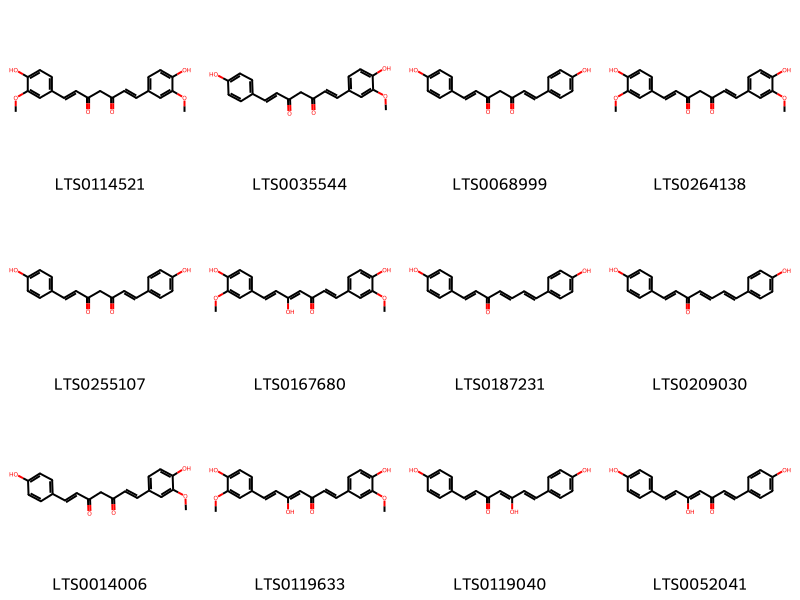{ width=100% }
    <figcaption>Hình ảnh cấu trúc hóa học của 12 hoạt chất thuộc nhóm Diarylheptanoids gồm ['curcumin (LTS0114521)', 'demethoxycurcumin (LTS0035544)', 'bisdemethoxycurcumin (LTS0068999)', 'turmeric (LTS0264138)', 'bisdemethoxycurcumin (LTS0255107)', 'tumeric (LTS0167680)', '1,7-bis(4-hydroxyphenyl)hepta-1,4,6-trien-3-one (LTS0187231)', '(1e,4e,6e)-1,7-bis(4-hydroxyphenyl)hepta-1,4,6-trien-3-one (LTS0209030)', 'desmethoxycurcumin (LTS0014006)', '(4z,6e)-5-hydroxy-1,7-bis(4-hydroxy-3-methoxyphenyl)hepta-1,4,6-trien-3-one (LTS0119633)', '(1e,4z,6e)-5-hydroxy-1,7-bis(4-hydroxyphenyl)hepta-1,4,6-trien-3-one (LTS0119040)', '5-hydroxy-1,7-bis(4-hydroxyphenyl)hepta-1,4,6-trien-3-one (LTS0052041)'].</figcaption>
</figure>
#### Nhóm Prenol lipids
<figure markdown="span">
    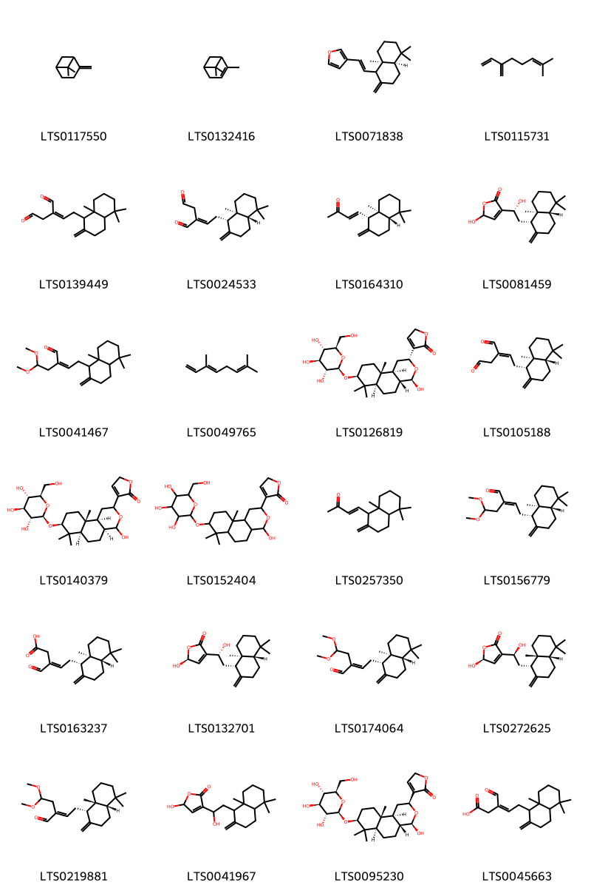{ width=100% }
    <figcaption>Hình ảnh cấu trúc hóa học của 24 hoạt chất thuộc nhóm Prenol lipids gồm ['β-pinene (LTS0117550)', 'α pinene (LTS0132416)', '3-{2-[(4ar,8as)-5,5,8a-trimethyl-2-methylidene-hexahydro-1h-naphthalen-1-yl]ethenyl}furan (LTS0071838)', 'α-myrcene (LTS0115731)', '2-[2-(5,5,8a-trimethyl-2-methylidene-hexahydro-1h-naphthalen-1-yl)ethylidene]butanedial (LTS0139449)', '(2e)-2-{2-[(1s,4as,8as)-5,5,8a-trimethyl-2-methylidene-hexahydro-1h-naphthalen-1-yl]ethylidene}butanedial (LTS0024533)', '(3e)-4-[(1s,4as,8as)-5,5,8a-trimethyl-2-methylidene-hexahydro-1h-naphthalen-1-yl]but-3-en-2-one (LTS0164310)', '3-[(1r)-2-[(1s,4as,8as)-5,5,8a-trimethyl-2-methylidene-hexahydro-1h-naphthalen-1-yl]-1-hydroxyethyl]-5-hydroxy-5h-furan-2-one (LTS0081459)', '4-(5,5,8a-trimethyl-2-methylidene-hexahydro-1h-naphthalen-1-yl)-2-(2,2-dimethoxyethyl)but-2-enal (LTS0041467)', 'trans-β-ocimene (LTS0049765)', '3-[(2r,4r,4ar,6ar,8s,10ar,10bs)-4-hydroxy-7,7,10a-trimethyl-8-{[(2r,3r,4s,5s,6r)-3,4,5-trihydroxy-6-(hydroxymethyl)oxan-2-yl]oxy}-decahydro-1h-naphtho[2,1-c]pyran-2-yl]-5h-furan-2-one (LTS0126819)', '2-{2-[(1s,4as,8as)-5,5,8a-trimethyl-2-methylidene-hexahydro-1h-naphthalen-1-yl]ethylidene}butanedial (LTS0105188)', '3-[(4as,6ar,8s,10ar,10bs)-4-hydroxy-7,7,10a-trimethyl-8-{[(2r,3r,4s,5s,6r)-3,4,5-trihydroxy-6-(hydroxymethyl)oxan-2-yl]oxy}-decahydro-1h-naphtho[2,1-c]pyran-2-yl]-5h-furan-2-one (LTS0140379)', '3-(4-hydroxy-7,7,10a-trimethyl-8-{[3,4,5-trihydroxy-6-(hydroxymethyl)oxan-2-yl]oxy}-decahydro-1h-naphtho[2,1-c]pyran-2-yl)-5h-furan-2-one (LTS0152404)', '4-(5,5,8a-trimethyl-2-methylidene-hexahydro-1h-naphthalen-1-yl)but-3-en-2-one (LTS0257350)', '4-[(1s,4as,8as)-5,5,8a-trimethyl-2-methylidene-hexahydro-1h-naphthalen-1-yl]-2-(2,2-dimethoxyethyl)but-2-enal (LTS0156779)', '(3e)-5-[(1s,4as,8as)-5,5,8a-trimethyl-2-methylidene-hexahydro-1h-naphthalen-1-yl]-3-formylpent-3-enoic acid (LTS0163237)', '(5s)-3-[(1r)-2-[(1s,4as,8as)-5,5,8a-trimethyl-2-methylidene-hexahydro-1h-naphthalen-1-yl]-1-hydroxyethyl]-5-hydroxy-5h-furan-2-one (LTS0132701)', '(2e)-4-[(1s,4as,8as)-5,5,8a-trimethyl-2-methylidene-hexahydro-1h-naphthalen-1-yl]-2-(2,2-dimethoxyethyl)but-2-enal (LTS0174064)', '(5s)-3-[(1s)-2-[(1s,4as,8ar)-5,5,8a-trimethyl-2-methylidene-hexahydro-1h-naphthalen-1-yl]-1-hydroxyethyl]-5-hydroxy-5h-furan-2-one (LTS0272625)', '(2e)-4-[(1s,4as,8ar)-5,5,8a-trimethyl-2-methylidene-hexahydro-1h-naphthalen-1-yl]-2-(2,2-dimethoxyethyl)but-2-enal (LTS0219881)', '3-[2-(5,5,8a-trimethyl-2-methylidene-hexahydro-1h-naphthalen-1-yl)-1-hydroxyethyl]-5-hydroxy-5h-furan-2-one (LTS0041967)', '3-[(2s,4r,4ar,6ar,8s,10ar,10bs)-4-hydroxy-7,7,10a-trimethyl-8-{[(2r,3r,4s,5s,6r)-3,4,5-trihydroxy-6-(hydroxymethyl)oxan-2-yl]oxy}-decahydro-1h-naphtho[2,1-c]pyran-2-yl]-5h-furan-2-one (LTS0095230)', '5-(5,5,8a-trimethyl-2-methylidene-hexahydro-1h-naphthalen-1-yl)-3-formylpent-3-enoic acid (LTS0045663)'].</figcaption>
</figure>
#### Nhóm Steroids and steroid derivatives
<figure markdown="span">
    { width=100% }
    <figcaption>Hình ảnh cấu trúc hóa học của 2 hoạt chất thuộc nhóm Steroids and steroid derivatives gồm ['sitosterol (LTS0168132)', 'stigmast-5-en-3-ol, (3β)- (LTS0204616)'].</figcaption>
</figure>

---

### Dược dân tộc học

Danh sách các quốc gia có sử dụng *Curcuma mangga* trong điều trị các bệnh. 

| Country   | Disease   | Bệnh                                                                                                                                                                                                |
|:----------|:----------|:----------------------------------------------------------------------------------------------------------------------------------------------------------------------------------------------------|
| Java      | Stomachic | MYMEMORY WARNING: YOU USED ALL AVAILABLE FREE TRANSLATIONS FOR TODAY. NEXT AVAILABLE IN  07 HOURS 45 MINUTES 40 SECONDS VISIT HTTPS://MYMEMORY.TRANSLATED.NET/DOC/USAGELIMITS.PHP TO TRANSLATE MORE |

---

---
## Curcuma petiolata
### Thông tin về thực vật

!!! info "Phân loại thực vật của *Curcuma petiolata* từ GIBF:"
    - **Kingdom:** Plantae
    - **Phylum:** Tracheophyta
    - **Order:** Zingiberales
    - **Family:** Zingiberaceae
    - **Genus:** Curcuma
    - **Species:** *Curcuma petiolata*

 

| Label (VI)   | Label (EN)   | Scientific Name   | Descriptions (VI)   | Descriptions (EN)   | Also Known As (VI)    | Also Known As (EN)   |
|:-------------|:-------------|:------------------|:--------------------|:--------------------|:----------------------|:---------------------|
| N/A          | N/A          | Curcuma petiolata | loài thực vật       | species of plant    | ['Curcuma petiolata'] | ['']                 |

#### Phân bố trên thế giới

**Từ CSDL GIBF** Viet Nam, nan, unknown or invalid, Thailand, Myanmar, Micronesia (Federated States of), India, Lao People’s Democratic Republic, United States of America, Cuba, Cambodia, Indonesia

#### Phân bố tại Việt Nam

**Từ CSDL GIBF**: Bình Thuận, Tây Ninh, Đồng Nai, Đắk Lắk

---
### Thành phần hóa học
        
- Theo cơ sở dữ liệu lotus: Từ loài *Curcuma petiolata* đã phân lập và xác định được Chưa có hoạt chất nào được phân lập. hoạt chất thuộc về các nhóm Không có hoạt chất nào được phân lập. 

Không có hình ảnh nào được tạo ra

---

### Dược dân tộc học

Danh sách các quốc gia có sử dụng *Curcuma petiolata* trong điều trị các bệnh. 

| Country   | Disease   | Bệnh                                                                                                                                                                                                |
|:----------|:----------|:----------------------------------------------------------------------------------------------------------------------------------------------------------------------------------------------------|
| Java      | Synergist | MYMEMORY WARNING: YOU USED ALL AVAILABLE FREE TRANSLATIONS FOR TODAY. NEXT AVAILABLE IN  07 HOURS 45 MINUTES 18 SECONDS VISIT HTTPS://MYMEMORY.TRANSLATED.NET/DOC/USAGELIMITS.PHP TO TRANSLATE MORE |

---

---
## Curcuma xanthorrhiza
### Thông tin về thực vật

!!! info "Phân loại thực vật của *Curcuma xanthorrhiza* từ GIBF:"
    - **Kingdom:** Plantae
    - **Phylum:** Tracheophyta
    - **Order:** Zingiberales
    - **Family:** Zingiberaceae
    - **Genus:** Curcuma
    - **Species:** *Curcuma xanthorrhiza*

 

| Label (VI)   | Label (EN)   | Scientific Name      | Descriptions (VI)   | Descriptions (EN)   | Also Known As (VI)   | Also Known As (EN)   |
|:-------------|:-------------|:---------------------|:--------------------|:--------------------|:---------------------|:---------------------|
| N/A          | N/A          | Curcuma xanthorrhiza |                     |                     | ['']                 | ['']                 |

#### Phân bố trên thế giới

**Từ CSDL GIBF** nan, Japan, India, China, Indonesia

#### Phân bố tại Việt Nam

**Từ CSDL GIBF**: Không có ghi nhận ở Việt Nam

---
### Thành phần hóa học
        
- Theo cơ sở dữ liệu lotus: Từ loài *Curcuma xanthorrhiza* đã phân lập và xác định được 96 hoạt chất thuộc về các nhóm Organooxygen compounds, Prenol lipids, Diarylheptanoids, Cinnamic acids and derivatives, Cinnamaldehydes. 

|    | chemicalTaxonomyClassyfireClass   |   smiles_count |
|---:|:----------------------------------|---------------:|
|  0 | Cinnamaldehydes                   |              2 |
|  1 | Cinnamic acids and derivatives    |              1 |
|  2 | Diarylheptanoids                  |             26 |
|  3 | Organooxygen compounds            |              1 |
|  4 | Prenol lipids                     |             65 |

#### Nhóm Cinnamaldehydes
<figure markdown="span">
    { width=100% }
    <figcaption>Hình ảnh cấu trúc hóa học của 2 hoạt chất thuộc nhóm Cinnamaldehydes gồm ['3-phenyl-2-propenal (LTS0204346)', 'cinnamal (LTS0271313)'].</figcaption>
</figure>
#### Nhóm Cinnamic acids and derivatives
<figure markdown="span">
    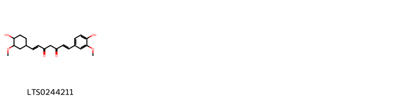{ width=100% }
    <figcaption>Hình ảnh cấu trúc hóa học của 1 hoạt chất thuộc nhóm Cinnamic acids and derivatives gồm ['(1e,6e)-1-(4-hydroxy-3-methoxycyclohexyl)-7-(4-hydroxy-3-methoxyphenyl)hepta-1,6-diene-3,5-dione (LTS0244211)'].</figcaption>
</figure>
#### Nhóm Diarylheptanoids
<figure markdown="span">
    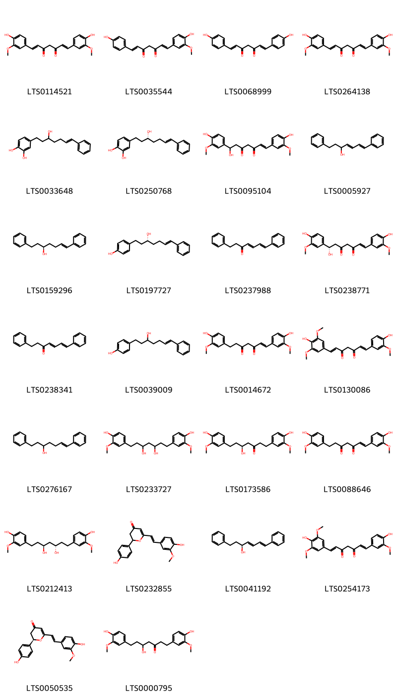{ width=100% }
    <figcaption>Hình ảnh cấu trúc hóa học của 26 hoạt chất thuộc nhóm Diarylheptanoids gồm ['curcumin (LTS0114521)', 'demethoxycurcumin (LTS0035544)', 'bisdemethoxycurcumin (LTS0068999)', 'turmeric (LTS0264138)', '4-(3-hydroxy-7-phenylhept-6-en-1-yl)benzene-1,2-diol (LTS0033648)', '4-[(3r,6e)-3-hydroxy-7-phenylhept-6-en-1-yl]benzene-1,2-diol (LTS0250768)', '7-hydroxy-1,7-bis(4-hydroxy-3-methoxyphenyl)hept-1-ene-3,5-dione (LTS0095104)', '1,7-diphenylhepta-4,6-dien-3-ol (LTS0005927)', '(3r,6e)-1,7-diphenylhept-6-en-3-ol (LTS0159296)', '4-[(3r,6e)-3-hydroxy-7-phenylhept-6-en-1-yl]phenol (LTS0197727)', '1,7-diphenylhepta-4,6-dien-3-one (LTS0237988)', '(1e,7s)-7-hydroxy-1,7-bis(4-hydroxy-3-methoxyphenyl)hept-1-ene-3,5-dione (LTS0238771)', '(4e,6e)-1,7-diphenylhepta-4,6-dien-3-one (LTS0238341)', '4-(3-hydroxy-7-phenylhept-6-en-1-yl)phenol (LTS0039009)', 'dihydrocurcumin (LTS0014672)', '(1e,6e)-1-(4-hydroxy-3,5-dimethoxyphenyl)-7-(4-hydroxy-3-methoxyphenyl)hepta-1,6-diene-3,5-dione (LTS0130086)', '1,7-diphenylhept-6-en-3-ol (LTS0276167)', '1,7-bis(4-hydroxy-3-methoxyphenyl)heptane-3,5-diol (LTS0233727)', '(5s)-5-hydroxy-1,7-bis(4-hydroxy-3-methoxyphenyl)heptan-3-one (LTS0173586)', '1,7-bis(4-hydroxy-3-methoxyphenyl)hept-1-ene-3,5-dione (LTS0088646)', '(3s,5s)-1,7-bis(4-hydroxy-3-methoxyphenyl)heptane-3,5-diol (LTS0212413)', '2-[2-(4-hydroxy-3-methoxyphenyl)ethenyl]-6-(4-hydroxyphenyl)-5,6-dihydropyran-4-one (LTS0232855)', '(3s,4e,6e)-1,7-diphenylhepta-4,6-dien-3-ol (LTS0041192)', '1-(4-hydroxy-3,5-dimethoxyphenyl)-7-(4-hydroxy-3-methoxyphenyl)hepta-1,6-diene-3,5-dione (LTS0254173)', '(6r)-2-[(1e)-2-(4-hydroxy-3-methoxyphenyl)ethenyl]-6-(4-hydroxyphenyl)-5,6-dihydropyran-4-one (LTS0050535)', 'hexahydrocurcumin (LTS0000795)'].</figcaption>
</figure>
#### Nhóm Organooxygen compounds
<figure markdown="span">
    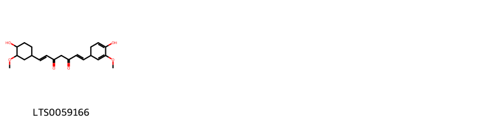{ width=100% }
    <figcaption>Hình ảnh cấu trúc hóa học của 1 hoạt chất thuộc nhóm Organooxygen compounds gồm ['(1e,6e)-1-(4-hydroxy-3-methoxycyclohexa-2,4-dien-1-yl)-7-(4-hydroxy-3-methoxycyclohexyl)hepta-1,6-diene-3,5-dione (LTS0059166)'].</figcaption>
</figure>
#### Nhóm Prenol lipids
<figure markdown="span">
    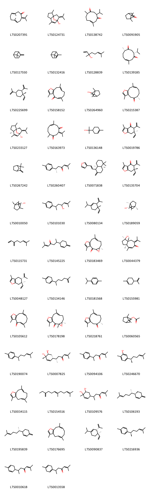{ width=100% }
    <figcaption>Hình ảnh cấu trúc hóa học của 65 hoạt chất thuộc nhóm Prenol lipids gồm ['germacrone (LTS0207391)', 'curcumenol (LTS0124731)', '(6e)-3-isopropyl-6,10-dimethylcyclodec-6-ene-1,4-dione (LTS0138742)', 'camphor (LTS0091905)', 'β-pinene (LTS0117550)', 'α pinene (LTS0132416)', 'linalool, (+-)- (LTS0128839)', '(3r,10s)-3-isopropyl-6,10-dimethylcyclodec-6-ene-1,4-dione (LTS0139185)', 'β-elemene (LTS0225699)', 'furanodienone (LTS0158152)', 'borneol (LTS0264960)', 'furanogermenone (LTS0215387)', '(1s,5r,8r)-2,6-dimethyl-9-(propan-2-ylidene)-11-oxatricyclo[6.2.1.0¹,⁵]undec-6-en-8-ol (LTS0233127)', '(6z)-6,10-dimethyl-3-(propan-2-ylidene)cyclodec-6-ene-1,4-dione (LTS0163973)', 'terpineol (LTS0136148)', '(6r)-6-ethenyl-3,6-dimethyl-5-(prop-1-en-2-yl)-5,7-dihydro-1-benzofuran-4-one (LTS0019786)', 'camphene (LTS0267242)', 'ar-turmerone (LTS0260407)', '3-{2-[(4ar,8as)-5,5,8a-trimethyl-2-methylidene-hexahydro-1h-naphthalen-1-yl]ethenyl}furan (LTS0071838)', '(6s)-6-ethenyl-3,6-dimethyl-5-(prop-1-en-2-yl)-5,7-dihydro-1-benzofuran-4-one (LTS0135704)', '(2s,4r)-1,7,7-trimethylbicyclo[2.2.1]heptan-2-ol (LTS0010050)', '2-methyl-6-(4-methylphenyl)hept-2-en-4-ol (LTS0101030)', '4-ethenyl-1-isopropyl-4-methyl-3-(prop-1-en-2-yl)cyclohex-1-ene (LTS0080134)', '(+)-borneol (LTS0189059)', 'α-myrcene (LTS0115731)', '2-methyl-6-(4-methylidenecyclohex-2-en-1-yl)hept-2-en-4-one (LTS0145225)', '(5r,8e)-5,9,14-trimethyl-4,12-dioxatricyclo[9.3.0.0³,⁵]tetradeca-1(11),8,13-trien-2-one (LTS0183469)', '(1r,3as,8ar)-1-hydroxy-1,4-dimethyl-7-(propan-2-ylidene)-3,3a,8,8a-tetrahydro-2h-azulen-6-one (LTS0044379)', '(5r,6r)-6-ethenyl-3,6-dimethyl-5-(prop-1-en-2-yl)-5,7-dihydro-4h-1-benzofuran (LTS0048127)', '1-methyl-4-(6-methylhept-6-en-2-yl)cyclohexa-1,4-diene (LTS0134146)', 'cymene (LTS0181568)', 'limonene,  (LTS0155981)', 'furanodienone (LTS0105612)', '(3s,5r,8e)-5,9,14-trimethyl-4,12-dioxatricyclo[9.3.0.0³,⁵]tetradeca-1(11),8,13-trien-2-one (LTS0178198)', 'furanogermenone (LTS0218761)', 'bornyl acetate (LTS0060565)', 'curcumene (LTS0190074)', 'bisacurone (LTS0007825)', 'ar-(+/-)-turmerone (LTS0094106)', '2-methyl-5-[(2r)-6-methylhept-5-en-2-yl]phenol (LTS0246670)', 'furanodiene (LTS0034115)', '(6e)-2,6-dimethyl-10-methylidenedodeca-2,6-diene (LTS0154516)', 'bisacurone (LTS0109576)', 'β-sesquiphellandrene (LTS0106193)', '3-[(2s)-6-methylhept-5-en-2-yl]-6-methylidenecyclohex-1-ene (LTS0195839)', 'furanodiene (LTS0176695)', 'elemene (LTS0090837)', '(-)-α-curcumene (LTS0216936)', '2-methyl-6-(4-methylcyclohexa-2,4-dien-1-yl)hept-2-en-4-one (LTS0010618)', '2-methyl-6-(4-methylcyclohexa-1,4-dien-1-yl)hept-2-en-4-one (LTS0013558)', '(6s)-2-methyl-6-[(1r)-4-methylidenecyclohex-2-en-1-yl]hept-2-en-4-one (LTS0014383)', '(6r)-2-methyl-6-(4-methylphenyl)hept-2-en-4-one (LTS0128619)', '(4r,6s)-2-methyl-6-(4-methylphenyl)hept-2-en-4-ol (LTS0131383)', '(-)-β-curcumene (LTS0027873)', '(4r,6s)-2-methyl-6-[(1s)-4-methylidenecyclohex-2-en-1-yl]hept-2-en-4-ol (LTS0053195)', '6-methyl-2-[(1r)-4-methylcyclohex-3-en-1-yl]hepta-1,5-dien-4-one (LTS0180554)', '2-methyl-6-(4-methylidenecyclohex-2-en-1-yl)hept-2-en-4-ol (LTS0273898)', '6-methyl-2-[(1s)-4-methylcyclohex-3-en-1-yl]hepta-1,5-dien-4-one (LTS0211843)', '(6s)-6-[(1s,2r,4s,5r,6s)-4,5-dihydroxy-5-methyl-7-oxabicyclo[4.1.0]heptan-2-yl]-2-methylhept-2-en-4-one (LTS0166843)', '6-{4,5-dihydroxy-5-methyl-7-oxabicyclo[4.1.0]heptan-2-yl}-2-methylhept-2-en-4-one (LTS0014078)', '(6s)-6-[(2r,5r,6s)-4,5-dihydroxy-5-methyl-7-oxabicyclo[4.1.0]heptan-2-yl]-2-methylhept-2-en-4-one (LTS0012696)', '6-methyl-2-(4-methylcyclohex-3-en-1-yl)hepta-1,5-dien-4-one (LTS0234566)', '2-methyl-5-(6-methylhept-5-en-2-yl)phenol (LTS0097834)', 'bisacurone (LTS0005556)', '(6s)-6-[(1r,4r,5r)-4,5-dihydroxy-4-methylcyclohex-2-en-1-yl]-2-methylhept-2-en-4-one (LTS0233731)'].</figcaption>
</figure>

---

### Dược dân tộc học

Danh sách các quốc gia có sử dụng *Curcuma xanthorrhiza* trong điều trị các bệnh. 

| Country   | Disease                 | Bệnh                                                                                                                                                                                                |
|:----------|:------------------------|:----------------------------------------------------------------------------------------------------------------------------------------------------------------------------------------------------|
| Java      | Choleretic, Emmenagogue | MYMEMORY WARNING: YOU USED ALL AVAILABLE FREE TRANSLATIONS FOR TODAY. NEXT AVAILABLE IN  07 HOURS 45 MINUTES 01 SECONDS VISIT HTTPS://MYMEMORY.TRANSLATED.NET/DOC/USAGELIMITS.PHP TO TRANSLATE MORE |

---

---
## Curcuma zedoaria
### Thông tin về thực vật

!!! info "Phân loại thực vật của *Curcuma zedoaria* từ GIBF:"
    - **Kingdom:** Plantae
    - **Phylum:** Tracheophyta
    - **Order:** Zingiberales
    - **Family:** Zingiberaceae
    - **Genus:** Curcuma
    - **Species:** *Curcuma zedoaria*

 

| Label (VI)   | Label (EN)   | Scientific Name   | Descriptions (VI)   | Descriptions (EN)         | Also Known As (VI)   | Also Known As (EN)   |
|:-------------|:-------------|:------------------|:--------------------|:--------------------------|:---------------------|:---------------------|
| N/A          | N/A          | Curcuma zedoaria  | loài thực vật       | species of plant, Zedoary | ['']                 | ['']                 |

#### Phân bố trên thế giới

**Từ CSDL GIBF** Honduras, Viet Nam, nan, Thailand, unknown or invalid, Philippines, Trinidad and Tobago, Germany, Martinique, Australia, Indonesia, Colombia, Sri Lanka, Venezuela (Bolivarian Republic of), Dominican Republic, Malaysia, India, Bangladesh, Cambodia, Myanmar, Panama, Brazil, Nicaragua, China, Norway, Chinese Taipei, Micronesia (Federated States of), Costa Rica, Ecuador, United States of America, Zambia

#### Phân bố tại Việt Nam

**Từ CSDL GIBF**: Đà Nẵng, Lâm Đồng, Hồ Chí Minh

---
### Thành phần hóa học
        
- Theo cơ sở dữ liệu lotus: Từ loài *Curcuma zedoaria* đã phân lập và xác định được 127 hoạt chất thuộc về các nhóm Prenol lipids, Diarylheptanoids. 

|    | chemicalTaxonomyClassyfireClass   |   smiles_count |
|---:|:----------------------------------|---------------:|
|  0 | Diarylheptanoids                  |              8 |
|  1 | Prenol lipids                     |            118 |

#### Nhóm Diarylheptanoids
<figure markdown="span">
    { width=100% }
    <figcaption>Hình ảnh cấu trúc hóa học của 8 hoạt chất thuộc nhóm Diarylheptanoids gồm ['curcumin (LTS0114521)', 'demethoxycurcumin (LTS0035544)', 'bisdemethoxycurcumin (LTS0068999)', 'turmeric (LTS0264138)', 'bisdemethoxycurcumin (LTS0255107)', '1,7-bis(4-hydroxyphenyl)hepta-1,4,6-trien-3-one (LTS0187231)', '(1e,4e,6e)-1,7-bis(4-hydroxyphenyl)hepta-1,4,6-trien-3-one (LTS0209030)', 'desmethoxycurcumin (LTS0014006)'].</figcaption>
</figure>
#### Nhóm Prenol lipids
<figure markdown="span">
    { width=100% }
    <figcaption>Hình ảnh cấu trúc hóa học của 118 hoạt chất thuộc nhóm Prenol lipids gồm ['germacrone (LTS0207391)', 'curcumenol (LTS0124731)', '(6e)-3-isopropyl-6,10-dimethylcyclodec-6-ene-1,4-dione (LTS0138742)', 'camphor (LTS0091905)', 'β-pinene (LTS0117550)', 'α pinene (LTS0132416)', 'linalool, (+-)- (LTS0128839)', '(3r,10s)-3-isopropyl-6,10-dimethylcyclodec-6-ene-1,4-dione (LTS0139185)', 'β-elemene (LTS0225699)', 'furanodienone (LTS0158152)', 'borneol (LTS0264960)', 'caryophyllene (LTS0085212)', 'furanogermenone (LTS0215387)', '(1s,5r,8r)-2,6-dimethyl-9-(propan-2-ylidene)-11-oxatricyclo[6.2.1.0¹,⁵]undec-6-en-8-ol (LTS0233127)', '(6z)-6,10-dimethyl-3-(propan-2-ylidene)cyclodec-6-ene-1,4-dione (LTS0163973)', '(6r)-6-ethenyl-3,6-dimethyl-5-(prop-1-en-2-yl)-5,7-dihydro-1-benzofuran-4-one (LTS0019786)', 'humulene (LTS0263171)', 'camphene (LTS0267242)', '1-hydroxy-1,4-dimethyl-7-(propan-2-ylidene)-3,3a,8,8a-tetrahydro-2h-azulen-6-one (LTS0227943)', 'ar-turmerone (LTS0260407)', '3-{2-[(4ar,8as)-5,5,8a-trimethyl-2-methylidene-hexahydro-1h-naphthalen-1-yl]ethenyl}furan (LTS0071838)', '(1s,3ar,8as)-1-hydroxy-1,4-dimethyl-7-(propan-2-ylidene)-3,3a,8,8a-tetrahydro-2h-azulen-6-one (LTS0027926)', '(6s)-6-ethenyl-3,6-dimethyl-5-(prop-1-en-2-yl)-5,7-dihydro-1-benzofuran-4-one (LTS0135704)', '(2s,4r)-1,7,7-trimethylbicyclo[2.2.1]heptan-2-ol (LTS0010050)', '2-methyl-6-(4-methylphenyl)hept-2-en-4-ol (LTS0101030)', '1-ethenyl-1,2-dimethyl-2-(prop-1-en-2-yl)-4-(propan-2-ylidene)cyclohexane (LTS0102139)', '4-ethenyl-1-isopropyl-4-methyl-3-(prop-1-en-2-yl)cyclohex-1-ene (LTS0080134)', '(1s,6e,10s)-6,10-dimethyl-3-(propan-2-ylidene)-11-oxabicyclo[8.1.0]undec-6-en-4-one (LTS0134690)', 'glechomanolide (LTS0121418)', 'furanodienone (LTS0143300)', '2-methyl-6-(4-methylidenecyclohex-2-en-1-yl)hept-2-en-4-one (LTS0145225)', 'β-eudesmol (LTS0203280)', '(6e,10s)-6,10-dimethyl-3-(propan-2-ylidene)cyclodec-6-ene-1,4-dione (LTS0159853)', 'furanodienone (LTS0227342)', '3,7-dimethyl-10-(propan-2-ylidene)cyclodeca-3,7-dien-1-one (LTS0119514)', '(1r,3as,4s,8ar)-1,4-dihydroxy-1,4-dimethyl-7-(propan-2-ylidene)-hexahydroazulen-6-one (LTS0188409)', '6,10-dimethyl-3-(propan-2-ylidene)cyclodec-6-ene-1,4-dione (LTS0271303)', '6,10-dimethyl-3-(propan-2-ylidene)-11-oxabicyclo[8.1.0]undec-6-en-4-one (LTS0220246)', '(5r,8e)-5,9,14-trimethyl-4,12-dioxatricyclo[9.3.0.0³,⁵]tetradeca-1(11),8,13-trien-2-one (LTS0183469)', '(1s,3as,4s,8as)-1,4-dihydroxy-1,4-dimethyl-7-(propan-2-ylidene)-hexahydroazulen-6-one (LTS0048058)', '1,4-dihydroxy-1,4-dimethyl-7-(propan-2-ylidene)-hexahydroazulen-6-one (LTS0067388)', 'curcumenone (LTS0054071)', '(1r,3as,8ar)-1-hydroxy-1,4-dimethyl-7-(propan-2-ylidene)-3,3a,8,8a-tetrahydro-2h-azulen-6-one (LTS0044379)', '(1s,3as,8as)-1-hydroxy-1,4-dimethyl-7-(propan-2-ylidene)-3,3a,8,8a-tetrahydro-2h-azulen-6-one (LTS0193624)', '1-methyl-4-(6-methylhept-6-en-2-yl)cyclohexa-1,4-diene (LTS0134146)', '(1s,3ar,8as)-1-hydroxy-1-methyl-4-methylidene-7-(propan-2-ylidene)-hexahydroazulen-6-one (LTS0078048)', '1-methyl-7-(3-oxobutyl)-4-(propan-2-ylidene)bicyclo[4.1.0]heptan-3-one (LTS0030394)', '(1r,3ar,4s,8as)-1,4-dihydroxy-1,4-dimethyl-7-(propan-2-ylidene)-hexahydroazulen-6-one (LTS0178595)', 'furanodienone (LTS0105612)', '(4ar,5s,7ar,8r)-5,7a,8-trihydroxy-3,5,8-trimethyl-4h,4ah,6h,7h-azuleno[6,5-b]furan-2-one (LTS0236768)', '(3s,5r,8e)-5,9,14-trimethyl-4,12-dioxatricyclo[9.3.0.0³,⁵]tetradeca-1(11),8,13-trien-2-one (LTS0178198)', '(1s,2s,5s,8r)-2-methyl-6-methylidene-9-(propan-2-ylidene)-11-oxatricyclo[6.2.1.0¹,⁵]undecan-8-ol (LTS0063268)', 'furanogermenone (LTS0218761)', 'bornyl acetate (LTS0060565)', '(1s,3ar,8ar)-1,3a-dihydroxy-1,4-dimethyl-7-(propan-2-ylidene)-2,3,8,8a-tetrahydroazulen-6-one (LTS0209061)', 'curcumenone (LTS0218006)', '13-hydroxygermacrone (LTS0200772)', '1-hydroxy-1-methyl-4-methylidene-7-(propan-2-ylidene)-hexahydroazulen-6-one (LTS0057468)', '(3r,6z,10s)-3-isopropyl-6,10-dimethylcyclodec-6-ene-1,4-dione (LTS0258144)', 'curcumene (LTS0190074)', '(4as,5s,7as,8s,9ar)-5,8-dihydroxy-3,5,8-trimethyl-4h,4ah,6h,7h,7ah,9h,9ah-azuleno[6,5-b]furan-2-one (LTS0060539)', '2-methyl-6-methylidene-9-(propan-2-ylidene)-11-oxatricyclo[6.2.1.0¹,⁵]undecan-8-ol (LTS0270223)', 'bisacurone (LTS0007825)', 'ar-(+/-)-turmerone (LTS0094106)', 'furanodiene (LTS0034115)', 'zederone (LTS0039658)', '(1s,2s)-1-ethenyl-1-methyl-2-(prop-1-en-2-yl)-4-(propan-2-ylidene)cyclohexane (LTS0135613)', '(1s,3ar,4r,8as)-7-isopropyl-1,4-dimethyl-2,3,3a,5,6,8a-hexahydroazulene-1,4-diol (LTS0093037)', '5,7a,8-trihydroxy-3,5,8-trimethyl-4h,4ah,6h,7h-azuleno[6,5-b]furan-2-one (LTS0087391)', '(4as,5s,7as,8s,9as)-5,8-dihydroxy-3,5,8-trimethyl-4h,4ah,6h,7h,7ah,9h,9ah-azuleno[6,5-b]furan-2-one (LTS0098353)', '(1s,3r,4s,5r,11r,12s)-4,5,12-trihydroxy-3,8,12-trimethyl-2,6-dioxatetracyclo[9.3.0.0¹,³.0⁵,⁹]tetradec-8-en-7-one (LTS0260560)', '10-(1-hydroxypropan-2-ylidene)-3,7-dimethylcyclodeca-3,7-dien-1-one (LTS0196745)', 'furanodiene (LTS0176695)', '(5r,6s,9r)-6-methyl-9-(prop-1-en-2-yl)-3-(propan-2-ylidene)-1-oxaspiro[4.4]nonan-2-one (LTS0154162)', 'elemene (LTS0090837)', '(1s,2r,5s,8r)-2,6-dimethyl-9-(propan-2-ylidene)-11-oxatricyclo[6.2.1.0¹,⁵]undec-6-en-8-ol (LTS0086735)', 'zedoarol (LTS0124150)', '6-methyl-5-(3-oxobutyl)-2-(propan-2-ylidene)cyclohept-4-en-1-one (LTS0274596)', '6-methyl-9-(prop-1-en-2-yl)-3-(propan-2-ylidene)-1-oxaspiro[4.4]nonan-2-one (LTS0219848)', '8-hydroxy-3,5,8a-trimethyl-6h,7h,8h,9h-naphtho[2,3-b]furan-4-one (LTS0183582)', '(1s,3as,4s,7r,8as)-1,4-dimethyl-7-(prop-1-en-2-yl)-octahydroazulene-1,4-diol (LTS0203316)', '(1s,2s,5s,8r)-2,6-dimethyl-9-(propan-2-ylidene)-11-oxatricyclo[6.2.1.0¹,⁵]undec-6-en-8-ol (LTS0246687)', '(4as,5r,7as)-7a-methyl-5-(prop-1-en-2-yl)-3-(propan-2-ylidene)-tetrahydro-4h-cyclopenta[b]pyran-2-one (LTS0057341)', '5,8-dihydroxy-3,5,8-trimethyl-4h,4ah,6h,7h,7ah,9h,9ah-azuleno[6,5-b]furan-2-one (LTS0005275)', 'terpinene (LTS0136858)', '(5r,6s,9s)-6-methyl-9-(prop-1-en-2-yl)-3-(propan-2-ylidene)-1-oxaspiro[4.4]nonan-2-one (LTS0018246)', '(4as,5s,7as,8s,9as)-5,8,9a-trihydroxy-3,5,8-trimethyl-4h,4ah,6h,7h,7ah,9h-azuleno[6,5-b]furan-2-one (LTS0019991)', '(-)-β-curcumene (LTS0027873)', '(3e,7e,10e)-10-(1-hydroxypropan-2-ylidene)-3,7-dimethylcyclodeca-3,7-dien-1-one (LTS0124852)', 'furanodienone (LTS0205264)', '(1r,4as,6r,8ar)-8a-methyl-4-methylidene-6-(prop-1-en-2-yl)-octahydronaphthalen-1-ol (LTS0114619)', '(8r)-1,5,8-trimethyl-6h,7h,8h-naphtho[2,1-b]furan-9-one (LTS0194349)', '(4as,5s,7as)-7a-methyl-5-(prop-1-en-2-yl)-3-(propan-2-ylidene)-tetrahydro-4h-cyclopenta[b]pyran-2-one (LTS0214028)', '(4as,5s,8s,8as)-5,8-dihydroxy-3,5,8a-trimethyl-4ah,6h,7h,8h,9h-naphtho[2,3-b]furan-4-one (LTS0079744)', '(3r,4r,5s,7r)-7-hydroxy-5,10-dimethyl-4-(3-oxobutyl)-8-oxatricyclo[5.3.0.0³,⁵]dec-1-en-9-one (LTS0210021)', '(4ar,5r,8r,8ar)-5,8-dihydroxy-3,5,8a-trimethyl-4ah,6h,7h,8h,9h-naphtho[2,3-b]furan-4-one (LTS0149375)', '5,8-dihydroxy-3,5,8a-trimethyl-4ah,6h,7h,8h,9h-naphtho[2,3-b]furan-4-one (LTS0181156)', '(8s)-1,5,8-trimethyl-6h,7h,8h-naphtho[2,1-b]furan-9-one (LTS0061468)', '(4as,5r,8s,8as)-5,8-dihydroxy-3,5,8a-trimethyl-4ah,6h,7h,8h,9h-naphtho[2,3-b]furan-4-one (LTS0103822)', '(3r,4r,5s,7r)-5,10-dimethyl-4-(3-oxobutyl)-8-oxatricyclo[5.3.0.0³,⁵]dec-1(10)-en-9-one (LTS0121928)', '(5s,6s)-6-ethenyl-3,6-dimethyl-5-(prop-1-en-2-yl)-5,7-dihydro-1-benzofuran-4-one (LTS0146427)', '(3r,4r,5s,7s)-5,10-dimethyl-4-(3-oxobutyl)-8-oxatricyclo[5.3.0.0³,⁵]dec-1(10)-en-9-one (LTS0154174)', '6-ethyl-5-isopropyl-3,6-dimethyl-5,7-dihydro-1-benzofuran-4-one (LTS0121242)', '(1s,4s,6r,7r)-4-(2-hydroxypropan-2-yl)-1-methyl-7-(3-oxobutyl)bicyclo[4.1.0]heptan-3-one (LTS0167630)', '(3r,5r,8e)-5,9,14-trimethyl-4,12-dioxatricyclo[9.3.0.0³,⁵]tetradeca-1(11),8,13-trien-2-one (LTS0267586)', '8,9-dihydroxy-5,9,14-trimethyl-4,12-dioxatricyclo[9.3.0.0³,⁵]tetradeca-1(11),13-dien-2-one (LTS0185036)', '(3s,5r,8r,9r)-8,9-dihydroxy-5,9,14-trimethyl-4,12-dioxatricyclo[9.3.0.0³,⁵]tetradeca-1(11),13-dien-2-one (LTS0259258)', '(8s,8as)-8-hydroxy-3,5,8a-trimethyl-6h,7h,8h,9h-naphtho[2,3-b]furan-4-one (LTS0204636)', '6-ethenyl-3,6-dimethyl-5-(prop-1-en-2-yl)-5,7-dihydro-1-benzofuran-4-one (LTS0211566)', 'β-farnesene (LTS0067925)', '1,4-dimethyl-7-(prop-1-en-2-yl)-octahydroazulene-1,4-diol (LTS0032265)', '(1s,4r,6r,7r)-4-(2-hydroxypropan-2-yl)-1-methyl-7-(3-oxobutyl)bicyclo[4.1.0]heptan-3-one (LTS0044665)', 'pyrocurzerenone (LTS0134811)', '4a-hydroxy-3,5-dimethyl-8-methylidene-5h,6h,7h,7ah,9h-azuleno[6,5-b]furan-4-one (LTS0246619)', '(5s,6r)-6-ethyl-5-isopropyl-3,6-dimethyl-5,7-dihydro-1-benzofuran-4-one (LTS0013505)', '(1s,2s,8r)-2,6-dimethyl-9-(propan-2-ylidene)-11-oxatricyclo[6.2.1.0¹,⁵]undec-5-en-8-ol (LTS0237364)', 'dehydrocurdione (LTS0020226)', '1,5,8-trimethyl-6h,7h,8h-naphtho[2,1-b]furan-9-one (LTS0087691)'].</figcaption>
</figure>

---

### Dược dân tộc học

Danh sách các quốc gia có sử dụng *Curcuma zedoaria* trong điều trị các bệnh. 

| Country   | Disease                                 | Bệnh                                                                                                                                                                                                |
|:----------|:----------------------------------------|:----------------------------------------------------------------------------------------------------------------------------------------------------------------------------------------------------|
| Egypt     | Carminative, Tonic, Stomachic, Antidote | MYMEMORY WARNING: YOU USED ALL AVAILABLE FREE TRANSLATIONS FOR TODAY. NEXT AVAILABLE IN  07 HOURS 44 MINUTES 39 SECONDS VISIT HTTPS://MYMEMORY.TRANSLATED.NET/DOC/USAGELIMITS.PHP TO TRANSLATE MORE |
| Elsewhere | Stimulant, Carminative                  | MYMEMORY WARNING: YOU USED ALL AVAILABLE FREE TRANSLATIONS FOR TODAY. NEXT AVAILABLE IN  07 HOURS 44 MINUTES 37 SECONDS VISIT HTTPS://MYMEMORY.TRANSLATED.NET/DOC/USAGELIMITS.PHP TO TRANSLATE MORE |
| India     | Stomachic                               | MYMEMORY WARNING: YOU USED ALL AVAILABLE FREE TRANSLATIONS FOR TODAY. NEXT AVAILABLE IN  07 HOURS 44 MINUTES 34 SECONDS VISIT HTTPS://MYMEMORY.TRANSLATED.NET/DOC/USAGELIMITS.PHP TO TRANSLATE MORE |
| Malaya    | Tonic                                   | MYMEMORY WARNING: YOU USED ALL AVAILABLE FREE TRANSLATIONS FOR TODAY. NEXT AVAILABLE IN  07 HOURS 44 MINUTES 32 SECONDS VISIT HTTPS://MYMEMORY.TRANSLATED.NET/DOC/USAGELIMITS.PHP TO TRANSLATE MORE |

---

---
## Curcuma zeodoaria
### Thông tin về thực vật

!!! info "Phân loại thực vật của *Curcuma zedoaria* từ GIBF:"
    - **Kingdom:** Plantae
    - **Phylum:** Tracheophyta
    - **Order:** Zingiberales
    - **Family:** Zingiberaceae
    - **Genus:** Curcuma
    - **Species:** *Curcuma zedoaria*

 

| Label (VI)   | Label (EN)   | Scientific Name   | Descriptions (VI)   | Descriptions (EN)         | Also Known As (VI)   | Also Known As (EN)   |
|:-------------|:-------------|:------------------|:--------------------|:--------------------------|:---------------------|:---------------------|
| N/A          | N/A          | Curcuma zedoaria  | loài thực vật       | species of plant, Zedoary | ['']                 | ['']                 |

#### Phân bố trên thế giới

**Từ CSDL GIBF** Honduras, Viet Nam, nan, Thailand, unknown or invalid, Philippines, Trinidad and Tobago, Germany, Martinique, Australia, Indonesia, Colombia, Sri Lanka, Venezuela (Bolivarian Republic of), Dominican Republic, Malaysia, India, Bangladesh, Cambodia, Myanmar, Panama, Brazil, Nicaragua, China, Norway, Chinese Taipei, Micronesia (Federated States of), Costa Rica, Ecuador, United States of America, Zambia

#### Phân bố tại Việt Nam

**Từ CSDL GIBF**: Đà Nẵng, Lâm Đồng, Hồ Chí Minh

---
### Thành phần hóa học
        
- Theo cơ sở dữ liệu lotus: Từ loài *Curcuma zedoaria* đã phân lập và xác định được Chưa có hoạt chất nào được phân lập. hoạt chất thuộc về các nhóm Không có hoạt chất nào được phân lập. 

Không có hình ảnh nào được tạo ra

---

### Dược dân tộc học

Danh sách các quốc gia có sử dụng *Curcuma zedoaria* trong điều trị các bệnh. 

| Country   | Disease                | Bệnh                                                                                                                                                                                                |
|:----------|:-----------------------|:----------------------------------------------------------------------------------------------------------------------------------------------------------------------------------------------------|
| Elsewhere | Carminative, Stimulant | MYMEMORY WARNING: YOU USED ALL AVAILABLE FREE TRANSLATIONS FOR TODAY. NEXT AVAILABLE IN  07 HOURS 44 MINUTES 06 SECONDS VISIT HTTPS://MYMEMORY.TRANSLATED.NET/DOC/USAGELIMITS.PHP TO TRANSLATE MORE |

---

