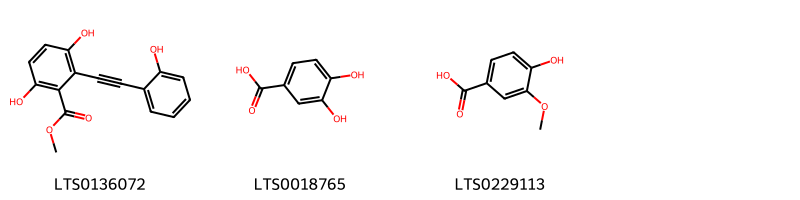
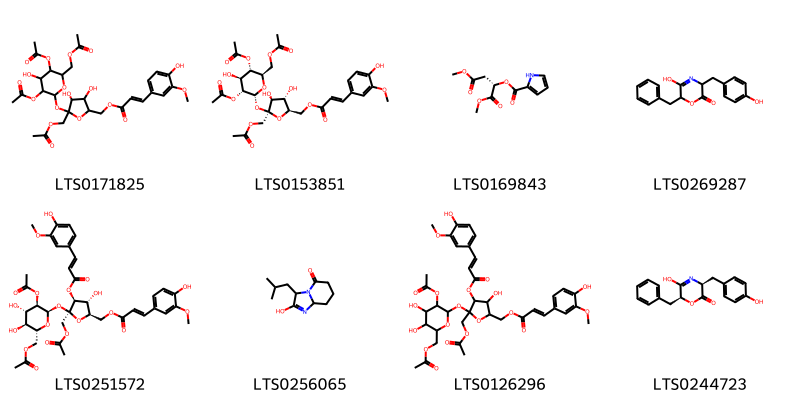
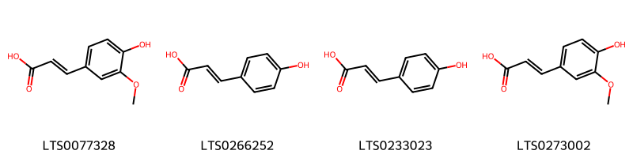
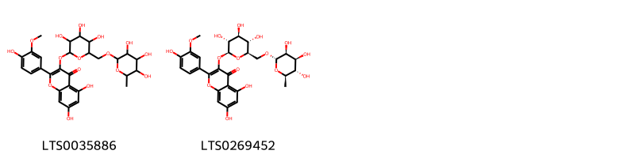
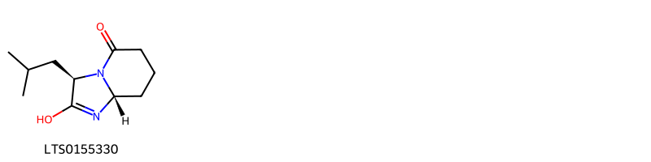
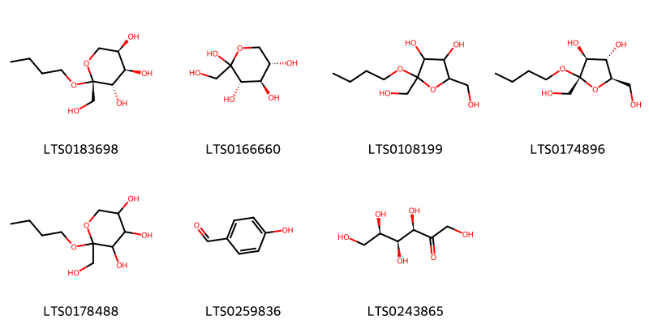
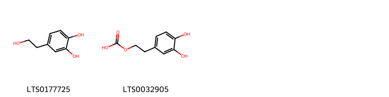
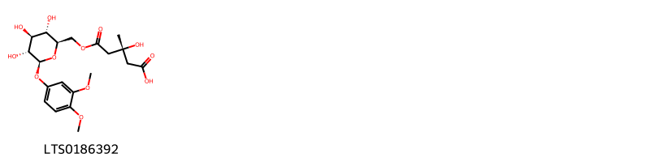
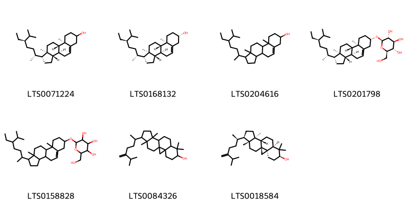

!!! abstract "Tóm tắt"

    Họ arganiaceae gồm khoảng 1 chi và 2 loài được một số cộng đồng tại các quốc gia như Italian, Elsewhere, English, China, German sử dụng trong một số trường hợp Chất làm se, Hemostat, Chất làm se, Thuốc chống đông máu, Expectorant, Hemostat, Vulnerary.

!!! info "DrDuke"

    James A. Duke sinh năm 1929-2017 là một nhà thực vật học người Mỹ. Đây là một trong những tác giả hàng đầu trong lĩnh vực dược dân tộc học với cuốn *CRC Handbook of Medicinal Herbs* và chính là người xây dựng lên cơ sở dữ liệu về hợp chất tự nhiên và dược dân tộc học tại Bộ nông nghiệp Hoa Kỳ. Các thông tin được đăng tải tại website [Dr. Duke's Phytochemical and Ethnobotanical Databases](https://phytochem.nal.usda.gov/). 
    Trong suốt thập niên 1970, ông lãnh đạo the Plant Taxonomy Laboratory, Plant Genetics and Germplasm Institute of the Agricultural Research Service, U.S. Department of Agriculture.
    Trong tài liệu này, các thông tin về dược dân tộc của các dược liệu được trích dẫn từ tài liệu của James A. Ducke với sự trợ giúp của phần mềm dịch thuật từ tiếng Anh sang tiếng Việt.
   

# Chi arganium

??? note "Danh sách các dược liệu thuộc chi"
    
	 - *arganium ramosum*
	 - *arganium stoloniferum*

---
## arganium ramosum
### Thông tin về thực vật

!!! info "Phân loại thực vật của *N/A* từ GIBF:"
    - **Kingdom:** N/A
    - **Phylum:** N/A
    - **Order:** N/A
    - **Family:** N/A
    - **Genus:** N/A
    - **Species:** *N/A*

 

| Label (VI)   | Label (EN)   | Scientific Name   | Descriptions (VI)   | Descriptions (EN)   | Also Known As (VI)   | Also Known As (EN)   |
|:-------------|:-------------|:------------------|:--------------------|:--------------------|:---------------------|:---------------------|
| N/A          | N/A          | Smilax regelii    | loài thực vật       | species of plant    | ['']                 | ['Sarsaparilla']     |

#### Phân bố trên thế giới

**Từ CSDL GIBF** Không có kết quả phù hợp

#### Phân bố tại Việt Nam

**Từ CSDL GIBF**: Không có ghi nhận ở Việt Nam

---
### Thành phần hóa học
        
- Theo cơ sở dữ liệu lotus: Từ loài *N/A* đã phân lập và xác định được Chưa có hoạt chất nào được phân lập. hoạt chất thuộc về các nhóm Không có hoạt chất nào được phân lập. 

Không có hình ảnh nào được tạo ra

---

### Dược dân tộc học

Danh sách các quốc gia có sử dụng *N/A* trong điều trị các bệnh. 

| Country   | Disease    | Bệnh        |
|:----------|:-----------|:------------|
| English   | Hemostat   | Máy cầm máu |
| German    | Vulnerary  | Vulnerary   |
| Italian   | Astringent | Lam se da   |

---

---
## arganium stoloniferum
### Thông tin về thực vật

!!! info "Phân loại thực vật của *N/A* từ GIBF:"
    - **Kingdom:** N/A
    - **Phylum:** N/A
    - **Order:** N/A
    - **Family:** N/A
    - **Genus:** N/A
    - **Species:** *N/A*

 

| Label (VI)   | Label (EN)   | Scientific Name   | Descriptions (VI)   | Descriptions (EN)   | Also Known As (VI)   | Also Known As (EN)   |
|:-------------|:-------------|:------------------|:--------------------|:--------------------|:---------------------|:---------------------|
| N/A          | N/A          | Smilax regelii    | loài thực vật       | species of plant    | ['']                 | ['Sarsaparilla']     |

#### Phân bố trên thế giới

**Từ CSDL GIBF** Không có kết quả phù hợp

#### Phân bố tại Việt Nam

**Từ CSDL GIBF**: Không có ghi nhận ở Việt Nam

---
### Thành phần hóa học
        
- Theo cơ sở dữ liệu lotus: Từ loài *N/A* đã phân lập và xác định được 35 hoạt chất thuộc về các nhóm Organooxygen compounds, Flavonoids, Carboxylic acids and derivatives, Saccharolipids, Phenols, Cinnamic acids and derivatives, Imidazopyridines, Steroids and steroid derivatives, Benzene and substituted derivatives. 

|    | chemicalTaxonomyClassyfireClass     |   smiles_count |
|---:|:------------------------------------|---------------:|
|  0 | Benzene and substituted derivatives |              3 |
|  1 | Carboxylic acids and derivatives    |              8 |
|  2 | Cinnamic acids and derivatives      |              4 |
|  3 | Flavonoids                          |              2 |
|  4 | Imidazopyridines                    |              1 |
|  5 | Organooxygen compounds              |              7 |
|  6 | Phenols                             |              2 |
|  7 | Saccharolipids                      |              1 |
|  8 | Steroids and steroid derivatives    |              7 |

#### Nhóm Benzene and substituted derivatives
<figure markdown="span">
    { width=100% }
    <figcaption>Hình ảnh cấu trúc hóa học của 3 hoạt chất thuộc nhóm Benzene and substituted derivatives gồm ['methyl 3,6-dihydroxy-2-[2-(2-hydroxyphenyl)ethynyl]benzoate (LTS0136072)', '3,4-dihydroxybenzoic acid (LTS0018765)', 'vanillic acid (LTS0229113)'].</figcaption>
</figure>
#### Nhóm Carboxylic acids and derivatives
<figure markdown="span">
    { width=100% }
    <figcaption>Hình ảnh cấu trúc hóa học của 8 hoạt chất thuộc nhóm Carboxylic acids and derivatives gồm ['{5-[(acetyloxy)methyl]-5-{[3,5-bis(acetyloxy)-6-[(acetyloxy)methyl]-4-hydroxyoxan-2-yl]oxy}-3,4-dihydroxyoxolan-2-yl}methyl 3-(4-hydroxy-3-methoxyphenyl)prop-2-enoate (LTS0171825)', '[(2r,3s,4s,5s)-5-[(acetyloxy)methyl]-5-{[(2r,3r,4s,5s,6r)-3,5-bis(acetyloxy)-6-[(acetyloxy)methyl]-4-hydroxyoxan-2-yl]oxy}-3,4-dihydroxyoxolan-2-yl]methyl (2e)-3-(4-hydroxy-3-methoxyphenyl)prop-2-enoate (LTS0153851)', '1,4-dimethyl (2s)-2-(1h-pyrrole-2-carbonyloxy)butanedioate (LTS0169843)', '6-benzyl-5-hydroxy-3-[(4-hydroxyphenyl)methyl]-3,6-dihydro-1,4-oxazin-2-one (LTS0269287)', '[(2r,3r,4s,5s)-5-{[(2r,3r,4s,5s,6r)-3-(acetyloxy)-6-[(acetyloxy)methyl]-4,5-dihydroxyoxan-2-yl]oxy}-5-[(acetyloxy)methyl]-3-hydroxy-4-{[(2e)-3-(4-hydroxy-3-methoxyphenyl)prop-2-enoyl]oxy}oxolan-2-yl]methyl (2e)-3-(4-hydroxy-3-methoxyphenyl)prop-2-enoate (LTS0251572)', '2-hydroxy-3-(2-methylpropyl)-3h,6h,7h,8h,8ah-imidazo[1,2-a]pyridin-5-one (LTS0256065)', '(5-{[3-(acetyloxy)-6-[(acetyloxy)methyl]-4,5-dihydroxyoxan-2-yl]oxy}-5-[(acetyloxy)methyl]-3-hydroxy-4-{[3-(4-hydroxy-3-methoxyphenyl)prop-2-enoyl]oxy}oxolan-2-yl)methyl 3-(4-hydroxy-3-methoxyphenyl)prop-2-enoate (LTS0126296)', '(3s,6s)-6-benzyl-5-hydroxy-3-[(4-hydroxyphenyl)methyl]-3,6-dihydro-1,4-oxazin-2-one (LTS0244723)'].</figcaption>
</figure>
#### Nhóm Cinnamic acids and derivatives
<figure markdown="span">
    { width=100% }
    <figcaption>Hình ảnh cấu trúc hóa học của 4 hoạt chất thuộc nhóm Cinnamic acids and derivatives gồm ['ferulic acid (LTS0077328)', 'para-coumaric acid (LTS0266252)', 'hydroxycinnamic acid (LTS0233023)', 'ferulic acid (LTS0273002)'].</figcaption>
</figure>
#### Nhóm Flavonoids
<figure markdown="span">
    { width=100% }
    <figcaption>Hình ảnh cấu trúc hóa học của 2 hoạt chất thuộc nhóm Flavonoids gồm ['5,7-dihydroxy-2-(4-hydroxy-3-methoxyphenyl)-3-[(3,4,5-trihydroxy-6-{[(3,4,5-trihydroxy-6-methyloxan-2-yl)oxy]methyl}oxan-2-yl)oxy]chromen-4-one (LTS0035886)', '5,7-dihydroxy-2-(4-hydroxy-3-methoxyphenyl)-3-{[(2s,3r,4s,5s,6r)-3,4,5-trihydroxy-6-({[(2s,3s,4s,5s,6r)-3,4,5-trihydroxy-6-methyloxan-2-yl]oxy}methyl)oxan-2-yl]oxy}chromen-4-one (LTS0269452)'].</figcaption>
</figure>
#### Nhóm Imidazopyridines
<figure markdown="span">
    { width=100% }
    <figcaption>Hình ảnh cấu trúc hóa học của 1 hoạt chất thuộc nhóm Imidazopyridines gồm ['(3r,8ar)-2-hydroxy-3-(2-methylpropyl)-3h,6h,7h,8h,8ah-imidazo[1,2-a]pyridin-5-one (LTS0155330)'].</figcaption>
</figure>
#### Nhóm Organooxygen compounds
<figure markdown="span">
    { width=100% }
    <figcaption>Hình ảnh cấu trúc hóa học của 7 hoạt chất thuộc nhóm Organooxygen compounds gồm ['(2r,3s,4r,5r)-2-butoxy-2-(hydroxymethyl)oxane-3,4,5-triol (LTS0183698)', 'l-sorbose (LTS0166660)', '2-butoxy-2,5-bis(hydroxymethyl)oxolane-3,4-diol (LTS0108199)', '(2s,3s,4s,5r)-2-butoxy-2,5-bis(hydroxymethyl)oxolane-3,4-diol (LTS0174896)', '2-butoxy-2-(hydroxymethyl)oxane-3,4,5-triol (LTS0178488)', 'p-hydroxybenzaldehyde (LTS0259836)', 'd-sorbose (LTS0243865)'].</figcaption>
</figure>
#### Nhóm Phenols
<figure markdown="span">
    { width=100% }
    <figcaption>Hình ảnh cấu trúc hóa học của 2 hoạt chất thuộc nhóm Phenols gồm ['hydroxytyrosol (LTS0177725)', '2-(3,4-dihydroxyphenyl)ethyl hydrogen carbonate (LTS0032905)'].</figcaption>
</figure>
#### Nhóm Saccharolipids
<figure markdown="span">
    { width=100% }
    <figcaption>Hình ảnh cấu trúc hóa học của 1 hoạt chất thuộc nhóm Saccharolipids gồm ['(3r)-5-{[(2r,3s,4s,5r,6s)-6-(3,4-dimethoxyphenoxy)-3,4,5-trihydroxyoxan-2-yl]methoxy}-3-hydroxy-3-methyl-5-oxopentanoic acid (LTS0186392)'].</figcaption>
</figure>
#### Nhóm Steroids and steroid derivatives
<figure markdown="span">
    { width=100% }
    <figcaption>Hình ảnh cấu trúc hóa học của 7 hoạt chất thuộc nhóm Steroids and steroid derivatives gồm ['stigmast-5-en-3-ol (LTS0071224)', 'sitosterol (LTS0168132)', 'stigmast-5-en-3-ol, (3β)- (LTS0204616)', 'sitogluside (LTS0201798)', '2-{[1-(5-ethyl-6-methylheptan-2-yl)-9a,11a-dimethyl-1h,2h,3h,3ah,3bh,4h,6h,7h,8h,9h,9bh,10h,11h-cyclopenta[a]phenanthren-7-yl]oxy}-6-(hydroxymethyl)oxane-3,4,5-triol (LTS0158828)', '7,7,12,16-tetramethyl-15-(6-methyl-5-methylideneheptan-2-yl)pentacyclo[9.7.0.0¹,³.0³,⁸.0¹²,¹⁶]octadecan-6-ol (LTS0084326)', '24-methylenecycloartanol (LTS0018584)'].</figcaption>
</figure>

---

### Dược dân tộc học

Danh sách các quốc gia có sử dụng *N/A* trong điều trị các bệnh. 

| Country   | Disease                    | Bệnh                                 |
|:----------|:---------------------------|:-------------------------------------|
| China     | Anticoagulant, Expectorant | Thuốc chống đông máu, thuốc long đờm |
| Elsewhere | Astringent, Hemostat       | Chất làm se, Hemostat                |

---

