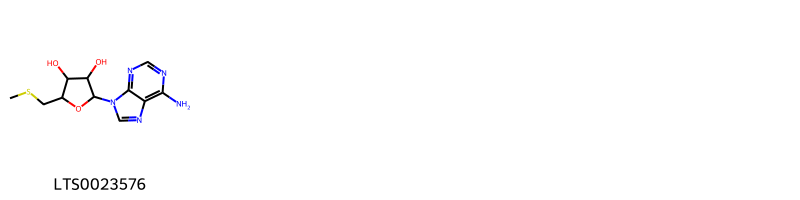
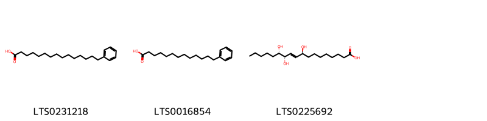
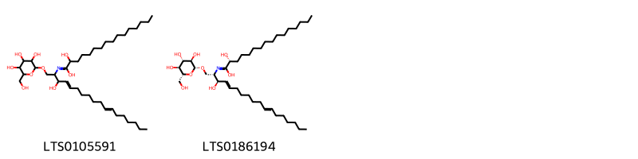

!!! abstract "Tóm tắt"
    Dược liệu Bán hạ (Rhizoma Pinelliae, họ Araceae-Ráy), phân bố tại các vùng đất ẩm ở nước ta từ nam tới bắc, trên thế giới tại Trung Quốc, Ấn Độ, Nhật Bản. Trong dân gian Bán hạ được sử dụng để cầm nôn, chữa ho. Thành phần hoá học có 1 ít tinh dầu, 1 ít ancaloit, 1 ancol, 1 chất cay, phytosterol, ngoài ra còn dầu béo, tinh bột, chất nhầy.

## Thông tin về thực vật

### Đặc điểm thực vật

Dược liệu **Bán Hạ** từ bộ phận **nan** từ loài *Pinellia ternata (Thunb.)Breit.* thuộc họ Araceae. Là 1 loại cỏ không có thân, có củ hình cầu đường kính tới 2 cm. Lá hình tim, hay hình mác, hoặc chia 3 thuỳ dài 4-15cm, rộng 3,5-9 cm. Bông mo với phần hoa đực dài 5-9mm, phần trần dài 17-27mm. Quả mọng hình trứng dài 6mm. 

!!! info "Phân loại thực vật của *Pinellia ternata*"
    - **Kingdom:** Plantae
    - **Phylum:** Tracheophyta
    - **Order:** Alismatales
    - **Family:** Araceae
    - **Genus:** Pinellia
    - **Species:** *Pinellia ternata*

*Tài liệu tham khảo:* "Những cây thuốc và vị thuốc Việt Nam" - Đỗ Tất Lợi

 

### Loài thay thế (Nếu có)

### Phân bố trên thế giới
**Từ vườn thực vật KEW: **: Native to:

China North-Central, China South-Central, China Southeast, Hainan, Inner Mongolia, Japan, Korea, Manchuria, Nansei-shoto, Taiwan

Introduced into:

Austria, California, District of Columbia, Germany, Maryland, New York, Pennsylvania, West Virginia

**Từ CSDL GIBF** Korea, Republic of, China, Japan, United States of America, Chinese Taipei, Germany, Netherlands

### Phân bố tại Việt Nam
** "Những cây thuốc và vị thuốc Việt Nam" - Đỗ Tất Lợi**: Mọc hoang tại khắp nơi ẩm nước ta từ nam chí bắc

**Từ CSDL GIBF**: Không có ghi nhận ở Việt Nam

---

## Thông tin về dược liệu 

### Định danh

!!! info "Thông tin về tên gọi của nan"
    - Dược liệu tiếng Việt: nan
    - Dược liệu tiếng Trung: nan (nan)
    - Dược liệu tiếng Anh: nan
    - Dược liệu latin thông dụng: nan
    - Dược liệu latin kiểu DĐVN: rhizoma pinelliae
    - Dược liệu latin kiểu DĐVN: nan
    - Dược liệu latin kiểu thông tư: nan
    - Bộ phận dùng: nan (nan)

### Mô tả dược liệu 
- **Theo dược điển Việt nam V:** nan

- **Mô tả dược liệu theo thông tư chế biến dược liệu theo phương pháp cổ truyền:** nan

### Chế biến 

- **Chế biến theo dược điển việt nam V**: nan

- **Chế biến theo thông tư:** nan

--- 

## Thành phần hóa học

- Theo tài liệu của GS. Đỗ Tất Lợi:  (1) Bán hạ Trung Quốc có 1 ít tinh dầu, 1 ít ancaloit, 1 ancol, 1 chất cay, phytosterol, ngoài ra còn dầu béo, tinh bột, chất nhầy
    
- Theo cơ sở dữ liệu lotus: Từ loài *Pinellia ternata* đã phân lập và xác định được 17 hoạt chất thuộc về các nhóm Harmala alkaloids, Cinnamyl alcohols, 5'-deoxyribonucleosides, Fatty Acyls, Sphingolipids, Steroids and steroid derivatives, Indoles and derivatives, Benzene and substituted derivatives, 2-arylbenzofuran flavonoids. 

|    | chemicalTaxonomyClassyfireClass     |   smiles_count |
|---:|:------------------------------------|---------------:|
|  0 | 2-arylbenzofuran flavonoids         |              1 |
|  1 | 5'-deoxyribonucleosides             |              1 |
|  2 | Benzene and substituted derivatives |              1 |
|  3 | Cinnamyl alcohols                   |              1 |
|  4 | Fatty Acyls                         |              3 |
|  5 | Harmala alkaloids                   |              3 |
|  6 | Indoles and derivatives             |              1 |
|  7 | Sphingolipids                       |              2 |
|  8 | Steroids and steroid derivatives    |              4 |

### Nhóm 2-arylbenzofuran flavonoids
<figure markdown="span">
    { width=100% }
    <figcaption>Hình ảnh cấu trúc hóa học của 1 hoạt chất thuộc nhóm 2-arylbenzofuran flavonoids gồm ['dehydrodiconiferyl alcohol (LTS0152779)'].</figcaption>
</figure>
### Nhóm 5_-deoxyribonucleosides
<figure markdown="span">
    { width=100% }
    <figcaption>Hình ảnh cấu trúc hóa học của Không tìm thấy chú thích hoạt chất thuộc nhóm 5_-deoxyribonucleosides gồm Không tìm thấy chú thích.</figcaption>
</figure>
### Nhóm Benzene and substituted derivatives
<figure markdown="span">
    { width=100% }
    <figcaption>Hình ảnh cấu trúc hóa học của 1 hoạt chất thuộc nhóm Benzene and substituted derivatives gồm ['ephedrine (LTS0276367)'].</figcaption>
</figure>
### Nhóm Cinnamyl alcohols
<figure markdown="span">
    { width=100% }
    <figcaption>Hình ảnh cấu trúc hóa học của 1 hoạt chất thuộc nhóm Cinnamyl alcohols gồm ['p-coumaryl alcohol (LTS0058896)'].</figcaption>
</figure>
### Nhóm Fatty Acyls
<figure markdown="span">
    { width=100% }
    <figcaption>Hình ảnh cấu trúc hóa học của 3 hoạt chất thuộc nhóm Fatty Acyls gồm ['15-phenylpentadecanoic acid (LTS0231218)', '13-phenyltridecanoic acid (LTS0016854)', 'pinellic acid (LTS0225692)'].</figcaption>
</figure>
### Nhóm Harmala alkaloids
<figure markdown="span">
    { width=100% }
    <figcaption>Hình ảnh cấu trúc hóa học của 3 hoạt chất thuộc nhóm Harmala alkaloids gồm ['harmine (LTS0131294)', 'harmane (LTS0068205)', '1-methyl-3h,4h,9h-pyrido[3,4-b]indole (LTS0027115)'].</figcaption>
</figure>
### Nhóm Indoles and derivatives
<figure markdown="span">
    { width=100% }
    <figcaption>Hình ảnh cấu trúc hóa học của 1 hoạt chất thuộc nhóm Indoles and derivatives gồm ['β-carboline (LTS0263207)'].</figcaption>
</figure>
### Nhóm Sphingolipids
<figure markdown="span">
    { width=100% }
    <figcaption>Hình ảnh cấu trúc hóa học của 2 hoạt chất thuộc nhóm Sphingolipids gồm ['2-hydroxy-n-(3-hydroxy-1-{[3,4,5-trihydroxy-6-(hydroxymethyl)oxan-2-yl]oxy}octadeca-4,11-dien-2-yl)hexadecanimidic acid (LTS0105591)', '(2r)-2-hydroxy-n-[(2s,3r,4e,11e)-3-hydroxy-1-{[(2r,3r,4s,5s,6r)-3,4,5-trihydroxy-6-(hydroxymethyl)oxan-2-yl]oxy}octadeca-4,11-dien-2-yl]hexadecanimidic acid (LTS0186194)'].</figcaption>
</figure>
### Nhóm Steroids and steroid derivatives
<figure markdown="span">
    { width=100% }
    <figcaption>Hình ảnh cấu trúc hóa học của 4 hoạt chất thuộc nhóm Steroids and steroid derivatives gồm ['(2r,3s,4s,5s,6s)-2-{[(1r,3ar,3br,7s,9ar,9br,11ar)-1-[(2r,5r)-5-ethyl-6-methylheptan-2-yl]-9a,11a-dimethyl-1h,2h,3h,3ah,3bh,4h,6h,7h,8h,9h,9bh,10h,11h-cyclopenta[a]phenanthren-7-yl]oxy}-6-(hydroxymethyl)oxane-3,4,5-triol (LTS0074621)', 'stigmast-5-en-3-ol, (3β)- (LTS0204616)', '2-{[1-(5-ethyl-6-methylheptan-2-yl)-9a,11a-dimethyl-1h,2h,3h,3ah,3bh,4h,6h,7h,8h,9h,9bh,10h,11h-cyclopenta[a]phenanthren-7-yl]oxy}-6-(hydroxymethyl)oxane-3,4,5-triol (LTS0158828)', '(1s,3as,3br,7s,9as,9bs,11ar)-1-[(2r,5r)-5-ethyl-6-methylheptan-2-yl]-9a,11a-dimethyl-1h,2h,3h,3ah,3bh,4h,6h,7h,8h,9h,9bh,10h,11h-cyclopenta[a]phenanthren-7-ol (LTS0248311)'].</figcaption>
</figure>

---

## Tác dụng dược lý

Theo tài liệu "Những cây thuốc và vị thuốc Việt Nam" - Đỗ Tất Lợi:Tác dụng chữa ho
Tác dụng chống nôn

Theo tài liệu quốc tế: nan

---

## Dược điển Việt Nam V

### Soi bột:
nan
<!-- Hình ảnh soi bột sẽ được tự động chèn vào đây sau -->
### Vi phẫu:
nan
<!-- Hình ảnh vi phẫu sẽ được tự động chèn vào đây sau -->
### Định tính

nan

### Định lượng

nan

### Thông tin khác 
- ** Độ ẩm: ** nan

- ** Bảo quản:** nan
## Dược điển Hồng kong

<!-- PDF sẽ được tự động chèn vào đây sau -->

---

## Y dược học cổ truyền

- **Tên vị thuốc:** nan
- **Tính vị quy kinh:** Tính vị tân, ôn, có độc. Vào 2 kinh tỳ, vị.
- **Công năng chủ trị:** Giáng nghịch cầm nôn, tiêu đờm hóa thấp, tán kểt tiêu bĩ. 
Chủ trị: Ho có đờm, nôn mửa, chóng mặt đau đầu do đờm thấp, đờm hạch, đờm kết với khí gây mai hạch khí.
- **Chú ý:** nan
- **Kiêng kỵ:** nan

