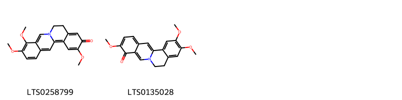
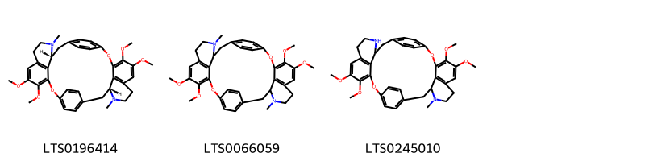
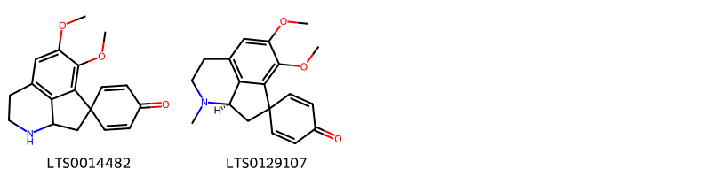

!!! abstract "Tóm tắt"
    Bình vôi ( tên khoa học là Tuber Stephaniae) là phần gốc thân phình ra thành củ đã cạo bỏ vỏ nâu đen ở ngoài hoặc thái thành miếng phơi hay sấy khô của cây Bình vôi thuộc họ Tiết dê (Menispermaceae). Phân bố chủ yếu ở những vùng núi đá tại các tỉnh Hà Tây, Hòa Bình, Hà Giang, Tuyên Quang, Nam Định, Hà Nam, Ninh Bình, .... Trong nhân dân, củ bình vôi thái nhỏ, phơi khô được dùng dưới dạng sắc, ngâm rượu chữa hen, ho lao, lỵ, sốt, đau bụng, ngày uống 3 đến 6g. Có thể tán bột, ngâm rượu 40 độ với tỷ lệ 1 phần bột 5 phần rượu, rồi uống với liều 5 đến 15ml rượu một ngày. Có thể thêm đường cho dễ uống. Tác dụng dược lý có điều hòa tim, điều hòa hô hấp, an thần gây ngủ. Thành phần hóa học bao gồm alkaloid, glycosid, ...

## Thông tin về thực vật

### Đặc điểm thực vật

Dược liệu **Bình Vôi(Củ)** từ bộ phận **nan** từ loài *Stephania glabra (Roxb.) Miers* thuộc họ Menispermaceae. Cây củ bình vôi là một loại cây mọc leo, phần dưới thân phát triển thành củ to, bám vào núi đá, có củ rất to, nặng tới hơn 20kg. Da thân củ màu nâu đen, xù xì giống như hòn đá, hình dáng thay đổi tùy theo nơi củ phát triển. Nếu mọc ở đất thì củ nhỏ hơn. Từ thân củ mọc lên những thân màu xanh, nhỏ, mềm. Lá hình khiên, mọc so le, hình bầu dục hay hình tim hoặc tròn, đường kính 8-9cm, cuống lá dài 5-8cm. Hoa nhỏ mọc thành tán. Hoa đực cái khác gốc. Hoa cái có cuống tán ngắn, còn hoa đực có cuống tán dài. Quả chín hình cầu màu đỏ, tươi, trong chứa một hạt hình móng ngựa. 

!!! info "Phân loại thực vật của *Stephania rotunda*"
    - **Kingdom:** Plantae
    - **Phylum:** Tracheophyta
    - **Order:** Ranunculales
    - **Family:** Menispermaceae
    - **Genus:** Stephania
    - **Species:** *Stephania rotunda*

*Tài liệu tham khảo:* "Những cây thuốc và vị thuốc Việt Nam" - Đỗ Tất Lợi

 

### Loài thay thế (Nếu có)

### Phân bố trên thế giới
**Từ vườn thực vật KEW: **: Bản địa: Assam, Bangladesh, Cambodia, East Himalaya, India, Laos, Myanmar, Nepal, Thailand, Tibet, Vietnam, West Himalaya

**Từ CSDL GIBF** nan, Bhutan, Nepal, Myanmar, China, Viet Nam, Bangladesh, Cambodia, India, Thailand

### Phân bố tại Việt Nam
** "Những cây thuốc và vị thuốc Việt Nam" - Đỗ Tất Lợi**: Cây củ bình vôi thường ưa mọc ở những vùng có núi đá tại các tỉnh Hà Tây, Hòa Bình, Hà Giang, Tuyên Quang, Nam Định, Hà Nam, Ninh Bình, Cao Bằng, Lạng Sơn, Thanh Hóa, .... Nơi cao lạnh như Sapa (Lào Cai) cũng có.

**Từ CSDL GIBF**: Không có ghi nhận ở Việt Nam

---

## Thông tin về dược liệu 

### Định danh

!!! info "Thông tin về tên gọi của nan"
    - Dược liệu tiếng Việt: nan
    - Dược liệu tiếng Trung: nan (nan)
    - Dược liệu tiếng Anh: nan
    - Dược liệu latin thông dụng: nan
    - Dược liệu latin kiểu DĐVN: tuber stephaniae
    - Dược liệu latin kiểu DĐVN: nan
    - Dược liệu latin kiểu thông tư: nan
    - Bộ phận dùng: nan (nan)

### Mô tả dược liệu 
- **Theo dược điển Việt nam V:** nan

- **Mô tả dược liệu theo thông tư chế biến dược liệu theo phương pháp cổ truyền:** nan

### Chế biến 

- **Chế biến theo dược điển việt nam V**: nan

- **Chế biến theo thông tư:** nan

--- 

## Thành phần hóa học

- Theo tài liệu của GS. Đỗ Tất Lợi:  (1) Nhóm hóa học: Alkaloid, Glycosid
(2) Tên hoạt chất là biomaker: L-tetrahydropalmatin
    
- Theo cơ sở dữ liệu lotus: Từ loài *Stephania rotunda* đã phân lập và xác định được 20 hoạt chất thuộc về các nhóm Protoberberine alkaloids and derivatives, Proaporphines, Isoquinolines and derivatives, Organooxygen compounds. 

|    | chemicalTaxonomyClassyfireClass          |   smiles_count |
|---:|:-----------------------------------------|---------------:|
|  0 | Isoquinolines and derivatives            |              2 |
|  1 | Organooxygen compounds                   |              3 |
|  2 | Proaporphines                            |              2 |
|  3 | Protoberberine alkaloids and derivatives |             13 |

### Nhóm Isoquinolines and derivatives
<figure markdown="span">
    { width=100% }
    <figcaption>Hình ảnh cấu trúc hóa học của 2 hoạt chất thuộc nhóm Isoquinolines and derivatives gồm ['3,4,11-trimethoxy-7,8-dihydro-6-azatetraphen-10-one (LTS0258799)', '3,10,11-trimethoxy-7,8-dihydro-6-azatetraphen-4-one (LTS0135028)'].</figcaption>
</figure>
### Nhóm Organooxygen compounds
<figure markdown="span">
    { width=100% }
    <figcaption>Hình ảnh cấu trúc hóa học của 3 hoạt chất thuộc nhóm Organooxygen compounds gồm ['cycleanine (LTS0196414)', '4,5,19,20-tetramethoxy-10,25-dimethyl-2,17-dioxa-10,25-diazaheptacyclo[26.2.2.2¹³,¹⁶.1³,⁷.1¹⁸,²².0¹¹,³⁶.0²⁶,³³]hexatriaconta-1(30),3,5,7(36),13,15,18,20,22(33),28,31,34-dodecaene (LTS0066059)', '4,5,19,20-tetramethoxy-10-methyl-2,17-dioxa-10,25-diazaheptacyclo[26.2.2.2¹³,¹⁶.1³,⁷.1¹⁸,²².0¹¹,³⁶.0²⁶,³³]hexatriaconta-1(30),3,5,7(36),13,15,18,20,22(33),28,31,34-dodecaene (LTS0245010)'].</figcaption>
</figure>
### Nhóm Proaporphines
<figure markdown="span">
    { width=100% }
    <figcaption>Hình ảnh cấu trúc hóa học của 2 hoạt chất thuộc nhóm Proaporphines gồm ["10',11'-dimethoxy-5'-azaspiro[cyclohexane-1,2'-tricyclo[6.3.1.0⁴,¹²]dodecane]-1'(11'),2,5,8'(12'),9'-pentaen-4-one (LTS0014482)", 'pronuciferine (LTS0129107)'].</figcaption>
</figure>
### Nhóm Protoberberine alkaloids and derivatives
<figure markdown="span">
    { width=100% }
    <figcaption>Hình ảnh cấu trúc hóa học của 13 hoạt chất thuộc nhóm Protoberberine alkaloids and derivatives gồm ['palmatine (LTS0253245)', 'coreximine (LTS0242646)', 'dehydrocorydalmine (LTS0256374)', 'stepholidine (LTS0267492)', '(12bs)-4,10,11-trimethoxy-7,8,12b,13-tetrahydro-5h-6-azatetraphen-3-ol (LTS0074838)', '(+)-tetrahydropalmatine (LTS0175021)', '(6s,12bs)-3,4,10,11-tetramethoxy-7,8,12b,13-tetrahydro-5h-6-azatetraphen-6-ium-6-olate (LTS0093695)', '4,10,11-trimethoxy-7,8,12b,13-tetrahydro-5h-6-azatetraphen-3-ol (LTS0220031)', '(12br)-4,10,11-trimethoxy-7,8,12b,13-tetrahydro-5h-6-azatetraphen-3-ol (LTS0046202)', '3,11-dihydroxy-4,10-dimethoxy-7,8-dihydro-6λ⁵-azatetraphen-6-ylium (LTS0159859)', '(12bs)-3,4,10,11-tetramethoxy-7,8,12b,13-tetrahydro-5h-6-azatetraphen-6-ium-6-olate (LTS0230406)', '(6r,12bs)-3,4,10,11-tetramethoxy-7,8,12b,13-tetrahydro-5h-6-azatetraphen-6-ium-6-olate (LTS0205856)', 'capaurine (LTS0275656)'].</figcaption>
</figure>

---

## Tác dụng dược lý

Theo tài liệu "Những cây thuốc và vị thuốc Việt Nam" - Đỗ Tất Lợi:- Tác dụng trấn kinh rõ rệt trên nhu động vị tràng
- Tác dụng điều hòa đối với tim và bổ tim nhẹ
- Tác dụng điều hòa hô hấp
- Tác dụng an thần, gây ngủ, chống co quắp và hạ huyết áp

Theo tài liệu quốc tế: nan

---

## Dược điển Việt Nam V

### Soi bột:
nan
<!-- Hình ảnh soi bột sẽ được tự động chèn vào đây sau -->
### Vi phẫu:
nan
<!-- Hình ảnh vi phẫu sẽ được tự động chèn vào đây sau -->
### Định tính

nan

### Định lượng

nan

### Thông tin khác 
- ** Độ ẩm: ** nan

- ** Bảo quản:** nan
## Dược điển Hồng kong

<!-- PDF sẽ được tự động chèn vào đây sau -->

---

## Y dược học cổ truyền

- **Tên vị thuốc:** nan
- **Tính vị quy kinh:** Khổ, cam, lương. Vào hai kinh can, tỳ.
- **Công năng chủ trị:** An thần, tuyên phế.

Chủ trị: Mất ngủ, sốt nóng, nhức đầu, đau dạ dày, ho nhiều đờm, hen suyễn khó thở.
- **Chú ý:** nan
- **Kiêng kỵ:** nan

