!!! abstract "Tóm tắt"
    Bạc hà, tên khoa học Mentha arvensis L. ,Lamiaceae - Bạc hà. Mọc hoang tại nhiều nơi Sa Pa (Lào Cai), Tam Đảo ( Vĩnh Phúc), Ba Vì, Bắc Cạn, Sơn La.Trong dân gian, Bạc hà có tác dụng Cảm giác mát và gây tê tại chỗ, Sát trùng mạnh, Gây ra mồ hôi và hạ nhiệt cơ thể. Thành phần hoá học Hoạt chất chủ yếu là tinh dầu bạc hà tỉ lệ 0,5-1%, ngoài tinh dầu còn có các flavonozit, Thành phần chủ yếu trong tinh dầu thì bao gồm các chất: mentola (40-50%) ở trạng thái tự do nhưng 1 phần ở dạng kết hợp với acid acetic, mentol (10-20%) trong tinh dầu bạc hà Trung Quốc

## Thông tin về thực vật

### Đặc điểm thực vật

Dược liệu **Bạc Hà** từ bộ phận **Phần trên mặt đất** từ loài *Mentha arvensis L.* thuộc họ Lamiaceae. Cây bạc hà là 1 loại cỏ sống lâu năm cao từ 10-60,70 cm, có thể cao tới 1 m, thân vuông, mọc đứng hay hơi bò, có khi phân nhánh, trên thân có nhiều lông, lá mọc đối, cuống ài từ 2-10mm, lá hình trứng hay thon daì, rộng 2-3cm, dài 3-7cm, mép có răng cưa, mặt trên dưới đều có lông che chở và lông bài tiết, hoa mọc vòng ở kẽ lá, cánh hoa hình môi, màu tím hay hồng nhạt, có khi màu trắng. Ít khi thấy có quả và hạt. 

!!! info "Phân loại thực vật của *Mentha arvensis*"
    - **Kingdom:** Plantae
    - **Phylum:** Tracheophyta
    - **Order:** Lamiales
    - **Family:** Lamiaceae
    - **Genus:** Mentha
    - **Species:** *Mentha arvensis*

*Tài liệu tham khảo:* "Những cây thuốc và vị thuốc Việt Nam" - Đỗ Tất Lợi

 

### Loài thay thế (Nếu có)

### Phân bố trên thế giới
**Từ vườn thực vật KEW: **: Native to:

Afghanistan, Altay, Austria, Baltic States, Belarus, Belgium, Bulgaria, Buryatiya, Central European Russia, Czechoslovakia, Denmark, East European Russia, Finland, France, Føroyar, Germany, Great Britain, Greece, Hungary, Iceland, India, Ireland, Irkutsk, Italy, Kamchatka, Kazakhstan, Kirgizstan, Krasnoyarsk, Magadan, Nepal, Netherlands, North Caucasus, North European Russia, Northwest European Russia, Norway, Poland, Primorye, Romania, South European Russia, Spain, Svalbard, Sweden, Switzerland, Tadzhikistan, Transcaucasus, Turkey, Turkmenistan, Tuva, Ukraine, Uzbekistan, West Himalaya, West Siberia, Yakutskiya, Yugoslavia

Introduced into:

Alberta, Bangladesh, British Columbia, California, Canary Is., Colorado, Haiti, Illinois, Labrador, Manitoba, Marianas, Maryland, Mexico Northwest, Minnesota, Montana, New Brunswick, New Mexico, New York, New Zealand North, Newfoundland, Nova Scotia, Ontario, Oregon, Prince Edward I., Québec, Saskatchewan, Tennessee, Vermont, Washington, Wyoming

**Từ CSDL GIBF** Belgium, Austria, Norway, Germany, Netherlands, Denmark, Luxembourg, Lithuania, Ukraine, Sweden, Italy, Belarus, United Kingdom of Great Britain and Northern Ireland, Estonia, Russian Federation, Slovenia, Finland, Nepal, Switzerland, United States of America, Canada

### Phân bố tại Việt Nam
** "Những cây thuốc và vị thuốc Việt Nam" - Đỗ Tất Lợi**: Mọc hoang tại nhiều nơi Sa Pa (Lào Cai), Tam Đảo ( Vĩnh Phúc), Ba Vì, Bắc Cạn, Sơn La.

**Từ CSDL GIBF**: Không có ghi nhận ở Việt Nam

---

## Thông tin về dược liệu 

### Định danh

!!! info "Thông tin về tên gọi của bạc hà"
    - Dược liệu tiếng Việt: bạc hà
    - Dược liệu tiếng Trung: 薄荷 (Bo He)
    - Dược liệu tiếng Anh: Menthol
    - Dược liệu latin thông dụng: Herba menthae
    - Dược liệu latin kiểu DĐVN: herba menthae
    - Dược liệu latin kiểu DĐVN: None
    - Dược liệu latin kiểu thông tư: None
    - Bộ phận dùng: Phần trên mặt đất (Herba)

### Mô tả dược liệu 
- **Theo dược điển Việt nam V:** 
Thân có thiết diện vuông, nhẹ, xốp, dài khoảng 20 cm đến 40 cm, đường kính khoảng 0,15 cm đến 0,30 cm. Thân chia đốt, khoảng cách giữa các mấu khoảng 3 cm đến 7 cm, màu nâu tím hoặc xanh xám, có nhiều lông hoặc gần như không có lông. Mặt cắt ngang có màu trắng, thân già đôi khi rỗng ở giữa. Lá mọc đối, cuống lá dài từ 0,5 cm đến 1.5 cm, phiến lá hình mũi mác, dài 3 cm đến 7 cm, rộng 1.5 cm đến 3 cm. Đầu lá thuôn nhọn hoặc hơi tù, mép có răng cưa nhọn. Hai mặt lá đều có lông nhiều hay ít. Lá khô dễ vụn nát. Cụm hoa mọc ờ kẽ lá. Dược liệu có mùi thơm dễ chịu, vị cay nhẹ, sau mát.

- **Mô tả dược liệu theo thông tư chế biến dược liệu theo phương pháp cổ truyền:** 

### Chế biến 

- **Chế biến theo dược điển việt nam V**: 
Thu hoạch khi cây vừa ra hoa, lúc trời khô ráo, cắt lấy dược liệu, loại bỏ tạp chất, phơi trong bóng râm hoặc sấy nhẹ ở 30 °c đến 40 °c đến khô. Bào chế bạc hà Loại bỏ tạp chất, thân già, phun nước cho hơi ẩm, ủ hơi mềm, cắt thành đoạn ngắn, kịp thời phơi khô ở nhiệt độ thấp hoặc có thể vi sao (nhiệt độ thấp hơn 60 ºC).

- **Chế biến theo thông tư:** 

--- 

## Thành phần hóa học

- Theo tài liệu của GS. Đỗ Tất Lợi:  (1) Hoạt chất chủ yếu là tinh dầu bạc hà tỉ lệ 0,5-1%, ngoài tinh dầu còn có các flavonozit, 
Thành phần chủ yếu trong tinh dầu thì bao gồm các chất: mentola (40-50%) ở trạng thái tự do nhưng 1 phần ở dạng kết hợp với acid acetic, mentol (10-20%) trong tinh dầu bạc hà Trung Quốc
    
- Theo cơ sở dữ liệu lotus: Từ loài *Mentha arvensis* đã phân lập và xác định được 93 hoạt chất thuộc về các nhóm Oxepanes, Anthracenes, Pyrans, Pyridines and derivatives, Organooxygen compounds, Fatty Acyls, Steroids and steroid derivatives, Prenol lipids, Benzene and substituted derivatives, Quinolines and derivatives, Diazines, Unsaturated hydrocarbons, Cinnamic acids and derivatives, Flavonoids. 

|    | chemicalTaxonomyClassyfireClass     |   smiles_count |
|---:|:------------------------------------|---------------:|
|  0 | Anthracenes                         |              1 |
|  1 | Benzene and substituted derivatives |              1 |
|  2 | Cinnamic acids and derivatives      |              1 |
|  3 | Diazines                            |              1 |
|  4 | Fatty Acyls                         |              2 |
|  5 | Flavonoids                          |              2 |
|  6 | Organooxygen compounds              |              9 |
|  7 | Oxepanes                            |              4 |
|  8 | Prenol lipids                       |             42 |
|  9 | Pyrans                              |              4 |
| 10 | Pyridines and derivatives           |             20 |
| 11 | Quinolines and derivatives          |              1 |
| 12 | Steroids and steroid derivatives    |              4 |
| 13 | Unsaturated hydrocarbons            |              1 |

### Nhóm Anthracenes
<figure markdown="span">
    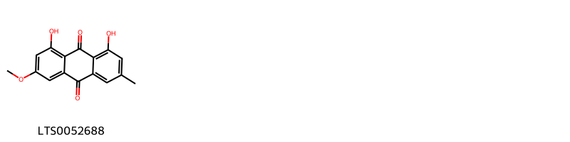{ width=100% }
    <figcaption>Hình ảnh cấu trúc hóa học của 1 hoạt chất thuộc nhóm Anthracenes gồm ['physcion (LTS0052688)'].</figcaption>
</figure>
### Nhóm Benzene and substituted derivatives
<figure markdown="span">
    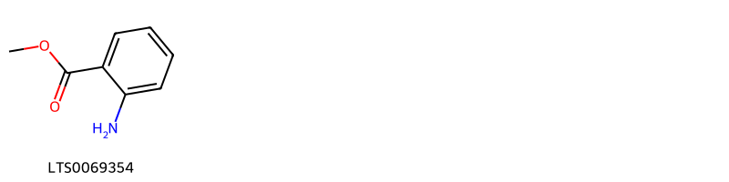{ width=100% }
    <figcaption>Hình ảnh cấu trúc hóa học của 1 hoạt chất thuộc nhóm Benzene and substituted derivatives gồm ['methyl anthranilate (LTS0069354)'].</figcaption>
</figure>
### Nhóm Cinnamic acids and derivatives
<figure markdown="span">
    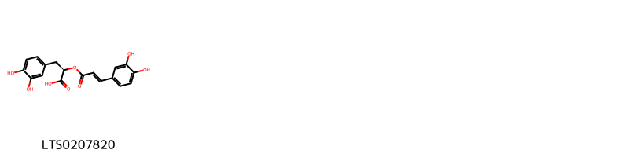{ width=100% }
    <figcaption>Hình ảnh cấu trúc hóa học của 1 hoạt chất thuộc nhóm Cinnamic acids and derivatives gồm ['rosemary acid (LTS0207820)'].</figcaption>
</figure>
### Nhóm Diazines
<figure markdown="span">
    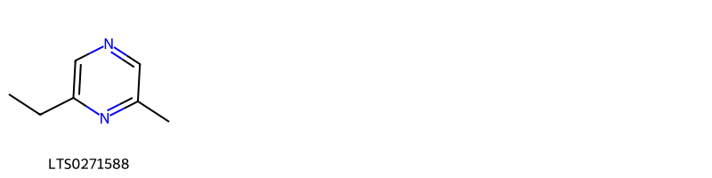{ width=100% }
    <figcaption>Hình ảnh cấu trúc hóa học của 1 hoạt chất thuộc nhóm Diazines gồm ['2-ethyl-6-methylpyrazine (LTS0271588)'].</figcaption>
</figure>
### Nhóm Fatty Acyls
<figure markdown="span">
    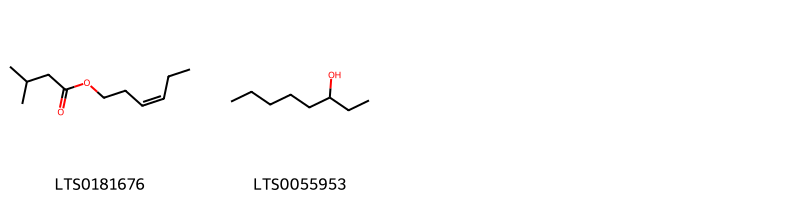{ width=100% }
    <figcaption>Hình ảnh cấu trúc hóa học của 2 hoạt chất thuộc nhóm Fatty Acyls gồm ['cis-3-hexenyl isovalerate (LTS0181676)', '3-octanol (LTS0055953)'].</figcaption>
</figure>
### Nhóm Flavonoids
<figure markdown="span">
    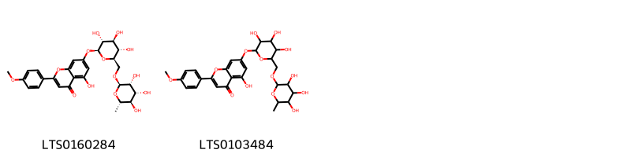{ width=100% }
    <figcaption>Hình ảnh cấu trúc hóa học của 2 hoạt chất thuộc nhóm Flavonoids gồm ['linarin (LTS0160284)', '5-hydroxy-2-(4-methoxyphenyl)-7-[(3,4,5-trihydroxy-6-{[(3,4,5-trihydroxy-6-methyloxan-2-yl)oxy]methyl}oxan-2-yl)oxy]chromen-4-one (LTS0103484)'].</figcaption>
</figure>
### Nhóm Organooxygen compounds
<figure markdown="span">
    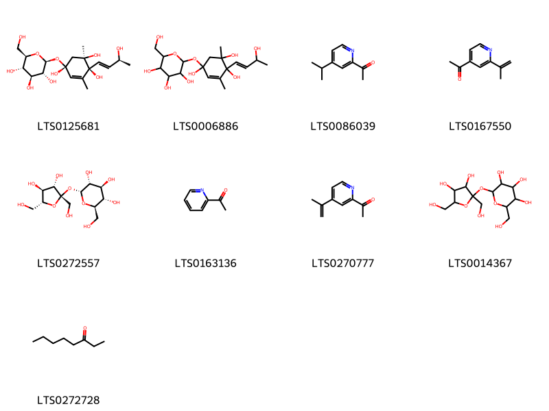{ width=100% }
    <figcaption>Hình ảnh cấu trúc hóa học của 9 hoạt chất thuộc nhóm Organooxygen compounds gồm ['(2r,3s,4s,5r,6s)-2-(hydroxymethyl)-6-{[(1r,4s,5r)-1,4,5-trihydroxy-4-[(1e,3s)-3-hydroxybut-1-en-1-yl]-3,5-dimethylcyclohex-2-en-1-yl]oxy}oxane-3,4,5-triol (LTS0125681)', '2-(hydroxymethyl)-6-{[1,4,5-trihydroxy-4-(3-hydroxybut-1-en-1-yl)-3,5-dimethylcyclohex-2-en-1-yl]oxy}oxane-3,4,5-triol (LTS0006886)', '2-acetyl-4-isopropylpyridine (LTS0086039)', '4-acetyl-2-isopropenylpyridine (LTS0167550)', 'sucrose (LTS0272557)', '2-acetylpyridine (LTS0163136)', '2-acetyl-4-isopropenylpyridine (LTS0270777)', 'granulated sugar (LTS0014367)', '3-octanone (LTS0272728)'].</figcaption>
</figure>
### Nhóm Oxepanes
<figure markdown="span">
    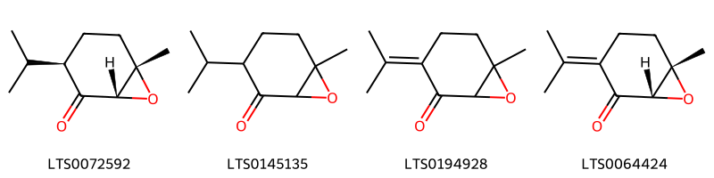{ width=100% }
    <figcaption>Hình ảnh cấu trúc hóa học của 4 hoạt chất thuộc nhóm Oxepanes gồm ['(1s,2s,4r)-piperitone oxide (LTS0072592)', '3-isopropyl-6-methyl-7-oxabicyclo[4.1.0]heptan-2-one (LTS0145135)', '6-methyl-3-(propan-2-ylidene)-7-oxabicyclo[4.1.0]heptan-2-one (LTS0194928)', 'piperitenone oxide (LTS0064424)'].</figcaption>
</figure>
### Nhóm Prenol lipids
<figure markdown="span">
    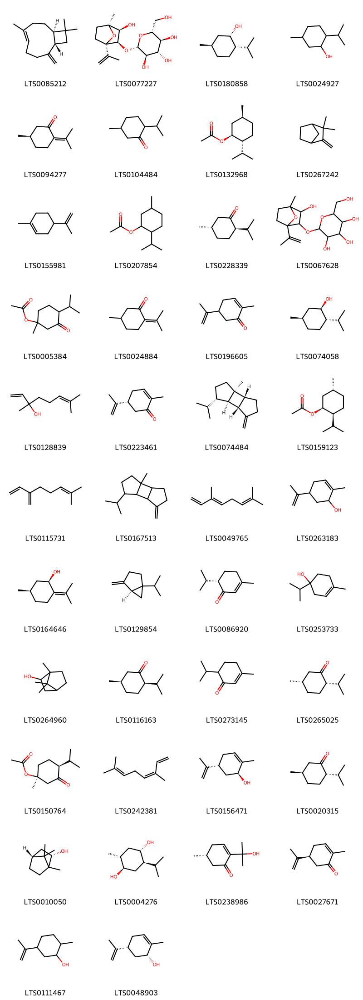{ width=100% }
    <figcaption>Hình ảnh cấu trúc hóa học của 42 hoạt chất thuộc nhóm Prenol lipids gồm ['caryophyllene (LTS0085212)', '(2s,3r,4s,5s,6r)-2-{[(1s,2r,3s,4s)-3-hydroxy-4-methyl-1-(prop-1-en-2-yl)-7-oxabicyclo[2.2.1]heptan-2-yl]oxy}-6-(hydroxymethyl)oxane-3,4,5-triol (LTS0077227)', '(+)-neomenthol (LTS0180858)', 'menthol natural (LTS0024927)', '(+)-pulegone (LTS0094277)', 'menthone (LTS0104484)', 'menthyl acetate (LTS0132968)', 'camphene (LTS0267242)', 'limonene,  (LTS0155981)', 'l-menthyl acetate (LTS0207854)', '(+)-menthone (LTS0228339)', '2-{[3-hydroxy-4-methyl-1-(prop-1-en-2-yl)-7-oxabicyclo[2.2.1]heptan-2-yl]oxy}-6-(hydroxymethyl)oxane-3,4,5-triol (LTS0067628)', '4-isopropyl-1-methyl-3-oxocyclohexyl acetate (LTS0005384)', '(+-)-pulegone (LTS0024884)', 'carvone (LTS0196605)', 'menthol (LTS0074058)', 'linalool, (+-)- (LTS0128839)', '(-)-carvone (LTS0223461)', 'β-bourbonene (LTS0074484)', 'neomenthyl acetate (LTS0159123)', 'α-myrcene (LTS0115731)', 'β-bourbonene (LTS0167513)', 'trans-β-ocimene (LTS0049765)', 'carveol (LTS0263183)', '(1r,5r)-5-methyl-2-(propan-2-ylidene)cyclohexan-1-ol (LTS0164646)', '(5s)-1-isopropyl-4-methylidenebicyclo[3.1.0]hexane (LTS0129854)', 'α-piperitone (LTS0086920)', '4-terpineol (LTS0253733)', 'borneol (LTS0264960)', '(+)-isomenthone (LTS0116163)', 'piperitone (LTS0273145)', '(-)-isomenthone (LTS0265025)', '(1s,4s)-4-isopropyl-1-methyl-3-oxocyclohexyl acetate (LTS0150764)', 'β-ocimene (LTS0242381)', '(-)-trans-carveol (LTS0156471)', '(-)-menthone (LTS0020315)', '(2s,4r)-1,7,7-trimethylbicyclo[2.2.1]heptan-2-ol (LTS0010050)', '(1s,2r,4r,5r)-2-isopropyl-5-methylcyclohexane-1,4-diol (LTS0004276)', '(5r)-2-(2-hydroxypropan-2-yl)-5-methylcyclohex-2-en-1-one (LTS0238986)', 'carvone, (+)- (LTS0027671)', 'dihydrocarveol (LTS0111467)', '(-)-cis-carveol (LTS0048903)'].</figcaption>
</figure>
### Nhóm Pyrans
<figure markdown="span">
    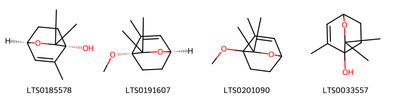{ width=100% }
    <figcaption>Hình ảnh cấu trúc hóa học của 4 hoạt chất thuộc nhóm Pyrans gồm ['(1r,4r)-3,3,5-trimethyl-2-oxabicyclo[2.2.2]oct-5-en-4-ol (LTS0185578)', '(1r,4r)-4-methoxy-3,3,5-trimethyl-2-oxabicyclo[2.2.2]oct-5-ene (LTS0191607)', '4-methoxy-3,3,5-trimethyl-2-oxabicyclo[2.2.2]oct-5-ene (LTS0201090)', '3,3,5-trimethyl-2-oxabicyclo[2.2.2]oct-5-en-4-ol (LTS0033557)'].</figcaption>
</figure>
### Nhóm Pyridines and derivatives
<figure markdown="span">
    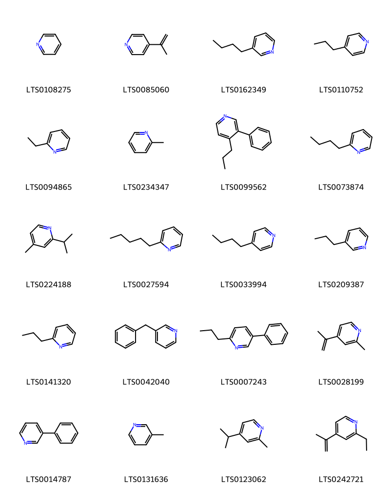{ width=100% }
    <figcaption>Hình ảnh cấu trúc hóa học của 20 hoạt chất thuộc nhóm Pyridines and derivatives gồm ['pyridine (LTS0108275)', '4-(prop-1-en-2-yl)pyridine (LTS0085060)', '3-butylpyridine (LTS0162349)', '4-propylpyridine (LTS0110752)', '2-ethylpyridine (LTS0094865)', 'α-methylpyridine (LTS0234347)', '3-phenyl-4-propylpyridine (LTS0099562)', '2-butylpyridine (LTS0073874)', '2-isopropyl-4-methylpyridine (LTS0224188)', '2-pentylpyridine (LTS0027594)', '4-butylpyridine (LTS0033994)', '3-propylpyridine (LTS0209387)', 'pyridine, 2-propyl- (LTS0141320)', '3-benzylpyridine (LTS0042040)', '5-phenyl-2-propylpyridine (LTS0007243)', '2-methyl-4-(prop-1-en-2-yl)pyridine (LTS0028199)', '3-phenylpyridine (LTS0014787)', '3-methylpyridine (LTS0131636)', '4-isopropyl-2-methylpyridine (LTS0123062)', '2-ethyl-4-(prop-1-en-2-yl)pyridine (LTS0242721)'].</figcaption>
</figure>
### Nhóm Quinolines and derivatives
<figure markdown="span">
    { width=100% }
    <figcaption>Hình ảnh cấu trúc hóa học của 1 hoạt chất thuộc nhóm Quinolines and derivatives gồm ['cinch (LTS0092379)'].</figcaption>
</figure>
### Nhóm Steroids and steroid derivatives
<figure markdown="span">
    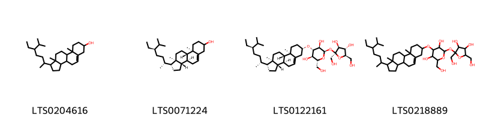{ width=100% }
    <figcaption>Hình ảnh cấu trúc hóa học của 4 hoạt chất thuộc nhóm Steroids and steroid derivatives gồm ['stigmast-5-en-3-ol, (3β)- (LTS0204616)', 'stigmast-5-en-3-ol (LTS0071224)', '(2r,3r,4s,5r,6r)-4-{[(1r,3as,3bs,7s,9ar,9bs,11ar)-1-[(2r,5r)-5-ethyl-6-methylheptan-2-yl]-9a,11a-dimethyl-1h,2h,3h,3ah,3bh,4h,6h,7h,8h,9h,9bh,10h,11h-cyclopenta[a]phenanthren-7-yl]oxy}-2-{[(2s,3s,4s,5r)-3,4-dihydroxy-2,5-bis(hydroxymethyl)oxolan-2-yl]oxy}-6-(hydroxymethyl)oxane-3,5-diol (LTS0122161)', '2-{[3,4-dihydroxy-2,5-bis(hydroxymethyl)oxolan-2-yl]oxy}-4-{[1-(5-ethyl-6-methylheptan-2-yl)-9a,11a-dimethyl-1h,2h,3h,3ah,3bh,4h,6h,7h,8h,9h,9bh,10h,11h-cyclopenta[a]phenanthren-7-yl]oxy}-6-(hydroxymethyl)oxane-3,5-diol (LTS0218889)'].</figcaption>
</figure>
### Nhóm Unsaturated hydrocarbons
<figure markdown="span">
    { width=100% }
    <figcaption>Hình ảnh cấu trúc hóa học của 1 hoạt chất thuộc nhóm Unsaturated hydrocarbons gồm ['α terpinene (LTS0232891)'].</figcaption>
</figure>

---

## Tác dụng dược lý

Theo tài liệu "Những cây thuốc và vị thuốc Việt Nam" - Đỗ Tất Lợi:Cảm giác mát và gây tê tại chỗ
Sát trùng mạnh
Gây ra mồ hôi và hạ nhiệt cơ thể

Theo tài liệu quốc tế: Similar to Peppermint Oil.

---

## Dược điển Việt Nam V

### Soi bột:

Bột có màu xanh lục nhạt, mùi thơm mát. Soi kính hiển vi thấy: Màng biểu bì có màng hơi ngoan ngoèo mang lỗ khí kiểu trực bào. Một số chúng có nhiều lông che chở, một số có rất ít. Lông che chở gồm các tế bào dài gần bằng nhau, bề mặt lấm tấm, hay có đoạn thất ở khoảng giữa. Lông tiết có nhiều, chân ngắn, đầu một hoặc nhiều tế bào (thường là hai, bốn, tám tế bào) chứa tinh dầu màu vàng nhạt, chiết quang, thường gặp ở dạng tròn, không thấy chân. Màng mô mềm của lá và thân, mảnh mạch vạch, mạch xoắn; đám sợi, tế bào mô cứng của thân già. Nếu là bột lấy từ cành có hoa thì ngoài các thành phần nêu trên còn có mảnh cánh hoa, đài hoa, chỉ nhị, hạt phấn hoa…nn

<!-- Hình ảnh soi bột sẽ được tự động chèn vào đây sau -->
### Vi phẫu:

Lá: Biểu bì trên và dưới mang lông che chở nhiều hay rất hiếm tùy theo chủng hay thứ, thường tập trung ở gần giữa. Lông che chở đa bào một dãy, thường có từ 2 đến 6 tế bào, bề mặt lấm tấm, có đoạn bị thắt hẹp lại. Lông tiết rất nhiều, có trên cả hai mặt lá, chứa đầy tinh dầu; có hai loại: lông tiết đầu đơn bào, hình bầu dục, chân ngắn; và loại lông tiết đa bào, đầu to tròn có từ 4 đến 8 tế bào chứa tinh dầu, chân một tế bào, thường nằm trong vùng lõm của biểu bì trên và dưới. Hai đám mô dày nằm sát biểu bì trên và dưới ở phần gân chính. Bó libe-gỗ hình cung, nằm giữa phần mô mềm của gân chính. Phía dưới bỏ libe-gỗ có cung mô dày bao bọc cung libe. Phần phiến lá có mô mềm giậu ờ sát biểu bì trên, gồm một hàng tế bào hình chữ nhật xếp sát nhau, bên dưới là mô mềm khuyết. Thân: Vi phẫu thân có thiết diện vuông với bốn góc lồi nhiều hoặc ít. Biểu bì mang lông che chở và lông tiết như ở lá. Bên dưới biểu bì là mô dày, thường tập trung nhiều ờ bốn góc lồi, mô mềm vỏ thường là mô mềm khuyết. Ờ thân già thường có các đám sợi trụ bì tập trung ở nơi ứng với bốn góc lồi. Mạch gỗ cấp 2, bó gỗ cấp 1 thường tập trung tại bốn góc lồi làm cho cấu tạo thân ở bốn góc khác ở cạnh. Mô mềm tủy có thể hóa mô cứng một phần ở vùng sát với gồ cấp 1.

<!-- Hình ảnh vi phẫu sẽ được tự động chèn vào đây sau -->
### Định tính

Phương pháp sắc ký lớp mỏng (Phụ lục 5.4). Bản mỏng: Silica gel G Dung môi khai triển: Cyclohexan – ethyl acetat – ace ton (8 : 1 : 1). Dung dịch thử: Lấy khoảng 0,2 ml tinh dầu bạc hà được ở phần Định lượng, hòa trong 1 ml croloform (TT) dùng làm dung dịch thử. Dung dịch đối chiếu: Dung dịch menthol 0,1 % trong crolofonp (TT). Cách tiến hành: Chấm riêng biệt lên bản mỏng khoảng 10 pl mỗi dung dịch trên. Triển khai sắc ký đến khi dung môi đi được khoảng 12 cm, lấy bản mỏng ra, phun lên bản mỏng dung dịch vanilin 1% trong acid sulfuric (TT). sấy bản mỏng ờ 100 °c đến 105 °c trong khoảng 5 min. Quan sát dưới ánh sáng thường. Trên sắc ký đồ của dung dịch thử phải có hơn 5 vết màu xanh, tím hay xanh tím, trong đó có một vết to nhất và đậm nhất có cùng màu sắc và giá trị R.f với vết menthol của dung dịch đối chiếu.

### Định lượng

Định lượng tinh dầu trong dược liệu (Phụ lục 12.7). Lấy chính xác khoảng 30 g dược liệu khô đã cắt nhỏ vào bình cầu dung tích 500 ml của bộ dụng cụ định lượng tinh dầu trong dược liệu (tinh dầu nhẹ hơn nước). Thêm 300 ml nước, tiến hành cất trong 3 h với tốc độ 2,5 ml/min đến 3,5 ml/min. Dược liệu phải chứa ít nhất 1,0 % tinh dầu, tính theo dược liệu khô kiệt.

### Thông tin khác 
- ** Độ ẩm: ** 
Không quá 13,0 % (Phụ lục 12.13), dùng 10 g dược liệu đã cắt nhỏ.

- ** Bảo quản:** 
Để nơi khô, mát; từng thời gian kiêm tra lại hàm lượng tinh dầu.nn

## Dược điển Hồng kong

<!-- PDF sẽ được tự động chèn vào đây sau -->

---

## Y dược học cổ truyền

- **Tên vị thuốc:** Bạc hà
- **Tính vị quy kinh:** Tân lương. Vào các kinh phế, can.
- **Công năng chủ trị:** Sơ phong thanh nhiệt, thấu chẩn, sơ can giải uất. 
Chú trị: Cảm mạo phong nhiệt, đau đầu, đau mắt đỏ; thúc đẩy sởi đậu mọc; can uất ngực sườn căng tức
- **Chú ý:** 
- **Kiêng kỵ:** 
Người khí hư huyết táo, mồ hôi nhiều, trẻ em dưới 1 tuổi không nên dùng.

