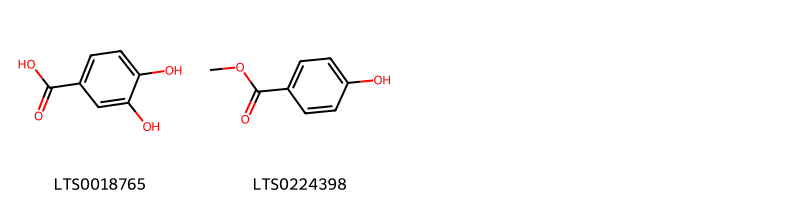
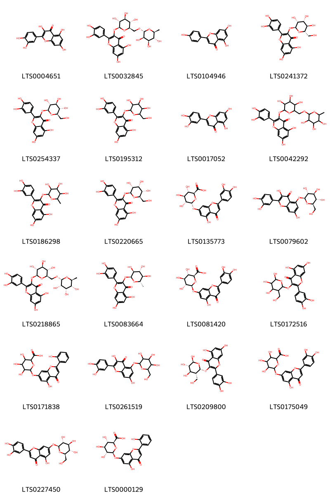
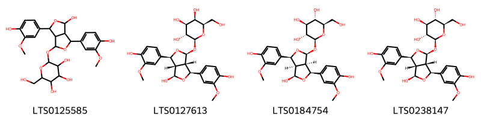
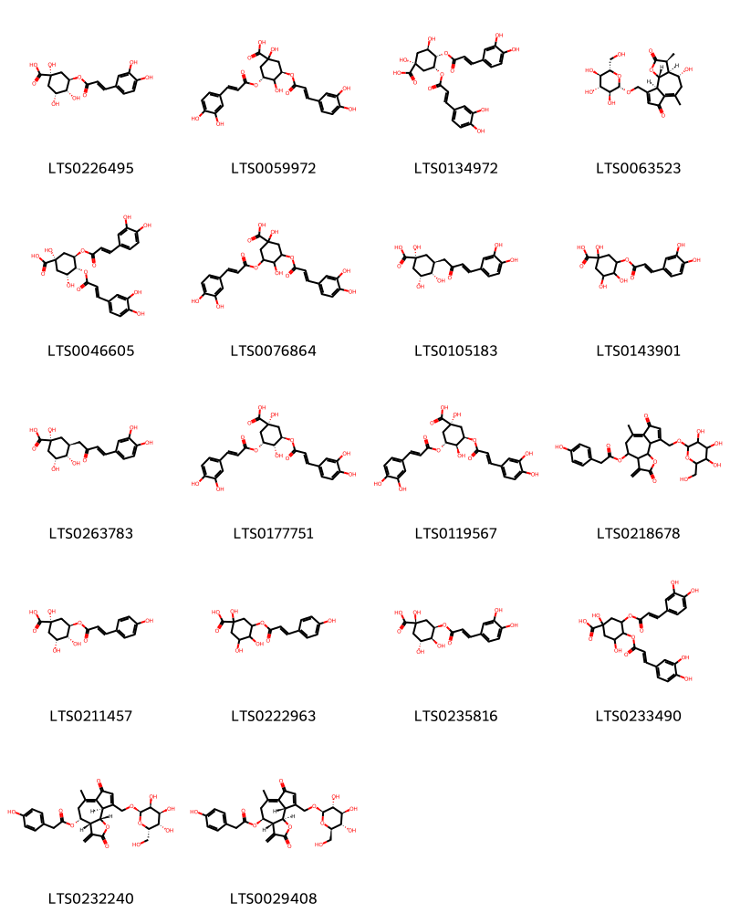

!!! abstract "Tóm tắt"
    Bồ công anh (Lactuca indica L.), thuộc họ Asteraceae (họ Cúc), là loài cây mọc hoang và được trồng rộng rãi ở các vùng nhiệt đới và ôn đới, đặc biệt ở Đông Á và Đông Nam Á, trong đó có Việt Nam. Loài cây này thường mọc ở các bãi đất hoang, ven đường hoặc vùng đồi núi thấp. Trong y học cổ truyền, Bồ công anh là một vị thuốc kinh nghiệm trong nhân dân để chữa bệnh sưng vú, tắc tia sữa, mụn nhọt đang sưng mủ, hay bị mụn nhọt, đinh râu.
Còn dùng uống trong chữa bệnh đau dạ dày, ăn uống kém tiêu Thành phần hóa học của Lactuca indica bao gồm các hợp chất hoạt tính như alkaloid, flavonoid, terpenoid, saponin, trong đó đặc biệt là luteolin˗7˗O˗β˗D˗glucoside, một hợp chất có tác dụng chống viêm mạnh.

## Thông tin về thực vật

### Đặc điểm thực vật

Dược liệu **Bồ Công Anh (Lá, Toàn Cây Trừ Rễ)** từ bộ phận **nan** từ loài *Lactuca indica L.* thuộc họ Asteraceae. Bồ công anh là một cây nhỏ, cao 0,60m đến 1m, có thể cao tới 3m. Thân mọc thẳng, nhẵn, không cành hoặc rất ít cành. Lá có nhiều hình dạng; lá phía dưới dài 30cm, rộng 5-6cm. gần như không cuống, chia thành nhiều thùy hay răng cưa to thô, lá phía trên ngắn hơn, nguyên chứ không chia thùy, mép có răng cưa thưa. Bấm lá và thân đều thấy tiết ra nhũ dịch màu trắng đục như sữa, vị hơi đắng. Cụm hoa hình đầu, màu vàng, có loại tím. 

!!! info "Phân loại thực vật của *Lactuca indica*"
    - **Kingdom:** Plantae
    - **Phylum:** Tracheophyta
    - **Order:** Asterales
    - **Family:** Asteraceae
    - **Genus:** Lactuca
    - **Species:** *Lactuca indica*

*Tài liệu tham khảo:* "Những cây thuốc và vị thuốc Việt Nam" - Đỗ Tất Lợi

 

### Loài thay thế (Nếu có)

### Phân bố trên thế giới
**Từ vườn thực vật KEW: **: Amur, Assam, Cambodia, China North-Central, China South-Central, China Southeast, Chita, East Himalaya, Hainan, Inner Mongolia, Japan, Jawa, Khabarovsk, Korea, Laos, Manchuria, Nansei-shoto, Philippines, Primorye, Taiwan, Thailand, Tibet, Vietnam

**Từ CSDL GIBF** Réunion, Brazil, Korea, Republic of, China, Japan, Chinese Taipei, South Africa, Russian Federation

### Phân bố tại Việt Nam
** "Những cây thuốc và vị thuốc Việt Nam" - Đỗ Tất Lợi**: mọc hoang tại những vùng núi cao ở nước ta như Tam Đảo, Sapa, Đà Lạt.

**Từ CSDL GIBF**: Không có ghi nhận ở Việt Nam

---

## Thông tin về dược liệu 

### Định danh

!!! info "Thông tin về tên gọi của nan"
    - Dược liệu tiếng Việt: nan
    - Dược liệu tiếng Trung: nan (nan)
    - Dược liệu tiếng Anh: nan
    - Dược liệu latin thông dụng: nan
    - Dược liệu latin kiểu DĐVN: lactuca indica l.
    - Dược liệu latin kiểu DĐVN: nan
    - Dược liệu latin kiểu thông tư: nan
    - Bộ phận dùng: nan (nan)

### Mô tả dược liệu 
- **Theo dược điển Việt nam V:** nan

- **Mô tả dược liệu theo thông tư chế biến dược liệu theo phương pháp cổ truyền:** nan

### Chế biến 

- **Chế biến theo dược điển việt nam V**: nan

- **Chế biến theo thông tư:** nan

--- 

## Thành phần hóa học

- Theo tài liệu của GS. Đỗ Tất Lợi:  (1) Nhóm hóa học: Alkaloids, Flavonoids, Phenolic compounds,  Triterpenoids, Saponins , Essential oils (Tinh dầu) và Tannin
(2) luteolin˗7˗O˗β˗D˗glucoside
    
- Theo cơ sở dữ liệu lotus: Từ loài *Lactuca indica* đã phân lập và xác định được 96 hoạt chất thuộc về các nhóm Lignan glycosides, Lactones, Organooxygen compounds, Prenol lipids, Carboxylic acids and derivatives, Benzene and substituted derivatives, Flavonoids. 

|    | chemicalTaxonomyClassyfireClass     |   smiles_count |
|---:|:------------------------------------|---------------:|
|  0 | Benzene and substituted derivatives |              2 |
|  1 | Carboxylic acids and derivatives    |              2 |
|  2 | Flavonoids                          |             22 |
|  3 | Lactones                            |              7 |
|  4 | Lignan glycosides                   |              4 |
|  5 | Organooxygen compounds              |             18 |
|  6 | Prenol lipids                       |             41 |

### Nhóm Benzene and substituted derivatives
<figure markdown="span">
    { width=100% }
    <figcaption>Hình ảnh cấu trúc hóa học của 2 hoạt chất thuộc nhóm Benzene and substituted derivatives gồm ['3,4-dihydroxybenzoic acid (LTS0018765)', 'paraben (LTS0224398)'].</figcaption>
</figure>
### Nhóm Carboxylic acids and derivatives
<figure markdown="span">
    { width=100% }
    <figcaption>Hình ảnh cấu trúc hóa học của 2 hoạt chất thuộc nhóm Carboxylic acids and derivatives gồm ['[(3ar,4s,9as,9br)-4-{[(3s,3ar,4s,9as,9br)-9-({[2-(4-hydroxyphenyl)acetyl]oxy}methyl)-3,6-dimethyl-2,7-dioxo-3h,3ah,4h,5h,9ah,9bh-azuleno[4,5-b]furan-4-yl]oxy}-6-methyl-3-methylidene-2,7-dioxo-3ah,4h,5h,9ah,9bh-azuleno[4,5-b]furan-9-yl]methyl 2-(4-hydroxyphenyl)acetate (LTS0031999)', '(4-{[9-({[2-(4-hydroxyphenyl)acetyl]oxy}methyl)-3,6-dimethyl-2,7-dioxo-3h,3ah,4h,5h,9ah,9bh-azuleno[4,5-b]furan-4-yl]oxy}-6-methyl-3-methylidene-2,7-dioxo-3ah,4h,5h,9ah,9bh-azuleno[4,5-b]furan-9-yl)methyl 2-(4-hydroxyphenyl)acetate (LTS0021330)'].</figcaption>
</figure>
### Nhóm Flavonoids
<figure markdown="span">
    { width=100% }
    <figcaption>Hình ảnh cấu trúc hóa học của 22 hoạt chất thuộc nhóm Flavonoids gồm ['quercetin (LTS0004651)', '3-rutinosyl quercetin (LTS0032845)', 'chamomile (LTS0104946)', '2-(3,4-dihydroxyphenyl)-5,7-dihydroxy-3-{[(2s,3r,4r,5r,6s)-3,4,5-trihydroxy-6-(hydroxymethyl)oxan-2-yl]oxy}chromen-4-one (LTS0241372)', 'isoquercetin (LTS0254337)', '2-(3,4-dihydroxyphenyl)-5,7-dihydroxy-3-{[3,4,5-trihydroxy-6-(hydroxymethyl)oxan-2-yl]oxy}chromen-4-one (LTS0195312)', 'luteolin (LTS0017052)', 'rutin (LTS0042292)', 'quercitrin (LTS0186298)', '2-(3,4-dihydroxyphenyl)-5,7-dihydroxy-3-{[(2s,3r,4r,5s,6r)-3,4,5-trihydroxy-6-(hydroxymethyl)oxan-2-yl]oxy}chromen-4-one (LTS0220665)', '(2s,3s,4s,5r,6r)-6-{[2-(3,4-dihydroxyphenyl)-5-hydroxy-4-oxochromen-7-yl]oxy}-3,4,5-trihydroxyoxane-2-carboxylic acid (LTS0135773)', '2-(3,4-dihydroxyphenyl)-3,7-dihydroxy-5-{[(2s,3r,4s,5s,6r)-3,4,5-trihydroxy-6-(hydroxymethyl)oxan-2-yl]oxy}chromen-4-one (LTS0079602)', '2-(3,4-dihydroxyphenyl)-5,7-dihydroxy-3-{[(2s,3r,4s,5s,6r)-3,4,5-trihydroxy-6-({[(2r,3s,4s,5r,6s)-3,4,5-trihydroxy-6-methyloxan-2-yl]oxy}methyl)oxan-2-yl]oxy}chromen-4-one (LTS0218865)', '2-(3,4-dihydroxyphenyl)-5,7-dihydroxy-3-{[(2s,3s,4r,5r,6s)-3,4,5-trihydroxy-6-methyloxan-2-yl]oxy}chromen-4-one (LTS0083664)', 'luteolin 7-o-glucuronide (LTS0081420)', '2-(3,4-dihydroxyphenyl)-5,7-dihydroxy-3-{[4,5,6-trihydroxy-3-(hydroxymethyl)oxan-2-yl]oxy}chromen-4-one (LTS0172516)', '3,4,5-trihydroxy-6-{[5-hydroxy-2-(2-hydroxyphenyl)-4-oxochromen-7-yl]oxy}oxane-2-carboxylic acid (LTS0171838)', '2-(3,4-dihydroxyphenyl)-3,7-dihydroxy-5-{[3,4,5-trihydroxy-6-(hydroxymethyl)oxan-2-yl]oxy}chromen-4-one (LTS0261519)', '2-(3,4-dihydroxyphenyl)-5,7-dihydroxy-3-{[(2s,3r,4r,5s,6s)-4,5,6-trihydroxy-3-(hydroxymethyl)oxan-2-yl]oxy}chromen-4-one (LTS0209800)', '6-{[2-(3,4-dihydroxyphenyl)-5-hydroxy-4-oxochromen-7-yl]oxy}-3,4,5-trihydroxyoxane-2-carboxylic acid (LTS0175049)', 'luteolin 7-o-glucoside (LTS0227450)', '(2s,3s,4s,5r,6s)-3,4,5-trihydroxy-6-{[5-hydroxy-2-(2-hydroxyphenyl)-4-oxochromen-7-yl]oxy}oxane-2-carboxylic acid (LTS0000129)'].</figcaption>
</figure>
### Nhóm Lactones
<figure markdown="span">
    { width=100% }
    <figcaption>Hình ảnh cấu trúc hóa học của 7 hoạt chất thuộc nhóm Lactones gồm ['9-(hydroxymethyl)-4-{[9-(hydroxymethyl)-3,6-dimethyl-2,7-dioxo-3h,3ah,4h,5h,9ah,9bh-azuleno[4,5-b]furan-4-yl]oxy}-6-methyl-3-methylidene-3ah,4h,5h,9ah,9bh-azuleno[4,5-b]furan-2,7-dione (LTS0182485)', '(3ar,4s,9as,9br)-4-{[(3s,3ar,4s,9as,9br)-3,6,9-trimethyl-2,7-dioxo-3h,3ah,4h,5h,9ah,9bh-azuleno[4,5-b]furan-4-yl]oxy}-6,9-dimethyl-3-methylidene-3ah,4h,5h,9ah,9bh-azuleno[4,5-b]furan-2,7-dione (LTS0125854)', '(3s,3ar,4s,9ar,9br)-4-hydroxy-9-(hydroxymethyl)-3,6-dimethyl-3h,3ah,4h,5h,9ah,9bh-azuleno[4,5-b]furan-2,7-dione (LTS0181022)', '11β,13-dihydrolactucin (LTS0097019)', '6,9-dimethyl-3-methylidene-4-({3,6,9-trimethyl-2,7-dioxo-3h,3ah,4h,5h,9ah,9bh-azuleno[4,5-b]furan-4-yl}oxy)-3ah,4h,5h,9ah,9bh-azuleno[4,5-b]furan-2,7-dione (LTS0233514)', '4-hydroxy-9-(hydroxymethyl)-3,6-dimethyl-3h,3ah,4h,5h,9ah,9bh-azuleno[4,5-b]furan-2,7-dione (LTS0266256)', '(3ar,4s,9as,9br)-4-{[(3s,3ar,4s,9as,9br)-9-(hydroxymethyl)-3,6-dimethyl-2,7-dioxo-3h,3ah,4h,5h,9ah,9bh-azuleno[4,5-b]furan-4-yl]oxy}-9-(hydroxymethyl)-6-methyl-3-methylidene-3ah,4h,5h,9ah,9bh-azuleno[4,5-b]furan-2,7-dione (LTS0113745)'].</figcaption>
</figure>
### Nhóm Lignan glycosides
<figure markdown="span">
    { width=100% }
    <figcaption>Hình ảnh cấu trúc hóa học của 4 hoạt chất thuộc nhóm Lignan glycosides gồm ['2-{[4-hydroxy-3,6-bis(4-hydroxy-3-methoxyphenyl)-hexahydrofuro[3,4-c]furan-1-yl]oxy}-6-(hydroxymethyl)oxane-3,4,5-triol (LTS0125585)', '(2s,3r,4s,5r,6r)-2-{[(1s,3s,3as,4r,6s,6as)-4-hydroxy-3,6-bis(4-hydroxy-3-methoxyphenyl)-hexahydrofuro[3,4-c]furan-1-yl]oxy}-6-(hydroxymethyl)oxane-3,4,5-triol (LTS0127613)', '(2s,3r,4s,5s,6r)-2-{[(1s,3s,3ar,4r,6s,6ar)-4-hydroxy-3,6-bis(4-hydroxy-3-methoxyphenyl)-hexahydrofuro[3,4-c]furan-1-yl]oxy}-6-(hydroxymethyl)oxane-3,4,5-triol (LTS0184754)', '(2s,3r,4s,5s,6r)-2-{[(1s,3s,3as,4r,6s,6as)-4-hydroxy-3,6-bis(4-hydroxy-3-methoxyphenyl)-hexahydrofuro[3,4-c]furan-1-yl]oxy}-6-(hydroxymethyl)oxane-3,4,5-triol (LTS0238147)'].</figcaption>
</figure>
### Nhóm Organooxygen compounds
<figure markdown="span">
    { width=100% }
    <figcaption>Hình ảnh cấu trúc hóa học của 18 hoạt chất thuộc nhóm Organooxygen compounds gồm ['chlorogenic acid (LTS0226495)', '(3r,5r)-3,5-bis({[(2e)-3-(3,4-dihydroxyphenyl)prop-2-enoyl]oxy})-1,4-dihydroxycyclohexane-1-carboxylic acid (LTS0059972)', '3,4-dicaffeoylquinic acid (LTS0134972)', '(3s,3as,4r,9ar,9bs)-4-hydroxy-3,6-dimethyl-9-({[(2s,3s,4r,5r,6s)-3,4,5-trihydroxy-6-(hydroxymethyl)oxan-2-yl]oxy}methyl)-3h,3ah,4h,5h,9ah,9bh-azuleno[4,5-b]furan-2,7-dione (LTS0063523)', '4,5-dicaffeoylquinic acid (LTS0046605)', '3,5-bis({[3-(3,4-dihydroxyphenyl)prop-2-enoyl]oxy})-1,4-dihydroxycyclohexane-1-carboxylic acid (LTS0076864)', '(1r,3s,4s,5r)-3-[(3e)-4-(3,4-dihydroxyphenyl)-2-oxobut-3-en-1-yl]-1,4,5-trihydroxycyclohexane-1-carboxylic acid (LTS0105183)', '3-{[3-(3,4-dihydroxyphenyl)prop-2-enoyl]oxy}-1,4,5-trihydroxycyclohexane-1-carboxylic acid (LTS0143901)', '(1r,3s,4s,5r)-3-[4-(3,4-dihydroxyphenyl)-2-oxobut-3-en-1-yl]-1,4,5-trihydroxycyclohexane-1-carboxylic acid (LTS0263783)', '3,5-dicaffeoylquinic acid (LTS0177751)', '(1r,3r,4r,5r)-3,5-bis({[(2e)-3-(3,4-dihydroxyphenyl)prop-2-enoyl]oxy})-1,4-dihydroxycyclohexane-1-carboxylic acid (LTS0119567)', '6-methyl-3-methylidene-2,7-dioxo-9-({[3,4,5-trihydroxy-6-(hydroxymethyl)oxan-2-yl]oxy}methyl)-3ah,4h,5h,9ah,9bh-azuleno[4,5-b]furan-4-yl 2-(4-hydroxyphenyl)acetate (LTS0218678)', '(1s,3r,4r,5r)-1,3,4-trihydroxy-5-{[(2e)-3-(4-hydroxyphenyl)prop-2-enoyl]oxy}cyclohexane-1-carboxylic acid (LTS0211457)', '1,3,4-trihydroxy-5-{[3-(4-hydroxyphenyl)prop-2-enoyl]oxy}cyclohexane-1-carboxylic acid (LTS0222963)', 'neochlorogenic acid (LTS0235816)', '3,4-bis({[3-(3,4-dihydroxyphenyl)prop-2-enoyl]oxy})-1,5-dihydroxycyclohexane-1-carboxylic acid (LTS0233490)', '(3ar,4r,9ar,9bs)-6-methyl-3-methylidene-2,7-dioxo-9-({[(2r,3s,4s,5s,6s)-3,4,5-trihydroxy-6-(hydroxymethyl)oxan-2-yl]oxy}methyl)-3ah,4h,5h,9ah,9bh-azuleno[4,5-b]furan-4-yl 2-(4-hydroxyphenyl)acetate (LTS0232240)', '(3ar,4s,9as,9br)-6-methyl-3-methylidene-2,7-dioxo-9-({[(2r,3r,4s,5s,6r)-3,4,5-trihydroxy-6-(hydroxymethyl)oxan-2-yl]oxy}methyl)-3ah,4h,5h,9ah,9bh-azuleno[4,5-b]furan-4-yl 2-(4-hydroxyphenyl)acetate (LTS0029408)'].</figcaption>
</figure>
### Nhóm Prenol lipids
<figure markdown="span">
    { width=100% }
    <figcaption>Hình ảnh cấu trúc hóa học của 41 hoạt chất thuộc nhóm Prenol lipids gồm ['β-amyrin (LTS0075776)', 'lupeol acetate (LTS0077599)', '(3s,4ar,6ar,6bs,8ar,12as,14ar,14br)-4,4,6a,6b,8a,11,11,14b-octamethyl-1,2,3,4a,5,6,7,8,9,10,12,12a,14,14a-tetradecahydropicen-3-ol (LTS0055441)', '(3s,4ar,6ar,6bs,8ar,12as,14ar,14br)-4,4,6a,6b,8a,11,11,14b-octamethyl-1,2,3,4a,5,6,7,8,9,10,12,12a,14,14a-tetradecahydropicen-3-yl acetate (LTS0085387)', '3a,5a,5b,8,8,11a-hexamethyl-1-(prop-1-en-2-yl)-hexadecahydrocyclopenta[a]chrysen-9-yl acetate (LTS0081577)', '(3as,6ar,8s,9ar,9bs)-3,6,9-trimethylidene-8-{[(2s,3r,4s,5r,6r)-3,4,5-trihydroxy-6-(hydroxymethyl)oxan-2-yl]oxy}-octahydroazuleno[4,5-b]furan-2-one (LTS0102937)', '1-isopropyl-3a,5b,8,8,11a,13a-hexamethyl-1h,2h,3h,4h,6h,7h,7ah,9h,10h,11h,11bh,12h,13h,13bh-cyclopenta[a]chrysen-9-yl acetate (LTS0088370)', '4,4,6a,6b,8a,11,11,14b-octamethyl-1,2,3,4a,5,6,7,8,9,10,12b,13,14,14a-tetradecahydropicen-3-yl acetate (LTS0157595)', '(3s,3as,5r,6ar,8s,9ar,9bs)-5,8-dihydroxy-3-methyl-6,9-dimethylidene-octahydro-3h-azuleno[4,5-b]furan-2-one (LTS0157918)', 'taraxasterol acetate (LTS0190545)', 'β-amyrin acetate (LTS0137234)', '(3s,3as,9s,11as)-9-hydroxy-3,10-dimethyl-2-oxo-3h,3ah,4h,5h,8h,9h,11ah-cyclodeca[b]furan-6-carbaldehyde (LTS0201023)', '(3r,3as,5ar,6r,9as,9bs)-6-hydroxy-3,5a,9-trimethyl-3h,3ah,4h,5h,6h,7h,9ah,9bh-naphtho[1,2-b]furan-2-one (LTS0140972)', '(3s,4ar,6bs,8ar,11r,12s,12ar,12bs,14ar,14br)-4,4,6b,8a,11,12,12b,14b-octamethyl-2,3,4a,5,7,8,9,10,11,12,12a,13,14,14a-tetradecahydro-1h-picen-3-yl acetate (LTS0163139)', '(1r,3ar,5br,7ar,9s,11ar,11br,13as,13br)-1-isopropyl-3a,5b,8,8,11a,13a-hexamethyl-1h,2h,3h,4h,6h,7h,7ah,9h,10h,11h,11bh,12h,13h,13bh-cyclopenta[a]chrysen-9-yl acetate (LTS0142260)', 'vernoflexuoside (LTS0127107)', '(3as,5r,6ar,8s,9ar,9bs)-5-hydroxy-3,6,9-trimethylidene-8-{[(2r,3r,4s,5s,6r)-3,4,5-trihydroxy-6-(hydroxymethyl)oxan-2-yl]oxy}-octahydroazuleno[4,5-b]furan-2-one (LTS0266397)', '(3s,4ar,6ar,6br,8ar,12bs,14ar,14br)-4,4,6a,6b,8a,11,11,14b-octamethyl-1,2,3,4a,5,6,7,8,9,10,12b,13,14,14a-tetradecahydropicen-3-yl acetate (LTS0111657)', '4,4,6a,6b,8a,11,12,14b-octamethyl-2,3,4a,5,6,7,8,9,10,11,12,12a,14,14a-tetradecahydro-1h-picen-3-yl acetate (LTS0185406)', '(3s,3as,9s,11ar)-9-hydroxy-3,10-dimethyl-2-oxo-3h,3ah,4h,5h,8h,9h,11ah-cyclodeca[b]furan-6-carbaldehyde (LTS0101081)', '4,4,6b,8a,11,12,12b,14b-octamethyl-2,3,4a,5,7,8,9,10,11,12,12a,13,14,14a-tetradecahydro-1h-picen-3-yl acetate (LTS0218301)', 'taraxasterol (LTS0210066)', '5,8-dihydroxy-3-methyl-6,9-dimethylidene-octahydro-3h-azuleno[4,5-b]furan-2-one (LTS0213242)', '4,4,6a,6b,8a,12,14b-heptamethyl-11-methylidene-hexadecahydropicen-3-yl acetate (LTS0026037)', '4,4,6a,6b,8a,11,11,14b-octamethyl-1,2,3,4a,5,6,7,8,9,10,12,12a,14,14a-tetradecahydropicen-3-yl acetate (LTS0153642)', '5,8-dihydroxy-3,6,9-trimethylidene-octahydroazuleno[4,5-b]furan-2-one (LTS0226448)', '9-hydroxy-3,10-dimethyl-2-oxo-3h,3ah,4h,5h,8h,9h,11ah-cyclodeca[b]furan-6-carbaldehyde (LTS0238785)', '(3s,3as,9s,11ar)-3,10-dimethyl-2-oxo-9-{[(2r,3r,4s,5s,6r)-3,4,5-trihydroxy-6-(hydroxymethyl)oxan-2-yl]oxy}-3h,3ah,4h,5h,8h,9h,11ah-cyclodeca[b]furan-6-carbaldehyde (LTS0164758)', '4,4,6a,6b,8a,12,14b-heptamethyl-11-methylidene-hexadecahydropicen-3-ol (LTS0256994)', '(3s,3as,6ar,8s,9ar,9bs)-3-methyl-6,9-dimethylidene-8-{[(2s,3r,4s,5s,6r)-3,4,5-trihydroxy-6-(hydroxymethyl)oxan-2-yl]oxy}-octahydro-3h-azuleno[4,5-b]furan-2-one (LTS0064397)', '(3s,3as,9s,11as)-3,10-dimethyl-2-oxo-9-{[(2r,3r,4s,5s,6r)-3,4,5-trihydroxy-6-(hydroxymethyl)oxan-2-yl]oxy}-3h,3ah,4h,5h,8h,9h,11ah-cyclodeca[b]furan-6-carbaldehyde (LTS0062716)', '(3as,5r,6ar,8s,9ar,9bs)-5,8-dihydroxy-3,6,9-trimethylidene-octahydroazuleno[4,5-b]furan-2-one (LTS0064728)', '6-(hydroxymethyl)-3,10-dimethyl-9-{[3,4,5-trihydroxy-6-(hydroxymethyl)oxan-2-yl]oxy}-3h,3ah,4h,5h,8h,9h,11ah-cyclodeca[b]furan-2-one (LTS0060549)', '(3s,3as,5ar,6r,9as,9bs)-6-hydroxy-3,5a,9-trimethyl-3h,3ah,4h,5h,6h,7h,9ah,9bh-naphtho[1,2-b]furan-2-one (LTS0264280)', '3-methyl-6,9-dimethylidene-8-{[3,4,5-trihydroxy-6-(hydroxymethyl)oxan-2-yl]oxy}-octahydro-3h-azuleno[4,5-b]furan-2-one (LTS0023778)', '(3s,3as,9r,11as)-3,10-dimethyl-2-oxo-9-{[(2r,3r,4s,5s,6r)-3,4,5-trihydroxy-6-(hydroxymethyl)oxan-2-yl]oxy}-3h,3ah,4h,5h,8h,9h,11ah-cyclodeca[b]furan-6-carbaldehyde (LTS0015228)', '(3s,3as,9s,11as)-6-(hydroxymethyl)-3,10-dimethyl-9-{[(2r,3r,4s,5s,6r)-3,4,5-trihydroxy-6-(hydroxymethyl)oxan-2-yl]oxy}-3h,3ah,4h,5h,8h,9h,11ah-cyclodeca[b]furan-2-one (LTS0106757)', 'α-amyrin acetate (LTS0224810)', '(3s,3as,9s,11ar)-6-(hydroxymethyl)-3,10-dimethyl-9-{[(2r,3r,4s,5s,6r)-3,4,5-trihydroxy-6-(hydroxymethyl)oxan-2-yl]oxy}-3h,3ah,4h,5h,8h,9h,11ah-cyclodeca[b]furan-2-one (LTS0130289)', '(3s,3as,9r,11as)-6-(hydroxymethyl)-3,10-dimethyl-9-{[(2r,3r,4s,5s,6r)-3,4,5-trihydroxy-6-(hydroxymethyl)oxan-2-yl]oxy}-3h,3ah,4h,5h,8h,9h,11ah-cyclodeca[b]furan-2-one (LTS0258675)', '3,10-dimethyl-2-oxo-9-{[3,4,5-trihydroxy-6-(hydroxymethyl)oxan-2-yl]oxy}-3h,3ah,4h,5h,8h,9h,11ah-cyclodeca[b]furan-6-carbaldehyde (LTS0225406)'].</figcaption>
</figure>

---

## Tác dụng dược lý

Theo tài liệu "Những cây thuốc và vị thuốc Việt Nam" - Đỗ Tất Lợi:- Không có độc, có tính chất gây ngủ nhẹ
- Tác dụng chống oxy hóa
- Tác dụng chống viêm
- Tác dụng lợi tiểu và hỗ trợ tiêu hóa

Theo tài liệu quốc tế: nan

---

## Dược điển Việt Nam V

### Soi bột:
nan
<!-- Hình ảnh soi bột sẽ được tự động chèn vào đây sau -->
### Vi phẫu:
nan
<!-- Hình ảnh vi phẫu sẽ được tự động chèn vào đây sau -->
### Định tính

nan

### Định lượng

nan

### Thông tin khác 
- ** Độ ẩm: ** nan

- ** Bảo quản:** nan
## Dược điển Hồng kong

<!-- PDF sẽ được tự động chèn vào đây sau -->

---

## Y dược học cổ truyền

- **Tên vị thuốc:** nan
- **Tính vị quy kinh:** Cam, vi khổ, hàn. Vào các kinh can, vị
- **Công năng chủ trị:** Thanh nhiệt giải độc, tiêu viêm tán kết.
Chủ trị: Mụn nhọt sang lở, tắc tia sữa, viêm tuyến vú, nhiễm trùng đường tiết niệu.
- **Chú ý:** nan
- **Kiêng kỵ:** nan

